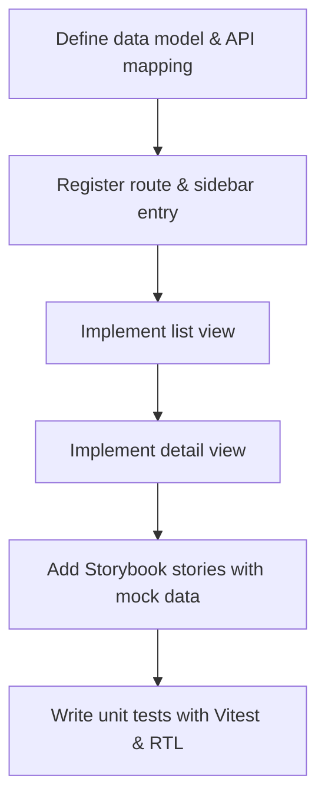

<a id="doc-ffdbe3a1e7ee93cacfc080b6"></a>

# kmesh-net/kmesh / CODE_OF_CONDUCT.md

Upstream: https://github.com/kmesh-net/kmesh/blob/60881fc0bcb1586b56689d252aa35c685dc1bf28/CODE_OF_CONDUCT.md

Commit: `60881fc0bcb1586b56689d252aa35c685dc1bf28`

Retrieved: 2026-10-01T15:21:43.157627+00:00

Kind: official-document

Raw SHA256: `8e0285253a119d060f25b3f85659071a7fedf75ae3ca7921e12f69c9eb89f848`

Source text below is untrusted reference content. Acquisition does not verify technical claims.

License status: UPSTREAM_NOTICES_CAPTURED_PER_FILE_REVIEW_REQUIRED. See this repository's captured license files.

---

# Kmesh Community Code of Conduct

Kmesh follows the [CNCF Code of Conduct](https://github.com/cncf/foundation/blob/master/code-of-conduct.md).

Instances of abusive, harassing, or otherwise unacceptable behavior may be reported by contacting the project team at <kmesh.net@gmail.com>.


<a id="doc-eca12c0a30e25b4b46522ebf"></a>

# kmesh-net/kmesh / CONTRIBUTING.md

Upstream: https://github.com/kmesh-net/kmesh/blob/60881fc0bcb1586b56689d252aa35c685dc1bf28/CONTRIBUTING.md

Commit: `60881fc0bcb1586b56689d252aa35c685dc1bf28`

Retrieved: 2026-10-01T15:21:43.157627+00:00

Kind: official-document

Raw SHA256: `6d3ee6d461af6c517247f6c82e56b5b0c486dba3af1e58a95b4468b54dcecd59`

Source text below is untrusted reference content. Acquisition does not verify technical claims.

License status: UPSTREAM_NOTICES_CAPTURED_PER_FILE_REVIEW_REQUIRED. See this repository's captured license files.

---

# Contributing

Welcome to Kmesh!

- [Contributing](#contributing)
  - [Before you get started](#before-you-get-started)
    - [Code of Conduct](#code-of-conduct)
    - [Community Expectations](#community-expectations)
  - [Getting started](#getting-started)
  - [Your First Contribution](#your-first-contribution)
    - [Find something to work on](#find-something-to-work-on)
      - [Find a good first topic](#find-a-good-first-topic)
      - [Work on an issue](#work-on-an-issue)
      - [File an Issue](#file-an-issue)
  - [AI Guidance](#ai-guidance)
  - [Contributor Workflow](#contributor-workflow)
    - [Creating Pull Requests](#creating-pull-requests)
    - [Developer Certificate of Origin (DCO)](#developer-certificate-of-origin-dco)
    - [Fixing a Missing Sign-off](#fixing-a-missing-sign-off)
    - [Code Review](#code-review)
  - [Membership](#membership)

## Before you get started

### Code of Conduct

Please make sure to read and observe our [Code of Conduct](/CODE_OF_CONDUCT.md).

### Community Expectations

Kmesh is a community project driven by its community which strives to promote a healthy, friendly and productive environment.
Kmesh aims to provide turnkey automation for multi-cluster application management in multi-cloud and hybrid cloud scenarios,
and intended to realize multi-cloud centralized management, high availability, failure recovery and traffic scheduling.

## Getting started

- Fork the repository on GitHub.
- Make your changes on your fork repository.
- Submit a PR.

## Your First Contribution

We will help you to contribute in different areas like filing issues, developing features, fixing critical bugs and
getting your work reviewed and merged.

If you have questions about the development process,
feel free to [file an issue](https://github.com/kmesh-net/kmesh/issues/new/choose).

### Find something to work on

We are always in need of help, be it fixing documentation, reporting bugs or writing some code.
Look at places where you feel best coding practices aren't followed, code refactoring is needed or tests are missing.
Here is how you get started.

#### Find a good first topic

There are [multiple repositories](https://github.com/kmesh-net/) within the Kmesh organization.
Each repository has beginner-friendly issues that provide a good first issue.
For example, [kmesh-net/kmesh](https://github.com/kmesh-net/kmesh) has
[help wanted](https://github.com/kmesh-net/kmesh/issues?q=is%3Aopen+is%3Aissue+label%3A%22help+wanted%22) and
[good first issue](https://github.com/kmesh-net/kmesh/issues?q=is%3Aopen+is%3Aissue+label%3A%22good+first+issue%22)
labels for issues that should not need deep knowledge of the system.
We can help new contributors who wish to work on such issues.

Another good way to contribute is to find a documentation improvement, such as a missing/broken link.
Please see [Contributing](#contributing) below for the workflow.

#### Work on an issue

When you are willing to take on an issue, just reply on the issue. The maintainer will assign it to you.

#### File an Issue

While we encourage everyone to contribute code, it is also appreciated when someone reports an issue.
Issues should be filed under the appropriate Kmesh sub-repository.

*Example:* a Kmesh issue should be opened to [kmesh-net/kmesh](https://github.com/kmesh-net/kmesh/issues).

Please follow the prompted submission guidelines while opening an issue.

## AI Guidance

Using AI tools to help write your PR is acceptable, but as the author, you are responsible for understanding every change. Do not leave the first review of AI-generated changes to the reviewers, verify the changes (code review, testing, etc.) before submitting your PR. Reviewers may ask questions about your AI-assisted code, and if you cannot explain why a change was made, the PR will be closed. When responding to review comments, please do so without relying on AI tools. Reviewers want to engage directly with you, not with generated responses. If you used AI tools in preparing your PR, please disclose this in the "Special notes for your reviewer" section. All contributions must follow this project's contribution policies, and commit messages must follow the documented commit message guidelines. Large AI generated PRs and AI generated commit messages are discouraged.

## Contributor Workflow

Please do not ever hesitate to ask a question or send a pull request.

This is a rough outline of what a contributor's workflow looks like:

- Create a topic branch from where to base the contribution. This is usually master.
- Make commits of logical units.
- Push changes in a topic branch to a personal fork of the repository.
- Submit a pull request to [kmesh-net/kmesh](https://github.com/kmesh-net/kmesh).

### Creating Pull Requests

Pull requests are often called simply "PR".
Kmesh generally follows the standard [github pull request](https://help.github.com/articles/about-pull-requests/) process.
To submit a proposed change, please develop the code/fix and add new test cases.
After that, run these local verifications before submitting pull request to predict the pass or
fail of continuous integration.

- Run and pass `make gen-check`, if want to run with sudo privileges `sudo env PATH=$PATH make gen-check`
- To compile, refer to [Compile and Build Kmesh](https://kmesh.net/docs/setup/develop-with-kind/)
- To run unit test, refer to [Run Unit Test](https://kmesh.net/docs/developer-guide/tests/unit-test/)
- To run e2e test, refer to [Run E2E Test](https://kmesh.net/docs/developer-guide/tests/e2e-test/)

### Developer Certificate of Origin (DCO)

Every commit must include a `Signed-off-by` line to certify that you
wrote or have the right to submit the code:

```bash
git commit -s -m "your commit message"
```

This automatically appends:

```text
Signed-off-by: Your Name <your-email@example.com>
```

#### Fixing a missing sign-off

If you forgot to sign off your last commit:

```bash
git commit --amend -s --no-edit
```

For multiple commits, use an interactive rebase and add `-s` when
re-committing, or run:

```bash
git rebase --signoff HEAD~N   # N = number of commits to fix
```

### Code Review

To make it easier for your PR to receive reviews, consider the reviewers will need you to:

- follow [good coding guidelines](https://github.com/golang/go/wiki/CodeReviewComments).
- write [good commit messages](https://chris.beams.io/posts/git-commit/).
- break large changes into a logical series of smaller patches which individually make easily understandable changes, and in aggregate solve a broader issue.

## Membership

We encourage all contributors to become members. Learn more about requirements and responsibilities of membership in our [Community Membership doc](https://kmesh.net/docs/community/membership/).

If you have made contributions that meet the requirements of becoming KMesh member, simply file an [issue](https://github.com/kmesh-net/kmesh/issues/new?assignees=&labels=&projects=&template=membership-request.md&title=REQUEST%3A+New+membership+for+%3Cyour+name%3E) to apply.

Kmesh community welcomes all interested developers to become members of the Kmesh community!


<a id="doc-c693279643b8cd5d248172d9"></a>

# kmesh-net/kmesh / LICENSE

Upstream: https://github.com/kmesh-net/kmesh/blob/60881fc0bcb1586b56689d252aa35c685dc1bf28/LICENSE

Commit: `60881fc0bcb1586b56689d252aa35c685dc1bf28`

Retrieved: 2026-10-01T15:21:43.157627+00:00

Kind: license

Raw SHA256: `f41f887b04dd604250193ddd88691ecd168dacdecca2d0d6581d8840e3f0b0dc`

Source text below is untrusted reference content. Acquisition does not verify technical claims.

License status: UPSTREAM_NOTICES_CAPTURED_PER_FILE_REVIEW_REQUIRED. See this repository's captured license files.

---

````text

                                 Apache License
                           Version 2.0, January 2004
                        https://www.apache.org/licenses/

   TERMS AND CONDITIONS FOR USE, REPRODUCTION, AND DISTRIBUTION

   1. Definitions.

      "License" shall mean the terms and conditions for use, reproduction,
      and distribution as defined by Sections 1 through 9 of this document.

      "Licensor" shall mean the copyright owner or entity authorized by
      the copyright owner that is granting the License.

      "Legal Entity" shall mean the union of the acting entity and all
      other entities that control, are controlled by, or are under common
      control with that entity. For the purposes of this definition,
      "control" means (i) the power, direct or indirect, to cause the
      direction or management of such entity, whether by contract or
      otherwise, or (ii) ownership of fifty percent (50%) or more of the
      outstanding shares, or (iii) beneficial ownership of such entity.

      "You" (or "Your") shall mean an individual or Legal Entity
      exercising permissions granted by this License.

      "Source" form shall mean the preferred form for making modifications,
      including but not limited to software source code, documentation
      source, and configuration files.

      "Object" form shall mean any form resulting from mechanical
      transformation or translation of a Source form, including but
      not limited to compiled object code, generated documentation,
      and conversions to other media types.

      "Work" shall mean the work of authorship, whether in Source or
      Object form, made available under the License, as indicated by a
      copyright notice that is included in or attached to the work
      (an example is provided in the Appendix below).

      "Derivative Works" shall mean any work, whether in Source or Object
      form, that is based on (or derived from) the Work and for which the
      editorial revisions, annotations, elaborations, or other modifications
      represent, as a whole, an original work of authorship. For the purposes
      of this License, Derivative Works shall not include works that remain
      separable from, or merely link (or bind by name) to the interfaces of,
      the Work and Derivative Works thereof.

      "Contribution" shall mean any work of authorship, including
      the original version of the Work and any modifications or additions
      to that Work or Derivative Works thereof, that is intentionally
      submitted to Licensor for inclusion in the Work by the copyright owner
      or by an individual or Legal Entity authorized to submit on behalf of
      the copyright owner. For the purposes of this definition, "submitted"
      means any form of electronic, verbal, or written communication sent
      to the Licensor or its representatives, including but not limited to
      communication on electronic mailing lists, source code control systems,
      and issue tracking systems that are managed by, or on behalf of, the
      Licensor for the purpose of discussing and improving the Work, but
      excluding communication that is conspicuously marked or otherwise
      designated in writing by the copyright owner as "Not a Contribution."

      "Contributor" shall mean Licensor and any individual or Legal Entity
      on behalf of whom a Contribution has been received by Licensor and
      subsequently incorporated within the Work.

   2. Grant of Copyright License. Subject to the terms and conditions of
      this License, each Contributor hereby grants to You a perpetual,
      worldwide, non-exclusive, no-charge, royalty-free, irrevocable
      copyright license to reproduce, prepare Derivative Works of,
      publicly display, publicly perform, sublicense, and distribute the
      Work and such Derivative Works in Source or Object form.

   3. Grant of Patent License. Subject to the terms and conditions of
      this License, each Contributor hereby grants to You a perpetual,
      worldwide, non-exclusive, no-charge, royalty-free, irrevocable
      (except as stated in this section) patent license to make, have made,
      use, offer to sell, sell, import, and otherwise transfer the Work,
      where such license applies only to those patent claims licensable
      by such Contributor that are necessarily infringed by their
      Contribution(s) alone or by combination of their Contribution(s)
      with the Work to which such Contribution(s) was submitted. If You
      institute patent litigation against any entity (including a
      cross-claim or counterclaim in a lawsuit) alleging that the Work
      or a Contribution incorporated within the Work constitutes direct
      or contributory patent infringement, then any patent licenses
      granted to You under this License for that Work shall terminate
      as of the date such litigation is filed.

   4. Redistribution. You may reproduce and distribute copies of the
      Work or Derivative Works thereof in any medium, with or without
      modifications, and in Source or Object form, provided that You
      meet the following conditions:

      (a) You must give any other recipients of the Work or
          Derivative Works a copy of this License; and

      (b) You must cause any modified files to carry prominent notices
          stating that You changed the files; and

      (c) You must retain, in the Source form of any Derivative Works
          that You distribute, all copyright, patent, trademark, and
          attribution notices from the Source form of the Work,
          excluding those notices that do not pertain to any part of
          the Derivative Works; and

      (d) If the Work includes a "NOTICE" text file as part of its
          distribution, then any Derivative Works that You distribute must
          include a readable copy of the attribution notices contained
          within such NOTICE file, excluding those notices that do not
          pertain to any part of the Derivative Works, in at least one
          of the following places: within a NOTICE text file distributed
          as part of the Derivative Works; within the Source form or
          documentation, if provided along with the Derivative Works; or,
          within a display generated by the Derivative Works, if and
          wherever such third-party notices normally appear. The contents
          of the NOTICE file are for informational purposes only and
          do not modify the License. You may add Your own attribution
          notices within Derivative Works that You distribute, alongside
          or as an addendum to the NOTICE text from the Work, provided
          that such additional attribution notices cannot be construed
          as modifying the License.

      You may add Your own copyright statement to Your modifications and
      may provide additional or different license terms and conditions
      for use, reproduction, or distribution of Your modifications, or
      for any such Derivative Works as a whole, provided Your use,
      reproduction, and distribution of the Work otherwise complies with
      the conditions stated in this License.

   5. Submission of Contributions. Unless You explicitly state otherwise,
      any Contribution intentionally submitted for inclusion in the Work
      by You to the Licensor shall be under the terms and conditions of
      this License, without any additional terms or conditions.
      Notwithstanding the above, nothing herein shall supersede or modify
      the terms of any separate license agreement you may have executed
      with Licensor regarding such Contributions.

   6. Trademarks. This License does not grant permission to use the trade
      names, trademarks, service marks, or product names of the Licensor,
      except as required for reasonable and customary use in describing the
      origin of the Work and reproducing the content of the NOTICE file.

   7. Disclaimer of Warranty. Unless required by applicable law or
      agreed to in writing, Licensor provides the Work (and each
      Contributor provides its Contributions) on an "AS IS" BASIS,
      WITHOUT WARRANTIES OR CONDITIONS OF ANY KIND, either express or
      implied, including, without limitation, any warranties or conditions
      of TITLE, NON-INFRINGEMENT, MERCHANTABILITY, or FITNESS FOR A
      PARTICULAR PURPOSE. You are solely responsible for determining the
      appropriateness of using or redistributing the Work and assume any
      risks associated with Your exercise of permissions under this License.

   8. Limitation of Liability. In no event and under no legal theory,
      whether in tort (including negligence), contract, or otherwise,
      unless required by applicable law (such as deliberate and grossly
      negligent acts) or agreed to in writing, shall any Contributor be
      liable to You for damages, including any direct, indirect, special,
      incidental, or consequential damages of any character arising as a
      result of this License or out of the use or inability to use the
      Work (including but not limited to damages for loss of goodwill,
      work stoppage, computer failure or malfunction, or any and all
      other commercial damages or losses), even if such Contributor
      has been advised of the possibility of such damages.

   9. Accepting Warranty or Additional Liability. While redistributing
      the Work or Derivative Works thereof, You may choose to offer,
      and charge a fee for, acceptance of support, warranty, indemnity,
      or other liability obligations and/or rights consistent with this
      License. However, in accepting such obligations, You may act only
      on Your own behalf and on Your sole responsibility, not on behalf
      of any other Contributor, and only if You agree to indemnify,
      defend, and hold each Contributor harmless for any liability
      incurred by, or claims asserted against, such Contributor by reason
      of your accepting any such warranty or additional liability.

   END OF TERMS AND CONDITIONS

   Copyright The Open vSwitch Authors

   Licensed under the Apache License, Version 2.0 (the "License");
   you may not use this file except in compliance with the License.
   You may obtain a copy of the License at

       https://www.apache.org/licenses/LICENSE-2.0

   Unless required by applicable law or agreed to in writing, software
   distributed under the License is distributed on an "AS IS" BASIS,
   WITHOUT WARRANTIES OR CONDITIONS OF ANY KIND, either express or implied.
   See the License for the specific language governing permissions and
   limitations under the License.

````


<a id="doc-39da3bd6270d44ea37b6ed50"></a>

# kmesh-net/kmesh / MAINTAINERS.md

Upstream: https://github.com/kmesh-net/kmesh/blob/60881fc0bcb1586b56689d252aa35c685dc1bf28/MAINTAINERS.md

Commit: `60881fc0bcb1586b56689d252aa35c685dc1bf28`

Retrieved: 2026-10-01T15:21:43.157627+00:00

Kind: official-document

Raw SHA256: `8f65c78d36a80bacda04cd271197590ffec0185eacc005f87757d2a480c72b81`

Source text below is untrusted reference content. Acquisition does not verify technical claims.

License status: UPSTREAM_NOTICES_CAPTURED_PER_FILE_REVIEW_REQUIRED. See this repository's captured license files.

---

# Kmesh Maintainers

## Current

| Maintainer    | GitHub ID                                               | Affiliation |
| ------------- | ------------------------------------------------------- | ----------- |
| Kevin Wang    | [kevin-wangzefeng](https://github.com/kevin-wangzefeng) | Huawei      |
| Changye Wu    | [nlgwcy](https://github.com/nlgwcy)                     | Huawei      |
| Zhonghu Xu    | [hzxuzhonghu](https://github.com/hzxuzhonghu)           | Huawei      |
| Songyang Xie  | [supercharge-xsy](https://github.com/supercharge-xsy)   | Huawei      |
| Xin Liu       | [bitcoffeeiux](https://github.com/bitcoffeeiux)         | Huawei      |
| Zhencheng Lee | [LiZhencheng9527](https://github.com/LiZhencheng9527)   | Huawei      |
| Zengzeng Yao  | [YaoZengzeng](https://github.com/YaoZengzeng)           | Huawei      |

## Emeritus


<a id="doc-2b8d2db04fe3277c3a06cbdf"></a>

# kmesh-net/kmesh / README-zh.md

Upstream: https://github.com/kmesh-net/kmesh/blob/60881fc0bcb1586b56689d252aa35c685dc1bf28/README-zh.md

Commit: `60881fc0bcb1586b56689d252aa35c685dc1bf28`

Retrieved: 2026-10-01T15:21:43.157627+00:00

Kind: official-document

Raw SHA256: `e6b90413e3587f29205123735271a8a523b8f2fe404b4bd01390080b9f2989cc`

Source text below is untrusted reference content. Acquisition does not verify technical claims.

License status: UPSTREAM_NOTICES_CAPTURED_PER_FILE_REVIEW_REQUIRED. See this repository's captured license files.

---


## 介绍

Kmesh是一种基于可编程内核实现的高性能服务网格数据面；提供服务网格场景下高性能的服务通信基础设施。

## 为什么需要Kmesh

### 服务网格数据面的挑战

Istio为代表的服务网格已逐步流行，成为云上基础设施的重要组成；但当前的服务网格仍面临一定的挑战：

- **代理层引入额外时延开销**：服务访问单跳增加[2~3ms](https://istio.io/latest/docs/ops/deployment/performance-and-scalability/#data-plane-performance)，无法满足时延敏感应用的SLA诉求；虽然社区基于该问题演进出了多种数据面方案，但仍无法完全消减代理引入的开销；
- **资源占用大**：代理占用额外CPU/MEM开销，业务容器部署密度下降；

### Kmesh：内核级原生流量治理

Kmesh创新性的提出将流量治理下沉OS，在数据路径上无需经过代理层，构建应用透明的sidecarless服务网格。


### Kmesh关键特性

#### 平滑兼容

- 应用透明的流量治理
- 自动对接Istiod

#### 高性能

- 网格转发时延**60%↓**
- 服务启动性能**40%↑**

#### 低开销

- 网格底座开销**70%↓**

#### 安全隔离

- ebpf虚机安全
- cgroup级编排隔离

#### 全栈可视化

- 端到端指标采集*
- 主流观测平台对接*

#### 开放生态

- 支持XDS协议标准

注：* 规划中；

## 快速开始

- 前提条件

  - Kmesh当前是对接Istio控制面，启动Kmesh前，需要提前安装好Istio的控制面软件；具体安装步骤参考：<https://istio.io/latest/docs/setup/getting-started/#install>
  - 完整的Kmesh能力依赖对OS的增强，需确认执行环境是否在Kmesh支持的[OS列表](docs/kmesh_support-zh.md)中，对于其他OS环境需要参考[Kmesh编译构建](docs/kmesh_compile-zh.md)；也可以使用[兼容模式的kmesh镜像](build/docker/README.md#兼容模式镜像)在其他OS环境中进行尝试，关于kmesh各种镜像的说明请参考[详细文档](build/docker/README.md)。
  
- Docker镜像：

  Kmesh实现通过内核增强将完整的流量治理能力下沉至OS。当发布镜像时，镜像适用的OS的范围是必须考虑的。因此，我们考虑发布三种类型的镜像：

  - 支持内核增强的OS版本：

    当前[openEuler 23.03](https://repo.openeuler.org/openEuler-23.03/)原生支持Kmesh所需的内核增强特性。Kmesh发布的镜像可以直接在该OS上安装运行。对于详细的支持内核增强的OS版本列表，请参见[链接](https://github.com/kmesh-net/kmesh/blob/main/docs/kmesh_support.md)。
  
  - 针对所有OS版本：

    为了兼容不同的OS版本，Kmesh提供在线编译并运行的镜像。在Kmesh被部署之后，它会基于宿主机的内核能力自动选择运行的Kmesh特性，从而满足一个镜像在不同OS环境运行的要求。

    考虑到kmesh使用的通用性，我们也发布了用于kmesh编译构建的镜像。用户可以基于此镜像方便的制作出可以在当前OS版本上运行的kmesh镜像。默认命名为ghcr.io/kmesh-net/kmesh:latest，用户可自行调整，参考[Kmesh编译构建](docs/kmesh_compile-zh.md#docker image编译)
  
    ```bash
    make docker TAG=latest
    ```
  
- 启动Kmesh容器

  默认使用名为 ghcr.io/kmesh-net/kmesh:latest的镜像，如需使用兼容模式或其他版本可自行修改

  -  Helm安装方式
  
   ```sh
  [root@ ~]# helm install kmesh ./deploy/charts/kmesh-helm -n kmesh-system --create-namespace
   ```

  - Yaml安装方式
  
  ```sh
  # get kmesh.yaml：来自代码仓 deploy/yaml/kmesh.yaml
  [root@ ~]# kubectl apply -f kmesh.yaml
  [root@ ~]# kubectl apply -f clusterrole.yaml
  [root@ ~]# kubectl apply -f clusterrolebinding.yaml
  [root@ ~]# kubectl apply -f serviceaccount.yaml
  [root@ ~]# kubectl apply -f l7-envoyfilter.yaml
  ```
  
  默认使用Kmesh功能，可通过调整yaml文件中的启动参数进行功能选择
  
- 查看kmesh服务启动状态

  ```sh
  [root@ ~]# kubectl get pods -A | grep kmesh
  kmesh-system   kmesh-l5z2j                                 1/1     Running   0          117m
  ```

- 查看kmesh服务运行状态

    ```sh
    [root@master mod]# kubectl logs -f -n kmesh-system kmesh-l5z2j
    time="2024-02-19T10:16:52Z" level=info msg="service node sidecar~192.168.11.53~kmesh-system.kmesh-system~kmesh-system.svc.cluster.local connect to discovery address istiod.istio-system.svc:15012" subsys=controller/envoy
    time="2024-02-19T10:16:52Z" level=info msg="options InitDaemonConfig successful" subsys=manager
    time="2024-02-19T10:16:53Z" level=info msg="bpf Start successful" subsys=manager
    time="2024-02-19T10:16:53Z" level=info msg="controller Start successful" subsys=manager
    time="2024-02-19T10:16:53Z" level=info msg="command StartServer successful" subsys=manager
    time="2024-02-19T10:16:53Z" level=info msg="start write CNI config" subsys="cni installer"
    time="2024-02-19T10:16:53Z" level=info msg="kmesh cni use chained" subsys="cni installer"
    time="2024-02-19T10:16:54Z" level=info msg="Copied /usr/bin/kmesh-cni to /opt/cni/bin." subsys="cni installer"
    time="2024-02-19T10:16:54Z" level=info msg="kubeconfig either does not exist or is out of date, writing a new one" subsys="cni installer"
    time="2024-02-19T10:16:54Z" level=info msg="wrote kubeconfig file /etc/cni/net.d/kmesh-cni-kubeconfig" subsys="cni installer"
    time="2024-02-19T10:16:54Z" level=info msg="command Start cni successful" subsys=manager
  ```
  
  更多Kmesh编译构建方式，请参考[Kmesh编译构建](docs/kmesh_compile-zh.md)

- Kmesh L7

  - 安装waypoint

    ```bash
    [root@ ~]# istioctl x waypoint apply --service-account default
    [root@ ~]# kubectl get pods 
    NAME                                      READY   STATUS         RESTARTS        AGE
    default-istio-waypoint-6d9df77746-njjq5   1/1     Running        0               10s
    nginx-55b99db5d6-ddpb2                    1/1     Running        0               10d
    sleep-865b99bb57-qzjcj                    1/1     Running        0               10d
    ```
  
  - 用kmesh自定义的镜像替换waypoint的原生镜像

    ```bash
    kubectl get gateway
    NAME      CLASS            ADDRESS         PROGRAMMED   AGE
    default   istio-waypoint   10.96.143.232   True         5m7s
    ```

    在`default` gateway的annotations当中添加`sidecar.istio.io/proxyImage: ghcr.io/kmesh-net/waypoint-{arch}:v0.3.0`，将`{arch}`转换为所在宿主机的架构，当前可选的取值为`x86`和`arm`。在gateway pod重启之后，kmesh就具备L7能力了！

## Kmesh性能

基于fortio对比测试了Kmesh和envoy的数据面执行性能；测试结果如下：


完整的性能测试请参考[Kmesh性能测试](test/performance/README-zh.md)；

## 软件架构


Kmesh的主要部件包括：

- kmesh-controller：

  kmesh管理程序，负责Kmesh生命周期管理、XDS协议对接、观测运维等功能；

- kmesh-api：

  kmesh对外提供的api接口层，主要包括：xds转换后的编排API、观测运维通道等；

- kmesh-runtime：

  kernel中实现的支持L3~L7流量编排的运行时；

- kmesh-orchestration：

  基于ebpf实现L3~L7流量编排，如路由、灰度、负载均衡等；

- kmesh-probe：

  观测运维探针，提供端到端观测能力；

## 特性说明

- Kmesh命令列表

  [Kmesh命令列表](docs/kmesh_commands-zh.md)

- demo演示

  [Kmesh demo演示](docs/kmesh_demo-zh.md)

## Kmesh能力地图

| 特性域       | 特性                     |          2023.H1           |          2023.H2           |          2024.H1           |          2024.H2           |
| ------------ | ------------------------ | :------------------------: | :------------------------: | :------------------------: | :------------------------: |
| 流量管理     | sidecarless网格数据面    | √ |                            |                            |                            |
|              | sockmap加速              |                            | √ |                            |                            |
|              | 基于ebpf的可编程治理     | √ |                            |                            |                            |
|              | http1.1协议              | √ |                            |                            |                            |
|              | http2协议                |                            |                            |                            | √ |
|              | grpc协议                 |                            |                            |                            | √ |
|              | quic协议                 |                            |                            |                            | √ |
|              | tcp协议                  |                            | √ |                            |                            |
|              | 重试                     |                            |                            | √ |                            |
|              | 路由                     | √ |                            |                            |                            |
|              | 负载均衡                 | √ |                            |                            |                            |
|              | 故障注入                 |                            |                            | √ |                            |
|              | 灰度发布                 |                            | √ |                            |                            |
|              | 熔断                     |                            |                            | √ |                            |
|              | 限流                     |                            |                            | √ |                            |
| 服务安全     | mTLS                     |                            |                            |                            | √ |
|              | L7授权                   |                            |                            |                            | √ |
|              | 治理pod级隔离            | √ |                            |                            |                            |
| 流量监控     | 基础观测（治理指标监控） |                            | √ |                            |                            |
|              | E2E可观测                |                            |                            |                            | √ |
| 可编程       | 插件式扩展能力           |                            |                            |                            | √ |
| 生态协作     | 数据面协同（Envoy等）    |                            | √ |                            |                            |
| 运行环境支持 | 容器                     | √ |                            |                            |                            |

## 联系人

如果您有任何问题，请随时通过以下方式联系我们：

- [meeting notes](https://docs.google.com/document/d/1fFqolwWMVMk92yXPHvWGrMgsrb8Xru_v4Cve5ummjbk)
- [mailing list](https://groups.google.com/forum/#!forum/kmesh)
- [slack](https://join.slack.com/t/kmesh/shared_invite/zt-23mte0eau-s3MoQNYPzsgvUwwXkOmIIA)
- [twitter](https://twitter.com/kmesh_net)

## 贡献

如果您有兴趣成为贡献者，并希望参与开发Kmesh代码，请参见[贡献](CONTRIBUTING.md)了解有关提交补丁程序和贡献工作流的详细信息。

## 许可证

Kmesh在Apache 2.0许可证下。有关详细信息，请参见[LICENSE](LICENSE) 文件。

Kmesh文档位于[CC-BY-4.0 license](https://creativecommons.org/licenses/by/4.0/legalcode)下。

## 致谢

此项目最初在[openEuler社区](https://gitee.com/openeuler/Kmesh)孵化，感谢openEuler社区在早期推动该项目的帮助。


<a id="doc-b335630551682c19a781afeb"></a>

# kmesh-net/kmesh / README.md

Upstream: https://github.com/kmesh-net/kmesh/blob/60881fc0bcb1586b56689d252aa35c685dc1bf28/README.md

Commit: `60881fc0bcb1586b56689d252aa35c685dc1bf28`

Retrieved: 2026-10-01T15:21:43.157627+00:00

Kind: official-document

Raw SHA256: `d55968e5f0f491b58879607ca9085b2be1b66e66b22c4f299625f2fd25576a41`

Source text below is untrusted reference content. Acquisition does not verify technical claims.

License status: UPSTREAM_NOTICES_CAPTURED_PER_FILE_REVIEW_REQUIRED. See this repository's captured license files.

---


[](/LICENSE) [](https://codecov.io/gh/kmesh-net/kmesh)
[](https://app.fossa.com/projects/git%2Bgithub.com%2Fkmesh-net%2Fkmesh?ref=badge_shield)

## Introduction

Kmesh is a high-performance and low overhead service mesh data plane based on eBPF and programmable kernel. Kmesh brings traffic management, security and monitoring to service communication without needing application code changes. It is natively sidecarless, zero intrusion and without adding any resource cost to application container.

## Why Kmesh

### Challenges of the Service Mesh Data Plane

Service mesh software represented by Istio has gradually become popular and become an important component of cloud native infrastructure. However, there are still some challenges faced:

- **Extra latency overhead at the proxy layer**: Add [2~3ms](https://istio.io/v1.19/docs/ops/deployment/performance-and-scalability/) latency, which cannot meet the SLA requirements of latency-sensitive applications. Although the community has come up with a variety of optimizations, the overhead introduced by sidecar cannot be completely reduced.
- **High resources occupation**: Occupy 0.5 vCPU and 50 MB memory per 1000 requests per second going through the proxy, and the deployment density of service container decreases.

### Kmesh Architecture

Kmesh transparently intercepts and forwards traffic based on node local eBPF without introducing extra connection hops, both the latency and resource overhead are negligible.

<div align="center">
    
    <p>Kmesh Architecture</p>
</div>

The main components of Kmesh include:

- **Kmesh-daemon**: The management component per node responsible for bpf prog management, xDS configuration subscribe, observability, and etc.
- **eBPF Orchestration**: The traffic orchestration implemented based on eBPF, supports L4 load balancing, traffic encryption, monitoring and simple L7 dynamic routing.
- **Waypoint**: Responsible for advanced L7 traffic governance, can be deployed separately per namespace, per service.

Kmesh innovatively sinks Layer 4 and Simple Layer 7 (HTTP) traffic governance to the kernel, and build a transparent sidecarless service mesh without passing through the proxy layer on the data path. We named this Kernel-Native mode.

<div align="center">
    
    <p>Kernel-Native Mode</p>
</div>

Kmesh also provides a Dual-Engine Mode, which makes use of eBPF and waypoint to process L4 and L7 traffic separately, thus allow you to adopt Kmesh incrementally, enabling a smooth transition from no mesh, to a secure L4, to full L7 processing.

<div align="center">
    
    <p>Dual-Engine Mode</p>
</div>

### Key features of Kmesh

#### Smooth Compatibility

- Application-transparent Traffic Management

#### High Performance

- Forwarding delay **60%↓**
- Workload startup performance **40%↑**

#### Low Resource Overhead

- ServiceMesh data plane overhead **70%↓**

#### Zero Trust

- Provide zero trust security with default mutual TLS
- Policy enforcement both in eBPF and waypoints

#### Safety Isolation

- eBPF Virtual machine security
- Cgroup level orchestration isolation

#### Open Ecology

- Supports XDS protocol standards
- Support [Gateway API](https://gateway-api.sigs.k8s.io/)

## Quick Start

Please refer to [quick start](https://kmesh.net/en/docs/setup/quick-start/) and [user guide](docs/kmesh_demo.md) to try Kmesh quickly.

### Guided Install

[KubeStellar Console](https://console.kubestellar.io) provides a [guided installation mission for Kmesh](https://console.kubestellar.io/missions/install-kmesh) with step-by-step instructions, pre-flight checks, validation, troubleshooting, and rollback support. It works against your live cluster via kubeconfig, or as read-only documentation without a cluster connection.

## Performance

Based on [Fortio](https://github.com/fortio/fortio), the performance of Kmesh and Envoy was tested. The test results are as follows:


For a complete performance test result, please refer to [Kmesh Performance Test](test/performance/README.md).

## Contact

If you have any question, feel free to reach out to us in the following ways:

- [meeting notes](https://docs.google.com/document/d/1fFqolwWMVMk92yXPHvWGrMgsrb8Xru_v4Cve5ummjbk)
- [mailing list](https://groups.google.com/forum/#!forum/kmesh)
- [slack](https://cloud-native.slack.com/archives/C06BU2GB8NL)
- [twitter](https://twitter.com/kmesh_net)

## Community Meeting

Regular Community Meeting:

- Thursday at 16:00 UTC+8 (Chinese)(weekly). [Convert to your timezone](https://www.thetimezoneconverter.com/?t=14%3A30&tz=GMT%2B8&).

Resources:

- [Meeting Link](https://zoom-lfx.platform.linuxfoundation.org/meeting/99299011908?password=f4c31ddd-11ed-42ae-a617-3e0842c39c58)

## Contributing

If you're interested in being a contributor and want to get involved in developing Kmesh, please see [CONTRIBUTING](CONTRIBUTING.md) for more details on submitting patches and the contribution workflow.

## License

The Kmesh user space components are licensed under the
[Apache License, Version 2.0](./LICENSE).
The BPF code templates, ko(kernel module) and mesh data accelerate are dual-licensed under the
[General Public License, Version 2.0 (only)](./bpf/LICENSE.GPL-2.0)
and the [2-Clause BSD License](./bpf/LICENSE.BSD-2-Clause)
(you can use the terms of either license, at your option).

[](https://app.fossa.com/projects/git%2Bgithub.com%2Fkmesh-net%2Fkmesh?ref=badge_large)

## Credit

This project was initially incubated in the [openEuler community](https://gitee.com/openeuler/Kmesh), thanks openEuler Community for the help on promoting this project in early days.


<a id="doc-f6ed156e4bf5c79168066246"></a>

# kmesh-net/kmesh / SECURITY.md

Upstream: https://github.com/kmesh-net/kmesh/blob/60881fc0bcb1586b56689d252aa35c685dc1bf28/SECURITY.md

Commit: `60881fc0bcb1586b56689d252aa35c685dc1bf28`

Retrieved: 2026-10-01T15:21:43.157627+00:00

Kind: official-document

Raw SHA256: `ed713c28ad0521c1d43bf65bc7291b78debc898a83ba9acb6732d7a23d94cc58`

Source text below is untrusted reference content. Acquisition does not verify technical claims.

License status: UPSTREAM_NOTICES_CAPTURED_PER_FILE_REVIEW_REQUIRED. See this repository's captured license files.

---

For further details please see [Security Policy](https://github.com/kmesh-net/community/blob/main/security-team/SECURITY.md) for our security process and how to report vulnerabilities.


<a id="doc-e42de20f588647a6f3ec78aa"></a>

# kmesh-net/kmesh / bpf/COPYING

Upstream: https://github.com/kmesh-net/kmesh/blob/60881fc0bcb1586b56689d252aa35c685dc1bf28/bpf/COPYING

Commit: `60881fc0bcb1586b56689d252aa35c685dc1bf28`

Retrieved: 2026-10-01T15:21:43.157627+00:00

Kind: license

Raw SHA256: `e9b09fae2713479aff765f9262a275c0150cfdc2aa9115277a7d0662e5a7e967`

Source text below is untrusted reference content. Acquisition does not verify technical claims.

License status: UPSTREAM_NOTICES_CAPTURED_PER_FILE_REVIEW_REQUIRED. See this repository's captured license files.

---

````text
The code under this directory, unless otherwise specified, is dual-licensed:
you can use it either under the terms of the GPL v2.0 (only) or the 2-Clause
BSD license, at your option. Note that this dual licensing only applies to the
files under this directory, and not this project as a whole.

See the files LICENSE.GPL-2.0 and LICENSE.BSD-2-Clause in this directory for
more details about the terms of these licenses.
````


<a id="doc-851a221c33edfdd30759a01d"></a>

# kmesh-net/kmesh / bpf/LICENSE.BSD-2-Clause

Upstream: https://github.com/kmesh-net/kmesh/blob/60881fc0bcb1586b56689d252aa35c685dc1bf28/bpf/LICENSE.BSD-2-Clause

Commit: `60881fc0bcb1586b56689d252aa35c685dc1bf28`

Retrieved: 2026-10-01T15:21:43.157627+00:00

Kind: license

Raw SHA256: `10f5531e0bb56177709c920251edb7f5e38e2aab70cb52f041786329cea51489`

Source text below is untrusted reference content. Acquisition does not verify technical claims.

License status: UPSTREAM_NOTICES_CAPTURED_PER_FILE_REVIEW_REQUIRED. See this repository's captured license files.

---

````text
Copyright Authors of Kmesh. All rights reserved.

Redistribution and use in source and binary forms, with or without
modification, are permitted provided that the following conditions are met:

1. Redistributions of source code must retain the above copyright notice,
   this list of conditions and the following disclaimer.

2. Redistributions in binary form must reproduce the above copyright
   notice, this list of conditions and the following disclaimer in the
   documentation and/or other materials provided with the distribution.

THIS SOFTWARE IS PROVIDED BY THE COPYRIGHT HOLDERS AND CONTRIBUTORS "AS IS"
AND ANY EXPRESS OR IMPLIED WARRANTIES, INCLUDING, BUT NOT LIMITED TO, THE
IMPLIED WARRANTIES OF MERCHANTABILITY AND FITNESS FOR A PARTICULAR PURPOSE
ARE DISCLAIMED. IN NO EVENT SHALL THE COPYRIGHT HOLDER OR CONTRIBUTORS BE
LIABLE FOR ANY DIRECT, INDIRECT, INCIDENTAL, SPECIAL, EXEMPLARY, OR
CONSEQUENTIAL DAMAGES (INCLUDING, BUT NOT LIMITED TO, PROCUREMENT OF
SUBSTITUTE GOODS OR SERVICES; LOSS OF USE, DATA, OR PROFITS; OR BUSINESS
INTERRUPTION) HOWEVER CAUSED AND ON ANY THEORY OF LIABILITY, WHETHER IN
CONTRACT, STRICT LIABILITY, OR TORT (INCLUDING NEGLIGENCE OR OTHERWISE)
ARISING IN ANY WAY OUT OF THE USE OF THIS SOFTWARE, EVEN IF ADVISED OF THE
POSSIBILITY OF SUCH DAMAGE.

````


<a id="doc-c3ce8d3389cb1b088d5d4f9f"></a>

# kmesh-net/kmesh / bpf/LICENSE.GPL-2.0

Upstream: https://github.com/kmesh-net/kmesh/blob/60881fc0bcb1586b56689d252aa35c685dc1bf28/bpf/LICENSE.GPL-2.0

Commit: `60881fc0bcb1586b56689d252aa35c685dc1bf28`

Retrieved: 2026-10-01T15:21:43.157627+00:00

Kind: license

Raw SHA256: `6f447499a466934f4b3485c2c05cbb4581f972ea46c7a26149b27d91f652d098`

Source text below is untrusted reference content. Acquisition does not verify technical claims.

License status: UPSTREAM_NOTICES_CAPTURED_PER_FILE_REVIEW_REQUIRED. See this repository's captured license files.

---

````text

		    GNU GENERAL PUBLIC LICENSE
		       Version 2, June 1991

 Copyright (C) 1989, 1991 Free Software Foundation, Inc.
                       51 Franklin St, Fifth Floor, Boston, MA  02110-1301  USA
 Everyone is permitted to copy and distribute verbatim copies
 of this license document, but changing it is not allowed.

			    Preamble

  The licenses for most software are designed to take away your
freedom to share and change it.  By contrast, the GNU General Public
License is intended to guarantee your freedom to share and change free
software--to make sure the software is free for all its users.  This
General Public License applies to most of the Free Software
Foundation's software and to any other program whose authors commit to
using it.  (Some other Free Software Foundation software is covered by
the GNU Library General Public License instead.)  You can apply it to
your programs, too.

  When we speak of free software, we are referring to freedom, not
price.  Our General Public Licenses are designed to make sure that you
have the freedom to distribute copies of free software (and charge for
this service if you wish), that you receive source code or can get it
if you want it, that you can change the software or use pieces of it
in new free programs; and that you know you can do these things.

  To protect your rights, we need to make restrictions that forbid
anyone to deny you these rights or to ask you to surrender the rights.
These restrictions translate to certain responsibilities for you if you
distribute copies of the software, or if you modify it.

  For example, if you distribute copies of such a program, whether
gratis or for a fee, you must give the recipients all the rights that
you have.  You must make sure that they, too, receive or can get the
source code.  And you must show them these terms so they know their
rights.

  We protect your rights with two steps: (1) copyright the software, and
(2) offer you this license which gives you legal permission to copy,
distribute and/or modify the software.

  Also, for each author's protection and ours, we want to make certain
that everyone understands that there is no warranty for this free
software.  If the software is modified by someone else and passed on, we
want its recipients to know that what they have is not the original, so
that any problems introduced by others will not reflect on the original
authors' reputations.

  Finally, any free program is threatened constantly by software
patents.  We wish to avoid the danger that redistributors of a free
program will individually obtain patent licenses, in effect making the
program proprietary.  To prevent this, we have made it clear that any
patent must be licensed for everyone's free use or not licensed at all.

  The precise terms and conditions for copying, distribution and
modification follow.

		    GNU GENERAL PUBLIC LICENSE
   TERMS AND CONDITIONS FOR COPYING, DISTRIBUTION AND MODIFICATION

  0. This License applies to any program or other work which contains
a notice placed by the copyright holder saying it may be distributed
under the terms of this General Public License.  The "Program", below,
refers to any such program or work, and a "work based on the Program"
means either the Program or any derivative work under copyright law:
that is to say, a work containing the Program or a portion of it,
either verbatim or with modifications and/or translated into another
language.  (Hereinafter, translation is included without limitation in
the term "modification".)  Each licensee is addressed as "you".

Activities other than copying, distribution and modification are not
covered by this License; they are outside its scope.  The act of
running the Program is not restricted, and the output from the Program
is covered only if its contents constitute a work based on the
Program (independent of having been made by running the Program).
Whether that is true depends on what the Program does.

  1. You may copy and distribute verbatim copies of the Program's
source code as you receive it, in any medium, provided that you
conspicuously and appropriately publish on each copy an appropriate
copyright notice and disclaimer of warranty; keep intact all the
notices that refer to this License and to the absence of any warranty;
and give any other recipients of the Program a copy of this License
along with the Program.

You may charge a fee for the physical act of transferring a copy, and
you may at your option offer warranty protection in exchange for a fee.

  2. You may modify your copy or copies of the Program or any portion
of it, thus forming a work based on the Program, and copy and
distribute such modifications or work under the terms of Section 1
above, provided that you also meet all of these conditions:

    a) You must cause the modified files to carry prominent notices
    stating that you changed the files and the date of any change.

    b) You must cause any work that you distribute or publish, that in
    whole or in part contains or is derived from the Program or any
    part thereof, to be licensed as a whole at no charge to all third
    parties under the terms of this License.

    c) If the modified program normally reads commands interactively
    when run, you must cause it, when started running for such
    interactive use in the most ordinary way, to print or display an
    announcement including an appropriate copyright notice and a
    notice that there is no warranty (or else, saying that you provide
    a warranty) and that users may redistribute the program under
    these conditions, and telling the user how to view a copy of this
    License.  (Exception: if the Program itself is interactive but
    does not normally print such an announcement, your work based on
    the Program is not required to print an announcement.)

These requirements apply to the modified work as a whole.  If
identifiable sections of that work are not derived from the Program,
and can be reasonably considered independent and separate works in
themselves, then this License, and its terms, do not apply to those
sections when you distribute them as separate works.  But when you
distribute the same sections as part of a whole which is a work based
on the Program, the distribution of the whole must be on the terms of
this License, whose permissions for other licensees extend to the
entire whole, and thus to each and every part regardless of who wrote it.

Thus, it is not the intent of this section to claim rights or contest
your rights to work written entirely by you; rather, the intent is to
exercise the right to control the distribution of derivative or
collective works based on the Program.

In addition, mere aggregation of another work not based on the Program
with the Program (or with a work based on the Program) on a volume of
a storage or distribution medium does not bring the other work under
the scope of this License.

  3. You may copy and distribute the Program (or a work based on it,
under Section 2) in object code or executable form under the terms of
Sections 1 and 2 above provided that you also do one of the following:

    a) Accompany it with the complete corresponding machine-readable
    source code, which must be distributed under the terms of Sections
    1 and 2 above on a medium customarily used for software interchange; or,

    b) Accompany it with a written offer, valid for at least three
    years, to give any third party, for a charge no more than your
    cost of physically performing source distribution, a complete
    machine-readable copy of the corresponding source code, to be
    distributed under the terms of Sections 1 and 2 above on a medium
    customarily used for software interchange; or,

    c) Accompany it with the information you received as to the offer
    to distribute corresponding source code.  (This alternative is
    allowed only for noncommercial distribution and only if you
    received the program in object code or executable form with such
    an offer, in accord with Subsection b above.)

The source code for a work means the preferred form of the work for
making modifications to it.  For an executable work, complete source
code means all the source code for all modules it contains, plus any
associated interface definition files, plus the scripts used to
control compilation and installation of the executable.  However, as a
special exception, the source code distributed need not include
anything that is normally distributed (in either source or binary
form) with the major components (compiler, kernel, and so on) of the
operating system on which the executable runs, unless that component
itself accompanies the executable.

If distribution of executable or object code is made by offering
access to copy from a designated place, then offering equivalent
access to copy the source code from the same place counts as
distribution of the source code, even though third parties are not
compelled to copy the source along with the object code.

  4. You may not copy, modify, sublicense, or distribute the Program
except as expressly provided under this License.  Any attempt
otherwise to copy, modify, sublicense or distribute the Program is
void, and will automatically terminate your rights under this License.
However, parties who have received copies, or rights, from you under
this License will not have their licenses terminated so long as such
parties remain in full compliance.

  5. You are not required to accept this License, since you have not
signed it.  However, nothing else grants you permission to modify or
distribute the Program or its derivative works.  These actions are
prohibited by law if you do not accept this License.  Therefore, by
modifying or distributing the Program (or any work based on the
Program), you indicate your acceptance of this License to do so, and
all its terms and conditions for copying, distributing or modifying
the Program or works based on it.

  6. Each time you redistribute the Program (or any work based on the
Program), the recipient automatically receives a license from the
original licensor to copy, distribute or modify the Program subject to
these terms and conditions.  You may not impose any further
restrictions on the recipients' exercise of the rights granted herein.
You are not responsible for enforcing compliance by third parties to
this License.

  7. If, as a consequence of a court judgment or allegation of patent
infringement or for any other reason (not limited to patent issues),
conditions are imposed on you (whether by court order, agreement or
otherwise) that contradict the conditions of this License, they do not
excuse you from the conditions of this License.  If you cannot
distribute so as to satisfy simultaneously your obligations under this
License and any other pertinent obligations, then as a consequence you
may not distribute the Program at all.  For example, if a patent
license would not permit royalty-free redistribution of the Program by
all those who receive copies directly or indirectly through you, then
the only way you could satisfy both it and this License would be to
refrain entirely from distribution of the Program.

If any portion of this section is held invalid or unenforceable under
any particular circumstance, the balance of the section is intended to
apply and the section as a whole is intended to apply in other
circumstances.

It is not the purpose of this section to induce you to infringe any
patents or other property right claims or to contest validity of any
such claims; this section has the sole purpose of protecting the
integrity of the free software distribution system, which is
implemented by public license practices.  Many people have made
generous contributions to the wide range of software distributed
through that system in reliance on consistent application of that
system; it is up to the author/donor to decide if he or she is willing
to distribute software through any other system and a licensee cannot
impose that choice.

This section is intended to make thoroughly clear what is believed to
be a consequence of the rest of this License.

  8. If the distribution and/or use of the Program is restricted in
certain countries either by patents or by copyrighted interfaces, the
original copyright holder who places the Program under this License
may add an explicit geographical distribution limitation excluding
those countries, so that distribution is permitted only in or among
countries not thus excluded.  In such case, this License incorporates
the limitation as if written in the body of this License.

  9. The Free Software Foundation may publish revised and/or new versions
of the General Public License from time to time.  Such new versions will
be similar in spirit to the present version, but may differ in detail to
address new problems or concerns.

Each version is given a distinguishing version number.  If the Program
specifies a version number of this License which applies to it and "any
later version", you have the option of following the terms and conditions
either of that version or of any later version published by the Free
Software Foundation.  If the Program does not specify a version number of
this License, you may choose any version ever published by the Free Software
Foundation.

  10. If you wish to incorporate parts of the Program into other free
programs whose distribution conditions are different, write to the author
to ask for permission.  For software which is copyrighted by the Free
Software Foundation, write to the Free Software Foundation; we sometimes
make exceptions for this.  Our decision will be guided by the two goals
of preserving the free status of all derivatives of our free software and
of promoting the sharing and reuse of software generally.

			    NO WARRANTY

  11. BECAUSE THE PROGRAM IS LICENSED FREE OF CHARGE, THERE IS NO WARRANTY
FOR THE PROGRAM, TO THE EXTENT PERMITTED BY APPLICABLE LAW.  EXCEPT WHEN
OTHERWISE STATED IN WRITING THE COPYRIGHT HOLDERS AND/OR OTHER PARTIES
PROVIDE THE PROGRAM "AS IS" WITHOUT WARRANTY OF ANY KIND, EITHER EXPRESSED
OR IMPLIED, INCLUDING, BUT NOT LIMITED TO, THE IMPLIED WARRANTIES OF
MERCHANTABILITY AND FITNESS FOR A PARTICULAR PURPOSE.  THE ENTIRE RISK AS
TO THE QUALITY AND PERFORMANCE OF THE PROGRAM IS WITH YOU.  SHOULD THE
PROGRAM PROVE DEFECTIVE, YOU ASSUME THE COST OF ALL NECESSARY SERVICING,
REPAIR OR CORRECTION.

  12. IN NO EVENT UNLESS REQUIRED BY APPLICABLE LAW OR AGREED TO IN WRITING
WILL ANY COPYRIGHT HOLDER, OR ANY OTHER PARTY WHO MAY MODIFY AND/OR
REDISTRIBUTE THE PROGRAM AS PERMITTED ABOVE, BE LIABLE TO YOU FOR DAMAGES,
INCLUDING ANY GENERAL, SPECIAL, INCIDENTAL OR CONSEQUENTIAL DAMAGES ARISING
OUT OF THE USE OR INABILITY TO USE THE PROGRAM (INCLUDING BUT NOT LIMITED
TO LOSS OF DATA OR DATA BEING RENDERED INACCURATE OR LOSSES SUSTAINED BY
YOU OR THIRD PARTIES OR A FAILURE OF THE PROGRAM TO OPERATE WITH ANY OTHER
PROGRAMS), EVEN IF SUCH HOLDER OR OTHER PARTY HAS BEEN ADVISED OF THE
POSSIBILITY OF SUCH DAMAGES.

		     END OF TERMS AND CONDITIONS

	    How to Apply These Terms to Your New Programs

  If you develop a new program, and you want it to be of the greatest
possible use to the public, the best way to achieve this is to make it
free software which everyone can redistribute and change under these terms.

  To do so, attach the following notices to the program.  It is safest
to attach them to the start of each source file to most effectively
convey the exclusion of warranty; and each file should have at least
the "copyright" line and a pointer to where the full notice is found.

    <one line to give the program's name and a brief idea of what it does.>
    Copyright (C) <year>  <name of author>

    This program is free software; you can redistribute it and/or modify
    it under the terms of the GNU General Public License as published by
    the Free Software Foundation; either version 2 of the License, or
    (at your option) any later version.

    This program is distributed in the hope that it will be useful,
    but WITHOUT ANY WARRANTY; without even the implied warranty of
    MERCHANTABILITY or FITNESS FOR A PARTICULAR PURPOSE.  See the
    GNU General Public License for more details.

    You should have received a copy of the GNU General Public License
    along with this program; if not, write to the Free Software
    Foundation, Inc., 51 Franklin St, Fifth Floor, Boston, MA  02110-1301  USA


Also add information on how to contact you by electronic and paper mail.

If the program is interactive, make it output a short notice like this
when it starts in an interactive mode:

    Gnomovision version 69, Copyright (C) year name of author
    Gnomovision comes with ABSOLUTELY NO WARRANTY; for details type `show w'.
    This is free software, and you are welcome to redistribute it
    under certain conditions; type `show c' for details.

The hypothetical commands `show w' and `show c' should show the appropriate
parts of the General Public License.  Of course, the commands you use may
be called something other than `show w' and `show c'; they could even be
mouse-clicks or menu items--whatever suits your program.

You should also get your employer (if you work as a programmer) or your
school, if any, to sign a "copyright disclaimer" for the program, if
necessary.  Here is a sample; alter the names:

  Yoyodyne, Inc., hereby disclaims all copyright interest in the program
  `Gnomovision' (which makes passes at compilers) written by James Hacker.

  <signature of Ty Coon>, 1 April 1989
  Ty Coon, President of Vice

This General Public License does not permit incorporating your program into
proprietary programs.  If your program is a subroutine library, you may
consider it more useful to permit linking proprietary applications with the
library.  If this is what you want to do, use the GNU Library General
Public License instead of this License.

````


<a id="doc-c3fb52555a95b8b30f732e3d"></a>

# kmesh-net/kmesh / bpf/kmesh/README.md

Upstream: https://github.com/kmesh-net/kmesh/blob/60881fc0bcb1586b56689d252aa35c685dc1bf28/bpf/kmesh/README.md

Commit: `60881fc0bcb1586b56689d252aa35c685dc1bf28`

Retrieved: 2026-10-01T15:21:43.157627+00:00

Kind: official-document

Raw SHA256: `e3735d162eedc5cb27b7dac01a66d65de28b1d99291c798930ff95046368e9a9`

Source text below is untrusted reference content. Acquisition does not verify technical claims.

License status: UPSTREAM_NOTICES_CAPTURED_PER_FILE_REVIEW_REQUIRED. See this repository's captured license files.

---

# BPF-KMESH

## Usage Tutorial


<a id="doc-0db16276644fc4f21eae05d7"></a>

# kmesh-net/kmesh / deploy/README.md

Upstream: https://github.com/kmesh-net/kmesh/blob/60881fc0bcb1586b56689d252aa35c685dc1bf28/deploy/README.md

Commit: `60881fc0bcb1586b56689d252aa35c685dc1bf28`

Retrieved: 2026-10-01T15:21:43.157627+00:00

Kind: official-document

Raw SHA256: `f2907d64399962525d8b907d8ec2bb3555426a1c8dc294cc98983b11c1f26c12`

Source text below is untrusted reference content. Acquisition does not verify technical claims.

License status: UPSTREAM_NOTICES_CAPTURED_PER_FILE_REVIEW_REQUIRED. See this repository's captured license files.

---

# Kmesh Deployment

## Helm

We provide a Helm Chart to deploy Kmesh in Kubernetes Cluster.

```bash
helm install kmesh ./deploy/charts/kmesh-helm -n kmesh-system --create-namespace
```

## Yaml

We also support deploying using yaml files.

```bash
kubectl apply -f ./deploy/yaml/
```


<a id="doc-03472ab41e6b7ced8397d58e"></a>

# kmesh-net/kmesh / deploy/yaml/README.md

Upstream: https://github.com/kmesh-net/kmesh/blob/60881fc0bcb1586b56689d252aa35c685dc1bf28/deploy/yaml/README.md

Commit: `60881fc0bcb1586b56689d252aa35c685dc1bf28`

Retrieved: 2026-10-01T15:21:43.157627+00:00

Kind: official-document

Raw SHA256: `7e4e37295a1c17a8f743cd854a74ae81cf08ddd36e8cc57ee803840fea10228d`

Source text below is untrusted reference content. Acquisition does not verify technical claims.

License status: UPSTREAM_NOTICES_CAPTURED_PER_FILE_REVIEW_REQUIRED. See this repository's captured license files.

---

# Kmesh L7 EnvoyFilter Deployment

This directory contains EnvoyFilter configurations for Kmesh L7 (Layer 7) functionality.

## File Selection Based on Istio Version

Kmesh provides two different EnvoyFilter configurations to ensure compatibility across different Istio versions:

### For Istio 1.27 and later

Use **`l7-envoyfilter.yaml`**

This file uses the new `targetRefs` format introduced in Istio 1.26, which targets Gateway API resources directly.

```bash
kubectl apply -f l7-envoyfilter.yaml
```

### For Istio versions before 1.27

Use **`l7-envoyfilter-below-istio-1.27.yaml`**

This file uses the legacy `workloadSelector` format that targets pods by labels, compatible with Istio versions prior to 1.26.

```bash
kubectl apply -f l7-envoyfilter-below-istio-1.27.yaml
```

## How to Check Your Istio Version

```bash
istioctl version
```

or

```bash
kubectl get deploy -n istio-system istiod -o jsonpath='{.spec.template.spec.containers[0].image}' | cut -d':' -f2
```

## Key Differences

| Feature | l7-envoyfilter.yaml | l7-envoyfilter-below-istio-1.27.yaml |
| ------- | ------------------- | ------------------------------------ |
| **Istio Version** | 1.27+ (1.26+ compatible) | Before 1.27 |
| **Selector Type** | `targetRefs` | `workloadSelector` |
| **Target** | GatewayClass resource | Pod labels |
| **Recommendation** | Use for new deployments | Use for legacy compatibility |

## What These EnvoyFilters Do

Both files configure the same three EnvoyFilter resources:

1. **add-listener-filter**: Adds a custom listener on port 15019 for Kmesh traffic handling
2. **skip-tunneling**: Modifies TCP proxy filter to use the Kmesh original destination cluster
3. **add-original-dst-cluster**: Adds the Kmesh original destination cluster configuration

The only difference is the targeting mechanism used to apply these filters to the waypoint gateway.


<a id="doc-dbb7156eaf3cfc93a0923572"></a>

# kmesh-net/kmesh / docs/cn/zh/ebpf_unit_test_zh.md

Upstream: https://github.com/kmesh-net/kmesh/blob/60881fc0bcb1586b56689d252aa35c685dc1bf28/docs/cn/zh/ebpf_unit_test_zh.md

Commit: `60881fc0bcb1586b56689d252aa35c685dc1bf28`

Retrieved: 2026-10-01T15:21:43.157627+00:00

Kind: official-document

Raw SHA256: `bc5fc85805adaf32bcec0e284fe7e16fbc70d108866b251405f8d391670b8060`

Source text below is untrusted reference content. Acquisition does not verify technical claims.

License status: UPSTREAM_NOTICES_CAPTURED_PER_FILE_REVIEW_REQUIRED. See this repository's captured license files.

---

# Kmesh eBPF 单元测试框架文档

# 1. 框架概述

Kmesh eBPF 单元测试框架是一个用于测试 eBPF 内核态程序的工具，支持多种 eBPF 程序类型的单元测试。该框架基于 Go 语言的单元测试框架，能够独立运行单个 eBPF 程序的测试，而无需加载整个 Kmesh 系统，从而提高测试效率和覆盖率。

# 2. 目录结构

测试框架的目录结构如下：

```plaintext
test/bpf_ut/
├── bpftest/              # Go 语言实现的单元测试框架
│   ├── bpf_test.go       # 测试框架核心逻辑以及辅助函数
│   ├── trf.pb.go         # 由 trf.proto 生成的 Go 代码
│   ├── trf.proto         # 测试结果格式定义
│   ├── general_test.go   # bpf/kmesh/general相关测试用例以及辅助函数
│   └── workload_test.go  # bpf/kmesh/workload相关测试用例以及辅助函数
├── include/              # 测试相关头文件
│   ├── ut_common.h       # 通用测试宏和函数
│   ├── xdp_common.h      # XDP 测试相关函数和宏定义
│   └── tc_common.h       # TC 测试相关函数和宏定义
├── Makefile              # 构建和运行测试的脚本
└── *_test.c              # 测试文件，如 xdp_authz_offload_test.c
```

# 3. 核心组件

## 3.1 Go 语言实现的单元测试框架 (`bpftest/`)

Go 语言实现的单元测试框架负责加载和执行 eBPF 程序，捕获测试结果并生成报告：

- `bpf_test.go`：框架的核心组件，包含两种主要测试类型：
  - **`unitTest_BPF_PROG_TEST_RUN`**：基于 `BPF_PROG_TEST_RUN` 机制，适用于 [BPF_PROG_TEST_RUN 文档](https://docs.ebpf.io/linux/syscall/BPF_PROG_TEST_RUN/)列出的支持测试 eBPF 程序类型。
  - **`unitTest_BUILD_CONTEXT`**：针对 `BPF_PROG_TEST_RUN` 不支持的程序类型，需要在 Go 代码中构造自定义上下文，通过 `cilium/ebpf` 加载、执行并验证 eBPF 程序的行为。
  - **`unitTests_*`**：针对每一个 `*_test.c` 测试文件，维护多个具体的测试项。
- `trf.proto`：定义测试结果和测试过程日志格式的 Protocol Buffers 文件。

## 3.2 测试头文件 (`include/`)

- `ut_common.h`：提供测试宏和辅助函数，支持测试初始化、断言、日志记录等功能。
- `xdp_common.h`：提供 XDP 程序测试相关的辅助函数，如构建和验证 XDP 数据包。
- `tc_common.h`：提供 TC 程序测试相关的辅助函数，如构建和验证 TC 数据包。

## 3.3 测试文件 (`*_test.c`)

- 测试文件的核心在于引入单元测试相关的头文件（如 `ut_common.h`、`xdp_common.h` 和 `tc_common.h`）；mock 需要 mock 的下游函数；直接 include 需要测试的 eBPF 程序；编写内核态的测试逻辑。
- 对于 `unittest_BPF_PROG_TEST_RUN` 类型的测试，一个测试项通常包含以下部分：
  - mock：mock 需要 mock 的下游函数。
  - include：直接 include 需要测试的 eBPF 程序。
  - tail_call：使用 `tail_call` 机制调用被测试的 eBPF 程序。
  - PKTGEN：生成测试数据包的函数，使用 `PKTGEN` 宏定义。
  - JUMP：调用被测试的 eBPF 程序的函数，使用 `JUMP` 宏定义。
  - CHECK：验证测试结果的函数，使用 `CHECK` 宏定义。
- 对于 `unitTest_BUILD_CONTEXT` 类型的测试，测试项通常包含以下部分：
  - mock：mock 需要 mock 的下游函数。
  - include：直接 include 需要测试的 eBPF 程序。

## 3.4 Makefile

`Makefile` 负责使用 clang 编译 `*_test.c` 文件并生成相应的 `*_test.o` 文件，随后在执行时通过 Go 测试框架加载这些对象文件来进行测试。

# 4. 测试框架工作原理

## 4.1 `unitTest_BPF_PROG_TEST_RUN`

该测试类型基于内核提供的 `BPF_PROG_TEST_RUN` 机制，用于直接验证支持 `BPF_PROG_TEST_RUN` 的 eBPF 程序。通过内核态快速调用，可方便地测试针对 XDP、TC 等常见程序类型的逻辑。
对应的用户态 Go 测试代码会加载生成的 `.o` 文件，遍历被测程序并执行测试。对于每个测试项，还可在 `setupInUserSpace` 函数中做额外的初始化（如设置全局配置或更新 eBPF Map）。

## 4.2 `unitTest_BUILD_CONTEXT`

当需要测试不支持 `BPF_PROG_TEST_RUN` 的 eBPF 程序类型时，可使用 `unitTest_BUILD_CONTEXT`。这种测试模式需要在用户态自行构造上下文并载入 eBPF 对象文件，完成特殊场景下的验证。
对应的用户态 Go 测试代码在 `workFunc` 中执行实际测试逻辑，如挂载 cgroup、加载并附加 sockops 程序，然后通过各种方式（如向 TCP 服务器发起连接）触发 eBPF 程序运行并进行验证。

## 4.3 用户态 Go 测试代码

无论采用哪种测试类型，都会在用户态利用 Go 测试框架对编译得到的 eBPF 程序进行加载、执行与结果校验。`bpf_test.go` 中定义了各类工具函数，如：

- `loadAndRunSpec`：载入并初始化 `.o` 文件中的程序、Map。
- `startLogReader`：读取 eBPF Map 中的 ringbuf 或日志输出。
- `registerTailCall`：为特定测试场景注册 tail call。

这样可以结合内核测试程序与用户态测试逻辑，为 eBPF 程序提供更完善的验证能力。

# 5. 编写测试

## 5.1 `unitTest_BPF_PROG_TEST_RUN`

对于使用 `BPF_PROG_TEST_RUN` 机制的 eBPF 程序，测试文件通常包含 mock、include、tail_call、PKTGEN、JUMP、CHECK 等部分。

eBPF 测试文件通常遵循以下结构：

```c
// sample_test.c
#include "ut_common.h"
#include "xdp_common.h"

// 1. 定义必要的 eBPF 映射和常量

// 2. 实现 PKTGEN 函数（生成测试数据包）
PKTGEN("program_type", "test_name")
int test_pktgen(struct xdp_md *ctx)
{
  // 设置测试数据
  return build_xdp_packet(...);
}

// 3. 实现 JUMP 函数（调用被测试的 eBPF 程序）
JUMP("program_type", "test_name")
int test_jump(struct xdp_md *ctx)
{
  // 调用被测试的 eBPF 程序
  bpf_tail_call(...);
  return TEST_ERROR;
}

// 4. 实现 CHECK 函数（验证测试结果）
CHECK("program_type", "test_name")
int test_check(const struct xdp_md *ctx)
{
  // 验证测试结果
  test_init();
  check_xdp_packet(...);
  test_finish();
}
```

用户态 Go 代码需要在 `bpf_test.go` 中实现对应的测试逻辑。以下是一个简单的示例：

```go
func test(t *testing.T) {
  tests := []unitTests_BPF_PROG_TEST_RUN{
    {
      objFilename: "sample_test.o",
      uts: []unitTest_BPF_PROG_TEST_RUN{
        {
          name: "test_name", // 需要与 C 代码中的测试名称一致
          setupInUserSpace: func(t *testing.T, coll *ebpf.Collection) {},
        },
      },
    },
  }

  for _, tt := range tests {
    t.Run(tt.objFilename, tt.run())
  }
}
```

## 5.2 `unitTest_BUILD_CONTEXT`

当需要测试不支持 `BPF_PROG_TEST_RUN` 的 eBPF 程序时，可使用 `unitTest_BUILD_CONTEXT`。在这种模式下，用户态测试会主动在 `workFunc` 中挂载 cgroup 并加载 eBPF 对象进行验证。例如：

```c
// workload_sockops_test.c
#include <linux/bpf.h>
#include <bpf/bpf_helpers.h>
#include "bpf_log.h"
#include "bpf_common.h"

// mock bpf_sk_storage_get
struct sock_storage_data mock_storage = {
  .via_waypoint = 1,
};

static void *mock_bpf_sk_storage_get(void *map, void *sk, void *value, __u64 flags)
{
  void *storage = NULL;
  storage = bpf_sk_storage_get(map, sk, value, flags);
  if (!storage && map == &map_of_sock_storage) {
    storage = &mock_storage;
  }
  return storage;
}

#define bpf_sk_storage_get mock_bpf_sk_storage_get

// 直接 include 需要测试的 eBPF 程序
#include "workload/sockops.c"
```

对应的 Go 测试逻辑可能在 `workload_test.go` 里，通过附加到 cgroup 并建立 TCP 连接来触发 sockops：

```go
func TestWorkloadSockOps(t *testing.T) {
  tests := []unitTests_BUILD_CONTEXT{
    {
      objFilename: "workload_sockops_test.o",
      uts: []unitTest_BUILD_CONTEXT{
        {
          name: "sample_test",
          workFunc: func(t *testing.T, cgroupPath, objFilePath string) {
            // 加载 ebpf 内核态程序
            coll, lk := load_bpf_2_cgroup(t, objFilePath, cgroupPath)
            defer coll.Close()
            defer lk.Close()

            // 触发连接操作，检查 bpf_map 中记录结果
          },
        },
      },
    },
  }
  for _, tt := range tests {
    t.Run(tt.objFilename, tt.run())
  }
}
```

## 5.3 测试宏

框架提供了多种测试宏简化测试编写：

- `test_log(fmt, ...)`：记录测试日志。
- `assert(cond)`：断言条件为真，否则测试失败。
- `test_fail() / test_fail_now()`：标记测试失败。
- `test_skip() / test_skip_now()`：跳过当前测试。

## 5.4 测试辅助宏

对于 XDP 程序测试，框架提供了专门的辅助宏：

- `build_xdp_packet`：构建 XDP 测试数据包。
- `check_xdp_packet`：验证 XDP 数据包处理结果。

对于 TC 程序测试，框架提供了专门的辅助宏：

- `build_tc_packet`：构建 TC 测试数据包。
- `check_tc_packet`：验证 TC 数据包处理结果。

# 6. 运行测试

测试可以通过 `Makefile` 中定义的命令运行：

```bash
cd kmesh
make ebpf_unit_test
```

可以使用以下参数控制测试执行：

- `V=1`：启用详细测试输出


<a id="doc-8c853d5c528c3088d8498235"></a>

# kmesh-net/kmesh / docs/cn/zh/kmesh_commands-zh.md

Upstream: https://github.com/kmesh-net/kmesh/blob/60881fc0bcb1586b56689d252aa35c685dc1bf28/docs/cn/zh/kmesh_commands-zh.md

Commit: `60881fc0bcb1586b56689d252aa35c685dc1bf28`

Retrieved: 2026-10-01T15:21:43.157627+00:00

Kind: official-document

Raw SHA256: `aa699fcb4522687bdc811d52b31cdaea1cfda24d24dbbc563ecb895a84c0b10e`

Source text below is untrusted reference content. Acquisition does not verify technical claims.

License status: UPSTREAM_NOTICES_CAPTURED_PER_FILE_REVIEW_REQUIRED. See this repository's captured license files.

---

# Kmesh命令说明

- kmesh-daemon

```sh
# kmesh-daemon -h
Start kmesh daemon

Usage:
  kmesh-daemon [flags]

Flags:
      --bpf-fs-path string     bpf fs path (default "/sys/fs/bpf")
      --cgroup2-path string    cgroup2 path (default "/mnt/kmesh_cgroup2")
      --enable-mda             enable mda
  -h, --help                   help for kmesh-daemon
      --mode string            controller plane mode, valid values are [kernel-native, dual-engine] (default "dual-engine")
      --monitoring string      enable kmesh traffic monitoring in daemon process(default "true")  
      --profiliing string      whether to enable profiling or not (default "false")
      --enable-ipsec string    enable ipsec encryption and authentication between nodes(default false)

# example
./kmesh-daemon --mode=kernel-native
# example
./kmesh-daemon --mode=dual-engine
# example
./kmesh-daemon --mode=kernel-native --enable-mda
# example
./kmesh-daemon --mode=dual-engine --enable-mda
  ```

- 运维相关

  ```sh
  # curl http://localhost:15200/help
   /help: print list of commands
   /options: print config options
   /bpf/kmesh/maps: print bpf kmesh maps in kernel
   /controller/envoy: print control-plane in envoy cache
   /controller/kubernetes: print control-plane in kubernetes cache
  
  # example
  curl http://localhost:15200/bpf/kmesh/maps
  curl http://localhost:15200/options
  ```

- 命令使用注意事项

  - `-bpf-fs-path`参数指定的`path`要求是bpf文件系统路径；如：

    ```sh
    [root@localhost Kmesh]# mount | grep "/sys/fs/bpf"
    none on /sys/fs/bpf type bpf (rw,nosuid,nodev,noexec,relatime,mode=700)
    ```


<a id="doc-93e9eb5878084783f1dba770"></a>

# kmesh-net/kmesh / docs/cn/zh/kmesh_compile-zh.md

Upstream: https://github.com/kmesh-net/kmesh/blob/60881fc0bcb1586b56689d252aa35c685dc1bf28/docs/cn/zh/kmesh_compile-zh.md

Commit: `60881fc0bcb1586b56689d252aa35c685dc1bf28`

Retrieved: 2026-10-01T15:21:43.157627+00:00

Kind: official-document

Raw SHA256: `9fadb3a15be8a684f2cd5c4d125f5d702152af912620c9b5ed9049e1e7543570`

Source text below is untrusted reference content. Acquisition does not verify technical claims.

License status: UPSTREAM_NOTICES_CAPTURED_PER_FILE_REVIEW_REQUIRED. See this repository's captured license files.

---

# Kmesh编译构建

Kmesh需要在拥有Kmesh内核增强特性的Linux环境中编译构建。当前可以在多个操作系统中编译和运行Kmesh，具体操作系统版本可以参见[Kmesh支持系统](kmesh_support-zh.md)。

## 编译构建

### 准备工作

- docker-engine安装

  ```sh
  [root@dev Kmesh]# yum install docker-engine
  ```

- 镜像原料准备

  Kmesh的镜像编译需要准备好kmesh源码，以及kmesh-build镜像，镜像可以通过如下命令获取

  注意：kmesh-build镜像需要和源码版本相匹配
  
  ```bash
  docker pull ghcr.io/kmesh-net/kmesh-build:latest
  ```

### 源码编译

- 代码下载

  ```sh
  [root@dev tmp]# git clone https://github.com/kmesh-net/kmesh.git
  ```

- 代码修改编译

  ```sh
  [root@dev tmp]# cd kmesh/
  [root@dev Kmesh]# make build
  ```

  kmesh会在编译镜像中进行编译构建，并将编译产物输出至out目录

  ```bash
  [root@localhost kmesh]# ls out/amd64/
  kmesh-daemon       libbpf.so    libbpf.so.0.8.1       libkmesh_deserial.so  libprotobuf-c.so.1      mdacore
  kmesh-cni  libboundscheck.so  libbpf.so.0  libkmesh_api_v2_c.so  libprotobuf-c.so      libprotobuf-c.so.1.0.0
  ```

### docker image编译

- 镜像制作

  在kmesh源码目录下执行`make docker`

  可以由用户指定参数构建，示例如下：

  ```bash
  #用户自定义HUB TARGET TAG内容，若未指定则采用默认值：
  HUB=ghcr.io/kmesh-net
  TARGET=kmesh
  TAG= #git sha
  
  [root@localhost kmesh]# make docker
  ...
  Successfully tagged ghcr.io/kmesh-net/kmesh:b68790eb07830e757f4ce6d1c478d0046ee79730
  
  [root@localhost kmesh]# make docker HUB=ghcr.io/kmesh-net TARGET=kmesh TAG=latest
  ...
  Successfully tagged ghcr.io/kmesh-net/kmesh:latest
  ```
  
  查看本地镜像仓库已有Kmesh镜像
  
  ```sh
  [root@dev docker]# docker images
  REPOSITORY                          TAG                                        IMAGE ID            CREATED             SIZE
  ghcr.io/kmesh-net/kmesh             v0.2.0                                     71aec5898c44        10 days ago         457MB
  ```
  
### Kmesh编译清理

  ```sh
  [root@dev Kmesh]# make clean
  ```


<a id="doc-37a19dda2d524bfb0b269295"></a>

# kmesh-net/kmesh / docs/cn/zh/kmesh_demo-zh.md

Upstream: https://github.com/kmesh-net/kmesh/blob/60881fc0bcb1586b56689d252aa35c685dc1bf28/docs/cn/zh/kmesh_demo-zh.md

Commit: `60881fc0bcb1586b56689d252aa35c685dc1bf28`

Retrieved: 2026-10-01T15:21:43.157627+00:00

Kind: official-document

Raw SHA256: `9c7a9c9bd687b0a415b881a5030ec899377507921b5152a2ed63270a55cb5555`

Source text below is untrusted reference content. Acquisition does not verify technical claims.

License status: UPSTREAM_NOTICES_CAPTURED_PER_FILE_REVIEW_REQUIRED. See this repository's captured license files.

---

### demo演示

以istio的bookinfo示例服务为例，演示部署Kmesh后进行百分比灰度访问的执行过程；

- 启动Kmesh

  ```sh
  [root@vm-x86-11222]# systemctl start kmesh.service
  ```

- bookinfo环境准备

  部署istio及启动bookinfo的流程可参考[bookinfo环境部署](https://istio.io/latest/docs/setup/getting-started/)；需要注意的是，无需为namespace注入`istio-injection` 标记，即不需要启动istio的数据面代理程序；

  因此准备好的环境上关注如下信息：

  ```sh
  # default ns未设置istio的sidecar注入
  [root@vm-x86-11222 networking]# kubectl get namespaces --show-labels
  NAME              STATUS   AGE   LABELS
  default           Active   92d   <none>
  ```

- 访问bookinfo

  ```sh
  [root@vm-x86-11222 networking]# productpage_addr=`kubectl get svc -owide | grep productpage | awk {'print $3'}`
  [root@vm-x86-11222 networking]# curl http://$productpage_addr:9080/productpage
  ```

- demo演示

  demo演示了基于Kmesh，对bookinfo的reviews服务实施百分比路由规则，并成功访问；

  


<a id="doc-dea518ec33ebd61d73b86426"></a>

# kmesh-net/kmesh / docs/cn/zh/kmesh_development_guide.md

Upstream: https://github.com/kmesh-net/kmesh/blob/60881fc0bcb1586b56689d252aa35c685dc1bf28/docs/cn/zh/kmesh_development_guide.md

Commit: `60881fc0bcb1586b56689d252aa35c685dc1bf28`

Retrieved: 2026-10-01T15:21:43.157627+00:00

Kind: official-document

Raw SHA256: `9282452aa94e8bf260ac6a6bbf624b1b11d4e0242cd965c81b75e946898c8bab`

Source text below is untrusted reference content. Acquisition does not verify technical claims.

License status: UPSTREAM_NOTICES_CAPTURED_PER_FILE_REVIEW_REQUIRED. See this repository's captured license files.

---

# 1、需求描述

随着越来越多的应用云原生化，云上应用的规模、应用SLA诉求等都对云基础设施提出了很高的要求；

基于k8s的云基础设施能够帮助应用实现敏捷的部署管理，但在应用流量编排方面有所欠缺；serviceMesh的出现很好的弥补了k8s流量编排的缺陷，与k8s互补，真正实现敏捷的云应用开发运维；

但随着对serviceMesh应用的逐步深入，当前基于sidecar的网格架构在数据面存在明显的性能缺陷，已成为业界共识的问题：

- 时延性能差

  以serviceMesh典型软件istio为例，网格化后，服务访问单跳时延增加2.65ms；无法满足时延敏感型应用诉求；

- 底噪开销大

  istio中，每个sidecar软件占用内存50M+，CPU默认独占2 core，对于大规模集群底噪开销太大，降低了业务容器的部署密度；

Kmesh基于可编程内核，将网格流量治理下沉OS，数据路径3跳->1跳，大幅提升网格数据面的时延性能，帮助业务快速创新；

## 1.1、受益人

| 角色         | 角色描述                                                     |
| :----------- | :----------------------------------------------------------- |
| 社区开发者   | 对项目感兴趣的并想参与到项目中，共同完善Kmesh能力；          |
| 系统运维人员 | 服务网格产品提供者将Kmesh作为网格数据面程序，对云应用提供轻载高性能的网格数据面能力； |

## 1.2、依赖组件

| 组件           | 组件描述                   | 可获得性                   |
| :------------- | :------------------------- | :------------------------- |
| 服务网格控制面 | 基于网格控制面下发编排规则 | 服务网格集群部署时必需部件 |

## 1.3、License

APL 2.0 / GPL

# 2、设计概述

## 2.1、分析思路

- 网格数据面耗时分布

  

  网格耗时分布可以看出：sidecar架构引入大量时延开销，流量编排只占网格开销的10%，大部分开销在数据拷贝、多出两次的建链通信、上下文切换调度等。

- Kmesh设计思路

  基于可编程内核，将流量治理下沉OS，实现流量路径多跳变一跳。

  

  Kmesh方案与主流网格数据面方案的服务访问流程对比：

  

- Kmesh功能部件划分

  Kmesh是基于可编程内核实现的高性能网格数据面；功能部件看分为以下几部分：

  - kmesh-controller：

    kmesh管理程序，负责Kmesh生命周期管理、XDS协议对接、观测运维等功能；

  - kmesh-api：

    kmesh对外提供的api接口层，主要包括：xds转换后的编排API、观测运维通道等；

  - kmesh-runtime：

    kernel中实现的支持L3~L7流量编排的运行时；

  - kmesh-orchestration：

    基于ebpf实现L3~L7流量编排，如路由、灰度、负载均衡等；

  - kmesh-probe（暂未支持）：

    观测运维探针，提供端到端观测能力；

## 2.2、设计原则

除了基本的DFX设计准则外，在程序设计时考虑以下几个方面：

1. 部件内模块化设计

   如kmesh-controller按不同功能模块组织代码结构，提供模块间访问接口；kmesh-orchestration中的编排能力支持灵活组合；

2. 部件间标准接口，考虑生态对接

   北向Kmesh支持XDS协议对接，OS层面提供kmesh api接口；

3. 通用性原则

   如内核代码修改尽量避免侵入修改，必要修改考虑通用化和上游推送；

# 3、需求分析

## 3.1、USE-CASE图

### 3.1.1 Kmesh部署


### 3.1.2 Kmesh治理规则下发


## 3.2、逻辑视图

Kmesh总体逻辑视图：


## 3.3、开发视图

### 3.3.1 Kmesh

```shell
[root@dev Kmesh]# tree -L 2
.
├── api     # Kmesh对外提供的proto模型层，兼容xds协议
│   ├── admin
│   ├── cluster
│   ├── core
│   ├── endpoint
│   ├── filter
│   ├── listener
│   ├── Makefile
│   ├── route
│   └── v2-c      # proto
├── bpf     # ebpf相关特性
│   ├── deserialization_to_bpf_map # kmesh规则配置api
│   ├── include
│   └── kmesh      # kmesh流量编排模块，通过ebpf实现随流编排能力
├── build    # 构建相关
│   ├── kmesh.service    # service配置文件
│   ├── kmesh-start-pre.sh   # service启动前处理脚本
│   ├── kmesh-stop-post.sh   # service停止后处理脚本
│   └── kmesh-docker_file   # kmesh docker file
│   └── kmesh-daemonset.yaml  # kmesh daemonset yaml
├── build.sh   # 编译脚本
├── config    # Kmesh启动配置文件
│   └── kmesh.json
├── daemon    # kmesh-daemon主模块
│   ├── main.go
│   └── manager
├── depends    # kmesh外部编译依赖文件，主要归档了新增bpf-helper的部分
│   └── include
├── docs    # 文档相关
├── examples   # 
│   ├── api-v2-config
│   ├── envoy-config-bootstrap
│   ├── kernel
│   └── kubernetes-openeuler-istio
├── go.mod
├── go.sum
├── kernel    # kmesh-runtime相关模块
│   ├── ko
│   ├── ko_src   # kmesh.ko
│   └── patches   # 内核增强特性：延迟建链、bpf hook、bpf-helper等
├── kmesh.spec
├── LICENSE
├── Makefile
├── mk
│   ├── api-v2-c.pc
│   ├── bpf.pc
│   ├── bpf.print.mk
│   ├── bpf.vars.mk
│   └── pkg-config.sh
├── pkg     # kmesh-daemon子模块
│   ├── bpf       # bpf-manager模块，负责bpf程序加卸载等
│   ├── cache      # 控制面proto配置解析模块
│   ├── controller     # 控制面对接模块
│   ├── logger      # 日志模块
│   ├── nets      # 网络模块，建联等基础接口
│   └── options      # 参数解析模块
├── README.en.md
├── README.md
├── release    # 发布件归档
│   ├── kernel      # 包含Kmesh增强特性的kernel包
│   └── kmesh      # kmesh.rpm、容器镜像等
├── test    # 测试模块
│   ├── performance     # 性能测试相关，归档了性能测试方法/工具
│   ├── README.md
│   ├── runtest.sh  # test入口
│   ├── testcases  # 测试例集合
│   └── testframe  # 测试框架mugen
└── vendor    # go依赖库
    ├── github.com
    ├── golang.org
    ├── google.golang.org
    ├── gopkg.in
    ├── modules.txt
    └── sigs.k8s.io

52 directories, 23 files
[root@dev Kmesh]#
```

## 3.4、部署视图


- Kmesh以Daemonset方式在集群中部署；

## 3.5、DFX分析

### 3.5.1、规格

- Kmesh

  | 规格名称  | 规格指标 |
  | --------- | -------- |
  | 内存占用  | < 200M   |
  | CPU使用率 | 1 core   |

### 3.5.2、系统可靠性设计

基于ebpf编写数据面编排规则，继承ebpf verify能力；

### 3.5.3、安全性设计

Kmesh安全威胁分析：


- Kmesh涉及ko/ebpf程序加载，依赖root执行权限；
- kmesh.json主要涉及服务初始编排规则及编排控制面ip信息；实际部署时，控制面地址会通过`ns:serviceName`从K8S集群中动态获取，控制面规则会实时刷新；
- 与mesh控制面之间通过grpc订阅

### 3.5.4、兼容性设计

不涉及；

### 3.5.5、可服务性设计

Kmesh支持两种启动部署模式：

- Daemonset启动

  集群部署时，以Daemonset模式部署，若Kmesh异常可由K8S保证Kmesh的再次拉起；

- Service启动

  单机部署时，支持service模式启动，若Kmesh异常可由systemd保证Kmesh的再次拉起；

### 3.5.6、可测试性设计

Kmesh基于mugen实现了自己的测试框架，以看护Kmesh基本功能稳定；详见[Kmesh测试框架](../test/README.md)。

## 3.6、特性清单

Kmesh主要功能模块分为：

- kmesh-runtime：

  kernel中实现的支持L3~L7流量编排的运行时；

- kmesh-orchestration：

  基于ebpf实现L3~L7流量编排，如路由、灰度、负载均衡等；

- kmesh-controller：

  kmesh管理程序，负责Kmesh生命周期管理、XDS协议对接、观测运维等功能；

### 3.6.1 kmesh-runtime

- 现状
  - 内核协议栈中只支持基于iptables的L4以下的流量编排规则
  - 随着iptables规则数随集群规模变大后存在读写访问的性能问题；
- kmesh-runtime
  - 基于伪建链、延迟建链等技术，实现L3~L7的编排底座；
  - 基于ebpf，在内核协议栈中构筑可编程的全栈流量编排运行时；
  - 基于ebpf的轻量级观测框架，实现E2E运维；


具体实现上：

- 内核特性增强

  - 支持proto ops的重载

    pinet_register_protosw支持INET_PROTOSW_PERMANENT_OVERRIDE flag；

  - struct inet_sock支持延迟建链标记

  - 新增bpf_helper：字符串操作、内存操作、消息头解析等helper；

- kmesh.ko -- 实现inet proto ops重载

  - 重载tcp proto ops回调
  - tcp connect流程支持延迟建链功能
  - tcp send阶段支持延迟建链处理

  - 支持L7协议解析

  proto ops重载逻辑：

  

  延迟建链逻辑：

  

### 3.6.2 kmesh-orchestration

基于ebpf实现L3~L7流量编排，如路由、灰度、负载均衡等；


#### 3.6.2.1 L4流量编排

- 模型设计：tcp_proxy结构下新增oneof cluster_specifier字段，支持订阅普通cluster或带权重的WeightedCluster信息

  ```protobuf
  message TcpProxy {
    // cluster based on weights.
    message WeightedCluster {
      message ClusterWeight {
        // cluster name
        string name = 1;
  
        // the choice of an cluster is determined by its weight
        uint32 weight = 2;
      }
  
      // Specifies one or more upstream clusters.
      repeated ClusterWeight clusters = 1;
    }
  
    oneof cluster_specifier {
      //cluster name to connect to.
      string cluster = 2;
  
      // Multiple upstream clusters can be specified for a given route. The
      // request is routed to one of the upstream clusters based on weights
      // assigned to each cluster.
      WeightedCluster weighted_clusters = 10;
    }
  
  }
  ```

- 功能设计：支持tcp_proxy 类型的filter（流量过滤器），设计如图中L4:tcp_prxoy分支处理流程

  

  - 数据面进行消息匹配时，在filter_manager流程匹配当前对应的filter类型，如果是tcp_proxy filter，无需走L7路由治理逻辑，直接走L4治理逻辑，在tcp_proxy_manager中解析该filter下的cluster信息，此处分两种情况：

    1）集群未配置WeightedCluster，则解析cluster_name，并ebpf尾调用到cluster_manager流程去做后续的endpoints负载均衡逻辑；

    2）集群配置WeightedCluster，即带有权重的一组cluster配置，则根据权重比例获取对应的cluster_name，并ebpf尾调用到cluster_manager流程去做后续的endpoints负载均衡。

- 能力验证：

  - 在集群中部署tcp类型的tcp-echo-service，指定v1、V2两个版本后端，启动kmesh数据面

  - 使用测试工具，访问tcp-echo-service，服务能够正常访问，v1、v2两个后端轮旬访问，功能正常

  - 在集群中新增VirtualService配置，配置灰度权重比例，访问tcp-echo-service，预期按照灰度比例访问V1、v2两个后端，功能正常

    注：可使用社区提供的测试demo覆盖测试 (<https://istio.io/latest/zh/docs/tasks/traffic-management/tcp-traffic-shifting/>)

### 3.6.3 kmesh-controller

kmesh管理程序，负责Kmesh生命周期管理、XDS协议对接、观测运维等功能；

- 定义编排模型

  定义L3~L7的编排模型，通过proto表达，支持与XDS协议兼容；

  

- 编排规则转换成bpf map数据

  Kmesh数据面是基于ebpf prog驱动的，控制面下发的编排规则需要转换成bpf的map数据存储；

  控制面规则本身是一颗树型结构，而bpf map可以看成是一张张平铺的表；如何通过平铺的二维表来表达树型规则是面临的难点；

  引入bpf map-in-map特性，通过outer-map组织不同inner-map，实现树型数据实例的表达；

  - proto模型--> proto-c结构

    

  - proto-c数据 --> bpf map

    **基本思路：**

    基于pb数据，对于每个数据结构存储一条inner_map记录

    数据结构成员分为几类：

    1、字符串型：成员val位置替换成outer_map idx，outer_map对应记录存储实际存放string值的inner_map fd

    2、数组型：成员val位置替换成outer_map idx， outer_map对应记录存储实际存放数组成员值的inner_map fd，注意这里的数组成员值又分两类：a）普通类型成员，直接存储实际的值；b）string/数据结构，存储每个成员对应的outer_map idx，依次类推；

    

    1. n_filter_chains访问方式：

       listener->n_filter_chains，因为是基础数据类型，可直接访问map val部分

    2. name访问方式：

       根据listener->name作为idx在map_in_map中找到真正存储name的内部mapFd

       查找返回内部map对应的第一条记录的val，就是name

    3. 某个具体filter_chains访问方式：

       根据listener->filter_chains作为idx查找在map_in_map中找到这个二维指针数组对应的内部mapFd

       内部map中只有1条记录，val是一段buff，依次存储每个filter_chains在map_in_map中的idx

       访问第二条filter_chains时，根据idx5在map_in_map中找到真正存储filter_chains结构的内部mapFd，再查找返回内部map对应的第一条记录的val，就是filter_chains

### 3.6.3 需求列表

| SR                                             | AR                                                           | 详细描述                                                     | 落地版本 |
| ---------------------------------------------- | ------------------------------------------------------------ | ------------------------------------------------------------ | -------- |
| 服务间调用通信时延相比业界方案（istio）降低3倍 | 服务间调用通信时延相比业界方案（istio）降低3倍               | 服务间调用通信时延相比业界方案（istio）降低3倍               | 23.03    |
| 支持L4基本流量编排能力                         | 支持tcp_proxy 类型的filter（流量过滤器），支持基本通路和灰度流量配置 | 支持tcp_proxy 类型的filter（流量过滤器），支持基本通路和灰度流量配置 | 23.09    |

## 3.7、接口清单

### 3.7.1、外部接口清单

- Kmesh proto

  定义了Kmesh当前支持的编排模型范围；

  - 模型以protobuf格式定义
  - 支持兼容XDS协议

  具体接口定义参见[Kmesh proto定义](../api);

- kmesh.json

  配置Kmesh启动需要的全局配置信息 ，包括：serviceMesh控制面程序ip/port配置等；用户根据实际环境配置；

  ```json
  [root@dev ~]# vim /etc/kmesh/kmesh.json
  {
          "name": "xds-grpc",  # 1 找到该项配置
          "type" : "STATIC",
          "connect_timeout": "1s",
          "lb_policy": "ROUND_ROBIN",
          "load_assignment": {
            "cluster_name": "xds-grpc",
            "endpoints": [{
              "lb_endpoints": [{
                "endpoint": {
                  "address":{
                    "socket_address": {
                      "protocol": "TCP",
                      "address": "192.168.123.123", # 2 设置控制面ip(如istiod ip)
                      "port_value": 15010
                    }
                  }
                }
              }]
            }]
          },
  ```

### 3.7.2、内部模块间接口清单

- 序列化API

  kmesh-controller与网格控制面对接，获取到编排规则后，调用序列化API接口将编排规则转换成bpf map数据格式下发到Kmesh内核中；

  ```c
  int deserial_update_elem(void *key, void *value);
  void* deserial_lookup_elem(void *key, const void *msg_desciptor);
  void deserial_free_elem(void *value);
  int deserial_delete_elem(void *key, const void *msg_desciptor);
  ```

  - key

    当前顶层类的key数据地址；当前定义的顶层类有`listener`、`cluster`、`route`；

  - value

    protobuf数据转换成c内存结构的数据地址；

  - msg_desciptor

    顶层类对应的protobuf模型元数据；

# 4、修改日志

| 版本 | 发布说明          |
| :--- | :---------------- |
| 0.1  | Kmesh设计文档初稿 |

# 5、参考目录

NA


<a id="doc-f347983795c4783e18558fb2"></a>

# kmesh-net/kmesh / docs/cn/zh/kmesh_kernel_compile-zh.md

Upstream: https://github.com/kmesh-net/kmesh/blob/60881fc0bcb1586b56689d252aa35c685dc1bf28/docs/cn/zh/kmesh_kernel_compile-zh.md

Commit: `60881fc0bcb1586b56689d252aa35c685dc1bf28`

Retrieved: 2026-10-01T15:21:43.157627+00:00

Kind: official-document

Raw SHA256: `1aab011337d11bf508928aada4c7e38647c734e8153e7ae3e61e08976978f96a`

Source text below is untrusted reference content. Acquisition does not verify technical claims.

License status: UPSTREAM_NOTICES_CAPTURED_PER_FILE_REVIEW_REQUIRED. See this repository's captured license files.

---

# Kmesh内核构建

## 背景说明

Kmesh基于内核做了增强，如果想要使用Kmesh，需要自行构建内核包；

本篇主要描述通过patch构建包含Kmesh增强特性的内核包的过程；

## 基于增强特性patch构建内核包

### 增强特性patch说明

Kmesh项目仓中，针对主流内核版本已归档了对应的patch；

```sh
[root@dev Kmesh]# tree kernel/
kernel/
├── ko
├── ko_src
└── patches  # 内核增强特性补丁
    └── 5.10.0 # 基于linux 5.10制作的增强patch
        └── 0001-add-helper-strnstr-strncmp-parse_header_msg.patch
        └── 0002-add-TCP_ULP-support-in-bpf_getset_sockopt.patch
```

内核构建时，按需获取/适配patch。

### 基于linux 5.10 版本构建

以openEuler 2203 LTS SP2 版本(linux 5.10)内核基线为例，构建步骤如下；

- 准备一台x86的编译环境

- 增加openEuler 2203 source repo源

  ```sh
  # /etc/yum.repos.d/openEuler.repo中增加repo源
  [oe_2203_source]
  name=oe_2203_source
  baseurl=https://repo.openeuler.org/openEuler-22.03-LTS-SP2/source/
  enabled=1
  gpgcheck=0
  ```

- 下载基线内核源码包 & 解压

  ```sh
  [root@dev test]# yum download --source kernel.src
  # 基线代码解压缩
  [root@dev test]# rpm -ivh kernel-5.10.0-153.12.0.92.oe2203sp2.src.rpm --root=/home/test/kmesh_kernel
  ```

- patch拷贝到编译目录下

  ```sh
  # 将项目仓中patch拷贝到SOURCE目录下
  [root@dev SOURCES]# pwd
  /home/test/kmesh_kernel/root/rpmbuild/SOURCES
  [root@dev SOURCES]# cp 0001-add-helper-strnstr-strncmp-parse_header_msg.patch .
  ......
  [root@dev SOURCES]# cp xxx.patch .
  ```

- 修改SPEC增加patch

  ```sh
  # 修改SPEC/kernel.spec 增加如下patch编译内容
  # a. kabi检查可以先关闭
  %define with_kabichk 0
  
  # b. spec中增加patch定义
  # 增加增强特性补丁
  Source9003: 0001-add-helper-strnstr-strncmp-parse_header_msg.patch
  Source9004: 0002-add-TCP_ULP-support-in-bpf_getset_sockopt.patch
  
  # c. %prep中增加打patch步骤
  patch -s -F0 -E -p1 --no-backup-if-mismatch -i %{SOURCE9003}
  patch -s -F0 -E -p1 --no-backup-if-mismatch -i %{SOURCE9004}
  ```

- 编译

  ```sh
  # 安装rpmbuild工具
  [root@dev rpmbuild]# yum install -y rpm-build
  # 编译内核包
  [root@dev rpmbuild]# rpmbuild --define="_topdir /home/test/kmesh_kernel/root/rpmbuild" -bb SPECS/kernel.spec
  ```

## QA

### 内核编译依赖包缺失

```sh
[root@dev rpmbuild]# rpmbuild --define="_topdir /home/test/kmesh_kernel/root/rpmbuild" -bb SPECS/kernel.spec
warning: line 153: It's not recommended to have unversioned Obsoletes: Obsoletes: kernel-tools-libs
warning: line 168: It's not recommended to have unversioned Obsoletes: Obsoletes: kernel-tools-libs-devel
warning: bogus date in %changelog: Tue Jan 29 2021 Yuan Zhichang <erik.yuan@arm.com> - 5.10.0-1.0.0.10
error: Failed build dependencies:
        asciidoc is needed by kernel-5.10.0-153.12.0.92.x86_64
        audit-libs-devel is needed by kernel-5.10.0-153.12.0.92.x86_64
        bc is needed by kernel-5.10.0-153.12.0.92.x86_64
        ......
[root@dev rpmbuild]#
```

A：

```sh
# 依次安装编译依赖包
[root@dev rpmbuild]# yum install -y {依赖包}
```

### char \*不认识的符号类型

```sh
Unrecognized type 'char *', please add it to known types!
make[3]: *** [Makefile:182: /home/test/kmesh_kernel/root/rpmbuild/BUILD/kernel-5.10.0/linux-5.10.0-153.12.0.92.x86_64/tools/bpf/resolve_btfids/libbpf/bpf_helper_defs.h] Error 1
```

A:

```sh
# bpf_helpers_doc.py中增加 char *定义
[root@dev rpmbuild]# vim ./BUILD/kernel-5.10.0/linux-5.10.0-153.12.0.92.x86_64/scripts/bpf_helpers_doc.py
known_types = {
            '...',
            'char *', 

# 修改后增加 --noclean --noprep参数做rpmbuild，否则BUILD目录会重建
[root@dev rpmbuild]# rpmbuild --noclean --noprep --define="_topdir /home/test/kmesh_kernel/root/rpmbuild" -bb SPECS/kernel.spec
```

### Kmesh 新增的patch修改了include/uapi/linux/bpf.h， 和libbpf中的中的bpf.h头文件不再一致

A:

```sh
#更新libbpf中的bpf.h头文件为kernel中打上patch后的文件；请更新之前备份，用于后续不再使用此版本内核时恢复。
[root@dev rpmbuild]# cp /usr/include/linux/bpf.h /usr/include/linux/bpf.hbak
[root@dev rpmbuild]# cp /home/test/kmesh_kernel/root/rpmbuild/BUILD/kernel-5.10.0/linux-5.10.0-153.12.0.92.x86_64/include/uapi/linux/bpf.h /usr/include/linux/bpf.h

#当然也可以不备份，后续恢复采用重新安装libbpf rpm包的方式

```


<a id="doc-d6170a17b6bf9351cc3060b0"></a>

# kmesh-net/kmesh / docs/cn/zh/kmesh_support-zh.md

Upstream: https://github.com/kmesh-net/kmesh/blob/60881fc0bcb1586b56689d252aa35c685dc1bf28/docs/cn/zh/kmesh_support-zh.md

Commit: `60881fc0bcb1586b56689d252aa35c685dc1bf28`

Retrieved: 2026-10-01T15:21:43.157627+00:00

Kind: official-document

Raw SHA256: `6a4e76fc8f5e05b4b4051080cadb96bad7611478229c5c3362c900a2559f0892`

Source text below is untrusted reference content. Acquisition does not verify technical claims.

License status: UPSTREAM_NOTICES_CAPTURED_PER_FILE_REVIEW_REQUIRED. See this repository's captured license files.

---

### 原生支持所有特性

在以下操作系统中可以直接编译和运行Kmesh的所有特性。

| 操作系统版本    | 内核版本 | 操作系统发布路径                            |
| :-------------: | :------: | :-----------------------------------------: |
| openEuler-24.03 |  6.6.0  | <https://repo.openeuler.org/openEuler-24.03-LTS/> |
| ubuntu-24.04 |  6.8.0  | <https://releases.ubuntu.com/24.04/> |

### 通过Kmesh增强内核支持所有特性

在以下操作系统中，可以通过将Kmesh提供的内核补丁合入到这些操作系统对应内核中，然后重新编译内核，在安装了包含Kmesh内核补丁的内核之后，就可以编译并运行Kmesh的所有特性。构建支持Kmesh的内核包的方法，请参见[Kmesh内核编译](kmesh_kernel_compile-zh.md)。

|       操作系统版本        | 内核版本 |                       操作系统发布路径                       |
| :-----------------------: | :------: | :----------------------------------------------------------: |
|  openEuler-22.03-LTS-SP1  |  5.10.0  |     <https://repo.openeuler.org/openEuler-22.03-LTS-SP1/>      |
| Ubuntu Server 22.04.3 LTS |  5.15.0  | <https://releases.ubuntu.com/jammy/> |

### 原生支持部分特性

在以下操作系统中，可以编译并运行表格中列出的对应特性。

| 操作系统版本              | 内核版本       | Sockmap网格加速      | 四层代理 | 七层代理 |
| :-----------------------: | :------------: | :------------------: | :------: | :------: |
| Ubuntu Server 22.04.3 LTS |     5.15.0     |           √          |     √    |          |
| openEuler-22.03-LTS-SP1   |     5.10.0     |           √          |     √    |          |

**操作系统发布路径**:

- openEuler: <https://repo.openeuler.org/>
- Ubuntu: <https://releases.ubuntu.com/>

**注**：以上列出的操作系统版本是经过Kmesh社区验证过的，但并不意味着不支持其他操作系统版本，Kmesh社区会继续刷新支持的操作系统版本列表。


<a id="doc-4b3f7a06713456aba2e3c4a0"></a>

# kmesh-net/kmesh / docs/cn/zh/multiple_dataplane_CN.md

Upstream: https://github.com/kmesh-net/kmesh/blob/60881fc0bcb1586b56689d252aa35c685dc1bf28/docs/cn/zh/multiple_dataplane_CN.md

Commit: `60881fc0bcb1586b56689d252aa35c685dc1bf28`

Retrieved: 2026-10-01T15:21:43.157627+00:00

Kind: official-document

Raw SHA256: `1c60c64370a91fee4a86bd43ed5ebc6b9dda98d50653e6b3a12c5b307a35f651`

Source text below is untrusted reference content. Acquisition does not verify technical claims.

License status: UPSTREAM_NOTICES_CAPTURED_PER_FILE_REVIEW_REQUIRED. See this repository's captured license files.

---

# 多网格数据面协同设计文档

## 背景

传统的serviceMesh以namespace为粒度来使能serviceMesh功能。在不同的namespace中，可能会使用不同的serviceMesh软件。Kmesh作为serviceMesh的数据面软件之一，在使用过程中，可能与不同的serviceMesh数据面协同工作，本文档主要对Kmesh作为数据面软件与其他serviceMesh数据面软件进行协同工作的场景进行描述。

## 支持的使用场景

Kmesh作为client端使用：

1. 使用Kmesh纳管pod与普通pod进行通讯
2. 双端都使用Kmesh进行通讯
3. 使用Kmesh纳管与sidecar（envoy）网格数据面中的pod进行通讯

Kmesh作为Server端使用：

1. Kmesh仅在Server端有envoy注入标签时，通过iptables来短接envoy

当前存在问题的场景：

Kmesh当前不支持在Server端短接sidecar（envoy）并与使用sidecar（envoy）作为Client端的Pod进行协同通信，原因是因为Client上有sidecar（envoy）发送时，识别到Server端也有sidecar（envoy）时，会使用mTLS进行加密通讯，Kmesh当前无法进行解密，计划在后续版本中支持此特性。

## 规格约束

1. 使用Kmesh纳管Pod时基于namespace粒度
2. Kmesh纳管namespace生效后，只影响新启动的Pod，对存量的Pod没有影响，Kmesh结束纳管同理。

## 场景价值

在同一个集群范围内，可能会部署多个网格数据面，Kmesh需要与无网格、其他类型网格代理的namespace中的Pod进行通讯，需要保证其中的Pod之间通信结果正常。

## 用户场景一：Kmesh代理pod与普通pod进行通讯分析

场景描述

- 纳管Pod上没有envoy
  - 用户指定namespace使用Kmesh作为数据面
    - 新启动Pod通过Kmesh编排寻址访问server端
    - 存量Pod不受影响，仍使用k8s原生svc寻址访问server端
  - 用户指定namespace不再使用Kmesh作为数据面
    - 新启动Pod通过k8s原生svc进行访问server端
    - 存量Pod不受影响，Kmesh代理的容器，仍通过Kmesh编排后访问server端


- 纳管Pod上有envoy
  - 用户指定namespace使用Kmesh作为数据面，此namespace、访问的svc中对应的pod中都安装了envoy
    - 新启动的Pod通过Kmesh编排寻址并短接envoy访问server端
    - 存量Pod不受影响，通过envoy进行编排访问server端
  - 用户指定namespace不再使用Kmesh作为数据面，此namespace、访问的svc中对应的pod中都安装了envoy
    - 新启动Pod通过envoy编排后访问server端
    - 存量Pod不受影响，Kmesh纳管的容器，仍通过Kmesh编排寻址并短接envoy来访问server端


## 用户场景二：Kmesh纳管pod与Kmesh数据面中的pod进行通讯分析

场景描述
当前Kmesh作为服务端代理不对连接至服务连接做任何操作，故连接场景与用户场景一一致

- 纳管Pod上没有envoy
  - 用户指定namespace使用Kmesh作为数据面，此namespace中未安装envoy，访问的svc中Node安装了Kmesh
    - 新启动的Pod通过Kmesh编排寻址访问server端，server侧Kmesh无处理，直通server服务
    - 存量Pod不受影响，通过k8s原生svc进行访问server端，server侧Kmesh无处理，直通server服务
  - 用户指定namespace不再使用Kmesh作为数据面，此namespace中未安装envoy，访问的svc中Node安装了Kmesh
    - 新启动Pod通过k8s原生svc进行访问server端，server侧Kmesh无处理，直通server服务
    - 存量Pod不受影响，Kmesh纳管的容器，仍通过Kmesh编排后访问server端，server侧Kmesh无处理，直通server服务


- 纳管Pod上有envoy
  - 用户指定namespace使用Kmesh作为数据面，此namespace、访问的svc中Node安装了Kmesh
    - 新启动的Pod通过Kmesh编排寻址并短接envoy访问server端，server侧Kmesh无处理，直通server服务
    - 存量Pod不受影响，通过envoy进行编排访问server端，server侧Kmesh无处理，直通server服务
  - 用户指定namespace不再使用Kmesh作为数据面，此namespace、访问的svc中Node安装了Kmesh
    - 新启动Pod通过envoy编排后访问server端，server侧Kmesh无处理，直通server服务
    - 存量Pod不受影响，Kmesh纳管的容器，仍通过Kmesh编排寻址并短接envoy来访问server端，server侧Kmesh无处理，直通server服务


## 用户场景三：Kmesh纳管pod与sidecar(envoy)数据面中的pod进行通讯分析

场景描述

- 纳管Pod上没有envoy
  - 用户指定namespace使用Kmesh作为数据面，此namespace中未安装envoy，访问的svc中pod安装了envoy
    - 新启动的Pod通过Kmesh编排寻址访问server端，server由envoy进行接收纳管
    - 存量Pod不受影响，通过k8s原生svc进行访问server端，server由envoy进行接收纳管
  - 用户指定namespace不再使用Kmesh作为数据面，此namespace中未安装envoy，访问的svc中pod安装了envoy
    - 新启动Pod通过k8s原生svc进行访问server端，server由envoy进行接收纳管
    - 存量Pod不受影响，Kmesh纳管的容器，仍通过Kmesh编排后访问server端，server由envoy进行接收纳管


- 纳管Pod上有envoy
  - 用户指定namespace使用Kmesh作为数据面，此namespace、访问的svc中对应的pod中都安装了envoy
    - 新启动的Pod通过Kmesh编排寻址并短接envoy访问server端，server由envoy进行接收纳管
    - 存量Pod不受影响，通过envoy进行编排访问server端，server由envoy进行接收纳管
  - 用户指定namespace不再使用Kmesh作为数据面，此namespace、访问的svc中对应的pod中都安装了envoy
    - 新启动Pod通过envoy编排后访问server端，server由envoy进行接收纳管
    - 存量Pod不受影响，Kmesh纳管的容器，仍通过Kmesh编排寻址并短接envoy来访问server端，server由envoy进行接收纳管


## usecase

### 使用接口设计

# 对指定的namespace来启用Kmesh

 kubectl label namespace xxx istio.io/dataplane-mode=Kmesh

# 对指定的namespace来关闭Kmesh

 kubectl label namespace xxx istio.io/dataplane-mode-

## 功能实现原理

### 组件设计

要实现上述功能，从用户指定对特定namespace启用Kmesh到整体功能生效，涉及的组件如下图


Kmesh中需要进行修改的有如下组件：

#### daemon

daemon需要对cni插件进行管理，将Kmesh启动、cni pod重启时，将cni插件调用信息写入到/etc/cni/net.d的对应conflist中。calico的conflist的格式如下：

 {
  "name": "k8s-pod-network",
  "cniVersion": "0.3.1",
  "plugins": [
   {
    "type": "calico",
    "log_level": "info",
    ...
   },
   {
    "type": "portmap",
    ...
   },
   ...
   // 新增kmesh的cni-plugin
   {
    "type": "Kmesh-cni",
   }
  ]
 }

flannel的conflist格式如下：

 {
  "name": "cbr0",
  "cniVersion": "0.3.1",
  "plugins": [
   {
    "type": "flannel",
    ...
   },
   ...
   // 新增kmesh的cni-plugin
   {
    "type": "Kmesh-cni",
   }
  ]
 }

daemon变更如下：

- 在kmesh使能时写入kemsh plugin配置到cni conflist中

 在kmesh-daemon启动时，自动将cni plugin配置`{"type":"kmesh-cni"}`写入到/etc/cni/net.d/目录中的配置文件(.conflist结尾)中去

- 在kmesh除能时从cni conflist中清理kmesh plugin配置

 在kmesh-daemon退出时，自动将cni plugin配置`{"type":"kmesh-cni"}`从/etc/cni/net.d/目录中的配置文件(.conflist结尾)中删除

#### cni-plugin

cni用于在集群创建新的Pod时，判断该Pod是否属于打上Kmesh标签的namespace。

- 无`istio.io/dataplane-mode=Kmesh`，什么也不做
- 有`istio.io/dataplane-mode=Kmesh`，则在新创建的Pod的cgroup中修改net\_cls.classid为0x1000，**当前仅支持cgroupfs，不支持systemd**，cgroupfs的路径默认如下：/sys/fs/cgroup/net\_cls/kubepods/podxxxxxx/net_cls.classid
- 有`istio.io/dataplane-mode=Kmesh`且有`istio-injection=enabled`，则会进入到新建的Pod中加入以下iptables规则

收包路径上所有数据包短接envoy:

 iptables -t nat -I 1 PREROUTING -j RETURN

发包路径上所有数据包短接envoy：

 iptables -t nat -I 1 OUTPUT -j RETURN

#### ebpf cgroup/connect4

connect4，获取当前进程的classid，如果为0x1000，则Kmesh ebpf进行纳管，走后续的4层转发或ULP框架替换。

## 修改后默认行为对外变更

修改前：Kmesh使能后默认对环境上所有的Pod都生效，Pod都会通过Kmesh纳管访问svc。

修改后：Kmesh使能后默认不对环境上任何Pod生效，均需要用户手动指定namespace配置`istio.io/dataplane-mode=Kmesh`，才使用Kmesh对namespace下的Pod生效。

## dfx设计

- 日志设计

  - 每次Pod创建时，如果是指定namespace中的Pod启动执行失败，cniplugin日志会记录在/var/run/kmesh文件夹下


<a id="doc-8d90e1fca6d9219d7d3a6695"></a>

# kmesh-net/kmesh / docs/cn/zh/xds_handle_zh.md

Upstream: https://github.com/kmesh-net/kmesh/blob/60881fc0bcb1586b56689d252aa35c685dc1bf28/docs/cn/zh/xds_handle_zh.md

Commit: `60881fc0bcb1586b56689d252aa35c685dc1bf28`

Retrieved: 2026-10-01T15:21:43.157627+00:00

Kind: official-document

Raw SHA256: `c4f3429fef20540d38560e2c42dc89f3e5bbe2091bab1a67ae5040e143f904de`

Source text below is untrusted reference content. Acquisition does not verify technical claims.

License status: UPSTREAM_NOTICES_CAPTURED_PER_FILE_REVIEW_REQUIRED. See this repository's captured license files.

---

# Kmesh 中的 xDS 响应处理

Kmesh 现在利用 StoW(state-of-the-world) ADS 从 xDS 控制平面订阅 xDS 资源。目前，我们订阅了四种类型的 xDS 资源，包括 CDS、EDS、LDS 和 RDS。我们将会利用增量 ADS 来订阅从 Ambient Mesh 引入的 `Address` 资源。

我们的目标是设计一个更好的 xDS 缓存，以适应 StoW 和增量 ADS 模式。

## 我们如何订阅 xDS 资源

Kmesh daemon 初始化一个 ADS client，并自动订阅 xDS 资源。对于每种资源，我们都注册了一个相关的资源处理器。我们严格依赖资源处理器来更新 xDS 缓存、维护 bpf map 并向控制平面发送 ACK。这种行为类似于许多其他 xDS client。


## 缓存状态维护

请注意，我们维护了两级缓存，一个驻留在用户空间，由 ADS 加载器读取和写入。另一个是 bpf map，由 eBPF 代码读取，并由 ADS 加载器写入。因此，ADS 加载器需要知道哪些资源是新添加的，哪些是未更改的，哪些是删除的。

为了使 Kmesh 缓存适应 StoW 和 Delta xDS 模式，首先我们需要了解各自的需求。

### StoW

StoW ADS 返回所有 xDS 资源，在 xDS 处理器中，我们需要将响应与用户空间的 xDS 缓存进行比较，以了解新添加、删除和未更改的资源集合。

### Delta

Delta xDS 返回更新和删除的资源，与 StoW 的区别在于，删除的资源会明确设置在 [DeltaDiscoveryResponse.RemovedResources](https://www.envoyproxy.io/docs/envoy/latest/api-v3/service/discovery/v3/discovery.proto#envoy-v3-api-msg-service-discovery-v3-deltadiscoveryresponse) 中。


详细的工作流程如上图所示：

1. xDS 处理器接收到响应后，ADS 加载器将与 xDS 缓存进行比较，以将资源分类为三类：删除（Removed）/更新（Updated）/未更改（Unchanged）。
2. 将更新的资源存储在 xDS 缓存中，将其 API 状态设置为 `ApiStatus_UPDATE`。
3. 将删除的资源的 API 状态更新为 `ApiStatus_DELETE`。
4. 将资源刷新（flush）到 bpf map 中。如果 API 状态为 `ApiStatus_DELETE`，则删除资源；如果 API 状态为 `ApiStatus_UPDATE`，则更新资源，然后将 API 状态从 `ApiStatus_UPDATE` 重置为 `ApiStatus_NONE`。
5. 从用户空间的 xDS 缓存中删除标记为 `ApiStatus_DELETE` 的资源。


<a id="doc-437b3e028db050f0b4019245"></a>

# kmesh-net/kmesh / docs/ctl/kmeshctl.md

Upstream: https://github.com/kmesh-net/kmesh/blob/60881fc0bcb1586b56689d252aa35c685dc1bf28/docs/ctl/kmeshctl.md

Commit: `60881fc0bcb1586b56689d252aa35c685dc1bf28`

Retrieved: 2026-10-01T15:21:43.157627+00:00

Kind: official-document

Raw SHA256: `a2dddfa65fd28f0c0d4b0a8ec98f1afbbcc63b7cc393ef2cd00fd54061db7e03`

Source text below is untrusted reference content. Acquisition does not verify technical claims.

License status: UPSTREAM_NOTICES_CAPTURED_PER_FILE_REVIEW_REQUIRED. See this repository's captured license files.

---

## kmeshctl

Kmesh command line tools to operate and debug Kmesh

### Options

```bash
  -h, --help   help for kmeshctl
```

### SEE ALSO

* [kmeshctl authz](kmeshctl_authz.md) - Manage xdp authz eBPF program for Kmesh's authz offloading
* [kmeshctl dump](kmeshctl_dump.md) - Dump config of kernel-native or dual-engine mode
* [kmeshctl log](kmeshctl_log.md) - Get or set kmesh-daemon's logger level
* [kmeshctl monitoring](kmeshctl_monitoring.md) - Control Kmesh's monitoring to be turned on as needed
* [kmeshctl secret](kmeshctl_secret.md) - Use secrets to manage secret configuration data for IPsec
* [kmeshctl version](kmeshctl_version.md) - Prints out build version info
* [kmeshctl waypoint](kmeshctl_waypoint.md) - Manage waypoint configuration


<a id="doc-cf9b921287c2c7ecb0d2c56b"></a>

# kmesh-net/kmesh / docs/ctl/kmeshctl_accesslog.md

Upstream: https://github.com/kmesh-net/kmesh/blob/60881fc0bcb1586b56689d252aa35c685dc1bf28/docs/ctl/kmeshctl_accesslog.md

Commit: `60881fc0bcb1586b56689d252aa35c685dc1bf28`

Retrieved: 2026-10-01T15:21:43.157627+00:00

Kind: official-document

Raw SHA256: `41d96d945673f07469a4741598020b93b4939b7ac423fe47972aa85c78d96965`

Source text below is untrusted reference content. Acquisition does not verify technical claims.

License status: UPSTREAM_NOTICES_CAPTURED_PER_FILE_REVIEW_REQUIRED. See this repository's captured license files.

---

## kmeshctl accesslog

Enable or disable Kmesh's accesslog

```bash
kmeshctl accesslog [flags]
```

### Examples

```bash
# Enable Kmesh's accesslog:
kmeshctl accesslog <kmesh-daemon-pod> enable

# Disable Kmesh's accesslog:
kmeshctl accesslog <kmesh-daemon-pod> disable
```

### Options

```bash
  -h, --help   help for accesslog
```

### SEE ALSO

* [kmeshctl](kmeshctl.md)  - Kmesh command line tools to operate and debug Kmesh


<a id="doc-add6992765acfd3b45b613f8"></a>

# kmesh-net/kmesh / docs/ctl/kmeshctl_authz.md

Upstream: https://github.com/kmesh-net/kmesh/blob/60881fc0bcb1586b56689d252aa35c685dc1bf28/docs/ctl/kmeshctl_authz.md

Commit: `60881fc0bcb1586b56689d252aa35c685dc1bf28`

Retrieved: 2026-10-01T15:21:43.157627+00:00

Kind: official-document

Raw SHA256: `88bfb67e181bec82820104b08e47356952d193ce54c28d8ccb2b1be7cb6435a6`

Source text below is untrusted reference content. Acquisition does not verify technical claims.

License status: UPSTREAM_NOTICES_CAPTURED_PER_FILE_REVIEW_REQUIRED. See this repository's captured license files.

---

## kmeshctl authz

Manage xdp authz eBPF program for Kmesh's authz offloading

### Options

```bash
  -h, --help   help for authz
```

### SEE ALSO

* [kmeshctl](kmeshctl.md) - Kmesh command line tools to operate and debug Kmesh
* [kmeshctl authz disable](kmeshctl_authz_disable.md) - Disable xdp authz eBPF program for Kmesh's authz offloading
* [kmeshctl authz enable](kmeshctl_authz_enable.md) - Enable xdp authz eBPF program for Kmesh's authz offloading
* [kmeshctl authz status](kmeshctl_authz_status.md) - Display the current authorization status


<a id="doc-23197dedbe624dfb49dc32e4"></a>

# kmesh-net/kmesh / docs/ctl/kmeshctl_authz_disable.md

Upstream: https://github.com/kmesh-net/kmesh/blob/60881fc0bcb1586b56689d252aa35c685dc1bf28/docs/ctl/kmeshctl_authz_disable.md

Commit: `60881fc0bcb1586b56689d252aa35c685dc1bf28`

Retrieved: 2026-10-01T15:21:43.157627+00:00

Kind: official-document

Raw SHA256: `5385575668baee0078af150bf82261c2a42a0a7691a54abca2ee113622d19a7f`

Source text below is untrusted reference content. Acquisition does not verify technical claims.

License status: UPSTREAM_NOTICES_CAPTURED_PER_FILE_REVIEW_REQUIRED. See this repository's captured license files.

---

## kmeshctl authz disable

Disable xdp authz eBPF program for Kmesh's authz offloading

```bash
kmeshctl authz disable [podNames...] [flags]
```

### Examples

```bash
kmeshctl authz disable
kmeshctl authz disable pod1 pod2
```

### Options

```bash
  -h, --help   help for disable
```

### SEE ALSO

* [kmeshctl authz](kmeshctl_authz.md) - Manage xdp authz eBPF program for Kmesh's authz offloading


<a id="doc-40793dceec2f441e6df9cd17"></a>

# kmesh-net/kmesh / docs/ctl/kmeshctl_authz_enable.md

Upstream: https://github.com/kmesh-net/kmesh/blob/60881fc0bcb1586b56689d252aa35c685dc1bf28/docs/ctl/kmeshctl_authz_enable.md

Commit: `60881fc0bcb1586b56689d252aa35c685dc1bf28`

Retrieved: 2026-10-01T15:21:43.157627+00:00

Kind: official-document

Raw SHA256: `aff71d35e7a83d5d440dcfeda11ba0fecd3538d8c7c643f455d72369857bf9f3`

Source text below is untrusted reference content. Acquisition does not verify technical claims.

License status: UPSTREAM_NOTICES_CAPTURED_PER_FILE_REVIEW_REQUIRED. See this repository's captured license files.

---

## kmeshctl authz enable

Enable xdp authz eBPF program for Kmesh's authz offloading

```bash
kmeshctl authz enable [podNames...] [flags]
```

### Examples

```bash
kmeshctl authz enable
kmeshctl authz enable pod1 pod2
```

### Options

```bash
  -h, --help   help for enable
```

### SEE ALSO

* [kmeshctl authz](kmeshctl_authz.md) - Manage xdp authz eBPF program for Kmesh's authz offloading


<a id="doc-14fb7d80b52ce292cc03a564"></a>

# kmesh-net/kmesh / docs/ctl/kmeshctl_authz_status.md

Upstream: https://github.com/kmesh-net/kmesh/blob/60881fc0bcb1586b56689d252aa35c685dc1bf28/docs/ctl/kmeshctl_authz_status.md

Commit: `60881fc0bcb1586b56689d252aa35c685dc1bf28`

Retrieved: 2026-10-01T15:21:43.157627+00:00

Kind: official-document

Raw SHA256: `1e3faad52f6a627f7f84be48d870a50a603da9537e080802471aaac46817730a`

Source text below is untrusted reference content. Acquisition does not verify technical claims.

License status: UPSTREAM_NOTICES_CAPTURED_PER_FILE_REVIEW_REQUIRED. See this repository's captured license files.

---

## kmeshctl authz status

Display the current authorization status

```bash
kmeshctl authz status [podNames...] [flags]
```

### Examples

```bash
kmeshctl authz status
kmeshctl authz status pod1 pod2
```

### Options

```bash
  -h, --help   help for status
```

### SEE ALSO

* [kmeshctl authz](kmeshctl_authz.md) - Manage xdp authz eBPF program for Kmesh's authz offloading


<a id="doc-c589ef39ca99ad7ec8487928"></a>

# kmesh-net/kmesh / docs/ctl/kmeshctl_dump.md

Upstream: https://github.com/kmesh-net/kmesh/blob/60881fc0bcb1586b56689d252aa35c685dc1bf28/docs/ctl/kmeshctl_dump.md

Commit: `60881fc0bcb1586b56689d252aa35c685dc1bf28`

Retrieved: 2026-10-01T15:21:43.157627+00:00

Kind: official-document

Raw SHA256: `d47fc188e7dd5f8a498be43e7136ebeda1bdabe018669f8887cbed862f2f3736`

Source text below is untrusted reference content. Acquisition does not verify technical claims.

License status: UPSTREAM_NOTICES_CAPTURED_PER_FILE_REVIEW_REQUIRED. See this repository's captured license files.

---

## kmeshctl dump

Dump config of kernel-native or dual-engine mode

```bash
kmeshctl dump [flags]
```

### Examples

```bash
# Kernel Native mode (table output):
kmeshctl dump <kmesh-daemon-pod> kernel-native

# Dual Engine mode (table output):
kmeshctl dump <kmesh-daemon-pod> dual-engine

# Output as raw JSON:
kmeshctl dump <kmesh-daemon-pod> kernel-native -o json
```

### Options

```bash
  -h, --help            help for dump
  -o, --output string   Output format: table or json (default "table")
```

### SEE ALSO

* [kmeshctl](kmeshctl.md) - Kmesh command line tools to operate and debug Kmesh


<a id="doc-e7f9853f8025b689fb3963c8"></a>

# kmesh-net/kmesh / docs/ctl/kmeshctl_log.md

Upstream: https://github.com/kmesh-net/kmesh/blob/60881fc0bcb1586b56689d252aa35c685dc1bf28/docs/ctl/kmeshctl_log.md

Commit: `60881fc0bcb1586b56689d252aa35c685dc1bf28`

Retrieved: 2026-10-01T15:21:43.157627+00:00

Kind: official-document

Raw SHA256: `bc052d43ee37fe14fbc9a0eace61d80db06a02c9fc44f2f30713c09d4761a2a6`

Source text below is untrusted reference content. Acquisition does not verify technical claims.

License status: UPSTREAM_NOTICES_CAPTURED_PER_FILE_REVIEW_REQUIRED. See this repository's captured license files.

---

## kmeshctl log

Get or set kmesh-daemon's logger level

```bash
kmeshctl log [flags]
```

### Examples

```bash
# Set default logger's level as "debug":
kmeshctl log <kmesh-daemon-pod> --set default:debug

# Get all loggers' name
kmeshctl log <kmesh-daemon-pod>

# Get default logger's level:
kmeshctl log <kmesh-daemon-pod> default
```

### Options

```bash
  -h, --help         help for log
      --set string   Set the logger level (e.g., default:debug)
```

### SEE ALSO

* [kmeshctl](kmeshctl.md) - Kmesh command line tools to operate and debug Kmesh


<a id="doc-aa3bddbcc0d3aa5b158e6a69"></a>

# kmesh-net/kmesh / docs/ctl/kmeshctl_monitoring.md

Upstream: https://github.com/kmesh-net/kmesh/blob/60881fc0bcb1586b56689d252aa35c685dc1bf28/docs/ctl/kmeshctl_monitoring.md

Commit: `60881fc0bcb1586b56689d252aa35c685dc1bf28`

Retrieved: 2026-10-01T15:21:43.157627+00:00

Kind: official-document

Raw SHA256: `acc99b5a3bc15e8c0a499e2684593945c266ab47b77178a7cec77927c701e6b4`

Source text below is untrusted reference content. Acquisition does not verify technical claims.

License status: UPSTREAM_NOTICES_CAPTURED_PER_FILE_REVIEW_REQUIRED. See this repository's captured license files.

---

## kmeshctl monitoring

Control Kmesh's monitoring to be turned on as needed

```bash
kmeshctl monitoring [flags]
```

### Examples

```bash
# Enable/Disable Kmesh's accesslog:
kmeshctl monitoring <kmesh-daemon-pod> --accesslog enable/disable

# Enable/Disable services' metrics and accesslog generated from bpf:
kmeshctl monitoring <kmesh-daemon-pod> --all enable/disable

# Enable/Disable workload granularity metrics:
kmeshctl monitoring <kmesh-daemon-pod> --workloadMetrics enable/disable

# Enable/Disable connection granularity metrics:
kmeshctl monitoring <kmesh-daemon-pod> --connectionMetrics enable/disable

# If you want to change the monitoring functionality of all kmesh daemons in the cluster
# Enable/Disable Kmesh's accesslog in each node:
kmeshctl monitoring --accesslog enable/disable

# Enable/Disable workload granularity metrics in each node:
kmeshctl monitoring --workloadMetrics enable/disable

# Enable/Disable connection granularity metrics in each node:
kmeshctl monitoring --connectionMetrics enable/disable

#Enable/Disable services', workloads' and 'connections' metrics and accesslog generated from bpf in each node:
kmeshctl monitoring --all enable/disable
```

### Options

```bash
      --accesslog string           Control accesslog enable or disable
      --all string                 Control accesslog and services' and workloads' metrics enable or disable together
      --connectionMetrics string   Control connection granularity metrics enable or disable
  -h, --help                       help for monitoring
      --workloadMetrics string     Control workload granularity metrics enable or disable
```

### SEE ALSO

* [kmeshctl](kmeshctl.md) - Kmesh command line tools to operate and debug Kmesh


<a id="doc-909a6e22e6eec1dd79268a3c"></a>

# kmesh-net/kmesh / docs/ctl/kmeshctl_secret.md

Upstream: https://github.com/kmesh-net/kmesh/blob/60881fc0bcb1586b56689d252aa35c685dc1bf28/docs/ctl/kmeshctl_secret.md

Commit: `60881fc0bcb1586b56689d252aa35c685dc1bf28`

Retrieved: 2026-10-01T15:21:43.157627+00:00

Kind: official-document

Raw SHA256: `62b874c552512968a7efd0176f03d3b635e63e4ffcb909d2a0d11f607b0f549b`

Source text below is untrusted reference content. Acquisition does not verify technical claims.

License status: UPSTREAM_NOTICES_CAPTURED_PER_FILE_REVIEW_REQUIRED. See this repository's captured license files.

---

## kmeshctl secret

Use secrets to manage secret configuration data for IPsec

```bash
kmeshctl secret [flags]
```

### Examples

```bash
# Use kmeshctl secret to manage secret configuration data for IPsec:
kmeshctl secret create or kmeshctl secret create --key=$(echo -n "{36-character user-defined key here}" | xxd -p -c 64)
kmeshctl secret get
kmeshctl secret delete

```

### Options

```bash
  -h, --help   help for secret
```

### SEE ALSO

* [kmeshctl](kmeshctl.md) - Kmesh command line tools to operate and debug Kmesh
* [kmeshctl secret create](kmeshctl_secret_create.md) - Generate IPsec key and configuration by kmeshctl
* [kmeshctl secret delete](kmeshctl_secret_delete.md) - Delete IPsec key and configuration by kmeshctl
* [kmeshctl secret get](kmeshctl_secret_get.md) - Get IPsec key and configuration by kmeshctl


<a id="doc-bc3deb80ee64f395a4b93b8d"></a>

# kmesh-net/kmesh / docs/ctl/kmeshctl_secret_create.md

Upstream: https://github.com/kmesh-net/kmesh/blob/60881fc0bcb1586b56689d252aa35c685dc1bf28/docs/ctl/kmeshctl_secret_create.md

Commit: `60881fc0bcb1586b56689d252aa35c685dc1bf28`

Retrieved: 2026-10-01T15:21:43.157627+00:00

Kind: official-document

Raw SHA256: `04d46274a0ce72a7dd752447c9343a6291893410068fa9cc683025f56789067b`

Source text below is untrusted reference content. Acquisition does not verify technical claims.

License status: UPSTREAM_NOTICES_CAPTURED_PER_FILE_REVIEW_REQUIRED. See this repository's captured license files.

---

## kmeshctl secret create

Generate IPsec key and configuration by kmeshctl

```bash
kmeshctl secret create [flags]
```

### Examples

```bash
# Generate IPsec configuration with random IPsec key:
kmeshctl secret create
# Generate IPsec configuration with user-defined key:
kmeshctl secret create --key=$(echo -n "{36-character user-defined key here}" | xxd -p -c 64)
```

### Options

```bash
  -h, --help         help for create
  -k, --key string   key of the encryption
```

### SEE ALSO

* [kmeshctl secret](kmeshctl_secret.md) - Use secrets to manage secret configuration data for IPsec


<a id="doc-4f6befdc6da82de5846d4733"></a>

# kmesh-net/kmesh / docs/ctl/kmeshctl_secret_delete.md

Upstream: https://github.com/kmesh-net/kmesh/blob/60881fc0bcb1586b56689d252aa35c685dc1bf28/docs/ctl/kmeshctl_secret_delete.md

Commit: `60881fc0bcb1586b56689d252aa35c685dc1bf28`

Retrieved: 2026-10-01T15:21:43.157627+00:00

Kind: official-document

Raw SHA256: `6cc3639683cc0bfb4c92ed86888f0a667ef21190145c8760a2802a1ff731a9f6`

Source text below is untrusted reference content. Acquisition does not verify technical claims.

License status: UPSTREAM_NOTICES_CAPTURED_PER_FILE_REVIEW_REQUIRED. See this repository's captured license files.

---

## kmeshctl secret delete

Delete IPsec key and configuration by kmeshctl

```bash
kmeshctl secret delete [flags]
```

### Examples

```bash
kmeshctl secret delete
```

### Options

```bash
  -h, --help   help for delete
```

### SEE ALSO

* [kmeshctl secret](kmeshctl_secret.md) - Use secrets to manage secret configuration data for IPsec


<a id="doc-9d26ba6fd4a361f90f1b8e24"></a>

# kmesh-net/kmesh / docs/ctl/kmeshctl_secret_get.md

Upstream: https://github.com/kmesh-net/kmesh/blob/60881fc0bcb1586b56689d252aa35c685dc1bf28/docs/ctl/kmeshctl_secret_get.md

Commit: `60881fc0bcb1586b56689d252aa35c685dc1bf28`

Retrieved: 2026-10-01T15:21:43.157627+00:00

Kind: official-document

Raw SHA256: `63c06b1e4c30046026bab333786638311311dd1a4f8c07986547cc996a000025`

Source text below is untrusted reference content. Acquisition does not verify technical claims.

License status: UPSTREAM_NOTICES_CAPTURED_PER_FILE_REVIEW_REQUIRED. See this repository's captured license files.

---

## kmeshctl secret get

Get IPsec key and configuration by kmeshctl

```bash
kmeshctl secret get [flags]
```

### Examples

```bash
# Get IPsec key and configuration by kmeshctl. The results will be displayed in JSON format.
kmeshctl secret get
```

### Options

```bash
  -h, --help   help for get
```

### SEE ALSO

* [kmeshctl secret](kmeshctl_secret.md) - Use secrets to manage secret configuration data for IPsec


<a id="doc-de23c0d1edcf0c37fc441805"></a>

# kmesh-net/kmesh / docs/ctl/kmeshctl_version.md

Upstream: https://github.com/kmesh-net/kmesh/blob/60881fc0bcb1586b56689d252aa35c685dc1bf28/docs/ctl/kmeshctl_version.md

Commit: `60881fc0bcb1586b56689d252aa35c685dc1bf28`

Retrieved: 2026-10-01T15:21:43.157627+00:00

Kind: official-document

Raw SHA256: `eb4800dc5b9c978be055e33059f4395044c9ad9a077083e1bdfada74c2f818b1`

Source text below is untrusted reference content. Acquisition does not verify technical claims.

License status: UPSTREAM_NOTICES_CAPTURED_PER_FILE_REVIEW_REQUIRED. See this repository's captured license files.

---

## kmeshctl version

Prints out build version info

```bash
kmeshctl version [flags]
```

### Examples

```bash
# Show version of all kmesh components
kmeshctl version

# Show version info of a specific kmesh daemon
kmeshctl version <kmesh-daemon-pod>
```

### Options

```bash
  -h, --help   help for version
```

### SEE ALSO

* [kmeshctl](kmeshctl.md) - Kmesh command line tools to operate and debug Kmesh


<a id="doc-124f689c007627e094098e4e"></a>

# kmesh-net/kmesh / docs/ctl/kmeshctl_waypoint.md

Upstream: https://github.com/kmesh-net/kmesh/blob/60881fc0bcb1586b56689d252aa35c685dc1bf28/docs/ctl/kmeshctl_waypoint.md

Commit: `60881fc0bcb1586b56689d252aa35c685dc1bf28`

Retrieved: 2026-10-01T15:21:43.157627+00:00

Kind: official-document

Raw SHA256: `aa9a52b30ef77b7812295ef8d2ce40cfe220abd6f8009615b3a6ff4e208585ac`

Source text below is untrusted reference content. Acquisition does not verify technical claims.

License status: UPSTREAM_NOTICES_CAPTURED_PER_FILE_REVIEW_REQUIRED. See this repository's captured license files.

---

## kmeshctl waypoint

Manage waypoint configuration

### Synopsis

A group of commands used to manage waypoint configuration

```bash
kmeshctl waypoint [flags]
```

### Examples

```bash
  # Apply a waypoint to the current namespace
  kmeshctl waypoint apply

  # Generate a waypoint as yaml
  kmeshctl waypoint generate --namespace default

  # List all waypoints in a specific namespace
  kmeshctl waypoint list --namespace default
```

### Options

```bash
  -h, --help               help for waypoint
      --image string       image of the waypoint
      --name string        name of the waypoint (default "waypoint")
  -n, --namespace string   Kubernetes namespace
```

### SEE ALSO

* [kmeshctl](kmeshctl.md) - Kmesh command line tools to operate and debug Kmesh
* [kmeshctl waypoint apply](kmeshctl_waypoint_apply.md) - Apply a waypoint configuration
* [kmeshctl waypoint delete](kmeshctl_waypoint_delete.md) - Delete a waypoint configuration
* [kmeshctl waypoint generate](kmeshctl_waypoint_generate.md) - Generate a waypoint configuration
* [kmeshctl waypoint list](kmeshctl_waypoint_list.md) - List managed waypoint configurations
* [kmeshctl waypoint status](kmeshctl_waypoint_status.md) - Show the status of waypoints in a namespace


<a id="doc-2c64531a00b4882c1cadaadc"></a>

# kmesh-net/kmesh / docs/ctl/kmeshctl_waypoint_apply.md

Upstream: https://github.com/kmesh-net/kmesh/blob/60881fc0bcb1586b56689d252aa35c685dc1bf28/docs/ctl/kmeshctl_waypoint_apply.md

Commit: `60881fc0bcb1586b56689d252aa35c685dc1bf28`

Retrieved: 2026-10-01T15:21:43.157627+00:00

Kind: official-document

Raw SHA256: `c600bf957d1fa472a47d5357ddc776e2434d0f47e6809cc587c7fc8bf0a9ca44`

Source text below is untrusted reference content. Acquisition does not verify technical claims.

License status: UPSTREAM_NOTICES_CAPTURED_PER_FILE_REVIEW_REQUIRED. See this repository's captured license files.

---

## kmeshctl waypoint apply

Apply a waypoint configuration

### Synopsis

Apply a waypoint configuration to the cluster

```bash
kmeshctl waypoint apply [flags]
```

### Examples

```bash
  # Apply a waypoint to the current namespace
  kmeshctl waypoint apply

  # Apply a waypoint to a specific namespace and wait for it to be ready
  kmeshctl waypoint apply --namespace default --wait
 
  # Apply a waypoint to a specific pod
  kmeshctl waypoint apply -n default --name reviews-v2-pod-waypoint --for workload
```

### Options

```bash
      --enroll-namespace   If set, the namespace will be labeled with the waypoint name
      --for string         Specify the traffic type [all none service workload] for the waypoint
  -h, --help               help for apply
      --overwrite          Overwrite the existing Waypoint used by the namespace
  -r, --revision string    The revision to label the waypoint with
  -w, --wait               Wait for the waypoint to be ready
```

### Options inherited from parent commands

```bash
      --image string       image of the waypoint
      --name string        name of the waypoint (default "waypoint")
  -n, --namespace string   Kubernetes namespace
```

### SEE ALSO

* [kmeshctl waypoint](kmeshctl_waypoint.md) - Manage waypoint configuration


<a id="doc-e44076ce24cd9747870917d3"></a>

# kmesh-net/kmesh / docs/ctl/kmeshctl_waypoint_delete.md

Upstream: https://github.com/kmesh-net/kmesh/blob/60881fc0bcb1586b56689d252aa35c685dc1bf28/docs/ctl/kmeshctl_waypoint_delete.md

Commit: `60881fc0bcb1586b56689d252aa35c685dc1bf28`

Retrieved: 2026-10-01T15:21:43.157627+00:00

Kind: official-document

Raw SHA256: `81df569777fa007e2c4522f972921ee9ab7ccd54c6f4b41077c0d30e82a1abfe`

Source text below is untrusted reference content. Acquisition does not verify technical claims.

License status: UPSTREAM_NOTICES_CAPTURED_PER_FILE_REVIEW_REQUIRED. See this repository's captured license files.

---

## kmeshctl waypoint delete

Delete a waypoint configuration

### Synopsis

Delete a waypoint configuration from the cluster

```bash
kmeshctl waypoint delete [flags]
```

### Examples

```bash
  # Delete a waypoint from the default namespace
  kmeshctl waypoint delete

  # Delete a waypoint by name, which can obtain from kmeshctl waypoint list
  kmeshctl waypoint delete waypoint-name --namespace default

  # Delete several waypoints by name
  kmeshctl waypoint delete waypoint-name1 waypoint-name2 --namespace default

  # Delete all waypoints in a specific namespace
  kmeshctl waypoint delete --all --namespace default
```

### Options

```bash
      --all    Delete all waypoints in the namespace
  -h, --help   help for delete
```

### Options inherited from parent commands

```bash
      --image string       image of the waypoint
      --name string        name of the waypoint (default "waypoint")
  -n, --namespace string   Kubernetes namespace
```

### SEE ALSO

* [kmeshctl waypoint](kmeshctl_waypoint.md) - Manage waypoint configuration


<a id="doc-ea14433db4a914564b3040df"></a>

# kmesh-net/kmesh / docs/ctl/kmeshctl_waypoint_generate.md

Upstream: https://github.com/kmesh-net/kmesh/blob/60881fc0bcb1586b56689d252aa35c685dc1bf28/docs/ctl/kmeshctl_waypoint_generate.md

Commit: `60881fc0bcb1586b56689d252aa35c685dc1bf28`

Retrieved: 2026-10-01T15:21:43.157627+00:00

Kind: official-document

Raw SHA256: `f91e769ead138c9c3680a146a4d62954f4496cf072a7debe6c21512e10ad0e69`

Source text below is untrusted reference content. Acquisition does not verify technical claims.

License status: UPSTREAM_NOTICES_CAPTURED_PER_FILE_REVIEW_REQUIRED. See this repository's captured license files.

---

## kmeshctl waypoint generate

Generate a waypoint configuration

### Synopsis

Generate a waypoint configuration as YAML

```bash
kmeshctl waypoint generate [flags]
```

### Examples

```bash
  # Generate a waypoint as yaml
  kmeshctl waypoint generate --namespace default

  # Generate a waypoint that can process traffic for service in default namespace
  kmeshctl waypoint generate --for service -n default
```

### Options

```bash
      --for string        Specify the traffic type [all none service workload] for the waypoint
  -h, --help              help for generate
  -r, --revision string   The revision to label the waypoint with
```

### Options inherited from parent commands

```bash
      --image string       image of the waypoint
      --name string        name of the waypoint (default "waypoint")
  -n, --namespace string   Kubernetes namespace
```

### SEE ALSO

* [kmeshctl waypoint](kmeshctl_waypoint.md) - Manage waypoint configuration


<a id="doc-35c35180e9681ff4219cf69b"></a>

# kmesh-net/kmesh / docs/ctl/kmeshctl_waypoint_list.md

Upstream: https://github.com/kmesh-net/kmesh/blob/60881fc0bcb1586b56689d252aa35c685dc1bf28/docs/ctl/kmeshctl_waypoint_list.md

Commit: `60881fc0bcb1586b56689d252aa35c685dc1bf28`

Retrieved: 2026-10-01T15:21:43.157627+00:00

Kind: official-document

Raw SHA256: `60c2794dc1575f9a7393bc64ca6136a004091c873d76f7181c8ae1d16d226b9a`

Source text below is untrusted reference content. Acquisition does not verify technical claims.

License status: UPSTREAM_NOTICES_CAPTURED_PER_FILE_REVIEW_REQUIRED. See this repository's captured license files.

---

## kmeshctl waypoint list

List managed waypoint configurations

### Synopsis

List managed waypoint configurations in the cluster

```bash
kmeshctl waypoint list [flags]
```

### Examples

```bash
  # List all waypoints in a specific namespace
  kmeshctl waypoint list --namespace default

  # List all waypoints in the cluster
  kmeshctl waypoint list -A
```

### Options

```bash
  -A, --all-namespaces   List all waypoints in all namespaces
  -h, --help             help for list
```

### Options inherited from parent commands

```bash
      --image string       image of the waypoint
      --name string        name of the waypoint (default "waypoint")
  -n, --namespace string   Kubernetes namespace
```

### SEE ALSO

* [kmeshctl waypoint](kmeshctl_waypoint.md) - Manage waypoint configuration


<a id="doc-aa155a94f355cb0ec915bf39"></a>

# kmesh-net/kmesh / docs/ctl/kmeshctl_waypoint_status.md

Upstream: https://github.com/kmesh-net/kmesh/blob/60881fc0bcb1586b56689d252aa35c685dc1bf28/docs/ctl/kmeshctl_waypoint_status.md

Commit: `60881fc0bcb1586b56689d252aa35c685dc1bf28`

Retrieved: 2026-10-01T15:21:43.157627+00:00

Kind: official-document

Raw SHA256: `d4d5d7dc6141119da153580549d7f842441d5aa349f2ac3ee87eb45554f92332`

Source text below is untrusted reference content. Acquisition does not verify technical claims.

License status: UPSTREAM_NOTICES_CAPTURED_PER_FILE_REVIEW_REQUIRED. See this repository's captured license files.

---

## kmeshctl waypoint status

Show the status of waypoints in a namespace

### Synopsis

Show the status of waypoints for the namespace provided or default namespace if none is provided

```bash
kmeshctl waypoint status [flags]
```

### Examples

```bash
  # Show the status of the waypoint in the default namespace
  kmeshctl waypoint status

  # Show the status of the waypoint in a specific namespace
  kmeshctl waypoint status --namespace foo
```

### Options

```bash
  -h, --help   help for status
```

### Options inherited from parent commands

```bash
      --image string       image of the waypoint
      --name string        name of the waypoint (default "waypoint")
  -n, --namespace string   Kubernetes namespace
```

### SEE ALSO

* [kmeshctl waypoint](kmeshctl_waypoint.md) - Manage waypoint configuration


<a id="doc-7774bbc19d8cac687d474f32"></a>

# kmesh-net/kmesh / docs/dataplane_forward.md

Upstream: https://github.com/kmesh-net/kmesh/blob/60881fc0bcb1586b56689d252aa35c685dc1bf28/docs/dataplane_forward.md

Commit: `60881fc0bcb1586b56689d252aa35c685dc1bf28`

Retrieved: 2026-10-01T15:21:43.157627+00:00

Kind: official-document

Raw SHA256: `0af46edff656091aad99f09243167fc3aeac7e636322fc360e49ca56d7155274`

Source text below is untrusted reference content. Acquisition does not verify technical claims.

License status: UPSTREAM_NOTICES_CAPTURED_PER_FILE_REVIEW_REQUIRED. See this repository's captured license files.

---

---
title: Startup Process of eBPF programs
creation-date: 2024-09-05

---

### Introduction

Kmesh sinks into the kernel and uses short-circuiting network protocol stacks to achieve network acceleration. However, the data plane needs to cooperate with the control plane to achieve the effect of accelerating network forwarding. The control plane is responsible for issuing xDS configurations, and the data plane needs to convert these configurations into data structures that can be read and written by eBPF programs to forward data package, and finally achieve network acceleration，This chapter will introduce the forward principle of data plane

### How to record socket

In Kmesh, there is a cgroup_connect4_prog eBPF program that is used to mark all pods managed by kmesh with a delayed link establishment flag, and then the specific traffic management process is carried out in sockops_prog

The basic steps to accelerate the service mesh dataplane are as follows:
When the pods on the current node communicate with each other over the network, the client communicates with the server. During the first three-way handshake, Kmesh attaches an eBPF program (type BPF_PROG_TYPE_SOCK_OPS) to intercept the TCP connection establishment of all pods managed by Kmesh, and save the socket information of both communicating parties in the Sockmap table.

During the sendmsg process, an eBPF program (type BPF_PROG_TYPE_SK_MSG) is attached to intercept the message sending action. The program searches the Sockmap table based on the current socket information, associates it with the socket information of the destination party, and directly redirects the traffic to the receiving queue of the destination socket.

### How to find destination

The key information in the xDS configuration is converted and stored as eBPF maps, mainly involving kmesh_listener, kmesh_filter_chain, kmesh_cluster and other eBPF maps. The method of finding the destination IP is to find it through the collaboration of different eBPF programs.


The entire process is implemented through a combination of different eBPF programs, with calls between these programs executed via tail calls in bpf. The dotted line represents the data forwarding process at the L4 layer, while the solid line indicates the flow at the L7 layer.


<a id="doc-d429707de22d2aa5053a6262"></a>

# kmesh-net/kmesh / docs/en/Startup_process_of_eBPF_programs.md

Upstream: https://github.com/kmesh-net/kmesh/blob/60881fc0bcb1586b56689d252aa35c685dc1bf28/docs/en/Startup_process_of_eBPF_programs.md

Commit: `60881fc0bcb1586b56689d252aa35c685dc1bf28`

Retrieved: 2026-10-01T15:21:43.157627+00:00

Kind: official-document

Raw SHA256: `13a0ef35d528a093407623c27f958420fcacb7176c3f5abb79bfc5a16359d036`

Source text below is untrusted reference content. Acquisition does not verify technical claims.

License status: UPSTREAM_NOTICES_CAPTURED_PER_FILE_REVIEW_REQUIRED. See this repository's captured license files.

---

---
title: Startup Process of eBPF programs
creation-date: 2024-09-02

---

### Introduction

Kmesh is a high-performance, low-overhead service mesh, involving data plane and control plane. The data plane is based on eBPF. This chapter will introduce the eBPF startup process.

### Function call flow chart

The following figure shows the main process of enabling eBPF programs, from preparation to program effectiveness


`Newbpfloader` will generate configuration information based on the information filled in the startup configuration item to selectively start the Kmesh function

`load` will call the BPF_PROG_LOAD system call to load the compiled eBPF program into the kernel. Before the loading takes effect, it will undergo security verification by the verifier, including security check, memory check, program size and complexity limit check, recursion check, etc.

#### Startup process in ads mode (StartAdsMode)

- NewbpfKmesh: Create the file system directory required by eBPF according to the configuration, including the file path of BPF map and prog
- Load: Load the eBPF program of Kmesh, obtain the type and additional type of the program, and update the tail call program to implement the routing forwarding function
- Attach: Attach the eBPF program of Kmesh to the specified cgroup and manage the eBPF program using bpflink
Three main eBPF programs involved in ads mode have different attach points. The eBPF programs of sockconn and sockops types are mounted on cgroup2, and the path is /mnt/kmesh_cgroup2. The eBPF program of tracepoint type is mounted on the return value of the connect system call to support the delayed link establishment function of Kmesh

- ApiEnvCfg：Since Kmesh involves map-in-map and serialization, but the C language serialization code cannot obtain info such as bpf map fd and so on, this info needs to be set as environment variables for subsequent processes.
- deserial_init: Because the xDS configuration issued by istio is a tree-structured data with too deep level of nesting, the xDS configuration info needs to be stored in the bpf program using a map-in-map method

#### Startup process in dual engine mode (StartworkloadMode)

- NewWorkloadBpf: Create the file system directory required by eBPF according to the configuration, including the file path of BPF map and prog
- Load: Load the e BPF program of Kmesh, obtain the type and additional type of the program, and update the tail call program to implement the routing forwarding function
- Attach: Attach the eBPF program of Kmesh to the specified cgroup and manage the eBPF program using bpflink
The four main eBPF programs involved in dual engine mode, the eBPF programs of sockconn and sockops types are mounted on cgroup2, and the path is /mnt/kmesh_cgroup2. The eBPF program of sendmsg type is mounted on the eBPF program of sockops type, and the xdpauth eBPF program is mounted in the network card driver of the pod managed by Kmesh.

Most of the processes are the same as Ads mode. The difference is that the eBPF programs loaded in dual engine mode and ads mode and the mounting hook points are different. Another difference is that there is no need to add additional storage and parsing for map-in-map, because the configuration information issued by istio in dual engine mode can be stored in the workload structure provided by istio.


<a id="doc-2ffe831cd8ba8434db09b5a2"></a>

# kmesh-net/kmesh / docs/en/kmesh_commands.md

Upstream: https://github.com/kmesh-net/kmesh/blob/60881fc0bcb1586b56689d252aa35c685dc1bf28/docs/en/kmesh_commands.md

Commit: `60881fc0bcb1586b56689d252aa35c685dc1bf28`

Retrieved: 2026-10-01T15:21:43.157627+00:00

Kind: official-document

Raw SHA256: `02378f40c7a15ace584dceda0246b388d223dc6c1fd6fc0ce10f411262c061b1`

Source text below is untrusted reference content. Acquisition does not verify technical claims.

License status: UPSTREAM_NOTICES_CAPTURED_PER_FILE_REVIEW_REQUIRED. See this repository's captured license files.

---

# Commands Description

- kmesh-daemon

```sh
# kmesh-daemon -h
Start kmesh daemon

Usage:
  kmesh-daemon [flags]

Flags:
      --bpf-fs-path string     bpf fs path (default "/sys/fs/bpf")
      --cgroup2-path string    cgroup2 path (default "/mnt/kmesh_cgroup2")
      --enable-mda             enable mda
  -h, --help                   help for kmesh-daemon
      --mode string            controller plane mode, valid values are [kernel-native, dual-engine] (default "dual-engine")
      --monitoring string      enable kmesh traffic monitoring in daemon process(default "true")  
      --profiliing string      whether to enable profiling or not (default "false")
      --enable-ipsec string    enable ipsec encryption and authentication between nodes(default false)

# example
./kmesh-daemon --mode=kernel-native
# example
./kmesh-daemon --mode=dual-engine
# example
./kmesh-daemon --mode=kernel-native --enable-mda
# example
./kmesh-daemon --mode=dual-engine --enable-mda
```

- Commands Example

  ```sh
  # curl http://localhost:15200/help
   /help: print list of commands
   /options: print config options
   /bpf/kmesh/maps: print bpf kmesh maps in kernel
   /controller/envoy: print control-plane in envoy cache
   /controller/kubernetes: print control-plane in kubernetes cache
  
  # example
  curl http://localhost:15200/bpf/kmesh/maps
  curl http://localhost:15200/options
  ```

- Precautions

  - The `path` specified by the `-bpf-fs-path` parameter must be the path of the bpf file system. For example:

    ```sh
    [root@localhost Kmesh]# mount | grep "/sys/fs/bpf"
    none on /sys/fs/bpf type bpf (rw,nosuid,nodev,noexec,relatime,mode=700)
    ```


<a id="doc-a47fe671586900bb30983694"></a>

# kmesh-net/kmesh / docs/en/kmesh_compile.md

Upstream: https://github.com/kmesh-net/kmesh/blob/60881fc0bcb1586b56689d252aa35c685dc1bf28/docs/en/kmesh_compile.md

Commit: `60881fc0bcb1586b56689d252aa35c685dc1bf28`

Retrieved: 2026-10-01T15:21:43.157627+00:00

Kind: official-document

Raw SHA256: `27b0826e1a316cfe18f26c03586985b0aaa996434058f0e5e53166dccad96f8d`

Source text below is untrusted reference content. Acquisition does not verify technical claims.

License status: UPSTREAM_NOTICES_CAPTURED_PER_FILE_REVIEW_REQUIRED. See this repository's captured license files.

---

# Compiling and Building Kmesh

The Kmesh needs to be compiled and built in the Linux environment with the Kmesh kernel enhancement feature. Currently, Kmesh can be compiled and run in multiple OS versions, and the specific OS versions can see [Kmesh support system](kmesh_support.md).

## build

### prerequisite

- install docker-engine

  ```sh
  [root@dev Kmesh]# yum install docker-engine
  ```

- Preparation of raw materials

  To compile the kmesh image, you need to prepare the kmesh source code and the kmesh-build image. The image can be obtained using the following command:

  Note: The `kmesh-build` image needs to match the version of the source code.
  
  ```bash
  docker pull ghcr.io/kmesh-net/kmesh-build:latest
  ```

### build from source

- Code download

  ```sh
  [root@ ~]# git clone https://github.com/kmesh-net/kmesh.git
  ```

- Code compilation

  Note: Make sure to run the given command as the root user.

  ```sh
  [root@dev tmp]# cd kmesh/
  [root@dev Kmesh]# make build
  ```

  After running the build command, some files may change, so make sure to run the following command to restore them

  ```sh
  [root@dev Kmesh]# make clean
  ```

  Kmesh will be compiled and built within the build image, and the build artifacts will be output to the `out` directory.

  ```bash
  [root@localhost kmesh]# ls out/amd64/
  kmesh-daemon       libbpf.so    libbpf.so.0.8.1       libkmesh_deserial.so  libprotobuf-c.so.1      mdacore
  kmesh-cni  libboundscheck.so  libbpf.so.0  libkmesh_api_v2_c.so  libprotobuf-c.so      libprotobuf-c.so.1.0.0
  ```

### build docker image

- Image Creation

  Execute `make docker` in the kmesh source code directory.

  Users can specify parameters for building, as shown in the example below:

  ```sh
  User-defined HUB, TARGET, TAG values. If not specified, default values will be used.
  HUB=ghcr.io/kmesh-net
  TARGET=kmesh
  TAG= #git sha
  
  [root@localhost kmesh]# make docker
  ...
  Successfully tagged ghcr.io/kmesh-net/kmesh:b68790eb07830e757f4ce6d1c478d0046ee79730
  
  [root@localhost kmesh]# make docker HUB=ghcr.io/kmesh-net TARGET=kmesh TAG=latest
  ...
  Successfully tagged ghcr.io/kmesh-net/kmesh:latest
  ```
  
  Check the existing Kmesh image in the local image repository：
  
  ```sh
  [root@dev docker]# docker images
  REPOSITORY                          TAG                                        IMAGE ID            CREATED             SIZE
  ghcr.io/kmesh-net/kmesh             v0.2.0                                     71aec5898c44        10 days ago         457MB
  ```

### Compilation cleanup

  ```sh
  [root@dev Kmesh]# make clean
  ```


<a id="doc-540b9d787232ce50c59569a6"></a>

# kmesh-net/kmesh / docs/en/kmesh_demo.md

Upstream: https://github.com/kmesh-net/kmesh/blob/60881fc0bcb1586b56689d252aa35c685dc1bf28/docs/en/kmesh_demo.md

Commit: `60881fc0bcb1586b56689d252aa35c685dc1bf28`

Retrieved: 2026-10-01T15:21:43.157627+00:00

Kind: official-document

Raw SHA256: `49abc3959b850ee14d4ec9e75ad1b8ba972b028bf8bfde2e260ad7c8235362e9`

Source text below is untrusted reference content. Acquisition does not verify technical claims.

License status: UPSTREAM_NOTICES_CAPTURED_PER_FILE_REVIEW_REQUIRED. See this repository's captured license files.

---

### Demo

The bookinfo service of istio is used as an example to demonstrate the percentage gray access process after Kmesh is deployed.

- Start Kmesh

  ```sh
  [root@vm-x86-11222]# systemctl start kmesh.service
  ```

- Bookinfo environment preparation

  For the process of deploying istio and starting bookinfo, See: [Bookinfo Environment Deployment](https://istio.io/latest/docs/setup/getting-started/), Note that you do not need to inject the `istio-injection` tag into the namespace, that is, you do not need to start the istio data plane agent.

  Therefore, pay attention to the following information in the prepared environment:

  ```sh
  # default ns not set sidecar injection of istio
  [root@vm-x86-11222 networking]# kubectl get namespaces --show-labels
  NAME              STATUS   AGE   LABELS
  default           Active   92d   <none>
  ```

- Access bookinfo

  ```sh
  [root@vm-x86-11222 networking]# productpage_addr=`kubectl get svc -owide | grep productpage | awk {'print $3'}`
  [root@vm-x86-11222 networking]# curl http://$productpage_addr:9080/productpage
  ```

- Demo demonstration

  The demo shows how to implement percentage routing rules for the reviews service of bookinfo based on Kmesh and successfully access the service.

  


<a id="doc-924e8f26a029988dbd748d8f"></a>

# kmesh-net/kmesh / docs/en/kmesh_deploy_and_develop_in_kind.md

Upstream: https://github.com/kmesh-net/kmesh/blob/60881fc0bcb1586b56689d252aa35c685dc1bf28/docs/en/kmesh_deploy_and_develop_in_kind.md

Commit: `60881fc0bcb1586b56689d252aa35c685dc1bf28`

Retrieved: 2026-10-01T15:21:43.157627+00:00

Kind: official-document

Raw SHA256: `f15b3debcb548ec09db47d282dba798955f4675722f3d88302de332d0c71ee1a`

Source text below is untrusted reference content. Acquisition does not verify technical claims.

License status: UPSTREAM_NOTICES_CAPTURED_PER_FILE_REVIEW_REQUIRED. See this repository's captured license files.

---

# Kmesh Deploy and Develop in Kind

[Kind](https://github.com/kubernetes-sigs/kind) is a convenient tool for quickly deploying kubernetes cluster locally. We can use `kind` to create an `istio` cluster and deploy `kmesh`.

## Deploy Kmesh in Kind

Let's start from setting up the required environment. You can follow the steps below:

+ Install `kind`:

    Installing `kind` is very simple, because it's just a binary file. You can select the correct one according to the version and the architecture in the [github releases page](https://github.com/kubernetes-sigs/kind/releases). Take `linux` + `amd64` as example:

    ```shell
    wget -O kind https://github.com/kubernetes-sigs/kind/releases/download/v0.23.0/kind-linux-amd64
    chmod +x kind
    mv kind /usr/bin/
    ```

+ Create Kubernetes cluster using `kind`:

    You can take reference from the [istio official document](https://istio.io/latest/docs/setup/platform-setup/kind/).

    If you want to specified multiple workers or node image, you can:

    ```shell
    kind create cluster --image=kindest/node:v1.23.17 --config=- <<EOF
    kind: Cluster
    apiVersion: kind.x-k8s.io/v1alpha4
    name: ambient
    nodes:
    - role: control-plane
    - role: worker
    - role: worker
    EOF
    ```

+ Install `istioctl`:

    ```shell
    curl -L https://istio.io/downloadIstio | sh -
    cd istio-1.22.2/bin
    chmod +x istioctl
    mv istioctl /usr/bin/
    ```

+ Install istio components using `istioctl`

    ```shell
    istioctl install
    ```

    If you want to use `kmesh` in `dual engine mode`, you should deploy `istio` in [ambient mode](https://istio.io/latest/docs/ambient/overview/), by adding an extra flag:

    ```shell
    istioctl install --set profile=ambient 
    ```

+ Install kubectl

    Please follow the official guide: [Install and Set Up kubectl on Linux](https://kubernetes.io/docs/tasks/tools/install-kubectl-linux/).

+ Deploy Kmesh

    Now, you are ready to deploy kmesh in your local cluster. Feel free to follow the [Kmesh Quick Start](https://kmesh.net/en/docs/setup/quickstart/).

## Develop Kmesh in Kind

You can follow the steps below to develop in kind:

+ Build your code locally:

    Note: Make sure to run the given command as the root user.

    ```shell
    make build
    ```

    This will start a docker container named `kmesh-build` to build your code.

+ Build your docker image locally:

    ```shell
    docker build -f build/docker/kmesh.dockerfile -t $image_name .
    ```

    You should specify the `image_name`.

+ Load the image to each cluster node

    ```shell
    kind load docker-image $image_name --name $cluster_name
    ```

    You should specify the `image_name` and `cluster_name`.

+ Edit the kmesh daemonset:

    Kmesh daemons are run as kubernetes `Daemonset`. You should modify the config of the daemonset, triggering a re-deployment.

    ```shell
    kubectl edit ds kmesh -n kmesh-system
    ```

    This will open an editor, you can modify the image here.

    You can check whether kmesh daemons are all running by:

    ```shell
    kubectl get po -n kmesh-system -w
    ```

+ Check logs

    You can check the logs of a kmesh daemon by:

    ```shell
    kubectl logs $kmesh_pod_name -n kmesh-system
    ```

    `kmesh_pod_name` is the name of a specified kmesh pod.

    You can change the logger level by:

    ```shell
    kmeshctl log $kmesh_pod_name --set default:debug
    ```

    Specially, for bpf logs:

    ```shell
    kmeshctl log $kmesh_pod_name --set bpf:debug
    ```

    You can use `uname -r` to check your kernel version. If it's higher than `5.13.0`, the bpf logs will be pushed to the user space. We can check them in the log file (with `subsys=ebpf`). Otherwise, you should use `bpftool` to check them:

    ```bash
    bpftool prog tracelog
    ```

+ Cleanup

    The build process will modify some config-related files, if you want to push your code to github, please use:

    ```shell
    make clean
    ```

    to cleanup these changes before you execute `git add` command.

## Reference

+ Getting Started: <https://istio.io/latest/docs/ambient/getting-started/>
+ Get Started with Istio Ambient Mesh
: <https://istio.io/latest/blog/2022/get-started-ambient/>
+ Install with Istioctl: <https://istio.io/latest/docs/setup/install/istioctl/>


<a id="doc-2e1d75be4db54f97d94f1b8d"></a>

# kmesh-net/kmesh / docs/en/kmesh_kernel_compile.md

Upstream: https://github.com/kmesh-net/kmesh/blob/60881fc0bcb1586b56689d252aa35c685dc1bf28/docs/en/kmesh_kernel_compile.md

Commit: `60881fc0bcb1586b56689d252aa35c685dc1bf28`

Retrieved: 2026-10-01T15:21:43.157627+00:00

Kind: official-document

Raw SHA256: `87cbe268eefc4a48fcd900f8dba5ea957abc886ce8b02f17742878d7f8fb09bb`

Source text below is untrusted reference content. Acquisition does not verify technical claims.

License status: UPSTREAM_NOTICES_CAPTURED_PER_FILE_REVIEW_REQUIRED. See this repository's captured license files.

---

# Kmesh kernel build

## Background

Kmesh has enhanced some features based on the kernel,  if you want to use Kmesh, you need to build the kernel package yourself.

This article mainly describes the process of building a kernel package with Kmesh enhanced features through patch.

## Building Kernel Package Based on Enhanced Feature Patch

### Description of the Enhanced Feature Patch

Patches corresponding to the mainstream kernel version have been archived in the Kmesh project repository.

```sh
[root@dev Kmesh]# tree kernel/
kernel/
├── ko
├── ko_src
└── patches  # Kernel enhancement feature patches 
    └── 5.10.0 # Enhancement patch made based on Linux 5.10
        └── 0001-add-helper-strnstr-strncmp-parse_header_msg.patch
        └── 0002-add-TCP_ULP-support-in-bpf_getset_sockopt.patch
```

When building the kernel, get/adapt the patch as needed.

### Building on linux 5.10

Taking openEuler 2203 LTS SP2（linux 5.10）as an example, the build steps as follows:

- Prepare an x86 compilation environment

- Add openEuler 2203 source repo source

  ```sh
  # Add repo source in /etc/yum.repos.d/openEuler.repo
  [oe_2203_source]
  name=oe_2203_source
  baseurl=https://repo.openeuler.org/openEuler-22.03-LTS-SP2/source/
  enabled=1
  gpgcheck=0
  ```

- Download baseline kernel source package & decompress

  ```sh
  [root@dev test]# yum download --source kernel.src
  # Decompress baseline code
  [root@dev test]# rpm -ivh kernel-5.10.0-153.12.0.92.oe2203sp2.src.rpm --root=/home/test/kmesh_kernel
  ```

- Copy patch to compile directory

  ```sh
  # Copy the patch from the project repository to the SOURCE directory
  [root@dev SOURCES]# pwd
  /home/test/kmesh_kernel/root/rpmbuild/SOURCES
  [root@dev SOURCES]# cp 0001-bpf-sockmap-add-extra-return-value-for-sockops.patch .
  [root@dev SOURCES]# cp 0002-add-TCP_ULP-support-in-bpf_getset_sockopt.patch .
  ```
  
- Modify SPEC to add patch

  ```sh
  # Modify SPEC/kernel.spec to add patch compilation
  # a. kabi check can be turned off first
  %define with_kabichk 0
  
  # b. add patch definition in spec
  # add enhancement feature patch
  Source9003: 0001-add-helper-strnstr-strncmp-parse_header_msg.patch
  Source9004: 0002-add-TCP_ULP-support-in-bpf_getset_sockopt.patch
  
  # c. %prep add apply patch step
  patch -s -F0 -E -p1 --no-backup-if-mismatch -i %{SOURCE9003}
  patch -s -F0 -E -p1 --no-backup-if-mismatch -i %{SOURCE9004}
  ```

- Compile

  ```sh
  # Install rpmbuild
  [root@dev rpmbuild]# yum install -y rpm-build
  # Compile kernel package
  [root@dev rpmbuild]# rpmbuild --define="_topdir /home/test/kmesh_kernel/root/rpmbuild" -bb SPECS/kernel.spec 
  ```

## QA

### Kernel compilation dependency package is missing

```sh
[root@dev rpmbuild]# rpmbuild --define="_topdir /home/test/kmesh_kernel/root/rpmbuild" -bb SPECS/kernel.spec
warning: line 153: It's not recommended to have unversioned Obsoletes: Obsoletes: kernel-tools-libs
warning: line 168: It's not recommended to have unversioned Obsoletes: Obsoletes: kernel-tools-libs-devel
warning: bogus date in %changelog: Tue Jan 29 2021 Yuan Zhichang <erik.yuan@arm.com> - 5.10.0-1.0.0.10
error: Failed build dependencies:
        asciidoc is needed by kernel-5.10.0-153.12.0.92.x86_64
        audit-libs-devel is needed by kernel-5.10.0-153.12.0.92.x86_64
        bc is needed by kernel-5.10.0-153.12.0.92.x86_64
        ......
[root@dev rpmbuild]#
```

A：

```sh
# Install the compilation dependency packages
[root@dev rpmbuild]# yum install -y {dependency package}
```

### Unrecognized type 'char *'

```sh
Unrecognized type 'char *', please add it to known types!
make[3]: *** [Makefile:182: /home/test/kmesh_kernel/root/rpmbuild/BUILD/kernel-5.10.0/linux-5.10.0-153.12.0.92.x86_64/tools/bpf/resolve_btfids/libbpf/bpf_helper_defs.h] Error 1
```

A:

```sh
# Add char * Definition in bpf_helpers_doc.py
[root@dev rpmbuild]# vim ./BUILD/kernel-5.10.0/linux-5.10.0-153.12.0.92.x86_64/scripts/bpf_helpers_doc.py
known_types = {
            '...',
            'char *', 

# After modification, add --noclean --noprep parameters to do rpmbuild, otherwise the BUILD directory will be rebuilt
[root@dev rpmbuild]# rpmbuild --noclean --noprep --define="_topdir /home/test/kmesh_kernel/root/rpmbuild" -bb SPECS/kernel.spec
```

### Kmesh's new patch has modified include/uapi/linux/bpf.h, and it is no longer consistent with the bpf.h header file in libbpf

A:

```sh
# Update the bpf.h header file in libbpf to the file after the kernel is patched; please back up before updating, for subsequent recovery when this version of the kernel is no longer used.
[root@dev rpmbuild]# cp /usr/include/linux/bpf.h /usr/include/linux/bpf.hbak
[root@dev rpmbuild]# cp /home/test/kmesh_kernel/root/rpmbuild/BUILD/kernel-5.10.0/linux-5.10.0-153.12.0.92.x86_64/include/uapi/linux/bpf.h /usr/include/linux/bpf.h

# Of course, you can also not back up, and the subsequent recovery will be done by reinstalling the libbpf rpm package.

```


<a id="doc-f4bf8e9d7205cccbae6b24fa"></a>

# kmesh-net/kmesh / docs/en/kmesh_performance.md

Upstream: https://github.com/kmesh-net/kmesh/blob/60881fc0bcb1586b56689d252aa35c685dc1bf28/docs/en/kmesh_performance.md

Commit: `60881fc0bcb1586b56689d252aa35c685dc1bf28`

Retrieved: 2026-10-01T15:21:43.157627+00:00

Kind: official-document

Raw SHA256: `71eada32f34b14143b76e6e0001b3d8cabca08f7717e24fe7ba0f4da54ed4aa0`

Source text below is untrusted reference content. Acquisition does not verify technical claims.

License status: UPSTREAM_NOTICES_CAPTURED_PER_FILE_REVIEW_REQUIRED. See this repository's captured license files.

---

# Kmesh开发指南


<a id="doc-0f4b3e9765687ec0373eebc5"></a>

# kmesh-net/kmesh / docs/en/kmesh_support.md

Upstream: https://github.com/kmesh-net/kmesh/blob/60881fc0bcb1586b56689d252aa35c685dc1bf28/docs/en/kmesh_support.md

Commit: `60881fc0bcb1586b56689d252aa35c685dc1bf28`

Retrieved: 2026-10-01T15:21:43.157627+00:00

Kind: official-document

Raw SHA256: `e0e47b6b930bd4fbfda68d552166e9ef44dec59ea182239009a1da5a67d21995`

Source text below is untrusted reference content. Acquisition does not verify technical claims.

License status: UPSTREAM_NOTICES_CAPTURED_PER_FILE_REVIEW_REQUIRED. See this repository's captured license files.

---

### Support status of Kmesh

Kmesh requires kernel eBPF functionality and sizeable eBPF Instruction Sets, so Kmesh can only run on Kernel version above **5.10**.

Kmesh uses istiod as a control plane and therefore Kmesh has some dependencies on istio versions and kubernetes versions.

Kmesh has two different modes, `Kernel-Native Mode` and `Dual-Engine Mode`. While there is no difference in the OS kernel version required for the two modes, the supported istio versions differ. Therefore we explain them separately.

- **Kmesh Dual-Engine Mode:**

| Version | Request Kernel Version | Supported Istio Version | Support Kubernetes Version |
| :-------------: | :-------------: | :-------------: | :-------------: |
| main/latest | >=5.10 | 1.23, 1.24, 1.25 | 1.26, 1.27, 1.28, 1.29, 1.30, 1.31 |
| 1.1.x | >=5.10 | 1.23, 1.24, 1.25 | 1.26, 1.27, 1.28, 1.29, 1.30, 1.31 |
| 1.0.x | >=5.10 | 1.22, 1.23, 1.24 | 1.26, 1.27, 1.28, 1.29, 1.30, 1.31 |
| 0.5.x | >=5.10 | 1.22, 1.23 | 1.26, 1.27, 1.28, 1.29, 1.30 |
| 0.4.x | >=5.10 | 1.22, 1.23 | 1.26, 1.27, 1.28, 1.29, 1.30 |
| 0.3.x | >=5.10 | 1.22 | 1.26, 1.27, 1.28, 1.29, 1.30 |

**Note:** Kmesh's Dual-Engine Mode requires the setting of `pilot.env.PILOT_ENABLE_AMBIENT=true` in istiod. so 1.22+ istio is required!

- **Kmesh Kernel-Native Mode:**

| Version | Request Kernel Version | Supported Istio Version | Support Kubernetes Version |
| :-------------: | :-------------: | :-------------: | :-------------: |
| main/latest | >=5.10 | 1.23, 1.24, 1.25 | 1.26, 1.27, 1.28, 1.29, 1.30, 1.31 |
| 1.1.x | >=5.10 | 1.23, 1.24, 1.25 | 1.26, 1.27, 1.28, 1.29, 1.30, 1.31 |
| 1.0.x | >=5.10 | 1.22, 1.23, 1.24 | 1.26, 1.27, 1.28, 1.29, 1.30, 1.31 |
| 0.5.x | >=5.10 | 1.22, 1.23 | 1.26, 1.27, 1.28, 1.29, 1.30 |
| 0.4.x | >=5.10 | 1.22, 1.23 | 1.26, 1.27, 1.28, 1.29, 1.30 |
| 0.3.x | >=5.10 | 1.22 | 1.26, 1.27, 1.28, 1.29, 1.30 |

**Note:**

- 1.`Kernel-Native Mode` does not depend on `pilot.env.PILOT_ENABLE_AMBIENT=true`. It is theoretically compatible with istiod <1.22.
- 2.`Kernel-Native Mode's` L7 functionality requires kernel patches. The exception is the [oe23.03](https://repo.openeuler.org/openEuler-23.03/), which can natively support L7 functionality for Kmesh `Kernel-Native Mode`.


<a id="doc-2e4f4fd77f61114b9954f649"></a>

# kmesh-net/kmesh / docs/en/kmesh_use_enhanced_kernel.md

Upstream: https://github.com/kmesh-net/kmesh/blob/60881fc0bcb1586b56689d252aa35c685dc1bf28/docs/en/kmesh_use_enhanced_kernel.md

Commit: `60881fc0bcb1586b56689d252aa35c685dc1bf28`

Retrieved: 2026-10-01T15:21:43.157627+00:00

Kind: official-document

Raw SHA256: `a00c3d43a2986417611e3f0300983001985d6e8bc002a9ffc820bbcd4f6aafc2`

Source text below is untrusted reference content. Acquisition does not verify technical claims.

License status: UPSTREAM_NOTICES_CAPTURED_PER_FILE_REVIEW_REQUIRED. See this repository's captured license files.

---

# Use Enhanced Kernel in Kmesh

Some features of kmesh depend on enhanced kernel (e.g., L7 traffic control in ads mode). To utilize it, you can use `openEuler 24.03-LTS`, which natively supports all features.

You can follow the steps below to use enhanced kernel:

+ Download `openEuler 24.03-LTS` image on: <https://repo.openeuler.org/openEuler-24.03-LTS/ISO/>.
+ Install the operation system: Here, we take [VMware](https://www.vmware.com/products/workstation-pro/html.html) for example (you can also use other VM management tools).

    

    Notice that `openEuler 24.03-LTS`'s kernel version is **6.6.0**. So you should select `其他 Linux 6.x 内核 64位`(`Linux 6.x kernel 64bit`).

    Then, you can follow the [official blog](https://www.openeuler.org/zh/blog/20240306vmware/20240306vmware.html) to install it.

+ Install kernel headers: Kmesh determines whether the enhanced kernel is utilized according to some kernel headers(e.g., `bpf.h`). So, you should install kernel headers by:

    ```shell
    yum install kernel-headers
    ```

    Then, you should be able to find the kernel headers in the path `/usr/include/linux`.

+ Check whether you are ready to use enhanced kernel:
  
    ```shell
    grep -q "FN(parse_header_msg)" /usr/include/linux/bpf.h && echo "enhanced" || echo "unenhanced"
    ```

Now you can follow the [deploy and develop guide](./kmesh_deploy_and_develop_in_kind.md) to explore kmesh's full features.


<a id="doc-bd130141c32d1d327b4b4fb6"></a>

# kmesh-net/kmesh / docs/en/multiple_dataplane_EN.md

Upstream: https://github.com/kmesh-net/kmesh/blob/60881fc0bcb1586b56689d252aa35c685dc1bf28/docs/en/multiple_dataplane_EN.md

Commit: `60881fc0bcb1586b56689d252aa35c685dc1bf28`

Retrieved: 2026-10-01T15:21:43.157627+00:00

Kind: official-document

Raw SHA256: `7721fb91e417e0085cd42b33d2effca9de18cff6562bc8898471dca26ab377d8`

Source text below is untrusted reference content. Acquisition does not verify technical claims.

License status: UPSTREAM_NOTICES_CAPTURED_PER_FILE_REVIEW_REQUIRED. See this repository's captured license files.

---

# Multi-grid Data Surface Collaborative Design Document

## Background

Traditional serviceMesh uses namespaces as the granularity to enable serviceMesh functions.In different namespaces, different serviceMesh dataplane may be used.As one of the data plane software of serviceMesh, Kmesh may work together with different serviceMesh dataplane during use. This document mainly describes the scenarios where Kmesh as a data plane works together with other dataplanes.

## Supported usage scenarios

Kmesh is used as the client side：

1. Use Kmesh nanotube pod to communicate with ordinary pod
2. Both ends use Kmesh for communication
3. Use Kmesh to communicate with pods in the sidecar (Envoy) mesh data plane

Kmesh is used as a server:

1. Kmesh only uses iptables to bypass sidecar（Envoy） when the Server side has Envoy injection tags

The current problematic scenario:

Currently, Kmesh does not support bypass the sidecar (Envoy) on the server side and communicating with Pods that use the sidecar (Envoy) as the client side.  The reason is that when the client sidecar (Envoy) is sending data, if it recognizes that there is also a sidecar (Envoy) on the server side, it will use mTLS for encrypted communication.  Currently, Kmesh cannot decrypt this communication. It is planned to support this feature in future versions.

## Specification Constraints

1. Using Kmesh Pods based on namespace granularity
2. After the Kmesh namespace takes effect, it only affects newly launched Pods and has no impact on existing Pods.  The same applies to the end of Kmesh's namespace.

## Value of Scenario

Within the same cluster, multiple mesh data planes may be deployed.  Kmesh needs to communicate with Pods in the namespace of meshless and other types of mesh agents, and it is necessary to ensure that the communication results between Pods are normal.

## User Scenario 1: Communication Analysis between Kmesh Proxy Pod and Ordinary Pod

scene description

- There is no envoy on the pod.
  - The user specifies the namespace to use Kmesh as the data plane
    - The newly launched Pod accesses the server side through Kmesh orchestration addressing
    - The existing Pods are not affected and still use the k8s native svc addressing to access the server side
  - The user-specified namespace no longer uses Kmesh as the data plane
    - The newly launched Pod accesses the server side through the k8s native svc
    - The existing Pods are not affected, and the containers of the Kmesh agent still access the server side after being orchestrated by Kmesh.
  


- There is Envoy on the Pod.
  - The user specifies the namespace to use Kmesh as the data plane, and the corresponding pod in this namespace and the accessed svc are both installed with Envoy
    - The newly launched Pods are addressed through Kmesh orchestration and access the server side through Envoy short circuiting
    - The existing Pods are not affected, and the server side is accessed through Envoy for orchestration
  - The user-specified namespace no longer uses Kmesh as the data plane, and the corresponding pod in this namespace and the accessed svc has Envoy installed
    - Newly launched Pods access server side through Envoy orchestration
    - The existing Pods are not affected, and the containers that are managed by Kmesh still address and access the server side through Kmesh orchestration and short-circuit envoy.
  


## User Scenario 2: Communication Analysis between Kmesh Nano-tube Pods and Pods in the Kmesh Data Plane

scene description
Currently, Kmesh acts as a server proxy and does not perform any operations on connections to the service.  Therefore, the connection scenario is the same as the user scenario.

- There is no envoy on the pod.
  - The user specifies the namespace to use Kmesh as the data plane.  Envoy is not installed in this namespace, but the node in the accessed svc has Kmesh installed
    - The newly launched Pod accesses the server side through Kmesh orchestration addressing, and the server side Kmesh has no processing, directly accessing the server service
    - The existing Pods are not affected.  Accessing the server side through the k8s native svc, the server side Kmesh does not process, and the server service is directly accessible.
  - The user-specified namespace no longer uses Kmesh as the data plane, and Envoy is not installed in this namespace.  The accessed svc has Kmesh installed on the Node.
    - The newly launched Pod accesses the server side through the k8s native svc, and the server side Kmesh does not process it, passing it directly to the server service
    - The existing Pods are not affected, and the containers that are managed by Kmesh still access the server side after being orchestrated by Kmesh.  There is no processing on the server side of Kmesh, and the server service is directly accessible.


- The Pod with the container has the envoy
  - The user specifies the namespace to use Kmesh as the data plane, and this namespace, the accessed svc, and the Node are installed with Kmesh
    - The newly launched Pods are addressed through Kmesh orchestration and access the server side through Envoy short circuiting.  The server side Kmesh has no processing and passes directly to the server service
    - The existing Pods are not affected.  The server side is accessed through Envoy, and the server side Kmesh does not process it, and it is directly connected to the server service.
  - The user-specified namespace no longer uses Kmesh as the data plane, and this namespace, the accessed svc, and the Node have installed Kmesh
    - The newly launched Pod accesses the server side through Envoy orchestration, and the server side Kmesh has no processing, passing directly through the server service
    - The existing Pods are not affected.  The containers that are managed by Kmesh still use Kmesh orchestration to address and short-circuit Envoy to access the server side.  There is no processing on the server side of Kmesh, and it is directly connected to the server service.


## User Scenario 3: Communication analysis between Kmesh pod and pod in the data plane of sidecar (Envoy)

scene description

- There is no envoy on the pod.
  - The user specifies the namespace to use Kmesh as the data plane, but Envoy is not installed in this namespace.  The accessed service has Envoy installed in the pod
    - The newly launched Pod accesses the server side through Kmesh orchestration addressing, and the server is received and managed by Envoy
    - The existing Pods are not affected, and the server is accessed through the k8s native svc, and the server is received and managed by Envoy.
  - The user-specified namespace no longer uses Kmesh as the data plane, and Envoy is not installed in this namespace.  The accessed service has Envoy installed in the pod.
    - The newly launched Pod accesses the server side through the k8s native svc, and the server is received and managed by Envoy
    - The existing Pods are not affected, and the containers that are being managed by Kmesh still access the server side through Kmesh orchestration.  The server is received and managed by Envoy.


- There is Envoy on the Pod.
  - The user specifies the namespace to use Kmesh as the data plane, and the corresponding pod in this namespace and the accessed svc are both installed with Envoy
    - The newly launched Pods are addressed through Kmesh orchestration and access the server side through Envoy short circuiting.  The server is received and managed by Envoy
    - The existing Pods are not affected.  The server is accessed through Envoy for orchestration, and the server is managed by Envoy.
  - The user-specified namespace no longer uses Kmesh as the data plane, and the corresponding pod in this namespace and the accessed svc have both installed Envoy
    - The newly launched Pod accesses the server side through Envoy orchestration, and the server is received and managed by Envoy
    - The existing Pods are not affected, and the containers that are being managed by Kmesh still use Kmesh orchestration to address and short-circuit Envoy to access the server side.  The server is received and managed by Envoy.


## Use Case

### Using interface design

# Enable Kmesh for the specified namespace

 kubectl label namespace xxx istio.io/dataplane-mode=Kmesh

# Close Kmesh for the specified namespace

 kubectl label namespace xxx istio.io/dataplane-mode-

## Function implementation principle

### Component Design

To achieve the above functions, from the user specifying the enabling of Kmesh for a specific namespace to the overall function taking effect, the components involved are shown in the following diagram


The following components need to be modified in Kmesh:

#### daemon

The daemon needs to manage the cni plugin.  When Kmesh is started and the cni pod is restarted, the cni plugin call information is written to the corresponding conflist in /etc/cni/net.d. The format of calico's conflist is as follows:

 {
  "name": "k8s-pod-network",
  "cniVersion": "0.3.1",
  "plugins": [
   {
    "type": "calico",
    "log_level": "info",
    ...
   },
   {
    "type": "portmap",
    ...
   },
   ...
   // Add cni-plugin for kmesh
   {
    "type": "kmesh-cni",
   }
  ]
 }

The format of flannel's conflist is as follows:

 {
  "name": "cbr0",
  "cniVersion": "0.3.1",
  "plugins": [
   {
    "type": "flannel",
    ...
   },
   ...
   // Add the cni-plugin for kmesh
   {
    "type": "kmesh-cni",
   }
  ]
 }

The daemon changes are as follows:

- When kmesh is enabled, write the Kemsh plugin configuration to the CNI conflist

 When kmesh-daemon starts, it automatically writes the cni plugin configuration `{"type":"kmesh-cni"}` to the configuration file (.conflist) in the /etc/cni/net.d/ directory

- Clean up the kmesh plugin configuration from the cni conflist when removing kmesh

 When kmesh-daemon exits, automatically delete the cni plugin configuration `{"type":"kmesh-cni"}` from the configuration file (.conflist) in the /etc/cni/net.d/ directory

#### cni-plugin

When cni is used to create a new Pod in a cluster, it determines whether the Pod belongs to a namespace with the Kmesh label.

- Without `istio.io/dataplane-mode=Kmesh`, nothing will be done
- If you have 'istio.io/dataplane-mode=Kmesh', modify the net_cls.classid to 0x1000 in the newly created Pod's cgroups.Currently, only cgroupsfs is supported, not systemd.The path for cgroupsfs is as follows: /sys/fs/PID_FS/net\_cls/kubepods/podxxxxxx/net\_cls.classid
- If there is 'istio.io/dataplane-mode=Kmesh' and 'istio-injection=enabled', you will enter the newly created Pod and add the following iptables rules

All packets on the receiving path are short-circuited to Envoy:

 iptables -t nat -I 1 PREROUTING -j RETURN

All packets on the contract path are short-circuited to Envoy:

 iptables -t nat -I 1 OUTPUT -j RETURN

#### ebpf PID cgroup/connect4

connect4, get the classid of the current process. If it is 0x1000, Kmesh ebpf will be used for management, and the subsequent 4-layer forwarding or ULP framework replacement will be used.

## Default behavior after modification

Before modification: After enabling Kmesh, it will take effect on all Pods in the environment by default, and Pods will access svc through Kmesh.

After modification: After enabling Kmesh, it does not take effect on any Pod in the environment by default.  Users need to manually specify the namespace configuration 'istio.io/dataplane-mode=Kmesh' to use Kmesh to take effect on Pods under the namespace.

## dfx design

- Log design
- Each time a Pod is created, if the Pod in the specified namespace fails to start and execute, the cniplugin log will be recorded in the /var/run/kmesh folder


<a id="doc-4f43d49bc16ae6faf7e07e4a"></a>

# kmesh-net/kmesh / docs/en/unit_test_doc.md

Upstream: https://github.com/kmesh-net/kmesh/blob/60881fc0bcb1586b56689d252aa35c685dc1bf28/docs/en/unit_test_doc.md

Commit: `60881fc0bcb1586b56689d252aa35c685dc1bf28`

Retrieved: 2026-10-01T15:21:43.157627+00:00

Kind: official-document

Raw SHA256: `2a9345dd4319fd9d1ee8bf970aab9ceca2be694d6c1eb18f49caa65738fa7bf9`

Source text below is untrusted reference content. Acquisition does not verify technical claims.

License status: UPSTREAM_NOTICES_CAPTURED_PER_FILE_REVIEW_REQUIRED. See this repository's captured license files.

---

4. - ## **1 Background**

     Currently, Kmesh needs a lightweight unit testing framework to test eBPF programs. This framework should be able to run tests for individual eBPF programs independently without loading the entire Kmesh system, thereby improving test efficiency and coverage.

     ## **2 Test Framework Design**

     ### 2.1 Core Components

     The test framework consists of three core components:

     1. Test Management (common.h)
        - Test suite management
        - Test case execution
        - Result collection and reporting

     2. XDP Test Runtime (xdp_test.c)
        - eBPF program loading
        - Packet construction and injection
        - Test result verification

     3. Build System (Makefile)
        - Compile eBPF programs
        - Generate test framework
        - Link required dependencies

     ### 2.2 Test Structure

     #### 2.2.1 Test Suite

     Test suites use the following structure to manage test state:

     ```c
     typedef struct {
         const char *suite_name;
         test_context_t subtests[MAX_SUBTESTS];
         int subtest_count;
         int passed_count;
         int failed_count;
         int skipped_count;
     } test_suite_t;
     ```

     #### 2.2.2 Test Case

     Each test case contains the following information:

     ```c
     typedef struct {
         const char *name;
         test_status_t status;
         int result;
         const char *message;
         double duration;
     } test_context_t;
     ```

     ### 2.3 Key Functions

     #### 2.3.1 Test Initialization and Cleanup

     ```c
     // Initialize test suite
     test_init("test_suite_name");
     
     test_init function initializes the test suite, sets up the test environment and counters:
     
     ```c
     static inline void test_init(const char *test_name) {
         printf("\n=== Starting test suite: %s ===\n", test_name);
         current_suite.suite_name = test_name;
         current_suite.subtest_count = 0;
         current_suite.passed_count = 0;
         current_suite.failed_count = 0;
         current_suite.skipped_count = 0;
     }
     ```

     Main functions:
     - Initialize test suite name
     - Reset all counters (total, passed, failed, skipped)
     - Print test suite start information

    **test_finish();**

    ```c
    static inline void test_finish(void) {
        printf("\n=== Test suite summary: %s ===\n", current_suite.suite_name);
        printf("Total tests: %d\n", current_suite.subtest_count);
        printf("  Passed:  %d\n", current_suite.passed_count);
        printf("  Failed:  %d\n", current_suite.failed_count);
        printf("  Skipped: %d\n", current_suite.skipped_count);
        
        // Print detailed results
        if (current_suite.subtest_count > 0) {
            printf("\nDetailed results:\n");
            for (int i = 0; i < current_suite.subtest_count; i++) {
                test_context_t *test = &current_suite.subtests[i];
                // ... Print results for each test case ...
            }
        }
    }
    ```

 Main functions:

- Print test suite summary
- Display test statistics
- Output detailed results for each test case, including:
  - Test name
  - Execution status (PASS/FAIL/SKIP)
  - Execution time
  - Error message (if any)

#### 2.3.2 Test Case Definition

 Use TEST macro to define test cases:

TEST macro provides framework for defining and executing individual test cases:

 ```c
 #define TEST(test_name, fn) \
     do { \
         // 1. Initialize test context
         test_context_t *_test_ctx = &current_suite.subtests[current_suite.subtest_count++]; \
         _test_ctx->name = test_name; \
         _test_ctx->status = TEST_STATUS_RUNNING; \
         _test_ctx->result = TEST_PASS; \
         
         // 2. Record start time
         struct timespec _start_time, _end_time; \
         clock_gettime(CLOCK_MONOTONIC, &_start_time); \
         
         // 3. Execute test
         test_log("\n--- Starting test: %s ---", test_name); \
         fn(); \
         
         // 4. Calculate execution time
         clock_gettime(CLOCK_MONOTONIC, &_end_time); \
         _test_ctx->duration = (_end_time.tv_sec - _start_time.tv_sec) + \
                              (_end_time.tv_nsec - _start_time.tv_nsec) / 1e9; \
         
         // 5. Update test status
         _test_ctx->status = TEST_STATUS_COMPLETED; \
         switch (_test_ctx->result) { \
             case TEST_PASS: current_suite.passed_count++; break; \
             case TEST_FAIL: current_suite.failed_count++; break; \
             case TEST_SKIP: current_suite.skipped_count++; break; \
         } \
     } while(0)
 ```

 Main functions:

- Test context management:
  - Create new test context
  - Set initial state and result
- Time tracking:
  - Record start and end times
  - Calculate test execution time
- Status management:
  - Update test status
  - Maintain test counters
- Logging:
  - Record test start and end
  - Output test results

#### 2.3.3 Test Skip Mechanism (SKIP_SUB_TEST)

 SKIP_SUB_TEST macro allows dynamically skipping tests at runtime:

 ```c
 #define SKIP_SUB_TEST(msg) \
     do { \
         test_log("Skipping test: %s", msg); \
         current_test_ctx->result = TEST_SKIP; \
         current_test_ctx->message = msg; \
         break; \
     } while(0)
 ```

 Main functions:

- Mark test as skipped
- Record skip reason
- Early test termination

#### 2.3.4 Assertion Mechanism

 ```c
 test_assert(condition, "error message");
 ```

 test_assert macro provides test verification functionality:

 ```c
 #define test_assert(cond, msg) \
     do { \
         if (!(cond)) { \
             test_log("Assert failed: %s", msg); \
             test_log("At %s:%d", __FILE__, __LINE__); \
             if (current_test_ctx) { \
                 current_test_ctx->result = TEST_FAIL; \
                 current_test_ctx->message = msg; \
             } \
             return; \
         } \
     } while(0)
 ```

 Main functions:

- Condition verification:
  - Check if specified condition is true
  - Record detailed information on failure
- Error handling:
  - Update test status to failed
  - Record failure message and location
  - Terminate test execution

## **3 XDP Test Implementation**

### 3.1 Test Environment Setup

 ```c
 int main() {
     test_init("xdp_test");
     
     TEST("BPF Program Load", bpf_load);
     TEST("Packet Parsing", test_packet_parsing);
     TEST("IP Version Check", test_ip_version_check);
     TEST("Tuple Extraction", test_tuple_extraction);
     TEST("Connection Shutdown", test_connection_shutdown);
     TEST("BPF Program Cleanup", bpf_offload);
 
     test_finish();
     return current_suite.failed_count > 0 ? 1 : 0;
 }
 ```

### 3.2 Test Case Examples

#### 3.2.1 Basic Packet Parsing Test

 ```c
 void test_packet_parsing() {
     unsigned char packet[PACKET_SIZE] = {0};
     struct ethhdr *eth = (struct ethhdr *)packet;
     struct iphdr *ip = (struct iphdr *)(packet + sizeof(struct ethhdr));
     
     // Set test data
     eth->h_proto = htons(ETH_P_IP);
     ip->version = 4;
     // ... More configuration ...
     
     // Run test
     int err = run_xdp_test(packet, PACKET_SIZE);
     test_assert(err == 0, "run_xdp_test failed");
 }
 ```

#### 3.2.2 Connection Shutdown Test

 ```c
 void test_connection_shutdown() {
     // Prepare test packet
     unsigned char packet[PACKET_SIZE] = {0};
     // ... Configure headers ...
     
     // Configure test conditions
     struct bpf_sock_tuple tuple = { /* ... */ };
     __u32 value = AUTH_FORBID;
     
     // Verify results
     test_assert(modified_tcp->rst == 1, "RST flag not set");
     test_assert(modified_tcp->syn == 0, "SYN flag not cleared");
 }
 ```

## **4 Usage**

### 4.1 Writing Tests

 1. Create test file (e.g.: xdp_test.c)
 2. Include required headers:

 ```c
 #include "common.h"
 #include "xdp_test.skel.h"
 ```

 3. Implement test cases:

 ```c
 int main() {
     test_init("xdp_test");
     
     TEST("BPF Program Load", bpf_load);
     TEST("Packet Parsing", test_packet_parsing);
     // ... More tests ...
     
     test_finish();
     return current_suite.failed_count > 0 ? 1 : 0;
 }
 ```

### 4.2 Running Tests

 1. Compile test program:

 ```bash
 make xdp_test
 ```

 2. Execute tests:

 ```bash
 ./xdp_test
 ```

3. Results：


<a id="doc-9cc9bd4c51d59729bca348ba"></a>

# kmesh-net/kmesh / docs/en/xds_handle.md

Upstream: https://github.com/kmesh-net/kmesh/blob/60881fc0bcb1586b56689d252aa35c685dc1bf28/docs/en/xds_handle.md

Commit: `60881fc0bcb1586b56689d252aa35c685dc1bf28`

Retrieved: 2026-10-01T15:21:43.157627+00:00

Kind: official-document

Raw SHA256: `1819b5964785214b5f61878738d52fc180f309783dda1bd6de8160f48dac6742`

Source text below is untrusted reference content. Acquisition does not verify technical claims.

License status: UPSTREAM_NOTICES_CAPTURED_PER_FILE_REVIEW_REQUIRED. See this repository's captured license files.

---

# xDS Response Handling in Kmesh

Kmesh now makes use of StoW ADS to subscribe xDS resources from xDS control plane. Basically, there are four types of xDS subscribed, including CDS, EDS, LDS, RDS
We are going to make use of incremental ADS to subscribe `Address` resources, which is introduced from ambient mesh.

The goal is to design a better xDS cache to suit for both StoW and Incremental ADS modes.

## How we subscribe xDS resources

Kmesh daemon initialize an ADS client, and subscribes to xDS resources spontaneously. For each kind of resources, we registered an associated resource handler.
We heavily rely on the resource handler to update xDS cache, maintain bpf map and ACK to control plane. It behaves similar to many other xds client.


## Cache status maintain

Keep in mind we have two levels of cache, one reside in userspace, which is read and write by ads loader.
The other one is bpf map, which is read by ebpf code, and write by ads loader. So ads loader needs to know which resource is new added, which is unchanged, and which is removed.
In order to make kmesh cache suit for both StoW and Delta xDS, first let us understand the requirements.

### StoW

StoW ADS returns all xDS resources, in the xds handler we need to compare the responses with the user space xDS cache to know the new added, deleted, unchanged sets of resources.

### Delta

Delta xDS returns updated and removed resources, the difference with StoW is that removed resource are explicitly set in [DeltaDiscoveryResponse.RemovedResources](https://www.envoyproxy.io/docs/envoy/latest/api-v3/service/discovery/v3/discovery.proto#envoy-v3-api-msg-service-discovery-v3-deltadiscoveryresponse).


Detailed workflow is shown in the diagram:

1. After xDS handler receives the responses, the ads loader will compare with the xDS cache to classify resources into three sets, Removed/Updated/Unchanged.
2. Store the Updated resources in the xDS cache with status `ApiStatus_UPDATE`
3. Update the api status of the removed resources to `ApiStatus_DELETE`
4. Flush the resources to bpf map. Delete the resource if the api status is `ApiStatus_DELETE`, and update the resource if the api status is `ApiStatus_UPDATE`. And then reset the api status from `ApiStatus_UPDATE` to `ApiStatus_NONE`.
5. Delete resources marked `ApiStatus_DELETE` from the user space xDS cache.


<a id="doc-d2110c9fd683030e1d6d24d0"></a>

# kmesh-net/kmesh / docs/proposal/Kmesh-daemon_upgrades_traffic_without_disruption.md

Upstream: https://github.com/kmesh-net/kmesh/blob/60881fc0bcb1586b56689d252aa35c685dc1bf28/docs/proposal/Kmesh-daemon_upgrades_traffic_without_disruption.md

Commit: `60881fc0bcb1586b56689d252aa35c685dc1bf28`

Retrieved: 2026-10-01T15:21:43.157627+00:00

Kind: official-document

Raw SHA256: `9cd6899bda6fc0641a5e45ea70bab1dfbd58e2b3e43c79aa1289a9bd1ddecfe5`

Source text below is untrusted reference content. Acquisition does not verify technical claims.

License status: UPSTREAM_NOTICES_CAPTURED_PER_FILE_REVIEW_REQUIRED. See this repository's captured license files.

---

---
title: Kmesh-daemon upgrades traffic without disruption
authors:
- "@072020127"
reviews:
-
approves:
-

create-date: 2025-07-08

---

## Kmesh-daemon upgrades traffic without disruption

### Summary

Add traffic-preserving upgrades to Kmesh-daemon.

### Motivation

Currently, Kmesh supports traffic-preserving restarts but does not support traffic-preserving upgrades. During upgrades, existing eBPF map state may be discarded if the map definitions change, leading to connection drops, policy resets, or performance metric loss.

This proposal improves the upgrade experience by:

- Preserving important state (flows, policies, metrics) across versions
- Allowing safe, autonomous rolling upgrades in Kubernetes environments
- Reducing operational risk and improving reliability in production deployments

#### Goals

The purpose of this proposal is to enable seamless traffic continuity during version upgrades by detecting map changes and migrating data safely.

### Design Details

#### Map Compatibility Detection

1.**Runtime MapSpec Loader**: The comparison logic begins by loading each map’s runtime `MapSpec` which includes `MapType`, `KeySize`, `ValueSize`, `MaxEntries`, `Key` and `Value`.
Runtime map compatibility inspection is done by calling `loadCompileTimeSpecs`, which loads each embedded CollectionSpec generated by bpf2go. This function iterates over the enabled BPF engines (e.g., KernelNative, DualEngine, General) based on config and returns a nested registry keyed first by a logical package name (e.g., KmeshCgroupSock) and then by map name.

```go
func loadCompileTimeSpecs(config *options.BpfConfig) (map[string]map[string]*ebpf.MapSpec, error) {
    specs := make(map[string]map[string]*ebpf.MapSpec)

    if config.KernelNativeEnabled() {
        // KernelNative: cgroup_sock
        if coll, err := kernelnative.LoadKmeshCgroupSock(); err != nil {
            return nil, fmt.Errorf("load KernelNative KmeshCgroupSock spec: %w", err)
        } else {
            specs["KmeshCgroupSock"] = coll.Maps
        }
        ... // other KernelNative
    } else if config.DualEngineEnabled() {
        // DualEngine: cgroup_sock workload
        if coll, err := dualengine.LoadKmeshCgroupSockWorkload(); err != nil {
            return nil, fmt.Errorf("load DualEngine KmeshCgroupSockWorkload spec: %w", err)
        } else {
            specs["KmeshCgroupSockWorkload"] = coll.Maps
        }
        ... // other DualEngine
    }

    // General: tc_mark_encrypt
    if coll, err := general.LoadKmeshTcMarkEncrypt(); err != nil {
        return nil, fmt.Errorf("load General KmeshTcMarkEncrypt spec: %w", err)
    } else {
        specs["KmeshTcMarkEncrypt"] = coll.Maps
    }
    ... // other General

    return specs, nil
}
```

2.**MapSpec Snapshot**: During Kmesh-daemon startup, each `MapSpec` generated from the compiled BPF object is stored in a user-space registry on normal startup or Update-type startup. Because raw btf.Type objects can’t be directly marshaled, a custom representation is used:

1. MemberInfo: records each struct field’s name, typeName, offset, and bitfieldSize. If the field itself is a struct, it carries a nested StructInfo.

2. StructInfo: represents a whole struct, storing its name and a slice of MemberInfo entries. If the structure of the Key/Value is not a structure (e.g., int), the `Name` will save the structure name and the `Members` will be null.

3. PersistedMapSpec: stores the metadata for each map — name, type, sizes, max entries, flags — along with the `StructInfo` for its key and value.

The structure that ends up being written to disk is the `PersistedSnapshot` which is keyed first by a logical package name (e.g., KmeshCgroupSock) and then by map name.

```go
type MemberInfo struct {
    Name     string `json:"name"`
    TypeName string `json:"typeName"`
    Offset   uint32 `json:"offset"`
    BitfieldSize     uint32 `json:"bitfieldsize"`  // only have value when the type is bitfield
    Nested   *StructInfo `json:"nested,omitempty"`
}

type StructInfo struct {
    Name    string       `json:"name"`
    Members []MemberInfo `json:"members"`
}

type PersistedMapSpec struct {
    Name       string     `json:"name"`
    Type       string     `json:"type"`       // MapType.String()
    KeySize    uint32     `json:"keySize"`
    ValueSize  uint32     `json:"valueSize"`
    MaxEntries uint32     `json:"maxEntries"`
    Flags      uint32     `json:"flags"`
    KeyInfo    StructInfo `json:"keyInfo"`    // get from btf.Struct
    ValueInfo  StructInfo `json:"valueInfo"`
}

type PersistedSnapshot struct {
   Maps    map[string]map[string]PersistedMapSpec `json:"maps"`
}
```

3.**Persisted MapSpec Loader**: The daemon reads the previously written snapshot file and unmarshals the JSON into the `PersistedSnapshot` structure. This provides the baseline oldMapSpec set used for compatibility checking against newly compiled specs.

4.**Layout Diffing**: A recursive function `diffStructInfoAgainstBTF` is implemented to compare old and new btf.Struct definitions field by field. It detects field additions, removals, type changes, offset shifts, and nested structure changes, and uses a visited map to avoid infinite recursion in recursive types. This function provides a fine-grained structural diff to guide compatibility decisions.

```go
type StructDiff struct {
    Removed       bool // fields present in A but missing in B
    Added         bool // fields present in B but missing in A
    TypeChanged   bool // same-name fields whose type changed
    OffsetChanged bool // same-name fields whose offset changed
    NestedChanged bool // same-name fields of struct type whose nested layout changed
}
```

#### Map Migration Logic

1.**New Map Creation**: When a layout change is detected, a new map is created based on the latest `MapSpec`, with its path set to the old map path appended with "_tmp", and temporarily pinned to an alternate location. If no change is detected, the existing map is left intact and no further action is taken.

2.**Atomic Pin Swap**: Once data migration completes, the daemon proceeds to unpin the old map. It then closes the old map’s file descriptor, attempts to remove the old map’s pin file, and finally renames the temporary pinned path of the new map to the original map’s pin path.

```go
if err := oldMap.Unpin(); err != nil && !os.IsNotExist(err) {
   log.Warnf("failed to unpin old map %s: %v (continuing)", pinPath, err)
}
if err := oldMap.Close(); err != nil {
   log.Warnf("failed to close old map FD: %v (continuing)", err)
}
if err := os.Remove(pinPath); err != nil && !os.IsNotExist(err) {
   return nil, fmt.Errorf("remove old pin %s failed: %w", pinPath, err)
}
if err := os.Rename(tmpPinPath, pinPath); err != nil {
   return nil, fmt.Errorf("rename tmp pin %s to old pin %s failed: %w", tmpPinPath, pinPath, err)
}
```

#### Hot Program Replacement

**Atomic Swap**: Once all maps are migrated, new BPF programs are attached. The upgrade process uses `utils.BpfProgUpdate()` to atomically swap the loaded program with a new one. BpfProgUpdate(progPinPath, cgopt) actually does two steps:

1. LoadPinnedLink: Reopens the existing `bpf_link` from the pinned path before reloading, recovering the same link object in the kernel as the kernel has attached.

2. link.Update(newProgFD): Atomically swaps the BPF program FD on that link to `cgopt.Program`, preserving the existing hook and any accumulated state.

This approach ensures there is no packet loss during the transition. Take `BpfSockOps` for example, if the process is detected as a Restart or Update, the existing pinned link is recovered and updated with the new program:

```go
func (sc *BpfSockOps) Attach() error {
   var err error
   cgopt := link.CgroupOptions{
      Path:    sc.Info.Cgroup2Path,
      Attach:  sc.Info.AttachType,
      Program: sc.KmeshSockopsObjects.SockopsProg,
      }
   // pin bpf_link
   progPinPath := filepath.Join(sc.Info.BpfFsPath, constants.Prog_link)
   if restart.GetStartType() == restart.Restart || restart.GetStartType() == restart.Update {
      if sc.Link, err = utils.BpfProgUpdate(progPinPath, cgopt); err != nil {
         return err
         }
      } else {
         sc.Link, err = link.AttachCgroup(cgopt)
         if err != nil {
            return err
         }
         if err = sc.Link.Pin(progPinPath); err != nil {
            return err
         }
      }
   return nil
}
```

#### Workflow


#### Testing Plan

1.**Unit Tests**: Validate the functionality of key functions, including `LoadCompileTimeSpecs`, `diffStructInfoAgainstBTF`, `SnapshotSpecsByPkg` and `LoadPersistedSnapshot`.

2.**E2E Tests**: Run Kmesh upgrades with live traffic and verify data continuity, no packet loss, and zero connection resets.


<a id="doc-86769ec5030a2c545cd6f2be"></a>

# kmesh-net/kmesh / docs/proposal/Kmesh_website_automation.md

Upstream: https://github.com/kmesh-net/kmesh/blob/60881fc0bcb1586b56689d252aa35c685dc1bf28/docs/proposal/Kmesh_website_automation.md

Commit: `60881fc0bcb1586b56689d252aa35c685dc1bf28`

Retrieved: 2026-10-01T15:21:43.157627+00:00

Kind: official-document

Raw SHA256: `18a88146c2d5bb124701f31c994c0c00895b11e64585c7b5c83b616231678046`

Source text below is untrusted reference content. Acquisition does not verify technical claims.

License status: UPSTREAM_NOTICES_CAPTURED_PER_FILE_REVIEW_REQUIRED. See this repository's captured license files.

---

---
title: Proposal for Website automation and Chinese docs optimization
authors:
  - "@yashisrani"
reviewers:
  - "@lizhencheng"
approvers:
  - "@lizhencheng"

creation-date: 2025-07-07
---

## Proposal for Website automation and Chinese docs optimization

<!--
This is the title of your KEP. Keep it short, simple, and descriptive. A good
title can help communicate what the KEP is and should be considered as part of
any review.
-->

Upstream issue: <https://github.com/kmesh-net/kmesh/issues/1412>

### Summary

<!--
This section is incredibly important for producing high-quality, user-focused
documentation such as release notes or a development roadmap.

A good summary is probably at least a paragraph in length.
-->

- Currently, the Kmesh project lacks effective automation for its website and documentation. Documentation is manually copied to the website, leading to inconsistencies and duplicated effort. A recent website refactor added a feature to archive old documents, but the process still relies on manual CLI steps during each release.

- The Chinese documentation lacks any automated checks for typos or grammatical errors.

- The goal is to make docs updates effortless, ensure versioned archives and enhance Chinese content quality, all without manual steps.

### Motivation

<!--
This section is for explicitly listing the motivation, goals, and non-goals of
this KEP.  Describe why the change is important and the benefits to users.
-->
- Manual documentation updates and versioning in the Kmesh project are time-consuming and error-prone. For instance, each release requires developers to manually copy files, archive old documentation, and update the website, which diverts engineering resources from core development tasks. Similarly, the lack of automated checks for Chinese documentation risks publishing error-ridden content, reducing its usability.

- Previous Kmesh workflows were manual and time-consuming, and new releases required repetitive manual steps, wasting engineering time.

- Automating these tasks will free the team to focus on building new features rather than maintaining docs by hand.

#### Goals

<!--
List the specific goals of the KEP. What is it trying to achieve? How will we
know that this has succeeded?
-->

- Automate the synchronization of Kmeshctl documentation from the main repository to the website.
- Automate Versioned documentation release process, including archiving old docs and publishing new versions.
- (if feasible) Implement automated typo and grammar checks for chinese documentation.

#### Non-Goals

<!--
What is out of scope for this KEP? Listing non-goals helps to focus discussion
and make progress.
-->

- Optimizing English documentation (out of scope for this proposal).
- Implementing selective file syncing for specific documentation subsets.

### Proposal

<!--
This is where we get down to the specifics of what the proposal actually is.
This should have enough detail that reviewers can understand exactly what
you're proposing, but should not include things like API designs or
implementation. What is the desired outcome and how do we measure success?.
The "Design Details" section below is for the real
nitty-gritty.
-->

#### 1. Kmeshctl Syncing Tool

- **Solution - 1:**

  - It clones `Kmesh-net/kmesh`, copies `docs/ctl/` to `website/docs/`, using Github action workflow.
  - **Implementation:**

    The Sync kmeshctl Docs workflow:

    - Triggers on pushes to the main branch of kmesh-net/kmesh with changes in `docs/ctl/**`.
    - Copies the `kmesh/docs/ctl/` folder to `website/docs/kmeshctl/`, creating the target folder if it doesn’t exist.
    - Commits and pushes changes to `kmesh-net/website`.


<br/>

- **Workflow Explanation:**
  - **Start**: A push to the main branch of kmesh-net/kmesh with changes in the `docs/ctl/`folder triggers the workflow.
  - **Checkout Repositories**: The workflow downloads the `kmesh-net/kmesh` and `kmesh-net/website` repositories.
  - **Validate**: Checks that the `kmesh/docs/ctl/` folder exists and contains files.
  - **Create Folder**: Creates the `website/docs/kmeshctl/` folder if it doesn’t exist.
  - **Sync Files**: Copies the kmeshctl docs from `kmesh/docs/ctl/` to `website/docs/kmeshctl/` using rsync.
  - **Save Changes**: Commits and pushes the updated files to the `kmesh-net/website` repository.

<br/>

- **Pros:**
  - **Keeps Docs Up-to-Date**: Automatically updates `website/docs/kmeshctl/` with the latest kmeshctl docs whenever changes are made to `kmesh-net/kmesh/docs/ctl/`, ensuring the website reflects current documentation.
  - **Efficient Syncing**: Uses rsync to copy only changed files, making updates quick even for small changes.
  - **Reliable**: Includes checks to ensure the `kmesh/docs/ctl/` folder and files exist, preventing errors if something’s missing.

<br/>

- **Cons:**
  - **Limited to kmeshctl Docs**: Only syncs `kmesh/docs/ctl/` to `website/docs/kmeshctl/`. If you need to sync other folders (e.g., docs/guides/), the workflow would need modification (not an issue since you specified only kmeshctl).
  - **Checkout Overhead**: Downloads both `kmesh-net/kmesh` and `kmesh-net/website` repositories, which may take ~5-10 seconds each, even with shallow clones. This is minor for small repos but could slow down if repos grow large.

<br/>

- **Solution - 2:**

  - We can keep all those docs in one place (Website repo or main repo) and we can create script to copy all needed docs. this technique used by prometheus-operator.
  - prometheus-operator having all documentation in main repository and it's website having shell script to copy all needed docs which they want to show on website.
  - **Prometheus-Operaror** website shell-script :
    `https://github.com/prometheus-operator/website/blob/main/synchronize.sh`


**Workflow Explanation:**

- A Netlify webhook is triggered by a commit merged to `kmesh-net/kmesh/main` with changes in `docs/`.
- The shell script runs on the Netlify server, cloning both `kmesh-net/kmesh` and `kmesh-net/website` repositories.
- It copies only the required folders (`application-layer`, `architecture`, `community`, `developer-guide`, `performance`, `setup`, `transport-layer`, `kmeshctl`) from `kmesh-net/kmesh/docs/` to `kmesh-net/website/docs/`.
- The script triggers the Netlify build process to generate and deploy the updated website, without committing or pushing changes to the `kmesh-net/website` repository.
  
<br/>

- **Pros:**
  - Simplifies deployment on Netlify without requiring repository commits.
  - Uses rsync (a fast tool inspired by Prometheus Operator) to copy only changed files, making updates quick even for small changes.
  - Includes checks to ensure the `kmesh/docs/ctl/` folder and files exist, preventing errors if something’s missing.
  
<br/>  

- **Cons:**
  - limitations in scaling if the website repo grows significantly.
  - Netlify-specific dependencies (e.g, Netlify CLI setup).

---

- **Advantages and Disadvantages of Each Solution:**

  - **Solution-1 ( Advantages ):**

    - Targets only the `docs/ctl/` directory, keeping updates isolated and reducing noise in the website repository.
    - Includes validation steps to check for folder and file existence, minimizing the risk of errors.
    - A straightforward and familiar approach using GitHub Actions.
    - Keeps the main kmesh repository and website repository independent while syncing only the necessary files.
  
  - **Solution-1 ( Disadvantages ):**

    - Limited to syncing only the `docs/ctl/` folder. Adding additional documentation would require workflow modifications.
    - Creates commits in the website repository for every doc change, which may add commit noise.
    - Tightly coupled to GitHub Actions, making it less portable if switching CI/CD platforms.
    - Workflow can grow more complex when scaling to multiple documentation sections.

  - **Solution-2 ( Advantages ):**

    - Documentation remains in a single source of truth (main repository), simplifying management.
    - Automatically triggered by Netlify webhook without the need to commit or push changes to the website repository.
    - A proven approach used by Prometheus Operator, which makes it a reliable reference design.
    - Uses rsync to efficiently copy only updated files.
    - Capable of copying multiple folders in a single process, making it easier to scale for future documentation needs.

  - **Solution-2 ( Disadvantages ):**

    - If the website repository grows significantly, the script may face scaling limitations.
    - Shell script complexity can increase as the documentation structure expands.
    - Cloning repositories and copying files happen during the Netlify build, which may slightly increase build time.
    - Tied to Netlify’s ecosystem and requires specific Netlify CLI setup.

---

#### 2. Versioning Workflow

- **Solution - 1:**
  - **Workflow Explanation:**
    - When a new release is planned, a maintainer updates the `VERSION` file in `kmesh-net/website` (e.g., from `v1.0.0` to `v1.1.0`) and pushes the change.
    - This triggers a CI pipeline in the `kmesh-net/website` repository.
    - The pipeline checks out the website repository, sets up Node.js and Docusaurus, validates the `docs/` directory, creates a versioned snapshot (e.g., `versioned_docs/version-1.1.0/`) using the `VERSION` file content, and commits the changes back to the `kmesh-net/website` repository.
    - This ensures historical docs are archived and accessible via Docusaurus’s version navigation.


- **Pros:**
  - CI pipeline automates versioning based on `VERSION` file changes, reducing manual effort.
  - Reduces unnecessary CI runs.
  - Simple version management.

<br/>

- **Cons:**
  - Manual updates risk errors.
  - Potential risks, if the `VERSION` file format is incorrect.
  - No tag-based fallback.

<br/>

- **Solution - 2:**

  - This workflow saves a snapshot of the kmesh website’s documentation (stored in `kmesh-net/website/docs/`) whenever a new version of the kmesh project is released (e.g., `v1.0.0`, `v2.0.0`). It uses Docusaurus, a tool that organizes documentation, to create a versioned archive (like a backup) of the docs, so users can view older versions of the website’s documentation, including the kmeshctl docs (added by the separate sync workflow).
  - This ensures the website always shows the latest docs while keeping a history of past versions.
  - **When It Runs:** The workflow starts when a new version tag (e.g., `v1.0.0`) is pushed to the kmesh-net/kmesh repository.


**Workflow Explanation:**

- **Clone Website Code:** Gets the `kmesh-net/website` repository, which contains the website’s documentation and Docusaurus setup.
- **Set Up Docusaurus:** Install Docusaurus, the tool used to manage and version the website’s docs.
- **Check Docs Folder:** Makes sure the `website/docs/` folder exists and has files to avoid errors.
- **Get Version Number:** Extracts the version tag (e.g., `v1.0.0`) to use for archiving.
- **Archive Docs:** Saves a snapshot of the `website/docs/` folder (including kmeshctl/) as a versioned copy (e.g., `v1.0.0`) using Docusaurus.
- **Save Changes:** Updates the website repository with the versioned snapshot and Docusaurus settings.

<br/>

- **Pros:**
  - **Saves Version History:** Archives all website docs (including kmeshctl/) for each release (e.g., v1.0.0), enabling users to access documentation for specific kmesh versions via Docusaurus’s version navigation.
  - **Fast Execution:** Completes in ~15-20 seconds using shallow clones and cached Docusaurus dependencies, efficient for infrequent tag pushes.
  - **Reliable:** Checks that website/docs/ exists and contains files, preventing failures due to missing or empty folders.

<br/>

- **Cons:**
  - **Cross-Repository Trigger:** Runs in kmesh-net/kmesh (triggered by tags) but modifies kmesh-net/website, which may confuse contributors expecting the workflow in the website repo.
  - **Token Dependency:** Requires `WEBSITE_REPO_TOKEN` with write access to kmesh-net/website, needing secure setup and documentation.
  - **Docusaurus Dependency:** Assumes kmesh-net/website is a properly configured Docusaurus project. Misconfiguration could cause failures, requiring testing to confirm setup.

---

#### 3. Chinese Docs Workflow (BONUS)

- **Solution - 1:**

  - Checks `kmesh/website/docs/` for typos/grammar using **LanguageTool (Open Source)** or **Tencent/Alibaba (Paid APIs)**, show Logs errors for manual reviews.
  


```yaml
name: Chinese Grammar Check

on:
  push:
    branches: [main]
    paths:
      - 'docs/**'
      - 'docs/proposal/**'
  pull_request:
    branches: [main]
    paths:
      - 'docs/**'
      - 'docs/proposal/**'

jobs:
  grammar-check:
    runs-on: ubuntu-latest

    steps:
      - name: Checkout repository
        uses: actions/checkout@v4

      - name: Set up Python
        uses: actions/setup-python@v5
        with:
          python-version: '3.10'

      - name: Install dependencies
        run: |
          python -m pip install --upgrade pip
          pip install pycorrector

      - name: Run grammar check
        run: |
          python -c "
          import os
          import pycorrector
          from pathlib import Path

          def check_grammar_in_file(file_path):
              with open(file_path, 'r', encoding='utf-8') as file:
                  text = file.read()
              errors = pycorrector.detect(text)
              return errors

          directories = ['docs', 'docs/proposal']
          error_found = False
          error_messages = []

          for directory in directories:
              for file_path in Path(directory).rglob('*.md'):
                  if file_path.is_file():
                      print(f'Checking file: {file_path}')
                      errors = check_grammar_in_file(file_path)
                      if errors:
                          error_found = True
                          error_messages.append(f'Grammar errors in {file_path}:')
                          for error in errors:
                              error_messages.append(f' - {error}')
                      else:
                          print(f'No grammar errors found in {file_path}')

          if error_found:
              print('\nGrammar errors found:')
              for msg in error_messages:
                  print(msg)
              exit(1)
          else:
              print('\nNo grammar errors found in any files.')
              exit(0)
          "
```

---

#### Preferred Solution

- After evaluating both approaches for each identified problem, we recommend adopting Solution 1 for all three workflows (Kmeshctl Syncing Tool, Versioning Workflow, and Chinese Docs Workflow).
  - **For Kmeshctl syncing,** Solution 1 provides a lightweight and reliable GitHub Actions-based mechanism to automatically keep `website/docs/kmeshctl/` in sync with changes to `docs/ctl/` in the main repository. This approach minimizes manual intervention and ensures the website always reflects the latest kmeshctl documentation.
  - **For versioning,** Solution 1 simplifies version management by leveraging a `VERSION` file and a dedicated CI pipeline within the website repository. This design is straightforward to maintain, avoids cross-repository complexity, and provides a controlled mechanism for creating and archiving versioned documentation snapshots.
  - **For Chinese documentation checks,** Solution offers an automated grammar and typo validation using open-source tools. This solution seamlessly integrates into the CI pipeline, providing immediate feedback on errors without requiring paid external services or complex setups.
  
---

#### User Stories (Optional)

<!--
Detail the things that people will be able to do if this KEP is implemented.
Include as much detail as possible so that people can understand the "how" of
the system. The goal here is to make this feel real for users without getting
bogged down.
-->

##### Story 1

- As a Kmesh developer, I want `kmesh/docs/` changes to automatically trigger a Netlify build and deploy the updated website, so users see the latest docs without manual intervention.

##### Story 2

- As a website maintainer, I want versioning to happen automatically when the VERSION file is updated, archiving old docs and committing changes via CI.

#### Notes/Constraints/Caveats (Optional)

<!--
What are the caveats to the proposal?
What are some important details that didn't come across above?
Go in to as much detail as necessary here.
This might be a good place to talk about core concepts and how they relate.
-->

#### Risks and Mitigations

<!--
What are the risks of this proposal, and how do we mitigate?

How will security be reviewed, and by whom?

How will UX be reviewed, and by whom?

Consider including folks who also work outside the SIG or subproject.
-->

- **Risk**: versioning fails if Docusaurus is misconfigured.
  - **Mitigation**: Test Docusaurus setup locally before deployment.

- **Risk**: LanguageTool misses Chinese-specific errors.
  - **Mitigation**: Use Slack notifications for manual review; test LanguageTool locally.

### Design Details

<!--
This section should contain enough information that the specifics of your
change are understandable. This may include API specs (though not always
required) or even code snippets. If there's any ambiguity about HOW your
proposal will be implemented, this is the place to discuss them.
-->

#### Test Plan

<!--
**Note:** *Not required until targeted at a release.*

Consider the following in developing a test plan for this enhancement:
- Will there be e2e and integration tests, in addition to unit tests?
- How will it be tested in isolation vs with other components?

No need to outline all test cases, just the general strategy. Anything
that would count as tricky in the implementation, and anything particularly
challenging to test, should be called out.

-->

- **kmeshctl Sync Script:** run `./scripts/sync-kmeshctl-docs.sh` to verify file copying.
- **Act Tool:** We can use `act` to test workflows locally.

`act -w .github/workflows/kmeshctl-sync-docs.yml`
`act -W .github/workflows/trigger-netlify-build.yml`
`act -W .github/workflows/version-and-publish-docs.yml`
`act -W .github/workflows/check-chinese-docs.yml`

Requires Docker and act installed, set `WEBSITE_REPO_TOKEN` in `.env`

- **Clone local repo:** We can clone the kmesh repo, push changes to that repo and test the workflow.

### Alternatives

<!--
What other approaches did you consider, and why did you rule them out? These do
not need to be as detailed as the proposal, but should include enough
information to express the idea and why it was not acceptable.
-->

<!--
Note: This is a simplified version of kubernetes enhancement proposal template.
https://github.com/kubernetes/enhancements/tree/3317d4cb548c396a430d1c1ac6625226018adf6a/keps/NNNN-kep-template
-->


<a id="doc-ecd6698a4bd12361bc2a3e77"></a>

# kmesh-net/kmesh / docs/proposal/bypass.md

Upstream: https://github.com/kmesh-net/kmesh/blob/60881fc0bcb1586b56689d252aa35c685dc1bf28/docs/proposal/bypass.md

Commit: `60881fc0bcb1586b56689d252aa35c685dc1bf28`

Retrieved: 2026-10-01T15:21:43.157627+00:00

Kind: official-document

Raw SHA256: `714e76030853aa6f4b9d2e6593dd0d9aad0ff757666866b8c21ebf4947c69fae`

Source text below is untrusted reference content. Acquisition does not verify technical claims.

License status: UPSTREAM_NOTICES_CAPTURED_PER_FILE_REVIEW_REQUIRED. See this repository's captured license files.

---

## Background

Currently, if the mesh service is turned on when communication between servers fails, it is difficult to determine whether the problem is caused by the mesh service taking over the traffic, or whether there is a logic error in the application itself. Therefore, we provide a feature to shut down the mesh service and remove it from the communication traffic path to pinpoint whether the problem is caused by the mesh service or an error in the application itself.

## Bypass Function Design

Bypass is a general mesh function used to remove sidecar/kmesh mesh services from the traffic path. The following two scenes show the traffic path after the bypass function is enabled.

### Scene 1: sidecar

Among these two figures, the mesh service is enabled in the cluster to take over the traffic. The first figure shows the traffic path before the bypass function is enabled. We can see from it that the traffic path is server A -> sidecar -> sidecar - > server B, when the communication between server A and server B fails, from the black box level, the user cannot determine whether there is a problem with the sidecar or the server itself. In Figure 2, the bypass function of pod1 is enabled, so that the sidecar in pod1 is removed from the traffic path. If server A and server B can communicate normally at this time, it proves that there is a problem with the sidecar.


### Scene 2: kmesh

In Figure 1, the traffic path is service A->kmesh->service B. In Figure 2, after the bypass function is enabled, it will be judged in the eBPF program of kmesh that the bypass function has been enabled, so kmesh will not take over the data sent by service A, and the traffic path is service A->service B. If service A and service B can communicate normally at this time, it proves that there is a problem with kmesh.


## Bypass fields

```c
struct bpf_map_def SEC("maps") bypass_fliter_map = {
    .type = BPF_MAP_TYPE_HASH,
    .key_size = sizeof(__u32),
    .value_size = sizeof(__u8),
    .max_entries = 256,
};
```

The key represents the IP address of the pod, and the value represents whether the bypass function is enabled for the current pod, represented by 0/1. When this ebpf program is executed, it will check whether the corresponding pod has the bypass function enabled. If enabled, all subsequent iptables rules will be short-circuited and inbound and outbound traffic will be short-circuited, otherwise, subsequent iptables rules will not be short-circuited.

## How to enable bypass

Users can label pods with the following command:

```shell
kubectl label pod <pod_name> kmesh.net/bypass=enabled
```

This causes the inbound and outbound traffic of the mesh service on the pod to be short-circuited.

## How to watch label

The Kmesh Daemon observes changes in the Kubernetes API Server and implements observation of specific labels using a Field Selector. It communicates with the kube-apiserver, filters the desired resource objects, and thus only observes changes specific to certain labels.

```go
informerFactory := informers.NewSharedInformerFactoryWithOptions(client, 0,
    informers.WithTweakListOptions(func(options *metav1.ListOptions) {
        options.FieldSelector = fmt.Sprintf("spec.nodeName=%s", nodeName)
        options.LabelSelector = "kmesh.net/bypass=enabled"
    }))

podInformer := informerFactory.Core().V1().Pods()
```

## Traffic governance process

### Scene 1: sidecar


The path represented by the black arrow in the above figure is the traffic path before the bypass function is enabled, and the blue arrow is the traffic path after the bypass function is enabled. The difference is that after the bypass function is enabled, two will be added to the top layer of the iptables rules by kmesh mda. The rules are:

```shell
iptables -t nat -I OUTPUT -m bpf --object-pinned /sys/fs/bpf/bypass -j RETURN
iptables -t nat -I PREROUTING -m bpf --object-pinned /sys/fs/bpf/bypass -j RETURN
```

These two rules will cause the traffic path to be updated in the ebpf program. The ebpf program will determine whether the current pod has the bypass function enabled. If the function is enabled, the data will be sent directly to the peer instead of the mesh service.

### Scene 2: kmesh


In this scenario, the path represented by the blue arrow in the above figure is the traffic path before and after the bypass function is enabled. The difference lies in the addition of judgment on the bypass function in the original ebpf program of the kmesh program. The basis for whether the current kmesh takes over traffic is whether the ebpf program obtains a class that is consistent with the class defined by kmesh. If it is consistent, the traffic will be taken over. After the bypass function is turned on, it will be judged again whether the bypass function is enabled.

## Note

- The current bypass function only shortens the network service traffic of a single pod, rather than the network service on the entire traffic path. To address the issue that one end of the network service is short circuited, causing the network service on the other end to be unable to parse the encrypted messages received. Before enabling the bypass function, it is necessary to configure the mesh service to send messages in plaintext format
- Currently, bypass will short-circuit the inbound and outbound traffic of a single pod. Later, the inboundand outbound traffic will be subdivided. For example, only the outbound direction traffic will be short-circuited.


<a id="doc-546e97dfb0cae59f5f60cf88"></a>

# kmesh-net/kmesh / docs/proposal/bypass_zh.md

Upstream: https://github.com/kmesh-net/kmesh/blob/60881fc0bcb1586b56689d252aa35c685dc1bf28/docs/proposal/bypass_zh.md

Commit: `60881fc0bcb1586b56689d252aa35c685dc1bf28`

Retrieved: 2026-10-01T15:21:43.157627+00:00

Kind: official-document

Raw SHA256: `4188a504ae1c4333cba222a098e7c8f1007e2312d4a535c7fb50fd5886499e3a`

Source text below is untrusted reference content. Acquisition does not verify technical claims.

License status: UPSTREAM_NOTICES_CAPTURED_PER_FILE_REVIEW_REQUIRED. See this repository's captured license files.

---

## 背景

目前，如果服务之间在开启服务网格的情况下通信失败，很难判断问题是因为服务网格接管流量造成的，还是服务本身存在错误。 因此，我们提供了将网格服务从通信流量路径中删除的功能，以查明问题是由服务网格还是应用程序本身的错误引起的。

## 功能设计

bypass是一种通用网格功能，用于从流量路径中删除 sidecar/kmesh 网格服务。 下面两种场景介绍了启用bypass功能后的流量路径。

### 场景一：sidecar

下面两张图中，在集群中启用了sidecar来接管流量。 图一为启用bypass功能前的流量路径。从中我们可以看到，流量路径是服务A->sidecar->sidecar->服务B，当服务A和服务B通信失败时，从黑盒层面，用户无法判断是否是 sidecar 或服务本身存在问题。 图二中，开启了pod1的bypass功能，从而pod1中的sidecar会被从流量路径中移除。 如果此时服务A和服务B能够正常通信，则证明sidecar存在问题。


### 场景二：kmesh

在图一中，流量路径是服务A->kmesh->服务B。在图二中，开启了bypass功能后，会在kmesh的ebpf程序中判断bypass功能已经开启，从而kmesh不会接管服务A发出的数据，流量路径是服务A->服务B。如果此时服务A和服务B能够正常通信，则证明kmesh存在问题。


## Bypass的数据结构

```c
struct bpf_map_def SEC("maps") bypass_fliter_map = {
    .type = BPF_MAP_TYPE_HASH,
    .key_size = sizeof(__u32),
    .value_size = sizeof(__u8),
    .max_entries = 256,
};
```

key代表pod的IP地址，value代表当前pod是否开启bypass功能，用0/1表示。 当执行到这个ebpf程序时，它会检查对应的pod是否启用了bypass功能。 如果启用，则所有后续的 iptables 规则都将被短路，且出入方向的流量都将被短接。反之则不会短接后续的iptables规则。

## 如何开启bypass

执行以下命令:

```shell
kubectl label pod <pod_name> kmesh.net/bypass=enabled
```

这将会导致一个pod的出入流量都将被短接

## 如何观测label的变化

Kmesh Daemon 通过与 Kubernetes API Server 通信，使用字段选择器实现了对特定标签的观测。它观察 Kubernetes API Server 的变化，并过滤所需的资源对象，从而只观测特定标签的变化。

```go
informerFactory := informers.NewSharedInformerFactoryWithOptions(client, 0,
    informers.WithTweakListOptions(func(options *metav1.ListOptions) {
        options.FieldSelector = fmt.Sprintf("spec.nodeName=%s", nodeName)
        options.LabelSelector = "kmesh.net/bypass=enabled"
    }))

podInformer := informerFactory.Core().V1().Pods()
```

## 流量治理流程

### 场景一：sidecar


上图中黑色箭头表示的路径是bypass功能开启前的流量路径，蓝色箭头是bypass功能开启后的流量路径。 不同的是，启用bypass功能后，kmesh mda会在iptables规则的顶层添加两条。 规则是：

```shell
iptables -t nat -I OUTPUT -m bpf --object-pinned /sys/fs/bpf/bypass -j RETURN
iptables -t nat -I PREROUTING -m bpf --object-pinned /sys/fs/bpf/bypass -j RETURN
```

这两条规则将导致流量路径在ebpf程序中被更新。 ebpf程序会判断当前pod是否开启了bypass功能。 如果启用该功能，数据将直接发送到对端服务，而不是服务网格中。

### 场景二：kmesh


该场景下，上图中蓝色箭头所代表的路径即为旁路功能开启前后的流量路径。 不同之处是在kmesh原有的ebpf程序中增加了对bypass功能的判断。 当前kmesh是否接管流量的依据是ebpf程序是否获取到的classid是否与kmesh定义的classid一致。 如果一致，流量就会被接管。开启了bypass功能之后，还会再判断一次bypass功能是否启用。

## 注意

- 当前bypass功能仅短接单个Pod的服务网格流量，而不是整个流量路径上的服务网格。为了解决短接一方的服务网格之后，导致另一方服务网格无法解析收到的加密报文的问题。 在启用bypass功能之前，需要配置服务网格以明文格式发送消息
- 目前bypass会短接单个Pod的出入方向的流量。 后续还将对出入方向的流量进行细分。 例如，只有出方向的流量会被短路。


<a id="doc-31ed919438ccdc4fde0121f8"></a>

# kmesh-net/kmesh / docs/proposal/circuit_breaker.md

Upstream: https://github.com/kmesh-net/kmesh/blob/60881fc0bcb1586b56689d252aa35c685dc1bf28/docs/proposal/circuit_breaker.md

Commit: `60881fc0bcb1586b56689d252aa35c685dc1bf28`

Retrieved: 2026-10-01T15:21:43.157627+00:00

Kind: official-document

Raw SHA256: `48acd6009f32132d05400d40c638797c709e51a1cf392f30930784749fb1759b`

Source text below is untrusted reference content. Acquisition does not verify technical claims.

License status: UPSTREAM_NOTICES_CAPTURED_PER_FILE_REVIEW_REQUIRED. See this repository's captured license files.

---

---
title: Circuit Breaker
authors:
- "@Okabe-Rintarou-0" # Authors' GitHub accounts here.
reviewers:
- "@supercharge-xsy"
- "@hzxuzhonghu"
- "@nlwcy"
- TBD
approvers:
- "@robot"
- TBD

creation-date: 2024-05-29

---

## Add circuit breaker function in Kmesh

### Summary

Main target:

+ Support circuit breaker.
+ Support outlier detection.
+ Add sufficient unit tests.

### Motivation

The circuit breaker mechanism is typically used to prevent the spread of failures between services, safeguarding system stability and avoiding system crashes or cascading failures caused by a large number of requests. Kmesh currently does not implement the circuit breaker mechanism.

Common scenarios that trigger circuit breakers include:

+ High error rate in the service
+ High latency in the service
+ Exhaustion of service resources
+ Service unavailability
+ Service requests hit the maximum limit
+ Service connections hit the maximum limit

#### Goals

+ Support circuit breaker. Kmesh should be able to parse the circuit breaker config from xds stream and enable corresponding circuit breakers.
+ Support circuit breaker. Kmesh should be able to parse the outlier detection config from xds stream and support outlier detection.
+ Add sufficient unit tests to test the correctness of the functions.

### Design Details

#### Circuit Breaker in Istio

Envoy supports cluster and per-host thresholds(but only the `max_connections` field is now available in per-host thresholds). For more details, please check the [official document](https://www.envoyproxy.io/docs/envoy/latest/api-v3/config/cluster/v3/circuit_breaker.proto).

> per_host_thresholds
> (repeated config.cluster.v3.CircuitBreakers.Thresholds) Optional per-host limits that apply to each host in a cluster.

Here is the comparison table for settings between Envoy and Istio.

| Envoy                       | Target Object            | Istio                    | Target Object |
| --------------------------- | ------------------------ | ------------------------ | ------------- |
| max_connection              | cluster.circuit_breakers | maxConnection            | TcpSettings   |
| max_pending_requests        | cluster.circuit_breakers | http1MaxPendingRequests  | HttpSettings  |
| max_requests                | cluster.circuit_breakers | http2MaxRequests         | HttpSettings  |
| max_retries                 | cluster.circuit_breakers | maxRetries               | HttpSettings  |
| connection_timeout_ms       | cluster                  | connectTimeout           | TcpSettings   |
| max_requests_per_connection | cluster                  | maxRequestsPerConnection | HttpSettings  |

The Circuit Breaker used by Envoy does not adopt the traditional "Open"-"Half Open"-"Close" three-state definition, but instead, once the threshold is exceeded (or falls below), the circuit breaker will open (close).

<div align="center">
    
</div>

Here is the example based on the figure above:

1. When the requests from the frontend service to the target service `forecast` do not exceed the configured maximum connection count, they are allowed through.
2. When the requests from the frontend service to the target service `forecast` do not exceed the configured maximum pending requests count, they enter the connection pool to wait.
3. When the requests from the frontend service to the target service `forecast` exceed the configured maximum pending requests count, they are directly rejected.

Take threshold `max_connection,` for example; if the number of active connections exceeds the threshold, it will open a circuit breaker.

`canCreateConnection` simply checks whether the number of active actions is below the cluster or per host's thresholds.

```c++
bool canCreateConnection(Upstream::ResourcePriority priority) const override {
    if (stats().cx_active_.value() >= cluster().resourceManager(priority).maxConnectionsPerHost()) {
        return false;
    }
    return cluster().resourceManager(priority).connections().canCreate();
}
```

If cannot create a new connection, the `upstream_cx_overflow_` counter in cluster traffic stats will be increased.

```c++
ConnPoolImplBase::tryCreateNewConnection(float global_preconnect_ratio) {
    const bool can_create_connection = host_->canCreateConnection(priority_);

    if (!can_create_connection) {
        host_->cluster().trafficStats()->upstream_cx_overflow_.inc();
    }

    // If we are at the connection circuit-breaker limit due to other upstreams having
    // too many open connections, and this upstream has no connections, always create one, to
    // prevent pending streams being queued to this upstream with no way to be processed.
    if (can_create_connection || (ready_clients_.empty() && busy_clients_.empty() &&
                                    connecting_clients_.empty() && early_data_clients_.empty())) {
        ENVOY_LOG(debug, "creating a new connection (connecting={})", connecting_clients_.size());
        // here are some logics for establishing a connection 
    } else {
        ENVOY_LOG(trace, "not creating a new connection: connection constrained");
        return ConnectionResult::NoConnectionRateLimited;
    }
}
```

Envoy also supports outlier detection. If an endpoint produces too many exceptions (e.g., returning 5xx HTTP status), it will be temporarily removed from the connection pool.

<div align="center">
    
</div>

After some time, it will be added back, but if it continues to fail, it will be removed again. Each time it's removed, the wait time to be added back increases.

So, Istio's circuit breaker has two main functionalities that involve both L4 and L7 management, as shown in the table below:

| Function                 | Network Management                                   |
| ------------------------ | ---------------------------------------------------- |
| Connection Pool Settings | L4, connection statistic, traffic control            |
| Outlier Detection        | L4 & L7, http status code statistic, traffic control |

#### Implement the connection pool settings

Here are some counters and gauges in Envoy:

+ Host Stats

    | Variable        | Type    |
    | --------------- | ------- |
    | cx_connect_fail | COUNTER |
    | cx_total        | COUNTER |
    | rq_error        | COUNTER |
    | rq_success      | COUNTER |
    | rq_timeout      | COUNTER |
    | rq_total        | COUNTER |
    | cx_active       | GAUGE   |
    | rq_active       | GAUGE   |

+ Cluster Stats

    Please check [config-cluster-manager-cluster-stats](https://www.envoyproxy.io/docs/envoy/latest/configuration/upstream/cluster_manager/cluster_stats#config-cluster-manager-cluster-stats).

We can define similar bpf map for cluster resources and cluster traffic stats. We can define some bpf maps like following:

We should record the status of each cluster, using the following data structure and bpf map:

```c
struct cluster_stats {
    __u32 active_connections;
};

struct cluster_stats_key {
    __u64 netns_cookie;
    __u32 cluster_id;
};

struct {
    __uint(type, BPF_MAP_TYPE_HASH);
    __uint(key_size, sizeof(struct cluster_stats_key));
    __uint(value_size, sizeof(struct cluster_stats));
    __uint(map_flags, BPF_F_NO_PREALLOC);
    __uint(max_entries, MAP_SIZE_OF_CLUSTER);
} map_of_cluster_stats SEC(".maps");
```

Here, the key consists of two parts: `netns_cookie` and `cluster_id`. The former is used to identify a pod, while the latter stands for a cluster. However, the identifier of cluster is its name. If we use the name as `cluster_id`, we will easily exceed the size limit of bpf stack. So, we need to map cluster name to an integer using hash:

```c
// Flush flushes the cluster to bpf map.
func (cache *ClusterCache) Flush() {
 cache.mutex.Lock()
 defer cache.mutex.Unlock()
 for name, cluster := range cache.apiClusterCache {
  if cluster.GetApiStatus() == core_v2.ApiStatus_UPDATE {
   err := maps_v2.ClusterUpdate(name, cluster)
   if err == nil {
    // reset api status after successfully updated
    cluster.ApiStatus = core_v2.ApiStatus_NONE
    cluster.Id = cache.hashName.StrToNum(name)
   } else {
    log.Errorf("cluster %s %s flush failed: %v", name, cluster.ApiStatus, err)
   }
  } else if cluster.GetApiStatus() == core_v2.ApiStatus_DELETE {
   err := maps_v2.ClusterDelete(name)
   if err == nil {
    delete(cache.apiClusterCache, name)
    delete(cache.resourceHash, name)
    cache.hashName.Delete(name)
   } else {
    log.Errorf("cluster %s delete failed: %v", name, err)
   }
  }
 }
}
```

You can see that we introduce a hashName to map string to integer.

Here we also add a new field `id` to cluster:

```protobuf
message Cluster {
  enum LbPolicy {
    ROUND_ROBIN = 0;
    LEAST_REQUEST = 1;
    RANDOM = 3;
  }

  core.ApiStatus api_status = 128;
  string name = 1;
  uint32 id = 2;
  uint32 connect_timeout = 4;
  LbPolicy lb_policy = 6;

  endpoint.ClusterLoadAssignment load_assignment = 33;
  CircuitBreakers circuit_breakers = 10;
}
```

To monitor current active tcp connections, we need to create a `BPF_MAP_TYPE_SK_STORAGE` map:

```c
struct cluster_sock_data {
    __u32 cluster_id;
};

struct {
    __uint(type, BPF_MAP_TYPE_SK_STORAGE);
    __uint(map_flags, BPF_F_NO_PREALLOC);
    __type(key, int);
    __type(value, struct cluster_sock_data);
} map_of_cluster_sock SEC(".maps");
```

We can manage the lifecycle of a socket based on it.

Then, we can follow the flow chart below:

<div align="center">
    
</div>

We can monitor socket operations in eBPF "sockops" hooks. First, we judge whether the active connections for a cluster have reaches max thresholds. If so, we should reject the connection (how to do so is still TBD). Otherwise, we allow the connection, and handle it based on the type of socket op.

+ TCP_DEFER_CONNECT:

    We will enter sockops traffic control flow in this branch. It will trigger a series of chain calls, finally reaching `cluster_manager` (check the following image).

    <div align="center">
        
    </div>

    We will get cluster information here (e.g, cluster id). We can store the cluster id in the `cluster_sock_data`. At this stage, we have bound the cluster to the socket.

    We can do so by calling this function below in `cluster_manager`:

    ```c
    static inline void on_cluster_sock_bind(struct bpf_sock *sk, const char* cluster_name) {
        BPF_LOG(DEBUG, KMESH, "record sock bind for cluster %s\n", cluster_name);
        struct cluster_sock_data *data = NULL;
        if (!sk) {
            BPF_LOG(WARN, KMESH, "provided sock is NULL\n");
            return;
        }

        data = bpf_sk_storage_get(&map_of_cluster_sock, sk, 0, BPF_LOCAL_STORAGE_GET_F_CREATE);
        if (!data) {
            BPF_LOG(ERR, KMESH, "record_cluster_sock call bpf_sk_storage_get failed\n");
            return;
        }

        bpf_strncpy(data->cluster_name, BPF_DATA_MAX_LEN, (char *)cluster_name);
        BPF_LOG(DEBUG, KMESH, "record sock bind for cluster %s done\n", cluster_name);
    }
    ```

+ ACTIVE ESTABLISHED

    Here, the tcp connection has been established. We can check whether the current socket targets a cluster. If so, we should increase cluster connection counter here.

    We can call the function here:

    ```c
    static inline void on_cluster_sock_connect(struct bpf_sock_ops *ctx)
    {
        if (!ctx) {
            return;
        }
        struct cluster_sock_data *data = get_cluster_sk_data(ctx->sk);
        if (!data) {
            return;
        }
        __u64 cookie = bpf_get_netns_cookie(ctx);
        struct cluster_stats_key key = {0};
        key.netns_cookie = cookie;
        key.cluster_id = data->cluster_id;
        BPF_LOG(
            DEBUG,
            KMESH,
            "increase cluster active connections(netns_cookie = %lld, cluster id = %ld)",
            key.netns_cookie,
            key.cluster_id);
        update_cluster_active_connections(&key, 1);
        BPF_LOG(DEBUG, KMESH, "record sock connection for cluster id = %ld\n", data->cluster_id);
    }
    ```

+ TCP CLOSE

    Once the tcp connection is closed. We should decrease the counter:

    ```c
    static inline void on_cluster_sock_close(struct bpf_sock_ops *ctx)
    {
        if (!ctx) {
            return;
        }
        struct cluster_sock_data *data = get_cluster_sk_data(ctx->sk);
        if (!data) {
            return;
        }
        __u64 cookie = bpf_get_netns_cookie(ctx);
        struct cluster_stats_key key = {0};
        key.netns_cookie = cookie;
        key.cluster_id = data->cluster_id;
        update_cluster_active_connections(&key, -1);
        BPF_LOG(
            DEBUG,
            KMESH,
            "decrease cluster active connections(netns_cookie = %lld, cluster id = %ld)",
            key.netns_cookie,
            key.cluster_id);
        BPF_LOG(DEBUG, KMESH, "record sock close for cluster id = %ld", data->cluster_id);
    }
    ```

We can get the circuit breaker information from cluster data:

```c
static inline Cluster__CircuitBreakers *get_cluster_circuit_breakers(const char *cluster_name)
{
    const Cluster__Cluster *cluster = NULL;
    cluster = map_lookup_cluster(cluster_name);
    if (!cluster) {
        return NULL;
    }
    Cluster__CircuitBreakers *cbs = NULL;
    cbs = kmesh_get_ptr_val(cluster->circuit_breakers);
    if (cbs != NULL)
        BPF_LOG(DEBUG, KMESH, "get cluster's circuit breaker: max connections = %ld\n", cbs->max_connections);
    return cbs;
}
```

Then, we can get all the thresholds from `Cluster__CircuitBreakers`, and determine whether the circuit breaker should open.

#### Implement the outlier detection function

Outlier Detection in Istio and Envoy is a mechanism used to enhance the resilience and stability of microservice systems. Its primary goal is to detect and isolate instances of services that are performing abnormally, preventing these instances from affecting the overall performance and availability of the system.

It has two main functions:

+ Outlier Detection monitors the health status of service instances and identifies abnormal performance based on predefined metrics, such as the number of consecutive failed requests or the failure rate of requests.

+ Once an anomaly is detected, Outlier Detection temporarily removes the instance from the load balancing pool, effectively "ejecting" the instance to prevent it from receiving new requests. After a certain period, the system will reassess the health status of the instance and, if it has returned to normal, will reintegrate it into the load balancing pool.

We can monitor HTTP return statuses in eBPF to determine if a service is experiencing 5xx errors. When the number of such errors reaches a certain threshold, we need to exclude the corresponding endpoints from the load balancing selection.

The process of monitor and traffic management is similar to the function of connection pool settings.


<a id="doc-830c75997f5d633954fb066c"></a>

# kmesh-net/kmesh / docs/proposal/dns_resolve.md

Upstream: https://github.com/kmesh-net/kmesh/blob/60881fc0bcb1586b56689d252aa35c685dc1bf28/docs/proposal/dns_resolve.md

Commit: `60881fc0bcb1586b56689d252aa35c685dc1bf28`

Retrieved: 2026-10-01T15:21:43.157627+00:00

Kind: official-document

Raw SHA256: `fad3258f28313b6495fdbd28b2e2cba9c53547923e6a99da93c1031feafaa1c4`

Source text below is untrusted reference content. Acquisition does not verify technical claims.

License status: UPSTREAM_NOTICES_CAPTURED_PER_FILE_REVIEW_REQUIRED. See this repository's captured license files.

---

---
title: Your short, descriptive title
authors:
- "@zhxuzhonghu"
reviewers:
- 
approvers:
- 


creation-date: 2024-05-08

---

## Support DNS Resolution in Cluster Manager

<!--
This is the title of your KEP. Keep it short, simple, and descriptive. A good
title can help communicate what the KEP is and should be considered as part of
any review.
-->

### Summary

<!--
This section is incredibly important for producing high-quality, user-focused
documentation such as release notes or a development roadmap.
A good summary is probably at least a paragraph in length.
-->

Envoy supports many different cluster types, including `Strict DNS`, `Logical DNS`. However, given to Kmesh works in the kernel with ebpf. Previously Kmesh does not either of the DNS typed clusters. For traffic matches these kind of cluster, it will be dropped.

In this propsosal, I would suggest to improve Kmesh to support DNS typed cluster, so we can support all kinds of clusters afterwards.

### Motivation

<!--
This section is for explicitly listing the motivation, goals, and non-goals of
this KEP.  Describe why the change is important and the benefits to users.
-->

In istio, [External Name service](https://kubernetes.io/docs/concepts/services-networking/service/#externalname) and DNS resolution typed [ServiceEntry](https://istio.io/latest/docs/reference/config/networking/service-entry/#ServiceEntry-Resolution) are widely used. For both kind of configs, istiod will generate associated DNS typed clusters.

So many people have depend on this kind services, Kmesh have to support it to make people migrate to it seamlessly.

Suppose we create a ServiceEntry like below:

```yaml
apiVersion: networking.istio.io/v1
kind: ServiceEntry
metadata:
  name: se
  namespace: default
spec:
  hosts:
  - news.google.com
  ports:
  - name: port1
    number: 80
    protocol: HTTP
  resolution: DNS
```

It will result into a cluster below:

```json
{
    "name": "outbound|80||news.google.com",
    "type": "STRICT_DNS",
    "connectTimeout": "10s",
    "lbPolicy": "LEAST_REQUEST",
    "loadAssignment": {
        "clusterName": "outbound|80||news.google.com",
        "endpoints": [
            {
                "locality": {},
                "lbEndpoints": [
                    {
                        "endpoint": {
                            "address": {
                                "socketAddress": {
                                    "address": "news.google.com",
                                    "portValue": 80
                                }
                            }
                        },
                        "metadata": {
                            "filterMetadata": {
                                "istio": {
                                    "workload": ";;;;"
                                }
                            }
                        },
                        "loadBalancingWeight": 1
                    }
                ],
                "loadBalancingWeight": 1
            }
        ]
    },
    "dnsRefreshRate": "60s",
    "respectDnsTtl": true,
    "dnsLookupFamily": "V4_ONLY",
    "commonLbConfig": {
        "localityWeightedLbConfig": {}
    },
    ...
}
```

#### Goals

<!--
List the specific goals of the KEP. What is it trying to achieve? How will we
know that this has succeeded?
-->

Now it is very clear, we want to:

- Support dns resolution typed services management, a workload can access DNS services.

#### Non-Goals

<!--
What is out of scope for this KEP? Listing non-goals helps to focus discussion
and make progress.
-->

- Do not capture application dns resolution requests.

- Do not provide node local dns service for application, at least this is not the goal of this proposal.

- Since istiod does not support workload dns resolution, Kmesh does not support it in dual engine mode either.

### Proposal

<!--
This is where we get down to the specifics of what the proposal actually is.
This should have enough detail that reviewers can understand exactly what
you're proposing, but should not include things like API designs or
implementation. What is the desired outcome and how do we measure success?.
The "Design Details" section below is for the real
nitty-gritty.
-->

We should implement a new component to do dns resolve, called `dns resolver`. It should basically do:

- DNS resolve for endpoints within DNS typed clusters

- Record the results in the dns name table

- Periodically refresh the dns name table respecting `dnsRefreshRate` or dns ttl.

We should also provide a way to let the ebpf cluster manager prog access the dns name table.

### Design Details

<!--
This section should contain enough information that the specifics of your
change are understandable. This may include API specs (though not always
required) or even code snippets. If there's any ambiguity about HOW your
proposal will be implemented, this is the place to discuss them.
-->

In theory, we can think of implementing dns resolver either in kernel or userspace. Considering the complexity, I suggest we do that in Kmesh daemon.


`DNS Resolver` works in ads mode, so it is run only when ads is enabled. It collaborates with ads controller, and the whole workflow is :

- ads controller is responsible of subscribing the xDS from istiod, when it receives a cluster with dns type, it notifies the `DNS Resolver` via a channel.

- `DNS Resolver` is responsible of resolving the dns domain with the dns configuration within Kmesh daemon.

- After resolved, `DNS Resolver` will set the name table via updating the bpf hash map.

- It is important but not depicted in the graph, `DNS Resolver` should refresh the dns address periodically by respecting the `dnsRefreshRate` and ttl, which one is shorter.

As to the dns resolution, package `github.com/miekg/dns` provide good libs that can be used to do no matter dns resolve or dns serving. Though it is not the target to support dns serving here, we should choose a package that do have such capabilities, so that we can extend it to do in the future. Another reason why suggest using this package is that, coredns also make use of it, so it is widely used in production.

We should make sure no dns name can be leaked. It is very common a cluster can be removed following a service deletion. Now in Kmesh we use Stow xDS, each time it receives CDS response it would include all clusters within the mesh. And ads controller parses them, respond and then store them in user space cache and bpf maps. We can make ads controller do `Stow` notification too. To be more clearly, when ads controller parses all the clusters, it should send all the dns domains that need to be resolved to `DNS Resolver`.

Since the notification is by golang channel, it is vety efficient, `Stow` should be good to go. In `DNS Resolver`, it should create a map to record all the dns domains it need to resolve. So every notification it should be able to distinguish new added, deleted and unchanged dns domains.

For new added ones, it should resolve them immediately and write the result to dns name table, at last push them into the refresher queue. For the deleted ones, it should remove them from local cache and the periodical refresher queue. And for unchanged ones, it can do nothing.

#### Test Plan

<!--
**Note:** *Not required until targeted at a release.*
Consider the following in developing a test plan for this enhancement:
- Will there be e2e and integration tests, in addition to unit tests?
- How will it be tested in isolation vs with other components?
No need to outline all test cases, just the general strategy. Anything
that would count as tricky in the implementation, and anything particularly
challenging to test, should be called out.
-->

### Alternatives

<!--
What other approaches did you consider, and why did you rule them out? These do
not need to be as detailed as the proposal, but should include enough
information to express the idea and why it was not acceptable.
-->

<!--
Note: This is a simplified version of kubernetes enhancement proposal template.
https://github.com/kubernetes/enhancements/tree/3317d4cb548c396a430d1c1ac6625226018adf6a/keps/NNNN-kep-template
-->

<a id="doc-8ac70ade7182b329adb54717"></a>

# kmesh-net/kmesh / docs/proposal/dual_engine_dns.md

Upstream: https://github.com/kmesh-net/kmesh/blob/60881fc0bcb1586b56689d252aa35c685dc1bf28/docs/proposal/dual_engine_dns.md

Commit: `60881fc0bcb1586b56689d252aa35c685dc1bf28`

Retrieved: 2026-10-01T15:21:43.157627+00:00

Kind: official-document

Raw SHA256: `65566b79cf0229d579751d6c81c558614ba6dd140df7b906b324f949d2a8e765`

Source text below is untrusted reference content. Acquisition does not verify technical claims.

License status: UPSTREAM_NOTICES_CAPTURED_PER_FILE_REVIEW_REQUIRED. See this repository's captured license files.

---

---
title: Support DNS Resolution in Dual Engine Mode
authors:
- "@Flying-Tom"
reviewers:
- 
approvers:
- 
creation-date: 2025-07-09
---

## Support DNS Resolution in Dual Engine Mode

<!--
This is the title of your KEP. Keep it short, simple, and descriptive. A good
title can help communicate what the KEP is and should be considered as part of
any review.
-->

### Summary

<!--
This section is incredibly important for producing high-quality, user-focused
documentation such as release notes or a development roadmap.
A good summary is probably at least a paragraph in length.
-->

This proposal adds DNS resolution support for Dual-Engine mode workloads, enabling seamless Istio migration by supporting ServiceEntry resources with DNS-based endpoints. Workloads dynamically resolve hostnames to IP addresses without static configuration.

### Motivation

<!--
This section is for explicitly listing the motivation, goals, and non-goals of
this KEP.  Describe why the change is important and the benefits to users.
-->

In Istio, [ExternalName services](https://kubernetes.io/docs/concepts/services-networking/service/#externalname) and DNS-typed [ServiceEntry](https://istio.io/latest/docs/reference/config/networking/service-entry/#ServiceEntry-Resolution) rely on client-side DNS resolution. When istiod processes these configurations, it generates workloads without pre-resolved IP addresses.

Example ServiceEntry:

```yaml
apiVersion: networking.istio.io/v1
kind: ServiceEntry
metadata:
  name: external-svc-google
  namespace: default
spec:
  hosts:
  - news.google.com
  ports:
  - number: 80
    name: http
    protocol: HTTP
  resolution: DNS
```

In Release 1.1, Kmesh refactored the DNS module, extracting DNS logic from the kernel-native Ads controller into a standalone `AdsDnsController`. This decoupling enables reuse in Dual-Engine mode.


#### Goals

<!--
List the specific goals of the KEP. What is it trying to achieve? How will we
know that this has succeeded?
-->

- Support DNS resolution for workloads generated from ServiceEntry resources in Dual-Engine mode
- Implement asynchronous DNS resolution to avoid blocking workload processing
- Provide automatic cleanup when workloads with DNS hostnames are removed
- Support both IPv4 and IPv6 address resolution

#### Non-Goals

<!--
What is out of scope for this KEP? Listing non-goals helps to focus discussion
and make progress.
-->

This KEP does not aim to implement or provide a DNS proxy or DNS server functionality. Specifically, we do not support resolving DNS names on behalf of client workloads. As a result, if a `ServiceEntry` uses a non-resolvable or fake DNS domain, client workloads may fail to resolve and access the intended service. Handling such DNS resolution scenarios is explicitly out of scope for this proposal.

### Proposal

<!--
This is where we get down to the specifics of what the proposal actually is.
This should have enough detail that reviewers can understand exactly what
you're proposing, but should not include things like API designs or
implementation. What is the desired outcome and how do we measure success?.
The "Design Details" section below is for the real
nitty-gritty.
-->

Thanks to the `DNSResolver` in `pkg/dns` which extracted independent DNS resolution logic, we can reuse the DNS capabilities in Dual-engine mode. Inspired by the `AdsDnsController` in kernel-native mode, we implement a similar `WorkloadDnsController` to handle DNS resolution for workloads generated by `ServiceEntry` without address information.

The controller receives workloads needing DNS resolution from the Processor via a channel, handles the DNS resolution asynchronously, and sends the resolved results back to the Processor through per-workload result channels. This design ensures that DNS resolution does not block the workload processing pipeline.

### Design Details

<!--
This section should contain enough information that the specifics of your
change are understandable. This may include API specs (though not always
required) or even code snippets. If there's any ambiguity about HOW your
proposal will be implemented, this is the place to discuss them.
-->

#### Architecture Overview

The DNS resolution flow in Dual-Engine mode follows this pattern:

```txt
Processor → WorkloadDnsController → DNSResolver → Upstream DNS
    ↑                                      ↓
    └────── Resolved Workload ────────────┘
```


#### Key Components

##### WorkloadDnsController

The WorkloadDnsController manages asynchronous DNS resolution for ServiceEntry-generated workloads. Key data structures:

- **Resolution Queue**: Buffered channel receiving workloads from Processor for non-blocking submission
- **Result Channel Registry**: Per-workload result channels (indexed by UID) for independent resolution tracking
- **Domain Resolution Cache**: Bidirectional index between hostnames and pending workloads for batch resolution

The controller operates through three concurrent workers:

1. **Domain Processor**: Consumes workloads, groups by domain, delegates to DNS Resolver
2. **Refresh Worker**: Receives resolved addresses, constructs workload objects, delivers via result channels
3. **DNS Resolver**: Executes DNS queries (A/AAAA), maintains TTL-based cache (reused from `pkg/dns`)

##### Resolution Flow

The DNS resolution mechanism follows a producer-consumer pattern with timeout protection:

**Workload Submission**: When the Processor encounters a workload without addresses, it registers a result channel and enqueues the workload for resolution. The Processor blocks on the result channel with a 3-second timeout to prevent pipeline blocking.

**Domain Aggregation**: The Domain Processor maintains a hostname-indexed cache to aggregate workloads requiring the same domain, reducing redundant DNS queries. It checks for cached resolutions before initiating new queries.

**Address Resolution**: The DNS Resolver performs parallel IPv4 (A) and IPv6 (AAAA) queries, respecting DNS TTL values. Resolved addresses are stored in a protocol-agnostic format.

**Result Distribution**: The Refresh Worker reconstructs workload objects with resolved addresses and delivers them via result channels. Channel operations include a 100ms send timeout to prevent deadlocks. After delivery, the controller removes the result channel registration to prevent memory leaks.

##### Cleanup Mechanism

When a workload is deleted, the controller:

- Removes the workload from pending hostname tracking
- Removes the workload from the hostname's pending domain cache
- If no more workloads depend on the hostname, unwatches the domain from DNS resolver

This ensures no memory leaks and prevents unnecessary DNS queries.

##### Design Rationale

The WorkloadDnsController design diverges from AdsDnsController in several key aspects to better accommodate workload-level resolution requirements:

| Design Decision | Approach | Rationale |
|----------------|----------|-----------|
| **Result Delivery** | Dedicated per-workload channels | Eliminates result filtering overhead and spurious wake-ups; enables direct workload-specific blocking without cross-workload interference |
| **Timeout Strategy** | Two-tier mechanism (3s processor + 100ms channel) | Processor-level timeout prevents indefinite pipeline blocking; channel-level timeout prevents deadlocks from abandoned consumers |
| **Address Format** | `netip.ParseAddr().AsSlice()` byte representation | Provides protocol-agnostic representation supporting both IPv4 and IPv6 without conditional logic |
| **Refresh Interval** | Fixed 200ms rate | Simplifies implementation while maintaining adequate freshness for typical ServiceEntry use cases; trades configurability for consistency |

#### Integration Points

The WorkloadDnsController integrates into the Kmesh control plane through two primary integration points:

| Component | Integration Method | Lifecycle |
|-----------|-------------------|-----------|
| **WorkloadController** | Instantiated during `NewController()` | Started via `Run()` context; shutdown via context cancellation |
| **Processor** | Reference-based invocation | Synchronous blocking on resolution for address-less workloads; ensures data consistency before processing |

**Initialization Sequence**:

1. WorkloadController creates WorkloadDnsController instance
2. DnsController reference stored in Processor
3. DnsController goroutines started when WorkloadController.Run() is invoked
4. Lifecycle bound to WorkloadController's context

**Runtime Interaction**:

1. Processor detects workload without addresses (ServiceEntry-originated)
2. Processor registers result channel in DnsController
3. Processor submits workload to resolution queue
4. Processor blocks on result channel with timeout
5. DnsController delivers resolved workload or timeout expires
6. Processor continues with workload processing

#### Comparison with AdsDnsController

| Aspect | AdsDnsController | WorkloadDnsController |
|--------|------------------|----------------------|
| **Input** | Clusters with DNS endpoints | Workloads without addresses |
| **Processing Unit** | Cluster | Workload |
| **Result Delivery** | Shared channel | Per-workload channels |
| **Timeout** | No processor timeout | 3s processor + 100ms channel |
| **Refresh Rate** | From cluster config | Fixed 200ms |
| **Cleanup** | On cluster removal | On workload removal |

#### Test Plan

<!--
**Note:** *Not required until targeted at a release.*
Consider the following in developing a test plan for this enhancement:
- Will there be e2e and integration tests, in addition to unit tests?
- How will it be tested in isolation vs with other components?
No need to outline all test cases, just the general strategy. Anything
that would count as tricky in the implementation, and anything particularly
challenging to test, should be called out.
-->

**Unit Tests**

DNS controller unit tests cover IPv4, IPv6, and dual-stack resolution scenarios, workload address overwriting logic, cleanup on workload deletion, and concurrent resolution of multiple workloads.

**E2E Tests**

E2E test validates the end-to-end ServiceEntry DNS resolution flow by creating a ServiceEntry with DNS resolution pointing to a fake hostname, creating a VirtualService routing the fake hostname to a real service, and verifying traffic flows successfully.

Note: DNS proxy is disabled in IPv6-only environments, so tests skip in that configuration.

### Alternatives

<!--
What other approaches did you consider, and why did you rule them out? These do
not need to be as detailed as the proposal, but should include enough
information to express the idea and why it was not acceptable.
-->

**Synchronous Resolution in Processor**: Embedding DNS resolution directly within the Processor's main workload handling loop would introduce blocking behavior, eliminating the possibility of batching concurrent resolutions for identical domains and complicating timeout implementation. This approach violates the separation of concerns principle by coupling network I/O with workload state management.

**Shared Result Channel**: Reusing AdsDnsController's single shared channel pattern would necessitate complex result filtering logic to match responses with their corresponding workload requests. The additional synchronization overhead and potential for spurious wake-ups make this approach less suitable for workload-level granularity.

**Kernel-Space DNS Resolution**: Implementing DNS resolution within eBPF programs would require reimplementing the DNS protocol stack in a constrained execution environment with strict complexity limits. This approach would duplicate existing userspace functionality, significantly increase maintenance burden, and provide minimal performance benefits given the infrequent nature of DNS lookups.

<!--
Note: This is a simplified version of kubernetes enhancement proposal template.
https://github.com/kubernetes/enhancements/tree/3317d4cb548c396a430d1c1ac6625226018adf6a/keps/NNNN-kep-template
-->

<a id="doc-fd837ab00112bbd2aa424227"></a>

# kmesh-net/kmesh / docs/proposal/e2e.md

Upstream: https://github.com/kmesh-net/kmesh/blob/60881fc0bcb1586b56689d252aa35c685dc1bf28/docs/proposal/e2e.md

Commit: `60881fc0bcb1586b56689d252aa35c685dc1bf28`

Retrieved: 2026-10-01T15:21:43.157627+00:00

Kind: official-document

Raw SHA256: `f66da707ac6a17f2d7ac45579e368b244278e32c35e69ef1caf9f1b4e9704003`

Source text below is untrusted reference content. Acquisition does not verify technical claims.

License status: UPSTREAM_NOTICES_CAPTURED_PER_FILE_REVIEW_REQUIRED. See this repository's captured license files.

---

---
title: Kmesh E2E test framework
authors:
- "@YaoZengzeng"
reviewers:
- "@robot"
- TBD
approvers:
- "@robot"
- TBD

creation-date: 2024-06-19

---

## Kmesh E2E test framework

### Summary

This proposal mainly introduces the motivation for introducing E2E testing in Kmesh, the trade-offs of framework selection, the main workflow of framework and test case analysis.

### Motivation

E2E testing is a software approach that tests an application's workflow from start to finish, simulating real user scenarios. The main purpose of E2E testing is to validate the system as a whole,ensuring that all the individual components and integrations work together seamlessly. It helps to identify any issues or defects that may arise from the interaction between different components of the application, ensuing the application works as expected under normal operating conditions.

We often encounter such situation during development: although all UTs have passed, when we compile the code to the binary, deploy the component to the test environment, or even worse, to the production environment, we find some basic functions doesn't work, and the reason for the unavailability is obviously not caused by this modification. Apparently it is unrealistic to manually test all scenarios before merging the code every time.

Therefore, we introduced E2E testing in Kmesh. Before each PR is merged, the cod modification must be compiled into binary, deployed to the test environment and pass asll basic tests. This ensures that existing functions will not be unavailable due to newly merged code. E2E test, combined with UT, ensures the robustness of the project from multiple dimensions.

### Goals

Ensure that each merge of code will not break existing functions and ensures the stability and availability of Kmesh.

### Proposal

#### The selection of E2E test framework

Kmesh E2E test framework is heavily inspired by [istio integration framework](https://github.com/istio/istio/tree/master/tests/integration), both in architecture and code. The pros and cons of using it are as follows:

Pros:

1. Avoid reinventing the wheel: istio integration framework has encapsulated a lot of basic functions and has a complete workflow, such as deploying local image registry, k8s cluster and istio. We can easily call it to avoid cumbersome development. And just insert the compilation and deployment of Kmesh in appropriate places of workflow.

2. Comprehensive test cases: istio integration framework already contains a large number of test cases, which could be used directly or modified to meet the conformance of istio.

Cons:

1. Complexity: After years of development, istio integration framework has included a lot of functions, many of which may not be used for the time being. So there will be a steep learning curve and it must be properly tailored before it can be used in Kmesh.

#### Workflow of Kmesh E2E framework


1. Install necessary dependencies. For example, we use kind to deploy istio and Kmesh, so we need to install it.

2. Set up k8s cluster. It is very convenient to deploy a k8s cluster with kind, but it should be noted that some configs need to be modified to allow pull images from the local image registry.

3. Provision a local image registry. Actually it is a docker container, and also we should make some configurations to allow access it from host and kind cluster.

4. Compile and build a new Kmesh image based on the code change of PR and push it to the local registry.

NOTE: all the above steps are implemented by script and located at [/test/e2e/run_test.sh](/test/e2e/run_test.sh)

5. Use built-in functions of istio integration framework to quickly deploy istio. At the same time, istio integration framework also provides good extensibility, which facilitates our deployment of Kmesh and a series of test applications.

NOTE: this step is implemented at [/test/e2e/main_test.go](/test/e2e/main_test.go), based on istio integration framework.

6. Write various test cases based on a series of deployed test applications. We can write them [/test/e2e/baseline_test.go](/test/e2e/baseline_test.go) or create a new file if necessary.

#### Test case analysis

istio integration framework has been well encapsulated and we can use built-in functions to easily create various configured test applications. We can create test cases according to following process:

1. Use [namespace](https://github.com/istio/istio/blob/master/pkg/test/framework/components/namespace/namespace.go) package to create namespace for deploying test applications.

2. Use [deployment](https://github.com/istio/istio/blob/master/pkg/test/framework/components/echo/deployment/builder.go) package to build test applications. `WithClusters()` can be used to specify the clusters where the test applications should be deployed. Each call to `WithConfig()` will generate a test application with corresponding configuration. Actually we create all test applications at the beginning. In each test case, we select some suitable applications for testing. And an application can be used as both a client and a server. If the existing applications doesn't meet your requirement, you can call `WithConfig()` to create a new test application with different configuration, then filter out the application in your test case. We believe the `echo` package can meet most scenarios. If it doesn't, you can also write some custom code to deploy specific applications.

3. Each test cases combines all test applications in pairs and also allow the applications to access itself. Use `CallOptions` of the [echo](https://github.com/istio/istio/blob/master/pkg/test/framework/components/echo/calloptions.go) package to define the options for calling an Endpoint, such as specify the protocol used for access, the number of requests and the `Checker` which also defined in [echo](https://github.com/istio/istio/blob/master/pkg/test/framework/components/echo/checker.go) package could be customized whether the access is successful.

4. Istio integration framework is very convenient to use. We only need to make appropriate configurations and don't event need to worry about how test applications works underlying. Also it provides method to directly apply yamls to create resources such as `VirtualService` and `DestinationRule`.

#### Usage

We can run E2E test by calling script `./test/e2e/run_test.sh`. The complete E2E test includes the following steps:

1. Install dependencies, such as kind, helm, istioctl ...
2. Deploy the local image registry as a docker container, build Kmesh image and push to it
3. Deploy k8s cluster, istio and Kmesh
4. Deploy test applications and actually run the E2E test cases

For Github CI environment, all the above steps should be executed in full. But when test locally, we often want to skip some of these steps. We provide the following flags to skip some steps of the test:

- `--skip-install-dep`:      skip installing dependencies
- `--skip-build`:            skip deploying the local image registry and building Kmesh image
- `--skip-setup`:            skip deploying k8s, istio and Kmesh
- `--only-run-tests`:        skip all other steps and only deploying test applications and running E2E tests

For example, if we want to repeatedly run the E2E test locally, then except for the first time, subsequent executions can use the following command, avoid unnecessary download and build:

```bash
./test/e2e/run_test.sh --only-run-tests
```

NOTE: As the Kmesh E2E test framework is still evolving rapidly, please refer to the [official doc](https://kmesh.net/en/docs/developer/e2e-guide/) for more complete and fresh usage.


<a id="doc-0ca46db148c7e1164598e81f"></a>

# kmesh-net/kmesh / docs/proposal/ebpf-observability.md

Upstream: https://github.com/kmesh-net/kmesh/blob/60881fc0bcb1586b56689d252aa35c685dc1bf28/docs/proposal/ebpf-observability.md

Commit: `60881fc0bcb1586b56689d252aa35c685dc1bf28`

Retrieved: 2026-10-01T15:21:43.157627+00:00

Kind: official-document

Raw SHA256: `71f06e1070aa597f2659c7f549332876e3fc0af0b53cd7c26b1c5eab73514f6e`

Source text below is untrusted reference content. Acquisition does not verify technical claims.

License status: UPSTREAM_NOTICES_CAPTURED_PER_FILE_REVIEW_REQUIRED. See this repository's captured license files.

---

---
title: ebpf observability
authors:
- "@nlgwcy"
reviewers:
- "@bitcoffeeiux"
- "@hzxuzhonghu"
- "@supercharge-xsy"
approvers:
- "@robot"

creation-date: 2024-06-28


---

## eBPF Observability

### Summary

This proposal describes how to use the eBPF to implement observable information of Kmesh, and focuses on the design of access logs and metrics.

### Motivation

Like other service mesh data planes, observability is an important ability of the mesh data plane. Kmesh needs to provide observation methods to help O&M personnel better understand the current network status.

#### Non-Goals

NA

### Proposal

As designed in [observability](https://github.com/kmesh-net/kmesh/blob/main/docs/proposal/observability.md), the following information needs to be reported in eBPF:

**access logs:**

When a connection is closed, the following information about the connection need reported: duration, sent_bytes, received bytes, whether the connection is set up successfully, and the close time.

**metrics:**

Counts the number of connections established between a pair of IP, number of connections closed, sent_bytes, received bytes, and number of connection establishment failures.

Send_bytes, receive_bytes and connection_establishment_failures are reported in the kernel.

Counts the number of connections established between a pair of IP and number of connections closed will be statistics in the user space.

### Design Details

sk_storage：

Storage the status of sock by BPF_MAP_TYPE_SK_STORAGE map.

```c
struct sock_storage_data {
    __u64 connect_ns;
    __u8 direction;
    __u8 connect_success;
};
```

Link Metrics：

```c
struct tcp_probe_info {
    __u32 type;
    struct bpf_sock_tuple tuple;
    __u32 sent_bytes;
    __u32 received_bytes;
    __u32 conn_success;
    __u32 direction;
    __u32 state; /* tcp state */
    __u32 protocol;
    __u64 duration; // ns
    __u64 close_ns;
    __u32 srtt_us; /* smoothed round trip time << 3 in usecs */
    __u32 rtt_min;
    __u32 mss_cache;     /* Cached effective mss, not including SACKS */
    __u32 total_retrans; /* Total retransmits for entire connection */
    __u32 segs_in;       /* RFC4898 tcpEStatsPerfSegsIn
                          * total number of segments in.
                          */
    __u32 segs_out;      /* RFC4898 tcpEStatsPerfSegsOut
                          * The total number of segments sent.
                          */
    __u32 lost_out;      /* Lost packets   */
};

// ringbuf
struct {
    __uint(type, BPF_MAP_TYPE_RINGBUF);
    __uint(max_entries, RINGBUF_SIZE);
} map_of_tcp_info SEC(".maps");
```


<a id="doc-40ae73397ec1063ddd0405dc"></a>

# kmesh-net/kmesh / docs/proposal/ebpf_unit_test.md

Upstream: https://github.com/kmesh-net/kmesh/blob/60881fc0bcb1586b56689d252aa35c685dc1bf28/docs/proposal/ebpf_unit_test.md

Commit: `60881fc0bcb1586b56689d252aa35c685dc1bf28`

Retrieved: 2026-10-01T15:21:43.157627+00:00

Kind: official-document

Raw SHA256: `fa07fb6acbdb6f9db08b65fb6f1cbbe17af6445d2e2865c9f8a48ae54c53eaf4`

Source text below is untrusted reference content. Acquisition does not verify technical claims.

License status: UPSTREAM_NOTICES_CAPTURED_PER_FILE_REVIEW_REQUIRED. See this repository's captured license files.

---

# Kmesh eBPF Unit Testing Framework

## **1 Background**

Currently, Kmesh needs a lightweight unit testing framework to test eBPF programs. This framework should be able to run tests for individual eBPF programs independently, without loading the entire Kmesh system, thereby improving testing efficiency and coverage.

## **2 Design Approach**

The eBPF kernel code in the Kmesh project is managed by the cilium/ebpf project, so we can draw inspiration from the eBPF unit testing framework in the Cilium project, making appropriate modifications and customizations to meet the needs of the Kmesh project.

### 2.1 Introduction to the Cilium eBPF Unit Testing Framework

> Reference cilium v1.17:
>
> eBPF unit testing documentation: <https://docs.cilium.io/en/v1.17/contributing/testing/bpf/#bpf-testing>
>
> cilium/bpf/tests source code: <https://github.com/cilium/cilium/tree/v1.17.0/bpf/tests>

#### 2.1.1 Overview of cilium/bpf/tests

The Cilium project uses a dedicated testing framework to verify the correctness of its BPF programs. This framework allows developers to write test cases, construct network packets, and verify the behavior of BPF programs in different scenarios.

#### 2.1.2 Structure of cilium/bpf/tests Test Files

Taking `xdp_nodeport_lb4_test.c` (which tests Cilium's XDP program for load balancing in an IPv4 environment) as an example, the core content of a typical test file is as follows:

```c
// https://github.com/cilium/cilium/blob/v1.17.0/bpf/tests/xdp_nodeport_lb4_test.c
#include "common.h"
#include "bpf/ctx/xdp.h"

// Mock FIB (Forwarding Information Base) lookup function, populate source MAC and destination MAC
#define fib_lookup mock_fib_lookup

static const char fib_smac[6] = {0xDE, 0xAD, 0xBE, 0xEF, 0x01, 0x02};
static const char fib_dmac[6] = {0x13, 0x37, 0x13, 0x37, 0x13, 0x37};

long mock_fib_lookup(__maybe_unused void *ctx, struct bpf_fib_lookup *params,
                    __maybe_unused int plen, __maybe_unused __u32 flags)
{
    __bpf_memcpy_builtin(params->smac, fib_smac, ETH_ALEN);
    __bpf_memcpy_builtin(params->dmac, fib_dmac, ETH_ALEN);
    return 0;
}

// Include BPF code directly
#include "bpf_xdp.c"

// Use tail call to execute the BPF program under test in the test code
struct {
    __uint(type, BPF_MAP_TYPE_PROG_ARRAY);
    __uint(key_size, sizeof(__u32));
    __uint(max_entries, 2);
    __array(values, int());
} entry_call_map __section(".maps") = {
    .values = {
        [0] = &cil_xdp_entry,
    },
};

// Build test xdp packet, can use PKTGEN macro to achieve the same effect
static __always_inline int build_packet(struct __ctx_buff *ctx){}

// Build packet, add frontend and backend, then tail call jump to entry point
SETUP("xdp", "xdp_lb4_forward_to_other_node")
int test1_setup(struct __ctx_buff *ctx)
{
    int ret;

    ret = build_packet(ctx);
    if (ret)
        return ret;

    lb_v4_add_service(FRONTEND_IP, FRONTEND_PORT, IPPROTO_TCP, 1, 1);
    lb_v4_add_backend(FRONTEND_IP, FRONTEND_PORT, 1, 124,
              BACKEND_IP, BACKEND_PORT, IPPROTO_TCP, 0);

    /* Jump into the entrypoint */
    tail_call_static(ctx, entry_call_map, 0);
    /* Fail if we didn't jump */
    return TEST_ERROR;
}

// Check test results
CHECK("xdp", "xdp_lb4_forward_to_other_node")
int test1_check(__maybe_unused const struct __ctx_buff *ctx)
{
    test_init();

    void *data = (void *)(long)ctx->data;
    void *data_end = (void *)(long)ctx->data_end;

    if (data + sizeof(__u32) > data_end)
        test_fatal("status code out of bounds");
     
     //...

    test_finish();
}
```

#### 2.1.3 Design of the cilium/bpf/tests Testing Framework

The Cilium eBPF testing framework centers on `common.h`, which provides the infrastructure, macros, and functions needed for testing:

##### Core Test Macros

- **TEST(name, body)**: Defines individual test cases for organizing independent test functionalities
- **PKTGEN(progtype, name)**: Defines test segments for generating network packets
- **SETUP(progtype, name)**: Defines the initialization phase of tests, such as setting up test environments and preconditions
- **CHECK(progtype, name)**: Defines segments for verifying test results; each test needs at least one

##### Test Flow Control

- **test_init()**: Initializes the test environment, called at the beginning of a test
- **test_finish()**: Completes the test and returns results, called at the end of a test
- **test_fail(fmt, ...)**: Marks the current test as failed and provides a failure reason
- **test_skip(fmt, ...)**: Skips the current test, commonly used when dependency conditions are not met

##### Assertion and Logging Mechanisms

- **assert(cond)**: Verifies if a condition is true, otherwise the test fails
- **test_log(fmt, args...)**: Records test messages, similar to the `printf` format
- **test_error(fmt, ...)**: Records errors and marks the test as failed
- **test_fatal(fmt, ...)**: Records severe errors and terminates the test immediately
- **assert_metrics_count(key, count)**: Verifies if a specific metric count meets expectations

##### Test Result Management

The testing framework uses the following status codes to mark test results:

- **TEST_ERROR (0)**: Test execution encountered an error
- **TEST_PASS (1)**: Test passed
- **TEST_FAIL (2)**: Test failed
- **TEST_SKIP (3)**: Test was skipped

##### Test Execution Flow

1. **Test Launch**: Execute the `make run_bpf_tests` command in the project root directory
2. **Container Build**: Build a Docker test container to ensure consistency in the test environment
3. **Test Compilation**: Compile eBPF test code using Clang
4. **Test Coordination**: The Go testing framework manages the test lifecycle, including:
     - Loading compiled eBPF programs
     - Initializing the test environment
     - Executing test cases
     - Collecting test results

##### Communication Mechanism Between Go and eBPF

1. **Protocol Buffer Interface**: Defines structured message formats for communication between Go and eBPF test programs
2. **Test Result Storage**: eBPF test programs encode results and store them in `suite_result_map`
3. **Result Extraction and Parsing**: Go test code reads the map, decodes the results, and performs verification and reporting

##### Test Coverage

Cilium project uses [coverbee](https://github.com/cilium/coverbee) subproject to measure code coverage for eBPF programs. This provides coverage analysis capabilities for eBPF programs similar to user-space code:

- **Working Principle**:
  - Instruments the eBPF bytecode, assigning unique IDs to each line of code, and adding counter logic: `cover_map[line_id]++`
  - When the program executes, the counter for each accessed line of code increments

- **Coverage Analysis Workflow**:
    1. The instrumented eBPF program collects execution count data during execution
    2. User-space program reads the coverage map (cover_map)
    3. The collected data is associated with source code line numbers
    4. Standard format coverage reports are generated

##### Data Exchange Flow

```text
[eBPF Test Program] → [Encode Results] → [suite_result_map] → [Go Test Runner] → [Decode & Report]
```

The Go testing framework is responsible for the final test report summary, including test pass rates, coverage statistics, and failed case analysis.

### 2.2 Design of the kmesh eBPF Unit Testing Framework

#### 2.2.1 Requirement Analysis for kmesh eBPF Unit Testing

Comparing the Cilium and Kmesh projects, we need to consider the following differences in designing the unit testing framework:

1. **Build System Differences**:
     - Cilium uses Clang to directly compile BPF code into bytecode
     - Kmesh uses the bpf2go tool provided by cilium/ebpf to compile BPF C code and convert it to Go code calls

2. **Code Maintenance Challenges**:
     - Currently, Kmesh uses libbpf to maintain BPF code under test, resulting in the need to maintain two sets of compilation commands: bpf2go and unittest-makefile
     - After changes to core eBPF code, test code needs to be synchronized, leading to high maintenance costs

3. **Objectives**:
     - Design a testing framework closely integrated with the main code
     - Reduce duplicate maintenance overhead
     - Use the Golang testing framework for testing, facilitating integration into CI/CD workflows

#### 2.2.2 Design of the kmesh eBPF Unit Testing Framework

Based on the analysis of the Cilium testing framework and the characteristics of the Kmesh project, we have designed the Kmesh eBPF unit testing framework, which includes the following main components:

##### Overall Architecture

The Kmesh eBPF unit testing framework adopts a layered design:

1. **eBPF Test Program Layer**: Write eBPF test code in C language, including test cases, test data, and verification logic
2. **Go Test Driver Layer**: Responsible for loading eBPF programs, loading policies in user space, executing tests, and collecting results
3. **Result Communication Layer**: Use Protocol Buffer-defined structures for test result transmission

##### Core Components

1. **eBPF Unit Test Structure**:
    - **PKTGEN Section**: Generate test data packets to simulate network input
    - **JUMP Section**: Configure the initial state, tail call the BPF program being tested
    - **CHECK Section**: Verify test results and perform assertion checks
    - **Memory Data Exchange**: Transfer data between BPF programs and Golang user space through eBPF maps

2. **Go Test Driver**:
    - **unittest Class**: The unittest structure represents an eBPF unit test, containing test name, eBPF object file name, and user space setup function
    - **Program Loader**: Use the `cilium/ebpf` library to load compiled eBPF object files
    - **Test Executor**: Call BPF programs, passing test data and context
    - **Result Parser**: Read and parse test results from eBPF maps

3. **Result Formatting**:
    - Use the `SuiteResult` Protocol Buffer message to define the test result structure
    - Support test logs and test status (pass, fail, skip, error)

##### Test Execution Flow

1. **Test Loading**: Load eBPF Collection for each unittest object
2. **Test Preparation**: Run the `setupInUserSpace` logic of the unittest object to initialize the test environment
3. **Program Classification**: Categorize programs into `jump`, `check`, and `pktgen` types based on section names
4. **Test Execution**:
    - If `setupInUserSpace` exists in the user-space Go unittest object, run it first to set up the test environment
    - If `pktgen` exists, run it to generate test data
    - Then run `jump` to execute the BPF program being tested
    - Finally run the `check` program to verify results
5. **Result Collection**: Read test results from `suite_result_map`
6. **Result Reporting**: Parse results and generate reports using the Go testing framework


<a id="doc-bfdb6baf603ed28eb6660909"></a>

# kmesh-net/kmesh / docs/proposal/ebpf_unit_test_zh.md

Upstream: https://github.com/kmesh-net/kmesh/blob/60881fc0bcb1586b56689d252aa35c685dc1bf28/docs/proposal/ebpf_unit_test_zh.md

Commit: `60881fc0bcb1586b56689d252aa35c685dc1bf28`

Retrieved: 2026-10-01T15:21:43.157627+00:00

Kind: official-document

Raw SHA256: `8becb9b06821ed9ec4d9a8bd17bb983771e464449671039dde54e7299ba681b0`

Source text below is untrusted reference content. Acquisition does not verify technical claims.

License status: UPSTREAM_NOTICES_CAPTURED_PER_FILE_REVIEW_REQUIRED. See this repository's captured license files.

---

# Kmesh eBPF 单元测试框架

## **1 背景**

当前，Kmesh 需要一个轻量级的单元测试框架来测试 eBPF 程序。该框架应能够独立运行单个 eBPF 程序的测试，而无需加载整个 Kmesh 系统，从而提高测试效率和覆盖率。

## **2 设计思路**

kmesh项目中的eBPF内核态代码由cilium/ebpf项目进行管理，因此我们可以借鉴cilium项目中的eBPF单元测试框架，对其进行适当的修改和定制，以满足kmesh项目的需求。

### 2.1 cilium eBPF 单元测试框架介绍

> 参考cilium v1.17：
>
> eBPF单元测试文档：<https://docs.cilium.io/en/v1.17/contributing/testing/bpf/#bpf-testing>
>
> cilium/bpf/tests源码：<https://github.com/cilium/cilium/tree/v1.17.0/bpf/tests>

#### 2.1.1 cilium/bpf/tests概述

Cilium项目使用一个专门的测试框架来验证其BPF程序的正确性。这个框架允许开发者编写测试用例，构建网络数据包，并验证BPF程序在不同情况下的行为。

#### 2.1.2 cilium/bpf/tests测试文件结构

以`xdp_nodeport_lb4_test.c`（测试Cilium的XDP程序在IPv4环境下的负载均衡功能）为例，一个典型的测试文件核心内容如下：

```c
// https://github.com/cilium/cilium/blob/v1.17.0/bpf/tests/xdp_nodeport_lb4_test.c
#include "common.h"
#include "bpf/ctx/xdp.h"

// 模拟FIB(Forwarding Information Base)查找函数，填充源MAC和目的MAC
#define fib_lookup mock_fib_lookup

static const char fib_smac[6] = {0xDE, 0xAD, 0xBE, 0xEF, 0x01, 0x02};
static const char fib_dmac[6] = {0x13, 0x37, 0x13, 0x37, 0x13, 0x37};

long mock_fib_lookup(__maybe_unused void *ctx, struct bpf_fib_lookup *params,
                    __maybe_unused int plen, __maybe_unused __u32 flags)
{
    __bpf_memcpy_builtin(params->smac, fib_smac, ETH_ALEN);
    __bpf_memcpy_builtin(params->dmac, fib_dmac, ETH_ALEN);
    return 0;
}

// 直接包含BPF代码
#include "bpf_xdp.c"

// 在测试代码中使用尾调用执行被测试BPF程序
struct {
 __uint(type, BPF_MAP_TYPE_PROG_ARRAY);
 __uint(key_size, sizeof(__u32));
 __uint(max_entries, 2);
 __array(values, int());
} entry_call_map __section(".maps") = {
 .values = {
  [0] = &cil_xdp_entry,
 },
};

// 构建测试xdp包，可以使用PKTGEN宏达到相同的效果
static __always_inline int build_packet(struct __ctx_buff *ctx){}

// 构建数据包，添加前端和后端，然后tail call跳转到入口点
SETUP("xdp", "xdp_lb4_forward_to_other_node")
int test1_setup(struct __ctx_buff *ctx)
{
 int ret;

 ret = build_packet(ctx);
 if (ret)
  return ret;

 lb_v4_add_service(FRONTEND_IP, FRONTEND_PORT, IPPROTO_TCP, 1, 1);
 lb_v4_add_backend(FRONTEND_IP, FRONTEND_PORT, 1, 124,
     BACKEND_IP, BACKEND_PORT, IPPROTO_TCP, 0);

 /* Jump into the entrypoint */
 tail_call_static(ctx, entry_call_map, 0);
 /* Fail if we didn't jump */
 return TEST_ERROR;
}

// 检查测试结果
CHECK("xdp", "xdp_lb4_forward_to_other_node")
int test1_check(__maybe_unused const struct __ctx_buff *ctx)
{
 test_init();

 void *data = (void *)(long)ctx->data;
 void *data_end = (void *)(long)ctx->data_end;

 if (data + sizeof(__u32) > data_end)
  test_fatal("status code out of bounds");
     
     //...

 test_finish();
}

```

#### 2.1.3 cilium/bpf/tests测试框架设计

Cilium的eBPF测试框架以`common.h`为核心，该头文件提供了测试所需的基础设施、宏和函数：

##### 核心测试宏

- **TEST(name, body)**: 定义单个测试用例，用于组织独立的测试功能
- **PKTGEN(progtype, name)**: 定义用于生成网络数据包的测试段
- **SETUP(progtype, name)**: 定义测试的初始化环节，如设置测试环境和前置条件
- **CHECK(progtype, name)**: 定义验证测试结果的检查段，每个测试至少需要一个

##### 测试流程控制

- **test_init()**: 初始化测试环境，在测试开始时调用
- **test_finish()**: 完成测试并返回结果，在测试结束时调用
- **test_fail(fmt, ...)**: 将当前测试标记为失败，并提供失败原因
- **test_skip(fmt, ...)**: 跳过当前测试，常用于依赖条件不满足的情况

##### 断言与日志机制

- **assert(cond)**: 验证条件是否为真，否则测试失败
- **test_log(fmt, args...)**: 记录测试消息，类似`printf`格式
- **test_error(fmt, ...)**: 记录错误并标记测试失败
- **test_fatal(fmt, ...)**: 记录严重错误并立即终止测试
- **assert_metrics_count(key, count)**: 验证特定指标计数是否符合预期

##### 测试结果管理

测试框架使用以下状态码标记测试结果：

- **TEST_ERROR (0)**: 测试执行遇到错误
- **TEST_PASS (1)**: 测试通过
- **TEST_FAIL (2)**: 测试失败
- **TEST_SKIP (3)**: 测试被跳过

##### 测试执行流程

1. **测试启动**: 在项目根目录执行`make run_bpf_tests`命令
2. **容器构建**: 构建Docker测试容器，确保测试环境一致性
3. **测试编译**: 使用Clang编译eBPF测试代码
4. **测试协调**: Go测试框架负责管理测试生命周期，包括:
     - 加载编译好的eBPF程序
     - 初始化测试环境
     - 执行测试用例
     - 收集测试结果

##### Go与eBPF通信机制

1. **Protocol Buffer接口**: 定义了结构化消息格式，用于Go和eBPF测试程序间通信
2. **测试结果存储**: eBPF测试程序将结果编码后存入`suite_result_map`
3. **结果提取与解析**: Go测试代码读取map并解码结果，进行验证和报告

##### 单测覆盖率

Cilium项目使用[coverbee](https://github.com/cilium/coverbee)子项目来测量eBPF程序的代码覆盖率。这为eBPF程序提供了与用户态代码类似的覆盖率分析能力：

- **工作原理**：
  - 对eBPF字节码进行插桩，为每行代码分配唯一序号，并添加计数器逻辑：`cover_map[line_id]++`
  - 当程序执行时，访问的每行代码对应的计数器会递增

- **覆盖率分析流程**：
     1. 插桩后的eBPF程序执行时收集执行次数数据
     2. 用户态程序读取覆盖率映射表(cover_map)
     3. 将收集到的数据与源代码行号关联
     4. 生成标准格式的覆盖率报告

##### 数据交换流程

```text
[eBPF Test Program] → [Encode Results] → [suite_result_map] → [Go Test Runner] → [Decode & Report]
```

Go测试框架负责最终的测试报告汇总，包括测试通过率、覆盖率统计和失败用例分析。

### 2.2 kmesh eBPF 单元测试框架设计

#### 2.2.1 kmesh eBPF 单元测试需求分析

对比 Cilium 和 Kmesh 项目，我们需要考虑以下差异来设计单元测试框架：

1. **构建系统差异**：
     - Cilium 使用 Clang 直接将 BPF 代码编译为字节码
     - Kmesh 使用 cilium/ebpf 提供的 bpf2go 工具，将 BPF C 代码编译并转换为 Go 代码调用

2. **代码维护挑战**：
     - 当前 Kmesh 中使用 libbpf 维护被测试 BPF 代码，造成需要同时维护 bpf2go 和 unittest-makefile 两套编译命令
     - 核心 eBPF 代码变更后，测试代码需要同步更新，维护成本较高

3. **目标**：
     - 设计一个与主代码紧密集成的测试框架
     - 减少重复维护开销
     - 使用golang的测试框架进行测试，方便集成到CI/CD流程中

#### 2.2.2 kmesh eBPF 单元测试框架设计

基于对 Cilium 测试框架的分析和 Kmesh 项目特点，我们设计了 Kmesh eBPF 单元测试框架，主要包含以下几个部分：

##### 整体架构

Kmesh eBPF 单元测试框架采用分层设计：

1. **eBPF 测试程序层**：编写 C 语言的 eBPF 测试代码，包含测试用例、测试数据和验证逻辑
2. **Go 测试驱动层**：负责加载 eBPF 程序、在用户态加载策略、执行测试和收集结果
3. **结果通信层**：使用 Protocol Buffer 定义的结构进行测试结果传递

##### 核心组件

1. **eBPF 单元测试结构**：
   - **PKTGEN 段**：生成测试数据包，模拟网络输入
   - **JUMP 段**：配置初始状态，尾调用被测试的 BPF 程序
   - **CHECK 段**：验证测试结果，进行断言检查
   - **内存数据交换**：通过 eBPF maps 在 BPF 程序和 Golang 用户空间间传递数据

2. **Go 测试驱动**：
   - **unittest类**：unittest 结构体表示一个eBPF单元测试，包含测试名称、eBPF对象文件名称以及用户空间设置函数。
   - **程序加载器**：使用 `cilium/ebpf` 库加载编译后的 eBPF 对象文件
   - **测试执行器**：调用 BPF 程序，传递测试数据和上下文
   - **结果解析器**：从 eBPF maps 中读取测试结果并解析

3. **结果格式化**：
   - 使用 `SuiteResult` Protocol Buffer 消息定义测试结果结构
   - 支持测试日志、测试状态（通过、失败、跳过、错误）

##### 测试执行流程

1. **测试加载**：为每个unittest对象加载 eBPF Collection
2. **测试准备**：运行unittest对象的`setupInUserSpace`逻辑，初始化测试环境
3. **程序分类**：根据段名将程序分为 `jump`、`check` 和 `pktgen` 三类
4. **测试执行**：
   - 用户态Go的unittest对象中如果存在 `setupInUserSpace`，首先运行它设置测试环境
   - 如果存在 `pktgen`，运行它生成测试数据
   - 然后运行 `jump`，执行被测试的 BPF 程序
   - 最后运行 `check` 程序验证结果
5. **结果收集**：从 `suite_result_map` 中读取测试结果
6. **结果报告**：解析结果并使用 Go 测试框架生成报告


<a id="doc-795e2bba8a03d8f1349fbbf6"></a>

# kmesh-net/kmesh / docs/proposal/ipsec_authz_e2e_test.md

Upstream: https://github.com/kmesh-net/kmesh/blob/60881fc0bcb1586b56689d252aa35c685dc1bf28/docs/proposal/ipsec_authz_e2e_test.md

Commit: `60881fc0bcb1586b56689d252aa35c685dc1bf28`

Retrieved: 2026-10-01T15:21:43.157627+00:00

Kind: official-document

Raw SHA256: `2c42e49c6c3f7dc27582aac08e4cc4c2bfbc6ed2bcd86d29fb17408878caaf70`

Source text below is untrusted reference content. Acquisition does not verify technical claims.

License status: UPSTREAM_NOTICES_CAPTURED_PER_FILE_REVIEW_REQUIRED. See this repository's captured license files.

---

---
title: IPSec & Offload Authorization E2E Test
authors:
- "@xiaojiangao123" # Authors' GitHub accounts here.
reviewers:
- "@robot"
- TBD
approvers:
- "@robot"
- TBD

creation-date: 2025-5-12

---

## IPSec & Offload Authorization E2E Test Proposal

### Overview

This proposal aims to design end-to-end (E2E) test cases for the IPSec feature and Offload Authorization of Kmesh. The IPSec E2E tests focus on basic functionality, security, and reliability, verifying proper execution of IPSec tunnel setup, encryption/decryption, key management, and fault recovery. The Offload Authorization E2E tests include IP authorization, Port authorization, Header authorization, namespace authorization, and hosts authorization.

### Motivation

Kmesh’s IPSec functionality is a key component for secure communication within the service mesh. Its stability and reliability directly affect the security of the entire mesh. The Offload Authorization feature is a unique Kmesh capability that offloads IP and Port authorization to the Linux kernel via XDP. Without comprehensive E2E testing, version upgrades and releases may pose potential risks.

#### Goals

1. Develop complete E2E test cases  
2. Cover all functional scenarios of Kmesh IPSec  
3. Cover all types of Offload Authorization mechanisms

### Proposal

For the IPSec feature, we designed IPSec E2E test cases covering three core scenarios: basic connectivity, key rotation, and fault recovery.

1. The basic connectivity test verifies IPSec tunnel establishment and the correctness of encrypted communication using tcpdump to inspect ESP packets.

2. The key rotation test ensures the reliability of the PSK update mechanism and validates service continuity during key changes.

For the Offload Authorization feature, E2E test cases are designed for IP, Port, Header, Namespace, and Hosts authorization.

The test environment requires at least a 2-nodes Kubernetes cluster using httpbin and sleep or fortio as test applications.

### Design Details

#### 1. Test Environment Preparation

##### Requirements

- At least a 2-nodes Kubernetes cluster with Kmesh installed  
- Tools: tcpdump  
- Applications: httpbin, sleep, fortio

#### 2. IPSec Test Scenarios

##### 2.1 Basic Connectivity E2E Test

###### Test Steps

- Deploy httpbin and sleep applications on different nodes  
- Verify connectivity between applications  
- Check IPSec state and policy rules:

   ```bash
   ip xfrm state show
   ```

   **Expected Output:**

   ```plaintext
   src {{SRC_IP}} dst {{DST_IP}}
       proto esp spi 0x{{SPI}} reqid 1 mode tunnel
       replay-window 0 
       output-mark 0xd0/0xffffffff
       aead rfc4106(gcm(aes)) {{KEY}} 128
       anti-replay context: seq 0x0, oseq 0x0, bitmap 0x00000000
       sel src ::/0 dst ::/0 
   ```

   ```bash
   ip xfrm policy show
   ```

   **Expected Output:**

   ```plaintext
   src ::/0 dst {{DST_SUBNET}} 
       dir out priority 0 
       mark 0xe0/0xffffffff 
       tmpl src {{SRC_IP}} dst {{DST_IP}}
           proto esp spi 0x{{SPI}} reqid 1 mode tunnel
   ```

- Verify encryption using tcpdump; analyze ESP headers and confirm payload is encrypted:

   ```bash
   tcpdump -i any esp
   ```

   **Expected Output:** ESP packets should be visible during communication.

##### 2.2 Key Rotation E2E Test

###### Test Steps

- Deploy httpbin and sleep applications on different nodes
- Record initial SPI and pre-shared key:

   ```bash
   ip xfrm state show
   ```

   **Expected Output:**

   ```plaintext
   src {{SRC_IP}} dst {{DST_IP}}
       proto esp spi 0x{{INITIAL_SPI}} reqid 1 mode tunnel
       aead rfc4106(gcm(aes)) {{INITIAL_KEY}} 128
   ```

- Send continuous traffic between applications
- Update the pre-shared key

   ```bash
   kubectl create secret
   ```

- Check if SPI and key are updated in xfrm rules:

   ```bash
   ip xfrm state show
   ```

   **Expected Output:**

   ```plaintext
   src {{SRC_IP}} dst {{DST_IP}}
       proto esp spi 0x{{NEW_SPI}} reqid 1 mode tunnel
       aead rfc4106(gcm(aes)) {{NEW_KEY}} 128
   ```

- Verify communication continuity, encryption status

#### 3. Offload Authorization Test Scenarios

Apply the corresponding security policies (ALLOW/DENY) and routing strategies, and verify connectivity, including traffic that matches the rules and will be allowed and traffic that will be denied by the rules.

Here are some AuthorizationPolicy samples.

##### 3.1  IP Authorization Test

- Example security policy YAML:

```yaml
apiVersion: security.istio.io/v1beta1
kind: AuthorizationPolicy
metadata:
  name: ip-allow-policy
  namespace: test-ns1
spec:
  action: ALLOW
  rules:
  - from:
    - source:
        ipBlocks:
        - "{{.Ip}}"
---
apiVersion: security.istio.io/v1beta1
kind: AuthorizationPolicy
metadata:
  name: ip-deny-policy
  namespace: test-ns1
spec:
  action: DENY
  rules:
  - from:
    - source:
        ipBlocks:
        - "{{.Ip}}"
```

##### 3.2 Port Authorization Test

- Example security policy YAML:

```yaml
apiVersion: security.istio.io/v1beta1
kind: AuthorizationPolicy
metadata:
  name: port-allow-policy
  namespace: test-ns1
spec:
  action: ALLOW
  rules:
  - to:
    - operation:
        ports: {{.Ports}}
---
apiVersion: security.istio.io/v1beta1
kind: AuthorizationPolicy
metadata:
  name: port-deny-policy
  namespace: test-ns1
spec:
  action: DENY
  rules:
  - to:
    - operation:
        ports: {{.Ports}}
```

##### 3.3 Namespace Authorization Test

- Example security policy YAML:

```yaml
apiVersion: security.istio.io/v1beta1
kind: AuthorizationPolicy
metadata:
  name: namespace-allow-policy
  namespace: test-ns1
spec:
  action: ALLOW
  rules:
  - from:
    - source:
        namespaces:
        - "{{.SourceNamespace}}"
---
apiVersion: security.istio.io/v1beta1
kind: AuthorizationPolicy
metadata:
  name: namespace-deny-policy
  namespace: test-ns1
spec:
  action: DENY
  rules:
  - from:
    - source:
        namespaces:
        - "{{.SourceNamespace}}"
```

##### 3.4 Header Authorization Test

- Example security policy YAML:

```yaml
apiVersion: security.istio.io/v1beta1
kind: AuthorizationPolicy
metadata:
  name: header-allow-policy
  namespace: test-ns1
spec:
  action: ALLOW
  rules:
  - when:
    - key: request.headers[{{.HeaderName}}]
      values: ["{{.HeaderValue}}"]
---
apiVersion: security.istio.io/v1beta1
kind: AuthorizationPolicy
metadata:
  name: header-deny-policy
  namespace: test-ns1
spec:
  action: DENY
  rules:
  - when:
    - key: request.headers[{{.HeaderName}}]
      values: ["{{.HeaderValue}}"]
```

##### 3.5 Hosts Authorization Test

- Example security policy YAML:

```yaml
apiVersion: security.istio.io/v1beta1
kind: AuthorizationPolicy
metadata:
  name: host-allow-policy
  namespace: test-ns1
spec:
  action: ALLOW
  rules:
  - to:
    - operation:
        hosts: ["{{.TargetHost}}"]
---
apiVersion: security.istio.io/v1beta1
kind: AuthorizationPolicy
metadata:
  name: host-deny-policy
  namespace: test-ns1
spec:
  action: DENY
  rules:
  - to:
    - operation:
        hosts: ["{{.TargetHost}}"]
```


<a id="doc-c25359168aa5ba59ffe3915f"></a>

# kmesh-net/kmesh / docs/proposal/kmesh_headlamp_integration.md

Upstream: https://github.com/kmesh-net/kmesh/blob/60881fc0bcb1586b56689d252aa35c685dc1bf28/docs/proposal/kmesh_headlamp_integration.md

Commit: `60881fc0bcb1586b56689d252aa35c685dc1bf28`

Retrieved: 2026-10-01T15:21:43.157627+00:00

Kind: official-document

Raw SHA256: `b183ab2c43e2e8767fbcc870ec508706821c6dae61004a5b80684797eeba885d`

Source text below is untrusted reference content. Acquisition does not verify technical claims.

License status: UPSTREAM_NOTICES_CAPTURED_PER_FILE_REVIEW_REQUIRED. See this repository's captured license files.

---

---
title: Integrating Kmesh into Headlamp UI
authors:
- "@itvi-1234"
reviewers:
- "@lizhencheng"
- "@yashisrani"
- "@JayeshSavaliya"
- TBD
approvers:
- "@lizhencheng"
- TBD

creation-date: 2026-06-08

---

## Integrating Kmesh into Headlamp UI

<!--
This is the title of your KEP. Keep it short, simple, and descriptive. A good
title can help communicate what the KEP is and should be considered as part of
any review.
-->

Upstream issue: <https://github.com/kmesh-net/kmesh/issues/1658>

### Summary

<!--
This section is incredibly important for producing high-quality, user-focused
documentation such as release notes or a development roadmap.

A good summary is probably at least a paragraph in length.
-->

Headlamp is an open-source, extensible Kubernetes web UI that supports
multi-cluster management, RBAC, and a plugin system for adding custom
functionality. Users who work with Kmesh today must switch between Headlamp (for
general Kubernetes resource management) and CLI tools or kubectl (for
Kmesh-specific inspection), which can increase context switching during operations.

This proposal describes building a Headlamp plugin for Kmesh that brings Kmesh
resources directly into the Headlamp UI. The plugin provides lightweight
visibility of Kmesh resources alongside standard Kubernetes resources. It focuses
on reducing context switching and improving day-to-day operator workflows. The
full-featured Kmesh dashboard remains the place for advanced operations.

### Motivation

<!--
This section is for explicitly listing the motivation, goals, and non-goals of
this KEP.  Describe why the change is important and the benefits to users.
-->

Currently, there is no visual interface to inspect Kmesh-specific resources such
as Waypoints, eBPF map states, or per-node daemon health from within an existing
Kubernetes UI. Operators currently use `kmeshctl` and
`kubectl` commands to view their mesh configuration and
status. This plugin aims to address the following areas:

- **Context switching**: operators leave the Headlamp UI mid-workflow to inspect
  Kmesh resources in a terminal.
- **Discoverability**: new users may find it challenging to discover which namespaces or pods are
  enrolled in Kmesh without knowing specific annotation keys.
- **No at-a-glance health view**: there is no easy way to correlate Kmesh daemon
  health with workload events from a single pane.

Since Headlamp already has a rich plugin API and strong adoption in the Kmesh
community, integrating a Kmesh plugin is the lowest-friction path to solving
these problems without duplicating a standalone dashboard.

#### Goals

<!--
List the specific goals of the KEP. What is it trying to achieve? How will we
know that this has succeeded?
-->

- Build a Headlamp plugin (TypeScript/React) that surfaces Kmesh-related Gateway
  API resources (Waypoints) and Kmesh daemon status as first-class views in the
  Headlamp UI.
- Provide list and detail views for Kmesh Waypoints (modelled as
  `gateway.networking.k8s.io/v1` Gateway objects) and the Kmesh daemon DaemonSet.
- Show per-resource readiness and health using the `Programmed` condition, and
  surface recent Kubernetes Events for each Kmesh object.
- Enable cross-resource navigation between Kmesh objects and related Pods,
  Services, and Workloads.
- Provide a built-in YAML viewer for low-level inspection of all resources.
- Ship unit/component tests (Vitest + React Testing Library) and an end-to-end
  smoke test against a kind/minikube cluster running Kmesh.
- Publish the plugin via a Headlamp plugin registry entry or Helm manifest with a
  complete README and install guide.

#### Non-Goals

<!--
What is out of scope for this KEP? Listing non-goals helps to focus discussion
and make progress.
-->

- Replacing or duplicating the standalone Kmesh dashboard for advanced operations
  such as traffic policy management or detailed eBPF map editing.
- Implementing new observability metrics or modifying Kmesh daemon behaviour.
- Supporting Kmesh versions older than the current stable release.
- Implementing multi-cluster federation views beyond what Headlamp itself
  provides.

### Proposal

<!--
This is where we get down to the specifics of what the proposal actually is.
This should have enough detail that reviewers can understand exactly what
you're proposing, but should not include things like API designs or
implementation. What is the desired outcome and how do we measure success?
The "Design Details" section below is for the real nitty-gritty.
-->

The plugin will be scaffolded using the `@kinvolk/headlamp-plugin` CLI and
registered into Headlamp via its standard plugin API. It will surface the
following views under a dedicated **Kmesh** sidebar section:

1. **Waypoint List / Detail** — lists all `gateway.networking.k8s.io/v1` Gateway
   objects that act as Kmesh Waypoints, with `Programmed` condition status and a
   detail view showing spec, conditions, proxy image, and related events.
2. **Daemon Status** — shows the Kmesh daemon DaemonSet health, per-node
   readiness, and a cluster-level summary of enrolled namespaces.
3. **Enrolled Workloads** — lists pods annotated with `kmesh.net/redirection:
   enabled`, linking each back to its owning Deployment/Service.

All views will reuse Headlamp's existing Table, SectionBox, and MainInfoSection
components to guarantee visual consistency with the rest of the UI.

#### User Stories

##### Story 1

As a platform engineer, I want to see all Kmesh Waypoints in my cluster in a
searchable table — with name, namespace, gateway class, proxy image, and
readiness status — so that I can quickly diagnose which Waypoints are degraded
without leaving the Headlamp UI.

##### Story 2

As a developer new to Kmesh, I want to click on any pod and see whether it is
enrolled in Kmesh (via the `kmesh.net/redirection` annotation) alongside the
standard pod metadata, so that I can understand my mesh topology at a glance.

#### Notes/Constraints/Caveats

- The plugin consumes the standard Kubernetes API server via Headlamp's proxy and
  does not require direct access to the Kmesh daemon's HTTP endpoint.
- Waypoints are modelled as `gateway.networking.k8s.io/v1` Gateway objects;
  the plugin identifies them by the `gatewayClassName` field matching a Kmesh
  class name. This approach is tied to the Gateway API version Kmesh exposes and
  may need updating across Kmesh releases.
- Readiness is determined by the `Programmed` condition in `status.conditions`,
  which is the canonical Gateway API signal for whether a Gateway is active.
- eBPF map inspection is limited to data exposed through the Kubernetes API
  (annotations, status fields). Raw BPF map reads are out of scope.

#### Risks and Mitigations

- **Risk**: Kmesh Gateway API version changes across releases break the plugin.
  **Mitigation**: Pin to the current stable `gateway.networking.k8s.io/v1` group
  version and add a CRD availability check that shows a user-friendly error when
  the expected resources are absent.
- **Risk**: Plugin adds UI clutter when Kmesh is not installed.
  **Mitigation**: Detect Gateway CRD and Kmesh daemon presence on startup; hide
  the sidebar section entirely when Kmesh is not found.
- **Risk**: Test coverage is insufficient for early release.
  **Mitigation**: Enforce minimum coverage thresholds in CI; block merges on
  failing unit tests and Storybook smoke tests.

### Design Details

<!--
This section should contain enough information that the specifics of your
change are understandable. This may include API specs (though not always
required) or even code snippets. If there's any ambiguity about HOW your
proposal will be implemented, this is the place to discuss them.
-->

#### Resource Model & API Mapping

Kmesh Waypoints are represented as standard Gateway API `Gateway` objects with
`apiVersion: gateway.networking.k8s.io/v1`. The plugin registers a typed class
using Headlamp's `makeCustomResourceClass` helper:

```typescript
import { K8s } from '@kinvolk/headlamp-plugin/lib';

export const Waypoint = K8s.crd.makeCustomResourceClass({
  apiInfo: [{ group: 'gateway.networking.k8s.io', version: 'v1' }],
  kind: 'Gateway',
  pluralName: 'gateways',
  singularName: 'gateway',
  isNamespaced: true,
});
```

Readiness is determined by finding the `Programmed` entry in
`status.conditions` and reading its `status` field (`True` / `False` /
`Unknown`). This is the canonical Gateway API signal for whether a Gateway is
active and will be used consistently across all list and detail views.

#### Resource List View

The list view renders all Kmesh Waypoints via Headlamp's `ResourceListView`
component, which provides sorting, filtering, and pagination out of the box.
Columns displayed: `name`, `namespace`, `age`, `gatewayClassName`, `proxyImage`
(from the `sidecar.istio.io/proxyImage` annotation), and `Programmed` readiness
status derived from `status.conditions`.

#### Resource Detail View

The detail view fetches a single Waypoint by namespace and name and renders it
via Headlamp's `MainInfoSection`. It additionally renders:

- Full `status.conditions` table (type, status, reason, message).
- A live Kubernetes Events section scoped to the Waypoint object.
- Links to Pods whose traffic is routed through this Waypoint.

#### Sidebar & Route Registration

A top-level **Kmesh** sidebar entry is registered using `registerSidebarEntry`.
Two routes are registered:

- `/kmesh/waypoints` → `WaypointList` component (list view).
- `/kmesh/waypoints/:namespace/:name` → `WaypointDetail` component (detail view).

The sidebar entry is shown only after a startup check confirms that the
`gateway.networking.k8s.io` CRD group is reachable in the current cluster.

#### Development Lifecycle

Each resource view follows a standardised pipeline before it is considered done:



#### Implementation Timeline (12 Weeks)

Dates follow the LFX mentorship program schedule starting 8 June.

| Phase | Weeks | Dates | Deliverables |
| --- | --- | --- | --- |
| **1 — Environment & Foundation** | 1–2 | 8 Jun – 21 Jun | Local Kind/Minikube cluster with Kmesh deployed; plugin scaffolded via `@kinvolk/headlamp-plugin` CLI; TypeScript interfaces defined using `makeCustomResourceClass`; reusable `useList`/`useGet` hooks implemented; API connectivity validated. |
| **2 — Core Resource Views** | 3–5 | 22 Jun – 12 Jul | Kmesh sidebar section registered; list and detail view routes defined with namespace/name parameters; Table-based list views with sorting, filtering, and pagination; detail pages showing metadata, spec, and status; UI consistent with Headlamp patterns. |
| **3 — Visualization & Inspection** | 6–8 | 13 Jul – 21 Jul | Health and readiness indicators using `Programmed` condition; live Kubernetes event stream per resource; cross-resource links between Kmesh objects and related Pods/Services/Workloads; built-in YAML viewer for raw inspection. |
| **4 — Testing & QA** | 9–10 | 22 Jul – 10 Aug | Unit and component tests with Vitest + React Testing Library; mocked API responses covering loading, error, and empty states; Playwright e2e smoke tests with automated Kind + Kmesh cluster setup; CRD rendering and navigation flow validation. |
| **5 — Documentation & Delivery** | 11–12 | 11 Aug – 31 Aug | README with setup, usage, and architecture overview; screenshots and demo visuals; plugin packaged for Headlamp plugin registry or Helm manifest; final mentor review, feedback incorporated, and delivery finalized. |

#### Test Plan

<!--
**Note:** *Not required until targeted at a release.*

Consider the following in developing a test plan for this enhancement:
- Will there be e2e and integration tests, in addition to unit tests?
- How will it be tested in isolation vs with other components?

No need to outline all test cases, just the general strategy. Anything
that would count as tricky in the implementation, and anything particularly
challenging to test, should be called out.

-->

**Unit tests** — each component (WaypointList, WaypointDetail, DaemonStatus) is
tested in isolation using Vitest and React Testing Library. The `Waypoint` class
import is mocked at the module level so that `useList` and `useGet` hooks return
controlled fixture data. Tests cover the loading, error, empty, and
data-populated states.

**Storybook stories** — each view ships a Storybook story using
`headlampStoryArgs` to inject mock items without a live cluster. This allows
visual review of all states (loading, empty, error, with data) in isolation.

**End-to-end smoke test** — a Playwright test spins up a kind cluster, deploys
Kmesh, installs the plugin into a local Headlamp instance, and asserts that:

1. The Kmesh sidebar entry is visible.
2. The Waypoints list page renders at least one row.
3. Clicking a row navigates to the correct detail page and shows the
   `Programmed` status condition.

### Alternatives

<!--
What other approaches did you consider, and why did you rule them out? These do
not need to be as detailed as the proposal, but should include enough
information to express the idea and why it was not acceptable.
-->

**Standalone Kmesh dashboard (separate web app)**
A dedicated web application would provide maximum flexibility but requires users
to deploy and maintain an additional component, increasing operational overhead
and duplicating effort. The Headlamp plugin model achieves the same observability
goals with zero additional infrastructure.

**Extending `kmeshctl` with a TUI**
A terminal UI improves the CLI experience but does not remove the need to leave
the Kubernetes web UI. It also targets a different user persona (advanced CLI
users) rather than the broader operator audience Headlamp serves.

**Generic Kubernetes resource viewer (Lens / Headlamp without a plugin)**
Generic tools can already display raw CRD objects, but they lack Kmesh-specific
field rendering (e.g., proxy image, redirection annotation, Programmed status).
A dedicated plugin surfaces exactly the fields operators care about and provides
contextual navigation that a generic viewer cannot.

<!--
Note: This is a simplified version of kubernetes enhancement proposal template.
https://github.com/kubernetes/enhancements/tree/3317d4cb548c396a430d1c1ac6625226018adf6a/keps/NNNN-kep-template
-->


<a id="doc-667d45cbe3b3b0fe9f192fc5"></a>

# kmesh-net/kmesh / docs/proposal/kmesh_support_encrypt.md

Upstream: https://github.com/kmesh-net/kmesh/blob/60881fc0bcb1586b56689d252aa35c685dc1bf28/docs/proposal/kmesh_support_encrypt.md

Commit: `60881fc0bcb1586b56689d252aa35c685dc1bf28`

Retrieved: 2026-10-01T15:21:43.157627+00:00

Kind: official-document

Raw SHA256: `f3655b2387ed74abc0cbf97d31e7ac1ebfe10f38d5af7d1d4cd556a698adf89c`

Source text below is untrusted reference content. Acquisition does not verify technical claims.

License status: UPSTREAM_NOTICES_CAPTURED_PER_FILE_REVIEW_REQUIRED. See this repository's captured license files.

---

--- 
title: Kmesh支持节点之间进行数据加密
authors:
- "@bitcoffeeiux"
reviews:
-
approves:
-

create-date: 2024-10-10

---

## 1.背景

随着网络安全威胁的增加，未经加密的数据在传输过程中容易被黑客或第三方监听、截取甚至篡改，导致敏感信息泄露。为了解决上述安全风险，Kmesh计划引入节点数据加密模式，为节点之间的通信流量进行加密，消除通讯过程中的安全风险。

## 2.使用场景

由Kmesh进行代理的节点，在数据从应用发出时，路由到指定的网络接口设备进行加密处理后再经过网络发送给对端。对端由特定的网络接口设备接收到数据后进行解密，上送给对应的服务应用。


## 3.IPsec简介

IPsec是一个保护IP层通信的安全保密架构，是一个协议簇，通过对IP协议的分组进行加密和认证来保护IP协议的网络传输协议簇。运行在OSI模型的第三层（Internet Protocol，IP层），在VPN（virtual private networks）应用很广泛。
有关IPsec的更多描述请参阅[什么是IPsec](https://info.support.huawei.com/info-finder/encyclopedia/zh/IPsec.html)

## 4.Kmesh集成IPSec作为节点之间的加密工具

Kmesh仅使用IPSec的加密功能，IPSec的预共享密钥由用户设置在K8s后，传递至Kmesh进行管理并设置到IPSec中，保证IPSec的正常通信。整体架构图如下：


### 4.1 用户设置IPSec密钥

用户通过kmeshctl向K8s中设置名称为Kmesh-ipsec-keys的secret类型资源，格式如下：

    kmeshctl secret create --key=<aead key>

当前仅支持rfc4106 gcm aes (aead)算法，该资源中包含有ipsec使用的aead key，以及ipsec的icv长度

### 4.2 CRD设计

Kmesh使能ipsec时，需要精细化控制ipsec数据加密行为，这其中要求Kmesh具有节点之间的信息同步机制。当前主要场景基于云原生业务场景，信息同步机制基于K8s集群api-server构建，依赖Kmesh自定义结构体来完成数据存储。

CRD数据结构定义如下：

 apiVersion: apiextensions.k8s.io/v1
 kind: CustomResourceDefinition
 metadata:
 annotations:
  controller-gen.kubebuilder.io/version: v0.16.4
 name: kmeshnodeinfos.kmesh.net
 spec:
 group: kmesh.net
 names:
  kind: KmeshNodeInfo
  listKind: KmeshNodeInfoList
  plural: kmeshnodeinfos
  singular: kmeshnodeinfo
 scope: Namespaced
 versions:

- name: v1alpha1
  schema:
  openAPIV3Schema:
   description: KmeshNode is the Schema for the kmeshnodes API
   properties:
   apiVersion:
    description: |-
    APIVersion defines the versioned schema of this representation of an object.
    Servers should convert recognized schemas to the latest internal value, and
    may reject unrecognized values.
    More info: <https://git.k8s.io/community/contributors/devel/sig-architecture/api-conventions.md#resources>
    type: string
   kind:
    description: |-
    Kind is a string value representing the REST resource this object represents.
    Servers may infer this from the endpoint the client submits requests to.
    Cannot be updated.
    In CamelCase.
    More info: <https://git.k8s.io/community/contributors/devel/sig-architecture/api-conventions.md#types-kinds>
    type: string
   metadata:
    type: object
   spec:
    properties:
    addresses:
     description: |-
     Addresses is used to store the internal ip address informatioon on the
     host. The IP address information is used to generate the IPsec state
     informatioon. IPsec uses this information to determine which network
     adapter is used to encrypt and send data.
     items:
     type: string
     type: array
    bootID:
     description: |-
     bootid is used to generate the ipsec key. After the node is restarted,
     the key needs to be updated.
     type: string
    podCIDRS:
     description: |-
     PodCIDRs used in IPsec checks the destination of the data to
     determine which IPsec state is used for encryption.
     items:
     type: string
     type: array
    spi:
     description: |-
     The SPI is used to identify the version number of the current key.
     The communication can be normal only when both communication parties
     have spis and the spi keys are the same.
     type: integer
    required:
  - addresses
  - bootID
  - podCIDRS
  - spi
    type: object
   status:
    type: object
   type: object
  served: true
  storage: true

### 4.3 Kmesh IPsec通信路径


流量数据路径上需要新增一张map以及两个tc程序

- 加密路径新增map：
 | 类型 | lpm前缀树map(4.11版本引入内核) |
 |:-------:|:-------|
 | 作用 | 在流量编排时，判断发送的对端pod所在的节点是否被Kmesh接管了，只有当两边的pod都被Kmesh接管，才会被ipsec加密 |
 | key | bpf_lpm_trie_key {u32 prefixlen; u8 data[0]}; |
 | value | uint32 |

- 新增2个tc：
在每个pod的容器出口网卡上新增一个tc程序，该tc程序用于将从pod中发出的流量打上mark，标记为走ipsec加密发出

在node网卡上新增tc程序，ipsec将数据包解密完成后进入tc程序，tc将数据包打上mark，转给对应的ipsec策略分发处理。如果没有这个tc程序，不在收包时打上mark，会导致非ipsec的数据包接收时出现丢包问题

### 4.4 Kmesh IPSec操作

**规格限制**

- 由于ipsec规则匹配时使用了mark标记，所以请保证当前环境中mark不会出现冲突

  - 加密时使用的mark如下：0x000000e0，mask :0xffffffff
  - 解密时使用的mark如下：0x000000d0，mask :0xffffffff
  - 请勿与该mark使用相同的bit，导致数据包识别错误

- 数据从客户端发送时不能在iptables中为需要加密的流量开启地址伪装（masq）选项。地址伪装会使用snat技术，在服务端收到的ipsec数据包中，将流量src_ip伪装成nodeid，导致服务端ipsec无法正确匹配，数据包被丢弃

**Kmesh-daemon启动时，完成以下动作：**

- 从Kmesh-daemon读取secret信息并解析存储以下关键信息：
 | 名称 | 作用 |
 |:-------:|:-------|
 | spi | 加密密钥的序列号，由kmeshctl secret自动生成spi |
 | aead-algo | 密钥算法，当前仅支持rfc4106(gcm(aes)) |
 | aead-key | 预共享密钥，所有的节点间的ipsec密钥从此密钥通过特定算法进行派生 |
 | icv-len | 密钥长度 |

- 获取本端的如下信息：
 | 名称 | 作用 |
 |:-------:|:-------|
 | 本端的PodCIDR | 用于生成ipsec规则 |
 | 本端的集群内部ip地址 | 用于生成nodeid,ipsec规则 |
 | bootid | 启动id |

- 从api-server中读取出所有kmeshNodeInfo节点信息，节点信息包含各node当前name，使用的spi版本号、ipsec设备的ip地址、bootID信息并开始生成ipsec规则，每个对端node需要生成2条state（一进一出），3条policy（out、in、fwd）。密钥从预共享密钥中进行派生，规则如下：

出口密钥： 预共享密钥+本机IP+对端IP+本机bootid+对端bootID，hash后截取aead密钥长度

入口密钥： 预共享密钥+对端IP+本机IP+对端bootid+本机bootID，hash后截取aead密钥长度

 ipsec示例：本机ip地址为7.6.122.84，获取到对端的node ip 地址信息为7.6.122.220，设置ipsec配置预览如下

## 数据加密、解密流程

### 5.1 加密过程

当数据包从Pod发出并到达Pod peer veth设备时，数据包的加密处理流程如下：

1. **目标检查**：TC程序根据数据包的目的IP地址在LPM前缀树map中进行查询
2. **加密标记**：如果查询到对应的CIDR记录，说明目标节点启用了IPsec加密，TC程序会为数据包打上特定的mark标记（mark值为0x000000e0），将其标识为需要通过IPsec加密发送的数据包
3. **IPsec处理**：带有加密标记的数据包会被内核的IPsec子系统拦截，根据配置的xfrm policy和state规则进行加密处理
4. **隧道封装**：由于使用IPsec隧道模式，加密后的数据包会被重新封装，新的外层IP头部中的源地址和目的地址会被替换为发送节点和接收节点的网卡IP地址，原始的Pod IP地址被封装在内层

### 5.2 解密过程

数据包到达目标节点网卡时，解密处理流程相对复杂，需要区分不同类型的数据包：

#### 5.2.1 ESP协议数据包处理

如果接收到的数据包协议为ESP（Encapsulating Security Payload），说明这是一个IPsec加密的数据包：

1. **Xfrm解码**：数据包会被送入内核的`Xfrm decode`阶段
2. **状态查找**：系统查找匹配的xfrm state规则
3. **解密处理**：如果找到匹配的规则，进行解密处理，解密后的数据包会携带output-mark（mark值为0x00d0）并第二次进入ingress阶段
4. **丢弃处理**：如果未找到匹配的规则，数据包将被丢弃

#### 5.2.2 非ESP协议数据包处理

如果数据包协议不是ESP，则存在两种可能情况，需要通过mark值进行区分：

1. **未加密的普通数据包**：
   - 这是第一次进入ingress阶段的普通数据包
   - TC程序将其mark值设置为0x0，避免后续错误匹配到xfrm policy导致数据包被意外丢弃

2. **解密后的数据包**：
   - 这是经过`Xfrm decode`解密处理后的数据包，携带output-mark（mark值为0x00d0）
   - TC程序保持其mark值不变，以便后续能够正确匹配到相应的xfrm policy进行进一步处理
   - 数据包经过验证后转发给目标Pod

### 5.3 Mark值说明

系统使用不同的mark值来标识数据包的状态和处理阶段：

| Mark值 | 用途 | 说明 |
|--------|------|------|
| 0x000000e0 | 加密标记 | 标识需要IPsec加密的出站数据包 |
| 0x000000d0 | 解密标记 | 标识已完成IPsec解密的入站数据包 |
| 0x0 | 普通标记 | 标识普通未加密数据包，避免错误匹配 |

### 5.4 流程图

**下面是加密数据包的解密过程流程图**


**下面是未加密数据包的加密过程流程图**


关于流程图中的细节可以进一步参考：[Nftables - Netfilter and VPN/IPsec packet flow](https://thermalcircle.de/doku.php?id=blog:linux:nftables_ipsec_packet_flow#context)以及[RFC 4301](https://www.rfc-editor.org/rfc/rfc4301).

# state配置

 ip xfrm state add src 7.6.122.84 dst 7.6.122.220 proto esp spi 0x1 mode tunnel reqid 1 {\$aead-algo} {\$aead-出口密钥} {\$icv-len}
 ip xfrm state add src 7.6.122.220 dst 7.6.122.84 proto esp spi 0x1 mode tunnel reqid 1 {\$aead-algo} {\$aead-入口密钥} {\$icv-len} output-mark 0x000000d0 mask 0xffffffff

# policy配置

 ip xfrm policy add src 0.0.0.0/0 dst {\$对端CIDR} dir out tmpl src 7.6.122.84 dst 7.6.122.220 proto esp spi 0x1 reqid 1 mode tunnel mark 0x000000e0 mask 0xffffffff
 ip xfrm policy add src 0.0.0.0/0 dst {\$本端CIDR} dir in  tmpl src 7.6.122.220 dst 7.6.122.84 proto esp reqid 1 mode tunnel mark 0x000000d0 mask 0xffffffff
 ip xfrm policy add src 0.0.0.0/0 dst {\$本端CIDR} dir fwd tmpl src 7.6.122.220 dst 7.6.122.84 proto esp reqid 1 mode tunnel mark 0x000000d0 mask 0xffffffff

- 更新lpm前缀树map，key为对端CIDR地址，value当前全部设置为1，tc根据目标pod ip在前缀树找到记录，确定对端pod为Kmesh纳管，为流量打上对应的加密标签
- Kmesh-daemon将本端的spi、IPsec设备ip、podCIDRs更新到api-server中，触发其他节点更新机器上的IPsec配置

**Kmesh-daemon检测到node节点新增时：**

新增节点：可参考上一章节[Kmesh-daemon启动时，完成以下动作：]

其他节点：

- 新增节点将自己的kmeshNodeInfo信息上传api-server后，说明新增节点上IPsec规则已准备好
- 本端需要创建ipsec in/fwd/out方向的state、policy规则
- 本端更新map表，将对应的CIDR更新到lpm map中

**Kmesh-daemon退出时，完成以下动作：**

退出节点：

- 清理api-server中的本node的kmeshNodeInfo信息
- 清理当前node上ipsec的state、policy信息
- 卸载tc程序
- 清理lpm数据

其他节点：

- 本端删除退出节点的IPsec state、policy信息
- 本端清理退出节点的lpm CIDR数据

**secret更新时，完成以下动作：**

更新节点：

- Kmesh检测到当前secret更新后，需要对IPsec规则进行全量扫描更新
- 遍历kmeshNodeInfo信息，执行以下动作：
  - 如果对端的secret spi版本在本端记录的当前、历史spi中没有查询到，则什么也不做（无spi则缺失预共享密钥，无法生成密钥），可能是对端的spi比本端高，则等待下次secret更新时再触发更新
  - 使用新的spi创建所有到对端的in、fwd方向state，in/fwd方向policy支持多版本密钥解析，无需更新。
  - 如果对端的secret spi版本小于等于本端的secret spi，则创建out方向新的state，更新out方向的policy中spi到最新的spi版本
  - 如果对端的secret spi版本大于本端的secret spi，说明本端spi版本落后，等待secret版本更新时再生成out方向的state以及policy
- 更新自己的kmeshNodeInfo到api-server中

其他节点：

- 本端从api-server中读取到kmeshNodeInfo更新后，执行以下动作：
  - 如果对端的secret spi版本在本端记录的当前、历史spi中没有查询到，则什么也不做（无spi则缺失预共享密钥，无法生成密钥），可能是对端的spi比本端高，则等待下次secret更新时再触发更新。也可能是对端的版本过低，低于本端Kmesh启动时的spi版本号，等待对端spi版本更新后再出发本端更新
  - 使用新的spi创建所有到对端的in、fwd方向state，in/fwd方向policy支持多版本密钥解析，无需更新
  - 如果对端的secret spi版本小于等于本端的secret spi，则创建out方向新的state，更新out方向的policy中spi到最新的spi版本
  - 如果对端的secret spi版本大于本端的secret spi，说明本端spi版本落后，等待secret版本更新时再生成out方向的state以及policy


<a id="doc-e9ca1f78570e538fa1cb90e1"></a>

# kmesh-net/kmesh / docs/proposal/kmesh_support_localityLB.md

Upstream: https://github.com/kmesh-net/kmesh/blob/60881fc0bcb1586b56689d252aa35c685dc1bf28/docs/proposal/kmesh_support_localityLB.md

Commit: `60881fc0bcb1586b56689d252aa35c685dc1bf28`

Retrieved: 2026-10-01T15:21:43.157627+00:00

Kind: official-document

Raw SHA256: `4eefdb3a45f6148db4941c1856cc4eb15dd1abec165381fa7f0a0a6d52f06b28`

Source text below is untrusted reference content. Acquisition does not verify technical claims.

License status: UPSTREAM_NOTICES_CAPTURED_PER_FILE_REVIEW_REQUIRED. See this repository's captured license files.

---

---
title: Locality Load Balancing for Kmesh
authors:
- "@derekwin" # Authors' GitHub accounts here.
reviewers:
- "@kwb0523"
- "@hzxuzhonghu"
approvers:
- "@robot"
- TBD

creation-date: 2024-06-07

---

## Locality Load Balancing for Kmesh

### Summary

Add Locality Load Balancing to Kmesh dual engine mode.

### Motivation

Currently, Kmesh does not support locality aware load balancing. Locality Load Balancing optimizes performance and reliability in distributed systems by directing traffic to the nearest service instances. This approach reduces latency, enhances availability, and lowers costs associated with cross-region data transfers. It also ensures compliance with data sovereignty regulations and improves the overall user experience by providing faster and more reliable service responses.

### Goals

The purpose of this proposal is to add locality aware load balancing capabilities to kmesh dual engine mode, corresponding to locality load balancing in istio ambient mesh.

### Proposal

Locality load balancing mode: locality failover, locality strict.

What is locality failover mode? When a request accesses the service, the control plane will perform a tiered match between the locality information of the originating pod of the flow and the localities of all healthy backends behind the service. Pods with a higher degree of match indicate that they are geographically closer, and traffic will be preferentially routed to pods with a higher matching pair.

What is locality strict mode? In locality strict mode, the LB (load balancing) algorithm will only select backends that exactly match the routingPreference. This means that in such a mode, the load balancer enforces a strict policy where it only routes traffic to backends based on a perfect match with the specified locality preferences, ensuring that requests are handled by servers that meet specific criteria related to their location or other attributes.

### Design Details

1. New load balancing processing logic in `service_manager` implemented on the BPF side: `lb_locality_failover_handle`.
2. Added more necessary information to the data structure on the BPF side: The map `service_value` stores the load balancing policy `lb_policy` and an array `prio_endpoint_count[PRIO_COUNT]` for counting endpoints of different priorities. The map `endpoint_key` stores the priority `prio` of the current endpoint.
3. Added a `locality_cache` module on the user side to store locality aware information and priority calculation logic.
4. Updated `ServiceValue` and `EndpointKey` map on the user side.
5. We dynamically maintain endpoints corresponding to different priorities by updating the `EndpointKey`. To update the `EndpointKey` when updating the policy, we added an `endpoint_cache` to store additional endpoint information.
6. In the `workload_processor`, we updated the logic for adding and removing endpoints and services, as well as the logic for updating corresponding map information when processing workload and service xDs information. We implemented the LB update logic in `handleWorkloadUnboundServices`. To ensure service continuity, we considered scenarios during policy switching and implemented one-by-one `endpointKey` updates.
7. For the random policy, all endpoints are marked with a priority of 0. For failover or strict policy, the priority is set to 0 for the endpoint with the highest match according to the `routingPreference`.

#### control flow

<div style="text-align:center"></div>

#### data struct

1. workload.h

```c
typedef struct {
    __u32 prio_endpoint_count[PRIO_COUNT]; // endpoint count of current service with prio
    __u32 lb_policy; // load balancing algorithm, currently supports random algorithm, locality loadbalance
                     // Failover/strict mode
    __u32 service_port[MAX_PORT_COUNT]; // service_port[i] and target_port[i] are a pair, i starts from 0 and max value
                                        // is MAX_PORT_COUNT-1
    __u32 target_port[MAX_PORT_COUNT];
    struct ip_addr wp_addr;
    __u32 waypoint_port;
} service_value;

// endpoint map
typedef struct {
    __u32 service_id;    // service id
    __u32 prio;          // 0 means heightest prio, match all scope, 6 means lowest prio.
    __u32 backend_index; // if endpoint_count = 3, then backend_index = 0/1/2
} endpoint_key;
```

2. workload_common.h

```c
// loadbalance type
typedef enum {
    LB_POLICY_RANDOM = 0,
    LB_POLICY_STRICT = 1,
    LB_POLICY_FAILOVER = 2,
} lb_policy_t;
```

3. endpoint.go

```go
const (
 PrioCount = 7
)

type EndpointKey struct {
 ServiceId    uint32 // service id
 Prio         uint32
 BackendIndex uint32 // if endpoint_count = 3, then backend_index = 1/2/3
}
```

4. locality_cache.go

```go
// localityInfo records local node workload locality info
type localityInfo struct {
 region    string // init from workload.GetLocality().GetRegion()
 zone      string // init from workload.GetLocality().GetZone()
 subZone   string // init from workload.GetLocality().GetSubZone()
 nodeName  string // init from os.Getenv("NODE_NAME"), workload.GetNode()
 clusterId string // init from workload.GetClusterId()
 network   string // workload.GetNetwork()
}

type LocalityCache struct {
 mutex        sync.RWMutex
 LocalityInfo *localityInfo
}
```

5. service.go

```go
type ServiceValue struct {
 EndpointCount [PrioCount]uint32 // endpoint count of current service
 LbPolicy      uint32            // load balancing algorithm, currently only supports random algorithm
 ServicePort   ServicePorts      // ServicePort[i] and TargetPort[i] are a pair, i starts from 0 and max value is MaxPortNum-1
 TargetPort    TargetPorts
 WaypointAddr  [16]byte
 WaypointPort  uint32
}
```

6. endpoint_cache.go

```go
type Endpoint struct {
 ServiceId    uint32
 Prio         uint32
 BackendIndex uint32
}

type EndpointCache interface {
 List(uint32) map[uint32]Endpoint // Endpoint slice by ServiceId
 AddEndpointToService(Endpoint, uint32)
 DeleteEndpoint(Endpoint, uint32)
 DeleteEndpointByServiceId(uint32)
}
```


<a id="doc-78156653733f5d5f24eb7826"></a>

# kmesh-net/kmesh / docs/proposal/kmesh_support_workload.md

Upstream: https://github.com/kmesh-net/kmesh/blob/60881fc0bcb1586b56689d252aa35c685dc1bf28/docs/proposal/kmesh_support_workload.md

Commit: `60881fc0bcb1586b56689d252aa35c685dc1bf28`

Retrieved: 2026-10-01T15:21:43.157627+00:00

Kind: official-document

Raw SHA256: `50c65a64b80b7ebeaab4591d4fc067773ee8d18c198a06f0c6b6d2a1a7c09851`

Source text below is untrusted reference content. Acquisition does not verify technical claims.

License status: UPSTREAM_NOTICES_CAPTURED_PER_FILE_REVIEW_REQUIRED. See this repository's captured license files.

---

## Background

Currently, kmesh has implemented traffic governance functions for L4 and L7 through XDS protocol. However, in some scenarios, microservice applications focus more on L4 traffic governance, and L7 governance can be deployed as needed. The Istio community has launched a Workload model to provide lightweight L4 traffic governance functions, which Kmesh needs to consider supporting.

Complete Workload Model reference link：<https://pkg.go.dev/istio.io/istio/pkg/workloadapi>

## Workload fields related to L4 traffic governance

### Address

```go//
type Address struct {
  // Types that are assignable to Type:
  // *Address_Workload
  // *Address_Service
  Type isAddress_Type `protobuf_oneof:"type"`
}
```

### Service

```go//
type Service struct {
  // The service name for Kubernetes, such as: "fortio-server", "Kubernetes", "istiod", "kube-dns" etc.
  Name string `protobuf:"bytes,1,opt,name=name,proto3" json:"name,omitempty"`
  // The namespace the service belongs to，such as: "default", "kube-system", "istio-system" etc.
  Namespace string `protobuf:"bytes,2,opt,name=namespace,proto3" json:"namespace,omitempty"`
  // Hostname represents the FQDN of the service.
  // For Kubernetes，this would be <name>.<namespace>.svc.<cluster domain>, such as: "fortio-server.default.svc.cluster.local", "istiod.istio-system.svc.cluster.local" etc.
  Hostname string `protobuf:"bytes,3,opt,name=hostname,proto3" json:"hostname,omitempty"`
  // Address represents the addresses the service can be reached at.
  // There may be multiple addresses for a single service if it resides in multiple networks,
  // multiple clusters, and/or if it's dual stack (TODO: support dual stack).
  // For a headless kubernetes service, this list will be empty.
  Addresses []*NetworkAddress `protobuf:"bytes,4,rep,name=addresses,proto3" json:"addresses,omitempty"`
  // Ports for the service.
  // The target_port may be overridden on a per-workload basis.
  Ports []*Port `protobuf:"bytes,5,rep,name=ports,proto3" json:"ports,omitempty"`
}
```

### Workload

```go
type Workload struct {
  // UID represents a globally unique opaque identifier for this workload, such as: "Kubernetes//Pod/default/fortio-server-deployment-59f95d774d-85nr4"
  Uid string `protobuf:"bytes,20,opt,name=uid,proto3" json:"uid,omitempty"`
  // Name represents the name for the workload, For Kubernetes, this is the pod name, such as: "fortio-server-deployment-59f95d774d-ljmd5"
  Name string `protobuf:"bytes,1,opt,name=name,proto3" json:"name,omitempty"`
  // Namespace represents the namespace for the workload. 
  Namespace string `protobuf:"bytes,2,opt,name=namespace,proto3" json:"namespace,omitempty"`
  // Address represents the IPv4/IPv6 address for the workload, this should be globally unique.
  Addresses [][]byte `protobuf:"bytes,3,rep,name=addresses,proto3" json:"addresses,omitempty"`
  // The services for which this workload is an endpoint. the key is the NamespacedHostname string of the format namespace/hostname.
  Services map[string]*PortList `protobuf:"bytes,22,rep,name=services,proto3" json:"services,omitempty" protobuf_key:"bytes,1,opt,name=key,proto3" protobuf_val:"bytes,2,opt,name=value,proto3"`
  // Health status of the workload，such as: "Healthy"，"Unhealthy"
  Status WorkloadStatus `protobuf:"varint,17,opt,name=status,proto3,enum=istio.workload.WorkloadStatus" json:"status,omitempty"`
}
```

Note: The above configuration about workload model is related to the basic network function and does not involve TLS or encryption related configurations. This part of the content will be added in the process of supplementing the complete functionality of the workload.

## How kmesh subscribe and use the workload model info

1. kmesh's xds client subscribes to the workload model from Istiod through Delta manner, and the type_url is: "type.googleapis.com/istio.workload.Address";
2. The workload data of Address type is divided into two sub resources: Service and Workload, which are responded to kmesh and then parsed and converted into internal structures, stored in the bpf map;


In the subsequent traffic management of kmesh, based on the IP and Port accessed by the client, find the corresponding service and its endpoints from the BPF map, and then randomly select an endpoint to forward the request to that endpoint;

## Kmesh BPF map data structure definition

```C
// frontend map
typedef struct
{
    __be32 ipv4; // service ip
} frontend_key;

typedef struct
{
    __u32 upstream_id; // service id for Service access or backend uid for Pod access.
} frontend_value;

// service map
typedef struct
{
    __u32 service_id; // service id, through <namespace>/<hostname> string convert to uint32 variable
} service_key;

typedef struct
{
    __u32 endpoint_count;               // endpoint count of current service
    __u32 lb_policy;                    // load balancing algorithm
    __u32 service_port[MAX_PORT_COUNT]; // service_port[i] and target_port[i] are a pair, i starts from 0 and max value
                                        // is MAX_PORT_COUNT-1
    __u32 target_port[MAX_PORT_COUNT];
    __u32 waypoint_addr;
    __u32 waypoint_port;
} service_value;

// endpoint map
typedef struct
{
    __u32 service_id;  // service id, through <namespace>/<hostname> string convert to uint32 variable
    __u32 backend_index; // backend index，The relationship of backend_index and endpoint_count：if endpoint_count is 3，then backend_index can be 1/2/3;
} endpoint_key;

typedef struct
{
    __u32 backend_uid; // backend uid, through workload_uid string convert to uint32 variable
} endpoint_value;

// backend map
typedef struct
{
    __u32 backend_uid; // backend uid, through workload_uid string convert to uint32 variable
} backend_key;

typedef struct
{
    __be32 ipv4; // backend ip
    __u32 service[MAX_SERVICE_COUNT];
    __u32 waypoint_addr;
    __u32 waypoint_port;
} backend_value;

```

## Traffic governance process

<p align="center">
  
</p>

### traffic governance process

- Search the frontend map based on the IP accessed by the client, find the corresponding upstream_id, and then use this upstream_id to search for the service map and backend map:
  - If the corresponding service is found in service map, and get the endpoint_count of the backend Pod in the service. Then, search the endpoint map based on the service_id and the random backend_index generated based on the count to find the corresponding backend_uid. Finally, use the backenduid to find the IP and Port of the backend.
  - If the corresponding backend is found in backend map, it is a directly pod access.
- Additionally, if the service or backend contains a waypoint, it will redirect to the waypoint.


<a id="doc-4756127e191853cdbd6fd92e"></a>

# kmesh-net/kmesh / docs/proposal/layer4_authorization.md

Upstream: https://github.com/kmesh-net/kmesh/blob/60881fc0bcb1586b56689d252aa35c685dc1bf28/docs/proposal/layer4_authorization.md

Commit: `60881fc0bcb1586b56689d252aa35c685dc1bf28`

Retrieved: 2026-10-01T15:21:43.157627+00:00

Kind: official-document

Raw SHA256: `53794353e492a551431cc9b6271f10f14e0fb9c176ca4e030d366b0b0a74c069`

Source text below is untrusted reference content. Acquisition does not verify technical claims.

License status: UPSTREAM_NOTICES_CAPTURED_PER_FILE_REVIEW_REQUIRED. See this repository's captured license files.

---

---
title: support layer 4 authorization in kmesh dual engine mode
authors:
- "@supercharge-xsy"
reviewers:
- "@hzxuzhonghu"
- "@nlwcy"
approvers:
- "@robot"
- TBD

creation-date: 2024-05-28
---
## Support L4 authorization in dual engine mode

### Summary

This article aims to explain how Kmesh achieves layer 4 authorization functionality in dual engine mode. For an introduction to the authorization features, please refer to:[Kmesh TCP Authorization](https://kmesh.net/en/docs/userguide/tcp_authorization/). Currently, Kmesh supports two authorization architectures. Packets are first processed through XDP authorization, and if that type is not supported, quintuple information is passed through a ring buffer for user-space authorization. The ultimate goal is to fully handle authorization in XDP.

### Userspace authorization

#### Design detail


#### Map definition

```.c
struct {
    __uint(type, BPF_MAP_TYPE_HASH);
    __type(key, struct bpf_sock_tuple);
    __type(value, __u32); // init, deny, allow
    __uint(max_entries, MAP_SIZE_OF_AUTH);
} map_of_auth_result SEC(".maps");

struct {
    __uint(type, BPF_MAP_TYPE_RINGBUF);
    __uint(max_entries, RINGBUF_SIZE);
} map_of_auth_req SEC(".maps");


```

#### Processing logic

1. **sock-bpf:** During the connection establishment process, on the server side, sock bpf logic is triggered at the established phase. If the server is managed by Kmesh:
   - 1.1: Tuple information is recorded into `tuple_map`, which is a ringbuffer type map, readily accessible for real-time reading by the Kmesh-daemon.
   - 1.2: An `auth_map` entry is initialized with its value set to `init`, indicating that migration authorization is underway.
2. **kmesh-daemon:** The kmesh-daemon is responsible for subscribing to authorization rules and matching these rules for authorization checks.
   - 2.1: It reads the tuple records from `tuple_map`. Once read, the record in the ringbuffer map is automatically cleared by the system.
   - 2.2: Based on the read tuple information, it matches the authorization rules. If it's an `allow`, the `init` record in the table is cleared; if it's a `deny`, the value is refreshed from `init` to `deny`.
3. **xdp-bpf**: When the client sends a message and the server receives it, passing through the xdp bpf program:
   - 3.1: It matches data in `auth_map` using the five-tuple information. If a match is found with the value set to `init`, indicating the migration authorization is not yet complete, the message is temporarily discarded.
   - 3.2: If the matched record shows `value=deny`, it alters the message flag, sends an RST message to the server, clears the corresponding `auth_map` record. If no record is matched, implying authorization is allowed, the message is passed through.
4. **client retry**: The client attempts to send another message, but because the server has closed the connection, the client receives a "reset by peer" signal and subsequently closes its own channel.

### Xdp authorization

#### Design detail


#### Map definition

map_of_wl_policy: records the policies that are configured for the workload.

map_of_authz_policy: records the authz rules of policies.

kmesh_tc_args: store the params that xdp_auth needs to use during the tail call

```.c
struct {
    __uint(type, BPF_MAP_TYPE_HASH);
    __uint(key_size, sizeof(__u32));
    __uint(value_size, sizeof(wl_policies_v));
    __uint(map_flags, BPF_F_NO_PREALLOC);
    __uint(max_entries, MAP_SIZE_OF_AUTH_POLICY);
} map_of_wl_policy SEC(".maps");

struct {
    __uint(type, BPF_MAP_TYPE_HASH);
    __uint(key_size, sizeof(__u32));
    __uint(value_size, sizeof(Istio__Security__Authorization));
    __uint(map_flags, BPF_F_NO_PREALLOC);
    __uint(max_entries, MAP_SIZE_OF_AUTH_POLICY);
} map_of_authz_policy SEC(".maps");

struct {
    __uint(type, BPF_MAP_TYPE_HASH);
    __uint(key_size, sizeof(struct bpf_sock_tuple));
    __uint(value_size, sizeof(struct match_context));
    __uint(map_flags, BPF_F_NO_PREALLOC);
    __uint(max_entries, MAP_SIZE_OF_AUTH_TAILCALL);
} kmesh_tc_args SEC(".maps");
```

#### Istio policy module


The structural diagram of istio storage policy is shown above. The Istio authorization model enforces policies through the `Istio__Security__Authorization` resource. Within this model, a workload can be associated with multiple policy rules, where policies are OR-ed. Each policy comprises various rules, which are similarly assessed OR-ed. A rule is further decomposed into multiple clauses, which are evaluated using an AND logic, meaning that all clauses must be satisfied for the rule to be considered valid. Finally, each clause contains multiple matches, assessed OR-ed, where the satisfaction of any match is sufficient for the clause to be deemed fulfilled. The policy layer also includes the authorization action, which ultimately determines the authorization strategy

#### Processing logic


In the implementation of XDP authorization, due to the limitation of eBPF verifier on the number of bytes, we need to use eBPF's tailcall mechanism to implement the entire process of XDP authorization. The whole process is shown in the figure above:
First, the program entry is xdp_authz. In this eBPF program, the starting address of the authorization rule in memory will be written to kmesh_tc_args eBPF map, and then tail call will be made to the policies_check eBPF program. This program will write the rule and necessary information to kmesh_tc_args eBPF map, and then tail call will be made to the policy_check eBPF program to check the specific clause rules, which involves matching logic such as port_check and ip_check. Since the current xdp authorization only supports ip and port, in clause_check function call process, if any policy about namespace and principle are configured, will tailcall to xdp_shutdown_in_userspace eBPF prog.


1. Message Parsing: When a packet enters the XDP processing logic on the server side, the tuple information of the packet is parsed. The corresponding workload instance is then located based on the destination IP, and the authorization rules configured on that workload are retrieved.
2. Rule Matching: As shown in the figure, XDP implements a matching chain logic. First, it determines whether to allow or deny the packet based on the port info, if the result is deny, the packet is intercepted, and the process ends. If the result is allow, the next matching logic (e.g., IP matching) is called using function call. This process is repeated until the last link in the chain. If the final result is allow, XDP\_PASS is returned, and the packet is forwarded through the kernel network stack to the server.


<a id="doc-8ad53c30e72d5b8f3e176a81"></a>

# kmesh-net/kmesh / docs/proposal/local_ratelimit.md

Upstream: https://github.com/kmesh-net/kmesh/blob/60881fc0bcb1586b56689d252aa35c685dc1bf28/docs/proposal/local_ratelimit.md

Commit: `60881fc0bcb1586b56689d252aa35c685dc1bf28`

Retrieved: 2026-10-01T15:21:43.157627+00:00

Kind: official-document

Raw SHA256: `8773a3c400dcca232bf26edf05981adc5b920f33cf83e42702037e892d4f0fa9`

Source text below is untrusted reference content. Acquisition does not verify technical claims.

License status: UPSTREAM_NOTICES_CAPTURED_PER_FILE_REVIEW_REQUIRED. See this repository's captured license files.

---

---
title: Local Ratelimit
authors:
- "yuanqijing"
reviewers:
- "@tacslon"
- "@hzxuzhonghu"
- "@nlwcy"
- TBD
approvers:
- "@robot"
- TBD

creation-date: 2024-09-19

---

## Support Local Rate Limit

### Summary

Envoy supports local rate limiting, but Kmesh currently does not. This proposal aims to add local rate limiting to Kmesh, focusing on per-connection rate limiting.

### Motivation

When many downstream clients send requests to an upstream server, configuring appropriate circuit-breaking strategies for each client is challenging. Circuit-breaking does not effectively handle burst connections. In Istio, EnvoyFilters apply rate limiting to connections before processing them in the filter chain, providing better control.

Envoy supports the following rate-limiting mechanisms:

* **Network Rate Limiting**: Envoy checks a rate limit service for each new connection, using configured domains to restrict the number of connections per second.
* **HTTP Rate Limiting**: Envoy checks a rate limit service for each HTTP request based on route settings, limiting requests to upstream and inter-cluster.
* **Quota-Based Rate Limiting**: Enforces quotas on resource usage over time.

Envoy supports two rate limiting deployment modes:

* **Global Rate Limiting**: when a client initiates a new connection request, Envoy triggers the rate limit filter in the listener. The filter then communicates with an external global rate limit service to determine whether to allow the connection.
* **Local Rate Limiting**: Envoy processes the rate-limiting logic directly within the data plane, eliminating the need for external rate limit services.

Since Kmesh is an eBPF-based data plane and does not support external services, implementing global rate limiting is not feasible. Therefore, this proposal focuses on adding local rate limiting, specifically per-connection rate limiting, to handle burst connections and manage load effectively.

**Goals**:

* Add local rate limiting to Kmesh to support per-connection rate limiting.

**None-Goals**:

* Add global rate limiting to Kmesh.
* Implement HTTP rate limiting or quota-based rate limiting.

### Design Details

#### Configuration in Istio

To enable local rate limiting in Envoy, use an EnvoyFilter to insert the `local_ratelimit` filter into the listener's filter chain. Below is an example YAML configuration:

```yaml
apiVersion: networking.istio.io/v1alpha3
kind: EnvoyFilter
metadata:
  name: filter-local-ratelimit-svc
  namespace: istio-system
spec:
  configPatches:
    - applyTo: NETWORK_FILTER
      match:
        listener:
          filterChain:
            filter:
              name: envoy.filters.network.tcp_proxy
      patch:
        operation: INSERT_BEFORE
        value:
          name: envoy.filters.network.local_ratelimit
          typed_config:
            "@type": type.googleapis.com/envoy.extensions.filters.network.local_ratelimit.v3.LocalRateLimit
            stat_prefix: local_rate_limit
            token_bucket:
              max_tokens: 4
              tokens_per_fill: 4
              fill_interval: 60s
```

The configuration above inserts the local_ratelimit filter before the tcp_proxy filter in the listener's filter chain.

In xds, local_ratelimit filter is defined as below:

```json
{
  "stat_prefix": "local_rate_limit",
  "token_bucket": {
    "max_tokens": 4,
    "tokens_per_fill": 4,
    "fill_interval": "60s"
  }
}
```

The token_bucket settings define how rate limiting is enforced. `max_tokens` specifies the maximum number of tokens the bucket can hold, setting the burst capacity. `tokens_per_fill` determines the number of tokens added to the bucket at each fill interval, and `fill_interval` defines the time interval for replenishing tokens. In the example above, the bucket can hold up to 4 tokens, with 4 tokens added every 60 seconds. This configuration allows up to 4 new connections per minute.

#### Local Rate Limiting Logic

As shown in below, the per connection rate limiting process in Kmesh operates as follows:

1. **Connection Initiation**: A client initiates a new connection request.
2. **Listener Invocation**: The connection request reaches the listener's hook point. Before executing the filter chain, the rate limiting logic is applied.
3. **Rate Limit Decision**: The rate limiter records the number of historical connections (stores in a ebpf hash map)and compares it against the `token_bucket` configuration. Based on this comparison, it determines whether to allow or reject the new connection.


In the filter_chain_manager, we integrate the rate limiting logic by invoking a function that checks and updates the token bucket based on the connection attempt:

1. **Filter Matching**: The function first verifies if the local_ratelimit filter is present in the filter chain. If not, the connection is allowed to proceed without rate limiting.
2. **Configuration Retrieval**: It retrieves the rate_limit and token_bucket configurations from the matched filter.
3. **Rate Limiting Decision**: The rate limiter uses the client's address as a key to access the corresponding token bucket. Based on the elapsed time since the last token refill, tokens are added to the bucket up to the maximum capacity. If tokens are available, one token is consumed to allow the connection; otherwise, the connection is rejected.

The rate limiting logic follows the Token Bucket algorithm to manage connection rates:

1. **Initialization**: When a new client address is encountered, a token bucket is initialized with the maximum number of tokens (max_tokens).
2. **Token Replenishment**: Tokens are periodically added to the bucket at intervals defined by fill_interval, ensuring the bucket does not exceed max_tokens.
3. **Connection Handling**: If tokens are available, a token is consumed, and the connection is allowed. If no tokens are available, the connection is rejected.


<a id="doc-b98dd6be9cd32ab272ace62e"></a>

# kmesh-net/kmesh / docs/proposal/map-in-map_management_enhancement-en.md

Upstream: https://github.com/kmesh-net/kmesh/blob/60881fc0bcb1586b56689d252aa35c685dc1bf28/docs/proposal/map-in-map_management_enhancement-en.md

Commit: `60881fc0bcb1586b56689d252aa35c685dc1bf28`

Retrieved: 2026-10-01T15:21:43.157627+00:00

Kind: official-document

Raw SHA256: `cdb379d5aa58315e2da789743f889a75cc398726a7d8b532f243e4a1b21d0c5f`

Source text below is untrusted reference content. Acquisition does not verify technical claims.

License status: UPSTREAM_NOTICES_CAPTURED_PER_FILE_REVIEW_REQUIRED. See this repository's captured license files.

---

---
title: map-in-map management enhancement
authors:
- "@nlgwcy"
reviewers:
- "@hzxuzhonghu"
- "@supercharge-xsy"
- "@bitcoffeeiux"
approvers:
- "@robot"
- TBD

creation-date: 2024-07-20

---

## map-in-map management enhancement

### Summary

In ads mode, elastic scaling based on map-in-map records is supported to meet the traffic management requirements of large-scale clusters.

### Motivation

As mentioned in [optimizing_bpf_map_update_in_xDS_mode](https://github.com/kmesh-net/kmesh/blob/main/docs/proposal/optimizing_bpf_map_update_in_xDS_mode-en.md), to solve the problem of slow update of map-in-map records, Kmesh creates all records at a time during startup by exchanging space for time. This problem does not occur in small-scale cluster scenarios, however, when a large-scale cluster (for example, 5000 services and 100,000 pods) is supported, the size defined in the map-in-map table is very large, and the map of the `BPF_MAP_TYPE_ARRAY_OF_MAPS` type does not support `BPF_F_NO_PREALLOC`, which causes a great waste of memory. Elastic scaling of map-in-map records must be supported to meet the traffic management requirements of large-scale clusters.

#### Goals

- Supports traffic management in large-scale clusters.
- Consider the configuration restoration scenario.

### Proposal

Kmesh manages the usage of map-in-map in user mode. To support elastic scaling, the management structure is extended as follows:

```c
struct inner_map_mng {
    int inner_fd;
    int outter_fd;
    struct bpf_map_info inner_info;
    struct bpf_map_info outter_info;
    struct inner_map_stat inner_maps[MAX_OUTTER_MAP_ENTRIES];
    int elastic_slots[OUTTER_MAP_ELASTIC_SIZE];
    int used_cnt;           // real used count
    int alloced_cnt;        // real alloced count
    int max_alloced_idx;    // max alloced index, there may be holes.
    int init;
    sem_t fin_tasks;
    int elastic_task_exit;  // elastic scaling thread exit flag
};

struct inner_map_stat {
    int map_fd;
    unsigned int used : 1;
    unsigned int alloced : 1;
    unsigned int resv : 30;
};
```

Map-in-map scaling process:


The following is an example of map-in-map scale-in and scale-out:


<a id="doc-6c8189db6bf3152cccd24352"></a>

# kmesh-net/kmesh / docs/proposal/observability.md

Upstream: https://github.com/kmesh-net/kmesh/blob/60881fc0bcb1586b56689d252aa35c685dc1bf28/docs/proposal/observability.md

Commit: `60881fc0bcb1586b56689d252aa35c685dc1bf28`

Retrieved: 2026-10-01T15:21:43.157627+00:00

Kind: official-document

Raw SHA256: `ed8f89e39275310d6d242c7e88c3793fb1195d9730531d77f4a23c1dda5055d1`

Source text below is untrusted reference content. Acquisition does not verify technical claims.

License status: UPSTREAM_NOTICES_CAPTURED_PER_FILE_REVIEW_REQUIRED. See this repository's captured license files.

---

---
title: proposal of Kmesh observability
authors:
- "@LiZhencheng9527" # Authors' GitHub accounts here.
reviewers:
- ""
- TBD
approvers:
- ""
- TBD

creation-date: 2024-05-16

---

## proposal of Kmesh observability

<!--
This is the title of your KEP. Keep it short, simple, and descriptive. A good
title can help communicate what the KEP is and should be considered as part of
any review.
-->

### Summary

<!--
This section is incredibly important for producing high-quality, user-focused
documentation such as release notes or a development roadmap.

A good summary is probably at least a paragraph in length.
-->

The importance of observability of service mesh as the basis for manageable, reliable and sustainable grid systems cannot be ignored.In istio, accesslog, metric, and tracing are provided at layers l4 and l7 to meet the user's need for observability.

In this proposal, I will analyse the observability metrics of istio. And propose that Kmesh implement observability features to support these metrics. So that users can seamlessly use Kmesh.

### Motivation

<!--
This section is for explicitly listing the motivation, goals, and non-goals of
this KEP.  Describe why the change is important and the benefits to users.
-->

#### Accesslog

In [istio ztunnel](https://github.com/istio/ztunnel?tab=readme-ov-file#logging), the Layer 4 access log contains the following metrics:

source.addr
source.workload
source.namespace
source.identity

destination.addr
destination.hbone_addr
destination.service
destination.workload
destination.namespace
destination.identity

direction

bytes_sent
bytes_recv
duration

An example of the accesslog obtained is shown below:

```console
2024-05-30T12:18:10.172761Z info access connection complete
    src.addr=10.244.0.10:47667 src.workload=sleep-7656cf8794-9v2gv src.namespace=ambient-demo src.identity="spiffe://cluster.local/ns/ambient-demo/sa/sleep" 
    dst.addr=10.244.0.7:8080 dst.hbone_addr=10.244.0.7:8080 dst.service=httpbin.ambient-demo.svc.cluster.local dst.workload=httpbin-86b8ffc5ff-bhvxx dst.namespace=ambient-demo 
    dst.identity="spiffe://cluster.local/ns/ambient-demo/sa/httpbin" 
    direction="inbound" bytes_sent=239 bytes_recv=76 duration="2ms"
```

The accesslog needs to contain the identities(address/workload/namespace/identity) of the destination and source. In addition, the required metrics are the size of the message sent(bytes_sent), the size of the message received(bytes_recv) and the duration of the link.

In order for users to be able to use Kmesh smoothly, Kmesh needs to support these accesslog.

#### Metrics

To monitor service behavior, Istio generates metrics for all service traffic in, out, and within an Istio service mesh. These metrics provide information on behaviors.

Refer to [istio ztunnel metric](https://github.com/istio/ztunnel/blob/6532c553946856b4acc326f3b9ca6cc6abc718d0/src/proxy/metrics.rs#L369) , at Layer L4, the required metric is:

```console
connection_opens: The total number of TCP connections opened
connection_close: The total number of TCP connections closed
received_bytes: The size of total bytes received during request in case of a TCP connection
sent_bytes: The size of total bytes sent during response in case of a TCP connection
on_demand_dns: The total number of requests that used on-demand DNS (unstable)
on_demand_dns_cache_misses: The total number of cache misses for requests on-demand DNS (unstable)
```

DNS-related metrics in the above metrics, as Kmesh does not yet support DNS, we will consider supporting it after the Kmesh DNS functionality is implemented.

Therefore Kmesh first needs to support `connection_opens`, `connection_close`, `received_bytes`, `sent_bytes`.

The above metrics also include the labels shown below:

```console
reporter

source_workload
source_canonical_service
source_canonical_revision
source_workload_namespace
source_principal
source_app
source_version
source_cluster

destination_service
destination_service_namespace
destination_service_name

destination_workload
destination_canonical_service
destination_canonical_revision
destination_workload_namespace
destination_principal
destination_app
destination_version
destination_cluster

request_protocol
response_flag
connection_security_policy

istio_tcp_sent_bytes_total{
    reporter="destination",

    source_workload="sleep",source_canonical_service="sleep",source_canonical_revision="latest",source_workload_namespace="ambient-demo",
    source_principal="spiffe://cluster.local/ns/ambient-demo/sa/sleep",source_app="sleep",source_version="latest",source_cluster="Kubernetes",
    
    destination_service="tcp-echo.ambient-demo.svc.cluster.local",destination_service_namespace="ambient-demo",destination_service_name="tcp-echo",destination_workload="tcp-echo",destination_canonical_service="tcp-echo",destination_canonical_revision="v1",destination_workload_namespace="ambient-demo",
    destination_principal="spiffe://cluster.local/ns/ambient-demo/sa/default",destination_app="tcp-echo",destination_version="v1",destination_cluster="Kubernetes",
    
    request_protocol="tcp",response_flags="-",connection_security_policy="mutual_tls"} 16
```

`Report` shows whether the metric is on the sender or the receiver. Then there is some identity information about the source and destination. These are similar to labels in accesslog.

Then is `request_protocol`, `response_flag` and `connection_security_policy`. The values of `connection_security_policy` are mutual_tls and unknown.

In addition to the metrics already available for istio, as Kmesh is able to get [richer metrics](https://gitee.com/openeuler/gala-docs/blob/master/gopher_tech.md#tcp%E6%8C%87%E6%A0%87) from the kernel. This will be an advantage for Kmesh.

#### Goals

<!--
List the specific goals of the KEP. What is it trying to achieve? How will we
know that this has succeeded?
-->

It is now clear that in order to enhance the observability of Kmesh, we need to:

- Getting the required metrics from ebpf.
- Generation of accesslog from acquired data
- Support for querying metrics through Prometheus

#### Non-Goals

<!--
What is out of scope for this KEP? Listing non-goals helps to focus discussion
and make progress.
-->

- Dns related indicators.
- Metrics for the L7 layer.

### Proposal

<!--
This is where we get down to the specifics of what the proposal actually is.
This should have enough detail that reviewers can understand exactly what
you're proposing, but should not include things like API designs or
implementation. What is the desired outcome and how do we measure success?.
The "Design Details" section below is for the real
nitty-gritty.
-->

Kmesh needs to collect metrics through the kernel and pass them on to the user mode. In the user mode, accesslog is generated from metrics. And support querying metrics through kemsh localhost:15020.

### Design Details

<!--
This section should contain enough information that the specifics of your
change are understandable. This may include API specs (though not always
required) or even code snippets. If there's any ambiguity about HOW your
proposal will be implemented, this is the place to discuss them.
-->

This is because Kmesh needs to get metrics from the kernel and sent them to the user mode. We need a bpf map to record the metrics, as a vehicle for transferring.

So we need to define a bpf map that contains all the required metrics:

```console
struct conn_value {
  u64 connection_opens;
  u64 connection_closes;
  u64 received_bytes;
  u64 sent_bytes;
  u64 duration;

  __u32 destination; 
  __u32 source;
};
```

The above destinations and sources are bpf maps that contain workload identity information.

#### Access log

On termination of the TCP link, ebpf sents the data from this link to kmesh-daemon through bpf map.

Relying on this data to generate accesslog, which is then printed by kmesh log.

#### Metrics

Metric is obtained in the same way as accesslog.

After obtaining the metric through bpf map, we also have to support the Prometheus query.

1.Expose metrics to Prometheus RegistryEnable HTTP listening interface.
2.Enable HTTP listening interface.
3.Regular updating of metrics. Update metrics every time a link is broken.

<div align="center">

</div>

Observability should be achieved in both ads mode and dual engine mode.

We now consider the realisation of only l4 layers of observability.

For metric features, provide 15020 port for Prometheus queries.

#### Test Plan

<!--
**Note:** *Not required until targeted at a release.*

Consider the following in developing a test plan for this enhancement:
- Will there be e2e and integration tests, in addition to unit tests?
- How will it be tested in isolation vs with other components?

No need to outline all test cases, just the general strategy. Anything
that would count as tricky in the implementation, and anything particularly
challenging to test, should be called out.

-->

### Alternatives

<!--
What other approaches did you consider, and why did you rule them out? These do
not need to be as detailed as the proposal, but should include enough
information to express the idea and why it was not acceptable.
-->

<!--
Note: This is a simplified version of kubernetes enhancement proposal template.
https://github.com/kubernetes/enhancements/tree/3317d4cb548c396a430d1c1ac6625226018adf6a/keps/NNNN-kep-template
-->

<a id="doc-75a14802e4865c4e4d3adf76"></a>

# kmesh-net/kmesh / docs/proposal/optimizing_bpf_map_update_in_xDS_mode-en.md

Upstream: https://github.com/kmesh-net/kmesh/blob/60881fc0bcb1586b56689d252aa35c685dc1bf28/docs/proposal/optimizing_bpf_map_update_in_xDS_mode-en.md

Commit: `60881fc0bcb1586b56689d252aa35c685dc1bf28`

Retrieved: 2026-10-01T15:21:43.157627+00:00

Kind: official-document

Raw SHA256: `74c723819a4b1c2501b4ccfc640b14d5f34a6da3841bffe5e8abd131cd95e7d7`

Source text below is untrusted reference content. Acquisition does not verify technical claims.

License status: UPSTREAM_NOTICES_CAPTURED_PER_FILE_REVIEW_REQUIRED. See this repository's captured license files.

---

---
title: Optimizing bpf map update in xDS mode
authors:
- "@nlgwcy"
reviewers:
- "@robot"
- "@hzxuzhonghu"
- "@supercharge-xsy"
- "@bitcoffeeiux"
approvers:
- "@robot"
- TBD

creation-date: 2024-05-13

---

## Optimizing bpf map update in xDS mode

### Summary

Kmesh is a grid-based data plane governance forwarding system implemented with eBPF. After xDS configurations are distributed to Kmesh-daemon, they are deserialized using a library and then updated as eBPF maps in the kernel. However, the update performance is poor. This proposal introduces optimization strategies to address this issue.

### Motivation

During xDS configuration updates, the performance of eBPF map refresh is poor, resulting in delayed responsiveness to xDS changes notified by Istiod. For example, the time taken for a single routeconfig update is in the order of seconds. Performance analysis profiling revealed that the add and delete operations on the outter_map table (ARRAY_OF_MAPS) are relatively slow, with measured time cost of approximately 5ms for each record addition or deletion. The main reason for this is the [synchronous operations](https://github.com/torvalds/linux/commit/1ae80cf31938c8f77c37a29bbe29e7f1cd492be8) involved in the add and delete processes of this type of map.

[Unit testing](https://github.com/kmesh-net/kmesh/blob/1ae49ce4b623bc888ad2386d9acbc531d6c62d67/pkg/cache/v2/cluster_test.go#L180) eBPF map refresh latency:

```sh
[root@localhost v2]# go test -bench=. --benchtime=100x
goos: linux
goarch: amd64
pkg: kmesh.net/kmesh/pkg/cache/v2
cpu: Intel(R) Xeon(R) CPU E5-2690 v3 @ 2.60GHz
BenchmarkClusterFlush-16             100         835615271 ns/op
BenchmarkFlush-16                    100        1595920212 ns/op
PASS
ok      kmesh.net/kmesh/pkg/cache/v2    245.370s
[root@localhost v2]#
```

#### Goals

The latency of a single xDS configuration update is in the millisecond range.

### Proposal

#### eBPF map update mechanism

In the xDS model, configurations are organized hierarchically. The current design achieves map hierarchy through the map-in-map mechanism of eBPF maps. The specific implementation is as follows:

- xDS model -> proto-c data struct

  

- Organized through map-in-map

  

  For the value member of map records, if it is a pointer variable involving referencing other data structures, the actual data area is stored in the inner-map:

  - If the value member is a primitive data type (such as int), it can be accessed directly.
  - If the value member is a pointer type, the value stored in the pointer is the index of the inner-map that holds the actual data in the outter_map table (note: the index is updated when writing to the bpf map in the xds-adapter module of kmesh-daemon). When accessing, the inner-map's map fd is first retrieved based on the index, then the actual data is fetched from the inner-map table. For multi-level pointer members, this process is repeated until all pointer information is stripped away.

  The benefits of this design are:

  - xDS model changes do not require redefining eBPF map data structures, providing high flexibility.

#### Optimization solution

The current implementation scheme is as follows:

- Bitmap is used to manage which inner_map records are free, and the bitmap information is stored in the first record of the outter_map.
- During xDS configuration creation, the outter_map is searched for a `idle`idx, and the corresponding inner_map is created. The inner_map information is added to the outter_map table, and the bitmap information is updated as `used`(the outter_map table is also updated).
- During xDS configuration deletion, the idx recorded in the outter_map is searched for, and the corresponding inner_map table is deleted. The record in the outter_map is also removed, and the bitmap information is updated as `idle`.

As we can see, one xDS change involves multiple outter_map refreshes. Here is the optimization approach (space-time trade-off):

- When kmesh-daemon starts, create all outter_map records (including inner_map) at once, using multiple threads to parallelize the refresh process since the outter_map table updates slowly.
- Maintain an `inner_map_mng` table in memory, which keeps track of the idle status of each idx and its corresponding inner_map.
- During xDS configuration creation, for pointer/string members, retrieve an `idle` idx record from inner_map_mng and update the actual content into the inner_map table associated with that idx. Also, update the status of that record as `used`.
- During xDS configuration deletion, find the record corresponding to the idx in `inner_map_mng` and update its status as `idle`.


#### Risks and Mitigations

This approach utilizes a space-time trade-off. When the size of the outter_map table is set to be relatively large, it is not suitable to create all inner_map records at once, as it may lead to a longer startup time for kmesh-daemon and excessive memory consumption. Here are some potential optimization strategies:

- During kmesh-daemon initialization, only create outter_map records of a specific size and then start a background thread to gradually create the remaining records.
- Create outter_map records on demand based on actual usage scenarios.

#### Test

Performance test results of the optimization strategy：

```sh
[root@localhost v2]# go test -bench=. --benchtime=100x
goos: linux
goarch: amd64
pkg: kmesh.net/kmesh/pkg/cache/v2
cpu: Intel(R) Xeon(R) CPU E5-2690 v3 @ 2.60GHz
BenchmarkClusterFlush-16             100            600145 ns/op
BenchmarkFlush-16                    100            283194 ns/op
PASS
ok      kmesh.net/kmesh/pkg/cache/v2    4.047s
```


<a id="doc-dff188ed3859423c764ef892"></a>

# kmesh-net/kmesh / docs/proposal/performance_monitoring.md

Upstream: https://github.com/kmesh-net/kmesh/blob/60881fc0bcb1586b56689d252aa35c685dc1bf28/docs/proposal/performance_monitoring.md

Commit: `60881fc0bcb1586b56689d252aa35c685dc1bf28`

Retrieved: 2026-10-01T15:21:43.157627+00:00

Kind: official-document

Raw SHA256: `3fc55ef74eb0f65a6a56c02f0691a09bb87d9876b88ba5fd42cd3a0d3325e26b`

Source text below is untrusted reference content. Acquisition does not verify technical claims.

License status: UPSTREAM_NOTICES_CAPTURED_PER_FILE_REVIEW_REQUIRED. See this repository's captured license files.

---

---
title: proposal of Performance Monitoring
authors:
- "@skwwwwww" # Authors' GitHub accounts here.
reviewers:
- ""
- TBD
approvers:
- ""
- TBD

creation-date: 2024-09-21

---

## proposal of Kmesh observability

<!--
This is the title of your KEP. Keep it short, simple, and descriptive. A good
title can help communicate what the KEP is and should be considered as part of
any review.
-->
### Summary

<!--
This section is incredibly important for producing high-quality, user-focused
documentation such as release notes or a development roadmap.

A good summary is probably at least a paragraph in length.
-->

The significance of performance monitoring in Kmesh as the foundation for efficient, scalable, and robust mesh systems is paramount. In Kmesh, monitoring key metrics such as Kmesh daemon activity, the number of eBPF maps, the number of entries in each map, and the duration of eBPF method execution is crucial to ensure optimal system performance.

In this proposal, I will analyze the performance monitoring metrics of Kmesh. I will also suggest the implementation of enhanced observability features within Kmesh to capture these critical performance indicators. This will allow users to seamlessly monitor Kmesh's performance and ensure system efficiency.

### Proposal

Kmesh needs to collect metrics through the kernel and pass them on to the user mode. In the user mode, the data related to eBPF maps and operation duration can ultimately be queried through Prometheus and visualized using Grafana.

#### Design Details

##### metrics related operation duration

This is because Kmesh needs to get metrics from the kernel and sent them to the user mode. We need a bpf map to record the metrics, as a vehicle for transferring.

So we need to define a bpf map that contains all the required metrics:

```c
struct operation_usage_data {
    __u64 start_time;
    __u64 end_time;
    __u32 operation_type;
};

struct operation_usage_key {
    __u32 tid;
    __u32 operation_type;
};

struct {
    __uint(type, BPF_MAP_TYPE_HASH);
    __type(key, struct operation_usage_key);
    __type(value, struct operation_usage_data);
    __uint(max_entries, 1024);
} kmehs_perf_map SEC(".maps");

struct {
    __uint(type, BPF_MAP_TYPE_RINGBUF);
    __uint(max_entries, RINGBUF_SIZE);
} kmesh_perf_info SEC(".maps");
```

collect the timestamps at the beginning and end of the function, and at the end of the function, write the data from the map into the ring buffer.

##### metrics related ebpf map

In user space, retrieve relevant information from the eBPF maps, including the total number of maps, the number of entries in each map, the maximum number of entries in the maps, and the memory space locked by the maps.


##### metrics related Kmesh resource usage

Provided by cAdvisor, use the `container_memory_usage_bytes` and `container_cpu_usage_seconds_total` metrics to visualize the memory usage and CPU consumption of Kmesh itself.


<a id="doc-21b88c675a88d4b128e4e61d"></a>

# kmesh-net/kmesh / docs/proposal/tcp_long_connection_metrics.md

Upstream: https://github.com/kmesh-net/kmesh/blob/60881fc0bcb1586b56689d252aa35c685dc1bf28/docs/proposal/tcp_long_connection_metrics.md

Commit: `60881fc0bcb1586b56689d252aa35c685dc1bf28`

Retrieved: 2026-10-01T15:21:43.157627+00:00

Kind: official-document

Raw SHA256: `16904ce0e7605d70b88c83f779bbf7322ecf009071f1ff58068f8213104dff99`

Source text below is untrusted reference content. Acquisition does not verify technical claims.

License status: UPSTREAM_NOTICES_CAPTURED_PER_FILE_REVIEW_REQUIRED. See this repository's captured license files.

---

---
title: Proposal for generating metrics for TCP long connections
authors: 
 - "yp969803"
reviewers:
- "nglwcy"
- "lizhencheng"
approvers:
- "nlgwcy"
- "lizhencheng"

creation-date: 2025-02-06
---


## Proposal for generating metrics for TCP long connections

<!--
This is the title of your KEP. Keep it short, simple, and descriptive. A good
title can help communicate what the KEP is and should be considered as part of
any review.
-->

Upstream issue: <https://github.com/kmesh-net/kmesh/issues/1211>

### Summary

<!--
This section is incredibly important for producing high-quality, user-focused
documentation such as release notes or a development roadmap.

A good summary is probably at least a paragraph in length.
-->

Currently kmesh provides access logs after close of a TCP connection with more detailed information about the connection, such as bytes sent, received, packet lost, rtt and retransmits.

Kmesh also provides workload and service specific metrics such as bytes sent and received, lost packets, minimum rtt, total connection opened and closed by a pod, These metrics are only updated after a connection is closed. In this proposal we are aiming to update these metrics periodically.

We are also aiming to implement access logs and metrics for TCP long connections, developing a continuous monitoring and reporting mechanisms that captures detailed, real-time data throughout the lifetime of long-lived TCP connections. Access logs are reported periodically with information such as reporting time, connection establishment time, bytes sent, received, packet losts, rtt, retransmits and state. Metrics such as bytes sent and received, packet losts, retransmits is also reported periodically for long connections.

### Motivation

<!--
This section is for explicitly listing the motivation, goals, and non-goals of
this KEP.  Describe why the change is important and the benefits to users.
-->

Performance and heath of the long connections can be known early, currently we get all the information of the connection by the metrics and access logs provided at the end after the connection termination.

#### Goals

<!--
List the specific goals of the KEP. What is it trying to achieve? How will we
know that this has succeeded?
-->
- Reporting workload and service based metrics periodically(5 sec).

- Collect detailed traffic metrics (e.g. bytes send/received, round-trip time, packet loss, tcp retransmission) continuously during the lifetime of long TCP connections using ebpf.

- Reporting of metrics and access logs, at periodic time of 5 seconds. We are choosing 5 seconds as a threshold time because, it allows enough time to accumulate meaningful changes in metrics. If the reporting interval is too short, it might cause excessive overhead by processing too many updates.

- Generation Access logs containing information about connection continuously during the lifetime of long TCP connections from the metrics data.

- Metrics and logs supporting open-telemetry format.

- Exposing these metrics by kmesh daemon so that prometheus can scrape it.

- Unit and E2E tests.

#### Non-Goals

<!--
What is out of scope for this KEP? Listing non-goals helps to focus discussion
and make progress.
-->

- Collecting information about packet contents.

- Controlling or modifying TCP connection

- Collecting L7 metrics

### Proposal

<!--
This is where we get down to the specifics of what the proposal actually is.
This should have enough detail that reviewers can understand exactly what
you're proposing, but should not include things like API designs or
implementation. What is the desired outcome and how do we measure success?.
The "Design Details" section below is for the real
nitty-gritty.
-->

TCP connection information will be collected using eBPF cgroup_skb hook. RingBuffer map is used for sending connection info periodically to userspace.

### Design Details

<!--
This section should contain enough information that the specifics of your
change are understandable. This may include API specs (though not always
required) or even code snippets. If there's any ambiguity about HOW your
proposal will be implemented, this is the place to discuss them.
-->

#### Collecting Metrics

Decelearing ebpf cgroup_skb hooks, which will trigger when the traffic passes through the cgroup socket.

```c
SEC("cgroup_skb/ingress")
int cgroup_skb_ingress_prog(struct __sk_buff *skb)
{
    if (skb->family != AF_INET && skb->family != AF_INET6)
        return SK_PASS;

    struct bpf_sock *sk = skb->sk;
    if (!sk)
        return SK_PASS;

    if (!is_managed_by_kmesh_skb(skb))
        return SK_PASS;
    observe_on_data(sk);
    return SK_PASS;
}

SEC("cgroup_skb/egress")
int cgroup_skb_egress_prog(struct __sk_buff *skb)
{
    if (skb->family != AF_INET && skb->family != AF_INET6)
        return SK_PASS;

    struct bpf_sock *sk = skb->sk;
    if (!sk)
        return SK_PASS;

    if (!is_managed_by_kmesh_skb(skb))
        return SK_PASS;
    observe_on_data(sk);
    return SK_PASS;
}

```

Observe_on_data function checks if the time elapsed after lsat_report is greaater than 5 sec. and if it is greater, it report's the conn_info to the ring_buffer and updates the last_report_ns.

```c
static inline void observe_on_data(struct bpf_sock *sk)
{
    struct bpf_tcp_sock *tcp_sock = NULL;
    struct sock_storage_data *storage = NULL;
    if (!sk)
        return;
    tcp_sock = bpf_tcp_sock(sk);
    if (!tcp_sock)
        return;

    storage = bpf_sk_storage_get(&map_of_sock_storage, sk, 0, 0);
    if (!storage) {
        return;
    }
    __u64 now = bpf_ktime_get_ns();
    if ((storage->last_report_ns != 0) && (now - storage->last_report_ns > LONG_CONN_THRESHOLD_TIME)) {
        tcp_report(sk, tcp_sock, storage, BPF_TCP_ESTABLISHED);
    }
}
```

We will update the functions of metric.go for periodic updating the workload and service metrics, also we will create a new metric for long tcp connections.


#### Exposing long connection prometheus metrics

We will expose metrics for the connections whose duration exceeds 5 seconds. Not exposing metrics for short connection as it can lead to lot of metrics and they are also not suitable for prometheus metrics because prometheus itself has a scrape interval of 5s, and short-lived connections may start and end between scrapes, resulting in incomplete or misleading data. By focusing only on longer-lived connections, we ensure the metrics are stable, meaningful, and better aligned with Prometheus’s time-series data model.

We can have a another component in future which reports realtime information about connections like cilium hubble.

Prometheus metrics exposed

- `kmesh_tcp_connection_sent_bytes_total` : The total number of bytes sent over established TCP connection

- `kmesh_tcp_connection_received_bytes_total` : The total number of bytes received over established TCP connection

- `kmesh_tcp_connection_packet_lost_total` : Total number of packets lost during transmission in a TCP connection

- `kmesh_tcp_connection_retrans_total` : The total number of retransmits over established TCP connection

The above metrics has following labels

```text
  "reporter"
  "start_time"
  "source_workload"
  "source_canonical_service"
  "source_canonical_revision"
  "source_workload_namespace"
  "source_principal"
  "source_app"
  "source_version"
  "source_cluster"
  "source_address"
  "destination_address"
  "destination_pod_address"
  "destination_pod_namespace"
  "destination_pod_name"
  "destination_service"
  "destination_service_namespace"
  "destination_service_name"
  "destination_workload"
  "destination_canonical_service"
  "destination_canonical_revision"
  "destination_workload_namespace"
  "destination_principal"
  "destination_app"
  "destination_version"
  "destination_cluster"
  "request_protocol"
  "response_flags"
  "connection_security_policy"
```

#### User Stories (Optional)

<!--
Detail the things that people will be able to do if this KEP is implemented.
Include as much detail as possible so that people can understand the "how" of
the system. The goal here is to make this feel real for users without getting
bogged down.
-->

##### Story 1

Workload and service prometheus metrics are updated periodically and when the connection is closed.

##### Story 2

A new prometheus metric for long tcp connection which updates periodically.

#### Notes/Constraints/Caveats (Optional)

<!--
What are the caveats to the proposal?
What are some important details that didn't come across above?
Go in to as much detail as necessary here.
This might be a good place to talk about core concepts and how they relate.
-->

#### Risks and Mitigations

<!--
What are the risks of this proposal, and how do we mitigate?

How will security be reviewed, and by whom?

How will UX be reviewed, and by whom?

Consider including folks who also work outside the SIG or subproject.
-->

#### Test Plan

<!--
**Note:** *Not required until targeted at a release.*

Consider the following in developing a test plan for this enhancement:
- Will there be e2e and integration tests, in addition to unit tests?
- How will it be tested in isolation vs with other components?

No need to outline all test cases, just the general strategy. Anything
that would count as tricky in the implementation, and anything particularly
challenging to test, should be called out.

-->

Updating bpf_test.go for testing the ebpf code written.
Also updating metric_test.go for testing the metrics

### Alternatives

<!--
What other approaches did you consider, and why did you rule them out? These do
not need to be as detailed as the proposal, but should include enough
information to express the idea and why it was not acceptable.
-->

<!--
Note: This is a simplified version of kubernetes enhancement proposal template.
https://github.com/kubernetes/enhancements/tree/3317d4cb548c396a430d1c1ac6625226018adf6a/keps/NNNN-kep-template
-->

Creating a userspace proxy component instead of ebpf for collecting metrics.


<a id="doc-012b209556ecce6d97cc49fa"></a>

# kmesh-net/kmesh / docs/proposal/template.md

Upstream: https://github.com/kmesh-net/kmesh/blob/60881fc0bcb1586b56689d252aa35c685dc1bf28/docs/proposal/template.md

Commit: `60881fc0bcb1586b56689d252aa35c685dc1bf28`

Retrieved: 2026-10-01T15:21:43.157627+00:00

Kind: official-document

Raw SHA256: `ddf91fd46c4e47d467cdc73eef2a16533a9c1bb94281d37ded9f52e0c740669f`

Source text below is untrusted reference content. Acquisition does not verify technical claims.

License status: UPSTREAM_NOTICES_CAPTURED_PER_FILE_REVIEW_REQUIRED. See this repository's captured license files.

---

---
title: Your short, descriptive title
authors:
- "@robot" # Authors' GitHub accounts here.
reviewers:
- "@robot"
- TBD
approvers:
- "@robot"
- TBD

creation-date: yyyy-mm-dd

---

## Your short, descriptive title

<!--
This is the title of your KEP. Keep it short, simple, and descriptive. A good
title can help communicate what the KEP is and should be considered as part of
any review.
-->

### Summary

<!--
This section is incredibly important for producing high-quality, user-focused
documentation such as release notes or a development roadmap.

A good summary is probably at least a paragraph in length.
-->

### Motivation

<!--
This section is for explicitly listing the motivation, goals, and non-goals of
this KEP.  Describe why the change is important and the benefits to users.
-->

#### Goals

<!--
List the specific goals of the KEP. What is it trying to achieve? How will we
know that this has succeeded?
-->

#### Non-Goals

<!--
What is out of scope for this KEP? Listing non-goals helps to focus discussion
and make progress.
-->

### Proposal

<!--
This is where we get down to the specifics of what the proposal actually is.
This should have enough detail that reviewers can understand exactly what
you're proposing, but should not include things like API designs or
implementation. What is the desired outcome and how do we measure success?.
The "Design Details" section below is for the real
nitty-gritty.
-->

#### User Stories (Optional)

<!--
Detail the things that people will be able to do if this KEP is implemented.
Include as much detail as possible so that people can understand the "how" of
the system. The goal here is to make this feel real for users without getting
bogged down.
-->

##### Story 1

##### Story 2

#### Notes/Constraints/Caveats (Optional)

<!--
What are the caveats to the proposal?
What are some important details that didn't come across above?
Go in to as much detail as necessary here.
This might be a good place to talk about core concepts and how they relate.
-->

#### Risks and Mitigations

<!--
What are the risks of this proposal, and how do we mitigate?

How will security be reviewed, and by whom?

How will UX be reviewed, and by whom?

Consider including folks who also work outside the SIG or subproject.
-->

### Design Details

<!--
This section should contain enough information that the specifics of your
change are understandable. This may include API specs (though not always
required) or even code snippets. If there's any ambiguity about HOW your
proposal will be implemented, this is the place to discuss them.
-->

#### Test Plan

<!--
**Note:** *Not required until targeted at a release.*

Consider the following in developing a test plan for this enhancement:
- Will there be e2e and integration tests, in addition to unit tests?
- How will it be tested in isolation vs with other components?

No need to outline all test cases, just the general strategy. Anything
that would count as tricky in the implementation, and anything particularly
challenging to test, should be called out.

-->

### Alternatives

<!--
What other approaches did you consider, and why did you rule them out? These do
not need to be as detailed as the proposal, but should include enough
information to express the idea and why it was not acceptable.
-->

<!--
Note: This is a simplified version of kubernetes enhancement proposal template.
https://github.com/kubernetes/enhancements/tree/3317d4cb548c396a430d1c1ac6625226018adf6a/keps/NNNN-kep-template
-->

<a id="doc-4b5e81b549e596316a6ab23c"></a>

# kmesh-net/kmesh / docs/proposal/tls_cert.md

Upstream: https://github.com/kmesh-net/kmesh/blob/60881fc0bcb1586b56689d252aa35c685dc1bf28/docs/proposal/tls_cert.md

Commit: `60881fc0bcb1586b56689d252aa35c685dc1bf28`

Retrieved: 2026-10-01T15:21:43.157627+00:00

Kind: official-document

Raw SHA256: `6f8df0aca90b4b1a9e5d2c0fd38c1c2038ccfba42892849533638be476a72d20`

Source text below is untrusted reference content. Acquisition does not verify technical claims.

License status: UPSTREAM_NOTICES_CAPTURED_PER_FILE_REVIEW_REQUIRED. See this repository's captured license files.

---

## Workload Certificate Management

### Overview

Kmesh requires certificates issued by Istiod to support TLS capabilities. Therefore, a certificate request and management module is needed to apply for certificates from Istiod and manage the lifecycle of the certificates.

### Motivation

Kmesh needs to provide TLS capabilities for managed workloads and needs to be able to conveniently apply for and manage certificates, adding, deleting, and refreshing certificates at the appropriate time.

#### Goals

1. Apply for certificates for the service account (sa) where the managed workload is located.
2. Automatically refresh the certificate when it expires.

#### Non-Goals

1. In ambient mode, ztunnel and Kmesh each have their own certificate management system, which do not interfere with each other. There may be situations where both have applied for certificates for a certain sa. In this case, whoever takes over the traffic will use their set of certificates.
2. In the event of an abnormal restart of Kmesh, all old certificate records are discarded and all certificates are re-applied. Retaining previous certificates is not considered.

### Proposal

Implement a certificate application module and a certificate management module, where:

Certificate Application Module: Establish an encrypted gRPC connection with Istiod when Kmesh starts, construct a CSR request and corresponding private key for the sa (service account) where the managed workload is located, and interact with Istiod using the CSR request. Istiod returns the certificate after signing.

Certificate Management Module:

- Manage the timing of operations on certificates: 1. Add workload 2. Delete workload 3. Automatically refresh the certificate when it expires.
- Manage the storage and management method of the certificate.
- Trigger the corresponding certificate refresh task when the certificate is about to expire.

### Limitations

Currently, if you need to use Kmesh tls capabilities, you need to modify the deployment when Istio starts, and add `kmesh-system/kmesh` after the `CA_TRUSTED_NODE_ACCOUNTS` environment variable.

## Design Details

### Certificate Application Module

Create a caclient client when Kmesh starts, and establish an encrypted gRPC connection with Istiod.

Use the information in the workload to construct a CSR request and private key, send the CSR request to Istiod through caclient, and Istiod returns the certificate after signing.

### Certificate Lifecycle Management

Use a channel, queue, and map to record and manage, where the queue and map both have locks to ensure concurrency safety.

<div align="center">


</div>

**Channel**: Manage certificate events, handle certificate tasks according to Operation, create tasks in order from the channel, which can prevent some concurrent scheduling problems.

```go
chan: used to receive all certificate-related events
type certRequest struct {
 Identity  string
 Operation int
}
```

Trigger timing:

- When adding a workload
- When deleting a workload
- When the certificate expires, take out the certificate refresh task from the queue

**Queue**: Check the certificate that is about to expire, refresh the certificate 1 hour in advance;

```go
Queue element content:
type certExp struct {
    identity string //The certificate name constructed using sa
    exp time.Time //Certificate expiration time
}
```

Update timing: Add a certificate: insert a new record Refresh the certificate: delete the old record, add a new record; Delete the certificate: traverse and delete the old certificate record

**Map**: Record certificate information and certificate status

```go
map: record the number of pods using this certificate
 key: Identity    //The certificate name constructed using sa
 value: certItem

type certItem struct {
 cert istiosecurity.SecretItem    //Certificate information
    refcnt int32     //Record the number of pods using this certificate
}
```

Update timing: When a pod is managed by Kmesh for the first time under a certain sa, a new certificate is added; a new record is created and added When all pods managed by Kmesh under this sa are deleted (refCnt=0), delete the certificate; delete a record

 When the certificate expires automatically refresh, update the value content; refresh the cert in the existing record

 When a pod is managed by Kmesh under a certain sa, the corresponding refcnt+1； When a pod managed by Kmesh under a certain sa is deleted, the corresponding refcnt-1；

Lifecycle: The time when the certificate of the entire sa exists; created at the time of sa certificate application, deleted at the time of sa certificate deletion

#### Scenario One: Add Certificate

<div align="center">


</div>

1. Kmesh manages pod1, subscribes to the added workload, SecretManager looks for the corresponding sa certificate: if it already exists, count +1; if it does not exist, apply for a certificate
2. Construct and send a CSR request for sa1
3. Istiod issues a certificate
4. Store the certificate:
   - Store the certificate
   - In the status information
     - Record count, count for this sa, record the number of pods using this certificate；
   - Add a record of the expiration time to the queue

#### Scenario Two: Delete Certificate

<div align="center">


</div>

1. Delete pod1, delete the corresponding workload

2. The count of this sa is reduced by one；

   If the count of this sa is 0 at this time, delete the certificate：

   - Traverse and find the queue, delete the corresponding record
   - Delete the certificate corresponding to sa

#### Scenario Three: Certificate Expires Automatically Update

<div align="center">


</div>

1. The certificate with the nearest expiration date in the queue expires, pop up this record, trigger the certificate refresh action
2. Construct and send a CSR request for the sa of this certificate
3. Istiod issues a certificate
4. Store the certificate,
   - Refresh the certificate in the map; refcnt remains unchanged

- Add this record to the queue

#### Special Design

The map and queue both use locks to ensure concurrency safety, all operations involving the map and queue use the defined interface to avoid deadlock and other problems

Since applying for a certificate requires interaction with Istiod through a grpc connection, which may take a long time, and the change of certificate status information has added a lock for concurrency safety, so when you need to add or refresh a certificate, you need to separate the change of certificate status information and the process of applying for a certificate:

For example: in the function flow of adding a certificate, if it is judged that a new certificate needs to be applied for, it will first create the corresponding status information record and write it into the map, so that other threads will not apply for the certificate repeatedly when executing, and then write into this record after the certificate is refreshed, if the application fails, delete this record;

### Remaining Issues

1. The current implementation of the queue is a priority queue. It needs to be modified to a normal queue. In the current scenario, the certificate events are obtained from the channel in order, and the certificate applied by Kmesh for the workload has a consistent validity period, so there is no need to sort in the queue again
2. Managed pod judgment, the current Kmesh related certificate processing process cannot judge whether the workload is managed, to be implemented later
3. There is only one pod under a certain sa, the pod restarts, causing the workload to be quickly deleted and added, and the certificate will be added and deleted repeatedly, bringing unnecessary overhead, this scenario needs special treatment


<a id="doc-3bd549e9ceb33132427d7126"></a>

# kmesh-net/kmesh / docs/proposal/tls_cert_zh.md

Upstream: https://github.com/kmesh-net/kmesh/blob/60881fc0bcb1586b56689d252aa35c685dc1bf28/docs/proposal/tls_cert_zh.md

Commit: `60881fc0bcb1586b56689d252aa35c685dc1bf28`

Retrieved: 2026-10-01T15:21:43.157627+00:00

Kind: official-document

Raw SHA256: `e689156e20a37cd0fdd72e891be09f1c60499ec1d620341de3925c53b1f3635c`

Source text below is untrusted reference content. Acquisition does not verify technical claims.

License status: UPSTREAM_NOTICES_CAPTURED_PER_FILE_REVIEW_REQUIRED. See this repository's captured license files.

---

## 工作负载证书管理

### 概要

Kmesh支持TLS能力需要使用由istiod签发的证书，所以需要一套证书申请与管理模块，用于向istiod申请证书并管理证书的生命周期。

### 动机

Kmesh需要为纳管workload提供TLS能力，需要能够便捷的申请与管理证书，在合适的时机新增、删除、刷新证书

#### 目标

1. 为纳管workload所在的sa(service account)申请证书
2. 证书有效期到期自动刷新

#### 非目标

1. 在ambient模式下，ztunnel与Kmesh各自拥有着一套证书管理体系，两者互不干扰，可能存在两者均为某sa申请了证书的情况，这种情况下流量被谁接管就使用谁的一套证书
2. Kmesh异常重启情况下，旧的证书记录全部废弃，证书全部重新申请，不考虑保留之前的证书

### 提议

实现一个证书申请模块和证书管理模块，其中

证书申请模块：与istod建立一个加密grpc连接，为纳管workload所在的sa(service account)构造出CSR请求和对应的私钥，并使用CSR请求与istiod进行交互，由istiod进行签名后返回证书

证书管理模块：

- 管理需要对证书进行操作的时机入口：1、新增workload 2、删除workload 3、证书有效期到期自动刷新
- 管理证书的存放与管理方式
- 根据证书的有效期，在临近到期时触发对应证书的刷新任务

### 限制

当前如果需要使用Kmesh tls能力，需要在istio启动时，修改deployment，在`CA_TRUSTED_NODE_ACCOUNTS`环境变量后边添加`kmesh-system/kmesh`

## 设计细节

### 证书申请模块

随Kmesh启动创建一个caclient客户端，与istiod建立加密的grpc连接

使用workload中的信息，构造出CSR请求和私钥，将CSR请求通过caclient发送给istiod，istiod进行签名并返回证书

### 证书生命周期管理

使用一个通道、队列和map来记录和管理，其中队列和map均有锁来保证并发安全性

<div align="center">


</div>

**通道**：管理证书事件，根据Operation去处理证书任务，从通道中按序创建任务，可以防止一些并发调度问题

```go
chan ：用于接受所有证书相关事件
type certRequest struct {
 Identity  string
 Operation int
}
```

触发时机：

- 新增workload时
- 删除workload
- 证书到期，从队列中取出需要刷新的证书任务

**队列**：检查最近到期的证书，提前1小时刷新证书；

```go
队列元素内容：
type certExp struct {
    identity string //使用sa构造的证书名
    exp time.Time //证书到期时间
}
```

更新时机：
 新增证书：插入一条新的记录
 刷新证书：删除旧记录，添加新记录；
 删除证书：遍历并删除旧证书的记录

**map**：记录证书信息和证书状态

```go
map：记录使用该证书的pod 数量
​ key：Identity    //使用sa构造的证书名
​ value：certItem

type certItem struct {
 cert istiosecurity.SecretItem    //证书信息
    refcnt int32     //记录使用该证书的pod数
}
```

更新时机：
 在某sa下第一次有pod被Kmesh纳管时新增证书；新建并添加一条记录
 在该sa下所有被Kmesh纳管pod都被删除时(refCnt=0)删除证书；删除一条记录

​ 在证书到期自动刷新时更新value内容；刷新已有记录中的cert

​ 在某sa下有pod被Kmesh纳管时，对应refcnt+1；
​ 在某sa下有被Kmesh纳管的pod被删除时，对应refcnt-1；

生命周期：整个sa的证书存在的时间；创建于sa证书申请时，删除于sa证书删除时

#### 场景一：新增证书

<div align="center">


</div>

1. Kmesh纳管pod1，订阅到新增的workload，SecretManager查找对应sa的证书：若已存在则计数加1；若不存在则进行证书申请

2. 为sa1 构造并发送CSR请求

3. istiod签发证书

4. 存储证书：

   - 存储证书

   - 在状态信息中
     - 记录  count，为此sa进行计数，记录使用该证书的pod数量；

   - 往队列中添加一条到期时间的记录

#### 场景二：删除证书

<div align="center">


</div>

1. 删除pod1，删除对应workload

2. 该sa计数减一；

   若此时sa计数为0，则删除证书：

   - 遍历查找队列，删除对应的记录
   - 删除sa对应的证书

#### 场景三：证书到期自动更新

<div align="center">


</div>

1. 队列中有效期最近的证书到期，弹出该条记录，触发证书刷新动作
2. 为该证书的sa构造并发送CSR请求
3. istiod签发证书
4. 存储证书，

   - 刷新map中的证书；refcnt保持不变

- 在队列中添加该条记录

#### 特别设计

map与队列均使用了锁来保证并发安全性，所有设计到map和队列的操作均使用定义的接口去进行操作，避免出现死锁等问题

由于申请证书需要通过grpc连接和istiod进行交互，耗时可能较大，而证书状态信息的变更为了并发安全性加了锁，所以在在需要新增或刷新证书时，需要把证书状态信息的变更和申请证书的流程分开：

例如：在新增证书的函数流程中，如果判断需要新申请证书，会先创建对应的状态信息记录并写入map，这样其他线程执行的时候就不会重复申请证书，随后等证书刷新下来之后再写入该条记录内，申请失败则删除这条记录；

### 遗留事项

1. 当前代码中的队列实现是优先队列，需要修改为普通队列，现有场景下按序从通道中获取证书事件，且Kmesh为workload申请的证书有效期一致，无需在队列中再排序
2. 纳管pod判断，目前Kmesh相关证书处理流程中无法判断workload是否被纳管，待后续实现
3. 某sa下只存在一个pod，该pod重启，引起workload快速删除与新增，会重复增删证书，带来不必要的开销，该场景需特殊处理


<a id="doc-e3982d434beabf2a652c8485"></a>

# kmesh-net/kmesh / docs/proposal/ut_test.md

Upstream: https://github.com/kmesh-net/kmesh/blob/60881fc0bcb1586b56689d252aa35c685dc1bf28/docs/proposal/ut_test.md

Commit: `60881fc0bcb1586b56689d252aa35c685dc1bf28`

Retrieved: 2026-10-01T15:21:43.157627+00:00

Kind: official-document

Raw SHA256: `de4efa6d716b592aff417bd627f13db00d66f7c6f00333aa2f4a9ee367a22bd9`

Source text below is untrusted reference content. Acquisition does not verify technical claims.

License status: UPSTREAM_NOTICES_CAPTURED_PER_FILE_REVIEW_REQUIRED. See this repository's captured license files.

---

---
title: Add Unit Testing Support for eBPF Programs in Kmesh
authors:
  - "@wxnzb"
reviewers:
  - "@lizhencheng"

approvers:
  - "@lizhencheng"

creation-date: 2025-07-15
---

### Summary

<!--
This section is incredibly important for producing high-quality, user-focused
documentation such as release notes or a development roadmap.

A good summary is probably at least a paragraph in length.
-->

### Motivation

<!--
This section is for explicitly listing the motivation, goals, and non-goals of
this KEP.  Describe why the change is important and the benefits to users.
-->

When developing eBPF programs in Kmesh, verifying their functionality requires compiling and performing black-box testing. Following Cilium's approach, we introduced a dedicated testing framework for eBPF programs. The framework is now fully set up, and we need contributors to help complete the test cases for each eBPF program.

#### Goals

<!--
List the specific goals of the KEP. What is it trying to achieve? How will we
know that this has succeeded?
-->

- Successfully running unit test code for Kmesh's eBPF sendMsg program.

- Successfully running unit test code for Kmesh's eBPF cgroup program.

- Documentation written in English for the tests of both sendMsg and cgroup programs.

#### Non-Goals

<!--
What is out of scope for this KEP? Listing non-goals helps to focus discussion
and make progress.
-->

### Proposal

<!--
This is where we get down to the specifics of what the proposal actually is.
This should have enough detail that reviewers can understand exactly what
you're proposing, but should not include things like API designs or
implementation. What is the desired outcome and how do we measure success?.
The "Design Details" section below is for the real
nitty-gritty.
-->

- Test Framework: sendmsg.c and cgroup_sock.c will use the unitTests_BUILD_CONTEXT framework,cgroup_skb.c use the unitTests_BPF_PROG_TEST_RUN framework

- Mock Functions: For each \_test.c file, include the necessary mocked BPF helper functions required during testing.

- Testing Methods:
  - For branches that write to BPF maps, use coll.Maps["..."] on the Go testing side to verify whether the map contents are correct.

### Design Details

<!--
This section should contain enough information that the specifics of your
change are understandable. This may include API specs (though not always
required) or even code snippets. If there's any ambiguity about HOW your
proposal will be implemented, this is the place to discuss them.
-->

### sendmsg.c

### mount and set up

#### mount

- include the sockhash map in workload_sendmsg.c

```c
struct {
    __uint(type, BPF_MAP_TYPE_SOCKHASH);
    __type(key, struct bpf_sock_tuple);
    __type(value, __u32);
    __uint(max_entries, MAP_SIZE_OF_MANAGER);
    __uint(map_flags, 0);
} map_of_kmesh_socket SEC(".maps");
```

- in workload_test.go

- load the eBPF program into the kernel

```go
   //load the eBPF program
    spec := loadAndPrepSpec(t, path.Join(*testPath, objFilePath))
    var (
            coll *ebpf.Collection
            err  error
                        )
    t.Log(path.Join(*testPath, objFilePath))
    // Load the eBPF collection into the kernel
    coll, err = ebpf.NewCollection(spec)
```

- Lookup the sockhash map and attach the sk_msg eBPF program to the map

```go
    sockMap := coll.Maps["km_socket"]
    t.Log(sockMap.Type())
    t.Log(ebpf.SockHash)
    prog := coll.Programs["sendmsg_prog"]
    err = link.RawAttachProgram(link.RawAttachProgramOptions{
                            Attach: ebpf.AttachSkMsgVerdict,
                            Target: sockMap.FD(),
                            Program: prog,
                        })
```

#### set up

- Establish a network connection, obtain the file descriptor (fd), insert the fd into the map, and sending messages through this fd will trigger the eBPF program

```go
    localIP := get_local_ipv4(t)
    clientPort := 12345
    serverPort := 54321
    serverSocket := localIP + ":" + strconv.Itoa(serverPort)
    listener, err := net.Listen("tcp4", serverSocket)
    if err != nil {
        t.Fatalf("Failed to start TCP server: %v", err)
    }
    defer listener.Close()

    // try to connect
    conn, err := (&net.Dialer{
        LocalAddr: &net.TCPAddr{
            IP:   net.ParseIP(localIP),
            Port: clientPort,
        },
        Timeout: 2 * time.Second,
    }).Dial("tcp4", serverSocket)
    defer conn.Close()
    // get fd
    fd, err := getSysFd(conn)
    if err != nil {
        t.Fatal(err)
    }
  // Construct the key-value pair and then insert it.
    type bpfSockTuple4 struct {
        Saddr [4]byte
        Daddr [4]byte
        Sport uint16
        Dport uint16
        _     [24]byte // padding
    }
    var tupleKey bpfSockTuple4
    copy(tupleKey.Saddr[:], net.ParseIP(localIP).To4())
    copy(tupleKey.Daddr[:], net.ParseIP(localIP).To4())
    tupleKey.Sport = uint16(htons(uint16(clientPort)))
    tupleKey.Dport = uint16(htons(uint16(serverPort)))
    // insert fd
    fd32 := uint32(fd)
    err = sockMap.Update(&tupleKey, &fd32, ebpf.UpdateAny)
    if err != nil {
        t.Fatalf("failed to update sockhash: %v", err)
    } else {
        t.Logf("Update successful for key: %+v, fd: %d", tupleKey, fd32)
    }
```

### test

- For the sendmsg program, there are key steps:
- get_origin_dst(msg, &dst_ip, &dst_port) internally calls
- storage = bpf_sk_storage_get(&map_of_sock_storage, sk, 0, 0); — this may need to be mocked in workload_sendmsg_test.c.
- alloc_dst_length(msg, tlv_size + TLV_END_SIZE) internally calls
- ret = bpf_msg_push_data(msg, 0, length, 0); — in tests, we currently need to observe whether this should be mocked.
- I observed that in sockops.c, auth_ip_tuple(skops); internally calls
- struct ringbuf_msg_type *msg = bpf_ringbuf_reserve(&map_of_auth_req, sizeof(*msg), 0); and it works successfully.
- SK_MSG_WRITE_BUF(msg, off, &type, TLV_TYPE_SIZE); performs the "TLV" write.
- The current plan is to write a test that directly verifies whether TLV is written into the message header.
- Validation method: Check whether TLV is correctly written into the message header.
- Validation method

```go
    buf := make([]byte, 64)
    n, _ := ln.Accept().Read(buf)
    t.Logf("Received data: %x", buf[:n])
```

### cgroup_sock.c

### mount and set up

#### mount

- in workload_test.go

```go
   // mount cgroup2
    mount_cgroup2(t, cgroupPath)
    defer syscall.Unmount(cgroupPath, 0)
    //load the eBPF program
    coll, lk := load_bpf_prog_to_cgroup(t, objFilePath, "cgroup_connect4_prog", cgroupPath)
    defer coll.Close()
    defer lk.Close()
```

#### set up

```go
conn, err := net.Dial("tcp4", "...")
if err != nil {
    t.Fatalf("Dial failed: %v", err)
}
defer conn.Close()
```

### test

- Currently, connect4 and connect6 each have 5 test points.

- 1

- handle_kmesh_manage_process(&kmesh_ctx) internally calls bpf_map_update_elem(&map_of_manager, &key, &value, BPF_ANY); or err = bpf_map_delete_elem(&map_of_manager, &key); for verification.

- When the destination address is CONTROL_CMD_IP: ENABLE_KMESH_PORT, it adds its netns_cookie to the map; when the destination address is CONTROL_CMD_IP: DISABLE_KMESH_PORT, it deletes its netns_cookie from the map.

- Validation method:

- Verify the addition when inserting.

```go
    kmManageMap := coll.Maps["km_manage"]
    if kmManageMap == nil {
        t.Fatal("Failed to get km_manage map from collection")
    }
    var (
        key   [16]byte
        value uint32
    )

    iter := kmManageMap.Iterate()
    count := 0

    for iter.Next(&key, &value) {
        netnsCookie := binary.LittleEndian.Uint64(key[:8])
        t.Logf("Entry %d: netns_cookie=%d, value=%d", count+1, netnsCookie, value)
        count++
    }
    if err := iter.Err(); err != nil {
        t.Fatalf("Iterate error: %v", err)
    }

    if count != 1 {
        t.Fatalf("Expected 1 entry in km_manage map, but got %d", count)
    }
```

- Validation when deleting

```go
    iter = kmManageMap.Iterate()
    count = 0
    for iter.Next(&key, &value) {
        count++
    }

    if err := iter.Err(); err != nil {
        t.Fatalf("Iterate error: %v", err)
    }
    if count != 0 {
        t.Fatalf("Expected 0 entry in km_manage map, but got %d", count)
    }
```

- Notes

- Here it may be necessary to mock storage = bpf_sk_storage_get(&map_of_sock_storage, sk, 0, BPF_LOCAL_STORAGE_GET_F_CREATE); inside workload_cgroup_sock_test.c.

- 2

- The function sock_traffic_control(&kmesh_ctx) is critical and internally includes

- frontend_v = map_lookup_frontend(&frontend_k); Consider how to return frontend_v; this must return a value.

- By constructing a key-value pair so that the map contains this k-v, it can be found; construct the frontend map.

```go
    //frontend map
    type ip_addr struct {
        Raw [16]byte
    }

    type frontend_key struct {
        Addr ip_addr
    }

    type frontend_value struct {
        UpstreamID uint32
    }

    FrontendMap := coll.Maps["km_frontend"]
    var f_key frontend_key
    ip4 := net.ParseIP(localIP).To4()
    if ip4 == nil {
        t.Fatalf("invalid IPv4 address")
    }
    copy(f_key.Addr.Raw[0:4], ip4)
    // Build the value
    f_val := frontend_value{
        UpstreamID: 1,
    }
    if err := FrontendMap.Update(&f_key, &f_val, ebpf.UpdateAny); err != nil {
        log.Fatalf("Update failed: %v", err)
    }
```

- frontend_manager(kmesh_ctx, frontend_v); internally includes
- kmesh_map_lookup_elem(&map_of_service, key)
- 2.1: can find:
- 2.1.1:
- Test point: waypoint == true in service_value

```go
type service_value struct {
    PrioEndpointCount [7]uint32
    LbPolicy          uint32
    ServicePort       [10]uint32
    TargetPort        [10]uint32
    WpAddr            ip_addr
    WaypointPort      uint32
}
wpIP := net.ParseIP("localIP").To4()
// Build the value
s_val := service_value{
    WpAddr:       ip_addr{Raw: [16]byte{}},
    WaypointPort: 55555,                    //Build
}
```

- At this point, you need to monitor the forwarded address so that the forwarded connection will not be rejected

### Alternatives

```go
test:=localIp+":"+strconv.Itoa(htons(55555))
-  _, err = net.Listen("tcp4", "10.30.0.124:985")
```

- 2.2.2:

- 2.2: If not found, perform kmesh_map_lookup_elem(&map_of_backend, key); this must return a value

- 2.2.1:

- Test point: waypoint == true in backend_value

- Construction:

```go
type backend_value struct {
    Addr         ip_addr
    ServiceCount uint32
    Service      [MAX_SERVICE_COUNT]uint32
    WpAddr       ip_addr
    WaypointPort uint32
}
    wpIP := net.ParseIP(localIP).To4()
// Build the value
b_val := backend_value{
    Addr:         ip_addr{Raw: [16]byte{}},
    ServiceCount: 0,
    Service:      [MAX_SERVICE_COUNT]uint32{},
    WpAddr:       ip_addr{Raw: [16]byte{}},
    WaypointPort: uint32(testPort),
}
// map WpAddr
copy(b_val.WpAddr.Raw[0:4], wpIP)
if err := BackendMap.Update(&b_key, &b_val, ebpf.UpdateAny); err != nil {
    log.Fatalf("Update failed: %v", err)
}
```

- This traffic is also forwarded, so the forwarded address must be listened to in advance.

```go
testIpPort := localIP + ":" + strconv.Itoa(htons(testPort))
_, err = net.Listen("tcp4", testIpPort)
```

- 2.2.2

- Test point: waypoint == false in backend_value

- Construction:

```go
type backend_value struct {
    Addr         ip_addr
    ServiceCount uint32
    Service      [MAX_SERVICE_COUNT]uint32
    WpAddr       ip_addr
    WaypointPort uint32
}
b_val := backend_value{
    Addr:         ip_addr{Raw: [16]byte{}},
    ServiceCount: 0,
    Service:      [MAX_SERVICE_COUNT]uint32{},
    WpAddr:       ip_addr{Raw: [16]byte{}},
    WaypointPort: 0,
}
if err := BackendMap.Update(&b_key, &b_val, ebpf.UpdateAny); err != nil {
    log.Fatalf("Update failed: %v", err)
}
```

- Note: The UpstreamID in the constructed value must match the key length used later when populating km_backend or the key length used in km_service. For example:

```go
type backend_key struct {
    BackendUID uint32
}
b_key := backend_key{
    BackendUID: 1,
}
```

```go
type service_key struct {
    ServiceID uint32
}
s_key := service_key{
    ServiceID: 1,
}
```

- Validation method:

```go
expectedIP := localIP
    expectedPort := strconv.Itoa(htons(testPort))

    if host != expectedIP || port != expectedPort {
        t.Fatalf("Expected redirected to %s:%s, but got %s:%s", expectedIP, expectedPort, host, port)
    }
```

### cgroup_skb.c

- It is a type supported by bpf_prog_run and can be tested using the first framework.
- Since it uses the same \_\_sk_buff parameters as tc triggers, it can be written by following that example.

```c
#include "ut_common.h"
#include <linux/bpf.h>
#include <linux/if_ether.h>
#include <linux/in.h>
#include <netinet/tcp.h>
#include "workload/cgroup_skb.c"
struct tcp_probe_info mock_info;
bool mock_ringbuf_called = false;
static __always_inline void mock_clear()
{
    __builtin_memset(&mock_info, 0, sizeof(mock_info));
    mock_ringbuf_called = false;
}
void *bpf_ringbuf_reserve(void *ringbuf, __u64 size, __u64 flags)
{
    mock_ringbuf_called = true;
    return &mock_info; // return mock_info address
}
// Tail call map for jump
struct {
    __uint(type, BPF_MAP_TYPE_PROG_ARRAY);
    __uint(key_size, sizeof(__u32));
    __uint(max_entries, 2);
    __array(values, int());
} entry_call_map SEC(".maps") = {
    .values =
        {
            [0] = &cgroup_skb_ingress_prog, // 0 号 slot into ingress
            [1] = &cgroup_skb_egress_prog,  // 1 号 slot into egress
        },
};

// 模拟 IP + TCP 头，构造简单 TCP SYN 报文
#define SRC_IP    0x0F00000A
#define SRC_PORT  23445
#define DEST_IP   0x0F00010A
#define DEST_PORT 80

const struct ethhdr l2 = {
    .h_source = {0xAA, 0xBB, 0xCC, 0xDD, 0xEE, 0xFF},
    .h_dest = {0x12, 0x23, 0x34, 0x45, 0x56, 0x67},
    .h_proto = bpf_htons(ETH_P_IP),
};

const struct iphdr l3 = {
    .version = 4,
    .ihl = 5,
    .tot_len = 40,
    .id = 0x5438,
    .frag_off = bpf_htons(IP_DF),
    .ttl = 64,
    .protocol = IPPROTO_TCP,
    .saddr = SRC_IP,
    .daddr = DEST_IP,
};

const struct tcphdr l4 = {
    .source = bpf_htons(SRC_PORT),
    .dest = bpf_htons(DEST_PORT),
    .seq = 2922048129,
    .doff = 0,
    .syn = 1,
    .window = 64240,
};

const char payload[20] = "Cgroup SKB Test!!";

// ---------------------- PKTGEN ----------------------
/// 构造测试用数据包
PKTGEN("cgroup_skb", "cgroup_skb_ingress")
int test_ingress_pktgen(struct __sk_buff *ctx)
{
    return build_skb_packet(ctx, &l2, &l3, &l4, payload, sizeof(payload));
}

/// ---------------------- JUMP ----------------------
/// 通过 tail call 跳转执行 ingress 程序
JUMP("cgroup_skb", "cgroup_skb_ingress")
int test_ingress_jump(struct __sk_buff *ctx)
{
    // 触发 tail call
    bpf_tail_call(ctx, &entry_call_map, 0); // index 0 = ingress
    return TEST_ERROR;
}

/// ---------------------- CHECK ----------------------
/// 校验结果
CHECK("cgroup_skb", "cgroup_skb_ingress")
int test_ingress_check(struct __sk_buff *ctx)
{
    const __u32 expected_status = SK_PASS;

    test_init();
    mock_clear();
    // 校验基本信息（头部和内容）
    check_skb_packet(ctx, &expected_status, &l2, &l3, &l4, payload, sizeof(payload));
    if (!mock_ringbuf_called) {
        test_fatal("Expected bpf_ringbuf_submit to be called, but it wasn't");
    }

    test_finish();
}
```

<!--
What other approaches did you consider, and why did you rule them out? These do
not need to be as detailed as the proposal, but should include enough
information to express the idea and why it was not acceptable.
-->

<!--
Note: This is a simplified version of kubernetes enhancement proposal template.
https://github.com/kubernetes/enhancements/tree/3317d4cb548c396a430d1c1ac6625226018adf6a/keps/NNNN-kep-template
-->


<a id="doc-14d8d985286021fc04e17fa7"></a>

# kmesh-net/kmesh / hack/copyright-check.sh

Upstream: https://github.com/kmesh-net/kmesh/blob/60881fc0bcb1586b56689d252aa35c685dc1bf28/hack/copyright-check.sh

Commit: `60881fc0bcb1586b56689d252aa35c685dc1bf28`

Retrieved: 2026-10-01T15:21:43.157627+00:00

Kind: license

Raw SHA256: `7dbb089328ffdd01c1740851edf392285d73d678fece26b7461b331d912b5c6d`

Source text below is untrusted reference content. Acquisition does not verify technical claims.

License status: UPSTREAM_NOTICES_CAPTURED_PER_FILE_REVIEW_REQUIRED. See this repository's captured license files.

---

````text
#!/bin/bash

ROOT_DIR=$(git rev-parse --show-toplevel)

go_copyright_path=$ROOT_DIR/hack/copyright/apache.txt

c_copyright_path1=$ROOT_DIR/hack/copyright/BSDandGPL1.txt
c_copyright_path2=$ROOT_DIR/hack/copyright/BSDandGPL2.txt

function check_go_copyright() {
	target_file=$1
	copyright_file=$go_copyright_path

	if [ ! -f "$target_file" ]; then
		echo "Target file $target_file does not exist."
		exit 1
	fi

	if [ ! -f "$copyright_file" ]; then
		echo "Copyright file $copyright_file does not exist."
		exit 1
	fi

	all_lines_present=true
	while IFS= read -r line; do
		if ! grep -qF -- "$line" "$target_file"; then
			all_lines_present=false
			break
		fi
	done <"$copyright_file"

	if [ "$all_lines_present" != true ]; then
		echo "The target file does not contain all lines from the copyright file."
		echo $target_file
	fi
}

function check_c_copyright() {
	target_file=$1
	copyright_file1=$c_copyright_path1
	copyright_file2=$c_copyright_path2

	if [ ! -f "$target_file" ]; then
		echo "Target file $target_file does not exist."
		exit 1
	fi

	if [ ! -f "$copyright_file1" ]; then
		echo "Copyright file $copyright_file1 does not exist."
		exit 1
	fi

	if [ ! -f "$copyright_file2" ]; then
		echo "Copyright file $copyright_file2 does not exist."
		exit 1
	fi

	all_lines_present1=true
	while IFS= read -r line; do
		if ! grep -qF -- "$line" "$target_file"; then
			all_lines_present1=false
			break
		fi
	done <"$copyright_file1"

	all_lines_present2=true
	while IFS= read -r line; do
		if ! grep -qF -- "$line" "$target_file"; then
			all_lines_present2=false
			break
		fi
	done <"$copyright_file2"

	if [ "$all_lines_present1" != true ] && [ "$all_lines_present2" != true ]; then
		echo "The target file does not contain all lines from the copyright file."
		echo $target_file
	fi
}

function go_check_dir() {
	dir=$1
	find $dir -type f -name "*.go" | while read file; do
		# echo $file
		exclude_dirs=$(jq -r '.exclude_dirs[]' $ROOT_DIR/hack/copyright/copyright_scan_dir.json)
		exclude_files=$(jq -r '.exclude_files[]' $ROOT_DIR/hack/copyright/copyright_scan_dir.json)
		if ! echo $ROOT_DIR$exclude_dirs | grep -q $(dirname $file); then
			if ! echo $ROOT_DIR$exclude_files | grep -q "$file"; then
				check_go_copyright $file
			else
				echo "Skipping exclude file: $file"
			fi
		fi
	done
}

function c_check_dir() {
	dir=$1
	find $dir -type f -name "*.c" -o -name "*.h" | while read file; do
		# echo $file
		exclude_dirs=$(jq -r '.exclude_dirs[]' $ROOT_DIR/hack/copyright/copyright_scan_dir.json)
		exclude_files=$(jq -r '.exclude_files[]' $ROOT_DIR/hack/copyright/copyright_scan_dir.json)
		if ! echo $ROOT_DIR$exclude_dirs | grep -q $(dirname $file); then
			if ! echo $ROOT_DIR$exclude_files | grep -q "$file"; then
				check_c_copyright $file
			else
				echo "Skipping exclude file: $file"
			fi
		fi
	done
}

function copyright_check() {

	go_dirs=$(jq -r '.go_dirs[]' $ROOT_DIR/hack/copyright/copyright_scan_dir.json)
	c_dirs=$(jq -r '.c_dirs[]' $ROOT_DIR/hack/copyright/copyright_scan_dir.json)

	for dir in ${go_dirs}; do
		go_check_dir "$ROOT_DIR$dir"
	done

	for dir in ${c_dirs}; do
		c_check_dir "$ROOT_DIR$dir"
	done
}

# Confirmation of whether there are files with wrong copyright
if [ -z "$1" -o "$1" == "-c" -o "$1" == "--check" ]; then
	result=$(copyright_check | grep -c 'not contain')
	if [ "$result" != 0 ]; then
		echo "ERROR: Some files need to be update copyright, please run "./hack/copyright-check.sh -g" and update and include any changed files in your PR"
		exit 1
	else
		echo "pass copyright check"
	fi
fi

# Obtaining the name of a file that with wrong copyright
if [ "$1" == "-g" -o "$1" == "--get" ]; then
	copyright_check
fi

````


<a id="doc-ff06be51ccf3fcae94413bb3"></a>

# kmesh-net/kmesh / hack/copyright/copyright_scan_dir.json

Upstream: https://github.com/kmesh-net/kmesh/blob/60881fc0bcb1586b56689d252aa35c685dc1bf28/hack/copyright/copyright_scan_dir.json

Commit: `60881fc0bcb1586b56689d252aa35c685dc1bf28`

Retrieved: 2026-10-01T15:21:43.157627+00:00

Kind: license

Raw SHA256: `cf1ba5b94afc28307031a7da4d71a36e710f56859ee337cacc4e61cffd2dbf10`

Source text below is untrusted reference content. Acquisition does not verify technical claims.

License status: UPSTREAM_NOTICES_CAPTURED_PER_FILE_REVIEW_REQUIRED. See this repository's captured license files.

---

````text
{
  "go_dirs": [
    "/pkg",
    "/cniplugin",
    "/ctl",
    "/daemon",
    "/test"
  ],
  "c_dirs": [
    "/bpf",
    "/config",
    "/depends",
    "/kernel",
    "/oncn-mda"
  ],
  "exclude_dirs": [],
  "exclude_files": [
    "/test/e2e/gateway_test.go"
  ]
}
````


<a id="doc-ff5c52bc1bafb9762cdca667"></a>

# kmesh-net/kmesh / oncn-mda/README.md

Upstream: https://github.com/kmesh-net/kmesh/blob/60881fc0bcb1586b56689d252aa35c685dc1bf28/oncn-mda/README.md

Commit: `60881fc0bcb1586b56689d252aa35c685dc1bf28`

Retrieved: 2026-10-01T15:21:43.157627+00:00

Kind: official-document

Raw SHA256: `092447c092814883adc5ff651237d0aa9a671a0b6a36efb4cae6bf9800b10851`

Source text below is untrusted reference content. Acquisition does not verify technical claims.

License status: UPSTREAM_NOTICES_CAPTURED_PER_FILE_REVIEW_REQUIRED. See this repository's captured license files.

---

## 介绍

mda(mesh data accelerate)是一种基于内核sockmap技术实现的，用于service mesh场景下同节点上socket通信加速的特性。

## 原理

sockmap是BPF程序的一种map类型，使用这种map可以存储sock的引用信息，从而实现一种加速本机内部TCP socket之间数据转发的机制。

主要原理涉及两段BPF程序：
第一段：当系统中有socket操作时（ACTIVE ESTABLISTED和PASSIVE ESTABLISTED），触发sock_ops hook执行，提取socket信息，并以key&value的形式存储到sockmap中；
第二段：拦截sendmsg系统调用，从消息中提取key，并根据key查询sockmap中记录的对端socket信息，然后通过bpf_socket_redirect_hash绕过TCP/IP协议栈，将数据包重定向到对端sock的收包队列。

## 配置文件设计

配置文件中配置需以chain开始，后跟如下选项：

1. --ip 地址范围，例如 192.168.1.0/24
2. --port 端口范围，例如 80
3. --uid-owner，用户所属uid组，例如1337
4. --gid-owner，用户所属gid组
5. -j，接受或者返回，可选值：ACCEPT或者RETURN

配置示例：

```text
# 仅加速192.168.1.0/24网段连接中的包含1337 uid的进程流量（包括正向建链与反向建链），对于连接双端包含有15006端口的流量禁止加速
chain --ip 192.168.1.0/24 --uid-owner 1337 --j ACCEPT
chain --port 15006 -j RETURN

```

## Kmesh服务下使用

前提条件：

* 系统中已配置好对应版本的软件repo源。
* 系统中至少已挂载一个cgroupv2路径目录。
* 系统中已挂载bpf文件系统。
* root用户。

### 安装Kmesh软件包

```shell
[root@openEuler ~]# yum install Kmesh
```

### Kmesh服务启动与停止

```shell
# service配置，将ExecStart配置设为如下形式
[root@openEuler ~]# vim /usr/lib/systemd/system/kmesh.service
ExecStart=/usr/bin/kmesh-daemon -enable-mda
[root@openEuler ~]# systemctl daemon-reload

# service启动
[root@dev ~]# systemctl start kmesh.service

# service停止
[root@dev ~]# systemctl stop kmesh.service
```

## 约束限制

* 运行时需要200M以上内存空间。
* 最大支持15000个并发连接。
* 只支持在同一台vm主机上服务网格中的ipv4 tcp的数据转发流，不支持控制数据流（建立连接，断开连接）。
* 使能加速能力后创建的数据连接才会被加速，已经建立的连接不会被加速。
* 加速后因为短接了部分底层内核网络协议栈，会对基于底层内核网络协议栈的特性产生影响。
* 加速链路建立完成后，socket之间通信不再受iptables的管控，修改iptables规则不会影响已经建立的链路。
* 对cgroupv2的使用仅限于满足网格加速程序的正确运行，不能用作其他用途。
* 启用该特性后，会在对应的系统调用上挂hook点，导致执行路径变长，造成跨主机的tcp吞吐下降10%-20%。
* 使能规则后，应用程序需要正确处理socket系统调用的返回错误码。例如对于大流量应用程序，客户端可能会存在返回错误EAGAIN的错误码，说明此时接收服务端缓存被占满，需要服务端将消息从缓冲区读出后客户端应用程序才能继续发送。

## 性能提升说明

本特性为加速特性，主要加速体现在对本机的ipv4 tcp连接的传输性能上。实验室测试场景如下：

* 主机使用4核、4G内存的虚拟机，虚机上仅运行k8s集群。
* 部署k8s集群，并安装云原生网络服务网格软件istio及其代理envoy。
* 在/etc/oncn-mda/oncn-mda.conf配置文件中，设置过滤参数为空并启动网格加速。
* 压测工具使用fortio，客户端与服务端在一台虚拟机上的两个容器中的场景下，连接数30-150，压测60s。

测试结果：top90（90%的请求完成时间）同主机节点间降低10%-15%，qps提升10%-15%。


<a id="doc-bac4f7581a29d0e7915727af"></a>

# kmesh-net/kmesh / oncn-mda/docs/design.md

Upstream: https://github.com/kmesh-net/kmesh/blob/60881fc0bcb1586b56689d252aa35c685dc1bf28/oncn-mda/docs/design.md

Commit: `60881fc0bcb1586b56689d252aa35c685dc1bf28`

Retrieved: 2026-10-01T15:21:43.157627+00:00

Kind: official-document

Raw SHA256: `14f3c47f9dea500be7534178b4c6ddcc1266c5e75bc5d7b9d8ada59661338d9c`

Source text below is untrusted reference content. Acquisition does not verify technical claims.

License status: UPSTREAM_NOTICES_CAPTURED_PER_FILE_REVIEW_REQUIRED. See this repository's captured license files.

---

## 特性介绍

### 特性价值概述

云原生主流技术serviceMesh的数据面存在性能瓶颈，客户接受度意愿差；通过serviceMesh加速技术旨在消除serviceMesh引入后导致的性能劣化问题，提供相应的运维工具提供加速能力控制，加速段控制，数据包抓取工具等能力方便用户使用。

### 特性场景分析

应用使用serviceMesh网络后，服务间通信路径由原来的直通变成了业务容器 -> sidecar -> 对端sidecar -> 对端业务，数据路径变长。

- 传统不使用serviceMesh的场景：


- serviceMesh典型使用场景，在istio环境中，采用sidecar部署方式，即每个应用容器旁都会部署一个伴生容器，代理进出应用容器的所有流量。其流量劫持方案一般使用iptables通过NAT表的redirect动作执行流量重定向，报文到来时查找连接转换目的地址与端口。

envoy与业务在同一个pod中的场景：


## 特性原理

### 总体方案


### 特性场景

同一节点上，业务容器与sidecar容器在同一个pod中


设置需要加速或禁止加速的ip、port、uid、gid规则，建链时进行过滤，需要加速的socket会被记录，在转发时通过ebpf中的sockmap能力对红框中的部分进行bypass短接。如果加速规则被禁止加速的规则与需要加速的规则冲突时，以禁止规则为准。

#### ebpf sockmap原理说明

sockmap是BPF程序的一种map类型；这种map类型中存储的是对sock的引用。利用sockmap我们可以提供一种加速本机内部TCP socket之间数据转发的机制。


加速的总体执行逻辑：

1. 系统中有socket操作时（BPF_SOCK_OPS_ACTIVE_ESTABLISHED_CB/BPF_SOCK_OPS_PASSIVE_ESTABLISHED_CB），触发sockops hook提取socket信息，并以key、val形式存储到sockmap中；
2. 拦截sendmsg，从sockmap中提取key，通过bpf_socket_redirect_hash将数据包重定向到对端sock的收包队列；

## 特性功能设计

### ebpf sockmap能力设计

1. 可以通过用户态输入的ip/port/uid/gid来进行加速能力控制，将正确socket的数据包进行加速转发。
2. 可以在转发数据包阶段将数据dump到用户态程序并输出。

### ebpf map设计

map是ebpf程序的主要数据结构，可以用于存放数据并用来与用户态程序进行交互。

1. sock_ops_map：BPF_MAP_TYPE_SOCKHASH，存放连接四元组和socket的对应关系
 key：socket
 value：连接四元组，(local_ip，local_port，remote_ip，remote_port)

2. sock_proxy_map：BPF_MAP_TYPE_HASH，在主动连接过程中存放本地四元组和对端四元组的对应关系，用于转发时查找对端的四元组进而查找socket
 key：本端的连接四元组
 value：对端的连接四元组

3. sock_param_map：BPF_MAP_TYPE_ARRAY，存放过滤参数
 key：int（只有一个元素）
 value：结构体，存放需要加速过滤的所有ip/port/uid/gid参数

4. sock_helper_map：BPF_MAP_TYPE_HASH，用于存放uid、gid和四元组的关系，主动连接时存入helper函数，被动连接将其取出后判断是否需要进行加速。
 key：连接四元组
 value：结构体，记录了uid和gid

### ebpf程序设计

- 正反向连接时都有一个连接四元组：local_ip、local_port、remote_ip、remote_port正向连接时，在sockops阶段将正向连接的key（四元组），value（socket）存放在sock_ops_map中

- 反向连接时，使用helper函数获取正向连接的remote_ip以及remote_port，获取失败且错误码为-ENOENT时说明正向连接不在本node上，不进行sockmap加速，直接返回。成功则将正反向连接的四元组进行条件过滤（详见下一节），通过条件过滤后将反向连接的key（四元组）和value存放到sock_ops_map中，反之清理sock_ops_map。同时将正向连接-反向连接的对应关系存放到sock_proxy_map中。

- 正反向连接建立后，则可进行数据转发。数据转发时，socket通过自身四元组信息，从sock_proxy_map中获取对端的四元组信息，再通过四元组信息与sock_ops_map关联，直接将数据转发到对应的socket上。如果在sock_proxy_map中没有获取到对端四元组信息，则正常退出ebpf程序，走内核协议栈发送数据包

### ebpf过滤能力设计

用户态程序在使能sockmap加速功能时，读取配置文件并解析成相应数据放到sock_param_map中，在sock_ops BFP程序中对socket信息进行查map匹配，若对应的ip，port，uid，gid不在map中，则socket信息将不会加入到sock_ops_map中，即不会进行加速处理。若配置文件中没有设置规则，则默认所有socket都进行加速。

### 配置文件设计

#### 配置格式

配置文件中配置以chain关键字开始:

- --ip 地址范围，例如192.168.122.0/24

- --port，端口范围，例如80

- --uid-owner，用户所属uid组，例如1337

- --gid-owner，用户所属gid组

- -j，接受或返回，可选值ACCEPT，RETURN

#### 配置示例

```text
# 仅加速192.168.1.0/24网段连接中的包含1337 uid的进程流量（包括正向建链与反向建链），对于连接双端包含有15006端口的流量禁止加速
chain --ip 192.168.1.0/24 --uid-owner 1337 --j ACCEPT
chain --port 15006 -j RETURN
```


<a id="doc-5de36acd90308dc62abf7855"></a>

# kmesh-net/kmesh / test/README.md

Upstream: https://github.com/kmesh-net/kmesh/blob/60881fc0bcb1586b56689d252aa35c685dc1bf28/test/README.md

Commit: `60881fc0bcb1586b56689d252aa35c685dc1bf28`

Retrieved: 2026-10-01T15:21:43.157627+00:00

Kind: official-document

Raw SHA256: `bc182898c5fe068f4a9c58b88d7e654efaadedde391cb002f8a2944b9197dce7`

Source text below is untrusted reference content. Acquisition does not verify technical claims.

License status: UPSTREAM_NOTICES_CAPTURED_PER_FILE_REVIEW_REQUIRED. See this repository's captured license files.

---

# Kmesh测试框架介绍

## 什么是mugen

mugen是openEuler社区开放的测试框架，提供公共配置和方法以便社区开发者进行测试代码的编写和执行；Kmesh基于mugen实现了自己的测试框架，以看护Kmesh基本功能稳定。

关于mugen的详细介绍请参考：

<https://gitee.com/openeuler/mugen>

## Kmesh测试框架简介

Kmesh基于mugen实现了测试框架，主要用于开发阶段，对Kmesh的基本功能做基本保障，确保合入的代码不会对Kmesh的主体功能产生破坏；测试框架代码在`test`目录下，关键文件/目录说明：

```sh
├─runtest.sh # 测试框架执行脚本
│
├─testcases  # 测试套
│  │  kmesh.json # 指定要执行kmesh下的哪些测试例，需要与测试例目录名称一致
│  │
│  └─kmesh
│      ├─libs # 基础库
│      │      common.sh  # 基础库脚本，测试例中引用
│      ├─oe_test_base_function # 一个测试例一个文件夹
│      │  │  oe_test_base_function.sh # 测试脚本
│      │  │
│      │  └─conf # 配置文件
│      │          test_conf.json # 该测试例对应的xds治理模型
│      │
│      └─pkg # 测试依赖的外部工具归档
│              fortio-1.38.1-1.x86_64.rpm
│
└─testframe  # 测试框架包
        mugen-master.zip
```

## 如何进行Kmesh测试

- 测试前准备工作

  - 准备一套linux开发环境（如：openEuler 2203 LTS）

  - 替换包含Kmesh增强patch的kernel系列包（kernel.rpm、kernel-devel.rpm、kernel-header.rpm）

    - 如何构建包含Kmesh增强patch的kernel系列包参见：xxx

  - 下载Kmesh代码

    ```sh
    # git clone https://github.com/kmesh-net/kmesh.git
    ```

- 执行Kmesh测试框架

  ```sh
  [root@dev Kmesh]# cd test/
  [root@dev test]# ./runtest.sh {env_ip} {login_password}
  # runtest的主要步骤：
  # 1 执行安装依赖
  # 2 编译Kmesh代码 + Kmesh.ko，并安装
  # 3 挨个执行测试套中的每个测试例
  # 4 输出测试执行结果，如下
  Tue Oct 25 19:29:50 2022 - INFO  - 配置文件加载完成...
  Tue Oct 25 19:29:51 2022 - INFO  - start to run testcase:oe_test_normal_function.
  Tue Oct 25 19:29:59 2022 - INFO  - The case exit by code 0.
  Tue Oct 25 19:29:59 2022 - INFO  - End to run testcase:oe_test_normal_function.
  Tue Oct 25 19:29:59 2022 - INFO  - A total of 1 use cases were executed, with 1 successes and 0 failures.
  the following test cases run successful
  --------------------------------------->
  oe_test_normal_function
  <---------------------------------------
  [root@localhost test]#
  ```

  test结果中可以看到成功失败的用例数。
  
- 也可以执行单条测试用例  

 ```sh
  [root@dev test]# ./runtest.sh {env_ip} {login_password} {testcase_name}
  ```

- 如何查看测试过程信息

  - 测试过程中的临时文件查看

    测试脚本中，可能会写一些临时文件，并根据临时文件信息做测试结果校验，tmp文件是按测试例粒度归档的；

    ```sh
    # 以kmesh的oe_test_normal_function测试例为例，tmp文件目录：
    [root@localhost test]# ./mugen-master/testcases/smoke-test/kmesh/oe_test_normal_function/
    ```

  - 如何检查具体失败信息

    根据测试结果的失败用例名，找到失败用例的执行日志：

    ```sh
    # 1 以kmesh的oe_test_normal_function测试例为例
    [root@localhost test]# cd mugen-master/logs/kmesh/oe_test_normal_function/
    [root@localhost oe_test_normal_function]# ll
    total 12K
    -rw-r--r--. 1 root root 9.0K Oct 25 19:29 2022-10-25-19:29:51.log
    [root@localhost oe_test_normal_function]#
    # 2 log日志中搜索 CHECK_RESULT，找到 actual_result与expect_result不一致的校验项就是出问题的点
    + CHECK_RESULT 0 0 0 'insmod kmesh.ko failed'
    + actual_result=0
    + expect_result=0
    + mode=0
    ```

## 测试框架基础库介绍

libs目录封装了Kmesh测试过程中的一些公共操作，以简化新增测试例的开发；基础库包含的API列表如下：

- start_fortio_server

  - 功能说明

    启动fortio server测试程序；

  - 参数说明

    和fortio server的命令一致。

    但是需要注意的是：这里如果要修改端口或IP地址，必须按照ip:port的完整格式传入。

  - 调用样例

    ```sh
    # 启动默认fortio_server
    start_fortio_server
    
    # 启动指定ip:port的fortio_server
    start_fortio_server -http-port 192.168.100.19:8081
    
    #启动指定ip:port并指定参数在报头中传递
    start_fortio_server -http-port 192.168.100.19:8081 -echo-server-default-params="server:1"
    ```

- start_kmesh

  - 功能说明

    按本地模式启动Kmesh，该模式无需环境部署k8s/istio；

  - 参数说明

    NA

  - 调用样例

    ```sh
    # 按本地模式启动Kmesh
    start_kmesh
    ```

- load_kmesh_config

  - 功能说明

    加载xds配置文件；默认按测试例下的conf加载

  - 参数说明

    NA

  - 调用样例

    ```sh
    load_kmesh_config
    ```

- cleanup

  - 功能说明

    测试清理；

  - 参数说明

    NA

  - 调用样例

    ```sh
    cleanup
    ```

## 如何新增测试用例

- 新增测试例目录

  ```sh
  [root@dev kmesh]# pwd
  /home/Kmesh/test/testcases/kmesh
  [root@dev kmesh]# tree oe_test_lb_policy_function/
  oe_test_lb_policy_function/ # 1 新增测试例文件夹
  ├── conf 
  │   └── test_conf.json # 2 配套的xds配置文件
  └── oe_test_lb_policy_function.sh # 3 定义测试脚本
  
  1 directory, 2 files
  [root@dev testcases]# pwd
  /home/Kmesh/test/testcases
  [root@dev testcases]# vim kmesh.json
  {
      "path": "$OET_PATH/testcases/smoke-test/kmesh",
      "cases": [
          {
              "name": "oe_test_base_function"
          },
          {
              "name": "oe_test_lb_policy" # 增加测试例到测试套中
          }
      ]
  }
  ```


<a id="doc-7d9a55ec9712c1ccc931efe1"></a>

# kmesh-net/kmesh / test/e2e/README.md

Upstream: https://github.com/kmesh-net/kmesh/blob/60881fc0bcb1586b56689d252aa35c685dc1bf28/test/e2e/README.md

Commit: `60881fc0bcb1586b56689d252aa35c685dc1bf28`

Retrieved: 2026-10-01T15:21:43.157627+00:00

Kind: official-document

Raw SHA256: `4f5ff7b0524d5c04e1919b4f1910fab6f4b185707a3f734aed1cb31cc730f0d7`

Source text below is untrusted reference content. Acquisition does not verify technical claims.

License status: UPSTREAM_NOTICES_CAPTURED_PER_FILE_REVIEW_REQUIRED. See this repository's captured license files.

---

# Kmesh E2E test

Kmesh E2E test is used to validate the system as a whole, ensuring that all the individual components and integrations work together seamlessly.

It's integrated into CI to ensure that each merge of code will not break existing functions. You can also run it locally during development for self-testing. It plays an important role in maintaining the stability and availability of Kmesh.

NOTE: Kmesh E2E test framework and test cases is heavily inspired by istio integration framework (<https://github.com/istio/istio/tree/master/tests/integration>), both in architecture and code.


<a id="doc-3a32a13ad3db5446912da983"></a>

# kmesh-net/kmesh / test/performance/README-zh.md

Upstream: https://github.com/kmesh-net/kmesh/blob/60881fc0bcb1586b56689d252aa35c685dc1bf28/test/performance/README-zh.md

Commit: `60881fc0bcb1586b56689d252aa35c685dc1bf28`

Retrieved: 2026-10-01T15:21:43.157627+00:00

Kind: official-document

Raw SHA256: `597cdc842c8ac0716031a24d8f950a6cd9989a4f133f41dbcb3699fc21c4a276`

Source text below is untrusted reference content. Acquisition does not verify technical claims.

License status: UPSTREAM_NOTICES_CAPTURED_PER_FILE_REVIEW_REQUIRED. See this repository's captured license files.

---

# Kmesh性能测试

## 基础测试组网


## 测试工具

Kmesh采用fortio、dstat做性能测试工具；fortio是一款功能强大的微服务负载测试库，可以统计tp90/tp99/qps等时延吞吐信息；dstat是一款系统信息统计工具，主要用它收集测试过程中CPU使用情况；

## 测试例说明

目录下包含了一组测试用例配置与脚本文件，用于在k8s集群环境下测试kmesh以及业界软件的各项性能；

### 环境准备

- 多节点k8s集群环境

- 安装istio

  - 下载并安装istio，参考[istio官方文档]( https://istio.io/latest/zh/docs/setup/getting-started/)

  ```sh
  curl -L https://istio.io/downloadIstio | ISTIO_VERSION=1.14.5 TARGET_ARCH=x86_64 sh -
  cd istio-1.14.5
  export PATH=$PWD/bin:$PATH
  istioctl install 
  ```

### 测试用例说明

共8项测试，每个子项目录中均包含有：

config和shell目录;

config：用于起fortio的pod的配置文件，和svc的配置文件

shell：自动化用例的测试脚本

#### big_small_test

该用例为多并发情况下性能测试，在同一个节点上起多个fortio的客户端或服务端，通过改变其中一个fortio所使用的资源(例如改变线程数，会引起cpu占用率和内存占用率变化)来观察对其他fortio打流测试的性能影响。

#### density_test

该用例为密度测试，即在同一个节点上部署多个fortio的客户端来对fortio集群进行负载测试，通过改变fortio-client的数量，收集系统资源使用情况（cpu和内存占用率）和负载测试的结果的统计信息(延时和qps信息)

本测试用例脚本中同时拉起多个fortio-client端，在每个client端内对svc端口进行打流测试，观察不同client内性能信息。

#### multiple

使用nginx多次转发(多跳)的情况下，系统资源使用情况和负载统计信息，并测试打流的延时和qps信息

#### qps_test

测试在不同qps下的系统资源使用情况(cpu和内存占用率)和负载统计信息

#### bookinfo_test

bookinfo作为后端情况下，测试不同线程情况下的系统资源使用情况和负载统计信息，并测试打流的延时和qps信息

#### long_test

测试在不同线程下的长连接的系统资源使用情况和负载统计信息，以及延时和qps信息

#### packsize_test

测试不同http包大小的情况下，系统资源使用情况和负载统计信息，以及延时和qps信息

#### short_test

测试短链接情况下，不同线程下系统资源使用情况和负载统计信息，以及延时和qps信息

### 使用示例

以长链接测试为例：

在部署完成k8s和istio的环境上进行测试:

- istio-envoy测试
- cilium测试
- kmesh测试

#### istio-envoy测试

开启istio-sidecar注入

`kubectl label namespace default istio-injection=enabled --overwrite`

拉起fortio-client和server以及service

`kubectl apply -f config/fortio-client.yaml`

`kubectl apply -f config/fortio-server.yaml`

`kubectl apply -f config/fortio-service.yaml`

执行脚本

`sh long_test.sh`

#### cilium测试

安装cilium (此模块测试不需要istio参与)

```bash
# https://github.com/cilium/cilium-cli/releases，下载cilium，解压安装

cilium install --helm-set-string kubeProxyReplacement=strict --helm-set-string extraConfig enable-envoy-config=true
```

拉起fortio-client和server以及service

`kubectl apply -f config/cilium_policy.yaml`

`kubectl apply -f config/fortio-client.yaml`

`kubectl apply -f config/fortio-server.yaml`

`kubectl apply -f config/fortio-service.yaml`

如果之前以及拉起了相关pod，则此时可以重启pod即可

`kubectl delete pod <fortio-xxx>`

删除之前的pod后deployment会重新拉起，

执行脚本

`sh long_test.sh`

#### kmesh测试

关闭istio-sidecar注入

`kubectl label namespace default istio-injection=unenabled --overwrite`

拉起fortio-client和server以及service

`kubectl apply -f config/fortio-client.yaml`

`kubectl apply -f config/fortio-server.yaml`

`kubectl apply -f config/fortio-service.yaml`

如果之前以及拉起了相关pod，则此时可以重启pod即可

`kubectl delete pod <fortio-xxx>`

删除之前的pod后deployment会重新拉起，

然后启动kmesh

执行脚本

`sh long_test.sh`

执行结果会在当前目录下根据时间新建文件夹，每个线程一个文件，查看执行结果，执行结果包括过程中的cpu和内存占用信息，以及fortio打流的延时和qps信息，可以对比kmesh与其他软件包的性能。


<a id="doc-bea0df81e6ece5471ea1adbd"></a>

# kmesh-net/kmesh / test/performance/README.md

Upstream: https://github.com/kmesh-net/kmesh/blob/60881fc0bcb1586b56689d252aa35c685dc1bf28/test/performance/README.md

Commit: `60881fc0bcb1586b56689d252aa35c685dc1bf28`

Retrieved: 2026-10-01T15:21:43.157627+00:00

Kind: official-document

Raw SHA256: `ea11737606e5c90d42d2064abadf72856d06309b2dcee83ca539caa819cd143e`

Source text below is untrusted reference content. Acquisition does not verify technical claims.

License status: UPSTREAM_NOTICES_CAPTURED_PER_FILE_REVIEW_REQUIRED. See this repository's captured license files.

---

# Kmesh performance test

## Basic test networking


## Test tool

Fortio and dstat are used as performance test tools for Kmesh. Fortio is a powerful microservice load test library that can collect statistics on latency and throughput information such as TP90, TP99, and QPS. dstat is a system information statistics tool. It is used to collect the CPU usage during the test.

## Test Case Description

The directory contains a group of test case configuration and script files, which are used to test the performance of kmesh and industry software in the Kubernetes cluster environment.

### Environment Prepare

- k8s cluster

- install istio

  - Download and install istio. For details, see (<https://istio.io/latest/zh/docs/setup/getting-started/>).

  ```sh
  curl -L https://istio.io/downloadIstio | ISTIO_VERSION=1.14.5 TARGET_ARCH=x86_64 sh -
  cd istio-1.14.5
  export PATH=$PWD/bin:$PATH
  istioctl install 
  ```

### Test Case Description

There are eight tests, each of which contains the following sub-items: config and shell directories;

config: configuration file for starting the fortio pod and svc configuration file

shell: test script for automated test cases

#### big_small_test

This test case is used to test the performance in the case of multiple concurrent requests. Multiple Fortio clients or servers are started on the same node, and the resources used by one Fortio are changed. (For example, if the number of threads is changed, the CPU usage and memory usage will change.) to observe the impact on the performance of other Fortio traffic sending tests.

#### density_test

This test case is a density test. That is, multiple Fortio clients are deployed on the same node to perform a load test on the Fortio cluster. The number of Fortio-clients is changed. Collect system resource usage (CPU and memory usage) and load test result statistics (delay and QPS information).

In this test case, multiple fortio-clients are started at the same time, traffic is sent to the SVC port on each client, and performance information of different clients is observed.

#### multiple

When Nginx is used to forward packets for multiple times (multi-hop), check the system resource usage and load statistics, and test the traffic sending delay and QPS information.

#### qps_test

Test the system resource usage (CPU and memory usage) and load statistics in different QPSs.

#### bookinfo_test

When bookinfo functions as the backend, test the system resource usage and load statistics of different threads, and test the delay and QPS of traffic sending.

#### long_test

Test the system resource usage, load statistics, delay, and QPS of persistent connection in different threads.

#### packet-size_test

Test the system resource usage, load statistics, delay, and QPS information under different HTTP packet sizes.

#### short_test

Test the system resource usage, load statistics, delay, and QPS of different threads in the case of short connections.

### Use Example

The persistent link test is used as an example.

Perform the test in the environment where K8S and istio have been deployed.

- istio(envoy) test
- cilium test
- istio(Kmesh) test

#### istio(envoy) test

istio-sidecar injection:

`kubectl label namespace default istio-injection=enabled --overwrite`

Start the fortio-client, server, and service:

`kubectl apply -f config/fortio-client.yaml`

`kubectl apply -f config/fortio-server.yaml`

`kubectl apply -f config/fortio-service.yaml`

run:

`sh long_test.sh`

#### cilium test

Install Cillium: (This test does not require the participation of the iStio.)

```sh
# https://github.com/cilium/cilium-cli/releases，download cilium

cilium install --helm-set-string kubeProxyReplacement=strict --helm-set-string extraConfig enable-envoy-config=true
```

Start the fortio-client, server, and service:

`kubectl apply -f config/cilium_policy.yaml`

`kubectl apply -f config/fortio-client.yaml`

`kubectl apply -f config/fortio-server.yaml`

`kubectl apply -f config/fortio-service.yaml`

Run:

`sh long_test.sh`

#### kmesh test

Disable istio-sidecar injection:

`kubectl label namespace default istio-injection=unenabled --overwrite`

Start the fortio-client, server, and service:

`kubectl apply -f config/fortio-client.yaml`

`kubectl apply -f config/fortio-server.yaml`

`kubectl apply -f config/fortio-service.yaml`

start Kmesh:

Refer to [Quick Start](../../README.md#quick-start)

Run:

`sh long_test.sh`

Create a folder in the current directory based on the time. Each thread has a file. You can view the execution result. The execution result includes the CPU and memory usage, Fortio traffic sending delay, and QPS information. You can compare the performance of kmesh with that of other packages.
