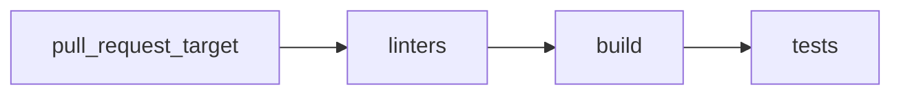
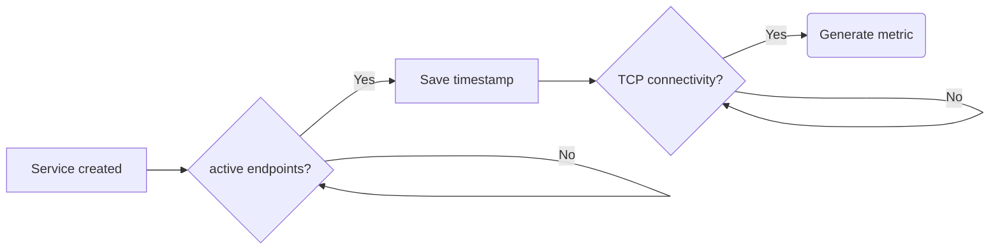
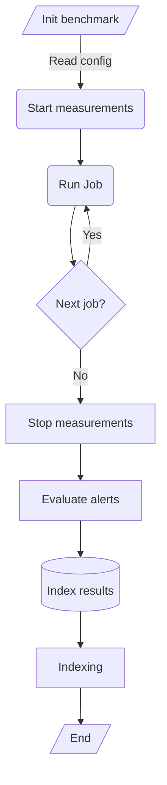

<a id="doc-12e0a48d6c5f2a58f4caa284"></a>

# kube-burner/kube-burner / ADOPTERS.md

Upstream: https://github.com/kube-burner/kube-burner/blob/910882181a9239d170a082d9ab212150e59b0a82/ADOPTERS.md

Commit: `910882181a9239d170a082d9ab212150e59b0a82`

Retrieved: 2026-10-01T15:21:57.821225+00:00

Kind: official-document

Raw SHA256: `0fd63746509adb5d30a09dcec6db10efa18e747f93414c03b3f91cb1313345b9`

Source text below is untrusted reference content. Acquisition does not verify technical claims.

License status: UPSTREAM_NOTICES_CAPTURED_PER_FILE_REVIEW_REQUIRED. See this repository's captured license files.

---

# kube-burner adopters

_If your organization is using kube-burner, we kindly invite you to add your company to the list of adopters._

To be recognized as an [adopter](https://github.com/cncf/toc/blob/main/FAQ.md#what-is-the-definition-of-an-adopter), please submit a pull request including your organization's name in alphabetical order.

Note: Many organizations and users actively contribute to the kube-burner community, even if they cannot publicly share their stories. We’re grateful for their support in helping make kube-burner a successful CNCF project.

| Organization | Contact | Status | Description of Use |
| - | - | - | - |
| [Red Hat](https://www.redhat.com/en) | rpattath@redhat.com |  | Kube-burner is a highly reliable performance testing tool used to ensure the quality and stability of Red Hat Openshift at scale. The engineering team runs all the workloads under kube-burner on different cloud platforms on both self-managed and cloud services environments prior to the release of a new version of the product. The different workloads target different components of the products and helps uncover issues commonly seen on heavily loaded and scaled up enviroments, for example: resource consumption, latencies, etc. The team also contributes to the kube-burner project consistently which helps the workloads to keep up with the new features introduced to the product. Inclusion of this test coverage has contributed to gaining the trust of new and existing customers of the product.  |
| [IBM](https://www.ibm.com.) | kishen.viswanathan@ibm.com |  | Kube-burner is used in our internal QE tests for every release of OpenShift Container Platform on the PowerPC architecture. The tool is integrated into our comprehensive testing framework to ensure performance consistency and identify regressions during new releases. |
| [NVIDIA](https://www.nvidia.com) | smalleni@nvidia.com |  | NVIDIA uses kube-burner to rigorously validate Kubernetes scalability as it evolves into the operating system of AI factories, orchestrating both control plane services and VMaaS-style workloads. By orchestrating robust, flexible and repeatable workloads, it measures performance and scale limits, helping catch scalability bottlenecks and regressions early so clusters remain reliable under production-scale demands for a variety of workloads. |
| - | - |  | - |

_This file is part of the CNCF official documentation for projects._


<a id="doc-a54ff182c7e8acf56acfd6e4"></a>

# kube-burner/kube-burner / AGENTS.md

Upstream: https://github.com/kube-burner/kube-burner/blob/910882181a9239d170a082d9ab212150e59b0a82/AGENTS.md

Commit: `910882181a9239d170a082d9ab212150e59b0a82`

Retrieved: 2026-10-01T15:21:57.821225+00:00

Kind: official-document

Raw SHA256: `208ac85485fdc2141e711fc617e26e32627d303d386cc6e4956c4769001fa305`

Source text below is untrusted reference content. Acquisition does not verify technical claims.

License status: UPSTREAM_NOTICES_CAPTURED_PER_FILE_REVIEW_REQUIRED. See this repository's captured license files.

---

# Agents

This file provides context for AI coding agents working on this project.

## Project overview

Kube-burner is a Kubernetes performance and scale test orchestration tool written in Go. It creates, patches, and deletes Kubernetes resources at scale, collects Prometheus metrics, takes latency measurements, and evaluates alerting rules. It is used to stress-test Kubernetes clusters and benchmark their performance.

Module path: `github.com/kube-burner/kube-burner/v2`

## Repository layout

```
cmd/kube-burner/       Single binary entrypoint (cobra CLI)
pkg/
  alerting/            Prometheus alert evaluation
  burner/              Core workload execution engine (create, delete, patch jobs)
  config/              Configuration parsing and types
  errors/              Custom error handling
  measurements/        Measurements (pod, node, job, netpol, service, datavolume, etc.)
  prometheus/          Prometheus client and metric scraping
  util/                Logging, cluster health, file utilities, metrics helpers
  watchers/            Kubernetes resource watchers
  workloads/           Workload registration and management
examples/
  workloads/           Example benchmark configurations
  metrics-profiles/    Example Prometheus metric profiles
  grafana-dashboards/  Example Grafana dashboards
test/                  Integration tests (bats framework)
hack/                  Build and CI helper scripts
docs/                  Documentation site (mkdocs)
```

## Building and testing

```sh
make build              # Development build -> bin/<arch>/kube-burner
make build-release      # Optimized release build with hardening
make lint               # Run pre-commit (golangci-lint, markdownlint, shellcheck)
make test               # Lint + integration tests
make test-k8s           # Integration tests only (requires a running cluster + kind)
```

Unit tests are colocated with source files (`*_test.go`). Integration tests use [bats](https://github.com/bats-core/bats-core) under `test/` and require a built binary and a running Kubernetes cluster (typically kind).

## CLI commands

The binary exposes these subcommands via cobra:

- `init` — Run a benchmark from a config file
- `destroy` — Delete benchmark resources
- `measure` — Take measurements without running a workload
- `index` — Scrape and index Prometheus metrics
- `check-alerts` — Evaluate alert rules for a time range
- `import` — Import a metrics tarball into an indexer
- `health-check` — Check cluster health
- `completion` — Generate bash completions

## Code conventions

- Logging: `github.com/sirupsen/logrus` (imported as `log`)
- CLI framework: `github.com/spf13/cobra`
- Kubernetes client: `k8s.io/client-go`
- YAML config: `gopkg.in/yaml.v3`
- Testing: `ginkgo/v2` + `gomega` for unit tests, bats for integration tests

## Linting

Pre-commit hooks run golangci-lint (v2), markdownlint, shellcheck, and check-json. The golangci-lint configuration is in `.golangci.yml` and enables: dupl, goconst, gocyclo, govet, ineffassign, misspell, nakedret, staticcheck, unconvert, unparam, unused. Formatters: gofmt, goimports.

## CI

GitHub Actions workflows:

- `linters.yml` — Pre-commit linting
- `ci-tests.yml` — Build and unit tests
- `test-k8s.yml` / `test-k8s-ppc64le.yml` — Integration tests on kind clusters
- `release.yml` / `gorelease.yml` — Release builds
- `builders.yml` / `image-upload.yml` — Container image builds
- `docs.yml` — Documentation site deployment
- `codeql.yml` — Security analysis
- `check-docs-links.yml` — Verify documentation links

## Container images

Built with `Containerfile` (Fedora minimal base). Multi-arch support: amd64, arm64, ppc64le, s390x. Container engine defaults to podman. Published to `quay.io/kube-burner/kube-burner`.

## Key dependencies

- `github.com/cloud-bulldozer/go-commons/v2` — Shared indexer and version utilities
- `github.com/kedacore/keda/v2` — KEDA ScaledObject types
- `kubevirt.io/api`, `kubevirt.io/client-go` — KubeVirt VM support
- `github.com/prometheus/common`, `github.com/prometheus/prometheus` — Prometheus querying
- `gonum.org/v1/gonum` — Statistical calculations for measurements

## Important patterns

- Configuration is YAML-based with Go template rendering (sprig functions supported). User data files can parameterize configs.
- Workloads define Kubernetes object templates that get rendered per-iteration with template variables.
- The `burner` package is the core execution engine: it runs jobs (create/delete/patch/read) with configurable parallelism, rate limiting, and wait conditions.
- Measurements are pluggable — registered by type and started/stopped around job execution. They produce metrics that can be indexed.
- Metrics indexing supports local JSON files, Elasticsearch, and Prometheus TSDB.


<a id="doc-b40d974f29bb962ca1f32054"></a>

# kube-burner/kube-burner / CITATIONS.md

Upstream: https://github.com/kube-burner/kube-burner/blob/910882181a9239d170a082d9ab212150e59b0a82/CITATIONS.md

Commit: `910882181a9239d170a082d9ab212150e59b0a82`

Retrieved: 2026-10-01T15:21:57.821225+00:00

Kind: official-document

Raw SHA256: `e1996a3180f6790ea5580a3c7463008c4d39aa103c12ae7af11d2db12d672ae9`

Source text below is untrusted reference content. Acquisition does not verify technical claims.

License status: UPSTREAM_NOTICES_CAPTURED_PER_FILE_REVIEW_REQUIRED. See this repository's captured license files.

---

# kube-burner citations

If you are using kube-burner for any research project/papers feel free to open a PR to include your citation.

###### 2025

- [Evaluating Kubernetes Distributions: Insights from Stress Testing Scenarios](https://ieeexplore.ieee.org/document/10885637)
- [Comparative Stress Testing of Kubernetes Distributions and CNI Plugins](https://www.researchgate.net/publication/392462952_Comparative_Stress_Testing_of_Kubernetes_Distributions_and_CNI_Plugins?channel=doi&linkId=6842b132c33afe388aca84e5&showFulltext=true)

###### 2024

- [Into the Fire: Delving into Kubernetes Performance and Scale with Kube-burner](https://dl.acm.org/doi/10.1145/3629527.3651405)


<a id="doc-eca12c0a30e25b4b46522ebf"></a>

# kube-burner/kube-burner / CONTRIBUTING.md

Upstream: https://github.com/kube-burner/kube-burner/blob/910882181a9239d170a082d9ab212150e59b0a82/CONTRIBUTING.md

Commit: `910882181a9239d170a082d9ab212150e59b0a82`

Retrieved: 2026-10-01T15:21:57.821225+00:00

Kind: official-document

Raw SHA256: `50b9fe287042c91857e95a1924376d56fcadc8e451718edff8d2bfca82b81a17`

Source text below is untrusted reference content. Acquisition does not verify technical claims.

License status: UPSTREAM_NOTICES_CAPTURED_PER_FILE_REVIEW_REQUIRED. See this repository's captured license files.

---

# CONTRIBUTING

To contribute to this project follow the [contributing guide](https://kube-burner.github.io/kube-burner/latest/contributing/)

<a id="doc-653bc99dc2e48c5310ac6167"></a>

# kube-burner/kube-burner / CONTRIBUTOR_LADDER.md

Upstream: https://github.com/kube-burner/kube-burner/blob/910882181a9239d170a082d9ab212150e59b0a82/CONTRIBUTOR_LADDER.md

Commit: `910882181a9239d170a082d9ab212150e59b0a82`

Retrieved: 2026-10-01T15:21:57.821225+00:00

Kind: official-document

Raw SHA256: `54a210fd1aaee13b5b4bf4ca0a2d21a5e175495fee352b47a8cbfafb13edbd71`

Source text below is untrusted reference content. Acquisition does not verify technical claims.

License status: UPSTREAM_NOTICES_CAPTURED_PER_FILE_REVIEW_REQUIRED. See this repository's captured license files.

---

# Contributor Ladder

* [Contributor Ladder](#contributor-ladder-1)
    * [Community Participant](#community-participant)
    * [Contributor](#contributor)
    * [Maintainer](#maintainer)
* [Inactivity](#inactivity)
* [Involuntary Removal](#involuntary-removal-or-demotion)
* [Stepping Down/Emeritus Process](#stepping-downemeritus-process)
* [Contact](#contact)


## Contributor Ladder

Hello! We are excited that you want to learn more about our project contributor ladder! This contributor ladder outlines the different contributor roles within the project, along with the responsibilities and privileges that come with them. Community members generally start at the first levels of the "ladder" and advance up it as their involvement in the project grows. Our project members are happy to help you advance along the contributor ladder.

Each of the contributor roles below is organized into lists of three types of things. "Responsibilities" are things that a contributor is expected to do. "Requirements" are qualifications a person needs to meet to be in that role, and "Privileges" are things contributors on that level are entitled to. Each contributor level includes all the responsibilities, requirements, and privileges of the levels below it.


### Community Participant
Description: A Community Participant engages with the project and its community, contributing their time, thoughts, etc. Community participants are usually users who have stopped being anonymous and started being active in project discussions.

* Responsibilities:
    * Must follow the [CNCF CoC](https://github.com/cncf/foundation/blob/main/code-of-conduct.md)
* How users can get involved with the community:
    * Participating in community discussions
    * Helping other users
    * Submitting bug reports
    * Commenting on issues
    * Trying out new releases
    * Attending community events
    * Joining the [community meeting](GOVERNANCE.md#meetings)


### Contributor
Description: A Contributor contributes directly to the project and adds value to it. Contributions need not be code. People at the Contributor level may be new contributors who contribute occasionally, or established contributors who regularly participate in the project and have additional privileges in project repositories.

* Responsibilities include:
    * Follow the [CNCF CoC](https://github.com/cncf/foundation/blob/main/code-of-conduct.md)
    * Follow the project [contributing guide](https://kube-burner.github.io/kube-burner/latest/contributing/)
* Requirements (one or several of the below):
    * Report and sometimes resolve issues
    * Occasionally submit PRs
    * Contribute to the documentation
    * Show up at meetings, takes notes
    * Answer questions from other community members
    * Submit feedback on issues and PRs
    * Test releases and patches and submit reviews
    * Run or helps run events
    * Promote the project in public
    * Help run the project infrastructure
* Additional requirements for established contributors:
    * Must have successful contributions to the project, including at least one of the following in one month:
        * 1 accepted PRs,
        * Reviewed 2 PRs,
        * Resolved and closed 1 Issues,
        * Become responsible for a key project management area,
        * Or some equivalent combination or contribution
    * Must have been contributing for at least 3 months
    * Must be actively contributing to at least one project area
    * Must have two sponsors who are also established Contributors, at least one of whom does not work for the same employer
* Privileges:
    * Invitations to contributor events
    * For established contributors:
        * May be assigned Issues and Reviews
        * May give commands to CI/CD automation
        * Can recommend other contributors to become established Contributors

### Maintainer
Description: Maintainers are established contributors who have responsibility for maintaining the project. They may focus on specific areas (such as code directories, documentation, or test components) or have broader responsibility for the entire project. All maintainers can approve PRs, mentor contributors, and participate in project decision-making.

Maintainers are responsible for a "specific area" or the entire project. A specific area can be a code directory, driver, chapter of the docs, test job, event, or other clearly-defined project component. Senior maintainers have broader knowledge across multiple areas and are responsible for overall project strategy and direction.

* Responsibilities include:
    * Follow the reviewing guide
    * Review Pull Requests, with area maintainers focusing on their specific areas and senior maintainers reviewing across the entire project
    * Review at least 50 PRs per year
    * Help other contributors become maintainers
    * For senior maintainers: 
        * Mentor new maintainers
        * Write refactoring PRs
        * Participate in CNCF maintainer activities  
        * Determine strategy and policy for the project
        * Participate in, and lead, community meetings
* Requirements:
    * Experience as an established Contributor for at least 12 months
    * Has reviewed, or helped review, at least 50 Pull Requests
    * Has analyzed and resolved test failures in their area of responsibility
    * Has demonstrated in-depth knowledge of their specific area or broad knowledge across multiple areas
    * Commits to being responsible for their area or the overall project
    * Is supportive of new and occasional contributors and helps get useful PRs in shape to commit
    * For senior maintainers:
        * Experience as a Maintainer for at least 12 months
        * Demonstrates broad knowledge of the project across multiple areas
        * Is able to exercise judgment for the good of the project, independent of their employer, friends, or team
        * Mentors other contributors
* Privileges:
    * Has GitHub or CI/CD rights to approve pull requests in specific directories or across the entire project
    * Can recommend and review other contributors to become Maintainers
    * For senior maintainers:
        * Approve PRs to any area of the project
        * Represent the project in public as a Maintainer
        * Communicate with the CNCF on behalf of the project
        * Have a vote in Maintainer decision-making meetings

Process of becoming a maintainer:
1. The contributor is nominated by opening a PR against the appropriate repository, which adds their GitHub username to the OWNERS file for one or more directories (or the root for senior maintainers).
2. At least two current Maintainers who own that repository or main directory approve the PR.
3. The nominee will add a comment to the PR testifying that they agree to all requirements of becoming a Maintainer.
4. A majority of the current Maintainers must approve the PR.

## Inactivity
It is important for contributors to be and stay active to set an example and show commitment to the project. Inactivity is harmful to the project as it may lead to unexpected delays, contributor attrition, and a lost of trust in the project.

* Inactivity is measured by:
    * Periods of no contributions for longer than *6* months
    * Periods of no communication for longer than *6* months
* Consequences of being inactive include:
    * Involuntary removal or demotion
    * Being asked to move to Emeritus status

## Involuntary Removal or Demotion

Involuntary removal/demotion of a contributor happens when responsibilities and requirements aren't being met. This may include repeated patterns of inactivity, extended period of inactivity, a period of failing to meet the requirements of your role, and/or a violation of the Code of Conduct. This process is important because it protects the community and its deliverables while also opens up opportunities for new contributors to step in.

Involuntary removal or demotion is handled through a vote by a majority of the current Maintainers.

## Stepping Down/Emeritus Process
If and when contributors' commitment levels change, contributors can consider stepping down (moving down the contributor ladder) vs moving to emeritus status (completely stepping away from the project).

Contact the Maintainers about changing to Emeritus status, or reducing your contributor level.

## Contact
* For inquiries, please reach out to:
    *  [maintainers mailing list](mailto:cncf-kube-burner-maintainers@lists.cncf.io)


<a id="doc-b60c6a93e9f74ee52e71bf33"></a>

# kube-burner/kube-burner / GOVERNANCE.md

Upstream: https://github.com/kube-burner/kube-burner/blob/910882181a9239d170a082d9ab212150e59b0a82/GOVERNANCE.md

Commit: `910882181a9239d170a082d9ab212150e59b0a82`

Retrieved: 2026-10-01T15:21:57.821225+00:00

Kind: official-document

Raw SHA256: `c0e0dd5119eb60f3dd0dde6028a7ff142694cb210e515d219d9c8b98cbee296a`

Source text below is untrusted reference content. Acquisition does not verify technical claims.

License status: UPSTREAM_NOTICES_CAPTURED_PER_FILE_REVIEW_REQUIRED. See this repository's captured license files.

---

# Kube-burner Project Governance

The Kube-burner project is dedicated to creating a tool that is able to perform CRUD operations of Kubernetes or Custom Resources at scale, monitor and collect metrics to measure the performance in the cluster.  
This governance explains how the project is run.

- [Values](#values)
- [Maintainers](#maintainers)
- [Becoming a Maintainer](#becoming-a-maintainer)
- [Meetings](#meetings)
- [CNCF Resources](#cncf-resources)
- [Code of Conduct Enforcement](#code-of-conduct)
- [Security Response Team](#security-response-team)
- [Voting](#voting)
- [Modifications](#modifying-this-charter)

## Values

The Kube-burner and its leadership embrace the following values:

* Openness: Communication and decision-making happens in the open and is discoverable for future
  reference. As much as possible, all discussions and work take place in public
  forums and open repositories.

* Fairness: All stakeholders have the opportunity to provide feedback and submit
  contributions, which will be considered on their merits.

* Community over Product or Company: Sustaining and growing our community takes
  priority over shipping code or sponsors' organizational goals.  Each
  contributor participates in the project as an individual.

* Inclusivity: We innovate through different perspectives and skill sets, which
  can only be accomplished in a welcoming and respectful environment.

* Participation: Responsibilities within the project are earned through
  participation, and there is a clear path up the contributor ladder into leadership
  positions.

## Maintainers

Kube-burner Maintainers have write access to the [project GitHub repository](https://github.com/kube-burner/kube-burner).
They can merge their own patches or patches from others. The current maintainers
can be found in [MAINTAINERS.md](./MAINTAINERS.md).  Maintainers collectively manage the project's
resources and contributors.

This privilege is granted with some expectation of responsibility: maintainers
are people who care about the Kube-burner project and want to help it grow and
improve. A maintainer is not just someone who can make changes, but someone who
has demonstrated their ability to collaborate with the team, get the most
knowledgeable people to review code and docs, contribute high-quality code, and
follow through to fix issues (in code or tests).

A maintainer is a contributor to the project's success and a citizen helping
the project succeed.

The collective team of all Maintainers is known as the Maintainer Council, which
is the governing body for the project.

### Becoming a Maintainer

To become a Maintainer you need to demonstrate the following:

  * commitment to the project:
    * participate in discussions, contributions, code and documentation reviews
      for *3* months or more,
    * perform reviews for *10* non-trivial pull requests,
    * contribute *5* non-trivial pull requests and have them merged,
  * ability to write quality code and/or documentation,
  * ability to collaborate with the team,
  * understanding of how the team works (policies, processes for testing and code review, etc),
  * understanding of the project's code base and coding and documentation style.

#### What are non-trivial contributions?
  * A feature enhancement
  * A new feature
  * A critical bug fix (a bug that affects kube-burner's core functionality)
  * Adding new test scenarios

A new Maintainer must be proposed by an existing maintainer by sending a message to the
[maintainers mailing list](mailto:cncf-kube-burner-maintainers@lists.cncf.io). A simple majority vote of existing Maintainers
approves the application.  Maintainers nominations will be evaluated without prejudice
to employer or demographics.

Maintainers who are selected will be granted the necessary GitHub rights,
and invited to the [private maintainer mailing list](mailto:cncf-kube-burner-maintainers@lists.cncf.io).

### Removing a Maintainer

Maintainers may resign at any time if they feel that they will not be able to
continue fulfilling their project duties.

Maintainers may also be removed after being inactive, failure to fulfill their 
Maintainer responsibilities, violating the Code of Conduct, or other reasons.
Inactivity is defined as a period of very low or no activity in the project 
for a year or more, with no definite schedule to return to full Maintainer 
activity.

A Maintainer may be removed at any time by a 2/3 vote of the remaining maintainers.

Depending on the reason for removal, a Maintainer may be converted to Emeritus
status.  Emeritus Maintainers will still be consulted on some project matters,
and can be rapidly returned to Maintainer status if their availability changes.

## Meetings

Time zones permitting, Maintainers are expected to participate in the public
developer meeting

When: Every two Mondays
Time: 9:00 AM (America/New York) 3:00 PM (Europe/Madrid)
Where: [Zoom meeting](https://zoom-lfx.platform.linuxfoundation.org/meeting/93448055215?password=a34445ac-64af-4e01-9446-3864dff5a243)
CNCF's [Calendar](https://zoom-lfx.platform.linuxfoundation.org/meetings/cncf?view=week)
Meeting Notes: [Link](https://docs.google.com/document/d/1r_hfPO1fvtmP7spcYO1XJL87t1b1l9SAQfP9AiwaX48/edit?tab=t.0)

Maintainers will also have closed meetings in order to discuss security reports
or Code of Conduct violations.  Such meetings should be scheduled by any
Maintainer on receipt of a security issue or CoC report.  All current Maintainers
must be invited to such closed meetings, except for any Maintainer who is
accused of a CoC violation.

## CNCF Resources

Any Maintainer may suggest a request for CNCF resources, either in the
[mailing list](mailto:cncf-kube-burner-maintainers@lists.cncf.io), or during a
meeting.  A simple majority of Maintainers approves the request.  The Maintainers
may also choose to delegate working with the CNCF to non-Maintainer community
members, who will then be added to the [CNCF's Maintainer List](https://github.com/cncf/foundation/blob/main/project-maintainers.csv)
for that purpose.

## Code of Conduct

[Code of Conduct](./code-of-conduct.md)
violations by community members will be discussed and resolved
on the [private Maintainer mailing list](mailto:cncf-kube-burner-maintainers@lists.cncf.io).  If a Maintainer is directly involved
in the report, the Maintainers will instead designate two Maintainers to work
with the CNCF Code of Conduct Committee in resolving it.

## Security Response Team

The Maintainers will appoint a Security Response Team to handle security reports.
This committee may simply consist of the Maintainer Council themselves.  If this
responsibility is delegated, the Maintainers will appoint a team of at least two 
contributors to handle it.  The Maintainers will review who is assigned to this
at least once a year.

The Security Response Team is responsible for handling all reports of security
holes and breaches according to the [security policy](./SECURITY.md).

## Voting

While most business in Kube-burner is conducted by "[lazy consensus](https://community.apache.org/committers/lazyConsensus.html)", 
periodically the Maintainers may need to vote on specific actions or changes.
A vote can be taken on [the private Maintainer mailing list](mailto:cncf-kube-burner-maintainers@lists.cncf.io) for security or conduct matters.  
Votes may also be taken at [the developer meeting](#meetings). Any Maintainer may
demand a vote be taken.

Most votes require a simple majority of all Maintainers to succeed, except where
otherwise noted.  Two-thirds majority votes mean at least two-thirds of all 
existing maintainers.

## Modifying this Charter

Changes to this Governance and its supporting documents may be approved by 
a 2/3 vote of the Maintainers.


<a id="doc-c693279643b8cd5d248172d9"></a>

# kube-burner/kube-burner / LICENSE

Upstream: https://github.com/kube-burner/kube-burner/blob/910882181a9239d170a082d9ab212150e59b0a82/LICENSE

Commit: `910882181a9239d170a082d9ab212150e59b0a82`

Retrieved: 2026-10-01T15:21:57.821225+00:00

Kind: license

Raw SHA256: `7382b1cf711e7a7c7af9816e0e07b49b91e7149b7c6d347225f98800fcb1f1c2`

Source text below is untrusted reference content. Acquisition does not verify technical claims.

License status: UPSTREAM_NOTICES_CAPTURED_PER_FILE_REVIEW_REQUIRED. See this repository's captured license files.

---

````text
                                Apache License
                           Version 2.0, January 2004
                        http://www.apache.org/licenses/

   TERMS AND CONDITIONS FOR USE, REPRODUCTION, AND DISTRIBUTION

   1. Definitions.

      "License" shall mean the terms and conditions for use, reproduction,
      and distribution as defined by Sections 1 through 9 of this document.

      "Licensor" shall mean the copyright owner or entity authorized by
      the copyright owner that is granting the License.

      "Legal Entity" shall mean the union of the acting entity and all
      other entities that control, are controlled by, or are under common
      control with that entity. For the purposes of this definition,
      "control" means (i) the power, direct or indirect, to cause the
      direction or management of such entity, whether by contract or
      otherwise, or (ii) ownership of fifty percent (50%) or more of the
      outstanding shares, or (iii) beneficial ownership of such entity.

      "You" (or "Your") shall mean an individual or Legal Entity
      exercising permissions granted by this License.

      "Source" form shall mean the preferred form for making modifications,
      including but not limited to software source code, documentation
      source, and configuration files.

      "Object" form shall mean any form resulting from mechanical
      transformation or translation of a Source form, including but
      not limited to compiled object code, generated documentation,
      and conversions to other media types.

      "Work" shall mean the work of authorship, whether in Source or
      Object form, made available under the License, as indicated by a
      copyright notice that is included in or attached to the work
      (an example is provided in the Appendix below).

      "Derivative Works" shall mean any work, whether in Source or Object
      form, that is based on (or derived from) the Work and for which the
      editorial revisions, annotations, elaborations, or other modifications
      represent, as a whole, an original work of authorship. For the purposes
      of this License, Derivative Works shall not include works that remain
      separable from, or merely link (or bind by name) to the interfaces of,
      the Work and Derivative Works thereof.

      "Contribution" shall mean any work of authorship, including
      the original version of the Work and any modifications or additions
      to that Work or Derivative Works thereof, that is intentionally
      submitted to Licensor for inclusion in the Work by the copyright owner
      or by an individual or Legal Entity authorized to submit on behalf of
      the copyright owner. For the purposes of this definition, "submitted"
      means any form of electronic, verbal, or written communication sent
      to the Licensor or its representatives, including but not limited to
      communication on electronic mailing lists, source code control systems,
      and issue tracking systems that are managed by, or on behalf of, the
      Licensor for the purpose of discussing and improving the Work, but
      excluding communication that is conspicuously marked or otherwise
      designated in writing by the copyright owner as "Not a Contribution."

      "Contributor" shall mean Licensor and any individual or Legal Entity
      on behalf of whom a Contribution has been received by Licensor and
      subsequently incorporated within the Work.

   2. Grant of Copyright License. Subject to the terms and conditions of
      this License, each Contributor hereby grants to You a perpetual,
      worldwide, non-exclusive, no-charge, royalty-free, irrevocable
      copyright license to reproduce, prepare Derivative Works of,
      publicly display, publicly perform, sublicense, and distribute the
      Work and such Derivative Works in Source or Object form.

   3. Grant of Patent License. Subject to the terms and conditions of
      this License, each Contributor hereby grants to You a perpetual,
      worldwide, non-exclusive, no-charge, royalty-free, irrevocable
      (except as stated in this section) patent license to make, have made,
      use, offer to sell, sell, import, and otherwise transfer the Work,
      where such license applies only to those patent claims licensable
      by such Contributor that are necessarily infringed by their
      Contribution(s) alone or by combination of their Contribution(s)
      with the Work to which such Contribution(s) was submitted. If You
      institute patent litigation against any entity (including a
      cross-claim or counterclaim in a lawsuit) alleging that the Work
      or a Contribution incorporated within the Work constitutes direct
      or contributory patent infringement, then any patent licenses
      granted to You under this License for that Work shall terminate
      as of the date such litigation is filed.

   4. Redistribution. You may reproduce and distribute copies of the
      Work or Derivative Works thereof in any medium, with or without
      modifications, and in Source or Object form, provided that You
      meet the following conditions:

      (a) You must give any other recipients of the Work or
          Derivative Works a copy of this License; and

      (b) You must cause any modified files to carry prominent notices
          stating that You changed the files; and

      (c) You must retain, in the Source form of any Derivative Works
          that You distribute, all copyright, patent, trademark, and
          attribution notices from the Source form of the Work,
          excluding those notices that do not pertain to any part of
          the Derivative Works; and

      (d) If the Work includes a "NOTICE" text file as part of its
          distribution, then any Derivative Works that You distribute must
          include a readable copy of the attribution notices contained
          within such NOTICE file, excluding those notices that do not
          pertain to any part of the Derivative Works, in at least one
          of the following places: within a NOTICE text file distributed
          as part of the Derivative Works; within the Source form or
          documentation, if provided along with the Derivative Works; or,
          within a display generated by the Derivative Works, if and
          wherever such third-party notices normally appear. The contents
          of the NOTICE file are for informational purposes only and
          do not modify the License. You may add Your own attribution
          notices within Derivative Works that You distribute, alongside
          or as an addendum to the NOTICE text from the Work, provided
          that such additional attribution notices cannot be construed
          as modifying the License.

      You may add Your own copyright statement to Your modifications and
      may provide additional or different license terms and conditions
      for use, reproduction, or distribution of Your modifications, or
      for any such Derivative Works as a whole, provided Your use,
      reproduction, and distribution of the Work otherwise complies with
      the conditions stated in this License.

   5. Submission of Contributions. Unless You explicitly state otherwise,
      any Contribution intentionally submitted for inclusion in the Work
      by You to the Licensor shall be under the terms and conditions of
      this License, without any additional terms or conditions.
      Notwithstanding the above, nothing herein shall supersede or modify
      the terms of any separate license agreement you may have executed
      with Licensor regarding such Contributions.

   6. Trademarks. This License does not grant permission to use the trade
      names, trademarks, service marks, or product names of the Licensor,
      except as required for reasonable and customary use in describing the
      origin of the Work and reproducing the content of the NOTICE file.

   7. Disclaimer of Warranty. Unless required by applicable law or
      agreed to in writing, Licensor provides the Work (and each
      Contributor provides its Contributions) on an "AS IS" BASIS,
      WITHOUT WARRANTIES OR CONDITIONS OF ANY KIND, either express or
      implied, including, without limitation, any warranties or conditions
      of TITLE, NON-INFRINGEMENT, MERCHANTABILITY, or FITNESS FOR A
      PARTICULAR PURPOSE. You are solely responsible for determining the
      appropriateness of using or redistributing the Work and assume any
      risks associated with Your exercise of permissions under this License.

   8. Limitation of Liability. In no event and under no legal theory,
      whether in tort (including negligence), contract, or otherwise,
      unless required by applicable law (such as deliberate and grossly
      negligent acts) or agreed to in writing, shall any Contributor be
      liable to You for damages, including any direct, indirect, special,
      incidental, or consequential damages of any character arising as a
      result of this License or out of the use or inability to use the
      Work (including but not limited to damages for loss of goodwill,
      work stoppage, computer failure or malfunction, or any and all
      other commercial damages or losses), even if such Contributor
      has been advised of the possibility of such damages.

   9. Accepting Warranty or Additional Liability. While redistributing
      the Work or Derivative Works thereof, You may choose to offer,
      and charge a fee for, acceptance of support, warranty, indemnity,
      or other liability obligations and/or rights consistent with this
      License. However, in accepting such obligations, You may act only
      on Your own behalf and on Your sole responsibility, not on behalf
      of any other Contributor, and only if You agree to indemnify,
      defend, and hold each Contributor harmless for any liability
      incurred by, or claims asserted against, such Contributor by reason
      of your accepting any such warranty or additional liability.

   END OF TERMS AND CONDITIONS

   APPENDIX: How to apply the Apache License to your work.

      To apply the Apache License to your work, attach the following
      boilerplate notice, with the fields enclosed by brackets "[]"
      replaced with your own identifying information. (Don't include
      the brackets!)  The text should be enclosed in the appropriate
      comment syntax for the file format. We also recommend that a
      file or class name and description of purpose be included on the
      same "printed page" as the copyright notice for easier
      identification within third-party archives.

   Copyright [yyyy] [name of copyright owner]

   Licensed under the Apache License, Version 2.0 (the "License");
   you may not use this file except in compliance with the License.
   You may obtain a copy of the License at

       http://www.apache.org/licenses/LICENSE-2.0

   Unless required by applicable law or agreed to in writing, software
   distributed under the License is distributed on an "AS IS" BASIS,
   WITHOUT WARRANTIES OR CONDITIONS OF ANY KIND, either express or implied.
   See the License for the specific language governing permissions and
   limitations under the License.

````


<a id="doc-39da3bd6270d44ea37b6ed50"></a>

# kube-burner/kube-burner / MAINTAINERS.md

Upstream: https://github.com/kube-burner/kube-burner/blob/910882181a9239d170a082d9ab212150e59b0a82/MAINTAINERS.md

Commit: `910882181a9239d170a082d9ab212150e59b0a82`

Retrieved: 2026-10-01T15:21:57.821225+00:00

Kind: official-document

Raw SHA256: `52c032f9a1d80a82a66e33e606a5b79d2d5a84ae0cbf0097ddd2d3ecf714f492`

Source text below is untrusted reference content. Acquisition does not verify technical claims.

License status: UPSTREAM_NOTICES_CAPTURED_PER_FILE_REVIEW_REQUIRED. See this repository's captured license files.

---

The current Maintainers Group for the Kube-burner Project consists of:

| Name                  | Employer | GitHub ID                                                 | Email                   | Responsibilities |
|---------------------  | -------- | --------------------------------------------------------- | ----------------------- | ---------------- |
| Raul Sevilla Canavate | Red Hat  | [rsevilla87](https://github.com/rsevilla87)               | rsevilla@redhat.com     |    Project Maintainer        |
| Vishnu Challa         | Red Hat  | [vishnuchalla](https://github.com/vishnuchalla)           | vchalla@redhat.com      |    Project Maintainer        |
| Sai Malleni           | NVIDIA   | [smalleni](https://github.com/smalleni)                   | smalleni@nvidia.com     |    Project Maintainer        |
| Ygal Blum             | Red Hat  | [ygalblunm](https://github.com/ygalblum)                  | yblum@redhat.com        |    Project Maintainer        |

See [the project Governance](GOVERNANCE.md) for how maintainers are selected and replaced.

This list must be kept in sync with the [CNCF Project Maintainers list](https://github.com/cncf/foundation/blob/master/project-maintainers.csv).


<a id="doc-b335630551682c19a781afeb"></a>

# kube-burner/kube-burner / README.md

Upstream: https://github.com/kube-burner/kube-burner/blob/910882181a9239d170a082d9ab212150e59b0a82/README.md

Commit: `910882181a9239d170a082d9ab212150e59b0a82`

Retrieved: 2026-10-01T15:21:57.821225+00:00

Kind: official-document

Raw SHA256: `8b40e80cd8438b9f364cf39a6982736c9bd309326bb7954063bc70c6b5d1342a`

Source text below is untrusted reference content. Acquisition does not verify technical claims.

License status: UPSTREAM_NOTICES_CAPTURED_PER_FILE_REVIEW_REQUIRED. See this repository's captured license files.

---


[](https://goreportcard.com/report/github.com/kube-burner/kube-burner)
[](https://opensource.org/licenses/Apache-2.0)
[](https://www.bestpractices.dev/projects/8264)

# What is Kube-burner

Kube-burner is a Kubernetes performance and scale test orchestration toolset. It provides multi-faceted functionality, the most important of which are summarized below.

- Create, delete and patch Kubernetes resources at scale.
- Prometheus metric collection and indexing.
- Measurements.
- Alerting.

Kube-burner is a binary application written in golang that makes extensive usage of the official k8s client library, [client-go](https://github.com/kubernetes/client-go).


## Documentation

Documentation is [available here](https://kube-burner.github.io/kube-burner/)

## Quick start

Install latest stable version with:

```shell
curl -Ls https://raw.githubusercontent.com/kube-burner/kube-burner/refs/heads/main/hack/install.sh | sh
```

> [!NOTE]
> Default installation path is `${HOME}/.local/bin/`, you can change it by setting `INSTALL_DIR` environment variable
> before running the script

## Downloading Kube-burner

In case you want to start tinkering with Kube-burner now:

- You can find the binaries in the [releases section of the repository](https://github.com/kube-burner/kube-burner/releases).
- There's also a container image available at [quay](https://quay.io/repository/kube-burner/kube-burner?tab=tags).

### Example configs

Example configuration files can be found at the [examples directory](./examples/workloads).

## Building from Source

Kube-burner provides multiple build options:

- `make build`              - Standard build for development
- `make build-release`      - Optimized release build  
- `make build-hardened`     - Security-hardened static binary
- `make build-hardened-cgo` - Full security hardening with CGO (requires glibc)

The default builds produce static binaries that work across all Linux distributions. The CGO-hardened build offers additional security features but requires glibc to be present on the target system.

## Contributing Guidelines, CI, and Code Style

Please read the [Contributing section](https://kube-burner.github.io/kube-burner/latest/contributing/) before contributing to this project. It provides information on how to contribute, guidelines for setting an environment a CI checks to be done before committing code.

This project utilizes a Continuous Integration (CI) pipeline to ensure code quality and maintain project standards. The CI process automatically builds, tests, and verifies the project on each commit and pull request.

## Code of Conduct

This project is for everyone. We ask that our users and contributors take a few minutes to review our [Code of Conduct](./code-of-conduct.md).

<a id="doc-683343bdf93f55ed3cada861"></a>

# kube-burner/kube-burner / ROADMAP.md

Upstream: https://github.com/kube-burner/kube-burner/blob/910882181a9239d170a082d9ab212150e59b0a82/ROADMAP.md

Commit: `910882181a9239d170a082d9ab212150e59b0a82`

Retrieved: 2026-10-01T15:21:57.821225+00:00

Kind: official-document

Raw SHA256: `781a3540998871e360d41774668d74a36c61161970c9e0b47e6ee5da52f29ef2`

Source text below is untrusted reference content. Acquisition does not verify technical claims.

License status: UPSTREAM_NOTICES_CAPTURED_PER_FILE_REVIEW_REQUIRED. See this repository's captured license files.

---

# Kube-Burner Roadmap

This document is meant to define high-level plans for the kube-burner project and is neither complete nor prescriptive. Following are a list of enhancements that we are planning to work on adding support to our application. Each and every action item is tracked using github [issues](https://github.com/kube-burner/kube-burner/issues).


- [ ] [[RFE Enhancement]](https://github.com/kube-burner/kube-burner/issues/409) Funtionality to compare kube-burner collected metrics to detect regressions automatically.
- [ ] [[RFE Enhancement]](https://github.com/kube-burner/kube-burner/issues/385) Provide index subcommand for OCP wrapper. This will enable us to do an automated discovery and helps us fetch cluster metadata without any manual intervention.
- [ ] [[RFE Enhancement]](https://github.com/kube-burner/kube-burner/issues/389) Check if the cluster image-registry is up and running prior running workload with builds and stop the benchmark by logging the status message. Especially useful for bare metal use cases where the internal registry is not configured by default.
- [ ] [[RFE Enhancement]](https://github.com/kube-burner/kube-burner/issues/403) To improvise our error handling and index metrics locally in case of failed run. This will help us to debug/investigate the root cause for repetitive failures.
- [ ] [[RFE Enhancement]](https://github.com/kube-burner/kube-burner/issues/402) Create directories with unique name for local indexing instead of overriding the same for every run.
- [ ] [[RFE Enhancement]](https://github.com/kube-burner/kube-burner/issues/408) Check if ingress controller is up & running prior running a workload with routes and stop the benchmark by logging the status message. Especially useful for some of the workloads in OCP wrapper.
- [ ] [[RFE Enhancement]](https://github.com/kube-burner/kube-burner/issues/384) To simplify index subcommand usage by removing the need for a config file. Parameters should be minimal and should go through CLI.
- [ ] [[RFE Optimization]](https://github.com/kube-burner/kube-burner/issues/399) Improve client-go retry logic to continuously retry for creating resources until the benchmark job timeout.
- [ ] [[RFE Enhancement]](https://github.com/kube-burner/kube-burner/issues/374) A new workload with cluster maximums for OCP.
- [ ] [[RFE Enhancement]](https://github.com/kube-burner/kube-burner/issues/332) Use the current working directory to get configuration files and run the workload. Similar RFE.
- [ ] [[RFE Enhancement]](https://github.com/kube-burner/kube-burner/issues/141) Add a global waitWhenFinished flag to wait until all the resources in all our jobs are created and are in running state instead of doing it per job.
- [ ] [[RFE Enhancement]](https://github.com/kube-burner/kube-burner/issues/138) A standalone measure command to just fetch measurements of a workload.
- [ ] [[RFE Enhancement]](https://github.com/kube-burner/kube-burner/issues/248) Functionality to capture prometheus dump inspired by [promdump](https://github.com/ihcsim/promdump) tool.
- [ ] [[RFE CI/CD]](https://github.com/kube-burner/kube-burner/issues/112) To have unit tests implemented in place as our application is growing continously.
- [ ] [[RFE Enhancement]](https://github.com/kube-burner/kube-burner/issues/413) To improve measurement calculations in benchmark by considering resources only specific to our run in the entire cluster.
- [ ] [[RFE Enhancement]](https://github.com/kube-burner/kube-burner/issues/408) Ability to check if the ingress controller is up and running in a workload that contains routes.
- [ ] [[RFE Enhancement]](https://github.com/kube-burner/kube-burner/issues/426) Add measurements around persistent volume lifecycles along with pod/vmi latencies and pprof metrics that we have currently.
- [ ] [[RFE Enhancement]](https://github.com/kube-burner/kube-burner/issues/433) Ship grafana dashboards used to represent indexed metrics along with --reporting mode.
- [ ] [[RFE Enhancement]](https://github.com/kube-burner/kube-burner/issues/438) Add failure reason of a benchmark in the local indexing results. Or else to look for an option to back propagate the error to upper level i.e just before the benchmark exits.
- [ ] [[RFE Enhancement]](https://github.com/kube-burner/kube-burner/issues/439) To have an option to audit our own execution, and help our users understand if a run is valid or not. This would be really useful in scenarios where there is an environmental problem in our system under test.
- [ ] [[RFE enhancement]](https://github.com/kube-burner/kube-burner/issues/427) Add storage control plane related scenarios to ocp wrapper. An additional functionality that creates PVCs, bind them to PVs, mount them in pods and finally reclaims them.


<a id="doc-f6ed156e4bf5c79168066246"></a>

# kube-burner/kube-burner / SECURITY.md

Upstream: https://github.com/kube-burner/kube-burner/blob/910882181a9239d170a082d9ab212150e59b0a82/SECURITY.md

Commit: `910882181a9239d170a082d9ab212150e59b0a82`

Retrieved: 2026-10-01T15:21:57.821225+00:00

Kind: official-document

Raw SHA256: `28afdd611da72f2cb1f550f2b755c2e788fa65b8c561f4058e2d4693cf4dfe5e`

Source text below is untrusted reference content. Acquisition does not verify technical claims.

License status: UPSTREAM_NOTICES_CAPTURED_PER_FILE_REVIEW_REQUIRED. See this repository's captured license files.

---

# Security Process and Policy
This document outlines the kube-burner security policy and describes the processes for managing security incidents, including a step-by-step guide for reporting vulnerabilities within the kube-burner organization.

  - [Report A Vulnerability](#report-a-vulnerability)
    - [When To Send A Report](#when-to-send-a-report)
    - [Security Vulnerability Response](#security-vulnerability-response)
    - [Public Disclosure](#public-disclosure)
  - [Security Team Membership](#security-team-membership)
    - [Responsibilities](#responsibilities)
    - [Membership](#membership)
  - [Patch and Release Team](#patch-and-release-team)
  - [Disclosures](#disclosures)

## Report A Vulnerability

We sincerely appreciate security researchers and users who report vulnerabilities to the kube-burner community. Every report is carefully reviewed by a team of kube-burner maintainers.

Easiest way to report a vulnerability is through [Security Tab On Github](https://github.com/kube-burner/kube-burner/security/advisories). This mechanism allows maintainers to communicate privately with you, and you do not need to encrypt your messages. 

Alternatively you can also email the private security list at cncf-kube-burner-maintainers@lists.cncf.io
 with the details. Please do not discuss potential vulnerabilities in public without validating with us first.

For any other concerns/questions come talk to us at our [slack-channel](https://kubernetes.slack.com/archives/C06EEGHTNJ1) in the kubernetes slack server.

The list of people on the security list is below: 

| Name            | GitHub Handle    |
| --------------- | ---------------- |
| Raul Sevilla   | @rsevilla87  |
| Vishnu Challa | @vishnuchalla |
| Ygal Blum | @ygalblum |
| Sai Sindhur Malleni   | @smalleni |


### When To Send A Report

If you believe you've discovered a vulnerability within kube-burner project or one of its dependencies, it may involve any repository within the [kube-burner github organization](https://github.com/kube-burner).


### Security Vulnerability Response

Each report will be reviewed, and acknowledgment of receipt will be provided within 5 business days, initiating the security review process outlined below.

Any vulnerability information shared with the security team will remain within the kube-burner project and will only be disclosed to others if necessary to resolve the issue. Information is shared strictly on a need-to-know basis.

We request that reporters act in good faith by refraining from disclosing the issue to others. In return, we commit to responding promptly and ensuring that reporters receive proper credit for their contributions.

Throughout the triage, investigation, and resolution process, the reporter will be kept informed of progress. If needed, the security team may also reach out for additional details regarding the vulnerability.

### Public Disclosure

Security vulnerabilities are publicly disclosed alongside release updates or details on the fix. We aim to fully disclose vulnerabilities once a mitigation strategy is available, ensuring a timely release that balances speed with user needs.

All identified vulnerabilities will be assigned a CVE. However, due to the time required to obtain a CVE ID, disclosures may be published before an ID is assigned. In such cases, the disclosure will be updated once the CVE ID becomes available.

If the reporter wishes to be acknowledged in the disclosure, we are happy to do so. We will seek permission and confirm how they would like to be credited. We greatly appreciate vulnerability reports and are committed to recognizing contributors who choose to be acknowledged.

## Security Team Membership

The security team consists of select kube-burner project maintainers who are equipped and available to handle vulnerability reports.

### Responsibilities

* Members MUST be active maintainers of currently supported kube-burner projects.
* Members SHOULD participate in each reported vulnerability, at minimum ensuring it is being properly addressed.
* Members MUST keep vulnerability details confidential and share them only on a need-to-know basis.

### Membership

New members are required to be active maintainers of kube-burner projects who are willing to perform
the responsibilities outlined above. The security team is a subset of the maintainers. Members can
step down at any time and may join at any time.

## Patch and Release Team

When a vulnerability is reported and acknowledged, a team—including maintainers of the affected kube-burner project will be assembled to develop a patch, release an update, and publish a disclosure. If necessary, additional maintainers may be involved, but participation will remain within the kube-burner project maintainer group.

## Disclosures

Security advisories for vulnerabilities are published in the relevant project repositories. These advisories include an overview, details of the vulnerability, a fix—typically provided through an update—and, if available, a workaround.

Disclosures are released on the same day as the fix, following the publication of the update. The release notes will also include a link to the advisory.

<a id="doc-f1a69a41a835b5265e1c58e1"></a>

# kube-burner/kube-burner / code-of-conduct.md

Upstream: https://github.com/kube-burner/kube-burner/blob/910882181a9239d170a082d9ab212150e59b0a82/code-of-conduct.md

Commit: `910882181a9239d170a082d9ab212150e59b0a82`

Retrieved: 2026-10-01T15:21:57.821225+00:00

Kind: official-document

Raw SHA256: `559ddfe59ad2a6355d10a84b2aeb850684a8b3616a45795b65b65347b6a8f0b5`

Source text below is untrusted reference content. Acquisition does not verify technical claims.

License status: UPSTREAM_NOTICES_CAPTURED_PER_FILE_REVIEW_REQUIRED. See this repository's captured license files.

---

# Contributor Covenant Code of Conduct

## Our Pledge

We as members, contributors, and leaders pledge to make participation in our
community a harassment-free experience for everyone, regardless of age, body
size, visible or invisible disability, ethnicity, sex characteristics, gender
identity and expression, level of experience, education, socio-economic status,
nationality, personal appearance, race, religion, or sexual identity
and orientation.

We pledge to act and interact in ways that contribute to an open, welcoming,
diverse, inclusive, and healthy community.

## Our Standards

Examples of behavior that contributes to a positive environment for our
community include:

* Demonstrating empathy and kindness toward other people
* Being respectful of differing opinions, viewpoints, and experiences
* Giving and gracefully accepting constructive feedback
* Accepting responsibility and apologizing to those affected by our mistakes,
  and learning from the experience
* Focusing on what is best not just for us as individuals, but for the
  overall community

Examples of unacceptable behavior include:

* The use of sexualized language or imagery, and sexual attention or
  advances of any kind
* Trolling, insulting or derogatory comments, and personal or political attacks
* Public or private harassment
* Publishing others' private information, such as a physical or email
  address, without their explicit permission
* Other conduct which could reasonably be considered inappropriate in a
  professional setting

## Enforcement Responsibilities

Community leaders are responsible for clarifying and enforcing our standards of
acceptable behavior and will take appropriate and fair corrective action in
response to any behavior that they deem inappropriate, threatening, offensive,
or harmful.

Community leaders have the right and responsibility to remove, edit, or reject
comments, commits, code, wiki edits, issues, and other contributions that are
not aligned to this Code of Conduct, and will communicate reasons for moderation
decisions when appropriate.

## Scope

This Code of Conduct applies within all community spaces, and also applies when
an individual is officially representing the community in public spaces.
Examples of representing our community include using an official e-mail address,
posting via an official social media account, or acting as an appointed
representative at an online or offline event.

## Enforcement

Instances of abusive, harassing, or otherwise unacceptable behavior may be
reported to the community leaders responsible for enforcement at smalleni@redhat.com
or rsevilla@redhat.com.
All complaints will be reviewed and investigated promptly and fairly.

All community leaders are obligated to respect the privacy and security of the
reporter of any incident.

## Enforcement Guidelines

Community leaders will follow these Community Impact Guidelines in determining
the consequences for any action they deem in violation of this Code of Conduct:

### 1. Correction

**Community Impact**: Use of inappropriate language or other behavior deemed
unprofessional or unwelcome in the community.

**Consequence**: A private, written warning from community leaders, providing
clarity around the nature of the violation and an explanation of why the
behavior was inappropriate. A public apology may be requested.

### 2. Warning

**Community Impact**: A violation through a single incident or series
of actions.

**Consequence**: A warning with consequences for continued behavior. No
interaction with the people involved, including unsolicited interaction with
those enforcing the Code of Conduct, for a specified period of time. This
includes avoiding interactions in community spaces as well as external channels
like social media. Violating these terms may lead to a temporary or
permanent ban.

### 3. Temporary Ban

**Community Impact**: A serious violation of community standards, including
sustained inappropriate behavior.

**Consequence**: A temporary ban from any sort of interaction or public
communication with the community for a specified period of time. No public or
private interaction with the people involved, including unsolicited interaction
with those enforcing the Code of Conduct, is allowed during this period.
Violating these terms may lead to a permanent ban.

### 4. Permanent Ban

**Community Impact**: Demonstrating a pattern of violation of community
standards, including sustained inappropriate behavior,  harassment of an
individual, or aggression toward or disparagement of classes of individuals.

**Consequence**: A permanent ban from any sort of public interaction within
the community.

## Attribution

This Code of Conduct is adapted from the [Contributor Covenant][homepage],
version 2.0, available at
https://www.contributor-covenant.org/version/2/0/code_of_conduct.html.

Community Impact Guidelines were inspired by [Mozilla's code of conduct
enforcement ladder](https://github.com/mozilla/diversity).

[homepage]: https://www.contributor-covenant.org

For answers to common questions about this code of conduct, see the FAQ at
https://www.contributor-covenant.org/faq. Translations are available at
https://www.contributor-covenant.org/translations.


<a id="doc-f9ee3bb75068213daa27ecbc"></a>

# kube-burner/kube-burner / docs/cli/index.md

Upstream: https://github.com/kube-burner/kube-burner/blob/910882181a9239d170a082d9ab212150e59b0a82/docs/cli/index.md

Commit: `910882181a9239d170a082d9ab212150e59b0a82`

Retrieved: 2026-10-01T15:21:57.821225+00:00

Kind: official-document

Raw SHA256: `83889f3df5348bafe9074a4115aece064e4abeb10f19a2c69abf52117d91a836`

Source text below is untrusted reference content. Acquisition does not verify technical claims.

License status: UPSTREAM_NOTICES_CAPTURED_PER_FILE_REVIEW_REQUIRED. See this repository's captured license files.

---

# CLI

kube-burner is a tool written in Golang that can be used to stress Kubernetes clusters by creating, deleting, and patching resources at a
given rate. The actions taken by this tool are highly customizable and their available subcommands are detailed below:

```console
$ kube-burner help
Kube-burner 🔥

Tool aimed at stressing a kubernetes cluster by creating or deleting lots of objects.

Usage:
  kube-burner [command]

Available Commands:
  check-alerts Evaluate alerts for the given time range
  completion   Generates completion scripts for bash shell
  destroy      Destroy benchmark assets
  health-check Check for Health Status of the cluster
  help         Help about any command
  import       Import metrics tarball
  index        Index kube-burner metrics
  init         Launch benchmark
  measure      Take measurements for a given set of resources without running workload
  version      Print the version number of kube-burner

Flags:
  -h, --help               help for kube-burner
      --log-level string   Allowed values: debug, info, warn, error, fatal (default "info")

Use "kube-burner [command] --help" for more information about a command.
```

## Init

This is the main subcommand; it triggers a new kube-burner benchmark and it supports the these flags:

- `uuid`: Benchmark ID. This is essentially an arbitrary string that is used for different purposes along the benchmark. For example, to label the objects created by kube-burner as mentioned in the [reference chapter](../reference/configuration.md#default-labels). By default, it is auto-generated.
- `config`: Path or URL to a valid configuration file. See details about the configuration schema in the [reference chapter](../reference/configuration.md).
- `configmap`: In case of not providing the `--config` flag, kube-burner is able to fetch its configuration from a given `configMap`. This variable configures its name. kube-burner expects the configMap to hold all the required configuration: config.yml, metrics.yml, and alerts.yml. Where metrics.yml and alerts.yml are optional.
- `namespace`: Name of the namespace where the configmap is.
- `log-level`: Logging level, one of: `debug`, `error`, `info` or `fatal`. Default `info`.
- `metrics-endpoint`: Path to a valid metrics endpoint file.
- `skip-tls-verify`: Skip TLS verification for Prometheus. The default is `true`.
- `timeout`: Kube-burner benchmark global timeout. When timing out, return code is 2. The default is `4h`.
- `kubeconfig`: Path to the kubeconfig file.
- `kube-context`: The name of the kubeconfig context to use.
- `user-metadata`: YAML file path containing custom user-metadata to be indexed along with the [`jobSummary`](../observability/indexing.md#job-summary) document.
- `user-data`: YAML or JSON file path containing input variables for rendering the configuration file.
- `allow-missing`: Allow missing keys in the config file. Needed when using the [`default`](https://masterminds.github.io/sprig/defaults.html) template function
- `set`: Set arbitrary `key=value` pairs to override values in the configuration file. Similar to Helm's `--set` flag, this allows you to override base YAML values directly from the command line. Multiple values can be specified by separating them with commas or by using multiple `--set` flags. Nested keys are supported using dot notation, and array indices can be used with numeric keys (e.g., `jobs.0.name=test`).

!!! Note "Prometheus authentication"
    Both basic and token authentication methods need permissions able to query the given Prometheus endpoint.
    For long-running workloads where the bearer token may expire, use `tokenFile` instead of `token` in the metrics endpoint configuration.
    The token is re-read from the file on every Prometheus request, allowing an external process to rotate it without restarting kube-burner.

With the above, running a kube-burner benchmark would be as simple as:

```console
kube-burner init -c cfg.yml --uuid 67f9ec6d-6a9e-46b6-a3bb-065cde988790`
```

To override configuration values directly from the command line using the `--set` flag:

```console
kube-burner init -c ./examples/workloads/kubelet-density/kubelet-density.yml \
  --set global.gc=false,global.timeout=1h \
  --set jobs.0.name=test,jobs.0.jobIterations=5
```

Kube-burner also supports remote configuration files served by a web server. To use it, rather than a path, pass a URL. For example:

```console
kube-burner init -c http://web.domain.com:8080/cfg.yml --uuid 67f9ec6d-6a9e-46b6-a3bb-065cde988790`
```

To scrape metrics from multiple endpoints, the  `init` command can be triggered. For example:

```console
kube-burner init -c cluster-density.yml -e metrics-endpoints.yaml
```

A metrics-endpoints.yaml file with valid keys for the `init` command would look like the following:

```yaml
- endpoint: http://localhost:9090
  token: <token>
  metrics: [metrics.yaml]
  indexer:
    type: local
- endpoint: http://remotehost:9090
  username: foo
  password: bar
  alerts: [alert-profile.yaml]
- endpoint: http://anotherhost:9090
  tokenFile: /path/to/token  # Token is re-read on every request for automatic refresh
  metrics: [metrics.yaml]
```

### Exit codes

Kube-burner has defined a series of exit codes that can help to programmatically identify a benchmark execution error.

| Exit code | Meaning |
|--------|--------|
| 0 | Benchmark execution finished normally |
| 1 | Generic exit code, returned on a unrecoverable error (i.e: API Authorization error or config parsing error) |
| 2 | Benchmark timeout, returned when kube-burner's execution time exceeds the value passed in the `--timeout` flag |
| 3 | Alerting error, returned when a `error` or `critical` level alert is fired |
| 4 | Measurement error, returned on some measurements error conditions, like `thresholds` |

## Index

This subcommand can be used to collect and index the metrics from a given time range. The time range is given by:

- `start`: Epoch start time. Defaults to one hour before the current time.
- `end`: Epoch end time. Defaults to the current time.

## Measure

This subcommand can be used to collect measurements for resources in the cluster by observing them in real-time using Kubernetes informers and watchers. Unlike the `init` command, this subcommand does not run any workload, only observes existing resources and collects measurements as they change.

The measure command uses Kubernetes informers to watch the cluster and collect measurements for resources that match the specified criteria. It supports all measurement types available in kube-burner (podLatency, serviceLatency, jobLatency, pprof, etc.) as configured in the measurements section of the configuration file.

It requires a configuration file with the measurements to collect. The configuration file should include the `measurements` section defining which measurements to collect. For example:

```yaml
metricsEndpoints:
  - indexer:
      metricsDirectory: /tmp/kube-burner
      type: local
global:
  measurements:
   - name: podLatency
   - name: pprof
     pprofInterval: 60s
     pprofDirectory: pprof-data
     nodeAffinity:
       node-role.kubernetes.io/worker: ""
     pprofTargets:
       - name: kubelet-heap
         url: https://localhost:10250/debug/pprof/heap
       - name: crio-heap
         url: http://localhost/debug/pprof/heap 
         unixSocketPath: /var/run/crio/crio.sock
```

Example usage:

```console
kube-burner measure -c kube-burner-measurements.yml --duration=30m --selector=app=myapp
```

!!! Note "Measurement types"
    Find extended information about the different measurement types available in kube-burner [here](../measurements/index.md)

## Check alerts

This subcommand can be used to evaluate alerts configured in the given alert profile. Similar to `index`, the time range is given by the `start` and `end` flags.

## Destroy

This subcommand uses the provided configuration file to destroy the objects declared in it, using the defined deletion strategy. Can be used as an alternative approach to perform the benchmark garbage collection.

!!! Note
    The same config rendering logic with environment variables or user-data file applies here. It's up to the user to set the them accordingly to ensure the deletion of the desired objects.

## Health Check

The `health-check` subcommand assesses the status of nodes within the cluster. It provides information on the overall health of the cluster, indicating whether it is in a healthy state. In the event of an unhealthy cluster, the subcommand returns a list of nodes that are not in a "Ready" state, helping users identify and address specific issues affecting cluster stability.

## Completion

Generates bash a completion script that can be imported with:
`. <(kube-burner completion)`

Or permanently imported with:
`kube-burner completion > /etc/bash_completion.d/kube-burner`

!!! note
    the `bash-completion` utils must be installed for the kube-burner completion script to work.


<a id="doc-9778b77a3aefb9996f2f5637"></a>

# kube-burner/kube-burner / docs/contributing/ai-policy.md

Upstream: https://github.com/kube-burner/kube-burner/blob/910882181a9239d170a082d9ab212150e59b0a82/docs/contributing/ai-policy.md

Commit: `910882181a9239d170a082d9ab212150e59b0a82`

Retrieved: 2026-10-01T15:21:57.821225+00:00

Kind: official-document

Raw SHA256: `74ff9a76bdd18b7d4ad3cbaa095cb04f94a5039d14da76c7d17154cad7e2d407`

Source text below is untrusted reference content. Acquisition does not verify technical claims.

License status: UPSTREAM_NOTICES_CAPTURED_PER_FILE_REVIEW_REQUIRED. See this repository's captured license files.

---


# kube-burner LLM (AI) Contribution Policy

Large language models (LLMs) such as ChatGPT, Copilot, and Claude can help contributors work faster. They can also introduce risk when output is submitted without careful review.

Kube-burner values clear communication, maintainable code, and high review quality. This policy defines expectations when AI tools are used in kube-burner repositories and community spaces.

## Direct Communication

Do not post raw or copy-pasted LLM output as your own communication.

This applies to:

- GitHub issues and issue comments
- Pull request descriptions and review comments
- Commit messages
- Slack, discussions, and other project communication channels
- Security and vulnerability reports

Write in your own words and make sure you understand what you submit.

### Exceptions

- Translation help is allowed. If you used an LLM for translation, say so clearly (for example: "Translated with an LLM from <language>").
- Maintainer-managed automation or bots may suggest changes. These suggestions are not authoritative and must still be reviewed by humans.

Repeated violations may result in closed submissions or removal from project spaces.

## Code Contributions Assisted by LLMs

Using LLMs for coding is allowed, but responsibility remains with the contributor.

### Requirements

- Follow all project contribution guidance in [CONTRIBUTING.md](index.md)
- Keep changes focused, minimal, and easy to review
- Match existing style, formatting, and structure
- Remove unnecessary noise (unused files, generated metadata, unrelated edits)
- Ensure your change builds and passes relevant tests before requesting review
- Test the behavior you changed

### Ownership and Understanding

You must:

- Review generated code before submitting
- Explain what changed and why in your own words
- Be able to discuss implementation details during review

Submissions that are clearly not understood by the author may be rejected.

## Responding to Review Feedback

Do not blindly paste review comments into an LLM and submit the response unchanged.

Contributors are expected to:

- Respond thoughtfully in their own words
- Make targeted updates that address the feedback
- Understand and validate each requested change

## Maintainer Discretion

Maintainers may decline changes that are difficult to review, overly large, poorly structured, or repeatedly low quality, regardless of whether AI tools were used.

## Golden Rule

Use LLMs as assistants, not as substitutes for understanding, accountability, and craftsmanship.

<a id="doc-1aeecae8f389487f8c42feed"></a>

# kube-burner/kube-burner / docs/contributing/index.md

Upstream: https://github.com/kube-burner/kube-burner/blob/910882181a9239d170a082d9ab212150e59b0a82/docs/contributing/index.md

Commit: `910882181a9239d170a082d9ab212150e59b0a82`

Retrieved: 2026-10-01T15:21:57.821225+00:00

Kind: official-document

Raw SHA256: `3859af3e76927fa1f7ee75a31ce5c1d513f800b95c3370432d4e535888fb632b`

Source text below is untrusted reference content. Acquisition does not verify technical claims.

License status: UPSTREAM_NOTICES_CAPTURED_PER_FILE_REVIEW_REQUIRED. See this repository's captured license files.

---

# Contributing to kube-burner

If you want to contribute to kube-burner, you can do so by submitting a Pull Request, Issue or starting a Discussion.
You can also reach us out in the `#kube-burner` channel of the [kubernetes slack](https://kubernetes.slack.com/messages/kube-burner).

## Policies

- [LLM (AI) Contribution Policy](ai-policy.md)

## CI and Linting

For running pre-commit checks on your code before committing code and opening a PR, you can use the `pre-commit run` functionality.  See [CI docs](https://kube-burner.github.io/kube-burner/latest/contributing/pullrequest/#running-local-pre-commit) for more information on running pre-commits.

## Building

To build kube-burner just execute `make build`, once finished the kube-burner binary should be available at `./bin/<arch>/kube-burner`.

!!! Note
    Building kube-burner requires `golang >=1.19`

```console
$ make build
Building bin/amd64/kube-burner
GOPATH=/home/rsevilla/go/
GOARCH=amd64 CGO_ENABLED=0 go build -v -ldflags "-X github.com/cloud-bulldozer/go-commons/version.GitCommit=4c9c3f43db83adb053efc58220ddd696d1d19a35 -X github.com/cloud-bulldozer/go-commons/version.BuildDate=2024-01-10-21:24:20 -X github.com/cloud-bulldozer/go-commons/version.Version=main" -o bin/amd64/kube-burner ./cmd/kube-burner
github.com/kube-burner/kube-burner/cmd/kube-burner
```
## Installing

To make kube-burner globally accessible from your terminal, run the following command with sudo:

```console
$ sudo make install
```


<a id="doc-7165b9416113683ef5b9ef06"></a>

# kube-burner/kube-burner / docs/contributing/pullrequest.md

Upstream: https://github.com/kube-burner/kube-burner/blob/910882181a9239d170a082d9ab212150e59b0a82/docs/contributing/pullrequest.md

Commit: `910882181a9239d170a082d9ab212150e59b0a82`

Retrieved: 2026-10-01T15:21:57.821225+00:00

Kind: official-document

Raw SHA256: `5429bfa3bbb3658b5b99d0167510a5c9da4f51998f47b7cd96d1dee8fc9b4f7c`

Source text below is untrusted reference content. Acquisition does not verify technical claims.

License status: UPSTREAM_NOTICES_CAPTURED_PER_FILE_REVIEW_REQUIRED. See this repository's captured license files.

---

The pull Request Workflow, defined in the `ci-tests.yml` file, is triggered on `pull_request_target` events to the branches `master` and `main` has three jobs: **linters**, **build** and  **tests**.



### Linters

This job performs the following steps:

1. Checks out the code
1. Installs pre-commit.
1. Runs pre-commit hooks to execute code linting based on `.pre-commit-config.yaml` file

Linters can be executed locally with just `make lint`

!!! info
    Main purpose for pre-commit is to allow developers to pass the Lint Checks before committing the code. Same checks will be executed on all the commits once they are pushed to GitHub

Requirements:

- make
- pre-commit

---

```shell
$ make lint
Executing pre-commit for all files
pre-commit run --all-files
golangci-lint............................................................Passed
markdownlint.............................................................Passed
Test shell scripts with shellcheck.......................................Passed
check json...............................................................Passed
pre-commit executed.
```

### Build

The "build" job uses the file `builders.yml` file to build binaries and images, performing the following steps:

1. Sets up Go 1.19.
2. Checks out the code.
2. Builds the code
3. Builds container images
4. Builds the documentation
5. Installs the built artifacts
6. Uploads the built binary file as an artifact named **kube-burner**.

### Tests




<a id="doc-1b7acebbd4e2ac5fc53881f0"></a>

# kube-burner/kube-burner / docs/contributing/release.md

Upstream: https://github.com/kube-burner/kube-burner/blob/910882181a9239d170a082d9ab212150e59b0a82/docs/contributing/release.md

Commit: `910882181a9239d170a082d9ab212150e59b0a82`

Retrieved: 2026-10-01T15:21:57.821225+00:00

Kind: official-document

Raw SHA256: `bb0fa8c770c1d52d1b4a54dce6d193b771b00927ebbf001f34297a2690216436`

Source text below is untrusted reference content. Acquisition does not verify technical claims.

License status: UPSTREAM_NOTICES_CAPTURED_PER_FILE_REVIEW_REQUIRED. See this repository's captured license files.

---

The Release workflow, defined in the `release.yml` file, when a new tag is pushed it triggers: the workflows defined `ci-tests.yml`, `gorelease.yml`, `image-upload.yml` and `docs.yml` are executed following the order below:

```mermaid
graph LR
graph LR
  A[new tag pushed] --> B[ci-tests];
  B --> C[gorelease];
  B --> E[docs];
  B --> D[image-upload];
```

#### Release Build

This job uses the `Create a new release of project` workflow defined in `gorelease.yml` to create a new release of the project performing the following steps:

1. Checks out the code into the Go module directory.
2. Sets up Go 1.19.
3. Runs GoReleaser to create a new release, including the removal of previous distribution files.

#### Image Upload

This job uses the `Upload Containers to Quay` workflow defined in `image-upload.yml` to upload containers to the Quay registry for multiple architectures (arm64, amd64, ppc64le, s390x) performing the following steps:

1. Installs the dependencies required for multi-architecture builds.
2. Checks out the code.
3. Sets up Go 1.19.
4. Logs in to Quay using the provided QUAY_USER and QUAY_TOKEN secrets.
5. Builds the kube-burner binary for the specified architecture.
6. Builds the container image using the make images command, with environment variables for architecture and organization.
7. Pushes the container image to Quay using the make push command.

The "manifest" job builds a container manifest and runs after the "containers" job. It performs the following steps:

1. Checks out the code.
1. Logs in to Quay using the provided QUAY_USER and QUAY_TOKEN secrets.
1. Creates and pushes the container manifest using the make manifest command, with the organization specified.

#### Docs Update

Uses the `Deploy docs` workflow defined in `docs.yml` to generate and deploy the documentation performing the following steps:

1. Checks out the code.
2. Sets up Python 3.x.
3. Exports the release tag version as an environment variable.
4. Sets up the Git configuration for documentation deployment.
5. Installs the required dependencies, including mkdocs-material and mike.
6. Deploys the documentation using the mike deploy command, with specific parameters for updating aliases and including the release tag version in the deployment message.


<a id="doc-796484ccb4f5bd44a81d659b"></a>

# kube-burner/kube-burner / docs/contributing/tests.md

Upstream: https://github.com/kube-burner/kube-burner/blob/910882181a9239d170a082d9ab212150e59b0a82/docs/contributing/tests.md

Commit: `910882181a9239d170a082d9ab212150e59b0a82`

Retrieved: 2026-10-01T15:21:57.821225+00:00

Kind: official-document

Raw SHA256: `fcedfe8643d6d7bceca7a9a899a22b35bbebb85eb62873667e37b4e96c71a159`

Source text below is untrusted reference content. Acquisition does not verify technical claims.

License status: UPSTREAM_NOTICES_CAPTURED_PER_FILE_REVIEW_REQUIRED. See this repository's captured license files.

---

The testing Workflow, defined in the `tests-k8s.yml` file, runs tests defined in the `test` directory of the repository.

Tests are orchestrated with [bats](https://bats-core.readthedocs.io/en/stable/)

Tests can be executed locally with `make test`, some requirements are needed though:

- make
- bats
- kubectl
- podman or docker (required to run [kind](https://kind.sigs.k8s.io/))
- [GitHub CLI](https://cli.github.com/). Make sure to login before running the tests

### Running test with Podman

Since the test suite includes KubeVirt VMs, it must run with rootful Podman.
Either run the tests as root, or access the rootful Podman socket.

#### Allow access to the rootful Podman socket

Assuming the user is in `wheel` group please do the following (one time):

As root, create a Drop-In file `/etc/systemd/system/podman.socket.d/10-socketgroup.conf`
with the following content:
```
[Socket]
SocketGroup=wheel
ExecStartPost=/usr/bin/chmod 755 /run/podman
```

The 1st line is needed in order to create the socket accessible by the `wheel` group.
2nd line because systemd-tmpfiles recreates the folder as root:root without group reading rights.

Stop `podman.socket` if it is running,
reload the daemon `systemctl daemon-reload` since we changed the systemd settings
and restart it again `systemctl enable --now podman.socket`

#### Running the test

Instruct Podman to communicate with the rootful Podman socket by setting the environment variable:
```
CONTAINER_HOST=unix://run/podman/podman.sock make test-k8s
```

### Running test with an External Cluster

By default, the tests start a local cluster using [kind](https://kind.sigs.k8s.io/).
Instead, you can use an already existsing cluster.

#### Prerequisites

Since the test suite includes KubeVirt VMs, the cluster must include the `kubevirt` operator.
See the [Installation](https://kubevirt.io/user-guide/cluster_admin/installation/) guide for details.

#### Kubeconfig

Either save the kubeconfig file under `~/.kube/config` or set the environment variable `KUBECONFIG` to its location

#### Run the tests

In order to instruct the tests to use the existing cluster set `USE_EXISTING_CLUSTER=yes` when calling `make`.

### Execute a subset of the tests

The list of executed tests may be filtered by setting the environment variable `TEST_FILTER`:

```bash
TEST_FILTER="datavolume" make test-k8s
```

### Running local Kind to use as an External Cluster

Starting Kind seperately from the test will reduce test setup and teardown time during development

#### Prerequisites
Follow the instuctions in [Running test with Podman](#running-test-with-podman)

#### Create Kind

Run:
```
hack/start_kind.sh
```

#### Customize

Customize Kind and Kubernetes versions by setting `KIND_VERSION` and/or `K8S_VERSION`

#### Run the tests
Follow the instuctions in [Running test with an External Cluster](#running-test-with-an-external-cluster)
using the `kubeconfig` file created by the Kind installation

<a id="doc-b4d68dc855d0f9476d3f2ee3"></a>

# kube-burner/kube-burner / docs/index.md

Upstream: https://github.com/kube-burner/kube-burner/blob/910882181a9239d170a082d9ab212150e59b0a82/docs/index.md

Commit: `910882181a9239d170a082d9ab212150e59b0a82`

Retrieved: 2026-10-01T15:21:57.821225+00:00

Kind: official-document

Raw SHA256: `76811dcf4da82584531a0cf0c8513d8d42a947905a4d6d836e2d9996c92f21ec`

Source text below is untrusted reference content. Acquisition does not verify technical claims.

License status: UPSTREAM_NOTICES_CAPTURED_PER_FILE_REVIEW_REQUIRED. See this repository's captured license files.

---

[](https://goreportcard.com/report/github.com/kube-burner/kube-burner)
[](https://opensource.org/licenses/Apache-2.0)

# What is Kube-burner

Kube-burner is a Kubernetes performance and scale test orchestration toolset. It provides multi-faceted functionality, the most important of which are summarized below.

- Create, delete, read, and patch Kubernetes resources at scale.
- Prometheus metric collection and indexing.
- Measurements.
- Alerting.

Kube-burner is a binary application written in Golang that makes extensive usage of the official k8s client library, [client-go](https://github.com/kubernetes/client-go).


# Quick starting with kube-burner

To start tinkering with kube-burner now:

- Find binaries for different CPU architectures and operating systems in the [releases section of the repository](https://github.com/kube-burner/kube-burner/releases).
- Use the container image repository available at [quay](https://quay.io/repository/kube-burner/kube-burner?tab=tags).
- Reference valid examples of configuration files, metrics profiles, and Grafana dashboards in the [examples directory](https://github.com/kube-burner/kube-burner/tree/master/examples) of the repository.


<a id="doc-2253f73e9477212fbf76e586"></a>

# kube-burner/kube-burner / docs/measurements/index.md

Upstream: https://github.com/kube-burner/kube-burner/blob/910882181a9239d170a082d9ab212150e59b0a82/docs/measurements/index.md

Commit: `910882181a9239d170a082d9ab212150e59b0a82`

Retrieved: 2026-10-01T15:21:57.821225+00:00

Kind: official-document

Raw SHA256: `cf5b2a583e103442212b003ae570094e19ca9bcee8e8824a65454efb322ceab7`

Source text below is untrusted reference content. Acquisition does not verify technical claims.

License status: UPSTREAM_NOTICES_CAPTURED_PER_FILE_REVIEW_REQUIRED. See this repository's captured license files.

---

# Measurements

Kube-burner allows you to get further metrics using other mechanisms or data sources, such as the Kubernetes API. These mechanisms are called measurements.

Measurements can be configured at two levels:

1. Global measurements: Defined in the global configuration section, these measurements will run for all jobs in the benchmark.
2. Job-specific measurements: Defined within each job's configuration, these measurements only run for that specific job.

If a measurement is defined both globally and in a job-specific configuration, the job-specific one takes precedence

Example of global measurements:
```yaml
global:
  measurements:
    - name: podLatency
    - name: serviceLatency

jobs:
  - name: job1
```

Example of job-specific measurements:
```yaml
jobs:
  - name: job1
    measurements:
      - name: podLatency
  - name: job2
    measurements:
      - name: serviceLatency
```

Measurements are enabled in the `measurements` object of the configuration file. This object contains a list of measurements with their options.

## Pod latency

Collects latencies from the different pod startup phases, these **latency metrics are in ms**. It can be enabled with:

```yaml
  measurements:
  - name: podLatency
```

### Metrics

The metrics collected are pod latency timeseries (`podLatencyMeasurement`) and four documents holding a summary with different pod latency quantiles of each pod condition (`podLatencyQuantilesMeasurement`).

One document, such as the following, is indexed per each pod created by the workload that enters in `Running` condition during the workload:

```json
{
  "timestamp": "2020-11-15T20:28:59.598727718Z",
  "schedulingLatency": 4,
  "initializedLatency": 20,
  "containersReadyLatency": 2997,
  "podReadyLatency": 2997,
  "metricName": "podLatencyMeasurement",
  "uuid": "c40b4346-7af7-4c63-9ab4-aae7ccdd0616",
  "namespace": "kubelet-density",
  "podName": "kubelet-density-13",
  "nodeName": "worker-001",
  "jobName": "create-pods",
  "jobIteration": "2",
  "replica": "3",
}
```

---

Pod latency quantile sample:

```json
{
  "quantileName": "Ready",
  "uuid": "23c0b5fd-c17e-4326-a389-b3aebc774c82",
  "P99": 3774,
  "P95": 3510,
  "P50": 2897,
  "max": 3774,
  "avg": 2876.3,
  "timestamp": "2020-11-15T22:26:51.553221077+01:00",
  "metricName": "podLatencyQuantilesMeasurement",
},
{
  "quantileName": "PodScheduled",
  "uuid": "23c0b5fd-c17e-4326-a389-b3aebc774c82",
  "P99": 64,
  "P95": 8,
  "P50": 5,
  "max": 64,
  "avg": 5.38,
  "timestamp": "2020-11-15T22:26:51.553225151+01:00",
  "metricName": "podLatencyQuantilesMeasurement",
}
```

Where `quantileName` matches with the pod conditions and can be:

- `PodScheduled`: Pod has been scheduled in to a node.
- `PodReadyToStartContainers`: The Pod sandbox has been successfully created and networking configured.
- `Initialized`: All init containers in the pod have started successfully
- `ContainersReady`: Indicates whether all containers in the pod are ready.
- `Ready`: The pod is able to service requests and should be added to the load balancing pools of all matching services.
- `ContainersStarted`: All containers in the pod have started successfully. This is the timestamp of the latest container started event.

!!! note
    We also log the errorRate of the latencies for user's understanding. It indicates the percentage of pods out of all pods in the workload that got errored during the latency calculations. Currently the threshold for the errorRate is 10% and we do not log latencies if the error is > 10% which indicates a problem with environment.(i.e system under test)

!!! info
    More information about the pod conditions can be found at the [kubernetes documentation site](https://kubernetes.io/docs/concepts/workloads/pods/pod-lifecycle/#pod-conditions).

And the metrics are:

- `P99`: 99th percentile of the pod condition.
- `P95`: 95th percentile of the pod condition.
- `P50`: 50th percentile of the pod condition.
- `Max`: Maximum value of the condition.
- `Avg`: Average value of the condition.

### Pod latency thresholds

It is possible to establish pod latency thresholds to the different pod conditions and metrics by defining the option `thresholds` within this measurement:

Establishing a threshold of 2000ms in the P99 metric of the `Ready` condition.

```yaml
  measurements:
  - name: podLatency
    thresholds:
    - conditionType: Ready
      metric: P99
      threshold: 2000ms
```

Latency thresholds are evaluated at the end of each job, showing an informative message like the following:

```console
INFO[2020-12-15 12:37:08] Evaluating latency thresholds
WARN[2020-12-15 12:37:08] P99 Ready latency (2929ms) higher than configured threshold: 2000ms
```

In case of not meeting any of the configured thresholds, like the example above, **kube-burner return code will be 1**.

## Job latency

Collects latencies from the different job stages, these **latency metrics are in ms**. It can be enabled with:

```yaml
  measurements:
  - name: jobLatency
```

### Metrics

The metrics collected are job latency timeseries (`jobLatencyMeasurement`) and two documents holding a summary of different job latency quantiles (`jobLatencyQuantilesMeasurement`).

It generates a document like the following per each job:

```json
  {
    "timestamp": "2025-05-07T10:31:03Z",
    "startTimeLatency": 0,
    "completionLatency": 14000,
    "metricName": "jobLatencyMeasurement",
    "uuid": "62d3c7a1-4faa-44fb-99ff-cf2b79cdfd22",
    "jobName": "small",
    "jobIteration": 0,
    "replica": 18,
    "namespace": "kueue-scale-s",
    "k8sJobName": "kueue-scale-small-18",
    "metadata": {
      "ocpMajorVersion": "4.18",
      "ocpVersion": "4.18.5"
    }
  }
```

Where `completionLatency` and `starTimeLatency` indicate the job completion time and startup latency respectively since its creation timestamp.

Job latency quantile sample:

```json
[
  {
    "quantileName": "StartTime",
    "uuid": "62d3c7a1-4faa-44fb-99ff-cf2b79cdfd22",
    "P99": 0,
    "P95": 0,
    "P50": 0,
    "min": 0,
    "max": 0,
    "avg": 0,
    "timestamp": "2025-05-07T10:31:22.181506023Z",
    "metricName": "jobLatencyQuantilesMeasurement",
    "jobName": "small",
    "metadata": {
      "ocpMajorVersion": "4.18",
      "ocpVersion": "4.18.5"
    }
  },
  {
    "quantileName": "Complete",
    "uuid": "62d3c7a1-4faa-44fb-99ff-cf2b79cdfd22",
    "P99": 15000,
    "P95": 15000,
    "P50": 14000,
    "min": 13000,
    "max": 15000,
    "avg": 13950,
    "timestamp": "2025-05-07T10:31:22.181509954Z",
    "metricName": "jobLatencyQuantilesMeasurement",
    "jobName": "small",
    "metadata": {
      "ocpMajorVersion": "4.18",
      "ocpVersion": "4.18.5"
    }
  }
]
```

## VMI latency

Collects latencies from the different vm/vmi startup phases, these **latency metrics are in ms**. It can be enabled with:

```yaml
  measurements:
  - name: vmiLatency
```

### Metrics

The metrics collected are vm/vmi latency timeseries (`vmiLatencyMeasurement`) and up to 10 documents holding a summary with different vm/vmi latency quantiles of each condition (`vmiLatencyQuantilesMeasurement`).

One document, such as the following, is indexed per each vm/vmi created by the workload that enters in `Running` condition during the workload:

```json
{
    "timestamp": "2024-11-26T12:57:50Z",
    "podCreatedLatency": 116532,
    "podScheduledLatency": 116574,
    "podInitializedLatency": 132511,
    "podContainersReadyLatency": 135541,
    "podReadyLatency": 135541,
    "vmiCreatedLatency": 7000,
    "vmiPendingLatency": 116401,
    "vmiSchedulingLatency": 117106,
    "vmiScheduledLatency": 127926,
    "vmiRunningLatency": 138166,
    "vmReadyLatency": 138166,
    "metricName": "vmiLatencyMeasurement",
    "uuid": "f7c79fd5-58e7-4719-a710-7633ffb20491",
    "namespace": "virt-density",
    "podName": "virt-launcher-virt-density-27-zkfdt",
    "vmName": "virt-density-27",
    "vmiName": "virt-density-27",
    "nodeName": "y37-h25-000-r740xd",
    "jobName": "virt-density",
}
```

!!! info
    The fields `vmReadyLatency` and `vmName` are only set when the VMI has a parent VM object

!!! info
    The fields prefixed by `pod`, represent the latency of the different startup phases of the pod running the actual virtual machine.

---

Pod latency quantile sample:

```json
[
  {
    "quantileName": "PodPodScheduled",
    "uuid": "f7c79fd5-58e7-4719-a710-7633ffb20491",
    "P99": 125183,
    "P95": 124870,
    "P50": 119769,
    "max": 125313,
    "avg": 119509,
    "timestamp": "2024-11-26T13:00:30.713169517Z",
    "metricName": "vmiLatencyQuantilesMeasurement",
    "jobName": "virt-density",
  },
  {
    "quantileName": "VMIScheduled",
    "uuid": "f7c79fd5-58e7-4719-a710-7633ffb20491",
    "P99": 144029,
    "P95": 143255,
    "P50": 139240,
    "max": 144029,
    "avg": 138699,
    "timestamp": "2024-11-26T13:00:30.713173817Z",
    "metricName": "vmiLatencyQuantilesMeasurement",
    "jobName": "virt-density",
  },
  {
    "quantileName": "PodContainersReady",
    "uuid": "f7c79fd5-58e7-4719-a710-7633ffb20491",
    "P99": 144029,
    "P95": 143257,
    "P50": 139466,
    "max": 144030,
    "avg": 139361,
    "timestamp": "2024-11-26T13:00:30.713179584Z",
    "metricName": "vmiLatencyQuantilesMeasurement",
    "jobName": "virt-density",
  },
]

```

## Node latency

Collects latencies from the different node conditions on the cluster, these **latency metrics are in ms**. It can be enabled with:

```yaml
  measurements:
  - name: nodeLatency
```

### Metrics

The metrics collected are node latency timeseries (`nodeLatencyMeasurement`) and four documents holding a summary with different node latency quantiles of each node condition (`nodeLatencyQuantilesMeasurement`).

One document, such as the following, is indexed per each node created by the workload that enters in `Ready` condition during the workload:

```json
{
  "timestamp": "2024-08-25T12:49:26Z",
  "nodeMemoryPressureLatency": 0,
  "nodeDiskPressureLatency": 0,
  "nodePIDPressureLatency": 0,
  "nodeReadyLatency": 82000,
  "metricName": "nodeLatencyMeasurement",
  "uuid": "4f9e462c-cacc-4695-95db-adfb841e0980",
  "jobName": "namespaced",
  "nodeName": "ip-10-0-34-104.us-west-2.compute.internal",
  "labels": {
    "beta.kubernetes.io/arch": "amd64",
    "beta.kubernetes.io/instance-type": "m6i.xlarge",
    "beta.kubernetes.io/os": "linux",
    "failure-domain.beta.kubernetes.io/region": "us-west-2",
    "failure-domain.beta.kubernetes.io/zone": "us-west-2b",
    "kubernetes.io/arch": "amd64",
    "kubernetes.io/hostname": "ip-10-0-34-104.us-west-2.compute.internal",
    "kubernetes.io/os": "linux",
    "node-role.kubernetes.io/worker": "",
    "node.kubernetes.io/instance-type": "m6i.xlarge",
    "node.openshift.io/os_id": "rhcos",
    "topology.ebs.csi.aws.com/zone": "us-west-2b",
    "topology.kubernetes.io/region": "us-west-2",
    "topology.kubernetes.io/zone": "us-west-2b"
  }
}
```

---

Node latency quantile sample:

```json
{
  "quantileName": "Ready",
  "uuid": "4f9e462c-cacc-4695-95db-adfb841e0980",
  "P99": 163000,
  "P95": 163000,
  "P50": 93000,
  "max": 163000,
  "avg": 122500,
  "timestamp": "2024-08-25T20:42:59.422208263Z",
  "metricName": "nodeLatencyQuantilesMeasurement",
  "jobName": "namespaced",
  "metadata": {}
},
{
  "quantileName": "MemoryPressure",
  "uuid": "4f9e462c-cacc-4695-95db-adfb841e0980",
  "P99": 0,
  "P95": 0,
  "P50": 0,
  "max": 0,
  "avg": 0,
  "timestamp": "2024-08-25T20:42:59.422209628Z",
  "metricName": "nodeLatencyQuantilesMeasurement",
  "jobName": "namespaced",
  "metadata": {}
}
```

Where `quantileName` matches with the node conditions and can be:

- `MemoryPressure`: Indicates if pressure exists on node memory.
- `DiskPressure`: Indicates if pressure exists on node size.
- `PIDPressure`: Indicates if pressure exists because of too many processes.
- `Ready`: Node is ready and able to accept pods.

!!! info
    More information about the node conditions can be found at the [kubernetes documentation site](https://kubernetes.io/docs/reference/node/node-status/#condition).

And the metrics, error rates, and their thresholds work the same way as in the pod latency measurement.

## PVC latency

Collects latencies from different pvc phases on the cluster, these **latency metrics are in ms**. It can be enabled with:

```yaml
  measurements:
  - name: pvcLatency
```

### Metrics

The metrics collected are pvc latency timeseries (`pvcLatencyMeasurement`) and 2-3 documents holding a summary with different pvc latency quantiles of each lifecycle phase (`pvcLatencyQuantilesMeasurement`).

One document, such as the following, is indexed per each pvc created by the workload that enters in `Bound/Lost` condition during the workload:

```json
{
  "timestamp": "2025-01-10T02:50:50.247528962Z",
  "pendingLatency": 37,
  "bindingLatency": 4444,
  "lostLatency": 0,
  "resizeLatency": 1234,
  "resizedCapacity": "2Gi",
  "uuid": "1f16ffd1-ac65-47c4-970f-a71d5f309cf5",
  "pvcName": "deployment-pvc-move-1",
  "jobName": "pvc-move",
  "namespace": "deployment-pvc-move-0",
  "metricName": "pvcLatencyMeasurement",
  "size": "1Gi",
  "storageClass": "gp3-csi",
  "jobIteration": 0,
  "replica": 1
}
```

---

PVC latency quantile sample:

```json
[
  {
    "quantileName": "Bound",
    "uuid": "1f16ffd1-ac65-47c4-970f-a71d5f309cf5",
    "P99": 4444,
    "P95": 4444,
    "P50": 4444,
    "min": 4444,
    "max": 4444,
    "avg": 4444,
    "timestamp": "2025-01-10T02:51:04.611059008Z",
    "metricName": "pvcLatencyQuantilesMeasurement",
    "jobName": "pvc-move",
  },
  {
    "quantileName": "Lost",
    "uuid": "1f16ffd1-ac65-47c4-970f-a71d5f309cf5",
    "P99": 0,
    "P95": 0,
    "P50": 0,
    "min": 0,
    "max": 0,
    "avg": 0,
    "timestamp": "2025-01-10T02:51:04.611061474Z",
    "metricName": "pvcLatencyQuantilesMeasurement",
    "jobName": "pvc-move",
  },
  {
    "quantileName": "Pending",
    "uuid": "1f16ffd1-ac65-47c4-970f-a71d5f309cf5",
    "P99": 37,
    "P95": 37,
    "P50": 37,
    "min": 37,
    "max": 37,
    "avg": 37,
    "timestamp": "2025-01-10T02:51:04.611062824Z",
    "metricName": "pvcLatencyQuantilesMeasurement",
    "jobName": "pvc-move"
  },
  {
    "quantileName": "Resize",
    "uuid": "1f16ffd1-ac65-47c4-970f-a71d5f309cf5",
    "P99": 0,
    "P95": 0,
    "P50": 0,
    "min": 0,
    "max": 0,
    "avg": 0,
    "timestamp": "2025-01-10T02:51:04.611063999Z",
    "metricName": "pvcLatencyQuantilesMeasurement",
    "jobName": "pvc-move",
  }
]
```

Where `quantileName` matches with the pvc phases and can be:

- `Pending`: Indicates that PVC is not yet bound.
- `Bound`: Indicates that PVC is bound.
- `Lost`: Indicates that the PVC has lost their underlying PersistentVolume.
- `Resize`: Indicates that the PVC has been resized.

!!! info
    More information about the PVC phases can be found at the [kubernetes api documentation](https://pkg.go.dev/k8s.io/api/core/v1#PersistentVolumeClaimPhase).

And the metrics, error rates, and their thresholds work the same way as in the other latency measurements.

## Service latency

Calculates the time taken the services to serve requests once their endpoints are ready. This measurement works as follows.



Where the service latency is the time elapsed since the service has at least one endpoint ready till the connectivity is verified.

The connectivity check is done through a pod running in the `kube-burner-service-latency` namespace, kube-burner connects to this pod and uses `netcat` to verify connectivity.

This measure is enabled with:

```yaml
  measurements:
  - name: serviceLatency
    svcTimeout: 5s
```

Where `svcTimeout`, by default `5s`, defines the maximum amount of time the measurement will wait for a service to be ready, when this timeout is met, the metric from that service is **discarded**.

!!! warning "Considerations"
    - Only TCP is supported.
    - Supported services are `ClusterIP`, `NodePort` and `LoadBalancer`.
    - kube-burner starts checking service connectivity when its endpoints object has at least one address.
    - Make sure the endpoints of the service are correct and reachable from the pod running in the `kube-burner-service-latency`.
    - When the service is `NodePort`, the connectivity check is done against the node where the connectivity check pods runs.
    - By default all services created by the benchmark are tracked by this measurement, it's possible to discard service objects from tracking by annotating them with `kube-burner.io/service-latency=false`.
    - Keep in mind that When service is `LoadBalancer` type, the provider needs to setup the load balancer, which adds some extra delay.
    - Endpoints are pinged one after another, this can create some delay when the number of endpoints of the service is big.

### Metrics

The metrics collected are service latency timeseries (`svcLatencyMeasurement`) and another document that holds a summary with the different service latency quantiles (`svcLatencyQuantilesMeasurement`). It is possible to skip indexing the `svcLatencyMeasurement` metric by configuring the field `svcLatencyMetrics` of this measurement to `quantiles`. Metric documents have the following structure:

```json
{
  "timestamp": "2023-11-19T00:41:51Z",
  "ready": 1631880721,
  "metricName": "svcLatencyMeasurement",
  "uuid": "c4558ba8-1e29-4660-9b31-02b9f01c29bf",
  "namespace": "cluster-density-v2-2",
  "service": "cluster-density-1",
  "type": "ClusterIP"
}
```

!!! note
    When type is `LoadBalancer`, it includes an extra field `ipAssigned`, that reports the IP assignation latency of the service.

And the quantiles document has the structure:

```json
{
  "quantileName": "Ready",
  "uuid": "c4558ba8-1e29-4660-9b31-02b9f01c29bf",
  "P99": 1867593282,
  "P95": 1856488440,
  "P50": 1723817691,
  "max": 1868307027,
  "avg": 1722308938,
  "timestamp": "2023-11-19T00:42:26.663991359Z",
  "metricName": "svcLatencyQuantilesMeasurement",
},
{
  "quantileName": "LoadBalancer",
  "uuid": "c4558ba8-1e29-4660-9b31-02b9f01c29bf",
  "P99": 1467593282,
  "P95": 1356488440,
  "P50": 1323817691,
  "max": 2168307027,
  "avg": 1822308938,
  "timestamp": "2023-11-19T00:42:26.663991359Z",
  "metricName": "svcLatencyQuantilesMeasurement",
}
```

When there're `LoadBalancer` services, an extra document with `quantileName` as `LoadBalancer` is also generated as shown above.

## DataVolume Latency

Collects latencies from different DataVolume phases on the cluster, these **latency metrics are in ms**. It can be enabled with:

```yaml
  measurements:
  - name: dataVolumeLatency
```

### Metrics

The metrics collected are data volume latency timeseries (`dataVolumeLatencyMeasurement`) and 2-3 documents holding a summary with different data volume latency quantiles of each lifecycle phase (`dataVolumeLatencyQuantilesMeasurement`).

One document, such as the following, is indexed per each data volume created by the workload that enters in `Ready` condition during the workload:

```json
{
  "timestamp": "2025-01-13T14:55:44Z",
  "dvBoundLatency": 8000,
  "dvRunningLatency": 0,
  "dvReadyLatency": 8000,
  "metricName": "dvLatencyMeasurement",
  "uuid": "ba6afa06-d780-4306-b97e-bfcce60fb5a7",
  "namespace": "catalog",
  "dvName": "master-image",
  "jobName": "create-base-image-dv",
  "jobIteration": 0,
  "replica": 1,
}
```

---

DataVolume latency quantile sample:

```json
[
  {
    "quantileName": "Bound",
    "uuid": "59b14eb2-339a-4761-8593-195eb80943a9",
    "P99": 39000,
    "P95": 39000,
    "P50": 19000,
    "min": 4000,
    "max": 42000,
    "avg": 21900,
    "timestamp": "2025-01-14T14:40:15.3046Z",
    "metricName": "dvLatencyQuantilesMeasurement",
    "jobName": "create-vms",
  },
  {
    "quantileName": "Running",
    "uuid": "59b14eb2-339a-4761-8593-195eb80943a9",
    "P99": 3000,
    "P95": 3000,
    "P50": 2000,
    "min": 2000,
    "max": 3000,
    "avg": 2000,
    "timestamp": "2025-01-14T14:40:15.304602Z",
    "metricName": "dvLatencyQuantilesMeasurement",
    "jobName": "create-vms",
  },
  {
    "quantileName": "Ready",
    "uuid": "59b14eb2-339a-4761-8593-195eb80943a9",
    "P99": 39000,
    "P95": 39000,
    "P50": 19000,
    "min": 4000,
    "max": 42000,
    "avg": 22000,
    "timestamp": "2025-01-14T14:40:15.304604Z",
    "metricName": "dvLatencyQuantilesMeasurement",
    "jobName": "create-vms",
  }
]
```

Where `quantileName` matches with the pvc phases and can be:

- `Running`: Indicates that DV is running and being populated if needed
- `Bound`: Indicates that DV is bound
- `Ready`: Indicates that the DV is ready for usage

!!! info
    More information about the DataVolume condition types can be found at the [kubevirt documentation](https://github.com/kubevirt/containerized-data-importer/blob/main/doc/datavolumes.md#conditions).

And the metrics, error rates, and their thresholds work the same way as in the other latency measurements.

## VolumeSnapshot Latency

Collects latencies from different VolumeSnapshot phases on the cluster, these **latency metrics are in ms**. It can be enabled with:

```yaml
  measurements:
  - name: volumeSnapshotLatency
```

### Metrics

The metrics collected are data volume latency timeseries (`volumeSnapshotLatencyMeasurement`) and 2-3 documents holding a summary with different Volume Snapshot latency quantiles of each lifecycle phase (`volumeSnapshotLatencyQuantilesMeasurement`).

One document, such as the following, is indexed per each Volume Snapshot created by the workload that enters in `Ready` condition during the workload:

```json
{
  "timestamp": "2025-01-13T14:55:44Z",
  "vsReadyLatency": 8000,
  "metricName": "volumeSnapshotLatencyMeasurement",
  "uuid": "ba6afa06-d780-4306-b97e-bfcce60fb5a7",
  "namespace": "catalog",
  "vsName": "master-image",
  "jobName": "create-base-image-snapshot",
  "jobIteration": 0,
  "replica": 1,
}
```

---

VolumeSnapshot latency quantile sample:

```json
[
  {
    "quantileName": "Ready",
    "uuid": "59b14eb2-339a-4761-8593-195eb80943a9",
    "P99": 39000,
    "P95": 39000,
    "P50": 19000,
    "min": 4000,
    "max": 42000,
    "avg": 22000,
    "timestamp": "2025-01-14T14:40:15.304604Z",
    "metricName": "volumeSnapshotLatencyQuantilesMeasurement",
    "jobName": "create-snapshots",
  }
]
```

Where `quantileName` matches with the pvc phases and can be:

- `Ready`: Indicates that the Volume Snapshot is ready for usage

And the metrics, error rates, and their thresholds work the same way as in the other latency measurements.

## VirtualMachineInstanceMigration Latency

Collects latencies from different VirtualMachineInstanceMigration phases on the cluster, these **latency metrics are in ms**. It can be enabled with:

```yaml
  measurements:
  - name: vmimLatency
```

### Metrics

The metrics collected are VirtualMachineInstanceMigration latency timeseries (`vmimLatencyMeasurement`) and 2-3 documents holding a summary with different VirtualMachineInstanceMigration latency quantiles of each lifecycle phase (`vmimLatencyQuantilesMeasurement`).

One document, such as the following, is indexed per each VirtualMachineInstanceMigration created by the workload that enters in `Succeeded` phase during the workload:

```json
{
  "timestamp": "2025-07-11T19:46:01Z",
  "pendingLatency": 0,
  "schedulingLatency": 3000,
  "scheduledLatency": 10000,
  "preparingTargetLatency": 10000,
  "targetReadyLatency": 12000,
  "runningLatency": 12000,
  "succeededLatency": 14000,
  "metricName": "vmimLatencyMeasurement",
  "uuid": "3d655527-2562-4931-b40f-61adafbf49b0",
  "namespace": "kubevirt-ops-0",
  "vmimName": "kubevirt-ops-1-vm-op-1-k829h",
  "vmiName": "kubevirt-ops-1",
  "jobName": "vm-op",
  "jobIteration": 1,
  "replica": 0
}
```

---

VirtualMachineInstanceMigration latency quantile sample:

```json
[
  {
    "quantileName": "Pending",
    "uuid": "3d655527-2562-4931-b40f-61adafbf49b0",
    "P99": 0,
    "P95": 0,
    "P50": 0,
    "min": 0,
    "max": 0,
    "avg": 0,
    "timestamp": "2025-07-11T19:46:31.968793Z",
    "metricName": "vmimLatencyQuantilesMeasurement",
    "jobName": "vm-op",
    "metadata": null
  },
  {
    "quantileName": "Scheduling",
    "uuid": "3d655527-2562-4931-b40f-61adafbf49b0",
    "P99": 1500,
    "P95": 1500,
    "P50": 0,
    "min": 0,
    "max": 3000,
    "avg": 1500,
    "timestamp": "2025-07-11T19:46:31.968856Z",
    "metricName": "vmimLatencyQuantilesMeasurement",
    "jobName": "vm-op",
    "metadata": null
  },
  {
    "quantileName": "Scheduled",
    "uuid": "3d655527-2562-4931-b40f-61adafbf49b0",
    "P99": 8000,
    "P95": 8000,
    "P50": 6000,
    "min": 6000,
    "max": 10000,
    "avg": 8000,
    "timestamp": "2025-07-11T19:46:31.968861Z",
    "metricName": "vmimLatencyQuantilesMeasurement",
    "jobName": "vm-op",
    "metadata": null
  },
  {
    "quantileName": "PreparingTarget",
    "uuid": "3d655527-2562-4931-b40f-61adafbf49b0",
    "P99": 8000,
    "P95": 8000,
    "P50": 6000,
    "min": 6000,
    "max": 10000,
    "avg": 8000,
    "timestamp": "2025-07-11T19:46:31.968864Z",
    "metricName": "vmimLatencyQuantilesMeasurement",
    "jobName": "vm-op",
    "metadata": null
  },
  {
    "quantileName": "TargetReady",
    "uuid": "3d655527-2562-4931-b40f-61adafbf49b0",
    "P99": 10000,
    "P95": 10000,
    "P50": 8000,
    "min": 8000,
    "max": 12000,
    "avg": 10000,
    "timestamp": "2025-07-11T19:46:31.968868Z",
    "metricName": "vmimLatencyQuantilesMeasurement",
    "jobName": "vm-op",
    "metadata": null
  },
  {
    "quantileName": "Running",
    "uuid": "3d655527-2562-4931-b40f-61adafbf49b0",
    "P99": 10000,
    "P95": 10000,
    "P50": 8000,
    "min": 8000,
    "max": 12000,
    "avg": 10000,
    "timestamp": "2025-07-11T19:46:31.968872Z",
    "metricName": "vmimLatencyQuantilesMeasurement",
    "jobName": "vm-op",
    "metadata": null
  },
  {
    "quantileName": "Succeeded",
    "uuid": "3d655527-2562-4931-b40f-61adafbf49b0",
    "P99": 12000,
    "P95": 12000,
    "P50": 10000,
    "min": 10000,
    "max": 14000,
    "avg": 12000,
    "timestamp": "2025-07-11T19:46:31.968875Z",
    "metricName": "vmimLatencyQuantilesMeasurement",
    "jobName": "vm-op",
    "metadata": null
  }
]
```

Where `quantileName` matches with the VirtualMachineInstance phases and can be:

- `Pending`: The migration is accepted by the system
- `Scheduling` The migration's target pod is being scheduled
- `Scheduled`: The migration's target pod is running
- `PreparingTarget`: The migration's target pod is being prepared for migration
- `TargetReady`: The migration's target pod is prepared and ready for migration
- `Running`: The migration is in progress
- `Succeeded`: The migration passed

And the metrics, error rates, and their thresholds work the same way as in the other latency measurements.

## Network Policy Latency

Note: This measurement has requirement of having 2 jobs defined in the templates. It doesn't report the network policy latency measurement if only one job is used.

Calculates the time taken to apply the network policy rules by the SDN through connection testing between pods specified in the network policy.
At a high level, Kube-burner utilizes a proxy pod, `network-policy-proxy`, to distribute connection information (such as remote IP addresses) to the client pods. These client pods then send the requests to the specified addresses and record a timestamp once a connection is successfully established. Kube-burner retrieves these timestamps from the client pods via the proxy pod and calculates the network policy latency by comparing the recorded timestamp with the timestamp when the network policy was created.

During this testing, kube-burner creates two separate jobs:
1. **Job 1**: Creates all necessary namespaces and pods.
2. **Job 2**: Applies network policies to the pods defined on above namespaces and tests connections by sending HTTP requests.

Latency measurement is only performed during the execution of Job 2, which focuses on network policy application and connection testing.

### Templates

Use the examples/workloads/network-policy/network-policy.yml for reference.

### Dependency

1. 2 Jobs should be used in the template
2. Both the jobs should use the same namespace name, example "network-policy-perf".
3. First job should create the pods. Second job should create the network policies
4. Label "kube-burner.io/skip-networkpolicy-latency: true" should be defined under namespaceLabels.
5. All the pods should allow traffic from the proxy pod. Example workload uses np-deny-all.yml and np-allow-from-proxy.yml object templates for this.
6. inputVars.namespaces for templates/ingress-np.yml object template should have same value as jobIterations

### Sequence of Events During Connection Testing:

1. **Proxy Pod Initialization**:
   Kube-burner internally creates the `network-policy-proxy` pod and uses port forwarding for communication.

2. **Job Execution**:
   - **Job 1**: Kube-burner creates namespaces and pods as per the configuration.
   - **Job 2**: Kube-burner applies network policies and runs connection tests as follows:

### Reason for using 2 jobs for the testing:

Network policy is not applied only between the local pods. Instead, the network policy create rules between the local pods and remote pods which are hosted on remote namespaces. For example, assume if the job is creating 50 ingress and 50 egress network policies per namespace and we have 240 namespaces.
In the first namespace, i.e network-policy-perf-0, network policy ingress-0-29 allows traffic to the local pods in the current namespace (i.e network-policy-perf-0.) from pods in remote namespaces network-policy-perf-41, network-policy-perf-42, network-policy-perf-43, network-policy-perf-44 and network-policy-perf-41.

In the current implementation, pods which are already created in "network-policy-perf-41, network-policy-perf-42, network-policy-perf-43, network-policy-perf-44 and network-policy-perf-41" try to send http requests to pods in "network-policy-perf-0" even before the network policy "ingress-0-29" in network-policy-perf-0 created. But these http requests will be failing as the network policy is not yet created. Once the "ingress-0-29" network policies created and ovs flows get programmed, the http requests will be succesful.

So this approach is helpful in testing connections between pods of different namespaces. Here all other resources (namespaces, pods, client app with peer addresses to send http requests) are ready and the dependency is only on the network policy creation to make the connection succesful.

Also as the pods are already created, this pod latency doesn't impact the network policy latency. For example when kube-burner reports 6 seconds as network policy readiness latency, it is purely network policy creation and resulting ovs flows and not any pod readiness latency.

On a summary, the advantages with this approach are -

1. OVN components are dedicated for only network policy processing
2. CPU & memory usage metrics captured are isolated for only network policy creation
3. Network policy latency calculation doesn’t include pod readiness as pods are already existing
4. network policy rules are applied between pods across namespaces

### Steps in the Execution of Job 2:

1. **Connection List Preparation**:
   - Kube-burner parses the network policy template to prepare a list of connection details for each client pod. Each connection is defined by a remote IP address, port, and the associated network policy name.
   - Currently, connection testing supports only the **Ingress** rule on port **8080**.
   - Although the template may specify identical configurations for multiple network policies within a namespace, Kube-burner optimizes this process by ensuring that only unique connections are sent to the client pods (avoiding duplicate remote IP addresses).

2. **Sending Connection Information**:
   - Kube-burner passes the prepared connection information to the client pods via the `network-policy-proxy` pod and waits until the proxy pod confirms that all client pods have received the information.

3. **Initial HTTP Requests**:
   - Once the client pods receive their connection details, they begin sending HTTP requests to the specified addresses. Initially, these requests will fail because the network policies have not yet been applied.

4. **Network Policy Creation**:
   - As part of its regular workflow, Kube-burner parses the template and applies network policies for each namespace.
   - After the network policies are applied, the previously failing HTTP requests from the client pods become successful. At this point, each client pod records the timestamp when a successful connection is established.

5. **Pause for Stabilization**:
   - After creating all network policies, Kube-burner pauses for **1 minute** (due to the `jobPause: 1m` configuration option in the template). This allows the connection tests to complete successfully within this time window.

6. **Retrieving Timestamps and Calculating Latency**:
   - Kube-burner retrieves the recorded connection timestamps from the client pods via the proxy pod.
   - The latency is then calculated by comparing the recorded connection timestamp with the timestamp when the network policy was applied. This value represents the time taken for the SDN to enforce network policies. A network policy, when applied, tests connection between multiple client and server pods and measure the latency of each connection. We report max and min values of these connections latencies for a network policy.

This measure is enabled with:

```yaml
  measurements:
    - name: netpolLatency
```

### Metrics

And the quantiles document has the structure:
```json
[
  {
    "quantileName": "Ready",
    "uuid": "734adc28-c5b4-4a69-8807-ff99195bca1b",
    "P99": 3040,
    "P95": 3038,
    "P50": 2077,
    "max": 3040,
    "avg": 2264,
    "timestamp": "2024-10-10T10:39:29.059701196Z",
    "metricName": "netpolLatencyQuantilesMeasurement",
    "jobName": "network-policy-perf",
    "metadata": {}
  },
  {
    "quantileName": "minReady",
    "uuid": "734adc28-c5b4-4a69-8807-ff99195bca1b",
    "P99": 3025,
    "P95": 3024,
    "P50": 2058,
    "max": 3025,
    "avg": 2245,
    "timestamp": "2024-10-10T10:39:29.059703401Z",
    "metricName": "netpolLatencyQuantilesMeasurement",
    "jobName": "network-policy-perf",
    "metadata": {}
  }
]
```

## pprof collection

This measurement can be used to collect Golang profiling information from processes running in the cluster. To do so, kube-burner connects to pods labeled with `labelSelector` and running in `namespace`. This measurement uses an implementation similar to `kubectl exec`, and as soon as it connects to one pod it executes the command `curl <pprofURL>` to get the pprof data.
Profiling information is collected when the measurement starts and stops, but it's possible to collect it in a regular basis by setting the parameter `pprofInterval`. The collected pprof files are downloaded from the pods to the local directory configured by the parameter `pprofDirectory`, by default is `pprof`.

Each `pprofTarget` accepts an optional `replicas` field that limits how many matching instances are collected. The default is `0`, which means collect from all matching pods (or DaemonSet pods for node targets).

As some components require authentication to get profiling information, `kube-burner` provides two different modalities to address it:

- **Bearer token authentication**: This modality is configured by the variable `bearerToken`, which holds a valid Bearer token that will be used by cURL to get pprof data. This method is usually valid with kube-apiserver and kube-controller-managers components
- **Certificate Authentication**: Usually valid for etcd, this method can be configured using a combination of cert/privKey files or directly using the cert/privkey content, it can be tweaked with the following variables:
    - `cert`: Base64 encoded certificate.
    - `key`: Base64 encoded private key.
    - `certFile`: Path to a certificate file.
    - `keyFile`: Path to a private key file.

!!! note
    The decoded content of the certificate and private key is written to the files /tmp/pprof.crt and /tmp/pprof.key of the remote pods respectively

An example of how to configure this measurement to collect pprof HEAP and CPU profiling data from kube-apiserver and etcd is shown below:

```yaml
  measurements:
  - name: pprof
    pprofDirectory: pprof-data
    pprofTargets:
    - name: kube-apiserver-heap
      namespace: "openshift-kube-apiserver"
      labelSelector: {app: openshift-kube-apiserver}
      replicas: 1 # collect from a single apiserver instance
      bearerToken: thisIsNotAValidToken
      url: https://localhost:6443/debug/pprof/heap

    - name: etcd-heap
      namespace: "openshift-etcd"
      labelSelector: {app: etcd}
      # replicas omitted or 0 → collect from all etcd pods
      certFile: etcd-peer-pert.crt
      keyFile: etcd-peer-pert.key
      url: https://localhost:2379/debug/pprof/heap
```

!!! warning
    As mentioned before, this measurement requires the `curl` command to be available in the target pods.

### Node pprof collection

Golang profiling information from node processes such as kubelet or crio can be collected as well. To do so, you need to set the `nodeAffinity` parameter to the desired node labels.
When running, Kube-burner will create a DaemonSet with the configured node affinity, and a series of host path volumes and serviceaccount permissions (including a custom cluster role and cluster role binding), required to pull pprof data from these processes and store it in the local directory configured by the parameter `pprofDirectory`.

Find below a configuration snippet to collect pprof HEAP profiling data from kubelet and cri-o from worker nodes:

```yaml
  measurements:
  - name: pprof
    pprofInterval: 30m
    pprofDirectory: pprof-data
    nodeAffinity:
      node-role.kubernetes.io/worker: ""
    pprofTargets:
    - name: kubelet-heap
      replicas: 2 # collect from two worker nodes; 0 means all
      url: https://localhost:10250/debug/pprof/heap
    - name: crio-heap
      url: http://localhost/debug/pprof/heap
      unixSocketPath: /var/run/crio/crio.sock
```

## Indexing in different places

The pod/vmi and service latency measurements send their metrics by default to all the indexers configured in the `metricsEndpoints` list, but it's possible to configure a different indexer for the quantile and the timeseries metrics by using the fields `quantilesIndexer` and `timeseriesIndexer`.

For example

```yaml
metricsEndpoints:
- indexer:
    type: local
    alias: local-indexer
- indexer:
    type: opensearch
    defaultIndex: kube-burner
    esServers: ["https://opensearch.domain:9200"]
    alias: os-indexer
global:
  measurements:
  - name: podLatency
    timeseriesIndexer: local-indexer
    quantilesIndexer: os-indexer
```

With the configuration snippet above, the measurement `podLatency` would use the local indexer for timeseries metrics and opensearch for the quantile metrics.


## Additional Custom Measurements

kube-burner already implements core measurements. Additionally the `measurements` package exports interfaces, helper functions, and struct types to allow external consumers to implement custom measurements, interact with the measurement framework, and reuse common components.

Additional measurement code has to:

1. Implement the Measurement interface
2. Create a new measurement factory with the previous and pass it as argument to RunWithAdditionalVars.

```yaml
var additionalMeasurementFactoryMap = map[string]measurements.NewMeasurementFactory{
        "exampleLatency": NewExampleLatencyMeasurementFactory,
}

wh = workloads.NewWorkloadHelper(workloadConfig, &config, kubeClientProvider)
rc = wh.RunWithAdditionalVars(workload, nil, additionalMeasurementFactoryMap)
```


<a id="doc-42f2b2a382267b1a65a2b375"></a>

# kube-burner/kube-burner / docs/observability/alerting.md

Upstream: https://github.com/kube-burner/kube-burner/blob/910882181a9239d170a082d9ab212150e59b0a82/docs/observability/alerting.md

Commit: `910882181a9239d170a082d9ab212150e59b0a82`

Retrieved: 2026-10-01T15:21:57.821225+00:00

Kind: official-document

Raw SHA256: `63041861ea0659725740df4ad52ba02e10ce28671359db712721d08e3a4fa625`

Source text below is untrusted reference content. Acquisition does not verify technical claims.

License status: UPSTREAM_NOTICES_CAPTURED_PER_FILE_REVIEW_REQUIRED. See this repository's captured license files.

---

# Alerting

Kube-burner includes an alerting feature able to evaluate Prometheus expressions in order to fire and index alerts.

## Configuration

Alerting is configured through a configuration file pointed by the flag `--alert-profile` or `-a`, which is a YAML formatted file with the following shape:

```yaml
- expr: avg_over_time(histogram_quantile(0.99, rate(etcd_disk_wal_fsync_duration_seconds_bucket[2m]))[5m:]) > 0.01
  description: 5 minutes avg. etcd fsync latency on {{$labels.pod}} higher than 10ms {{$value}}
  severity: error

- expr: avg_over_time(histogram_quantile(0.99, rate(etcd_network_peer_round_trip_time_seconds_bucket[5m]))[5m:]) > 0.1
  description: 5 minutes avg. etcd netowrk peer round trip on {{$labels.pod}} higher than 100ms {{$value}}
  severity: error

- expr: increase(etcd_server_leader_changes_seen_total[2m]) > 0
  description: etcd leader changes observed
  severity: error
```

Where `expr` holds the PromQL to evaluate and `description` holds a description of the alert, that will be printed/indexed when the alert fires. In the `description` field, you can use Prometheus labels to increase alert readability by using the syntax `{{$labels.<label_name>}}` and also print value of the value that fired the alarm using `{{$value}}`.

You can configure alerts with a severity. Each severity level has different effects. These are:

- `info`: Prints an *info* message with the alarm description to stdout. By default all expressions have this severity.
- `warning`: Prints a *warning* message with the alarm description to stdout.
- `error`: Prints an *error* message with the alarm description to stdout and makes kube-burner rc = 1
- `critical`: Prints a *fatal* message with the alarm description to stdout and aborts execution immediately with rc =1 0

### Using the elapsed variable

There is a special go-template variable that can be used within the Prometheus expression, the variable **elapsed** is set to the value of the job duration (or the range given to check-alerts). This variable is especially useful in expressions using [aggregations over time functions](https://prometheus.io/docs/prometheus/latest/querying/functions/#aggregation_over_time).
i.e:

```yaml
- expr: avg_over_time(histogram_quantile(0.99, rate(etcd_disk_wal_fsync_duration_seconds_bucket[2m]))[{{ .elapsed }}:]) > 0.01
  description: avg. etcd fsync latency on {{$labels.pod}} higher than 10ms {{$value}}
  severity: error
```

## Checking alerts

It is possible to look for alerts without triggering a kube-burner workload by using the `check-alerts` [subcommand](https://kube-burner.github.io/kube-burner/latest/cli/#check-alerts). Similar to the `index` CLI option, this option accepts the flags `--start` and `--end` to evaluate the alerts at a given time range.

```shell
$ kube-burner check-alerts -u https://prometheus.url.com -t ${token} -a alert-profile.yml
# Or use --token-file for automatic token refresh:
# kube-burner check-alerts -u https://prometheus.url.com --token-file /path/to/token -a alert-profile.yml
INFO[2020-12-10 11:47:23] 👽 Initializing prometheus client
INFO[2020-12-10 11:47:24] 🔔 Initializing alert manager
INFO[2020-12-10 11:47:24] Evaluating expression: 'avg_over_time(histogram_quantile(0.99, rate(etcd_disk_wal_fsync_duration_seconds_bucket[2m]))[5m:]) > 0.01'
ERRO[2020-12-10 11:47:24] Alert triggered at 2020-12-10 11:01:53 +0100 CET: '5 minutes avg. etcd fsync latency on etcd-ip-10-0-213-209.us-west-2.compute.internal higher than 10ms 0.010281314285714311'
INFO[2020-12-10 11:47:24] Evaluating expression: 'avg_over_time(histogram_quantile(0.99, rate(etcd_network_peer_round_trip_time_seconds_bucket[5m]))[5m:]) > 0.1'
INFO[2020-12-10 11:47:24] Evaluating expression: 'increase(etcd_server_leader_changes_seen_total[2m]) > 0'
INFO[2020-12-10 11:47:24] Evaluating expression: 'avg_over_time(histogram_quantile(0.99, sum(apiserver_request_duration_seconds_bucket{apiserver="kube-apiserver",verb=~"POST|PUT|DELETE|PATCH|CREATE"}) by (verb,resource,subresource,le))[5m
:]) > 1'
INFO[2020-12-10 11:47:25] Evaluating expression: 'avg_over_time(histogram_quantile(0.99, sum(rate(apiserver_request_duration_seconds_bucket{apiserver="kube-apiserver",verb="GET",scope="resource"}[2m])) by (verb,resource,subresource,le))[5
m:]) > 1'
INFO[2020-12-10 11:47:25] Evaluating expression: 'avg_over_time(histogram_quantile(0.99, sum(rate(apiserver_request_duration_seconds_bucket{apiserver="kube-apiserver",verb="LIST",scope="namespace"}[2m])) by (verb,resource,subresource,le))
[5m:]) > 5'
INFO[2020-12-10 11:47:26] Evaluating expression: 'avg_over_time(histogram_quantile(0.99, sum(rate(apiserver_request_duration_seconds_bucket{apiserver="kube-apiserver",verb="LIST",scope="cluster"}[2m])) by (verb,resource,subresource,le))[5
m:]) > 30'
```

## Indexing alerts

When indexing is enabled, the alerts sent by kube-burner are automatically indexed by the provided `indexer`. The documents generated by these alerts have the following structure:

```json
{
  "timestamp": "2023-01-19T22:20:10+01:00",
  "uuid": "c0dd0d60-ddf5-488e-bf2f-b8960fc2b5ab",
  "severity": "warning",
  "description": "5 minutes avg. 99th etcd fsync latency on etcd-ip-10-0-133-30.us-west-2.compute.internal higher than 10ms. 0.004s",
  "metricName": "alert"
}
```


<a id="doc-ab590f631e5cbe8449bb1f1b"></a>

# kube-burner/kube-burner / docs/observability/index.md

Upstream: https://github.com/kube-burner/kube-burner/blob/910882181a9239d170a082d9ab212150e59b0a82/docs/observability/index.md

Commit: `910882181a9239d170a082d9ab212150e59b0a82`

Retrieved: 2026-10-01T15:21:57.821225+00:00

Kind: official-document

Raw SHA256: `9ac75a4a425f35ef79141bc67f4a2d07549ea0da5ca8cfcdf939e47286c390b1`

Source text below is untrusted reference content. Acquisition does not verify technical claims.

License status: UPSTREAM_NOTICES_CAPTURED_PER_FILE_REVIEW_REQUIRED. See this repository's captured license files.

---

# Overview

Performing a benchmark using kube-burner is relatively simple. However, it is sometimes necessary to analyze and be able to react to some KPIs in order to validate a benchmark. That is why kube-burner ships [metric-collection](metrics.md) and [alerting](alerting.md) systems based on Prometheus expressions.

Kube-burner also ships an [indexing](indexing.md) feature that, in combination with the metric-collection and alerting features, can be used to analyze these KPIs in an external tool, such as [Grafana](https://grafana.com/) or similar.

The benchmark stages include the following:




<a id="doc-56d0ef4c7f182b8dbff32805"></a>

# kube-burner/kube-burner / docs/observability/indexing.md

Upstream: https://github.com/kube-burner/kube-burner/blob/910882181a9239d170a082d9ab212150e59b0a82/docs/observability/indexing.md

Commit: `910882181a9239d170a082d9ab212150e59b0a82`

Retrieved: 2026-10-01T15:21:57.821225+00:00

Kind: official-document

Raw SHA256: `616a17a7fe1237d5292b1a70177a65bf2baf7f402798dbd1b9f83d6dbb752590`

Source text below is untrusted reference content. Acquisition does not verify technical claims.

License status: UPSTREAM_NOTICES_CAPTURED_PER_FILE_REVIEW_REQUIRED. See this repository's captured license files.

---

# Indexing

Kube-burner can collect metrics and alerts from prometheus and from measurements and send them to the configured indexers.

## Metrics endpoints

The logic to configure metric collection and indexing is established by the `metricsEndpoints` field of the configuration file, this field is a list of objects with the following structure:

| Field     | Description     | Example   |
| --------- | --------------- | --------- |
| `endpoint` | Define the prometheus endpoint to scrape | `https://prom.my-domain.com` |
| `username` | Prometheus username (Basic auth) | `username` |
| `password` | Prometheus password (Basic auth) | `topSecret` |
| `token` | Prometheus bearer token (Bearer auth) | `yourTokenDefinition` |
| `tokenFile` | Path to a file containing the bearer token. The token is re-read on every request, allowing external token rotation for long-running workloads. Takes precedence over `token` if both are set | `/path/to/token` |
| `step` | Prometheus step size, used when scraping it, by default `30s` | `1m` |
| `skipTLSVerify` | Skip TLS certificate verification, `true` by default | `true` |
| `metrics` | List of metrics files | `[metrics.yml, more-metrics.yml]` |
| `alerts` | List of alerts files | `[alerts.yml, more-alerts.yml]` |
| `indexer` | Indexer configuration | [indexers](#indexers) |
| `alias`   | Indexer alias, an arbitrary string required to send measurement results to an specific indexer  | `my-indexer` |

!!! Note
    Info about how to configure [metrics-profiles](metrics.md) and [alerts-profiles](alerting.md)

## Indexers

Configured by the `indexer` field, it defines an indexer for the Prometheus endpoint, making all collected metrics to be indexed in it.
Depending on the indexer, different configuration parameters need to be specified. The type of indexer is configured by the field `type`

| Option    | Description     | Supported values   |
| --------- | --------------- | ------- |
| `type`    | Type of indexer | `elastic`, `opensearch`, `local`, `tsdb`|

## Example

An example of how the `metricsEndpoints` section would look like in the configuration is:

```yaml
metricsEndpoints:
  - endpoint: http://localhost:9090
    alias: os-indexing
    alerts:
    - alert-profile.yaml
  - endpoint: https://remote-endpoint:9090
    metrics:
    - metrics-profile.yaml
    indexer:
      type: local
      metricsDirectory: my-metrics
```

In the example above, two endpoints are defined, the first will be used to scrape for the alerts defined in the file `alert-profile.yaml` and the second one will be used to scrape the metrics defined in `metrics-profile.yaml`, these metrics will be indexed by the configured indexer.

!!! info
    Configuring an indexer in an endpoint is only required when any metrics profile is configured

### Elastic/OpenSearch

Send collected documents to Elasticsearch7 or OpenSearch instances.

The `elastic` or `opensearch` indexer can be configured by the parameters below:

| Option               | Description                                       | Type    | Default |
| -------------------- | ------------------------------------------------- | ------- | ------- |
| `esServers`          | List of Elasticsearch or OpenSearch URLs          | List    | []      |
| `defaultIndex`       | Default index to send the Prometheus metrics into | String  | ""      |
| `insecureSkipVerify` | TLS certificate verification                      | Boolean | false   |

OpenSearch is backwards compatible with Elasticsearch and kube-burner does not use any version checks. Therefore, kube-burner with OpenSearch indexing should work as expected.

!!! info
    It is possible to index documents in an authenticated Elasticsearch or OpenSearch instance using the notation `http(s)://[username]:[password]@[address]:[port]` in the `esServers` parameter.

### Local

This indexer writes collected metrics to local files.

The `local` indexer can be configured by the parameters below:

| Option             | Description                           | Type    | Default                     |
| ------------------ | ------------------------------------- | ------- | --------------------------- |
| `metricsDirectory` | Collected metric will be dumped here. | String  | collected-metrics-{{.UUID}} |
| `createTarball`    | Create metrics tarball                | Boolean | false                       |
| `tarballName`      | Name of the metrics tarball           | String  | kube-burner-metrics.tgz     |

### TSDB

This indexer writes collected metrics as Prometheus TSDB blocks in local files.

The `tsdb` indexer can be configured by the parameters below:

| Option             | Description                                     | Type    | Default                 |
| ------------------ | ----------------------------------------------- | ------- | ----------------------- |
| `metricsDirectory` | Directory where TSDB blocks are stored          | String  | collected-metrics       |
| `createTarball`    | Create a tarball from collected TSDB data       | Boolean | false                   |
| `tarballName`      | Name of the metrics tarball                     | String  | kube-burner-metrics.tgz |

Example `tsdb` indexer configuration:

```yaml
metricsEndpoints:
  - endpoint: https://remote-endpoint:9090
    token: <token>
    # Or use tokenFile for automatic token refresh:
    # tokenFile: /path/to/token
    metrics:
    - metrics-profile.yaml
    indexer:
      type: tsdb
      metricsDirectory: collected-metrics
      createTarball: true
      tarballName: collected-metrics.tar.gz
```

## Job Summary

When an indexer is configured, a job summary document is indexed at the end of the job. It contains timestamps of the execution phase, performance metrics, and execution status.

The job summary document includes the following fields:

| Field                  | Description                                                                                          | Type             | Always Present |
| ---------------------- | ---------------------------------------------------------------------------------------------------- | ---------------- | -------------- |
| `timestamp`            | Start timestamp of the job execution                                                                 | String (ISO 8601) | Yes            |
| `endTimestamp`         | End timestamp of the job execution                                                                   | String (ISO 8601) | Yes            |
| `churnStartTimestamp`  | Start timestamp of the churn phase (only present if churn is enabled)                               | String (ISO 8601) | No             |
| `churnEndTimestamp`    | End timestamp of the churn phase (only present if churn is enabled)                                  | String (ISO 8601) | No             |
| `elapsedTime`          | Total execution time in seconds                                                                      | Float            | Yes            |
| `uuid`                 | Unique identifier for this benchmark run                                                              | String           | Yes            |
| `metricName`           | Always set to `"jobSummary"` for identification                                                     | String           | Yes            |
| `version`               | kube-burner version and git commit in format `version@gitCommit`                                      | String           | No             |
| `passed`                | Whether the job execution passed (true) or failed (false)                                            | Boolean          | Yes            |
| `executionErrors`       | Error messages from job execution, if any                                                            | String           | No             |
| `jobConfig`             | Complete job configuration object (see [configuration reference](../reference/configuration.md))     | Object           | Yes            |

Additionally, any metadata provided via the `--user-metadata` flag or through the metrics scraper's summary metadata is merged into the job summary document.

Example job summary document:

```json
{
  "timestamp": "2023-08-29T00:17:27.942960538Z",
  "endTimestamp": "2023-08-29T00:18:15.817272025Z",
  "churnStartTimestamp": "2023-08-29T00:17:45.000000000Z",
  "churnEndTimestamp": "2023-08-29T00:18:00.000000000Z",
  "elapsedTime": 48.0,
  "uuid": "83bfcb20-54f1-43f4-b2ad-ad04c2f4fd16",
  "metricName": "jobSummary",
  "version": "v1.10.0@4c9c3f43db83",
  "passed": true,
  "executionErrors": "",
  "jobConfig": {
    "jobIterations": 1,
    "name": "cluster-density-v2",
    "jobType": "create",
    "qps": 20,
    "burst": 20,
    "namespace": "cluster-density-v2",
    "maxWaitTimeout": 14400000000000,
    "waitForDeletion": true,
    "waitWhenFinished": true,
    "cleanup": true,
    "namespacedIterations": true,
    "iterationsPerNamespace": 1,
    "verifyObjects": true,
    "errorOnVerify": true,
    "preLoadImages": true,
    "preLoadPeriod": 15000000000,
    "churnPercent": 10,
    "churnDuration": 3600000000000,
    "churnDelay": 120000000000
  }
}
```

!!! Note
    Fields marked with `omitempty` in the JSON structure (such as `churnStartTimestamp`, `churnEndTimestamp`, `version`, and `executionErrors`) will not be present in the indexed document when they have no value or are not applicable.

## Metric exporting & importing

When using the `local` or `tsdb` indexer, it is possible to dump all of the collected metrics into a tarball, which you can import later. This is useful in disconnected environments, where kube-burner does not have direct access to an Elasticsearch instance. Metrics exporting can be configured by `createTarball` field of the indexer config as noted in the [local indexer](#local) and [tsdb indexer](#tsdb).

The metric exporting feature is available through the `init` and `index` subcommands. Once you enabled it, a tarball (`kube-burner-metrics-<timestamp>.tgz`) containing all metrics is generated in the current working directory. This tarball can be imported and indexed by kube-burner with the `import` subcommand. For example:

```console
$ kube-burner/bin/kube-burner import --config kubelet-config.yml --tarball kube-burner-metrics-1624441857.tgz
INFO[2021-06-23 11:39:40] 📁 Creating indexer: elastic
INFO[2021-06-23 11:39:42] Importing tarball kube-burner-metrics-1624441857.tgz
INFO[2021-06-23 11:39:42] Importing metrics from doc.json
INFO[2021-06-23 11:39:43] Indexing [1] documents in kube-burner
INFO[2021-06-23 11:39:43] Successfully indexed [1] documents in 208ms in kube-burner
```

## Scraping from multiple endpoints

It is possible to scrape from multiple Prometheus endpoints and send the results to the target indexer with the `init` and `index` subcommands. This feature is configured by the flag `--metrics-endpoint`, which points to a YAML file with the required configuration.

A valid file provided to the `--metrics-endpoint` looks like this:

```yaml
- endpoint: http://localhost:9090 # This is one of the Prometheus endpoints
  token: <token> # Authentication token
  metrics: [metrics.yaml] # Metrics profiles to use for this endpoint
  indexer:
    type: local
- endpoint: http://remotehost:9090 # Another Prometheus endpoint
  tokenFile: /path/to/token # Token is re-read on every request for automatic refresh
  alerts: [alerts.yaml] # Alert profile, when metrics is not defined, defining an indexer is optional
```

!!! Note
    The configuration provided by the `--metrics-endpoint` flag has precedence over the parameters specified in the config file.


<a id="doc-fee8d84eb3fa824026b461d0"></a>

# kube-burner/kube-burner / docs/observability/metrics.md

Upstream: https://github.com/kube-burner/kube-burner/blob/910882181a9239d170a082d9ab212150e59b0a82/docs/observability/metrics.md

Commit: `910882181a9239d170a082d9ab212150e59b0a82`

Retrieved: 2026-10-01T15:21:57.821225+00:00

Kind: official-document

Raw SHA256: `1c8a44a33444a808f88c6ebc88bc0b417f05ce5401cb4fed56761b1b53dc0be6`

Source text below is untrusted reference content. Acquisition does not verify technical claims.

License status: UPSTREAM_NOTICES_CAPTURED_PER_FILE_REVIEW_REQUIRED. See this repository's captured license files.

---

# Metric profile

The metric-collection feature is configured through a file pointed by the `metrics-profile` flag, which can point to a local path or URL of a YAML-formatted file containing a list of the Prometheus expressions. Kube-burner will perform those queries one by one, once all jobs are finished.

In a single job benchmark, the queries are executed using the benchmark start and end time as time range. In multiple job benchmarks, these queries are executed in a per job basis, and they take the different start and end times from the executed jobs.

The metrics profile file has the following structure:

```yaml
- query: irate(process_cpu_seconds_total{job=~".*(crio|etcd|controller-manager|apiserver|scheduler).*"}[2m])
  metricName: controlPlaneCPU

- query: sum(irate(node_cpu_seconds_total[2m])) by (mode,instance)
  metricName: nodeCPU
```

The `query` field holds the Prometheus expression to evaluate, and `metricName` controls the value that kube-burner will set on the `metricName` field of the generated documents. This is useful to identify metrics from a specific query. More information is available in the [metric format section](#metric-format).

## Instant queries

In addition to the default range queries, kube-burner has the ability execute [instant queries](https://prometheus.io/docs/prometheus/latest/querying/api/#instant-queries) against the provided Prometheus API. This can be configured by enabling the field `instant` to the desired metric.

```yaml
- query: kube_node_role
  metricName: nodeRoles
  instant: true
```

!!! info
    When using instant queries, the generated documents are resulting from scraping the last timestamp of each job. It is possible to generate an extra document resulting from scraping the first timestamp of the jobs by adding `captureStart: true` to the metric definition, the resulting document's `metricName` are appended the `-start` suffix.

## Metric format

The collected metrics have the following shape:

```json
[
  {
    "timestamp": "2021-06-23T11:50:15+02:00",
    "labels": {
      "instance": "ip-10-0-219-170.eu-west-3.compute.internal",
      "mode": "user"
    },
    "value": 0.3300880234732172,
    "uuid": "<UUID>",
    "query": "sum(irate(node_cpu_seconds_total[2m])) by (mode,instance) > 0",
    "metricName": "nodeCPU",
  },
  {
    "timestamp": "2021-06-23T11:50:45+02:00",
    "labels": {
      "instance": "ip-10-0-219-170.eu-west-3.compute.internal",
      "mode": "user"
    },
    "value": 0.31978102677038506,
    "uuid": "<UUID>",
    "query": "sum(irate(node_cpu_seconds_total[2m])) by (mode,instance) > 0",
    "metricName": "nodeCPU",
  }
]
```

Notice that kube-burner enriches the query results by adding some extra fields like `uuid`, `query` and `metricName`.
!!! info
    These extra fields are especially useful at the time of identifying and representing the collected metrics.

## Using the elapsed variable

There is a special go-template variable that can be used within the Prometheus expressions of a metric profile; the variable `elapsed` is automatically populated with the job duration, in seconds. This variable is especially useful in PromQL expressions using [aggregations over time functions](https://prometheus.io/docs/prometheus/latest/querying/functions/#aggregation_over_time).

For example, the following expression gets the top 3 datapoints with the average CPU usage kubelets processes in the cluster.

```yaml
- query: irate(process_cpu_seconds_total{service="kubelet",job="kubelet"}[2m]) * 100 and on (node) topk(3,avg_over_time(irate(process_cpu_seconds_total{service="kubelet",job="kubelet"}[2m])[{{ .elapsed }}:]))
  metricName: top3KubeletCPU
  instant: true
```

!!! info
    Note that in the [time-range:] notation, the colon specifies to get the values for the given duration.

Examples of metrics profiles can be found in the [examples directory](https://github.com/kube-burner/kube-burner/tree/master/examples/). There are also Elasticsearch based Grafana dashboards available in the same examples directory.


<a id="doc-9db56911a44b40b9b440601a"></a>

# kube-burner/kube-burner / docs/ocp.md

Upstream: https://github.com/kube-burner/kube-burner/blob/910882181a9239d170a082d9ab212150e59b0a82/docs/ocp.md

Commit: `910882181a9239d170a082d9ab212150e59b0a82`

Retrieved: 2026-10-01T15:21:57.821225+00:00

Kind: official-document

Raw SHA256: `99a778ed89875bdcc6eda03e529200210dd335ac31a1123dadbe1c50039d5899`

Source text below is untrusted reference content. Acquisition does not verify technical claims.

License status: UPSTREAM_NOTICES_CAPTURED_PER_FILE_REVIEW_REQUIRED. See this repository's captured license files.

---

# OpenShift Plugin

While Kube-burner supports operations operations on vanilla k8s, it is also capable of being run against a wide variety of distributions. It is possible to leverage its core functionality to create custom distribution focused plugins that come with canned scenarios tailored to that distribution as well any unique logic or operations. An example of this is the OpenShift Plugin shipped as the [kube-burner-ocp](https://github.com/kube-burner/kube-burner-ocp) binary with OpenShift specific scenarios, templates and objects in a ready to use format. Please refer to the repository for further information on the plugin and how it can be run against OpenShift clusters.


<a id="doc-5812cf0d04ccaf9334dcc4dd"></a>

# kube-burner/kube-burner / docs/reference/configuration.md

Upstream: https://github.com/kube-burner/kube-burner/blob/910882181a9239d170a082d9ab212150e59b0a82/docs/reference/configuration.md

Commit: `910882181a9239d170a082d9ab212150e59b0a82`

Retrieved: 2026-10-01T15:21:57.821225+00:00

Kind: official-document

Raw SHA256: `890e388c94d94de1cf4b01a6322c43a7085ad7e7c8de33e079fde4cf29b56d91`

Source text below is untrusted reference content. Acquisition does not verify technical claims.

License status: UPSTREAM_NOTICES_CAPTURED_PER_FILE_REVIEW_REQUIRED. See this repository's captured license files.

---

# Reference

All of the magic that `kube-burner` does is described in its configuration file. As previously mentioned, the location of this configuration file is provided by the flag `-c`. This flag points to a YAML-formatted file that consists of several sections.

## Templating the configuraion file

[go-template](https://pkg.go.dev/text/template) semantics may be used within the configuration file.
The input for the templates is taken from a user data file (using the `--user-data` parameter) and/or environment variables.
Environment variables take precedence over those defined in the file when the same variable is defined in both.

 For example, you could define the `indexers` section of your own configuration file, such as:

```yaml
metricsEndpoints:
{{ if .OS_INDEXING }}
  - prometheusURL: http://localhost:9090
    indexer:
      type: opensearch
      esServers: ["{{ .ES_SERVER }}"]
      defaultIndex: {{ .ES_INDEX }}
{{ end }}
{{ if .LOCAL_INDEXING }}
  - prometheusURL: http://localhost:9090
    indexer:
      type: local
      metricsDirectory: {{ .METRICS_FOLDER }}
{{ end }}
```

This feature can be very useful at the time of defining secrets, such as the user and password of our indexer, or a token to use in pprof collection.

## Global

In this section is described global job configuration, it holds the following parameters:

| Option           | Description                                                                                              | Type           | Default      |
|------------------|----------------------------------------------------------------------------------------------------------|----------------|--------------|
| `measurements`     | List of measurements. Detailed in the [measurements section](../measurements/index.md)                 | List          | []          |
| `requestTimeout`   | Client-go request timeout                                                                                | Duration      | 60s         |
| `gc`               | Garbage collect created namespaces                                                                       | Boolean        | false      |
| `gcMetrics`        | Flag to collect metrics during garbage collection                                                        | Boolean        |      false      |
| `waitWhenFinished` | Wait for all pods/jobs (including probes) to be running/completed when all jobs are completed           | Boolean  | false   |
| `clusterHealth` | Checks if all the nodes are in "Ready" state                                             | Boolean        | false      |
| `timeout` | Global benchmark timeout                                             | Duration        | 4hr      |
| `functionTemplates` | Function template files to render at runtime                                             | List        | []      |
| `deletionStrategy` | Global deletion strategy to apply, `default` or `gvr` (where `default` deletes entire namespaces and `gvr` deletes objects within namespaces)   | String   | default  |
| `hooks`            | List of global hooks to execute before/after all jobs. See [hooks section](#hooks)                      | List     | []       |

!!! note
    The precedence order to wait on resources is Global.waitWhenFinished > Job.waitWhenFinished > Job.podWait

!!! warning
     Global `waitWhenFinished` and job `gc` are mutually exclusive and cannot be enabled at the same time.

kube-burner connects k8s clusters using the following methods in this order:

- `KUBECONFIG` environment variable
- `$HOME/.kube/config`
- In-cluster config (Used when kube-burner runs inside a pod)

### Function templating example
Using function templates we can define a block of code as function and reuse it in any parts of our configuration. For the purpose of this example, lets assume we have a configuration like below in our **deployment.yaml**
```
env:
- name: ENVVAR1_{{.name}}
  value: {{.envVar}}
- name: ENVVAR2_{{.name}}
  value: {{.envVar}}
- name: ENVVAR3_{{.name}}
  value: {{.envVar}}
- name: ENVVAR4_{{.name}}
  value: {{.envVar}}
```
Now I want to modularize and use it in my code. In order to do that, I will create a template **envs.tpl** as below.
```
{{- define "env_func" -}}
{{- range $i := until $.n }}
{{- printf "- name: ENVVAR%d_%s\n  value: %s" (add $i 1) $.name $.envVar | nindent $.indent }}
{{- end }}
{{- end }}
```
Once done we will make sure that our function template is invoked as a part of the global configuration as below so that it can be used across.
```
global:
  functionTemplates:
    - envs.tpl
```
Final step is to invoke this function with required parameters to make sure it replaces the redundant code in our **deployment.yaml** file.
```
env:
{{- template "env_func" (dict "name" .name "envVar" .envVar "n" 4 "indent" 8) }}
```
We are all set! We should have our function rendered at the runtime and can be reused in future as well.

## DeletionStrategy

kube-burner supports multiple deletion strategies that control how resources
created during a run are cleaned up.

### default
- Deletes all namespaced resources created by kube-burner
- Deletes the namespaces created by kube-burner, hence their child objects too
- Deletes cluster-scoped objects created by kube-burner

### gvr
- Deletes namespaced resources one by one using GVR-based deletion
- After removing those resources, deletes their parent namespaces
- Finally garbage-collects cluster-scoped objects created by kube-burner

> Note:
> The `gvr` strategy deletes namespaced resources first. Namespace deletion occurs after those resources are removed as part of the overall cleanup flow.

## Jobs

This section contains the list of jobs `kube-burner` will execute. Each job can hold the following parameters.

| Option                       | Description                                                                                                                           | Type     | Default  |
|------------------------------|---------------------------------------------------------------------------------------------------------------------------------------|----------|----------|
| `name`                       | Job name                                                                                                                              | String   | ""       |
| `jobType`                    | Type of job to execute. More details at [job types](#job-types)                                                                       | String   | create   |
| `jobIterations`              | How many times to execute the job                                                                                                     | Integer  | 1        |
| `namespace`                  | Namespace base name to use                                                                                                            | String   | ""       |
| `namespacedIterations`       | Whether to create a namespace per job iteration                                                                                       | Boolean  | true     |
| `preCreateNamespaces`        | Create all namespaces upfront before object creation begins. Automatically enabled for grouped execution                              | Boolean  | false    |
| `iterationsPerNamespace`     | The maximum number of `jobIterations` to create in a single namespace. Important for node-density workloads that create Services.     | Integer  | 1        |
| `cleanup`                    | Cleanup clean up old namespaces                                                                                                       | Boolean  | true     |
| `podWait`                    | Wait for all pods/jobs (including probes) to be running/completed before moving forward to the next job iteration                     | Boolean  | false    |
| `waitWhenFinished`           | Wait for all pods/jobs (including probes) to be running/completed when all job iterations are completed                               | Boolean  | true     |
| `maxWaitTimeout`             | Maximum wait timeout per namespace                                                                                                    | Duration | 4h       |
| `jobIterationDelay`          | How long to wait between each job iteration. This is also the wait interval between each delete operation                             | Duration | 0s       |
| `jobPause`                   | How long to pause after finishing the job                                                                                             | Duration | 0s       |
| `gc`                         | Garbage collect job                                                                                                                   | Boolean  | false    |
| `qps`                        | Limit object creation queries per second                                                                                              | Integer  | 0        |
| `burst`                      | Maximum burst for throttle                                                                                                            | Integer  | 0        |
| `objects`                    | List of objects the job will create. Detailed on the [objects section](#objects)                                                      | List     | []       |
| `watchers`                   | List of watchers to be created for the job. Detailed on the [watchers section](#watchers)                                                      | List     | []       |
| `verifyObjects`              | Verify object count after running each job                                                                                            | Boolean  | true     |
| `errorOnVerify`              | Set RC to 1 when objects verification fails                                                                                           | Boolean  | true     |
| `skipIndexing`               | Skip metric indexing on this job                                                                                                      | Boolean  | false    |
| `preLoadImages`              | Kube-burner will create a DS before triggering the job to pull all the images of the job                                              | Boolean  | true     |
| `preLoadPeriod`              | Maximum time to wait for the preload DaemonSet to become ready on all nodes and cleanup pre-load objects                              | Duration | 10m      |
| `preloadNodeLabels`          | Add node selector labels for the resources created in preload stage                                                                   | Object   | {}       |
| `namespaceLabels`            | Add custom labels to the namespaces created by kube-burner                                                                            | Object   | {}       |
| `namespaceAnnotations`       | Add custom annotations to the namespaces created by kube-burner                                                                       | Object   | {}       |
| `churnConfig`                | Configures job churning, only supported for create jobs, see [churning jobs section](#churning-jobs)                                  | Object   | {}       |
| `defaultMissingKeysWithZero` | Stops templates from exiting with an error when a missing key is found, meaning users will have to ensure templates hand missing keys | Boolean  | false    |
| `executionMode`              | Execution mode for processing objects within a job. Only applies to `patch` and `kubevirt` job types (`create`, `delete`, and `read` jobs ignore this setting). More details at [execution modes](#execution-modes) | String   | Varies by job type |
| `objectDelay`                | How long to wait between each object in a job                                                                                         | Duration | 0s       |
| `objectWait`                 | Wait for each object to complete before processing the next one - not for Create jobs                                                 | Boolean  | false    |
| `metricsAggregate`           | Aggregate the metrics collected for this job with those of the next one                                                               | Boolean  | false    |
| `metricsClosing`             | To define when the metrics collection should stop. More details at [MetricsClosing](#MetricsClosing)                                  | String   | afterJobPause |
| `hooks`                      | List of hooks to execute at different job stages. See [hooks section](#hooks)                                                         | List     | []       |
| `incrementalLoad`           | Enables incremental load behaviour for creation jobs. See [Incremental Load](#incremental-load).                                      | Object   | {}            |

!!! note
    Both `churnCycles` and `churnDuration` serve as termination conditions, with the churn process halting when either condition is met first. If someone wishes to exclusively utilize `churnDuration` to control churn, they can achieve this by setting `churnCycles` to `0`. Conversely, to prioritize `churnCycles`, one should set a longer `churnDuration` accordingly.

!!! note
    When `jobType` is set to [Delete](#delete) the following settings are forced:
    `jobIterations` is set to `1`,
    `waitWhenFinished` is set to `false`,
    `executionMode` is set to `sequential`.
    When `jobType` is set to [Read](#read), `executionMode` is forced to `sequential`.
    Any user-specified `executionMode` value is ignored for these job types.

Our configuration files strictly follow YAML syntax. To clarify on List and Object types usage, they are nothing but the [`Lists and Dictionaries`](https://gettaurus.org/docs/YAMLTutorial/#Lists-and-Dictionaries) in YAML syntax.

Examples of valid configuration files can be found in the [examples folder](https://github.com/kube-burner/kube-burner/tree/master/examples).

### Incremental Load

`incrementalLoad` enables gradual increase in number of iterations for creation jobs. The runner performs create operations for each step window, then runs either a configured health-check script or a built-in cluster health-check, and finally waits `stepDelay` before the next step.

| Option | Description | Type | Default |
|--------|-------------|------|---------|
| `startIterations` | Initial number of iterations to start with. If omitted, the job's `jobIterations` is used. | Integer | `jobIterations` |
| `totalIterations` | Total number of iterations to reach. If omitted, no increase beyond `startIterations` is performed. | Integer | same as `startIterations` |
| `stepDelay` | Delay between incremental steps (Go duration, e.g., `30s`). | Duration | `0s` |
| `pattern.type` | Load pattern: `linear` or `exponential`. | String | `linear` |
| `pattern.linear.minSteps` | Minimum number of steps for linear pattern. | Integer | `0` |
| `pattern.linear.stepSize` | Fixed step size (iterations) for linear pattern. When set, steps will increment by this value. | Integer | `1` |
| `pattern.exponential.base` | Base of the exponential increase. | Float | `2.0` |
| `pattern.exponential.maxIncrease` | Maximum tolerable increase (absolute iterations) for an exponential bump. | Integer | `0` |
| `pattern.exponential.warmupSteps` | Number of linear warmup steps before applying exponential increases. | Integer | `0` |
| `healthCheckScript` | Optional shell script path (.i.e local/remote) executed after each incremental step. If omitted, a built-in API + node readiness check is used. | String | `""` |

!!! note
    Linear pattern falls back to a single step when `minSteps` is not provided and the implementation guards against division-by-zero when computing ranges. The runner will stop on any health-check error (script non-zero exit or built-in check failure).

#### Incremental load behavior

The incremental load feature increases the number of iterations from a configured start (`startIterations`) to a configured total (`totalIterations`) in cumulative fashion. Two growth patterns are supported:

- Linear: iterations increase by a fixed amount each step (configured with `pattern.linear.stepSize`).
- Exponential: iterations grow multiplicatively using `pattern.exponential.base`. An optional `pattern.exponential.warmupSteps` value can apply a few initial linear increases before exponential growth begins.

After each increase the runner performs the configured health check and will stop early on failure. Between successful steps the runner waits the configured `stepDelay` before applying the next increase.

Simple examples:
- Linear example (`startIterations=10`, `totalIterations=50`, `pattern.linear.stepSize=10`):
  - Step 1 runs 10 iterations, captures metircs and does GC preparing for the next step.
  - Step 2 similarly runs the entrie cycle for 20 iterations and (+10).
  - Step 3 runs 30 (+10).
  - Step 4 runs 40 (+10).
  - Step 5 runs 50 (+10, target reached).
  - Progression: `10 → 20 → 30 → 40 → 50`.
- Exponential example (`startIterations=5`, `totalIterations=100`, `pattern.exponential.base=2`):
  - Step 1 runs 5 iterations, captures metircs and does GC preparing for the next step.
  - Step 2 similarly runs the entire cycle for 10 iterations and (×2).
  - Step 3 runs 20 (×2).
  - Step 4 runs 40 (×2).
  - Step 5 runs 80 (×2).
  - Step 6 would be 160, but it is capped at the configured target, so it runs 100.
  - Progression: `5 → 10 → 20 → 40 → 80 → 100`.

### Watchers

We have watchers support during the benchmark workload. It is at a job level and will be usefull in scenarios where we want to monitor overhead created by watchers on a cluster.

!!! note
    This feature doesn't effect the overall QPS/Burst as it uses its own client instance.

| Option            | Description                                             | Type    | Default |
|-------------------|---------------------------------------------------------|---------|---------|
| `kind`            | Object kind to consider for watch                       | String  |    ""   |
| `apiVersion`      | Object apiVersion to consider for watch                 | String  |    ""   |
| `labelSelector`   | Objects with these labels will be considered for watch  | Object  |    {}   |
| `replicas`        | Number of watcher replicas to create                    | Integer |    1    |

### Objects

The objects created by `kube-burner` are rendered using the default golang's [template library](https://golang.org/pkg/text/template/).
Each object element supports the following parameters:

| Option               | Description                                                       | Type    | Default |
|----------------------|-------------------------------------------------------------------|---------|---------|
| `objectTemplate`       | Object template file path or URL                                | String  | ""      |
| `replicas`             | How replicas of this object to create per job iteration           | Integer | -       |
| `inputVars`            | Map of arbitrary input variables to inject to the object template | Object  | -       |
| `wait`                 | Wait for object to be ready                                       | Boolean | true    |
| `waitOptions`          | Customize [how to wait](#object-wait-options) for object to be ready     | Object  | {}       |
| `runOnce`              | Create or delete this object only once during the entire job    | Boolean | false   |
| `group`                | [Grouped execution](#grouped-execution) configuration. Contains `id` (group number, must be > 0 to activate), `gc`, `pauseBeforeGC`, and `pauseAfterGC`. | Object | {} |
| `repeatEveryNIterations`  | Controls how often to create an object (once per N iterations). See [repeatEveryNIterations](#repeatEveryNIterations)  | Integer | 1   |


!!! warning
    Kube-burner is only able to wait for a subset of resources, unless `waitOptions` are specified.

### Built-in support for object waiters

The following object types have built-in waiters:
- StatefulSet
- Deployment
- DaemonSet
- ReplicaSet
- Job
- Pod
- ReplicationController
- Build
- BuildConfig
- VirtualMachine
- VirtualMachineInstance
- VirtualMachineInstanceReplicaSet
- PersistentVolumeClaim
- VolumeSnapshot
- DataVolume
- DataSource

!!! info
    Find more info about the waiters implementation in the `pkg/burner/waiters.go` file

### repeatEveryNIterations

The `repeatEveryNIterations` parameter controls how often an object is created - once per N iterations instead of every iteration. This is useful for objects (cluster-scoped or namespaced) that should be shared across multiple iterations.

Without this, each iteration creates every object. With `repeatEveryNIterations` set, an object is created only when the iteration number is a multiple of N. Other iterations skip creating that object and can reference the previously created one.

As some iterations skip creating the object, the `.Iteration` template variable is adjusted accordingly. For example, with `repeatEveryNIterations: 2`, iteration 1 skips creating the object and uses `.Iteration = 0`, so `clusterrole-{{.Iteration}}` renders as `clusterrole-0`.

This feature enables sharing objects across iterations within a single job, allowing churn and incremental features to work correctly. kube-burner adjusts churn boundaries and starting iterations according to the repeat interval.

Below table illustrates what kube-burner does in each iteration to create ClusterRole and RoleBinding, when a ClusterRole is shared among 2 RoleBindings.

With repeatEveryNIterations: 2 set for ClusterRole and jobIterations: 10:

| Iteration | Namespace | ClusterRole Created | RoleBinding Created |
|--------------|---------------------------------------------------------|---------|---------|
| 0 | test-ns-0 | clusterrole-0 ✓ | binding-0 (refs clusterrole-0) |
| 1 | test-ns-1 | (shares clusterrole-0) | binding-1 (refs clusterrole-0) |
| 2 | test-ns-2 | clusterrole-1 ✓ | binding-2 (refs clusterrole-1) |
| 3 | test-ns-3 | (shares clusterrole-1)  | binding-3 (refs clusterrole-1) |
| ... | ... | ...  | ... |

  **Default:** `1` (one object per namespace iteration)

#### Use Cases

This feature is helpful for:
 - **PersistentVolume/PersistentVolumeClaim**: One PV shared by PVCs across multiple namespaces
 - **EgressIP**: One EgressIP shared by pods across multiple namespaces
 - **ClusterUserDefinedNetwork**: One network definition used by workloads in multiple namespaces
 - **MultiNetworkPolicy**: Network policies that span namespace groups
 - **ClusterRole/RoleBinding**: One ClusterRole referenced by RoleBindings in multiple namespaces

#### Template variables

```yaml
  # repeat-every-n-iterations-test.yml
  jobs:
    - name: repeat-every-n-iterations-test
      namespace: test-ns
      objects:
        # ClusterRole created once per 2 iterations (shared across test-ns-0/test-ns-1, test-ns-2/test-ns-3)
        - objectTemplate: objectTemplates/clusterrole.yml
          repeatEveryNIterations: 2
        # RoleBinding in each namespace, referencing the shared ClusterRole
        - objectTemplate: objectTemplates/rolebinding.yml
          inputVars:
            repeatN: 2 # Must match ClusterRole's repeatEveryNIterations
            namespace: test-ns

  # rolebinding.yml
  apiVersion: rbac.authorization.k8s.io/v1
  kind: RoleBinding
  metadata:
    name: binding-{{.Iteration}}
  roleRef:
    apiGroup: rbac.authorization.k8s.io
    kind: ClusterRole
    # Calculate: Iteration / repeatN
    # e.g., iteration 1 with repeatN=2 → 1/2 = 0 → clusterrole-0
    name: clusterrole-{{ div .Iteration .repeatN }} # Same for test-ns-0 and test-ns-1
  subjects:
    - kind: ServiceAccount
      name: default
      namespace: {{.namespace}}-{{.Iteration}}

  # clusterrole.yml
  apiVersion: rbac.authorization.k8s.io/v1
  kind: ClusterRole
  metadata:
    # kube-burner adjusted this .Iteration
    name: clusterrole-{{.Iteration}}
  rules:
    - apiGroups: [""]
      resources: ["pods"]
      verbs: ["get"]
```

#### Churn behavior

When `repeatEveryNIterations` is used with namespace churn, kube-burner aligns the churn boundaries and starting positions to `repeatEveryNIterations` boundaries. This ensures that shared objects and their dependent namespaces are churned together as a unit.

For example, with `jobIterations: 10`, `repeatEveryNIterations: 2`, and `churn percent: 50%`:
  - Without alignment: 50% of 10 = 5 iterations would be churned
  - With alignment: churn count is rounded up to the next `repeatEveryNIterations` boundary = 6 iterations

This alignment ensures that when a shared object (e.g., ClusterRole) is deleted, all namespaces that reference it are also churned together, maintaining consistency.

#### Validation

All objects in a job must have consistent repeatEveryNIterations values:
  - All objects can have repeatEveryNIterations: 1 (default)
  - Or all non-default values must be the same (e.g., all 2)
  - Mixing repeatEveryNIterations: 2 and repeatEveryNIterations: 3 is not allowed
  - repeatEveryNIterations > 1 cannot be used with churn mode `objects`. Use churn mode `namespaces` instead

### Object wait Options

If you want to override the default waiter behaviors, you can specify wait options for your objects.

| Option       | Description                                             | Type    | Default |
|--------------|---------------------------------------------------------|---------|---------|
| `apiVersion` | Object apiVersion to consider for wait | String | "" |
| `kind` | Object kind to consider for wait | String | "" |
| `labelSelector` | Objects with these labels will be considered for wait | Object | {} |
| `customStatusPaths` | list of jq path/values to verify readiness of the object | Object  | [] |

For example, the snippet below can be used to make kube-burner wait for all containers from the pod defined at `pod.yml` to be ready.

```yaml
objects:
- objectTemplate: deployment.yml
  replicas: 3
  waitOptions:
    kind: Pod
    labelSelector: {kube-burner-label : abcd}
```

Additionally, you can use `customStatusPaths` to specify custom paths to be checked for the readiness of the object. For example, to wait for a deployment to be available

```yaml
objects:
  - kind: Deployment
    objectTemplate: deployment.yml
    replicas: 1
    waitOptions:
      customStatusPaths:
        - key: '(.conditions.[] | select(.type == "Available")).status'
          value: "True"
```
This allows kube-burner to check the status at all the specified key/value pairs and verify readiness of the object. If any of them do not match then it is indicated as a failure.

!!! note
  Currently, the `value` field expects only strings.
  In order to test other types make sure to convert the result to a string in the `key`.

  For example, to verify that a `VolumeSnapshot` is `readyToUse` set the `customStatusPaths` to:
  ```yaml
  customStatusPaths:
    - key: '(.conditions.[] | select(.type == "Ready")).status'
      value: "True"
  ```

!!! note
    `waitOptions.kind`, `waitOptions.customStatusPaths` and `waitOptions.labelSelector` are fully optional. `waitOptions.kind` is used when an application has child objects to be waited & `waitOptions.labelSelector` is used when we want to wait on objects with specific labels.

### Default labels

All objects created by kube-burner are labeled with `kube-burner.io/uuid=<UUID>,kube-burner.io/job=<jobName>,kube-burner.io/index=<objectIndex>,kube-burner.io/group=<groupNumber>`. They are used for internal purposes, but they can also be used by the users.

### Multi-Document YAML Templates

Kube-burner supports defining multiple Kubernetes resources in a single object template file using YAML document separators (`---`). This is useful when you need to create related resources together, such as a Gateway and VirtualService for Istio, or any combination of resources that logically belong together.

When using multi-document YAML templates:

- Each document in the template is parsed and created separately
- All documents share the same `replicas` count and `inputVars`
- Template variables like `{{.Iteration}}`, `{{.Replica}}`, `{{.JobName}}`, etc. are available in all documents
- The network policy latency measurement also supports multi-document templates

#### Example: Istio Gateway and VirtualService

Create a file `istio-combined.yml`:

```yaml
apiVersion: networking.istio.io/v1
kind: Gateway
metadata:
  name: my-gateway-{{.Iteration}}
spec:
  selector:
    istio: ingressgateway
  servers:
    - port:
        number: 80
        name: http
        protocol: HTTP
      hosts:
        - "*"
---
apiVersion: networking.istio.io/v1
kind: VirtualService
metadata:
  name: my-virtualservice-{{.Iteration}}
spec:
  hosts:
    - "*"
  gateways:
    - my-gateway-{{.Iteration}}
  http:
    - route:
        - destination:
            host: my-service
            port:
              number: 80
```

Reference this template in your job configuration:

```yaml
jobs:
  - name: istio-density
    jobIterations: 10
    qps: 5
    burst: 5
    namespace: istio-test
    objects:
      - objectTemplate: ./istio-combined.yml
        replicas: 1
```

This will create both the Gateway and VirtualService for each iteration, with proper templating applied to both resources.

!!! note
    Each document in the multi-document template is treated as a separate object internally, but they share the same replica configuration and input variables from the parent object definition.

### Hooks

Hooks allow you to execute external commands at various stages of execution. They support both foreground (blocking) and background (non-blocking) execution modes. Kube-burner supports two types of hooks:

- **Global hooks**: Run before/after all jobs, configured in the `global` section
- **Job-level hooks**: Run at specific stages of individual job execution

#### Hook Configuration

Hooks are configured as a list under the `hooks` field:

| Option       | Description                                                                                          | Type     | Default |
|--------------|------------------------------------------------------------------------------------------------------|----------|---------|
| `cmd`        | Command and arguments to execute. For [embedded scripts](#embedded-script-support), the first element is the script name and the rest are script arguments. | List     | []      |
| `when`       | Execution stage for the hook                                                                         | String   | ""      |
| `background` | Run hook in background (non-blocking)                                                                | Boolean  | false   |
| `outputFile` | File to write stdout and stderr to (optional). If the file already exists it will be truncated | String   | ""      |

#### Supported Hook Stages

The `when` field specifies at which stage the hook should execute:

**Global Hook Stages** (configured in `global.hooks`):

| Stage            | Description                                                                 |
|------------------|-----------------------------------------------------------------------------|
| `beforeAllJobs`  | Before any job or measurement starts                                         |
| `afterAllJobs`   | After the benchmark execution regardless of test success or failure         |

**Job-Level Hook Stages** (configured in `jobs[].hooks`):

| Stage                    | Description                                                                                          |
|--------------------------|------------------------------------------------------------------------------------------------------|
| `beforeJobExecution`     | Before the job starts creating or processing objects                                                 |
| `onEachIteration`        | At the start of each iteration of a create job                                                       |
| `afterJobExecution`      | After the job finishes creating or processing objects (before churn, if enabled)                     |
| `beforeChurn`            | Before churn starts in create jobs with churn enabled. Please note that some actions may occur between afterJobExecution and this phase                                                    
|
| `afterChurn`             | After churn completes on create jobs with churn enabled                                              |
| `beforeCleanup`          | After the job finishes, before job pause and optional garbage collection                             |
| `afterCleanup`           | After per-job garbage collection (`gc: true`), or after global GC when `gcMetrics` is enabled        |
| `beforeGC`               | Before cleanup of leftover namespaces from previous runs (job `cleanup: true`)                       |
| `afterGC`                | After cleanup of leftover namespaces from previous runs (job `cleanup: true`)                        |

#### Execution Behavior

**Foreground Hooks** (`background: false`):

- Execute sequentially in the order defined
- Block job execution until completion
- No timeout by default (respects parent context cancellation only)
- Errors cause the job to fail immediately

**Background Hooks** (`background: true`):

- All background hooks for a stage start in parallel
- Job execution continues immediately without waiting for them
- Results are collected after all hook stages of the job complete
- Errors do not interrupt the running job; they are reported at the end and included in the return code
- Properly cleaned up when parent context is cancelled

**Execution Order:**

1. All background hooks for the stage start in parallel
2. Foreground hooks execute sequentially after background hooks start
3. The job continues without waiting for background hooks. They are waited on after all stages of the job complete

#### Embedded Script Support

When using kube-burner-ocp or any application with an embedded filesystem, hooks can reference scripts stored in that filesystem. The directory name is configured by the wrapper when it calls `workloads.NewWorkloadHelper()` (commonly `scripts`; see [wrappers](../wrappers/wrappers.md)).

Set `cmd` to the script name followed by any arguments. Do not prefix the command with `bash` or `sh`; kube-burner runs embedded scripts with `/bin/bash`:

```yaml
jobs:
  - name: my-workload
    hooks:
      - cmd: ["setup-environment.sh", "--config", "production"]
        when: beforeJobExecution
```

kube-burner resolves the first element of `cmd` as follows:

1. If the path is absolute, execute the command directly as given
2. If a matching file exists in the current working directory, execute the command directly as given
3. Otherwise, load the script from the embedded scripts directory configured by the wrapper and execute it with `/bin/bash -s -`. Remaining `cmd` entries are passed as positional arguments (`$1`, `$2`, ...)

Local files always take precedence over embedded scripts. This allows workload authors to bundle scripts with their configurations without requiring users to extract them.

#### Example Configuration

**Global hooks example:**

```yaml
global:
  hooks:
    # Run setup script before any job starts
    - cmd: ["/scripts/cluster-setup.sh"]
      when: beforeAllJobs
      background: false

    # Start monitoring in background for entire benchmark
    - cmd: ["/scripts/collect-metrics.sh", "--output=/data"]
      when: beforeAllJobs
      background: true

    # Run cleanup after all jobs complete
    - cmd: ["/scripts/final-cleanup.sh"]
      when: afterAllJobs
      background: false

jobs:
  - name: job-1
    # ...
  - name: job-2
    # ...
```

**Job-level hooks example:**

```yaml
jobs:
  - name: my-workload
    jobType: create
    jobIterations: 100
    namespace: workload-ns

    hooks:
      # Background monitoring hook - runs throughout deployment
      - cmd: ["/bin/bash", "/usr/local/bin/monitor-resources.sh"]
        when: beforeJobExecution
        background: true

      # Foreground setup hook - blocks until complete
      - cmd: ["/usr/bin/setup-environment.sh", "--mode=production"]
        when: beforeJobExecution
        background: false

      # Per-iteration hook
      - cmd: ["/bin/bash", "/usr/local/bin/log-iteration.sh"]
        when: onEachIteration
        background: false

      # Cleanup verification
      - cmd: ["/usr/local/bin/verify-cleanup.sh"]
        when: afterCleanup
        background: false

    objects:
      - objectTemplate: deployment.yml
        replicas: 10
```

#### Use Cases

**Global benchmark setup and teardown:**
```yaml
global:
  hooks:
    - cmd: ["/scripts/prepare-cluster.sh"]
      when: beforeAllJobs
    - cmd: ["/scripts/generate-report.sh"]
      when: afterAllJobs
```

**Long-running background monitoring:**
```yaml
hooks:
  - cmd: ["/usr/bin/prometheus-monitor", "--output=/metrics"]
    when: beforeJobExecution
    background: true
```

**VM provisioning and readiness:**
```yaml
hooks:
  - cmd: ["/usr/local/bin/provision-vm.sh", "--wait-ready"]
    when: beforeJobExecution
    background: false  # No timeout, waits as long as needed
```

**Data collection during churn:**
```yaml
hooks:
  - cmd: ["/usr/local/bin/collect-churn-metrics.sh"]
    when: beforeChurn
    background: true
```

**Sequential cleanup verification:**
```yaml
hooks:
  - cmd: ["/usr/local/bin/check-resources.sh"]
    when: afterCleanup
    background: false
```

#### Best Practices

1. **Use background hooks for monitoring** - Start monitoring/data collection in the background while the workload runs
2. **Use foreground hooks for setup** - Block execution for critical setup steps
3. **Handle errors appropriately** - Foreground hook failures fail the job immediately; background hook failures fail it after the job completes
4. **Choose the right path form** - Use absolute paths for local executables. Use a relative script name (without `bash`/`sh`) for scripts bundled in an embedded filesystem
5. **Keep hooks lightweight for `onEachIteration`** - This runs at the start of every create-job iteration

#### Error Handling

- **Foreground hooks**: Errors stop job execution and are reported immediately
- **Background hooks**: Errors are collected and reported after job completion
- All hook errors are included in the job summary and return code

## Job types

Configured by the parameter `jobType`, kube-burner supports four types of jobs with different parameters each:

- Create
- Delete
- Read
- Patch

### Create

The default `jobType` is __create__. Creates objects listed in the `objects` list as described in the [objects section](#objects). The amount of objects created is configured by `jobIterations`, `replicas`. If the object is namespaced and has an empty `.metadata.namespace` field, `kube-burner` creates a new namespace with the name `namespace-<iteration>`, and creates the defined amount of objects in it.

### Delete

This type of job deletes objects described in the objects list. Using delete as job type the objects list would have the following structure:

```yaml
objects:
- kind: Deployment
  labelSelector: {kube-burner.io/job: cluster-density}
  apiVersion: apps/v1

- kind: Secret
  labelSelector: {kube-burner.io/job: cluster-density}
```

Where:

- `kind`: Object kind of the k8s object to delete.
- `labelSelector`: Deletes the objects with the given labels.
- `apiVersion`: API version from the k8s object.

This type of job supports the following parameters. Described in the [jobs section](#jobs):

- `waitForDeletion`: Wait for objects to be deleted before finishing the job. Defaults to `true`.
- `name`
- `qps`
- `burst`
- `jobPause`
- `jobIterationDelay`

### Read

This type of job reads objects described in the objects list. Using read as job type the objects list would have the following structure:

```yaml
objects:
- kind: Deployment
  labelSelector: {kube-burner.io/job: cluster-density}
  apiVersion: apps/v1

- kind: Secret
  labelSelector: {kube-burner.io/job: cluster-density}
```

Where:

- `kind`: Object kind of the k8s object to read.
- `labelSelector`: Reads the objects with the given labels.
- `apiVersion`: API version from the k8s object.

This type of job supports the following parameters. Described in the [jobs section](#jobs):

- `name`
- `qps`
- `burst`
- `jobPause`
- `jobIterationDelay`
- `jobIterations`

### Patch

This type of job can be used to patch objects with the template described in the object list. This object list has the following structure:

```yaml
objects:
- kind: Deployment
  labelSelector: {kube-burner.io/job: cluster-density}
  objectTemplate: templates/deployment_patch_add_label.json
  patchType: "application/strategic-merge-patch+json"
  apiVersion: apps/v1
```

Where:

- `kind`: Object kind of the k8s object to patch.
- `labelSelector`: Map with the labelSelector.
- `objectTemplate`: The YAML template or JSON file to patch.
- `apiVersion`: API version from the k8s object.
- `patchType`: The Kubernetes request patch type (see below).

Valid patch types:

- application/json-patch+json
- application/merge-patch+json
- application/strategic-merge-patch+json
- application/apply-patch+yaml (requires YAML)

As mentioned previously, all objects created by kube-burner are labeled with `kube-burner.io/uuid=<UUID>,kube-burner.io/job=<jobName>,kube-burner.io/index=<objectIndex>`. Therefore, you can design a workload with one job to create objects and another one to patch or remove the objects created by the previous.

```yaml
jobs:
- name: create-objects
  namespace: job-namespace
  jobIterations: 100
  objects:
  - objectTemplate: deployment.yml
    replicas: 10

  - objectTemplate: service.yml
    replicas: 10

- name: remove-objects
  jobType: delete
  objects:
  - kind: Deployment
    labelSelector: {kube-burner.io/job: create-objects}
    apiVersion: apps/v1

  - kind: Secret
    labelSelector: {kube-burner.io/job: create-objects}
```

### Kubevirt

This type of job can be used to execute `virtctl` commands described in the object list. This object list has the following structure:

```yaml
objects:
- kubeVirtOp: start
  labelSelector: {kube-burner.io/job: cluster-density}
  inputVars:
    force: true
```

Where:

- `kubeVirtOp`: virtctl operation to execute.
- `labelSelector`: Map with the labelSelector.
- `inputVars`: Additional command parameters

#### Supported Operations

##### `start`

Execute `virtctl start` on the VMs mapped by the `labelSelector`.
Additional parameters may be set using the `inputVars` field:

- `startPaused` - VM will start in `Paused` state. Default `false`

##### `stop`

Execute `virtctl stop` on the VMs mapped by the `labelSelector`.
Additional parameters may be set using the `inputVars` field:

- `force` - Force stop the VM without waiting. Default `false`

##### `restart`

Execute `virtctl restart` on the VMs mapped by the `labelSelector`.
Additional parameters may be set using the `inputVars` field:

- `force` - Force restart the VM without waiting. Default `false`

##### `pause`

Execute `virtctl pause` on the VMs mapped by the `labelSelector`.
No additional parametes are supported.

##### `unpause`

Execute `virtctl unpause` on the VMs mapped by the `labelSelector`.
No additional parametes are supported.


##### `migrate`

Execute `virtctl migrate` on the VMs mapped by the `labelSelector`.
No additional parametes are supported.

##### `add-volume`

Execute `virtctl addvolume` on the VMs mapped by the `labelSelector`.
Additional parameters should be set using the `inputVars` field:

- `volumeName` - Name of the already existing volume to add. Mandatory
- `diskType` - Type of the new volume (`disk`/`lun`). Default `disk`
- `serial` - serial number you want to assign to the disk. Defaults to the value of `volumeName`
- `cache` - caching options attribute control the cache mechanism. Default `''`
- `persist` - if set, the added volume will be persisted in the VM spec (if it exists). Default `false`

##### `remove-volume`

Execute `virtctl removevolume` on the VMs mapped by the `labelSelector`.
Additional parameters should be set using the `inputVars` field:

- `volumeName` - Name of the volume to remove. Mandatory
- `persist` - if set, the added volume will be persisted in the VM spec (if it exists). Default `false`

#### Wait for completion

Wait is supported for the following operations:

- `start` - Wait for the `Ready` state of the `VirtualMachine`  to become `True`
- `stop` - Wait for the  `Ready` state of the `VirtualMachine` state to become `False` with `reason` equal to `VMINotExists`
- `restart` - Wait for the `Ready` state of the `VirtualMachine`  to become `True`
- `pause` - Wait for the `Paused` state of the `VirtualMachine`  to become `True`
- `unpause` - Wait for the `Ready` state of the `VirtualMachine`  to become `True`
- `migrate` - Wait for the `Ready` state of the `VirtualMachine`  to become `True`

!!! note
    The waiter makes sure that the `lastTransitionTime` of the condition is after the time of the command.
    This requires that the timestamps on the cluster side are in UTC


## Execution Modes

The `executionMode` parameter controls how objects are processed within a job. It is a **per-job setting** defined under each job entry in the configuration file. There is no global-level `executionMode` and no CLI flag to override it.

### Supported values

- `parallel` — Process all objects across all iterations concurrently, without waiting between objects or iterations.
- `sequential` — Process each object before moving to the next, with optional delays between objects (`objectDelay`) and/or between iterations (`jobIterationDelay`).

### Per-job-type behavior

| Job Type   | `executionMode` behavior | Default | User-configurable? |
|------------|--------------------------|---------|---------------------|
| `create`   | Not used. Create jobs have their own execution path and ignore this setting | N/A | No |
| `patch`    | Fully supported | `parallel` | Yes |
| `delete`   | Forced to `sequential`. User config is overridden | `sequential` | No |
| `read`     | Forced to `sequential`. User config is overridden | `sequential` | No |
| `kubevirt` | Fully supported | `sequential` | Yes |

### Precedence rules

1. For `delete` and `read` jobs, the implementation unconditionally sets `executionMode` to `sequential`, regardless of any user-specified value.
2. For `patch` and `kubevirt` jobs, the user-specified value takes effect. If omitted, the default shown in the table above is used.
3. There is no global `executionMode` setting and no CLI flag. The value is always resolved per job.

### Example

```yaml
jobs:
  - name: patch-deployments
    jobType: patch
    jobIterations: 5
    executionMode: sequential   # User-configurable; default would be "parallel"
    objectDelay: 2s              # Only effective when executionMode is "sequential"
    objects:
      - kind: Deployment
        labelSelector: {kube-burner.io/job: create-deployments}
        objectTemplate: templates/deployment_patch.json
        patchType: "application/strategic-merge-patch+json"
        apiVersion: apps/v1

  - name: delete-objects
    jobType: delete
    # executionMode is forced to "sequential" for delete jobs;
    # setting it here has no effect.
    objects:
      - kind: Deployment
        labelSelector: {kube-burner.io/job: create-deployments}
        apiVersion: apps/v1
```

## Churning Jobs

Only supported in create jobs, churn is the deletion and re-creation of objects, and is supported for namespace-based jobs only. This occurs after the job has completed
but prior to uploading metrics, if applicable. It deletes a percentage of contiguous randomly chosen namespaces or objects within those namespaces and re-creates them
with all of the appropriate objects. It will then wait for a specified delay (or none if set to `0`) before deleting and recreating the
next randomly chosen set. This cycle continues until the churn duration/cycles has passed.

When metrics are collected during churning, any range query datapoints that fall between the churn start and end times will have the `churnMetric` field set to `true` in the indexed metrics. This allows for identification of metrics captured during churning periods for analysis purposes.

An example implementation that would churn 20% of the 100 job iterations for 2 hours with no delay between sets:

```yaml
jobs:
- name: churning-job
  jobIterations: 100
  namespacedIterations: true
  namespace: churning
  churnConfig:
    percent: 20
    duration: 2h
  objects:
  - objectTemplate: deployment.yml
    replicas: 10

  - objectTemplate: service.yml
    replicas: 10
```

### Supported options

Churn supports the following options:

- `cycles`: Number of churn cycles to execute
- `percent`: Percentage of the jobIterations to churn each period
- `duration`: Length of time that the job is churned for
- `delay`: Length of time to wait between each churn period
- `deleteDelay`: Length of time to wait after deletion and before recreation within a churn period. Defaults to `0s`
- `mode`: Churning mode, either `namespaces`, to churn entire namespaces or `objects`, to churn individual cluster-scoped and namespaced objects. Defaults to `namespaces`.

!!! note
    In order to enable churning for a job, either `duration` or `cycles` must be set. It's possible to use both at the same time.

### Disable churning on individual objects

By default, when churning type is configured to `object`, all namespaced objects in the job's namespace are churned. But it's possible to skip individual objects by using the flag `churn: false` in the object definition.

```yaml
jobs:
- name: churning-job
  jobIterations: 100
  namespacedIterations: true
  namespace: churning
  churnConfig:
    percent: 20
    cycles: 10
  objects:
  - objectTemplate: deployment.yml
    replicas: 10
    churn: false

  - objectTemplate: service.yml
    replicas: 10
```

## Grouped Execution

Only supported in create jobs. Assigns objects to numbered groups so that all iterations of group N complete before group N+1 begins. Enabled automatically when any object in the job has `group.id` greater than `0`.

Each object supports the following fields within the `group` block:

| Option          | Description                                                                 | Type     | Default |
|-----------------|-----------------------------------------------------------------------------|----------|---------|
| `id`            | Group number used to order execution. Must be > 0 to enable grouped mode    | Integer  | 0       |
| `gc`            | Delete this object after its group completes                                | Boolean  | false   |
| `pauseBeforeGC` | Duration to wait before garbage collection begins                           | Duration | 0s      |
| `pauseAfterGC`  | Duration to wait after garbage collection completes                         | Duration | 0s      |

!!! note
    When multiple objects in a group specify `pauseBeforeGC` or `pauseAfterGC`, the maximum value is used. `pauseBeforeGC` applies even without `gc: true` (acting as an inter-group delay), while `pauseAfterGC` only applies when at least one object has `gc: true`. Objects with `gc: true` are skipped during object verification.

When metrics are collected during grouped execution, any range query datapoints that fall within a group's execution timeframe will have a `groupId` field, set to the group number, added to their `metadata` in the indexed metrics. This allows for identification of metrics captured during a specific group's execution for analysis purposes.

### Example

```yaml
jobs:
- name: grouped-workload
  jobIterations: 10
  namespacedIterations: true
  namespace: grouped-test
  objects:
    # Group 1: create ConfigMaps, wait 30s, then garbage collect them
  - objectTemplate: configmap.yml
    replicas: 5
    group:
      id: 1
      gc: true
      pauseBeforeGC: 30s
      pauseAfterGC: 10s

    # Group 2: runs after group 1 completes (including GC)
  - objectTemplate: deployment.yml
    replicas: 3
    group:
      id: 2
    wait: true
```

## Injected variables

All object templates are injected with the variables below by default:

- `Iteration`: Job iteration number.
- `Replica`: Object replica number. Keep in mind that this number is reset to 1 with each job iteration.
- `JobName`: Job name.
- `UUID`: Benchmark UUID. (Can be also referenced in the main configuration file)
- `RunID`: Internal run id. Can be used to match resources for metrics collection

In addition, you can also inject arbitrary variables with the option `inputVars` of the object:

```yaml
- objectTemplate: service.yml
  replicas: 2
  inputVars:
    port: 80
    targetPort: 8080
```

The following code snippet shows an example of a k8s service using these variables:

```yaml
apiVersion: v1
kind: Service
metadata:
  name: sleep-app-{{.Iteration}}-{{.Replica}}
  labels:
    name: my-app-{{.Iteration}}-{{.Replica}}
spec:
  selector:
    app: sleep-app-{{.Iteration}}-{{.Replica}}
  ports:
  - name: serviceport
    protocol: TCP
    port: "{{.port}}"
    targetPort: "{{.targetPort}}"
  type: ClusterIP
```
<!-- markdownlint-disable -->
!!! tip "You can also use [golang template semantics](https://golang.org/pkg/text/template/) in your `objectTemplate` definitions"
    ```yaml
    kind: ImageStream
    apiVersion: image.openshift.io/v1
    metadata:
      name: {{.prefix}}-{{.Replica}}
    spec:
    {{ if .image }}
      dockerImageRepository: {{.image}}
    {{ end }}
    ```
<!-- markdownlint-restore -->

## Template functions

On top of the default [golang template semantics](https://golang.org/pkg/text/template/), `kube-burner` supports additional template functions.

### External libraries

- [sprig library](http://masterminds.github.io/sprig/) which adds over 70 template functions for Go’s template language.

### Additional functions

- `Binomial` - returns the binomial coefficient of (n,k)
- `IndexToCombination` - returns the combination corresponding to the given index
- `GetSubnet24`
- `GetIPAddress` - returns number of addresses requested per iteration from the list of total provided addresses
- `ReadFile` - returns the content of the file in the provided path

## RunOnce

All objects within the job will iteratively run based on the JobIteration number,
but there may be a situation if an object need to be created only once (ex. clusterrole), in such cases
we can add an optional field as `runOnce` for that particular object to execute only once in the entire job.

An example scenario as below template, a job iteration of 100 but create the clusterrole only once.

```yaml
jobs:
- name: cluster-density
  jobIterations: 100
  namespacedIterations: true
  namespace: cluster-density
  objects:
  - objectTemplate: clusterrole.yml
    replicas: 1
    runOnce: true

  - objectTemplate: clusterrolebinding.yml
    replicas: 1
    runOnce: true

  - objectTemplate: deployment.yml
    replicas: 10
```

## MetricsClosing

This config defines when the metrics collection should stop. The option supports three values:

- `afterJob` - collect metrics after the job completes
- `afterJobPause` - collect metrics after the jobPause duration ends (Default)
- `afterMeasurements` - collect metrics after all measurements are finished


<a id="doc-8f79243e784732046fb930ed"></a>

# kube-burner/kube-burner / docs/wrappers/wrappers.md

Upstream: https://github.com/kube-burner/kube-burner/blob/910882181a9239d170a082d9ab212150e59b0a82/docs/wrappers/wrappers.md

Commit: `910882181a9239d170a082d9ab212150e59b0a82`

Retrieved: 2026-10-01T15:21:57.821225+00:00

Kind: official-document

Raw SHA256: `3f57327317feec89eab3e884d2dc0c468ef39ed447797628e108ea2f27080612`

Source text below is untrusted reference content. Acquisition does not verify technical claims.

License status: UPSTREAM_NOTICES_CAPTURED_PER_FILE_REVIEW_REQUIRED. See this repository's captured license files.

---

# Kube-burner wrappers

It's possible to extend and take advantage of the kube-burner's features by developing wrappers. A kube-burner wrapper is basically a new binary that uses some of the exposed functions and interfaces of kube-burner.

## Helper functions

There're some helper functions meant to be consumed by wrappers in the `workloads` package. These functions provide some shortcuts to incorporate workloads in golang embedded filesystems.

In order to start a new wrapper you need to instantiate a new `WorkloadHelper` by calling `workloads.NewWorkloadHelper()`.

```golang
wh := workloads.NewWorkloadHelper(config.Config, embedFS, "workloads", "metrics", "alerts", "scripts", &config.KubeClientProvider)
returnCode := wh.Run("workload.yaml")
```

The four string arguments after `embedFS` are the paths within the embedded filesystem for workloads, metrics, alerts, and scripts. The scripts directory is used to resolve [hook scripts](../reference/configuration.md#embedded-script-support) and `healthCheckScript` files that are not found locally. It can be any path in the embedded filesystem; `scripts` is only a convention.

## Customizing template rendering

It's possible to provide custom template rendering functions from a wrapper, this can be done by calling the function `AddRenderingFunction()` of the util package. For example:

```golang
util.AddRenderingFunction("isEven", func(n int) bool {
    return n % 2 == 0
})
```

With the above code snippet we're provisioning a new template rendering function `isEven`, that basically returns true or false depending if the provided number is even. This function can be consumed in any of the kube-burner configuration files, for example

```yaml
jobs:
  - name: job
    podWait: {{ isEven 5 }}
```


<a id="doc-15a6dd01f5ac23342ba6a4eb"></a>

# kube-burner/kube-burner / examples/grafana-dashboards/README.md

Upstream: https://github.com/kube-burner/kube-burner/blob/910882181a9239d170a082d9ab212150e59b0a82/examples/grafana-dashboards/README.md

Commit: `910882181a9239d170a082d9ab212150e59b0a82`

Retrieved: 2026-10-01T15:21:57.821225+00:00

Kind: official-document

Raw SHA256: `931112884daa4b7c18249bbf2b61df2f218f794c526084f1570e5caf465f88e5`

Source text below is untrusted reference content. Acquisition does not verify technical claims.

License status: UPSTREAM_NOTICES_CAPTURED_PER_FILE_REVIEW_REQUIRED. See this repository's captured license files.

---

# Grafana dashboards

Each of the grafana dashboards available here is bound to a specific metrics profile, avaialable in the [metrics-profiles directory](../metrics-profiles) of this repository.

- *api-and-etcd.json*: Bound to the `etcdapi.yml` profile
- *kube-burner-aggregated-latest.json*: Bound to the `metrics-aggregated.yaml` profile
- *kube-burner-latest.json*: Bound to the `metrics.yaml` profile
- *monitoring-sizing.json*: Bound to the `monitoring-metrics.yaml` profile


<a id="doc-be5b7936183bf0bdfe50d57e"></a>

# kube-burner/kube-burner / examples/workloads/README.md

Upstream: https://github.com/kube-burner/kube-burner/blob/910882181a9239d170a082d9ab212150e59b0a82/examples/workloads/README.md

Commit: `910882181a9239d170a082d9ab212150e59b0a82`

Retrieved: 2026-10-01T15:21:57.821225+00:00

Kind: official-document

Raw SHA256: `39e2062c2df6e7052dc6b48dea2db8baa1b9d7af72f3686599f7ff04f621a6b6`

Source text below is untrusted reference content. Acquisition does not verify technical claims.

License status: UPSTREAM_NOTICES_CAPTURED_PER_FILE_REVIEW_REQUIRED. See this repository's captured license files.

---

# Kube-burner workloads

This directory structure holds several working kube-burner worloads that can be used as reference:

- api-intensive: This workload is meant to load kube-apiserver by creating pods mounting secrets and configmaps, and then delete them. You'll need to tweak QPS/Burst and jobIterations parameters according to the cluster size.
- service-latency-example: Showcases service latency measurment using a series of deloyments and services.
- kubelet-density: This is the most simple workload possible. It basically creates pods using an sleep image. Useful to verify max-pods in worker nodes.
- kubelet-density-profiling: Similar to the previous one, but with the addition of pprof measurements.
- kubelet-density-heavy: Similar to the previous one, with the difference that the pods it creates are actually a client/server application consisting of a basic application which performes queries in a pod running PostgreSQL and uses a k8s service to communicate with it.
- deployment-pvc-move: This workload is meant to test the CSI's ability to move volumes between nodes by creating node bound deployments with volumes and moving the deployments between nodes. When running the workload set the `workerHostNames` according to your cluster. Adjust the `replica` and `jobIteration` values to your test
- udn-density-l3: For User-Defined Network (UDN) L3 segmentation testing. It creates two deployments, a client/curl and a server/nginx.


<a id="doc-f8bb191f5aac4336a9b7a1a2"></a>

# kube-burner/kube-burner / hack/license.sh

Upstream: https://github.com/kube-burner/kube-burner/blob/910882181a9239d170a082d9ab212150e59b0a82/hack/license.sh

Commit: `910882181a9239d170a082d9ab212150e59b0a82`

Retrieved: 2026-10-01T15:21:57.821225+00:00

Kind: license

Raw SHA256: `22bc1e7aef6203eea172b620641a5e1652828510eaf227259cd1000ef6d5d8f6`

Source text below is untrusted reference content. Acquisition does not verify technical claims.

License status: UPSTREAM_NOTICES_CAPTURED_PER_FILE_REVIEW_REQUIRED. See this repository's captured license files.

---

````text
#!/bin/bash


addlicense -l apache -c "The Kube-burner Authors." ./**/*.go

````
