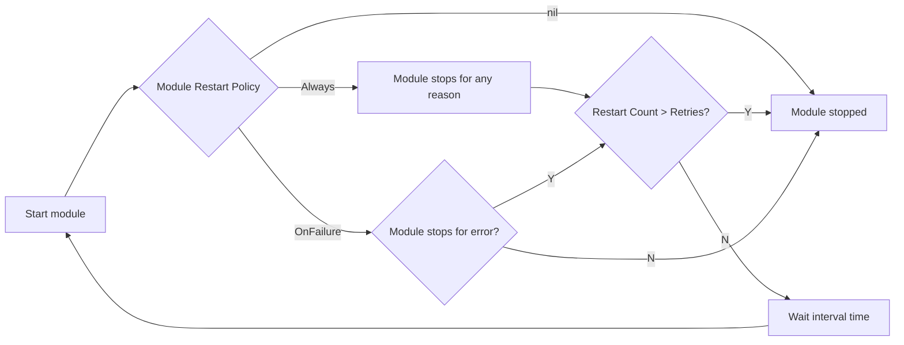
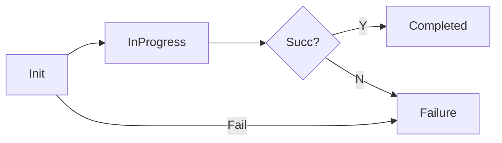
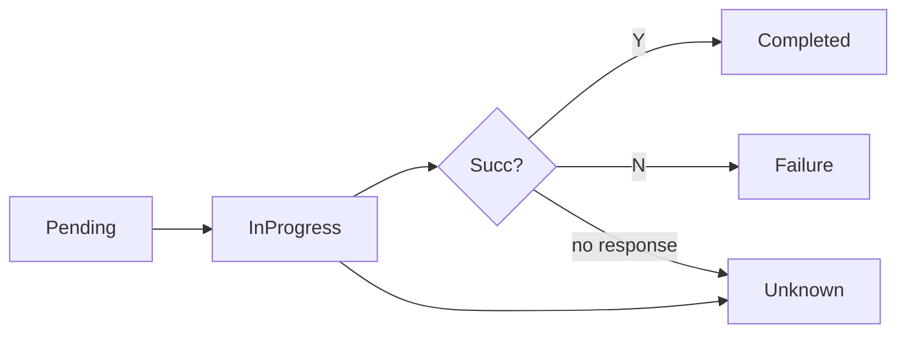
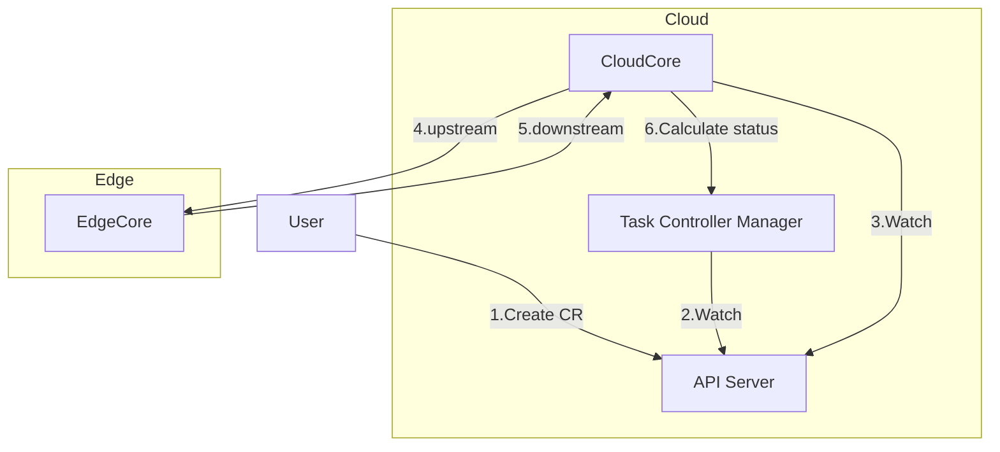
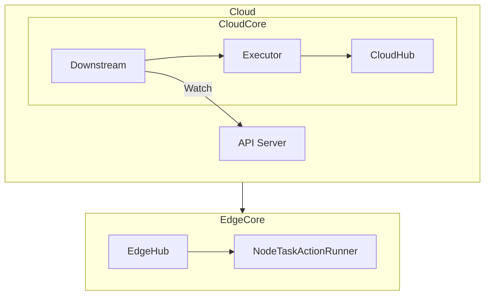
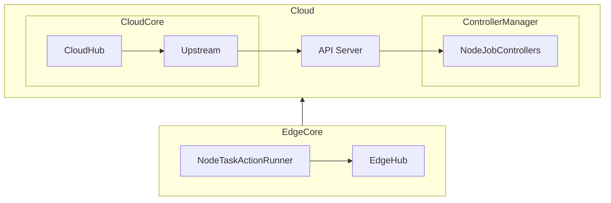

<a id="doc-12e0a48d6c5f2a58f4caa284"></a>

# kubeedge/kubeedge / ADOPTERS.md

Upstream: https://github.com/kubeedge/kubeedge/blob/ceb5eacd15ecd7c4c92907542c205f4a5f464108/ADOPTERS.md

Commit: `ceb5eacd15ecd7c4c92907542c205f4a5f464108`

Retrieved: 2026-10-01T15:22:18.595350+00:00

Kind: official-document

Raw SHA256: `ab5bcb26dad5d53503380b080b53a51dd33f07ff8cbe04948be199bb5a686c1c`

Source text below is untrusted reference content. Acquisition does not verify technical claims.

License status: UPSTREAM_NOTICES_CAPTURED_PER_FILE_REVIEW_REQUIRED. See this repository's captured license files.

---

# KubeEdge Adopters

KubeEdge is used by many companies. If you are using KubeEdge in your organization, please feel free to add your company logo to the list!

<a href="https://www.huaweicloud.com/en-us/product/ief.html" border="0" target="_blank"></a>
<a href="https://www.twowinit.com/" border="0" target="_blank"></a> &nbsp; &nbsp;
<a href="https://www.pitsdatenrettung.de/" border="0" target="_blank"></a> &nbsp; &nbsp;
<a href="https://cucc.wocloud.cn/" border="0" target="_blank"></a> &nbsp; &nbsp;
<a href="https://www.raisecom.com/" border="0" target="_blank"></a> &nbsp; &nbsp; &nbsp;<br/><br/>
<a href="https://kubesphere.io" border="0" target="_blank"></a> &nbsp; &nbsp; &nbsp;
<a href="http://xh-iot.net/" border="0" target="_blank"></a> &nbsp; &nbsp; &nbsp;
<a href="http://www.jylink.com/" border="0" target="_blank"></a> &nbsp; &nbsp; &nbsp;<br/><br/>
<a href="http://www.ictnj.ac.cn/" border="0" target="_blank"></a>&nbsp; &nbsp; &nbsp;
<a href="https://www.daocloud.io/" border="0" target="_blank"></a>&nbsp; &nbsp; &nbsp;<br/><br/>

## Success Stories

### Raisecom Technology CO.,Ltd.

#### Challenge

It is an important demand for the manufactory of Raisecom Technology to ensure the industrial production safety. Traditional workers’ production safety was detected manually, which was slow and inefficient. The situation that workers did not obey the safety requirements still happened, and it could be ignored sometimes, which could generate great safety risks and affect the production efficiency of the factory.


#### Solution

An industrial intelligent monitoring application with AI algorithms was developed to replace the manual method. An intelligent application alone was not enough and new problems arose such as the deployment and management of the intelligent edge application and the collaboration between training on the cloud and reasoning on the edge, which could become a bottleneck for the largescale application of the solution in the industrial production environment.

China Telecom Research Institute used KubeEdge as an important part of the implementation of the intelligent monitoring solution to help Raisecom Technology to solve the problem. Architect Xiaohou Shi from China Telecom Research Institute completed the design of this solution. In this case, the safety status of factory workers was monitored by the industrial vision application in real time with the deep learning algorithm. KubeEdge was introduced as an edge computing platform for the management of the edge devices and the running environment of the intelligent monitoring application. The monitoring model could be trained on the cloud and deployed to the edge nodes for reasoning execution automatically via KubeEdge, which could improve the efficiency of the operation and reduce the cost of the maintenance.


#### Impact

In this application scenario, KubeEdge completed the unified management of edge applications. KubeEdge could also make full use of the advantages of the collaboration of the cloud and edge. With the help of KubeEdge as the edge computing platform, the monitoring on safety of the manufactory with AI was completed effectively, which reduced the occurrence of safety accidents and improved the production efficiency of the manufactory.

Based on this successful case, more deep learning algorithm will be deployed on KubeEdge to handle problems on edge computing. More cooperation about scenario-faced industrial intelligent application with KubeEdge will be carried out in the future.

### XingHai IoT

#### Challenges
Xinghai IoT is an IoT company that provides comprehensive smart building solutions by leveraging a construction IoT platform, intelligent hardware, and AI. It is a creator and practitioner of smart campus standards for China Overseas Property Management and a core full-chain service provider of smart campus solutions from Huawei.

The company serves its customers in 80 major cities in China and around the world. It has delivered 741 projects, covering more than 156 million square meters. Its business covers a diverse range of building types, such as high-end residential buildings, commercial complexes, super office buildings, government properties, and industrial parks.

In recent years, as its business expands and occupant demands for service quality grow, Xinhai IoT has been committed to using edge computing and IoT to build sustainable smart campuses, improving efficiency for campus operations and management.

#### Highlights
Xinghai IoT now offers services in a wide range of areas. Therefore, its solutions should be portable and replicable and need to ensure real-time data processing and secure data storage. KubeEdge, with services designed for cloud native development and edge-cloud synergy, has become an indispensable part of Xinghai IoT for building smart campuses.
+ Container images are built once to run anywhere, effectively reducing the deployment and O&M complexity of new campuses.
+ Edge-cloud synergy enables data to be processed at the edge, ensuring real-time performance and security and lowering network bandwidth costs.
+ KubeEdge makes adding hardware easy and supports common protocols. No secondary development is needed.

#### Benefits
Xinghai IoT built a smart campus with cloud-edge-device synergy based on KubeEdge and its own Xinghai IoT cloud platform, greatly improving the efficiency of campus management. With AI assistance, nearly 30% of the repetitive work is automated. In the future, Xinghai IoT will continue to collaborate with KubeEdge to launch KubeEdge-based smart campus solutions.


## Jingying Shuzhi Technology Co., Ltd

### Business Background
Jingying Shuzhi Technology Co., Ltd focuses on providing security monitoring and management solutions for coal mining and gas enterprises. Their solutions cover reliable, stable data collection and transmission, on-site perception, risk prediction, and intelligent supervision to help these enterprises improve production security and reduce management costs. By leveraging AIoT and cloud-edge-device synergy, Jingying Shuzhi Technology Co., Ltd has built an intelligent sensing network for safe production in high-risk industries, promoting the in-depth integration of next-generation information technologies and safe production.

### Highlights
Jingying Shuzhi Technology Co., Ltd worked with KubeEdge to develop the Mine Brain solution, which covers the cloud, edge, and devices and makes coal production safer. This solution has the following advantages:
+ KubeEdge is compatible with the Kubernetes ecosystem. It allows Kubernetes applications to be smoothly migrated to KubeEdge, greatly improving deployment efficiency.
+ AI models are trained on the cloud and model inference is performed on the edge, greatly improving resource utilization and inference speed.
+ Service instances can recover automatically and run normally even if edge nodes are disconnected from the cloud, so the system is more reliable.
+ Edge intelligence, powerful computing, and management of a massive number of edge devices makes precise audio and video recognition possible for a range of different scenarios.

With a foundation based on years of accumulated experience, Jingying Shuzhi Technology Co., Ltd has developed the ability to handle many AI scenarios and cloud-edge-device O&M, effectively ensuring reliable services and precise recognition.

### Benefits
With the Mine Brain solution, coal mining enterprises in Shanxi have achieved intelligent coal mining in more than 1,000 mines. AI analysis algorithms delivered from the cloud to mining sites provide real-time risk assessments with an identification rate of up to 98%. Centralized monitoring of IT infrastructure at remote sites has reduced the cost of O&M by 65%, and integrated full-stack IT devices have reduced deployment costs by 75%. The Mine Brain solution has helped the coal industry ensure safe production, and ultimately achieved intelligent upgrade for the entire industry.
Jingying Shuzhi Technology Co., Ltd will continue to work with KubeEdge, leveraging AI, IoT, and big data technologies to launch comprehensive intelligent edge solutions for safe production in the coal industry.


<a id="doc-06572a96a58dc510037d5efa"></a>

# kubeedge/kubeedge / CHANGELOG.md

Upstream: https://github.com/kubeedge/kubeedge/blob/ceb5eacd15ecd7c4c92907542c205f4a5f464108/CHANGELOG.md

Commit: `ceb5eacd15ecd7c4c92907542c205f4a5f464108`

Retrieved: 2026-10-01T15:22:18.595350+00:00

Kind: official-document

Raw SHA256: `b540efd45d2cca1e43fbae8a99a71bf800cf11c10663ef49f43ef3d5484f502d`

Source text below is untrusted reference content. Acquisition does not verify technical claims.

License status: UPSTREAM_NOTICES_CAPTURED_PER_FILE_REVIEW_REQUIRED. See this repository's captured license files.

---

CHANGELOG/README.md

<a id="doc-6e23b512656a4dede4806ee4"></a>

# kubeedge/kubeedge / CHANGELOG/CHANGELOG-1.0.md

Upstream: https://github.com/kubeedge/kubeedge/blob/ceb5eacd15ecd7c4c92907542c205f4a5f464108/CHANGELOG/CHANGELOG-1.0.md

Commit: `ceb5eacd15ecd7c4c92907542c205f4a5f464108`

Retrieved: 2026-10-01T15:22:18.595350+00:00

Kind: official-document

Raw SHA256: `74c1bb6ca9e4cfaacd948554c0369177034682ee7cbd96a5e567cf874c9a71e2`

Source text below is untrusted reference content. Acquisition does not verify technical claims.

License status: UPSTREAM_NOTICES_CAPTURED_PER_FILE_REVIEW_REQUIRED. See this repository's captured license files.

---


  * [v1.0.0](#v100)
     * [Downloads for v1.0.0](#downloads-for-v100)
        * [KubeEdge Binaries](#kubeedge-binaries)
        * [Installer Binaries](#installer-binaries)
        * [EdgeSite Binaries](#edgesite-binaries)
     * [KubeEdge v1.0 Release Notes](#kubeedge-v10-release-notes)
        * [1.0 What's New](#10-whats-new)
        * [Known Issues](#known-issues)
        * [Other notable changes](#other-notable-changes)
  * [v1.0.0-beta.0](#v100-beta0)
     * [Downloads for v1.0.0-beta.0](#downloads-for-v100-beta0)
        * [KubeEdge Binaries](#kubeedge-binaries-1)
        * [Installer Binaries](#installer-binaries-1)
        * [EdgeSite Binaries](#edgesite-binaries-1)
     * [Changelog since v0.3.0](#changelog-since-v030)
        * [Features Added](#features-added)
        * [Known Issues](#known-issues-1)
        * [Other notable changes](#other-notable-changes-1)

# v1.0.0

## Downloads for v1.0.0

### KubeEdge Binaries
| filename | Size | sha512 hash |
| -------- | ---- | ----------- |
| [kubeedge-v1.0.0-linux-amd64.tar.gz](https://github.com/kubeedge/kubeedge/releases/download/v1.0.0/kubeedge-v1.0.0-linux-amd64.tar.gz) | 46.3 MB | `43839f1e539361d8eacf6b7d2c5f8664f886c15ad5b1199253b62ddbe7f1eec48e0b407992780a51c63448228977b7956e81a208daebb8c9f2ed17ed44a2ba3a` |
| [kubeedge-v1.0.0-linux-arm.tar.gz](https://github.com/kubeedge/kubeedge/releases/download/v1.0.0/kubeedge-v1.0.0-linux-arm.tar.gz) | 43.4 MB | `c6635e4c61fe88a833a1d4649ea65cd98cc4a3dc2494f4b3194e2ba84f2765a4b1c4c58cab02237c9dc772c4147baea107af283318006623e8439c72ce7b7831` |

### Installer Binaries
| filename | Size | sha512 hash |
| -------- | ---- | ----------- |
| [keadm-v1.0.0-linux-amd64.tar.gz](https://github.com/kubeedge/kubeedge/releases/download/v1.0.0/keadm-v1.0.0-linux-amd64.tar.gz) | 7.74 MB | `ed92444996665d1a1952da66047d389465e0e5930b47d78e88d6f146c8d480bc9b14a3fbac190ab70f76d89060da7856436f52240aa9b3f83b8bb990c6f15204` |

### EdgeSite Binaries
| filename | Size | sha512 hash |
| -------- | ---- | ----------- |
| [edgesite-v1.0.0-linux-amd64.tar.gz](https://github.com/kubeedge/kubeedge/releases/download/v1.0.0/edgesite-v1.0.0-linux-amd64.tar.gz) | 24.6 MB | `afe61db4908fa67e0aadd8ab26e35224a1de8096130c2df681780befdc317331c8a2be2a298d89e6603ad36dd19e339f7256f887d1d2fd5464b3ab4c43aae3c8` |
| [edgesite-v1.0.0-linux-arm.tar.gz](https://github.com/kubeedge/kubeedge/releases/download/v1.0.0/edgesite-v1.0.0-linux-arm.tar.gz) | 22.5 MB | `1ea16aad0dc0f3517d9bddcc5de16d5b46dd881ac3cc4ff7522188dad176a517fa111c3b81a223e71f45d8e69096dbedf0703d9e2592dcec292a6231e455224d` |

## KubeEdge v1.0 Release Notes

### 1.0 What's New

**Edge Mesh**

This feature aims to support service mesh capabilities on the edge to support microservice communication cross cloud and edge. In v1.0.0 release, pod-to-pod communication on the same edge node or across edge nodes in the same subnet is supported.

**CRI support**

This feature enables edged to communicate with a CRI-compliant runtime to manage containers running on resource constrained edge nodes. Support for containerd is tested.

**Quic protocol support**

In order to enhance cloud and edge communication efficiency, communication between the edge and the cloud is now also supported via QUIC, a UDP-based protocol. CloudHub supports both Websocket and QUIC protocol access at the same time. The edgehub can choose one of the protocols to access the cloudhub.

**Modbus Mapper**

Modbus Mapper is an application that is used to connect and control devices that use Modbus(RTU/TCP) as a communication protocol. The user is required to provide the mapper with the information required to control their device through the dpl configuration file. These can be changed at runtime by updating configmap.

**Edge Site**

Edge Site enables to run a standalone Kubernetes cluster at the edge along with KubeEdge to get full control and improve the offline scheduling capability. A Kubernetes cluster is deployed at edge location including the management control plane. For the management control plane to manage a reasonable scale of edge worker nodes, the host master node needs to have sufficient resources.

### Known Issues

- Reliable message delivery is missing between cloud and edge.

- Installer currently doesn't support installation of containerd, cni-plugins.

- Port mapping is not supported in CRI.

### Other notable changes

- Pods created using CRI on deletion remain in terminating status. ([#755](https://github.com/kubeedge/kubeedge/pull/755), [@gpinaik](https://github.com/gpinaik))

- fix bug: replace value in key, value by expected ([#759](https://github.com/kubeedge/kubeedge/pull/759), [@RicardoZPHuang](https://github.com/RicardoZPHuang))

- update edge_core version to reflect the vendor k8s and kubeedge version ([#761](https://github.com/kubeedge/kubeedge/pull/761), [@sids-b](https://github.com/sids-b))

- Edgesite documentation ([#737](https://github.com/kubeedge/kubeedge/pull/737), [@naveensriram](https://github.com/naveensriram))

- Moving keadm installer readme.md to Docs folder ([#745](https://github.com/kubeedge/kubeedge/pull/745), [@srivatsav123](https://github.com/srivatsav123))

- add edgemesh end to end test guide ([#758](https://github.com/kubeedge/kubeedge/pull/758), [@anyushun](https://github.com/anyushun))

- Changes made to Installer to support CRI ([#795](https://github.com/kubeedge/kubeedge/pull/795), [@srivatsav123](https://github.com/srivatsav123))

- Added documentation for device controller ([#743](https://github.com/kubeedge/kubeedge/pull/743), [@sujithsimon22](https://github.com/sujithsimon22))

# v1.0.0-beta.0

## Downloads for v1.0.0-beta.0

### KubeEdge Binaries
| filename | Size | sha512 hash |
| -------- | ---- | ----------- |
| [kubeedge-v1.0.0-beta.0-linux-amd64.tar.gz](https://github.com/kubeedge/kubeedge/releases/download/v1.0.0-beta.0/kubeedge-v1.0.0-beta.0-linux-amd64.tar.gz) | 46.3 MB | `3394427e02eb32e3b742878abba075d3d6fb6a90b1379d1ac7925410a270c4b54b510b93ad4839b952a5bb1627b6e019d843ce28f04f84052d75d2d1176466d9` |
| [kubeedge-v1.0.0-beta.0-linux-arm.tar.gz](https://github.com/kubeedge/kubeedge/releases/download/v1.0.0-beta.0/kubeedge-v1.0.0-beta.0-linux-arm.tar.gz) | 43.4 MB | `ff8736ca168570c9c14b7c83a0cb7330418b92ecf6165acd3fc633120db66e3e4b04de3e3744e1d8f6242d96da5e20e85ae49ddcc187e819c92e7f87ab0ad22a` |

### Installer Binaries
| filename | Size | sha512 hash |
| -------- | ---- | ----------- |
| [keadm-v1.0.0-beta.0-linux-amd64.tar.gz](https://github.com/kubeedge/kubeedge/releases/download/v1.0.0-beta.0/keadm-v1.0.0-beta.0-linux-amd64.tar.gz) | 7.74 MB | `6a8aa40e7be9eea11f884e21c6c7f2c72bc8f5763eea2a6bef3aaeeba61321ac8c1dff213d5e430c4a59163dce1e4e506c8a79bc4cdc6a86c40cfad48f6c5764` |

### EdgeSite Binaries
| filename | Size | sha512 hash |
| -------- | ---- | ----------- |
| [edgesite-v1.0.0-beta.0-linux-amd64.tar.gz](https://github.com/kubeedge/kubeedge/releases/download/v1.0.0-beta.0/edgesite-v1.0.0-beta.0-linux-amd64.tar.gz) | 24.6 MB | `2f8487acdcad6673ba7ffb849c20d5dd4959ca79b5c8407d08710a990dec3bd0a743180b723f94294de11089c9d98acbd5e4933d0f8b077ecaeae0a35cf69d71` |
| [edgesite-v1.0.0-beta.0-linux-arm.tar.gz](https://github.com/kubeedge/kubeedge/releases/download/v1.0.0-beta.0/edgesite-v1.0.0-beta.0-linux-arm.tar.gz) | 22.5 MB | `e9c80fe480c065a6561afe6fd60fe3515850cb7ab98d06df8c206a7ae6a541b63b5a74fce968408afc4d43a82ac0b8d227c524f002659e9b4fd4b5972260e30c` |

## Changelog since v0.3.0

### Features Added


**Edge Mesh**

This feature aims to support service mesh capabilities on the edge to support microservice communication cross cloud and edge. In v1.0.0 release , pod-to-pod communication on the same edge node or across
edge nodes in the same subnet is supported.

**CRI support**

This feature enables edged to talk to a CRI-compliant runtime to manage containers running on resource constrained edge nodes. Support for containerd is tested.


**Quic protocol support**

In order to enhance cloud and edge communication efficiency, communication between the edge and the cloud is now also supported via QUIC , a UDP-based protocol. CloudHub supports both Websocket and QUIC protocol access at the same time. The edgehub can choose one of the protocols to access the cloudhub.


**Modbus Mapper**

Modbus Mapper is an application that is used to connect and control devices that use Modbus(RTU/TCP) as a communication protocol.  The user is required to provide the mapper with the information required to control their device through the dpl configuration file. These can be changed at runtime by updating configmap.


**Edge Site**

Edge Site enables to run a standalone Kubernetes cluster at the edge along with KubeEdge to get full control and improve the offline scheduling capability. A Kubernetes cluster is deployed at edge location including the management control plane. For the management control plane to manage a reasonable scale of edge worker nodes, the host master node needs to have sufficient resources.


### Known Issues

- Reliable message delivery is missing between cloud and edge.


### Other notable changes

- add response logic for node status updating. ([#527](https://github.com/kubeedge/kubeedge/pull/527), [@shouhong](https://github.com/shouhong))

- Consolidate the kube config at controller. ([#554](https://github.com/kubeedge/kubeedge/pull/554), [@shouhong](https://github.com/shouhong))

- GetClient return error info. ([#610](https://github.com/kubeedge/kubeedge/pull/610), [@kadisi](https://github.com/kadisi))

- removing race condition in dtcontext. ([#653](https://github.com/kubeedge/kubeedge/pull/653), [@subpathdev](https://github.com/subpathdev))

- added edge node role label while running installer ([#644](https://github.com/kubeedge/kubeedge/pull/644), [@sids-b](https://github.com/sids-b))

- fix build under macOS ([#635](https://github.com/kubeedge/kubeedge/pull/635), [@kevin-wangzefeng](https://github.com/kevin-wangzefeng))

- docs:[Fix:#608]: Open ports to cloud component for edge nodes in the installer(keadm) readme ([#632](https://github.com/kubeedge/kubeedge/pull/635), [@vizero1](https://github.com/vizero1))

- fix message lost ([#656](https://github.com/kubeedge/kubeedge/pull/656), [@edisonxiang](https://github.com/edisonxiang))

- Add file checksum comparison while downloading KubeEdge binaries ([#595](https://github.com/kubeedge/kubeedge/pull/595), [@shouhong](https://github.com/shouhong))

- KubeEdge Installer: Adding support to establish secure connectivity between edgecontroller and K8S api-server ([#557](https://github.com/kubeedge/kubeedge/pull/557), [@kadisi](https://github.com/kadisi))

- controller check error ([#599](https://github.com/kubeedge/kubeedge/pull/599), [@subpathdev](https://github.com/subpathdev))

- Issue #631: Add validation of required fields for device model and device instance ([#669](https://github.com/kubeedge/kubeedge/pull/669), [@rohitsardesai83](https://github.com/rohitsardesai83))

- Changing AccessMode values to match API validation ([#677](https://github.com/kubeedge/kubeedge/pull/677), [@sujithsimon22](https://github.com/sujithsimon22))

- Added conversion operations for read action of action manager ([#684](https://github.com/kubeedge/kubeedge/pull/684), [@sujithsimon22](https://github.com/sujithsimon22))


<a id="doc-be150b4577165134bda81481"></a>

# kubeedge/kubeedge / CHANGELOG/CHANGELOG-1.1.md

Upstream: https://github.com/kubeedge/kubeedge/blob/ceb5eacd15ecd7c4c92907542c205f4a5f464108/CHANGELOG/CHANGELOG-1.1.md

Commit: `ceb5eacd15ecd7c4c92907542c205f4a5f464108`

Retrieved: 2026-10-01T15:22:18.595350+00:00

Kind: official-document

Raw SHA256: `2c6be9b8196486908a8b31ba7e1d6cca45970c1bdadc6e2f12edc8554bfcdd4a`

Source text below is untrusted reference content. Acquisition does not verify technical claims.

License status: UPSTREAM_NOTICES_CAPTURED_PER_FILE_REVIEW_REQUIRED. See this repository's captured license files.

---


  * [v1.1.0](#v110)
     * [Downloads for v1.1.0](#downloads-for-v110)
        * [KubeEdge Binaries](#kubeedge-binaries)
        * [Installer Binaries](#installer-binaries)
        * [EdgeSite Binaries](#edgesite-binaries)
     * [KubeEdge v1.1 Release Notes](#kubeedge-v11-release-notes)
        * [1.1 What's New](#11-whats-new)
        * [Known Issues](#known-issues)
        * [Other notable changes](#other-notable-changes)

# v1.1.0

## Downloads for v1.1.0

### KubeEdge Binaries
| filename | Size | sha512 hash |
| -------- | ---- | ----------- |
| [kubeedge-v1.1.0-linux-amd64.tar.gz](https://github.com/kubeedge/kubeedge/releases/download/v1.1.0/kubeedge-v1.1.0-linux-amd64.tar.gz) | 76.3 MB | `f28aebb6ac26e859f8f2510987dd727e018a3c6cd3bdbb66464228cd2f32387cc4d216275cd3cba9c78216f143a611ad3b3c7e2bfc70648da6f73f46d6f85084` |
| [kubeedge-v1.1.0-linux-arm.tar.gz](https://github.com/kubeedge/kubeedge/releases/download/v1.1.0/kubeedge-v1.1.0-linux-arm.tar.gz) | 70.9 MB | `4fafd8447dca3466a42d145f3e229f186d8725b53ec6a51681b9f79cdda4b955bef7494c7b7a68513eccb9393383a50c850b76e3b678ae1da1b198b891d9e09e` |

### Installer Binaries
| filename | Size | sha512 hash |
| -------- | ---- | ----------- |
| [keadm-v1.1.0-linux-amd64.tar.gz](https://github.com/kubeedge/kubeedge/releases/download/v1.1.0/keadm-v1.1.0-linux-amd64.tar.gz) | 8.27 MB | `0f17124675adcb2396771b5ac872cf60b09b32e5d18ab5909c243c7a97adb56acd428e21df3073ec5df701ce08ae8dead98f7cd4b38e323cc9aed60c97c0df41` |

### EdgeSite Binaries
| filename | Size | sha512 hash |
| -------- | ---- | ----------- |
| [edgesite-v1.1.0-linux-amd64.tar.gz](https://github.com/kubeedge/kubeedge/releases/download/v1.1.0/edgesite-v1.1.0-linux-amd64.tar.gz) | 27.4 MB | `a16d7f5e2f45ecb0f500f794c4f07ea74b2663bcac8008711a44b3cdea34d1f104f38c1c147ca90f3ab1ff7cf529d4445c1da34c3eff3386fc9b98f45ee173be` |
| [edgesite-v1.1.0-linux-arm.tar.gz](https://github.com/kubeedge/kubeedge/releases/download/v1.1.0/edgesite-v1.1.0-linux-arm.tar.gz) | 25.1 MB | `facef575c67759d234568fef16cf7d8e2797874520f845817b56372a45413448aa55a9014d33de5535dd7a73b4d521ad5ebdedaff9f147e838a7f8d2887f4bf4` |

## KubeEdge v1.1 Release Notes

### 1.1 What's New

**Container Storage Interface (CSI) support**

This feature enables running applications with persistent data store at edge and KubeEdge to support [basic CSI Volume Lifecycle](https://github.com/container-storage-interface/spec/blob/master/spec.md#volume-lifecycle) and is compatible with Kubernetes and CSI.

**Dynamic Admission Control Webhook**

Admission control webhook is an effective way of validating/mutating the object configuration for KubeEdge API objects like devicemodels, devices.

**Kubernetes Upgrade**

Upgrade the venderod kubernetes version to v1.15.3, so users can use the feature of new version on the cloud and on the edge side.

**KubeEdge local setup scripts**

A bash script that can start a KubeEdge cluster in a VM with cloudcore, edgecore binaries and kind. It uses kind to start K8s cluster and runs cloudcore, edgecore binaries as processes in a single VM.

### Known Issues

- Reliable message delivery between cloud and edge is missing.

- There is no logic to partition the configmap containing multiple device models and device instances.

### Other notable changes

- Add New Feature: support dockershim in edged. ([#829](https://github.com/kubeedge/kubeedge/pull/829), [@arcanique](https://github.com/arcanique))

- Fix edge_core cannot connect to edgecontroller after disconnecting once ([#870](https://github.com/kubeedge/kubeedge/pull/870), [@shouhong](https://github.com/shouhong))

- Raspberry Pi3/4 cross build ([#903](https://github.com/kubeedge/kubeedge/pull/903), [@subpathdev](https://github.com/subpathdev))

- Upgrade to Kubernetes v1.15 ([#941](https://github.com/kubeedge/kubeedge/pull/941), [@edisonxiang](https://github.com/edisonxiang))

- Use go mod ([#947](https://github.com/kubeedge/kubeedge/pull/947), [@subpathdev](https://github.com/subpathdev))

- Rename device dir to mappers which places mappers ([#966](https://github.com/kubeedge/kubeedge/pull/966), [@fisherxu](https://github.com/fisherxu))

- New feature: L4 Proxy support in edgemesh ([#970](https://github.com/kubeedge/kubeedge/pull/970), [@arcanique](https://github.com/arcanique))

- Initialize feature lifecycle doc ([#850](https://github.com/kubeedge/kubeedge/pull/850), [@kevin-wangzefeng](https://github.com/kevin-wangzefeng))

- Change go version from go 1.11 to go 1.12 ([#982](https://github.com/kubeedge/kubeedge/pull/982), [@kadisi](https://github.com/kadisi))

- Add admission webhook for validate device CRD ([#984](https://github.com/kubeedge/kubeedge/pull/984), [@chendave](https://github.com/chendave))

- Rename edgecontroller to cloudcore  ([#988](https://github.com/kubeedge/kubeedge/pull/988), [@fisherxu](https://github.com/fisherxu))

- Rename edge_core to edgecore ([#999](https://github.com/kubeedge/kubeedge/pull/999), [@kexun](https://github.com/kexun))

- Unifying logging library to klog  ([#1019](https://github.com/kubeedge/kubeedge/pull/1019), [@kadisi](https://github.com/kadisi))

- Add in-tree csi plugin implementations ([#1047](https://github.com/kubeedge/kubeedge/pull/1047), [@edisonxiang](https://github.com/edisonxiang))

- Add csi driver from kubeedge ([#1059](https://github.com/kubeedge/kubeedge/pull/1019), [@edisonxiang](https://github.com/edisonxiang))

- Add local up kubeedge script ([#1085](https://github.com/kubeedge/kubeedge/pull/1085), [@fisherxu](https://github.com/fisherxu))

- Fix panic: concurrent write to websocket ([#1112](https://github.com/kubeedge/kubeedge/pull/1112), [@fisherxu](https://github.com/fisherxu))


<a id="doc-549522f6588d770803fc5506"></a>

# kubeedge/kubeedge / CHANGELOG/CHANGELOG-1.10.md

Upstream: https://github.com/kubeedge/kubeedge/blob/ceb5eacd15ecd7c4c92907542c205f4a5f464108/CHANGELOG/CHANGELOG-1.10.md

Commit: `ceb5eacd15ecd7c4c92907542c205f4a5f464108`

Retrieved: 2026-10-01T15:22:18.595350+00:00

Kind: official-document

Raw SHA256: `279eec63540953551e85221aef4ea69f6fa5cd85582e9fabefe366ca34d6aace`

Source text below is untrusted reference content. Acquisition does not verify technical claims.

License status: UPSTREAM_NOTICES_CAPTURED_PER_FILE_REVIEW_REQUIRED. See this repository's captured license files.

---

* [v1.10.3](#v1103)
    * [Downloads for v1.10.3](#downloads-for-v1103)
    * [KubeEdge v1.10.3 Release Notes](#kubeedge-v1103-release-notes)
        * [Changelog since v1.10.2](#changelog-since-v1102)
* [v1.10.2](#v1102)
    * [Downloads for v1.10.2](#downloads-for-v1102)
    * [KubeEdge v1.10.2 Release Notes](#kubeedge-v1102-release-notes)
        * [Changelog since v1.10.1](#changelog-since-v1101)
* [v1.10.1](#v1101)
    * [Downloads for v1.10.1](#downloads-for-v1101)
    * [KubeEdge v1.10.1 Release Notes](#kubeedge-v1101-release-notes)
        * [Changelog since v1.10.0](#changelog-since-v1100)
* [v1.10.0](#v1100)
    * [Downloads for v1.10.0](#downloads-for-v1100)
    * [KubeEdge v1.10 Release Notes](#kubeedge-v110-release-notes)
        * [1.10 What's New](#110-whats-new)
        * [Important Steps before Upgrading](#important-steps-before-upgrading)
        * [Other Notable Changes](#other-notable-changes)
        * [Bug Fixes](#bug-fixes)

# v1.10.3

## Downloads for v1.10.3

Download v1.10.3 in the [v1.10.3 release page](https://github.com/kubeedge/kubeedge/releases/tag/v1.10.3).

## KubeEdge v1.10.3 Release Notes

### Changelog since v1.10.2

- Fix pod running on edge node has invalid serviceaccount token. ([#4205](https://github.com/kubeedge/kubeedge/pull/4205), [@vincentgoat](https://github.com/vincentgoat))
- Fix: Ignore the cache timestamp of the MachineInfo Metrics. ([#4179](https://github.com/kubeedge/kubeedge/pull/4179), [@tonyzaizai](https://github.com/tonyzaizai))
- Fix residual terminating pods problem after edge node. ([#4193](https://github.com/kubeedge/kubeedge/pull/4193), [@vincentgoat](https://github.com/vincentgoat))
- Fix sendresp stuck occasionally when sendsync receive select. ([#4211](https://github.com/kubeedge/kubeedge/pull/4211), [@wackxu](https://github.com/wackxu))
- Fix delete and create same name pod failed occasionally. ([#4223](https://github.com/kubeedge/kubeedge/pull/4223), [@wackxu](https://github.com/wackxu))


# v1.10.2

## Downloads for v1.10.2

Download v1.10.2 in the [v1.10.2 release page](https://github.com/kubeedge/kubeedge/releases/tag/v1.10.2).

## KubeEdge v1.10.2 Release Notes

### Changelog since v1.10.1

- Fix invalid request. ([#4039](https://github.com/kubeedge/kubeedge/pull/4039), [@vincentgoat](https://github.com/vincentgoat))
- Fix complex parameters. ([#4028](https://github.com/kubeedge/kubeedge/pull/4028), [@vincentgoat](https://github.com/vincentgoat))
- Fix possible nil pointer of message. ([#4029](https://github.com/kubeedge/kubeedge/pull/4029), [@vincentgoat](https://github.com/vincentgoat))
- Missing error check for unsafe method. ([#4031](https://github.com/kubeedge/kubeedge/pull/4031), [@vincentgoat](https://github.com/vincentgoat))
- Possible type confusions. ([#4030](https://github.com/kubeedge/kubeedge/pull/4030), [@vincentgoat](https://github.com/vincentgoat))
- Update deprecate dependency. ([#4032](https://github.com/kubeedge/kubeedge/pull/4032), [@vincentgoat](https://github.com/vincentgoat))


# v1.10.1

## Downloads for v1.10.1

Download v1.10.1 in the [v1.10.1 release page](https://github.com/kubeedge/kubeedge/releases/tag/v1.10.1).

## KubeEdge v1.10.1 Release Notes

### Changelog since v1.10.0

- Fix fuzzer extract message error. ([#3947](https://github.com/kubeedge/kubeedge/pull/3947), [@vincentgoat](https://github.com/vincentgoat))
- Fix removing container failed issue. ([#3831](https://github.com/kubeedge/kubeedge/pull/3831), [@gy95](https://github.com/gy95))
- Pods yaml configure imagePullSecret but doesn't exist in kubernetes cluster. ([#3819](https://github.com/kubeedge/kubeedge/pull/3819), [@vincentgoat](https://github.com/vincentgoat))
- Set deleteResource function parameter `allowsOptions` value to true. ([#3741](https://github.com/kubeedge/kubeedge/pull/3741), [@Shelley-BaoYue](https://github.com/Shelley-BaoYue))
- Support build tool `armhf`. ([#3726](https://github.com/kubeedge/kubeedge/pull/3726), [@fisherxu](https://github.com/fisherxu))
- Fix concurrent map iteration and map write bug. ([#3710](https://github.com/kubeedge/kubeedge/pull/3710), [@Shelley-BaoYue](https://github.com/Shelley-BaoYue))
- Add sub-resource field in application. ([#3703](https://github.com/kubeedge/kubeedge/pull/3703), [@Shelley-BaoYue](https://github.com/Shelley-BaoYue))
- Fix readinessProbe and startupProbe unavailable issue after upgrade. ([#3685](https://github.com/kubeedge/kubeedge/pull/3685), [@wackxu](https://github.com/wackxu))

# v1.10.0

## Downloads for v1.10.0

Download v1.10.0 in the [v1.10.0 release page](https://github.com/kubeedge/kubeedge/releases/tag/v1.10.0).

## KubeEdge v1.10 Release Notes

## 1.10 What's New

### Installation Experience Improvement with Keadm

Keadm adds some new sub-commands to improve the user experience, including containerized deployment, offline installation, etc. New sub-commands including: beta, config.

`beta` provides some sub-commands that are still in testing, but have complete functions and can be used in advance. Sub-commands including: beta init, beta manifest generate, beta join, beta reset.

- `beta init`: CloudCore Helm Chart is integrated in beta init, which can be used to deploy containerized CloudCore.

- `beta join`: Installing edgecore as system service from docker image, no need to download from github release.

- `beta reset`: Reset the node, clean up the resources installed on the node by `beta init` or `beta join`. It will automatically detect the type of node to clean up.

- `beta manifest generate`: Generate all the manifests to deploy the cloudside components.


`config` is used to configure kubeedge cluster, like cluster upgrade, API conversion, image preloading. 
Now the image preloading has supported, sub-commands including: config images list, config images pull.

- `config images list`: List all images required for kubeedge installation.

- `config images pull`: Pull all images required for kubeedge installation.

Refer to the links for more details.
([#3517](https://github.com/kubeedge/kubeedge/issues/3517), [#3540](https://github.com/kubeedge/kubeedge/pull/3540),
[#3554](https://github.com/kubeedge/kubeedge/pull/3554), [#3534](https://github.com/kubeedge/kubeedge/pull/3534))


### Preview version for Next-gen Edged: Suitable for more scenarios

A new version of the lightweight engine Edged, which is optimized from kubelet and integrated in edgecore, and occupies less resource.
Users can customize lightweight optimization according to their needs.

Refer to the links for more details.
(Dev-Branch for previewing: [feature-new-edged](https://github.com/kubeedge/kubeedge/tree/feature-new-edged))


### Edgemark: Support large-scale KubeEdge cluster performance testing

Edgemark is a performance testing tool inherited from Kubemark. The primary use case of Edgemark is also scalability testing, 
it allows users to simulate edge clusters, which can be much bigger than the real ones.

Edgemark consists of two parts: real cloud part components and a set of "Hollow" Edge Nodes. In "Hollow" Edge Nodes, EdgeCore runs in container.
The edged module runs with an injected mock CRI part that doesn't do anything. 
So the hollow edge node doesn't actually start any containers, and also doesn't mount any volumes. 


Refer to the links for more details.
([#3637](https://github.com/kubeedge/kubeedge/pull/3637))


### EdgeMesh proxy tunnel supports quic

Users can choose edgemesh's proxy tunnel as quic protocol to transmit data. In edge scenarios, nodes are often in a weak network environment.
Compared with the traditional tcp protocol, the quic protocol has better performance and QoS in the weak network environment.

Refer to the links for more details.
([#281](https://github.com/kubeedge/edgemesh/pull/281))


### EdgeMesh supports proxy for udp applications

Some users' services use the udp protocol, and now edgemesh can also support the proxy of udp applications.

Refer to the links for more details.
([#295](https://github.com/kubeedge/edgemesh/pull/295))


### EdgeMesh support SSH login between cloud-edge/edge-edge nodes

Edge nodes are generally distributed in the Private network environment, but it is often necessary to ssh login and operate the edge node.
EdgeMesh provide a socks5proxy based on the tunnel inside EdgeMesh, which supports forwarding ssh requests from cloud/edge nodes to edge nodes.

Refer to the links for more details.
([#258](https://github.com/kubeedge/edgemesh/pull/258), [#242](https://github.com/kubeedge/edgemesh/pull/242))


### Kubernetes Dependencies Upgrade

Upgrade the vendered kubernetes version to v1.22.6, users now can use the feature of new version
on the cloud and on the edge side.

Refer to the links for more details.
([#3624](https://github.com/kubeedge/kubeedge/pull/3624))


## Important Steps before Upgrading

If you want to deploy the KubeEdge v1.10.0, please note that the Kubernetes dependency is 1.22.6.


## Other Notable Changes

- Remove dependency on os/exec and curl in favor of net/http ([#3409](https://github.com/kubeedge/kubeedge/pull/3409), [@mjlshen](https://github.com/mjlshen))
- Optimize script when create stream cert ([#3412](https://github.com/kubeedge/kubeedge/pull/3412), [@gujun4990](https://github.com/gujun4990))
- Cloudhub: prevent dropping volume messages ([#3457](https://github.com/kubeedge/kubeedge/pull/3457), [@moolen](https://github.com/moolen))
- Modify the log view command after edgecore is running ([#3456](https://github.com/kubeedge/kubeedge/pull/3456), [@zc2638](https://github.com/zc2638))
- Optimize the iptables manager ([#3461](https://github.com/kubeedge/kubeedge/pull/3461), [@zhu733756](https://github.com/zhu733756))
- Add script for build release ([#3467](https://github.com/kubeedge/kubeedge/pull/3467), [@gy95](https://github.com/gy95))
- Using lateset codes to do keadm_e2e ([#3469](https://github.com/kubeedge/kubeedge/pull/3469), [@gy95](https://github.com/gy95))
- Change the resourceType of msg issued by synccontroller ([#3496](https://github.com/kubeedge/kubeedge/pull/3496), [@Rachel-Shao](https://github.com/Rachel-Shao))
- Add a basic image for building various components of KubeEdge ([#3513](https://github.com/kubeedge/kubeedge/pull/3513), [@zc2638](https://github.com/zc2638))
- Supporting crossbuild all components ([#3515](https://github.com/kubeedge/kubeedge/pull/3515), [@fisherxu](https://github.com/fisherxu))
- support multi architecture image build ([#3530](https://github.com/kubeedge/kubeedge/pull/3530), [@gy95](https://github.com/gy95))
- filter pod by nodeName ([#3594](https://github.com/kubeedge/kubeedge/pull/3594), [@yz271544](https://github.com/yz271544))


## Bug Fixes

- Fix keadm check mqtt install bug ([#3359](https://github.com/kubeedge/kubeedge/pull/3359), [@jidalong](https://github.com/jidalong))
- beehive: fixes SendSync channel allocation behaviour ([#3413](https://github.com/kubeedge/kubeedge/pull/3413), [@ankitrgadiya](https://github.com/ankitrgadiya))
- Fix deviceTwin device update fields ([#3415](https://github.com/kubeedge/kubeedge/pull/3415), [@TianTianBigWang](https://github.com/TianTianBigWang))
- Fix pod exec is not close conn when edgecore is closed ([#3417](https://github.com/kubeedge/kubeedge/pull/3417), [@lvfei103650](https://github.com/lvfei103650))
- Fixes imagePullSecrets in cloudcore deployment and in iptablesManager daemonset ([#3443](https://github.com/kubeedge/kubeedge/pull/3443), [@zivAnyvision](https://github.com/zivAnyvision))
- fix crd create failed  ([#3444](https://github.com/kubeedge/kubeedge/pull/3444), [@gy95](https://github.com/gy95))
- Identify session not by IP of node for exec ([#3499](https://github.com/kubeedge/kubeedge/pull/3499), [@stingshen](https://github.com/stingshen))
- Fix the issue when cross-building for ARMv8 ([#3522](https://github.com/kubeedge/kubeedge/pull/3522), [@chendave](https://github.com/chendave))
- fix lots of duplicate logs "Failed to get obj" in objectsync.go ([#3570](https://github.com/kubeedge/kubeedge/pull/3570), [@vincentgoat](https://github.com/vincentgoat))
- fix remove os.Exit in updateNodeKubeletEndpoint ([#3571](https://github.com/kubeedge/kubeedge/pull/3571), [@lvfei103650](https://github.com/lvfei103650))
- fix: add missing metrics func ([#3581](https://github.com/kubeedge/kubeedge/pull/3581), [@moolen](https://github.com/moolen))
- Fix pv's objectsync spec.ObjectKind is empty ([#3599](https://github.com/kubeedge/kubeedge/pull/3599), [@neiba](https://github.com/neiba))
- fix memory leak in edge kube-api interface ([#3605](https://github.com/kubeedge/kubeedge/pull/3605), [@Shelley-BaoYue](https://github.com/Shelley-BaoYue))
- pv's objectsync spec.ObjectKind is empty ([#3613](https://github.com/kubeedge/kubeedge/pull/3613), [@neiba](https://github.com/neiba))


<a id="doc-20755dcf31cb51b69f420939"></a>

# kubeedge/kubeedge / CHANGELOG/CHANGELOG-1.11.md

Upstream: https://github.com/kubeedge/kubeedge/blob/ceb5eacd15ecd7c4c92907542c205f4a5f464108/CHANGELOG/CHANGELOG-1.11.md

Commit: `ceb5eacd15ecd7c4c92907542c205f4a5f464108`

Retrieved: 2026-10-01T15:22:18.595350+00:00

Kind: official-document

Raw SHA256: `20cba2fe8de1780304e5e382cf5eae48a476cdfe7ffcfad82620b6d96738ce1e`

Source text below is untrusted reference content. Acquisition does not verify technical claims.

License status: UPSTREAM_NOTICES_CAPTURED_PER_FILE_REVIEW_REQUIRED. See this repository's captured license files.

---


* [v1.11.3](#v1113)
    * [Downloads for v1.11.3](#downloads-for-v1113)
    * [KubeEdge v1.11.3 Release Notes](#kubeedge-v1113-release-notes)
        * [Changelog since v1.11.2](#changelog-since-v1112)
        * [Important Steps before Upgrading](#important-steps-before-upgrading-for-1113)
* [v1.11.2](#v1112)
    * [Downloads for v1.11.2](#downloads-for-v1112)
    * [KubeEdge v1.11.2 Release Notes](#kubeedge-v1112-release-notes)
        * [Changelog since v1.11.1](#changelog-since-v1111)
* [v1.11.1](#v1111)
    * [Downloads for v1.11.1](#downloads-for-v1111)
    * [KubeEdge v1.11.1 Release Notes](#kubeedge-v1111-release-notes)
        * [Changelog since v1.11.0](#changelog-since-v1110)
* [v1.11.0](#v1110)
    * [Downloads for v1.11.0](#downloads-for-v1110)
    * [KubeEdge v1.11 Release Notes](#kubeedge-v111-release-notes)
        * [1.11 What's New](#111-whats-new)
        * [Important Steps before Upgrading](#important-steps-before-upgrading)
        * [Other Notable Changes](#other-notable-changes)
        * [Bug Fixes](#bug-fixes)


# v1.11.3

## Downloads for v1.11.3 

Download v1.11.3 in the [v1.11.3 release page](https://github.com/kubeedge/kubeedge/releases/tag/v1.11.3).

## KubeEdge v1.11.3 Release Notes

### Changelog since v1.11.2

- Fix MQTT container exited abnormally when edgecore using cri runtime. ([#4900](https://github.com/kubeedge/kubeedge/pull/4900), [@Shelley-BaoYue](https://github.com/Shelley-BaoYue))

### Important Steps before Upgrading for 1.11.3
- In previous versions, when edge node uses remote runtime (not docker runtime), using `keadm join` and specifying `--with-mqtt=true` to install edgecore will cause the Mosquitto container exits abnormally. In this release, this problem has been fixed. Users can specify `--with-mqtt=true` to start Mosquitto container when installing edgecore with `keadm join`.


# v1.11.2

## Downloads for v1.11.2

Download v1.11.2 in the [v1.11.2 release page](https://github.com/kubeedge/kubeedge/releases/tag/v1.11.2).

## KubeEdge v1.11.2 Release Notes

### Changelog since v1.11.1

- Fix pod running on edge node has invalid serviceaccount token. ([#4204](https://github.com/kubeedge/kubeedge/pull/4204), [@vincentgoat](https://github.com/vincentgoat))
- Fix: Ignore the cache timestamp of the MachineInfo Metrics. ([#4178](https://github.com/kubeedge/kubeedge/pull/4222), [@tonyzaizai](https://github.com/tonyzaizai))
- Fix residual terminating pods problem after edge node. ([#4194](https://github.com/kubeedge/kubeedge/pull/4194), [@vincentgoat](https://github.com/vincentgoat))
- Fix failed to rotate log for container for docker runtime. ([#4217](https://github.com/kubeedge/kubeedge/pull/4217), [@wackxu](https://github.com/wackxu))
- 1.fix delete pod terminating sometimes. 2.fix update pod status timeout. 3.fix pod condition remain ready false when node status changes from offline to online. ([#4215](https://github.com/kubeedge/kubeedge/pull/4215), [@wackxu](https://github.com/wackxu))
- Fix delete and create same name pod failed occasionally. ([#4214](https://github.com/kubeedge/kubeedge/pull/4214), [@wackxu](https://github.com/wackxu))


# v1.11.1

## Downloads for v1.11.1

Download v1.11.1 in the [v1.11.1 release page](https://github.com/kubeedge/kubeedge/releases/tag/v1.11.1).

## KubeEdge v1.11.1 Release Notes

### Changelog since v1.11.0

- Fix invalid request. ([#4038](https://github.com/kubeedge/kubeedge/pull/4038), [@vincentgoat](https://github.com/vincentgoat))
- Fix complex parameters. ([#4027](https://github.com/kubeedge/kubeedge/pull/4027), [@vincentgoat](https://github.com/vincentgoat))
- Fix possible nil pointer of message. ([#4026](https://github.com/kubeedge/kubeedge/pull/4026), [@vincentgoat](https://github.com/vincentgoat))
- Missing error check for unsafe method. ([#4024](https://github.com/kubeedge/kubeedge/pull/4024), [@vincentgoat](https://github.com/vincentgoat))
- Possible type confusions. ([#4025](https://github.com/kubeedge/kubeedge/pull/4025), [@vincentgoat](https://github.com/vincentgoat))
- Update deprecate dependency. ([#4023](https://github.com/kubeedge/kubeedge/pull/4023), [@vincentgoat](https://github.com/vincentgoat))

    

# v1.11.0

## Downloads for v1.11.0

Download v1.11.0 in the [v1.11.0 release page](https://github.com/kubeedge/kubeedge/releases/tag/v1.11.0).

## KubeEdge v1.11 Release Notes

## 1.11 What's New

### Node Group Management

Users can deploy applications to several node groups without writing deployment for every group. Node group management helps users to:

- Manage nodes in groups
- Spread apps among node groups 
- Run different version of app instances in different node groups
- Limit service endpoints in the same location as the client

Introduced two new APIs below to implement Node Group Management.

- **NodeGroup API**: represents a group of nodes that have the same labels.
- **EdgeApplication API**: contains the template of the application orgainzed by node groups, and the information of how to deploy different editions of the application to different node groups.

Refer to the links for more details.
([#3574](https://github.com/kubeedge/kubeedge/pull/3574), [#3719](https://github.com/kubeedge/kubeedge/pull/3719))


### Mapper SDK

Mapper-sdk is a basic framework written in go. Based on this framework, developers can more easily implement a new mapper.
Mapper-sdk has realized the connection to kubeedge, provides data conversion, and manages the basic properties and status of devices, etc. 
Basic capabilities and abstract definition of the driver interface. Developers only need to implement the 
customized protocol driver interface of the corresponding device to realize the function of mapper.

Refer to the links for more details.
([#70](https://github.com/kubeedge/mappers-go/pull/70))


### Beta sub-commands in Keadm to GA

Some new sub-commands in keadm move to GA, including containerized deployment, offline installation, etc.
Original `init` and `join` behaviors are replaced by implementation from `beta init` and `beta join`:
- CloudCore will be running in containers and managed by Kubernetes Deployment by default.
- keadm now downloads releases that packed as container image to edge nodes for node setup.

- `init`: CloudCore Helm Chart is integrated in init, which can be used to deploy containerized CloudCore.

- `join`: Installing edgecore as system service from docker image, no need to download from github release.

- `reset`: Reset the node, clean up the resources installed on the node by `init` or `join`. It will automatically detect the type of node to clean up.

- `manifest generate`: Generate all the manifests to deploy the cloudside components.


Refer to the links for more details.
([#3900](https://github.com/kubeedge/kubeedge/pull/3900))

### Deprecation of original `init` and `join`

Original `init` and `join` are deprecated, they have problems with offline installation, etc.

Refer to the links for more details.
([#3900](https://github.com/kubeedge/kubeedge/pull/3900))

### Next-gen Edged to Beta: Suitable for more scenarios

New version of the lightweight engine Edged, optimized from kubelet and integrated in edgecore, move to Beta.
New Edged will still communicate with the cloud through the reliable transmission tunnel.

Refer to the links for more details.
(Dev-Branch for beta: [feature-new-edged](https://github.com/kubeedge/kubeedge/tree/feature-new-edged))


## Important Steps before Upgrading

If you want to use keadm to deploy the KubeEdge v1.11.0, please note that the keadm `init` and `join` behaviors have been changed.

## Other Notable Changes
- add custom image repo for keadm join beta ([#3654](https://github.com/kubeedge/kubeedge/pull/3654), [@TianTianBigWang](https://github.com/TianTianBigWang))
- keadm: beta join support remote runtime ([#3655](https://github.com/kubeedge/kubeedge/pull/3655), [@zc2638](https://github.com/zc2638))
- use sync mode to update pod status ([#3658](https://github.com/kubeedge/kubeedge/pull/3658), [@wackxu](https://github.com/wackxu))
- make log level configurable for local up kubeedge ([#3664](https://github.com/kubeedge/kubeedge/pull/3664), [@wackxu](https://github.com/wackxu))
- use dependency to pull images ([#3671](https://github.com/kubeedge/kubeedge/pull/3671), [@gy95](https://github.com/gy95))
- Move apis and client under kubeedge/cloud/pkg/ to kubeedge/pkg/ ([#3683](https://github.com/kubeedge/kubeedge/pull/3683), [@gy95](https://github.com/gy95))
- add subresource field in application for api with subresource ([#3693](https://github.com/kubeedge/kubeedge/pull/3693), [@Shelley-BaoYue](https://github.com/Shelley-BaoYue))
- Add Keadm beta e2e ([#3699](https://github.com/kubeedge/kubeedge/pull/3699), [@zhu733756](https://github.com/zhu733756))
- keadm beta config images: support remote runtime ([#3700](https://github.com/kubeedge/kubeedge/pull/3700), [@gy95](https://github.com/gy95))
- use unified image management ([#3720](https://github.com/kubeedge/kubeedge/pull/3720), [@zc2638](https://github.com/zc2638))
- Use armhf as default for armv7/v6 ([#3723](https://github.com/kubeedge/kubeedge/pull/3723), [@fisherxu](https://github.com/fisherxu))
- add ErrStatus in api-server application ([#3742](https://github.com/kubeedge/kubeedge/pull/3742), [@Shelley-BaoYue](https://github.com/Shelley-BaoYue))
- support compile binaries with kubeedge/build-tools image ([#3756](https://github.com/kubeedge/kubeedge/pull/3756), [@gy95](https://github.com/gy95))
- add min TLS version for stream server ([#3764](https://github.com/kubeedge/kubeedge/pull/3764), [@snstaberah](https://github.com/snstaberah))
- Adding security policy ([#3778](https://github.com/kubeedge/kubeedge/pull/3778), [@vincentgoat](https://github.com/vincentgoat))
- chart: add cert domain config in helm chart ([#3802](https://github.com/kubeedge/kubeedge/pull/3802), [@lwabish](https://github.com/lwabish))
- add domain support for certgen.sh ([#3808](https://github.com/kubeedge/kubeedge/pull/3808), [@lwabish](https://github.com/lwabish))
- remove default KubeConfig for cloudcore ([#3836](https://github.com/kubeedge/kubeedge/pull/3836), [@wackxu](https://github.com/wackxu))
- Helm: Allow annotation of the cloudcore service ([#3856](https://github.com/kubeedge/kubeedge/pull/3856), [@ModeEngage](https://github.com/ModeEngage))
- add rate limiter for edgehub ([#3862](https://github.com/kubeedge/kubeedge/pull/3862), [@wackxu](https://github.com/wackxu))
- sync pod status immediately when status update ([#3891](https://github.com/kubeedge/kubeedge/pull/3891), [@wackxu](https://github.com/wackxu))


## Bug Fixes
- Fix readinessProbe and startupProbe not work ([#3665](https://github.com/kubeedge/kubeedge/pull/3665), [@wackxu](https://github.com/wackxu))
- Fix concurrent map iteration and map write bug ([#3670](https://github.com/kubeedge/kubeedge/pull/3670), [@Shelley-BaoYue](https://github.com/Shelley-BaoYue))
- Fix local-up exit without error msg ([#3678](https://github.com/kubeedge/kubeedge/pull/3678), [@fisherxu](https://github.com/fisherxu))
- Fix and move helm base dir ([#3692](https://github.com/kubeedge/kubeedge/pull/3692), [@zhu733756](https://github.com/zhu733756))
- use runtime.GOARCH get machine arch instead of running shell command directly ([#3712](https://github.com/kubeedge/kubeedge/pull/3712), [@gy95](https://github.com/gy95))
- set deleteResource func param allowsOptions true ([#3730](https://github.com/kubeedge/kubeedge/pull/3730), [@Shelley-BaoYue](https://github.com/Shelley-BaoYue))
- when write hosts file we should use edged.dnsConfigure.ClusterDomain ([#3731](https://github.com/kubeedge/kubeedge/pull/3731), [@threestoneliu](https://github.com/threestoneliu))
- PodConfigMapsAndSecrets should handle Projected volume ([#3745](https://github.com/kubeedge/kubeedge/pull/3745), [@wackxu](https://github.com/wackxu))
- fix actualValue meta not set ([#3770](https://github.com/kubeedge/kubeedge/pull/3770), [@TianTianBigWang](https://github.com/TianTianBigWang))
- Fix rebuild build-tools image totally ([#3782](https://github.com/kubeedge/kubeedge/pull/3782), [@gy95](https://github.com/gy95))
- Fixed wrong format placeholder and nil warning on check ([#3790](https://github.com/kubeedge/kubeedge/pull/3790), [@jpanda-cn](https://github.com/jpanda-cn))
- fix endpointslices to kind EndpointSlice ([#3792](https://github.com/kubeedge/kubeedge/pull/3792), [@vincentgoat](https://github.com/vincentgoat))
- Pods configure imagePullSecret but doesn't exist in kubernetes cluster ([#3815](https://github.com/kubeedge/kubeedge/pull/3815), [@vincentgoat](https://github.com/vincentgoat))
- fix bug: fields.Selector for watch ([#3818](https://github.com/kubeedge/kubeedge/pull/3818), [@sdghchj](https://github.com/sdghchj))
- bugfix: rule.Status variable update ([#3821](https://github.com/kubeedge/kubeedge/pull/3821), [@cl2017](https://github.com/cl2017))
- fix Remove container failed ([#3826](https://github.com/kubeedge/kubeedge/pull/3826), [@gy95](https://github.com/gy95))
- fix keadm beta reset failed on edge node ([#3871](https://github.com/kubeedge/kubeedge/pull/3871), [@gy95](https://github.com/gy95))
- fix fuzzer extract message error ([#3899](https://github.com/kubeedge/kubeedge/pull/3899), [@vincentgoat](https://github.com/vincentgoat))
- fix type confusion in csi driver ([#3911](https://github.com/kubeedge/kubeedge/pull/3911), [@AdamKorcz](https://github.com/AdamKorcz))


<a id="doc-a68c09d33881ac43f8ff15c0"></a>

# kubeedge/kubeedge / CHANGELOG/CHANGELOG-1.12.md

Upstream: https://github.com/kubeedge/kubeedge/blob/ceb5eacd15ecd7c4c92907542c205f4a5f464108/CHANGELOG/CHANGELOG-1.12.md

Commit: `ceb5eacd15ecd7c4c92907542c205f4a5f464108`

Retrieved: 2026-10-01T15:22:18.595350+00:00

Kind: official-document

Raw SHA256: `0e7d3a09a10d18ce530bad773654c9d622a9bc73885b1a84b7548dae02ba676c`

Source text below is untrusted reference content. Acquisition does not verify technical claims.

License status: UPSTREAM_NOTICES_CAPTURED_PER_FILE_REVIEW_REQUIRED. See this repository's captured license files.

---

* [v1.12.7](#v1127)
    * [Downloads for v1.12.7](#downloads-for-v1127)
    * [KubeEdge v1.12.7 Release Notes](#kubeedge-v1127-release-notes)
        * [Changelog since v1.12.6](#changelog-since-v1126)
* [v1.12.6](#v1126)
    * [Downloads for v1.12.6](#downloads-for-v1126)
    * [KubeEdge v1.12.6 Release Notes](#kubeedge-v1126-release-notes)
        * [Changelog since v1.12.5](#changelog-since-v1125)
* [v1.12.5](#v1125)
    * [Downloads for v1.12.5](#downloads-for-v1125)
    * [KubeEdge v1.12.5 Release Notes](#kubeedge-v1125-release-notes)
        * [Changelog since v1.12.4](#changelog-since-v1124)
* [v1.12.4](#v1124)
    * [Downloads for v1.12.4](#downloads-for-v1124)
    * [KubeEdge v1.12.4 Release Notes](#kubeedge-v1124-release-notes)
        * [Changelog since v1.12.3](#changelog-since-v1123)
* [v1.12.3](#v1123)
    * [Downloads for v1.12.3](#downloads-for-v1123)
    * [KubeEdge v1.12.3 Release Notes](#kubeedge-v1123-release-notes)
        * [Changelog since v1.12.2](#changelog-since-v1122)
        * [Important Steps before Upgrading](#important-steps-before-upgrading-for-1123)
* [v1.12.2](#v1122)
    * [Downloads for v1.12.2](#downloads-for-v1122)
    * [KubeEdge v1.12.2 Release Notes](#kubeedge-v1122-release-notes)
        * [Changelog since v1.12.1](#changelog-since-v1121)
* [v1.12.1](#v1121)
    * [Downloads for v1.12.1](#downloads-for-v1121)
    * [KubeEdge v1.12.1 Release Notes](#kubeedge-v1121-release-notes)
        * [Changelog since v1.12.0](#changelog-since-v1120)
* [v1.12.0](#v1120)
    * [Downloads for v1.12.0](#downloads-for-v1120)
    * [KubeEdge v1.12 Release Notes](#kubeedge-v112-release-notes)
        * [1.12 What's New](#112-whats-new)
        * [Important Steps before Upgrading](#important-steps-before-upgrading)
        * [Other Notable Changes](#other-notable-changes)
        * [Bug Fixes](#bug-fixes)

# v1.12.7

## Downloads for v1.12.7

Download v1.12.7 in the [v1.12.7 release page](https://github.com/kubeedge/kubeedge/releases/tag/v1.12.7).

## KubeEdge v1.12.7 Release Notes

### Changelog since v1.12.6

- Fix featuregates didn't take effect in edged. ([#5298](https://github.com/kubeedge/kubeedge/pull/5298), [@Shelley-BaoYue](https://github.com/Shelley-BaoYue))
- Supports installing edgecore without installing the CNI plugin. ([#5365](https://github.com/kubeedge/kubeedge/pull/5365), [@luomengY](https://github.com/luomengY))


# v1.12.6

## Downloads for v1.12.6

Download v1.12.6 in the [v1.12.6 release page](https://github.com/kubeedge/kubeedge/releases/tag/v1.12.6).

## KubeEdge v1.12.6 Release Notes

### Changelog since v1.12.5

- Resolve the deployment order dependency between mapper and device. ([#5150](https://github.com/kubeedge/kubeedge/pull/5150), [@luomengY](https://github.com/luomengY))
- Fix copy resources from the image throws nil runtimg error. ([#5179](https://github.com/kubeedge/kubeedge/pull/5179), [@WillardHu](https://github.com/WillardHu))
- Fix error logs when nodes repeatedly join different node groups. ([#5210](https://github.com/kubeedge/kubeedge/pull/5210), [@lishaokai1995](https://github.com/lishaokai1995), [@Onion-of-dreamed](https://github.com/Onion-of-dreamed))
- Bump Kubernetes to the newest patch version 1.22.17. ([#5214](https://github.com/kubeedge/kubeedge/pull/5214), [@Shelley-BaoYue](https://github.com/Shelley-BaoYue))
- Fix serviceaccount token not being deleted in edge DB. ([#5214](https://github.com/kubeedge/kubeedge/pull/5214), [@Shelley-BaoYue](https://github.com/Shelley-BaoYue))

# v1.12.5

## Downloads for v1.12.5

Download v1.12.5 in the [v1.12.5 release page](https://github.com/kubeedge/kubeedge/releases/tag/v1.12.5).

## KubeEdge v1.12.5 Release Notes

### Changelog since v1.12.4

- Fix upgrade time layout and lost time value issue. ([#5072](https://github.com/kubeedge/kubeedge/pull/5072), [@WillardHu](https://github.com/WillardHu))
- Fix start edgecore failed when using systemd cgroupdriver. ([#5103](https://github.com/kubeedge/kubeedge/pull/5103), [@Shelley-BaoYue](https://github.com/Shelley-BaoYue))
- Fix remove pod cache failed. ([#5106](https://github.com/kubeedge/kubeedge/pull/5106), [@Shelley-BaoYue](https://github.com/Shelley-BaoYue))
- Fix Keadm process stops abnormally when Keadm upgrade stops edgecore process. ([#5108](https://github.com/kubeedge/kubeedge/pull/5108), [@wlq1212](https://github.com/wlq1212))
- Fix mqtt container would not start when using custom registry. ([#5101](https://github.com/kubeedge/kubeedge/pull/5101), [@WillardHu](https://github.com/WillardHu))

# v1.12.4

## Downloads for v1.12.4

Download v1.12.4 in the [v1.12.4 release page](https://github.com/kubeedge/kubeedge/releases/tag/v1.12.4).

## KubeEdge v1.12.4 Release Notes

### Changelog since v1.12.3

- Fixed the kubeedge-version flag does not take effect in init and manifest generate command. ([#4935](https://github.com/kubeedge/kubeedge/pull/4935), [@WillardHu](https://github.com/WillardHu))
- Fix throws nil runtime error when decode AdmissionReview failed. ([#4970](https://github.com/kubeedge/kubeedge/pull/4970), [@WillardHu](https://github.com/WillardHu))
- Fix repeatedly reporting history device message to cloud. ([#4979](https://github.com/kubeedge/kubeedge/pull/4979), [@RyanZhaoXB](https://github.com/RyanZhaoXB))

   
# v1.12.3

## Downloads for v1.12.3

Download v1.12.3 in the [v1.12.3 release page](https://github.com/kubeedge/kubeedge/releases/tag/v1.12.3).

## KubeEdge v1.12.3 Release Notes

### Changelog since v1.12.2

- Fix MQTT container exited abnormally when edgecore using cri runtime. ([#4876](https://github.com/kubeedge/kubeedge/pull/4876), [@Shelley-BaoYue](https://github.com/Shelley-BaoYue))
- Deal with error in delete pod upstream msg. ([#4879](https://github.com/kubeedge/kubeedge/pull/4879), [@Shelley-BaoYue](https://github.com/Shelley-BaoYue))
- Update pod db when patch pod successfully. ([#4892](https://github.com/kubeedge/kubeedge/pull/4892), [@Shelley-BaoYue](https://github.com/Shelley-BaoYue))
- Use nodeIP initialization in Kubelet, support reporting nodeIP dynamically . ([#4893](https://github.com/kubeedge/kubeedge/pull/4893), [@Shelley-BaoYue](https://github.com/Shelley-BaoYue))

### Important Steps before Upgrading for 1.12.3
- In previous versions, when edge node uses remote runtime (not docker runtime), using `keadm join` and specifying `--with-mqtt=true` to install edgecore will cause the Mosquitto container exits abnormally. In this release, this problem has been fixed. Users can specify `--with-mqtt=true` to start Mosquitto container when installing edgecore with `keadm join`.

# v1.12.2

## Downloads for v1.12.2

Download v1.12.2 in the [v1.12.2 release page](https://github.com/kubeedge/kubeedge/releases/tag/v1.12.2).

## KubeEdge v1.12.2 Release Notes

### Changelog since v1.12.1

- Fix prober not work in edgecore. ([#4572](https://github.com/kubeedge/kubeedge/pull/4572), [@Shelley-BaoYue](https://github.com/Shelley-BaoYue))
- Optimize convert Kubelet flags, support more Kubelet flags. ([#4575](https://github.com/kubeedge/kubeedge/pull/4575), [@Shelley-BaoYue](https://github.com/Shelley-BaoYue))
- Fix force delete pod when edgecore reconnect. ([#4596](https://github.com/kubeedge/kubeedge/pull/4596), [@Shelley-BaoYue](https://github.com/Shelley-BaoYue))

# v1.12.1

## Downloads for v1.12.1

Download v1.12.1 in the [v1.12.1 release page](https://github.com/kubeedge/kubeedge/releases/tag/v1.12.1).

## KubeEdge v1.12.1 Release Notes

### Changelog since v1.12.0

- Fix binary edgecore incomplete during keadm join using remote-runtime ([#4320](https://github.com/kubeedge/kubeedge/pull/4320), [@gy95](https://github.com/gy95))
- keadm reset supports remote runtime remove mqtt container. ([#4322](https://github.com/kubeedge/kubeedge/pull/4322), [@gy95](https://github.com/gy95))
- bugfix patch operation in quic. ([#4340](https://github.com/kubeedge/kubeedge/pull/4340), [@Shelley-BaoYue](https://github.com/Shelley-BaoYue))
- cluster support quic and fix failed quic e2e. ([#4336](https://github.com/kubeedge/kubeedge/pull/4336), [@wackxu](https://github.com/wackxu))
- fix edgeconfig nodeLabels converted to kubelet nodeLabels. ([#4350](https://github.com/kubeedge/kubeedge/pull/4350), [@hexiaodai](https://github.com/hexiaodai))
- bugfix logs/exec. ([#4354](https://github.com/kubeedge/kubeedge/pull/4354), [@Shelley-BaoYue](https://github.com/Shelley-BaoYue))
- use objectsync to construct msg object when objectsync uid not equal ([#4370](https://github.com/kubeedge/kubeedge/pull/4370), [@neiba](https://github.com/neiba))


# v1.12.0

## Downloads for v1.12.0

Download v1.12.0 in the [v1.12.0 release page](https://github.com/kubeedge/kubeedge/releases/tag/v1.12.0).

## KubeEdge v1.12 Release Notes

## 1.12 What's New

### Introducing Alpha Implementation of Next-gen Cloud Native Device Management Interface(DMI)

DMI makes KubeEdge's IoT device management more pluggable and modular in Cloud Native way,
which will cover Device Lifecycle Management, Device Operation, Device Data Management.

- **Device Lifecycle Management**: Making IOT device's lifecycle management as easy as managing a pod with simplifies operations
- **Device Operation**: Providing the ability to operate devices through Kubernetes API
- **Device Data Management**: Separate from device management, the data can be consumed by local application or sync to cloud in special tunnel 

Refer to the links for more details.
([#4013](https://github.com/kubeedge/kubeedge/pull/4013), [#3914](https://github.com/kubeedge/kubeedge/pull/3914))


### Next-gen Edged Graduates to GA: Suitable for more scenarios

New version of the lightweight engine Edged, optimized from kubelet and integrated in edgecore, move to GA.
New Edged will still communicate with the cloud through the reliable transmission tunnel.

Refer to the links for more details.
([#4184](https://github.com/kubeedge/kubeedge/pull/4184))

### Introducing High-Availability Mode for EdgeMesh

Compared with the previous centralized relay mode, EdgeMesh HA mode can set up multiple relay nodes.
When some relay nodes break down, other relay nodes can continue to provide relay services, which avoids single point of failure and greatly improves system stability.

In addition, a relay node that is too far away will cause a high latency. The HA relay node capability can provide intermediate nodes to shorten the latency.
The mDNS enables nodes in a LAN to communicate with each other without having to connect to an external network.

Refer to the links for more details. [EdgeMesh#372](https://github.com/kubeedge/edgemesh/pull/372)

### Support Edge Node Upgrade from Cloud

Introduce NodeUpgradeJob v1alpha1 API to upgrade edge nodes from cloud now. With NodeUpgradeJob API and Controller, users can:

- Using NodeUpgradeJob API to upgrade selected edge nodes from cloud 
- If upgrade fails, rollback to the original version

Refer to the links for more details.
([#4004](https://github.com/kubeedge/kubeedge/pull/4004), [#3822](https://github.com/kubeedge/kubeedge/pull/3822))


### Support Authorization for Edge Kube-API Endpoint

Authorization for Edge Kube-API Endpoint is now available. Third-party plugins and applications that depends on Kubernetes APIs on edge nodes
must use bearer token to talk to kube-apiserver via https server in MetaServer.

Refer to the links for more details.
([#4104](https://github.com/kubeedge/kubeedge/pull/4104), [#4226](https://github.com/kubeedge/kubeedge/pull/4226))


### New GigE Mapper

GigE Device Mapper with Golang implementation is provided, which is used to access GigE Vision protocol cameras.

Refer to the links for more details.
([mappers-go#72](https://github.com/kubeedge/mappers-go/pull/72))


## Important Steps before Upgrading

- If you want to upgrade KubeEdge to v1.12, the configuration file in EdgeCore has upgraded to v1alpha2, you must modify your configuration file of edged in EdgeCore to adapt the new edged.  
- If you want to use authorization for Edge Kube-API Endpoint, please enabled `RequireAuthorization` feature through feature gate both in CloudCore and EdgeCore. 
  If `RequireAuthorization` feature is enabled, metaServer will only serve for https request.
- If you want to upgrade edgemesh to v1.12, you do not need to deploy the existing edgemesh-server, and you need to configure relayNodes.
- If you want to run EdgeMesh v1.12 on KubeEdge v1.12, and use https request to talk to KubeEdge, you must set `kubeAPIConfig.metaServer.security.enable=true`.

<a id="doc-b50175411dd3739b2513d6c8"></a>

# kubeedge/kubeedge / CHANGELOG/CHANGELOG-1.13.md

Upstream: https://github.com/kubeedge/kubeedge/blob/ceb5eacd15ecd7c4c92907542c205f4a5f464108/CHANGELOG/CHANGELOG-1.13.md

Commit: `ceb5eacd15ecd7c4c92907542c205f4a5f464108`

Retrieved: 2026-10-01T15:22:18.595350+00:00

Kind: official-document

Raw SHA256: `c75f997a982328ace556eec71b3dd0319f4807bbc23c68e4d84affe564f9b4b5`

Source text below is untrusted reference content. Acquisition does not verify technical claims.

License status: UPSTREAM_NOTICES_CAPTURED_PER_FILE_REVIEW_REQUIRED. See this repository's captured license files.

---

* [v1.13.5](#v1135)
    * [Downloads for v1.13.5](#downloads-for-v1135)
    * [KubeEdge v1.13.5 Release Notes](#kubeedge-v1135-release-notes)
        * [Changelog since v1.13.4](#changelog-since-v1134)
* [v1.13.4](#v1134)
    * [Downloads for v1.13.4](#downloads-for-v1134)
    * [KubeEdge v1.13.4 Release Notes](#kubeedge-v1134-release-notes)
        * [Changelog since v1.13.3](#changelog-since-v1133)
* [v1.13.3](#v1133)
    * [Downloads for v1.13.3](#downloads-for-v1133)
    * [KubeEdge v1.13.3 Release Notes](#kubeedge-v1133-release-notes)
        * [Changelog since v1.13.2](#changelog-since-v1132)
* [v1.13.2](#v1132)
    * [Downloads for v1.13.2](#downloads-for-v1132)
    * [KubeEdge v1.13.2 Release Notes](#kubeedge-v1132-release-notes)
        * [Changelog since v1.13.1](#changelog-since-v1131)
* [v1.13.1](#v1131)
    * [Downloads for v1.13.1](#downloads-for-v1131)
    * [KubeEdge v1.13.1 Release Notes](#kubeedge-v1131-release-notes)
        * [Changelog since v1.13.0](#changelog-since-v1130)
        * [Important Steps before Upgrading](#important-steps-before-upgrading-for-1131)
* [v1.13.0](#v1130)
    * [Downloads for v1.13.0](#downloads-for-v1130)
    * [KubeEdge v1.13 Release Notes](#kubeedge-v113-release-notes)
        * [1.13 What's New](#113-whats-new)
        * [Important Steps before Upgrading](#important-steps-before-upgrading)
        * [Other Notable Changes](#other-notable-changes)
        * [Bug Fixes](#bug-fixes)

# v1.13.5

## Downloads for v1.13.5

Download v1.13.5 in the [v1.13.5 release page](https://github.com/kubeedge/kubeedge/releases/tag/v1.13.5).

## KubeEdge v1.13.5 Release Notes

### Changelog since v1.13.4

- Fix featuregates didn't take effect in edged. ([#5297](https://github.com/kubeedge/kubeedge/pull/5297), [@Shelley-BaoYue](https://github.com/Shelley-BaoYue))
- Supports installing edgecore without installing the CNI plugin. ([#5364](https://github.com/kubeedge/kubeedge/pull/5364), [@luomengY](https://github.com/luomengY))


# v1.13.4

## Downloads for v1.13.4

Download v1.13.4 in the [v1.13.4 release page](https://github.com/kubeedge/kubeedge/releases/tag/v1.13.4).

## KubeEdge v1.13.4 Release Notes

### Changelog since v1.13.3

- Resolve the deployment order dependency between mapper and device. ([#5149](https://github.com/kubeedge/kubeedge/pull/5149), [@luomengY](https://github.com/luomengY))
- Fix copy resources from the image throws nil runtimg error. ([#5188](https://github.com/kubeedge/kubeedge/pull/5188), [@WillardHu](https://github.com/WillardHu))
- Fix error logs when nodes repeatedly join different node groups. ([#5211](https://github.com/kubeedge/kubeedge/pull/5211), [@lishaokai1995](https://github.com/lishaokai1995), [@Onion-of-dreamed](https://github.com/Onion-of-dreamed))
- Bump Kubernetes to the newest patch version 1.23.17. ([#5224](https://github.com/kubeedge/kubeedge/pull/5224), [@Shelley-BaoYue](https://github.com/Shelley-BaoYue))
- Fix serviceaccount token not being deleted in edge DB. ([#5224](https://github.com/kubeedge/kubeedge/pull/5224), [@Shelley-BaoYue](https://github.com/Shelley-BaoYue))

# v1.13.3

## Downloads for v1.13.3

Download v1.13.3 in the [v1.13.3 release page](https://github.com/kubeedge/kubeedge/releases/tag/v1.13.3).

## KubeEdge v1.13.3 Release Notes

### Changelog since v1.13.2

- Fix upgrade time layout and lost time value issue. ([#5073](https://github.com/kubeedge/kubeedge/pull/5073), [@WillardHu](https://github.com/WillardHu))
- Fix start edgecore failed when using systemd cgroupdriver. ([#5102](https://github.com/kubeedge/kubeedge/pull/5102), [@Shelley-BaoYue](https://github.com/Shelley-BaoYue))
- Fix remove pod cache failed. ([#5105](https://github.com/kubeedge/kubeedge/pull/5105), [@Shelley-BaoYue](https://github.com/Shelley-BaoYue))
- Fix Keadm process stops abnormally when Keadm upgrade stops edgecore process. ([#5109](https://github.com/kubeedge/kubeedge/pull/5109), [@wlq1212](https://github.com/wlq1212))


# v1.13.2

## Downloads for v1.13.2

Download v1.13.2 in the [v1.13.2 release page](https://github.com/kubeedge/kubeedge/releases/tag/v1.13.2).

## KubeEdge v1.13.2 Release Notes

### Changelog since v1.13.1

- Fixed the kubeedge-version flag does not take effect in init and manifest generate command. ([#4936](https://github.com/kubeedge/kubeedge/pull/4936), [@WillardHu](https://github.com/WillardHu))
- Fix throws nil runtime error when decode AdmissionReview failed. ([#4971](https://github.com/kubeedge/kubeedge/pull/4971), [@WillardHu](https://github.com/WillardHu))
- Fix repeatedly reporting history device message to cloud. ([#4978](https://github.com/kubeedge/kubeedge/pull/4978), [@RyanZhaoXB](https://github.com/RyanZhaoXB))

# v1.13.1

## Downloads for v1.13.1

Download v1.13.1 in the [v1.13.1 release page](https://github.com/kubeedge/kubeedge/releases/tag/v1.13.1).

## KubeEdge v1.13.1 Release Notes

### Changelog since v1.13.0

- Fix MQTT container exited abnormally when edgecore using cri runtime. ([#4875](https://github.com/kubeedge/kubeedge/pull/4875), [@Shelley-BaoYue](https://github.com/Shelley-BaoYue))
- Deal with error in delete pod upstream msg. ([#4878](https://github.com/kubeedge/kubeedge/pull/4878), [@Shelley-BaoYue](https://github.com/Shelley-BaoYue))
- Update pod db when patch pod successfully. ([#4891](https://github.com/kubeedge/kubeedge/pull/4891), [@Shelley-BaoYue](https://github.com/Shelley-BaoYue))
- Use nodeIP initialization in Kubelet, support reporting nodeIP dynamically . ([#4894](https://github.com/kubeedge/kubeedge/pull/4894), [@Shelley-BaoYue](https://github.com/Shelley-BaoYue))
- Fix delete statefulset pod failed. ([#4873](https://github.com/kubeedge/kubeedge/pull/4873), [@Shelley-BaoYue](https://github.com/Shelley-BaoYue))
- Fix container terminated when edgecore restart. ([#4870](https://github.com/kubeedge/kubeedge/pull/4870), [@Shelley-BaoYue](https://github.com/Shelley-BaoYue))
- Fix iptables-manager and controller-manager image name. ([#4620](https://github.com/kubeedge/kubeedge/pull/4620), [@gy95](https://github.com/gy95))
- Wait for cache sync when cloudcore reboot. ([#4620](https://github.com/kubeedge/kubeedge/pull/4786), [@vincentgoat](https://github.com/vincentgoat))

### Important Steps before Upgrading for 1.13.1
- In previous versions, when edge node uses remote runtime (not docker runtime), using `keadm join` and specifying `--with-mqtt=true` to install edgecore will cause the Mosquitto container exits abnormally. In this release, this problem has been fixed. Users can specify `--with-mqtt=true` to start Mosquitto container when installing edgecore with `keadm join`.


# v1.13.0

## Downloads for v1.13.0

Download v1.13.0 in the [v1.13.0 release page](https://github.com/kubeedge/kubeedge/releases/tag/v1.13.0).

## KubeEdge v1.13 Release Notes

## 1.13 What's New

### Performance Improvement

- **CloudCore memory usage is reduced by 40%**, through unified generic Informer and reduce unnecessary cache. ([#4375](https://github.com/kubeedge/kubeedge/pull/4375)) ([#4377](https://github.com/kubeedge/kubeedge/pull/4377))
- List-watch dynamicController processing optimization, each watcher has a separate channel and goroutine processing to improve processing efficiency ([#4506](https://github.com/kubeedge/kubeedge/pull/4506))
- Added list-watch synchronization mechanism between cloud and edge and add dynamicController watch gc mechanism ([#4484](https://github.com/kubeedge/kubeedge/pull/4484))
- Removed 10s hard delay when offline nodes turn online ([#4490](https://github.com/kubeedge/kubeedge/pull/4490))
- Added prometheus monitor server and a metric connected_nodes to cloudHub. This metric tallies the number of connected nodes each cloudhub instance ([#3646](https://github.com/kubeedge/kubeedge/pull/3646))
- Added pprof for visualization and analysis of profiling data ([#3646](https://github.com/kubeedge/kubeedge/pull/3646))
- CloudCore configuration is now automatically adjusted according to nodeLimit to adapt to the number of nodes of different scales ([#4376](https://github.com/kubeedge/kubeedge/pull/4376))


### Security Improvement

- KubeEdge is proud to announce that we are digitally signing all release artifacts (including binary artifacts and container images). 
  Signing artifacts provides end users a chance to verify the integrity of the downloaded resource. It allows to mitigate man-in-the-middle attacks 
  directly on the client side and therefore ensures the trustfulness of the remote serving the artifacts. By doing this, we reached the 
  SLSA security assessment level L3 ([#4285](https://github.com/kubeedge/kubeedge/pull/4285))
- Remove the token field in the edge node configuration file edgecore.yaml to eliminate the risk of edge information leakage ([#4488](https://github.com/kubeedge/kubeedge/pull/4488))


### Upgrade Kubernetes Dependency to v1.23.15

Upgrade the vendered kubernetes version to v1.23.15, users are now able to use the feature of new version on the cloud and on the edge side.

Refer to the link for more details. ([#4509](https://github.com/kubeedge/kubeedge/pull/4509))


### Modbus Mapper based on DMI

Modbus Device Mapper based on DMI is provided, which is used to access Modbus protocol
devices and uses DMI to synchronize the management plane messages of devices with edgecore.

Refer to the link for more details. ([mappers-go#79](https://github.com/kubeedge/mappers-go/pull/79))


### Support Rolling Upgrade for Edge Nodes from Cloud

Users now able to trigger rolling upgrade for edge nodes from cloud, and specify number of concurrent upgrade nodes with `nodeupgradejob.spec.concurrency`. 
The default Concurrency value is 1, which means upgrade edge nodes one by one.
Refer to the link for more details. ([#4476](https://github.com/kubeedge/kubeedge/pull/4476))

### Test Runner for conformance test

KubeEdge has provided the runner of the conformance test, which contains the scripts 
and related files of the conformance test. 
Refer to the link for more details. ([#4411](https://github.com/kubeedge/kubeedge/pull/4411))

### EdgeMesh: Added configurable field TunnelLimitConfig to edge-tunnel module

The tunnel stream of the edge-tunnel module is used to manage the data stream state of the tunnel. 
Users can obtain a stable and configurable tunnel stream to ensure the reliability of user application traffic forwarding.

Users can configure the cache size of tunnel stream according to `TunnelLimitConfig` to support larger application relay traffic.
Refer to the link for more details. ([#399](https://github.com/kubeedge/edgemesh/pull/399))

Cancel the restrictions on the relay to ensure the stability of the user's streaming application or long link application.
Refer to the link for more details. ([#400](https://github.com/kubeedge/edgemesh/pull/400))


## Important Steps before Upgrading

- EdgeCore now uses `containerd` runtime by default on KubeEdge v1.13. If you want to use `docker` runtime, you
  must set `edged.containerRuntime=docker` and corresponding docker configuration like `DockerEndpoint`, `RemoteRuntimeEndpoint` and `RemoteImageEndpoint` in EdgeCore.


<a id="doc-35c41f504910eb2aa7e8af6b"></a>

# kubeedge/kubeedge / CHANGELOG/CHANGELOG-1.14.md

Upstream: https://github.com/kubeedge/kubeedge/blob/ceb5eacd15ecd7c4c92907542c205f4a5f464108/CHANGELOG/CHANGELOG-1.14.md

Commit: `ceb5eacd15ecd7c4c92907542c205f4a5f464108`

Retrieved: 2026-10-01T15:22:18.595350+00:00

Kind: official-document

Raw SHA256: `753f0780a7449b6b5b779dfdb8dbbb6e658c5d8f150fc32a1f12d6bdee8ec3f0`

Source text below is untrusted reference content. Acquisition does not verify technical claims.

License status: UPSTREAM_NOTICES_CAPTURED_PER_FILE_REVIEW_REQUIRED. See this repository's captured license files.

---

* [v1.14.5](#v1145)
    * [Downloads for v1.14.5](#downloads-for-v1145)
    * [KubeEdge v1.14.5 Release Notes](#kubeedge-v1145-release-notes)
        * [Changelog since v1.14.4](#changelog-since-v1144)
* [v1.14.4](#v1144)
    * [Downloads for v1.14.4](#downloads-for-v1144)
    * [KubeEdge v1.14.4 Release Notes](#kubeedge-v1144-release-notes)
        * [Changelog since v1.14.3](#changelog-since-v1143)
* [v1.14.3](#v1143)
    * [Downloads for v1.14.3](#downloads-for-v1143)
    * [KubeEdge v1.14.3 Release Notes](#kubeedge-v1143-release-notes)
        * [Changelog since v1.14.2](#changelog-since-v1142)
* [v1.14.2](#v1142)
    * [Downloads for v1.14.2](#downloads-for-v1142)
    * [KubeEdge v1.14.2 Release Notes](#kubeedge-v1142-release-notes)
        * [Changelog since v1.14.1](#changelog-since-v1141)
* [v1.14.1](#v1141)
    * [Downloads for v1.14.1](#downloads-for-v1141)
    * [KubeEdge v1.14.1 Release Notes](#kubeedge-v1141-release-notes)
        * [Changelog since v1.14.0](#changelog-since-v1140)
        * [Important Steps before Upgrading](#important-steps-before-upgrading-for-1141)
* [v1.14.0](#v1140)
    * [Downloads for v1.14.0](#downloads-for-v1140)
    * [KubeEdge v1.14 Release Notes](#kubeedge-v114-release-notes)
        * [1.14 What's New](#114-whats-new)
        * [Important Steps before Upgrading](#important-steps-before-upgrading)
        * [Other Notable Changes](#other-notable-changes)
        * [Bug Fixes](#bug-fixes)

# v1.14.5

## Downloads for v1.14.5

Download v1.14.5 in the [v1.14.5 release page](https://github.com/kubeedge/kubeedge/releases/tag/v1.14.5).

## KubeEdge v1.14.5 Release Notes

### Changelog since v1.14.4

- Fix featuregates didn't take effect in edged. ([#5296](https://github.com/kubeedge/kubeedge/pull/5296), [@Shelley-BaoYue](https://github.com/Shelley-BaoYue))
- Supports installing edgecore without installing the CNI plugin. ([#5366](https://github.com/kubeedge/kubeedge/pull/5366), [@luomengY](https://github.com/luomengY))


# v1.14.4

## Downloads for v1.14.4

Download v1.14.4 in the [v1.14.4 release page](https://github.com/kubeedge/kubeedge/releases/tag/v1.14.4).

## KubeEdge v1.14.4 Release Notes

### Changelog since v1.14.3

- Fix the bug in local-up mode that causes cni to not launch. ([#5125](https://github.com/kubeedge/kubeedge/pull/5125), [@ZhengXinwei-F](https://github.com/ZhengXinwei-F))
- Resolve the deployment order dependency between mapper and device. ([#5148](https://github.com/kubeedge/kubeedge/pull/5148), [@luomengY](https://github.com/luomengY))
- Fix MetaServer panic with set StrictSerializer when handling create and update. ([#5184](https://github.com/kubeedge/kubeedge/pull/5184), [@Windrow14](https://github.com/Windrow14))
- Remove unnecessary pid namespace config in copy-resource. ([#5192](https://github.com/kubeedge/kubeedge/pull/5192), [@Shelley-BaoYue](https://github.com/Shelley-BaoYue))
- Fix error logs when nodes repeatedly join different node groups. ([#5212](https://github.com/kubeedge/kubeedge/pull/5212), [@lishaokai1995](https://github.com/lishaokai1995), [@Onion-of-dreamed](https://github.com/Onion-of-dreamed))
- Bump Kubernetes to the newest patch version 1.24.17. ([#5227](https://github.com/kubeedge/kubeedge/pull/5227), [@Shelley-BaoYue](https://github.com/Shelley-BaoYue))
- Fix serviceaccount token not being deleted in edge DB. ([#5227](https://github.com/kubeedge/kubeedge/pull/5227), [@Shelley-BaoYue](https://github.com/Shelley-BaoYue))

# v1.14.3

## Downloads for v1.14.3

Download v1.14.3 in the [v1.14.3 release page](https://github.com/kubeedge/kubeedge/releases/tag/v1.14.3).

## KubeEdge v1.14.3 Release Notes

### Changelog since v1.14.2

- Fix upgrade time layout and lost time value issue. ([#5074](https://github.com/kubeedge/kubeedge/pull/5074), [@WillardHu](https://github.com/WillardHu))
- Fix start edgecore failed when using systemd cgroupdriver. ([#5076](https://github.com/kubeedge/kubeedge/pull/5076), [@Shelley-BaoYue](https://github.com/Shelley-BaoYue))
- Fix remove pod cache failed. ([#5104](https://github.com/kubeedge/kubeedge/pull/5104), [@Shelley-BaoYue](https://github.com/Shelley-BaoYue))
- Fix Keadm process stops abnormally when Keadm upgrade stops edgecore process. ([#5110](https://github.com/kubeedge/kubeedge/pull/5110), [@wlq1212](https://github.com/wlq1212))

# v1.14.2

## Downloads for v1.14.2

Download v1.14.2 in the [v1.14.2 release page](https://github.com/kubeedge/kubeedge/releases/tag/v1.14.2).

## KubeEdge v1.14.2 Release Notes

### Changelog since v1.14.1

- Fixed the cloudcore panic caused when using ClusterObjectSyncs resource. ([#4918](https://github.com/kubeedge/kubeedge/pull/4918), [@ZhengXinwei-F](https://github.com/ZhengXinwei-F))
- Fixed the kubeedge-version flag does not take effect in init and manifest generate command. ([#4937](https://github.com/kubeedge/kubeedge/pull/4937), [@WillardHu](https://github.com/WillardHu))
- Fix throws nil runtime error when decode AdmissionReview failed. ([#4972](https://github.com/kubeedge/kubeedge/pull/4972), [@WillardHu](https://github.com/WillardHu))
- Fix repeatedly reporting history device message to cloud. ([#4977](https://github.com/kubeedge/kubeedge/pull/4977), [@RyanZhaoXB](https://github.com/RyanZhaoXB))


# v1.14.1

## Downloads for v1.14.1

Download v1.14.1 in the [v1.14.1 release page](https://github.com/kubeedge/kubeedge/releases/tag/v1.14.1).

## KubeEdge v1.14.1 Release Notes

### Changelog since v1.14.0

- Fix MQTT container exited abnormally when edgecore using cri runtime. ([#4874](https://github.com/kubeedge/kubeedge/pull/4874), [@Shelley-BaoYue](https://github.com/Shelley-BaoYue))
- Deal with error in delete pod upstream msg. ([#4877](https://github.com/kubeedge/kubeedge/pull/4877), [@Shelley-BaoYue](https://github.com/Shelley-BaoYue))
- Update pod db when patch pod successfully. ([#4890](https://github.com/kubeedge/kubeedge/pull/4890), [@Shelley-BaoYue](https://github.com/Shelley-BaoYue))
- Use nodeIP initialization in Kubelet, support reporting nodeIP dynamically . ([#4895](https://github.com/kubeedge/kubeedge/pull/4895), [@Shelley-BaoYue](https://github.com/Shelley-BaoYue))
- Fix delete statefulset pod failed. ([#4872](https://github.com/kubeedge/kubeedge/pull/4872), [@Shelley-BaoYue](https://github.com/Shelley-BaoYue))
- Fix container terminated when edgecore restart. ([#4871](https://github.com/kubeedge/kubeedge/pull/4871), [@Shelley-BaoYue](https://github.com/Shelley-BaoYue))
- Fix parsing response message failed in metaclient. ([#4898](https://github.com/kubeedge/kubeedge/pull/4898), [@Shelley-BaoYue](https://github.com/Shelley-BaoYue))

### Important Steps before Upgrading for 1.14.1
- In previous versions, when edge node uses remote runtime (not docker runtime), using `keadm join` and specifying `--with-mqtt=true` to install edgecore will cause the Mosquitto container exits abnormally. In this release, this problem has been fixed. Users can specify `--with-mqtt=true` to start Mosquitto container when installing edgecore with `keadm join`.


# v1.14.0

## Downloads for v1.14.0

Download v1.14.0 in the [v1.14.0 release page](https://github.com/kubeedge/kubeedge/releases/tag/v1.14.0).

## KubeEdge v1.14 Release Notes

## 1.14 What's New

### Support Authentication and Authorization for Kube-API Endpoint for Applications On Edge Nodes

The Kube-API endpoint for edge applications is implemented through MetaServer in edegcore. However, in previous versions, 
the authentication and authorization of Kube-API endpoint are performed in the cloud, which prevents authentication and authorization 
especially in offline scenarios on the edge node.

In this release, the authentication and authorization functionalities are implemented within the MetaServer at edge, which allows for 
limiting the access permissions of edge applications when accessing Kube-API endpoint at edge.

Refer to the link for more details. ([#4802](https://github.com/kubeedge/kubeedge/pull/4802))

### Support Cluster Scope Resource Reliable Delivery to Edge Node

The cluster scope resource can guarantee deliver to the edge side reliably since this release, 
especially include using list-watch global resources, the cluster scope resource can be delivered to the edge side reliably,
and the edge applications can work normally.

Refer to the link for more details. ([#4758](https://github.com/kubeedge/kubeedge/pull/4758))


### Upgrade Kubernetes Dependency to v1.24.14

Upgrade the vendered kubernetes version to v1.24.14, users are now able to use the feature of new version on the cloud and on the edge side.
**Note**: The dockershim has been removed, which means users can't use docker runtime directly in this release.

Refer to the link for more details. ([#4789](https://github.com/kubeedge/kubeedge/pull/4789))


### Support Kubectl Attach to Container Running on Edge Node

KubeEdge already support `kubectl logs/exe` command, `kubectl attach` is supported in this release.
`kubectl attach` command can attach to a running container at edge node.
Users can execute these commands in the cloud and no need to operate on the edge nodes.

Refer to the link for more details. ([#4734](https://github.com/kubeedge/kubeedge/pull/4734))


### Alpha version of KubeEdge Dashboard

KubeEdge dashboard provides a graphical user interface (GUI) for managing and monitoring your KubeEdge clusters. 
It allows users to manage edge applications running in the cluster and troubleshoot them.

Refer to the link for more details. (https://github.com/kubeedge/dashboard)


## Important Steps before Upgrading

- On KubeEdge v1.14, EdgeCore has removed the dockeshim support, so users can only use `remote` type runtime, and uses `containerd` runtime by default. If you want to use `docker` runtime, you
  must first set `edged.containerRuntime=remote` and corresponding docker configuration like `RemoteRuntimeEndpoint` and `RemoteImageEndpoint` in EdgeCore, then install the cri-dockerd tools as docs below: 
  https://github.com/kubeedge/kubeedge/issues/4843
  


<a id="doc-b6e95d9f58f46c2336fe481c"></a>

# kubeedge/kubeedge / CHANGELOG/CHANGELOG-1.15.md

Upstream: https://github.com/kubeedge/kubeedge/blob/ceb5eacd15ecd7c4c92907542c205f4a5f464108/CHANGELOG/CHANGELOG-1.15.md

Commit: `ceb5eacd15ecd7c4c92907542c205f4a5f464108`

Retrieved: 2026-10-01T15:22:18.595350+00:00

Kind: official-document

Raw SHA256: `a73d116421dd03b165be6277f415a13e26f9b2b94c65777f7a0c9a66a82b1255`

Source text below is untrusted reference content. Acquisition does not verify technical claims.

License status: UPSTREAM_NOTICES_CAPTURED_PER_FILE_REVIEW_REQUIRED. See this repository's captured license files.

---

* [v1.15.4](#v1154)
    * [Downloads for v1.15.4](#downloads-for-v1154)
    * [KubeEdge v1.15.4 Release Notes](#kubeedge-v1154-release-notes)
        * [Changelog since v1.15.3](#changelog-since-v1153)
* [v1.15.3](#v1153)
    * [Downloads for v1.15.3](#downloads-for-v1153)
    * [KubeEdge v1.15.3 Release Notes](#kubeedge-v1153-release-notes)
        * [Changelog since v1.15.2](#changelog-since-v1152)
* [v1.15.2](#v1152)
    * [Downloads for v1.15.2](#downloads-for-v1152)
    * [KubeEdge v1.15.2 Release Notes](#kubeedge-v1152-release-notes)
        * [Changelog since v1.15.1](#changelog-since-v1151)
* [v1.15.1](#v1151)
    * [Downloads for v1.15.1](#downloads-for-v1151)
    * [KubeEdge v1.15.1 Release Notes](#kubeedge-v1151-release-notes)
        * [Changelog since v1.15.0](#changelog-since-v1150)
* [v1.15.0](#v1150)
    * [Downloads for v1.15.0](#downloads-for-v1150)
    * [KubeEdge v1.15 Release Notes](#kubeedge-v115-release-notes)
        * [1.15 What's New](#115-whats-new)
        * [Important Steps before Upgrading](#important-steps-before-upgrading)

# v1.15.4

## Downloads for v1.15.4

Download v1.15.4 in the [v1.15.4 release page](https://github.com/kubeedge/kubeedge/releases/tag/v1.15.4).

## KubeEdge v1.15.4 Release Notes

### Changelog since v1.15.3

- Fix parentID setting in func NewErrorMessage. ([#5735](https://github.com/kubeedge/kubeedge/pull/5735), [@luomengY](https://github.com/luomengY))
- Fix PersistentVolumes data stored at edge deleted abnormally.  ([#5888](https://github.com/kubeedge/kubeedge/pull/5888), [@Shelley-BaoYue](https://github.com/Shelley-BaoYue))


# v1.15.3

## Downloads for v1.15.3

Download v1.15.3 in the [v1.15.3 release page](https://github.com/kubeedge/kubeedge/releases/tag/v1.15.3).

## KubeEdge v1.15.3 Release Notes

### Changelog since v1.15.2

- Bump Kubernetes to the newest patch version v1.26.15. ([#5706](https://github.com/kubeedge/kubeedge/pull/5706), [@Shelley-BaoYue](https://github.com/Shelley-BaoYue))
- Fix edgecore will not restart when the edge node cannot obtain the IP address. ([#5717](https://github.com/kubeedge/kubeedge/pull/5717), [@WillardHu](https://github.com/WillardHu))


# v1.15.2

## Downloads for v1.15.2

Download v1.15.2 in the [v1.15.2 release page](https://github.com/kubeedge/kubeedge/releases/tag/v1.15.2).

## KubeEdge v1.15.2 Release Notes

### Changelog since v1.15.1

- Fix default staticPodPath in windows. ([#5271](https://github.com/kubeedge/kubeedge/pull/5271), [@Shelley-BaoYue](https://github.com/Shelley-BaoYue))
- Fix featuregates didn't take effect in edged. ([#5295](https://github.com/kubeedge/kubeedge/pull/5295), [@Shelley-BaoYue](https://github.com/Shelley-BaoYue))
- Fix device status problem. ([#5336](https://github.com/kubeedge/kubeedge/pull/5336), [@wbc6080](https://github.com/wbc6080))
- Supports installing edgecore without installing the CNI plugin. ([#5367](https://github.com/kubeedge/kubeedge/pull/5367), [@luomengY](https://github.com/luomengY))


# v1.15.1

## Downloads for v1.15.1

Download v1.15.1 in the [v1.15.1 release page](https://github.com/kubeedge/kubeedge/releases/tag/v1.15.1).

## KubeEdge v1.15.1 Release Notes

### Changelog since v1.15.0

- Bump Kubernetes to the newest patch version 1.26.10. ([#5154](https://github.com/kubeedge/kubeedge/pull/5154), [@Shelley-BaoYue](https://github.com/Shelley-BaoYue))
- Fix serviceaccount token not being deleted in edge DB. ([#5154](https://github.com/kubeedge/kubeedge/pull/5154), [#5199](https://github.com/kubeedge/kubeedge/pull/5199), [@Shelley-BaoYue](https://github.com/Shelley-BaoYue))
- Fix Keadm upgrade if EdgeCore is stopped, the Keadm process will stop. ([#5111](https://github.com/kubeedge/kubeedge/pull/5111), [@wlq1212](https://github.com/wlq1212))
- Use ReportToCloud to determine whether to push device data from mapper to EdgeCore. ([#5116](https://github.com/kubeedge/kubeedge/pull/5116), [@luomengY](https://github.com/luomengY))
- Delete the historical version of CRD in cloudcore/CRD. ([#5147](https://github.com/kubeedge/kubeedge/pull/5147), [@luomengY](https://github.com/luomengY))
- Modify parameters for ginkgo v2. ([#5155](https://github.com/kubeedge/kubeedge/pull/5155), [@Shelley-BaoYue](https://github.com/Shelley-BaoYue))
- Fix MetaServer panic with set StrictSerializer when handling create and update. ([#5183](https://github.com/kubeedge/kubeedge/pull/5183), [@Windrow14](https://github.com/Windrow14))
- Support building Windows-amd64 release for EdgeCore and Keadm. ([#5187](https://github.com/kubeedge/kubeedge/pull/5187), [@wujunyi792](https://github.com/wujunyi792))
- Remove unnecessary pid namespace config in copy-resource. ([#5191](https://github.com/kubeedge/kubeedge/pull/5191), [@Shelley-BaoYue](https://github.com/Shelley-BaoYue))
- Fix null pointer error when PushMethod is not defined for device properties. ([#5204](https://github.com/kubeedge/kubeedge/pull/5204), [@luomengY](https://github.com/luomengY))
- Move pkg/util/grpcclient to pkg/grpcclient; RegisterMapper function should use pkg/grpcclient/config. ([#5208](https://github.com/kubeedge/kubeedge/pull/5208), [@cl2017](https://github.com/cl2017), [@wbc6080](https://github.com/wbc6080))
- Fix error logs when nodes repeatedly join different node groups. ([#5213](https://github.com/kubeedge/kubeedge/pull/5213), [@lishaokai1995](https://github.com/lishaokai1995), [@Onion-of-dreamed](https://github.com/Onion-of-dreamed))
- Resolve that users do not need to define the status module in device yaml.([#5217](https://github.com/kubeedge/kubeedge/pull/5217), [@luomengY](https://github.com/luomengY), [@wbc6080](https://github.com/wbc6080))
- Fix device model sync when add or delete devices. ([#5221](https://github.com/kubeedge/kubeedge/pull/5221), [@cl2017](https://github.com/cl2017), [@wbc6080](https://github.com/wbc6080))

# v1.15.0

## Downloads for v1.15.0

Download v1.15.0 in the [v1.15.0 release page](https://github.com/kubeedge/kubeedge/releases/tag/v1.15.0).

## KubeEdge v1.15 Release Notes

## 1.15 What's New

### Support Windows-based Edge Nodes

Edge computing involves various types of devices, including sensors, cameras, and industrial control devices,
some of which may run on the Windows OS. In order to support these devices and use cases, supporting Windows Server nodes
is necessary for KubeEdge.

In this release, KubeEdge supports the edge node running on Windows Server 2019, and supports Windows container running on edge node,
thereby extending KubeEdge to the Windows ecosystem and expanding its use cases and ecosystem.

Refer to the link for more details. ([#4914](https://github.com/kubeedge/kubeedge/pull/4914), [#4967](https://github.com/kubeedge/kubeedge/pull/4967))

### New v1beta1 version of Device API

The device API is updated from `v1alpha2` to `v1beta1`, in v1beta1 API updates include:

- The built-in protocols incude Modbus, Opc-UA and Bluetooth are removed in device instance, and the built-in mappers for these proytocols
still exists and will be maintained and updated to latest verison.
- Users must define the protocol config through `CustomizedValue` in `ProtocolConfig`.
- DMI date plane related fields are added, users can config the collection and reporting frequency of device data, and the destination
to whcih(such as database, httpserver) data is pushed.
- Controls whether to report device data to cloud.

Refer to the link for more details. ([#4983](https://github.com/kubeedge/kubeedge/pull/4983))


### Support Alpha version of DMI DatePlane and Mapper-Framework

Alpha version of DMI date plane is supported, DMI date plane is mainly implemented in mapper, providing interface for
pushing data, pulling data, and storing data in database.

To make writing mapper easier, a mapper development framework subproject **Mapper-Framework** is provided in this release.
Mapper-Framework provides mapper runtime libs and tools for scaffolding and code generation to bootstrap a new mapper project.
Users only need to run a command `make generate` to generate a mapper project, then add protocol related code to mapper.

Refer to the link for more details. ([#5023](https://github.com/kubeedge/kubeedge/pull/5023))


### Support Kubernetes native Static Pod on Edge Nodes
Kubernetes native `Static Pod` is supported on edge node in this release. Users can create pods on edge nodes by place pod manifests in
`/etc/kubeedge/manifests`, same as that on the Kubernetes node.

Refer to the link for more details. ([#4825](https://github.com/kubeedge/kubeedge/pull/4825))


### Support more Kubernetes Native Plugin Running on Edge Node

Kubernetes non-resource kind request `/version` is supported from edge node, users now can do `/version` requests in edge node from metaserver.
In addition, it can easily support other non-resource kind of requests like `/healthz` in edge node with the curent framework.
Many kubernetes plugins like cilium/calico which depend on these non-resource kind of requests, now can run on edge nodes.

Refer to the link for more details. ([#4904](https://github.com/kubeedge/kubeedge/pull/4904))

### Upgrade Kubernetes Dependency to v1.26.7

Upgrade the vendered kubernetes version to v1.26.7, users are now able to use the feature of new version on the cloud and on the edge side.

Refer to the link for more details. ([#4929](https://github.com/kubeedge/kubeedge/pull/4929))


## Important Steps before Upgrading

- In KubeEdge v1.15, new v1beta1 version of device API is incompatible with earlier versions of v1alpha1, users need to update the device API yamls to v1bata1 if you want to use v1.15.
- In KubeEdge v1.15, users need to upgrade the containerd to v1.6.0 or later. Containerd minor version 1.5 and older will not be supported in KubeEdge v1.15.
Ref: https://kubernetes.io/blog/2022/11/18/upcoming-changes-in-kubernetes-1-26/#cri-api-removal
- In KubeEdge v1.14, EdgeCore has removed the dockeshim support, so users can only use `remote` type runtime, and uses `containerd` runtime by default. If
you want to use `docker` runtime in v1.15, you also need to first set `edged.containerRuntime=remote` and corresponding docker configuration like `RemoteRuntimeEndpoint` and `RemoteImageEndpoint` in EdgeCore, then install the cri-dockerd tools as docs below:
https://github.com/kubeedge/kubeedge/issues/4843


<a id="doc-9d54d83dc88cdae401373933"></a>

# kubeedge/kubeedge / CHANGELOG/CHANGELOG-1.16.md

Upstream: https://github.com/kubeedge/kubeedge/blob/ceb5eacd15ecd7c4c92907542c205f4a5f464108/CHANGELOG/CHANGELOG-1.16.md

Commit: `ceb5eacd15ecd7c4c92907542c205f4a5f464108`

Retrieved: 2026-10-01T15:22:18.595350+00:00

Kind: official-document

Raw SHA256: `f86e3779b0844f5fd128028408ee624ae7444925b4c9139868f5798119662138`

Source text below is untrusted reference content. Acquisition does not verify technical claims.

License status: UPSTREAM_NOTICES_CAPTURED_PER_FILE_REVIEW_REQUIRED. See this repository's captured license files.

---

* [v1.16.6](#v1166)
  * [Downloads for v1.16.6](#downloads-for-v1166)
  * [KubeEdge v1.16.6 Release Notes](#kubeedge-v1166-release-notes)
    * [Changelog since v1.16.5](#changelog-since-v1165)
* [v1.16.5](#v1165)
  * [Downloads for v1.16.5](#downloads-for-v1165)
  * [KubeEdge v1.16.5 Release Notes](#kubeedge-v1165-release-notes)
    * [Changelog since v1.16.4](#changelog-since-v1164)
* [v1.16.4](#v1164)
  * [Downloads for v1.16.4](#downloads-for-v1164)
  * [KubeEdge v1.16.4 Release Notes](#kubeedge-v1164-release-notes)
    * [Changelog since v1.16.3](#changelog-since-v1163)
* [v1.16.3](#v1163)
  * [Downloads for v1.16.3](#downloads-for-v1163)
  * [KubeEdge v1.16.3 Release Notes](#kubeedge-v1163-release-notes)
    * [Changelog since v1.16.2](#changelog-since-v1162)
* [v1.16.2](#v1162)
  * [Downloads for v1.16.2](#downloads-for-v1162)
  * [KubeEdge v1.16.2 Release Notes](#kubeedge-v1162-release-notes)
    * [Changelog since v1.16.1](#changelog-since-v1161)
* [v1.16.1](#v1161)
  * [Downloads for v1.16.1](#downloads-for-v1161)
  * [KubeEdge v1.16.1 Release Notes](#kubeedge-v1161-release-notes)
    * [Changelog since v1.16.0](#changelog-since-v1160)
* [v1.16.0](#v1160)
    * [Downloads for v1.16.0](#downloads-for-v1160)
    * [KubeEdge v1.16 Release Notes](#kubeedge-v116-release-notes)
        * [1.16 What's New](#116-whats-new)
        * [Important Steps before Upgrading](#important-steps-before-upgrading)

# v1.16.6

## Downloads for v1.16.6

Download v1.16.6 in the [v1.16.6 release page](https://github.com/kubeedge/kubeedge/releases/tag/v1.16.6).

## KubeEdge v1.16.6 Release Notes

### Changelog since v1.16.5

- Fix clusterobjectsync cannot be deleted when edge node deleted. ([#6061](https://github.com/kubeedge/kubeedge/pull/6061), [@wbc6080](https://github.com/wbc6080))
- Fix duplicate generation of certificate if etcd fails. ([#6068](https://github.com/kubeedge/kubeedge/pull/6068), [@LRaito](https://github.com/LRaito))
- Fix iptablesmanager cannot clean iptables rules when CloudCore deleted. ([#6070](https://github.com/kubeedge/kubeedge/pull/6070), [@wbc6080](https://github.com/wbc6080))


# v1.16.5

## Downloads for v1.16.5

Download v1.16.5 in the [v1.16.5 release page](https://github.com/kubeedge/kubeedge/releases/tag/v1.16.5).

## KubeEdge v1.16.5 Release Notes

### Changelog since v1.16.4

- Fix errors due to singular and plural conversion in MetaServer. ([#5919](https://github.com/kubeedge/kubeedge/pull/5919), [@wbc6080](https://github.com/wbc6080))
- Fix install EdgeCore failed with CRI-O(>v1.29.2) for uid missing. ([#6015](https://github.com/kubeedge/kubeedge/pull/6015), [@Shelley-BaoYue](https://github.com/Shelley-BaoYue))

# v1.16.4

## Downloads for v1.16.4

Download v1.16.4 in the [v1.16.4 release page](https://github.com/kubeedge/kubeedge/releases/tag/v1.16.4).

## KubeEdge v1.16.4 Release Notes

### Changelog since v1.16.3

- Fix parentID setting in func NewErrorMessage. ([#5734](https://github.com/kubeedge/kubeedge/pull/5734), [@luomengY](https://github.com/luomengY))
- Optimize time format to support international time. ([#5821](https://github.com/kubeedge/kubeedge/pull/5821), [@WillardHu](https://github.com/WillardHu))
- Fix container runtime select error when keadm reset. ([#5842](https://github.com/kubeedge/kubeedge/pull/5842), [@tangming1996](https://github.com/tangming1996))
- Fix PersistentVolumes data stored at edge deleted abnormally.  ([#5887](https://github.com/kubeedge/kubeedge/pull/5887), [@Shelley-BaoYue](https://github.com/Shelley-BaoYue))

# v1.16.3

## Downloads for v1.16.3

Download v1.16.3 in the [v1.16.3 release page](https://github.com/kubeedge/kubeedge/releases/tag/v1.16.3).

## KubeEdge v1.16.3 Release Notes

### Changelog since v1.16.2

- Bump Kubernetes to the newest patch version v1.27.15. ([#5699](https://github.com/kubeedge/kubeedge/pull/5699), [@Shelley-BaoYue](https://github.com/Shelley-BaoYue))
- Fix edgecore will not restart when the edge node cannot obtain the IP address. ([#5716](https://github.com/kubeedge/kubeedge/pull/5716), [@WillardHu](https://github.com/WillardHu))


# v1.16.2

## Downloads for v1.16.2

Download v1.16.2 in the [v1.16.2 release page](https://github.com/kubeedge/kubeedge/releases/tag/v1.16.2).

## KubeEdge v1.16.2 Release Notes

### Changelog since v1.16.1

- Fix device status problem with device's namespace. ([#5537](https://github.com/kubeedge/kubeedge/pull/5537), [@luomengY](https://github.com/luomengY))
- Fix device mapper generate script error. ([#5539](https://github.com/kubeedge/kubeedge/pull/5539), [@Catherine-monk](https://github.com/Catherine-monk))
- Fix the status reporting of device to avoid issues defined by twin. ([#5545](https://github.com/kubeedge/kubeedge/pull/5545), [@luomengY](https://github.com/luomengY))

# v1.16.1

## Downloads for v1.16.1

Download v1.16.1 in the [v1.16.1 release page](https://github.com/kubeedge/kubeedge/releases/tag/v1.16.1).

## KubeEdge v1.16.1 Release Notes

### Changelog since v1.16.0

- Fix edgeapplication differentiated configuration where env support was not comprehensive. ([#5455](https://github.com/kubeedge/kubeedge/pull/5455), [@tangming1996](https://github.com/tangming1996))
- Fix character error in edgeapplication API. ([#5460](https://github.com/kubeedge/kubeedge/pull/5460), [@tangming1996](https://github.com/tangming1996))
- Fix metaserver panic due to nil initializers in request scope. ([#5479](https://github.com/kubeedge/kubeedge/pull/5479), [@Windrow14](https://github.com/Windrow14))
- Fix incorrect handling of retryTimes in imagePrePullJob. ([#5491](https://github.com/kubeedge/kubeedge/pull/5491), [@Shelley-BaoYue](https://github.com/Shelley-BaoYue))
- Fix Keadm upgrade command. ([#5492](https://github.com/kubeedge/kubeedge/pull/5492), [@WillardHu](https://github.com/WillardHu))


# v1.16.0

## Downloads for v1.16.0

Download v1.16.0 in the [v1.16.0 release page](https://github.com/kubeedge/kubeedge/releases/tag/v1.16.0).

## KubeEdge v1.16 Release Notes

## 1.16 What's New

### Support Cloud and Edge Components Upgrade

The Cloud side and Edge side Upgrade capability is comprehensively enhanced in v1.16. Users can upgrade the cloud side components with Keadm tool, and upgrade edge nodes with the API through Kubernetes API-Server.

- **Cloud upgrade**

    Keadm supports the Cloud Upgrade command, and users can easily upgrade cloud components.

- **Edge upgrade**

    In KubeEdge v1.16, the node upgrade API was implemented. Users can remotely upgrade edge nodes in batches. The cloud-edge task architecture handles upgrade task flow and supports unified timeout processing, concurrency control, and subtask management, among other capabilities.

- **KubeEdge version compatibility testing**

    KubeEdge v1.16 provides KubeEdge version compatibility testing, which avoids problems caused by incompatible cloud-edge versions during the upgrading process.

Refer to the link for more details. ([#5330](https://github.com/kubeedge/kubeedge/pull/5330), [#5229](https://github.com/kubeedge/kubeedge/pull/5229), [#5289](https://github.com/kubeedge/kubeedge/pull/5289))

### Alpha Implementation of Images PrePull on Edge Nodes 

In scenarios with unstable network or limited edge bandwidth, deploying or updating edge applications often results in high failure rates or reduced efficiency, especially with large-scale edge nodes.

Images PrePull feature has been introduced in v1.16. Users can perform batch images prepull on large-scale edge nodes with `ImagePrePullJob` API when the network is stable, to improve the success rate and efficiency of batch edge applications deploying and updating.

Refer to the link for more details. ([#5310](https://github.com/kubeedge/kubeedge/pull/5310), [#5331](https://github.com/kubeedge/kubeedge/pull/5331))

### Support Installing Windows-based Edge Nodes with Keadm 

KubeEdge has supported the edge node running on Windows Server 2019 in v1.15, extending KubeEdge to the Windows ecosystem and expanding its use cases and ecosystem.

In this release, Windows-based Edge Nodes can be installed and registered to cloud with the installation tool `Keadm`, providing convenience for the application of KubeEdge in Windows OS.

Refer to the link for more details. ([#4968](https://github.com/kubeedge/kubeedge/pull/4968))

### Add Compatibility Tests for Multiple Runtimes 

The e2e test of KubeEdge v1.16 has integrated compatibility tests for multiple container runtimes. Currently, four container runtime compatibility tests have been added, including **containerd**, **docker**, **cri-o**, and **isulad**.

Refer to the link for more details.([#5321](https://github.com/kubeedge/kubeedge/pull/5321))

### Support More Deployment Fields to the EdgeApplication Overrides 

In previous versions, only replicas and image of the EdgeApplication could be overridden. In this release, we support overriding more Deployment fields: env, command, args and resources.

Refer to the link for more details.([#5038](https://github.com/kubeedge/kubeedge/pull/5038))

### Support Mapper Upgrade 

Build mapper upgrade framework. Users can upgrade the mapper by changing the referenced mapper-framework package version.

- **Mapper-framework code decouple**

    The code in mapper-framework was decoupled into user-layer code and business-layer code, and create the [kubeedge/mapper-framework](https://github.com/kubeedge/mapper-framework) repo to store the business layer code.

- **Mapper upgrade framework**

    Update the way mapper-framework generates mapper projects. The current execution script will only generate user-level code through dependent references. When the mapper project needs to be upgraded, it can be directly made by changing the version of mapper-framework package.

Refer to the link for more details.([#5308](https://github.com/kubeedge/kubeedge/pull/5308), [#5326](https://github.com/kubeedge/kubeedge/pull/5326))

### Integrate Redis and TDengine Database in DMI Data Plane

Integrate redis and tdengine database in DMI data plane. The mapper project generated by mapper-framework has build-in ability to push data to redis and tdengine database. Users can push data directly through configuring device instance files.

Refer to the link for more details.([#5064](https://github.com/kubeedge/kubeedge/pull/5064))

### New USB Camera Mapper 

Based on the mapper and dmi framework in KubeEdge v1.15.0, a mapper for USB cameras has been developed, which supports data push to Influxdb, mqtt, and http. It has been successfully applied in practice.

Refer to the link for more details.([#122](https://github.com/kubeedge/mappers-go/pull/122))

### Keadm’s Enhancement

- When using Keadm join in kubeEdge v1.16, it supports the selection of communication protocols for edge nodes and cloud center nodes. The cloud edge communication protocol is configured through the parameter --hub-protocol, and currently supports two communication protocols: websocket and quic.

  **Note**: When the --hub-protocol parameter is configured as quic, it is necessary to set the port of the parameter --cloudcore-ipport  to 10001 and modify configmap in cloudcore to open the quic protocol.

    Refer to the link for more details.([#5156](https://github.com/kubeedge/kubeedge/pull/5156))

- In KubeEdge v1.16, it is already supported for Keadm to complete edgecore deployment through Keadm join without installing the CNI plugin, decoupling the deployment of edge nodes from the CNI plugin. At the same time, this feature has been synchronized to v1.12 and later versions.

  **Note**: If the application deployed on edge nodes needs to use container networks, it is still necessary to install the CNI plugin after deploying edgecore.

    Refer to the link for more details.([#5196](https://github.com/kubeedge/kubeedge/pull/5196))

### Upgrade Kubernetes Dependency to v1.27.7

Upgrade the vendered kubernetes version to v1.27.7, users are now able to use the feature of new version on the cloud and on the edge side.

Refer to the link for more details. ([#5121](https://github.com/kubeedge/kubeedge/pull/5121))

## Important Steps before Upgrading

- Now we use DaemonSet to manage the mqtt broker mosquitto. You need to consider whether to use the static pod managed mqtt broker in the edge node or use the DaemonSet managed mqtt broker in the cloud, they cannot coexist and there will be port conflicts. You can read the guide `For edge node low version compatibility` in [#5233](https://github.com/kubeedge/kubeedge/issues/5233).

- In this release, the flag `with-mqtt` will be set to deprecated and default to false, but will not be removed. After v1.18, the code related to static pod management will be removed in the edge, and the flag `with-mqtt` no longer supported.


<a id="doc-5c5c97640301c6971540da11"></a>

# kubeedge/kubeedge / CHANGELOG/CHANGELOG-1.17.md

Upstream: https://github.com/kubeedge/kubeedge/blob/ceb5eacd15ecd7c4c92907542c205f4a5f464108/CHANGELOG/CHANGELOG-1.17.md

Commit: `ceb5eacd15ecd7c4c92907542c205f4a5f464108`

Retrieved: 2026-10-01T15:22:18.595350+00:00

Kind: official-document

Raw SHA256: `f797c47351dab8035ca098c583fad597c2df4e68aa3c96a5c65d7587e7df06c6`

Source text below is untrusted reference content. Acquisition does not verify technical claims.

License status: UPSTREAM_NOTICES_CAPTURED_PER_FILE_REVIEW_REQUIRED. See this repository's captured license files.

---

* [v1.17.5](#v1175)
    * [Downloads for v1.17.5](#downloads-for-v1175)
    * [KubeEdge v1.17.5 Release Notes](#kubeedge-v1175-release-notes)
        * [Changelog since v1.17.4](#changelog-since-v1174)
* [v1.17.4](#v1174)
    * [Downloads for v1.17.4](#downloads-for-v1174)
    * [KubeEdge v1.17.4 Release Notes](#kubeedge-v1174-release-notes)
        * [Changelog since v1.17.3](#changelog-since-v1173)
* [v1.17.3](#v1173)
    * [Downloads for v1.17.3](#downloads-for-v1173)
    * [KubeEdge v1.17.3 Release Notes](#kubeedge-v1173-release-notes)
        * [Changelog since v1.17.2](#changelog-since-v1172)
* [v1.17.2](#v1172)
    * [Downloads for v1.17.2](#downloads-for-v1172)
    * [KubeEdge v1.17.2 Release Notes](#kubeedge-v1172-release-notes)
        * [Changelog since v1.17.1](#changelog-since-v1171)
* [v1.17.1](#v1171)
    * [Downloads for v1.17.1](#downloads-for-v1171)
    * [KubeEdge v1.17.1 Release Notes](#kubeedge-v1171-release-notes)
        * [Changelog since v1.17.0](#changelog-since-v1170)
* [v1.17.0](#v1170)
    * [Downloads for v1.17.0](#downloads-for-v1170)
    * [KubeEdge v1.17 Release Notes](#kubeedge-v117-release-notes)
        * [1.17 What's New](#117-whats-new)
        * [Important Steps before Upgrading](#important-steps-before-upgrading)

# v1.17.5

## Downloads for v1.17.5

Download v1.17.5 in the [v1.17.5 release page](https://github.com/kubeedge/kubeedge/releases/tag/v1.17.5).

## KubeEdge v1.17.5 Release Notes

### Changelog since v1.17.4

- Fix clusterobjectsync cannot be deleted when edge node deleted. ([#6060](https://github.com/kubeedge/kubeedge/pull/6060), [@wbc6080](https://github.com/wbc6080))
- Fix duplicate generation of certificate if etcd fails. ([#6069](https://github.com/kubeedge/kubeedge/pull/6069), [@LRaito](https://github.com/LRaito))
- Fix iptablesmanager cannot clean iptables rules when CloudCore deleted. ([#6071](https://github.com/kubeedge/kubeedge/pull/6071), [@wbc6080](https://github.com/wbc6080))


# v1.17.4

## Downloads for v1.17.4

Download v1.17.4 in the [v1.17.4 release page](https://github.com/kubeedge/kubeedge/releases/tag/v1.17.4).

## KubeEdge v1.17.4 Release Notes

### Changelog since v1.17.3

- Fix errors due to singular and plural conversion in MetaServer. ([#5918](https://github.com/kubeedge/kubeedge/pull/5918), [@wbc6080](https://github.com/wbc6080))
- Fix install EdgeCore failed with CRI-O(>v1.29.2) for uid missing. ([#6014](https://github.com/kubeedge/kubeedge/pull/6014), [@Shelley-BaoYue](https://github.com/Shelley-BaoYue))

# v1.17.3

## Downloads for v1.17.3

Download v1.17.3 in the [v1.17.3 release page](https://github.com/kubeedge/kubeedge/releases/tag/v1.17.3).

## KubeEdge v1.17.3 Release Notes

### Changelog since v1.17.2

- Optimize time format to support international time. ([#5820](https://github.com/kubeedge/kubeedge/pull/5820), [@WillardHu](https://github.com/WillardHu))
- Fix keadm reset lack of flag remote-runtime-endpoint. ([#5849](https://github.com/kubeedge/kubeedge/pull/5849), [@tangming1996](https://github.com/tangming1996))
- Fix PersistentVolumes data stored at edge deleted abnormally.  ([#5886](https://github.com/kubeedge/kubeedge/pull/5886), [@Shelley-BaoYue](https://github.com/Shelley-BaoYue))

# v1.17.2

## Downloads for v1.17.2

Download v1.17.2 in the [v1.17.2 release page](https://github.com/kubeedge/kubeedge/releases/tag/v1.17.2).

## KubeEdge v1.17.2 Release Notes

### Changelog since v1.17.1

- Fix device mapper data collecting cycle calculation error. ([#5732](https://github.com/kubeedge/kubeedge/pull/5732), [@tangming1996](https://github.com/tangming1996))
- Fix message parentID setting in func NewErrorMessage. ([#5733](https://github.com/kubeedge/kubeedge/pull/5733), [@luomengY](https://github.com/luomengY))
- Fix pod status not to be updated when edge node offline. ([#5740](https://github.com/kubeedge/kubeedge/pull/5740), [@luomengY](https://github.com/luomengY))


# v1.17.1

## Downloads for v1.17.1

Download v1.17.1 in the [v1.17.1 release page](https://github.com/kubeedge/kubeedge/releases/tag/v1.17.1).

## KubeEdge v1.17.1 Release Notes

### Changelog since v1.17.0

- Bump Kubernetes to the newest patch version v1.28.11. ([#5697](https://github.com/kubeedge/kubeedge/pull/5697), [@Shelley-BaoYue](https://github.com/Shelley-BaoYue))
- Fix edgecore will not restart when the edge node cannot obtain the IP address. ([#5715](https://github.com/kubeedge/kubeedge/pull/5715), [@WillardHu](https://github.com/WillardHu))
- Fix compatible issue with keadm init/upgrade --profile. ([#5718](https://github.com/kubeedge/kubeedge/pull/5718), [@luomengY](https://github.com/luomengY))


# v1.17.0

## Downloads for v1.17.0

Download v1.17.0 in the [v1.17.0 release page](https://github.com/kubeedge/kubeedge/releases/tag/v1.17.0).

## KubeEdge v1.17 Release Notes

## 1.17 What's New

### Support Edge Pods Using InClusterConfig to Access Kube-APIServer

The `InClusterConfig` mechanism of Kubernetes enables pods at cloud to directly access the Kube-APIServer. In this release, KubeEdge supports edge pods using `InClusterConfig` mechanism to access Kube-APIServer directly even through edge and cloud are in different network environment.

Refer to the link for more details. ([#5524](https://github.com/kubeedge/kubeedge/pull/5524), [#5541](https://github.com/kubeedge/kubeedge/pull/5541))

### Mapper Supports Video Streaming Data Reporting

Since Mapper could only process structured device data before, v1.17 adds video stream data processing features to Mapper-Framework.

- Edge camera device management

    v1.17 provides a built-in Mapper based on the Onvif protocol, which can manage Onvif network camera devices into the KubeEdge cluster and obtain the camera's authentication file and RTSP video stream.

- Video stream data processing

    In v1.17, stream data processing capabilities have been added to the Mapper-Framework data plane. The video stream reported by the edge camera device can be saved as frame files or video files.

Refer to the link for more details. ([#5448](https://github.com/kubeedge/kubeedge/pull/5448), [#5514](https://github.com/kubeedge/kubeedge/pull/5514), [mappers-go/#127](https://github.com/kubeedge/mappers-go/pull/127))

### Support Auto-Restarting for Edge Modules 

EdgeCore modules could fail to start due to non-configurable and recoverable matters such as process starting order. For example, if EdgeCore starts before `containerd.socket` is ready, edged fails to run kubelet and leads to EdgeCore exits.

In v1.17, we improve the BeeHive framework to support restarting modules. Users now can set the module in KubeEdge to automatically restart instead of restarting the whole component.

Refer to the link for more details. ([#5509](https://github.com/kubeedge/kubeedge/pull/5509), [#5513](https://github.com/kubeedge/kubeedge/pull/5513))

### Introduce `keadm ctl` Command to Support Pods Query and Restart at Edge

In v1.17, new command `keadm ctl` is introduced. Users can query and restart pods on edge nodes when they are offline through it.

- Query: `keadm ctl get pod [flags]`

- Restart:  `keadm ctl restart pod [flags]`

Refer to the link for more details. ([#5504](https://github.com/kubeedge/kubeedge/pull/5504))

### Keadm’s Enhancement

Some enhancements were made to the installation tool `keadm`:

- Refactor the command `keadm init`;
- Change the command `keadm generate` to `keadm manifest`;
- Add a flag `image-repository` for `keadm join` to support customize;
- Split the  `keadm reset` command into  `keadm reset cloud` and  `keadm reset edge`.

Refer to the link for more details. ([#5317](https://github.com/kubeedge/kubeedge/pull/5317))

### Add MySQL to Mapper Framework

In the pushMethod of the data plane in the mapper framework, a MySQL database source has been added. In DeviceInstance, basic configuration parameters for the MySQL client need to be added when user using.

Refer to the link for more details. ([#5376](https://github.com/kubeedge/kubeedge/pull/5376))

### Upgrade Kubernetes Dependency to v1.28.6 

Upgrade the vendered kubernetes version to v1.28.6, users are now able to use the feature of new version on the cloud and on the edge side.

Refer to the link for more details. ([#5412](https://github.com/kubeedge/kubeedge/pull/5412))

## Important Steps before Upgrading

- If you need to use the `InClusterConfig` feature for edge pods, you need to enable the switches of metaServer and dynamicController, and set featureGates `requireAuthorization=true` in the configuration files of both CloudCore and EdgeCore.

- If you want to use the `Auto-Restarting for Edge Modules` feature, you must enable the `moduleRestart` feature from the FeatureGates in EdgeCore.

<a id="doc-8474cd59fc972c229839e002"></a>

# kubeedge/kubeedge / CHANGELOG/CHANGELOG-1.18.md

Upstream: https://github.com/kubeedge/kubeedge/blob/ceb5eacd15ecd7c4c92907542c205f4a5f464108/CHANGELOG/CHANGELOG-1.18.md

Commit: `ceb5eacd15ecd7c4c92907542c205f4a5f464108`

Retrieved: 2026-10-01T15:22:18.595350+00:00

Kind: official-document

Raw SHA256: `5fda927f1d2e7df303606fd797724cfc1d327f034d70afbcb41f4a32af82d94e`

Source text below is untrusted reference content. Acquisition does not verify technical claims.

License status: UPSTREAM_NOTICES_CAPTURED_PER_FILE_REVIEW_REQUIRED. See this repository's captured license files.

---

* [v1.18.3](#v1183)
    * [Downloads for v1.18.3](#downloads-for-v1183)
    * [KubeEdge v1.18.3 Release Notes](#kubeedge-v1183-release-notes)
        * [Changelog since v1.18.2](#changelog-since-v1182)
* [v1.18.2](#v1182)
    * [Downloads for v1.18.2](#downloads-for-v1182)
    * [KubeEdge v1.18.2 Release Notes](#kubeedge-v1182-release-notes)
        * [Changelog since v1.18.1](#changelog-since-v1181)
* [v1.18.1](#v1181)
    * [Downloads for v1.18.1](#downloads-for-v1181)
    * [KubeEdge v1.18.1 Release Notes](#kubeedge-v1181-release-notes)
        * [Changelog since v1.18.0](#changelog-since-v1180)
* [v1.18.0](#v1180)
    * [Downloads for v1.18.0](#downloads-for-v1180)
    * [KubeEdge v1.18 Release Notes](#kubeedge-v118-release-notes)
        * [1.18 What's New](#118-whats-new)
        * [Important Steps before Upgrading](#important-steps-before-upgrading)


# v1.18.3

## Downloads for v1.18.3

Download v1.18.3 in the [v1.18.3 release page](https://github.com/kubeedge/kubeedge/releases/tag/v1.18.3).

## KubeEdge v1.18.3 Release Notes

### Changelog since v1.18.2

- Fix clusterobjectsync cannot be deleted when edge node deleted. ([#6059](https://github.com/kubeedge/kubeedge/pull/6059), [@wbc6080](https://github.com/wbc6080))
- Fix multiple `--set` parameters don't take effect in `keadm join` command. ([#6065](https://github.com/kubeedge/kubeedge/pull/6065), [@XmchxUp](https://github.com/XmchxUp))
- Fix duplicate generation of certificate if etcd fails. ([#6066](https://github.com/kubeedge/kubeedge/pull/6066), [@LRaito](https://github.com/LRaito))
- Fix iptablesmanager cannot clean iptables rules when CloudCore deleted. ([#6072](https://github.com/kubeedge/kubeedge/pull/6072), [@wbc6080](https://github.com/wbc6080))


# v1.18.2

## Downloads for v1.18.2

Download v1.18.2 in the [v1.18.2 release page](https://github.com/kubeedge/kubeedge/releases/tag/v1.18.2).

## KubeEdge v1.18.2 Release Notes

### Changelog since v1.18.1

- Fix errors due to singular and plural conversion in MetaServer. ([#5917](https://github.com/kubeedge/kubeedge/pull/5917), [@wbc6080](https://github.com/wbc6080))
- Fix token cannot be refreshed. ([#5984](https://github.com/kubeedge/kubeedge/pull/5984), [@WillardHu](https://github.com/WillardHu))
- Fix install EdgeCore failed with CRI-O(>v1.29.2) for uid missing. ([#5990](https://github.com/kubeedge/kubeedge/pull/5990), [@Shelley-BaoYue](https://github.com/Shelley-BaoYue))

# v1.18.1

## Downloads for v1.18.1

Download v1.18.1 in the [v1.18.1 release page](https://github.com/kubeedge/kubeedge/releases/tag/v1.18.1).

## KubeEdge v1.18.1 Release Notes

### Changelog since v1.18.0

- Optimize time format to support international time. ([#5819](https://github.com/kubeedge/kubeedge/pull/5819), [@WillardHu](https://github.com/WillardHu))
- Fix keadm reset lack of flag remote-runtime-endpoint. ([#5848](https://github.com/kubeedge/kubeedge/pull/5848), [@tangming1996](https://github.com/tangming1996))
- Fix PersistentVolumes data stored at edge deleted abnormally.  ([#5867](https://github.com/kubeedge/kubeedge/pull/5867), [@Shelley-BaoYue](https://github.com/Shelley-BaoYue))

# v1.18.0

## Downloads for v1.18.0

Download v1.18.0 in the [v1.18.0 release page](https://github.com/kubeedge/kubeedge/releases/tag/v1.18.0).

## KubeEdge v1.18 Release Notes

## 1.18 What's New

### Router Manager Supports High Availability(HA)

When CloudCore adopts high availability deployment, RouterManager needs to determine whether to route messages to the correct CloudCore. This feature is already supported in v1.18.0, and RouterManager supports high availability.

Refer to the link for more details. ([#5619](https://github.com/kubeedge/kubeedge/pull/5619), [#5635](https://github.com/kubeedge/kubeedge/pull/5635))

### Authorization Enhancement for CloudCore Websocket API

CloudCore need restrict the access to cluster resources for edge nodes. In this release，CloudCore supports node authorization mode. CloudHub identify the sender of messages and check whether the sender has sufficient permissions, so that CloudCore can restrict an edge node from operating the resources owned by other edge nodes.

Refer to the link for more details.([#5512](https://github.com/kubeedge/kubeedge/pull/5512), [#5585](https://github.com/kubeedge/kubeedge/pull/5585))

### Support Device Status Reporting 

Device status reporting is a capability required for device management. It was previously planned but not implemented. In version 1.18, we support this feature. Device status reporting can be easily implemented based on the community mapper template.

Refer to the link for more details.([#5651](https://github.com/kubeedge/kubeedge/pull/5651), [#5649](https://github.com/kubeedge/kubeedge/pull/5649), [#5650](https://github.com/kubeedge/kubeedge/pull/5650))

### Keadm Tool Enhancement

Before this release, keadm(KubeEdge Installation Tool) is only supported to configure a subset of parameters before EdgeCore was installed. Now we can use the '--set' flag to configure the parameters of the full configuration edgecore.yaml file, so that users can customize the parameters at installation time, without having to modify the configuration and restart the service after installation.

Refer to the link for more details.([#5564](https://github.com/kubeedge/kubeedge/pull/5564), [#5574](https://github.com/kubeedge/kubeedge/pull/5574))

### Encapsulate Token, CA and Certificate operations 

We refactor the token and certificate-related codes, summarize the same businesses, and abstract the ability of certificates to improve scalability, maintainability, and readability.

Refer to the link for more details.([#5502](https://github.com/kubeedge/kubeedge/pull/5502), [#5544](https://github.com/kubeedge/kubeedge/pull/5544))

### Upgrade Kubernetes Dependency to v1.29.6 

Upgrade the vendered kubernetes version to v1.29.6, users are now able to use the feature of new version on the cloud and on the edge side. 

Refer to the link for more details. ([#5656](https://github.com/kubeedge/kubeedge/pull/5656))

## Important Steps before Upgrading

- The CloudCore Authorization feature is disabled by default in release 1.18. If you need to use this feature, please set `cloudhub.authorization.enable=true`.

<a id="doc-b8dffab3ab95835a7a4a1cc0"></a>

# kubeedge/kubeedge / CHANGELOG/CHANGELOG-1.19.md

Upstream: https://github.com/kubeedge/kubeedge/blob/ceb5eacd15ecd7c4c92907542c205f4a5f464108/CHANGELOG/CHANGELOG-1.19.md

Commit: `ceb5eacd15ecd7c4c92907542c205f4a5f464108`

Retrieved: 2026-10-01T15:22:18.595350+00:00

Kind: official-document

Raw SHA256: `01715dc83cf71a87a42f2c4939a02bde5a89b4a21cf28701db31151ef692fdc2`

Source text below is untrusted reference content. Acquisition does not verify technical claims.

License status: UPSTREAM_NOTICES_CAPTURED_PER_FILE_REVIEW_REQUIRED. See this repository's captured license files.

---

* [v1.19.2](#v1192)
    * [Downloads for v1.19.2](#downloads-for-v1192)
    * [KubeEdge v1.19.2 Release Notes](#kubeedge-v1192-release-notes)
        * [Changelog since v1.19.1](#changelog-since-v1191)
* [v1.19.1](#v1191)
    * [Downloads for v1.19.1](#downloads-for-v1191)
    * [KubeEdge v1.19.1 Release Notes](#kubeedge-v1191-release-notes)
        * [Changelog since v1.19.0](#changelog-since-v1190)
* [v1.19.0](#v1190)
    * [Downloads for v1.19.0](#downloads-for-v1190)
    * [KubeEdge v1.19 Release Notes](#kubeedge-v119-release-notes)
        * [1.19 What's New](#119-whats-new)
        * [Important Steps before Upgrading](#important-steps-before-upgrading)

# v1.19.2

## Downloads for v1.19.2

Download v1.19.2 in the [v1.19.2 release page](https://github.com/kubeedge/kubeedge/releases/tag/v1.19.2).

## KubeEdge v1.19.2 Release Notes

### Changelog since v1.19.1

- Fix clusterobjectsync cannot be deleted when edge node deleted. ([#6058](https://github.com/kubeedge/kubeedge/pull/6058), [@wbc6080](https://github.com/wbc6080))
- Fix multiple `--set` parameters don't take effect in `keadm join` command. ([#6064](https://github.com/kubeedge/kubeedge/pull/6064), [@XmchxUp](https://github.com/XmchxUp))
- Fix duplicate generation of certificate if etcd fails. ([#6067](https://github.com/kubeedge/kubeedge/pull/6067), [@LRaito](https://github.com/LRaito))
- Fix iptablesmanager cannot clean iptables rules when CloudCore deleted. ([#6073](https://github.com/kubeedge/kubeedge/pull/6073), [@wbc6080](https://github.com/wbc6080))

# v1.19.1

## Downloads for v1.19.1

Download v1.19.1 in the [v1.19.1 release page](https://github.com/kubeedge/kubeedge/releases/tag/v1.19.1).

## KubeEdge v1.19.1 Release Notes

### Changelog since v1.19.0

- Fix token cannot be refreshed. ([#5984](https://github.com/kubeedge/kubeedge/pull/5984), [@WillardHu](https://github.com/WillardHu))
- Fix device compile failed. ([#5986](https://github.com/kubeedge/kubeedge/pull/5986), [@JiaweiGithub](https://github.com/JiaweiGithub))
- Fix install EdgeCore failed with CRI-O(>v1.29.2) for uid missing. ([#5990](https://github.com/kubeedge/kubeedge/pull/5990), [@Shelley-BaoYue](https://github.com/Shelley-BaoYue))

# v1.19.0

## Downloads for v1.19.0

Download v1.19.0 in the [v1.19.0 release page](https://github.com/kubeedge/kubeedge/releases/tag/v1.19.0).

## KubeEdge v1.19 Release Notes

## 1.19 What's New

### Support Edge Nodes Report Event

Kubernetes Event serve as a report of an event somewhere in the cluster, reflecting status changes of cluster resources such as Nodes and Pods. In v1.19, EdgeCore supports reporting events to cloud, allowing users to directly access the status of edge nodes or Pods in the cloud via `kubectl get events` or `kubectl describe {resource_type} {resource_name}`.

This feature is disabled by default in v1.19. To enable it, execute `--set modules.edged.reportEvent=true` when install EdgeCore with keadm or modify the EdgeCore configuration file and then restart EdgeCore.

Refer to the link for more details.([#5722](https://github.com/kubeedge/kubeedge/pull/5722), [#5811](https://github.com/kubeedge/kubeedge/pull/5811))

### Support OTA(Over-The-Air) Upgrades for Edge Nodes

On the basis of NodeUpgradeJob upgrade, we add the edge node confirmation card point and the validation of the image digest. The card point confirmation allows the node upgrade to be delivered to the edge side, and the upgrade can be performed only after the user is confirmed. Image digest validation can ensure that the kubeedge/installation-pacakge image to be upgraded is secure and reliable at the edge side.

In v1.19, we can use `spec.imageDigestGatter` in NodeUpgradeJob to define how to get the image digest. The `value` to directly define the digest, The `registryAPI` to get the mirror digest via registry v2 API, both are mutually exclusive. If none is configured, the image digest is not verified during the upgrade. 

We can also use `spec.requireConfirmation` to configure requireConfirmation for NodeUpgradeJob to determine whether we want to confirm at the edge side.

Refer to the link for more details.([#5589](https://github.com/kubeedge/kubeedge/issues/5589), [#5761](https://github.com/kubeedge/kubeedge/pull/5761), [#5863](https://github.com/kubeedge/kubeedge/pull/5863))

### Mapper Supports Device Data Writing

In v1.19, we add the ability to write device data in Mapper-Framework. User can use device methods through the API provided by Mapper and complete data writing to device properties.

- Device method API

A new definition of device methods is added in new release. Users can define device methods in the device-instance file that can be called by the outside world in device. Through device methods, users can control and write data to device properties.

- Device data writing

In v1.19, the Mapper API capability is improved and a new device method interface is added. The user can use the relevant interface to obtain all the device methods contained in a device, as well as the calling command of the device method.  Through the returned calling command, user can create a device write request to write data to device.

Refer to the link for more details.([#5662](https://github.com/kubeedge/kubeedge/pull/5662), [#5902](https://github.com/kubeedge/kubeedge/pull/5902))

### Add OpenTelemetry to Mapper-framework

In v1.19, we add the OpenTelemetry observability framework to mapper data plane, which can encapsulate device data and push data to multiple types of applications or databases. This feature can enhance the mapper data plane's ability to push device data.

Refer to the link for more details.([#5628](https://github.com/kubeedge/kubeedge/pull/5628))

### A New Release of KubeEdge Dashboard

Based on previous Dashboard release, we have refactored the KubeEdge Dashboard using the more popular frameworks Next.js and MUI. In the new release, we rewrote and optimized around 60 pages and components, reducing about 70% of redundant code. We also upgraded the KubeEdge and native Kubernetes APIs to the latest version to maintain compatibility and added TypeScript definitions for the APIs.

Refer to the link for more details.([#29](https://github.com/kubeedge/dashboard/pull/29))

## Important Steps before Upgrading

- In the next release (v1.20), the default value for the EdgeCore configuration option `edged.rootDirectory` will change from `/var/lib/edged` to `/var/lib/kubelet`. If you wish to continue using the original path, you can set `--set edged.rootDirectory=/var/lib/edged` when installing EdgeCore with keadm.

- In v1.19, please use `--kubeedge-version` to specify the version when installing KubeEdge with keadm, `--profile version` is no longer supported. 

<a id="doc-122b47dbc046c3ba92429cc0"></a>

# kubeedge/kubeedge / CHANGELOG/CHANGELOG-1.2.md

Upstream: https://github.com/kubeedge/kubeedge/blob/ceb5eacd15ecd7c4c92907542c205f4a5f464108/CHANGELOG/CHANGELOG-1.2.md

Commit: `ceb5eacd15ecd7c4c92907542c205f4a5f464108`

Retrieved: 2026-10-01T15:22:18.595350+00:00

Kind: official-document

Raw SHA256: `badfd63f69b6d685c26fc0b3b2b84feb1c85c092572f6aeba7bdee9ff87528b7`

Source text below is untrusted reference content. Acquisition does not verify technical claims.

License status: UPSTREAM_NOTICES_CAPTURED_PER_FILE_REVIEW_REQUIRED. See this repository's captured license files.

---


  * [v1.2.1](#v121)
     * [Downloads for v1.2.1](#downloads-for-v121)
        * [KubeEdge Binaries](#kubeedge-binaries)
        * [Installer Binaries](#installer-binaries)
        * [EdgeSite Binaries](#edgesite-binaries)
     * [KubeEdge v1.2.1 Release Notes](#kubeedge-v121-release-notes)
        * [Changelog since v1.2.0](#changelog-since-v120)
  * [v1.2.0](#v120)
     * [Downloads for v1.2.0](#downloads-for-v120)
        * [KubeEdge Binaries](#kubeedge-binaries-1)
        * [Installer Binaries](#installer-binaries-1)
        * [EdgeSite Binaries](#edgesite-binaries-1)
     * [KubeEdge v1.2 Release Notes](#kubeedge-v12-release-notes)
        * [1.2 What's New](#12-whats-new)
        * [Known Issues](#known-issues)
        * [Other notable changes](#other-notable-changes)

# v1.2.1

## Downloads for v1.2.1

### KubeEdge Binaries
| filename | Size | sha512 hash |
| -------- | ---- | ----------- |
| [kubeedge-v1.2.1-linux-amd64.tar.gz](https://github.com/kubeedge/kubeedge/releases/download/v1.2.1/kubeedge-v1.2.1-linux-amd64.tar.gz) | 77.9 MB | `5d93e3d67d7c19389721c378371a4ca323ca8b4dfc561ef17919871426a09af5a2bb2a3a92f1dbb61c7da0a1987f023e0139b80043943a67ba935820ab76bbc8` |
| [kubeedge-v1.2.1-linux-arm.tar.gz](https://github.com/kubeedge/kubeedge/releases/download/v1.2.1/kubeedge-v1.2.1-linux-arm.tar.gz) | 72.3 MB | `f6ba3a98a05fef86348c2a7a6a2a404856b3d5265b183d3f151c7500d157acd7cd7c0e57c5ecadd83649d0b2c78994af1ae23c0f1282e405131d790663236189` |

### Installer Binaries
| filename | Size | sha512 hash |
| -------- | ---- | ----------- |
| [keadm-v1.2.1-linux-amd64.tar.gz](https://github.com/kubeedge/kubeedge/releases/download/v1.2.1/keadm-v1.2.1-linux-amd64.tar.gz) | 14.8 MB | `123fba7626a81ece2225aaff5897901f8fdaa2e1da50c9d7a39ab65cb069652ff94de9a39df5e6e67c7928e383210091c5d40248dd53cac8983de98ecab71acb` |

### EdgeSite Binaries
| filename | Size | sha512 hash |
| -------- | ---- | ----------- |
| [edgesite-v1.2.1-linux-amd64.tar.gz](https://github.com/kubeedge/kubeedge/releases/download/v1.2.1/edgesite-v1.2.1-linux-amd64.tar.gz) | 28.1 MB | `108d9d86304c40561430ccf058456088ae85fe1223f384e612f34493826f48a3d38588342567ac1a39c14aad698702bdb57e2f5d50533a715cc3ab65a362d397` |
| [edgesite-v1.2.1-linux-arm.tar.gz](https://github.com/kubeedge/kubeedge/releases/download/v1.2.1/edgesite-v1.2.1-linux-arm.tar.gz) | 25.7 MB | `e20f9384c8d7eed7ca946928adb0723b512d5dba5db48f6ed3ea96430a7471a7f90bbc58a3282788596220f516d290827f4b0c4c0bcb210bcfc911cb15142098` |


## KubeEdge v1.2.1 Release Notes

Keadm is not responsible for installing K8s and Runtime now. Users need to install a K8s Master first or use an existing cluster.
Refer to the documentation: [Install KubeEdge with Keadm](./docs/setup/kubeedge_install_keadm.md)

### Changelog since v1.2.0

- Fix bug for creating controller-manager and schduler pod in edgenode. ([#1484](https://github.com/kubeedge/kubeedge/pull/1484), [@fisherxu](https://github.com/fisherxu))

- Fix bug for creating pod failed with hostpath volume. ([#1485](https://github.com/kubeedge/kubeedge/pull/1485), [@fisherxu](https://github.com/fisherxu))

- Fix cloudcore don't create `/var/lib/kubeedge` by default. ([#1505](https://github.com/kubeedge/kubeedge/pull/1505), [@zhuguihua](https://github.com/zhuguihua))

- Fix device twin updated failed from cloud to edge. ([#1506](https://github.com/kubeedge/kubeedge/pull/1506), [@fisherxu](https://github.com/fisherxu))

- Refactor keadm that don't own to install k8s and docker. ([#1508](https://github.com/kubeedge/kubeedge/pull/1508), [@fisherxu](https://github.com/fisherxu))

- Remove hard code for network plugin settings. ([#1511](https://github.com/kubeedge/kubeedge/pull/1511), [@420691301](https://github.com/420691301))

- Fix nil content of delete msg which created by syccontroller. ([#1512](https://github.com/kubeedge/kubeedge/pull/1512), [@420691301](https://github.com/420691301))

- Fix writing mistake in synccontroller. ([#1510](https://github.com/kubeedge/kubeedge/pull/1510), [@latelee](https://github.com/latelee))


# v1.2.0

## Downloads for v1.2.0

### KubeEdge Binaries
| filename | Size | sha512 hash |
| -------- | ---- | ----------- |
| [kubeedge-v1.2.0-linux-amd64.tar.gz](https://github.com/kubeedge/kubeedge/releases/download/v1.2.0/kubeedge-v1.2.0-linux-amd64.tar.gz) | 77.3 MB | `d258171bca85adac2bdf604d4e2789e61ece17e40d3320ad93545b42a28ba48c581f7a468b5fb1ef4063e3ac3e2dcb8fde1f3b032697dcd8f429cb22111b7dc4` |
| [kubeedge-v1.2.0-linux-arm.tar.gz](https://github.com/kubeedge/kubeedge/releases/download/v1.2.0/kubeedge-v1.2.0-linux-arm.tar.gz) | 71.8 MB MB | `a7c865b30b2850597c860a878d9aaf43face0f7dad5b362d06af9a72dcf36523faa60a316b7bd3a7b9596db8636a63a34ef706f2289671eac0335bae381658e4` |

### Installer Binaries
| filename | Size | sha512 hash |
| -------- | ---- | ----------- |
| [keadm-v1.2.0-linux-amd64.tar.gz](https://github.com/kubeedge/kubeedge/releases/download/v1.2.0/keadm-v1.2.0-linux-amd64.tar.gz) | 8.41 MB | `7ddc59fe800c81d7f3f128a87bbe2fff71efc212cc5d252e492cafeafd14855c2f254cbc4db7a472b1ffecb7e09ad70d97448b3bd4f9bc2b5f8fd9144bda86a7` |

### EdgeSite Binaries
| filename | Size | sha512 hash |
| -------- | ---- | ----------- |
| [edgesite-v1.2.0-linux-amd64.tar.gz](https://github.com/kubeedge/kubeedge/releases/download/v1.2.0/edgesite-v1.2.0-linux-amd64.tar.gz) | 27.8 MB | `e655c00791b01eb27d57b276d1ba666b482729761fc795776bbb17a86b728c41f84918bc1ec002b8cabd45222334229ea1cb9f38c42e9eda1c69ee0ef3480b72` |
| [edgesite-v1.2.0-linux-arm.tar.gz](https://github.com/kubeedge/kubeedge/releases/download/v1.2.0/edgesite-v1.2.0-linux-arm.tar.gz) | 25.4 MB | `d07d05a28614ae96cde6ec2706ebe9d03f6cb93042261c3ae9158508eac291a47131c73f706f828798e2ce7781700aaa148b0cf4cac88ca58a0f72df50acd669` |

## KubeEdge v1.2 Release Notes

### 1.2 What's New

**Reliable message delivery from cloud to edge**

This feature improved the reliable message delivery mechanism from cloud to edge. If cloudcore or edgecore
being restarted or offline for a while, it can ensure that the messages sent to the edge are not lost, and
avoid inconsistency between cloud and edge.
([#1343](https://github.com/kubeedge/kubeedge/pull/1343), [@kevin-wangzefeng](https://github.com/kevin-wangzefeng), [@fisherxu](https://github.com/fisherxu), [@SpaghettiAndSalmon](https://github.com/SpaghettiAndSalmon))

**KubeEdge Component Config**

The configuration information of all KubeEdge components is integrated into the unified API,
and users can view all configuration information and their default values through the API.
([#1172](https://github.com/kubeedge/kubeedge/pull/1172), [@kadisi](https://github.com/kadisi))

**Kubernetes dependencies Upgrade**

Upgrade the venderod kubernetes version to v1.17.1, so users can use the feature of new version
on the cloud and on the edge side.
([#1349](https://github.com/kubeedge/kubeedge/pull/1349), [@fisherxu](https://github.com/fisherxu))

**Auto registration of edge node**

Users can set the `register-node` option to `true` in EdgeCore so that edge nodes will
automatically register node info to K8s master in the cloud.
([#1401](https://github.com/kubeedge/kubeedge/pull/1401), [@kuramal](https://github.com/kuramal))

### Known Issues

- High Available of CloudCore is missing.

- Metrics at edge is missing.

### Other notable changes

- Move beehive code intree. ([#1157](https://github.com/kubeedge/kubeedge/pull/1157), [@kevin-wangzefeng](https://github.com/kevin-wangzefeng))

- Move viaduct code intree. ([#1158](https://github.com/kubeedge/kubeedge/pull/1158), [@kevin-wangzefeng](https://github.com/kevin-wangzefeng))

- Component Config: Add edgecore,cloudcore,edgesite config apis. ([#1212](https://github.com/kubeedge/kubeedge/pull/1212), [@kadisi](https://github.com/kadisi))

- Bugfix: Remove redundant logs when CloudCore exits. ([#1215](https://github.com/kubeedge/kubeedge/pull/1215), [@kadisi](https://github.com/kadisi))

- Bugfix: Remove redundant logs when EdgeCore exits. ([#1223](https://github.com/kubeedge/kubeedge/pull/1223), [@kadisi](https://github.com/kadisi))

- Optimize the use of beehive context. ([#1262](https://github.com/kubeedge/kubeedge/pull/1262), [@kadisi](https://github.com/kadisi))

- Add default initialization method for each module. ([#1267](https://github.com/kubeedge/kubeedge/pull/1267), [@kadisi](https://github.com/kadisi))

- Dns query from container can not correctly return back when using edgemesh. ([#1281](https://github.com/kubeedge/kubeedge/pull/1281), [@cwl233](https://github.com/cwl233))

- Add compatibility matrix for K8s and Golang. ([#1300](https://github.com/kubeedge/kubeedge/pull/1300), [@fisherxu](https://github.com/fisherxu))

- Check the running environment before start edge core. ([#1341](https://github.com/kubeedge/kubeedge/pull/1341), [@kuramal](https://github.com/kuramal))

- Add reliable sync API to store the object resourceVersion that was successfully persisted to the edge node. ([#1373](https://github.com/kubeedge/kubeedge/pull/1373), [@fisherxu](https://github.com/fisherxu))

- Add synccontroller for reliable message delivery. ([#1385](https://github.com/kubeedge/kubeedge/pull/1385), [@fisherxu](https://github.com/fisherxu))

- kubeedge Component use new config api, and use new config file. ([#1393](https://github.com/kubeedge/kubeedge/pull/1393), [@kadisi](https://github.com/kadisi))

- Fix edgecore cpu usage issue of running lot of pods on the edge. ([#1396](https://github.com/kubeedge/kubeedge/pull/1396), [@fisherxu](https://github.com/fisherxu))

- Bump k8s dependencies to 1.17.1. ([#1402](https://github.com/kubeedge/kubeedge/pull/1402), [@fisherxu](https://github.com/fisherxu))

- Create socket address directory if not exist. ([#1412](https://github.com/kubeedge/kubeedge/pull/1412), [@chendave](https://github.com/chendave))

- Add reliable message delivery implementation. ([#1416](https://github.com/kubeedge/kubeedge/pull/1416), [@fisherxu](https://github.com/fisherxu))


<a id="doc-3a4c5b444c73d6919c70efda"></a>

# kubeedge/kubeedge / CHANGELOG/CHANGELOG-1.20.md

Upstream: https://github.com/kubeedge/kubeedge/blob/ceb5eacd15ecd7c4c92907542c205f4a5f464108/CHANGELOG/CHANGELOG-1.20.md

Commit: `ceb5eacd15ecd7c4c92907542c205f4a5f464108`

Retrieved: 2026-10-01T15:22:18.595350+00:00

Kind: official-document

Raw SHA256: `e344c1c143743c021978c02279241dddb376098499d015ef6d7cffbd03c88a4f`

Source text below is untrusted reference content. Acquisition does not verify technical claims.

License status: UPSTREAM_NOTICES_CAPTURED_PER_FILE_REVIEW_REQUIRED. See this repository's captured license files.

---

* [v1.20.0](#v1200)
    * [Downloads for v1.20.0](#downloads-for-v1200)
    * [KubeEdge v1.20 Release Notes](#kubeedge-v120-release-notes)
        * [1.20 What's New](#120-whats-new)
        * [Important Steps before Upgrading](#important-steps-before-upgrading)


# v1.20.0

## Downloads for v1.20.0

Download v1.20.0 in the [v1.20.0 release page](https://github.com/kubeedge/kubeedge/releases/tag/v1.20.0).

## KubeEdge v1.20 Release Notes

## 1.20 What's New

### Support Batch Node Process

Currently, the keadm tool of KubeEdge only supports manual single-node management. However, in edge scenarios, the scale of nodes is often very large, and the management process of a single node can no longer cope with such large-scale scenarios. 

In v1.20, we have provided the batch node operation and maintenance capability. With this capability, users only need to use one configuration file to perform batch operation and maintenance on all edge nodes through a control node (which can log in to all edge nodes). The supported operation and maintenance capabilities include join, reset, and upgrade.

Refer to the link for more details.([#5988](https://github.com/kubeedge/kubeedge/pull/5988), [#5968](https://github.com/kubeedge/kubeedge/pull/5968))

### Multi-language Mapper-Framework Support

To further reduce the complexity of developing custom Mapper, in this version, KubeEdge provides the Java version of Mapper-Framework. Users can access the KubeEdge feature-multilingual-mapper branch to use Mapper-Framework to generate a Java version of custom Mapper project.

Refer to the link for more details.([#5773](https://github.com/kubeedge/kubeedge/pull/5773), [#5900](https://github.com/kubeedge/kubeedge/pull/5900))

### Support Pods logs/exec/describe and Devices get/edit/describe Operation at Edge Using `keadm ctl`

In v1.17, a new command `keadm ctl` has been introduced to support pods query and restart at Edge. In this release, `keadm ctl` supports more functionality including `pod logs/exec/describe` and `device get/edit/describe` to help users operate resources at edge, especially in offline scenarios.

Refer to the link for more details.([#5752](https://github.com/kubeedge/kubeedge/pull/5752), [#5901](https://github.com/kubeedge/kubeedge/pull/5901))

### Decouple EdgeApplications from NodeGroups, Support Node Label Selector 

EdgeApplication can be overrides deployment spec(i.e. replicas, image, commands and environments) via the node group, and pod traffics are closed-loop in a node group(Deployments managed by EdgeApplication share a Service). But in the real scenario, the scope of nodes that need batch operations is different from that of nodes that need to collaborate with each other. 

We add a new targetNodeLabels field for node label selectors in the EdgeApplication CRD, this field will allow the application to deploy based on node labels and apply overrides specific to those nodes.

Refer to the link for more details.([#5755](https://github.com/kubeedge/kubeedge/issues/5755), [#5845](https://github.com/kubeedge/kubeedge/pull/5845))

### CloudHub-EdgeHub Supports IPv6 

We provide a configuration guide in the documentation on the official website, which is how KubeEdge enables the cloud-edge hub to support IPv6 in a K8s cluster.

Refer to the document https://kubeedge.io/docs/advanced/support_ipv6

### Upgrade Kubernetes Dependency to v1.30.7

Upgrade the vendered kubernetes version to v1.30.7, users are now able to use the feature of new version on the cloud and on the edge side.

Refer to the link for more details. ([#5997](https://github.com/kubeedge/kubeedge/issues/5997))

## Important Steps before Upgrading

- From v1.20, the default value of the EdgeCore configuration option `edged.rootDirectory` will change from `/var/lib/edged` to `/var/lib/kubelet`. If you wish to continue using the original path, you can set `--set edged.rootDirectory=/var/lib/edged` when installing EdgeCore with keadm.

<a id="doc-9bf473dbc2ced19cc7ebc1e3"></a>

# kubeedge/kubeedge / CHANGELOG/CHANGELOG-1.21.md

Upstream: https://github.com/kubeedge/kubeedge/blob/ceb5eacd15ecd7c4c92907542c205f4a5f464108/CHANGELOG/CHANGELOG-1.21.md

Commit: `ceb5eacd15ecd7c4c92907542c205f4a5f464108`

Retrieved: 2026-10-01T15:22:18.595350+00:00

Kind: official-document

Raw SHA256: `354deb9ebafd20cf348294dfec7cb97ce585b15e9f32c833968947958460bd5b`

Source text below is untrusted reference content. Acquisition does not verify technical claims.

License status: UPSTREAM_NOTICES_CAPTURED_PER_FILE_REVIEW_REQUIRED. See this repository's captured license files.

---

* [v1.21.2](#v1212)
    * [Downloads for v1.21.2](#downloads-for-v1212)
    * [KubeEdge v1.21.2 Release Notes](#kubeedge-v1212-release-notes)
        * [Security Fixes](#security-fixes)
        * [Other Changes](#other-changes)
* [v1.21.1](#v1211)
    * [Downloads for v1.21.1](#downloads-for-v1211)
    * [KubeEdge v1.21.1 Release Notes](#kubeedge-v1211-release-notes)
        * [Changelog since v1.21.0](#changelog-since-v1210)
* [v1.21.0](#v1210)
    * [Downloads for v1.21.0](#downloads-for-v1210)
    * [KubeEdge v1.21 Release Notes](#kubeedge-v121-release-notes)
        * [1.21 What's New](#121-whats-new)
        * [Important Steps before Upgrading](#important-steps-before-upgrading)

# v1.21.2

## Downloads for v1.21.2

Download v1.21.2 in the [v1.21.2 release page](https://github.com/kubeedge/kubeedge/releases/tag/v1.21.2).

## KubeEdge v1.21.2 Release Notes

> This release contains security fixes. Upgrading is strongly recommended for all users on affected versions.

### Security Fixes

- **NodeUpgradeJob command injection (RCE on edge nodes).** The v1alpha2 NodeUpgradeJob handler built the `keadm upgrade edge` command by concatenating the user-controlled `spec.version` and `spec.image` fields into a shell command. An authenticated user able to create or update NodeUpgradeJob resources could inject shell metacharacters and execute arbitrary commands on targeted edge nodes. ([CVE-2026-62371](https://github.com/kubeedge/kubeedge/security/advisories/GHSA-5jpj-293f-rhvj), [#7030](https://github.com/kubeedge/kubeedge/pull/7030))
- **ConfigUpdateJob command injection (RCE on edge nodes).** ConfigUpdateJob `updateFields` values were concatenated into a shell command. An authenticated user able to create or update ConfigUpdateJob resources could execute arbitrary commands on targeted edge nodes. ([CVE-2026-62182](https://github.com/kubeedge/kubeedge/security/advisories/GHSA-m3c6-2p7h-cfr3), [#7030](https://github.com/kubeedge/kubeedge/pull/7030))
- **keadm archive path traversal (arbitrary file write on Windows).** The `DecompressTarGz` function joined archive entry names to the destination directory without validation, allowing a crafted archive to write files outside the intended directory during `keadm join` on Windows edge nodes. ([CVE-2026-62369](https://github.com/kubeedge/kubeedge/security/advisories/GHSA-9vm9-pqxx-x83v), [#7030](https://github.com/kubeedge/kubeedge/pull/7030))
- **viaduct packer unbounded allocation (CloudHub DoS).** The packer allocated a buffer sized by an attacker-declared payload length with no upper bound. An authenticated edge node could send crafted headers to exhaust CloudHub memory. A 32 MiB payload limit is now enforced. ([CVE-2026-62370](https://github.com/kubeedge/kubeedge/security/advisories/GHSA-gfw4-49f9-cp25), [#7030](https://github.com/kubeedge/kubeedge/pull/7030))

### Other Changes

- Fix keadm config-update not working with numeric types like int32. ([#6586](https://github.com/kubeedge/kubeedge/pull/6586), [@Abirdcfly](https://github.com/Abirdcfly))

# v1.21.1

## Downloads for v1.21.1

Download v1.21.1 in the [v1.21.1 release page](https://github.com/kubeedge/kubeedge/releases/tag/v1.21.1).

## KubeEdge v1.21.1 Release Notes

### Changelog since v1.21.0

- Fix incorrect runner register for NodeUpgradeJob. ([#6496](https://github.com/kubeedge/kubeedge/pull/6496), [@liuzhen21](https://github.com/liuzhen21))
- Fix policyManager reconciliation with non-cached reader. ([#6558](https://github.com/kubeedge/kubeedge/pull/6558), [@mkhon](https://github.com/mkhon))
- Fix Leases being parsed as Leas in MetaServer. ([#6567](https://github.com/kubeedge/kubeedge/pull/6567), [@brinker-tbaker](https://github.com/brinker-tbaker))
- Fix keadm reset edge failed to remove containers for containerRuntime.Connect missed. ([#6575](https://github.com/kubeedge/kubeedge/pull/6575), [@will4j](https://github.com/will4j))
- Fix data push operation in mapper-framework. ([#6578](https://github.com/kubeedge/kubeedge/pull/6578), [@aAAaqwq](https://github.com/aAAaqwq))

# v1.21.0

## Downloads for v1.21.0

Download v1.21.0 in the [v1.21.0 release page](https://github.com/kubeedge/kubeedge/releases/tag/v1.21.0).

## KubeEdge v1.21 Release Notes

## 1.21 What's New

### New Generation Node Task API and Implementation

In v1.21, we redesigned the status structure and operation process of node jobs to track error information and facilitate developers' understanding. In the new design, the node job status includes Phase (Init, InProgress, Completed, Failure) and nodeStatus. 
The nodeStatus consists of Phase (Pending, InProgress, Successful, Failure, Unknown), actionFlow, nodeName, reason, and business-related fields. 
A YAML example of the NodeUpgradeJob status is provided below.
```yaml
status:
  nodeStatus:
    - actionFlow:
        - action: Check
          status: 'True'
          time: '2025-05-28T08:12:01Z'
        - action: WaitingConfirmation
          status: 'True'
          time: '2025-05-28T08:12:01Z'
        - action: Backup
          status: 'True'
          time: '2025-05-28T08:12:01Z'
        - action: Upgrade
          status: 'True'
          time: '2025-05-28T08:13:02Z'
      currentVersion: v1.21.0
      historicVersion: v1.20.0
      nodeName: ubuntu
      phase: Successful
  phase: Completed
```

Refer to the link for more details.([#6082](https://github.com/kubeedge/kubeedge/pull/6082), [#6084](https://github.com/kubeedge/kubeedge/pull/6084))

### Support Closed Loop Flow Control

In v1.21, we have optimized the traffic closed-loop function of node groups. Applications within a node group can only access application services within the same group and unable to access services of other node groups. 
With this mechanism, users can easily achieve network isolation between multiple edge regions, ensuring that application services in different regions do not interfere with each other.

Refer to the link for more details.([#6097](https://github.com/kubeedge/kubeedge/pull/6097), [#6077](https://github.com/kubeedge/kubeedge/pull/6077))

### Support Update Edge Configuration from Cloud

In many cases, cloud-based direct updates to EdgeCore configuration files for edge nodes offer greater convenience than manual updates from edge node, especially for batch operations that boost efficiency by managing multiple nodes simultaneously.

In v1.21.0, `ConfigUpdateJob` CRD is introduced to allows users to update configuration files for edge nodes in the cloud. The `updateFields` within the CRD is used to specify the configuration items that need to be updated.

CRD Sample:

```yaml
apiVersion: operations.kubeedge.io/v1alpha2
kind: ConfigUpdateJob
metadata:
  name: configupdate-test
spec:
  failureTolerate: "0.3"
  concurrency: 1
  timeoutSeconds: 180
  updateFields:
    modules.edgeStream.enable: "true"
  labelSelector:
    matchLabels:
      "node-role.kubernetes.io/edge": ""
      node-role.kubernetes.io/agent: ""
```
**Note:**
* This feature is disabled by default in v1.21.0. To enable it, please start the ControllerManager and TaskManager at cloud, as well as the TaskManager edge.
* Updating edge configurations will require a restart of EdgeCore.


Refer to the link for more details.([#6338](https://github.com/kubeedge/kubeedge/pull/6338))

### Support One-Click Deployment of Dashboard and Integration of kubeedge/keink

In v1.21, the dashboard functionality has been enhanced by designing a BFF (Backend for Frontend) layer to connect the frontend user interface layer with the KubeEdge backend API. 
Additionally, the dashboard is integrated with the keink project, allowing users to launch a keink cluster in the dashboard environment with just one command to experience KubeEdge features.

Refer to the link for more details.([#50](https://github.com/kubeedge/dashboard/pull/50))

## Important Steps before Upgrading

- From v1.21, the v1alpha2 node job enables by default, and the CRD definition will be backward compatible. If you want to continue to use the v1alpha1 version of the NodeUpgradeJob and ImagePrePullJob, please setting the feature gates of ControllerManager and CloudCore. 
  - Add a command arg for ControllerManager:
    ```shell
    --feature-gates=disableNodeTaskV1alpha2
    ```
  - Modify the CloudCore configuration:
    ```yaml
    apiVersion: cloudcore.config.kubeedge.io/v1alpha2
    kind: CloudCore
    featureGates:
      disableNodeTaskV1alpha2: true
    ...
    ```

**Note:**
The node job v1alpha2 CRDs are compatible with v1alpha1, but they **cannot be switched** between them. The code logic of v1alpha1 will destroy the data of v1alpha2 node job CR.

The v1alpha1 node jobs will no longer be maintained, and relevant codes will be clean up after v1.23. In addition, the node job has become a default **disabled Beehive module** in EdgeCore. 
If you want to use the node jobs, please modify the edgecore.yaml to enable it.
```yaml
  modules:
    ...
    taskManager:
      enable: true
```

- From v1.21, keadm upgrade related commands(backup, upgrade, rollback) at the edge have been adjusted.
  - The upgrade command will not automatically execute the backup. The backup command needs to be triggered manually.
  - The upgrade command hides business-related flags and relevant codes will be cleaned up after v1.23.
  - All upgrade related commands use level 3 commands:
  ```shell
  keadm edge upgrade
  keadm edge backup
  keadm edge rollback
  ```


<a id="doc-055f295be641ee8430746c78"></a>

# kubeedge/kubeedge / CHANGELOG/CHANGELOG-1.22.md

Upstream: https://github.com/kubeedge/kubeedge/blob/ceb5eacd15ecd7c4c92907542c205f4a5f464108/CHANGELOG/CHANGELOG-1.22.md

Commit: `ceb5eacd15ecd7c4c92907542c205f4a5f464108`

Retrieved: 2026-10-01T15:22:18.595350+00:00

Kind: official-document

Raw SHA256: `bb1d02adb1e4e30292cbac1ff0e11188ebeca5869e3ea566454d7b090ca17d51`

Source text below is untrusted reference content. Acquisition does not verify technical claims.

License status: UPSTREAM_NOTICES_CAPTURED_PER_FILE_REVIEW_REQUIRED. See this repository's captured license files.

---

* [v1.22.2](#v1222)
    * [Downloads for v1.22.2](#downloads-for-v1222)
    * [KubeEdge v1.22.2 Release Notes](#kubeedge-v1222-release-notes)
        * [Security Fixes](#security-fixes)
        * [Other Changes](#other-changes)
* [v1.22.1](#v1221)
    * [Downloads for v1.22.1](#downloads-for-v1221)
    * [KubeEdge v1.22.1 Release Notes](#kubeedge-v1221-release-notes)
        * [Changelog since v1.22.0](#changelog-since-v1220)
* [v1.22.0](#v1220)
    * [Downloads for v1.22.0](#downloads-for-v1220)
    * [KubeEdge v1.22 Release Notes](#kubeedge-v122-release-notes)
        * [1.22 What's New](#122-whats-new)
        * [Important Steps before Upgrading](#important-steps-before-upgrading)


# v1.22.2

## Downloads for v1.22.2

Download v1.22.2 in the [v1.22.2 release page](https://github.com/kubeedge/kubeedge/releases/tag/v1.22.2).

## KubeEdge v1.22.2 Release Notes

> This release contains security fixes. Upgrading is strongly recommended for all users on affected versions.

### Security Fixes

- **NodeUpgradeJob command injection (RCE on edge nodes).** The v1alpha2 NodeUpgradeJob handler built the `keadm upgrade edge` command by concatenating the user-controlled `spec.version` and `spec.image` fields into a shell command. An authenticated user able to create or update NodeUpgradeJob resources could inject shell metacharacters and execute arbitrary commands on targeted edge nodes. ([CVE-2026-62371](https://github.com/kubeedge/kubeedge/security/advisories/GHSA-5jpj-293f-rhvj), [#7029](https://github.com/kubeedge/kubeedge/pull/7029))
- **ConfigUpdateJob command injection (RCE on edge nodes).** ConfigUpdateJob `updateFields` values were concatenated into a shell command. An authenticated user able to create or update ConfigUpdateJob resources could execute arbitrary commands on targeted edge nodes. ([CVE-2026-62182](https://github.com/kubeedge/kubeedge/security/advisories/GHSA-m3c6-2p7h-cfr3), [#7029](https://github.com/kubeedge/kubeedge/pull/7029))
- **keadm archive path traversal (arbitrary file write on Windows).** The `DecompressTarGz` function joined archive entry names to the destination directory without validation, allowing a crafted archive to write files outside the intended directory during `keadm join` on Windows edge nodes. ([CVE-2026-62369](https://github.com/kubeedge/kubeedge/security/advisories/GHSA-9vm9-pqxx-x83v), [#7029](https://github.com/kubeedge/kubeedge/pull/7029))
- **viaduct packer unbounded allocation (CloudHub DoS).** The packer allocated a buffer sized by an attacker-declared payload length with no upper bound. An authenticated edge node could send crafted headers to exhaust CloudHub memory. A 32 MiB payload limit is now enforced. ([CVE-2026-62370](https://github.com/kubeedge/kubeedge/security/advisories/GHSA-gfw4-49f9-cp25), [#7029](https://github.com/kubeedge/kubeedge/pull/7029))

### Other Changes

- Fix keadm config-update not working with numeric types like int32. ([#6586](https://github.com/kubeedge/kubeedge/pull/6586), [@Abirdcfly](https://github.com/Abirdcfly))

# v1.22.1

## Downloads for v1.22.1

Download v1.22.1 in the [v1.22.1 release page](https://github.com/kubeedge/kubeedge/releases/tag/v1.22.1).

## KubeEdge v1.22.1 Release Notes

### Changelog since v1.22.0

- Fix deviceInstanceConfig override not implemented in MapperRegister. ([#6553](https://github.com/kubeedge/kubeedge/pull/6553), [@HaojieZhang6848](https://github.com/HaojieZhang6848))
- Fix policyManager reconciliation with non-cached reader. ([#6558](https://github.com/kubeedge/kubeedge/pull/6558), [@mkhon](https://github.com/mkhon))
- Fix keadm reset edge failed to remove containers for containerRuntime.Connect missed. ([#6575](https://github.com/kubeedge/kubeedge/pull/6575), [@will4j](https://github.com/will4j))

# v1.22.0

## Downloads for v1.22.0

Download v1.22.0 in the [v1.22.0 release page](https://github.com/kubeedge/kubeedge/releases/tag/v1.22.0).

## KubeEdge v1.22 Release Notes

## 1.22 What's New

### Add Hold/Release Mechanism for Controlling Edge Resource Updates

In applications such as autonomous driving, drones, and robotics, we want to control when updates to edge resources occur, ensuring that these resources cannot be updated without the permission of the edge administrator. 

In v1.22.0, we introduced a hold/release mechanism to control updates to edge resources. We can use annotations `edge.kubeedge.io/hold-upgrade: "true"` on Deployments, StatefulSets, DaemonSets, etc., to indicate that their Pod updates should be held at the edge and use `keadm ctl <command>` (`keadm ctl unhold-upgrade pod <podname>` and `keadm ctl unhold-upgrade node`) to release the hold and allow the update to apply.

Refer to the link for more details.([#6348](https://github.com/kubeedge/kubeedge/pull/6348), [#6418](https://github.com/kubeedge/kubeedge/pull/6418))

### Beehive Framework Upgrade, Supporting Configurable Submodule Restart Policies

In release 1.17, we implemented auto-restart for the EdgeCore modules, allowing global configuration of edge modules restarts. In release 1.22, we optimized the `Beehive` framework to support restart policy configurations for edge submodules. We also standardized the error handling for starting `Beehive` submodules.

Refer to the link for more details.([#6444](https://github.com/kubeedge/kubeedge/pull/6444), [#6445](https://github.com/kubeedge/kubeedge/pull/6445))

### Device Model Update Based On Thing Model and Product Concept

Current Device Model is designed based on the thing model concept. In traditional IoT, devices are usually designed with a three-tier structure: thing model, product, and device instance, which can lead to user confusion during actual use.

In v1.22.0, we upgraded the device model design by integrating the concepts of thing models and actual products. We extracted the `protocolConfigData` and `visitors` fields from existing device instances into the device model, allowing device instances to share these model configurations. Additionally, to reduce the cost of separating models, device instances can override these configurations.

Refer to the link for more details.([#6457](https://github.com/kubeedge/kubeedge/pull/6457), [#6458](https://github.com/kubeedge/kubeedge/pull/6458))

### Adds FeatureGates for Pod Resources Server and CSI Plugin in EdgeCore Integrated Lightweight Kubelet

In previous versions, we removed the Pod Resources Server capability from the integrated lightweight Kubelet in EdgeCore. However, in some use cases, users wish to restore this capability for monitoring Pods. Additionally, the default activation of the CSI Plugin in Kubelet can lead to failures in offline environments due to failed CSINode creation when starting EdgeCore.

In v1.22.0, we added featureGates for the Pod Resources Server and CSI Plugin in the lightweight Kubelet. If you need to enable the Pod Resources Server or disable the CSI Plugin, you can add corresponding featureGates to your EdgeCore configuration.

Refer to the link for more details.([kubeedge/kubernetes#12](https://github.com/kubeedge/kubernetes/pull/12), [kubeedge/kubernetes#13](https://github.com/kubeedge/kubernetes/pull/13), [#6452](https://github.com/kubeedge/kubeedge/pull/6452))

### C language Mapper-Framework Support

In v1.20.0, we added a Java version of the Mapper-Framework based on the existing Go language version. Due to the diversity of communication protocols for edge IoT devices, many edge device driver protocols are implemented in C. Thus, in the new release, KubeEdge offers a C language version of the Mapper-Framework. Users can access the `feature-multilingual-mapper-c` branch in the KubeEdge main repository to generate custom Mapper projects in C using the Mapper Framework.

Refer to the link for more details.([#6405](https://github.com/kubeedge/kubeedge/pull/6405), [#6455](https://github.com/kubeedge/kubeedge/pull/6455))

### Upgrade Kubernetes Dependency to v1.31.12

Upgrade the vendered kubernetes version to v1.31.12, users are now able to use the features of new version on the cloud and on the edge side.

Refer to the link for more details.([#6443](https://github.com/kubeedge/kubeedge/pull/6443))

## Important Steps before Upgrading

NA

<a id="doc-bab0f309083476c06752f34d"></a>

# kubeedge/kubeedge / CHANGELOG/CHANGELOG-1.23.md

Upstream: https://github.com/kubeedge/kubeedge/blob/ceb5eacd15ecd7c4c92907542c205f4a5f464108/CHANGELOG/CHANGELOG-1.23.md

Commit: `ceb5eacd15ecd7c4c92907542c205f4a5f464108`

Retrieved: 2026-10-01T15:22:18.595350+00:00

Kind: official-document

Raw SHA256: `6fbea1f30782a1653a0689fcb5627f549fc862ae79372548667d206d15df7aaa`

Source text below is untrusted reference content. Acquisition does not verify technical claims.

License status: UPSTREAM_NOTICES_CAPTURED_PER_FILE_REVIEW_REQUIRED. See this repository's captured license files.

---

* [v1.23.1](#v1231)
    * [Downloads for v1.23.1](#downloads-for-v1231)
    * [KubeEdge v1.23.1 Release Notes](#kubeedge-v1231-release-notes)
        * [Security Fixes](#security-fixes)
* [v1.23.0](#v1230)
    * [Downloads for v1.23.0](#downloads-for-v1230)
    * [KubeEdge v1.23 Release Notes](#kubeedge-v123-release-notes)
        * [1.23 What's New](#123-whats-new)
        * [Important Steps before Upgrading](#important-steps-before-upgrading)

# v1.23.1

## Downloads for v1.23.1

Download v1.23.1 in the [v1.23.1 release page](https://github.com/kubeedge/kubeedge/releases/tag/v1.23.1).

## KubeEdge v1.23.1 Release Notes

> This release contains security fixes. Upgrading is strongly recommended for all users on affected versions.

### Security Fixes

- **NodeUpgradeJob command injection (RCE on edge nodes).** The v1alpha2 NodeUpgradeJob handler built the `keadm upgrade edge` command by concatenating the user-controlled `spec.version` and `spec.image` fields into a shell command. An authenticated user able to create or update NodeUpgradeJob resources could inject shell metacharacters and execute arbitrary commands on targeted edge nodes. ([CVE-2026-62371](https://github.com/kubeedge/kubeedge/security/advisories/GHSA-5jpj-293f-rhvj), [#7028](https://github.com/kubeedge/kubeedge/pull/7028))
- **ConfigUpdateJob command injection (RCE on edge nodes).** ConfigUpdateJob `updateFields` values were concatenated into a shell command. An authenticated user able to create or update ConfigUpdateJob resources could execute arbitrary commands on targeted edge nodes. ([CVE-2026-62182](https://github.com/kubeedge/kubeedge/security/advisories/GHSA-m3c6-2p7h-cfr3), [#7028](https://github.com/kubeedge/kubeedge/pull/7028))
- **keadm archive path traversal (arbitrary file write on Windows).** The `DecompressTarGz` function joined archive entry names to the destination directory without validation, allowing a crafted archive to write files outside the intended directory during `keadm join` on Windows edge nodes. ([CVE-2026-62369](https://github.com/kubeedge/kubeedge/security/advisories/GHSA-9vm9-pqxx-x83v), [#7028](https://github.com/kubeedge/kubeedge/pull/7028))
- **viaduct packer unbounded allocation (CloudHub DoS).** The packer allocated a buffer sized by an attacker-declared payload length with no upper bound. An authenticated edge node could send crafted headers to exhaust CloudHub memory. A 32 MiB payload limit is now enforced. ([CVE-2026-62370](https://github.com/kubeedge/kubeedge/security/advisories/GHSA-gfw4-49f9-cp25), [#7028](https://github.com/kubeedge/kubeedge/pull/7028))

# v1.23.0

## Downloads for v1.23.0

Download v1.23.0 in the [v1.23.0 release page](https://github.com/kubeedge/kubeedge/releases/tag/v1.23.0).

## KubeEdge v1.23 Release Notes

## 1.23 What's New

### EdgeCore and Keadm Capability Enhancements on Windows OS

- Provide local DMI service: As we cannot use Unix Domain Socket on Windows, we implement local network communication through Windows named pipes, similar to Containerd and Kubelet. 

    Refer to the link for more details.([#6563](https://github.com/kubeedge/kubeedge/pull/6563))

- Keadm Upgrade/Download Enhancement on Windows: In v1.23.0, keadm detects the version of an existing `edgecore.exe` and will re-download the EdgeCore package when a newer version is available. This prevents upgrades from being skipped simply because `edgecore.exe` already exists on disk.

    Refer to the link for more details.([#6580](https://github.com/kubeedge/kubeedge/pull/6580))

- Observability Enhancement: In new release, when EdgeCore runs as a Windows service, logs are redirected to a log file. This improves troubleshooting and operational visibility on Windows. 

  Refer to the link for more details.([#6565](https://github.com/kubeedge/kubeedge/pull/6565))

### Support Device Anomaly Detection in Device CRDs and mappers

In v1.23.0, device anomaly detection framework is introduced in KubeEdge device management. Users can specify the configuration for anomaly detection in Device CRDs `pushMethod`. It also enables mappers to implement and run the anomaly detection logic, making anomaly detection pluggable at the mapper level and connected to the device status reporting workflow. 

Refer to the link for more details.([#6478](https://github.com/kubeedge/kubeedge/pull/6478), [#6543](https://github.com/kubeedge/kubeedge/pull/6543))

### Optimizing Node Querying Path from Edge to Reduce Edge-Cloud Bandwidth

Previously, EdgeCore relied on remote querying of node resources via CloudCore, leading to significant bandwidth strain on the edge-cloud channel as the number of nodes scaled.

In this release, we have optimized the node querying path. EdgeCore now retrieves node directly from the local edge database. Furthermore, CloudCore is enhanced to automatically synchronize any updated node information to the edge database upon detection. This optimization significantly improves performance and reliability, especially in large-scale edge deployments.

Refer to the link for more details.([#6489](https://github.com/kubeedge/kubeedge/pull/6489))

### Replace Beego with Gorm and Reconstruct Edge DB

Previously, the edge database utilized the `Beego` framework, although only its ORM module was employed. In v1.23.0, we have replaced `Beego` with `GORM`, resulting in a lighter-weight edge component.

Furthermore, we have refactored all database operations. A unified database operation entry point has been introduced within the MetaManager module. This refactoring ensures that all database interactions are clearer, more maintainable, and centralized.

Refer to the link for more details.([#6296](https://github.com/kubeedge/kubeedge/issues/6296), [#6585](https://github.com/kubeedge/kubeedge/pull/6585))

### Upgrade Kubernetes Dependency to v1.32.10

Upgrade the vendered kubernetes version to v1.32.10, users are now able to use the features of new version on the cloud and on the edge side.

Refer to the link for more details.([#6549](https://github.com/kubeedge/kubeedge/pull/6549))

### New Release Dashboard: i18n(Chinese), Performance Enhancements and UI Improvement

We are pleased to announce the release of Dashboard v0.2.0. This new version brings the following key updates: 

- Introduce a Backend-for-Frontend(BFF) layer to offload data processing from the UI and improve performance. 
- Provide a foundational framework for internationalization and introduce Chinese language pack.
- Standardize the visual style, improve user-friendly interactions and optimize the data flow for `PodTable` and `TableCard` components to improve user experience. 

Refer to the link for more details. ([Dashboard/v0.2.0](https://github.com/kubeedge/dashboard/tree/v0.2.0))

## Important Steps before Upgrading

- In v1.23.0, we extract the status part of `Device CRD` into a seperate `DeviceStatus CRD`. This change maintains backward compatibility with older versions of the CRD. However, please note that device status must now be retrieved from the new `DeviceStatus CRD`. You can refer to [#6534](https://github.com/kubeedge/kubeedge/pull/6534) for more details.

<a id="doc-7eabcc38a0489b0510abbe07"></a>

# kubeedge/kubeedge / CHANGELOG/CHANGELOG-1.3.md

Upstream: https://github.com/kubeedge/kubeedge/blob/ceb5eacd15ecd7c4c92907542c205f4a5f464108/CHANGELOG/CHANGELOG-1.3.md

Commit: `ceb5eacd15ecd7c4c92907542c205f4a5f464108`

Retrieved: 2026-10-01T15:22:18.595350+00:00

Kind: official-document

Raw SHA256: `96410e117dc7d2fbfef4f445c19bff5292ac87fdbcc003b1a7fbf1a3b108a8c7`

Source text below is untrusted reference content. Acquisition does not verify technical claims.

License status: UPSTREAM_NOTICES_CAPTURED_PER_FILE_REVIEW_REQUIRED. See this repository's captured license files.

---

  * [v1.3.1](#v131)
     * [Downloads for v1.3.1](#downloads-for-v131)
        * [KubeEdge Binaries](#kubeedge-binaries)
        * [Installer Binaries](#installer-binaries)
        * [EdgeSite Binaries](#edgesite-binaries)
     * [KubeEdge v1.3.1 Release Notes](#kubeedge-v131-release-notes)
        * [Changelog since v1.3.0](#changelog-since-v130)
  * [v1.3.0](#v130)
     * [Downloads for v1.3.0](#downloads-for-v130)
        * [KubeEdge Binaries](#kubeedge-binaries)
        * [Installer Binaries](#installer-binaries)
        * [EdgeSite Binaries](#edgesite-binaries)
     * [KubeEdge v1.3 Release Notes](#kubeedge-v13-release-notes)
        * [1.3 What's New](#13-whats-new)
        * [Other Notable Changes](#other-notable-changes)
        * [Bug Fixes](#bug-fixes)
  * [v1.3.0-beta.0](#v130-beta0)
     * [Changelog since v1.2.0](#changelog-since-v120)
        * [Bug Fixes](#bug-fixes-1)

# v1.3.1

## Downloads for v1.3.1

### KubeEdge Binaries
| filename | Size | sha512 hash |
| -------- | ---- | ----------- |
| [kubeedge-v1.3.1-linux-arm64.tar.gz](https://github.com/kubeedge/kubeedge/releases/download/v1.3.1/kubeedge-v1.3.1-linux-arm64.tar.gz) |  76 MB | b1392dc2813078482dbb769ba21dd4c5583eb55f3ca3bfb531923ad4a4f080f12f411afe637840946198ba8b93345f2355d0f29414c4aea456f67265f467bdf2 |
| [kubeedge-v1.3.1-linux-arm.tar.gz](https://github.com/kubeedge/kubeedge/releases/download/v1.3.1/kubeedge-v1.3.1-linux-arm.tar.gz) | 74.9 MB | 2e7312d16583664d4ddb125630ea2612eabc1df4e935ff8c1d4cf1b92e8a3968dde8b2123f6b4f8d1e029caa385f2b0dfd7f92c133d84c9953e5dcea1b479a40 |
| [kubeedge-v1.3.1-linux-amd64.tar.gz](https://github.com/kubeedge/kubeedge/releases/download/v1.3.1/edgesite-v1.3.1-linux-amd64.tar.gz) | 80.7 MB | 00c03e5343399ce518ed0445f5d400cfe908429c26305768b1e184787b55364aa256b44f335fa4a124f11bf6fd18c4a9d7a8f7b9fec932650d12469bb743b2a9 |


### Installer Binaries
| filename | Size | sha512 hash |
| -------- | ---- | ----------- |
| [keadm-v1.3.1-linux-amd64.tar.gz](https://github.com/kubeedge/kubeedge/releases/download/v1.3.1/keadm-v1.3.1-linux-amd64.tar.gz) |  15.1 MB | 6f2d55f4fcb21da6b71ef5ed371e82deb9cb04fa079dee3692861cbbe3ec00eeebd237e26631218085c01ab66f4332d4a47c4cfe4080f115e8396a2dcf74e3b1 |

### EdgeSite Binaries
| filename | Size | sha512 hash |
| -------- | ---- | ----------- |
| [edgesite-v1.3.1-linux-arm64.tar.gz](https://github.com/kubeedge/kubeedge/releases/download/v1.3.1/edgesite-v1.3.1-linux-arm64.tar.gz) | 27.5 MB | 06a221a5bdfacc3a5dbbae75d5518b5e3fcbf7ca27d6623021747f53136a33d6994dc6281b0b2b5752e5cd53d71434efeb5cd98e0fe31b1d8b65fb7fedbd3bd0 |
| [edgesite-v1.3.1-linux-arm.tar.gz](https://github.com/kubeedge/kubeedge/releases/download/v1.3.1/edgesite-v1.3.1-linux-arm.tar.gz) | 27.2 MB | 39350b8bfd0b0f434296b9634e4727a3dd54fc8d45b453ad2479aaeb259ece634dc4049b00ff93a47bff674fd0c34f9ef99caab6d8ccb11b34e391df1409d801 |
| [edgesite-v1.3.1-linux-amd64.tar.gz](https://github.com/kubeedge/kubeedge/releases/download/v1.3.1/edgesite-v1.3.1-linux-amd64.tar.gz) | 29.8 MB | b45bccbd2d0f76991325838cdba84c21eebed85c6d33b893b92d468a052e424b72a1e81a452e9e4e13cae25808c7ccb174b68102e647903da1ed609a1fb3e96f |


## KubeEdge v1.3.1 Release Notes

### Changelog since v1.3.0

- Expose readyz checker in cloudcore. ([#1663](https://github.com/kubeedge/kubeedge/pull/1663), [@Poor12](https://github.com/Poor12))

- Configure tls use ECDSA cipher and fix handshake failure. ([#1702](https://github.com/kubeedge/kubeedge/pull/1702), [@luogangyi](https://github.com/luogangyi))

- Automatically create kubeedge namespace when creating a secret. ([#1705](https://github.com/kubeedge/kubeedge/pull/1705), [@ls889](https://github.com/ls889))

- Fix using same namespace while syncPodStatus. ([#1708](https://github.com/kubeedge/kubeedge/pull/1708), [@GsssC](https://github.com/GsssC))

- Fix edgemesh caching serviceList bug. ([#1757](https://github.com/kubeedge/kubeedge/pull/1757), [@liuzhiyi1993](https://github.com/liuzhiyi1993))

- Fix certs issue for kubectl logs after V1.3. ([#1697](https://github.com/kubeedge/kubeedge/pull/1697), [@ls889](https://github.com/ls889))

- Update keadm to support KubeEdge 1.3 and pre 1.3 releases. ([#1701](https://github.com/kubeedge/kubeedge/pull/1701), [@XJangel](https://github.com/XJangel))

# v1.3.0

## Downloads for v1.3.0

### KubeEdge Binaries
| filename | Size | sha512 hash |
| -------- | ---- | ----------- |
| [kubeedge-v1.3.0-linux-arm64.tar.gz](https://github.com/kubeedge/kubeedge/releases/download/untagged-1c53f41b984950b3ac04/kubeedge-v1.3.0-linux-arm64.tar.gz) |  82.1 MB | bdbb17fcde5d8f08c686be76e90c874a34aa06d27e7aca49e6d965edd8d2d3a07cfd482791ab22d248d5eac78d1cc3b097b94ca44c0f45e83784b73f2f23df81 |
| [kubeedge-v1.3.0-linux-arm.tar.gz](https://github.com/kubeedge/kubeedge/releases/download/untagged-1c53f41b984950b3ac04/kubeedge-v1.3.0-linux-arm.tar.gz) | 83.7 MB | 70808681d50e08a0e84fa84b8355234c75865bd2c057f27afd806fd0d2b6b068108ff7272be5ce927a81d176bfa5e89576aea0db08022d7414a5d77e25da83a6 |
| [kubeedge-v1.3.0-linux-amd64.tar.gz](https://github.com/kubeedge/kubeedge/releases/download/untagged-1c53f41b984950b3ac04/kubeedge-v1.3.0-linux-amd64.tar.gz) | 81.00 MB | d3ef10a39f8cf9c15f8121d9ae9e0b416c1d72ff24689ece17cdacb60fea6a8d06633a4779f4b1185ffe7ee15e230a98bb2da0d46b088a7b45c339a41e5bab02 |


### Installer Binaries
| filename | Size | sha512 hash |
| -------- | ---- | ----------- |
| [keadm-v1.3.0-linux-amd64.tar.gz](https://github.com/kubeedge/kubeedge/releases/download/v1.3.0/keadm-v1.3.0-linux-amd64.tar.gz) |  15.1 MB | ec86e027abf5602b90a90557cc3153dcd85fb5350ba0e57a6bd607606d7a0e1165535548b11c31df70db52f2a9aef3604f6be6b8e3d097afeeda9d845bdee507 |

### EdgeSite Binaries
| filename | Size | sha512 hash |
| -------- | ---- | ----------- |
| [edgesite-v1.3.0-linux-arm64.tar.gz](https://github.com/kubeedge/kubeedge/releases/download/untagged-1c53f41b984950b3ac04/edgesite-v1.3.0-linux-arm64.tar.gz) | 29.54 MB | ccf2d846b0157202327241bf9820284583a828fb9e1a5a0f775f352f1072473ec8a40833d8f223f27d2417c54b76f4dc4e499c242830613977ccd6400519f7a1 |
| [edgesite-v1.3.0-linux-arm.tar.gz](https://github.com/kubeedge/kubeedge/releases/download/untagged-1c53f41b984950b3ac04/edgesite-v1.3.0-linux-arm.tar.gz) | 29.24 MB | 78eb8e628d311891dbf8e1a15ef9580e32f6e2650dbb59d5ccff56e1668707ecc0fceb27f0850b668378c99da679961488a300f83cad2b12b5053acfe056aba1 |
| [edgesite-v1.3.0-linux-amd64.tar.gz](https://github.com/kubeedge/kubeedge/releases/download/untagged-1c53f41b984950b3ac04/edgesite-v1.3.0-linux-amd64.tar.gz) | 29.77 MB | 6464abf457a71f929580deb7ff1d292a3e1e79e277122256e906878e801e99b7e95c1c8be670eb35d524c5a28d54c86e1c3ef2a19584d060ffa8f4f04ccdc0b0 |


## KubeEdge v1.3 Release Notes

### 1.3 What's New

**CloudCore HA**

CloudCore now supports high availability deployment with active-standby mode ([#1600](https://github.com/kubeedge/kubeedge/pull/1600), [@GsssC](https://github.com/GsssC), [@kevin-wangzefeng](https://github.com/kevin-wangzefeng)).

**EdgeNode auto TLS Bootstrapping**

KubeEdge is now able to generate certificates and enforce TLS between CloudCore and EdgeCore automatically. ([#1605](https://github.com/kubeedge/kubeedge/pull/1605), [@fisherxu](https://github.com/fisherxu), [@ls889](https://github.com/ls889),  [@XJangel](https://github.com/XJangel))

**Edge Pod Logs**

Users are now able to use `kubectl logs` to fetch logs from pods at edge. Follow the [instructions here](https://github.com/kubeedge/kubeedge/blob/release-1.3/docs/setup/kubeedge_install_source.md) to enable the feature. ([#1606](https://github.com/kubeedge/kubeedge/pull/1606), [@kadisi](https://github.com/kadisi)).

**Metrics at Edge**

Add metrics interfaces at edge ([#1573](https://github.com/kubeedge/kubeedge/pull/1573), [@fisherxu](https://github.com/fisherxu))

**Lightweight Runtime Support**

KubeEdge now support CRI-O as container runtime, to use less memory on edge node ([#1610](https://github.com/kubeedge/kubeedge/pull/1610), [@chendave](https://github.com/chendave))


### Other Notable Changes

- Add edge-node certs bootstrap (https://github.com/kubeedge/kubeedge/pull/1605, @fisherxu, @ls889, @XJangel)
- support kubectl logs to fetch logs of pods at edge (https://github.com/kubeedge/kubeedge/pull/1606, @kadisi)
- CloudCore now supports HA with active-standby mode (https://github.com/kubeedge/kubeedge/pull/1600, @GsssC, @kevin-wangzefeng)
- Add feature to provision VM workload (https://github.com/kubeedge/kubeedge/pull/1618, @dingyin)
- A set of component config API fields have been updated with capitalization (https://github.com/kubeedge/kubeedge/pull/1616, @kevin-wangzefeng)
- Add support for CRI-O as light-weight runtime (https://github.com/kubeedge/kubeedge/pull/1610, @chendave)
- Edge nodes are now registered with kubernetes.io/arch kubernetes.io/os labels automatically (https://github.com/kubeedge/kubeedge/pull/1601, @kevin-wangzefeng)
- Add metrics interfaces at edge (https://github.com/kubeedge/kubeedge/pull/1573, @fisherxu)
- keadm now support installing KubeEdge on CentOS (https://github.com/kubeedge/kubeedge/pull/1536, @FengyunPan2)
- edgecore: support configmap environment variable (https://github.com/kubeedge/kubeedge/pull/1518, @xmwilldo)
- EdgeMesh now doesn't rely on initContainers for initialization (https://github.com/kubeedge/kubeedge/pull/1380, liuzhiyi1993)


### Bug Fixes
- keadm: fix get version issue. ([#1628](https://github.com/kubeedge/kubeedge/pull/1628), [@daixiang0](https://github.com/daixiang0))
- Change the token separator space to dot. ([#1640](https://github.com/kubeedge/kubeedge/pull/1640), [@XJangel](https://github.com/XJangel))
- Add advitise address in cloudcore. ([#1643](https://github.com/kubeedge/kubeedge/pull/1643), [@fisherxu](https://github.com/fisherxu))
- Log errors in function NewCloudCoreCertDERandKey. ([#1645](https://github.com/kubeedge/kubeedge/pull/1645), [@ls889](https://github.com/ls889))
- Add env status.hostIP for pods. ([#1655](https://github.com/kubeedge/kubeedge/pull/1655), [@qingchen1203](https://github.com/qingchen1203))
- Fix GroupName for devices apis register ([#1594](https://github.com/kubeedge/kubeedge/pull/1594), [@bretagne-peiqi](https://github.com/bretagne-peiqi))
- Fix message handleserver close channel panic ([#1557](https://github.com/kubeedge/kubeedge/pull/1557), [@drcwr](https://github.com/drcwr))
- Fix panic in cloudcore ([#1552](https://github.com/kubeedge/kubeedge/pull/1552), [@fisherxu](https://github.com/fisherxu))


# v1.3.0-beta.0

## Changelog since v1.2.0

- Add edge-node certs bootstrap (https://github.com/kubeedge/kubeedge/pull/1605, @fisherxu, @ls889, @XJangel)
- support kubectl logs to fetch logs of pods at edge (https://github.com/kubeedge/kubeedge/pull/1606, @kadisi)
- CloudCore now supports HA with active-standby mode (https://github.com/kubeedge/kubeedge/pull/1600, @GsssC, @kevin-wangzefeng)
- Add feature to provision VM workload (https://github.com/kubeedge/kubeedge/pull/1618, @dingyin)
- A set of component config API fields have been updated with capitalization (https://github.com/kubeedge/kubeedge/pull/1616, @kevin-wangzefeng)
- Add support for CRI-O as light-weight runtime (https://github.com/kubeedge/kubeedge/pull/1610, @chendave)
- Edge nodes are now registered with kubernetes.io/arch kubernetes.io/os labels automatically (https://github.com/kubeedge/kubeedge/pull/1601, @kevin-wangzefeng)
- Add metrics interfaces at edge (https://github.com/kubeedge/kubeedge/pull/1573, @fisherxu)
- keadm now support installing KubeEdge on CentOS (https://github.com/kubeedge/kubeedge/pull/1536, @FengyunPan2)
- edgecore: support configmap environment variable (https://github.com/kubeedge/kubeedge/pull/1518, @xmwilldo)
- EdgeMesh now doesn't rely on initContainers for intialization (https://github.com/kubeedge/kubeedge/pull/1380, liuzhiyi1993)


### Bug Fixes
- fix GroupName for devices apis register (https://github.com/kubeedge/kubeedge/pull/1594, @bretagne-peiqi)
- fix message handleserver close channel panic (https://github.com/kubeedge/kubeedge/pull/1557, @drcwr)
- Fix panic in cloudcore (https://github.com/kubeedge/kubeedge/pull/1552, @fisherxu)


<a id="doc-da661ca361933630f74e9c3f"></a>

# kubeedge/kubeedge / CHANGELOG/CHANGELOG-1.4.md

Upstream: https://github.com/kubeedge/kubeedge/blob/ceb5eacd15ecd7c4c92907542c205f4a5f464108/CHANGELOG/CHANGELOG-1.4.md

Commit: `ceb5eacd15ecd7c4c92907542c205f4a5f464108`

Retrieved: 2026-10-01T15:22:18.595350+00:00

Kind: official-document

Raw SHA256: `d9f6bf6a75de04d7ed2bf87f73c097af8ef5764bda2eeed7024dcfa10b6922bc`

Source text below is untrusted reference content. Acquisition does not verify technical claims.

License status: UPSTREAM_NOTICES_CAPTURED_PER_FILE_REVIEW_REQUIRED. See this repository's captured license files.

---

  * [v1.4.0](#v140)
     * [Downloads for v1.4.0](#downloads-for-v140)
        * [KubeEdge Binaries](#kubeedge-binaries)
        * [Installer Binaries](#installer-binaries)
        * [EdgeSite Binaries](#edgesite-binaries)
     * [KubeEdge v1.4 Release Notes](#kubeedge-v14-release-notes)
        * [1.4 What's New](#14-whats-new)
        * [Important Steps before Upgrading](#important-steps-before-upgrading)
        * [Other Notable Changes](#other-notable-changes)
        * [Bug Fixes](#bug-fixes)
  * [v1.4.0-beta.0](#v140-beta0)
     * [Changelog since v1.3.1](#changelog-since-v131)
        * [Bug Fixes](#bug-fixes-1)

# v1.4.0

## Downloads for v1.4.0

### KubeEdge Binaries
| filename | Size | sha512 hash |
| -------- | ---- | ----------- |
| [kubeedge-v1.4.0-linux-arm64.tar.gz](https://github.com/kubeedge/kubeedge/releases/download/v1.4.0/kubeedge-v1.4.0-linux-arm64.tar.gz) |  82.9 MB | 7df701756b825c45ebd05b7efb78a0858fd0bf3a8ebd985de8efffc0dc8b2badac00b279a08d8d9ffbae3a4495dba1804f36c7b10f248c61beefe700c7a04900 |
| [kubeedge-v1.4.0-linux-arm.tar.gz](https://github.com/kubeedge/kubeedge/releases/download/v1.4.0/kubeedge-v1.4.0-linux-arm.tar.gz) | 82.9 MB | 2fd85ff1b688ce8cee4b41c01e2d18d78be454ee4d1096a83a2e431ef0952d126dea54a5eb6685bf6f8b854d209f3fc64bc2d223a5ac051e4ac1e3d4ba6772f5 |
| [kubeedge-v1.4.0-linux-amd64.tar.gz](https://github.com/kubeedge/kubeedge/releases/download/v1.4.0/kubeedge-v1.4.0-linux-amd64.tar.gz) | 78.5 MB | f0580f4fb0e8c53a3feffa7fa29c19343d576abe31e6f60458a6255643b1807590a39efffbbc632e461f888eb7b23e0eea2dfafe251b1605b83d169b8e5f49b8 |


### Installer Binaries
| filename | Size | sha512 hash |
| -------- | ---- | ----------- |
| [keadm-v1.4.0-linux-amd64.tar.gz](https://github.com/kubeedge/kubeedge/releases/download/v1.4.0/keadm-v1.4.0-linux-arm64.tar.gz) |  15.7 MB | 11f94f86f25ff4833fe4ce4370d8e6a812010f190836699ef629b33808c3ad99effaed3e3089ea77911378effcb0b398b66732dd62c77d6c9cbc9fdfbcec6e01 |
| [keadm-v1.4.0-linux-amd64.tar.gz](https://github.com/kubeedge/kubeedge/releases/download/v1.4.0/keadm-v1.4.0-linux-arm.tar.gz) |  14.5 MB | 7be06681bf50fa536fee857f84a257dda135459fd76bce54e53c3f967a2b23fb713bb606539f1a1d9eb0410ae5b250fff4519bea4c3eba24b25763124aebd179 |
| [keadm-v1.4.0-linux-amd64.tar.gz](https://github.com/kubeedge/kubeedge/releases/download/v1.4.0/keadm-v1.4.0-linux-amd64.tar.gz) |  14.5 MB | b3fa5a742a69a4c9af88d9a34cff1444eab032a6a321e4e1a7901b315433f74dbeca9eebda1f714cd4717e411d4faf45ec28f00bf8d029da77dd0d0dfbcd3fac |


### EdgeSite Binaries
| filename | Size | sha512 hash |
| -------- | ---- | ----------- |
| [edgesite-v1.4.0-linux-arm64.tar.gz](https://github.com/kubeedge/kubeedge/releases/download/v1.4.0/edgesite-v1.4.0-linux-arm64.tar.gz) | 28.4 MB | f307a45d410f31debb3012fac02d8a8c2d5d1427701ee3a360be2fbc5e41227f0fc2e0d17578709b079ccc18d4dd896bcffd78744306e790ef244ea9d32a588b |
| [edgesite-v1.4.0-linux-arm.tar.gz](https://github.com/kubeedge/kubeedge/releases/download/v1.4.0/edgesite-v1.4.0-linux-arm.tar.gz) | 28.1 MB | a17f6c932ba323c294ed44c3ad834d0e899135a43a9b3de1500657b91d0097640ff58269ea09836d4363d881de6b0bb9899747dccc2a1bc1478ee279e8139eb3 |
| [edgesite-v1.4.0-linux-amd64.tar.gz](https://github.com/kubeedge/kubeedge/releases/download/v1.4.0/edgesite-v1.4.0-linux-amd64.tar.gz) | 30.6 MB | d39f1c8ea2ac55fcd073362e448d403ef71689bb8cfda4770e718db208f55f66fd4eba4238a43206dd56fea71080f59b7a2fe324bfc42ee77671eddf97608880 |

## KubeEdge v1.4 Release Notes

### 1.4 What's New

**Enhance Devices Management**

Upgrade device API from v1alpha1 to v1alpha2, enhancement include:

- A new field is added to explicitly provide customized protocol support
- Introduced `data` section to allow users defining data to get and process on the edge
- Moved `propertyVistors` from device model to Device instance API

Users are now able to customize the protocol of the edge device and also able to get and process the date in edge side.([#1687](https://github.com/kubeedge/kubeedge/pull/1687), [@luogangyi](https://github.com/luogangyi), [@kevin-wangzefeng](https://github.com/kevin-wangzefeng)).

**Metrics-Server Support for metrics collection across cloud and edge**

Users are now able to deploy metrics-server to collect resource metrics from edge nodes. Follow the [instructions here](/docs/setup/keadm.md#support-metrics-server-in-cloud) to deploy the metrics-server. ([#1735](https://github.com/kubeedge/kubeedge/pull/1735), [@Poor12](https://github.com/Poor12), [@kadisi](https://github.com/kadisi)).

**EdgeNode Certificate Rotation**

EdgeNodes are now able to automatically apply for new certificate when the certificate is about to expire and enforce TLS between CloudCore and EdgeCore. ([#1838](https://github.com/kubeedge/kubeedge/pull/1838), [@XJangel](https://github.com/XJangel), [@fisherxu](https://github.com/fisherxu))

**Kubernetes Dependencies Upgrade**

Upgrade the venderod kubernetes version to v1.18.6, users now can use the feature of new version
on the cloud and on the edge side. ([#1982](https://github.com/kubeedge/kubeedge/pull/1982), [@dingyin](https://github.com/dingyin))

### Important Steps before Upgrading

**Device CRD API change**

KubeEdge Device Controller now only reflects v1alpha2 for Device CRD, please make sure [Device v1alpha2](https://github.com/kubeedge/kubeedge/blob/release-1.4/build/crds/devices/devices_v1alpha2_device.yaml) and [DeviceModel v1alpha2](https://github.com/kubeedge/kubeedge/blob/release-1.4/build/crds/devices/devices_v1alpha2_devicemodel.yaml) installed, and you would need to manually convert their existing custom resources from v1alpha1 to v1alpha2.

It's recommended to keep v1alpha1 CRD and custom resources in the cluster or exported somewhere before upgrading, in case any rollback is needed.

### Other Notable Changes

- update golang to 1.14 ([#1539](https://github.com/kubeedge/kubeedge/pull/1539), [@subpathdev](https://github.com/subpathdev))
- Support metrics-server in cloud ([#1735](https://github.com/kubeedge/kubeedge/pull/1735), [@Poor12](https://github.com/Poor12))
- Keadm: support raspbian ([#1779](https://github.com/kubeedge/kubeedge/pull/1779), [@daixiang0](https://github.com/daixiang0))
- Implement device management enhance ([#1790](https://github.com/kubeedge/kubeedge/pull/1790), [@luogangyi](https://github.com/luogangyi))
- Support edge certificate rotation  ([#1838](https://github.com/kubeedge/kubeedge/pull/1838), [@XJangel](https://github.com/XJangel))
- Add tree to store copy of dependency's license ([#1847](https://github.com/kubeedge/kubeedge/pull/1847), [@kevin-wangzefeng](https://github.com/kevin-wangzefeng))
- add garbage collection of reliablesyncs when node unregisters ([#1855](https://github.com/kubeedge/kubeedge/pull/1855), [@ls889](https://github.com/ls889))
- fix too long time to get node ready when reconnect  ([#1670](https://github.com/kubeedge/kubeedge/pull/1670), [@fisherxu](https://github.com/fisherxu))
- fix cpu limit does not take effect issue ([#1866](https://github.com/kubeedge/kubeedge/pull/1866), [@Baoqiang-Zhang](https://github.com/Baoqiang-Zhang))
- Auto detect sandbox image ([#1866](https://github.com/kubeedge/kubeedge/pull/1874), [@daixiang0](https://github.com/daixiang0))
- Run edgecore as system service ([#1962](https://github.com/kubeedge/kubeedge/pull/1962), [@dingyin](https://github.com/dingyin))
- Update vendor to Kubernetes 1.18 ([#1982](https://github.com/kubeedge/kubeedge/pull/1982), [@dingyin](https://github.com/dingyin))
- extend property types ([#2014](https://github.com/kubeedge/kubeedge/pull/2014), [@luogangyi](https://github.com/luogangyi))

### Bug Fixes

- fix wrong use of e.namespace when get imagePullSecret ([#1765](https://github.com/kubeedge/kubeedge/pull/1765), [@GsssC](https://github.com/GsssC))
- fix wrong parse operation when service url is short ([#1775](https://github.com/kubeedge/kubeedge/pull/1775), [@XiaoJiangWang](https://github.com/XiaoJiangWang))
- delay the volume mount until the pods are retrieved from metaManger and added to managers when edgecore starts ([#1809](https://github.com/kubeedge/kubeedge/pull/1809), [@GsssC](https://github.com/GsssC))
- edged.go: Fix pod sync copied from kubelet ([#1819](https://github.com/kubeedge/kubeedge/pull/1819), [@faicker](https://github.com/faicker))
- Improve metrics connection ([#1887](https://github.com/kubeedge/kubeedge/pull/1887), [@Poor12](https://github.com/Poor12))
- fix use certificate from local directory problem ([#1925](https://github.com/kubeedge/kubeedge/pull/1925), [@threestoneliu](https://github.com/threestoneliu))
- Process of bluetooth mapper scheduler seems wrong ([#1940](https://github.com/kubeedge/kubeedge/pull/1940), [@sailorvii](https://github.com/sailorvii))
- Fix device configMap can not be re-created ([#1949](https://github.com/kubeedge/kubeedge/pull/1949), [@daixiang0](https://github.com/daixiang0))
- fixed goroutine leak, when ws connection reconnect, but fifo's channel no close ([#2019](https://github.com/kubeedge/kubeedge/pull/2019), [@loongify](https://github.com/loongify))
- panic when multiple goroutine concurrency access same map ([#2037](https://github.com/kubeedge/kubeedge/pull/2037), [@Yellow-L](https://github.com/Yellow-L))

# v1.4.0-beta.0

## Changelog since v1.3.1

- Keadm: support raspbian (https://github.com/kubeedge/kubeedge/pull/1779, @daixiang0)
- Implement device management enhance (https://github.com/kubeedge/kubeedge/pull/1790, @luogangyi)
- Support edge certificate rotation  (https://github.com/kubeedge/kubeedge/pull/1838, @XJangel)
- Add tree to store copy of dependency's license (https://github.com/kubeedge/kubeedge/pull/1847, @kevin-wangzefeng)
- add garbage collection of reliablesyncs when node unregisters (https://github.com/kubeedge/kubeedge/pull/1855, @ls889)
- fix too long time to get node ready when reconnect  (https://github.com/kubeedge/kubeedge/pull/1670, @fisherxu)
- fix cpu limit does not take effect issue (https://github.com/kubeedge/kubeedge/pull/1866, @Baoqiang-Zhang)
- Auto detect sandbox image (https://github.com/kubeedge/kubeedge/pull/1874, @daixiang0 )
- Run edgecore as system service (https://github.com/kubeedge/kubeedge/pull/1962, @dingyin)
- Update vendor to Kubernetes 1.18 (https://github.com/kubeedge/kubeedge/pull/1982, @dingyin)
- extend property types (https://github.com/kubeedge/kubeedge/pull/2014, @luogangyi)

### Bug Fixes

- fix wrong use of e.namespace when get imagePullSecret (https://github.com/kubeedge/kubeedge/pull/1765, @GsssC)
- fix wrong parse operation when service url is short (https://github.com/kubeedge/kubeedge/pull/1775, @XiaoJiangWang)
- delay the volume mount until the pods are retrieved from metaManger and added to managers when edgecore starts (https://github.com/kubeedge/kubeedge/pull/1809, @GsssC)
- edged.go: Fix pod sync copied from kubelet (https://github.com/kubeedge/kubeedge/pull/1819, @faicker)
- Improve metrics connection (https://github.com/kubeedge/kubeedge/pull/1887, @Poor12)
- fix use certificate from local directory problem (https://github.com/kubeedge/kubeedge/pull/1925, @threestoneliu)
- Process of bluetooth mapper scheduler seems wrong (https://github.com/kubeedge/kubeedge/pull/1940, @sailorvii)
- Fix device configMap can not be re-created (https://github.com/kubeedge/kubeedge/pull/1949, @daixiang0)
- fixed goroutine leak, when ws connection reconnect, but fifo's channel no close (https://github.com/kubeedge/kubeedge/pull/2019, @loongify)


<a id="doc-de4c3bc005a2a3c76531ac02"></a>

# kubeedge/kubeedge / CHANGELOG/CHANGELOG-1.5.md

Upstream: https://github.com/kubeedge/kubeedge/blob/ceb5eacd15ecd7c4c92907542c205f4a5f464108/CHANGELOG/CHANGELOG-1.5.md

Commit: `ceb5eacd15ecd7c4c92907542c205f4a5f464108`

Retrieved: 2026-10-01T15:22:18.595350+00:00

Kind: official-document

Raw SHA256: `f0adf6941956459600703df1b515af708a1153fac3dff888675a33ccee167f1d`

Source text below is untrusted reference content. Acquisition does not verify technical claims.

License status: UPSTREAM_NOTICES_CAPTURED_PER_FILE_REVIEW_REQUIRED. See this repository's captured license files.

---

  * [v1.5.0](#v150)
     * [Downloads for v1.5.0](#downloads-for-v150)
        * [KubeEdge Binaries](#kubeedge-binaries)
        * [Installer Binaries](#installer-binaries)
        * [EdgeSite Binaries](#edgesite-binaries)
     * [KubeEdge v1.5 Release Notes](#kubeedge-v15-release-notes)
        * [1.5 What's New](#15-whats-new)
        * [Important Steps before Upgrading](#important-steps-before-upgrading)
        * [Other Notable Changes](#other-notable-changes)
        * [Bug Fixes](#bug-fixes)


# v1.5.0

## Downloads for v1.5.0

### KubeEdge Binaries
| filename | Size | sha512 hash |
| -------- | ---- | ----------- |
| [kubeedge-v1.5.0-linux-arm64.tar.gz](https://github.com/kubeedge/kubeedge/releases/download/v1.5.0/kubeedge-v1.5.0-linux-arm64.tar.gz) |  79.3 MB | 2dc2f4e6a0d79a68321c8a9159e063223a1822bcc56084e99222d5660a2187356b11d0124d05d12ad2b6e536d013d0e016f07d12d2ef42ab703e1fba18ce8805 |
| [kubeedge-v1.5.0-linux-arm.tar.gz](https://github.com/kubeedge/kubeedge/releases/download/v1.5.0/kubeedge-v1.5.0-linux-arm.tar.gz) | 78 MB | 8392850dc4b186ac90720f463977ae55b356cfbf889125d86f344283e514f65414d93505c1f21a5f9dc9633cc0e6bdb16fe68cc6b8d8055c880d82b641c97db8 |
| [kubeedge-v1.5.0-linux-amd64.tar.gz](https://github.com/kubeedge/kubeedge/releases/download/v1.5.0/kubeedge-v1.5.0-linux-amd64.tar.gz) | 45.7 MB | 3b006f32bfbccc7f4c12759dd560faa37655bdcb16bcb590574d9f5ed2fe6dd06e5e1a5dd8e7bb3fdf248794eacd8b13e7c8a3edfadb17597f7bf35620cf3159 |


### Installer Binaries
| filename | Size | sha512 hash |
| -------- | ---- | ----------- |
| [keadm-v1.5.0-linux-amd64.tar.gz](https://github.com/kubeedge/kubeedge/releases/download/v1.5.0/keadm-v1.5.0-linux-arm64.tar.gz) |  20.1 MB | 24b80603891c8a6f23ef593fde084d2b6629e1c0d7a33d8770ba4002d7083b6c4c8bfce6a1975ca1a94ff19402a8dbbcd5954cd399312e3fb2958afcf9878461 |
| [keadm-v1.5.0-linux-amd64.tar.gz](https://github.com/kubeedge/kubeedge/releases/download/v1.5.0/keadm-v1.5.0-linux-arm.tar.gz) |  19.8 MB | 0b76b72bd1fb74b57d9b8b4edc350f59e7935ad2a07cf225fc5103a5552fbc1b0ee0cd8db7e5afd1c0eab06af4dcc7a0879ea5e3b16073acec0efeecfb429bec |
| [keadm-v1.5.0-linux-amd64.tar.gz](https://github.com/kubeedge/kubeedge/releases/download/v1.5.0/keadm-v1.5.0-linux-amd64.tar.gz) |  11.7 MB | 650122a02f0973785c0e65988bdc493be17597e8fb159028edbcdbc0355801772a90bdf4b822f8fb905f626958c0549137e2f39d07ccca0a2f611b7d7941e627 |


### EdgeSite Binaries
| filename | Size | sha512 hash |
| -------- | ---- | ----------- |
| [edgesite-v1.5.0-linux-arm64.tar.gz](https://github.com/kubeedge/kubeedge/releases/download/v1.5.0/edgesite-v1.5.0-linux-arm64.tar.gz) | 28.1 MB | 95f6e946dc7172ecd94a2607a7bdc8d39046e513c975c8bd3c88652c5800df3465fb620e5ac2558b22c861ec95bdad7842333d4d95e53e5ab27bcf96039ae054 |
| [edgesite-v1.5.0-linux-arm.tar.gz](https://github.com/kubeedge/kubeedge/releases/download/v1.5.0/edgesite-v1.5.0-linux-arm.tar.gz) | 27.7 MB | 94043bc337a5dda70811dc6fd1e7800e418abf31ec6a442980182c5767ab86886acbbc12e34951f580be0bcd750e3b35ac69211af48379ea9325a18c25326654 |
| [edgesite-v1.5.0-linux-amd64.tar.gz](https://github.com/kubeedge/kubeedge/releases/download/v1.5.0/edgesite-v1.5.0-linux-amd64.tar.gz) | 16.5 MB | e9eff446996c1df7020d161cf0945ed4bd378f23fadf5e3c77c84c3b0b7d6255fbb55482dcb23a6bf2e74ff3f953b901c42cf28e5a6fb9adf3e6e4651c9e6832 |


## KubeEdge v1.5 Release Notes

### 1.5 What's New

**Simplified Device Mapper reference architecture**

New version of Mapper reference architecture:

- Simplified Mapper code structure
- Extracted common code into SDK
- Added new building blocks: Configmap parser, Driver, Event process, Timer

Users are now able to develop mappers based on the new design standard.([#2147](https://github.com/kubeedge/kubeedge/pull/2147), [@sailorvii](https://github.com/sailorvii), [@luogangyi](https://github.com/luogangyi)).

**Modbus Mapper Golang Implementation**

A new modbus mapper with Golang implementation is provided, based on new Device Mapper Standard. ([#2282](https://github.com/kubeedge/kubeedge/pull/2282), [@sailorvii](https://github.com/sailorvii)). 

**Support Remote Exec to Pods on Edge From Cloud**

Users are now able to use `K8s exec api` or `kubectl exec` command to connect to pods on the edge node. ([#2075](https://github.com/kubeedge/kubeedge/pull/2075), [@daixiang0](https://github.com/daixiang0), [@kadisi](https://github.com/kadisi)).

**Support Keadm Debug Command for Trouble Shooting On Edge Nodes**

A set of keadm debug subcommands are added for Trouble Shooting On Edge Nodes.
Users are now able to use `keadm debug get` and `keadm debug collect` to get/collect KubeEdge local data for trouble shooting, 
and use `keadm debug check` and `keadm debug diagnose` to check local environment configuration. ([#1939](https://github.com/kubeedge/kubeedge/pull/1939), [@shenkonghui](https://github.com/shenkonghui), [@qingchen1203](https://github.com/qingchen1203))

**Kubernetes Dependencies Upgrade**

Upgrade the vendered kubernetes version to v1.19.3, users now can use the feature of new version
on the cloud and on the edge side. ([#2223](https://github.com/kubeedge/kubeedge/pull/2223), [@dingyin](https://github.com/dingyin), [@zzxgzgz](https://github.com/zzxgzgz))

### Important Steps before Upgrading

NA

### Other Notable Changes

- Eventbus add tls config when connect to mqtt ([#2109](https://github.com/kubeedge/kubeedge/pull/2109), [@lvchenggang](https://github.com/lvchenggang))
- Add zero judgment when pods is obtained from the cache ([#2115](https://github.com/kubeedge/kubeedge/pull/2115), [@XiaoJiangWang](https://github.com/XiaoJiangWang))
- Add metrics api support in streamserver ([#2125](https://github.com/kubeedge/kubeedge/pull/2125), [@luogangyi](https://github.com/luogangyi))
- Support config domain URL for cloudcore ([#2126](https://github.com/kubeedge/kubeedge/pull/2126), [@ls889](https://github.com/ls889))
- Keadm: support arm/arm64 for CentOS ([#2149](https://github.com/kubeedge/kubeedge/pull/2149), [@daixiang0](https://github.com/daixiang0))
- Cloudcore readiness gate show error status ([#2157](https://github.com/kubeedge/kubeedge/pull/2157), [@Yellow-L](https://github.com/Yellow-L))
- Added the function of unsubscribe topics ([#2188](https://github.com/kubeedge/kubeedge/pull/2188), [@muxuelan](https://github.com/muxuelan))
- Keadm: add command line option crgoupdriver for subcommand join ([#2202](https://github.com/kubeedge/kubeedge/pull/2202), [@Yellow-L](https://github.com/Yellow-L))
- Add restart options for cloudcore.service and edgecore.service ([#2207](https://github.com/kubeedge/kubeedge/pull/2207), [@YaozhongZhang](https://github.com/YaozhongZhang))
- Add a option "--package-path" to keadm init/join ([#2213](https://github.com/kubeedge/kubeedge/pull/2213), [@Rachel-Shao](https://github.com/Rachel-Shao))
- Keadm: add debian OS support ([#2234](https://github.com/kubeedge/kubeedge/pull/2234), [@daixiang0](https://github.com/daixiang0))


### Bug Fixes

- Edged support update pod status after consume added pod ([#2108](https://github.com/kubeedge/kubeedge/pull/2108), [@lvchenggang](https://github.com/lvchenggang))
- Fix resource version compare ([#2120](https://github.com/kubeedge/kubeedge/pull/2120), [@luogangyi](https://github.com/luogangyi))
- Fix/keadm: checksum validation of the downloaded file every time ([#2135](https://github.com/kubeedge/kubeedge/pull/2135), [@ttlv](https://github.com/ttlv))
- Fix deviceProfile json bug ([#2143](https://github.com/kubeedge/kubeedge/pull/2143), [@jidalong](https://github.com/jidalong))
- Fix reDownload serviceFile ([#2170](https://github.com/kubeedge/kubeedge/pull/2170), [@GsssC](https://github.com/GsssC))
- Fix bug: cloud send twin_update confirm message to edge ([#2182](https://github.com/kubeedge/kubeedge/pull/2182), [@jidalong](https://github.com/jidalong))
- Fix edged log issue ([#2227](https://github.com/kubeedge/kubeedge/pull/2227), [@daixiang0](https://github.com/daixiang0))
- Fix edgecore service download issue under proxy environment ([#2253](https://github.com/kubeedge/kubeedge/pull/2253), [@llhuii](https://github.com/llhuii))
- Fix missing protocol common config update ([#2265](https://github.com/kubeedge/kubeedge/pull/2265), [@luogangyi](https://github.com/luogangyi))
- Fix a bug of device data type ([#2285](https://github.com/kubeedge/kubeedge/pull/2285), [@wuqihui0317](https://github.com/wuqihui0317))
- Fix cloudhub api /readyz panic ([#2304](https://github.com/kubeedge/kubeedge/pull/2304), [@gccio](https://github.com/gccio))
- Bugfix:less verbose edge message output ([#2318](https://github.com/kubeedge/kubeedge/pull/2318), [@tangyanhan](https://github.com/tangyanhan))


<a id="doc-bd0078153f2a8adababf6b74"></a>

# kubeedge/kubeedge / CHANGELOG/CHANGELOG-1.6.md

Upstream: https://github.com/kubeedge/kubeedge/blob/ceb5eacd15ecd7c4c92907542c205f4a5f464108/CHANGELOG/CHANGELOG-1.6.md

Commit: `ceb5eacd15ecd7c4c92907542c205f4a5f464108`

Retrieved: 2026-10-01T15:22:18.595350+00:00

Kind: official-document

Raw SHA256: `215163229bbace3ec818d0f213ea8a5b75444122e255296c0d8fc5c0f5ce5316`

Source text below is untrusted reference content. Acquisition does not verify technical claims.

License status: UPSTREAM_NOTICES_CAPTURED_PER_FILE_REVIEW_REQUIRED. See this repository's captured license files.

---

  * [v1.6.2](#v162)
     * [Downloads for v1.6.2](#downloads-for-v162)
        * [KubeEdge Binaries](#kubeedge-binaries)
        * [Installer Binaries](#installer-binaries)
     * [KubeEdge v1.6.2 Release Notes](#kubeedge-v162-release-notes)
        * [Changelog since v1.6.1](#changelog-since-v161) 
  * [v1.6.1](#v161)
     * [Downloads for v1.6.1](#downloads-for-v161)
        * [KubeEdge Binaries](#kubeedge-binaries)
        * [Installer Binaries](#installer-binaries)
     * [KubeEdge v1.6.1 Release Notes](#kubeedge-v161-release-notes)
        * [Changelog since v1.6.0](#changelog-since-v160)  
  * [v1.6.0](#v160)
     * [Downloads for v1.6.0](#downloads-for-v160)
        * [KubeEdge Binaries](#kubeedge-binaries)
        * [Installer Binaries](#installer-binaries)
     * [KubeEdge v1.6 Release Notes](#kubeedge-v16-release-notes)
        * [1.6 What's New](#15-whats-new)
        * [Important Steps before Upgrading](#important-steps-before-upgrading)
        * [Other Notable Changes](#other-notable-changes)
        * [Bug Fixes](#bug-fixes)

# v1.6.2

## Downloads for v1.6.2

### KubeEdge Binaries
| filename | Size | sha512 hash |
| -------- | ---- | ----------- |


### Installer Binaries
| filename | Size | sha512 hash |
| -------- | ---- | ----------- |


## KubeEdge v1.6.2 Release Notes

### Changelog since v1.6.1

- Bump k8s to 1.19.10 to fix metrics missing issue. ([#2824](https://github.com/kubeedge/kubeedge/pull/2824), [@fisherxu](https://github.com/fisherxu))
- keadm: install CRDs corresponding to the version. ([#2805](https://github.com/kubeedge/kubeedge/pull/2805), [@daixiang0](https://github.com/daixiang0))


# v1.6.1

## Downloads for v1.6.1

### KubeEdge Binaries
| filename | Size | sha512 hash |
| -------- | ---- | ----------- |
| [kubeedge-v1.6.1-linux-arm64.tar.gz](https://github.com/kubeedge/kubeedge/releases/download/v1.6.1/kubeedge-v1.6.1-linux-arm64.tar.gz) |  82.8 MB | dba8a3009c63a37f709710b6c245e08c232d4a42c95103436e4a02d46655a1c77d1263dc85ec88d4ee0efe4457b5c8ad58985de639067678ed886695aa05a474 |
| [kubeedge-v1.6.1-linux-arm.tar.gz](https://github.com/kubeedge/kubeedge/releases/download/v1.6.1/kubeedge-v1.6.1-linux-arm.tar.gz) | 81.4 MB | 7f65d213f904466d81b617bd2913edd0cb0a904278c77f4c47bc5bf56ddfae7dbcf797536766cedd1b89c4080ee92a24d3c7bad6ad86a65a9c7afacd93e3fead |
| [kubeedge-v1.6.1-linux-amd64.tar.gz](https://github.com/kubeedge/kubeedge/releases/download/v1.6.1/kubeedge-v1.6.1-linux-amd64.tar.gz) | 48 MB | 1fa572e21abac67a0a60005177f38b0a209797ca43548b6812ea7da17d457a579a1c00d50684e7084d6b3b132cd2c6fcf7f749f26f31975b34970b98fccb9e93 |


### Installer Binaries
| filename | Size | sha512 hash |
| -------- | ---- | ----------- |
| [keadm-v1.6.1-linux-amd64.tar.gz](https://github.com/kubeedge/kubeedge/releases/download/v1.6.1/keadm-v1.6.1-linux-arm64.tar.gz) |  20 MB | 215dc4bd585a0a05f89c9be98da207bfef237b7f7a5a54ac23a31d9ac3b36c99b4ebd4d0bfef8f40d57bac49eccdc7cd45d46de7d25da197a0d103c8d91fb890 |
| [keadm-v1.6.1-linux-amd64.tar.gz](https://github.com/kubeedge/kubeedge/releases/download/v1.6.1/keadm-v1.6.1-linux-arm.tar.gz) |  19.8 MB | 3a7805c72dd5ec7cb7be90fef5ef34f38daf36d81d174354de4829a0d226e9e2f9368dafae9e3641f64a7861279e65669bfe775008ac47659b38d47e91970f22 |
| [keadm-v1.6.1-linux-amd64.tar.gz](https://github.com/kubeedge/kubeedge/releases/download/v1.6.1/keadm-v1.6.1-linux-amd64.tar.gz) |  11.6 MB | 55b21aee8f53bf3bae329342a528a4bf179b57065eaf599a7f3641a9608f85e15ddc863212b39f1b6bf3075eaa43226298c96b2ac05196b9ce37bdfb267d3d16 |


## KubeEdge v1.6.1 Release Notes

### Changelog since v1.6.0

- Change image gc period to 5min. ([#2642](https://github.com/kubeedge/kubeedge/pull/2642), [@fisherxu](https://github.com/fisherxu))
- GC running containers started by the previous cluster. ([#2659](https://github.com/kubeedge/kubeedge/pull/2659), [@fisherxu](https://github.com/fisherxu))
- Fix the warning log when edgemesh is disabled. ([#2599](https://github.com/kubeedge/kubeedge/pull/2599), [@hackers365](https://github.com/hackers365))
- Shorten the reconnect wait time when connect failed. ([#2641](https://github.com/kubeedge/kubeedge/pull/2641), [@fisherxu](https://github.com/fisherxu))
- Install crd for router in keadm. ([#2608](https://github.com/kubeedge/kubeedge/pull/2608), [@fisherxu](https://github.com/fisherxu))
- Remove syncKeeper in edgehub. ([#2614](https://github.com/kubeedge/kubeedge/pull/2614), [@fisherxu](https://github.com/fisherxu))
- Fix watch issue. ([#2617](https://github.com/kubeedge/kubeedge/pull/2617), [@Abirdcfly](https://github.com/Abirdcfly))
- fix keadm install edgecore. ([#2595](https://github.com/kubeedge/kubeedge/pull/2595), [@fisherxu](https://github.com/fisherxu))


# v1.6.0

## Downloads for v1.6.0

### KubeEdge Binaries
| filename | Size | sha512 hash |
| -------- | ---- | ----------- |
| [kubeedge-v1.6.0-linux-arm64.tar.gz](https://github.com/kubeedge/kubeedge/releases/download/v1.6.0/kubeedge-v1.6.0-linux-arm64.tar.gz) |  82.8 MB | e3b28a11c029da4cb66b26705512f26b4fbe1e25ed50cfa5f4a44847935381ccb3e54be976a8df1801fbc4690187f95b2b7685433382c2f728a7aa8ac182a380 |
| [kubeedge-v1.6.0-linux-arm.tar.gz](https://github.com/kubeedge/kubeedge/releases/download/v1.6.0/kubeedge-v1.6.0-linux-arm.tar.gz) | 81.4 MB | 43314b2982ab68b8b4ca8041208388eec1b5c836041e89b98c475e43a7e6e5004f2b709327b562783b9f153cbbc658886f44b6a9e5029a2c7827847e1045cbb6 |
| [kubeedge-v1.6.0-linux-amd64.tar.gz](https://github.com/kubeedge/kubeedge/releases/download/v1.6.0/kubeedge-v1.6.0-linux-amd64.tar.gz) | 48 MB | c8d3f4c902a4d74efcd78cab726a5ec37a144f5f86e12071f5805b1e730173e9e88d19192a493924c003df18a87ed269943475f695a2ba050e31f88c7515103a |


### Installer Binaries
| filename | Size | sha512 hash |
| -------- | ---- | ----------- |
| [keadm-v1.6.0-linux-amd64.tar.gz](https://github.com/kubeedge/kubeedge/releases/download/v1.6.0/keadm-v1.6.0-linux-arm64.tar.gz) |  20 MB | c16b00f14141f7d503b2a0f4d12ff76a90d374bd53ef3898a7081e7e3e618c8b492d1ae6f29b1f3065640d7571960c9532c981e405baa1e8165dbda883bafdce |
| [keadm-v1.6.0-linux-amd64.tar.gz](https://github.com/kubeedge/kubeedge/releases/download/v1.6.0/keadm-v1.6.0-linux-arm.tar.gz) |  19.8 MB | d8380609b540888e3df114141c282245ed79f1978fde575ccb23db5fd11daa52f171824c2723b7c9545ff48c48b960f13d9fee899b48500041e8e4261f27f587 |
| [keadm-v1.6.0-linux-amd64.tar.gz](https://github.com/kubeedge/kubeedge/releases/download/v1.6.0/keadm-v1.6.0-linux-amd64.tar.gz) |  11.6 MB | bb05c20a875eececd34dc20285e1d992c18cbe3a3c66affd421c4ff44873ccf0853a0b0627612d981b8d03dc75dfc57b2aabcc786ac284e38e7876265ff81457 |


## KubeEdge v1.6 Release Notes

### 1.6 What's New

**Support Autonomic Kube-API Endpoint for Applications On Edge Nodes [Alpha]**

Autonomic Kube-API Endpoint is now available on edge nodes!
Users are now able to run third-party plugins and applications that depends on Kubernetes APIs on edge nodes.
List-watch connections are established between client and the local endpoint provided by EdgeCore.
With reliable message delivery and data autonomy provided by KubeEdge,
list-watch connections on edge nodes keep available even when nodes are located in high latency network or frequently get disconnected to the Cloud.

This is very useful in cases that users want to install customized versions of Kubelet, Kube-Proxy, CNI and CSI plugins with KubeEdge.
Particularly, Kubernetes CRDs are also supported on edge nodes.
([#2508](https://github.com/kubeedge/kubeedge/pull/2508), [#2587](https://github.com/kubeedge/kubeedge/pull/2587), [@GsssC](https://github.com/GsssC), [@fisherxu](https://github.com/fisherxu))

**Custom Message Routing between Cloud and Edge for Applications [Alpha]**

Added support of routing management with Rule, RuleEndpoint API and a router module.
Users are now able to use KubeEdge to deliver their custom messages between cloud and edge.

Note that it's designed for control data exchange between cloud and edge, not suitable for large data delivery.
The data size of delivery at one time is limited to 12MB.

Refer to https://kubeedge.io/en/docs/developer/custom_message_deliver/ for more details.
([#2413](https://github.com/kubeedge/kubeedge/pull/2413), [@liufen90](https://github.com/liufen90), [@WintonChan](https://github.com/WintonChan))

**Simplified Application Autonomy Configuration When Node Is Off-line**

If user wants any application to stay on edge nodes when disconnected to the cloud,
simply add label `app-offline.kubeedge.io=autonomy` to its pods.
KubeEdge will automatically override pod default toleration configuration for
Taint `node.kubernetes.io/unreachable` to avoid Kubernetes evicting pods from unreachable nodes.
([#2499](https://github.com/kubeedge/kubeedge/pull/2499), [@daixiang0](https://github.com/daixiang0))

**New home for Device Mappers code**

Device Mappers implementations now have a new home [kubeedge/mappers-go](https://github.com/kubeedge/mappers-go).

**OPC-UA Device Mapper**

OPC-UA Device Mapper with Golang implementation is provided, based on new Device Mapper Standard.
([mappers-go#4](https://github.com/kubeedge/mappers-go/pull/4), [@sailorvii](https://github.com/sailorvii)).


### Important Steps before Upgrading

NA


### Other Notable Changes

- Metamanager remote query timeout configurable ([#2336](https://github.com/kubeedge/kubeedge/pull/2336), [@lvchenggang](https://github.com/lvchenggang))
- Add unsubscribe case in eventbus ([#2345](https://github.com/kubeedge/kubeedge/pull/2345), [@muxuelan](https://github.com/muxuelan))
- upgrade klog@0.4.0 to klog/v2@2.2.0 ([#2349](https://github.com/kubeedge/kubeedge/pull/2125), [@GsssC](https://github.com/GsssC))
- Keadm: optimize OS detect ([#2388](https://github.com/kubeedge/kubeedge/pull/2388), [@daixiang0](https://github.com/daixiang0))
- Get EdgeNode ip before registerModules to fix stream module problem ([#2389](https://github.com/kubeedge/kubeedge/pull/2389), [@lvchenggang](https://github.com/lvchenggang))
- keadm: support init kubeedge with package manager `pacman` ([#2415](https://github.com/kubeedge/kubeedge/pull/2415), [@gccio](https://github.com/gccio))
- support kubectl get --raw /api/v1/nodes/{node}/proxy/metrics ([#2437](https://github.com/kubeedge/kubeedge/pull/2437), [@Abirdcfly](https://github.com/Abirdcfly))
- add func that make subscribed topics persistence ([#2457](https://github.com/kubeedge/kubeedge/pull/2457), [@muxuelan](https://github.com/muxuelan))
- edgecore: support customize node labels, taints and annotations ([#2463](https://github.com/kubeedge/kubeedge/pull/2463), [@gccio](https://github.com/gccio))
- support more metric path in cloud ([#2482](https://github.com/kubeedge/kubeedge/pull/2482), [@Abirdcfly](https://github.com/Abirdcfly))
- edgecore: add nfs localpath support ([#2529](https://github.com/kubeedge/kubeedge/pull/2529), [@swartz-k](https://github.com/swartz-k))


### Bug Fixes

- Fix a bug of device update ([#2360](https://github.com/kubeedge/kubeedge/pull/2360), [@wuqihui0317](https://github.com/wuqihui0317))
- Fix resource version compare error ([#2373](https://github.com/kubeedge/kubeedge/pull/2373), [@threestoneliu](https://github.com/threestoneliu))
- Fix msg in nodestore compare error ([#2387](https://github.com/kubeedge/kubeedge/pull/2387), [@threestoneliu](https://github.com/threestoneliu))
- fix message send problem ([#2392](https://github.com/kubeedge/kubeedge/pull/2392), [@threestoneliu](https://github.com/threestoneliu))
- fix synccontroller manage same name object error ([#2393](https://github.com/kubeedge/kubeedge/pull/2393), [@threestoneliu](https://github.com/threestoneliu))
- Fix edgehub synckeeper use unbuffer channel error ([#2414](https://github.com/kubeedge/kubeedge/pull/2414), [@threestoneliu](https://github.com/threestoneliu))
- Fix bug: keadm doesn't delete file directly when checkSum is failed ([#2446](https://github.com/kubeedge/kubeedge/pull/2446), [@XiaoJiangWang](https://github.com/XiaoJiangWang))
- cloudstream: fix panic of concurrent map read and map write. ([#2454](https://github.com/kubeedge/kubeedge/pull/2454), [@gccio](https://github.com/gccio))
- Fix bug: the websocket connection timeout setting doesn't take effect ([#2471](https://github.com/kubeedge/kubeedge/pull/2471), [@XiaoJiangWang](https://github.com/XiaoJiangWang))
- cloudcore: fix panic in cloudcore ([#2552](https://github.com/kubeedge/kubeedge/pull/2552), [@gccio](https://github.com/gccio))
- fix: missing invoke StartGarbageCollection func bug ([#2563](https://github.com/kubeedge/kubeedge/pull/2563), [@hackers365](https://github.com/hackers365))
- remove cache when configmap not found from k8s ([#2582](https://github.com/kubeedge/kubeedge/pull/2582), [@guanzydev](https://github.com/guanzydev))
- Fix kubelet accessing through edge-side meta server ([#2587](https://github.com/kubeedge/kubeedge/pull/2587), [@fisherxu](https://github.com/fisherxu))


<a id="doc-c150952912e929083b41d680"></a>

# kubeedge/kubeedge / CHANGELOG/CHANGELOG-1.7.md

Upstream: https://github.com/kubeedge/kubeedge/blob/ceb5eacd15ecd7c4c92907542c205f4a5f464108/CHANGELOG/CHANGELOG-1.7.md

Commit: `ceb5eacd15ecd7c4c92907542c205f4a5f464108`

Retrieved: 2026-10-01T15:22:18.595350+00:00

Kind: official-document

Raw SHA256: `c591a6a687869dc5223f346e3b6fd9a8610ea17378756fa4cc861047f2574e31`

Source text below is untrusted reference content. Acquisition does not verify technical claims.

License status: UPSTREAM_NOTICES_CAPTURED_PER_FILE_REVIEW_REQUIRED. See this repository's captured license files.

---

  * [v1.7.2](#v172)
    * [Downloads for v1.7.2](#downloads-for-v172)
    * [KubeEdge v1.7.2 Release Notes](#kubeedge-v172-release-notes)
        * [Changelog since v1.7.1](#changelog-since-v170)
  * [v1.7.1](#v171)
     * [Downloads for v1.7.1](#downloads-for-v171)
        * [KubeEdge Binaries](#kubeedge-binaries)
        * [Installer Binaries](#installer-binaries)
     * [KubeEdge v1.7.1 Release Notes](#kubeedge-v171-release-notes)
        * [Changelog since v1.7.0](#changelog-since-v170) 
  * [v1.7.0](#v170)
     * [Downloads for v1.7.0](#downloads-for-v170)
        * [KubeEdge Binaries](#kubeedge-binaries)
        * [Installer Binaries](#installer-binaries)
     * [KubeEdge v1.7 Release Notes](#kubeedge-v17-release-notes)
        * [1.7 What's New](#17-whats-new)
        * [Important Steps before Upgrading](#important-steps-before-upgrading)
        * [Other Notable Changes](#other-notable-changes)
        * [Bug Fixes](#bug-fixes)

# v1.7.2

## Downloads for v1.7.2

Download v1.7.2 in the [v1.7.2 release page](https://github.com/kubeedge/kubeedge/releases/tag/v1.7.2).

## KubeEdge v1.7.2 Release Notes

### Changelog since v1.7.1

- Fix the service account token can't be got at edge(Support K8s v1.20+,1.21+). ([#3027](https://github.com/kubeedge/kubeedge/pull/3027), [@gy95](https://github.com/gy95))


# v1.7.1

## Downloads for v1.7.1

Download v1.7.1 in the [v1.7.1 release page](https://github.com/kubeedge/kubeedge/releases/tag/v1.7.1).

## KubeEdge v1.7.1 Release Notes

### Changelog since v1.7.0

- Fix nil pointer issue that caused cloudcore panic when restarting. ([#2876](https://github.com/kubeedge/kubeedge/pull/2876), [@muxuelan](https://github.com/muxuelan))


# v1.7.0

## Downloads for v1.7.0

### KubeEdge Binaries
| filename | Size | sha512 hash |
| -------- | ---- | ----------- |
| [kubeedge-v1.7.0-linux-arm64.tar.gz](https://github.com/kubeedge/kubeedge/releases/download/v1.7.0/kubeedge-v1.7.0-linux-arm64.tar.gz) |  61.4 MB | b40b3e8b6df54a8c00ee33dae66c2f515b7c76fb6850e0473a5697070a04559900903527936cdfbd913d5385251b9a979530d80c7bd033c05ef84a6f5219798f |
| [kubeedge-v1.7.0-linux-arm.tar.gz](https://github.com/kubeedge/kubeedge/releases/download/v1.7.0/kubeedge-v1.7.0-linux-arm.tar.gz) | 60.7 MB | b6d769f613888c0e083162b4845292b0d7cd87289109bb40973549d87c743ee69f106466b76fe1a6b9dd7ea38856ac99774de44e1d3111259c7c3c7c61472d3d |
| [kubeedge-v1.7.0-linux-amd64.tar.gz](https://github.com/kubeedge/kubeedge/releases/download/v1.7.0/kubeedge-v1.7.0-linux-amd64.tar.gz) | 48 MB | 10fb1ad5950aae9802ed2e2368dfeb7924a6c4bfc4f52d159e22063d8264466a292845f84192eecd4e250abfed81d5597e644266a51eaf8a1f95d104ef38d1eb |


### Installer Binaries
| filename | Size | sha512 hash |
| -------- | ---- | ----------- |
| [keadm-v1.7.0-linux-amd64.tar.gz](https://github.com/kubeedge/kubeedge/releases/download/v1.7.0/keadm-v1.7.0-linux-arm64.tar.gz) |  10.3 MB | 57fc98bbe6788418ee25d04a87592d90cdc61c7bfdeaa4e185d5735b71eeaead2f4a0608f195cd96bb5172284bfa72d081d5337b85b0f360d316a04183b3e3ba |
| [keadm-v1.7.0-linux-amd64.tar.gz](https://github.com/kubeedge/kubeedge/releases/download/v1.7.0/keadm-v1.7.0-linux-arm.tar.gz) |  10.4 MB | d14fc0faf4031c9d7af463a0030f935ba3832cecf5e17d7f81fee2cfbaf93298eec3f802e2f4ac65a88acd673a1fc525e3a2dfc35f46157dffb072e7dcbecf68 |
| [keadm-v1.7.0-linux-amd64.tar.gz](https://github.com/kubeedge/kubeedge/releases/download/v1.7.0/keadm-v1.7.0-linux-amd64.tar.gz) |  11.6 MB | cfa1001159bc5a4c44c5e67508cecc9e31bc9986da5469333559b207448dee1800e65bb53fdc948e78a6606dd8ccaa885e3d07029ee4f6e84ca14df49664dac3 |


## KubeEdge v1.7 Release Notes

### 1.7 What's New

**Active-Active HA Support of CloudCore for Large Scale Cluster [Alpha]**

CloudCore now supports Active-Active HA mode deployment, which provides better scalability support for large scale clusters.
Cloud-Edge tunnel can also work with multiple CloudCore instances.

Refer to the links for more details.
([#1560](https://github.com/kubeedge/kubeedge/issues/1560), [#2867](https://github.com/kubeedge/kubeedge/pull/2867))


**Support to manage Clusters on Edge [Alpha]**

In some scenarios, uses may have full-size Kubernetes clusters deployed on the edge.
With EdgeSite, users are now able to access clusters on edge (in private network, behind NATed gateway, etc) from center cloud.
([#2650](https://github.com/kubeedge/kubeedge/pull/2650), [#2858](https://github.com/kubeedge/kubeedge/pull/2858))


**Decoupled EdgeMesh from EdgeCore**

EdgeMesh aims to provide simplified network and services for edge applications.
The EdgeMesh module is now decoupled from EdgeCore and able to be deployed as an independent components in containers.

Refer to https://github.com/kubeedge/edgemesh for more details


**Mapper Framework**

Users are now able to use mapper framework to generate a new device mapper.
This simplifies the mapper development when users trying to integrate with new protocols or new devices.
([mappers-go#41](https://github.com/kubeedge/mappers-go/pull/41))


**Autonomic Kube-API Endpoint for Applications On Edge Nodes [Beta]**

Autonomic Kube-API Endpoint provides native Kubernetes API access on edge nodes.
It's very useful in cases users want to run third-party plugins and applications that depends on Kubernetes APIs on edge nodes.
With reliable message delivery and data autonomy provided by KubeEdge,
list-watch connections on edge nodes keep available even when nodes are located in high latency network or frequently get disconnected to the Cloud.

In this release, a bunch of corner case issues are fixed and the stability is improved. And the feature maturity is now Beta.


**Custom HTTP Request Routing between Cloud and Edge for Applications [Alpha]**

A new RuleEndpointType `servicebus` is added to RuleEndpoint API, to support custom http request routing between cloud and edge for applications. This simplifies the rest api access with http server on the edge while client is in the cloud.
 ([#2588](https://github.com/kubeedge/kubeedge/pull/2588))


### Important Steps before Upgrading

NA


### Other Notable Changes

- Implement update rule status ([#2594](https://github.com/kubeedge/kubeedge/pull/2594), [@MesaCrush](https://github.com/MesaCrush))
- Install crd for router in keadm ([#2608](https://github.com/kubeedge/kubeedge/pull/2608), [@fisherxu](https://github.com/fisherxu))
- Remove synckeeper in edgehub ([#2614](https://github.com/kubeedge/kubeedge/pull/2614), [@fisherxu](https://github.com/fisherxu))
- Shorten the reconnect wait time when connect failed ([#2641](https://github.com/kubeedge/kubeedge/pull/2641), [@fisherxu](https://github.com/fisherxu))
- upstream: refactor kubeClientGet ([#2694](https://github.com/kubeedge/kubeedge/pull/2694), [@zc2638](https://github.com/zc2638))
- cloud/dynamiccontroller: add ProcessApplication ([#2705](https://github.com/kubeedge/kubeedge/pull/2705), [@Iceber](https://github.com/Iceber))
- Add rules crd to clusterrole ([#2733](https://github.com/kubeedge/kubeedge/pull/2733), [@majoyz](https://github.com/majoyz))
- Disable image gc while ImageGCHighThreshold == 100 ([#2758](https://github.com/kubeedge/kubeedge/pull/2758), [@majoyz](https://github.com/majoyz))
- skip init edged if disable ([#2768](https://github.com/kubeedge/kubeedge/pull/2768), [@GsssC](https://github.com/GsssC))
- Remove mappers from kubeedge/kubeedge repo ([#2774](https://github.com/kubeedge/kubeedge/pull/2774), [@fisherxu](https://github.com/fisherxu))
- Add config of cloudcore token refresh frequence ([#2796](https://github.com/kubeedge/kubeedge/pull/2796), [@leofang94](https://github.com/leofang94))
- keadm: install CRDs corresponding to specific version ([#2803](https://github.com/kubeedge/kubeedge/pull/2803), [@daixiang0](https://github.com/daixiang0))
- make customsiz labels available when restart ([#2839](https://github.com/kubeedge/kubeedge/pull/2839), [@ttlv](https://github.com/ttlv))

### Bug Fixes

- fix keadm installation issue ([#2595](https://github.com/kubeedge/kubeedge/pull/2595), [@fisherxu](https://github.com/fisherxu))
- Fix the warning log when edgemesh is disabled ([#2599](https://github.com/kubeedge/kubeedge/pull/2599), [@hackers365](https://github.com/hackers365))
- fix cloudcore crash when nodekeepalivechannel is nil ([#2613](https://github.com/kubeedge/kubeedge/pull/2613), [@lvfei103650](https://github.com/lvfei103650))
- fix watch failed issue ([#2617](https://github.com/kubeedge/kubeedge/pull/2617), [@Abirdcfly](https://github.com/Abirdcfly))
- Fix image gc issue ([#2642](https://github.com/kubeedge/kubeedge/pull/2642), [@fisherxu](https://github.com/fisherxu))
- Fix container gc issue ([#2659](https://github.com/kubeedge/kubeedge/pull/2659), [@fisherxu](https://github.com/fisherxu))
- fix GetLocalIP IP lookup error ([#2689](https://github.com/kubeedge/kubeedge/pull/2689), [@zc2638](https://github.com/zc2638))
- cloud/dynamiccontroller: fix close application ([#2706](https://github.com/kubeedge/kubeedge/pull/2706), [@Iceber](https://github.com/Iceber))
- cloud/dynamiccontroller: fix toBytes ([#2707](https://github.com/kubeedge/kubeedge/pull/2707), [@Iceber](https://github.com/Iceber))
- edge/eventbus: fix pubCloudMsgToEdge ([#2726](https://github.com/kubeedge/kubeedge/pull/2726), [@Iceber](https://github.com/Iceber))
- has systemd double check ([#2734](https://github.com/kubeedge/kubeedge/pull/2734), [@k-9527](https://github.com/k-9527))
- Close response body when request done ([#2738](https://github.com/kubeedge/kubeedge/pull/2738), [@JackZxj](https://github.com/JackZxj))
- Stop to create listener when application center serve list request ([#2781](https://github.com/kubeedge/kubeedge/pull/2781), [@GsssC](https://github.com/GsssC))
- Fix: The server could not find the requested resource ([#2806](https://github.com/kubeedge/kubeedge/pull/2806), [@Rachel-Shao](https://github.com/Rachel-Shao))
- Bump k8s to 1.19.10 to fix metrics issue ([#2823](https://github.com/kubeedge/kubeedge/pull/2823), [@fisherxu](https://github.com/fisherxu))


<a id="doc-556ea7b9c6d2b0203be38454"></a>

# kubeedge/kubeedge / CHANGELOG/CHANGELOG-1.8.md

Upstream: https://github.com/kubeedge/kubeedge/blob/ceb5eacd15ecd7c4c92907542c205f4a5f464108/CHANGELOG/CHANGELOG-1.8.md

Commit: `ceb5eacd15ecd7c4c92907542c205f4a5f464108`

Retrieved: 2026-10-01T15:22:18.595350+00:00

Kind: official-document

Raw SHA256: `01f387c5c46afdc0d74f7636df575c86133507bbf3b301f30b4fc4b545f189be`

Source text below is untrusted reference content. Acquisition does not verify technical claims.

License status: UPSTREAM_NOTICES_CAPTURED_PER_FILE_REVIEW_REQUIRED. See this repository's captured license files.

---

  * [v1.8.2](#v182)
    * [Downloads for v1.8.2](#downloads-for-v182)
    * [KubeEdge v1.8.2 Release Notes](#kubeedge-v182-release-notes)
        * [Changelog since v1.8.1](#changelog-since-v181)
  * [v1.8.1](#v181)
     * [Downloads for v1.8.1](#downloads-for-v181)
     * [KubeEdge v1.8.1 Release Notes](#kubeedge-v181-release-notes)
        * [Changelog since v1.8.0](#changelog-since-v180)
  * [v1.8.0](#v180)
     * [Downloads for v1.8.0](#downloads-for-v180)
     * [KubeEdge v1.8 Release Notes](#kubeedge-v18-release-notes)
        * [1.8 What's New](#18-whats-new)
        * [Important Steps before Upgrading](#important-steps-before-upgrading)
        * [Other Notable Changes](#other-notable-changes)
        * [Bug Fixes](#bug-fixes)


# v1.8.2

## Downloads for v1.8.2

Download v1.8.2 in the [v1.8.2 release page](https://github.com/kubeedge/kubeedge/releases/tag/v1.8.2).

## KubeEdge v1.8.2 Release Notes

### Changelog since v1.8.1

- Idenfifying session not by IP of node. ([#3136](https://github.com/kubeedge/kubeedge/pull/3136), [@siredmar](https://github.com/siredmar))
- Replaced 'kubeedge/pause' with 'k8s.gcr.io/pause' multi arch image. ([#3114](https://github.com/kubeedge/kubeedge/pull/3114), [@siredmar](https://github.com/siredmar))
- CloudCore certificate application restful api supports certificate usages. ([#3177](https://github.com/kubeedge/kubeedge/pull/317), [@khalid-jobs](https://github.com/khalid-jobs))


# v1.8.1

## Downloads for v1.8.1

Download v1.8.1 in the [v1.8.1 release page](https://github.com/kubeedge/kubeedge/releases/tag/v1.8.1).

## KubeEdge v1.8.1 Release Notes

### Changelog since v1.8.0

- Enabled install debug handlers to enable the logs feature. ([#3134](https://github.com/kubeedge/kubeedge/pull/3134), [@siredmar](https://github.com/siredmar))
- Added iptables to Dockerfile and made cloudcore privileged. ([#3129](https://github.com/kubeedge/kubeedge/pull/3129), [@siredmar](https://github.com/siredmar))
- Fix modbus slaveID cannot be 0. ([#3117](https://github.com/kubeedge/kubeedge/pull/3117), [@TianTianBigWang](https://github.com/TianTianBigWang))


# v1.8.0

## Downloads for v1.8.0

Download v1.8.0 in the [v1.8.0 release page](https://github.com/kubeedge/kubeedge/releases/tag/v1.8.0).

## KubeEdge v1.8 Release Notes

### 1.8 What's New

**Active-Active HA Support of CloudCore for Large Scale Cluster [Beta]**

CloudCore now supports Active-Active HA mode deployment, which provides better scalability support for large scale clusters.
Cloud-Edge tunnel can also work with multiple CloudCore instances.
CloudCore now can add the iptable rules for Cloud-Edge tunnel automatically.

Refer to the links for more details.
([#1560](https://github.com/kubeedge/kubeedge/issues/1560), [#2999](https://github.com/kubeedge/kubeedge/pull/2999))


**EdgeMesh Architecture Modification**

EdgeMesh now has two parts: edgemesh-server and edgemesh-agent. The edgemesh-server requires a public IP address, when users use cross lan communication,
it can act as a relay server in the LibP2P mode or assist the agent to establish p2p hole punching.
The edgemesh-agent is used to proxy all application traffic of user nodes, acts as an agent for communication between pods
at different locations.

Refer to the links for more details.
([#19](https://github.com/kubeedge/edgemesh/pull/19))

**EdgeMesh Cross LAN Communication**

Users can use cross LAN communication feature to implement cross LAN edge to edge application communication and
cross LAN edge to cloud application communication.

Refer to the links for more details.
([#26](https://github.com/kubeedge/edgemesh/pull/26), [#37](https://github.com/kubeedge/edgemesh/pull/37), [#57](https://github.com/kubeedge/edgemesh/pull/57))


**Onvif Device Mapper**

Onvif Device Mapper with Golang implementation is provided, based on new Device Mapper Standard.
Users now can use onvif device mapper to manage the ONVIF IP camera.

Refer to the links for more details.
([mappers-go#48](https://github.com/kubeedge/mappers-go/pull/48))

**Kubernetes Dependencies Upgrade**

Upgrade the vendered kubernetes version to v1.21.4, users now can use the feature of new version
on the cloud and on the edge side.

Refer to the links for more details.
([#3021](https://github.com/kubeedge/kubeedge/pull/3021), [#3034](https://github.com/kubeedge/kubeedge/pull/3034))


### Important Steps before Upgrading

**NOTE:**
In v1.8 EdgeMesh has been decoupled from edgecore and moved to [edgemesh](https://github.com/kubeedge/edgemesh) repo, if you are using EdgeMesh,
Please install the latest version of edgemesh.

Refer to the links for more details.
([#2916](https://github.com/kubeedge/kubeedge/pull/2916))

### Other Notable Changes

- Refactor edgesite: import functions and structs instead of copying code ([#2893](https://github.com/kubeedge/kubeedge/pull/2893), [@liufen90](https://github.com/liufen90))
- Avoiding update cm after created a new cm ([#2913](https://github.com/kubeedge/kubeedge/pull/2913), [@huang339](https://github.com/huang339))
- Solved the checksum file download problem when ke was installed offline ([#2909](https://github.com/kubeedge/kubeedge/pull/2909), [@Rachel-Shao](https://github.com/Rachel-Shao))
- cloudcore support configmap dynamic update when the env of container inject from configmap or secret ([#2931](https://github.com/kubeedge/kubeedge/pull/2931), [@rzyeleven](https://github.com/rzyeleven))
- Remove edgemesh from edgecore ([#2916](https://github.com/kubeedge/kubeedge/pull/2916), [@fisherxu](https://github.com/fisherxu))
- keadm: support customsized labels when use join command ([#2827](https://github.com/kubeedge/kubeedge/pull/2827), [@ttlv](https://github.com/ttlv))
- support k8s v1.21.X ([#3021](https://github.com/kubeedge/kubeedge/pull/3021), [@gy95](https://github.com/gy95))
- Handling node/*/membership/detail ([#3025](https://github.com/kubeedge/kubeedge/pull/3025), [@subpathdev](https://github.com/subpathdev))
- sync the response message unconditionally ([#3014](https://github.com/kubeedge/kubeedge/pull/3014), [@sdghchj](https://github.com/sdghchj))
- support default NVIDIA SMI command ([#2680](https://github.com/kubeedge/kubeedge/pull/2680), [@zc2638](https://github.com/zc2638))

### Bug Fixes

- modify the value of tunnel port ([#2876](https://github.com/kubeedge/kubeedge/pull/2876), [@muxuelan](https://github.com/muxuelan))
- Fix message to apiserver ([#2883](https://github.com/kubeedge/kubeedge/pull/2883), [@qugq0228](https://github.com/qugq0228))
- fix incorrect use of TrimLeft or TrimRight ([#2907](https://github.com/kubeedge/kubeedge/pull/2907), [@gy95](https://github.com/gy95))
- cloudhub: fix signEdgeCert nil pointer ([#2935](https://github.com/kubeedge/kubeedge/pull/2935), [@zc2638](https://github.com/zc2638))
- use UpdateDeviceStatusWorkers as updateDeviceStatus routines ([#3024](https://github.com/kubeedge/kubeedge/pull/3024), [@gy95](https://github.com/gy95))
- Solve the concurrent map write for metaserver handler.go ([#2955](https://github.com/kubeedge/kubeedge/pull/2955), [@yz271544](https://github.com/yz271544))
- Fixed modbus config parameters null value invalid ([#3049](https://github.com/kubeedge/kubeedge/pull/3049), [@TianTianBigWang](https://github.com/TianTianBigWang))
- admission: fix pod toleration replace  ([#2848](https://github.com/kubeedge/kubeedge/pull/2848), [@zc2638](https://github.com/zc2638))
- fix target kubeletendpoint port in metrics request ([#3010](https://github.com/kubeedge/kubeedge/pull/3010), [@cuirunxing-hub](https://github.com/cuirunxing-hub))

<a id="doc-3d7801208a9a015973bf7abd"></a>

# kubeedge/kubeedge / CHANGELOG/CHANGELOG-1.9.md

Upstream: https://github.com/kubeedge/kubeedge/blob/ceb5eacd15ecd7c4c92907542c205f4a5f464108/CHANGELOG/CHANGELOG-1.9.md

Commit: `ceb5eacd15ecd7c4c92907542c205f4a5f464108`

Retrieved: 2026-10-01T15:22:18.595350+00:00

Kind: official-document

Raw SHA256: `6b0c51981b26e1c1696bee8e4f46773be98f68fb1926cf17940d3f07ecdde55d`

Source text below is untrusted reference content. Acquisition does not verify technical claims.

License status: UPSTREAM_NOTICES_CAPTURED_PER_FILE_REVIEW_REQUIRED. See this repository's captured license files.

---


* [v1.9.5](#v195)
    * [Downloads for v1.9.5](#downloads-for-v195)
    * [KubeEdge v1.9.5 Release Notes](#kubeedge-v195-release-notes)
        * [Changelog since v1.9.4](#changelog-since-v194)
* [v1.9.4](#v194)
    * [Downloads for v1.9.4](#downloads-for-v194)
    * [KubeEdge v1.9.4 Release Notes](#kubeedge-v194-release-notes)
        * [Changelog since v1.9.3](#changelog-since-v193)
* [v1.9.3](#v193)
    * [Downloads for v1.9.3](#downloads-for-v193)
    * [KubeEdge v1.9.3 Release Notes](#kubeedge-v193-release-notes)
      * [Changelog since v1.9.2](#changelog-since-v192)
* [v1.9.2](#v192)
    * [Downloads for v1.9.2](#downloads-for-v192)
    * [KubeEdge v1.9.2 Release Notes](#kubeedge-v192-release-notes)
        * [Changelog since v1.9.1](#changelog-since-v191)
* [v1.9.1](#v191)
    * [Downloads for v1.9.1](#downloads-for-v191)
    * [KubeEdge v1.9.1 Release Notes](#kubeedge-v191-release-notes)
        * [Changelog since v1.9.0](#changelog-since-v190)
* [v1.9.0](#v190)
    * [Downloads for v1.9.0](#downloads-for-v190)
    * [KubeEdge v1.9 Release Notes](#kubeedge-v19-release-notes)
        * [1.9 What's New](#19-whats-new)
        * [Important Steps before Upgrading](#important-steps-before-upgrading)
        * [Other Notable Changes](#other-notable-changes)
        * [Bug Fixes](#bug-fixes)

# v1.9.5

## Downloads for v1.9.5

Download v1.9.5 in the [v1.9.5 release page](https://github.com/kubeedge/kubeedge/releases/tag/v1.9.5).

## KubeEdge v1.9.5 Release Notes

### Changelog since v1.9.4

- Fix pod running on edge node has invalid serviceaccount token. ([#4206](https://github.com/kubeedge/kubeedge/pull/4206), [@vincentgoat](https://github.com/vincentgoat))
- Fix: Ignore the cache timestamp of the MachineInfo Metrics. ([#4222](https://github.com/kubeedge/kubeedge/pull/4222), [@tonyzaizai](https://github.com/tonyzaizai))


# v1.9.4

## Downloads for v1.9.4

Download v1.9.4 in the [v1.9.4 release page](https://github.com/kubeedge/kubeedge/releases/tag/v1.9.4).

## KubeEdge v1.9.4 Release Notes

### Changelog since v1.9.3

- Fix invalid request. ([#4042](https://github.com/kubeedge/kubeedge/pull/4042), [@vincentgoat](https://github.com/vincentgoat))
- Fix complex parameters. ([#4037](https://github.com/kubeedge/kubeedge/pull/4037), [@vincentgoat](https://github.com/vincentgoat))
- Fix possible nil pointer of message. ([#4036](https://github.com/kubeedge/kubeedge/pull/4036), [@vincentgoat](https://github.com/vincentgoat))
- Missing error check for unsafe method. ([#4034](https://github.com/kubeedge/kubeedge/pull/4034), [@vincentgoat](https://github.com/vincentgoat))
- Possible type confusions. ([#4035](https://github.com/kubeedge/kubeedge/pull/4035), [@vincentgoat](https://github.com/vincentgoat))

# v1.9.3

## Downloads for v1.9.3

Download v1.9.3 in the [v1.9.3 release page](https://github.com/kubeedge/kubeedge/releases/tag/v1.9.3).

## KubeEdge v1.9.3 Release Notes

### Changelog since v1.9.2

- Fix fuzzer extract message error. ([#3948](https://github.com/kubeedge/kubeedge/pull/3948), [@vincentgoat](https://github.com/vincentgoat))
- Pods yaml configure imagePullSecret but doesn't exist in kubernetes cluster. ([#3820](https://github.com/kubeedge/kubeedge/pull/3820), [@vincentgoat](https://github.com/vincentgoat))
- Set deleteResource function parameter `allowsOptions` value to true. ([#3740](https://github.com/kubeedge/kubeedge/pull/3740), [@Shelley-BaoYue](https://github.com/Shelley-BaoYue))

# v1.9.2

## Downloads for v1.9.2

Download v1.9.2 in the [v1.9.2 release page](https://github.com/kubeedge/kubeedge/releases/tag/v1.9.2).

## KubeEdge v1.9.2 Release Notes

### Changelog since v1.9.1

- Update current support K8s version to v1.21.4. ([#3486](https://github.com/kubeedge/kubeedge/pull/3486), [@gy95](https://github.com/gy95))

- Fix: change the resourceType of msg issued by synccontroller. ([#3496](https://github.com/kubeedge/kubeedge/pull/3496), [@Rachel-Shao](https://github.com/Rachel-Shao))

- Fix lots of duplicate logs "Failed to get obj" in objectsync.go. ([#3570](https://github.com/kubeedge/kubeedge/pull/3570), [@vincentgoat](https://github.com/vincentgoat))

- Filter pod by nodeName. ([#3594](https://github.com/kubeedge/kubeedge/pull/3594), [@yz271544](https://github.com/yz271544))

- Fix pv's objectsync spec.ObjectKind is empty. ([#3613](https://github.com/kubeedge/kubeedge/pull/3613), [@neiba](https://github.com/neiba))

- Fix readinessProbe and startupProbe bug. ([#3665](https://github.com/kubeedge/kubeedge/pull/3665), [@wackxu](https://github.com/wackxu))

- Fix memory leak in edgesite kube-api. ([#3605](https://github.com/kubeedge/kubeedge/pull/3605), [@Shelley-BaoYue](https://github.com/Shelley-BaoYue))

- Add subresource field in list-watch application. ([#3693](https://github.com/kubeedge/kubeedge/pull/3693), [@Shelley-BaoYue](https://github.com/Shelley-BaoYue))

- Fix concurrent map iteration and map write bug. ([#3670](https://github.com/kubeedge/kubeedge/pull/3670), [@Shelley-BaoYue](https://github.com/Shelley-BaoYue))


# v1.9.1

## Downloads for v1.9.1

Download v1.9.1 in the [v1.9.1 release page](https://github.com/kubeedge/kubeedge/releases/tag/v1.9.1).

## KubeEdge v1.9.1 Release Notes

### Changelog since v1.9.0

- Fix crd created failed when install kubeedge using keadm. ([#3444](https://github.com/kubeedge/kubeedge/pull/3444), [@gy95](https://github.com/gy95))


# v1.9.0

## Downloads for v1.9.0

Download v1.9.0 in the [v1.9.0 release page](https://github.com/kubeedge/kubeedge/releases/tag/v1.9.0).

## KubeEdge v1.9 Release Notes

### 1.9 What's New


- **Support Custom HTTP Request Routing from Edge to Cloud through ServiceBus for Applications**

A HTTP server is added to ServiceBus, to support custom http request routing from edge to cloud
for applications. This simplifies the rest api access with http server on the cloud while client is in the edge.

Refer to the links for more details.
([#3254](https://github.com/kubeedge/kubeedge/issues/3254), [#3301](https://github.com/kubeedge/kubeedge/pull/3301))


- **Support CloudCore to run independently of the Kubernetes Master host**

CloudCore now supports to run independently of the Kubernetes Master host, iptablesmanager has been added as an independent
component, users only need to deploy the iptablesmanager to Kubernetes Master host, which now can
add the iptable rules for Cloud-Edge tunnel automatically

Refer to the links for more details.
([#3265](https://github.com/kubeedge/kubeedge/pull/3265))


- **EdgeMesh add tls and encryption security**

EdgeMesh's tunnel module adds tls and encryption security capabilities.
These features bring more secure protection measures to the user's edgemesh-server component and
reduce the risk of edgemesh-server being attacked.

Refer to the links for more details.
([EdgeMesh#127](https://github.com/kubeedge/edgemesh/pull/127))


- **Enhanced the ease of use of EdgeMesh**

EdgeMesh has many improvements in ease of use. Now users can easily deploy EdgeMesh's server and
agent components with a single command of helm. At the same time, the restriction on service port
naming is removed, and the docker0 dependency is removed, making it easier for users to use EdgeMesh.

Refer to the links for more details.
([EdgeMesh#123](https://github.com/kubeedge/edgemesh/pull/123), [EdgeMesh#126](https://github.com/kubeedge/edgemesh/pull/126), [EdgeMesh#136](https://github.com/kubeedge/edgemesh/pull/136), [EdgeMesh#175](https://github.com/kubeedge/edgemesh/pull/175         ))


- **Support containerized deployment of CloudCore using Helm**

CloudCore now supports containerized deployment using Helm, which provides better containerized deployment experience.

Refer to the links for more details.
([#3265](https://github.com/kubeedge/kubeedge/pull/3265))


- **Support compiled into rpm package and installed on OS such as openEuler using yum package manager**

KubeEdge now supports compiled into rpm package and installed on OS such as openEuler using yum package manager.

Refer to the links for more details.
([#3089](https://github.com/kubeedge/kubeedge/pull/3089), [#3171](https://github.com/kubeedge/kubeedge/pull/3171))


### Important Steps before Upgrading

If you want to deploy CloudCore independently of Kubernetes Master host, please deploy the independent iptablesmanager.

Refer to the links for more details.
([#3265](https://github.com/kubeedge/kubeedge/pull/3265))


### Other Notable Changes

- Rpminstaller: add support for openEuler ([#3089](https://github.com/kubeedge/kubeedge/pull/3089), [@CooperLi](https://github.com/CooperLi))
- Replaced 'kubeedge/pause' with multi arch image ([#3114](https://github.com/kubeedge/kubeedge/pull/3114), [@siredmar](https://github.com/siredmar))
- Make meta server addr configurable ([#3119](https://github.com/kubeedge/kubeedge/pull/3119), [@TianTianBigWang](https://github.com/TianTianBigWang))
- Added iptables to Dockerfile and made cloudcore privileged ([#3129](https://github.com/kubeedge/kubeedge/pull/3129), [@siredmar](https://github.com/siredmar))
- Added CustomInterfaceEnabled and CustomInterfaceName for edgecore ([#3130](https://github.com/kubeedge/kubeedge/pull/3130), [@siredmar](https://github.com/siredmar))
- Add experimental feature ([#3131](https://github.com/kubeedge/kubeedge/pull/3131), [@zc2638](https://github.com/zc2638))
- Feat(edge): node ephemeral storage info ([#3157](https://github.com/kubeedge/kubeedge/pull/3157), [@stingshen](https://github.com/stingshen))
- Support envFrom configmap in edge pods ([#3176](https://github.com/kubeedge/kubeedge/pull/3176), [@haoheipi](https://github.com/haoheipi))
- Update golang to 1.16 ([#3190](https://github.com/kubeedge/kubeedge/pull/3190), [@gy95](https://github.com/gy95))
- Metaserver: support shutdown server graceful  ([#3239](https://github.com/kubeedge/kubeedge/pull/3239), [@zc2638](https://github.com/zc2638))
- Support labelselector for metaserver ([#3262](https://github.com/kubeedge/kubeedge/pull/3262), [@chenchunxiu](https://github.com/chenchunxiu))


### Bug Fixes

- Fix dataProperty misplaced in devicecontroller ([#3065](https://github.com/kubeedge/kubeedge/pull/3065), [@waynechan9](https://github.com/waynechan9))
- Fix modbus slaveID cannot be 0 ([#3117](https://github.com/kubeedge/kubeedge/pull/3117), [@TianTianBigWang](https://github.com/TianTianBigWang))
- Enabled install debug handlers to enable the logs feature ([#3133](https://github.com/kubeedge/kubeedge/pull/3133), [@siredmar](https://github.com/siredmar))
- Idenfifying session not by IP of node ([#3136](https://github.com/kubeedge/kubeedge/pull/3136), [@siredmar](https://github.com/siredmar))
- Grant access to cloudcore for PV and PVC ([#3175](https://github.com/kubeedge/kubeedge/pull/3175), [@cuirunxing-hub](https://github.com/cuirunxing-hub))
- Fix(cloud): container exec occupies massive cpu  ([#3233](https://github.com/kubeedge/kubeedge/pull/3233), [@stingshen](https://github.com/stingshen))
- Fix LastTransitionTime update  ([#3235](https://github.com/kubeedge/kubeedge/pull/3235), [@Congrool](https://github.com/Congrool))
- Fix device does not exist in the downstream controller after it is added  ([#3257](https://github.com/kubeedge/kubeedge/pull/3257), [@TianTianBigWang](https://github.com/TianTianBigWang))
- Change kubeletEndpoint port when cloudstream conneted  ([#3277](https://github.com/kubeedge/kubeedge/pull/3277), [@chenchunxiu](https://github.com/chenchunxiu))
- Fix: resType does not match ([#3293](https://github.com/kubeedge/kubeedge/pull/3293), [@Rachel-Shao](https://github.com/Rachel-Shao))
- Fix edge node ip nil issue ([#3296](https://github.com/kubeedge/kubeedge/pull/3296), [@chenchunxiu](https://github.com/chenchunxiu))
- fix:Secret can't send to edge in SecretKeyRef ([#3329](https://github.com/kubeedge/kubeedge/pull/3329), [@QeelinDarly](https://github.com/QeelinDarly))


<a id="doc-3a9065a9394d1e3ea0aa6a91"></a>

# kubeedge/kubeedge / CHANGELOG/CHANGELOG-before-1.0.md

Upstream: https://github.com/kubeedge/kubeedge/blob/ceb5eacd15ecd7c4c92907542c205f4a5f464108/CHANGELOG/CHANGELOG-before-1.0.md

Commit: `ceb5eacd15ecd7c4c92907542c205f4a5f464108`

Retrieved: 2026-10-01T15:22:18.595350+00:00

Kind: official-document

Raw SHA256: `5996566d87ed6f0997a007831e28b0a3b7004b1c2ebf253c5eef2756abd21ba8`

Source text below is untrusted reference content. Acquisition does not verify technical claims.

License status: UPSTREAM_NOTICES_CAPTURED_PER_FILE_REVIEW_REQUIRED. See this repository's captured license files.

---


   * [v0.3.0](#v030)
      * [Downloads for v0.3.0](#downloads-for-v030)
         * [KubeEdge Binaries](#kubeedge-binaries)
         * [Installer Binaries](#installer-binaries)
   * [KubeEdge v0.3 Release Notes](#kubeedge-v03-release-notes)
      * [0.3 What's New](#03-whats-new)
      * [Known Issues](#known-issues)
      * [Other Notable Changes](#other-notable-changes)
   * [v0.3.0-beta.0](#v030-beta0)
      * [Downloads for v0.3.0-beta.0](#downloads-for-v030-beta0)
         * [KubeEdge Binaries](#kubeedge-binaries-1)
         * [Installer Binaries](#installer-binaries-1)
      * [Changelog since v0.2.1](#changelog-since-v021)
         * [Features Added](#features-added)
         * [Known Issues](#known-issues-1)
         * [Other notable changes](#other-notable-changes-1)
   * [v0.2.1](#v021)
      * [Downloads for v0.2.1](#downloads-for-v021)
      * [Changelog since v0.2.0](#changelog-since-v020)
         * [Bug fixes](#bug-fixes)
         * [Known issues](#known-issues-2)
   * [v0.2](#v02)
      * [Downloads for v0.2](#downloads-for-v02)
   * [KubeEdge v0.2 Release Notes](#kubeedge-v02-release-notes)
      * [Features added](#features-added-1)
      * [Known issues](#known-issues-3)
      * [Features Work In Progress (Future release)](#features-work-in-progress-future-release)
   * [v0.1](#v01)
      * [Downloads for v0.1](#downloads-for-v01)
   * [KubeEdge v0.1 Release Notes](#kubeedge-v01-release-notes)
      * [Features supported](#features-supported)
      * [Known issues](#known-issues-4)
      * [Features Work In Progress (Future release)](#features-work-in-progress-future-release-1)

# v0.3.0

## Downloads for v0.3.0

### KubeEdge Binaries
| filename | Size | sha512 hash |
| -------- | ---- | ----------- |
| [kubeedge-v0.3.0-linux-amd64.tar.gz](https://github.com/kubeedge/kubeedge/releases/download/v0.3.0/kubeedge-v0.3.0-linux-amd64.tar.gz) | 37.9 MB | `25761cbb6aeab1b778990acb6cd82dda0febcb8354b75636266dc39ecd9377da0e78f477220e3f2d578f51d63de678665fa1aff62c68523ae74c2496f52c17e2` |
| [kubeedge-v0.3.0-linux-arm.tar.gz](https://github.com/kubeedge/kubeedge/releases/download/v0.3.0/kubeedge-v0.3.0-linux-arm.tar.gz) | 34.8 MB | `fc17e3f2b01d9c54e00f5cbfb32c48d53b7ec0ef8f4a0ab8484fd164587d7d083d463ef0e4be06ab4f6e9205dc95df277c06a9e6b082450f2ffd1cb63c176d56` |

### Installer Binaries
| filename | Size | sha512 hash |
| -------- | ---- | ----------- |
| [keadm-v0.3.0-linux-amd64.tar.gz](https://github.com/kubeedge/kubeedge/releases/download/v0.3.0/keadm-v0.3.0-linux-amd64.tar.gz) | 2.23 MB | `bce839fef66e0e370876dbbdc671129f3e209d03e7530992ea84bb0bc804fd0a88182db06852266a3cde80e52c0b8ae7bc8f58ff2022acb88f67dd8d6f5b11d3` |


# KubeEdge v0.3 Release Notes

## 0.3 What's New

**Device Management using CRD**

This feature mainly provides APIs for managing devices from cloud and synchronize the device updates between cloud and edge.
DeviceController is the module in cloud which is responsible for watching on devices and devicemodels and syncing the data to edge. DeviceController is also responsible for receiving the device-twin updates sent from edge and making the changes in cloud(apiserver). DeviceController also creates a configmap for each node and adds the deviceInstances, protocols, properties and propertyVisitors in it. This configmap can be consumed by any application like mapper and used to configure/control devices.

**Bluetooth Mapper**

Bluetooth Mapper is an application that is used to connect and control devices that use bluetooth as a communication protocol. It consumes the configmap generated by device-controller and reuires a configuration file for information not present in configmap. Configurations can be changed at runtime by providing the input through the MQTT broker. It can run schedule based actions and converts data received from devices into edge_core expected format.

**Performance Test Framework**

Benchmarking framework to measure the performance against the following Service Level Objectives:
    - Latency: time cost from the moment when the server gets the request to last byte of response sent to the users.
    - Throughput: measure how many requests can be served within given time.
    - Scalability: potential scaling capacity (including number of nodes, pods, devices etc. at the edge) under different load conditions.
    - CPU Usage: measure the cpu usage of KubeEdge under different load conditions.
    - Memory Usage: measure the memory usage of KubeEdge under different load conditions.

**KubeEdge Installer**
Support for basic commands to bootstrap and teardown both KubeEdge cloud and edge components.
Supported Commands :
    - `kubeedge init` : bootstrap cloud prerequisites and cloud components if not already present.
    - `kubeedge join` : add edge node in cloud api-server, bootstrap edge prerequisites and edge components if not already present.
    - `kubeedge reset` : tears down the installed components/prerequisites. The reset action has to be done on the cloud and edge nodes separately to ensure proper cleanup.

## Known Issues


- API Validation for device CRD is missing.

- UT/e2e coverage should be improved for cloud part.

- Partitioning of device configmap.

- Running edged and k8s master on same VM kills k8s master pods.

## Other Notable Changes

- Handled the case of invalid action in scheduler module ([#563](https://github.com/kubeedge/kubeedge/pull/563), [@sujithsimon22](https://github.com/sujithsimon22))

- Added nil pointer handling in watcher,go ([#561](https://github.com/kubeedge/kubeedge/pull/561), [@sujithsimon22](https://github.com/sujithsimon22))

- Corrected the topic name being used in bluetooth_mapper ([#559](https://github.com/kubeedge/kubeedge/pull/559), [@sujithsimon22](https://github.com/sujithsimon22))

- Mismatch in access mode names ([#558](https://github.com/kubeedge/kubeedge/pull/558), [@sujithsimon22](https://github.com/sujithsimon22))

- Fix edge_core crashs when SecurityContext.Privileged pointer ([#555](https://github.com/kubeedge/kubeedge/pull/555), [@shouhong](https://github.com/shouhong))

- Supports automatic deletion of edge containers if their pods ([#537](https://github.com/kubeedge/kubeedge/pull/537), [@shouhong](https://github.com/shouhong))

- fix nil pointer panic possibility in deviceController ([#501](https://github.com/kubeedge/kubeedge/pull/501), [@sids-b](https://github.com/sids-b))

- Make file changes to fix #issue 496 ([#497](https://github.com/kubeedge/kubeedge/pull/497), [@srivatsav123](https://github.com/srivatsav123))

- Fixed restart issue of mapper ([#492](https://github.com/kubeedge/kubeedge/pull/492), [@sujithsimon22](https://github.com/sujithsimon22))

- fix EdgeController config keys ([#490](https://github.com/kubeedge/kubeedge/pull/490), [@sids-b](https://github.com/sids-b))

- Added README.MD for KubeEdge installer #issue-477. ([#489](https://github.com/kubeedge/kubeedge/pull/489), [@srivatsav123](https://github.com/srivatsav123))

- fix the broken link ([#481](https://github.com/kubeedge/kubeedge/pull/481), [@lou-lan](https://github.com/lou-lan))

- Device CRD: remove configmap when no device is bound with ([#479](https://github.com/kubeedge/kubeedge/pull/479), [@chendave](https://github.com/chendave))

- Changed exit status from 0 to 1 when bluetooth mapper exits ([#475](https://github.com/kubeedge/kubeedge/pull/475), [@sujithsimon22](https://github.com/sujithsimon22))

- Added Device CRD sample for CC2650 Bluetooth device ([#472](https://github.com/kubeedge/kubeedge/pull/472), [@sujithsimon22](https://github.com/sujithsimon22))

- update setup steps in docs.kubeedge.io ([#470](https://github.com/kubeedge/kubeedge/pull/470), [@edisonxiang](https://github.com/edisonxiang))

- Distinguish debugging information between controller and ([#462](https://github.com/kubeedge/kubeedge/pull/462), [@kadisi](https://github.com/kadisi))

- delete useless field messageLayer ([#459](https://github.com/kubeedge/kubeedge/pull/459), [@kadisi](https://github.com/kadisi))

- Added lableselectors logic to deploy kubeedge edgenode pod to ([#453](https://github.com/kubeedge/kubeedge/pull/453), [@pavan187](https://github.com/pavan187))

- Fix #463: Update kubeedge architecture ([#504](https://github.com/kubeedge/kubeedge/pull/504), [@rohitsardesai83](https://github.com/rohitsardesai83))

- docs: [ Fix #436 ] : Apply device CRDs before running cloud. ([#450](https://github.com/kubeedge/kubeedge/pull/450), [@rohitsardesai83](https://github.com/rohitsardesai83))


# v0.3.0-beta.0

[Documentation](https://docs.kubeedge.io)

## Downloads for v0.3.0-beta.0

### KubeEdge Binaries
| filename | Size | sha512 hash |
| -------- | ---- | ----------- |
| [kubeedge-v0.3.0-beta.0-linux-amd64.tar.gz](https://github.com/kubeedge/kubeedge/releases/download/v0.3.0-beta.0/kubeedge-v0.3.0-beta.0-linux-amd64.tar.gz) | 34.3 MB | `7ec485e03611261b544196c83caa5136d6a364fbf01b28009215566ef0b31d60de02e439cd55e1c9a01db8e6a0c06717b17e6ec8f15704031eab890c0dd75e1a` |
| [kubeedge-v0.3.0-beta.0-linux-arm.tar.gz](https://github.com/kubeedge/kubeedge/releases/download/v0.3.0-beta.0/kubeedge-v0.3.0-beta.0-linux-arm.tar.gz) | 31.4 MB | `d70a016673c4ee6f1cf8dc76e0af8c54266a5e355d560093846f56ead684035af83241a1035db59486a716b15ebc40ae0188d42608cbf95a86de8b838a8e1195` |


### Installer Binaries
| filename | Size | sha512 hash |
| -------- | ---- | ----------- |
| [keadm-v0.3.0-beta.0-linux-amd64.tar.gz](https://github.com/kubeedge/kubeedge/releases/download/v0.3.0-beta.0/keadm-v0.3.0-beta.0-linux-amd64.tar.gz) | 2.05 MB | `5775c5c1b25a9148fd592cf61e0cd671ca8fb345c63c897709bda2c479bb3a315c9f979e934fbd5a79dfcb633f793ffe948979773e65f95c65791b4ac08c3d0f` |

## Changelog since v0.2.1

### Features Added


- Device Management using CRDs : This feature mainly provides APIs for managing devices from cloud and synchronize the device updates between cloud and edge. DeviceController is the module in cloud which is responsible for watching on devices and devicemodels and syncing the data to edge. DeviceController is also responsible for receiving the device-twin updates sent from edge and making the changes in cloud(apiserver). DeviceController also creates a configmap for each node and adds the deviceInstances, protocols, properties and propertyVisitors in it. This configmap can be consumed by any application like mapper and used to configure/control devices.


- Bluetooth Mapper : Bluetooth Mapper is an application that is used to connect and control devices that use bluetooth as a communication protocol. It consumes the configmap generated by device-controller and reuires a configuration file for information not present in configmap. Configurations can be changed at runtime by providing the input through the MQTT broker. It can run schedule based actions and converts data received from devices into edge_core expected format.


- Performance Test Framework : Benchmarking framework to measure the performance against the following Service Level Objectives:
    - Latency: time cost from the moment when the server gets the request to last byte of response sent to the users.
    - Throughput: measure how many requests can be served within given time.
    - Scalability: potential scaling capacity (including number of nodes, pods, devices etc. at the edge) under different load conditions.
    - CPU Usage: measure the cpu usage of KubeEdge under different load conditions.
    - Memory Usage: measure the memory usage of KubeEdge under different load conditions.


- KubeEdge Installer : Support for basic commands to bootstrap and teardown both KubeEdge cloud and edge components.
Supported Commands :
    - `kubeedge init` : bootstrap cloud prerequisites and cloud components if not already present.
    - `kubeedge join` : add edge node in cloud api-server, bootstrap edge prerequisites and edge components if not already present.
    - `kubeedge reset` : tears down the installed components/prerequisites. The reset action has to be done on the cloud and edge nodes separately to ensure proper cleanup.

### Known Issues


- API Validation for device CRD is missing.

- UT/e2e coverage should be improved for cloud part.

- Partitioning of device configmap.

- Running edged and k8s master on same VM kills k8s master pods.

### Other notable changes


- UT for devicetwin/dtmanager/twin.go. ([#300](https://github.com/kubeedge/kubeedge/pull/300), [@omung-g](https://github.com/omung-g))

- Add Kubernetes deployment for Edge. ([#367](https://github.com/kubeedge/kubeedge/pull/367), [@edisonxiang](https://github.com/edisonxiang))

- Adding UT for cloudhub/common/model/types.go. ([#395](https://github.com/kubeedge/kubeedge/pull/395), [@omung-g](https://github.com/omung-g))

- output time duration per test case. ([#397](https://github.com/kubeedge/kubeedge/pull/397), [@edisonxiang](https://github.com/edisonxiang))

- Adding unit tests for device.go. ([#376](https://github.com/kubeedge/kubeedge/pull/376), [@lidiyag](https://github.com/lidiyag))

- Fix the nil pointer exception for missing config string ([#432](https://github.com/kubeedge/kubeedge/pull/432), [@trilokgm](https://github.com/trilokgm))

# v0.2.1
## Downloads for v0.2.1
| filename | Size |
| -------- | ---- |
| [kubeedge-v0.2.1-linux-amd64.tar.gz](https://github.com/kubeedge/kubeedge/releases/download/v0.2.1/kubeedge-v0.2.1-linux-amd64.tar.gz) |  34.2 MB |
| [kubeedge-v0.2.1-linux-arm.tar.gz](https://github.com/kubeedge/kubeedge/releases/download/v0.2.1/kubeedge-v0.2.1-linux-arm.tar.gz) |  31.4 MB |


## Changelog since v0.2.0

### Bug fixes

https://github.com/kubeedge/kubeedge/pull/354
https://github.com/kubeedge/kubeedge/pull/328

### Known issues
1. service bus at edge cannot be used until router support is added in the cloud.

# v0.2

## Downloads for v0.2
| filename | Size |
| -------- | ---- |
| [kubeedge-v0.2-linux-amd64.tar.gz](https://github.com/kubeedge/kubeedge/releases/download/v0.2/kubeedge-v0.2-linux-amd64.tar.gz) |  25.7 MB |
| [kubeedge-v0.2-linux-arm.tar.gz](https://github.com/kubeedge/kubeedge/releases/download/v0.2/kubeedge-v0.2-linux-arm.tar.gz) |  31.4 MB |

# KubeEdge v0.2 Release Notes
This is the second release of KubeEdge. **Cloud is there finally!**

## Features added
1. Edge-controller which connects to Kubernetes api-server and sync node/pod status between edge and kubernetes api-server.
2.  Cloudhub which is a websocket server in cloud part of kubeedge.
3. Internal MQTT mode in which MQTT broker is started with edge_core and removes dependency on external MQTT broker.
4. Integration test framework for edge. Improved edge_core unit-test coverage.

## Known issues
1. We do not have any e2e tests yet.
2. Unit tests coverage should be improved for cloud part.

## Features Work In Progress (Future release)
1. Describe device API via CRD.
2. Edge to Edge Communication.
3. Different Protocol support for KubeEdge like BLE, Zigbee,etc.

# v0.1
## Downloads for v0.1
| filename | Size |
| -------- | ---- |
| [kubeedge-v0.1-linux-amd64.tar.gz](https://github.com/kubeedge/kubeedge/releases/download/v0.1/kubeedge-v0.1-linux-amd64.tar.gz) |  21.9 MB |

# KubeEdge v0.1 Release Notes
This is kubeedge's first release.

## Features supported
1. A lightweight application engine running on edge node for managing user's application and monitoring node health.
2. Supports Kubernetes API primitives, e.g. Node, Pod, Configmap, Secrets etc.
3. Device twin and MQTT protocol for IoT devices talking to Edge node
4. Local self-governance via HTTP restful interfaces.
5. Integrated with Huawei Cloud IEF service for node, device and application status updates.
6. Edge node autonomy when its getting offline and recover post reconnection to Cloud.

## Known issues
1. We do not have any e2e tests yet.
2. Unit tests coverage should be improved.

## Features Work In Progress (Future release)
1. Develop and open-source the cloud part components.
2. Describe device API via CRD.


<a id="doc-b540efd45d2cca1e43fbae8a"></a>

# kubeedge/kubeedge / CHANGELOG/README.md

Upstream: https://github.com/kubeedge/kubeedge/blob/ceb5eacd15ecd7c4c92907542c205f4a5f464108/CHANGELOG/README.md

Commit: `ceb5eacd15ecd7c4c92907542c205f4a5f464108`

Retrieved: 2026-10-01T15:22:18.595350+00:00

Kind: official-document

Raw SHA256: `924e935bd5972ff32c3b0127223316e5caf76b9c53811924c35f690a04298e5d`

Source text below is untrusted reference content. Acquisition does not verify technical claims.

License status: UPSTREAM_NOTICES_CAPTURED_PER_FILE_REVIEW_REQUIRED. See this repository's captured license files.

---

# CHANGELOGs

- [CHANGELOG-1.15.md](./CHANGELOG-1.15.md)
- [CHANGELOG-1.14.md](./CHANGELOG-1.14.md)
- [CHANGELOG-1.13.md](./CHANGELOG-1.13.md)
- [CHANGELOG-1.12.md](./CHANGELOG-1.12.md)
- [CHANGELOG-1.11.md](./CHANGELOG-1.11.md)
- [CHANGELOG-1.10.md](./CHANGELOG-1.10.md)
- [CHANGELOG-1.9.md](./CHANGELOG-1.9.md)
- [CHANGELOG-1.8.md](./CHANGELOG-1.8.md)
- [CHANGELOG-1.7.md](./CHANGELOG-1.7.md)
- [CHANGELOG-1.6.md](./CHANGELOG-1.6.md)
- [CHANGELOG-1.5.md](./CHANGELOG-1.5.md)
- [CHANGELOG-1.4.md](./CHANGELOG-1.4.md)
- [CHANGELOG-1.3.md](./CHANGELOG-1.3.md)
- [CHANGELOG-1.2.md](./CHANGELOG-1.2.md)
- [CHANGELOG-1.1.md](./CHANGELOG-1.1.md)
- [CHANGELOG-1.0.md](./CHANGELOG-1.0.md)
- [CHANGELOG-before-1.0.md](./CHANGELOG-before-1.0.md)


<a id="doc-ffdbe3a1e7ee93cacfc080b6"></a>

# kubeedge/kubeedge / CODE_OF_CONDUCT.md

Upstream: https://github.com/kubeedge/kubeedge/blob/ceb5eacd15ecd7c4c92907542c205f4a5f464108/CODE_OF_CONDUCT.md

Commit: `ceb5eacd15ecd7c4c92907542c205f4a5f464108`

Retrieved: 2026-10-01T15:22:18.595350+00:00

Kind: official-document

Raw SHA256: `f7b0d2dc16e7da92a2c9d76f624a2d6a83c0fb0fcec96c28c07ca2d89f106787`

Source text below is untrusted reference content. Acquisition does not verify technical claims.

License status: UPSTREAM_NOTICES_CAPTURED_PER_FILE_REVIEW_REQUIRED. See this repository's captured license files.

---

# KubeEdge Community Code of Conduct

Please refer to our [KubeEdge Community Code of Conduct](https://github.com/kubeedge/community/blob/master/CODE_OF_CONDUCT.md)

<a id="doc-eca12c0a30e25b4b46522ebf"></a>

# kubeedge/kubeedge / CONTRIBUTING.md

Upstream: https://github.com/kubeedge/kubeedge/blob/ceb5eacd15ecd7c4c92907542c205f4a5f464108/CONTRIBUTING.md

Commit: `ceb5eacd15ecd7c4c92907542c205f4a5f464108`

Retrieved: 2026-10-01T15:22:18.595350+00:00

Kind: official-document

Raw SHA256: `de07e3020ba9664936470a3a44818e9fa308a0a98ebcae03f520555973d15b62`

Source text below is untrusted reference content. Acquisition does not verify technical claims.

License status: UPSTREAM_NOTICES_CAPTURED_PER_FILE_REVIEW_REQUIRED. See this repository's captured license files.

---

# Welcome

Welcome to KubeEdge!

-   [Before you get started](#before-you-get-started)
    -   [Code of Conduct](#code-of-conduct)
    -   [Community Expectations](#community-expectations)
-   [Getting started](#getting-started)
-   [Your First Contribution](#your-first-contribution)
    -   [Find something to work on](#find-something-to-work-on)
        -   [Find a good first topic](#find-a-good-first-topic)
        -   [Work on an Issue](#work-on-an-issue)
        -   [File an Issue](#file-an-issue)
-   [Contributor Workflow](#contributor-workflow)
    -   [Creating Pull Requests](#creating-pull-requests)
    -   [Code Review](#code-review)
    -   [Testing](#testing)

# Before you get started

## Code of Conduct

Please make sure to read and observe our [Code of Conduct](/CODE_OF_CONDUCT.md).

## Community Expectations

KubeEdge is a community project driven by its community which strives to promote a healthy, friendly and productive environment.
The goal of the community is to develop a cloud native edge computing platform built on top of Kubernetes to manage edge nodes and devices at scale and demonstrate resiliency, reliability in offline scenarios. To build a platform at such scale requires the support of a community with similar aspirations.

- See [Community Membership](https://kubeedge.io/en/docs/community/membership/) for a list of various community roles. With gradual contributions, one can move up in the chain.


# Getting started

- Fork the repository on GitHub
- Read the [setup](https://kubeedge.io/docs/setup/install-with-keadm) for deployment.
- Read the [Developer Guide](https://kubeedge.io/docs/category/developer-guide)


# Your First Contribution

We will help you to contribute in different areas like filing issues, developing features, fixing critical bugs and getting your work reviewed and merged.

If you have questions about the development process, feel free to jump into our [Slack Channel](https://kubeedge.io/docs/community/slack) or join our [mailing list](https://groups.google.com/forum/#!forum/kubeedge).

## Find something to work on

We are always in need of help, be it fixing documentation, reporting bugs or writing some code.
Look at places where you feel best coding practices aren't followed, code refactoring is needed or tests are missing.
Here is how you get started.

### Find a good first topic

There are [multiple repositories](https://github.com/kubeedge/) within the KubeEdge organization.
Each repository has beginner-friendly issues that provide a good first issue.
For example, [kubeedge/kubeedge](https://github.com/kubeedge/kubeedge) has [help wanted](https://github.com/kubeedge/kubeedge/issues?q=is%3Aopen+is%3Aissue+label%3A%22help+wanted%22) and [good first issue](https://github.com/kubeedge/kubeedge/issues?q=is%3Aopen+is%3Aissue+label%3A%22good+first+issue%22) labels for issues that should not need deep knowledge of the system.
We can help new contributors who wish to work on such issues.

Another good way to contribute is to find a documentation improvement, such as a missing/broken link. Please see [Contributing](#contributing) below for the workflow.

#### Work on an issue

When you are willing to take on an issue, you can assign it to yourself. Just reply with `/assign` or `/assign @yourself` on an issue,
then the robot will assign the issue to you and your name will present at `Assignees` list.

### File an Issue

While we encourage everyone to contribute code, it is also appreciated when someone reports an issue.
Issues should be filed under the appropriate KubeEdge sub-repository.

*Example:* a KubeEdge issue should be opened to [kubeedge/kubeedge](https://github.com/kubeedge/kubeedge/issues).

Please follow the prompted submission guidelines while opening an issue.

# Contributor Workflow

Please do not ever hesitate to ask a question or send a pull request.

This is a rough outline of what a contributor's workflow looks like:

- Create a topic branch from where to base the contribution. This is usually master.
- Make commits of logical units.
- Make sure commit messages are in the proper format (see below).
- Push changes in a topic branch to a personal fork of the repository.
- Submit a pull request to [kubeedge/kubeedge](https://github.com/kubeedge/kubeedge).
- The PR must receive an approval from two maintainers.

## Creating Pull Requests

Pull requests are often called simply "PR".
KubeEdge generally follows the standard [GitHub pull request](https://help.github.com/articles/about-pull-requests/) process.
To submit a proposed change, please develop the code/fix and add new test cases.
After that, run these local verifications before submitting pull request to predict the pass or
fail of continuous integration.

* Run and pass `make verify`
* Run and pass `make edge_test` or `make cloud_test`
* Run and pass `make edge_integration_test`

In addition to the above process, a bot will begin applying structured labels to your PR.

The bot may also make some helpful suggestions for commands to run in your PR to facilitate review.
These `/command` options can be entered in comments to trigger auto-labeling and notifications.
Refer to its [command reference documentation](https://go.k8s.io/bot-commands).

## Code Review

To make it easier for your PR to receive reviews, consider the reviewers will need you to:

* follow [good coding guidelines](https://github.com/golang/go/wiki/CodeReviewComments).
* write [good commit messages](https://chris.beams.io/posts/git-commit/).
* break large changes into a logical series of smaller patches which individually make easily understandable changes, and in aggregate solve a broader issue.
* label PRs with appropriate reviewers: to do this read the messages the bot sends you to guide you through the PR process.

### Format of the commit message

We follow a rough convention for commit messages that is designed to answer two questions: what changed and why.
The subject line should feature the what and the body of the commit should describe the why.

```
scripts: add test codes for metamanager

this add some unit test codes to improve code coverage for metamanager

Fixes #12
```

The format can be described more formally as follows:

```
<subsystem>: <what changed>
<BLANK LINE>
<why this change was made>
<BLANK LINE>
<footer>
```

The first line is the subject and should be no longer than 70 characters, the second line is always blank, and other lines should be wrapped at 80 characters. This allows the message to be easier to read on GitHub as well as in various git tools.

Note: if your pull request isn't getting enough attention, you can use the reach out on Slack to get help finding reviewers.

## Testing

There are multiple types of tests.
The location of the test code varies with type, as do the specifics of the environment needed to successfully run the test:

* Unit: These confirm that a particular function behaves as intended. Unit test source code can be found adjacent to the corresponding source code within a given package. These are easily run locally by any developer.
* Integration: These tests cover interactions of package components or interactions between KubeEdge components and Kubernetes control plane components like API server.  An example would be testing whether the device controller is able to create config maps when device CRDs are created in the API server.
* End-to-end ("e2e"): These are broad tests of overall system behavior and coherence. The e2e tests are in [kubeedge e2e](https://github.com/kubeedge/kubeedge/tree/master/tests/e2e).

Continuous integration will run these tests on PRs.


<a id="doc-c693279643b8cd5d248172d9"></a>

# kubeedge/kubeedge / LICENSE

Upstream: https://github.com/kubeedge/kubeedge/blob/ceb5eacd15ecd7c4c92907542c205f4a5f464108/LICENSE

Commit: `ceb5eacd15ecd7c4c92907542c205f4a5f464108`

Retrieved: 2026-10-01T15:22:18.595350+00:00

Kind: license

Raw SHA256: `c71d239df91726fc519c6eb72d318ec65820627232b2f796219e87dcf35d0ab4`

Source text below is untrusted reference content. Acquisition does not verify technical claims.

License status: UPSTREAM_NOTICES_CAPTURED_PER_FILE_REVIEW_REQUIRED. See this repository's captured license files.

---

````text
                                 Apache License
                           Version 2.0, January 2004
                        http://www.apache.org/licenses/

   TERMS AND CONDITIONS FOR USE, REPRODUCTION, AND DISTRIBUTION

   1. Definitions.

      "License" shall mean the terms and conditions for use, reproduction,
      and distribution as defined by Sections 1 through 9 of this document.

      "Licensor" shall mean the copyright owner or entity authorized by
      the copyright owner that is granting the License.

      "Legal Entity" shall mean the union of the acting entity and all
      other entities that control, are controlled by, or are under common
      control with that entity. For the purposes of this definition,
      "control" means (i) the power, direct or indirect, to cause the
      direction or management of such entity, whether by contract or
      otherwise, or (ii) ownership of fifty percent (50%) or more of the
      outstanding shares, or (iii) beneficial ownership of such entity.

      "You" (or "Your") shall mean an individual or Legal Entity
      exercising permissions granted by this License.

      "Source" form shall mean the preferred form for making modifications,
      including but not limited to software source code, documentation
      source, and configuration files.

      "Object" form shall mean any form resulting from mechanical
      transformation or translation of a Source form, including but
      not limited to compiled object code, generated documentation,
      and conversions to other media types.

      "Work" shall mean the work of authorship, whether in Source or
      Object form, made available under the License, as indicated by a
      copyright notice that is included in or attached to the work
      (an example is provided in the Appendix below).

      "Derivative Works" shall mean any work, whether in Source or Object
      form, that is based on (or derived from) the Work and for which the
      editorial revisions, annotations, elaborations, or other modifications
      represent, as a whole, an original work of authorship. For the purposes
      of this License, Derivative Works shall not include works that remain
      separable from, or merely link (or bind by name) to the interfaces of,
      the Work and Derivative Works thereof.

      "Contribution" shall mean any work of authorship, including
      the original version of the Work and any modifications or additions
      to that Work or Derivative Works thereof, that is intentionally
      submitted to Licensor for inclusion in the Work by the copyright owner
      or by an individual or Legal Entity authorized to submit on behalf of
      the copyright owner. For the purposes of this definition, "submitted"
      means any form of electronic, verbal, or written communication sent
      to the Licensor or its representatives, including but not limited to
      communication on electronic mailing lists, source code control systems,
      and issue tracking systems that are managed by, or on behalf of, the
      Licensor for the purpose of discussing and improving the Work, but
      excluding communication that is conspicuously marked or otherwise
      designated in writing by the copyright owner as "Not a Contribution."

      "Contributor" shall mean Licensor and any individual or Legal Entity
      on behalf of whom a Contribution has been received by Licensor and
      subsequently incorporated within the Work.

   2. Grant of Copyright License. Subject to the terms and conditions of
      this License, each Contributor hereby grants to You a perpetual,
      worldwide, non-exclusive, no-charge, royalty-free, irrevocable
      copyright license to reproduce, prepare Derivative Works of,
      publicly display, publicly perform, sublicense, and distribute the
      Work and such Derivative Works in Source or Object form.

   3. Grant of Patent License. Subject to the terms and conditions of
      this License, each Contributor hereby grants to You a perpetual,
      worldwide, non-exclusive, no-charge, royalty-free, irrevocable
      (except as stated in this section) patent license to make, have made,
      use, offer to sell, sell, import, and otherwise transfer the Work,
      where such license applies only to those patent claims licensable
      by such Contributor that are necessarily infringed by their
      Contribution(s) alone or by combination of their Contribution(s)
      with the Work to which such Contribution(s) was submitted. If You
      institute patent litigation against any entity (including a
      cross-claim or counterclaim in a lawsuit) alleging that the Work
      or a Contribution incorporated within the Work constitutes direct
      or contributory patent infringement, then any patent licenses
      granted to You under this License for that Work shall terminate
      as of the date such litigation is filed.

   4. Redistribution. You may reproduce and distribute copies of the
      Work or Derivative Works thereof in any medium, with or without
      modifications, and in Source or Object form, provided that You
      meet the following conditions:

      (a) You must give any other recipients of the Work or
          Derivative Works a copy of this License; and

      (b) You must cause any modified files to carry prominent notices
          stating that You changed the files; and

      (c) You must retain, in the Source form of any Derivative Works
          that You distribute, all copyright, patent, trademark, and
          attribution notices from the Source form of the Work,
          excluding those notices that do not pertain to any part of
          the Derivative Works; and

      (d) If the Work includes a "NOTICE" text file as part of its
          distribution, then any Derivative Works that You distribute must
          include a readable copy of the attribution notices contained
          within such NOTICE file, excluding those notices that do not
          pertain to any part of the Derivative Works, in at least one
          of the following places: within a NOTICE text file distributed
          as part of the Derivative Works; within the Source form or
          documentation, if provided along with the Derivative Works; or,
          within a display generated by the Derivative Works, if and
          wherever such third-party notices normally appear. The contents
          of the NOTICE file are for informational purposes only and
          do not modify the License. You may add Your own attribution
          notices within Derivative Works that You distribute, alongside
          or as an addendum to the NOTICE text from the Work, provided
          that such additional attribution notices cannot be construed
          as modifying the License.

      You may add Your own copyright statement to Your modifications and
      may provide additional or different license terms and conditions
      for use, reproduction, or distribution of Your modifications, or
      for any such Derivative Works as a whole, provided Your use,
      reproduction, and distribution of the Work otherwise complies with
      the conditions stated in this License.

   5. Submission of Contributions. Unless You explicitly state otherwise,
      any Contribution intentionally submitted for inclusion in the Work
      by You to the Licensor shall be under the terms and conditions of
      this License, without any additional terms or conditions.
      Notwithstanding the above, nothing herein shall supersede or modify
      the terms of any separate license agreement you may have executed
      with Licensor regarding such Contributions.

   6. Trademarks. This License does not grant permission to use the trade
      names, trademarks, service marks, or product names of the Licensor,
      except as required for reasonable and customary use in describing the
      origin of the Work and reproducing the content of the NOTICE file.

   7. Disclaimer of Warranty. Unless required by applicable law or
      agreed to in writing, Licensor provides the Work (and each
      Contributor provides its Contributions) on an "AS IS" BASIS,
      WITHOUT WARRANTIES OR CONDITIONS OF ANY KIND, either express or
      implied, including, without limitation, any warranties or conditions
      of TITLE, NON-INFRINGEMENT, MERCHANTABILITY, or FITNESS FOR A
      PARTICULAR PURPOSE. You are solely responsible for determining the
      appropriateness of using or redistributing the Work and assume any
      risks associated with Your exercise of permissions under this License.

   8. Limitation of Liability. In no event and under no legal theory,
      whether in tort (including negligence), contract, or otherwise,
      unless required by applicable law (such as deliberate and grossly
      negligent acts) or agreed to in writing, shall any Contributor be
      liable to You for damages, including any direct, indirect, special,
      incidental, or consequential damages of any character arising as a
      result of this License or out of the use or inability to use the
      Work (including but not limited to damages for loss of goodwill,
      work stoppage, computer failure or malfunction, or any and all
      other commercial damages or losses), even if such Contributor
      has been advised of the possibility of such damages.

   9. Accepting Warranty or Additional Liability. While redistributing
      the Work or Derivative Works thereof, You may choose to offer,
      and charge a fee for, acceptance of support, warranty, indemnity,
      or other liability obligations and/or rights consistent with this
      License. However, in accepting such obligations, You may act only
      on Your own behalf and on Your sole responsibility, not on behalf
      of any other Contributor, and only if You agree to indemnify,
      defend, and hold each Contributor harmless for any liability
      incurred by, or claims asserted against, such Contributor by reason
      of your accepting any such warranty or additional liability.

   END OF TERMS AND CONDITIONS

   APPENDIX: How to apply the Apache License to your work.

      To apply the Apache License to your work, attach the following
      boilerplate notice, with the fields enclosed by brackets "[]"
      replaced with your own identifying information. (Don't include
      the brackets!)  The text should be enclosed in the appropriate
      comment syntax for the file format. We also recommend that a
      file or class name and description of purpose be included on the
      same "printed page" as the copyright notice for easier
      identification within third-party archives.

   Copyright [yyyy] [name of copyright owner]

   Licensed under the Apache License, Version 2.0 (the "License");
   you may not use this file except in compliance with the License.
   You may obtain a copy of the License at

       http://www.apache.org/licenses/LICENSE-2.0

   Unless required by applicable law or agreed to in writing, software
   distributed under the License is distributed on an "AS IS" BASIS,
   WITHOUT WARRANTIES OR CONDITIONS OF ANY KIND, either express or implied.
   See the License for the specific language governing permissions and
   limitations under the License.

````


<a id="doc-90e5564acb999e017e634fcc"></a>

# kubeedge/kubeedge / LICENSES/LICENSE

Upstream: https://github.com/kubeedge/kubeedge/blob/ceb5eacd15ecd7c4c92907542c205f4a5f464108/LICENSES/LICENSE

Commit: `ceb5eacd15ecd7c4c92907542c205f4a5f464108`

Retrieved: 2026-10-01T15:22:18.595350+00:00

Kind: license

Raw SHA256: `cac5b960eb3bc826dc588135bdc3cf4d77fefa6deec0ca0ff4cb9600fbeb1f27`

Source text below is untrusted reference content. Acquisition does not verify technical claims.

License status: UPSTREAM_NOTICES_CAPTURED_PER_FILE_REVIEW_REQUIRED. See this repository's captured license files.

---

````text
================================================================================
= KubeEdge licensed under: =

                                 Apache License
                           Version 2.0, January 2004
                        http://www.apache.org/licenses/

   TERMS AND CONDITIONS FOR USE, REPRODUCTION, AND DISTRIBUTION

   1. Definitions.

      "License" shall mean the terms and conditions for use, reproduction,
      and distribution as defined by Sections 1 through 9 of this document.

      "Licensor" shall mean the copyright owner or entity authorized by
      the copyright owner that is granting the License.

      "Legal Entity" shall mean the union of the acting entity and all
      other entities that control, are controlled by, or are under common
      control with that entity. For the purposes of this definition,
      "control" means (i) the power, direct or indirect, to cause the
      direction or management of such entity, whether by contract or
      otherwise, or (ii) ownership of fifty percent (50%) or more of the
      outstanding shares, or (iii) beneficial ownership of such entity.

      "You" (or "Your") shall mean an individual or Legal Entity
      exercising permissions granted by this License.

      "Source" form shall mean the preferred form for making modifications,
      including but not limited to software source code, documentation
      source, and configuration files.

      "Object" form shall mean any form resulting from mechanical
      transformation or translation of a Source form, including but
      not limited to compiled object code, generated documentation,
      and conversions to other media types.

      "Work" shall mean the work of authorship, whether in Source or
      Object form, made available under the License, as indicated by a
      copyright notice that is included in or attached to the work
      (an example is provided in the Appendix below).

      "Derivative Works" shall mean any work, whether in Source or Object
      form, that is based on (or derived from) the Work and for which the
      editorial revisions, annotations, elaborations, or other modifications
      represent, as a whole, an original work of authorship. For the purposes
      of this License, Derivative Works shall not include works that remain
      separable from, or merely link (or bind by name) to the interfaces of,
      the Work and Derivative Works thereof.

      "Contribution" shall mean any work of authorship, including
      the original version of the Work and any modifications or additions
      to that Work or Derivative Works thereof, that is intentionally
      submitted to Licensor for inclusion in the Work by the copyright owner
      or by an individual or Legal Entity authorized to submit on behalf of
      the copyright owner. For the purposes of this definition, "submitted"
      means any form of electronic, verbal, or written communication sent
      to the Licensor or its representatives, including but not limited to
      communication on electronic mailing lists, source code control systems,
      and issue tracking systems that are managed by, or on behalf of, the
      Licensor for the purpose of discussing and improving the Work, but
      excluding communication that is conspicuously marked or otherwise
      designated in writing by the copyright owner as "Not a Contribution."

      "Contributor" shall mean Licensor and any individual or Legal Entity
      on behalf of whom a Contribution has been received by Licensor and
      subsequently incorporated within the Work.

   2. Grant of Copyright License. Subject to the terms and conditions of
      this License, each Contributor hereby grants to You a perpetual,
      worldwide, non-exclusive, no-charge, royalty-free, irrevocable
      copyright license to reproduce, prepare Derivative Works of,
      publicly display, publicly perform, sublicense, and distribute the
      Work and such Derivative Works in Source or Object form.

   3. Grant of Patent License. Subject to the terms and conditions of
      this License, each Contributor hereby grants to You a perpetual,
      worldwide, non-exclusive, no-charge, royalty-free, irrevocable
      (except as stated in this section) patent license to make, have made,
      use, offer to sell, sell, import, and otherwise transfer the Work,
      where such license applies only to those patent claims licensable
      by such Contributor that are necessarily infringed by their
      Contribution(s) alone or by combination of their Contribution(s)
      with the Work to which such Contribution(s) was submitted. If You
      institute patent litigation against any entity (including a
      cross-claim or counterclaim in a lawsuit) alleging that the Work
      or a Contribution incorporated within the Work constitutes direct
      or contributory patent infringement, then any patent licenses
      granted to You under this License for that Work shall terminate
      as of the date such litigation is filed.

   4. Redistribution. You may reproduce and distribute copies of the
      Work or Derivative Works thereof in any medium, with or without
      modifications, and in Source or Object form, provided that You
      meet the following conditions:

      (a) You must give any other recipients of the Work or
          Derivative Works a copy of this License; and

      (b) You must cause any modified files to carry prominent notices
          stating that You changed the files; and

      (c) You must retain, in the Source form of any Derivative Works
          that You distribute, all copyright, patent, trademark, and
          attribution notices from the Source form of the Work,
          excluding those notices that do not pertain to any part of
          the Derivative Works; and

      (d) If the Work includes a "NOTICE" text file as part of its
          distribution, then any Derivative Works that You distribute must
          include a readable copy of the attribution notices contained
          within such NOTICE file, excluding those notices that do not
          pertain to any part of the Derivative Works, in at least one
          of the following places: within a NOTICE text file distributed
          as part of the Derivative Works; within the Source form or
          documentation, if provided along with the Derivative Works; or,
          within a display generated by the Derivative Works, if and
          wherever such third-party notices normally appear. The contents
          of the NOTICE file are for informational purposes only and
          do not modify the License. You may add Your own attribution
          notices within Derivative Works that You distribute, alongside
          or as an addendum to the NOTICE text from the Work, provided
          that such additional attribution notices cannot be construed
          as modifying the License.

      You may add Your own copyright statement to Your modifications and
      may provide additional or different license terms and conditions
      for use, reproduction, or distribution of Your modifications, or
      for any such Derivative Works as a whole, provided Your use,
      reproduction, and distribution of the Work otherwise complies with
      the conditions stated in this License.

   5. Submission of Contributions. Unless You explicitly state otherwise,
      any Contribution intentionally submitted for inclusion in the Work
      by You to the Licensor shall be under the terms and conditions of
      this License, without any additional terms or conditions.
      Notwithstanding the above, nothing herein shall supersede or modify
      the terms of any separate license agreement you may have executed
      with Licensor regarding such Contributions.

   6. Trademarks. This License does not grant permission to use the trade
      names, trademarks, service marks, or product names of the Licensor,
      except as required for reasonable and customary use in describing the
      origin of the Work and reproducing the content of the NOTICE file.

   7. Disclaimer of Warranty. Unless required by applicable law or
      agreed to in writing, Licensor provides the Work (and each
      Contributor provides its Contributions) on an "AS IS" BASIS,
      WITHOUT WARRANTIES OR CONDITIONS OF ANY KIND, either express or
      implied, including, without limitation, any warranties or conditions
      of TITLE, NON-INFRINGEMENT, MERCHANTABILITY, or FITNESS FOR A
      PARTICULAR PURPOSE. You are solely responsible for determining the
      appropriateness of using or redistributing the Work and assume any
      risks associated with Your exercise of permissions under this License.

   8. Limitation of Liability. In no event and under no legal theory,
      whether in tort (including negligence), contract, or otherwise,
      unless required by applicable law (such as deliberate and grossly
      negligent acts) or agreed to in writing, shall any Contributor be
      liable to You for damages, including any direct, indirect, special,
      incidental, or consequential damages of any character arising as a
      result of this License or out of the use or inability to use the
      Work (including but not limited to damages for loss of goodwill,
      work stoppage, computer failure or malfunction, or any and all
      other commercial damages or losses), even if such Contributor
      has been advised of the possibility of such damages.

   9. Accepting Warranty or Additional Liability. While redistributing
      the Work or Derivative Works thereof, You may choose to offer,
      and charge a fee for, acceptance of support, warranty, indemnity,
      or other liability obligations and/or rights consistent with this
      License. However, in accepting such obligations, You may act only
      on Your own behalf and on Your sole responsibility, not on behalf
      of any other Contributor, and only if You agree to indemnify,
      defend, and hold each Contributor harmless for any liability
      incurred by, or claims asserted against, such Contributor by reason
      of your accepting any such warranty or additional liability.

   END OF TERMS AND CONDITIONS

   APPENDIX: How to apply the Apache License to your work.

      To apply the Apache License to your work, attach the following
      boilerplate notice, with the fields enclosed by brackets "[]"
      replaced with your own identifying information. (Don't include
      the brackets!)  The text should be enclosed in the appropriate
      comment syntax for the file format. We also recommend that a
      file or class name and description of purpose be included on the
      same "printed page" as the copyright notice for easier
      identification within third-party archives.

   Copyright [yyyy] [name of copyright owner]

   Licensed under the Apache License, Version 2.0 (the "License");
   you may not use this file except in compliance with the License.
   You may obtain a copy of the License at

       http://www.apache.org/licenses/LICENSE-2.0

   Unless required by applicable law or agreed to in writing, software
   distributed under the License is distributed on an "AS IS" BASIS,
   WITHOUT WARRANTIES OR CONDITIONS OF ANY KIND, either express or implied.
   See the License for the specific language governing permissions and
   limitations under the License.

= LICENSE 86d3f3a95c324c9479bd8986968f4327
================================================================================

````


<a id="doc-39da3bd6270d44ea37b6ed50"></a>

# kubeedge/kubeedge / MAINTAINERS.md

Upstream: https://github.com/kubeedge/kubeedge/blob/ceb5eacd15ecd7c4c92907542c205f4a5f464108/MAINTAINERS.md

Commit: `ceb5eacd15ecd7c4c92907542c205f4a5f464108`

Retrieved: 2026-10-01T15:22:18.595350+00:00

Kind: official-document

Raw SHA256: `d1d72bdfc08708cef3d47863015f6a3d33d0def575dbce44e6441084b3fdff3f`

Source text below is untrusted reference content. Acquisition does not verify technical claims.

License status: UPSTREAM_NOTICES_CAPTURED_PER_FILE_REVIEW_REQUIRED. See this repository's captured license files.

---

# KubeEdge Maintainers

 Official list of KubeEdge Maintainers.

 Please keep the below list sorted in ascending order.

 [GOVERNANCE.md](https://github.com/kubeedge/community/blob/master/GOVERNANCE.md)
 describes governance guidelines and maintainer responsibilities.

## Technical Steering Committee

| Maintainer          | GitHub ID         | Affiliation  | Email                        |
|---------------------|-------------------|--------------|------------------------------|
| Benjamin Huo        | @benjaminhuo      | QingCloud    | <benjamin_huo@foxmail.com>   |
| Hongbing Zhang      | @HongbingZhang    | DaoCloud     | <hongbing.zhang@daocloud.io> |
| Huan Wei            | @huanwei          | HarmonyCloud | <huan@harmonycloud.cn>       |
| Tina Tsou           | @tinatsou         | TikTok       | <tinatsou6@gmail.com>        |
| Yin Ding            | @dingyin          | VMware       | <dingyin@gmail.com>          |
| Yue Bao             | @Shelley-BaoYue   | Huawei       | <baoyue2@huawei.com>         |
| Zefeng (Kevin) Wang | @kevin-wangzefeng | Huawei       | <wangzefeng@huawei.com>      |

[KubeEdge Technical Steering Committee Charter](https://github.com/kubeedge/community/blob/master/committee-technical-steering/charter.md)
describes the mission, scope, and objectives of the KubeEdge Technical Steering Committee..

## Maintainers

| Maintainer          | GitHub ID         | Affiliation                             | Email                     |
|---------------------|-------------------|-----------------------------------------|---------------------------|
| Ce Zheng            | @zc2638           | DaoCloud                                | <zc2638@qq.com>           |
| Chuanhao Jin        | @DoisLONG         | Bluedot                                 | <15221580643@163.com>     |
| Dave Chen           | @chendave         | Arm                                     | <dave.chen@arm.com>       |
| Fei Xu              | @fisherxu         | Huawei                                  | <xufei40@huawei.com>      |
| Jiawei Liu          | @JiaweiGithub     | DaoCloud                                | <jiawei.liu@daocloud.io>  |
| Jie Zhang           | @kadisi           | Alibaba Cloud                           | <jason.zj0619@gmail.com>  |
| Sanil Kumar D.      | @skdwriting       | Caze Labs                               | <skdsanil@gmail.com>      |
| Siddharth Bhadri    | @sids-b           | Infoblox                                | <sbhadri@infoblox.com>    |
| Qi Zhang            | @qizha            | Huawei                                  | <zhangqi21@huawei.com>    |
| Wei Hu              | @willardhu        | DaoCloud                                | <wei.hu@daocloud.io>      |
| Yin Ding            | @dingyin          | Google                                  | <dingyin@gmail.com>       |
| Yue Bao             | @Shelley-BaoYue   | Huawei                                  | <baoyue2@huawei.com>      |
| Zefeng (Kevin) Wang | @kevin-wangzefeng | Huawei                                  | <wangzefeng@huawei.com>   |
| Zhe Gong            | @GsssC            | HarmonyCloud                            | <zhiyi375@gmail.com>      |
| Zhijia Yang         | @luomengY         | Southwest Automation Research Institute | <2938893385@qq.com>       |

## Emeritus Maintainers
* Jun Du <dujun5@huawei.com> @m1093782566
* Li (Cindy) Xing <xl123@hotmail.com> @CindyXing
* Rohit Sardesai <sardesai.rohit.prabhakar@huawei.com> @rohitsardesai83


<a id="doc-b335630551682c19a781afeb"></a>

# kubeedge/kubeedge / README.md

Upstream: https://github.com/kubeedge/kubeedge/blob/ceb5eacd15ecd7c4c92907542c205f4a5f464108/README.md

Commit: `ceb5eacd15ecd7c4c92907542c205f4a5f464108`

Retrieved: 2026-10-01T15:22:18.595350+00:00

Kind: official-document

Raw SHA256: `910e3094276fb96e27b6f44fc65e39abc6056018b3aec1a626c34c89772225dc`

Source text below is untrusted reference content. Acquisition does not verify technical claims.

License status: UPSTREAM_NOTICES_CAPTURED_PER_FILE_REVIEW_REQUIRED. See this repository's captured license files.

---

# KubeEdge
[](https://goreportcard.com/report/github.com/kubeedge/kubeedge)
[](/LICENSE)
[](https://github.com/kubeedge/kubeedge/releases)
[](https://bestpractices.coreinfrastructure.org/projects/3018)


English | [简体中文](./README_zh.md)

KubeEdge is built upon Kubernetes and extends native containerized application orchestration and device management to hosts at the Edge.
It consists of cloud part and edge part, provides core infrastructure support for networking, application deployment and metadata synchronization
between cloud and edge. It also supports **MQTT** which enables edge devices to access through edge nodes.

With KubeEdge it is easy to get and deploy existing complicated machine learning, image recognition, event processing and other high level applications to the Edge.
With business logic running at the Edge, much larger volumes of data can be secured & processed locally where the data is produced.
With data processed at the Edge, the responsiveness is increased dramatically and data privacy is protected.

KubeEdge is a graduation-level hosted project by the [Cloud Native Computing Foundation](https://cncf.io) (CNCF). KubeEdge graduation [announcement](https://www.cncf.io/announcements/2024/10/15/cloud-native-computing-foundation-announces-kubeedge-graduation/) by CNCF.

## Advantages

- **Kubernetes-native support**: Managing edge applications and edge devices in the cloud with fully compatible Kubernetes APIs.
- **Cloud-Edge Reliable Collaboration**: Ensure reliable messages delivery without loss over unstable cloud-edge network.
- **Edge Autonomy**: Ensure edge nodes run autonomously and the applications in edge run normally, when the cloud-edge network is unstable or edge is offline and restarted.
- **Edge Devices Management**: Managing edge devices through Kubernetes native APIs implemented by CRD.
- **Extremely Lightweight Edge Agent**: Extremely lightweight Edge Agent(EdgeCore) to run on resource constrained edge.


## How It Works

KubeEdge consists of cloud part and edge part.

### Architecture

<div  align="center">

</div>

### In the Cloud
- [CloudHub](https://kubeedge.io/en/docs/architecture/cloud/cloudhub): a web socket server responsible for watching changes at the cloud side, caching and sending messages to EdgeHub.
- [EdgeController](https://kubeedge.io/en/docs/architecture/cloud/edge_controller): an extended kubernetes controller which manages edge nodes and pods metadata so that the data can be targeted to a specific edge node.
- [DeviceController](https://kubeedge.io/en/docs/architecture/cloud/device_controller): an extended kubernetes controller which manages devices so that the device metadata/status data can be synced between edge and cloud.


### On the Edge
- [EdgeHub](https://kubeedge.io/en/docs/architecture/edge/edgehub): a web socket client responsible for interacting with Cloud Service for the edge computing (like Edge Controller as in the KubeEdge Architecture). This includes syncing cloud-side resource updates to the edge, and reporting edge-side host and device status changes to the cloud.
- [Edged](https://kubeedge.io/en/docs/architecture/edge/edged): an agent that runs on edge nodes and manages containerized applications.
- [EventBus](https://kubeedge.io/en/docs/architecture/edge/eventbus): a MQTT client to interact with MQTT servers (mosquitto), offering publish and subscribe capabilities to other components.
- [ServiceBus](https://kubeedge.io/en/docs/architecture/edge/servicebus): an HTTP client to interact with HTTP servers (REST), offering HTTP client capabilities to components of cloud to reach HTTP servers running at edge.
- [DeviceTwin](https://kubeedge.io/en/docs/architecture/edge/devicetwin): responsible for storing device status and syncing device status to the cloud. It also provides query interfaces for applications.
- [MetaManager](https://kubeedge.io/en/docs/architecture/edge/metamanager): the message processor between edged and edgehub. It is also responsible for storing/retrieving metadata to/from a lightweight database (SQLite).

## Kubernetes compatibility

|                        | Kubernetes 1.27 | Kubernetes 1.28 | Kubernetes 1.29 | Kubernetes 1.30 | Kubernetes 1.31 | Kubernetes 1.32 |
|------------------------|-----------------|-----------------|-----------------|-----------------|-----------------|-----------------|
| KubeEdge 1.19          | ✓               | ✓               | ✓               | -               | -               | -               |
| KubeEdge 1.20          | +               | ✓               | ✓               | ✓               | -               | -               |
| KubeEdge 1.21          | +               | ✓               | ✓               | ✓               | -               | -               |
| KubeEdge 1.22          | +               | +               | ✓               | ✓               | ✓               | -               |
| KubeEdge 1.23          | +               | +               | +               | ✓               | ✓               | ✓               |
| KubeEdge HEAD (master) | +               | +               | +               | ✓               | ✓               | ✓               |

Key:
* `✓` KubeEdge and the Kubernetes version are exactly compatible.
* `+` KubeEdge has features or API objects that may not be present in the Kubernetes version.
* `-` The Kubernetes version has features or API objects that KubeEdge can't use.

## Guides

Get started with this [doc](https://kubeedge.io/en/docs).

See our documentation on [kubeedge.io](https://kubeedge.io) for more details.

To learn deeply about KubeEdge, try some examples on [examples](https://github.com/kubeedge/examples).

## Roadmap

* [2024 Roadmap](https://github.com/kubeedge/community/blob/master/roadmap.md)

## Meeting

Technical Steering Committees (TSC) Meeting:
- Pacific Time: **Wednesdays at 10:00-11:00 Beijing Time** (biweekly, starting from Feb. 26th 2020).
([Convert to your timezone.](https://www.thetimezoneconverter.com/?t=10%3A00&tz=GMT%2B8&))

Regular Community Meeting:
- Europe Time: **Wednesdays at 16:00-17:30 Beijing Time** (weekly, starting from Feb. 19th 2020).
([Convert to your timezone.](https://www.thetimezoneconverter.com/?t=16%3A30&tz=GMT%2B8&))

Resources:
- [Meeting notes and agenda](https://docs.google.com/document/d/1Sr5QS_Z04uPfRbA7PrXr3aPwCRpx7EtsyHq7mp6CnHs/edit)
- [Meeting recordings](https://www.youtube.com/playlist?list=PLQtlO1kVWGXkRGkjSrLGEPJODoPb8s5FM)
- [Meeting link](https://zoom.us/j/4167237304)
- [Meeting Calendar](https://calendar.google.com/calendar/embed?src=8rjk8o516vfte21qibvlae3lj4%40group.calendar.google.com) | [Subscribe](https://calendar.google.com/calendar?cid=OHJqazhvNTE2dmZ0ZTIxcWlidmxhZTNsajRAZ3JvdXAuY2FsZW5kYXIuZ29vZ2xlLmNvbQ)

## Contact

If you need support, start with the [troubleshooting guide](https://kubeedge.io/en/docs/developer/troubleshooting), and work your way through the process that we've outlined.

If you have questions, feel free to reach out to us in the following ways:

- [mailing list](https://groups.google.com/forum/#!forum/kubeedge)
- [slack](https://kubeedge.io/docs/community/slack)
- [twitter](https://twitter.com/kubeedge)

## Contributing

If you're interested in being a contributor and want to get involved in
developing the KubeEdge code, please see [CONTRIBUTING](./CONTRIBUTING.md) for
details on submitting patches and the contribution workflow.

## Security

### Security Audit

A third party security audit of KubeEdge has been completed in July 2022. Additionally, the KubeEdge community completed an overall system security analysis of KubeEdge. The detailed reports are as follows.

- [Security audit](https://github.com/kubeedge/community/blob/master/sig-security/sig-security-audit/KubeEdge-security-audit-2022.pdf)

- [Threat model and security protection analysis paper](https://github.com/kubeedge/community/blob/master/sig-security/sig-security-audit/KubeEdge-threat-model-and-security-protection-analysis.md)

### Reporting security vulnerabilities

We encourage security researchers, industry organizations and users to proactively report suspected vulnerabilities to our security team (`cncf-kubeedge-security@lists.cncf.io`), the team will help diagnose the severity of the issue and determine how to address the issue as soon as possible.

For further details please see [Security Policy](https://github.com/kubeedge/community/blob/master/team-security/SECURITY.md) for our security process and how to report vulnerabilities.

## License

KubeEdge is under the Apache 2.0 license. See the [LICENSE](LICENSE) file for details.


<a id="doc-bc53aca037f8d406f619f15c"></a>

# kubeedge/kubeedge / README_zh.md

Upstream: https://github.com/kubeedge/kubeedge/blob/ceb5eacd15ecd7c4c92907542c205f4a5f464108/README_zh.md

Commit: `ceb5eacd15ecd7c4c92907542c205f4a5f464108`

Retrieved: 2026-10-01T15:22:18.595350+00:00

Kind: official-document

Raw SHA256: `96e9eb44617edbf7e88ade0401d302519a988a6dde4ab887b0b1aa0ab7b5dfff`

Source text below is untrusted reference content. Acquisition does not verify technical claims.

License status: UPSTREAM_NOTICES_CAPTURED_PER_FILE_REVIEW_REQUIRED. See this repository's captured license files.

---

# KubeEdge
[](https://goreportcard.com/report/github.com/kubeedge/kubeedge)
[](/LICENSE)
[](https://github.com/kubeedge/kubeedge/releases)
[](https://bestpractices.coreinfrastructure.org/projects/3018)


[English](./README.md) | 简体中文

KubeEdge 是一个开源的系统，可将本机容器化应用编排和管理扩展到边缘端设备。它基于 Kubernetes 构建，为网络和应用程序提供核心基础架构支持，并在云端和边缘端部署应用，同步元数据。KubeEdge 还支持 **MQTT** 协议，允许开发人员编写客户逻辑，并在边缘端启用设备通信的资源约束。KubeEdge 包含云端和边缘端两部分。

使用 KubeEdge，可以很容易地将已有的复杂机器学习、图像识别、事件处理和其他高级应用程序部署到边缘端并进行使用。
随着业务逻辑在边缘端上运行，可以在本地保护和处理大量数据。
通过在边缘端处理数据，响应速度会显著提高，并且可以更好地保护数据隐私。

KubeEdge 是一个由 [Cloud Native Computing Foundation](https://cncf.io) (CNCF) 托管的毕业级项目，CNCF 对 KubeEdge 的 [毕业公告](https://www.cncf.io/announcements/2024/10/15/cloud-native-computing-foundation-announces-kubeedge-graduation/)


## 优势

- **Kubernetes 原生支持**：使用 KubeEdge 用户可以在边缘节点上编排应用、管理设备并监控应用程序/设备状态，就如同在云端操作 Kubernetes 集群一样。

- **云边可靠协作**：在不稳定的云边网络上，可以保证消息传递的可靠性，不会丢失。

- **边缘自治**：当云边之间的网络不稳定或者边缘端离线或重启时，确保边缘节点可以自主运行，同时确保边缘端的应用正常运行。

- **边缘设备管理**：通过 Kubernetes 的原生API，并由CRD来管理边缘设备。

- **极致轻量的边缘代理**：在资源有限的边缘端上运行的非常轻量级的边缘代理(EdgeCore)。


## 它如何工作

KubeEdge 由云端和边缘端部分构成：

### 架构


### 云上部分
- [CloudHub](https://kubeedge.io/en/docs/architecture/cloud/cloudhub): CloudHub 是一个 Web Socket 服务端，负责监听云端的变化，缓存并发送消息到 EdgeHub。
- [EdgeController](https://kubeedge.io/en/docs/architecture/cloud/edge_controller): EdgeController 是一个扩展的 Kubernetes 控制器，管理边缘节点和 Pods 的元数据确保数据能够传递到指定的边缘节点。
- [DeviceController](https://kubeedge.io/en/docs/architecture/cloud/device_controller): DeviceController 是一个扩展的 Kubernetes 控制器，管理边缘设备，确保设备信息、设备状态的云边同步。


### 边缘部分
- [EdgeHub](https://kubeedge.io/en/docs/architecture/edge/edgehub): EdgeHub 是一个 Web Socket 客户端，负责与边缘计算的云服务（例如 KubeEdge 架构图中的 Edge Controller）交互，包括同步云端资源更新、报告边缘主机和设备状态变化到云端等功能。
- [Edged](https://kubeedge.io/en/docs/architecture/edge/edged): Edged 是运行在边缘节点的代理，用于管理容器化的应用程序。
- [EventBus](https://kubeedge.io/en/docs/architecture/edge/eventbus): EventBus 是一个与 MQTT 服务器 (mosquitto) 交互的 MQTT 客户端，为其他组件提供订阅和发布功能。
- [ServiceBus](https://kubeedge.io/en/docs/architecture/edge/servicebus): ServiceBus 是一个运行在边缘的 HTTP 客户端，接受来自云上服务的请求，与运行在边缘端的 HTTP 服务器交互，提供了云上服务通过 HTTP 协议访问边缘端 HTTP 服务器的能力。
- [DeviceTwin](https://kubeedge.io/en/docs/architecture/edge/devicetwin): DeviceTwin 负责存储设备状态并将设备状态同步到云，它还为应用程序提供查询接口。
- [MetaManager](https://kubeedge.io/en/docs/architecture/edge/metamanager): MetaManager 是消息处理器，位于 Edged 和 Edgehub 之间，它负责向轻量级数据库 (SQLite) 存储/检索元数据。

## 兼容性

### Kubernetes 版本兼容

|                        | Kubernetes 1.27 | Kubernetes 1.28 | Kubernetes 1.29 | Kubernetes 1.30 | Kubernetes 1.31 | Kubernetes 1.32 |
|------------------------|-----------------|-----------------|-----------------|-----------------|-----------------|-----------------|
| KubeEdge 1.19          | ✓               | ✓               | ✓               | -               | -               | -               |
| KubeEdge 1.20          | +               | ✓               | ✓               | ✓               | -               | -               |
| KubeEdge 1.21          | +               | ✓               | ✓               | ✓               | -               | -               |
| KubeEdge 1.22          | +               | +               | ✓               | ✓               | ✓               | -               |
| KubeEdge 1.23          | +               | +               | +               | ✓               | ✓               | ✓               |
| KubeEdge HEAD (master) | +               | +               | +               | ✓               | ✓               | ✓               |

说明：
* `✓` KubeEdge 和 Kubernetes 的版本是完全兼容的
* `+` KubeEdge 中有些特性或 API 对象可能在对应的 Kubernetes 版本中不存在
* `-` Kubernetes 中有些特性或 API 对象可能在对应的 KubeEdge 版本中不可用

## 使用

从此[文档](https://kubeedge.io/en/docs)开始你的 KubeEdge 之旅！

有关更多详细信息，请参阅我们在 [kubeedge.io](https://kubeedge.io) 上的文档。

要深入了解 KubeEdge，请在 [examples](https://github.com/kubeedge/examples) 中尝试一些示例。

## 路线图

* [2024 Roadmap](https://github.com/kubeedge/community/blob/master/roadmap_zh.md)

## 社区例会

技术指导委员会 (TSC) 会议：
- 太平洋时间：**北京时间 周三 10:00-11:00**（每双周一次，从 2020 年 2 月 26 日开始）。[『查询本地时间』](https://www.thetimezoneconverter.com/?t=10%3A00&tz=GMT%2B8&)

例会时间：
- 欧洲时间：**北京时间 周三 16:00-17:30**（每周一次，从 2020 年 2 月 19 日开始）。[『查询本地时间』](https://www.thetimezoneconverter.com/?t=16%3A30&tz=GMT%2B8&)

会议资源：
- [会议纪要和议程](https://docs.google.com/document/d/1Sr5QS_Z04uPfRbA7PrXr3aPwCRpx7EtsyHq7mp6CnHs/edit)
- [会议视频记录](https://www.youtube.com/playlist?list=PLQtlO1kVWGXkRGkjSrLGEPJODoPb8s5FM)
- [会议链接](https://zoom.us/j/4167237304)
- [会议日历](https://calendar.google.com/calendar/embed?src=8rjk8o516vfte21qibvlae3lj4%40group.calendar.google.com) | [订阅日历](https://calendar.google.com/calendar?cid=OHJqazhvNTE2dmZ0ZTIxcWlidmxhZTNsajRAZ3JvdXAuY2FsZW5kYXIuZ29vZ2xlLmNvbQ)

## 支持

如果您需要支持，请从[故障排除指南](https://kubeedge.io/en/docs/developer/troubleshooting)开始，然后按照我们概述的流程进行操作。

如果您有任何疑问，请以下方式与我们联系：

- [mailing list](https://groups.google.com/forum/#!forum/kubeedge)
- [slack](https://kubeedge.io/docs/community/slack)
- [twitter](https://twitter.com/kubeedge)

## 贡献

如果您有兴趣成为一个贡献者，也想参与到 KubeEdge 的代码开发中，请查看 [CONTRIBUTING](./CONTRIBUTING.md) 获取更多关于如何提交 Patch 和贡献的流程。

## 安全

### 安全审计报告

KubeEdge的第三方安全审计报告已于2022年7月完成。此外，KubeEdge社区对KubeEdge进行了系统的安全分析和威胁建模。详细报告如下。

- [安全审计报告](https://github.com/kubeedge/community/blob/master/sig-security/sig-security-audit/KubeEdge-security-audit-2022.pdf)

- [威胁建模及安全防护分析白皮书](https://github.com/kubeedge/community/blob/master/sig-security/sig-security-audit/KubeEdge-threat-model-and-security-protection-analysis.md)

### 报告安全漏洞

我们鼓励漏洞研究人员和行业组织主动将KubeEdge社区的疑似安全漏洞报告给KubeEdge社区安全团队(`cncf-kubeedge-security@lists.cncf.io`)。我们会快速的响应、分析和解决上报的安全问题或安全漏洞。
详细漏洞处理流程及如何上报漏洞请查看 [Security Policy](https://github.com/kubeedge/community/blob/master/team-security/SECURITY.md)。

## 许可证

KubeEdge 基于 Apache 2.0 许可证，查看 [LICENSE](./LICENSE) 获取更多信息。


<a id="doc-40a40faa4baf8246749e10ae"></a>

# kubeedge/kubeedge / apidoc/README.md

Upstream: https://github.com/kubeedge/kubeedge/blob/ceb5eacd15ecd7c4c92907542c205f4a5f464108/apidoc/README.md

Commit: `ceb5eacd15ecd7c4c92907542c205f4a5f464108`

Retrieved: 2026-10-01T15:22:18.595350+00:00

Kind: official-document

Raw SHA256: `55f4ebc3e9d232e55eaaa322eef07b1005d02c24f4937ed2292dd0effb424d62`

Source text below is untrusted reference content. Acquisition does not verify technical claims.

License status: UPSTREAM_NOTICES_CAPTURED_PER_FILE_REVIEW_REQUIRED. See this repository's captured license files.

---

# KubeEdge API Documentation

The KubeEdge API documentation and automatic generation tools have been moved to the staging directory. You can get the latest API documentation from [apidoc](https://github.com/kubeedge/kubeedge/tree/master/staging/src/github.com/kubeedge/api/apidoc).

<a id="doc-092811a83a53d04e38453305"></a>

# kubeedge/kubeedge / cloud/README.md

Upstream: https://github.com/kubeedge/kubeedge/blob/ceb5eacd15ecd7c4c92907542c205f4a5f464108/cloud/README.md

Commit: `ceb5eacd15ecd7c4c92907542c205f4a5f464108`

Retrieved: 2026-10-01T15:22:18.595350+00:00

Kind: official-document

Raw SHA256: `a46e6a10182ad2b7141dd12e23666f60cc16fe3871975706e7f8048dd191c8dd`

Source text below is untrusted reference content. Acquisition does not verify technical claims.

License status: UPSTREAM_NOTICES_CAPTURED_PER_FILE_REVIEW_REQUIRED. See this repository's captured license files.

---

This section contains the source code for KubeEdge cloud side components

## KubeEdge Cloud

At the cloud side, there are two major components: EdgeController and CloudHub.
EdgeController is an extended Kubernetes controller. It watches nodes and pods against APIServer for the cluster.
Upon changes in nodes/pods, KubeEdge will convert the pod/node binding info. in the format of node -- pods.
This way, an edge node can obtain pods targeted for itself. It enhances efficiency and reduces the network bandwidth requirement between cloud & edge.


<a id="doc-0b5ca119d2be595aa307d345"></a>

# kubeedge/kubeedge / docs/README.md

Upstream: https://github.com/kubeedge/kubeedge/blob/ceb5eacd15ecd7c4c92907542c205f4a5f464108/docs/README.md

Commit: `ceb5eacd15ecd7c4c92907542c205f4a5f464108`

Retrieved: 2026-10-01T15:22:18.595350+00:00

Kind: official-document

Raw SHA256: `7226f3e24d7f61bfcde4a7f3020fbc0b33e3c9dd8fe641828e078b1fb531bca2`

Source text below is untrusted reference content. Acquisition does not verify technical claims.

License status: UPSTREAM_NOTICES_CAPTURED_PER_FILE_REVIEW_REQUIRED. See this repository's captured license files.

---

All documentations for the KubeEdge is hosted at [kubeedge/website](https://github.com/kubeedge/website).


<a id="doc-8eb186b2821a573744145f1a"></a>

# kubeedge/kubeedge / docs/proposals/sig-architecture/6442-enhance-error-handling-of-beehive-modules/README.md

Upstream: https://github.com/kubeedge/kubeedge/blob/ceb5eacd15ecd7c4c92907542c205f4a5f464108/docs/proposals/sig-architecture/6442-enhance-error-handling-of-beehive-modules/README.md

Commit: `ceb5eacd15ecd7c4c92907542c205f4a5f464108`

Retrieved: 2026-10-01T15:22:18.595350+00:00

Kind: official-document

Raw SHA256: `e77b060cb4f88283d58c8d07204a018db5fcbe9b249caf92f411e13d91648b69`

Source text below is untrusted reference content. Acquisition does not verify technical claims.

License status: UPSTREAM_NOTICES_CAPTURED_PER_FILE_REVIEW_REQUIRED. See this repository's captured license files.

---

# Enhance The Error Handling of Beehive Modules

## Motivation

The Start() function of module in the Beehive framework doesn't return an error. This results in a variety of error handling in the Start() function of each KubeEdge module. Some print the error and interrupt the function with the return keyword, some use panic(), and some use Exit(). Both panic() and Exit() pose risks to the program. We need to implement a standardized error handling method in the Start() function of the Beehive module.

In addition, there was a requirement for the Beehive module to be restartable. We previously used global configuration to set the restart of all edge modules ([#5134](https://github.com/kubeedge/kubeedge/issues/5134)). This is also related to error handling, so we took this opportunity to optimize it to a module-level restart setting.


## Goals

- Define the error handling specification of the Beehive module's Start() function.
- Beehive module can set restart policy individually.
- Define a common Beehive module to reduce redundant code in development modules.
- Add unit tests for new content.


## Proposal

### Start() Error Handling Specification

Considering backward compatibility with the Start() function, we're not adding an error return value for it.
Furthermore, analyzing the original design reveals that this might not be appropriate.
Start() is a runtime function of the module, representing the module running lifecycle.
It's best for the developer to define how to handle errors that occur during Start().
For example:
- If a single module fails and you don't want to affect the program progress, you can only print the error and call return.
- If a single module fails and you want to terminate the program progress, you can call klog.Exit() or panic(). However, you need to use klog.OnExit() and recover() to catch the error at the top-level call site to prevent affecting the release of resources.

The Beehive framework will provide the setting of module restart policy.
If you use it to restart a module that fails to start, you need to pass the error through panic(). Refer to the [Restart Policy](#restart-policy).


### Restart Policy

The restart policy is used to set how the module restarts, the number of restarts, and the restart interval time.
When the module uses the restart policy, **the Start() function must be blocking**.
If the Start() function is non-blocking, the module will be restarted after the Start() function returns.

Since the Start() function has no return value, passing the error through panic() is the best option in the golang system.
The Beehive framework will use recover() to catch the error panicked in the Start() function.

```golang
const (
    // RestartPolicyAlways always restart
    RestartTypeAlways RestartType = "Always"
    // RestartPolicyOnFailure on failure restart
    RestartTypeOnFailure RestartType = "OnFailure"
)

type ModuleRestartPolicy struct {
    // RestartType is the type of restart policy
    RestartType RestartType
    // Retries indicates the number of restarts. If the value is 0, will always restart.
    Retries int32
    // IntervalSecond is the interval seconds between each restart. Default is 1 second.
    IntervalSecond int32
    // IntervalTimeGrowthRate is the growth rate of the time interval between restarts.
    // The value must be greater than 1, otherwise it will be ignored.
    // The interval between each restart is: IntervalTime * IntervalTimeGrowthRate.
    IntervalTimeGrowthRate float64
    // RestartIntervalLimit is the maximum time interval between restarts. Default is 30 seconds.
    RestartIntervalLimit time.Duration
    // ErrorHandler if the Retries is set and reaches the maximum, this method is used to customize error handling.
    // The default handling is to print the error log.
    ErrorHandler func(err error)
}
```

Add a function to the module interface that returns the module's restart policy, return nil to disable restart module.
```diff
type Module interface {
    Name() string
    Group() string
    Enable() bool
    Start()
+   RestartPolicy() *ModuleRestartPolicy
}
```

Modify the localModuleKeeper() function based on the original restart capability.


The interval between each restart can be gradually increased by setting.
```golang
const DefaultRestartIntervalLimit = 30 * time.Second

policy := module.RestartPolicy()
intervalTime := time.Duration(policy.IntervalSecond) * time.Second
if policy.IntervalTimeGrowthRate > 1 {
    limit := policy.RestartIntervalLimit
    if limit == 0 {
        limit = DefaultRestartIntervalLimit
    }
    intervalTime = time.Duration(float64(intervalTime) * policy.IntervalTimeGrowthRate)
    if intervalTime >limit {
        intervalTime = limit
    }
}
```

Compatibility with existing KubeEdge modules:
- Add RestartPolicy() function that returns a nil for existing modules in the cloud.
    ```golang
    func (m *CloudModule) RestartPolicy() *core.ModuleRestartPolicy {
        return nil
    }
    ```
- Add RestartPolicy() function that returns the originally defined restart settings for existing modules in the edge.
    ```golang
    func (m *EdgeModule) RestartPolicy() *core.ModuleRestartPolicy {
        if !features.DefaultFeatureGate.Enabled(features.ModuleRestart) {
            return nil
        }
        return &core.ModuleRestartPolicy{
            RestartType: RestartTypeOnFailure,
            IntervalTimeGrowthRate: 2.0,
        }
    }
    ```

### Common Beehive Module

Usually, developers only focus on the module startup function. 
But every time a new Beehive module is developed, a structure needs to be written to implement the interface, which is very redundant.
So we provide a common Beehive module structure to reduce redundant code in development modules, and two start functions `func()` and `func() error` are provided for developers to choose.

```golang
type SimpleModule struct {
    // name indicates the module name.
    name string
    // group indicates the module group.
    group string
    // enable indicates whether the module is enabled, default is true.
    enable bool
    // restartPolicy indicates the module restart policy.
    restartPolicy *ModuleRestartPolicy
    // StartFunc indicates the module start function.
    StartFunc func()
    // StartEFunc indicates the module start function that can return an error.
    // The module will panic the error if the function returns an error.
    StartEFunc func() error
}

func NewSimpleModule(name, group string, opts ...SimpleModuleOption) *SimpleModule {
    // new default
    m := &SimpleModule{name: name, group: group, enable: true}
    // Set options
    for _, opt := range opts {
        opt(m)
    }
    return m
}

func (m SimpleModule) Name() string {
    return m.name
}

func (m SimpleModule) Group() string {
    return m.group
}

func (m SimpleModule) Enable() bool {
    return m.enable
}

func (m SimpleModule) Start() {
    switch {
    case m.StartFunc != nil:
        m.StartFunc()
    case m.StartEFunc != nil:
        if err := m.StartEFunc(); err != nil {
            panic(err)
        }
    default:
        klog.Warnf("SimpleModule %s - %s has no start function", m.group, m.name)
    }
}

func (m SimpleModule) RestartPolicy() *ModuleRestartPolicy {
    return m.restartPolicy
}
```

Examples of using SimpleModule:
```golang
import "github.com/kubeedge/beehive/pkg/core"

func main() {
    testModule := core.NewSimpleModule("test", "test-group", core.WithRestartPolicy(&core.ModuleRestartPolicy{
        RestartType: core.RestartTypeOnFailure,
    }))
    testModule.StartEFunc = func() error {
        // Your module startup logic here.
        // If an error occurs, return it to trigger the restart policy.
        return nil
    }
    core.Register(testModule)
}
```


<a id="doc-6ea2d696decbca3af7beb812"></a>

# kubeedge/kubeedge / docs/proposals/sig-architecture/cloud-edge-custom-message-design.md

Upstream: https://github.com/kubeedge/kubeedge/blob/ceb5eacd15ecd7c4c92907542c205f4a5f464108/docs/proposals/sig-architecture/cloud-edge-custom-message-design.md

Commit: `ceb5eacd15ecd7c4c92907542c205f4a5f464108`

Retrieved: 2026-10-01T15:22:18.595350+00:00

Kind: official-document

Raw SHA256: `a30973edd536e81beb4a5b11189f90e528b7bdc34adf5e1d1e778bb98aad5a80`

Source text below is untrusted reference content. Acquisition does not verify technical claims.

License status: UPSTREAM_NOTICES_CAPTURED_PER_FILE_REVIEW_REQUIRED. See this repository's captured license files.

---

# Cloud edge message design

## Motivation

At present, the user's custom message delivery between cloud and edge is not completed. Users need to implement the code by themselves to deliver the message. This leads to code decoupling. And it is Unfriendly to users.
This proposal addresses this problem for users to delivery their custom messages between cloud and edge by rest api or mqtt broker.

### Goals

- offer a solution for user's custom message delivery mechanism between cloud and edge.

### Non-goals
- To provide HA / failover mechanism for cloudhub.
- To address secure communication.
- To address encryption of data stored.

## Proposal

Currently, there is no common solutions to deliver user's custom messages between cloud and edge.
The proposal is to introduce a solution for users to deliver their custom message between cloud and edge by rest api or mqtt broker.

### Usage scenarios
- used for user's control data delivery;
- not suitable for large data delivery;
- the data size of delivery at one time is limited to 12MB.

### Use Cases

- user can deliver custom message from cloud to edge by calling api in cloudcore. And it will deliver the message to mqttbroker on edge finally.

    1. user creates a rule which defines the message's source and target info.
	2. user's app in cloud calls an api of cloudcore to deliver custom message; the message is delivered to edge, and published to mqttbroker with a topic.
	3. user's app in edge subscribes the message with the same topic in step 2.
- user can deliver custom message from edge to cloud by publishing message to mqttbroker. And it will deliver the message to rest api in cloud finally.

    1. user creates a rule which defines the message's source and target info.
	2. user's app in edge published message to mqttbroker with a topic.
	3. user's app in cloud got the message in step 2.

- user can deliver custom message from cloud to edge by calling api in cloudcore. And it will call rest api on edgenode finally. And get the result.

    1. user creates a rule which defines the message's source and target info.
	2. user's app in cloud calls an api of cloudcore to deliver custom message; cloudcore delivered the message to edgecore. Edgecore will call edge's rest api.
	3. user's app in cloud got the result of api call in step 2.

## Design Details

### Message Delivery Mechanisms


### RuleEndpoint and Rule definition
* A ruleEndpoint defines where messages come from, or where messages go to. It contains 3 types: rest, eventbus, servicebus.
    1. **rest**: a rest endpoint in the cloud. It is a source ruleEndpoint to send rest requests to the edge. Or a target ruleEndpoint to receive message from edge.

    2. **eventbus**: It is a source ruleEndpoint to send data to the cloud, or a target ruleEndpoint to receive messages from the cloud. 

    3. **servicebus**:  a rest api on edge node. It is a target ruleEndpoint to receive messages delivered from cloud.

* Rule defines how messages were delivered from source ruleendpoint to target ruleendpoint. It contains 3 rule types.

   1. rest->eventbus: users' app calls rest api in cloud to send messages, finally  messages were sent to mqttbroker in edge.
   2. eventbus->rest: users publish messages to mqttbroker in edge, finally messages were sent to rest api in cloud.
   3. rest->servicebus: users' app calls rest api in cloud to send messages, finally  messages were sent to user's app in edge.

### RuleEndpoint and Rule CRD design
* RuleEndpoint
```
apiVersion: apiextensions.k8s.io/v1
kind: CustomResourceDefinition
metadata:
  name: ruleendpoints.rules.kubeedge.io
spec:
  group: rules.kubeedge.io
  versions:
    - name: v1
      served: true
      storage: true
      schema:
        openAPIV3Schema:
          type: object
          properties:
            spec:
              type: object
              properties:
                ruleEndpointType:
                  description: |
                    ruleEndpointType is a string value representing rule-endpoint type. its value is
                    one of rest/eventbus/servicebus.
                  type: string
                properties:
                  description: |
                    properties is not required except for servicebus rule-endpoint type. It is a map
                    value representing rule-endpoint properties.when ruleEndpointType is servicebus,
                    its value is {"service_port":"8080"}.
                  type: object
                  additionalProperties:
                    type: string
              required:
                - ruleEndpointType
  scope: Namespaced
  names:
    plural: ruleendpoints
    singular: ruleendpoint
    kind: RuleEndpoint
    shortNames:
      - re

```

* Rule 
```
apiVersion: apiextensions.k8s.io/v1
kind: CustomResourceDefinition
metadata:
  name: rules.rules.kubeedge.io
spec:
  group: rules.kubeedge.io
  versions:
    - name: v1
      served: true
      storage: true
      schema:
        openAPIV3Schema:
          type: object
          properties:
            spec:
              type: object
              properties:
                source:
                  description: |
                    source is a string value representing where the messages come from. Its
                    value is the same with rule-endpoint name. For example, my-rest or my-eventbus.
                  type: string
                sourceResource:
                  description: |
                    sourceResource is a map representing the resource info of source. For rest
                    rule-endpoint type its value is {"path":"/a/b"}. For eventbus rule-endpoint type its
                    value is {"topic":"<user define string>","node_name":"xxxx"}
                  type: object
                  additionalProperties:
                    type: string
                target:
                  description: |
                    target is a string value representing where the messages go to. its value is
                    the same with rule-endpoint name. For example, my-eventbus or my-rest or my-servicebus.
                  type: string
                targetResource:
                  description: |
                    targetResource is a map representing the resource info of target. For rest
                    rule-endpoint type its value is {"resource":"http://a.com"}. For eventbus rule-endpoint
                    type its value is {"topic":"/xxxx"}. For servicebus rule-endpoint type its value is
                    {"path":"/request_path"}.
                  type: object
                  additionalProperties:
                    type: string
              required:
                - source
                - sourceResource
                - target
                - targetResource
            status:
              type: object
              properties:
                successMessages:
                  type: integer
                failMessages:
                  type: integer
                errors:
                  items:
                    type: string
                  type: array
  scope: Namespaced
  names:
    plural: rules
    singular: rule
    kind: Rule

```

### how to deliver custom messages

1. cloud to edge : **rest->eventbus**

1.1 create rest and eventbus type ruleEndpoint if they don't exist. Exec command:

	`kubectl create -f create-ruleEndpoint-rest.yaml`
	`kubectl create -f create-ruleEndpoint-eventbus.yaml`


create-ruleEndpoint-rest.yaml's contents are as follows:
```
apiVersion: rules.kubeedge.io/v1
kind: RuleEndpoint
metadata:
  name: my-rest
  labels:
    description: test
spec:
  ruleEndpointType: "rest"
  properties: {}
```

create-ruleEndpoint-eventbus.yaml's contents are as follows:
```
apiVersion: rules.kubeedge.io/v1
kind: RuleEndpoint
metadata:
  name: my-eventbus
  labels:
    description: test
spec:
  ruleEndpointType: "eventbus"
  properties: {}
```


1.2 create rule. Exec command:

`kubectl create -f create-rule-rest-eventbus.yaml`

create-rule-rest-eventbus.yaml's contents are as follows:

```
apiVersion: rules.kubeedge.io/v1
kind: Rule
metadata:
  name: my-rule
  labels:
    description: test
spec:
  source: "my-rest"
  sourceResource: {"path":"/a"}
  target: "my-eventbus"
  targetResource: {"topic":"test"}
```

1.3 call rest api in the cloud to send messages to edge.

The rest api in the cloud can be called to send messages to eventbus on an edge node based on the node name and sourceResource. 

- Method: POST
- URL: **http://{rest_endpoint}/{node_name}/{namespace}/{path}**, {rest_endpoint} is router's endpoint, {node_name} is name of edgenode, {namespace} is the namespace of rule, {path}'s prefix is source ruleEndpoint's sourceResource.
- Body: {user_message}, {user_message} is user's message

For example:
- Method: POST
- URL: http://{rest_endpoint}/{node_name}/default/a
- Body： {"message":"123"}

1.4 User's app subscribes custom topics from mqtt-broker in edge to receive messages from the cloud. 

- Topic: {topic}, {topic} is target ruleEndpoint's targetResource.
- Message:  {user_message}

For example:
- subscribe Topic: 'test', exec command with mosquitto: `mosquitto_sub -t 'test' -d`
- Get Message: {"message":"123"}

2. edge to cloud: **eventbus->rest**:

2.1 create rest type and eventbus type ruleEndpoint if they don't exist. Exec command:

	`kubectl create -f create-ruleEndpoint-rest.yaml`
	`kubectl create -f create-ruleEndpoint-eventbus.yaml`


create-ruleEndpoint-rest.yaml's contents are as follows:
```
apiVersion: rules.kubeedge.io/v1
kind: RuleEndpoint
metadata:
  name: my-rest
  labels:
    description: test
spec:
  ruleEndpointType: "rest"
  properties: {}
```

create-ruleEndpoint-eventbus.yaml's contents are as follows:
```
apiVersion: rules.kubeedge.io/v1
kind: RuleEndpoint
metadata:
  name: my-eventbus
  labels:
    description: test
spec:
  ruleEndpointType: "eventbus"
  properties: {}
```


2.2 create rule. Exec command:

`kubectl create -f create-rule-eventbus-rest.yaml`

create-rule-eventbus-rest.yaml's contents are as follows:

```
apiVersion: rules.kubeedge.io/v1
kind: Rule
metadata:
  name: my-rule-eventbus-rest
  labels:
    description: test
spec:
  source: "my-eventbus"
  sourceResource: {"topic": "test","node_name": "xxx"}
  target: "my-rest"
  targetResource: {"resource":"http://a.com"}
```

2.3 User's app in edge publishes messages with custom topic to MQTT broker on edge node. 
- Topic: {namespace}/{topic}
- Message:  {user_api_body}

for example:
- publish data with mosquitto, exec command:

 `mosquitto_pub -t 'default/test' -d -m '{"edgemsg":"msgtocloud"}'`

2.4 Kubeedge delivers messages to user api address in cloud. 

- Method: POST
- URL: **http://{user_api}**, or **https://{user_api}**,{user_api} is target ruleEndpoint's targetResource.
- Body: {user_api_body}

For example: user's app in cloud gets the data {"edgemsg":"msgtocloud"}

3. cloud to edge : **rest->servicebus**

3.1 create rest and servicebus type ruleEndpoint if they don't exist. Exec command:

	`kubectl create -f create-ruleEndpoint-rest.yaml`
	`kubectl create -f create-ruleEndpoint-servicebus.yaml`


create-ruleEndpoint-rest.yaml's contents are as follows:
```
apiVersion: rules.kubeedge.io/v1
kind: RuleEndpoint
metadata:
  name: my-rest
  labels:
    description: test
spec:
  ruleEndpointType: "rest"
  properties: {}
```

create-ruleEndpoint-servicebus.yaml's contents are as follows:
```
apiVersion: rules.kubeedge.io/v1
kind: RuleEndpoint
metadata:
  name: my-servicebus
  labels:
    description: test
spec:
  ruleEndpointType: "servicebus"
  properties: {"service_port":"6666"}
```


3.2 create rule. Exec command:

`kubectl create -f create-rule-rest-servicebus.yaml`

create-rule-rest-servicebus.yaml's contents are as follows:

```
apiVersion: rules.kubeedge.io/v1
kind: Rule
metadata:
  name: my-rule-rest-servicebus
  labels:
    description: test
spec:
  source: "my-rest"
  sourceResource: {"path":"/a"}
  target: "my-servicebus"
  targetResource: {"path":"/b"}
```

3.3 user's app calls rest api in the cloud to send messages to edge.

The rest api in the cloud can be called to send messages to servicebus on an edge node based on the node name and sourceResource. 

- Method: POST/GET/DELETE/PUT
- URL: **http://{rest_endpoint}/{node_name}/{namespace}/{path}**, {rest_endpoint} is router's endpoint, {node_name} is name of edgenode, {namespace} is namespace of rule. {path} is source ruleEndpoint's sourceResource.
- Body: {user_message}, {user_message} is user's message

finally, kubeedge's servicebus will call api on edgen node.
- Method: POST/GET/DELETE/PUT
- URL: **http://127.0.0.1:{port}/{path}**, {port} is target ruleEndpoint's properties, {path} is target ruleEndpoint's targetResource.  
- Body: {user_message}, {user_message} is user's message

For example:
- Method: POST
- URL: http://{rest_endpoint}/{node_name}/default/a
- Body： {"message":"123"}

finnaly, kubeedge's servicebus calls api on edge node. For example:
- Method: POST
- URL: http://127.0.0.1:6666/b
- Body： {"message":"123"}

user's app gets the result of the api on edge node.

## Exception scenarios/Corner cases handling

### CloudCore restart

- When cloudcore restarts or starts normally, it will get all rules from edge-controller, and store in memory.

## Implementation plan

- Alpha: v1.6 rest->eventbus, eventbus->rest
- Beta: v1.7 rest->servicebus
- GA: TBD

Checkout the tracking issue for latest implementation details.


<a id="doc-325338f2667ae71a460fff4f"></a>

# kubeedge/kubeedge / docs/proposals/sig-architecture/module-restarting.md

Upstream: https://github.com/kubeedge/kubeedge/blob/ceb5eacd15ecd7c4c92907542c205f4a5f464108/docs/proposals/sig-architecture/module-restarting.md

Commit: `ceb5eacd15ecd7c4c92907542c205f4a5f464108`

Retrieved: 2026-10-01T15:22:18.595350+00:00

Kind: official-document

Raw SHA256: `32f63b07e543f45941e75b2a7c00e236e0c5018387360ef6274ca4c2b31a67cf`

Source text below is untrusted reference content. Acquisition does not verify technical claims.

License status: UPSTREAM_NOTICES_CAPTURED_PER_FILE_REVIEW_REQUIRED. See this repository's captured license files.

---

---
title: Module Restarting
authors:
- "@micplus"
  approvers:
  creation-date: 2024-04-04
  last-updated: 2024-04-24
---

# Module Restarting

## Motivation

Edgecore modules could fail to start due to non-configurable and recoverable matters such as process starting order. For example, if edgecore starts before containerd.socket is ready, edged fails to run kubelet and edgecore exits.

In fact, it costs a lot if a program always exits for matters outside the program itself. And delay of restarting the program is unbearable in some time-sensitive situations. For errors outside KubeEdge, it would be better if we could only retry the failing modules after some interval.

## Goals

- Improve BeeHive framework to support restarting modules.

## Scenarios

This proposal is for Kubeedge in industrial production. Every product runs edgecore as an edge-site node. 

We use the term `user` to indicate consumers who have bought products which are developed based on Kubeedge. And the term `developer` indicates those who have knowledge of `cloudcore`, `edgecore` and `keadm`, etc.

Users are not able to handle problems of products except rebooting. And Developers cannot directly operate products delivered to users.

Then, here comes two facts:

- Edge-site devices can be powered down and up frequently e.g. vehicles, smart home devices. They could be powered up at any time.
- Edge-site devices are operated by users with no knowledge of Kubeedge. Once some module works incorrectly, edgecore exits and the users treat it as the device fails completely. Users would reboot devices again and again.

## Design Details

If a module is enabled in configuration files, neither users or developers want the module fail to work properly.

Modules are started by BeeHive, so apparently BeeHive is responsible for modules' lifecycle. BeeHive is the communication framework of KubeEdge but works not only for communication. If a module fails, BeeHive should decide what to do next. Modules can tell BeeHive to keep module running or to exit the program, but modules should not exit the program directly to ruin other modules' normal procedure, causing potential data loss. 

In `module.Start()`, errors are variant. Semantically, for some module `m`, it's `m`'s own job to handle errors occurred in `m`'s main logic. If `m` doesn't have ability to handle the error, `m` should inform BeeHive that `m` failed in its main loop. After `m`'s failure information, BeeHive knows `m` has failed, and retries `m.Start()` to keep it working or exits.

Activity diagram for module restarting: 


## Plan

The alpha feature will be implemented in version 1.17. In alpha implement, we will use `featureGate` to enable the feature manually.

With `moduleRestart` feature enabled, if some module's `Start()` returns, BeeHive will call `Start()` again to keep the module running.

The alpha implement will try keeping modules running forever with backoff time like how Kubelet keep pods running on edge site only. And edge-site modules should not exit by non-configuration errors during running. If registration error occurs, it's ok to exit because with failure of registration a module could never starts.

Procedure for restarting modules(alpha ver.):

```text
//  procedure: start/restart a module(alpha)
1.  m := some module enabled
2.  maxBackoffDuration := some specific time configured or embedded
3.  backoffDuration := some specific time as initial
4.
5.  begin loop:
6.    start module m
7.    wait until m exits
8.    wait for backoffDuration
9.    backoffDuration *= 2
10.   if backoffDuration > maxBackoffDuration:
11.     backoffDuration = maxBackoffDuration
12. end loop;
```

Here are some issues not completely considered in alpha version(==1.17). In the future(>1.17), we should discuss and consider further about:

- When a started module is working properly.
- What a recoverable error is in each module.
- Whether restarting loop backoff should have limit.
- Whether error messages inside a module should be exposed to BeeHive.
- Where this feature should be configured. Globally or within modules.
- Difference between Research&Development and Industrial Production to make the feature more suitable to different use cases.


<a id="doc-44a7028beb5f681df7b6138d"></a>

# kubeedge/kubeedge / docs/proposals/sig-architecture/quic-design.md

Upstream: https://github.com/kubeedge/kubeedge/blob/ceb5eacd15ecd7c4c92907542c205f4a5f464108/docs/proposals/sig-architecture/quic-design.md

Commit: `ceb5eacd15ecd7c4c92907542c205f4a5f464108`

Retrieved: 2026-10-01T15:22:18.595350+00:00

Kind: official-document

Raw SHA256: `71103486108c754642c86c190157429148b4f236e2c303192a6a69e8b3a73987`

Source text below is untrusted reference content. Acquisition does not verify technical claims.

License status: UPSTREAM_NOTICES_CAPTURED_PER_FILE_REVIEW_REQUIRED. See this repository's captured license files.

---

---
title: Quic Design
status: implementable
authors:
    - "@Qianchenjie"
approvers:
creation-date: 2019-05-01
last-updated: 2019-05-08
---

# Enhanced Cloud/Edge Communication

## Abstract
In order to enhance cloud and edge communication efficiency, we introduced the [QUIC](https://quicwg.org/ops-drafts/draft-ietf-quic-applicability.html) protocol for cloudhub and edgehub.
It is suggested that cloudHub should support both websocket and QUIC protocol access at the same time. And the edgehub can choose one of the protocols to access to the cloudhub.
QUIC is a new transport which reduces latency compared to that of TCP. On the surface, QUIC is very similar to TCP+[TLS](http://technet.microsoft.com/en-us/library/cc785811.aspx)+HTTP/2 implemented on [UDP](http://c3lab.poliba.it/images/3/3b/QUIC_SAC15.pdf). Because TCP is implemented in operating system kernels, and middlebox firmware, making significant changes to TCP is next to impossible. However, since QUIC is built on top of UDP, it suffers from no such limitations.
Key features of QUIC:

1. [Dramatically reduced connection establishment time](https://ieeexplore.ieee.org/stamp/stamp.jsp?tp=&arnumber=7867726)
2. Improved congestion control
3. [Multiplexing without head of line blocking](https://docs.google.com/document/d/1RNHkx_VvKWyWg6Lr8SZ-saqsQx7rFV-ev2jRFUoVD34/mobilebasic?pli=1)
4. Forward error correction
5. Connection migration


## Motivation
In edge scenarios, network connectivity could be unstable. With TCP + TLS, it becomes an overhead to establish / re-establish connections frequently due to intermittent networks. In such scenarios, QUIC with its zero RTT can help reduce this overhead and re-establish broken connections faster.

## Architecture


## Configuration of kubeedge with websocket/quic
### Start the websocket server only
1. User edit controller.yaml
```yaml
  cloudhub:
  protocol_websocket: true # enable websocket protocol
  port: 10000 # open port for websocket server
  protocol_quic: false # enable quic protocol
  quic_port: 10001 # open prot for quic server
  max_incomingstreams: # the max incoming stream for quic server
  address: 0.0.0.0
  ca: /etc/kubeedge/ca/rootCA.crt
  cert: /etc/kubeedge/certs/edge.crt
  key: /etc/kubeedge/certs/edge.key
  keepalive-interval: 30
  write-timeout: 30
  node-limit: 10
  ```

2. Running the cloudhub, and start the websocket server.
3. Waiting for client access through websocket protocol.

### Start the quic server only
1. User edit controller.yaml
```yaml
  cloudhub:
  protocol_websocket: false # enable websocket protocol
  port: 10000 # open port for websocket server
  protocol_quic: true # enable quic protocol
  quic_port: 10001 # open prot for quic server
  max_incomingstreams: # the max incoming stream for quic server
  address: 0.0.0.0
  ca: /etc/kubeedge/ca/rootCA.crt
  cert: /etc/kubeedge/certs/edge.crt
  key: /etc/kubeedge/certs/edge.key
  keepalive-interval: 30
  write-timeout: 30
  node-limit: 10
  ```

2. Running the cloudhub, and start the quic server.
3. Waiting for client access through quic protocol.

### Start the websocket and quic server at the same time
1. User edit controller.yaml
```yaml
  cloudhub:
  protocol_websocket: true # enable websocket protocol
  port: 10000 # open port for websocket server
  protocol_quic: true # enable quic protocol
  quic_port: 10001 # open prot for quic server
  max_incomingstreams: # the max incoming stream for quic server
  address: 0.0.0.0
  ca: /etc/kubeedge/ca/rootCA.crt
  cert: /etc/kubeedge/certs/edge.crt
  key: /etc/kubeedge/certs/edge.key
  keepalive-interval: 30
  write-timeout: 30
  node-limit: 10
  ```
2. Running the cloudhub, and start the quic and websocket server.
3. Waiting for client access through quic and websocket protocol.

### edgehub connect to cloudhub through websocket protocol
1. User edit edge.yaml
```yaml
    websocket:
        url: wss://0.0.0.0:10000/e632aba927ea4ac2b575ec1603d56f10/edge-node/events
        certfile: /etc/kubeedge/certs/edge.crt
        keyfile: /etc/kubeedge/certs/edge.key
        handshake-timeout: 30 #second
        write-deadline: 15 # second
        read-deadline: 15 # second
    controller:
        protocol: websocket # websocket, quic
        placement: false
        heartbeat: 15  # second
        refresh-ak-sk-interval: 10 # minute
        auth-info-files-path: /var/IEF/secret
        placement-url: https://x.x.x.x:7444/v1/placement_external/message_queue
        project-id: e632aba927ea4ac2b575ec1603d56f10
        node-id: edge-node
  ```
2. Running the edgecore, and start to connect to cloudhub through websocket protocol.

### edgehub connect to cloudhub through quic
1. User edit edge.yaml
```yaml
    quic:
        url: 127.0.0.1:10001
        cafile: /etc/kubeedge/ca/rootCA.crt
        certfile: /etc/kubeedge/certs/edge.crt
        keyfile: /etc/kubeedge/certs/edge.key
        handshake-timeout: 30 #second
        write-deadline: 15 # second
        read-deadline: 15 # second
    controller:
        protocol: quic # websocket, quic
        placement: false
        heartbeat: 15  # second
        refresh-ak-sk-interval: 10 # minute
        auth-info-files-path: /var/IEF/secret
        placement-url: https://x.x.x.x:7444/v1/placement_external/message_queue
        project-id: e632aba927ea4ac2b575ec1603d56f10
        node-id: edge-node
  ```

2. Run the edgecore, and start to connect to cloudhub through quic protocol.


<a id="doc-103da054d0dceba5c575b9db"></a>

# kubeedge/kubeedge / docs/proposals/sig-architecture/web-hook.md

Upstream: https://github.com/kubeedge/kubeedge/blob/ceb5eacd15ecd7c4c92907542c205f4a5f464108/docs/proposals/sig-architecture/web-hook.md

Commit: `ceb5eacd15ecd7c4c92907542c205f4a5f464108`

Retrieved: 2026-10-01T15:22:18.595350+00:00

Kind: official-document

Raw SHA256: `a7f70fdf538f6b5f1f740fe96592ae2dee94be9345576c0134effbaac437ef49`

Source text below is untrusted reference content. Acquisition does not verify technical claims.

License status: UPSTREAM_NOTICES_CAPTURED_PER_FILE_REVIEW_REQUIRED. See this repository's captured license files.

---

---
title: Dynamic Admission Control
status: implementable
authors:
    - "@chendave"
    - "@fisherxu"
approvers:
  - rohitsardesai83
  - fisherxu

creation-date: 2019-07-19
last-updated: 2019-09-11
---

# Motivation
As the evolving of the project, it is foreseeable more API and resource will be added in the project. kubeedge so far lack of effective way of pre-processing for the object configuration, for example, whether the pod that is going to be created contains the unwanted label, should the specific configmap be protected from deletion etc.

There is a concrete example on the github [issue 845](https://github.com/kubeedge/kubeedge/issues/845), the issue there cannot be addressed by [CRD validation](https://kubernetes.io/docs/tasks/access-kubernetes-api/custom-resources/custom-resource-definitions/#validation), so we need to explore other approach to achieve that purpose.


## Goals
* A framework to enable admission control in kubeedge.
* Address the edge cases where kubernetes CRD validation cannot accomplish.
* Create basic integration testcases.

## Non-goals
* Basic CRD validation should be done by [validation](https://kubernetes.io/docs/tasks/access-kubernetes-api/custom-resources/custom-resource-definitions/#validation).
* Start from `Device` and `DeviceModel` other kinds of resource will be evaluated later and will not be included in the first alpha version.

# Proposal
Propose using Kubernetes [Dynamic Admission Control](https://kubernetes.io/docs/reference/access-authn-authz/extensible-admission-controllers) to determine whether to accept or deny the request, the decision is based on how is the policy is configured, this gives us chance to validate the request before persisting the object.


# Design Details

## Admission service

Admission webhook is managed as an independent service, it could be built as a docker image and run as a standalone process, the feature could
be opted in by creating a k8s service with the built docker image as the backed image.

The entry point the service looks like this,

```golang
func main() {
	klog.InitFlags(nil)
	pflag.CommandLine.AddGoFlagSet(flag.CommandLine)

	command := app.NewAdmissionCommand()

	if err := command.Execute(); err != nil {
		os.Exit(1)
	}
}
```

A set of sample manifest is maintained in the code base, end-user could define their own manifest if there is any different usecases.

```bash
$ ls *.yaml
clusterrolebinding.yaml  clusterrole.yaml  deployment.yaml  serviceaccount.yaml  service.yaml
```


## Register admission webhook for each configuration
Rules could be centralized here, as an example, register one admission webhook as below,

```golang
Webhooks: []admissionregistrationv1beta1.ValidatingWebhook{
	{
		Name: ValidateDeviceModelWebhookName,
		Rules: []admissionregistrationv1beta1.RuleWithOperations{{
			Operations: []admissionregistrationv1beta1.OperationType{
				admissionregistrationv1beta1.Create,
				admissionregistrationv1beta1.Update,
			},
			Rule: admissionregistrationv1beta1.Rule{
				APIGroups:   []string{"devices.kubeedge.io"},
				APIVersions: []string{"v1alpha1"},
				Resources:   []string{"devicemodels"},
			},
		}},
		ClientConfig: admissionregistrationv1beta1.WebhookClientConfig{
			Service: &admissionregistrationv1beta1.ServiceReference{
				Namespace: opt.AdmissionServiceNamespace,
				Name:      opt.AdmissionServiceName,
				Path:      strPtr("/devicemodels"),
			},
			CABundle: cabundle,
		},
		FailurePolicy: &ignorePolicy,
	},
},
...
```

## Resource validation
The validation logic is registered as a http handler which responds to a specific HTTP request, each resource should have its own handler
pre-registered, and the validation is done by the handler.

```golang
http.HandleFunc("/devices", serveDevice)
func serveDevice(w http.ResponseWriter, r *http.Request) {
	serve(w, r, admitDevice)
}
```

```golang
func admitDevice(review admissionv1beta1.AdmissionReview) *admissionv1beta1.AdmissionResponse {
//validation logic is done here
}
```

## Certification management
Need to generate another set of key / certificate, or reuse the existing key / certificate for API validation, see [Authenticate apiservers](https://kubernetes.io/docs/reference/access-authn-authz/extensible-admission-controllers/#authenticate-apiservers) for details.
shell scripts will be provided to generate key / certificate.


## Basic integration test / unit testcases will be provided.
Testcase will cover all the basic usages and will be enriched with time goes on.

## New dependency
Below package is added as a new dependency.
* k8s.io/api/admission


<a id="doc-f942016809b5f79850d29421"></a>

# kubeedge/kubeedge / docs/proposals/sig-cluster-lifecycle/5563-keadm-tool-enhancement/README.md

Upstream: https://github.com/kubeedge/kubeedge/blob/ceb5eacd15ecd7c4c92907542c205f4a5f464108/docs/proposals/sig-cluster-lifecycle/5563-keadm-tool-enhancement/README.md

Commit: `ceb5eacd15ecd7c4c92907542c205f4a5f464108`

Retrieved: 2026-10-01T15:22:18.595350+00:00

Kind: official-document

Raw SHA256: `8188ddc84d523032b2442c20a68d0b6a362212eefc3c09b813751a6c0b7de5c3`

Source text below is untrusted reference content. Acquisition does not verify technical claims.

License status: UPSTREAM_NOTICES_CAPTURED_PER_FILE_REVIEW_REQUIRED. See this repository's captured license files.

---

---
title: Keadm Tool Enhancement
authors:
- "@HT0403"
  approvers:
  creation-date: 2024-04-27
  last-updated: 2024-05-22

---

# Keadm Tool Enhancement

## Motivation

Keadm(KubeEdge installation tool) now only supports configuring a subset of parameters during EdgeCore installation.

We would like to support specifying parameters using `--set` or directly using an existing local configuration file to achieve full parameter configuration and meet the users' requirements. 

## Goals

- Use '--set' or local configuration file to set parameters

## Design Details

### The frame design drawing is as follows

#### Frame design 


1. **Start** - The entry point of the program which takes in two inputs：
   - `sets`:A string containing multiple key-value pairs separated by commas.
   - `Config`:A structure meant to hold the parsed configuration data.
2. **Split** - The `sets` string is split by commas into individual settings, and each setting is further split by the equal sign to separate keys from values.
3. **Parse Value** - Parses the type of each value, considering basic types such as integer (int), floating-point (float), string, and complex types like arrays.
4. **Decision** - Different processing is applied depending on the form of the key. There are three possible key types:
   - `key[...]` - The key indicates an index in an array.
   - `key[...].key[M]` - The key indicates a specific field within an element of the array.
   - `key[...].key[M].variable1` - The key indicates a variable within a specific field of an element in the array.
5. **Further Split** - The key is further split based on whether there is an index position or member variables.
6. **Use `reflect.ValueOf`** - Reflection is used to obtain the reflection value of the incoming structure pointer, then the `Elem` method is utilized to recursively find the reflection value of the field that needs modification.
7. **Key and Structure Type Check (`key && tStruct`)** - It determines if the key matches the fields in the structure.
8. **Modify Config** - The `Config` structure is modified according to the parsed content.
9. **End of Keys** - All keys have been processed.
10. **End** - The process ends.

#### Ways of setting different types of values

1.Basic type：`--set name=value`

2.An element in an array:`--set outer.inner=value`

3.The array itself:`--set name={1,2,3}`

4.Map type:`-- set map={"name":value,"name":value1}`

5.Embed Structure Fields：`--set servers[0].port=80`

 ###  Design contents about how to add a flag `set` 

1.Add `Sets` slices to the `JoinOptions` structure in the `common/type.go` file

2.Distributed in `edge/join_windows.go` and `edge/join_others.go` files, the `cmd.Flags.StringVar` function is called in the `AddJoinOtherFlags` function to add the command line parameter settings of keadm

3.Distributed in `edge/join_windows.go` and `edge/join_others.go` files, the `createEdgeConfigFiles` function calls the `ParseSet `function in the `util/set.go` file, and sets the parameters set by the user to the `edgeCoreConfig` instance.

### Some Example for `keadm join --set`

1.Enable flow debugging capability

```bash
keadm join --set modules.edgeStream.enable=true,modules.edgeStream.server=<CLOUDCORE_IP>:<TUNNEL_PORT>
```

2.Start MetaServer

```bash
keadm join --set modules.metaManager.enable=true,modules.metaManager.metaServer.enable=true,modules.metaManager.metaServer.serviceAccountIssuers={xx,xx},modules.metaManager.remoteQueryTimeout=32
```

3.Turn on ServiceBus

```bash
keadm join --set modules.serviceBus.enable=true
```

4.Set FeatureGates

```bash
keadm join --set featureGates={"xxx":true,"xxx":false}
```


<a id="doc-ade6a4dd7d1e1891fa5e785a"></a>

# kubeedge/kubeedge / docs/proposals/sig-cluster-lifecycle/6314-use-keadm-to-manage-windows-node/README.md

Upstream: https://github.com/kubeedge/kubeedge/blob/ceb5eacd15ecd7c4c92907542c205f4a5f464108/docs/proposals/sig-cluster-lifecycle/6314-use-keadm-to-manage-windows-node/README.md

Commit: `ceb5eacd15ecd7c4c92907542c205f4a5f464108`

Retrieved: 2026-10-01T15:22:18.595350+00:00

Kind: official-document

Raw SHA256: `f5bf1e86d9b106426852f1af3403f2fc4d532d9f7014b6e874deabca0d537914`

Source text below is untrusted reference content. Acquisition does not verify technical claims.

License status: UPSTREAM_NOTICES_CAPTURED_PER_FILE_REVIEW_REQUIRED. See this repository's captured license files.

---

---
title: Use keadm to Manage Windows Nodes

authors:
  - "@Believeht029"

creation-date: 2025-07-02
last-updated: 2025-07-29

status: Complete


---


## Motivation

As Kubernetes and its container runtime improve their support for Windows nodes, KubeEdge also needs to run EdgeCore stably on the Windows platform. However, the current implementation of Keadm on Windows has limitations: EdgeCore requires manual installation, services are managed through external tools like NSSM, and the user experience is inconsistent with Linux. To simplify deployment and improve reliability, we need to enhance the Windows support in Keadm to automatically manage EdgeCore as a native Windows service.

## Goals

This project aims to enable Keadm to automatically manage EdgeCore services on Windows platforms, including:

- Automatically install and register EdgeCore as a system service on Windows nodes.

- Ensure that `keadm join`, `upgrade`, `backup`, `rollback`, and `reset` commands can be executed correctly on Windows platforms and the effects are consistent with Linux.

- Replace NSSM dependencies with native Windows Service Control Manager APIs.

- Improve Windows error handling and log output to simplify deployment and operations.

## Use Cases

| Scenario                    | User Action                                      | Expected Outcome                                                                 |
|----------------------------|--------------------------------------------------|----------------------------------------------------------------------------------|
| New Windows node onboarding | `keadm join --cloudcore-ip=X.X.X.X`             | EdgeCore service running; node registered to cloud                              |
| EdgeCore version upgrade    | `keadm upgrade --version v1.20.0`               | EdgeCore upgraded to v1.20.0; rollback to prior version if upgrade fails        |
| Node decommissioning        | `keadm reset`                                   | EdgeCore service stopped and deleted; all KubeEdge-related files removed        |
| EdgeCore configuration update | `keadm upgrade --config new_config.yaml`      | New configuration applied; EdgeCore service restarted with updated config       |

## Design overview


## Implementation Details

### Platform Abstraction Layer

**Objective:** Create a unified service management interface with platform-specific implementations using Go build tags.

**Implementation:**

```go
package extsystem

import "k8s.io/kubernetes/cmd/kubeadm/app/util/initsystem"

type ExtSystem interface {
	ServiceEnable(service string) error
	ServiceDisable(service string) error
	ServiceCreate(service, cmd string, envs map[string]string) error
	ServiceRemove(service string) error
	initsystem.InitSystem
}
```

### Windows Service Management Module

**Objective:** Replace nssm dependency with native Windows service APIs for robust lifecycle control.

**Implementation:**

```go
package extsystem

import (
	"os/exec"
	"k8s.io/klog/v2"
	"k8s.io/kubernetes/cmd/kubeadm/app/util/initsystem"
)

type WindowsInitSystem struct {
	initsystem.WindowsInitSystem
}

func (sysd WindowsInitSystem) ServiceEnable(service string) error {
	return exec.Command(sysd.EnableCommand(service)).Run()
}

func (sysd WindowsInitSystem) ServiceDisable(service string) error {
	return exec.Command("sc", "delete", service).Run()
}

func (sysd WindowsInitSystem) ServiceCreate(service string, cmd string, envs map[string]string) error {
	args := []string{"create", service, "binPath=", cmd, "start=", "auto"}
	
	for key, value := range envs {
		args = append(args, "env", key+"="+value)
	}
	
	return exec.Command("sc", args...).Run()
}

func (sysd WindowsInitSystem) ServiceRemove(service string) error {
	return exec.Command("sc", "delete", service).Run()
}

func GetExtSystem() (ExtSystem, error) {
	return &WindowsInitSystem{}, nil
}
```

**Service States:**

- **Installation:** Service registered with SCM as auto-start

- **Runtime:** Managed through standard service commands (start/stop/restart)

- **Recovery:** Automatic restart sequence on failures

#### Join Command Module

**Objective:** Automate EdgeCore installation and bootstrap secure connection to CloudCore.

The `keadm join` command will perform the following steps:
1. **Pre-requisite Checks:**
    - Verify administrator privileges
    - Confirm Windows version compatibility
    - Check network connectivity to CloudCore
2. **Directory Setup:**
    ```powershell
    New-Item -Path "C:\etc\kubeedge" -ItemType Directory -Force
    New-Item -Path "C:\var\lib\kubeedge" -ItemType Directory -Force
    Set-Acl -Path "C:\etc\kubeedge" -AclObject (Get-Acl -Path "C:\ProgramData")
    ```
3. **Service Installation:**
    - Copy edgecore binary to `C:\etc\kubeedge\bin\`
    - Generate default config if not provided
    - Register service with SCM
4. **Certificate Bootstrap:**
    - Establish secure connection to CloudCore
    - Store certificates in `C:\var\lib\kubeedge\certs`

**Implementation:**
```go
func join(opt *common.JoinOptions, step *common.Step) error {
	// Common logic for all platforms
	if err := common.ValidateJoinOptions(opt); err != nil {
		return err
	}
	
	// Platform-specific directory setup
	if err := createWindowsDirs(); err != nil {
		return err
	}
	
	// Reused image pulling logic
	if err := common.PullImages(opt); err != nil {
		return err
	}
	
	// Windows-specific service setup
	extSystem, err := extsystem.GetExtSystem()
	if err != nil {
		return fmt.Errorf("failed to get ext system: %v", err)
	}
	
	// Reused service creation logic with platform abstraction
	if err := common.CreateService(extSystem, constants.KubeEdgeBinaryName); err != nil {
		return err
	}
	
	return nil
}
```
#### Process Management Functions
**Objective:** Implement missing functions required for upgrade and reset operations.
```go
// util/common_windows.go

// runEdgeCore starts the EdgeCore service
func runEdgeCore() error {
	extSystem, err := extsystem.GetExtSystem()
	if err != nil {
		return err
	}
	return extSystem.ServiceStart(constants.EdgeCoreServiceName)
}

// KillKubeEdgeBinary stops the service and kills any remaining processes
func KillKubeEdgeBinary(proc string) error {
	extSystem, err := extsystem.GetExtSystem()
	if err != nil {
		return err
	}

	// Stop service first
	if err := extSystem.ServiceStop(constants.EdgeCoreServiceName); err != nil {
		klog.Warningf("Failed to stop service: %v", err)
	}

	// Force kill any remaining processes
	cmd := exec.Command("taskkill", "/F", "/IM", proc+".exe")
	if output, err := cmd.CombinedOutput(); err != nil {
		// Ignore "process not found" errors
		if !strings.Contains(string(output), "not found") {
			return fmt.Errorf("taskkill failed: %v, output: %s", err, string(output))
		}
	}
	return nil
}
```


### Build & Packaging Module

**Objective:** Automate Windows binary generation and installer creation

#### Prerequisites for Packaging

The Windows packaging targets require:
1. NSIS (Nullsoft Scriptable Install System):
    - Used for creating EXE installers
    - Install via Chocolatey: `choco install nsis`
2. WiX Toolset:
    - Used for creating MSI packages
    - Install via Chocolatey: `choco install wixtoolset`

**CI Setup:**
```yaml
# Sample GitHub Actions configuration
jobs:
  package-windows:
    runs-on: windows-latest
    steps:
    - name: Install dependencies
      run: |
        choco install nsis -y
        choco install wixtoolset -y
        
    - name: Build and package
      run: |
        make build-windows
        make package-windows
```

**Makefile Changes:**

```makefile
# Integrated with existing build system
build-all: build-linux build-windows

build-windows:
    @echo "Building Windows binaries..."
    GOOS=windows GOARCH=amd64 go build -ldflags "-s -w" -o bin/windows/keadm.exe ./cmd/keadm
    GOOS=windows GOARCH=amd64 go build -ldflags "-s -w" -o bin/windows/edgecore.exe ./cmd/edgecore

# Optional packaging targets (require CI setup)
package-windows: check-packaging-tools
    makensis -V4 \
        -DOUTPUT_DIR="dist" \
        -DVERSION="${VERSION}" \
        packaging/windows/installer.nsi
    heat dir bin/windows -gg -scom -sfrag -dr INSTALLDIR -cg EdgeFiles -out edgecore.wxs
    candle -dVersion=${VERSION} edgecore.wxs
    light -ext WixUIExtension -out dist/KubeEdge-${VERSION}.msi edgecore.wixobj

check-packaging-tools:
    @which makensis >/dev/null || (echo "NSIS required: https://nsis.sourceforge.io" ; exit 1)
    @which heat >/dev/null || (echo "WiX Toolset required: https://wixtoolset.org" ; exit 1)
```
**CI Integration:**

1. Binary Building:
    - Added to existing Linux build pipeline
    - Requires only Go toolchain
    - Produces raw Windows executables
2. Packaging:
    - Requires specialized Windows CI runner
    - Needs NSIS and WiX pre-installed
    - Triggered only on release tags


## Module Integration Flow


## Test Matrix

| Test Case                    | 	Verification Method                         |
|----------------------------|--------------------------------------------------|
| Service install/uninstall | Verify SCM registration             |
| Upgrade rollback    | Inject binary corruption               |
| Permission enforcement       | Non-admin execution attempts                                   |
| Network disruption     | Disable during cloudcore communication                            |
| Long-running stability | 72h continuous operation test   |

## Rollout Plan
1. Phase 1: Implement service abstraction layer
2. Phase 2: Add Windows service implementation
3. Phase 3: Integrate with keadm commands
4. Phase 4: Add CI builds for Windows binaries
5. Phase 5 (Optional): Set up dedicated packaging pipeline

<a id="doc-68fd0a090ead3eb88bbdd6c4"></a>

# kubeedge/kubeedge / docs/proposals/sig-cluster-lifecycle/batch-node-access.md

Upstream: https://github.com/kubeedge/kubeedge/blob/ceb5eacd15ecd7c4c92907542c205f4a5f464108/docs/proposals/sig-cluster-lifecycle/batch-node-access.md

Commit: `ceb5eacd15ecd7c4c92907542c205f4a5f464108`

Retrieved: 2026-10-01T15:22:18.595350+00:00

Kind: official-document

Raw SHA256: `3f7f672c2f9a1aaf51ef3abb0620f0b7ca17bd1363402cdb4fd8d4db5581013d`

Source text below is untrusted reference content. Acquisition does not verify technical claims.

License status: UPSTREAM_NOTICES_CAPTURED_PER_FILE_REVIEW_REQUIRED. See this repository's captured license files.

---

---
title: Keadm Batch Node Access Enhancement

authors:
  - "@Catherine-monk"

creation-date: 2024-10-09
last-updated: 2025-01-14

status: deprecated
new-feature: https://github.com/kubeedge/kubeedge/blob/master/docs/proposals/sig-lifecycle/batch-node-process.md

---
- [Motivation](#motivation)
- [Goals](#goals)
- [Proposal](#proposal)
- [Use Cases](#use-cases)
- [Design overview](#design-overview)
- [Implementation Details](#implementation-details)
    - [Preparation](#preparation)
    - [Keadm tool acquisition and preparation](#keadm-tool-acquisition-and-preparation)
    - [Configuration file preparation](#configuration-file-preparation)
    - [Source code modification and new command addition](#source-code-modification-and-new-command-addition)
    - [Logic for implementing batch access](#logic-for-implementing-batch-access)
    - [Logging](#logging)
- [Road map](#road-map)

## Motivation

This proposal aims to solve the node access efficiency problem on the current KubeEdge edge computing platform.

- The current KubeEdge only supports manual single-node access, which is cumbersome and time-consuming for large-scale deployment of edge nodes, and batch node access needs to be realized to improve efficiency.


## Goals

Batch access to edge nodes in the KubeEdge system:

- Simplifies node access operations, improves deployment efficiency, and ensures system stability and reliability.


## Proposal

- **Configuration file support:** Supports configuration files in YAML format, containing information such as the CloudCore address, authentication token, KubeEdge version, etc. required for each node connection.
- **Development automation tools:** Read edge node information from the configuration file and connect each node automatically to dynamically build the `keadm batchjoin` command.
- **Logging:** Records the status and execution results of each node registration, generating log files for tracking and review.


## Use Cases

- **New Node Deployment:** When a large number of new edge nodes are needed to access the KubeEdge system, the registration and configuration of nodes can be completed quickly, saving a lot of labor and time costs.

- **System Expansion:** When the system needs to be expanded, new edge nodes can be quickly integrated into the existing KubeEdge cluster to ensure system scalability and extensibility.


## Design overview


## Implementation Details

#### Preparation

- On the control node, verify the IP addresses that can reach each edge node by using the ping command.

#### Keadm tool acquisition and preparation

- Confirm the existence and configuration of the keadm tools on the control node, and if there is no tar.gz package that conforms to the naming convention, download the required keadm tools from the GitHub release.

#### Configuration file preparation

Create a YAML-formatted configuration file `config.yaml` to store all edge node information that needs to be accessed in batches.

**nodes**: contains details of each edge node.

- **ip**: The IP address of the edge node.
  - **architecture**: The hardware architecture type of the edge node, such as `amd64`, 'arm', or `arm64`.

  - **username**: the username required to log in to the SSH edge node.

  - **password**: the password required for SSH logging in to the edge node.

  - **EdgeNodeName** (optional): The name icon for each edge node, used to distinguish and identify each node in a cluster.


-  **keadm_params**: Contains details to configure edge node access.
  -  **KubeEdgeVersion**: Specifies the version of Kube Edge to download and use.
  -  **CloudCoreIPPort**: The IP address and port of CloudCore.
  -  **Token**: Token for authentication.
  -  **CertPath**: Certificate path used by EdgeCore.
  -  **RemoteRuntimeEndpoint**: The remote runtime terminal of the edge node.
  -  **CertPort**: The port to apply for the edge node certificate.
  -  **Labels**: Customized node tags.
  -  **ImageRepository**: Mirror Storage.
  -  **HubProtocol**: Communication protocol for edge nodes.
  -  **Sets**: The key value pairs set in the command line.
  -  **CGroupDriver**: The CGroup driver used.
  -  **TarballPath**: The path of the KubeEdge tarball.
  -  **WithMQTT**: Specifies whether to install and start MQTT Broker.

#### Source code modification and new command addition

- Add new command `keadm batchjoin`.


```go
var (
	batchJoinDescription = `
"keadm batchjoin" command bootstraps multiple KubeEdge's worker nodes (at the edge) components.
It will also connect with the cloud component to receive
further instructions and forward telemetry data from
devices to the cloud.
`
	batchJoinExample = `
keadm batchjoin --config=<path to configuration file>

  - For this command --config flag is a required option
  - This command will download and install the specified version of pre-requisites and KubeEdge for all nodes listed in the configuration file
`

func NewBatchJoin() *cobra.Command {
	joinOptions := newOption()
	step := common.NewStep()
	cmd := &cobra.Command{
		Use:          "batchjoin",
		Short:        "Batch join multiple edge nodes to the KubeEdge cluster",
		Long:         batchJoinDescription,
		Example:      batchJoinExample,
		SilenceUsage: true,
		PreRunE: func(cmd *cobra.Command, args []string) error {
			configFilePath, err := cmd.Flags().GetString("config")
			if err != nil {
				return err
			}
			if _, err := os.Stat(configFilePath); os.IsNotExist(err) {
				return fmt.Errorf("configuration file %s does not exist", configFilePath)
			}
			joinOptions.Config = configFilePath
			return nil
		},
		RunE: func(cmd *cobra.Command, args []string) error {
			return batchJoinNodes(joinOptions, step)
		},
	}

	AddJoinOtherFlags(cmd, joinOptions)
	cmd.Flags().StringVarP(&joinOptions.Config, "config", "c", "", "Path to the configuration file")
	cmd.MarkFlagRequired("config")

	return cmd
}

func newOption() *common.JoinOptions {
	joinOptions := &common.JoinOptions{}
	joinOptions.WithMQTT = false
	joinOptions.CGroupDriver = v1alpha2.CGroupDriverCGroupFS
	joinOptions.CertPath = common.DefaultCertPath
	joinOptions.RemoteRuntimeEndpoint = constants.DefaultRemoteRuntimeEndpoint
	joinOptions.HubProtocol = api.ProtocolTypeWS
	return joinOptions
}

func createDirs() error {
	...
	return nil
}

func setEdgedNodeLabels(opt *common.JoinOptions) map[string]string {
	labelsMap := make(map[string]string)
	...
	return labelsMap
}

func createBootstrapFile(opt *common.JoinOptions) error {
	bootstrapFile := constants.BootstrapFile
	...
	return os.WriteFile(bootstrapFile, token, 0640)
}
```

#### Logic for implementing batch access

Load the profile file and use the SSH library (such as `github.com/melbahja/goph`) to mass-connect to each edge node and execute the `keadm join` command.

```go
func batchJoinNodes(opt *common.JoinOptions, step *common.Step) error {
	configFilePath := opt.Config
	step.Printf("Reading configuration from %s\n", configFilePath)
	...
	return nil
}

func readBatchJoinConfig(configFilePath string) (*BatchJoinConfig, error) {
	var config BatchJoinConfig
	data, err := os.ReadFile(configFilePath)
	...
	return &config, nil
}

func joinNode(node NodeConfig, params KeadmParams, step *common.Step) error {
	step.Printf("Joining node %s with IP %s\n", node.EdgeNodeName, node.IP)

	joinCommand := fmt.Sprintf(
		"keadm join --cloudcore-ipport=%s --token=%s --kubeedge-version=%s",
		params.CloudCoreIPPort, params.Token, params.KubeEdgeVersion,
	)
	...
	return nil
}
```

#### Logging

- Implements detailed logging to record the registration status, execution results, and exceptions of each node.


## Road map

#### System Design (7.1-7.15)

- Design of detailed implementation scenarios.

#### Development and Testing (7.16-8.31)

- Write code to implement project functionality.
- Execute tests to verify system functionality.

#### Deployment and Validation (9.1-9.15)

- Deploy the system to the test environment and perform validation.
- Gather feedback and perform problem fixing and optimization.
- Prepare the system for formal deployment.

#### Code tuning and organization (9.16-9.30)

- Code tuning and organization.
- Write comprehensive documentation.

<a id="doc-627ee3206c01aa6844a2723c"></a>

# kubeedge/kubeedge / docs/proposals/sig-cluster-lifecycle/batch-node-process.md

Upstream: https://github.com/kubeedge/kubeedge/blob/ceb5eacd15ecd7c4c92907542c205f4a5f464108/docs/proposals/sig-cluster-lifecycle/batch-node-process.md

Commit: `ceb5eacd15ecd7c4c92907542c205f4a5f464108`

Retrieved: 2026-10-01T15:22:18.595350+00:00

Kind: official-document

Raw SHA256: `fffc41a61ac6fe26737980b0441ee9cb8bddc5f3cf5cbfbcfaf3ced6f79b0a17`

Source text below is untrusted reference content. Acquisition does not verify technical claims.

License status: UPSTREAM_NOTICES_CAPTURED_PER_FILE_REVIEW_REQUIRED. See this repository's captured license files.

---

---
title: Keadm Batch Node Process enhancement

authors:
  - "@tangming1996"

creation-date: 2024-11-26
last-updated: 2025-01-09

status: implementable
---

- [Motivation](#motivation)
- [Goals](#goals)
- [Design overview](#design-overview)
    - [Configuration Definition and Detailed Explanation](#configuration-definition-and-detailed-explanation)
    - [Overall Execution Flow Chart](#overall-execution-flow-chart)
    - [Pre-run and Post-run Parameter Description](#pre-run-and-post-run-parameter-description)
- [Use Example](#use-example)
    - [Video Demo](#video-demo)

## Motivation

Currently, the keadm tool of KubeEdge only supports manual single-node management. However, in edge scenarios, the scale of nodes is often very large, and the management process of a single node can no longer cope with such large-scale scenarios. Therefore, it is very meaningful to implement an efficient and scalable batch node management process.

## Goals

- Define the configuration standard for batch node management.
- Simplify node access operations and improve deployment efficiency.
- Ensure system stability and reliability.
- Provide clear log output.
- Provide detailed case guidance.

## Design overview

#### Configuration Definition and Detailed Explanation

The configuration file is passed in the form of a yaml file, and the usage method is `keadm batch --config=path-to-file`. Using `keadm batch gen-config` can generate a configuration sample template.

The following is a detailed description of the specific structure definition:

```go
// BatchJoinOptions has the kubeedge batch join information filled by CLI
type BatchProcessOptions struct {
  ConfigFile string
}

// Config defines the batch-join config file format
type Config struct {
  Keadm     Keadm  `yaml:"keadm"`
  Nodes     []Node `yaml:"nodes"`
  MaxRunNum int    `yaml:"maxRunNum"`
}

type Keadm struct {
  Download          Download          `yaml:"download"`
  KeadmVersion      string            `yaml:"keadmVersion"`
  ArchGroup         []string          `yaml:"archGroup"`
  OfflinePackageDir *string           `yaml:"offlinePackageDir,omitempty"`
  CmdTplArgs        map[string]string `yaml:"cmdTplArgs,omitempty"`
}

type Download struct {
  URL    *string `yaml:"url,omitempty"`
  Enable *bool    `yaml:"enable"`
}

// Node defines the node information used in batch-join config file
type Node struct {
  NodeName string  `yaml:"nodeName"`
  KeadmCmd string  `yaml:"keadmCmd"`
  CopyFrom *string `yaml:"copyFrom,omitempty"`
  SSH      SSH     `yaml:"ssh"`
}

type SSH struct {
  IP       string     `yaml:"ip"`
  Username string     `yaml:"username"`
  Port     *int       `yaml:"port,omitempty"`
  Auth     AuthConfig `yaml:"auth"`
}

type AuthConfig struct {
  Type           string          `yaml:"type"`
  PasswordAuth   *PasswordAuth   `yaml:"passwordAuth,omitempty"`
  PrivateKeyAuth *PrivateKeyAuth `yaml:"privateKeyAuth,omitempty"`
}

type PasswordAuth struct {
  Password string `yaml:"password"`
}

type PrivateKeyAuth struct {
  PrivateKeyPath string `yaml:"privateKeyPath"`
}
```

`BatchProcessOptions.ConfigFile`: Used to specify the configuration file for batch node processing. `example: keadm batch -c./config.yaml`

`Config.Keadm`: Used to configure the download of the keadm installation package.

- `Config.Keadm.Download`: When `Config.Keadm.Download.Enable` is `true`, the installation package will be downloaded from the address provided by `Config.Keadm.Download.URL`. If `URL` is empty, the installation package will be downloaded from the official github repository by default. When `Config.Keadm.Download.Enable` is `false`, the offline installation package provided by `OfflinePackageDir` will be used. The default value is true.
- `Config.Keadm.KeadmVersion`: Specifies the version of the keadm installation package.
- `Config.Keadm.ArchGroup`: Specifies the keadm architecture, and multiple architectures can be specified at the same time. Currently, the supported architectures are `arm`, `arm64`, and `amd64`.
- `Config.Keadm.OfflinePackageDir`: Specifies the directory of the offline keadm installation package.
- `Config.Keadm.CmdTplArgs`: The general template for the keadm execution command, used in conjunction with `Config.Nodes[x].KeadmCmd`.

`Config.Keadm.Nodes`: The configuration of the remote nodes to be batch processed.

- `Config.Keadm.Nodes.NodeName`: The name of the remote node. It is not mandatory to be consistent with the actual node name, and it is mainly used to distinguish different node tasks. This parameter must be unique and cannot be repeated.
- `Config.Keadm.Nodes.KeadmCmd`: The keadm command to be executed. The command does not include the first-level keadm command. The template parameters configured in `Config.Keadm.CmdTplArgs` can be referenced in this command. For specific usage, refer to the following case.
  **Note**: The wildcard is used as `{{xxx}}`. When the wildcard appears at the beginning of the command, the command needs to be enclosed in `''` or `""`.
- `Config.Keadm.Nodes.CopyFrom`: The file copy directory, an optional parameter. Once this parameter is configured, all files in this directory will be copied to the remote node. Currently, subdirectories are not allowed in this directory.
- `Config.Keadm.Nodes.SSH`: Configures the SSH login information of the remote node, including `IP`, `Username`, `Port`, `Auth`, etc. The `Username` needs to be configured as the `root` user to ensure relevant permissions. `Port` is an optional parameter, and the default value is `22`. `Auth` supports two types: `privateKey` and `password`.

`Config.Keadm.MaxRunNum`: Used to configure the maximum number of goroutines when go executes in batches.

#### Overall Execution Flow Chart


**Control node**:

- Responsible for downloading the keadm installation package according to the specific configuration or using the offline installation package. The downloaded installation package is uniformly stored in the `/tmp/kubeedge/keadm/package/{amd64/arm64/arm}` directory of the control node.
- If the user configures the offline installation package path by themselves, they need to create the offline file according to the format requirement of `xxx/{amd64/arm64/arm}/keadm-{version}-linux-{arch}.tar.gz`.
- The installation package is uniformly decompressed to the `/tmp/kubeedge/keadm/bin/{amd64/arm64/arm}` directory.

**Join node**:

- The node access process is executed concurrently, and the concurrency number depends on the configuration of `Config.Keadm.MaxRunNum`.
- The keadm executable file and all files in the `Config.Keadm.Nodes.CopyFrom` directory are uploaded to the `/tmp/kubeedge/keadm` directory of the node to be accessed through ssh.

#### Pre-run and Post-run Parameter Description

To support custom scripts, we have introduced the optional parameters `pre-run` and `post-run` in various commands of keadm. These parameters allow users to pass in custom script files to perform some pre or post script tasks. For specific usage, refer to the subsequent use cases.

Usage command reference:
```shell
keadm reset --post-run=test.sh xxx
keadm join --pre-run=test.sh xxx
```

## Use Example
  [Demo](https://github.com/kubeedge/website/blob/0fa121e858e51df8d5918ea523072e9048e82af5/docs/advanced/batch-node.md)

<a id="doc-6a8cb7d6ef10d8aea20f033d"></a>

# kubeedge/kubeedge / docs/proposals/sig-cluster-lifecycle/edgepodgetandrestart.md

Upstream: https://github.com/kubeedge/kubeedge/blob/ceb5eacd15ecd7c4c92907542c205f4a5f464108/docs/proposals/sig-cluster-lifecycle/edgepodgetandrestart.md

Commit: `ceb5eacd15ecd7c4c92907542c205f4a5f464108`

Retrieved: 2026-10-01T15:22:18.595350+00:00

Kind: official-document

Raw SHA256: `0b7de704b6e325ee96e5d4ab0fbd893ed2cee12a3ec04695f074f1c64524c018`

Source text below is untrusted reference content. Acquisition does not verify technical claims.

License status: UPSTREAM_NOTICES_CAPTURED_PER_FILE_REVIEW_REQUIRED. See this repository's captured license files.

---

---
title: Add pod restart and status query functions for the edge node
authors:
- "@luomengY"
  approvers:
  creation-date: 2024-04-15
  last-updated: 2024-04-15
  status: implementable
---

# Add pod restart and status query functions for the edge node 


## Motivation 

When the edge node is offline, it is not possible to query the status of the edge node pod and restart the pod of the edge node through kubectl in the cloud. This feature provides support for querying and restarting the pod status of the edge node.

### Goals

- By using the `keadm ctl get pod [flags]` command on edge nodes, the status of pod can be queried.
- By using the `keadm ctl restart pod [flags]` command on edge nodes, pod can be restarted.

## Background and challenges

- In edge computing, the network environment is usually poor, and edge nodes are offline most of the time. Now kubeedge does not support querying the status of pod when cloud edge is offline.
- When the edge node goes offline, the patch of the pod state of the edge node to the apiserver will fail. However, if the patch update is not done at the edge, the pod state in the edge node's metabase sqlite will not be updated. Even if kubedge has provided a metaserver and considered edge autonomy, the obtained pod state is still the state before going offline. Therefore, it is necessary to consider the patch update of the pod state of the edge node when it goes offline.
- When the edge node goes offline, users cannot restart the pod of the edge node. In many scenarios, users expect kubedge to support pod restart of the edge node. Here, we do not recommend deleting the pod at the edge node. Considering excessive permissions, edge pod restart only stops the containers in the pod, rather than killing the podsandbox.

## Design Details

### Keadm ctl get pod design.

1. Add the ctl get pod subcommand to keadm:

    ```
    "keadm ctl get pod" command get pods in edge node
    
    Usage:
      keadm ctl get pod [flags]
    
    Flags:
      -A, --all-namespaces     If present, list the requested object(s) across all namespaces. Namespace in current context is ignored even if specified with --namespace
      -h, --help               help for pod
      -n, --namespace string   Specify a namespace (default "default")
      -o, --output string      Output format. One of: (json, yaml, name, go-template, go-template-file, template, templatefile, jsonpath, jsonpath-as-json, jsonpath-file, custom-columns, custom-columns-file, wide)
      -l, --selector string    Selector (label query) to filter on, supports '=', '==', and '!='.(e.g. -l key1=value1,key2=value2)
    ```
2. Get pod scheme design

   

  - When the `keadm ctl get pod [flags]` command is executed, a Restful request will be issued to MetaServer.
  - MetaServer determines whether edge and cloud are online on the network.
  - If the edge and cloud networks are connected, MetaServer will forward the restful request through a proxy to ApiServer, and then request a return result from ApiServer.
  - If the edge node goes offline, MetaServer will retrieve pod data from the edge metabase sqlite.
  - After obtaining the results, install the print format of kubectl and input it into the console.

3. example

    ```
    [root@centos-edgenode1 kubeedge]# keadm ctl get pod 
    NAME                                READY   STATUS             RESTARTS       AGE
    mysql-0                             0/1     CrashLoopBackOff   47 (55s ago)   140m
    nginx-deployment-7b79f6fd7f-wpm62   1/1     Running            0              139m
   
    [root@centos-edgenode1 kubeedge]# keadm ctl get pod -owide -A
    NAMESPACE                      NAME                                READY   STATUS             RESTARTS         AGE     IP               NODE               NOMINATED NODE   READINESS GATES
    default                        mysql-0                             0/1     CrashLoopBackOff   43 (2m55s ago)   138m    10.88.0.2        centos-edgenode1   <none>           <none>
    default                        nginx-deployment-7b79f6fd7f-wpm62   1/1     Running            0                137m    10.88.0.3        centos-edgenode1   <none>           <none>
    kube-system                    kube-proxy-lrhf2                    1/1     Running            0                6h27m   192.168.52.100   centos-edgenode1   <none>           <none>
    kubeedge                       edge-eclipse-mosquitto-4p96z        1/1     Running            0                6h42m   192.168.52.100   centos-edgenode1   <none>           <none>
    kubeedge                       edgemesh-agent-rtwr2                1/1     Running            0                5h43m   192.168.52.100   centos-edgenode1   <none>           <none>
    kubesphere-monitoring-system   node-exporter-pwcfm                 2/2     Running            0                128m    192.168.52.100   centos-edgenode1   <none>           <none>
   
   [root@centos-edgenode1 kubeedge]# keadm ctl get pod -n kubeedge -l k8s-app=kubeedge,kubeedge=edgemesh-agent -owide
   NAME                   READY   STATUS    RESTARTS   AGE     IP               NODE               NOMINATED NODE   READINESS GATES
   edgemesh-agent-rtwr2   1/1     Running   0          5h49m   192.168.52.100   centos-edgenode1   <none>           <none>
   ```

### Keadm ctl restart pod design.

1. Add the ctl restart pod subcommand to keadm:

    ```
    "keadm ctl restart pod" command delete pods in edge node
    
    Usage:
      keadm ctl restart pod [flags]
    
    Flags:
      -h, --help               help for pod
      -n, --namespace string   Specify a namespace (default "default")
    ```

2. Restart pod scheme design
   
   
  
  - After executing `keadm ctl restart pod [flags]`, initiate a Restful API request to MetaServer to retrieve pod data.
  - Create an `internalapi.RuntimeService` through `remote.NewRemoteRuntimeService`.
  - Use the `io.kubernetes.pod.name` and `io.kubernetes.pod.namespace` tag selectors to filter the containers in the `remoteRuntimeService` interface that need to be restarted in the pod.
  - After obtaining the container list, using `remoteRuntimeService.StopContainer` to stop containers.

3. example

   ```
   [root@centos-edgenode1 kubeedge]# keadm ctl restart pod -n kubeedge edge-eclipse-mosquitto-j2db9
   4b9efa598c80ffc59705a1e49aeba0b5fec2db6513905c1cceb8aee7a2ae453d
   b63fa1d05f0163b5556663c33827e8df673d8c8c386da49c3b3ddf3ccd7efb84
   [root@centos-edgenode1 kubeedge]# keadm ctl get pod -n kubeedge edge-eclipse-mosquitto-j2db9 
   kubeedge                       edge-eclipse-mosquitto-j2db9              1/1     Running             2 (1m ago)   11d

   [root@centos-edgenode1 kubeedge]# keadm ctl get pod  -l k8s-app=kubeedge,kubeedge=edgemesh-agent -owide -A
   NAMESPACE   NAME                   READY   STATUS    RESTARTS   AGE     IP               NODE               NOMINATED NODE   READINESS GATES
   kubeedge    edgemesh-agent-rtwr2   1/1     Running   0          5h52m   192.168.52.100   centos-edgenode1   <none>           <none>
   [root@centos-edgenode1 kubeedge]# keadm ctl restart pod -n kubeedge    edgemesh-agent-rtwr2 
   689c25f7ca270b539dd4ae9288ba101ab5ca341140d09ee6497385446bac6f30
   [root@centos-edgenode1 kubeedge]# keadm ctl get pod  -l k8s-app=kubeedge,kubeedge=edgemesh-agent -owide -A
   NAMESPACE   NAME                   READY   STATUS    RESTARTS     AGE     IP               NODE               NOMINATED NODE   READINESS GATES
   kubeedge    edgemesh-agent-rtwr2   1/1     Running   1 (7s ago)   5h52m   192.168.52.100   centos-edgenode1   <none>           <none>

   [root@centos-edgenode1 kubeedge]# keadm ctl restart pod -n kubeedge    edgemesh-agent-rtwr2 
   4d6c7f11c98bc44902b87268b87a2a2091c3389eb1fa4f58325fb001ff655924
   [root@centos-edgenode1 kubeedge]# keadm ctl get pod  -l k8s-app=kubeedge,kubeedge=edgemesh-agent -owide -A
   NAMESPACE   NAME                   READY   STATUS    RESTARTS      AGE     IP               NODE               NOMINATED NODE   READINESS GATES
   kubeedge    edgemesh-agent-rtwr2   1/1     Running   2 (14s ago)   5h54m   192.168.52.100   centos-edgenode1   <none>           <none>
   ```

### Design of pod's status patch when edge nodes are offline.

The design of obtaining pods at edge nodes when they are offline is as follows:

   

When the edge node is offline, we get the pod from the edge node. In the `metaserver`, we get the data of the `pod` and `podpatch` from SQLite, merge them into the latest pod, and then return it to the request because `podpatch` is the status data of the latest pod.
`podpatch` is the pod status reported by `StatusManger` from `edged`. MetaManager will persist `podpatch`to SQLite and save it to SQLite regardless of whether the edge node is online or offline.

<a id="doc-0fef350ae37ac414ccebc244"></a>

# kubeedge/kubeedge / docs/proposals/sig-cluster-lifecycle/keadm-debug.md

Upstream: https://github.com/kubeedge/kubeedge/blob/ceb5eacd15ecd7c4c92907542c205f4a5f464108/docs/proposals/sig-cluster-lifecycle/keadm-debug.md

Commit: `ceb5eacd15ecd7c4c92907542c205f4a5f464108`

Retrieved: 2026-10-01T15:22:18.595350+00:00

Kind: official-document

Raw SHA256: `6bcb3eb2b72244a813b8f11d9aa7a34e8592b1ee61ba5ec4e1bd8d49fb61c35e`

Source text below is untrusted reference content. Acquisition does not verify technical claims.

License status: UPSTREAM_NOTICES_CAPTURED_PER_FILE_REVIEW_REQUIRED. See this repository's captured license files.

---

---
title: KubeEdge debug (Issue 324)
status: Pending
authors:
    - "@shenkonghui"
    - "@qingchen1203"
approvers:
    -
creation-date: 2020-07-15
last-updated:  2020-11-09
---

# Motivation

Many users shared their feedback that kubeEdge edge nodes do not have good debugging and diagnostic methods, which may prevent people from trying kubeEdge.
There should be a simple and clear way to help operation and maintenance personnel to ensure the stable operation of kubeEdge, so that users can focus more on using it immediately.

## Goal

- Alpha
Collect the full amount of information related to kubeedge in the current environment, and provide it to O&M personnel in a formatted way to locate and solve difficult problems.

- Beta
  1. Diagnose specific fault scenarios in an all-roundly way and locate the cause of the fault.
  2. Check whether the system specific items meet the requirements of edgecore installation and operation.

# Proposal

KubeEdge should have simple commands to debug and troubleshoot edge components.
Therefore, it is recommended to use the following commands during operation and maintenance of KubeEdge.

## Inscope

1. To support first set of basic commands (listed below) to debug edge (node) components.

For edge, commands shall be:

  - `keadm debug help`
  - `keadm debug diagnose`
  - `keadm debug collect`
  - `keadm debug check`
  - `keadm debug get`

# Scope of commands

## Design of the commands

**NOTE**: All the below steps are executed as root user, to execute as sudo user. Please add `sudo` before all commands.

### keadm debug  --help

```
"keadm debug" command help  provide debug function to help diagnose the cluster

Usage:
  keadm debug [command]

Available Commands:
  check       Check specific information.
  collect     Obtain all the data of the current node
  diagnose    Diagnose relevant information at edge nodes
  get         Display one or many resources

Flags:
  -h, --help   help for debug

Use "keadm debug [command] --help" for more information about a command.

```

### keadm debug diagnose --help

```
keadm debug diagnose command Diagnose relevant information at edge nodes

Usage:
  keadm debug diagnose [command]

Examples:

# Diagnose whether the node is normal
keadm debug diagnose node

# Diagnose whether the pod is normal
keadm debug diagnose pod nginx-xxx -n test

# Diagnose node installation conditions
keadm debug diagnose install

# Diagnose node installation conditions and specify the detected ip
keadm debug diagnose install -i 192.168.1.2


Available Commands:
  install     Diagnose install
  node        Diagnose edge node
  pod         Diagnose pod

Flags:
  -h, --help   help for diagnose

Use "keadm debug diagnose [command] --help" for more information about a command.
```

### keadm debug check --help

```
Obtain all the data of the current node, and then provide it to the operation
and maintenance personnel to locate the problem

Usage:
  keadm debug check [command]

Examples:

        # Check all items .
        keadm debug check all

        # Check whether the node CPU meets  requirements.
        keadm debug check cpu

        # Check whether the node memory meets  requirements.
        keadm debug check mem

        # check whether the node disk meets  requirements.
        keadm debug check disk

        # Check whether the node DNS can resolve a specific domain name.
        keadm debug check dns -d www.github.com

        # Check whether the node network meets requirements.
        keadm debug check network

        # Check whether the number of free processes on the node meets requirements.
        keadm debug check pid

        # Check whether runtime(Docker) is installed on the node.
        keadm debug check runtime

Available Commands:
  all         Check all item
  cpu         Check node CPU requirements
  disk        Check node disk requirements
  dns         Check whether DNS can work
  mem         Check node memory requirements
  network     Check whether the network is normal
  pid         Check node PID requirements
  runtime     Check whether runtime can work

Flags:
  -h, --help   help for check

Use "keadm debug check [command] --help" for more information about a command.
```

### keadm debug collect --help

```
Collect all the data of the current node, and then Operations Engineer can use them to debug.

Usage:
  keadm debug collect [flags]

Examples:
keadm debug collect --path .

# Collect all items and specified the output directory path
keadm debug collect --output-path .

Flags:
  -c, --config string        Specify configuration file, default is /etc/kubeedge/config/edgecore.yaml (default "/etc/kubeedge/config/edgecore.yaml")
  -d, --detail               Whether to print internal log output
  -h, --help                 help for collect
  -l, --log-path string      Specify log file (default "/var/log/kubeedge/")
  -o, --output-path string   Cache data and store data compression packages in a directory that default to the current directory (default ".")
```

### keadm debug get --help

```
Prints a table of the most important information about the specified resource from the local database of the edge node.

Usage:
  keadm debug get [flags]

Examples:

# List all pod in namespace test
keadm debug get pod -n test
# List a single configmap  with specified NAME
keadm debug get configmap web -n default
# List the complete information of the configmap with the specified name in the yaml output format
keadm debug get configmap web -n default -o yaml
# List the complete information of all available resources of edge nodes using the specified format (default: yaml)
keadm debug get all -o yaml

Flags:
  -A, --all-namespaces       List the requested object(s) across all namespaces
  -p, --edgedb-path string   Indicate the edge node database path, the default path is "/var/lib/kubeedge/edgecore.db" (default "/var/lib/kubeedge/edgecore.db")
  -h, --help                 help for get
  -n, --namespace string     List the requested object(s) in specified namespaces (default "default")
  -o, --output string        Indicate the output format. Currently supports formats such as yaml|json|wide
  -l, --selector string      Selector (label query) to filter on, supports '=', '==', and '!='.(e.g. -l key1=value1,key2=value2)

```

## Explaining the commands

### Worker Node (at the Edge) commands

`keadm debug diagnose`

- What is it?

- This command will be help to diagnose specific fault scenarios in an all-roundly way and locate the cause of the fault

- What shall be its scope ?
    1. Use command `all` can diagnose all resource
    2. Use command `node` can troubleshoot the cause of edge node failure with installed software
       1. check system resources is enough
       2. check container runtime is running
       3. check all edgecore components are running
       4. check all database is existed
       5. confirm that the configuration file exists
       6. check cloudercore can be connected
    3. Use command `pod` can troubleshoot specific container application instances on nodes
       1. check node status
       2. check pod msg in database
       3. check pod status and containerStatus and print key messages
    4. Use command `install` is same as "keadm debug check all"

`keadm debug check`

- What is it?

  - This command will be checked whether the system specific items meet the requirements of edgecore installation and operation.

- What shall be its scope ?
  1. Check items include hardware resources or operating system resources (cpu, memory, disk, network, pid limit,etc.)
  2. Use command `cpu` can determine if the NUMBER of CPU cores meets the requirement, minimum 1Vcores. The current usage ratio should be less than 90%
  3. Use command `memory` check the system memory size, and the amount of memory left, requirements minimum 256MB.The current usage ratio should be less than 90% and reserve 128 MB.
  4. Use command `disk` check whether the disk meets the requirements, requirements minimum 1 GB.The current usage ratio should be less than 90% and reserve 512MB.
  5. Use command `dns` check whether the node domain name resolution is normal, can use parameters `-d` or `-D` to specify the domain or DNS address of the test
  6. Use command `runtime ` check whether the node container runtime is installed, can use parameter `-r` to set container runtime, default is docker
  7. Use command `network ` check whether the node can communicate with the endpoint on the cloud, can use parameter `-i` to set test ip, default to ping cloudcore.
  8. Use command `pid ` check if the current number of processes in the environment is too many. If the number of available processes is less than 5%, the number of processes is considered insufficient.

`keadm debug collect`

- What is it?

  - This command will obtain all the data of the current node as `edge-$date.tar.gz`, and provide it to the operation and maintenance personnel to locate the problem.

- What shall be its scope ?

  1. system data

    - Hardware architecture

      Collect arch command output and determine the type of  installation

    - CPU information

      Parse the /proc/cpuinfo file and output the cpu information file

    - Memory information

      Collect free -h command output

    - Hard disk information

      Collect df -h command output, and mount command output

    - Internet Information

      Collect netstat -anp command output and copy /etc/resolv.conf and /etc/hosts files

    - Process information

      Collect ps -aux command output

    - Time information

      Collect date and uptime command output

    - History command input

      Collect all the commands entered by the current user

  2. Edgecore data

  - database data

    Copy the /var/lib/kubeedge/edgecore.db file

  - log files

    Copy all files under /var/*log*/*kubeedge*/

  - service file

    Copy the edgecore.service files under /lib/systemd/system/

  - software version

  - certificate

    Copy all files under /etc/kubeedge/certs/

  - Edge-Core configuration file in  software

    Copy all files under /etc/kubeedge/config/

  3. Container runtime data

  - runtime version information

  - runtime container information

  - runtime log information

  - runtime configuration and log information

  - runtime image information

`keadm debug get`

- What is it?

  - This command will get and format the specified resource`s information from the local database of the edge node

- What shall be its scope ?

  1. Format resource information from the local database, and available resource types:
    - `all`
    - `pod`
    - `node`
    - `service`
    - `secret`
    - `configmap`
    - `endpoint`
  2. Use flag `-n, --namespace=''` to indicate the scope of resource acquisition, if the flag `-A, --all-namespaces` is used, information of the specified resource will be obtained from all ranges
  3. Use flag `-o, --output=''` to indicate output format of the information
  4. Use flag `-l, --selector=''` to indicate which specified field is used to filter the data in the range
  5. Use flag `-p, --edgedb-path''` to indicate the edge node database path, default to `/var/lib/kubeedge/edgecore.db`

## Example
### keadm debug get

get pod list
```
[root@localhost bin]# keadm debug get pod
NAME                               READY   STATUS               RESTARTS   AGE
nginx-ds-85jch                     1/1     Running              4          21d
nginx-deployment-dbbffc676-wprs8   0/1     ContainerCannotRun   98         5d21h
```

get pod  specify the database file
```
[root@localhost tmp]# keadm debug get pod  -p /var/lib/kubeedge/edgecore.db
NAME                               READY   STATUS               RESTARTS   AGE
nginx-ds-85jch                     1/1     Running              5          21d
nginx-deployment-dbbffc676-wprs8   0/1     ContainerCannotRun   105        5d22h
```

get pod with wide
```
[root@localhost bin]# keadm debug get pod -o wide
NAME                               READY   STATUS               RESTARTS   AGE     IP           NODE                     NOMINATED NODE   READINESS GATES
nginx-ds-85jch                     1/1     Running              4          21d     172.17.0.3   centos-kubeedge.shared   <none>           <none>
nginx-deployment-dbbffc676-wprs8   0/1     ContainerCannotRun   98         5d21h   172.17.0.4   centos-kubeedge.shared   <none>           <none>
```

get one pod with json
```
[root@localhost bin]# keadm debug get pod nginx-ds-85jch -o json
{
    "apiVersion": "v1",
    "kind": "pod",
    "metadata": {
        "creationTimestamp": "2020-10-19T02:55:07Z",
        "generateName": "nginx-ds-",
        "labels": {
            "controller-revision-hash": "69b66994b8",
            "name": "nginx-ds",
            "pod-template-generation": "1"
        },
        ...
    },
    "spec": {
    ...
    },
    "status": {
      ...
    }
}
```

get pod with all namespace
```
[root@localhost bin]# keadm debug get pod -A
NAMESPACE     NAME                               READY   STATUS               RESTARTS   AGE
kube-system   calico-node-9jh2l                  0/1     Running              4          21d
kube-system   kube-proxy-2qrdt                   1/1     Running              0          73d
default       nginx-ds-85jch                     1/1     Running              4          21d
default       nginx-deployment-dbbffc676-wprs8   0/1     ContainerCannotRun   98         5d22h
```

get configmap with all namespace
```
[root@localhost bin]# keadm debug get cm -A


NAMESPACE       NAME            DATA   AGE
calico-system   typha-ca        1      118d
kube-system     kube-proxy      2      118d
calico-system   cni-config      1      118d
kube-system     calico-config   4      116d
```

get secret with all namespace
```
[root@localhost tmp]# keadm debug get secret -A


NAMESPACE       NAME                                  TYPE                                  DATA   AGE
kubeedge        default-token-44mgz                   kubernetes.io/service-account-token   3      118d
calico-system   calico-node-token-q28zz               kubernetes.io/service-account-token   3      118d
calico-system   calico-typha-token-2jnz2              kubernetes.io/service-account-token   3      118d
calico-system   calico-typha-token-xv4qk              kubernetes.io/service-account-token   3      116d
calico-system   calico-node-token-8kjcp               kubernetes.io/service-account-token   3      116d
calico-system   calico-kube-controllers-token-hkz7h   kubernetes.io/service-account-token   3      116d
kube-system     calico-kube-controllers-token-v4kfx   kubernetes.io/service-account-token   3      116d
calico-system   node-certs                            Opaque                                3      116d
calico-system   typha-certs                           Opaque                                3      116d
kube-system     kube-proxy-token-nqnvx                kubernetes.io/service-account-token   3      118d
kube-system     calico-node-token-lfmzn               kubernetes.io/service-account-token   3      116d
default         default-token-w5skc                   kubernetes.io/service-account-token   3      118d
```

get ep
```
[root@localhost tmp]# keadm debug get ep


NAME         ENDPOINTS                                            AGE
kubernetes   10.211.55.6:6443                                     118d
nginx        192.168.1.209:80,192.168.1.235:80,192.168.1.237:80   73d
```
### keadm debug collect

collect data
```
[root@localhost tmp]# keadm debug collect
Start collecting data
Data collected successfully, path: /root/tmp/edge_2020_1109_173744.tar.gz
```

collect data and print detail
```
[root@localhost tmp]# keadm debug collect
Start collecting data
Data collected successfully, path: /root/tmp/edge_2020_1109_173744.tar.gz
[root@localhost tmp]# keadm debug collect -d
Start collecting data
create tmp file: /tmp/edge_2020_1109_173800
create tmp file: /tmp/edge_2020_1109_173800/system
Execute Shell: arch > /tmp/edge_2020_1109_173800/system/arch
Copy File: cp -r /proc/cpuinfo /tmp/edge_2020_1109_173800/system/
Copy File: cp -r /proc/meminfo /tmp/edge_2020_1109_173800/system/
Execute Shell: df -h > /tmp/edge_2020_1109_173800/system/disk
Copy File: cp -r /etc/hosts /tmp/edge_2020_1109_173800/system/
Copy File: cp -r /etc/resolv.conf /tmp/edge_2020_1109_173800/system/
Execute Shell: ps -axu > /tmp/edge_2020_1109_173800/system/process
Execute Shell: date > /tmp/edge_2020_1109_173800/system/date
Execute Shell: uptime > /tmp/edge_2020_1109_173800/system/uptime
Execute Shell: history -a && cat ~/.bash_history  > /tmp/edge_2020_1109_173800/system/history
Execute Shell: netstat -pan > /tmp/edge_2020_1109_173800/system/network
collect systemd data finish
create tmp file: /tmp/edge_2020_1109_173800/edgecore
Copy File: cp -r /var/lib/kubeedge/edgecore.db /tmp/edge_2020_1109_173800/edgecore/
Copy File: cp -r /var/log/kubeedge/ /tmp/edge_2020_1109_173800/edgecore/
Copy File: cp -r /lib/systemd/system/edgecore.service /tmp/edge_2020_1109_173800/edgecore/
Copy File: cp -r /etc/kubeedge/config/ /tmp/edge_2020_1109_173800/edgecore/
Copy File: cp -r /etc/kubeedge/certs/server.crt /tmp/edge_2020_1109_173800/edgecore/
Copy File: cp -r /etc/kubeedge/certs/server.key /tmp/edge_2020_1109_173800/edgecore/
Copy File: cp -r /etc/kubeedge/ca/rootCA.crt /tmp/edge_2020_1109_173800/edgecore/
Execute Shell: edgecore  --version > /tmp/edge_2020_1109_173800/edgecore/version
collect edgecore data finish
create tmp file: /tmp/edge_2020_1109_173800/runtime
Copy File: cp -r /lib/systemd/system/docker.service /tmp/edge_2020_1109_173800/runtime/
Execute Shell: docker version > /tmp/edge_2020_1109_173800/runtime/version
Execute Shell: docker info > /tmp/edge_2020_1109_173800/runtime/info
Execute Shell: docker images > /tmp/edge_2020_1109_173800/runtime/images
Execute Shell: docker ps -a > /tmp/edge_2020_1109_173800/runtime/containerInfo
Execute Shell: journalctl -u docker  > /tmp/edge_2020_1109_173800/runtime/log
collect runtime data finish
Data compressed successfully
Remove tmp data finish
Data collected successfully, path: /root/tmp/edge_2020_1109_173800.tar.gz
```

specify output directory
```
[root@localhost tmp]# keadm debug collect -o /tmp
Start collecting data
Data collected successfully, path: /tmp/edge_2020_1109_173842.tar.gz
```

specify configuration file
```
[root@localhost tmp]# keadm debug collect -c /etc/kubeedge/config/edgecore.yaml
Start collecting data
Data collected successfully, path: /root/tmp/edge_2020_1109_173931.tar.gz
```
### keadm debug check

check cpu
```
[root@localhost tmp]# keadm debug check  cpu
CPU total: 1 core, Allowed > 1 core
CPU usage rate: 0.00, Allowed rate < 0.9

|-----------------|
|check cpu succeed|
|-----------------|
```

check mem
```
[root@localhost tmp]# keadm debug check  mem
Memory total: 1833.33 MB, Allowed > 256 MB
Memory Free total: 1074.40 MB, Allowed > 128 MB
Memory usage rate: 0.11, Allowed rate < 0.9

|-----------------|
|check mem succeed|
|-----------------|
```


check disk
```
[root@localhost tmp]# keadm debug check  disk
Disk total: 50268.47 MB, Allowed > 1024 MB
Disk Free total: 39087.80 MB, Allowed > 512MB
Disk usage rate: 0.18, Allowed rate < 0.9

|------------------|
|check disk succeed|
|------------------|
```

check dns
```
[root@localhost tmp]# keadm debug check  dns
dns resolution success, domain: www.github.com ip: 192.30.255.113

|-----------------|
|check dns succeed|
|-----------------|
```

check dns with k8s service name
```
[root@k8s ~]# kubectl get svc -n kube-system |grep dns
kube-dns                   ClusterIP   10.96.0.10       <none>        53/UDP,53/TCP,9153/TCP   118d
[root@k8s ~]# kubectl get svc
NAME         TYPE        CLUSTER-IP      EXTERNAL-IP   PORT(S)   AGE
kubernetes   ClusterIP   10.96.0.1       <none>        443/TCP   118d
nginx        ClusterIP   10.97.180.216   <none>        80/TCP    73d
[root@localhost tmp]# keadm debug check  dns -D 10.96.0.10 -d nginx
dns resolution success, domain: nginx ip: 10.97.180.216

|-----------------|
|check dns succeed|
|-----------------|
```

check network
```
[root@localhost tmp]# keadm debug check network
ping 172.17.0.1 success
check cloudhubServer 10.211.55.6:10000 success
check edgecoreServer 127.0.0.1:10350 success

|---------------------|
|check network succeed|
|---------------------|
```

check pid
```
Maximum PIDs: 32768; Running processes: 129

|-----------------|
|check pid succeed|
|-----------------|
```

check runtime
```
[root@localhost tmp]# keadm debug check runtime
docker is running

|---------------------|
|check runtime succeed|
|---------------------|
```

check all  and at the same time you can use the above parameters
```
[root@localhost tmp]# keadm debug check all
CPU total: 1 core, Allowed > 1 core
CPU usage rate: 0.10, Allowed rate < 0.9
Memory total: 1833.33 MB, Allowed > 256 MB
Memory Free total: 605.50 MB, Allowed > 128 MB
Memory usage rate: 0.17, Allowed rate < 0.9
Disk total: 50268.47 MB, Allowed > 1024 MB
Disk Free total: 39085.29 MB, Allowed > 512MB
Disk usage rate: 0.18, Allowed rate < 0.9
dns resolution success, domain: www.github.com ip: 192.30.255.112
ping 172.17.0.1 success
check cloudhubServer 10.211.55.6:10000 success
check edgecoreServer 127.0.0.1:10350 success
Maximum PIDs: 32768; Running processes: 129
docker is running

|-----------------|
|check all succeed|
|-----------------|
```
### keadm debug diagnose

diagnose node
```
[root@localhost tmp]# keadm debug diagnose node
edgecore is running
edge config is exists: /etc/kubeedge/config/edgecore.yaml
docker is running
dataSource is exists: /var/lib/kubeedge/edgecore.db
cloudcore websocket connection success
|---------------------|
|diagnose node succeed|
|---------------------|
```

diagnose pod success
```
[root@localhost tmp]# keadm debug diagnose pod nginx-ds-85jch -n default
edgecore is running
edge config is exists: /etc/kubeedge/config/edgecore.yaml
docker is running
dataSource is exists: /var/lib/kubeedge/edgecore.db
cloudcore websocket connection successDatabase /var/lib/kubeedge/edgecore.db is exist
Pod nginx-ds-85jch is exist
PodStatus nginx-ds-85jch is exist
pod nginx-ds-85jch phase is Running
containerConditions nginx-ds is ready
Pod nginx-ds-85jch is Ready
|--------------------|
|diagnose pod succeed|
|--------------------|
```

diagnose pod failed
```
[root@localhost tmp]# keadm debug diagnose pod nginx-ds-85jch -n kube-system
edgecore is running
edge config is exists: /etc/kubeedge/config/edgecore.yaml
docker is running
dataSource is exists: /var/lib/kubeedge/edgecore.db
cloudcore websocket connection successDatabase /var/lib/kubeedge/edgecore.db is exist
not find kube-system/pod/nginx-ds-85jch in database

|-------------------|
|diagnose pod failed|
|-------------------|
```

```
[root@localhost tmp]# keadm debug diagnose pod nginx-deployment-dbbffc676-wprs8
edgecore is running
edge config is exists: /etc/kubeedge/config/edgecore.yaml
docker is running
dataSource is exists: /var/lib/kubeedge/edgecore.db
cloudcore websocket connection successDatabase /var/lib/kubeedge/edgecore.db is exist
Pod nginx-deployment-dbbffc676-wprs8 is exist
PodStatus nginx-deployment-dbbffc676-wprs8 is exist
pod nginx-deployment-dbbffc676-wprs8 phase is Running
conditions is not true, type: Ready ,message: containers with unready status: [nginx] ,reason: ContainersNotReady
containerConditions nginx Terminated, message: oci runtime error: container_linux.go:235: starting container process caused "exec: \"/abc\": stat /abc: no such file or directory"
, reason: ContainerCannotRun, RestartCount: 104
Pod nginx-deployment-dbbffc676-wprs8 is not Ready

|-------------------|
|diagnose pod failed|
|-------------------|
```


<a id="doc-a7c8d0b9e2b1f3c2177bbac3"></a>

# kubeedge/kubeedge / docs/proposals/sig-cluster-lifecycle/keadm-scope.md

Upstream: https://github.com/kubeedge/kubeedge/blob/ceb5eacd15ecd7c4c92907542c205f4a5f464108/docs/proposals/sig-cluster-lifecycle/keadm-scope.md

Commit: `ceb5eacd15ecd7c4c92907542c205f4a5f464108`

Retrieved: 2026-10-01T15:22:18.595350+00:00

Kind: official-document

Raw SHA256: `70bf3a00d69c30f9d11cf2521b8eb7075dc7ec9876cbbcc028b9c438bc2ec348`

Source text below is untrusted reference content. Acquisition does not verify technical claims.

License status: UPSTREAM_NOTICES_CAPTURED_PER_FILE_REVIEW_REQUIRED. See this repository's captured license files.

---

---
title: KubeEdge installer scope (Issue 324)
status: implementable
authors:
    - "@samy2019"
    - "@srivatsav123"
approvers:
  - "@m1093782566"
  - "@rohitsardesai83"
  - "@sids-b"
creation-date: 2019-04-11
last-updated: 2019-05-20
---

# Motivation

Many users shared their feedback that kubeEdge installation is too complicated, and it may prevent people from trying kubeEdge. There should a simplified way to have **Getting Started with KubeEdge**, so that user can concentrate more on using it instantly, rather than
getting entangled in the installation steps.

# Proposal

KubeEdge shall have simple commands and steps to bring up both cloud and edge components.
The user experience in **Getting Started with KubeEdge** will be seamless.
Hence, proposing the following commands for KubeEdge installation process.

## Inscope

1. To support first set of basic commands (listed below) to bootstrap and teardown both KubeEdge cloud and edge (node) components in different VM's or hosts.

For cloud, commands shall be:

- `keadm init`
- `keadm reset`

For edge, commands shall be:

- `keadm join`
- `keadm reset`

**NOTE:**
`node` key is used for edge component in the command, for superficial reasons. Because `kubeedge edge init` had `edge` used twice and didn't sound nice.

2. To support download and installation of pre-requisites for KubeEdge cloud and edge components.

## Out of scope

1. To support failures reported while execution of pre-requisites while execution of KubeEdge commands.
2. To support display of KubeEdge version.

# Scope of commands

## Design of the commands

**NOTE**: All the below steps are executed as root user, to execute as sudo user. Please add `sudo` in front of all the commands.

### kubeedge --help or kubeedge

```
    ┌──────────────────────────────────────────────────────────┐
    │ KEADM                                                    │
    │ Easily bootstrap a KubeEdge cluster                      │
    │                                                          │
    │ Please give us feedback at:                              │
    │ https://github.com/kubeedge/kubeedge/issues              │
    └──────────────────────────────────────────────────────────┘

    Create a two-machine cluster with one cloud node
    (which controls the edge node cluster), and one edge node
    (where native containerized application, in the form of
    pods and deployments run), connects to devices.

Usage:
  kubeedge [command]

Examples:

    ┌──────────────────────────────────────────────────────────┐
    │ On the first machine:                                    │
    ├──────────────────────────────────────────────────────────┤
    │ master node (on the cloud)#  keadm init <options>        │
    └──────────────────────────────────────────────────────────┘

    ┌──────────────────────────────────────────────────────────┐
    │ On the second machine:                                   │
    ├──────────────────────────────────────────────────────────┤
    │ worker node (at the edge)#  keadm join <options>         │
    └──────────────────────────────────────────────────────────┘

    You can then repeat the second step on as many other machines as you like.


Available Commands:
  help        Help about any command
  init        Bootstraps cloud component. Checks and install (if required) the pre-requisites.
  join        Bootstraps edge component. Checks and install (if required) the pre-requisites.
              Execute it on any edge node machine you wish to join
  reset       Teardowns KubeEdge (cloud & edge) component

Flags:
  -h, --help   help for kubeedge

Use "kubeedge [command] --help" for more information about a command.
```

### keadm init --help

```
keadm init command bootstraps KubeEdge's cloud component.
It checks if the pre-requisites are installed already,
if not installed, this command will help in download,
installation and execution on the host.

Usage:
  keadm init [flags]

Examples:

keadm init


Flags:
      --docker-version string[="18.06.0"]          Use this key to download and use the required Docker version (default "18.06.0")
  -h, --help                                       help for init
      --kubeedge-version string[="0.3.0-beta.0"]   Use this key to download and use the required KubeEdge version (default "0.3.0-beta.0")
      --kubernetes-version string[="1.14.1"]       Use this key to download and use the required Kubernetes version (default "1.14.1")

```

### keadm reset --help

```
keadm reset command can be executed in both cloud and edge node
In cloud node it shuts down the cloud processes of KubeEdge
In edge node it shuts down the edge processes of KubeEdge

Usage:
keadm reset [flags]

Examples:

For cloud node:
keadm reset

For edge node:
keadm reset --k8sserverip 10.20.30.40:8080


Flags:
  -h, --help                 help for reset
  -k, --k8sserverip string   IP:Port address of cloud components host/VM

```

### keadm join --help

```

"keadm join" command bootstraps KubeEdge's edge component.
It checks if the pre-requisites are installed already,
If not installed, this command will help in download,
install and execute on the host.
It will also connect with cloud component to receive
further instructions and forward telemetry data from
devices to cloud

Usage:
  keadm join [flags]

Examples:

keadm join --cloudcoreip=<ip address> --edgenodeid=<unique string as edge identifier>

  - For this command --cloudcoreip flag is a Mandatory flag
  - This command will download and install the default version of pre-requisites and KubeEdge

keadm join --cloudcoreip=10.20.30.40 --edgenodeid=testing123 --kubeedge-version=0.2.1 --k8sserverip=50.60.70.80:8080

  - In case, any option is used in a format like as shown for "--docker-version" or "--docker-version=", without a value
    then default values will be used.
    Also options like "--docker-version", and "--kubeedge-version", version should be in
    format like "18.06.3" and "0.2.1".


Flags:
      --docker-version string[="18.06.0"]          Use this key to download and use the required Docker version (default "18.06.0")
  -e, --cloudcoreip string                         IP address of KubeEdge CloudCore
  -i, --edgenodeid string                          KubeEdge Node unique identification string, If flag not used then the command will generate a unique id on its own
  -h, --help                                       help for join
  -k, --k8sserverip string                         IP:Port address of K8S API-Server
      --kubeedge-version string[="0.3.0-beta.0"]   Use this key to download and use the required KubeEdge version (default "0.3.0-beta.0")

```

## Explaining the commands

### Master Node (on the Cloud) commands

`keadm init`
  - What is it?
     * This command will be responsible to bring up KubeEdge cloud components like edge-controller and K8S (using kubeadm)

  - What shall be its scope ?
    1. Check version of OS and install subsequently the required pre-requisites using supported steps. Currently, we will support **ONLY** (Ubuntu & CentOS)
    2. Check and install all the pre-requisites before executing edge-controller, which are
        * docker (currently 18.06.0ce3-0~ubuntu) and check if service is up
        * kubelet, kubeadm & kubectl (latest version)
        * openssl (latest available in OS repos)
    3. Generate certificates using openssl and save the certs in cloud secret (or in a predefined static path for versions < 1.3).
    It will also compress the folder and display on the terminal so that user can pick it up and transfer it to edge node (VM/host) manually.
    4. It will update the certificate information in `controller.yaml`
    5. Start `keadm init`.

       **NOTE:** Issues encountered while performing kubeadm init need to be resolved by the user
    6. Update `/etc/kubernetes/manifests/kube-apiserver.yaml` with below information
    ```
    - --insecure-port=8080
    - --insecure-bind-address=0.0.0.0
    ```

    7. start edge-controller

`keadm reset`
  - What is it?
    * This command will be responsible to bring down KubeEdge cloud components edge-controller and call `kubeadm reset` (to stop K8S)

  - What shall be its scope ?
    1. It shall get the nodes and execute `kubectl drain --force`.
    2. Kill `edge-controller` process
    3. Execute `kubeadm reset`

### Worker Node (at the Edge) commands

`keadm join`
  - What is it?
    * This command will be responsible to install pre-requisites and make modifications needed for KubeEdge edge component (edgecore) and start it

  - What shall be its scope ?

    1. Check version of OS and install subsequently the required pre-requisites using supported steps. Currently, we will support **ONLY** (Ubuntu & CentOS)
    2. Check and install all the pre-requisites before executing edge-controller, which are
        * Docker (currently 18.06.0ce3-0~ubuntu) and check if service is up.
        * mosquitto (latest available in OS repos) and check if running.
    3. This command will take `--certPath` (string type) as mandatory option which shall be the certificates' path; wherein the certs were transferred from cloud node and uncompressed. It will modify `$GOPATH/src/github.com/kubeedge/kubeedge/edge/conf/edge.yaml` file against `edgehub.websocket.certfile` and `edgehub.websocket.keyfile` fields.
    4. Create `$GOPATH/src/github.com/kubeedge/kubeedge/build/node.json` and apply it using `curl` command to api-server
    5. This command will take mandatory `-e` or `--cloudcoreip` flag to specify the address of KubeEdge cloudcore
    6. Create `$GOPATH/src/github.com/kubeedge/kubeedge/edge/conf/edge.yaml`
        * Use `--cloudcoreip` flag to update the `websocket.url` field.
        * Use `--edgenodeid` flags value to update `controller.node-id`,`edged.hostname-override` field.
    7. Register or add node to K8S cluster, Using Flag `-k` or `--k8sserverip` value to connect with the api-server.
        * Create `node.json` file and update it with `-i` or `--edgenodeid` flags value in `metadata.name` field.
        * Apply it using `curl` command to api-server

    8. start edgecore

`keadm reset`

  - What is it?
    * This command will be responsible to bring down KubeEdge edge component (edgecore)

  - What it will do?

    1. Remove node using `curl` command from K8S cluster
    2. Kill `edgecore` process


<a id="doc-bd835251a0e0713f8cda54d5"></a>

# kubeedge/kubeedge / docs/proposals/sig-cluster-lifecycle/offline-data-surface-resources-controll.md

Upstream: https://github.com/kubeedge/kubeedge/blob/ceb5eacd15ecd7c4c92907542c205f4a5f464108/docs/proposals/sig-cluster-lifecycle/offline-data-surface-resources-controll.md

Commit: `ceb5eacd15ecd7c4c92907542c205f4a5f464108`

Retrieved: 2026-10-01T15:22:18.595350+00:00

Kind: official-document

Raw SHA256: `0cdf09b68ae3d5a80171a77f597209981ff32e53c635c8de6bdd27cbe28e3804`

Source text below is untrusted reference content. Acquisition does not verify technical claims.

License status: UPSTREAM_NOTICES_CAPTURED_PER_FILE_REVIEW_REQUIRED. See this repository's captured license files.

---

---
title: 

authors:
- "@dcdc831"

approvers:

creation-date: 2024-07-26
last-updated: 2024-07-26

status: implementable

---

# Support the operation of data surface resources in offline scenarios of edge nodes
## Abstract

Supports the use of the `keadm ctl` command to manipulate data within a edge node while offline.

## Motivations

In edge computing scenarios, edge nodes are usually under different networks from the cloud and are often offline due to network fluctuations and other issues. If the edge node is offline, users can only wait for the edge node to come online to perform operations from the cloud if they find any abnormality in the pod or device.

However, the data related to pods and devices are stored locally on the edge nodes, and due to the existence of edged, it is feasible in principle to obtain the data and operate the resources on the edge nodes. The support of this feature will reduce the network resource consumption of the edge node for debugging and resource adjustment, and avoid the situation that some functions of the KubeEdge platform are not available when the edge node is offline.

## Goals

1. Supports logs/exec/describe operations on pods when the edge node is offline:
   - Implement the corresponding Restful API interface;
   - Complete the command line tool;
2. Supports get/describe/edit operations on devices when the edge node is offline:
   - Implement the corresponding Restful API interface;
   - Complete the command line tool;

## Design Details 

The project as a whole can be divided into two parts: Restful API implementation, command line function implementation.

Command line function implementation can be carried out on the basis of Restful API implementation.

### Restful API

- `describe pod`: Uses `MetaServer` existing API interface;
- `get/describe device`: Uses `MetaServer` existing API interface;
- `logs/exec pod`: Need to use the `CRI` to interact with the container to get the relevant information; Implement this interface in`MetaServer` ;
- `edit device`: Modifications to device are made directly by the command line tool calling the DMI interface , no need to implement the interface.

#### **logs pod**

Process Design: 


- Interface Implementation:
  1. `MetaServer` gets the `pod` information for the desired operation, generates a request, and calls the `Edged` interface: GET /containerLogs/{podNamespace}/{podID}/{containerName};
  2. `Edged` calls the `CRI` interface and requests the relevant container logs;
  3. Write back the log message to print the container log.

#### **exec pod**

Process Design: 


- Interface Implementation:
  1. `MetaServer` gets the `pod` information for the desired operation, generates a request, and calls the `Edged` interface: GET /exec/{podNamespace}/{podID}/{containerName}
  2. `Edged` calls the `CRI` to request the streaming endpoint url needed for exec;
  3. `CRI` returns the corresponding stream url;
  4. `edged` returns the url as `Redirect`;
  5. Request redirected to `StreamingServer` of `CRI Shim`;
  6. Maintains a long connection to the `StreamingServer`.

#### **describe pod** 

- The corresponding interfaces are already implemented on MetaServer, just build the corresponding API requests: `GET /api/v1/namespaces/{namespace}/pods/{podName}`, `GET /apis/events.k8s.io/v1/namespaces/{namespace}/events` to get `corev1.Pod/PodList` and `corev1.EventList` (current edge does not report events, reserved interface).

#### **get device**

- The interface is implemented on MetaServer and stores `Device` information in sqlite, just build the API request to get `v1beta1.Device` or `v1beta1.DeviceList`.

#### **describe device**

- The corresponding interface has been implemented on MetaServer, when it receives Restful API request, it builds the corresponding API request to get `v1beta1.Device/DeviceList` and `corev1.EventList` (the current edge node can't report event, and the edge sqlite doesn't store the event data, reserving the interface).

### Command Line Tools Implementation

The aforementioned work implements the Restful API interface of MetaServer, so it is possible to perform relevant operations on resources by calling the corresponding API exposed by MetaServer.

#### keadm ctl describe/logs/exec pod

The code modules involved are: `kubeedge/keadm/cmd/keadm/app/cmd/ctl/`

- `client/` is used to generate a `ClientSet` that implements methods to perform various operations on the Pod;
- `logs/`, `describe/`, `exec/` add subcommands ctl logs pod, ctl describe pod, ctl exec pod respectively to keadm commands, which implement the function to call the corresponding interface directly.
  
   ```
   "keadm ctl describe pod" command describe pods in edge node
    
    Usage:
      keadm ctl describe pod [flags]
    
    Flags:
      -h, --help               help for pod
      -n, --namespace string   Specify a namespace (default "default")
      -l, --selector string    Selector (label query) to filter on, supports '=', '==', and '!='.(e.g. -l key1=value1,key2=value2)
      --show-events=false:     If true, display events related to the described object.
   ```
   ```
   "keadm ctl logs pod" command logs pods in edge node
    
    Usage:
      keadm ctl logs pod [flags]
    
    Flags:
      -h, --help               help for pod
      --all-containers=false:  Get all containers' logs in the pod(s).
      -c, --container='':      Print the logs of this container
      -f, --follow=false:      Specify if the logs should be streamed.
      -n, --namespace string   Specify a namespace (default "default")
      -l, --selector string    Selector (label query) to filter on, supports '=', '==', and '!='.(e.g. -l key1=value1,key2=value2)
   ```
   ```
   "keadm ctl exec pod" command exec pods in edge node
    
    Usage:
      keadm ctl exec pod [flags] -- COMMAND
    
    Flags:
      -h, --help               help for pod
      -c, --container='':      Print the logs of this container
      -n, --namespace string   Specify a namespace (default "default")
      -i, --stdin=false:       Pass stdin to the container
      -t, --tty=false:         Stdin is a TTY
   ```

#### keadm ctl get/describe/edit device

With `DynamicClient`, perform operations on device resources.
- `get/`, `describe/` add subcommands ctl get device, ctl describe device, ctl edit device to keadm command respectively. 

  Example of command line tools:
  
   ```
   "keadm ctl get device" command get devices in edge node
    
    Usage:
      keadm ctl get device [flags]
    
    Flags:
      -h, --help               help for device
      -n, --namespace string   Specify a namespace (default "default")
      -o, --output string      Output format. One of: (json, yaml, name, go-template, go-template-file, template, templatefile, jsonpath, jsonpath-as-json, jsonpath-file, custom-columns, custom-columns-file, wide)
      -l, --selector string    Selector (label query) to filter on, supports '=', '==', and '!='.(e.g. -l key1=value1,key2=value2)
   ```
   ```
   "keadm ctl describe device" command describe devices in edge node
    
    Usage:
      keadm ctl describe device [flags]
    
    Flags:
      -h, --help               help for device
      -n, --namespace string   Specify a namespace (default "default")
      -l, --selector string    Selector (label query) to filter on, supports '=', '==', and '!='.(e.g. -l key1=value1,key2=value2)
      --show-events=false:     If true, display events related to the described object.
   ```
  
- `edit/` requires a call to DMI to modify the device directly:

  

  1. Get `MapperInfo` from SQLite (Filter corresponding Mapper by `device.Spec.Protocol.ProtocolName`);
  2. Use `MapperInfo.Protocol` and `MapperInfo.Address` to create DMIClient and connect to get the `dmiapi.DeviceMapperServiceClient`;
  3. Call `DeviceMapperServiceClient.GetDevice` to get the Devices information for user to modify;
  4. User modify the Devices information, and generate new `v1beta1.Device` or `v1beta1.DeviceList`;
  5. Call `DeviceMapperServiceClient.UpdateDevice` to apply the update to device through Mapper, and return the modified devices information.
  
  Example of the command line tool:
   ```
   "keadm ctl edit device" command edit devices in edge node
    
    Usage:
      keadm ctl edit device [flags]
    
    Flags:
      -h, --help               help for device
      -n, --namespace string   Specify a namespace (default "default")
   ```

## Road map

### API Interface Implementation

- Pod related API development: exec/logs.

### Command Line Tool Development

- Pod related command-line tool development;
  - describe/logs/exec ;
- Device related command line tool development.
  - get/describe/edit.

### Testing and Documentation

- Write test cases to test the functional performance of the code;
- Complete the Demo presentation;
- Organize relevant design documents and improve the documentation of instructions for use. 

## Future development tasks

1. When edge nodes can report events, the `describe pods/devices` interfaces need to receive events information reported by edge nodes.
2. At present, the operation of edit devices in edge nodes will not write the modification into the edge metabase and does not consider the synchronization with the cloud, and the subsequent consideration can be made to improve the edge-cloud data synchronization logic.

<a id="doc-4a5084087ebea859fa27de4a"></a>

# kubeedge/kubeedge / docs/proposals/sig-cluster-lifecycle/refactor-keadm-on-the-cloud.md

Upstream: https://github.com/kubeedge/kubeedge/blob/ceb5eacd15ecd7c4c92907542c205f4a5f464108/docs/proposals/sig-cluster-lifecycle/refactor-keadm-on-the-cloud.md

Commit: `ceb5eacd15ecd7c4c92907542c205f4a5f464108`

Retrieved: 2026-10-01T15:22:18.595350+00:00

Kind: official-document

Raw SHA256: `71e89c9366f04626cfa3d2aea15e598cb80a8eb9c2d3d710144ffce27865eb81`

Source text below is untrusted reference content. Acquisition does not verify technical claims.

License status: UPSTREAM_NOTICES_CAPTURED_PER_FILE_REVIEW_REQUIRED. See this repository's captured license files.

---

# Proposal for refactoring keadm cmds on the cloud

---
title: Reliable message delivery
authors:
  - "@fisherxu"
  - "@zc2638"
  - "@gy95"
  - "@zhu733756"
approvers:
  - "@fisherxu"
  - "@zc2638"
  - "@gy95"
creation-date: 2021-12-28
last-updated: 2022-01-14
status: Implemented
---

## Plan A: using operator and CRD

By using k8s CRDs to install cloud components, this plan can be flexibly installed according to different scenarios like istioctl.

There are two kinds of definition, helm style and profile style.

For helm style,  the CR can be described as follows:

```
apiVersion: helm.keadm.kubeedge.io/v1alpha1
kind: KeadmConfiguration
spec:
  cloudCore:
    replicaCount: 1
    hostNetWork: "true"
    image:
      repository: "kubeedge/cloudcore"
      tag: "v1.8.2"
      pullPolicy: "IfNotPresent"
      pullSecrets: []
    securityContext: 
      privileged: true
    labels:
      k8s-app: kubeedge
      kubeedge: cloudcore
    annotations: {}
    affinity:
      nodeAffinity:
        requiredDuringSchedulingIgnoredDuringExecution:
          nodeSelectorTerms:
          - matchExpressions:
          - key: node-role.kubernetes.io/edge
              operator: DoesNotExist
    tolerations: []
    nodeSelector: {}
    resources:
      limits:
        cpu: 200m
        memory: 1Gi
      requests:
        cpu: 100m
        memory: 512Mi
    modules:
      cloudHub:
        advertiseAddress:   # Caution!: Leave this entry to empty will cause CloudCore to exit abnormally once KubeEdge is enabled. 
          - ""              # At least a public IP Address or an IP which can be accessed by edge nodes must be provided!           
        nodeLimit: "1000"
        websocket:
          enable: "true"
        quic:
          enable: "false"
          maxIncomingStreams: "10000"
        https:
          enable: "true"
        cloudStream:
          enable: "true"
        dynamicController:
          enable: "false"
        router:
          enable: "false"
    service:
        enable: "true"
        type: "NodePort"
        cloudhubNodePort: "30000"
        cloudhubQuicNodePort: "30001"
        cloudhubHttpsNodePort: "30002"
        cloudstreamNodePort: "30003"
        tunnelNodePort: "30004"

  iptablesManager:
    enable: "true"
    mode: "internal"
    hostNetWork: true
    image:
      repository: "kubeedge/iptables-manager"
      tag: "v1.8.2"
      pullPolicy: "IfNotPresent"
      pullSecrets: []
    securityContext: 
      capabilities:
      add:
        - NET_ADMIN
        - NET_RAW
    labels:
      k8s-app: iptables-manager
      kubeedge: iptables-manager
    annotations: {}
    affinity:
      nodeAffinity:
        requiredDuringSchedulingIgnoredDuringExecution:
            nodeSelectorTerms:
            - matchExpressions:
              - key: node-role.kubernetes.io/edge
                  operator: DoesNotExist
    tolerations: []
    nodeSelector: {}
    resources:
      limits:
        cpu: 200m
        memory: 50Mi
      requests:
        cpu: 100m
        memory: 25Mi

  edgemesh:
    enable: false
    gateway:
      enable: false
      nodeName: "worker-2"
    server:
      nodeName: "worker-1"
      advertiseAddress: "10.10.102.242"  # if not given, will use cloudcore.advertiseAddress[0]
    edged:
      clusterDNS: 169.254.96.16"
      clusterDomain: "cluster.local"
```

For profile style, which aims to kubeedge quickstart, core section defines the Indispensable values or values that need to be overridden, the profiles section defines the optional profiles that need to enable. An example CR can be described as follows, very simple:

``` 
apiVersion: profile.keadm.kubeedge.io/v1alpha1
kind: KeadmOperator
spec:
  core:
    cloudCoreAdvertiseAddress: 
      - "10.10.102.242" 
    haModeKeepAlivedIpPorts:
      - "10.10.102.242:10000"
    edgemesh:
      server:
        nodeName: "worker-1"
        serverAdvertiseAddress: "10.10.102.242" 
      gateway:
        enable: false
        nodeName: "worker-2"
  profiles:
    # The following four fields represent four scenarios that can be combined or applied individually.
    version: "v1.9.0"     # will use the default recommended configuration to install.
    iptablesMgrMode: "external" # default is internal.
    enableCloudCoreHaMode: true
    enableEdgemesh: true
```

The workflow can be described as the following:

```flow
start=>start: keadm config --type=helm/profile [--minconfig/default] > keadm-config.yaml
edit=>operation: vim keadm-config.yaml
init=>operation: keadm init-beta -f keadm-config.yaml
end=>end: deployed

start->edit->init->end
```

> Every profile-style CR could convert to the helm-style CR. And the two CRDs are in the cluster level.

## Plan B: using helm-style cmd

Since the default charts have been compiled in the keadm binary,  this plan will directly use the istio or helm APIs to render the default Charts to the expected Charts. If everything is ok, the components will successfully apply to the cluster.

```flow
start=>start: keadm init-beta --set cloudCore.modules.cloudHub.advertiseAddress[0]=192.168.88.6 --profile iptablesMgrMode=external
keadm init-beta --set cloudCore.modules.cloudHub.advertiseAddress[0]=192.168.88.6 --profile version=1.9.0

render=>operation: accept the key-value pairs, apply the custom charts to the cluster
apply=>end: deployed

start->render->apply
```

> Refer to the above configuration in Plan A for the profile parameters

## Referenced command line arguments for Plan B

### Init-beta

> The former keadm init cmd will keep several versions, later, the init-beta cmd can be replaced by init.

This cmd is used for installing the core components, such as cloudcore, external iptableMgr, edgemesh, cloudcore hamode, etc. 


#### --profile

version=1.9.0
> the given version will seek the recommended parameters to install

iptablesMgrMode=external
> the given version will seek the recommended parameters to install

enableCloudCoreHaMode=true
> enable ha mode for cloudcore

enableEdgeMesh=true
> enable edgemesh component

#### --set

A list of set flags like helm flags.

#### --external-helm-root
External helm root path to install charts for kubeedge.

##### --files, -f, --manifests
Allow appending file paths of manifests to keadm, separated by commas

#### --namespace

> The namespace to install, default is kubeedge.

#### --dry-run

> print the generated k8s resources on the stdout, not actual execute. Always use in debug mode.

### config

Like kubeadm config images list/pull

```
keadm config images list/pull
```
### manifest

Also support the "--set" list above for custom modification.

#### generate

Generate the k8s resources.

```
keadm manifest generate <your original installation options> | kubectl delete -f -
```
<!-- 
##### --kustomize
will generate all the files to one file, by default will be separated. -->

##### --files, -f
Allow appending file paths of manifests to keadm, separated by commas

#### --charts
Allow appending file directories of charts to keadm, separated by commas

### reset-beta

> Uninstall the existing helm charts or manifests on the cloud.

#### --delete-namespace, -D

> This flag will forced-delete all resources and the namespace. 

#### --grace-period

> All resources will be gracefully removed after the interval.

### profile

```
keadm profile list
> iptablesMgrMode
> version
> enableCloudCoreHaMode
> enableEdgeMesh
```

## Sub tasks for plan B

- Support haproxy for helm
- keadm  init-beta
- keadm config images list/pull
- keadm reset-beta
- keadm manifest  > k8s resources


### References

[istio/helm](https://github.com/istio/istio/tree/master/operator/pkg/helm)

[istio/helmreconcile](https://github.com/istio/istio/blob/master/operator/pkg/helmreconciler/reconciler.go) 

[istioctl-completion](https://istio.io/latest/docs/reference/commands/istioctl/#istioctl-completion)

[istioctl-uninstall](https://istio.io/latest/docs/setup/install/istioctl/#uninstall-istio)


<a id="doc-eb35b1f04a2ce548dca75be8"></a>

# kubeedge/kubeedge / docs/proposals/sig-device-iot/6312-device-anomaly-detection-framework/README.md

Upstream: https://github.com/kubeedge/kubeedge/blob/ceb5eacd15ecd7c4c92907542c205f4a5f464108/docs/proposals/sig-device-iot/6312-device-anomaly-detection-framework/README.md

Commit: `ceb5eacd15ecd7c4c92907542c205f4a5f464108`

Retrieved: 2026-10-01T15:22:18.595350+00:00

Kind: official-document

Raw SHA256: `0b3eaa50a6dbcbff29c69647892ec4788a2a6d9f880d903bb4f8ae5bdaa94228`

Source text below is untrusted reference content. Acquisition does not verify technical claims.

License status: UPSTREAM_NOTICES_CAPTURED_PER_FILE_REVIEW_REQUIRED. See this repository's captured license files.

---

---
title: Device Anomaly Detection Framework
status: implementable
authors:
  - "@HaojieZhang6848"
approvers:
creation-date: 2025-10-15
last-updated: 2025-10-31
---

# KubeEdge: Device Anomaly Detection Framework

## 1. Introduction

### 1.1 Background and Problem Statement

KubeEdge, as an open-source IoT platform for cloud-edge collaboration, provides comprehensive device management capabilities. The device state is a critical basis for upper-layer applications to make decisions and controls. Currently, the platform collects attribute values from the device side through Mapper and updates the device resources (Device CRD) in the CloudCore’s DeviceController component to reflect the device's desired state (Desired State), observed desired state (Desired Observed State), and reported state (Reported State).

However, the device state reporting link may be affected by various factors, including but not limited to:

- **Limitations of Mapper implementation**: Mappers of different manufacturers or models may handle anomalies inconsistently, potentially missing key information.
- **Physical device faults**: Sensor damage, freezing, or drift in accuracy can lead to distorted reported values.
- **Network issues**: Delays, packet loss, or disconnections can cause incomplete or outdated data.
- **Security threats**: Malicious data injection or tampering can lead to incorrect decisions by upper-layer applications based on erroneous states.

When the device state displayed on the platform differs from the actual operating state of the device, applications that rely on these states may respond incorrectly, potentially leading to production safety risks.

### 1.2 Project Goals and Expected Value

This project aims to design and implement a **device state anomaly detection framework** for KubeEdge, enhancing the platform’s ability to ensure the credibility of device states without altering the existing data reporting process. The framework will have the following features:

- Data mirroring and dataset export: Bypass the collection of full reporting data at the DeviceController, allowing users to filter, download, and offline train models.
- Pluggable online detection: Supports routing reported data to corresponding detectors based on device groups, attributes, etc., for real-time anomaly detection.
- Multi-algorithm compatibility: Allows users to deploy different detection algorithms or models, adapting to various device types and scenarios.
- Traceable results: Detection results will be synchronized back to the device CRD state for use by operations, visualization, and alarm systems.

With this solution, the platform can build a "health monitoring safeguard" between device state collection and consumption, helping users identify device anomalies early, reduce operation and maintenance costs, and improve system stability and business security.

### 1.3 Scope and Non-scope

**Applicable Scope**: This framework is suitable for cloud-edge collaborative IoT scenarios running KubeEdge, including industrial IoT (IIoT), smart cities, energy management, etc.

**Non-scope**: This project does not involve modifying the internal collection logic of the Mapper, nor does it directly control or repair devices, but only provides anomaly detection and alarm functions.

## 2. Current Status Analysis

### 2.1 Device State Reporting Process

In the **KubeEdge** current architecture, the transmission process of device states from the device side to the cloud is divided into the following stages:

1. **Device Data Generation**  
   - Physical devices periodically generate property data (e.g., temperature, current, status codes, etc.).

2. **Mapper Data Collection and Packaging**  
   - The Mapper is responsible for connecting to the specific device, collecting property values, and packaging them into messages as follows:  
     ```
     {device name, namespace, property name, property value, timestamp}
     ```
   - Mappers typically target devices of specific types or manufacturers, and one Mapper can connect to multiple devices of the same type.

3. **EdgeCore Data Forwarding**  
   - The Mapper sends the collected data to the **EdgeCore** component, which manages the transmission of device messages.

4. **Cloud-Edge Channel Transmission**  
   - EdgeCore reports the device data to **CloudCore** through KubeEdge’s cloud-edge channel (based on **WebSocket/MQTT**).

5. **DeviceController Updates Device CRD**  
   - The **DeviceController** sub-component in **CloudCore** receives the device data and updates the **Device CRD** in the Kubernetes API Server, where the `status` field records the latest device state information.  
   - One CloudCore instance can connect to multiple EdgeCore instances, with each EdgeCore managing multiple Mappers, forming a hierarchical structure.

State type explanation:

- Desired State: The target state the application expects the device to reach.
- Desired Observed State: A record of how the desired state was executed, fed back from the device.
- Reported State: The actual reported value of the device's state.

### 2.2 Existing Problems and Pain Points

While the above process reports device states fully to the cloud, there are several issues during operation:

1. **Insufficient State Credibility**  
   - As the sole data collection source, the quality and robustness of the Mapper directly affect the accuracy of the state.  
   - Different device types may lack consistent anomaly handling capabilities, causing anomalies to be reported as "normal."

2. **Susceptibility to External Interference**  
   - Network delays, packet loss, or disconnections may cause state delays, omissions, or out-of-sequence issues.  
   - Cloud-edge channel reconnections may result in redundant historical data being reported.

3. **Lack of Anomaly Recognition and Early Warning Mechanism**  
   - The current platform does not actively detect discrepancies between "reported state" and "actual state," nor does it identify abnormal patterns such as jumps, drifts, or freezing in reported state values.  
   - Maintenance personnel can only rely on downstream application fault alarms or manual inspections, leading to delays.

4. **Limited Data Utilization**  
   - Once device data enters the Device CRD, the platform does not provide standardized batch export or analysis interfaces, making algorithm development and model training require additional data collection methods.  
   - The lack of tools for filtering by device group, properties, and time range reduces data reuse efficiency.

### 2.3 Constraints and Boundary Conditions

- **Do not affect the main write link**  
  Any newly added detection functionality must operate in a bypass manner and must not block the DeviceController from updating the Device CRD.

- **Compatibility with multiple detectors and algorithms**  
  The solution must support deploying multiple detectors for different business lines or device groups.

- **Security and Isolation**  
  Cloud-edge communication and detector calls must undergo identity authentication and encrypted transmission, with access control based on namespaces or labels.

## 3. Overall Solution Design

The overall anomaly detection workflow is illustrated in the following diagram:


<!--  -->

1. **Data Collection Phase**
   - Mapper runs on the edge side, responsible for collecting property data from devices (e.g., temperature, current, status, etc.).
   - Mapper pushes the collected property data in real-time via Push Properties Data to: External Anomaly Detection System (cloud-side anomaly detection system) or Eco System (e.g., message queues MQ, databases DB, third-party data storage, etc.).

2. **Anomaly Detection Phase (Cloud)**
   - External Anomaly Detection System receives property data from multiple sources (pushed by Mapper or pulled from Eco System).
   - The system utilizes algorithms or rules to analyze device properties and detect whether anomalies exist (e.g., excessive temperature, signal anomalies, data loss, etc.).

3. **Result Update Phase (Cloud and API Server)**
   
   Once an anomaly is detected, External Anomaly Detection System updates the detection results (e.g., anomaly indicators, confidence scores, timestamps, etc.) to the Kubernetes API Server:
   - Updates the `extensions` field in DeviceStatus CRD to record anomaly detection results.
   - In this way, users and upper-layer applications can query DeviceStatus CRD to obtain the latest device status and anomaly information.

## 4. Key Component Descriptions

This solution consists of multiple decoupled components, each with clear responsibilities and interfaces, making it easy to deploy, expand, and maintain.

### 4.1 DeviceStatus CRD

The device state (including Observed Desired State, Reported State, and future anomaly detection results) will be recorded in the CRD in the API Server. The existing Device CRD contains both Spec and Status sections. Considering that the Status section will contain more fields in the future and will be frequently modified by multiple components (such as DeviceController in CloudCore, anomaly detectors, etc.), we decided to split DeviceStatus into a separate new CRD to prevent frequent Status changes from causing `resourceVersion` to change too rapidly, which would affect operations on the Spec section. In order to maintain the association between the DeviceStatus CRD and the Device CRD, the new CRD will reference the corresponding Device CRD instance through the ownerReferences field. The structure of the new DeviceStatus CRD is as follows:

```yaml
apiVersion: devices.kubeedge.io/v1beta1
kind: DeviceStatus
metadata:
  name: temperature-sensor # Same as Device CRD
  namespace: default # Same as Device CRD
  ownerReferences:
    - apiVersion: devices.kubeedge.io/v1beta1
      kind: Device
      name: temperature-sensor-01
      uid: "xxxxxxxx-xxxx-xxxx-xxxx-xxxxxxxxxxxx"
spec:
status:
  lastOnlineTime: '2025-10-26T08:00:00Z'
  twins:
    properties:
      - propertyName: temperature
        observedDesired:
          value: ''
        reported:
          metadata:
            timestamp: "1760944813469"
            type: string
         value: "22.5"
  # newly added field for extensible status data (i.e., anomaly detection results)
  extensions:
    anomaly-detector: # business name or detector name
      lastUpdated: '2025-10-26T08:05:00Z'
      data:
        anomalyScore: 0.02
        confidence: 0.98
    energy-monitor:
      lastUpdated: '2025-10-26T08:06:00Z'
      data:
        powerUsage: 132.5
        unit: W
    maintenance-system:
      lastUpdated: '2025-10-26T08:10:00Z'
      data:
        nextService: '2025-12-01'
        technician: 'auto-assign'
```

### 4.2 CloudCore Updates to DeviceStatus

Since the Device CRD has been split into Device CRD and DeviceStatus CRD, the code in CloudCore responsible for updating device status must also be modified accordingly. Specifically, the relevant logic in `cloud/pkg/devicecontroller/controller/upstream.go` needs to be modified. When StateUpdate and TwinUpdate messages are received, the original logic of updating Device CRD should be changed to update DeviceStatus CRD instead. If the corresponding DeviceStatus CRD does not exist, a new DeviceStatus CRD instance must be created first, and then updated. The specific workflow is as follows:

1. Receive StateUpdate or TwinUpdate messages.
2. Check if the corresponding DeviceStatus CRD exists.
   - If it exists, update the DeviceStatus CRD.
   - If it does not exist, create a new DeviceStatus CRD instance and perform initialization.
3. After completing the update, return the processing result.

Additionally, when creating a new Device CRD, the DeviceController should also create a corresponding DeviceStatus CRD instance and set the ownerReferences field to maintain the association between the two CRDs.

### 4.3 Mapper PushMethod Extension

The PushMethod section in Device CRD supports configuring the method of device data push. After configuring PushMethod, Mapper can directly push device-generated data to external systems without going through the WebSocket channel between KubeEdge's CloudCore and EdgeCore. Currently, PushMethod supports various external storage systems such as TDEngine, InfluxDB2, MySQL, Redis, as well as multiple message transmission protocols including HTTP, MQTT, OTEL, etc. Anomaly detection models can run on the cloud side or the edge side. To reduce pressure on the CloudCore/EdgeCore channel, we plan to extend PushMethod to support Mapper directly pushing device data to anomaly detectors.

First, in the Device CRD, add AnomalyDetection-related configuration items to the PushMethod of each Property. The content of AnomalyDetection configuration items can be defined by users according to their needs, allowing them to configure how Mapper pushes device data to anomaly detectors.


Next, modify the PushMethodConfig class definition in Mapper by adding ADMethod-related fields to support parsing the AnomalyDetection configuration items in Device CRD.

```go
// PushMethodConfig is structure to store push config
type PushMethodConfig struct {
	MethodName   string          `json:"MethodName"`
	MethodConfig json.RawMessage `json:"MethodConfig"`
	DBMethod     DBMethodConfig  `json:"dbMethod,omitempty"`
	// New
	ADMethod     AnomalyDetectionConfig `json:"adMethod,omitempty"`
}

// DBMethodConfig is structure to store database config
type DBMethodConfig struct {
	DBMethodName string   `json:"dbMethodName"`
	DBConfig     DBConfig `json:"dbConfig"`
}

type DBConfig struct {
	Influxdb2ClientConfig json.RawMessage `json:"influxdb2ClientConfig"`
	Influxdb2DataConfig   json.RawMessage `json:"influxdb2DataConfig"`
	RedisClientConfig     json.RawMessage `json:"redisClientConfig"`
	TDEngineClientConfig  json.RawMessage `json:"TDEngineClientConfig"`
	MySQLClientConfig     json.RawMessage `json:"mysqlClientConfig"`
}

type AnomalyDetectionConfig struct {
	// Detailed structured can be defined by user
	// As long as it corresponds to the Anomaly Detection config defined in Device CRD PushMethod
}
```

Finally, users can implement the logic to push device data to anomaly detectors in the generated Mapper's `device/device.go` based on the AnomalyDetection configuration items. The specific implementation can be customized according to user requirements and the anomaly detector's interface.

Example code snippet from `device/device.go`:

```go
dataModel := common.NewDataModel(dev.Instance.Name, twin.Property.PropertyName, dev.Instance.Namespace, common.WithType(twin.ObservedDesired.Metadata.Type))
// handle push method
if twin.Property.PushMethod.MethodConfig != nil && twin.Property.PushMethod.MethodName != "" {
   pushHandler(ctx, &twin, dev.CustomizedClient, &visitorConfig, dataModel)
}
// handle database
if twin.Property.PushMethod.DBMethod.DBMethodName != "" {
   dbHandler(ctx, &twin, dev.CustomizedClient, &visitorConfig, dataModel)
   switch twin.Property.PushMethod.DBMethod.DBMethodName {
   // TODO add more database
   case "influx":
      dbInflux.DataHandler(ctx, &twin, dev.CustomizedClient, &visitorConfig, dataModel)
   case "redis":
      dbRedis.DataHandler(ctx, &twin, dev.CustomizedClient, &visitorConfig, dataModel)
   case "tdengine":
      dbTdengine.DataHandler(ctx, &twin, dev.CustomizedClient, &visitorConfig, dataModel)
   case "mysql":
      dbMysql.DataHandler(ctx, &twin, dev.CustomizedClient, &visitorConfig, dataModel)
   }
}

// New: handle anomaly detection method
adMethod.AnomalyDetectionHandler(ctx, &twin, dev.CustomizedClient, &visitorConfig, dataModel)
```

Example code snippet from `data/admethod/client.go`:

```go
func AnomalyDetectionHandler(ctx context.Context, twin *common.Twin, client *driver.CustomizedClient, visitorConfig *driver.VisitorConfig, dataModel *common.DataModel) {
	// User can implement their own logic to send the data to the anomaly detection system here.
}
```


### 4.4 Integration with External Anomaly Detectors

External anomaly detectors accept device data pushed by Mapper, perform real-time anomaly detection, and write the detection results back to DeviceStatus CRD or other systems. The data protocol between external anomaly detectors and Mapper, as well as the final result feedback mechanism, can be implemented by users themselves. This proposal plans to implement an example external anomaly detector for user reference and submit it to the `examples` directory. The communication interface between the example anomaly detector and Mapper is defined as follows:

```proto
syntax = "proto3";

package kubeedge.anomalydetector.v1;

option go_package = "github.com/kubeedge/edge-anomaly/api/v1;v1";

// ------------------------------------------------------------
// Message definitions
// ------------------------------------------------------------

// DevicePropertyData represents a single property update
// reported by a specific device through the Mapper.
// Each message carries basic identification info and a property value.
message DevicePropertyData {
  string device_name = 1;   // Device name (unique within the namespace)
  string namespace = 2;     // Kubernetes namespace of the device
  string property_name = 3; // Property name (e.g., temperature, humidity)
  string property_value = 4;// Property value (string format for flexibility)
  string timestamp = 5;     // Timestamp when the value was measured (ISO8601/RFC3339)
}

// AnomalyResponse is returned by the anomaly detector after
// processing each incoming property data message.
message AnomalyResponse {
  string status = 1;        // "ok" or an error/alert string
  string message = 2;       // Optional descriptive message
  string timestamp = 3;     // Timestamp when this response was generated
}

// ------------------------------------------------------------
// Service definition
// ------------------------------------------------------------

// AnomalyDetectionService provides a bidirectional streaming RPC
// between Mapper and the external anomaly detection system.
//
// - Mapper continuously streams DevicePropertyData messages
//   containing device metrics or sensor readings.
// - The anomaly detector consumes these messages and responds
//   with a simple acknowledgement (e.g., "ok") or an anomaly alert.
//
// This design allows real-time analysis and feedback while keeping
// the protocol lightweight and extensible.
service AnomalyDetectionService {
  rpc StreamDetect(stream DevicePropertyData) returns (stream AnomalyResponse);
}
```

## 5. Conclusion

This proposal introduces a device anomaly detection framework for KubeEdge to enhance the reliability and trustworthiness of device state data. The solution includes four key components:

1. **DeviceStatus CRD**: A new CRD separated from Device CRD to store device status and anomaly detection results in the `extensions` field, preventing frequent `resourceVersion` changes.

2. **CloudCore DeviceController Updates**: Modifies the logic in `cloud/pkg/devicecontroller/controller/upstream.go` to update DeviceStatus CRD instead of Device CRD when receiving StateUpdate and TwinUpdate messages, with automatic creation of DeviceStatus instances when they don't exist.

3. **Mapper PushMethod Extension**: Extends the existing PushMethod mechanism to allow Mappers to directly push device data to external anomaly detection systems, reducing pressure on the CloudCore/EdgeCore channel.

4. **External Anomaly Detector Integration**: Provides a reference implementation and gRPC interface definition for integrating external anomaly detection services that can analyze device data and update results back to DeviceStatus CRD.

The framework operates in a non-intrusive bypass manner, ensuring backward compatibility while enabling users to deploy custom anomaly detection algorithms for various device types and scenarios.


<a id="doc-826682a9d0eebe6c9ef6f1da"></a>

# kubeedge/kubeedge / docs/proposals/sig-device-iot/6315-device-iot-cases-optimization/README.md

Upstream: https://github.com/kubeedge/kubeedge/blob/ceb5eacd15ecd7c4c92907542c205f4a5f464108/docs/proposals/sig-device-iot/6315-device-iot-cases-optimization/README.md

Commit: `ceb5eacd15ecd7c4c92907542c205f4a5f464108`

Retrieved: 2026-10-01T15:22:18.595350+00:00

Kind: official-document

Raw SHA256: `46d074f5b6ba3129c0f71cec1603e27919451e55dd9d81e5539896089d15985b`

Source text below is untrusted reference content. Acquisition does not verify technical claims.

License status: UPSTREAM_NOTICES_CAPTURED_PER_FILE_REVIEW_REQUIRED. See this repository's captured license files.

---

---
title: Building and optimizing KubeEdge edge device management practice cases
authors:
  - "@aAAaqwq"
approvers:
  - 
creation-date: 2025-07-02
last-updated: 2025-07-09
status: Implementable 
---
# KubeEdge device management practice cases optimization
## Motivation
The KubeEdge Examples repository provides users with many use cases, allowing them to quickly get started. However, many of the examples in the repository are currently developed based on the old version of KubeEdge (before v1.15), and there are compatibility issues with the new version of KubeEdge. Therefore, we need to optimize the examples in the repository so that they can run under the new version.

## Goals

### Develop a temperature sensor Mapper plug-in based on the latest version of Mapper-Framework
Based on the latest version of Mapper-Framework, develop a Modbus protocol Mapper device management plug-in, and use Modbus simulation software to simulate a temperature sensor. The Mapper plug-in needs to implement the management of the sensor, including device data collection, status reporting and other functions, and write and control the device through the RESTful API provided by Mapper. Finally, the implemented code needs to be merged into the KubeEdge Example repository, and a complete instruction document is attached to ensure that users can easily understand and apply the case.

### Optimize existing IoT cases
For the original Device-IoT cases in the KubeEdge Example repository, select at least one of them for iterative optimization, including ***kubeedge-counter-demo***, web-demo, etc. The optimization focuses on improving **compatibility**, **performance**, and **ease of use** to ensure that users can seamlessly use these cases in the latest version of KubeEdge. The optimized cases need to be merged into the KubeEdge Example repository and come with complete usage documentation.


## Proposal

### 1. Temperature-sensor-mapper development and testing

#### 1.1 Architecture 


  - As shown in the figure, Mapper-Framework implements the DevPanel and DataPanel components, completing functions such as data reporting, data pushing, data pulling, data storage, and Facility Management.
  - What developers need to implement is the IoT device driver capability and data write control capability. 
  - Therefore, the main tasks to be completed next are the development of the Driver and CRD components. This involves implementing the standardization of Modbus protocol data for the Device, completing functions such as device connection, data reading and writing, and specifically requires refining the DeviceType based on Device-Instance.yaml and implementing interfaces such as InitDevice, GetDeviceData, StopDevice, and SetDeviceData.
  - Finally, it is necessary to verify the functionality of the Mapper plugin. This can be done through RESTful API, cloud-based Twins viewing, MQTT, and checking Mapper logs, among other methods.
>Related APIs:
Control Switch:api/v1/devicemethod/default/temperature-instance/SwitchControl/temperature-switch/{data}
Modify Temperature:api/v1/devicemethod/default/temperature-instance/UpdateTemperature/temperature/{data}
Get Temperature: api/v1/device/default/temperature-instance/temperature
Get Status: api/v1/device/default/temperature-instance/status 
#### 1.2 CRDS Development
***Temperature-model.yaml***: 
Reference [v1beta1/device_model_types](https://github.com/kubeedge/kubeedge/blob/master/staging/src/github.com/kubeedge/api/apis/devices/v1beta1/device_model_types.go)
  - Add the two fields temperature and temperature-switch as attributes of the Temperature Sensor Model 
```yaml
apiVersion: devices.kubeedge.io/v1beta1
kind: DeviceModel
metadata:
  name: temperature-model
  namespace: default
spec:
  protocol: modbus
  properties:
    - name: temperature 
      description: actual temperature 
      type: FLOAT   # ENUM: INT,FLOAT,DOUBLE,STRING,BOOLEAN,BYTES
      accessMode: ReadWrite
      minimum: "0"  
      maximum: "100.0"  
      unit: "Celsius" 
    - name: temperature-switch
      description: "the switch of device 0:off,1:on"
      type: INT  
      accessMode: ReadWrite
```
***Temperature-instance.yaml***: 
Reference [v1beta1/device_instance_types](https://github.com/kubeedge/kubeedge/blob/master/staging/src/github.com/kubeedge/api/apis/devices/v1beta1/device_instance_types.go)

  - Custom protocol Modbus: Supports TCP and RTU modes
  - Add custom fields such as dataType, register, scale, offset, scale, isSwap, isRegisterSwap, max, min, etc. to properties.visitors.configData to facilitate driver operations 
  - Add methods for RESTful API calls
  - Optional: Enable pushmethod to push data to the specified end
  - By customizing the scaling factor, Min/Max, and communicateMode in configData, temperature supports floating-point input/output, threshold warnings, as well as rtu and tcp protocols 
```yaml
apiVersion: devices.kubeedge.io/v1beta1
kind: Device
metadata:
  name: temperature-instance
spec:
  deviceModelRef:
    name: temperature-model
  protocol:
    protocolName: modbus
    # Custom protocol configuration
    configData:
      communicateMode: "TCP"   # TCP/RTU
      port: "5502"             # replace the port with your modbus device port
      slaveID: 1
      ip: "127.0.0.1"   # 1.replace the ip with your modbus device ip
  nodeName: "kind-worker" # 2.replace the nodeName with your edge node name
  properties:
    - name: temperature
      visitors:
        protocolName: modbus
        configData:
          dataType: "float"  # Define the output format, consistent with the model type definition Enum::int/float/double/string/boolean/bytes
          register: "HoldingRegister" # Register Type Enum::CoilRegister/DiscreteInputRegister/HoldingRegister/InputRegister
          offset: 0  # Register offset
          limit: 1   # Number of registers to read
          scale: 0.1 # Scaling factor for temperature values
          isSwap: false  # Whether to swap bytes
          isRegisterSwap: false # Whether to swap registers
          max: 100.0  # Maximum value for temperature
          min: 1.0    # Minimum value for temperature
      collectCycle: 10000
      reportCycle: 10000
      reportToCloud: true
      # Enabling the push function requires deploying related services,like mosquitto broker
      # pushMethod:
      #   mqtt:
      #     topic: "current temperature"
      #     qos: 0
      #     address: "tcp://172.18.0.3:31883"  # replace the address with your mqtt broker address
      #     retained: false
    - name: temperature-switch
      collectCycle: 10000
      reportCycle: 10000
      reportToCloud: true
      desired:
        value: "1"
      visitors:
        protocolName: modbus
        configData:
          dataType: "int"
          register: "CoilRegister"
          offset: 0
          limit: 1
          scale: 1
          isSwap: false
          isRegisterSwap: false
  methods:
    - name: SwitchControl
      description: control the switch of the device
      propertyNames:
        - temperature-switch
    - name: UpdateTemperature
      description: update the temperature of the device
      propertyNames:
        - temperature
```

#### 1.3 Driver Development
  - DeviceType
    - DeviceType defines the existing fields and extended fields in model and instance. Therefore, corresponding type structure attributes need to be added based on the additional fields of model and instance.
  - Driver
    - InitDevice: Initialize ModbusClient using the incoming connection configuration, such as TCP/RTU
    - GetDeviceData: Retrieve register data from the modbus-simulator, check if the data is abnormal, and return the data after reasonable conversion. Tips: The return value is interface{}, which will be converted to a string when pushed to the twin, and can be combined with warnings to return a string.
    - DeviceDataWrite: Implement the corresponding data writing logic according to the predefined methods in temperature-instance, such as `UpdateTemperature`, etc.
    - SetDeviceData: Normalized data writing, normalizes the incoming data to uint16 and writes it to the corresponding register in the modbus-simulator.
    - StopDevice: Turn off the device and release resources (modbus-client)
    - GetDeviceStates: Get device status, whether the modbus-client has successfully connected to the modbus-simulator
#### 1.4 Analog Implementation of Temperature Sensor Device 
##### 1.4.1 via Modbus-Slave 
  - Advantages: Supports multiple protocol connections, including TCP, RTU, UDP, etc., with graphical operation,
  - Disadvantages: Currently only supports Windows, and the device-ip (i.e., the host IP) needs to be specified in the configuration file.
##### 1.4.2 via gomodbus
  - Framework:[http://github.com/thinkgos/gomodbus](http://github.com/thinkgos/gomodbus)
  - Advantages: There is no need to specify the device-ip in the configuration file, which facilitates quick testing.
  - Disadvantage: It can only be based on TCP connections and cannot simulate RTU.
  - Implementation Steps:
      1. Create TCP Server
      2. Add a register node list, where SlaveID = 1, the starting relative address of Coil is 0, the quantity is 1, representing the working status (0: Off, 1: On). The starting relative address of HoldingRegister is 0, the quantity is 1, representing the current temperature.
      3. Start the TCP server to listen on port 5502 
```go
package main

import (
        "github.com/thinkgos/gomodbus"
)

func main() {

        srv := modbus.NewTCPServer()
        // srv.LogMode(true)
        srv.AddNodes(
                modbus.NewNodeRegister(1, 0, 1, 0, 0, 0,1,0,0),
        )
        defer srv.Close()
        if err := srv.ListenAndServe(":5502"); err != nil {
                panic(err)
        }

}

```
#### 1.5 Deploy to KubeEdge environment for testing
  - Prior to this, the development of modbus-simulator and mapper had been completed, and cloudcore and edgecore had been configured. 
  - First, deploy modbus-simulator and mapper on the edge node. 
  - Next, deploy the model and instance in the CRDs.
  - Then, access the mapper's RESTful API via port **7777**(The API port is specified by the user, the default is 7777) to verify the device data collected in the mapper. Additionally, you can check the twins.reported field in the device.yaml file on the cloud to verify whether the data has been uploaded to the cloud. 
  - Finally, a web app can be built and deployed to the cloud for visual inspection of the results
### 2. KubeEdge-counter-demo Case Optimization
#### 2.1 Insufficient analysis
  - Usability: In the new version, manual installation of MQTT Broker is required, and the deployment steps are rather cumbersome.
  - Compatibility: 
    - Deprecated from Kubernetes 1.16 and completely removed in 1.21, cluster version ≥ 1.16, must use rbac.authorization.k8s.io/v1
    - GLIBC Version Compatibility: The Ubuntu version used for building the image is 18.04, with a lower GLIBC version, which cannot meet the requirements for running /pi-counter-app and /kubeedge-counter-controller, and needs to be upgraded to 22.04
    - Cloud node label compatibility: In kubeedge-web-controller-app.yaml, nodeSelector: node-role.kubernetes.io/master: "" is defined, which was the label for master nodes in k8s v1.19 and earlier, but was changed to node-role.kubernetes.io/control-plane after v1.20.
    - Since version v1.15, KubeEdge has updated to use v1beta1, deprecated the alpha series of APIs, and no longer supports backward compatibility.
    - The latest version of KubeEdge does not have a built-in MQTT broker and instead uses a custom protocol 
#### 2.2 Details of the optimization plan

##### 2.2.1  Compatibility Optimization 
  - Refactor the configuration files for the CRDs of model and instance 
    - Make it comply with the v1beta1 specification 
    - Add a read-only count attribute, and monitor the current number of the timer every 1 second
    - Add deviceMethod to modify status
  - Refactor counter-mapper using mapper-framework 
    - The counter timing section remains unchanged 
    - Create a CountClient interface for the pseudo device counter, which is responsible for controlling the counter instance, including collecting the data and status of the counter and modifying the status of the counter. 
    - Manage counters through the counter-client in the driver to implement functions related to Data Acquisition and modification 
  - Refactoring web-controller-app 
    - Interaction with the backend API is through REST API:
      - Get count: api/v1/device/default/counter-instance/count
      - Get status: api/v1/device/default/counter-instance/status
      - Update status: api/v1/devicemethod/default/counter-instance/status/{data}
    - Optimize Display Effect
      - Directly display the current count and status
      - Provide switch control status
##### 2.2.2 Usability Optimization
  - Simplify Deployment Steps 
  - Simplify the operation of web pages 
  - Provide more detailed documentation

## Plan
### In version 1.21
- Add a modbus mapper to the example repository
- Optimizing the counter-mapper example


<a id="doc-b9252381982bdd748cecd124"></a>

# kubeedge/kubeedge / docs/proposals/sig-device-iot/6316-make-the-device-model-more-meaningful/README.md

Upstream: https://github.com/kubeedge/kubeedge/blob/ceb5eacd15ecd7c4c92907542c205f4a5f464108/docs/proposals/sig-device-iot/6316-make-the-device-model-more-meaningful/README.md

Commit: `ceb5eacd15ecd7c4c92907542c205f4a5f464108`

Retrieved: 2026-10-01T15:22:18.595350+00:00

Kind: official-document

Raw SHA256: `1bae7ca5eeec7308c08bfff9dfae043e5063bac0887258d3a59d6a6b493e72f3`

Source text below is untrusted reference content. Acquisition does not verify technical claims.

License status: UPSTREAM_NOTICES_CAPTURED_PER_FILE_REVIEW_REQUIRED. See this repository's captured license files.

---

---
title: Make the device model more meaningful
status: WIP
authors:
  - "@rumor-sourse"
creation-date: 2025-07-13
last-updated: 2025-07-16
---

## Motivation

Currently, KubeEdge's definition of the device model is relatively simplistic, with limited practical effectiveness, and its design is prone to confusing users. In traditional IoT, devices are typically designed with a three-tier structure: thing model, product, and device instance. Due to historical reasons, the cost of splitting the model into three independent objects is high, and the significance of fine-grained abstraction is limited. Therefore, we propose defining the model as the concept of "real device product" (i.e., a combination of the thing model and the product), which is used to describe the specifications, connection protocols, attribute acquisition methods, etc., of a type of device product. In this way, device instances can share these configurations, and only need to be configured with different connection addresses for different devices. This design can realize a certain degree of reuse of configuration information and make the positioning more clear.


## Goals

1. Merge the device model with the product concept to create a "Device Product" model.
2. Extract some fields from the existing device instance into the device model to establish default instance configurations.
3. Device instances share this model configuration, requiring only the configuration of different connection addresses.
4. Reduce the cost of model separation and improve configuration reusability.

## Proposal Design

### New Field

To establish default configurations in the device model, we will add fields that can be overridden at the device instance level. Specifically:

- A `protocolConfigData` field will be added to `DeviceModelSpec` to define default protocol configurations.
- A `visitors` field will be added to `ModelProperty` to define default access methods for properties.

```go
Visitors *VisitorConfig `json:"visitors,omitempty"`

ProtocolConfigData *CustomizedValue `json:"protocolConfigData,omitempty"`
```

### Relationship between Device Instance and Model

A device instance will reference the device model and share its specifications, connection protocol, property access methods, and other configurations. A device instance only needs to configure its unique attributes; all other configurations are inherited from the model. At the same time, it can also override the default configurations according to requirements.


### DMI Compatibility Improvement

DMI (Device Mapper Interface) is the interface through which devices interact with the system and needs to be compatible with the new device model.  
The DMI compatibility design will be implemented by modifying the `dealMetaDeviceOperation` function in the file `edge/pkg/devicetwin/dtmanager/dmiworker.go`. The main purpose is to override the fields of the received `device_instance`.

1.Trigger Timing of Field Override
- Inserting device instance
- Updating device instance

2.Field Override Logic
- Obtain the device model
- Store the fields of the device instance in a temporary variable tmp
- Assign all fields of the device model to the corresponding fields of the device instance
- Reassign the fields from tmp back to the fields of the device instance


The following is an example of the device instance override.


<a id="doc-5f24764fb251901617120bb2"></a>

# kubeedge/kubeedge / docs/proposals/sig-device-iot/6319-Implementing-Mapper-Framework-in-C-language/README.md

Upstream: https://github.com/kubeedge/kubeedge/blob/ceb5eacd15ecd7c4c92907542c205f4a5f464108/docs/proposals/sig-device-iot/6319-Implementing-Mapper-Framework-in-C-language/README.md

Commit: `ceb5eacd15ecd7c4c92907542c205f4a5f464108`

Retrieved: 2026-10-01T15:22:18.595350+00:00

Kind: official-document

Raw SHA256: `ca71b2984d6d0f6063ec99fe9f915c81d1e5fd74723204a75b1c52ee6b2443e2`

Source text below is untrusted reference content. Acquisition does not verify technical claims.

License status: UPSTREAM_NOTICES_CAPTURED_PER_FILE_REVIEW_REQUIRED. See this repository's captured license files.

---

---
title: Implementing Mapper Framework in C language
status: implementable
authors:
  - "@ZhangTianxi05"
approvers:
  - "@WillardHu"
  - "@Shelley-BaoYue"
  - "@zhijiayang"
creation-date: 2025-07-04
last-updated: 2025-08-12
---

# Implementing Mapper Framework in C language
- [Edge Resource Upgrade Control](#edge-resource-upgrade-control)
  - [Motivation / Background](#motivation--background)
  - [Use cases](#use-cases)
  - [Proposal Design](#proposal-design)
    - [File Structure](#file-structure)
    - [Dependency](#dependency)
    - [Workflow Redesign](#workflow-redesign)
    - [Testing](#testing)

## Motivation / Background

KubeEdge's Mapper Framework provides a new Mapper auto generation framework that integrates DMI device management and data capabilities. At present, KubeEdge multilingual Mapper Framework has been implemented in Golang and Java versions. However, in the IoT field, most edge side device drivers are written in C language. Therefore, in this project, we hope to provide a C language implementation of Mapper Framework to provide users with a C language based device driver Mapper and improve user development efficiency.

## Use cases

- C language

Currently, the Mapper Framework has implementations in both Go and Java. However, many hardware devices—especially those used in the IoT and embedded domains—are primarily developed using the C programming language. As a result, there is a strong need for a C language version of the Mapper Framework. By providing a C-based implementation, we can enable seamless integration with existing device drivers and firmware, reduce the learning curve for developers who are already proficient in C, and improve the overall efficiency and flexibility of device development. This will make it significantly easier for organizations to adopt the Mapper Framework in environments where C is the dominant language, thereby broadening the framework’s applicability and accelerating the development of edge computing solutions.

## Proposal Design

### File Structure

This is the file structure I have designed:
```
mapper-framework-c/
├── CMakeLists.txt                # CMake build script (or Makefile)
├── README.md
├── LICENSE
├── config/
│   └── config.yaml               # Configuration file
├── include/                      # Public header files, exposed interfaces
│   ├── config.h                  # Configuration parsing declarations
│   ├── datamodel.h               # Data model structure declarations
│   ├── datamethod.h              # Data method structure declarations
│   ├── device.h                  # Device-related structures and interfaces
│   ├── devicetwin.h              # Twin-related structures and interfaces
│   ├── driver.h                  # Driver-related interfaces
│   ├── grpc_client.h             # gRPC client interface
│   ├── grpc_server.h             # gRPC server interface
│   ├── http_server.h             # HTTP server interface
│   ├── influxdb2.h               # InfluxDB2 related interface
│   ├── redis.h                   # Redis related interface
│   ├── mysql.h                   # MySQL related interface
│   ├── event.h                   # Event-related interface
│   ├── util.h                    # Utility function declarations
│   ├── log.h                     # Logging interface
│   └── const.h                   # Constant definitions
├── src/                          # Main source code implementation
│   ├── main.c                    # Program entry
│   ├── config.c
│   ├── datamodel.c
│   ├── datamethod.c
│   ├── device.c
│   ├── devicetwin.c
│   ├── driver.c
│   ├── grpc_client.c
│   ├── grpc_server.c
│   ├── http_server.c
│   ├── influxdb2.c
│   ├── redis.c
│   ├── mysql.c
│   ├── event.c
│   ├── util.c
│   ├── log.c
│   └── const.c
├── data/                         # Data publishing and database implementation layer
│   ├── dbmethod/
│   │   ├── influxdb2_client.h
│   │   ├── influxdb2_client.c
│   │   ├── redis_client.h
│   │   ├── redis_client.c
│   │   ├── mysql_client.h
│   │   ├── mysql_client.c
│   │   └── ...
│   ├── publish/
│   │   ├── mqtt_client.h
│   │   ├── mqtt_client.c
│   │   ├── http_client.h
│   │   ├── http_client.c
│   │   └── ...
│   └── stream/
│       ├── img.h
│       ├── img.c
│       ├── video.h
│       ├── video.c
│       ├── handler_stream.h
│       ├── handler_stream.c
│       ├── handler_nostream.h
│       ├── handler_nostream.c
│       └── ...
├── device/                       # Device layer implementation
│   ├── device.h
│   ├── device.c
│   ├── devicetwin.h
│   ├── devicetwin.c
│   └── ...
├── driver/                       # Device driver layer
│   ├── driver.h
│   ├── driver.c
│   ├── devicetype.h
│   ├── devicetype.c
│   └── ...
├── grpc/                         # gRPC communication
│   ├── grpc_client.h
│   ├── grpc_client.c
│   ├── grpc_server.h
│   ├── grpc_server.c
│   └── ...
├── http/                         # HTTP server
│   ├── http_server.h
│   ├── http_server.c
│   └── ...
├── proto/                        # proto files and generated C code
│   ├── api.proto
│   ├── api.pb-c.h
│   ├── api.pb-c.c
│   └── ...
├── hack/                         # Helper scripts and tools
│   ├── make-rules/
│   │   ├── build.sh
│   │   ├── generate.sh
│   │   ├── crossbuild.sh
│   │   └── ...
│   ├── lib/
│   │   ├── init.sh
│   │   ├── install.sh
│   │   ├── lint.sh
│   │   └── util.sh
│   └── ...
├── scripts/                      # Other build, test, and deployment scripts
│   ├── build.sh
│   ├── generate_proto.sh
│   └── ...
├── test/                         # Unit test code
│   ├── test_device.c
│   ├── test_driver.c
│   └── ...
├── thirdparty/                   # Third-party dependencies (e.g., protobuf-c, json-c, etc.)
│   └── ...
├── build/                        # Build output directory
└── docs/                         # Project documentation
    └── architecture.md
```

### Dependency

To migrate the mapper-framework from Go to C, we need to introduce some third-party C libraries, such as yaml, etc.
Below is a sample C implementation of the config module:

```c
#include "config.h"
#include <stdio.h>
#include <stdlib.h>
#include <string.h>
#include <yaml.h>

Config *config_parse(const char *filename)
{
    FILE *fh = fopen(filename, "r");
    if (!fh)
        return NULL;

    Config *cfg = (Config *)calloc(1, sizeof(Config));
    if (!cfg)
    {
        fclose(fh);
        return NULL;
    }

    yaml_parser_t parser;
    yaml_token_t token;
    char key[128] = {0};
    int in_grpc_server = 0, in_common = 0;

    if (!yaml_parser_initialize(&parser))
    {
        fclose(fh);
        free(cfg);
        return NULL;
    }
    yaml_parser_set_input_file(&parser, fh);

    while (1)
    {
        yaml_parser_scan(&parser, &token);
        if (token.type == YAML_STREAM_END_TOKEN)
            break;

        if (token.type == YAML_KEY_TOKEN)
        {
            yaml_token_delete(&token);
            yaml_parser_scan(&parser, &token);
            if (token.type == YAML_SCALAR_TOKEN)
            {
                if (strcmp((char *)token.data.scalar.value, "grpc_server") == 0)
                {
                    in_grpc_server = 1;
                    in_common = 0;
                    key[0] = '\0';
                }
                else if (strcmp((char *)token.data.scalar.value, "common") == 0)
                {
                    in_grpc_server = 0;
                    in_common = 1;
                    key[0] = '\0';
                }
                else
                {
                    strncpy(key, (char *)token.data.scalar.value, sizeof(key) - 1);
                    key[sizeof(key) - 1] = '\0';
                }
            }
        }
        else if (token.type == YAML_VALUE_TOKEN)
        {
            yaml_token_delete(&token);
            yaml_parser_scan(&parser, &token);
            if (token.type == YAML_SCALAR_TOKEN)
            {
                if (in_grpc_server)
                {
                    if (strcmp(key, "socket_path") == 0)
                        strncpy(cfg->grpc_server.socket_path, (char *)token.data.scalar.value, sizeof(cfg->grpc_server.socket_path) - 1);
                }
                else if (in_common)
                {
                    if (strcmp(key, "name") == 0)
                        strncpy(cfg->common.name, (char *)token.data.scalar.value, sizeof(cfg->common.name) - 1);
                    else if (strcmp(key, "version") == 0)
                        strncpy(cfg->common.version, (char *)token.data.scalar.value, sizeof(cfg->common.version) - 1);
                    else if (strcmp(key, "api_version") == 0)
                        strncpy(cfg->common.api_version, (char *)token.data.scalar.value, sizeof(cfg->common.api_version) - 1);
                    else if (strcmp(key, "protocol") == 0)
                        strncpy(cfg->common.protocol, (char *)token.data.scalar.value, sizeof(cfg->common.protocol) - 1);
                    else if (strcmp(key, "address") == 0)
                        strncpy(cfg->common.address, (char *)token.data.scalar.value, sizeof(cfg->common.address) - 1);
                    else if (strcmp(key, "edgecore_sock") == 0)
                        strncpy(cfg->common.edgecore_sock, (char *)token.data.scalar.value, sizeof(cfg->common.edgecore_sock) - 1);
                    else if (strcmp(key, "http_port") == 0)
                        strncpy(cfg->common.http_port, (char *)token.data.scalar.value, sizeof(cfg->common.http_port) - 1);
                }
            }
        }
        yaml_token_delete(&token);
    }

    yaml_parser_delete(&parser);
    fclose(fh);
    return cfg;
}

void config_free(Config *cfg)
{
    if (cfg)
        free(cfg);
}
```

### Workflow Redesign

We need to redesign the build and deployment process to fit C language compilation and packaging workflows (such as Makefile, CMake, Dockerfile, etc.).

#### Language Migration (Go → C)

- Rewrite the core functionalities of the Go version (such as configuration parsing, device communication, protocol adaptation, data synchronization, etc.) in C.
- Replace Go ecosystem dependencies with their C language equivalents (for example, use libyaml for YAML parsing, protobuf-c for gRPC, libcurl for HTTP, and appropriate C libraries for database access).
- Redesign the build and deployment process to fit C language compilation and packaging workflows (such as Makefile, CMake, Dockerfile, etc.).
- Maintain consistent interfaces and features with the Go version to facilitate future maintenance and multi-language collaboration.

### Testing

- In the `test` folder, I have added test code for each designed module, such as `config_test.c`:

```c
#include <stdio.h>
#include <stdlib.h>
#include "config.h"

int main() {
    Config *cfg = config_parse("config/config.yaml");
    if (!cfg) {
        printf("Failed to parse config\n");
        return 1;
    }

    printf("GRPC socket_path: %s\n", cfg->grpc_server.socket_path);
    printf("Common name: %s\n", cfg->common.name);
    printf("Common version: %s\n", cfg->common.version);
    printf("Common api_version: %s\n", cfg->common.api_version);
    printf("Common protocol: %s\n", cfg->common.protocol);
    printf("Common address: %s\n", cfg->common.address);
    printf("Common edgecore_sock: %s\n", cfg->common.edgecore_sock);
    printf("Common http_port: %s\n", cfg->common.http_port);

    config_free(cfg);
    return 0;
}
```
## Plan

In version 1.22

- Implement the initial version of the mapper-framework in C language, including core framework structure and APIs.


<a id="doc-7c484245390aba82c432d462"></a>

# kubeedge/kubeedge / docs/proposals/sig-device-iot/device-crd-v1beta1.md

Upstream: https://github.com/kubeedge/kubeedge/blob/ceb5eacd15ecd7c4c92907542c205f4a5f464108/docs/proposals/sig-device-iot/device-crd-v1beta1.md

Commit: `ceb5eacd15ecd7c4c92907542c205f4a5f464108`

Retrieved: 2026-10-01T15:22:18.595350+00:00

Kind: official-document

Raw SHA256: `4fb0dd2b8706aba02c231ddc7b34093df66bf38bd380c6ceff44acb0fb1824db`

Source text below is untrusted reference content. Acquisition does not verify technical claims.

License status: UPSTREAM_NOTICES_CAPTURED_PER_FILE_REVIEW_REQUIRED. See this repository's captured license files.

---

# Device Management v1beta1 Version

## Motivation

In the `alpha` version, there are two CRDs, DeviceModel and Device, but they have the following issues:

1. The same attributes are described in both Device and DeviceModel, but the descriptions are different. This blurs the boundaries and makes it difficult for users to understand how to use them.
2. The original purpose of DeviceModel was to address redundancy, but the current design does not effectively achieve this goal.
3. The existing code is complex, and there are issues with the order of updates for Device and DeviceModel.
4. Whether DeviceModel is necessary or if it can be eliminated, with its content merged into Device.

## Goals

- Refactor the Device module
- Device Model CRD `v1beta1` - added
- Device Instance CRD `v1beta1` - added
- Device Model CRD `v1alpha2` - deprecated
- Device Instance CRD `v1alpha2` - deprecated
- Device ConfigMap - deprecated

## User-facing change

- No longer backward compatible with `alpha` version of Device CR instances.
- Deprecated the usage of Device ConfigMap.
- Mappers need to integrate with KubeEdge using the latest DMI interface.
- Unit/E2E Tests related to Device.

### Use Cases

* Describe device properties.
    * Users can describe device properties and access mechanisms to interact with / control the device.
* Perform CRUD operations on devices from cloud.
    * Users can create, update and delete device metadata from the cloud via the CRD APIs exposed by the Kubernetes API
      server.
    * Users can control the desired state of a device via the CRD APIs.
* Report device properties values.
    * Mapper applications running on the edge can report the current values of the device properties.

## Design Details

### CRD API Group and Version


The `DeviceModel` and `Device` CRD's will be namespace-scoped.
The tables below summarize the group, kind and API version details for the CRDs.

* DeviceModel

| Field      | Description         |
|------------|---------------------|
| Group      | devices.kubeedge.io |
| APIVersion | v1beta1             |
| Kind       | DeviceModel         |

* DeviceInstance

| Field      | Description         |
|------------|---------------------|
| Group      | devices.kubeedge.io |
| APIVersion | v1beta1             |
| Kind       | Device              |


### Device model CRD

A `device model` describes the device properties exposed by the device . A device model is a `Physical model` which constrains the properties and parameters of physical devices.

### Device Model Type Definition
```go

// DeviceModelSpec defines the model for a device.It is a blueprint which describes the device
// capabilities and access mechanism via property visitors.
type DeviceModelSpec struct {
	// Required: List of device properties.
	Properties []ModelProperty `json:"properties,omitempty"`
	// Required: Protocol name used by the device.
	Protocol string `json:"protocol,omitempty"`
}

// ModelProperty describes an individual device property / attribute like temperature / humidity etc.
type ModelProperty struct {
	// Required: The device property name.
	Name string `json:"name,omitempty"`
	// The device property description.
	// +optional
	Description string `json:"description,omitempty"`
	// Required: Type of device property, ENUM: INT,FLOAT,DOUBLE,STRING,BOOLEAN,BYTES
	Type PropertyType `json:"type,omitempty"`
	// Required: Access mode of property, ReadWrite or ReadOnly.
	AccessMode PropertyAccessMode `json:"accessMode,omitempty"`
	// +optional
	Minimum string `json:"minimum,omitempty"`
	// +optional
	Maximum string `json:"maximum,omitempty"`
	// The unit of the property
	// +optional
	Unit string `json:"unit,omitempty"`
}

// The type of device property.
// +kubebuilder:validation:Enum=INT;FLOAT;DOUBLE;STRING;BOOLEAN;BYTES
type PropertyType string

const (
	INT     PropertyType = "INT"
	FLOAT   PropertyType = "FLOAT"
	DOUBLE  PropertyType = "DOUBLE"
	STRING  PropertyType = "STRING"
	BOOLEAN PropertyType = "BOOLEAN"
	BYTES   PropertyType = "BYTES"
)

// The access mode for  a device property.
// +kubebuilder:validation:Enum=ReadWrite;ReadOnly
type PropertyAccessMode string

// Access mode constants for a device property.
const (
	ReadWrite PropertyAccessMode = "ReadWrite"
	ReadOnly  PropertyAccessMode = "ReadOnly"
)

// +genclient
// +k8s:deepcopy-gen:interfaces=k8s.io/apimachinery/pkg/runtime.Object

// DeviceModel is the Schema for the device model API
// +k8s:openapi-gen=true
// +kubebuilder:storageversion
type DeviceModel struct {
	metav1.TypeMeta   `json:",inline"`
	metav1.ObjectMeta `json:"metadata,omitempty"`

	Spec DeviceModelSpec `json:"spec,omitempty"`
}
```

### Device model sample
```yaml
apiVersion: devices.kubeedge.io/v1beta1
kind: DeviceModel
metadata:
  name: beta1-model
spec:
  properties:
    - name: temp
      description: beta1-model
      type: INT
      accessMode: ReadWrite
      maximum: "100"
      minimum: "1"
      unit: "Celsius"
  protocol: modbus
```

### Device instance CRD

A `device` instance represents an actual device object.

The device spec is static, including device properties list, it describes the details of each property, including its name, type, access method

The device status contains dynamically changing data like the desired state of a device property and the state reported by the device.

### Device instance type definition

```go

// DeviceSpec represents a single device instance.
type DeviceSpec struct {
	// Required: DeviceModelRef is reference to the device model used as a template
	// to create the device instance.
	DeviceModelRef *v1.LocalObjectReference `json:"deviceModelRef,omitempty"`
	// NodeName is a request to schedule this device onto a specific node. If it is non-empty,
	// the scheduler simply schedules this device onto that node, assuming that it fits
	// resource requirements.
	// +optional
	NodeName string `json:"nodeName,omitempty"`
	// List of properties which describe the device properties.
	// properties list item must be unique by properties.Name.
	// +optional
	Properties []DeviceProperty `json:"properties,omitempty"`
	// Required: The protocol configuration used to connect to the device.
	Protocol ProtocolConfig `json:"protocol,omitempty"`
}

// DeviceStatus reports the device state and the desired/reported values of twin attributes.
type DeviceStatus struct {
	// A list of device twins containing desired/reported desired/reported values of twin properties.
	// Optional: A passive device won't have twin properties and this list could be empty.
	// +optional
	Twins []Twin `json:"twins,omitempty"`
}

// Twin provides a logical representation of control properties (writable properties in the
// device model). The properties can have a Desired state and a Reported state. The cloud configures
// the `Desired`state of a device property and this configuration update is pushed to the edge node.
// The mapper sends a command to the device to change this property value as per the desired state .
// It receives the `Reported` state of the property once the previous operation is complete and sends
// the reported state to the cloud. Offline device interaction in the edge is possible via twin
// properties for control/command operations.
type Twin struct {
	// Required: The property name for which the desired/reported values are specified.
	// This property should be present in the device model.
	PropertyName string `json:"propertyName,omitempty"`
	// Required: the reported property value.
	Reported TwinProperty `json:"reported,omitempty"`
	// The meaning of here is to indicate desired value of `deviceProperty.Desired`
	// that the mapper has received in current cycle.
	// Useful in cases that people want to check whether the mapper is working
	// appropriately and its internal status is up-to-date.
	// This value should be only updated by devicecontroller upstream.
	ObservedDesired TwinProperty `json:"observedDesired,omitempty"`
}

// TwinProperty represents the device property for which an Expected/Actual state can be defined.
type TwinProperty struct {
	// Required: The value for this property.
	Value string `json:"value,"`
	// Additional metadata like timestamp when the value was reported etc.
	// +optional
	Metadata map[string]string `json:"metadata,omitempty"`
}

type ProtocolConfig struct {
	// Unique protocol name
	// Required.
	ProtocolName string `json:"protocolName,omitempty"`
	// Any config data
	// +optional
	// +kubebuilder:validation:XPreserveUnknownFields
	ConfigData *CustomizedValue `json:"configData,omitempty"`
}

// DeviceProperty describes the specifics all the properties of the device.
type DeviceProperty struct {
	// Required: The device property name to be accessed. It must be unique.
	Name string `json:"name,omitempty"`
	// The desired property value.
	Desired TwinProperty `json:"desired,omitempty"`
	// Visitors are intended to be consumed by device mappers which connect to devices
	// and collect data / perform actions on the device.
	// Required: Protocol relevant config details about the how to access the device property.
	Visitors VisitorConfig `json:"visitors,omitempty"`
	// Define how frequent mapper will report the value.
	// +optional
	ReportCycle int64 `json:"reportCycle,omitempty"`
	// Define how frequent mapper will collect from device.
	// +optional
	CollectCycle int64 `json:"collectCycle,omitempty"`
	// whether be reported to the cloud
	ReportToCloud bool `json:"reportToCloud,omitempty"`
	// PushMethod represents the protocol used to push data,
	// please ensure that the mapper can access the destination address.
	// +optional
	PushMethod *PushMethod `json:"pushMethod,omitempty"`
}

type PushMethod struct {
	// HTTP Push method configuration for http
	// +optional
	HTTP *PushMethodHTTP `json:"http,omitempty"`
	// MQTT Push method configuration for mqtt
	// +optional
	MQTT *PushMethodMQTT `json:"mqtt,omitempty"`
}

type PushMethodHTTP struct {
	// +optional
	HostName string `json:"hostName,omitempty"`
	// +optional
	Port int64 `json:"port,omitempty"`
	// +optional
	RequestPath string `json:"requestPath,omitempty"`
	// +optional
	Timeout int64 `json:"timeout,omitempty"`
}

type PushMethodMQTT struct {
	// broker address, like mqtt://127.0.0.1:1883
	// +optional
	Address string `json:"address,omitempty"`
	// publish topic for mqtt
	// +optional
	Topic string `json:"topic,omitempty"`
	// qos of mqtt publish param
	// +optional
	QoS int32 `json:"qos,omitempty"`
	// Is the message retained
	// +optional
	Retained bool `json:"retained,omitempty"`
}

type VisitorConfig struct {
	// Required: name of customized protocol
	ProtocolName string `json:"protocolName,omitempty"`
	// Required: The configData of customized protocol
	// +kubebuilder:validation:XPreserveUnknownFields
	ConfigData *CustomizedValue `json:"configData,omitempty"`
}

// +genclient
// +k8s:deepcopy-gen:interfaces=k8s.io/apimachinery/pkg/runtime.Object

// Device is the Schema for the devices API
// +k8s:openapi-gen=true
// +kubebuilder:storageversion
type Device struct {
	metav1.TypeMeta   `json:",inline"`
	metav1.ObjectMeta `json:"metadata,omitempty"`

	Spec   DeviceSpec   `json:"spec,omitempty"`
	Status DeviceStatus `json:"status,omitempty"`
}

// +k8s:deepcopy-gen:interfaces=k8s.io/apimachinery/pkg/runtime.Object

// DeviceList contains a list of Device
type DeviceList struct {
	metav1.TypeMeta `json:",inline"`
	metav1.ListMeta `json:"metadata,omitempty"`
	Items           []Device `json:"items"`
}

// CustomizedValue contains a map type data
// +kubebuilder:validation:Type=object
type CustomizedValue struct {
	Data map[string]interface{} `json:"-"`
}

```

### Device instance sample

```yaml
apiVersion: devices.kubeedge.io/v1beta1
kind: Device
metadata:
  name: beta1-device
spec:
  deviceModelRef:
    name: beta1-model
  nodeName: worker-node1
  properties:
    - name: temp
      collectCycle: 2000      # 2000 stands for 2000 milliseconds (2 seconds)
      reportCycle: 2000       # 2000 stands for 2000 milliseconds (2 seconds)
      desired:
        value: "30"
      reportToCloud: true
      visitors:
        protocolName: modbus
        configData:
          register: "HoldingRegister"
          offset: 2
          limit: 1
          scale: 1
          isSwap: true
          isRegisterSwap: true
  protocol:
    protocolName: modbus
    configData:
      ip: 172.17.0.3
      port: 1502

```

Shown above is an example device model for a temperature sensor with Modbus protocol. It has one property:
- `temp`: the temperature readings from the sensor. The `type` field indicates that the temperature property is of type `int`, it is read-only and the maximum value it can take is 100.

Property visitors provide details like how to access device properties. In the above example, there is a visitor defined which describe how to read/write the device properties using `modbus` protocol. Detailed information on the Modbus registers to access is provided along with the offset, limit and other settings.


### Validation

[Open API v3 Schema based validation](https://kubernetes.io/docs/tasks/access-kubernetes-api/custom-resources/custom-resource-definitions/#validation) can be used to guard against bad requests.
Invalid values for fields ( example string value for a boolean field etc) can be validated using this.
In some cases , we also need custom validations
[Validation admission web hooks](https://kubernetes.io/docs/reference/access-authn-authz/admission-controllers/#validatingadmissionwebhook) can be used to implement such custom validation rules.

Here is a list of validations we need to support :

#### Device Instance Validations

- Don't allow device instance creation if any `Required` fields are missing ( like property name , twin property value, twin property name etc.)
- Don't allow device instance creation if the names in the Properties list not be unique.
- Don't allow device instance creation if a desired twin property's name cannot be matched to a device property in the device model it refers to.

### Downstream Controller

The downstream controller watches for device updates against the K8S API server.

In version `v1beta1`, the working logic of the downstream controller remains consistent with the `v1alpha` version, but the handling of DeviceModel and ConfigMap has been removed, significantly simplifying the code complexity.

Updates are categorized below along with the possible actions that the downstream controller can take:

| Update Type  | Action      |
|-------|-------------------|
| New Device Created    | The controller first stores device information in a sync.Map. If the device has provided node information, it sends a message to create the device type to the edge node. |
| Device Node Membership Updated     | The device controller sends a membership update event to the edge node. |
| Device  Twin Desired State Updated | The device controller sends a twin update event to the edge node.  |
| Device Deleted                     | The controller will first remove the device from the sync.Map. If the device had previously been deployed to an edge node, it sends a deletion message to the edge node, thus notifying the edge to delete this device.    |

### Upstream Controller
 The upstream controller watches for updates from the edge node and applies these updates against the API server in the cloud. Updates are categorized below along with the possible actions that the upstream controller can take:

| Update Type          | Action    |
|-----------------  |------------------ |
|Device Twin Reported State Updated    |  The controller patches the reported state of the device twin property in the cloud. |


<a id="doc-aa8894fdb820c9abec2266b2"></a>

# kubeedge/kubeedge / docs/proposals/sig-device-iot/device-crd.md

Upstream: https://github.com/kubeedge/kubeedge/blob/ceb5eacd15ecd7c4c92907542c205f4a5f464108/docs/proposals/sig-device-iot/device-crd.md

Commit: `ceb5eacd15ecd7c4c92907542c205f4a5f464108`

Retrieved: 2026-10-01T15:22:18.595350+00:00

Kind: official-document

Raw SHA256: `9b3ae117557e3f14e4a57c9b3e1f29c0127d05cf9fb6d56b95a1f80f50f96495`

Source text below is untrusted reference content. Acquisition does not verify technical claims.

License status: UPSTREAM_NOTICES_CAPTURED_PER_FILE_REVIEW_REQUIRED. See this repository's captured license files.

---

---
title: Device CRD Design
authors:
    - "@rohitsardesai83"
    - "@kevin-wangzefeng"
approvers:
  - "@qizha"
  - "@CindyXing"
  - "@Baoqiang-Zhang"
  - "@m1093782566"
creation-date: 2019-02-27
last-updated: 2019-04-01
status: implementable
---

# Device Management using CRDs

* [Device Management using CRDs](#device-management-using-crds)
  * [Motivation](#motivation)
    * [Goals](#goals)
    * [Non\-goals](#non-goals)
  * [Proposal](#proposal)
    * [Use Cases](#use-cases)
  * [Design Details](#design-details)
    * [CRD API Group and Version](#crd-api-group-and-version)
    * [Device model CRD](#device-model-crd)
    * [Device model type definition](#device-model-type-definition)
    * [Device model sample](#device-model-sample)
    * [Device instance CRD](#device-instance-crd)
    * [Device instance type definition](#device-instance-type-definition)
    * [Device instance sample](#device-instance-sample)
    * [Validation](#validation)
    * [Synchronizing Device Twin Updates](#synchronizing-device-twin-updates)
      * [Syncing Desired Device Twin Property Update From Cloud To Edge](#syncing-desired-device-twin-property-update-from-cloud-to-edge)
      * [Syncing Reported Device Twin Property Update From Edge To Cloud](#syncing-reported-device-twin-property-update-from-edge-to-cloud)
  * [Device Controller Design](#device-controller-design)
    * [Downstream Controller](#downstream-controller)
    * [Upstream Controller](#upstream-controller)
  * [Offline Scenarios](#offline-scenarios)
  * [Scalability](#scalability)
  * [Device Lifecycle Management](#device-lifecycle-management)
    * [Device Actions](#device-actions)
    * [Device Events](#device-events)
   * [Security](#security)
   * [Open questions](#open-questions)

## Motivation

Device management is a key feature required for IoT use-cases in edge computing.
This proposal addresses how can we manage devices from the cloud and synchronize
the device updates between edge nodes and cloud.

### Goals

Device management must:
* provide APIs for managing devices from the cloud.
* synchronize the device updates between cloud and edge nodes.

### Non-goals

* To design **secure** device provisioning.
* To address OTA device firmware upgrades.
* To address how device auto-discovery can happen.
* To address device migration scenarios.

## Proposal
We propose using Kubernetes [Custom Resource Definitions (CRDs)](https://kubernetes.io/docs/concepts/extend-kubernetes/api-extension/custom-resources/) to describe device metadata/status and a controller to synchronize these device updates between edge and cloud.


### Use Cases

* Describe device properties.
  * Users can describe device properties and access mechanisms to interact with / control the device.
* Perform CRUD operations on devices from cloud.
   * Users can create, update and delete device metadata from the cloud via the CRD APIs exposed by the Kubernetes API server.
   * Users can control the desired state of a device via the CRD APIs.
* Report device properties values.
  * Mapper applications running on the edge can report the current values of the device properties.

## Design Details

### CRD API Group and Version
The `DeviceModel` and `Device` CRD's will be namespace-scoped.
The tables below summarize the group, kind and API version details for the CRDs.

* DeviceModel

| Field                 | Description             |
|-----------------------|-------------------------|
|Group                  | devices.kubeedge.io     |
|APIVersion             | v1alpha1                |
|Kind                   | DeviceModel             |

* DeviceInstance

| Field                 | Description             |
|-----------------------|-------------------------|
|Group                  | devices.kubeedge.io     |
|APIVersion             | v1alpha1                |
|Kind                   | Device                  |

### Device model CRD


A `device model` describes the device properties exposed by the device and property visitors to access these properties. A device model is like a reusable template using which many devices can be created and managed.

### Device Model Type Definition
```go
// DeviceModelSpec defines the model / template for a device.It is a blueprint which describes the device
// capabilities and access mechanism via property visitors.
type DeviceModelSpec struct {
	// Required: List of device properties.
	Properties       []DeviceProperty        `json:"properties,omitempty"`
	// Required: List of property visitors which describe how to access the device properties.
	// PropertyVisitors must unique by propertyVisitor.propertyName.
	PropertyVisitors []DevicePropertyVisitor `json:"propertyVisitors,omitempty"`
}

// DeviceProperty describes an individual device property / attribute like temperature / humidity etc.
type DeviceProperty struct {
	// Required: The device property name.
	Name        string        `json:"name,omitempty"`
	// The device property description.
	// +optional
	Description string        `json:"description,omitempty"`
	// Required: PropertyType represents the type and data validation of the property.
	Type        PropertyType  `json:"type,omitempty"`
}

// Represents the type and data validation of a property.
// Only one of its members may be specified.
type PropertyType struct {
	// +optional
	Int    PropertyTypeInt64  `json:"int,omitempty"`
	// +optional
	String PropertyTypeString `json:"string,omitempty"`
}

type PropertyTypeInt64 struct {
	// Required: Access mode of property, ReadWrite or ReadOnly.
	AccessMode   PropertyAccessMode `json:"accessMode,omitempty"`
	// +optional
	DefaultValue int64              `json:"defaultValue,omitempty"`
	// +optional
	Minimum      int64              `json:"minimum,omitempty"`
	// +optional
	Maximum      int64              `json:"maximum,omitempty"`
	// The unit of the property
	// +optional
	Unit         string             `json:"unit,omitempty"`
}

type PropertyTypeString struct {
	// Required: Access mode of property, ReadWrite or ReadOnly.
	AccessMode   PropertyAccessMode `json:"accessMode,omitempty"`
	// +optional
	DefaultValue string             `json:"defaultValue,omitempty"`
}

// The access mode for  a device property.
type PropertyAccessMode string

// Access mode constants for a device property.
const (
	ReadWrite PropertyAccessMode = "ReadWrite"
	ReadOnly  PropertyAccessMode = "ReadOnly"
)

// DevicePropertyVisitor describes the specifics of accessing a particular device
// property. Visitors are intended to be consumed by device mappers which connect to devices
// and collect data / perform actions on the device.
type DevicePropertyVisitor struct {
	// Required: The device property name to be accessed. This should refer to one of the
	// device properties defined in the device model.
	PropertyName string `json:"propertyName,omitempty"`
	// Required: Protocol relevant config details about the how to access the device property.
	VisitorConfig       `json:",inline"`
}

// At least one of its members must be specified.
type VisitorConfig struct {
	// Opcua represents a set of additional visitor config fields of opc-ua protocol.
	// +optional
	OpcUA VisitorConfigOPCUA   `json:"opcua,omitempty"`
	// Modbus represents a set of additional visitor config fields of modbus protocol.
	// +optional
	Modbus VisitorConfigModbus `json:"modbus,omitempty"`
	// Bluetooth represents a set of additional visitor config fields of bluetooth protocol.
	// +optional
	Bluetooth VisitorConfigBluetooth `json:"bluetooth,omitempty"`
}

// Common visitor configurations for bluetooth protocol
type VisitorConfigBluetooth struct {
	// Required: Unique ID of the corresponding operation
	CharacteristicUUID string `json:"characteristicUUID,omitempty"`
	// Responsible for converting the data coming from the platform into a form that is understood by the bluetooth device
	// For example: "ON":[1], "OFF":[0]
	//+optional
	DataWriteToBluetooth map[string][]byte `json:"dataWrite,omitempty"`
	// Responsible for converting the data being read from the bluetooth device into a form that is understandable by the platform
	//+optional
	BluetoothDataConverter BluetoothReadConverter `json:"dataConverter,omitempty"`
}

// Specifies the operations that may need to be performed to convert the data
type BluetoothReadConverter struct {
	// Required: Specifies the start index of the incoming byte stream to be considered to convert the data.
	// For example: start-index:2, end-index:3 concatenates the value present at second and third index of the incoming byte stream. If we want to reverse the order we can give it as start-index:3, end-index:2
	StartIndex int `json:"startIndex,omitempty"`
	// Required: Specifies the end index of incoming byte stream to be considered to convert the data
	// the value specified should be inclusive for example if 3 is specified it includes the third index
	EndIndex int `json:"endIndex,omitempty"`
	// Refers to the number of bits to shift left, if left-shift operation is necessary for conversion
	// +optional
	ShiftLeft uint `json:"shiftLeft,omitempty"`
	// Refers to the number of bits to shift right, if right-shift operation is necessary for conversion
	// +optional
	ShiftRight uint `json:"shiftRight,omitempty"`
	// Specifies in what order the operations(which are required to be performed to convert incoming data into understandable form) are performed
	//+optional
	OrderOfOperations []BluetoothOperations `json:"orderOfOperations,omitempty"`
}

// Specify the operation that should be performed to convert incoming data into understandable form
type BluetoothOperations struct {
	// Required: Specifies the operation to be performed to convert incoming data
	BluetoothOperationType BluetoothArithmaticOperationType `json:"operationType,omitempty"`
	// Required: Specifies with what value the operation is to be performed
	BluetoothOperationValue float64 `json:"operationValue,omitempty"`
}

// Operations supported by Bluetooth protocol to convert the value being read from the device into an understandable form
type BluetoothArithmeticOperationType string

// Bluetooth Protocol Operation type
const (
	BluetoothAdd      BluetoothArithmeticOperationType = "Add"
	BluetoothSubtract BluetoothArithmeticOperationType = "Subtract"
	BluetoothMultiply BluetoothArithmeticOperationType = "Multiply"
	BluetoothDivide   BluetoothArithmeticOperationType = "Divide"
)

// Common visitor configurations for opc-ua protocol
type VisitorConfigOPCUA struct {
	// Required: The ID of opc-ua node, e.g. "ns=1,i=1005"
	NodeID     string     `json:"nodeID,omitempty"`
	// The name of opc-ua node
	BrowseName string     `json:"browseName,omitempty"`
}

// Common visitor configurations for modbus protocol
type VisitorConfigModbus struct {
	// Required: Type of register
	Register       ModbusRegisterType `json:"register,omitempty"`
	// Required: Offset indicates the starting register number to read/write data.
	Offset         *int64              `json:"offset,omitempty"`
	// Required: Limit number of registers to read/write.
	Limit          *int64              `json:"limit,omitempty"`
	// The scale to convert raw property data into final units.
	// Defaults to 1.0
	// +optional
	Scale          float64            `json:"scale,omitempty"`
	// Indicates whether the high and low byte swapped.
	// Defaults to false.
	// +optional
	IsSwap         bool               `json:"isSwap,omitempty"`
	// Indicates whether the high and low register swapped.
	// Defaults to false.
	// +optional
	IsRegisterSwap bool               `json:"isRegisterSwap,omitempty"`
}

// The Modbus register type to read a device property.
type ModbusRegisterType string

// Modbus protocol register types
const (
	ModbusRegisterTypeCoilRegister          ModbusRegisterType = "CoilRegister"
	ModbusRegisterTypeDiscreteInputRegister ModbusRegisterType = "DiscreteInputRegister"
	ModbusRegisterTypeInputRegister         ModbusRegisterType = "InputRegister"
	ModbusRegisterTypeHoldingRegister       ModbusRegisterType = "HoldingRegister"
)

// +genclient
// +k8s:deepcopy-gen:interfaces=k8s.io/apimachinery/pkg/runtime.Object

// DeviceModel is the Schema for the device model API
// +k8s:openapi-gen=true
type DeviceModel struct {
	metav1.TypeMeta      `json:",inline"`
	metav1.ObjectMeta    `json:"metadata,omitempty"`

	Spec DeviceModelSpec `json:"spec,omitempty"`
}

// +k8s:deepcopy-gen:interfaces=k8s.io/apimachinery/pkg/runtime.Object

// DeviceModelList contains a list of DeviceModel
type DeviceModelList struct {
	metav1.TypeMeta `json:",inline"`
	metav1.ListMeta `json:"metadata,omitempty"`
	Items           []DeviceModel `json:"items"`
}
```

### Device model sample
```yaml
apiVersion: devices.kubeedge.io/v1alpha1
kind: DeviceModel
metadata:
  labels:
    description: 'TI Simplelink SensorTag Device Model'
    manufacturer: 'Texas Instruments'
    model: CC2650
  name: sensor-tag-model
spec:
  properties:
  - name: temperature
    description: temperature in degree celsius
    type:
      int:
        accessMode: ReadOnly
        maximum: 100
        unit: Degree Celsius
  - name: temperature-enable
    description: enable data collection of temperature sensor
    type:
      string:
        accessMode: ReadWrite
        defaultValue: OFF
  - name: pressure
    description: barometric pressure sensor in hectopascal
    type:
      int:
        accessMode: ReadOnly
        unit: hectopascal
  - name: pressure-enable
    description: enable data collection of barometric pressure sensor
    type:
      string:
        accessMode: ReadWrite
        defaultValue: OFF
  propertyVisitors:
  - propertyName: temperature
    modbus:
      register: CoilRegister
      offset: 2
      limit: 1
      scale: 1.0
      isSwap: true
      isRegisterSwap: true
  - propertyName: temperature-enable
    modbus:
      register: DiscreteInputRegister
      offset: 3
      limit: 1
      scale: 1.0
      isSwap: true
      isRegisterSwap: true
  - propertyName: pressure-enable
    bluetooth:
      characteristicUUID: f000aa4204514000b000000000000000
      dataWrite:
        ON: [1]
        OFF: [0]
  - propertyName: pressure
    bluetooth:
      characteristicUUID: f000aa4104514000b000000000000000
      dataConverter:
        startIndex: 3
        endIndex: 5
        orderOfOperations:
        - operationType: Divide
          operationValue: 100
```
Shown above is an example device model for a temperature sensor with Modbus protocol. It has two properties:
- `temperature`: the temperature readings from the sensor. The `type` field indicates that the temperature property is of type `int`, it is read-only and the maximum value it can take is 100.
- `temperature-enable`: this property defines whether data collection is enabled from the sensor. It is a writable property. Data collection is disabled if it is set to `OFF`. To turn on data collection, it needs to be set to `ON`.

Property visitors provide details like how to access device properties. In the above example, there are two visitors defined which describe how to read/write the device properties using `modbus` protocol. Detailed information on the Modbus registers to access is provided along with the offset, limit and other settings.

### Device instance CRD


A `device` instance represents an actual device object. It is like an instantiation of the `device model` and references properties defined in the model. The device spec is static while the device status contains dynamically changing data like the desired state of a device property and the state reported by the device.

### Device instance type definition
```go
// DeviceSpec represents the static information of a single device instance.
type DeviceSpec struct {
	// Required: DeviceModelRef is reference to the device model used as a template
	// to create the device instance.
	DeviceModelRef *core.LocalObjectReference `json:"deviceModelRef,omitempty"`
	// Required: The protocol configuration used to connect to the device.
	Protocol       ProtocolConfig             `json:"protocol,omitempty"`
	// NodeSelector indicates the binding preferences between devices and nodes.
	// Refer to k8s.io/kubernetes/pkg/apis/core NodeSelector for more details
	// +optional
	NodeSelector   *core.NodeSelector         `json:"nodeSelector,omitempty"`
}

// Only one of its members may be specified.
type ProtocolConfig struct {
	// Protocol configuration for opc-ua
	// +optional
	OpcUA  *ProtocolConfigOpcUA  `json:"opcua,omitempty"`
	// Protocol configuration for modbus
	// +optional
	Modbus *ProtocolConfigModbus `json:"modbus,omitempty"`
}

type ProtocolConfigOpcUA struct {
	// Required: The URL for opc server endpoint.
	Url            string `json:"url,omitempty"`
	// Username for access opc server.
	// +optional
	UserName       string `json:"userName,omitempty"`
	// Password for access opc server.
	// +optional
	Password       string `json:"password,omitempty"`
	// Defaults to "none".
	// +optional
	SecurityPolicy string `json:"securityPolicy,omitempty"`
	// Defaults to "none".
	// +optional
	SecurityMode   string `json:"securityMode,omitempty"`
	// Certificate for access opc server.
	// +optional
	Certificate    string `json:"certificate,omitempty"`
	// PrivateKey for access opc server.
	// +optional
	PrivateKey     string `json:"privateKey,omitempty"`
	// Timeout seconds for the opc server connection.???
	// +optional
	Timeout        int64  `json:"timeout,omitempty"`
}

// Only one of its members may be specified.
type ProtocolConfigModbus struct {
	// +optional
	RTU *ProtocolConfigModbusRTU `json:"rtu,omitempty"`
	// +optional
	TCP *ProtocolConfigModbusTCP `json:"tcp,omitempty"`
}

type ProtocolConfigModbusTCP struct {
	// Required.
	IP string      `json:"ip,omitempty"`
	// Required.
	Port int64     `json:"port,omitempty"`
	// Required.
	SlaveID string `json:"slaveID,omitempty"`
}

type ProtocolConfigModbusRTU struct {

	// Required.
	SerialPort string `json:"serialPort,omitempty"`
	// Required. BaudRate 115200|57600|38400|19200|9600|4800|2400|1800|1200|600|300|200|150|134|110|75|50
	BaudRate   int64  `json:"baudRate,omitempty"`
	// Required. Valid values are 8, 7, 6, 5.
	DataBits   int64  `json:"dataBits,omitempty"`
	// Required. Valid options are "none", "even", "odd". Defaults to "none".
	Parity     string `json:"parity,omitempty"`
	// Required. Bit that stops 1|2
	StopBits   int64  `json:"stopBits,omitempty"`
	// Required. 0-255
	SlaveID    int64  `json:"slaveID,omitempty"`
}

// DeviceStatus contains the desired/reported values of device twin properties.
type DeviceStatus struct {
	// A list of device twins containing desired/reported values of twin properties.
	// A passive device won't have twin properties and this list could be empty.
	// +optional
	Twins []Twin      `json:"twins,omitempty"`
}

// A Twin provides a logical representation of control properties (writable properties in the
// device model). The properties can have a desired (expected) state and a reported(actual) state.
// The cloud configures the `desired` state of a device property and this configuration update is pushed
// to the edge node. The mapper sends a command to the device to change this property value as per the desired state.
// The mapper sends the state reported by the device to the cloud. Offline device interaction in the edge is // possible via twin properties for control/command operations.
type Twin struct {
	// Required: The property name for which the desired/reported values are specified.
	// This property should be present in the device model.
	PropertyName string       `json:"propertyName,omitempty"`
	// Required: the desired property value
	Desired      TwinProperty `json:"desired,omitempty"`
	// Required: the reported property value.
	Reported     TwinProperty `json:"reported,omitempty"`
}

// TwinProperty represents the device property for which a desired/reported state can be defined.
type TwinProperty struct {
	// Required: The value for this property.
	Value    string            `json:"value,omitempty"`
	// Additional metadata like timestamp when the value was reported etc.
	// +optional
	Metadata map[string]string `json:"metadata,omitempty"`
}

// +genclient
// +k8s:deepcopy-gen:interfaces=k8s.io/apimachinery/pkg/runtime.Object

// Device is the Schema for the devices API
// +k8s:openapi-gen=true
type Device struct {
	metav1.TypeMeta   `json:",inline"`
	metav1.ObjectMeta `json:"metadata,omitempty"`

	Spec   DeviceSpec   `json:"spec,omitempty"`
	Status DeviceStatus `json:"status,omitempty"`
}

// +k8s:deepcopy-gen:interfaces=k8s.io/apimachinery/pkg/runtime.Object

// DeviceList contains a list of Device
type DeviceList struct {
	metav1.TypeMeta `json:",inline"`
	metav1.ListMeta `json:"metadata,omitempty"`
	Items           []Device `json:"items"`
}
```

### Device instance sample
```yaml
apiVersion: devices.kubeedge.io/v1alpha1
kind: Device
metadata:
  name: sensor-tag01
  labels:
    description: 'TI Simplelink SensorTag 2.0 with Bluetooth 4.0'
    manufacturer: 'Texas Instruments'
    model: CC2650
spec:
  deviceModelRef:
    name: sensor-tag-model
  protocol:
    modbus:
      rtu:
        serialPort: '1'
        baudRate: 115200
        dataBits: 8
        parity: even
        stopBits: 1
        slaveID: 1
  nodeSelector:
    nodeSelectorTerms:
    - matchExpressions:
      - key: ''
        operator: In
        values:
        - node1
status:
  twins:
    - propertyName: temperature-enable
      reported:
        metadata:
          timestamp: '1550049403598'
          type: string
        value: OFF
      desired:
        metadata:
          timestamp: '1550049403598'
          type: string
        value: OFF
```

### Validation
[Open API v3 Schema based validation](https://kubernetes.io/docs/tasks/access-kubernetes-api/custom-resources/custom-resource-definitions/#validation) can be used to guard against bad requests.
Invalid values for fields ( example string value for a boolean field etc) can be validated using this.
In some cases , we also need custom validations (e.g create a device instance which refers to a non -existent device model ) .
[Validation admission web hooks](https://kubernetes.io/docs/reference/access-authn-authz/admission-controllers/#validatingadmissionwebhook) can be used to implement such custom validation rules.

Here is a list of validations we need to support :

#### Device Model Validations
- Don't allow model creation if any `Required` fields are missing ( like property name , type, access mode etc.)
- Property type can be only string or int64. Other types are not supported.
- The Property access mode for a property can be one of `ReadWrite` or `ReadOnly`. Other access modes are not supported.
- Property visitors are currently supported for bluetooth, modbus and opcua protocols only. Other protocol visitors are not supported.
- The BluetoothArithmeticOperationType for Bluetooth read converter can have values one of `[Add, Subtract, Multiply, Divide]`
- The ModbusRegisterType for Modbus visitor config can have values one of `[CoilRegister, DiscreteInputRegister, InputRegister, HoldingRegister]`. Other register types are not supported.
- Don't allow model deletion if there is at least one device instance referring to it.
- Don't allow deletion of a device property from the model if there is a corresponding device twin property in a device instance which refers to this model.
- Don't allow deletion of a device property visitor if the corresponding device property exists.

#### Device Instance Validations
- Don't allow device instance creation if any `Required` fields are missing ( like devicemodel ref , twin property value, twin property name etc.)
- Don't allow device instance creation if it refers to a device model reference which doesn't exist.
- Don't allow device instance creation if a desired twin property's name cannot be matched to a device property in the device model it refers to.
- Protocol configs are optional , but if provided , they can be one of `[opcua, modbus and bluetooth]`. Other protocol configs are not supported.

## Synchronizing Device Twin Updates

The below illustrations describe the flow of events that would occur when device twin desired/reported property values are updated from the cloud/edge.

### Syncing Desired Device Twin Property Update From Cloud To Edge

The device controller watches device updates in the cloud and relays them to the edge node. These updates are stored locally by the device twin. The mapper gets these updates via the broker and operates on the device based on the updates.

### Syncing Reported Device Twin Property Update From Edge To Cloud

The mapper watches devices for updates and reports them to the event bus via the broker. The event bus sends the reported state of the device to the device twin which stores it locally and then syncs the updates to the cloud. The device controller watches for device updates from the edge ( via the cloudhub ) and updates the reported state in the cloud.

## Device Controller Design
The device controller starts two separate goroutines called  `upstream` controller and `downstream` controller. These are not separate controllers as such but named here for clarity.
The job of the downstream controller is to synchronize the device updates from the cloud to the edge node. The job of the upstream controller is the reverse.

### Downstream Controller


The downstream controller watches for device updates against the K8S API server.
Updates are categorized below along with the possible actions that the downstream controller can take:

| Update Type                    | Action                                       |
|-------------------------------|---------------------------------------------- |
|New Device Model Created       |  NA                                           |
|New Device Created             | The controller creates a new config map to store the device properties and visitors defined in the device model associated with the device.  This config map is stored in etcd. The existing config map sync mechanism in the edge controller is used to sync the config map to the edge. The mapper application running in a container can get the updated config map and use the property and visitor metadata to access the device. The device controller additionally reports the device twin metadata updates to the edge node.|
|Device Node Membership Updated | The device controller sends a membership update event to the edge node.|
|Device  Twin Desired State Updated | The device controller sends a twin update event to the edge node.|
|Device Model Updated           |  TODO: What happens to existing devices using this model which are generating telemetry data as per the old model ? Do we update the config map associated with the devices which are using this device model ?|
|Device Deleted                 | The controller sends the device twin delete event to delete all device twins associated with the device. It also deletes config maps associated with the device and this delete event is synced to the edge. The mapper application effectively stops operating on the device.|
|Device Model Deleted           |  The controller needs to run [`finalizers`](https://kubernetes.io/docs/tasks/access-kubernetes-api/custom-resources/custom-resource-definitions/#finalizers) to ensure that all device instances using the device model are deleted first, and only then should the model deletion proceed.|

The idea behind using config map to store device properties and visitors is that these metadata are only required by the mapper applications running on the edge node in order to connect to the device and collect data.
Mappers if run as containers can load these properties as config maps . Any additions , deletions or updates to properties , visitors etc in the cloud are watched upon by the downstream controller and config maps are updated in etcd. The existing edge controller already has the mechanism to watch on config map updates and push them to the edge node. A mapper application can get these updates and then adjust the data collection process.
A separate design proposal can be prepared to illustrate the details of how mappers can leverage these config maps.

A sample config map for the device model described earlier is shown below

### Device Config Map sample
```yaml
apiVersion: v1
kind: ConfigMap
metadata:
  name: device-profile-config-01 // needs to be generated by device controller.
  namespace: foo
data:
  deviceProfile.json: |-
    {
      "deviceInstances": [
        {
          "id": "1",
          "name": "device1",
          "protocol": "modbus-rtu-01", // needs to be generated by device controller.
          "model": "SensorTagModel"
        }
      ],
      "deviceModels": [
        {
          "name": "SensorTagModel",
          "description": "TI Simplelink SensorTag Device Attributes Model",
          "properties": [
            {
              "name": "temperature",
              "datatype": "int",
              "accessMode": "r",
              "unit": "Degree Celsius",
              "maximum": "100",
            },
            {
              "name": "temperature-enable",
              "datatype": "string",
              "accessMode": "rw",
              "defaultValue": "OFF",
            }
          ]
        }
      ],
      "protocols": [
        {
          "name": "modbus-rtu-01",
          "protocol": "modbus-rtu",
          "protocolConfig": {
            "serialPort": "1",
            "baudRate": "115200",
            "dataBits": "8",
            "parity": "even",
            "stopBits": "1",
            "slaveID": "1"
          }
        }
      ],
      "propertyVisitors": [
        {
          "name": "temperature",
          "propertyName": "temperature",
          "modelName": "SensorTagModel",
          "protocol": "modbus-rtu",
          "visitorConfig": {
            "register": "CoilRegister",
            "offset": "2",
            "limit": "1",
            "scale": "1.0",
            "isSwap": "true",
            "isRegisterSwap": "true"
          }
        },
        {
          "name": "temperatureEnable",
          "propertyName": "temperature-enable",
          "modelName": "SensorTagModel",
          "protocol": "modbus-rtu",
          "visitorConfig": {
            "register": "DiscreteInputRegister",
            "offset": "3",
            "limit": "1",
            "scale": "1.0",
            "isSwap": "true",
            "isRegisterSwap": "true"
          }
        }
      ]
    }
```

If the mapper wants to discover what properties a device supports, it can get the model information from the device instance.
Also , it can get the protocol information to connect to the device from the device instance. Once it has access to the device model ,
it can get the properties supported by the device. In order to access the property , the mapper needs to get the corresponding visitor information.
This can be retrieved from the propertyVisitors list. Finally , using the visitorConfig, the mapper can read/write the data associated with the property.

### Upstream Controller

 The upstream controller watches for updates from the edge node and applies these updates against the API server in the cloud. Updates are categorized below along with the possible actions that the upstream controller can take:

  | Update Type                        | Action                                        |
  |-------------------------------     |---------------------------------------------- |
  |Device Twin Reported State Updated    |  The controller patches the reported state of the device twin property in the cloud. |

## Offline scenarios
In case where there is intermittent / no connectivity between the edge node and the cloud , we need to have mechanisms to retry until the updates are correctly propagated. A retry mechanism with a configurable retry timeout and number of retry attempts can be implemented.

## Scalability
The following factors need to be evaluated in order to analyze issues with scale :
- What device data to sync between cloud and edge; how frequent; do we store historical data ?
  - The downstream controller needs to sync device twin updates, node membership updates, and store the device model properties and visitors as config maps if being consumed by a device. The edge controller needs to sync config maps to the edge. The upstream controller needs to sync device twin updates and device state to cloud.
- The detailed design of device controller watching against cloud and edge and the tree structure of device data stored at cloud and edge.
  - A detailed design for the device controller is provided in earlier section. The device model and the device instance would be stored in etcd in the cloud. The device twin updates are stored at the edge. The device property and visitors , protocol config are stored in config-maps and consumed by mappers.
- How are we going to use the device data at cloud ? This can help evaluate item 1
  - This is described in the device controller design.
- Currently, we have only one config map per node which stores all the device instances, device models, protocols and visitors for all the devices connected to the edge node. Mappers running on an edge node managing different devices now need to access one global configmap in order to extract information about the device properties and visitors. What should be the best way to partition a monolithic config map into smaller config maps ? Should the partitioning be based on the protocol type or based on device model ?

## Device Lifecycle Management
IoT device lifecycle management comprises of several steps listed below
- Device onboarding / provisioning
  - The device needs to be registered (via authorization or admission control mechanism). This is currently not in scope of this design.
- Device configuration
  - The device needs to be reconfigured many times during its lifecycle. No new capabilities are added.
  The device CRD has device twins which contain desired values for control properties. By changing the desired value of a control property , we can re-configure the device behaviour.
- Device Updates
  - Firmware updates or some bug fixes need to be applied to the device. This can be a scheduled or ad-hoc update.
  The current design doesn't support applying such updates. We can support additional actions in the future to perform such tasks.
- Device monitoring
  - Device status needs to be monitored to support proper management actions. Currently we rely on the mapper to report the current device state in the Status of the device CRD. Additional health checks or probes can be further explored to enhance monitoring and troubleshooting capabilities of the platform.
- Device deprovisioning
  - The device needs to be de-registered from the platform if no longer needed to be managed. This is currently not in scope of this design.
- Device retirement
  - If a device is damaged , it needs to be retired. This is currently not in scope of this design.

### Device Actions
- Currently the device model doesn't support [WOT style actions](https://webthings.io/api/#actions-resource). The only way to perform some action on the device is by changing the desired state of the twin property in the status field. We need to see how WOT actions can be incorporated in this model and who will consume those actions ?
Will it be the responsibility of the mapper to expose HTTP APIs for the actions ? Can we generate server / client code to perform / consume these actions ? Can we handle firmware updates with such actions ?

### Device Events
- Currently the device model doesn't support  [WOT style events](https://webthings.io/api/#events-resource). Should telemetry data like sensor temperature readings etc emitted by devices be reported as events ? WOT events are some abnormal events reported by the device like overheated, or reboot etc.

## Security
Secure device provisioning is the first step in the device lifecycle management. This is not in scope of the current design proposal. Various provisioning techniques could be explored like Trusted Platform Modules(TPM), X.509 certificates etc. Depending on the device type (directly connect to the edge or LTE/wifi or something else), in case of LTE/wifi, further security guard would be needed.

## Open questions
- How do we resolve conflicts if the same data is updated in the edge and cloud ?


<a id="doc-4060c2494eab808b9e0cc131"></a>

# kubeedge/kubeedge / docs/proposals/sig-device-iot/device-management-enhance.md

Upstream: https://github.com/kubeedge/kubeedge/blob/ceb5eacd15ecd7c4c92907542c205f4a5f464108/docs/proposals/sig-device-iot/device-management-enhance.md

Commit: `ceb5eacd15ecd7c4c92907542c205f4a5f464108`

Retrieved: 2026-10-01T15:22:18.595350+00:00

Kind: official-document

Raw SHA256: `1f5393432649763852ad00e292e44d1ed42fa0a548699490aad2fe49c01cf2a2`

Source text below is untrusted reference content. Acquisition does not verify technical claims.

License status: UPSTREAM_NOTICES_CAPTURED_PER_FILE_REVIEW_REQUIRED. See this repository's captured license files.

---

---
title: Device Management Enhancement
authors:
    - "@luogangyi"
approvers:
    - "@kevin-wangzefeng"
    - "@fisherxu"
creation-date: 2020-05-13
last-updated: 2020-08-13
status: implementable
---

# Device Management Enhancement
## Motivation

Device management is a key feature required for IoT use-cases in edge computing.
This proposal addresses how can we enhance device management including more flexible
protocol support, more reasonable device model and device instance design, and
additional way to handle data which is collected from device.

### Goals

* Add customized protocol support
* Add ability to allow user get and process data in edge node
* Improve device model and device instance crd design

### Non-goals

* To support streaming data from video device
* To provide specific protocols and mappers

## Proposal

We propose below modifications on current design.
* Move property visitors from device model to device instance.
* Add collectCycle and reportCycle under property visitor.
* Add data section in device spec.
* Add customized protocol config in device CRD.
* Add common part in protocol config section
* Extract common part of Modbus protocol config into an independent common part.
* Allow to add any customized K-V in protocol config and property visitor section.
* Support using boolean, float, double and bytes to describe type of property in device model.


### Use Cases

* Reuse device model.
  * Considering device properties are physical attributes, but property visitors are manually configured attributes. Combining device properties and property visitors in device model decrease the reusability of device model.
  * Case 1: Same devices are connected to a central management server, e.g. SCADA. In this case, devices have same properties but different property visitors.
  * Case 2: Same devices are using different industrial protocol. In this case, devices have same properties but different property visitors.
* Customized data collect cycle and report cycle
   * Users can define collect cycle and report cycle to each property. For example, a temperature property may need be collected per second, while a throughput property may need be collected per hour.
* Deal data of non-twin properties.
  * Currently, only twin properties will be sync between edge and cloud. Non-twin properties are not processed by edge-core. Time-Serial data are produced from devices and should have a way to allow user deal with these data.
* Deal various industrial protocols
  * Currently, only Modbus, OPC-UA and bluetooth are supported by KubeEdge. However, there are thousands of industrial protocols. It is impossible to define all these protocols in KubeEdge. If users want to use these un-predefined protocols, we should provide a way to support.
* Customized provided protocol
  * If users want to add some special control value, such as bulk related collection, in provided protocol like Modbus, he can use the customized K-V features.

## Design Details

### Move property visitors from device model to device instance.

- move property visitors from device CRD to device instance CRD
- move property visitors from DeviceModelSpec to DeviceSpec struct.
- change device profile generating procedure

### Add collectCycle and reportCycle under property visitor.
- add collectCycle and reportCycle under property visitor in device instance CRD.
- add collectCycle and reportCycle in DevicePropertyVisitor struct.
- add customized K-V config in this part

### Add data section besides twin section.
- add data section in device instance CRD.
- add DeviceData in Device struct.
- inject data section and twin section into configmap
- add new MQTT topic to handle data from data section

### Add customized protocols support
- add 'other' under property visitor, type is object

### ADD common part in protocol config
- add common part in protocol config section
- extract common part of Modbus protocol config into this part.
- add CommType, ReconnTimeout, ReconnRetryTimes, CollectTimeout, CollectRetryTimes, CollectType in this part
- add customized K-V config in this part

### modifications on device instance types
```golang
type DeviceSpec struct {
	DeviceModelRef *v1.LocalObjectReference `json:"deviceModelRef,omitempty"`
	// Required: The protocol configuration used to connect to the device.
	Protocol ProtocolConfig `json:"protocol,omitempty"`
	// List of property visitors which describe how to access the device properties.
	// PropertyVisitors must unique by propertyVisitor.propertyName.
	// +optional
	PropertyVisitors []DevicePropertyVisitor `json:"propertyVisitors,omitempty"`
	// Data section describe a list of time-series properties which should be processed
	// on edge node.
	// +optional
	Data DeviceData `json:"data,omitempty"`
	...
}

type ProtocolConfig struct {
	...
	// Protocol configuration for bluetooth
	// +optional
	Bluetooth *ProtocolConfigBluetooth `json:"bluetooth,omitempty"`
	// Configuration for protocol common part
	// +optional
	Common *ProtocolConfigCommon `json:"common,omitempty"`
	// Configuration for customized protocol
	// +optional
	CustomizedProtocol *ProtocolConfigCustomized `json:"customizedProtocol,omitempty"`
}

type ProtocolConfigModbus struct {
	// Required. 0-255
	SlaveID *int64 `json:"slaveID,omitempty"`
}

// Only one of COM or TCP may be specified.
type ProtocolConfigCommon struct {
	// +optional
	COM *ProtocolConfigCOM `json:"com,omitempty"`
	// +optional
	TCP *ProtocolConfigTCP `json:"tcp,omitempty"`
	// Communication type, like tcp client, tcp server or COM
	// +optional
	RTU *ProtocolConfigModbusRTU `json:"rtu,omitempty"`
	CommType string `json:"commType,omitempty"`
	// Reconnection timeout
	// +optional
	TCP *ProtocolConfigModbusTCP `json:"tcp,omitempty"`
	ReconnTimeout int64 `json:"reconnTimeout,omitempty"`
	// Reconnecting retry times
	// +optional
	ReconnRetryTimes int64 `json:"reconnRetryTimes,omitempty"`
	// Define timeout of mapper collect from device.
	// +optional
	CollectTimeout int64 `json:"collectTimeout,omitempty"`
	// Define retry times of mapper will collect from device.
	// +optional
	CollectRetryTimes int64 `json:"collectRetryTimes,omitempty"`
	// Define collect type, sync or async.
	// +optional
	CollectType string `json:"collectType,omitempty"`
	// Customized values for provided protocol
	// +optional
	CustomizedValues *CustomizedValue `json:"customizedValues,omitempty"`
}

type ProtocolConfigTCP struct {
	// Required.
	IP string `json:"ip,omitempty"`
	// Required.
	Port int64 `json:"port,omitempty"`
}

type ProtocolConfigCOM struct {
	...
	// Required.
	SerialPort string `json:"serialPort,omitempty"`
	// Required. BaudRate 115200|57600|38400|19200|9600|4800|2400|1800|1200|600|300|200|150|134|110|75|50
	Parity string `json:"parity,omitempty"`
	// Required. Bit that stops 1|2
	StopBits int64 `json:"stopBits,omitempty"`
}

type ProtocolConfigCustomized struct {
	// Unique protocol name
	// Required.
	ProtocolName string `json:"protocolName,omitempty"`
	// Any config data
	// +optional
	ConfigData *CustomizedValue `json:"configData,omitempty"`
}

// DeviceData reports the device's time-series data to edge MQTT broker.
// These data should not be processed by edgecore. Instead, they can be process by
// third-party data-processing apps like EMQX kuiper.
type DeviceData struct {
	// Required: A list of data properties, which are not required to be processed by edgecore
	DataProperties []DataProperty `json:"dataProperties,omitempty"`
	// Topic used by mapper, all data collected from dataProperties
	// should be published to this topic,
	// the default value is $ke/events/device/+/data/update
	// +optional
	DataTopic string `json:"dataTopic,omitempty"`
}

// DataProperty represents the device property for external use.
type DataProperty struct {
	// Required: The property name for which should be processed by external apps.
	// This property should be present in the device model.
	PropertyName string `json:"propertyName,omitempty"`
	// Additional metadata like timestamp when the value was reported etc.
	// +optional
	Metadata map[string]string `json:"metadata,omitempty"`
}

// DevicePropertyVisitor describes the specifics of accessing a particular device
// property. Visitors are intended to be consumed by device mappers which connect to devices
// and collect data / perform actions on the device.
type DevicePropertyVisitor struct {
	// Required: The device property name to be accessed. This should refer to one of the
	// device properties defined in the device model.
	PropertyName string `json:"propertyName,omitempty"`
	// Define how frequent mapper will report the value.
	// +optional
	ReportCycle int64 `json:"reportCycle,omitempty"`
	// Define how frequent mapper will collect from device.
	// +optional
	CollectCycle int64 `json:"collectCycle,omitempty"`
	// Customized values for visitor of provided protocols
	// +optional
	CustomizedValues *CustomizedValue `json:"customizedValues,omitempty"`
	// Required: Protocol relevant config details about the how to access the device property.
	VisitorConfig `json:",inline"`
}

type VisitorConfig struct {
	...
	// Bluetooth represents a set of additional visitor config fields of bluetooth protocol.
	// +optional
	Bluetooth *VisitorConfigBluetooth `json:"bluetooth,omitempty"`
	// CustomizedProtocol represents a set of visitor config fields of bluetooth protocol.
	// +optional
	CustomizedProtocol *VisitorConfigCustomized `json:"customizedProtocol,omitempty"`
	...
}

// Common visitor configurations for customized protocol
type VisitorConfigCustomized struct {
	// Required: name of customized protocol
	ProtocolName string `json:"protocolName,omitempty"`
	// Required: The ConfigData of customized protocol
	ConfigData *CustomizedValue `json:"configData,omitempty"`
}

type CustomizedValue map[string]interface{}
```
### modifications on device model types
```golang
// Represents the type and data validation of a property.
// Only one of its members may be specified.
type PropertyType struct {
	// +optional
	Int *PropertyTypeInt64 `json:"int,omitempty"`
	// +optional
	String *PropertyTypeString `json:"string,omitempty"`
	// +optional
	Double *PropertyTypeDouble `json:"double,omitempty"`
	// +optional
	Float *PropertyTypeFloat `json:"float,omitempty"`
	// +optional
	Boolean *PropertyTypeBoolean `json:"boolean,omitempty"`
	// +optional
	Bytes *PropertyTypeBytes `json:"bytes,omitempty"`
}

...

type PropertyTypeString struct {
	// Required: Access mode of property, ReadWrite or ReadOnly.
	AccessMode PropertyAccessMode `json:"accessMode,omitempty"`
	// +optional
	DefaultValue string `json:"defaultValue,omitempty"`
}

type PropertyTypeDouble struct {
	// Required: Access mode of property, ReadWrite or ReadOnly.
	AccessMode PropertyAccessMode `json:"accessMode,omitempty"`
	// +optional
	DefaultValue float64 `json:"defaultValue,omitempty"`
	// +optional
	Minimum float64 `json:"minimum,omitempty"`
	// +optional
	Maximum float64 `json:"maximum,omitempty"`
	// The unit of the property
	// +optional
	Unit string `json:"unit,omitempty"`
}

type PropertyTypeFloat struct {
	// Required: Access mode of property, ReadWrite or ReadOnly.
	AccessMode PropertyAccessMode `json:"accessMode,omitempty"`
	// +optional
	DefaultValue float32 `json:"defaultValue,omitempty"`
	// +optional
	Minimum float32 `json:"minimum,omitempty"`
	// +optional
	Maximum float32 `json:"maximum,omitempty"`
	// The unit of the property
	// +optional
	Unit string `json:"unit,omitempty"`
}

type PropertyTypeBoolean struct {
	// Required: Access mode of property, ReadWrite or ReadOnly.
	AccessMode PropertyAccessMode `json:"accessMode,omitempty"`
	// +optional
	DefaultValue bool `json:"defaultValue,omitempty"`
}

type PropertyTypeBytes struct {
	// Required: Access mode of property, ReadWrite or ReadOnly.
	AccessMode PropertyAccessMode `json:"accessMode,omitempty"`
}
```

### modifications on device profile（used in configmap）
```golang
type DeviceInstance struct {
	...
	Protocol string `json:"protocol,omitempty"`
	// Model is deviceInstance model name
	Model string `json:"model,omitempty"`
	// A list of device twins containing desired/reported desired/reported values of twin properties.
	// Optional: A passive device won't have twin properties and this list could be empty.
	// +optional
	Twins []v1alpha2.Twin `json:"twins,omitempty"`
	// A list of data properties, which are not required to be processed by edgecore
	// +optional
	DataProperties []v1alpha2.DataProperty `json:"dataProperties,omitempty"`
	// Topic used by mapper, all data collected from dataProperties
	// should be published to this topic,
	// the default value is $ke/events/device/+/data/update
	// +optional
	DataTopic string `json:"dataTopic,omitempty"`
	// PropertyVisitors is list of all PropertyVisitors in DeviceModels
	PropertyVisitors []*PropertyVisitor `json:"propertyVisitors,omitempty"`
}

type Protocol struct {
	...
	// Protocol is protocol name defined in deviceInstance. It is generated by deviceController
	Protocol string `json:"protocol,omitempty"`
	// ProtocolConfig is protocol config
	ProtocolConfig interface{} `json:"protocolConfig"`
	// ProtocolCommonConfig is common part of protocol config
	ProtocolCommonConfig interface{} `json:"protocolCommonConfig"`
}

type PropertyVisitor struct {
	...
	ModelName string `json:"modelName,omitempty"`
	// Protocol is protocol of propertyVisitor
	Protocol string `json:"protocol,omitempty"`
	// Define how frequent mapper will report the value.
	ReportCycle int64 `json:"reportCycle,omitempty"`
	// Define how frequent mapper will collect from device.
	CollectCycle int64 `json:"collectCycle,omitempty"`
	// Customized values for visitor of provided protocols
	// +optional
	CustomizedValues interface{} `json:"customizedValues,omitempty"`
	// VisitorConfig is property visitor configuration
	VisitorConfig interface{} `json:"visitorConfig,omitempty"`
}
```

### New device model CRD sample
```yaml
apiVersion: apiextensions.k8s.io/v1beta1
kind: CustomResourceDefinition
metadata:
  name: devicemodels.devices.kubeedge.io
spec:
  group: devices.kubeedge.io
  names:
    kind: DeviceModel
    plural: devicemodels
  scope: Namespaced
  validation:
    openAPIV3Schema:
      properties:
        apiVersion:
          description: 'APIVersion defines the versioned schema of this representation
            of an object. Servers should convert recognized schemas to the latest
            internal value, and may reject unrecognized values. More info: https://git.k8s.io/community/contributors/devel/api-conventions.md#resources'
          type: string
        kind:
          description: 'Kind is a string value representing the REST resource this
            object represents. Servers may infer this from the endpoint the client
            submits requests to. Cannot be updated. In CamelCase. More info: https://git.k8s.io/community/contributors/devel/api-conventions.md#types-kinds'
          type: string
        metadata:
          type: object
        spec:
          properties:
            properties:
              description: 'Required: List of device properties.'
              items:
                properties:
                  description:
                    description: The device property description.
                    type: string
                  name:
                    description: 'Required: The device property name.'
                    type: string
                  type:
                    description: 'Required: PropertyType represents the type and data
                      validation of the property.'
                    properties:
                      int:
                        properties:
                          accessMode:
                            description: 'Required: Access mode of property, ReadWrite
                              or ReadOnly.'
                            type: string
                            enum:
                              - ReadOnly
                              - ReadWrite
                          defaultValue:
                            format: int64
                            type: integer
                          maximum:
                            format: int64
                            type: integer
                          minimum:
                            format: int64
                            type: integer
                          unit:
                            description: The unit of the property
                            type: string
                        required:
                          - accessMode
                        type: object
                      string:
                        properties:
                          accessMode:
                            description: 'Required: Access mode of property, ReadWrite
                              or ReadOnly.'
                            type: string
                            enum:
                              - ReadOnly
                              - ReadWrite
                          defaultValue:
                            type: string
                        required:
                          - accessMode
                        type: object
                    type: object
                required:
                  - name
                  - type
                type: object
              type: array
          type: object
  version: v1alpha2
```

### New device instance CRD sample

```yaml
apiVersion: apiextensions.k8s.io/v1beta1
kind: CustomResourceDefinition
metadata:
  labels:
    controller-tools.k8s.io: "1.0"
  name: devices.devices.kubeedge.io
spec:
  group: devices.kubeedge.io
  names:
    kind: Device
    plural: devices
  scope: Namespaced
  validation:
    openAPIV3Schema:
      properties:
        apiVersion:
          description: 'APIVersion defines the versioned schema of this representation
            of an object. Servers should convert recognized schemas to the latest
            internal value, and may reject unrecognized values. More info: https://git.k8s.io/community/contributors/devel/api-conventions.md#resources'
          type: string
        kind:
          description: 'Kind is a string value representing the REST resource this
            object represents. Servers may infer this from the endpoint the client
            submits requests to. Cannot be updated. In CamelCase. More info: https://git.k8s.io/community/contributors/devel/api-conventions.md#types-kinds'
          type: string
        metadata:
          type: object
        spec:
          properties:
            deviceModelRef:
              description: 'Required: DeviceModelRef is reference to the device model
                used as a template to create the device instance.'
              type: object
            nodeSelector:
              description: NodeSelector indicates the binding preferences between
                devices and nodes. Refer to k8s.io/kubernetes/pkg/apis/core NodeSelector
                for more details
              type: object
            protocol:
              description: 'Required: The protocol configuration used to connect to
                the device.'
              properties:
                bluetooth:
                  description: Protocol configuration for bluetooth
                  properties:
                    macAddress:
                      description: Unique identifier assigned to the device.
                      type: string
                  type: object
                modbus:
                  description: Protocol configuration for modbus
                  properties:
                    slaveID:
                      description: Required. 0-255
                      format: int64
                      type: integer
                      minimum: 0
                      maximum: 255
                  required:
                    - slaveID
                  type: object
                opcua:
                  description: Protocol configuration for opc-ua
                  properties:
                    certificate:
                      description: Certificate for access opc server.
                      type: string
                    password:
                      description: Password for access opc server.
                      type: string
                    privateKey:
                      description: PrivateKey for access opc server.
                      type: string
                    securityMode:
                      description: Defaults to "none".
                      type: string
                    securityPolicy:
                      description: Defaults to "none".
                      type: string
                    timeout:
                      description: Timeout seconds for the opc server connection.???
                      format: int64
                      type: integer
                    url:
                      description: 'Required: The URL for opc server endpoint.'
                      type: string
                    userName:
                      description: Username for access opc server.
                      type: string
                  required:
                    - url
                  type: object
                common:
                  description: Common part of protocol configuration
                  properties:
                    com:
                      properties:
                        baudRate:
                          description: Required. BaudRate 115200|57600|38400|19200|9600|4800|2400|1800|1200|600|300|200|150|134|110|75|50
                          format: int64
                          type: integer
                          enum:
                            - 115200
                            - 57600
                            - 38400
                            - 19200
                            - 9600
                            - 4800
                            - 2400
                            - 1800
                            - 1200
                            - 600
                            - 300
                            - 200
                            - 150
                            - 134
                            - 110
                            - 75
                            - 50
                        dataBits:
                          description: Required. Valid values are 8, 7, 6, 5.
                          format: int64
                          type: integer
                          enum:
                            - 8
                            - 7
                            - 6
                            - 5
                        parity:
                          description: Required. Valid options are "none", "even",
                            "odd". Defaults to "none".
                          type: string
                          enum:
                            - none
                            - even
                            - odd
                        serialPort:
                          description: Required.
                          type: string
                        stopBits:
                          description: Required. Bit that stops 1|2
                          format: int64
                          type: integer
                          enum:
                            - 1
                            - 2
                      required:
                        - baudRate
                        - dataBits
                        - parity
                        - serialPort
                        - stopBits
                      type: object
                    tcp:
                      properties:
                        ip:
                          description: Required.
                          type: string
                        port:
                          description: Required.
                          format: int64
                          type: integer
                      required:
                        - ip
                        - port
                      type: object
                    commType:
                      description: Communication type, like tcp client, tcp server or COM
                      type: string
                    reconnTimeout:
                      description: Reconnection timeout
                      type: integer
                    reconnRetryTimes:
                      description: Reconnecting retry times
                      type: integer
                    collectTimeout:
                      description: 'Define timeout of mapper collect from device.'
                      format: int64
                      type: integer
                    collectRetryTimes:
                      description: 'Define retry times of mapper will collect from device.'
                      format: int64
                      type: integer
                    collectType:
                      description: 'Define collect type, sync or async.'
                      type: string
                      enum:
                        - sync
                        - async
                    customizedValues:
                      description: Customized values for provided protocol
                      type: object
                  type: object
                customizedProtocol:
                  description: Protocol configuration for customized Protocol
                  properties:
                    protocolName:
                      description: The name of protocol
                      type: string
                    configData:
                      description: customized config data
                      type: object
                  required:
                    - protocolName
                  type: object
              type: object
            propertyVisitors:
              description: 'Required: List of property visitors which describe how
                to access the device properties. PropertyVisitors must unique by propertyVisitor.propertyName.'
              items:
                properties:
                  bluetooth:
                    description: Bluetooth represents a set of additional visitor
                      config fields of bluetooth protocol.
                    properties:
                      characteristicUUID:
                        description: 'Required: Unique ID of the corresponding operation'
                        type: string
                      dataConverter:
                        description: Responsible for converting the data being read
                          from the bluetooth device into a form that is understandable
                          by the platform
                        properties:
                          endIndex:
                            description: 'Required: Specifies the end index of incoming
                              byte stream to be considered to convert the data the
                              value specified should be inclusive for example if 3
                              is specified it includes the third index'
                            format: int64
                            type: integer
                          orderOfOperations:
                            description: Specifies in what order the operations(which
                              are required to be performed to convert incoming data
                              into understandable form) are performed
                            items:
                              properties:
                                operationType:
                                  description: 'Required: Specifies the operation
                                    to be performed to convert incoming data'
                                  type: string
                                  enum:
                                    - Add
                                    - Subtract
                                    - Multiply
                                    - Divide
                                operationValue:
                                  description: 'Required: Specifies with what value
                                    the operation is to be performed'
                                  format: double
                                  type: number
                              type: object
                            type: array
                          shiftLeft:
                            description: Refers to the number of bits to shift left,
                              if left-shift operation is necessary for conversion
                            format: int64
                            type: integer
                          shiftRight:
                            description: Refers to the number of bits to shift right,
                              if right-shift operation is necessary for conversion
                            format: int64
                            type: integer
                          startIndex:
                            description: 'Required: Specifies the start index of the
                              incoming byte stream to be considered to convert the
                              data. For example: start-index:2, end-index:3 concatenates
                              the value present at second and third index of the incoming
                              byte stream. If we want to reverse the order we can
                              give it as start-index:3, end-index:2'
                            format: int64
                            type: integer
                        required:
                          - endIndex
                          - startIndex
                        type: object
                      dataWrite:
                        description: 'Responsible for converting the data coming from
                          the platform into a form that is understood by the bluetooth
                          device For example: "ON":[1], "OFF":[0]'
                        type: object
                    required:
                      - characteristicUUID
                    type: object
                  modbus:
                    description: Modbus represents a set of additional visitor config
                      fields of modbus protocol.
                    properties:
                      isRegisterSwap:
                        description: Indicates whether the high and low register swapped.
                          Defaults to false.
                        type: boolean
                      isSwap:
                        description: Indicates whether the high and low byte swapped.
                          Defaults to false.
                        type: boolean
                      limit:
                        description: 'Required: Limit number of registers to read/write.'
                        format: int64
                        type: integer
                      offset:
                        description: 'Required: Offset indicates the starting register
                          number to read/write data.'
                        format: int64
                        type: integer
                      register:
                        description: 'Required: Type of register'
                        type: string
                        enum:
                          - CoilRegister
                          - DiscreteInputRegister
                          - InputRegister
                          - HoldingRegister
                      scale:
                        description: The scale to convert raw property data into final
                          units. Defaults to 1.0
                        format: double
                        type: number
                    required:
                      - limit
                      - offset
                      - register
                    type: object
                  opcua:
                    description: Opcua represents a set of additional visitor config
                      fields of opc-ua protocol.
                    properties:
                      browseName:
                        description: The name of opc-ua node
                        type: string
                      nodeID:
                        description: 'Required: The ID of opc-ua node, e.g. "ns=1,i=1005"'
                        type: string
                    required:
                      - nodeID
                    type: object
                  customizedProtocol:
                    description: customized protocol
                    properties:
                      protocolName:
                        description: The name of protocol
                        type: string
                      configData:
                        description: customized Config Data
                        type: object
                    required:
                      - protocolName
                      - configData
                    type: object
                  propertyName:
                    description: 'Required: The device property name to be accessed.
                      This should refer to one of the device properties defined in
                      the device model.'
                    type: string
                  reportCycle:
                    description: 'Define how frequent mapper will report the value.'
                    format: int64
                    type: integer
                  collectCycle:
                    description: 'Define how frequent mapper will collect from device.'
                    format: int64
                    type: integer
                  customizedValues:
                    description: Customized values for visitor of provided protocols
                    type: object
                required:
                  - propertyName
                type: object
              type: array
            data:
              properties:
                dataTopic:
                  description: 'Topic used by mapper, all data collected from dataProperties
                    should be published to this topic,
                    the default value is $ke/events/device/+/data/update'
                  type: string
                dataProperties:
                  description: A list of data properties, which are not required to be processed by edgecore
                  items:
                    properties:
                      propertyName:
                        description: 'Required: The property name for which the desired/reported
                          values are specified. This property should be present in the
                          device model.'
                        type: string
                      metadata:
                        description: Additional metadata like filter policy, should be k-v format
                        type: object
                    required:
                      - propertyName
                    type: object
                  type: array
              type: object
          required:
            - deviceModelRef
            - nodeSelector
          type: object
        status:
          properties:
            twins:
              description: A list of device twins containing desired/reported desired/reported
                values of twin properties. A passive device won't have twin properties
                and this list could be empty.
              items:
                properties:
                  desired:
                    description: 'Required: the desired property value.'
                    properties:
                      metadata:
                        description: Additional metadata like timestamp when the value
                          was reported etc.
                        type: object
                      value:
                        description: 'Required: The value for this property.'
                        type: string
                    required:
                      - value
                    type: object
                  propertyName:
                    description: 'Required: The property name for which the desired/reported
                      values are specified. This property should be present in the
                      device model.'
                    type: string
                  reported:
                    description: 'Required: the reported property value.'
                    properties:
                      metadata:
                        description: Additional metadata like timestamp when the value
                          was reported etc.
                        type: object
                      value:
                        description: 'Required: The value for this property.'
                        type: string
                    required:
                      - value
                    type: object
                required:
                  - propertyName
                type: object
              type: array
          type: object
  version: v1alpha2
```
### New configMap sample

To avoid duplicated property visitors, we move property visitor section into device instance section.

**Note, this change requires mappers doing modifications accordingly**

```yaml
apiVersion: v1
kind: ConfigMap
metadata:
  name: device-profile-config-01-node-1 // needs to be generated by device controller.
  namespace: foo
data:
  deviceProfile.json: |-
{
    "deviceInstances":[
        {
            "id":"sensor-tag-instance-01",
            "name":"sensor-tag-instance-01",
            "protocol":"bluetooth-sensor-tag-instance-01",
            "model":"cc2650-sensortag",
            "twins":[
                {
                    "propertyName":"io-data",
                    "desired":{
                        "value":"1",
                        "metadata":{
                            "type":"int"
                        }
                    },
                    "reported":{
                        "value":"unknown"
                    }
                }
            ],
            "data":{
                "dataProperties":[
                    {
                        "metadata":{
                            "type":"string"
                        },
                        "propertyName":"temperature"
                    }
                ],
                "dataTopic":"$ke/events/+/device/customized/update"
            },
            "propertyVisitors":[
                {
                    "name":"temperature",
                    "propertyName":"temperature",
                    "modelName":"cc2650-sensortag",
                    "protocol":"bluetooth",
                    "collectCycle":500000000,
                    "reportCycle":1000000000,
                    "visitorConfig":{
                        "characteristicUUID":"f000aa0104514000b000000000000000",
                        "dataConverter":{
                            "startIndex":2,
                            "endIndex":1,
                            "shiftRight":2,
                            "orderOfOperations":[
                                {
                                    "operationType":"Multiply",
                                    "operationValue":0.03125
                                }
                            ]
                        }
                    }
                },
                {
                    "name":"temperature-enable",
                    "propertyName":"temperature-enable",
                    "modelName":"cc2650-sensortag",
                    "protocol":"bluetooth",
                    "collectCycle":500000000,
                    "reportCycle":1000000000,
                    "visitorConfig":{
                        "characteristicUUID":"f000aa0204514000b000000000000000",
                        "dataWrite":{
                            "OFF":"AA==",
                            "ON":"AQ=="
                        },
                        "dataConverter":{
                            "startIndex":1,
                            "endIndex":1
                        }
                    }
                }
            ]
        }
    ],
    "deviceModels":[
        {
            "name":"cc2650-sensortag",
            "properties":[
                {
                    "name":"temperature",
                    "dataType":"int",
                    "description":"temperature in degree celsius",
                    "accessMode":"ReadOnly",
                    "defaultValue":0,
                    "maximum":100,
                    "unit":"degree celsius"
                },
                {
                    "name":"temperature-enable",
                    "dataType":"string",
                    "description":"enable data collection of temperature sensor",
                    "accessMode":"ReadWrite",
                    "defaultValue":"ON"
                }
            ]
        }
    ],
    "protocols":[
        {
            "name":"bluetooth-sensor-tag-instance-01",
            "protocol":"bluetooth",
            "protocolConfig":{
                "macAddress":"BC:6A:29:AE:CC:96"
            }
        }
    ]
}
```
## API Changes
Since we change device and device model CRDs, related API should be changed accordingly.
- device model api no longer need property visitors section
- device api add property visitors section
- device api add report cycle and collect cycle in property visitors section
- device api add report cycle and collect cycle in property visitors section
- device api add customized protocol config section in property visitors section
- device api add customized protocol config section in protocol section

### device model api body example
```yaml
apiVersion: devices.kubeedge.io/v1alpha1
kind: DeviceModel
metadata:
 name: cc2650-sensortag
 namespace: default
spec:
 properties:
  - name: temperature
    description: temperature in degree celsius
    type:
     int:
      accessMode: ReadOnly
      maximum: 100
      unit: degree celsius
  - name: temperature-enable
    description: enable data collection of temperature sensor
    type:
      string:
        accessMode: ReadWrite
        defaultValue: 'ON'
```

### device api body example
```yaml
apiVersion: devices.kubeedge.io/v1alpha1
kind: Device
metadata:
  name: sensor-tag-instance-01
  labels:
    description: TISimplelinkSensorTag
    manufacturer: TexasInstruments
    model: cc2650-sensortag
spec:
  deviceModelRef:
    name: cc2650-sensortag
  protocol:
    comom:
      com:
        serialPort: '1'
        baudRate: 115200
        dataBits: 8
        parity: even
        stopBits: 1
      commType: 0
    customizedProtocol:
      protocolName: MY-TEST-PROTOCOL
      configData:
        key1: val1
        key2: val2
        key3:
          innerKey1: ival1
  nodeSelector:
    nodeSelectorTerms:
    - matchExpressions:
      - key: ''
        operator: In
        values:
        - edge-node1          #pls give your edge node name
  propertyVisitors:
    - propertyName: temperature
      collectCycle: 500000000
      reportCycle: 1000000000
      customizedProtocol:
        protocolName: MY-TEST-PROTOCOL
        configData:
          def1: def1-val
          def2: def2-val
          def3:
            innerDef1: idef-val
    - propertyName: temperature-enable
      collectCycle: 500000000
      reportCycle: 1000000000
      bluetooth:
        characteristicUUID: f000aa0204514000b000000000000000
        dataWrite:
        "ON": [1]
        "OFF": [0]
  data:
    dataTopic: "$ke/events/device/+/data/update"
    dataProperties:
      - propertyName: temperature-enable
        metadata:
          type: string
      - propertyName: temperature
        metadata:
          type: string
status:
  twins:
    - propertyName: temperature-enable
    - propertyName: io-data
```
## Open questions
- Should we split the monolithic configmap, let each mapper has its own configmap?
- Should we add a default collect cycle and report cycle in device instance?

<a id="doc-1392941e611be97eaf622480"></a>

# kubeedge/kubeedge / docs/proposals/sig-device-iot/mapper-design-v2.md

Upstream: https://github.com/kubeedge/kubeedge/blob/ceb5eacd15ecd7c4c92907542c205f4a5f464108/docs/proposals/sig-device-iot/mapper-design-v2.md

Commit: `ceb5eacd15ecd7c4c92907542c205f4a5f464108`

Retrieved: 2026-10-01T15:22:18.595350+00:00

Kind: official-document

Raw SHA256: `f77ccffbeca93db755c3e596752a8848ed5d7445828e8597d007cbca461625b7`

Source text below is untrusted reference content. Acquisition does not verify technical claims.

License status: UPSTREAM_NOTICES_CAPTURED_PER_FILE_REVIEW_REQUIRED. See this repository's captured license files.

---

---
title: Mapper re-design
status: implementable
authors:
    - "@sailorvii"
    - "@luogangyi"
approvers:
  - "@kevin-wangzefeng"
  - "@"
creation-date: 2020-09-09
last-updated: 
---

# Mapper Design V2
## Introduction

The original description could refer to the doc [mapper-design.md](https://github.com/kubeedge/kubeedge/blob/master/docs/proposals/mapper-design.md "mapper-design.md").

Mapper is an interface between KubeEdge and devices. It could set/get device data, get and report the device status.
KubeEdge uses device controller, device twin and mapper to control the devices. 
The device controller is on the cloud side, it uses [CRD](https://github.com/kubeedge/kubeedge/blob/master/docs/proposals/device-crd.md "device crd") to define and control devices.
The device twin is on the edge side, it stores the value/status from the mapper and transfers the messages with device controller and mapper.

One mapper is for one type of device and could control multiple devices simultaneously.

The first step to control a device is to configure the device model and device instance. After that, a configmap is generated([configmap example](https://github.com/kubeedge/kubeedge/blob/master/docs/proposals/device-management-enhance.md)). Mapper will parse the configmap when starting.
At run time, the configuration could be changed and the configmap will follow the change, device twin will also send out changing messages.

About the device control/data, there are three types:

1. Twin value. 
```json
"twins":[{
    "propertyName":"io-data",
    "desired":{
        "value":"1",
        "metadata":{
            "type":"int"
        }
    },
    "reported":{
        "value":"unknown"
    }
}]
```
The desired value will be set to the device, the reported value is from device and sent to the device controller. User could define the collect/report cycle and times.

2. Data.
```json
"data":{
    "dataProperties":[
    {
        "metadata":{
            "type":"string"
        },
            "propertyName":"temperature"
    }
    ],
    "dataTopic":"$ke/events/device/+/customized/update"
}
```
The data is from the device and sent to the mqtt server. 3-rd application could subscribe this topic and get the data. 
Users could define the collect/report cycle and times.

3. Device status.
Device status will be collected periodically and sent to device controller.

## Motivation
Simplify the function and extract the common code to SDK. The action & scheduler manager is a little complex and would be removed in this version.

## Goals
* Simplify the structure
* Extract SDK

## Non-goals
* Stream/big package data transportation

## Proposal
### Assumption
The configmap is supposed to be static and only be read when the mapper starts. The reason is:
1. The process to track the change of configmap is complex. Either device twin or mapper has to deal with this configmap change. 
Device twin will also send many changing messages to the mapper. 
Mapper has to receive these messages and also the messages are not enough to get all information and will read the configmap file for more info. 
The process above makes the routine complex.
2. For one node, devices combined to it are almost stable, the change should be minor, so the device configmap is almost unchangeable. The value to deal with this change is minor.
3. Furthermore, we could process the configmap change with K8S style method: restart the container which is easy and simple.

### Architecture
Components are as below:


* Configmap parser: parse the configmap
* Driver: device visit (init, read, write, healthy status or connection status)
* Event process: subscribe, publish Mqtt, message receive and process
* Timer: call the function periodically

***The configmap parser, event process, and timer could be extracted as SDK.***

Other two parts are:
* Flags: configurations including mqtt user/password/Certification
* Makefile: unified compile all mappers or compile one mapper, it should be within the main makefile

### Routine
The main routine is as:


The message interaction among event bus, mqtt broker, mapper, and 3-rd applications is as:


### Topics
| Topic  | Publisher  | Subscriber  | Description  | Requirement  |
| ------------ | ------------ | ------------ | ------------ | ------------ |
|$hw/events/device/+/twin/update/delta   |edgecore   |mapper   |Notify that the expected value changed   |Yes   |
|$hw/events/device/+/twin/update   |mapper   |edgecore   |Update the expected value to cloud  |Yes   |
|$hw/events/device/+/twin/update/result   |edgecore   |mapper   |If edgecore receive the update result   |Optional   |
|$ke/events/device/+/data/update   |mapper   |3-rd application   |Update data required by 3-rd   |Yes   |
|$hw/events/device/+/state/update  |mapper   |edgecore   |Update device status   |Yes   |
|$hw/events/node/+/membership/updated   |edgecore   |mapper   |Notify  device add/remove   |Optional   |
|$hw/events/node/+/membership/get   |mapper   |edgecore   |Query device list   |Optional   |
|$hw/events/node/+/membership/get/result   |edgecore   |mapper   |Result of querying device list   |Optional   |
|SYS/dis/upload_records   |mapper/applications   |cloud   |Upload records to the cloud   |Reserved   |

### Security
Mqtt connection supports both user/password and certification mode.

In the user/password mode, the user/password should be stored in a configuration file.

In the certification mode, we will use one side authentication. The certification of mqtt client is issued by your own CA. The mqtt broker will validate the certification of mqtt client with the CA.

### Miscellaneous
#### Device status definition
```go
type DevStatus int32
const (
    DEVSTOK        DevStatus = 0
    DEVSTERR       DevStatus = 1 /*Expected value is not equal as setting*/
    DEVSTDISCONN   DevStatus = 2 
    DEVSTUNHEALTHY DevStatus = 3 /*Unhealthy status from device*/
)
```


<a id="doc-3e1c020500e6d3fc41acb4f1"></a>

# kubeedge/kubeedge / docs/proposals/sig-device-iot/mapper-design.md

Upstream: https://github.com/kubeedge/kubeedge/blob/ceb5eacd15ecd7c4c92907542c205f4a5f464108/docs/proposals/sig-device-iot/mapper-design.md

Commit: `ceb5eacd15ecd7c4c92907542c205f4a5f464108`

Retrieved: 2026-10-01T15:22:18.595350+00:00

Kind: official-document

Raw SHA256: `478f3d5aac64884c1f2506030a97ae7b2465c687319a2591d67f65f6740a0b04`

Source text below is untrusted reference content. Acquisition does not verify technical claims.

License status: UPSTREAM_NOTICES_CAPTURED_PER_FILE_REVIEW_REQUIRED. See this repository's captured license files.

---

---
title: Mapper Design
status: implementable
authors:
    - "@sids-b"
    - "@m1093782566"
approvers:
  - "@qizha"
  - "@rohitsardesai83"
creation-date: 2019-02-23
last-updated: 2019-02-24
---

# Mapper Design

## Table of Contents

* [Introduction](#introduction)
* [Motivation](#motivation)
  * [Goals](#goals)
  * [Non\-goals](#non-goals)
  * [User cases](#user-cases)
* [Proposal](#proposal)

## Introduction
Mapper is an application that is used to connect and control devices. Following are the responsibilities of mapper:
1) Scan and connect to the device.
2) Report the actual state of twin-attributes of device.
3) Map the expected state of device-twin to actual state of device-twin.
4) Collect telemetry data from device.
5) Convert readings from device to format accepted by KubeEdge.
6) Schedule actions on the device.
7) Check health of the device.

Mapper can be specific to a protocol where standards are defined i.e. Bluetooth, Zigbee, etc. or specific to a device if it is a custom protocol.

## Motivation
All devices can be connected and controlled by drivers provided by their vendor.
But the message from the device need to be translated into a format understood by KubeEdge.
Also, there should be a way to control the devices from the platform. Mapper is the application that interfaces between KubeEdge and devices.
There should be a standard design for mappers supported by KubeEdge for keeping them generic and easy to use.

### Goals
* A generic way to support multiple devices of different protocols by having a standard design for mappers provided by KubeEdge.
* Easy to use Mapper design.
* Open-up the possibility of having mapper SDK in future which can generate mapper based of configurable inputs.

### Non-goals
* Impose restriction on users to follow this design while writing applications for their device.
* Have a single application that supports multiple devices of different protocols.

### User cases
1) Manage expected/actual state of a device.
2) Collect telemetry data from devices.
3) Schedule actions and check health of the device.

## Proposal


Please find below the detailed explanation of each component of the mapper.

**1) Action-Manager**: A device can be controlled by setting a specific value in physical register(s) of a device and readings can be acquired by getting the value from specific register(s).
We can define an Action as a group of read/write operations on a device. A device may support multiple such actions. Each of these actions should be supplied through config-file to action manager.
An Operation can be defined using below defined structure
```go
// Operation is structure to define device operation
type Operation struct {
	// Action can be one of read/write corresponding to get/set respectively
	Action string
	// AttributeName is the name of the attribute where action is to be performed.
	// for eg uuid in BLE, holding register in modbus
	AttributeName string
	// AttributeValue is the value of the Attribute.
	AttributeValue string
	// Value is the value to be written in case of write action
	Value string
}
```
An Action is a set of operation(s) and can be defined using below structure
```go
// Action is structure to define a device action
type Action struct {
	// Name is the name of the action
	Name string
	// Operations is the list of operations to be performed for performing this action
	Operations []Operation
}
```
**2) Scheduler**: Scheduler is used to perform action(s) after defined intervals. Schedule can be defined using below structure
```go
// Schedule is structure to define a schedule
type Schedule struct{
	// Name is name of the schedule. It should be unique so that a stop-chan
	// can be made corresponding to name to stop the schedule.
	Name string
	// Frequency is the time in milliseconds after which this actions are to be performed
	Frequency int
	// Actions is list of Actions to be performed in this schedule
	Actions []Action
}
```

**3) Watcher**: Watcher has 3 responsibilities:

a) To scan devices(wireless)/wait for device to turn on(wired) and connect to the correct device once it is Online/In-Range. It can use MAC address or any unique address provided by devices. In case of wired devices, GPIO can be an option.

b) Keep a watch on the expected state of the twin-attributes of the device and perform the action(s) to make actual state equal to expected.

c) To report the actual state of twin attributes.

**4) Data-Converter**: Data received from the devices can be in complex formats. eg: hexadecimal with bytes shuffled. This data cannot be directly understood by KubeEdge.
The responsibility of data-converter is the convert the readings into a format understood by KubeEdge.
Many protocols have a standard defined for the reading returned by the device. Hence, a common/configurable logic can be used.

**5) Health-Checker**: Health-Checker can be used to periodically report the state of the device to KubeEdge.
This can be an optional component as not all devices support health-checking. In-future can be extended to report battery-state, malfunctioning when kubeedge supports these attributes.

**6) Controller**: Controller should expose API's for CRUD operations for managing Actions, Schedules, Watchers, Data-Converters, Health-Checkers.

**7) Driver Interface**: Driver Interface is responsible for talking to the actual device driver while performing an Action. Device drivers can be protocol specific or device specific depending on the type of the device. A corresponding interface should be present in the mapper to talk to the actual driver.


<a id="doc-6eb0e94442ef683558a76169"></a>

# kubeedge/kubeedge / docs/proposals/sig-device-iot/mapper-support-devicedata-writing.md

Upstream: https://github.com/kubeedge/kubeedge/blob/ceb5eacd15ecd7c4c92907542c205f4a5f464108/docs/proposals/sig-device-iot/mapper-support-devicedata-writing.md

Commit: `ceb5eacd15ecd7c4c92907542c205f4a5f464108`

Retrieved: 2026-10-01T15:22:18.595350+00:00

Kind: official-document

Raw SHA256: `6ee71987992d7a82d81b7a5a6848ed32340af535a55b57173f01d01abb26d77f`

Source text below is untrusted reference content. Acquisition does not verify technical claims.

License status: UPSTREAM_NOTICES_CAPTURED_PER_FILE_REVIEW_REQUIRED. See this repository's captured license files.

---

---
title: Mapper Support Device Data Writing
authors:
- "@wbc6080"
  approvers:
  creation-date: 2024-6-11
  last-updated: 2024-6-11
  status: implementable
---

# Mapper Support Device Data Writing

## Motivation

Now the Mapper Framework has realized the ability to collect and report edge device data to user applications and user databases. but it cannot well support 
the scenario of device data writing. In actual use, users may need to write data to certain registers of the managed device and finally complete the control of the device behavior.

## Goals

- Mapper can complete data writing to the managed edge device.
- Users can initiate device write instructions via http method.

## Design Details

### Architecture

In traditional way, we can send device data writing instructions on the cloud side through the yaml file of the device instance.
When device property field in the device CRD is modified, the `DeviceController` on the cloud side will send the updated
device configuration file to the `DeviceTwin` on the edge side through the cloud edge channel. Then `DeviceTwin` sends the
device update information to Mapper, executes the `updatedev` function, and completes the update and writing of device property.
Although this method conforms to the native definition of Kubernetes, in edge scenarios, the cloud-edge network is unstable,
which may cause the device write control command to be unable to send to the edge. At the same time, if the device write
request volume is large, may cause the cloud edge channel to be blocked.

Therefore, this solution shown below refers to the way the Mapper Framework data plane processes device data and provides a
device writing interface on the data plane. With this interface, users can directly send device write commands
to the mapper data plane to prevent cloud edge channel blocking.


### Device Data Writing API

The parameters of the object model can be divided into three categories according to the type of functions described: `properties`, `methods` and `events`.
In the v1beta1 version of device CRD proposed in version 1.15, the device `properties `field has been defined to describe the specific information and status 
of the device when it is running. In order to realize the device data writing function, the `methods` field can be added to device CRD.

In the object model, methods refer to the capabilities or methods of a device that can be called externally. The value of a device property can be set 
through a defined method, such as the device property that controls a "light switch". The device method CRD field is defined as follows:

```go

// DeviceMethod describes the specifics all the methods of the device.
type DeviceMethod struct {
    // Required: The device method name to be accessed. It must be unique.
    Name string `json:"name,omitempty"`
    // Define the description of device method.
    // +optional
    Description string `json:"description,omitempty"`
    // PropertyNames are list of device properties that device methods can control.
    // Required: A device method can control multiple device properties.
    PropertyNames []string `json:"propertyNames,omitempty"`
}

```

In the architecture diagram, we show a sample configuration file of a device instance after adding the deviceMethod field. Here we define a `setValue` device method, 
which can be used to control and assign values to the device properties like temperature, name2.

### Mapper Device Writing Interface

According to the architecture diagram, in the yaml file of the device instance, the user only needs to define the method framework 
owned by the device, such as the name of the method and the parameterNames that controlled by device method. Subsequently, the user needs to implement the corresponding 
device method in the mapper's device driver part according to the definition in the CRD. Most of these methods write values to certain registers of the device, thereby completing write control of the device.

```go

func (c *CustomizedClient) GetDeviceData(visitor *VisitorConfig) (interface{}, error) {
    // TODO: add the code to get device's data
    // you can use c.ProtocolConfig and visitor
    return nil, nil
}

func (c *CustomizedClient) DeviceDataWrite(visitor *VisitorConfig, deviceMethodName string, propertyName string, data interface{}) error {
    // TODO: add the code to write device's data
    // you can use c.ProtocolConfig and visitor
    return nil
}

```

At the same time, users can obtain all device methods of this device based on the mapper API port(as defined by the user in the device instance CRD). 
The information returned by the API also includes the calling command of the device methods.

1. Get all device methods of the device   
   Url: https://{mapper-pod-ip}:{mapper-api-port}/api/v1/devicemethod/{deviceNamespace}/{deviceName}
   Response:
   ```json
   {
    "Data": {
        "Methods": [
            {
                "Name": "setValue",
                "Path": "/api/v1/devicemethod/default/random-instance-01/setValue/{propertyName}/{data}",
                "Parameters": [
                    {
                        "PropertyName": "random-int",
                        "ValueType": "int"
                    }
                ]
            }
        ]
    }
    }
   ```

After getting the calling command of the device method, user can create device write request like:

2. Create device write request
   Url: https://{mapper-pod-ip}:{mapper-api-port}/api/v1/devicemethod/{deviceNamespace}/{deviceName}/{deviceMethodName}/{propertyName}/{data}
   Response:
   ```json
   {
    "statusCode": 200,
    "Message": "Write data ** to device ** successfully."
    }
   ```

To sum up, the user-defined device method to implement device writing is mainly divided into the following steps:

1.Define the device method parameters in the CRD file of the device instance, then submit the CRD file to the KubeEdge cluster.

2.Users need to implement the function of writing data in the device driver by themselves according to device CRD.

3.Users can access the mapper api port to obtain all device methods of the device and obtain the device method calling command.

4.User calls the device method command that obtained in the third step, and directly create a device write request to the mapper at the edge node, 
or forwards the device write request in the cloud through components such as edgemesh.


## Plan

In version 1.19
- Implement the feature development of mapper that supports device writing according to the above plan.
- After completing feature development, add some mapper examples that support device writing to the mappers-go repository.

In version 1.20
- Enhance security of device write requests.


<a id="doc-c47e3f018816f3cc553a80c1"></a>

# kubeedge/kubeedge / docs/proposals/sig-device-iot/mapper-support-video-streaming-data.md

Upstream: https://github.com/kubeedge/kubeedge/blob/ceb5eacd15ecd7c4c92907542c205f4a5f464108/docs/proposals/sig-device-iot/mapper-support-video-streaming-data.md

Commit: `ceb5eacd15ecd7c4c92907542c205f4a5f464108`

Retrieved: 2026-10-01T15:22:18.595350+00:00

Kind: official-document

Raw SHA256: `ed8b13bd354afb920f336cb4f59fd23a1970f223cf0fb9b379a0a16884e17c88`

Source text below is untrusted reference content. Acquisition does not verify technical claims.

License status: UPSTREAM_NOTICES_CAPTURED_PER_FILE_REVIEW_REQUIRED. See this repository's captured license files.

---

---
title: Mapper Support Video Streaming Data
authors:
- "@wbc6080"
  approvers:
  creation-date: 2024-3-5
  last-updated: 2024-4-19
  status: implementable
---

# Mapper Support Video Streaming Data

## Motivation

The data types currently collected by Mapper are discrete, such as `int`,`float` and other data types. 
However, edge devices that collect data in the form of streaming data are also common, such as surveillance cameras in cities. 
Mapper should enhance the management capabilities of streaming data devices.

## Goals

- Mapper can manage camera devices of edge nodes.
- Mapper is able to obtain video streams from camera devices in edge nodes.
- Add streaming data processing capabilities to the Mapper-Framework data plane.
- Mapper is able to forward video streams from edge to the cloud. (still in planning, may support in future)

## Design Details

### Architecture


### Camera Device Management Protocol

Mapper-Framework can generate Mapper of multiple protocols. We need to select the appropriate communication protocol for the video 
streaming device and generate the corresponding Mapper project.

In the field of camera management, `ONVIF` is a commonly used protocol. `ONVIF` is a global and open industry forum, created a standard 
for how IP products within video surveillance and other physical security areas can communicate with each other. For example,
We can use the `ONVIF` protocol to complete features such as camera control and video analysis. The fields of the `ONVIF` protocol can be defined as

```yaml
protocol:
  customizedProtocol:
    protocolName: onvif
    configData:
      url: 192.168.168.64:80
      userName: admin
      password:  # passed by kubernetes secret form
```

In order to adapt to onvif device yaml, the corresponding structure needs to be added to the Mapper device driver.

```go
type ProtocolConfig struct {
    ProtocolName string `json:"protocolName"`
    ConfigData   `json:"configData"`
}

type ConfigData struct {
    URL      string `json:"url,omitempty"` // the url of onvif device
    UserName string `json:"userName"`      // the username of onvif device
    Password string `json:"password"`      // the password of device user
}
```

We can define the IP address and port number of the edge camera device, and also need to define the username and password to access the camera device 
(the password can be mounted in the form of Kubernetes secret to avoid clear text storage)

### Get Device Stream Data

According to the device management protocol, Mapper are able to connect and manage camera devices through third-party dependencies.
After that, Mapper can connect to the device based on the username and password, and obtain the camera `profileToken` and `RTSP` stream URI.
Generally, cameras use `RTSP` stream to provide video streaming services. Therefore, after obtaining the `RTSP` stream URI by Mapper, 
the video collected by the camera can be played through the video player on the edge node like VLC. 

### Process Video Stream

The function of video stream processing is added to the data panel of Mapper-Framework. At the same time, add the data type of `stream` data to the device API.

```go
type ModelProperty struct {
    // Required: The device property name.
    Name string `json:"name,omitempty"`
    // The device property description.
    // +optional
    Description string `json:"description,omitempty"`
    // Required: Type of device property, ENUM: INT,FLOAT,DOUBLE,STRING,BOOLEAN,BYTES,STREAM
    Type PropertyType `json:"type,omitempty"`
}
```

The current version implements the functions of saving RTSP video streams as video files and intercepting video stream frame files. Users can 
use the streaming data processing function implemented in the current version by setting the device-instance configuration file. It also 
supports implementing the user's own streaming data processing function. The relevant field definitions of the yaml file and corresponding 
structures are as follows:

```yaml
- name: saveFrame
  visitors:
    protocolName: onvif
    configData:
      format: jpg             # Video frame file format
      outputDir: /tmp/case/   # Output path of video frame file
      frameCount: 30          # Number of output frame files
      frameInterval: 1000000  # interval between frames, the unit is nanoseconds
      dataType: stream        

- name: saveVideo
  visitors:
    protocolName: onvif
    configData:
      frameCount: 1000        # The number of frames the video clip contains
      format: mp4             # Video file format
      outputDir: /tmp/case/   # Output path of video file
      videoNum: 2             # Number of output video files
      dataType: stream
```
```go
type StreamConfig struct {
    Format        string `json:"format"`
    OutputDir     string `json:"outputDir"`
    FrameCount    int    `json:"frameCount"`
    FrameInterval int    `json:"frameInterval"`
    VideoNum      int    `json:"videoNum"`
}
```

## Plan

In version 1.17
- Enhance Mapper-Framework stream data processing features
- Provide a built-in Mapper of the onvif protocol based on Mapper-Framework

In version 1.18
- Allow the cloud to obtain video streams collected by edge devices
- Allow device control through Mapper (such as camera position information)


<a id="doc-499356736afde973ef1f8892"></a>

# kubeedge/kubeedge / docs/proposals/sig-device-iot/multi-lingual programming mapper.md

Upstream: https://github.com/kubeedge/kubeedge/blob/ceb5eacd15ecd7c4c92907542c205f4a5f464108/docs/proposals/sig-device-iot/multi-lingual programming mapper.md

Commit: `ceb5eacd15ecd7c4c92907542c205f4a5f464108`

Retrieved: 2026-10-01T15:22:18.595350+00:00

Kind: official-document

Raw SHA256: `f82527ce6fa7f6dd046643e4f9e9c9593d2ee135cd2cfe897bfc6d79bbe463b7`

Source text below is untrusted reference content. Acquisition does not verify technical claims.

License status: UPSTREAM_NOTICES_CAPTURED_PER_FILE_REVIEW_REQUIRED. See this repository's captured license files.

---

---
title: Multi-lingual Programming Mapper
status: implementable
authors:
  - "@ryWangkkk"
  - "@JiaweiGithub" 
approvers:
  - 
creation-date: 2024-08-01
last-updated: 2024-10-27
---
# Multi-lingual Programming Mapper

## Table of Contents
* [Introduction](#introduction)
* [Motivation](#motivation)
* [Goals](#goals)
* [Proposal](#proposal)
    * [Routine](#routine)
    * [Component](#component)
    * [Implementation](#implementation)
    * [Dependencies](#dependencies)

## Introduction
The Mapper module acts as a "translator" between KubeEdge and devices, 
enabling KubeEdge to interact with devices using various protocols,
retrieve device status, read necessary data from devices, and control edge devices.

## Motivation
For the current wide variety of protocols, not every protocol has an available library in Golang.
Additionally, some developers may have the need for custom protocols.
However, they might not be proficient in Go.
In contrast, they may prefer using Python, Java, or C/C++ to implement their own protocols.
Therefore, we need to improve the Mapper module to allow developers to choose their preferred programming language to implement custom communication protocols.

## Goals
Develop a Java version of the Mapper and implement the Modbus protocol as an example.
We will add versions in more languages later on, 
allowing users to choose the language they are proficient in to develop their own protocols.

## Proposal
### Routine


The routine of the Mapper is as follows:

1) The Mapper registers itself with EdgeCore using a **GrpcClient**.
2) The Mapper receives commands from EdgeCore through a **GrpcServer**, 
maintains the list of devices on the Mapper, and updates device expectations.
3) **DevicePanel** module creates a DevPanel to manage the device lifecycle.
4) **Driver module** reads and writes device data and converts it through the protocol.
5) **DevicePanel** module gets and sets data.
6) Meanwhile, **Data** module processes data in streaming or non-streaming modes,
7) and stores it in a database 
8) or pushes it to third-party apps.
9) or reports device status and data back to EdgeCore using **GrpcClient** module.

### Component
1) **Driver** defines a CustomizedClient to manage device access (initialization, reading, writing, and stopping the device). 
Its interface is defined as follows:

```
public interface CustomizedClient_I {
    void initDevice();
    // initialize the device

    Object getDeviceData(VisitorConfig visitorConfig);
    // Get device data and Convert it to standard format through CustomizedClient

    void setDeviceData(Object data, VisitorConfig visitorConfig);
    // Set device data to expected value

    void stopDevice();
    // Stop the device
}
```

2) **Data** is responsible for handling data read from the Driver:

* Store regular data in databases such as InfluxDB2, MySQL, Redis, or TDengine.
* Process streaming data, such as video streams.
* Push data to third-party apps via HTTP or MQTT (if needed).

3) **DevicePanel** is responsible for managing the lifecycle of devices, 
such as starting, updating, deleting, and stopping devices, accessing information related to device and model, 
and handling twin data (reporting to EdgeCore, pushing to third-party applications, storing in databases, or sending to the Driver).
This is primarily implemented through the DevPanel class, with the following interface:

```
public interface DevPanel_I {
    void devInit(List<Api.Device> deviceList, List<Api.DeviceModel> deviceModelList) throws Exception;
    // devInit get device info to DevPanel by dmi interface
    
    void devStart();
    // devStart start devices to collect/push/save data to edgecore/app/database

    void start(String deviceID);
    // start the device
    
    CustomizedDev getDevice(String deviceID) throws IOException;
    // getDevice get device instance info
    
    void updateDev(DeviceInstance device, DeviceModel model);
    // updateDev stop old device, then update and start new device
    
    void stopDev(String deviceID);
    // stopDev stop device and the process
    
    void removeDevice(String deviceID);
    // removeDevice remove device instance
    
    DeviceModel getModel(String modelID);
    // getModel if the model exists, return device model
    
    void updateModel(DeviceModel model);
    // updateModel update device model
    
    void removeModel(String modelID);
    // removeModel remove device model
    
    String[] getTwinResult(String deviceID, String twinName) throws IOException;
    // getTwinResult Get twin's value and data type
    
    void updateDevTwins(String deviceID, List<DeviceInstance.Twin> twins);
    // updateDevTwins update device's twins
    
    byte[] dealDeviceTwinGet(String deviceID, String twinName);
    // dealDeviceTwinGet get device's twin data
}
```

4) **Grpc** facilitates information exchange between the Mapper and EdgeCore via DMI.
This module is primarily divided into two parts:
* **GrpcClient** is responsible for registering the Mapper with EdgeCore and reporting device status, data, etc.

```
public class GrpcClient {
     public static Api.MapperRegisterResponse registerMapper(Config cfg, boolean withData) throws Exception {
        // registerMapper register mapper to EdgeCore,then get device and model list from edgecore.
        // if withData is true, edgecore will send device and model list.
        
        return response;
    }

    public static void reportDeviceStatus(Api.ReportDeviceStatusRequest request) throws InterruptedException {
        // reportDeviceStatus report device status to EdgeCore
    }
}
```

* **GrpcServer** is responsible for managing devices and models on the Mapper (e.g., registration, updating, removal) and receiving device expectations. 
According to the [api.proto](https://github.com/kubeedge/kubeedge/blob/master/pkg/apis/dmi/v1beta1/api.proto) file, the server should have the following functions:

```
public static abstract class DeviceMapperServiceImplBase implements io.grpc.BindableService {
    public void registerDevice(dmi.v1beta1.Api.RegisterDeviceRequest request,
        io.grpc.stub.StreamObserver<dmi.v1beta1.Api.RegisterDeviceResponse> responseObserver) throws Exception {
      asyncUnimplementedUnaryCall(getRegisterDeviceMethod(), responseObserver);
      // RegisterDevice registers a device to the mapper.
    }

    public void removeDevice(dmi.v1beta1.Api.RemoveDeviceRequest request,
        io.grpc.stub.StreamObserver<dmi.v1beta1.Api.RemoveDeviceResponse> responseObserver) {
      asyncUnimplementedUnaryCall(getRemoveDeviceMethod(), responseObserver);
      // RemoveDevice unregisters a device to the device mapper.
    }

    public void updateDevice(dmi.v1beta1.Api.UpdateDeviceRequest request,
        io.grpc.stub.StreamObserver<dmi.v1beta1.Api.UpdateDeviceResponse> responseObserver) throws Exception {
      asyncUnimplementedUnaryCall(getUpdateDeviceMethod(), responseObserver);
      // CreateDeviceModel creates a device model to the device mapper.
    }

    public void createDeviceModel(dmi.v1beta1.Api.CreateDeviceModelRequest request,
        io.grpc.stub.StreamObserver<dmi.v1beta1.Api.CreateDeviceModelResponse> responseObserver) {
      asyncUnimplementedUnaryCall(getCreateDeviceModelMethod(), responseObserver);
      // CreateDeviceModel creates a device model to the device mapper.
    }

    public void removeDeviceModel(dmi.v1beta1.Api.RemoveDeviceModelRequest request,
        io.grpc.stub.StreamObserver<dmi.v1beta1.Api.RemoveDeviceModelResponse> responseObserver) {
      asyncUnimplementedUnaryCall(getRemoveDeviceModelMethod(), responseObserver);
      // RemoveDeviceModel remove a device model to the device mapper.
    }

    public void updateDeviceModel(dmi.v1beta1.Api.UpdateDeviceModelRequest request,
        io.grpc.stub.StreamObserver<dmi.v1beta1.Api.UpdateDeviceModelResponse> responseObserver) {
      asyncUnimplementedUnaryCall(getUpdateDeviceModelMethod(), responseObserver);
      // UpdateDeviceModel update a device model to the device mapper.
    }

    public void getDevice(dmi.v1beta1.Api.GetDeviceRequest request,
        io.grpc.stub.StreamObserver<dmi.v1beta1.Api.GetDeviceResponse> responseObserver) throws IOException {
      asyncUnimplementedUnaryCall(getGetDeviceMethod(), responseObserver);
      // GetDevice get the information of a device from the device mapper.
    }
```
5) **DMI** is responsible for implementing a Java version of the device manage interface.
As the interface is defined in [api.proto](https://github.com/kubeedge/kubeedge/blob/master/pkg/apis/dmi/v1beta1/api.proto),
and the ".proto" type file has the language-neutral nature,
we can use protobuf and protoc-gen-grpc-java to automatically generate the java version of the interface file easily.\
Consider keeping the development environment as close to the main project as possible,
we choose **protoc v3.19.4** and **protoc-gen-grpc-java v1.26.0**. 
We can place the api.proto in mapper/src/main/java/dmi/v1beta1, 
before automatically generate java version file, we need make small change to the api.proto:
```
option go_package = "./;v1beta1";
option java_package = "dmi.v1beta1";// new added
package v1beta1;
```
After just adding a line, we can use the following command to generate the java version of the interface file:
```
protoc -I ".\src\main\java\dmi\" --java_out=src/main/java --grpc-java_out=src/main/java src/main/java/dmi/v1beta1/api.proto
```
6) **Http** provide API services, supporting directly obtaining device data from the device.
```
public class HTTPServer {
    public static class PingHandler implements HttpHandler {
        // handle /api/v1/ping request
    }
    public static class DeviceReadHandler implements HttpHandler{
        // handle /api/v1/device/{nameSpace}/{name}/{property} request
    }
    public static class MetaGetModelHandler implements HttpHandler{
        // handle /api/v1/meta/model/{nameSpace}/{name} request
    }
}
```
7) **Model, Service** is responsible for defining complex struct variables and interfaces separately.

### Implementation

```
mapper_default
├── src
│ └── main
│  ├── java
│  │ ├── Main.java ------------------ Main process
│  │ ├── config --------------------- Parse config files
│  │ ├── data ----------------------- Push data to 3rd app, save to database implementation layer
│  │ ├── devicepanel ---------------- Implementation of devicepanel layer, managing the device lifecycle
│  │ ├── driver --------------------- Device driver layer, reading and writing device data, then converts it through the customized protocol
│  │ ├── grpc ----------------------- Message interaction between Edgecore and mapper through DMI
│  │ ├── http ----------------------- Create HTTP server to provide API services, supporting directly obtaining device data from the device
│  │ ├── dmi ------------------------ Java version of device manage interface definition
│  │ ├── model ---------------------- Definition of complex variables
│  │ └── service -------------------- Definition of interfaces
│  └── resources
│    ├── logback.xml ---------------- Log configuration
│    ├── config.yaml ---------------- Global Configuration
├── hack
│ └── make-rules
│     ├── generate.sh
│     └── build.sh 
├── Dockerfile
├── Makefile
└── pom.xml
```

### Dependencies
java --version ≥ 11
protoc v3.19.4
protoc-gen-grpc-java v1.26.0
```
<!-- modbus -->
<dependency>
    <groupId>com.infiniteautomation</groupId>
    <artifactId>modbus4j</artifactId>
    <version>3.0.3</version>
</dependency>
<!-- grpc -->
<dependency>
  <groupId>io.grpc</groupId>
  <artifactId>grpc-netty-shaded</artifactId>
  <version>1.65.0</version>
  <scope>runtime</scope>
</dependency>
<dependency>
  <groupId>io.grpc</groupId>
  <artifactId>grpc-protobuf</artifactId>
  <version>1.65.0</version>
</dependency>
<dependency>
  <groupId>io.grpc</groupId>
  <artifactId>grpc-stub</artifactId>
  <version>1.65.0</version>
</dependency>
```

<a id="doc-5b7488af5af2a871fd176eae"></a>

# kubeedge/kubeedge / docs/proposals/sig-device-iot/provide-a-commom-mqtt-mapper.md

Upstream: https://github.com/kubeedge/kubeedge/blob/ceb5eacd15ecd7c4c92907542c205f4a5f464108/docs/proposals/sig-device-iot/provide-a-commom-mqtt-mapper.md

Commit: `ceb5eacd15ecd7c4c92907542c205f4a5f464108`

Retrieved: 2026-10-01T15:22:18.595350+00:00

Kind: official-document

Raw SHA256: `f2b366f7e114d0d880e6f12d97f018949767163c90a4438f39c0b92f2fe40991`

Source text below is untrusted reference content. Acquisition does not verify technical claims.

License status: UPSTREAM_NOTICES_CAPTURED_PER_FILE_REVIEW_REQUIRED. See this repository's captured license files.

---

---
title: Provide A Common MQTT Mapper
authors: 

- "@fuchendou"
  approvers:

creation-date: 2024-7-15
last-updated: 2024-8-15
status: implementable
---

# The proposal about Provide A Common MQTT Mapper

### Provide A Common MQTT Mapper

In the current hardware device market, the MQTT (Message Queuing Telemetry Transport) protocol has become a widely adopted standard. Known for its lightweight and efficient characteristics, it is particularly suitable for communication between IoT (Internet of Things) devices. However, as the types of devices and application scenarios diversify, developers face several challenges and pain points.

Firstly, different device manufacturers may implement customizations and extensions to the MQTT protocol, leading to interoperability issues between devices. Secondly, the diversity of serialization formats presents another challenge when handling device data. JSON, YAML, and XML are common serialization methods, each with its unique advantages and application scenarios.

Therefore, developing a universal MQTT can help developers simplify the device integration process, improve system flexibility and reliability.

### Goals

For developers or end users of a common MQTT mapper solutions, the goals of a common MQTT mapper are:

- Add a new Mapper for the MQTT protocol to the kubeedge/mappers-go project using the latest mapper-framework.

- Mapper can get the message from the specified MQTT service's topic, and can parse the attribute values from the message using common serialization methods(JSON, YAML, XML).

- Provide a more scalable solution for parsing attribute values from more customized messages wherever possible.

### Proposal

Providing a common MQTT mapper using the latest mapper-framework aims to help developers easily make use of mapper to solve MQTT communication, in order to simplify the device integration process, improve system flexibility and reliability.

##### Scope

- Development of the MQTT Mapper: Utilize the latest Mapper-Framework to add an MQTT protocol Mapper to the kubeedge/mappers-go project. Ensure the Mapper can subscribe to specified MQTT topics, receive messages, and parse them.

- Message Parsing and Serialization Support: functionality to retrieve messages from MQTT service topics. Support parsing messages using JSON, YAML and XML formats to extract attribute values.

##### User

- Developers: Developers are needed to implement and test the MQTT Mapper.

- IoT Device Manufacturers and Operators: IoT device manufacturers and operators can use this universal MQTT Mapper to manage device communications.

### Design Details

##### Architecture and Modules

The architecture for providing a common Mapper will be modular to ensure scalability and maintainability. The main components include:

- Base Environment Setup: Utilizes the latest mapper-framework to create a MQTT mapper for standardized operations and interactions.

- Main algorithm design: Parses the attribute values from the message using common serialization methods(JSON, YAML, XML).

The architectures and related concepts are shown in the below figure. In the figure, we assume that in the cloud-side-end scenario, device state modifications can be initiated by the cloud.


##### Base Environment Setup

1. Generate Mapper files through the Mapper-Framework framework

   1)Download kubeedge-master.zip from the official website, take the mapper-framewokr under the staging folder in it, and transfer it to the VM master node.

   2)Execute a command:

   Here we use Kubeedge v1.17.0 as the base environment to generate the mapper, or you can clone the latest version of the mapper directly from the repository ( [<u>https://github.com/kubeedge/mapper-framework)</u>](https://github.com/kubeedge/mapper-framework).

   ```go
   make generate
   ```

   3)Enter the project name of the Mapper: mqtt

   

2. 1)Device model: A device model describes the device properties exposed by the device . A device model is a Physical model which constrains the properties and parameters of physical devices.

   ```
   apiVersion: devices.kubeedge.io/v1beta1
   kind: DeviceModel
   metadata:
     name: temperature-model
     namespace: default
   spec:
     properties:
       - name: temperature
         description: Temperature sensor model
         type: INT
         accessMode: ReadWrite
         maximum: "100"
         minimum: "1"
         unit: "Celsius"
     protocol: mqtt
   ```

   2)Device instance: A device instance represents an actual device object. The device spec is static, including device properties list, it describes the details of each property, including its name, type, access method. The device status contains dynamically changing data like the desired state of a device property and the state reported by the device.

   ```
   apiVersion: devices.kubeedge.io/v1beta1
   kind: Device
   metadata:
     name: beta1-device
   spec:
     deviceModelRef:
       name: temperature-model
     nodeName: k8s-worker1
     properties:
       - name: temperature
         collectCycle: 10000000000  # The frequency of reporting data to the cloud, once every 10 seconds
         reportCycle: 10000000000   # The frequency of data push to user applications or databases, once every 10 seconds
         reportToCloud: true
         desired:
           value: "30"
         pushMethod:
           mqtt:
             address: tcp://101.133.150.110:1883
             topic: temperature/update/json
             qos: 0
             retained: false
           dbMethod:
             influxdb2:
               influxdb2ClientConfig:
                 url: http://127.0.0.1:8086
                 org: test-org
                 bucket: test-bucket
               influxdb2DataConfig:
                 measurement: temperature_stats
                 tag:
                   unit: temperature
                 fieldKey: temperature_value
         visitors:
           protocolName: mqtt
           configData:
               topic: "sensor/data"
               qos: 1
               retain: false
               clientId: "client123"
               username: "user"
               password: "pass"
               cleanSession: true
               keepAlive: 60
   
     protocol:
       protocolName: mqtt
       configData:
         ip: 101.133.150.110
         port: 1883
   ```

3. Configure the generated Mapper file

1）In the devicetype.go file, the ProtocolConfig and VisitorConfig structure information needs to be filled in as defined in the device instance yaml file so that Mapper can parse the configuration information correctly.

2）In the driver.go file, you need to customize the methods for initializing the device and obtaining device data, and standardize the data collected by Mapper.

3）In config.yaml, the protocol name of the Mapper needs to be defined.

4. Deploy Mapper

After generating the Mapper project and populating the Driver folder, users can make their own Mapper image based on the Dockerfile file, and subsequently deploy the Mapper in the cluster via Deployment, etc.

```
docker build -t [YOUR MAPPER IMAGE NAME]
### Deploying Mapper with Kubernetes natively
kubectl apply -f <path to mapper yaml>
### For local debugging, you can also compile and run the Mapper code directly
go run cmd/main.go --v <log level,like 3> --config-file <path to config yaml>
```

##### Main algorithm design

The main algorithm aims to parsing the attribute values from the message using common serialization methods(JSON, YAML, XML).

The flow of the parser algorithm is as follows:  Implement a parser, it can be wrapped by type abstract interface interface{}, internal according to each serialization type to perform parsing (in practice, the need for serialization type first judgment), parsing the use of JSONPath. In the JSONPath before the need to do a brief processing of the serialization format:

- For JSON types, directly convert the string to interface{};

- For YAML types, use the package (github.com/ghodss/yaml) to convert to JSON and then just follow the JSON processing;

- For XML types, use the package (github.com/clbanning/mxj) to parse it to map[string]interface{}, then further convert it to JSON, and then follow the JSON processing.

After performing parsing on the serialized data, you can query it using the JSONPath syntax.


### Plan

In version 1.18

- In drivertype.go, add the corresponding data fields for the MQTT protocol, such as topic, message, qos, etc;

- In driver.go, improve the necessary functions(InitDevice, GetDeviceData , etc), add the writing of functions for parsing different serialized messages for the MQTT protocol;


- In the resource folder, add Device Model and Device Instance files for MQTT.

<a id="doc-ae7da3b3ace5e033c24e08b7"></a>

# kubeedge/kubeedge / docs/proposals/sig-device-iot/sound-equipment-fault-detection.md

Upstream: https://github.com/kubeedge/kubeedge/blob/ceb5eacd15ecd7c4c92907542c205f4a5f464108/docs/proposals/sig-device-iot/sound-equipment-fault-detection.md

Commit: `ceb5eacd15ecd7c4c92907542c205f4a5f464108`

Retrieved: 2026-10-01T15:22:18.595350+00:00

Kind: official-document

Raw SHA256: `49550be440fcfee250479ef961d048c5ad86c4811e78743fbf8e06dc9789f0c9`

Source text below is untrusted reference content. Acquisition does not verify technical claims.

License status: UPSTREAM_NOTICES_CAPTURED_PER_FILE_REVIEW_REQUIRED. See this repository's captured license files.

---

---
title: Implementing equipment fault detection scenarios based on deep learning
authors:
  - "@luchaoshi45"
approvers:
creation-date: 2024-07-14
last-updated: 2024-07-16
status: Implemented
---
# Implementing equipment fault detection scenarios based on deep learning
## Application Scenario
For the production and manufacturing process, sound detection of cutting tools, stamping equipment, etc., the years of listening experience of veteran engineers can be transferred to the algorithm model, equipment operation failures can be discovered in time, and the efficiency of equipment inspection and maintenance can be improved. <br>
- When KubeEdge is used to deploy the fault detection model to the edge node, the resource consumption of the model application does not exceed 4 CPU cores and 8 GB of memory.
- Run the model application and collect sound signals by simulating modbus devices. The model can identify device faults, control the light bulb, and record videos.
- Connect terminal devices to the platform for management (optional)

## Design overview


The above figure is the design block diagram of this system. The cloud monitors the status of the entire system and sends the fault detection model application to the edge node. The edge runs the audio fault detection model based on PyTorch.
- By simulating the ModBus protocol, the data collected by the audio device is transmitted to the edge node.
- The edge node runs the ONNX model, reasoning and logical judgment.
- According to the logical judgment result, the LED light is controlled by simulating GPIO.
- The web UI runs on the cloud and displays the status of the detection equipment in real time.

## Prerequisites
Golang 1.20+ <br>
KubeEdge 1.15+ <br>

## 1 Modbus mapper
reference: https://release-1-17.docs.kubeedge.io/docs/developer/mappers <br>
KubeEdge uses Device Controller, Device Twin and Mapper to control the devices. The Device Controller is on the cloud side, it uses CRD to define and control devices. The Device Twin is on the edge side, it stores the value/status from the Mapper and transfers the messages with Device Controller and Mapper. Meanwhile, DMI in the Device Twin is used for registering mapper and transfer Device Instance and Device Model to user Mapper. <br>
1. Modbus mapper receives information about audio devices, no modification is required in actual applications. <br>
2. Use go program to simulate audio devices, push sound information to modbus client, and replace with actual microphone devices in actual applications. <br>
- modbus-microphone-device-instance.yaml
- modbus-microphone-device-model.yaml
- modbus-mapper-deployment.yaml
- simulation-microphone-deployment.yaml

```shell
# Create CRD
kubectl create -f modbus-microphone-device-instance.yaml
kubectl create -f modbus-microphone-device-model.yaml
# Deploy pods
kubectl apply -f modbus-mapper-deployment.yaml
kubectl apply -f simulation-microphone-deployment.yaml
```


## 2 Contral Pod
### Input and Output
reference: https://release-1-17.docs.kubeedge.io/docs/developer/message_topics <br>
1. "$hw/events/node/+/membership/get"
2. "$hw/events/device/+/state/update"
3. "$hw/events/device/+/twin/+"
4. "$hw/events/upload/#"
5. "SYS/dis/upload_records"
6. "$ke/events/+/device/data/update"
```shell
# Deploy the pod corresponding to the audio fault detection model
kubectl apply -f fault-detection-deployment.yaml
```

### Simple Equipment Fault Detection Model
Anomalous sound detection (ASD) is the task to identify whether the sound emitted from a target machine is normal or anomalous.. Automatically detecting mechanical failure is an essential technology in the fourth industrial revolution, including artificial intelligence (AI)-based factory automation. Prompt detection of machine anomaly by observing its sounds may be useful for machine condition monitoring.

The main challenge of this task is to detect unknown anomalous sounds under the condition that only normal sound samples have been provided as training data. In real-world factories, actual anomalous sounds rarely occur and are highly diverse. Therefore, exhaustive patterns of anomalous sounds are impossible to deliberately make and/or collect. This means we have to detect unknown anomalous sounds that were not observed in the given training data. This point is one of the major differences in premise between ASD for industrial equipment and the past supervised DCASE tasks for detecting defined anomalous sounds such as gunshots or a baby crying.


This task cannot be solved as a simple classification problem, even though the simplified task description shown in Fig. 1 seems to be a two-class classification problem. Please refer to the "Task setup and rules" section for the details of the task.

```shell
class SimpleFaultDetectionModelExample(torch.nn.Module):
    def __init__(self):
        super(SimpleFaultDetectionModelExample, self).__init__()
        self.conv1 = torch.nn.Conv1d(in_channels=1, out_channels=16, kernel_size=3, stride=1, padding=1)
        self.pool = torch.nn.MaxPool1d(kernel_size=2, stride=2, padding=0)
        self.fc1 = torch.nn.Linear(16 * 8000, 128)  # Assume the sampling rate is 16000 and process 1 second of audio data
        self.fc2 = nn.Linear(128, 1)

    def forward(self, x):
        x = self.pool(torch.nn.functional.relu(self.conv1(x)))
        x = x.view(-1, 16 * 8000)
        x = torch.nn.functional.relu(self.fc1(x))
        x = torch.sigmoid(self.fc2(x))  # Use sigmoid to output probability
        return x
```

### Anomalous Sound Detection Using Spectral-Temporal Information Fusion
link: https://github.com/liuyoude/STgram-MFN
<br><br>

<br><br>
This paper proposes a spectral-temporal fusion based self-supervised method to model the feature of the normal sound, which improves the stability and performance consistency in detection of anomalous sounds from individual machines, even of the same type. Experiments on the DCASE 2020 Challenge Task 2 dataset show that the proposed method achieved 81.39%, 83.48%, 98.22% and 98.83% in terms of the minimum AUC (worst-case detection performance amongst individuals) in four types of real machines (fan, pump, slider and valve), respectively, giving 31.79%, 17.78%, 10.42% and 21.13% improvement compared to the state-of-the-art method, i.e., Glow_Aff. Moreover, the proposed method has improved AUC (average performance of individuals) for all the types of machines in the dataset.

### MIMII dataset
In this paper, a new industrial machine sound dataset is proposed, named the Faulty Industrial Machine Investigation and Inspection Sound Dataset (MIMII dataset). The normal sounds of different types of industrial machines (i.e., valves, pumps, fans, and slides) are recorded, along with various abnormal sounds (e.g., contamination, leakage, rotational imbalance, and rail damage) to simulate real-world scenarios. The purpose of releasing the MIMII dataset is to assist the machine learning and signal processing communities in developing automated facility maintenance.


Factory machinery is prone to failure or breakdown, resulting in significant expenses for companies. Hence, there is a rising interest in machine monitoring using different sensors, including microphones. In the scientific community, the emergence of public datasets has led to advancements in the acoustic detection and classification of scenes and events, but there are no public datasets that focus on the sound of industrial machines under normal and anomalous operating conditions in real factory environments. This paper presents a new dataset of industrial machine sounds, referred to as the sound dataset for malfunctioning industrial machine investigation and inspection (MIMII dataset). Normal sounds were recorded for different types of industrial machines (i.e., valves, pumps, fans, and slide rails), and to resemble a real-life scenario, various anomalous sounds were recorded (e.g., contamination, leakage, rotating unbalance, and rail damage). The purpose of releasing the MIMII dataset is to assist the machine-learning and signal-processing community with their development of automated facility maintenance.

### Result on MIMII dataset
trained model weights file for loading can be get in https://zenodo.org/record/7194640#.Y0t1WXZBxD8

| Machine Type  | AUC(%) | pAUC(%) | mAUC(%) |
|---------------|--------|---------|---------|
| Fan           | 94.04  | 88.97   | 81.39   |
| Pump          | 91.94  | 81.75   | 83.48   |
| Slider        | 99.55  | 97.61   | 98.22   |
| Valve         | 99.64  | 98.44   | 98.83   |
| ToyCar        | 94.44  | 87.68   | 83.07   |
| ToyConveyor   | 74.57  | 63.60   | 64.16   |
| **Average**   | 92.36  | 86.34   | 84.86   |


## 3 LED mapper
reference: https://github.com/kubeedge/examples/tree/master/led-raspberrypi <br>
LED mapper has been implemented, just need to change the GPIO controlled LED device into a simulated LED go program. <br>
The master node can view the status of the LED, red represents a fault, green represents normal, and of course, the real-time data stream of the analog audio device can also be viewed. <br>

```shell
# Create CRD
kubectl create -f led-device-instance.yaml
kubectl create -f led-device-model.yaml
# Deploy pods
kubectl apply -f led-mapper-deployment.yaml
kubectl apply -f simulation-led-deployment.yaml
```

## 4 Web UI
reference: https://github.com/kubeedge/examples/tree/master/kubeedge-counter-demo <br>
The Web UI can display the operating status of all connected devices in real time, including normal operation and fault conditions. When a device detects an abnormality, the Web UI will update the status immediately and prompt the user to perform relevant operations.

## Road map
### Process building stage (July 1-July 30)
- Implement the deployment of LED Mapper
- Implement the deployment of Modbus Mapper
- Implement the deployment of simple logic judgment applications
- Implement the deployment of Web UI
### Core function stage (August 1-August 30)
- Implement the deployment of sound detection model
- Write the corresponding experimental description document
### Advanced function stage (September 1-September 30)
- Improve the accuracy of defect detection
- Try real machine deployment


<a id="doc-78d9d6a5e85ddb7f4c89c943"></a>

# kubeedge/kubeedge / docs/proposals/sig-networking/closed-loop-flow-control.md

Upstream: https://github.com/kubeedge/kubeedge/blob/ceb5eacd15ecd7c4c92907542c205f4a5f464108/docs/proposals/sig-networking/closed-loop-flow-control.md

Commit: `ceb5eacd15ecd7c4c92907542c205f4a5f464108`

Retrieved: 2026-10-01T15:22:18.595350+00:00

Kind: official-document

Raw SHA256: `8847c0b5b020879554fcac133fa356f1ecceab90c6131444e067eac503729427`

Source text below is untrusted reference content. Acquisition does not verify technical claims.

License status: UPSTREAM_NOTICES_CAPTURED_PER_FILE_REVIEW_REQUIRED. See this repository's captured license files.

---

---
title: Closed-Loop Flow Control via Topology Aware Routing
status: implementable
authors:
  - "@EraKin575"
  - "@tangming1996"
approvers:
  - "@WillardHu"
  - "@Shelley-BaoYue"
creation-date: 2024-11-16
last-updated: 2025-01-13
---

* [Introduction](#1-introduction)
* [Problem Statement](#2-problem-statement)
* [Proposed Solution](#3-proposed-solution)
  * [Integration of Topology Aware Routing for Closed-Loop Flow Control](#integration-of-topology-aware-routing-for-closed-loop-flow-control)
    * [Kubernetes Service Annotation](#1-kubernetes-service-annotation)
    * [Dynamic Endpoint Allocation with EndpointSlices](#2-dynamic-endpoint-allocation-with-endpointslices)
    * [Updates for Closed-Loop Traffic Management](#3-updates-for-closed-loop-traffic-management)
    * [Testing and Validation](#4-testing-and-validation)

# Solution Proposal: Closed-Loop Flow Control with Topology Aware Routing in Kubernetes

## 1. Introduction

**Closed-Loop Flow Control**:  
Currently, Kubernetes allows traffic routing through services, but there's a need for more refined control over traffic distribution, particularly in multi-zone environments. Closed-loop flow control seeks to provide a dynamic mechanism where traffic is continuously adjusted based on the current load, resource availability, and topological distribution of endpoints.

This proposal aims to enhance Kubernetes' traffic management with Topology Aware Routing to implement closed-loop flow control. By adjusting traffic flows dynamically, we can ensure that traffic stays within its origin zone, improving latency, throughput, and overall network performance, while also optimizing costs.

## 2. Problem Statement

1. **Static Traffic Routing**:  
   Traditional Kubernetes routing is static and doesn't take into account the dynamic load on each node or zone. This can lead to inefficient traffic distribution, with some zones being overloaded while others remain underutilized.

2. **Cross-Zone Traffic**:  
   Traffic often needs to traverse zones, leading to increased latency, potentially higher costs, and reduced performance. This dynamic issue becomes even more critical in clusters with varying node capacities.

3. **Closed-Loop Control**:  
   There is a lack of continuous, dynamic control over routing traffic within zones. We need an intelligent system that can react to current conditions, such as changing loads or resource availability, and adjust traffic flows accordingly.

## 3. Proposed Solution


### Integration of Topology Aware Routing for Closed-Loop Flow Control

To implement closed-loop flow control in Kubernetes, we propose using Topology Aware Routing along with custom heuristics to control traffic dynamically based on real-time metrics. This solution will involve multiple components:

#### 1. **Kubernetes Service Annotation**:
Enable topology-aware routing by setting the `service.kubernetes.io/topology-mode` annotation to `Auto`. This will dynamically populate zone-specific hints within the EndpointSlices, which kube-proxy can use to route traffic more efficiently.

**Example Service YAML with Topology Mode**:

```yaml
apiVersion: v1
kind: Service
metadata:
  name: my-service
  annotations:
    service.kubernetes.io/topology-mode: "Auto"
spec:
  selector:
    app: my-app
  ports:
    - port: 80
      targetPort: 8080
```
#### 2. **Dynamic Endpoint Allocation with EndpointSlices**:
The EndpointSlice controller will dynamically allocate endpoints to zones based on available resources and node capacity. It will consider factors such as CPU load and the number of available nodes in each zone to distribute traffic efficiently.
**Example EndpointSlice with Hints**:
```yaml
apiVersion: discovery.k8s.io/v1
kind: EndpointSlice
metadata:
  name: example-slice
  labels:
    kubernetes.io/service-name: my-service
addressType: IPv4
ports:
  - name: http
    protocol: TCP
    port: 80
endpoints:
  - addresses:
      - "10.1.2.3"
    conditions:
      ready: true
    hostname: pod-1
    zone: zone-a
```
#### 3. **Updates for Closed-Loop Traffic Management**:
To implement closed-loop flow control, the Endpoint Slices of each node in a nodegroup or equivalent controller will need to be updated to:
- Label nodes in a nodegroup with a label that indicates the zone it should be deployed too
- Use topology aware routing to confine traffic of nodes in a nodegroup to the zone they are labeled for
- Modify the EndpointSlice and Service objects to reflect updated routing information based on the current load and available resources.
#### 4. **Testing and Validation**:
The following tests will be conducted to ensure the success of this implementation:
- **Unit Tests**: Validate that the EndpointSlice controller correctly allocates endpoints based on topology and that traffic is routed based on the updated topology hints.
- **Integration Tests**: Verify that traffic is dynamically routed in response to changes in load and resource availability, ensuring that traffic stays within the same zone when possible.
- **Performance Testing**: Measure the impact on network latency and throughput before and after the implementation of topology-aware closed-loop flow control.

<a id="doc-23f0676568a4644ad1266579"></a>

# kubeedge/kubeedge / docs/proposals/sig-networking/edgemesh-design.md

Upstream: https://github.com/kubeedge/kubeedge/blob/ceb5eacd15ecd7c4c92907542c205f4a5f464108/docs/proposals/sig-networking/edgemesh-design.md

Commit: `ceb5eacd15ecd7c4c92907542c205f4a5f464108`

Retrieved: 2026-10-01T15:22:18.595350+00:00

Kind: official-document

Raw SHA256: `97f13bdf9e945b079ece5593878676868dc35e873fadbffc6337b7efaecb1665`

Source text below is untrusted reference content. Acquisition does not verify technical claims.

License status: UPSTREAM_NOTICES_CAPTURED_PER_FILE_REVIEW_REQUIRED. See this repository's captured license files.

---

---
title: EdgeMesh Design
status: implementable
authors:
    - "@qizha"
    - "@sids-b"
approvers:
  - "@kevin-wangzefeng"
  - "@CindyXing"
creation-date: 2019-03-20
last-updated: 2019-03-27
---

# Edge Mesh on edge

## Abstract
To support service mesh capabilities on edge to support microservice communication cross cloud and edge.
The service discovery, communication should be considered in this feature.
Developers can define services on top of the deployments deployed on the cloud or edges in a unified manner without caring about their location. The service name is the only thing they need to know to do the communication. For example, the following address can be used for a REST request:
`http://{service_name}/resources`

## Motivation
The cloud native and microservice architecture is becoming more and more popular and the edge node is becoming more and more powerful. The users want to decompose their application into multiple microservices. Some of those microservices need to be deployed in edge node to get close to the data generated by devices. By simplifying the development, the users need to use the same mechanism to do the service discovery and communication with what they are doing on cloud.

## Constraints and Assumptions
1. No DNS services available for edge.
2. The identification and authentication should be handled by microservices.
3. When service communication between edge to edge, they may work offline. With the purpose to deliver an "expected result" to the user system, the service definition should be pushed down to the edge right after the definition operation. That is to say, the istio model may not be suitable for edge, in istio model, the service definition is pulled from K8S master when the service is invoked.
4. Only support HTTP communication in the first step
5. All edge nodes are in the same subnetwork, and they have the network reachability.

## Use cases


### Register the service located on cloud
* CS0.1: User create service(type ClusterIP) in K8S API Server
* CS0.2: ServiceController get the service definition and create router rules with the edge ServiceBus as source and service clusterIP as target.
* CS0.3: Send the service definition to edge

### Register the service located on edge
* CS1: User create service(headless service without ClusterIP) in K8S API Server
* CS2, CS3: ServiceController get the service definition and update the service ClusterIP to itself. Then create router rule with the EC(Router) address as the source and edge ServiceBus as target.
* CS4: Send the service definition to edge

### Service discovery on cloud
* Application access service with the same mechanism no matter it located on cloud or edge

### Service discovery on edge
* Use iptables to redirect inbound and outbound traffic to the EdgeHub/ServiceBus. Then do service discovery in EdgeHub/ServiceBus by pick up the right POD from the service definition. The idea is similar with what istio is doing in the init_container: https://github.com/istio/istio/blob/master/tools/packaging/common/istio-iptables.sh

### Service communication from cloud to edge
* ESD1: Application on cloud visit service with clusterIP and request goes to EC(refer to step CS2, CS3)
* ESD2: Router find out the PODs in this service and pick one with some kind of load balance mechanism. Then send the request to the chosen edge with the router rule set in CS3.
* ESD3: EdgeHub/ServiceBus get the request and redirect to the POD

### Service communication between edges
* ESR1: Application send the request to ServiceBus(refer to the "Service discovery on edge")
* ESR2: ServiceBus pick one POD in this service with some kind of load balance mechanism. If the target is in the same node, just forward the request. If not, edgehub wrapper the request and send to the target.
* ESR3: EdgeHub open the wrapped package and forward to the POD

### Service communication from edge to cloud
* ESU1: Application send the request to ServiceBus(refer to the "Service discovery on edge")
* ESU2: ServiceBus pick one POD in this service with some kind of load balance mechanism. The target is on cloud, EdgeHub send the request to cloud.
* ESU3: Router send the request to the corresponding POD on cloud following the rule created in CS0.2

## Proposal Changes
### Add servicebus on Edge to handle request proxy
ServiceBus is in the same process with EdgeHub as a module

### Router
Add two endpoints definition:

| Endpoint   | Type   | Capability                                       |
|------------|--------|--------------------------------------------------|
| ClusterIP  | Target | Request Forward                                  |
| ServiceBus | Source | Request Forward, Service Discovery, Load Balance |
| ServiceBus | Target | Request Forward                                  |
| Router     | Source | Request Forward, Service Discovery, Load Balance |


* R1: ServiceController(SC) watches on k8s apiserver for Services/Endpoints.
* R2: SC get the service definition and create router rule definition and save in DB(ETCD).
* R3: Router gets the rule definition from DB and initializes the listeners/handlers for source and target.
* R4: Users/Applications create a request.
* R5: Router receives the request and forwards it to the target based on rule.

Since Router fetches rules from DB, in later versions it can be started as a different process than edge-controller. Also, it enables router to retrieve all the rules after process restarts.
### Router Low-level Design

### Providers
Providers are plugins to reach a service running on edge or on cloud. For example (ServiceBus, EventBus running in edgecore)
Providers can be classified into two types
1) Source
2) Target

In Alpha only ServiceBus, REST and EventBus providers will be supported.

Providers in router work in following way.


1) Router rule is added by SC say REST as source and ServiceBus at edge as target.
2) Router receives the rule and registers a listener in the source which is REST in this case.
3) REST provider starts listening on the path mentioned in the SourceResource of the rule.
for eg: http://${rest_endpoint}:${rest_endpoint_port}/${node_id}${path of rule.source_resource}
4) 4.1 User/App make a request to the endpoint in 3.

   4.2 REST provider forwards the request to ServiceBus provider.
5) 5.1 ServiceBus provider then creates a beehive message and sends it to CloudHub.

   5.2 CloudHub then forwards the message to edgeHub.

   5.3 EdgeHub send the message to ServiceBus module.
6) 6.1 ServiceBus at edge receives the message, makes the http request to applications running at edge.

   6.2  Receives the response back from the application.
7) 7.1 ServiceBus at Edge sends the response in beehive message back to EdgeHub.

   7.2 EdgeHub forwards the message to CloudHub.

   7.3 CloudHub sends the message back to router.

   7.4 The message is then converted to http response and sent to the user/application which made the request in step 4.1

### Source Interfaces

Each provider that wants to register as a Source should implement following interfaces.

```go
type Source interface {
	// Name Returns name of the provider
	Name() string
	// RegisterListener is used to register listener for a rule with this source type
	RegisterListener(rule model.Rule, res model.Map, handler func(interface{})) error
	// UnregisterListener is used to unregister a listener when rule is deleted
	UnregisterListener(rule model.Rule, res map[string]interface{})
	// Callback is function for sending response/ACK if required for a request
	Callback(map[string]interface{})
}
```

```go
type SourceFactory interface {
	// Type returns type of the source
	Type() string
	// GetSource returns Source implementation
	GetSource(ep *model.Endpoint) Source
}
```

### Target Interfaces

Each provider that wants to register as a Target should implement following interfaces.

```go
type Target interface {
	// Name returns name of the provider
	Name() string
	// Forward is used to forward the request to target
	Forward(map[string]interface{}, interface{}, func(map[string]interface{})) error
}
```

```go
type TargetFactory interface {
	// Type returns type of the target
	Type() string
	// GetTarget returns Target implementation
	GetTarget(ep *model.Endpoint) Target
}
```

### Rule Definition

```go
// Rule define message translate from Endpoint to Endpoint
type Rule struct {
	// ID is unique id of rule
	ID              string    `orm:"column(id); size(36); pk" json:"id" yaml:"id"`
	// Name is the name of the Rule
	Name            string    `orm:"column(name); size(64)" json:"name" yaml:"name"`
	// ProjectID can be used to differentiate rules across projects
	ProjectID       string    `orm:"column(project_id); size(36); index" json:"project_id" yaml:"project_id"`
	// DomainID is the domain from where the source is accessed
	DomainID        string    `orm:"column(domain_id); size(36); index" json:"domain_id" yaml:"domain_id"`
	// Source is the source Endpoint
	Source          *Endpoint `orm:"column(source); rel(fk)" json:"source" yaml:"source"`
	// SourceResource is a map used to store resources required for source
	SourceResource  Map       `orm:"column(source_resource); size(1024)" json:"source_resource" yaml:"source_resource"`
	// Target is target endpoint
	Target          *Endpoint `orm:"column(target); rel(fk)" json:"target" yaml:"target"`
	// TargetResource is a map used to store resources required for target
	TargetResource  Map       `orm:"column(target_resource); size(1024)" json:"target_resource" yaml:"target_resource"`
	// InUse is flag to check if rule is in use
	InUse           bool      `orm:"column(in_use); default(true)" json:"in_use" yaml:"in_use"`
	// IsDeleted is flag to check if rule is deleted
	IsDeleted       bool      `orm:"column(is_deleted); default(false)" json:"is_deleted" `
	// CreatedAt is rule creation timestamp
	CreatedAt       time.Time `orm:"column(created_at); auto_now_add; type(datetime)" json:"created_at" `
	// UpdatedAt is last rule updation timestamp
	UpdatedAt       time.Time `orm:"column(updated_at); auto_now; type(datetime)" json:"updated_at" `
	// SuccessMessages is the number of success messages for this rule
	SuccessMessages uint64    `orm:"column(success_messages); default(0)" json:"success_messages" `
	// FailMessages in the number of fail messages for this rule
	FailMessages    uint64    `orm:"column(fail_messages); default(0)" json:"fail_messages" `
	// Error is reverse mapping of error messages for this rule
	Error           []*Error  `orm:"reverse(many)" json:"-"`
}
```


### Endpoint Definition

```go
// Endpoint define how to access external service
type Endpoint struct {
	// ID is the ID of the endpoint
	ID         string    `orm:"column(id); size(36); pk" json:"id" yaml:"id"`
	// Type is type of the endpoint
	Type       string    `orm:"column(type); size(64)" json:"type" yaml:"type"`
	// Name is name of the endpoint
	Name       string    `orm:"column(name); size(64)" json:"name" yaml:"name"`
	// ProjectID can be used to differentiate endpoints across projects
	ProjectID  string    `orm:"column(project_id); size(36); index; null" json:"project_id" yaml:"project_id"`
	// IsShared is flag to check if endpoint is shared
	IsShared   bool      `orm:"column(is_shared); default(false)" json:"is_shared" `
	// URI is unique resource identifier of the endpoint
	URI        string    `orm:"column(uri); size(256)" json:"uri" yaml:"uri"`
	// Properties is map used to store properties of an Endpoint
	Properties Map       `orm:"column(properties); size(10240)" json:"properties" yaml:"properties"`
	// CreatedAt is endpoint creation timestamp
	CreatedAt  time.Time `orm:"column(created_at); auto_now_add; type(datetime)" json:"created_at" `
	// UpdatedAt is last endpoint updation timestamp
	UpdatedAt  time.Time `orm:"column(updated_at); auto_now; type(datetime)" json:"updated_at" `
	// Rule is reverse mapping of Rules of this endpoint
	Rule       []*Rule   `orm:"reverse(many)" json:"-"`
}
```
### EdgeHub
* Listen to the edge communication
* Package the message and send to the target

### EdgeController
* Listen the service definition and create routing rule
* Listen the service definition to PODs deployed on edge and update the ClusterIP


<a id="doc-6fb775f286bcf302f340abbd"></a>

# kubeedge/kubeedge / docs/proposals/sig-node/5589-ota-upgrades-for-edge-node/README.md

Upstream: https://github.com/kubeedge/kubeedge/blob/ceb5eacd15ecd7c4c92907542c205f4a5f464108/docs/proposals/sig-node/5589-ota-upgrades-for-edge-node/README.md

Commit: `ceb5eacd15ecd7c4c92907542c205f4a5f464108`

Retrieved: 2026-10-01T15:22:18.595350+00:00

Kind: official-document

Raw SHA256: `5856fafae6c44e4c5df538785a7fbeffc07bcacf580f38ba000d432385d7fbc2`

Source text below is untrusted reference content. Acquisition does not verify technical claims.

License status: UPSTREAM_NOTICES_CAPTURED_PER_FILE_REVIEW_REQUIRED. See this repository's captured license files.

---

---
title: OTA(Over-The-Air) Upgrades For Edge Node
authors:
  - "@HT0403"
approvers:
creation-date: 2024-07-28
last-updated: 2024-09-30

---

# OTA(Over-The-Air) Upgrades For Edge Node

## Motivation

In order to make the edge node more convenient and rapid upgrade, we introduce a remote upgrade scheme OTA (Over-The-Air) into KubeEdge.In the main process of OTA(i.e. make the bundle, download the bundle, verify the bundle and firmware upgrade), we have realized most steps.Our release will generate a new image version called installation-package, then we use the NodeUpgradeJob CRD to obtain the installation tool keadm in the image and run the command to upgrade the edge node.During this process, if the hacker masquerades the image in the edge node, this will result in the untrusted binary keadm. We need to verify the digest of the image before the keadm executes the upgrade, which is the third step of OTA to verify the bundle.And in some business scenarios (Internet of vehicles, Internet of Things), we also need to provide an option to make the node wait for confirmation from a person with permission before upgrading the edge node.

## Goals

- Update the proposal of the NodeUpgradeJob
- During the edge node upgrade, the keadm can verify the image digest. If the image is invalid, the edge node cannot be upgraded and an error message is reported
- If the edge node upgrade confirmation is enabled, the upgrade cannot be executes before the confirmation and the job will always be waiting
- Users can call the metaserver API or execute command `keadm ctl ...` to confirm the upgrade

## Project framework diagram


## Implementation details
### Validation of the Image Digest Before Edge Node Upgrade

#### Objective
Prevent a hacker from masquerading an image and introducing an untrusted binary by validating the image's digest before the upgrade process begins.
#### Steps
- When the NodeUpgradeJob CRD is used to initiate the upgrade, implement a mechanism to fetch the image's digest from a trusted source (e.g., a secure image registry),and we use `oras-go` tool.
  - First parse the mirror URL by calling `ParseReference` function(e.g., "docker.io/library/ubuntu:latest")
  - Then create a new remote repository instance,if a token is provided,set up the authentication client.
  - Last,Set up the context for the request,and call `Resolve` method to resolve the image reference to get the manifest descriptor.And return the image digest.
- Release image digest:Pass the obtained image digest to the edge using EdgeHub.
  ```go
  type NodeUpgradeJobRequest struct {
      UpgradeID           string
      HistoryID           string
      Version             string
      UpgradeTool         string
      Image               string
      ImageDigest         string
      RequireConfirmation bool
    }
  ```
- Fetch and Compare Digest:Before executing the keadm tool on the edge node, the edge node obtains the digest transmitted from the cloud through a request. Calculate the digest of the locally available image and compare it with the obtained digest.
  ```go
    if upgradeReq.ImageDigest != "" {
      var local string
      local, err = container.GetImageDigest(image)
      if err != nil {
        return err
      }
      if upgradeReq.ImageDigest != local {
        return fmt.Errorf("invalid installation-package image digest value: %s", local)
      }
    }
  ```
- Decision Making:If the digests match, proceed with the upgrade. If they do not match, abort the upgrade process and possibly trigger an alert or a log entry for investigation.

### Add a Field to Define Edge Node Upgrade Confirmation
#### Objective
Allow for manual confirmation before proceeding with the upgrade, especially in critical scenarios like Internet of Vehicles (IoV) or Internet of Things (IoT).
#### Steps
- Configuration Field：Introduce a new field in the NodeUpgradeJob CRD (Custom Resource Definition) to specify whether manual confirmation is required. This field could be named `requireConfirmation` or similar.

    - `yaml` configuration file
    ```yaml
    apiVersion: edge.kubeedge.io/v1alpha1
    kind: NodeUpgradeJob
    metadata:
      name: example-nodeupgradejob
    spec:
      image: "installation-package:latest"
      requireConfirmation: true  # new field
    ```
    - `NodeUpgradeJobSpec` structure definition
    ```go
    type NodeUpgradeJobSpec struct {
        ......
        ......
        ......
        // RequireConfirmation specifies whether you need to confirm the upgrade
        RequireConfirmation bool `json:"requireConfirmation,omitempty"`
    }
    ```
- Upgrade Logic Modification：Modify the upgrade logic to check the value of this new field before starting the upgrade.We add this new field in the `edge/pkg/edgehub/task/taskexecutor/node_upgrade.go` file,the follow is the example:
  ```go
  func initUpgrade(taskReq types.NodeTaskRequest) (event fsm.Event) {
    ......
    ......
    if upgradeReq.RequireConfirmation {
      return fsm.Event{
        Type:   "Confirm",
        Action: api.ActionConfirmation,
        Msg:    "Wait for a confirm for upgrade request on the edge site.",
      }
    }
    return event
  }
  ```

### API in MetaService for Confirming Edge Node Upgrade
#### Objective
Provide a mechanism for authorized personnel to confirm the upgrade manually.
#### Steps
- Register the `confirm-upgrade` service in the `edge/pkg/metamanager/metaserver/server.go`file.
  ```go
    case reqInfo.Verb == "create":
      if reqInfo.Name == "restart" {
          ls.Factory.Restart(reqInfo.Namespace).ServeHTTP(w, req)
        } else if reqInfo.Name == "confirm-upgrade" {
          ls.Factory.ConfirmUpgrade(reqInfo.Name).ServeHTTP(w, req)
        } else {
          ls.Factory.Create(reqInfo).ServeHTTP(w, req)
        }
  ```
- In the `edge/pkg/metamanager/metaserver/handlerfactory/ext_handler.go` file,create the `ConfirmUpgrade` function  which called when registering the service.
  - First call the `limitedReadBody` function to get the `nodeName` parameter.
  - Then store the structure `type.NodeTaskRequest` in the `upgradeJobName` table.
  - Last, execute the command to update the image on the edge and delete the `upgradeJobName` table.

### Command in `keadm ctl` for Confirming Upgrade
#### Objective
Provide a command-line tool for administrators to confirm the upgrade
#### Steps
- Subcommand Development:Add a new subcommand to `keadm ctl` that sends a confirmation signal to the MetaService API. This command could be named something like `confirm`.
  - First we create a new `cobra.Command` structure
  ```go
    cmd := &cobra.Command{
      Use:   "confirm",
      Short: edgeConfirmShortDescription,
      Long:  edgeConfirmShortDescription,
      RunE: func(cmd *cobra.Command, args []string) error {
        // TODO:Call the confirm-upgrade service exposed by metaserver through the post method of kubernetes client。
      },
    }
  ```
- Command Example:`keadm ctl confirm --edgenode-name=<node_name>`

<a id="doc-2ed6ba4bc6c6bea568bb7aa1"></a>

# kubeedge/kubeedge / docs/proposals/sig-node/5999-edge-node-tasks-ststus-enhancement/README.md

Upstream: https://github.com/kubeedge/kubeedge/blob/ceb5eacd15ecd7c4c92907542c205f4a5f464108/docs/proposals/sig-node/5999-edge-node-tasks-ststus-enhancement/README.md

Commit: `ceb5eacd15ecd7c4c92907542c205f4a5f464108`

Retrieved: 2026-10-01T15:22:18.595350+00:00

Kind: official-document

Raw SHA256: `431cc8f3a5fda72406a826f1846428faedac26529867f898375be230c9ff287d`

Source text below is untrusted reference content. Acquisition does not verify technical claims.

License status: UPSTREAM_NOTICES_CAPTURED_PER_FILE_REVIEW_REQUIRED. See this repository's captured license files.

---

# Enhance The Status Structure Of Node Job
## Motivation

The current node job status consists of three elements: state, event, and action, which is too complicated. The node job status and node task status use the same type, these definitions make it look like the node job is waiting for all nodes to reach a stage before proceeding to the next stage.

In addition, there is another problem that some errors in the processing process will not be displayed to the status, especially errors in the previous process. This will result in no updates to the job status and it will appear as if it was not processed. The user has no way to know what happened except to look up the running logs of cloudcore and edgecore. This is not a very good user experience.

- More details refer to: [Issue #5999](https://github.com/kubeedge/kubeedge/issues/5999)
- Previous design refer to [Edge Node Tasks](../edge-node-tasks-design.md)


### Goals

- Define a new node job status structure to make it easier for users and developers to understand.
- Track the error information of the whole process and write it to the status.
- Develop a more reasonable node task framework.


## Glossary

- Node Job: A CRD object, used to describe the task of a node.
- Node Task: Execute tasks in nodes according to the spec of node jobs and provide feedback on the execution results of tasks.


## Proposal
### Node Job Status

The node job status consists of phase and nodeStatus fields. The phase field is one of there values: Init, InProgress, Completed or Failure. 



- **Init** - After creating a node job CR, ControllerManager will initialize the matching node and set the node job phase to "Init".
- **InProgress** - The node job phase will be "InProgress" when any node starts processing the node task.
- **Completed** - All node tasks are already final status and the number of node tasks failures is not greater than the defined failure rate, then set the phase to "Completed".
- **Failure** - If the initialization of node tasks fails, or the number of failures for node tasks is greater than the defined failure rate, set the phase to "Failure".

When each node reports the execution results, the node job phase will be calculated and updated. 

The nodeStatus fields records the status of node task execution actions.


### Node Task status

The node task status consists of phase, action, and reason. The phase field is one of there values: Pending, InProgress, Successful, Failure and Unknown.

- **Pending** - After the node job is initialized, all matching nodes phase is set to "Pending".
- **InProgress** - When a edge node executes a task, the node task phase is set to "InProgress".
- **Successful** - When a edge node executes all atcions successfully, the node task phase is set to "Successful".
- **Failure** - When a edge node fails to execute the any action, the node task phase is set to "Failure". And the error message will be written to the reason field.
- **Unknown** - When a edge node does not report the execution results for a long time, the node task phase is set to "Unknown".

The action field is used to indicates the stage of node execution.
- The NodeUpgradeJob action flow is:
    ```mermaid
    graph LR
    A[Check] --> B{Need confirmation?}
    B --> |Y| C[Confirm]
    C --> D[WaitingConfirmation]
    D --> E[Backup]
    B --> |N| E
    E --> F[Upgrade]
    F -- Failure --> G[Rollback]
    ```
- The ImagePrePullJob action flow is:
    ```mermaid
    graph LR
    A[Check] --> B[Pull]
    ```

Each node has one or more image pull tasks, using the image name, status and reason fields to record the results of each image pull. Define the status field as metav1.ConditionStatus type to set whether the image pull is successful.


### Node Task Data Flow



CloudCore allows multiple instances to be deployed, which is likely to cause concurrent conflicts in node tasks updates. To avoid this, we need to put the matching node task initialization and node job status calculation in ControllerManager,because ControllerManager runs as a single instance.

1. User creates a CR for a node job.
1. ControllerManager watchs the created node job CRs and initializes the matching nodes to the state.
1. CloudCore watchs node job CRs and execute the initialized nodes.
1. CloudCore send the tasks to the edge nodes.
1. Edge nodes execute node tasks and report the results to CloudCore.
1. ControllerManager calculates the status of the node job.


## Design Details
### Node Job Definition

This enhancement will upgrade the CR version to v1alpha2, two versions (v1alpha1 and v1alpha2) will be defined in CRD, and storing v1alpah2, new CRDs will retain some fields for backward compatibility.

The go file names are redefined as:
```text
v1alpha2
├── types_common.go
├── types_imageprepull.go
└── types_nodeupgrade.go
```


#### types_common.go

Defines the common structures for node tasks.

```golang
type JobPhase string

// Constants for job phase
const (
    JobPhaseInit       JobPhase = "Init"
    JobPhaseInProgress JobPhase = "InProgress"
    JobPhaseCompleted  JobPhase = "Completed"
    JobPhaseFailure    JobPhase = "Failure"
)

type NodeTaskPhase string

// Constants for node task status.
const (
    NodeTaskPhasePending    NodeTaskPhase = "Pending"
    NodeTaskPhaseInProgress NodeTaskPhase = "InProgress"
    NodeTaskPhaseSuccessful NodeTaskPhase = "Successful"
    NodeTaskPhaseFailure    NodeTaskPhase = "Failure"
    NodeTaskPhaseUnknown    NodeTaskPhase = "Unknown"
)
```


#### types_imageprepull.go

Defines the dedicated structures of ImagePrePullJob.

```golang
type ImagePrePullJobAction string

const (
    ImagePrePullJobActionCheck ImagePrePullJobAction = "Check"
    ImagePrePullJobActionPull  ImagePrePullJobAction = "Pull"
)

// ImagePrePullJobStatus stores the status of ImagePrePullJob.
// contains images prepull status on multiple edge nodes.
// +kubebuilder:validation:Type=object
type ImagePrePullJobStatus struct {
    // Phase represents for the phase of the NodeUpgradeJob
    Phase JobPhase `json:"phase"`
    // NodeStatus contains image prepull status for each edge node.
    NodeStatus []ImagePrePullNodeTaskStatus `json:"nodeStatus,omitempty"`
    // Some compatible fields ...
}

// ImagePrePullNodeTaskStatus stores image prepull status for each edge node.
// +kubebuilder:validation:Type=object
type ImagePrePullNodeTaskStatus struct {
    // ActionFlow represents for the results of executing the action flow.
    ActionFlow []ImagePrePullJobActionStatus `json:"actionFlow,omitempty"`
    // ImageStatus represents the prepull status for each image
    ImageStatus []ImageStatus `json:"imageStatus,omitempty"`
    // NodeName is the name of edge node.
    NodeName string `json:"nodeName,omitempty"`
    // Phase represents for the phase of the node task.
    Phase NodeTaskPhase `json:"phase,omitempty"`
    // Reason represents the reason for the failure of the node task.
    // +optional
    Reason string `json:"reason,omitempty"`
}

// ImagePrePullJobActionStatus defines the results of executing the action.
// +kubebuilder:validation:Type=object
type ImagePrePullJobActionStatus struct {
    // Action represents for the action name
    Action ImagePrePullJobAction `json:"action,omitempty"`
    // State represents for the status of this image pull on the edge node.
    Status metav1.ConditionStatus `json:"status,omitempty"`
    // Reason represents the reason for the failure of the action.
    // +optional
    Reason string `json:"reason,omitempty"`
    // Time represents for the running time of the node task.
    Time string `json:"time,omitempty"`
}

// ImageStatus stores the prepull status for each image.
// +kubebuilder:validation:Type=object
type ImageStatus struct {
    // Image is the name of the image
    Image string `json:"image,omitempty"`
    // State represents for the state phase of this image pull on the edge node.
    State NodeExecutionState `json:"state,omitempty"`
    // Reason represents the fail reason if image pull failed
    // +optional
    Reason string `json:"reason,omitempty"`
}
```


#### types_nodeupgrade.go

Defines the dedicated structures of NodeUpgradeJob.

```golang
type NodeUpgradeJobAction string

const (
    NodeUpgradeJobActionCheck               NodeUpgradeJobAction = "Check"
    NodeUpgradeJobActionConfirm             NodeUpgradeJobAction = "Confirm"
    NodeUpgradeJobActionWaitingConfirmation NodeUpgradeJobAction = "WaitingConfirmation"
    NodeUpgradeJobActionBackUp              NodeUpgradeJobAction = "BackUp"
    NodeUpgradeJobActionUpgrade             NodeUpgradeJobAction = "Upgrade"
    NodeUpgradeJobActionRollBack            NodeUpgradeJobAction = "RollBack"
)

// NodeUpgradeJobStatus stores the status of NodeUpgradeJob.
// contains multiple edge nodes upgrade status.
// +kubebuilder:validation:Type=object
type NodeUpgradeJobStatus struct {
    // Phase represents for the phase of the NodeUpgradeJob
    Phase JobPhase `json:"phase"`
    // NodeStatus contains upgrade Status for each edge node.
    NodeStatus []NodeUpgradeJobNodeTaskStatus `json:"nodeStatus,omitempty"`
    // Some compatible fields ...
}

// NodeUpgradeJobNodeTaskStatus stores the status of Upgrade for each edge node.
// +kubebuilder:validation:Type=object
type NodeUpgradeJobNodeTaskStatus struct {
    // ActionFlow represents for the results of executing the action flow.
    ActionFlow []NodeUpgradeJobActionStatus `json:"actionFlow,omitempty"`
    // CurrentVersion represents for the current status of the EdgeCore.
    CurrentVersion string `json:"currentVersion,omitempty"`
    // HistoricVersion represents for the historic status of the EdgeCore.
    HistoricVersion string `json:"historicVersion,omitempty"`
    // NodeName is the name of edge node.
    NodeName string `json:"nodeName,omitempty"`
    // Phase represents for the phase of the node task.
    Phase NodeTaskPhase `json:"phase,omitempty"`
    // Reason represents the reason for the failure of the node task.
    // +optional
    Reason string `json:"reason,omitempty"`
    // Some compatible fields ...
}

// NodeUpgradeJobActionStatus defines the results of executing the action.
// +kubebuilder:validation:Type=object
type NodeUpgradeJobActionStatus struct {
    // Action represents for the action name
    Action NodeUpgradeJobAction `json:"action,omitempty"`
    // State represents for the status of this image pull on the edge node.
    Status metav1.ConditionStatus `json:"status,omitempty"`
    // Reason represents the reason for the failure of the action.
    // +optional
    Reason string `json:"reason,omitempty"`
    // Time represents for the running time of the node task.
    Time string `json:"time,omitempty"`
}
```


### Action Flow

Use a tree structure to represent the flow of actions. All node job CRs need to define global variables of type Flow.

```golang
// Action defines the action of node task.
type Action struct {
    Name           string
    NextSuccessful *Action
    NextFailure    *Action
}

// Next returns the next action according to the success flag.
// success ? NextSuccessful : NextFailure.
func (a *Action) Next(success bool) *Action {}

// Final returns whether current action is the final action.
func (a *Action) Final() bool {}

// Flow defines the action flow of node task.
type Flow struct {
    First Action
}

// Find returns the found action by name.
// This method uses recursion to find successful or failure child action.
func (sf *Flow) Find(name string) *Action {}

var (
    FlowNodeUpgradeJob  = &Flow{...}
    FlowImagePrePullJob = &Flow{...}
    ...
)
```


### Compatibility

Redundant fields in the v1alpha2 of node job CRDs can achieve storage compatibility, but the node job CR group-version obtained from API Server are the same and cannot be distinguished. Therefore, each cloud component needs to support version switching through feature gates. EdgeCore can distinguish versions through message routing from the CloudCore.


### Controller Manager

#### Reconcile

Add a new node job controller for the each node job CRD. Implement the ReconcileHandler interface and call the RunReconcile(..) function. The RunReconcile(..) function abstracts the general logic of the node job controller Reconcile.
```golang
// NodeJobType uses to constrain paradigm type of node jobs.
type NodeJobType interface {
    NodeUpgradeJob | ImagePrePullJob
}

type ReconcileHandler[T operationsv1alpha2.NodeJobType] interface {
    //GetResource returns the resource name of k8s CRD.
    GetResource() string
    // GetJob returns the node job found by controller-runtime Client.
    // If not found, returns nil.
    GetJob(ctx context.Context, req controllerruntime.Request) (*T, error)
    // NoFinalizer returns whether the node job has no finalizer.
    NoFinalizer(job *T) bool
    // AddFinalizer adds the finalizer to the node job.
    AddFinalizer(ctx context.Context, job *T) error
    // RemoveFinalizer removes the finalizer from the node job.
    RemoveFinalizer(ctx context.Context, job *T) error
    // NotInitialized returns whether the node job is not initialized
    NotInitialized(job *T) bool
    // InitNodesStatus initializes nodes status for the node job.
    InitNodesStatus(ctx context.Context, job *T)
    // IsFinalPhase returns whether the node job is final phase.
    IsFinalPhase(job *T) bool
    // IsDeleted returns whether the node job is deleted.
    IsDeleted(job *T) bool
    // CalculateStatus calculates the node job phase through the all node tasks phases.
    CalculateStatus(ctx context.Context, job *T) bool
    // UpdateJobStatus updates the node job status by controller-runtime Client.
    UpdateJobStatus(ctx context.Context, job *T) error
    // CheckTimeout checks whether the node task has timed out. If so,
    // the node task needs to set the status to unknown, and update the resources.
    CheckTimeout(ctx context.Context, jobName string) error
}

// RunReconcile runs the common reconcile logic for the node job.
func RunReconcile[T operationsv1alpha2.NodeJobType](
    ctx context.Context,
    req controllerruntime.Request,
    handler ReconcileHandler[T],
) error {
    // 1. Get the node job CR structure, if not found, return nil to interrupt the reconcile.
    job, err := handler.GetJob(ctx, req)
    ...
    
    // 2. If the node job CR does not have a finalizer, add a finalizer to it.
    if handler.NoFinalizer(job) {
        return handler.AddFinalizer(ctx, job)
    }

    // 3. If the node job CR is deleted, execute related processing.
    if handler.IsDeleted(job) {
        // stop the timeout job
        ...
        return handler.RemoveFinalizer(ctx, job)
    }

    // 4. If the node job CR is not initialized, initialize the node job.
    if handler.NotInitialized(job) {
        handler.InitNodesStatus(ctx, job)
        return handler.UpdateJobStatus(ctx, job)
    }

    // 5. The final phase does not need to be calculated.
    if handler.IsFinalPhase(job) {
        // If job is in final phase, the the timeout job needs to be stopped.
        ...
        return nil
    }

    // 6. Creates a timeout job to check the node task status.
    // If the node task has not reported the status for a long time,
    // the node task will be set to unknown.
    ...

    // 7. Calculate the node job status through node tasks status.
    // Retry update status error due to resourceVersion change.
    return retry.Do(
        func() error {
            job, err := handler.GetJob(ctx, req)
            if err != nil {
                return err
            }
            changed := handler.CalculateStatus(ctx, job)
            if changed {
                return handler.UpdateJobStatus(ctx, job)
            }
            return nil
        },
        retry.Delay(200*time.Millisecond),
        retry.Attempts(3),
        retry.DelayType(retry.FixedDelay))
}
```

#### Timeout Job

The timeout job used to check the node task status.
If the node task has not reported the status for a long time, the node task will be set to unknown.

After each node task is created, a timeout job is bound to it, which checks every 10 seconds (More appropriate frequency) whether the node task has no updates after the specified timeout field `timeoutSeconds`. 
If the node job already has an action status, compare it with the completion time of the latest action. 
```Text
isTimeOut = now + timeoutSeconds > actionStatus.Time
```
Otherwise, compare it with the creation time of node job.
```Text
isTimeOut = now + timeoutSeconds > nodeJobMetadata.CreationTimestamp
```
When the node job is deleted or reaches the final status, the timeout job will be stopped.


#### Feature Gates

ControllerManager has no configuration file, adding a flag is a relatively simple solution at this stage. Add a feature-gates flag and convert it to kubernetes feature gate.
```golang
type ControllerManagerOptions struct {
    ...
    FeatureGates []string
}

func (o *ControllerManagerOptions) Flags() (fss cliflag.NamedFlagSets) {
    fs := fss.FlagSet("ControllerManager")
    ...
    fs.StringArrayVar(&o.FeatureGates, "feature-gates", o.FeatureGates, "Used to enable some features.")
}

func NewControllerManagerCommand(ctx context.Context) *cobra.Command {
    ...
    cmd := &cobra.Command{
        ...
        Run: func(cmd *cobra.Command, args []string) error {
            // Convert the feature gates flags to kubernetes feature gate.
            for _, fg := range opts.FeatureGates {
                if err := features.DefaultMutableFeatureGate.Set(fmt.Sprintf("%s=true", fg)); err != nil {
                    klog.Errorf("failed to set feature gate '%s', err: %v", fg, err)
                }
            }
        }
    }
}
```

By default, the node jobs of v1alpha2 will be used. When the function gate flag `disableNodeTaskV1alpha2` is set, the controller will not affect the node jobs of v1alpah1.
```golang
if !features.DefaultFeatureGate.Enabled(features.DisableNodeTaskV1alpha2) {
    // Setup node job controllers
}
```

Add args `--feature-gates=disableNodeTaskV1alpha2` in Deployment resource to support the feature of node task v1alpha2.
```yaml
spec:
  template:
    spec:
      containers:
      - name: controller-manager
        args:
        - --feature-gates=disableNodeTaskV1alpha2
        ...
```

#### Calculate The Node Job Status

After the node task status change, ControllerManager calculates the node job phase.
```golang
// CalculatePhaseWithCounts calculates the node job phase based on the statistics of
// the node task phase.
func CalculatePhaseWithCounts(total, proc, fail int64,
    failureTolerateSpec string,
) operationsv1alpha2.JobPhase {
    if total == 0 {
        klog.Error("node task status total is 0")
        return operationsv1alpha2.JobPhaseFailure
    }
    // As long as there are nodes being processed, the task status must be in-progress.
    if proc > 0 {
        return operationsv1alpha2.JobPhaseInProgress
    }
    // If failureTolerate is not specified, all node tasks must succeed.
    var failureTolerate float64 = 0
    if failureTolerateSpec != "" {
        parsed, err := strconv.ParseFloat(failureTolerateSpec, 64)
        if err != nil {
            klog.Errorf("failed to parse failureTolerate, use default value 1, err: %v", err)
        } else {
            failureTolerate = parsed
        }
    }
    // fail / total > failureTolerate
    if fail > 0 && decimal.NewFromInt(fail).
        Div(decimal.NewFromInt(total)).
        Round(2).
        Cmp(decimal.NewFromFloat(failureTolerate)) == 1 {
        return operationsv1alpha2.JobPhaseFailure
    }
    // succ == total || fail / total <= failureTolerate
    return operationsv1alpha2.JobPhaseCompleted
}
```


### CloudCore

#### Feature Gates

By default, the node jobs of v1alpha2 will be used. 
Use feature gates to disable the v1alpha2 to use v1alpha1.

CloudCore supports setting feature gates in the configuration file:
```yaml
featureGates:
  disableNodeTaskV1alpha2: true
```

Add logic in the task manager module:
```golang
if !features.DefaultFeatureGate.Enabled(features.DisableNodeTaskV1alpha2) {
    // Init and start v1alpha2 node job downstream and upstream
} else {
     // Init and start v1alpha1 node job downstream and upstream
}
```


#### Job Wrap

The wrap.NodeJob interface is used to shield the differences in node job definitions and abstract node jobs for downstream and upstream. The node jobs needs to implement these interfaces.
```golang
type NodeJob interface {
    // Name returns the name of the node job.
    Name() string
    // ResourceType returns the resource type of the node job.
    ResourceType() string
    // Concurrency returns the concurrency in the node job spec.
    Concurrency() int
    // Spec returns the spec of the node job.
    Spec() any
    // Tasks returns the node tasks of the node job.
    Tasks() []NodeJobTask
    // GetObject returns the node job object.
    GetObject() any
}

type NodeJobTask interface {
    // NodeName returns the node name of the node task.
    NodeName() string
    // CanExecute returns whether the node job status can be executed.
    CanExecute() bool
    // Phase returns the phase of the node task.
    Phase() operationsv1alpha2.NodeTaskPhase
    // SetPhase sets the phase of the node task.
    SetPhase(phase operationsv1alpha2.NodeTaskPhase, reason ...string)
    // Action returns the first action from the action flow.
    // Continuing execution is not supported now.
    Action() (*actionflow.Action, error)
    // GetObject returns the node task object.
    GetObject() any
}
```


#### Downstream Message

Define a general function to build the downstream node task message, and generate message routes using a Resource structure, the message body is the spec of node job.

```golang
// BuildNodeTaskRouter builds the *model.Message of the node task
// and set the route and operation(action) in the message,
// which will be sent to the edge from the cloud.
func BuildNodeTaskRouter(r nodetaskmsg.Resource, opr string) *model.Message {
    return model.NewMessage("").
        SetRoute(modules.TaskManagerModuleName, modules.TaskManagerModuleGroup).
        SetResourceOperation(r.String(), opr)
}

// Resource defines the message resource of the node task.
type Resource struct {
    // APIVersion defines the group/version of the node task resource
    APIVersion string
    // ResourceType defines the node task resource of Kubernetes.(e.g., nodeupgradejob, imagepulljob, etc.)
    ResourceType string
    // TaskName defines the name of the node task resource.
    TaskName string
    // Node defines the name of the node.
    Node string
}

// Check checks the resource fields.
func (r Resource) Check() error {}

// String returns resource that satisfy the message resource format
// {apiversion}/{resource_type}/{task_name}/nodes/{node_name}.
// It is best to use Check method to verify fields first.
func (r Resource) String() string {}

// IsNodeTaskResource returns whether the resource is a node task resource.
func IsNodeTaskResource(r string) bool {}

// ParseResource parse the node task resource from the message resource.
// It is best to use IsResource function to judge first:
//
//  if IsNodeTaskResource(resstr) {
//      res := ParseResource(resstr)
//  }
func ParseResource(resource string) *Resource {}
```


#### Downstream



Downstream uses informer to watch resources changes of node job CRs. If the node job is in the executable phase, use the executor to sends the task to the edge, so that the edge node can complete the task.

The logic of node job downstream is basically the same, so we abstracted through the DownstreamHandler interface to handle differential operations. The node jobs needs to implement the DownstreamHandler interface to complete the downstream capabilities.
```golang
type DownstreamHandler interface {
    // Logger returns the downstream handler logger.
    Logger() logr.Logger
    // CanDownstreamPhase returns whether node tasks can be performed during the node job phase.
    CanDownstreamPhase(obj any, isInInitialList bool) bool
    // ExecutorChan returns the channel of the node job. The channel data is generated by NodeJobEventHandler
    ExecutorChan() chan wrap.NodeJob
    // InterruptExecutor interrupts downstream executor if it is running.
    InterruptExecutor(obj any)
    // UpdateNodeTaskStatus updates the status of the node task.
    UpdateNodeTaskStatus(ctx context.Context, job wrap.NodeJob, task wrap.NodeJobTask)
}
```

Define a common event handler for node jobs. Use channel to receive node jobs that can be sent downstream. 
```golang
type NodeJobEventHandler struct {
    downstream chan<- wrap.NodeJob
}

// OnAdd gets the watched node job addition event, and uses CanDownstreamPhase
// method to determine whether to send the node job wrap to downstream channel.
func (h *NodeJobEventHandler) OnAdd(obj any, isInInitialList bool) {
    // Get the downstream handler ...
    if downstreamHandler.CanDownstreamPhase(obj, isInInitialList) {
        job, err := wrap.WithEventObj(obj)
        if err != nil {
            // handle error ...
        }
        h.downstream <- job
    }
}

// OnUpdate gets the watched node job update event, and uses CanDownstreamPhase
// method to determine whether to send the node job wrap to downstream channel.
func (h *NodeJobEventHandler) OnUpdate(_oldObj, newObj any) {
    // Get the downstream handler ...
    if downstreamHandler.CanDownstreamPhase(obj, false) {
        job, err := wrap.WithEventObj(obj)
        if err != nil {
            // handle error ...
        }
        h.downstream <- job
    }
}

// OnDelete gets the watched node job deletion event, and uses InterruptExecutor
// method to interrupt the downstream executor.
func (h *NodeJobEventHandler) OnDelete(obj any) {
    // Get the downstream handler ...
    downstreamHandler.InterruptExecutor(obj)
}
```

The implementation of DownstreamHandler can uses NodeJobEventHandler to register node job CR event handler.
```golang
type DownstreamHandlerImpl struct {
    ...
    downstreamChan chan wrap.NodeJob
}

func NewDownstreamHandler() DownstreamHandlerImpl {
    ...
    informer.AddEventHandler(NewNodeJobEventHandler(handler.logger, handler.downstreamChan))
}

func (h *DownstreamHandlerImpl) ExecutorChan() chan wrap.NodeJob {
    return h.downstreamChan
}
```

In downstream, loop all NodeJobEventHandler implementers, listen to the channel data obtained by ExecutorChan() method, and then process it by the executor.
```golang
// Start starts the downstream handlers.
func Start(ctx context.Context) {
    for _, handler := range downstreamHandlers {
        go watchJobDownstream(ctx, handler)
    }
}

// watchJobDownstream watches the downstream channel and executes the node tasks.
func watchJobDownstream(ctx context.Context, handler DownstreamHandler) {
    logger := handler.Logger()
    for {
        select {
        case <-ctx.Done():
            return
        case obj := <-handler.ExecutorChan():
            exec, loaded, err := executor.NewNodeTaskExecutor(ctx, obj, handler.UpdateNodeTaskStatus)
            if err != nil {
                // handle error ...
            }
            if loaded { // The node task is already being executed
                continue
            }
            sm, err := cloudhub.GetSessionManager()
            if err != nil {
                // handle error ...
            }
            go exec.Execute(ctx, nodes.GetManagedEdgeNodes(&sm.NodeSessions))
        }
    }
}
```

Executor is used to control the number of edge node execute task at same time. It uses a pool to control the number of nodes in the processing status. If cloudcore has multiple instances, each instance makes independent judgments (Actual Concurrency = spec.concurrency * CloudCore instances). Each node job CR needs to create a new Executor to use for sending messages to edge nodes when OnAdd or OnUpdate is trigger.
```golang
// nodeTaskExecutors is the map of node task executors.
// The running executor will be in the map until it is
// removed from the map after execution is completed.
var nodeTaskExecutors sync.Map

// NewNodeTaskExecutor create an executor and add to nodeTaskExecutors.
// If one already exists in nodeTaskExecutors, use it.
func NewNodeTaskExecutor(ctx context.Context, job wrap.NodeJob) (*NodeTaskExecutor, bool, error) {}

// GetExecutor returns the found executors from the nodeTaskExecutors,
// found by resource type and job name.
func GetExecutor(resourceType, jobName string) (*NodeTaskExecutor, error) {}

// RemoveExecutor removes the executor from the nodeTaskExecutors,
// found by resource type and job name.
func RemoveExecutor(resourceType, jobName string) {}

type NodeTaskExecutor struct {
    // job is the node job to be executed.
    job wrap.NodeJob
    // pool is the pool of concurrent resources.
    pool *Pool
    // interrupted indicates whether the executor is interrupted.
    interrupted atomic.Bool
    // messageLayer defines the message layer used to send edge nodes.
    messageLayer messagelayer.MessageLayer
    // UpdateNodeTaskStatus defines a function to update the status of the node task.
    UpdateNodeTaskStatus UpdateNodeTaskStatus
    // logger is the logger for the executor.
    logger logr.Logger
}

type UpdateNodeTaskStatus func(ctx context.Context, job wrap.NodeJob, errTask wrap.NodeJobTask)

// Execute executes the node tasks. It uses a pool to control the number of concurrent executions of node tasks.
// The connectedNodes arg indicates the edge nodes that the current CloudCore is connected to. Only these nodes
// will execute tasks.
func (executor *NodeTaskExecutor) Execute(ctx context.Context, connectedNodes []string) {}

// executeTask executes the node task. It sends a message to the edge node to execute the task.
func (executor *NodeTaskExecutor) executeTask(
    ctx context.Context, task wrap.NodeJobTask, connectedNodes []string) error {}

// ReleaseOne releases a concurrent resource
func (executor *NodeTaskExecutor) ReleaseOne() {}

// Interrupt interrupts the executor
func (executor *NodeTaskExecutor) Interrupt() {}
```

At the edge nodes, the [ActionRunner](#action-runner) will execute the node tasks.


#### Upstream



After the [ActionRunner](#action-runner) completes an action, whether it is successful or failure, it will report the result to the cloud.

Add upstream dispatcher rule for v1alpha2 node job in the CloudHub module.
```diff
// cloudhub/dispatcher/message_dispatcher.go#DispatchUpstream(..)
case message.GetOperation() == taskutil.TaskPrePull ||
    message.GetOperation() == taskutil.TaskUpgrade ||
+   message.GetOperation() == taskmsg.OperationUpdateNodeActionStatus:
    beehivecontext.SendToGroup(modules.TaskManagerModuleGroup, *message)
```

Add upstream dispatcher rule for v1alpha2 node job in the TaskManager module. Send messages to different versions of upstream handlers through two channels.
```golang
// taskmanager/task_manager.go#dispatchMessage(...)
msg, err := tm.msglayer.Receive()
if err != nil {
    klog.Warningf("failed to receive node task upstream message, err: %v", err)
    continue
}
if message.IsNodeJobResource(msg.GetResource()) {
    tm.upstreamV1alpha2Chan <- msg
} else {
    tm.upstreamV1alpha1Chan <- msg
}
```

After the CloudCore receives the message, The upstream will unify the logic of processing node task status reporting and abstract the UpstreamHandler interface to handle differential operations. Node jobs need to implement the UpstreamHandler interface to complete the upstream capabilities.
```golang
type UpstreamHandler interface {
    // Logger returns the upstream handler logger.
    Logger() logr.Logger
    // GetAction returns the queried action of the node task.
    GetAction(name string) *actionflow.Action
    // UpdateNodeTaskStatus updates the status of node task.
    UpdateNodeTaskStatus(jobName, nodeName string, isFinalAction bool, upmsg taskmsg.UpstreamMessage) error
}

// Start starts the upstream handler. 
// Call the Start(ctx, upstreamV1alpha2Chan) function in the TaskManager module.
func Start(ctx context.Context, statusChan <-chan model.Message) {
    go func() {
        for {
            select {
            case <-ctx.Done():
                return
            case msg, ok := <-statusChan:
                if !ok {
                    return
                }
                // 1. Parse the message content to the upstream message and parse the message resource.
                // 2. Update node task status through upsstream message.
                // 3. If the node task is the final action, release the executor.
            }
        }
    }()
}
```

#### Update Node Task Status

Frequent updates of node job status will cause resourceVersion conflicts, so we use a serial method to update the node job status, and add retries to increase the probability of successful update.

```golang
const (
	UpdateStatusRetryAttempts = 5
	UpdateStatusRetryDelay    = 200 * time.Millisecond
)

// UpdateStatusOptions defines options for update status.
type UpdateStatusOptions struct {
	// Callback is the callback function of UpdateStatus(..). It will report the result of updating the status.
	Callback func(err error)

	TryUpdateStatusOptions
}

// TryUpdateStatusOptions defines options for function of try to update status.
type TryUpdateStatusOptions struct {
	// JobName is the name of the node job.
	JobName string
	// NodeName is the name of the edge node.
	NodeName string
	// Phase is the phase of the node task.
	Phase operationsv1alpha2.NodeTaskPhase
	// Reason is the failure reason of the node task.
	Reason string
	// ExtendInfo is the extended reporting information.
	ExtendInfo string
	// ActionStatus is the action status of the node task.
	// I.e., *ImagePrePullJobActionStatus or *NodeUpgradeJobActionStatus,
	// or the action status of other node jobs that must be a pointer structure.
	ActionStatus any
}

// TryUpdateFun defines the function type for updating the status.
type TryUpdateFun func(ctx context.Context, cli crdcliset.Interface, opts TryUpdateStatusOptions) error

// StatusUpdater defines the updater of the node task status.
type StatusUpdater struct {
	ctx       context.Context
	crdcli    crdcliset.Interface
	updateCh  chan UpdateStatusOptions
	tryUpdate TryUpdateFun
}

// NewStatusUpdater returns a new StatusUpdater.
func NewStatusUpdater(
	ctx context.Context,
	tryUpdate TryUpdateFun,
) *StatusUpdater {
	return &StatusUpdater{
		ctx:       ctx,
		crdcli:    client.GetCRDClient(),
		updateCh:  make(chan UpdateStatusOptions, 100),
		tryUpdate: tryUpdate,
	}
}

// UpdateStatus sends the UpdateStatusOptions to the channel.
// Must call the WatchUpdateChannel() method before calling this method.
func (u *StatusUpdater) UpdateStatus(opts UpdateStatusOptions) {
	u.updateCh <- opts
}

// WatchUpdateChannel watches the update channel and updates the status of the node task.
// It will retry the update operation if the update fails.
func (u *StatusUpdater) WatchUpdateChannel() {
	for {
		select {
		case <-u.ctx.Done():
			return
		case opts := <-u.updateCh:
			err := retry.Do(
				func() error {
					return u.tryUpdate(u.ctx, u.crdcli, opts.TryUpdateStatusOptions)
				},
				retry.Delay(UpdateStatusRetryDelay),
				retry.Attempts(UpdateStatusRetryAttempts),
				retry.DelayType(retry.FixedDelay))
			if opts.Callback != nil {
				opts.Callback(err)
			}
		}
	}
}
```
We just need create an instance of the `StatusUpdater` for node jobs and implements the `TryUpdateFun` function field.
In status/init.go, define a global variable and provide a function to get it, and call `WatchUpdateChannel()` after construct it in `Init()` function.


### EdgeCore

#### Upstream message 

Define a function to build the upstream node task message and send message to Cloud (Refer to the message.ReportTaskResult(..) function in v1alpha1), the Resource structure used to generate message routes, the message body is the UpstreamMessage struct.
```golang
// ReportNodeTaskStatus reports the status of node tasks, used in v1alpha2 and later versions.
// The message will be send to the cloud from the edge.
func ReportNodeTaskStatus(res taskmsg.Resource, msgbody taskmsg.UpstreamMessage) {
    msg := model.NewMessage("").SetRoute(modules.EdgeHubModuleName, modules.HubGroup).
        SetResourceOperation(res.String(), taskmsg.OperationUpdateNodeActionStatus).
        FillBody(msgbody)
    beehiveContext.Send(modules.EdgeHubModuleName, *msg)
}

// UpstreamMessage defines the upstream message content of the node job.
type UpstreamMessage struct {
    // Action defines the action of the node job.
    Action string `json:"action"`
    // Succ defines whether the action is successful.
    Succ bool `json:"succ"`
    // Reason defines error message.
    Reason string `json:"reason"`
    // Extend uses to stored serializable string. Some node actions may do multiple things,
    // this field can store the Extend infos for cloud parsing.
    Extend string `json:"extend"`
}
```


#### Action Runner

In EdgeHub module, we add a new message handler to route the node job spec of v1alpha2 version, find the ActionRunner corresponding to the node job and run the action flow.
```golang
type messageHandler struct{}

func NewMessageHandler() msghandler.Handler {
    actions.Init()
    return &messageHandler{}
}

func (h *messageHandler) Filter(msg *model.Message) bool {
    if msg.GetGroup() != modules.TaskManagerModuleName {
        return false
    }
    return nodetaskmsg.IsNodeJobResource(msg.GetResource())
}

// Process handles the node job message.
// These errors are returned due to code logic problems and will not affect business processes.
func (h *messageHandler) Process(msg *model.Message, _ clients.Adapter) error {
    msgres := nodetaskmsg.ParseResource(msg.GetResource())
    runner := actions.GetRunner(msgres.ResourceType)
    if runner == nil {
        return fmt.Errorf("invalid resource type %s", msgres.ResourceType)
    }
    data, err := msg.GetContentData()
    if err != nil {
        return fmt.Errorf("failed to get node job message content data: %v", err)
    }
    runner.RunAction(context.Background(), msgres.JobName, msgres.NodeName, msg.GetOperation(), data)
    return nil
}
```

The action runner runs actions according to the definition of action flow.
```golang
// runners is a global map variables,
// used to cache the implementation of the job action runner.
var runners = map[string]*ActionRunner{}

// Init registers the node job action runner.
func Init() {
    RegisterRunner(...)
}

// registerRunner registers the implementation of the job action runner.
func RegisterRunner(name string, runner *ActionRunner) {
    runners[name] = runner
}

// GetRunner returns the implementation of the job action runner.
func GetRunner(name string) *ActionRunner {
    return runners[name]
}

type ActionResponse interface {
    // Error returns an error if the task run fails, otherwise return nil
    Error() error
    // DoNext returns whether the action should continue.
    // If false, the action flow will be interrupted.
    DoNext() bool
}

// ActionFun defines the function type of the job action handler.
// The first return value defines whether the action should continue.
// In some scenarios, we want the flow to be paused and continue it
// when triggered elsewhere.
type ActionFun = func(ctx context.Context, specser SpecSerializer) ActionResponse

// baseActionRunner defines the abstract of the job action runner.
// The implementation of ActionRunner must compose this structure.
type ActionRunner struct {
    // actions defines the function implementation of each action.
    Actions map[string]ActionFun
    // flow defines the action flow of node job.
    Flow *actionflow.Flow
    // ReportActionStatus uses to report status of node action. If the err is not nil,
    // the failure status needs to be reported.
    ReportActionStatus func(jobname, nodename, action string, resp ActionResponse)
    // GetSpecSerializer returns serializer for parse the spec data.
    GetSpecSerializer func(specData []byte) (SpecSerializer, error)
    // Logger define a logger in the specified format to print information.
    Logger logr.Logger
}

// RunAction runs the job action.
func (r *ActionRunner) RunAction(ctx context.Context, jobname, nodename, action string, specData []byte) {
    ser, err := r.GetSpecSerializer(specData)
    if err != nil {
        // handle error...
    }
    for act := r.Flow.Find(action); act != nil; {
        actionFn, err := r.mustGetAction(act.Name)
        if err != nil {
            // handle error...
        }
        resp := actionFn(ctx, ser)
        r.ReportActionStatus(jobname, nodename, act.Name, resp)
        if err := resp.Error(); err != nil {
            act = act.Next(false)
            continue
        }
        if !resp.DoNext() {
            break
        }
        if act.IsFinal() {
            break
        }
        act = act.Next(true)
    }
}
```


### How to develop node tasks

1. Define the node job CRD and generate the CRD Client codes.
1. Define a new action flow of node job.
1. Create a controller for the node job in ControllerManager, implement the ReconcileHandler interface, and call RunReconcile(..) function in node job controller's Reconcile(..) function.
1. Implement the NodeJob and NodeJobTask interfaces in the wrap package.
1. Registration a status updater, and create a function that calls the client to update the node job status.
1. Implement the DownstreamHandler interface to complete the downstream capabilities.
1. Implement the UpstreamHandler interface to complete the upstream capabilities.
1. Create a node task related ActionRunner and set the corresponding fields.


## Drawbacks

1. The status of the left and right node tasks is recorded in a CR. The number of matching nodes needs to be limited, and it is recommended to be within 100. The main consideration is that the maximum storage capacity size of YAML is 1MB, and more nodes will generate a large number of status updates, leading to resourceversion conflicts. In the future, we can consider splitting the node task status into an independent CRD.
1. In theory, a in-progress node job cannot be modified until the node job phase is failures, then the node job spec can be modified and job task can be retried. A successfully completed node job should not be modified. This may require a ValidatingWebhook for verification, but Admission is not required, so this needs to be considered.

<a id="doc-8110865a67ef31cbe8ad77b4"></a>

# kubeedge/kubeedge / docs/proposals/sig-node/EdgeSite.md

Upstream: https://github.com/kubeedge/kubeedge/blob/ceb5eacd15ecd7c4c92907542c205f4a5f464108/docs/proposals/sig-node/EdgeSite.md

Commit: `ceb5eacd15ecd7c4c92907542c205f4a5f464108`

Retrieved: 2026-10-01T15:22:18.595350+00:00

Kind: official-document

Raw SHA256: `107dc029ad18b32bf6b6590e1462367eb191f7eaebe022355cfe0a0d90913000`

Source text below is untrusted reference content. Acquisition does not verify technical claims.

License status: UPSTREAM_NOTICES_CAPTURED_PER_FILE_REVIEW_REQUIRED. See this repository's captured license files.

---

---
title: EdgeSite Design
status: implementable
authors:
  - "@cindyxing"
approvers:
  - "@qizha"
  - "@kevin-wangzefeng"
  - "@m1093782566"
---
# EdgeSite: Standalone Cluster at edge

## Abstract
In Edge computing, there are scenarios where customers would like to have a whole cluster installed at edge location. As a result,
admins/users can leverage the local control plane to implement management functionalities and take advantages of all edge computing's benefits.

This design doc is to enable customers deploy and run lightweight clusters at edge.

## Motivation
There are scenarios users need to run a standalone Kubernetes cluster at edge to get full control and improve the offline scheduling capability. There are two scenarios users need to do that:

* The edge cluster is in CDN instead of the user's site

  The CDN sites usually are large around the world and the network connectivity and quality cannot be guaranteed. Another factor is that the application deployed in CDN edge do not need to interact with center usually. For those deploy edge cluster in CDN resources, they need to make sure the cluster is workable without the connection with central cloud not only for the deployed applications but also the schedule capabilities. So that the CDN edge is manageable regardless the connection to one center.

* User need to deploy an edge environment with limited resources and offline running for most of the time

  In some IOT scenarios, users need to deploy a full control edge environment and running offline.

For these use cases, a standalone, full controlled, lightweight Edge cluster is required.
By integrating KubeEdge and standard Kubernetes, this proposal enables customers to run an efficient kubernetes cluster for Edge/IOT computing. User can also leverage other smaller Kubernetes implementation such as K3S to make the footprint even smaller.

## Assumptions
Here we assume a cluster is deployed at edge location including the management control plane.
For the management control plane to manage some scale of edge worker nodes, the hosting master node needs to have sufficient resources.
The assumptions are
1. EdgeSite cluster master node is of no less than 2 CPUs and no less than 1GB memory
2. If high availability is required, 2-3 master nodes are needed at different edge locations
3. The same Kubernetes security (authN and authZ) mechanisms are used to ensure the secure handshake between master and worker nodes
4. The same K8s HA mechanism is to be used to enable HA

## Architecture Design


## Advantages
With the integration, the following can be enabled

1. Full control of Kubernetes cluster at edge
2. Lightweight control plane and agent
3. Edge worker node autonomy in case of network disconnection/reconnection
4. All benefits of edge computing including latency, data locality, etc.

## Protocol
K8s client library interface will be used. The edgecontroller on each edge node only watches against k8s types for the node itself.

The informer programming model will be used between EdgeController and APIServer.
For example:

```go
informer := factory.Core().V1().Pods().Informer()
stopper := make(chan struct{})
defer close(stopper)

informer.AddEventHandler(cache.ResourceEventHandlerFuncs{
    AddFunc: func(obj interface{}) {
        // "k8s.io/apimachinery/pkg/apis/meta/v1" provides an Object
        // interface that allows us to get metadata easily
        mObj := obj.(v1.Object)
        log.Printf("New Pod Added to Store: %s", mObj.GetName())
    },
})
```

And the data can be written to the client side store.

## Work Items
1. Port current EdgeController code to KubeEdge agent side
2. Make cloudhub/edgehub optional
3. Come up with lightweight etcd

   For lightweight etcd, we keep etcdv3 implementation and remove v2; and some other items.

4. Lightweight kubeproxy on edgecore
5. E2E


<a id="doc-02b5912d1752ec9a6e24e3b4"></a>

# kubeedge/kubeedge / docs/proposals/sig-node/configuration.md

Upstream: https://github.com/kubeedge/kubeedge/blob/ceb5eacd15ecd7c4c92907542c205f4a5f464108/docs/proposals/sig-node/configuration.md

Commit: `ceb5eacd15ecd7c4c92907542c205f4a5f464108`

Retrieved: 2026-10-01T15:22:18.595350+00:00

Kind: official-document

Raw SHA256: `93ad4770a58ed5686d20a1f209eb451b1adec2ff097b03aca5bec60cfeb8a0cc`

Source text below is untrusted reference content. Acquisition does not verify technical claims.

License status: UPSTREAM_NOTICES_CAPTURED_PER_FILE_REVIEW_REQUIRED. See this repository's captured license files.

---

---
title: KubeEdge Component Config Proposal

authors:
  - "@kadisi"
  - "@fisherxu"

approvers:
  - "@kevin-wangzefeng"
  - "@sids-b"

creation-date: 2019-10-02

status: implemented

---
* [KubeEdge Component Config Proposal](#kubeedge-component-config-proposal)
   * [Terminology](#terminology)
   * [Proposal](#proposal)
   * [Goals](#goals)
   * [Principle](#principle)
   * [How to do](#how-to-do)
      * [KubeEdge component config apis definition](#kubeedge-component-config-apis-definition)
         * [meta config apis](#meta-config-apis)
         * [cloudcore config apis](#cloudcore-config-apis)
         * [edgecore config apis](#edgecore-config-apis)
         * [edgesite config apis](#edgesite-config-apis)
      * [Default config file locations](#default-config-file-locations)
      * [Use --defaultconfig flag to generate full component config with default values](#use---defaultconfig-flag-to-generate-full-component-config-with-default-values)
      * [Compatible with old configuration files](#compatible-with-old-configuration-files)
      * [new config file need version number](#new-config-file-need-version-number)
      * [How to pass the configuration to each module](#how-to-pass-the-configuration-to-each-module)
      * [Use keadm to install and configure KubeEdge components](#use-keadm-to-install-and-configure-kubeedge-components)
   * [Task list tracking](#task-list-tracking)

# KubeEdge Component Config Proposal

## Terminology

* **KubeEdge components:** refers to binaries e.g. cloudcore, admission, edgecore, edgesite, etc.

* **KubeEdge modules:** refers to modules e.g. cloudhub, edgecontroller, devicecontroller, devicetwin, edged, edgehub, eventbus, metamanager, servicebus, etc.

## Proposal

Currently, KubeEdge components' configuration files are in the conf directory at the same level and have 3 configuration files, it is difficult to maintain and extend.

KubeEdge uses beehive package to analyse configuration files, when the program is running, it will print a lot of logs first. When we add subcommands to the program, such as `--version` , it will still print a lot of configuration information and then output the version information.

We recommend referring to the kubernetes component config api design to redesign the definition of the KubeEdge component configuration file:

[kubelet config file](https://kubernetes.io/docs/tasks/administer-cluster/kubelet-config-file/)

[kubelet api config definition](https://github.com/kubernetes/kubernetes/blob/master/pkg/kubelet/apis/config/types.go)

## Goals

* KubeEdge components use one configuration file instead of the original 3 configuration files. It supports json or yaml format, default is yaml.

* Start the KubeEdge component with the --config flag, this flag set to the path of the component's config file. The component will then load its config from this file, if --config flag not set, component will read a default configuration file.

* Configuration file's definition refers to the kubernetes component config api design, which needs to be with a version number for future version management.

* Need to abstract the apis for KubeEdge component configuration file  and defined in `pkg/apis/{components}/` dir.

* keadm uses the KubeEdge component config api to generate  configuration file for each component, and allows additional command line flags to override the configuration of each component. This will make it easier to install and configure KubeEdge components.

* After KubeEdge component starts, it will first load its config from configfile, verifies the legality, and then passes the corresponding config to the KubeEdge modules through the Register method of each module.

* New configuration files should consider backward compatibility in future upgrades

* Support conversion of 3 old configfiles to one new configfile.

  take cloudcore as an example: now cloudcore has 3 configfiles: `controller.yaml,logging.yaml,modules.yaml`, We need to convert those three old configuration files into one new configuration file in one way.


## Principle

* **Backward compatibility**

	`keadm` provides subcommands for conversion

* **Forward compatibility**

	For configuration file, support addition/depreciation of some fields, **Modify field not allowed**.
	Configuration need a version field.


## How to do

### KubeEdge component config apis definition

#### meta config apis

defined in `pkg/apis/meta/v1alpha1/types.go`

```go

package v1alpha1

type ModuleName string
type GroupName string

// Available modules for CloudCore
const (
	ModuleNameEdgeController   ModuleName = "edgecontroller"
	ModuleNameDeviceController ModuleName = "devicecontroller"
	ModuleNameCloudHub         ModuleName = "cloudhub"
)

// Available modules for EdgeCore
const (
	ModuleNameEventBus   ModuleName = "eventbus"
	ModuleNameServiceBus ModuleName = "servicebus"
	// TODO @kadisi change websocket to edgehub
	ModuleNameEdgeHub     ModuleName = "websocket"
	ModuleNameMetaManager ModuleName = "metaManager"
	ModuleNameEdged       ModuleName = "edged"
	ModuleNameTwin        ModuleName = "twin"
	ModuleNameDBTest      ModuleName = "dbTest"
	ModuleNameEdgeMesh    ModuleName = "edgemesh"
)

// Available modules group
const (
	GroupNameHub            GroupName = "hub"
	GroupNameEdgeController GroupName = "edgecontroller"
	GroupNameBus            GroupName = "bus"
	GroupNameTwin           GroupName = "twin"
	GroupNameMeta           GroupName = "meta"
	GroupNameEdged          GroupName = "edged"
	GroupNameUser           GroupName = "user"
	GroupNameMesh           GroupName = "mesh"
)


```

#### cloudcore config apis

defined in `pkg/apis/cloudcore/v1alpha1/types.go`

```go

package v1alpha1

import (
	metav1 "k8s.io/apimachinery/pkg/apis/meta/v1"

	metaconfig "github.com/kubeedge/kubeedge/pkg/apis/componentconfig/meta/v1alpha1"
)

// CloudCoreConfig indicates the config of cloudcore which get from cloudcore config file
type CloudCoreConfig struct {
	metav1.TypeMeta
	// KubeAPIConfig indicates the kubernetes cluster info which cloudcore will connected
	// +Required
	KubeAPIConfig *KubeAPIConfig `json:"kubeAPIConfig,omitempty"`
	// Modules indicates cloudcore modules config
	// +Required
	Modules *Modules `json:"modules,omitempty"`
}

// KubeAPIConfig indicates the configuration for interacting with k8s server
type KubeAPIConfig struct {
	// Master indicates the address of the Kubernetes API server (overrides any value in KubeConfig)
	// such as https://127.0.0.1:8443
	// default ""
	// Note: Can not use "omitempty" option,  It will affect the output of the default configuration file
	Master string `json:"master"`
	// ContentType indicates the ContentType of message transmission when interacting with k8s
	// default application/vnd.kubernetes.protobuf
	ContentType string `json:"contentType,omitempty"`
	// QPS to while talking with kubernetes apiserve
	// default 100
	QPS int32 `json:"qps,omitempty"`
	// Burst to use while talking with kubernetes apiserver
	// default 200
	Burst int32 `json:"burst,omitempty"`
	// KubeConfig indicates the path to kubeConfig file with authorization and master location information.
	// default "/root/.kube/config"
	// +Required
	KubeConfig string `json:"kubeConfig"`
}

// Modules indicates the modules of cloudCore will be use
type Modules struct {
	// CloudHub indicates CloudHub module config
	CloudHub *CloudHub `json:"cloudHub,omitempty"`
	// EdgeController indicates edgeController module config
	EdgeController *EdgeController `json:"edgeController,omitempty"`
	// DeviceController indicates deviceController module config
	DeviceController *DeviceController `json:"deviceController,omitempty"`
}

// CloudHub indicates the config of CloudHub module.
// CloudHub is a web socket or quic server responsible for watching changes at the cloud side,
// caching and sending messages to EdgeHub.
type CloudHub struct {
	// Enable indicates whether CloudHub is enabled, if set to false (for debugging etc.),
	// skip checking other CloudHub configs.
	// default true
	Enable bool `json:"enable,omitempty"`
	// KeepaliveInterval indicates keep-alive interval (second)
	// default 30
	KeepaliveInterval int32 `json:"keepaliveInterval,omitempty"`
	// NodeLimit indicates node limit
	// default 10
	NodeLimit int32 `json:"nodeLimit,omitempty"`
	// TLSCAFile indicates ca file path
	// default "/etc/kubeedge/ca/rootCA.crt"
	TLSCAFile string `json:"tlsCAFile,omitempty"`
	// TLSCertFile indicates cert file path
	// default "/etc/kubeedge/certs/edge.crt"
	TLSCertFile string `json:"tlsCertFile,omitempty"`
	// TLSPrivateKeyFile indicates key file path
	// default "/etc/kubeedge/certs/edge.key"
	TLSPrivateKeyFile string `json:"tlsPrivateKeyFile,omitempty"`
	// WriteTimeout indicates write time (second)
	// default 30
	WriteTimeout int32 `json:"writeTimeout,omitempty"`
	// Quic indicates quic server info
	Quic *CloudHubQUIC `json:"quic,omitempty"`
	// UnixSocket set unixsocket server info
	UnixSocket *CloudHubUnixSocket `json:"unixsocket,omitempty"`
	// WebSocket indicates websocket server info
	// +Required
	WebSocket *CloudHubWebSocket `json:"websocket,omitempty"`
}

// CloudHubQUIC indicates the quic server config
type CloudHubQUIC struct {
	// Enable indicates whether enable quic protocol
	// default false
	Enable bool `json:"enable,omitempty"`
	// Address set server ip address
	// default 0.0.0.0
	Address string `json:"address,omitempty"`
	// Port set open port for quic server
	// default 10001
	Port uint32 `json:"port,omitempty"`
	// MaxIncomingStreams set the max incoming stream for quic server
	// default 10000
	MaxIncomingStreams int32 `json:"maxIncomingStreams,omitempty"`
}

// CloudHubUnixSocket indicates the unix socket config
type CloudHubUnixSocket struct {
	// Enable indicates whether enable unix domain socket protocol
	// default true
	Enable bool `json:"enable,omitempty"`
	// Address indicates unix domain socket address
	// default "unix:///var/lib/kubeedge/kubeedge.sock"
	Address string `json:"address,omitempty"`
}

// CloudHubWebSocket indicates the websocket config of CloudHub
type CloudHubWebSocket struct {
	// Enable indicates whether enable websocket protocol
	// default true
	Enable bool `json:"enable,omitempty"`
	// Address indicates server ip address
	// default 0.0.0.0
	Address string `json:"address,omitempty"`
	// Port indicates the open port for websocket server
	// default 10000
	Port uint32 `json:"port,omitempty"`
}

// EdgeController indicates the config of edgeController module
type EdgeController struct {
	// Enable indicates whether edgeController is enabled,
	// if set to false (for debugging etc.), skip checking other edgeController configs.
	// default true
	Enable bool `json:"enable,omitempty"`
	// NodeUpdateFrequency indicates node update frequency (second)
	// default 10
	NodeUpdateFrequency int32 `json:"nodeUpdateFrequency,omitempty"`
	// Buffer indicates k8s resource buffer
	Buffer *EdgeControllerBuffer `json:"buffer,omitempty"`
	// Context indicates send,receive,response modules for edgeController module
	Context *EdgeControllerContext `json:"context,omitempty"`
	// Load indicates edgeController load
	Load *EdgeControllerLoad `json:"load,omitempty"`
}

// EdgeControllerBuffer indicates the edgeController buffer
type EdgeControllerBuffer struct {
	// UpdatePodStatus indicates the buffer of pod status
	// default 1024
	UpdatePodStatus int32 `json:"updatePodStatus,omitempty"`
	// UpdateNodeStatus indicates the buffer of update node status
	// default 1024
	UpdateNodeStatus int32 `json:"updateNodeStatus,omitempty"`
	// QueryConfigMap indicates the buffer of query configMap
	// default 1024
	QueryConfigMap int32 `json:"queryConfigMap,omitempty"`
	// QuerySecret indicates the buffer of query secret
	// default 1024
	QuerySecret int32 `json:"querySecret,omitempty"`
	// QueryService indicates the buffer of query service
	// default 1024
	QueryService int32 `json:"queryService,omitempty"`
	// QueryEndpoints indicates the buffer of query endpoint
	// default 1024
	QueryEndpoints int32 `json:"queryEndpoints,omitempty"`
	// PodEvent indicates the buffer of pod event
	// default 1
	PodEvent int32 `json:"podEvent,omitempty"`
	// ConfigMapEvent indicates the buffer of configMap event
	// default 1
	ConfigMapEvent int32 `json:"configMapEvent,omitempty"`
	// SecretEvent indicates the buffer of secret event
	// default 1
	SecretEvent int32 `json:"secretEvent,omitempty"`
	// ServiceEvent indicates the buffer of service event
	// default 1
	ServiceEvent int32 `json:"serviceEvent,omitempty"`
	// EndpointsEvent indicates the buffer of endpoint event
	// default 1
	EndpointsEvent int32 `json:"endpointsEvent,omitempty"`
	// QueryPersistentVolume indicates the buffer of query persistent volume
	// default 1024
	QueryPersistentVolume int32 `json:"queryPersistentVolume,omitempty"`
	// QueryPersistentVolumeClaim indicates the buffer of query persistent volume claim
	// default 1024
	QueryPersistentVolumeClaim int32 `json:"queryPersistentVolumeClaim,omitempty"`
	// QueryVolumeAttachment indicates the buffer of query volume attachment
	// default 1024
	QueryVolumeAttachment int32 `json:"queryVolumeAttachment,omitempty"`
	// QueryNode indicates the buffer of query node
	// default 1024
	QueryNode int32 `json:"queryNode,omitempty"`
	// UpdateNode indicates the buffer of update node
	// default 1024
	UpdateNode int32 `json:"updateNode,omitempty"`
	// DeletePod indicates the buffer of delete pod message from edge
	// default 1024
	DeletePod int32 `json:"deletePod,omitempty"`
}

// EdgeControllerContext indicates the edgeController context
type EdgeControllerContext struct {
	// SendModule indicates which module will send message to
	SendModule metaconfig.ModuleName `json:"sendModule,omitempty"`
	// ReceiveModule indicates which module will receive message from
	ReceiveModule metaconfig.ModuleName `json:"receiveModule,omitempty"`
	// ResponseModule indicates which module will response message to
	ResponseModule metaconfig.ModuleName `json:"responseModule,omitempty"`
}

// EdgeControllerLoad indicates the edgeController load
type EdgeControllerLoad struct {
	// UpdatePodStatusWorkers indicates the load of update pod status workers
	// default 1
	UpdatePodStatusWorkers int32 `json:"updatePodStatusWorkers,omitempty"`
	// UpdateNodeStatusWorkers indicates the load of update node status workers
	// default 1
	UpdateNodeStatusWorkers int32 `json:"updateNodeStatusWorkers,omitempty"`
	// QueryConfigMapWorkers indicates the load of query config map workers
	// default 1
	QueryConfigMapWorkers int32 `json:"queryConfigMapWorkers,omitempty"`
	// QuerySecretWorkers indicates the load of query secret workers
	// default 4
	QuerySecretWorkers int32 `json:"querySecretWorkers,omitempty"`
	// QueryServiceWorkers indicates the load of query service workers
	// default 4
	QueryServiceWorkers int32 `json:"queryServiceWorkers,omitempty"`
	// QueryEndpointsWorkers indicates the load of query endpoint workers
	// default 4
	QueryEndpointsWorkers int32 `json:"queryEndpointsWorkers,omitempty"`
	// QueryPersistentVolumeWorkers indicates the load of query persistent volume workers
	// default 4
	QueryPersistentVolumeWorkers int32 `json:"queryPersistentVolumeWorkers,omitempty"`
	// QueryPersistentVolumeClaimWorkers indicates the load of query persistent volume claim workers
	// default 4
	QueryPersistentVolumeClaimWorkers int32 `json:"queryPersistentVolumeClaimWorkers,omitempty"`
	// QueryVolumeAttachmentWorkers indicates the load of query volume attachment workers
	// default 4
	QueryVolumeAttachmentWorkers int32 `json:"queryVolumeAttachmentWorkers,omitempty"`
	// QueryNodeWorkers indicates the load of query node workers
	// default 4
	QueryNodeWorkers int32 `json:"queryNodeWorkers,omitempty"`
	// UpdateNodeWorkers indicates the load of update node workers
	// default 4
	UpdateNodeWorkers int32 `json:"updateNodeWorkers,omitempty"`
	// DeletePodWorkers indicates the load of delete pod workers
	// default 4
	DeletePodWorkers int32 `json:"deletePodWorkers,omitempty"`
}

// DeviceController indicates the device controller
type DeviceController struct {
	// Enable indicates whether deviceController is enabled,
	// if set to false (for debugging etc.), skip checking other deviceController configs.
	// default true
	Enable bool `json:"enable,omitempty"`
	// Context indicates send,receive,response modules for deviceController module
	Context *DeviceControllerContext `json:"context,omitempty"`
	// Buffer indicates Device controller buffer
	Buffer *DeviceControllerBuffer `json:"buffer,omitempty"`
	// Load indicates DeviceController Load
	Load *DeviceControllerLoad `json:"load,omitempty"`
}

// DeviceControllerContext indicates the device controller context
type DeviceControllerContext struct {
	// SendModule indicates which module will send message to
	SendModule metaconfig.ModuleName `json:"sendModule,omitempty"`
	// ReceiveModule indicates which module will receive message from
	ReceiveModule metaconfig.ModuleName `json:"receiveModule,omitempty"`
	// ResponseModule indicates which module will response message to
	ResponseModule metaconfig.ModuleName `json:"responseModule,omitempty"`
}

// DeviceControllerBuffer indicates deviceController buffer
type DeviceControllerBuffer struct {
	// UpdateDeviceStatus indicates the buffer of update device status
	// default 1024
	UpdateDeviceStatus int32 `json:"updateDeviceStatus,omitempty"`
	// DeviceEvent indicates the buffer of device event
	// default 1
	DeviceEvent int32 `json:"deviceEvent,omitempty"`
	// DeviceModelEvent indicates the buffer of device model event
	// default 1
	DeviceModelEvent int32 `json:"deviceModelEvent,omitempty"`
}

// DeviceControllerLoad indicates the deviceController load
type DeviceControllerLoad struct {
	// UpdateDeviceStatusWorkers indicates the load of update device status workers
	// default 1
	UpdateDeviceStatusWorkers int32 `json:"updateDeviceStatusWorkers,omitempty"`
}
```

#### edgecore config apis

defined in `pkg/apis/edgecore/v1alpha1/types.go`

```go

package v1alpha1

import (
	metaconfig "github.com/kubeedge/kubeedge/pkg/apis/componentconfig/meta/v1alpha1"
	metav1 "k8s.io/apimachinery/pkg/apis/meta/v1"
)

const (
	LoadBalanceStrategNameRoundRobin string = "RoundRobin"
)

const (
	MqttModeInternal MqttMode = 0
	MqttModeBoth     MqttMode = 1
	MqttModeExternal MqttMode = 2
)

const (
	CGroupDriverCGroupFS = "cgroupfs"
	CGroupDriverSystemd  = "systemd"
)

const (
	// DataBaseDriverName is sqlite3
	DataBaseDriverName = "sqlite3"
	// DataBaseAliasName is default
	DataBaseAliasName = "default"
	// DataBaseDataSource is edge.db
	DataBaseDataSource = "/var/lib/kubeedge/edgecore.db"
)

type ProtocolName string
type MqttMode int

// EdgeCoreConfig indicates the EdgeCore config which read from EdgeCore config file
type EdgeCoreConfig struct {
	metav1.TypeMeta
	// DataBase indicates database info
	// +Required
	DataBase *DataBase `json:"database,omitempty"`
	// Modules indicates EdgeCore modules config
	// +Required
	Modules *Modules `json:"modules,omitempty"`
}

// DataBase indicates the database info
type DataBase struct {
	// DriverName indicates database driver name
	// default "sqlite3"
	DriverName string `json:"driverName,omitempty"`
	// AliasName indicates alias name
	// default "default"
	AliasName string `json:"aliasName,omitempty"`
	// DataSource indicates the data source path
	// default "/var/lib/kubeedge/edge.db"
	DataSource string `json:"dataSource,omitempty"`
}

// Modules indicates the modules which edgeCore will be used
type Modules struct {
	// Edged indicates edged module config
	// +Required
	Edged *Edged `json:"edged,omitempty"`
	// EdgeHub indicates edgeHub module config
	// +Required
	EdgeHub *EdgeHub `json:"edgeHub,omitempty"`
	// EventBus indicates eventBus config for edgeCore
	// +Required
	EventBus *EventBus `json:"eventBus,omitempty"`
	// MetaManager indicates meta module config
	// +Required
	MetaManager *MetaManager `json:"metaManager,omitempty"`
	// ServiceBus indicates serviceBus module config
	ServiceBus *ServiceBus `json:"serviceBus,omitempty"`
	// DeviceTwin indicates deviceTwin module config
	DeviceTwin *DeviceTwin `json:"deviceTwin,omitempty"`
	// DBTest indicates dbTest module config
	DBTest *DBTest `json:"dbTest,omitempty"`
	// EdgeMesh indicates edgeMesh module config
	// +Required
	EdgeMesh *EdgeMesh `json:"edgeMesh,omitempty"`
}

// Edged indicates the config of edged module
// edged is lighted-kubelet
type Edged struct {
	// Enable indicates whether edged is enabled,
	// if set to false (for debugging etc.), skip checking other edged configs.
	// default true
	Enable bool `json:"enable,omitempty"`
	// NodeStatusUpdateFrequency indicates node status update frequency (second)
	// default 10
	NodeStatusUpdateFrequency int32 `json:"nodeStatusUpdateFrequency,omitempty"`
	// RuntimeType indicates cri runtime ,support: docker, remote
	// default docker
	RuntimeType string `json:"runtimeType,omitempty"`
	// DockerAddress indicates docker server address
	// default unix:///var/run/docker.sock
	DockerAddress string `json:"dockerAddress,omitempty"`
	// RemoteRuntimeEndpoint indicates remote runtime endpoint
	// default unix:///var/run/dockershim.sock
	RemoteRuntimeEndpoint string `json:"remoteRuntimeEndpoint,omitempty"`
	// RemoteImageEndpoint indicates remote image endpoint
	// default unix:///var/run/dockershim.sock
	RemoteImageEndpoint string `json:"remoteImageEndpoint,omitempty"`
	// NodeIP indicates current node ip
	// default get local host ip
	NodeIP string `json:"nodeIP"`
	// ClusterDNS indicates cluster dns
	// Note: Can not use "omitempty" option, it will affect the output of the default configuration file
	// +Required
	ClusterDNS string `json:"clusterDNS"`
	// ClusterDomain indicates cluster domain
	// Note: Can not use "omitempty" option, it will affect the output of the default configuration file
	ClusterDomain string `json:"clusterDomain"`
	// EdgedMemoryCapacity indicates memory capacity (byte)
	// default 7852396000
	EdgedMemoryCapacity int64 `json:"edgedMemoryCapacity,omitempty"`
	// PodSandboxImage is the image whose network/ipc namespaces containers in each pod will use.
	// +Required
	// default kubeedge/pause
	PodSandboxImage string `json:"podSandboxImage,omitempty"`
	// ImagePullProgressDeadline indicates image pull progress dead line (second)
	// default 60
	ImagePullProgressDeadline int32 `json:"imagePullProgressDeadline,omitempty"`
	// RuntimeRequestTimeout indicates runtime request timeout (second)
	// default 2
	RuntimeRequestTimeout int32 `json:"runtimeRequestTimeout,omitempty"`
	// HostnameOverride indicates hostname
	// default os.Hostname()
	HostnameOverride string `json:"hostnameOverride,omitempty"`
	//RegisterNodeNamespace indicates register node namespace
	// default default
	RegisterNodeNamespace string `json:"registerNodeNamespace,omitempty"`
	// InterfaceName indicates interface name
	// default eth0
	InterfaceName string `json:"interfaceName,omitempty"`
	// DevicePluginEnabled indicates enable device plugin
	// default false
	// Note: Can not use "omitempty" option, it will affect the output of the default configuration file
	DevicePluginEnabled bool `json:"devicePluginEnabled"`
	// GPUPluginEnabled indicates enable gpu plugin
	// default false,
	// Note: Can not use "omitempty" option, it will affect the output of the default configuration file
	GPUPluginEnabled bool `json:"gpuPluginEnabled"`
	// ImageGCHighThreshold indicates image gc high threshold (percent)
	// default 80
	ImageGCHighThreshold int32 `json:"imageGCHighThreshold,omitempty"`
	// ImageGCLowThreshold indicates image gc low threshold (percent)
	// default 40
	ImageGCLowThreshold int32 `json:"imageGCLowThreshold,omitempty"`
	// MaximumDeadContainersPerPod indicates max num dead containers per pod
	// default 1
	MaximumDeadContainersPerPod int32 `json:"maximumDeadContainersPerPod,omitempty"`
	// CGroupDriver indicates container cgroup driver, support: cgroupfs, systemd
	// default cgroupfs
	// +Required
	CGroupDriver string `json:"cgroupDriver,omitempty"`
	// RegisterNode enables automatic registration
	// default true
	RegisterNode bool `json:"registerNode,omitempty"`
}

// EdgeHub indicates the EdgeHub module config
type EdgeHub struct {
	// Enable indicates whether EdgeHub is enabled,
	// if set to false (for debugging etc.), skip checking other EdgeHub configs.
	// default true
	Enable bool `json:"enable,omitempty"`
	// Heartbeat indicates heart beat (second)
	// default 15
	Heartbeat int32 `json:"heartbeat,omitempty"`
	// ProjectID indicates project id
	// default e632aba927ea4ac2b575ec1603d56f10
	ProjectID string `json:"projectID,omitempty"`
	// TLSCAFile set ca file path
	// default /etc/kubeedge/ca/rootCA.crt
	TLSCAFile string `json:"tlsCaFile,omitempty"`
	// TLSCertFile indicates the file containing x509 Certificate for HTTPS
	// default /etc/kubeedge/certs/edge.crt
	TLSCertFile string `json:"tlsCertFile,omitempty"`
	// TLSPrivateKeyFile indicates the file containing x509 private key matching tlsCertFile
	// default /etc/kubeedge/certs/edge.key
	TLSPrivateKeyFile string `json:"tlsPrivateKeyFile,omitempty"`
	// Quic indicates quic config for EdgeHub module
	// Optional if websocket is configured
	Quic *EdgeHubQUIC `json:"quic,omitempty"`
	// WebSocket indicates websocket config for EdgeHub module
	// Optional if quic  is configured
	WebSocket *EdgeHubWebSocket `json:"websocket,omitempty"`
}

// EdgeHubQUIC indicates the quic client config
type EdgeHubQUIC struct {
	// Enable indicates whether enable this protocol
	// default true
	Enable bool `json:"enable,omitempty"`
	// HandshakeTimeout indicates hand shake timeout (second)
	// default 30
	HandshakeTimeout int32 `json:"handshakeTimeout,omitempty"`
	// ReadDeadline indicates read dead line (second)
	// default 15
	ReadDeadline int32 `json:"readDeadline,omitempty"`
	// Server indicates quic server address (ip:port)
	// +Required
	Server string `json:"server,omitempty"`
	// WriteDeadline indicates write dead line (second)
	// default 15
	WriteDeadline int32 `json:"writeDeadline,omitempty"`
}

// EdgeHubWebSocket indicates the websocket client config
type EdgeHubWebSocket struct {
	// Enable indicates whether enable this protocol
	// default true
	Enable bool `json:"enable,omitempty"`
	// HandshakeTimeout indicates handshake timeout (second)
	// default  30
	HandshakeTimeout int32 `json:"handshakeTimeout,omitempty"`
	// ReadDeadline indicates read dead line (second)
	// default 15
	ReadDeadline int32 `json:"readDeadline,omitempty"`
	// Server indicates websocket server address (ip:port)
	// +Required
	Server string `json:"server,omitempty"`
	// WriteDeadline indicates write dead line (second)
	// default 15
	WriteDeadline int32 `json:"writeDeadline,omitempty"`
}

// EventBus indicates the event bus module config
type EventBus struct {
	// Enable indicates whether EventBus is enabled,
	// if set to false (for debugging etc.), skip checking other EventBus configs.
	// default true
	Enable bool `json:"enable,omitempty"`
	// MqttQOS indicates mqtt qos
	// 0: QOSAtMostOnce, 1: QOSAtLeastOnce, 2: QOSExactlyOnce
	// default 0
	// Note: Can not use "omitempty" option,  It will affect the output of the default configuration file
	MqttQOS uint8 `json:"mqttQOS"`
	// MqttRetain indicates whether server will store the message and can be delivered to future subscribers
	// if this flag set true, sever will store the message and can be delivered to future subscribers
	// default false
	// Note: Can not use "omitempty" option,  It will affect the output of the default configuration file
	MqttRetain bool `json:"mqttRetain"`
	// MqttSessionQueueSize indicates the size of how many sessions will be handled.
	// default 100
	MqttSessionQueueSize int32 `json:"mqttSessionQueueSize,omitempty"`
	// MqttServerInternal indicates internal mqtt broker url
	// default tcp://127.0.0.1:1884
	MqttServerInternal string `json:"mqttServerInternal,omitempty"`
	// MqttServerExternal indicates external mqtt broker url
	// default tcp://127.0.0.1:1883
	MqttServerExternal string `json:"mqttServerExternal,omitempty"`
	// MqttMode indicates which broker type will be choose
	// 0: internal mqtt broker enable only.
	// 1: internal and external mqtt broker enable.
	// 2: external mqtt broker enable only
	// +Required
	// default: 2
	MqttMode MqttMode `json:"mqttMode"`
}

// MetaManager indicates the MetaManager module config
type MetaManager struct {
	// Enable indicates whether MetaManager is enabled,
	// if set to false (for debugging etc.), skip checking other MetaManager configs.
	// default true
	Enable bool `json:"enable,omitempty"`
	// ContextSendGroup indicates send group
	ContextSendGroup metaconfig.GroupName `json:"contextSendGroup,omitempty"`
	// ContextSendModule indicates send module
	ContextSendModule metaconfig.ModuleName `json:"contextSendModule,omitempty"`
	// PodStatusSyncInterval indicates pod status sync
	PodStatusSyncInterval int32 `json:"podStatusSyncInterval,omitempty"`
}

// ServiceBus indicates the ServiceBus module config
type ServiceBus struct {
	// Enable indicates whether ServiceBus is enabled,
	// if set to false (for debugging etc.), skip checking other ServiceBus configs.
	// default true
	Enable bool `json:"enable,omitempty"`
}

// DeviceTwin indicates the DeviceTwin module config
type DeviceTwin struct {
	// Enable indicates whether DeviceTwin is enabled,
	// if set to false (for debugging etc.), skip checking other DeviceTwin configs.
	// default true
	Enable bool `json:"enable,omitempty"`
}

// DBTest indicates the DBTest module config
type DBTest struct {
	// Enable indicates whether DBTest is enabled,
	// if set to false (for debugging etc.), skip checking other DBTest configs.
	// default false
	Enable bool `json:"enable"`
}

// EdgeMesh indicates the EdgeMesh module config
type EdgeMesh struct {
	// Enable indicates whether EdgeMesh is enabled,
	// if set to false (for debugging etc.), skip checking other EdgeMesh configs.
	// default true
	Enable bool `json:"enable,omitempty"`
	// lbStrategy indicates load balance strategy name
	LBStrategy string `json:"lbStrategy,omitempty"`
}

```

#### edgesite config apis

defined in `pkg/apis/edgesite/v1alpha1/types.go`

```go

package v1alpha1

import (
	metav1 "k8s.io/apimachinery/pkg/apis/meta/v1"

	cloudcoreconfig "github.com/kubeedge/kubeedge/pkg/apis/componentconfig/cloudcore/v1alpha1"
	edgecoreconfig "github.com/kubeedge/kubeedge/pkg/apis/componentconfig/edgecore/v1alpha1"
)

const (
	// DataBaseDriverName is sqlite3
	DataBaseDriverName = "sqlite3"
	// DataBaseAliasName is default
	DataBaseAliasName = "default"
	// DataBaseDataSource is edge.db
	DataBaseDataSource = "/var/lib/kubeedge/edgesite.db"
)

// EdgeSiteConfig indicates the edgesite config which read from edgesite config file
type EdgeSiteConfig struct {
	metav1.TypeMeta
	// DataBase indicates database info
	// +Required
	DataBase *edgecoreconfig.DataBase `json:"database,omitempty"`
	// KubeAPIConfig indicates the kubernetes cluster info which cloudcore will connected
	// +Required
	KubeAPIConfig *cloudcoreconfig.KubeAPIConfig `json:"kubeAPIConfig,omitempty"`
	// Modules indicates cloudcore modules config
	// +Required
	Modules *Modules `json:"modules,omitempty"`
}

// Modules indicates the modules which edgesite will be used
type Modules struct {
	// EdgeController indicates edgecontroller module config
	EdgeController *cloudcoreconfig.EdgeController `json:"edgeController,omitempty"`
	// Edged indicates edged module config
	// +Required
	Edged *edgecoreconfig.Edged `json:"edged,omitempty"`
	// MetaManager indicates meta module config
	// +Required
	MetaManager *edgecoreconfig.MetaManager `json:"metaManager,omitempty"`
}

```

### Default config file locations

KubeEdge components would load config files in path `/etc/kubeedge/config/` by default, and users can customize the locations with `--config` flag:

* **cloudcore**

default load  `/etc/kubeedge/config/cloudcore.yaml` configfile
start cloudcore with specific config file location
`cloudcore --config "/<your-path-to-cloudcore-config>/cloudcore.yaml"`

* **edgecore**

default load  `/etc/kubeedge/config/edgecore.yaml` configfile

* **edgeside**

default load `/etc/kubeedge/config/edgesite.yaml` configfile

### Use `--defaultconfig` and `--minconfig` flag to generate default full and common config component config with default values


 With `--dfaultconfig` flag, users can easily get a default full config file as reference, with all fields (and field descriptions) included and default values set. It's useful to users that are new to KubeEdge, and they can modify/create their own configs accordingly. Because it is a full configuration, it is more suitable for advanced users.

 With `--minconfig` flag, users can easily get min used configurations as reference. It's useful to users that are new to KubeEdge, and they can modify/create their own configs accordingly. This configuration is suitable for beginners.

* cloudcore

`# cloudcore --defaultconfig`

```yaml

apiVersion: cloudcore.config.kubeedge.io/v1alpha1
kind: CloudCore
kubeAPIConfig:
  burst: 200
  contentType: application/vnd.kubernetes.protobuf
  kubeConfig: /root/.kube/config
  master: ""
  qps: 100
modules:
  cloudhub:
    enable: true
    keepaliveInterval: 30
    nodeLimit: 10
    quic:
      address: 0.0.0.0
      maxIncomingStreams: 10000
      port: 10001
    tlsCAFile: /etc/kubeedge/ca/rootCA.crt
    tlsCertFile: /etc/kubeedge/certs/edge.crt
    tlsPrivateKeyFile: /etc/kubeedge/certs/edge.key
    unixsocket:
      address: unix:///var/lib/kubeedge/kubeedge.sock
      enable: true
    websocket:
      address: 0.0.0.0
      enable: true
      port: 10000
    writeTimeout: 30
  devicecontroller:
    buffer:
      deviceEvent: 1
      deviceModelEvent: 1
      updateDeviceStatus: 1024
    context:
      receiveModule: devicecontroller
      responseModule: cloudhub
      sendModule: cloudhub
    enable: true
    load:
      updateDeviceStatusWorkers: 1
  edgecontroller:
    buffer:
      configmapEvent: 1
      endpointsEvent: 1
      podEvent: 1
      queryConfigMap: 1024
      queryEndpoints: 1024
      queryNode: 1024
      queryPersistentVolume: 1024
      queryPersistentVolumeClaim: 1024
      querySecret: 1024
      queryService: 1024
      queryVolumeAttachment: 1024
      secretEvent: 1
      serviceEvent: 1
      updateNode: 1024
      updateNodeStatus: 1024
      updatePodStatus: 1024
    context:
      receiveModule: edgecontroller
      responseModule: cloudhub
      sendModule: cloudhub
    enable: true
    load:
      queryConfigMapWorkers: 4
      queryEndpointsWorkers: 4
      queryNodeWorkers: 4
      queryPersistentVolumeClaimWorkers: 4
      queryPersistentVolumeWorkers: 4
      querySecretWorkers: 4
      queryServiceWorkers: 4
      queryVolumeAttachmentWorkers: 4
      updateNodeStatusWorkers: 1
      updateNodeWorkers: 4
      updatePodStatusWorkers: 1
    nodeUpdateFrequency: 10


```


`# cloudcore --minconfig`

```yaml

apiVersion: cloudcore.config.kubeedge.io/v1alpha1
kind: CloudCore
kubeAPIConfig:
  kubeConfig: /root/.kube/config
  master: ""
modules:
  cloudhub:
    nodeLimit: 10
    tlsCAFile: /etc/kubeedge/ca/rootCA.crt
    tlsCertFile: /etc/kubeedge/certs/edge.crt
    tlsPrivateKeyFile: /etc/kubeedge/certs/edge.key
    unixsocket:
      address: unix:///var/lib/kubeedge/kubeedge.sock
      enable: true
    websocket:
      address: 0.0.0.0
      enable: true
      port: 10000


```


* edgecore

`# edgecore --defaultconfig`

```yaml

apiVersion: edgecore.config.kubeedge.io/v1alpha1
database:
  aliasName: default
  dataSource: /var/lib/kubeedge/edgecore.db
  driverName: sqlite3
kind: EdgeCore
modules:
  dbtest:
    enable: false
  devicetwin:
    enable: true
  edged:
    cgroupDriver: cgroupfs
    clusterDNS: ""
    clusterDomain: ""
    devicePluginEnabled: false
    dockerAddress: unix:///var/run/docker.sock
    edgedMemoryCapacity: 7852396000
    enable: true
    gpuPluginEnabled: false
    hostnameOverride: zhangjiedeMacBook-Pro.local
    imageGCHighThreshold: 80
    imageGCLowThreshold: 40
    imagePullProgressDeadline: 60
    interfaceName: eth0
    maximumDeadContainersPerPod: 1
    nodeIP: 192.168.4.3
    nodeStatusUpdateFrequency: 10
    podSandboxImage: kubeedge/pause:3.1
    registerNode: true
    registerNodeNamespace: default
    remoteImageEndpoint: unix:///var/run/dockershim.sock
    remoteRuntimeEndpoint: unix:///var/run/dockershim.sock
    runtimeRequestTimeout: 2
    runtimeType: docker
  edgehub:
    enable: true
    heartbeat: 15
    projectID: e632aba927ea4ac2b575ec1603d56f10
    quic:
      handshakeTimeout: 30
      readDeadline: 15
      server: 127.0.0.1:10001
      writeDeadline: 15
    tlsCaFile: /etc/kubeedge/ca/rootCA.crt
    tlsCertFile: /etc/kubeedge/certs/edge.crt
    tlsPrivateKeyFile: /etc/kubeedge/certs/edge.key
    websocket:
      enable: true
      handshakeTimeout: 30
      readDeadline: 15
      server: 127.0.0.1:10000
      writeDeadline: 15
  edgemesh:
    enable: true
    lbStrategy: RoundRobin
  eventbus:
    enable: true
    mqttMode: 2
    mqttQOS: 0
    mqttRetain: false
    mqttServerExternal: tcp://127.0.0.1:1883
    mqttServerInternal: tcp://127.0.0.1:1884
    mqttSessionQueueSize: 100
  metamanager:
    contextSendGroup: hub
    contextSendModule: websocket
    enable: true
    podStatusSyncInterval: 60
  servicebus:
    enable: false

```

`# edgecore --minconfig`

```yaml

apiVersion: edgecore.config.kubeedge.io/v1alpha1
database:
  dataSource: /var/lib/kubeedge/edgecore.db
kind: EdgeCore
modules:
  edged:
    cgroupDriver: cgroupfs
    clusterDNS: ""
    clusterDomain: ""
    devicePluginEnabled: false
    dockerAddress: unix:///var/run/docker.sock
    gpuPluginEnabled: false
    hostnameOverride: zhangjiedeMacBook-Pro.local
    interfaceName: eth0
    nodeIP: 192.168.4.3
    podSandboxImage: kubeedge/pause:3.1
    remoteImageEndpoint: unix:///var/run/dockershim.sock
    remoteRuntimeEndpoint: unix:///var/run/dockershim.sock
    runtimeType: docker
  edgehub:
    heartbeat: 15
    tlsCaFile: /etc/kubeedge/ca/rootCA.crt
    tlsCertFile: /etc/kubeedge/certs/edge.crt
    tlsPrivateKeyFile: /etc/kubeedge/certs/edge.key
    websocket:
      enable: true
      handshakeTimeout: 30
      readDeadline: 15
      server: 127.0.0.1:10000
      writeDeadline: 15
  eventbus:
    mqttMode: 2
    mqttQOS: 0
    mqttRetain: false
    mqttServerExternal: tcp://127.0.0.1:1883
    mqttServerInternal: tcp://127.0.0.1:1884


```


* edgesite

`# edgesite --defaultconfig`

```yaml

apiVersion: edgesite.config.kubeedge.io/v1alpha1
database:
  aliasName: default
  dataSource: /var/lib/kubeedge/edgesite.db
  driverName: sqlite3
kind: EdgeSite
kubeAPIConfig:
  burst: 200
  contentType: application/vnd.kubernetes.protobuf
  kubeConfig: /root/.kube/config
  master: ""
  qps: 100
modules:
  edgecontroller:
    buffer:
      configmapEvent: 1
      endpointsEvent: 1
      podEvent: 1
      queryConfigMap: 1024
      queryEndpoints: 1024
      queryNode: 1024
      queryPersistentVolume: 1024
      queryPersistentVolumeClaim: 1024
      querySecret: 1024
      queryService: 1024
      queryVolumeAttachment: 1024
      secretEvent: 1
      serviceEvent: 1
      updateNode: 1024
      updateNodeStatus: 1024
      updatePodStatus: 1024
    context:
      receiveModule: edgecontroller
      responseModule: metaManager
      sendModule: metaManager
    enable: true
    load:
      queryConfigMapWorkers: 4
      queryEndpointsWorkers: 4
      queryNodeWorkers: 4
      queryPersistentVolumeClaimWorkers: 4
      queryPersistentVolumeWorkers: 4
      querySecretWorkers: 4
      queryServiceWorkers: 4
      queryVolumeAttachmentWorkers: 4
      updateNodeStatusWorkers: 1
      updateNodeWorkers: 4
      updatePodStatusWorkers: 1
    nodeUpdateFrequency: 10
  edged:
    cgroupDriver: cgroupfs
    clusterDNS: ""
    clusterDomain: ""
    devicePluginEnabled: false
    dockerAddress: unix:///var/run/docker.sock
    edgedMemoryCapacity: 7852396000
    enable: true
    gpuPluginEnabled: false
    hostnameOverride: zhangjiedeMacBook-Pro.local
    imageGCHighThreshold: 80
    imageGCLowThreshold: 40
    imagePullProgressDeadline: 60
    interfaceName: eth0
    maximumDeadContainersPerPod: 1
    nodeIP: 192.168.4.3
    nodeStatusUpdateFrequency: 10
    podSandboxImage: kubeedge/pause:3.1
    registerNode: true
    registerNodeNamespace: default
    remoteImageEndpoint: unix:///var/run/dockershim.sock
    remoteRuntimeEndpoint: unix:///var/run/dockershim.sock
    runtimeRequestTimeout: 2
    runtimeType: docker
  metamanager:
    contextSendGroup: edgecontroller
    contextSendModule: edgecontroller
    enable: true
    podStatusSyncInterval: 60

```

`# edgesite --minconfig`

```yaml

apiVersion: edgesite.config.kubeedge.io/v1alpha1
database:
  dataSource: /var/lib/kubeedge/edgesite.db
kind: EdgeSite
kubeAPIConfig:
  kubeConfig: /root/.kube/config
  master: ""
modules:
  edged:
    cgroupDriver: cgroupfs
    clusterDNS: ""
    clusterDomain: ""
    devicePluginEnabled: false
    dockerAddress: unix:///var/run/docker.sock
    gpuPluginEnabled: false
    hostnameOverride: zhangjiedeMacBook-Pro.local
    interfaceName: eth0
    nodeIP: 192.168.4.3
    podSandboxImage: kubeedge/pause:3.1
    remoteImageEndpoint: unix:///var/run/dockershim.sock
    remoteRuntimeEndpoint: unix:///var/run/dockershim.sock
    runtimeType: docker

```


### Compatible with old configuration files

In order to support the old configuration file , there are 2 options:

1. KubeEdge components support the old configuration file at runtime, when the component is running, if component find that the configuration file does not have a version number, it is considered to be the old configuration file, and the internal convert method will convert the configuration to the corresponding new configuration.

2. keadm provides a conversion command to convert the old configuration file to new configuration. When the component is running, only support the new configuration file.

We use the second option, because:

* There are 3 old configuration files for each component, it is quite different from the new configuration definition, and they are eventually discarded in the near future.

* If the component supports the old configuration file, it will add configuration-compatible logic inside the component. We might as well let keadm do this. such as:

```
keadm convertconfig --component=<cloudcore,edgecore,edgesite> --srcdir=<old config dir> --desdir=<new config dir>

```

`srcdir` flag set the dir of the old 2 configfiles.
`desdir` flag set the dir of the new configfile. if `despath` is not set, keadm only print new config, user can create config file by those print info.

keadm first load the old two configfiles and create the new config for each component.

We can gradually abandon this command after the release of several stable versions.


### new config file need version number

Just like kubernetes component config, KubeEdge component config need `apiVersion` to define config version schema .

* cloudcore

```yaml
apiVersion: cloudcore.config.kubeedge.io/v1alpha1
```

* edgecore

```yaml
apiVersion: edgecore.config.kubeedge.io/v1alpha1
```

* edgsite

```yaml
apiVersion: edgesite.config.kubeedge.io/v1alpha1
```

### How to pass the configuration to each module

After the program runs, load the configuration file and use the Register method of each module to pass the configuration to the global variables of each module.


### Use keadm to install and configure KubeEdge components

`keadm` can use the KubeEdge components config api to generate configuration files for each component and allows additional command line flags to override the configuration of each component. This will make it easier to install and configure KubeEdge components.

## Task list tracking

[Task List](https://github.com/kubeedge/kubeedge/issues/1171)


<a id="doc-805b218184594c80886c64b3"></a>

# kubeedge/kubeedge / docs/proposals/sig-node/cri.md

Upstream: https://github.com/kubeedge/kubeedge/blob/ceb5eacd15ecd7c4c92907542c205f4a5f464108/docs/proposals/sig-node/cri.md

Commit: `ceb5eacd15ecd7c4c92907542c205f4a5f464108`

Retrieved: 2026-10-01T15:22:18.595350+00:00

Kind: official-document

Raw SHA256: `69992891431ab3e6b17203c65bd96539fc73c48b9e551be3cdd30bab3330f0b6`

Source text below is untrusted reference content. Acquisition does not verify technical claims.

License status: UPSTREAM_NOTICES_CAPTURED_PER_FILE_REVIEW_REQUIRED. See this repository's captured license files.

---

---
title: CRI Design for edged
authors:
    - "@gpinaik"
approvers:
  - "@qizha"
  - "@CindyXing"
  - "@Baoqiang-Zhang"
  - "@m1093782566"
creation-date: 2019-04-19
last-updated: 2019-04-21
status: implementable
---

# CRI Support in edged

* [CRI Support in edged](#CRI-Support-in-edged)
  * [Motivation](#motivation)
    * [Goals](#goals)
    * [Non\-goals](#non-goals)
  * [Proposal](#proposal)
    * [Use Cases](#use-cases)
  * [High Level Design](#high-level-design)
    * [Edged with CRI support](#edged-with-cri-support)
  * [Low Level Design](#low-level-design)
    * [Configuration parameters](#configuration-parameters)
    * [Data structure modifications](#data-structure-modifications)
    * [Edged object creation modifications](#edged-object-creation-modifications)
    * [Runtime dependent module modifications](#runtime-dependent-module-modifications)
    * [Runtime dependent functional modifications](#runtime-dependent-functional-modifications)
  * [Open Questions](#open-questions)


## Motivation
This proposal addresses the Container Runtime Interface support in edged to enable the following
1. Support lightweight container runtimes on resource constrained edge node which are unable to run the existing docker runtime
2. Support multiple container runtimes like docker, containerd, cri-o etc on the edge node.

### Goals
CRI support in edged must:
* support multiple runtimes like docker, contianerd, cri-o etc.
* Support for corresponding CNI with pause container and IP will be considered later

### Non-goals

* Automatic detection of container runtimes and its selection.

## Proposal

Currently, Kubernetes kubelet CRI supports container runtimes like containerd, cri-o etc. and support for docker runtime is
provided using dockershim as well. However, going forward even docker runtime will be supported through only CRI. However,
currently kubeedge edged supports only docker runtime using the legacy dockertools. Hence, we propose to support multiple
container runtime in kubeedge edged as follows
1. Include CRI support as in kubernetes kubelet to support contianerd, cri-o etc
2. Continue with docker runtime support using legacy dockertools until CRI support for the same is available i.e. support
for docker runtime using dockershim is not considered in edged


### Use Cases

* Customer can run lightweight container runtime on resource constrained edge node that cannot run the existing docker runtime
* Customer has the option to choose from multiple container runtimes on his edge platform


## High Level Design

### Edged with CRI support

## Low Level Design

### Configuration parameters

The following configuration parameters need to be added

| No  | Parameter             | Type     | Values                                         | Description                               |
|-----|-----------------------|----------|------------------------------------------------|-------------------------------------------|
| 1   | runtimeType           | string   | docker/remote                                  | Runtime name                              |
| 2   | remoteRuntimeEndpoint | string   | /var/run/*.sock                                | Endpoint of remote runtime service        |
| 3   | remoteImageEndpoint   | string   | same as remoteRuntimeEndpoint if not specified | Endpoint of remote image service          |
| 4   | RuntimeRequestTimeout | Duration | time value                                     | timeout for all runtime request           |
| 5   | PodSandboxImage       | string   | image name                                     | Image used for pause container in sandbox |

```go
type Config struct {
       ....
       runtimeType           string
       remoteRuntimeEndpoint string
       remoteImageEndpoint   string
       RuntimeRequestTimeout metav1.Duration
       PodSandboxImage       string
       ....
 }
 ```
### Data structure modifications

The edged data structure needs to include the remote runtime and runtime name. Also need to add os interface, pod cache and container life cycle manager parameters required for initializing and executing remote runtime.

```go
//Define edged
type edged struct {
  ....
  containerRuntimeName string
  // Container runtime
  containerRuntime kubecontainer.Runtime
  podCache           kubecontainer.Cache
  os                 kubecontainer.OSInterface
  clcm           clcm.ContainerLifecycleManager
  ....
}

```

###  Edged object creation modifications

The existing newEdged() function needs to modified include creating CRI runtime object based on the runtime type including
creations of objects for runtime and image services. However, the existing edged does not provide the support for all the
parameters required to create the CRI runtime object and default parameters need to be considered for the same as Image GC manager, Container GC manager, Volume manager and container lifecycle manager (clcm)

```go

//newEdged creates new edged object and initialises it
func newEdged() (*edged, error) {
       conf := getConfig()
       ......

       switch based on runtimeType {
            case DockerContainerRuntime:
	        Create runtime based on docker tools
                Set containerRuntimeName to DockerContainerRuntime
		Initialize Container GC, Image GC and Volume Plugin Manager accordingly

            case RemoteContainerRuntime:
                Set remoteImageEndpoint same as remoteRuntimeEndpoint if not explicitly specified
                Initialize the following required for initializing remote runtime
			containerRefManager
			httpClient
			runtimeService
			imageService
			clcm
			machineInfo with only memory capacity
               Initialize Generic Runtime Manager
               Set ContainerRuntimeName to RemoteContainerRuntime
               Set runtimeService
               Initialize Container GC, Image GC and Volume Plugin Manager accordingly

            default:
	       unsupported CRI runtime
       }
       .....
       .....
}

//Function to get CRI runtime and image service
func getRuntimeAndImageServices(remoteRuntimeEndpoint string, remoteImageEndpoint string, runtimeRequestTimeout metav1.Duration) (internalapi.RuntimeService, internalapi.ImageManagerService, error) {
       Initialize Remote Runtime Service
       Initialize Remote Image Service
 }
```
The function to read the configuration needs to be modified to include the parameters required for remote runtime. By default,
docker runtime shall be used and also default values for the parameters need to be provided if the parameters are not provided
in the configuration file.

```
// Get Config
func getConfig() *Config {
	....
	Check for runtime type and if not provided set to docker
        if runtimeType is remote
		Get edged memory capacity and set to default of 2G if not provided
		Get remote runtime endpoint and set to /var/run/containerd/container.sock if not provided
		Get remote image endpoint and set same as remote runtime endpoint of not provided
                Get runtime Request Timeout and set to default of 2 min if not provided
                Get PodSandboxImage and set to kubeedge/pause
 	....
}

```
### Runtime dependent module modifications
The following modules which are dependent on the runtime needs to be handled during edged start based on docker runtime or
remote CRI runtime.
1. Volume Manager
2. PLEG

```go
func (e *edged) Start(c *context.Context) {
  ....
  switch based on runtime type {
    case DockerContainerRuntime:
      Initialize volume manager based on dockertools
      Initialize PLEG based on dockertools

    case RemoteContainerRuntime:
      Initialize volume manager based on remote runtime
      Initialize PLEG based on remote runtime
  }
  ....

}
```

### Runtime dependent functional modifications

The following functionalities which are based on the docker runtime need to be modified to handle the CRI runtimes as well

```go
func (e *edged) initializeModules() error {
  ....
  switch based on runtime type {
    case DockerContainerRuntime:
	 Start with docker runtime

    case RemoteContainerRuntime:
         Start with remote runtime
  ....
}
func (e *edged) consumePodAddition(namespacedName *types.NamespacedName) error {
  ....
  switch based on runtime type {
    case DockerContainerRuntime:
	 Ensure image exists for docker runtime
	 Start pod with docker runtime

    case RemoteContainerRuntime:
         Get current status from pod cache
	 Sync pod with remote runtime
  ....
}

func (e *edged) consumePodDeletion(namespacedName *types.NamespacedName) error {
  ....
  switch based on runtime type {
    case DockerContainerRuntime:
	 TerminatePod with docker runtime

    case RemoteContainerRuntime:
         KillPod with remote runtime
   }

  ....
}


func (e *edged) addPod(obj interface{}) {
  ....
  UpdatePluginResources for only docker runtime
  ....
}

func (e *edged) HandlePodCleanups() error {
  ....
  switch switch based on runtime type {
    case DockerContainerRuntime:
       GetPods for docker runtime

    case RemoteContainerRuntime:
       GetPods for remote runtime
  }
  ....
  ....
}

```

Existing PLEG wrapper needs to be modified to handle remote runtime. Addition new function needs to be provided to initialize
PLEG and update pod status

```
func NewGenericLifecycleRemote(runtime kubecontainer.Runtime, probeManager prober.Manager, channelCapacity int,
        relistPeriod time.Duration, podManager podmanager.Manager, statusManager status.Manager, podCache kubecontainer.Cache, clock clock.Clock, iface string) pleg.PodLifecycleEventGenerator {
	Initialize with additional parameters
}


func (gl *GenericLifecycle) updatePodStatus(pod *v1.Pod) error {
  ....
  Get pod status based on remote/docker runtime
  Convert to API pod status for remote runtime
  Set pod status phase for remote runtime

  ....
}
```


<a id="doc-0f1ca295402fae36fffa3645"></a>

# kubeedge/kubeedge / docs/proposals/sig-node/csi.md

Upstream: https://github.com/kubeedge/kubeedge/blob/ceb5eacd15ecd7c4c92907542c205f4a5f464108/docs/proposals/sig-node/csi.md

Commit: `ceb5eacd15ecd7c4c92907542c205f4a5f464108`

Retrieved: 2026-10-01T15:22:18.595350+00:00

Kind: official-document

Raw SHA256: `a9dc2af3e214fc7cd77f53965d7b73a5b43e358553e603efa9bf6ad256e5e49d`

Source text below is untrusted reference content. Acquisition does not verify technical claims.

License status: UPSTREAM_NOTICES_CAPTURED_PER_FILE_REVIEW_REQUIRED. See this repository's captured license files.

---

---
title: Container Storage Interface Proposal
authors:
  - "@edisonxiang"
approvers:
  - "@qizha"
  - "@Baoqiang-Zhang"
  - "@kevin-wangzefeng"
  - "@m1093782566"
  - "@fisherxu"
creation-date: 2019-05-30
last-updated: 2019-09-07
status: implementable
---

# Container Storage Interface Proposal

* [Container Storage Interface Proposal](#container-storage-Interface-proposal)
  * [Motivation](#motivation)
  * [Goals](#goals)
  * [Non\-goals](#non-goals)
  * [Proposal](#proposal)
    * [Requirement](#requirement)
    * [Architecture](#architecture)
    * [Workflow](#workflow)
    * [Deployment](#deployment)
    * [Example](#example)
  * [Graduation Criteria](#graduation-criteria)
    * [Alpha](#alpha)
    * [Beta](#beta)
    * [GA](#ga)

## Motivation

Currently KubeEdge only supports the following in-tree volumes which are based on Kubernetes.

* [emptyDir](https://kubernetes.io/docs/concepts/storage/volumes/#emptydir)
* [hostPath](https://kubernetes.io/docs/concepts/storage/volumes/#hostpath)
* [configMap](https://kubernetes.io/docs/concepts/storage/volumes/#configmap)
* [secret](https://kubernetes.io/docs/concepts/storage/volumes/#secret)

That is not enough for the users who are using KubeEdge.
Running applications with persistent data store at edge is common.
For example, in a system which collects video data and makes analysis,
one application stores the video data into a shared storage,
and another application reads the data from the storage to make analysis.
In this scenario, the NFS storage is quite suitable and is not implemented by KubeEdge.
KubeEdge should allow users to store data using StorageClass (SC),
PersistentVolume (PV) and PersistentVolumeClaim (PVC)
so that the users can deploy stateful applications at edge.

The Container Storage Interface (CSI) is a specification that resulted from cooperation
between community members including Kubernetes, Mesos, Cloud Foundry, and Docker.
The goal of this interface is to establish a standardized mechanism
to expose arbitrary storage systems to their containerized workloads.
CSI Spec has already been released v1.1 and lots of CSI Drivers are released by vendors.
CSI Volume Plugin was first introduced to Kubernetes v1.9 with Alpha
and graduated to stable (GA) since v1.13, and continuously be improved util now.

* [CSI Spec](https://github.com/container-storage-interface/spec/blob/master/spec.md)
* [CSI Drivers](https://kubernetes-csi.github.io/docs/drivers.html)
* [CSI Volume Plugin in Kubernetes](https://github.com/kubernetes/community/blob/master/contributors/design-proposals/storage/container-storage-interface.md)

We can support Container Storage Interface (CSI) in KubeEdge,
and give a standardized solution to the users who want to use persistent storage at edge.
KubeEdge would provide very limited in-tree PersistentVolume (PV) implementations,
many of upstream PersistentVolumes (PVs) are storage services on cloud, not quite suitable at edge.
The key is to implement CSI and bring extendability to users so that they can install their own storage plugins.
The users can choose any kind of CSI Drivers on demands. Since KubeEdge is built upon Kubernetes,
it is possible to reuse some of existing framework from Kubernetes in KubeEdge.

## Goals

* To support [Basic CSI Volume Lifecycle](https://github.com/container-storage-interface/spec/blob/master/spec.md#volume-lifecycle) in KubeEdge.
   * Create Volume and Delete Volume.
   * Controller Publish Volume and Controller Unpublish Volume.
   * Node Stage Volume and Node Unstage Volume.
   * Node Publish Volume and Node Unpublish Volume.
* Compatible with Kubernetes and CSI.
* To support storage at edge.

## Non-goals

* To support Raw Block Volume.
* To support Volume Snapshot and Restore.
* To support Volume Topology.
* To support storage on cloud.

## Proposal

### Requirement
* Kubernetes v1.15+
* CSI Spec v1.0.0+

### Architecture


The added components in KubeEdge are including:
* External-Provisioner: list watch the Kubernetes API Resource `PersistentVolumeClaim` (`PVC`)
   and send messages to edge to issue actions including `Create Volume` and `Delete Volume` at edge.
   The users can reuse the [external-provisioner](https://github.com/kubernetes-csi/external-provisioner) from Kubernetes-CSI community.
* External-Attacher: list watch the Kubernetes API Resource `VolumeAttachment` and send messages to edge
   to issue actions including `Controller Publish Volume` and `Controller Unpublish Volume` at edge.
   The users can reuse the [external-attacher](https://github.com/kubernetes-csi/external-attacher) from Kubernetes-CSI community.
* CSI Driver from KubeEdge: this is more like CSI Driver proxy, and it implements all of the `Identity` and `Controller` interfaces.
  It connects with CloudHub by UNIX Domain Sockets (UDS) and sends messages to edge.
  Actually all of the actions about the Volume Lifecycle are executed in the CSI Driver from Vendor at edge.
* UDS Server: provide the communication channel between KubeEdge and CSI Driver from KubeEdge.
  It is hosted in the KubeEdge CloudHub, but it is only used to communicate with CSI Driver from KubeEdge on cloud.
  It is not used to communicate between cloud and edge.
  It will receive messages from CSI Driver and send them to edge by the communication channel
  between CloudHub and EdgeHub such as websocket, quic and so forth,
  and then give a response to CSI Driver from KubeEdge.
* Managers in Edge Controller: including PersistentVolume Manager, PersistentVolumeClaim Manager, VolumeAttachment Manager and so on.
  These manager components will poll the Kubernetes API Volume related Resources
  like PersistentVolume, PersistentVolumeClaim and VolumeAttachment,
  and sync these resources metadata to edge.
* CSI Volume Plugin(In-Tree): issue actions including
   `Create Volume` and `Delete Volume`,
   `Controller Publish Volume` and `Controller Unpublish Volume`
   `Node Stage Volume` and `Node Unstage Volume`,
   `Node Publish Volume` and `Node Unpublish Volume` at edge.
* Node-Driver-Registrar: register the CSI Driver from Vendor into `Edged` by UNIX Domain Sockets (UDS).
  The users can reuse the [node-driver-registrar](https://github.com/kubernetes-csi/node-driver-registrar) from Kubernetes-CSI community.
* CSI Driver from Vendor: these drivers are chosen by the users and the KubeEdge team will not provide them.

### Workflow

#### Create Volume


#### Delete Volume


#### Attach Volume


#### Detach Volume


#### Mount Volume


#### Umount Volume


### Deployment

Before using CSI, on cloud the cluster admins need to deploy a `Statefulset` or `Deployment`
to support for Create / Delete Volume and  Attach / Detach Volume.
Here is a `Statefulset` example for CSI HostPath Driver on cloud.

```yaml
kind: StatefulSet
apiVersion: apps/v1
metadata:
  name: csi-hostpath-controller
spec:
  serviceName: "csi-hostpath-controller"
  replicas: 1
  selector:
    matchLabels:
      app: csi-hostpath-controller
  template:
    metadata:
      labels:
        app: csi-hostpath-controller
    spec:
      serviceAccountName: csi-controller
      containers:
        - name: csi-provisioner
          image: quay.io/k8scsi/csi-provisioner:v1.2.1
          imagePullPolicy: IfNotPresent
          args:
            - -v=5
            - --csi-address=/csi/csi.sock
            - --connection-timeout=15s
          volumeMounts:
            - mountPath: /csi
              name: csi-socket-dir
        - name: csi-attacher
          image: quay.io/k8scsi/csi-attacher:v1.1.1
          imagePullPolicy: IfNotPresent
          args:
            - --v=5
            - --csi-address=/csi/csi.sock
          volumeMounts:
          - mountPath: /csi
            name: csi-socket-dir
        - name: csi-driver
          image: kubeedge/csidriver:v1.1.0
          imagePullPolicy: IfNotPresent
          args:
            - "--v=5"
            - "--drivername=$(CSI_DRIVERNAME)"
            - "--endpoint=$(CSI_ENDPOINT)"
            - "--kubeedge-endpoint=$(KUBEEDGE_ENDPOINT)"
            - "--nodeid=$(KUBE_NODE_NAME)"
          env:
            - name: CSI_DRIVERNAME
              value: csi-hostpath
            - name: CSI_ENDPOINT
              value: unix:///csi/csi.sock
            - name: KUBEEDGE_ENDPOINT
              value: unix:///kubeedge/kubeedge.sock
            - name: KUBE_NODE_NAME
              # replace this value with the name of edge node
              # which is in charge of Create Volume and Delete Volume,
              # Controller Publish Volume and Controller Unpublish Volume.
              value: edge-node
          securityContext:
            privileged: true
          volumeMounts:
            - mountPath: /csi
              name: csi-socket-dir
            - mountPath: /kubeedge
              name: kubeedge-socket-dir
      volumes:
        - hostPath:
            path: /var/lib/kubelet/plugins/csi-hostpath
            type: DirectoryOrCreate
          name: csi-socket-dir
        - hostPath:
            path: /var/lib/kubeedge
            type: DirectoryOrCreate
          name: kubeedge-socket-dir
```

The `Statefulset` includes:

* The following containers:

  * `csi-provisioner` (`External-Provisioner`) container

    Responsible for issuing the calls of Create / Delete Volume.

  * `csi-attacher` (`External-Attacher`) container

    Responsible for issuing the calls of Attach / Detach Volume.

  * `csi-driver` (`CSI Driver from KubeEdge`) container

    Responsible for forwarding the calls from `csi-provisioner` and `csi-attacher` to CloudHub.

    The value of env `CSI_DRIVERNAME` is used to specify the name of CSI Driver on the edge node,
    which will execute the calls including Create / Delete Volume and  Attach / Detach Volume.

    The value of env `CSI_ENDPOINT` is used to specify the address of CSI UNIX Domain Socket.

    The value of env `KUBEEDGE_ENDPOINT` is used to specify the address of KubeEdge CloudHub UNIX Domain Socket.

    The value of env `KUBE_NODE_NAME` is used to specify the name of edge node which is in charge of
    `Create Volume` and `Delete Volume`, `Controller Publish Volume` and `Controller Unpublish Volume`.

* The following volumes:

  * `csi-socket-dir` hostPath volume

      Expose `/var/lib/kubelet/plugins/csi-hostpath` from the host on Cloud.

      Mount in all the three containers.
      It will use this UNIX Domain Socket to make communications between `csi-provisioner` / `csi-attacher` and `csi-driver`.

  * `kubeedge-socket-dir` hostPath volume

      Expose `/var/lib/kubeedge` from the host.

      Mount inside `csi-driver` container which is the primary means of communication between KubeEdge CloudHub and the `csi-driver` container.

The `Deployment` can be also used for this deployment on Cloud.

**Currently we use UNIX Domain Socket between `csi-driver` container and KubeEdge CloudHub,
so that the users need to deploy the above `StatefulSet` or `Deployment` with KubeEdge Cloud Core in the same host.**

At edge the cluster admins need to deploy a `DaemonSet` as a sidecar
to add support for the chosen CSI Driver from Vendor.
Here is a `DaemonSet` example for CSI HostPath Driver at edge.

```yaml
kind: DaemonSet
apiVersion: apps/v1beta2
metadata:
  name: csi-hostpath-edge
spec:
  selector:
    matchLabels:
      app: csi-hostpath-edge
  template:
    metadata:
      labels:
        app: csi-hostpath-edge
    spec:
      hostNetwork: true
      containers:
        - name: node-driver-registrar
          image: quay.io/k8scsi/csi-node-driver-registrar:v1.1.0
          imagePullPolicy: IfNotPresent
          lifecycle:
            preStop:
              exec:
                command: ["/bin/sh", "-c", "rm -rf /registration/csi-hostpath /registration/csi-hostpath-reg.sock"]
          args:
            - --v=5
            - --csi-address=/csi/csi.sock
            - --kubelet-registration-path=/var/lib/edged/plugins/csi-hostpath/csi.sock
          securityContext:
            privileged: true
          env:
            - name: KUBE_NODE_NAME
              valueFrom:
                fieldRef:
                  fieldPath: spec.nodeName
          volumeMounts:
            - name: socket-dir
              mountPath: /csi
            - name: registration-dir
              mountPath: /registration
        - name:  csi-hostpath-driver
          securityContext:
            privileged: true
            capabilities:
              add: ["SYS_ADMIN"]
            allowPrivilegeEscalation: true
          image: quay.io/k8scsi/hostpathplugin:v1.1.0
          imagePullPolicy: IfNotPresent
          args:
            - "--drivername=csi-hostpath"
            - "--v=5"
            - "--nodeid=$(KUBE_NODE_NAME)"
            - "--endpoint=unix:///csi/csi.sock"
          env:
            - name: KUBE_NODE_NAME
              valueFrom:
                fieldRef:
                  apiVersion: v1
                  fieldPath: spec.nodeName
          imagePullPolicy: "IfNotPresent"
          volumeMounts:
            - name: socket-dir
              mountPath: /csi
            - name: plugins-dir
              mountPath: /var/lib/edged/plugins
              mountPropagation: Bidirectional
            - name: mountpoint-dir
              mountPath: /var/lib/edged/pods
              mountPropagation: "Bidirectional"
      volumes:
        - name: socket-dir
          hostPath:
            path: /var/lib/edged/plugins/csi-hostpath
            type: DirectoryOrCreate
        - name: registration-dir
          hostPath:
            path: /var/lib/edged/plugins_registry
            type: DirectoryOrCreate
        - name: plugins-dir
          hostPath:
            path: /var/lib/edged/plugins
            type: DirectoryOrCreate
        - name: mountpoint-dir
          hostPath:
            path: /var/lib/edged/pods
            type: DirectoryOrCreate
```
The `DaemonSet` includes:

* The following containers:

  * `node-driver-registrar` container

    Responsible for registering the UNIX Domain Socket with Edged.

  * `csi-hostpath-driver` container

    developed by the vendor.

* The following volumes:

  * `socket-dir` hostPath volume

      Expose `/var/lib/edged/plugins/csi-hostpath` from the edge node as `hostPath.type: DirectoryOrCreate`.

      Mount inside `csi-hostpath-driver` container which is the primary means of communication between Edged and the `csi-hostpath-driver` container.

  * `registration-dir` hostPath volume

      Expose `/var/lib/edged/plugins_registry` from the edge node.

      Mount only in `node-driver-registrar` container at `/registration`.

      `node-driver-registrar` will use this UNIX Domain Socket to register the CSI Driver with Edged.

  * `plugins-dir` hostPath volume

      Expose `/var/lib/edged/plugins` from the edge node as `hostPath.type: DirectoryOrCreate`.

      Mount inside `csi-hostpath-driver` container.

  * `mountpoint-dir` hostPath volume

      Expose `/var/lib/edged/pods` from the edge node.

      Mount only in `csi-hostpath-driver` container at `/var/lib/edged/pods`.
      Ensure [bi-directional mount propagation](https://kubernetes.io/docs/concepts/storage/volumes/#mount-propagation) is enabled,
      so that any mounts setup inside this container are propagated back to edge node host machine.

If it is not possible to support `DaemonSet` in some KubeEdge release versions,
The cluster admins need to deploy `Deployment` in place of `DaemonSet`.

### Example

#### Static Provisioning Example

Static Provisioning means the volume has already been created.
There is no need to create volume by the `External-Provisioner`.
The users can request for persistent storage using PersistentVolume and PersistentVolumeClaim.
Here list the CSI NFS Driver as an example.

PersistentVolume Example:
```yaml
apiVersion: v1
kind: PersistentVolume
metadata:
  name: csi-nfs-pv
  labels:
    name: csi-nfs-pv
spec:
  accessModes:
  - ReadWriteMany
  capacity:
    storage: 1Gi
  csi:
    driver: csi-nfs
    volumeHandle: data-id
    volumeAttributes:
      server: 127.0.0.1
      share: /export
```
Refer to the NFS share information and create a PersistentVolume.
`server: 127.0.0.1` and `share: /export` in the `volumeAttributes` are used to specify the NFS share information.

PersistentVolumeClaim Example:
```yaml
apiVersion: v1
kind: PersistentVolumeClaim
metadata:
  name: csi-nfs-pvc
spec:
  accessModes:
  - ReadWriteMany
  resources:
    requests:
      storage: 1Gi
  selector:
    matchExpressions:
    - key: name
      operator: In
      values: ["csi-nfs-pv"]
```
Based on the PersistentVolume, this example is used to define PersistentVolumeClaim.
Once the PersistentVolumeClaim is created successfully,
the PersistentVolume will be bound to the PersistentVolumeClaim.

Pod binding PersistentVolumeClaim Example:
```yaml
kind: Pod
apiVersion: v1
metadata:
  name: my-csi-app
spec:
  containers:
    - name: my-frontend
      image: busybox
      volumeMounts:
      - mountPath: "/data"
        name: my-csi-volume
      command: [ "sleep", "1000000" ]
  volumes:
    - name: my-csi-volume
      persistentVolumeClaim:
        claimName: csi-nfs-pvc
```
`claimName: csi-nfs-pvc` is the name of PersistentVolumeClaim.
Before the pod starts up, the volume will be attached to the edge node, and then mounted inside the pod.

#### Dynamic Provisioning Example

Dynamic Provisioning means the volume will be created by `External-Provisioner` firstly,
and then the volume will be attached into the edge node which is running the pod,
at last the volume will be mounted into the pod.
Here list the CSI HostPath Driver as an example.

StorageClass Example:
```yaml
apiVersion: storage.k8s.io/v1
kind: StorageClass
metadata:
  name: csi-hostpath-sc
provisioner: csi-hostpath
reclaimPolicy: Delete
volumeBindingMode: Immediate
```
`provisioner: csi-hostpath` is used to specify which kind of CSI Driver will be used.

PersistentVolumeClaim Example:
```yaml
apiVersion: v1
kind: PersistentVolumeClaim
metadata:
  name: csi-hostpath-pvc
spec:
  accessModes:
  - ReadWriteOnce
  resources:
    requests:
      storage: 1Gi
  storageClassName: csi-hostpath-sc
```
`storageClassName: csi-hostpath-sc` is used to specify the storage class name
which is defined in the StorageClass Example.
Once PersistentVolumeClaim is created, KubeEdge will create volume based on
the CSI Driver which is specified in the StorageClass, and the PersistentVolume
will be created in Kubernetes and bound to the PersistentVolumeClaim.

Pod binding PersistentVolumeClaim Example:
```yaml
kind: Pod
apiVersion: v1
metadata:
  name: my-csi-app
spec:
  containers:
    - name: my-frontend
      image: busybox
      volumeMounts:
      - mountPath: "/data"
        name: my-csi-volume
      command: [ "sleep", "1000000" ]
  volumes:
    - name: my-csi-volume
      persistentVolumeClaim:
        claimName: csi-hostpath-pvc
```
`claimName: csi-hostpath-pvc` is the name of PersistentVolumeClaim.
Before the pod starts up, the volume will be attached to the edge node, and then mounted inside the pod.

## Graduation Criteria

### Alpha

#### Work Items

* Managers in Edge Controller.
  * PersistentVolume Manager.
  * PersistentVolumeClaim Manager.
  * VolumeAttachment Manager.
  * Node Manager.
* CSI Driver from KubeEdge.
  * Create Volume and Delete Volume.
  * Controller Publish Volume and Controller Unpublish Volume.
* UNIX Domain Socket Server in CloudHub.
* CSI Volume Plugin(In-Tree) in Edged.
  * Create Volume and Delete Volume.
  * Controller Publish Volume and Controller Unpublish Volume.
  * Node Stage Volume and Node Unstage Volume.
  * Node Publish Volume and Node Unpublish Volume.
* Resource Message Exchange in MetaManager.
  * PersistentVolume
  * PersistentVolumeClaim
  * VolumeAttachment
  * Node

#### Graduation Criteria

* Fully compatible with the interfaces defined by [CSI Spec](https://github.com/container-storage-interface/spec/blob/master/spec.md) from v1.0.0.
* Fully compatible with Kubernetes from v1.15.
* In Alpha some allowed limitations are including:
  * The StatefulSet or Deployment including `External-Provisioner`, `External-Attacher` and `CSI Driver from KubeEdge`
    needs to be deployed with KubeEdge Cloud Core in the same host since the UNIX Domain Socket is used between them.
  * There is an Edge Node which is in charge of `Create Volume` and `Delete Volume`,
    `Controller Publish Volume` and `Controller Unpublish Volume`.
    The name of this Edge Node needs to be manually specified in the parameters of `CSI Driver from KubeEdge`.

#### Release Plan

KubeEdge 1.1

### Beta

#### Work Items

* Support Cross-Host communication between CloudHub and CSI Driver from KubeEdge.
* Edge Node Election in CSI Driver from KubeEdge.
* Unit Tests for CSI Support.
* Integration Tests for CSI Support.
* E2E Tests for CSI Support.

#### Graduation Criteria

* All of the tests are done and passed including Unit Tests, Integration Tests and E2E Tests.
* All of the limitations existing in Alpha are solved.

#### Release Plan

KubeEdge 1.3

### GA

#### Work Items

* Failure Recovery Mechanism.
* CSI User Guide in KubeEdge.

#### Graduation Criteria

* Failure Recovery Mechanism for High Availability.
* The User Guide is clear and easy for the users to use in the production environment.

#### Release Plan

TBD


<a id="doc-f532e08e2f7f5ff3855bd355"></a>

# kubeedge/kubeedge / docs/proposals/sig-node/edge-node-tasks-design.md

Upstream: https://github.com/kubeedge/kubeedge/blob/ceb5eacd15ecd7c4c92907542c205f4a5f464108/docs/proposals/sig-node/edge-node-tasks-design.md

Commit: `ceb5eacd15ecd7c4c92907542c205f4a5f464108`

Retrieved: 2026-10-01T15:22:18.595350+00:00

Kind: official-document

Raw SHA256: `af1419ab19a98d53e20acb0103f9fd21d7c2bd52c30a5fde847770402e812e1f`

Source text below is untrusted reference content. Acquisition does not verify technical claims.

License status: UPSTREAM_NOTICES_CAPTURED_PER_FILE_REVIEW_REQUIRED. See this repository's captured license files.

---

---
title: Edge Node Upgrade
authors:
- "@zhengxinwei-f"
  approvers:
  creation-date: 2023-12-26
  last-updated: 2023-12-26
  status: implementable
---

# Edge Node tasks

## Motivation
The edge node tasks feature is essential in edge computing because it enables remote cloud control of edge nodes.
This proposal seeks to address the issues of creating tasks, querying tasks in the cloud and sending them to the appropriate nodes, and synchronizing task status.

### Goals

Edge node tasks must:
* provide APIs for creating edge nodes tasks from the cloud.
* Tasks should be distributed according to the node list, and the results should be reported.
* Report status correctly. Allow cloud-core to resume executing tasks after restarting.
* Support task pre-checking
* Tolerate the failure of some nodes to complete tasks. The failure ratio is adjustable. When the number of failed nodes reaches the proportion, the upgrade is canceled.

## Proposal
We propose using Kubernetes [Custom Resource Definitions (CRDs)](https://kubernetes.io/docs/concepts/extend-kubernetes/api-extension/custom-resources/) to describe Upgrade metadata/status and a controller to synchronize task between edge and cloud.

### Use Cases

* Describe task properties.
    * Users can describe task properties and access mechanisms to interact with / control the task execute.
* Perform CRUD operations on task from cloud.
    * Users can create, update and delete task metadata from the cloud via the CRD APIs exposed by the Kubernetes API server.
* Task distribution for Node
    * Based on the node list, the task manager will allocate jobs to all nodes and record them in cr.
* Report tasks properties values.
  * Edge nodes can report tasks result status.
* Task pre-checking
  * Users can specify check items, and nodes that fail the check will stop the entire task.


## Tasks Manager Design


The Tasks Manager starts several separate goroutines called  `upstream` controller、 `downstream` controller and other task controllers.
The job of the downstream controller is to synchronize the task messages from the cloud to the edge node.
The upstream controller's job is to receive task results from the edge node and update the cr object of the task using the interface that each task controller has implemented.
Other task controllers' jobs are the cr of the task corresponding to the list-watch, and they distribute the relevant task requests to downstream on the task's status.

## FSM Design
The state machine will be used for task state transitions and node subtask item state transitions.
The current task will transition to the next state only when all node subtasks have reached the next step.
Each state machine individually implements its own update state function and current state function. This completes the "status query -> receiving events -> status update" procedure.

## Synchronizing NodeUpgradeJob

The below illustrations describe the flow of events that would occur when tasks property values are updated from the cloud/edge.

As an example, consider the task of node upgrade.

Users create the NodeUpgradeJob CRs to trigger upgrade edge node jobs directly using `kubectl`, NodeUpgrade Controller watch the resource with List-Watch, and then send upgrade message to edge node. edgecore of edge node will use `keadm` to do the upgrade operation. keadm will report upgrade result to cloud. And then cloud will record upgrade result to NodeUpgradeJob status. Users can check whether upgrade is successful or not by looking into status field.

NodeUpgrade Controller will do:
- Use List-Watch mechanism to monitor NodeUpgradeJob CRD resources, after receiving events from K8s APIServer, then store it in local cache using map.

- Use K8s informer to get node list according to NodeNames or LabelSelector specified in CR, and
  filter out nodes that don't meet upgrade requirements(1. edge node already on the desired upgrade version. 2. not edge nod                                                                    e,
  without label `"node-role.kubernetes.io/edge": ""` 3. edge node is in Upgrading or NotReady state 4. remove duplicated nodes)

- Check whether the upgrade job is completed(all or partial node upgrade state is completed).
    If so, we don't need to send upgrade message to edge node again. And only when the upgrade is not completed, we'll send upgrade message to edge node. This operation is to prevent cloudcore from repeating sending upgrade message to edge nodes, such as under circumstance when cloudcore restart.

Tasks Manager will do:
- Through the channel, receive the task request message and node matching rules sent by each NodeUpgrade. The message is then routed to the appropriate node in accordance with the node matching rules.
- For each compliant edge nodes, send upgrade beehive message to each edge node. Call k8s api to mark edge node unschedulable to avoid continuing to deploy applications on upgrading edge nodes. And start a Goroutine to process timeout if we don't receive edge node upgrade response, if not, will update NodeUpgradeJob status to timeout state. This operation is to deal with no response circumstance.

CloudHub send upgrade request to EdgeHub of each edge node.

EdgeHub will do:
- Check the received tasks. For instance, whether the edgecore version should be upgraded and whether the task content is legal.

- The registered functions of various tasks, such as checkCPU, nodeUpgrade, and so on, can be called according to the task category.

- KeadmUpgrade will download the keadm of the specified version. EdgeCore will pull `kubeedge/installation-package`
  image, and copy the keadm binary from container to host path. And then start a daemon progress to run `keadm upgrade` related command to do upgrade operation, but not run `keadm` command directly, this is based on the consideration that keadm will kill edgecore progress in upgrading.

Keadm will do:
- use `/etc/kubeedge/idempotency_record` file to district only one upgrade can be performed at a time.

- preprocess: keadm will do some preprocess work before starting upgrading edge node. Back up `edgecore.db edgecore.yaml edgecore` to backup path `/etc/kubeedge/backup/{From_Version}`,
  and pull `kubeedge/installation-package` image and copy the edgecore binary from container to host upgrade path:
  `/etc/kubeedge/upgrade/{To_Version}`

- process: stop the edgecore, and copy the new version edgecore to `/usr/local/bin` directory and start new edgecore.

- rollback: if upgrade failed, keadm will do some rollback operations to start the origin edgecore progress.
  Stop the edgecore, rollback files, copy files of backup dir `/etc/kubeedge/backup/{From_Version}` to the origin path,
  and then start the origin edgecore.

- report upgrade result and failure reason(if failed) to CloudHub Http service regardless of the upgrade is successful or failed.

CloudHub will do: 
- CloudHub Http service will add an interface `/task/{taskID}/node/{nodeID}/status` to transform the upgrade response message to the Tasks Manager Upstream.

Tasks Manager Upstream will do:

- Receive the status of the task's completion as supplied by each node.
- Finish the state transition and reporting by invoking the NodeUpgrade controller's state machine.
- Call k8s api to record upgrade in Node
  annotation like `"nodeupgradejob.operations.kubeedge.io/history": "v1.10.0->v1.11.0"` if the upgrade is successful, to help users check node upgrade history much more easilier.


## CRD Design Details

### CRD API Group and Version
Here we take the `NodeUpgradeJob` CRD as an example:

All tasks CRD will be cluster-scoped.
The tables below summarize the group, kind and API version details for the CRDs.

* NodeUpgradeJob

| Field                 | Description             |
|-----------------------|-------------------------|
|Group                  | operations.kubeedge.io  |
|APIVersion             | v1alpha1                |
|Kind                   | NodeUpgradeJob          |


### NodeUpgradeJob CRD
A `NodeUpgradeJob` describes the Upgrade properties exposed by the NodeUpgradeJob.
A NodeUpgradeJob is like a reusable template using which edge nodes can be upgraded to the specific version, easily operated from cloud side.

### NodeUpgradeJob Type Definition
```go
// NodeUpgradeJob is used to upgrade edge node from cloud side.
// +k8s:openapi-gen=true
// +kubebuilder:subresource:status
// +kubebuilder:resource:scope=Cluster
type NodeUpgradeJob struct {
	metav1.TypeMeta   `json:",inline"`
	metav1.ObjectMeta `json:"metadata,omitempty"`

	// Specification of the desired behavior of NodeUpgradeJob.
	// +optional
	Spec NodeUpgradeJobSpec `json:"spec,omitempty"`
	// Most recently observed status of the NodeUpgradeJob.
	// +optional
	Status NodeUpgradeJobStatus `json:"status,omitempty"`
}

// +k8s:deepcopy-gen:interfaces=k8s.io/apimachinery/pkg/runtime.Object

// NodeUpgradeJobList is a list of NodeUpgradeJob.
type NodeUpgradeJobList struct {
	// Standard type metadata.
	metav1.TypeMeta `json:",inline"`

	// Standard list metadata.
	metav1.ListMeta `json:"metadata,omitempty"`

	// List of NodeUpgradeJobs.
	Items []NodeUpgradeJob `json:"items"`
}

``// NodeUpgradeJobSpec is the specification of the desired behavior of the NodeUpgradeJob.
// NodeUpgradeJobSpec is the specification of the desired behavior of the NodeUpgradeJob.
type NodeUpgradeJobSpec struct {
    // +Required: Version is the EdgeCore version to upgrade.
    Version string `json:"version,omitempty"`
    // TimeoutSeconds limits the duration of the node upgrade job.
    // Default to 300.
    // If set to 0, we'll use the default value 300.
    // +optional
    TimeoutSeconds *uint32 `json:"timeoutSeconds,omitempty"`
    // NodeNames is a request to select some specific nodes. If it is non-empty,
    // the upgrade job simply select these edge nodes to do upgrade operation.
    // Please note that sets of NodeNames and LabelSelector are ORed.
    // Users must set one and can only set one.
    // +optional
    NodeNames []string `json:"nodeNames,omitempty"`
    // LabelSelector is a filter to select member clusters by labels.
    // It must match a node's labels for the NodeUpgradeJob to be operated on that node.
    // Please note that sets of NodeNames and LabelSelector are ORed.
    // Users must set one and can only set one.
    // +optional
    LabelSelector *metav1.LabelSelector `json:"labelSelector,omitempty"`
    // Image specifies a container image name, the image contains: keadm and edgecore.
    // keadm is used as upgradetool, to install the new version of edgecore.
    // The image name consists of registry hostname and repository name,
    // if it includes the tag or digest, the tag or digest will be overwritten by Version field above.
    // If the registry hostname is empty, docker.io will be used as default.
    // The default image name is: kubeedge/installation-package.
    // +optional
    Image string `json:"image,omitempty"`
    // Concurrency specifies the max number of edge nodes that can be upgraded at the same time.
    // The default Concurrency value is 1.
    // +optional
    Concurrency int32 `json:"concurrency,omitempty"`
    
    // CheckItems specifies the items need to be checked before the task is executed.
    // The default CheckItems value is nil.
    // +optional
    CheckItems []string `json:"checkItems,omitempty"`
    
    // FailureTolerate specifies the task tolerance failure ratio.
    // The default FailureTolerate value is 0.1.
    // +optional
    FailureTolerate string `json:"failureTolerate,omitempty"`
}


// NodeUpgradeJobStatus stores the status of NodeUpgradeJob.
// contains multiple edge nodes upgrade status.
// +kubebuilder:validation:Type=object
type NodeUpgradeJobStatus struct {
    // State represents for the state phase of the NodeUpgradeJob.
    // There are several possible state values: "", Upgrading, BackingUp, RollingBack and Checking.
    State api.State `json:"state,omitempty"`
    
    // CurrentVersion represents for the current status of the EdgeCore.
    CurrentVersion string `json:"currentVersion,omitempty"`
    // HistoricVersion represents for the historic status of the EdgeCore.
    HistoricVersion string `json:"historicVersion,omitempty"`
    // Event represents for the event of the ImagePrePullJob.
    // There are six possible event values: Init, Check, BackUp, Upgrade, TimeOut, Rollback.
    Event string `json:"event,omitempty"`
    // Action represents for the action of the ImagePrePullJob.
    // There are two possible action values: Success, Failure.
    Action api.Action `json:"action,omitempty"`
    // Reason represents for the reason of the ImagePrePullJob.
    Reason string `json:"reason,omitempty"`
    // Time represents for the running time of the ImagePrePullJob.
    Time string `json:"time,omitempty"`
    // Status contains upgrade Status for each edge node.
    Status []TaskStatus `json:"nodeStatus,omitempty"`
}


// TaskStatus stores the status of Upgrade for each edge node.
// +kubebuilder:validation:Type=object
type TaskStatus struct {
    // NodeName is the name of edge node.
    NodeName string `json:"nodeName,omitempty"`
    // State represents for the upgrade state phase of the edge node.
    // There are several possible state values: "", Upgrading, BackingUp, RollingBack and Checking.
    State api.State `json:"state,omitempty"`
    // Event represents for the event of the ImagePrePullJob.
    // There are three possible event values: Init, Check, Pull.
    Event string `json:"event,omitempty"`
    // Action represents for the action of the ImagePrePullJob.
    // There are three possible action values: Success, Failure, TimeOut.
    Action api.Action `json:"action,omitempty"`
    // Reason represents for the reason of the ImagePrePullJob.
    Reason string `json:"reason,omitempty"`
    // Time represents for the running time of the ImagePrePullJob.
    Time string `json:"time,omitempty"`
}
```

### NodeUpgradeJob sample
```yaml
apiVersion: operations.kubeedge.io/v1alpha1
kind: NodeUpgradeJob
metadata:
  name: upgrade-example
  labels:
    description: upgrade-label
spec:
  version: "v1.16.0"
  checkItems:
    - "cpu"
    - "mem"
    - "disk"
  failureTolerate: "0.3"
  concurrency: 2
  timeoutSeconds: 180
  labelSelector:
    matchLabels:
      "node-role.kubernetes.io/edge": ""
      node-role.kubernetes.io/agent: ""
```
Shown above is an example NodeUpgradeJob for upgrading edge node. It has the below properties:
- `version`: this property describes which version that we want to upgrade to.
- `nodeNames`: nodeNames is a request to select some specific nodes. If it is non-empty, the upgrade job simply select
  these edge nodes to do upgrade operation. Please note that sets of NodeNames and LabelSelector are ORed.
  Users must set one and can only set one.
- `labelSelector`: labelSelector is a filter to select member clusters by labels. It must match a node's labels for the
  NodeUpgradeJob to be operated on that node. Please note that sets of NodeNames and LabelSelector are ORed.
  Users must set one and can only set one.
- `checkItems`: checkItems specifies the items that will be checked before the job is executed. The task will only be executed if all node checks pass.
- `failureTolerate`: failureTolerate limits the failing node tolerance ratio. The task (upgrade) will be aborted if the failure percentage exceeds the tolerance.
- `timeoutSeconds`: timeoutSeconds limits the duration of the node upgrade job.
  Default to 300. If users don't set it or set it to 0, we'll use the default value 300.
- `image`: Image specifies a container image name, the image contains: keadm and edgecore. keadm is used as upgradetool,
  to install the new version of edgecore. The image name consists of registry hostname and repository name,
  if it includes the tag or digest, the tag or digest will be overwritten by Version field above.
  If the registry hostname is empty, docker.io will be used as default. The default image name is: `kubeedge/installation-package`.


### Validation
[Open API v3 Schema based validation](https://kubernetes.io/docs/tasks/access-kubernetes-api/custom-resources/custom-resource-definitions/#validation) can be used to guard against bad requests.
Invalid values for fields ( example string value for a boolean field etc) can be validated using this.
In some cases , we also need custom validations (e.g create an Upgrade instance which not specify nodes ) .
[Validation admission web hooks](https://kubernetes.io/docs/reference/access-authn-authz/admission-controllers/#validatingadmissionwebhook) can be used to implement such custom validation rules.

Here is a list of validations we need to support :

#### Tasks Validations
- Don't allow tasks creation if any `Required` fields are missing ( like version etc.)
- nodeNames and labelSelector cannot be both empty. That means that we must specify at least one valid node. And users cannot set the two fields both either.
- Don't allow update CR spec fields once one task CR is created.
- If the task run failed, users need to debug why it failed by themselves through K8s task CR status fields. The user must resolve the issue and recreate the task CD.
- The task CR will not be emptied automatically in order to record the task's running results. It needs to be cleared manually.
- We also use webhook to do some validations, for example, check whether version format is right.


<a id="doc-7cc53fbdac5e3cb4dc890067"></a>

# kubeedge/kubeedge / docs/proposals/sig-node/edge-node-upgrade.md

Upstream: https://github.com/kubeedge/kubeedge/blob/ceb5eacd15ecd7c4c92907542c205f4a5f464108/docs/proposals/sig-node/edge-node-upgrade.md

Commit: `ceb5eacd15ecd7c4c92907542c205f4a5f464108`

Retrieved: 2026-10-01T15:22:18.595350+00:00

Kind: official-document

Raw SHA256: `db644bdb866a562a5a1e377994edc1ceb4aaa167943e203712c0e2f380b05b52`

Source text below is untrusted reference content. Acquisition does not verify technical claims.

License status: UPSTREAM_NOTICES_CAPTURED_PER_FILE_REVIEW_REQUIRED. See this repository's captured license files.

---

---
title: Edge Node Upgrade
authors:
- "@gy95"
  approvers:
  creation-date: 2022-06-26
  last-updated: 2022-06-26
  status: implementable
---

# Edge Node Upgrade

## Motivation

Edge node upgrade management is a key feature required for upgrading edge nodes from remote cloud side in edge computing.
This proposal addresses how can we upgrade edge nodes from the cloud, and synchronize the edge node upgrade result status between edge nodes and cloud.

### Goals

Edge node upgrade management must:
* provide APIs for upgrading edge nodes from the cloud.
* synchronize the edge node upgrade result between cloud and edge nodes.

## Proposal
We propose using Kubernetes [Custom Resource Definitions (CRDs)](https://kubernetes.io/docs/concepts/extend-kubernetes/api-extension/custom-resources/)
to describe Upgrade metadata/status and a controller to synchronize Upgrade between edge and cloud.

### Use Cases

* Describe upgrade properties.
  * Users can describe upgrade properties and access mechanisms to interact with / control the upgrade.
* Perform CRUD operations on upgrade from cloud.
  * Users can create, update and delete upgrade metadata from the cloud via the CRD APIs exposed by the Kubernetes API server.
* Report upgrade properties values.
  * Edge nodes can report upgrade result status.


## NodeUpgradeJob Controller Design
The NodeUpgradeJob controller starts two separate goroutines called  `upstream` controller and `downstream` controller.
These are not separate controllers as such but named here for clarity.
The job of the downstream controller is to synchronize the NodeUpgradeJob updates from the cloud to the edge node.
The job of the upstream controller is the reverse.


## Synchronizing NodeUpgradeJob

The below illustrations describe the flow of events that would occur when NodeUpgradeJob property values are updated from the cloud/edge.

Users create the NodeUpgradeJob CRs to trigger upgrade edge node jobs directly using `kubectl`, NodeUpgradeJob Controller watch the resource with List-Watch, and then send upgrade message to edge node. edgecore of edge node will use `keadm` to do the upgrade operation. keadm will report upgrade result to cloud. And then cloud will record upgrade result to NodeUpgradeJob status. Users can check whether upgrade is successful or not by looking into status field.

NodeUpgradeJob Controller Downstream will do:
- Use List-Watch mechanism to monitor NodeUpgradeJob CRD resources, after receiving events from K8s APIServer, then store it in local cache using map.

- Check whether the upgrade job is completed(all or partial node upgrade state is completed).
  If so, we don't need to send upgrade message to edge node again. And only when the upgrade is not completed, we'll send upgrade message to edge node. This operation is to prevent cloudcore from repeating sending upgrade message to edge nodes, such as under circumstance when cloudcore restart.

- Use K8s informer to get node list according to NodeNames or LabelSelector specified in CR, and
  filter out nodes that don't meet upgrade requirements(1. edge node already on the desired upgrade version. 2. not edge node,
  without label `"node-role.kubernetes.io/edge": ""` 3. edge node is in Upgrading or NotReady state 4. remove duplicated nodes)

- For each compliant edge nodes, send upgrade beehive message to each edge node. Call k8s api to mark edge node unschedulable to avoid continuing to deploy applications on upgrading edge nodes. And start a Goroutine to process timeout if we don't receive edge node upgrade response, if not, will update NodeUpgradeJob status to timeout state. This operation is to deal with no response circumstance.

CloudHub send upgrade request to EdgeHub of each edge node.

EdgeHub will do:
- Add an upgrade sub module to process upgrade message. This upgrade sub module will do some verifications to upgrade message: checks UpgradeID is null or not, edgecore is already on the version or not, etc.

- To improve adaptability, we will provide an upgrade provider interface. By default, we will use `KeadmUpgrade` to do upgrade operation. Users can set `UpgradeTool` field to choose other installers to finish upgrade jobs.

- KeadmUpgrade will download the keadm of the specified version. EdgeCore will pull `kubeedge/installation-package`
  image, and copy the keadm binary from container to host path. And then start a daemon progress to run `keadm upgrade` related command to do upgrade operation, but not run `keadm` command directly, this is based on the consideration that keadm will kill edgecore progress in upgrading.

Keadm will do:
- use `/etc/kubeedge/idempotency_record` file to district only one upgrade can be performed at a time.

- preprocess: keadm will do some preprocess work before starting upgrading edge node. Back up `edgecore.db edgecore.yaml edgecore` to backup path `/etc/kubeedge/backup/{From_Version}`,
  and pull `kubeedge/installation-package` image and copy the edgecore binary from container to host upgrade path:
  `/etc/kubeedge/upgrade/{To_Version}`

- process: stop the edgecore, and copy the new version edgecore to `/usr/local/bin` directory and start new edgecore.

- rollback: if upgrade failed, keadm will do some rollback operations to start the origin edgecore progress. 
  Stop the edgecore, rollback files, copy files of backup dir `/etc/kubeedge/backup/{From_Version}` to the origin path,
  and then start the origin edgecore.

- report upgrade result and failure reason(if failed) to CloudHub Http service regardless of the upgrade is successful or failed.

CloudHub will do:
- CloudHub Http service will add an interface `/nodeupgrade` to transform the upgrade response message to the NodeUpgradeJob Controller Upstream.

NodeUpgradeJob Controller Upstream will do:
- mark node schedulable, and patch upgrade status. And call k8s api to record upgrade in Node
  annotation like `"nodeupgradejob.operations.kubeedge.io/history": "v1.10.0->v1.11.0"` if the upgrade is successful, to help users check node upgrade history much more easilier.


## CRD Design Details

### CRD API Group and Version
The `NodeUpgradeJob` CRD will be cluster-scoped.
The tables below summarize the group, kind and API version details for the CRDs.

* NodeUpgradeJob

| Field                 | Description             |
|-----------------------|-------------------------|
|Group                  | operations.kubeedge.io  |
|APIVersion             | v1alpha1                |
|Kind                   | NodeUpgradeJob          |


### NodeUpgradeJob CRD
A `NodeUpgradeJob` describes the Upgrade properties exposed by the NodeUpgradeJob.
A NodeUpgradeJob is like a reusable template using which edge nodes can be upgraded to the specific version, easily operated from cloud side.

### NodeUpgradeJob Type Definition
```go
// NodeUpgradeJob is used to upgrade edge node from cloud side.
// +k8s:openapi-gen=true
// +kubebuilder:subresource:status
// +kubebuilder:resource:scope=Cluster
type NodeUpgradeJob struct {
	metav1.TypeMeta   `json:",inline"`
	metav1.ObjectMeta `json:"metadata,omitempty"`

	// Specification of the desired behavior of NodeUpgradeJob.
	// +optional
	Spec NodeUpgradeJobSpec `json:"spec,omitempty"`
	// Most recently observed status of the NodeUpgradeJob.
	// +optional
	Status NodeUpgradeJobStatus `json:"status,omitempty"`
}

// +k8s:deepcopy-gen:interfaces=k8s.io/apimachinery/pkg/runtime.Object

// NodeUpgradeJobList is a list of NodeUpgradeJob.
type NodeUpgradeJobList struct {
	// Standard type metadata.
	metav1.TypeMeta `json:",inline"`

	// Standard list metadata.
	metav1.ListMeta `json:"metadata,omitempty"`

	// List of NodeUpgradeJobs.
	Items []NodeUpgradeJob `json:"items"`
}

``// NodeUpgradeJobSpec is the specification of the desired behavior of the NodeUpgradeJob.
type NodeUpgradeJobSpec struct {
	// +Required: Version is the EdgeCore version to upgrade.
	Version string `json:"version,omitempty"`
	// UpgradeTool is a request to decide use which upgrade tool. If it is empty,
	// the upgrade job simply use default upgrade tool keadm to do upgrade operation.
	// +optional
	UpgradeTool string `json:"upgradeTool,omitempty"`
	// TimeoutSeconds limits the duration of the node upgrade job.
	// Default to 300.
	// If set to 0, we'll use the default value 300.
	// +optional
	TimeoutSeconds *uint32 `json:"timeoutSeconds,omitempty"`
	// NodeNames is a request to select some specific nodes. If it is non-empty,
	// the upgrade job simply select these edge nodes to do upgrade operation.
	// Please note that sets of NodeNames and LabelSelector are ORed.
	// Users must set one and can only set one.
	// +optional
	NodeNames []string `json:"nodeNames,omitempty"`
	// LabelSelector is a filter to select member clusters by labels.
	// It must match a node's labels for the NodeUpgradeJob to be operated on that node.
	// Please note that sets of NodeNames and LabelSelector are ORed.
	// Users must set one and can only set one.
	// +optional
	LabelSelector *metav1.LabelSelector `json:"labelSelector,omitempty"`
	// Image specifies a container image name, the image contains: keadm and edgecore.
	// keadm is used as upgradetool, to install the new version of edgecore.
	// The image name consists of registry hostname and repository name, but cannot includes the tag,
	// Version above will be used as the tag.
	// If the registry hostname is empty, docker.io will be used as default.
	// The default image name is: kubeedge/installation-package.
	// +optional
	Image string `json:"image,omitempty"`
}

// UpgradeResult describe the result status of upgrade operation on edge nodes.
// +kubebuilder:validation:Enum=upgrade_success;upgrade_failed_rollback_success;upgrade_failed_rollback_failed
type UpgradeResult string

// upgrade operation status
const (
	UpgradeSuccess               UpgradeResult = "upgrade_success"
	UpgradeFailedRollbackSuccess UpgradeResult = "upgrade_failed_rollback_success"
	UpgradeFailedRollbackFailed  UpgradeResult = "upgrade_failed_rollback_failed"
)

// UpgradeState describe the UpgradeState of upgrade operation on edge nodes.
// +kubebuilder:validation:Enum=upgrading;completed
type UpgradeState string

// Valid values of UpgradeState
const (
	InitialValue UpgradeState = ""
	Upgrading    UpgradeState = "upgrading"
	Completed    UpgradeState = "completed"
)

// NodeUpgradeJobStatus stores the status of NodeUpgradeJob.
// contains multiple edge nodes upgrade status.
// +kubebuilder:validation:Type=object
type NodeUpgradeJobStatus struct {
	// State represents for the state phase of the NodeUpgradeJob.
	// There are three possible state values: "", upgrading and completed.
	State UpgradeState `json:"state,omitempty"`
	// Status contains upgrade Status for each edge node.
	Status []UpgradeStatus `json:"status,omitempty"`
}

// UpgradeStatus stores the status of Upgrade for each edge node.
// +kubebuilder:validation:Type=object
type UpgradeStatus struct {
	// NodeName is the name of edge node.
	NodeName string `json:"nodeName,omitempty"`
	// State represents for the upgrade state phase of the edge node.
	// There are three possible state values: "", upgrading and completed.
	State UpgradeState `json:"state,omitempty"`
	// History is the last upgrade result of the edge node.
	History History `json:"history,omitempty"`
}

// History stores the information about upgrade history record.
// +kubebuilder:validation:Type=object
type History struct {
	// HistoryID is to uniquely identify an Upgrade Operation.
	HistoryID string `json:"historyID,omitempty"`
	// FromVersion is the version which the edge node is upgraded from.
	FromVersion string `json:"fromVersion,omitempty"`
	// ToVersion is the version which the edge node is upgraded to.
	ToVersion string `json:"toVersion,omitempty"`
	// Result represents the result of upgrade.
	Result UpgradeResult `json:"result,omitempty"`
	// Reason is the error reason of Upgrade failure.
	// If the upgrade is successful, this reason is an empty string.
	Reason string `json:"reason,omitempty"`
	// UpgradeTime is the time of this Upgrade.
	UpgradeTime string `json:"upgradeTime,omitempty"`
}
```

### NodeUpgradeJob sample
```yaml
apiVersion: operations.kubeedge.io/v1alpha1
kind: NodeUpgradeJob
metadata:
  name: upgrade-example
  labels:
    description: upgrade-label
spec:
  version: "v1.10.0"
  timeoutSeconds: 60
  labelSelector:
    matchLabels:
      "node-role.kubernetes.io/edge": ""
      node-role.kubernetes.io/agent: ""
```
Shown above is an example NodeUpgradeJob for upgrading edge node. It has the below properties:
- `version`: this property describes which version that we want to upgrade to.
- `nodeNames`: nodeNames is a request to select some specific nodes. If it is non-empty, the upgrade job simply select
  these edge nodes to do upgrade operation. Please note that sets of NodeNames and LabelSelector are ORed.
  Users must set one and can only set one.
- `labelSelector`: labelSelector is a filter to select member clusters by labels. It must match a node's labels for the
  NodeUpgradeJob to be operated on that node. Please note that sets of NodeNames and LabelSelector are ORed. 
  Users must set one and can only set one.
- `upgradeTool`: upgradeTool is a request to decide use which upgrade tool. If it is empty, the upgrade job simply use
  default upgrade tool `keadm` to do upgrade operation.
- `timeoutSeconds`: timeoutSeconds limits the duration of the node upgrade job.
  Default to 300. If users don't set it or set it to 0, we'll use the default value 300.
- `image`: Image specifies a container image name, the image contains: keadm and edgecore. keadm is used as upgradetool,
  to install the new version of edgecore. The image name consists of registry hostname and repository name,
  if it includes the tag or digest, the tag or digest will be overwritten by Version field above. 
  If the registry hostname is empty, docker.io will be used as default. The default image name is: `kubeedge/installation-package`.


  
### Validation
[Open API v3 Schema based validation](https://kubernetes.io/docs/tasks/access-kubernetes-api/custom-resources/custom-resource-definitions/#validation) can be used to guard against bad requests.
Invalid values for fields ( example string value for a boolean field etc) can be validated using this.
In some cases , we also need custom validations (e.g create an Upgrade instance which not specify nodes ) .
[Validation admission web hooks](https://kubernetes.io/docs/reference/access-authn-authz/admission-controllers/#validatingadmissionwebhook) can be used to implement such custom validation rules.

Here is a list of validations we need to support :

#### NodeUpgradeJob Validations
- Don't allow NodeUpgradeJob creation if any `Required` fields are missing ( like version etc.)
- nodeNames and labelSelector cannot be both empty. That means that we must specify at least one valid node. And users cannot set the two fields both either.
- Don't allow update CR spec fields once one NodeUpgradeJob CR is created.
- If the upgrade failed, users need to debug why it failed by themselves through K8s NodeUpgradeJob CR status fields. And maybe users
  also need to upgrade manually.
- NodeUpgradeJob status will only contain the last upgrade history record per node.
- We also use webhook to do some validations, for example, check whether version format is right.


<a id="doc-fbb9c1e0f06bdecc29061b3d"></a>

# kubeedge/kubeedge / docs/proposals/sig-node/edge-on-windows.md

Upstream: https://github.com/kubeedge/kubeedge/blob/ceb5eacd15ecd7c4c92907542c205f4a5f464108/docs/proposals/sig-node/edge-on-windows.md

Commit: `ceb5eacd15ecd7c4c92907542c205f4a5f464108`

Retrieved: 2026-10-01T15:22:18.595350+00:00

Kind: official-document

Raw SHA256: `380f76ab0bb2b46fad50c2e64e3ec2eaf48450cbd91e02ba195c31f4e11dd4e4`

Source text below is untrusted reference content. Acquisition does not verify technical claims.

License status: UPSTREAM_NOTICES_CAPTURED_PER_FILE_REVIEW_REQUIRED. See this repository's captured license files.

---

# Support KubeEdge edge node running on Windows


## Background


KubeEdge is used to extend the orchestration capabilities of containerized applications to Edge hosts. It is built upon kubernetes and provides fundamental infrastructure support for network, application deployment and metadata synchronization between cloud and edge. KubeEdge has been widely applied in industrial scenarios (edge computing) and has many successful use cases.

Although KubeEdge already supports operating systems like Linux and Android and has a wide range of applications, it does not currently support Windows Server, which limits its capabilities in certain potential edge computing scenarios. Edge computing involves various types of devices, including sensors, cameras, and industrial control devices, some of which may run on the Windows operating system. Therefore, in order to support these devices, KubeEdge needs to be able to run on Windows Server nodes. Additionally, many enterprises use Windows servers in their IT infrastructure and may have already deployed some applications and services. In this case, supporting Windows Server nodes is necessary to integrate edge computing with existing infrastructure. Furthermore, Windows is a widely used operating system, and many developers and vendors provide applications and tools based on Windows. Supporting Windows Server nodes is also essential to promote the development of edge computing and integrate with the existing ecosystem.

Currently, KubeEdge's cloud nodes can run as a Kubernetes pod, while edge-side nodes need to run on systems that support container technologies like Docker and containerd (without running Kubernetes). Microsoft has already provided containerization solutions based on process and Hyper-V, both of which can successfully run containerd, making it possible to run KubeEdge on Windows.


## Goals


This project aims to run KubeEdge's edge node on Windows Server, thereby extending KubeEdge to the Windows ecosystem and expanding its use cases and ecosystem in the IoT field.


## Proposals


### Analysis

KubeEdge is an open-source system that runs a localized Kubernetes cluster on edge computing nodes. Currently, KubeEdge does not support running on Windows, but why is that the case?

First, it is important to understand how KubeEdge works. KubeEdge consists of two main components: Cloud and Edge. The Cloud component runs in a Kubernetes environment on cloud servers, while the Edge component runs on edge devices. Both components need to run on supported operating systems.

CloudCore is an important component running in the cloud, responsible for managing edge nodes and applications, as well as communicating with edge nodes. It includes the following modules:
- CloudHub: Responsible for establishing a WebSocket connection with EdgeHub and forwarding messages from edge nodes.
- EdgeController: Responsible for synchronizing the resource status of the cloud to edge nodes, including nodes, pods, configmaps, secrets, etc.
- DeviceController: Responsible for managing the lifecycle of edge devices and synchronizing device status and device models.

EdgeCore is the core component running on edge nodes, responsible for running containers and devices, as well as communicating with the cloud. It includes the following important modules:
- DeviceTwin: Responsible for storing the state and properties of edge devices and synchronizing with DeviceController.
- Edged: Responsible for managing containers on edge nodes, including operations such as creation, start, stop, and delete. It has similar functionality to kubelet but is more lightweight.
- EdgeHub: Responsible for establishing a WebSocket connection with CloudHub and forwarding messages from the cloud.
- EventBus: Responsible for communicating with the MQTT server and providing pub/sub functionality.
- MetaManager: Responsible for managing metadata on edge nodes, including pods, configmaps, secrets, etc.
- ServiceBus: An HTTP client that interacts with an HTTP server (REST) to provide HTTP client functionality to cloud components for accessing HTTP servers running on the edge.


The main challenge in running edge nodes on Windows lies in running EdgeCore.

The six components of EdgeCore run as Goroutines, but even so, they depend on other external components. For example, EventBus depends on an external Mosquitto server. If Mosquitto does not support running on Windows, then EdgeCore with EventBus enabled will not be able to run.

To enable EdgeCore to run on Windows, we need to analyze the reasons why it cannot run on Windows and then address them.

First, we can attempt to compile a Windows version of EdgeCore, which can run but exits due to internal errors. Therefore, we need to analyze these components to see why they encounter errors during execution.

- DeviceTwin: Depends on Sqlite, but Sqlite should not have any issues due to system differences.
- Edged: It is a lightweight version of kubelet and needs to interact with the CRI and RuntimeCgroups in the system. If there is no container runtime and related Cgroups in the system, this module will not be able to run.
- EdgeHub: Communicates with the cloud and should not encounter any issues.
- EventBus: Depends on the Mosquitto service and uses the MQTT protocol for interaction, which is independent of the operating system.
- MetaManager: Depends on Sqlite and should not have any issues.
- ServiceBus: Does not depend on external components; it only requires the ability to send HTTP requests.
- Edgestream: A WebSocket Secure (WSS) tunnel that only needs to connect to Cloudstream.
- Test: A test HTTP server that depends on components like Edged.

So, overall, the problematic part is Edged. In kubelet, the configuration files for Linux and Windows have differences, primarily in the CRI address and resource isolation tool. 


## Solution


Edged is a trimmed version of Kubelet. Kubernetes supports using Windows as a node, and even added support for Windows Server 2019 in version 1.27. This means that Kubelet can run on the Windows side, so Edged should also be able to.


After comparing the code of Edged and Kubelet, it was found that Edged did not take into account the relevant configurations for Windows support in Kubelet (actually, they exist, but the windows-related fields were ignored during the transfer process to Kubelet). Specifically, Edged does not include the WindowsService and WindowsPriorityClass fields in the KubeletFlags structure. Therefore, theoretically, by modifying the code of Edged to add support for Windows configurations and then handing it over to `k8s.io/kubernetes/cmd/kubelet/app` to complete the remaining work, Edged can be run.


This is just a theoretical solution. In practice, there may be more details and dependencies involved. During the implementation process, it is necessary to delve into the code of Kubelet and Edged to ensure a comprehensive understanding of their overall architecture and implementation. In addition, it is necessary to test and validate the modified Edged code to ensure its stability and correctness in the actual environment.


## Design details


Task 1: Running Containerd on Windows Server
- Prepare the hardware environment: Windows Server 2019. It can also be Windows 10 or Windows 11, but it must be the Professional/Enterprise edition and have Hyper-V enabled. However, since the Kubernetes official documentation currently recommends Windows Server, Windows Server 2019 is the first consideration.
- Prepare the container runtime: Install the container runtime, containerd, on the Windows operating system.
- Test container runtime: Test that containerd is running correctly and launch any Hello-world container, such as nginx.

Task 2: Setting up the Cloudcore environment
To facilitate debugging and have a fully prepared environment, deploy the cloud node on another server:
- Install Kubernetes: Deploy a single-node cluster using Kubeadm.
- Install Cloudcode: Deploy Cloudcore on the machine with Kubernetes using Keadm, and securely store the token.

Task 3: Running Edgecore core components on Windows Server
- Modify the Edged source code to support Windows-related container runtime configurations and modify the relevant transfer code.
- Compile into binary.
- Test the operation of the Edged component.

Task 4: Integration testing
- Enable all edge node components and test if cloud-to-edge communication is functioning properly.
- Use Kubernetes to schedule a service to the edge node and run an edge application to test its availability.

Task 5: Updating Keadm code to support Windows Server
- Modify parts of the Keadm code to support one-click startup of edge nodes on Windows Server.

Task 6: Updating Github Action to make release for windows(keadm, edgecore)
- Modify release script.

Task 7: Further support
Experiment with using Windows Server 2022 to explore more possibilities of running Kubeedge in the Windows ecosystem.


## Roadmap


7.1-7.31 Preparation phase
- Review and submit proposal.
- Deploy KubeEdge services and set up a cluster with one master and one KubeEdge edge node (Linux) to become familiar with KubeEdge operations.
- Familiarize yourself with the Edged source code.
- Prepare resources for Windows Server 2019 and set up a remote development and debugging environment.

8.1-8.31 Development phase
- Develop on Windows Server and modify KubeEdge code to support successful operation of Edged.
- Debug cloud-to-edge communication to ensure smooth integration of Windows nodes into the cluster.
- Develop Keadm to enable starting KubeEdge on Windows nodes.

9.1-9.11 clean code
- Organize and optimize code, give necessary comments, delete debugging code

9.11-9.30 Summary phase
- Ensure that Edgecore runs smoothly on Windows Server 2019.
- Write project documentation, presentation materials, and submit code.

<a id="doc-e79b5414e8f04b854a7a781e"></a>

# kubeedge/kubeedge / docs/proposals/sig-node/edge-resource-upgrade-control.md

Upstream: https://github.com/kubeedge/kubeedge/blob/ceb5eacd15ecd7c4c92907542c205f4a5f464108/docs/proposals/sig-node/edge-resource-upgrade-control.md

Commit: `ceb5eacd15ecd7c4c92907542c205f4a5f464108`

Retrieved: 2026-10-01T15:22:18.595350+00:00

Kind: official-document

Raw SHA256: `7981edf991979c3607582b26184645b4fac66481baf0a5fdee10c44c8f98cf31`

Source text below is untrusted reference content. Acquisition does not verify technical claims.

License status: UPSTREAM_NOTICES_CAPTURED_PER_FILE_REVIEW_REQUIRED. See this repository's captured license files.

---

---
title: Edge Resource Upgrade Control
status: implementable
authors:
  - "@fujitatomoya"
  - "@FengGaoCSC"
  - "@XmchxUp"
approvers:
  - "@WillardHu"
  - "@Shelley-BaoYue"
creation-date: 2025-06-11
last-updated: 2025-XX-XX
---

# Edge Resource Upgrade Control

- [Edge Resource Upgrade Control](#edge-resource-upgrade-control)
  - [Motivation / Background](#motivation--background)
  - [Use cases](#use-cases)
  - [Proposal Design](#proposal-design)
    - [Cloud Side](#cloud-side)
    - [Edge Side](#edge-side)
    - [MetaServer/MetaService API](#metaservermetaservice-api)
    - [`keadm ctl` Extension](#keadm-ctl-extension)
    - [Testing](#testing)
  - [Consideration](#consideration)
  - [Additional Note](#additional-note)

## Motivation / Background

For the use cases such as drones, robotics/robots and autonomous cars, the edge system application should be able to hold/release the lock for the resources (Pods, ConfigMap, Deployment and so on) updated at edge, so that the resources cannot be updated or upgraded unless it confirms the device status.
The user application (likely system application running in the host system where `edgecore` runs) can confirm and control the resource update timing to release the lock.
For example, when the drone is on the ground and only in the updating state, `edged` redeploys the pods and deployments with requesting to `containerd`.
The same requirement for robotics/robots, only when the system application determines that it is safe to update the application pods or any other resources, it can do so accordingly.
Otherwise, `edged` sends the request to `containerd` to recreate the resource such as pods and deployments once queued to `MetaManager` via `CloudCore(EdgeController)`.
Usually this would not be the problem for the use cases such as sensing data collection or completely stateless application, this is not going to be any problems because it can update the resources anytime requested by Kubernetes.
Probably just temporarily sensing data can be lost, but it does not really matter for those use cases.
The sensing data will be coming once the new application pods are deployed and started.

This sounds pretty much for common use case at edge application lifecycle management.
This feature enables us to control the update timing to confirm and release the lock once the device is ready to be updated at edge itself.

## Use cases

- Robotics / Robots
  An automatic resource update in the middle of the operation or actuation could interrupt motion, possibly causing actuator lock-up or crash, production halt, safety hazard to nearby human operators.
  Robot system signals when the actuators are idle and in safe pose, only then does `edged` apply the updated container to ensure updates occur during defined maintenance windows or pause states.

- Autonomous Car / AMR / AGV
  If a resource update restarts the perception or control module mid-navigation, vehicle may stop unexpectedly, possibly causing risk of collision or failure to navigate, loss of customer trust and service reliability.
  The local system inside the vehicle controls when it is parked or charging, it toggles the flag or sends a signal to enable the resource update only when the car system is ready to do so.
  This ensures zero disruption to the driving session.

- Drone / Aerospace
  If the update hits mid-flight, the pod restart disconnects the telemetry stream or flight control interface.
  This could possibly trigger emergency landing or flyaway condition, the worst case is crash down on the ground.
  Edge device onboard drone (e.g. PX4 companion computer) knows flight state always, then signals when landed or in safe altitude hold mode.
  Resource updates only can be applied to post-flight or during downtime.

## Proposal Design

We can use annotations like `edge.kubeedge.io/hold-upgrade: "true"` on Deployments, StatefulSets, DaemonSets, etc., to indicate that their Pod updates should be held at the edge unless the edge system or application releases the lock.
It propagates this state via a new PodCondition (e.g. `HoldUpgrade`) so the cloud knows that the update is deferred.
Add a new MetaServer API and `keadm ctl command` (`keadm ctl unhold-upgrade pod <pod>` and `keadm ctl unhold-upgrade node`) to release the oold and allow the update to apply.

Below is the Hold Upgrade logic diagram we are concerned with. 

For the normal version of the diagram, see [here](https://kubeedge.io/assets/images/meta-update-816c9e626d823c7cb36eaeda971be81e.png).


### Cloud Side

On the cloud side, users can apply the annotation `edge.kubeedge.io/hold-upgrade: "true"` to resources such as `Deployments`, `StatefulSets`, or `DaemonSets`. These updates are propagated as usual through CloudCore to the corresponding edge nodes.

> Note: CloudCore does not perform any additional logic or message interception for this feature. It simply relays resource updates downstream to the edge.

### Edge Side

When a resource is marked with the annotation `edge.kubeedge.io/hold-upgrade: "true"`, the MetaManager module on the edge intercepts and handles the update message before it reaches edged.

**0. How Resources Are Held**

At the edge, the hold logic is based on a key observation:

> A Pod upgrade is always implemented as the creation of a new Pod to replace the old one.

Therefore, the new Pod (with Pending status) is intercepted at the edge node before it can be launched. The logic works as follows:

    - The MetaManager receives the new Pod update message from CloudCore.
    - If the Pod has edge.kubeedge.io/hold-upgrade: "true", it is treated as a holdable upgrade.
    - Instead of letting this pod proceed to runtime, the edge node stores this Pod in an internal queue and skips execution.

This logic isolates edge resource upgrades, allowing fine-grained lifecycle control at the device level.

**1. Hold Logic**

When edged receives a Pod from MetaManager, it checks the following:

```go
func (e *edged) handlePod(..) {
  ...
    case model.UpdateOperation:
			hold, err := e.holdUpgrade(&pod)
			if err != nil {
				return err
			}

			if hold {
				return nil
			}
      ...
}

func (e *edged) holdUpgrade(pod *v1.Pod) (bool, error) {
	if pod.Annotations["edge.kubeedge.io/hold-upgrade"] != "true" {
		return false, nil
	}

	if pod.Status.Phase != v1.PodPending {
		return false, nil
	}

	v := kubelettypes.PodUpdate{
		Op:     kubelettypes.UPDATE,
		Pods:   []*v1.Pod{pod},
		Source: kubelettypes.ApiserverSource,
	}

	key := fmt.Sprintf("%s/%s", pod.Namespace, pod.Name)
	e.heldPodUpdates[key] = append(e.heldPodUpdates[key], v)
  ...
}
```

- If the condition is met, the Pod update is stored in memory (heldPodUpdates) and not passed to the runtime.
- This ensures the new Pod will not start running until the upgrade is explicitly confirmed.


Additionally, a new Pod condition is injected:

```yaml
status:
  conditions:
    - type: HeldUpgrade
      status: "True"
      reason: UpdateHoldActive
      message: Pod upgrade is currently held at the edge.
```

- This condition notifies cloud that the update is intentionally being held.
- edged sends a new Pod status update (with the HeldUpgrade condition) to cloudcore.

**2. Recovery on Edge Restart**

When the edge node restarts, edged reconnects to the metaserver and retrieves the last known Pod states.

To ensure upgrade continuity:

    If a Pod has the annotation edge.kubeedge.io/hold-upgrade=true and its phase is still Pending, it is treated as a recoverable upgrade.

    edged recognizes such pods as previously-held upgrades and restores their hold status.

    These Pods are automatically added back to the heldPodUpdates queue.

This ensures that the hold behavior persists across restarts, and the Pod will remain paused until a manual unhold command is issued.

Sample code path for recovery:

```go
func (e *edged) handlePodListFromMetaManager(content []byte, updatesChan chan<- interface{}) (err error) {
    ....
		if filterPodByNodeName(&pod, e.nodeName) {
			if pod.Annotations["edge.kubeedge.io/hold-upgrade"] == "true" && pod.Status.Phase == v1.PodPending {
				key := fmt.Sprintf("%s/%s", pod.Namespace, pod.Name)
				e.heldPodUpdates[key] = append(e.heldPodUpdates[key], kubelettypes.PodUpdate{Op: kubelettypes.SET, Pods: []*v1.Pod{&pod}, Source: kubelettypes.ApiserverSource})
				continue
			}
```

This recovery logic prevents unexpected resource upgrades due to edge system restarts or reboots.

**3. Unhold and Resume Upgrade**

The syncPod goroutine in edged listens for an UnholdPodUpgrade message from MetaManager:
```go
func (e *edged) syncPod(podCfg *config.PodConfig) {
  ...
  case model.UnholdPodUpgrade:
      key := string(content)
      if updates, exists := e.heldPodUpdates[key]; exists {
          for _, update := range updates {
              rawUpdateChan <- update
          }
          delete(e.heldPodUpdates, key)
      }
```

- On receiving the unhold message, all cached updates for the Pod are re-sent to the runtime via rawUpdateChan.
- The Pod upgrade process resumes as normal.


### MetaServer/MetaService API

It needs to extend KubeEdge metaserver with new endpoints, clears the hold annotation and resumes upgrades, and likewise for node-level holds.

### `keadm ctl` Extension

We can add the subcommand to `keadm ctl` as following.

```bash
keadm ctl unhold-upgrade pod <pod-name>   ### release the specific pod upgrade only
keadm ctl unhold-upgrade node   ### release the node wide upgrade, all help-upgrade pods are restarted
```

These commands internally call on newly developed MetaServer handlers via MetaService APIs described above to send the unhold signal.

### Testing

- Corresponding test should be added align with `kubeedge/edge/pkg/metamanager/metaserver/handlerfactory/extend_confirm_upgrade_test.go`.

## Consideration

- What kinds of resource need to be managed and controlled by this new feature?
  Currently Pod, Deployments, StatefulSets, DaemonSets are in scope, but what about ConfigMaps and Secrets?
  Those are likely to be bound to the workloads, and it does not automatically rebound the configuration to the workloads unless the workloads are restarted and redeployed.
  So I would suggest that ConfigMaps and Secrets are out of scope for this feature at this moment.

  | Resource           | Control Required | Description / Reason                                                               |
  | ------------------ | ---------------- | ---------------------------------------------------------------------------------- |
  | **Pods**           | ✅ Yes            | Primary unit of runtime workload. Restart affects running application.             |
  | **Deployments**    | ✅ Yes            | Controls rollout strategy. Might recreate Pods if spec changes.                    |
  | **StatefulSets**   | ✅ Yes            | Stateful services (like databases); restart or scale could be dangerous.           |
  | **DaemonSets**     | ✅ Yes            | Often used in edge use-cases for agents, telemetry, etc.                           |
  | **ConfigMaps**     | ⚠️ *Maybe*        | Apps *mount* or *env-inject* values; updates have no effect unless pod restarts.   |
  | **Secrets**        | ⚠️ *Maybe*        | Same behavior as ConfigMaps — no automatic propagation into running Pods.          |
  | **CRDs / Volumes** | ❓ Maybe          | Depending on use case. Might not require gating, but may be referenced indirectly. |

## Additional Note

- N.A


<a id="doc-8401c42460988e682439d576"></a>

# kubeedge/kubeedge / docs/proposals/sig-node/edgeapplication-proposal.md

Upstream: https://github.com/kubeedge/kubeedge/blob/ceb5eacd15ecd7c4c92907542c205f4a5f464108/docs/proposals/sig-node/edgeapplication-proposal.md

Commit: `ceb5eacd15ecd7c4c92907542c205f4a5f464108`

Retrieved: 2026-10-01T15:22:18.595350+00:00

Kind: official-document

Raw SHA256: `1c4b85ea63f5ece93d2affcbc39e5173782d17524e291bafba0261e4ae6718e4`

Source text below is untrusted reference content. Acquisition does not verify technical claims.

License status: UPSTREAM_NOTICES_CAPTURED_PER_FILE_REVIEW_REQUIRED. See this repository's captured license files.

---

---
title: Deployment Spec Override via NodeLabels
status: implementable
authors:
    - "@EraKin575"
approvers:
  - TBD
  - TBD
creation-date: 2024-09-09
last-updated: 2024-09-17
---

# Solution Proposal: Enhancing EdgeApplication for Deployment Specification Overrides and Closed-Loop Flow Control

## 1. Introduction

**Deployment Specification Overrides:**  
Currently, EdgeApplication allows overrides based on node groups, but this functionality lacks the flexibility to deploy applications to specific nodes based on their labels. This proposal aims to extend this feature by allowing deployment specification overrides based on node labels/selectors.

## 2. Problem Statement

1. **Deployment Specification Overrides:**  
   EdgeApplication currently supports deployment overrides based on specs like replicas, images, etc., at the node group level. However, this method restricts deployment management's granularity and flexibility. There is a need for deployment overrides that can be applied to specific nodes based on node labels, allowing more fine-tuned control over deployments.

## 3. Proposed Solution

### Deployment Specification Overrides via NodeLabels

To enhance the deployment management capabilities of EdgeApplication, the solution proposes to:

#### 1. API Changes:

- Modify the EdgeApplication Custom Resource Definition (CRD) to introduce a new field for node label selectors called `targetNodeLabels`.
- This field will allow the application to deploy based on node labels and apply overrides specific to those nodes.

**Updated CRD:**

The `targetNodeLabels` field will match nodes based on labels and apply the defined deployment overrides. Below is a YAML representation of the updated `EdgeApplication` resource:

```yaml
apiVersion: apps.kubeedge.io/v1alpha1
kind: EdgeApplication
metadata:
  name: edge-app
  namespace: default
spec:
  replicas: 3
  image: my-app-image:latest
  # New field: targetNodeLabels
  targetNodeLabels:
    - labelSelector:
        - matchExpressions:
            - key: "region"
              operator: In
              values:
                - "us-west"
    overriders:
      containerImage:
        name: new-image:latest
      resources:
        limits:
          cpu: "500m"
          memory: "128Mi"
```

**Go Struct Changes:**

The `targetNodeLabels` struct will be added to the `EdgeApplication` schema as follows:

```go
type TargetNodeLabel struct {
    LabelSelector []metav1.LabelSelector `json:"labelSelector,omitempty"`
    Overriders Overriders `json:"overriders,omitempty"`
}
```

This struct includes:
- `LabelSelector`: A list of node labels to match.
- `Overriders`: A struct that allows overrides to specific deployment specifications like container images, resource limits, etc.

#### 2. Controller Logic:

The `EdgeApplicationController` will be updated to:
- Parse and handle the new `targetNodeLabels` field.
- Match nodes in the cluster based on the provided label selectors.
- Apply deployment overrides for those nodes using the specified `Overriders`.

**Steps:**
1. Extract the label selectors from `targetNodeLabels`.
2. Query the Kubernetes API to find nodes that match the label selectors.
3. Apply the appropriate deployment overrides to the matched nodes, as defined in the `Overriders` struct.

#### 3. Testing:

To ensure correct functionality, the following testing will be conducted:
- **Unit Tests:** Create unit tests to validate the behavior of the `targetNodeLabels` field. These tests will ensure that:
  - Nodes are correctly selected based on labels.
  - Deployment overrides are applied as expected for the matched nodes.
- **Integration Tests:** Test the integration of this feature within a Kubernetes/Edge cluster to verify that overrides are correctly applied in a real-world scenario.
- **EdgeApplicationController Tests:** Update existing tests to validate label-based overrides within the `EdgeApplicationController`.

## 4. Expected Outcomes

1. **Enhanced Flexibility:**  
   By introducing node label-based overrides, EdgeApplication will offer more granular control over the deployment of applications. This will allow for more complex and targeted deployment strategies based on the characteristics of individual nodes.

2. **Improved Efficiency:**  
   This solution will reduce the need for node group-based overrides and allow for more efficient use of resources by targeting only the nodes that meet specific criteria.

3. **Bug-Free Implementation:**  
   Existing tests will be updated, and new tests will be written to ensure that the feature works as expected, and does not introduce any regressions or bugs.


<a id="doc-e2b421e00dfc11806f8234ed"></a>

# kubeedge/kubeedge / docs/proposals/sig-node/exec-logs.md

Upstream: https://github.com/kubeedge/kubeedge/blob/ceb5eacd15ecd7c4c92907542c205f4a5f464108/docs/proposals/sig-node/exec-logs.md

Commit: `ceb5eacd15ecd7c4c92907542c205f4a5f464108`

Retrieved: 2026-10-01T15:22:18.595350+00:00

Kind: official-document

Raw SHA256: `88080e1ffd112bbd8b44a1adb1f02ef40f692d35f3b85c96cbcc55b81ff35a83`

Source text below is untrusted reference content. Acquisition does not verify technical claims.

License status: UPSTREAM_NOTICES_CAPTURED_PER_FILE_REVIEW_REQUIRED. See this repository's captured license files.

---

---
title: KubeEdge Support Logs Exec Proposal

authors:
  - "@kadisi"
  - "@Shelley-BaoYue"
  
approvers:
  - "@kevin-wangzefeng"
  - "@fisherxu"

creation-date: 2020-2-04
last-updated: 2023-03-20

status: implementable

---

# KubeEdge Support Logs Exec Proposal 

## Abstract

Currently, in a native kubernetes cluster, `kubectl exec` command can execute a command in a container. `kubectl logs` command can print the logs for a container in a pod. `kubectl attach` command can attach to a running container.

Users can execute these commands in the cloud and do not need to operate on the nodes.

In this proposal, we plan to implement `kubectl exec`, `kubectl logs` and `kubectl attach` feature based on edge computing scenarios

## Motivation

For `kubectl exec` commands, kube-apiserver will establish a long connection with kubelet.

The native kubernetes cluster is set up in data center, so kube-apiserver can directly access kubelet.

However, in edge computing scenarios, edge nodes are mostly in private network environments, and kube-apiserver cannot directly access edge nodes, so the native `kubectl exec`, `kubectl logs` and `kubectl attach` commands can not work.

Therefore, we need to establish a data tunnel to forward data requests between the cloud and the node.

## Goals

1. Support `kubectl exec`, `kubectl logs` and `kubectl attach` in edge computing scenarios.
2. Ensure the security of data transmission in the tunnel.
3. Do not modify the code of kube-apiserver.


## Architecture Design

In kubernetes, take `kubectl exec` as an example. After kubectl exec, there will be a new process to establish a http connection with kube-apiserver, then the connection will be upgraded to [SPDY protocol](https://www.chromium.org/spdy/spdy-whitepaper) by default.

```
POST https://{kube-apiserver ip}:6443/api/v1/namespaces/default/pods/nginx-8698df6f97-b52l6/exec?command=bash&container=nginx&stdin=true&stdout=true&tty=true
Request Headers:
     X-Stream-Protocol-Version: v4.channel.k8s.io
     X-Stream-Protocol-Version: v3.channel.k8s.io
     X-Stream-Protocol-Version: v2.channel.k8s.io
     X-Stream-Protocol-Version: channel.k8s.io
     User-Agent: kubectl/v1.15.3 (linux/amd64) kubernetes/2d3c76f
Response Headers:
     Connection: Upgrade
     Upgrade: SPDY/3.1
     X-Stream-Protocol-Version: v4.channel.k8s.io

```

After this, kube-apiserver will initiate SPDY connection with the kubernetes node.

```
Connecting to backend proxy (intercepting redirects) https://{node ip}:10250/exec/default/nginx-8698df6f97-b52l6/nginx?command=bash&input=1&output=1&tty=1
Headers: 
	Connection:Upgrade 
	Upgrade:SPDY/3.1 
	User-Agent:kubectl/v1.15.3 (linux/amd64) kubernetes/2d3c76f
```

The flowchart is as follows:


In the edge computing scenarios, kube-apiserver cannot directly access the node and cannot initiate a connection, so we need to do something:

1. Using a websocket-based tunnel between cloud and edge side and forward kube-apiserver connection requests. This channel can be used as a transmission channel for `/metric` data in the future.

	For the tunnel channel, we have two options:

	+ 1-1 We can use (cloudhub <-> edgehub) tunnel, but now cloudhub and edgehub are mainly used to transfer kubernetes resource data (pod, node, configmap, service ...), which is not very suitable for `exec, attach and logs` streaming data transmission.
	+ 1-2 Re-establish a websocket tunnel between cloudcore and edgecore and supports TLS authentication.
		
	This proposal chooses the second solution. The new tunnel is specifically responsible for the forwarding of streaming data, which can be used as `/metric` data transmission tunnel without affecting the logic of cloudhub and edgehub. 

	In most cases, we consider users to use `exec, attach and logs` commands for debugging purposes. In edge computing scenarios, disconnection due to network instability is considered acceptable. Therefore, in the first stage, we do not support the reliable transmission of messages in this tunnel. 
	
	For cloudcore, we need to add a tunnel module, which listens on port 10350 by default (different from 10250), and needs to support websocket and spdy protocols. Both websocket connection requests from edgecore and apiserver connection requests must be supported.
	
	For edgecore, we need to add a tunnel module to initiate a websocket connection to the cloud tunnel. After receiving the data from the cloud, the tunnel calls the CRI interface to communicate with the container runtime.

The process is as follows:
	


For the data transmission in the tunnel proxy, there are several considerations:

- In order to distinguish the data of `logs, exec, attach, /metric` connection types, we need to add type definition to distinguish these data.
- Distinguish which connection the data belongs to. We need to use a session-like definition.
- cloudcore tunnel needs to support SPDY and websocket protocols.
- Supports TLS authentication.

The message structure is as follows (working in process ...)：

```
type TunnelMsg struct {
	ConnectID      int64
	messageType    MessageType 
	data	       []byte
}
```


2. Redirect requests made by kube-apiserver to the cloud tunnel service 

We will not modify the code of kube-apiserver, so the connection request address initiated by kube-apiserver is {edgenodeip}:10250, and the 10250 port is getted by (`node.Status.DaemonEndpoints.KubeletEndpoint.Port`), so we need DNAT.

```
 kubectl get node {nodename} -o=jsonpath="{.status.daemonEndpoints.kubeletEndpoint['Port']}"
```

    First of all, we need to modify the logic of edged module. When updating the node status, set the `Status.DaemonEndpoints.KubeletEndpoint.Port` to 10350 by default, so for all edge nodes, kube-apiserver will request 10350 port, which can distinguish the connection of cloud node (10250 port).

On all hosts where kube-apiserver is running, we need to execute the following command:

```shell

iptables -t nat -A OUTPUT -p tcp  --dport 10350 -j DNAT --to {cloudcoreip}:10350

```

The flowchart is as follows:


## Detail Design

The following figure shows the interaction details and message processing flow among modules. We will add cloudstream modules in CloudCore and edgestream modules in EdgeCore.


1. CloudStream in CloudCore

We will start two servers in cloudstream module, streamserver and tunnel server. Streamserver is used to listen and serve request from kube-apiserver. Tunnelserver is used to establish a websocket connection with edgestream and listen response from edge.

For each method(exec, logs, attach and metrics), we will new a corresponding interface `APIServerConnection`, including `ContainerLogsConnection`, `ContainerExecConnection`. For example It contains some functions like: 

```
type APIServerConnection interface {
	fmt.Stringer
	// SendConnection indicates send EdgedConnection to edge
	SendConnection() (stream.EdgedConnection, error)
	// WriteToTunnel indicates writing message to tunnel
	WriteToTunnel(m *stream.Message) error
	// WriteToAPIServer indicates writing data to apiserver response
	WriteToAPIServer(p []byte) (n int, err error)
	// SetMessageID indicates set messageid for it`s connection
	// Every APIServerConnection has his unique message id
	SetMessageID(id uint64)
	GetMessageID() uint64
	// Serve indicates handling his own logic
	Serve() error
	// SetEdgePeerDone indicates send specifical message to let edge peer exist
	SetEdgePeerDone()
	// EdgePeerDone indicates whether edge peer ends
	EdgePeerDone() chan struct{}
}
```

We need to complete the implementation of these functions, which are used to achieve operations like send message to edge, write response data to apiserver and etc.

Cloudstream uses `session` struct to indicates a tunnel connection from edgecore. we use key value pair(nodename:session or internalIP:session) to save the connection from corresponding edgenode. 

```
type Session struct {
	// sessionID indicates the unique id of session
	sessionID string

	// tunnel indicates  a tunnel connection between edgecore and cloudcore
	// default is websocket
	tunnel stream.SafeWriteTunneler
	// tunnelClosed indicates whether tunnel closed
	tunnelClosed bool

	// apiServerConn indicates a connection request made by multiple apiserver to one edgecore
	apiServerConn map[uint64]APIServerConnection
	apiConnlock   *sync.RWMutex
}
```

2. EdgeStream in EdgeCore

Edgestream in EdgeCore also starts a server used to listen and serve the websocket connection with cloudstream. The server path is `/v1/kubeedge/connect`. 

According to the type of message(exec, logs, attach and metrics), edgestream will initiate different request connections to `edged`. Therefore we also define `EdgedConnection` interface to indicate the connection request from `edgestream` to `edged` in path `pkg/stream/edgedlogconnection.go`.

```
// EdgedConnection indicate the connection request to the edged
type EdgedConnection interface {
	CreateConnectMessage() (*Message, error)
	Serve(tunnel SafeWriteTunneler) error
	CacheTunnelMessage(msg *Message)
	GetMessageID() uint64
	CloseReadChannel()
	CleanChannel()
	fmt.Stringer
}
```

For each method, we need to complete the functions above. The `Serve` function is used to send the request to edged and write the response to the tunnel connection.  


<a id="doc-748a5c4d62565cbfab7c5e5b"></a>

# kubeedge/kubeedge / docs/proposals/sig-node/image-prepull.md

Upstream: https://github.com/kubeedge/kubeedge/blob/ceb5eacd15ecd7c4c92907542c205f4a5f464108/docs/proposals/sig-node/image-prepull.md

Commit: `ceb5eacd15ecd7c4c92907542c205f4a5f464108`

Retrieved: 2026-10-01T15:22:18.595350+00:00

Kind: official-document

Raw SHA256: `aefd64194e89e53971e0ebc63cc30d15b1c4409a85ee0ef1779f5058b1a3b018`

Source text below is untrusted reference content. Acquisition does not verify technical claims.

License status: UPSTREAM_NOTICES_CAPTURED_PER_FILE_REVIEW_REQUIRED. See this repository's captured license files.

---

---
title: Images PrePull
authors:
- "@Shelley-BaoYue"
  approvers:
  creation-date: 2023-12-08
  last-updated: 2023-12-08
  status: implementable
---

# KubeEdge supports images prepull at edge nodes

## Motivation 

In some scenarios with unstable edge networks or limited bandwidth, large-scale batch application updates, or mobile edge environments, we can first complete the steps of image prepull when the network is stable, thereby improving the efficiency of application creation or updates.

### Goals 

- Provide APIs for create image prepull tasks.
- Support image prepull on multi edge nodes or nodegroup.
- Support prepull image list on edge nodes.

### Non-goals

- Deal with the problem that images on edge nodes may be recycled

## Design details 

### Architecture


### ImagePrePullController

`ImagePrePullController` is responsible for dealing with ImagePrePullJob, watches the resource with list-watch and sends image prepull message to edgenodes. 

- Use List-Watch mechanism to monitor ImagePrePullJob CRD resources, after receiving events from K8s APIServer, then store it in local cache using map.
- Use K8s informer to get node list according to NodeNames or LabelSelector specified in CR, and filter out nodes that don't meet image prepull requirements(1. not edge node, without label "node-role.kubernetes.io/edge": "" 2. edge node is in  NotReady state 3. remove duplicated nodes)
- Deal with the status reported from edge nodes and update the ImagePrePullJob.

### Task Manager
Use the task manager defined in PR [#5274](https://github.com/kubeedge/kubeedge/pull/5274)

### EdgeCore (EdgeHub)

- Check the received tasks.
- The registered functions of various tasks, such as checkDisk, imagePrepull, and so on, can be called according to the task category.

### Image PrePull API


```yaml
// ImagePrePullJob is the Schema for the imagePrePullJob API
type ImagePrePullJob struct {
  metav1.TypeMeta   `json:",inline"`
  metav1.ObjectMeta `json:"metadata,omitempty"`

  // Spec represents the specification of the desired behavior of ImagePrePullJob.
  // +required
  Spec ImagePrePullSpec `json:"spec"`

  // Status represents the status of ImagePrePullJob.
  // +optional
  Status ImagePrePullJobStatus `json:"status,omitempty"`
}
  
// ImagePrePullSpec represents the specification of the desired behavior of ImagePrePullJob.
type ImagePrePullSpec struct {
  // ImagePrePullTemplate represents original templates of imagePrePull
  ImagePrePullTemplate ImagePrePullTemplate `json:"imagePrePullTemplate,omitempty"`
  
  // ImagePrePullScope represents the override rules that would apply on imagePrePull job.
  // Will support in next version, more details in [Plan](#Plan) 
  //ImagePrePullScope []ImagePrePullOverrider `json:"imagePrepullScope,omitempty"`
}

  // ImagePrePullTemplate represents original templates of imagePrepull
type ImagePrePullTemplate struct {
  // Images is the image list to be prepull
  Images []string `json:"images`
  
  // NodeNames is a request to select some specific nodes. If it is non-empty,
  // the upgrade job simply select these edge nodes to do upgrade operation.
  // Please note that sets of NodeNames and LabelSelector are ORed.
  // Users must set one and can only set one.
  // +optional
  NodeNames []string `json:"nodeNames,omitempty"`
  // LabelSelector is a filter to select member clusters by labels.
  // It must match a node's labels for the NodeUpgradeJob to be operated on that node.
  // Please note that sets of NodeNames and LabelSelector are ORed.
  // Users must set one and can only set one.
  // +optional
  LabelSelector *metav1.LabelSelector `json:"labelSelector,omitempty"`

  // CheckItems specifies the items need to be checked before the task is executed.
  // The default CheckItems value is disk.
  // +optional
  CheckItems []string `json:"checkItems,omitempty"`

  // FailureTolerate specifies the task tolerance failure ratio.
  // The default FailureTolerate value is 0.1.
  // +optional
  FailureTolerate string `json:"failureTolerate,omitempty"`

  // Concurrency specifies the maximum number of edge nodes that can pull images at the same time.
  // The default Concurrency value is 1.
  // +optional
  Concurrency int32 `json:"concurrency,omitempty"`
  
  // ImageSecret specifies the secret for image pull if private registry used. 
  // Use {namespace}/{secretName} in format. 
  // +optional
  ImageSecret string `json:"imageSecrets,omitempty"`

  // TimeoutSeconds limits the duration of the image prepull job on each edgenode.
  // Default to 300.
  // If set to 0, we'll use the default value 300.
  // +optional
  TimeoutSeconds *uint32 `json:"timeoutSeconds,omitempty"`
  
  // RetryTimes specifies the retry times if image pull failed on each edgenode.
  // Default to 0
  // +optional
  RetryTimes int32 `json:"retryTimes,omitempty"`
}

// ImagePrePullJobStatus stores the status of ImagePrePullJob.
// contains images prepull status on multiple edge nodes.
type ImagePrePullJobStatus struct {
  // State represents for the state phase of the ImagePrePullJob.
  // There are five possible state values: "", checking, pulling, successful, failed.
  State api.State `json:"state,omitempty"`

  // Event represents for the event of the ImagePrePullJob.
  // There are four possible event values: Init, Check, Pull, TimeOut.
  Event string `json:"event,omitempty"`

  // Action represents for the action of the ImagePrePullJob.
  // There are two possible action values: Success, Failure.
  Action api.Action `json:"action,omitempty"`

  // Reason represents for the reason of the ImagePrePullJob.
  Reason string `json:"reason,omitempty"`

  // Time represents for the running time of the ImagePrePullJob.
  Time string `json:"time,omitempty"`

  // Status contains image prepull status for each edge node.
  Status []ImagePrePullStatus `json:"status,omitempty"`
}

// ImagePrePullStatus stores image prepull status for each edge node.
type ImagePrepullStatus struct {
  // TaskStatus represents the status for each node
  *TaskStatus `json:"nodeStatus,omitempty"`

  // ImageStatus represents the prepull status for each image
  ImageStatus []ImageStatus `json:"imageStatus,omitempty"`
}

// TaskStatus stores the status of Upgrade for each edge node.
// +kubebuilder:validation:Type=object
type TaskStatus struct {
  // NodeName is the name of edge node.
  NodeName string `json:"nodeName,omitempty"`
  
  // State represents for the upgrade state phase of the edge node.
  // There are several possible state values: "", Upgrading, BackingUp, RollingBack and Checking.
  State api.State `json:"state,omitempty"`
  
  // Event represents for the event of the ImagePrePullJob.
  // There are three possible event values: Init, Check, Pull.
  Event string `json:"event,omitempty"`
  
  // Action represents for the action of the ImagePrePullJob.
  // There are three possible action values: Success, Failure, TimeOut.
  Action api.Action `json:"action,omitempty"`
  
  // Reason represents for the reason of the ImagePrePullJob.
  Reason string `json:"reason,omitempty"`
  
  // Time represents for the running time of the ImagePrePullJob.
  Time string `json:"time,omitempty"`
}

// ImageStatus represents the image pull status on the edge node
type ImageStatus struct {
  // Image is the name of the image
  Image string `json:"image,omitempty"`

  // State represents for the state phase of this image pull on the edge node.
  // There are two possible state values: successful and failed.
  State api.State `json:"state,omitempty"`
  
  // Reason represents the fail reason if image pull failed
  // +optional
  Reason string `json:"reason,omitempty"`
}

```

#### ImagePrepullJob Sample 

```yaml
apiVersion: operations.kubeedge.io/v1alpha1
kind: ImagePrePullJob
metadata:
  name: ImagePrepullExample
  labels:
    description: ImagePrepullLabel
spec:
  imagePrePullTemplate:  
    images: 
      - nginx:latest
      - example:v1.0.0
    nodes: 
      - node1
      - node2
    #labelSelector:
    #  matchLabels:
    #    "node-role.kubernetes.io/edge": ""
    #    node-role.kubernetes.io/agent: ""
    imageSecret: default/secret
    timeoutSeconds: 300
    retryTimes: 1
  imagePrePullOverriders: 
    - imagePrePullOverrider:
        nodeLabel: "labelexample"
        overriders:
          imageOverriders:
            - component: "Registry"
              operator: "replace"
              value: "hangzhou.registry.io"
          secretOverriders: 
            - component: "SecretName"
              operator: "replace"
              value: "hangzhou-secret"              

``` 

## Plan 

In alpha implement, each task execution only supports images from the same image repository currently. Similarly, only one secret is supported to be config. In next version, We will support overriding images and secrets as below.

```yaml
// ImagePrePullOverrider represents the override rules that would apply on imagePrePull job.
type ImagePrePullOverrider struct{
  // NodeLabel represents a group of nodes with same label
  NodeLabel string `json:nodeLabel,omitempty`
  
  // Overriders represents the override rules that would apply on resources.  
  Overriders Overriders `json:overriders,omitempty`
}

// Overriders represents the override rules that would apply on resources.
type Overriders struct {
  // ImageOverriders represents the rules dedicated to handling image overrides.
  // +optional
  ImageOverrider []ImageOverrider `json:"imageOverriders,omitempty"`
  
  // SecretOverrider represents the rules dedicated to handling secret overrides.
  // +optional
  SecretOverrider []SecretOverrider `json:"secretOverriders,omitempty"`
}

// ImageOverriders represents the rules dedicated to handling image overrides.  
type ImageOverrider struct {
  // Component is part of image name.
  // Basically we presume an image can be made of '[registry/]repository[:tag]'.
  // The registry could be:
  // - k8s.gcr.io
  // - fictional.registry.example:10443
  // The repository could be:
  // - kube-apiserver
  // - fictional/nginx
  // The tag cloud be:
  // - latest
  // - v1.19.1
  // - @sha256:dbcc1c35ac38df41fd2f5e4130b32ffdb93ebae8b3dbe638c23575912276fc9c
  //
  // +kubebuilder:validation:Enum=Registry;Repository;Tag
  // +required
  Component ImageComponent `json:"component"`

  // Operator represents the operator which will apply on the image.
  // +kubebuilder:validation:Enum=add;remove;replace
  // +required
  Operator OverriderOperator `json:"operator"`

  // Value to be applied to image.
  // Must not be empty when operator is 'add' or 'replace'.
  // Defaults to empty and ignored when operator is 'remove'.
  // +optional
  Value string `json:"value,omitempty"`
}

// Overriders represents the override rules that would apply on resources. 
type SecretOverrider struct {
  // Component is part of pull secret.
  // Currently we only support namespace and secretName.
  Component SecretComponent `json:"component"`

  // Operator represents the operator which will apply on the image.
  // +kubebuilder:validation:Enum=add;remove;replace
  // +required
  Operator OverriderOperator `json:"operator"`

  // Value to be applied to image.
  // Must not be empty when operator is 'add' or 'replace'.
  // Defaults to empty and ignored when operator is 'remove'.
  // +optional
  Value string `json:"value,omitempty"`
}

// ImageComponent indicates the components for image.
type ImageComponent string

// SecretComponent indicates the components for secret.
type SecretComponent string

// OverriderOperator is the set of operators that can be used in an overrider.
type OverriderOperator string

// These are valid overrider operators.
const (
  OverriderOpAdd     OverriderOperator = "add"
  OverriderOpRemove  OverriderOperator = "remove"
  OverriderOpReplace OverriderOperator = "replace"
)
```

<a id="doc-45e7f99f90bbb3c0356cb9c8"></a>

# kubeedge/kubeedge / docs/proposals/sig-node/inclusterconfig.md

Upstream: https://github.com/kubeedge/kubeedge/blob/ceb5eacd15ecd7c4c92907542c205f4a5f464108/docs/proposals/sig-node/inclusterconfig.md

Commit: `ceb5eacd15ecd7c4c92907542c205f4a5f464108`

Retrieved: 2026-10-01T15:22:18.595350+00:00

Kind: official-document

Raw SHA256: `a10a74562c9349312db08f660d1f15843cefc38f33832fb2ec764ea0b144003f`

Source text below is untrusted reference content. Acquisition does not verify technical claims.

License status: UPSTREAM_NOTICES_CAPTURED_PER_FILE_REVIEW_REQUIRED. See this repository's captured license files.

---

---
title: Support Edge Pods Using InClusterConfig to Access Kube-APIServer 
authors:
- "@Shelley-BaoYue"
  approvers:
  creation-date: 2024-04-08
  last-updated: 2024-04-08
  status: implementable
---

# Support Edge Pods Using InClusterConfig to Access Kube-APIServer 

## Motivation 

In native Kubernetes cluster, pods and Kube-APIServer are usually on the same network plane, and the network quality is good, so pods can directly access the Kube-APIServer through InClusterConfig mode. However, in edge scenario, edge pods and Kube-APIServer are in different network environment, there is no way to directly access using `KUBERNETES_SERVICE_HOST` and `KUBERNETES_SERVICE_PORT`. This proposal proposes an enhancement that will support edge pods using `InClusterConfig` to access Kube-APIServer natively. 

```go
func InClusterConfig() (*Config, error) {
    const (
        tokenFile = "/var/run/secrets/kubernetes.io/serviceaccount/token"
        rootCAFile = "/var/run/secrets/kubernetes.io/serviceaccount/ca.crt"
    )
    host, port := os.Getenv("KUBERNETES_SERVICE_HOST"), os.Getenv("KUBERNETES_SERVICE_PORT")
    if len(host) == 0 || len(port) == 0 {
        return nil, ErrNotInCluster
    }
...
}
```

### Goals

- Edge pods use `InClusterConfig` to access Kube-APIServer natively whether using hostNetworking.

## Background and challenges 

- In KubeEdge, the request traffic for accessing Kube-APIServer is proxied through the MetaServer at edge. Users need to manually modify the Kube-APIServer address to MetaServer for edge pods. This is extremely inconvenient and we hope native Kubernetes applications can be deployed without modifications.
- The certificates on the edge side are issued by CloudHub certificate module, while the CA and related certificates used by edge pods are issued by Kubernetes. Therefore, edge pods will report an authentication error when using the native certificate to access the MetaServer.

## Design Details

This proposal will be divided into three parts of the implementation to introduce the enhancement.

### Issue native certificates for MetaServer from Kubernetes


1. CloudHub http server adds interface `/k8s/ca.crt` for edge nodes to obtain Kubernetes CA certificate. When EdgeHub starts, it will visit this interface.

2. After EdgeHub successfully connects to CloudHub, MetaServer initiates a CSR request and send the message to EdgeHub.

```yaml
apiVersion: certificates.k8s.io/v1
kind: CertificateSigningRequest
metadata:
  name: metaserver-csr-edge-node
spec:
  request: LS0tLS1CRUdJTiBDRVJUSUZJQ0FURSBSRVFVRVNULS0tLS0KTUlJQkdqQ0J3UUlCQURBM01SVXdFd1lEVlFRS0V3eHplWE4wWlcwNmJtOWtaWE14SGpBY0JnTlZCQU1URlhONQpjM1JsYlRwdWIyUmxPbVZrWjJVdGJtOWtaVEJaTUJNR0J5cUdTTTQ5QWdFR0NDcUdTTTQ5QXdFSEEwSUFCTHZSCkJLa3c0cVpMb216aXNGVDhsNmJaU0I1Qm9DV0o5ejMvcTc1WTJNVXl0QTl2K2dSRVlsNkt5d1ByaGREdU12WFIKOWFnMlpCUzF1NmVMY3NlQ0lXU2dLREFtQmdrcWhraUc5dzBCQ1E0eEdUQVhNQlVHQTFVZEVRUU9NQXlIQkg4QQpBQUdIQktuK0ZBb3dDZ1lJS29aSXpqMEVBd0lEU0FBd1JRSWdaSVhkNVQ5SUw3dDNjdDAxb3ArQ1U3Y2d5eFhZCitvZkxWK2lvSEZObk1rRUNJUURhUzZpdWpuVFdhZ3dkOVozVXMvRnU5WFVyYVo1N3BpY3puRGgwM0haUkxBPT0KLS0tLS1FTkQgQ0VSVElGSUNBVEUgUkVRVUVTVC0tLS0tCg==
  signerName: kubernetes.io/kubelet-serving
  usages:
  - digital signature
  - key encipherment
  - server auth
```

The main content of the request is as follows: 
```json
{
  "Subject":{
    "Organization":[
      "system:nodes"
    ],
    "CommonName":"system:node:nodeName",
  },
  "IPAddresses":[
    "127.0.0.1",
    "169.254.30.10"
  ],
}
```

3. EdgeHub forwards CSR request message to CloudHub through the websocket connection.

4. CloudHub forwards CSR request message to EdgeController.

5. EdgeController parsed CSR request message, reassemble into Kubernetes request and forward it to Kube-APIServer. 

6. Add `CSRApprovingController` component to auto-approve MetaServer CSR. More details are described in [CSRApprovingController](#CSRApprovingController). 

7. At the same time, after MetaServer creates CSR, it will wait for the CSR to be issued successfully. And then starts the server with the certificate Kubernetes issued.

#### CSRApprovingController

`CSRApprovingController` is responsible for dealing with CSR. When a new CSR was created, `CSRApprovingController` watch the event and first verify the CSR is valid and whether it was initiated by MetaServer. If the verification passes, it will auto-approve the CSR.


### Non-hostNetwork edge pods access MetaServer

MetaServer only listens on `127.0.0.1:10550` for proxying request, so pods with hostWork=false can not access MetaServer because traffic from `container network namespace` to `127.0.0.1` can not route to edge nodes.

In this feature, MetaServer startup will add a dummy network interface to edge node and listen on this dummy network interface at the same time, so pods with hostWork=false can access MetaServer through this dummy interface.

The default IP address of the dummy network interface is: `169.254.30.10`.

### MetaServer env inject into edge pods. 

When Edge pods use `InClusterConfig` to access Kube-APIServer , It will assemble the URL address through the environment variables `KUBERNETES_SERVICE_HOST` and `KUBERNETES_SERVICE_PORT`. When EdgeCore starts edge pods, it will intercept and inject the address of the MetaServer listening on the dummy interface, so the traffic of the edge pod accessing Kube-APIServer can be proxyed to the MetaServer without perception.

```go
// add env for master service
result = append(result, kubecontainer.EnvVar{Name: "KUBERNETES_SERVICE_HOST", Value: os.Getenv("METASERVER_DUMMY_IP")})
result = append(result, kubecontainer.EnvVar{Name: "KUBERNETES_SERVICE_PORT", Value: os.Getenv("METASERVER_DUMMY_PORT")})
```

<a id="doc-35c0ab9480ef0e7575569369"></a>

# kubeedge/kubeedge / docs/proposals/sig-node/node-group-management.md

Upstream: https://github.com/kubeedge/kubeedge/blob/ceb5eacd15ecd7c4c92907542c205f4a5f464108/docs/proposals/sig-node/node-group-management.md

Commit: `ceb5eacd15ecd7c4c92907542c205f4a5f464108`

Retrieved: 2026-10-01T15:22:18.595350+00:00

Kind: official-document

Raw SHA256: `83cb6329374960c166dc208328b80f1770b9bd9830a1960a9077fcaa2eb8916c`

Source text below is untrusted reference content. Acquisition does not verify technical claims.

License status: UPSTREAM_NOTICES_CAPTURED_PER_FILE_REVIEW_REQUIRED. See this repository's captured license files.

---

---
title: Node Group Management
authors: 
  - "@Congrool"
  - "@lonelyCZ"
  - "@vincentgoat"
approvers:
  
creation-date: 2021-11-03
last-updated: 2022-03-07
status: implementable
---
# Node Group Management

- [Node Group Management](#node-group-management)
	- [Summary](#summary)
	- [Motivation](#motivation)
		- [Goals](#goals)
		- [Non-goals](#non-goals)
	- [Design Details](#design-details)
		- [Architecture](#architecture)
		- [GroupManagementControllerManager](#groupmanagementcontrollermanager)
			- [NodeGroupController](#nodegroupcontroller)
			- [EdgeApplicationController](#edgeapplicationcontroller)
		- [EndpointSlice Filter in CloudCore](#endpointslice-filter-in-cloudcore)
		- [NodeGroup API](#nodegroup-api)
		- [EdgeApplication API](#edgeapplication-api)
	- [Use Cases](#use-cases)
		- [Example](#example)
	- [Plan](#plan)
		- [Develop Plan](#develop-plan)

## Summary
In some scenarios, we may want to deploy an application among several locations. In this case, the typical practice is to write a deployment for each location, which means we have to manage several deployments for one application. With the number of applications and their required locations continuously increasing, it will be more and more complicated to manage.  
The node group management feature will help users to manage nodes in groups, and also provide a way to control how to spread pods among node groups and how to run different editions of pod instances in different node groups.

## Motivation
In edge computing scenarios, nodes are geographically distributed. The same application may be deployed on nodes at different locations.

Taking Deployment as an example, the traditional practice is to set the same label for edge nodes in the same location, and then create Deployment per location. Different deployments will deploy applications at different locations specified by their NodeSelector.


However, with the number of locations increasing, operation and maintenance of applications become more and more complex. 

### Goals
* Use a single resource to manage an application deployed at different locations.
* Users can specify the number of pods and the differences of pod instances running in each node group.
* Non-intrusive for kubernetes native control plane
* Limit service endpoints in the same location as the client pod, called service scope feature below.

### Non-goals
* Create another systematic mechanism to take over the work of application lifetime management, such as rolling update which is the responsibility of deployment.
* Create a new CRD for each kind of application.

## Design Details
### Architecture


The implementation consists of two components. a new `GroupManagementControllerManager` and the endpointslice filter in the `cloudcore`. The `GroupManagementControllerManager` contains controllers of new CRDs, including `NodeGroupController` and `EdgeApplicationController`. The endpointslice filter is used to filter endpoints in endpointslices before sending them to the edgecore to make edgecore only aware of the endpoints in the same node group.

NodeGroup will organize nodes according to their labels which should be set based on their locations in advance, `location: hangzhou` and `location: beijing` in this case. After applying the NodeGroup resource, nodes will be grouped in `hangzhou` and `beijing` logically.

The EdgeApplication resource contains the template of the application to deploy.Through EdgeApplication API, users can apply the different editions of the application template for each node group, such as specifying the image registry for each node group. After applying the EdgeApplication resource, the EdgeApplication controller will take the application template and override it generating serval different editions according to the specification. And then these applications will run in their nodegroups respectively.

### GroupManagementControllerManager 
`GroupManagementControllerManager` contains two controllers, called `NodeGroupController`, and `EdgeApplicationController`, which take over the lifetime management of EdgeApplication and NodeGroup respectively.

#### NodeGroupController
`NodeGroupController` is responsible for collecting nodes belonging to the NodeGroup according to node names or labels and filling the status field. `NodeGroupController` watches the nodegroup resource and node resource. When nodes are added, deleted or their labels are updated, it will add/remove these nodes in/from the relative node groups.

#### EdgeApplicationController
`EdgeApplicationController` is responsible for creating, updating and deleting the subresources manifested in the EdgeApplication.
1. When EdgeApplication has been created, it will create and override the subresource for each specified node group.
2. When EdgeApplication has been updated, it will update relative fields of subresources.
3. When EdgeApplication has been deleted, it will delete all manifested subresources.  

### EndpointSlice Filter in CloudCore
The endpointslice filter in cloudcore takes the responsibility of filtering out endpoints in the endpointslice before sending them to the edge. Clients, possibly kube-proxy, at edge which ask for the endpointslice from the cloudcore will only get endpointslice containing endpoints in their node groups. Thus, the pod, for example running in the node group A, can only reach endpoints in node group A.

### NodeGroup API
NodeGroup represents a group of nodes that have the same labels.
```go
// NodeGroup is the Schema for the nodegroups API
type NodeGroup struct {
	metav1.TypeMeta   `json:",inline"`
	metav1.ObjectMeta `json:"metadata,omitempty"`

	// Spec represents the specification of the desired behavior of member nodegroup.
	// +required
	Spec NodeGroupSpec `json:"spec"`

	// Status represents the status of member nodegroup.
	// +optional
	Status NodeGroupStatus `json:"status,omitempty"`
}

// NodeGroupSpec defines the desired state of NodeGroup
type NodeGroupSpec struct {
	// Nodes contains names of all the nodes in the nodegroup.
	// +optional
	Nodes []string `json:"nodes,omitempty"`

	// MatchLabels match the nodes that have the labels
	// +optional
	MatchLabels map[string]string `json:"matchLabels,omitempty"`
}

// NodeGroupStatus defines the observed state of NodeGroup
type NodeGroupStatus struct {
	// ContainedNodes represents names of all nodes the nodegroup contains.
	// +optional
	ContainedNodes []string `json:"containedNodes,omitempty"`
}
```

### EdgeApplication API
EdgeApplication contains the template of the application orgainzed by node groups. It also contains the information of how to deploy different editions of the application to different node groups.

```go
// EdgeApplication defines a list of resources to be deployed on the node groups.
type EdgeApplication struct {
	metav1.TypeMeta   `json:",inline"`
	metav1.ObjectMeta `json:"metadata,omitempty"`

	// Spec represents the desired behavior of EdgeApplication.
	Spec EdgeAppSpec `json:"spec"`

	// Status represents the status of PropagationStatus.
	// +optional
	Status EdgeAppStatus `json:"status,omitempty"`
}

// EdgeAppSpec defines the desired state of EdgeApplication.
type EdgeAppSpec struct {
	// WorkloadTemplate represents original templates of manifested resources to be deployed in node groups.
	WorkloadTemplate ResourceTemplate `json:"workloadTemplate,omitempty"`
	// WorkloadScope represents which node groups the workload will be deployed in.
	WorkloadScope WorkloadScope `json:"workloadScope"`
}

// WorkloadScope represents which node groups the workload to be deployed in.
type WorkloadScope struct {
	// TargetNodeGroups represents the target node groups of workload to be deployed.
	// +optional
	TargetNodeGroups []TargetNodeGroups `json:"targetNodeGroups,omitempty"`
}

// TargetNodeGroups represents the target node groups of workload to be deployed, including
// override rules to apply for this node group.
type TargetNodeGroups struct {
	// Name represents the name of target node group
	Name string `json:"name"`
    // Overriders represents the override rules that would apply on resources.
	Overriders Overriders `json:"overriders,omitempty"`
}

// ResourceTemplate represents original templates of manifested resources to be deployed in node groups.
type ResourceTemplate struct {
	// Manifests represents a list of Kubernetes resources to be deployed on the managed node groups.
	// +optional
	Manifests []Manifest `json:"manifests,omitempty"`
}

// Overriders represents the override rules that would apply on resources.
type Overriders struct {
	// Replicas will override the replicas field of deployment
	// +optional
	Replicas *int `json:"replicas,omitempty"`
	// ImageOverriders represents the rules dedicated to handling image overrides.
	// +optional
	ImageOverriders []ImageOverrider `json:"imageOverriders,omitempty"`
	// EnvOverrides will override the env field of the container
	// +optional
	EnvOverrides []EnvOverrider `json:"envOverrides,omitempty"`
	// CommandOverriders represents the rules dedicated to handling container command
	// +optional
	CommandOverriders []CommandArgsOverrider `json:"commandOverriders,omitempty"`
	// ArgsOverriders represents the rules dedicated to handling container args
	// +optional
	ArgsOverriders []CommandArgsOverrider `json:"argsOverriders,omitempty"`
	// ResourcesOverrides will override the resources field of the container
	// +optional
	ResourcesOverrides []ResourcesOverrider `json:"resourcesOverrides,omitempty"`
}

// CommandArgsOverrider represents the rules dedicated to handling command/args overrides.
type CommandArgsOverrider struct {
	// The name of container
	// +required
	ContainerName string `json:"containerName"`
	
	// Operator represents the operator which will apply on the command/args.
	// +kubebuilder:validation:Enum=add;remove
	// +required
	Operator OverriderOperator `json:"operator"`
	
	// Value to be applied to command/args.
	// Items in Value which will be appended after command/args when Operator is 'add'.
	// Items in Value which match in command/args will be deleted when Operator is 'remove'.
	// If Value is empty, then the command/args will remain the same.
	// +optional
	Value []string `json:"value,omitempty"`
}

// EnvOverrider represents the rules dedicated to handling env overrides.
type EnvOverrider struct {
	// The name of container
	// +required
	ContainerName string `json:"containerName"`
	
	// Operator represents the operator which will apply on the env.
	// +kubebuilder:validation:Enum=add;remove;replace
	// +required
	Operator OverriderOperator `json:"operator"`
	
	// Value to be applied to env.
	// Must not be empty when operator is 'add' or 'replace'.
	// When the operator is 'remove', the matched value in env will be deleted
	// and only the name of the value will be matched.
	// If Value is empty, then the env will remain the same.
	// +optional
	Value []corev1.EnvVar `json:"value,omitempty"`
}

// ResourcesOverrider represents the rules dedicated to handling resources overrides.
type ResourcesOverrider struct {
	// The name of container
	// +required
	ContainerName string `json:"containerName"`
	
	// Value to be applied to resources.
	// Must not be empty
	// +required
	Value corev1.ResourceRequirements `json:"value,omitempty"`
}


// ImageOverrider represents the rules dedicated to handling image overrides.
type ImageOverrider struct {
	// Predicate filters images before applying the rule.
	//
	// Defaults to nil, in that case, the system will automatically detect image fields if the resource type is
	// Pod, ReplicaSet, Deployment or StatefulSet by following rule:
	//   - Pod: /spec/containers/<N>/image
	//   - ReplicaSet: /spec/template/spec/containers/<N>/image
	//   - Deployment: /spec/template/spec/containers/<N>/image
	//   - StatefulSet: /spec/template/spec/containers/<N>/image
	// In addition, all images will be processed if the resource object has more than one containers.
	//
	// If not nil, only images matches the filters will be processed.
	// +optional
	Predicate *ImagePredicate `json:"predicate,omitempty"`

	// Component is part of image name.
	// Basically we presume an image can be made of '[registry/]repository[:tag]'.
	// The registry could be:
	// - k8s.gcr.io
	// - fictional.registry.example:10443
	// The repository could be:
	// - kube-apiserver
	// - fictional/nginx
	// The tag cloud be:
	// - latest
	// - v1.19.1
	// - @sha256:dbcc1c35ac38df41fd2f5e4130b32ffdb93ebae8b3dbe638c23575912276fc9c
	//
	// +kubebuilder:validation:Enum=Registry;Repository;Tag
	// +required
	Component ImageComponent `json:"component"`

	// Operator represents the operator which will apply on the image.
	// +kubebuilder:validation:Enum=add;remove;replace
	// +required
	Operator OverriderOperator `json:"operator"`

	// Value to be applied to image.
	// Must not be empty when operator is 'add' or 'replace'.
	// Defaults to empty and ignored when operator is 'remove'.
	// +optional
	Value string `json:"value,omitempty"`
}

// ImagePredicate describes images filter.
type ImagePredicate struct {
	// Path indicates the path of target field
	// +required
	Path string `json:"path"`
}

// ImageComponent indicates the components for image.
type ImageComponent string

// OverriderOperator is the set of operators that can be used in an overrider.
type OverriderOperator string

// These are valid overrider operators.
const (
	OverriderOpAdd     OverriderOperator = "add"
	OverriderOpRemove  OverriderOperator = "remove"
	OverriderOpReplace OverriderOperator = "replace"
)

// Manifest represents a resource to be deployed on managed node groups.
type Manifest struct {
	// +kubebuilder:pruning:PreserveUnknownFields
	runtime.RawExtension `json:",inline"`
}

// EdgeAppStatus defines the observed status of workloads.
type EdgeAppStatus struct {
	// ManifestStatuses contains a list of running statuses of generated workloads.
	// +optional
	ManifestStatuses []ManifestStatus `json:"manifestStatuses,omitempty"`
}

// ManifestStatus contains running status of a specific manifest in spec.
type ManifestStatus struct {
	// Identifier represents the identity of a resource linking to manifests in spec.
	// +required
	Identifier ResourceIdentifier `json:"identifier"`

	// Conditions contain the different condition statuses for this manifest.
	// Valid condition types are:
	// 1. Processing: this workload is under processing and the current state of manifest does not match the desired. 
	// 2. Available: the current status of this workload matches the desired.
	// +optional
	Conditions metav1.Condition `json:"conditions,omitempty"`
}

// ResourceIdentifier provides the identifiers needed to interact with any arbitrary object.
type ResourceIdentifier struct {
	// Ordinal represents an index in manifests list, so the condition can still be linked
	// to a manifest even though manifest cannot be parsed successfully.
	Ordinal int `json:"ordinal"`

	// Group is the group of the resource.
	Group string `json:"group,omitempty"`

	// Version is the version of the resource.
	Version string `json:"version"`

	// Kind is the kind of the resource.
	Kind string `json:"kind"`

	// Resource is the resource type of the resource
	Resource string `json:"resource"`

	// Namespace is the namespace of the resource
	Namespace string `json:"namespace"`

	// Name is the name of the resource
	Name string `json:"name"`
}

const (
	// EdgeAppProcessing represents that the workload is under processing and currently
	// the status of the workload does not match the desired.
	EdgeAppProcessing string = "Processing"
	// EdgeAppAvailable represents that the workload has been applied successfully and the current
	// status matches the desired.
	EdgeAppAvailable string = "Available"
)
```

## Use Cases
* Create NodeGroup CRs to specify some node groups and nodes belonging to them.
* Fill the `EdgeAppSpec.WorkloadTemplate` field of EdgeApplication with the application you want to deploy.
* Fill the `EdgeAppSpec.WorkloadScope` field of EdgeApplication to specify the instance numbers or other differences for each node group where you want to deploy the application.
* Apply the EdgeApplication resource and check its status. 

### Example
We give an example of how to use NodeGroup and PropagationPolicy APIs. 

Assuming that we have 5 nodes at edge, 2 in Hangzhou and 3 in Beijing, called NodeA, NodeB, NodeC, NodeD and NodeE respectively. NodeA and NodeB, which are located in Hangzhou, have the label `location: hangzhou`. NodeC, NodeD and NodeE, which are located in Beijing, have the label `location: beijing`. We want to apply a deployment called nginx, having 2 instances in Hangzhou and 3 instances in Beijing. And we want to use the service scope feature making them can only be reached when clients are in the same node group as the pod instance.

First, we create nodegroups called beijing and hangzhou. The yaml is as follows:

```yaml
apiVersion: apps.kubeedge.io/v1alpha1
kind: NodeGroup
metadata:
  name: hangzhou
spec:
  matchLabels:
    location: hangzhou
---
apiVersion: apps.kubeedge.io/v1alpha1
kind: NodeGroup
metadata:
  name: beijing 
spec:
  matchLabels:
    location: beijing
```

Second, create the EdgeApplication resource. In this case, we want 2 pods to run in Hangzhou and 3 pods to run in Beijing. Also, we want these pods to use their local image registry and enable the service scope feature. Thus, we can apply the EdgeApplication like this:

```yaml
apiVersion: apps.kubeedge.io/v1alpha1
kind: EdgeApplication
metadata:
  name: nginx-app 
spec:
  workloadTemplate:
    manifests:
    - apiVersion: apps/v1
      kind: Deployment
      metadata:
        name: nginx
      spec:
        selector:
          matchLabels:
            app: nginx
        template:
          metadata:
            labels:
              app: nginx
          spec:
            containers:
            - name: nginx
              image: nginx:latest
            ports:
            - containerPort: 80
    - apiVersion: v1
      kind: Service
      metadata:
        name: nginx-service
      spec:
        selector:
          app: nginx
        ports:
        - name: http
          protocol: TCP
          port: 80
          targetPort: 8080
        type: LoadBalancer
  workloadScope:
    targetNodeGroups:
      - name: hangzhou
        overriders:
          replicas: 2
          imageOverriders:
            - component: "Registry"
              operator: "replace"
              value: "hangzhou.registry.io"
          envOverrides:
            - containerName: "nginx"
              operator: "add"
              value:
              	- name: "env1"
              	  value: "test1"
          commandOverriders:
            - containerName: "nginx"
              operator: "add"
              value: ["your-command-1"]
          argsOverriders:
            - containerName: "nginx"
              operator: "add"
              value: ["your-args-1"]
          resourcesOverrides:
            - containerName: "nginx"
              value:
                limits:
              	  cpu: 250m
              	  memory: 512Mi
                requests:
              	  cpu: 250m
              	  memory: 512Mi
      - name: beijing
        overriders:
          replicas: 3
          imageOverriders:
            - component: "Registry"
              operator: "replace"
              value: "beijing.registry.io"
```
Then two deployments called `nginx-hangzhou` and `nginx-beijing` will be created for hangzhou nodegroup and beijing nodegroup with `replicas: 2` and `replicas: 3` respectively. Pods running in hangzhou nodegroup will use the image `hangzhou.registry.io/nginx:latest` and pods running in beijing nodegroup will use the image `beijing.resistry.io/nginx:latest`. 

The service in the EdgeApplication will also be created and injected with label `groupmanagement.kubeedge.io/edgeapplication-name: nginx-app`. The endpointslice filter in the cloudcore will check the relative EdgeApplication when sending the endpointslice to the edgecore in some nodegroup. It will filter out endpoints not in that nodegroup. Then, clients running in hangzhou node group can only reach the 2 pod instances that are also running in hangzhou node group. The situation of beijing node group is the same.

## Plan
### Develop Plan
- alpha
  - [ ] Support Deployment
  - [ ] Support override of replicas and image field
  - [ ] Collect status of manifested subresource of EdgeApplication
- beta
  - [ ] Support service scope feature
  - [ ] Support ingress


<a id="doc-25e27b6a63dcb7bb8b8f3582"></a>

# kubeedge/kubeedge / docs/proposals/sig-node/reliable-message-delivery.md

Upstream: https://github.com/kubeedge/kubeedge/blob/ceb5eacd15ecd7c4c92907542c205f4a5f464108/docs/proposals/sig-node/reliable-message-delivery.md

Commit: `ceb5eacd15ecd7c4c92907542c205f4a5f464108`

Retrieved: 2026-10-01T15:22:18.595350+00:00

Kind: official-document

Raw SHA256: `112b915523b72ab6f61e8a63fb607045873a238e6f765d775af43c2459bc70c8`

Source text below is untrusted reference content. Acquisition does not verify technical claims.

License status: UPSTREAM_NOTICES_CAPTURED_PER_FILE_REVIEW_REQUIRED. See this repository's captured license files.

---

---
title: Reliable message delivery
authors:
  - "@fisherxu"
  - "@kevin-wangzefeng"
  - "@rohitsardesai83"
approvers:
  - "@kevin-wangzefeng"
  - "@sids-b"
  - "@kadisi"
creation-date: 2019-12-23
last-updated: 2019-12-23
status: Implemented
---

# Reliable message delivery

## Motivation

At present, the message delivery mechanism with ACK is not completed. Unstable networks
between cloud and edge can result in frequent disconnection of edge nodes.
If cloudcore or edgecore being restarted or offline for a while, and this can result in
loss of messages sent to edge nodes which can’t be temporarily reached. Without new event successfully
delivered to the edge, this will cause inconsistency between cloud and edge.
This proposal addresses this problem thus improve the reliable message delivery.

### Goals

- Improve the reliable message delivery mechanism between cloud and edge.

### Non-goals
- To provide HA / failover mechanism for cloudhub.
- To address secure communication.
- To address encryption of data stored.

## Proposal

Currently, all the messages from the controllers go via the channel queue (which uses beehive context for messaging)
to the cloudhub. The cloudhub then uses the configured protocol server (websocket/quic) to send the data to edge nodes.
The proposal is to introduce the node level sending message queues in cloudhub, and use the ACK message
returned from edge nodes to ensure the message delivery is in a reliable fashion.

### Use Cases

- If cloudcore being restarted or offline for a while, whenever the cloudcore is back online,
send the latest event to the edge node (if there is any update to be sent).
- If edgenode being restarted or offline for a while, whenever the node is back online,
cloudcore will send the latest event to make it up to date.

## Design Details

### Message Delivery Mechanisms

There are three types of message delivery mechanisms:

- At-Most-Once
- Exactly-Once
- At-Least-Once

The existing implementation (without this proposal) in KubeEdge is
the first approach “At-Most-Once”, which is unreliable.

The second approach “Exactly-Once” is very expensive and exhibits the worst performance, 
although it provides guaranteed delivery with no message loss or duplication.
Since KubeEdge follows Kubernetes’ eventual consistency design principles,
it is not a problem for the edge to receive the same message repeatedly, as long as message is the latest one.

In this proposal, “At-Least-Once” is the proposed mechanism.

### At-Least-Once Delivery

Shown below is a design using MessageQueue and ACKs to ensure that
the messages are delivered from the cloud to the edge.


- We use K8s CRD stores the latest resourceVersion of resource that has been sent
 successfully to edge. When cloudcore restarts or starts normally,
 it will check the resourceVersion to avoid sending old messages.

- EdgeController and devicecontroller send the messages to the Cloudhub, and MessageDispatcher will send messages
to corresponding NodeMessageQueue according to the node name in message.

- CloudHub will sequentially send data from the NodeMessageQueue to the corresponding edge node,
 and will also store the message ID in an ACK channel. When the ACK message from the edge node received,
 ACK channel will trigger to save the message resourceVersion to K8s as CRD, and send the next message.

- When the edgecore receives the message, it will first save the message to the local datastore and
then return an ACK message to the cloud.

- If cloudhub does not receive an ACK message within the interval, it will keep resending the message 5 times.
If all 5 retries fail, cloudhub will discard the event. SyncController will handle these failed events.

- Even if the edge node receives the message, the returned ACK message may be lost during transmission.
 In this case, cloudhub will send the message again and the edge can handle the duplicate message.

### SyncController

SyncController will periodically compare the saved objects resourceVersion with the objects in K8s,
and then trigger the events such as retry and deletion.

When cloudhub add events to nodeMessageQueue, it will be compared with the corresponding object in nodeMessageQueue.
If the object in nodeMessageQueue is newer, it will directly discard these events.


### Message Queue

When each edge node successfully connects to the cloud, a message queue will be created,
which will cache all the messages sent to the edge node.

We use the [workQueue](https://github.com/kubernetes/client-go/blob/master/util/workqueue/rate_limiting_queue.go) and
 [cacheStore](https://github.com/kubernetes/client-go/blob/master/tools/cache/store.go) from [kubernetes/client-go](https://github.com/kubernetes/client-go)
to implement the message queue and object storage. With Kubernetes workQueue,
duplicate events will be merged to improve the transmission efficiency.

- Add message to the queue:

```go
key,_:=getMsgKey(&message)
nodeStore.Add(message)
nodeQueue.Add(message)
````

- Get the message from the queue:

```go
key,_:=nodeQueue.Get()
msg,_,_:=nodeStore.GetByKey(key.(string))
```

- Structure of the message key:

```go
Key = resourceType/resourceNamespace/resourceName
```

### ACK message Format

We will construct the following ACK message format:

```go
AckMessage.ParentID = receivedMessage.ID
AckMessage.Operation = "response"
```

### ReliableSync CRD

We use K8s CRD to save the resourceVersion of objects that have been successfully persisted to the edge.

We designed two types of CRD to save the resourceVersion. ClusterObjectSync is used to save the cluster
scoped object and ObjectSync is used to save the namespace scoped object.
Their names consist of the related node name and object UUID.

#### The ClusterObjectSync

```go
type ClusterObjectSync struct {
	metav1.TypeMeta   `json:",inline"`
	metav1.ObjectMeta `json:"metadata,omitempty"`

	Spec   ClusterObjectSyncSpec   `json:"spec,omitempty"`
	Status ClusterObjectSyncStatus `json:"spec,omitempty"`
}

// ClusterObjectSyncSpec stores the details of objects that sent to the edge.
type ClusterObjectSyncSpec struct {
    // Required: ObjectGroupVerion is the group and version of the object
    // that was successfully sent to the edge node.
    ObjectGroupVerion string `json:"objectGroupVerion,omitempty"`
	// Required: ObjectKind is the type of the object
	// that was successfully sent to the edge node.
	ObjectKind string `json:"objectKind,omitempty"`
	// Required: ObjectName is the name of the object
	// that was successfully sent to the edge node.
	ObjectName string `json:"objectName,omitempty"`
}

// ClusterObjectSyncSpec stores the resourceversion of objects that sent to the edge.
type ClusterObjectSyncStatus struct {
	// Required: ObjectResourceVersion is the resourceversion of the object
	// that was successfully sent to the edge node.
	ObjectResourceVersion string `json:"objectResourceVersion,omitempty"`
}
```

#### The ObjectSync

```go
type ClusterObjectSync struct {
	metav1.TypeMeta   `json:",inline"`
	metav1.ObjectMeta `json:"metadata,omitempty"`

	Spec   ObjectSyncSpec   `json:"spec,omitempty"`
	Status ObjectSyncStatus `json:"spec,omitempty"`
}

// ObjectSyncSpec stores the details of objects that sent to the edge.
type ObjectSyncSpec struct {
    // Required: ObjectGroupVerion is the group and version of the object
    // that was successfully sent to the edge node.
    ObjectGroupVerion string `json:"objectGroupVerion,omitempty"`
	// Required: ObjectKind is the type of the object
	// that was successfully sent to the edge node.
	ObjectKind string `json:"objectKind,omitempty"`
	// Required: ObjectName is the name of the object
	// that was successfully sent to the edge node.
	ObjectName string `json:"objectName,omitempty"`
}

// ClusterObjectSyncSpec stores the resourceversion of objects that sent to the edge.
type ObjectSyncStatus struct {
	// Required: ObjectResourceVersion is the resourceversion of the object
	// that was successfully sent to the edge node.
	ObjectResourceVersion string `json:"objectResourceVersion,omitempty"`
}
```

## Exception scenarios/Corner cases handling

### CloudCore restart

- When cloudcore restarts or starts normally, it will check the resourceVersion to avoid sending old messages.

- During cloudcore restart, if some objects are deleted, the delete event may be lost at this time.
The SyncController will handle this situation. The object GC mechanism is needed here to ensure the deletion:
compare whether the objects stored in CRD exist in K8s. If not, then SyncController will generate & send a delete event
to the edge and delete the object in CRD when ACK received.

### EdgeCore restart

- When edgecore restarts or offline for a while, the node message queue will cache all the messages,
whenever the node is back online, the messages will be sent.

- When the edge node is offline, cloudhub will stop sending messages and not retry until
the edge node is back online.

### EdgeNode deleted

- When an edgenode is deleted from cloud, cloudcore will remove the corresponding message queue and store.

### ObjectSync CR Garbage Collection

When the EdgeNode is not in the cluster, all the ObjectSync CRs of the EdgeNode should be deleted.

Now, There are two main ways to trigger garbage collection: start of CloudCore and deleted event of EdgeNode.

* When CloudCore starts, it will first check whether there are old ObjectSync CRs and delete them.
* When CloudCore is running, deleted event of the EdgeNode will trigger garbage collection.

## Performance

We need to run performance tests after introducing the reliability feature and publish the difference
in the results. Reliability is associated with a cost which a user needs to bear.

The following are the optimizations already considered.

### Message queuing and merging duplicated ones

As we propose to use Kubernetes workQueue to implement NodeMessageQueue: only message key will be queued.
The message data is fetched only when it’s ready to be sent.

When a message is already queued (with its index), follow-up same message (updates on a same k8s object, e.g. pod)
will only refresh the message body in cache. Thus, when cloudcore proceed the sending, the latest message data is
sent (no duplicated sending operations on a same message).

### Lazy creation of NodeMessageQueues

The NodeMessageQueue will only be created when an edge node is first connected to cloudcore to save memory.

### Stop sending and retries when node disconnected

When an edge node is offline, cloudcore will stop meaningless sending and retires,
cache the message and wait for resume when the node is back.

In long term, we may release NodeMessageQueues that have been holding for a period
of time (edge node kept offline long time)

## Implementation plan

- Alpha: v1.2
- Beta: TBD
- GA: TBD

Checkout the tracking issue for latest implementation details.


<a id="doc-453b7a0862d38645fcbae310"></a>

# kubeedge/kubeedge / docs/proposals/sig-node/servicebus-tls.md

Upstream: https://github.com/kubeedge/kubeedge/blob/ceb5eacd15ecd7c4c92907542c205f4a5f464108/docs/proposals/sig-node/servicebus-tls.md

Commit: `ceb5eacd15ecd7c4c92907542c205f4a5f464108`

Retrieved: 2026-10-01T15:22:18.595350+00:00

Kind: official-document

Raw SHA256: `c3a01b06336b95786b5b0a856056e15b7c83d90210324111248371a665efb138`

Source text below is untrusted reference content. Acquisition does not verify technical claims.

License status: UPSTREAM_NOTICES_CAPTURED_PER_FILE_REVIEW_REQUIRED. See this repository's captured license files.

---

# ServiceBus TLS Configuration

## Overview

The ServiceBus embedded HTTP server can optionally be protected with
transport-layer TLS (HTTPS). When TLS is enabled all traffic between
local applications and the ServiceBus HTTP server is encrypted in
transit, and clients can verify the server identity via certificate.

**Scope:** transport encryption and server authentication only.
TLS does not restrict which local processes may submit ServiceBus
requests. Any process that can reach the configured port can still send
requests. Caller authentication (mTLS, application credentials, or a
Unix-socket with permission controls) is a separate concern.

## Prerequisites

You need a dedicated server certificate and private key for the
ServiceBus endpoint. The certificate must satisfy:

| Requirement | Details |
|---|---|
| Key usage | `ExtKeyUsageServerAuth` |
| Subject Alternative Name | An IP or DNS SAN matching `ServiceBus.Server` (default `127.0.0.1`) |
| Format | PEM-encoded X.509 certificate (`.crt` / `.pem`) |
| Private key | PEM-encoded RSA or ECDSA key matching the certificate (`.key`) |

> **Important:** The EdgeHub client certificate issued by CloudCore
> **cannot** be reused. It carries only `ExtKeyUsageClientAuth` and has
> no ServiceBus SANs. Attempting to use it will cause TLS handshake
> failures in any standard HTTPS client.

### Generating a self-signed certificate (example)

```bash
# Generate a 4096-bit RSA key
openssl genrsa -out /etc/kubeedge/certs/servicebus-server.key 4096

# Generate a self-signed certificate valid for 1 year,
# with IP SAN 127.0.0.1 (the default ServiceBus listen address).
openssl req -new -x509 -days 365 \
  -key /etc/kubeedge/certs/servicebus-server.key \
  -out /etc/kubeedge/certs/servicebus-server.crt \
  -subj "/CN=servicebus.edge.local" \
  -addext "subjectAltName=IP:127.0.0.1" \
  -addext "extendedKeyUsage=serverAuth"
```

For production deployments, issue the certificate from your internal CA
or a certificate management tool (e.g. cert-manager) rather than using
a self-signed certificate.

## Enabling TLS in EdgeCore configuration

Set `tlsCertFile` and `tlsPrivateKeyFile` under `modules.serviceBus` in
your EdgeCore configuration (`/etc/kubeedge/config/edgecore.yaml`):

```yaml
apiVersion: edgecore.config.kubeedge.io/v1alpha2
kind: EdgeCore
modules:
  serviceBus:
    enable: true
    server: 127.0.0.1
    port: 9060
    timeout: 60
    # Enable TLS by providing a dedicated server certificate.
    # Leave both fields empty (the default) to use plain HTTP.
    tlsCertFile: /etc/kubeedge/certs/servicebus-server.crt
    tlsPrivateKeyFile: /etc/kubeedge/certs/servicebus-server.key
```

When either `tlsCertFile` or `tlsPrivateKeyFile` is non-empty, EdgeCore
treats TLS as intended and starts the ServiceBus HTTP server as an HTTPS
server. When both fields are empty (the default), the server starts in
plain-HTTP mode, preserving backward compatibility.

If TLS is considered intended (i.e. either field is non-empty) but the
configuration is incomplete or invalid — for example only one of the two
fields is set, a file is missing, or the key pair cannot be loaded —
EdgeCore will **not** silently fall back to HTTP. It will log a clear
error and refuse to start the ServiceBus HTTPS server. This prevents a
certificate typo or missing file from silently removing transport security.

Note: EdgeCore validates two things at startup before the HTTPS server
starts:

1. **Key-pair loadability** — the certificate and key files must form a
   valid PEM key pair; otherwise EdgeCore logs an error and refuses to
   start the HTTPS server.
2. **`ExtKeyUsageServerAuth`** — the certificate must contain the
   `serverAuth` extended key usage. EdgeCore checks this at startup via
   `validateServerAuthEKU()`. A ClientAuth-only certificate (such as the
   EdgeHub client certificate issued by CloudCore) is rejected
   immediately with a clear error message, before the server starts.
   The same check is applied again during certificate rotation: a
   rotated certificate that lacks `ExtKeyUsageServerAuth` is also
   rejected, so startup validation cannot be bypassed by a later
   certificate swap.

**SAN matching is not checked by EdgeCore.** A certificate whose Subject
Alternative Names do not include the ServiceBus listen address (e.g.
`127.0.0.1`) will start the server successfully, but HTTPS clients will
reject the TLS handshake because they enforce SAN matching during
certificate verification. Always include the correct IP or DNS SAN in
your certificate (see the `openssl` example above).

## Updating local application clients

When TLS is enabled, local applications that previously connected to
`http://127.0.0.1:9060` must switch to `https://127.0.0.1:9060` and
trust the ServiceBus server certificate (or its CA). For example, using
`curl`:

```bash
# Plain HTTP (TLS disabled — default)
curl http://127.0.0.1:9060/

# HTTPS (TLS enabled) — trust the self-signed cert or your CA bundle
curl --cacert /etc/kubeedge/certs/servicebus-server.crt \
     https://127.0.0.1:9060/
```

## Certificate rotation

The ServiceBus TLS implementation uses `GetCertificate`, which re-reads
the certificate and key files on every new TLS handshake. You can rotate
the certificate by replacing the files on disk; no EdgeCore restart is
required.

## Plain-HTTP default (backward compatibility)

Leaving **both** `tlsCertFile` and `tlsPrivateKeyFile` empty (or absent
from the configuration) keeps the ServiceBus server in plain-HTTP mode,
exactly as before this feature was introduced. Existing deployments are
unaffected. Setting either field without the other signals TLS intent and
will result in a startup error if the pair is incomplete.


<a id="doc-1853a562917209b50e518689"></a>

# kubeedge/kubeedge / docs/proposals/sig-node/support-edge-nodes-report-events.md

Upstream: https://github.com/kubeedge/kubeedge/blob/ceb5eacd15ecd7c4c92907542c205f4a5f464108/docs/proposals/sig-node/support-edge-nodes-report-events.md

Commit: `ceb5eacd15ecd7c4c92907542c205f4a5f464108`

Retrieved: 2026-10-01T15:22:18.595350+00:00

Kind: official-document

Raw SHA256: `159115af37c775de0e03255fba4eedbf5df05464341375fed41a11ae4f585213`

Source text below is untrusted reference content. Acquisition does not verify technical claims.

License status: UPSTREAM_NOTICES_CAPTURED_PER_FILE_REVIEW_REQUIRED. See this repository's captured license files.

---


---
title: Support edge nodes report events
authors:
- "@llmmqq8023"
- "@pen9u1nlee"
approvers: 
    
creation-date: 2024-07-12
last-updated: 2024-07-17
status: implementable

---

## Introduction

Kubernetes (k8s) Event is a report of an event occurred somewhere in the k8s cluster. It generally denotes some state change in the system. Some examples of k8s events are as follows: 
1. A pod is allocated to a specific node. 
2. A node failed to pull a specific image since image registry is not accessible. 
3. A Pod is evicted by a node because of insufficient node resource.   
K8s events are generated by various components such as Kubelet, Scheduler, controllers and so on. 

These events are then reported to k8s ApiServer and consequently stored in etcd database. One can use commands like `kubectl get events` or `kubectl describe pod <pod_name>` to obtain events stored in etcd from client. 

<a href=https://kubernetes.io/docs/reference/kubernetes-api/cluster-resources/event-v1/>K8s events should be treated as informative, best-effort, supplemental data</a>. Thus, in cloud-edge cooperative computing architectures like KubeEdge (KE), edge nodes can normally run without reporting events that occur. Consequently, the observability of edge cluster is limited to logs of edge components. Due to the potential instability of the cloud-edge connection (e.g. satellite environment), edge event reporting is showing more importance for cloud-edge cluster visibility. Therefore, the edge event reporting functionality will be implemented through this project to improve the effect of cloud-edge cluster maintenance. 

## Preliminaries

Native kubelet generates an eventClient equipped with the event REST API for transmission:

```go
// kubernetes/cmd/kubelet/app/server.go

func run(ctx context.Context, s *options.KubeletServer, kubeDeps *kubelet.Dependencies, featureGate featuregate.FeatureGate) (err error) {
	
	......

	// if in standalone mode, indicate as much by setting all clients to nil
	switch {
	case standaloneMode:
		kubeDeps.KubeClient = nil
		kubeDeps.EventClient = nil
		kubeDeps.HeartbeatClient = nil
		klog.InfoS("Standalone mode, no API client")

	case kubeDeps.KubeClient == nil, kubeDeps.EventClient == nil, kubeDeps.HeartbeatClient == nil:
		clientConfig, onHeartbeatFailure, err := buildKubeletClientConfig(ctx, s, kubeDeps.TracerProvider, nodeName)
		
		......

		// make a separate client for events
		eventClientConfig := *clientConfig
		eventClientConfig.QPS = float32(s.EventRecordQPS)
		eventClientConfig.Burst = int(s.EventBurst)
		kubeDeps.EventClient, err = v1core.NewForConfig(&eventClientConfig)
		if err != nil {
			return fmt.Errorf("failed to initialize kubelet event client: %w", err)
		}

		......

	}

	......

	if err := RunKubelet(s, kubeDeps, s.RunOnce); err != nil {
		return err
	}
	
	......

	return nil
}
```

However, a pruned Kubelet is wrapped in edgecore called Edged and the eventClient is pruned:

```go
// kubeedge/edge/pkg/edged/edged.go

// MakeKubeClientBridge make kubeclient bridge to replace kubeclient with metaclient
func MakeKubeClientBridge(kubeletDeps *kubelet.Dependencies) {
	client := kubebridge.NewSimpleClientset(metaclient.New())

	kubeletDeps.KubeClient = client
	kubeletDeps.EventClient = nil
	kubeletDeps.HeartbeatClient = client
}
```

and consequently edge events cannot be reported to the cloud:

```go
// kubeedge/vendor/k8s.io/kubernetes/cmd/kubelet/app/server.go

// makeEventRecorder sets up kubeDeps.Recorder if it's nil. It's a no-op otherwise.
func makeEventRecorder(kubeDeps *kubelet.Dependencies, nodeName types.NodeName) {
	if kubeDeps.Recorder != nil {
		return
	}
	eventBroadcaster := record.NewBroadcaster()
	kubeDeps.Recorder = eventBroadcaster.NewRecorder(legacyscheme.Scheme, v1.EventSource{Component: componentKubelet, Host: string(nodeName)})
	eventBroadcaster.StartStructuredLogging(3)
	if kubeDeps.EventClient != nil {
		klog.V(4).InfoS("Sending events to api server")
		eventBroadcaster.StartRecordingToSink(&v1core.EventSinkImpl{Interface: kubeDeps.EventClient.Events("")})
	} else {
		klog.InfoS("No api server defined - no events will be sent to API server")
	}
}
```

the startup log of edgecore also demonstrate this:

```
May 23 12:00:06 ******* edgecore[5232]: I0523 12:00:06.670534    5232 server.go:419] "No api server defined - no events will be sent to API server"
```
In this section, pod events reporting is selected as an example of demonstrating event reporting implementation. As a reference of the event reporting implementation, the pod patching scheme in kubeedge is briefly introduced as an example. 

A `PodsBridge`, which implements client-go PodInterface API, is built in edged to allow updating pod status to the cloud through metaclient - the client side of metamanager. 

```go
func (c *PodsBridge) Patch(ctx context.Context, name string, pt types.PatchType, data []byte, opts metav1.PatchOptions, subresources ...string) (result *corev1.Pod, err error) {
	klog.V(3).Infof("patching message: %v", string(data))
	return c.MetaClient.Pods(c.ns).Patch(name, data)
}
```

In metaclient, `Patch` request will be rewritten into beehive message and then sent to metaserver. 

```go
func (c *pods) Patch(name string, patchBytes []byte) (*corev1.Pod, error) {
	resource := fmt.Sprintf("%s/%s/%s", c.namespace, model.ResourceTypePodPatch, name)

	// FIXME: cleanup this code when the static pod mqtt broker no longer needs to be compatible
	if name == constants.DefaultMosquittoContainerName {
		return handleMqttMeta()
	}

	podMsg := message.BuildMsg(modules.MetaGroup, "", modules.EdgedModuleName, resource, model.PatchOperation, string(patchBytes))
	resp, err := c.send.SendSync(podMsg)
	if err != nil {
		return nil, fmt.Errorf("update pod failed, err: %v", err)
	}

	content, err := resp.GetContentData()
	if err != nil {
		return nil, fmt.Errorf("parse message to pod failed, err: %v", err)
	}

	return handlePodResp(resource, content)
}
```

Metaserver shall grab and process any beehive messages received. 

```go
func (m *metaManager) process(message model.Message) {
	operation := message.GetOperation()

	switch operation {
	case model.InsertOperation:
		m.processInsert(message)
	case model.UpdateOperation:
		m.processUpdate(message)
	case model.PatchOperation:
		m.processPatch(message)
	case model.DeleteOperation:
		m.processDelete(message)
	case model.QueryOperation:
		m.processQuery(message)
	case model.ResponseOperation:
		m.processResponse(message)
	case constants.CSIOperationTypeCreateVolume,
		constants.CSIOperationTypeDeleteVolume,
		constants.CSIOperationTypeControllerPublishVolume,
		constants.CSIOperationTypeControllerUnpublishVolume:
		m.processVolume(message)
	case constants.MigrationInfoOperationTypeUpdate:
		m.processPatchMigrationInfo(message)
	default:
		klog.Errorf("metamanager not supported operation: %v", operation)
	}
}
```

The `Patch` request will be relayed to the cloud through edgehub:

```go
func (m *metaManager) processPatch(message model.Message) {
	if err := m.handleMessage(&message); err != nil {
		feedbackError(err, message)
		return
	}
	sendToCloud(&message)
}
```

In cloudcore, cloudhub receives the `Patch` message from the edge, and the message will be published to edgecontroller through beehive in a callback function in viaduct. 

In edgecontroller, there are many channels for message dispatching, and there is a loop for dispatching messages into specific channels:

```go
// Start UpstreamController
func (uc *UpstreamController) Start() error {
	klog.Info("start upstream controller")

	go uc.dispatchMessage()
	......
	for i := 0; i < int(uc.config.Load.PatchPodWorkers); i++ {
		go uc.patchPod()
	}
	......
	return nil
}

func (uc *UpstreamController) dispatchMessage() {
	for {
		select {
		case <-beehiveContext.Done():
			klog.Info("stop dispatchMessage")
			return
		default:
		}
		msg, err := uc.messageLayer.Receive()
		if err != nil {
			klog.Warningf("receive message failed, %s", err)
			continue
		}
        ......

		switch resourceType {
		......
		case model.ResourceTypePodPatch:
			uc.patchPodChan <- msg
		......
		default:
			klog.Errorf("message: %s, resource type: %s unsupported", msg.GetID(), resourceType)
		}
	}
}
```

Finally, a real client-go patchpod API is called in the `patchPod` handler. 

## Methodology

The project plan is very similar to the `patchPod` procedure elaborated in Preliminaries. Below is the (expected) information flow chart of edge events, where PLEG is taken as an example. 


Items marked red are the information flow of events. Items marked orange are components to be edited. The specific procedures are:
1. Pod Lifecycle Event Generator (PLEG), which is deployed in Kubelet, generates an event, and then the EventBridge API implemented in metaclient is called to report this event to the cloud. 
2. Metaclient wraps this event into beehive message and puts it into the specific beehive channel. 
3. Metamanager grabs the event message and give it to processEvent handler. 
4. The event is stored in the edge (optional). 
5. ProcessEvent handler in metamanager sends this message to the cloud via edgehub. 
6. The message is transmitted through cloud-edge connection (via websocket/quic). A handler in cloudhub receives the event message. 
7. The message is put into the specific beehive channel, waiting for edgecontroller (through func `PubToController`). Edgecontroller grabs the message and put it into eventschan. 
8. A handler picks the message and send it to Kube-apiserver through client-go API.

Besides, considering users' adaptability to new functions and resource saving when network conditions are limited, it's necessary to add a switch for event reporting. Users can select whether to report events by changing the config field `reportEvent` in the edgecore configuration to `true` or `false`.

<a id="doc-88efe0973adcebaccf2803e8"></a>

# kubeedge/kubeedge / docs/proposals/sig-scalability/cloudcore-ha-design.md

Upstream: https://github.com/kubeedge/kubeedge/blob/ceb5eacd15ecd7c4c92907542c205f4a5f464108/docs/proposals/sig-scalability/cloudcore-ha-design.md

Commit: `ceb5eacd15ecd7c4c92907542c205f4a5f464108`

Retrieved: 2026-10-01T15:22:18.595350+00:00

Kind: official-document

Raw SHA256: `d9a1610916d138901a53183e0bb3af348b8f7a91907059ad706bc32b8a6c7df8`

Source text below is untrusted reference content. Acquisition does not verify technical claims.

License status: UPSTREAM_NOTICES_CAPTURED_PER_FILE_REVIEW_REQUIRED. See this repository's captured license files.

---

---
title: CloudCore HA Design
authors:
  - "@GsssC"
  - "@Poor12"
approvers:
  - "@kevin-wangzefeng"
  - "@fisherxu"
  - "@kadisi"

creation-date: 2020-03-28
last-updated: 2020-05-09
status: Implemented

---
# CloudCore High Availability Design
## Motivation
KubeEdge is designed to serve hundreds of edgenodes, and ideally it should be high availability.
#### Goal
- Alpha

Support CloudCore crash/restart, support ha in hot standby mode.
- Beta

Realize ha in stateless mode, it means multiple CloudCores could serve at the same time, and CloudCore no longer a performance bottlenecks if the number of edgenodes increases.

## Design detail for alpha
### Brief description of CloudCore

At present, CloudCore is essentially an edge-resource distribution center, which encapsulates resource objects into messages.The dest-node of the message is recoreded in `Message.Router.Resource`.There are four type modules which could generate delivery-messages(from cloud to edge)：

- DownStream (in EdgeController)

  When DownStream init, it will `Watch` all pod-event, and picks out pod-events which are assigned to edgenodes(labeled by "node-role.kubernetes.io/edge:"). Because of `pod.Spec.NodeName`, DownStream could directly build `Message.Router.Resource` when generate pod-related messages, but for configmaps and secrets, there is no such similar field. So when DownStream delivery pod, it will check if the pod refers to configmaps the secrets, and record configmapNames and secretNames and their dest-node.The list of edgenodes and the list of configmaps and secrets to dest-node are recorded in **LocationCache**(aka. resource distribution route ), which is declared below:
  ```go
   // LocationCache cache the map of node, pod, configmap, secret
  type LocationCache struct {
    // EdgeNodes is a map, key is nodeName, value is Status
    EdgeNodes sync.Map
    // configMapNode is a map, key is namespace/configMapName, value is nodeName
    configMapNode sync.Map
    // secretNode is a map, key is namespace/secretName, value is nodeName
    secretNode sync.Map
    // services is a map, key is namespace/serviceName, value is v1.Service
    services sync.Map
    // endpoints is a map, key is namespace/endpointsName, value is v1.endpoints
    endpoints sync.Map
    // servicePods is a map, key is namespace/serviceName, value is []v1.Pod
    servicePods sync.Map
  }
  ```
- UpStream (in EdgeController)

  When edge-node gets the pod from cloud, it will check if there are related configmaps and secrets in edge-store. If not it will send a "Query" message(with node information) to cloud, and Upstream will response.

- DeviceController

  Currently only `device` need to be sent to edge-node by DeviceController. The device-related event are all assigned to edge-nodes, and `device.Spec` is recoreding the information of dest-node. So DeviceController do not need a "LocationCache".

- SyncController

  SyncController will periodically compare the saved objects resourceVersion with the objects in K8s, and then trigger the events such as retry and deletion. All resource that has been left out will be sent to edge-node again and again by SyncController. Data needed for SyncController running proerly is stored in etcd as CRD.

### Crash/Restart
  Before designing high availability in hot standby mode, we should determine if CloudCore will run well and no message will be missing after crash and restart, that is the new CloudCore could synchronize the old state. According to description above, all the data is:

  1. LocationCache
  2. sync-CRD in etcd

  For the former, CloudCore will trigger the initialization of LocationCache when restarts; For the latter, CloudCore crash does not affect information in etcd. Messages left out during crash will be re-synced when SyncController reruns.

### HA in hot standby mode
#### The lifecycle of CloudCore
  1. LeaderElection block
  2. Become the leader
  3. Start each controller and serve for edge-nodes
  4. Notify the LoadBalance cloudcore is ready
  5. Lose the leadership position due to network fluctuation or other reason, **shutdown immediately**;At the same time, one of the standby cloudcores becomes leader.
  6. Restart by an external operation, downgrade to be a standby cloudcore also known as follower.

  The process of 3(start the controllers) also contains the cache initialization, such as the above-mentioned LocationCache.Ideally cache should initialize before the Leader election block, but it means the deconstruction of controllers as well as a lot of work. If subsequent discoveries show that cache initialization time led to the switch time growth greatly, then consider to deconstruct the controllers. At present, the cache initialization time is in milliseconds.

#### Leader election (refer to ha in controller manager)
  

  According to the hot standby plan of Controller Manager, we use the concept of lease resources in K8S to realize LeaderElection. If there are multiple cloudcores vying for the Leader, each CC will try to create this lease resource in etcd. Successful creation means becoming a Leader and the lease must be renewed regularly (leaseDurationSeconds). If the Leader does not renew the lease, it  will expire and other followers will occupy the position of Leader. The definition of leaselock is shown below:
  ```go
  type LeaderElectionRecord struct {
      HolderIdentity       string      `json:"holderIdentity"`
      LeaseDurationSeconds int         `json:"leaseDurationSeconds"`
      AcquireTime          metav1.Time `json:"acquireTime"`
      RenewTime            metav1.Time `json:"renewTime"`
      LeaderTransitions    int         `json:"leaderTransitions"`
  }
  ```
#### Notify the LoadBalance cloudcore is ready
  After CloudCore becomes the Leader and successfully starts each controller, it is also necessary to inform the LoadBalance that CloudCore is ready. Considering that CloudCore will be deployed in the k8s cluster as a container, there are two types of LoadBalance :
##### Kubernetes native loadbalancer
According to the K8s's native loadbalance mechanism, the load balancer decides whether to forward traffic to the back-end based on whether the endpoint is ready. So let us review the readiness definition:
- Container Readiness

  A client determines whether a Container is "ready" by testing whether the Pod's `status.containerStatuses[]` list includes an element whose `name` == name of the container and whose `ready` == true. That condition is set according to the following rule.

  `Container is ready == Container is running AND readiness probe returns success`

- Pod Readiness

  A client determines whether a Pod is  "ready" by testing whether the Pod's `status.conditions[]` list includes an element whose `type` == "Ready" and whose `status` == "True". That condition is set according to the following rule.

  `Pod is ready == All containers are ready`
- Endpoint Readiness

  A client determines whether an Endpoint is "ready" by testing whether the Endpoints’ `subsets[].addresses[]` list includes an element whose `targetRef` points to corresponding pod. That condition is set according to the following rule.

  `Endpoint is ready == Pod is ready`

- PodReadinessGate
```yaml
...
kind: Pod
...
spec:
  readinessGates:
  - conditionType: "kubeedge.io/CloudCoreIsLeader"

status:
  conditions:
  - lastProbeTime: null
    lastTransitionTime: 2020-01-01T00:00:00Z
    status: "False"
    type: kubeedge.io/CloudCoreIsLeader
```
  When a Pod defines a PodReadinessGate shown as above, its PodReadiness definition will be rewritten, that is：

  `Pod is ready == All containers are ready + PodReadinessGate is true`

  for now:

  `Endpoint is readiness == All container are ready + PodReadinessGate is true`

It means traffic is not forward to the back cloudcore until we Patch the status of "kubeedge.io/CloudCoreIsLeader" from "False" to "True" after this cloudcore becoming leader.

##### Other LoadBalance such as keepalived

In this case, we only need to expose a readyz endpoint handler to tell CloudCore whether or not the service is available externally. readyz endpoint handler calls Check.It fails (returns an error) if cloudcore has not been a leader or own the lease but had not been able to renew it.

```go
func (l *ReadyzAdaptor) Check(req *http.Request) error {
	l.pointerLock.Lock()
	defer l.pointerLock.Unlock()
	if l.le == nil {
		return fmt.Errorf("leaderElection is not setting")
	}
	if !l.le.IsLeader() {
		return fmt.Errorf("not yet a leader")
	}
	return l.le.Check(l.timeout)
}
```
At present, it is tentatively decided that this handle path is `/readyz`.And register the handle to cloudhub https server.


<a id="doc-c1ae2c10654ff95b2e3f57b2"></a>

# kubeedge/kubeedge / docs/proposals/sig-scalability/ha_router.md

Upstream: https://github.com/kubeedge/kubeedge/blob/ceb5eacd15ecd7c4c92907542c205f4a5f464108/docs/proposals/sig-scalability/ha_router.md

Commit: `ceb5eacd15ecd7c4c92907542c205f4a5f464108`

Retrieved: 2026-10-01T15:22:18.595350+00:00

Kind: official-document

Raw SHA256: `f7c2be64e22d94581c614677d8efcfcabe1b2a5de8c4019da3a17ebeb7be80f7`

Source text below is untrusted reference content. Acquisition does not verify technical claims.

License status: UPSTREAM_NOTICES_CAPTURED_PER_FILE_REVIEW_REQUIRED. See this repository's captured license files.

---

---
title: Add router message high availability
authors:
- "@luomengY"
  approvers:
  creation-date: 2024-05-27
  last-updated: 2024-05-27
  status: implementable
---

# Add router message high availability.


## Motivation

When the cloudcore adopts a high availability deployment and multiple cloudcores are running simultaneously, when sending user-defined messages from the cloud to the edge, there is a problem of not knowing which cloudcore to send the message from to the corresponding edge core. Users may not be able to send messages correctly to the corresponding edgecore through VIP or a specific cloudcore's IP.

### Goals

- When the cloudcore adopts high availability deployment, users can ensure that messages are correctly sent to the edge core from VIP or a specific cloudcore's IP.

## Background and challenges

- When deploying a cloudcore with high availability, each edgecore will only be successfully connected to one cloudcore at the same time. The specific cloudcore is uncertain because deploying a cloudcore with high availability will consider load balancing. For example, by deploying haproxy, all cloudcores will accept edgecore connections and work.
- When user-defined messages are sent to the edge end through VIP or a specific cloud core IP, they can be forwarded to the corresponding edge core connected to the cloud core for processing.

## Design Details

### Router message high availability design.

   

There are [3](../images/proposals/router.PNG) types of user-defined messages: `cloud app ->edge app, cloud app ->edge mqtt, edge mqtt ->cloud app`. Among them, edge mqtt ->cloud path is not a problem in the case of multiple cloudcores, because each edgecore will only connect to one cloudcore, and the message will be sent to the corresponding connected cloudcore through the edgecore, and then forwarded to the cloud app on the cloud. Therefore, only `cloud app ->edge app` and `cloud app ->edge mqtt` need to be considered here.

1. When the edge node is added to the cluster, the cloudcore will create a node resource for Api-server in upstream. Before creating the node, add an annotation for the node: `cloudcore: {cloudcore-ip}`, where `{cloudcore-ip}` is the IP address where the edge node is connected to the current cloudcore.
2. After creating a session for the edge node in the cloudhub, obtain the resource information of the edge node through Api-server, obtain the value corresponding to the annotation with key of cloudcore, and determine whether the value is the same as the IP of the currently connected cloudcore. If the IP changes, update the value corresponding to the annotation of cloudcore to the IP of the current cloudcore and update it to Api-Server.
3. When a cloud app sends a request to an edge node's app or mqtt, it is forwarded by a highly available component to one of multiple cloudcores. The cloudcore extracts the nodeName from the URL, requests the Api-server based on the nodeName, obtains the node's annotation, and reads the value of the cloudcore field to determine whether the value is the same as the current cloudcore's IP. If it is different, the request is forwarded to the corresponding cloudcore. If it is the same, it is not processed.


<a id="doc-dd390ea216e7822248704bc4"></a>

# kubeedge/kubeedge / docs/proposals/sig-security/authentication-and-authorization-on-the-edge-node.md

Upstream: https://github.com/kubeedge/kubeedge/blob/ceb5eacd15ecd7c4c92907542c205f4a5f464108/docs/proposals/sig-security/authentication-and-authorization-on-the-edge-node.md

Commit: `ceb5eacd15ecd7c4c92907542c205f4a5f464108`

Retrieved: 2026-10-01T15:22:18.595350+00:00

Kind: official-document

Raw SHA256: `2febbbd91bd3e327e09920431eef2e8b274f7b2326621a648bdfb62c5d71f1e9`

Source text below is untrusted reference content. Acquisition does not verify technical claims.

License status: UPSTREAM_NOTICES_CAPTURED_PER_FILE_REVIEW_REQUIRED. See this repository's captured license files.

---

## Enabling authentication and RBAC authorization within the MetaServer on the edge node.

- [Summary](#summary)
- [Motivation](#motivation)
  - [Goals](#goals)
  - [Non-goals](#non-goals)
- [Design Details](#design-details)
  - [Architecture](#architecture)
- [API](#api)
- [Before using](#before-using)
- [Test Cases](#test-cases)
- [Plan](#plan)

### Summary

Currently, the Edge Native K8s API access is implemented through MetaServer on the edge node. However, the authentication and authorization processes are performed in the cloud, which prevents authentication and authorization in offline scenarios on the edge node.
To address this, the authentication and authorization functionalities are now implemented within MetaServer. During authentication, the token's plaintext fields are decoded using base64 to ensure consistency between the token and the pod. As for token signature verification, since the edge node doesn't store the token's associated public key, it checks the existence of the token in the edge node's database to validate its legitimacy.
For RBAC authorization, the logic aligns with the authentication process in Kubernetes. The newly added CRD resource, ServiceAccountAccess, includes all the RBAC resources associated with the corresponding ServiceAccount (including ServiceAccount, Role, ClusterRole, RoleBinding, and ClusterRoleBinding). Using the controller-runtime framework, these associated resources are reconciled and dynamically deployed to the respective edge nodes. The edge nodes parse the resources to obtain the corresponding RBAC resources and implement the WithAuthorization interface in MetaServer's handler to enable RBAC authorization.

### Motivation

It is recommended to restrict the permissions of edge applications for users with high security requirements. Edge containers should be started with non-root privileges, and critical host directories like the SQLite DB directory should not be mounted inside the container.

This feature allows for limiting the access permissions of edge applications when accessing native Kubernetes APIs through MetaServer.

##### Goals

- Perform authentication and authorization for API access on the edge node.

##### Non-goals

- Updating the newly added CRD resource to enable RBAC policy distribution.

### Design Details

#### Architecture


##### On the cloud：

- The newly added CRD resource is automatically synchronized with ServiceAccount without requiring user intervention.
- Leverage the controller-runtime framework to dynamically list/watch the associated RBAC resources.
- The CRD is created automatically and synchronized with RBAC data when Pods are created on the edge node.
- The syncController guarantees the reliable delivery of resources.
- Rbac resource garbage clean up

##### On the edge

- Receive K8s resources sent from the cloud and store them in the DB.
- Implement WithAuthorization / WithAuthentication interface within MetaServer. During authentication, the token's plaintext fields are decoded using base64 to ensure consistency between the token and the pod. As for token signature verification, since the edge node doesn't store the token's associated public key, it checks the existence of the token in the edge node's database to validate its legitimacy. For RBAC authorization, the logic aligns with the authentication process in Kubernetes.

### API

GVK: policy.kubeedge.io/v1alpha1, Kind=ServiceAccountAccess

```
// +genclient
// +k8s:deepcopy-gen:interfaces=k8s.io/apimachinery/pkg/runtime.Object
// +kubebuilder:object:root=true
// +kubebuilder:subresource:status
// +kubebuilder:resource:shortName=saaccess

// ServiceAccountAccess is the Schema for the ServiceAccountAccess API
type ServiceAccountAccess struct {
	metav1.TypeMeta   `json:",inline"`
	metav1.ObjectMeta `json:"metadata,omitempty"`

	// Spec represents the specification of rbac.
	// +required
	Spec AccessSpec `json:"spec,omitempty"`

	// Status represents the node list which store the rules.
	// +optional
	Status AccessStatus `json:"status,omitempty"`
}

// AccessStatus defines the observed state of ServiceAccountAccess
type AccessStatus struct {
	// NodeList represents the node name which store the rules.
	NodeList []string `json:"nodeList,omitempty"`
}

// +kubebuilder:object:root=true
// +k8s:deepcopy-gen:interfaces=k8s.io/apimachinery/pkg/runtime.Object

// ServiceAccountAccessList contains a list of ServiceAccountAccess
type ServiceAccountAccessList struct {
	metav1.TypeMeta `json:",inline"`
	metav1.ListMeta `json:"metadata,omitempty"`
	Items           []ServiceAccountAccess `json:"items"`
}

// AccessSpec defines the desired state of AccessSpec
type AccessSpec struct {
	// ServiceAccount is one-to-one corresponding relations with the serviceaccountaccess.
	ServiceAccount corev1.ServiceAccount `json:"serviceAccount,omitempty"`
	// ServiceAccountUid is the uid of serviceaccount.
	ServiceAccountUid types.UID `json:"serviceAccountUid,omitempty"`
	// AccessRoleBinding represents rbac rolebinding plus detailed role info.
	AccessRoleBinding []AccessRoleBinding `json:"accessRoleBinding,omitempty"`
	// AccessClusterRoleBinding represents rbac ClusterRoleBinding plus detailed ClusterRole info.
	AccessClusterRoleBinding []AccessClusterRoleBinding `json:"accessClusterRoleBinding,omitempty"`
}

// AccessRoleBinding represents rbac rolebinding plus detailed role info.
type AccessRoleBinding struct {
	// RoleBinding represents rbac rolebinding.
	RoleBinding rbac.RoleBinding `json:"roleBinding,omitempty"`
	// Rules contains role rules.
	Rules []rbac.PolicyRule `json:"rules,omitempty"`
}

// AccessClusterRoleBinding represents rbac ClusterRoleBinding plus detailed ClusterRole info.
type AccessClusterRoleBinding struct {
	// ClusterRoleBinding represents rbac ClusterRoleBinding.
	ClusterRoleBinding rbac.ClusterRoleBinding `json:"clusterRoleBinding,omitempty"`
	// Rules contains role rules.
	Rules []rbac.PolicyRule `json:"rules,omitempty"`
}
```

##### Before using

- Initial CRD

kubectl apply -f build/crds/policy/policy_v1alpha1_serviceaccountaccess.yaml

- Enable featuregate of `requireAuthorization` 

Featuregate of `requireAuthorization` default is false as it is in the alpha stage, follow belowing to enable this gate.
edgecore.yaml:

```
apiVersion: edgecore.config.kubeedge.io/v1alpha1
kind: EdgeCore
featureGates:
  requireAuthorization: true
...
```

cloudcore.yaml:

```
apiVersion: cloudcore.config.kubeedge.io/v1alpha1
kind: CloudCore
featureGates:
  requireAuthorization: true
...
```

### Test Cases

1. Changing the associated ServiceAccount of a running pod.
2. Modifying the rules in a role while a pod is running.
3. Adding a ServiceAccount to a rolebinding while a pod is running.
4. Creating a new rolebinding while a pod is running.
5. Restarting the edgecore.
6. list/watch from MetaServer.

### Plan

- Implement cache indexer for K8s objects on the edge node
- Implement ABAC and other authorization capabilities, including OPA.


<a id="doc-0e305068d472303cd12d3765"></a>

# kubeedge/kubeedge / docs/proposals/sig-security/cloudhub-enhancement.md

Upstream: https://github.com/kubeedge/kubeedge/blob/ceb5eacd15ecd7c4c92907542c205f4a5f464108/docs/proposals/sig-security/cloudhub-enhancement.md

Commit: `ceb5eacd15ecd7c4c92907542c205f4a5f464108`

Retrieved: 2026-10-01T15:22:18.595350+00:00

Kind: official-document

Raw SHA256: `6825faa58fba0068c9171e7a3e30b731e44ed3633c5b73158b9394cc7c6675bf`

Source text below is untrusted reference content. Acquisition does not verify technical claims.

License status: UPSTREAM_NOTICES_CAPTURED_PER_FILE_REVIEW_REQUIRED. See this repository's captured license files.

---

---
title: Authorization Enhancement of CloudCore Websocket API
authors:
  - "spambot000"
approvers: {}
creation-date: 2024-04-06
last-updated: 2024-06-22

---
# Authorization Enhancement for CloudCore Websocket API

## Motivation
CloudCore is the bridge between edge nodes and api server. However, it cannot restrict the access to cluster resources for a specific node. To address this issue, it is necessary to make an enhancement on CloudCore websocket API.

#### Goal
- Alpha

Support node authorization mode. CloudCore can restrict an edge node from operating the resources owned by other edge nodes. It is planned to implement this feature before release 1.18.
- Beta

Support RBAC authorization mode. KubeEdge users can utilize RBAC configurations to limit the access to their custom resources. There are still some implementation details to be discussed.

## Design detail for alpha


### Summary

CloudHub is the entrance of CloudCore websocket API so that we can identify the sender of messages and check whether the sender has sufficient permissions.

### Authentication

To establish the websocket connection with CloudCore, EdgeCore must provide a X509 certificate, which is signed by CloudCore. By verifying the client certificates and parsing the `Subject` fields, CloudHub can identify different nodes.

### Authorization

Most of CloudHub APIs read/write k8s resources. To limit access to k8s resources, reusing the existing mechanism is a good choice. `User impersonation` can override the user info, which minimizes the permissions of requests made by a privileged user.

Some of CloudHub APIs won't directly access k8s resources. We must manually check the node permissions. Code reuse can decrease the complexity of development and maintenance. API server employs several authorization modes to authorize the requests: `Node`, `ABAC`, `RBAC`, `Webhook`. `NodeAuthorizer` implements the `Node` authorization mode, which prevent a node from reading the resources that are not related with the pods deployed on it. The `unionAuthzHandler` provides an approach to organize all of these authorization modes. Additionally, an authorizer for KubeEdge custom resource is necessary to bypass the authorizer chain.

The following graph demonstrates how CloudHub handles different requests by the authorizer chain.


## Configurations

This feature may introduce following configurations:

```yaml
kubeAPIConfig:
  ...
modules:
  cloudhub:
    authorization:
      // optional, default false, toggle authoration
      enable: true
      // optional, default to false, do authorization but always allow all the requests
      debug: false
      // required, an authorizer chain 
      authorizers:
        // node authorization mode
        - node:
            enable: true
  ...
```

## Compatibility

- By default, this feature is disabled.
- This feature replies on the `Common Name` field of client certificate to identify edge nodes. Older version of EdgeCore(<1.16) will try to create a certificate with same `Common Name`. In the situation of upgrading, you can manually generate new client certificate and replace old one with it.    
- To safely adapt to this feature, you can switch `debug` on. When authorization fails, CloudCore just records the log but the requests are normally proceeded.


<a id="doc-587065e1ee85da2236910af1"></a>

# kubeedge/kubeedge / docs/proposals/sig-security/edge-authentication.md

Upstream: https://github.com/kubeedge/kubeedge/blob/ceb5eacd15ecd7c4c92907542c205f4a5f464108/docs/proposals/sig-security/edge-authentication.md

Commit: `ceb5eacd15ecd7c4c92907542c205f4a5f464108`

Retrieved: 2026-10-01T15:22:18.595350+00:00

Kind: official-document

Raw SHA256: `591ceacf6657ad9242256ef0d4f4562df05f0d451397640678343656291dbae8`

Source text below is untrusted reference content. Acquisition does not verify technical claims.

License status: UPSTREAM_NOTICES_CAPTURED_PER_FILE_REVIEW_REQUIRED. See this repository's captured license files.

---

---
title: Edge Authentication Design
authors:
  - "@ls889"
  - "@GsssC"
  - "@XJangel"
approvers:
  - "@kevin-wangzefeng"
  - "@fisherxu"
  - "@kadisi"

creation-date: 2020-02-06
last-updated: 2020-07-22
status: Implemented

---

# Edge Authentication Design

## Motivation

The current connection between EdgeCore and CloudCore, that is, the authentication and authorization of the edge node to the cloud requires manual replication of the certificate, which has poor scalability and flexibility.

## Goal

- To implement that edge nodes automatically apply for a certificate when joining the cluster, and CloudCore approves the certificate, then they can establish WSS connection with CloudCore.
- The port for establishing the HTTPS connection of CloudCore and EdgeCore can be configured in cloudcore.yaml.
- It supports users to manually configure certificates, and also supports CloudCore to automatically generate certificates.
- Support cloudcore multi-instance.

## Design detail

#### Architecture


#### **Workflow**

**Step0:**

It contains several steps such as preparing certificates, generating token and starting the https service.

Prepare certificates:

The certificate can be manually configured by the user. When starting cloudcore, first load the CA certificate and key and the cloudcore certificate and key. The loading process is as follows: find whether there is a CA certificate and key from the local directory. If no certificate is found, find them from the secret. If not found, cacert and cakey are automatically generated and stored in secret whose namespace is kubeedge for persistence and then written into hubconfig. Then self-signed certificate of CloudCore will be generated using cacert .

Generate token:

The process of generating the token is as follows, set the token expiration time to 24h, and encrypt the token using cakey. Then splice caHash in front of the token, separated by dot. The token will be automatically refreshed before it expires. In other words, the token will never expire.Then token will be stored in secret.

Token structure:


Start https service:

A new https port is exposed in CloudHub. The purpose is only to encrypt the communication and protect the token transmission. (Note: The token is only responsible for the security of the request, but does not guarantee the security of the request transmission process.) This means that any client can send CSR with token to request the issuance of the certificate. But this process is safe. The token will not be hijacked during the network transmission.

**Step1:**

EdgeCore request for CA certificate from the CloudCore(this time they don't verify the certificate of each other).

**Step2:**

Return CA certificate directly to EdgeCore without verifying identity.

**Step3:**

Hash the CA certificate, and compare it with the cahash in the token to verify the validness of CA certificate.

**Step4:**

Generate a pair of key and store the private key locally. Submit the certificate signing request(CSR) to CloudCore with token in the http header(this time only EdgeCore verifies the certificate of CloudCore using cacert from step2).

**Step5&6:**

Parse and verify token, If successful, use the CA certificate to sign the CSR and return a certificate to EdgeCore.

**Step7:**

Then the CLoudCore and EdgeCore can establish mutual authentication TLS.


#### Configuration of kubeedge with https

1. Users edit cloudcore.yaml

```yaml
  cloudHub:
    https:
      address: 0.0.0.0
      enable: true        # enable https protocol
      port: 10002         # open port for https server
    tlsCAFile: /etc/kubeedge/ca/rootCA.crt
    tlsCAKeyFile: /etc/kubeedge/ca/rootCA.key
    tlsCertFile: /etc/kubeedge/certs/server.crt
    tlsPrivateKeyFile: /etc/kubeedge/certs/server.key
```

2. Users edit edge.yaml

```yaml
    tlsCaFile: /etc/kubeedge/ca/rootCA.crt
    tlsCertFile: /etc/kubeedge/certs/edge.crt
    tlsPrivateKeyFile: /etc/kubeedge/certs/edge.key
    token:
    httpServer: https://127.0.0.1:10002
```


3. Running the cloudhub, and start the https server.

4. Waiting for client access through https protocol.

#### Certificate rotation

Here we implement the certificate rotation for edge nodes. The rotation process is as follows:


**step 0:**

After getting the certificate, the EdgeCore will wait approximately 70%-90% of the total lifetime of the certificate before the next rotation.

With jitter, if a number of nodes are added to a cluster at approximately the same time (such as cluster creation time), they won't all try to rotate certificates at the same time for the rest of the life of the cluster.

**step 1:**

When the waiting deadline expires, the EdgeCore requests for a new certificate again by its old certificate.

**step 2:**

The CloudCore verifies the certificate of EdgeCore by CA certificate. If passed, it will issue the CSR.

**step 3:**

 The CloudCore return the new certificate to the EdgeCore.

**step 4:**

The old certificate is replaced by new certificate. The EdgeCore reconnects with CloudCore.

**step 5:**

Then the EdgeCore waits for the next rotation.


## Future development tasks
1. Ports integration.
2. Save the token to a file, delete the token file after the edge node is successfully registered.


<a id="doc-7b9aec3ad35c64952fc8e653"></a>

# kubeedge/kubeedge / docs/proposals/sig-testing/perf.md

Upstream: https://github.com/kubeedge/kubeedge/blob/ceb5eacd15ecd7c4c92907542c205f4a5f464108/docs/proposals/sig-testing/perf.md

Commit: `ceb5eacd15ecd7c4c92907542c205f4a5f464108`

Retrieved: 2026-10-01T15:22:18.595350+00:00

Kind: official-document

Raw SHA256: `3a9a592df9017369d0ff9fe0b8c8c11a48a86db4504b2603b2ed41cbe896d9d0`

Source text below is untrusted reference content. Acquisition does not verify technical claims.

License status: UPSTREAM_NOTICES_CAPTURED_PER_FILE_REVIEW_REQUIRED. See this repository's captured license files.

---

---
title: Performance Test Proposal
authors:
    - "@edisonxiang"
    - "@pavan187"
approvers:
  - "@qizha"
  - "@CindyXing"
  - "@kevin-wangzefeng"
  - "@Baoqiang-Zhang"
  - "@m1093782566"
creation-date: 2019-03-28
last-updated: 2019-04-26
status: implementable
---

# Performance Test Proposal

* [Performance Test Proposal](#performance-test-proposal)
  * [Motivation](#motivation)
    * [Goals](#goals)
    * [Non\-goals](#non-goals)
  * [Proposal](#proposal)
    * [Performance Test Deployment](#performance-test-deployment)
    * [Performance Test Framework](#performance-test-framework)
    * [Performance Test Metrics Tools](#performance-test-metrics-tools)
    * [Performance Test Scenarios](#performance-test-scenarios)
  * [Thresholds](#thresholds)

## Motivation

Currently KubeEdge test is focused on automated test suites for unit, integration and E2E test and validation.
KubeEdge allows the users to manage large scale of edge nodes, devices from cloud.
A set of tests specifically performance tests can be used to determine the non-functional
characteristics of KubeEdge such as latency, throughput, cpu usage, memory usage and so on.
As a result, we can also evaluate the future improvement items for KubeEdge.

This proposal lists the possible performance test scenarios and test cases for KubeEdge.

### Goals

* Benchmark the performance against the following Service Level Objectives:
  * Latency: time cost from the moment when the server gets the request to last byte of response sent to the users.
  * Throughput: measure how many requests can be served within given time.
  * Scalability: potential scaling capacity (including number of nodes, pods, devices etc. at the edge) under different load conditions.
  * CPU Usage: measure the cpu usage of KubeEdge under different load conditions.
  * Memory Usage: measure the memory usage of KubeEdge under different load conditions.
* Performance test should be able to run against both containerized and un-containerized version of KubeEdge.

### Non-goals

* To design the specific implementation details of any single performance test.

## Proposal

### Performance Test Deployment


Every running KubeEdge Performance Test setup looks like the following:

1. A real K8S Cluster that has K8S Master and Nodes as **K8S Cluster** including **VM2** and other **VMs** shown in the above figure.
This Cluster is used to provision KubeEdge Edge Nodes.
2. A Cluster that has K8S Master and Nodes as **KubeEdge Cluster** including **VM3** and **VM4** shown in the above figure.
The KubeEdge Cloud Part and KubeEdge Edge Nodes are also including in this Cluster.
This Cluster is used to deploy the KubeEdge Cloud Part pod and performance test.
3. KubeEdge Cloud Part image and KubeEdge Edge Node image are built and put into any reachable container image registry.
4. Test Client as **VM1** shown in the above figure uses the deployment controller
to deploy KubeEdge Cloud Part pod in **KubeEdge Cluster**
and KubeEdge Edge Node pods in **K8S Cluster** respectively,
and then launches performance test against **KubeEdge Cluster** for KubeEdge.

Before running the KubeEdge Performance Test, the developer is responsible for creating 1~3 above.
Test Client uses the deployment object to deploy KubeEdge Cloud Part pod in **KubeEdge Cluster**
and KubeEdge Edge Node pods in **K8S Cluster**,
and waits until all the pods come up and **Running**.
The KubeEdge Cloud Part pod will be running in the independent VM as **VM3** shown in the above figure.
The KubeEdge Edge Node pods will be running in **K8S Cluster**.
Once the KubeEdge Cloud Part and KubeEdge Edge Nodes are running,
KubeEdge Cloud Part will try to connect with K8S Master as **VM4** shown in the above figure,
and KubeEdge Edge Nodes will try to connect with KubeEdge Cloud Part.
At last, another Cluster is made up as **KubeEdge Cluster** shown in the above figure.

#### Test Client
| Subject                        | Description                                  |
|--------------------------------|----------------------------------------------|
| OS                             |  Ubuntu 18.04 server 64bit                   |
| CPU                            |  4vCPUs                                      |
| RAM                            |  8GB                                         |
| Disk Size                      |  40GB                                        |
| Count                          |  1                                           |

This VM is used to deploy KubeEdge and run the performance test for KubeEdge.

#### K8S Masters
| Subject                        | Description                                  |
|--------------------------------|----------------------------------------------|
| OS                             |  Ubuntu 18.04 server 64bit                   |
| K8S Version                    |  v1.13.5                                     |
| Docker Version                 |  v17.09                                      |
| CPU                            |  32vCPUs                                     |
| RAM                            |  128GB                                       |
| Disk Size                      |  40GB                                        |
| Count                          |  2                                           |

These two VMs are used to run K8S Master Services including K8S API Server and K8S Scheduler and so on.
One of them is used to deploy KubeEdge Edge Node pods.
The other one is used to deploy KubeEdge Cloud Part pod and run the performance test for KubeEdge.

#### K8S Nodes
| Subject                        | Description                                  |
|--------------------------------|----------------------------------------------|
| OS                             |  Ubuntu 18.04 server 64bit                   |
| K8S Version                    |  v1.13.5                                     |
| Docker Version                 |  v17.09                                      |
| CPU                            |  32vCPUs                                     |
| RAM                            |  128GB                                       |
| Disk Size                      |  40GB                                        |
| Count                          |  2...N                                       |

One of these VMs is used to run KubeEdge Cloud Part pod which is running Controllers and CloudHub and so on.
The other VMs are used to run numbers of KubeEdge Edge Node pods which are running Edged and EdgeHub and so on.
We will adjust the Count of VMs based on the KubeEdge Edge Nodes numbers.

KubeEdge Performance Test setup is similar with K8S KubeMark setup,
where they simulate numbers of hollow-node pods and deploy on K8S Cluster.
In KubeEdge we also do the similar kind of simulation for creating KubeEdge Edge Node pods
and deploy the pods through deployment, the difference is that we use docker in docker for KubeEdge Edge Nodes.
That means the applications deployed by KubeEdge will be running in the KubeEdge Edge Node pods.
Our pod takes up resources as below:
- 1 pod : 0.10 vCPU & 250MB RAM

With KubeEdge pod deployment we can accommodate 10 pods/1vCPU approximately.
Base on the above K8S Nodes flavor, the CPU and RAM are 32vCPU and 128GB respectively.
Per K8S Node we should be able to deploy 320 pods(KubeEdge Edge Nodes)/32vCPU
and RAM consumption would be around 80GB. If we have 5 K8S Nodes with the similar flavor,
on a whole we should be able to deploy 1500 pods(KubeEdge Edge Nodes)/5 K8S Nodes.

### Performance Test Framework


KubeEdge Performance Test Framework will be designed based on the **Gomega** and **Ginkgo**.

The Performance Test Framework mainly relates to Utils Library and different types of tests:
- E2E Test
- Latency Test
- Load Test
- Scalability Test
- ...

E2E Test Sample:

```
It("E2E_Test_1: Create deployment and check the pods are coming up correctly", func() {
			var deploymentList v1.DeploymentList
			var podlist metav1.PodList
			replica := 1
			//Generate the random string and assign as a UID
			UID = "deployment-app-" + utils.GetRandomString(5)
			IsAppDeployed := utils.HandleDeployment(http.MethodPost, ctx.Cfg.ApiServer+DeploymentHandler, UID, ctx.Cfg.AppImageUrl[1], nodeSelector, replica)
			Expect(IsAppDeployed).Should(BeTrue())
			err := utils.GetDeployments(&deploymentList, ctx.Cfg.ApiServer+DeploymentHandler)
			Expect(err).To(BeNil())
			for _, deployment := range deploymentList.Items {
				if deployment.Name == UID {
					label := nodeName
					podlist, err = utils.GetPods(ctx.Cfg.ApiServer+AppHandler, label)
					Expect(err).To(BeNil())
					break
				}
			}
			utils.CheckPodRunningState(ctx.Cfg.ApiServer+AppHandler, podlist)
		})
```

By default Performance Test Framework will run all tests when the users run the **perf.sh** script.
Also the users can also provide the specific tests to run as a command line input to the **perf.sh** script.

Performance Test Framework also has the support of a command line interface with plenty of handy command line arguments
for running your tests and generating test files. Here is a choice example:

    - Ex:   perf.test -focus="LoadTest" and perf.test -skip="ScalabilityTest"

Performance Test Framework features include:

- A comprehensive test runner.
- Built-in support for testing asynchronicity.
- Modular and easy to customize.
- Logging and Reporting.
- Scalable to add more features.
- Built-in support of command line interface.
- ...

### Performance Test Metrics Tools
* [Prometheus](https://github.com/prometheus/prometheus)
* [Grafana](https://github.com/grafana/grafana)

### Performance Test Scenarios

#### 1. Edge Nodes join in K8S Cluster


Different numbers of Edge Nodes need be tested.
* Edge Nodes numbers are one of `[1, 10, 20, 50, 100, 200...]`.

Test Cases:
* Measure Edge Nodes join in K8S Cluster startup time.

  This test case ends with all Edge Nodes are in `Ready` status.

* Measure CPU and Memory Usage of KubeEdge Cloud Part.

* Measure CPU and Memory Usage of KubeEdge Edge Part.

#### 2. Create Devices from Cloud


This scenario is expected to measure the northbound API of KubeEdge.

Test Cases:
* Measure the latency between K8S Master and KubeEdge Cloud Part.

* Measure the throughput between K8S Master and KubeEdge Cloud Part.

* Measure CPU and Memory Usage of KubeEdge Cloud Part.

#### 3. Report Device Status to Edge


This scenario is expected to measure the southbound API of KubeEdge.

Different numbers of Devices need be tested.
* Devices numbers per Edge Node are one of `[1, 10, 20, 50, 100, 200...]`.

Test Cases:
* Measure the latency between KubeEdge Edge Part and device.

* Measure the throughput between KubeEdge Edge Part and device.

* Measure CPU and Memory Usage of KubeEdge Edge Part.

As the result of the latency and throughput with different device numbers,
we can evaluate scalability of devices for KubeEdge Edge Part.
Measure how many devices can be handled per Edge Node.


Different protocols are considered to test between KubeEdge Edge Part and devices.
E.g. Bluetooth, MQTT, ZigBee, BACnet and Modbus and so on.
Currently less than 20ms latency can be accepted in Edge IoT scenario.
Two kinds of test cases can be adopted: emulators of different devices and actual devices.

#### 4. Application Deployment from Cloud to Edge


This scenario is expected to measure the performance of KubeEdge from Cloud to Edge.
The docker image download latency is not included in this scenario.
In the following test cases, we need to make sure that docker images are already downloaded on the Edge Nodes.

Different numbers of Edge Nodes and Pods need be tested.
* Edge Nodes numbers are one of `[1, 10, 20, 50, 100, 200...]`.

* Pods numbers per Edge Node are one of `[1, 2, 5, 10, 20...]`.

Test Cases:
* Measure the pod startup time.

  This test case ends with all pods are in `Ready` status.

* Measure CPU and Memory Usage of KubeEdge Cloud Part.

* Measure CPU and Memory Usage of KubeEdge Edge Part.

As the result of the pod startup time, we can evaluate scalability of KubeEdge Edge Nodes.
Measure how many Edge Nodes can be handled by KubeEdge Cloud Part.
Measure how many pods can be handled per Edge Node.


#### 5. Update Device Twin State from Cloud to Device


This scenario is expected to measure the E2E performance of KubeEdge.

Different numbers of Edge Nodes and Devices need be tested.
* Edge Nodes numbers are one of `[1, 10, 20, 50, 100, 200...]`.

* Devices numbers per Edge Node are one of `[1, 10, 20, 50, 100, 200...]`.

Test Cases:
* Measure E2E latency.

* Measure CPU and Memory Usage of KubeEdge Cloud Part.

* Measure CPU and Memory Usage of KubeEdge Edge Part.

These test cases should be run in both system idle and under heavy load.

#### 6. Add Pod from CloudHub to EdgeHub


This scenario is expected to measure the performance of KubeEdge between CloudHub to EdgeHub.
Actually this is not an E2E Test scenario for KubeEdge,
but the message delivery channel between CloudHub to EdgeHub may be our bottleneck.
Currently we are using web socket as the communication protocol between Cloud and Edge.
In the following test cases, we need to mock the behaviors of CloudHub and EdgeHub,
and the simulation messages of adding pod will be sent to EdgeHub,
and the simulation messages of pod status will be sent back to CloudHub.
so that we can get the exact latency and throughput between CloudHub and EdgeHub.

Different numbers of Edge Nodes and Pods need be tested.
* Edge Nodes numbers are one of `[1, 10, 20, 50, 100, 200...]`.

* Pods numbers per Edge Node are one of `[1, 2, 5, 10, 20...]`.

Test Cases:
* Measure the latency between KubeEdge CloudHub and KubeEdge EdgeHub.

* Measure the throughput between KubeEdge CloudHub and KubeEdge EdgeHub.

* Measure CPU and Memory Usage of KubeEdge Cloud Part.

* Measure CPU and Memory Usage of KubeEdge Edge Part.

As the result of the latency and throughput, we can evaluate scalability of KubeEdge EdgeHubs also the same with KubeEdge Edge Nodes.

## Thresholds

As the result of Performance Test, we expect to determine the performance and scalability for KubeEdge.
This is critical to make some improvement items for KubeEdge.
On the other hand, it will give the users recommended setup and user guides on KubeEdge.

As [this K8S document](https://github.com/kubernetes/community/blob/master/sig-scalability/configs-and-limits/thresholds.md) mentions,
since 1.6 release K8S can support 5000 Nodes and 150000 Pods in single cluster.
KubeEdge is based on K8S Master, the difference between K8S Nodes and KubeEdge Edge Nodes
is that KubeEdge Edge Nodes are not directly connected with the K8S Master like the K8S Nodes do.
The KubeEdge Cloud Part connects K8S Master with KubeEdge Edge Nodes.
Certainly the KubeEdge Edge Nodes are light weight and making use of less resources like CPU, Memory.

Currently about KubeEdge we have no performance data which can make comparison with the other systems.
But we can measure the performance and scalability for KubeEdge using the Performance Test data.
We can get the original test data from KubeEdge 0.3 release, and also make Performance Test for the follow up releases.
We define the following thresholds which will be based on the Performance Test data for KubeEdge.
In most cases, exceeding these thresholds do not mean KubeEdge fails over,
it just means its overall performance degrades.

| Quantity                            | 0.3 Release    | 1.0 Release | Long Term Goal |
|-------------------------------------|----------------|-------------|----------------|
| Edge Nodes numbers                  |                |             |                |
| Pods numbers                        |                |             |                |
| Pods numbers per Edge Node          |                |             |                |
| Device numbers                      |                |             |                |
| Device numbers per Edge Node        |                |             |                |

The KubeEdge Performance Test Cases will exceed 5000 Edge Nodes and 150000 Pods,
so that we can make comparison with K8S Cluster.
The form will be filled with the first round of Performance Test data.


<a id="doc-6b610ba4ac42f845856a3cd5"></a>

# kubeedge/kubeedge / edge/README.md

Upstream: https://github.com/kubeedge/kubeedge/blob/ceb5eacd15ecd7c4c92907542c205f4a5f464108/edge/README.md

Commit: `ceb5eacd15ecd7c4c92907542c205f4a5f464108`

Retrieved: 2026-10-01T15:22:18.595350+00:00

Kind: official-document

Raw SHA256: `14c2531a7f8dda77eff4b6b03f7c12834bc670df53a90f5f4915c01466bbc125`

Source text below is untrusted reference content. Acquisition does not verify technical claims.

License status: UPSTREAM_NOTICES_CAPTURED_PER_FILE_REVIEW_REQUIRED. See this repository's captured license files.

---

This section contains the source code for KubeEdge edge side components

## KubeEdge Edge

At the edge side, there are six major components.

- EdgeHub: a web socket client responsible for interacting with Cloud Service for the edge computing (like Edge Controller as in the KubeEdge Architecture). This includes syncing cloud-side resource updates to the edge, and reporting edge-side host and device status changes to the cloud.
- Edged: an agent that runs on edge nodes and manages containerized applications.
- EventBus: a MQTT client to interact with MQTT servers (mosquitto), offering publish and subscribe capabilities to other components.
- ServiceBus: a HTTP client to interact with HTTP servers (REST), offering HTTP client capabilities to components of cloud to reach HTTP servers running at edge.
- DeviceTwin: responsible for storing device status and syncing device status to the cloud. It also provides query interfaces for applications.
- MetaManager: the message processor between edged and edgehub. It is also responsible for storing/retrieving metadata to/from a lightweight database (SQLite).

<a id="doc-80baa9203c02cb1ed8f75876"></a>

# kubeedge/kubeedge / edge/test/README.md

Upstream: https://github.com/kubeedge/kubeedge/blob/ceb5eacd15ecd7c4c92907542c205f4a5f464108/edge/test/README.md

Commit: `ceb5eacd15ecd7c4c92907542c205f4a5f464108`

Retrieved: 2026-10-01T15:22:18.595350+00:00

Kind: official-document

Raw SHA256: `3c17476ffbcd5edae9666e55b3ae8c14e61e943f866dd2cd5b749b54850eaafa`

Source text below is untrusted reference content. Acquisition does not verify technical claims.

License status: UPSTREAM_NOTICES_CAPTURED_PER_FILE_REVIEW_REQUIRED. See this repository's captured license files.

---

# Guide on testing

- [Test with `TestManager` Module](#test-with-testmanager-module)
    - [TestManager Overview](#Overview-About-testManager-Module)
    - [Compile](#compile)
    - [Configure](#Configure)
    - [Run](#run)
    - [Verify](#verify)

## Overview About testManager Module

* testManager is a utility module to mimic the cloud and push messages for different kinds of actions that could happen from the cloud. Typical device , node and application lifecycle management functions are expected to be performed in the cloud and pushed to the edge node. These functions commonly encompass configurations related to

     - Kubernetes Secrets and Configuration Maps.
     - Application deployment/sync
     - Binding devices to edge nodes via memberships.
     - Syncing of different resources between cloud and edge ( like app status, device status etc)
     - Node sync, etc..

Below info can help user how to use the testManager for testing the kubeedge.

* testManager module starts http server on port 12345 to let users interact with kubeedge and perform operations which would be typically performed from cloud.
It exposes its API's to do the following

    - /pods         : Deploying a pod on to kubeedge node.
    - /devices      : Bind a Device to kubeedge node.
    - /secrets      : Configure secrets on kubeedge node.
    - /configmaps   : Configure configmaps on kubeedge node.

Using above API's user can perform the resource operations against running edge node.

testManager facilitates validating the capabilities of the edge platform by performing **curl** operations against a running edge node.

Following sections will explain the procedure to test the kubeedge with testManager.

## Test with `TestManager` Module

### Compile

```shell
# generate the `edgecore` binary
make
# or
make edgecore
```
### Configure

##### Modify the configuration files accordingly

##### in `modules.yaml` (add the `testManager`)

KubeEdge uses [beehive](../../docs/components/beehive.md) framework as the inter-module communication, all modules in the kubeedge need to register with beehive.
`testManager` is a module like other KubeEdge modules. So, it has to be configured as shown below.

```yaml
modules:
    enabled: [eventbus, websocket, metaManager, edged, twin, testManager]
```
#### Test kubeedge with Internal MQTT Server

##### `edge.yaml` (`mode: 0 (default mode)` modify `certfile`, `keyfile`, etc.)

```yaml
mqtt:
    server: tcp://127.0.0.1:1883 # external mqtt broker url.
    internal-server: tcp://127.0.0.1:1884 # internal mqtt broker url.
    mode: 0 # 0: internal mqtt broker enable only. 1: internal and external mqtt broker enable. 2: external mqtt broker enable only.
    qos: 0 # 0: QOSAtMostOnce, 1: QOSAtLeastOnce, 2: QOSExactlyOnce.
    retain: false # if the flag set true, server will store the message and can be delivered to future subscribers.
    session-queue-size: 100 # A size of how many sessions will be handled. default to 100.

edgehub:
    websocket:
        url: ws://127.0.0.1:20000/fake_group_id/events
        certfile: /tmp/edge.crt
        keyfile: /tmp/edge.key
        handshake-timeout: 30 #second
        write-deadline: 15 # second
        read-deadline: 15 # second
    controller:
        heartbeat: 15  # second
        refresh-ak-sk-interval: 10 # minute
        auth-info-files-path: /var/IEF/secret
        placement-url: https://10.154.193.32:7444/v1/placement_external/message_queue
        project-id: e632aba927ea4ac2b575ec1603d56f10
        node-id: edge-node

edged:
    register-node-namespace: default
    hostname-override: 93e05fa9-b782-4a59-9d02-9f6e639b4205
    interface-name: eth0
    node-status-update-frequency: 10 # second
    device-plugin-enabled: false
    gpu-plugin-enabled: false
    image-gc-high-threshold: 80 # percent
    image-gc-low-threshold: 40 # percent
    maximum-dead-containers-per-container: 1
    docker-address: unix:///var/run/docker.sock
    version: 2.0.0
```

```bash
# run edgecore
./edgecore
# or
nohup ./edgecore > edgecore.log 2>&1 &
```

### Test kubeedge with External MQTT Server

**Install dependency:**

You need install **mosquitto** to support mqtt.

xref: https://mosquitto.org/download/

```shell
# For ubuntu
apt install -y mosquitto
```

##### `edge.yaml` (modify `mode: 2`, `certfile`, `keyfile`, etc.)

### Run

```bash
# run mosquitto
mosquitto -d -p 1883
# run edgecore
./edgecore
# or
nohup ./edgecore > edgecore.log 2>&1 &
```

### Verify

**Add Device**
```bash
curl -X PUT \
  http://127.0.0.1:12345/devices \
  -H 'content-type: application/json' \
  -d '{
	"added_devices": [{
		"id": "kubeedge-device-1",
		"name": "edgedevice",
		"description": "integrationtest",
		"state": "online"
	}]
}'
```

#### Verify the DB
```bash
# Enter the database
sqlite3 edge.db

# Query the database and you shall see the posted Device info
select * from device;
```

**Remove Device**
```bash
curl -X DELETE \
  http://127.0.0.1:12345/devices \
  -H 'content-type: application/json' \
  -d '{
	"removed_devices": [{
		"id": "kubeedge-device-1",
		"name": "edgedevice",
		"description": "integrationtest",
		"state": "online"
	}]
}'
```

#### Add Pod
```bash
curl -i -v -X POST http://127.0.0.1:12345/pod -d '{
  "apiVersion": "v1",
  "kind": "Pod",
  "metadata": {
    "name": "nginx",
    "labels": {
      "name": "nginx"
    }
  },
  "spec": {
    "containers": [
      {
        "name": "nginx",
        "image": "nginx",
        "imagePullPolicy": "IfNotPresent"
      }
    ]
  }
}'
```
#### Query Pods
```bash
curl -i -v -X GET http://127.0.0.1:12345/pod

#or (To display response in json format)

curl -i -v -X GET http://127.0.0.1:12345/pod | python -m json.tool
```

#### Check the database

```bash
# Enter the database
sqlite3 edge.db

# Query the database and you shall see the posted application deployment info
select * from meta;

# or you can check the pod container using `docker ps`
```
### Remove Pod
```bash
curl -i -v -X DELETE http://127.0.0.1:12345/pod -d '{
  "apiVersion": "v1",
  "kind": "Pod",
  "metadata": {
    "name": "nginx",
    "labels": {
      "name": "nginx"
    }
  },
  "spec": {
    "containers": [
      {
        "name": "nginx",
        "image": "nginx",
        "imagePullPolicy": "IfNotPresent"
      }
    ]
  }
}'
```


<a id="doc-8ea87fbbcf91970ad0efb168"></a>

# kubeedge/kubeedge / edge/test/integration/docs/README.md

Upstream: https://github.com/kubeedge/kubeedge/blob/ceb5eacd15ecd7c4c92907542c205f4a5f464108/edge/test/integration/docs/README.md

Commit: `ceb5eacd15ecd7c4c92907542c205f4a5f464108`

Retrieved: 2026-10-01T15:22:18.595350+00:00

Kind: official-document

Raw SHA256: `4d7df2148b5a014f15381ca552cc77b9f190b62a005b87d463beae0bc7833ede`

Source text below is untrusted reference content. Acquisition does not verify technical claims.

License status: UPSTREAM_NOTICES_CAPTURED_PER_FILE_REVIEW_REQUIRED. See this repository's captured license files.

---

# Integration test Framework features and it's use cases

- [Background](#Background)
    - [Integration test framework features](#Integration-test-framework-features)
    - [Folder Structure](#Folder-structure-of-Integration-tests)
    - [Sample Testcase](#Sample-Testcase)
    - [Configurations](#Configurations)
    - [Run Tests](#Run-Tests)
    - [Test Logs](#Integration-test-logs)
    - [Test Report](#Test-Report)
    - [References](#References)

## Background
KubeEdge integration tests are designed based on the **Gomega** and **Ginkgo** framework.
Framework provides an environment for the automation test scripts to be executed. With the use of framework, users can efficiently work with the automation test scripts, including development, execution, logging and reporting.

## Integration test framework features
 - A comprehensive test runner
 - Built-in support for testing asynchronicity
 - Modular and easy to customize.
 - Easy Integration of test features, priorities, test cases.
 - Logging and Reporting.
 - Scalable to add more features.

## Folder structure of Integration tests


   - **appdeployment:** appdeployment folder consists of tests related to application deployment on kubeedge node.
   - **device:** device folder consists of tests related to Device which are binded on kubeedge node.
   - **docs:** docs related to integration tests
   - **scripts:** scripts folder consists of compile, run, and CI scripts to run local env or travis-CI env
   - **utils:** utils will have all the common functions declared in it which will be used by other test modules.

## Sample Testcase

```bash
It("TC_TEST_EBUS_7: change the device status to unknown from eventbus", func() {
    var message DeviceUpdate
    message.State = "unknown"
    body, err := json.Marshal(message)
    if err != nil {
    	common.Failf("Marshal failed %v", err)
    }
    if Token_client = Client.Publish(dtcommon.DeviceETPrefix+DeviceID+dtcommon.DeviceETStateUpdateSuffix, 0, false, body); Token_client.Wait() && Token_client.Error() != nil {
   	common.Failf("client.Publish() Error is %s", Token_client.Error())
    }else {
    	common.InfoV6("client.Publish Success !!")
    }
    Expect(Token_client.Error()).NotTo(HaveOccurred())
    Eventually(func() string {
    deviceState := GetDeviceStateFromDB(DeviceID)
    common.InfoV2("DeviceID= %s, DeviceState= %s", DeviceID, deviceState)
    return deviceState
    }, "60s", "2s").Should(Equal("unknown"), "Device state is not unknown within specified time")
    Client.Disconnect(1)
})
```
## Configurations
##### Modify the test configurations accordingly in the below mentioned file
```bash
PATH: $GOPATH/src/github.com/kubeedge/kubeedge/edge/test/integration/scripts/fast_test.sh
cat >config.json<<END
{
        "mqttEndpoint":"tcp://$MQTT_SERVER:1884",
        "testManager": "http://127.0.0.1:12345",
        "edgedEndpoint": "http://127.0.0.1:10255",
        "image_url": ["nginx:latest", "redis:latest"]
}

mqttEndpoint : Specify mqttEndpoint accordingly to Run the integration tests on internal or External MQTT server.
testManager: testManager will listen and serve the request on http://127.0.0.1:12345
edgedEndpoint: edgedEndpoint will listen and serve the request on http://127.0.0.1:10255
image_url: Specify the docker Image Name/Image URL's for application deployments on edge node.
```
## Run Tests
##### Choice of running integration test suite

* Integration test scripts are written in a way that user can run all test suites together or run individual test suites or only failed test case.

**Run all test suites:**
```shell
    cd $GOPATH/src/github.com/kubeedge/kubeedge/edge

    1. bash -x test/integration/scripts/compile.sh
    2. bash test/integration/scripts/fast_test.sh

    Above 2 commands will ensure you run all the tests.
```

**Run Individual Test Suite:**
```shell
    cd $GOPATH/src/github.com/kubeedge/kubeedge/edge

    Ex:
    1. bash -x test/integration/scripts/compile.sh <device>
    2. bash test/integration/scripts/fast_test.sh <device>
    #or
    1. bash -x test/integration/scripts/compile.sh <appdeployment>
    2. bash test/integration/scripts/fast_test.sh <appdeployment>
```

**Run Failed Test:**
```shell
    cd $GOPATH/src/github.com/kubeedge/kubeedge/edge

    Ex:
    bash test/integration/scripts/fast_test.sh <device> -ginkgo.focus="Failed test case ID/Name"
```
## Test Logs
##### Integration test logs

* Path : tmp/testcase.log

## Test Report


## References
* See [Ginkgo](https://github.com/onsi/ginkgo) and [Gomega](https://github.com/onsi/gomega) for detailed info on framework usage.


<a id="doc-93093a513d1d72362aaabc51"></a>

# kubeedge/kubeedge / edgemesh/README.md

Upstream: https://github.com/kubeedge/kubeedge/blob/ceb5eacd15ecd7c4c92907542c205f4a5f464108/edgemesh/README.md

Commit: `ceb5eacd15ecd7c4c92907542c205f4a5f464108`

Retrieved: 2026-10-01T15:22:18.595350+00:00

Kind: official-document

Raw SHA256: `00e83b99b147e666f6947253c90ebc6b75108845fb78753cc0f914226f32646e`

Source text below is untrusted reference content. Acquisition does not verify technical claims.

License status: UPSTREAM_NOTICES_CAPTURED_PER_FILE_REVIEW_REQUIRED. See this repository's captured license files.

---

# EdgeMesh

EdgeMesh has been decoupled from edgecore and moved to [edgemesh](https://github.com/kubeedge/edgemesh).


<a id="doc-341d5565edf60836c1e34477"></a>

# kubeedge/kubeedge / edgesite/README.md

Upstream: https://github.com/kubeedge/kubeedge/blob/ceb5eacd15ecd7c4c92907542c205f4a5f464108/edgesite/README.md

Commit: `ceb5eacd15ecd7c4c92907542c205f4a5f464108`

Retrieved: 2026-10-01T15:22:18.595350+00:00

Kind: official-document

Raw SHA256: `3cb22f126e029ef1418353f1f7e4671b9e92639e8b7f119b9d3d8c2e99a4296a`

Source text below is untrusted reference content. Acquisition does not verify technical claims.

License status: UPSTREAM_NOTICES_CAPTURED_PER_FILE_REVIEW_REQUIRED. See this repository's captured license files.

---


# EdgeSite: Cluster at edge

install edgesite-server and edgesite-agent to access kube-apiserver in other subnet.

## Install edgesite-server

1. on edgesite-server host, generate certs for edgesite-server and start edgesite-server, you need to set the edgesite server ip.

   ```bash
   bash build/tools/certgen.sh edgesiteServer -i <edgesite_server_ip1>[,edgesite_server_ip2,...]; \
   kubectl apply -f build/edgesite/edgesite-server.yaml
   ```

## Install edgesite-agent

1. generate certs for edgesite-agent on the host installed edgesite-server.

   ```bash
   bash build/tools/certgen.sh edgesiteAgent
   ```
   
2. copy **rootCA.crt** file and **edgesite-agent.key, edgesite-agent.crt** files generated in step 1 to your edgesite-agent host. 
Make sure that the /etc/kubeedge/ca/ and /etc/kubeedge/certs directories exist on the edgesite-agent host. For example,

   ```bash
   # precondition: create /etc/kubeedge/ca directory and /etc/kubeedge/certs directory on the host which will install edgesite-agent. 
   scp /etc/kubeedge/ca/rootCA.crt <account>@<edgesite_agent_ip>:/etc/kubeedge/ca/; \
   scp /etc/kubeedge/certs/edgesite-agent.key /etc/kubeedge/certs/edgesite-agent.crt <account>@<edgesite_agent_ip>:/etc/kubeedge/certs/
   ```

3. start edgesite-agent on edgesite-agent host.

   ```bash
   EDGESITE_SERVER_IP=<edgesite_server_ip> KUBE_APISERVER_IP=<kube-apiserver_ip>  envsubst < build/edgesite/edgesite-agent.yaml | kubectl apply -f -
   ```
   


<a id="doc-5aa68290026452dbe78145df"></a>

# kubeedge/kubeedge / external-dependency.md

Upstream: https://github.com/kubeedge/kubeedge/blob/ceb5eacd15ecd7c4c92907542c205f4a5f464108/external-dependency.md

Commit: `ceb5eacd15ecd7c4c92907542c205f4a5f464108`

Retrieved: 2026-10-01T15:22:18.595350+00:00

Kind: official-document

Raw SHA256: `8a0f96af41c8e585ab38b306e7fde5ea4b53a4d484879b85f5b5addbf1b16ccc`

Source text below is untrusted reference content. Acquisition does not verify technical claims.

License status: UPSTREAM_NOTICES_CAPTURED_PER_FILE_REVIEW_REQUIRED. See this repository's captured license files.

---

## KubeEdge External Build Dependencies

| Software | License | Repo Link
|---|---|---|
|google-cloud-go | Apache License 2.0 | https://github.com/googleapis/google-cloud-go
|gomqtt | Apache License 2.0  | https://github.com/256dpi/gomqtt
|mercury | MIT | https://github.com/256dpi/mercury
|Gotty | BSD-2-Clause | https://github.com/Nvveen/Gotty
|go-archaius | Apache License 2.0 | https://github.com/ServiceComb/go-archaius
|paas-lager | Apache License 2.0 | https://github.com/ServiceComb/paas-lager
|go-http-auth | Apache License 2.0 | https://github.com/abbot/go-http-auth
|circbuf | MIT| https://github.com/armon/circbuf
|beego | Apache License 2.0 | https://github.com/astaxie/beego
|aws-sdk-go | Apache License 2.0 | https://github.com/aws/aws-sdk-go
|perks | MIT | https://github.com/beorn7/perks
|semver | MIT | https://github.com/blang/semver
|console | Apache License 2.0 | https://github.com/containerd/console
|containerd | Apache License 2.0 | https://github.com/containerd/containerd
|cni | Apache License 2.0 | https://github.com/containernetworking/cni
|etcd | Apache License 2.0 | https://github.com/coreos/etcd
|go-semver| Apache License 2.0 | https://github.com/coreos/go-semver
|go-systemd| Apache License 2.0 | https://github.com/coreos/go-systemd
|dlopen | Apache License 2.0 | https://github.com/coreos/pkg
|rkt | Apache License 2.0 | https://github.com/coreos/rkt
|filepath-securejoin | BSD 3-Clause | https://github.com/cyphar/filepath-securejoin
|go-spew |ISC | https://github.com/davecgh/go-spew
|safefile | BSD-2-Clause | https://github.com/dchest/safefile
|distribution |Apache License 2.0 | https://github.com/docker/distribution
|docker |Apache License 2.0 | https://github.com/docker/docker
|go-connections |Apache License 2.0 | https://github.com/docker/go-connections
|go-units |Apache License 2.0 | https://github.com/docker/go-units
|libtrust |Apache License 2.0 | https://github.com/docker/libtrust
|spdystream |Apache License 2.0 | https://github.com/docker/spdystream
|paho.mqtt.golang |ELP-1.0 | https://github.com/eclipse/paho.mqtt.golang
|go-restful |MIT | https://github.com/emicklei/go-restful
|go-kmsg-parser |Apache License 2.0 | https://github.com/euank/go-kmsg-parser
|fsnotify |BSD-3-Clause | https://github.com/fsnotify/fsnotify
|yaml |MIT | https://github.com/ghodss/yaml
|go-archaius |Apache License 2.0  | https://github.com/go-chassis/go-archaius
|paas-lager |Apache License 2.0  | https://github.com/go-chassis/paas-lager
|openlogging |Apache License 2.0  | https://github.com/go-mesh/openlogging
|dbus |BSD-2-Clause  | https://github.com/godbus/dbus
|protobuf |BSD-3-Clause | https://github.com/gogo/protobuf
|golang/glog |Apache License 2.0 | https://github.com/golang/glog
|golang/groupcache |Apache License 2.0 | https://github.com/golang/groupcache
|golang/mock |Apache License 2.0 | https://github.com/golang/mock
|golang/protobuf |Apache License 2.0 | https://github.com/golang/protobuf
|cadvisor |Apache License 2.0 | https://github.com/google/cadvisor
|gofuzz |Apache License 2.0 | https://github.com/google/gofuzz
|uuid |Apache License 2.0 | https://github.com/google/uuid
|gnostic |Apache License 2.0 | https://github.com/googleapis/gnostic
|websocket |BSD-3-Clause | https://github.com/gorilla/websocket
|golang-lru |MLP-2.0 | https://github.com/hashicorp/golang-lru
|gopass |ISC | https://github.com/howeyc/gopass
|tail |MIT | https://github.com/hpcloud/tail
|mergo |BSD-3-Clause | https://github.com/imdario/mergo
|go-jmespath |Apache License 2.0 | https://github.com/jmespath/go-jmespath
|json-iterator/go |MIT | https://github.com/json-iterator/go
|pty |MIT | https://github.com/kr/pty
|go-sqlite3 |MIT | https://github.com/mattn/go-sqlite3
|golang_protobuf_extensions |Apache License 2.0 | https://github.com/matttproud/golang_protobuf_extensions
|gonvml |Apache License 2.0 | https://github.com/mindprince/gonvml
|go-zfs |Apache License 2.0 | https://github.com/mistifyio/go-zfs
|concurrent |Apache License 2.0 | https://github.com/modern-go/concurrent
|reflect2 |Apache License 2.0 | https://github.com/modern-go/reflect2
|fileutils |Apache License 2.0 | https://github.com/mrunalp/fileutils
|ginkgo |MIT | https://github.com/onsi/ginkgo
|gomega |MIT | https://github.com/onsi/gomega
|go-digest |Apache License 2.0 | https://github.com/opencontainers/go-digest
|image-spec |Apache License 2.0 | https://github.com/opencontainers/image-spec
|runc |Apache License 2.0 | https://github.com/opencontainers/runc
|runtime-spec |Apache License 2.0 | https://github.com/opencontainers/runtime-spec
|selinux |Apache License 2.0 | https://github.com/opencontainers/selinux
|errors |BSD-2-Clause | https://github.com/pkg/errors
|go-difflib | BSD-3-Clause | https://github.com/pmezard/go-difflib
|prometheus/client_golang |Apache License 2.0 | https://github.com/prometheus/client_golang
|prometheus/client_model |Apache License 2.0 | https://github.com/prometheus/client_model
|prometheus/common |Apache License 2.0 | https://github.com/prometheus/common
|prometheus/procfs |Apache License 2.0 | https://github.com/prometheus/procfs
|dedent |MIT | https://github.com/renstrom/dedent
|go.uuid |MIT | https://github.com/satori/go.uuid
|logrus |MIT | https://github.com/sirupsen/logrus
|afero |Apache License 2.0 | https://github.com/spf13/afero
|spf13/cast |MIT | https://github.com/spf13/cast
|spf13/pflag |MIT | https://github.com/spf13/pflag
|objx |MIT | https://github.com/stretchr/objx
|testify |MIT | https://github.com/stretchr/testify
|gocapability |BSD-2-Clause | https://github.com/syndtr/gocapability
|ugorji/go | MIT | https://github.com/ugorji/go
|netlink | Apache License 2.0 | https://github.com/vishvananda/netlink
|netns | Apache License 2.0 | https://github.com/vishvananda/netns
|crypto | BSD-3-Clause | https://github.com/golang/crypto
|exp | BSD-3-Clause | https://github.com/golang/exp
|net | BSD-3-Clause | https://github.com/golang/net
|sys | BSD-3-Clause | https://github.com/golang/sys
|text | BSD-3-Clause | https://github.com/golang/text
|genproto | Apache License 2.0 | https://github.com/google/go-genproto
|grpc-go | Apache License 2.0 | https://github.com/grpc/grpc-go
|fsnotify.v1 | BSD-3-Clause  |https://github.com/fsnotify/fsnotify/tree/v1.4.7
|inf | BSD-3-Clause |https://github.com/go-inf/inf
|go-jose.v2 | Apache License 2.0  |https://github.com/square/go-jose/tree/v2
|tomb.v1 | BSD-3-Clause |https://github.com/go-tomb/tomb/tree/v1
|tomb.v2 | BSD-3-Clause |https://github.com/go-tomb/tomb/tree/v2
|yaml.v2 | Apache License 2.0  |https://github.com/go-yaml/yaml/tree/v2
|k8s.io/api | Apache License 2.0  |https://github.com/kubernetes/api
|k8s.io/apiextensions-apiserver | Apache License 2.0  |https://github.com/kubernetes/apiextensions-apiserver
|k8s.io/apimachinery | Apache License 2.0  |https://github.com/kubernetes/apimachinery
|k8s.io/client-go | Apache License 2.0  |https://github.com/kubernetes/client-go
|k8s.io/kube-openapi | Apache License 2.0  |https://github.com/kubernetes/kube-openapi
|k8s.io/kubernetes | Apache License 2.0  |https://github.com/kubernetes/kubernetes
|k8s.io/utils | Apache License 2.0  |https://github.com/kubernetes/utils
|go-ansiterm |MIT |https://github.com/Azure/go-ansiterm
|win_pdh | |https://github.com/JeffAshton/win_pdh
|go-winio |MIT |https://github.com/Microsoft/go-winio
|chacha20 |MIT |https://github.com/aead/chacha20
|mint |MIT |https://github.com/bifurcation/mint
|genny |MIT |https://github.com/cheekybits/genny
|context |BSD-3-Clause |https://github.com/gorilla/context
|go-windows-terminal-sequences |MIT |https://github.com/konsorten/go-windows-terminal-sequences
|aes12 |MIT |https://github.com/lucas-clemente/aes12
|quic-go |MIT |https://github.com/lucas-clemente/quic-go
|quic-go-certificates |MIT |https://github.com/lucas-clemente/quic-go-certificates
|libseccomp-golang |BSD 2-Clause |https://github.com/seccomp/libseccomp-golang
|cobra |Apache License 2.0 |https://github.com/spf13/cobra
|pflag |BSD 3-Clause "New" or "Revised" License |https://github.com/spf13/pflag
|rkt |Apache License 2.0 |https://github.com/rkt/rkt


<a id="doc-d0e0e863462a48f31335017b"></a>

# kubeedge/kubeedge / keadm/README.md

Upstream: https://github.com/kubeedge/kubeedge/blob/ceb5eacd15ecd7c4c92907542c205f4a5f464108/keadm/README.md

Commit: `ceb5eacd15ecd7c4c92907542c205f4a5f464108`

Retrieved: 2026-10-01T15:22:18.595350+00:00

Kind: official-document

Raw SHA256: `7c324c0a1ca6151cd62787cf10c886379c34eb4e18e5559d2eec5e7f08e605d7`

Source text below is untrusted reference content. Acquisition does not verify technical claims.

License status: UPSTREAM_NOTICES_CAPTURED_PER_FILE_REVIEW_REQUIRED. See this repository's captured license files.

---


# KubeEdge Installer

Click [here](https://kubeedge.io/en/docs/setup/keadm/) for detailed documentation of the KubeEdge installer.


<a id="doc-37003c473bf1401473fc7a17"></a>

# kubeedge/kubeedge / manifests/charts/cloudcore/README.md

Upstream: https://github.com/kubeedge/kubeedge/blob/ceb5eacd15ecd7c4c92907542c205f4a5f464108/manifests/charts/cloudcore/README.md

Commit: `ceb5eacd15ecd7c4c92907542c205f4a5f464108`

Retrieved: 2026-10-01T15:22:18.595350+00:00

Kind: official-document

Raw SHA256: `037ccd44b91e6886c63a103b048adbc6fedd8adcacc009de179b86b2f8f9a140`

Source text below is untrusted reference content. Acquisition does not verify technical claims.

License status: UPSTREAM_NOTICES_CAPTURED_PER_FILE_REVIEW_REQUIRED. See this repository's captured license files.

---

# CloudCore Application

Visit https://github.com/kubeedge/kubeedge for more information.

## Install examples

```
helm upgrade --install cloudcore ./cloudcore --namespace kubeedge --create-namespace -f ./cloudcore/values.yaml --set cloudCore.modules.cloudHub.advertiseAddress[0]=192.168.88.6
```

> Note that the parameter `cloudCore.modules.cloudHub.advertiseAddress` is indispensable to start the KubeEdge cloudcore component on the cloud side.

> Add `--dry-run` if only for testing purposes.

## Custom Values

### cloudcore

- `cloudCore.modules.cloudHub.advertiseAddress`, defines the unmissable public IPs which can be accessed by edge nodes.
- `cloudCore.modules.cloudHub.dnsNames`, defines the domain names which can be accessed by edge nodes.
- `cloudCore.hostNetWork`, default `true`, which shares the host network, used for setting the forward iptables rules on the host.
- `cloudCore.image.repository`, default `kubeedge`, defines the image repo.
- `cloudCore.image.tag`, default `v1.23.0`, defines the image tag.
- `cloudCore.image.pullPolicy`, default `IfNotPresent`, defines the policies to pull images.
- `cloudCore.image.pullSecrets`, defines the secrets to pull images.
- `cloudCore.labels`, defines the labels.
- `cloudCore.annotations`, defines the annotations.
- `cloudCore.affinity`, `cloudCore.nodeSelector`, `cloudCore.tolerations`, defines the node scheduling policies.
- `cloudCore.resources`, defines the resources limits and requests.
- `cloudCore.modules.cloudHub.nodeLimit`, defines the edge nodes limits.
- `cloudCore.modules.cloudHub.websocket.enable`, default `true`.
- `cloudCore.modules.cloudHub.quic.enable`, default `false`.
- `cloudCore.modules.cloudHub.https.enable`, default `true`.
- `cloudCore.modules.cloudStream.enable`, default `true`.
- `cloudCore.modules.dynamicController.enable`,  default `false`.
- `cloudCore.modules.router.enable`,  default `false`.
- `cloudCore.service.type`,  default `NodePort`.
- `cloudCore.service.cloudhubNodePort`,  default `30000`, which defines the exposed node port for cloudhub service.
- `cloudCore.service.cloudhubQuicNodePort`,  default `30001`, which defines the exposed node port for cloudhub quic protocol.
- `cloudCore.service.cloudhubHttpsNodePort`,  default `30002`, which defines the exposed node port for cloudhub https protocol.
- `cloudCore.service.cloudstreamNodePort`,  default `30003`, which defines the exposed node port for cloud stream service.
- `cloudCore.service.tunnelNodePort`,  default `30004`, which defines the exposed node port for cloud tunnel service.
- `cloudCore.service.annotations`, defines the annotations for service.

### iptables-manager
- `iptablesManager.enable`,  default `true`
- `iptablesManager.mode`,  default `external`, can be modified to `internal`. The external mode will set up a iptables manager component which shares the host network.
- `iptablesManager.framework`,  default `legacy`, can be modified to `nft`. Iptables of different frameworks are not compatible in the same network environment and need to be configured according to the operating environment.
- `iptablesManager.image.repository`, default `kubeedge`, defines the image repo.
- `iptablesManager.image.tag`, default `v1.23.0`, defines the image tag.
- `iptablesManager.image.pullPolicy`, default `IfNotPresent`, defines the policies to pull images.
- `iptablesManager.image.pullSecrets`, defines the secrets to pull images.
- `iptablesManager.labels`, defines the labels.
- `iptablesManager.annotations`, defines the annotations.
- `iptablesManager.affinity`, `iptablesManager.nodeSelector`, `iptablesManager.tolerations`, defines the node scheduling policies.
- `iptablesManager.resources`, defines the resources limits and requests.

## Uninstall

```
helm uninstall cloudcore -n kubeedge
kubectl delete ns kubeedge
```

<a id="doc-062d97bb5a3b42ad26a0f47d"></a>

# kubeedge/kubeedge / manifests/charts/edgemesh/README.md

Upstream: https://github.com/kubeedge/kubeedge/blob/ceb5eacd15ecd7c4c92907542c205f4a5f464108/manifests/charts/edgemesh/README.md

Commit: `ceb5eacd15ecd7c4c92907542c205f4a5f464108`

Retrieved: 2026-10-01T15:22:18.595350+00:00

Kind: official-document

Raw SHA256: `d97574107f4f23d33f511a98c7faf6565db53c346a5c05af2465ed2a843ece17`

Source text below is untrusted reference content. Acquisition does not verify technical claims.

License status: UPSTREAM_NOTICES_CAPTURED_PER_FILE_REVIEW_REQUIRED. See this repository's captured license files.

---

# EdgeMesh Application

Visit https://github.com/kubeedge/edgemesh for more information.

<a id="doc-27da44e81d4c78ae1eb6154d"></a>

# kubeedge/kubeedge / mappers/README.md

Upstream: https://github.com/kubeedge/kubeedge/blob/ceb5eacd15ecd7c4c92907542c205f4a5f464108/mappers/README.md

Commit: `ceb5eacd15ecd7c4c92907542c205f4a5f464108`

Retrieved: 2026-10-01T15:22:18.595350+00:00

Kind: official-document

Raw SHA256: `cc4fff9b1625fa61c22b3a29db827d4fd0324470f93918fc102fa0d07d403e03`

Source text below is untrusted reference content. Acquisition does not verify technical claims.

License status: UPSTREAM_NOTICES_CAPTURED_PER_FILE_REVIEW_REQUIRED. See this repository's captured license files.

---

# Mappers

All mappers have been moved to [mappers-go](https://github.com/kubeedge/mappers-go).


<a id="doc-94163326b6557e3360eba6d5"></a>

# kubeedge/kubeedge / pkg/README.md

Upstream: https://github.com/kubeedge/kubeedge/blob/ceb5eacd15ecd7c4c92907542c205f4a5f464108/pkg/README.md

Commit: `ceb5eacd15ecd7c4c92907542c205f4a5f464108`

Retrieved: 2026-10-01T15:22:18.595350+00:00

Kind: official-document

Raw SHA256: `e2ed52ad73fb783fd39ef7fc0ebda097a3b7e088db53547e67f066b296057b45`

Source text below is untrusted reference content. Acquisition does not verify technical claims.

License status: UPSTREAM_NOTICES_CAPTURED_PER_FILE_REVIEW_REQUIRED. See this repository's captured license files.

---

# KubeEdge API and Client

KubeEdge API and client have been moved to the staging directory. You can get the latest API and client from [api](https://github.com/kubeedge/kubeedge/tree/master/staging/src/github.com/kubeedge/api).

<a id="doc-f78f33ab321bcd92e2b569df"></a>

# kubeedge/kubeedge / pkg/viaduct/README.md

Upstream: https://github.com/kubeedge/kubeedge/blob/ceb5eacd15ecd7c4c92907542c205f4a5f464108/pkg/viaduct/README.md

Commit: `ceb5eacd15ecd7c4c92907542c205f4a5f464108`

Retrieved: 2026-10-01T15:22:18.595350+00:00

Kind: official-document

Raw SHA256: `c2c2db05a094bc0ae16b19624e8211bb88e3881c9209f63e99309a0bc4cdb885`

Source text below is untrusted reference content. Acquisition does not verify technical claims.

License status: UPSTREAM_NOTICES_CAPTURED_PER_FILE_REVIEW_REQUIRED. See this repository's captured license files.

---

# Viaduct
The viaduct is a bridge that carries a road across a valley，the valley is the gap between cloud and edge and the bridge is the connection across the gap
# Overview
Viaduct use the protobuf3.0 to serialize message that defined in beehive and provide
apis for connection and message operations

By now, Viaduct has supported websocket(gorilla websocket) and quic(quic-go) as the basic transport protocol

# TODO
- add ut
- add e2e testing
- add benchmark


<a id="doc-c563848a960ccf82a059f698"></a>

# kubeedge/kubeedge / pkg/viaduct/examples/chat/README.md

Upstream: https://github.com/kubeedge/kubeedge/blob/ceb5eacd15ecd7c4c92907542c205f4a5f464108/pkg/viaduct/examples/chat/README.md

Commit: `ceb5eacd15ecd7c4c92907542c205f4a5f464108`

Retrieved: 2026-10-01T15:22:18.595350+00:00

Kind: official-document

Raw SHA256: `33800755af5ab8907e73bcbceb1dfd8c73cfe5ccbd116afe0c3e6fcbf2039f6f`

Source text below is untrusted reference content. Acquisition does not verify technical claims.

License status: UPSTREAM_NOTICES_CAPTURED_PER_FILE_REVIEW_REQUIRED. See this repository's captured license files.

---

# Generate Certificates
ca certificate and a cert/key pair is required to have a setup for examples/chat. Same cert/key pair can be used in both server and client.

	# Generate Root Key
	openssl genrsa -des3 -out ca.key 4096
	# Generate Root Certificate
	openssl req -x509 -new -nodes -key ca.key -sha256 -days 1024 -out ca.crt
	# Generate Key
	openssl genrsa -out chat.key 2048
	# Generate csr, Fill required details after running the command
	openssl req -new -key chat.key -out chat.csr
	# Generate Certificate
	openssl x509 -req -in chat.csr -CA ca.crt -CAkey ca.key -CAcreateserial -out char.crt -days 500 -sha256

# How to Run

    cd examples/chat
    go build

## quic
- start server

	./chat --cmd-type=server --key=./chat.key --cert=./chat.crt --ca=./ca.crt --type=quic --addr=localhost:9890
- start client

	./chat --cmd-type=client --key=./chat.key --cert=./chat.crt --ca=./ca.crt --type=quic --addr=localhost:9890

## websocket
- start server

	./chat --cmd-type=server --key=./chat.key --cert=./chat.crt --ca=./ca.crt --type=websocket --addr=localhost:9890
- start client

	./chat --cmd-type=client --key=./chat.key --cert=./chat.crt --ca=./ca.crt --type=websocket --addr=wss://localhost:9890/test


<a id="doc-586ca7ac9158fb345dc16bb3"></a>

# kubeedge/kubeedge / pkg/viaduct/examples/chat/client.go

Upstream: https://github.com/kubeedge/kubeedge/blob/ceb5eacd15ecd7c4c92907542c205f4a5f464108/pkg/viaduct/examples/chat/client.go

Commit: `ceb5eacd15ecd7c4c92907542c205f4a5f464108`

Retrieved: 2026-10-01T15:22:18.595350+00:00

Kind: upstream-example-code

Raw SHA256: `7907ce3582c2d7f7fb08a697e4d66d560171deaa3b0d20b5f56210c46886f48d`

Source text below is untrusted reference content. Acquisition does not verify technical claims.

License status: UPSTREAM_NOTICES_CAPTURED_PER_FILE_REVIEW_REQUIRED. See this repository's captured license files.

---

````text
package main

import (
	"bufio"
	"crypto/tls"
	"fmt"
	"net/http"
	"os"

	"k8s.io/klog/v2"

	"github.com/kubeedge/beehive/pkg/core/model"
	"github.com/kubeedge/kubeedge/pkg/viaduct/examples/chat/config"
	"github.com/kubeedge/kubeedge/pkg/viaduct/pkg/api"
	"github.com/kubeedge/kubeedge/pkg/viaduct/pkg/client"
	"github.com/kubeedge/kubeedge/pkg/viaduct/pkg/conn"
	"github.com/kubeedge/kubeedge/pkg/viaduct/pkg/mux"
)

func handleClient(container *mux.MessageContainer, writer mux.ResponseWriter) {
	fmt.Printf("receive message: %s", container.Message.GetContent())
	if container.Message.IsSync() {
		writer.WriteResponse(container.Message, "ack")
	}
}

func initClientEntries() {
	mux.Entry(mux.NewPattern("*").Op("*"), handleClient)
}

func StartClient(cfg *config.Config) error {
	//tls, err := GetTlsConfig(cfg)
	//if err != nil {
	//	return err
	//}

	initClientEntries()

	// just for testing
	tls := &tls.Config{InsecureSkipVerify: true}

	var exOpts interface{}

	header := make(http.Header)
	header.Add("client_id", "client1")
	switch cfg.Type {
	case api.ProtocolTypeQuic:
		exOpts = api.QuicClientOption{
			Header: header,
		}
	case api.ProtocolTypeWS:
		exOpts = api.WSClientOption{
			Header: header,
		}
	}

	client := client.Client{
		Options: client.Options{
			Type:      cfg.Type,
			Addr:      cfg.Addr,
			TLSConfig: tls,
			AutoRoute: true,
			ConnUse:   api.UseTypeMessage,
		},
		ExOpts: exOpts,
	}

	connClient, err := client.Connect()
	if err != nil {
		return err
	}
	stat := connClient.ConnectionState()
	klog.Infof("connect stat:%+v", stat)

	return SendStdin([]conn.Connection{connClient}, "client")
}

func SendStdin(conns []conn.Connection, source string) error {
	input := bufio.NewReader(os.Stdin)
	for {
		fmt.Print("send message: ")
		inputData, err := input.ReadString('\n')
		if err != nil {
			klog.Errorf("failed to read input, error: %+v", err)
			return err
		}
		message := model.NewMessage("").
			BuildRouter(source, "", "viaduct_message", "update").
			FillBody(inputData)

		for _, conn := range conns {
			err = conn.WriteMessageAsync(message)
			if err != nil {
				klog.Errorf("failed to write message async, error:%+v", err)
			}
		}
	}
}

````


<a id="doc-4ffa409bd7d5444e6d7ea224"></a>

# kubeedge/kubeedge / pkg/viaduct/examples/chat/common.go

Upstream: https://github.com/kubeedge/kubeedge/blob/ceb5eacd15ecd7c4c92907542c205f4a5f464108/pkg/viaduct/examples/chat/common.go

Commit: `ceb5eacd15ecd7c4c92907542c205f4a5f464108`

Retrieved: 2026-10-01T15:22:18.595350+00:00

Kind: upstream-example-code

Raw SHA256: `7a10b986d42dbbb2d8ee5e93f11ff0f009406d17738f10657f9002e19d3f3444`

Source text below is untrusted reference content. Acquisition does not verify technical claims.

License status: UPSTREAM_NOTICES_CAPTURED_PER_FILE_REVIEW_REQUIRED. See this repository's captured license files.

---

````text
package main

import (
	"crypto/tls"
	"crypto/x509"
	"fmt"
	"os"

	"k8s.io/klog/v2"

	"github.com/kubeedge/kubeedge/pkg/viaduct/examples/chat/config"
)

func GetTlsConfig(cfg *config.Config) (*tls.Config, error) {
	if cfg.CaFile == "" ||
		cfg.CertFile == "" ||
		cfg.KeyFile == "" {
		return nil, fmt.Errorf("bad cert certification files")
	}

	caBytes, err := os.ReadFile(cfg.CaFile)
	if err != nil {
		klog.Errorf("failed to read ca file(%s), error: %+v", cfg.CaFile, err)
		return nil, err
	}
	cerBytes, err := os.ReadFile(cfg.CertFile)
	if err != nil {
		klog.Errorf("failed to read cert file(%s), error: %+v", cfg.CertFile, err)
		return nil, err
	}
	keyBytes, err := os.ReadFile(cfg.KeyFile)
	if err != nil {
		klog.Errorf("failed to read key file(%s), error: %+v", cfg.KeyFile, err)
		return nil, err
	}

	pool := x509.NewCertPool()
	ok := pool.AppendCertsFromPEM(caBytes)
	if !ok {
		klog.Error("failed to append certs")
		return nil, fmt.Errorf("failed to append certs")
	}
	cert, err := tls.X509KeyPair(cerBytes, keyBytes)
	if err != nil {
		klog.Errorf("failed to get key pair, error: %+v", err)
		return nil, err
	}

	return &tls.Config{
		ClientCAs:    pool,
		Certificates: []tls.Certificate{cert},
		ClientAuth:   tls.RequireAndVerifyClientCert,
	}, nil
}

````


<a id="doc-0af97511d9e9d6df9d9b7267"></a>

# kubeedge/kubeedge / pkg/viaduct/examples/chat/config/config.go

Upstream: https://github.com/kubeedge/kubeedge/blob/ceb5eacd15ecd7c4c92907542c205f4a5f464108/pkg/viaduct/examples/chat/config/config.go

Commit: `ceb5eacd15ecd7c4c92907542c205f4a5f464108`

Retrieved: 2026-10-01T15:22:18.595350+00:00

Kind: upstream-example-code

Raw SHA256: `a296248263a33a492a2a3e62760e54d6345e3aab1c4f1236ce0c5d0391f5e58b`

Source text below is untrusted reference content. Acquisition does not verify technical claims.

License status: UPSTREAM_NOTICES_CAPTURED_PER_FILE_REVIEW_REQUIRED. See this repository's captured license files.

---

````text
package config

import "flag"

type Config struct {
	Addr     string
	CmdType  string
	KeyFile  string
	CertFile string
	CaFile   string
	Type     string
}

func InitConfig() *Config {
	config := Config{}

	flag.StringVar(&config.Addr, "addr", "127.0.0.1:9890", "the addr of server or client")
	flag.StringVar(&config.CmdType, "cmd-type", "server", "client or server")
	flag.StringVar(&config.KeyFile, "key", "", "the path of the key file")
	flag.StringVar(&config.CertFile, "cert", "", "the path of the cert file")
	flag.StringVar(&config.CaFile, "ca", "", "the path of the ca file")
	flag.StringVar(&config.Type, "type", "quic", "protocol type, websocket|quic")
	flag.Parse()

	return &config
}

````


<a id="doc-3b02104cc8342a838aa8e503"></a>

# kubeedge/kubeedge / pkg/viaduct/examples/chat/main.go

Upstream: https://github.com/kubeedge/kubeedge/blob/ceb5eacd15ecd7c4c92907542c205f4a5f464108/pkg/viaduct/examples/chat/main.go

Commit: `ceb5eacd15ecd7c4c92907542c205f4a5f464108`

Retrieved: 2026-10-01T15:22:18.595350+00:00

Kind: upstream-example-code

Raw SHA256: `07336667f7d3471f43828752e717f2730c5c084a3ed2d9e66bb232f28dd729ca`

Source text below is untrusted reference content. Acquisition does not verify technical claims.

License status: UPSTREAM_NOTICES_CAPTURED_PER_FILE_REVIEW_REQUIRED. See this repository's captured license files.

---

````text
package main

import (
	"flag"
	"strings"

	"k8s.io/klog/v2"

	"github.com/kubeedge/kubeedge/pkg/viaduct/examples/chat/config"
)

func init() {
	klog.InitFlags(nil)
	// Opt into the new klog behavior so that -stderrthreshold is honored even
	// when -logtostderr=true (the default).
	// Ref: kubernetes/klog#212, kubernetes/klog#432
	_ = flag.CommandLine.Set("legacy_stderr_threshold_behavior", "false")
}

func main() {
	cfg := config.InitConfig()

	var err error
	if strings.Compare(cfg.CmdType, "server") == 0 {
		err = StartServer(cfg)
	} else {
		err = StartClient(cfg)
	}
	if err != nil {
		klog.Errorf("start %s failed, error: %+v", cfg.CmdType, err)
	}
}

````


<a id="doc-24d3a8ab473e30b1aa210616"></a>

# kubeedge/kubeedge / pkg/viaduct/examples/chat/server.go

Upstream: https://github.com/kubeedge/kubeedge/blob/ceb5eacd15ecd7c4c92907542c205f4a5f464108/pkg/viaduct/examples/chat/server.go

Commit: `ceb5eacd15ecd7c4c92907542c205f4a5f464108`

Retrieved: 2026-10-01T15:22:18.595350+00:00

Kind: upstream-example-code

Raw SHA256: `4518d9dac9f502ee19efd0e67a7c71343b6c75d04294d51c7f0308c14902b859`

Source text below is untrusted reference content. Acquisition does not verify technical claims.

License status: UPSTREAM_NOTICES_CAPTURED_PER_FILE_REVIEW_REQUIRED. See this repository's captured license files.

---

````text
package main

import (
	"bufio"
	"crypto/rand"
	"crypto/rsa"
	"crypto/tls"
	"crypto/x509"
	"encoding/pem"
	"fmt"
	"math/big"
	"os"

	"k8s.io/klog/v2"

	"github.com/kubeedge/beehive/pkg/core/model"
	"github.com/kubeedge/kubeedge/pkg/viaduct/examples/chat/config"
	"github.com/kubeedge/kubeedge/pkg/viaduct/pkg/api"
	"github.com/kubeedge/kubeedge/pkg/viaduct/pkg/cmgr"
	"github.com/kubeedge/kubeedge/pkg/viaduct/pkg/conn"
	"github.com/kubeedge/kubeedge/pkg/viaduct/pkg/mux"
	"github.com/kubeedge/kubeedge/pkg/viaduct/pkg/server"
)

func handleServer(container *mux.MessageContainer, writer mux.ResponseWriter) {
	fmt.Printf("receive message: %s", container.Message.GetContent())
	if container.Message.IsSync() {
		writer.WriteResponse(container.Message, "success")
	}
}

func initServerEntries() {
	mux.Entry(mux.NewPattern("*").Op("*"), handleServer)
}

func ConnNotify(conn conn.Connection) {
	klog.Info("receive a connection")
}

// just for testing
func generateTLSConfig() *tls.Config {
	key, err := rsa.GenerateKey(rand.Reader, 1024)
	if err != nil {
		panic(err)
	}
	template := x509.Certificate{SerialNumber: big.NewInt(1)}
	certDER, err := x509.CreateCertificate(rand.Reader, &template, &template, &key.PublicKey, key)
	if err != nil {
		panic(err)
	}
	keyPEM := pem.EncodeToMemory(&pem.Block{Type: "RSA PRIVATE KEY", Bytes: x509.MarshalPKCS1PrivateKey(key)})
	certPEM := pem.EncodeToMemory(&pem.Block{Type: "CERTIFICATE", Bytes: certDER})

	tlsCert, err := tls.X509KeyPair(certPEM, keyPEM)
	if err != nil {
		panic(err)
	}
	return &tls.Config{Certificates: []tls.Certificate{tlsCert}}
}

func StartServer(cfg *config.Config) error {
	//tls, err := GetTlsConfig(cfg)
	//if err != nil {
	//	return err
	//}

	// just for testing
	tls := generateTLSConfig()

	connMgr := cmgr.NewManager(nil)

	var exOpts interface{}
	switch cfg.Type {
	case api.ProtocolTypeQuic:
		exOpts = api.QuicServerOption{}
	case api.ProtocolTypeWS:
		exOpts = api.WSServerOption{
			Path: "/test",
		}
	}

	server := server.Server{
		Type:       cfg.Type,
		Addr:       cfg.Addr,
		TLSConfig:  tls,
		AutoRoute:  true,
		ConnMgr:    connMgr,
		ConnNotify: ConnNotify,
		ExOpts:     exOpts,
	}

	initServerEntries()

	go func() {
		err := server.ListenAndServeTLS("", "")
		if err != nil {
			klog.Errorf("listen and serve tls failed, error: %+v", err)
		}
	}()

	input := bufio.NewReader(os.Stdin)
	for {
		fmt.Print("send message: ")
		inputData, err := input.ReadString('\n')
		if err != nil {
			klog.Errorf("failed to read input, error: %+v", err)
			return err
		}

		var conns []conn.Connection
		connMgr.Range(func(key, value interface{}) bool {
			conns = append(conns, value.(conn.Connection))
			return true
		})

		message := model.NewMessage("").
			BuildRouter("server", "", "viaduct_message", "update").
			FillBody([]byte(inputData))

		for _, conn := range conns {
			err = conn.WriteMessageAsync(message)
			if err != nil {
				klog.Errorf("failed to write message async, error:%+v", err)
			}
		}
	}
}

````


<a id="doc-bf0abe57e16663a84955a17e"></a>

# kubeedge/kubeedge / pkg/viaduct/examples/mirror/README.md

Upstream: https://github.com/kubeedge/kubeedge/blob/ceb5eacd15ecd7c4c92907542c205f4a5f464108/pkg/viaduct/examples/mirror/README.md

Commit: `ceb5eacd15ecd7c4c92907542c205f4a5f464108`

Retrieved: 2026-10-01T15:22:18.595350+00:00

Kind: official-document

Raw SHA256: `e413be59812018090604070e02f8138af56118618353d8f9438b75565da0b3c9`

Source text below is untrusted reference content. Acquisition does not verify technical claims.

License status: UPSTREAM_NOTICES_CAPTURED_PER_FILE_REVIEW_REQUIRED. See this repository's captured license files.

---

# How to Run

    cd examples/mirror
    go build

## quic
- start server

	./mirror --cmd-type=server --type=quic --addr=localhost:9890
- start client

	./mirror --cmd-type=client --type=quic --addr=localhost:9890

## websocket
- start server

	./mirror --cmd-type=server --type=websocket --addr=localhost:9890

- start client

	./mirror --cmd-type=client --type=websocket --addr=wss://localhost:9890/test


<a id="doc-da8f011e8f84b5da0353ad86"></a>

# kubeedge/kubeedge / pkg/viaduct/examples/mirror/client.go

Upstream: https://github.com/kubeedge/kubeedge/blob/ceb5eacd15ecd7c4c92907542c205f4a5f464108/pkg/viaduct/examples/mirror/client.go

Commit: `ceb5eacd15ecd7c4c92907542c205f4a5f464108`

Retrieved: 2026-10-01T15:22:18.595350+00:00

Kind: upstream-example-code

Raw SHA256: `0893c5e743726f134d0aa0d0c6a2ab1dfdab17f3a7d2c6717bba238dd070d833`

Source text below is untrusted reference content. Acquisition does not verify technical claims.

License status: UPSTREAM_NOTICES_CAPTURED_PER_FILE_REVIEW_REQUIRED. See this repository's captured license files.

---

````text
package main

import (
	"crypto/tls"
	"io"
	"net/http"
	"os"

	"k8s.io/klog/v2"

	"github.com/kubeedge/kubeedge/pkg/viaduct/examples/chat/config"
	"github.com/kubeedge/kubeedge/pkg/viaduct/pkg/api"
	"github.com/kubeedge/kubeedge/pkg/viaduct/pkg/client"
	"github.com/kubeedge/kubeedge/pkg/viaduct/pkg/conn"
)

func StartClient(cfg *config.Config) error {
	tls := &tls.Config{InsecureSkipVerify: true}

	var exOpts interface{}

	header := make(http.Header)
	header.Add("client_id", "client1")
	switch cfg.Type {
	case api.ProtocolTypeQuic:
		exOpts = api.QuicClientOption{
			Header: header,
		}
	case api.ProtocolTypeWS:
		exOpts = api.WSClientOption{
			Header: header,
		}
	}

	client := client.Client{
		Options: client.Options{
			Type:      cfg.Type,
			Addr:      cfg.Addr,
			TLSConfig: tls,
			AutoRoute: false,
			ConnUse:   api.UseTypeStream,
		},
		ExOpts: exOpts,
	}

	connClient, err := client.Connect()
	if err != nil {
		klog.Errorf("failed to connect peer, error: %+v", err)
		return err
	}
	klog.Info("connect successfully")
	return SendStdin(connClient)
}

func SendStdin(conn conn.Connection) error {
	_, err := io.Copy(conn, os.Stdin)
	return err
}

````


<a id="doc-04acf1e46ac6be4719e20dfd"></a>

# kubeedge/kubeedge / pkg/viaduct/examples/mirror/config/config.go

Upstream: https://github.com/kubeedge/kubeedge/blob/ceb5eacd15ecd7c4c92907542c205f4a5f464108/pkg/viaduct/examples/mirror/config/config.go

Commit: `ceb5eacd15ecd7c4c92907542c205f4a5f464108`

Retrieved: 2026-10-01T15:22:18.595350+00:00

Kind: upstream-example-code

Raw SHA256: `fb58d6a4b4b6afeee2a86f9df20a557379ff5617985cf8d5e519e340b6cd6d4a`

Source text below is untrusted reference content. Acquisition does not verify technical claims.

License status: UPSTREAM_NOTICES_CAPTURED_PER_FILE_REVIEW_REQUIRED. See this repository's captured license files.

---

````text
package config

import "flag"

type Config struct {
	Addr     string
	CmdType  string
	KeyFile  string
	CertFile string
	CaFile   string
	Type     string
}

func InitConfig() *Config {
	config := Config{}

	flag.StringVar(&config.Addr, "addr", "127.0.0.1:9890", "the addr of server or client")
	flag.StringVar(&config.CmdType, "cmd-type", "server", "client or server")
	flag.StringVar(&config.Type, "type", "quic", "protocol type, websocket|quic")
	flag.Parse()

	return &config
}

````


<a id="doc-8f45ec0acc02ca7d2e90e99e"></a>

# kubeedge/kubeedge / pkg/viaduct/examples/mirror/main.go

Upstream: https://github.com/kubeedge/kubeedge/blob/ceb5eacd15ecd7c4c92907542c205f4a5f464108/pkg/viaduct/examples/mirror/main.go

Commit: `ceb5eacd15ecd7c4c92907542c205f4a5f464108`

Retrieved: 2026-10-01T15:22:18.595350+00:00

Kind: upstream-example-code

Raw SHA256: `2a355e5d86871dbf84e5d3a5df844a2dddfa0fb48c90f9711ff1ab66867155e2`

Source text below is untrusted reference content. Acquisition does not verify technical claims.

License status: UPSTREAM_NOTICES_CAPTURED_PER_FILE_REVIEW_REQUIRED. See this repository's captured license files.

---

````text
package main

import (
	"flag"
	"strings"

	"k8s.io/klog/v2"

	"github.com/kubeedge/kubeedge/pkg/viaduct/examples/chat/config"
)

func init() {
	klog.InitFlags(nil)
	// Opt into the new klog behavior so that -stderrthreshold is honored even
	// when -logtostderr=true (the default).
	// Ref: kubernetes/klog#212, kubernetes/klog#432
	_ = flag.CommandLine.Set("legacy_stderr_threshold_behavior", "false")
}
func main() {
	cfg := config.InitConfig()

	var err error
	if strings.Compare(cfg.CmdType, "server") == 0 {
		err = StartServer(cfg)
	} else {
		err = StartClient(cfg)
	}
	if err != nil {
		klog.Errorf("start %s failed, error: %+v", cfg.CmdType, err)
	}
}

````


<a id="doc-57bf599f2ffd1f4227102c21"></a>

# kubeedge/kubeedge / pkg/viaduct/examples/mirror/server.go

Upstream: https://github.com/kubeedge/kubeedge/blob/ceb5eacd15ecd7c4c92907542c205f4a5f464108/pkg/viaduct/examples/mirror/server.go

Commit: `ceb5eacd15ecd7c4c92907542c205f4a5f464108`

Retrieved: 2026-10-01T15:22:18.595350+00:00

Kind: upstream-example-code

Raw SHA256: `6504dad0c838bd4eef02de793c1d6b716e5bf40b6af8dad994deff54019239ac`

Source text below is untrusted reference content. Acquisition does not verify technical claims.

License status: UPSTREAM_NOTICES_CAPTURED_PER_FILE_REVIEW_REQUIRED. See this repository's captured license files.

---

````text
package main

import (
	"crypto/rand"
	"crypto/rsa"
	"crypto/tls"
	"crypto/x509"
	"encoding/pem"
	"fmt"
	"io"
	"math/big"

	"k8s.io/klog/v2"

	"github.com/kubeedge/kubeedge/pkg/viaduct/examples/chat/config"
	"github.com/kubeedge/kubeedge/pkg/viaduct/pkg/api"
	"github.com/kubeedge/kubeedge/pkg/viaduct/pkg/cmgr"
	"github.com/kubeedge/kubeedge/pkg/viaduct/pkg/conn"
	"github.com/kubeedge/kubeedge/pkg/viaduct/pkg/server"
)

// just for testing
func generateTLSConfig() *tls.Config {
	key, err := rsa.GenerateKey(rand.Reader, 1024)
	if err != nil {
		panic(err)
	}
	template := x509.Certificate{SerialNumber: big.NewInt(1)}
	certDER, err := x509.CreateCertificate(rand.Reader, &template, &template, &key.PublicKey, key)
	if err != nil {
		panic(err)
	}
	keyPEM := pem.EncodeToMemory(&pem.Block{Type: "RSA PRIVATE KEY", Bytes: x509.MarshalPKCS1PrivateKey(key)})
	certPEM := pem.EncodeToMemory(&pem.Block{Type: "CERTIFICATE", Bytes: certDER})

	tlsCert, err := tls.X509KeyPair(certPEM, keyPEM)
	if err != nil {
		panic(err)
	}
	return &tls.Config{Certificates: []tls.Certificate{tlsCert}}
}

type loggerWriter struct{}

func (w loggerWriter) Write(b []byte) (int, error) {
	fmt.Print(string(b))
	return len(b), nil
}

func ConnNotify(conn conn.Connection) {
	go func() {
		_, err := io.Copy(loggerWriter{}, conn)
		klog.Infof("error: %+v", err)
	}()
}

func StartServer(cfg *config.Config) error {
	tls := generateTLSConfig()

	connMgr := cmgr.NewManager(nil)

	var exOpts interface{}
	switch cfg.Type {
	case api.ProtocolTypeQuic:
		exOpts = api.QuicServerOption{}
	case api.ProtocolTypeWS:
		exOpts = api.WSServerOption{
			Path: "/test",
		}
	}

	server := server.Server{
		Type:       cfg.Type,
		Addr:       cfg.Addr,
		TLSConfig:  tls,
		AutoRoute:  false,
		ConnMgr:    connMgr,
		ConnNotify: ConnNotify,
		ExOpts:     exOpts,
	}

	return server.ListenAndServeTLS("", "")
}

````


<a id="doc-fa5d5fa62590be7064bf9d2e"></a>

# kubeedge/kubeedge / staging/src/github.com/kubeedge/api/LICENSE

Upstream: https://github.com/kubeedge/kubeedge/blob/ceb5eacd15ecd7c4c92907542c205f4a5f464108/staging/src/github.com/kubeedge/api/LICENSE

Commit: `ceb5eacd15ecd7c4c92907542c205f4a5f464108`

Retrieved: 2026-10-01T15:22:18.595350+00:00

Kind: license

Raw SHA256: `c71d239df91726fc519c6eb72d318ec65820627232b2f796219e87dcf35d0ab4`

Source text below is untrusted reference content. Acquisition does not verify technical claims.

License status: UPSTREAM_NOTICES_CAPTURED_PER_FILE_REVIEW_REQUIRED. See this repository's captured license files.

---

````text
                                 Apache License
                           Version 2.0, January 2004
                        http://www.apache.org/licenses/

   TERMS AND CONDITIONS FOR USE, REPRODUCTION, AND DISTRIBUTION

   1. Definitions.

      "License" shall mean the terms and conditions for use, reproduction,
      and distribution as defined by Sections 1 through 9 of this document.

      "Licensor" shall mean the copyright owner or entity authorized by
      the copyright owner that is granting the License.

      "Legal Entity" shall mean the union of the acting entity and all
      other entities that control, are controlled by, or are under common
      control with that entity. For the purposes of this definition,
      "control" means (i) the power, direct or indirect, to cause the
      direction or management of such entity, whether by contract or
      otherwise, or (ii) ownership of fifty percent (50%) or more of the
      outstanding shares, or (iii) beneficial ownership of such entity.

      "You" (or "Your") shall mean an individual or Legal Entity
      exercising permissions granted by this License.

      "Source" form shall mean the preferred form for making modifications,
      including but not limited to software source code, documentation
      source, and configuration files.

      "Object" form shall mean any form resulting from mechanical
      transformation or translation of a Source form, including but
      not limited to compiled object code, generated documentation,
      and conversions to other media types.

      "Work" shall mean the work of authorship, whether in Source or
      Object form, made available under the License, as indicated by a
      copyright notice that is included in or attached to the work
      (an example is provided in the Appendix below).

      "Derivative Works" shall mean any work, whether in Source or Object
      form, that is based on (or derived from) the Work and for which the
      editorial revisions, annotations, elaborations, or other modifications
      represent, as a whole, an original work of authorship. For the purposes
      of this License, Derivative Works shall not include works that remain
      separable from, or merely link (or bind by name) to the interfaces of,
      the Work and Derivative Works thereof.

      "Contribution" shall mean any work of authorship, including
      the original version of the Work and any modifications or additions
      to that Work or Derivative Works thereof, that is intentionally
      submitted to Licensor for inclusion in the Work by the copyright owner
      or by an individual or Legal Entity authorized to submit on behalf of
      the copyright owner. For the purposes of this definition, "submitted"
      means any form of electronic, verbal, or written communication sent
      to the Licensor or its representatives, including but not limited to
      communication on electronic mailing lists, source code control systems,
      and issue tracking systems that are managed by, or on behalf of, the
      Licensor for the purpose of discussing and improving the Work, but
      excluding communication that is conspicuously marked or otherwise
      designated in writing by the copyright owner as "Not a Contribution."

      "Contributor" shall mean Licensor and any individual or Legal Entity
      on behalf of whom a Contribution has been received by Licensor and
      subsequently incorporated within the Work.

   2. Grant of Copyright License. Subject to the terms and conditions of
      this License, each Contributor hereby grants to You a perpetual,
      worldwide, non-exclusive, no-charge, royalty-free, irrevocable
      copyright license to reproduce, prepare Derivative Works of,
      publicly display, publicly perform, sublicense, and distribute the
      Work and such Derivative Works in Source or Object form.

   3. Grant of Patent License. Subject to the terms and conditions of
      this License, each Contributor hereby grants to You a perpetual,
      worldwide, non-exclusive, no-charge, royalty-free, irrevocable
      (except as stated in this section) patent license to make, have made,
      use, offer to sell, sell, import, and otherwise transfer the Work,
      where such license applies only to those patent claims licensable
      by such Contributor that are necessarily infringed by their
      Contribution(s) alone or by combination of their Contribution(s)
      with the Work to which such Contribution(s) was submitted. If You
      institute patent litigation against any entity (including a
      cross-claim or counterclaim in a lawsuit) alleging that the Work
      or a Contribution incorporated within the Work constitutes direct
      or contributory patent infringement, then any patent licenses
      granted to You under this License for that Work shall terminate
      as of the date such litigation is filed.

   4. Redistribution. You may reproduce and distribute copies of the
      Work or Derivative Works thereof in any medium, with or without
      modifications, and in Source or Object form, provided that You
      meet the following conditions:

      (a) You must give any other recipients of the Work or
          Derivative Works a copy of this License; and

      (b) You must cause any modified files to carry prominent notices
          stating that You changed the files; and

      (c) You must retain, in the Source form of any Derivative Works
          that You distribute, all copyright, patent, trademark, and
          attribution notices from the Source form of the Work,
          excluding those notices that do not pertain to any part of
          the Derivative Works; and

      (d) If the Work includes a "NOTICE" text file as part of its
          distribution, then any Derivative Works that You distribute must
          include a readable copy of the attribution notices contained
          within such NOTICE file, excluding those notices that do not
          pertain to any part of the Derivative Works, in at least one
          of the following places: within a NOTICE text file distributed
          as part of the Derivative Works; within the Source form or
          documentation, if provided along with the Derivative Works; or,
          within a display generated by the Derivative Works, if and
          wherever such third-party notices normally appear. The contents
          of the NOTICE file are for informational purposes only and
          do not modify the License. You may add Your own attribution
          notices within Derivative Works that You distribute, alongside
          or as an addendum to the NOTICE text from the Work, provided
          that such additional attribution notices cannot be construed
          as modifying the License.

      You may add Your own copyright statement to Your modifications and
      may provide additional or different license terms and conditions
      for use, reproduction, or distribution of Your modifications, or
      for any such Derivative Works as a whole, provided Your use,
      reproduction, and distribution of the Work otherwise complies with
      the conditions stated in this License.

   5. Submission of Contributions. Unless You explicitly state otherwise,
      any Contribution intentionally submitted for inclusion in the Work
      by You to the Licensor shall be under the terms and conditions of
      this License, without any additional terms or conditions.
      Notwithstanding the above, nothing herein shall supersede or modify
      the terms of any separate license agreement you may have executed
      with Licensor regarding such Contributions.

   6. Trademarks. This License does not grant permission to use the trade
      names, trademarks, service marks, or product names of the Licensor,
      except as required for reasonable and customary use in describing the
      origin of the Work and reproducing the content of the NOTICE file.

   7. Disclaimer of Warranty. Unless required by applicable law or
      agreed to in writing, Licensor provides the Work (and each
      Contributor provides its Contributions) on an "AS IS" BASIS,
      WITHOUT WARRANTIES OR CONDITIONS OF ANY KIND, either express or
      implied, including, without limitation, any warranties or conditions
      of TITLE, NON-INFRINGEMENT, MERCHANTABILITY, or FITNESS FOR A
      PARTICULAR PURPOSE. You are solely responsible for determining the
      appropriateness of using or redistributing the Work and assume any
      risks associated with Your exercise of permissions under this License.

   8. Limitation of Liability. In no event and under no legal theory,
      whether in tort (including negligence), contract, or otherwise,
      unless required by applicable law (such as deliberate and grossly
      negligent acts) or agreed to in writing, shall any Contributor be
      liable to You for damages, including any direct, indirect, special,
      incidental, or consequential damages of any character arising as a
      result of this License or out of the use or inability to use the
      Work (including but not limited to damages for loss of goodwill,
      work stoppage, computer failure or malfunction, or any and all
      other commercial damages or losses), even if such Contributor
      has been advised of the possibility of such damages.

   9. Accepting Warranty or Additional Liability. While redistributing
      the Work or Derivative Works thereof, You may choose to offer,
      and charge a fee for, acceptance of support, warranty, indemnity,
      or other liability obligations and/or rights consistent with this
      License. However, in accepting such obligations, You may act only
      on Your own behalf and on Your sole responsibility, not on behalf
      of any other Contributor, and only if You agree to indemnify,
      defend, and hold each Contributor harmless for any liability
      incurred by, or claims asserted against, such Contributor by reason
      of your accepting any such warranty or additional liability.

   END OF TERMS AND CONDITIONS

   APPENDIX: How to apply the Apache License to your work.

      To apply the Apache License to your work, attach the following
      boilerplate notice, with the fields enclosed by brackets "[]"
      replaced with your own identifying information. (Don't include
      the brackets!)  The text should be enclosed in the appropriate
      comment syntax for the file format. We also recommend that a
      file or class name and description of purpose be included on the
      same "printed page" as the copyright notice for easier
      identification within third-party archives.

   Copyright [yyyy] [name of copyright owner]

   Licensed under the Apache License, Version 2.0 (the "License");
   you may not use this file except in compliance with the License.
   You may obtain a copy of the License at

       http://www.apache.org/licenses/LICENSE-2.0

   Unless required by applicable law or agreed to in writing, software
   distributed under the License is distributed on an "AS IS" BASIS,
   WITHOUT WARRANTIES OR CONDITIONS OF ANY KIND, either express or implied.
   See the License for the specific language governing permissions and
   limitations under the License.

````


<a id="doc-a873ce0a940b6b71ac64fd6d"></a>

# kubeedge/kubeedge / staging/src/github.com/kubeedge/api/README.md

Upstream: https://github.com/kubeedge/kubeedge/blob/ceb5eacd15ecd7c4c92907542c205f4a5f464108/staging/src/github.com/kubeedge/api/README.md

Commit: `ceb5eacd15ecd7c4c92907542c205f4a5f464108`

Retrieved: 2026-10-01T15:22:18.595350+00:00

Kind: official-document

Raw SHA256: `7be9797c1aa5962fbd921401427578a7c6bf4050a30b3a9dcff9736c1d9e095a`

Source text below is untrusted reference content. Acquisition does not verify technical claims.

License status: UPSTREAM_NOTICES_CAPTURED_PER_FILE_REVIEW_REQUIRED. See this repository's captured license files.

---

# API
Schema of the external API types that are served by KubeEdge.

# Purpose
This library is the canonical location of the KubeEdge API definition. It will be published separately to avoid diamond dependency problems for users who depend on multiple KubeEdge components.
On the other hand, this library also provides available CRD informers/listers/clientsets and KubeEdge API documentation for users.

# Where does it come from?
api is synced from https://github.com/kubeedge/kubeedge/tree/master/staging/src/github.com/kubeedge/api.
Code changes are made in that location, merged into KubeEdge and later synced here.

<a id="doc-2018f13f3c7d96c87b31112c"></a>

# kubeedge/kubeedge / staging/src/github.com/kubeedge/beehive/LICENSE

Upstream: https://github.com/kubeedge/kubeedge/blob/ceb5eacd15ecd7c4c92907542c205f4a5f464108/staging/src/github.com/kubeedge/beehive/LICENSE

Commit: `ceb5eacd15ecd7c4c92907542c205f4a5f464108`

Retrieved: 2026-10-01T15:22:18.595350+00:00

Kind: license

Raw SHA256: `c71d239df91726fc519c6eb72d318ec65820627232b2f796219e87dcf35d0ab4`

Source text below is untrusted reference content. Acquisition does not verify technical claims.

License status: UPSTREAM_NOTICES_CAPTURED_PER_FILE_REVIEW_REQUIRED. See this repository's captured license files.

---

````text
                                 Apache License
                           Version 2.0, January 2004
                        http://www.apache.org/licenses/

   TERMS AND CONDITIONS FOR USE, REPRODUCTION, AND DISTRIBUTION

   1. Definitions.

      "License" shall mean the terms and conditions for use, reproduction,
      and distribution as defined by Sections 1 through 9 of this document.

      "Licensor" shall mean the copyright owner or entity authorized by
      the copyright owner that is granting the License.

      "Legal Entity" shall mean the union of the acting entity and all
      other entities that control, are controlled by, or are under common
      control with that entity. For the purposes of this definition,
      "control" means (i) the power, direct or indirect, to cause the
      direction or management of such entity, whether by contract or
      otherwise, or (ii) ownership of fifty percent (50%) or more of the
      outstanding shares, or (iii) beneficial ownership of such entity.

      "You" (or "Your") shall mean an individual or Legal Entity
      exercising permissions granted by this License.

      "Source" form shall mean the preferred form for making modifications,
      including but not limited to software source code, documentation
      source, and configuration files.

      "Object" form shall mean any form resulting from mechanical
      transformation or translation of a Source form, including but
      not limited to compiled object code, generated documentation,
      and conversions to other media types.

      "Work" shall mean the work of authorship, whether in Source or
      Object form, made available under the License, as indicated by a
      copyright notice that is included in or attached to the work
      (an example is provided in the Appendix below).

      "Derivative Works" shall mean any work, whether in Source or Object
      form, that is based on (or derived from) the Work and for which the
      editorial revisions, annotations, elaborations, or other modifications
      represent, as a whole, an original work of authorship. For the purposes
      of this License, Derivative Works shall not include works that remain
      separable from, or merely link (or bind by name) to the interfaces of,
      the Work and Derivative Works thereof.

      "Contribution" shall mean any work of authorship, including
      the original version of the Work and any modifications or additions
      to that Work or Derivative Works thereof, that is intentionally
      submitted to Licensor for inclusion in the Work by the copyright owner
      or by an individual or Legal Entity authorized to submit on behalf of
      the copyright owner. For the purposes of this definition, "submitted"
      means any form of electronic, verbal, or written communication sent
      to the Licensor or its representatives, including but not limited to
      communication on electronic mailing lists, source code control systems,
      and issue tracking systems that are managed by, or on behalf of, the
      Licensor for the purpose of discussing and improving the Work, but
      excluding communication that is conspicuously marked or otherwise
      designated in writing by the copyright owner as "Not a Contribution."

      "Contributor" shall mean Licensor and any individual or Legal Entity
      on behalf of whom a Contribution has been received by Licensor and
      subsequently incorporated within the Work.

   2. Grant of Copyright License. Subject to the terms and conditions of
      this License, each Contributor hereby grants to You a perpetual,
      worldwide, non-exclusive, no-charge, royalty-free, irrevocable
      copyright license to reproduce, prepare Derivative Works of,
      publicly display, publicly perform, sublicense, and distribute the
      Work and such Derivative Works in Source or Object form.

   3. Grant of Patent License. Subject to the terms and conditions of
      this License, each Contributor hereby grants to You a perpetual,
      worldwide, non-exclusive, no-charge, royalty-free, irrevocable
      (except as stated in this section) patent license to make, have made,
      use, offer to sell, sell, import, and otherwise transfer the Work,
      where such license applies only to those patent claims licensable
      by such Contributor that are necessarily infringed by their
      Contribution(s) alone or by combination of their Contribution(s)
      with the Work to which such Contribution(s) was submitted. If You
      institute patent litigation against any entity (including a
      cross-claim or counterclaim in a lawsuit) alleging that the Work
      or a Contribution incorporated within the Work constitutes direct
      or contributory patent infringement, then any patent licenses
      granted to You under this License for that Work shall terminate
      as of the date such litigation is filed.

   4. Redistribution. You may reproduce and distribute copies of the
      Work or Derivative Works thereof in any medium, with or without
      modifications, and in Source or Object form, provided that You
      meet the following conditions:

      (a) You must give any other recipients of the Work or
          Derivative Works a copy of this License; and

      (b) You must cause any modified files to carry prominent notices
          stating that You changed the files; and

      (c) You must retain, in the Source form of any Derivative Works
          that You distribute, all copyright, patent, trademark, and
          attribution notices from the Source form of the Work,
          excluding those notices that do not pertain to any part of
          the Derivative Works; and

      (d) If the Work includes a "NOTICE" text file as part of its
          distribution, then any Derivative Works that You distribute must
          include a readable copy of the attribution notices contained
          within such NOTICE file, excluding those notices that do not
          pertain to any part of the Derivative Works, in at least one
          of the following places: within a NOTICE text file distributed
          as part of the Derivative Works; within the Source form or
          documentation, if provided along with the Derivative Works; or,
          within a display generated by the Derivative Works, if and
          wherever such third-party notices normally appear. The contents
          of the NOTICE file are for informational purposes only and
          do not modify the License. You may add Your own attribution
          notices within Derivative Works that You distribute, alongside
          or as an addendum to the NOTICE text from the Work, provided
          that such additional attribution notices cannot be construed
          as modifying the License.

      You may add Your own copyright statement to Your modifications and
      may provide additional or different license terms and conditions
      for use, reproduction, or distribution of Your modifications, or
      for any such Derivative Works as a whole, provided Your use,
      reproduction, and distribution of the Work otherwise complies with
      the conditions stated in this License.

   5. Submission of Contributions. Unless You explicitly state otherwise,
      any Contribution intentionally submitted for inclusion in the Work
      by You to the Licensor shall be under the terms and conditions of
      this License, without any additional terms or conditions.
      Notwithstanding the above, nothing herein shall supersede or modify
      the terms of any separate license agreement you may have executed
      with Licensor regarding such Contributions.

   6. Trademarks. This License does not grant permission to use the trade
      names, trademarks, service marks, or product names of the Licensor,
      except as required for reasonable and customary use in describing the
      origin of the Work and reproducing the content of the NOTICE file.

   7. Disclaimer of Warranty. Unless required by applicable law or
      agreed to in writing, Licensor provides the Work (and each
      Contributor provides its Contributions) on an "AS IS" BASIS,
      WITHOUT WARRANTIES OR CONDITIONS OF ANY KIND, either express or
      implied, including, without limitation, any warranties or conditions
      of TITLE, NON-INFRINGEMENT, MERCHANTABILITY, or FITNESS FOR A
      PARTICULAR PURPOSE. You are solely responsible for determining the
      appropriateness of using or redistributing the Work and assume any
      risks associated with Your exercise of permissions under this License.

   8. Limitation of Liability. In no event and under no legal theory,
      whether in tort (including negligence), contract, or otherwise,
      unless required by applicable law (such as deliberate and grossly
      negligent acts) or agreed to in writing, shall any Contributor be
      liable to You for damages, including any direct, indirect, special,
      incidental, or consequential damages of any character arising as a
      result of this License or out of the use or inability to use the
      Work (including but not limited to damages for loss of goodwill,
      work stoppage, computer failure or malfunction, or any and all
      other commercial damages or losses), even if such Contributor
      has been advised of the possibility of such damages.

   9. Accepting Warranty or Additional Liability. While redistributing
      the Work or Derivative Works thereof, You may choose to offer,
      and charge a fee for, acceptance of support, warranty, indemnity,
      or other liability obligations and/or rights consistent with this
      License. However, in accepting such obligations, You may act only
      on Your own behalf and on Your sole responsibility, not on behalf
      of any other Contributor, and only if You agree to indemnify,
      defend, and hold each Contributor harmless for any liability
      incurred by, or claims asserted against, such Contributor by reason
      of your accepting any such warranty or additional liability.

   END OF TERMS AND CONDITIONS

   APPENDIX: How to apply the Apache License to your work.

      To apply the Apache License to your work, attach the following
      boilerplate notice, with the fields enclosed by brackets "[]"
      replaced with your own identifying information. (Don't include
      the brackets!)  The text should be enclosed in the appropriate
      comment syntax for the file format. We also recommend that a
      file or class name and description of purpose be included on the
      same "printed page" as the copyright notice for easier
      identification within third-party archives.

   Copyright [yyyy] [name of copyright owner]

   Licensed under the Apache License, Version 2.0 (the "License");
   you may not use this file except in compliance with the License.
   You may obtain a copy of the License at

       http://www.apache.org/licenses/LICENSE-2.0

   Unless required by applicable law or agreed to in writing, software
   distributed under the License is distributed on an "AS IS" BASIS,
   WITHOUT WARRANTIES OR CONDITIONS OF ANY KIND, either express or implied.
   See the License for the specific language governing permissions and
   limitations under the License.

````


<a id="doc-4fd859e78b3cac6b33a37046"></a>

# kubeedge/kubeedge / staging/src/github.com/kubeedge/beehive/README.md

Upstream: https://github.com/kubeedge/kubeedge/blob/ceb5eacd15ecd7c4c92907542c205f4a5f464108/staging/src/github.com/kubeedge/beehive/README.md

Commit: `ceb5eacd15ecd7c4c92907542c205f4a5f464108`

Retrieved: 2026-10-01T15:22:18.595350+00:00

Kind: official-document

Raw SHA256: `51e7e4e5169931cecc5bfe156e92a52239915be98d38718121b950e7bad24188`

Source text below is untrusted reference content. Acquisition does not verify technical claims.

License status: UPSTREAM_NOTICES_CAPTURED_PER_FILE_REVIEW_REQUIRED. See this repository's captured license files.

---

# beehive
Communication Framework


<a id="doc-f4fbdf17ca2800ce62c49d3a"></a>

# kubeedge/kubeedge / staging/src/github.com/kubeedge/mapper-framework/LICENSE

Upstream: https://github.com/kubeedge/kubeedge/blob/ceb5eacd15ecd7c4c92907542c205f4a5f464108/staging/src/github.com/kubeedge/mapper-framework/LICENSE

Commit: `ceb5eacd15ecd7c4c92907542c205f4a5f464108`

Retrieved: 2026-10-01T15:22:18.595350+00:00

Kind: license

Raw SHA256: `c71d239df91726fc519c6eb72d318ec65820627232b2f796219e87dcf35d0ab4`

Source text below is untrusted reference content. Acquisition does not verify technical claims.

License status: UPSTREAM_NOTICES_CAPTURED_PER_FILE_REVIEW_REQUIRED. See this repository's captured license files.

---

````text
                                 Apache License
                           Version 2.0, January 2004
                        http://www.apache.org/licenses/

   TERMS AND CONDITIONS FOR USE, REPRODUCTION, AND DISTRIBUTION

   1. Definitions.

      "License" shall mean the terms and conditions for use, reproduction,
      and distribution as defined by Sections 1 through 9 of this document.

      "Licensor" shall mean the copyright owner or entity authorized by
      the copyright owner that is granting the License.

      "Legal Entity" shall mean the union of the acting entity and all
      other entities that control, are controlled by, or are under common
      control with that entity. For the purposes of this definition,
      "control" means (i) the power, direct or indirect, to cause the
      direction or management of such entity, whether by contract or
      otherwise, or (ii) ownership of fifty percent (50%) or more of the
      outstanding shares, or (iii) beneficial ownership of such entity.

      "You" (or "Your") shall mean an individual or Legal Entity
      exercising permissions granted by this License.

      "Source" form shall mean the preferred form for making modifications,
      including but not limited to software source code, documentation
      source, and configuration files.

      "Object" form shall mean any form resulting from mechanical
      transformation or translation of a Source form, including but
      not limited to compiled object code, generated documentation,
      and conversions to other media types.

      "Work" shall mean the work of authorship, whether in Source or
      Object form, made available under the License, as indicated by a
      copyright notice that is included in or attached to the work
      (an example is provided in the Appendix below).

      "Derivative Works" shall mean any work, whether in Source or Object
      form, that is based on (or derived from) the Work and for which the
      editorial revisions, annotations, elaborations, or other modifications
      represent, as a whole, an original work of authorship. For the purposes
      of this License, Derivative Works shall not include works that remain
      separable from, or merely link (or bind by name) to the interfaces of,
      the Work and Derivative Works thereof.

      "Contribution" shall mean any work of authorship, including
      the original version of the Work and any modifications or additions
      to that Work or Derivative Works thereof, that is intentionally
      submitted to Licensor for inclusion in the Work by the copyright owner
      or by an individual or Legal Entity authorized to submit on behalf of
      the copyright owner. For the purposes of this definition, "submitted"
      means any form of electronic, verbal, or written communication sent
      to the Licensor or its representatives, including but not limited to
      communication on electronic mailing lists, source code control systems,
      and issue tracking systems that are managed by, or on behalf of, the
      Licensor for the purpose of discussing and improving the Work, but
      excluding communication that is conspicuously marked or otherwise
      designated in writing by the copyright owner as "Not a Contribution."

      "Contributor" shall mean Licensor and any individual or Legal Entity
      on behalf of whom a Contribution has been received by Licensor and
      subsequently incorporated within the Work.

   2. Grant of Copyright License. Subject to the terms and conditions of
      this License, each Contributor hereby grants to You a perpetual,
      worldwide, non-exclusive, no-charge, royalty-free, irrevocable
      copyright license to reproduce, prepare Derivative Works of,
      publicly display, publicly perform, sublicense, and distribute the
      Work and such Derivative Works in Source or Object form.

   3. Grant of Patent License. Subject to the terms and conditions of
      this License, each Contributor hereby grants to You a perpetual,
      worldwide, non-exclusive, no-charge, royalty-free, irrevocable
      (except as stated in this section) patent license to make, have made,
      use, offer to sell, sell, import, and otherwise transfer the Work,
      where such license applies only to those patent claims licensable
      by such Contributor that are necessarily infringed by their
      Contribution(s) alone or by combination of their Contribution(s)
      with the Work to which such Contribution(s) was submitted. If You
      institute patent litigation against any entity (including a
      cross-claim or counterclaim in a lawsuit) alleging that the Work
      or a Contribution incorporated within the Work constitutes direct
      or contributory patent infringement, then any patent licenses
      granted to You under this License for that Work shall terminate
      as of the date such litigation is filed.

   4. Redistribution. You may reproduce and distribute copies of the
      Work or Derivative Works thereof in any medium, with or without
      modifications, and in Source or Object form, provided that You
      meet the following conditions:

      (a) You must give any other recipients of the Work or
          Derivative Works a copy of this License; and

      (b) You must cause any modified files to carry prominent notices
          stating that You changed the files; and

      (c) You must retain, in the Source form of any Derivative Works
          that You distribute, all copyright, patent, trademark, and
          attribution notices from the Source form of the Work,
          excluding those notices that do not pertain to any part of
          the Derivative Works; and

      (d) If the Work includes a "NOTICE" text file as part of its
          distribution, then any Derivative Works that You distribute must
          include a readable copy of the attribution notices contained
          within such NOTICE file, excluding those notices that do not
          pertain to any part of the Derivative Works, in at least one
          of the following places: within a NOTICE text file distributed
          as part of the Derivative Works; within the Source form or
          documentation, if provided along with the Derivative Works; or,
          within a display generated by the Derivative Works, if and
          wherever such third-party notices normally appear. The contents
          of the NOTICE file are for informational purposes only and
          do not modify the License. You may add Your own attribution
          notices within Derivative Works that You distribute, alongside
          or as an addendum to the NOTICE text from the Work, provided
          that such additional attribution notices cannot be construed
          as modifying the License.

      You may add Your own copyright statement to Your modifications and
      may provide additional or different license terms and conditions
      for use, reproduction, or distribution of Your modifications, or
      for any such Derivative Works as a whole, provided Your use,
      reproduction, and distribution of the Work otherwise complies with
      the conditions stated in this License.

   5. Submission of Contributions. Unless You explicitly state otherwise,
      any Contribution intentionally submitted for inclusion in the Work
      by You to the Licensor shall be under the terms and conditions of
      this License, without any additional terms or conditions.
      Notwithstanding the above, nothing herein shall supersede or modify
      the terms of any separate license agreement you may have executed
      with Licensor regarding such Contributions.

   6. Trademarks. This License does not grant permission to use the trade
      names, trademarks, service marks, or product names of the Licensor,
      except as required for reasonable and customary use in describing the
      origin of the Work and reproducing the content of the NOTICE file.

   7. Disclaimer of Warranty. Unless required by applicable law or
      agreed to in writing, Licensor provides the Work (and each
      Contributor provides its Contributions) on an "AS IS" BASIS,
      WITHOUT WARRANTIES OR CONDITIONS OF ANY KIND, either express or
      implied, including, without limitation, any warranties or conditions
      of TITLE, NON-INFRINGEMENT, MERCHANTABILITY, or FITNESS FOR A
      PARTICULAR PURPOSE. You are solely responsible for determining the
      appropriateness of using or redistributing the Work and assume any
      risks associated with Your exercise of permissions under this License.

   8. Limitation of Liability. In no event and under no legal theory,
      whether in tort (including negligence), contract, or otherwise,
      unless required by applicable law (such as deliberate and grossly
      negligent acts) or agreed to in writing, shall any Contributor be
      liable to You for damages, including any direct, indirect, special,
      incidental, or consequential damages of any character arising as a
      result of this License or out of the use or inability to use the
      Work (including but not limited to damages for loss of goodwill,
      work stoppage, computer failure or malfunction, or any and all
      other commercial damages or losses), even if such Contributor
      has been advised of the possibility of such damages.

   9. Accepting Warranty or Additional Liability. While redistributing
      the Work or Derivative Works thereof, You may choose to offer,
      and charge a fee for, acceptance of support, warranty, indemnity,
      or other liability obligations and/or rights consistent with this
      License. However, in accepting such obligations, You may act only
      on Your own behalf and on Your sole responsibility, not on behalf
      of any other Contributor, and only if You agree to indemnify,
      defend, and hold each Contributor harmless for any liability
      incurred by, or claims asserted against, such Contributor by reason
      of your accepting any such warranty or additional liability.

   END OF TERMS AND CONDITIONS

   APPENDIX: How to apply the Apache License to your work.

      To apply the Apache License to your work, attach the following
      boilerplate notice, with the fields enclosed by brackets "[]"
      replaced with your own identifying information. (Don't include
      the brackets!)  The text should be enclosed in the appropriate
      comment syntax for the file format. We also recommend that a
      file or class name and description of purpose be included on the
      same "printed page" as the copyright notice for easier
      identification within third-party archives.

   Copyright [yyyy] [name of copyright owner]

   Licensed under the Apache License, Version 2.0 (the "License");
   you may not use this file except in compliance with the License.
   You may obtain a copy of the License at

       http://www.apache.org/licenses/LICENSE-2.0

   Unless required by applicable law or agreed to in writing, software
   distributed under the License is distributed on an "AS IS" BASIS,
   WITHOUT WARRANTIES OR CONDITIONS OF ANY KIND, either express or implied.
   See the License for the specific language governing permissions and
   limitations under the License.

````


<a id="doc-236d7331afa099f769cda1eb"></a>

# kubeedge/kubeedge / staging/src/github.com/kubeedge/mapper-framework/README.md

Upstream: https://github.com/kubeedge/kubeedge/blob/ceb5eacd15ecd7c4c92907542c205f4a5f464108/staging/src/github.com/kubeedge/mapper-framework/README.md

Commit: `ceb5eacd15ecd7c4c92907542c205f4a5f464108`

Retrieved: 2026-10-01T15:22:18.595350+00:00

Kind: official-document

Raw SHA256: `a1f862ffcc5327c6fce542fbd7577af78cc75eb6d5d165db6517fba1276aeb99`

Source text below is untrusted reference content. Acquisition does not verify technical claims.

License status: UPSTREAM_NOTICES_CAPTURED_PER_FILE_REVIEW_REQUIRED. See this repository's captured license files.

---

# Mapper Framework
Mapper-framework is a framework to make writing [mappers](https://github.com/kubeedge/mappers-go) easier, by providing mapper runtime libs and tools for scaffolding and code generation to bootstrap a new mapper project.

# How to create your own mappers

## 1. Design the device model and device instance CRDs
If you don't know how to use device model, device instance APIs, please get more details in the [page](https://kubeedge.io/docs/developer/device_crd/).

## 2. Generate the mapper project
The command below will generate a framework for the customized mapper. Run the command and input your mapper's name:
```shell
make generate
Please input the mapper name (like 'Bluetooth', 'BLE'): foo
Please input the build method (like 'stream', 'nostream'): nostream
```
A project named as your input will be generated. The file tree is as below:
```
mapper
├── cmd ------------------------ Main process.
│ └── main.go ------------------ Almost need not change.
├── config.yaml ---------------- Configuration file including DMI's grpc setting
├── data ----------------------- Publish data and database implementation layer, almost need not change
│ ├── dbmethod ----------------- Provider implement database interfaces to save data
│ │ ├── influxdb2 -------------- Implementation of Time Series Database(InfluxDB)
│ │ │ └── client.go ------------ WIP
│ │ └── redis  ----------------- Implementation of K/V Database(Redis)
│ │     └── client.go ---------- WIP
│ └── publish ------------------ Publisher implement push interfaces to push data,will add more protocols in the future
│     ├── http ----------------- HTTP client will push data to server
│     │ └── client.go  --------- WIP
│     └── mqtt ----------------- MQTT client will push data to broker
│         └── client.go  ------- WIP
├── device --------------------- Implementation device layer, almost need not change
│ ├── device.go ---------------- Device control, almost need not change
│ └── devicetwin.go ------------ Push twin data to EdgeCore, almost need not change
├── Dockerfile
├── driver --------------------- Device driver layer, complete TODO item in this 
│ ├── devicetype.go ------------ Refine the struct as your CRD
│ └── driver.go ---------------- Fill in the functions like getting data/setting register.
├── hack
│ └── make-rules
│     └── mapper.sh
└── Makefile
```

## 2. Generate the mapper project
After generating the mapper project and filling driver folder, users can make their own mapper image 
based on the Dockerfile file and deploy the mapper in the cluster through deployment and other methods.
If your mapper is aimed to processing streaming data
```shell
  docker build -f Dockerfile_stream -t [YOUR MAPPER IMAGE NAME] .
```
If not, Use the following command:
```shell
  docker build -f Dockerfile_nostream -t [YOUR MAPPER IMAGE NAME] .
```

# Where does it come from?
mapper-framework is synced from https://github.com/kubeedge/kubeedge/tree/master/staging/src/github.com/kubeedge/mapper-framework.
Code changes are made in that location, merged into kubeedge and later synced here.

<a id="doc-74defda616566dc7edc842d2"></a>

# kubeedge/kubeedge / staging/src/github.com/kubeedge/mapper-framework/_template/README.md

Upstream: https://github.com/kubeedge/kubeedge/blob/ceb5eacd15ecd7c4c92907542c205f4a5f464108/staging/src/github.com/kubeedge/mapper-framework/_template/README.md

Commit: `ceb5eacd15ecd7c4c92907542c205f4a5f464108`

Retrieved: 2026-10-01T15:22:18.595350+00:00

Kind: official-document

Raw SHA256: `d42bb48026f4f6dd61fae6a7b2ee536ffa64779d92ebeb1c8847cf883b3a11e2`

Source text below is untrusted reference content. Acquisition does not verify technical claims.

License status: UPSTREAM_NOTICES_CAPTURED_PER_FILE_REVIEW_REQUIRED. See this repository's captured license files.

---

# How to implement mapper
If you don't need additional customization features, just change the following three files:
## 1. config.yaml
`common.protocol` needs to be defined and to be the same as the definition in `instance.yaml`, for example:
```yaml
common:
  protocol: foo
```

## 2. devicetype.go
### ProtocolConfig
For fields `ProtocolConfig`, it is necessary to fill it in according to the definition of CRD.

### VisitorConfigData
For field `VisitorConfigData`, it may have multiple definitions. So, when filling in it, the `omitempty` tag needs to be added.

## 3. driver.go
You can obtain the attribute values defined in `devicetype.go`. And use these values to implement 4 functions.

### InitDevice
When you add a device to the mapper, the `InitDevice` function will be called once.

### GetDeviceData
`GetDeviceData` will be called periodically based on `collectCycle (default 1 second)`.

### SetDeviceData
When the cloud modifies the device's `readwrite` value, SetDeviceData will be called.

### StopDevice
When the device is removed from the mapper, the `StopDevice` function will be called once.