<a id="doc-a54ff182c7e8acf56acfd6e4"></a>

# KubeElasti/KubeElasti / AGENTS.md

Upstream: https://github.com/KubeElasti/KubeElasti/blob/7ac5b661726632befa0941399e134fca912d3a11/AGENTS.md

Commit: `7ac5b661726632befa0941399e134fca912d3a11`

Retrieved: 2026-10-01T15:22:13.513933+00:00

Kind: official-document

Raw SHA256: `a59ae0ba395f7c295857adc5893218456e45d4f7b945df9888576a92666c3a6b`

Source text below is untrusted reference content. Acquisition does not verify technical claims.

License status: UPSTREAM_NOTICES_CAPTURED_PER_FILE_REVIEW_REQUIRED. See this repository's captured license files.

---

# AGENTS.md

Guidance for AI agents working in the KubeElasti repository.

## What this is

KubeElasti is a Kubernetes-native controller that provides scale-to-zero: it scales a
service to zero when there is no traffic and back up to one when traffic arrives. Two
components:

- **operator** (`operator/`) - the controller/manager. Watches the `ElastiService` CRD,
  manages scaling, and switches services between "proxy" (scaled to zero, resolver in front)
  and "serve" (running) modes.
- **resolver** (`resolver/`) - the request proxy. Holds incoming requests while a scaled-to-zero
  target spins up, then forwards them; signals the operator to scale from zero.
- **pkg** (`pkg/`) - shared libraries used by both (k8shelper, scaling, logger, values, etc).

These are three separate Go modules stitched together by a `go.work` (Go 1.26.5).

## Build, test, lint

Run from the repo root:

- `make test` - all tests (operator + resolver + pkg). Per-component: `make test-operator`,
  `make test-resolver`, `make test-pkg`.
- Per module you can also `cd operator && make <target>`: `build`, `lint`, `lint-fix`,
  `fmt`, `vet`, `manifests`, `generate`, `test-e2e`.
- Operator `test`/`build` targets auto-run `manifests generate fmt vet` first, so CRD manifests
  and deepcopy code stay in sync. If you change the API types in `operator/api/`, re-run
  `cd operator && make manifests generate` and commit the results.
- Lint is `golangci-lint` (config: `.golangci.yaml`).
- E2E tests live in `tests/e2e`; load tests in `tests/load`.

**Code coverage:** the goal is ~90% unit-test coverage across the codebase, reached
incrementally. Every change you make - new code or edits to existing code - should ship with
unit tests covering the lines and branches it touches, keeping coverage at or above that bar.

Use Go at `/Users/tf/.homebrew/bin/go` (1.26.5) if `go` on PATH is older.

## Conventions

- Handle every error explicitly; no silent `_ =` on error returns. Use `Result`/wrapped errors idiomatically.
- Match surrounding style; don't add comments unless the code is genuinely non-obvious.
- Every commit is signed off: `git commit -s`. Never add an agent as co-author or put any
  agent signature in commits or PRs.
- Work on a branch, never commit directly to `main`.
- Never hand-edit auto-generated files: `charts/elasti/README.md` (helm readme generator),
  `docs/index.yaml` (helm index), CRD manifests, and `CHANGELOG.md` release-automation output.

## Helm chart

The chart is `charts/elasti/`. `Chart.yaml` holds `version`/`appVersion`; `values.yaml` holds
the operator and resolver image tags. Images and chart publish to `ghcr.io/kubeelasti`.

## Releases

The release process is documented in `RELEASE.md` and automated by the `release` skill
(`.claude/skills/release/`). In short: bump `charts/elasti/Chart.yaml` + `charts/elasti/values.yaml`
+ `CHANGELOG.md`, open a PR to `main`, then create a `v*` GitHub release/tag which triggers
`.github/workflows/release.yaml` to build, cosign-sign, SBOM, and publish images and the chart.
The version in files carries no leading `v` (e.g. `0.1.31-rc1`); the git tag does (`v0.1.31-rc1`).


<a id="doc-06572a96a58dc510037d5efa"></a>

# KubeElasti/KubeElasti / CHANGELOG.md

Upstream: https://github.com/KubeElasti/KubeElasti/blob/7ac5b661726632befa0941399e134fca912d3a11/CHANGELOG.md

Commit: `7ac5b661726632befa0941399e134fca912d3a11`

Retrieved: 2026-10-01T15:22:13.513933+00:00

Kind: official-document

Raw SHA256: `dacfde3726857f6e2459b64aaa51826e888b7f6b7816a10cb917b7a08135bc0e`

Source text below is untrusted reference content. Acquisition does not verify technical claims.

License status: UPSTREAM_NOTICES_CAPTURED_PER_FILE_REVIEW_REQUIRED. See this repository's captured license files.

---

# Changelog

<!--
    Please refer to https://github.com/KubeElasti/KubeElasti/blob/main/CONTRIBUTING.md#Changelog and follow the guidelines before adding a new entry.
-->

All the unreleased changes are listed under `Unreleased` section. Add your changes here, they will be moved to the next release.

## Unreleased

## v0.1.31-rc2 (2026-08-06)

### Improvements

* feat: add `global.podSecurityContext.enabled` and `global.containerSecurityContext.enabled` toggles to turn security contexts on or off chart-wide (useful on OpenShift/ROSA where the platform assigns IDs); each component can still override individual fields by `@abhishekpradeep124` in [#346](https://github.com/KubeElasti/KubeElasti/pull/346)

### Fixes

* fix: pin build and release workflow dependencies by hash, satisfying the OpenSSF Scorecard Pinned-Dependencies check by `@ramantehlan` in [#325](https://github.com/KubeElasti/KubeElasti/pull/325)

### Other

* feat: add Google Analytics property to the docs site by `@ramantehlan` in [#347](https://github.com/KubeElasti/KubeElasti/pull/347)
* docs: target ~90% unit-test coverage and disable dependabot by `@ramantehlan` in [#344](https://github.com/KubeElasti/KubeElasti/pull/344)
* deps: bump `k8s.io/apimachinery` from 0.34.1 to 0.36.3 in /resolver by `@dependabot` in [#340](https://github.com/KubeElasti/KubeElasti/pull/340)
* ci: bump `docker/setup-buildx-action` from 3.12.0 to 4.2.0 by `@dependabot` in [#330](https://github.com/KubeElasti/KubeElasti/pull/330)
* ci: bump `codecov/codecov-action` from 5.5.5 to 7.0.0 by `@dependabot` in [#329](https://github.com/KubeElasti/KubeElasti/pull/329)
* ci: bump `actions/setup-go` from 4.3.0 to 7.0.0 by `@dependabot` in [#328](https://github.com/KubeElasti/KubeElasti/pull/328)
* ci: bump `actions/stale` from 9.0.0 to 11.0.0 by `@dependabot` in [#327](https://github.com/KubeElasti/KubeElasti/pull/327)
* ci: bump `sigstore/cosign-installer` from 3.9.1 to 4.1.2 by `@dependabot` in [#326](https://github.com/KubeElasti/KubeElasti/pull/326)

### New Contributors

* `@abhishekpradeep124` made their first contribution in [#346](https://github.com/KubeElasti/KubeElasti/pull/346)

## v0.1.31-rc1 (2026-07-29)

### Fixes

* fix: operator informer lifecycle - stop the sync-failure storm and goroutine leak when an informer fails to sync by `@ramantehlan` in [#303](https://github.com/KubeElasti/KubeElasti/pull/303)
* fix: harden the Prometheus scaler against SSRF (CWE-918). The operator now refuses outbound scaler requests to loopback, link-local, and multicast addresses at dial time and rejects HTTP redirects. A new optional `PROMETHEUS_TRIGGER_ALLOWED_SERVER_ADDRESSES` operator env var (Helm: `elastiController.manager.env.prometheusTriggerAllowedServerAddresses`) restricts which Prometheus hosts an `ElastiService` trigger may target; when set it is the sole gate on the destination (an explicitly allowed host is reachable even if it would otherwise be blocked) by `@ramantehlan` in [#324](https://github.com/KubeElasti/KubeElasti/pull/324)

### Other

* feat: add Go code coverage via Codecov by `@ramantehlan` in [#321](https://github.com/KubeElasti/KubeElasti/pull/321)

## v0.1.30 (2026-07-23)

### Improvements

* feat: add opt-in namespace-scoped mode. Set `global.allowedNamespaces` (Helm) or the `WATCH_NAMESPACES` operator env var to confine KubeElasti to an explicit list of namespaces using namespace-scoped Role/RoleBinding instead of cluster-wide RBAC. Cluster-scoped stays the default and is unchanged. Adds the `global.installCRD` toggle so an admin can apply the CRD once and let namespace-confined tenants install without cluster-wide permissions by `@ramantehlan` in [#317](https://github.com/KubeElasti/KubeElasti/pull/317)

## v0.1.30-rc1 (2026-07-22)

### Breaking Changes

* Images and the Helm chart move to GHCR (`ghcr.io/kubeelasti`) instead of JFrog. Update image pull and Helm repository references accordingly; this may be a breaking change for users still pointing at the old JFrog URLs. by `@ramantehlan` in [#308](https://github.com/KubeElasti/KubeElasti/pull/308)

### Fixes

* fix: add grace period for CNI to converge before disabling resolver proxy during scale-from-zero events by `@chaserhkj` in [#293](https://github.com/KubeElasti/KubeElasti/pull/293). Fixes [#280](https://github.com/KubeElasti/KubeElasti/issues/280)
* fix: bound generated private service and EndpointSlice names to Kubernetes length limits by `@ramantehlan` in [#295](https://github.com/KubeElasti/KubeElasti/pull/295). Fixes [#294](https://github.com/KubeElasti/KubeElasti/issues/294)

### Improvements

* helm: support nodeSelector, tolerations, and affinity on elastiController and elastiResolver by `@mcastellini` in [#292](https://github.com/KubeElasti/KubeElasti/pull/292)
* feat: update Go modules to v1.26.5 and clear Grype-reported vulnerabilities by `@ramantehlan` in [#300](https://github.com/KubeElasti/KubeElasti/pull/300)
* feat: generate and publish SBOMs for images and chart on release by `@ramantehlan` in [#304](https://github.com/KubeElasti/KubeElasti/pull/304)
* feat: add signed releases with Cosign by `@ramantehlan` in [#311](https://github.com/KubeElasti/KubeElasti/pull/311)
* feat: OpenSSF Phase 1 hardening, including Gitleaks and read-only workflow defaults by `@ramantehlan` in [#301](https://github.com/KubeElasti/KubeElasti/pull/301) and [#306](https://github.com/KubeElasti/KubeElasti/pull/306)
* feat: update OpenSSF Scorecard configuration by `@ramantehlan` in [#305](https://github.com/KubeElasti/KubeElasti/pull/305)

### Other

* feat: update KubeElasti logo and maintainers by `@ramantehlan` in [#310](https://github.com/KubeElasti/KubeElasti/pull/310)
* docs: replace GitHub stars callout with project contributors by `@ramantehlan` in [#307](https://github.com/KubeElasti/KubeElasti/pull/307)
* chore(deps): bump google.golang.org/grpc in e2e gRPC test service by `@dependabot` in [#312](https://github.com/KubeElasti/KubeElasti/pull/312)

### New Contributors

* `@mcastellini` made their first contribution in [#292](https://github.com/KubeElasti/KubeElasti/pull/292)

## v0.1.25 (2026-06-05)

### Fixes

* fix: retry the resolver backoff dialer on "connection refused" (not only on timeouts), avoiding a 502 on the first request after scale-from-zero when the target pod or kube-proxy route is not ready yet by `@sandrotaje` in [#286](https://github.com/KubeElasti/KubeElasti/pull/286)

### Other

* feat: add E2E gRPC integration tests with H2C support by `@vorflux` in [#281](https://github.com/KubeElasti/KubeElasti/pull/281)
* adopter: add buildo by `@ramantehlan` in [#288](https://github.com/KubeElasti/KubeElasti/pull/288)
* docs: add Envoy Gateway routing support and integration docs by `@ramantehlan` in [#289](https://github.com/KubeElasti/KubeElasti/pull/289)

## v0.1.24 (2026-05-29)

### Fixes

* fix: unpause KEDA ScaledObject when ElastiService is deleted by @shubhamrai1993 in [#283](https://github.com/KubeElasti/KubeElasti/pull/283)

### Other
* docs: move to zensical for docs and landing page. by @ramantehlan in [#279](https://github.com/KubeElasti/KubeElasti/pull/279)


## v0.1.23 (2026-04-15)

### Breaking Changes

* add probeResponse to ElastiService, without scale up of the target service by `@ramantehlan`in 

### Other

* fix: Prevent clients from reusing connections for proxy mode, fixing connection-reusing clients behavior (e.g. git) at scale 0, by `@chaserhkj` in [`269`](https://github.com/KubeElasti/KubeElasti/pull/269)
* docs: add project governance document and link it from contributor-facing docs
* lint fixes: update lint version to v2 in github workflow & fix existing issues by `@ramantehlan` in [#265](https://github.com/KubeElasti/KubeElasti/pull/265)
* Update github issue and PR forms, updated raw images and PR/Issue greeting message by `@ramantehlan` in [#264](https://github.com/KubeElasti/KubeElasti/pull/264)


## v0.1.22 (2026-04-01)

### Breaking Changes

* feat: support scheduled activity for ElastiService objects by `@artazar` in [`#243`](https://github.com/truefoundry/KubeElasti/pull/243)
* moving all truefoundry/kubeelasti ref to kubeelasti/kubeelasti by @shubhamrai1993 in [`#246`](https://github.com/KubeElasti/KubeElasti/pull/246)
* add readiness and liveness probe to resolver deployment by @maanas-23 in [`#251`](https://github.com/KubeElasti/KubeElasti/pull/251)
* fix: clear owner references for private service, allowing referencing services created by other controllers by @chaserhkj in [`256`](https://github.com/KubeElasti/KubeElasti/pull/256)

### Improvements

* Helm Chart Changes by @ramantehlan in [`237`](https://github.com/KubeElasti/KubeElasti/pull/237)
* fix: variable name correction for pollingInterval value by @artazar in [`241`](https://github.com/KubeElasti/KubeElasti/pull/241)

### Other

* We are officially part of CNCF! by @ramantehlan in [`244`](https://github.com/KubeElasti/KubeElasti/pull/244)
* Add Raman Tehlan to MAINTAINERS list by @shubhamrai1993 in [`245`](https://github.com/KubeElasti/KubeElasti/pull/245)
* docs: replace Discord links with CNCF Slack by @shubhamrai1993 in [`254`](https://github.com/KubeElasti/KubeElasti/pull/254)

## New Contributors

* @artazar made their first contribution in [`241`](https://github.com/KubeElasti/KubeElasti/pull/241)
* @chaserhkj made their first contribution in [`256`](https://github.com/KubeElasti/KubeElasti/pull/256)


## v0.1.21 (2026-01-16)

### Improvements

* fix: stage all changes including deletions in helm-main sync workflow by @sachincool in [#225](https://github.com/truefoundry/KubeElasti/pull/225)
* feat: support HTTP/2 cleartext (H2C) in resolver by @quentinplessis in [#219](https://github.com/truefoundry/KubeElasti/pull/219)
* feat: support passing headers in prometheus requests (Grafana Mimir Support) by @quentinplessis in [#214](https://github.com/truefoundry/KubeElasti/pull/214)
* Workflow Update: Add helm chart to release | Update action conditions.  by @ramantehlan in [#229](https://github.com/truefoundry/KubeElasti/pull/229)

## New Contributors
* @quentinplessis made their first contribution in [#219](https://github.com/truefoundry/KubeElasti/pull/219)

## v0.1.20 (2026-01-08)

### Improvements

* Helm: Standardize labels and annotations across all resources in the chart by @bluebox in [#216](https://github.com/truefoundry/KubeElasti/pull/216)

## 0.1.19

### Improvements

* Adding support for passing custom registry and imagePullSecrets by @dunefro in [#210](https://github.com/truefoundry/KubeElasti/pull/210)
* Adding readme generator by @dunefro in [#211](https://github.com/truefoundry/KubeElasti/pull/211)

### Fixes

* fix incorrect error return case in unhealthy scaler check by @maanas-23 in [#209](https://github.com/truefoundry/KubeElasti/pull/209)

## 0.1.18

### Improvements

* SEO optimizations & docs update by @ramantehlan in [#200](https://github.com/truefoundry/KubeElasti/pull/200)
* Add adopters message on top by @ramantehlan in [#202](https://github.com/truefoundry/KubeElasti/pull/202)

### Fixes

* Update docs by @ramantehlan in [#201](https://github.com/truefoundry/KubeElasti/pull/201)
* Docs fix by @ramantehlan in [#203](https://github.com/truefoundry/KubeElasti/pull/203)
* Safely check for prefix in CRD name instead of looking at slice length by @shubhamrai1993 in [#204](https://github.com/truefoundry/KubeElasti/pull/204)

### Other

* Release 0.1.18-rc.1 by @shubhamrai1993 in [#205](https://github.com/truefoundry/KubeElasti/pull/205)

## 0.1.17

### Improvements

* Add support for StatefulSet as a scale target reference by @ramantehlan in [#188](https://github.com/truefoundry/KubeElasti/pull/188)
* helm: forward values to elasti through env variables by @rethil in [#178](https://github.com/truefoundry/KubeElasti/pull/178)

### Fixes

* Fix: 02 and 09 test for on traffic scale by @ramantehlan in [#194](https://github.com/truefoundry/KubeElasti/pull/194)
* e2e: fix 02 test failure by @rethil in [#195](https://github.com/truefoundry/KubeElasti/pull/195)

### Other

* added adopters.md to document adopters by @shubhamrai1993 in [#197](https://github.com/truefoundry/KubeElasti/pull/197)
* add link to star github repo by @shubhamrai1993 in [#198](https://github.com/truefoundry/KubeElasti/pull/198)
* chore: upgrade go modules & 3pp used for building by @rethil in [#186](https://github.com/truefoundry/KubeElasti/pull/186)

## 0.1.16 (2025-09-22)

### Fixes

* fix: first response content after scaling up is truncated by @rethil in [#163](https://github.com/truefoundry/KubeElasti/pull/163)
* copying over private service ports from public service directly by @shubhamrai1993 in [#190](https://github.com/truefoundry/KubeElasti/pull/190)
* fix 02 e2e test, which was because of incorrect readiness check of endpointslice.  by @ramantehlan in [#189](https://github.com/truefoundry/KubeElasti/pull/189)

### Improvements

* prometheus scaler: make healthcheck customizable by @rethil in [#153](https://github.com/truefoundry/KubeElasti/pull/153)
* resolver: use distroless/static as base image by @rethil in [#181](https://github.com/truefoundry/KubeElasti/pull/181)
* resolver: migrate to EndpointSlice API by @rethil in [#167](https://github.com/truefoundry/KubeElasti/pull/167)
* security: cleanup roles in helm chart by @rethil in [#179](https://github.com/truefoundry/KubeElasti/pull/179)

### Other

* Docs: Add demo video - Contributors section - Discord link by @ramantehlan in [#172](https://github.com/truefoundry/KubeElasti/pull/172)
* Add announcement and FAQ to the docs by @ramantehlan in [#177](https://github.com/truefoundry/KubeElasti/pull/177)
* fix e2e workflow and tests by @ramantehlan in [#184](https://github.com/truefoundry/KubeElasti/pull/184)

## 0.1.15

* Add validation for CRD fields for elasti service by @ramantehlan in [#122](https://github.com/truefoundry/elasti/pull/122)
* Forward source host to target by @ramantehlan in [#123](https://github.com/truefoundry/elasti/pull/123)

## 0.1.15-beta (2025-07-28)

### Fixes

* Forward source host to target by @ramantehlan in [#159](https://github.com/truefoundry/elasti/pull/159)

### Improvements

* Supporting second level cooldown period for prometheus uptime check by @shubhamrai1993 in [#125](https://github.com/truefoundry/KubeElasti/pull/125)
* Add validation for CRD fields for elasti service by @ramantehlan in [#138](https://github.com/truefoundry/elasti/pull/138)

### Other

* Add E2E tests via Kuttl by @ramantehlan in [#123](https://github.com/truefoundry/KubeElasti/pull/123)
* Add Docs for KubeElasti at <https://kubeelasti.dev> by @ramantehlan in [#142](https://github.com/truefoundry/KubeElasti/pull/142)
* Bump golang.org/x/oauth2 from 0.21.0 to 0.27.0 in /pkg in [#156](https://github.com/truefoundry/KubeElasti/pull/156)
* Bump golang.org/x/oauth2 from 0.21.0 to 0.27.0 in /operator in [#155](https://github.com/truefoundry/KubeElasti/pull/155)
* Bump golang.org/x/oauth2 from 0.21.0 to 0.27.0 in /resolver in [#151](https://github.com/truefoundry/KubeElasti/pull/151)
* Security Fix: Bump golang.org/x/net from 0.33.0 to 0.38.0 in /pkg in [#143](https://github.com/truefoundry/KubeElasti/pull/143)

### New Contributors

* @rethil made their first contribution in [#154](https://github.com/truefoundry/KubeElasti/pull/154)

## 0.1.14

* update workflow to update grype config by @DeeAjayi in [#113](https://github.com/truefoundry/KubeElasti/pull/113)
* Add support for namespace scoped elasti controller and fixes for cooldown period tracking by @shubhamrai1993 in [#115](https://github.com/truefoundry/KubeElasti/pull/115)
* Increasing elasti timeout to 10 minutes by @shubhamrai1993 in [#116](https://github.com/truefoundry/KubeElasti/pull/116)
* corrected the target name being passed by @shubhamrai1993 in [#118](https://github.com/truefoundry/KubeElasti/pull/118)
* using event recorder for emitting events by @shubhamrai1993 in [#117](https://github.com/truefoundry/KubeElasti/pull/117)
* dont scale up replicas if the current replicas are greater by @shubhamrai1993 in [#119](https://github.com/truefoundry/KubeElasti/pull/119)
* fix: port 5000 is used by the systems, using it might be hurdle for u… by @ramantehlan in [#120](https://github.com/truefoundry/KubeElasti/pull/120)
* dont scale down new service and handle missing prom data by @shubhamrai1993 in [#121](https://github.com/truefoundry/KubeElasti/pull/121)


<a id="doc-6ebdb617a8104a7756d0cf36"></a>

# KubeElasti/KubeElasti / CLAUDE.md

Upstream: https://github.com/KubeElasti/KubeElasti/blob/7ac5b661726632befa0941399e134fca912d3a11/CLAUDE.md

Commit: `7ac5b661726632befa0941399e134fca912d3a11`

Retrieved: 2026-10-01T15:22:13.513933+00:00

Kind: official-document

Raw SHA256: `d096e0fa8182bfbb519c4b57d06805b087505783e085413a7479f2e037ea96ef`

Source text below is untrusted reference content. Acquisition does not verify technical claims.

License status: UPSTREAM_NOTICES_CAPTURED_PER_FILE_REVIEW_REQUIRED. See this repository's captured license files.

---

# CLAUDE.md

Agent guidance for this repository lives in [AGENTS.md](AGENTS.md). Claude Code loads it via
the import below - keep repo instructions in `AGENTS.md`, not here.

@AGENTS.md


<a id="doc-ffdbe3a1e7ee93cacfc080b6"></a>

# KubeElasti/KubeElasti / CODE_OF_CONDUCT.md

Upstream: https://github.com/KubeElasti/KubeElasti/blob/7ac5b661726632befa0941399e134fca912d3a11/CODE_OF_CONDUCT.md

Commit: `7ac5b661726632befa0941399e134fca912d3a11`

Retrieved: 2026-10-01T15:22:13.513933+00:00

Kind: official-document

Raw SHA256: `102604a868d9d5a91a73342f7f2b358c6eb77d35f1167ddeb63f8d4ef6d6db81`

Source text below is untrusted reference content. Acquisition does not verify technical claims.

License status: UPSTREAM_NOTICES_CAPTURED_PER_FILE_REVIEW_REQUIRED. See this repository's captured license files.

---

# Code of Conduct

We follow the [CNCF Code of Conduct](https://github.com/cncf/foundation/blob/main/code-of-conduct.md).

Please contact the project maintainers listed in [MAINTAINERS](./MAINTAINERS) in order to report violations of the Code of Conduct.


<a id="doc-eca12c0a30e25b4b46522ebf"></a>

# KubeElasti/KubeElasti / CONTRIBUTING.md

Upstream: https://github.com/KubeElasti/KubeElasti/blob/7ac5b661726632befa0941399e134fca912d3a11/CONTRIBUTING.md

Commit: `7ac5b661726632befa0941399e134fca912d3a11`

Retrieved: 2026-10-01T15:22:13.513933+00:00

Kind: official-document

Raw SHA256: `b63f2397b14891215f803d98e0f39a49a679db34179fc6b1c86df88ef13c667f`

Source text below is untrusted reference content. Acquisition does not verify technical claims.

License status: UPSTREAM_NOTICES_CAPTURED_PER_FILE_REVIEW_REQUIRED. See this repository's captured license files.

---

# Elasti Contribution Guidelines

Welcome to the Elasti community! We're thrilled that you're interested in contributing to the Elasti project. Elasti is a collaborative open-source project, and we believe that everyone has something unique to contribute. Below you'll find our guidelines which aim to make contributing to Elasti a respectful and pleasant experience for everyone.

## 🌟 Community and Open Source

Open source is at the heart of Elasti. We appreciate feedback, ideas, and enhancements from the community. Whether you're looking to fix a bug, add a new feature, or simply improve the documentation, your contribution is important to us.

## 📚 Before You Begin

Before contributing, please take a moment to read through the [README](./README.md) as it provides a comprehensive understanding of the project and are essential reading to ensure that we're all on the same page.

For information about project roles, maintainer responsibilities, and decision-making, see [GOVERNANCE.md](./GOVERNANCE.md). If you want to take on a reviewer or maintainer role, apply with the [role application form](https://github.com/KubeElasti/KubeElasti/issues/new?template=role_application.yml).

## 💻 Development

Refer to [DEVELOPMENT.md](./DEVELOPMENT.md) to get started with the development on Elasti code base.

## 🐛 Reporting Issues

If you've identified a bug or have an idea for an enhancement, please begin by creating an Issue. Here's how:

-   Check the Issue tracker to ensure the bug or enhancement hasn't already been reported.
-   Clearly describe the issue including steps to reproduce when it is a bug.
-   Include as much relevant information as possible.

## 💡 Ideas and Feedback

We welcome all ideas and feedback. If you're not ready to open an Issue or if you're just looking for a place to discuss ideas, head over to our [GitHub Discussions](https://github.com/KubeElasti/KubeElasti/discussions).


## 📝 Pull Requests

If you're ready to contribute code or documentation, please submit a Pull Request (PR) to the dev branch. Here's the process:

-   Fork the repository and create your branch from `main`.
-   If you're adding a new feature, consider writing unit tests and documenting the feature.
-   Include a clear description of your changes in the PR.
-   Link to the Issue in your PR description.

### 🧪 Tests and Formatting

To maintain the quality of the codebase, we ask that all contributors:

-   Create and run unit tests to ensure that nothing is broken.

### 🔄 Pull Request Process

-   PRs are reviewed on a regular basis.
-   Engage in the conversation and make requested updates to your PR if needed.
-   Once approved, your PR will be merged into the main branch by a maintainer.

### 📝 Changelog

Every change should be added to our changelog under `Unreleased` which is located in `CHANGELOG.md`. All such changes will be added to the next release.

## 🗨️ Stay Connected

We encourage you to participate in discussions. Stay connected, share ideas, and get to know fellow contributors.

Join **KubeElasti Community Day**, our public community call, on the second Thursday of each month at 19:00-19:30 Asia/Kolkata via [Google Meet](https://meet.google.com/wns-mqdn-veb). Full schedule and dial-in details are in [GOVERNANCE.md](./GOVERNANCE.md#communication).

Your contributions not only help improve the project but also the wider community of users and developers.

Happy contributing!


<a id="doc-fc2a310fcfedfefb0046def6"></a>

# KubeElasti/KubeElasti / DEVELOPMENT.md

Upstream: https://github.com/KubeElasti/KubeElasti/blob/7ac5b661726632befa0941399e134fca912d3a11/DEVELOPMENT.md

Commit: `7ac5b661726632befa0941399e134fca912d3a11`

Retrieved: 2026-10-01T15:22:13.513933+00:00

Kind: official-document

Raw SHA256: `6f435960227a58d8b257bf4a7788637c7f4946c7e2c8d07d7f6265cf8f449dc1`

Source text below is untrusted reference content. Acquisition does not verify technical claims.

License status: UPSTREAM_NOTICES_CAPTURED_PER_FILE_REVIEW_REQUIRED. See this repository's captured license files.

---

# Development

Refer to the comprehensive [development guide](https://github.com/KubeElasti/KubeElasti/blob/main/docs/src/documentation/development/env.md).


<a id="doc-b60c6a93e9f74ee52e71bf33"></a>

# KubeElasti/KubeElasti / GOVERNANCE.md

Upstream: https://github.com/KubeElasti/KubeElasti/blob/7ac5b661726632befa0941399e134fca912d3a11/GOVERNANCE.md

Commit: `7ac5b661726632befa0941399e134fca912d3a11`

Retrieved: 2026-10-01T15:22:13.513933+00:00

Kind: official-document

Raw SHA256: `be904d3530092e6a5ddd68135c6d6484142d0ad84e5b9a0c6c4a53b873f2c79d`

Source text below is untrusted reference content. Acquisition does not verify technical claims.

License status: UPSTREAM_NOTICES_CAPTURED_PER_FILE_REVIEW_REQUIRED. See this repository's captured license files.

---

# KubeElasti Governance

This document describes who runs KubeElasti, how decisions are made, and how you can take on a
role in the project.

It covers the whole KubeElasti GitHub organization: code, docs, releases, issues, and the
community spaces the project runs.

## Values

- **Open**: discussion and decisions happen in public whenever possible.
- **Fair**: people are judged on their work, not their employer or background.
- **Respectful**: all interaction follows the [Code of Conduct](./CODE_OF_CONDUCT.md).
- **Sustainable**: leadership is shared and written down, so the project outlives any one person
  or company.

## Vendor Neutrality

KubeElasti is a vendor-neutral CNCF project. Maintainers set project direction, roadmap, and
technical decisions in the interest of the whole community, not any single employer or vendor.
Affiliation does not grant preferential treatment in reviews, roadmap decisions, release timing,
or applications for reviewer or maintainer roles. See the CNCF guidance on
[vendor neutrality](https://contribute.cncf.io/maintainers/community/vendor-neutrality/).

## Roles

Anyone who opens an issue, sends a pull request, writes docs, answers questions, or helps in
Slack is a contributor. That needs no application and grants no special permissions. Beyond
that, KubeElasti has two roles. Both are organization-wide: there are no per-repository roles.

### Organization Reviewer

A reviewer is a trusted contributor who helps keep the queue moving. The current reviewers are
listed in [REVIEWERS](./REVIEWERS).

**Can:**

- Review pull requests and leave binding review feedback.
- Triage, label, and close issues.
- Be requested for review on any repository in the organization.

**Cannot:**

- Merge pull requests.
- Vote on maintainer or governance decisions.

**Expected to:**

- Give timely, constructive, technically sound reviews.
- Help contributors meet the project's quality bar.
- Escalate design, release, or governance questions to maintainers.

### Organization Maintainer

Maintainers are the decision-making body and are accountable for the health of the project.
The current roster is in [MAINTAINERS](./MAINTAINERS), which is the single source of truth.

**Can:**

- Approve and merge pull requests.
- Cut and publish releases.
- Vote on roles, governance changes, and project direction.
- Administer repository and organization settings.

**Expected to:**

- Review changes and keep the queue from stalling.
- Make and record decisions in public.
- Own release quality and the roadmap.
- Mentor contributors and reviewers.
- Enforce this document, the [Code of Conduct](./CODE_OF_CONDUCT.md), and the
  [Security Policy](./SECURITY.md).

## Applying for a Role

You apply for yourself. You do not need a nomination from an existing maintainer.

Open a [role application issue](https://github.com/KubeElasti/KubeElasti/issues/new?template=role_application.yml)
and fill in the short form.

### Requirements

**Organization Reviewer**

- At least 1 pull request merged into a KubeElasti repository.
- Active in the community (issues, reviews, discussions, or Slack) for at least 1 month.

**Organization Maintainer**

- At least 2 pull requests merged into a KubeElasti repository.
- Active in the community for at least 1 month before applying.
- Working knowledge of the project's architecture, release process, and contributor workflow.

Non-code work counts: documentation, testing, triage, community support, and release operations
are all valid ways to meet the bar, as long as the contribution history is public and verifiable.

Meeting the minimums makes you eligible, not automatically accepted. Maintainers also weigh the
quality and consistency of your work and your conduct in the community.

### What Happens Next

1. You open the application issue.
2. Maintainers discuss it publicly on the issue. Expect a response within 2 weeks.
3. Maintainers vote on the issue, following [VOTING.md](./VOTING.md).
4. If approved, a maintainer opens a pull request adding you to [MAINTAINERS](./MAINTAINERS) or
   [REVIEWERS](./REVIEWERS), and grants the matching GitHub permissions.
5. If declined, maintainers say why on the issue and what would make a future application
   stronger. You may reapply after 3 months.

## Decision Making

Most decisions need no process. Discuss it in a public issue, pull request, or discussion, and
go with the consensus.

**Lazy consensus** is the default. If a proposal is made in public and no maintainer raises a
substantive objection within a reasonable review period, it proceeds. An objection must come
with reasoning and, where possible, a way to resolve it.

**A formal vote** is required when:

- Maintainers disagree and cannot resolve it through discussion.
- The decision is high impact or hard to reverse.
- This document requires one (adding or removing a role holder, changing governance).

### Voting

The full process, ballot format, and templates are in [VOTING.md](./VOTING.md). In short:

- Only active maintainers vote, one vote each.
- Votes happen in a public GitHub issue, open for 2 weeks.
- At least half of active maintainers must vote for the result to count.
- Adding or removing a reviewer or maintainer needs two-thirds of votes cast.
- Everything else needs a simple majority.
- A tie means the proposal does not pass.

## Approving and Merging Pull Requests

Maintainers merge a pull request when:

- It fits the goals of the project.
- All required CI checks pass. A maintainer may merge past a failing check only after reviewing
  it and confirming the failure is unrelated (for example, a flaky end-to-end test).
- It follows [CONTRIBUTING.md](./CONTRIBUTING.md) and does not violate the
  [Code of Conduct](./CODE_OF_CONDUCT.md).

Non-trivial changes need at least 1 maintainer approval. Changes that alter the API, the
security posture, or the release process need 2. Dependency bumps and small fixes need 1.

If maintainers disagree on a pull request, other maintainers are asked to review and settle it.

## Inactivity and Removal

Reviewers and maintainers are expected to stay reasonably active.

A role holder with no meaningful participation for roughly 3 months who does not answer a
check-in may be marked inactive. Inactive maintainers do not count toward vote totals or quorum.
They can return to active status by resuming participation, with agreement from the active
maintainers.

Anyone may be removed for extended inactivity, repeatedly failing the responsibilities of their
role, or conduct that harms the project or community. Removal requires a two-thirds vote, held
per [VOTING.md](./VOTING.md). Code of Conduct violations are handled through
[CODE_OF_CONDUCT.md](./CODE_OF_CONDUCT.md) first; a removal vote may follow.

## Stepping Down

You can step down at any time, for any reason, and you do not owe anyone an explanation. It is
better for the project to have an accurate roster than a stale one, and stepping down does not
stop you from contributing or reapplying later.

To step down:

1. Open a public issue in [KubeElasti/KubeElasti](https://github.com/KubeElasti/KubeElasti/issues/new)
   using the template below. There is no issue form for this; copy the text and fill it in.
2. Hand off anything in flight: open pull requests, in-progress releases, and anything you are
   the only person who knows how to do.
3. A maintainer opens a pull request removing you from [MAINTAINERS](./MAINTAINERS) or
   [REVIEWERS](./REVIEWERS) and revokes the matching GitHub, registry, and Slack permissions. No vote is
   needed; stepping down is your decision alone.

**Template:**

```markdown
Title: [STEP DOWN] <your GitHub handle>

## Role

<Organization Reviewer | Organization Maintainer>

## Effective date

<YYYY-MM-DD, or "immediately">

## Reason (optional)

<One line, if you want to share it. Feel free to skip.>

## Handover

- Open PRs / issues to reassign: <links, or "none">
- Releases or duties in progress: <details, or "none">
- Access to revoke: <GitHub org, ghcr.io, Slack admin, anything else>
- Knowledge to write down before I go: <docs to update, or "none">

## Staying involved

<e.g. "I plan to keep contributing occasionally", or "stepping away entirely">
```

Emeritus maintainers keep the credit for their work. Past contributions are not removed from
history, and returning later means applying again through the normal process.

## Communication

- **GitHub issues**: bugs, proposals, roadmap items, role applications, formal votes.
- **GitHub pull requests**: code review and change approval.
- **GitHub discussions**: questions, design exploration, community conversation.
- **CNCF Slack [#kubeelasti](https://cloud-native.slack.com/archives/C0AMUFC5Y3D)**: real-time
  discussion and support.
- **KubeElasti Community Day** (public community call): second Thursday of each month,
  19:00-19:30 [Asia/Kolkata](https://www.timeanddate.com/time/zones/ist)
  (13:30-14:00 UTC). Join on
  [Google Meet](https://meet.google.com/wns-mqdn-veb).
  Dial-in: +1 484-546-8063, PIN 800 916 416#.
  Agenda and notes are shared in [#kubeelasti](https://cloud-native.slack.com/archives/C0AMUFC5Y3D)
  and GitHub Discussions when used.

Project decisions are not made in private, with two exceptions: security reports and Code of
Conduct matters.

## Code of Conduct

KubeElasti follows the [CNCF Code of Conduct](./CODE_OF_CONDUCT.md). It applies to everyone,
including maintainers. Report violations through the path in
[CODE_OF_CONDUCT.md](./CODE_OF_CONDUCT.md).

## Security

Report security issues only through GitHub Private Vulnerability Reporting, as described in
[SECURITY.md](./SECURITY.md). Never open a public issue for a security problem until coordinated
disclosure allows it. Maintainers may handle reports directly or delegate to a smaller trusted
group.

## Access Control

Repository and organization access follow the roles in this document:

- **[CODEOWNERS](./.github/CODEOWNERS)** assigns default review ownership to the Organization
  Maintainers listed in [MAINTAINERS](./MAINTAINERS). Code and docs ownership in GitHub matches
  those documented roles.
- **Organization Maintainers** receive write (or admin, when needed for releases and settings)
  on KubeElasti repositories, and can merge after the approval rules above.
- **Organization Reviewers** receive triage permissions sufficient to review, label, and manage
  issues and pull requests, without merge rights.
- **Two-factor authentication (2FA)** is required for every member of the KubeElasti GitHub
  organization. Maintainers keep org-wide 2FA enforcement enabled.
- **Branch protection** on default branches requires pull requests, passing required status
  checks, and maintainer review before merge. Force-pushes to protected default branches are
  not allowed.
- Access is granted when someone is added to [MAINTAINERS](./MAINTAINERS) or
  [REVIEWERS](./REVIEWERS), and revoked when they step down or are removed.

## Changing This Document

Open a pull request. It needs approval from a simple majority of active maintainers, voted per
[VOTING.md](./VOTING.md). Say clearly
in the description what is changing and why, and give the community time to comment before
merging.


<a id="doc-c693279643b8cd5d248172d9"></a>

# KubeElasti/KubeElasti / LICENSE

Upstream: https://github.com/KubeElasti/KubeElasti/blob/7ac5b661726632befa0941399e134fca912d3a11/LICENSE

Commit: `7ac5b661726632befa0941399e134fca912d3a11`

Retrieved: 2026-10-01T15:22:13.513933+00:00

Kind: license

Raw SHA256: `3c49f5e319a96af032d86734d35fd3e6421d715bb58c13c8095ddfe002a3a140`

Source text below is untrusted reference content. Acquisition does not verify technical claims.

License status: UPSTREAM_NOTICES_CAPTURED_PER_FILE_REVIEW_REQUIRED. See this repository's captured license files.

---

````text
MIT License

Copyright (c) 2024 KubeElasti Contributors

Permission is hereby granted, free of charge, to any person obtaining a copy
of this software and associated documentation files (the "Software"), to deal
in the Software without restriction, including without limitation the rights
to use, copy, modify, merge, publish, distribute, sublicense, and/or sell
copies of the Software, and to permit persons to whom the Software is
furnished to do so, subject to the following conditions:

The above copyright notice and this permission notice shall be included in all
copies or substantial portions of the Software.

THE SOFTWARE IS PROVIDED "AS IS", WITHOUT WARRANTY OF ANY KIND, EXPRESS OR
IMPLIED, INCLUDING BUT NOT LIMITED TO THE WARRANTIES OF MERCHANTABILITY,
FITNESS FOR A PARTICULAR PURPOSE AND NONINFRINGEMENT. IN NO EVENT SHALL THE
AUTHORS OR COPYRIGHT HOLDERS BE LIABLE FOR ANY CLAIM, DAMAGES OR OTHER
LIABILITY, WHETHER IN AN ACTION OF CONTRACT, TORT OR OTHERWISE, ARISING FROM,
OUT OF OR IN CONNECTION WITH THE SOFTWARE OR THE USE OR OTHER DEALINGS IN THE
SOFTWARE.
````


<a id="doc-b335630551682c19a781afeb"></a>

# KubeElasti/KubeElasti / README.md

Upstream: https://github.com/KubeElasti/KubeElasti/blob/7ac5b661726632befa0941399e134fca912d3a11/README.md

Commit: `7ac5b661726632befa0941399e134fca912d3a11`

Retrieved: 2026-10-01T15:22:13.513933+00:00

Kind: official-document

Raw SHA256: `5031134c199fb1c517f4fa1788b2a840e445746833fdb91feb49d6f6e8c8c397`

Source text below is untrusted reference content. Acquisition does not verify technical claims.

License status: UPSTREAM_NOTICES_CAPTURED_PER_FILE_REVIEW_REQUIRED. See this repository's captured license files.

---


<div align="center">

<h1> KubeElasti</h1>
<h3> Confidently Scale-to-zero with no downtime</h3>
</div>

<div align="center">


[](https://codecov.io/gh/KubeElasti/KubeElasti)
[](https://artifacthub.io/packages/search?repo=kubeelasti)
[](https://landscape.cncf.io/?item=serverless--framework--kubeelasti)
[](https://www.bestpractices.dev/projects/12491)
[](https://scorecard.dev/viewer/?uri=github.com/KubeElasti/KubeElasti)
[](https://app.fossa.com/projects/git%2Bgithub.com%2FKubeElasti%2FKubeElasti?ref=badge_shield&issueType=license)

[](https://kubeelasti.dev)
[](https://cloud-native.slack.com/archives/C0AMUFC5Y3D)
</div>

# Why use KubeElasti?

Kubernetes clusters can become costly, especially when running multiple services continuously. KubeElasti addresses this issue by giving you the confidence to scale down services during periods of low or no traffic, as it can bring them back up when demand increases. This optimization minimizes resource usage without compromising on service availability. Additionally, KubeElasti ensures reliability by acting as a proxy that queues incoming requests for scaled-down services. Once these services are reactivated, KubeElasti processes the queued requests, so that no request is lost. This combination of cost savings and dependable performance makes KubeElasti an invaluable tool for efficient Kubernetes service management.

> The name Elasti comes from a superhero "Elasti-Girl" from DC Comics. Her superpower is to expand or shrink her body at will—from hundreds of feet tall to mere inches in height. Kube just refers to kubernetes. Elasti powers in kubernetes! 

> KubeElasti(Sometimes referred to as just "Elasti").

<div align="center">
  
</div>

# Contents

- [Why use KubeElasti?](#why-use-kubeelasti)
- [Contents](#contents)
- [Introduction](#introduction)
  - [Key Features](#key-features)
- [Getting Started](#getting-started)
- [Configure KubeElasti](#configure-kubeelasti)
- [Monitoring](#monitoring)
- [Development](#development)
- [Contribution](#contribution)
- [Governance](#governance)
- [Adopters](#adopters)
- [Getting Help](#getting-help)
- [Roadmap](#roadmap)
- [Contributors](#contributors)
- [Project Supporters](#project-supporters)

# Introduction

KubeElasti is a Kubernetes-native solution that offers scale-to-zero functionality when there is no traffic and automatic scale up to 1 when traffic arrives. Most Kubernetes autoscaling solutions like HPA or Keda can scale from 1 to n replicas based on cpu utilization or memory usage. However, these solutions do not offer a way to scale to 0 when there is no traffic. KubeElasti solves this problem by dynamically managing service replicas based on real-time traffic conditions. It only handles scaling the application down to 0 replicas and scaling it back up to 1 replica when traffic is detected again. The scaling after 1 replica is handled by the autoscaler like HPA or Keda.

KubeElasti uses a proxy mechanism that queues and holds requests for scaled-down services, bringing them up only when needed. The proxy is used only when the service is scaled down to 0. When the service is scaled up to 1, the proxy is disabled and the requests are processed directly by the pods of the service.

<div align="center">

</div>

## Key Features

- **Seamless Integration:** KubeElasti integrates effortlessly with your existing Kubernetes setup - whether you are using HPA or Keda. It takes just a few steps to enable scale to zero for any service.

- **Deployment, StatefulSet, Argo Rollouts Support:** KubeElasti supports three scale target references: Deployment, StatefulSet and Argo Rollouts, making it versatile for various deployment scenarios.

- **Prometheus Metrics Export:** KubeElasti exports Prometheus metrics for easy out-of-the-box monitoring. You can also import a pre-built dashboard into Grafana for comprehensive visualization.

- **Generic Service Support:** KubeElasti works at the kubernetes service level. It also supports East-West traffic using cluster-local service DNS, ensuring robust and flexible traffic management across your services. So any ingress or service mesh solution can be used with KubeElasti.

- **Autoscaler Integration:** KubeElasti can work seamlessly with [HPA](./docs/src/documentation/get-started/scalers.md#scaling-with-hpa) and [Keda](./docs/src/documentation/get-started/scalers.md#scaling-with-keda).

# Getting Started

Details on how to install and configure KubeElasti can be found in the [installation and demo](./docs/src/install/demo-setup.md) guide.

# Configure KubeElasti

Check out the different ways to configure KubeElasti in the [Configuration](./docs/src/install/configure-elastiservice.md) guide.

# Monitoring

Monitoring details can be found in the [Monitoring](./docs/src/documentation/get-started/monitoring.md) guide.

# Development

Refer to [DEVELOPMENT.md](./DEVELOPMENT.md) for more details.

# Contribution

Contribution details can be found in the [Contribution](./CONTRIBUTING.md) guide.

# Governance

Project governance details, including roles, decision-making, and maintainer responsibilities, are documented in [GOVERNANCE.md](./GOVERNANCE.md). The formal voting process is in [VOTING.md](./VOTING.md).

# Adopters

See the list of organizations who are using KubeElasti in Production or in Staging in the [Adopters](./docs/src/about/adopters.md) guide.

# Getting Help

We have a dedicated [Discussions](https://github.com/KubeElasti/KubeElasti/discussions) section for getting help and discussing ideas.

**KubeElasti Community Day** is a public community call on the second Thursday of each month, 19:00-19:30 Asia/Kolkata (13:30-14:00 UTC). Join on [Google Meet](https://meet.google.com/wns-mqdn-veb). Details live in [GOVERNANCE.md](./GOVERNANCE.md#communication).

# Roadmap

We are maintaining the future roadmap using the [issues](https://github.com/KubeElasti/KubeElasti/issues) and [milestones](https://github.com/KubeElasti/KubeElasti/milestones). You can also suggest ideas and vote for them by adding a 👍 reaction to the issue.

# Contributors

KubeElasti is built by a growing community of contributors. Thank you to everyone who has helped shape the project!

<a href="https://github.com/KubeElasti/KubeElasti/graphs/contributors">
  
</a>

We are actively looking for additional reviewers and maintainers to help grow and steer the project. If you are interested in taking on a larger role, apply with the [role application form](https://github.com/KubeElasti/KubeElasti/issues/new?template=role_application.yml). The bar is 2 merged PRs and a month of activity for maintainer, 1 merged PR and a month for reviewer. Not there yet? Say hi on [Slack](https://cloud-native.slack.com/archives/C0AMUFC5Y3D) or start a thread in our [Discussions](https://github.com/KubeElasti/KubeElasti/discussions). See the [Contribution](#contribution) and [Governance](#governance) guides to get started.

# Project Supporters

KubeElasti is supported by [TrueFoundry](https://www.truefoundry.com/), which contributed the project to the [Cloud Native Computing Foundation (CNCF)](https://www.cncf.io/).


<a id="doc-2b1b69303b927a484e02c7fa"></a>

# KubeElasti/KubeElasti / RELEASE.md

Upstream: https://github.com/KubeElasti/KubeElasti/blob/7ac5b661726632befa0941399e134fca912d3a11/RELEASE.md

Commit: `7ac5b661726632befa0941399e134fca912d3a11`

Retrieved: 2026-10-01T15:22:13.513933+00:00

Kind: official-document

Raw SHA256: `bb28df7ef8dc25718dc783833aab7e2bdc19cefad66b9a0a1735e3dfe989a91a`

Source text below is untrusted reference content. Acquisition does not verify technical claims.

License status: UPSTREAM_NOTICES_CAPTURED_PER_FILE_REVIEW_REQUIRED. See this repository's captured license files.

---

# KubeElasti Release Process

This document outlines the release process for KubeElasti, covering both beta and stable releases.

## Release Workflow Overview

KubeElasti has 3 release types:
1. **Stable Release**: Manually triggered via Github releases
2. **Beta Release**: Manually triggered via Github releases
3. **Beta Releases (Legacy)**: Automated from the `main` branch


## 1. Stable Release

Stable releases require manual preparation and are triggered by creating a GitHub release.

### Preparation Steps

1. Update version information:
   
   - Update `charts/elasti/Chart.yaml` with the new version number:
     ```yaml
     version: X.Y.Z
     appVersion: "X.Y.Z"
     ```
   
   - Update `charts/elasti/values.yaml` to reference the specific commit SHA:
     ```yaml
     elastiController:
       manager:
         image:
           tag: vX.Y.Z
     elastiResolver:
       proxy:
         image:
           tag: vX.Y.Z
     ```

2. Update `CHANGELOG.md` with the new version number:
   ```markdown
   ## vX.Y.Z (YYYY-MM-DD)
   ### New
   - <Where the change was done>: <What was added>
   - <Resolved>: ...
   - <General>: ...

   ### Experimental
   - <Where the change was done>: <What was added>

   ### Improvements
   - <Where the change was done>: <What was improved>

   ### Fixes
   - <Where the change was done>: <What was fixed>

   ### Breaking Changes
   - <Where the change was done>: <What was changed>

   ### Other
   - <Where the change was done>: <What was changed>

   ### New Contributors
   - @rethil made their first contribution in #154
   etc...
   ```

3. Create a pull request with these changes
4. Review and merge the PR to `main`

### Release Steps

1. Create a new GitHub release:
   - Tag format: `vX.Y.Z`
   - Title: `KubeElasti vX.Y.Z`
   - Include release notes detailing changes
        ```markdown
        We are happy to release KubeElasti vX.Y.Z 🎉

        Here are some highlights of this release:
        - Highlight 1
        - Highlight 2

        Here are the breaking changes of this release:
        - Breaking Change 1
        - Breaking Change 2

        Learn how to deploy KubeElasti by reading [our documentation](https://kubeelasti.dev).

        # New
        - <Where the change was done>: <What was added>
        - <Resolved>: ...
        - <General>: ...

        ## Experimental
        - <Where the change was done>: <What was added>

        # Improvements
        - <Where the change was done>: <What was improved>

        # Fixes
        - <Where the change was done>: <What was fixed>

        # Breaking Changes
        - <Where the change was done>: <What was changed>

        # Other
        - <Where the change was done>: <What was changed>

        # New Contributors
        - @rethil made their first contribution in #154
        etc...
        ```
    - Feel free to add more sections as needed, or remove what is not needed.


2. The `.github/workflows/release.yaml` workflow is triggered:
   - Operator and resolver images are built, pushed, and **keyless-signed** with cosign
   - An SPDX SBOM is generated and signed for each image
   - Helm chart is packaged
   - Chart is pushed to GitHub Container Registry (`oci://ghcr.io/kubeelasti/charts`) and **keyless-signed** with cosign
   - An SPDX SBOM is generated and signed for the chart
   - The chart, all SBOMs, and all cosign signature files are attached to the GitHub release

## Supply-chain signing

Releases are signed with [cosign](https://github.com/sigstore/cosign) using keyless
[Sigstore](https://www.sigstore.dev/) signing. There are no long-lived keys; trust is anchored to the
GitHub Actions OIDC identity that produced the release (via Fulcio and the Rekor transparency log).

What gets signed and where the signature lives:

> `<version>` below is the chart/app version **without** the leading `v` (e.g. `0.1.25`). That is
> what appears in the asset filenames and the image tags. The GitHub release/git tag keeps the `v`
> (e.g. `v0.1.25`).

| Artifact | Registry signature (`cosign verify`) | Release asset (offline `cosign verify-blob`) | Signing identity |
| -------- | ------------------------------------ | -------------------------------------------- | ---------------- |
| Operator image | `ghcr.io/kubeelasti/elasti-operator` | `elasti-operator-<version>.sig` / `.pem` / `.payload` | `build.yml` in `truefoundry/github-workflows-public` |
| Resolver image | `ghcr.io/kubeelasti/elasti-resolver` | `elasti-resolver-<version>.sig` / `.pem` / `.payload` | `build.yml` in `truefoundry/github-workflows-public` |
| Image SBOMs | n/a | `elasti-*-<version>.spdx.json` + `.spdx.json.sigstore.json` | `build.yml` in `truefoundry/github-workflows-public` |
| Helm chart | `ghcr.io/kubeelasti/charts/elasti` | `elasti-<version>.tgz` + `.tgz.sigstore.json` | `release.yaml` in this repo |
| Chart SBOM | n/a | `elasti-<version>.sbom.spdx.json` + `.sigstore.json` | `release.yaml` in this repo |

## Verifying a release

Verifying proves a release artifact was genuinely built by KubeElasti's CI and hasn't been
tampered with. Most **end users only need to verify the chart and images from the registry**.
Those steps, with a plain-English explanation, live in the
[installation guide](https://kubeelasti.dev/src/install/installation/#verify-the-release-optional-but-recommended).
This section additionally covers verifying the **files attached to the GitHub release** (SBOMs and
offline signature bundles), which is what a supply-chain audit or the OpenSSF check would do.

A successful `cosign verify` / `verify-blob` prints `Verified OK` (blobs) or a
`The following checks were performed ...` block (registry). Anything else, especially
`no matching signatures`, means **do not trust the artifact**.

Install [cosign](https://docs.sigstore.dev/cosign/system_config/installation/), then set:

```bash
ISSUER='https://token.actions.githubusercontent.com'
# Chart + chart SBOM are signed by this repo's release workflow (on the tag):
CHART_ID_RE='^https://github.com/KubeElasti/KubeElasti/\.github/workflows/release\.yaml@refs/tags/.*'
# Images + image SBOMs are signed by the shared build workflow:
IMAGE_ID_RE='^https://github.com/truefoundry/github-workflows-public/\.github/workflows/build\.yml@.*'
```

**Helm chart (from the registry, recommended):**

```bash
cosign verify --certificate-oidc-issuer "$ISSUER" --certificate-identity-regexp "$CHART_ID_RE" \
  ghcr.io/kubeelasti/charts/elasti:<version>
```

**Container images (from the registry, recommended):**

```bash
for img in elasti-operator elasti-resolver; do
  cosign verify --certificate-oidc-issuer "$ISSUER" --certificate-identity-regexp "$IMAGE_ID_RE" \
    ghcr.io/kubeelasti/${img}:<version>
done
```

**Release assets (offline, from the GitHub release):** download the assets, then verify the
self-contained Sigstore bundles:

```bash
# Chart tarball
cosign verify-blob --bundle elasti-<version>.tgz.sigstore.json \
  --certificate-oidc-issuer "$ISSUER" --certificate-identity-regexp "$CHART_ID_RE" \
  elasti-<version>.tgz

# Chart SBOM
cosign verify-blob --bundle elasti-<version>.sbom.spdx.json.sigstore.json \
  --certificate-oidc-issuer "$ISSUER" --certificate-identity-regexp "$CHART_ID_RE" \
  elasti-<version>.sbom.spdx.json

# Image SBOM (repeat for elasti-resolver)
cosign verify-blob --bundle elasti-operator-<version>.spdx.json.sigstore.json \
  --certificate-oidc-issuer "$ISSUER" --certificate-identity-regexp "$IMAGE_ID_RE" \
  elasti-operator-<version>.spdx.json

# Raw image signature (repeat for elasti-resolver)
cosign verify-blob --signature elasti-operator-<version>.sig --certificate elasti-operator-<version>.pem \
  --certificate-oidc-issuer "$ISSUER" --certificate-identity-regexp "$IMAGE_ID_RE" \
  elasti-operator-<version>.payload
```

**Verifying an image with the `.sig` file (offline, two steps).** The `.sig`/`.pem`/`.payload`
trio lets you verify an image *without pulling the signature from the registry*. But be aware:
the command above proves the **payload** is authentic, but it does **not**, on its own, tie the
signature to the image you're about to run. The payload is a small JSON document that records the
image **digest** it vouches for, so you must also confirm that digest matches your image:

```bash
# Step 1: verify the signature over the payload (as above) -> "Verified OK"
cosign verify-blob --signature elasti-operator-<version>.sig --certificate elasti-operator-<version>.pem \
  --certificate-oidc-issuer "$ISSUER" --certificate-identity-regexp "$IMAGE_ID_RE" \
  elasti-operator-<version>.payload

# Step 2: read the digest the payload vouches for ...
SIGNED_DIGEST=$(jq -r '.critical.image."docker-manifest-digest"' elasti-operator-<version>.payload)
echo "$SIGNED_DIGEST"

# ... and confirm it matches the actual image (needs crane, or `docker buildx imagetools inspect`)
crane digest ghcr.io/kubeelasti/elasti-operator:<version>   # must equal $SIGNED_DIGEST
```

If both steps pass and the two digests are identical, the `.sig` proves that exact image was
signed by the expected workflow. (Verifying straight from the registry with `cosign verify`, see
above, does both steps for you in one command, which is why it's the recommended path.)

> Newer cosign prints a deprecation note for `--signature`/`--certificate` on `verify-blob`; the
> command still succeeds. The `.sigstore.json` bundles above are the preferred, future-proof form.

All of the commands in this section were confirmed against a real signed release
(`elasti-*-0.1.25` assets), and every check returns `Verified OK`.


## 2. Beta Release

Same steps as stable, we just replace it with `vX.Y.Z-beta`.


## 3.  Beta(Legacy) Release

Beta(Legacy) releases are automatically generated when code is merged to the `main` branch.

### Workflow

1. Code is merged to the `main` branch
2. The `.github/workflows/build-n-publish.yml` workflow is triggered:
   - Docker images are built for both operator and resolver components
   - Images are tagged with the commit SHA
   - Images are pushed to GitHub Container Registry (`ghcr.io/kubeelasti`)
   - The `helm-main` branch is updated with the latest SHA in `values.yaml`

### Using Beta Releases

Beta releases can be used for testing by referencing:
- The specific commit SHA from the Docker images
- The Helm chart from the `helm-main` branch


## Version Numbering

KubeElasti follows semantic versioning (SemVer):
- **X**: Major version for incompatible API changes
- **Y**: Minor version for new functionality in a backward-compatible manner
- **Z**: Patch version for backward-compatible bug fixes


## Rollback Procedure

If issues are discovered in a release:
1. For critical issues, create a hotfix release
2. For stable releases.
   1. Prepare a new patch release with fixes.
   2. Mark the old release as deprecated or bad.


<a id="doc-f6ed156e4bf5c79168066246"></a>

# KubeElasti/KubeElasti / SECURITY.md

Upstream: https://github.com/KubeElasti/KubeElasti/blob/7ac5b661726632befa0941399e134fca912d3a11/SECURITY.md

Commit: `7ac5b661726632befa0941399e134fca912d3a11`

Retrieved: 2026-10-01T15:22:13.513933+00:00

Kind: official-document

Raw SHA256: `5ab681be174654d211ea4e8d0448bd0096bb41774c3bef65f1527248876c5d87`

Source text below is untrusted reference content. Acquisition does not verify technical claims.

License status: UPSTREAM_NOTICES_CAPTURED_PER_FILE_REVIEW_REQUIRED. See this repository's captured license files.

---

# Security Policy

KubeElasti values the contributions of individuals who help improve its security by reporting vulnerabilities. Each submission is promptly assessed by a trusted group of community maintainers committed to safeguarding the project.

---

## 🛡️ Supported Versions

| Version | Supported | Notes                      |
| ------- | --------- | -------------------------- |
| Latest  | ✅         | Latest stable release line |
| < Latest | ❌         | End‑of‑life                |

> We generally provide security fixes for the latest minor release lines. 

---

## 🔐 Scope

The following components are **in‑scope** for security reporting:

* `elasti-controller`
* `elasti-resolver`
* Helm charts and Kubernetes manifests distributed in the official repository
* All container images published under `ghcr.io/kubeelasti/elasti*`

Out‑of‑scope issues include but are not limited to:

* Third‑party dependencies (report upstream instead)
* Vulnerabilities requiring root or cluster‑admin access
* Best‑practice hardening suggestions without a concrete security impact

---

## 📬 Reporting a Vulnerability

Report security issues through **[GitHub Private Vulnerability Reporting](https://github.com/KubeElasti/KubeElasti/security/advisories/new)** on this repository.

1. Open [Report a vulnerability](https://github.com/KubeElasti/KubeElasti/security/advisories/new) (Security tab → Advisories → Report a vulnerability).
2. Include:

   * A descriptive title (e.g., *"Denial‑of‑Service via oversized HTTP header"*).
   * Affected versions and environment details.
   * Reproduction steps or proof‑of‑concept (PoC) code.
   * Expected vs. actual behavior.
   * Impact assessment (confidentiality, integrity, availability).
   * *Optional* patch or mitigation ideas.
3. *Do NOT* open a public GitHub issue for security problems.
4. *Do NOT* email maintainers privately for security reports; Private Vulnerability Reporting is the only accepted path so reports stay tracked and visible to the current maintainer set.

---

## 🔄 Disclosure Policy

* We follow **coordinated disclosure**.
* We publish a GitHub Security Advisory and release notes once a patch is available.
* We credit reporters **unless anonymity is requested**.
* If a vulnerability is found to be already public, we will fast‑track patching and disclosure.

We currently do **not** offer a monetary bug bounty, but we are happy to provide **swag** and public recognition.

---

## 🙏 Thank You

Your efforts make the KubeElasti ecosystem safer for everyone. **Thank you for helping us protect our users!**


<a id="doc-5789f7ad0fda894cd2e46950"></a>

# KubeElasti/KubeElasti / VOTING.md

Upstream: https://github.com/KubeElasti/KubeElasti/blob/7ac5b661726632befa0941399e134fca912d3a11/VOTING.md

Commit: `7ac5b661726632befa0941399e134fca912d3a11`

Retrieved: 2026-10-01T15:22:13.513933+00:00

Kind: official-document

Raw SHA256: `f47ec674f4a9899428538a15a3795197ffc81ab2723b8f6675694ea11dd5c01b`

Source text below is untrusted reference content. Acquisition does not verify technical claims.

License status: UPSTREAM_NOTICES_CAPTURED_PER_FILE_REVIEW_REQUIRED. See this repository's captured license files.

---

# KubeElasti Voting

How a formal vote is called, cast, counted, and recorded. This is the companion to
[GOVERNANCE.md](./GOVERNANCE.md), which decides _when_ a vote is needed. Most decisions never
reach a vote: lazy consensus is the default.

## When to Vote

A formal vote is required when:

- Maintainers disagree and cannot resolve it through discussion.
- The decision is high impact or hard to reverse.
- [GOVERNANCE.md](./GOVERNANCE.md) requires one: adding or removing a reviewer or maintainer,
  or changing governance.

Stepping down is not a vote. It takes effect when the person says so.

## Who Votes

- Only active maintainers listed in [MAINTAINERS](./MAINTAINERS).
- One vote each.
- Maintainers marked inactive do not vote and do not count toward quorum.
- Reviewers and contributors do not vote, but they can and should comment on the issue.

A maintainer with a personal stake in the outcome (their own application, their own removal)
does not vote on it and is not counted in the totals for that vote.

## Rules

|                                        |                                                                                                             |
| -------------------------------------- | ----------------------------------------------------------------------------------------------------------- |
| Where                                  | A public GitHub issue in [KubeElasti/KubeElasti](https://github.com/KubeElasti/KubeElasti), labelled `vote` |
| Voting period                          | 2 weeks, or sooner once every eligible maintainer has voted                                                 |
| Quorum                                 | At least half of active maintainers must cast a vote                                                        |
| Add or remove a reviewer or maintainer | Two-thirds of votes cast must be `+1`                                                                       |
| Everything else                        | Simple majority of votes cast                                                                               |
| Tie                                    | The proposal does not pass                                                                                  |
| No quorum                              | The vote fails and may be re-run once, with the period extended to 4 weeks                                  |

Votes are held in private only when confidentiality is required: Code of Conduct matters and
security issues. The outcome is still published, with details withheld as needed.

## Ballots

Vote by commenting on the issue. Start the comment with one of:

- `+1` in favour
- `0` abstain (counts toward quorum, not toward the majority)
- `-1` against

A `-1` must say why. An objection without reasoning does not block a proposal.

You can change your vote until the period closes. Your last comment is the one that counts.

## Calling a Vote

1. Open an issue using the template below. Add the `vote` label.
2. Link the discussion, pull request, or application it came from.
3. State the deadline as an actual date.
4. Notify the other maintainers in [#kubeelasti](https://cloud-native.slack.com/archives/C0AMUFC5Y3D)
   on CNCF Slack.

**Template:**

```markdown
Title: [VOTE] <one-line summary of what is being decided>

## Proposal

<What exactly is being decided. Write it so a "+1" is unambiguous.>

## Background

<Why this needs a vote. Link the discussion, PR, or role application.>

## Threshold

<Two-thirds (role change) | Simple majority (everything else)>

## Eligible voters

<List the active maintainers. Note anyone recused and why.>

## Voting period

Opens: <YYYY-MM-DD>
Closes: <YYYY-MM-DD, 2 weeks later>

## How to vote

Comment on this issue starting with `+1`, `0`, or `-1`. A `-1` must include a reason.
```

## Closing a Vote

When the period ends, the maintainer who called the vote posts the result and closes the issue.

**Template:**

```markdown
## Result: <PASSED | FAILED>

- Eligible voters: <n>
- Votes cast: <n> (quorum <met | not met>)
- +1: <n> (@handles)
- 0: <n> (@handles)
- -1: <n> (@handles)
- Threshold: <two-thirds | simple majority>

## Next steps

<e.g. "PR #123 opened adding @handle to MAINTAINERS", or "Proposal declined, see reasons below.">
```

Follow-up actions, such as updating [MAINTAINERS](./MAINTAINERS) or [REVIEWERS](./REVIEWERS),
link back to the vote issue so the record stays traceable.

## Record

Every vote issue stays open to the public and is never deleted. To find past votes, filter
issues by the `vote` label.


<a id="doc-ef39eacb0f995b658ba3d5a3"></a>

# KubeElasti/KubeElasti / charts/elasti/README.md

Upstream: https://github.com/KubeElasti/KubeElasti/blob/7ac5b661726632befa0941399e134fca912d3a11/charts/elasti/README.md

Commit: `7ac5b661726632befa0941399e134fca912d3a11`

Retrieved: 2026-10-01T15:22:13.513933+00:00

Kind: official-document

Raw SHA256: `5d80a5c27d07e9b36c56504a0c907b5f91f07f633d9858aa3c5234133d39ab3c`

Source text below is untrusted reference content. Acquisition does not verify technical claims.

License status: UPSTREAM_NOTICES_CAPTURED_PER_FILE_REVIEW_REQUIRED. See this repository's captured license files.

---

# KubeElasti helm chart

KubeElasti is a Kubernetes-native solution that offers scale-to-zero functionality when there is no traffic and automatic scale up to 1 when traffic arrives. Most Kubernetes autoscaling solutions like HPA or Keda can scale from 1 to n replicas based on cpu utilization or memory usage

## Parameters

### Global parameters for elasti helm chart

| Name                                                       | Description                                                                                        | Value            |
| ---------------------------------------------------------- | -------------------------------------------------------------------------------------------------- | ---------------- |
| `global.kubernetesClusterDomain`                           | domain of the Kubernetes cluster                                                                   | `cluster.local`  |
| `global.allowedNamespaces`                                 | namespaces to confine KubeElasti to; empty installs cluster-scoped RBAC and watches all namespaces | `[]`             |
| `global.nameOverride`                                      | name of the deployment                                                                             | `""`             |
| `global.fullnameOverride`                                  | full name of the deployment                                                                        | `""`             |
| `global.enableMonitoring`                                  | whether to enable monitoring                                                                       | `false`          |
| `global.secretName`                                        | name of the secret to use for the deployment                                                       | `elasti-secret`  |
| `global.image.registry`                                    | registry to use for the deployment                                                                 | `ghcr.io`        |
| `global.imagePullSecrets`                                  | image pull secrets to use for the deployment                                                       | `[]`             |
| `global.labels`                                            | labels to apply to all resources                                                                   | `{}`             |
| `global.annotations`                                       | annotations to apply to all resources                                                              | `{}`             |
| `global.podLabels`                                         | labels to apply to all pods                                                                        | `{}`             |
| `global.podAnnotations`                                    | annotations to apply to all pods                                                                   | `{}`             |
| `global.serviceLabels`                                     | labels to apply to all services                                                                    | `{}`             |
| `global.serviceAnnotations`                                | annotations to apply to all services                                                               | `{}`             |
| `global.deploymentLabels`                                  | labels to apply to all deployments                                                                 | `{}`             |
| `global.deploymentAnnotations`                             | annotations to apply to all deployments                                                            | `{}`             |
| `global.serviceAccount`                                    | service account configuration                                                                      | `{}`             |
| `global.serviceAccount.annotations`                        | annotations to apply to all service accounts                                                       | `{}`             |
| `global.serviceAccount.labels`                             | labels to apply to all service accounts                                                            | `{}`             |
| `global.podSecurityContext.enabled`                        | toggle pod security contexts for all elasti components                                             | `true`           |
| `global.podSecurityContext.runAsNonRoot`                   | default runAsNonRoot for all elasti component pods; a component can override per field             | `true`           |
| `global.podSecurityContext.runAsUser`                      | default runAsUser (UID) for all elasti component pods; a component can override per field          | `65532`          |
| `global.podSecurityContext.runAsGroup`                     | default runAsGroup (GID) for all elasti component pods; a component can override per field         | `65532`          |
| `global.podSecurityContext.seccompProfile.type`            | default seccomp profile for all elasti component pods                                              | `RuntimeDefault` |
| `global.containerSecurityContext.enabled`                  | toggle container security contexts for all elasti components                                       | `true`           |
| `global.containerSecurityContext.allowPrivilegeEscalation` | default allowPrivilegeEscalation for all elasti component containers                               | `false`          |
| `global.containerSecurityContext.readOnlyRootFilesystem`   | default readOnlyRootFilesystem for all elasti component containers                                 | `true`           |
| `global.containerSecurityContext.capabilities.drop`        | default dropped capabilities for all elasti component containers                                   | `[]`             |

### Elasti controller parameters

| Name                                                | Description                                                                                                              | Value                        |
| --------------------------------------------------- | ------------------------------------------------------------------------------------------------------------------------ | ---------------------------- |
| `elastiController.manager.args`                     | arguments to pass to the manager                                                                                         | `[]`                         |
| `elastiController.manager.containerSecurityContext` | container security context. Inherits global.containerSecurityContext; set fields here (or `enabled: false`) to override. | `{}`                         |
| `elastiController.manager.podSecurityContext`       | pod security context. Inherits global.podSecurityContext; set fields here (or `enabled: false`) to override.             | `{}`                         |
| `elastiController.manager.image.registry`           | registry to use for the deployment                                                                                       | `""`                         |
| `elastiController.manager.image.repository`         | repository to use for the deployment                                                                                     | `kubeelasti/elasti-operator` |
| `elastiController.manager.image.tag`                | tag to use for the deployment                                                                                            | `0.1.31-rc2`                 |
| `elastiController.manager.imagePullPolicy`          | image pull policy                                                                                                        | `IfNotPresent`               |
| `elastiController.manager.resources`                | resources to use for the deployment                                                                                      | `{}`                         |
| `elastiController.manager.sentry.enabled`           | whether to enable sentry                                                                                                 | `false`                      |
| `elastiController.manager.sentry.environment`       | environment to use for the deployment                                                                                    | `""`                         |
| `elastiController.manager.env`                      | environment to use for the deployment                                                                                    | `{}`                         |
| `elastiController.replicas`                         | number of replicas to use for the deployment                                                                             | `1`                          |
| `elastiController.commonLabels`                     | labels to apply to all elastiController resources                                                                        | `{}`                         |
| `elastiController.commonAnnotations`                | annotations to apply to all elastiController resources                                                                   | `{}`                         |
| `elastiController.podLabels`                        | labels to apply to elastiController pods                                                                                 | `{}`                         |
| `elastiController.podAnnotations`                   | annotations to apply to elastiController pods                                                                            | `{}`                         |
| `elastiController.deploymentLabels`                 | labels to apply to elastiController deployment                                                                           | `{}`                         |
| `elastiController.deploymentAnnotations`            | annotations to apply to elastiController deployment                                                                      | `{}`                         |
| `elastiController.affinity`                         | affinity rules for pod assignment                                                                                        | `{}`                         |
| `elastiController.nodeSelector`                     | node labels for pod assignment                                                                                           | `{}`                         |
| `elastiController.tolerations`                      | tolerations for pod assignment                                                                                           | `[]`                         |
| `elastiController.serviceAccount.annotations`       | annotations to use for the deployment                                                                                    | `{}`                         |
| `elastiController.serviceAccount.labels`            | labels to use for the service account                                                                                    | `{}`                         |
| `elastiController.metricsService`                   | metrics service to use for the deployment                                                                                | `{}`                         |
| `elastiController.metricsService.labels`            | labels to apply to metricsService                                                                                        | `{}`                         |
| `elastiController.metricsService.annotations`       | annotations to apply to metricsService                                                                                   | `{}`                         |
| `elastiController.service`                          | service to use for the deployment                                                                                        | `{}`                         |
| `elastiController.service.labels`                   | labels to apply to service                                                                                               | `{}`                         |
| `elastiController.service.annotations`              | annotations to apply to service                                                                                          | `{}`                         |
| `elastiController.serviceMonitor`                   | serviceMonitor configuration                                                                                             | `{}`                         |
| `elastiController.serviceMonitor.labels`            | labels to apply to serviceMonitor                                                                                        | `{}`                         |
| `elastiController.serviceMonitor.annotations`       | annotations to apply to serviceMonitor                                                                                   | `{}`                         |

### Elasti resolver parameters

| Name                                                        | Description                                                                                                              | Value                        |
| ----------------------------------------------------------- | ------------------------------------------------------------------------------------------------------------------------ | ---------------------------- |
| `elastiResolver.proxy.env`                                  | environment to use for the deployment                                                                                    | `{}`                         |
| `elastiResolver.proxy.image.registry`                       | registry to use for the deployment                                                                                       | `""`                         |
| `elastiResolver.proxy.image.repository`                     | repository to use for the deployment                                                                                     | `kubeelasti/elasti-resolver` |
| `elastiResolver.proxy.image.tag`                            | tag to use for the deployment                                                                                            | `0.1.31-rc2`                 |
| `elastiResolver.proxy.imagePullPolicy`                      | image pull policy                                                                                                        | `IfNotPresent`               |
| `elastiResolver.proxy.resources`                            | resources to use for the deployment                                                                                      | `{}`                         |
| `elastiResolver.proxy.containerSecurityContext`             | container security context. Inherits global.containerSecurityContext; set fields here (or `enabled: false`) to override. | `{}`                         |
| `elastiResolver.proxy.podSecurityContext`                   | pod security context. Inherits global.podSecurityContext; set fields here (or `enabled: false`) to override.             | `{}`                         |
| `elastiResolver.proxy.sentry.enabled`                       | whether to enable sentry                                                                                                 | `false`                      |
| `elastiResolver.proxy.sentry.environment`                   | environment to use for the deployment                                                                                    | `""`                         |
| `elastiResolver.replicas`                                   | number of replicas to use for the deployment                                                                             | `1`                          |
| `elastiResolver.commonLabels`                               | labels to apply to all elastiResolver resources                                                                          | `{}`                         |
| `elastiResolver.commonAnnotations`                          | annotations to apply to all elastiResolver resources                                                                     | `{}`                         |
| `elastiResolver.podLabels`                                  | labels to apply to elastiResolver pods                                                                                   | `{}`                         |
| `elastiResolver.podAnnotations`                             | annotations to apply to elastiResolver pods                                                                              | `{}`                         |
| `elastiResolver.deploymentLabels`                           | labels to apply to elastiResolver deployment                                                                             | `{}`                         |
| `elastiResolver.deploymentAnnotations`                      | annotations to apply to elastiResolver deployment                                                                        | `{}`                         |
| `elastiResolver.affinity`                                   | affinity rules for pod assignment                                                                                        | `{}`                         |
| `elastiResolver.nodeSelector`                               | node labels for pod assignment                                                                                           | `{}`                         |
| `elastiResolver.tolerations`                                | tolerations for pod assignment                                                                                           | `[]`                         |
| `elastiResolver.serviceAccount.annotations`                 | annotations to use for the deployment                                                                                    | `{}`                         |
| `elastiResolver.serviceAccount.labels`                      | labels to use for the service account                                                                                    | `{}`                         |
| `elastiResolver.autoscaling.enabled`                        | whether to enable autoscaling                                                                                            | `false`                      |
| `elastiResolver.autoscaling.minReplicas`                    | minimum number of replicas to use for the deployment                                                                     | `1`                          |
| `elastiResolver.autoscaling.maxReplicas`                    | maximum number of replicas to use for the deployment                                                                     | `4`                          |
| `elastiResolver.autoscaling.targetCPUUtilizationPercentage` | target CPU utilization percentage to use for the deployment                                                              | `70`                         |
| `elastiResolver.reverseProxyService`                        | reverse proxy service to use for the deployment                                                                          | `{}`                         |
| `elastiResolver.service`                                    | service to use for the deployment                                                                                        | `{}`                         |
| `elastiResolver.service.labels`                             | labels to apply to service                                                                                               | `{}`                         |
| `elastiResolver.service.annotations`                        | annotations to apply to service                                                                                          | `{}`                         |
| `elastiResolver.serviceMonitor`                             | serviceMonitor configuration                                                                                             | `{}`                         |
| `elastiResolver.serviceMonitor.labels`                      | labels to apply to serviceMonitor                                                                                        | `{}`                         |
| `elastiResolver.serviceMonitor.annotations`                 | annotations to apply to serviceMonitor                                                                                   | `{}`                         |


<a id="doc-8a092fb2632431a48e88d3d7"></a>

# KubeElasti/KubeElasti / docs/ads.txt

Upstream: https://github.com/KubeElasti/KubeElasti/blob/7ac5b661726632befa0941399e134fca912d3a11/docs/ads.txt

Commit: `7ac5b661726632befa0941399e134fca912d3a11`

Retrieved: 2026-10-01T15:22:13.513933+00:00

Kind: official-document

Raw SHA256: `e3b0c44298fc1c149afbf4c8996fb92427ae41e4649b934ca495991b7852b855`

Source text below is untrusted reference content. Acquisition does not verify technical claims.

License status: UPSTREAM_NOTICES_CAPTURED_PER_FILE_REVIEW_REQUIRED. See this repository's captured license files.

---


<a id="doc-20773af45b425f6364b8bdb0"></a>

# KubeElasti/KubeElasti / docs/blog/posts/ScaleToZero.md

Upstream: https://github.com/KubeElasti/KubeElasti/blob/7ac5b661726632befa0941399e134fca912d3a11/docs/blog/posts/ScaleToZero.md

Commit: `7ac5b661726632befa0941399e134fca912d3a11`

Retrieved: 2026-10-01T15:22:13.513933+00:00

Kind: official-document

Raw SHA256: `beaf6ac190b7c44229f85e33cc443eef3ed4381cf7db6acb235560e4b3b8f6e3`

Source text below is untrusted reference content. Acquisition does not verify technical claims.

License status: UPSTREAM_NOTICES_CAPTURED_PER_FILE_REVIEW_REQUIRED. See this repository's captured license files.

---

---
date: 2025-08-02
pin: true
title: What is Scale-to-Zero?
description: Learn how to implement true scale-to-zero for HTTP services in Kubernetes, avoid cold-start failures, and discover how KubeElasti achieves this better than Knative, KEDA, or OpenFaaS.
keywords: 
  - Kubernetes
  - scale-to-zero
  - autoscaling
  - KEDA
  - Knative
  - KubeElasti
  - serverless
  - cost optimization
  - kubernetes scaling
author: 
    - Raman Tehlan
slug: scale-to-zero
hide:
    - toc
---

# Scale-to-Zero

If you've ever deployed HTTP services on Kubernetes, you've probably dealt with **idle pods** that burn resources during off-hours or inactivity. 

In today's blog, we dive into the concept of **Scale-to-Zero**, why it matters, how existing tools implement it (and where they fall short), and how [**KubeElasti**](https://github.com/KubeElasti/KubeElasti) solves this problem with **zero rewrites, zero request loss**, and **zero lingering proxies**.

<!-- more -->

# What is Scale-to-Zero?

**Scale-to-Zero** refers to the ability to automatically scale down pod to zero replicas — effectively **turning off** the service — when it's idle, and scaling it back up when traffic resumes.

This is ideal for:

- Internal or development environments
- Spiky workloads
- Scheduled batch jobs
- Cost-sensitive services (e.g., licensed software, GPU workloads)

## Why Use Scale-to-Zero?

There are many reasons to use scale-to-zero:

- **Cost savings**: You're always paying for at least one pod
- **Cold-start savings**: Cold-start savings are left on the table
- **Infrequently accessed services**: Infrequently accessed services still waste memory and CPU

Scale-to-Zero solves this by **removing the pod** entirely. But... it comes with a catch: if traffic arrives and no pod is running, you'll get a **503 error** unless something handles the scale-up _and_ request buffering.

## Scale-to-Zero: Architectural View

Here's how a scale-to-zero system typically works:

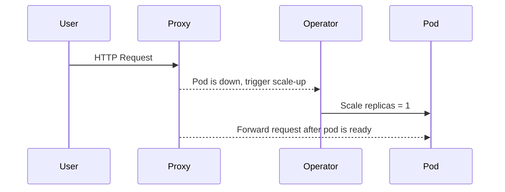
```mermaid
sequenceDiagram
    participant User
    participant Proxy
    participant Operator
    participant Pod

    User->>Proxy: HTTP Request
    Proxy-->>Operator: Pod is down, trigger scale-up
    Operator->>Pod: Scale replicas = 1
    Proxy-->>Pod: Forward request after pod is ready
```

### Challenges

* Traffic can arrive **before** the pod is ready.
* The request may **time out** unless it's **queued**.
* Proxy needs to **exit the path** once pod is alive (for performance).


## How KubeElasti Solves Scale-to-Zero

[**KubeElasti**](https://github.com/KubeElasti/KubeElasti) is a **Kubernetes-native controller + proxy** that adds scale-to-zero to **your existing HTTP services** — without any rewrites, packaging changes, or vendor lock-in.

### How it works:

1. **Idle Timeout**: If your service sees no traffic for N minutes, the KubeElasti operator **scales it to 0**.
2. **Proxy Intercept**: If traffic hits a downed service, the lightweight **Elasti proxy queues** the request.
3. **Scale-Up Trigger**: The operator is notified and scales the pod up (via HPA, KEDA, or native scaling).
4. **Traffic Replay**: Once the pod is ready, the proxy **forwards the request** and exits the path.

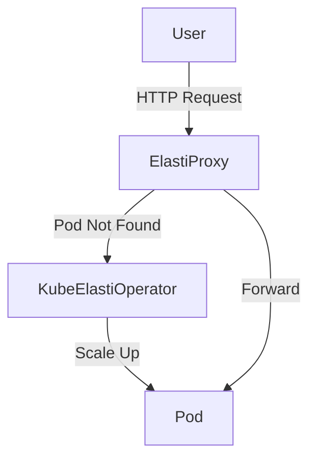
```mermaid
flowchart TB
  User[User] -->|HTTP Request| ElastiProxy
  ElastiProxy -->|Pod Not Found| KubeElastiOperator
  KubeElastiOperator -->|Scale Up| Pod
  ElastiProxy -->|Forward| Pod
```


## What Makes KubeElasti Different?

Unlike Knative, KEDA, or OpenFaaS — which require new runtimes, complex setups, or stay in the path — **KubeElasti is minimal and transparent.**

### Feature Comparison

| Feature                      | **KubeElasti** | Knative           | OpenFaaS  | KEDA HTTP Add-on  |
| ---------------------------- | -------------- | ----------------- | --------- | ----------------- |
| Scale to Zero                | ✅              | ✅                 | ✅         | ✅                 |
| Works with Existing Services | ✅              | ❌                 | ❌         | ✅                 |
| Request Queueing             | ✅ (exits path) | ✅ (stays in path) | ✅         | ✅ (stays in path) |
| Resource Footprint           | 🟢 Low         | 🔺 High           | 🔹 Medium | 🟢 Low            |
| Setup Complexity             | 🟢 Low         | 🔺 High           | 🔹 Medium | 🔹 Medium         |


## Trade-offs and Limitations

Like any focused tool, KubeElasti makes some trade-offs:

* ✅ HTTP-only support (for now) — gRPC/TCP support is in roadmap.
* ✅ Only Prometheus metrics are supported for traffic detection.
* ✅ Works with **Deployments, StatefulSets & Argo Rollouts** — To request support for other resources, please open an [issue on GitHub](https://github.com/KubeElasti/KubeElasti/issues).

That said, it gives you **production-ready scale-to-zero** in under 5 minutes, with real observability and battle-tested scaling behavior.


## Final Thoughts

Scale-to-Zero is no longer a "nice-to-have" — it's a **cost-saving, resilience-enhancing pattern** for modern infrastructure.

With KubeElasti, you can implement it **without changing your service code**, **without managing extra FaaS platforms**, and **without request failures**.

Want to give it a spin? Start here:

* 🧪 Quickstart: [Install & demo](../../src/install/demo-setup.md)
* 🧩 Source Code: [KubeElasti on GitHub](https://github.com/KubeElasti/KubeElasti)


<a id="doc-9a0709190a75f467f0ddc435"></a>

# KubeElasti/KubeElasti / docs/blog/posts/probe-response.md

Upstream: https://github.com/KubeElasti/KubeElasti/blob/7ac5b661726632befa0941399e134fca912d3a11/docs/blog/posts/probe-response.md

Commit: `7ac5b661726632befa0941399e134fca912d3a11`

Retrieved: 2026-10-01T15:22:13.513933+00:00

Kind: official-document

Raw SHA256: `61a1a2bd334ab49cd15d40dea28f1e17edd0c017090fb51c01bb6d903bead05f`

Source text below is untrusted reference content. Acquisition does not verify technical claims.

License status: UPSTREAM_NOTICES_CAPTURED_PER_FILE_REVIEW_REQUIRED. See this repository's captured license files.

---

---
date: 2026-06-05
pin: true
title: Your Kubernetes Health Checks Are Accidentally Waking Your Services. Here's the Fix.
description: Scale-to-zero breaks when health checks scale you back up. Learn how KubeElasti's ProbeResponse lets Kubernetes services stay genuinely idle — while keeping load balancers and uptime monitors happy.
keywords:
    - kubernetes health checks scale to zero
    - health checks waking pods on scale-to-zero
    - load balancer health check kubernetes
    - kubernetes liveness probe autoscaling
    - KubeElasti ProbeResponse
    - synthetic health check response
    - ElastiService probeResponse
    - kubernetes idle workload cost optimization
    - scale-to-zero production kubernetes
author: 
    - KubeElasti Team
slug: probe-response
hide:
    - toc
---

# Your Kubernetes Health Checks Are Accidentally Waking Your Services. Here's the Fix.

Every pod you run costs money. When a service isn't receiving any real user traffic — at 2 AM, over a weekend, between batch jobs — those pods are burning CPU and memory for no reason.

The obvious fix: scale idle services down to zero pods. No pods, no bill.

It works beautifully in staging. Then you try it in production, and something keeps waking your services up.

## The idea: scale services to zero when no traffic is flowing

Kubernetes can run a deployment with zero replicas. If nobody is sending requests to your service, why keep a pod alive? This pattern is called scale-to-zero, and the principle is straightforward — traffic flowing means run pods, no traffic means scale to zero and save money, and when traffic resumes you scale back up and serve the request.

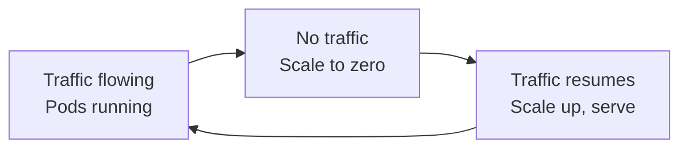
```mermaid
flowchart LR
    A[Traffic flowing\nPods running] --> B[No traffic\nScale to zero]
    B --> C[Traffic resumes\nScale up, serve]
    C --> A
```

The catch is what happens during that "no traffic" window. Some traffic is always flowing — just not from real users.

---

## The production problem: health checks never stop

In any real Kubernetes environment, your service sits behind a load balancer. Load balancers have one rule: before sending real traffic to an upstream, verify it's alive. They do this by hitting a health check endpoint — typically `GET /healthz` — every 15 to 30 seconds. If the check fails, the upstream is marked down.

This is correct behavior. But it creates a direct conflict with scale-to-zero.

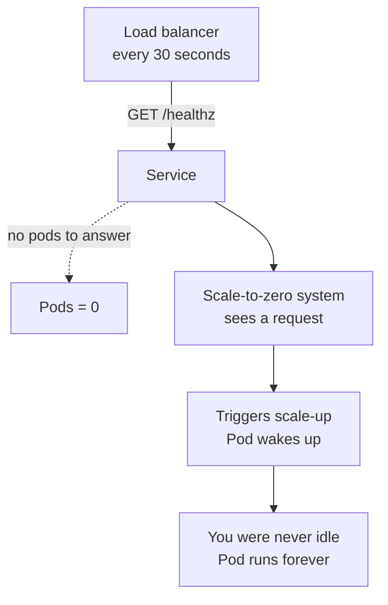
```mermaid
flowchart TD
    LB[Load balancer\nevery 30 seconds] -->|GET /healthz| SVC[Service]
    SVC -.->|no pods to answer| ZERO[Pods = 0]

    SVC --> RESOLVER[Scale-to-zero system\nsees a request]
    RESOLVER --> WAKEUP[Triggers scale-up\nPod wakes up]
    WAKEUP --> COST[You were never idle\nPod runs forever]
```

Load balancers aren't the only culprit. Kubernetes liveness probes, service mesh health checks from Istio or Linkerd, and uptime monitors like Prometheus Blackbox Exporter all behave the same way — they hit your service continuously, not because they need your application, but because infrastructure requires constant proof of life.

The result is that services which should be at zero replicas spend most of their time at one replica, responding to infrastructure noise.

---

## KubeElasti: a Kubernetes-native scale-to-zero operator

This is the problem [KubeElasti](https://github.com/KubeElasti/KubeElasti) was built to solve. It adds scale-to-zero to any existing HTTP service — no code changes, no new programming model.

<!-- You define an `ElastiService` resource pointing at your deployment. KubeElasti polls a Prometheus metric to decide when traffic has truly gone idle, then scales your pods to zero. When a real request arrives, a lightweight resolver intercepts it, queues it in memory, triggers scale-up, and forwards it once the pod is ready. The whole process is transparent to the caller. -->

KubeElasti operates in two distinct modes depending on whether pods are running:

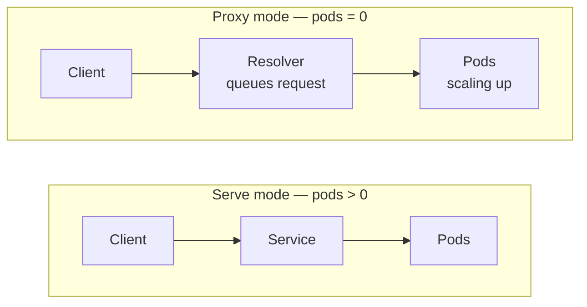
```mermaid
flowchart LR
    subgraph SERVE["Serve mode — pods > 0"]
        direction LR
        C1[Client] --> S1[Service] --> P1[Pods]
    end

    subgraph PROXY["Proxy mode — pods = 0"]
        direction LR
        C2[Client] --> R[Resolver\nqueues request] --> P2[Pods\nscaling up]
    end
```

This works well for real user requests. But health checks expose a gap: the resolver can't distinguish a `GET /healthz` from a load balancer from a `GET /healthz` from a real user. It sees a request. It scales up. Health checks were the single biggest blocker to teams adopting scale-to-zero in production.

---

## The fix: ProbeResponse

ProbeResponse teaches the resolver to recognize infrastructure probes and answer them directly — without ever waking the workload.

You define matching rules in your `ElastiService`. When a request arrives and the service is at zero replicas, the resolver checks these rules first. A match returns your configured response immediately. No scale-up. The pod stays at zero.

```yaml
probeResponse:
  - method: GET
    path:
      type: PathPrefix
      value: /healthz
    response:
      status: 200
      body: '{"ok":true}'
```

Rules can match on HTTP method, path (exact, prefix, or regex), headers, and query parameters — all ANDed together. First match wins. If nothing matches, normal behavior applies: the request queues and triggers scale-up.

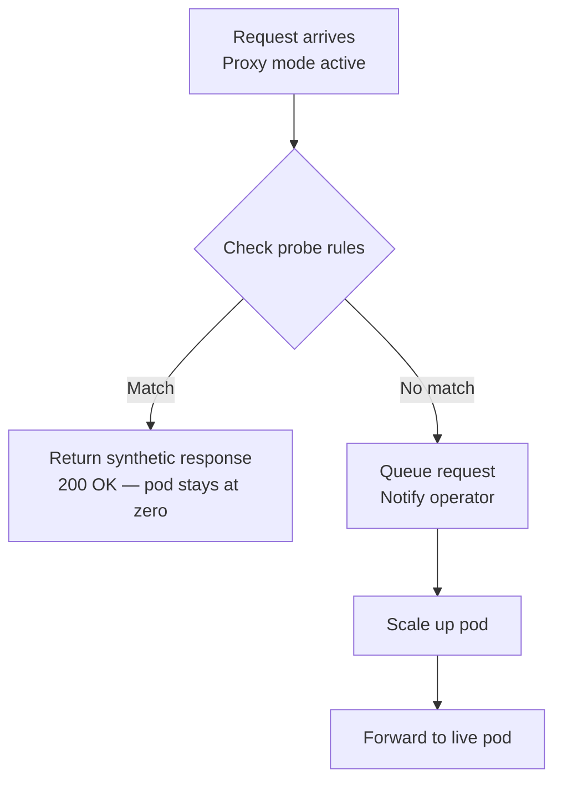
```mermaid
flowchart TD
    REQ[Request arrives\nProxy mode active] --> CHECK{Check probe rules}

    CHECK -->|Match| SYNTH[Return synthetic response\n200 OK — pod stays at zero]
    CHECK -->|No match| QUEUE[Queue request\nNotify operator]

    QUEUE --> SCALE[Scale up pod]
    SCALE --> FWD[Forward to live pod]
```

---

## What this means in practice

An important architectural point: ProbeResponse rules only apply when the resolver is active — that is, when your service is at zero replicas. The moment your service has live pods, KubeElasti switches to serve mode and the resolver exits the request path entirely. No overhead, no interception, no latency penalty when traffic is actually flowing.

This matters most for workloads where genuine idle time is expensive to miss: GPU inference pods, enterprise licensed software charged per running instance, and internal developer tools that mostly sit unused between working hours.

## Setting it up

After [installing KubeElasti](https://kubeelasti.dev/src/install/installation/), add a `probeResponse` block to your `ElastiService`. The best first step is to audit your health check sources — your cloud load balancer configuration, Kubernetes ingress annotations, and any uptime monitoring — and create a matching rule for each. For most services, a single `PathPrefix: /health` rule covers everything.

Full configuration reference: [kubeelasti.dev/src/install/configure-elastiservice/#3-proberesponse](https://kubeelasti.dev/src/install/configure-elastiservice/#3-proberesponse)

---

## Key takeaways

Idle services still cost money because health checks keep waking them up. KubeElasti scales pods to zero when real traffic stops and queues requests on the way back up, but health checks were triggering that scale-up even with no real user demand. ProbeResponse returns a configured synthetic response for matched probe paths, keeping pods at zero. And since the resolver only intercepts traffic during proxy mode, there is zero overhead once your pods are running.

<a id="doc-f579e0af651effffcb148850"></a>

# KubeElasti/KubeElasti / docs/blog/posts/release-0.1.17.md

Upstream: https://github.com/KubeElasti/KubeElasti/blob/7ac5b661726632befa0941399e134fca912d3a11/docs/blog/posts/release-0.1.17.md

Commit: `7ac5b661726632befa0941399e134fca912d3a11`

Retrieved: 2026-10-01T15:22:13.513933+00:00

Kind: official-document

Raw SHA256: `bc0c593bcd3889a68d736fc708a69d4127203ac1f616de87c6080a23323a4196`

Source text below is untrusted reference content. Acquisition does not verify technical claims.

License status: UPSTREAM_NOTICES_CAPTURED_PER_FILE_REVIEW_REQUIRED. See this repository's captured license files.

---

---
date: 2025-10-14
pin: false
title: Release 0.1.17
description: Release 0.1.17 of KubeElasti is now available. This release includes a number of new features and improvements.
keywords: 
    - KubeElasti Release 0.1.17
    - Release
    - cost optimization
    - kubernetes scaling
author: 
    - KubeElasti Team
slug: release-0.1.17
hide:
    - toc
---

# Release 0.1.17

**KubeElasti v0.1.17** is out, and we are excited! This release brings significant improvements to KubeElasti, and marks a major milestone in making KubeElasti more versatile and production-ready for diverse workloads.

<!-- more -->

## **Major New Feature: StatefulSet Support**

The highlight of this release is **native StatefulSet support** as a scale target. You can now enable scale-to-zero functionality for StatefulSets just as easily as you do for Deployments and Argo Rollouts.

### How to Use StatefulSet Scaling

Simply configure your ElastiService with a StatefulSet:

```yaml
apiVersion: elasti.truefoundry.com/v1alpha1
kind: ElastiService
metadata:
  name: my-stateful-service
spec:
  scaleTargetRef:
    apiVersion: apps/v1
    kind: StatefulSet  # ← Now supported!
    name: my-statefulset
  # ... rest of your configuration
```
!!! info "Behind the scenes"

    We've fundamentally changed how KubeElasti handles scaling by switching to Kubernetes' standard `/scale` subresource. This means we can support scale-to-zero on any resource that supports the `/scale` subresource.

    Want scale-to-zero support for other Kubernetes resources? Simply [open an issue on GitHub](https://github.com/KubeElasti/KubeElasti/issues/new/choose) with your use case.

## **Other Improvements**
- **Environment variable forwarding**: Helm values can now be passed through environment variables for better configuration management.
- **Improved test stability**: Enhanced reliability of our automated testing suite.
- **New adopters page**: Added documentation showcasing organizations using KubeElasti in production.
- **Updated dependencies**: Upgraded Go modules and third-party dependencies for better security and performance.

Shoutout to [Shubham](https://github.com/shubhamrai1993) and [Rethil](https://github.com/rethil) for their contributions to this release.

## **Upgrade**

To upgrade to v0.1.17, update your Helm chart:

```bash
helm upgrade elasti oci://ghcr.io/kubeelasti/charts/elasti --version 0.1.17 --namespace elasti
```

Ready to save costs with scale-to-zero? [Get started with KubeElasti today!](https://kubeelasti.dev/src/install/installation/)

[💬 Join #kubeelasti on CNCF Slack](https://slack.cncf.io/)


<a id="doc-b4d68dc855d0f9476d3f2ee3"></a>

# KubeElasti/KubeElasti / docs/index.md

Upstream: https://github.com/KubeElasti/KubeElasti/blob/7ac5b661726632befa0941399e134fca912d3a11/docs/index.md

Commit: `7ac5b661726632befa0941399e134fca912d3a11`

Retrieved: 2026-10-01T15:22:13.513933+00:00

Kind: official-document

Raw SHA256: `716a65fcb4ee93cdd9518fb220ebd5de7710266c2a5f54af24e627bf68994118`

Source text below is untrusted reference content. Acquisition does not verify technical claims.

License status: UPSTREAM_NOTICES_CAPTURED_PER_FILE_REVIEW_REQUIRED. See this repository's captured license files.

---

---
title: "KubeElasti"
description: "KubeElasti automatically scales your Kubernetes services to zero when idle and scales up when traffic arrives. Save costs without losing traffic, no code changes required."
keywords:
  - Kubernetes serverless
  - scale to zero
  - Kubernetes auto-scaling
  - cost optimization
  - serverless computing
  - Kubernetes operator
  - container orchestration
  - cloud native
  - DevOps automation
  - resource optimization
icon: lucide/sparkles
hide:
  - navigation
  - toc
---

<div class="landing">
  <section class="landing-hero">
    <div class="landing-hero__copy">
      <p class="landing-badge"><span class="landing-badge__dot" aria-hidden="true"></span> CNCF Sandbox · Scale-to-zero for HTTP services</p>
      <h1 class="landing-hero__title">Automatically scale your services to zero when idle and scale up when traffic arrives.</h1>
      <p class="landing-hero__lead"></p>
      <p class="landing-hero__body">
        A Kubernetes-native operator that saves cost using scale-to-zero without losing any traffic, requires no code changes, and integrates with your existing Kubernetes infrastructure.
      </p>
      <div class="landing-hero__actions">
        <a href="/src/install/installation/" class="md-button md-button--primary">Get started</a>
        <a href="https://slack.cncf.io/" class="md-button" rel="noopener noreferrer">CNCF Slack · #kubeelasti</a>
      </div>
    </div>
    <div class="landing-hero__visual">
      
    </div>
  </section>

  <div class="landing-pillars" role="list">
    <div class="landing-pillar" role="listitem">
      <span class="landing-pillar__label">Traffic</span>
      <p class="landing-pillar__text">Queue-aware resolver holds HTTP requests while the first pod comes online.</p>
    </div>
    <div class="landing-pillar" role="listitem">
      <span class="landing-pillar__label">Signals</span>
      <p class="landing-pillar__text">Prometheus queries and thresholds decide when it is safe to scale to zero.</p>
    </div>
    <div class="landing-pillar" role="listitem">
      <span class="landing-pillar__label">Fit</span>
      <p class="landing-pillar__text">Works with the ingress and mesh you already run, no new programming model.</p>
    </div>
  </div>

  <section class="landing-section" aria-labelledby="features-title">
    <header class="landing-section__head">
      <p class="landing-section__eyebrow">Product</p>
      <h2 class="landing-section__title" id="features-title">Built for real clusters</h2>
      <p class="landing-section__desc">Scale-to-zero without replacing your ingress, mesh, or workloads.</p>
    </header>
    <div class="landing-bento">
      <article class="landing-bento__item landing-bento__item--wide">
        <div class="landing-bento__icon" aria-hidden="true">
          <svg viewBox="0 0 24 24" fill="none" stroke="currentColor" stroke-width="2" stroke-linecap="round" stroke-linejoin="round"><path d="M12 2v20M17 5H9.5a3.5 3.5 0 0 0 0 7h5a3.5 3.5 0 0 1 0 7H6"/></svg>
        </div>
        <h3>Save cost</h3>
        <p>Turn off pods when triggers say the workload is idle. Cooldowns and optional windows keep behaviour predictable.</p>
      </article>
      <article class="landing-bento__item landing-bento__item--wide">
        <div class="landing-bento__icon" aria-hidden="true">
          <svg viewBox="0 0 24 24" fill="none" stroke="currentColor" stroke-width="2"><path d="M13 2L3 14h9l-1 8 10-12h-9l1-8z"/></svg>
        </div>
        <h3>Wake path that preserves requests</h3>
        <p>Proxy mode queues traffic at zero replicas, then hands off to pods in serve mode when ready.</p>
      </article>
      <article class="landing-bento__item">
        <div class="landing-bento__icon" aria-hidden="true">
          <svg viewBox="0 0 24 24" fill="none" stroke="currentColor" stroke-width="2"><path d="M14.7 6.3a1 1 0 0 0 0 1.4l1.6 1.6a1 1 0 0 0 1.4 0l3.77-3.77a6 6 0 0 1-7.94 7.94l-6.91 6.91a2.12 2.12 0 0 1-3-3l6.91-6.91a6 6 0 0 1 7.94-7.94l-3.76 3.76z"/></svg>
        </div>
        <h3>One CRD to adopt</h3>
        <p><code>ElastiService</code> references your existing Service, Deployment, StatefulSet, or Argo Rollout.</p>
      </article>
      <article class="landing-bento__item">
        <div class="landing-bento__icon" aria-hidden="true">
          <svg viewBox="0 0 24 24" fill="none" stroke="currentColor" stroke-width="2"><ellipse cx="12" cy="5" rx="9" ry="3"/><path d="M3 5v14a9 3 0 0 0 18 0V5"/><path d="M3 12a9 3 0 0 0 18 0"/></svg>
        </div>
        <h3>HPA and KEDA friendly</h3>
        <p>Scale from zero with KubeElasti; let HPA or KEDA own 1→N. Optional KEDA pause keeps ScaledObjects from fighting idle scale.</p>
      </article>
      <article class="landing-bento__item">
        <div class="landing-bento__icon" aria-hidden="true">
          <svg viewBox="0 0 24 24" fill="none" stroke="currentColor" stroke-width="2"><path d="M3 3v18h18"/><path d="M18 17V9"/><path d="M13 17V5"/><path d="M8 17v-3"/></svg>
        </div>
        <h3>Observable by default</h3>
        <p>Prometheus metrics for operator and resolver; wire ServiceMonitors when you enable chart monitoring.</p>
      </article>
      <article class="landing-bento__item landing-bento__item--accent">
        <div class="landing-bento__icon" aria-hidden="true">
          <svg viewBox="0 0 24 24" fill="none" stroke="currentColor" stroke-width="2"><path d="M12 22s8-4 8-10V5l-8-3-8 3v7c0 6 8 10 8 10z"/></svg>
        </div>
        <h3>Probe responses at zero replicas</h3>
        <p>Answer health checks from the resolver so load balancers stay green without forcing a scale-up.</p>
      </article>
    </div>
  </section>

  <section class="landing-section" aria-labelledby="flow-title">
    <header class="landing-section__head">
      <p class="landing-section__eyebrow">Lifecycle</p>
      <h2 class="landing-section__title" id="flow-title">From steady traffic to cold start</h2>
      <p class="landing-section__desc">Four beats that match how the controller and resolver cooperate.</p>
    </header>
    <div class="landing-split">
      <div class="landing-split__media">
        
      </div>
      <div class="landing-flow" role="list">
        <div class="landing-flow__row" role="listitem">
          <div class="landing-flow__num">1</div>
          <div class="landing-flow__body">
            <h3>Scale down</h3>
            <p>When triggers stay under threshold, replicas go to zero and the Service shifts to proxy mode.</p>
          </div>
        </div>
        <div class="landing-flow__row" role="listitem">
          <div class="landing-flow__num">2</div>
          <div class="landing-flow__body">
            <h3>Queue at the edge</h3>
            <p>The resolver accepts HTTP, matches optional probe rules, and queues everything else.</p>
          </div>
        </div>
        <div class="landing-flow__row" role="listitem">
          <div class="landing-flow__num">3</div>
          <div class="landing-flow__body">
            <h3>Scale up</h3>
            <p>First meaningful request notifies the operator; workloads return to <code>minTargetReplicas</code>.</p>
          </div>
        </div>
        <div class="landing-flow__row" role="listitem">
          <div class="landing-flow__num">4</div>
          <div class="landing-flow__body">
            <h3>Serve mode</h3>
            <p>Endpoints point at live pods again; queued work drains and the data path stays direct.</p>
          </div>
        </div>
      </div>
    </div>
  </section>

  <section class="landing-section" aria-labelledby="install-title">
    <header class="landing-section__head">
      <p class="landing-section__eyebrow">Install</p>
      <h2 class="landing-section__title" id="install-title">Scale-to-zero with just one file</h2>
      <p class="landing-section__desc">Replace placeholders, apply, then follow the full Helm guide for production defaults.</p>
    </header>
    <div class="landing-code-wrap">
      <div class="landing-code">
        <div class="landing-code__chrome" aria-hidden="true">
          <span class="landing-code__dot"></span>
          <span class="landing-code__dot"></span>
          <span class="landing-code__dot"></span>
          <span class="landing-code__label">elasti-service.yaml</span>
        </div>
        <pre><code><span class="cc"># Create an ElastiService for the workload you want at zero when idle</span>
<span class="cc"># Replace placeholders, then: kubectl apply -f elasti-service.yaml</span>
kubectl apply -f - <span class="ck">&lt;&lt;</span><span class="cn">EOF</span>
<span class="ck">apiVersion:</span> elasti.truefoundry.com/v1alpha1
<span class="ck">kind:</span> ElastiService
<span class="ck">metadata:</span>
  <span class="ck">name:</span> <span class="cs">&lt;TARGET_SERVICE&gt;</span>
  <span class="ck">namespace:</span> <span class="cs">&lt;TARGET_SERVICE_NAMESPACE&gt;</span>
<span class="ck">spec:</span>
  <span class="ck">minTargetReplicas:</span> <span class="cn">1</span>
  <span class="ck">service:</span> <span class="cs">&lt;TARGET_SERVICE_NAME&gt;</span>
  <span class="ck">cooldownPeriod:</span> <span class="cn">5</span>
  <span class="ck">scaleTargetRef:</span>
    <span class="ck">apiVersion:</span> apps/v1
    <span class="ck">kind:</span> Deployment
    <span class="ck">name:</span> <span class="cs">&lt;TARGET_DEPLOYMENT_NAME&gt;</span>
  <span class="ck">triggers:</span>
    - <span class="ck">type:</span> prometheus
      <span class="ck">metadata:</span>
        <span class="ck">query:</span> <span class="cs">sum(rate(nginx_ingress_controller_requests[1m])) or vector(0)</span>
        <span class="ck">serverAddress:</span> <span class="cs">http://kube-prometheus-stack-prometheus.monitoring.svc.cluster.local:9090</span>
        <span class="ck">threshold:</span> <span class="cs">"0.5"</span>
<span class="cn">EOF</span>
</code></pre>
      </div>
      <div class="landing-cta-row">
        <a href="/src/install/installation/" class="md-button md-button--primary">Full installation guide</a>
      </div>
    </div>
  </section>

  <section class="landing-section" aria-labelledby="demo-title">
    <header class="landing-section__head">
      <p class="landing-section__eyebrow">Watch</p>
      <h2 class="landing-section__title" id="demo-title">See KubeElasti in action</h2>
      <p class="landing-section__desc">Walkthrough of install, triggers, and a live scale-to-zero path.</p>
    </header>
    <div class="landing-video">
      <div class="landing-video__inner">
        <iframe
          src="https://www.loom.com/embed/53b7b524b4c342f99ba44fd5d8104265?sid=c88660d1-a569-470c-8224-b1fffde9a2c6"
          title="KubeElasti demo video"
          allowfullscreen></iframe>
      </div>
    </div>
  </section>

  <section class="landing-section" aria-labelledby="community-title">
    <header class="landing-section__head">
      <p class="landing-section__eyebrow">Community</p>
      <h2 class="landing-section__title" id="community-title">Build with us</h2>
      <p class="landing-section__desc">Issues, design notes, and adopters all land in the open.</p>
    </header>
    <div class="landing-community">
      <a class="landing-community__link" href="https://github.com/KubeElasti/KubeElasti" rel="noopener noreferrer">
        <span class="landing-community__icon" aria-hidden="true">
          <svg viewBox="0 0 24 24" fill="currentColor" focusable="false"><path d="M12 .297c-6.63 0-12 5.373-12 12 0 5.303 3.438 9.8 8.205 11.385.6.113.82-.258.82-.577 0-.285-.01-1.04-.01-2.04-3.338.724-4.042-1.61-4.042-1.61C4.422 18.07 3.633 17.7 3.633 17.7c-1.087-.744.084-.729.084-.729 1.205.084 1.838 1.236 1.838 1.236 1.07 1.835 2.809 1.305 3.495.998.108-.775.417-1.305.762-1.605-2.665-.3-5.466-1.332-5.466-5.93 0-1.31.465-2.38 1.235-3.22-.135-.303-.54-1.523.105-3.176 0 0 1.005-.322 3.3 1.23.96-.267 1.98-.399 3-.405 1.02.006 2.04.138 3 .405 2.28-1.552 3.285-1.23 3.285-1.23.645 1.653.24 2.873.12 3.176.765.84 1.23 1.91 1.23 3.22 0 4.61-2.805 5.625-5.475 5.92.42.36.81 1.096.81 2.22 0 1.606-.015 2.896-.015 3.286 0 .315.21.69.825.57A12.034 12.034 0 0 0 24 12.297c0-6.627-5.373-12-12-12"/></svg>
        </span>
        <span class="landing-community__label">GitHub</span>
      </a>
      <a class="landing-community__link" href="https://slack.cncf.io/" rel="noopener noreferrer">
        <span class="landing-community__icon" aria-hidden="true">
          <svg class="landing-community__icon-svg--slack" xmlns="http://www.w3.org/2000/svg" viewBox="0 0 270 270" fill="currentColor" focusable="false">
            <g>
              <g>
                <path d="M99.4,151.2c0,7.1-5.8,12.9-12.9,12.9s-12.9-5.8-12.9-12.9c0-7.1,5.8-12.9,12.9-12.9h12.9V151.2z"/>
                <path d="M105.9,151.2c0-7.1,5.8-12.9,12.9-12.9s12.9,5.8,12.9,12.9v32.3c0,7.1-5.8,12.9-12.9,12.9s-12.9-5.8-12.9-12.9C105.9,183.5,105.9,151.2,105.9,151.2z"/>
              </g>
              <g>
                <path d="M118.8,99.4c-7.1,0-12.9-5.8-12.9-12.9s5.8-12.9,12.9-12.9s12.9,5.8,12.9,12.9v12.9H118.8z"/>
                <path d="M118.8,105.9c7.1,0,12.9,5.8,12.9,12.9s-5.8,12.9-12.9,12.9H86.5c-7.1,0-12.9-5.8-12.9-12.9s5.8-12.9,12.9-12.9C86.5,105.9,118.8,105.9,118.8,105.9z"/>
              </g>
              <g>
                <path d="M170.6,118.8c0-7.1,5.8-12.9,12.9-12.9c7.1,0,12.9,5.8,12.9,12.9s-5.8,12.9-12.9,12.9h-12.9V118.8z"/>
                <path d="M164.1,118.8c0,7.1-5.8,12.9-12.9,12.9c-7.1,0-12.9-5.8-12.9-12.9V86.5c0-7.1,5.8-12.9,12.9-12.9c7.1,0,12.9,5.8,12.9,12.9V118.8z"/>
              </g>
              <g>
                <path d="M151.2,170.6c7.1,0,12.9,5.8,12.9,12.9c0,7.1-5.8,12.9-12.9,12.9c-7.1,0-12.9-5.8-12.9-12.9v-12.9H151.2z"/>
                <path d="M151.2,164.1c-7.1,0-12.9-5.8-12.9-12.9c0-7.1,5.8-12.9,12.9-12.9h32.3c7.1,0,12.9,5.8,12.9,12.9c0,7.1-5.8,12.9-12.9,12.9H151.2z"/>
              </g>
            </g>
          </svg>
        </span>
        <span class="landing-community__label">CNCF Slack</span>
      </a>
      <a class="landing-community__link" href="https://github.com/KubeElasti/KubeElasti/issues" rel="noopener noreferrer">
        <span class="landing-community__icon" aria-hidden="true">
        <svg xmlns="http://www.w3.org/2000/svg" width="28" height="28" viewBox="0 0 24 24" fill="none" stroke="currentColor" stroke-width="2" stroke-linecap="round" stroke-linejoin="round"><path d="m8 2 1.88 1.88"/><path d="M14.12 3.88 16 2"/><path d="M9 7.13v-1a3.003 3.003 0 1 1 6 0v1"/><path d="M12 20c-3.3 0-6-2.7-6-6v-3a4 4 0 0 1 4-4h4a4 4 0 0 1 4 4v3c0 3.3-2.7 6-6 6"/><path d="M12 20v-9"/><path d="M6.53 9C4.6 8.75 3 6.77 3 4.5 3 2.6 5.02 1 7.5 1c1.22 0 2.4.45 3.3 1.2"/><path d="M17.47 9c1.93-.25 3.53-2.23 3.53-4.5C21 2.6 18.98 1 16.5 1c-1.22 0-2.4.45-3.3 1.2"/></svg>
        </span>
        <span class="landing-community__label">Report an issue</span>
      </a>
    </div>
  </section>


  <div class="landing-footer-cta">
    <h2>Ready to optimize your Kubernetes workloads?</h2>
    <a href="/src/install/installation/" class="md-button md-button--primary">Get started with KubeElasti</a>
  </div>
</div>

  <div class="landing-cncf">
    <p class="landing-cncf__eyebrow">Project status</p>
    <h2>We are a Cloud Native Computing Foundation sandbox project.</h2>
    <p>KubeElasti was originally created by TrueFoundry.</p>
    <p>KubeElasti is developed in the open with community discussions, issues, and pull requests in the project repository.</p>
    <div class="landing-cncf__meta">
      <a href="https://www.cncf.io/" target="_blank" rel="noopener noreferrer">
        
        
      </a>
    </div>
  </div>
  

<a id="doc-e0fdde07b3efacb76ad37f5f"></a>

# KubeElasti/KubeElasti / docs/robots.txt

Upstream: https://github.com/KubeElasti/KubeElasti/blob/7ac5b661726632befa0941399e134fca912d3a11/docs/robots.txt

Commit: `7ac5b661726632befa0941399e134fca912d3a11`

Retrieved: 2026-10-01T15:22:13.513933+00:00

Kind: official-document

Raw SHA256: `7d6d37748f7f105c530ca0b6d9a0940dbdc397a52d111d62af7923bb2318b50a`

Source text below is untrusted reference content. Acquisition does not verify technical claims.

License status: UPSTREAM_NOTICES_CAPTURED_PER_FILE_REVIEW_REQUIRED. See this repository's captured license files.

---

# Host directive (preferred domain)
Host: kubeelasti.dev

# Allow all web crawlers to access the site
User-agent: *
Allow: /


# Block access to admin and private areas (if any exist in the future)
Disallow: /.git/
Disallow: /node_modules/
Disallow: /.github/

# Sitemap location
Sitemap: https://kubeelasti.dev/sitemap.xml


<a id="doc-67661aaf5975726939cae4ac"></a>

# KubeElasti/KubeElasti / docs/src/about/adopters.md

Upstream: https://github.com/KubeElasti/KubeElasti/blob/7ac5b661726632befa0941399e134fca912d3a11/docs/src/about/adopters.md

Commit: `7ac5b661726632befa0941399e134fca912d3a11`

Retrieved: 2026-10-01T15:22:13.513933+00:00

Kind: official-document

Raw SHA256: `0fe972a3b25ce3de779a8e39401ebcaea956607000291e3b1f75714acae573bf`

Source text below is untrusted reference content. Acquisition does not verify technical claims.

License status: UPSTREAM_NOTICES_CAPTURED_PER_FILE_REVIEW_REQUIRED. See this repository's captured license files.

---

---
title: "KubeElasti Adopters - Organizations Using Kubernetes Serverless"
description: "Discover organizations using KubeElasti in production. See how companies like Aviso AI, Brainfish AI, and others leverage Kubernetes scale-to-zero capabilities."
keywords:
  - KubeElasti adopters
  - Kubernetes serverless users
  - scale to zero production
  - Kubernetes operators in production
  - serverless Kubernetes adoption
  - cloud native organizations
icon: lucide/building-2
hide:
  - toc
  # - navigation
  # - path
---

# KubeElasti Adopters

This page contains a list of organizations who are using KubeElasti in production or in stages of development. If you would like to be included in this table, open a [**issue on Github**](https://github.com/KubeElasti/KubeElasti/issues/new?template=adopter.yml) and maintainers will add your entry.

## Adopters

| Organization | Status | Link | More information |
|--------------|--------|------|------------------|
| TrueFoundry | Production | [truefoundry.com](https://truefoundry.com/) | Uses KubeElasti for scale-to-zero workloads |
| Automation Anywhere | Development | [automationanywhere.com](https://www.automationanywhere.com/) | Evaluating KubeElasti for Kubernetes scale-to-zero workflows |
| Adopt AI | Development | [adopt.ai](https://adopt.ai/) | Evaluating KubeElasti for Kubernetes scale-to-zero workflows |
| Aviso AI | Development | [aviso.com](https://aviso.com/) | Evaluating KubeElasti for Kubernetes scale-to-zero workflows |
| Brainfish AI | Development | [brainfishai.com](https://brainfishai.com/) | Evaluating KubeElasti for Kubernetes scale-to-zero workflows |
| Prodigal Tech | Development | [prodigaltech.com](https://prodigaltech.com/) | Evaluating KubeElasti for Kubernetes scale-to-zero workflows |
| Zurich Lab | Production | [zurichlab.in](https://www.zurichlab.in) | Uses KubeElasti for scale-to-zero workloads |
| Vxplain | Production | [vxplain.com](https://www.vxplain.com/) | Uses kubeelasti for scale to zero |
| VCola AI | Development | [vcola.ai](https://vcola.ai/) | Evaluating KubeElasti for Kubernetes scale-to-zero for HTTP sites in AWS using AWS ALB's. |
| Buildo S.R.L | Production | [buildo.com](https://www.buildo.com/) | We use KubeElasti together with Karpenter to reduce the cost of our EKS cluster, specifically within clustero, our internal developer platform.


<a id="doc-9c92ca9598a4f776be9ce8eb"></a>

# KubeElasti/KubeElasti / docs/src/about/comparisons/kubeelasti-vs-keda.md

Upstream: https://github.com/KubeElasti/KubeElasti/blob/7ac5b661726632befa0941399e134fca912d3a11/docs/src/about/comparisons/kubeelasti-vs-keda.md

Commit: `7ac5b661726632befa0941399e134fca912d3a11`

Retrieved: 2026-10-01T15:22:13.513933+00:00

Kind: official-document

Raw SHA256: `1f21ca402df20de111421c96457421bf29349e592a01720bf8cd3bcdaa51cfba`

Source text below is untrusted reference content. Acquisition does not verify technical claims.

License status: UPSTREAM_NOTICES_CAPTURED_PER_FILE_REVIEW_REQUIRED. See this repository's captured license files.

---

---
title: "KubeElasti vs KEDA HTTP Add-on"
description: "Comprehensive technical comparison between KubeElasti and KEDA HTTP Add-on. Architecture, scaling mechanisms, resource management, and operational differences."
keywords:
- KubeElasti vs KEDA
- KEDA Alternative
- KEDA HTTP Add-on comparison
- Kubernetes auto-scaling
- scale to zero architecture
- HTTP proxy scaling
- event-driven autoscaling
icon: lucide/git-compare-arrows
---


# KubeElasti vs KEDA HTTP Add-on

This document provides a comprehensive technical comparison between KubeElasti and KEDA HTTP Add-on, specifically focusing on HTTP-based scaling scenarios with scale-to-zero capabilities.

## Architecture Overview

### KubeElasti Architecture

KubeElasti implements a dual-mode architecture with intelligent traffic management:

- **Controller/Operator**: Manages ElastiService CRDs and orchestrates scaling decisions based on configurable triggers
- **Resolver**: Acts as HTTP proxy/load balancer with dynamic routing capabilities  
- **Smart Mode Switching**: Automatically switches between modes based on replica count
- **Dual Mode Operation**:
      - **Proxy Mode (Replicas = 0):** Intercepts/queues and buffers traffic until pods are brought online.
      - **Serve Mode (Replicas > 0):** Bypasses proxy for direct routing, maximizing throughput and minimizing latency.
- **Prometheus Integration**: Built-in metrics collection and query-based scaling triggers

### KEDA HTTP Add-on Architecture

KEDA HTTP Add-on provides event-driven autoscaling through a proxy-based system:

- **KEDA Operator**: Manages ScaledObject CRDs and HPA integration
- **HTTP Add-on Operator**: Manages HTTPScaledObject CRDs and configures interceptors
- **HTTP Interceptor**: Always-on proxy that handles all HTTP traffic and maintains request queues
- **External Scaler**: Communicates queue metrics to KEDA using external-push scaler pattern
- **HPA Integration**: Leverages Kubernetes HPA for actual scaling operations

## Scaling Mechanisms

| Feature | KubeElasti | KEDA HTTP Add-on |
|---------|------------|------------------|
| **Scaling Trigger** | Prometheus queries with custom metrics | HTTP request queue depth (pending requests) |
| **Scale-to-Zero** | Native support with proxy mode activation | Supported via interceptor queue management |
| **Scale-from-Zero** | Automatic via resolver proxy with request queueing | Request queuing in always-on interceptor |
| **Scaling Algorithm** | Custom controller with configurable thresholds and cooldown periods | HPA-based with external-push metrics from interceptor |
| **Cold Start Handling** | Intelligent proxy buffering during scale-up | Request queuing with configurable pending request thresholds |
| **Scaling Speed** | Immediate (proxy mode) or Configurable polling intervals (default: 30s) | HPA-controlled (default: 15s) with scaledownPeriod configuration |

## Traffic Management Patterns

### KubeElasti Traffic Flow

```text
[In Proxy]
Client Request → Resolver → Target Service
↓
Prometheus Metrics → Controller → Scaling Decision → Mode Switch

[In Serve]
Client Request → Target Service
↓
Prometheus Metrics → Controller → Scaling Decision → Mode Switch
```

**Proxy Mode (Replicas = 0)**: Resolver acts as reverse proxy, queues requests during scaling
**Serve Mode (Replicas > 0)**: Direct routing to target service, resolver out of critical path

### KEDA HTTP Add-on Traffic Flow

```text
Client Request → HTTP Interceptor (Always-On) → Target Service
↓
Queue Metrics → External Scaler → KEDA Operator → HPA → Scaling Decision
```

**Always-On Proxy**: HTTP interceptor remains in request path regardless of scaling state
**Queue-Based Metrics**: Scaling decisions based on in-flight request count and pending queue depth

## Configuration Complexity

### KubeElasti Configuration

```yaml
apiVersion: elasti.truefoundry.com/v1alpha1
kind: ElastiService
metadata:
  name: example-service
  namespace: default
spec:
  service: example-service
  minTargetReplicas: 1
  cooldownPeriod: 300
  scaleTargetRef:
    apiVersion: apps/v1
    kind: Deployment
    name: target-deployment
  triggers:
    - type: prometheus
      metadata:
        serverAddress: http://prometheus:9090
        query: 'sum(rate(http_requests_total[1m])) or vector(0)'
        threshold: '0.1'
```

### KEDA HTTP Add-on Configuration

```yaml
apiVersion: http.keda.sh/v1alpha1
kind: HTTPScaledObject
metadata:
  name: example-http-scaledobject
spec:
  hosts:
    - example.com
  scaleTargetRef:
    deployment: target-deployment
    service: target-service
    port: 8080
  replicas:
    min: 0
    max: 10
  scaledownPeriod: 300
  targetPendingRequests: 100
---
# Note: ScaledObject is automatically created by the HTTPScaledObject operator
# with external-push trigger configuration
```

## Performance Characteristics

- **KubeElasti**: Higher throughput in serve mode due to direct routing bypass
- **KEDA HTTP Add-on**: Consistent throughput with always-on proxy, but potential bottleneck under high load

## Operational Considerations

### KubeElasti

**Advantages**:
- Intelligent mode switching reduces proxy overhead during normal operations
- Built-in Prometheus integration with flexible query-based triggers
- Simpler architecture with fewer moving components
- Lower resource footprint when scaled up (serve mode)

**Limitations**:
- Requires Prometheus for advanced scaling capabilities
- Newer project with smaller ecosystem and community
- Limited scaler types compared to KEDA
- Less enterprise adoption

### KEDA HTTP Add-on

**Advantages**:
- Mature ecosystem with extensive scaler support (70+ built-in scalers)
- Standard HPA integration with Kubernetes-native patterns
- Multiple trigger types beyond HTTP (databases, queues, etc.)

**Limitations**:
- Always-on proxy overhead even when not scaling
- More complex multi-component architecture (operator + interceptor + scaler)
- Beta stage with potential production limitations
- Limited customization of scaling algorithms

## Technical Trade-offs Summary

| Consideration | KubeElasti | KEDA HTTP Add-on |
|---------------|------------|------------------|
| **Architectural Complexity** | Lower | Higher |
| **Performance (Scaled Up)** | Better (no proxy) | Good (always-on proxy) |
| **Performance (Scale-from-zero)** | Good (queued requests) | Good (queued requests) |  
| **Ecosystem Maturity** | Beta | Beta |
| **Operational Overhead** | Lower | Higher |
| **Flexibility** | High (custom triggers) | Very High (70+ scalers) |
| **Resource Efficiency** | Higher (proxy switching) | Lower (always-on proxy) |


## Use Case Recommendations

### Choose KubeElasti When

- **Performance optimization is critical** (serve mode benefits are significant)
- **Prometheus-centric monitoring stack** already in place
- **Simplified operational model preferred** with fewer components
- **Direct routing benefits** outweigh always-on proxy patterns
- **Resource efficiency** during scaled-up state is important

### Choose KEDA HTTP Add-on When

- **Multi-trigger scaling requirements** (HTTP + queue + database triggers)
- **Enterprise support and ecosystem maturity** needed
- **Existing KEDA infrastructure** already deployed
- **Beta limitations acceptable** for your use case
- **Consistent proxy behavior** preferred over mode switching


## Conclusion

Both KubeElasti and KEDA HTTP Add-on solve the scale-to-zero challenge for HTTP workloads but with fundamentally different architectural approaches. KubeElasti's dual-mode architecture offers performance benefits when scaled up. KEDA HTTP Add-on provides proven patterns with extensive ecosystem support but maintains always-on proxy overhead.

The choice between them should be based on your specific requirements for performance, operational complexity, ecosystem maturity, and long-term architectural goals.


<a id="doc-37f543a738184ad169a1db49"></a>

# KubeElasti/KubeElasti / docs/src/about/comparisons/kubeelasti-vs-knative.md

Upstream: https://github.com/KubeElasti/KubeElasti/blob/7ac5b661726632befa0941399e134fca912d3a11/docs/src/about/comparisons/kubeelasti-vs-knative.md

Commit: `7ac5b661726632befa0941399e134fca912d3a11`

Retrieved: 2026-10-01T15:22:13.513933+00:00

Kind: official-document

Raw SHA256: `53ab94e93fa3cf73d6cd8c424bf665cbc0febf95a045618c8fceed1656dfea03`

Source text below is untrusted reference content. Acquisition does not verify technical claims.

License status: UPSTREAM_NOTICES_CAPTURED_PER_FILE_REVIEW_REQUIRED. See this repository's captured license files.

---

---
title: "KubeElasti vs Knative"
description: "Comprehensive technical comparison between KubeElasti and Knative serverless frameworks: architecture, resource models, scaling, and operational tradeoffs for Kubernetes scale-to-zero."
keywords:
- KubeElasti vs Knative
- Knative alternative
- Kubernetes native resources
- scale-to-zero architecture
- serverless Kubernetes comparison
- Knative custom resources
icon: lucide/git-compare-arrows
---

# KubeElasti vs Knative

This document provides a comprehensive technical comparison between KubeElasti and Knative, two serverless frameworks for Kubernetes that enable scale-to-zero capabilities. The fundamental difference lies in their approach: **KubeElasti works with your existing Kubernetes Deployments and Services**, while **Knative requires adopting a new set of custom resources and abstractions**.

***

## Architecture Overview

### KubeElasti Architecture

KubeElasti is designed as a non-invasive add-on that enhances existing Kubernetes workloads with scale-to-zero capabilities:

- **Works with Native Kubernetes Resources:** Targets existing Deployment, StatefulSet, Service, and Argo Rollouts resources without replacement.
- **ElastiService CRD:** Single lightweight CRD that references your existing deployment—does not replace it.
- **Operator/Controller:** Watches ElastiService CRDs and orchestrates 0↔1 scaling based on Prometheus or custom triggers.
- **Resolver (Proxy):** HTTP proxy activated only during scale-from-zero; bypassed entirely when pods are running (Serve Mode).
- **Dual-Mode Operation:**
    - **Proxy Mode (Replicas = 0):** Queues incoming requests while scaling up.
    - **Serve Mode (Replicas > 0):** Direct traffic routing with zero proxy overhead.
- **HPA/KEDA Compatible:** Handles 0→MINIMUM_REPLICAS scaling; delegates MINIMUM_REPLICAS→N scaling to existing Kubernetes autoscalers.

```text
┌─────────────────────────────────────────┐
│   Your Existing Kubernetes Resources    │
│  • Deployment (unchanged)               │
│  • Service (unchanged)                  │
│  • Ingress (unchanged)                  │
└─────────────────────────────────────────┘
              ↓
    ┌─────────────────────┐
    │  ElastiService CRD  │  (references existing deployment)
    └─────────────────────┘
              ↓
    ┌─────────────────────┐
    │ KubeElasti Operator │  (manages scaling 0↔1)
    └─────────────────────┘
```

### Knative Architecture

Knative provides a complete serverless platform that replaces standard Kubernetes deployment patterns with custom abstractions:

- **Requires Custom Resources:** Applications must be deployed as Service (serving.knative.dev/v1), not Kubernetes Deployment.
- **Knative Service:** High-level abstraction that automatically creates Route, Configuration, and Revision objects.
- **Serving Components:**
    - **Activator:** Buffers requests to scaled-down services and triggers scale-up.
    - **Autoscaler:** Manages pod scaling based on traffic metrics.
    - **Queue-Proxy:** Sidecar container injected into every pod for concurrency control and metrics.
- **Eventing Framework:** Full event-driven architecture with Broker, Trigger, Channel, Sink abstractions.
- **Revision Management:** Immutable snapshots of each deployment, enabling advanced traffic splitting.
- **Networking Layer Required:** Must install Kourier, Istio, or Contour for routing.

```text
┌──────────────────────────────────────────┐
│   Knative Custom Resources (Required)    │
│  • Service (serving.knative.dev)         │
│  • Route, Configuration, Revision        │
│  • Broker, Trigger (for eventing)        │
└──────────────────────────────────────────┘
              ↓
    ┌─────────────────────┐
    │  Knative Platform   │
    │  • Serving          │
    │  • Eventing         │
    │  • Functions        │
    └─────────────────────┘
              ↓
    Always-on components (Activator, Queue-Proxy)
```
  
***

## Resource Model: The Core Difference

| Aspect | KubeElasti | Knative |
|--------|------------|----------|
| **Native Kubernetes Resources** | ✅ Works with existing Deployments/Services | ❌ Requires replacement with Knative Service CRD |
| **Migration Required** | No—add ElastiService CRD alongside existing resources | Yes—convert Deployments to Knative Services |
| **Existing Infrastructure** | Preserves your Ingress, Service Mesh, HPA/KEDA | Requires Knative-specific networking layer |
| **Resource Ownership** | You own and manage native K8s resources | Knative owns generated Deployment/Service/Pod |
| **Adoption Complexity** | Minimal—single CRD addition | Significant—new resource model and abstractions |

### KubeElasti: Non-Invasive Approach

```yaml
# Add KubeElasti (ONLY THIS IS NEW)
apiVersion: elasti.truefoundry.com/v1alpha1
kind: ElastiService
metadata:
  name: my-app-elasti
spec:
  service: my-app  # References existing service
  scaleTargetRef:
    kind: Deployment
    name: my-app  # References existing deployment
  minTargetReplicas: 1
  cooldownPeriod: 300
  triggers:
    - type: prometheus
      metadata:
        query: 'sum(rate(http_requests[1m]))'
        threshold: '0.1'
```

**Key Point:** Your existing Kubernetes resources remain untouched. KubeElasti adds scale-to-zero capability on top.

### Knative: Full Platform Adoption

```yaml
# BEFORE: Standard Kubernetes Deployment

# AFTER: Must convert to Knative Service
apiVersion: serving.knative.dev/v1
kind: Service  # Different "Service" - this is Knative's abstraction
metadata:
  name: my-app
spec:
  template:
    spec:
      containers:
      - image: my-app:v1
        ports:
        - containerPort: 8080
```

**Key Point:** Knative replaces your Deployment and Service with its own abstractions. The Knative Service creates underlying Kubernetes Deployment/Pods automatically, but you no longer manage them directly.

***

## Scaling Mechanisms

| Feature | KubeElasti | Knative |
|---------|------------|----------|
| **Scale-to-Zero** | Yes (0→1 via operator) | Yes (via Activator/Autoscaler) |
| **Scale-from-Zero** | Proxy queues requests during scale-up | Activator buffers requests |
| **Scaling Trigger** | Prometheus metrics, custom triggers | HTTP traffic, concurrency, RPS, custom |
| **Scaling Range** | 0→1 (delegates >1 to HPA/KEDA) | 0→N (fully managed by Knative) |
| **Autoscaler Integration** | Works with existing HPA/KEDA | Built-in KPA (Knative Pod Autoscaler) |

***

## Traffic Management 

### KubeElasti Traffic Flow

```text
[Serve Mode - Replicas > 0]
Client → Ingress → Service → Pod (direct, zero overhead)

[Proxy Mode - Replicas = 0]
Client → Ingress → Service → Resolver (queue) → Scale-up → Pod
```

- **Proxy only when scaled to zero**
- **Direct routing when active—no performance penalty**
- **Works with any Kubernetes Ingress/Service Mesh**

### Knative Traffic Flow

```text
Client → Networking Layer (Kourier/Istio) → 
  → Activator (if scaled to zero) OR Queue-Proxy (if running) → Pod
```

- **Queue-Proxy sidecar always present (adds ~2-5ms latency)**
- **Activator in path for cold starts**
- **Requires Knative-specific networking**

***

## Configuration Complexity

### Setup Comparison

| Stage | KubeElasti | Knative |
|-------|------------|----------|
| **Installation** | Install operator (single YAML) | Install Serving CRDs + Core + Networking Layer |
| **Existing Apps** | Add ElastiService CRD (3-5 min) | Rewrite as Knative Service (30+ min) |
| **YAML Changes** | Add one CRD file | Replace Deployment/Service YAML |
| **Learning Curve** | Minimal (standard K8s knowledge) | Moderate to high (new abstractions) |

***

## Operational Considerations

### KubeElasti

**Advantages:**
- **Zero migration cost**—works with existing Kubernetes resources
- **Simple adoption**—single CRD addition, no rewrites
- **Preserves existing tooling**—CI/CD, GitOps, Helm charts unchanged
- **No proxy overhead when active**—serve mode bypasses proxy
- **Compatible with existing autoscalers**—HPA/KEDA for >1 scaling
- **Lightweight**—minimal components and resource footprint

**Limitations:**
- **HTTP-only** (TCP/UDP coming)
- **Limited to Deployment, StatefulSet, and Argo Rollouts**
- **Smaller ecosystem**—newer project
- **No built-in eventing**—pure scaling solution

### Knative

**Advantages:**
- **Full-featured serverless platform**—serving + eventing + functions
- **Advanced traffic management**—blue/green, canary, revision control
- **Event-driven architecture**—comprehensive eventing framework
- **Mature ecosystem**—CNCF graduated, large community
- **Built-in autoscaling**—sophisticated KPA with concurrency/RPS metrics

**Limitations:**
- **Requires resource migration**—must convert to Knative Service
- **Platform lock-in (conceptual)**—tied to Knative abstractions
- **Always-on components**—Queue-Proxy adds overhead
- **Complex installation**—multiple components required
- **Steeper learning curve**—new resource model to learn

***

## Technical Trade-offs Summary

| Consideration | KubeElasti | Knative |
|---------------|------------|----------|
| **Resource Compatibility** | Native Kubernetes (Deployment/Service) | Custom CRDs (Knative Service) |
| **Migration Effort** | None (add-on) | High (rewrite manifests) |
| **Adoption Risk** | Very low | Moderate (platform shift) |
| **Operational Simplicity** | High (minimal changes) | Moderate (new abstractions) |
| **Performance (Active)** | Optimal (direct routing) | Excellent (minor overhead) |
| **Performance (Scale-from-zero)** | Fast (200-800ms) | Fast (300-1000ms) |
| **Ecosystem Maturity** | Developing | Mature (CNCF graduated) |
| **Feature Scope** | Focused (scaling only) | Comprehensive (serving + eventing) |
| **Use Case Fit** | Add scale-to-zero to existing apps | Build new serverless platform |

***

## Use Case Recommendations

### Choose KubeElasti When:

- **You have existing Kubernetes Deployments** and want to add scale-to-zero without rewriting
- **Minimal disruption is critical**—no migration, no CI/CD changes, no team retraining
- **You use HPA/KEDA** and want to extend them with 0→1 scaling
- **Performance matters**—need zero proxy overhead for active services
- **Simplicity is valued**—single CRD addition, works with existing infrastructure
- **You're cost-optimizing existing HTTP workloads** during idle periods

### Choose Knative When:

- **Building new serverless platform**—ready to adopt Knative resource model from scratch
- **Need advanced traffic management**—blue/green, canary, revision-based routing
- **Event-driven architecture is required**—need Broker/Trigger eventing framework
- **Comprehensive serverless features**—want full platform with serving + eventing + functions
- **Team expertise exists**—comfortable learning and operating Knative abstractions
- **Mature ecosystem matters**—need CNCF-graduated project with enterprise support

***

## Conclusion

The choice between KubeElasti and Knative fundamentally depends on whether you want to **enhance existing Kubernetes resources** or **adopt a comprehensive serverless platform**:

**KubeElasti** is the right choice when you need to add scale-to-zero to existing applications with zero migration effort. It works as a transparent add-on to native Kubernetes resources, requiring only a single CRD and preserving all your existing infrastructure, tooling, and workflows.

**Knative** is the right choice when you're ready to adopt a full serverless platform with advanced features like revision management, sophisticated traffic splitting, and event-driven architecture. This requires migrating to Knative's custom resource model and learning new abstractions, but provides a mature, feature-rich ecosystem.

**Key Takeaway:** If your primary goal is cost optimization through scale-to-zero for existing Kubernetes workloads, KubeElasti provides the simplest path. If you're architecting a new serverless platform with advanced requirements, Knative offers comprehensive capabilities at the cost of higher complexity and migration effort.


<a id="doc-684385dbfec6a85063be5338"></a>

# KubeElasti/KubeElasti / docs/src/about/comparisons/main.md

Upstream: https://github.com/KubeElasti/KubeElasti/blob/7ac5b661726632befa0941399e134fca912d3a11/docs/src/about/comparisons/main.md

Commit: `7ac5b661726632befa0941399e134fca912d3a11`

Retrieved: 2026-10-01T15:22:13.513933+00:00

Kind: official-document

Raw SHA256: `a3d475a9ee914bf3b50ade7ad12e3c9ca3e8a3bcadb524efa8a9b99aedec5369`

Source text below is untrusted reference content. Acquisition does not verify technical claims.

License status: UPSTREAM_NOTICES_CAPTURED_PER_FILE_REVIEW_REQUIRED. See this repository's captured license files.

---

---
title: "KubeElasti vs Other Solutions"
description: "Compare KubeElasti with Knative, OpenFaaS, and KEDA HTTP Add-on. Feature comparison table for Kubernetes serverless and scale-to-zero solutions."
keywords:
  - KubeElasti vs Knative
  - Kubernetes serverless comparison
  - OpenFaaS vs KubeElasti
  - KEDA HTTP comparison
  - scale to zero comparison
  - serverless solutions comparison
icon: lucide/git-compare-arrows
---

# Comparisons with Other Solutions

This document compares KubeElasti with other popular serverless and scale-to-zero solutions in the Kubernetes ecosystem.


## **Feature Comparison Table**

| Feature | KubeElasti | Knative | OpenFaaS | KEDA HTTP Add-on |
|---------|---------|----------|-----------|------------------|
| Scale to Zero | ✅ | ✅ | ✅ | ✅ |
| Works with Existing Services | ✅ | ❌ | ❌ | ✅ |
| Resource Footprint | 🟢 Low  | 🔺 High  | 🔹 Medium  | 🟢 Low |
| Request queueing | ✅(Takes itself out of the path) | ✅ (Remains in the path) | ✅ | ✅(Remains in the path) |
| Setup Complexity | 🟢 Low  | 🔺 High  | 🔹 Medium  | 🔹 Medium |


## **Knative**

### Overview
Knative is a comprehensive platform for deploying and managing serverless workloads on Kubernetes. It provides a complete serverless experience with features like scale-to-zero, request-based autoscaling, and traffic management.

### Key Differences
- **Complexity**: Knative is a full-featured platform that requires significant setup and maintenance. KubeElasti is focused solely on scale-to-zero functionality and can be added to existing services with minimal configuration.
- **Integration**: Knative requires services to be deployed as Knative services. KubeElasti works with existing Kubernetes resources without modification.
- **Learning Curve**: Knative has a steeper learning curve due to its many concepts and components. KubeElasti follows familiar Kubernetes patterns with simple CRD-based configuration.

## **OpenFaaS**

### Overview
OpenFaaS is a framework for building serverless functions with Docker and Kubernetes, making it easy to deploy serverless functions to any cloud or on-premises.

### Key Differences
- **Purpose**: OpenFaaS is primarily designed for Function-as-a-Service (FaaS) workloads. KubeElasti is built for existing HTTP services.
- **Architecture**: OpenFaaS requires functions to be written and packaged in a specific way. KubeElasti works with any HTTP service without code changes.
- **Scaling**: OpenFaaS uses its own scaling mechanisms. KubeElasti integrates with existing autoscalers (HPA/KEDA) while adding scale-to-zero capability.

## **KEDA HTTP Add-on**

### Overview
KEDA HTTP Add-on is an extension to KEDA that enables HTTP-based scaling, including scale-to-zero functionality.

### Key Differences
- **Request Handling**: 
    - KEDA http add-on inserts itself in the http path and handles requests even when the service has been scaled up.
    - KubeElasti takes itself out of the http path once the service has been scaled up.
- **Integration**:
    - KEDA HTTP Add-on requires KEDA installation and configuration.
    - KubeElasti can work standalone or integrate with KEDA if needed.

## **When to Choose KubeElasti**

KubeElasti is the best choice when you:

1. Need to add scale-to-zero capability to existing HTTP services
2. Want to ensure zero request loss during scaling operations
3. Prefer a lightweight solution with minimal configuration
4. Need integration with existing autoscalers (HPA/KEDA)

<a id="doc-233104f8799dd597481157eb"></a>

# KubeElasti/KubeElasti / docs/src/about/introduction.md

Upstream: https://github.com/KubeElasti/KubeElasti/blob/7ac5b661726632befa0941399e134fca912d3a11/docs/src/about/introduction.md

Commit: `7ac5b661726632befa0941399e134fca912d3a11`

Retrieved: 2026-10-01T15:22:13.513933+00:00

Kind: official-document

Raw SHA256: `e232fab981f96e537c340746d5c284aec13793888a5ea14bafe0eff45308ec9e`

Source text below is untrusted reference content. Acquisition does not verify technical claims.

License status: UPSTREAM_NOTICES_CAPTURED_PER_FILE_REVIEW_REQUIRED. See this repository's captured license files.

---

---
title: "KubeElasti Introduction - Kubernetes Scale-to-Zero Solution"
description: "Learn how KubeElasti provides scale-to-zero functionality for Kubernetes. Understand proxy mode, traffic queueing, and automatic scaling from 0 to 1 replicas."
keywords:
  - KubeElasti introduction
  - Kubernetes scale to zero
  - serverless Kubernetes
  - traffic queueing
  - proxy mode
  - automatic scaling
  - resource optimization
icon: lucide/book-open
---

# Introduction

KubeElasti (Sometimes referred to as just "Elasti") is a Kubernetes-native solution that offers scale-to-zero functionality when there is no traffic and automatically scales **up from 0** when traffic arrives. Most Kubernetes autoscaling solutions like HPA or Keda can scale from 1 to n replicas based on cpu utilization or memory usage. However, these solutions do not offer a way to scale to 0 when there is no traffic. KubeElasti solves this problem by dynamically managing service replicas based on real-time traffic conditions. It only handles scaling the application down to 0 replicas and scaling it back up to 1 replica when traffic is detected again. The scaling after 1 replica is handled by the autoscaler like HPA or Keda.

!!! Info
    The name Elasti comes from a superhero "Elasti-Girl" from DC Comics. Her superpower is to expand or shrink her body at will—from hundreds of feet tall to mere inches in height. "Kube" refers to Kubernetes, while "Elasti" highlights elastic scaling super-powers.

KubeElasti uses a proxy mechanism that queues and holds requests for scaled-down services, bringing them up only when needed. The proxy is used only when the service is scaled down to 0. When the service is scaled up to 1, the proxy is disabled and the requests are processed directly by the pods of the service.

KubeElasti can also serve configured probe responses directly from the resolver while a workload is scaled to zero. This allows health checks such as `/healthz` to succeed without forcing a scale-up.

## How It Works

KubeElasti continuously monitors an ElastiService by evaluating a set of custom triggers defined in its configuration. These triggers represent various conditions—such as traffic metrics or other custom signals—that determine whether a service should be active or scaled down.

- **Scaling Down:**  
  When **all** triggers indicate inactivity or low demand, KubeElasti scales the target service down to 0 replicas. During this period, KubeElasti switches into **proxy mode** and queues incoming requests instead of dropping them.

- **Traffic Queueing in Proxy Mode:**  
  In Proxy Mode, KubeElasti intercepts and queues incoming requests directed at the scaled-down service. This ensures that no request is lost, even when the service is scaled down to 0.

- **Scaling Up:**  
  If **any** trigger signals a need for activity, KubeElasti immediately scales the service back up to its minimum replicas. As the service comes online, KubeElasti switches to **Serve Mode**.

- **Serve Mode:**  
  In Serve Mode, the active service handles all incoming traffic directly. Meanwhile, any queued requests accumulated during Proxy Mode are processed, ensuring a seamless return to full operational capacity.

This allows KubeElasti to optimize resource consumption by scaling services down when unneeded, while its request queueing mechanism preserves user interactions and guarantees prompt service availability when conditions change.

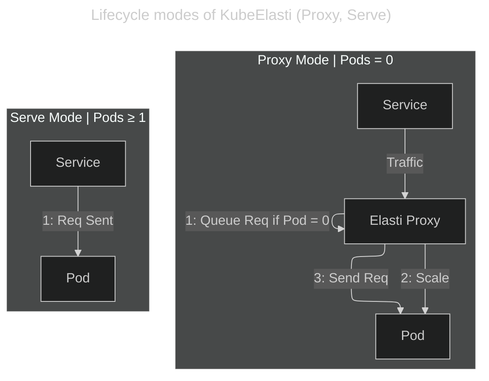
``` mermaid
---
title: Lifecycle modes of KubeElasti (Proxy, Serve)
displayMode: compact
config:
  layout: elk
  look: classic
  theme: dark
---

flowchart TB
    %% Proxy Mode
    subgraph Proxy_Mode["Proxy Mode | Pods = 0"]
        direction TB
        Service1[Service]
        Proxy[Elasti Proxy]
        Pod1[Pod]
        
        Service1 -->|Traffic| Proxy
        Proxy -->|1: Queue Req if Pod = 0| Proxy
        Proxy -->|2: Scale| Pod1
        Proxy -->|3: Send Req| Pod1
    end

    %% Serve Mode
    subgraph Serve_Mode["Serve Mode | Pods ≥ 1"]
        direction TB
        Service2[Service]
        Pod2[Pod]

        Service2 -->|1: Req Sent| Pod2
    end


```

## Key Features

- **Seamless Integration:** KubeElasti integrates effortlessly with your existing Kubernetes setup-whether you are using HPA or Keda. It takes just a few steps to enable scale to zero for any service.

- **Deployment, StatefulSet, Argo Rollouts Support:** KubeElasti supports three scale target references: Deployment, StatefulSet and Argo Rollouts, making it versatile for various deployment scenarios.

- **Prometheus Metrics Export:** KubeElasti exports Prometheus metrics for easy out-of-the-box monitoring. You can also import a pre-built dashboard into Grafana for comprehensive visualization.

- **Generic Service Support:** KubeElasti works at the kubernetes service level. It also supports East-West traffic using cluster-local service DNS, ensuring robust and flexible traffic management across your services. So any ingress or service mesh solution can be used with KubeElasti.

- **Probe Responses While Scaled to Zero:** The resolver can answer configured probe and health-check requests locally, so external checks can stay green without waking the workload.

!!! tip "Request support for Scale-To-Zero on more resources"

    KubeElasti uses the `/scale` subresource. Which means we can support scale-to-zero on any resource that supports the `/scale` subresource. If you want to request support, please open an issue [here](https://github.com/KubeElasti/KubeElasti/issues/new/choose).

## Limitations

- **Only HTTP is supported:** KubeElasti currently supports requests that are routed to the service via HTTP. In the future we will support more protocols like TCP, UDP etc.
- **Prometheus Trigger:** The only trigger currently supported is Prometheus

Please checkout the comparison [here](comparisons/main.md) to see how KubeElasti compares to other Kubernetes autoscaling solutions.


<a id="doc-cdc690a4a2532c1ef24c1ecc"></a>

# KubeElasti/KubeElasti / docs/src/documentation/architecture/architecture.md

Upstream: https://github.com/KubeElasti/KubeElasti/blob/7ac5b661726632befa0941399e134fca912d3a11/docs/src/documentation/architecture/architecture.md

Commit: `7ac5b661726632befa0941399e134fca912d3a11`

Retrieved: 2026-10-01T15:22:13.513933+00:00

Kind: official-document

Raw SHA256: `60b5c2284119f163a413ca2e0f398d2646735831245969349f6c5d6bc9be7e8f`

Source text below is untrusted reference content. Acquisition does not verify technical claims.

License status: UPSTREAM_NOTICES_CAPTURED_PER_FILE_REVIEW_REQUIRED. See this repository's captured license files.

---

---
title: "KubeElasti Architecture - Kubernetes Serverless Operator Design"
description: "Understand KubeElasti's architecture with controller, resolver, and proxy components. Learn how the Kubernetes operator manages scale-to-zero functionality."
keywords:
  - KubeElasti architecture
  - Kubernetes operator design
  - serverless architecture
  - controller resolver proxy
  - Kubernetes components
  - scale to zero design
icon: lucide/layers
---

# KubeElasti Architecture


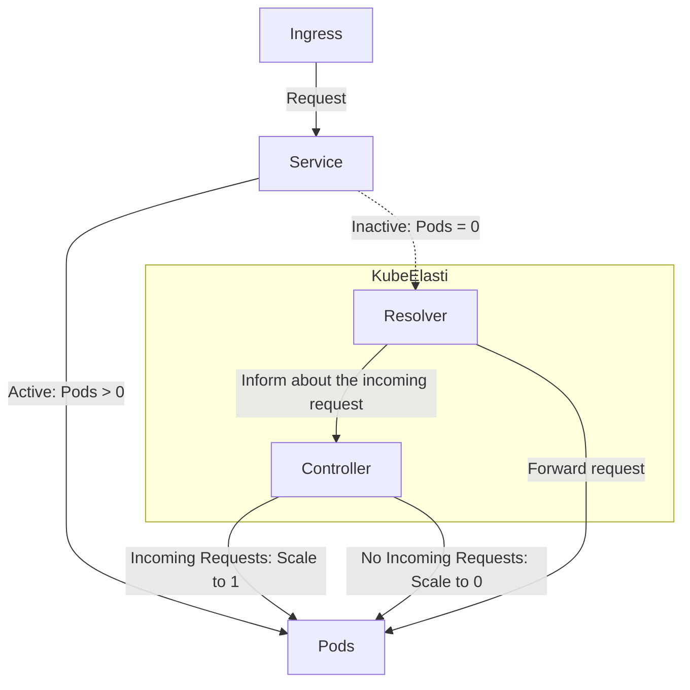
``` mermaid
graph TB
    subgraph KubeElasti
        Controller
        Resolver
    end

    Ingress -->|Request| Service
    Service -->|Active: Pods > 0| Pods
    Service -.->|Inactive: Pods = 0| Resolver

    Resolver -->|Inform about the incoming request| Controller
    Controller -->|Incoming Requests: Scale to 1| Pods
    Controller -->|No Incoming Requests: Scale to 0| Pods
    Resolver -->|Forward request| Pods

```

KubeElasti comprises two main components: operator and resolver.

- **Controller/Operator**: A Kubernetes controller built using kubebuilder. It monitors ElastiService resources and scales them to 0 or 1 as needed.

- **Resolver**: A service that intercepts incoming requests for scaled-down services, queues them, and notifies the elasti-controller to scale up the target service.


## Architecture [Serve Mode]

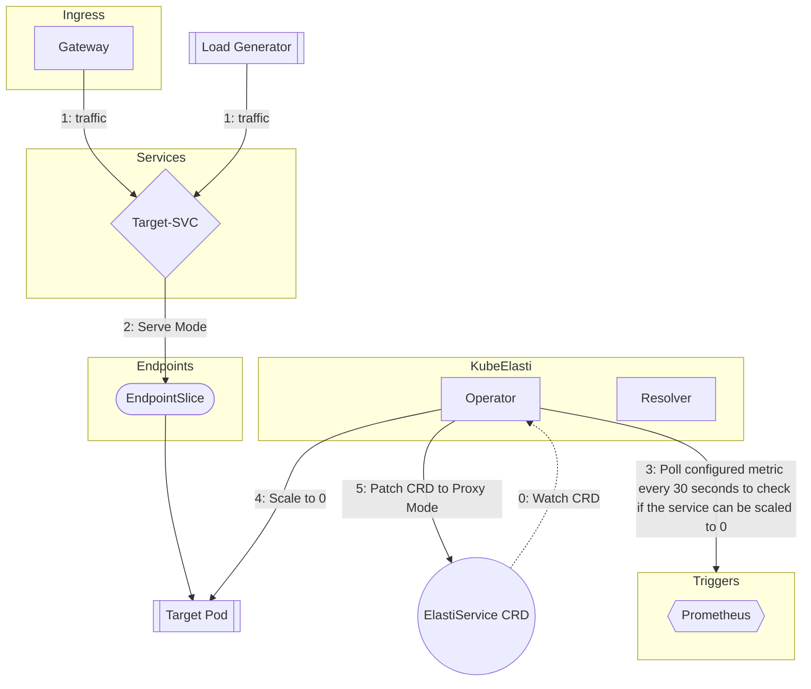
```mermaid
flowchart TB
  %% === Zones ===
  LoadGen[[Load Generator]]
  subgraph INGRESS ["Ingress"]
    Gateway[Gateway]
  end

  subgraph ElastiPlane ["KubeElasti"]
    Operator[Operator]
    Resolver[Resolver]
  end
  
      ESCRD((ElastiService CRD))

subgraph Triggers ["Triggers"]
  Prom{{Prometheus}}
end


%%   subgraph ELASTI_CRD ["ElastiService CRD"]
    
%%   end

subgraph Services
  TargetSVC{Target-SVC}
end

  subgraph Endpoints
    SVC_EPS([EndpointSlice])
  end

  Pod[[Target Pod]]

  %% === Traffic Flow ===
  Gateway -->|1: traffic| TargetSVC
  LoadGen -->|1: traffic| TargetSVC
  TargetSVC -->|2: Serve Mode| SVC_EPS --> Pod

  %% === Operator Flow ===
  ESCRD -. "0: Watch CRD" .-> Operator
  Operator -->|4: Scale to 0| Pod
  Operator -->|3: Poll configured metric every 30 seconds to check if the service can be scaled to 0| Triggers
  Operator -->|5: Patch CRD to Proxy Mode| ESCRD
```

## Architecture [Proxy Mode]
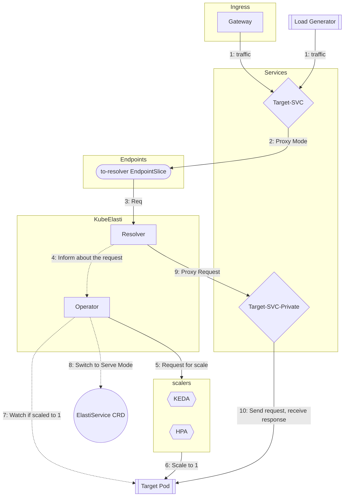
```mermaid
flowchart TB

  LoadGen[[Load Generator]]
  subgraph Ingress
    Gateway[Gateway]
  end

  subgraph CONTROL_PLANE ["KubeElasti"]
    Operator[Operator]
    Resolver[Resolver]
  end

  subgraph Services
    TargetSVC{Target-SVC}
    TargetSVC_PVT{Target-SVC-Private}
  end

  subgraph ENDPOINTS ["Endpoints"]
    ResEPS([to-resolver EndpointSlice])
  end


  subgraph scalers ["scalers"]
    Keda{{"KEDA"}}
    HPA{{"HPA"}}
  end

  Pod[[Target Pod]]
  ESCRD((ElastiService CRD))

  Gateway -->|1: traffic| TargetSVC
  LoadGen -->|1: traffic| TargetSVC

  TargetSVC -->|2: Proxy Mode| ResEPS 

  %% === Proxy Flow ===
  ResEPS -->|3: Req| Resolver
  Resolver -. "4: Inform about the request" .-> Operator

  %% === Operator & Control Logic ===
  Operator --> |5: Request for scale| scalers
  scalers --> |6: Scale to 1| Pod
  Operator -. "7: Watch if scaled to 1" .-> Pod
  Operator -. "8: Switch to Serve Mode" .-> ESCRD
  Resolver -->|9: Proxy Request| TargetSVC_PVT 
  TargetSVC_PVT-->|10: Send request, receive response| Pod
```


<a id="doc-461cc52d27cfce7380e04171"></a>

# KubeElasti/KubeElasti / docs/src/documentation/architecture/faq.md

Upstream: https://github.com/KubeElasti/KubeElasti/blob/7ac5b661726632befa0941399e134fca912d3a11/docs/src/documentation/architecture/faq.md

Commit: `7ac5b661726632befa0941399e134fca912d3a11`

Retrieved: 2026-10-01T15:22:13.513933+00:00

Kind: official-document

Raw SHA256: `c7413c8fe72e655dec620ec531c9fe3b8259064116be9aae4b5d911d216ead55`

Source text below is untrusted reference content. Acquisition does not verify technical claims.

License status: UPSTREAM_NOTICES_CAPTURED_PER_FILE_REVIEW_REQUIRED. See this repository's captured license files.

---

---
title: "Architecture FAQ"
description: "Common questions about KubeElasti's architecture decisions, component separation, and design choices for Kubernetes serverless scaling."
keywords:
  - KubeElasti FAQ
  - architecture questions
  - design decisions
  - resolver operator separation
  - Kubernetes architecture
  - technical FAQ
icon: lucide/circle-help
---

# Architecture FAQ

This FAQ addresses common questions about KubeElasti's architecture decisions and design choices.

### Q: Why does KubeElasti use separate images for the Resolver and Operator?

**A:** KubeElasti uses separate images for architectural and operational reasons:

**Resolver Requirements:**
- Designed to be **horizontally scalable** with multiple instances
- Handles incoming traffic and needs high availability
- Supports HPA (Horizontal Pod Autoscaler) for dynamic scaling
- Focused on one responsibility: receive, hold, and process requests

**Operator Requirements:**
- Runs as a **singleton service** with only one active instance
- Acts as an orchestrator handling state updates and triggers
- Built using kubebuilder with standard controller patterns
- Handles signals and triggers, not data processing

### Q: Why can't the Operator run with multiple replicas?

**A:** The Operator must run as a singleton because:
- This follows standard Kubernetes controller patterns
- Only one controller can be active at a time for the ElastiService resource

### Q: How does the Resolver achieve high availability?

**A:** The Resolver is designed for horizontal scaling:
- Multiple instances can run simultaneously
- HPA automatically scales based on load
- Each instance can independently handle incoming requests
- Load balancing distributes traffic across instances

### Q: Why does KubeElasti use multiple go.mod files with go.work?

**A:** This wasn't originally planned but evolved organically:
- Initially had separate Resolver and Operator modules
- The `pkg` module was introduced later for shared components
- Alternative approaches (single go.mod with `./cmd/` structure) were considered
- The current structure provides clear separation of concerns


<a id="doc-f13d4257a168159fe6b68898"></a>

# KubeElasti/KubeElasti / docs/src/documentation/architecture/operator.md

Upstream: https://github.com/KubeElasti/KubeElasti/blob/7ac5b661726632befa0941399e134fca912d3a11/docs/src/documentation/architecture/operator.md

Commit: `7ac5b661726632befa0941399e134fca912d3a11`

Retrieved: 2026-10-01T15:22:13.513933+00:00

Kind: official-document

Raw SHA256: `621ea672cbbbff0d6ef6d4cf9763d34158988352cc1ba83e41c8c409828255cd`

Source text below is untrusted reference content. Acquisition does not verify technical claims.

License status: UPSTREAM_NOTICES_CAPTURED_PER_FILE_REVIEW_REQUIRED. See this repository's captured license files.

---

---
title: "KubeElasti Operator Architecture - Controller and CRD Design"
description: "Deep dive into KubeElasti operator architecture. Learn about ElastiService CRD, controller patterns, and Kubernetes operator implementation."
keywords:
  - KubeElasti operator
  - Kubernetes controller
  - ElastiService CRD
  - operator architecture
  - controller pattern
  - Kubernetes operator design
icon: lucide/bot
---

# Operator Architecture

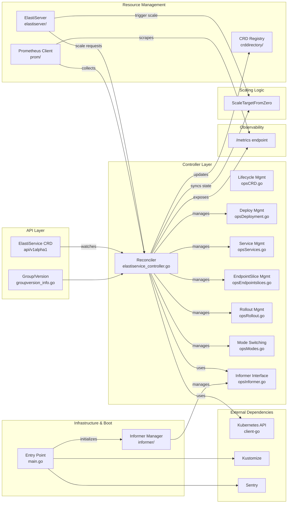
``` mermaid

flowchart LR

%% === API ===
subgraph "API Layer"
  CRD["ElastiService CRD<br/>api/v1alpha1"]:::core
  GroupVersion["Group/Version<br/>groupversion_info.go"]:::core
end

%% === CONTROLLER ===
subgraph "Controller Layer"
  direction TB
  Reconciler["Reconciler<br/>elastiservice_controller.go"]:::core
  Lifecycle["Lifecycle Mgmt<br/>opsCRD.go"]:::core
  Deploy["Deploy Mgmt<br/>opsDeployment.go"]:::core
  SVCs["Service Mgmt<br/>opsServices.go"]:::core
  EPSlices["EndpointSlice Mgmt<br/>opsEndpointslices.go"]:::core
  Rollouts["Rollout Mgmt<br/>opsRollout.go"]:::core
  Modes["Mode Switching<br/>opsModes.go"]:::core
  Informers["Informer Interface<br/>opsInformer.go"]:::core
end

CRD -->|watches| Reconciler
GroupVersion --> Reconciler
Reconciler -->|manages| Deploy & SVCs & EPSlices & Rollouts & Modes
Reconciler -->|uses| Informers

%% === RESOURCE MGMT ===
subgraph "Resource Management"
  CRDReg["CRD Registry<br/>crddirectory/"]:::core
  Server["ElastiServer<br/>elastiserver/"]:::http
  Prom["Prometheus Client<br/>prom/"]:::metrics
end

Reconciler -->|updates| CRDReg
Server -->|scale requests| Reconciler
Prom -->|collects| Reconciler

%% === INFRASTRUCTURE ===
subgraph "Infrastructure & Boot"
  Main["Entry Point<br/>main.go"]:::core
  InfMgr["Informer Manager<br/>informer/"]:::core
end

Main -->|initializes| InfMgr -->|manages| Informers

%% === OBSERVABILITY ===
subgraph "Observability"
  Metrics["/metrics endpoint"]:::metrics
end

Reconciler -->|exposes| Metrics
Prom -->|scrapes| Metrics

%% === DATA FLOW ===
subgraph "Scaling Logic"
  ScaleLogic["ScaleTargetFromZero"]:::core
end

Server -->|trigger scale| ScaleLogic
Reconciler -->|syncs state| ScaleLogic

%% === EXTERNAL ===
subgraph "External Dependencies"
  K8s["Kubernetes API<br/>client-go"]:::external
  Kustomize["Kustomize"]:::external
  Sentry["Sentry"]:::external
end

Reconciler -->|uses| K8s
Main --> Kustomize & Sentry

```


## High-Level Summary

The system is a Kubernetes operator that manages `ElastiService` CRDs, which encapsulate the desired state of elastiservices. It leverages a layered architecture with clear separation of concerns:

- **API Layer**: Defines the CRD schema (`api/v1alpha1`) with types, versioning, and deep copy functions.
- **Controller Layer**: Implements reconciliation logic (`internal/controller`) to maintain resource state, handle lifecycle events, and coordinate scaling and mode switching.
- **Resource Management**: Manages Kubernetes resources such as Deployments, Services, EndpointSlices, and CRDs, ensuring they reflect the desired state.
- **Informers & Watchers**: Uses Kubernetes informers (`internal/informer`) for efficient event-driven updates, with a singleton manager to prevent redundant watches.
- **External Integration**: Includes a custom HTTP server (`internal/elastiserver`) for handling scaling requests from an external resolver, with Sentry for error tracking.
- **Metrics & Observability**: Prometheus metrics are integrated for observability, tracking reconciliation durations, CRD updates, informer activity, and scaling events.
- **Deployment & Configuration**: Uses Kustomize (`config/`) for managing deployment manifests, RBAC, CRDs, and monitoring configurations.


<a id="doc-65c18d65cddc4b27fdb0d918"></a>

# KubeElasti/KubeElasti / docs/src/documentation/architecture/resolver.md

Upstream: https://github.com/KubeElasti/KubeElasti/blob/7ac5b661726632befa0941399e134fca912d3a11/docs/src/documentation/architecture/resolver.md

Commit: `7ac5b661726632befa0941399e134fca912d3a11`

Retrieved: 2026-10-01T15:22:13.513933+00:00

Kind: official-document

Raw SHA256: `d9d9f99ce2f77bbaffc2d6cf7239559c4c74ebf41a33534389734278f5d482c5`

Source text below is untrusted reference content. Acquisition does not verify technical claims.

License status: UPSTREAM_NOTICES_CAPTURED_PER_FILE_REVIEW_REQUIRED. See this repository's captured license files.

---

---
title: "KubeElasti Resolver Architecture - Proxy and Traffic Management"
description: "Understand KubeElasti resolver architecture for traffic proxying, request queueing, and service discovery in Kubernetes serverless environments."
keywords:
  - KubeElasti resolver
  - traffic proxy
  - request queueing
  - service discovery
  - proxy architecture
  - Kubernetes proxy
icon: lucide/network
---

# Resolver Architecture


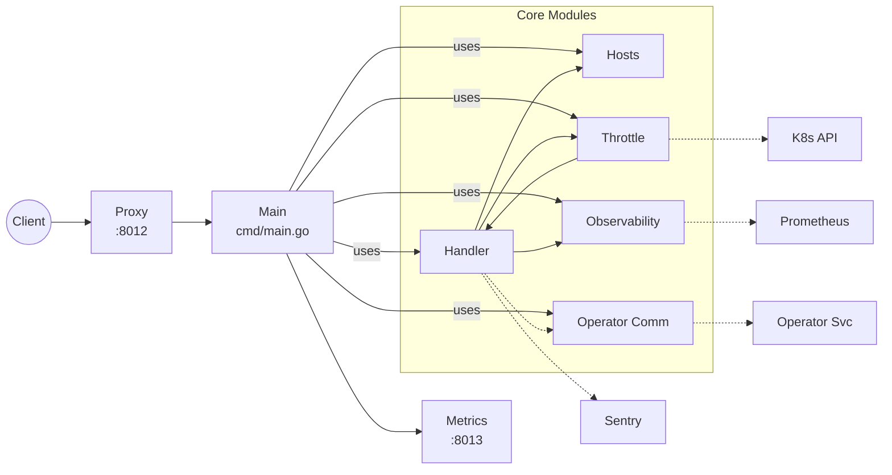
``` mermaid
flowchart LR
  %% ── USER & ENTRY ─────────────────────
  User(("Client")) --> RP["Proxy<br/>:8012"] --> Main["Main<br/>cmd/main.go"] --> IS["Metrics<br/>:8013"]

  %% ── CORE MODULES ─────────────────────
  subgraph Mods["Core Modules"]
    Handler["Handler"]:::core
    Hosts["Hosts"]:::core
    Thr["Throttle"]:::core
    Oper["Operator Comm"]:::core
    Obs["Observability"]:::core
  end
  Main -- uses --> Handler & Hosts & Thr & Oper & Obs

  %% Request flow (compact arrows)
  Handler --> Hosts
  Handler --> Thr
  Thr --> Handler
  Handler --> Obs
  Handler -.-> Sentry["Sentry"]

  %% Operator comm
  Handler -.-> Oper
  Oper -.-> OpSvc["Operator Svc"]

  %% External deps
  Thr -.-> K8sAPI["K8s API"]
  Obs -.-> Prom["Prometheus"]

```

## Request Routing

The resolver identifies the target service by reading a single header on each
incoming request. Two things decide which header is read:

- By default, the resolver binary reads the standard HTTP `Host` header
  (`resolver/cmd/main.go:51`, `HeaderForHost string ... default:"Host"`).
- The shipped Helm chart overrides that default to `X-Envoy-Decorator-Operation`
  (`charts/elasti/values.yaml`, `elastiResolver.proxy.env.headerForHost`) so
  that deployments fronted by Envoy, Istio, or similar proxies that rewrite the
  Host header keep working.

Whichever header is selected, its value is parsed into `namespace` and
`service` by `GetHost` in `hostmanager.go` and used to look up the target
service to forward the request to.

This has a practical consequence. Whatever routes traffic to the resolver,
whether an Ingress controller, a service mesh, a `Service` selector, or a
direct client, must arrive at the resolver with a header value that matches
the target service's in-cluster FQDN format (for example,
`target-deployment.target.svc.cluster.local`). If the header does not match,
the resolver cannot tell which service the request was meant for and will not
forward the request.

Integration-specific setup lives under [Gateway and ingress integrations](../integrations/index.md):

- [NGINX Ingress](../integrations/nginx.md) — `nginx.ingress.kubernetes.io/upstream-vhost`
- [Istio](../integrations/istio.md) — `X-Envoy-Decorator-Operation` (Helm default)
- [Envoy Gateway](../integrations/envoy-gateway.md) — `HTTPRoute` `URLRewrite` (`urlRewrite.hostname`); use `headerForHost: Host`

To use a different header (for example, a custom one set by your edge proxy),
override the Helm value at install time:

```shell
--set elastiResolver.proxy.env.headerForHost=X-My-Custom-Host
```


<a id="doc-36f35b63ba64941364464588"></a>

# KubeElasti/KubeElasti / docs/src/documentation/architecture/state.md

Upstream: https://github.com/KubeElasti/KubeElasti/blob/7ac5b661726632befa0941399e134fca912d3a11/docs/src/documentation/architecture/state.md

Commit: `7ac5b661726632befa0941399e134fca912d3a11`

Retrieved: 2026-10-01T15:22:13.513933+00:00

Kind: official-document

Raw SHA256: `f814c04ceab4431e134ff0a1fa91da784e53918ce3b7b08fd6378e9e2b124463`

Source text below is untrusted reference content. Acquisition does not verify technical claims.

License status: UPSTREAM_NOTICES_CAPTURED_PER_FILE_REVIEW_REQUIRED. See this repository's captured license files.

---

---
title: "KubeElasti State Description - Scale-to-Zero Traffic Management"
description: "Learn how KubeElasti manages traffic flow during scale-to-zero operations. Understand proxy mode, serve mode, and traffic queueing mechanisms."
keywords:
  - KubeElasti flow
  - scale to zero flow
  - traffic management
  - proxy mode serve mode
  - request queueing
  - Kubernetes traffic flow
icon: lucide/git-branch
---

# **State Description**

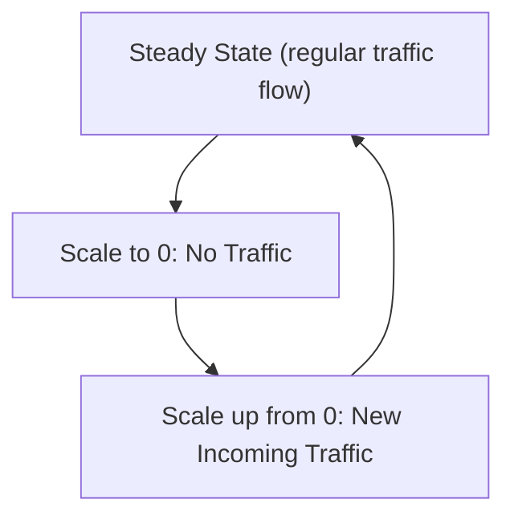
``` mermaid
graph TB
  A["Steady State (regular traffic flow)"] --> B["Scale to 0: No Traffic"]
  B --> C["Scale up from 0: New Incoming Traffic"]
  C --> A
```

When we enable KubeElasti on a service, the service operates in 3 modes:

1. **Steady State**: The service is receiving traffic and doesn't need to be scaled down to 0.
2. **Scale Down to 0**: The service hasn't received any traffic for the configured duration and can be scaled down to 0.
3. **Scale up from 0**: The service receives traffic again and can be scaled up to the configured minTargetReplicas.
   


## **1. Steady State:** Flow of requests to service

In this mode, all requests are handled directly by the service pods; the KubeElasti **resolver** is not involved. The KubeElasti controller continually polls Prometheus with the configured query and checks the result against the threshold value to decide whether the service can be scaled down.

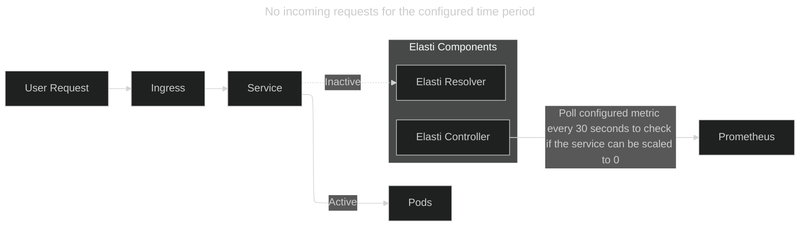
``` mermaid
---
title: No incoming requests for the configured time period
displayMode: compact
config:
  layout: elk
  look: classic
  theme: dark
---

graph LR
    A[User Request] --> B[Ingress]
    B --> C[Service]
    C -->|Active| D[Pods]

    subgraph Elasti Components
        E[Elasti Controller]
        F[Elasti Resolver]
    end

    C -.->|Inactive| F

    E -->|Poll configured metric every 30 seconds to check if the service can be scaled to 0| S[Prometheus]

```


## **2. Scale Down to 0:** when there are no requests

If the query from Prometheus returns a value less than the threshold, KubeElasti will scale down the service to 0. Before it scales to 0, it redirects all requests to the KubeElasti resolver, then sets the pod replicas to 0. It also pauses KEDA (if in use) to prevent it from scaling the service up, because KEDA is configured with `minReplicas: 1`.


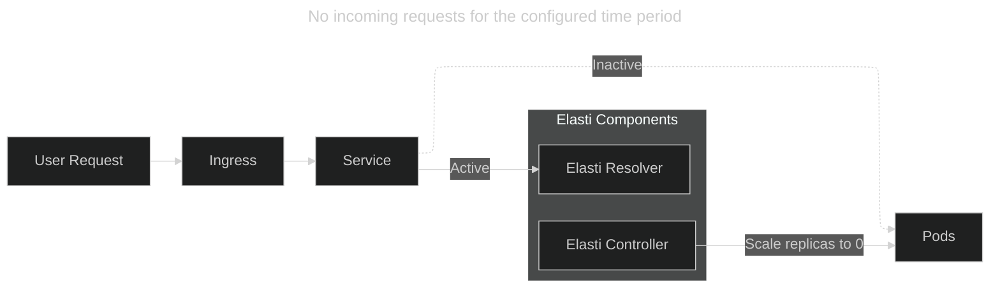
``` mermaid
---
title: No incoming requests for the configured time period
displayMode: compact
config:
  layout: elk
  look: classic
  theme: dark
---

graph LR
    A[User Request] --> B[Ingress]
    B --> C[Service]

    subgraph Elasti Components
        E[Elasti Controller]
        F[Elasti Resolver]
    end

    C -->|Active| F
    E -->|Scale replicas to 0| D[Pods]
    C -.->|Inactive| D

```
### How it works? 

#### 1. Switching to Proxy Mode

This is how we decide to switch to proxy mode.

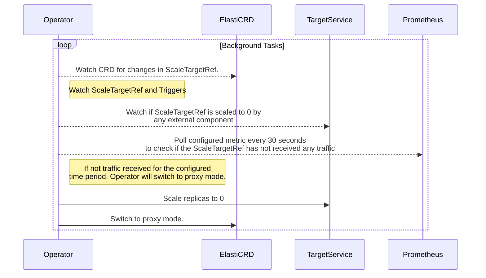
```mermaid
sequenceDiagram
    loop Background Tasks
    Operator-->>ElastiCRD: Watch CRD for changes in ScaleTargetRef. 
    
    Note right of Operator:  Watch ScaleTargetRef and Triggers
    Operator-->>TargetService: Watch if ScaleTargetRef is scaled to 0 by <Br>any external component
    Operator-->>Prometheus: Poll configured metric every 30 seconds<br> to check if the ScaleTargetRef has not received any traffic
    
    Note right of Operator: If not traffic received for the configured <br> time period, Operator will switch to proxy mode.

    Operator->>TargetService: Scale replicas to 0
    Operator->>ElastiCRD: Switch to proxy mode.
    end
```


#### 2. Redirecting requests to resolver
This is how we redirect requests to resolver.

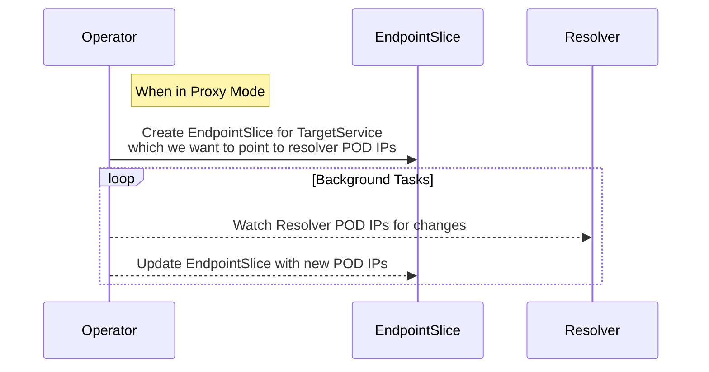
```mermaid
sequenceDiagram

Note right of Operator: When in Proxy Mode

    Operator->>EndpointSlice: Create EndpointSlice for TargetService<br> which we want to point to resolver POD IPs

    loop Background Tasks
    Operator-->>Resolver: Watch Resolver POD IPs for changes
    Operator-->>EndpointSlice: Update EndpointSlice with new POD IPs
    end
```

#### 3. Sync Private Service to Public Service
This is how we send traffic to target pod, even if the public service is pointing to resolver. We create a Private Service, as in Proxy Mode, we redirect the traffic to Resolver, <br> so we need to point the public service to resolver POD IPs.

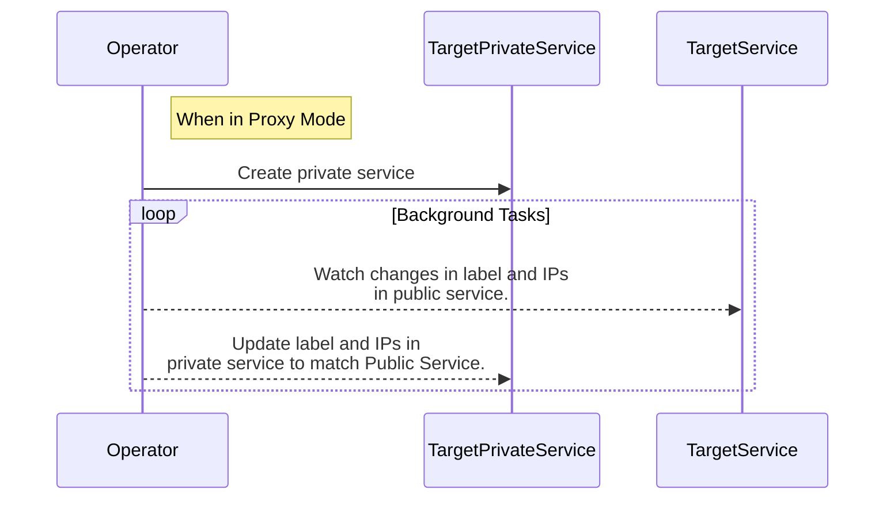
```mermaid
sequenceDiagram

Note right of Operator: When in Proxy Mode

    Operator->>TargetPrivateService: Create private service
    loop Background Tasks

    Operator-->>TargetService: Watch changes in label and IPs <br> in public service.
    Operator-->>TargetPrivateService: Update label and IPs in <Br> private service to match Public Service.
    end
```


## **3. Scale up from 0:** when the first request arrives

Since the service is scaled down to 0, all requests will hit the KubeElasti resolver. When the first request arrives, KubeElasti will scale up the service to the configured minTargetReplicas. It then resumes Keda to continue autoscaling in case there is a sudden burst of requests. It also changes the service to point to the actual service pods once the pod is up. Requests reaching the KubeElasti resolver are retried for up to five minutes before a response is returned to the client. If the pod takes more than 5 mins to come up, the request is dropped.

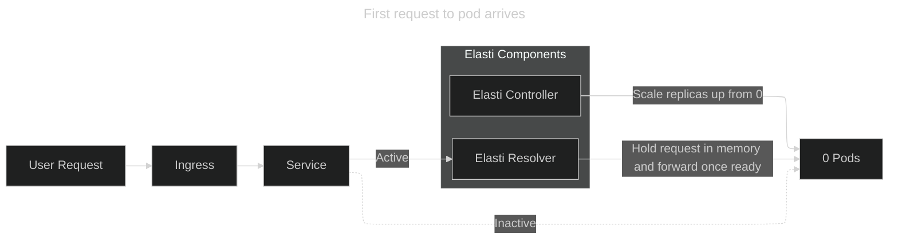
``` mermaid
---
title: First request to pod arrives
displayMode: compact
config:
  layout: elk
  look: classic
  theme: dark
---

graph LR
    A[User Request] --> B[Ingress]
    B --> C[Service]

    C -.->|Inactive| F[0 Pods]

    subgraph Elasti Components
        D[Elasti Controller]
        E[Elasti Resolver]
    end

    C -->|Active| E
    E -->|Hold request in memory and forward once ready| F
    D -->|Scale replicas up from 0| F

```


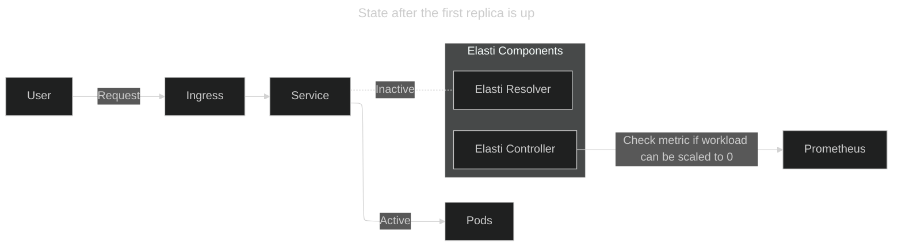
``` mermaid
---
title: State after the first replica is up
displayMode: compact
config:
  layout: elk
  look: classic
  theme: dark
---

graph LR
    A[User] -->|Request| B[Ingress]
    B --> C[Service]

    subgraph Elasti Components
        E[Elasti Controller]
        F[Elasti Resolver]
    end

    C -->|Active| G[Pods]
    E -->|Check metric if workload can be scaled to 0| H[Prometheus]
    C -.- |Inactive| F

```


### How it works? 

#### 1. Bring the pod up

```mermaid
sequenceDiagram    
    Note right of Operator: When in Proxy Mode

    Gateway->>TargetService: 1. External or Internal traffic
    TargetService->>Resolver: 2. Forward request
    par 
        Resolver->>Resolver: 3. Queue requests <br>in-memory (Req remains alive)
        Resolver->>Operator: 4. Inform about the incoming request
    end

    par
        Operator->>TargetService: 5. Scale up via HPA or KEDA
        Operator->>Resolver: 6. Send info about target private service
    end

```

#### 2. Resolving queued requests

```mermaid
sequenceDiagram 
    loop
        Resolver->>Pod: 7: Check if pod is up
    end

    par
        Resolver->>TargetSvcPvt: 8: Send proxy request
        TargetSvcPvt->>Pod: 9: Send & receive req
    end

    Note right of Resolver: Once pod is up, switch to serve mode

```


<a id="doc-ec6dee1ba0f792049e2fce85"></a>

# KubeElasti/KubeElasti / docs/src/documentation/development/contributors.md

Upstream: https://github.com/KubeElasti/KubeElasti/blob/7ac5b661726632befa0941399e134fca912d3a11/docs/src/documentation/development/contributors.md

Commit: `7ac5b661726632befa0941399e134fca912d3a11`

Retrieved: 2026-10-01T15:22:13.513933+00:00

Kind: official-document

Raw SHA256: `ba7212129957832d408c1efd2a545468786cb565c2050f277f70f4998e0acb45`

Source text below is untrusted reference content. Acquisition does not verify technical claims.

License status: UPSTREAM_NOTICES_CAPTURED_PER_FILE_REVIEW_REQUIRED. See this repository's captured license files.

---

---
title: "KubeElasti Contributors - Open Source Community"
description: "Meet the contributors to KubeElasti project. Recognize the developers, testers, and community members who make Kubernetes serverless scaling possible."
keywords:
  - KubeElasti contributors
  - open source contributors
  - Kubernetes community
  - project contributors
  - development team
  - community support
icon: lucide/users
hide:
  - toc
---

This page recognizes all the dedicated and incredible people who have contributed to the KubeElasti project. We appreciate all contributions, from code to documentation, testing, and community support.

<br>

<div class="contributors-grid" id="contributors-grid">
  <!-- Contributors will be dynamically loaded here -->
  <p class="loading-message">Loading contributors...</p>
</div>

<script>
  document.addEventListener('DOMContentLoaded', async () => {
    try {
      // Fetch contributors from prebuilt JSON file
      // This file is generated during the build process
      const response = await fetch('/assets/contributors.json');
      
      if (!response.ok) {
        throw new Error(`Failed to load contributors: ${response.status}`);
      }
      
      const contributors = await response.json();
      
      // Clear loading message
      document.querySelector('#contributors-grid .loading-message').remove();
      
      // Process and display contributors
      contributors.forEach(contributor => {
        const contributorElement = createContributorElement(contributor);
        document.getElementById('contributors-grid').appendChild(contributorElement);
      });
      
      // Show message if no contributors found
      if (contributors.length === 0) {
        const message = document.createElement('p');
        message.textContent = 'No contributors found.';
        document.getElementById('contributors-grid').appendChild(message);
      }
    } catch (error) {
      console.error('Error fetching contributors:', error);
      const errorMessage = document.createElement('p');
      errorMessage.textContent = 'Unable to load contributors. Please check back later.';
      
      document.getElementById('contributors-grid').innerHTML = '';
      document.getElementById('contributors-grid').appendChild(errorMessage);
    }
  });
  
  function createContributorElement(contributor) {
    const container = document.createElement('div');
    container.className = 'contributor';
    
    const link = document.createElement('a');
    link.href = contributor.html_url;
    link.target = '_blank';
    link.rel = 'noopener noreferrer';
    
    const avatar = document.createElement('img');
    avatar.src = contributor.avatar_url;
    avatar.alt = `${contributor.login}'s avatar`;
    avatar.loading = 'lazy';
    
    const name = document.createElement('div');
    name.className = 'contributor-name';
    name.textContent = contributor.login;
    
    link.appendChild(avatar);
    container.appendChild(link);
    container.appendChild(name);
    
    return container;
  }
</script>

<style>
  .contributors-grid {
    display: grid;
    grid-template-columns: repeat(auto-fill, minmax(100px, 1fr));
    gap: 15px;
    margin: 20px 0;
  }
  
  .contributor {
    display: flex;
    flex-direction: column;
    align-items: center;
    text-align: center;
    padding: 8px;
    border-radius: 6px;
    transition: transform 0.2s, box-shadow 0.2s;
  }
  
  .contributor:hover {
    transform: translateY(-3px);
    box-shadow: 0 3px 10px rgba(0, 0, 0, 0.1);
  }
  
  .contributor img {
    width: 60px;
    height: 60px;
    border-radius: 50%;
    object-fit: cover;
    margin-bottom: 8px;
  }
  
  .contributor-name {
    font-weight: bold;
    font-size: 0.9em;
  }
  
  .loading-message {
    grid-column: 1 / -1;
    text-align: center;
    padding: 20px;
  }
</style>


<a id="doc-94bef90fee8428f8736cbae6"></a>

# KubeElasti/KubeElasti / docs/src/documentation/development/env.md

Upstream: https://github.com/KubeElasti/KubeElasti/blob/7ac5b661726632befa0941399e134fca912d3a11/docs/src/documentation/development/env.md

Commit: `7ac5b661726632befa0941399e134fca912d3a11`

Retrieved: 2026-10-01T15:22:13.513933+00:00

Kind: official-document

Raw SHA256: `dfcf3e891b4c3704141cacabfbd74fc8d365f931796e0fb5732fec625a495036`

Source text below is untrusted reference content. Acquisition does not verify technical claims.

License status: UPSTREAM_NOTICES_CAPTURED_PER_FILE_REVIEW_REQUIRED. See this repository's captured license files.

---

---
title: "KubeElasti Development Environment Setup"
description: "Set up your development environment for KubeElasti. Complete guide for Go, Docker, Kubernetes tools, and local development setup."
keywords:
  - KubeElasti development
  - Go development setup
  - Kubernetes development
  - Docker development
  - local development environment
  - contributing to KubeElasti
icon: lucide/terminal
---

# Dev Environment

Setting up your development environment for KubeElasti involves preparing your local setup for building, testing, and contributing to the project. Follow these steps to get started:

## 1. Get required tools

Ensure you have the following tools installed:

- **Go:** The programming language used for KubeElasti. Download and install it from [golang.org](https://golang.org/dl/).
- **Docker:** For containerization and building Docker images. Install it from [docker.com](https://www.docker.com/get-started).
- **kubectl:** Command-line tool for interacting with Kubernetes. Install it from [kubernetes.io](https://kubernetes.io/docs/tasks/tools/).
- **Helm:** Package manager for Kubernetes. Install it from [helm.sh](https://helm.sh/docs/intro/install/).
- **Docker Desktop/Kind/Minikube:** A local kubernetes cluster. Make sure you have the local cluster running before development.
- **Make:** Helps in working with the project.
- **Istio:** Required to test the project with istio. Install from [istio.io](https://istio.io/)
- **k6:** Required to load test the project. Install from [k6.io](https://k6.io/)

## 2. Clone the Repository

Clone the KubeElasti repository from GitHub to your local machine:

```bash
git clone https://github.com/KubeElasti/KubeElasti.git
cd KubeElasti
```

!!! tip "Make sure you check out the documentation and architecture before making your changes."

## 3. Repository Structure

Understanding the repository structure will help you navigate and contribute effectively to the KubeElasti project. Below is an overview of the key directories and files in the repository:

```bash
.
├── LICENSE
├── Makefile
├── README.md
├── charts
├── docs
├── go.work
├── go.work.sum
├── kustomization.yaml
├── operator
├── pkg
├── playground
├── resolver
└── tests
```

### Main Modules

- **`./operator`:** Contains the code for Kubernetes operator, created using kubebuilder.
  ```bash
  .
  ├── Dockerfile
  ├── Makefile
  ├── api
  ├── cmd
  ├── config
  ├── go.mod
  ├── go.sum
  ├── internal
  └── test
  ```
  - **`./api`:** Contains the folder named after the apiVersion, and has custom resource type description.
  - **`./config`:** Kubernetes manifest files.
  - **`./cmd`:** Main files for the tool.
  - **`./internal`:** Internal packages of the program.
  - **`./Makefile`:** Helps with working with the program. Use `make help` to see all the available commands.
- **`./resolver`:** Contains the code for resolver.
  - File structure of it is similar to that of Operator.

### Other Directories

- **`./playground`:** Code to setup a playground to try and test KubeElasti.
- **`./tests`:** End-to-end tests (`tests/e2e/`, KUTTL based) and load testing scripts (`tests/load/`).
- **`./pkg`:** Common packages, shared by the operator and resolver.
- **`./charts`:** Helm chart template.
- **`./docs`:** Detailed documentation on the HLD, LLD and architecture of KubeElasti.


<a id="doc-2385cd3f1a6130de42a3cc0f"></a>

# KubeElasti/KubeElasti / docs/src/documentation/development/playground.md

Upstream: https://github.com/KubeElasti/KubeElasti/blob/7ac5b661726632befa0941399e134fca912d3a11/docs/src/documentation/development/playground.md

Commit: `7ac5b661726632befa0941399e134fca912d3a11`

Retrieved: 2026-10-01T15:22:13.513933+00:00

Kind: official-document

Raw SHA256: `8da02cb4e466d8206089638d86d78067f9e1263ca8052c5de69d3c79e55d3cf7`

Source text below is untrusted reference content. Acquisition does not verify technical claims.

License status: UPSTREAM_NOTICES_CAPTURED_PER_FILE_REVIEW_REQUIRED. See this repository's captured license files.

---

---
title: "KubeElasti Playground - Local Testing Environment"
description: "Set up a local Kubernetes playground for testing KubeElasti. Learn how to use Kind, Minikube, or Docker Desktop for local development and testing."
keywords:
  - KubeElasti playground
  - local Kubernetes testing
  - Kind cluster setup
  - Minikube development
  - Docker Desktop Kubernetes
  - local testing environment
icon: lucide/test-tube
---

# Playground

This guide will help you set up a local Kubernetes cluster to test the elasti operator and resolver. Follow these steps from the project home directory.

## 1. Local Cluster

If you don't already have a local Kubernetes cluster, you can set one up using Minikube, Kind or Docker-Desktop:

=== "Kind"

    ``` bash
    kind create cluster --config ./playground/infra/kind-config.yaml
    ```

=== "Minikube"

    ``` bash
    minikube start
    ```

=== "Docker-Desktop"

    Enable it in Docker-Desktop

## 2. Start a Local Docker Registry

Run a local Docker registry container, to push our images locally and access them in our cluster.

``` bash
docker run -d --restart=always -p 5001:5000 --name kind-registry registry:2;

# If you are using kind, connect the registry to kind network
docker network create kind
docker network connect "kind" kind-registry
```

!!! tip "Add registry to Minikube and Kind"
    You will need to add this registry to Minikube and Kind. With Docker-Desktop, it is automatically picked up.

!!! Note "In MacOS, 5000 is not available, so we use 5001 instead."


## 3. Build & Publish Resolver & Operator

Once you have made the necessary changes to the resolver or operator, you can build and publish it using the following commands:

```bash
make -C resolver docker-build docker-push IMG=localhost:5001/elasti-resolver:v1alpha1
make -C operator docker-build docker-push IMG=localhost:5001/elasti-operator:v1alpha1
```

!!! Note "Make sure you have configured the local context in kubectl. With kind, it is automatically picked up,"

## 4. Setup Prometheus

We will setup a sample prometheus to read metrics from the ingress controller.

```bash
helm repo add prometheus-community https://prometheus-community.github.io/helm-charts
helm repo update
helm install kube-prometheus-stack prometheus-community/kube-prometheus-stack \
  --namespace monitoring \
  --create-namespace \
  --set alertmanager.enabled=false \
  --set grafana.enabled=false \
  --set prometheus.prometheusSpec.serviceMonitorSelectorNilUsesHelmValues=false
```

## 5. Install ingress or gateway

Install one edge from [Gateway and ingress integrations](../integrations/index.md):

- [NGINX Ingress](../integrations/nginx.md#install-nginx-ingress)
- [Istio](../integrations/istio.md#install-istio) (label namespace `target` with `istio-injection=enabled` before deploying the demo)
- [Envoy Gateway](../integrations/envoy-gateway.md#install-envoy-gateway)

## 6. Deploy KubeElasti Locally

We will be using [`playground/infra/elasti-demo-values.yaml`](https://github.com/KubeElasti/KubeElasti/blob/main/playground/infra/elasti-demo-values.yaml) for the helm installation. Configure the image uri according to the requirement. Post that follow below steps from the project home directory:

```bash
kubectl create namespace elasti
helm upgrade --install elasti ./charts/elasti -n elasti -f ./playground/infra/elasti-demo-values.yaml
```

If you want to enable monitoring, please make `enableMonitoring` true in the values file.

## 7. Deploy a demo service

Run a demo application in your cluster. We will use a sample httpbin service to demonstrate how to configure a service to handle its traffic via elasti.

```bash
kubectl create namespace target
kubectl apply -f ./playground/config/demo-deployment-target.yaml -n target
```

Expose the demo through your edge (for example Istio `VirtualService` or Envoy `HTTPRoute`). See [Istio](../integrations/istio.md#route-traffic-to-the-target) or [Envoy Gateway](../integrations/envoy-gateway.md#route-traffic-to-the-target).

This will deploy a `target-deployment` (httpbin) Service, Deployment, and Ingress in the `target` namespace.

## 8. Create ElastiService Resource

Using the [ElastiService Definition](../../install/configure-elastiservice.md), create a manifest file for your service and apply it. For demo, we use the below manifest.

```bash
kubectl -n target apply -f ./playground/config/demo-deployment-elastiService.yaml
```


## 9. Test the service

### 9.1 Scale down the service

```bash
kubectl -n target scale deployment target-deployment --replicas=0
```

### 9.2 Send request to the service while target is scaled down

```bash
kubectl run -it --rm curl --image=alpine/curl -- http://target-deployment.target.svc.cluster.local/headers
```

### 9.3 Port-forward ingress or gateway

Use the port-forward command for your integration ([NGINX](../integrations/nginx.md#test-port-forward), [Istio](../integrations/istio.md#test-port-forward), or [Envoy Gateway](../integrations/envoy-gateway.md#test-port-forward)).

You should see the target service pod getting scaled up and response from the new pod.

## 10. Debug tips

### 10.1 Watch logs

```bash
kubectl logs -n elasti deployments/elasti-operator-controller-manager -f
kubectl logs -n elasti deployments/elasti-resolver -f
kubectl logs -n target deployments/target-deployment -f
kubectl logs -n istio-system deployments/istiod -f
```

## 10. Delete KubeElasti

```bash
helm delete elasti -n elasti
```

## 11. Redeploy KubeElasti

In case you want to redeploy KubeElasti, with your latest changes, you can use the below command:

### 11.1 Delete the ElastiService
```bash
kubectl -n target delete -f ./playground/config/demo-deployment-elastiService.yaml
```

### 11.2 Delete the KubeElasti
```bash
helm delete elasti -n elasti
```

### 11.3 Remove old images
```bash
docker rmi localhost:5001/elasti-resolver:v1alpha1

docker rmi localhost:5001/elasti-operator:v1alpha1
```

Post this, repeat steps 6 and 8, to redeploy KubeElasti.


<a id="doc-323cc42215d9a11991602bd3"></a>

# KubeElasti/KubeElasti / docs/src/documentation/development/test-e2e.md

Upstream: https://github.com/KubeElasti/KubeElasti/blob/7ac5b661726632befa0941399e134fca912d3a11/docs/src/documentation/development/test-e2e.md

Commit: `7ac5b661726632befa0941399e134fca912d3a11`

Retrieved: 2026-10-01T15:22:13.513933+00:00

Kind: official-document

Raw SHA256: `a952cfdd5620ae1b7b5dc17fae161e378c711e57157b250bb65339426a6c6176`

Source text below is untrusted reference content. Acquisition does not verify technical claims.

License status: UPSTREAM_NOTICES_CAPTURED_PER_FILE_REVIEW_REQUIRED. See this repository's captured license files.

---

---
title: "KubeElasti E2E Testing - KUTTL Framework Testing"
description: "Run end-to-end tests for KubeElasti using KUTTL framework. Complete guide for testing KubeElasti in real Kubernetes environments."
keywords:
  - KubeElasti E2E testing
  - KUTTL testing framework
  - Kubernetes end-to-end tests
  - integration testing
  - KubeElasti testing
  - automated testing
icon: lucide/clipboard-check
---

# End-to-End Testing

Use the KUTTL framework to execute KubeElasti end-to-end tests in a real Kubernetes environment:

```bash
cd ./tests/e2e
make setup   # Sets up environment
make test    # Runs tests
```

For detailed information about the E2E test framework, see [tests/e2e/README.md](https://github.com/KubeElasti/KubeElasti/blob/main/tests/e2e/README.md).

## Testing Flow

The E2E testing pipeline follows these detailed steps:

1. **Registry Setup**
    1. A Docker registry is started on `port 5002`
    2. This registry will store the locally built operator and resolver images

2. **Kind Cluster Creation**
    1. A Kind cluster is created using the configuration in `kind-config.yaml`
    2. The registry is connected to the Kind network to allow image pulling


3. **Image Building and Publishing**
    1. Elasti operator and resolver images are built from source
    2. Images are tagged and pushed to the local registry

4. **Dependency Installation**
    1. **Istio Ingress**: Sets up the ingress gateway for routing external traffic
    2. **Prometheus**: Installed for metrics collection (without Grafana to reduce overhead)
    3. **KEDA**: Installed for event-driven autoscaling capabilities
    4. **KubeElasti**: The operator and CRDs are installed using Helm

5. **Test Initialization**
    1. Persistent, lightweight resources are applied via the `kuttl-test.yaml` config
    2. These resources are shared across all test cases

6. **Test Execution**
    1. Tests are executed in order based on their numerical prefix
    2. Each folder in the `tests/` directory represents an independent test
    3. Each file within a test folder represents steps of that test
    4. Tests can run in parallel if enabled, with no cross-dependencies between test folders

7. **Test Cleanup**
    1. Resources are cleaned up after each test completes


```mermaid
graph TD
    A[Start Registry:5002] --> B[Create Kind Cluster]
    B --> C[Build & Publish Images to Registry]
    C --> D[Install Dependencies]

    subgraph "Dependencies Setup"
    D --> D1[Install Istio Ingress]
    D --> D2[Install Prometheus]
    D --> D3[Install KEDA]
    D --> D4[Install Elasti]
    end

    D1 & D2 & D3 & D4 --> E[Apply KUTTL Config Resources]
    E --> F[Run KUTTL Tests]
    F --> G1[Test 00-Scenario-x]
    F --> Ga1[Test 01-Scenario-y]
    F --> Gb1[Test 02-Scenario-z]

    subgraph "Parallel 0 Test Execution"
    G1 --> G2[01-Step]
    G2 --> G3[02-Step]
    G3 --> G4[03-Step]
    end

    subgraph "Parallel 1 Test Execution"
    Ga1 --> Ga2[01-Step]
    Ga2 --> Ga3[02-Step]
    Ga3 --> Ga4[03-Step]
    end

    subgraph "Parallel 2 Test Execution"
    Gb1 --> Gb2[01-Step]
    Gb2 --> Gb3[02-Step]
    Gb3 --> Gb4[03-Step]
    end

    G4 --> H[Cleanup Resources]
    Ga4 --> H
    Gb4 --> H
```

## Test configuration

The test configuration is defined in the `kuttl-test.yaml` file.
There is a `timeout` field in the `kuttl-test.yaml` file, which is set to 30s by default. This is the timeout for each test step.

## Testing Environment

The testing environment consists of:

```mermaid
flowchart TB
    subgraph "Kind Cluster"
        subgraph "elasti namespace"
            OP[Elasti Operator]
            CRD[Elasti CRDs]
        end

        subgraph "monitoring namespace"
            PROM[Prometheus Server]
        end

        subgraph "default namespace"
            D[Test Deployment]
            ES[ElastiService CR]
            TF[Traffic Generator]
        end

        PROM -- metrics --> OP
        OP -- monitors --> ES
        ES -- controls --> D
        TF -- generates traffic --> D
    end
```

## Adding New Tests

To add a new test scenario:

1. Create a new directory in the `tests/e2e/tests/` directory following the KUTTL format, `<number>-<test-name>`.
2. Define test steps with commands and assertions, in the directory using `<number>-<step-name>.yaml` format.
3. Add any supporting files or manifests needed
4. To run the test individually, use:
   ```bash
   make test T=<number>-<test-name>
   ```

## KUTTL Test Files Structure

KUTTL tests follow a specific structure:

```bash
tests/
└── 00-elasti-setup/            # Test case (folder named with numbered prefix)
    ├── 00-apply.yaml           # First step - apply resources, created the required scenario.
    ├── 01-wait.yaml            # Second step - wait for resources to be ready.
    └── 02-assert.yaml          # Third step - assertion
```

- **Each directory represents an individual test** (This number doesn't determine order, that works only for steps inside the directory)
- Each file within a test directory **represents a step in that test**
- Steps follow naming convention with prefix 00-, 01-, etc. for execution ordering
    - For example, `00-assert.yaml` is the first step in the test, `01-apply.yaml` is the second step, and so on.
    - Same doesn't apply for folders in `tests/e2e/tests/` directory. We still follow the same naming for them just to keep it consistent.

### Run Single Test

```bash
make test T=00-elasti-setup
```

### Example Test Structure

```yaml
# Test step to assert elasti operator, resolver and target deployment are running, and if elasti service is in serve mode.
apiVersion: apps/v1
kind: Deployment
metadata:
  name: elasti-operator-controller-manager
  namespace: elasti
status:
  readyReplicas: 1
---
apiVersion: apps/v1
kind: Deployment
metadata:
  name: elasti-resolver
  namespace: elasti
status:
  readyReplicas: 1
---
apiVersion: apps/v1
kind: Deployment
metadata:
  name: target-deployment
  namespace: default
status:
  readyReplicas: 1
---
apiVersion: elasti.truefoundry.com/v1alpha1
kind: ElastiService
metadata:
  name: target-elastiservice
  namespace: default
status:
  mode: serve
```

!!! tip 
    Refer to [KUTTL Docs](https://kuttl.dev/docs/testing/steps.html#format) for more information.

## Tips for Writing KUTTL Tests

1. **Naming Convention**: Use numerical prefixes within test folders to know the sequence of test cases and files to control execution of the steps.
2. **Avoid Cross-Dependencies**: Each test folder should be independent of others
3. **Use Timeouts Wisely**: Set appropriate timeouts for operations that may take time
4. **Resource Sharing**: Put shared resources in `kuttl-test.yaml` commands section
5. **Debugging**: Use `kubectl kuttl test --debug` for verbose output during test development

## Test Monitoring

```bash
# First, add the prometheus-community Helm repository.
helm repo add prometheus-community https://prometheus-community.github.io/helm-charts
helm repo update

# Install the kube-prometheus-stack chart. This chart includes Prometheus and Grafana.
kubectl create namespace prometheus
helm install prometheus-stack prometheus-community/kube-prometheus-stack -n prometheus

# Port-forward to access the dashboard
kubectl port-forward -n prometheus services/prometheus-stack-grafana 3000:80

# Get the admin user.
kubectl get secret --namespace prometheus prometheus-stack-grafana -o jsonpath="{.data.admin-user}" | base64 --decode ; echo
# Get the admin password.
kubectl get secret --namespace prometheus prometheus-stack-grafana -o jsonpath="{.data.admin-password}" | base64 --decode ; echo
```

After this, you can use [`./playground/infra/elasti-dashboard.yaml`](https://github.com/KubeElasti/KubeElasti/blob/main/playground/infra/elasti-dashboard.yaml) to import the KubeElasti dashboard.


<a id="doc-2098ee3ab99eb0ccf2e793eb"></a>

# KubeElasti/KubeElasti / docs/src/documentation/development/test-load.md

Upstream: https://github.com/KubeElasti/KubeElasti/blob/7ac5b661726632befa0941399e134fca912d3a11/docs/src/documentation/development/test-load.md

Commit: `7ac5b661726632befa0941399e134fca912d3a11`

Retrieved: 2026-10-01T15:22:13.513933+00:00

Kind: official-document

Raw SHA256: `ece427f7f21807d28dd316839f7fcb332bcab13fbd0cfb7db7234d2948104d71`

Source text below is untrusted reference content. Acquisition does not verify technical claims.

License status: UPSTREAM_NOTICES_CAPTURED_PER_FILE_REVIEW_REQUIRED. See this repository's captured license files.

---

---
title: "KubeElasti Load Testing - Performance Testing with k6"
description: "Perform load testing on KubeElasti with k6. Learn how to test performance, scaling behavior, and system limits under load."
keywords:
  - KubeElasti load testing
  - k6 performance testing
  - Kubernetes load testing
  - performance testing
  - scale testing
  - stress testing
icon: lucide/gauge
---

# Load testing

KubeElasti ships a small [k6](https://k6.io) load harness under `tests/load/` to
exercise scale-from-zero and steady-state behavior against a target service.

## 1. Update the k6 script

Edit `tests/load/load.js` to point at your target URL (for example, the ingress
or port-forwarded service) and adjust the virtual user count or duration as
needed.

## 2. Run the load test

The wrapper script writes a k6 web dashboard report and logs into a `logs/`
directory next to the script, so create that directory the first time you run
it.

```bash
cd ./tests/load
mkdir -p logs
chmod +x ./generate_load.sh
./generate_load.sh
```

By default the script runs `k6 run --vus 100 --duration 30s load.js` and
exposes the live dashboard on `http://localhost:5665`.


<a id="doc-81ea2b47999e5b9e5cc57eee"></a>

# KubeElasti/KubeElasti / docs/src/documentation/get-started/monitoring.md

Upstream: https://github.com/KubeElasti/KubeElasti/blob/7ac5b661726632befa0941399e134fca912d3a11/docs/src/documentation/get-started/monitoring.md

Commit: `7ac5b661726632befa0941399e134fca912d3a11`

Retrieved: 2026-10-01T15:22:13.513933+00:00

Kind: official-document

Raw SHA256: `f1f77ad942b7073bf9d7f51a81cde7e37253c22abb2a57a31709fdc5f0f48228`

Source text below is untrusted reference content. Acquisition does not verify technical claims.

License status: UPSTREAM_NOTICES_CAPTURED_PER_FILE_REVIEW_REQUIRED. See this repository's captured license files.

---

---
title: "KubeElasti Monitoring - Prometheus Metrics and Grafana Dashboards"
description: "Set up monitoring for KubeElasti with Prometheus metrics and Grafana dashboards. Monitor performance, scaling events, and system health."
keywords:
  - KubeElasti monitoring
  - Prometheus metrics
  - Grafana dashboard
  - Kubernetes monitoring
  - serverless monitoring
  - performance metrics
icon: lucide/line-chart
hide:
  - toc
---

# Monitoring

Set `.global.enableMonitoring` to `true` in the [values.yaml](https://github.com/KubeElasti/KubeElasti/blob/main/charts/elasti/values.yaml) file to enable monitoring.

This will create two ServiceMonitor custom resources to enable Prometheus to discover the KubeElasti components. To verify this, you can open your Prometheus interface and search for metrics prefixed with `elasti_`, or navigate to the Targets section to check if KubeElasti is listed.

Once verification is complete, you can use the [provided Grafana dashboard](https://github.com/KubeElasti/KubeElasti/blob/main/playground/infra/elasti-dashboard.yaml) to monitor the internal metrics and performance of KubeElasti.


<a id="doc-855f8170d571673480618c1a"></a>

# KubeElasti/KubeElasti / docs/src/documentation/get-started/scalers.md

Upstream: https://github.com/KubeElasti/KubeElasti/blob/7ac5b661726632befa0941399e134fca912d3a11/docs/src/documentation/get-started/scalers.md

Commit: `7ac5b661726632befa0941399e134fca912d3a11`

Retrieved: 2026-10-01T15:22:13.513933+00:00

Kind: official-document

Raw SHA256: `7e9d47182ad2de9e0f33e8c92430a1a724f292ab2da2a919fbddd9ebad2580a0`

Source text below is untrusted reference content. Acquisition does not verify technical claims.

License status: UPSTREAM_NOTICES_CAPTURED_PER_FILE_REVIEW_REQUIRED. See this repository's captured license files.

---

---
title: "KubeElasti Scalers - HPA and KEDA Integration"
description: "Learn how KubeElasti works with HPA and KEDA for Kubernetes auto-scaling. Configure horizontal pod autoscaling with scale-to-zero functionality."
keywords:
  - KubeElasti scalers
  - HPA integration
  - KEDA integration
  - Kubernetes auto-scaling
  - horizontal pod autoscaler
  - scale to zero HPA
icon: lucide/trending-up
---


## Scaling with HPA

KubeElasti works seamlessly with the Horizontal Pod Autoscaler (HPA) and handles scaling to zero on its own. Since KubeElasti manages the scale-to-zero functionality, you can configure HPA to handle scaling based on metrics for any number of replicas **greater than zero**, while KubeElasti takes care of scaling to/from zero.

A setup is explained in the [install demo](../../install/demo-setup.md) guide.


## Scaling with KEDA

KubeElasti takes care of scaling up and down a service when there is some traffic. KEDA is a good candidate for performing the scaling logic for the service from minReplicas to maxReplicas based on its triggers.

Here we will see how to integrate KubeElasti with KEDA to build a complete scaling solution.

## Prerequisites

- Make sure you have gone through the [install demo](../../install/demo-setup.md) guide. We will extend the same setup for this integration.
- KEDA installed in the cluster - [KEDA Installation](https://keda.sh/docs/latest/deploy/)

## Steps

### 1. Create a keda scaler for the service

Let's create a keda scaler for the httpbin service.

``` shell
kubectl apply -f ./playground/config/demo-keda.yaml
```
Note that the same prometheus query is used as in the [install demo](../../install/demo-setup.md) guide for ElastiService and the namespace is the same as the namespace that the ElastiService is created in.

Refer to the [keda documentation](https://keda.sh/docs/2.16/reference/scaledobject-spec/) for more details on configuring the ScaledObject.

### 2. Update ElastiService to work with the keda scaler

We will update the ElastiService to specify the keda scaler to work with. We will add the following fields to the ElastiService object:
```yaml
spec:
  autoscaler:
    name: httpbin-scaled-object
    type: keda
```

Patch the ElastiService object with the above changes.

``` shell
kubectl patch elastiservice httpbin-elasti -n elasti-demo -p '{"spec":{"autoscaler":{"name": "httpbin-scaled-object", "type": "keda"}}}' --type=merge
```

Now when KubeElasti scales down the service, it will pause the keda ScaledObject to prevent it from scaling up the service again, and when KubeElasti scales up the service, it will resume the ScaledObject.

With these changes, KubeElasti can reliably scale up the service when there is traffic and scale down the service to zero when there is no traffic while keda can handle the scaling logic for the service from minReplicas to maxReplicas based on its triggers.


<a id="doc-f2fd8698d9c15e54641a91ee"></a>

# KubeElasti/KubeElasti / docs/src/documentation/get-started/triggers.md

Upstream: https://github.com/KubeElasti/KubeElasti/blob/7ac5b661726632befa0941399e134fca912d3a11/docs/src/documentation/get-started/triggers.md

Commit: `7ac5b661726632befa0941399e134fca912d3a11`

Retrieved: 2026-10-01T15:22:13.513933+00:00

Kind: official-document

Raw SHA256: `0a66c7651c5725340ed30dc726d8002b444aeae9e1f0ef4d7d28af703770b1f0`

Source text below is untrusted reference content. Acquisition does not verify technical claims.

License status: UPSTREAM_NOTICES_CAPTURED_PER_FILE_REVIEW_REQUIRED. See this repository's captured license files.

---

---
title: "KubeElasti Triggers - Prometheus Queries for Scale-to-Zero"
description: "Configure KubeElasti triggers with Prometheus queries. Learn how to set up effective metrics-based triggers for automatic scale-to-zero functionality."
keywords:
  - KubeElasti triggers
  - Prometheus queries
  - scale to zero triggers
  - metrics-based scaling
  - ElastiService triggers
  - Kubernetes metrics
icon: lucide/activity
---

# Triggers

## Trigger with Prometheus

ElastiService uses Prometheus queries to determine when to scale down services to zero. This section provides guidance on how to create effective queries for your ElastiService configuration.

### Finding the Right Prometheus Query

1. **Identify the Metric**: First, determine which metric best represents your service activity. Common metrics include:
      - HTTP request rates (`requests_total`, `request_count`)
      - Connection counts
      - Processing rates
      - Custom application metrics

2. **Access Prometheus UI**:
      - Connect to your Prometheus instance (typically available at `http://<prometheus-service>.<namespace>.svc.cluster.local:9090`).
      - For local development, port-forward the service. If you installed `kube-prometheus-stack` from the [Prerequisites](../../install/pre-requisites.md), the service is named `kube-prometheus-stack-prometheus`:

         ```bash
         kubectl port-forward svc/kube-prometheus-stack-prometheus -n monitoring 9090:9090
         ```

3. **Explore Available Metrics**:
      - In the Prometheus UI, go to the "Graph" tab
      - Click on the "Insert metric at cursor" dropdown to see available metrics
      - Filter by typing part of your service name

4. **Test Your Query**:
      - For HTTP request rates, a common pattern is: `sum(rate(http_requests_total{service="your-service"}[1m]))`
      - For Nginx Ingress: `sum(rate(nginx_ingress_controller_requests_total{service="your-service"}[1m]))`
      - Always add a fallback: `or vector(0)` to handle cases with no data

5. **Visualize and Refine**:
      - Execute the query in the Prometheus UI
      - Adjust the time range to see historical patterns
      - Refine labels and functions until you get the expected results

### Example Queries

See [Gateway and ingress integrations](../integrations/index.md) for routing setup per edge.

=== "NGINX Ingress Controller Requests"

    ```promql
    sum(rate(nginx_ingress_controller_requests_total{namespace="your-namespace", ingress="your-ingress"}[1m])) or vector(0)
    ```

=== "Istio Request Count"

    ```promql
    sum(rate(istio_requests_total{destination_service_name="your-service"}[1m])) or vector(0)
    ```

=== "Custom Application Metric"

    ```promql
    sum(rate(app_metric_name{service="your-service"}[1m])) or vector(0)
    ```

### Setting the Threshold

The `threshold` value in your ElastiService configuration determines when scaling to zero occurs:

- If your query returns the request rate per second, a threshold of `0.5` means scale to zero when fewer than 0.5 requests per second occur
- For absolute counts, set the threshold accordingly (e.g., `5` for 5 total connections)
- Consider setting a non-zero threshold (like `0.1`) to provide a buffer before scaling down

### Complete Trigger Configuration Example

```yaml
triggers:
- type: prometheus
  metadata:
    query: sum(rate(nginx_ingress_controller_requests_total{namespace="your-namespace", service="your-service"}[1m])) or vector(0)
    serverAddress: http://kube-prometheus-stack-prometheus.monitoring.svc.cluster.local:9090
    threshold: 0.5
```

### Verifying Your Query

Before applying your ElastiService configuration:

1. Test the query in Prometheus UI during both active and inactive periods
2. Ensure it returns numeric values (not errors or empty results)
3. Verify the query captures all relevant traffic to your service
4. Check that the `or vector(0)` fallback works when there's no data

### Common Query Patterns

| Metric Source | Query Pattern |
|---------------|---------------|
| Nginx Ingress | `sum(rate(nginx_ingress_controller_requests_total{namespace="ns", ingress="name"}[1m])) or vector(0)` |
| Istio | `sum(rate(istio_requests_total{destination_service_name="name"}[1m])) or vector(0)` |
| Kubernetes API Server | `sum(apiserver_request_total{resource="your-resource"}) or vector(0)` |
| Custom App Metric | `sum(rate(app_metric_name{service="name"}[1m])) or vector(0)` |


<a id="doc-4e6727a7c0f826f2d39650ae"></a>

# KubeElasti/KubeElasti / docs/src/documentation/integrations/envoy-gateway.md

Upstream: https://github.com/KubeElasti/KubeElasti/blob/7ac5b661726632befa0941399e134fca912d3a11/docs/src/documentation/integrations/envoy-gateway.md

Commit: `7ac5b661726632befa0941399e134fca912d3a11`

Retrieved: 2026-10-01T15:22:13.513933+00:00

Kind: official-document

Raw SHA256: `07ac28e0bcde3cd38605ad5a52a53ad0adf3510a77638b2e8410a5738843cd80`

Source text below is untrusted reference content. Acquisition does not verify technical claims.

License status: UPSTREAM_NOTICES_CAPTURED_PER_FILE_REVIEW_REQUIRED. See this repository's captured license files.

---

---
title: "Envoy Gateway integration with KubeElasti"
description: "Install Envoy Gateway, use HTTPRoute URLRewrite for Host-based resolver routing, and keep headerForHost at Host."
keywords:
  - Envoy Gateway KubeElasti
  - Gateway API HTTPRoute
  - URLRewrite hostname
icon: lucide/network
---

# Envoy Gateway

Use this guide when [Envoy Gateway](https://gateway.envoyproxy.io/) (Gateway API) fronts workloads managed by KubeElasti.

## Resolver header

Envoy Gateway does **not** inject `X-Envoy-Decorator-Operation` (that header comes from Istio / Envoy sidecars). Use the resolver's default **`Host`** header:

```shell
helm upgrade --install elasti ./charts/elasti -n elasti \
  --set elastiResolver.proxy.env.headerForHost=Host
```

## Install Envoy Gateway

```bash
helm install eg oci://docker.io/envoyproxy/gateway-helm \
  --version v1.5.9 \
  -n envoy-gateway-system --create-namespace

kubectl wait --timeout=5m -n envoy-gateway-system \
  deployment/envoy-gateway --for=condition=Available

kubectl apply -f ./playground/config/envoy-gateway.yaml
```

This creates `GatewayClass` and `Gateway` `eg` in `envoy-gateway-system` with an HTTP listener on port 80.

## Route traffic to the target

Use the Gateway API **`URLRewrite`** filter (`urlRewrite.hostname`) on an `HTTPRoute` to rewrite the upstream **`Host`** header to the service FQDN. The resolver reads that header the same way NGINX `upstream-vhost` does.

Example for demo workload `target-deployment` in namespace `target`:

```yaml title="httpbin-httproute.yaml" linenums="1"
apiVersion: gateway.networking.k8s.io/v1
kind: HTTPRoute
metadata:
  name: httpbin
  namespace: target
spec:
  parentRefs:
    - name: eg
      namespace: envoy-gateway-system
  rules:
    - matches:
        - path:
            type: PathPrefix
            value: /
      filters:
        - type: URLRewrite
          urlRewrite:
            hostname: target-deployment.target.svc.cluster.local
      backendRefs:
        - name: target-deployment
          port: 80
```

Apply the playground manifest:

```bash
kubectl apply -f ./playground/config/demo-httproute.yaml
```

## Prometheus trigger

Envoy Gateway exposes metrics via its data plane; for the demo httpbin flow you can reuse NGINX-style ingress metrics if you terminate at another layer, or define a trigger on Envoy / gateway metrics available in your cluster. A minimal idle trigger while testing:

```yaml
triggers:
  - type: prometheus
    metadata:
      query: vector(0)
      serverAddress: http://kube-prometheus-stack-prometheus.monitoring.svc.cluster.local:9090
      threshold: "0.01"
```

Replace with a metric that reflects real traffic through your `HTTPRoute` in production.

## Test (port-forward)

Envoy Gateway creates a Service in `envoy-gateway-system`; the name is generated from your `Gateway`:

```bash
kubectl get svc -n envoy-gateway-system
kubectl port-forward -n envoy-gateway-system svc/<envoy-gateway-service> 8080:80
curl -v http://localhost:8080/
```

## See also

- [Integrations overview](./index.md)
- [Resolver request routing](../architecture/resolver.md#request-routing)
- [Demo setup](../../install/demo-setup.md)


<a id="doc-47c99fe12e16b1f4e03786e5"></a>

# KubeElasti/KubeElasti / docs/src/documentation/integrations/istio.md

Upstream: https://github.com/KubeElasti/KubeElasti/blob/7ac5b661726632befa0941399e134fca912d3a11/docs/src/documentation/integrations/istio.md

Commit: `7ac5b661726632befa0941399e134fca912d3a11`

Retrieved: 2026-10-01T15:22:13.513933+00:00

Kind: official-document

Raw SHA256: `28a262af3ecb00249dcc723aba088879d693737661e3ae7153cfc40c4b9f2d70`

Source text below is untrusted reference content. Acquisition does not verify technical claims.

License status: UPSTREAM_NOTICES_CAPTURED_PER_FILE_REVIEW_REQUIRED. See this repository's captured license files.

---

---
title: "Istio integration with KubeElasti"
description: "Install Istio, configure Gateway and VirtualService for resolver routing, and use X-Envoy-Decorator-Operation with the Helm chart default."
keywords:
  - Istio KubeElasti
  - VirtualService scale to zero
  - X-Envoy-Decorator-Operation
icon: lucide/network
---

# Istio

Use this guide when [Istio](https://istio.io/) routes external traffic into workloads managed by KubeElasti.

## Resolver header

Istio's Envoy sidecar typically sets **`X-Envoy-Decorator-Operation`** to the destination service FQDN. The KubeElasti Helm chart defaults `headerForHost` to that header — no override needed when using the chart defaults.

If you run the resolver binary without Helm defaults, set the same header explicitly.

## Install Istio

```shell
curl -L https://istio.io/downloadIstio | sh -
mv istio-* ~/.istioctl
export PATH=$HOME/.istioctl/bin:$PATH

istioctl install --set profile=default -y
```

Enable sidecar injection on the application namespace:

```bash
kubectl create namespace target
kubectl label namespace target istio-injection=enabled
```

Create an ingress `Gateway` (playground manifest):

```bash
kubectl apply -f ./playground/config/gateway.yaml
```

The playground file installs a `Gateway` named `gateway` in `istio-system` bound to `istio-ingressgateway`.

## Route traffic to the target

A `VirtualService` should route to the **in-cluster FQDN** of the Kubernetes Service KubeElasti manages (the public Service name from your ElastiService spec).

Example for demo workload `target-deployment` in namespace `target`:

```yaml title="httpbin-virtualservice.yaml" linenums="1"
apiVersion: networking.istio.io/v1beta1
kind: VirtualService
metadata:
  name: httpbin
  namespace: istio-system
spec:
  hosts:
    - "*"
  gateways:
    - gateway
  http:
    - match:
        - uri:
            prefix: /
      route:
        - destination:
            host: target-deployment.target.svc.cluster.local
            port:
              number: 80
```

Apply the playground sample (update `destination.host` if your service name differs):

```bash
kubectl apply -f ./playground/config/demo-virtualService.yaml
```

## Prometheus trigger

Example query using Istio request metrics:

```yaml
triggers:
  - type: prometheus
    metadata:
      query: sum(rate(istio_requests_total{destination_service_name="target-deployment.target.svc.cluster.local"}[1m])) or vector(0)
      serverAddress: http://kube-prometheus-stack-prometheus.monitoring.svc.cluster.local:9090
      threshold: "0.01"
```

See [Triggers](../get-started/triggers.md) for more query patterns.

## Test (port-forward)

```bash
kubectl port-forward svc/istio-ingressgateway -n istio-system 8080:80
curl -v http://localhost:8080/headers
```

## See also

- [Integrations overview](./index.md)
- [Resolver request routing](../architecture/resolver.md#request-routing)
- [Playground](../development/playground.md) (Istio demo steps)
- [Demo setup](../../install/demo-setup.md)


<a id="doc-41071f6283675b84c5c7cf3d"></a>

# KubeElasti/KubeElasti / docs/src/documentation/integrations/nginx.md

Upstream: https://github.com/KubeElasti/KubeElasti/blob/7ac5b661726632befa0941399e134fca912d3a11/docs/src/documentation/integrations/nginx.md

Commit: `7ac5b661726632befa0941399e134fca912d3a11`

Retrieved: 2026-10-01T15:22:13.513933+00:00

Kind: official-document

Raw SHA256: `04dff8c9c7b3c9bf300bcf56dfe2290bdf2fd266f6279591eb9c4cb30982857e`

Source text below is untrusted reference content. Acquisition does not verify technical claims.

License status: UPSTREAM_NOTICES_CAPTURED_PER_FILE_REVIEW_REQUIRED. See this repository's captured license files.

---

---
title: "NGINX Ingress integration with KubeElasti"
description: "Install NGINX Ingress, set upstream-vhost for resolver routing, configure Prometheus triggers, and test scale-from-zero."
keywords:
  - NGINX Ingress KubeElasti
  - upstream-vhost
  - scale to zero ingress
icon: lucide/network
---

# NGINX Ingress

Use this guide when [NGINX Ingress Controller](https://kubernetes.github.io/ingress-nginx/) fronts workloads managed by KubeElasti.

## Resolver header

Leave `headerForHost` at **`Host`** (the resolver binary default). If you installed via the Helm chart with its default `X-Envoy-Decorator-Operation`, override:

```shell
helm upgrade --install elasti ./charts/elasti -n elasti \
  --set elastiResolver.proxy.env.headerForHost=Host
```

## Install NGINX Ingress

```bash
helm repo add ingress-nginx https://kubernetes.github.io/ingress-nginx
helm repo update
helm upgrade --install nginx-ingress ingress-nginx/ingress-nginx \
  --namespace nginx \
  --set controller.metrics.enabled=true \
  --set controller.metrics.serviceMonitor.enabled=true \
  --create-namespace
```

Enable Prometheus as described in [Prerequisites](../../install/pre-requisites.md) so NGINX metrics are available for ElastiService triggers.

## Route traffic to the target

The annotation `nginx.ingress.kubernetes.io/upstream-vhost` sets the **upstream `Host` header** to the service FQDN before the request reaches the resolver. The resolver reads that header to select the target service.

Example Ingress for the [demo setup](../../install/demo-setup.md) httpbin workload (`target-deployment` in namespace `target`):

```yaml title="httpbin-ingress.yaml" linenums="1"
apiVersion: networking.k8s.io/v1
kind: Ingress
metadata:
  name: httpbin-ingress
  namespace: target
  annotations:
    nginx.ingress.kubernetes.io/rewrite-target: /$2
    nginx.ingress.kubernetes.io/service-upstream: "true"
    nginx.ingress.kubernetes.io/upstream-vhost: "target-deployment.target.svc.cluster.local"
spec:
  ingressClassName: nginx
  rules:
    - http:
        paths:
          - path: /httpbin(/|$)(.*)
            pathType: ImplementationSpecific
            backend:
              service:
                name: target-deployment
                port:
                  number: 80
```

`service-upstream: "true"` sends traffic to the cluster Service (including the Elasti-managed endpoint) rather than bypassing it via Endpoints.

## Prometheus trigger

Example query for scale-down when ingress traffic is idle:

```yaml
triggers:
  - type: prometheus
    metadata:
      query: sum(rate(nginx_ingress_controller_requests{namespace="target", ingress="httpbin-ingress"}[1m])) or vector(0)
      serverAddress: http://kube-prometheus-stack-prometheus.monitoring.svc.cluster.local:9090
      threshold: "0.01"
```

More examples are in [Triggers](../get-started/triggers.md).

## Test (port-forward)

```bash
kubectl port-forward svc/nginx-ingress-ingress-nginx-controller -n nginx 8080:80
curl -v http://localhost:8080/httpbin
```

## See also

- [Integrations overview](./index.md)
- [Resolver request routing](../architecture/resolver.md#request-routing)
- [Demo setup](../../install/demo-setup.md)


<a id="doc-34202227ff0649f7d659c5f8"></a>

# KubeElasti/KubeElasti / docs/src/install/configure-elastiservice.md

Upstream: https://github.com/KubeElasti/KubeElasti/blob/7ac5b661726632befa0941399e134fca912d3a11/docs/src/install/configure-elastiservice.md

Commit: `7ac5b661726632befa0941399e134fca912d3a11`

Retrieved: 2026-10-01T15:22:13.513933+00:00

Kind: official-document

Raw SHA256: `3707e874946c255257114dce6c9761693658eeca09fccff01cc54ffb681d4480`

Source text below is untrusted reference content. Acquisition does not verify technical claims.

License status: UPSTREAM_NOTICES_CAPTURED_PER_FILE_REVIEW_REQUIRED. See this repository's captured license files.

---

---
title: "Configure ElastiService - KubeElasti Custom Resource Setup"
description: "Learn how to configure ElastiService CRD for KubeElasti. Complete guide to setting up scale-to-zero with triggers, scalers, and resources configuration."
keywords:
  - ElastiService configuration
  - KubeElasti CRD setup
  - Kubernetes custom resource
  - scale to zero configuration
  - ElastiService yaml
  - KubeElasti triggers
icon: lucide/sliders-horizontal
---

# Configuration

## ElastiService

To enable scale to 0 on any supported resource, we will need to create an ElastiService custom resource for that resource. 

An ElastiService custom resource has the following structure:

```yaml title="elasti-service.yaml" linenums="1"
apiVersion: elasti.truefoundry.com/v1alpha1
kind: ElastiService
metadata:
  name: <service-name> # (1)
  namespace: <service-namespace> # (2)
spec:
  service: <service-name> # (3)
  minTargetReplicas: <min-target-replicas> # (4)
  cooldownPeriod: <cooldown-period> # (5)
  scaleTargetRef:
    apiVersion: <apiVersion> # (6)
    kind: <kind> # (7)
    name: <deployment-or-rollout-or-statefulset-name> # (8)
  triggers:
    - type: <trigger-type> # (9)
      metadata:
        query: <query> # (10)
        serverAddress: <server-address> # (11)
        threshold: <threshold> # (12)
        uptimeFilter: <uptime-filter> # (13)
  autoscaler: # (14) Optional
    name: <autoscaler-object-name> # (15)
    type: <autoscaler-type> # (16)
  probeResponse: # (17) Optional
    - method: GET # (18)
      path: # (19)
        type: PathPrefix
        value: /healthz
      headers: # (20) Optional
        - name: X-Probe-Type
          value: lb
      queryParams: # (21) Optional
        - name: source
          value: healthcheck
      response:
        status: 200 # (22)
        body: '{"ok":true}' # (23)
  enabledPeriod: # (24) Optional
    schedule: <cron-schedule> # (25)
    duration: <duration> # (26)
```

1. Name of the ElastiService object. Conventionally matches the name of the Kubernetes `Service` you want to manage.
2. Namespace of the Kubernetes `Service` to manage. The ElastiService must live in the same namespace.
3. Name of the existing Kubernetes `Service` whose traffic should be intercepted while the workload is at zero replicas.
4. Minimum number of replicas to bring up when the first request arrives. **Minimum: 1**.
5. Cooldown period (in seconds) to wait after scaling up before considering scale down. **Default: 900 (15 minutes) | Maximum: 604800 (7 days) | Minimum: 0 (disable cooldown).**
6. `apiVersion` of the scale target. Use `apps/v1` for `Deployment` and `StatefulSet`, or `argoproj.io/v1alpha1` for Argo Rollouts.
7. `kind` of the scale target. One of `Deployment`, `StatefulSet`, or `Rollout`.
8. Name of the deployment, rollout, or statefulset to scale.
9. Trigger type. Currently only `prometheus` is supported.
10. Prometheus query that decides scale-down. KubeElasti polls this metric and compares against `threshold`.
11. Address of the Prometheus server (e.g. `http://kube-prometheus-stack-prometheus.monitoring.svc.cluster.local:9090`).
12. Numeric threshold. If the query value is **below** this for the cooldown window, the workload is scaled to zero.
13. **Optional** PromQL filter used to detect Prometheus uptime, defaults to `container="prometheus"`.
14. **Optional** integration with an external autoscaler. Currently only `keda` is wired in. KubeElasti pauses the ScaledObject while the workload is at zero so KEDA does not bring it back up.
15. Name of the KEDA `ScaledObject` to pause/resume.
16. Autoscaler type. Currently only `keda` is supported.
17. **Optional** list of probe-response rules. Matching requests are answered directly by the resolver while the workload is scaled to zero, **without** triggering scale-up.
18. **Optional** HTTP method to match. If omitted, any method matches.
19. **Optional** request path matcher. `type` is one of `Exact`, `PathPrefix`, or `RegularExpression`. If `path` is omitted, the rule defaults to a `PathPrefix` of `/`.
20. **Optional** header matchers (ANDed). All listed headers must match for the rule to fire.
21. **Optional** query-parameter matchers (ANDed). All listed params must match for the rule to fire.
22. HTTP status code to return when this rule matches. Allowed values: `200`, `204`, `400`, `401`, `403`, `404`, `500`, `502`, `503`, `504`.
23. Response body returned by the resolver. Sent with `Content-Type: application/json; charset=utf-8`.
24. **Optional** schedule that gates when scale-to-zero is active. If omitted, scale-to-zero is always active.
25. 5-field cron expression (minute hour day month weekday) in **UTC** that opens the scale-to-zero window.
26. Go duration string (for example `"8h"`, `"24h"`) that controls how long each window lasts.

The key fields to be specified in the spec are:

- `<service-name>`: Replace it with the service you want managed by elasti.
- `<service-namespace>`: Replace by namespace of the service.
- `<min-target-replicas>`: Min replicas to bring up when first request arrives.
    - Minimum: 1
- `<scaleTargetRef>`: Reference to the scale target similar to the one used in HorizontalPodAutoscaler.
- `<kind>`: Replace by `Rollout` or `Deployment` or `StatefulSet`
- `<apiVersion>`: Replace with `argoproj.io/v1alpha1` or `apps/v1`
- `<deployment-or-rollout-or-statefulset-name>`: Replace with name of the rollout or the deployment or statefulset for the service. This will be scaled up to min-target-replicas when first request comes
- `cooldownPeriod`: Minimum time (in seconds) to wait after scaling up before considering scale down.
    - Default: 900 seconds (15 minutes)
    - Maximum: 604800 seconds (7 days)
    - Minimum: 0 seconds (disable cooldown)
- `probeResponse`: **Optional** list of probe match rules that return a synthetic response directly from the resolver while the target is scaled to zero
    - Rules are evaluated in order
    - First match wins
    - Requests served by `probeResponse` do not trigger scale-up
- `triggers`: List of conditions that determine when to scale down (currently supports only Prometheus metrics)
- `autoscaler`: **Optional** integration with an external autoscaler. Currently only **KEDA** is supported. KubeElasti pauses the named `ScaledObject` while the workload is at zero so KEDA does not bring it back up. HPA does not need to be registered here — it works alongside KubeElasti without coordination.
    - `<autoscaler-type>`: `keda`
    - `<autoscaler-object-name>`: Name of the KEDA `ScaledObject`


## Specs

The section below explains how the different configuration options are used in KubeElasti.

### **1. scaleTargetRef**

Target service is defined using the `scaleTargetRef` field in the spec. 

- `scaleTargetRef.kind`: should be either be  `Deployment` or `Rollout` or `StatefulSet` (in case you are using Argo Rollouts). 
- `scaleTargetRef.apiVersion` should be `apps/v1` if you are using `Deployment` or `StatefulSet` or `argoproj.io/v1alpha1` in case you are using argo-rollouts.  
- `scaleTargetRef.name`: name of deployment/rollout/statefulset.

<br>

### **2. triggers**

Triggers to scale down the service to 0 is defined using the `triggers` field in the spec. Currently, KubeElasti supports only one trigger type - `prometheus`. 
The `metadata` section holds trigger-specific data:  

- **query** - the Prometheus query to evaluate  
- **serverAddress** - address of the Prometheus server  
- **threshold** - numeric threshold that triggers scale-down    

For example, you can query the number of requests per second and set the threshold to `0`.  
KubeElasti polls this metric every 30 seconds, and if the **value** is below the threshold it scales the service to 0.

An example trigger is as follows:

```yaml
triggers:
  - type: prometheus
    metadata:
      query: sum(rate(nginx_ingress_controller_requests[1m])) or vector(0)
      serverAddress: http://kube-prometheus-stack-prometheus.monitoring.svc.cluster.local:9090
      threshold: "0.5"
```

<br>

### **3. probeResponse**

The optional `probeResponse` field lets the resolver return a local response for matching requests while the target service remains scaled to zero. This is mainly useful for liveness checks, readiness checks, or load balancer health checks that should succeed even when no application pods are running.

Each rule can match on:

- `method`
- `path`
- `headers`
- `queryParams`

All conditions inside a rule are ANDed together, and rules are evaluated top to bottom. The first matching rule is returned directly by the resolver. If no rule matches, normal KubeElasti behavior applies and the request can trigger scale-up.

```yaml
probeResponse:
  - method: GET
    path:
      type: PathPrefix
      value: /healthz
    response:
      status: 200
      body: '{"ok":true}'
  - method: HEAD
    path:
      type: Exact
      value: /ready
    response:
      status: 204
      body: '{}'
```

Use `PathPrefix` for simple health endpoints and `RegularExpression` only when you need more advanced matching.

<br>

### **4. scalers**

Once the service is scaled down to 0, we also need to pause the current autoscaler to make sure it doesn't scale up the service again. While this is not a problem with HPA, Keda will scale up the service again since the min replicas is 1. Hence, KubeElasti needs to know about the **KEDA** ScaledObject so that it can pause it. This information is provided in the `autoscaler` field of the ElastiService. Currently, the only supported autoscaler type is **keda**.

```yaml
autoscaler:
  name: <autoscaler-object-name>
  type: keda
```

<br>

### **5. cooldownPeriod**

Minimum time (in seconds) to wait after scaling up before considering scale down. As soon as the service is scaled down to 0, KubeElasti **resolver** will start accepting requests for that service. On receiving the first request, it will scale up the service to `minTargetReplicas`. Once the pod is up, the new requests are handled by the service pods and do not pass through the elasti-resolver. The requests that came before the pod scaled up are held in memory of the elasti-resolver and are processed once the pod is up.

We can configure the `cooldownPeriod` to specify the minimum time (in seconds) to wait after scaling up before considering scale down.

<br>

### **6. enabledPeriod**

Control when scale-to-zero is active (Optional). The `enabledPeriod` field allows you to define specific time windows when the scale-to-zero policy should be active. Outside of these periods, KubeElasti will maintain the service at `minTargetReplicas` and prevent scale-down. This is useful for scenarios like:

- Only allowing scale-to-zero during night hours
- Preventing scale-down during business hours when you want services always ready
- Scheduling scale-to-zero for the weekends

**Configuration:**

```yaml
enabledPeriod:
  schedule: "0 22 * * *"   # Cron expression (5 fields)
  duration: "12h"          # How long the period lasts
```

**Fields:**

- **schedule**: A 5-item cron expression defining when the enabled period starts
  - Format: `minute hour day month weekday`
  - Uses UTC timezone
  - Examples:
    - `"0 9 * * 1-5"` - 9 AM Monday through Friday
    - `"0 0 * * *"` - Daily at midnight
    - `"*/15 8-17 * * 1-5"` - Every 15 minutes, 8 AM to 5 PM, weekdays
  - Default: `"0 0 * * *"` (daily at midnight)

- **duration**: How long the enabled period lasts from each scheduled trigger
  - Format: Go duration string (e.g., "1h", "30m", "8h", "24h")
  - Default: `"24h"`

**Behavior:**

- When `enabledPeriod` is **omitted**: Scale-to-zero is always active (default behavior)
- When `enabledPeriod` is **specified**:
  - During the enabled window: Normal scale-to-zero behavior applies
  - Outside the enabled window: Service maintains `minTargetReplicas`, scale-down is prevented

**Important Notes:**

- All times use **UTC timezone**
- The cron expression uses 5 fields (not 6 - no seconds field)
- Invalid cron expressions will log warnings and default to enabled (fail-open)
- For durations longer than 24h with daily triggers, services may always be enabled


<a id="doc-88cbabb9fe65c54e8108e7ce"></a>

# KubeElasti/KubeElasti / docs/src/install/demo-setup.md

Upstream: https://github.com/KubeElasti/KubeElasti/blob/7ac5b661726632befa0941399e134fca912d3a11/docs/src/install/demo-setup.md

Commit: `7ac5b661726632befa0941399e134fca912d3a11`

Retrieved: 2026-10-01T15:22:13.513933+00:00

Kind: official-document

Raw SHA256: `fd42a2e04d869c2880a2e0fc2e9179fd4218f658c17571733c2d9cfd3336cb2a`

Source text below is untrusted reference content. Acquisition does not verify technical claims.

License status: UPSTREAM_NOTICES_CAPTURED_PER_FILE_REVIEW_REQUIRED. See this repository's captured license files.

---

---
title: "KubeElasti demo setup - httpbin, ElastiService, and scale-to-zero"
description: "Hands-on demo: deploy sample httpbin with ingress, define and apply an ElastiService, then verify scale-up and idle scale-down with curl."
keywords:
  - KubeElasti demo
  - ElastiService example
  - httpbin scale to zero
  - KubeElasti tutorial
  - sample deployment ingress
icon: lucide/flask-conical
---

# Demo setup

Follow these steps after [Installation](./installation.md) and when your cluster meets the [Prerequisites](./pre-requisites.md). You will run a minimal **httpbin** workload behind ingress or a gateway, attach an **ElastiService**, apply it, and **curl** through the edge to see scale-from-zero and idle scale-down.

For **NGINX**, **Istio**, or **Envoy Gateway** install and routing details, use the [Gateway and ingress integrations](../documentation/integrations/index.md) guides.

### **1. Deploy a Target Application**

Before creating an ElastiService, you need a target deployment, service, and a route from your ingress or gateway. The example below uses **NGINX Ingress**; for other edges, deploy the Deployment and Service from this manifest, then apply the route from [Istio](../documentation/integrations/istio.md) or [Envoy Gateway](../documentation/integrations/envoy-gateway.md).

Create a file named `target-deployment.yaml`:

```yaml title="target-deployment.yaml" linenums="1"
apiVersion: v1
kind: Namespace
metadata:
  name: target
---
apiVersion: v1
kind: Service
metadata:
  name: target-deployment
  namespace: target
spec:
  type: ClusterIP
  selector:
    app: target-deployment
  ports:
    - protocol: TCP
      port: 80
      targetPort: 80
---
apiVersion: apps/v1
kind: Deployment
metadata:
  name: target-deployment
  namespace: target
spec:
  replicas: 1
  selector:
    matchLabels:
      app: target-deployment
  template:
    metadata:
      labels:
        app: target-deployment
    spec:
      containers:
        - name: target-deployment
          image: kennethreitz/httpbin
          ports:
            - containerPort: 80
---
apiVersion: networking.k8s.io/v1
kind: Ingress
metadata:
  name: httpbin-ingress
  namespace: target
  annotations:
    nginx.ingress.kubernetes.io/rewrite-target: /$2
    nginx.ingress.kubernetes.io/service-upstream: "true"
    nginx.ingress.kubernetes.io/upstream-vhost: "target-deployment.target.svc.cluster.local"
spec:
  ingressClassName: nginx
  rules:
    - http:
        paths:
          - path: /httpbin(/|$)(.*)
            pathType: ImplementationSpecific
            backend:
              service:
                name: target-deployment
                port:
                  number: 80
```

The `upstream-vhost` annotation sets the routing header the resolver expects. See [NGINX Ingress integration](../documentation/integrations/nginx.md) and [Request routing](../documentation/architecture/resolver.md#request-routing).

Apply the manifest:

```bash
kubectl apply -f target-deployment.yaml
```

Verify the target is running:

```bash
kubectl get pods -n target
```

<br>

### **2. Define an ElastiService**

You turn scale-to-zero on for a workload by creating an **ElastiService** object: it points at your Kubernetes `Service` and scale target, defines Prometheus **triggers**, and (optionally) links a **KEDA** `ScaledObject` so KubeElasti can pause it while the workload is at zero. For a full walkthrough of every field and option, read the [**Configuration** guide](./configure-elastiservice.md).

The manifest below matches the **httpbin** example from the previous step. Save it as `elasti-service.yaml`; you will apply it in the next section.

```yaml title="elasti-service.yaml" linenums="1"
apiVersion: elasti.truefoundry.com/v1alpha1
kind: ElastiService
metadata:
  name: target-elastiservice
  namespace: target
spec:
  service: target-deployment
  minTargetReplicas: 1
  cooldownPeriod: 5
  scaleTargetRef:
    apiVersion: apps/v1
    kind: Deployment
    name: target-deployment
  triggers:
    - type: prometheus
      metadata:
        query: sum(rate(nginx_ingress_controller_requests{namespace="target", ingress="httpbin-ingress"}[1m])) or vector(0)
        serverAddress: http://kube-prometheus-stack-prometheus.monitoring.svc.cluster.local:9090
        threshold: "0.01"
  probeResponse:
    - method: GET
      path:
        type: PathPrefix
        value: /healthz
      response:
        status: 200
        body: '{"ok":true}'
```

If your ingress, load balancer, or platform sends **health checks** while the workload is at **zero replicas**, add **`probeResponse`** rules for those paths. Requests that match are served by the resolver and **do not** scale the deployment up.

<br>

### **3. Apply the KubeElasti service configuration**

Apply the configuration to your Kubernetes cluster:

```bash
kubectl apply -f elasti-service.yaml -n <service-namespace>
```

The pod will be scaled down to 0 replicas if there is no traffic.

<br>

### **4. Test the setup**

Port-forward your edge Service to localhost (commands per integration):

- [NGINX Ingress](../documentation/integrations/nginx.md#test-port-forward)
- [Istio](../documentation/integrations/istio.md#test-port-forward)
- [Envoy Gateway](../documentation/integrations/envoy-gateway.md#test-port-forward)

Start a watch on the target deployment.

```bash
kubectl get pods -n <NAMESPACE> -w
```

Send a request to the service.

```bash
curl -v http://localhost:8080/httpbin
```

You should see the pods being created and scaled up to 1 replica. A response from the   target service should be visible for the curl command.
The target service should be scaled down to 0 replicas if there is no traffic for `cooldownPeriod` seconds.

<br>

<a id="doc-d83d44068409056d82d850b4"></a>

# KubeElasti/KubeElasti / docs/src/install/installation.md

Upstream: https://github.com/KubeElasti/KubeElasti/blob/7ac5b661726632befa0941399e134fca912d3a11/docs/src/install/installation.md

Commit: `7ac5b661726632befa0941399e134fca912d3a11`

Retrieved: 2026-10-01T15:22:13.513933+00:00

Kind: official-document

Raw SHA256: `4f21ed91a3f638f865f0c29a543ad75909a82a10d37855742c79feb775a822ee`

Source text below is untrusted reference content. Acquisition does not verify technical claims.

License status: UPSTREAM_NOTICES_CAPTURED_PER_FILE_REVIEW_REQUIRED. See this repository's captured license files.

---

---
title: "KubeElasti installation - Helm, verify, and first ElastiService"
description: "Install KubeElasti with Helm, verify the operator and resolver, deploy a sample app, create an ElastiService, test scale-to-zero, and uninstall safely."
keywords:
  - KubeElasti Helm install
  - ElastiService tutorial
  - KubeElasti operator installation
  - Kubernetes scale to zero
  - ElastiService apply
icon: lucide/rocket
hide:
  - toc
---

# Installation

## Install

Use Helm to install KubeElasti into your Kubernetes cluster. Check out [values.yaml](https://github.com/KubeElasti/KubeElasti/blob/main/charts/elasti/values.yaml) to see configuration options in the helm value file.

```bash
helm install elasti oci://ghcr.io/kubeelasti/charts/elasti --namespace elasti --create-namespace
```


??? note "Verify the release (optional)"

    **New to this?** Every KubeElasti release is keyless-signed with
    [cosign](https://github.com/sigstore/cosign)/[Sigstore](https://www.sigstore.dev/). Verifying
    proves an artifact genuinely came from KubeElasti's CI and wasn't tampered with. No keys
    needed, just [install cosign](https://docs.sigstore.dev/cosign/system_config/installation/).

    Replace `<version>` (e.g. `0.1.25`) and run:

    ```bash
    ISSUER='https://token.actions.githubusercontent.com'
    CHART_ID='^https://github.com/KubeElasti/KubeElasti/\.github/workflows/release\.yaml@refs/tags/.*'
    IMAGE_ID='^https://github.com/truefoundry/github-workflows-public/\.github/workflows/build\.yml@.*'

    # Helm chart
    cosign verify --certificate-oidc-issuer "$ISSUER" --certificate-identity-regexp "$CHART_ID" \
      ghcr.io/kubeelasti/charts/elasti:<version>

    # Resolver image
    cosign verify --certificate-oidc-issuer "$ISSUER" --certificate-identity-regexp "$IMAGE_ID" \
      ghcr.io/kubeelasti/elasti-resolver:<version>

    # Controller image
    cosign verify --certificate-oidc-issuer "$ISSUER" --certificate-identity-regexp "$IMAGE_ID" \
      ghcr.io/kubeelasti/elasti-operator:<version>
    ```

    A pass prints a `The following checks were performed ...` block. If you see
    **`Error: no matching signatures`**, the artifact is unsigned, altered, or from an unexpected
    source. **Do not install it** ([report it](https://github.com/KubeElasti/KubeElasti/blob/main/SECURITY.md)).
    Verifying the files attached to a release (SBOMs, offline `.sig` bundles) is covered in the
    [release doc](https://github.com/KubeElasti/KubeElasti/blob/main/RELEASE.md#verifying-a-release).


## Uninstall

To uninstall Elasti, **you will need to remove all the installed ElastiServices first.** Then, simply delete the installation file.

```bash
kubectl delete elastiservices --all
helm uninstall elasti -n elasti
kubectl delete namespace elasti
```


<a id="doc-7cd7b734847dbc59b8bc984a"></a>

# KubeElasti/KubeElasti / docs/src/install/namespace-scoped.md

Upstream: https://github.com/KubeElasti/KubeElasti/blob/7ac5b661726632befa0941399e134fca912d3a11/docs/src/install/namespace-scoped.md

Commit: `7ac5b661726632befa0941399e134fca912d3a11`

Retrieved: 2026-10-01T15:22:13.513933+00:00

Kind: official-document

Raw SHA256: `3b1909a183f64eeb10ce64bee26e97a49ffc7ff4809a40ce2f80aa0a07744a9c`

Source text below is untrusted reference content. Acquisition does not verify technical claims.

License status: UPSTREAM_NOTICES_CAPTURED_PER_FILE_REVIEW_REQUIRED. See this repository's captured license files.

---

---
title: "Namespace-scoped install - run KubeElasti without cluster-wide RBAC"
description: "Install KubeElasti confined to an explicit list of namespaces using namespace-scoped Role/RoleBinding, with no cluster-wide list/watch. Opt-in via global.allowedNamespaces."
keywords:
  - KubeElasti namespace scoped
  - namespace scoped RBAC
  - namespaced operator RBAC
  - allowedNamespaces
  - WATCH_NAMESPACES
  - multi-tenant Kubernetes
icon: lucide/shield-check
---

# Namespace-scoped install

## What it is

By default KubeElasti installs cluster-scoped: a `ClusterRole` and `ClusterRoleBinding` let the operator and resolver watch every namespace.

Namespace-scoped mode is opt-in. You give KubeElasti an explicit list of namespaces. It then installs a `Role` and `RoleBinding` in each one instead of a `ClusterRole`, and the operator only watches those namespaces. There is no cluster-wide list/watch.

## When to use it

- Multi-tenant clusters where a team may only touch its own namespaces.
- Regulated or restricted environments that forbid cluster-wide RBAC.
- You want KubeElasti's blast radius limited to a known set of namespaces.

Use the default cluster-scoped install if none of these apply.

## The CRD is still cluster-scoped

Namespace-scoped mode makes the operator and resolver run with namespaced `Role`/`RoleBinding` only, with no `ClusterRole` at runtime. The one cluster-scoped object that remains is the `ElastiService` CRD. CRDs are always cluster-scoped in Kubernetes.

The chart installs the CRD as part of the release, so installing or upgrading the chart needs permission to manage that CRD. This is a one-time registration, not a standing grant to the operator or resolver.

!!! warning "Operator image version"
    Namespace-scoped mode needs an operator image that supports the `WATCH_NAMESPACES` env var. Use a release that ships this feature. On an older image the chart still renders scoped RBAC, but the operator falls back to cluster-scoped watching and its reads fail under the namespaced `Role`.

## Enable it

Set `global.allowedNamespaces` to the namespaces you want KubeElasti to manage:

```bash
helm install elasti oci://ghcr.io/kubeelasti/charts/elasti \
  --namespace elasti --create-namespace \
  --set 'global.allowedNamespaces={team-a,team-b}'
```

The release namespace is always added to the list automatically. The operator needs it for the leader-election lease and to read the resolver's `EndpointSlices`.

Leaving `global.allowedNamespaces` empty (the default) keeps the cluster-scoped install unchanged.

## What changes

| | Default (`[]`) | Scoped (list set) |
|---|---|---|
| Operator/resolver RBAC | `ClusterRole` + `ClusterRoleBinding` | `Role` + `RoleBinding` per namespace (+ release namespace) |
| Watched scope | all namespaces | only the listed namespaces |
| Operator env | none | `WATCH_NAMESPACES` |
| ClusterRoles created | yes | none |

```mermaid
flowchart TD
    A[helm install] --> B{global.allowedNamespaces}
    B -->|empty, default| C[ClusterRole + ClusterRoleBinding]
    C --> C2[Operator watches ALL namespaces]
    B -->|"team-a, team-b"| D[Role + RoleBinding in team-a, team-b, release-ns]
    D --> D2[WATCH_NAMESPACES env set on operator]
    D2 --> D3[Operator watches ONLY listed namespaces, no ClusterRoles]
```

## Verify

No `ClusterRole` or `ClusterRoleBinding` is created in scoped mode:

```bash
kubectl get clusterrole,clusterrolebinding -l app.kubernetes.io/instance=elasti
# expect: no resources found
```

A `Role` and `RoleBinding` exist in each listed namespace:

```bash
kubectl get role,rolebinding -n team-a -l app.kubernetes.io/instance=elasti
```

The operator has the namespace list:

```bash
kubectl get deploy -n elasti -l app.kubernetes.io/component=operator \
  -o jsonpath='{.items[0].spec.template.spec.containers[0].env}' | grep WATCH_NAMESPACES
```

An `ElastiService` created in a namespace outside the list is ignored by the operator.

## Uninstall

Same as the default install. Remove ElastiServices first, then the release:

```bash
kubectl delete elastiservices --all
helm uninstall elasti -n elasti
```

The CRD is part of the release, so `helm uninstall` removes it too.


<a id="doc-938c687efdaa20c81eec50c8"></a>

# KubeElasti/KubeElasti / docs/src/install/pre-requisites.md

Upstream: https://github.com/KubeElasti/KubeElasti/blob/7ac5b661726632befa0941399e134fca912d3a11/docs/src/install/pre-requisites.md

Commit: `7ac5b661726632befa0941399e134fca912d3a11`

Retrieved: 2026-10-01T15:22:13.513933+00:00

Kind: official-document

Raw SHA256: `345efc06a5b619d57300e5d650f7d209c1815f553ddf71cbe3f7b86aad740f20`

Source text below is untrusted reference content. Acquisition does not verify technical claims.

License status: UPSTREAM_NOTICES_CAPTURED_PER_FILE_REVIEW_REQUIRED. See this repository's captured license files.

---

---
title: "KubeElasti prerequisites - cluster, tools, and observability"
description: "Requirements before installing KubeElasti: Kubernetes, kubectl, Helm, Prometheus, an ingress controller, and optional KEDA or HPA."
keywords:
  - KubeElasti prerequisites
  - Kubernetes cluster requirements
  - Prometheus for KubeElasti
  - ingress controller setup
  - KEDA optional
  - Helm kubectl
icon: lucide/clipboard-check
hide:
  - toc
---

# Prerequisites

- **Kubernetes Cluster:** You should have a running Kubernetes cluster. You can use any cloud-based or on-premises Kubernetes distribution.
- **kubectl:** Installed and configured to interact with your Kubernetes cluster.
- **Helm:** Installed for managing Kubernetes applications.
- **Prometheus:** You should have a prometheus installed in your cluster.
??? example "Installing Prometheus"
    We will setup a sample prometheus to read metrics from the ingress controller.

    ```bash
    helm repo add prometheus-community https://prometheus-community.github.io/helm-charts
    helm repo update
    helm install kube-prometheus-stack prometheus-community/kube-prometheus-stack \
      --namespace monitoring \
      --create-namespace \
      --set alertmanager.enabled=false \
      --set grafana.enabled=false \
      --set prometheus.prometheusSpec.serviceMonitorSelectorNilUsesHelmValues=false
    ```
- **Ingress / Gateway:** Install one edge integration so traffic reaches the resolver with the correct routing header. See [Gateway and ingress integrations](../documentation/integrations/index.md):
    - [NGINX Ingress](../documentation/integrations/nginx.md#install-nginx-ingress)
    - [Istio](../documentation/integrations/istio.md#install-istio)
    - [Envoy Gateway](../documentation/integrations/envoy-gateway.md#install-envoy-gateway)

- **KEDA:** [Optional] You can have a KEDA installed in your cluster, else HPA can be used.
??? example "Installing KEDA"
    We will setup a sample KEDA to scale the target deployment.

    ```bash
    helm repo add kedacore https://kedacore.github.io/charts
    helm repo update
    helm upgrade --install keda kedacore/keda --namespace keda --create-namespace --wait --timeout 180s
    ```

<a id="doc-fd76bc4afd6e791b352e18d8"></a>

# KubeElasti/KubeElasti / tests/e2e/README.md

Upstream: https://github.com/KubeElasti/KubeElasti/blob/7ac5b661726632befa0941399e134fca912d3a11/tests/e2e/README.md

Commit: `7ac5b661726632befa0941399e134fca912d3a11`

Retrieved: 2026-10-01T15:22:13.513933+00:00

Kind: official-document

Raw SHA256: `688d474ed1c51f4ae12219c026b570f98d8c09f2b8c8ecb3d4e7393d3082e29c`

Source text below is untrusted reference content. Acquisition does not verify technical claims.

License status: UPSTREAM_NOTICES_CAPTURED_PER_FILE_REVIEW_REQUIRED. See this repository's captured license files.

---

# Elasti E2E Testing Framework

This directory contains an End-to-End (E2E) testing framework for the Elasti Kubernetes operator system using KUTTL (KUbernetes Test TooL). The framework provides a comprehensive way to validate Elasti's core functionality in a realistic Kubernetes environment.

## Requirements

### System Requirements

- Docker (for Kind)
- Go 1.20+
- Make

### Tools

- [Kind](https://kind.sigs.k8s.io/) (Kubernetes in Docker) v0.17.0+
- [kubectl](https://kubernetes.io/docs/tasks/tools/) v1.25.0+
- [kuttl](https://kuttl.dev/) v0.15.0+
- [jq](https://jqlang.org/) v1.7+

  ```bash
    # Using Krew (Kubernetes plugin manager)
    kubectl krew install kuttl

    # Or using Go
    go install github.com/kudobuilder/kuttl/cmd/kubectl-kuttl@latest
  ```

### Development Environment

- Linux, macOS, or WSL2 on Windows
- At least 4GB of free memory for the Kind cluster
- At least 10GB of free disk space

## Directory Structure

The E2E testing framework is organized into the following directories:

```bash
elasti/tests/e2e/
├── tests/                     # KUTTL test definitions
│   └── 00-<TEST-NAME>/      # Individual test case
│       └── 00-<STEP-NAME>.yaml    # Test step (assertion)
├── manifest/                  # Kubernetes manifests and values files
│   ├── global/                # Global values files
│   ├── test-template/         # Test setup template files
│   └── setup.sh               # Test setup script
├── kind-config.yaml           # Kind cluster configuration
├── Makefile                   # Test automation commands
├── kuttl-test.yaml            # KUTTL test suite configuration
└── README.md                  # This file
```

- **`manifest/`**: Contains Kubernetes manifest files and Helm values files
- **`tests/`**: Contains the actual KUTTL tests
  - Each directory represents an individual test.
  - Each file within a test directory represents a step in that test.
  - Each step follows the naming convention with prefix 00-, 01-, etc. for execution ordering.
- **`kind-config.yaml`**: Configuration for the Kind cluster used in testing
- **`kuttl-test.yaml`**: Configuration file for KUTTL tests
  - Contains commands that run before test execution

## Test Scenarios

The framework includes the following test scenarios:

1. **Setup Check**: Test if setup is in desired state.
2. **Enable Proxy Mode**: Tests Elasti's ability to switch to proxy mode when scaling a deployment to zero.
3. **Enable Serve Mode**: Tests Elasti's ability to switch back to serve mode after receiving traffic.

## Running Tests

### Quick Start

> Note: Docker daemon should be running for the tests to work.

To run the complete test suite:

```bash
// Build images for operator and resolver
// Always run this step after making changes to operator or resolver
make build-images

// Setup the environment
// Run this only first time
make setup

// Run all tests
make test

or

// Run specific test
make test T=00-elasti-setup
```

### Individual Commands

You can also run specific parts of the testing process:

| Command                  | Description                                                                                                                                                                                                    |
| ------------------------ | -------------------------------------------------------------------------------------------------------------------------------------------------------------------------------------------------------------- |
| `make build-images`      | Build and push Elasti operator and resolver images to local registry |
| `make setup`             | Sets up the environment (registry and Kind cluster with dependencies) |
| `make test`              | Run the KUTTL E2E tests |
| `make reload-images`     | Use the newly built image of Elasti operator and resolver images |
| `make clear`             | Delete Kind cluster |
| `make kind-up`           | Create a Kind cluster with the name `elasti-e2e`|
| `make kind-down`         | Delete the Kind cluster |
| `make apply-deps`        | Install all dependencies (Istio, Prometheus, Elasti) |
| `make apply-elasti`      | Install only the Elasti operator and CRDs |
| `make apply-prometheus`  | Install only Prometheus (with Grafana) |
| `make apply-ingress`     | Install only Istio ingress gateway |
| `make apply-keda`        | Install only KEDA |
| `make remove-keda`       | Remove KEDA components |
| `make remove-elasti`     | Remove Elasti components |
| `make remove-ingress`    | Remove Istio components |
| `make pf-prom`           | Port-forward the Prometheus service to localhost:9090 |
| `make pf-graf`           | Port-forward the Grafana service to localhost:9001 |
| `make pf-ingress`        | Port-forward the ingress gateway service to localhost:8080 |
| `make apply-demo-deployment` | Install demo deployment |
| `make apply-demo-statefulset` | Install demo statefulset |
| `make remove-demo-deployment` | Remove demo deployment |
| `make remove-demo-statefulset` | Remove demo statefulset |
