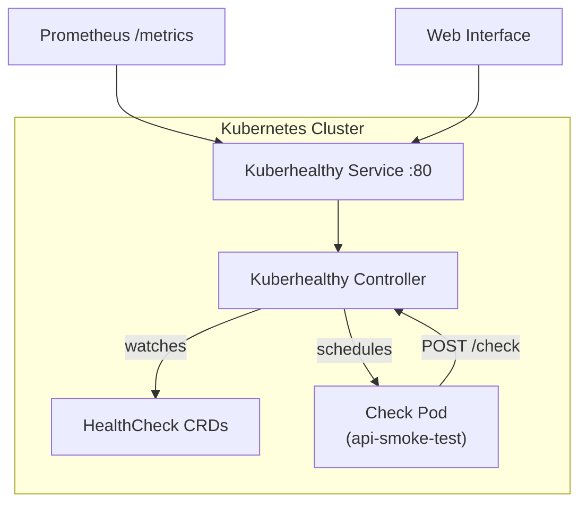

<a id="doc-a54ff182c7e8acf56acfd6e4"></a>

# kuberhealthy/kuberhealthy / AGENTS.md

Upstream: https://github.com/kuberhealthy/kuberhealthy/blob/ab3f163197f8350289c0f91baab9f42096632e05/AGENTS.md

Commit: `ab3f163197f8350289c0f91baab9f42096632e05`

Retrieved: 2026-10-01T15:22:19.548065+00:00

Kind: official-document

Raw SHA256: `29da241dd7d06a22518e9f0b23ebb11e5f3baa01b48091d5f2d55af6beee01c0`

Source text below is untrusted reference content. Acquisition does not verify technical claims.

License status: UPSTREAM_NOTICES_CAPTURED_PER_FILE_REVIEW_REQUIRED. See this repository's captured license files.

---

# AGENTS.md for AI Agent Guidance

# Use MCPs
- It is desired for you to make liberal use of MCP servers, or chains of MCP tools, whenever it appears to be useful.
- Do not be shy about querying an MCP that might reveal personal information. You are a trusted personal AI assistant that has been given personal information access to help with your tasks.

# Repository Note
- The `master` branch is only for the deprecated and unused Kuberhealthy V2 instance; use it only when explicitly working on that legacy system. 
- The `main` branch is where Kuberhealthy V3 lievs. 
- All checks for Kuberhealthy V3 were moved to their own repositories under the `kuberhealthy/` GitHub organization.

# Maintain Documentation
Keep an up to date set of documentation in the `docs/agent/` directory with the following:
    - ARCHITECTURE.md: Detail the specific program architecture from a systems design perspective. Analyze the various components of functionality and detail their relationship to each other. Use an ASCII diagram when possible.
    - LOGIC.md: Analyze the program's logic and concisely detail the significant points of the flow.
    - INTERFACES.md: Determine what the defined points of intake are for the program and detail the inputs of those. Also detail the outputs of the program concisely.
    - STRUCTURES.md: Detail the significant data and programatic structures that are defined within the program clearly so that humans can understand their purpose and programatic shape.
    - CONFIGURATION.md: Explain in detail each configuration option needed to start the programs in this project. Include environment vars, startup flags, or configuration files if appropriate.
    - All Markdown files in `docs/` use ALL-CAPS file names (for example, `docs/README.MD`).
    - Ensure user-facing docs in `docs/README.MD` and `docs/HTTP_API.MD` exist and stay synchronized with current endpoints, examples, and configuration. Create them if missing.
    - Re-run local documentation checks (internal link validation and doc grep for config/env consistency) after updates and report findings.

# Create Simple Code
- Avoid `else` statements when possible by making additional functions and using a 'return early' strategy.
- Avoid anonymous functions except when they are very simplistic.
- Add comments to every function, including tests, that detail the purpose of that function and what its purpose is to the larger program.
- Strive to maintain a small cyclomatic complexity score through flat, simple code with frequent functions with clear names.
- Avoid turnary operators and other short hand coding practices. Strive for a high level of readability and do not seek to reduce vertical line space.
- Add comments to each stanza of code. Avoid large chunks of code without comments of any kind. Add comments even when they should be obvious.

# Software Preferences
- Use the Go programming language whenever reasonable.
- Use `Containerfile` instead of `Dockerfile` for compatibility with Podman.
- Use `Justfile` instead of `Makefile` for compatibility with `just`.
- Logging is handled with `github.com/sirupsen/logrus`.
- Tests should be written with Go's testing package and live beside the code they test.
- Configuration is loaded from environment variables when possible.
- File names are in camelCase
- Package names must be all lower case

# Create Modular Program Architecture
- When adding a new data structure or component to the program architecture, ensure that the overall program continues to retain a low-complexity architecture with appropriate delegation of logic and functionality.
- Take care to contain clear abstractions between different program components.
- Ensure that function signatures are kept small and remain widely applicable to future code, even if that means repeating logic in some places.
- Create additive and composable functions by building up to higher levels of logic through small and stackable functions.

# Code Style

- Keep code simple and pragmatic.
- If a line does more than one thing, split it into multiple lines.
- Each function should do one thing; avoid `else` and `else if` by returning early or extracting more functions.
- Prefer early returns and guard clauses to minimize indentation and keep code paths clear.
- Avoid indenting more than five levels and aim for three or fewer.
- Avoid short variable declarations in `if` statements such as `if err := doThing(); err != nil`. Call the function on one line and check the error on the next.
- Prefer methods on structs over directly manipulating struct fields; keep methods short and focused.
- Favor composition over inheritance; keep packages small and focused with limited exported symbols.
- Wrap returned errors with context using `fmt.Errorf` or `%w` so failures are traceable.
- Add inline comments within functions frequently.
- Test names should not use underscores (use testName instead of test_name).
- Tests should focus on one small behavior. End-to-end tests may cover a large process but should assert only its initial inputs and final outputs.
- Prefer standard library packages when practical.
- Every package must include a README.md describing its scope of responsibility.


<a id="doc-c693279643b8cd5d248172d9"></a>

# kuberhealthy/kuberhealthy / LICENSE

Upstream: https://github.com/kuberhealthy/kuberhealthy/blob/ab3f163197f8350289c0f91baab9f42096632e05/LICENSE

Commit: `ab3f163197f8350289c0f91baab9f42096632e05`

Retrieved: 2026-10-01T15:22:19.548065+00:00

Kind: license

Raw SHA256: `08c882eeeb10594f7777315d3ff9f4711212b9167a1c96d83ccd3e6e956ee5c1`

Source text below is untrusted reference content. Acquisition does not verify technical claims.

License status: UPSTREAM_NOTICES_CAPTURED_PER_FILE_REVIEW_REQUIRED. See this repository's captured license files.

---

````text

                                 Apache License
                           Version 2.0, January 2004
                        http://www.apache.org/licenses/

   TERMS AND CONDITIONS FOR USE, REPRODUCTION, AND DISTRIBUTION

   1. Definitions.

      "License" shall mean the terms and conditions for use, reproduction,
      and distribution as defined by Sections 1 through 9 of this document.

      "Licensor" shall mean the copyright owner or entity authorized by
      the copyright owner that is granting the License.

      "Legal Entity" shall mean the union of the acting entity and all
      other entities that control, are controlled by, or are under common
      control with that entity. For the purposes of this definition,
      "control" means (i) the power, direct or indirect, to cause the
      direction or management of such entity, whether by contract or
      otherwise, or (ii) ownership of fifty percent (50%) or more of the
      outstanding shares, or (iii) beneficial ownership of such entity.

      "You" (or "Your") shall mean an individual or Legal Entity
      exercising permissions granted by this License.

      "Source" form shall mean the preferred form for making modifications,
      including but not limited to software source code, documentation
      source, and configuration files.

      "Object" form shall mean any form resulting from mechanical
      transformation or translation of a Source form, including but
      not limited to compiled object code, generated documentation,
      and conversions to other media types.

      "Work" shall mean the work of authorship, whether in Source or
      Object form, made available under the License, as indicated by a
      copyright notice that is included in or attached to the work
      (an example is provided in the Appendix below).

      "Derivative Works" shall mean any work, whether in Source or Object
      form, that is based on (or derived from) the Work and for which the
      editorial revisions, annotations, elaborations, or other modifications
      represent, as a whole, an original work of authorship. For the purposes
      of this License, Derivative Works shall not include works that remain
      separable from, or merely link (or bind by name) to the interfaces of,
      the Work and Derivative Works thereof.

      "Contribution" shall mean any work of authorship, including
      the original version of the Work and any modifications or additions
      to that Work or Derivative Works thereof, that is intentionally
      submitted to Licensor for inclusion in the Work by the copyright owner
      or by an individual or Legal Entity authorized to submit on behalf of
      the copyright owner. For the purposes of this definition, "submitted"
      means any form of electronic, verbal, or written communication sent
      to the Licensor or its representatives, including but not limited to
      communication on electronic mailing lists, source code control systems,
      and issue tracking systems that are managed by, or on behalf of, the
      Licensor for the purpose of discussing and improving the Work, but
      excluding communication that is conspicuously marked or otherwise
      designated in writing by the copyright owner as "Not a Contribution."

      "Contributor" shall mean Licensor and any individual or Legal Entity
      on behalf of whom a Contribution has been received by Licensor and
      subsequently incorporated within the Work.

   2. Grant of Copyright License. Subject to the terms and conditions of
      this License, each Contributor hereby grants to You a perpetual,
      worldwide, non-exclusive, no-charge, royalty-free, irrevocable
      copyright license to reproduce, prepare Derivative Works of,
      publicly display, publicly perform, sublicense, and distribute the
      Work and such Derivative Works in Source or Object form.

   3. Grant of Patent License. Subject to the terms and conditions of
      this License, each Contributor hereby grants to You a perpetual,
      worldwide, non-exclusive, no-charge, royalty-free, irrevocable
      (except as stated in this section) patent license to make, have made,
      use, offer to sell, sell, import, and otherwise transfer the Work,
      where such license applies only to those patent claims licensable
      by such Contributor that are necessarily infringed by their
      Contribution(s) alone or by combination of their Contribution(s)
      with the Work to which such Contribution(s) was submitted. If You
      institute patent litigation against any entity (including a
      cross-claim or counterclaim in a lawsuit) alleging that the Work
      or a Contribution incorporated within the Work constitutes direct
      or contributory patent infringement, then any patent licenses
      granted to You under this License for that Work shall terminate
      as of the date such litigation is filed.

   4. Redistribution. You may reproduce and distribute copies of the
      Work or Derivative Works thereof in any medium, with or without
      modifications, and in Source or Object form, provided that You
      meet the following conditions:

      (a) You must give any other recipients of the Work or
          Derivative Works a copy of this License; and

      (b) You must cause any modified files to carry prominent notices
          stating that You changed the files; and

      (c) You must retain, in the Source form of any Derivative Works
          that You distribute, all copyright, patent, trademark, and
          attribution notices from the Source form of the Work,
          excluding those notices that do not pertain to any part of
          the Derivative Works; and

      (d) If the Work includes a "NOTICE" text file as part of its
          distribution, then any Derivative Works that You distribute must
          include a readable copy of the attribution notices contained
          within such NOTICE file, excluding those notices that do not
          pertain to any part of the Derivative Works, in at least one
          of the following places: within a NOTICE text file distributed
          as part of the Derivative Works; within the Source form or
          documentation, if provided along with the Derivative Works; or,
          within a display generated by the Derivative Works, if and
          wherever such third-party notices normally appear. The contents
          of the NOTICE file are for informational purposes only and
          do not modify the License. You may add Your own attribution
          notices within Derivative Works that You distribute, alongside
          or as an addendum to the NOTICE text from the Work, provided
          that such additional attribution notices cannot be construed
          as modifying the License.

      You may add Your own copyright statement to Your modifications and
      may provide additional or different license terms and conditions
      for use, reproduction, or distribution of Your modifications, or
      for any such Derivative Works as a whole, provided Your use,
      reproduction, and distribution of the Work otherwise complies with
      the conditions stated in this License.

   5. Submission of Contributions. Unless You explicitly state otherwise,
      any Contribution intentionally submitted for inclusion in the Work
      by You to the Licensor shall be under the terms and conditions of
      this License, without any additional terms or conditions.
      Notwithstanding the above, nothing herein shall supersede or modify
      the terms of any separate license agreement you may have executed
      with Licensor regarding such Contributions.

   6. Trademarks. This License does not grant permission to use the trade
      names, trademarks, service marks, or product names of the Licensor,
      except as required for reasonable and customary use in describing the
      origin of the Work and reproducing the content of the NOTICE file.

   7. Disclaimer of Warranty. Unless required by applicable law or
      agreed to in writing, Licensor provides the Work (and each
      Contributor provides its Contributions) on an "AS IS" BASIS,
      WITHOUT WARRANTIES OR CONDITIONS OF ANY KIND, either express or
      implied, including, without limitation, any warranties or conditions
      of TITLE, NON-INFRINGEMENT, MERCHANTABILITY, or FITNESS FOR A
      PARTICULAR PURPOSE. You are solely responsible for determining the
      appropriateness of using or redistributing the Work and assume any
      risks associated with Your exercise of permissions under this License.

   8. Limitation of Liability. In no event and under no legal theory,
      whether in tort (including negligence), contract, or otherwise,
      unless required by applicable law (such as deliberate and grossly
      negligent acts) or agreed to in writing, shall any Contributor be
      liable to You for damages, including any direct, indirect, special,
      incidental, or consequential damages of any character arising as a
      result of this License or out of the use or inability to use the
      Work (including but not limited to damages for loss of goodwill,
      work stoppage, computer failure or malfunction, or any and all
      other commercial damages or losses), even if such Contributor
      has been advised of the possibility of such damages.

   9. Accepting Warranty or Additional Liability. While redistributing
      the Work or Derivative Works thereof, You may choose to offer,
      and charge a fee for, acceptance of support, warranty, indemnity,
      or other liability obligations and/or rights consistent with this
      License. However, in accepting such obligations, You may act only
      on Your own behalf and on Your sole responsibility, not on behalf
      of any other Contributor, and only if You agree to indemnify,
      defend, and hold each Contributor harmless for any liability
      incurred by, or claims asserted against, such Contributor by reason
      of your accepting any such warranty or additional liability.

   END OF TERMS AND CONDITIONS

   APPENDIX: How to apply the Apache License to your work.

      To apply the Apache License to your work, attach the following
      boilerplate notice, with the fields enclosed by brackets "[]"
      replaced with your own identifying information. (Don't include
      the brackets!)  The text should be enclosed in the appropriate
      comment syntax for the file format. We also recommend that a
      file or class name and description of purpose be included on the
      same "printed page" as the copyright notice for easier
      identification within third-party archives.

   Copyright The Kuberhealthy Contributors

   Licensed under the Apache License, Version 2.0 (the "License");
   you may not use this file except in compliance with the License.
   You may obtain a copy of the License at

       http://www.apache.org/licenses/LICENSE-2.0

   Unless required by applicable law or agreed to in writing, software
   distributed under the License is distributed on an "AS IS" BASIS,
   WITHOUT WARRANTIES OR CONDITIONS OF ANY KIND, either express or implied.
   See the License for the specific language governing permissions and
   limitations under the License.

````


<a id="doc-0c6b0ada0e5e5e0a25f4ea00"></a>

# kuberhealthy/kuberhealthy / MIGRATING_TO_V3.md

Upstream: https://github.com/kuberhealthy/kuberhealthy/blob/ab3f163197f8350289c0f91baab9f42096632e05/MIGRATING_TO_V3.md

Commit: `ab3f163197f8350289c0f91baab9f42096632e05`

Retrieved: 2026-10-01T15:22:19.548065+00:00

Kind: official-document

Raw SHA256: `6043ec98b01c2d0a46e9ef77082611fab8174e10fd7f73a733cf2b0646c83585`

Source text below is untrusted reference content. Acquisition does not verify technical claims.

License status: UPSTREAM_NOTICES_CAPTURED_PER_FILE_REVIEW_REQUIRED. See this repository's captured license files.

---

# Migrating to Kuberhealthy V3

This guide covers everything you need to know when moving from Kuberhealthy V2 to V3.

⚠️ This is a breaking change.

- V2 is the public release line that teams are running today.
- V3 is the rewritten release line with a new resource model and new install paths.
- Kuberhealthy V2 and V3 are different systems, not small variations of the same release.
- Treat this move as a fresh V3 install plus a migration of your checks and automation.
- Do not expect old resources, old install paths, or old scripts to keep working unchanged.
- Plan time for manifest edits, install changes, and downstream automation updates.
- There is no in-place upgrade path from V2 to V3.
- There is no automatic conversion from the old CRDs to the new CRD.

## High-level steps

- Back up the V2 resources that define your current checks and current state.
- Remove the existing V2 installation before you cut over.
- Install the V3 controller using the new install path you want to standardize on.
- Recreate your checks as `HealthCheck` resources using the new schema.
- Update scripts, dashboards, and automation that still depend on V2 behavior.

## Useful links before you start

- [README.md](README.md) gives the V3 project overview and basic usage.
- [docs/QUICKSTART.MD](docs/QUICKSTART.MD) shows a minimal V3 install and a simple check.
- [docs/CHECK_CREATION.md](docs/CHECK_CREATION.md) explains how to port or build checks.
- [docs/CHECKS_REGISTRY.md](docs/CHECKS_REGISTRY.md) lists ready-to-apply V3 checks.
- [docs/CRD_REFERENCE.MD](docs/CRD_REFERENCE.MD) documents the `HealthCheck` schema.
- [docs/HTTP_API.MD](docs/HTTP_API.MD) documents the V3 endpoints.
- [docs/HELM.MD](docs/HELM.MD) and [docs/KUSTOMIZE.MD](docs/KUSTOMIZE.MD) cover install details.

## What changed at a high level

- V2 used the old CRDs, the old install packaging, and built-in checks bundled into one repo.
- V3 uses a new CRD, new install paths, and separate repositories for built-in checks.
- The core purpose is still the same: run synthetic checks in Kubernetes and export status and metrics.

## What improves in v3

**Simpler resource model**

- One main resource, `HealthCheck`, replaces the older split model.
- No separate `khjob` resource is needed for one-time runs.
- No separate `khstate` resource is needed for persisted check status.

**Better UX**

- A real web UI is available at `/` for quick status checks.
- Machine-readable JSON is served at `/json` for scripts and integrations.
- Manual run, event, and log APIs are available for day-to-day operations.

**Cleaner install story**

- A Kustomize base is available for manifest-first installs.
- An in-repo Helm chart replaces the old external Helm packaging flow.
- A clear Argo CD entrypoint is available for GitOps users.

**Better check packaging**

- Built-in checks now live in their own repositories instead of being bundled here.
- Checks are easier to version, release, and consume independently from the controller.

## What stays the same

- Kuberhealthy still runs synthetic checks inside Kubernetes.
- Check pods still report their result back using `KH_REPORTING_URL`.
- Prometheus metrics are still exposed at `/metrics`.
- You still define checks as Kubernetes manifests applied to the cluster.

## Quick facts

- The main V2 check resource was `KuberhealthyCheck`.
- The main V3 check resource is `HealthCheck`.
- V2 used the API group `comcast.github.io/v1`.
- V3 uses the API group `kuberhealthy.github.io/v2`.
- V2 used `KuberhealthyJob` for one-shot execution.
- V3 uses `HealthCheck` with `singleRunOnly: true` for one-shot execution.
- V2 stored status in `KuberhealthyState`.
- V3 stores status directly in `HealthCheck.status`.

## What you need to do

- Back up your old `khcheck`, `khjob`, and `khstate` resources before touching the install.
- Remove the old installation once you are ready to cut over.
- Install V3 using Kustomize, the in-repo Helm chart, or the new Argo CD manifest.
- Recreate checks as `HealthCheck` resources instead of reusing the old CRDs.
- Update anything that reads old status resources or old HTTP endpoints.

## Resource changes

### Old resources are gone

- `KuberhealthyCheck` does not exist in V3.
- `KuberhealthyJob` does not exist in V3.
- `KuberhealthyState` does not exist in V3.

### New resource

- `HealthCheck` is the resource you use for scheduled and one-shot checks in V3.

### Command changes

- Old: `kubectl get khcheck`
- New: `kubectl get healthcheck`

- Old: `kubectl get khstate`
- New: read the check result from `HealthCheck.status`

## Manifest changes

### Old

```yaml
apiVersion: comcast.github.io/v1
kind: KuberhealthyCheck
spec:
  runInterval: 30s
  timeout: 2m
  podSpec:
    containers:
      - name: main
        image: my-check:latest
    restartPolicy: Never
```

### New

```yaml
apiVersion: kuberhealthy.github.io/v2
kind: HealthCheck
spec:
  runInterval: 30s
  timeout: 2m
  podSpec:
    spec:
      containers:
        - name: main
          image: my-check:latest
      restartPolicy: Never
```

### Required edits

- Change the `apiVersion` to the V3 API group and version.
- Change the `kind` from `KuberhealthyCheck` to `HealthCheck`.
- Move pod fields under `spec.podSpec.spec` instead of placing them directly under `podSpec`.
- Move pod labels and annotations under `spec.podSpec.metadata`.
- Replace any `KuberhealthyJob` usage with `singleRunOnly: true`.

### Useful manifest examples

- [docs/healthchecks/DAEMONSET_CHECK.yaml](docs/healthchecks/DAEMONSET_CHECK.yaml) is a full V3 daemonset check example.
- [docs/healthchecks/DEPLOYMENT_CHECK.yaml](docs/healthchecks/DEPLOYMENT_CHECK.yaml) is a full V3 deployment check example.

## Check install changes

### Old behavior

- This repo shipped the controller and many built-in checks together.
- The old Helm chart could install built-in checks for you as part of the controller install.
- Default old chart checks included:
  - `daemonset`
  - `deployment`
  - `dns-internal`

### New behavior

- This repo now ships the controller only.
- Built-in checks now live in separate repos under the `kuberhealthy` GitHub organization.
- Recreate the checks you still want instead of expecting them to appear automatically.
- The V3 Helm chart does not install the old default checks.

Useful built-in check repos:

- [kuberhealthy/daemonset-check](https://github.com/kuberhealthy/daemonset-check)
- [kuberhealthy/deployment-check](https://github.com/kuberhealthy/deployment-check)
- [kuberhealthy/dns-resolution-check](https://github.com/kuberhealthy/dns-resolution-check)

## Install changes

### Old install paths

- Flat file install:

```sh
kubectl apply -f https://raw.githubusercontent.com/kuberhealthy/kuberhealthy/master/deploy/kuberhealthy.yaml
```

- Old Helm repo:

```sh
helm repo add kuberhealthy https://kuberhealthy.github.io/kuberhealthy/helm-repos
helm install -n kuberhealthy kuberhealthy kuberhealthy/kuberhealthy
```

### New install paths

- Kustomize:

```sh
kubectl apply -k github.com/kuberhealthy/kuberhealthy/deploy/kustomize/base?ref=main
```

- Helm (requires the repo to be cloned locally):

```sh
helm install kuberhealthy deploy/helm/kuberhealthy -n kuberhealthy --create-namespace
```

- Argo CD (requires the repo to be cloned locally):

```sh
kubectl apply -f deploy/argocd/kuberhealthy.yaml
```

### Important install difference

- The Kustomize base includes an `example-check` resource.
- The Helm chart does not include an example check by default.
- If you use the Kustomize base, remove `example-check` if you do not want a sample check running in the cluster.

## Config changes

### Old

- Controller config came from a ConfigMap-backed YAML file.
- Many users changed config with:

```sh
kubectl edit -n kuberhealthy configmap kuberhealthy
```

### New

- Controller config is environment variables only.
- Do not use the old ConfigMap editing flow during V3 operations.
- Update the Deployment environment variables instead.
- Old InfluxDB forwarding support is gone.

### Important env var rename

- Old: `TARGET_NAMESPACE`
- New: `KH_TARGET_NAMESPACE`

- Old: `KH_EXTERNAL_REPORTING_URL`
- New: `KH_CHECK_REPORT_URL`

### Important

- `KH_CHECK_REPORT_URL` should contain the base URL only.
- Do not include `/check` in that value.

## Endpoint changes

### Status

- Old JSON endpoint: `/`
- New JSON endpoint: `/json`
- New UI endpoint: `/`

If you have scripts that call `/` and expect JSON output, update them to call `/json`.

### Reporting

- Old report endpoint: `/externalCheckStatus`
- New report endpoint: `/check`

Check pods still receive:

- `KH_REPORTING_URL`
- `KH_CHECK_RUN_DEADLINE`
- `KH_RUN_UUID`
- `KH_POD_NAMESPACE`

## Status changes

### Old

- Status lived in `khstate`

### New

- Status now lives directly in `HealthCheck.status`.

### Also changed

- The old JSON detail shape is not the same as the new JSON detail shape.
- Review any automation that parses per-check fields or expects old field names.

## Check code changes

### Go import path

Old:

```go
github.com/kuberhealthy/kuberhealthy/v2/pkg/checks/external/checkclient
```

New:

```go
github.com/kuberhealthy/kuberhealthy/v3/pkg/checkclient
```

### Other languages

- The old repo had local client examples for some languages.
- The new docs point users to separate language-specific repositories.

## Important defaults to review

⚠️ Set these explicitly if you depended on old behavior.

- Old default check timeout: `5m`
- New default check timeout: `30s`

- Old Helm service default: `ClusterIP`
- New Helm service default: `LoadBalancer`

- New V3 default controller replicas: `2`
- New V3 default controller anti-affinity: hard node spread

## Simple migration flow

### 1. Back up old resources

```sh
kubectl get khchecks,khjobs,khstates -A -o yaml > kuberhealthy-v2-backup.yaml
```

If you use Helm:

```sh
helm get values -n kuberhealthy kuberhealthy -o yaml > kuberhealthy-v2-values.yaml
```

### 2. Rewrite your manifests

- Convert each `KuberhealthyCheck` into a `HealthCheck`.
- Replace each `KuberhealthyJob` with a `HealthCheck` that uses `singleRunOnly: true`.
- Move pod fields under `spec.podSpec.spec`.
- Set `timeout` explicitly if the old defaults mattered to you.

### 3. Remove the old install

- Remove the old Helm release, flat-file install, or GitOps source.

If you want to clean up the old CRDs after the migration is complete:

```sh
kubectl delete crd khchecks.comcast.github.io
kubectl delete crd khjobs.comcast.github.io
kubectl delete crd khstates.comcast.github.io
```

- This cleanup is optional during the migration itself.
- V2 and V3 use different CRD names, so you can remove the old CRDs after V3 is live and you no longer need the V2 objects.

### 4. Install v3

- Use Kustomize, the in-repo Helm chart, or the new Argo CD manifest.

### 5. Apply your new `HealthCheck` resources

- Recreate the built-in checks you still want to run.
- Reapply your custom checks as `HealthCheck` resources.

### 6. Update automation

- Change any `/` JSON readers to `/json`.
- Move status readers off `khstate`.
- Update old Go client imports to the V3 path.
- Update old install commands and old Helm repo usage.
- If you use Prometheus Operator, apply `deploy/serviceMonitor.yaml`.

## Common mistakes

- Expecting old CRDs to work in v3
- Copying the old `podSpec` shape into v3 (pod fields must go under `spec.podSpec.spec`)
- Forgetting that `/` is now the UI — JSON is at `/json`
- Setting `KH_CHECK_REPORT_URL` to a value ending in `/check`
- Expecting the v3 chart to install old default checks
- Relying on the old 5 minute timeout default (v3 default is `30s`)
- Forgetting that v3 defaults to 2 controller replicas
- Forgetting that the Kustomize base creates an `example-check` resource

## Final checklist

- Back up the old resources before touching the install.
- Use a fresh V3 install instead of trying to upgrade V2 in place.
- Convert manifests to `HealthCheck`.
- Recreate any built-in checks you still need.
- Move JSON readers to `/json`.
- Move status readers off `khstate`.
- Review timeout and service defaults before rollout.
- Review replica count and service exposure before rollout.

## More V3 docs

- [docs/RUN_ONCE_CHECKS.MD](docs/RUN_ONCE_CHECKS.MD) covers one-shot checks in V3.
- [docs/FLAGS.md](docs/FLAGS.md) lists controller environment variables.
- [docs/prometheus/SERVICE_MONITOR.MD](docs/prometheus/SERVICE_MONITOR.MD) covers Prometheus Operator setups.


<a id="doc-dfb14fbb9e7d095209ec4cfd"></a>

# kuberhealthy/kuberhealthy / NOTICE

Upstream: https://github.com/kuberhealthy/kuberhealthy/blob/ab3f163197f8350289c0f91baab9f42096632e05/NOTICE

Commit: `ab3f163197f8350289c0f91baab9f42096632e05`

Retrieved: 2026-10-01T15:22:19.548065+00:00

Kind: license

Raw SHA256: `bb18ce012ddf99ba8e364b6f6fc456018f276d521932d1adafabb5b5e0b6d822`

Source text below is untrusted reference content. Acquisition does not verify technical claims.

License status: UPSTREAM_NOTICES_CAPTURED_PER_FILE_REVIEW_REQUIRED. See this repository's captured license files.

---

````text
Copyright The Kuberhealthy Contributors

Licensed under the Apache License, Version 2.0 (the "License");
you may not use this file except in compliance with the License.
You may obtain a copy of the License at

http://www.apache.org/licenses/LICENSE-2.0

Unless required by applicable law or agreed to in writing, software
distributed under the License is distributed on an "AS IS" BASIS,
WITHOUT WARRANTIES OR CONDITIONS OF ANY KIND, either express or implied.
See the License for the specific language governing permissions and
limitations under the License.

This product includes software developed at Comcast (http://www.comcast.com/).

````


<a id="doc-b335630551682c19a781afeb"></a>

# kuberhealthy/kuberhealthy / README.md

Upstream: https://github.com/kuberhealthy/kuberhealthy/blob/ab3f163197f8350289c0f91baab9f42096632e05/README.md

Commit: `ab3f163197f8350289c0f91baab9f42096632e05`

Retrieved: 2026-10-01T15:22:19.548065+00:00

Kind: official-document

Raw SHA256: `49ccbd5c014394b620a0e4f62c5af2f803c545c69e19db051aac94656442fcea`

Source text below is untrusted reference content. Acquisition does not verify technical claims.

License status: UPSTREAM_NOTICES_CAPTURED_PER_FILE_REVIEW_REQUIRED. See this repository's captured license files.

---

<p align="center">
  
</p>

# Kuberhealthy

**Kuberhealthy is an operator for [synthetic monitoring](https://en.wikipedia.org/wiki/Synthetic_monitoring) and [continuous validation](https://en.wikipedia.org/wiki/Software_verification_and_validation). It ships metrics to Prometheus and enables you to package your synthetic monitoring as Kubernetes manifests.**

[](https://opensource.org/licenses/Apache-2.0)
[](https://goreportcard.com/report/github.com/kuberhealthy/kuberhealthy)
[](https://bestpractices.coreinfrastructure.org/projects/2822)
[](https://github.com/kuberhealthy/kuberhealthy/actions/workflows/tests.yml)
[](https://github.com/kuberhealthy/kuberhealthy/releases)
[](https://kubernetes.slack.com/messages/CB9G7HWTE)


## Why Kuberhealthy?

Kuberhealthy schedules, tracks, monitors, and manages Kubernetes pods for checks — which means your monitoring logic can:

- **Run multi-step workflows** — simulate a real user: log in, create a record, verify it, clean it up
- **Use any language** — [Go](https://github.com/kuberhealthy/go), [Python](https://github.com/kuberhealthy/python), [Rust](https://github.com/kuberhealthy/rust), [bash](https://github.com/kuberhealthy/bash), or anything that fits in a container
- **Own your checks as code** — checks are Kubernetes manifests, so ship them alongside your app!


## How it works



Kuberhealthy provides the `HealthCheck` custom resource definition. Each `HealthCheck` tells Kuberhealthy to start a short-lived checker pod on a schedule. 

The checker pod runs your validation logic, then reports back to Kuberhealthy. Results flow to the built-in status UI, JSON API, and Prometheus metrics endpoint.


## Getting started

Installing Kuberhealthy is easy. Just apply the kustomize, ArgoCD, or Helm manifests and you're ready to start applying `healthcheck` resources.

1. Install Kuberhealthy to your cluster:

   **Helm** (recommended)
   ```sh
   helm install kuberhealthy deploy/helm/kuberhealthy -n kuberhealthy --create-namespace
   ```

   **Kustomize**
   ```sh
   kubectl apply -k github.com/kuberhealthy/kuberhealthy/deploy/kustomize/base?ref=main
   ```

   **ArgoCD**
   ```sh
   kubectl apply -f deploy/argocd/kuberhealthy.yaml
   ```

2. Port-forward the service:

   ```sh
   kubectl -n kuberhealthy port-forward svc/kuberhealthy 8080:80
   ```

3. Open `http://localhost:8080` to see the status UI, then apply a [HealthCheck](docs/CHECKS_REGISTRY.md) or build [your own](docs/CHECK_CREATION.md).


## What a `healthcheck` CRD looks like

This is the core object Kuberhealthy manages. It tells the controller what checker container to run, how often to run it, and how long to wait before considering the run failed. You can use `kubectl get healthcheck` or `kubectl get hc`.

This example uses the built-in [deployment check](https://github.com/kuberhealthy/deployment-check), which creates a test deployment, rolls it out, and tears it down on a schedule:

```yaml
apiVersion: kuberhealthy.github.io/v2
kind: HealthCheck
metadata:
  name: deployment
  namespace: kuberhealthy
spec:
  runInterval: 10m
  timeout: 5m
  podSpec:
    spec:
      containers:
        - name: deployment
          image: docker.io/kuberhealthy/deployment-check:v0.1.1
          env:
            - name: CHECK_DEPLOYMENT_REPLICAS
              value: "4"
            - name: CHECK_DEPLOYMENT_ROLLING_UPDATE
              value: "true"
          resources:
            requests:
              cpu: 25m
              memory: 15Mi
            limits:
              cpu: "1"
      serviceAccountName: deployment-sa
```

See [CHECK_CREATION.md](docs/CHECK_CREATION.md) for the environment variables injected into every check pod and how to build your own.


## Example Healthcheck Use

Apply your `healthcheck` check:

```
> kubectl apply -f api-smoke-test.yaml
healthcheck.kuberhealthy.github.io/api-smoke-test.yaml created

> kubectl get healthcheck
NAME              NAMESPACE      LAST RUN    AGE    OK
api-smoke-test    kuberhealthy   2m ago      2d     true
```

Consume Check Status with Prometheus:

**`/metrics`** (Prometheus)
```
kuberhealthy_check{check="api-smoke-test",namespace="kuberhealthy",status="1"} 1
kuberhealthy_check{check="db-connectivity",namespace="kuberhealthy",status="0"} 1
kuberhealthy_check_duration_seconds{check="api-smoke-test",namespace="kuberhealthy"} 0.23
kuberhealthy_check_success_total{check="api-smoke-test",namespace="kuberhealthy"} 142
```

Fetch the status by API:

**`/json`**
```json
{
  "ok": true,
  "checks": {
    "kuberhealthy/api-smoke-test": {
      "ok": true,
      "errors": [],
      "lastRun": "2024-01-15T14:32:01Z",
      "runDuration": "230ms"
    }
  }
}
```


## Writing checks

Get started with [CHECK_CREATION.md](docs/CHECK_CREATION.md) and the [HealthCheck registry](docs/CHECKS_REGISTRY.md), then pick a check client for your language:

| Language | Client |
|---|---|
| [Go](https://github.com/kuberhealthy/go) | `github.com/kuberhealthy/kuberhealthy/v3/pkg/checkclient` |
| [Python](https://github.com/kuberhealthy/python) | `kuberhealthy` |
| [TypeScript](https://github.com/kuberhealthy/typescript) | `@kuberhealthy/kuberhealthy` |
| [JavaScript](https://github.com/kuberhealthy/javascript) | `@kuberhealthy/kuberhealthy` |
| [Rust](https://github.com/kuberhealthy/rust) | `kuberhealthy` |
| [Ruby](https://github.com/kuberhealthy/ruby) | `kuberhealthy` |
| [Java](https://github.com/kuberhealthy/java) | Maven / Gradle |
| [Bash](https://github.com/kuberhealthy/bash) | Shell script helper |

**Example: Go check that validates an internal API**

```go
package main

import (
    "fmt"
    "net/http"

    "github.com/kuberhealthy/kuberhealthy/v3/pkg/checkclient"
)

func main() {
    resp, err := http.Get("http://my-api.default.svc.cluster.local/health")
    if err != nil {
        checkclient.ReportFailure([]string{fmt.Sprintf("request failed: %s", err)})
        return
    }
    defer resp.Body.Close()

    if resp.StatusCode != http.StatusOK {
        checkclient.ReportFailure([]string{fmt.Sprintf("unexpected status %d from /health", resp.StatusCode)})
        return
    }

    checkclient.ReportSuccess()
}
```

The check client handles `KH_REPORTING_URL`, `KH_RUN_UUID`, and deadline enforcement automatically.


## Documentation

See the full documentation index in [docs/README.md](docs/README.md).


## Adopters

See [docs/ADOPTERS.md](docs/ADOPTERS.md) for organizations running Kuberhealthy in production.


## Contributing

- Read the [Contributing Guide](docs/CONTRIBUTING.md) before opening a PR.
- Browse [open issues](https://github.com/kuberhealthy/kuberhealthy/issues) — new contributors should look for the `good first issue` tag.
- Check contributions are especially welcome — see the [HealthCheck registry](docs/CHECKS_REGISTRY.md) for gaps.
- Have feedback from running Kuberhealthy in production? Open a discussion or join Slack.


## Community

- **Slack**: [`#kuberhealthy`](https://kubernetes.slack.com/messages/CB9G7HWTE) in the Kubernetes Slack workspace
- **Monthly call**: Every **24th** of the month at **4:30 PM Pacific** — [download invite](https://zoom.us/meeting/tJIlcuyrqT8qHNWDSx3ZozYamoq2f0ruwfB0/ics?icsToken=98tyKuCupj4vGdORsB-GRowAGo_4Z-nwtilfgo1quCz9UBpceDr3O-1TYLQvAs3H) · [join now](https://zoom.us/j/96855374061)
- **Issues**: [github.com/kuberhealthy/kuberhealthy/issues](https://github.com/kuberhealthy/kuberhealthy/issues)


<a id="doc-5c6a1301c6b59b30a040d747"></a>

# kuberhealthy/kuberhealthy / TODO.md

Upstream: https://github.com/kuberhealthy/kuberhealthy/blob/ab3f163197f8350289c0f91baab9f42096632e05/TODO.md

Commit: `ab3f163197f8350289c0f91baab9f42096632e05`

Retrieved: 2026-10-01T15:22:19.548065+00:00

Kind: official-document

Raw SHA256: `747e65695b4d416c2a327a15055599ec98f14b590076060738b8f7cb14c6f2ca`

Source text below is untrusted reference content. Acquisition does not verify technical claims.

License status: UPSTREAM_NOTICES_CAPTURED_PER_FILE_REVIEW_REQUIRED. See this repository's captured license files.

---

- [x] Migrate /deploy/* to /deploy/kustomize
- [ ] Add a Helm chart revision that continues from the existing old Kuberhealthy Helm chart
- [ ] Explore adding checks like port checks and http content checks that kuberhealthy will run as CRDs
- [ ] Explore integration or support for AnalysisTemplate from Argo and Kargo to run tasks


<a id="doc-50cf94d1fdb8c9f2addf5ede"></a>

# kuberhealthy/kuberhealthy / assets/ui/README.md

Upstream: https://github.com/kuberhealthy/kuberhealthy/blob/ab3f163197f8350289c0f91baab9f42096632e05/assets/ui/README.md

Commit: `ab3f163197f8350289c0f91baab9f42096632e05`

Retrieved: 2026-10-01T15:22:19.548065+00:00

Kind: official-document

Raw SHA256: `e5c680cc1a835058ca95b1981c298ae2685ff9f71e48ea6294a61d4e9b288dfc`

Source text below is untrusted reference content. Acquisition does not verify technical claims.

License status: UPSTREAM_NOTICES_CAPTURED_PER_FILE_REVIEW_REQUIRED. See this repository's captured license files.

---

# UI

This directory contains the Svelte-based web interface for Kuberhealthy.

## Development

Requires Node.js `^20.19.0` or `>=22.12.0`.

```bash
npm install
npm run dev
```

## Build

```bash
npm run build
```

The build output in `dist/` is embedded into the Kuberhealthy binary.


<a id="doc-2d5deb671308f3bb584e8ef8"></a>

# kuberhealthy/kuberhealthy / cmd/kuberhealthy/README.md

Upstream: https://github.com/kuberhealthy/kuberhealthy/blob/ab3f163197f8350289c0f91baab9f42096632e05/cmd/kuberhealthy/README.md

Commit: `ab3f163197f8350289c0f91baab9f42096632e05`

Retrieved: 2026-10-01T15:22:19.548065+00:00

Kind: official-document

Raw SHA256: `5ecbc682f84fce920d6d975131c81550d17fb4a06fb29a8f3576c8a85d06b8ac`

Source text below is untrusted reference content. Acquisition does not verify technical claims.

License status: UPSTREAM_NOTICES_CAPTURED_PER_FILE_REVIEW_REQUIRED. See this repository's captured license files.

---

# Building Locally

- Install `just` and `podman` first.
- Run `just -l` from this directory to see the available commands.

## Just Commands

- `just test`: run unit tests
- `just build`: build the local image
- `just run`: run the controller locally
- `just kustomize`: apply the Kustomize manifests

## Configuration

- Controller configuration is documented in [docs/FLAGS.md](../../docs/FLAGS.md).
- Deployment and local-run examples are documented in [docs/DEPLOYING_KUBERHEALTHY.MD](../../docs/DEPLOYING_KUBERHEALTHY.MD).


<a id="doc-06987eb3ca63825f30b20966"></a>

# kuberhealthy/kuberhealthy / docs/ADOPTERS.md

Upstream: https://github.com/kuberhealthy/kuberhealthy/blob/ab3f163197f8350289c0f91baab9f42096632e05/docs/ADOPTERS.md

Commit: `ab3f163197f8350289c0f91baab9f42096632e05`

Retrieved: 2026-10-01T15:22:19.548065+00:00

Kind: official-document

Raw SHA256: `15a7962e63d7d05c7686545b470e33237a894f538998b1dfd0c0c6369e5dcaad`

Source text below is untrusted reference content. Acquisition does not verify technical claims.

License status: UPSTREAM_NOTICES_CAPTURED_PER_FILE_REVIEW_REQUIRED. See this repository's captured license files.

---

# Kuberhealthy Adopters

Organizations using Kuberhealthy in production:

| Company | Industry |
| :--- | :--- |
|[Adobe](https://www.adobe.com)|Software|
|[Jenkins X](https://jenkins-x.io/docs/v3/)|Software|
|Meltwater|Media Intelligence|
|Mercedes Benz|Automotive|
|Polarpoint|Consulting|

Running Kuberhealthy in production? Open a PR to add your organization.


<a id="doc-ad484aa2b2074e53a5a81231"></a>

# kuberhealthy/kuberhealthy / docs/ARGOCD.MD

Upstream: https://github.com/kuberhealthy/kuberhealthy/blob/ab3f163197f8350289c0f91baab9f42096632e05/docs/ARGOCD.MD

Commit: `ab3f163197f8350289c0f91baab9f42096632e05`

Retrieved: 2026-10-01T15:22:19.548065+00:00

Kind: official-document

Raw SHA256: `17f24d9bee92a2ae8ae0073d6b02381a766ca8b25780ce168456be4462149396`

Source text below is untrusted reference content. Acquisition does not verify technical claims.

License status: UPSTREAM_NOTICES_CAPTURED_PER_FILE_REVIEW_REQUIRED. See this repository's captured license files.

---

# ArgoCD Application Deployment

## Apply the application

```sh
kubectl apply -f deploy/argocd/kuberhealthy.yaml
```

## Customize the application

- Change the namespace in `deploy/argocd/kuberhealthy.yaml` if you do not want `kuberhealthy`.
- Update `targetRevision` to pin a release tag or a specific commit.
- Adjust `syncPolicy` if you want manual or automated syncs.

## Prometheus scraping

The Helm chart includes Prometheus scrape annotations by default. If you use Prometheus Operator, apply the ServiceMonitor manifest:

```sh
kubectl apply -f deploy/serviceMonitor.yaml
```


<a id="doc-d65a386208ee69a43fc47668"></a>

# kuberhealthy/kuberhealthy / docs/BUILD_AND_RELEASE.MD

Upstream: https://github.com/kuberhealthy/kuberhealthy/blob/ab3f163197f8350289c0f91baab9f42096632e05/docs/BUILD_AND_RELEASE.MD

Commit: `ab3f163197f8350289c0f91baab9f42096632e05`

Retrieved: 2026-10-01T15:22:19.548065+00:00

Kind: official-document

Raw SHA256: `cd519e496beb0beb0d4818b81d060d52e0acbca4e5331e095f45291fd951a7e3`

Source text below is untrusted reference content. Acquisition does not verify technical claims.

License status: UPSTREAM_NOTICES_CAPTURED_PER_FILE_REVIEW_REQUIRED. See this repository's captured license files.

---

# Build and Release

Kuberhealthy publishes multi-arch images for AMD64 and ARM64.

## Automatic builds

Builds publish to `docker.io/kuberhealthy/kuberhealthy`.
The Containerfile runs `go test` during the build.

## Release tags

Tags like `v1.2.3` publish `docker.io/kuberhealthy/kuberhealthy:<tag>`.


<a id="doc-b46544a96aa0dc31cdef4397"></a>

# kuberhealthy/kuberhealthy / docs/CHECKS_REGISTRY.md

Upstream: https://github.com/kuberhealthy/kuberhealthy/blob/ab3f163197f8350289c0f91baab9f42096632e05/docs/CHECKS_REGISTRY.md

Commit: `ab3f163197f8350289c0f91baab9f42096632e05`

Retrieved: 2026-10-01T15:22:19.548065+00:00

Kind: official-document

Raw SHA256: `91c6241dbd301a4b71c8920178d7f058738e3d58034bb849a0d999d27f167566`

Source text below is untrusted reference content. Acquisition does not verify technical claims.

License status: UPSTREAM_NOTICES_CAPTURED_PER_FILE_REVIEW_REQUIRED. See this repository's captured license files.

---

# `HealthCheck` Registry

Ready-to-apply `HealthCheck` resources. Most examples assume the `kuberhealthy` namespace — update the namespace fields if you installed elsewhere. To add a check, open a PR.

| Check Name | Description | healthcheck Resource | Contributor |
| --- | --- | --- | --- |
| [Daemonset Check](https://github.com/kuberhealthy/daemonset-check)                             | Ensures daemonsets can be successfully deployed                                                                    | [healthcheck.yaml](https://github.com/kuberhealthy/daemonset-check/blob/main/healthcheck.yaml) ([example](healthchecks/DAEMONSET_CHECK.yaml))                                                                                                                                                   | @integrii @joshulyne |
| [Deployment Check](https://github.com/kuberhealthy/deployment-check)                           | Ensures that a Deployment and Service can be provisioned, created, and serve traffic within the Kubernetes cluster | [healthcheck.yaml](https://github.com/kuberhealthy/deployment-check/blob/main/healthcheck.yaml) ([example](healthchecks/DEPLOYMENT_CHECK.yaml))                                                                                                                                                | @jonnydawg           |
| [Pod Restarts Check](https://github.com/kuberhealthy/pod-restarts-check)                       | Checks for excessive pod restarts in any namespace                                                                 | [healthcheck.yaml](https://github.com/kuberhealthy/pod-restarts-check/blob/main/healthcheck.yaml)                                                                                                                                          | @integrii @joshulyne |
| [Pod Status Check](https://github.com/kuberhealthy/pod-status-check)                           | Checks for unhealthy pod statuses in a target namespace                                                            | [healthcheck.yaml](https://github.com/kuberhealthy/pod-status-check/blob/main/healthcheck.yaml)                                                                                                                                                | @integrii @rukatm    |
| [DNS Status Check](https://github.com/kuberhealthy/dns-resolution-check)                       | Checks for failures with DNS, including resolving within the cluster and outside of the cluster                    | [healthcheck.yaml](https://github.com/kuberhealthy/dns-resolution-check/blob/main/healthcheck.yaml)                                                                                                         | @integrii @joshulyne |
| [HTTP Check](https://github.com/kuberhealthy/http-check)                                       | Checks that a URL endpoint can serve a 200 OK response                                                             | [healthcheck.yaml](https://github.com/kuberhealthy/http-check/blob/main/healthcheck.yaml)                                                                                                                                                                  | @jonnydawg           |
| [KIAM Check](https://github.com/kuberhealthy/kiam-check)                                       | Checks that KIAM Servers and Agents are able to provide credentials                                                | [healthcheck.yaml](https://github.com/kuberhealthy/kiam-check/blob/main/healthcheck.yaml)                                                                                                                                                                  | @jonnydawg           |
| [HTTP Content Check](https://github.com/kuberhealthy/http-content-check)                       | Checks for specific string in body of URL                                                                          | [healthcheck.yaml](https://github.com/kuberhealthy/http-content-check/blob/main/healthcheck.yaml)                                                                                                                                          | @jdowni000           |
| [Resource Quota Check](https://github.com/kuberhealthy/resource-quota-check)                   | Checks if resource quotas (CPU & memory) are available                                                             | [healthcheck.yaml](https://github.com/kuberhealthy/resource-quota-check/blob/main/healthcheck.yaml)                                                                                                                                                | @jonnydawg           |
| [Network Connection Check](https://github.com/kuberhealthy/network-connection-check)           | Checks if a network connection (tcp or udp) could be done to a remote target                                       | [healthcheck.yaml](https://github.com/kuberhealthy/network-connection-check/blob/main/healthcheck.yaml) | @bavarianbidi        |
| [CronJob Event Checker](https://github.com/kuberhealthy/cronjob-checker)                       | Checks for a specified event reason for cronjobs in a namespace                                                    | [healthcheck.yaml](https://github.com/kuberhealthy/cronjob-checker/blob/main/healthcheck.yaml)                                                                                                                                                   | @jdowni000           |
| [SSL Expiration Check](https://github.com/kuberhealthy/ssl-expiry-check)                       | Ensures that an SSL certificate has plenty of validity time left                                                   | [healthcheck.yaml](https://github.com/kuberhealthy/ssl-expiry-check/blob/main/healthcheck.yaml)                                                                                                                                          | @zjhans           |
| [SSL Handshake Check](https://github.com/kuberhealthy/ssl-handshake-check)                       | Ensures that an SSL handshake is working as expected                                                             | [healthcheck.yaml](https://github.com/kuberhealthy/ssl-handshake-check/blob/main/healthcheck.yaml) | @zjhans |


<a id="doc-4c25d248ed47c7f5a997dacd"></a>

# kuberhealthy/kuberhealthy / docs/CHECK_CREATION.md

Upstream: https://github.com/kuberhealthy/kuberhealthy/blob/ab3f163197f8350289c0f91baab9f42096632e05/docs/CHECK_CREATION.md

Commit: `ab3f163197f8350289c0f91baab9f42096632e05`

Retrieved: 2026-10-01T15:22:19.548065+00:00

Kind: official-document

Raw SHA256: `ba8da23b02f26bffc25aa5d55e6dea0a62049221274a37cad7c93640cb7a7c11`

Source text below is untrusted reference content. Acquisition does not verify technical claims.

License status: UPSTREAM_NOTICES_CAPTURED_PER_FILE_REVIEW_REQUIRED. See this repository's captured license files.

---

# Creating Your Own `HealthCheck`

This guide walks you through building a custom check container and wiring it into Kuberhealthy. You can validate anything — from simple HTTP probes to multi-step synthetic workflows that simulate real user behavior. Checks can be written in any language.

## How reporting works

Every check pod receives these environment variables from the controller:

| Variable | Description |
|---|---|
| `KH_REPORTING_URL` | POST your result here (full URL including `/check`) |
| `KH_RUN_UUID` | Send as the `kh-run-uuid` request header to authenticate the report |
| `KH_CHECK_RUN_DEADLINE` | Unix timestamp — your check must report before this time |
| `KH_POD_NAMESPACE` | Namespace the check pod is running in |

Your check must POST a JSON payload to `KH_REPORTING_URL` before `KH_CHECK_RUN_DEADLINE`:

```json
{
  "ok": true,
  "errors": []
}
```

Do not send `ok: true` with a non-empty `errors` array.

## Step 1: Write Your Custom Healthcheck

### Client libraries

Use a client library to handle reporting, deadline enforcement, and header wiring automatically:

| Language | Client |
|---|---|
| [Go](https://github.com/kuberhealthy/go) | `github.com/kuberhealthy/kuberhealthy/v3/pkg/checkclient` |
| [Python](https://github.com/kuberhealthy/python) | `kuberhealthy` |
| [TypeScript](https://github.com/kuberhealthy/typescript) | `@kuberhealthy/kuberhealthy` |
| [JavaScript](https://github.com/kuberhealthy/javascript) | `@kuberhealthy/kuberhealthy` |
| [Rust](https://github.com/kuberhealthy/rust) | `kuberhealthy` |
| [Ruby](https://github.com/kuberhealthy/ruby) | `kuberhealthy` |
| [Java](https://github.com/kuberhealthy/java) | Maven / Gradle |
| [Bash](https://github.com/kuberhealthy/bash) | Shell script helper |

### AI assistant skills

If you use an AI coding assistant to draft a check, these skill repositories provide Kuberhealthy v3-specific guardrails and examples:

- [Codex skill](https://github.com/kuberhealthy/kuberhealthy-codex-skill)
- [Claude skill](https://github.com/kuberhealthy/kuberhealthy-claude-skill)

These are assistant aids. Treat this document and the [`HealthCheck` CRD reference](CRD_REFERENCE.MD) as the canonical project documentation.

### Example: Go check that validates an internal API

```go
package main

import (
    "fmt"
    "net/http"

    "github.com/kuberhealthy/kuberhealthy/v3/pkg/checkclient"
)

func main() {
    resp, err := http.Get("http://my-api.default.svc.cluster.local/health")
    if err != nil {
        checkclient.ReportFailure([]string{fmt.Sprintf("request failed: %s", err)})
        return
    }
    defer resp.Body.Close()

    if resp.StatusCode != http.StatusOK {
        checkclient.ReportFailure([]string{fmt.Sprintf("unexpected status %d from /health", resp.StatusCode)})
        return
    }

    checkclient.ReportSuccess()
}
```

The check client handles `KH_REPORTING_URL`, `KH_RUN_UUID`, and deadline enforcement automatically.

## Step 2: Build and Push Your Check Image

Push your check image to some container host that is available to your cluster.

## Step 3: Create the `HealthCheck` resource

```yaml
apiVersion: kuberhealthy.github.io/v2
kind: HealthCheck
metadata:
  name: kh-test-check
spec:
  runInterval: 30s
  timeout: 2m
  podSpec:
    spec:
      containers:
        - name: main
          image: YOUR_CONTAINER_IMAGE:v1.0.0
          imagePullPolicy: IfNotPresent
          env:
            - name: MY_OPTION_ENV_VAR
              value: "option_setting_here"
      restartPolicy: Never
```

Replace `YOUR_CONTAINER_IMAGE` with your own check image when you are ready. Once applied, Kuberhealthy schedules and reports this check like any other.

## Share your check

Add your check to the [registry](CHECKS_REGISTRY.md) in a small PR.


<a id="doc-5f540ea627655d624f299275"></a>

# kuberhealthy/kuberhealthy / docs/CODE_OF_CONDUCT.md

Upstream: https://github.com/kuberhealthy/kuberhealthy/blob/ab3f163197f8350289c0f91baab9f42096632e05/docs/CODE_OF_CONDUCT.md

Commit: `ab3f163197f8350289c0f91baab9f42096632e05`

Retrieved: 2026-10-01T15:22:19.548065+00:00

Kind: official-document

Raw SHA256: `bcc99d4f809b5ebe7c2370df61461d8c965662eac3b5acecc3d1884247ae9914`

Source text below is untrusted reference content. Acquisition does not verify technical claims.

License status: UPSTREAM_NOTICES_CAPTURED_PER_FILE_REVIEW_REQUIRED. See this repository's captured license files.

---

# Contributor Covenant Code of Conduct

## Our Pledge

In the interest of fostering an open and welcoming environment, we as
contributors and maintainers pledge to making participation in our project and
our community a harassment-free experience for everyone, regardless of age, body
size, disability, ethnicity, gender identity and expression, level of experience,
nationality, personal appearance, race, religion, or sexual identity and
orientation.

## Our Standards

Examples of behavior that contributes to creating a positive environment
include:

* Using welcoming and inclusive language
* Being respectful of differing viewpoints and experiences
* Gracefully accepting constructive criticism
* Focusing on what is best for the community
* Showing empathy towards other community members

Examples of unacceptable behavior by participants include:

* The use of sexualized language or imagery and unwelcome sexual attention or
advances
* Trolling, insulting/derogatory comments, and personal or political attacks
* Public or private harassment
* Publishing others' private information, such as a physical or electronic
  address, without explicit permission
* Other conduct which could reasonably be considered inappropriate in a
  professional setting

## Our Responsibilities

Project maintainers are responsible for clarifying the standards of acceptable
behavior and are expected to take appropriate and fair corrective action in
response to any instances of unacceptable behavior.

Project maintainers have the right and responsibility to remove, edit, or
reject comments, commits, code, wiki edits, issues, and other contributions
that are not aligned to this Code of Conduct, or to ban temporarily or
permanently any contributor for other behaviors that they deem inappropriate,
threatening, offensive, or harmful.

## Scope

This Code of Conduct applies both within project spaces and in public spaces
when an individual is representing the project or its community. Examples of
representing a project or community include using an official project e-mail
address, posting via an official social media account, or acting as an appointed
representative at an online or offline event. Representation of a project may be
further defined and clarified by project maintainers.

## Enforcement

Instances of abusive, harassing, or otherwise unacceptable behavior may be
reported by contacting the project team via https://github.com/kuberhealthy/kuberhealthy/issues/new.
All complaints will be reviewed and investigated and will result in a response that
is deemed necessary and appropriate to the circumstances. The project team is
obligated to maintain confidentiality with regard to the reporter of an incident.
Further details of specific enforcement policies may be posted separately.

Project maintainers who do not follow or enforce the Code of Conduct in good
faith may face temporary or permanent repercussions as determined by other
members of the project's leadership.

## Attribution

This Code of Conduct is adapted from the [Contributor Covenant][homepage], version 1.4,
available at [http://contributor-covenant.org/version/1/4][version]

[homepage]: http://contributor-covenant.org
[version]: http://contributor-covenant.org/version/1/4/


<a id="doc-ea3be28392932f49b44dbd5b"></a>

# kuberhealthy/kuberhealthy / docs/COMPATIBILITY.MD

Upstream: https://github.com/kuberhealthy/kuberhealthy/blob/ab3f163197f8350289c0f91baab9f42096632e05/docs/COMPATIBILITY.MD

Commit: `ab3f163197f8350289c0f91baab9f42096632e05`

Retrieved: 2026-10-01T15:22:19.548065+00:00

Kind: official-document

Raw SHA256: `ed5f3ee57601662b4be7613a053c5ca376650cc93a0b1b7e77b5d29f87991b30`

Source text below is untrusted reference content. Acquisition does not verify technical claims.

License status: UPSTREAM_NOTICES_CAPTURED_PER_FILE_REVIEW_REQUIRED. See this repository's captured license files.

---

# Compatibility

## Kubernetes version

Kuberhealthy requires Kubernetes versions that support:

- `apiextensions.k8s.io/v1` CustomResourceDefinitions (Kubernetes 1.16+).
- `coordination.k8s.io/v1` Lease objects when leader election is enabled.

If you need support for older Kubernetes versions, use a compatible Kuberhealthy release and verify the CRD API versions in the manifests.

## API versions

Kuberhealthy v3 uses `kuberhealthy.github.io/v2` for the `HealthCheck` CRD and resources. This is the current API version for the v3 controller.


<a id="doc-4c6b93aa75d5affde60dc384"></a>

# kuberhealthy/kuberhealthy / docs/CONTRIBUTING.md

Upstream: https://github.com/kuberhealthy/kuberhealthy/blob/ab3f163197f8350289c0f91baab9f42096632e05/docs/CONTRIBUTING.md

Commit: `ab3f163197f8350289c0f91baab9f42096632e05`

Retrieved: 2026-10-01T15:22:19.548065+00:00

Kind: official-document

Raw SHA256: `501f0ad74ee743eb1914310719881eea050530c73ae643cfa7e40964b71ff689`

Source text below is untrusted reference content. Acquisition does not verify technical claims.

License status: UPSTREAM_NOTICES_CAPTURED_PER_FILE_REVIEW_REQUIRED. See this repository's captured license files.

---

# Contributing

Thanks for helping Kuberhealthy. We welcome early adopters and focused PRs.

## Legal

- Fork the repo and open a PR.
- Sign commits with DCO (`git commit -s`).

## Workflow

1. Open an issue for larger changes.
2. Create a branch for your work.
3. Keep changes scoped and add tests when behavior changes.
4. Update docs if user-facing behavior changes.
5. Add yourself to `CONTRIBUTORS.md`.
6. Optionally add your org to `ADOPTERS.md`.
7. Open a PR against `main`.

## Requirements

- Format Go code with `go fmt`.
- Ensure tests pass.

## Tooling

- `just` is used for common tasks.
- `podman` is the container engine used in scripts.

## Just commands

- `just build`: Build the Kuberhealthy image with Podman.
- `just kind`: Create a KIND cluster and deploy Kuberhealthy.
- `just kind-clean`: Delete the KIND cluster.
- `just test`: Run unit tests for `internal/...` and `cmd/...`.
- `just run`: Build and run locally with dev defaults.
- `just kustomize`: Apply manifests from `deploy/kustomize/`.
- `just browse`: Port-forward the service and open a browser.


<a id="doc-c032df7da8355f35ece64aa2"></a>

# kuberhealthy/kuberhealthy / docs/CONTRIBUTORS.md

Upstream: https://github.com/kuberhealthy/kuberhealthy/blob/ab3f163197f8350289c0f91baab9f42096632e05/docs/CONTRIBUTORS.md

Commit: `ab3f163197f8350289c0f91baab9f42096632e05`

Retrieved: 2026-10-01T15:22:19.548065+00:00

Kind: official-document

Raw SHA256: `a1522b6075f1050c1a5cd2fbeb2e3856e8a1582952389feaca2cb41517a5330e`

Source text below is untrusted reference content. Acquisition does not verify technical claims.

License status: UPSTREAM_NOTICES_CAPTURED_PER_FILE_REVIEW_REQUIRED. See this repository's captured license files.

---

# Contributors

- [Eric Greer](https://ericgreer.info) - project creator/maintainer
- [Adrian Aneci](mailto:aneci.adrian@gmail.com)
- [Babak Ghadiri](mailto:bbkghadiri6@gmail.com)
- [Chad Bitzer](https://github.com/chadbitzer)
- [Chris Hirsch](mailto:chris@base2technology.com)
- [Doug Muth](https://github.com/dmuth)
- [Edvin Norling](https://github.com/NissesSenap)
- [Hanfei Shen](mailto:qqshfox@gmail.com)
- [Ian Hoegen](mailto:ianhoegen@gmail.com)
- [Jake Martin](https://github.com/lolimjake)
- [James Rawlings](https://github.com/rawlingsj)
- [Jonathan Phan](https://github.com/jonnydawg)
- [Joshulyne Park](https://github.com/joshulyne)
- [jsvk](https://github.com/jsvk)
- Justin Downie
- [Mario Constanti](https://github.com/bavarianbidi)
- Michael Kurashima
- [Mike Tougeron](https://twitter.com/mtougeron)
- Kimberly Messimer
- [Krista Khare](https://github.com/kristakhare)
- [Shilla Saebi](https://twitter.com/ShillaSaebi)
- [Yashvardhan Kukreja](https://twitter.com/yashkukreja98)
- Zachary Hanson
- [Zhicheng Li](https://github.com/Hungrylion2019)
- [Engin Diri](https://twitter.com/_ediri)
- [Joel Kulesa](https://github.com/jkulesa)
- [McKenna Jones](https://github.com/mckennajones)
- [Allan Ramirez](https://github.com/ramirezag)
- [Erich Stoekl](https://github.com/erichstoekl)
- [Stefan Tertan](https://github.com/ColdFire87)
- [Ajay Kalambur](https://github.com/kalamburajay)
- [Lorenzo Setale](https://setale.me/)
- [Rachel Sheikh](https://github.com/sheikhrachel)


<a id="doc-6eceb70a5b1c7ca625cbe494"></a>

# kuberhealthy/kuberhealthy / docs/CRD_REFERENCE.MD

Upstream: https://github.com/kuberhealthy/kuberhealthy/blob/ab3f163197f8350289c0f91baab9f42096632e05/docs/CRD_REFERENCE.MD

Commit: `ab3f163197f8350289c0f91baab9f42096632e05`

Retrieved: 2026-10-01T15:22:19.548065+00:00

Kind: official-document

Raw SHA256: `9962ad1e36f95faacfb12cbee1cf5673fe2149f56a731d6b954df6b53aedf8fb`

Source text below is untrusted reference content. Acquisition does not verify technical claims.

License status: UPSTREAM_NOTICES_CAPTURED_PER_FILE_REVIEW_REQUIRED. See this repository's captured license files.

---

# HealthCheck CRD Reference

Full anatomy of the `HealthCheck` resource (`apiVersion: kuberhealthy.github.io/v2`). Generated schema: `deploy/helm/kuberhealthy/crds/healthchecks.kuberhealthy.github.io.yaml`. For end-to-end check authoring, see [CHECK_CREATION.md](CHECK_CREATION.md).

## Resource identity

- `apiVersion`: `kuberhealthy.github.io/v2`
- `kind`: `HealthCheck`
- `scope`: namespaced
- `shortNames`: `hc`, `healthcheck`, `healthchecks`

## Mental model

A `HealthCheck` has two main parts:

- `spec`: what you want Kuberhealthy to run
- `status`: what Kuberhealthy last observed

The `spec` defines when the check runs, how long it can run, and which pod Kuberhealthy should create.
The `status` records the latest result and run history.

## Resource anatomy

```yaml
apiVersion: kuberhealthy.github.io/v2
kind: HealthCheck
metadata:
  name: example-check
  namespace: kuberhealthy
spec:
  singleRunOnly: false
  runInterval: 10m
  timeout: 2m
  extraAnnotations: {}
  extraLabels: {}
  podSpec:
    metadata:
      labels: {}
      annotations: {}
    spec:
      containers:
        - name: check
          image: docker.io/curlimages/curl:8.5.0
      restartPolicy: Never
status:
  ok: true
  errors: []
  consecutiveFailures: 0
  runDuration: 123456789
  namespace: kuberhealthy
  currentUUID: ""
  lastRunUnix: 1712345678
  successCount: 1
  failureCount: 0
  lastOKUnix: 1712345678
  lastFailureUnix: 0
  additionalMetadata: ""
```

## `spec` fields

### `spec.singleRunOnly`

- Type: `bool`
- Purpose: run the check one time and do not schedule it again

### `spec.runInterval`

- Type: duration
- Purpose: set how often Kuberhealthy schedules the check
- Example values: `30s`, `5m`, `1h`

### `spec.timeout`

- Type: duration
- Purpose: set how long the check has to report before Kuberhealthy marks it failed
- Set this explicitly when porting V2 checks so you do not rely on default behavior

### `spec.extraAnnotations`

- Type: `map[string]string`
- Purpose: add annotations to checker pods created for this check

### `spec.extraLabels`

- Type: `map[string]string`
- Purpose: add labels to checker pods created for this check

### `spec.podSpec`

- Type: structured wrapper around the checker pod definition
- Purpose: define the pod that Kuberhealthy will create and run

This is the biggest V3 shape change.

In V2, `podSpec` directly held the pod spec fields.
In V3, pod fields belong under:

```yaml
spec:
  podSpec:
    spec:
```

## `spec.podSpec.metadata`

### `spec.podSpec.metadata.labels`

- Type: `map[string]string`
- Purpose: apply labels directly to the checker pod

### `spec.podSpec.metadata.annotations`

- Type: `map[string]string`
- Purpose: apply annotations directly to the checker pod

## `spec.podSpec.spec`

- Type: Kubernetes `corev1.PodSpec`
- Purpose: define the full checker pod spec

This is where you put fields such as:

- `containers`
- `initContainers`
- `serviceAccountName`
- `nodeSelector`
- `affinity`
- `tolerations`
- `restartPolicy`
- `securityContext`
- `terminationGracePeriodSeconds`

## `status` fields

Kuberhealthy writes these fields.
Users usually read them, not set them.

### `status.ok`

- Type: `bool`
- Meaning: whether the latest check result is healthy

### `status.errors`

- Type: `[]string`
- Meaning: error messages from the latest failed run

### `status.consecutiveFailures`

- Type: `int`
- Meaning: number of failed runs in a row

### `status.runDuration`

- Type: duration-like integer value
- Meaning: duration of the last run

### `status.namespace`

- Type: `string`
- Meaning: namespace where the check ran

### `status.currentUUID`

- Type: `string`
- Meaning: UUID for the current or most recent run

### `status.lastRunUnix`

- Type: `int64`
- Meaning: Unix timestamp of the most recent scheduled run

### `status.successCount`

- Type: `int`
- Meaning: total successful runs recorded for the check

### `status.failureCount`

- Type: `int`
- Meaning: total failed runs recorded for the check

### `status.lastOKUnix`

- Type: `int64`
- Meaning: Unix timestamp of the most recent successful run

### `status.lastFailureUnix`

- Type: `int64`
- Meaning: Unix timestamp of the most recent failed run

### `status.additionalMetadata`

- Type: `string`
- Meaning: extra metadata surfaced in JSON status output

## Minimal working example

```yaml
apiVersion: kuberhealthy.github.io/v2
kind: HealthCheck
metadata:
  name: example-check
spec:
  runInterval: 10m
  timeout: 2m
  podSpec:
    spec:
      containers:
        - name: check
          image: docker.io/curlimages/curl:8.5.0
          imagePullPolicy: IfNotPresent
          command:
            - sh
            - -c
            - |
              set -euo pipefail
              curl -fsS \
                -H "Content-Type: application/json" \
                -H "kh-run-uuid: $KH_RUN_UUID" \
                -d '{"ok":true,"errors":[]}' "$KH_REPORTING_URL"
      restartPolicy: Never
```

## Common V2 to V3 mapping

### V2

```yaml
apiVersion: comcast.github.io/v1
kind: KuberhealthyCheck
spec:
  runInterval: 30s
  timeout: 2m
  podSpec:
    containers:
      - name: main
        image: my-check:latest
    restartPolicy: Never
```

### V3

```yaml
apiVersion: kuberhealthy.github.io/v2
kind: HealthCheck
spec:
  runInterval: 30s
  timeout: 2m
  podSpec:
    spec:
      containers:
        - name: main
          image: my-check:latest
      restartPolicy: Never
```

## Common mistakes

- putting pod fields directly under `spec.podSpec` instead of `spec.podSpec.spec`
- forgetting to set `timeout` explicitly when porting a V2 check
- trying to use `KuberhealthyJob` instead of `singleRunOnly: true`
- trying to read `khstate` instead of `HealthCheck.status`

## Related docs

- [CHECK_CREATION.md](CHECK_CREATION.md)
- [CHECKS_REGISTRY.md](CHECKS_REGISTRY.md)
- [HTTP_API.MD](HTTP_API.MD)
- [RUN_ONCE_CHECKS.MD](RUN_ONCE_CHECKS.MD)
- [../MIGRATING_TO_V3.md](../MIGRATING_TO_V3.md)


<a id="doc-599246b8a247a5d6c231479d"></a>

# kuberhealthy/kuberhealthy / docs/DEPLOYING_KUBERHEALTHY.MD

Upstream: https://github.com/kuberhealthy/kuberhealthy/blob/ab3f163197f8350289c0f91baab9f42096632e05/docs/DEPLOYING_KUBERHEALTHY.MD

Commit: `ab3f163197f8350289c0f91baab9f42096632e05`

Retrieved: 2026-10-01T15:22:19.548065+00:00

Kind: official-document

Raw SHA256: `7b35a5ed19985f3f77aa41e6334a797ec42d9fa73cd653ca4a368e39c382ef98`

Source text below is untrusted reference content. Acquisition does not verify technical claims.

License status: UPSTREAM_NOTICES_CAPTURED_PER_FILE_REVIEW_REQUIRED. See this repository's captured license files.

---

# Deploying Kuberhealthy

Kuberhealthy ships Kustomize manifests in `deploy/kustomize` and a Helm chart in `deploy/helm/kuberhealthy`.

## Kustomize

```sh
kubectl apply -k deploy/kustomize/base
```
If you apply directly from GitHub, track the latest `main` commit until release tags are published:

```sh
kubectl apply -k github.com/kuberhealthy/kuberhealthy/deploy/kustomize/base?ref=main
```

The base Service is `kuberhealthy` on port `80` (forwarded to the pod on `8080`).

Kustomize overlays are a good fit when you want to keep the base manifest unchanged. Common overlay ideas:

- TLS termination in the controller (see `deploy/kustomize/overlays/tls`).
- Service type overrides (see `deploy/kustomize/overlays/serviceType`).
- Ingress or load balancer customization (see `deploy/kustomize/overlays/ingressConfig`).
- Resource tuning and scheduling constraints (see `deploy/kustomize/overlays/scheduling`).
- Prometheus Operator ServiceMonitor (see `deploy/kustomize/overlays/prometheusOperator`).

To use an overlay, apply the overlay directory instead of the base:

```sh
kubectl apply -k deploy/kustomize/overlays/tls
```

If you want multiple overlay behaviors, create a new overlay that composes the patches you need. Kustomize does not stack overlays automatically, so your composite overlay should reference the base and include the patches/resources you want.

## Helm (v3 chart)

```sh
helm install kuberhealthy deploy/helm/kuberhealthy -n kuberhealthy --create-namespace
```

The Service is `kuberhealthy` on port `80` (forwarded to the pod on `8080`).
The chart defaults `service.type` to `LoadBalancer`; set `service.type=ClusterIP` if you do not want an external load balancer.

## ArgoCD

Requires the repo to be cloned locally:

```sh
kubectl apply -f deploy/argocd/kuberhealthy.yaml
```

## RBAC requirements

Kuberhealthy installs a ClusterRole and ClusterRoleBinding for the controller ServiceAccount. The default permissions are defined in `deploy/kustomize/base/clusterrole.yaml` and include:

- `kuberhealthy.github.io` `healthchecks` resources (full CRUD + status/finalizers).
- Core `pods`, `pods/log`, and `events`.
- `coordination.k8s.io` `leases` (needed for leader election).

If you need to scope to a namespace, create a dedicated Role/RoleBinding and confirm the controller can still create and read checker pods in the target namespaces.

## Scaling and leader election

Kuberhealthy can run multiple controller replicas with leader election enabled. Only the leader runs checks and reaps pods, while all replicas serve the UI and APIs.

- The shipped Kustomize base and Helm chart enable `KH_LEADER_ELECTION_ENABLED=true` by default.
- If you override controller environment variables, keep `KH_LEADER_ELECTION_ENABLED=true` whenever you run more than one replica.
- If you run more than one replica, verify your affinity/tolerations allow scheduling on available nodes. The Helm chart uses pod anti-affinity to spread replicas, which can block scheduling in single-node clusters unless overridden.

## Expose the status page

The `/json` endpoint is served from the Service. Use a cloud-specific overlay or an ingress:

```sh
# AWS
kubectl apply -k deploy/kustomize/aws-lb-controller

# GCP
kubectl apply -k deploy/kustomize/gcp-lb-controller

# Azure
kubectl apply -k deploy/kustomize/azure-lb-controller

# Ingress (on-prem or controller-managed)
kubectl apply -k deploy/kustomize/ingress
```

## TLS and HTTPS

Kuberhealthy can serve HTTPS when both `KH_TLS_CERT_FILE` and `KH_TLS_KEY_FILE` are set. The HTTPS listener uses `KH_LISTEN_ADDRESS_TLS` (default `:443`) while the HTTP listener continues to use `KH_LISTEN_ADDRESS`.

At minimum you must:

- Mount a TLS secret into the controller pod.
- Set `KH_TLS_CERT_FILE` and `KH_TLS_KEY_FILE` to the mounted paths.
- Expose or route to port `443` on the pod (Service/Ingress update).

The overlay at `deploy/kustomize/overlays/tls` applies the deployment and service patches described below.

If you are using Kustomize, create an overlay that patches the deployment and Service. Example patch snippets:

```yaml
apiVersion: apps/v1
kind: Deployment
metadata:
  name: kuberhealthy
spec:
  template:
    spec:
      containers:
        - name: kuberhealthy
          env:
            - name: KH_TLS_CERT_FILE
              value: /etc/kuberhealthy/tls/tls.crt
            - name: KH_TLS_KEY_FILE
              value: /etc/kuberhealthy/tls/tls.key
          volumeMounts:
            - name: kuberhealthy-tls
              mountPath: /etc/kuberhealthy/tls
              readOnly: true
      volumes:
        - name: kuberhealthy-tls
          secret:
            secretName: kuberhealthy-tls
```

```yaml
apiVersion: v1
kind: Service
metadata:
  name: kuberhealthy
spec:
  ports:
    - name: https
      port: 443
      targetPort: 443
```

## Configure

All configuration is via environment variables in the deployment. See [FLAGS.md](FLAGS.md).

## Verify

```sh
kubectl -n kuberhealthy get pods
kubectl -n kuberhealthy port-forward svc/kuberhealthy 8080:80 &
curl -fsS localhost:8080/metrics
```


<a id="doc-c33cb2c86987b6f694e72e8b"></a>

# kuberhealthy/kuberhealthy / docs/FLAGS.md

Upstream: https://github.com/kuberhealthy/kuberhealthy/blob/ab3f163197f8350289c0f91baab9f42096632e05/docs/FLAGS.md

Commit: `ab3f163197f8350289c0f91baab9f42096632e05`

Retrieved: 2026-10-01T15:22:19.548065+00:00

Kind: official-document

Raw SHA256: `90028405f80bdfbc9b5026673fe012f579e48060de76d064adecbdc32e2dd6b8`

Source text below is untrusted reference content. Acquisition does not verify technical claims.

License status: UPSTREAM_NOTICES_CAPTURED_PER_FILE_REVIEW_REQUIRED. See this repository's captured license files.

---

# Configuration

Environment variables only — no command-line flags.

## Environment Variables

| Variable | Description | Default |
| -------- | ----------- | ------- |
| `KH_LISTEN_ADDRESS` | Address for the web server | `:8080` |
| `KH_LISTEN_ADDRESS_TLS` | Address for the HTTPS listener when TLS is enabled | `:443` |
| `KH_LOG_LEVEL` | Log level (`trace`, `debug`, `info`, `warn`, `error`, `fatal`, `panic`) | `info` |
| `KH_MAX_JOB_AGE` | Legacy setting for job cleanup (unused in v3) | unset |
| `KH_MAX_CHECK_POD_AGE` | Maximum age for check pods before cleanup | unset |
| `KH_MAX_COMPLETED_POD_COUNT` | Number of completed pods to retain (`0` deletes all completed pods) | `1` |
| `KH_MAX_ERROR_POD_COUNT` | Number of errored pods to retain for debugging | `2` |
| `KH_ERROR_POD_RETENTION_TIME` | Duration to retain failed pods (Go duration syntax) | `36h` |
| `POD_NAMESPACE` | Namespace Kuberhealthy runs in | `<pod namespace>` |
| `KH_PROM_SUPPRESS_ERROR_LABEL` | Omit error label in Prometheus metrics | `false` |
| `KH_PROM_ERROR_LABEL_MAX_LENGTH` | Maximum length for Prometheus error label | `0` |
| `KH_PROM_LABEL_ALLOWLIST` | Comma-separated list of extra label keys to include (for example `severity,category`) | `severity,category` |
| `KH_PROM_LABEL_DENYLIST` | Comma-separated list of extra label keys to exclude | unset |
| `KH_PROM_LABEL_VALUE_MAX_LENGTH` | Maximum length for extra label values | `256` |
| `KH_TARGET_NAMESPACE` | Namespace Kuberhealthy operates in (blank for all) | `` |
| `KH_DEFAULT_RUN_INTERVAL` | Default check run interval | `10m` |
| `KH_CHECK_REPORT_URL` | Base URL used for check reports; `/check` is appended automatically | `http://kuberhealthy.<namespace>.svc.cluster.local` |
| `KH_TERMINATION_GRACE_PERIOD` | Shutdown grace period | `5m` |
| `KH_DEFAULT_CHECK_TIMEOUT` | Default timeout for checks | `30s` |
| `KH_DEFAULT_NAMESPACE` | Fallback namespace if detection fails | unset |
| `KH_LEADER_ELECTION_ENABLED` | Enable Lease-based leader election for check scheduling | `true` |
| `KH_LEADER_ELECTION_NAME` | Lease name used for leader election | `kuberhealthy-controller` |
| `KH_LEADER_ELECTION_NAMESPACE` | Namespace that stores the Lease | `<pod namespace>` |
| `KH_LEADER_ELECTION_LEASE_DURATION` | Lease duration for leader election | `15s` |
| `KH_LEADER_ELECTION_RENEW_DEADLINE` | Renewal deadline for leader election | `10s` |
| `KH_LEADER_ELECTION_RETRY_PERIOD` | Retry period for leader election | `2s` |
| `POD_NAME` | Name of the running controller pod | `<pod name>` |
| `KH_TLS_CERT_FILE` | TLS certificate path for HTTPS listener | unset |
| `KH_TLS_KEY_FILE` | TLS private key path for HTTPS listener | unset |

Leader election requires the controller service account to have `get`, `list`, `watch`, `create`, `update`, and `patch` access to `coordination.k8s.io` `leases` in the Lease namespace.

## TLS and HTTPS

Set `KH_TLS_CERT_FILE` and `KH_TLS_KEY_FILE` to enable the HTTPS listener. The HTTP listener remains active. You must also expose port `443` on the Service or ingress, and mount the certificate/key into the pod. See [DEPLOYING_KUBERHEALTHY.MD](DEPLOYING_KUBERHEALTHY.MD) for an example patch.

## Checker pod environment variables

Checker pods receive additional variables injected by the controller. These are not configured on the controller deployment:

- `KH_REPORTING_URL`
- `KH_CHECK_RUN_DEADLINE`
- `KH_RUN_UUID`
- `KH_POD_NAMESPACE`

See [CHECK_CREATION.md](CHECK_CREATION.md) for how to use them.


<a id="doc-8605bd1ae44ee2144519db6e"></a>

# kuberhealthy/kuberhealthy / docs/HELM.MD

Upstream: https://github.com/kuberhealthy/kuberhealthy/blob/ab3f163197f8350289c0f91baab9f42096632e05/docs/HELM.MD

Commit: `ab3f163197f8350289c0f91baab9f42096632e05`

Retrieved: 2026-10-01T15:22:19.548065+00:00

Kind: official-document

Raw SHA256: `7a3eddae034213c0263d2ba87bef938cf80b1a3cb1a3e6a16c14a5adf57e83c1`

Source text below is untrusted reference content. Acquisition does not verify technical claims.

License status: UPSTREAM_NOTICES_CAPTURED_PER_FILE_REVIEW_REQUIRED. See this repository's captured license files.

---

# Helm Chart Deployment

The Kuberhealthy Helm chart is available from the dedicated
[`kuberhealthy/kuberhealthy-helm`](https://github.com/kuberhealthy/kuberhealthy-helm)
repository. This repository also keeps a source copy at
`deploy/helm/kuberhealthy` for local installs and Kuberhealthy source-tree
workflows; see [HELM_CHART_REPOSITORY_MIGRATION.md](HELM_CHART_REPOSITORY_MIGRATION.md).

## Install

```sh
helm install kuberhealthy deploy/helm/kuberhealthy -n kuberhealthy --create-namespace
```

## Common settings

- Set the namespace with `--namespace` or `--create-namespace` as shown above.
- Configure environment variables in `deployment.env`.
- Adjust replicas and rollout strategy in `deployment`.
- The chart enables `KH_LEADER_ELECTION_ENABLED=true` by default so `deployment.replicas > 1` stays single-leader for scheduling and reaping.
- The chart defaults `service.type` to `LoadBalancer`. Use `ClusterIP` for clusters without a cloud load balancer.

```sh
helm upgrade kuberhealthy deploy/helm/kuberhealthy \
  -n kuberhealthy \
  --set service.type=ClusterIP
```

## Prometheus scraping

By default, the chart adds Prometheus scrape annotations to the Service and pod template.

Disable either set of annotations as needed:

```sh
helm upgrade kuberhealthy deploy/helm/kuberhealthy \
  -n kuberhealthy \
  --set service.prometheusScrape.enabled=false \
  --set deployment.prometheusScrape.enabled=false
```

If you use Prometheus Operator, apply the ServiceMonitor manifest:

```sh
kubectl apply -f deploy/serviceMonitor.yaml
```

## Upgrade

```sh
helm upgrade kuberhealthy deploy/helm/kuberhealthy -n kuberhealthy
```

## Uninstall

```sh
helm uninstall kuberhealthy -n kuberhealthy
```


<a id="doc-0e03c0ddc8e124e43d358a01"></a>

# kuberhealthy/kuberhealthy / docs/HELM_CHART_REPOSITORY_MIGRATION.md

Upstream: https://github.com/kuberhealthy/kuberhealthy/blob/ab3f163197f8350289c0f91baab9f42096632e05/docs/HELM_CHART_REPOSITORY_MIGRATION.md

Commit: `ab3f163197f8350289c0f91baab9f42096632e05`

Retrieved: 2026-10-01T15:22:19.548065+00:00

Kind: official-document

Raw SHA256: `5fb031fdc5ab6566dc005ba7d84c54ad7a7df49b25efa0340299673234e9752a`

Source text below is untrusted reference content. Acquisition does not verify technical claims.

License status: UPSTREAM_NOTICES_CAPTURED_PER_FILE_REVIEW_REQUIRED. See this repository's captured license files.

---

# Helm Chart Repository Migration

Kuberhealthy uses a dedicated Helm chart repository for independent chart
releases. This repository keeps the in-tree chart at `deploy/helm/kuberhealthy`
as a source install path and compatibility reference.

## Dedicated Repository

- Repository: `kuberhealthy/kuberhealthy-helm`
- Default branch: `main`
- Chart path: `charts/kuberhealthy`
- Release: `v1.0.2`
- Chart version: `1.0.2`
- App version: `v3.0.5`

## Published Release

The independent chart release is published at:

```text
https://github.com/kuberhealthy/kuberhealthy-helm/releases/tag/v1.0.2
```

Release `v1.0.2` uses chart version `1.0.2` and app version `v3.0.5`.
The Helm repository index is published from the chart repository default branch:

```sh
helm repo add kuberhealthy https://raw.githubusercontent.com/kuberhealthy/kuberhealthy-helm/main
helm repo update
```

## Repository Contents

The dedicated chart repository contains:

- the chart at `charts/kuberhealthy`
- `Chart.yaml` with `version: 1.0.2` and `appVersion: v3.0.5`
- chart metadata pointing at `https://github.com/kuberhealthy/kuberhealthy-helm`
- Helm lint/render workflow templates under `workflow-templates/`
- a release workflow template for independent `vX.Y.Z` chart tags
- README and release documentation for source install, upgrade, release, and
  migration workflows

## Source Tree Chart

This repository includes the chart at:

```text
deploy/helm/kuberhealthy
```

Use this path for local source-tree installs, examples, and development against
this repository. Use `kuberhealthy/kuberhealthy-helm` for independent Helm chart
releases and chart-specific release notes.

## Migration For Existing Installs

Use the dedicated chart repository for existing installs that were created from
`deploy/helm/kuberhealthy`. The chart name stays `kuberhealthy`, so the release
can be upgraded in place.

First, add the chart repository and save the values from the installed release:

```sh
helm repo add kuberhealthy https://raw.githubusercontent.com/kuberhealthy/kuberhealthy-helm/main
helm repo update
helm get values kuberhealthy \
  -n kuberhealthy \
  -o yaml > kuberhealthy-values.yaml
```

Then capture the image that is running before the chart-source migration. This
keeps the rendered Deployment image stable even when the old install relied on
the in-tree chart default `appVersion: main` and the dedicated chart uses
`appVersion: v3.0.5`.

```sh
KUBERHEALTHY_IMAGE="$(kubectl -n kuberhealthy get deployment kuberhealthy \
  -o jsonpath='{.spec.template.spec.containers[?(@.name=="kuberhealthy")].image}')"
```

Run a dry-run render with the dedicated chart and inspect the output before
applying it:

```sh
helm upgrade kuberhealthy kuberhealthy/kuberhealthy \
  -n kuberhealthy \
  --version 1.0.2 \
  -f kuberhealthy-values.yaml \
  --set-string imageURL="${KUBERHEALTHY_IMAGE}" \
  --dry-run
```

Apply the in-place migration with the same inputs:

```sh
helm upgrade kuberhealthy kuberhealthy/kuberhealthy \
  -n kuberhealthy \
  --version 1.0.2 \
  -f kuberhealthy-values.yaml \
  --set-string imageURL="${KUBERHEALTHY_IMAGE}"
```

Verify that the release and Deployment are healthy:

```sh
helm status kuberhealthy -n kuberhealthy
helm get manifest kuberhealthy -n kuberhealthy | kubectl apply --dry-run=server -f -
kubectl -n kuberhealthy rollout status deployment/kuberhealthy
kubectl -n kuberhealthy get deployment kuberhealthy \
  -o jsonpath='{.spec.template.spec.containers[?(@.name=="kuberhealthy")].image}{"\n"}'
```

If the release uses a custom namespace, release name, or `nameOverride`, replace
`kuberhealthy` in the commands with the installed release, namespace, or
Deployment name. If the release sets `imageURL` or `image.tag`
intentionally, keep that value in `kuberhealthy-values.yaml` and omit the
`--set-string imageURL=...` override when it would conflict with the desired
image policy.

## Compatibility Path

The in-tree chart at `deploy/helm/kuberhealthy` remains available as a source
install path, examples target, and compatibility reference for this repository.
It is not a wrapper around the dedicated chart repository. Chart release tags,
packaged chart artifacts, and chart-specific release notes are owned by
`kuberhealthy/kuberhealthy-helm`.


<a id="doc-475f1d74946a6656d6a91590"></a>

# kuberhealthy/kuberhealthy / docs/HOW_IT_WORKS.MD

Upstream: https://github.com/kuberhealthy/kuberhealthy/blob/ab3f163197f8350289c0f91baab9f42096632e05/docs/HOW_IT_WORKS.MD

Commit: `ab3f163197f8350289c0f91baab9f42096632e05`

Retrieved: 2026-10-01T15:22:19.548065+00:00

Kind: official-document

Raw SHA256: `4bcd01ce9d24fc46ae64fc8d375f1fd0ddd6ef486161f5ae60b632b4ff575559`

Source text below is untrusted reference content. Acquisition does not verify technical claims.

License status: UPSTREAM_NOTICES_CAPTURED_PER_FILE_REVIEW_REQUIRED. See this repository's captured license files.

---

# How Kuberhealthy Works

Kuberhealthy watches `HealthCheck` resources, schedules checker pods, and records results. Those results appear in the `status` block and as Prometheus metrics. Your check logic can be anything you need, from quick probes to synthetic workflow simulations that validate full user journeys in any language.

## Flow

1. You apply a `HealthCheck` resource.
2. The controller schedules checker pods on the configured interval.
3. The pod runs your test logic.
4. The pod reports `OK`/`Errors` to `KH_REPORTING_URL` (the full `/check` endpoint injected into check pods).
5. Kuberhealthy stores the result and exports metrics on `/metrics`.

Use a built-in example to see the lifecycle:

```sh
kubectl apply -f https://raw.githubusercontent.com/kuberhealthy/deployment-check/main/healthcheck.yaml
```

## View status

- Web status UI:
  ```sh
  kubectl -n kuberhealthy port-forward svc/kuberhealthy 8080:80
  ```
  Visit `http://localhost:8080`.
- Resource status:
  ```sh
  kubectl -n kuberhealthy describe healthcheck deployment
  ```
- JSON status page:
  ```sh
  kubectl -n kuberhealthy port-forward svc/kuberhealthy 8080:80
  curl -fsS localhost:8080/json
  ```
- Metrics:
  ```sh
  curl -fsS localhost:8080/metrics | grep kuberhealthy_check
  ```

The JSON document aggregates every check and mirrors the same fields stored in `status`.

## Run once checks

See [RUN_ONCE_CHECKS.MD](RUN_ONCE_CHECKS.MD) for one-shot validation runs.


<a id="doc-000b9cb567cafa7c7fadfe15"></a>

# kuberhealthy/kuberhealthy / docs/HTTP_API.MD

Upstream: https://github.com/kuberhealthy/kuberhealthy/blob/ab3f163197f8350289c0f91baab9f42096632e05/docs/HTTP_API.MD

Commit: `ab3f163197f8350289c0f91baab9f42096632e05`

Retrieved: 2026-10-01T15:22:19.548065+00:00

Kind: official-document

Raw SHA256: `9f50b82ad0e047d050cdf2c56b828fd15e27b8577bf0c310d29498a476b10e6a`

Source text below is untrusted reference content. Acquisition does not verify technical claims.

License status: UPSTREAM_NOTICES_CAPTURED_PER_FILE_REVIEW_REQUIRED. See this repository's captured license files.

---

# HTTP API and Endpoints

## Status UI and JSON summary

- `GET /` serves the HTML status UI.
- `GET /json` returns the JSON summary of all HealthChecks. Use `?namespace=<ns1,ns2>` to filter.

## Metrics and health probes

- `GET /metrics` returns Prometheus metrics.
- `GET /healthz` returns controller liveness status.

## Check reporting

Checker pods report to the `/check` endpoint. The controller injects these environment variables into every check pod:

| Variable | Description |
|---|---|
| `KH_REPORTING_URL` | Full URL for reporting check results (must end with `/check`) |
| `KH_RUN_UUID` | Run identifier — send as the `kh-run-uuid` header |
| `KH_CHECK_RUN_DEADLINE` | Unix timestamp deadline for reporting |
| `KH_POD_NAMESPACE` | Namespace the checker pod is running in |

The request must be a JSON payload with `ok` and `errors` fields (case-insensitive), for example:

```json
{
  "ok": true,
  "errors": []
}
```
Set `Content-Type: application/json`.

## Manual run and log access

- `POST /api/run?namespace=<namespace>&healthcheck=<healthcheck>` triggers an immediate
  run of a HealthCheck.
- `GET /api/events?namespace=<namespace>&healthcheck=<healthcheck>` returns Kubernetes
  events for a HealthCheck.
- `GET /api/logs?namespace=<namespace>&healthcheck=<healthcheck>&pod=<pod>&format=text`
  fetches pod logs for a check run.
- `GET /api/logs/stream?namespace=<namespace>&healthcheck=<healthcheck>&pod=<pod>`
  streams logs.

## OpenAPI schema

- `GET /openapi.yaml` serves the OpenAPI schema in YAML format.
- `GET /openapi.json` serves the OpenAPI schema in JSON format.


<a id="doc-633800ccbaff672ae8f308b0"></a>

# kuberhealthy/kuberhealthy / docs/KUSTOMIZE.MD

Upstream: https://github.com/kuberhealthy/kuberhealthy/blob/ab3f163197f8350289c0f91baab9f42096632e05/docs/KUSTOMIZE.MD

Commit: `ab3f163197f8350289c0f91baab9f42096632e05`

Retrieved: 2026-10-01T15:22:19.548065+00:00

Kind: official-document

Raw SHA256: `018f4109326738213c7fbb43259cf375e7d6fc0242c7917adc9bdd34668ffff3`

Source text below is untrusted reference content. Acquisition does not verify technical claims.

License status: UPSTREAM_NOTICES_CAPTURED_PER_FILE_REVIEW_REQUIRED. See this repository's captured license files.

---

# Kustomize Deployment

For full Kustomize deployment details, overlays, and configuration options, see [DEPLOYING_KUBERHEALTHY.MD](DEPLOYING_KUBERHEALTHY.MD).

## Quick reference

Remote apply (no local clone needed):

```sh
kubectl apply -k github.com/kuberhealthy/kuberhealthy/deploy/kustomize/base?ref=main
```

Local apply (from repo root):

```sh
kubectl apply -k deploy/kustomize/base
```

Overlays are in `deploy/kustomize/overlays/` and `deploy/kustomize/{aws,gcp,azure}-lb-controller/`. See [DEPLOYING_KUBERHEALTHY.MD](DEPLOYING_KUBERHEALTHY.MD) for when to use each.


<a id="doc-31e499b33a702a4aa3cfdb4c"></a>

# kuberhealthy/kuberhealthy / docs/METRICS_CATALOG.MD

Upstream: https://github.com/kuberhealthy/kuberhealthy/blob/ab3f163197f8350289c0f91baab9f42096632e05/docs/METRICS_CATALOG.MD

Commit: `ab3f163197f8350289c0f91baab9f42096632e05`

Retrieved: 2026-10-01T15:22:19.548065+00:00

Kind: official-document

Raw SHA256: `e84ae326b8a5c0617147532a3e62a6bdbd7f4fa3c1a8c8906e94797d3a207736`

Source text below is untrusted reference content. Acquisition does not verify technical claims.

License status: UPSTREAM_NOTICES_CAPTURED_PER_FILE_REVIEW_REQUIRED. See this repository's captured license files.

---

# Metrics Catalog (v3)

Prometheus metrics exported by Kuberhealthy v3. Metric names and labels are stable within a major version — update this catalog and the release notes when they change.

## Common labels

- `check`: HealthCheck name.
- `namespace`: HealthCheck namespace.
- `status`: label value is `1` for OK, `0` for failure (only on `kuberhealthy_check`). The metric value mirrors the status label value.
- `error`: Serialized error string (optional; suppressed when `KH_PROM_SUPPRESS_ERROR_LABEL=true`).
- `severity`, `category`, `run_uuid`: Optional extra labels emitted only when allowlisted via `KH_PROM_LABEL_ALLOWLIST`.
  - `severity` and `category` map from HealthCheck labels `kuberhealthy.io/severity` and `kuberhealthy.io/category`.
  - `run_uuid` maps to the in-flight run UUID and should be allowlisted only when needed.

## Metrics

| Metric | Type | Labels | Description |
| --- | --- | --- | --- |
| `kuberhealthy_cluster_state` | gauge | none | Cluster-wide OK status for all checks. |
| `kuberhealthy_controller_leader` | gauge | none | `1` when this controller instance is the elected leader. |
| `kuberhealthy_scheduler_loop_duration_seconds` | gauge | none | Duration of the most recent scheduling loop. |
| `kuberhealthy_scheduler_due_checks` | gauge | none | Number of checks due to run in the last scheduling loop. |
| `kuberhealthy_reaper_last_sweep_duration_seconds` | gauge | none | Duration of the most recent reaper sweep. |
| `kuberhealthy_reaper_deleted_pods_total` | counter | `reason` | Count of checker pods deleted by the reaper (`timeout`, `completed`, `failed`, `expired`). |
| `kuberhealthy_check` | gauge | `check`, `namespace`, `status`, `error` (optional), extra labels | Health status for each check. |
| `kuberhealthy_check_duration_seconds` | gauge | `check`, `namespace`, extra labels | Duration of the most recent check run. |
| `kuberhealthy_check_consecutive_failures` | gauge | `check`, `namespace`, extra labels | Consecutive failures for the check. |
| `kuberhealthy_check_success_total` | counter | `check`, `namespace`, extra labels | Total successful runs for the check. |
| `kuberhealthy_check_failure_total` | counter | `check`, `namespace`, extra labels | Total failed runs for the check. |
| `kuberhealthy_check_seconds_since_success` | gauge | `check`, `namespace`, extra labels | Seconds since the last OK report (`-1` when unknown). |
| `kuberhealthy_check_run_duration_seconds_bucket` | histogram | `le` | Distribution of last run durations across checks. |
| `kuberhealthy_check_run_duration_seconds_sum` | histogram | none | Sum of last run durations across checks. |
| `kuberhealthy_check_run_duration_seconds_count` | histogram | none | Count of checks included in the histogram. |

## Notes

- Extra labels are drawn from HealthCheck labels and run metadata when allowlisted.
- Avoid allowlisting high-cardinality labels (like `run_uuid`) in large environments.


<a id="doc-3d7ba11bba44c2a107821cf8"></a>

# kuberhealthy/kuberhealthy / docs/MIGRATING_TO_HEALTHCHECK.MD

Upstream: https://github.com/kuberhealthy/kuberhealthy/blob/ab3f163197f8350289c0f91baab9f42096632e05/docs/MIGRATING_TO_HEALTHCHECK.MD

Commit: `ab3f163197f8350289c0f91baab9f42096632e05`

Retrieved: 2026-10-01T15:22:19.548065+00:00

Kind: official-document

Raw SHA256: `a7aca0098ded85179d1bcb52957a0cc0ddbef93c74aa173c6f0c71c01e13f5f1`

Source text below is untrusted reference content. Acquisition does not verify technical claims.

License status: UPSTREAM_NOTICES_CAPTURED_PER_FILE_REVIEW_REQUIRED. See this repository's captured license files.

---

# Migrating to `HealthCheck`

This topic is now covered by the main V2 to V3 migration guide.

- Read [../MIGRATING_TO_V3.md](../MIGRATING_TO_V3.md) for the full migration path.
- Use [CRD_REFERENCE.MD](CRD_REFERENCE.MD) for the `HealthCheck` anatomy.
- Use [CHECKS_REGISTRY.md](CHECKS_REGISTRY.md) for ready-to-apply V3 examples.


<a id="doc-fdb3ddcc132b61f491d16b2f"></a>

# kuberhealthy/kuberhealthy / docs/QUICKSTART.MD

Upstream: https://github.com/kuberhealthy/kuberhealthy/blob/ab3f163197f8350289c0f91baab9f42096632e05/docs/QUICKSTART.MD

Commit: `ab3f163197f8350289c0f91baab9f42096632e05`

Retrieved: 2026-10-01T15:22:19.548065+00:00

Kind: official-document

Raw SHA256: `4cb9df7f8b44c7a8427d49bea15d70acd0943e313a29fe3de7357573901e770f`

Source text below is untrusted reference content. Acquisition does not verify technical claims.

License status: UPSTREAM_NOTICES_CAPTURED_PER_FILE_REVIEW_REQUIRED. See this repository's captured license files.

---

# Quickstart

This guide installs Kuberhealthy, deploys a sample `HealthCheck`, and shows how to verify results.

## Install

**Helm** (recommended)

```sh
helm install kuberhealthy deploy/helm/kuberhealthy -n kuberhealthy --create-namespace
```

**Kustomize**

```sh
kubectl apply -k github.com/kuberhealthy/kuberhealthy/deploy/kustomize/base?ref=main
```

## Apply a sample HealthCheck

If you installed Kuberhealthy in a different namespace, update the `metadata.namespace` value below.

```sh
kubectl apply -f - <<'YAML'
apiVersion: kuberhealthy.github.io/v2
kind: HealthCheck
metadata:
  name: quickstart-check
  namespace: kuberhealthy
spec:
  runInterval: 5m
  timeout: 1m
  podSpec:
    spec:
      containers:
        - name: check
          image: docker.io/curlimages/curl:8.5.0
          imagePullPolicy: IfNotPresent
          command:
            - sh
            - -c
            - |
              set -euo pipefail
              echo "Reporting to $KH_REPORTING_URL"
              curl -fsS \
                -H "Content-Type: application/json" \
                -H "kh-run-uuid: $KH_RUN_UUID" \
                -d '{"ok":true,"errors":[]}' "$KH_REPORTING_URL"
      restartPolicy: Never
YAML
```

## Verify

```sh
kubectl -n kuberhealthy get healthchecks
kubectl -n kuberhealthy port-forward svc/kuberhealthy 8080:80
curl -fsS http://localhost:8080/json
```

Open `http://localhost:8080` to view the status UI.

## Next steps

Write your own HealthCheck to validate real workflows (including multi-step synthetic simulations) in any language. Start with [CHECK_CREATION.md](CHECK_CREATION.md) and the client libraries listed in [README.md](README.md).

## Uninstall

Kustomize:

```sh
kubectl delete -k deploy/kustomize/base
```

Helm:

```sh
helm uninstall kuberhealthy -n kuberhealthy
```

Optional:

```sh
kubectl delete namespace kuberhealthy
```


<a id="doc-0b5ca119d2be595aa307d345"></a>

# kuberhealthy/kuberhealthy / docs/README.md

Upstream: https://github.com/kuberhealthy/kuberhealthy/blob/ab3f163197f8350289c0f91baab9f42096632e05/docs/README.md

Commit: `ab3f163197f8350289c0f91baab9f42096632e05`

Retrieved: 2026-10-01T15:22:19.548065+00:00

Kind: official-document

Raw SHA256: `b307f552f36c5f79acdd2a7a5aa80b3e2df442fa3c33f5ec885f1b5be99a02b5`

Source text below is untrusted reference content. Acquisition does not verify technical claims.

License status: UPSTREAM_NOTICES_CAPTURED_PER_FILE_REVIEW_REQUIRED. See this repository's captured license files.

---

# Kuberhealthy Documentation

These guides cover installing, operating, and extending Kuberhealthy. You can write your own HealthChecks in any language to validate anything, including synthetic workflow simulation (end-to-end user flows). Start with [CHECK_CREATION.md](CHECK_CREATION.md) and the client libraries below.

The web interface at `/` shows HealthCheck status at a glance, `/json` provides a machine-readable summary, and `/metrics` is ready for Prometheus.

## Client Libraries and Examples

| Language | Client |
|---|---|
| [Go](https://github.com/kuberhealthy/go) | `github.com/kuberhealthy/kuberhealthy/v3/pkg/checkclient` |
| [Python](https://github.com/kuberhealthy/python) | `kuberhealthy` |
| [TypeScript](https://github.com/kuberhealthy/typescript) | `@kuberhealthy/kuberhealthy` |
| [JavaScript](https://github.com/kuberhealthy/javascript) | `@kuberhealthy/kuberhealthy` |
| [Rust](https://github.com/kuberhealthy/rust) | `kuberhealthy` |
| [Ruby](https://github.com/kuberhealthy/ruby) | `kuberhealthy` |
| [Java](https://github.com/kuberhealthy/java) | Maven / Gradle |
| [Bash](https://github.com/kuberhealthy/bash) | Shell script helper |

AI assistant aids for check authoring:

- [Codex skill](https://github.com/kuberhealthy/kuberhealthy-codex-skill)
- [Claude skill](https://github.com/kuberhealthy/kuberhealthy-claude-skill)

These skills help draft v3-compatible checks, but the Kuberhealthy docs remain the canonical reference.

## Documentation Index

| 📌 | Doc | Purpose |
| --- | --- | --- |
| 📘 | [Docs Index (this page)](README.md) | Full documentation entrypoint. |
| ⚡ | [Quickstart](QUICKSTART.MD) | Install, deploy a check, and verify. |
| 🚀 | [Deploying Kuberhealthy](DEPLOYING_KUBERHEALTHY.MD) | Deployment overview and rollout tips. |
| ⛵ | [Helm Chart](HELM.MD) | Helm install, upgrade, and scrape settings. |
| 🌐 | [ArgoCD Application](ARGOCD.MD) | ArgoCD application manifest usage. |
| 🧱 | [Kustomize Manifests](KUSTOMIZE.MD) | Base and overlay kustomize deployment. |
| 🧠 | [How Kuberhealthy Works](HOW_IT_WORKS.MD) | Operator internals and flow. |
| 🔗 | [HTTP API](HTTP_API.MD) | Endpoints for UI, checks, and automation. |
| 🧪 | [Run Once Checks](RUN_ONCE_CHECKS.MD) | One-shot validation runs. |
| 🧩 | [HealthCheck Creation](CHECK_CREATION.md) | Building custom checks. |
| ✅ | [HealthCheck Registry](CHECKS_REGISTRY.md) | Ready-to-apply check catalog. |
| 🎛️ | [Configuration](FLAGS.md) | Environment configuration variables. |
| 📈 | [Metrics Catalog](METRICS_CATALOG.MD) | Prometheus metrics and labels. |
| 🧲 | [ServiceMonitor](prometheus/SERVICE_MONITOR.MD) | Prometheus Operator ServiceMonitor guide. |
| 🧯 | [Troubleshooting](TROUBLESHOOTING.md) | Debugging steps and recovery. |
| 🏗️ | [Build and Release](BUILD_AND_RELEASE.MD) | Build, tag, and release workflow. |
| 🗒️ | [Release Notes](RELEASE_NOTES.MD) | Version changes and upgrades. |
| 🧭 | [Migrate to V3](../MIGRATING_TO_V3.md) | V2 to V3 migration guidance. |
| 🤝 | [Contributing](CONTRIBUTING.md) | Contribution workflow. |
| 🧑‍💻 | [Contributors](CONTRIBUTORS.md) | People and acknowledgements. |
| 🏢 | [Adopters](ADOPTERS.md) | Organizations using Kuberhealthy. |
| 📜 | [Code of Conduct](CODE_OF_CONDUCT.md) | Community standards. |
| 🏛️ | [Architecture](agent/ARCHITECTURE.md) | System design view. |
| 🔁 | [Logic Flow](agent/LOGIC.md) | Runtime flow and control points. |
| 🔌 | [Interfaces](agent/INTERFACES.md) | Inputs, outputs, and APIs. |
| 🧱 | [Structures](agent/STRUCTURES.md) | Key data structures. |
| ⚙️ | [Configuration](agent/CONFIGURATION.md) | Configuration details and defaults. |

## Additional References

- [OpenAPI Schema](../openapi.yaml)
- [`HealthCheck` CRD Reference](CRD_REFERENCE.MD)
- [Prometheus Rules](prometheus/PROMETHEUS_RULES.yaml)
- [ServiceMonitor Manifest](../deploy/serviceMonitor.yaml)
- [PodMonitor Example](prometheus/POD_MONITOR.yaml)
- [Prometheus Scrape Example](prometheus/PROMETHEUS_SCRAPE_CONFIG.yaml)
- [Compatibility](COMPATIBILITY.MD)


<a id="doc-7133b5a6e55d979cfb2aa8d4"></a>

# kuberhealthy/kuberhealthy / docs/RELEASE_NOTES.MD

Upstream: https://github.com/kuberhealthy/kuberhealthy/blob/ab3f163197f8350289c0f91baab9f42096632e05/docs/RELEASE_NOTES.MD

Commit: `ab3f163197f8350289c0f91baab9f42096632e05`

Retrieved: 2026-10-01T15:22:19.548065+00:00

Kind: official-document

Raw SHA256: `8dd0b805fada047d8339fb8506b84ae4a34394988310ba408f0255a9f6abd22e`

Source text below is untrusted reference content. Acquisition does not verify technical claims.

License status: UPSTREAM_NOTICES_CAPTURED_PER_FILE_REVIEW_REQUIRED. See this repository's captured license files.

---

# Release Notes

## v3 highlights

- Leader election is available for multi-replica controller deployments. Only the leader runs checks and reaps pods, while all replicas serve the UI and APIs.
- The shipped Kustomize base and Helm chart enable leader election by default so the default `replicas: 2` deployment does not race controller scheduling.
- Leader election is configured with `KH_LEADER_ELECTION_*` environment variables and requires Lease RBAC (`coordination.k8s.io` `leases`).
- Built-in checks (daemonset, deployment, and others) live in their own repositories under the `kuberhealthy` GitHub organization.
- Prometheus metrics include controller health, run counters, and a versioned catalog in [METRICS_CATALOG.MD](METRICS_CATALOG.MD).

## Helm chart repository

- Independent Helm chart releases are published from [`kuberhealthy/kuberhealthy-helm`](https://github.com/kuberhealthy/kuberhealthy-helm).
- The main Kuberhealthy repository keeps `deploy/helm/kuberhealthy` as a source install path and compatibility reference.
- Existing Helm releases can move from the in-tree chart to the dedicated chart
  repository without changing the deployed workload by keeping the same release
  name, namespace, user values, and deployed image. See
  [HELM_CHART_REPOSITORY_MIGRATION.md](HELM_CHART_REPOSITORY_MIGRATION.md).
- The in-tree chart is not a wrapper chart. Source-tree install and upgrade
  commands that reference `deploy/helm/kuberhealthy` render the in-tree chart.

Use this migration path for an existing release:

```sh
RELEASE=kuberhealthy
NAMESPACE=kuberhealthy
DEPLOYMENT=kuberhealthy

helm get values "${RELEASE}" -n "${NAMESPACE}" --all -o yaml > kuberhealthy-values.yaml
KH_IMAGE="$(kubectl get deployment "${DEPLOYMENT}" -n "${NAMESPACE}" \
  -o jsonpath='{.spec.template.spec.containers[?(@.name=="kuberhealthy")].image}')"

helm repo add kuberhealthy https://raw.githubusercontent.com/kuberhealthy/kuberhealthy-helm/main
helm repo update

helm upgrade "${RELEASE}" kuberhealthy/kuberhealthy \
  --version 1.0.2 \
  -n "${NAMESPACE}" \
  --reuse-values \
  -f kuberhealthy-values.yaml \
  --set imageURL="${KH_IMAGE}"

helm status "${RELEASE}" -n "${NAMESPACE}"
kubectl rollout status deployment/"${DEPLOYMENT}" -n "${NAMESPACE}"
```

## Upgrade notes

- v3 uses the `HealthCheck` CRD. Use a clean reinstall and recreate checks
  with the v3 schema.


<a id="doc-c97d727b9d1b5d0c44ddfe8c"></a>

# kuberhealthy/kuberhealthy / docs/RUN_ONCE_CHECKS.MD

Upstream: https://github.com/kuberhealthy/kuberhealthy/blob/ab3f163197f8350289c0f91baab9f42096632e05/docs/RUN_ONCE_CHECKS.MD

Commit: `ab3f163197f8350289c0f91baab9f42096632e05`

Retrieved: 2026-10-01T15:22:19.548065+00:00

Kind: official-document

Raw SHA256: `f0286807a4be755b86685cf4f01d9b73fc32358c6227ec2671298a98ee2e4a7e`

Source text below is untrusted reference content. Acquisition does not verify technical claims.

License status: UPSTREAM_NOTICES_CAPTURED_PER_FILE_REVIEW_REQUIRED. See this repository's captured license files.

---

# Run Once Checks

Run once checks are single-execution `HealthCheck` resources. They are ideal for upgrades, migrations, and one-time smoke tests.

## Create a single-run `HealthCheck`

```yaml
apiVersion: kuberhealthy.github.io/v2
kind: HealthCheck
metadata:
  name: upgrade-smoke
  namespace: kuberhealthy
spec:
  singleRunOnly: true
  timeout: 5m
  podSpec:
    spec:
      containers:
        - name: main
          image: docker.io/curlimages/curl:8.5.0
          command:
            - sh
            - -c
            - |
              set -euo pipefail
              curl -fsS https://kubernetes.default.svc/version
              curl -fsS \
                -H "Content-Type: application/json" \
                -H "kh-run-uuid: $KH_RUN_UUID" \
                -d '{"ok":true,"errors":[]}' "$KH_REPORTING_URL"
      restartPolicy: Never
```

Apply the manifest with `kubectl apply -f upgrade-smoke.yaml`.
Replace the image with your own check image before running in production.

## Wait for the result

```sh
kubectl -n kuberhealthy wait   --for=jsonpath='{.status.lastRunUnix}'!=0   --timeout=10m   healthcheck/upgrade-smoke
```

Inspect the result via `kubectl -n kuberhealthy describe healthcheck upgrade-smoke` or the `/json` status page.

## Clean up

```sh
kubectl -n kuberhealthy delete healthcheck upgrade-smoke
```


<a id="doc-96160ca341eafe20466fcf7f"></a>

# kuberhealthy/kuberhealthy / docs/TROUBLESHOOTING.md

Upstream: https://github.com/kuberhealthy/kuberhealthy/blob/ab3f163197f8350289c0f91baab9f42096632e05/docs/TROUBLESHOOTING.md

Commit: `ab3f163197f8350289c0f91baab9f42096632e05`

Retrieved: 2026-10-01T15:22:19.548065+00:00

Kind: official-document

Raw SHA256: `4190de45406c33a1867008f76e2a3cd3d8ad68bb201783ffa44bbd790df63a2e`

Source text below is untrusted reference content. Acquisition does not verify technical claims.

License status: UPSTREAM_NOTICES_CAPTURED_PER_FILE_REVIEW_REQUIRED. See this repository's captured license files.

---

# Troubleshooting

## Metrics missing

- Confirm the service is reachable: `curl -fsS localhost:8080/metrics`.
- Ensure the pod is running: `kubectl -n kuberhealthy get pods`.

## Checks stuck or failing

- Inspect the `HealthCheck` status: `kubectl -n kuberhealthy describe healthcheck <name>`.
- Review checker pod logs for the last run.
- Confirm the check reports to `KH_REPORTING_URL` before `KH_CHECK_RUN_DEADLINE`.

## JSON status page not reachable

- Port-forward the service: `kubectl -n kuberhealthy port-forward svc/kuberhealthy 8080:80`.
- If using Helm, the service name is `kuberhealthy`.

If you are blocked, please open an issue with the output of the commands above.


<a id="doc-09af080bc7efc25f415bd20a"></a>

# kuberhealthy/kuberhealthy / docs/agent/ARCHITECTURE.md

Upstream: https://github.com/kuberhealthy/kuberhealthy/blob/ab3f163197f8350289c0f91baab9f42096632e05/docs/agent/ARCHITECTURE.md

Commit: `ab3f163197f8350289c0f91baab9f42096632e05`

Retrieved: 2026-10-01T15:22:19.548065+00:00

Kind: official-document

Raw SHA256: `2f0eec8c2a31ae90f436af7a6e61051c68b39fc71436972846111f01857969c0`

Source text below is untrusted reference content. Acquisition does not verify technical claims.

License status: UPSTREAM_NOTICES_CAPTURED_PER_FILE_REVIEW_REQUIRED. See this repository's captured license files.

---

# Architecture

Kuberhealthy runs as a controller inside a Kubernetes cluster. Multiple replicas serve the status and admin HTTP surfaces; a single leader (via a Kubernetes Lease) runs scheduling, watches, and reaping. The `cmd/kuberhealthy` binary composes several internal packages.

```
+-------------------+        +-----------------------+        +-----------------+
| Kubernetes API    |<------>| internal/kuberhealthy |<------>| internal/envs   |
|  - healthchecks   |  CRUD  |  - scheduling loop    |  env   |  - runtime cfg  |
|  - pods/events    |        |  - timeout tracking   |        +-----------------+
|  - leases         |        |  - status updates     |                  |
+-------------------+        +-----------------------+                  v
         ^                             |                      +---------------------+
         | reports via HTTP            | spawns               | internal/metrics    |
         |                             v                      |  - Prometheus exp.  |
+-------------------+        +-----------------------+        +---------------------+
| Check Pods        | -----> | cmd/kuberhealthy      | -----> | cmd/kuberhealthy    |
|  - custom logic   |  POST  |  - web handlers       |  serve |  - status + report  |
+-------------------+  /check |  - leader election   |  HTTP  +---------------------+
                               \-------------------------------/
```

Key components:

- **`cmd/kuberhealthy`** wires together configuration, leader election, the
  core controller, and the HTTP server. All replicas serve `/json`, `/metrics`,
  `/check`, the OpenAPI specification, and helper endpoints. Only the elected
  leader runs the scheduler, watch, and reaper loops.
- **`internal/kuberhealthy`** implements the scheduling engine. It watches for
  `HealthCheck` resources, starts checker pods, tracks run lifecycles, and
  writes results back to the Kubernetes API.
- **`internal/envs`** collects configuration from environment variables so the
  controller and web server share consistent defaults.
- **`internal/metrics`** publishes Prometheus metrics and reuses the stored
  status for gauge generation.
- **`pkg/api`** defines the custom resource types for the Kubernetes API server
  and includes helpers for CRUD operations.

All long-running routines derive from the root context managed in `main`. When
shutdown begins, the context cancels, goroutines unwind, and the controller
signals the main thread through a completion channel so the process can exit
cleanly after any remaining work drains.


<a id="doc-0165c218319a3535aca6e5a6"></a>

# kuberhealthy/kuberhealthy / docs/agent/CONFIGURATION.md

Upstream: https://github.com/kuberhealthy/kuberhealthy/blob/ab3f163197f8350289c0f91baab9f42096632e05/docs/agent/CONFIGURATION.md

Commit: `ab3f163197f8350289c0f91baab9f42096632e05`

Retrieved: 2026-10-01T15:22:19.548065+00:00

Kind: official-document

Raw SHA256: `5aa77c5083edbaa09a0e3b80b940febbab82ada41c5baa35115a911fb492fd8a`

Source text below is untrusted reference content. Acquisition does not verify technical claims.

License status: UPSTREAM_NOTICES_CAPTURED_PER_FILE_REVIEW_REQUIRED. See this repository's captured license files.

---

# Configuration

Configured via environment variables only — no flags. Defaults match `deploy/kustomize/base/deployment.yaml` and `cmd/kuberhealthy/config.go`.

## Controller environment variables

| Variable | Description | Default |
|---|---|---|
| `KH_LISTEN_ADDRESS` | HTTP listen address for the main web server | `:8080` |
| `KH_LISTEN_ADDRESS_TLS` | HTTPS listen address when TLS is enabled | `:443` |
| `KH_LOG_LEVEL` | Log level (`trace`, `debug`, `info`, `warn`, `error`, `fatal`, `panic`) | `info` |
| `KH_MAX_JOB_AGE` | Legacy setting for job cleanup (unused in v3). Go duration syntax | unset |
| `KH_MAX_CHECK_POD_AGE` | Maximum age for check pods before cleanup, regardless of phase. Empty disables age-based cleanup | unset |
| `KH_MAX_COMPLETED_POD_COUNT` | Maximum number of completed check pods to retain | `1` |
| `KH_MAX_ERROR_POD_COUNT` | Number of failed check pods to retain for debugging | `2` |
| `KH_ERROR_POD_RETENTION_TIME` | Duration to retain failed check pods when count-based retention is not reached | `36h` |
| `KH_PROM_SUPPRESS_ERROR_LABEL` | When `true`, omit the error label on Prometheus metrics | `false` |
| `KH_PROM_ERROR_LABEL_MAX_LENGTH` | Maximum length of the Prometheus error label; `0` disables truncation | `0` |
| `KH_PROM_LABEL_ALLOWLIST` | Comma-separated list of extra label keys to include (e.g. `severity,category`) | `severity,category` |
| `KH_PROM_LABEL_DENYLIST` | Comma-separated list of extra label keys to exclude from metrics | unset |
| `KH_PROM_LABEL_VALUE_MAX_LENGTH` | Maximum length of extra label values; `0` disables truncation | `256` |
| `KH_TARGET_NAMESPACE` | Namespace to watch for `HealthCheck` resources; empty means all namespaces | `` |
| `KH_DEFAULT_RUN_INTERVAL` | Default run interval for checks that omit `spec.runInterval` | `10m` |
| `KH_CHECK_REPORT_URL` | Base URL used by checker pods to report results; `/check` is appended automatically. Do not include `/check` | `http://kuberhealthy.<namespace>.svc.cluster.local` |
| `KH_TERMINATION_GRACE_PERIOD` | Time to wait for clean shutdown before forced exit | `5m` |
| `KH_DEFAULT_CHECK_TIMEOUT` | Default timeout for checks that omit `spec.timeout` | `30s` |
| `KH_DEFAULT_NAMESPACE` | Fallback namespace when a check does not specify one | unset |
| `POD_NAMESPACE` | Namespace of the running controller pod. Typically injected via the Downward API | `<pod namespace>` |
| `POD_NAME` | Name of the running controller pod. Used for logging; hostname used if unset | `<pod name>` |
| `KH_TLS_CERT_FILE` | Path to the TLS certificate file. If set with `KH_TLS_KEY_FILE`, an HTTPS listener is started | unset |
| `KH_TLS_KEY_FILE` | Path to the TLS private key file. If set with `KH_TLS_CERT_FILE`, an HTTPS listener is started | unset |
| `KH_LEADER_ELECTION_ENABLED` | Enable Lease-based leader election for check scheduling and reaping | `true` |
| `KH_LEADER_ELECTION_NAME` | Lease name used for leader election | `kuberhealthy-controller` |
| `KH_LEADER_ELECTION_NAMESPACE` | Namespace that stores the Lease object | `<POD_NAMESPACE>` |
| `KH_LEADER_ELECTION_LEASE_DURATION` | Lease duration for leader election | `15s` |
| `KH_LEADER_ELECTION_RENEW_DEADLINE` | Renewal deadline for leader election | `10s` |
| `KH_LEADER_ELECTION_RETRY_PERIOD` | Retry period for leader election | `2s` |

Leader election requires the controller service account to have `get`, `list`, `watch`, `create`, `update`, and `patch` access to `coordination.k8s.io` `leases` in the configured lease namespace.

## RBAC requirements

The controller ServiceAccount needs the ClusterRole permissions defined in `deploy/kustomize/base/clusterrole.yaml`:

- `kuberhealthy.github.io` `healthchecks` (including status and finalizers)
- Core `pods`, `pods/log`, and `events`
- `coordination.k8s.io` `leases` for leader election

## Checker pod environment variables

These are injected into every checker pod by the controller. They are not configured on the controller deployment.

| Variable | Description |
|---|---|
| `KH_REPORTING_URL` | Full URL for reporting check results |
| `KH_CHECK_RUN_DEADLINE` | Unix timestamp deadline derived from the check timeout |
| `KH_RUN_UUID` | Unique run identifier — send as the `kh-run-uuid` header |
| `KH_POD_NAMESPACE` | Namespace the checker pod is running in |

See [CHECK_CREATION.md](../CHECK_CREATION.md) for how to use them.


<a id="doc-3be02238c63c0fa8ed386ad2"></a>

# kuberhealthy/kuberhealthy / docs/agent/INTERFACES.md

Upstream: https://github.com/kuberhealthy/kuberhealthy/blob/ab3f163197f8350289c0f91baab9f42096632e05/docs/agent/INTERFACES.md

Commit: `ab3f163197f8350289c0f91baab9f42096632e05`

Retrieved: 2026-10-01T15:22:19.548065+00:00

Kind: official-document

Raw SHA256: `442d08e29aa485f1ea39c8c65a35d1ec9044e6deaef18a15ab01b76ca5602a4e`

Source text below is untrusted reference content. Acquisition does not verify technical claims.

License status: UPSTREAM_NOTICES_CAPTURED_PER_FILE_REVIEW_REQUIRED. See this repository's captured license files.

---

# Interfaces

Three primary surfaces: the Kubernetes API, HTTP endpoints served from the controller pod, and environment variables.

## Kubernetes API

- **`HealthCheck` Custom Resource** (`pkg/api`)
  - Inputs: desired run interval, timeout, target `PodSpec`, optional labels, and optional annotations.
  - Outputs: status block populated with `ok`, `errors`, run timing, counters, and run UUID state.
- **Pods**
  - Created by the controller for each check run using the embedded `PodSpec`.
  - Annotated with labels defined in `internal/kuberhealthy` to link the pod to
    the originating check and run.
- **Events**
  - The controller publishes Kubernetes events to describe failures and status
    transitions for each check.

## HTTP Endpoints

The HTTP server configured in `cmd/kuberhealthy/webserver.go` exposes:

- `GET /json` – JSON summary of all checks. Supports `namespace` query filtering.
- `GET /metrics` – Prometheus metrics generated by `internal/metrics`.
- `GET /healthz` – Liveness probe that verifies basic process health.
- `POST /check` – Reporting endpoint for check pods. Payload must include the
  run UUID and status information defined in `pkg/api`.
- `POST /api/run` – Triggers an immediate run of a specific check using
  `healthcheck` and `namespace` query parameters. Only the leader accepts this
  action when leader election is enabled.
- `GET /api/events` – Lists Kubernetes events for a `HealthCheck`.
- `GET /api/logs` and `GET /api/logs/stream` – Fetches or streams pod logs for a
  particular check run.
- `GET /openapi.yaml` and `GET /openapi.json` – Serves the OpenAPI schema in
  YAML and JSON respectively.

Static assets for the status UI are served from `/static/` and the root path `/`
returns the HTML interface for GET requests.

## Environment Variables

The `Config` struct in `cmd/kuberhealthy/config.go` loads several environment
variables that tune runtime behavior. Notable entries include:

- `KH_LISTEN_ADDRESS` and `KH_LISTEN_ADDRESS_TLS` – Bind addresses for HTTP and
  HTTPS listeners.
- `KH_CHECK_REPORT_URL` – Base URL advertised to checker pods as the reporting
  endpoint.
- `KH_DEFAULT_RUN_INTERVAL` and `KH_DEFAULT_CHECK_TIMEOUT` – Defaults applied to
  checks when their manifests omit values.
- `KH_MAX_*` variables – Retention policies for checker pods.
- `KH_PROM_*` variables – Feature flags for Prometheus metrics labeling.
- `KH_LEADER_ELECTION_*` variables – Configure Lease-based leader election for
  running scheduling and reaping tasks.

Pods also rely on `POD_NAME` and `POD_NAMESPACE` for self-identification.


<a id="doc-d7c878126578c970f84cee2c"></a>

# kuberhealthy/kuberhealthy / docs/agent/LOGIC.md

Upstream: https://github.com/kuberhealthy/kuberhealthy/blob/ab3f163197f8350289c0f91baab9f42096632e05/docs/agent/LOGIC.md

Commit: `ab3f163197f8350289c0f91baab9f42096632e05`

Retrieved: 2026-10-01T15:22:19.548065+00:00

Kind: official-document

Raw SHA256: `b17711a691ab9a5ef969118f3c4178de31398a083fdd514eadaa0619f7171cca`

Source text below is untrusted reference content. Acquisition does not verify technical claims.

License status: UPSTREAM_NOTICES_CAPTURED_PER_FILE_REVIEW_REQUIRED. See this repository's captured license files.

---

# Logic Overview

Four primary flows starting in `cmd/kuberhealthy`:

## Startup and Configuration

1. `main` loads configuration via `setUp`, which reads environment variables
   into the `GlobalConfig` struct defined in `cmd/kuberhealthy/config.go`.
2. Kubernetes REST clients and the controller-runtime client are created once
   so the process can watch `HealthCheck` resources and interact with
   pods, events, and other cluster state.
3. `kuberhealthy.New` creates the controller instance, wiring in the context and
   optional shutdown notifier channel used later during graceful termination.
4. `Globals.kh.StartBase` initializes controller state without starting leader-only
   loops.
5. `StartWebServer` builds the HTTP multiplexer and starts HTTP/TLS listeners
   for status pages, reporting, metrics, and helper endpoints on every replica.
6. When leader election is enabled, each replica attempts to acquire the Lease.
   The leader runs `StartLeaderTasks` to launch scheduling, timeout recovery,
   and CRD watches. Non-leaders continue to serve HTTP only.
7. When leader election is disabled, `StartLeaderTasks` is invoked directly.

## Scheduling and Running Checks

1. `startScheduleLoop` in `internal/kuberhealthy` evaluates known checks and
   determines whether any need to run based on the stored status and the
   configured intervals.
2. When a run is due, the controller creates a `Pod` derived from the check's
   embedded `PodSpec`, annotating it with identifying labels and run metadata.
3. The controller monitors the pod lifecycle. It enforces timeouts with a small
   grace period and records Kubernetes events that describe failures.
4. Once a pod exits successfully, the controller waits for a report from the pod
   before marking the run complete.

## Reporting Results

1. Check pods submit their status to the `/check` endpoint on the HTTP server.
2. `checkReportHandler` validates the payload, verifies the run UUID, and writes
   the success flag and any error strings into the `status` block of the
   `HealthCheck` resource.
3. `internal/kuberhealthy` records the run metadata (duration, timestamps, and
   failure counts) so subsequent scheduling decisions can skip recent runs and
   inform the Prometheus exporter.

## Pod Reaping

1. The reaper runs once per minute to remove stale checker pods.
2. Pods that remain running, pending, or unknown beyond twice the timeout (with
   a five minute minimum) are deleted as timed out.
3. Completed pods are trimmed by `KH_MAX_COMPLETED_POD_COUNT`, with `0`
   deleting all completed pods on the next sweep.
4. Failed pods are trimmed by `KH_MAX_ERROR_POD_COUNT` and by
   `KH_ERROR_POD_RETENTION_TIME` when configured.
5. `KH_MAX_CHECK_POD_AGE` deletes any checker pod that exceeds the configured
   age regardless of phase.

## Metrics and Status Surfaces

1. The `/json` endpoint renders a JSON document summarizing each known check
   using the data persisted in the `status` block.
2. `internal/metrics/exporter.go` constructs Prometheus metrics from the stored
   results, exposing `kuberhealthy_check` and related series via the
   `/metrics` endpoint.
3. Optional helper endpoints allow triggering runs on-demand, streaming pod
   logs, and downloading the OpenAPI schema, all of which reuse the shared
   `Globals` clients.

## Legacy Conversion

Kuberhealthy v3 does not ship conversion webhooks or backward compatibility
paths. Legacy v2 custom resources (including the old `KuberhealthyCheck` kind,
`KuberhealthyJob`, and `KuberhealthyState`) must be migrated to
`HealthCheck` objects.


<a id="doc-123a8eb6bffbd7430b10bdc8"></a>

# kuberhealthy/kuberhealthy / docs/agent/STRUCTURES.md

Upstream: https://github.com/kuberhealthy/kuberhealthy/blob/ab3f163197f8350289c0f91baab9f42096632e05/docs/agent/STRUCTURES.md

Commit: `ab3f163197f8350289c0f91baab9f42096632e05`

Retrieved: 2026-10-01T15:22:19.548065+00:00

Kind: official-document

Raw SHA256: `4ed48481ff6bb40fa82a2010dd528b6a3bced195f8bae19853451432c8da14de`

Source text below is untrusted reference content. Acquisition does not verify technical claims.

License status: UPSTREAM_NOTICES_CAPTURED_PER_FILE_REVIEW_REQUIRED. See this repository's captured license files.

---

# Key Structures

## `cmd/kuberhealthy`

- **`Config`** (`config.go`)
  - Holds all runtime settings loaded from environment variables.
  - Fields cover listen addresses, default scheduling intervals, retention
    limits, and TLS options.
  - Leader election fields (enablement, lease name/namespace, and timing
    durations) control Lease-based failover behavior.
  - `ReportingURL()` derives the absolute `/check` endpoint advertised to pods.
- **`Globals`** (`main.go`)
  - Struct literal containing the Kubernetes REST config, Kubernetes clientset,
    controller-runtime client, and the active `*kuberhealthy.Kuberhealthy`
    instance.
  - Shared across HTTP handlers so they can perform CRUD operations.

## `internal/kuberhealthy`

- **`Kuberhealthy`** (`kuberhealthy.go`)
  - Encapsulates the scheduling logic for `HealthCheck` resources.
  - Stores the process context, cancellation function, Kubernetes client, event
    recorder, reporting URL, leader state, and coordination primitives such as
    `loopMu`.
  - Captures controller metrics snapshots (scheduler loop timing, due checks,
    reaper sweep timing, and deletion counts) for Prometheus export.
  - Exposes methods for starting and stopping the scheduler, beginning specific
    runs, tracking timeouts, and validating report UUIDs.
- **`checkRun` / `activeCheck` helpers**
  - Maintain in-memory bookkeeping for currently executing checks, ensuring
    duplicate runs do not overlap and that timeout cleanup can resume after a
    restart.

## `pkg/api`

- **`HealthCheck`**
  - Custom resource definition representing a synthetic check.
  - `Spec` embeds a `CheckPodSpec` that includes Kubernetes pod metadata and the
    exact `PodSpec` to run, while `Status` captures runtime results.
  - `Status` now includes success/failure counters and timestamps for the last
    OK or failed run, enabling SLO-focused metrics.
- **`CheckPodSpec` and `CheckPodMetadata`**
  - Define the pod template executed for each run, plus optional labels and
    annotations applied by the controller.
- **Helper Functions**
  - Functions such as `GetCheck`, `UpdateCheck`, and `SetCurrentUUID` wrap common
    CRUD tasks and guarantee consistent error handling across packages.

## `internal/metrics`

- **`Exporter`** (`exporter.go`)
  - Reads the stored check status and emits Prometheus gauges, counters, and histograms.
  - Renders metrics from the current in-memory and persisted check state.

These structures communicate primarily through the Kubernetes API server and the
shared `Globals` clients, enabling the controller to orchestrate checks while the
HTTP layer provides observability and reporting interfaces.


<a id="doc-073cfd486481e136cf219caa"></a>

# kuberhealthy/kuberhealthy / docs/prometheus/SERVICE_MONITOR.MD

Upstream: https://github.com/kuberhealthy/kuberhealthy/blob/ab3f163197f8350289c0f91baab9f42096632e05/docs/prometheus/SERVICE_MONITOR.MD

Commit: `ab3f163197f8350289c0f91baab9f42096632e05`

Retrieved: 2026-10-01T15:22:19.548065+00:00

Kind: official-document

Raw SHA256: `b8b7eb09ce7af97d9c9a6ccdcdb37a09fb4343e8dd962fadbf465b728b7f9e76`

Source text below is untrusted reference content. Acquisition does not verify technical claims.

License status: UPSTREAM_NOTICES_CAPTURED_PER_FILE_REVIEW_REQUIRED. See this repository's captured license files.

---

# Kuberhealthy ServiceMonitor

Use when running Prometheus Operator (kube-prometheus-stack, OpenShift monitoring, etc.). For vanilla Prometheus, use [PROMETHEUS_SCRAPE_CONFIG.yaml](PROMETHEUS_SCRAPE_CONFIG.yaml) instead.

Manifest: `deploy/serviceMonitor.yaml`

## Apply

```bash
kubectl apply -f deploy/serviceMonitor.yaml
```

The ServiceMonitor expects the Kuberhealthy Service to be labeled `app: kuberhealthy` and uses the `/metrics` endpoint on port `http`.
The manifest is scoped to the `kuberhealthy` namespace by default; update `metadata.namespace` and `spec.namespaceSelector.matchNames` if you deploy elsewhere.


<a id="doc-ab6192f5c5512570eb4390d7"></a>

# kuberhealthy/kuberhealthy / internal/envs/README.md

Upstream: https://github.com/kuberhealthy/kuberhealthy/blob/ab3f163197f8350289c0f91baab9f42096632e05/internal/envs/README.md

Commit: `ab3f163197f8350289c0f91baab9f42096632e05`

Retrieved: 2026-10-01T15:22:19.548065+00:00

Kind: official-document

Raw SHA256: `98c804f3e5e731b8a44ec0708a3f367f5a292597804c14246277a3d7fb58f7dd`

Source text below is untrusted reference content. Acquisition does not verify technical claims.

License status: UPSTREAM_NOTICES_CAPTURED_PER_FILE_REVIEW_REQUIRED. See this repository's captured license files.

---

# envs

This package centralizes the names of environment variables used by Kuberhealthy check pods. Constants such as `KH_REPORTING_URL`, `KH_RUN_UUID`, `KH_CHECK_RUN_DEADLINE`, and `KH_POD_NAMESPACE` are defined here for reuse across packages.

Its scope is limited to providing canonical variable names so that other packages can reference them without duplicating string literals or parsing logic.


<a id="doc-fde4e2a301ff7ffc4aa29657"></a>

# kuberhealthy/kuberhealthy / internal/health/README.md

Upstream: https://github.com/kuberhealthy/kuberhealthy/blob/ab3f163197f8350289c0f91baab9f42096632e05/internal/health/README.md

Commit: `ab3f163197f8350289c0f91baab9f42096632e05`

Retrieved: 2026-10-01T15:22:19.548065+00:00

Kind: official-document

Raw SHA256: `a43a5e716859ef05ff46c58292118137a7b4f9ab2ecf52bc603916964854c3c0`

Source text below is untrusted reference content. Acquisition does not verify technical claims.

License status: UPSTREAM_NOTICES_CAPTURED_PER_FILE_REVIEW_REQUIRED. See this repository's captured license files.

---

# health

The health package models Kuberhealthy's overall status and individual check results. It defines structures such as `State` and `CheckDetail`, helpers for appending errors, and utilities for writing JSON responses. It also includes the lightweight `Report` type used by external checks to communicate their outcomes.

Its responsibilities are limited to representing health data and formatting it for consumption. Execution of checks and persistence of results are handled by other packages.


<a id="doc-abfb6e7857e4cdbf8232357f"></a>

# kuberhealthy/kuberhealthy / internal/kuberhealthy/README.md

Upstream: https://github.com/kuberhealthy/kuberhealthy/blob/ab3f163197f8350289c0f91baab9f42096632e05/internal/kuberhealthy/README.md

Commit: `ab3f163197f8350289c0f91baab9f42096632e05`

Retrieved: 2026-10-01T15:22:19.548065+00:00

Kind: official-document

Raw SHA256: `8a5714c0b074d2bf23175c069fa11fd3317aa745fcff79ffcb577c67715480ed`

Source text below is untrusted reference content. Acquisition does not verify technical claims.

License status: UPSTREAM_NOTICES_CAPTURED_PER_FILE_REVIEW_REQUIRED. See this repository's captured license files.

---

# kuberhealthy

This package contains the core controller that orchestrates Kuberhealthy checks. It schedules check executions, watches `HealthCheck` resources, reaps stale pods, finalizes completed runs, and records Kubernetes events.

The package is responsible for coordinating check lifecycles and overall controller operation. Lower-level helpers and data definitions live in other internal and pkg packages.


<a id="doc-714217f9ac4e5619b16e28a5"></a>

# kuberhealthy/kuberhealthy / internal/metrics/README.md

Upstream: https://github.com/kuberhealthy/kuberhealthy/blob/ab3f163197f8350289c0f91baab9f42096632e05/internal/metrics/README.md

Commit: `ab3f163197f8350289c0f91baab9f42096632e05`

Retrieved: 2026-10-01T15:22:19.548065+00:00

Kind: official-document

Raw SHA256: `1d5509d74d39a0bdfa498ab5dc5a016da2a78d258886bac8e5b82e8f603b372f`

Source text below is untrusted reference content. Acquisition does not verify technical claims.

License status: UPSTREAM_NOTICES_CAPTURED_PER_FILE_REVIEW_REQUIRED. See this repository's captured license files.

---

# metrics

The metrics package exports Kuberhealthy status information in Prometheus format. It assembles metric lines for cluster health, individual checks, controller statistics, run durations, and run counters, and provides helpers for writing metric responses.

Its focus is on generating metrics from `health.State` data. Collection of that state and HTTP serving are delegated to other parts of the system. Label allow/deny lists and truncation are enforced here to avoid unbounded cardinality.


<a id="doc-ee2c6eeec76ac96db5668c2a"></a>

# kuberhealthy/kuberhealthy / pkg/api/README.md

Upstream: https://github.com/kuberhealthy/kuberhealthy/blob/ab3f163197f8350289c0f91baab9f42096632e05/pkg/api/README.md

Commit: `ab3f163197f8350289c0f91baab9f42096632e05`

Retrieved: 2026-10-01T15:22:19.548065+00:00

Kind: official-document

Raw SHA256: `94e5edfa9b8910c89e7ddb231bfdae375f196ba0345cb9e79399a8666468dcf0`

Source text below is untrusted reference content. Acquisition does not verify technical claims.

License status: UPSTREAM_NOTICES_CAPTURED_PER_FILE_REVIEW_REQUIRED. See this repository's captured license files.

---

# api

This package defines the Kubernetes CustomResource definitions used by Kuberhealthy. It exposes the `HealthCheck` type, its spec and status, and registration helpers for adding these resources to a controller-runtime scheme.

The scope of this package is limited to type definitions and related helpers. Logic for running checks or interacting with the Kubernetes API is delegated to other packages.


<a id="doc-dbbb12e411a764de4c5853a9"></a>

# kuberhealthy/kuberhealthy / pkg/checkclient/README.md

Upstream: https://github.com/kuberhealthy/kuberhealthy/blob/ab3f163197f8350289c0f91baab9f42096632e05/pkg/checkclient/README.md

Commit: `ab3f163197f8350289c0f91baab9f42096632e05`

Retrieved: 2026-10-01T15:22:19.548065+00:00

Kind: official-document

Raw SHA256: `929f6561abd7a13ecf20ca08cd4a5d6666a7048ac85bced67165cbdab2e6add5`

Source text below is untrusted reference content. Acquisition does not verify technical claims.

License status: UPSTREAM_NOTICES_CAPTURED_PER_FILE_REVIEW_REQUIRED. See this repository's captured license files.

---

# Check Client

This package reports an external check's status back to Kuberhealthy using details supplied via environment variables.

- `ReportSuccess()` posts a successful check result with no errors.
- `ReportFailure(errorMessages []string)` posts a failing result with the given error messages.
- `GetDeadline()` returns the time by which the check must finish from `KH_CHECK_RUN_DEADLINE`.

The client reads connection information like `KH_REPORTING_URL` (must point to `/check`) and `KH_RUN_UUID` and automatically retries submissions with exponential backoff.


<a id="doc-a08e1cbece83c31e11e2591d"></a>

# kuberhealthy/kuberhealthy / pkg/kubeclient/README.md

Upstream: https://github.com/kuberhealthy/kuberhealthy/blob/ab3f163197f8350289c0f91baab9f42096632e05/pkg/kubeclient/README.md

Commit: `ab3f163197f8350289c0f91baab9f42096632e05`

Retrieved: 2026-10-01T15:22:19.548065+00:00

Kind: official-document

Raw SHA256: `cf98ef2c63441389c256a9f5c5bcec2887251d3b9ded43259ef86d2c79a92e87`

Source text below is untrusted reference content. Acquisition does not verify technical claims.

License status: UPSTREAM_NOTICES_CAPTURED_PER_FILE_REVIEW_REQUIRED. See this repository's captured license files.

---

# kubeclient

The kubeclient package creates controller-runtime clients that understand Kuberhealthy's custom resources. It offers `NewClient` to build a `client.Client` with Kuberhealthy CRDs registered and a higher level `KHClient` wrapper with CRUD helpers for `healthcheck` objects.

This package is responsible only for constructing and wrapping Kubernetes clients. Scheduling, execution, and business logic for checks are handled elsewhere.


<a id="doc-bbf840e9441d2fc63bb4adec"></a>

# kuberhealthy/kuberhealthy / pkg/logruslogr/README.md

Upstream: https://github.com/kuberhealthy/kuberhealthy/blob/ab3f163197f8350289c0f91baab9f42096632e05/pkg/logruslogr/README.md

Commit: `ab3f163197f8350289c0f91baab9f42096632e05`

Retrieved: 2026-10-01T15:22:19.548065+00:00

Kind: official-document

Raw SHA256: `76b57a09b517426069335b2eed25b96c0efefc5379c16a268324ffb5c922ae16`

Source text below is untrusted reference content. Acquisition does not verify technical claims.

License status: UPSTREAM_NOTICES_CAPTURED_PER_FILE_REVIEW_REQUIRED. See this repository's captured license files.

---

# logruslogr

logruslogr provides an adapter between logrus and the `logr` logging interface. It allows components that expect a `logr.Logger` to emit structured logs through a configured logrus `Logger`.

The package focuses solely on translating log calls and managing key/value pairs. Configuration and lifecycle of the underlying logrus logger remain the caller's responsibility.


<a id="doc-9ba0d3cbcc33955f0d7ca378"></a>

# kuberhealthy/kuberhealthy / pkg/nodecheck/README.md

Upstream: https://github.com/kuberhealthy/kuberhealthy/blob/ab3f163197f8350289c0f91baab9f42096632e05/pkg/nodecheck/README.md

Commit: `ab3f163197f8350289c0f91baab9f42096632e05`

Retrieved: 2026-10-01T15:22:19.548065+00:00

Kind: official-document

Raw SHA256: `621a68e8ed52ec07774c934114b53022681ff5daacd56f4bb783b50344b63af0`

Source text below is untrusted reference content. Acquisition does not verify technical claims.

License status: UPSTREAM_NOTICES_CAPTURED_PER_FILE_REVIEW_REQUIRED. See this repository's captured license files.

---

# Node Check Utilities

This package contains helpers for Kuberhealthy check pods that run on Kubernetes nodes.

- `EnableDebugOutput` switches the package's logging level to debug.
- `WaitForKuberhealthy(ctx)` waits until the Kuberhealthy reporting URL (from `KH_REPORTING_URL`) is reachable before a check proceeds.
- `WaitForNodeAge(ctx, client, nodeName, minNodeAge)` ensures the node has existed for at least `minNodeAge` before the check continues.

These functions allow a check pod to delay execution until Kuberhealthy's endpoint responds and the hosting node is old enough to be considered stable.
