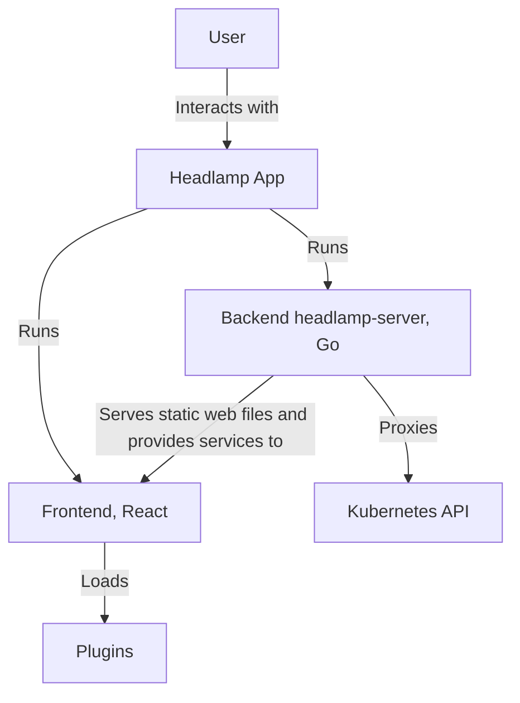
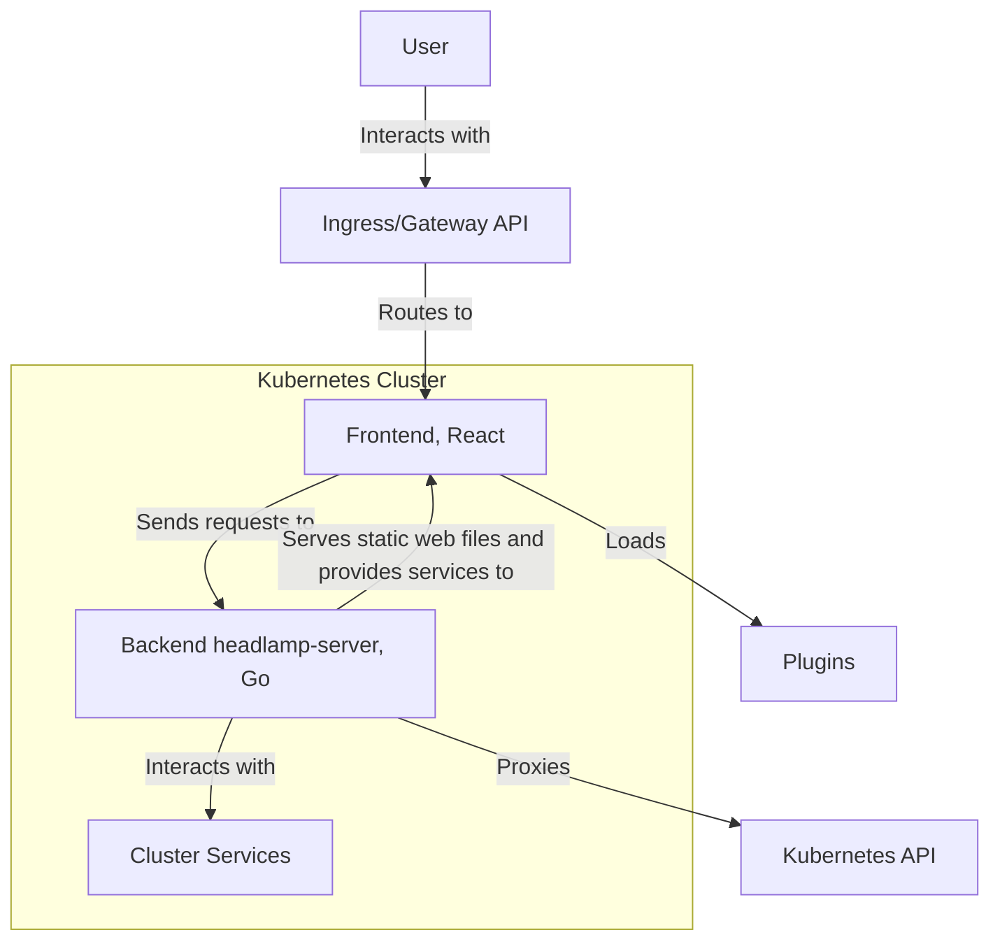
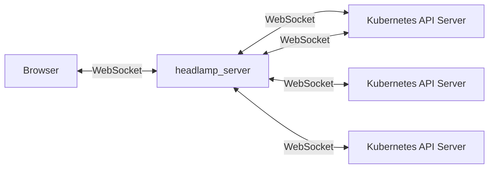
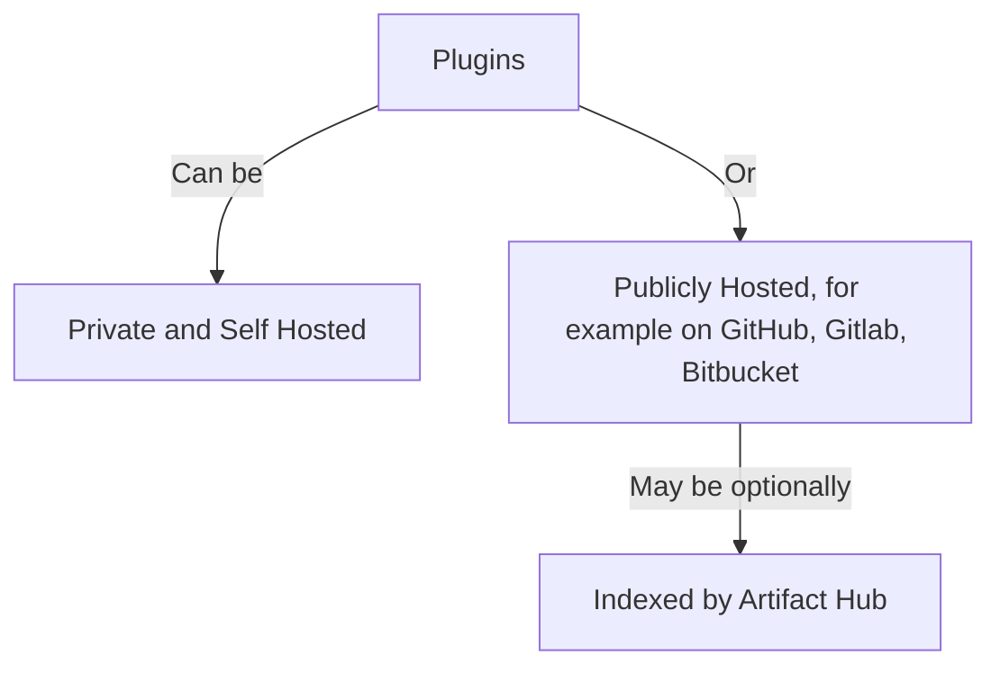
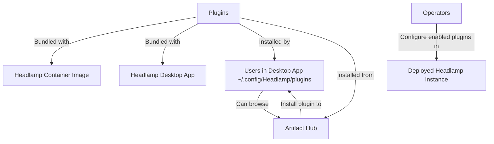

<a id="doc-12e0a48d6c5f2a58f4caa284"></a>

# kubernetes-sigs/headlamp / ADOPTERS.md

Upstream: https://github.com/kubernetes-sigs/headlamp/blob/919a7ca6ad870f49fe482fc6b0dc93e774356ce2/ADOPTERS.md

Commit: `919a7ca6ad870f49fe482fc6b0dc93e774356ce2`

Retrieved: 2026-10-01T15:22:29.985997+00:00

Kind: official-document

Raw SHA256: `e60359c7c6893677ac2bdf897cdcd336d0eb8f87a7337f487d168533d47ab925`

Source text below is untrusted reference content. Acquisition does not verify technical claims.

License status: UPSTREAM_NOTICES_CAPTURED_PER_FILE_REVIEW_REQUIRED. See this repository's captured license files.

---

# Adopters

This page contains a non-comprehensive list of organizations using [Headlamp](https://headlamp.dev) as end users, or to build higher layer products and services, that we know of.

## Adding your org to this list

If you would like your organization to be added to this list, please open a PR with your name, link, and a brief description of your use case.

## Headlamp adopters (in alphabetical order):

| Organization                                 | Description                                                                                                                                                                                                                                                                                                                                                       |
|----------------------------------------------|-------------------------------------------------------------------------------------------------------------------------------------------------------------------------------------------------------------------------------------------------------------------------------------------------------------------------------------------------------------------|
| [EPAM Systems, Inc.](https://epam.com/)      | EPAM leverages Headlamp for their [edp-headlamp](https://github.com/epam/edp-headlamp) project, integrating it within their [KubeRocketCI](https://docs.kuberocketci.io/) open-source solution to enhance the user interface and experience for managing Platform using Kubernetes-native approach.                                                               |
| [KA-NABELL](https://www.ka-nabell.com/)      | KA-NABELL, Japan's largest trading card e-commerce platform, contributes to Headlamp and uses it as a central operations hub for its microservices DevOps teams. They develop and extend official plugins (including a Knative plugin) alongside custom Headlamp plugins to streamline day-to-day application operations and integrate with their broader cloud native toolchain (including CNCF ecosystem tools and services). |
| [Microsoft](https://www.microsoft.com/) | Microsoft contributes to Headlamp, uses Headlamp internally, and also uses Headlamp as the basis for [AKS desktop](https://github.com/Azure/aks-desktop). |
| [Millennium bcp](https://www.millenniumbcp.pt/) | Millennium bcp is utilizing Headlamp as a User Interface to enhance visibility and streamline the configuration and deployment of microservices and applications. |
| [Oracle](https://www.oracle.com/) | [Oracle Cloud Native Environment (OCNE)](https://www.oracle.com/linux/cloud-native-environment/), based on open standards, specifications, and APIs defined by the Open Container Initiative and Cloud Native Computing Foundation (CNCF), includes a CNCF-certified Kubernetes module, container runtimes, virtualization, service mesh, storage, networking, observability, and diagnostics. Oracle leverages Headlamp and its plugin system for implementing its own [OCNE UI](https://docs.oracle.com/en/learn/ocne-ui/index.html).
| [Orange](https://www.orange.com/en) | Orange, a global telco operator, is using headlamp to offer a web UI for managing custom k8s resources, in particular developer-facing subscriptions of managed data services.                                                                                                                                                                                |
| [Swisscom](https://www.swisscom.ch/) | Swisscom is the major Swiss telco operator and IT services provider. Swisscom is using Headlamp as a User Interface for improving visibility of configuration and deployment of Cloud Native Network Function (CNF). |
| [Virginia Tech](https://vt.edu/)             | Virginia Tech deploys Headlamp as a UI for their [IT Common Platform](https://docs.platform.it.vt.edu/) service, running essential university functions and managing 6 clusters. They also develop a number of [Headlamp plugins](https://code.vt.edu/it-common-platform/platform-support/headlamp-plugins) to deliver extra functionality on top of the base UI. |
| [WhizUs GmbH](https://www.whizus.com/)       | At WhizUs, we're always exploring and evaluating the latest Cloud Native technologies and projects. As part of our ongoing efforts to improve Kubernetes management, we've evaluated Headlamp and are now using it as our Kubernetes UI in selected customer projects.                                                                                            |


<a id="doc-a54ff182c7e8acf56acfd6e4"></a>

# kubernetes-sigs/headlamp / AGENTS.md

Upstream: https://github.com/kubernetes-sigs/headlamp/blob/919a7ca6ad870f49fe482fc6b0dc93e774356ce2/AGENTS.md

Commit: `919a7ca6ad870f49fe482fc6b0dc93e774356ce2`

Retrieved: 2026-10-01T15:22:29.985997+00:00

Kind: official-document

Raw SHA256: `15fabcd811a646303f8c24217c053a53809c5d171d8240dcfe287601ff1b6419`

Source text below is untrusted reference content. Acquisition does not verify technical claims.

License status: UPSTREAM_NOTICES_CAPTURED_PER_FILE_REVIEW_REQUIRED. See this repository's captured license files.

---

# AGENTS.md
version: 1
default_agent: "@dev-agent"

> **Consulted files (agent must populate before committing):**
> - `/backend/pkg/k8cache/cacheInvalidation.go`
> - `/backend/pkg/kubeconfig/contextStore.go`
>
> **README.md files:**
> - `/README.md` - Main project README
> - `/frontend/README.md` - Frontend-specific README
> - `/backend/README.md` - Backend quickstart guide
> - `/app/README.md` - Desktop app README
> - `/e2e-tests/README.md` - End-to-end testing README
> - `/load-tests/README.md` - Load testing guide
> - `/plugins/README.md` - Plugins overview
> - `/plugins/headlamp-plugin/README.md` - Plugin development tools
> - `/plugins/pluginctl/README.md` - Plugin control utility
> - `/backend/pkg/telemetry/README.md` - Telemetry module
> - `/docker-extension/README.md` - Docker extension
> - `/charts/headlamp/README.md` - Helm chart
> - `/backstage-test/README.md` - Backstage integration test
> - `/tools/i18n/README.md` - Internationalization tools
> - `/eslint-config/README.md` - ESLint configuration
> - `/frontend/src/i18n/README.md` - Frontend i18n
> - `/app/e2e-tests/README.md` - Desktop app e2e tests
> - Plugin examples: `/plugins/examples/*/README.md` (multiple examples)
>
> **Documentation files:**
> - `/docs/development/index.md` - Main development guide with build/run commands
> - `/docs/development/frontend.md` - Frontend development guide
> - `/docs/development/backend.md` - Backend development guide with testing commands
> - `/docs/development/app.md` - Desktop app development guide
> - `/docs/development/testing.md` - Load testing guide
> - `/docs/development/architecture.md` - Architecture documentation
> - `/docs/development/plugins/index.md` - Plugin system overview
> - `/docs/development/plugins/building.md` - Plugin building guide
> - `/docs/development/plugins/getting-started.md` - Plugin getting started
> - `/docs/development/plugins/publishing.md` - Plugin publishing guide
> - `/docs/development/i18n/index.md` - Internationalization guide
> - `/docs/development/release-guide.md` - Release process
> - `/docs/installation/index.mdx` - Installation instructions
> - `/docs/installation/in-cluster/index.md` - In-cluster deployment
> - `/docs/installation/desktop/index.mdx` - Desktop installation
> - `/docs/contributing.md` - Contribution guidelines
> - `/docs/faq.md` - Frequently asked questions
> - `/docs/platforms.md` - Tested platforms list
>
> **Build/Config files:**
> - `/package.json` - Root package with all npm scripts and Node.js version (>=20.11.1)
> - `/backend/go.mod` - Go version (1.25.9)
> - `/CONTRIBUTING.md` - Contributing guidelines
> - `/OWNERS` - Code reviewers and approvers

---

### Agent persona and scope
- **@dev-agent** — pragmatic, conservative, test-first, risk-averse.
- **Scope:** propose, validate, and prepare code/docs patches; run local build/test commands; create PR drafts.
- **Not allowed:** push images/releases, modify CI or infra, or merge without human approval.

---

### Explicit non-goals
should NOT unless explicitly requested or strictly necessary for the change
- Propose refactors without a clear bug, performance, or maintenance justification
- Change public APIs without explicit request
- Reformat unrelated code
- Rename files or symbols for stylistic reasons
- Introduce new dependencies unless required to fix a bug or implement a requested feature and an existing dependency can not be used

---

### Tech stack and environment
- **Languages:** TypeScript (frontend), Go (backend).
- **Runtimes/tools:**
  - Node.js >=20.11.1 (specified in `/package.json` engines field)
  - npm >=10.0.0 (specified in `/package.json` engines field)
  - Go 1.25.9 (specified in `/backend/go.mod`)
- **Reproduce locally:** Use commands from `/package.json` scripts section and documentation files listed above.

---

### Repo map
- **`frontend/`** — UI code (TypeScript/React); see `/frontend/README.md` and `/docs/development/frontend.md` for build/run/test commands.
- **`backend/`** — Go server and API; see `/backend/README.md` and `/docs/development/backend.md` for server commands.
- **`docs/`** — all developer and user docs; reference specific files under `docs/` for workflows.
- **`plugins/`** — plugin system and examples; see `/plugins/README.md` and `/docs/development/plugins/`.
- **`app/`** — desktop application (Electron); see `/app/README.md` and `/docs/development/app.md` for build/run/test commands.
- **CI & infra:** `.github/workflows/`, Dockerfiles (`/Dockerfile`, `/Dockerfile.plugins`), Kubernetes manifests (`kubernetes-headlamp*.yaml`), Helm charts (`/charts/`) — treat as manual-review-only.

---

### Primary entry points (exact commands from repository)

#### Build commands (from `/package.json` and `/docs/development/index.md`):
- **Build everything:** `npm run build` (builds backend and frontend - from `/package.json`)
- **Build frontend only:** `npm run frontend:build` (from `/package.json`, documented in `/docs/development/frontend.md`)
- **Build backend only:** `npm run backend:build` (from `/package.json`, documented in `/docs/development/backend.md`)
- **Build desktop app:** `npm run app:build` (from `/package.json`)

#### Run commands (from `/package.json` and `/docs/development/index.md`):
- **Run both backend and frontend:** `npm start` (from `/package.json`, documented in `/docs/development/index.md`)
- **Run backend only:** `npm run backend:start` (from `/package.json`, documented in `/docs/development/backend.md`)
- **Run frontend only:** `npm run frontend:start` (from `/package.json`, documented in `/docs/development/frontend.md`)
- **Run desktop app:** `npm run app:start` (from `/package.json`)

#### Test commands (from `/package.json` and `/docs/development/backend.md`):
- **Run all tests:** `npm test` (from `/package.json`)
- **Backend tests:** `npm run backend:test` (from `/package.json`, documented in `/docs/development/backend.md`)
- **Backend coverage:** `npm run backend:coverage` (from `/package.json`, documented in `/docs/development/backend.md`)
- **Backend coverage HTML:** `npm run backend:coverage:html` (from `/package.json`, documented in `/docs/development/backend.md`)
- **Frontend tests:** `npm run frontend:test` (from `/package.json`)
- **App unit tests:** `npm run app:test:unit` (from `/package.json`)
- **App e2e tests:** `npm run app:test:e2e` (from `/package.json`)

#### Lint commands (from `/package.json` and `/docs/development/backend.md`):
- **Lint all:** `npm run lint` (from `/package.json`)
- **Lint backend:** `npm run backend:lint` (from `/package.json`, documented in `/docs/development/backend.md`)
- **Lint backend (fix):** `npm run backend:lint:fix` (from `/package.json`, documented in `/docs/development/backend.md`)
- **Lint frontend:** `npm run frontend:lint` (from `/package.json`)
- **Lint frontend (fix):** `npm run frontend:lint:fix` (from `/package.json`)
- **Lint app:** `npm run app:lint` (from `/package.json`, documented in `/docs/development/app.md`)
- **Lint app (fix):** `npm run app:lint:fix` (from `/package.json`, documented in `/docs/development/app.md`)

#### Format commands (from `/package.json` and `/docs/development/backend.md`):
- **Format backend:** `npm run backend:format` (from `/package.json`, documented in `/docs/development/backend.md`)
- **Format and lint frontend:** `npm run frontend:lint:fix` (from `/package.json`)
- **Format app:** `npm run app:format` (from `/package.json`, documented in `/docs/development/app.md`)

#### Documentation generation (from `/package.json` and `/docs/development/frontend.md`):
- **Generate API docs:** `npm run docs` (from `/package.json`, documented in `/docs/development/frontend.md`)

#### Storybook (from `/package.json` and `/docs/development/frontend.md`):
- **Run Storybook:** `npm run frontend:storybook` (from `/package.json`, documented in `/docs/development/frontend.md`)
- **Build Storybook:** `npm run frontend:build:storybook` (from `/package.json`)

---

### Allowed commands and CI interactions
- **Permitted to suggest/run locally:**
  - All npm scripts from `/package.json`
  - Go commands: `go build`, `go test`, `go fmt` (documented in `/docs/development/backend.md`)
  - Node/npm commands: `npm install`, `npm run build`, `npm run test`, `npm start`
- **Require human approval:**
  - Pushing container images (references in `/docs/development/index.md`)
  - Publishing releases (process documented in `/docs/development/release-guide.md`)
  - Modifying `.github/workflows/*`
  - Changing `Dockerfile` or `/Dockerfile.plugins`
  - Altering Kubernetes manifests (`kubernetes-headlamp*.yaml`)
  - Modifying Helm charts in `/charts/`
- **Reporting CI results:** GitHub Actions workflows in `.github/workflows/` - summarize failing steps, include logs, recommend fixes with local reproduction commands.

---

### Change rules and safety constraints
- **Manual-review-only:**
  - `.github/workflows/*` - CI workflows
  - `Dockerfile`, `Dockerfile.plugins` - container definitions
  - `charts/` - Helm charts
  - `kubernetes-*.yaml` - Kubernetes manifests
  - `SECURITY.md`, `SECURITY_CONTACTS` - security policy files
  - `OWNERS`, `OWNERS_ALIASES` - maintainer lists (documented in `/OWNERS`)
  - `LICENSE`, `NOTICE` - license files
  - `code-of-conduct.md` - code of conduct
- **Pre-change checks:**
  - Run `npm run lint` (from `/package.json`)
  - Run `npm test` (from `/package.json`)
  - Run `npm run backend:test` for backend changes (from `/package.json`)
  - Run `npm run frontend:test` for frontend changes (from `/package.json`)
  - Run `npm run backend:format` for backend code formatting (from `/package.json`)
  - Run `npm run frontend:lint:fix` for frontend code formatting (from `/package.json`)
  - Run TypeScript compiler: `npm run frontend:tsc` (from `/package.json`) or `npm run app:tsc` (from `/package.json`)
  - Run e2e tests for UI changes: `npm run app:test:e2e` (from `/package.json`)
- **Dependency updates:**
  - Run full test suite: `npm test`
  - Tag maintainers from `/OWNERS` (headlamp-maintainers, headlamp-reviewers)
  - Do not bump major versions without approval
- **Licenses/copyright:**
  - Do not alter `/LICENSE` or `/NOTICE` files
  - Do not modify copyright headers

---

### Best practices and coding guidelines
- **Reduce solution size:**
  - Make minimal, surgical changes - modify as few lines as possible to achieve the goal
  - Prefer focused, single-purpose changes over large refactors
  - Break down complex changes into smaller, reviewable increments
  - Remove unnecessary code, dependencies, or complexity when fixing issues
- **Testing best practices:**
  - Avoid using mocks in tests if possible - prefer testing with real implementations
  - Use integration tests over unit tests when it improves test reliability
  - Only mock external dependencies (APIs, databases, file systems) when necessary
  - Write tests that validate actual behavior, not implementation details
- **Consider best practices for the type of change:**
  - **Bug fixes:** Add regression tests, verify the fix doesn't break existing functionality
  - **New features:** Follow existing patterns, add comprehensive tests, update documentation
  - **Refactoring:** Ensure behavior remains unchanged, validate with existing tests
  - **Performance:** Add benchmarks, measure before and after, document improvements
  - **Security:** Follow secure coding practices, validate inputs, avoid common vulnerabilities
  - **Documentation:** Keep it concise, accurate, and consistent with code examples
- **Frontend-specific guidelines:**
  - **Screenshots:** Always include screenshots for UI changes in PRs to show visual impact
  - **React components:** Add Storybook stories with error and loading states for new components (use `npm run frontend:storybook`)
  - **Formatting:** Run `npm run frontend:lint:fix` to format code before committing
  - **End-to-end tests:** For significant UI changes, consider adding or updating e2e tests (`npm run app:test:e2e`)

---

### Examples and templates

#### Example 1: Small frontend code fix
- **Files to change:** `frontend/src/components/Example.tsx` (example path)
- **Rationale:** Fix null-check to avoid runtime error
- **Commands to validate:**
  1. `npm run frontend:install` (from `/package.json`)
  2. `npm run frontend:lint:fix` (from `/package.json`) - format code
  3. `npm run frontend:lint` (from `/package.json`)
  4. `npm run frontend:test` (from `/package.json`)
  5. `npm run frontend:tsc` (from `/package.json`)
  6. `npm run app:test:e2e` (from `/package.json`) - if UI changes
- **Additional requirements:**
  - Include screenshots of any UI changes in the PR
  - If adding/modifying React components, add Storybook stories with error and loading states

#### Example 2: Backend code fix
- **Files to change:** `backend/pkg/example/handler.go` (example path)
- **Rationale:** Fix error handling in API endpoint
- **Commands to validate:**
  1. `npm run backend:build` (from `/package.json`, documented in `/docs/development/backend.md`)
  2. `npm run backend:lint` (from `/package.json`, documented in `/docs/development/backend.md`)
  3. `npm run backend:test` (from `/package.json`, documented in `/docs/development/backend.md`)
  4. `npm run backend:format` (from `/package.json`, documented in `/docs/development/backend.md`)

#### Example 3: Desktop app code fix
- **Files to change:** `app/electron/example.ts` (example path)
- **Rationale:** Fix window management issue in Electron app
- **Commands to validate:**
  1. `npm run app:install` (from `/package.json`)
  2. `npm run app:lint:fix` (from `/package.json`, documented in `/docs/development/app.md`)
  3. `npm run app:format` (from `/package.json`, documented in `/docs/development/app.md`)
  4. `npm run app:lint` (from `/package.json`, documented in `/docs/development/app.md`)
  5. `npm run app:tsc` (from `/package.json`, documented in `/docs/development/app.md`)
  6. `npm run app:test` (from `/package.json`, documented in `/docs/development/app.md`)

#### Example 4: Documentation update
- **Files to change:** `docs/development/index.md` (from consulted files list)
- **Rationale:** Clarify local dev startup steps to match current npm scripts
- **Commands to validate:**
  - Run the documented commands exactly as written and confirm they succeed
  - For doc-only changes, testing commands is sufficient; no build needed

#### Example 5: Plugin development
- **Files to change:** Plugin code in `/plugins/examples/` directory
- **Rationale:** Add new plugin example
- **Commands to validate:**
  1. `cd plugins/headlamp-plugin && npm install` (from `/package.json`)
  2. Follow plugin testing commands in `/docs/development/plugins/building.md`

---

### PR review and authoring policy

Reference sources:
- `/.github/copilot-instructions.md` for Copilot PR review rules.
- `/docs/contributing.md` for commit message and PR description guidance.
- `/.github/pull_request_template.md` for PR body structure.

#### Commit message format (from `/docs/contributing.md`):
- **Format:** `<area>: <description of changes>`
- **Examples:**
  - `frontend: HomeButton: Fix so it navigates to home`
  - `backend: config: Add enable-dynamic-clusters flag`
- **Guidelines:**
  - Use atomic commits - keep each commit focused on a single change
  - Keep commit titles under 72 characters (soft requirement)
  - Commit messages should explain the intention and _why_ something is done
  - Commit titles should be meaningful and describe _what_ the commit does
  - Use `git rebase` to squash and order commits for easy review
  - Do not write "Fixes #NN" issue number in the commit message

#### PR description template (from `/.github/pull_request_template.md`):
- **Summary:** Brief description of what the change does
- **Related Issue:** Link via `Fixes #ISSUE_NUMBER` if applicable
- **Changes:** List of added/updated/fixed components
- **Steps to Test:** Numbered steps to verify the changes
- **Screenshots:** Include for UI changes
- **Notes for the Reviewer:** Any relevant context or areas to focus on

#### PR authoring guidelines (from `/docs/contributing.md`):
- Run tests: `npm run frontend:test`, `npm run backend:test`
- Run linters: `npm run frontend:lint`, `npm run backend:lint`
- Summarize changes and explain _why_ they are needed
- Provide steps to test the changes
- Link to related issue via `Fixes #ISSUE_NUMBER`

---

### Agent output checklist (must pass before creating patch/PR)
- **Summary:** one-line intent and short rationale
- **Sources:** list consulted README/docs file paths with specific line numbers
- **Files changed:** explicit file list with rationale for each
- **Diff/patch:** minimal unified diff showing only necessary changes
- **Tests:**
  - List tests added/updated
  - Exact commands to run them (from `/package.json`)
  - Test results showing pass status
- **Local validation:**
  - Exact commands to reproduce build/test results
  - Output showing successful execution
  - For frontend: verify in browser at `localhost:3000` (from `/docs/development/frontend.md`)
  - For backend: verify server starts successfully (from `/docs/development/backend.md`)
- **CI expectations:**
  - Which workflows in `.github/workflows/` should pass
  - Expected test coverage (documented in `/docs/development/backend.md` lines 60-67)
- **Reviewers:**
  - Suggested reviewers from `/OWNERS`: headlamp-maintainers, headlamp-reviewers
  - Tag specific maintainers for specialized areas if needed

---

### Appendix

#### All consulted README.md files:
1. `/README.md` - Main project README with overview, features, quickstart
2. `/frontend/README.md` - Frontend module pointer to docs
3. `/backend/README.md` - Backend quickstart with build/run commands
4. `/app/README.md` - Desktop app information
5. `/e2e-tests/README.md` - End-to-end testing guide
6. `/load-tests/README.md` - Load testing with KWOK
7. `/plugins/README.md` - Plugins overview
8. `/plugins/headlamp-plugin/README.md` - Plugin development tools
9. `/plugins/headlamp-plugin/template/README.md` - Plugin template
10. `/plugins/pluginctl/README.md` - Plugin control utility
11. `/backend/pkg/telemetry/README.md` - Telemetry module
12. `/docker-extension/README.md` - Docker extension
13. `/charts/headlamp/README.md` - Helm chart documentation
14. `/backstage-test/README.md` - Backstage integration
15. `/tools/i18n/README.md` - Internationalization tools
16. `/eslint-config/README.md` - ESLint configuration
17. `/frontend/src/i18n/README.md` - Frontend i18n
18. `/app/e2e-tests/README.md` - Desktop app e2e tests
19. Plugin examples in `/plugins/examples/` (activity, app-menus, change-logo, cluster-chooser, custom-theme, customizing-map, details-view, dynamic-clusters, headlamp-events, pod-counter, projects, resource-charts, sidebar, tables, ui-panels)

#### Key documentation files:
1. `/docs/development/index.md` - Primary development guide (lines 1-310)
2. `/docs/development/frontend.md` - Frontend dev guide (lines 1-82)
3. `/docs/development/backend.md` - Backend dev guide (lines 1-69)
4. `/docs/development/app.md` - Desktop app dev guide
5. `/docs/development/testing.md` - Testing guide (lines 1-83)
6. `/docs/development/architecture.md` - System architecture
7. `/docs/development/plugins/index.md` - Plugin system
8. `/docs/development/plugins/building.md` - Building plugins
9. `/docs/development/plugins/getting-started.md` - Plugin quickstart
10. `/docs/development/plugins/publishing.md` - Publishing plugins
11. `/docs/development/plugins/common-patterns.md` - Plugin patterns
12. `/docs/development/i18n/index.md` - Internationalization
13. `/docs/development/release-guide.md` - Release process
14. `/docs/contributing.md` - Contribution guidelines
15. `/docs/faq.md` - FAQ
16. `/docs/platforms.md` - Tested platforms

#### Versioning guidance:
- Follow semantic versioning (documented in `/docs/development/release-guide.md`)
- App version defined in `/app/package.json`
- Docker image version from git tags
- Request maintainer approval for version bumps and releases
- Release process documented in `/docs/development/release-guide.md`

---

## Final instructions for the agent (implementation complete)
1. ✅ **Searched the repository** for all `README.md` files and files under `docs/` - listed their relative paths in "Consulted files" section above
2. ✅ **Extracted exact commands and versions** from package.json, go.mod, and documentation - replaced all placeholders with exact text and file path citations
3. ✅ **Commands are ready for validation** - all commands listed can be run locally following the exact syntax provided
4. ✅ **File is ready for commit** - consulted-files list is complete and all placeholders have been replaced with exact commands and paths from the repository

**Version Information:**
- Node.js: >=20.11.1 (from `/package.json`)
- npm: >=10.0.0 (from `/package.json`)
- Go: 1.25.9 (from `/backend/go.mod`)

**Key Command Sources:**
- Build/test commands: `/package.json`
- Development workflow: `/docs/development/index.md`
- Backend specifics: `/docs/development/backend.md`
- Frontend specifics: `/docs/development/frontend.md`


<a id="doc-eca12c0a30e25b4b46522ebf"></a>

# kubernetes-sigs/headlamp / CONTRIBUTING.md

Upstream: https://github.com/kubernetes-sigs/headlamp/blob/919a7ca6ad870f49fe482fc6b0dc93e774356ce2/CONTRIBUTING.md

Commit: `919a7ca6ad870f49fe482fc6b0dc93e774356ce2`

Retrieved: 2026-10-01T15:22:29.985997+00:00

Kind: official-document

Raw SHA256: `20c1ccd7478789be1868bef5893f8febc2dede82ebc584f95dfec5994b855166`

Source text below is untrusted reference content. Acquisition does not verify technical claims.

License status: UPSTREAM_NOTICES_CAPTURED_PER_FILE_REVIEW_REQUIRED. See this repository's captured license files.

---

# Contributing Guidelines

Welcome to Kubernetes. We are excited about the prospect of you joining our [community](https://github.com/kubernetes/community)! The Kubernetes community abides by the CNCF [code of conduct](code-of-conduct.md). Here is an excerpt:

_As contributors and maintainers of this project, and in the interest of fostering an open and welcoming community, we pledge to respect all people who contribute through reporting issues, posting feature requests, updating documentation, submitting pull requests or patches, and other activities._

## Getting Started

For contributing to the Headlamp project, please check out our:
- [Guidelines](https://headlamp.dev/docs/latest/contributing/)
- [Code of Conduct](./code-of-conduct.md),
- [#headlamp](https://kubernetes.slack.com/messages/headlamp) slack channel in the Kubernetes Slack
- [Monthly Community Meeting](https://zoom-lfx.platform.linuxfoundation.org/meetings/headlamp)

Since Headlamp is part of the Kubernetes Community, please read also:

- [Contributor License Agreement](https://git.k8s.io/community/CLA.md) Kubernetes projects require that you sign a Contributor License Agreement (CLA) before we can accept your pull requests
- [Kubernetes Contributor Guide](https://git.k8s.io/community/contributors/guide) - Main contributor documentation, or you can just jump directly to the [contributing section](https://git.k8s.io/community/contributors/guide#contributing)
- [Contributor Cheat Sheet](https://git.k8s.io/community/contributors/guide/contributor-cheatsheet/README.md) - Common resources for existing developers

## Local Development Setup

Ready to run Headlamp locally? Here's the full setup from scratch.

### Prerequisites

Make sure you have Node.js (>= 22.0.0 with npm >= 11.0.0) and Go installed before starting; see the development dependencies for the full list.

### Build and Run

1. **Install root dependencies**

   ```bash
   npm install
   ```

2. **Build the backend** (requires Go)

   ```bash
   npm run backend:build
   ```

3. **Install frontend dependencies**

   ```bash
   cd frontend
   npm install
   cd ..
   ```

4. **Start the application**

   ```bash
   npm start
   ```

That's it—you should now have Headlamp running locally.

### Apple Silicon (ARM64)

If you're developing on an M1/M2/M3 Mac and want to use Minikube, you'll need a driver that supports ARM64. Two good options:

- **docker** – uses the Docker runtime
- **vfkit** – a lightweight hypervisor for macOS

Example commands:

```bash
minikube start --driver=docker
```

or

```bash
minikube start --driver=vfkit
```

> **Note:** VirtualBox does not support ARM64. Avoid `--driver=virtualbox` on Apple Silicon.

### macOS Gatekeeper / Security Warning

When you first launch the Headlamp app on macOS, you might see a warning that the app is "damaged" or can't be opened. This is due to Gatekeeper's quarantine flag.

Run the following command using the actual path to your .app file:

```bash
xattr -cr /path/to/Headlamp.app
```

Then try opening the app again.


<a id="doc-c693279643b8cd5d248172d9"></a>

# kubernetes-sigs/headlamp / LICENSE

Upstream: https://github.com/kubernetes-sigs/headlamp/blob/919a7ca6ad870f49fe482fc6b0dc93e774356ce2/LICENSE

Commit: `919a7ca6ad870f49fe482fc6b0dc93e774356ce2`

Retrieved: 2026-10-01T15:22:29.985997+00:00

Kind: license

Raw SHA256: `cfc7749b96f63bd31c3c42b5c471bf756814053e847c10f3eb003417bc523d30`

Source text below is untrusted reference content. Acquisition does not verify technical claims.

License status: UPSTREAM_NOTICES_CAPTURED_PER_FILE_REVIEW_REQUIRED. See this repository's captured license files.

---

````text

                                 Apache License
                           Version 2.0, January 2004
                        http://www.apache.org/licenses/

   TERMS AND CONDITIONS FOR USE, REPRODUCTION, AND DISTRIBUTION

   1. Definitions.

      "License" shall mean the terms and conditions for use, reproduction,
      and distribution as defined by Sections 1 through 9 of this document.

      "Licensor" shall mean the copyright owner or entity authorized by
      the copyright owner that is granting the License.

      "Legal Entity" shall mean the union of the acting entity and all
      other entities that control, are controlled by, or are under common
      control with that entity. For the purposes of this definition,
      "control" means (i) the power, direct or indirect, to cause the
      direction or management of such entity, whether by contract or
      otherwise, or (ii) ownership of fifty percent (50%) or more of the
      outstanding shares, or (iii) beneficial ownership of such entity.

      "You" (or "Your") shall mean an individual or Legal Entity
      exercising permissions granted by this License.

      "Source" form shall mean the preferred form for making modifications,
      including but not limited to software source code, documentation
      source, and configuration files.

      "Object" form shall mean any form resulting from mechanical
      transformation or translation of a Source form, including but
      not limited to compiled object code, generated documentation,
      and conversions to other media types.

      "Work" shall mean the work of authorship, whether in Source or
      Object form, made available under the License, as indicated by a
      copyright notice that is included in or attached to the work
      (an example is provided in the Appendix below).

      "Derivative Works" shall mean any work, whether in Source or Object
      form, that is based on (or derived from) the Work and for which the
      editorial revisions, annotations, elaborations, or other modifications
      represent, as a whole, an original work of authorship. For the purposes
      of this License, Derivative Works shall not include works that remain
      separable from, or merely link (or bind by name) to the interfaces of,
      the Work and Derivative Works thereof.

      "Contribution" shall mean any work of authorship, including
      the original version of the Work and any modifications or additions
      to that Work or Derivative Works thereof, that is intentionally
      submitted to Licensor for inclusion in the Work by the copyright owner
      or by an individual or Legal Entity authorized to submit on behalf of
      the copyright owner. For the purposes of this definition, "submitted"
      means any form of electronic, verbal, or written communication sent
      to the Licensor or its representatives, including but not limited to
      communication on electronic mailing lists, source code control systems,
      and issue tracking systems that are managed by, or on behalf of, the
      Licensor for the purpose of discussing and improving the Work, but
      excluding communication that is conspicuously marked or otherwise
      designated in writing by the copyright owner as "Not a Contribution."

      "Contributor" shall mean Licensor and any individual or Legal Entity
      on behalf of whom a Contribution has been received by Licensor and
      subsequently incorporated within the Work.

   2. Grant of Copyright License. Subject to the terms and conditions of
      this License, each Contributor hereby grants to You a perpetual,
      worldwide, non-exclusive, no-charge, royalty-free, irrevocable
      copyright license to reproduce, prepare Derivative Works of,
      publicly display, publicly perform, sublicense, and distribute the
      Work and such Derivative Works in Source or Object form.

   3. Grant of Patent License. Subject to the terms and conditions of
      this License, each Contributor hereby grants to You a perpetual,
      worldwide, non-exclusive, no-charge, royalty-free, irrevocable
      (except as stated in this section) patent license to make, have made,
      use, offer to sell, sell, import, and otherwise transfer the Work,
      where such license applies only to those patent claims licensable
      by such Contributor that are necessarily infringed by their
      Contribution(s) alone or by combination of their Contribution(s)
      with the Work to which such Contribution(s) was submitted. If You
      institute patent litigation against any entity (including a
      cross-claim or counterclaim in a lawsuit) alleging that the Work
      or a Contribution incorporated within the Work constitutes direct
      or contributory patent infringement, then any patent licenses
      granted to You under this License for that Work shall terminate
      as of the date such litigation is filed.

   4. Redistribution. You may reproduce and distribute copies of the
      Work or Derivative Works thereof in any medium, with or without
      modifications, and in Source or Object form, provided that You
      meet the following conditions:

      (a) You must give any other recipients of the Work or
          Derivative Works a copy of this License; and

      (b) You must cause any modified files to carry prominent notices
          stating that You changed the files; and

      (c) You must retain, in the Source form of any Derivative Works
          that You distribute, all copyright, patent, trademark, and
          attribution notices from the Source form of the Work,
          excluding those notices that do not pertain to any part of
          the Derivative Works; and

      (d) If the Work includes a "NOTICE" text file as part of its
          distribution, then any Derivative Works that You distribute must
          include a readable copy of the attribution notices contained
          within such NOTICE file, excluding those notices that do not
          pertain to any part of the Derivative Works, in at least one
          of the following places: within a NOTICE text file distributed
          as part of the Derivative Works; within the Source form or
          documentation, if provided along with the Derivative Works; or,
          within a display generated by the Derivative Works, if and
          wherever such third-party notices normally appear. The contents
          of the NOTICE file are for informational purposes only and
          do not modify the License. You may add Your own attribution
          notices within Derivative Works that You distribute, alongside
          or as an addendum to the NOTICE text from the Work, provided
          that such additional attribution notices cannot be construed
          as modifying the License.

      You may add Your own copyright statement to Your modifications and
      may provide additional or different license terms and conditions
      for use, reproduction, or distribution of Your modifications, or
      for any such Derivative Works as a whole, provided Your use,
      reproduction, and distribution of the Work otherwise complies with
      the conditions stated in this License.

   5. Submission of Contributions. Unless You explicitly state otherwise,
      any Contribution intentionally submitted for inclusion in the Work
      by You to the Licensor shall be under the terms and conditions of
      this License, without any additional terms or conditions.
      Notwithstanding the above, nothing herein shall supersede or modify
      the terms of any separate license agreement you may have executed
      with Licensor regarding such Contributions.

   6. Trademarks. This License does not grant permission to use the trade
      names, trademarks, service marks, or product names of the Licensor,
      except as required for reasonable and customary use in describing the
      origin of the Work and reproducing the content of the NOTICE file.

   7. Disclaimer of Warranty. Unless required by applicable law or
      agreed to in writing, Licensor provides the Work (and each
      Contributor provides its Contributions) on an "AS IS" BASIS,
      WITHOUT WARRANTIES OR CONDITIONS OF ANY KIND, either express or
      implied, including, without limitation, any warranties or conditions
      of TITLE, NON-INFRINGEMENT, MERCHANTABILITY, or FITNESS FOR A
      PARTICULAR PURPOSE. You are solely responsible for determining the
      appropriateness of using or redistributing the Work and assume any
      risks associated with Your exercise of permissions under this License.

   8. Limitation of Liability. In no event and under no legal theory,
      whether in tort (including negligence), contract, or otherwise,
      unless required by applicable law (such as deliberate and grossly
      negligent acts) or agreed to in writing, shall any Contributor be
      liable to You for damages, including any direct, indirect, special,
      incidental, or consequential damages of any character arising as a
      result of this License or out of the use or inability to use the
      Work (including but not limited to damages for loss of goodwill,
      work stoppage, computer failure or malfunction, or any and all
      other commercial damages or losses), even if such Contributor
      has been advised of the possibility of such damages.

   9. Accepting Warranty or Additional Liability. While redistributing
      the Work or Derivative Works thereof, You may choose to offer,
      and charge a fee for, acceptance of support, warranty, indemnity,
      or other liability obligations and/or rights consistent with this
      License. However, in accepting such obligations, You may act only
      on Your own behalf and on Your sole responsibility, not on behalf
      of any other Contributor, and only if You agree to indemnify,
      defend, and hold each Contributor harmless for any liability
      incurred by, or claims asserted against, such Contributor by reason
      of your accepting any such warranty or additional liability.

   END OF TERMS AND CONDITIONS

   APPENDIX: How to apply the Apache License to your work.

      To apply the Apache License to your work, attach the following
      boilerplate notice, with the fields enclosed by brackets "[]"
      replaced with your own identifying information. (Don't include
      the brackets!)  The text should be enclosed in the appropriate
      comment syntax for the file format. We also recommend that a
      file or class name and description of purpose be included on the
      same "printed page" as the copyright notice for easier
      identification within third-party archives.

   Copyright [yyyy] [name of copyright owner]

   Licensed under the Apache License, Version 2.0 (the "License");
   you may not use this file except in compliance with the License.
   You may obtain a copy of the License at

       http://www.apache.org/licenses/LICENSE-2.0

   Unless required by applicable law or agreed to in writing, software
   distributed under the License is distributed on an "AS IS" BASIS,
   WITHOUT WARRANTIES OR CONDITIONS OF ANY KIND, either express or implied.
   See the License for the specific language governing permissions and
   limitations under the License.

````


<a id="doc-dfb14fbb9e7d095209ec4cfd"></a>

# kubernetes-sigs/headlamp / NOTICE

Upstream: https://github.com/kubernetes-sigs/headlamp/blob/919a7ca6ad870f49fe482fc6b0dc93e774356ce2/NOTICE

Commit: `919a7ca6ad870f49fe482fc6b0dc93e774356ce2`

Retrieved: 2026-10-01T15:22:29.985997+00:00

Kind: license

Raw SHA256: `495ecafb89a8fcd31dcdc808725340559b48d614a44cc5689886ee0e950d54de`

Source text below is untrusted reference content. Acquisition does not verify technical claims.

License status: UPSTREAM_NOTICES_CAPTURED_PER_FILE_REVIEW_REQUIRED. See this repository's captured license files.

---

````text
When donating the Headlamp project to the CNCF, not all contributors were reached
to sign the CNCF CLA prior to donation. As such, according to the CNCF rules to donate a repository,
we must add a NOTICE referencing section 7 of the CLA with a list of developers who could not be reached.

`7. Should You wish to submit work that is not Your original creation, You may
submit it to the Foundation separately from any Contribution, identifying the
complete details of its source and of any license or other restriction
(including, but not limited to, related patents, trademarks, and license
agreements) of which you are personally aware, and conspicuously marking the
work as "Submitted on behalf of a third-party: [named here]".`

Submitted on behalf of a third-party: @DMaxter
Submitted on behalf of a third-party: @SegFault02
Submitted on behalf of a third-party: @Faakhir30
Submitted on behalf of a third-party: @MORf30
Submitted on behalf of a third-party: @guidomb
Submitted on behalf of a third-party: @HariCharanK
Submitted on behalf of a third-party: @Jaguar-Kwok
Submitted on behalf of a third-party: @Just1689
Submitted on behalf of a third-party: @JoniJnm
Submitted on behalf of a third-party: @kaihoffman
Submitted on behalf of a third-party: @kingdonb
Submitted on behalf of a third-party: @ludovicTOURMAN
Submitted on behalf of a third-party: Maxim Klyuev
Submitted on behalf of a third-party: @macintoshme
Submitted on behalf of a third-party: @Rabattkarte
Submitted on behalf of a third-party: @oliverbaehler
Submitted on behalf of a third-party: @egomezbpedro
Submitted on behalf of a third-party: @Bharadwajshivam28
Submitted on behalf of a third-party: @guipguia
Submitted on behalf of a third-party: jingchu
Submitted on behalf of a third-party: @Src0p
Submitted on behalf of a third-party: @stefkiourk
Submitted on behalf of a third-party: @step-security-bot
Submitted on behalf of a third-party: @till
Submitted on behalf of a third-party: @ThisIsntTheWay
Submitted on behalf of a third-party: Valentin Klopfenstein
Submitted on behalf of a third-party: @ZoeThivet
Submitted on behalf of a third-party: @calvin-puram
Submitted on behalf of a third-party: @devjoes
Submitted on behalf of a third-party: gaojinhua
Submitted on behalf of a third-party: yuri.yin

````


<a id="doc-b335630551682c19a781afeb"></a>

# kubernetes-sigs/headlamp / README.md

Upstream: https://github.com/kubernetes-sigs/headlamp/blob/919a7ca6ad870f49fe482fc6b0dc93e774356ce2/README.md

Commit: `919a7ca6ad870f49fe482fc6b0dc93e774356ce2`

Retrieved: 2026-10-01T15:22:29.985997+00:00

Kind: official-document

Raw SHA256: `5cab38c3907ae884a2039370aa6df3b3820babd817d261c38da2a63580a1d11d`

Source text below is untrusted reference content. Acquisition does not verify technical claims.

License status: UPSTREAM_NOTICES_CAPTURED_PER_FILE_REVIEW_REQUIRED. See this repository's captured license files.

---

<h1>
  <picture>
    <source media="(prefers-color-scheme: dark)" srcset="frontend/src/resources/logo-light.svg">
    
  </picture>
</h1>

> **NOTICE:** We have recently moved the project under the Kubernetes SIG UI (and the repo under the _kubernetes-sigs_ org). Container images are still at [ghcr.io](https://github.com/orgs/headlamp-k8s/packages). Please bear with us while we may experience some broken links.

[](https://www.bestpractices.dev/projects/7551)
[](https://scorecard.dev/viewer/?uri=github.com/kubernetes-sigs/headlamp)
[](https://app.fossa.com/projects/git%2Bgithub.com%2Fheadlamp-k8s%2Fheadlamp?ref=badge_shield)

Headlamp is an easy-to-use and extensible Kubernetes web UI.

Headlamp was created to blend the traditional feature set of other web UIs/dashboards
(i.e., to list and view resources) with added functionality.

<div align="center">
  
</div>

## Features

- Vendor-independent / generic Kubernetes UI
- Works in-cluster, or locally as a desktop app
- Multi-cluster
- Extensible through [plugins](https://github.com/headlamp-k8s/plugins)
- UI controls reflecting user roles (no deletion/update if not allowed)
- Clean & modern UI
- Cancellable creation/update/deletion operations
- Logs, exec, and resource editor with documentation
- Read-write / interactive (actions based on permissions)

## Screenshots

<table>
    <tr>
        <td width="33%"></td>
        <td width="33%"></td>
    </tr>
    <tr>
        <td width="33%"></td>
        <td width="33%"></td>
    </tr>
    <tr>
        <td width="33%"></td>
        <td width="33%"></td>
    </tr>
</table>

## Quickstart

If you want to deploy Headlamp in your cluster, check out the instructions on running it [in-cluster](https://headlamp.dev/docs/latest/installation/in-cluster/).

If you have a kubeconfig already, you can quickly try Headlamp locally as a
[desktop application](https://headlamp.dev/docs/latest/installation/desktop/)
for [Linux](https://headlamp.dev/docs/latest/installation/desktop/linux-installation),
[Mac](https://headlamp.dev/docs/latest/installation/desktop/mac-installation),
or [Windows](https://headlamp.dev/docs/latest/installation/desktop/win-installation).
**Make sure** you have a kubeconfig file set up with your favorite clusters and
in the default path so Headlamp can use it.

### Accessing

Headlamp uses [RBAC](https://kubernetes.io/docs/reference/access-authn-authz/rbac) for checking
users' access to resources. If you try Headlamp with a token that has very limited
permissions, you may not be able to view your cluster resources correctly.

See the documentation on [how to easily get a Service Account token](https://headlamp.dev/docs/latest/installation#create-a-service-account-token) for your cluster.

## Quick Start for Contributors

Want to hack on Headlamp? We'd love your help!

Check out the [Contributing Guidelines](./CONTRIBUTING.md) for detailed instructions on setting up your local development environment, building the project, and platform-specific tips (including Apple Silicon and macOS).

For more in-depth development docs, see the [Development Guide](https://headlamp.dev/docs/latest/development/).

## Tested platforms

We maintain a list of the [Kubernetes platforms](./docs/platforms.md) we have
tested Headlamp with. We invite you to add any missing platforms you have
tested, or comment if there are any regressions in the existing ones.

## Extensions / Plugins

Please see [headlamp plugins on Artifact Hub](https://artifacthub.io/packages/search?kind=21&sort=relevance&page=1) for a list of plugins published.

See the [plugins repo](https://github.com/headlamp-k8s/plugins) for some official plugins.

### Plugin development

If you are interested in tweaking Headlamp to fit your use-cases, you can check out
our [plugin development guide](https://headlamp.dev/docs/latest/development/plugins/).


## Get involved

Check out our: 
- [Guidelines](https://headlamp.dev/docs/latest/contributing/)
- [Code of Conduct](./code-of-conduct.md),
- [#headlamp](https://kubernetes.slack.com/messages/headlamp) slack channel in the Kubernetes Slack 
- [Monthly Community Meeting](https://zoom-lfx.platform.linuxfoundation.org/meetings/headlamp)

## Roadmap / Release Planning

If you are interested in the direction of the project, we maintain a
[Roadmap](https://github.com/orgs/headlamp-k8s/projects/1/views/1). It has the
biggest changes planned so far, as well as a [board](https://github.com/orgs/headlamp-k8s/projects/1/) tracking each release.

## License

Headlamp is released under the terms of the [Apache 2.0](./LICENSE) license.

## Frequently Asked Questions

For more information about Headlamp, see the [Headlamp FAQ](https://headlamp.dev/docs/latest/faq/).


<a id="doc-f6ed156e4bf5c79168066246"></a>

# kubernetes-sigs/headlamp / SECURITY.md

Upstream: https://github.com/kubernetes-sigs/headlamp/blob/919a7ca6ad870f49fe482fc6b0dc93e774356ce2/SECURITY.md

Commit: `919a7ca6ad870f49fe482fc6b0dc93e774356ce2`

Retrieved: 2026-10-01T15:22:29.985997+00:00

Kind: official-document

Raw SHA256: `e05a1725b76b94ba2f8421112ba6014d5f99665d0b64d9021fc9e04a2e74f062`

Source text below is untrusted reference content. Acquisition does not verify technical claims.

License status: UPSTREAM_NOTICES_CAPTURED_PER_FILE_REVIEW_REQUIRED. See this repository's captured license files.

---

# Security Policy

## Security Announcements

Join the [kubernetes-security-announce] group for security and vulnerability announcements.

You can also subscribe to an RSS feed of the above using [this link][kubernetes-security-announce-rss].

## Reporting a Vulnerability

Instructions for reporting a vulnerability can be found on the
[Kubernetes Security and Disclosure Information] page.

## Supported Versions

Information about supported Kubernetes versions can be found on the
[Kubernetes version and version skew support policy] page on the Kubernetes website.

[kubernetes-security-announce]: https://groups.google.com/forum/#!forum/kubernetes-security-announce
[kubernetes-security-announce-rss]: https://groups.google.com/forum/feed/kubernetes-security-announce/msgs/rss_v2_0.xml?num=50
[Kubernetes version and version skew support policy]: https://kubernetes.io/docs/setup/release/version-skew-policy/#supported-versions
[Kubernetes Security and Disclosure Information]: https://kubernetes.io/docs/reference/issues-security/security/#report-a-vulnerability


<a id="doc-784b9d23d8736e81678a6284"></a>

# kubernetes-sigs/headlamp / app/README.md

Upstream: https://github.com/kubernetes-sigs/headlamp/blob/919a7ca6ad870f49fe482fc6b0dc93e774356ce2/app/README.md

Commit: `919a7ca6ad870f49fe482fc6b0dc93e774356ce2`

Retrieved: 2026-10-01T15:22:29.985997+00:00

Kind: official-document

Raw SHA256: `db9805f7ba19f721690a28b9b8f551129d0bbe8722979de05cad981f3e653d2a`

Source text below is untrusted reference content. Acquisition does not verify technical claims.

License status: UPSTREAM_NOTICES_CAPTURED_PER_FILE_REVIEW_REQUIRED. See this repository's captured license files.

---

# Headlamp app

## Quickstart

### Running the app on Ubuntu WSL

Headlamp on WSL requires some packages installed (maybe it requires more) to run the app.

Note: `libgconf-2-4` was removed starting with Ubuntu 24.04 and newer
releases. If you are on an older release where it is still available you can
install it as well, otherwise you can safely omit it.

```bash
sudo apt install libatk1.0-0 libatk-bridge2.0-0 libgdk-pixbuf2.0-0 libgtk-3-0 libgbm1 libnss3 libasound2 firefox libgstreamer-plugins-bad1.0-0 libegl1 libnotify4 libopengl0 libwoff1 libharfbuzz-icu0 libgstreamer-gl1.0-0 libwebpdemux2 libenchant1c2a libsecret-1-0 libhyphen0 libevdev2 libgles2 gstreamer1.0-libav
```

To get going with development run these:

```bash
npm install
npm start
```

Note, it runs the development servers for the backend and the frontend as well. So if you have them running already you may want to stop them first.

## scripts

- `npm run build`: Copies in all the files and compiles the code. Builds into an unpacked folder in dist/. Useful for testing.
- `npm run compile-electron`: Compiles the TypeScript code in electron/ folder into JavaScript.
- `npm run copy-icons`: Copies the icons from the frontend/ folders into build/icons.
- `npm run copy-plugins`: Used to bundle plugins in the .plugins folder into the built app.
- `npm run dev`: Uses the built code in ../frontend from `npm run build` in that folder.
- `npm run dev-only-app`: Uses the development front end server.
- `npm run i18n`: Extract the translations discovered in the electron/ folder source code.
- `npm run package`: Creates binary packages for different platforms and outputs them in the dist/ folder.
- `npm run package-msi`: Creates the windows installer format msi package in the dist/ folder.
- `npm start`: Starts the app in dev mode along with the backend server, and the frontend development server.
- `npm run test`: Runs the tests. See the \*.test.ts files in the electron/ folder.
- `npm run tsc`: Runs the type checker.
- `npm run verify-build-linux`: Verifies the Linux build artifacts and binaries (requires built app in dist/).
- `npm run verify-build-mac`: Verifies the macOS build artifacts and binaries (requires built app in dist/).
- `npm run verify-build-windows`: Verifies the Windows build artifacts and binaries (requires built app in dist/).

## Build manifest

Desktop packages use `app-build-manifest.json` to configure product-specific
build behavior. Set `HEADLAMP_BUILD_MANIFEST` to select another manifest; relative
paths are resolved from the current working directory. The selected file is also
copied into the packaged app as `app-build-manifest.json` for runtime features.

When a manifest omits `targets`, Electron Builder uses the targets from
`app/package.json`. A manifest can replace the target list for one or more
platforms while preserving the other platform settings:

```json
{
  "targets": {
    "linux": ["AppImage"],
    "mac": [{ "target": "dmg", "arch": ["arm64"] }],
    "win": [{ "target": "nsis", "arch": ["x64"] }]
  }
}
```

Only `linux`, `mac`, and `win` platform keys are supported. Each configured
platform must have a non-empty array whose entries are either a non-blank target
name or an object containing a non-blank `target` and a non-empty `arch` array.
Supported architectures depend on the platform: Linux supports `arm64`, `armv7l`,
and `x64`; macOS supports `arm64`, `universal`, and `x64`; and Windows supports
`arm64`, `ia32`, and `x64`. Invalid target configuration stops the build before
Electron Builder packaging.

A manifest can also append files and directories to Electron Builder's common
or platform-specific `extraResources`. Resource `from` paths are resolved
relative to the selected manifest file, so product assets can live beside their
manifest:

```json
{
  "resources": {
    "common": [{ "from": "./shared", "to": "shared" }],
    "linux": [{ "from": "./tools/linux", "to": "tools" }],
    "mac": [{ "from": "./tools/mac", "to": "tools", "filter": ["**/*"] }],
    "win": [{ "from": "./tools/windows.exe", "to": "tools/tool.exe" }]
  }
}
```

Only `common`, `linux`, `mac`, and `win` resource groups are supported. Each
group must be an array of objects containing a `from` string and optional `to`
string or `filter` string array. Manifest resources are appended to Headlamp's
existing resources rather than replacing them. Invalid resource configuration
stops the build before Electron Builder packaging.

Packagers can also require selected files to match SHA-256 digests after
Electron Builder copies them. Verification paths are relative to the packaged
resources directory and must resolve to regular files beneath that directory:

```json
{
  "verify": [
    {
      "path": "tools/helper",
      "sha256": "0123456789abcdef0123456789abcdef0123456789abcdef0123456789abcdef",
      "platforms": ["linux", "mac"]
    }
  ]
}
```

The optional `platforms` array accepts `linux`, `mac`, and `win`; entries without
it apply to every package. Verification runs from Electron Builder's `afterPack`
hook and stops packaging when a resource is missing, outside the resources
directory, not a regular file, or does not match its declared digest.

For example, from the repository root:

```bash
HEADLAMP_BUILD_MANIFEST=../product/app-build-manifest.json npm --prefix app run package
```

## Verifying Builds

After building the desktop app with `npm run package`, you can verify that the built binaries work correctly:

**Linux:**

```bash
npm run verify-build-linux
```

**macOS:**

```bash
npm run verify-build-mac
```

**Windows:**

```powershell
npm run verify-build-windows
```

These verification scripts will:

1. Check that build artifacts (AppImage, tar.gz, DMG, or NSIS installer) exist
2. Extract and test the backend server binary with `--version` flag
3. Run the Electron app with `list-plugins` command to ensure it executes

The scripts are located in `app/scripts/` and can also be run directly if needed.


<a id="doc-2b0ccaf4644a5959096327da"></a>

# kubernetes-sigs/headlamp / app/e2e-tests/README.md

Upstream: https://github.com/kubernetes-sigs/headlamp/blob/919a7ca6ad870f49fe482fc6b0dc93e774356ce2/app/e2e-tests/README.md

Commit: `919a7ca6ad870f49fe482fc6b0dc93e774356ce2`

Retrieved: 2026-10-01T15:22:29.985997+00:00

Kind: official-document

Raw SHA256: `b40a7160c384ca78c5d908f836df8bd6d1e03f955df69c06cd8ffc5f7125f14f`

Source text below is untrusted reference content. Acquisition does not verify technical claims.

License status: UPSTREAM_NOTICES_CAPTURED_PER_FILE_REVIEW_REQUIRED. See this repository's captured license files.

---

# e2e tests for the desktop (Electron) app

These are the Playwright tests for the desktop app, driven via
`npm run test-app`, which launches the real Electron app. The web-mode tests for
in-cluster Headlamp live in the top-level `e2e-tests` directory.

## Prerequisites

The cluster workflow specs need a running minikube cluster named `minikube`:

```bash
minikube start
kubectl config current-context   # should print: minikube
```

The name matters. `clusterRename.spec.ts` expects a cluster called `minikube`,
and `clusterAutoConnect.spec.ts` shells out to `minikube` directly to create and
delete its own throwaway profile, so `minikube` and `kubectl` must both be on
`PATH`. `listenerCleanup.spec.ts` does not require minikube.

`listenerCleanup.spec.ts` runs `gh --version`, so the GitHub CLI must also be
installed and available on `PATH`.

App mode runs the app from source rather than from a packaged build, so the
things the app loads in dev mode have to exist first:

```bash
# from the repository root
npm run frontend:install
npm run frontend:build   # -> frontend/build/index.html
npm run backend:build    # -> backend/headlamp-server
npm run app:install
```

`app/build/main.js`, the Electron entry point, is built automatically by the
`pretest-app` script, so there is no separate step for it.

Then install the test dependencies:

```bash
cd app/e2e-tests
npm install
```

## Running the tests

```bash
cd app/e2e-tests
npm run test-app
```

Or from the repository root:

```bash
npm run app:test:e2e
```

Optional flags can be passed from either directory:

```bash
# from app/e2e-tests
npm run test-app -- --headed   # watch it run
npm run test-app -- --ui       # Playwright UI mode

# from the repository root
npm run app:test:e2e -- --headed
npm run app:test:e2e -- --ui
```

## Troubleshooting

**`electron.launch: Process failed to launch!`** The app takes a
single-instance lock, so only one instance can run at a time. Check for a
leftover Electron process from an earlier interrupted run.


<a id="doc-a54d2dad1be5eea9e70f8514"></a>

# kubernetes-sigs/headlamp / backend/README.md

Upstream: https://github.com/kubernetes-sigs/headlamp/blob/919a7ca6ad870f49fe482fc6b0dc93e774356ce2/backend/README.md

Commit: `919a7ca6ad870f49fe482fc6b0dc93e774356ce2`

Retrieved: 2026-10-01T15:22:29.985997+00:00

Kind: official-document

Raw SHA256: `fae8dc0d6a3c78c678d1fc412a1cb58041226f67bed5ca1d76a3d545a56a3eb1`

Source text below is untrusted reference content. Acquisition does not verify technical claims.

License status: UPSTREAM_NOTICES_CAPTURED_PER_FILE_REVIEW_REQUIRED. See this repository's captured license files.

---

# Quickstart

```bash
npm run backend:build
npm run backend:start
```

See more detailed [Headlamp backend documentation on the web](
https://headlamp.dev/docs/latest/development/backend/) 
or in this repo at 
[../docs/development/backend.md](../docs/development/backend.md).


<a id="doc-dfa8f8979cc58b533800ebf0"></a>

# kubernetes-sigs/headlamp / backend/pkg/telemetry/README.md

Upstream: https://github.com/kubernetes-sigs/headlamp/blob/919a7ca6ad870f49fe482fc6b0dc93e774356ce2/backend/pkg/telemetry/README.md

Commit: `919a7ca6ad870f49fe482fc6b0dc93e774356ce2`

Retrieved: 2026-10-01T15:22:29.985997+00:00

Kind: official-document

Raw SHA256: `712b90680367aad22f21c95afafde5eacd3843f7881b9b071b21de4036abdcab`

Source text below is untrusted reference content. Acquisition does not verify technical claims.

License status: UPSTREAM_NOTICES_CAPTURED_PER_FILE_REVIEW_REQUIRED. See this repository's captured license files.

---

# Telemetry Package

telemetry implementation for Headlamp backend providing distributed tracing, metrics collection, and monitoring capabilities.

## Architecture

The package is organized into three main components:

1. **Core Telemetry** (`telemetry.go`):

   - Configuration management
   - Trace provider setup
   - Resource creation

2. **Metrics** (`metrics.go`):

   - HTTP metrics middleware
   - Custom metric counters
   - Prometheus integration

3. **Tracing** (`tracing.go`):
   - Span management
   - Exporter configuration
   - Context propagation

## Run Monitoring Stack

```bash
make run-monitoring
```

## Stop Monitoring Stack

```bash
make stop-monitoring
```

## Run Jaeger

```bash
make run-jaeger
```

## Run Prometheus

```bash
make run-prometheus
```

## Testing

Run the test suite:

```bash
go test ./pkg/telemetry/...
```


<a id="doc-f159cca29cb36c0412b7ebc1"></a>

# kubernetes-sigs/headlamp / backstage-test/README.md

Upstream: https://github.com/kubernetes-sigs/headlamp/blob/919a7ca6ad870f49fe482fc6b0dc93e774356ce2/backstage-test/README.md

Commit: `919a7ca6ad870f49fe482fc6b0dc93e774356ce2`

Retrieved: 2026-10-01T15:22:29.985997+00:00

Kind: official-document

Raw SHA256: `709303c61895e9a523c216d4d726edfcf219e6dfec6199bf9b75fde4f290ea9d`

Source text below is untrusted reference content. Acquisition does not verify technical claims.

License status: UPSTREAM_NOTICES_CAPTURED_PER_FILE_REVIEW_REQUIRED. See this repository's captured license files.

---

# Backstage Integration Testing Guide

This guide provides a simplified way to test the core features of the Headlamp-Backstage integration without setting up a complete Backstage environment with OIDC authentication and managed Kubernetes from a cloud provider.

## Prerequisites

- Go development environment
- Python 3 or Node.js
- Valid Kubernetes configuration file (without OIDC/exec-based authentication)

## Testing Steps

### 1. Build the Headlamp Embedded Binary

From the project root directory, run:

```bash
make backend-embed
```

### 2. Run the Headlamp Server

Execute the binary with the required parameters:

```bash
./backend/headlamp-server --base-url="/api/headlamp" --enable-dynamic-clusters
```

### 3. Serve the Frontend

Start a local web server to serve the `index.html` file. You can use either:

**Option A: Python HTTP Server**
```bash
python3 -m http.server -p 8000
```

**Option B: Node.js HTTP Server**
```bash
npx http-server -p 8000
```

### 4. Access the Application

Open your web browser and navigate to:
```
http://localhost:8000
```

## Testing the Integration

### Test 1: Backstage Token Authentication

1. Enter any random text in the Backstage authentication token field
2. Click "Share Backstage Token"
3. **Verification**: Check if the requests made include the `x-backstage-token` header

### Test 2: Kubernetes Configuration

1. Base64 encode a valid kubeconfig file (ensure it doesn't use OIDC/exec-based authentication)
2. Click "Share Kubeconfig"
3. **Verification**: A new cluster should appear in the interface

## Troubleshooting

- Ensure the Headlamp server is running before accessing the test frontend
- Check that your kubeconfig is valid and doesn't contain OIDC or exec-based authentication
- Verify that the `--enable-dynamic-clusters` flag is set when starting the server

<a id="doc-a8c4f6a09192a673301b3ea8"></a>

# kubernetes-sigs/headlamp / charts/headlamp/README.md

Upstream: https://github.com/kubernetes-sigs/headlamp/blob/919a7ca6ad870f49fe482fc6b0dc93e774356ce2/charts/headlamp/README.md

Commit: `919a7ca6ad870f49fe482fc6b0dc93e774356ce2`

Retrieved: 2026-10-01T15:22:29.985997+00:00

Kind: official-document

Raw SHA256: `f9d9514f8aba7c28dbd9d1aab58e7dc7149c44ed53b72cc773050cb06b37e9b1`

Source text below is untrusted reference content. Acquisition does not verify technical claims.

License status: UPSTREAM_NOTICES_CAPTURED_PER_FILE_REVIEW_REQUIRED. See this repository's captured license files.

---

# Headlamp Helm Chart

Headlamp is an easy-to-use and extensible Kubernetes web UI that provides:
- 🚀 Modern, fast, and responsive interface
- 🔒 OIDC authentication support
- 🔌 Plugin system for extensibility
- 🎯 Real-time cluster state updates

## Prerequisites

- Kubernetes 1.21+
- Helm 3.x
- Cluster admin access for initial setup

## Quick Start

Add the Headlamp repository and install the chart:

```console
$ helm repo add headlamp https://kubernetes-sigs.github.io/headlamp/
$ helm repo update
$ helm install my-headlamp headlamp/headlamp --namespace kube-system
```

Access Headlamp:
```console
$ kubectl port-forward -n kube-system svc/my-headlamp 8080:80
```
Then open http://localhost:8080 in your browser.

## Installation

### Basic Installation
```console
$ helm install my-headlamp headlamp/headlamp --namespace kube-system
```

### Installation with OIDC
```console
$ helm install my-headlamp headlamp/headlamp \
  --namespace kube-system \
  --set config.oidc.clientID=your-client-id \
  --set config.oidc.clientSecret=your-client-secret \
  --set config.oidc.issuerURL=https://your-issuer-url
```

### Installation with Ingress
```console
$ helm install my-headlamp headlamp/headlamp \
  --namespace kube-system \
  --set ingress.enabled=true \
  --set ingress.hosts[0].host=headlamp.example.com \
  --set ingress.hosts[0].paths[0].path=/
```

### Upgrade note about image tags

If `image.tag` is set explicitly (for example in a values file or via `--set image.tag=...`), Helm upgrades will keep that value.
This means the release can show a newer chart/app version while still running an older container image.

To ensure the running image matches the chart version during upgrade, set the tag explicitly to the chart's appVersion-derived format.
```console
$ helm upgrade my-headlamp headlamp/headlamp \
  --namespace kube-system \
  --reuse-values \
  --set image.tag=v<appVersion>
```

### Installation with Cluster Inventory

> **Warning**
> Cluster Inventory support in Headlamp is alpha/experimental and disabled by
> default. The upstream Cluster Inventory API is currently `v1alpha1` and this
> integration uses the `v0.1.x` API, so fields and behavior may change.

```console
$ helm install my-headlamp headlamp/headlamp \
  --namespace kube-system \
  --values cluster-inventory-values.yaml
```

`cluster-inventory-values.yaml`:

```yaml
config:
  clusterInventory:
    enabled: true
    accessProvidersConfig:
      providers:
        - name: secretreader
          execConfig:
            apiVersion: client.authentication.k8s.io/v1
            command: /access-plugins/secretreader/bin/secretreader-plugin
            interactiveMode: Never
            provideClusterInfo: true
        - name: kubeconfig-secretreader
          execConfig:
            apiVersion: client.authentication.k8s.io/v1
            command: /access-plugins/kubeconfig-secretreader/bin/kubeconfig-secretreader-plugin
            interactiveMode: Never
            provideClusterInfo: true
    plugins:
      - name: secretreader
        image: registry.k8s.io/cluster-inventory-api/secretreader:v0.1.3@sha256:ec3090dc166aa2b42fb35d714d161c417d8b27bbc463404c8f615f5f4c610a1d
        mountPath: /access-plugins/secretreader
      - name: kubeconfig-secretreader
        image: registry.k8s.io/cluster-inventory-api/kubeconfig-secretreader:v0.1.3@sha256:b92966cc6e4ac78002a63862921022a71d54956826f6e4febcb7247495eb98c0
        mountPath: /access-plugins/kubeconfig-secretreader
```

`plugins[]` mounts Cluster Inventory access provider binaries as Kubernetes
`image` volumes; it is not for Headlamp UI plugins.

## Configuration

### Core Parameters

| Key | Type | Default | Description |
|-----|------|---------|-------------|
| replicaCount | int | `1` | Number of desired pods |
| image.registry | string | `"ghcr.io"` | Container image registry |
| image.repository | string | `"headlamp-k8s/headlamp"` | Container image name |
| image.tag | string | `""` | Container image tag (defaults to Chart appVersion) |
| image.pullPolicy | string | `"IfNotPresent"` | Image pull policy |

### Application Configuration

| Key                | Type   | Default               | Description                                                               |
|--------------------|--------|-----------------------|---------------------------------------------------------------------------|
| config.inCluster   | bool   | `true`                | Run Headlamp in-cluster                                                   |
| config.baseURL     | string | `""`                  | Base URL path for Headlamp UI                                             |
| config.sessionTTL  | int    | `86400`               | The time in seconds for the internal session to remain valid (Default: 86400/24h, Min: 1 , Max: 31536000/1yr) |
| config.unsafeUseServiceAccountToken | bool | `false` | UNSAFE: authenticate every user as the pod's service account when running in-cluster. Only safe behind an auth proxy |
| config.serviceAccountTokenPath | string | `""` | Path to the service account token file. Used only when `unsafeUseServiceAccountToken` is true |
| config.pluginsDir  | string | `"/headlamp/plugins"` | Directory to load Headlamp plugins from                                   |
| config.staticPlugins.enabled | bool | `true` | Serve the bundled static plugins shipped in the image (e.g. the Prometheus "Show Prometheus metrics" plugin). Set to false to disable them |
| config.enableHelm  | bool   | `false`               | Enable Helm operations like install, upgrade and uninstall of Helm charts |
| config.podDebugImage | string | `""`                | Default image to use when creating pod debug containers                    |
| config.nodeShellImage | string | `""`               | Default image to use when creating node shell pods                         |
| config.nodeShellNamespace | string | `""`            | Default namespace to use when creating node shell pods                      |
| config.clusterInventory.enabled | bool | `false` | Enable experimental/alpha Cluster Inventory discovery |
| config.clusterInventory.accessProvidersConfig | object | `{}` | Experimental/alpha Cluster Inventory access providers config. Required when Cluster Inventory is enabled |
| config.clusterInventory.plugins | list | `[]` | Kubernetes image volumes that provide experimental/alpha Cluster Inventory access provider binaries |
| config.clusterInventory.labelSelector | string | `"!headlamp.dev/ignore"` | Kubernetes label selector used to filter experimental/alpha ClusterProfile resources |
| config.clusterInventory.namespaces | list | `[]` | Namespaces watched for experimental/alpha ClusterProfile resources. Empty uses the Headlamp pod namespace for in-cluster roots and the kubeconfig context namespace for kubeconfig roots; `["*"]` watches all and requires equivalent cluster-wide RBAC permissions |
| config.clusterInventory.rootReconcileInterval | string | `""` | Override the experimental/alpha Cluster Inventory root reconcile interval. Empty uses the Headlamp default |
| config.clusterInventory.noCRDCacheTTL | string | `""` | Override the experimental/alpha Cluster Inventory no-CRD cache TTL. Empty uses the Headlamp default |
| config.extraArgs   | array  | `[]`                  | Additional arguments for Headlamp server                                  |
| config.tlsCertPath | string | `""`                  | Certificate for serving TLS                                               |
| config.tlsKeyPath  | string | `""`                  | Key for serving TLS                                                       |

When `config.unsafeUseServiceAccountToken` is enabled, the token file must be
mounted and readable in the Headlamp container. The default path is provided by
`automountServiceAccountToken`; custom paths require a matching projected
volume or volume mount.

### OIDC Configuration

| Key | Type | Default | Description |
|-----|------|---------|-------------|
| config.oidc.clientID | string | `""` | OIDC client ID |
| config.oidc.clientSecret | string | `""` | OIDC client secret |
| config.oidc.issuerURL | string | `""` | OIDC issuer URL |
| config.oidc.scopes | string | `""` | OIDC scopes to be used |
| config.oidc.usePKCE | bool | `false` | Use PKCE (Proof Key for Code Exchange) for enhanced security in OIDC flow |
| config.oidc.useCookie | bool | `false` | Enable using OIDC cookie for authentication outside of cluster |
| config.oidc.secret.create | bool | `true` | Create OIDC secret using provided values |
| config.oidc.secret.name | string | `"oidc"` | Name of the OIDC secret |
| config.oidc.externalSecret.enabled | bool | `false` | Enable using external secret for OIDC |
| config.oidc.externalSecret.name | string | `""` | Name of external OIDC secret |
| config.oidc.meUserInfoURL | string | `""` | URL to fetch additional user info for the /me endpoint. Useful for providers like oauth2-proxy. |

There are three ways to configure OIDC:

1. Using direct configuration:
```yaml
config:
  oidc:
    clientID: "your-client-id"
    clientSecret: "your-client-secret"
    issuerURL: "https://your-issuer"
    scopes: "openid profile email"
    meUserInfoURL: "https://headlamp.example.com/oauth2/userinfo"
```

2. Using automatic secret creation:
```yaml
config:
  oidc:
    secret:
      create: true
      name: oidc
```

3. Using external secret:
```yaml
config:
  oidc:
    secret:
      create: false
    externalSecret:
      enabled: true
      name: your-oidc-secret
```

### Cluster Inventory Configuration

> **Warning**
> Cluster Inventory support in Headlamp is alpha/experimental and disabled by
> default. The upstream Cluster Inventory API is currently `v1alpha1` and this
> integration uses the `v0.1.x` API, so fields and behavior may change.

When `config.clusterInventory.enabled` is true, the chart creates a provider
ConfigMap, makes it available read-only at `/etc/cluster-inventory/config.json`,
and adds the Headlamp Cluster Inventory flags automatically.

```yaml
config:
  clusterInventory:
    enabled: true
    accessProvidersConfig:
      providers:
        - name: secretreader
          execConfig:
            apiVersion: client.authentication.k8s.io/v1
            command: /access-plugins/secretreader/bin/secretreader-plugin
            interactiveMode: Never
            provideClusterInfo: true
        - name: kubeconfig-secretreader
          execConfig:
            apiVersion: client.authentication.k8s.io/v1
            command: /access-plugins/kubeconfig-secretreader/bin/kubeconfig-secretreader-plugin
            interactiveMode: Never
            provideClusterInfo: true
    plugins:
      - name: secretreader
        image: registry.k8s.io/cluster-inventory-api/secretreader:v0.1.3@sha256:ec3090dc166aa2b42fb35d714d161c417d8b27bbc463404c8f615f5f4c610a1d
        mountPath: /access-plugins/secretreader
      - name: kubeconfig-secretreader
        image: registry.k8s.io/cluster-inventory-api/kubeconfig-secretreader:v0.1.3@sha256:b92966cc6e4ac78002a63862921022a71d54956826f6e4febcb7247495eb98c0
        mountPath: /access-plugins/kubeconfig-secretreader
```

`plugins[]` is for Cluster Inventory access provider binaries, not Headlamp UI
plugins. Each entry renders as a Kubernetes `image` volume and is mounted
read-only into the Headlamp container. If an access provider `execConfig.command`
is configured, the command must be under one of the absolute
`plugins[].mountPath` values.

### Deployment Configuration

| Key | Type | Default | Description |
|-----|------|---------|-------------|
| replicaCount | int | `1` | Number of desired pods |
| image.registry | string | `"ghcr.io"` | Container image registry |
| image.repository | string | `"headlamp-k8s/headlamp"` | Container image name |
| image.tag | string | `""` | Container image tag (defaults to Chart appVersion) |
| image.pullPolicy | string | `"IfNotPresent"` | Image pull policy |
| imagePullSecrets | list | `[]` | Image pull secrets references |
| nameOverride | string | `""` | Override the name of the chart |
| fullnameOverride | string | `""` | Override the full name of the chart |
| namespaceOverride | string | `""` | Override the deployment namespace; defaults to .Release.Namespace |
| initContainers | list | `[]` | Init containers to run before main container |

### Security Configuration

| Key | Type | Default | Description |
|-----|------|---------|-------------|
| automountServiceAccountToken | bool | `true` | Mount Service Account token in pod |
| serviceAccount.create | bool | `true` | Create service account |
| serviceAccount.name | string | `""` | Service account name |
| serviceAccount.annotations | object | `{}` | Service account annotations |
| clusterRoleBinding.create | bool | `true` | Create cluster role binding |
| clusterRoleBinding.clusterRoleName | string | `"cluster-admin"` | Kubernetes ClusterRole name |
| clusterRoleBinding.annotations | object | `{}` | Cluster role binding annotations |
| hostUsers | bool | `true` | Run in host uid namespace |
| podSecurityContext | object | `{}` | Pod security context (e.g., fsGroup: 2000) |
| securityContext.runAsNonRoot | bool | `true` | Run container as non-root |
| securityContext.privileged | bool | `false` | Run container in privileged mode |
| securityContext.runAsUser | int | `100` | User ID to run container |
| securityContext.runAsGroup | int | `101` | Group ID to run container |
| securityContext.capabilities | object | `{}` | Container capabilities (e.g., drop: [ALL]) |
| securityContext.readOnlyRootFilesystem | bool | `false` | Mount root filesystem as read-only |

NOTE: for `hostUsers=false` user namespaces must be supported. See: https://kubernetes.io/docs/concepts/workloads/pods/user-namespaces/

### Storage Configuration

| Key | Type | Default | Description |
|-----|------|---------|-------------|
| persistentVolumeClaim.enabled | bool | `false` | Enable PVC |
| persistentVolumeClaim.annotations | object | `{}` | PVC annotations |
| persistentVolumeClaim.size | string | `""` | PVC size (required if enabled) |
| persistentVolumeClaim.storageClassName | string | `""` | Storage class name |
| persistentVolumeClaim.accessModes | list | `[]` | PVC access modes |
| persistentVolumeClaim.selector | object | `{}` | PVC selector |
| persistentVolumeClaim.volumeMode | string | `""` | PVC volume mode |
| volumeMounts | list | `[]` | Container volume mounts |
| volumes | list | `[]` | Pod volumes |

### Read-only root filesystem

When `securityContext.readOnlyRootFilesystem: true` is set, the application needs a writable `/tmp` directory. The chart handles this automatically:

- An `emptyDir` volume named `headlamp-tmp` is created and mounted at `/tmp` in the main container.
- If `pluginsManager` is enabled and its effective security context (own or inherited) also sets `readOnlyRootFilesystem: true`, a separate `emptyDir` volume named `headlamp-plugins-tmp` is created and mounted at `/tmp` in the plugin manager container.

**Overriding the automatic `/tmp` volume:**

You can customise this behaviour without losing the automatic mount:

```yaml
# Provide your own headlamp-tmp volume (e.g. to set a size limit).
# The chart will skip creating the volume but will still add the /tmp mount.
volumes:
  - name: headlamp-tmp
    emptyDir:
      sizeLimit: 256Mi
```

To take full control of `/tmp` (and suppress both the automatic mount and volume entirely), add your own `volumeMount` with `mountPath: /tmp`:

```yaml
volumeMounts:
  - name: my-tmp
    mountPath: /tmp
volumes:
  - name: my-tmp
    emptyDir: {}
```

### Network Configuration

| Key | Type | Default | Description |
|-----|------|---------|-------------|
| service.type | string | `"ClusterIP"` | Kubernetes service type |
| service.port | int | `80` | Kubernetes service port |
| service.extraServicePorts | list | `[]` | Additional ports to expose on the Service in addition to the default http port |
| ingress.enabled | bool | `false` | Enable ingress |
| ingress.ingressClassName | string | `""` | Ingress class name |
| ingress.annotations | object | `{}` | Ingress annotations (e.g., kubernetes.io/tls-acme: "true") |
| ingress.labels | object | `{}` | Additional labels for the Ingress resource |
| ingress.hosts | list | `[]` | Ingress hosts configuration |
| ingress.tls | list | `[]` | Ingress TLS configuration |

Example ingress configuration:
```yaml
ingress:
  enabled: true
  annotations:
    kubernetes.io/tls-acme: "true"
  labels:
    app.kubernetes.io/part-of: traefik
    environment: prod
  hosts:
    - host: headlamp.example.com
      paths:
        - path: /
          type: ImplementationSpecific
  tls:
    - secretName: headlamp-tls
      hosts:
        - headlamp.example.com
```

Each path under `ingress.hosts[].paths[]` may optionally specify
`backend.service.{name,port}` to override the default Headlamp Service /
`service.port`. This is typically combined with `service.extraServicePorts` to
route different paths to different ports of the same Service:

```yaml
service:
  extraServicePorts:
    - name: extra
      port: 9090
      targetPort: extra

ingress:
  enabled: true
  hosts:
    - host: headlamp.example.com
      paths:
        - path: /
          type: Prefix
        - path: /extra
          type: Prefix
          backend:
            service:
              # name is optional; defaults to the Headlamp Service.
              # When set, it is rendered with `tpl` so values like
              # "{{ .Release.Name }}-other" are supported.
              port:
                name: extra        # or: number: 9090
```

The same approach works for the Gateway API: define additional ports under
`service.extraServicePorts` and reference them from `httpRoute.rules[].backendRefs[].port`.


### HTTPRoute Configuration (Gateway API)

For users who prefer Gateway API over classic Ingress resources, Headlamp supports HTTPRoute configuration.

| Key | Type | Default | Description |
|-----|------|---------|-------------|
| httpRoute.enabled | bool | `false` | Enable HTTPRoute resource for Gateway API |
| httpRoute.annotations | object | `{}` | Annotations for HTTPRoute resource |
| httpRoute.labels | object | `{}` | Additional labels for HTTPRoute resource |
| httpRoute.parentRefs | list | `[]` | Parent gateway references (REQUIRED when enabled) |
| httpRoute.hostnames | list | `[]` | Hostnames for the HTTPRoute |
| httpRoute.rules | list | `[]` | Custom routing rules (optional, defaults to path prefix /) |

Example HTTPRoute configuration:
```yaml
httpRoute:
  enabled: true
  annotations:
    gateway.example.com/custom-annotation: "value"
  labels:
    app.kubernetes.io/component: ingress
  parentRefs:
    - name: my-gateway
      namespace: gateway-namespace
  hostnames:
    - headlamp.example.com
  # Optional custom rules (defaults to path prefix / if not specified)
  rules:
    - matches:
        - path:
            type: PathPrefix
            value: /headlamp
      backendRefs:
        - name: my-headlamp
          port: 80
```

### Probe Configuration

| Key | Type | Default | Description |
|-----|------|---------|-------------|
| probes.scheme | string | `"HTTP"` | Scheme for liveness/readiness probes (HTTP or HTTPS). Set to HTTPS when TLS is enabled at the backend. |
| probes.livenessProbe.initialDelaySeconds | int | `0` | Initial delay before liveness probe starts |
| probes.livenessProbe.periodSeconds | int | `10` | Period between liveness checks |
| probes.livenessProbe.timeoutSeconds | int | `1` | Timeout for liveness probe |
| probes.livenessProbe.successThreshold | int | `1` | Must be 1 for liveness probes (Kubernetes requirement) |
| probes.livenessProbe.failureThreshold | int | `3` | Minimum consecutive failures |
| probes.readinessProbe.initialDelaySeconds | int | `0` | Initial delay before readiness probe starts |
| probes.readinessProbe.periodSeconds | int | `10` | Period between readiness checks |
| probes.readinessProbe.timeoutSeconds | int | `1` | Timeout for readiness probe |
| probes.readinessProbe.successThreshold | int | `1` | Minimum consecutive successes |
| probes.readinessProbe.failureThreshold | int | `3` | Minimum consecutive failures |

When using TLS termination at the backend server, you must set `probes.scheme` to `HTTPS`:

```yaml
config:
  tlsCertPath: "/headlamp-cert/tls.crt"
  tlsKeyPath: "/headlamp-cert/tls.key"

probes:
  scheme: HTTPS  # Required when TLS is enabled at backend

volumes:
  - name: headlamp-cert
    secret:
      secretName: headlamp-tls

volumeMounts:
  - name: headlamp-cert
    mountPath: /headlamp-cert
```

### Resource Management

| Key | Type | Default | Description |
|-----|------|---------|-------------|
| resources | object | `{}` | Container resource requests/limits |
| nodeSelector | object | `{}` | Node labels for pod assignment |
| tolerations | list | `[]` | Pod tolerations |
| affinity | object | `{}` | Pod affinity settings |
| hostAliases | list | `[]` | Optional list of host/IP mappings injected into the pod's /etc/hosts. Useful when an external host (e.g. an OIDC issuer behind cluster ingress) is not resolvable via cluster DNS. |
| topologySpreadConstraints | list | `[]` | Topology spread constraints for pod assignment |
| podAnnotations | object | `{}` | Pod annotations |
| podLabels | object | `{}` | Pod labels |
| env | list | `[]` | Additional environment variables |

Example resource configuration:
```yaml
resources:
  limits:
    cpu: 100m
    memory: 128Mi
  requests:
    cpu: 100m
    memory: 128Mi
```

Example environment variables:
```yaml
env:
  - name: KUBERNETES_SERVICE_HOST
    value: "localhost"
  - name: KUBERNETES_SERVICE_PORT
    value: "6443"
```

Example topology spread constraints:
```yaml
# Spread pods across availability zones with best-effort scheduling
topologySpreadConstraints:
  - maxSkew: 1
    topologyKey: topology.kubernetes.io/zone
    whenUnsatisfiable: ScheduleAnyway  # Prefer spreading but allow scheduling even if it violates the constraint
    matchLabelKeys:
      - pod-template-hash
  - maxSkew: 1
    topologyKey: kubernetes.io/hostname
    whenUnsatisfiable: DoNotSchedule  # Hard requirement - don't schedule if it violates the constraint
    matchLabelKeys:
      - pod-template-hash
```

The `labelSelector` is automatically populated with the pod's selector labels if not specified. You can also provide a custom `labelSelector`:
```yaml
topologySpreadConstraints:
  - maxSkew: 1
    topologyKey: topology.kubernetes.io/zone
    whenUnsatisfiable: ScheduleAnyway
    labelSelector:
      matchLabels:
        app.kubernetes.io/name: headlamp
        custom-label: value
```

### Pod Disruption Budget (PDB)

| Key | Type | Default | Description |
|-----|------|---------|-------------|
| podDisruptionBudget.enabled | bool | `false` | Create a PodDisruptionBudget resource |
| podDisruptionBudget.minAvailable | integer \| string \| null | `0` | Minimum pods that must be available. Rendered only when set to a positive integer or a percentage string (e.g. `"1"` or `"50%"`). Schema default is 0, but the chart skips rendering `0`. |
| podDisruptionBudget.maxUnavailable | integer \| string \| null | `null` | Maximum pods allowed to be unavailable. Accepts integer >= 0 or percentage string. Mutually exclusive with `minAvailable`; the template renders this field when set. |
| podDisruptionBudget.unhealthyPodEvictionPolicy | string \| null | `null` | Eviction policy: `"IfHealthyBudget"` or `"AlwaysAllow"`. Emitted only on clusters running Kubernetes >= 1.27 and when explicitly set in values. |

Note: Ensure `minAvailable` and `maxUnavailable` are not both set (use `null` to disable one). To include `minAvailable` in the rendered PDB, set a positive integer or percentage; the template omits a `0` value.

Example, Require at least 1 pod available (ensure maxUnavailable is disabled):
```yaml
podDisruptionBudget:
  enabled: true
  minAvailable: 1
  maxUnavailable: null
```

Example, Allow up to 50% of pods to be unavailable:
```yaml
podDisruptionBudget:
  enabled: true
  maxUnavailable: "50%"
  minAvailable: null
```

Example, Set unhealthyPodEvictionPolicy (requires Kubernetes >= 1.27):
```yaml
podDisruptionBudget:
  enabled: true
  maxUnavailable: 1
  minAvailable: null
  unhealthyPodEvictionPolicy: "IfHealthyBudget"
```

Ensure your replicaCount and maintenance procedures respect the configured PDB to avoid blocking intended operations.

### pluginsManager Configuration

| Key             | Type    | Default           | Description                                                                               |
|-----------------|---------|-------------------|-------------------------------------------------------------------------------------------|
| enabled         | boolean | `false`           | Enable plugin manager                                                                     |
| configFile      | string  | `plugin.yml`      | Plugin configuration file name                                                            |
| configContent   | string  | `""`              | Plugin configuration content in YAML format. This is required if plugins.enabled is true. |
| baseImage       | string  | `node:lts-alpine` | Base node image to use                                                                    |
| version         | string  | `latest`          | Headlamp plugin package version to install                                                |
| env             | list    | `[]`              | Plugin manager env variable configuration                                                 |
| resources       | object  | `{}`              | Plugin manager resource requests/limits                                                   |
| volumeMounts    | list    | `[]`              | Plugin manager volume mounts                                                              |
| securityContext | object  | `{}`              | Plugin manager security context. If omitted, inherits the global `securityContext`.       |

Example resource configuration:

```yaml
pluginsManager:
  enabled: true
  baseImage: node:lts-alpine
  version: latest
  env:
    - name: HTTPS_PROXY
      value: "proxy.example.com:8080"
  resources:
    requests:
      cpu: "500m"
      memory: "2048Mi"
    limits:
      cpu: "1"
      memory: "4Gi"
```
## Contributing

We welcome contributions to the Headlamp Helm chart! To contribute:

1. Fork the repository and create your branch from `main`.
2. Make your changes and test them thoroughly.
3. Run Helm chart template tests to ensure your changes don't break existing functionality:

   ```console
   $ make helm-template-test
   ```
   This command executes the script at `charts/headlamp/tests/test.sh` to validate Helm chart templates against expected templates.

4. If you've made changes that intentionally affect the rendered templates (like version updates or new features):

   ```console
   $ make helm-update-template-version
   ```
   This updates the expected templates with the current versions from Chart.yaml and only shows files where versions changed.

5. Review the updated templates carefully to ensure they contain only your intended changes.

6. Submit a pull request with a clear description of your changes.


For more details, refer to our [contributing guidelines](https://github.com/kubernetes-sigs/headlamp/blob/main/CONTRIBUTING.md).

## Links

- [GitHub Repository](https://github.com/kubernetes-sigs/headlamp)
- [Documentation](https://headlamp.dev/)
- [Maintainers](https://github.com/kubernetes-sigs/headlamp/blob/main/OWNERS_ALIASES)


<a id="doc-011f4f6524dff4ae55fea1f3"></a>

# kubernetes-sigs/headlamp / charts/headlamp/tests/readme.md

Upstream: https://github.com/kubernetes-sigs/headlamp/blob/919a7ca6ad870f49fe482fc6b0dc93e774356ce2/charts/headlamp/tests/readme.md

Commit: `919a7ca6ad870f49fe482fc6b0dc93e774356ce2`

Retrieved: 2026-10-01T15:22:29.985997+00:00

Kind: official-document

Raw SHA256: `8828ee5cd19f20c6be917b55ae30e58167c2e388236af2b75114bcdfcc411ffe`

Source text below is untrusted reference content. Acquisition does not verify technical claims.

License status: UPSTREAM_NOTICES_CAPTURED_PER_FILE_REVIEW_REQUIRED. See this repository's captured license files.

---

## Helm Template Testing

The Helm template testing for the Headlamp chart ensures that the Helm templates generate the expected Kubernetes manifest files under different scenarios. This testing is crucial for validating changes to the Helm chart and ensuring its correctness before deployment.

### Expected Templates (`charts/headlamp/tests/expected_templates`)

The `expected_templates` directory contains YAML files representing the expected Kubernetes manifest files generated by the Helm templates. Each YAML file corresponds to a specific Helm template in the `charts/headlamp/templates` directory. These files serve as reference points for comparing the actual rendered templates during testing.

Example:
- `deployment.yaml`: Represents the expected Kubernetes Deployment manifest.
- `service.yaml`: Represents the expected Kubernetes Service manifest.

### Test Cases (`charts/headlamp/tests/test_cases`)

The `test_cases` directory contains YAML files representing different test scenarios or configurations for the Helm chart. Each test case specifies a set of values for Helm chart configuration parameters (defined in `values.yaml`) to test various aspects of the chart under different conditions.

Example:
- `volumes-added.yaml`: Tests the behavior of the Helm chart when additional volumes are specified.
- `ingress-enabled.yaml`: Tests the behavior of the Helm chart when Ingress is enabled.

The Helm template testing script (`charts/headlamp/tests/test.sh`) dynamically renders Helm templates for each test case using the specified configuration values and compares them against the corresponding expected templates. This ensures that the Helm chart behaves as expected under different configurations.

## Adding Test Cases and Expected Templates

To enhance the coverage of the Helm template testing for the Headlamp chart, you can add more test cases and corresponding expected templates. Follow these guidelines to add new test cases and expected templates effectively:

### Test Cases

1. **Create a New Test Case Directory**: Inside the `charts/headlamp/tests/test_cases` directory, create a new directory representing the new test case. Choose a descriptive name for the directory that reflects the purpose or scenario of the test case.

2. **Define Test Case Configuration**: Within the new test case directory, create a `values.yaml` file with custom name to define the configuration parameters for the Helm chart under the specific test scenario. Customize the values in this file to match the desired configuration for the test case.

## Expected Templates

1. **Create Expected Templates**: Inside the `charts/headlamp/tests/expected_templates` directory, create YAML files representing the expected Kubernetes manifest files for the Helm templates under the new test scenarios. Each expected template file should correspond to a Helm template in the templates directory.

2. **Match Test Cases with Expected Templates**: Ensure that each test case directory in `test_cases` has a corresponding expected template file in `expected_templates`. The expected template file should have the same name as the test case directory to establish the association.


## Running Helm Template Testing

To run the Helm template testing for the Headlamp chart, follow these steps:

### Prerequisites

- [Helm](https://helm.sh/) must be installed on your system.

### Running the Tests

1. Run the Helm template testing using the provided Make directive from your root headlamp folder:

    ```bash
    make helm-template-test
    ```

This will execute the `charts/headlamp/tests/test.sh` script, which dynamically renders and compares Helm templates for different test cases against their expected templates.

## Updating Template Versions

When changes are made to the Helm chart that intentionally modify the rendered templates (such as version updates, new features, or bug fixes), you'll need to update the expected templates to match the new output. The `helm-update-template-version` command simplifies this process.

### How Template Version Updates Work

The template version update process:

1. Reads the current chart version and app version from `Chart.yaml`
2. Checks each expected template file for version references
3. Only updates files where versions are outdated
4. Provides concise output showing only which files required updates

### When to Use Template Version Updates

You should run the template version update when:

- You've updated the Helm chart version in `Chart.yaml`
- You've updated the app version in `Chart.yaml`
- You've made intentional changes to templates that affect their rendered output
- The `helm-template-test` command fails with template differences that are expected

### Running Template Version Updates

To update the expected templates with the current versions:

```bash
make helm-update-template-version
```

This executes the `charts/headlamp/tests/update-version.sh` script, which renders templates with current versions and updates the expected templates accordingly.

### After Updating Template Versions

After running the template version update:

1. Review the changes to ensure they're as expected
2. Run `helm-template-test` again to verify that tests now pass
3. Commit the updated expected templates along with your chart changes


<a id="doc-f1a69a41a835b5265e1c58e1"></a>

# kubernetes-sigs/headlamp / code-of-conduct.md

Upstream: https://github.com/kubernetes-sigs/headlamp/blob/919a7ca6ad870f49fe482fc6b0dc93e774356ce2/code-of-conduct.md

Commit: `919a7ca6ad870f49fe482fc6b0dc93e774356ce2`

Retrieved: 2026-10-01T15:22:29.985997+00:00

Kind: official-document

Raw SHA256: `2391c8911ce89b71c5ddc7cd7110808a0ffb1148a57e736b16f5fff8eb05eeb5`

Source text below is untrusted reference content. Acquisition does not verify technical claims.

License status: UPSTREAM_NOTICES_CAPTURED_PER_FILE_REVIEW_REQUIRED. See this repository's captured license files.

---

# Kubernetes Community Code of Conduct

Please refer to our [Kubernetes Community Code of Conduct](https://kubernetes.io/community/code-of-conduct/)

<a id="doc-e156c9b5b72d33e79a6928de"></a>

# kubernetes-sigs/headlamp / docker-extension/README.md

Upstream: https://github.com/kubernetes-sigs/headlamp/blob/919a7ca6ad870f49fe482fc6b0dc93e774356ce2/docker-extension/README.md

Commit: `919a7ca6ad870f49fe482fc6b0dc93e774356ce2`

Retrieved: 2026-10-01T15:22:29.985997+00:00

Kind: official-document

Raw SHA256: `461c079379fc5e99703a660afc0d0fb81b8cf6074ce6ad196dc1acb805f242fd`

Source text below is untrusted reference content. Acquisition does not verify technical claims.

License status: UPSTREAM_NOTICES_CAPTURED_PER_FILE_REVIEW_REQUIRED. See this repository's captured license files.

---

## Requirements
- Docker Desktop (>4.8.0) [Refer](https://www.docker.com/products/extensions/)

## Steps to build and install Headlamp docker extension

- In Docker desktop settings enable Kubernetes and make sure the cluster is in healthy state.
- Clone this repository.
- Run `docker build -t headlamp ./docker-extension`.
- Install the extension `docker extension install headlamp`.
- Open Docker desktop and the Headlamp extension should be visible in the left pane (If the icon is not visible try restarting Docker desktop).


<a id="doc-419d79ae7d440d49b3fa5fa7"></a>

# kubernetes-sigs/headlamp / docs/contributing.md

Upstream: https://github.com/kubernetes-sigs/headlamp/blob/919a7ca6ad870f49fe482fc6b0dc93e774356ce2/docs/contributing.md

Commit: `919a7ca6ad870f49fe482fc6b0dc93e774356ce2`

Retrieved: 2026-10-01T15:22:29.985997+00:00

Kind: official-document

Raw SHA256: `665aa24644efe4d77ad70350045dc543ca5feefb9197d9d16680663cced2d773`

Source text below is untrusted reference content. Acquisition does not verify technical claims.

License status: UPSTREAM_NOTICES_CAPTURED_PER_FILE_REVIEW_REQUIRED. See this repository's captured license files.

---

---
title: Contribution Guidelines
sidebar_label: Contributing
sidebar_position: 4
---

This section has information on how to contribute to Headlamp. It assumes you have cloned
this repository (or your own Github fork).
Any contributions to the project are accepted under the terms of the project's
license ([Apache 2.0](https://github.com/kubernetes-sigs/headlamp/blob/main/LICENSE)).

## Code of Conduct

Please refer to the [Kubernetes Community Code of Conduct](https://kubernetes.io/community/code-of-conduct/).

## Development practices

The Headlamp project follows the [Kinvolk Contribution Guidelines](https://github.com/kinvolk/contribution),
which promotes good and consistent contribution practices across Kinvolk's
projects. Before starting to contribute, and in addition to this section, please
read those guidelines.

## Community Monthly Call

We hold a monthly call to discuss the project, the roadmap, and the community.

You can find Headlamp's Community Call event in its [CNCF calendar](https://zoom-lfx.platform.linuxfoundation.org/meetings/headlamp?view=month).

## Filing an issue or feature request

Please use the [project's issue tracker](https://github.com/kubernetes-sigs/headlamp/issues) for filing any bugs you find or features
you think are useful.

### Guidelines for Submitting an Issue

When submitting an issue, follow these guidelines to help maintainers address it efficiently:

**Search for Existing Issues:**

- Use the issue tracker to see if your issue already exists. If it does, consider adding your input to the existing issue instead of opening a new one.
- If the issue doesn't exist, please create a new issue using one of the templates available:
  - [For bug related issues](https://github.com/kubernetes-sigs/headlamp/issues/new?assignees=&labels=bug&projects=&template=bug_report.md&title=)
  - [For feature requests](https://github.com/kubernetes-sigs/headlamp/issues/new?assignees=&labels=enhancement&projects=&template=feature_request.md&title=)

### Security issues

For filing security issues that are sensitive and should not be public, please see our [SECURITY.md](https://github.com/kubernetes-sigs/headlamp/blob/main/SECURITY.md).

## Submitting a Pull Request (PR)

Follow these steps when submitting a PR to ensure it meets the project’s standards.

### 1. Run Tests and Format Your Code

Run the following commands from your project directory:

- `npm run frontend:test` - Run the test suite
- `npm run frontend:lint` - Format your code to match the project

These steps ensure your code is functional, well-typed, and formatted consistently.

---

### 2. Follow Commit Guidelines

Use **atomic commits** to keep each commit focused on a single change. Follow this structure for your commit messages:

`<area>: <description of changes>`

- Both the title and the body of the commit message should not exceed
  72 characters in length.
  i.e. Please keep the title length under 72
  characters, and wrap the body of the message at 72 characters.

- Commits should be atomic and self-contained. Divide logically separate changes
  to separate commits. This principle is best explained in the Linux Kernel
  [submitting patches](https://www.kernel.org/doc/html/v4.17/process/submitting-patches.html#separate-your-changes) guide.

- Commit messages should explain the intention, _why_ something is done. This,
  too, is best explained in [this section](https://www.kernel.org/doc/html/v4.17/process/submitting-patches.html#describe-your-changes) from the Linux
  Kernel patch submission guide.

- Commit titles (the first line in a commit) should be meaningful and describe
  _what_ the commit does.

- Don't add code you will change in a later commit (it makes it pointless to
  review that commit), nor create a commit to add code an earlier commit should
  have added. Consider squashing the relevant commits instead.

- It's not important to retain your development history when contributing a
  change. Use `git rebase` to squash and order commits in a way that makes them easy to
  review. Keep the final, well-structured commits and not your development history
  that led to the final state.

- Consider reviewing the changes yourself before opening a PR. It is likely
  you will catch errors when looking at your code critically and thus save the
  reviewers (and yourself) time.

- Use the PR's description as a "cover letter" and give the context you think
  reviewers might need. Use the PR's description to explain why you are
  proposing the change, give an overview, raise questions about yet-unresolved
  issues in your PR, list TODO items etc.

#### Examples:

**Good**

- `frontend: HomeButton: Fix so it navigates to home`
- `backend: config: Add enable-dynamic-clusters flag`

**Bad**

- `updates the manifest`
- `Init feature added.`
- `this adds new colors to the dashboard`

For more detailed commit practices, see Kinvolk's [Git contribution guidelines](https://github.com/kinvolk/contribution/tree/master/topics/git.md).

---

### 3. Write a Descriptive PR Description

When opening a PR, make sure to:

- **Summarize your changes** and **why** they are needed.
- **Link to the related issue** via `fixes #ISSUE_NUMBER`, if applicable.
- **Provide steps to test** the changes.

Example:

**This PR fixes the home button bug where the button did not navigate back to the homepage.**

**Steps to Test:**

1. Click on the 'Home' button in the sidebar.
2. Verify that it navigates to the main screen.

---

### 4. Use Labels for Organization

Add relevant labels to your PR to help with triaging and prioritization:

Example:

- enhancement
- documentation

## Coding style

The coding style for the `backend` and `frontend` should be consistent.
For helping and verifying that, we have go and js linters.

For linting the `backend` and `frontend`, use the following commands
(respectively):

```bash
npm run backend:lint
```

```bash
npm run frontend:lint
```

The linters are also run in the CI system, so any PRs you create will be
tested for compliance with the coding style.

To speed up a review from the project's maintainers, please make sure that
the CI checks are passing for your PR.

## Complex contributions

If you have a complex contribution in mind (meaning changes in the architecture
or a lot of LOC changed), it is advisable to first file a GitHub issue and
discuss the implementation with the project's maintainers via [#headlamp](https://kubernetes.slack.com/messages/headlamp) Slack channel.

## Translations

If you want to contribute to the internationalization of Headlamp, please refer to the
dedicated [i18n docs](./development/i18n).

## Commit guidelines

For general guidelines on making PRs/commits easier to review, please check
out Kinvolk's
[contribution guidelines on git](https://github.com/kinvolk/contribution/tree/master/topics/git.md).

## Testing

The frontend is tested via Storybook-related snapshots. So new components should have
an associated story when possible.

For running the frontend tests, use the following command:

```bash
npm run frontend:test
```

The backend uses go's testing and can be run by using the following command:

```bash
npm run backend:test
```

Tests will run as part of the CI after a Pull Request is open.


<a id="doc-802f23bc99d4e7147f1353db"></a>

# kubernetes-sigs/headlamp / docs/development/api/classes/lib_k8s_clusterRole.ClusterRole.md

Upstream: https://github.com/kubernetes-sigs/headlamp/blob/919a7ca6ad870f49fe482fc6b0dc93e774356ce2/docs/development/api/classes/lib_k8s_clusterRole.ClusterRole.md

Commit: `919a7ca6ad870f49fe482fc6b0dc93e774356ce2`

Retrieved: 2026-10-01T15:22:29.985997+00:00

Kind: official-document

Raw SHA256: `934fc7e72ec1ffe373f55c4bceea32f5f70f1868ae08683ad1f8a740a0b4d0bf`

Source text below is untrusted reference content. Acquisition does not verify technical claims.

License status: UPSTREAM_NOTICES_CAPTURED_PER_FILE_REVIEW_REQUIRED. See this repository's captured license files.

---

[API](../API.md) / [lib/k8s/clusterRole](../modules/lib_k8s_clusterRole.md) / ClusterRole

# Class: ClusterRole

[lib/k8s/clusterRole](../modules/lib_k8s_clusterRole.md).ClusterRole

## Hierarchy

- [`Role`](lib_k8s_role.Role.md)

  ↳ **`ClusterRole`**

## Constructors

### constructor

• **new ClusterRole**(`json`)

#### Parameters

| Name | Type |
| :------ | :------ |
| `json` | [`KubeRole`](../interfaces/lib_k8s_role.KubeRole.md) |

#### Inherited from

[Role](lib_k8s_role.Role.md).[constructor](lib_k8s_role.Role.md#constructor)

#### Defined in

[lib/k8s/cluster.ts:318](https://github.com/kubernetes-sigs/headlamp/blob/072d2509b/frontend/src/lib/k8s/cluster.ts#L318)

## Properties

### apiEndpoint

▪ `Static` **apiEndpoint**: `Object`

#### Type declaration

| Name | Type |
| :------ | :------ |
| `apiInfo` | { `group`: `string` ; `resource`: `string` ; `version`: `string`  }[] |
| `delete` | (`name`: `string`, `queryParams?`: [`QueryParameters`](../interfaces/lib_k8s_apiProxy.QueryParameters.md), `cluster?`: `string`) => `Promise`<`any`\> |
| `get` | (`name`: `string`, `cb`: [`StreamResultsCb`](../modules/lib_k8s_apiProxy.md#streamresultscb), `errCb`: [`StreamErrCb`](../modules/lib_k8s_apiProxy.md#streamerrcb), `queryParams?`: [`QueryParameters`](../interfaces/lib_k8s_apiProxy.QueryParameters.md), `cluster?`: `string`) => `Promise`<() => `void`\> |
| `isNamespaced` | `boolean` |
| `list` | (`cb`: [`StreamResultsCb`](../modules/lib_k8s_apiProxy.md#streamresultscb), `errCb`: [`StreamErrCb`](../modules/lib_k8s_apiProxy.md#streamerrcb), `queryParams?`: [`QueryParameters`](../interfaces/lib_k8s_apiProxy.QueryParameters.md), `cluster?`: `string`) => `Promise`<() => `void`\> |
| `patch` | (`body`: `OpPatch`[], `name`: `string`, `queryParams?`: [`QueryParameters`](../interfaces/lib_k8s_apiProxy.QueryParameters.md), `cluster?`: `string`) => `Promise`<`any`\> |
| `post` | (`body`: `object` \| `JSON` \| [`KubeObjectInterface`](../interfaces/lib_k8s_cluster.KubeObjectInterface.md), `queryParams?`: [`QueryParameters`](../interfaces/lib_k8s_apiProxy.QueryParameters.md), `cluster?`: `string`) => `Promise`<`any`\> |
| `put` | (`body`: [`KubeObjectInterface`](../interfaces/lib_k8s_cluster.KubeObjectInterface.md), `queryParams?`: [`QueryParameters`](../interfaces/lib_k8s_apiProxy.QueryParameters.md), `cluster?`: `string`) => `Promise`<`any`\> |

#### Overrides

[Role](lib_k8s_role.Role.md).[apiEndpoint](lib_k8s_role.Role.md#apiendpoint)

#### Defined in

[lib/k8s/clusterRole.ts:5](https://github.com/kubernetes-sigs/headlamp/blob/072d2509b/frontend/src/lib/k8s/clusterRole.ts#L5)

## Accessors

### detailsRoute

• `get` **detailsRoute**(): `string`

#### Returns

`string`

#### Defined in

[lib/k8s/clusterRole.ts:11](https://github.com/kubernetes-sigs/headlamp/blob/072d2509b/frontend/src/lib/k8s/clusterRole.ts#L11)

___

### rules

• `get` **rules**(): `any`

#### Returns

`any`

#### Inherited from

Role.rules

#### Defined in

[lib/k8s/role.ts:17](https://github.com/kubernetes-sigs/headlamp/blob/072d2509b/frontend/src/lib/k8s/role.ts#L17)

___

### className

• `Static` `get` **className**(): `string`

#### Returns

`string`

#### Overrides

Role.className

#### Defined in

[lib/k8s/clusterRole.ts:7](https://github.com/kubernetes-sigs/headlamp/blob/072d2509b/frontend/src/lib/k8s/clusterRole.ts#L7)

## Methods

### apiList

▸ `Static` **apiList**(`onList`, `onError?`, `opts?`): `any`

#### Parameters

| Name | Type |
| :------ | :------ |
| `onList` | (`arg`: `any`[]) => `void` |
| `onError?` | (`err`: [`ApiError`](../interfaces/lib_k8s_apiProxy.ApiError.md)) => `void` |
| `opts?` | [`ApiListSingleNamespaceOptions`](../interfaces/lib_k8s_cluster.ApiListSingleNamespaceOptions.md) |

#### Returns

`any`

#### Inherited from

[Role](lib_k8s_role.Role.md).[apiList](lib_k8s_role.Role.md#apilist)

#### Defined in

[lib/k8s/cluster.ts:294](https://github.com/kubernetes-sigs/headlamp/blob/072d2509b/frontend/src/lib/k8s/cluster.ts#L294)

___

### getAuthorization

▸ `Static` `Optional` **getAuthorization**(`arg`, `resourceAttrs?`): `any`

#### Parameters

| Name | Type |
| :------ | :------ |
| `arg` | `string` |
| `resourceAttrs?` | [`AuthRequestResourceAttrs`](../interfaces/lib_k8s_cluster.AuthRequestResourceAttrs.md) |

#### Returns

`any`

#### Inherited from

[Role](lib_k8s_role.Role.md).[getAuthorization](lib_k8s_role.Role.md#getauthorization)

#### Defined in

[lib/k8s/cluster.ts:321](https://github.com/kubernetes-sigs/headlamp/blob/072d2509b/frontend/src/lib/k8s/cluster.ts#L321)

___

### getErrorMessage

▸ `Static` **getErrorMessage**(`err?`): ``null`` \| `string`

#### Parameters

| Name | Type |
| :------ | :------ |
| `err?` | ``null`` \| [`ApiError`](../interfaces/lib_k8s_apiProxy.ApiError.md) |

#### Returns

``null`` \| `string`

#### Inherited from

[Role](lib_k8s_role.Role.md).[getErrorMessage](lib_k8s_role.Role.md#geterrormessage)

#### Defined in

[lib/k8s/cluster.ts:317](https://github.com/kubernetes-sigs/headlamp/blob/072d2509b/frontend/src/lib/k8s/cluster.ts#L317)

___

### useApiGet

▸ `Static` **useApiGet**(`onGet`, `name`, `namespace?`, `onError?`): `void`

#### Parameters

| Name | Type |
| :------ | :------ |
| `onGet` | (...`args`: `any`) => `void` |
| `name` | `string` |
| `namespace?` | `string` |
| `onError?` | (`err`: [`ApiError`](../interfaces/lib_k8s_apiProxy.ApiError.md)) => `void` |

#### Returns

`void`

#### Inherited from

[Role](lib_k8s_role.Role.md).[useApiGet](lib_k8s_role.Role.md#useapiget)

#### Defined in

[lib/k8s/cluster.ts:304](https://github.com/kubernetes-sigs/headlamp/blob/072d2509b/frontend/src/lib/k8s/cluster.ts#L304)

___

### useApiList

▸ `Static` **useApiList**(`onList`, `onError?`, `opts?`): `any`

#### Parameters

| Name | Type |
| :------ | :------ |
| `onList` | (`arg`: `any`[]) => `void` |
| `onError?` | (`err`: [`ApiError`](../interfaces/lib_k8s_apiProxy.ApiError.md)) => `void` |
| `opts?` | [`ApiListOptions`](../interfaces/lib_k8s_cluster.ApiListOptions.md) |

#### Returns

`any`

#### Inherited from

[Role](lib_k8s_role.Role.md).[useApiList](lib_k8s_role.Role.md#useapilist)

#### Defined in

[lib/k8s/cluster.ts:299](https://github.com/kubernetes-sigs/headlamp/blob/072d2509b/frontend/src/lib/k8s/cluster.ts#L299)

___

### useGet

▸ `Static` **useGet**(`name`, `namespace?`): [`any`, ``null`` \| [`ApiError`](../interfaces/lib_k8s_apiProxy.ApiError.md), (`item`: `any`) => `void`, (`err`: ``null`` \| [`ApiError`](../interfaces/lib_k8s_apiProxy.ApiError.md)) => `void`]

#### Parameters

| Name | Type |
| :------ | :------ |
| `name` | `string` |
| `namespace?` | `string` |

#### Returns

[`any`, ``null`` \| [`ApiError`](../interfaces/lib_k8s_apiProxy.ApiError.md), (`item`: `any`) => `void`, (`err`: ``null`` \| [`ApiError`](../interfaces/lib_k8s_apiProxy.ApiError.md)) => `void`]

#### Inherited from

[Role](lib_k8s_role.Role.md).[useGet](lib_k8s_role.Role.md#useget)

#### Defined in

[lib/k8s/cluster.ts:313](https://github.com/kubernetes-sigs/headlamp/blob/072d2509b/frontend/src/lib/k8s/cluster.ts#L313)

___

### useList

▸ `Static` **useList**(`opts?`): [`any`[], ``null`` \| [`ApiError`](../interfaces/lib_k8s_apiProxy.ApiError.md), (`items`: `any`[]) => `void`, (`err`: ``null`` \| [`ApiError`](../interfaces/lib_k8s_apiProxy.ApiError.md)) => `void`]

#### Parameters

| Name | Type |
| :------ | :------ |
| `opts?` | [`ApiListOptions`](../interfaces/lib_k8s_cluster.ApiListOptions.md) |

#### Returns

[`any`[], ``null`` \| [`ApiError`](../interfaces/lib_k8s_apiProxy.ApiError.md), (`items`: `any`[]) => `void`, (`err`: ``null`` \| [`ApiError`](../interfaces/lib_k8s_apiProxy.ApiError.md)) => `void`]

#### Inherited from

[Role](lib_k8s_role.Role.md).[useList](lib_k8s_role.Role.md#uselist)

#### Defined in

[lib/k8s/cluster.ts:310](https://github.com/kubernetes-sigs/headlamp/blob/072d2509b/frontend/src/lib/k8s/cluster.ts#L310)


<a id="doc-785a79cac7a71fb6fef7591a"></a>

# kubernetes-sigs/headlamp / docs/development/api/classes/lib_k8s_clusterRoleBinding.ClusterRoleBinding.md

Upstream: https://github.com/kubernetes-sigs/headlamp/blob/919a7ca6ad870f49fe482fc6b0dc93e774356ce2/docs/development/api/classes/lib_k8s_clusterRoleBinding.ClusterRoleBinding.md

Commit: `919a7ca6ad870f49fe482fc6b0dc93e774356ce2`

Retrieved: 2026-10-01T15:22:29.985997+00:00

Kind: official-document

Raw SHA256: `5b7524e4c7dfdfa3f8df9012f2aa6667e4f4d86287c0795d5b648ce5a5fa68d9`

Source text below is untrusted reference content. Acquisition does not verify technical claims.

License status: UPSTREAM_NOTICES_CAPTURED_PER_FILE_REVIEW_REQUIRED. See this repository's captured license files.

---

[API](../API.md) / [lib/k8s/clusterRoleBinding](../modules/lib_k8s_clusterRoleBinding.md) / ClusterRoleBinding

# Class: ClusterRoleBinding

[lib/k8s/clusterRoleBinding](../modules/lib_k8s_clusterRoleBinding.md).ClusterRoleBinding

## Hierarchy

- [`RoleBinding`](lib_k8s_roleBinding.RoleBinding.md)

  ↳ **`ClusterRoleBinding`**

## Constructors

### constructor

• **new ClusterRoleBinding**(`json`)

#### Parameters

| Name | Type |
| :------ | :------ |
| `json` | [`KubeRoleBinding`](../interfaces/lib_k8s_roleBinding.KubeRoleBinding.md) |

#### Inherited from

[RoleBinding](lib_k8s_roleBinding.RoleBinding.md).[constructor](lib_k8s_roleBinding.RoleBinding.md#constructor)

#### Defined in

[lib/k8s/cluster.ts:318](https://github.com/kubernetes-sigs/headlamp/blob/072d2509b/frontend/src/lib/k8s/cluster.ts#L318)

## Properties

### apiEndpoint

▪ `Static` **apiEndpoint**: `Object`

#### Type declaration

| Name | Type |
| :------ | :------ |
| `apiInfo` | { `group`: `string` ; `resource`: `string` ; `version`: `string`  }[] |
| `delete` | (`name`: `string`, `queryParams?`: [`QueryParameters`](../interfaces/lib_k8s_apiProxy.QueryParameters.md), `cluster?`: `string`) => `Promise`<`any`\> |
| `get` | (`name`: `string`, `cb`: [`StreamResultsCb`](../modules/lib_k8s_apiProxy.md#streamresultscb), `errCb`: [`StreamErrCb`](../modules/lib_k8s_apiProxy.md#streamerrcb), `queryParams?`: [`QueryParameters`](../interfaces/lib_k8s_apiProxy.QueryParameters.md), `cluster?`: `string`) => `Promise`<() => `void`\> |
| `isNamespaced` | `boolean` |
| `list` | (`cb`: [`StreamResultsCb`](../modules/lib_k8s_apiProxy.md#streamresultscb), `errCb`: [`StreamErrCb`](../modules/lib_k8s_apiProxy.md#streamerrcb), `queryParams?`: [`QueryParameters`](../interfaces/lib_k8s_apiProxy.QueryParameters.md), `cluster?`: `string`) => `Promise`<() => `void`\> |
| `patch` | (`body`: `OpPatch`[], `name`: `string`, `queryParams?`: [`QueryParameters`](../interfaces/lib_k8s_apiProxy.QueryParameters.md), `cluster?`: `string`) => `Promise`<`any`\> |
| `post` | (`body`: `object` \| `JSON` \| [`KubeObjectInterface`](../interfaces/lib_k8s_cluster.KubeObjectInterface.md), `queryParams?`: [`QueryParameters`](../interfaces/lib_k8s_apiProxy.QueryParameters.md), `cluster?`: `string`) => `Promise`<`any`\> |
| `put` | (`body`: [`KubeObjectInterface`](../interfaces/lib_k8s_cluster.KubeObjectInterface.md), `queryParams?`: [`QueryParameters`](../interfaces/lib_k8s_apiProxy.QueryParameters.md), `cluster?`: `string`) => `Promise`<`any`\> |

#### Overrides

[RoleBinding](lib_k8s_roleBinding.RoleBinding.md).[apiEndpoint](lib_k8s_roleBinding.RoleBinding.md#apiendpoint)

#### Defined in

[lib/k8s/clusterRoleBinding.ts:5](https://github.com/kubernetes-sigs/headlamp/blob/072d2509b/frontend/src/lib/k8s/clusterRoleBinding.ts#L5)

## Accessors

### detailsRoute

• `get` **detailsRoute**(): `string`

#### Returns

`string`

#### Defined in

[lib/k8s/clusterRoleBinding.ts:11](https://github.com/kubernetes-sigs/headlamp/blob/072d2509b/frontend/src/lib/k8s/clusterRoleBinding.ts#L11)

___

### roleRef

• `get` **roleRef**(): `any`

#### Returns

`any`

#### Inherited from

RoleBinding.roleRef

#### Defined in

[lib/k8s/roleBinding.ts:21](https://github.com/kubernetes-sigs/headlamp/blob/072d2509b/frontend/src/lib/k8s/roleBinding.ts#L21)

___

### subjects

• `get` **subjects**(): { `apiGroup`: `string` ; `kind`: `string` ; `name`: `string` ; `namespace`: `string`  }[]

#### Returns

{ `apiGroup`: `string` ; `kind`: `string` ; `name`: `string` ; `namespace`: `string`  }[]

#### Inherited from

RoleBinding.subjects

#### Defined in

[lib/k8s/roleBinding.ts:25](https://github.com/kubernetes-sigs/headlamp/blob/072d2509b/frontend/src/lib/k8s/roleBinding.ts#L25)

___

### className

• `Static` `get` **className**(): `string`

#### Returns

`string`

#### Overrides

RoleBinding.className

#### Defined in

[lib/k8s/clusterRoleBinding.ts:7](https://github.com/kubernetes-sigs/headlamp/blob/072d2509b/frontend/src/lib/k8s/clusterRoleBinding.ts#L7)

## Methods

### apiList

▸ `Static` **apiList**(`onList`, `onError?`, `opts?`): `any`

#### Parameters

| Name | Type |
| :------ | :------ |
| `onList` | (`arg`: `any`[]) => `void` |
| `onError?` | (`err`: [`ApiError`](../interfaces/lib_k8s_apiProxy.ApiError.md)) => `void` |
| `opts?` | [`ApiListSingleNamespaceOptions`](../interfaces/lib_k8s_cluster.ApiListSingleNamespaceOptions.md) |

#### Returns

`any`

#### Inherited from

[RoleBinding](lib_k8s_roleBinding.RoleBinding.md).[apiList](lib_k8s_roleBinding.RoleBinding.md#apilist)

#### Defined in

[lib/k8s/cluster.ts:294](https://github.com/kubernetes-sigs/headlamp/blob/072d2509b/frontend/src/lib/k8s/cluster.ts#L294)

___

### getAuthorization

▸ `Static` `Optional` **getAuthorization**(`arg`, `resourceAttrs?`): `any`

#### Parameters

| Name | Type |
| :------ | :------ |
| `arg` | `string` |
| `resourceAttrs?` | [`AuthRequestResourceAttrs`](../interfaces/lib_k8s_cluster.AuthRequestResourceAttrs.md) |

#### Returns

`any`

#### Inherited from

[RoleBinding](lib_k8s_roleBinding.RoleBinding.md).[getAuthorization](lib_k8s_roleBinding.RoleBinding.md#getauthorization)

#### Defined in

[lib/k8s/cluster.ts:321](https://github.com/kubernetes-sigs/headlamp/blob/072d2509b/frontend/src/lib/k8s/cluster.ts#L321)

___

### getErrorMessage

▸ `Static` **getErrorMessage**(`err?`): ``null`` \| `string`

#### Parameters

| Name | Type |
| :------ | :------ |
| `err?` | ``null`` \| [`ApiError`](../interfaces/lib_k8s_apiProxy.ApiError.md) |

#### Returns

``null`` \| `string`

#### Inherited from

[RoleBinding](lib_k8s_roleBinding.RoleBinding.md).[getErrorMessage](lib_k8s_roleBinding.RoleBinding.md#geterrormessage)

#### Defined in

[lib/k8s/cluster.ts:317](https://github.com/kubernetes-sigs/headlamp/blob/072d2509b/frontend/src/lib/k8s/cluster.ts#L317)

___

### useApiGet

▸ `Static` **useApiGet**(`onGet`, `name`, `namespace?`, `onError?`): `void`

#### Parameters

| Name | Type |
| :------ | :------ |
| `onGet` | (...`args`: `any`) => `void` |
| `name` | `string` |
| `namespace?` | `string` |
| `onError?` | (`err`: [`ApiError`](../interfaces/lib_k8s_apiProxy.ApiError.md)) => `void` |

#### Returns

`void`

#### Inherited from

[RoleBinding](lib_k8s_roleBinding.RoleBinding.md).[useApiGet](lib_k8s_roleBinding.RoleBinding.md#useapiget)

#### Defined in

[lib/k8s/cluster.ts:304](https://github.com/kubernetes-sigs/headlamp/blob/072d2509b/frontend/src/lib/k8s/cluster.ts#L304)

___

### useApiList

▸ `Static` **useApiList**(`onList`, `onError?`, `opts?`): `any`

#### Parameters

| Name | Type |
| :------ | :------ |
| `onList` | (`arg`: `any`[]) => `void` |
| `onError?` | (`err`: [`ApiError`](../interfaces/lib_k8s_apiProxy.ApiError.md)) => `void` |
| `opts?` | [`ApiListOptions`](../interfaces/lib_k8s_cluster.ApiListOptions.md) |

#### Returns

`any`

#### Inherited from

[RoleBinding](lib_k8s_roleBinding.RoleBinding.md).[useApiList](lib_k8s_roleBinding.RoleBinding.md#useapilist)

#### Defined in

[lib/k8s/cluster.ts:299](https://github.com/kubernetes-sigs/headlamp/blob/072d2509b/frontend/src/lib/k8s/cluster.ts#L299)

___

### useGet

▸ `Static` **useGet**(`name`, `namespace?`): [`any`, ``null`` \| [`ApiError`](../interfaces/lib_k8s_apiProxy.ApiError.md), (`item`: `any`) => `void`, (`err`: ``null`` \| [`ApiError`](../interfaces/lib_k8s_apiProxy.ApiError.md)) => `void`]

#### Parameters

| Name | Type |
| :------ | :------ |
| `name` | `string` |
| `namespace?` | `string` |

#### Returns

[`any`, ``null`` \| [`ApiError`](../interfaces/lib_k8s_apiProxy.ApiError.md), (`item`: `any`) => `void`, (`err`: ``null`` \| [`ApiError`](../interfaces/lib_k8s_apiProxy.ApiError.md)) => `void`]

#### Inherited from

[RoleBinding](lib_k8s_roleBinding.RoleBinding.md).[useGet](lib_k8s_roleBinding.RoleBinding.md#useget)

#### Defined in

[lib/k8s/cluster.ts:313](https://github.com/kubernetes-sigs/headlamp/blob/072d2509b/frontend/src/lib/k8s/cluster.ts#L313)

___

### useList

▸ `Static` **useList**(`opts?`): [`any`[], ``null`` \| [`ApiError`](../interfaces/lib_k8s_apiProxy.ApiError.md), (`items`: `any`[]) => `void`, (`err`: ``null`` \| [`ApiError`](../interfaces/lib_k8s_apiProxy.ApiError.md)) => `void`]

#### Parameters

| Name | Type |
| :------ | :------ |
| `opts?` | [`ApiListOptions`](../interfaces/lib_k8s_cluster.ApiListOptions.md) |

#### Returns

[`any`[], ``null`` \| [`ApiError`](../interfaces/lib_k8s_apiProxy.ApiError.md), (`items`: `any`[]) => `void`, (`err`: ``null`` \| [`ApiError`](../interfaces/lib_k8s_apiProxy.ApiError.md)) => `void`]

#### Inherited from

[RoleBinding](lib_k8s_roleBinding.RoleBinding.md).[useList](lib_k8s_roleBinding.RoleBinding.md#uselist)

#### Defined in

[lib/k8s/cluster.ts:310](https://github.com/kubernetes-sigs/headlamp/blob/072d2509b/frontend/src/lib/k8s/cluster.ts#L310)


<a id="doc-a2af8ea34bb223f30a54c3a9"></a>

# kubernetes-sigs/headlamp / docs/development/api/classes/lib_k8s_configMap.ConfigMap.md

Upstream: https://github.com/kubernetes-sigs/headlamp/blob/919a7ca6ad870f49fe482fc6b0dc93e774356ce2/docs/development/api/classes/lib_k8s_configMap.ConfigMap.md

Commit: `919a7ca6ad870f49fe482fc6b0dc93e774356ce2`

Retrieved: 2026-10-01T15:22:29.985997+00:00

Kind: official-document

Raw SHA256: `6368a93312c81bdd4e2cc3d839ee3633e56bef81ab9cc2c05b91d29c69aba558`

Source text below is untrusted reference content. Acquisition does not verify technical claims.

License status: UPSTREAM_NOTICES_CAPTURED_PER_FILE_REVIEW_REQUIRED. See this repository's captured license files.

---

[API](../API.md) / [lib/k8s/configMap](../modules/lib_k8s_configMap.md) / ConfigMap

# Class: ConfigMap

[lib/k8s/configMap](../modules/lib_k8s_configMap.md).ConfigMap

## Hierarchy

- `any`

  ↳ **`ConfigMap`**

## Constructors

### constructor

• **new ConfigMap**(`json`)

#### Parameters

| Name | Type |
| :------ | :------ |
| `json` | [`KubeConfigMap`](../interfaces/lib_k8s_configMap.KubeConfigMap.md) |

#### Inherited from

makeKubeObject<KubeConfigMap\>('configMap').constructor

#### Defined in

[lib/k8s/cluster.ts:318](https://github.com/kubernetes-sigs/headlamp/blob/072d2509b/frontend/src/lib/k8s/cluster.ts#L318)

## Properties

### apiEndpoint

▪ `Static` **apiEndpoint**: `Object`

#### Index signature

▪ [other: `string`]: `any`

#### Type declaration

| Name | Type |
| :------ | :------ |
| `scale?` | { `get`: (`namespace`: `string`, `name`: `string`, `clusterName?`: `string`) => `Promise`<`any`\> ; `patch`: (`body`: { `spec`: { `replicas`: `number`  }  }, `metadata`: [`KubeMetadata`](../interfaces/lib_k8s_cluster.KubeMetadata.md), `clusterName?`: `string`) => `Promise`<`any`\> ; `put`: (`body`: { `metadata`: [`KubeMetadata`](../interfaces/lib_k8s_cluster.KubeMetadata.md) ; `spec`: { `replicas`: `number`  }  }, `clusterName?`: `string`) => `Promise`<`any`\>  } |
| `scale.get` | (`namespace`: `string`, `name`: `string`, `clusterName?`: `string`) => `Promise`<`any`\> |
| `scale.patch` | (`body`: { `spec`: { `replicas`: `number`  }  }, `metadata`: [`KubeMetadata`](../interfaces/lib_k8s_cluster.KubeMetadata.md), `clusterName?`: `string`) => `Promise`<`any`\> |
| `scale.put` | (`body`: { `metadata`: [`KubeMetadata`](../interfaces/lib_k8s_cluster.KubeMetadata.md) ; `spec`: { `replicas`: `number`  }  }, `clusterName?`: `string`) => `Promise`<`any`\> |

#### Defined in

[lib/k8s/configMap.ts:9](https://github.com/kubernetes-sigs/headlamp/blob/072d2509b/frontend/src/lib/k8s/configMap.ts#L9)

___

### className

▪ `Static` **className**: `string`

#### Inherited from

makeKubeObject<KubeConfigMap\>('configMap').className

#### Defined in

[lib/k8s/cluster.ts:319](https://github.com/kubernetes-sigs/headlamp/blob/072d2509b/frontend/src/lib/k8s/cluster.ts#L319)

## Accessors

### data

• `get` **data**(): `any`

#### Returns

`any`

#### Defined in

[lib/k8s/configMap.ts:11](https://github.com/kubernetes-sigs/headlamp/blob/072d2509b/frontend/src/lib/k8s/configMap.ts#L11)

## Methods

### apiList

▸ `Static` **apiList**(`onList`, `onError?`, `opts?`): `any`

#### Parameters

| Name | Type |
| :------ | :------ |
| `onList` | (`arg`: `any`[]) => `void` |
| `onError?` | (`err`: [`ApiError`](../interfaces/lib_k8s_apiProxy.ApiError.md)) => `void` |
| `opts?` | [`ApiListSingleNamespaceOptions`](../interfaces/lib_k8s_cluster.ApiListSingleNamespaceOptions.md) |

#### Returns

`any`

#### Inherited from

makeKubeObject<KubeConfigMap\>('configMap').apiList

#### Defined in

[lib/k8s/cluster.ts:294](https://github.com/kubernetes-sigs/headlamp/blob/072d2509b/frontend/src/lib/k8s/cluster.ts#L294)

___

### getAuthorization

▸ `Static` `Optional` **getAuthorization**(`arg`, `resourceAttrs?`): `any`

#### Parameters

| Name | Type |
| :------ | :------ |
| `arg` | `string` |
| `resourceAttrs?` | [`AuthRequestResourceAttrs`](../interfaces/lib_k8s_cluster.AuthRequestResourceAttrs.md) |

#### Returns

`any`

#### Inherited from

makeKubeObject<KubeConfigMap\>('configMap').getAuthorization

#### Defined in

[lib/k8s/cluster.ts:321](https://github.com/kubernetes-sigs/headlamp/blob/072d2509b/frontend/src/lib/k8s/cluster.ts#L321)

___

### getErrorMessage

▸ `Static` **getErrorMessage**(`err?`): ``null`` \| `string`

#### Parameters

| Name | Type |
| :------ | :------ |
| `err?` | ``null`` \| [`ApiError`](../interfaces/lib_k8s_apiProxy.ApiError.md) |

#### Returns

``null`` \| `string`

#### Inherited from

makeKubeObject<KubeConfigMap\>('configMap').getErrorMessage

#### Defined in

[lib/k8s/cluster.ts:317](https://github.com/kubernetes-sigs/headlamp/blob/072d2509b/frontend/src/lib/k8s/cluster.ts#L317)

___

### useApiGet

▸ `Static` **useApiGet**(`onGet`, `name`, `namespace?`, `onError?`): `void`

#### Parameters

| Name | Type |
| :------ | :------ |
| `onGet` | (...`args`: `any`) => `void` |
| `name` | `string` |
| `namespace?` | `string` |
| `onError?` | (`err`: [`ApiError`](../interfaces/lib_k8s_apiProxy.ApiError.md)) => `void` |

#### Returns

`void`

#### Inherited from

makeKubeObject<KubeConfigMap\>('configMap').useApiGet

#### Defined in

[lib/k8s/cluster.ts:304](https://github.com/kubernetes-sigs/headlamp/blob/072d2509b/frontend/src/lib/k8s/cluster.ts#L304)

___

### useApiList

▸ `Static` **useApiList**(`onList`, `onError?`, `opts?`): `any`

#### Parameters

| Name | Type |
| :------ | :------ |
| `onList` | (`arg`: `any`[]) => `void` |
| `onError?` | (`err`: [`ApiError`](../interfaces/lib_k8s_apiProxy.ApiError.md)) => `void` |
| `opts?` | [`ApiListOptions`](../interfaces/lib_k8s_cluster.ApiListOptions.md) |

#### Returns

`any`

#### Inherited from

makeKubeObject<KubeConfigMap\>('configMap').useApiList

#### Defined in

[lib/k8s/cluster.ts:299](https://github.com/kubernetes-sigs/headlamp/blob/072d2509b/frontend/src/lib/k8s/cluster.ts#L299)

___

### useGet

▸ `Static` **useGet**(`name`, `namespace?`): [`any`, ``null`` \| [`ApiError`](../interfaces/lib_k8s_apiProxy.ApiError.md), (`item`: `any`) => `void`, (`err`: ``null`` \| [`ApiError`](../interfaces/lib_k8s_apiProxy.ApiError.md)) => `void`]

#### Parameters

| Name | Type |
| :------ | :------ |
| `name` | `string` |
| `namespace?` | `string` |

#### Returns

[`any`, ``null`` \| [`ApiError`](../interfaces/lib_k8s_apiProxy.ApiError.md), (`item`: `any`) => `void`, (`err`: ``null`` \| [`ApiError`](../interfaces/lib_k8s_apiProxy.ApiError.md)) => `void`]

#### Inherited from

makeKubeObject<KubeConfigMap\>('configMap').useGet

#### Defined in

[lib/k8s/cluster.ts:313](https://github.com/kubernetes-sigs/headlamp/blob/072d2509b/frontend/src/lib/k8s/cluster.ts#L313)

___

### useList

▸ `Static` **useList**(`opts?`): [`any`[], ``null`` \| [`ApiError`](../interfaces/lib_k8s_apiProxy.ApiError.md), (`items`: `any`[]) => `void`, (`err`: ``null`` \| [`ApiError`](../interfaces/lib_k8s_apiProxy.ApiError.md)) => `void`]

#### Parameters

| Name | Type |
| :------ | :------ |
| `opts?` | [`ApiListOptions`](../interfaces/lib_k8s_cluster.ApiListOptions.md) |

#### Returns

[`any`[], ``null`` \| [`ApiError`](../interfaces/lib_k8s_apiProxy.ApiError.md), (`items`: `any`[]) => `void`, (`err`: ``null`` \| [`ApiError`](../interfaces/lib_k8s_apiProxy.ApiError.md)) => `void`]

#### Inherited from

makeKubeObject<KubeConfigMap\>('configMap').useList

#### Defined in

[lib/k8s/cluster.ts:310](https://github.com/kubernetes-sigs/headlamp/blob/072d2509b/frontend/src/lib/k8s/cluster.ts#L310)


<a id="doc-24b3223028bf8eda3799515e"></a>

# kubernetes-sigs/headlamp / docs/development/api/classes/lib_k8s_crd.CustomResourceDefinition.md

Upstream: https://github.com/kubernetes-sigs/headlamp/blob/919a7ca6ad870f49fe482fc6b0dc93e774356ce2/docs/development/api/classes/lib_k8s_crd.CustomResourceDefinition.md

Commit: `919a7ca6ad870f49fe482fc6b0dc93e774356ce2`

Retrieved: 2026-10-01T15:22:29.985997+00:00

Kind: official-document

Raw SHA256: `141cc84419652f19da7fe1e291278f243b40271569afaaef821d48a662078935`

Source text below is untrusted reference content. Acquisition does not verify technical claims.

License status: UPSTREAM_NOTICES_CAPTURED_PER_FILE_REVIEW_REQUIRED. See this repository's captured license files.

---

[API](../API.md) / [lib/k8s/crd](../modules/lib_k8s_crd.md) / CustomResourceDefinition

# Class: CustomResourceDefinition

[lib/k8s/crd](../modules/lib_k8s_crd.md).CustomResourceDefinition

## Hierarchy

- `any`

  ↳ **`CustomResourceDefinition`**

## Constructors

### constructor

• **new CustomResourceDefinition**(`json`)

#### Parameters

| Name | Type |
| :------ | :------ |
| `json` | [`KubeCRD`](../interfaces/lib_k8s_crd.KubeCRD.md) |

#### Inherited from

makeKubeObject<KubeCRD\>('crd').constructor

#### Defined in

[lib/k8s/cluster.ts:318](https://github.com/kubernetes-sigs/headlamp/blob/072d2509b/frontend/src/lib/k8s/cluster.ts#L318)

## Properties

### apiEndpoint

▪ `Static` **apiEndpoint**: `Object`

#### Type declaration

| Name | Type |
| :------ | :------ |
| `apiInfo` | { `group`: `string` ; `resource`: `string` ; `version`: `string`  }[] |
| `delete` | (`name`: `string`, `queryParams?`: [`QueryParameters`](../interfaces/lib_k8s_apiProxy.QueryParameters.md), `cluster?`: `string`) => `Promise`<`any`\> |
| `get` | (`name`: `string`, `cb`: [`StreamResultsCb`](../modules/lib_k8s_apiProxy.md#streamresultscb), `errCb`: [`StreamErrCb`](../modules/lib_k8s_apiProxy.md#streamerrcb), `queryParams?`: [`QueryParameters`](../interfaces/lib_k8s_apiProxy.QueryParameters.md), `cluster?`: `string`) => `Promise`<() => `void`\> |
| `isNamespaced` | `boolean` |
| `list` | (`cb`: [`StreamResultsCb`](../modules/lib_k8s_apiProxy.md#streamresultscb), `errCb`: [`StreamErrCb`](../modules/lib_k8s_apiProxy.md#streamerrcb), `queryParams?`: [`QueryParameters`](../interfaces/lib_k8s_apiProxy.QueryParameters.md), `cluster?`: `string`) => `Promise`<() => `void`\> |
| `patch` | (`body`: `OpPatch`[], `name`: `string`, `queryParams?`: [`QueryParameters`](../interfaces/lib_k8s_apiProxy.QueryParameters.md), `cluster?`: `string`) => `Promise`<`any`\> |
| `post` | (`body`: `object` \| `JSON` \| [`KubeObjectInterface`](../interfaces/lib_k8s_cluster.KubeObjectInterface.md), `queryParams?`: [`QueryParameters`](../interfaces/lib_k8s_apiProxy.QueryParameters.md), `cluster?`: `string`) => `Promise`<`any`\> |
| `put` | (`body`: [`KubeObjectInterface`](../interfaces/lib_k8s_cluster.KubeObjectInterface.md), `queryParams?`: [`QueryParameters`](../interfaces/lib_k8s_apiProxy.QueryParameters.md), `cluster?`: `string`) => `Promise`<`any`\> |

#### Defined in

[lib/k8s/crd.ts:51](https://github.com/kubernetes-sigs/headlamp/blob/072d2509b/frontend/src/lib/k8s/crd.ts#L51)

___

### readOnlyFields

▪ `Static` **readOnlyFields**: `string`[]

#### Defined in

[lib/k8s/crd.ts:55](https://github.com/kubernetes-sigs/headlamp/blob/072d2509b/frontend/src/lib/k8s/crd.ts#L55)

## Accessors

### isNamespacedScope

• `get` **isNamespacedScope**(): `boolean`

#### Returns

`boolean`

#### Defined in

[lib/k8s/crd.ts:97](https://github.com/kubernetes-sigs/headlamp/blob/072d2509b/frontend/src/lib/k8s/crd.ts#L97)

___

### plural

• `get` **plural**(): `string`

#### Returns

`string`

#### Defined in

[lib/k8s/crd.ts:73](https://github.com/kubernetes-sigs/headlamp/blob/072d2509b/frontend/src/lib/k8s/crd.ts#L73)

___

### spec

• `get` **spec**(): `Object`

#### Returns

`Object`

| Name | Type |
| :------ | :------ |
| `group` | `string` |
| `names` | { `categories?`: `string`[] ; `kind`: `string` ; `listKind`: `string` ; `plural`: `string` ; `singular`: `string`  } |
| `names.categories?` | `string`[] |
| `names.kind` | `string` |
| `names.listKind` | `string` |
| `names.plural` | `string` |
| `names.singular` | `string` |
| `scope` | `string` |
| `version` | `string` |
| `versions` | { `additionalPrinterColumns`: { `description?`: `string` ; `format?`: `string` ; `jsonPath`: `string` ; `name`: `string` ; `priority?`: `number` ; `type`: `string`  }[] ; `name`: `string` ; `served`: `boolean` ; `storage`: `boolean`  }[] |

#### Defined in

[lib/k8s/crd.ts:65](https://github.com/kubernetes-sigs/headlamp/blob/072d2509b/frontend/src/lib/k8s/crd.ts#L65)

___

### status

• `get` **status**(): `undefined` \| { `acceptedNames?`: { `categories?`: `string`[] ; `kind`: `string` ; `plural`: `string` ; `shortNames`: `string`[]  } ; `conditions?`: { `lastTransitionTime`: `string` ; `message`: `string` ; `reason`: `string` ; `status`: `string` ; `type`: `string`  }[] ; `storedVersions?`: `string`[]  }

#### Returns

`undefined` \| { `acceptedNames?`: { `categories?`: `string`[] ; `kind`: `string` ; `plural`: `string` ; `shortNames`: `string`[]  } ; `conditions?`: { `lastTransitionTime`: `string` ; `message`: `string` ; `reason`: `string` ; `status`: `string` ; `type`: `string`  }[] ; `storedVersions?`: `string`[]  }

#### Defined in

[lib/k8s/crd.ts:69](https://github.com/kubernetes-sigs/headlamp/blob/072d2509b/frontend/src/lib/k8s/crd.ts#L69)

___

### className

• `Static` `get` **className**(): `string`

#### Returns

`string`

#### Overrides

makeKubeObject&lt;KubeCRD\&gt;(&#x27;crd&#x27;).className

#### Defined in

[lib/k8s/crd.ts:57](https://github.com/kubernetes-sigs/headlamp/blob/072d2509b/frontend/src/lib/k8s/crd.ts#L57)

___

### detailsRoute

• `Static` `get` **detailsRoute**(): `string`

#### Returns

`string`

#### Defined in

[lib/k8s/crd.ts:61](https://github.com/kubernetes-sigs/headlamp/blob/072d2509b/frontend/src/lib/k8s/crd.ts#L61)

## Methods

### getCategories

▸ **getCategories**(): `string`[]

#### Returns

`string`[]

#### Defined in

[lib/k8s/crd.ts:114](https://github.com/kubernetes-sigs/headlamp/blob/072d2509b/frontend/src/lib/k8s/crd.ts#L114)

___

### getMainAPIGroup

▸ **getMainAPIGroup**(): [`string`, `string`, `string`]

#### Returns

[`string`, `string`, `string`]

#### Defined in

[lib/k8s/crd.ts:77](https://github.com/kubernetes-sigs/headlamp/blob/072d2509b/frontend/src/lib/k8s/crd.ts#L77)

___

### makeCRClass

▸ **makeCRClass**(): [`KubeObjectIface`](../interfaces/lib_k8s_cluster.KubeObjectIface.md)<[`KubeObjectInterface`](../interfaces/lib_k8s_cluster.KubeObjectInterface.md) \| [`KubeEvent`](../interfaces/lib_k8s_event.KubeEvent.md)\>

#### Returns

[`KubeObjectIface`](../interfaces/lib_k8s_cluster.KubeObjectIface.md)<[`KubeObjectInterface`](../interfaces/lib_k8s_cluster.KubeObjectInterface.md) \| [`KubeEvent`](../interfaces/lib_k8s_event.KubeEvent.md)\>

#### Defined in

[lib/k8s/crd.ts:101](https://github.com/kubernetes-sigs/headlamp/blob/072d2509b/frontend/src/lib/k8s/crd.ts#L101)

___

### apiList

▸ `Static` **apiList**(`onList`, `onError?`, `opts?`): `any`

#### Parameters

| Name | Type |
| :------ | :------ |
| `onList` | (`arg`: `any`[]) => `void` |
| `onError?` | (`err`: [`ApiError`](../interfaces/lib_k8s_apiProxy.ApiError.md)) => `void` |
| `opts?` | [`ApiListSingleNamespaceOptions`](../interfaces/lib_k8s_cluster.ApiListSingleNamespaceOptions.md) |

#### Returns

`any`

#### Inherited from

makeKubeObject<KubeCRD\>('crd').apiList

#### Defined in

[lib/k8s/cluster.ts:294](https://github.com/kubernetes-sigs/headlamp/blob/072d2509b/frontend/src/lib/k8s/cluster.ts#L294)

___

### getAuthorization

▸ `Static` `Optional` **getAuthorization**(`arg`, `resourceAttrs?`): `any`

#### Parameters

| Name | Type |
| :------ | :------ |
| `arg` | `string` |
| `resourceAttrs?` | [`AuthRequestResourceAttrs`](../interfaces/lib_k8s_cluster.AuthRequestResourceAttrs.md) |

#### Returns

`any`

#### Inherited from

makeKubeObject<KubeCRD\>('crd').getAuthorization

#### Defined in

[lib/k8s/cluster.ts:321](https://github.com/kubernetes-sigs/headlamp/blob/072d2509b/frontend/src/lib/k8s/cluster.ts#L321)

___

### getErrorMessage

▸ `Static` **getErrorMessage**(`err?`): ``null`` \| `string`

#### Parameters

| Name | Type |
| :------ | :------ |
| `err?` | ``null`` \| [`ApiError`](../interfaces/lib_k8s_apiProxy.ApiError.md) |

#### Returns

``null`` \| `string`

#### Inherited from

makeKubeObject<KubeCRD\>('crd').getErrorMessage

#### Defined in

[lib/k8s/cluster.ts:317](https://github.com/kubernetes-sigs/headlamp/blob/072d2509b/frontend/src/lib/k8s/cluster.ts#L317)

___

### useApiGet

▸ `Static` **useApiGet**(`onGet`, `name`, `namespace?`, `onError?`): `void`

#### Parameters

| Name | Type |
| :------ | :------ |
| `onGet` | (...`args`: `any`) => `void` |
| `name` | `string` |
| `namespace?` | `string` |
| `onError?` | (`err`: [`ApiError`](../interfaces/lib_k8s_apiProxy.ApiError.md)) => `void` |

#### Returns

`void`

#### Inherited from

makeKubeObject<KubeCRD\>('crd').useApiGet

#### Defined in

[lib/k8s/cluster.ts:304](https://github.com/kubernetes-sigs/headlamp/blob/072d2509b/frontend/src/lib/k8s/cluster.ts#L304)

___

### useApiList

▸ `Static` **useApiList**(`onList`, `onError?`, `opts?`): `any`

#### Parameters

| Name | Type |
| :------ | :------ |
| `onList` | (`arg`: `any`[]) => `void` |
| `onError?` | (`err`: [`ApiError`](../interfaces/lib_k8s_apiProxy.ApiError.md)) => `void` |
| `opts?` | [`ApiListOptions`](../interfaces/lib_k8s_cluster.ApiListOptions.md) |

#### Returns

`any`

#### Inherited from

makeKubeObject<KubeCRD\>('crd').useApiList

#### Defined in

[lib/k8s/cluster.ts:299](https://github.com/kubernetes-sigs/headlamp/blob/072d2509b/frontend/src/lib/k8s/cluster.ts#L299)

___

### useGet

▸ `Static` **useGet**(`name`, `namespace?`): [`any`, ``null`` \| [`ApiError`](../interfaces/lib_k8s_apiProxy.ApiError.md), (`item`: `any`) => `void`, (`err`: ``null`` \| [`ApiError`](../interfaces/lib_k8s_apiProxy.ApiError.md)) => `void`]

#### Parameters

| Name | Type |
| :------ | :------ |
| `name` | `string` |
| `namespace?` | `string` |

#### Returns

[`any`, ``null`` \| [`ApiError`](../interfaces/lib_k8s_apiProxy.ApiError.md), (`item`: `any`) => `void`, (`err`: ``null`` \| [`ApiError`](../interfaces/lib_k8s_apiProxy.ApiError.md)) => `void`]

#### Inherited from

makeKubeObject<KubeCRD\>('crd').useGet

#### Defined in

[lib/k8s/cluster.ts:313](https://github.com/kubernetes-sigs/headlamp/blob/072d2509b/frontend/src/lib/k8s/cluster.ts#L313)

___

### useList

▸ `Static` **useList**(`opts?`): [`any`[], ``null`` \| [`ApiError`](../interfaces/lib_k8s_apiProxy.ApiError.md), (`items`: `any`[]) => `void`, (`err`: ``null`` \| [`ApiError`](../interfaces/lib_k8s_apiProxy.ApiError.md)) => `void`]

#### Parameters

| Name | Type |
| :------ | :------ |
| `opts?` | [`ApiListOptions`](../interfaces/lib_k8s_cluster.ApiListOptions.md) |

#### Returns

[`any`[], ``null`` \| [`ApiError`](../interfaces/lib_k8s_apiProxy.ApiError.md), (`items`: `any`[]) => `void`, (`err`: ``null`` \| [`ApiError`](../interfaces/lib_k8s_apiProxy.ApiError.md)) => `void`]

#### Inherited from

makeKubeObject<KubeCRD\>('crd').useList

#### Defined in

[lib/k8s/cluster.ts:310](https://github.com/kubernetes-sigs/headlamp/blob/072d2509b/frontend/src/lib/k8s/cluster.ts#L310)


<a id="doc-2c74634a2c777319f1108c1f"></a>

# kubernetes-sigs/headlamp / docs/development/api/classes/lib_k8s_cronJob.CronJob.md

Upstream: https://github.com/kubernetes-sigs/headlamp/blob/919a7ca6ad870f49fe482fc6b0dc93e774356ce2/docs/development/api/classes/lib_k8s_cronJob.CronJob.md

Commit: `919a7ca6ad870f49fe482fc6b0dc93e774356ce2`

Retrieved: 2026-10-01T15:22:29.985997+00:00

Kind: official-document

Raw SHA256: `242477e977b7254496b70bd703bdfeeb0bc91fb7c7484122aba7c4daf2fa9af7`

Source text below is untrusted reference content. Acquisition does not verify technical claims.

License status: UPSTREAM_NOTICES_CAPTURED_PER_FILE_REVIEW_REQUIRED. See this repository's captured license files.

---

[API](../API.md) / [lib/k8s/cronJob](../modules/lib_k8s_cronJob.md) / CronJob

# Class: CronJob

[lib/k8s/cronJob](../modules/lib_k8s_cronJob.md).CronJob

## Hierarchy

- `any`

  ↳ **`CronJob`**

## Constructors

### constructor

• **new CronJob**(`json`)

#### Parameters

| Name | Type |
| :------ | :------ |
| `json` | [`KubeCronJob`](../interfaces/lib_k8s_cronJob.KubeCronJob.md) |

#### Inherited from

makeKubeObject<KubeCronJob\>('CronJob').constructor

#### Defined in

[lib/k8s/cluster.ts:318](https://github.com/kubernetes-sigs/headlamp/blob/072d2509b/frontend/src/lib/k8s/cluster.ts#L318)

## Properties

### apiEndpoint

▪ `Static` **apiEndpoint**: `Object`

#### Index signature

▪ [other: `string`]: `any`

#### Type declaration

| Name | Type |
| :------ | :------ |
| `scale?` | { `get`: (`namespace`: `string`, `name`: `string`, `clusterName?`: `string`) => `Promise`<`any`\> ; `patch`: (`body`: { `spec`: { `replicas`: `number`  }  }, `metadata`: [`KubeMetadata`](../interfaces/lib_k8s_cluster.KubeMetadata.md), `clusterName?`: `string`) => `Promise`<`any`\> ; `put`: (`body`: { `metadata`: [`KubeMetadata`](../interfaces/lib_k8s_cluster.KubeMetadata.md) ; `spec`: { `replicas`: `number`  }  }, `clusterName?`: `string`) => `Promise`<`any`\>  } |
| `scale.get` | (`namespace`: `string`, `name`: `string`, `clusterName?`: `string`) => `Promise`<`any`\> |
| `scale.patch` | (`body`: { `spec`: { `replicas`: `number`  }  }, `metadata`: [`KubeMetadata`](../interfaces/lib_k8s_cluster.KubeMetadata.md), `clusterName?`: `string`) => `Promise`<`any`\> |
| `scale.put` | (`body`: { `metadata`: [`KubeMetadata`](../interfaces/lib_k8s_cluster.KubeMetadata.md) ; `spec`: { `replicas`: `number`  }  }, `clusterName?`: `string`) => `Promise`<`any`\> |

#### Defined in

[lib/k8s/cronJob.ts:38](https://github.com/kubernetes-sigs/headlamp/blob/072d2509b/frontend/src/lib/k8s/cronJob.ts#L38)

___

### className

▪ `Static` **className**: `string`

#### Inherited from

makeKubeObject<KubeCronJob\>('CronJob').className

#### Defined in

[lib/k8s/cluster.ts:319](https://github.com/kubernetes-sigs/headlamp/blob/072d2509b/frontend/src/lib/k8s/cluster.ts#L319)

## Accessors

### spec

• `get` **spec**(): `any`

#### Returns

`any`

#### Defined in

[lib/k8s/cronJob.ts:43](https://github.com/kubernetes-sigs/headlamp/blob/072d2509b/frontend/src/lib/k8s/cronJob.ts#L43)

___

### status

• `get` **status**(): `any`

#### Returns

`any`

#### Defined in

[lib/k8s/cronJob.ts:47](https://github.com/kubernetes-sigs/headlamp/blob/072d2509b/frontend/src/lib/k8s/cronJob.ts#L47)

## Methods

### getContainers

▸ **getContainers**(): [`KubeContainer`](../interfaces/lib_k8s_cluster.KubeContainer.md)[]

#### Returns

[`KubeContainer`](../interfaces/lib_k8s_cluster.KubeContainer.md)[]

#### Defined in

[lib/k8s/cronJob.ts:51](https://github.com/kubernetes-sigs/headlamp/blob/072d2509b/frontend/src/lib/k8s/cronJob.ts#L51)

___

### apiList

▸ `Static` **apiList**(`onList`, `onError?`, `opts?`): `any`

#### Parameters

| Name | Type |
| :------ | :------ |
| `onList` | (`arg`: `any`[]) => `void` |
| `onError?` | (`err`: [`ApiError`](../interfaces/lib_k8s_apiProxy.ApiError.md)) => `void` |
| `opts?` | [`ApiListSingleNamespaceOptions`](../interfaces/lib_k8s_cluster.ApiListSingleNamespaceOptions.md) |

#### Returns

`any`

#### Inherited from

makeKubeObject<KubeCronJob\>('CronJob').apiList

#### Defined in

[lib/k8s/cluster.ts:294](https://github.com/kubernetes-sigs/headlamp/blob/072d2509b/frontend/src/lib/k8s/cluster.ts#L294)

___

### getAuthorization

▸ `Static` `Optional` **getAuthorization**(`arg`, `resourceAttrs?`): `any`

#### Parameters

| Name | Type |
| :------ | :------ |
| `arg` | `string` |
| `resourceAttrs?` | [`AuthRequestResourceAttrs`](../interfaces/lib_k8s_cluster.AuthRequestResourceAttrs.md) |

#### Returns

`any`

#### Inherited from

makeKubeObject<KubeCronJob\>('CronJob').getAuthorization

#### Defined in

[lib/k8s/cluster.ts:321](https://github.com/kubernetes-sigs/headlamp/blob/072d2509b/frontend/src/lib/k8s/cluster.ts#L321)

___

### getErrorMessage

▸ `Static` **getErrorMessage**(`err?`): ``null`` \| `string`

#### Parameters

| Name | Type |
| :------ | :------ |
| `err?` | ``null`` \| [`ApiError`](../interfaces/lib_k8s_apiProxy.ApiError.md) |

#### Returns

``null`` \| `string`

#### Inherited from

makeKubeObject<KubeCronJob\>('CronJob').getErrorMessage

#### Defined in

[lib/k8s/cluster.ts:317](https://github.com/kubernetes-sigs/headlamp/blob/072d2509b/frontend/src/lib/k8s/cluster.ts#L317)

___

### useApiGet

▸ `Static` **useApiGet**(`onGet`, `name`, `namespace?`, `onError?`): `void`

#### Parameters

| Name | Type |
| :------ | :------ |
| `onGet` | (...`args`: `any`) => `void` |
| `name` | `string` |
| `namespace?` | `string` |
| `onError?` | (`err`: [`ApiError`](../interfaces/lib_k8s_apiProxy.ApiError.md)) => `void` |

#### Returns

`void`

#### Inherited from

makeKubeObject<KubeCronJob\>('CronJob').useApiGet

#### Defined in

[lib/k8s/cluster.ts:304](https://github.com/kubernetes-sigs/headlamp/blob/072d2509b/frontend/src/lib/k8s/cluster.ts#L304)

___

### useApiList

▸ `Static` **useApiList**(`onList`, `onError?`, `opts?`): `any`

#### Parameters

| Name | Type |
| :------ | :------ |
| `onList` | (`arg`: `any`[]) => `void` |
| `onError?` | (`err`: [`ApiError`](../interfaces/lib_k8s_apiProxy.ApiError.md)) => `void` |
| `opts?` | [`ApiListOptions`](../interfaces/lib_k8s_cluster.ApiListOptions.md) |

#### Returns

`any`

#### Inherited from

makeKubeObject<KubeCronJob\>('CronJob').useApiList

#### Defined in

[lib/k8s/cluster.ts:299](https://github.com/kubernetes-sigs/headlamp/blob/072d2509b/frontend/src/lib/k8s/cluster.ts#L299)

___

### useGet

▸ `Static` **useGet**(`name`, `namespace?`): [`any`, ``null`` \| [`ApiError`](../interfaces/lib_k8s_apiProxy.ApiError.md), (`item`: `any`) => `void`, (`err`: ``null`` \| [`ApiError`](../interfaces/lib_k8s_apiProxy.ApiError.md)) => `void`]

#### Parameters

| Name | Type |
| :------ | :------ |
| `name` | `string` |
| `namespace?` | `string` |

#### Returns

[`any`, ``null`` \| [`ApiError`](../interfaces/lib_k8s_apiProxy.ApiError.md), (`item`: `any`) => `void`, (`err`: ``null`` \| [`ApiError`](../interfaces/lib_k8s_apiProxy.ApiError.md)) => `void`]

#### Inherited from

makeKubeObject<KubeCronJob\>('CronJob').useGet

#### Defined in

[lib/k8s/cluster.ts:313](https://github.com/kubernetes-sigs/headlamp/blob/072d2509b/frontend/src/lib/k8s/cluster.ts#L313)

___

### useList

▸ `Static` **useList**(`opts?`): [`any`[], ``null`` \| [`ApiError`](../interfaces/lib_k8s_apiProxy.ApiError.md), (`items`: `any`[]) => `void`, (`err`: ``null`` \| [`ApiError`](../interfaces/lib_k8s_apiProxy.ApiError.md)) => `void`]

#### Parameters

| Name | Type |
| :------ | :------ |
| `opts?` | [`ApiListOptions`](../interfaces/lib_k8s_cluster.ApiListOptions.md) |

#### Returns

[`any`[], ``null`` \| [`ApiError`](../interfaces/lib_k8s_apiProxy.ApiError.md), (`items`: `any`[]) => `void`, (`err`: ``null`` \| [`ApiError`](../interfaces/lib_k8s_apiProxy.ApiError.md)) => `void`]

#### Inherited from

makeKubeObject<KubeCronJob\>('CronJob').useList

#### Defined in

[lib/k8s/cluster.ts:310](https://github.com/kubernetes-sigs/headlamp/blob/072d2509b/frontend/src/lib/k8s/cluster.ts#L310)


<a id="doc-e06cb62818ca4b72c05272c8"></a>

# kubernetes-sigs/headlamp / docs/development/api/classes/lib_k8s_daemonSet.DaemonSet.md

Upstream: https://github.com/kubernetes-sigs/headlamp/blob/919a7ca6ad870f49fe482fc6b0dc93e774356ce2/docs/development/api/classes/lib_k8s_daemonSet.DaemonSet.md

Commit: `919a7ca6ad870f49fe482fc6b0dc93e774356ce2`

Retrieved: 2026-10-01T15:22:29.985997+00:00

Kind: official-document

Raw SHA256: `b5aed3bfb65a2bf63d7266a86d0a44be315f2ec9d070155a5712949fdfe3eda8`

Source text below is untrusted reference content. Acquisition does not verify technical claims.

License status: UPSTREAM_NOTICES_CAPTURED_PER_FILE_REVIEW_REQUIRED. See this repository's captured license files.

---

[API](../API.md) / [lib/k8s/daemonSet](../modules/lib_k8s_daemonSet.md) / DaemonSet

# Class: DaemonSet

[lib/k8s/daemonSet](../modules/lib_k8s_daemonSet.md).DaemonSet

## Hierarchy

- `any`

  ↳ **`DaemonSet`**

## Constructors

### constructor

• **new DaemonSet**(`json`)

#### Parameters

| Name | Type |
| :------ | :------ |
| `json` | [`KubeDaemonSet`](../interfaces/lib_k8s_daemonSet.KubeDaemonSet.md) |

#### Inherited from

makeKubeObject<KubeDaemonSet\>('DaemonSet').constructor

#### Defined in

[lib/k8s/cluster.ts:318](https://github.com/kubernetes-sigs/headlamp/blob/072d2509b/frontend/src/lib/k8s/cluster.ts#L318)

## Properties

### apiEndpoint

▪ `Static` **apiEndpoint**: `Object`

#### Index signature

▪ [other: `string`]: `any`

#### Type declaration

| Name | Type |
| :------ | :------ |
| `scale?` | { `get`: (`namespace`: `string`, `name`: `string`, `clusterName?`: `string`) => `Promise`<`any`\> ; `patch`: (`body`: { `spec`: { `replicas`: `number`  }  }, `metadata`: [`KubeMetadata`](../interfaces/lib_k8s_cluster.KubeMetadata.md), `clusterName?`: `string`) => `Promise`<`any`\> ; `put`: (`body`: { `metadata`: [`KubeMetadata`](../interfaces/lib_k8s_cluster.KubeMetadata.md) ; `spec`: { `replicas`: `number`  }  }, `clusterName?`: `string`) => `Promise`<`any`\>  } |
| `scale.get` | (`namespace`: `string`, `name`: `string`, `clusterName?`: `string`) => `Promise`<`any`\> |
| `scale.patch` | (`body`: { `spec`: { `replicas`: `number`  }  }, `metadata`: [`KubeMetadata`](../interfaces/lib_k8s_cluster.KubeMetadata.md), `clusterName?`: `string`) => `Promise`<`any`\> |
| `scale.put` | (`body`: { `metadata`: [`KubeMetadata`](../interfaces/lib_k8s_cluster.KubeMetadata.md) ; `spec`: { `replicas`: `number`  }  }, `clusterName?`: `string`) => `Promise`<`any`\> |

#### Defined in

[lib/k8s/daemonSet.ts:32](https://github.com/kubernetes-sigs/headlamp/blob/072d2509b/frontend/src/lib/k8s/daemonSet.ts#L32)

___

### className

▪ `Static` **className**: `string`

#### Inherited from

makeKubeObject<KubeDaemonSet\>('DaemonSet').className

#### Defined in

[lib/k8s/cluster.ts:319](https://github.com/kubernetes-sigs/headlamp/blob/072d2509b/frontend/src/lib/k8s/cluster.ts#L319)

## Accessors

### spec

• `get` **spec**(): `any`

#### Returns

`any`

#### Defined in

[lib/k8s/daemonSet.ts:34](https://github.com/kubernetes-sigs/headlamp/blob/072d2509b/frontend/src/lib/k8s/daemonSet.ts#L34)

___

### status

• `get` **status**(): `any`

#### Returns

`any`

#### Defined in

[lib/k8s/daemonSet.ts:38](https://github.com/kubernetes-sigs/headlamp/blob/072d2509b/frontend/src/lib/k8s/daemonSet.ts#L38)

## Methods

### getContainers

▸ **getContainers**(): [`KubeContainer`](../interfaces/lib_k8s_cluster.KubeContainer.md)[]

#### Returns

[`KubeContainer`](../interfaces/lib_k8s_cluster.KubeContainer.md)[]

#### Defined in

[lib/k8s/daemonSet.ts:42](https://github.com/kubernetes-sigs/headlamp/blob/072d2509b/frontend/src/lib/k8s/daemonSet.ts#L42)

___

### getNodeSelectors

▸ **getNodeSelectors**(): `string`[]

#### Returns

`string`[]

#### Defined in

[lib/k8s/daemonSet.ts:46](https://github.com/kubernetes-sigs/headlamp/blob/072d2509b/frontend/src/lib/k8s/daemonSet.ts#L46)

___

### apiList

▸ `Static` **apiList**(`onList`, `onError?`, `opts?`): `any`

#### Parameters

| Name | Type |
| :------ | :------ |
| `onList` | (`arg`: `any`[]) => `void` |
| `onError?` | (`err`: [`ApiError`](../interfaces/lib_k8s_apiProxy.ApiError.md)) => `void` |
| `opts?` | [`ApiListSingleNamespaceOptions`](../interfaces/lib_k8s_cluster.ApiListSingleNamespaceOptions.md) |

#### Returns

`any`

#### Inherited from

makeKubeObject<KubeDaemonSet\>('DaemonSet').apiList

#### Defined in

[lib/k8s/cluster.ts:294](https://github.com/kubernetes-sigs/headlamp/blob/072d2509b/frontend/src/lib/k8s/cluster.ts#L294)

___

### getAuthorization

▸ `Static` `Optional` **getAuthorization**(`arg`, `resourceAttrs?`): `any`

#### Parameters

| Name | Type |
| :------ | :------ |
| `arg` | `string` |
| `resourceAttrs?` | [`AuthRequestResourceAttrs`](../interfaces/lib_k8s_cluster.AuthRequestResourceAttrs.md) |

#### Returns

`any`

#### Inherited from

makeKubeObject<KubeDaemonSet\>('DaemonSet').getAuthorization

#### Defined in

[lib/k8s/cluster.ts:321](https://github.com/kubernetes-sigs/headlamp/blob/072d2509b/frontend/src/lib/k8s/cluster.ts#L321)

___

### getErrorMessage

▸ `Static` **getErrorMessage**(`err?`): ``null`` \| `string`

#### Parameters

| Name | Type |
| :------ | :------ |
| `err?` | ``null`` \| [`ApiError`](../interfaces/lib_k8s_apiProxy.ApiError.md) |

#### Returns

``null`` \| `string`

#### Inherited from

makeKubeObject<KubeDaemonSet\>('DaemonSet').getErrorMessage

#### Defined in

[lib/k8s/cluster.ts:317](https://github.com/kubernetes-sigs/headlamp/blob/072d2509b/frontend/src/lib/k8s/cluster.ts#L317)

___

### useApiGet

▸ `Static` **useApiGet**(`onGet`, `name`, `namespace?`, `onError?`): `void`

#### Parameters

| Name | Type |
| :------ | :------ |
| `onGet` | (...`args`: `any`) => `void` |
| `name` | `string` |
| `namespace?` | `string` |
| `onError?` | (`err`: [`ApiError`](../interfaces/lib_k8s_apiProxy.ApiError.md)) => `void` |

#### Returns

`void`

#### Inherited from

makeKubeObject<KubeDaemonSet\>('DaemonSet').useApiGet

#### Defined in

[lib/k8s/cluster.ts:304](https://github.com/kubernetes-sigs/headlamp/blob/072d2509b/frontend/src/lib/k8s/cluster.ts#L304)

___

### useApiList

▸ `Static` **useApiList**(`onList`, `onError?`, `opts?`): `any`

#### Parameters

| Name | Type |
| :------ | :------ |
| `onList` | (`arg`: `any`[]) => `void` |
| `onError?` | (`err`: [`ApiError`](../interfaces/lib_k8s_apiProxy.ApiError.md)) => `void` |
| `opts?` | [`ApiListOptions`](../interfaces/lib_k8s_cluster.ApiListOptions.md) |

#### Returns

`any`

#### Inherited from

makeKubeObject<KubeDaemonSet\>('DaemonSet').useApiList

#### Defined in

[lib/k8s/cluster.ts:299](https://github.com/kubernetes-sigs/headlamp/blob/072d2509b/frontend/src/lib/k8s/cluster.ts#L299)

___

### useGet

▸ `Static` **useGet**(`name`, `namespace?`): [`any`, ``null`` \| [`ApiError`](../interfaces/lib_k8s_apiProxy.ApiError.md), (`item`: `any`) => `void`, (`err`: ``null`` \| [`ApiError`](../interfaces/lib_k8s_apiProxy.ApiError.md)) => `void`]

#### Parameters

| Name | Type |
| :------ | :------ |
| `name` | `string` |
| `namespace?` | `string` |

#### Returns

[`any`, ``null`` \| [`ApiError`](../interfaces/lib_k8s_apiProxy.ApiError.md), (`item`: `any`) => `void`, (`err`: ``null`` \| [`ApiError`](../interfaces/lib_k8s_apiProxy.ApiError.md)) => `void`]

#### Inherited from

makeKubeObject<KubeDaemonSet\>('DaemonSet').useGet

#### Defined in

[lib/k8s/cluster.ts:313](https://github.com/kubernetes-sigs/headlamp/blob/072d2509b/frontend/src/lib/k8s/cluster.ts#L313)

___

### useList

▸ `Static` **useList**(`opts?`): [`any`[], ``null`` \| [`ApiError`](../interfaces/lib_k8s_apiProxy.ApiError.md), (`items`: `any`[]) => `void`, (`err`: ``null`` \| [`ApiError`](../interfaces/lib_k8s_apiProxy.ApiError.md)) => `void`]

#### Parameters

| Name | Type |
| :------ | :------ |
| `opts?` | [`ApiListOptions`](../interfaces/lib_k8s_cluster.ApiListOptions.md) |

#### Returns

[`any`[], ``null`` \| [`ApiError`](../interfaces/lib_k8s_apiProxy.ApiError.md), (`items`: `any`[]) => `void`, (`err`: ``null`` \| [`ApiError`](../interfaces/lib_k8s_apiProxy.ApiError.md)) => `void`]

#### Inherited from

makeKubeObject<KubeDaemonSet\>('DaemonSet').useList

#### Defined in

[lib/k8s/cluster.ts:310](https://github.com/kubernetes-sigs/headlamp/blob/072d2509b/frontend/src/lib/k8s/cluster.ts#L310)


<a id="doc-7576fc66a49df6e3533d2736"></a>

# kubernetes-sigs/headlamp / docs/development/api/classes/lib_k8s_deployment.Deployment.md

Upstream: https://github.com/kubernetes-sigs/headlamp/blob/919a7ca6ad870f49fe482fc6b0dc93e774356ce2/docs/development/api/classes/lib_k8s_deployment.Deployment.md

Commit: `919a7ca6ad870f49fe482fc6b0dc93e774356ce2`

Retrieved: 2026-10-01T15:22:29.985997+00:00

Kind: official-document

Raw SHA256: `65965e3796fcc68baf7a999b42540d6ad9d829c21e1d67947c3f725e66e7d68e`

Source text below is untrusted reference content. Acquisition does not verify technical claims.

License status: UPSTREAM_NOTICES_CAPTURED_PER_FILE_REVIEW_REQUIRED. See this repository's captured license files.

---

[API](../API.md) / [lib/k8s/deployment](../modules/lib_k8s_deployment.md) / Deployment

# Class: Deployment

[lib/k8s/deployment](../modules/lib_k8s_deployment.md).Deployment

## Hierarchy

- `any`

  ↳ **`Deployment`**

## Constructors

### constructor

• **new Deployment**(`json`)

#### Parameters

| Name | Type |
| :------ | :------ |
| `json` | [`KubeDeployment`](../interfaces/lib_k8s_deployment.KubeDeployment.md) |

#### Inherited from

makeKubeObject<KubeDeployment\>('Deployment').constructor

#### Defined in

[lib/k8s/cluster.ts:318](https://github.com/kubernetes-sigs/headlamp/blob/072d2509b/frontend/src/lib/k8s/cluster.ts#L318)

## Properties

### apiEndpoint

▪ `Static` **apiEndpoint**: `Object`

#### Index signature

▪ [other: `string`]: `any`

#### Type declaration

| Name | Type |
| :------ | :------ |
| `scale?` | { `get`: (`namespace`: `string`, `name`: `string`, `clusterName?`: `string`) => `Promise`<`any`\> ; `patch`: (`body`: { `spec`: { `replicas`: `number`  }  }, `metadata`: [`KubeMetadata`](../interfaces/lib_k8s_cluster.KubeMetadata.md), `clusterName?`: `string`) => `Promise`<`any`\> ; `put`: (`body`: { `metadata`: [`KubeMetadata`](../interfaces/lib_k8s_cluster.KubeMetadata.md) ; `spec`: { `replicas`: `number`  }  }, `clusterName?`: `string`) => `Promise`<`any`\>  } |
| `scale.get` | (`namespace`: `string`, `name`: `string`, `clusterName?`: `string`) => `Promise`<`any`\> |
| `scale.patch` | (`body`: { `spec`: { `replicas`: `number`  }  }, `metadata`: [`KubeMetadata`](../interfaces/lib_k8s_cluster.KubeMetadata.md), `clusterName?`: `string`) => `Promise`<`any`\> |
| `scale.put` | (`body`: { `metadata`: [`KubeMetadata`](../interfaces/lib_k8s_cluster.KubeMetadata.md) ; `spec`: { `replicas`: `number`  }  }, `clusterName?`: `string`) => `Promise`<`any`\> |

#### Defined in

[lib/k8s/deployment.ts:30](https://github.com/kubernetes-sigs/headlamp/blob/072d2509b/frontend/src/lib/k8s/deployment.ts#L30)

___

### className

▪ `Static` **className**: `string`

#### Inherited from

makeKubeObject<KubeDeployment\>('Deployment').className

#### Defined in

[lib/k8s/cluster.ts:319](https://github.com/kubernetes-sigs/headlamp/blob/072d2509b/frontend/src/lib/k8s/cluster.ts#L319)

## Accessors

### spec

• `get` **spec**(): `any`

#### Returns

`any`

#### Defined in

[lib/k8s/deployment.ts:32](https://github.com/kubernetes-sigs/headlamp/blob/072d2509b/frontend/src/lib/k8s/deployment.ts#L32)

___

### status

• `get` **status**(): `any`

#### Returns

`any`

#### Defined in

[lib/k8s/deployment.ts:36](https://github.com/kubernetes-sigs/headlamp/blob/072d2509b/frontend/src/lib/k8s/deployment.ts#L36)

## Methods

### getContainers

▸ **getContainers**(): [`KubeContainer`](../interfaces/lib_k8s_cluster.KubeContainer.md)[]

#### Returns

[`KubeContainer`](../interfaces/lib_k8s_cluster.KubeContainer.md)[]

#### Defined in

[lib/k8s/deployment.ts:40](https://github.com/kubernetes-sigs/headlamp/blob/072d2509b/frontend/src/lib/k8s/deployment.ts#L40)

___

### getMatchLabelsList

▸ **getMatchLabelsList**(): `string`[]

#### Returns

`string`[]

#### Defined in

[lib/k8s/deployment.ts:44](https://github.com/kubernetes-sigs/headlamp/blob/072d2509b/frontend/src/lib/k8s/deployment.ts#L44)

___

### apiList

▸ `Static` **apiList**(`onList`, `onError?`, `opts?`): `any`

#### Parameters

| Name | Type |
| :------ | :------ |
| `onList` | (`arg`: `any`[]) => `void` |
| `onError?` | (`err`: [`ApiError`](../interfaces/lib_k8s_apiProxy.ApiError.md)) => `void` |
| `opts?` | [`ApiListSingleNamespaceOptions`](../interfaces/lib_k8s_cluster.ApiListSingleNamespaceOptions.md) |

#### Returns

`any`

#### Inherited from

makeKubeObject<KubeDeployment\>('Deployment').apiList

#### Defined in

[lib/k8s/cluster.ts:294](https://github.com/kubernetes-sigs/headlamp/blob/072d2509b/frontend/src/lib/k8s/cluster.ts#L294)

___

### getAuthorization

▸ `Static` `Optional` **getAuthorization**(`arg`, `resourceAttrs?`): `any`

#### Parameters

| Name | Type |
| :------ | :------ |
| `arg` | `string` |
| `resourceAttrs?` | [`AuthRequestResourceAttrs`](../interfaces/lib_k8s_cluster.AuthRequestResourceAttrs.md) |

#### Returns

`any`

#### Inherited from

makeKubeObject<KubeDeployment\>('Deployment').getAuthorization

#### Defined in

[lib/k8s/cluster.ts:321](https://github.com/kubernetes-sigs/headlamp/blob/072d2509b/frontend/src/lib/k8s/cluster.ts#L321)

___

### getErrorMessage

▸ `Static` **getErrorMessage**(`err?`): ``null`` \| `string`

#### Parameters

| Name | Type |
| :------ | :------ |
| `err?` | ``null`` \| [`ApiError`](../interfaces/lib_k8s_apiProxy.ApiError.md) |

#### Returns

``null`` \| `string`

#### Inherited from

makeKubeObject<KubeDeployment\>('Deployment').getErrorMessage

#### Defined in

[lib/k8s/cluster.ts:317](https://github.com/kubernetes-sigs/headlamp/blob/072d2509b/frontend/src/lib/k8s/cluster.ts#L317)

___

### useApiGet

▸ `Static` **useApiGet**(`onGet`, `name`, `namespace?`, `onError?`): `void`

#### Parameters

| Name | Type |
| :------ | :------ |
| `onGet` | (...`args`: `any`) => `void` |
| `name` | `string` |
| `namespace?` | `string` |
| `onError?` | (`err`: [`ApiError`](../interfaces/lib_k8s_apiProxy.ApiError.md)) => `void` |

#### Returns

`void`

#### Inherited from

makeKubeObject<KubeDeployment\>('Deployment').useApiGet

#### Defined in

[lib/k8s/cluster.ts:304](https://github.com/kubernetes-sigs/headlamp/blob/072d2509b/frontend/src/lib/k8s/cluster.ts#L304)

___

### useApiList

▸ `Static` **useApiList**(`onList`, `onError?`, `opts?`): `any`

#### Parameters

| Name | Type |
| :------ | :------ |
| `onList` | (`arg`: `any`[]) => `void` |
| `onError?` | (`err`: [`ApiError`](../interfaces/lib_k8s_apiProxy.ApiError.md)) => `void` |
| `opts?` | [`ApiListOptions`](../interfaces/lib_k8s_cluster.ApiListOptions.md) |

#### Returns

`any`

#### Inherited from

makeKubeObject<KubeDeployment\>('Deployment').useApiList

#### Defined in

[lib/k8s/cluster.ts:299](https://github.com/kubernetes-sigs/headlamp/blob/072d2509b/frontend/src/lib/k8s/cluster.ts#L299)

___

### useGet

▸ `Static` **useGet**(`name`, `namespace?`): [`any`, ``null`` \| [`ApiError`](../interfaces/lib_k8s_apiProxy.ApiError.md), (`item`: `any`) => `void`, (`err`: ``null`` \| [`ApiError`](../interfaces/lib_k8s_apiProxy.ApiError.md)) => `void`]

#### Parameters

| Name | Type |
| :------ | :------ |
| `name` | `string` |
| `namespace?` | `string` |

#### Returns

[`any`, ``null`` \| [`ApiError`](../interfaces/lib_k8s_apiProxy.ApiError.md), (`item`: `any`) => `void`, (`err`: ``null`` \| [`ApiError`](../interfaces/lib_k8s_apiProxy.ApiError.md)) => `void`]

#### Inherited from

makeKubeObject<KubeDeployment\>('Deployment').useGet

#### Defined in

[lib/k8s/cluster.ts:313](https://github.com/kubernetes-sigs/headlamp/blob/072d2509b/frontend/src/lib/k8s/cluster.ts#L313)

___

### useList

▸ `Static` **useList**(`opts?`): [`any`[], ``null`` \| [`ApiError`](../interfaces/lib_k8s_apiProxy.ApiError.md), (`items`: `any`[]) => `void`, (`err`: ``null`` \| [`ApiError`](../interfaces/lib_k8s_apiProxy.ApiError.md)) => `void`]

#### Parameters

| Name | Type |
| :------ | :------ |
| `opts?` | [`ApiListOptions`](../interfaces/lib_k8s_cluster.ApiListOptions.md) |

#### Returns

[`any`[], ``null`` \| [`ApiError`](../interfaces/lib_k8s_apiProxy.ApiError.md), (`items`: `any`[]) => `void`, (`err`: ``null`` \| [`ApiError`](../interfaces/lib_k8s_apiProxy.ApiError.md)) => `void`]

#### Inherited from

makeKubeObject<KubeDeployment\>('Deployment').useList

#### Defined in

[lib/k8s/cluster.ts:310](https://github.com/kubernetes-sigs/headlamp/blob/072d2509b/frontend/src/lib/k8s/cluster.ts#L310)


<a id="doc-e16f81e2373796598b6a7975"></a>

# kubernetes-sigs/headlamp / docs/development/api/classes/lib_k8s_endpoints.Endpoints.md

Upstream: https://github.com/kubernetes-sigs/headlamp/blob/919a7ca6ad870f49fe482fc6b0dc93e774356ce2/docs/development/api/classes/lib_k8s_endpoints.Endpoints.md

Commit: `919a7ca6ad870f49fe482fc6b0dc93e774356ce2`

Retrieved: 2026-10-01T15:22:29.985997+00:00

Kind: official-document

Raw SHA256: `8939322f959df371ca28c518d311b2648aa25ecba4463b4f3d17300bb82cca69`

Source text below is untrusted reference content. Acquisition does not verify technical claims.

License status: UPSTREAM_NOTICES_CAPTURED_PER_FILE_REVIEW_REQUIRED. See this repository's captured license files.

---

[API](../API.md) / [lib/k8s/endpoints](../modules/lib_k8s_endpoints.md) / Endpoints

# Class: Endpoints

[lib/k8s/endpoints](../modules/lib_k8s_endpoints.md).Endpoints

## Hierarchy

- `any`

  ↳ **`Endpoints`**

## Constructors

### constructor

• **new Endpoints**(`json`)

#### Parameters

| Name | Type |
| :------ | :------ |
| `json` | [`KubeEndpoint`](../interfaces/lib_k8s_endpoints.KubeEndpoint.md) |

#### Inherited from

makeKubeObject<KubeEndpoint\>('endpoint').constructor

#### Defined in

[lib/k8s/cluster.ts:318](https://github.com/kubernetes-sigs/headlamp/blob/072d2509b/frontend/src/lib/k8s/cluster.ts#L318)

## Properties

### apiEndpoint

▪ `Static` **apiEndpoint**: `Object`

#### Index signature

▪ [other: `string`]: `any`

#### Type declaration

| Name | Type |
| :------ | :------ |
| `scale?` | { `get`: (`namespace`: `string`, `name`: `string`, `clusterName?`: `string`) => `Promise`<`any`\> ; `patch`: (`body`: { `spec`: { `replicas`: `number`  }  }, `metadata`: [`KubeMetadata`](../interfaces/lib_k8s_cluster.KubeMetadata.md), `clusterName?`: `string`) => `Promise`<`any`\> ; `put`: (`body`: { `metadata`: [`KubeMetadata`](../interfaces/lib_k8s_cluster.KubeMetadata.md) ; `spec`: { `replicas`: `number`  }  }, `clusterName?`: `string`) => `Promise`<`any`\>  } |
| `scale.get` | (`namespace`: `string`, `name`: `string`, `clusterName?`: `string`) => `Promise`<`any`\> |
| `scale.patch` | (`body`: { `spec`: { `replicas`: `number`  }  }, `metadata`: [`KubeMetadata`](../interfaces/lib_k8s_cluster.KubeMetadata.md), `clusterName?`: `string`) => `Promise`<`any`\> |
| `scale.put` | (`body`: { `metadata`: [`KubeMetadata`](../interfaces/lib_k8s_cluster.KubeMetadata.md) ; `spec`: { `replicas`: `number`  }  }, `clusterName?`: `string`) => `Promise`<`any`\> |

#### Defined in

[lib/k8s/endpoints.ts:32](https://github.com/kubernetes-sigs/headlamp/blob/072d2509b/frontend/src/lib/k8s/endpoints.ts#L32)

___

### className

▪ `Static` **className**: `string`

#### Inherited from

makeKubeObject<KubeEndpoint\>('endpoint').className

#### Defined in

[lib/k8s/cluster.ts:319](https://github.com/kubernetes-sigs/headlamp/blob/072d2509b/frontend/src/lib/k8s/cluster.ts#L319)

## Accessors

### spec

• `get` **spec**(): `any`

#### Returns

`any`

#### Defined in

[lib/k8s/endpoints.ts:34](https://github.com/kubernetes-sigs/headlamp/blob/072d2509b/frontend/src/lib/k8s/endpoints.ts#L34)

___

### status

• `get` **status**(): `any`

#### Returns

`any`

#### Defined in

[lib/k8s/endpoints.ts:38](https://github.com/kubernetes-sigs/headlamp/blob/072d2509b/frontend/src/lib/k8s/endpoints.ts#L38)

___

### subsets

• `get` **subsets**(): `any`

#### Returns

`any`

#### Defined in

[lib/k8s/endpoints.ts:42](https://github.com/kubernetes-sigs/headlamp/blob/072d2509b/frontend/src/lib/k8s/endpoints.ts#L42)

## Methods

### getAddresses

▸ **getAddresses**(): `string`[]

#### Returns

`string`[]

#### Defined in

[lib/k8s/endpoints.ts:50](https://github.com/kubernetes-sigs/headlamp/blob/072d2509b/frontend/src/lib/k8s/endpoints.ts#L50)

___

### getAddressesText

▸ **getAddressesText**(): `string`

#### Returns

`string`

#### Defined in

[lib/k8s/endpoints.ts:46](https://github.com/kubernetes-sigs/headlamp/blob/072d2509b/frontend/src/lib/k8s/endpoints.ts#L46)

___

### apiList

▸ `Static` **apiList**(`onList`, `onError?`, `opts?`): `any`

#### Parameters

| Name | Type |
| :------ | :------ |
| `onList` | (`arg`: `any`[]) => `void` |
| `onError?` | (`err`: [`ApiError`](../interfaces/lib_k8s_apiProxy.ApiError.md)) => `void` |
| `opts?` | [`ApiListSingleNamespaceOptions`](../interfaces/lib_k8s_cluster.ApiListSingleNamespaceOptions.md) |

#### Returns

`any`

#### Inherited from

makeKubeObject<KubeEndpoint\>('endpoint').apiList

#### Defined in

[lib/k8s/cluster.ts:294](https://github.com/kubernetes-sigs/headlamp/blob/072d2509b/frontend/src/lib/k8s/cluster.ts#L294)

___

### getAuthorization

▸ `Static` `Optional` **getAuthorization**(`arg`, `resourceAttrs?`): `any`

#### Parameters

| Name | Type |
| :------ | :------ |
| `arg` | `string` |
| `resourceAttrs?` | [`AuthRequestResourceAttrs`](../interfaces/lib_k8s_cluster.AuthRequestResourceAttrs.md) |

#### Returns

`any`

#### Inherited from

makeKubeObject<KubeEndpoint\>('endpoint').getAuthorization

#### Defined in

[lib/k8s/cluster.ts:321](https://github.com/kubernetes-sigs/headlamp/blob/072d2509b/frontend/src/lib/k8s/cluster.ts#L321)

___

### getErrorMessage

▸ `Static` **getErrorMessage**(`err?`): ``null`` \| `string`

#### Parameters

| Name | Type |
| :------ | :------ |
| `err?` | ``null`` \| [`ApiError`](../interfaces/lib_k8s_apiProxy.ApiError.md) |

#### Returns

``null`` \| `string`

#### Inherited from

makeKubeObject<KubeEndpoint\>('endpoint').getErrorMessage

#### Defined in

[lib/k8s/cluster.ts:317](https://github.com/kubernetes-sigs/headlamp/blob/072d2509b/frontend/src/lib/k8s/cluster.ts#L317)

___

### useApiGet

▸ `Static` **useApiGet**(`onGet`, `name`, `namespace?`, `onError?`): `void`

#### Parameters

| Name | Type |
| :------ | :------ |
| `onGet` | (...`args`: `any`) => `void` |
| `name` | `string` |
| `namespace?` | `string` |
| `onError?` | (`err`: [`ApiError`](../interfaces/lib_k8s_apiProxy.ApiError.md)) => `void` |

#### Returns

`void`

#### Inherited from

makeKubeObject<KubeEndpoint\>('endpoint').useApiGet

#### Defined in

[lib/k8s/cluster.ts:304](https://github.com/kubernetes-sigs/headlamp/blob/072d2509b/frontend/src/lib/k8s/cluster.ts#L304)

___

### useApiList

▸ `Static` **useApiList**(`onList`, `onError?`, `opts?`): `any`

#### Parameters

| Name | Type |
| :------ | :------ |
| `onList` | (`arg`: `any`[]) => `void` |
| `onError?` | (`err`: [`ApiError`](../interfaces/lib_k8s_apiProxy.ApiError.md)) => `void` |
| `opts?` | [`ApiListOptions`](../interfaces/lib_k8s_cluster.ApiListOptions.md) |

#### Returns

`any`

#### Inherited from

makeKubeObject<KubeEndpoint\>('endpoint').useApiList

#### Defined in

[lib/k8s/cluster.ts:299](https://github.com/kubernetes-sigs/headlamp/blob/072d2509b/frontend/src/lib/k8s/cluster.ts#L299)

___

### useGet

▸ `Static` **useGet**(`name`, `namespace?`): [`any`, ``null`` \| [`ApiError`](../interfaces/lib_k8s_apiProxy.ApiError.md), (`item`: `any`) => `void`, (`err`: ``null`` \| [`ApiError`](../interfaces/lib_k8s_apiProxy.ApiError.md)) => `void`]

#### Parameters

| Name | Type |
| :------ | :------ |
| `name` | `string` |
| `namespace?` | `string` |

#### Returns

[`any`, ``null`` \| [`ApiError`](../interfaces/lib_k8s_apiProxy.ApiError.md), (`item`: `any`) => `void`, (`err`: ``null`` \| [`ApiError`](../interfaces/lib_k8s_apiProxy.ApiError.md)) => `void`]

#### Inherited from

makeKubeObject<KubeEndpoint\>('endpoint').useGet

#### Defined in

[lib/k8s/cluster.ts:313](https://github.com/kubernetes-sigs/headlamp/blob/072d2509b/frontend/src/lib/k8s/cluster.ts#L313)

___

### useList

▸ `Static` **useList**(`opts?`): [`any`[], ``null`` \| [`ApiError`](../interfaces/lib_k8s_apiProxy.ApiError.md), (`items`: `any`[]) => `void`, (`err`: ``null`` \| [`ApiError`](../interfaces/lib_k8s_apiProxy.ApiError.md)) => `void`]

#### Parameters

| Name | Type |
| :------ | :------ |
| `opts?` | [`ApiListOptions`](../interfaces/lib_k8s_cluster.ApiListOptions.md) |

#### Returns

[`any`[], ``null`` \| [`ApiError`](../interfaces/lib_k8s_apiProxy.ApiError.md), (`items`: `any`[]) => `void`, (`err`: ``null`` \| [`ApiError`](../interfaces/lib_k8s_apiProxy.ApiError.md)) => `void`]

#### Inherited from

makeKubeObject<KubeEndpoint\>('endpoint').useList

#### Defined in

[lib/k8s/cluster.ts:310](https://github.com/kubernetes-sigs/headlamp/blob/072d2509b/frontend/src/lib/k8s/cluster.ts#L310)


<a id="doc-194c87d2574d8b0703b858bf"></a>

# kubernetes-sigs/headlamp / docs/development/api/classes/lib_k8s_event.Event.md

Upstream: https://github.com/kubernetes-sigs/headlamp/blob/919a7ca6ad870f49fe482fc6b0dc93e774356ce2/docs/development/api/classes/lib_k8s_event.Event.md

Commit: `919a7ca6ad870f49fe482fc6b0dc93e774356ce2`

Retrieved: 2026-10-01T15:22:29.985997+00:00

Kind: official-document

Raw SHA256: `c9380e6aa72a5ea57367c2819a3d9d7da1fb227e3b01cb527263ddf9123f57ae`

Source text below is untrusted reference content. Acquisition does not verify technical claims.

License status: UPSTREAM_NOTICES_CAPTURED_PER_FILE_REVIEW_REQUIRED. See this repository's captured license files.

---

[API](../API.md) / [lib/k8s/event](../modules/lib_k8s_event.md) / Event

# Class: Event

[lib/k8s/event](../modules/lib_k8s_event.md).Event

## Hierarchy

- `any`

  ↳ **`Event`**

## Constructors

### constructor

• **new Event**(`json`)

#### Parameters

| Name | Type |
| :------ | :------ |
| `json` | [`KubeEvent`](../interfaces/lib_k8s_event.KubeEvent.md) |

#### Inherited from

makeKubeObject<KubeEvent\>('Event').constructor

#### Defined in

[lib/k8s/cluster.ts:318](https://github.com/kubernetes-sigs/headlamp/blob/072d2509b/frontend/src/lib/k8s/cluster.ts#L318)

## Properties

### apiEndpoint

▪ `Static` **apiEndpoint**: `Object`

#### Index signature

▪ [other: `string`]: `any`

#### Type declaration

| Name | Type |
| :------ | :------ |
| `scale?` | { `get`: (`namespace`: `string`, `name`: `string`, `clusterName?`: `string`) => `Promise`<`any`\> ; `patch`: (`body`: { `spec`: { `replicas`: `number`  }  }, `metadata`: [`KubeMetadata`](../interfaces/lib_k8s_cluster.KubeMetadata.md), `clusterName?`: `string`) => `Promise`<`any`\> ; `put`: (`body`: { `metadata`: [`KubeMetadata`](../interfaces/lib_k8s_cluster.KubeMetadata.md) ; `spec`: { `replicas`: `number`  }  }, `clusterName?`: `string`) => `Promise`<`any`\>  } |
| `scale.get` | (`namespace`: `string`, `name`: `string`, `clusterName?`: `string`) => `Promise`<`any`\> |
| `scale.patch` | (`body`: { `spec`: { `replicas`: `number`  }  }, `metadata`: [`KubeMetadata`](../interfaces/lib_k8s_cluster.KubeMetadata.md), `clusterName?`: `string`) => `Promise`<`any`\> |
| `scale.put` | (`body`: { `metadata`: [`KubeMetadata`](../interfaces/lib_k8s_cluster.KubeMetadata.md) ; `spec`: { `replicas`: `number`  }  }, `clusterName?`: `string`) => `Promise`<`any`\> |

#### Defined in

[lib/k8s/event.ts:25](https://github.com/kubernetes-sigs/headlamp/blob/072d2509b/frontend/src/lib/k8s/event.ts#L25)

___

### className

▪ `Static` **className**: `string`

#### Inherited from

makeKubeObject<KubeEvent\>('Event').className

#### Defined in

[lib/k8s/cluster.ts:319](https://github.com/kubernetes-sigs/headlamp/blob/072d2509b/frontend/src/lib/k8s/cluster.ts#L319)

## Accessors

### count

• `get` **count**(): `any`

#### Returns

`any`

#### Defined in

[lib/k8s/event.ts:68](https://github.com/kubernetes-sigs/headlamp/blob/072d2509b/frontend/src/lib/k8s/event.ts#L68)

___

### firstOccurrence

• `get` **firstOccurrence**(): `any`

#### Returns

`any`

#### Defined in

[lib/k8s/event.ts:102](https://github.com/kubernetes-sigs/headlamp/blob/072d2509b/frontend/src/lib/k8s/event.ts#L102)

___

### involvedObject

• `get` **involvedObject**(): `any`

#### Returns

`any`

#### Defined in

[lib/k8s/event.ts:48](https://github.com/kubernetes-sigs/headlamp/blob/072d2509b/frontend/src/lib/k8s/event.ts#L48)

___

### involvedObjectInstance

• `get` **involvedObjectInstance**(): `any`

#### Returns

`any`

#### Defined in

[lib/k8s/event.ts:147](https://github.com/kubernetes-sigs/headlamp/blob/072d2509b/frontend/src/lib/k8s/event.ts#L147)

___

### lastOccurrence

• `get` **lastOccurrence**(): `any`

#### Returns

`any`

#### Defined in

[lib/k8s/event.ts:77](https://github.com/kubernetes-sigs/headlamp/blob/072d2509b/frontend/src/lib/k8s/event.ts#L77)

___

### message

• `get` **message**(): `any`

#### Returns

`any`

#### Defined in

[lib/k8s/event.ts:60](https://github.com/kubernetes-sigs/headlamp/blob/072d2509b/frontend/src/lib/k8s/event.ts#L60)

___

### reason

• `get` **reason**(): `any`

#### Returns

`any`

#### Defined in

[lib/k8s/event.ts:56](https://github.com/kubernetes-sigs/headlamp/blob/072d2509b/frontend/src/lib/k8s/event.ts#L56)

___

### source

• `get` **source**(): `any`

#### Returns

`any`

#### Defined in

[lib/k8s/event.ts:64](https://github.com/kubernetes-sigs/headlamp/blob/072d2509b/frontend/src/lib/k8s/event.ts#L64)

___

### spec

• `get` **spec**(): `any`

#### Returns

`any`

#### Defined in

[lib/k8s/event.ts:40](https://github.com/kubernetes-sigs/headlamp/blob/072d2509b/frontend/src/lib/k8s/event.ts#L40)

___

### status

• `get` **status**(): `any`

#### Returns

`any`

#### Defined in

[lib/k8s/event.ts:44](https://github.com/kubernetes-sigs/headlamp/blob/072d2509b/frontend/src/lib/k8s/event.ts#L44)

___

### type

• `get` **type**(): `any`

#### Returns

`any`

#### Defined in

[lib/k8s/event.ts:52](https://github.com/kubernetes-sigs/headlamp/blob/072d2509b/frontend/src/lib/k8s/event.ts#L52)

___

### maxLimit

• `Static` `get` **maxLimit**(): `number`

#### Returns

`number`

#### Defined in

[lib/k8s/event.ts:31](https://github.com/kubernetes-sigs/headlamp/blob/072d2509b/frontend/src/lib/k8s/event.ts#L31)

• `Static` `set` **maxLimit**(`limit`): `void`

#### Parameters

| Name | Type |
| :------ | :------ |
| `limit` | `number` |

#### Returns

`void`

#### Defined in

[lib/k8s/event.ts:36](https://github.com/kubernetes-sigs/headlamp/blob/072d2509b/frontend/src/lib/k8s/event.ts#L36)

## Methods

### apiList

▸ `Static` **apiList**(`onList`, `onError?`, `opts?`): `any`

#### Parameters

| Name | Type |
| :------ | :------ |
| `onList` | (`arg`: `any`[]) => `void` |
| `onError?` | (`err`: [`ApiError`](../interfaces/lib_k8s_apiProxy.ApiError.md)) => `void` |
| `opts?` | [`ApiListSingleNamespaceOptions`](../interfaces/lib_k8s_cluster.ApiListSingleNamespaceOptions.md) |

#### Returns

`any`

#### Inherited from

makeKubeObject<KubeEvent\>('Event').apiList

#### Defined in

[lib/k8s/cluster.ts:294](https://github.com/kubernetes-sigs/headlamp/blob/072d2509b/frontend/src/lib/k8s/cluster.ts#L294)

___

### getAuthorization

▸ `Static` `Optional` **getAuthorization**(`arg`, `resourceAttrs?`): `any`

#### Parameters

| Name | Type |
| :------ | :------ |
| `arg` | `string` |
| `resourceAttrs?` | [`AuthRequestResourceAttrs`](../interfaces/lib_k8s_cluster.AuthRequestResourceAttrs.md) |

#### Returns

`any`

#### Inherited from

makeKubeObject<KubeEvent\>('Event').getAuthorization

#### Defined in

[lib/k8s/cluster.ts:321](https://github.com/kubernetes-sigs/headlamp/blob/072d2509b/frontend/src/lib/k8s/cluster.ts#L321)

___

### getErrorMessage

▸ `Static` **getErrorMessage**(`err?`): ``null`` \| `string`

#### Parameters

| Name | Type |
| :------ | :------ |
| `err?` | ``null`` \| [`ApiError`](../interfaces/lib_k8s_apiProxy.ApiError.md) |

#### Returns

``null`` \| `string`

#### Inherited from

makeKubeObject<KubeEvent\>('Event').getErrorMessage

#### Defined in

[lib/k8s/cluster.ts:317](https://github.com/kubernetes-sigs/headlamp/blob/072d2509b/frontend/src/lib/k8s/cluster.ts#L317)

___

### objectEvents

▸ `Static` **objectEvents**(`object`): `Promise`<`any`\>

#### Parameters

| Name | Type |
| :------ | :------ |
| `object` | `any` |

#### Returns

`Promise`<`any`\>

#### Defined in

[lib/k8s/event.ts:117](https://github.com/kubernetes-sigs/headlamp/blob/072d2509b/frontend/src/lib/k8s/event.ts#L117)

___

### useApiGet

▸ `Static` **useApiGet**(`onGet`, `name`, `namespace?`, `onError?`): `void`

#### Parameters

| Name | Type |
| :------ | :------ |
| `onGet` | (...`args`: `any`) => `void` |
| `name` | `string` |
| `namespace?` | `string` |
| `onError?` | (`err`: [`ApiError`](../interfaces/lib_k8s_apiProxy.ApiError.md)) => `void` |

#### Returns

`void`

#### Inherited from

makeKubeObject<KubeEvent\>('Event').useApiGet

#### Defined in

[lib/k8s/cluster.ts:304](https://github.com/kubernetes-sigs/headlamp/blob/072d2509b/frontend/src/lib/k8s/cluster.ts#L304)

___

### useApiList

▸ `Static` **useApiList**(`onList`, `onError?`, `opts?`): `any`

#### Parameters

| Name | Type |
| :------ | :------ |
| `onList` | (`arg`: `any`[]) => `void` |
| `onError?` | (`err`: [`ApiError`](../interfaces/lib_k8s_apiProxy.ApiError.md)) => `void` |
| `opts?` | [`ApiListOptions`](../interfaces/lib_k8s_cluster.ApiListOptions.md) |

#### Returns

`any`

#### Inherited from

makeKubeObject<KubeEvent\>('Event').useApiList

#### Defined in

[lib/k8s/cluster.ts:299](https://github.com/kubernetes-sigs/headlamp/blob/072d2509b/frontend/src/lib/k8s/cluster.ts#L299)

___

### useGet

▸ `Static` **useGet**(`name`, `namespace?`): [`any`, ``null`` \| [`ApiError`](../interfaces/lib_k8s_apiProxy.ApiError.md), (`item`: `any`) => `void`, (`err`: ``null`` \| [`ApiError`](../interfaces/lib_k8s_apiProxy.ApiError.md)) => `void`]

#### Parameters

| Name | Type |
| :------ | :------ |
| `name` | `string` |
| `namespace?` | `string` |

#### Returns

[`any`, ``null`` \| [`ApiError`](../interfaces/lib_k8s_apiProxy.ApiError.md), (`item`: `any`) => `void`, (`err`: ``null`` \| [`ApiError`](../interfaces/lib_k8s_apiProxy.ApiError.md)) => `void`]

#### Inherited from

makeKubeObject<KubeEvent\>('Event').useGet

#### Defined in

[lib/k8s/cluster.ts:313](https://github.com/kubernetes-sigs/headlamp/blob/072d2509b/frontend/src/lib/k8s/cluster.ts#L313)

___

### useList

▸ `Static` **useList**(`opts?`): [`any`[], ``null`` \| [`ApiError`](../interfaces/lib_k8s_apiProxy.ApiError.md), (`items`: `any`[]) => `void`, (`err`: ``null`` \| [`ApiError`](../interfaces/lib_k8s_apiProxy.ApiError.md)) => `void`]

#### Parameters

| Name | Type |
| :------ | :------ |
| `opts?` | [`ApiListOptions`](../interfaces/lib_k8s_cluster.ApiListOptions.md) |

#### Returns

[`any`[], ``null`` \| [`ApiError`](../interfaces/lib_k8s_apiProxy.ApiError.md), (`items`: `any`[]) => `void`, (`err`: ``null`` \| [`ApiError`](../interfaces/lib_k8s_apiProxy.ApiError.md)) => `void`]

#### Inherited from

makeKubeObject<KubeEvent\>('Event').useList

#### Defined in

[lib/k8s/cluster.ts:310](https://github.com/kubernetes-sigs/headlamp/blob/072d2509b/frontend/src/lib/k8s/cluster.ts#L310)

___

### useListForClusters

▸ `Static` **useListForClusters**(`clusterNames`, `options?`): `EventErrorObj`

#### Parameters

| Name | Type |
| :------ | :------ |
| `clusterNames` | `string`[] |
| `options?` | `Object` |
| `options.queryParams?` | [`QueryParameters`](../interfaces/lib_k8s_apiProxy.QueryParameters.md) |

#### Returns

`EventErrorObj`

#### Defined in

[lib/k8s/event.ts:167](https://github.com/kubernetes-sigs/headlamp/blob/072d2509b/frontend/src/lib/k8s/event.ts#L167)

___

### useWarningList

▸ `Static` **useWarningList**(`clusters`, `options?`): `EventErrorObj`

#### Parameters

| Name | Type |
| :------ | :------ |
| `clusters` | `string`[] |
| `options?` | `Object` |
| `options.queryParams?` | [`QueryParameters`](../interfaces/lib_k8s_apiProxy.QueryParameters.md) |

#### Returns

`EventErrorObj`

#### Defined in

[lib/k8s/event.ts:238](https://github.com/kubernetes-sigs/headlamp/blob/072d2509b/frontend/src/lib/k8s/event.ts#L238)


<a id="doc-fb62b07ab1bb297c97962106"></a>

# kubernetes-sigs/headlamp / docs/development/api/classes/lib_k8s_hpa.HPA.md

Upstream: https://github.com/kubernetes-sigs/headlamp/blob/919a7ca6ad870f49fe482fc6b0dc93e774356ce2/docs/development/api/classes/lib_k8s_hpa.HPA.md

Commit: `919a7ca6ad870f49fe482fc6b0dc93e774356ce2`

Retrieved: 2026-10-01T15:22:29.985997+00:00

Kind: official-document

Raw SHA256: `a57d277185fb55b88f6be5de932345231dd2eeb5326a89b265a14f13647f8eb4`

Source text below is untrusted reference content. Acquisition does not verify technical claims.

License status: UPSTREAM_NOTICES_CAPTURED_PER_FILE_REVIEW_REQUIRED. See this repository's captured license files.

---

[API](../API.md) / [lib/k8s/hpa](../modules/lib_k8s_hpa.md) / HPA

# Class: HPA

[lib/k8s/hpa](../modules/lib_k8s_hpa.md).HPA

## Hierarchy

- `any`

  ↳ **`HPA`**

## Constructors

### constructor

• **new HPA**(`json`)

#### Parameters

| Name | Type |
| :------ | :------ |
| `json` | [`KubeHPA`](../interfaces/lib_k8s_hpa.KubeHPA.md) |

#### Inherited from

makeKubeObject<KubeHPA\>('horizontalPodAutoscaler').constructor

#### Defined in

[lib/k8s/cluster.ts:318](https://github.com/kubernetes-sigs/headlamp/blob/072d2509b/frontend/src/lib/k8s/cluster.ts#L318)

## Properties

### apiEndpoint

▪ `Static` **apiEndpoint**: `Object`

#### Index signature

▪ [other: `string`]: `any`

#### Type declaration

| Name | Type |
| :------ | :------ |
| `scale?` | { `get`: (`namespace`: `string`, `name`: `string`, `clusterName?`: `string`) => `Promise`<`any`\> ; `patch`: (`body`: { `spec`: { `replicas`: `number`  }  }, `metadata`: [`KubeMetadata`](../interfaces/lib_k8s_cluster.KubeMetadata.md), `clusterName?`: `string`) => `Promise`<`any`\> ; `put`: (`body`: { `metadata`: [`KubeMetadata`](../interfaces/lib_k8s_cluster.KubeMetadata.md) ; `spec`: { `replicas`: `number`  }  }, `clusterName?`: `string`) => `Promise`<`any`\>  } |
| `scale.get` | (`namespace`: `string`, `name`: `string`, `clusterName?`: `string`) => `Promise`<`any`\> |
| `scale.patch` | (`body`: { `spec`: { `replicas`: `number`  }  }, `metadata`: [`KubeMetadata`](../interfaces/lib_k8s_cluster.KubeMetadata.md), `clusterName?`: `string`) => `Promise`<`any`\> |
| `scale.put` | (`body`: { `metadata`: [`KubeMetadata`](../interfaces/lib_k8s_cluster.KubeMetadata.md) ; `spec`: { `replicas`: `number`  }  }, `clusterName?`: `string`) => `Promise`<`any`\> |

#### Defined in

[lib/k8s/hpa.ts:170](https://github.com/kubernetes-sigs/headlamp/blob/072d2509b/frontend/src/lib/k8s/hpa.ts#L170)

___

### className

▪ `Static` **className**: `string`

#### Inherited from

makeKubeObject<KubeHPA\>('horizontalPodAutoscaler').className

#### Defined in

[lib/k8s/cluster.ts:319](https://github.com/kubernetes-sigs/headlamp/blob/072d2509b/frontend/src/lib/k8s/cluster.ts#L319)

## Accessors

### referenceObject

• `get` **referenceObject**(): `any`

#### Returns

`any`

#### Defined in

[lib/k8s/hpa.ts:336](https://github.com/kubernetes-sigs/headlamp/blob/072d2509b/frontend/src/lib/k8s/hpa.ts#L336)

___

### spec

• `get` **spec**(): `HpaSpec`

#### Returns

`HpaSpec`

#### Defined in

[lib/k8s/hpa.ts:172](https://github.com/kubernetes-sigs/headlamp/blob/072d2509b/frontend/src/lib/k8s/hpa.ts#L172)

___

### status

• `get` **status**(): `HpaStatus`

#### Returns

`HpaStatus`

#### Defined in

[lib/k8s/hpa.ts:176](https://github.com/kubernetes-sigs/headlamp/blob/072d2509b/frontend/src/lib/k8s/hpa.ts#L176)

## Methods

### metrics

▸ **metrics**(`t`): `HPAMetrics`[]

#### Parameters

| Name | Type |
| :------ | :------ |
| `t` | `Function` |

#### Returns

`HPAMetrics`[]

#### Defined in

[lib/k8s/hpa.ts:180](https://github.com/kubernetes-sigs/headlamp/blob/072d2509b/frontend/src/lib/k8s/hpa.ts#L180)

___

### apiList

▸ `Static` **apiList**(`onList`, `onError?`, `opts?`): `any`

#### Parameters

| Name | Type |
| :------ | :------ |
| `onList` | (`arg`: `any`[]) => `void` |
| `onError?` | (`err`: [`ApiError`](../interfaces/lib_k8s_apiProxy.ApiError.md)) => `void` |
| `opts?` | [`ApiListSingleNamespaceOptions`](../interfaces/lib_k8s_cluster.ApiListSingleNamespaceOptions.md) |

#### Returns

`any`

#### Inherited from

makeKubeObject<KubeHPA\>('horizontalPodAutoscaler').apiList

#### Defined in

[lib/k8s/cluster.ts:294](https://github.com/kubernetes-sigs/headlamp/blob/072d2509b/frontend/src/lib/k8s/cluster.ts#L294)

___

### getAuthorization

▸ `Static` `Optional` **getAuthorization**(`arg`, `resourceAttrs?`): `any`

#### Parameters

| Name | Type |
| :------ | :------ |
| `arg` | `string` |
| `resourceAttrs?` | [`AuthRequestResourceAttrs`](../interfaces/lib_k8s_cluster.AuthRequestResourceAttrs.md) |

#### Returns

`any`

#### Inherited from

makeKubeObject<KubeHPA\>('horizontalPodAutoscaler').getAuthorization

#### Defined in

[lib/k8s/cluster.ts:321](https://github.com/kubernetes-sigs/headlamp/blob/072d2509b/frontend/src/lib/k8s/cluster.ts#L321)

___

### getErrorMessage

▸ `Static` **getErrorMessage**(`err?`): ``null`` \| `string`

#### Parameters

| Name | Type |
| :------ | :------ |
| `err?` | ``null`` \| [`ApiError`](../interfaces/lib_k8s_apiProxy.ApiError.md) |

#### Returns

``null`` \| `string`

#### Inherited from

makeKubeObject<KubeHPA\>('horizontalPodAutoscaler').getErrorMessage

#### Defined in

[lib/k8s/cluster.ts:317](https://github.com/kubernetes-sigs/headlamp/blob/072d2509b/frontend/src/lib/k8s/cluster.ts#L317)

___

### useApiGet

▸ `Static` **useApiGet**(`onGet`, `name`, `namespace?`, `onError?`): `void`

#### Parameters

| Name | Type |
| :------ | :------ |
| `onGet` | (...`args`: `any`) => `void` |
| `name` | `string` |
| `namespace?` | `string` |
| `onError?` | (`err`: [`ApiError`](../interfaces/lib_k8s_apiProxy.ApiError.md)) => `void` |

#### Returns

`void`

#### Inherited from

makeKubeObject<KubeHPA\>('horizontalPodAutoscaler').useApiGet

#### Defined in

[lib/k8s/cluster.ts:304](https://github.com/kubernetes-sigs/headlamp/blob/072d2509b/frontend/src/lib/k8s/cluster.ts#L304)

___

### useApiList

▸ `Static` **useApiList**(`onList`, `onError?`, `opts?`): `any`

#### Parameters

| Name | Type |
| :------ | :------ |
| `onList` | (`arg`: `any`[]) => `void` |
| `onError?` | (`err`: [`ApiError`](../interfaces/lib_k8s_apiProxy.ApiError.md)) => `void` |
| `opts?` | [`ApiListOptions`](../interfaces/lib_k8s_cluster.ApiListOptions.md) |

#### Returns

`any`

#### Inherited from

makeKubeObject<KubeHPA\>('horizontalPodAutoscaler').useApiList

#### Defined in

[lib/k8s/cluster.ts:299](https://github.com/kubernetes-sigs/headlamp/blob/072d2509b/frontend/src/lib/k8s/cluster.ts#L299)

___

### useGet

▸ `Static` **useGet**(`name`, `namespace?`): [`any`, ``null`` \| [`ApiError`](../interfaces/lib_k8s_apiProxy.ApiError.md), (`item`: `any`) => `void`, (`err`: ``null`` \| [`ApiError`](../interfaces/lib_k8s_apiProxy.ApiError.md)) => `void`]

#### Parameters

| Name | Type |
| :------ | :------ |
| `name` | `string` |
| `namespace?` | `string` |

#### Returns

[`any`, ``null`` \| [`ApiError`](../interfaces/lib_k8s_apiProxy.ApiError.md), (`item`: `any`) => `void`, (`err`: ``null`` \| [`ApiError`](../interfaces/lib_k8s_apiProxy.ApiError.md)) => `void`]

#### Inherited from

makeKubeObject<KubeHPA\>('horizontalPodAutoscaler').useGet

#### Defined in

[lib/k8s/cluster.ts:313](https://github.com/kubernetes-sigs/headlamp/blob/072d2509b/frontend/src/lib/k8s/cluster.ts#L313)

___

### useList

▸ `Static` **useList**(`opts?`): [`any`[], ``null`` \| [`ApiError`](../interfaces/lib_k8s_apiProxy.ApiError.md), (`items`: `any`[]) => `void`, (`err`: ``null`` \| [`ApiError`](../interfaces/lib_k8s_apiProxy.ApiError.md)) => `void`]

#### Parameters

| Name | Type |
| :------ | :------ |
| `opts?` | [`ApiListOptions`](../interfaces/lib_k8s_cluster.ApiListOptions.md) |

#### Returns

[`any`[], ``null`` \| [`ApiError`](../interfaces/lib_k8s_apiProxy.ApiError.md), (`items`: `any`[]) => `void`, (`err`: ``null`` \| [`ApiError`](../interfaces/lib_k8s_apiProxy.ApiError.md)) => `void`]

#### Inherited from

makeKubeObject<KubeHPA\>('horizontalPodAutoscaler').useList

#### Defined in

[lib/k8s/cluster.ts:310](https://github.com/kubernetes-sigs/headlamp/blob/072d2509b/frontend/src/lib/k8s/cluster.ts#L310)


<a id="doc-174edd7ad774919fc432b2de"></a>

# kubernetes-sigs/headlamp / docs/development/api/classes/lib_k8s_ingress.Ingress.md

Upstream: https://github.com/kubernetes-sigs/headlamp/blob/919a7ca6ad870f49fe482fc6b0dc93e774356ce2/docs/development/api/classes/lib_k8s_ingress.Ingress.md

Commit: `919a7ca6ad870f49fe482fc6b0dc93e774356ce2`

Retrieved: 2026-10-01T15:22:29.985997+00:00

Kind: official-document

Raw SHA256: `9d657706128e7a783db11558be305226ce45961ead393b991eae46947dd434ca`

Source text below is untrusted reference content. Acquisition does not verify technical claims.

License status: UPSTREAM_NOTICES_CAPTURED_PER_FILE_REVIEW_REQUIRED. See this repository's captured license files.

---

[API](../API.md) / [lib/k8s/ingress](../modules/lib_k8s_ingress.md) / Ingress

# Class: Ingress

[lib/k8s/ingress](../modules/lib_k8s_ingress.md).Ingress

## Hierarchy

- `any`

  ↳ **`Ingress`**

## Constructors

### constructor

• **new Ingress**(`json`)

#### Parameters

| Name | Type |
| :------ | :------ |
| `json` | [`KubeIngress`](../interfaces/lib_k8s_ingress.KubeIngress.md) |

#### Inherited from

makeKubeObject<KubeIngress\>('ingress').constructor

#### Defined in

[lib/k8s/cluster.ts:318](https://github.com/kubernetes-sigs/headlamp/blob/072d2509b/frontend/src/lib/k8s/cluster.ts#L318)

## Properties

### apiEndpoint

▪ `Static` **apiEndpoint**: `Object`

#### Index signature

▪ [other: `string`]: `any`

#### Type declaration

| Name | Type |
| :------ | :------ |
| `scale?` | { `get`: (`namespace`: `string`, `name`: `string`, `clusterName?`: `string`) => `Promise`<`any`\> ; `patch`: (`body`: { `spec`: { `replicas`: `number`  }  }, `metadata`: [`KubeMetadata`](../interfaces/lib_k8s_cluster.KubeMetadata.md), `clusterName?`: `string`) => `Promise`<`any`\> ; `put`: (`body`: { `metadata`: [`KubeMetadata`](../interfaces/lib_k8s_cluster.KubeMetadata.md) ; `spec`: { `replicas`: `number`  }  }, `clusterName?`: `string`) => `Promise`<`any`\>  } |
| `scale.get` | (`namespace`: `string`, `name`: `string`, `clusterName?`: `string`) => `Promise`<`any`\> |
| `scale.patch` | (`body`: { `spec`: { `replicas`: `number`  }  }, `metadata`: [`KubeMetadata`](../interfaces/lib_k8s_cluster.KubeMetadata.md), `clusterName?`: `string`) => `Promise`<`any`\> |
| `scale.put` | (`body`: { `metadata`: [`KubeMetadata`](../interfaces/lib_k8s_cluster.KubeMetadata.md) ; `spec`: { `replicas`: `number`  }  }, `clusterName?`: `string`) => `Promise`<`any`\> |

#### Defined in

[lib/k8s/ingress.ts:72](https://github.com/kubernetes-sigs/headlamp/blob/072d2509b/frontend/src/lib/k8s/ingress.ts#L72)

___

### className

▪ `Static` **className**: `string`

#### Inherited from

makeKubeObject<KubeIngress\>('ingress').className

#### Defined in

[lib/k8s/cluster.ts:319](https://github.com/kubernetes-sigs/headlamp/blob/072d2509b/frontend/src/lib/k8s/cluster.ts#L319)

## Accessors

### spec

• `get` **spec**(): `Object`

#### Returns

`Object`

| Name | Type |
| :------ | :------ |
| `defaultBackend?` | { `resource?`: { `apiVersion`: `string` ; `kind`: `string` ; `name`: `string`  } ; `service?`: { `name`: `string` ; `port`: { `name?`: `string` ; `number?`: `number`  }  }  } |
| `defaultBackend.resource?` | { `apiVersion`: `string` ; `kind`: `string` ; `name`: `string`  } |
| `defaultBackend.resource.apiVersion` | `string` |
| `defaultBackend.resource.kind` | `string` |
| `defaultBackend.resource.name` | `string` |
| `defaultBackend.service?` | { `name`: `string` ; `port`: { `name?`: `string` ; `number?`: `number`  }  } |
| `defaultBackend.service.name` | `string` |
| `defaultBackend.service.port` | { `name?`: `string` ; `number?`: `number`  } |
| `defaultBackend.service.port.name?` | `string` |
| `defaultBackend.service.port.number?` | `number` |
| `ingressClassName?` | `string` |
| `rules` | [`IngressRule`](../interfaces/lib_k8s_ingress.IngressRule.md)[] \| `LegacyIngressRule`[] |
| `tls?` | { `hosts`: `string`[] ; `secretName`: `string`  }[] |

#### Defined in

[lib/k8s/ingress.ts:79](https://github.com/kubernetes-sigs/headlamp/blob/072d2509b/frontend/src/lib/k8s/ingress.ts#L79)

___

### listRoute

• `Static` `get` **listRoute**(): `string`

#### Returns

`string`

#### Defined in

[lib/k8s/ingress.ts:126](https://github.com/kubernetes-sigs/headlamp/blob/072d2509b/frontend/src/lib/k8s/ingress.ts#L126)

___

### pluralName

• `Static` `get` **pluralName**(): `string`

#### Returns

`string`

#### Defined in

[lib/k8s/ingress.ts:130](https://github.com/kubernetes-sigs/headlamp/blob/072d2509b/frontend/src/lib/k8s/ingress.ts#L130)

## Methods

### getHosts

▸ **getHosts**(): `string`

#### Returns

`string`

#### Defined in

[lib/k8s/ingress.ts:83](https://github.com/kubernetes-sigs/headlamp/blob/072d2509b/frontend/src/lib/k8s/ingress.ts#L83)

___

### getRules

▸ **getRules**(): [`IngressRule`](../interfaces/lib_k8s_ingress.IngressRule.md)[]

#### Returns

[`IngressRule`](../interfaces/lib_k8s_ingress.IngressRule.md)[]

#### Defined in

[lib/k8s/ingress.ts:87](https://github.com/kubernetes-sigs/headlamp/blob/072d2509b/frontend/src/lib/k8s/ingress.ts#L87)

___

### apiList

▸ `Static` **apiList**(`onList`, `onError?`, `opts?`): `any`

#### Parameters

| Name | Type |
| :------ | :------ |
| `onList` | (`arg`: `any`[]) => `void` |
| `onError?` | (`err`: [`ApiError`](../interfaces/lib_k8s_apiProxy.ApiError.md)) => `void` |
| `opts?` | [`ApiListSingleNamespaceOptions`](../interfaces/lib_k8s_cluster.ApiListSingleNamespaceOptions.md) |

#### Returns

`any`

#### Inherited from

makeKubeObject<KubeIngress\>('ingress').apiList

#### Defined in

[lib/k8s/cluster.ts:294](https://github.com/kubernetes-sigs/headlamp/blob/072d2509b/frontend/src/lib/k8s/cluster.ts#L294)

___

### getAuthorization

▸ `Static` `Optional` **getAuthorization**(`arg`, `resourceAttrs?`): `any`

#### Parameters

| Name | Type |
| :------ | :------ |
| `arg` | `string` |
| `resourceAttrs?` | [`AuthRequestResourceAttrs`](../interfaces/lib_k8s_cluster.AuthRequestResourceAttrs.md) |

#### Returns

`any`

#### Inherited from

makeKubeObject<KubeIngress\>('ingress').getAuthorization

#### Defined in

[lib/k8s/cluster.ts:321](https://github.com/kubernetes-sigs/headlamp/blob/072d2509b/frontend/src/lib/k8s/cluster.ts#L321)

___

### getErrorMessage

▸ `Static` **getErrorMessage**(`err?`): ``null`` \| `string`

#### Parameters

| Name | Type |
| :------ | :------ |
| `err?` | ``null`` \| [`ApiError`](../interfaces/lib_k8s_apiProxy.ApiError.md) |

#### Returns

``null`` \| `string`

#### Inherited from

makeKubeObject<KubeIngress\>('ingress').getErrorMessage

#### Defined in

[lib/k8s/cluster.ts:317](https://github.com/kubernetes-sigs/headlamp/blob/072d2509b/frontend/src/lib/k8s/cluster.ts#L317)

___

### useApiGet

▸ `Static` **useApiGet**(`onGet`, `name`, `namespace?`, `onError?`): `void`

#### Parameters

| Name | Type |
| :------ | :------ |
| `onGet` | (...`args`: `any`) => `void` |
| `name` | `string` |
| `namespace?` | `string` |
| `onError?` | (`err`: [`ApiError`](../interfaces/lib_k8s_apiProxy.ApiError.md)) => `void` |

#### Returns

`void`

#### Inherited from

makeKubeObject<KubeIngress\>('ingress').useApiGet

#### Defined in

[lib/k8s/cluster.ts:304](https://github.com/kubernetes-sigs/headlamp/blob/072d2509b/frontend/src/lib/k8s/cluster.ts#L304)

___

### useApiList

▸ `Static` **useApiList**(`onList`, `onError?`, `opts?`): `any`

#### Parameters

| Name | Type |
| :------ | :------ |
| `onList` | (`arg`: `any`[]) => `void` |
| `onError?` | (`err`: [`ApiError`](../interfaces/lib_k8s_apiProxy.ApiError.md)) => `void` |
| `opts?` | [`ApiListOptions`](../interfaces/lib_k8s_cluster.ApiListOptions.md) |

#### Returns

`any`

#### Inherited from

makeKubeObject<KubeIngress\>('ingress').useApiList

#### Defined in

[lib/k8s/cluster.ts:299](https://github.com/kubernetes-sigs/headlamp/blob/072d2509b/frontend/src/lib/k8s/cluster.ts#L299)

___

### useGet

▸ `Static` **useGet**(`name`, `namespace?`): [`any`, ``null`` \| [`ApiError`](../interfaces/lib_k8s_apiProxy.ApiError.md), (`item`: `any`) => `void`, (`err`: ``null`` \| [`ApiError`](../interfaces/lib_k8s_apiProxy.ApiError.md)) => `void`]

#### Parameters

| Name | Type |
| :------ | :------ |
| `name` | `string` |
| `namespace?` | `string` |

#### Returns

[`any`, ``null`` \| [`ApiError`](../interfaces/lib_k8s_apiProxy.ApiError.md), (`item`: `any`) => `void`, (`err`: ``null`` \| [`ApiError`](../interfaces/lib_k8s_apiProxy.ApiError.md)) => `void`]

#### Inherited from

makeKubeObject<KubeIngress\>('ingress').useGet

#### Defined in

[lib/k8s/cluster.ts:313](https://github.com/kubernetes-sigs/headlamp/blob/072d2509b/frontend/src/lib/k8s/cluster.ts#L313)

___

### useList

▸ `Static` **useList**(`opts?`): [`any`[], ``null`` \| [`ApiError`](../interfaces/lib_k8s_apiProxy.ApiError.md), (`items`: `any`[]) => `void`, (`err`: ``null`` \| [`ApiError`](../interfaces/lib_k8s_apiProxy.ApiError.md)) => `void`]

#### Parameters

| Name | Type |
| :------ | :------ |
| `opts?` | [`ApiListOptions`](../interfaces/lib_k8s_cluster.ApiListOptions.md) |

#### Returns

[`any`[], ``null`` \| [`ApiError`](../interfaces/lib_k8s_apiProxy.ApiError.md), (`items`: `any`[]) => `void`, (`err`: ``null`` \| [`ApiError`](../interfaces/lib_k8s_apiProxy.ApiError.md)) => `void`]

#### Inherited from

makeKubeObject<KubeIngress\>('ingress').useList

#### Defined in

[lib/k8s/cluster.ts:310](https://github.com/kubernetes-sigs/headlamp/blob/072d2509b/frontend/src/lib/k8s/cluster.ts#L310)


<a id="doc-3548a7b22157c29303102b3d"></a>

# kubernetes-sigs/headlamp / docs/development/api/classes/lib_k8s_ingressClass.IngressClass.md

Upstream: https://github.com/kubernetes-sigs/headlamp/blob/919a7ca6ad870f49fe482fc6b0dc93e774356ce2/docs/development/api/classes/lib_k8s_ingressClass.IngressClass.md

Commit: `919a7ca6ad870f49fe482fc6b0dc93e774356ce2`

Retrieved: 2026-10-01T15:22:29.985997+00:00

Kind: official-document

Raw SHA256: `5542d449f43685f240b39361fa39c8cd6d7412874ecf21e5e227dbb0d90bb60a`

Source text below is untrusted reference content. Acquisition does not verify technical claims.

License status: UPSTREAM_NOTICES_CAPTURED_PER_FILE_REVIEW_REQUIRED. See this repository's captured license files.

---

[API](../API.md) / [lib/k8s/ingressClass](../modules/lib_k8s_ingressClass.md) / IngressClass

# Class: IngressClass

[lib/k8s/ingressClass](../modules/lib_k8s_ingressClass.md).IngressClass

## Hierarchy

- `any`

  ↳ **`IngressClass`**

## Constructors

### constructor

• **new IngressClass**(`json`)

#### Parameters

| Name | Type |
| :------ | :------ |
| `json` | [`KubeIngressClass`](../interfaces/lib_k8s_ingressClass.KubeIngressClass.md) |

#### Inherited from

makeKubeObject<KubeIngressClass\>('ingressClass').constructor

#### Defined in

[lib/k8s/cluster.ts:318](https://github.com/kubernetes-sigs/headlamp/blob/072d2509b/frontend/src/lib/k8s/cluster.ts#L318)

## Properties

### apiEndpoint

▪ `Static` **apiEndpoint**: `Object`

#### Type declaration

| Name | Type |
| :------ | :------ |
| `apiInfo` | { `group`: `string` ; `resource`: `string` ; `version`: `string`  }[] |
| `delete` | (`name`: `string`, `queryParams?`: [`QueryParameters`](../interfaces/lib_k8s_apiProxy.QueryParameters.md), `cluster?`: `string`) => `Promise`<`any`\> |
| `get` | (`name`: `string`, `cb`: [`StreamResultsCb`](../modules/lib_k8s_apiProxy.md#streamresultscb), `errCb`: [`StreamErrCb`](../modules/lib_k8s_apiProxy.md#streamerrcb), `queryParams?`: [`QueryParameters`](../interfaces/lib_k8s_apiProxy.QueryParameters.md), `cluster?`: `string`) => `Promise`<() => `void`\> |
| `isNamespaced` | `boolean` |
| `list` | (`cb`: [`StreamResultsCb`](../modules/lib_k8s_apiProxy.md#streamresultscb), `errCb`: [`StreamErrCb`](../modules/lib_k8s_apiProxy.md#streamerrcb), `queryParams?`: [`QueryParameters`](../interfaces/lib_k8s_apiProxy.QueryParameters.md), `cluster?`: `string`) => `Promise`<() => `void`\> |
| `patch` | (`body`: `OpPatch`[], `name`: `string`, `queryParams?`: [`QueryParameters`](../interfaces/lib_k8s_apiProxy.QueryParameters.md), `cluster?`: `string`) => `Promise`<`any`\> |
| `post` | (`body`: `object` \| `JSON` \| [`KubeObjectInterface`](../interfaces/lib_k8s_cluster.KubeObjectInterface.md), `queryParams?`: [`QueryParameters`](../interfaces/lib_k8s_apiProxy.QueryParameters.md), `cluster?`: `string`) => `Promise`<`any`\> |
| `put` | (`body`: [`KubeObjectInterface`](../interfaces/lib_k8s_cluster.KubeObjectInterface.md), `queryParams?`: [`QueryParameters`](../interfaces/lib_k8s_apiProxy.QueryParameters.md), `cluster?`: `string`) => `Promise`<`any`\> |

#### Defined in

[lib/k8s/ingressClass.ts:12](https://github.com/kubernetes-sigs/headlamp/blob/072d2509b/frontend/src/lib/k8s/ingressClass.ts#L12)

___

### className

▪ `Static` **className**: `string`

#### Inherited from

makeKubeObject<KubeIngressClass\>('ingressClass').className

#### Defined in

[lib/k8s/cluster.ts:319](https://github.com/kubernetes-sigs/headlamp/blob/072d2509b/frontend/src/lib/k8s/cluster.ts#L319)

## Accessors

### isDefault

• `get` **isDefault**(): `boolean`

#### Returns

`boolean`

#### Defined in

[lib/k8s/ingressClass.ts:18](https://github.com/kubernetes-sigs/headlamp/blob/072d2509b/frontend/src/lib/k8s/ingressClass.ts#L18)

___

### spec

• `get` **spec**(): `Object`

#### Returns

`Object`

| Name | Type |
| :------ | :------ |
| `controller` | `string` |

#### Defined in

[lib/k8s/ingressClass.ts:14](https://github.com/kubernetes-sigs/headlamp/blob/072d2509b/frontend/src/lib/k8s/ingressClass.ts#L14)

___

### listRoute

• `Static` `get` **listRoute**(): `string`

#### Returns

`string`

#### Defined in

[lib/k8s/ingressClass.ts:26](https://github.com/kubernetes-sigs/headlamp/blob/072d2509b/frontend/src/lib/k8s/ingressClass.ts#L26)

___

### pluralName

• `Static` `get` **pluralName**(): `string`

#### Returns

`string`

#### Defined in

[lib/k8s/ingressClass.ts:30](https://github.com/kubernetes-sigs/headlamp/blob/072d2509b/frontend/src/lib/k8s/ingressClass.ts#L30)

## Methods

### apiList

▸ `Static` **apiList**(`onList`, `onError?`, `opts?`): `any`

#### Parameters

| Name | Type |
| :------ | :------ |
| `onList` | (`arg`: `any`[]) => `void` |
| `onError?` | (`err`: [`ApiError`](../interfaces/lib_k8s_apiProxy.ApiError.md)) => `void` |
| `opts?` | [`ApiListSingleNamespaceOptions`](../interfaces/lib_k8s_cluster.ApiListSingleNamespaceOptions.md) |

#### Returns

`any`

#### Inherited from

makeKubeObject<KubeIngressClass\>('ingressClass').apiList

#### Defined in

[lib/k8s/cluster.ts:294](https://github.com/kubernetes-sigs/headlamp/blob/072d2509b/frontend/src/lib/k8s/cluster.ts#L294)

___

### getAuthorization

▸ `Static` `Optional` **getAuthorization**(`arg`, `resourceAttrs?`): `any`

#### Parameters

| Name | Type |
| :------ | :------ |
| `arg` | `string` |
| `resourceAttrs?` | [`AuthRequestResourceAttrs`](../interfaces/lib_k8s_cluster.AuthRequestResourceAttrs.md) |

#### Returns

`any`

#### Inherited from

makeKubeObject<KubeIngressClass\>('ingressClass').getAuthorization

#### Defined in

[lib/k8s/cluster.ts:321](https://github.com/kubernetes-sigs/headlamp/blob/072d2509b/frontend/src/lib/k8s/cluster.ts#L321)

___

### getErrorMessage

▸ `Static` **getErrorMessage**(`err?`): ``null`` \| `string`

#### Parameters

| Name | Type |
| :------ | :------ |
| `err?` | ``null`` \| [`ApiError`](../interfaces/lib_k8s_apiProxy.ApiError.md) |

#### Returns

``null`` \| `string`

#### Inherited from

makeKubeObject<KubeIngressClass\>('ingressClass').getErrorMessage

#### Defined in

[lib/k8s/cluster.ts:317](https://github.com/kubernetes-sigs/headlamp/blob/072d2509b/frontend/src/lib/k8s/cluster.ts#L317)

___

### useApiGet

▸ `Static` **useApiGet**(`onGet`, `name`, `namespace?`, `onError?`): `void`

#### Parameters

| Name | Type |
| :------ | :------ |
| `onGet` | (...`args`: `any`) => `void` |
| `name` | `string` |
| `namespace?` | `string` |
| `onError?` | (`err`: [`ApiError`](../interfaces/lib_k8s_apiProxy.ApiError.md)) => `void` |

#### Returns

`void`

#### Inherited from

makeKubeObject<KubeIngressClass\>('ingressClass').useApiGet

#### Defined in

[lib/k8s/cluster.ts:304](https://github.com/kubernetes-sigs/headlamp/blob/072d2509b/frontend/src/lib/k8s/cluster.ts#L304)

___

### useApiList

▸ `Static` **useApiList**(`onList`, `onError?`, `opts?`): `any`

#### Parameters

| Name | Type |
| :------ | :------ |
| `onList` | (`arg`: `any`[]) => `void` |
| `onError?` | (`err`: [`ApiError`](../interfaces/lib_k8s_apiProxy.ApiError.md)) => `void` |
| `opts?` | [`ApiListOptions`](../interfaces/lib_k8s_cluster.ApiListOptions.md) |

#### Returns

`any`

#### Inherited from

makeKubeObject<KubeIngressClass\>('ingressClass').useApiList

#### Defined in

[lib/k8s/cluster.ts:299](https://github.com/kubernetes-sigs/headlamp/blob/072d2509b/frontend/src/lib/k8s/cluster.ts#L299)

___

### useGet

▸ `Static` **useGet**(`name`, `namespace?`): [`any`, ``null`` \| [`ApiError`](../interfaces/lib_k8s_apiProxy.ApiError.md), (`item`: `any`) => `void`, (`err`: ``null`` \| [`ApiError`](../interfaces/lib_k8s_apiProxy.ApiError.md)) => `void`]

#### Parameters

| Name | Type |
| :------ | :------ |
| `name` | `string` |
| `namespace?` | `string` |

#### Returns

[`any`, ``null`` \| [`ApiError`](../interfaces/lib_k8s_apiProxy.ApiError.md), (`item`: `any`) => `void`, (`err`: ``null`` \| [`ApiError`](../interfaces/lib_k8s_apiProxy.ApiError.md)) => `void`]

#### Inherited from

makeKubeObject<KubeIngressClass\>('ingressClass').useGet

#### Defined in

[lib/k8s/cluster.ts:313](https://github.com/kubernetes-sigs/headlamp/blob/072d2509b/frontend/src/lib/k8s/cluster.ts#L313)

___

### useList

▸ `Static` **useList**(`opts?`): [`any`[], ``null`` \| [`ApiError`](../interfaces/lib_k8s_apiProxy.ApiError.md), (`items`: `any`[]) => `void`, (`err`: ``null`` \| [`ApiError`](../interfaces/lib_k8s_apiProxy.ApiError.md)) => `void`]

#### Parameters

| Name | Type |
| :------ | :------ |
| `opts?` | [`ApiListOptions`](../interfaces/lib_k8s_cluster.ApiListOptions.md) |

#### Returns

[`any`[], ``null`` \| [`ApiError`](../interfaces/lib_k8s_apiProxy.ApiError.md), (`items`: `any`[]) => `void`, (`err`: ``null`` \| [`ApiError`](../interfaces/lib_k8s_apiProxy.ApiError.md)) => `void`]

#### Inherited from

makeKubeObject<KubeIngressClass\>('ingressClass').useList

#### Defined in

[lib/k8s/cluster.ts:310](https://github.com/kubernetes-sigs/headlamp/blob/072d2509b/frontend/src/lib/k8s/cluster.ts#L310)


<a id="doc-e47e57d28a0bd01873cae9e4"></a>

# kubernetes-sigs/headlamp / docs/development/api/classes/lib_k8s_job.Job.md

Upstream: https://github.com/kubernetes-sigs/headlamp/blob/919a7ca6ad870f49fe482fc6b0dc93e774356ce2/docs/development/api/classes/lib_k8s_job.Job.md

Commit: `919a7ca6ad870f49fe482fc6b0dc93e774356ce2`

Retrieved: 2026-10-01T15:22:29.985997+00:00

Kind: official-document

Raw SHA256: `0ca322fc975d6d763373ea674ac7894e61bfd990f051e7a5c9963593ca52745e`

Source text below is untrusted reference content. Acquisition does not verify technical claims.

License status: UPSTREAM_NOTICES_CAPTURED_PER_FILE_REVIEW_REQUIRED. See this repository's captured license files.

---

[API](../API.md) / [lib/k8s/job](../modules/lib_k8s_job.md) / Job

# Class: Job

[lib/k8s/job](../modules/lib_k8s_job.md).Job

## Hierarchy

- `any`

  ↳ **`Job`**

## Constructors

### constructor

• **new Job**(`json`)

#### Parameters

| Name | Type |
| :------ | :------ |
| `json` | [`KubeJob`](../interfaces/lib_k8s_job.KubeJob.md) |

#### Inherited from

makeKubeObject<KubeJob\>('Job').constructor

#### Defined in

[lib/k8s/cluster.ts:318](https://github.com/kubernetes-sigs/headlamp/blob/072d2509b/frontend/src/lib/k8s/cluster.ts#L318)

## Properties

### apiEndpoint

▪ `Static` **apiEndpoint**: `Object`

#### Index signature

▪ [other: `string`]: `any`

#### Type declaration

| Name | Type |
| :------ | :------ |
| `scale?` | { `get`: (`namespace`: `string`, `name`: `string`, `clusterName?`: `string`) => `Promise`<`any`\> ; `patch`: (`body`: { `spec`: { `replicas`: `number`  }  }, `metadata`: [`KubeMetadata`](../interfaces/lib_k8s_cluster.KubeMetadata.md), `clusterName?`: `string`) => `Promise`<`any`\> ; `put`: (`body`: { `metadata`: [`KubeMetadata`](../interfaces/lib_k8s_cluster.KubeMetadata.md) ; `spec`: { `replicas`: `number`  }  }, `clusterName?`: `string`) => `Promise`<`any`\>  } |
| `scale.get` | (`namespace`: `string`, `name`: `string`, `clusterName?`: `string`) => `Promise`<`any`\> |
| `scale.patch` | (`body`: { `spec`: { `replicas`: `number`  }  }, `metadata`: [`KubeMetadata`](../interfaces/lib_k8s_cluster.KubeMetadata.md), `clusterName?`: `string`) => `Promise`<`any`\> |
| `scale.put` | (`body`: { `metadata`: [`KubeMetadata`](../interfaces/lib_k8s_cluster.KubeMetadata.md) ; `spec`: { `replicas`: `number`  }  }, `clusterName?`: `string`) => `Promise`<`any`\> |

#### Defined in

[lib/k8s/job.ts:26](https://github.com/kubernetes-sigs/headlamp/blob/072d2509b/frontend/src/lib/k8s/job.ts#L26)

___

### className

▪ `Static` **className**: `string`

#### Inherited from

makeKubeObject<KubeJob\>('Job').className

#### Defined in

[lib/k8s/cluster.ts:319](https://github.com/kubernetes-sigs/headlamp/blob/072d2509b/frontend/src/lib/k8s/cluster.ts#L319)

## Accessors

### spec

• `get` **spec**(): `any`

#### Returns

`any`

#### Defined in

[lib/k8s/job.ts:28](https://github.com/kubernetes-sigs/headlamp/blob/072d2509b/frontend/src/lib/k8s/job.ts#L28)

___

### status

• `get` **status**(): `any`

#### Returns

`any`

#### Defined in

[lib/k8s/job.ts:32](https://github.com/kubernetes-sigs/headlamp/blob/072d2509b/frontend/src/lib/k8s/job.ts#L32)

## Methods

### getContainers

▸ **getContainers**(): [`KubeContainer`](../interfaces/lib_k8s_cluster.KubeContainer.md)[]

#### Returns

[`KubeContainer`](../interfaces/lib_k8s_cluster.KubeContainer.md)[]

#### Defined in

[lib/k8s/job.ts:36](https://github.com/kubernetes-sigs/headlamp/blob/072d2509b/frontend/src/lib/k8s/job.ts#L36)

___

### getDuration

▸ **getDuration**(): `number`

Returns the duration of the job in milliseconds.

#### Returns

`number`

#### Defined in

[lib/k8s/job.ts:41](https://github.com/kubernetes-sigs/headlamp/blob/072d2509b/frontend/src/lib/k8s/job.ts#L41)

___

### apiList

▸ `Static` **apiList**(`onList`, `onError?`, `opts?`): `any`

#### Parameters

| Name | Type |
| :------ | :------ |
| `onList` | (`arg`: `any`[]) => `void` |
| `onError?` | (`err`: [`ApiError`](../interfaces/lib_k8s_apiProxy.ApiError.md)) => `void` |
| `opts?` | [`ApiListSingleNamespaceOptions`](../interfaces/lib_k8s_cluster.ApiListSingleNamespaceOptions.md) |

#### Returns

`any`

#### Inherited from

makeKubeObject<KubeJob\>('Job').apiList

#### Defined in

[lib/k8s/cluster.ts:294](https://github.com/kubernetes-sigs/headlamp/blob/072d2509b/frontend/src/lib/k8s/cluster.ts#L294)

___

### getAuthorization

▸ `Static` `Optional` **getAuthorization**(`arg`, `resourceAttrs?`): `any`

#### Parameters

| Name | Type |
| :------ | :------ |
| `arg` | `string` |
| `resourceAttrs?` | [`AuthRequestResourceAttrs`](../interfaces/lib_k8s_cluster.AuthRequestResourceAttrs.md) |

#### Returns

`any`

#### Inherited from

makeKubeObject<KubeJob\>('Job').getAuthorization

#### Defined in

[lib/k8s/cluster.ts:321](https://github.com/kubernetes-sigs/headlamp/blob/072d2509b/frontend/src/lib/k8s/cluster.ts#L321)

___

### getErrorMessage

▸ `Static` **getErrorMessage**(`err?`): ``null`` \| `string`

#### Parameters

| Name | Type |
| :------ | :------ |
| `err?` | ``null`` \| [`ApiError`](../interfaces/lib_k8s_apiProxy.ApiError.md) |

#### Returns

``null`` \| `string`

#### Inherited from

makeKubeObject<KubeJob\>('Job').getErrorMessage

#### Defined in

[lib/k8s/cluster.ts:317](https://github.com/kubernetes-sigs/headlamp/blob/072d2509b/frontend/src/lib/k8s/cluster.ts#L317)

___

### useApiGet

▸ `Static` **useApiGet**(`onGet`, `name`, `namespace?`, `onError?`): `void`

#### Parameters

| Name | Type |
| :------ | :------ |
| `onGet` | (...`args`: `any`) => `void` |
| `name` | `string` |
| `namespace?` | `string` |
| `onError?` | (`err`: [`ApiError`](../interfaces/lib_k8s_apiProxy.ApiError.md)) => `void` |

#### Returns

`void`

#### Inherited from

makeKubeObject<KubeJob\>('Job').useApiGet

#### Defined in

[lib/k8s/cluster.ts:304](https://github.com/kubernetes-sigs/headlamp/blob/072d2509b/frontend/src/lib/k8s/cluster.ts#L304)

___

### useApiList

▸ `Static` **useApiList**(`onList`, `onError?`, `opts?`): `any`

#### Parameters

| Name | Type |
| :------ | :------ |
| `onList` | (`arg`: `any`[]) => `void` |
| `onError?` | (`err`: [`ApiError`](../interfaces/lib_k8s_apiProxy.ApiError.md)) => `void` |
| `opts?` | [`ApiListOptions`](../interfaces/lib_k8s_cluster.ApiListOptions.md) |

#### Returns

`any`

#### Inherited from

makeKubeObject<KubeJob\>('Job').useApiList

#### Defined in

[lib/k8s/cluster.ts:299](https://github.com/kubernetes-sigs/headlamp/blob/072d2509b/frontend/src/lib/k8s/cluster.ts#L299)

___

### useGet

▸ `Static` **useGet**(`name`, `namespace?`): [`any`, ``null`` \| [`ApiError`](../interfaces/lib_k8s_apiProxy.ApiError.md), (`item`: `any`) => `void`, (`err`: ``null`` \| [`ApiError`](../interfaces/lib_k8s_apiProxy.ApiError.md)) => `void`]

#### Parameters

| Name | Type |
| :------ | :------ |
| `name` | `string` |
| `namespace?` | `string` |

#### Returns

[`any`, ``null`` \| [`ApiError`](../interfaces/lib_k8s_apiProxy.ApiError.md), (`item`: `any`) => `void`, (`err`: ``null`` \| [`ApiError`](../interfaces/lib_k8s_apiProxy.ApiError.md)) => `void`]

#### Inherited from

makeKubeObject<KubeJob\>('Job').useGet

#### Defined in

[lib/k8s/cluster.ts:313](https://github.com/kubernetes-sigs/headlamp/blob/072d2509b/frontend/src/lib/k8s/cluster.ts#L313)

___

### useList

▸ `Static` **useList**(`opts?`): [`any`[], ``null`` \| [`ApiError`](../interfaces/lib_k8s_apiProxy.ApiError.md), (`items`: `any`[]) => `void`, (`err`: ``null`` \| [`ApiError`](../interfaces/lib_k8s_apiProxy.ApiError.md)) => `void`]

#### Parameters

| Name | Type |
| :------ | :------ |
| `opts?` | [`ApiListOptions`](../interfaces/lib_k8s_cluster.ApiListOptions.md) |

#### Returns

[`any`[], ``null`` \| [`ApiError`](../interfaces/lib_k8s_apiProxy.ApiError.md), (`items`: `any`[]) => `void`, (`err`: ``null`` \| [`ApiError`](../interfaces/lib_k8s_apiProxy.ApiError.md)) => `void`]

#### Inherited from

makeKubeObject<KubeJob\>('Job').useList

#### Defined in

[lib/k8s/cluster.ts:310](https://github.com/kubernetes-sigs/headlamp/blob/072d2509b/frontend/src/lib/k8s/cluster.ts#L310)


<a id="doc-8e2149e6b4359d8def8c4678"></a>

# kubernetes-sigs/headlamp / docs/development/api/classes/lib_k8s_lease.Lease.md

Upstream: https://github.com/kubernetes-sigs/headlamp/blob/919a7ca6ad870f49fe482fc6b0dc93e774356ce2/docs/development/api/classes/lib_k8s_lease.Lease.md

Commit: `919a7ca6ad870f49fe482fc6b0dc93e774356ce2`

Retrieved: 2026-10-01T15:22:29.985997+00:00

Kind: official-document

Raw SHA256: `4e8d6cc47e124327751e258c885e7740ba30ab8dbee6d4919b070ab203a540a4`

Source text below is untrusted reference content. Acquisition does not verify technical claims.

License status: UPSTREAM_NOTICES_CAPTURED_PER_FILE_REVIEW_REQUIRED. See this repository's captured license files.

---

[API](../API.md) / [lib/k8s/lease](../modules/lib_k8s_lease.md) / Lease

# Class: Lease

[lib/k8s/lease](../modules/lib_k8s_lease.md).Lease

## Hierarchy

- `any`

  ↳ **`Lease`**

## Constructors

### constructor

• **new Lease**(`json`)

#### Parameters

| Name | Type |
| :------ | :------ |
| `json` | [`KubeLease`](../interfaces/lib_k8s_lease.KubeLease.md) |

#### Inherited from

makeKubeObject<KubeLease\>('Lease').constructor

#### Defined in

[lib/k8s/cluster.ts:318](https://github.com/kubernetes-sigs/headlamp/blob/072d2509b/frontend/src/lib/k8s/cluster.ts#L318)

## Properties

### apiEndpoint

▪ `Static` **apiEndpoint**: `Object`

#### Index signature

▪ [other: `string`]: `any`

#### Type declaration

| Name | Type |
| :------ | :------ |
| `scale?` | { `get`: (`namespace`: `string`, `name`: `string`, `clusterName?`: `string`) => `Promise`<`any`\> ; `patch`: (`body`: { `spec`: { `replicas`: `number`  }  }, `metadata`: [`KubeMetadata`](../interfaces/lib_k8s_cluster.KubeMetadata.md), `clusterName?`: `string`) => `Promise`<`any`\> ; `put`: (`body`: { `metadata`: [`KubeMetadata`](../interfaces/lib_k8s_cluster.KubeMetadata.md) ; `spec`: { `replicas`: `number`  }  }, `clusterName?`: `string`) => `Promise`<`any`\>  } |
| `scale.get` | (`namespace`: `string`, `name`: `string`, `clusterName?`: `string`) => `Promise`<`any`\> |
| `scale.patch` | (`body`: { `spec`: { `replicas`: `number`  }  }, `metadata`: [`KubeMetadata`](../interfaces/lib_k8s_cluster.KubeMetadata.md), `clusterName?`: `string`) => `Promise`<`any`\> |
| `scale.put` | (`body`: { `metadata`: [`KubeMetadata`](../interfaces/lib_k8s_cluster.KubeMetadata.md) ; `spec`: { `replicas`: `number`  }  }, `clusterName?`: `string`) => `Promise`<`any`\> |

#### Defined in

[lib/k8s/lease.ts:16](https://github.com/kubernetes-sigs/headlamp/blob/072d2509b/frontend/src/lib/k8s/lease.ts#L16)

___

### className

▪ `Static` **className**: `string`

#### Inherited from

makeKubeObject<KubeLease\>('Lease').className

#### Defined in

[lib/k8s/cluster.ts:319](https://github.com/kubernetes-sigs/headlamp/blob/072d2509b/frontend/src/lib/k8s/cluster.ts#L319)

## Accessors

### spec

• `get` **spec**(): `any`

#### Returns

`any`

#### Defined in

[lib/k8s/lease.ts:18](https://github.com/kubernetes-sigs/headlamp/blob/072d2509b/frontend/src/lib/k8s/lease.ts#L18)

## Methods

### apiList

▸ `Static` **apiList**(`onList`, `onError?`, `opts?`): `any`

#### Parameters

| Name | Type |
| :------ | :------ |
| `onList` | (`arg`: `any`[]) => `void` |
| `onError?` | (`err`: [`ApiError`](../interfaces/lib_k8s_apiProxy.ApiError.md)) => `void` |
| `opts?` | [`ApiListSingleNamespaceOptions`](../interfaces/lib_k8s_cluster.ApiListSingleNamespaceOptions.md) |

#### Returns

`any`

#### Inherited from

makeKubeObject<KubeLease\>('Lease').apiList

#### Defined in

[lib/k8s/cluster.ts:294](https://github.com/kubernetes-sigs/headlamp/blob/072d2509b/frontend/src/lib/k8s/cluster.ts#L294)

___

### getAuthorization

▸ `Static` `Optional` **getAuthorization**(`arg`, `resourceAttrs?`): `any`

#### Parameters

| Name | Type |
| :------ | :------ |
| `arg` | `string` |
| `resourceAttrs?` | [`AuthRequestResourceAttrs`](../interfaces/lib_k8s_cluster.AuthRequestResourceAttrs.md) |

#### Returns

`any`

#### Inherited from

makeKubeObject<KubeLease\>('Lease').getAuthorization

#### Defined in

[lib/k8s/cluster.ts:321](https://github.com/kubernetes-sigs/headlamp/blob/072d2509b/frontend/src/lib/k8s/cluster.ts#L321)

___

### getErrorMessage

▸ `Static` **getErrorMessage**(`err?`): ``null`` \| `string`

#### Parameters

| Name | Type |
| :------ | :------ |
| `err?` | ``null`` \| [`ApiError`](../interfaces/lib_k8s_apiProxy.ApiError.md) |

#### Returns

``null`` \| `string`

#### Inherited from

makeKubeObject<KubeLease\>('Lease').getErrorMessage

#### Defined in

[lib/k8s/cluster.ts:317](https://github.com/kubernetes-sigs/headlamp/blob/072d2509b/frontend/src/lib/k8s/cluster.ts#L317)

___

### useApiGet

▸ `Static` **useApiGet**(`onGet`, `name`, `namespace?`, `onError?`): `void`

#### Parameters

| Name | Type |
| :------ | :------ |
| `onGet` | (...`args`: `any`) => `void` |
| `name` | `string` |
| `namespace?` | `string` |
| `onError?` | (`err`: [`ApiError`](../interfaces/lib_k8s_apiProxy.ApiError.md)) => `void` |

#### Returns

`void`

#### Inherited from

makeKubeObject<KubeLease\>('Lease').useApiGet

#### Defined in

[lib/k8s/cluster.ts:304](https://github.com/kubernetes-sigs/headlamp/blob/072d2509b/frontend/src/lib/k8s/cluster.ts#L304)

___

### useApiList

▸ `Static` **useApiList**(`onList`, `onError?`, `opts?`): `any`

#### Parameters

| Name | Type |
| :------ | :------ |
| `onList` | (`arg`: `any`[]) => `void` |
| `onError?` | (`err`: [`ApiError`](../interfaces/lib_k8s_apiProxy.ApiError.md)) => `void` |
| `opts?` | [`ApiListOptions`](../interfaces/lib_k8s_cluster.ApiListOptions.md) |

#### Returns

`any`

#### Inherited from

makeKubeObject<KubeLease\>('Lease').useApiList

#### Defined in

[lib/k8s/cluster.ts:299](https://github.com/kubernetes-sigs/headlamp/blob/072d2509b/frontend/src/lib/k8s/cluster.ts#L299)

___

### useGet

▸ `Static` **useGet**(`name`, `namespace?`): [`any`, ``null`` \| [`ApiError`](../interfaces/lib_k8s_apiProxy.ApiError.md), (`item`: `any`) => `void`, (`err`: ``null`` \| [`ApiError`](../interfaces/lib_k8s_apiProxy.ApiError.md)) => `void`]

#### Parameters

| Name | Type |
| :------ | :------ |
| `name` | `string` |
| `namespace?` | `string` |

#### Returns

[`any`, ``null`` \| [`ApiError`](../interfaces/lib_k8s_apiProxy.ApiError.md), (`item`: `any`) => `void`, (`err`: ``null`` \| [`ApiError`](../interfaces/lib_k8s_apiProxy.ApiError.md)) => `void`]

#### Inherited from

makeKubeObject<KubeLease\>('Lease').useGet

#### Defined in

[lib/k8s/cluster.ts:313](https://github.com/kubernetes-sigs/headlamp/blob/072d2509b/frontend/src/lib/k8s/cluster.ts#L313)

___

### useList

▸ `Static` **useList**(`opts?`): [`any`[], ``null`` \| [`ApiError`](../interfaces/lib_k8s_apiProxy.ApiError.md), (`items`: `any`[]) => `void`, (`err`: ``null`` \| [`ApiError`](../interfaces/lib_k8s_apiProxy.ApiError.md)) => `void`]

#### Parameters

| Name | Type |
| :------ | :------ |
| `opts?` | [`ApiListOptions`](../interfaces/lib_k8s_cluster.ApiListOptions.md) |

#### Returns

[`any`[], ``null`` \| [`ApiError`](../interfaces/lib_k8s_apiProxy.ApiError.md), (`items`: `any`[]) => `void`, (`err`: ``null`` \| [`ApiError`](../interfaces/lib_k8s_apiProxy.ApiError.md)) => `void`]

#### Inherited from

makeKubeObject<KubeLease\>('Lease').useList

#### Defined in

[lib/k8s/cluster.ts:310](https://github.com/kubernetes-sigs/headlamp/blob/072d2509b/frontend/src/lib/k8s/cluster.ts#L310)


<a id="doc-0cf96b46500ed29064835c96"></a>

# kubernetes-sigs/headlamp / docs/development/api/classes/lib_k8s_limitRange.LimitRange.md

Upstream: https://github.com/kubernetes-sigs/headlamp/blob/919a7ca6ad870f49fe482fc6b0dc93e774356ce2/docs/development/api/classes/lib_k8s_limitRange.LimitRange.md

Commit: `919a7ca6ad870f49fe482fc6b0dc93e774356ce2`

Retrieved: 2026-10-01T15:22:29.985997+00:00

Kind: official-document

Raw SHA256: `403a0f9b4caae553e4837dd35ca4cab06c0264fe7b1b3bcf3aa1f164fc37c961`

Source text below is untrusted reference content. Acquisition does not verify technical claims.

License status: UPSTREAM_NOTICES_CAPTURED_PER_FILE_REVIEW_REQUIRED. See this repository's captured license files.

---

[API](../API.md) / [lib/k8s/limitRange](../modules/lib_k8s_limitRange.md) / LimitRange

# Class: LimitRange

[lib/k8s/limitRange](../modules/lib_k8s_limitRange.md).LimitRange

## Hierarchy

- `any`

  ↳ **`LimitRange`**

## Constructors

### constructor

• **new LimitRange**(`json`)

#### Parameters

| Name | Type |
| :------ | :------ |
| `json` | [`KubeLimitRange`](../interfaces/lib_k8s_limitRange.KubeLimitRange.md) |

#### Inherited from

makeKubeObject<KubeLimitRange\>('LimitRange').constructor

#### Defined in

[lib/k8s/cluster.ts:318](https://github.com/kubernetes-sigs/headlamp/blob/072d2509b/frontend/src/lib/k8s/cluster.ts#L318)

## Properties

### apiEndpoint

▪ `Static` **apiEndpoint**: `Object`

#### Index signature

▪ [other: `string`]: `any`

#### Type declaration

| Name | Type |
| :------ | :------ |
| `scale?` | { `get`: (`namespace`: `string`, `name`: `string`, `clusterName?`: `string`) => `Promise`<`any`\> ; `patch`: (`body`: { `spec`: { `replicas`: `number`  }  }, `metadata`: [`KubeMetadata`](../interfaces/lib_k8s_cluster.KubeMetadata.md), `clusterName?`: `string`) => `Promise`<`any`\> ; `put`: (`body`: { `metadata`: [`KubeMetadata`](../interfaces/lib_k8s_cluster.KubeMetadata.md) ; `spec`: { `replicas`: `number`  }  }, `clusterName?`: `string`) => `Promise`<`any`\>  } |
| `scale.get` | (`namespace`: `string`, `name`: `string`, `clusterName?`: `string`) => `Promise`<`any`\> |
| `scale.patch` | (`body`: { `spec`: { `replicas`: `number`  }  }, `metadata`: [`KubeMetadata`](../interfaces/lib_k8s_cluster.KubeMetadata.md), `clusterName?`: `string`) => `Promise`<`any`\> |
| `scale.put` | (`body`: { `metadata`: [`KubeMetadata`](../interfaces/lib_k8s_cluster.KubeMetadata.md) ; `spec`: { `replicas`: `number`  }  }, `clusterName?`: `string`) => `Promise`<`any`\> |

#### Defined in

[lib/k8s/limitRange.tsx:31](https://github.com/kubernetes-sigs/headlamp/blob/072d2509b/frontend/src/lib/k8s/limitRange.tsx#L31)

___

### className

▪ `Static` **className**: `string`

#### Inherited from

makeKubeObject<KubeLimitRange\>('LimitRange').className

#### Defined in

[lib/k8s/cluster.ts:319](https://github.com/kubernetes-sigs/headlamp/blob/072d2509b/frontend/src/lib/k8s/cluster.ts#L319)

## Accessors

### spec

• `get` **spec**(): `any`

#### Returns

`any`

#### Defined in

[lib/k8s/limitRange.tsx:33](https://github.com/kubernetes-sigs/headlamp/blob/072d2509b/frontend/src/lib/k8s/limitRange.tsx#L33)

## Methods

### apiList

▸ `Static` **apiList**(`onList`, `onError?`, `opts?`): `any`

#### Parameters

| Name | Type |
| :------ | :------ |
| `onList` | (`arg`: `any`[]) => `void` |
| `onError?` | (`err`: [`ApiError`](../interfaces/lib_k8s_apiProxy.ApiError.md)) => `void` |
| `opts?` | [`ApiListSingleNamespaceOptions`](../interfaces/lib_k8s_cluster.ApiListSingleNamespaceOptions.md) |

#### Returns

`any`

#### Inherited from

makeKubeObject<KubeLimitRange\>('LimitRange').apiList

#### Defined in

[lib/k8s/cluster.ts:294](https://github.com/kubernetes-sigs/headlamp/blob/072d2509b/frontend/src/lib/k8s/cluster.ts#L294)

___

### getAuthorization

▸ `Static` `Optional` **getAuthorization**(`arg`, `resourceAttrs?`): `any`

#### Parameters

| Name | Type |
| :------ | :------ |
| `arg` | `string` |
| `resourceAttrs?` | [`AuthRequestResourceAttrs`](../interfaces/lib_k8s_cluster.AuthRequestResourceAttrs.md) |

#### Returns

`any`

#### Inherited from

makeKubeObject<KubeLimitRange\>('LimitRange').getAuthorization

#### Defined in

[lib/k8s/cluster.ts:321](https://github.com/kubernetes-sigs/headlamp/blob/072d2509b/frontend/src/lib/k8s/cluster.ts#L321)

___

### getErrorMessage

▸ `Static` **getErrorMessage**(`err?`): ``null`` \| `string`

#### Parameters

| Name | Type |
| :------ | :------ |
| `err?` | ``null`` \| [`ApiError`](../interfaces/lib_k8s_apiProxy.ApiError.md) |

#### Returns

``null`` \| `string`

#### Inherited from

makeKubeObject<KubeLimitRange\>('LimitRange').getErrorMessage

#### Defined in

[lib/k8s/cluster.ts:317](https://github.com/kubernetes-sigs/headlamp/blob/072d2509b/frontend/src/lib/k8s/cluster.ts#L317)

___

### useApiGet

▸ `Static` **useApiGet**(`onGet`, `name`, `namespace?`, `onError?`): `void`

#### Parameters

| Name | Type |
| :------ | :------ |
| `onGet` | (...`args`: `any`) => `void` |
| `name` | `string` |
| `namespace?` | `string` |
| `onError?` | (`err`: [`ApiError`](../interfaces/lib_k8s_apiProxy.ApiError.md)) => `void` |

#### Returns

`void`

#### Inherited from

makeKubeObject<KubeLimitRange\>('LimitRange').useApiGet

#### Defined in

[lib/k8s/cluster.ts:304](https://github.com/kubernetes-sigs/headlamp/blob/072d2509b/frontend/src/lib/k8s/cluster.ts#L304)

___

### useApiList

▸ `Static` **useApiList**(`onList`, `onError?`, `opts?`): `any`

#### Parameters

| Name | Type |
| :------ | :------ |
| `onList` | (`arg`: `any`[]) => `void` |
| `onError?` | (`err`: [`ApiError`](../interfaces/lib_k8s_apiProxy.ApiError.md)) => `void` |
| `opts?` | [`ApiListOptions`](../interfaces/lib_k8s_cluster.ApiListOptions.md) |

#### Returns

`any`

#### Inherited from

makeKubeObject<KubeLimitRange\>('LimitRange').useApiList

#### Defined in

[lib/k8s/cluster.ts:299](https://github.com/kubernetes-sigs/headlamp/blob/072d2509b/frontend/src/lib/k8s/cluster.ts#L299)

___

### useGet

▸ `Static` **useGet**(`name`, `namespace?`): [`any`, ``null`` \| [`ApiError`](../interfaces/lib_k8s_apiProxy.ApiError.md), (`item`: `any`) => `void`, (`err`: ``null`` \| [`ApiError`](../interfaces/lib_k8s_apiProxy.ApiError.md)) => `void`]

#### Parameters

| Name | Type |
| :------ | :------ |
| `name` | `string` |
| `namespace?` | `string` |

#### Returns

[`any`, ``null`` \| [`ApiError`](../interfaces/lib_k8s_apiProxy.ApiError.md), (`item`: `any`) => `void`, (`err`: ``null`` \| [`ApiError`](../interfaces/lib_k8s_apiProxy.ApiError.md)) => `void`]

#### Inherited from

makeKubeObject<KubeLimitRange\>('LimitRange').useGet

#### Defined in

[lib/k8s/cluster.ts:313](https://github.com/kubernetes-sigs/headlamp/blob/072d2509b/frontend/src/lib/k8s/cluster.ts#L313)

___

### useList

▸ `Static` **useList**(`opts?`): [`any`[], ``null`` \| [`ApiError`](../interfaces/lib_k8s_apiProxy.ApiError.md), (`items`: `any`[]) => `void`, (`err`: ``null`` \| [`ApiError`](../interfaces/lib_k8s_apiProxy.ApiError.md)) => `void`]

#### Parameters

| Name | Type |
| :------ | :------ |
| `opts?` | [`ApiListOptions`](../interfaces/lib_k8s_cluster.ApiListOptions.md) |

#### Returns

[`any`[], ``null`` \| [`ApiError`](../interfaces/lib_k8s_apiProxy.ApiError.md), (`items`: `any`[]) => `void`, (`err`: ``null`` \| [`ApiError`](../interfaces/lib_k8s_apiProxy.ApiError.md)) => `void`]

#### Inherited from

makeKubeObject<KubeLimitRange\>('LimitRange').useList

#### Defined in

[lib/k8s/cluster.ts:310](https://github.com/kubernetes-sigs/headlamp/blob/072d2509b/frontend/src/lib/k8s/cluster.ts#L310)


<a id="doc-3575d6e503fad301773b4902"></a>

# kubernetes-sigs/headlamp / docs/development/api/classes/lib_k8s_mutatingWebhookConfiguration.MutatingWebhookConfiguration.md

Upstream: https://github.com/kubernetes-sigs/headlamp/blob/919a7ca6ad870f49fe482fc6b0dc93e774356ce2/docs/development/api/classes/lib_k8s_mutatingWebhookConfiguration.MutatingWebhookConfiguration.md

Commit: `919a7ca6ad870f49fe482fc6b0dc93e774356ce2`

Retrieved: 2026-10-01T15:22:29.985997+00:00

Kind: official-document

Raw SHA256: `bb390d70ccb16b00a5d1fb243fc0a2f9893b8b2f594a84fb01b2da89a88c5ac0`

Source text below is untrusted reference content. Acquisition does not verify technical claims.

License status: UPSTREAM_NOTICES_CAPTURED_PER_FILE_REVIEW_REQUIRED. See this repository's captured license files.

---

[API](../API.md) / [lib/k8s/mutatingWebhookConfiguration](../modules/lib_k8s_mutatingWebhookConfiguration.md) / MutatingWebhookConfiguration

# Class: MutatingWebhookConfiguration

[lib/k8s/mutatingWebhookConfiguration](../modules/lib_k8s_mutatingWebhookConfiguration.md).MutatingWebhookConfiguration

## Hierarchy

- `any`

  ↳ **`MutatingWebhookConfiguration`**

## Constructors

### constructor

• **new MutatingWebhookConfiguration**(`json`)

#### Parameters

| Name | Type |
| :------ | :------ |
| `json` | [`KubeMutatingWebhookConfiguration`](../interfaces/lib_k8s_mutatingWebhookConfiguration.KubeMutatingWebhookConfiguration.md) |

#### Inherited from

makeKubeObject<KubeMutatingWebhookConfiguration\>(
  'MutatingWebhookConfiguration'
).constructor

#### Defined in

[lib/k8s/cluster.ts:318](https://github.com/kubernetes-sigs/headlamp/blob/072d2509b/frontend/src/lib/k8s/cluster.ts#L318)

## Properties

### apiEndpoint

▪ `Static` **apiEndpoint**: `Object`

#### Type declaration

| Name | Type |
| :------ | :------ |
| `apiInfo` | { `group`: `string` ; `resource`: `string` ; `version`: `string`  }[] |
| `delete` | (`name`: `string`, `queryParams?`: [`QueryParameters`](../interfaces/lib_k8s_apiProxy.QueryParameters.md), `cluster?`: `string`) => `Promise`<`any`\> |
| `get` | (`name`: `string`, `cb`: [`StreamResultsCb`](../modules/lib_k8s_apiProxy.md#streamresultscb), `errCb`: [`StreamErrCb`](../modules/lib_k8s_apiProxy.md#streamerrcb), `queryParams?`: [`QueryParameters`](../interfaces/lib_k8s_apiProxy.QueryParameters.md), `cluster?`: `string`) => `Promise`<() => `void`\> |
| `isNamespaced` | `boolean` |
| `list` | (`cb`: [`StreamResultsCb`](../modules/lib_k8s_apiProxy.md#streamresultscb), `errCb`: [`StreamErrCb`](../modules/lib_k8s_apiProxy.md#streamerrcb), `queryParams?`: [`QueryParameters`](../interfaces/lib_k8s_apiProxy.QueryParameters.md), `cluster?`: `string`) => `Promise`<() => `void`\> |
| `patch` | (`body`: `OpPatch`[], `name`: `string`, `queryParams?`: [`QueryParameters`](../interfaces/lib_k8s_apiProxy.QueryParameters.md), `cluster?`: `string`) => `Promise`<`any`\> |
| `post` | (`body`: `object` \| `JSON` \| [`KubeObjectInterface`](../interfaces/lib_k8s_cluster.KubeObjectInterface.md), `queryParams?`: [`QueryParameters`](../interfaces/lib_k8s_apiProxy.QueryParameters.md), `cluster?`: `string`) => `Promise`<`any`\> |
| `put` | (`body`: [`KubeObjectInterface`](../interfaces/lib_k8s_cluster.KubeObjectInterface.md), `queryParams?`: [`QueryParameters`](../interfaces/lib_k8s_apiProxy.QueryParameters.md), `cluster?`: `string`) => `Promise`<`any`\> |

#### Defined in

[lib/k8s/mutatingWebhookConfiguration.ts:48](https://github.com/kubernetes-sigs/headlamp/blob/072d2509b/frontend/src/lib/k8s/mutatingWebhookConfiguration.ts#L48)

___

### className

▪ `Static` **className**: `string`

#### Inherited from

makeKubeObject<KubeMutatingWebhookConfiguration\>(
  'MutatingWebhookConfiguration'
).className

#### Defined in

[lib/k8s/cluster.ts:319](https://github.com/kubernetes-sigs/headlamp/blob/072d2509b/frontend/src/lib/k8s/cluster.ts#L319)

## Accessors

### webhooks

• `get` **webhooks**(): { `admissionReviewVersions`: `string`[] ; `clientConfig`: [`KubeWebhookClientConfig`](../interfaces/lib_k8s_mutatingWebhookConfiguration.KubeWebhookClientConfig.md) ; `failurePolicy?`: `string` ; `matchPolicy?`: `string` ; `name`: `string` ; `namespaceSelector?`: { `matchExpressions`: `undefined` \| { `key`: `string` ; `operator`: `string` ; `values`: `string`[]  }[] ; `matchLabels`: `undefined` \| { `[key: string]`: `string`;  }  } ; `objectSelector?`: { `matchExpressions`: `undefined` \| { `key`: `string` ; `operator`: `string` ; `values`: `string`[]  }[] ; `matchLabels`: `undefined` \| { `[key: string]`: `string`;  }  } ; `reinvocationPolicy?`: `string` ; `rules?`: [`KubeRuleWithOperations`](../interfaces/lib_k8s_mutatingWebhookConfiguration.KubeRuleWithOperations.md)[] ; `sideEffects?`: `string` ; `timeoutSeconds?`: `number`  }[]

#### Returns

{ `admissionReviewVersions`: `string`[] ; `clientConfig`: [`KubeWebhookClientConfig`](../interfaces/lib_k8s_mutatingWebhookConfiguration.KubeWebhookClientConfig.md) ; `failurePolicy?`: `string` ; `matchPolicy?`: `string` ; `name`: `string` ; `namespaceSelector?`: { `matchExpressions`: `undefined` \| { `key`: `string` ; `operator`: `string` ; `values`: `string`[]  }[] ; `matchLabels`: `undefined` \| { `[key: string]`: `string`;  }  } ; `objectSelector?`: { `matchExpressions`: `undefined` \| { `key`: `string` ; `operator`: `string` ; `values`: `string`[]  }[] ; `matchLabels`: `undefined` \| { `[key: string]`: `string`;  }  } ; `reinvocationPolicy?`: `string` ; `rules?`: [`KubeRuleWithOperations`](../interfaces/lib_k8s_mutatingWebhookConfiguration.KubeRuleWithOperations.md)[] ; `sideEffects?`: `string` ; `timeoutSeconds?`: `number`  }[]

#### Defined in

[lib/k8s/mutatingWebhookConfiguration.ts:54](https://github.com/kubernetes-sigs/headlamp/blob/072d2509b/frontend/src/lib/k8s/mutatingWebhookConfiguration.ts#L54)

## Methods

### apiList

▸ `Static` **apiList**(`onList`, `onError?`, `opts?`): `any`

#### Parameters

| Name | Type |
| :------ | :------ |
| `onList` | (`arg`: `any`[]) => `void` |
| `onError?` | (`err`: [`ApiError`](../interfaces/lib_k8s_apiProxy.ApiError.md)) => `void` |
| `opts?` | [`ApiListSingleNamespaceOptions`](../interfaces/lib_k8s_cluster.ApiListSingleNamespaceOptions.md) |

#### Returns

`any`

#### Inherited from

makeKubeObject<KubeMutatingWebhookConfiguration\>(
  'MutatingWebhookConfiguration'
).apiList

#### Defined in

[lib/k8s/cluster.ts:294](https://github.com/kubernetes-sigs/headlamp/blob/072d2509b/frontend/src/lib/k8s/cluster.ts#L294)

___

### getAuthorization

▸ `Static` `Optional` **getAuthorization**(`arg`, `resourceAttrs?`): `any`

#### Parameters

| Name | Type |
| :------ | :------ |
| `arg` | `string` |
| `resourceAttrs?` | [`AuthRequestResourceAttrs`](../interfaces/lib_k8s_cluster.AuthRequestResourceAttrs.md) |

#### Returns

`any`

#### Inherited from

makeKubeObject<KubeMutatingWebhookConfiguration\>(
  'MutatingWebhookConfiguration'
).getAuthorization

#### Defined in

[lib/k8s/cluster.ts:321](https://github.com/kubernetes-sigs/headlamp/blob/072d2509b/frontend/src/lib/k8s/cluster.ts#L321)

___

### getErrorMessage

▸ `Static` **getErrorMessage**(`err?`): ``null`` \| `string`

#### Parameters

| Name | Type |
| :------ | :------ |
| `err?` | ``null`` \| [`ApiError`](../interfaces/lib_k8s_apiProxy.ApiError.md) |

#### Returns

``null`` \| `string`

#### Inherited from

makeKubeObject<KubeMutatingWebhookConfiguration\>(
  'MutatingWebhookConfiguration'
).getErrorMessage

#### Defined in

[lib/k8s/cluster.ts:317](https://github.com/kubernetes-sigs/headlamp/blob/072d2509b/frontend/src/lib/k8s/cluster.ts#L317)

___

### useApiGet

▸ `Static` **useApiGet**(`onGet`, `name`, `namespace?`, `onError?`): `void`

#### Parameters

| Name | Type |
| :------ | :------ |
| `onGet` | (...`args`: `any`) => `void` |
| `name` | `string` |
| `namespace?` | `string` |
| `onError?` | (`err`: [`ApiError`](../interfaces/lib_k8s_apiProxy.ApiError.md)) => `void` |

#### Returns

`void`

#### Inherited from

makeKubeObject<KubeMutatingWebhookConfiguration\>(
  'MutatingWebhookConfiguration'
).useApiGet

#### Defined in

[lib/k8s/cluster.ts:304](https://github.com/kubernetes-sigs/headlamp/blob/072d2509b/frontend/src/lib/k8s/cluster.ts#L304)

___

### useApiList

▸ `Static` **useApiList**(`onList`, `onError?`, `opts?`): `any`

#### Parameters

| Name | Type |
| :------ | :------ |
| `onList` | (`arg`: `any`[]) => `void` |
| `onError?` | (`err`: [`ApiError`](../interfaces/lib_k8s_apiProxy.ApiError.md)) => `void` |
| `opts?` | [`ApiListOptions`](../interfaces/lib_k8s_cluster.ApiListOptions.md) |

#### Returns

`any`

#### Inherited from

makeKubeObject<KubeMutatingWebhookConfiguration\>(
  'MutatingWebhookConfiguration'
).useApiList

#### Defined in

[lib/k8s/cluster.ts:299](https://github.com/kubernetes-sigs/headlamp/blob/072d2509b/frontend/src/lib/k8s/cluster.ts#L299)

___

### useGet

▸ `Static` **useGet**(`name`, `namespace?`): [`any`, ``null`` \| [`ApiError`](../interfaces/lib_k8s_apiProxy.ApiError.md), (`item`: `any`) => `void`, (`err`: ``null`` \| [`ApiError`](../interfaces/lib_k8s_apiProxy.ApiError.md)) => `void`]

#### Parameters

| Name | Type |
| :------ | :------ |
| `name` | `string` |
| `namespace?` | `string` |

#### Returns

[`any`, ``null`` \| [`ApiError`](../interfaces/lib_k8s_apiProxy.ApiError.md), (`item`: `any`) => `void`, (`err`: ``null`` \| [`ApiError`](../interfaces/lib_k8s_apiProxy.ApiError.md)) => `void`]

#### Inherited from

makeKubeObject<KubeMutatingWebhookConfiguration\>(
  'MutatingWebhookConfiguration'
).useGet

#### Defined in

[lib/k8s/cluster.ts:313](https://github.com/kubernetes-sigs/headlamp/blob/072d2509b/frontend/src/lib/k8s/cluster.ts#L313)

___

### useList

▸ `Static` **useList**(`opts?`): [`any`[], ``null`` \| [`ApiError`](../interfaces/lib_k8s_apiProxy.ApiError.md), (`items`: `any`[]) => `void`, (`err`: ``null`` \| [`ApiError`](../interfaces/lib_k8s_apiProxy.ApiError.md)) => `void`]

#### Parameters

| Name | Type |
| :------ | :------ |
| `opts?` | [`ApiListOptions`](../interfaces/lib_k8s_cluster.ApiListOptions.md) |

#### Returns

[`any`[], ``null`` \| [`ApiError`](../interfaces/lib_k8s_apiProxy.ApiError.md), (`items`: `any`[]) => `void`, (`err`: ``null`` \| [`ApiError`](../interfaces/lib_k8s_apiProxy.ApiError.md)) => `void`]

#### Inherited from

makeKubeObject<KubeMutatingWebhookConfiguration\>(
  'MutatingWebhookConfiguration'
).useList

#### Defined in

[lib/k8s/cluster.ts:310](https://github.com/kubernetes-sigs/headlamp/blob/072d2509b/frontend/src/lib/k8s/cluster.ts#L310)


<a id="doc-1315c33a12be32bb4ddfd8ee"></a>

# kubernetes-sigs/headlamp / docs/development/api/classes/lib_k8s_namespace.Namespace.md

Upstream: https://github.com/kubernetes-sigs/headlamp/blob/919a7ca6ad870f49fe482fc6b0dc93e774356ce2/docs/development/api/classes/lib_k8s_namespace.Namespace.md

Commit: `919a7ca6ad870f49fe482fc6b0dc93e774356ce2`

Retrieved: 2026-10-01T15:22:29.985997+00:00

Kind: official-document

Raw SHA256: `3b74bc3708c8beb816c30e0e6f6000ce638dbcdbef9f31b045a9db20cfcb115c`

Source text below is untrusted reference content. Acquisition does not verify technical claims.

License status: UPSTREAM_NOTICES_CAPTURED_PER_FILE_REVIEW_REQUIRED. See this repository's captured license files.

---

[API](../API.md) / [lib/k8s/namespace](../modules/lib_k8s_namespace.md) / Namespace

# Class: Namespace

[lib/k8s/namespace](../modules/lib_k8s_namespace.md).Namespace

## Hierarchy

- `any`

  ↳ **`Namespace`**

## Constructors

### constructor

• **new Namespace**(`json`)

#### Parameters

| Name | Type |
| :------ | :------ |
| `json` | [`KubeNamespace`](../interfaces/lib_k8s_namespace.KubeNamespace.md) |

#### Inherited from

makeKubeObject<KubeNamespace\>('namespace').constructor

#### Defined in

[lib/k8s/cluster.ts:318](https://github.com/kubernetes-sigs/headlamp/blob/072d2509b/frontend/src/lib/k8s/cluster.ts#L318)

## Properties

### apiEndpoint

▪ `Static` **apiEndpoint**: `Object`

#### Type declaration

| Name | Type |
| :------ | :------ |
| `apiInfo` | { `group`: `string` ; `resource`: `string` ; `version`: `string`  }[] |
| `delete` | (`name`: `string`, `queryParams?`: [`QueryParameters`](../interfaces/lib_k8s_apiProxy.QueryParameters.md), `cluster?`: `string`) => `Promise`<`any`\> |
| `get` | (`name`: `string`, `cb`: [`StreamResultsCb`](../modules/lib_k8s_apiProxy.md#streamresultscb), `errCb`: [`StreamErrCb`](../modules/lib_k8s_apiProxy.md#streamerrcb), `queryParams?`: [`QueryParameters`](../interfaces/lib_k8s_apiProxy.QueryParameters.md), `cluster?`: `string`) => `Promise`<() => `void`\> |
| `isNamespaced` | `boolean` |
| `list` | (`cb`: [`StreamResultsCb`](../modules/lib_k8s_apiProxy.md#streamresultscb), `errCb`: [`StreamErrCb`](../modules/lib_k8s_apiProxy.md#streamerrcb), `queryParams?`: [`QueryParameters`](../interfaces/lib_k8s_apiProxy.QueryParameters.md), `cluster?`: `string`) => `Promise`<() => `void`\> |
| `patch` | (`body`: `OpPatch`[], `name`: `string`, `queryParams?`: [`QueryParameters`](../interfaces/lib_k8s_apiProxy.QueryParameters.md), `cluster?`: `string`) => `Promise`<`any`\> |
| `post` | (`body`: `object` \| `JSON` \| [`KubeObjectInterface`](../interfaces/lib_k8s_cluster.KubeObjectInterface.md), `queryParams?`: [`QueryParameters`](../interfaces/lib_k8s_apiProxy.QueryParameters.md), `cluster?`: `string`) => `Promise`<`any`\> |
| `put` | (`body`: [`KubeObjectInterface`](../interfaces/lib_k8s_cluster.KubeObjectInterface.md), `queryParams?`: [`QueryParameters`](../interfaces/lib_k8s_apiProxy.QueryParameters.md), `cluster?`: `string`) => `Promise`<`any`\> |

#### Defined in

[lib/k8s/namespace.ts:11](https://github.com/kubernetes-sigs/headlamp/blob/072d2509b/frontend/src/lib/k8s/namespace.ts#L11)

___

### className

▪ `Static` **className**: `string`

#### Inherited from

makeKubeObject<KubeNamespace\>('namespace').className

#### Defined in

[lib/k8s/cluster.ts:319](https://github.com/kubernetes-sigs/headlamp/blob/072d2509b/frontend/src/lib/k8s/cluster.ts#L319)

## Accessors

### status

• `get` **status**(): `any`

#### Returns

`any`

#### Defined in

[lib/k8s/namespace.ts:13](https://github.com/kubernetes-sigs/headlamp/blob/072d2509b/frontend/src/lib/k8s/namespace.ts#L13)

## Methods

### apiList

▸ `Static` **apiList**(`onList`, `onError?`, `opts?`): `any`

#### Parameters

| Name | Type |
| :------ | :------ |
| `onList` | (`arg`: `any`[]) => `void` |
| `onError?` | (`err`: [`ApiError`](../interfaces/lib_k8s_apiProxy.ApiError.md)) => `void` |
| `opts?` | [`ApiListSingleNamespaceOptions`](../interfaces/lib_k8s_cluster.ApiListSingleNamespaceOptions.md) |

#### Returns

`any`

#### Inherited from

makeKubeObject<KubeNamespace\>('namespace').apiList

#### Defined in

[lib/k8s/cluster.ts:294](https://github.com/kubernetes-sigs/headlamp/blob/072d2509b/frontend/src/lib/k8s/cluster.ts#L294)

___

### getAuthorization

▸ `Static` `Optional` **getAuthorization**(`arg`, `resourceAttrs?`): `any`

#### Parameters

| Name | Type |
| :------ | :------ |
| `arg` | `string` |
| `resourceAttrs?` | [`AuthRequestResourceAttrs`](../interfaces/lib_k8s_cluster.AuthRequestResourceAttrs.md) |

#### Returns

`any`

#### Inherited from

makeKubeObject<KubeNamespace\>('namespace').getAuthorization

#### Defined in

[lib/k8s/cluster.ts:321](https://github.com/kubernetes-sigs/headlamp/blob/072d2509b/frontend/src/lib/k8s/cluster.ts#L321)

___

### getErrorMessage

▸ `Static` **getErrorMessage**(`err?`): ``null`` \| `string`

#### Parameters

| Name | Type |
| :------ | :------ |
| `err?` | ``null`` \| [`ApiError`](../interfaces/lib_k8s_apiProxy.ApiError.md) |

#### Returns

``null`` \| `string`

#### Inherited from

makeKubeObject<KubeNamespace\>('namespace').getErrorMessage

#### Defined in

[lib/k8s/cluster.ts:317](https://github.com/kubernetes-sigs/headlamp/blob/072d2509b/frontend/src/lib/k8s/cluster.ts#L317)

___

### isValidNamespaceFormat

▸ `Static` **isValidNamespaceFormat**(`namespace`): `boolean`

This function validates the custom namespace input matches the crieria for DNS-1123 label names.

**`params`** namespace: string

**`see`** https://kubernetes.io/docs/concepts/overview/working-with-objects/names/#dns-label-names

#### Parameters

| Name | Type |
| :------ | :------ |
| `namespace` | `string` |

#### Returns

`boolean`

true if the namespace is valid, false otherwise.

#### Defined in

[lib/k8s/namespace.ts:23](https://github.com/kubernetes-sigs/headlamp/blob/072d2509b/frontend/src/lib/k8s/namespace.ts#L23)

___

### useApiGet

▸ `Static` **useApiGet**(`onGet`, `name`, `namespace?`, `onError?`): `void`

#### Parameters

| Name | Type |
| :------ | :------ |
| `onGet` | (...`args`: `any`) => `void` |
| `name` | `string` |
| `namespace?` | `string` |
| `onError?` | (`err`: [`ApiError`](../interfaces/lib_k8s_apiProxy.ApiError.md)) => `void` |

#### Returns

`void`

#### Inherited from

makeKubeObject<KubeNamespace\>('namespace').useApiGet

#### Defined in

[lib/k8s/cluster.ts:304](https://github.com/kubernetes-sigs/headlamp/blob/072d2509b/frontend/src/lib/k8s/cluster.ts#L304)

___

### useApiList

▸ `Static` **useApiList**(`onList`, `onError?`, `opts?`): `any`

#### Parameters

| Name | Type |
| :------ | :------ |
| `onList` | (`arg`: `any`[]) => `void` |
| `onError?` | (`err`: [`ApiError`](../interfaces/lib_k8s_apiProxy.ApiError.md)) => `void` |
| `opts?` | [`ApiListOptions`](../interfaces/lib_k8s_cluster.ApiListOptions.md) |

#### Returns

`any`

#### Inherited from

makeKubeObject<KubeNamespace\>('namespace').useApiList

#### Defined in

[lib/k8s/cluster.ts:299](https://github.com/kubernetes-sigs/headlamp/blob/072d2509b/frontend/src/lib/k8s/cluster.ts#L299)

___

### useGet

▸ `Static` **useGet**(`name`, `namespace?`): [`any`, ``null`` \| [`ApiError`](../interfaces/lib_k8s_apiProxy.ApiError.md), (`item`: `any`) => `void`, (`err`: ``null`` \| [`ApiError`](../interfaces/lib_k8s_apiProxy.ApiError.md)) => `void`]

#### Parameters

| Name | Type |
| :------ | :------ |
| `name` | `string` |
| `namespace?` | `string` |

#### Returns

[`any`, ``null`` \| [`ApiError`](../interfaces/lib_k8s_apiProxy.ApiError.md), (`item`: `any`) => `void`, (`err`: ``null`` \| [`ApiError`](../interfaces/lib_k8s_apiProxy.ApiError.md)) => `void`]

#### Inherited from

makeKubeObject<KubeNamespace\>('namespace').useGet

#### Defined in

[lib/k8s/cluster.ts:313](https://github.com/kubernetes-sigs/headlamp/blob/072d2509b/frontend/src/lib/k8s/cluster.ts#L313)

___

### useList

▸ `Static` **useList**(`opts?`): [`any`[], ``null`` \| [`ApiError`](../interfaces/lib_k8s_apiProxy.ApiError.md), (`items`: `any`[]) => `void`, (`err`: ``null`` \| [`ApiError`](../interfaces/lib_k8s_apiProxy.ApiError.md)) => `void`]

#### Parameters

| Name | Type |
| :------ | :------ |
| `opts?` | [`ApiListOptions`](../interfaces/lib_k8s_cluster.ApiListOptions.md) |

#### Returns

[`any`[], ``null`` \| [`ApiError`](../interfaces/lib_k8s_apiProxy.ApiError.md), (`items`: `any`[]) => `void`, (`err`: ``null`` \| [`ApiError`](../interfaces/lib_k8s_apiProxy.ApiError.md)) => `void`]

#### Inherited from

makeKubeObject<KubeNamespace\>('namespace').useList

#### Defined in

[lib/k8s/cluster.ts:310](https://github.com/kubernetes-sigs/headlamp/blob/072d2509b/frontend/src/lib/k8s/cluster.ts#L310)


<a id="doc-8170e1b2e48d20f5bf75d7d9"></a>

# kubernetes-sigs/headlamp / docs/development/api/classes/lib_k8s_networkpolicy.NetworkPolicy.md

Upstream: https://github.com/kubernetes-sigs/headlamp/blob/919a7ca6ad870f49fe482fc6b0dc93e774356ce2/docs/development/api/classes/lib_k8s_networkpolicy.NetworkPolicy.md

Commit: `919a7ca6ad870f49fe482fc6b0dc93e774356ce2`

Retrieved: 2026-10-01T15:22:29.985997+00:00

Kind: official-document

Raw SHA256: `8e67360c83fa1f31f556ff7d3b6311591ba0bfe074ca56097572d0e6b9f77a09`

Source text below is untrusted reference content. Acquisition does not verify technical claims.

License status: UPSTREAM_NOTICES_CAPTURED_PER_FILE_REVIEW_REQUIRED. See this repository's captured license files.

---

[API](../API.md) / [lib/k8s/networkpolicy](../modules/lib_k8s_networkpolicy.md) / NetworkPolicy

# Class: NetworkPolicy

[lib/k8s/networkpolicy](../modules/lib_k8s_networkpolicy.md).NetworkPolicy

## Hierarchy

- `any`

  ↳ **`NetworkPolicy`**

## Constructors

### constructor

• **new NetworkPolicy**(`json`)

#### Parameters

| Name | Type |
| :------ | :------ |
| `json` | [`KubeNetworkPolicy`](../interfaces/lib_k8s_networkpolicy.KubeNetworkPolicy.md) |

#### Inherited from

makeKubeObject<KubeNetworkPolicy\>('NetworkPolicy').constructor

#### Defined in

[lib/k8s/cluster.ts:318](https://github.com/kubernetes-sigs/headlamp/blob/072d2509b/frontend/src/lib/k8s/cluster.ts#L318)

## Properties

### apiEndpoint

▪ `Static` **apiEndpoint**: `Object`

#### Index signature

▪ [other: `string`]: `any`

#### Type declaration

| Name | Type |
| :------ | :------ |
| `scale?` | { `get`: (`namespace`: `string`, `name`: `string`, `clusterName?`: `string`) => `Promise`<`any`\> ; `patch`: (`body`: { `spec`: { `replicas`: `number`  }  }, `metadata`: [`KubeMetadata`](../interfaces/lib_k8s_cluster.KubeMetadata.md), `clusterName?`: `string`) => `Promise`<`any`\> ; `put`: (`body`: { `metadata`: [`KubeMetadata`](../interfaces/lib_k8s_cluster.KubeMetadata.md) ; `spec`: { `replicas`: `number`  }  }, `clusterName?`: `string`) => `Promise`<`any`\>  } |
| `scale.get` | (`namespace`: `string`, `name`: `string`, `clusterName?`: `string`) => `Promise`<`any`\> |
| `scale.patch` | (`body`: { `spec`: { `replicas`: `number`  }  }, `metadata`: [`KubeMetadata`](../interfaces/lib_k8s_cluster.KubeMetadata.md), `clusterName?`: `string`) => `Promise`<`any`\> |
| `scale.put` | (`body`: { `metadata`: [`KubeMetadata`](../interfaces/lib_k8s_cluster.KubeMetadata.md) ; `spec`: { `replicas`: `number`  }  }, `clusterName?`: `string`) => `Promise`<`any`\> |

#### Defined in

[lib/k8s/networkpolicy.tsx:39](https://github.com/kubernetes-sigs/headlamp/blob/072d2509b/frontend/src/lib/k8s/networkpolicy.tsx#L39)

___

### className

▪ `Static` **className**: `string`

#### Inherited from

makeKubeObject<KubeNetworkPolicy\>('NetworkPolicy').className

#### Defined in

[lib/k8s/cluster.ts:319](https://github.com/kubernetes-sigs/headlamp/blob/072d2509b/frontend/src/lib/k8s/cluster.ts#L319)

## Accessors

### pluralName

• `Static` `get` **pluralName**(): `string`

#### Returns

`string`

#### Defined in

[lib/k8s/networkpolicy.tsx:41](https://github.com/kubernetes-sigs/headlamp/blob/072d2509b/frontend/src/lib/k8s/networkpolicy.tsx#L41)

## Methods

### apiList

▸ `Static` **apiList**(`onList`, `onError?`, `opts?`): `any`

#### Parameters

| Name | Type |
| :------ | :------ |
| `onList` | (`arg`: `any`[]) => `void` |
| `onError?` | (`err`: [`ApiError`](../interfaces/lib_k8s_apiProxy.ApiError.md)) => `void` |
| `opts?` | [`ApiListSingleNamespaceOptions`](../interfaces/lib_k8s_cluster.ApiListSingleNamespaceOptions.md) |

#### Returns

`any`

#### Inherited from

makeKubeObject<KubeNetworkPolicy\>('NetworkPolicy').apiList

#### Defined in

[lib/k8s/cluster.ts:294](https://github.com/kubernetes-sigs/headlamp/blob/072d2509b/frontend/src/lib/k8s/cluster.ts#L294)

___

### getAuthorization

▸ `Static` `Optional` **getAuthorization**(`arg`, `resourceAttrs?`): `any`

#### Parameters

| Name | Type |
| :------ | :------ |
| `arg` | `string` |
| `resourceAttrs?` | [`AuthRequestResourceAttrs`](../interfaces/lib_k8s_cluster.AuthRequestResourceAttrs.md) |

#### Returns

`any`

#### Inherited from

makeKubeObject<KubeNetworkPolicy\>('NetworkPolicy').getAuthorization

#### Defined in

[lib/k8s/cluster.ts:321](https://github.com/kubernetes-sigs/headlamp/blob/072d2509b/frontend/src/lib/k8s/cluster.ts#L321)

___

### getErrorMessage

▸ `Static` **getErrorMessage**(`err?`): ``null`` \| `string`

#### Parameters

| Name | Type |
| :------ | :------ |
| `err?` | ``null`` \| [`ApiError`](../interfaces/lib_k8s_apiProxy.ApiError.md) |

#### Returns

``null`` \| `string`

#### Inherited from

makeKubeObject<KubeNetworkPolicy\>('NetworkPolicy').getErrorMessage

#### Defined in

[lib/k8s/cluster.ts:317](https://github.com/kubernetes-sigs/headlamp/blob/072d2509b/frontend/src/lib/k8s/cluster.ts#L317)

___

### useApiGet

▸ `Static` **useApiGet**(`onGet`, `name`, `namespace?`, `onError?`): `void`

#### Parameters

| Name | Type |
| :------ | :------ |
| `onGet` | (...`args`: `any`) => `void` |
| `name` | `string` |
| `namespace?` | `string` |
| `onError?` | (`err`: [`ApiError`](../interfaces/lib_k8s_apiProxy.ApiError.md)) => `void` |

#### Returns

`void`

#### Inherited from

makeKubeObject<KubeNetworkPolicy\>('NetworkPolicy').useApiGet

#### Defined in

[lib/k8s/cluster.ts:304](https://github.com/kubernetes-sigs/headlamp/blob/072d2509b/frontend/src/lib/k8s/cluster.ts#L304)

___

### useApiList

▸ `Static` **useApiList**(`onList`, `onError?`, `opts?`): `any`

#### Parameters

| Name | Type |
| :------ | :------ |
| `onList` | (`arg`: `any`[]) => `void` |
| `onError?` | (`err`: [`ApiError`](../interfaces/lib_k8s_apiProxy.ApiError.md)) => `void` |
| `opts?` | [`ApiListOptions`](../interfaces/lib_k8s_cluster.ApiListOptions.md) |

#### Returns

`any`

#### Inherited from

makeKubeObject<KubeNetworkPolicy\>('NetworkPolicy').useApiList

#### Defined in

[lib/k8s/cluster.ts:299](https://github.com/kubernetes-sigs/headlamp/blob/072d2509b/frontend/src/lib/k8s/cluster.ts#L299)

___

### useGet

▸ `Static` **useGet**(`name`, `namespace?`): [`any`, ``null`` \| [`ApiError`](../interfaces/lib_k8s_apiProxy.ApiError.md), (`item`: `any`) => `void`, (`err`: ``null`` \| [`ApiError`](../interfaces/lib_k8s_apiProxy.ApiError.md)) => `void`]

#### Parameters

| Name | Type |
| :------ | :------ |
| `name` | `string` |
| `namespace?` | `string` |

#### Returns

[`any`, ``null`` \| [`ApiError`](../interfaces/lib_k8s_apiProxy.ApiError.md), (`item`: `any`) => `void`, (`err`: ``null`` \| [`ApiError`](../interfaces/lib_k8s_apiProxy.ApiError.md)) => `void`]

#### Inherited from

makeKubeObject<KubeNetworkPolicy\>('NetworkPolicy').useGet

#### Defined in

[lib/k8s/cluster.ts:313](https://github.com/kubernetes-sigs/headlamp/blob/072d2509b/frontend/src/lib/k8s/cluster.ts#L313)

___

### useList

▸ `Static` **useList**(`opts?`): [`any`[], ``null`` \| [`ApiError`](../interfaces/lib_k8s_apiProxy.ApiError.md), (`items`: `any`[]) => `void`, (`err`: ``null`` \| [`ApiError`](../interfaces/lib_k8s_apiProxy.ApiError.md)) => `void`]

#### Parameters

| Name | Type |
| :------ | :------ |
| `opts?` | [`ApiListOptions`](../interfaces/lib_k8s_cluster.ApiListOptions.md) |

#### Returns

[`any`[], ``null`` \| [`ApiError`](../interfaces/lib_k8s_apiProxy.ApiError.md), (`items`: `any`[]) => `void`, (`err`: ``null`` \| [`ApiError`](../interfaces/lib_k8s_apiProxy.ApiError.md)) => `void`]

#### Inherited from

makeKubeObject<KubeNetworkPolicy\>('NetworkPolicy').useList

#### Defined in

[lib/k8s/cluster.ts:310](https://github.com/kubernetes-sigs/headlamp/blob/072d2509b/frontend/src/lib/k8s/cluster.ts#L310)


<a id="doc-dbc8391aa123adea771faae6"></a>

# kubernetes-sigs/headlamp / docs/development/api/classes/lib_k8s_node.Node.md

Upstream: https://github.com/kubernetes-sigs/headlamp/blob/919a7ca6ad870f49fe482fc6b0dc93e774356ce2/docs/development/api/classes/lib_k8s_node.Node.md

Commit: `919a7ca6ad870f49fe482fc6b0dc93e774356ce2`

Retrieved: 2026-10-01T15:22:29.985997+00:00

Kind: official-document

Raw SHA256: `abdfc1311a7b18289cb73c8ef085d5a4cc68868d2cc3292ad32a3c21b63c4bc9`

Source text below is untrusted reference content. Acquisition does not verify technical claims.

License status: UPSTREAM_NOTICES_CAPTURED_PER_FILE_REVIEW_REQUIRED. See this repository's captured license files.

---

[API](../API.md) / [lib/k8s/node](../modules/lib_k8s_node.md) / Node

# Class: Node

[lib/k8s/node](../modules/lib_k8s_node.md).Node

## Hierarchy

- `any`

  ↳ **`Node`**

## Constructors

### constructor

• **new Node**(`json`)

#### Parameters

| Name | Type |
| :------ | :------ |
| `json` | [`KubeNode`](../interfaces/lib_k8s_node.KubeNode.md) |

#### Inherited from

makeKubeObject<KubeNode\>('node').constructor

#### Defined in

[lib/k8s/cluster.ts:318](https://github.com/kubernetes-sigs/headlamp/blob/072d2509b/frontend/src/lib/k8s/cluster.ts#L318)

## Properties

### apiEndpoint

▪ `Static` **apiEndpoint**: `Object`

#### Type declaration

| Name | Type |
| :------ | :------ |
| `apiInfo` | { `group`: `string` ; `resource`: `string` ; `version`: `string`  }[] |
| `delete` | (`name`: `string`, `queryParams?`: [`QueryParameters`](../interfaces/lib_k8s_apiProxy.QueryParameters.md), `cluster?`: `string`) => `Promise`<`any`\> |
| `get` | (`name`: `string`, `cb`: [`StreamResultsCb`](../modules/lib_k8s_apiProxy.md#streamresultscb), `errCb`: [`StreamErrCb`](../modules/lib_k8s_apiProxy.md#streamerrcb), `queryParams?`: [`QueryParameters`](../interfaces/lib_k8s_apiProxy.QueryParameters.md), `cluster?`: `string`) => `Promise`<() => `void`\> |
| `isNamespaced` | `boolean` |
| `list` | (`cb`: [`StreamResultsCb`](../modules/lib_k8s_apiProxy.md#streamresultscb), `errCb`: [`StreamErrCb`](../modules/lib_k8s_apiProxy.md#streamerrcb), `queryParams?`: [`QueryParameters`](../interfaces/lib_k8s_apiProxy.QueryParameters.md), `cluster?`: `string`) => `Promise`<() => `void`\> |
| `patch` | (`body`: `OpPatch`[], `name`: `string`, `queryParams?`: [`QueryParameters`](../interfaces/lib_k8s_apiProxy.QueryParameters.md), `cluster?`: `string`) => `Promise`<`any`\> |
| `post` | (`body`: `object` \| `JSON` \| [`KubeObjectInterface`](../interfaces/lib_k8s_cluster.KubeObjectInterface.md), `queryParams?`: [`QueryParameters`](../interfaces/lib_k8s_apiProxy.QueryParameters.md), `cluster?`: `string`) => `Promise`<`any`\> |
| `put` | (`body`: [`KubeObjectInterface`](../interfaces/lib_k8s_cluster.KubeObjectInterface.md), `queryParams?`: [`QueryParameters`](../interfaces/lib_k8s_apiProxy.QueryParameters.md), `cluster?`: `string`) => `Promise`<`any`\> |

#### Defined in

[lib/k8s/node.ts:56](https://github.com/kubernetes-sigs/headlamp/blob/072d2509b/frontend/src/lib/k8s/node.ts#L56)

___

### className

▪ `Static` **className**: `string`

#### Inherited from

makeKubeObject<KubeNode\>('node').className

#### Defined in

[lib/k8s/cluster.ts:319](https://github.com/kubernetes-sigs/headlamp/blob/072d2509b/frontend/src/lib/k8s/cluster.ts#L319)

## Accessors

### spec

• `get` **spec**(): `Object`

#### Returns

`Object`

| Name | Type |
| :------ | :------ |
| `podCIDR` | `string` |
| `taints` | { `effect`: `string` ; `key`: `string`  }[] |

#### Defined in

[lib/k8s/node.ts:62](https://github.com/kubernetes-sigs/headlamp/blob/072d2509b/frontend/src/lib/k8s/node.ts#L62)

___

### status

• `get` **status**(): `Object`

#### Returns

`Object`

| Name | Type |
| :------ | :------ |
| `addresses` | { `address`: `string` ; `type`: `string`  }[] |
| `allocatable` | { `cpu`: `any` ; `ephemeralStorage`: `any` ; `hugepages_1Gi`: `any` ; `hugepages_2Mi`: `any` ; `memory`: `any` ; `pods`: `any`  } |
| `allocatable.cpu` | `any` |
| `allocatable.ephemeralStorage` | `any` |
| `allocatable.hugepages_1Gi` | `any` |
| `allocatable.hugepages_2Mi` | `any` |
| `allocatable.memory` | `any` |
| `allocatable.pods` | `any` |
| `capacity` | { `cpu`: `any` ; `ephemeralStorage`: `any` ; `hugepages_1Gi`: `any` ; `hugepages_2Mi`: `any` ; `memory`: `any` ; `pods`: `any`  } |
| `capacity.cpu` | `any` |
| `capacity.ephemeralStorage` | `any` |
| `capacity.hugepages_1Gi` | `any` |
| `capacity.hugepages_2Mi` | `any` |
| `capacity.memory` | `any` |
| `capacity.pods` | `any` |
| `conditions` | `Omit`<[`KubeCondition`](../interfaces/lib_k8s_cluster.KubeCondition.md), ``"lastProbeTime"`` \| ``"lastUpdateTime"``\> & { `lastHeartbeatTime`: `string`  }[] |
| `nodeInfo` | { `architecture`: `string` ; `bootID`: `string` ; `containerRuntimeVersion`: `string` ; `kernelVersion`: `string` ; `kubeProxyVersion`: `string` ; `kubeletVersion`: `string` ; `machineID`: `string` ; `operatingSystem`: `string` ; `osImage`: `string` ; `systemUUID`: `string`  } |
| `nodeInfo.architecture` | `string` |
| `nodeInfo.bootID` | `string` |
| `nodeInfo.containerRuntimeVersion` | `string` |
| `nodeInfo.kernelVersion` | `string` |
| `nodeInfo.kubeProxyVersion` | `string` |
| `nodeInfo.kubeletVersion` | `string` |
| `nodeInfo.machineID` | `string` |
| `nodeInfo.operatingSystem` | `string` |
| `nodeInfo.osImage` | `string` |
| `nodeInfo.systemUUID` | `string` |

#### Defined in

[lib/k8s/node.ts:58](https://github.com/kubernetes-sigs/headlamp/blob/072d2509b/frontend/src/lib/k8s/node.ts#L58)

## Methods

### getExternalIP

▸ **getExternalIP**(): `string`

#### Returns

`string`

#### Defined in

[lib/k8s/node.ts:83](https://github.com/kubernetes-sigs/headlamp/blob/072d2509b/frontend/src/lib/k8s/node.ts#L83)

___

### getInternalIP

▸ **getInternalIP**(): `string`

#### Returns

`string`

#### Defined in

[lib/k8s/node.ts:87](https://github.com/kubernetes-sigs/headlamp/blob/072d2509b/frontend/src/lib/k8s/node.ts#L87)

___

### apiList

▸ `Static` **apiList**(`onList`, `onError?`, `opts?`): `any`

#### Parameters

| Name | Type |
| :------ | :------ |
| `onList` | (`arg`: `any`[]) => `void` |
| `onError?` | (`err`: [`ApiError`](../interfaces/lib_k8s_apiProxy.ApiError.md)) => `void` |
| `opts?` | [`ApiListSingleNamespaceOptions`](../interfaces/lib_k8s_cluster.ApiListSingleNamespaceOptions.md) |

#### Returns

`any`

#### Inherited from

makeKubeObject<KubeNode\>('node').apiList

#### Defined in

[lib/k8s/cluster.ts:294](https://github.com/kubernetes-sigs/headlamp/blob/072d2509b/frontend/src/lib/k8s/cluster.ts#L294)

___

### getAuthorization

▸ `Static` `Optional` **getAuthorization**(`arg`, `resourceAttrs?`): `any`

#### Parameters

| Name | Type |
| :------ | :------ |
| `arg` | `string` |
| `resourceAttrs?` | [`AuthRequestResourceAttrs`](../interfaces/lib_k8s_cluster.AuthRequestResourceAttrs.md) |

#### Returns

`any`

#### Inherited from

makeKubeObject<KubeNode\>('node').getAuthorization

#### Defined in

[lib/k8s/cluster.ts:321](https://github.com/kubernetes-sigs/headlamp/blob/072d2509b/frontend/src/lib/k8s/cluster.ts#L321)

___

### getErrorMessage

▸ `Static` **getErrorMessage**(`err?`): ``null`` \| `string`

#### Parameters

| Name | Type |
| :------ | :------ |
| `err?` | ``null`` \| [`ApiError`](../interfaces/lib_k8s_apiProxy.ApiError.md) |

#### Returns

``null`` \| `string`

#### Inherited from

makeKubeObject<KubeNode\>('node').getErrorMessage

#### Defined in

[lib/k8s/cluster.ts:317](https://github.com/kubernetes-sigs/headlamp/blob/072d2509b/frontend/src/lib/k8s/cluster.ts#L317)

___

### useApiGet

▸ `Static` **useApiGet**(`onGet`, `name`, `namespace?`, `onError?`): `void`

#### Parameters

| Name | Type |
| :------ | :------ |
| `onGet` | (...`args`: `any`) => `void` |
| `name` | `string` |
| `namespace?` | `string` |
| `onError?` | (`err`: [`ApiError`](../interfaces/lib_k8s_apiProxy.ApiError.md)) => `void` |

#### Returns

`void`

#### Inherited from

makeKubeObject<KubeNode\>('node').useApiGet

#### Defined in

[lib/k8s/cluster.ts:304](https://github.com/kubernetes-sigs/headlamp/blob/072d2509b/frontend/src/lib/k8s/cluster.ts#L304)

___

### useApiList

▸ `Static` **useApiList**(`onList`, `onError?`, `opts?`): `any`

#### Parameters

| Name | Type |
| :------ | :------ |
| `onList` | (`arg`: `any`[]) => `void` |
| `onError?` | (`err`: [`ApiError`](../interfaces/lib_k8s_apiProxy.ApiError.md)) => `void` |
| `opts?` | [`ApiListOptions`](../interfaces/lib_k8s_cluster.ApiListOptions.md) |

#### Returns

`any`

#### Inherited from

makeKubeObject<KubeNode\>('node').useApiList

#### Defined in

[lib/k8s/cluster.ts:299](https://github.com/kubernetes-sigs/headlamp/blob/072d2509b/frontend/src/lib/k8s/cluster.ts#L299)

___

### useGet

▸ `Static` **useGet**(`name`, `namespace?`): [`any`, ``null`` \| [`ApiError`](../interfaces/lib_k8s_apiProxy.ApiError.md), (`item`: `any`) => `void`, (`err`: ``null`` \| [`ApiError`](../interfaces/lib_k8s_apiProxy.ApiError.md)) => `void`]

#### Parameters

| Name | Type |
| :------ | :------ |
| `name` | `string` |
| `namespace?` | `string` |

#### Returns

[`any`, ``null`` \| [`ApiError`](../interfaces/lib_k8s_apiProxy.ApiError.md), (`item`: `any`) => `void`, (`err`: ``null`` \| [`ApiError`](../interfaces/lib_k8s_apiProxy.ApiError.md)) => `void`]

#### Inherited from

makeKubeObject<KubeNode\>('node').useGet

#### Defined in

[lib/k8s/cluster.ts:313](https://github.com/kubernetes-sigs/headlamp/blob/072d2509b/frontend/src/lib/k8s/cluster.ts#L313)

___

### useList

▸ `Static` **useList**(`opts?`): [`any`[], ``null`` \| [`ApiError`](../interfaces/lib_k8s_apiProxy.ApiError.md), (`items`: `any`[]) => `void`, (`err`: ``null`` \| [`ApiError`](../interfaces/lib_k8s_apiProxy.ApiError.md)) => `void`]

#### Parameters

| Name | Type |
| :------ | :------ |
| `opts?` | [`ApiListOptions`](../interfaces/lib_k8s_cluster.ApiListOptions.md) |

#### Returns

[`any`[], ``null`` \| [`ApiError`](../interfaces/lib_k8s_apiProxy.ApiError.md), (`items`: `any`[]) => `void`, (`err`: ``null`` \| [`ApiError`](../interfaces/lib_k8s_apiProxy.ApiError.md)) => `void`]

#### Inherited from

makeKubeObject<KubeNode\>('node').useList

#### Defined in

[lib/k8s/cluster.ts:310](https://github.com/kubernetes-sigs/headlamp/blob/072d2509b/frontend/src/lib/k8s/cluster.ts#L310)

___

### useMetrics

▸ `Static` **useMetrics**(): [``null`` \| [`KubeMetrics`](../interfaces/lib_k8s_cluster.KubeMetrics.md)[], ``null`` \| [`ApiError`](../interfaces/lib_k8s_apiProxy.ApiError.md)]

#### Returns

[``null`` \| [`KubeMetrics`](../interfaces/lib_k8s_cluster.KubeMetrics.md)[], ``null`` \| [`ApiError`](../interfaces/lib_k8s_apiProxy.ApiError.md)]

#### Defined in

[lib/k8s/node.ts:66](https://github.com/kubernetes-sigs/headlamp/blob/072d2509b/frontend/src/lib/k8s/node.ts#L66)


<a id="doc-8127c345e93460d6ce1cc1a1"></a>

# kubernetes-sigs/headlamp / docs/development/api/classes/lib_k8s_persistentVolume.PersistentVolume.md

Upstream: https://github.com/kubernetes-sigs/headlamp/blob/919a7ca6ad870f49fe482fc6b0dc93e774356ce2/docs/development/api/classes/lib_k8s_persistentVolume.PersistentVolume.md

Commit: `919a7ca6ad870f49fe482fc6b0dc93e774356ce2`

Retrieved: 2026-10-01T15:22:29.985997+00:00

Kind: official-document

Raw SHA256: `260a3737a6e33912105c4d635b443595a49b262fb1f04b589104a135201ca093`

Source text below is untrusted reference content. Acquisition does not verify technical claims.

License status: UPSTREAM_NOTICES_CAPTURED_PER_FILE_REVIEW_REQUIRED. See this repository's captured license files.

---

[API](../API.md) / [lib/k8s/persistentVolume](../modules/lib_k8s_persistentVolume.md) / PersistentVolume

# Class: PersistentVolume

[lib/k8s/persistentVolume](../modules/lib_k8s_persistentVolume.md).PersistentVolume

## Hierarchy

- `any`

  ↳ **`PersistentVolume`**

## Constructors

### constructor

• **new PersistentVolume**(`json`)

#### Parameters

| Name | Type |
| :------ | :------ |
| `json` | [`KubePersistentVolume`](../interfaces/lib_k8s_persistentVolume.KubePersistentVolume.md) |

#### Inherited from

makeKubeObject<KubePersistentVolume\>('persistentVolume').constructor

#### Defined in

[lib/k8s/cluster.ts:318](https://github.com/kubernetes-sigs/headlamp/blob/072d2509b/frontend/src/lib/k8s/cluster.ts#L318)

## Properties

### apiEndpoint

▪ `Static` **apiEndpoint**: `Object`

#### Type declaration

| Name | Type |
| :------ | :------ |
| `apiInfo` | { `group`: `string` ; `resource`: `string` ; `version`: `string`  }[] |
| `delete` | (`name`: `string`, `queryParams?`: [`QueryParameters`](../interfaces/lib_k8s_apiProxy.QueryParameters.md), `cluster?`: `string`) => `Promise`<`any`\> |
| `get` | (`name`: `string`, `cb`: [`StreamResultsCb`](../modules/lib_k8s_apiProxy.md#streamresultscb), `errCb`: [`StreamErrCb`](../modules/lib_k8s_apiProxy.md#streamerrcb), `queryParams?`: [`QueryParameters`](../interfaces/lib_k8s_apiProxy.QueryParameters.md), `cluster?`: `string`) => `Promise`<() => `void`\> |
| `isNamespaced` | `boolean` |
| `list` | (`cb`: [`StreamResultsCb`](../modules/lib_k8s_apiProxy.md#streamresultscb), `errCb`: [`StreamErrCb`](../modules/lib_k8s_apiProxy.md#streamerrcb), `queryParams?`: [`QueryParameters`](../interfaces/lib_k8s_apiProxy.QueryParameters.md), `cluster?`: `string`) => `Promise`<() => `void`\> |
| `patch` | (`body`: `OpPatch`[], `name`: `string`, `queryParams?`: [`QueryParameters`](../interfaces/lib_k8s_apiProxy.QueryParameters.md), `cluster?`: `string`) => `Promise`<`any`\> |
| `post` | (`body`: `object` \| `JSON` \| [`KubeObjectInterface`](../interfaces/lib_k8s_cluster.KubeObjectInterface.md), `queryParams?`: [`QueryParameters`](../interfaces/lib_k8s_apiProxy.QueryParameters.md), `cluster?`: `string`) => `Promise`<`any`\> |
| `put` | (`body`: [`KubeObjectInterface`](../interfaces/lib_k8s_cluster.KubeObjectInterface.md), `queryParams?`: [`QueryParameters`](../interfaces/lib_k8s_apiProxy.QueryParameters.md), `cluster?`: `string`) => `Promise`<`any`\> |

#### Defined in

[lib/k8s/persistentVolume.ts:19](https://github.com/kubernetes-sigs/headlamp/blob/072d2509b/frontend/src/lib/k8s/persistentVolume.ts#L19)

___

### className

▪ `Static` **className**: `string`

#### Inherited from

makeKubeObject<KubePersistentVolume\>('persistentVolume').className

#### Defined in

[lib/k8s/cluster.ts:319](https://github.com/kubernetes-sigs/headlamp/blob/072d2509b/frontend/src/lib/k8s/cluster.ts#L319)

## Accessors

### spec

• `get` **spec**(): `any`

#### Returns

`any`

#### Defined in

[lib/k8s/persistentVolume.ts:21](https://github.com/kubernetes-sigs/headlamp/blob/072d2509b/frontend/src/lib/k8s/persistentVolume.ts#L21)

___

### status

• `get` **status**(): `any`

#### Returns

`any`

#### Defined in

[lib/k8s/persistentVolume.ts:25](https://github.com/kubernetes-sigs/headlamp/blob/072d2509b/frontend/src/lib/k8s/persistentVolume.ts#L25)

## Methods

### apiList

▸ `Static` **apiList**(`onList`, `onError?`, `opts?`): `any`

#### Parameters

| Name | Type |
| :------ | :------ |
| `onList` | (`arg`: `any`[]) => `void` |
| `onError?` | (`err`: [`ApiError`](../interfaces/lib_k8s_apiProxy.ApiError.md)) => `void` |
| `opts?` | [`ApiListSingleNamespaceOptions`](../interfaces/lib_k8s_cluster.ApiListSingleNamespaceOptions.md) |

#### Returns

`any`

#### Inherited from

makeKubeObject<KubePersistentVolume\>('persistentVolume').apiList

#### Defined in

[lib/k8s/cluster.ts:294](https://github.com/kubernetes-sigs/headlamp/blob/072d2509b/frontend/src/lib/k8s/cluster.ts#L294)

___

### getAuthorization

▸ `Static` `Optional` **getAuthorization**(`arg`, `resourceAttrs?`): `any`

#### Parameters

| Name | Type |
| :------ | :------ |
| `arg` | `string` |
| `resourceAttrs?` | [`AuthRequestResourceAttrs`](../interfaces/lib_k8s_cluster.AuthRequestResourceAttrs.md) |

#### Returns

`any`

#### Inherited from

makeKubeObject<KubePersistentVolume\>('persistentVolume').getAuthorization

#### Defined in

[lib/k8s/cluster.ts:321](https://github.com/kubernetes-sigs/headlamp/blob/072d2509b/frontend/src/lib/k8s/cluster.ts#L321)

___

### getErrorMessage

▸ `Static` **getErrorMessage**(`err?`): ``null`` \| `string`

#### Parameters

| Name | Type |
| :------ | :------ |
| `err?` | ``null`` \| [`ApiError`](../interfaces/lib_k8s_apiProxy.ApiError.md) |

#### Returns

``null`` \| `string`

#### Inherited from

makeKubeObject<KubePersistentVolume\>('persistentVolume').getErrorMessage

#### Defined in

[lib/k8s/cluster.ts:317](https://github.com/kubernetes-sigs/headlamp/blob/072d2509b/frontend/src/lib/k8s/cluster.ts#L317)

___

### useApiGet

▸ `Static` **useApiGet**(`onGet`, `name`, `namespace?`, `onError?`): `void`

#### Parameters

| Name | Type |
| :------ | :------ |
| `onGet` | (...`args`: `any`) => `void` |
| `name` | `string` |
| `namespace?` | `string` |
| `onError?` | (`err`: [`ApiError`](../interfaces/lib_k8s_apiProxy.ApiError.md)) => `void` |

#### Returns

`void`

#### Inherited from

makeKubeObject<KubePersistentVolume\>('persistentVolume').useApiGet

#### Defined in

[lib/k8s/cluster.ts:304](https://github.com/kubernetes-sigs/headlamp/blob/072d2509b/frontend/src/lib/k8s/cluster.ts#L304)

___

### useApiList

▸ `Static` **useApiList**(`onList`, `onError?`, `opts?`): `any`

#### Parameters

| Name | Type |
| :------ | :------ |
| `onList` | (`arg`: `any`[]) => `void` |
| `onError?` | (`err`: [`ApiError`](../interfaces/lib_k8s_apiProxy.ApiError.md)) => `void` |
| `opts?` | [`ApiListOptions`](../interfaces/lib_k8s_cluster.ApiListOptions.md) |

#### Returns

`any`

#### Inherited from

makeKubeObject<KubePersistentVolume\>('persistentVolume').useApiList

#### Defined in

[lib/k8s/cluster.ts:299](https://github.com/kubernetes-sigs/headlamp/blob/072d2509b/frontend/src/lib/k8s/cluster.ts#L299)

___

### useGet

▸ `Static` **useGet**(`name`, `namespace?`): [`any`, ``null`` \| [`ApiError`](../interfaces/lib_k8s_apiProxy.ApiError.md), (`item`: `any`) => `void`, (`err`: ``null`` \| [`ApiError`](../interfaces/lib_k8s_apiProxy.ApiError.md)) => `void`]

#### Parameters

| Name | Type |
| :------ | :------ |
| `name` | `string` |
| `namespace?` | `string` |

#### Returns

[`any`, ``null`` \| [`ApiError`](../interfaces/lib_k8s_apiProxy.ApiError.md), (`item`: `any`) => `void`, (`err`: ``null`` \| [`ApiError`](../interfaces/lib_k8s_apiProxy.ApiError.md)) => `void`]

#### Inherited from

makeKubeObject<KubePersistentVolume\>('persistentVolume').useGet

#### Defined in

[lib/k8s/cluster.ts:313](https://github.com/kubernetes-sigs/headlamp/blob/072d2509b/frontend/src/lib/k8s/cluster.ts#L313)

___

### useList

▸ `Static` **useList**(`opts?`): [`any`[], ``null`` \| [`ApiError`](../interfaces/lib_k8s_apiProxy.ApiError.md), (`items`: `any`[]) => `void`, (`err`: ``null`` \| [`ApiError`](../interfaces/lib_k8s_apiProxy.ApiError.md)) => `void`]

#### Parameters

| Name | Type |
| :------ | :------ |
| `opts?` | [`ApiListOptions`](../interfaces/lib_k8s_cluster.ApiListOptions.md) |

#### Returns

[`any`[], ``null`` \| [`ApiError`](../interfaces/lib_k8s_apiProxy.ApiError.md), (`items`: `any`[]) => `void`, (`err`: ``null`` \| [`ApiError`](../interfaces/lib_k8s_apiProxy.ApiError.md)) => `void`]

#### Inherited from

makeKubeObject<KubePersistentVolume\>('persistentVolume').useList

#### Defined in

[lib/k8s/cluster.ts:310](https://github.com/kubernetes-sigs/headlamp/blob/072d2509b/frontend/src/lib/k8s/cluster.ts#L310)


<a id="doc-f2874a4d21f804af93078774"></a>

# kubernetes-sigs/headlamp / docs/development/api/classes/lib_k8s_persistentVolumeClaim.PersistentVolumeClaim.md

Upstream: https://github.com/kubernetes-sigs/headlamp/blob/919a7ca6ad870f49fe482fc6b0dc93e774356ce2/docs/development/api/classes/lib_k8s_persistentVolumeClaim.PersistentVolumeClaim.md

Commit: `919a7ca6ad870f49fe482fc6b0dc93e774356ce2`

Retrieved: 2026-10-01T15:22:29.985997+00:00

Kind: official-document

Raw SHA256: `fb158fb1ce385a65fa5cdde7931b5576d6e7eb469c5dcdc3f9dfa6c82ae91302`

Source text below is untrusted reference content. Acquisition does not verify technical claims.

License status: UPSTREAM_NOTICES_CAPTURED_PER_FILE_REVIEW_REQUIRED. See this repository's captured license files.

---

[API](../API.md) / [lib/k8s/persistentVolumeClaim](../modules/lib_k8s_persistentVolumeClaim.md) / PersistentVolumeClaim

# Class: PersistentVolumeClaim

[lib/k8s/persistentVolumeClaim](../modules/lib_k8s_persistentVolumeClaim.md).PersistentVolumeClaim

## Hierarchy

- `any`

  ↳ **`PersistentVolumeClaim`**

## Constructors

### constructor

• **new PersistentVolumeClaim**(`json`)

#### Parameters

| Name | Type |
| :------ | :------ |
| `json` | [`KubePersistentVolumeClaim`](../interfaces/lib_k8s_persistentVolumeClaim.KubePersistentVolumeClaim.md) |

#### Inherited from

makeKubeObject<KubePersistentVolumeClaim\>(
  'persistentVolumeClaim'
).constructor

#### Defined in

[lib/k8s/cluster.ts:318](https://github.com/kubernetes-sigs/headlamp/blob/072d2509b/frontend/src/lib/k8s/cluster.ts#L318)

## Properties

### apiEndpoint

▪ `Static` **apiEndpoint**: `Object`

#### Index signature

▪ [other: `string`]: `any`

#### Type declaration

| Name | Type |
| :------ | :------ |
| `scale?` | { `get`: (`namespace`: `string`, `name`: `string`, `clusterName?`: `string`) => `Promise`<`any`\> ; `patch`: (`body`: { `spec`: { `replicas`: `number`  }  }, `metadata`: [`KubeMetadata`](../interfaces/lib_k8s_cluster.KubeMetadata.md), `clusterName?`: `string`) => `Promise`<`any`\> ; `put`: (`body`: { `metadata`: [`KubeMetadata`](../interfaces/lib_k8s_cluster.KubeMetadata.md) ; `spec`: { `replicas`: `number`  }  }, `clusterName?`: `string`) => `Promise`<`any`\>  } |
| `scale.get` | (`namespace`: `string`, `name`: `string`, `clusterName?`: `string`) => `Promise`<`any`\> |
| `scale.patch` | (`body`: { `spec`: { `replicas`: `number`  }  }, `metadata`: [`KubeMetadata`](../interfaces/lib_k8s_cluster.KubeMetadata.md), `clusterName?`: `string`) => `Promise`<`any`\> |
| `scale.put` | (`body`: { `metadata`: [`KubeMetadata`](../interfaces/lib_k8s_cluster.KubeMetadata.md) ; `spec`: { `replicas`: `number`  }  }, `clusterName?`: `string`) => `Promise`<`any`\> |

#### Defined in

[lib/k8s/persistentVolumeClaim.ts:32](https://github.com/kubernetes-sigs/headlamp/blob/072d2509b/frontend/src/lib/k8s/persistentVolumeClaim.ts#L32)

___

### className

▪ `Static` **className**: `string`

#### Inherited from

makeKubeObject<KubePersistentVolumeClaim\>(
  'persistentVolumeClaim'
).className

#### Defined in

[lib/k8s/cluster.ts:319](https://github.com/kubernetes-sigs/headlamp/blob/072d2509b/frontend/src/lib/k8s/cluster.ts#L319)

## Accessors

### spec

• `get` **spec**(): `any`

#### Returns

`any`

#### Defined in

[lib/k8s/persistentVolumeClaim.ts:34](https://github.com/kubernetes-sigs/headlamp/blob/072d2509b/frontend/src/lib/k8s/persistentVolumeClaim.ts#L34)

___

### status

• `get` **status**(): `any`

#### Returns

`any`

#### Defined in

[lib/k8s/persistentVolumeClaim.ts:38](https://github.com/kubernetes-sigs/headlamp/blob/072d2509b/frontend/src/lib/k8s/persistentVolumeClaim.ts#L38)

## Methods

### apiList

▸ `Static` **apiList**(`onList`, `onError?`, `opts?`): `any`

#### Parameters

| Name | Type |
| :------ | :------ |
| `onList` | (`arg`: `any`[]) => `void` |
| `onError?` | (`err`: [`ApiError`](../interfaces/lib_k8s_apiProxy.ApiError.md)) => `void` |
| `opts?` | [`ApiListSingleNamespaceOptions`](../interfaces/lib_k8s_cluster.ApiListSingleNamespaceOptions.md) |

#### Returns

`any`

#### Inherited from

makeKubeObject<KubePersistentVolumeClaim\>(
  'persistentVolumeClaim'
).apiList

#### Defined in

[lib/k8s/cluster.ts:294](https://github.com/kubernetes-sigs/headlamp/blob/072d2509b/frontend/src/lib/k8s/cluster.ts#L294)

___

### getAuthorization

▸ `Static` `Optional` **getAuthorization**(`arg`, `resourceAttrs?`): `any`

#### Parameters

| Name | Type |
| :------ | :------ |
| `arg` | `string` |
| `resourceAttrs?` | [`AuthRequestResourceAttrs`](../interfaces/lib_k8s_cluster.AuthRequestResourceAttrs.md) |

#### Returns

`any`

#### Inherited from

makeKubeObject<KubePersistentVolumeClaim\>(
  'persistentVolumeClaim'
).getAuthorization

#### Defined in

[lib/k8s/cluster.ts:321](https://github.com/kubernetes-sigs/headlamp/blob/072d2509b/frontend/src/lib/k8s/cluster.ts#L321)

___

### getErrorMessage

▸ `Static` **getErrorMessage**(`err?`): ``null`` \| `string`

#### Parameters

| Name | Type |
| :------ | :------ |
| `err?` | ``null`` \| [`ApiError`](../interfaces/lib_k8s_apiProxy.ApiError.md) |

#### Returns

``null`` \| `string`

#### Inherited from

makeKubeObject<KubePersistentVolumeClaim\>(
  'persistentVolumeClaim'
).getErrorMessage

#### Defined in

[lib/k8s/cluster.ts:317](https://github.com/kubernetes-sigs/headlamp/blob/072d2509b/frontend/src/lib/k8s/cluster.ts#L317)

___

### useApiGet

▸ `Static` **useApiGet**(`onGet`, `name`, `namespace?`, `onError?`): `void`

#### Parameters

| Name | Type |
| :------ | :------ |
| `onGet` | (...`args`: `any`) => `void` |
| `name` | `string` |
| `namespace?` | `string` |
| `onError?` | (`err`: [`ApiError`](../interfaces/lib_k8s_apiProxy.ApiError.md)) => `void` |

#### Returns

`void`

#### Inherited from

makeKubeObject<KubePersistentVolumeClaim\>(
  'persistentVolumeClaim'
).useApiGet

#### Defined in

[lib/k8s/cluster.ts:304](https://github.com/kubernetes-sigs/headlamp/blob/072d2509b/frontend/src/lib/k8s/cluster.ts#L304)

___

### useApiList

▸ `Static` **useApiList**(`onList`, `onError?`, `opts?`): `any`

#### Parameters

| Name | Type |
| :------ | :------ |
| `onList` | (`arg`: `any`[]) => `void` |
| `onError?` | (`err`: [`ApiError`](../interfaces/lib_k8s_apiProxy.ApiError.md)) => `void` |
| `opts?` | [`ApiListOptions`](../interfaces/lib_k8s_cluster.ApiListOptions.md) |

#### Returns

`any`

#### Inherited from

makeKubeObject<KubePersistentVolumeClaim\>(
  'persistentVolumeClaim'
).useApiList

#### Defined in

[lib/k8s/cluster.ts:299](https://github.com/kubernetes-sigs/headlamp/blob/072d2509b/frontend/src/lib/k8s/cluster.ts#L299)

___

### useGet

▸ `Static` **useGet**(`name`, `namespace?`): [`any`, ``null`` \| [`ApiError`](../interfaces/lib_k8s_apiProxy.ApiError.md), (`item`: `any`) => `void`, (`err`: ``null`` \| [`ApiError`](../interfaces/lib_k8s_apiProxy.ApiError.md)) => `void`]

#### Parameters

| Name | Type |
| :------ | :------ |
| `name` | `string` |
| `namespace?` | `string` |

#### Returns

[`any`, ``null`` \| [`ApiError`](../interfaces/lib_k8s_apiProxy.ApiError.md), (`item`: `any`) => `void`, (`err`: ``null`` \| [`ApiError`](../interfaces/lib_k8s_apiProxy.ApiError.md)) => `void`]

#### Inherited from

makeKubeObject<KubePersistentVolumeClaim\>(
  'persistentVolumeClaim'
).useGet

#### Defined in

[lib/k8s/cluster.ts:313](https://github.com/kubernetes-sigs/headlamp/blob/072d2509b/frontend/src/lib/k8s/cluster.ts#L313)

___

### useList

▸ `Static` **useList**(`opts?`): [`any`[], ``null`` \| [`ApiError`](../interfaces/lib_k8s_apiProxy.ApiError.md), (`items`: `any`[]) => `void`, (`err`: ``null`` \| [`ApiError`](../interfaces/lib_k8s_apiProxy.ApiError.md)) => `void`]

#### Parameters

| Name | Type |
| :------ | :------ |
| `opts?` | [`ApiListOptions`](../interfaces/lib_k8s_cluster.ApiListOptions.md) |

#### Returns

[`any`[], ``null`` \| [`ApiError`](../interfaces/lib_k8s_apiProxy.ApiError.md), (`items`: `any`[]) => `void`, (`err`: ``null`` \| [`ApiError`](../interfaces/lib_k8s_apiProxy.ApiError.md)) => `void`]

#### Inherited from

makeKubeObject<KubePersistentVolumeClaim\>(
  'persistentVolumeClaim'
).useList

#### Defined in

[lib/k8s/cluster.ts:310](https://github.com/kubernetes-sigs/headlamp/blob/072d2509b/frontend/src/lib/k8s/cluster.ts#L310)


<a id="doc-95949fbc20ef44a2e32ca9b6"></a>

# kubernetes-sigs/headlamp / docs/development/api/classes/lib_k8s_pod.Pod.md

Upstream: https://github.com/kubernetes-sigs/headlamp/blob/919a7ca6ad870f49fe482fc6b0dc93e774356ce2/docs/development/api/classes/lib_k8s_pod.Pod.md

Commit: `919a7ca6ad870f49fe482fc6b0dc93e774356ce2`

Retrieved: 2026-10-01T15:22:29.985997+00:00

Kind: official-document

Raw SHA256: `e8b501e0d9b9d086f635e7e6c45530e99ba286af77fd0a5412f9319fd3f36391`

Source text below is untrusted reference content. Acquisition does not verify technical claims.

License status: UPSTREAM_NOTICES_CAPTURED_PER_FILE_REVIEW_REQUIRED. See this repository's captured license files.

---

[API](../API.md) / [lib/k8s/pod](../modules/lib_k8s_pod.md) / Pod

# Class: Pod

[lib/k8s/pod](../modules/lib_k8s_pod.md).Pod

## Hierarchy

- `any`

  ↳ **`Pod`**

## Constructors

### constructor

• **new Pod**(`jsonData`)

#### Parameters

| Name | Type |
| :------ | :------ |
| `jsonData` | [`KubePod`](../interfaces/lib_k8s_pod.KubePod.md) |

#### Overrides

makeKubeObject&lt;KubePod\&gt;(&#x27;Pod&#x27;).constructor

#### Defined in

[lib/k8s/pod.ts:93](https://github.com/kubernetes-sigs/headlamp/blob/072d2509b/frontend/src/lib/k8s/pod.ts#L93)

## Properties

### apiEndpoint

▪ `Static` **apiEndpoint**: `Object`

#### Index signature

▪ [other: `string`]: `any`

#### Type declaration

| Name | Type |
| :------ | :------ |
| `scale?` | { `get`: (`namespace`: `string`, `name`: `string`, `clusterName?`: `string`) => `Promise`<`any`\> ; `patch`: (`body`: { `spec`: { `replicas`: `number`  }  }, `metadata`: [`KubeMetadata`](../interfaces/lib_k8s_cluster.KubeMetadata.md), `clusterName?`: `string`) => `Promise`<`any`\> ; `put`: (`body`: { `metadata`: [`KubeMetadata`](../interfaces/lib_k8s_cluster.KubeMetadata.md) ; `spec`: { `replicas`: `number`  }  }, `clusterName?`: `string`) => `Promise`<`any`\>  } |
| `scale.get` | (`namespace`: `string`, `name`: `string`, `clusterName?`: `string`) => `Promise`<`any`\> |
| `scale.patch` | (`body`: { `spec`: { `replicas`: `number`  }  }, `metadata`: [`KubeMetadata`](../interfaces/lib_k8s_cluster.KubeMetadata.md), `clusterName?`: `string`) => `Promise`<`any`\> |
| `scale.put` | (`body`: { `metadata`: [`KubeMetadata`](../interfaces/lib_k8s_cluster.KubeMetadata.md) ; `spec`: { `replicas`: `number`  }  }, `clusterName?`: `string`) => `Promise`<`any`\> |

#### Defined in

[lib/k8s/pod.ts:90](https://github.com/kubernetes-sigs/headlamp/blob/072d2509b/frontend/src/lib/k8s/pod.ts#L90)

___

### className

▪ `Static` **className**: `string`

#### Inherited from

makeKubeObject<KubePod\>('Pod').className

#### Defined in

[lib/k8s/cluster.ts:319](https://github.com/kubernetes-sigs/headlamp/blob/072d2509b/frontend/src/lib/k8s/cluster.ts#L319)

## Accessors

### spec

• `get` **spec**(): [`KubePodSpec`](../interfaces/lib_k8s_pod.KubePodSpec.md)

#### Returns

[`KubePodSpec`](../interfaces/lib_k8s_pod.KubePodSpec.md)

#### Defined in

[lib/k8s/pod.ts:98](https://github.com/kubernetes-sigs/headlamp/blob/072d2509b/frontend/src/lib/k8s/pod.ts#L98)

___

### status

• `get` **status**(): `Object`

#### Returns

`Object`

| Name | Type |
| :------ | :------ |
| `conditions` | [`KubeCondition`](../interfaces/lib_k8s_cluster.KubeCondition.md)[] |
| `containerStatuses` | [`KubeContainerStatus`](../interfaces/lib_k8s_cluster.KubeContainerStatus.md)[] |
| `ephemeralContainerStatuses?` | [`KubeContainerStatus`](../interfaces/lib_k8s_cluster.KubeContainerStatus.md)[] |
| `hostIP?` | `string` |
| `initContainerStatuses?` | [`KubeContainerStatus`](../interfaces/lib_k8s_cluster.KubeContainerStatus.md)[] |
| `message?` | `string` |
| `phase` | `string` |
| `qosClass?` | `string` |
| `reason?` | `string` |
| `startTime` | [`Time`](../modules/lib_k8s_cluster.md#time) |

#### Defined in

[lib/k8s/pod.ts:102](https://github.com/kubernetes-sigs/headlamp/blob/072d2509b/frontend/src/lib/k8s/pod.ts#L102)

## Methods

### attach

▸ **attach**(`container`, `onAttach`, `options?`): `Object`

#### Parameters

| Name | Type |
| :------ | :------ |
| `container` | `string` |
| `onAttach` | [`StreamResultsCb`](../modules/lib_k8s_apiProxy.md#streamresultscb) |
| `options` | [`StreamArgs`](../interfaces/lib_k8s_apiProxy.StreamArgs.md) |

#### Returns

`Object`

| Name | Type |
| :------ | :------ |
| `cancel` | () => `void` |
| `getSocket` | () => ``null`` \| `WebSocket` |

#### Defined in

[lib/k8s/pod.ts:172](https://github.com/kubernetes-sigs/headlamp/blob/072d2509b/frontend/src/lib/k8s/pod.ts#L172)

___

### exec

▸ **exec**(`container`, `onExec`, `options?`): `Object`

#### Parameters

| Name | Type |
| :------ | :------ |
| `container` | `string` |
| `onExec` | [`StreamResultsCb`](../modules/lib_k8s_apiProxy.md#streamresultscb) |
| `options` | [`ExecOptions`](../interfaces/lib_k8s_pod.ExecOptions.md) |

#### Returns

`Object`

| Name | Type |
| :------ | :------ |
| `cancel` | () => `void` |
| `getSocket` | () => ``null`` \| `WebSocket` |

#### Defined in

[lib/k8s/pod.ts:184](https://github.com/kubernetes-sigs/headlamp/blob/072d2509b/frontend/src/lib/k8s/pod.ts#L184)

___

### getDetailedStatus

▸ **getDetailedStatus**(): `PodDetailedStatus`

#### Returns

`PodDetailedStatus`

#### Defined in

[lib/k8s/pod.ts:222](https://github.com/kubernetes-sigs/headlamp/blob/072d2509b/frontend/src/lib/k8s/pod.ts#L222)

___

### getLogs

▸ **getLogs**(...`args`): () => `void`

#### Parameters

| Name | Type |
| :------ | :------ |
| `...args` | [container: string, tailLines: number, showPrevious: boolean, onLogs: StreamResultsCb] \| [container: string, onLogs: StreamResultsCb, logsOptions: LogOptions] |

#### Returns

`fn`

▸ (): `void`

##### Returns

`void`

#### Defined in

[lib/k8s/pod.ts:106](https://github.com/kubernetes-sigs/headlamp/blob/072d2509b/frontend/src/lib/k8s/pod.ts#L106)

___

### apiList

▸ `Static` **apiList**(`onList`, `onError?`, `opts?`): `any`

#### Parameters

| Name | Type |
| :------ | :------ |
| `onList` | (`arg`: `any`[]) => `void` |
| `onError?` | (`err`: [`ApiError`](../interfaces/lib_k8s_apiProxy.ApiError.md)) => `void` |
| `opts?` | [`ApiListSingleNamespaceOptions`](../interfaces/lib_k8s_cluster.ApiListSingleNamespaceOptions.md) |

#### Returns

`any`

#### Inherited from

makeKubeObject<KubePod\>('Pod').apiList

#### Defined in

[lib/k8s/cluster.ts:294](https://github.com/kubernetes-sigs/headlamp/blob/072d2509b/frontend/src/lib/k8s/cluster.ts#L294)

___

### getAuthorization

▸ `Static` `Optional` **getAuthorization**(`arg`, `resourceAttrs?`): `any`

#### Parameters

| Name | Type |
| :------ | :------ |
| `arg` | `string` |
| `resourceAttrs?` | [`AuthRequestResourceAttrs`](../interfaces/lib_k8s_cluster.AuthRequestResourceAttrs.md) |

#### Returns

`any`

#### Inherited from

makeKubeObject<KubePod\>('Pod').getAuthorization

#### Defined in

[lib/k8s/cluster.ts:321](https://github.com/kubernetes-sigs/headlamp/blob/072d2509b/frontend/src/lib/k8s/cluster.ts#L321)

___

### getErrorMessage

▸ `Static` **getErrorMessage**(`err?`): ``null`` \| `string`

#### Parameters

| Name | Type |
| :------ | :------ |
| `err?` | ``null`` \| [`ApiError`](../interfaces/lib_k8s_apiProxy.ApiError.md) |

#### Returns

``null`` \| `string`

#### Inherited from

makeKubeObject<KubePod\>('Pod').getErrorMessage

#### Defined in

[lib/k8s/cluster.ts:317](https://github.com/kubernetes-sigs/headlamp/blob/072d2509b/frontend/src/lib/k8s/cluster.ts#L317)

___

### useApiGet

▸ `Static` **useApiGet**(`onGet`, `name`, `namespace?`, `onError?`): `void`

#### Parameters

| Name | Type |
| :------ | :------ |
| `onGet` | (...`args`: `any`) => `void` |
| `name` | `string` |
| `namespace?` | `string` |
| `onError?` | (`err`: [`ApiError`](../interfaces/lib_k8s_apiProxy.ApiError.md)) => `void` |

#### Returns

`void`

#### Inherited from

makeKubeObject<KubePod\>('Pod').useApiGet

#### Defined in

[lib/k8s/cluster.ts:304](https://github.com/kubernetes-sigs/headlamp/blob/072d2509b/frontend/src/lib/k8s/cluster.ts#L304)

___

### useApiList

▸ `Static` **useApiList**(`onList`, `onError?`, `opts?`): `any`

#### Parameters

| Name | Type |
| :------ | :------ |
| `onList` | (`arg`: `any`[]) => `void` |
| `onError?` | (`err`: [`ApiError`](../interfaces/lib_k8s_apiProxy.ApiError.md)) => `void` |
| `opts?` | [`ApiListOptions`](../interfaces/lib_k8s_cluster.ApiListOptions.md) |

#### Returns

`any`

#### Inherited from

makeKubeObject<KubePod\>('Pod').useApiList

#### Defined in

[lib/k8s/cluster.ts:299](https://github.com/kubernetes-sigs/headlamp/blob/072d2509b/frontend/src/lib/k8s/cluster.ts#L299)

___

### useGet

▸ `Static` **useGet**(`name`, `namespace?`): [`any`, ``null`` \| [`ApiError`](../interfaces/lib_k8s_apiProxy.ApiError.md), (`item`: `any`) => `void`, (`err`: ``null`` \| [`ApiError`](../interfaces/lib_k8s_apiProxy.ApiError.md)) => `void`]

#### Parameters

| Name | Type |
| :------ | :------ |
| `name` | `string` |
| `namespace?` | `string` |

#### Returns

[`any`, ``null`` \| [`ApiError`](../interfaces/lib_k8s_apiProxy.ApiError.md), (`item`: `any`) => `void`, (`err`: ``null`` \| [`ApiError`](../interfaces/lib_k8s_apiProxy.ApiError.md)) => `void`]

#### Inherited from

makeKubeObject<KubePod\>('Pod').useGet

#### Defined in

[lib/k8s/cluster.ts:313](https://github.com/kubernetes-sigs/headlamp/blob/072d2509b/frontend/src/lib/k8s/cluster.ts#L313)

___

### useList

▸ `Static` **useList**(`opts?`): [`any`[], ``null`` \| [`ApiError`](../interfaces/lib_k8s_apiProxy.ApiError.md), (`items`: `any`[]) => `void`, (`err`: ``null`` \| [`ApiError`](../interfaces/lib_k8s_apiProxy.ApiError.md)) => `void`]

#### Parameters

| Name | Type |
| :------ | :------ |
| `opts?` | [`ApiListOptions`](../interfaces/lib_k8s_cluster.ApiListOptions.md) |

#### Returns

[`any`[], ``null`` \| [`ApiError`](../interfaces/lib_k8s_apiProxy.ApiError.md), (`items`: `any`[]) => `void`, (`err`: ``null`` \| [`ApiError`](../interfaces/lib_k8s_apiProxy.ApiError.md)) => `void`]

#### Inherited from

makeKubeObject<KubePod\>('Pod').useList

#### Defined in

[lib/k8s/cluster.ts:310](https://github.com/kubernetes-sigs/headlamp/blob/072d2509b/frontend/src/lib/k8s/cluster.ts#L310)


<a id="doc-b8717d95b24ba6a89467f7d2"></a>

# kubernetes-sigs/headlamp / docs/development/api/classes/lib_k8s_podDisruptionBudget.PDB.md

Upstream: https://github.com/kubernetes-sigs/headlamp/blob/919a7ca6ad870f49fe482fc6b0dc93e774356ce2/docs/development/api/classes/lib_k8s_podDisruptionBudget.PDB.md

Commit: `919a7ca6ad870f49fe482fc6b0dc93e774356ce2`

Retrieved: 2026-10-01T15:22:29.985997+00:00

Kind: official-document

Raw SHA256: `3b1123b1c785ead584266d0c293e83f913be929813ac70b8098b1b9312dc3bee`

Source text below is untrusted reference content. Acquisition does not verify technical claims.

License status: UPSTREAM_NOTICES_CAPTURED_PER_FILE_REVIEW_REQUIRED. See this repository's captured license files.

---

[API](../API.md) / [lib/k8s/podDisruptionBudget](../modules/lib_k8s_podDisruptionBudget.md) / PDB

# Class: PDB

[lib/k8s/podDisruptionBudget](../modules/lib_k8s_podDisruptionBudget.md).PDB

## Hierarchy

- `any`

  ↳ **`PDB`**

## Constructors

### constructor

• **new PDB**(`json`)

#### Parameters

| Name | Type |
| :------ | :------ |
| `json` | [`KubePDB`](../interfaces/lib_k8s_podDisruptionBudget.KubePDB.md) |

#### Inherited from

makeKubeObject<KubePDB\>('podDisruptionBudget').constructor

#### Defined in

[lib/k8s/cluster.ts:318](https://github.com/kubernetes-sigs/headlamp/blob/072d2509b/frontend/src/lib/k8s/cluster.ts#L318)

## Properties

### apiEndpoint

▪ `Static` **apiEndpoint**: `Object`

#### Index signature

▪ [other: `string`]: `any`

#### Type declaration

| Name | Type |
| :------ | :------ |
| `scale?` | { `get`: (`namespace`: `string`, `name`: `string`, `clusterName?`: `string`) => `Promise`<`any`\> ; `patch`: (`body`: { `spec`: { `replicas`: `number`  }  }, `metadata`: [`KubeMetadata`](../interfaces/lib_k8s_cluster.KubeMetadata.md), `clusterName?`: `string`) => `Promise`<`any`\> ; `put`: (`body`: { `metadata`: [`KubeMetadata`](../interfaces/lib_k8s_cluster.KubeMetadata.md) ; `spec`: { `replicas`: `number`  }  }, `clusterName?`: `string`) => `Promise`<`any`\>  } |
| `scale.get` | (`namespace`: `string`, `name`: `string`, `clusterName?`: `string`) => `Promise`<`any`\> |
| `scale.patch` | (`body`: { `spec`: { `replicas`: `number`  }  }, `metadata`: [`KubeMetadata`](../interfaces/lib_k8s_cluster.KubeMetadata.md), `clusterName?`: `string`) => `Promise`<`any`\> |
| `scale.put` | (`body`: { `metadata`: [`KubeMetadata`](../interfaces/lib_k8s_cluster.KubeMetadata.md) ; `spec`: { `replicas`: `number`  }  }, `clusterName?`: `string`) => `Promise`<`any`\> |

#### Defined in

[lib/k8s/podDisruptionBudget.ts:40](https://github.com/kubernetes-sigs/headlamp/blob/072d2509b/frontend/src/lib/k8s/podDisruptionBudget.ts#L40)

___

### className

▪ `Static` **className**: `string`

#### Inherited from

makeKubeObject<KubePDB\>('podDisruptionBudget').className

#### Defined in

[lib/k8s/cluster.ts:319](https://github.com/kubernetes-sigs/headlamp/blob/072d2509b/frontend/src/lib/k8s/cluster.ts#L319)

## Accessors

### selectors

• `get` **selectors**(): `string`[]

#### Returns

`string`[]

#### Defined in

[lib/k8s/podDisruptionBudget.ts:50](https://github.com/kubernetes-sigs/headlamp/blob/072d2509b/frontend/src/lib/k8s/podDisruptionBudget.ts#L50)

___

### spec

• `get` **spec**(): `Object`

#### Returns

`Object`

| Name | Type |
| :------ | :------ |
| `maxUnavailable?` | `number` |
| `minAvailable?` | `number` |
| `selector` | { `matchExpressions?`: { `key`: `string` ; `operator`: `string` ; `values`: `string`[]  } ; `matchLabels`: { `[key: string]`: `string`;  }  } |
| `selector.matchExpressions?` | { `key`: `string` ; `operator`: `string` ; `values`: `string`[]  } |
| `selector.matchExpressions.key` | `string` |
| `selector.matchExpressions.operator` | `string` |
| `selector.matchExpressions.values` | `string`[] |
| `selector.matchLabels` | { `[key: string]`: `string`;  } |

#### Defined in

[lib/k8s/podDisruptionBudget.ts:42](https://github.com/kubernetes-sigs/headlamp/blob/072d2509b/frontend/src/lib/k8s/podDisruptionBudget.ts#L42)

___

### status

• `get` **status**(): `Object`

#### Returns

`Object`

| Name | Type |
| :------ | :------ |
| `conditions` | { `lastTransitionTime`: `string` ; `message`: `string` ; `observedGeneration`: `number` ; `reason`: `string` ; `status`: `string` ; `type`: `string`  }[] |
| `currentHealthy` | `number` |
| `desiredHealthy` | `number` |
| `disruptedPods?` | { `[key: string]`: `string`;  } |
| `disruptionsAllowed` | `number` |
| `expectedPods` | `number` |
| `observedGeneration` | `number` |

#### Defined in

[lib/k8s/podDisruptionBudget.ts:46](https://github.com/kubernetes-sigs/headlamp/blob/072d2509b/frontend/src/lib/k8s/podDisruptionBudget.ts#L46)

## Methods

### apiList

▸ `Static` **apiList**(`onList`, `onError?`, `opts?`): `any`

#### Parameters

| Name | Type |
| :------ | :------ |
| `onList` | (`arg`: `any`[]) => `void` |
| `onError?` | (`err`: [`ApiError`](../interfaces/lib_k8s_apiProxy.ApiError.md)) => `void` |
| `opts?` | [`ApiListSingleNamespaceOptions`](../interfaces/lib_k8s_cluster.ApiListSingleNamespaceOptions.md) |

#### Returns

`any`

#### Inherited from

makeKubeObject<KubePDB\>('podDisruptionBudget').apiList

#### Defined in

[lib/k8s/cluster.ts:294](https://github.com/kubernetes-sigs/headlamp/blob/072d2509b/frontend/src/lib/k8s/cluster.ts#L294)

___

### getAuthorization

▸ `Static` `Optional` **getAuthorization**(`arg`, `resourceAttrs?`): `any`

#### Parameters

| Name | Type |
| :------ | :------ |
| `arg` | `string` |
| `resourceAttrs?` | [`AuthRequestResourceAttrs`](../interfaces/lib_k8s_cluster.AuthRequestResourceAttrs.md) |

#### Returns

`any`

#### Inherited from

makeKubeObject<KubePDB\>('podDisruptionBudget').getAuthorization

#### Defined in

[lib/k8s/cluster.ts:321](https://github.com/kubernetes-sigs/headlamp/blob/072d2509b/frontend/src/lib/k8s/cluster.ts#L321)

___

### getErrorMessage

▸ `Static` **getErrorMessage**(`err?`): ``null`` \| `string`

#### Parameters

| Name | Type |
| :------ | :------ |
| `err?` | ``null`` \| [`ApiError`](../interfaces/lib_k8s_apiProxy.ApiError.md) |

#### Returns

``null`` \| `string`

#### Inherited from

makeKubeObject<KubePDB\>('podDisruptionBudget').getErrorMessage

#### Defined in

[lib/k8s/cluster.ts:317](https://github.com/kubernetes-sigs/headlamp/blob/072d2509b/frontend/src/lib/k8s/cluster.ts#L317)

___

### useApiGet

▸ `Static` **useApiGet**(`onGet`, `name`, `namespace?`, `onError?`): `void`

#### Parameters

| Name | Type |
| :------ | :------ |
| `onGet` | (...`args`: `any`) => `void` |
| `name` | `string` |
| `namespace?` | `string` |
| `onError?` | (`err`: [`ApiError`](../interfaces/lib_k8s_apiProxy.ApiError.md)) => `void` |

#### Returns

`void`

#### Inherited from

makeKubeObject<KubePDB\>('podDisruptionBudget').useApiGet

#### Defined in

[lib/k8s/cluster.ts:304](https://github.com/kubernetes-sigs/headlamp/blob/072d2509b/frontend/src/lib/k8s/cluster.ts#L304)

___

### useApiList

▸ `Static` **useApiList**(`onList`, `onError?`, `opts?`): `any`

#### Parameters

| Name | Type |
| :------ | :------ |
| `onList` | (`arg`: `any`[]) => `void` |
| `onError?` | (`err`: [`ApiError`](../interfaces/lib_k8s_apiProxy.ApiError.md)) => `void` |
| `opts?` | [`ApiListOptions`](../interfaces/lib_k8s_cluster.ApiListOptions.md) |

#### Returns

`any`

#### Inherited from

makeKubeObject<KubePDB\>('podDisruptionBudget').useApiList

#### Defined in

[lib/k8s/cluster.ts:299](https://github.com/kubernetes-sigs/headlamp/blob/072d2509b/frontend/src/lib/k8s/cluster.ts#L299)

___

### useGet

▸ `Static` **useGet**(`name`, `namespace?`): [`any`, ``null`` \| [`ApiError`](../interfaces/lib_k8s_apiProxy.ApiError.md), (`item`: `any`) => `void`, (`err`: ``null`` \| [`ApiError`](../interfaces/lib_k8s_apiProxy.ApiError.md)) => `void`]

#### Parameters

| Name | Type |
| :------ | :------ |
| `name` | `string` |
| `namespace?` | `string` |

#### Returns

[`any`, ``null`` \| [`ApiError`](../interfaces/lib_k8s_apiProxy.ApiError.md), (`item`: `any`) => `void`, (`err`: ``null`` \| [`ApiError`](../interfaces/lib_k8s_apiProxy.ApiError.md)) => `void`]

#### Inherited from

makeKubeObject<KubePDB\>('podDisruptionBudget').useGet

#### Defined in

[lib/k8s/cluster.ts:313](https://github.com/kubernetes-sigs/headlamp/blob/072d2509b/frontend/src/lib/k8s/cluster.ts#L313)

___

### useList

▸ `Static` **useList**(`opts?`): [`any`[], ``null`` \| [`ApiError`](../interfaces/lib_k8s_apiProxy.ApiError.md), (`items`: `any`[]) => `void`, (`err`: ``null`` \| [`ApiError`](../interfaces/lib_k8s_apiProxy.ApiError.md)) => `void`]

#### Parameters

| Name | Type |
| :------ | :------ |
| `opts?` | [`ApiListOptions`](../interfaces/lib_k8s_cluster.ApiListOptions.md) |

#### Returns

[`any`[], ``null`` \| [`ApiError`](../interfaces/lib_k8s_apiProxy.ApiError.md), (`items`: `any`[]) => `void`, (`err`: ``null`` \| [`ApiError`](../interfaces/lib_k8s_apiProxy.ApiError.md)) => `void`]

#### Inherited from

makeKubeObject<KubePDB\>('podDisruptionBudget').useList

#### Defined in

[lib/k8s/cluster.ts:310](https://github.com/kubernetes-sigs/headlamp/blob/072d2509b/frontend/src/lib/k8s/cluster.ts#L310)


<a id="doc-23012c96824deeef7dd0a073"></a>

# kubernetes-sigs/headlamp / docs/development/api/classes/lib_k8s_priorityClass.PriorityClass.md

Upstream: https://github.com/kubernetes-sigs/headlamp/blob/919a7ca6ad870f49fe482fc6b0dc93e774356ce2/docs/development/api/classes/lib_k8s_priorityClass.PriorityClass.md

Commit: `919a7ca6ad870f49fe482fc6b0dc93e774356ce2`

Retrieved: 2026-10-01T15:22:29.985997+00:00

Kind: official-document

Raw SHA256: `a983b6e38e67af87b6afb9c0c5ce146425e5f690fa55ad4e6039c7c1861eb29a`

Source text below is untrusted reference content. Acquisition does not verify technical claims.

License status: UPSTREAM_NOTICES_CAPTURED_PER_FILE_REVIEW_REQUIRED. See this repository's captured license files.

---

[API](../API.md) / [lib/k8s/priorityClass](../modules/lib_k8s_priorityClass.md) / PriorityClass

# Class: PriorityClass

[lib/k8s/priorityClass](../modules/lib_k8s_priorityClass.md).PriorityClass

## Hierarchy

- `any`

  ↳ **`PriorityClass`**

## Constructors

### constructor

• **new PriorityClass**(`json`)

#### Parameters

| Name | Type |
| :------ | :------ |
| `json` | [`KubePriorityClass`](../interfaces/lib_k8s_priorityClass.KubePriorityClass.md) |

#### Inherited from

makeKubeObject<KubePriorityClass\>('priorityClass').constructor

#### Defined in

[lib/k8s/cluster.ts:318](https://github.com/kubernetes-sigs/headlamp/blob/072d2509b/frontend/src/lib/k8s/cluster.ts#L318)

## Properties

### apiEndpoint

▪ `Static` **apiEndpoint**: `Object`

#### Type declaration

| Name | Type |
| :------ | :------ |
| `apiInfo` | { `group`: `string` ; `resource`: `string` ; `version`: `string`  }[] |
| `delete` | (`name`: `string`, `queryParams?`: [`QueryParameters`](../interfaces/lib_k8s_apiProxy.QueryParameters.md), `cluster?`: `string`) => `Promise`<`any`\> |
| `get` | (`name`: `string`, `cb`: [`StreamResultsCb`](../modules/lib_k8s_apiProxy.md#streamresultscb), `errCb`: [`StreamErrCb`](../modules/lib_k8s_apiProxy.md#streamerrcb), `queryParams?`: [`QueryParameters`](../interfaces/lib_k8s_apiProxy.QueryParameters.md), `cluster?`: `string`) => `Promise`<() => `void`\> |
| `isNamespaced` | `boolean` |
| `list` | (`cb`: [`StreamResultsCb`](../modules/lib_k8s_apiProxy.md#streamresultscb), `errCb`: [`StreamErrCb`](../modules/lib_k8s_apiProxy.md#streamerrcb), `queryParams?`: [`QueryParameters`](../interfaces/lib_k8s_apiProxy.QueryParameters.md), `cluster?`: `string`) => `Promise`<() => `void`\> |
| `patch` | (`body`: `OpPatch`[], `name`: `string`, `queryParams?`: [`QueryParameters`](../interfaces/lib_k8s_apiProxy.QueryParameters.md), `cluster?`: `string`) => `Promise`<`any`\> |
| `post` | (`body`: `object` \| `JSON` \| [`KubeObjectInterface`](../interfaces/lib_k8s_cluster.KubeObjectInterface.md), `queryParams?`: [`QueryParameters`](../interfaces/lib_k8s_apiProxy.QueryParameters.md), `cluster?`: `string`) => `Promise`<`any`\> |
| `put` | (`body`: [`KubeObjectInterface`](../interfaces/lib_k8s_cluster.KubeObjectInterface.md), `queryParams?`: [`QueryParameters`](../interfaces/lib_k8s_apiProxy.QueryParameters.md), `cluster?`: `string`) => `Promise`<`any`\> |

#### Defined in

[lib/k8s/priorityClass.ts:12](https://github.com/kubernetes-sigs/headlamp/blob/072d2509b/frontend/src/lib/k8s/priorityClass.ts#L12)

___

### className

▪ `Static` **className**: `string`

#### Inherited from

makeKubeObject<KubePriorityClass\>('priorityClass').className

#### Defined in

[lib/k8s/cluster.ts:319](https://github.com/kubernetes-sigs/headlamp/blob/072d2509b/frontend/src/lib/k8s/cluster.ts#L319)

## Accessors

### description

• `get` **description**(): `string`

#### Returns

`string`

#### Defined in

[lib/k8s/priorityClass.ts:30](https://github.com/kubernetes-sigs/headlamp/blob/072d2509b/frontend/src/lib/k8s/priorityClass.ts#L30)

___

### globalDefault

• `get` **globalDefault**(): ``null`` \| `boolean`

#### Returns

``null`` \| `boolean`

#### Defined in

[lib/k8s/priorityClass.ts:26](https://github.com/kubernetes-sigs/headlamp/blob/072d2509b/frontend/src/lib/k8s/priorityClass.ts#L26)

___

### preemptionPolicy

• `get` **preemptionPolicy**(): `string`

#### Returns

`string`

#### Defined in

[lib/k8s/priorityClass.ts:34](https://github.com/kubernetes-sigs/headlamp/blob/072d2509b/frontend/src/lib/k8s/priorityClass.ts#L34)

___

### value

• `get` **value**(): `string`

#### Returns

`string`

#### Defined in

[lib/k8s/priorityClass.ts:22](https://github.com/kubernetes-sigs/headlamp/blob/072d2509b/frontend/src/lib/k8s/priorityClass.ts#L22)

___

### listRoute

• `Static` `get` **listRoute**(): `string`

#### Returns

`string`

#### Defined in

[lib/k8s/priorityClass.ts:18](https://github.com/kubernetes-sigs/headlamp/blob/072d2509b/frontend/src/lib/k8s/priorityClass.ts#L18)

___

### pluralName

• `Static` `get` **pluralName**(): `string`

#### Returns

`string`

#### Defined in

[lib/k8s/priorityClass.ts:14](https://github.com/kubernetes-sigs/headlamp/blob/072d2509b/frontend/src/lib/k8s/priorityClass.ts#L14)

## Methods

### apiList

▸ `Static` **apiList**(`onList`, `onError?`, `opts?`): `any`

#### Parameters

| Name | Type |
| :------ | :------ |
| `onList` | (`arg`: `any`[]) => `void` |
| `onError?` | (`err`: [`ApiError`](../interfaces/lib_k8s_apiProxy.ApiError.md)) => `void` |
| `opts?` | [`ApiListSingleNamespaceOptions`](../interfaces/lib_k8s_cluster.ApiListSingleNamespaceOptions.md) |

#### Returns

`any`

#### Inherited from

makeKubeObject<KubePriorityClass\>('priorityClass').apiList

#### Defined in

[lib/k8s/cluster.ts:294](https://github.com/kubernetes-sigs/headlamp/blob/072d2509b/frontend/src/lib/k8s/cluster.ts#L294)

___

### getAuthorization

▸ `Static` `Optional` **getAuthorization**(`arg`, `resourceAttrs?`): `any`

#### Parameters

| Name | Type |
| :------ | :------ |
| `arg` | `string` |
| `resourceAttrs?` | [`AuthRequestResourceAttrs`](../interfaces/lib_k8s_cluster.AuthRequestResourceAttrs.md) |

#### Returns

`any`

#### Inherited from

makeKubeObject<KubePriorityClass\>('priorityClass').getAuthorization

#### Defined in

[lib/k8s/cluster.ts:321](https://github.com/kubernetes-sigs/headlamp/blob/072d2509b/frontend/src/lib/k8s/cluster.ts#L321)

___

### getErrorMessage

▸ `Static` **getErrorMessage**(`err?`): ``null`` \| `string`

#### Parameters

| Name | Type |
| :------ | :------ |
| `err?` | ``null`` \| [`ApiError`](../interfaces/lib_k8s_apiProxy.ApiError.md) |

#### Returns

``null`` \| `string`

#### Inherited from

makeKubeObject<KubePriorityClass\>('priorityClass').getErrorMessage

#### Defined in

[lib/k8s/cluster.ts:317](https://github.com/kubernetes-sigs/headlamp/blob/072d2509b/frontend/src/lib/k8s/cluster.ts#L317)

___

### useApiGet

▸ `Static` **useApiGet**(`onGet`, `name`, `namespace?`, `onError?`): `void`

#### Parameters

| Name | Type |
| :------ | :------ |
| `onGet` | (...`args`: `any`) => `void` |
| `name` | `string` |
| `namespace?` | `string` |
| `onError?` | (`err`: [`ApiError`](../interfaces/lib_k8s_apiProxy.ApiError.md)) => `void` |

#### Returns

`void`

#### Inherited from

makeKubeObject<KubePriorityClass\>('priorityClass').useApiGet

#### Defined in

[lib/k8s/cluster.ts:304](https://github.com/kubernetes-sigs/headlamp/blob/072d2509b/frontend/src/lib/k8s/cluster.ts#L304)

___

### useApiList

▸ `Static` **useApiList**(`onList`, `onError?`, `opts?`): `any`

#### Parameters

| Name | Type |
| :------ | :------ |
| `onList` | (`arg`: `any`[]) => `void` |
| `onError?` | (`err`: [`ApiError`](../interfaces/lib_k8s_apiProxy.ApiError.md)) => `void` |
| `opts?` | [`ApiListOptions`](../interfaces/lib_k8s_cluster.ApiListOptions.md) |

#### Returns

`any`

#### Inherited from

makeKubeObject<KubePriorityClass\>('priorityClass').useApiList

#### Defined in

[lib/k8s/cluster.ts:299](https://github.com/kubernetes-sigs/headlamp/blob/072d2509b/frontend/src/lib/k8s/cluster.ts#L299)

___

### useGet

▸ `Static` **useGet**(`name`, `namespace?`): [`any`, ``null`` \| [`ApiError`](../interfaces/lib_k8s_apiProxy.ApiError.md), (`item`: `any`) => `void`, (`err`: ``null`` \| [`ApiError`](../interfaces/lib_k8s_apiProxy.ApiError.md)) => `void`]

#### Parameters

| Name | Type |
| :------ | :------ |
| `name` | `string` |
| `namespace?` | `string` |

#### Returns

[`any`, ``null`` \| [`ApiError`](../interfaces/lib_k8s_apiProxy.ApiError.md), (`item`: `any`) => `void`, (`err`: ``null`` \| [`ApiError`](../interfaces/lib_k8s_apiProxy.ApiError.md)) => `void`]

#### Inherited from

makeKubeObject<KubePriorityClass\>('priorityClass').useGet

#### Defined in

[lib/k8s/cluster.ts:313](https://github.com/kubernetes-sigs/headlamp/blob/072d2509b/frontend/src/lib/k8s/cluster.ts#L313)

___

### useList

▸ `Static` **useList**(`opts?`): [`any`[], ``null`` \| [`ApiError`](../interfaces/lib_k8s_apiProxy.ApiError.md), (`items`: `any`[]) => `void`, (`err`: ``null`` \| [`ApiError`](../interfaces/lib_k8s_apiProxy.ApiError.md)) => `void`]

#### Parameters

| Name | Type |
| :------ | :------ |
| `opts?` | [`ApiListOptions`](../interfaces/lib_k8s_cluster.ApiListOptions.md) |

#### Returns

[`any`[], ``null`` \| [`ApiError`](../interfaces/lib_k8s_apiProxy.ApiError.md), (`items`: `any`[]) => `void`, (`err`: ``null`` \| [`ApiError`](../interfaces/lib_k8s_apiProxy.ApiError.md)) => `void`]

#### Inherited from

makeKubeObject<KubePriorityClass\>('priorityClass').useList

#### Defined in

[lib/k8s/cluster.ts:310](https://github.com/kubernetes-sigs/headlamp/blob/072d2509b/frontend/src/lib/k8s/cluster.ts#L310)


<a id="doc-c0b34c4d6bcf95f74bc5c449"></a>

# kubernetes-sigs/headlamp / docs/development/api/classes/lib_k8s_replicaSet.ReplicaSet.md

Upstream: https://github.com/kubernetes-sigs/headlamp/blob/919a7ca6ad870f49fe482fc6b0dc93e774356ce2/docs/development/api/classes/lib_k8s_replicaSet.ReplicaSet.md

Commit: `919a7ca6ad870f49fe482fc6b0dc93e774356ce2`

Retrieved: 2026-10-01T15:22:29.985997+00:00

Kind: official-document

Raw SHA256: `c01ecaf0620737ed96deec7ea52a8794e1c18eaaf41753e9420f4d66acc09fcb`

Source text below is untrusted reference content. Acquisition does not verify technical claims.

License status: UPSTREAM_NOTICES_CAPTURED_PER_FILE_REVIEW_REQUIRED. See this repository's captured license files.

---

[API](../API.md) / [lib/k8s/replicaSet](../modules/lib_k8s_replicaSet.md) / ReplicaSet

# Class: ReplicaSet

[lib/k8s/replicaSet](../modules/lib_k8s_replicaSet.md).ReplicaSet

## Hierarchy

- `any`

  ↳ **`ReplicaSet`**

## Constructors

### constructor

• **new ReplicaSet**(`json`)

#### Parameters

| Name | Type |
| :------ | :------ |
| `json` | [`KubeReplicaSet`](../interfaces/lib_k8s_replicaSet.KubeReplicaSet.md) |

#### Inherited from

makeKubeObject<KubeReplicaSet\>('ReplicaSet').constructor

#### Defined in

[lib/k8s/cluster.ts:318](https://github.com/kubernetes-sigs/headlamp/blob/072d2509b/frontend/src/lib/k8s/cluster.ts#L318)

## Properties

### apiEndpoint

▪ `Static` **apiEndpoint**: `Object`

#### Index signature

▪ [other: `string`]: `any`

#### Type declaration

| Name | Type |
| :------ | :------ |
| `scale?` | { `get`: (`namespace`: `string`, `name`: `string`, `clusterName?`: `string`) => `Promise`<`any`\> ; `patch`: (`body`: { `spec`: { `replicas`: `number`  }  }, `metadata`: [`KubeMetadata`](../interfaces/lib_k8s_cluster.KubeMetadata.md), `clusterName?`: `string`) => `Promise`<`any`\> ; `put`: (`body`: { `metadata`: [`KubeMetadata`](../interfaces/lib_k8s_cluster.KubeMetadata.md) ; `spec`: { `replicas`: `number`  }  }, `clusterName?`: `string`) => `Promise`<`any`\>  } |
| `scale.get` | (`namespace`: `string`, `name`: `string`, `clusterName?`: `string`) => `Promise`<`any`\> |
| `scale.patch` | (`body`: { `spec`: { `replicas`: `number`  }  }, `metadata`: [`KubeMetadata`](../interfaces/lib_k8s_cluster.KubeMetadata.md), `clusterName?`: `string`) => `Promise`<`any`\> |
| `scale.put` | (`body`: { `metadata`: [`KubeMetadata`](../interfaces/lib_k8s_cluster.KubeMetadata.md) ; `spec`: { `replicas`: `number`  }  }, `clusterName?`: `string`) => `Promise`<`any`\> |

#### Defined in

[lib/k8s/replicaSet.ts:34](https://github.com/kubernetes-sigs/headlamp/blob/072d2509b/frontend/src/lib/k8s/replicaSet.ts#L34)

___

### className

▪ `Static` **className**: `string`

#### Inherited from

makeKubeObject<KubeReplicaSet\>('ReplicaSet').className

#### Defined in

[lib/k8s/cluster.ts:319](https://github.com/kubernetes-sigs/headlamp/blob/072d2509b/frontend/src/lib/k8s/cluster.ts#L319)

## Accessors

### spec

• `get` **spec**(): `Object`

#### Returns

`Object`

| Name | Type |
| :------ | :------ |
| `minReadySeconds` | `number` |
| `replicas` | `number` |
| `selector` | [`LabelSelector`](../interfaces/lib_k8s_cluster.LabelSelector.md) |
| `template` | { `metadata?`: [`KubeMetadata`](../interfaces/lib_k8s_cluster.KubeMetadata.md) ; `spec`: [`KubePodSpec`](../interfaces/lib_k8s_pod.KubePodSpec.md)  } |
| `template.metadata?` | [`KubeMetadata`](../interfaces/lib_k8s_cluster.KubeMetadata.md) |
| `template.spec` | [`KubePodSpec`](../interfaces/lib_k8s_pod.KubePodSpec.md) |

#### Defined in

[lib/k8s/replicaSet.ts:36](https://github.com/kubernetes-sigs/headlamp/blob/072d2509b/frontend/src/lib/k8s/replicaSet.ts#L36)

___

### status

• `get` **status**(): `Object`

#### Returns

`Object`

| Name | Type |
| :------ | :------ |
| `availableReplicas` | `number` |
| `conditions` | `Omit`<[`KubeCondition`](../interfaces/lib_k8s_cluster.KubeCondition.md), ``"lastProbeTime"`` \| ``"lastUpdateTime"``\>[] |
| `fullyLabeledReplicas` | `number` |
| `observedGeneration` | `number` |
| `readyReplicas` | `number` |
| `replicas` | `number` |

#### Defined in

[lib/k8s/replicaSet.ts:40](https://github.com/kubernetes-sigs/headlamp/blob/072d2509b/frontend/src/lib/k8s/replicaSet.ts#L40)

## Methods

### getContainers

▸ **getContainers**(): [`KubeContainer`](../interfaces/lib_k8s_cluster.KubeContainer.md)[]

#### Returns

[`KubeContainer`](../interfaces/lib_k8s_cluster.KubeContainer.md)[]

#### Defined in

[lib/k8s/replicaSet.ts:44](https://github.com/kubernetes-sigs/headlamp/blob/072d2509b/frontend/src/lib/k8s/replicaSet.ts#L44)

___

### getMatchLabelsList

▸ **getMatchLabelsList**(): `string`[]

#### Returns

`string`[]

#### Defined in

[lib/k8s/replicaSet.ts:48](https://github.com/kubernetes-sigs/headlamp/blob/072d2509b/frontend/src/lib/k8s/replicaSet.ts#L48)

___

### apiList

▸ `Static` **apiList**(`onList`, `onError?`, `opts?`): `any`

#### Parameters

| Name | Type |
| :------ | :------ |
| `onList` | (`arg`: `any`[]) => `void` |
| `onError?` | (`err`: [`ApiError`](../interfaces/lib_k8s_apiProxy.ApiError.md)) => `void` |
| `opts?` | [`ApiListSingleNamespaceOptions`](../interfaces/lib_k8s_cluster.ApiListSingleNamespaceOptions.md) |

#### Returns

`any`

#### Inherited from

makeKubeObject<KubeReplicaSet\>('ReplicaSet').apiList

#### Defined in

[lib/k8s/cluster.ts:294](https://github.com/kubernetes-sigs/headlamp/blob/072d2509b/frontend/src/lib/k8s/cluster.ts#L294)

___

### getAuthorization

▸ `Static` `Optional` **getAuthorization**(`arg`, `resourceAttrs?`): `any`

#### Parameters

| Name | Type |
| :------ | :------ |
| `arg` | `string` |
| `resourceAttrs?` | [`AuthRequestResourceAttrs`](../interfaces/lib_k8s_cluster.AuthRequestResourceAttrs.md) |

#### Returns

`any`

#### Inherited from

makeKubeObject<KubeReplicaSet\>('ReplicaSet').getAuthorization

#### Defined in

[lib/k8s/cluster.ts:321](https://github.com/kubernetes-sigs/headlamp/blob/072d2509b/frontend/src/lib/k8s/cluster.ts#L321)

___

### getErrorMessage

▸ `Static` **getErrorMessage**(`err?`): ``null`` \| `string`

#### Parameters

| Name | Type |
| :------ | :------ |
| `err?` | ``null`` \| [`ApiError`](../interfaces/lib_k8s_apiProxy.ApiError.md) |

#### Returns

``null`` \| `string`

#### Inherited from

makeKubeObject<KubeReplicaSet\>('ReplicaSet').getErrorMessage

#### Defined in

[lib/k8s/cluster.ts:317](https://github.com/kubernetes-sigs/headlamp/blob/072d2509b/frontend/src/lib/k8s/cluster.ts#L317)

___

### useApiGet

▸ `Static` **useApiGet**(`onGet`, `name`, `namespace?`, `onError?`): `void`

#### Parameters

| Name | Type |
| :------ | :------ |
| `onGet` | (...`args`: `any`) => `void` |
| `name` | `string` |
| `namespace?` | `string` |
| `onError?` | (`err`: [`ApiError`](../interfaces/lib_k8s_apiProxy.ApiError.md)) => `void` |

#### Returns

`void`

#### Inherited from

makeKubeObject<KubeReplicaSet\>('ReplicaSet').useApiGet

#### Defined in

[lib/k8s/cluster.ts:304](https://github.com/kubernetes-sigs/headlamp/blob/072d2509b/frontend/src/lib/k8s/cluster.ts#L304)

___

### useApiList

▸ `Static` **useApiList**(`onList`, `onError?`, `opts?`): `any`

#### Parameters

| Name | Type |
| :------ | :------ |
| `onList` | (`arg`: `any`[]) => `void` |
| `onError?` | (`err`: [`ApiError`](../interfaces/lib_k8s_apiProxy.ApiError.md)) => `void` |
| `opts?` | [`ApiListOptions`](../interfaces/lib_k8s_cluster.ApiListOptions.md) |

#### Returns

`any`

#### Inherited from

makeKubeObject<KubeReplicaSet\>('ReplicaSet').useApiList

#### Defined in

[lib/k8s/cluster.ts:299](https://github.com/kubernetes-sigs/headlamp/blob/072d2509b/frontend/src/lib/k8s/cluster.ts#L299)

___

### useGet

▸ `Static` **useGet**(`name`, `namespace?`): [`any`, ``null`` \| [`ApiError`](../interfaces/lib_k8s_apiProxy.ApiError.md), (`item`: `any`) => `void`, (`err`: ``null`` \| [`ApiError`](../interfaces/lib_k8s_apiProxy.ApiError.md)) => `void`]

#### Parameters

| Name | Type |
| :------ | :------ |
| `name` | `string` |
| `namespace?` | `string` |

#### Returns

[`any`, ``null`` \| [`ApiError`](../interfaces/lib_k8s_apiProxy.ApiError.md), (`item`: `any`) => `void`, (`err`: ``null`` \| [`ApiError`](../interfaces/lib_k8s_apiProxy.ApiError.md)) => `void`]

#### Inherited from

makeKubeObject<KubeReplicaSet\>('ReplicaSet').useGet

#### Defined in

[lib/k8s/cluster.ts:313](https://github.com/kubernetes-sigs/headlamp/blob/072d2509b/frontend/src/lib/k8s/cluster.ts#L313)

___

### useList

▸ `Static` **useList**(`opts?`): [`any`[], ``null`` \| [`ApiError`](../interfaces/lib_k8s_apiProxy.ApiError.md), (`items`: `any`[]) => `void`, (`err`: ``null`` \| [`ApiError`](../interfaces/lib_k8s_apiProxy.ApiError.md)) => `void`]

#### Parameters

| Name | Type |
| :------ | :------ |
| `opts?` | [`ApiListOptions`](../interfaces/lib_k8s_cluster.ApiListOptions.md) |

#### Returns

[`any`[], ``null`` \| [`ApiError`](../interfaces/lib_k8s_apiProxy.ApiError.md), (`items`: `any`[]) => `void`, (`err`: ``null`` \| [`ApiError`](../interfaces/lib_k8s_apiProxy.ApiError.md)) => `void`]

#### Inherited from

makeKubeObject<KubeReplicaSet\>('ReplicaSet').useList

#### Defined in

[lib/k8s/cluster.ts:310](https://github.com/kubernetes-sigs/headlamp/blob/072d2509b/frontend/src/lib/k8s/cluster.ts#L310)


<a id="doc-00cdadfa3f2dd5af5c883df2"></a>

# kubernetes-sigs/headlamp / docs/development/api/classes/lib_k8s_resourceQuota.ResourceQuota.md

Upstream: https://github.com/kubernetes-sigs/headlamp/blob/919a7ca6ad870f49fe482fc6b0dc93e774356ce2/docs/development/api/classes/lib_k8s_resourceQuota.ResourceQuota.md

Commit: `919a7ca6ad870f49fe482fc6b0dc93e774356ce2`

Retrieved: 2026-10-01T15:22:29.985997+00:00

Kind: official-document

Raw SHA256: `eaed122b34c6ccf5747f943e192cf5d03f9bac677d4a2a7f869f11cb84a51af3`

Source text below is untrusted reference content. Acquisition does not verify technical claims.

License status: UPSTREAM_NOTICES_CAPTURED_PER_FILE_REVIEW_REQUIRED. See this repository's captured license files.

---

[API](../API.md) / [lib/k8s/resourceQuota](../modules/lib_k8s_resourceQuota.md) / ResourceQuota

# Class: ResourceQuota

[lib/k8s/resourceQuota](../modules/lib_k8s_resourceQuota.md).ResourceQuota

## Hierarchy

- `any`

  ↳ **`ResourceQuota`**

## Constructors

### constructor

• **new ResourceQuota**(`json`)

#### Parameters

| Name | Type |
| :------ | :------ |
| `json` | [`KubeResourceQuota`](../interfaces/lib_k8s_resourceQuota.KubeResourceQuota.md) |

#### Inherited from

makeKubeObject<KubeResourceQuota\>('resourceQuota').constructor

#### Defined in

[lib/k8s/cluster.ts:318](https://github.com/kubernetes-sigs/headlamp/blob/072d2509b/frontend/src/lib/k8s/cluster.ts#L318)

## Properties

### apiEndpoint

▪ `Static` **apiEndpoint**: `Object`

#### Index signature

▪ [other: `string`]: `any`

#### Type declaration

| Name | Type |
| :------ | :------ |
| `scale?` | { `get`: (`namespace`: `string`, `name`: `string`, `clusterName?`: `string`) => `Promise`<`any`\> ; `patch`: (`body`: { `spec`: { `replicas`: `number`  }  }, `metadata`: [`KubeMetadata`](../interfaces/lib_k8s_cluster.KubeMetadata.md), `clusterName?`: `string`) => `Promise`<`any`\> ; `put`: (`body`: { `metadata`: [`KubeMetadata`](../interfaces/lib_k8s_cluster.KubeMetadata.md) ; `spec`: { `replicas`: `number`  }  }, `clusterName?`: `string`) => `Promise`<`any`\>  } |
| `scale.get` | (`namespace`: `string`, `name`: `string`, `clusterName?`: `string`) => `Promise`<`any`\> |
| `scale.patch` | (`body`: { `spec`: { `replicas`: `number`  }  }, `metadata`: [`KubeMetadata`](../interfaces/lib_k8s_cluster.KubeMetadata.md), `clusterName?`: `string`) => `Promise`<`any`\> |
| `scale.put` | (`body`: { `metadata`: [`KubeMetadata`](../interfaces/lib_k8s_cluster.KubeMetadata.md) ; `spec`: { `replicas`: `number`  }  }, `clusterName?`: `string`) => `Promise`<`any`\> |

#### Defined in

[lib/k8s/resourceQuota.ts:34](https://github.com/kubernetes-sigs/headlamp/blob/072d2509b/frontend/src/lib/k8s/resourceQuota.ts#L34)

___

### className

▪ `Static` **className**: `string`

#### Inherited from

makeKubeObject<KubeResourceQuota\>('resourceQuota').className

#### Defined in

[lib/k8s/cluster.ts:319](https://github.com/kubernetes-sigs/headlamp/blob/072d2509b/frontend/src/lib/k8s/cluster.ts#L319)

## Accessors

### limits

• `get` **limits**(): `string`[]

#### Returns

`string`[]

#### Defined in

[lib/k8s/resourceQuota.ts:60](https://github.com/kubernetes-sigs/headlamp/blob/072d2509b/frontend/src/lib/k8s/resourceQuota.ts#L60)

___

### requests

• `get` **requests**(): `string`[]

#### Returns

`string`[]

#### Defined in

[lib/k8s/resourceQuota.ts:44](https://github.com/kubernetes-sigs/headlamp/blob/072d2509b/frontend/src/lib/k8s/resourceQuota.ts#L44)

___

### resourceStats

• `get` **resourceStats**(): { `hard`: `string` ; `name`: `string` ; `used`: `string`  }[]

#### Returns

{ `hard`: `string` ; `name`: `string` ; `used`: `string`  }[]

#### Defined in

[lib/k8s/resourceQuota.ts:76](https://github.com/kubernetes-sigs/headlamp/blob/072d2509b/frontend/src/lib/k8s/resourceQuota.ts#L76)

___

### spec

• `get` **spec**(): `spec`

#### Returns

`spec`

#### Defined in

[lib/k8s/resourceQuota.ts:36](https://github.com/kubernetes-sigs/headlamp/blob/072d2509b/frontend/src/lib/k8s/resourceQuota.ts#L36)

___

### status

• `get` **status**(): `status`

#### Returns

`status`

#### Defined in

[lib/k8s/resourceQuota.ts:40](https://github.com/kubernetes-sigs/headlamp/blob/072d2509b/frontend/src/lib/k8s/resourceQuota.ts#L40)

## Methods

### apiList

▸ `Static` **apiList**(`onList`, `onError?`, `opts?`): `any`

#### Parameters

| Name | Type |
| :------ | :------ |
| `onList` | (`arg`: `any`[]) => `void` |
| `onError?` | (`err`: [`ApiError`](../interfaces/lib_k8s_apiProxy.ApiError.md)) => `void` |
| `opts?` | [`ApiListSingleNamespaceOptions`](../interfaces/lib_k8s_cluster.ApiListSingleNamespaceOptions.md) |

#### Returns

`any`

#### Inherited from

makeKubeObject<KubeResourceQuota\>('resourceQuota').apiList

#### Defined in

[lib/k8s/cluster.ts:294](https://github.com/kubernetes-sigs/headlamp/blob/072d2509b/frontend/src/lib/k8s/cluster.ts#L294)

___

### getAuthorization

▸ `Static` `Optional` **getAuthorization**(`arg`, `resourceAttrs?`): `any`

#### Parameters

| Name | Type |
| :------ | :------ |
| `arg` | `string` |
| `resourceAttrs?` | [`AuthRequestResourceAttrs`](../interfaces/lib_k8s_cluster.AuthRequestResourceAttrs.md) |

#### Returns

`any`

#### Inherited from

makeKubeObject<KubeResourceQuota\>('resourceQuota').getAuthorization

#### Defined in

[lib/k8s/cluster.ts:321](https://github.com/kubernetes-sigs/headlamp/blob/072d2509b/frontend/src/lib/k8s/cluster.ts#L321)

___

### getErrorMessage

▸ `Static` **getErrorMessage**(`err?`): ``null`` \| `string`

#### Parameters

| Name | Type |
| :------ | :------ |
| `err?` | ``null`` \| [`ApiError`](../interfaces/lib_k8s_apiProxy.ApiError.md) |

#### Returns

``null`` \| `string`

#### Inherited from

makeKubeObject<KubeResourceQuota\>('resourceQuota').getErrorMessage

#### Defined in

[lib/k8s/cluster.ts:317](https://github.com/kubernetes-sigs/headlamp/blob/072d2509b/frontend/src/lib/k8s/cluster.ts#L317)

___

### useApiGet

▸ `Static` **useApiGet**(`onGet`, `name`, `namespace?`, `onError?`): `void`

#### Parameters

| Name | Type |
| :------ | :------ |
| `onGet` | (...`args`: `any`) => `void` |
| `name` | `string` |
| `namespace?` | `string` |
| `onError?` | (`err`: [`ApiError`](../interfaces/lib_k8s_apiProxy.ApiError.md)) => `void` |

#### Returns

`void`

#### Inherited from

makeKubeObject<KubeResourceQuota\>('resourceQuota').useApiGet

#### Defined in

[lib/k8s/cluster.ts:304](https://github.com/kubernetes-sigs/headlamp/blob/072d2509b/frontend/src/lib/k8s/cluster.ts#L304)

___

### useApiList

▸ `Static` **useApiList**(`onList`, `onError?`, `opts?`): `any`

#### Parameters

| Name | Type |
| :------ | :------ |
| `onList` | (`arg`: `any`[]) => `void` |
| `onError?` | (`err`: [`ApiError`](../interfaces/lib_k8s_apiProxy.ApiError.md)) => `void` |
| `opts?` | [`ApiListOptions`](../interfaces/lib_k8s_cluster.ApiListOptions.md) |

#### Returns

`any`

#### Inherited from

makeKubeObject<KubeResourceQuota\>('resourceQuota').useApiList

#### Defined in

[lib/k8s/cluster.ts:299](https://github.com/kubernetes-sigs/headlamp/blob/072d2509b/frontend/src/lib/k8s/cluster.ts#L299)

___

### useGet

▸ `Static` **useGet**(`name`, `namespace?`): [`any`, ``null`` \| [`ApiError`](../interfaces/lib_k8s_apiProxy.ApiError.md), (`item`: `any`) => `void`, (`err`: ``null`` \| [`ApiError`](../interfaces/lib_k8s_apiProxy.ApiError.md)) => `void`]

#### Parameters

| Name | Type |
| :------ | :------ |
| `name` | `string` |
| `namespace?` | `string` |

#### Returns

[`any`, ``null`` \| [`ApiError`](../interfaces/lib_k8s_apiProxy.ApiError.md), (`item`: `any`) => `void`, (`err`: ``null`` \| [`ApiError`](../interfaces/lib_k8s_apiProxy.ApiError.md)) => `void`]

#### Inherited from

makeKubeObject<KubeResourceQuota\>('resourceQuota').useGet

#### Defined in

[lib/k8s/cluster.ts:313](https://github.com/kubernetes-sigs/headlamp/blob/072d2509b/frontend/src/lib/k8s/cluster.ts#L313)

___

### useList

▸ `Static` **useList**(`opts?`): [`any`[], ``null`` \| [`ApiError`](../interfaces/lib_k8s_apiProxy.ApiError.md), (`items`: `any`[]) => `void`, (`err`: ``null`` \| [`ApiError`](../interfaces/lib_k8s_apiProxy.ApiError.md)) => `void`]

#### Parameters

| Name | Type |
| :------ | :------ |
| `opts?` | [`ApiListOptions`](../interfaces/lib_k8s_cluster.ApiListOptions.md) |

#### Returns

[`any`[], ``null`` \| [`ApiError`](../interfaces/lib_k8s_apiProxy.ApiError.md), (`items`: `any`[]) => `void`, (`err`: ``null`` \| [`ApiError`](../interfaces/lib_k8s_apiProxy.ApiError.md)) => `void`]

#### Inherited from

makeKubeObject<KubeResourceQuota\>('resourceQuota').useList

#### Defined in

[lib/k8s/cluster.ts:310](https://github.com/kubernetes-sigs/headlamp/blob/072d2509b/frontend/src/lib/k8s/cluster.ts#L310)


<a id="doc-1927844885fc2c805a9f5f15"></a>

# kubernetes-sigs/headlamp / docs/development/api/classes/lib_k8s_role.Role.md

Upstream: https://github.com/kubernetes-sigs/headlamp/blob/919a7ca6ad870f49fe482fc6b0dc93e774356ce2/docs/development/api/classes/lib_k8s_role.Role.md

Commit: `919a7ca6ad870f49fe482fc6b0dc93e774356ce2`

Retrieved: 2026-10-01T15:22:29.985997+00:00

Kind: official-document

Raw SHA256: `b39e2d4c44f6132e7579cdd7cc05c295ef3f0cd6240b7f49d66b33a1966f7bc6`

Source text below is untrusted reference content. Acquisition does not verify technical claims.

License status: UPSTREAM_NOTICES_CAPTURED_PER_FILE_REVIEW_REQUIRED. See this repository's captured license files.

---

[API](../API.md) / [lib/k8s/role](../modules/lib_k8s_role.md) / Role

# Class: Role

[lib/k8s/role](../modules/lib_k8s_role.md).Role

## Hierarchy

- `any`

  ↳ **`Role`**

  ↳↳ [`ClusterRole`](lib_k8s_clusterRole.ClusterRole.md)

## Constructors

### constructor

• **new Role**(`json`)

#### Parameters

| Name | Type |
| :------ | :------ |
| `json` | [`KubeRole`](../interfaces/lib_k8s_role.KubeRole.md) |

#### Inherited from

makeKubeObject<KubeRole\>('role').constructor

#### Defined in

[lib/k8s/cluster.ts:318](https://github.com/kubernetes-sigs/headlamp/blob/072d2509b/frontend/src/lib/k8s/cluster.ts#L318)

## Properties

### apiEndpoint

▪ `Static` **apiEndpoint**: `Object`

#### Index signature

▪ [other: `string`]: `any`

#### Type declaration

| Name | Type |
| :------ | :------ |
| `scale?` | { `get`: (`namespace`: `string`, `name`: `string`, `clusterName?`: `string`) => `Promise`<`any`\> ; `patch`: (`body`: { `spec`: { `replicas`: `number`  }  }, `metadata`: [`KubeMetadata`](../interfaces/lib_k8s_cluster.KubeMetadata.md), `clusterName?`: `string`) => `Promise`<`any`\> ; `put`: (`body`: { `metadata`: [`KubeMetadata`](../interfaces/lib_k8s_cluster.KubeMetadata.md) ; `spec`: { `replicas`: `number`  }  }, `clusterName?`: `string`) => `Promise`<`any`\>  } |
| `scale.get` | (`namespace`: `string`, `name`: `string`, `clusterName?`: `string`) => `Promise`<`any`\> |
| `scale.patch` | (`body`: { `spec`: { `replicas`: `number`  }  }, `metadata`: [`KubeMetadata`](../interfaces/lib_k8s_cluster.KubeMetadata.md), `clusterName?`: `string`) => `Promise`<`any`\> |
| `scale.put` | (`body`: { `metadata`: [`KubeMetadata`](../interfaces/lib_k8s_cluster.KubeMetadata.md) ; `spec`: { `replicas`: `number`  }  }, `clusterName?`: `string`) => `Promise`<`any`\> |

#### Defined in

[lib/k8s/role.ts:15](https://github.com/kubernetes-sigs/headlamp/blob/072d2509b/frontend/src/lib/k8s/role.ts#L15)

___

### className

▪ `Static` **className**: `string`

#### Inherited from

makeKubeObject<KubeRole\>('role').className

#### Defined in

[lib/k8s/cluster.ts:319](https://github.com/kubernetes-sigs/headlamp/blob/072d2509b/frontend/src/lib/k8s/cluster.ts#L319)

## Accessors

### rules

• `get` **rules**(): `any`

#### Returns

`any`

#### Defined in

[lib/k8s/role.ts:17](https://github.com/kubernetes-sigs/headlamp/blob/072d2509b/frontend/src/lib/k8s/role.ts#L17)

## Methods

### apiList

▸ `Static` **apiList**(`onList`, `onError?`, `opts?`): `any`

#### Parameters

| Name | Type |
| :------ | :------ |
| `onList` | (`arg`: `any`[]) => `void` |
| `onError?` | (`err`: [`ApiError`](../interfaces/lib_k8s_apiProxy.ApiError.md)) => `void` |
| `opts?` | [`ApiListSingleNamespaceOptions`](../interfaces/lib_k8s_cluster.ApiListSingleNamespaceOptions.md) |

#### Returns

`any`

#### Inherited from

makeKubeObject<KubeRole\>('role').apiList

#### Defined in

[lib/k8s/cluster.ts:294](https://github.com/kubernetes-sigs/headlamp/blob/072d2509b/frontend/src/lib/k8s/cluster.ts#L294)

___

### getAuthorization

▸ `Static` `Optional` **getAuthorization**(`arg`, `resourceAttrs?`): `any`

#### Parameters

| Name | Type |
| :------ | :------ |
| `arg` | `string` |
| `resourceAttrs?` | [`AuthRequestResourceAttrs`](../interfaces/lib_k8s_cluster.AuthRequestResourceAttrs.md) |

#### Returns

`any`

#### Inherited from

makeKubeObject<KubeRole\>('role').getAuthorization

#### Defined in

[lib/k8s/cluster.ts:321](https://github.com/kubernetes-sigs/headlamp/blob/072d2509b/frontend/src/lib/k8s/cluster.ts#L321)

___

### getErrorMessage

▸ `Static` **getErrorMessage**(`err?`): ``null`` \| `string`

#### Parameters

| Name | Type |
| :------ | :------ |
| `err?` | ``null`` \| [`ApiError`](../interfaces/lib_k8s_apiProxy.ApiError.md) |

#### Returns

``null`` \| `string`

#### Inherited from

makeKubeObject<KubeRole\>('role').getErrorMessage

#### Defined in

[lib/k8s/cluster.ts:317](https://github.com/kubernetes-sigs/headlamp/blob/072d2509b/frontend/src/lib/k8s/cluster.ts#L317)

___

### useApiGet

▸ `Static` **useApiGet**(`onGet`, `name`, `namespace?`, `onError?`): `void`

#### Parameters

| Name | Type |
| :------ | :------ |
| `onGet` | (...`args`: `any`) => `void` |
| `name` | `string` |
| `namespace?` | `string` |
| `onError?` | (`err`: [`ApiError`](../interfaces/lib_k8s_apiProxy.ApiError.md)) => `void` |

#### Returns

`void`

#### Inherited from

makeKubeObject<KubeRole\>('role').useApiGet

#### Defined in

[lib/k8s/cluster.ts:304](https://github.com/kubernetes-sigs/headlamp/blob/072d2509b/frontend/src/lib/k8s/cluster.ts#L304)

___

### useApiList

▸ `Static` **useApiList**(`onList`, `onError?`, `opts?`): `any`

#### Parameters

| Name | Type |
| :------ | :------ |
| `onList` | (`arg`: `any`[]) => `void` |
| `onError?` | (`err`: [`ApiError`](../interfaces/lib_k8s_apiProxy.ApiError.md)) => `void` |
| `opts?` | [`ApiListOptions`](../interfaces/lib_k8s_cluster.ApiListOptions.md) |

#### Returns

`any`

#### Inherited from

makeKubeObject<KubeRole\>('role').useApiList

#### Defined in

[lib/k8s/cluster.ts:299](https://github.com/kubernetes-sigs/headlamp/blob/072d2509b/frontend/src/lib/k8s/cluster.ts#L299)

___

### useGet

▸ `Static` **useGet**(`name`, `namespace?`): [`any`, ``null`` \| [`ApiError`](../interfaces/lib_k8s_apiProxy.ApiError.md), (`item`: `any`) => `void`, (`err`: ``null`` \| [`ApiError`](../interfaces/lib_k8s_apiProxy.ApiError.md)) => `void`]

#### Parameters

| Name | Type |
| :------ | :------ |
| `name` | `string` |
| `namespace?` | `string` |

#### Returns

[`any`, ``null`` \| [`ApiError`](../interfaces/lib_k8s_apiProxy.ApiError.md), (`item`: `any`) => `void`, (`err`: ``null`` \| [`ApiError`](../interfaces/lib_k8s_apiProxy.ApiError.md)) => `void`]

#### Inherited from

makeKubeObject<KubeRole\>('role').useGet

#### Defined in

[lib/k8s/cluster.ts:313](https://github.com/kubernetes-sigs/headlamp/blob/072d2509b/frontend/src/lib/k8s/cluster.ts#L313)

___

### useList

▸ `Static` **useList**(`opts?`): [`any`[], ``null`` \| [`ApiError`](../interfaces/lib_k8s_apiProxy.ApiError.md), (`items`: `any`[]) => `void`, (`err`: ``null`` \| [`ApiError`](../interfaces/lib_k8s_apiProxy.ApiError.md)) => `void`]

#### Parameters

| Name | Type |
| :------ | :------ |
| `opts?` | [`ApiListOptions`](../interfaces/lib_k8s_cluster.ApiListOptions.md) |

#### Returns

[`any`[], ``null`` \| [`ApiError`](../interfaces/lib_k8s_apiProxy.ApiError.md), (`items`: `any`[]) => `void`, (`err`: ``null`` \| [`ApiError`](../interfaces/lib_k8s_apiProxy.ApiError.md)) => `void`]

#### Inherited from

makeKubeObject<KubeRole\>('role').useList

#### Defined in

[lib/k8s/cluster.ts:310](https://github.com/kubernetes-sigs/headlamp/blob/072d2509b/frontend/src/lib/k8s/cluster.ts#L310)


<a id="doc-d0741756f943790c329abce8"></a>

# kubernetes-sigs/headlamp / docs/development/api/classes/lib_k8s_roleBinding.RoleBinding.md

Upstream: https://github.com/kubernetes-sigs/headlamp/blob/919a7ca6ad870f49fe482fc6b0dc93e774356ce2/docs/development/api/classes/lib_k8s_roleBinding.RoleBinding.md

Commit: `919a7ca6ad870f49fe482fc6b0dc93e774356ce2`

Retrieved: 2026-10-01T15:22:29.985997+00:00

Kind: official-document

Raw SHA256: `4a29c447fae4d9f10d83d4b53188ed4c911c5f0c7b0e0b6766be3bb2d4fe6aa5`

Source text below is untrusted reference content. Acquisition does not verify technical claims.

License status: UPSTREAM_NOTICES_CAPTURED_PER_FILE_REVIEW_REQUIRED. See this repository's captured license files.

---

[API](../API.md) / [lib/k8s/roleBinding](../modules/lib_k8s_roleBinding.md) / RoleBinding

# Class: RoleBinding

[lib/k8s/roleBinding](../modules/lib_k8s_roleBinding.md).RoleBinding

## Hierarchy

- `any`

  ↳ **`RoleBinding`**

  ↳↳ [`ClusterRoleBinding`](lib_k8s_clusterRoleBinding.ClusterRoleBinding.md)

## Constructors

### constructor

• **new RoleBinding**(`json`)

#### Parameters

| Name | Type |
| :------ | :------ |
| `json` | [`KubeRoleBinding`](../interfaces/lib_k8s_roleBinding.KubeRoleBinding.md) |

#### Inherited from

makeKubeObject<KubeRoleBinding\>('roleBinding').constructor

#### Defined in

[lib/k8s/cluster.ts:318](https://github.com/kubernetes-sigs/headlamp/blob/072d2509b/frontend/src/lib/k8s/cluster.ts#L318)

## Properties

### apiEndpoint

▪ `Static` **apiEndpoint**: `Object`

#### Index signature

▪ [other: `string`]: `any`

#### Type declaration

| Name | Type |
| :------ | :------ |
| `scale?` | { `get`: (`namespace`: `string`, `name`: `string`, `clusterName?`: `string`) => `Promise`<`any`\> ; `patch`: (`body`: { `spec`: { `replicas`: `number`  }  }, `metadata`: [`KubeMetadata`](../interfaces/lib_k8s_cluster.KubeMetadata.md), `clusterName?`: `string`) => `Promise`<`any`\> ; `put`: (`body`: { `metadata`: [`KubeMetadata`](../interfaces/lib_k8s_cluster.KubeMetadata.md) ; `spec`: { `replicas`: `number`  }  }, `clusterName?`: `string`) => `Promise`<`any`\>  } |
| `scale.get` | (`namespace`: `string`, `name`: `string`, `clusterName?`: `string`) => `Promise`<`any`\> |
| `scale.patch` | (`body`: { `spec`: { `replicas`: `number`  }  }, `metadata`: [`KubeMetadata`](../interfaces/lib_k8s_cluster.KubeMetadata.md), `clusterName?`: `string`) => `Promise`<`any`\> |
| `scale.put` | (`body`: { `metadata`: [`KubeMetadata`](../interfaces/lib_k8s_cluster.KubeMetadata.md) ; `spec`: { `replicas`: `number`  }  }, `clusterName?`: `string`) => `Promise`<`any`\> |

#### Defined in

[lib/k8s/roleBinding.ts:19](https://github.com/kubernetes-sigs/headlamp/blob/072d2509b/frontend/src/lib/k8s/roleBinding.ts#L19)

___

### className

▪ `Static` **className**: `string`

#### Inherited from

makeKubeObject<KubeRoleBinding\>('roleBinding').className

#### Defined in

[lib/k8s/cluster.ts:319](https://github.com/kubernetes-sigs/headlamp/blob/072d2509b/frontend/src/lib/k8s/cluster.ts#L319)

## Accessors

### roleRef

• `get` **roleRef**(): `any`

#### Returns

`any`

#### Defined in

[lib/k8s/roleBinding.ts:21](https://github.com/kubernetes-sigs/headlamp/blob/072d2509b/frontend/src/lib/k8s/roleBinding.ts#L21)

___

### subjects

• `get` **subjects**(): { `apiGroup`: `string` ; `kind`: `string` ; `name`: `string` ; `namespace`: `string`  }[]

#### Returns

{ `apiGroup`: `string` ; `kind`: `string` ; `name`: `string` ; `namespace`: `string`  }[]

#### Defined in

[lib/k8s/roleBinding.ts:25](https://github.com/kubernetes-sigs/headlamp/blob/072d2509b/frontend/src/lib/k8s/roleBinding.ts#L25)

## Methods

### apiList

▸ `Static` **apiList**(`onList`, `onError?`, `opts?`): `any`

#### Parameters

| Name | Type |
| :------ | :------ |
| `onList` | (`arg`: `any`[]) => `void` |
| `onError?` | (`err`: [`ApiError`](../interfaces/lib_k8s_apiProxy.ApiError.md)) => `void` |
| `opts?` | [`ApiListSingleNamespaceOptions`](../interfaces/lib_k8s_cluster.ApiListSingleNamespaceOptions.md) |

#### Returns

`any`

#### Inherited from

makeKubeObject<KubeRoleBinding\>('roleBinding').apiList

#### Defined in

[lib/k8s/cluster.ts:294](https://github.com/kubernetes-sigs/headlamp/blob/072d2509b/frontend/src/lib/k8s/cluster.ts#L294)

___

### getAuthorization

▸ `Static` `Optional` **getAuthorization**(`arg`, `resourceAttrs?`): `any`

#### Parameters

| Name | Type |
| :------ | :------ |
| `arg` | `string` |
| `resourceAttrs?` | [`AuthRequestResourceAttrs`](../interfaces/lib_k8s_cluster.AuthRequestResourceAttrs.md) |

#### Returns

`any`

#### Inherited from

makeKubeObject<KubeRoleBinding\>('roleBinding').getAuthorization

#### Defined in

[lib/k8s/cluster.ts:321](https://github.com/kubernetes-sigs/headlamp/blob/072d2509b/frontend/src/lib/k8s/cluster.ts#L321)

___

### getErrorMessage

▸ `Static` **getErrorMessage**(`err?`): ``null`` \| `string`

#### Parameters

| Name | Type |
| :------ | :------ |
| `err?` | ``null`` \| [`ApiError`](../interfaces/lib_k8s_apiProxy.ApiError.md) |

#### Returns

``null`` \| `string`

#### Inherited from

makeKubeObject<KubeRoleBinding\>('roleBinding').getErrorMessage

#### Defined in

[lib/k8s/cluster.ts:317](https://github.com/kubernetes-sigs/headlamp/blob/072d2509b/frontend/src/lib/k8s/cluster.ts#L317)

___

### useApiGet

▸ `Static` **useApiGet**(`onGet`, `name`, `namespace?`, `onError?`): `void`

#### Parameters

| Name | Type |
| :------ | :------ |
| `onGet` | (...`args`: `any`) => `void` |
| `name` | `string` |
| `namespace?` | `string` |
| `onError?` | (`err`: [`ApiError`](../interfaces/lib_k8s_apiProxy.ApiError.md)) => `void` |

#### Returns

`void`

#### Inherited from

makeKubeObject<KubeRoleBinding\>('roleBinding').useApiGet

#### Defined in

[lib/k8s/cluster.ts:304](https://github.com/kubernetes-sigs/headlamp/blob/072d2509b/frontend/src/lib/k8s/cluster.ts#L304)

___

### useApiList

▸ `Static` **useApiList**(`onList`, `onError?`, `opts?`): `any`

#### Parameters

| Name | Type |
| :------ | :------ |
| `onList` | (`arg`: `any`[]) => `void` |
| `onError?` | (`err`: [`ApiError`](../interfaces/lib_k8s_apiProxy.ApiError.md)) => `void` |
| `opts?` | [`ApiListOptions`](../interfaces/lib_k8s_cluster.ApiListOptions.md) |

#### Returns

`any`

#### Inherited from

makeKubeObject<KubeRoleBinding\>('roleBinding').useApiList

#### Defined in

[lib/k8s/cluster.ts:299](https://github.com/kubernetes-sigs/headlamp/blob/072d2509b/frontend/src/lib/k8s/cluster.ts#L299)

___

### useGet

▸ `Static` **useGet**(`name`, `namespace?`): [`any`, ``null`` \| [`ApiError`](../interfaces/lib_k8s_apiProxy.ApiError.md), (`item`: `any`) => `void`, (`err`: ``null`` \| [`ApiError`](../interfaces/lib_k8s_apiProxy.ApiError.md)) => `void`]

#### Parameters

| Name | Type |
| :------ | :------ |
| `name` | `string` |
| `namespace?` | `string` |

#### Returns

[`any`, ``null`` \| [`ApiError`](../interfaces/lib_k8s_apiProxy.ApiError.md), (`item`: `any`) => `void`, (`err`: ``null`` \| [`ApiError`](../interfaces/lib_k8s_apiProxy.ApiError.md)) => `void`]

#### Inherited from

makeKubeObject<KubeRoleBinding\>('roleBinding').useGet

#### Defined in

[lib/k8s/cluster.ts:313](https://github.com/kubernetes-sigs/headlamp/blob/072d2509b/frontend/src/lib/k8s/cluster.ts#L313)

___

### useList

▸ `Static` **useList**(`opts?`): [`any`[], ``null`` \| [`ApiError`](../interfaces/lib_k8s_apiProxy.ApiError.md), (`items`: `any`[]) => `void`, (`err`: ``null`` \| [`ApiError`](../interfaces/lib_k8s_apiProxy.ApiError.md)) => `void`]

#### Parameters

| Name | Type |
| :------ | :------ |
| `opts?` | [`ApiListOptions`](../interfaces/lib_k8s_cluster.ApiListOptions.md) |

#### Returns

[`any`[], ``null`` \| [`ApiError`](../interfaces/lib_k8s_apiProxy.ApiError.md), (`items`: `any`[]) => `void`, (`err`: ``null`` \| [`ApiError`](../interfaces/lib_k8s_apiProxy.ApiError.md)) => `void`]

#### Inherited from

makeKubeObject<KubeRoleBinding\>('roleBinding').useList

#### Defined in

[lib/k8s/cluster.ts:310](https://github.com/kubernetes-sigs/headlamp/blob/072d2509b/frontend/src/lib/k8s/cluster.ts#L310)


<a id="doc-c7f32d0a6e947de39cc426fd"></a>

# kubernetes-sigs/headlamp / docs/development/api/classes/lib_k8s_runtime.RuntimeClass.md

Upstream: https://github.com/kubernetes-sigs/headlamp/blob/919a7ca6ad870f49fe482fc6b0dc93e774356ce2/docs/development/api/classes/lib_k8s_runtime.RuntimeClass.md

Commit: `919a7ca6ad870f49fe482fc6b0dc93e774356ce2`

Retrieved: 2026-10-01T15:22:29.985997+00:00

Kind: official-document

Raw SHA256: `5c94306f20d07dab5cab02a4005cc093e0b267a2bc9f4f83f375cba3df4ecc0c`

Source text below is untrusted reference content. Acquisition does not verify technical claims.

License status: UPSTREAM_NOTICES_CAPTURED_PER_FILE_REVIEW_REQUIRED. See this repository's captured license files.

---

[API](../API.md) / [lib/k8s/runtime](../modules/lib_k8s_runtime.md) / RuntimeClass

# Class: RuntimeClass

[lib/k8s/runtime](../modules/lib_k8s_runtime.md).RuntimeClass

## Hierarchy

- `any`

  ↳ **`RuntimeClass`**

## Constructors

### constructor

• **new RuntimeClass**(`json`)

#### Parameters

| Name | Type |
| :------ | :------ |
| `json` | [`KubeRuntimeClass`](../interfaces/lib_k8s_runtime.KubeRuntimeClass.md) |

#### Inherited from

makeKubeObject<KubeRuntimeClass\>('RuntimeClass').constructor

#### Defined in

[lib/k8s/cluster.ts:318](https://github.com/kubernetes-sigs/headlamp/blob/072d2509b/frontend/src/lib/k8s/cluster.ts#L318)

## Properties

### apiEndpoint

▪ `Static` **apiEndpoint**: `Object`

#### Type declaration

| Name | Type |
| :------ | :------ |
| `apiInfo` | { `group`: `string` ; `resource`: `string` ; `version`: `string`  }[] |
| `delete` | (`name`: `string`, `queryParams?`: [`QueryParameters`](../interfaces/lib_k8s_apiProxy.QueryParameters.md), `cluster?`: `string`) => `Promise`<`any`\> |
| `get` | (`name`: `string`, `cb`: [`StreamResultsCb`](../modules/lib_k8s_apiProxy.md#streamresultscb), `errCb`: [`StreamErrCb`](../modules/lib_k8s_apiProxy.md#streamerrcb), `queryParams?`: [`QueryParameters`](../interfaces/lib_k8s_apiProxy.QueryParameters.md), `cluster?`: `string`) => `Promise`<() => `void`\> |
| `isNamespaced` | `boolean` |
| `list` | (`cb`: [`StreamResultsCb`](../modules/lib_k8s_apiProxy.md#streamresultscb), `errCb`: [`StreamErrCb`](../modules/lib_k8s_apiProxy.md#streamerrcb), `queryParams?`: [`QueryParameters`](../interfaces/lib_k8s_apiProxy.QueryParameters.md), `cluster?`: `string`) => `Promise`<() => `void`\> |
| `patch` | (`body`: `OpPatch`[], `name`: `string`, `queryParams?`: [`QueryParameters`](../interfaces/lib_k8s_apiProxy.QueryParameters.md), `cluster?`: `string`) => `Promise`<`any`\> |
| `post` | (`body`: `object` \| `JSON` \| [`KubeObjectInterface`](../interfaces/lib_k8s_cluster.KubeObjectInterface.md), `queryParams?`: [`QueryParameters`](../interfaces/lib_k8s_apiProxy.QueryParameters.md), `cluster?`: `string`) => `Promise`<`any`\> |
| `put` | (`body`: [`KubeObjectInterface`](../interfaces/lib_k8s_cluster.KubeObjectInterface.md), `queryParams?`: [`QueryParameters`](../interfaces/lib_k8s_apiProxy.QueryParameters.md), `cluster?`: `string`) => `Promise`<`any`\> |

#### Defined in

[lib/k8s/runtime.ts:9](https://github.com/kubernetes-sigs/headlamp/blob/072d2509b/frontend/src/lib/k8s/runtime.ts#L9)

___

### className

▪ `Static` **className**: `string`

#### Inherited from

makeKubeObject<KubeRuntimeClass\>('RuntimeClass').className

#### Defined in

[lib/k8s/cluster.ts:319](https://github.com/kubernetes-sigs/headlamp/blob/072d2509b/frontend/src/lib/k8s/cluster.ts#L319)

## Accessors

### spec

• `get` **spec**(): `any`

#### Returns

`any`

#### Defined in

[lib/k8s/runtime.ts:11](https://github.com/kubernetes-sigs/headlamp/blob/072d2509b/frontend/src/lib/k8s/runtime.ts#L11)

___

### listRoute

• `Static` `get` **listRoute**(): `string`

#### Returns

`string`

#### Defined in

[lib/k8s/runtime.ts:19](https://github.com/kubernetes-sigs/headlamp/blob/072d2509b/frontend/src/lib/k8s/runtime.ts#L19)

___

### pluralName

• `Static` `get` **pluralName**(): `string`

#### Returns

`string`

#### Defined in

[lib/k8s/runtime.ts:15](https://github.com/kubernetes-sigs/headlamp/blob/072d2509b/frontend/src/lib/k8s/runtime.ts#L15)

## Methods

### apiList

▸ `Static` **apiList**(`onList`, `onError?`, `opts?`): `any`

#### Parameters

| Name | Type |
| :------ | :------ |
| `onList` | (`arg`: `any`[]) => `void` |
| `onError?` | (`err`: [`ApiError`](../interfaces/lib_k8s_apiProxy.ApiError.md)) => `void` |
| `opts?` | [`ApiListSingleNamespaceOptions`](../interfaces/lib_k8s_cluster.ApiListSingleNamespaceOptions.md) |

#### Returns

`any`

#### Inherited from

makeKubeObject<KubeRuntimeClass\>('RuntimeClass').apiList

#### Defined in

[lib/k8s/cluster.ts:294](https://github.com/kubernetes-sigs/headlamp/blob/072d2509b/frontend/src/lib/k8s/cluster.ts#L294)

___

### getAuthorization

▸ `Static` `Optional` **getAuthorization**(`arg`, `resourceAttrs?`): `any`

#### Parameters

| Name | Type |
| :------ | :------ |
| `arg` | `string` |
| `resourceAttrs?` | [`AuthRequestResourceAttrs`](../interfaces/lib_k8s_cluster.AuthRequestResourceAttrs.md) |

#### Returns

`any`

#### Inherited from

makeKubeObject<KubeRuntimeClass\>('RuntimeClass').getAuthorization

#### Defined in

[lib/k8s/cluster.ts:321](https://github.com/kubernetes-sigs/headlamp/blob/072d2509b/frontend/src/lib/k8s/cluster.ts#L321)

___

### getErrorMessage

▸ `Static` **getErrorMessage**(`err?`): ``null`` \| `string`

#### Parameters

| Name | Type |
| :------ | :------ |
| `err?` | ``null`` \| [`ApiError`](../interfaces/lib_k8s_apiProxy.ApiError.md) |

#### Returns

``null`` \| `string`

#### Inherited from

makeKubeObject<KubeRuntimeClass\>('RuntimeClass').getErrorMessage

#### Defined in

[lib/k8s/cluster.ts:317](https://github.com/kubernetes-sigs/headlamp/blob/072d2509b/frontend/src/lib/k8s/cluster.ts#L317)

___

### useApiGet

▸ `Static` **useApiGet**(`onGet`, `name`, `namespace?`, `onError?`): `void`

#### Parameters

| Name | Type |
| :------ | :------ |
| `onGet` | (...`args`: `any`) => `void` |
| `name` | `string` |
| `namespace?` | `string` |
| `onError?` | (`err`: [`ApiError`](../interfaces/lib_k8s_apiProxy.ApiError.md)) => `void` |

#### Returns

`void`

#### Inherited from

makeKubeObject<KubeRuntimeClass\>('RuntimeClass').useApiGet

#### Defined in

[lib/k8s/cluster.ts:304](https://github.com/kubernetes-sigs/headlamp/blob/072d2509b/frontend/src/lib/k8s/cluster.ts#L304)

___

### useApiList

▸ `Static` **useApiList**(`onList`, `onError?`, `opts?`): `any`

#### Parameters

| Name | Type |
| :------ | :------ |
| `onList` | (`arg`: `any`[]) => `void` |
| `onError?` | (`err`: [`ApiError`](../interfaces/lib_k8s_apiProxy.ApiError.md)) => `void` |
| `opts?` | [`ApiListOptions`](../interfaces/lib_k8s_cluster.ApiListOptions.md) |

#### Returns

`any`

#### Inherited from

makeKubeObject<KubeRuntimeClass\>('RuntimeClass').useApiList

#### Defined in

[lib/k8s/cluster.ts:299](https://github.com/kubernetes-sigs/headlamp/blob/072d2509b/frontend/src/lib/k8s/cluster.ts#L299)

___

### useGet

▸ `Static` **useGet**(`name`, `namespace?`): [`any`, ``null`` \| [`ApiError`](../interfaces/lib_k8s_apiProxy.ApiError.md), (`item`: `any`) => `void`, (`err`: ``null`` \| [`ApiError`](../interfaces/lib_k8s_apiProxy.ApiError.md)) => `void`]

#### Parameters

| Name | Type |
| :------ | :------ |
| `name` | `string` |
| `namespace?` | `string` |

#### Returns

[`any`, ``null`` \| [`ApiError`](../interfaces/lib_k8s_apiProxy.ApiError.md), (`item`: `any`) => `void`, (`err`: ``null`` \| [`ApiError`](../interfaces/lib_k8s_apiProxy.ApiError.md)) => `void`]

#### Inherited from

makeKubeObject<KubeRuntimeClass\>('RuntimeClass').useGet

#### Defined in

[lib/k8s/cluster.ts:313](https://github.com/kubernetes-sigs/headlamp/blob/072d2509b/frontend/src/lib/k8s/cluster.ts#L313)

___

### useList

▸ `Static` **useList**(`opts?`): [`any`[], ``null`` \| [`ApiError`](../interfaces/lib_k8s_apiProxy.ApiError.md), (`items`: `any`[]) => `void`, (`err`: ``null`` \| [`ApiError`](../interfaces/lib_k8s_apiProxy.ApiError.md)) => `void`]

#### Parameters

| Name | Type |
| :------ | :------ |
| `opts?` | [`ApiListOptions`](../interfaces/lib_k8s_cluster.ApiListOptions.md) |

#### Returns

[`any`[], ``null`` \| [`ApiError`](../interfaces/lib_k8s_apiProxy.ApiError.md), (`items`: `any`[]) => `void`, (`err`: ``null`` \| [`ApiError`](../interfaces/lib_k8s_apiProxy.ApiError.md)) => `void`]

#### Inherited from

makeKubeObject<KubeRuntimeClass\>('RuntimeClass').useList

#### Defined in

[lib/k8s/cluster.ts:310](https://github.com/kubernetes-sigs/headlamp/blob/072d2509b/frontend/src/lib/k8s/cluster.ts#L310)


<a id="doc-8d09c47c88f6ba05c28777ea"></a>

# kubernetes-sigs/headlamp / docs/development/api/classes/lib_k8s_secret.Secret.md

Upstream: https://github.com/kubernetes-sigs/headlamp/blob/919a7ca6ad870f49fe482fc6b0dc93e774356ce2/docs/development/api/classes/lib_k8s_secret.Secret.md

Commit: `919a7ca6ad870f49fe482fc6b0dc93e774356ce2`

Retrieved: 2026-10-01T15:22:29.985997+00:00

Kind: official-document

Raw SHA256: `32b64a13c9fce32aa78952286161981de16ff94767bcd1b5942e75e2f1e16b35`

Source text below is untrusted reference content. Acquisition does not verify technical claims.

License status: UPSTREAM_NOTICES_CAPTURED_PER_FILE_REVIEW_REQUIRED. See this repository's captured license files.

---

[API](../API.md) / [lib/k8s/secret](../modules/lib_k8s_secret.md) / Secret

# Class: Secret

[lib/k8s/secret](../modules/lib_k8s_secret.md).Secret

## Hierarchy

- `any`

  ↳ **`Secret`**

## Constructors

### constructor

• **new Secret**(`json`)

#### Parameters

| Name | Type |
| :------ | :------ |
| `json` | [`KubeSecret`](../interfaces/lib_k8s_secret.KubeSecret.md) |

#### Inherited from

makeKubeObject<KubeSecret\>('secret').constructor

#### Defined in

[lib/k8s/cluster.ts:318](https://github.com/kubernetes-sigs/headlamp/blob/072d2509b/frontend/src/lib/k8s/cluster.ts#L318)

## Properties

### apiEndpoint

▪ `Static` **apiEndpoint**: `Object`

#### Index signature

▪ [other: `string`]: `any`

#### Type declaration

| Name | Type |
| :------ | :------ |
| `scale?` | { `get`: (`namespace`: `string`, `name`: `string`, `clusterName?`: `string`) => `Promise`<`any`\> ; `patch`: (`body`: { `spec`: { `replicas`: `number`  }  }, `metadata`: [`KubeMetadata`](../interfaces/lib_k8s_cluster.KubeMetadata.md), `clusterName?`: `string`) => `Promise`<`any`\> ; `put`: (`body`: { `metadata`: [`KubeMetadata`](../interfaces/lib_k8s_cluster.KubeMetadata.md) ; `spec`: { `replicas`: `number`  }  }, `clusterName?`: `string`) => `Promise`<`any`\>  } |
| `scale.get` | (`namespace`: `string`, `name`: `string`, `clusterName?`: `string`) => `Promise`<`any`\> |
| `scale.patch` | (`body`: { `spec`: { `replicas`: `number`  }  }, `metadata`: [`KubeMetadata`](../interfaces/lib_k8s_cluster.KubeMetadata.md), `clusterName?`: `string`) => `Promise`<`any`\> |
| `scale.put` | (`body`: { `metadata`: [`KubeMetadata`](../interfaces/lib_k8s_cluster.KubeMetadata.md) ; `spec`: { `replicas`: `number`  }  }, `clusterName?`: `string`) => `Promise`<`any`\> |

#### Defined in

[lib/k8s/secret.ts:10](https://github.com/kubernetes-sigs/headlamp/blob/072d2509b/frontend/src/lib/k8s/secret.ts#L10)

___

### className

▪ `Static` **className**: `string`

#### Inherited from

makeKubeObject<KubeSecret\>('secret').className

#### Defined in

[lib/k8s/cluster.ts:319](https://github.com/kubernetes-sigs/headlamp/blob/072d2509b/frontend/src/lib/k8s/cluster.ts#L319)

## Accessors

### data

• `get` **data**(): `any`

#### Returns

`any`

#### Defined in

[lib/k8s/secret.ts:12](https://github.com/kubernetes-sigs/headlamp/blob/072d2509b/frontend/src/lib/k8s/secret.ts#L12)

___

### type

• `get` **type**(): `any`

#### Returns

`any`

#### Defined in

[lib/k8s/secret.ts:16](https://github.com/kubernetes-sigs/headlamp/blob/072d2509b/frontend/src/lib/k8s/secret.ts#L16)

## Methods

### apiList

▸ `Static` **apiList**(`onList`, `onError?`, `opts?`): `any`

#### Parameters

| Name | Type |
| :------ | :------ |
| `onList` | (`arg`: `any`[]) => `void` |
| `onError?` | (`err`: [`ApiError`](../interfaces/lib_k8s_apiProxy.ApiError.md)) => `void` |
| `opts?` | [`ApiListSingleNamespaceOptions`](../interfaces/lib_k8s_cluster.ApiListSingleNamespaceOptions.md) |

#### Returns

`any`

#### Inherited from

makeKubeObject<KubeSecret\>('secret').apiList

#### Defined in

[lib/k8s/cluster.ts:294](https://github.com/kubernetes-sigs/headlamp/blob/072d2509b/frontend/src/lib/k8s/cluster.ts#L294)

___

### getAuthorization

▸ `Static` `Optional` **getAuthorization**(`arg`, `resourceAttrs?`): `any`

#### Parameters

| Name | Type |
| :------ | :------ |
| `arg` | `string` |
| `resourceAttrs?` | [`AuthRequestResourceAttrs`](../interfaces/lib_k8s_cluster.AuthRequestResourceAttrs.md) |

#### Returns

`any`

#### Inherited from

makeKubeObject<KubeSecret\>('secret').getAuthorization

#### Defined in

[lib/k8s/cluster.ts:321](https://github.com/kubernetes-sigs/headlamp/blob/072d2509b/frontend/src/lib/k8s/cluster.ts#L321)

___

### getErrorMessage

▸ `Static` **getErrorMessage**(`err?`): ``null`` \| `string`

#### Parameters

| Name | Type |
| :------ | :------ |
| `err?` | ``null`` \| [`ApiError`](../interfaces/lib_k8s_apiProxy.ApiError.md) |

#### Returns

``null`` \| `string`

#### Inherited from

makeKubeObject<KubeSecret\>('secret').getErrorMessage

#### Defined in

[lib/k8s/cluster.ts:317](https://github.com/kubernetes-sigs/headlamp/blob/072d2509b/frontend/src/lib/k8s/cluster.ts#L317)

___

### useApiGet

▸ `Static` **useApiGet**(`onGet`, `name`, `namespace?`, `onError?`): `void`

#### Parameters

| Name | Type |
| :------ | :------ |
| `onGet` | (...`args`: `any`) => `void` |
| `name` | `string` |
| `namespace?` | `string` |
| `onError?` | (`err`: [`ApiError`](../interfaces/lib_k8s_apiProxy.ApiError.md)) => `void` |

#### Returns

`void`

#### Inherited from

makeKubeObject<KubeSecret\>('secret').useApiGet

#### Defined in

[lib/k8s/cluster.ts:304](https://github.com/kubernetes-sigs/headlamp/blob/072d2509b/frontend/src/lib/k8s/cluster.ts#L304)

___

### useApiList

▸ `Static` **useApiList**(`onList`, `onError?`, `opts?`): `any`

#### Parameters

| Name | Type |
| :------ | :------ |
| `onList` | (`arg`: `any`[]) => `void` |
| `onError?` | (`err`: [`ApiError`](../interfaces/lib_k8s_apiProxy.ApiError.md)) => `void` |
| `opts?` | [`ApiListOptions`](../interfaces/lib_k8s_cluster.ApiListOptions.md) |

#### Returns

`any`

#### Inherited from

makeKubeObject<KubeSecret\>('secret').useApiList

#### Defined in

[lib/k8s/cluster.ts:299](https://github.com/kubernetes-sigs/headlamp/blob/072d2509b/frontend/src/lib/k8s/cluster.ts#L299)

___

### useGet

▸ `Static` **useGet**(`name`, `namespace?`): [`any`, ``null`` \| [`ApiError`](../interfaces/lib_k8s_apiProxy.ApiError.md), (`item`: `any`) => `void`, (`err`: ``null`` \| [`ApiError`](../interfaces/lib_k8s_apiProxy.ApiError.md)) => `void`]

#### Parameters

| Name | Type |
| :------ | :------ |
| `name` | `string` |
| `namespace?` | `string` |

#### Returns

[`any`, ``null`` \| [`ApiError`](../interfaces/lib_k8s_apiProxy.ApiError.md), (`item`: `any`) => `void`, (`err`: ``null`` \| [`ApiError`](../interfaces/lib_k8s_apiProxy.ApiError.md)) => `void`]

#### Inherited from

makeKubeObject<KubeSecret\>('secret').useGet

#### Defined in

[lib/k8s/cluster.ts:313](https://github.com/kubernetes-sigs/headlamp/blob/072d2509b/frontend/src/lib/k8s/cluster.ts#L313)

___

### useList

▸ `Static` **useList**(`opts?`): [`any`[], ``null`` \| [`ApiError`](../interfaces/lib_k8s_apiProxy.ApiError.md), (`items`: `any`[]) => `void`, (`err`: ``null`` \| [`ApiError`](../interfaces/lib_k8s_apiProxy.ApiError.md)) => `void`]

#### Parameters

| Name | Type |
| :------ | :------ |
| `opts?` | [`ApiListOptions`](../interfaces/lib_k8s_cluster.ApiListOptions.md) |

#### Returns

[`any`[], ``null`` \| [`ApiError`](../interfaces/lib_k8s_apiProxy.ApiError.md), (`items`: `any`[]) => `void`, (`err`: ``null`` \| [`ApiError`](../interfaces/lib_k8s_apiProxy.ApiError.md)) => `void`]

#### Inherited from

makeKubeObject<KubeSecret\>('secret').useList

#### Defined in

[lib/k8s/cluster.ts:310](https://github.com/kubernetes-sigs/headlamp/blob/072d2509b/frontend/src/lib/k8s/cluster.ts#L310)


<a id="doc-ce4131331f098556fc1104f0"></a>

# kubernetes-sigs/headlamp / docs/development/api/classes/lib_k8s_service.Service.md

Upstream: https://github.com/kubernetes-sigs/headlamp/blob/919a7ca6ad870f49fe482fc6b0dc93e774356ce2/docs/development/api/classes/lib_k8s_service.Service.md

Commit: `919a7ca6ad870f49fe482fc6b0dc93e774356ce2`

Retrieved: 2026-10-01T15:22:29.985997+00:00

Kind: official-document

Raw SHA256: `b256816f66cce274f343a8e40cd3e4120656d39dd31d490c70c84ee5819292e6`

Source text below is untrusted reference content. Acquisition does not verify technical claims.

License status: UPSTREAM_NOTICES_CAPTURED_PER_FILE_REVIEW_REQUIRED. See this repository's captured license files.

---

[API](../API.md) / [lib/k8s/service](../modules/lib_k8s_service.md) / Service

# Class: Service

[lib/k8s/service](../modules/lib_k8s_service.md).Service

## Hierarchy

- `any`

  ↳ **`Service`**

## Constructors

### constructor

• **new Service**(`json`)

#### Parameters

| Name | Type |
| :------ | :------ |
| `json` | [`KubeService`](../interfaces/lib_k8s_service.KubeService.md) |

#### Inherited from

makeKubeObject<KubeService\>('service').constructor

#### Defined in

[lib/k8s/cluster.ts:318](https://github.com/kubernetes-sigs/headlamp/blob/072d2509b/frontend/src/lib/k8s/cluster.ts#L318)

## Properties

### apiEndpoint

▪ `Static` **apiEndpoint**: `Object`

#### Index signature

▪ [other: `string`]: `any`

#### Type declaration

| Name | Type |
| :------ | :------ |
| `scale?` | { `get`: (`namespace`: `string`, `name`: `string`, `clusterName?`: `string`) => `Promise`<`any`\> ; `patch`: (`body`: { `spec`: { `replicas`: `number`  }  }, `metadata`: [`KubeMetadata`](../interfaces/lib_k8s_cluster.KubeMetadata.md), `clusterName?`: `string`) => `Promise`<`any`\> ; `put`: (`body`: { `metadata`: [`KubeMetadata`](../interfaces/lib_k8s_cluster.KubeMetadata.md) ; `spec`: { `replicas`: `number`  }  }, `clusterName?`: `string`) => `Promise`<`any`\>  } |
| `scale.get` | (`namespace`: `string`, `name`: `string`, `clusterName?`: `string`) => `Promise`<`any`\> |
| `scale.patch` | (`body`: { `spec`: { `replicas`: `number`  }  }, `metadata`: [`KubeMetadata`](../interfaces/lib_k8s_cluster.KubeMetadata.md), `clusterName?`: `string`) => `Promise`<`any`\> |
| `scale.put` | (`body`: { `metadata`: [`KubeMetadata`](../interfaces/lib_k8s_cluster.KubeMetadata.md) ; `spec`: { `replicas`: `number`  }  }, `clusterName?`: `string`) => `Promise`<`any`\> |

#### Defined in

[lib/k8s/service.ts:43](https://github.com/kubernetes-sigs/headlamp/blob/072d2509b/frontend/src/lib/k8s/service.ts#L43)

___

### className

▪ `Static` **className**: `string`

#### Inherited from

makeKubeObject<KubeService\>('service').className

#### Defined in

[lib/k8s/cluster.ts:319](https://github.com/kubernetes-sigs/headlamp/blob/072d2509b/frontend/src/lib/k8s/cluster.ts#L319)

## Accessors

### spec

• `get` **spec**(): `Object`

#### Returns

`Object`

| Name | Type |
| :------ | :------ |
| `clusterIP` | `string` |
| `externalIPs` | `string`[] |
| `ports?` | { `name`: `string` ; `nodePort`: `number` ; `port`: `number` ; `protocol`: `string` ; `targetPort`: `string` \| `number`  }[] |
| `selector` | { `[key: string]`: `string`;  } |
| `type` | `string` |

#### Defined in

[lib/k8s/service.ts:45](https://github.com/kubernetes-sigs/headlamp/blob/072d2509b/frontend/src/lib/k8s/service.ts#L45)

___

### status

• `get` **status**(): `any`

#### Returns

`any`

#### Defined in

[lib/k8s/service.ts:49](https://github.com/kubernetes-sigs/headlamp/blob/072d2509b/frontend/src/lib/k8s/service.ts#L49)

## Methods

### getExternalAddresses

▸ **getExternalAddresses**(): `string`

#### Returns

`string`

#### Defined in

[lib/k8s/service.ts:53](https://github.com/kubernetes-sigs/headlamp/blob/072d2509b/frontend/src/lib/k8s/service.ts#L53)

___

### getPorts

▸ **getPorts**(): `undefined` \| `number`[]

#### Returns

`undefined` \| `number`[]

#### Defined in

[lib/k8s/service.ts:63](https://github.com/kubernetes-sigs/headlamp/blob/072d2509b/frontend/src/lib/k8s/service.ts#L63)

___

### getSelector

▸ **getSelector**(): `string`[]

#### Returns

`string`[]

#### Defined in

[lib/k8s/service.ts:67](https://github.com/kubernetes-sigs/headlamp/blob/072d2509b/frontend/src/lib/k8s/service.ts#L67)

___

### apiList

▸ `Static` **apiList**(`onList`, `onError?`, `opts?`): `any`

#### Parameters

| Name | Type |
| :------ | :------ |
| `onList` | (`arg`: `any`[]) => `void` |
| `onError?` | (`err`: [`ApiError`](../interfaces/lib_k8s_apiProxy.ApiError.md)) => `void` |
| `opts?` | [`ApiListSingleNamespaceOptions`](../interfaces/lib_k8s_cluster.ApiListSingleNamespaceOptions.md) |

#### Returns

`any`

#### Inherited from

makeKubeObject<KubeService\>('service').apiList

#### Defined in

[lib/k8s/cluster.ts:294](https://github.com/kubernetes-sigs/headlamp/blob/072d2509b/frontend/src/lib/k8s/cluster.ts#L294)

___

### getAuthorization

▸ `Static` `Optional` **getAuthorization**(`arg`, `resourceAttrs?`): `any`

#### Parameters

| Name | Type |
| :------ | :------ |
| `arg` | `string` |
| `resourceAttrs?` | [`AuthRequestResourceAttrs`](../interfaces/lib_k8s_cluster.AuthRequestResourceAttrs.md) |

#### Returns

`any`

#### Inherited from

makeKubeObject<KubeService\>('service').getAuthorization

#### Defined in

[lib/k8s/cluster.ts:321](https://github.com/kubernetes-sigs/headlamp/blob/072d2509b/frontend/src/lib/k8s/cluster.ts#L321)

___

### getErrorMessage

▸ `Static` **getErrorMessage**(`err?`): ``null`` \| `string`

#### Parameters

| Name | Type |
| :------ | :------ |
| `err?` | ``null`` \| [`ApiError`](../interfaces/lib_k8s_apiProxy.ApiError.md) |

#### Returns

``null`` \| `string`

#### Inherited from

makeKubeObject<KubeService\>('service').getErrorMessage

#### Defined in

[lib/k8s/cluster.ts:317](https://github.com/kubernetes-sigs/headlamp/blob/072d2509b/frontend/src/lib/k8s/cluster.ts#L317)

___

### useApiGet

▸ `Static` **useApiGet**(`onGet`, `name`, `namespace?`, `onError?`): `void`

#### Parameters

| Name | Type |
| :------ | :------ |
| `onGet` | (...`args`: `any`) => `void` |
| `name` | `string` |
| `namespace?` | `string` |
| `onError?` | (`err`: [`ApiError`](../interfaces/lib_k8s_apiProxy.ApiError.md)) => `void` |

#### Returns

`void`

#### Inherited from

makeKubeObject<KubeService\>('service').useApiGet

#### Defined in

[lib/k8s/cluster.ts:304](https://github.com/kubernetes-sigs/headlamp/blob/072d2509b/frontend/src/lib/k8s/cluster.ts#L304)

___

### useApiList

▸ `Static` **useApiList**(`onList`, `onError?`, `opts?`): `any`

#### Parameters

| Name | Type |
| :------ | :------ |
| `onList` | (`arg`: `any`[]) => `void` |
| `onError?` | (`err`: [`ApiError`](../interfaces/lib_k8s_apiProxy.ApiError.md)) => `void` |
| `opts?` | [`ApiListOptions`](../interfaces/lib_k8s_cluster.ApiListOptions.md) |

#### Returns

`any`

#### Inherited from

makeKubeObject<KubeService\>('service').useApiList

#### Defined in

[lib/k8s/cluster.ts:299](https://github.com/kubernetes-sigs/headlamp/blob/072d2509b/frontend/src/lib/k8s/cluster.ts#L299)

___

### useGet

▸ `Static` **useGet**(`name`, `namespace?`): [`any`, ``null`` \| [`ApiError`](../interfaces/lib_k8s_apiProxy.ApiError.md), (`item`: `any`) => `void`, (`err`: ``null`` \| [`ApiError`](../interfaces/lib_k8s_apiProxy.ApiError.md)) => `void`]

#### Parameters

| Name | Type |
| :------ | :------ |
| `name` | `string` |
| `namespace?` | `string` |

#### Returns

[`any`, ``null`` \| [`ApiError`](../interfaces/lib_k8s_apiProxy.ApiError.md), (`item`: `any`) => `void`, (`err`: ``null`` \| [`ApiError`](../interfaces/lib_k8s_apiProxy.ApiError.md)) => `void`]

#### Inherited from

makeKubeObject<KubeService\>('service').useGet

#### Defined in

[lib/k8s/cluster.ts:313](https://github.com/kubernetes-sigs/headlamp/blob/072d2509b/frontend/src/lib/k8s/cluster.ts#L313)

___

### useList

▸ `Static` **useList**(`opts?`): [`any`[], ``null`` \| [`ApiError`](../interfaces/lib_k8s_apiProxy.ApiError.md), (`items`: `any`[]) => `void`, (`err`: ``null`` \| [`ApiError`](../interfaces/lib_k8s_apiProxy.ApiError.md)) => `void`]

#### Parameters

| Name | Type |
| :------ | :------ |
| `opts?` | [`ApiListOptions`](../interfaces/lib_k8s_cluster.ApiListOptions.md) |

#### Returns

[`any`[], ``null`` \| [`ApiError`](../interfaces/lib_k8s_apiProxy.ApiError.md), (`items`: `any`[]) => `void`, (`err`: ``null`` \| [`ApiError`](../interfaces/lib_k8s_apiProxy.ApiError.md)) => `void`]

#### Inherited from

makeKubeObject<KubeService\>('service').useList

#### Defined in

[lib/k8s/cluster.ts:310](https://github.com/kubernetes-sigs/headlamp/blob/072d2509b/frontend/src/lib/k8s/cluster.ts#L310)


<a id="doc-38cf97dca9a354d671b6393c"></a>

# kubernetes-sigs/headlamp / docs/development/api/classes/lib_k8s_serviceAccount.ServiceAccount.md

Upstream: https://github.com/kubernetes-sigs/headlamp/blob/919a7ca6ad870f49fe482fc6b0dc93e774356ce2/docs/development/api/classes/lib_k8s_serviceAccount.ServiceAccount.md

Commit: `919a7ca6ad870f49fe482fc6b0dc93e774356ce2`

Retrieved: 2026-10-01T15:22:29.985997+00:00

Kind: official-document

Raw SHA256: `cfde748ff4a3f2303f49d1840d03006ce5da1955ef21c46eae93d9ba7edc1626`

Source text below is untrusted reference content. Acquisition does not verify technical claims.

License status: UPSTREAM_NOTICES_CAPTURED_PER_FILE_REVIEW_REQUIRED. See this repository's captured license files.

---

[API](../API.md) / [lib/k8s/serviceAccount](../modules/lib_k8s_serviceAccount.md) / ServiceAccount

# Class: ServiceAccount

[lib/k8s/serviceAccount](../modules/lib_k8s_serviceAccount.md).ServiceAccount

## Hierarchy

- `any`

  ↳ **`ServiceAccount`**

## Constructors

### constructor

• **new ServiceAccount**(`json`)

#### Parameters

| Name | Type |
| :------ | :------ |
| `json` | [`KubeServiceAccount`](../interfaces/lib_k8s_serviceAccount.KubeServiceAccount.md) |

#### Inherited from

makeKubeObject<KubeServiceAccount\>('serviceAccount').constructor

#### Defined in

[lib/k8s/cluster.ts:318](https://github.com/kubernetes-sigs/headlamp/blob/072d2509b/frontend/src/lib/k8s/cluster.ts#L318)

## Properties

### apiEndpoint

▪ `Static` **apiEndpoint**: `Object`

#### Index signature

▪ [other: `string`]: `any`

#### Type declaration

| Name | Type |
| :------ | :------ |
| `scale?` | { `get`: (`namespace`: `string`, `name`: `string`, `clusterName?`: `string`) => `Promise`<`any`\> ; `patch`: (`body`: { `spec`: { `replicas`: `number`  }  }, `metadata`: [`KubeMetadata`](../interfaces/lib_k8s_cluster.KubeMetadata.md), `clusterName?`: `string`) => `Promise`<`any`\> ; `put`: (`body`: { `metadata`: [`KubeMetadata`](../interfaces/lib_k8s_cluster.KubeMetadata.md) ; `spec`: { `replicas`: `number`  }  }, `clusterName?`: `string`) => `Promise`<`any`\>  } |
| `scale.get` | (`namespace`: `string`, `name`: `string`, `clusterName?`: `string`) => `Promise`<`any`\> |
| `scale.patch` | (`body`: { `spec`: { `replicas`: `number`  }  }, `metadata`: [`KubeMetadata`](../interfaces/lib_k8s_cluster.KubeMetadata.md), `clusterName?`: `string`) => `Promise`<`any`\> |
| `scale.put` | (`body`: { `metadata`: [`KubeMetadata`](../interfaces/lib_k8s_cluster.KubeMetadata.md) ; `spec`: { `replicas`: `number`  }  }, `clusterName?`: `string`) => `Promise`<`any`\> |

#### Defined in

[lib/k8s/serviceAccount.ts:16](https://github.com/kubernetes-sigs/headlamp/blob/072d2509b/frontend/src/lib/k8s/serviceAccount.ts#L16)

___

### className

▪ `Static` **className**: `string`

#### Inherited from

makeKubeObject<KubeServiceAccount\>('serviceAccount').className

#### Defined in

[lib/k8s/cluster.ts:319](https://github.com/kubernetes-sigs/headlamp/blob/072d2509b/frontend/src/lib/k8s/cluster.ts#L319)

## Accessors

### secrets

• `get` **secrets**(): { `apiVersion`: `string` ; `fieldPath`: `string` ; `kind`: `string` ; `name`: `string` ; `namespace`: `string` ; `uid`: `string`  }[]

#### Returns

{ `apiVersion`: `string` ; `fieldPath`: `string` ; `kind`: `string` ; `name`: `string` ; `namespace`: `string` ; `uid`: `string`  }[]

#### Defined in

[lib/k8s/serviceAccount.ts:18](https://github.com/kubernetes-sigs/headlamp/blob/072d2509b/frontend/src/lib/k8s/serviceAccount.ts#L18)

## Methods

### apiList

▸ `Static` **apiList**(`onList`, `onError?`, `opts?`): `any`

#### Parameters

| Name | Type |
| :------ | :------ |
| `onList` | (`arg`: `any`[]) => `void` |
| `onError?` | (`err`: [`ApiError`](../interfaces/lib_k8s_apiProxy.ApiError.md)) => `void` |
| `opts?` | [`ApiListSingleNamespaceOptions`](../interfaces/lib_k8s_cluster.ApiListSingleNamespaceOptions.md) |

#### Returns

`any`

#### Inherited from

makeKubeObject<KubeServiceAccount\>('serviceAccount').apiList

#### Defined in

[lib/k8s/cluster.ts:294](https://github.com/kubernetes-sigs/headlamp/blob/072d2509b/frontend/src/lib/k8s/cluster.ts#L294)

___

### getAuthorization

▸ `Static` `Optional` **getAuthorization**(`arg`, `resourceAttrs?`): `any`

#### Parameters

| Name | Type |
| :------ | :------ |
| `arg` | `string` |
| `resourceAttrs?` | [`AuthRequestResourceAttrs`](../interfaces/lib_k8s_cluster.AuthRequestResourceAttrs.md) |

#### Returns

`any`

#### Inherited from

makeKubeObject<KubeServiceAccount\>('serviceAccount').getAuthorization

#### Defined in

[lib/k8s/cluster.ts:321](https://github.com/kubernetes-sigs/headlamp/blob/072d2509b/frontend/src/lib/k8s/cluster.ts#L321)

___

### getErrorMessage

▸ `Static` **getErrorMessage**(`err?`): ``null`` \| `string`

#### Parameters

| Name | Type |
| :------ | :------ |
| `err?` | ``null`` \| [`ApiError`](../interfaces/lib_k8s_apiProxy.ApiError.md) |

#### Returns

``null`` \| `string`

#### Inherited from

makeKubeObject<KubeServiceAccount\>('serviceAccount').getErrorMessage

#### Defined in

[lib/k8s/cluster.ts:317](https://github.com/kubernetes-sigs/headlamp/blob/072d2509b/frontend/src/lib/k8s/cluster.ts#L317)

___

### useApiGet

▸ `Static` **useApiGet**(`onGet`, `name`, `namespace?`, `onError?`): `void`

#### Parameters

| Name | Type |
| :------ | :------ |
| `onGet` | (...`args`: `any`) => `void` |
| `name` | `string` |
| `namespace?` | `string` |
| `onError?` | (`err`: [`ApiError`](../interfaces/lib_k8s_apiProxy.ApiError.md)) => `void` |

#### Returns

`void`

#### Inherited from

makeKubeObject<KubeServiceAccount\>('serviceAccount').useApiGet

#### Defined in

[lib/k8s/cluster.ts:304](https://github.com/kubernetes-sigs/headlamp/blob/072d2509b/frontend/src/lib/k8s/cluster.ts#L304)

___

### useApiList

▸ `Static` **useApiList**(`onList`, `onError?`, `opts?`): `any`

#### Parameters

| Name | Type |
| :------ | :------ |
| `onList` | (`arg`: `any`[]) => `void` |
| `onError?` | (`err`: [`ApiError`](../interfaces/lib_k8s_apiProxy.ApiError.md)) => `void` |
| `opts?` | [`ApiListOptions`](../interfaces/lib_k8s_cluster.ApiListOptions.md) |

#### Returns

`any`

#### Inherited from

makeKubeObject<KubeServiceAccount\>('serviceAccount').useApiList

#### Defined in

[lib/k8s/cluster.ts:299](https://github.com/kubernetes-sigs/headlamp/blob/072d2509b/frontend/src/lib/k8s/cluster.ts#L299)

___

### useGet

▸ `Static` **useGet**(`name`, `namespace?`): [`any`, ``null`` \| [`ApiError`](../interfaces/lib_k8s_apiProxy.ApiError.md), (`item`: `any`) => `void`, (`err`: ``null`` \| [`ApiError`](../interfaces/lib_k8s_apiProxy.ApiError.md)) => `void`]

#### Parameters

| Name | Type |
| :------ | :------ |
| `name` | `string` |
| `namespace?` | `string` |

#### Returns

[`any`, ``null`` \| [`ApiError`](../interfaces/lib_k8s_apiProxy.ApiError.md), (`item`: `any`) => `void`, (`err`: ``null`` \| [`ApiError`](../interfaces/lib_k8s_apiProxy.ApiError.md)) => `void`]

#### Inherited from

makeKubeObject<KubeServiceAccount\>('serviceAccount').useGet

#### Defined in

[lib/k8s/cluster.ts:313](https://github.com/kubernetes-sigs/headlamp/blob/072d2509b/frontend/src/lib/k8s/cluster.ts#L313)

___

### useList

▸ `Static` **useList**(`opts?`): [`any`[], ``null`` \| [`ApiError`](../interfaces/lib_k8s_apiProxy.ApiError.md), (`items`: `any`[]) => `void`, (`err`: ``null`` \| [`ApiError`](../interfaces/lib_k8s_apiProxy.ApiError.md)) => `void`]

#### Parameters

| Name | Type |
| :------ | :------ |
| `opts?` | [`ApiListOptions`](../interfaces/lib_k8s_cluster.ApiListOptions.md) |

#### Returns

[`any`[], ``null`` \| [`ApiError`](../interfaces/lib_k8s_apiProxy.ApiError.md), (`items`: `any`[]) => `void`, (`err`: ``null`` \| [`ApiError`](../interfaces/lib_k8s_apiProxy.ApiError.md)) => `void`]

#### Inherited from

makeKubeObject<KubeServiceAccount\>('serviceAccount').useList

#### Defined in

[lib/k8s/cluster.ts:310](https://github.com/kubernetes-sigs/headlamp/blob/072d2509b/frontend/src/lib/k8s/cluster.ts#L310)


<a id="doc-4127e61fbfb783ff7cdefcc2"></a>

# kubernetes-sigs/headlamp / docs/development/api/classes/lib_k8s_statefulSet.StatefulSet.md

Upstream: https://github.com/kubernetes-sigs/headlamp/blob/919a7ca6ad870f49fe482fc6b0dc93e774356ce2/docs/development/api/classes/lib_k8s_statefulSet.StatefulSet.md

Commit: `919a7ca6ad870f49fe482fc6b0dc93e774356ce2`

Retrieved: 2026-10-01T15:22:29.985997+00:00

Kind: official-document

Raw SHA256: `9ccc37ac9c670f56899d66790cfaa6180c2d7892ef7e9cb1c7fb4f267e9a7482`

Source text below is untrusted reference content. Acquisition does not verify technical claims.

License status: UPSTREAM_NOTICES_CAPTURED_PER_FILE_REVIEW_REQUIRED. See this repository's captured license files.

---

[API](../API.md) / [lib/k8s/statefulSet](../modules/lib_k8s_statefulSet.md) / StatefulSet

# Class: StatefulSet

[lib/k8s/statefulSet](../modules/lib_k8s_statefulSet.md).StatefulSet

## Hierarchy

- `any`

  ↳ **`StatefulSet`**

## Constructors

### constructor

• **new StatefulSet**(`json`)

#### Parameters

| Name | Type |
| :------ | :------ |
| `json` | [`KubeStatefulSet`](../interfaces/lib_k8s_statefulSet.KubeStatefulSet.md) |

#### Inherited from

makeKubeObject<KubeStatefulSet\>('StatefulSet').constructor

#### Defined in

[lib/k8s/cluster.ts:318](https://github.com/kubernetes-sigs/headlamp/blob/072d2509b/frontend/src/lib/k8s/cluster.ts#L318)

## Properties

### apiEndpoint

▪ `Static` **apiEndpoint**: `Object`

#### Index signature

▪ [other: `string`]: `any`

#### Type declaration

| Name | Type |
| :------ | :------ |
| `scale?` | { `get`: (`namespace`: `string`, `name`: `string`, `clusterName?`: `string`) => `Promise`<`any`\> ; `patch`: (`body`: { `spec`: { `replicas`: `number`  }  }, `metadata`: [`KubeMetadata`](../interfaces/lib_k8s_cluster.KubeMetadata.md), `clusterName?`: `string`) => `Promise`<`any`\> ; `put`: (`body`: { `metadata`: [`KubeMetadata`](../interfaces/lib_k8s_cluster.KubeMetadata.md) ; `spec`: { `replicas`: `number`  }  }, `clusterName?`: `string`) => `Promise`<`any`\>  } |
| `scale.get` | (`namespace`: `string`, `name`: `string`, `clusterName?`: `string`) => `Promise`<`any`\> |
| `scale.patch` | (`body`: { `spec`: { `replicas`: `number`  }  }, `metadata`: [`KubeMetadata`](../interfaces/lib_k8s_cluster.KubeMetadata.md), `clusterName?`: `string`) => `Promise`<`any`\> |
| `scale.put` | (`body`: { `metadata`: [`KubeMetadata`](../interfaces/lib_k8s_cluster.KubeMetadata.md) ; `spec`: { `replicas`: `number`  }  }, `clusterName?`: `string`) => `Promise`<`any`\> |

#### Defined in

[lib/k8s/statefulSet.ts:32](https://github.com/kubernetes-sigs/headlamp/blob/072d2509b/frontend/src/lib/k8s/statefulSet.ts#L32)

___

### className

▪ `Static` **className**: `string`

#### Inherited from

makeKubeObject<KubeStatefulSet\>('StatefulSet').className

#### Defined in

[lib/k8s/cluster.ts:319](https://github.com/kubernetes-sigs/headlamp/blob/072d2509b/frontend/src/lib/k8s/cluster.ts#L319)

## Accessors

### spec

• `get` **spec**(): `any`

#### Returns

`any`

#### Defined in

[lib/k8s/statefulSet.ts:34](https://github.com/kubernetes-sigs/headlamp/blob/072d2509b/frontend/src/lib/k8s/statefulSet.ts#L34)

___

### status

• `get` **status**(): `any`

#### Returns

`any`

#### Defined in

[lib/k8s/statefulSet.ts:38](https://github.com/kubernetes-sigs/headlamp/blob/072d2509b/frontend/src/lib/k8s/statefulSet.ts#L38)

## Methods

### getContainers

▸ **getContainers**(): [`KubeContainer`](../interfaces/lib_k8s_cluster.KubeContainer.md)[]

#### Returns

[`KubeContainer`](../interfaces/lib_k8s_cluster.KubeContainer.md)[]

#### Defined in

[lib/k8s/statefulSet.ts:42](https://github.com/kubernetes-sigs/headlamp/blob/072d2509b/frontend/src/lib/k8s/statefulSet.ts#L42)

___

### apiList

▸ `Static` **apiList**(`onList`, `onError?`, `opts?`): `any`

#### Parameters

| Name | Type |
| :------ | :------ |
| `onList` | (`arg`: `any`[]) => `void` |
| `onError?` | (`err`: [`ApiError`](../interfaces/lib_k8s_apiProxy.ApiError.md)) => `void` |
| `opts?` | [`ApiListSingleNamespaceOptions`](../interfaces/lib_k8s_cluster.ApiListSingleNamespaceOptions.md) |

#### Returns

`any`

#### Inherited from

makeKubeObject<KubeStatefulSet\>('StatefulSet').apiList

#### Defined in

[lib/k8s/cluster.ts:294](https://github.com/kubernetes-sigs/headlamp/blob/072d2509b/frontend/src/lib/k8s/cluster.ts#L294)

___

### getAuthorization

▸ `Static` `Optional` **getAuthorization**(`arg`, `resourceAttrs?`): `any`

#### Parameters

| Name | Type |
| :------ | :------ |
| `arg` | `string` |
| `resourceAttrs?` | [`AuthRequestResourceAttrs`](../interfaces/lib_k8s_cluster.AuthRequestResourceAttrs.md) |

#### Returns

`any`

#### Inherited from

makeKubeObject<KubeStatefulSet\>('StatefulSet').getAuthorization

#### Defined in

[lib/k8s/cluster.ts:321](https://github.com/kubernetes-sigs/headlamp/blob/072d2509b/frontend/src/lib/k8s/cluster.ts#L321)

___

### getErrorMessage

▸ `Static` **getErrorMessage**(`err?`): ``null`` \| `string`

#### Parameters

| Name | Type |
| :------ | :------ |
| `err?` | ``null`` \| [`ApiError`](../interfaces/lib_k8s_apiProxy.ApiError.md) |

#### Returns

``null`` \| `string`

#### Inherited from

makeKubeObject<KubeStatefulSet\>('StatefulSet').getErrorMessage

#### Defined in

[lib/k8s/cluster.ts:317](https://github.com/kubernetes-sigs/headlamp/blob/072d2509b/frontend/src/lib/k8s/cluster.ts#L317)

___

### useApiGet

▸ `Static` **useApiGet**(`onGet`, `name`, `namespace?`, `onError?`): `void`

#### Parameters

| Name | Type |
| :------ | :------ |
| `onGet` | (...`args`: `any`) => `void` |
| `name` | `string` |
| `namespace?` | `string` |
| `onError?` | (`err`: [`ApiError`](../interfaces/lib_k8s_apiProxy.ApiError.md)) => `void` |

#### Returns

`void`

#### Inherited from

makeKubeObject<KubeStatefulSet\>('StatefulSet').useApiGet

#### Defined in

[lib/k8s/cluster.ts:304](https://github.com/kubernetes-sigs/headlamp/blob/072d2509b/frontend/src/lib/k8s/cluster.ts#L304)

___

### useApiList

▸ `Static` **useApiList**(`onList`, `onError?`, `opts?`): `any`

#### Parameters

| Name | Type |
| :------ | :------ |
| `onList` | (`arg`: `any`[]) => `void` |
| `onError?` | (`err`: [`ApiError`](../interfaces/lib_k8s_apiProxy.ApiError.md)) => `void` |
| `opts?` | [`ApiListOptions`](../interfaces/lib_k8s_cluster.ApiListOptions.md) |

#### Returns

`any`

#### Inherited from

makeKubeObject<KubeStatefulSet\>('StatefulSet').useApiList

#### Defined in

[lib/k8s/cluster.ts:299](https://github.com/kubernetes-sigs/headlamp/blob/072d2509b/frontend/src/lib/k8s/cluster.ts#L299)

___

### useGet

▸ `Static` **useGet**(`name`, `namespace?`): [`any`, ``null`` \| [`ApiError`](../interfaces/lib_k8s_apiProxy.ApiError.md), (`item`: `any`) => `void`, (`err`: ``null`` \| [`ApiError`](../interfaces/lib_k8s_apiProxy.ApiError.md)) => `void`]

#### Parameters

| Name | Type |
| :------ | :------ |
| `name` | `string` |
| `namespace?` | `string` |

#### Returns

[`any`, ``null`` \| [`ApiError`](../interfaces/lib_k8s_apiProxy.ApiError.md), (`item`: `any`) => `void`, (`err`: ``null`` \| [`ApiError`](../interfaces/lib_k8s_apiProxy.ApiError.md)) => `void`]

#### Inherited from

makeKubeObject<KubeStatefulSet\>('StatefulSet').useGet

#### Defined in

[lib/k8s/cluster.ts:313](https://github.com/kubernetes-sigs/headlamp/blob/072d2509b/frontend/src/lib/k8s/cluster.ts#L313)

___

### useList

▸ `Static` **useList**(`opts?`): [`any`[], ``null`` \| [`ApiError`](../interfaces/lib_k8s_apiProxy.ApiError.md), (`items`: `any`[]) => `void`, (`err`: ``null`` \| [`ApiError`](../interfaces/lib_k8s_apiProxy.ApiError.md)) => `void`]

#### Parameters

| Name | Type |
| :------ | :------ |
| `opts?` | [`ApiListOptions`](../interfaces/lib_k8s_cluster.ApiListOptions.md) |

#### Returns

[`any`[], ``null`` \| [`ApiError`](../interfaces/lib_k8s_apiProxy.ApiError.md), (`items`: `any`[]) => `void`, (`err`: ``null`` \| [`ApiError`](../interfaces/lib_k8s_apiProxy.ApiError.md)) => `void`]

#### Inherited from

makeKubeObject<KubeStatefulSet\>('StatefulSet').useList

#### Defined in

[lib/k8s/cluster.ts:310](https://github.com/kubernetes-sigs/headlamp/blob/072d2509b/frontend/src/lib/k8s/cluster.ts#L310)


<a id="doc-42e7cb79ecbbeac90e426463"></a>

# kubernetes-sigs/headlamp / docs/development/api/classes/lib_k8s_storageClass.StorageClass.md

Upstream: https://github.com/kubernetes-sigs/headlamp/blob/919a7ca6ad870f49fe482fc6b0dc93e774356ce2/docs/development/api/classes/lib_k8s_storageClass.StorageClass.md

Commit: `919a7ca6ad870f49fe482fc6b0dc93e774356ce2`

Retrieved: 2026-10-01T15:22:29.985997+00:00

Kind: official-document

Raw SHA256: `2c99725ee717e960567f6e2a0236acda67b56947cb3541889fe6e7c89d7038ca`

Source text below is untrusted reference content. Acquisition does not verify technical claims.

License status: UPSTREAM_NOTICES_CAPTURED_PER_FILE_REVIEW_REQUIRED. See this repository's captured license files.

---

[API](../API.md) / [lib/k8s/storageClass](../modules/lib_k8s_storageClass.md) / StorageClass

# Class: StorageClass

[lib/k8s/storageClass](../modules/lib_k8s_storageClass.md).StorageClass

## Hierarchy

- `any`

  ↳ **`StorageClass`**

## Constructors

### constructor

• **new StorageClass**(`json`)

#### Parameters

| Name | Type |
| :------ | :------ |
| `json` | [`KubeStorageClass`](../interfaces/lib_k8s_storageClass.KubeStorageClass.md) |

#### Inherited from

makeKubeObject<KubeStorageClass\>('storageClass').constructor

#### Defined in

[lib/k8s/cluster.ts:318](https://github.com/kubernetes-sigs/headlamp/blob/072d2509b/frontend/src/lib/k8s/cluster.ts#L318)

## Properties

### apiEndpoint

▪ `Static` **apiEndpoint**: `Object`

#### Type declaration

| Name | Type |
| :------ | :------ |
| `apiInfo` | { `group`: `string` ; `resource`: `string` ; `version`: `string`  }[] |
| `delete` | (`name`: `string`, `queryParams?`: [`QueryParameters`](../interfaces/lib_k8s_apiProxy.QueryParameters.md), `cluster?`: `string`) => `Promise`<`any`\> |
| `get` | (`name`: `string`, `cb`: [`StreamResultsCb`](../modules/lib_k8s_apiProxy.md#streamresultscb), `errCb`: [`StreamErrCb`](../modules/lib_k8s_apiProxy.md#streamerrcb), `queryParams?`: [`QueryParameters`](../interfaces/lib_k8s_apiProxy.QueryParameters.md), `cluster?`: `string`) => `Promise`<() => `void`\> |
| `isNamespaced` | `boolean` |
| `list` | (`cb`: [`StreamResultsCb`](../modules/lib_k8s_apiProxy.md#streamresultscb), `errCb`: [`StreamErrCb`](../modules/lib_k8s_apiProxy.md#streamerrcb), `queryParams?`: [`QueryParameters`](../interfaces/lib_k8s_apiProxy.QueryParameters.md), `cluster?`: `string`) => `Promise`<() => `void`\> |
| `patch` | (`body`: `OpPatch`[], `name`: `string`, `queryParams?`: [`QueryParameters`](../interfaces/lib_k8s_apiProxy.QueryParameters.md), `cluster?`: `string`) => `Promise`<`any`\> |
| `post` | (`body`: `object` \| `JSON` \| [`KubeObjectInterface`](../interfaces/lib_k8s_cluster.KubeObjectInterface.md), `queryParams?`: [`QueryParameters`](../interfaces/lib_k8s_apiProxy.QueryParameters.md), `cluster?`: `string`) => `Promise`<`any`\> |
| `put` | (`body`: [`KubeObjectInterface`](../interfaces/lib_k8s_cluster.KubeObjectInterface.md), `queryParams?`: [`QueryParameters`](../interfaces/lib_k8s_apiProxy.QueryParameters.md), `cluster?`: `string`) => `Promise`<`any`\> |

#### Defined in

[lib/k8s/storageClass.ts:11](https://github.com/kubernetes-sigs/headlamp/blob/072d2509b/frontend/src/lib/k8s/storageClass.ts#L11)

___

### className

▪ `Static` **className**: `string`

#### Inherited from

makeKubeObject<KubeStorageClass\>('storageClass').className

#### Defined in

[lib/k8s/cluster.ts:319](https://github.com/kubernetes-sigs/headlamp/blob/072d2509b/frontend/src/lib/k8s/cluster.ts#L319)

## Accessors

### provisioner

• `get` **provisioner**(): `any`

#### Returns

`any`

#### Defined in

[lib/k8s/storageClass.ts:13](https://github.com/kubernetes-sigs/headlamp/blob/072d2509b/frontend/src/lib/k8s/storageClass.ts#L13)

___

### reclaimPolicy

• `get` **reclaimPolicy**(): `any`

#### Returns

`any`

#### Defined in

[lib/k8s/storageClass.ts:17](https://github.com/kubernetes-sigs/headlamp/blob/072d2509b/frontend/src/lib/k8s/storageClass.ts#L17)

___

### volumeBindingMode

• `get` **volumeBindingMode**(): `any`

#### Returns

`any`

#### Defined in

[lib/k8s/storageClass.ts:21](https://github.com/kubernetes-sigs/headlamp/blob/072d2509b/frontend/src/lib/k8s/storageClass.ts#L21)

___

### listRoute

• `Static` `get` **listRoute**(): `string`

#### Returns

`string`

#### Defined in

[lib/k8s/storageClass.ts:25](https://github.com/kubernetes-sigs/headlamp/blob/072d2509b/frontend/src/lib/k8s/storageClass.ts#L25)

___

### pluralName

• `Static` `get` **pluralName**(): `string`

#### Returns

`string`

#### Defined in

[lib/k8s/storageClass.ts:29](https://github.com/kubernetes-sigs/headlamp/blob/072d2509b/frontend/src/lib/k8s/storageClass.ts#L29)

## Methods

### apiList

▸ `Static` **apiList**(`onList`, `onError?`, `opts?`): `any`

#### Parameters

| Name | Type |
| :------ | :------ |
| `onList` | (`arg`: `any`[]) => `void` |
| `onError?` | (`err`: [`ApiError`](../interfaces/lib_k8s_apiProxy.ApiError.md)) => `void` |
| `opts?` | [`ApiListSingleNamespaceOptions`](../interfaces/lib_k8s_cluster.ApiListSingleNamespaceOptions.md) |

#### Returns

`any`

#### Inherited from

makeKubeObject<KubeStorageClass\>('storageClass').apiList

#### Defined in

[lib/k8s/cluster.ts:294](https://github.com/kubernetes-sigs/headlamp/blob/072d2509b/frontend/src/lib/k8s/cluster.ts#L294)

___

### getAuthorization

▸ `Static` `Optional` **getAuthorization**(`arg`, `resourceAttrs?`): `any`

#### Parameters

| Name | Type |
| :------ | :------ |
| `arg` | `string` |
| `resourceAttrs?` | [`AuthRequestResourceAttrs`](../interfaces/lib_k8s_cluster.AuthRequestResourceAttrs.md) |

#### Returns

`any`

#### Inherited from

makeKubeObject<KubeStorageClass\>('storageClass').getAuthorization

#### Defined in

[lib/k8s/cluster.ts:321](https://github.com/kubernetes-sigs/headlamp/blob/072d2509b/frontend/src/lib/k8s/cluster.ts#L321)

___

### getErrorMessage

▸ `Static` **getErrorMessage**(`err?`): ``null`` \| `string`

#### Parameters

| Name | Type |
| :------ | :------ |
| `err?` | ``null`` \| [`ApiError`](../interfaces/lib_k8s_apiProxy.ApiError.md) |

#### Returns

``null`` \| `string`

#### Inherited from

makeKubeObject<KubeStorageClass\>('storageClass').getErrorMessage

#### Defined in

[lib/k8s/cluster.ts:317](https://github.com/kubernetes-sigs/headlamp/blob/072d2509b/frontend/src/lib/k8s/cluster.ts#L317)

___

### useApiGet

▸ `Static` **useApiGet**(`onGet`, `name`, `namespace?`, `onError?`): `void`

#### Parameters

| Name | Type |
| :------ | :------ |
| `onGet` | (...`args`: `any`) => `void` |
| `name` | `string` |
| `namespace?` | `string` |
| `onError?` | (`err`: [`ApiError`](../interfaces/lib_k8s_apiProxy.ApiError.md)) => `void` |

#### Returns

`void`

#### Inherited from

makeKubeObject<KubeStorageClass\>('storageClass').useApiGet

#### Defined in

[lib/k8s/cluster.ts:304](https://github.com/kubernetes-sigs/headlamp/blob/072d2509b/frontend/src/lib/k8s/cluster.ts#L304)

___

### useApiList

▸ `Static` **useApiList**(`onList`, `onError?`, `opts?`): `any`

#### Parameters

| Name | Type |
| :------ | :------ |
| `onList` | (`arg`: `any`[]) => `void` |
| `onError?` | (`err`: [`ApiError`](../interfaces/lib_k8s_apiProxy.ApiError.md)) => `void` |
| `opts?` | [`ApiListOptions`](../interfaces/lib_k8s_cluster.ApiListOptions.md) |

#### Returns

`any`

#### Inherited from

makeKubeObject<KubeStorageClass\>('storageClass').useApiList

#### Defined in

[lib/k8s/cluster.ts:299](https://github.com/kubernetes-sigs/headlamp/blob/072d2509b/frontend/src/lib/k8s/cluster.ts#L299)

___

### useGet

▸ `Static` **useGet**(`name`, `namespace?`): [`any`, ``null`` \| [`ApiError`](../interfaces/lib_k8s_apiProxy.ApiError.md), (`item`: `any`) => `void`, (`err`: ``null`` \| [`ApiError`](../interfaces/lib_k8s_apiProxy.ApiError.md)) => `void`]

#### Parameters

| Name | Type |
| :------ | :------ |
| `name` | `string` |
| `namespace?` | `string` |

#### Returns

[`any`, ``null`` \| [`ApiError`](../interfaces/lib_k8s_apiProxy.ApiError.md), (`item`: `any`) => `void`, (`err`: ``null`` \| [`ApiError`](../interfaces/lib_k8s_apiProxy.ApiError.md)) => `void`]

#### Inherited from

makeKubeObject<KubeStorageClass\>('storageClass').useGet

#### Defined in

[lib/k8s/cluster.ts:313](https://github.com/kubernetes-sigs/headlamp/blob/072d2509b/frontend/src/lib/k8s/cluster.ts#L313)

___

### useList

▸ `Static` **useList**(`opts?`): [`any`[], ``null`` \| [`ApiError`](../interfaces/lib_k8s_apiProxy.ApiError.md), (`items`: `any`[]) => `void`, (`err`: ``null`` \| [`ApiError`](../interfaces/lib_k8s_apiProxy.ApiError.md)) => `void`]

#### Parameters

| Name | Type |
| :------ | :------ |
| `opts?` | [`ApiListOptions`](../interfaces/lib_k8s_cluster.ApiListOptions.md) |

#### Returns

[`any`[], ``null`` \| [`ApiError`](../interfaces/lib_k8s_apiProxy.ApiError.md), (`items`: `any`[]) => `void`, (`err`: ``null`` \| [`ApiError`](../interfaces/lib_k8s_apiProxy.ApiError.md)) => `void`]

#### Inherited from

makeKubeObject<KubeStorageClass\>('storageClass').useList

#### Defined in

[lib/k8s/cluster.ts:310](https://github.com/kubernetes-sigs/headlamp/blob/072d2509b/frontend/src/lib/k8s/cluster.ts#L310)


<a id="doc-5dd5e7a2f6370bd5027e4167"></a>

# kubernetes-sigs/headlamp / docs/development/api/classes/lib_k8s_validatingWebhookConfiguration.ValidatingWebhookConfiguration.md

Upstream: https://github.com/kubernetes-sigs/headlamp/blob/919a7ca6ad870f49fe482fc6b0dc93e774356ce2/docs/development/api/classes/lib_k8s_validatingWebhookConfiguration.ValidatingWebhookConfiguration.md

Commit: `919a7ca6ad870f49fe482fc6b0dc93e774356ce2`

Retrieved: 2026-10-01T15:22:29.985997+00:00

Kind: official-document

Raw SHA256: `367dd791d8f2f9b1baf873d37decc8de00d1f19708607e4f01e1ffd81b734adf`

Source text below is untrusted reference content. Acquisition does not verify technical claims.

License status: UPSTREAM_NOTICES_CAPTURED_PER_FILE_REVIEW_REQUIRED. See this repository's captured license files.

---

[API](../API.md) / [lib/k8s/validatingWebhookConfiguration](../modules/lib_k8s_validatingWebhookConfiguration.md) / ValidatingWebhookConfiguration

# Class: ValidatingWebhookConfiguration

[lib/k8s/validatingWebhookConfiguration](../modules/lib_k8s_validatingWebhookConfiguration.md).ValidatingWebhookConfiguration

## Hierarchy

- `any`

  ↳ **`ValidatingWebhookConfiguration`**

## Constructors

### constructor

• **new ValidatingWebhookConfiguration**(`json`)

#### Parameters

| Name | Type |
| :------ | :------ |
| `json` | [`KubeValidatingWebhookConfiguration`](../interfaces/lib_k8s_validatingWebhookConfiguration.KubeValidatingWebhookConfiguration.md) |

#### Inherited from

makeKubeObject<KubeValidatingWebhookConfiguration\>(
  'ValidatingWebhookConfiguration'
).constructor

#### Defined in

[lib/k8s/cluster.ts:318](https://github.com/kubernetes-sigs/headlamp/blob/072d2509b/frontend/src/lib/k8s/cluster.ts#L318)

## Properties

### apiEndpoint

▪ `Static` **apiEndpoint**: `Object`

#### Type declaration

| Name | Type |
| :------ | :------ |
| `apiInfo` | { `group`: `string` ; `resource`: `string` ; `version`: `string`  }[] |
| `delete` | (`name`: `string`, `queryParams?`: [`QueryParameters`](../interfaces/lib_k8s_apiProxy.QueryParameters.md), `cluster?`: `string`) => `Promise`<`any`\> |
| `get` | (`name`: `string`, `cb`: [`StreamResultsCb`](../modules/lib_k8s_apiProxy.md#streamresultscb), `errCb`: [`StreamErrCb`](../modules/lib_k8s_apiProxy.md#streamerrcb), `queryParams?`: [`QueryParameters`](../interfaces/lib_k8s_apiProxy.QueryParameters.md), `cluster?`: `string`) => `Promise`<() => `void`\> |
| `isNamespaced` | `boolean` |
| `list` | (`cb`: [`StreamResultsCb`](../modules/lib_k8s_apiProxy.md#streamresultscb), `errCb`: [`StreamErrCb`](../modules/lib_k8s_apiProxy.md#streamerrcb), `queryParams?`: [`QueryParameters`](../interfaces/lib_k8s_apiProxy.QueryParameters.md), `cluster?`: `string`) => `Promise`<() => `void`\> |
| `patch` | (`body`: `OpPatch`[], `name`: `string`, `queryParams?`: [`QueryParameters`](../interfaces/lib_k8s_apiProxy.QueryParameters.md), `cluster?`: `string`) => `Promise`<`any`\> |
| `post` | (`body`: `object` \| `JSON` \| [`KubeObjectInterface`](../interfaces/lib_k8s_cluster.KubeObjectInterface.md), `queryParams?`: [`QueryParameters`](../interfaces/lib_k8s_apiProxy.QueryParameters.md), `cluster?`: `string`) => `Promise`<`any`\> |
| `put` | (`body`: [`KubeObjectInterface`](../interfaces/lib_k8s_cluster.KubeObjectInterface.md), `queryParams?`: [`QueryParameters`](../interfaces/lib_k8s_apiProxy.QueryParameters.md), `cluster?`: `string`) => `Promise`<`any`\> |

#### Defined in

[lib/k8s/validatingWebhookConfiguration.ts:29](https://github.com/kubernetes-sigs/headlamp/blob/072d2509b/frontend/src/lib/k8s/validatingWebhookConfiguration.ts#L29)

___

### className

▪ `Static` **className**: `string`

#### Inherited from

makeKubeObject<KubeValidatingWebhookConfiguration\>(
  'ValidatingWebhookConfiguration'
).className

#### Defined in

[lib/k8s/cluster.ts:319](https://github.com/kubernetes-sigs/headlamp/blob/072d2509b/frontend/src/lib/k8s/cluster.ts#L319)

## Accessors

### webhooks

• `get` **webhooks**(): { `admissionReviewVersions`: `string`[] ; `clientConfig`: [`KubeWebhookClientConfig`](../interfaces/lib_k8s_mutatingWebhookConfiguration.KubeWebhookClientConfig.md) ; `failurePolicy?`: `string` ; `matchPolicy?`: `string` ; `name`: `string` ; `namespaceSelector?`: { `matchExpressions`: `undefined` \| { `key`: `string` ; `operator`: `string` ; `values`: `string`[]  }[] ; `matchLabels`: `undefined` \| { `[key: string]`: `string`;  }  } ; `objectSelector?`: { `matchExpressions`: `undefined` \| { `key`: `string` ; `operator`: `string` ; `values`: `string`[]  }[] ; `matchLabels`: `undefined` \| { `[key: string]`: `string`;  }  } ; `rules?`: [`KubeRuleWithOperations`](../interfaces/lib_k8s_mutatingWebhookConfiguration.KubeRuleWithOperations.md)[] ; `sideEffects?`: `string` ; `timeoutSeconds?`: `number`  }[]

#### Returns

{ `admissionReviewVersions`: `string`[] ; `clientConfig`: [`KubeWebhookClientConfig`](../interfaces/lib_k8s_mutatingWebhookConfiguration.KubeWebhookClientConfig.md) ; `failurePolicy?`: `string` ; `matchPolicy?`: `string` ; `name`: `string` ; `namespaceSelector?`: { `matchExpressions`: `undefined` \| { `key`: `string` ; `operator`: `string` ; `values`: `string`[]  }[] ; `matchLabels`: `undefined` \| { `[key: string]`: `string`;  }  } ; `objectSelector?`: { `matchExpressions`: `undefined` \| { `key`: `string` ; `operator`: `string` ; `values`: `string`[]  }[] ; `matchLabels`: `undefined` \| { `[key: string]`: `string`;  }  } ; `rules?`: [`KubeRuleWithOperations`](../interfaces/lib_k8s_mutatingWebhookConfiguration.KubeRuleWithOperations.md)[] ; `sideEffects?`: `string` ; `timeoutSeconds?`: `number`  }[]

#### Defined in

[lib/k8s/validatingWebhookConfiguration.ts:35](https://github.com/kubernetes-sigs/headlamp/blob/072d2509b/frontend/src/lib/k8s/validatingWebhookConfiguration.ts#L35)

## Methods

### apiList

▸ `Static` **apiList**(`onList`, `onError?`, `opts?`): `any`

#### Parameters

| Name | Type |
| :------ | :------ |
| `onList` | (`arg`: `any`[]) => `void` |
| `onError?` | (`err`: [`ApiError`](../interfaces/lib_k8s_apiProxy.ApiError.md)) => `void` |
| `opts?` | [`ApiListSingleNamespaceOptions`](../interfaces/lib_k8s_cluster.ApiListSingleNamespaceOptions.md) |

#### Returns

`any`

#### Inherited from

makeKubeObject<KubeValidatingWebhookConfiguration\>(
  'ValidatingWebhookConfiguration'
).apiList

#### Defined in

[lib/k8s/cluster.ts:294](https://github.com/kubernetes-sigs/headlamp/blob/072d2509b/frontend/src/lib/k8s/cluster.ts#L294)

___

### getAuthorization

▸ `Static` `Optional` **getAuthorization**(`arg`, `resourceAttrs?`): `any`

#### Parameters

| Name | Type |
| :------ | :------ |
| `arg` | `string` |
| `resourceAttrs?` | [`AuthRequestResourceAttrs`](../interfaces/lib_k8s_cluster.AuthRequestResourceAttrs.md) |

#### Returns

`any`

#### Inherited from

makeKubeObject<KubeValidatingWebhookConfiguration\>(
  'ValidatingWebhookConfiguration'
).getAuthorization

#### Defined in

[lib/k8s/cluster.ts:321](https://github.com/kubernetes-sigs/headlamp/blob/072d2509b/frontend/src/lib/k8s/cluster.ts#L321)

___

### getErrorMessage

▸ `Static` **getErrorMessage**(`err?`): ``null`` \| `string`

#### Parameters

| Name | Type |
| :------ | :------ |
| `err?` | ``null`` \| [`ApiError`](../interfaces/lib_k8s_apiProxy.ApiError.md) |

#### Returns

``null`` \| `string`

#### Inherited from

makeKubeObject<KubeValidatingWebhookConfiguration\>(
  'ValidatingWebhookConfiguration'
).getErrorMessage

#### Defined in

[lib/k8s/cluster.ts:317](https://github.com/kubernetes-sigs/headlamp/blob/072d2509b/frontend/src/lib/k8s/cluster.ts#L317)

___

### useApiGet

▸ `Static` **useApiGet**(`onGet`, `name`, `namespace?`, `onError?`): `void`

#### Parameters

| Name | Type |
| :------ | :------ |
| `onGet` | (...`args`: `any`) => `void` |
| `name` | `string` |
| `namespace?` | `string` |
| `onError?` | (`err`: [`ApiError`](../interfaces/lib_k8s_apiProxy.ApiError.md)) => `void` |

#### Returns

`void`

#### Inherited from

makeKubeObject<KubeValidatingWebhookConfiguration\>(
  'ValidatingWebhookConfiguration'
).useApiGet

#### Defined in

[lib/k8s/cluster.ts:304](https://github.com/kubernetes-sigs/headlamp/blob/072d2509b/frontend/src/lib/k8s/cluster.ts#L304)

___

### useApiList

▸ `Static` **useApiList**(`onList`, `onError?`, `opts?`): `any`

#### Parameters

| Name | Type |
| :------ | :------ |
| `onList` | (`arg`: `any`[]) => `void` |
| `onError?` | (`err`: [`ApiError`](../interfaces/lib_k8s_apiProxy.ApiError.md)) => `void` |
| `opts?` | [`ApiListOptions`](../interfaces/lib_k8s_cluster.ApiListOptions.md) |

#### Returns

`any`

#### Inherited from

makeKubeObject<KubeValidatingWebhookConfiguration\>(
  'ValidatingWebhookConfiguration'
).useApiList

#### Defined in

[lib/k8s/cluster.ts:299](https://github.com/kubernetes-sigs/headlamp/blob/072d2509b/frontend/src/lib/k8s/cluster.ts#L299)

___

### useGet

▸ `Static` **useGet**(`name`, `namespace?`): [`any`, ``null`` \| [`ApiError`](../interfaces/lib_k8s_apiProxy.ApiError.md), (`item`: `any`) => `void`, (`err`: ``null`` \| [`ApiError`](../interfaces/lib_k8s_apiProxy.ApiError.md)) => `void`]

#### Parameters

| Name | Type |
| :------ | :------ |
| `name` | `string` |
| `namespace?` | `string` |

#### Returns

[`any`, ``null`` \| [`ApiError`](../interfaces/lib_k8s_apiProxy.ApiError.md), (`item`: `any`) => `void`, (`err`: ``null`` \| [`ApiError`](../interfaces/lib_k8s_apiProxy.ApiError.md)) => `void`]

#### Inherited from

makeKubeObject<KubeValidatingWebhookConfiguration\>(
  'ValidatingWebhookConfiguration'
).useGet

#### Defined in

[lib/k8s/cluster.ts:313](https://github.com/kubernetes-sigs/headlamp/blob/072d2509b/frontend/src/lib/k8s/cluster.ts#L313)

___

### useList

▸ `Static` **useList**(`opts?`): [`any`[], ``null`` \| [`ApiError`](../interfaces/lib_k8s_apiProxy.ApiError.md), (`items`: `any`[]) => `void`, (`err`: ``null`` \| [`ApiError`](../interfaces/lib_k8s_apiProxy.ApiError.md)) => `void`]

#### Parameters

| Name | Type |
| :------ | :------ |
| `opts?` | [`ApiListOptions`](../interfaces/lib_k8s_cluster.ApiListOptions.md) |

#### Returns

[`any`[], ``null`` \| [`ApiError`](../interfaces/lib_k8s_apiProxy.ApiError.md), (`items`: `any`[]) => `void`, (`err`: ``null`` \| [`ApiError`](../interfaces/lib_k8s_apiProxy.ApiError.md)) => `void`]

#### Inherited from

makeKubeObject<KubeValidatingWebhookConfiguration\>(
  'ValidatingWebhookConfiguration'
).useList

#### Defined in

[lib/k8s/cluster.ts:310](https://github.com/kubernetes-sigs/headlamp/blob/072d2509b/frontend/src/lib/k8s/cluster.ts#L310)


<a id="doc-f0419dccaf1497c904c74432"></a>

# kubernetes-sigs/headlamp / docs/development/api/classes/lib_k8s_vpa.VPA.md

Upstream: https://github.com/kubernetes-sigs/headlamp/blob/919a7ca6ad870f49fe482fc6b0dc93e774356ce2/docs/development/api/classes/lib_k8s_vpa.VPA.md

Commit: `919a7ca6ad870f49fe482fc6b0dc93e774356ce2`

Retrieved: 2026-10-01T15:22:29.985997+00:00

Kind: official-document

Raw SHA256: `501a308f1b671c87f1b11338af95df35e74185d7e9dcbced3cabc78b578c3f2b`

Source text below is untrusted reference content. Acquisition does not verify technical claims.

License status: UPSTREAM_NOTICES_CAPTURED_PER_FILE_REVIEW_REQUIRED. See this repository's captured license files.

---

[API](../API.md) / [lib/k8s/vpa](../modules/lib_k8s_vpa.md) / VPA

# Class: VPA

[lib/k8s/vpa](../modules/lib_k8s_vpa.md).VPA

## Hierarchy

- `any`

  ↳ **`VPA`**

## Constructors

### constructor

• **new VPA**(`json`)

#### Parameters

| Name | Type |
| :------ | :------ |
| `json` | [`KubeVPA`](../interfaces/lib_k8s_vpa.KubeVPA.md) |

#### Inherited from

makeKubeObject<KubeVPA\>('verticalPodAutoscaler').constructor

#### Defined in

[lib/k8s/cluster.ts:318](https://github.com/kubernetes-sigs/headlamp/blob/072d2509b/frontend/src/lib/k8s/cluster.ts#L318)

## Properties

### apiEndpoint

▪ `Static` **apiEndpoint**: `Object`

#### Index signature

▪ [other: `string`]: `any`

#### Type declaration

| Name | Type |
| :------ | :------ |
| `scale?` | { `get`: (`namespace`: `string`, `name`: `string`, `clusterName?`: `string`) => `Promise`<`any`\> ; `patch`: (`body`: { `spec`: { `replicas`: `number`  }  }, `metadata`: [`KubeMetadata`](../interfaces/lib_k8s_cluster.KubeMetadata.md), `clusterName?`: `string`) => `Promise`<`any`\> ; `put`: (`body`: { `metadata`: [`KubeMetadata`](../interfaces/lib_k8s_cluster.KubeMetadata.md) ; `spec`: { `replicas`: `number`  }  }, `clusterName?`: `string`) => `Promise`<`any`\>  } |
| `scale.get` | (`namespace`: `string`, `name`: `string`, `clusterName?`: `string`) => `Promise`<`any`\> |
| `scale.patch` | (`body`: { `spec`: { `replicas`: `number`  }  }, `metadata`: [`KubeMetadata`](../interfaces/lib_k8s_cluster.KubeMetadata.md), `clusterName?`: `string`) => `Promise`<`any`\> |
| `scale.put` | (`body`: { `metadata`: [`KubeMetadata`](../interfaces/lib_k8s_cluster.KubeMetadata.md) ; `spec`: { `replicas`: `number`  }  }, `clusterName?`: `string`) => `Promise`<`any`\> |

#### Defined in

[lib/k8s/vpa.ts:80](https://github.com/kubernetes-sigs/headlamp/blob/072d2509b/frontend/src/lib/k8s/vpa.ts#L80)

___

### className

▪ `Static` **className**: `string`

#### Inherited from

makeKubeObject<KubeVPA\>('verticalPodAutoscaler').className

#### Defined in

[lib/k8s/cluster.ts:319](https://github.com/kubernetes-sigs/headlamp/blob/072d2509b/frontend/src/lib/k8s/cluster.ts#L319)

## Accessors

### referenceObject

• `get` **referenceObject**(): `any`

#### Returns

`any`

#### Defined in

[lib/k8s/vpa.ts:112](https://github.com/kubernetes-sigs/headlamp/blob/072d2509b/frontend/src/lib/k8s/vpa.ts#L112)

___

### spec

• `get` **spec**(): `VpaSpec`

#### Returns

`VpaSpec`

#### Defined in

[lib/k8s/vpa.ts:104](https://github.com/kubernetes-sigs/headlamp/blob/072d2509b/frontend/src/lib/k8s/vpa.ts#L104)

___

### status

• `get` **status**(): `VpaStatus`

#### Returns

`VpaStatus`

#### Defined in

[lib/k8s/vpa.ts:108](https://github.com/kubernetes-sigs/headlamp/blob/072d2509b/frontend/src/lib/k8s/vpa.ts#L108)

___

### targetRecommendations

• `get` **targetRecommendations**(): `undefined` \| ``null`` \| `RecommendationValue`

#### Returns

`undefined` \| ``null`` \| `RecommendationValue`

#### Defined in

[lib/k8s/vpa.ts:132](https://github.com/kubernetes-sigs/headlamp/blob/072d2509b/frontend/src/lib/k8s/vpa.ts#L132)

## Methods

### apiList

▸ `Static` **apiList**(`onList`, `onError?`, `opts?`): `any`

#### Parameters

| Name | Type |
| :------ | :------ |
| `onList` | (`arg`: `any`[]) => `void` |
| `onError?` | (`err`: [`ApiError`](../interfaces/lib_k8s_apiProxy.ApiError.md)) => `void` |
| `opts?` | [`ApiListSingleNamespaceOptions`](../interfaces/lib_k8s_cluster.ApiListSingleNamespaceOptions.md) |

#### Returns

`any`

#### Inherited from

makeKubeObject<KubeVPA\>('verticalPodAutoscaler').apiList

#### Defined in

[lib/k8s/cluster.ts:294](https://github.com/kubernetes-sigs/headlamp/blob/072d2509b/frontend/src/lib/k8s/cluster.ts#L294)

___

### getAuthorization

▸ `Static` `Optional` **getAuthorization**(`arg`, `resourceAttrs?`): `any`

#### Parameters

| Name | Type |
| :------ | :------ |
| `arg` | `string` |
| `resourceAttrs?` | [`AuthRequestResourceAttrs`](../interfaces/lib_k8s_cluster.AuthRequestResourceAttrs.md) |

#### Returns

`any`

#### Inherited from

makeKubeObject<KubeVPA\>('verticalPodAutoscaler').getAuthorization

#### Defined in

[lib/k8s/cluster.ts:321](https://github.com/kubernetes-sigs/headlamp/blob/072d2509b/frontend/src/lib/k8s/cluster.ts#L321)

___

### getErrorMessage

▸ `Static` **getErrorMessage**(`err?`): ``null`` \| `string`

#### Parameters

| Name | Type |
| :------ | :------ |
| `err?` | ``null`` \| [`ApiError`](../interfaces/lib_k8s_apiProxy.ApiError.md) |

#### Returns

``null`` \| `string`

#### Inherited from

makeKubeObject<KubeVPA\>('verticalPodAutoscaler').getErrorMessage

#### Defined in

[lib/k8s/cluster.ts:317](https://github.com/kubernetes-sigs/headlamp/blob/072d2509b/frontend/src/lib/k8s/cluster.ts#L317)

___

### isEnabled

▸ `Static` **isEnabled**(): `Promise`<`boolean`\>

#### Returns

`Promise`<`boolean`\>

#### Defined in

[lib/k8s/vpa.ts:86](https://github.com/kubernetes-sigs/headlamp/blob/072d2509b/frontend/src/lib/k8s/vpa.ts#L86)

___

### useApiGet

▸ `Static` **useApiGet**(`onGet`, `name`, `namespace?`, `onError?`): `void`

#### Parameters

| Name | Type |
| :------ | :------ |
| `onGet` | (...`args`: `any`) => `void` |
| `name` | `string` |
| `namespace?` | `string` |
| `onError?` | (`err`: [`ApiError`](../interfaces/lib_k8s_apiProxy.ApiError.md)) => `void` |

#### Returns

`void`

#### Inherited from

makeKubeObject<KubeVPA\>('verticalPodAutoscaler').useApiGet

#### Defined in

[lib/k8s/cluster.ts:304](https://github.com/kubernetes-sigs/headlamp/blob/072d2509b/frontend/src/lib/k8s/cluster.ts#L304)

___

### useApiList

▸ `Static` **useApiList**(`onList`, `onError?`, `opts?`): `any`

#### Parameters

| Name | Type |
| :------ | :------ |
| `onList` | (`arg`: `any`[]) => `void` |
| `onError?` | (`err`: [`ApiError`](../interfaces/lib_k8s_apiProxy.ApiError.md)) => `void` |
| `opts?` | [`ApiListOptions`](../interfaces/lib_k8s_cluster.ApiListOptions.md) |

#### Returns

`any`

#### Inherited from

makeKubeObject<KubeVPA\>('verticalPodAutoscaler').useApiList

#### Defined in

[lib/k8s/cluster.ts:299](https://github.com/kubernetes-sigs/headlamp/blob/072d2509b/frontend/src/lib/k8s/cluster.ts#L299)

___

### useGet

▸ `Static` **useGet**(`name`, `namespace?`): [`any`, ``null`` \| [`ApiError`](../interfaces/lib_k8s_apiProxy.ApiError.md), (`item`: `any`) => `void`, (`err`: ``null`` \| [`ApiError`](../interfaces/lib_k8s_apiProxy.ApiError.md)) => `void`]

#### Parameters

| Name | Type |
| :------ | :------ |
| `name` | `string` |
| `namespace?` | `string` |

#### Returns

[`any`, ``null`` \| [`ApiError`](../interfaces/lib_k8s_apiProxy.ApiError.md), (`item`: `any`) => `void`, (`err`: ``null`` \| [`ApiError`](../interfaces/lib_k8s_apiProxy.ApiError.md)) => `void`]

#### Inherited from

makeKubeObject<KubeVPA\>('verticalPodAutoscaler').useGet

#### Defined in

[lib/k8s/cluster.ts:313](https://github.com/kubernetes-sigs/headlamp/blob/072d2509b/frontend/src/lib/k8s/cluster.ts#L313)

___

### useList

▸ `Static` **useList**(`opts?`): [`any`[], ``null`` \| [`ApiError`](../interfaces/lib_k8s_apiProxy.ApiError.md), (`items`: `any`[]) => `void`, (`err`: ``null`` \| [`ApiError`](../interfaces/lib_k8s_apiProxy.ApiError.md)) => `void`]

#### Parameters

| Name | Type |
| :------ | :------ |
| `opts?` | [`ApiListOptions`](../interfaces/lib_k8s_cluster.ApiListOptions.md) |

#### Returns

[`any`[], ``null`` \| [`ApiError`](../interfaces/lib_k8s_apiProxy.ApiError.md), (`items`: `any`[]) => `void`, (`err`: ``null`` \| [`ApiError`](../interfaces/lib_k8s_apiProxy.ApiError.md)) => `void`]

#### Inherited from

makeKubeObject<KubeVPA\>('verticalPodAutoscaler').useList

#### Defined in

[lib/k8s/cluster.ts:310](https://github.com/kubernetes-sigs/headlamp/blob/072d2509b/frontend/src/lib/k8s/cluster.ts#L310)


<a id="doc-50ce491f73bd5045c357dd3d"></a>

# kubernetes-sigs/headlamp / docs/development/api/classes/plugin_lib.Headlamp.md

Upstream: https://github.com/kubernetes-sigs/headlamp/blob/919a7ca6ad870f49fe482fc6b0dc93e774356ce2/docs/development/api/classes/plugin_lib.Headlamp.md

Commit: `919a7ca6ad870f49fe482fc6b0dc93e774356ce2`

Retrieved: 2026-10-01T15:22:29.985997+00:00

Kind: official-document

Raw SHA256: `f5dc6f5c7e234ac43d0d64bad5998d7d5e38720bc39eb85d4ef64633329b0513`

Source text below is untrusted reference content. Acquisition does not verify technical claims.

License status: UPSTREAM_NOTICES_CAPTURED_PER_FILE_REVIEW_REQUIRED. See this repository's captured license files.

---

[API](../API.md) / [plugin/lib](../modules/plugin_lib.md) / Headlamp

# Class: Headlamp

[plugin/lib](../modules/plugin_lib.md).Headlamp

This class is a more convenient way for plugins to call registerPlugin in
order to register themselves.

## Constructors

### constructor

• **new Headlamp**()

## Methods

### getProductName

▸ **getProductName**(): `string`

Returns the name of the product.

#### Returns

`string`

the name of the product.

#### Defined in

[plugin/lib.ts:172](https://github.com/kubernetes-sigs/headlamp/blob/072d2509b/frontend/src/plugin/lib.ts#L172)

___

### getVersion

▸ **getVersion**(): `Object`

Returns the version of Headlamp as an object with a VERSION (application version) and
GIT_VERSION (commit) fields. Like:
{ VERSION: 'v0.0.0', GIT_VERSION: '0000000000000}

#### Returns

`Object`

the version of Headlamp.

| Name | Type |
| :------ | :------ |
| `GIT_VERSION` | `any` |
| `VERSION` | `any` |

#### Defined in

[plugin/lib.ts:162](https://github.com/kubernetes-sigs/headlamp/blob/072d2509b/frontend/src/plugin/lib.ts#L162)

___

### isRunningAsApp

▸ `Static` **isRunningAsApp**(): `boolean`

Returns whether Headlamp is running as a desktop app.

#### Returns

`boolean`

true if Headlamp is running as a desktop app.

#### Defined in

[plugin/lib.ts:151](https://github.com/kubernetes-sigs/headlamp/blob/072d2509b/frontend/src/plugin/lib.ts#L151)

___

### registerPlugin

▸ `Static` **registerPlugin**(`pluginId`, `pluginObj`): `void`

Got a new plugin to add? Well, registerPlugin is your friend.

**`example`**

```javascript
const myPlugin = {
  initialize: (register) => {
    // do some stuff with register
    // use some libraries in window.pluginLib
    return true;
  }
}

Headlamp.registerPlugin("aPluginIdString", myPlugin)
```

#### Parameters

| Name | Type | Description |
| :------ | :------ | :------ |
| `pluginId` | `string` | a unique id string for your plugin. |
| `pluginObj` | [`Plugin`](plugin_lib.Plugin.md) | the plugin being added. |

#### Returns

`void`

#### Defined in

[plugin/lib.ts:106](https://github.com/kubernetes-sigs/headlamp/blob/072d2509b/frontend/src/plugin/lib.ts#L106)

___

### setAppMenu

▸ `Static` **setAppMenu**(`appMenuFunc`): `void`

Changes the app menu.
If Headlamp is not running as a desktop app, then this method prints an error and doesn't do anything.

#### Parameters

| Name | Type | Description |
| :------ | :------ | :------ |
| `appMenuFunc` | (`currentAppMenuSpec`: ``null`` \| [`AppMenu`](../interfaces/plugin_lib.AppMenu.md)[]) => ``null`` \| [`AppMenu`](../interfaces/plugin_lib.AppMenu.md)[] | A function that receives the current app menu configuration and a new one. If the function returns null, the menu is not changed. |

#### Returns

`void`

#### Defined in

[plugin/lib.ts:135](https://github.com/kubernetes-sigs/headlamp/blob/072d2509b/frontend/src/plugin/lib.ts#L135)

___

### setCluster

▸ `Static` **setCluster**(`clusterReq`): `Promise`<`any`\>

Configure (or update) a cluster that can then be used throughout Headlamp.
If the request is successful, further calls to `K8s.useClustersConf()`
will show the newly configured cluster.

**Important:** This is only available in the desktop version and will result in a
bad request when running in-cluster.

#### Parameters

| Name | Type | Description |
| :------ | :------ | :------ |
| `clusterReq` | [`ClusterRequest`](../interfaces/lib_k8s_apiProxy.ClusterRequest.md) | the cluster to be added or updated. |

#### Returns

`Promise`<`any`\>

a promise which completes to Headlamp's configuration (showing the list of configured clusters).

#### Defined in

[plugin/lib.ts:123](https://github.com/kubernetes-sigs/headlamp/blob/072d2509b/frontend/src/plugin/lib.ts#L123)


<a id="doc-af24a44316955e97cdf3e1d0"></a>

# kubernetes-sigs/headlamp / docs/development/api/classes/plugin_lib.Plugin.md

Upstream: https://github.com/kubernetes-sigs/headlamp/blob/919a7ca6ad870f49fe482fc6b0dc93e774356ce2/docs/development/api/classes/plugin_lib.Plugin.md

Commit: `919a7ca6ad870f49fe482fc6b0dc93e774356ce2`

Retrieved: 2026-10-01T15:22:29.985997+00:00

Kind: official-document

Raw SHA256: `1a4f9f535661bbc8a40f17d123a9d1eb2be0fb0219f526f4f2221791290e9bee`

Source text below is untrusted reference content. Acquisition does not verify technical claims.

License status: UPSTREAM_NOTICES_CAPTURED_PER_FILE_REVIEW_REQUIRED. See this repository's captured license files.

---

[API](../API.md) / [plugin/lib](../modules/plugin_lib.md) / Plugin

# Class: Plugin

[plugin/lib](../modules/plugin_lib.md).Plugin

Plugins may call Headlamp.registerPlugin(pluginId: string, pluginObj: Plugin) to register themselves.

They will have their initialize(register) method called at plugin initialization time.

## Constructors

### constructor

• **new Plugin**()

## Methods

### initialize

▸ `Abstract` **initialize**(`register`): `boolean` \| `void`

initialize is called for each plugin with a Registry which gives the plugin methods for doing things.

**`see`** Registry

#### Parameters

| Name | Type |
| :------ | :------ |
| `register` | [`Registry`](plugin_registry.Registry.md) |

#### Returns

`boolean` \| `void`

The return code is not used, but used to be required.

#### Defined in

[plugin/lib.ts:49](https://github.com/kubernetes-sigs/headlamp/blob/072d2509b/frontend/src/plugin/lib.ts#L49)


<a id="doc-5d7b8e153b705cacfb88147b"></a>

# kubernetes-sigs/headlamp / docs/development/api/classes/plugin_registry.PluginManager.md

Upstream: https://github.com/kubernetes-sigs/headlamp/blob/919a7ca6ad870f49fe482fc6b0dc93e774356ce2/docs/development/api/classes/plugin_registry.PluginManager.md

Commit: `919a7ca6ad870f49fe482fc6b0dc93e774356ce2`

Retrieved: 2026-10-01T15:22:29.985997+00:00

Kind: official-document

Raw SHA256: `3c09dc8c289c53c7a07c7decd3e283a039110f10794db8edc7a117e82c1cfba2`

Source text below is untrusted reference content. Acquisition does not verify technical claims.

License status: UPSTREAM_NOTICES_CAPTURED_PER_FILE_REVIEW_REQUIRED. See this repository's captured license files.

---

[API](../API.md) / [plugin/registry](../modules/plugin_registry.md) / PluginManager

# Class: PluginManager

[plugin/registry](../modules/plugin_registry.md).PluginManager

A wrapper class for initiating calls to Electron via desktopApi for managing plugins.

## Constructors

### constructor

• **new PluginManager**()

## Methods

### cancel

▸ `Static` **cancel**(`identifier`): `Promise`<`void`\>

Sends a request to cancel the operation (install, update, uninstall) for a plugin with the specified identifier.

**`static`**

**`async`**

**`example`**
PluginManager.cancel('pluginID');

#### Parameters

| Name | Type | Description |
| :------ | :------ | :------ |
| `identifier` | `string` | The unique identifier for the plugin. |

#### Returns

`Promise`<`void`\>

#### Defined in

[components/App/pluginManager.ts:130](https://github.com/kubernetes-sigs/headlamp/blob/072d2509b/frontend/src/components/App/pluginManager.ts#L130)

___

### getStatus

▸ `Static` **getStatus**(`identifier`): `Promise`<`ProgressResp`\>

Sends a request to get the status of a plugin with the specified identifier.

**`static`**

**`async`**

**`example`**
try {
  const status = await PluginManager.getStatus('pluginID');
  console.log('Plugin status:', status);
} catch (error) {
  console.error('Error:', error.message);
}

#### Parameters

| Name | Type | Description |
| :------ | :------ | :------ |
| `identifier` | `string` | The unique identifier for the plugin. |

#### Returns

`Promise`<`ProgressResp`\>

- A promise that resolves with the status of the plugin, or rejects with an error if the message limit or timeout is exceeded.

#### Defined in

[components/App/pluginManager.ts:186](https://github.com/kubernetes-sigs/headlamp/blob/072d2509b/frontend/src/components/App/pluginManager.ts#L186)

___

### install

▸ `Static` **install**(`identifier`, `name`, `URL`): `void`

Sends a request to install a plugin from the specified ArtifactHub URL.

**`static`**

**`example`**
PluginManager.install('pluginID', ' https://artifacthub.io/packages/headlamp/<repo_name>/<plugin_name>');

#### Parameters

| Name | Type | Description |
| :------ | :------ | :------ |
| `identifier` | `string` | The unique identifier for the plugin. |
| `name` | `string` | The name of the plugin to be installed. |
| `URL` | `string` | The URL from where the plugin will be installed. |

#### Returns

`void`

#### Defined in

[components/App/pluginManager.ts:69](https://github.com/kubernetes-sigs/headlamp/blob/072d2509b/frontend/src/components/App/pluginManager.ts#L69)

___

### list

▸ `Static` **list**(): `Promise`<`undefined` \| `Record`<`string`, `any`\>\>

Sends a request to list all installed plugins.

**`throws`** {Error} - Throws an error if the response type is 'error'.

**`static`**

**`async`**

**`example`**
try {
  const plugins = await PluginManager.list();
  console.log('Installed plugins:', plugins);
} catch (error) {
  console.error('Error:', error.message);
}

#### Returns

`Promise`<`undefined` \| `Record`<`string`, `any`\>\>

- A promise that resolves with a record of all installed plugins, or undefined if there was an error.

#### Defined in

[components/App/pluginManager.ts:155](https://github.com/kubernetes-sigs/headlamp/blob/072d2509b/frontend/src/components/App/pluginManager.ts#L155)

___

### uninstall

▸ `Static` **uninstall**(`identifier`, `name`): `void`

Sends a request to uninstall a plugin with the specified identifier and name.

**`static`**

**`example`**
PluginManager.uninstall('pluginID', 'my-plugin');

#### Parameters

| Name | Type | Description |
| :------ | :------ | :------ |
| `identifier` | `string` | The unique identifier for the plugin. |
| `name` | `string` | The name of the plugin to be uninstalled. |

#### Returns

`void`

#### Defined in

[components/App/pluginManager.ts:110](https://github.com/kubernetes-sigs/headlamp/blob/072d2509b/frontend/src/components/App/pluginManager.ts#L110)

___

### update

▸ `Static` **update**(`identifier`, `name`): `void`

Sends a request to update a plugin with the specified identifier and name.

**`static`**

**`example`**
PluginManager.update('pluginID', 'my-plugin');

#### Parameters

| Name | Type | Description |
| :------ | :------ | :------ |
| `identifier` | `string` | The unique identifier for the plugin. |
| `name` | `string` | The name of the plugin to be updated. |

#### Returns

`void`

#### Defined in

[components/App/pluginManager.ts:90](https://github.com/kubernetes-sigs/headlamp/blob/072d2509b/frontend/src/components/App/pluginManager.ts#L90)


<a id="doc-6fb33409067150e8da8155ac"></a>

# kubernetes-sigs/headlamp / docs/development/api/classes/plugin_registry.Registry.md

Upstream: https://github.com/kubernetes-sigs/headlamp/blob/919a7ca6ad870f49fe482fc6b0dc93e774356ce2/docs/development/api/classes/plugin_registry.Registry.md

Commit: `919a7ca6ad870f49fe482fc6b0dc93e774356ce2`

Retrieved: 2026-10-01T15:22:29.985997+00:00

Kind: official-document

Raw SHA256: `955d77252c805fa67ba8661bc6f967858338806542819d2c9e889d5706caf72b`

Source text below is untrusted reference content. Acquisition does not verify technical claims.

License status: UPSTREAM_NOTICES_CAPTURED_PER_FILE_REVIEW_REQUIRED. See this repository's captured license files.

---

[API](../API.md) / [plugin/registry](../modules/plugin_registry.md) / Registry

# Class: Registry

[plugin/registry](../modules/plugin_registry.md).Registry

## Constructors

### constructor

• **new Registry**()

## Methods

### registerAppBarAction

▸ **registerAppBarAction**(`actionName`, `actionFunc`): `void`

**`deprecated`** Registry.registerAppBarAction is deprecated. Please use registerAppBarAction.

#### Parameters

| Name | Type |
| :------ | :------ |
| `actionName` | `string` |
| `actionFunc` | (...`args`: `any`[]) => ``null`` \| `Element` |

#### Returns

`void`

#### Defined in

[plugin/registry.tsx:164](https://github.com/kubernetes-sigs/headlamp/blob/072d2509b/frontend/src/plugin/registry.tsx#L164)

___

### registerAppLogo

▸ **registerAppLogo**(`logo`): `void`

**`deprecated`** Registry.registerAppLogo is deprecated. Please use registerAppLogo.

#### Parameters

| Name | Type |
| :------ | :------ |
| `logo` | [`AppLogoType`](../modules/plugin_registry.md#applogotype) |

#### Returns

`void`

#### Defined in

[plugin/registry.tsx:213](https://github.com/kubernetes-sigs/headlamp/blob/072d2509b/frontend/src/plugin/registry.tsx#L213)

___

### registerClusterChooserComponent

▸ **registerClusterChooserComponent**(`component`): `void`

**`deprecated`** Registry.registerClusterChooserComponent is deprecated. Please use registerClusterChooser.

#### Parameters

| Name | Type |
| :------ | :------ |
| `component` | ``null`` \| `ComponentType`<[`ClusterChooserProps`](../interfaces/plugin_registry.ClusterChooserProps.md)\> |

#### Returns

`void`

#### Defined in

[plugin/registry.tsx:221](https://github.com/kubernetes-sigs/headlamp/blob/072d2509b/frontend/src/plugin/registry.tsx#L221)

___

### registerDetailsViewHeaderAction

▸ **registerDetailsViewHeaderAction**(`actionName`, `actionFunc`): `void`

**`deprecated`** Registry.registerDetailsViewHeaderAction is deprecated. Please use registerDetailsViewHeaderAction.

#### Parameters

| Name | Type |
| :------ | :------ |
| `actionName` | `string` |
| `actionFunc` | `HeaderActionType` |

#### Returns

`void`

#### Defined in

[plugin/registry.tsx:154](https://github.com/kubernetes-sigs/headlamp/blob/072d2509b/frontend/src/plugin/registry.tsx#L154)

___

### registerDetailsViewSection

▸ **registerDetailsViewSection**(`sectionName`, `sectionFunc`): `void`

**`deprecated`** Registry.registerDetailsViewSection is deprecated. Please use registerDetailsViewSection.

```tsx

register.registerDetailsViewSection('biolatency', resource => {
  if (resource?.kind === 'Node') {
    return {
      title: 'Block I/O Latency',
      component: () => <CustomComponent />,
    };
  }
  return null;
});

```

#### Parameters

| Name | Type |
| :------ | :------ |
| `sectionName` | `string` |
| `sectionFunc` | (`props`: { `resource`: `any`  }) => ``null`` \| [`SectionFuncProps`](../interfaces/plugin_registry.SectionFuncProps.md) |

#### Returns

`void`

#### Defined in

[plugin/registry.tsx:186](https://github.com/kubernetes-sigs/headlamp/blob/072d2509b/frontend/src/plugin/registry.tsx#L186)

___

### registerRoute

▸ **registerRoute**(`routeSpec`): `void`

**`deprecated`** Registry.registerRoute is deprecated. Please use registerRoute.

#### Parameters

| Name | Type |
| :------ | :------ |
| `routeSpec` | [`Route`](../interfaces/lib_router.Route.md) |

#### Returns

`void`

#### Defined in

[plugin/registry.tsx:146](https://github.com/kubernetes-sigs/headlamp/blob/072d2509b/frontend/src/plugin/registry.tsx#L146)

___

### registerSidebarItem

▸ **registerSidebarItem**(`parentName`, `itemName`, `itemLabel`, `url`, `opts?`): `void`

**`deprecated`** Registry.registerSidebarItem is deprecated. Please use registerSidebarItem.

#### Parameters

| Name | Type |
| :------ | :------ |
| `parentName` | ``null`` \| `string` |
| `itemName` | `string` |
| `itemLabel` | `string` |
| `url` | `string` |
| `opts` | `Pick`<[`SidebarEntryProps`](../interfaces/plugin_registry.SidebarEntryProps.md), ``"sidebar"`` \| ``"useClusterURL"`` \| ``"icon"``\> |

#### Returns

`void`

#### Defined in

[plugin/registry.tsx:122](https://github.com/kubernetes-sigs/headlamp/blob/072d2509b/frontend/src/plugin/registry.tsx#L122)


<a id="doc-88d2a7880f7e2fa57940b089"></a>

# kubernetes-sigs/headlamp / docs/development/api/enums/plugin_registry.DefaultAppBarAction.md

Upstream: https://github.com/kubernetes-sigs/headlamp/blob/919a7ca6ad870f49fe482fc6b0dc93e774356ce2/docs/development/api/enums/plugin_registry.DefaultAppBarAction.md

Commit: `919a7ca6ad870f49fe482fc6b0dc93e774356ce2`

Retrieved: 2026-10-01T15:22:29.985997+00:00

Kind: official-document

Raw SHA256: `e5a6f0b0213a933075dfc5c52527c920f32bbb30982e83b1417e3b75b85a51a4`

Source text below is untrusted reference content. Acquisition does not verify technical claims.

License status: UPSTREAM_NOTICES_CAPTURED_PER_FILE_REVIEW_REQUIRED. See this repository's captured license files.

---

[API](../API.md) / [plugin/registry](../modules/plugin_registry.md) / DefaultAppBarAction

# Enumeration: DefaultAppBarAction

[plugin/registry](../modules/plugin_registry.md).DefaultAppBarAction

## Enumeration members

### CLUSTER

• **CLUSTER** = `"CLUSTER"`

#### Defined in

[redux/actionButtonsSlice.ts:42](https://github.com/kubernetes-sigs/headlamp/blob/072d2509b/frontend/src/redux/actionButtonsSlice.ts#L42)

___

### NOTIFICATION

• **NOTIFICATION** = `"NOTIFICATION"`

#### Defined in

[redux/actionButtonsSlice.ts:43](https://github.com/kubernetes-sigs/headlamp/blob/072d2509b/frontend/src/redux/actionButtonsSlice.ts#L43)

___

### SETTINGS

• **SETTINGS** = `"SETTINGS"`

#### Defined in

[redux/actionButtonsSlice.ts:44](https://github.com/kubernetes-sigs/headlamp/blob/072d2509b/frontend/src/redux/actionButtonsSlice.ts#L44)

___

### USER

• **USER** = `"USER"`

#### Defined in

[redux/actionButtonsSlice.ts:45](https://github.com/kubernetes-sigs/headlamp/blob/072d2509b/frontend/src/redux/actionButtonsSlice.ts#L45)


<a id="doc-4ed617ba7c7c2c18ecb6599d"></a>

# kubernetes-sigs/headlamp / docs/development/api/enums/plugin_registry.DefaultDetailsViewSection.md

Upstream: https://github.com/kubernetes-sigs/headlamp/blob/919a7ca6ad870f49fe482fc6b0dc93e774356ce2/docs/development/api/enums/plugin_registry.DefaultDetailsViewSection.md

Commit: `919a7ca6ad870f49fe482fc6b0dc93e774356ce2`

Retrieved: 2026-10-01T15:22:29.985997+00:00

Kind: official-document

Raw SHA256: `85cca44c16671c8135cc55870e945d5ef7d8c234bfee37c885e2e4f204416dc3`

Source text below is untrusted reference content. Acquisition does not verify technical claims.

License status: UPSTREAM_NOTICES_CAPTURED_PER_FILE_REVIEW_REQUIRED. See this repository's captured license files.

---

[API](../API.md) / [plugin/registry](../modules/plugin_registry.md) / DefaultDetailsViewSection

# Enumeration: DefaultDetailsViewSection

[plugin/registry](../modules/plugin_registry.md).DefaultDetailsViewSection

## Enumeration members

### BACK\_LINK

• **BACK\_LINK** = `"BACK_LINK"`

#### Defined in

[components/DetailsViewSection/detailsViewSectionSlice.ts:13](https://github.com/kubernetes-sigs/headlamp/blob/072d2509b/frontend/src/components/DetailsViewSection/detailsViewSectionSlice.ts#L13)

___

### CHILDREN

• **CHILDREN** = `"CHILDREN"`

#### Defined in

[components/DetailsViewSection/detailsViewSectionSlice.ts:18](https://github.com/kubernetes-sigs/headlamp/blob/072d2509b/frontend/src/components/DetailsViewSection/detailsViewSectionSlice.ts#L18)

___

### ERROR

• **ERROR** = `"ERROR"`

#### Defined in

[components/DetailsViewSection/detailsViewSectionSlice.ts:16](https://github.com/kubernetes-sigs/headlamp/blob/072d2509b/frontend/src/components/DetailsViewSection/detailsViewSectionSlice.ts#L16)

___

### EVENTS

• **EVENTS** = `"EVENTS"`

#### Defined in

[components/DetailsViewSection/detailsViewSectionSlice.ts:15](https://github.com/kubernetes-sigs/headlamp/blob/072d2509b/frontend/src/components/DetailsViewSection/detailsViewSectionSlice.ts#L15)

___

### LOADING

• **LOADING** = `"LOADING"`

#### Defined in

[components/DetailsViewSection/detailsViewSectionSlice.ts:17](https://github.com/kubernetes-sigs/headlamp/blob/072d2509b/frontend/src/components/DetailsViewSection/detailsViewSectionSlice.ts#L17)

___

### MAIN\_HEADER

• **MAIN\_HEADER** = `"MAIN_HEADER"`

#### Defined in

[components/DetailsViewSection/detailsViewSectionSlice.ts:14](https://github.com/kubernetes-sigs/headlamp/blob/072d2509b/frontend/src/components/DetailsViewSection/detailsViewSectionSlice.ts#L14)

___

### METADATA

• **METADATA** = `"METADATA"`

#### Defined in

[components/DetailsViewSection/detailsViewSectionSlice.ts:12](https://github.com/kubernetes-sigs/headlamp/blob/072d2509b/frontend/src/components/DetailsViewSection/detailsViewSectionSlice.ts#L12)


<a id="doc-90a3785fc10e56ab7942fc58"></a>

# kubernetes-sigs/headlamp / docs/development/api/enums/plugin_registry.DefaultSidebars.md

Upstream: https://github.com/kubernetes-sigs/headlamp/blob/919a7ca6ad870f49fe482fc6b0dc93e774356ce2/docs/development/api/enums/plugin_registry.DefaultSidebars.md

Commit: `919a7ca6ad870f49fe482fc6b0dc93e774356ce2`

Retrieved: 2026-10-01T15:22:29.985997+00:00

Kind: official-document

Raw SHA256: `95f2b1b45d7833f1978cff737b07f6ff50dd8e8dd417f856036a2f32918e1841`

Source text below is untrusted reference content. Acquisition does not verify technical claims.

License status: UPSTREAM_NOTICES_CAPTURED_PER_FILE_REVIEW_REQUIRED. See this repository's captured license files.

---

[API](../API.md) / [plugin/registry](../modules/plugin_registry.md) / DefaultSidebars

# Enumeration: DefaultSidebars

[plugin/registry](../modules/plugin_registry.md).DefaultSidebars

## Enumeration members

### HOME

• **HOME** = `"HOME"`

#### Defined in

[components/Sidebar/sidebarSlice.ts:6](https://github.com/kubernetes-sigs/headlamp/blob/072d2509b/frontend/src/components/Sidebar/sidebarSlice.ts#L6)

___

### IN\_CLUSTER

• **IN\_CLUSTER** = `"IN-CLUSTER"`

#### Defined in

[components/Sidebar/sidebarSlice.ts:7](https://github.com/kubernetes-sigs/headlamp/blob/072d2509b/frontend/src/components/Sidebar/sidebarSlice.ts#L7)


<a id="doc-b790a41b6841c52e0c8e63a3"></a>

# kubernetes-sigs/headlamp / docs/development/api/interfaces/lib_k8s_apiProxy.ApiError.md

Upstream: https://github.com/kubernetes-sigs/headlamp/blob/919a7ca6ad870f49fe482fc6b0dc93e774356ce2/docs/development/api/interfaces/lib_k8s_apiProxy.ApiError.md

Commit: `919a7ca6ad870f49fe482fc6b0dc93e774356ce2`

Retrieved: 2026-10-01T15:22:29.985997+00:00

Kind: official-document

Raw SHA256: `3f28f95c4e90ff7c0d0a0883205ab91a2c1e594f01111d0fe02f3e5083fff646`

Source text below is untrusted reference content. Acquisition does not verify technical claims.

License status: UPSTREAM_NOTICES_CAPTURED_PER_FILE_REVIEW_REQUIRED. See this repository's captured license files.

---

[API](../API.md) / [lib/k8s/apiProxy](../modules/lib_k8s_apiProxy.md) / ApiError

# Interface: ApiError

[lib/k8s/apiProxy](../modules/lib_k8s_apiProxy.md).ApiError

## Hierarchy

- `Error`

  ↳ **`ApiError`**

## Properties

### status

• **status**: `number`

#### Defined in

[lib/k8s/apiProxy.ts:1592](https://github.com/kubernetes-sigs/headlamp/blob/072d2509b/frontend/src/lib/k8s/apiProxy.ts#L1592)


<a id="doc-96f9dc457d6cccddab39ab78"></a>

# kubernetes-sigs/headlamp / docs/development/api/interfaces/lib_k8s_apiProxy.ApiInfo.md

Upstream: https://github.com/kubernetes-sigs/headlamp/blob/919a7ca6ad870f49fe482fc6b0dc93e774356ce2/docs/development/api/interfaces/lib_k8s_apiProxy.ApiInfo.md

Commit: `919a7ca6ad870f49fe482fc6b0dc93e774356ce2`

Retrieved: 2026-10-01T15:22:29.985997+00:00

Kind: official-document

Raw SHA256: `dfe5e805602024dc723d4111bc2eafaeba1d85bd1fa65d7e9e2fbb32477cb0e2`

Source text below is untrusted reference content. Acquisition does not verify technical claims.

License status: UPSTREAM_NOTICES_CAPTURED_PER_FILE_REVIEW_REQUIRED. See this repository's captured license files.

---

[API](../API.md) / [lib/k8s/apiProxy](../modules/lib_k8s_apiProxy.md) / ApiInfo

# Interface: ApiInfo

[lib/k8s/apiProxy](../modules/lib_k8s_apiProxy.md).ApiInfo

Describes the API for a certain resource.

## Properties

### group

• **group**: `string`

The API group.

#### Defined in

[lib/k8s/apiProxy.ts:648](https://github.com/kubernetes-sigs/headlamp/blob/072d2509b/frontend/src/lib/k8s/apiProxy.ts#L648)

___

### resource

• **resource**: `string`

The resource name.

#### Defined in

[lib/k8s/apiProxy.ts:652](https://github.com/kubernetes-sigs/headlamp/blob/072d2509b/frontend/src/lib/k8s/apiProxy.ts#L652)

___

### version

• **version**: `string`

The API version.

#### Defined in

[lib/k8s/apiProxy.ts:650](https://github.com/kubernetes-sigs/headlamp/blob/072d2509b/frontend/src/lib/k8s/apiProxy.ts#L650)


<a id="doc-28cdcd5e739a255483a04a5d"></a>

# kubernetes-sigs/headlamp / docs/development/api/interfaces/lib_k8s_apiProxy.ClusterRequest.md

Upstream: https://github.com/kubernetes-sigs/headlamp/blob/919a7ca6ad870f49fe482fc6b0dc93e774356ce2/docs/development/api/interfaces/lib_k8s_apiProxy.ClusterRequest.md

Commit: `919a7ca6ad870f49fe482fc6b0dc93e774356ce2`

Retrieved: 2026-10-01T15:22:29.985997+00:00

Kind: official-document

Raw SHA256: `15ec406695762e1c697ad1dbd75f222595330bd6a4a51c6d440945d24df6e6ea`

Source text below is untrusted reference content. Acquisition does not verify technical claims.

License status: UPSTREAM_NOTICES_CAPTURED_PER_FILE_REVIEW_REQUIRED. See this repository's captured license files.

---

[API](../API.md) / [lib/k8s/apiProxy](../modules/lib_k8s_apiProxy.md) / ClusterRequest

# Interface: ClusterRequest

[lib/k8s/apiProxy](../modules/lib_k8s_apiProxy.md).ClusterRequest

## Properties

### certificateAuthorityData

• `Optional` **certificateAuthorityData**: `string`

The certificate authority data

#### Defined in

[lib/k8s/apiProxy.ts:77](https://github.com/kubernetes-sigs/headlamp/blob/072d2509b/frontend/src/lib/k8s/apiProxy.ts#L77)

___

### insecureTLSVerify

• `Optional` **insecureTLSVerify**: `boolean`

Whether the server's certificate should not be checked for validity

#### Defined in

[lib/k8s/apiProxy.ts:75](https://github.com/kubernetes-sigs/headlamp/blob/072d2509b/frontend/src/lib/k8s/apiProxy.ts#L75)

___

### kubeconfig

• `Optional` **kubeconfig**: `string`

KubeConfig (base64 encoded)

#### Defined in

[lib/k8s/apiProxy.ts:79](https://github.com/kubernetes-sigs/headlamp/blob/072d2509b/frontend/src/lib/k8s/apiProxy.ts#L79)

___

### name

• `Optional` **name**: `string`

The name of the cluster (has to be unique, or it will override an existing cluster)

#### Defined in

[lib/k8s/apiProxy.ts:71](https://github.com/kubernetes-sigs/headlamp/blob/072d2509b/frontend/src/lib/k8s/apiProxy.ts#L71)

___

### server

• `Optional` **server**: `string`

The cluster URL

#### Defined in

[lib/k8s/apiProxy.ts:73](https://github.com/kubernetes-sigs/headlamp/blob/072d2509b/frontend/src/lib/k8s/apiProxy.ts#L73)


<a id="doc-3d734e138a07c3d890d6ba8b"></a>

# kubernetes-sigs/headlamp / docs/development/api/interfaces/lib_k8s_apiProxy.ClusterRequestParams.md

Upstream: https://github.com/kubernetes-sigs/headlamp/blob/919a7ca6ad870f49fe482fc6b0dc93e774356ce2/docs/development/api/interfaces/lib_k8s_apiProxy.ClusterRequestParams.md

Commit: `919a7ca6ad870f49fe482fc6b0dc93e774356ce2`

Retrieved: 2026-10-01T15:22:29.985997+00:00

Kind: official-document

Raw SHA256: `969434dfef081d7245a34bef8e102f9b2c439f86cb899b50adb07dd5b1104319`

Source text below is untrusted reference content. Acquisition does not verify technical claims.

License status: UPSTREAM_NOTICES_CAPTURED_PER_FILE_REVIEW_REQUIRED. See this repository's captured license files.

---

[API](../API.md) / [lib/k8s/apiProxy](../modules/lib_k8s_apiProxy.md) / ClusterRequestParams

# Interface: ClusterRequestParams

[lib/k8s/apiProxy](../modules/lib_k8s_apiProxy.md).ClusterRequestParams

The options for `clusterRequest`.

## Hierarchy

- [`RequestParams`](lib_k8s_apiProxy.RequestParams.md)

  ↳ **`ClusterRequestParams`**

## Properties

### autoLogoutOnAuthError

• `Optional` **autoLogoutOnAuthError**: `boolean`

Whether to automatically log out the user if there is an authentication error.

#### Overrides

[RequestParams](lib_k8s_apiProxy.RequestParams.md).[autoLogoutOnAuthError](lib_k8s_apiProxy.RequestParams.md#autologoutonautherror)

#### Defined in

[lib/k8s/apiProxy.ts:334](https://github.com/kubernetes-sigs/headlamp/blob/072d2509b/frontend/src/lib/k8s/apiProxy.ts#L334)

___

### cluster

• `Optional` **cluster**: ``null`` \| `string`

Cluster context name.

#### Overrides

[RequestParams](lib_k8s_apiProxy.RequestParams.md).[cluster](lib_k8s_apiProxy.RequestParams.md#cluster)

#### Defined in

[lib/k8s/apiProxy.ts:333](https://github.com/kubernetes-sigs/headlamp/blob/072d2509b/frontend/src/lib/k8s/apiProxy.ts#L333)

___

### isJSON

• `Optional` **isJSON**: `boolean`

Is the request expected to receive JSON data?

#### Inherited from

[RequestParams](lib_k8s_apiProxy.RequestParams.md).[isJSON](lib_k8s_apiProxy.RequestParams.md#isjson)

#### Defined in

[lib/k8s/apiProxy.ts:62](https://github.com/kubernetes-sigs/headlamp/blob/072d2509b/frontend/src/lib/k8s/apiProxy.ts#L62)

___

### timeout

• `Optional` **timeout**: `number`

Number of milliseconds to wait for a response.

#### Inherited from

[RequestParams](lib_k8s_apiProxy.RequestParams.md).[timeout](lib_k8s_apiProxy.RequestParams.md#timeout)

#### Defined in

[lib/k8s/apiProxy.ts:60](https://github.com/kubernetes-sigs/headlamp/blob/072d2509b/frontend/src/lib/k8s/apiProxy.ts#L60)


<a id="doc-e6cc455fb423df666c8af342"></a>

# kubernetes-sigs/headlamp / docs/development/api/interfaces/lib_k8s_apiProxy.QueryParameters.md

Upstream: https://github.com/kubernetes-sigs/headlamp/blob/919a7ca6ad870f49fe482fc6b0dc93e774356ce2/docs/development/api/interfaces/lib_k8s_apiProxy.QueryParameters.md

Commit: `919a7ca6ad870f49fe482fc6b0dc93e774356ce2`

Retrieved: 2026-10-01T15:22:29.985997+00:00

Kind: official-document

Raw SHA256: `02510c80ad86ce148cdaa0f8c1829ddb2b349019893805534605eeb747b67817`

Source text below is untrusted reference content. Acquisition does not verify technical claims.

License status: UPSTREAM_NOTICES_CAPTURED_PER_FILE_REVIEW_REQUIRED. See this repository's captured license files.

---

[API](../API.md) / [lib/k8s/apiProxy](../modules/lib_k8s_apiProxy.md) / QueryParameters

# Interface: QueryParameters

[lib/k8s/apiProxy](../modules/lib_k8s_apiProxy.md).QueryParameters

QueryParamaters is a map of query parameters for the Kubernetes API.

## Hierarchy

- **`QueryParameters`**

  ↳ [`ApiListOptions`](lib_k8s_cluster.ApiListOptions.md)

## Properties

### allowWatchBookmarks

• `Optional` **allowWatchBookmarks**: `string`

allowWatchBookmarks means watch events with type "BOOKMARK" will also be sent.

Can be 'true'

**`see`** https://kubernetes.io/docs/reference/using-api/api-concepts/#watch-bookmarks

#### Defined in

[lib/k8s/apiProxy.ts:164](https://github.com/kubernetes-sigs/headlamp/blob/072d2509b/frontend/src/lib/k8s/apiProxy.ts#L164)

___

### continue

• `Optional` **continue**: `string`

Continue token for paging through large result sets.

The continue option should be set when retrieving more results from the server.
Since this value is server defined, clients may only use the continue value
from a previous query result with identical query parameters
(except for the value of continue) and the server may reject a continue value
it does not recognize. If the specified continue value is no longer valid
whether due to expiration (generally five to fifteen minutes) or a
configuration change on the server, the server will respond with a
410 ResourceExpired error together with a continue token. If the client
needs a consistent list, it must restart their list without the continue field.
Otherwise, the client may send another list request with the token received
with the 410 error, the server will respond with a list starting from the next
key, but from the latest snapshot, which is inconsistent from the previous
list results - objects that are created, modified, or deleted after the first
list request will be included in the response, as long as their keys are after
the "next key".

This field is not supported when watch is true. Clients may start a watch from
the last resourceVersion value returned by the server and not miss any modifications.

**`see`** https://kubernetes.io/docs/reference/using-api/api-concepts/#retrieving-large-results-sets-in-chunks

#### Defined in

[lib/k8s/apiProxy.ts:112](https://github.com/kubernetes-sigs/headlamp/blob/072d2509b/frontend/src/lib/k8s/apiProxy.ts#L112)

___

### dryRun

• `Optional` **dryRun**: `string`

dryRun causes apiserver to simulate the request, and report whether the object would be modified.
Can be '' or 'All'

**`see`** https://kubernetes.io/docs/reference/using-api/api-concepts/#dry-run

#### Defined in

[lib/k8s/apiProxy.ts:119](https://github.com/kubernetes-sigs/headlamp/blob/072d2509b/frontend/src/lib/k8s/apiProxy.ts#L119)

___

### fieldSelector

• `Optional` **fieldSelector**: `string`

fieldSeletor restricts the list of returned objects by their fields. Defaults to everything.

**`see`** https://kubernetes.io/docs/concepts/overview/working-with-objects/field-selectors/

#### Defined in

[lib/k8s/apiProxy.ts:125](https://github.com/kubernetes-sigs/headlamp/blob/072d2509b/frontend/src/lib/k8s/apiProxy.ts#L125)

___

### labelSelector

• `Optional` **labelSelector**: `string`

labelSelector restricts the list of returned objects by their labels. Defaults to everything.

**`see`** https://kubernetes.io/docs/concepts/overview/working-with-objects/labels/#api

**`see`** https://kubernetes.io/docs/concepts/overview/working-with-objects/labels/#label-selectors

#### Defined in

[lib/k8s/apiProxy.ts:132](https://github.com/kubernetes-sigs/headlamp/blob/072d2509b/frontend/src/lib/k8s/apiProxy.ts#L132)

___

### limit

• `Optional` **limit**: `string` \| `number`

limit is a maximum number of responses to return for a list call.

If more items exist, the server will set the continue field on the list
metadata to a value that can be used with the same initial query to retrieve
the next set of results. Setting a limit may return fewer than the requested
amount of items (up to zero items) in the event all requested objects are
filtered out and clients should only use the presence of the continue field
to determine whether more results are available. Servers may choose not to
support the limit argument and will return all of the available results.
If limit is specified and the continue field is empty, clients may assume
that no more results are available.

This field is not supported if watch is true.

**`see`** https://kubernetes.io/docs/reference/using-api/api-concepts/#retrieving-large-results-sets-in-chunks

#### Defined in

[lib/k8s/apiProxy.ts:149](https://github.com/kubernetes-sigs/headlamp/blob/072d2509b/frontend/src/lib/k8s/apiProxy.ts#L149)

___

### pretty

• `Optional` **pretty**: `string`

If 'true', then the output is pretty printed.
Can be '' or 'true'

**`see`** https://kubernetes.io/docs/reference/using-api/api-concepts/#output-options

#### Defined in

[lib/k8s/apiProxy.ts:184](https://github.com/kubernetes-sigs/headlamp/blob/072d2509b/frontend/src/lib/k8s/apiProxy.ts#L184)

___

### resourceVersion

• `Optional` **resourceVersion**: `string`

resourceVersion sets a constraint on what resource versions a request may be served from.
Defaults to unset

**`see`** https://kubernetes.io/docs/reference/using-api/api-concepts/#efficient-detection-of-changes

**`see`** https://kubernetes.io/docs/reference/using-api/api-concepts/#resource-versions

#### Defined in

[lib/k8s/apiProxy.ts:157](https://github.com/kubernetes-sigs/headlamp/blob/072d2509b/frontend/src/lib/k8s/apiProxy.ts#L157)

___

### resourceVersionMatch

• `Optional` **resourceVersionMatch**: `string`

The resource version to match.

**`see`** https://kubernetes.io/docs/reference/using-api/api-concepts/#semantics-for-get-and-list

#### Defined in

[lib/k8s/apiProxy.ts:178](https://github.com/kubernetes-sigs/headlamp/blob/072d2509b/frontend/src/lib/k8s/apiProxy.ts#L178)

___

### sendInitialEvents

• `Optional` **sendInitialEvents**: `string`

sendInitialEvents controls whether the server will send the events
for a watch before sending the current list state.

Can be 'true'.

**`see`** https://kubernetes.io/docs/reference/using-api/api-concepts/#streaming-lists

#### Defined in

[lib/k8s/apiProxy.ts:172](https://github.com/kubernetes-sigs/headlamp/blob/072d2509b/frontend/src/lib/k8s/apiProxy.ts#L172)

___

### watch

• `Optional` **watch**: `string`

watch instead of a list or get, watch for changes to the requested object(s).

Can be 1.

**`see`** https://kubernetes.io/docs/reference/using-api/api-concepts/#efficient-detection-of-changes

#### Defined in

[lib/k8s/apiProxy.ts:191](https://github.com/kubernetes-sigs/headlamp/blob/072d2509b/frontend/src/lib/k8s/apiProxy.ts#L191)


<a id="doc-8f4c9896fdea238aa62b4919"></a>

# kubernetes-sigs/headlamp / docs/development/api/interfaces/lib_k8s_apiProxy.RequestParams.md

Upstream: https://github.com/kubernetes-sigs/headlamp/blob/919a7ca6ad870f49fe482fc6b0dc93e774356ce2/docs/development/api/interfaces/lib_k8s_apiProxy.RequestParams.md

Commit: `919a7ca6ad870f49fe482fc6b0dc93e774356ce2`

Retrieved: 2026-10-01T15:22:29.985997+00:00

Kind: official-document

Raw SHA256: `8f8851e6de1505ca64d878590292a969c76659f3af89175a698da68e62ad7624`

Source text below is untrusted reference content. Acquisition does not verify technical claims.

License status: UPSTREAM_NOTICES_CAPTURED_PER_FILE_REVIEW_REQUIRED. See this repository's captured license files.

---

[API](../API.md) / [lib/k8s/apiProxy](../modules/lib_k8s_apiProxy.md) / RequestParams

# Interface: RequestParams

[lib/k8s/apiProxy](../modules/lib_k8s_apiProxy.md).RequestParams

Options for the request.

## Hierarchy

- `RequestInit`

  ↳ **`RequestParams`**

  ↳↳ [`ClusterRequestParams`](lib_k8s_apiProxy.ClusterRequestParams.md)

## Properties

### autoLogoutOnAuthError

• `Optional` **autoLogoutOnAuthError**: `boolean`

Whether to automatically log out the user if there is an authentication error.

#### Defined in

[lib/k8s/apiProxy.ts:66](https://github.com/kubernetes-sigs/headlamp/blob/072d2509b/frontend/src/lib/k8s/apiProxy.ts#L66)

___

### cluster

• `Optional` **cluster**: ``null`` \| `string`

Cluster context name.

#### Defined in

[lib/k8s/apiProxy.ts:64](https://github.com/kubernetes-sigs/headlamp/blob/072d2509b/frontend/src/lib/k8s/apiProxy.ts#L64)

___

### isJSON

• `Optional` **isJSON**: `boolean`

Is the request expected to receive JSON data?

#### Defined in

[lib/k8s/apiProxy.ts:62](https://github.com/kubernetes-sigs/headlamp/blob/072d2509b/frontend/src/lib/k8s/apiProxy.ts#L62)

___

### timeout

• `Optional` **timeout**: `number`

Number of milliseconds to wait for a response.

#### Defined in

[lib/k8s/apiProxy.ts:60](https://github.com/kubernetes-sigs/headlamp/blob/072d2509b/frontend/src/lib/k8s/apiProxy.ts#L60)


<a id="doc-c4a7c848c298a4d856fe4056"></a>

# kubernetes-sigs/headlamp / docs/development/api/interfaces/lib_k8s_apiProxy.StreamArgs.md

Upstream: https://github.com/kubernetes-sigs/headlamp/blob/919a7ca6ad870f49fe482fc6b0dc93e774356ce2/docs/development/api/interfaces/lib_k8s_apiProxy.StreamArgs.md

Commit: `919a7ca6ad870f49fe482fc6b0dc93e774356ce2`

Retrieved: 2026-10-01T15:22:29.985997+00:00

Kind: official-document

Raw SHA256: `2a3dab6035c9fbf6875eb163402baa51e8c07c535bc0df73b0fcb1fb0061fc06`

Source text below is untrusted reference content. Acquisition does not verify technical claims.

License status: UPSTREAM_NOTICES_CAPTURED_PER_FILE_REVIEW_REQUIRED. See this repository's captured license files.

---

[API](../API.md) / [lib/k8s/apiProxy](../modules/lib_k8s_apiProxy.md) / StreamArgs

# Interface: StreamArgs

[lib/k8s/apiProxy](../modules/lib_k8s_apiProxy.md).StreamArgs

Configure a stream with... StreamArgs.

## Hierarchy

- **`StreamArgs`**

  ↳ [`ExecOptions`](lib_k8s_pod.ExecOptions.md)

## Properties

### additionalProtocols

• `Optional` **additionalProtocols**: `string`[]

Additional WebSocket protocols to use when connecting.

#### Defined in

[lib/k8s/apiProxy.ts:1286](https://github.com/kubernetes-sigs/headlamp/blob/072d2509b/frontend/src/lib/k8s/apiProxy.ts#L1286)

___

### cluster

• `Optional` **cluster**: `string`

#### Defined in

[lib/k8s/apiProxy.ts:1297](https://github.com/kubernetes-sigs/headlamp/blob/072d2509b/frontend/src/lib/k8s/apiProxy.ts#L1297)

___

### isJson

• `Optional` **isJson**: `boolean`

Whether the stream is expected to receive JSON data.

#### Defined in

[lib/k8s/apiProxy.ts:1284](https://github.com/kubernetes-sigs/headlamp/blob/072d2509b/frontend/src/lib/k8s/apiProxy.ts#L1284)

___

### reconnectOnFailure

• `Optional` **reconnectOnFailure**: `boolean`

Whether to attempt to reconnect the WebSocket connection if it fails.

#### Defined in

[lib/k8s/apiProxy.ts:1290](https://github.com/kubernetes-sigs/headlamp/blob/072d2509b/frontend/src/lib/k8s/apiProxy.ts#L1290)

___

### stderr

• `Optional` **stderr**: `boolean`

#### Defined in

[lib/k8s/apiProxy.ts:1296](https://github.com/kubernetes-sigs/headlamp/blob/072d2509b/frontend/src/lib/k8s/apiProxy.ts#L1296)

___

### stdin

• `Optional` **stdin**: `boolean`

#### Defined in

[lib/k8s/apiProxy.ts:1294](https://github.com/kubernetes-sigs/headlamp/blob/072d2509b/frontend/src/lib/k8s/apiProxy.ts#L1294)

___

### stdout

• `Optional` **stdout**: `boolean`

#### Defined in

[lib/k8s/apiProxy.ts:1295](https://github.com/kubernetes-sigs/headlamp/blob/072d2509b/frontend/src/lib/k8s/apiProxy.ts#L1295)

___

### tty

• `Optional` **tty**: `boolean`

#### Defined in

[lib/k8s/apiProxy.ts:1293](https://github.com/kubernetes-sigs/headlamp/blob/072d2509b/frontend/src/lib/k8s/apiProxy.ts#L1293)

## Methods

### connectCb

▸ `Optional` **connectCb**(): `void`

A callback function to execute when the WebSocket connection is established.

#### Returns

`void`

#### Defined in

[lib/k8s/apiProxy.ts:1288](https://github.com/kubernetes-sigs/headlamp/blob/072d2509b/frontend/src/lib/k8s/apiProxy.ts#L1288)

___

### failCb

▸ `Optional` **failCb**(): `void`

A callback function to execute when the WebSocket connection fails.

#### Returns

`void`

#### Defined in

[lib/k8s/apiProxy.ts:1292](https://github.com/kubernetes-sigs/headlamp/blob/072d2509b/frontend/src/lib/k8s/apiProxy.ts#L1292)


<a id="doc-605401dba83f88e0d5470974"></a>

# kubernetes-sigs/headlamp / docs/development/api/interfaces/lib_k8s_apiProxy.StreamResultsParams.md

Upstream: https://github.com/kubernetes-sigs/headlamp/blob/919a7ca6ad870f49fe482fc6b0dc93e774356ce2/docs/development/api/interfaces/lib_k8s_apiProxy.StreamResultsParams.md

Commit: `919a7ca6ad870f49fe482fc6b0dc93e774356ce2`

Retrieved: 2026-10-01T15:22:29.985997+00:00

Kind: official-document

Raw SHA256: `cd4574f55afee080ffde39bcf0465cf9edb18ef508f2cc46e0442fc645994fe2`

Source text below is untrusted reference content. Acquisition does not verify technical claims.

License status: UPSTREAM_NOTICES_CAPTURED_PER_FILE_REVIEW_REQUIRED. See this repository's captured license files.

---

[API](../API.md) / [lib/k8s/apiProxy](../modules/lib_k8s_apiProxy.md) / StreamResultsParams

# Interface: StreamResultsParams

[lib/k8s/apiProxy](../modules/lib_k8s_apiProxy.md).StreamResultsParams

## Properties

### cb

• **cb**: [`StreamResultsCb`](../modules/lib_k8s_apiProxy.md#streamresultscb)

#### Defined in

[lib/k8s/apiProxy.ts:1137](https://github.com/kubernetes-sigs/headlamp/blob/072d2509b/frontend/src/lib/k8s/apiProxy.ts#L1137)

___

### cluster

• `Optional` **cluster**: `string`

#### Defined in

[lib/k8s/apiProxy.ts:1139](https://github.com/kubernetes-sigs/headlamp/blob/072d2509b/frontend/src/lib/k8s/apiProxy.ts#L1139)

___

### errCb

• **errCb**: [`StreamErrCb`](../modules/lib_k8s_apiProxy.md#streamerrcb)

#### Defined in

[lib/k8s/apiProxy.ts:1138](https://github.com/kubernetes-sigs/headlamp/blob/072d2509b/frontend/src/lib/k8s/apiProxy.ts#L1138)


<a id="doc-dc56eb857a3082c5f3776fae"></a>

# kubernetes-sigs/headlamp / docs/development/api/interfaces/lib_k8s_cluster.ApiListOptions.md

Upstream: https://github.com/kubernetes-sigs/headlamp/blob/919a7ca6ad870f49fe482fc6b0dc93e774356ce2/docs/development/api/interfaces/lib_k8s_cluster.ApiListOptions.md

Commit: `919a7ca6ad870f49fe482fc6b0dc93e774356ce2`

Retrieved: 2026-10-01T15:22:29.985997+00:00

Kind: official-document

Raw SHA256: `290b1d5e02d52a4f22f4f470d6e41cf3942f583f53ec66d54a44011eebcf891a`

Source text below is untrusted reference content. Acquisition does not verify technical claims.

License status: UPSTREAM_NOTICES_CAPTURED_PER_FILE_REVIEW_REQUIRED. See this repository's captured license files.

---

[API](../API.md) / [lib/k8s/cluster](../modules/lib_k8s_cluster.md) / ApiListOptions

# Interface: ApiListOptions

[lib/k8s/cluster](../modules/lib_k8s_cluster.md).ApiListOptions

## Hierarchy

- [`QueryParameters`](lib_k8s_apiProxy.QueryParameters.md)

  ↳ **`ApiListOptions`**

## Properties

### allowWatchBookmarks

• `Optional` **allowWatchBookmarks**: `string`

allowWatchBookmarks means watch events with type "BOOKMARK" will also be sent.

Can be 'true'

**`see`** https://kubernetes.io/docs/reference/using-api/api-concepts/#watch-bookmarks

#### Inherited from

[QueryParameters](lib_k8s_apiProxy.QueryParameters.md).[allowWatchBookmarks](lib_k8s_apiProxy.QueryParameters.md#allowwatchbookmarks)

#### Defined in

[lib/k8s/apiProxy.ts:164](https://github.com/kubernetes-sigs/headlamp/blob/072d2509b/frontend/src/lib/k8s/apiProxy.ts#L164)

___

### cluster

• `Optional` **cluster**: `string`

The cluster to list objects from. By default uses the current cluster being viewed.

#### Defined in

[lib/k8s/cluster.ts:226](https://github.com/kubernetes-sigs/headlamp/blob/072d2509b/frontend/src/lib/k8s/cluster.ts#L226)

___

### continue

• `Optional` **continue**: `string`

Continue token for paging through large result sets.

The continue option should be set when retrieving more results from the server.
Since this value is server defined, clients may only use the continue value
from a previous query result with identical query parameters
(except for the value of continue) and the server may reject a continue value
it does not recognize. If the specified continue value is no longer valid
whether due to expiration (generally five to fifteen minutes) or a
configuration change on the server, the server will respond with a
410 ResourceExpired error together with a continue token. If the client
needs a consistent list, it must restart their list without the continue field.
Otherwise, the client may send another list request with the token received
with the 410 error, the server will respond with a list starting from the next
key, but from the latest snapshot, which is inconsistent from the previous
list results - objects that are created, modified, or deleted after the first
list request will be included in the response, as long as their keys are after
the "next key".

This field is not supported when watch is true. Clients may start a watch from
the last resourceVersion value returned by the server and not miss any modifications.

**`see`** https://kubernetes.io/docs/reference/using-api/api-concepts/#retrieving-large-results-sets-in-chunks

#### Inherited from

[QueryParameters](lib_k8s_apiProxy.QueryParameters.md).[continue](lib_k8s_apiProxy.QueryParameters.md#continue)

#### Defined in

[lib/k8s/apiProxy.ts:112](https://github.com/kubernetes-sigs/headlamp/blob/072d2509b/frontend/src/lib/k8s/apiProxy.ts#L112)

___

### dryRun

• `Optional` **dryRun**: `string`

dryRun causes apiserver to simulate the request, and report whether the object would be modified.
Can be '' or 'All'

**`see`** https://kubernetes.io/docs/reference/using-api/api-concepts/#dry-run

#### Inherited from

[QueryParameters](lib_k8s_apiProxy.QueryParameters.md).[dryRun](lib_k8s_apiProxy.QueryParameters.md#dryrun)

#### Defined in

[lib/k8s/apiProxy.ts:119](https://github.com/kubernetes-sigs/headlamp/blob/072d2509b/frontend/src/lib/k8s/apiProxy.ts#L119)

___

### fieldSelector

• `Optional` **fieldSelector**: `string`

fieldSeletor restricts the list of returned objects by their fields. Defaults to everything.

**`see`** https://kubernetes.io/docs/concepts/overview/working-with-objects/field-selectors/

#### Inherited from

[QueryParameters](lib_k8s_apiProxy.QueryParameters.md).[fieldSelector](lib_k8s_apiProxy.QueryParameters.md#fieldselector)

#### Defined in

[lib/k8s/apiProxy.ts:125](https://github.com/kubernetes-sigs/headlamp/blob/072d2509b/frontend/src/lib/k8s/apiProxy.ts#L125)

___

### labelSelector

• `Optional` **labelSelector**: `string`

labelSelector restricts the list of returned objects by their labels. Defaults to everything.

**`see`** https://kubernetes.io/docs/concepts/overview/working-with-objects/labels/#api

**`see`** https://kubernetes.io/docs/concepts/overview/working-with-objects/labels/#label-selectors

#### Inherited from

[QueryParameters](lib_k8s_apiProxy.QueryParameters.md).[labelSelector](lib_k8s_apiProxy.QueryParameters.md#labelselector)

#### Defined in

[lib/k8s/apiProxy.ts:132](https://github.com/kubernetes-sigs/headlamp/blob/072d2509b/frontend/src/lib/k8s/apiProxy.ts#L132)

___

### limit

• `Optional` **limit**: `string` \| `number`

limit is a maximum number of responses to return for a list call.

If more items exist, the server will set the continue field on the list
metadata to a value that can be used with the same initial query to retrieve
the next set of results. Setting a limit may return fewer than the requested
amount of items (up to zero items) in the event all requested objects are
filtered out and clients should only use the presence of the continue field
to determine whether more results are available. Servers may choose not to
support the limit argument and will return all of the available results.
If limit is specified and the continue field is empty, clients may assume
that no more results are available.

This field is not supported if watch is true.

**`see`** https://kubernetes.io/docs/reference/using-api/api-concepts/#retrieving-large-results-sets-in-chunks

#### Inherited from

[QueryParameters](lib_k8s_apiProxy.QueryParameters.md).[limit](lib_k8s_apiProxy.QueryParameters.md#limit)

#### Defined in

[lib/k8s/apiProxy.ts:149](https://github.com/kubernetes-sigs/headlamp/blob/072d2509b/frontend/src/lib/k8s/apiProxy.ts#L149)

___

### namespace

• `Optional` **namespace**: `string` \| `string`[]

The namespace to list objects from.

#### Defined in

[lib/k8s/cluster.ts:224](https://github.com/kubernetes-sigs/headlamp/blob/072d2509b/frontend/src/lib/k8s/cluster.ts#L224)

___

### pretty

• `Optional` **pretty**: `string`

If 'true', then the output is pretty printed.
Can be '' or 'true'

**`see`** https://kubernetes.io/docs/reference/using-api/api-concepts/#output-options

#### Inherited from

[QueryParameters](lib_k8s_apiProxy.QueryParameters.md).[pretty](lib_k8s_apiProxy.QueryParameters.md#pretty)

#### Defined in

[lib/k8s/apiProxy.ts:184](https://github.com/kubernetes-sigs/headlamp/blob/072d2509b/frontend/src/lib/k8s/apiProxy.ts#L184)

___

### resourceVersion

• `Optional` **resourceVersion**: `string`

resourceVersion sets a constraint on what resource versions a request may be served from.
Defaults to unset

**`see`** https://kubernetes.io/docs/reference/using-api/api-concepts/#efficient-detection-of-changes

**`see`** https://kubernetes.io/docs/reference/using-api/api-concepts/#resource-versions

#### Inherited from

[QueryParameters](lib_k8s_apiProxy.QueryParameters.md).[resourceVersion](lib_k8s_apiProxy.QueryParameters.md#resourceversion)

#### Defined in

[lib/k8s/apiProxy.ts:157](https://github.com/kubernetes-sigs/headlamp/blob/072d2509b/frontend/src/lib/k8s/apiProxy.ts#L157)

___

### resourceVersionMatch

• `Optional` **resourceVersionMatch**: `string`

The resource version to match.

**`see`** https://kubernetes.io/docs/reference/using-api/api-concepts/#semantics-for-get-and-list

#### Inherited from

[QueryParameters](lib_k8s_apiProxy.QueryParameters.md).[resourceVersionMatch](lib_k8s_apiProxy.QueryParameters.md#resourceversionmatch)

#### Defined in

[lib/k8s/apiProxy.ts:178](https://github.com/kubernetes-sigs/headlamp/blob/072d2509b/frontend/src/lib/k8s/apiProxy.ts#L178)

___

### sendInitialEvents

• `Optional` **sendInitialEvents**: `string`

sendInitialEvents controls whether the server will send the events
for a watch before sending the current list state.

Can be 'true'.

**`see`** https://kubernetes.io/docs/reference/using-api/api-concepts/#streaming-lists

#### Inherited from

[QueryParameters](lib_k8s_apiProxy.QueryParameters.md).[sendInitialEvents](lib_k8s_apiProxy.QueryParameters.md#sendinitialevents)

#### Defined in

[lib/k8s/apiProxy.ts:172](https://github.com/kubernetes-sigs/headlamp/blob/072d2509b/frontend/src/lib/k8s/apiProxy.ts#L172)

___

### watch

• `Optional` **watch**: `string`

watch instead of a list or get, watch for changes to the requested object(s).

Can be 1.

**`see`** https://kubernetes.io/docs/reference/using-api/api-concepts/#efficient-detection-of-changes

#### Inherited from

[QueryParameters](lib_k8s_apiProxy.QueryParameters.md).[watch](lib_k8s_apiProxy.QueryParameters.md#watch)

#### Defined in

[lib/k8s/apiProxy.ts:191](https://github.com/kubernetes-sigs/headlamp/blob/072d2509b/frontend/src/lib/k8s/apiProxy.ts#L191)


<a id="doc-aade345a1ebb17f1e18f2b7b"></a>

# kubernetes-sigs/headlamp / docs/development/api/interfaces/lib_k8s_cluster.ApiListSingleNamespaceOptions.md

Upstream: https://github.com/kubernetes-sigs/headlamp/blob/919a7ca6ad870f49fe482fc6b0dc93e774356ce2/docs/development/api/interfaces/lib_k8s_cluster.ApiListSingleNamespaceOptions.md

Commit: `919a7ca6ad870f49fe482fc6b0dc93e774356ce2`

Retrieved: 2026-10-01T15:22:29.985997+00:00

Kind: official-document

Raw SHA256: `ad1c4f300be0925b2abe665596fb339059836e2e76aa0f3bdbd468586cd2640c`

Source text below is untrusted reference content. Acquisition does not verify technical claims.

License status: UPSTREAM_NOTICES_CAPTURED_PER_FILE_REVIEW_REQUIRED. See this repository's captured license files.

---

[API](../API.md) / [lib/k8s/cluster](../modules/lib_k8s_cluster.md) / ApiListSingleNamespaceOptions

# Interface: ApiListSingleNamespaceOptions

[lib/k8s/cluster](../modules/lib_k8s_cluster.md).ApiListSingleNamespaceOptions

## Properties

### cluster

• `Optional` **cluster**: `string`

The cluster to get the object from. By default uses the current cluster being viewed.

#### Defined in

[lib/k8s/cluster.ts:235](https://github.com/kubernetes-sigs/headlamp/blob/072d2509b/frontend/src/lib/k8s/cluster.ts#L235)

___

### namespace

• `Optional` **namespace**: `string`

The namespace to get the object from.

#### Defined in

[lib/k8s/cluster.ts:231](https://github.com/kubernetes-sigs/headlamp/blob/072d2509b/frontend/src/lib/k8s/cluster.ts#L231)

___

### queryParams

• `Optional` **queryParams**: [`QueryParameters`](lib_k8s_apiProxy.QueryParameters.md)

The parameters to be passed to the API endpoint.

#### Defined in

[lib/k8s/cluster.ts:233](https://github.com/kubernetes-sigs/headlamp/blob/072d2509b/frontend/src/lib/k8s/cluster.ts#L233)


<a id="doc-bd30d75aa830eccec56506db"></a>

# kubernetes-sigs/headlamp / docs/development/api/interfaces/lib_k8s_cluster.AuthRequestResourceAttrs.md

Upstream: https://github.com/kubernetes-sigs/headlamp/blob/919a7ca6ad870f49fe482fc6b0dc93e774356ce2/docs/development/api/interfaces/lib_k8s_cluster.AuthRequestResourceAttrs.md

Commit: `919a7ca6ad870f49fe482fc6b0dc93e774356ce2`

Retrieved: 2026-10-01T15:22:29.985997+00:00

Kind: official-document

Raw SHA256: `1b55437e91cd5d8994e1f4fbc35db724af8c81957f8cf1120ca79c85b8cf4a1d`

Source text below is untrusted reference content. Acquisition does not verify technical claims.

License status: UPSTREAM_NOTICES_CAPTURED_PER_FILE_REVIEW_REQUIRED. See this repository's captured license files.

---

[API](../API.md) / [lib/k8s/cluster](../modules/lib_k8s_cluster.md) / AuthRequestResourceAttrs

# Interface: AuthRequestResourceAttrs

[lib/k8s/cluster](../modules/lib_k8s_cluster.md).AuthRequestResourceAttrs

## Properties

### group

• `Optional` **group**: `string`

#### Defined in

[lib/k8s/cluster.ts:330](https://github.com/kubernetes-sigs/headlamp/blob/072d2509b/frontend/src/lib/k8s/cluster.ts#L330)

___

### name

• `Optional` **name**: `string`

#### Defined in

[lib/k8s/cluster.ts:325](https://github.com/kubernetes-sigs/headlamp/blob/072d2509b/frontend/src/lib/k8s/cluster.ts#L325)

___

### namespace

• `Optional` **namespace**: `string`

#### Defined in

[lib/k8s/cluster.ts:328](https://github.com/kubernetes-sigs/headlamp/blob/072d2509b/frontend/src/lib/k8s/cluster.ts#L328)

___

### resource

• `Optional` **resource**: `string`

#### Defined in

[lib/k8s/cluster.ts:326](https://github.com/kubernetes-sigs/headlamp/blob/072d2509b/frontend/src/lib/k8s/cluster.ts#L326)

___

### subresource

• `Optional` **subresource**: `string`

#### Defined in

[lib/k8s/cluster.ts:327](https://github.com/kubernetes-sigs/headlamp/blob/072d2509b/frontend/src/lib/k8s/cluster.ts#L327)

___

### verb

• `Optional` **verb**: `string`

#### Defined in

[lib/k8s/cluster.ts:331](https://github.com/kubernetes-sigs/headlamp/blob/072d2509b/frontend/src/lib/k8s/cluster.ts#L331)

___

### version

• `Optional` **version**: `string`

#### Defined in

[lib/k8s/cluster.ts:329](https://github.com/kubernetes-sigs/headlamp/blob/072d2509b/frontend/src/lib/k8s/cluster.ts#L329)


<a id="doc-e7434a0c7f7b6f781bac7825"></a>

# kubernetes-sigs/headlamp / docs/development/api/interfaces/lib_k8s_cluster.Cluster.md

Upstream: https://github.com/kubernetes-sigs/headlamp/blob/919a7ca6ad870f49fe482fc6b0dc93e774356ce2/docs/development/api/interfaces/lib_k8s_cluster.Cluster.md

Commit: `919a7ca6ad870f49fe482fc6b0dc93e774356ce2`

Retrieved: 2026-10-01T15:22:29.985997+00:00

Kind: official-document

Raw SHA256: `1bbfaa9b3cff69ab78ac7bd2a44d3aac784856b6af5dff6958fe99b433c487c2`

Source text below is untrusted reference content. Acquisition does not verify technical claims.

License status: UPSTREAM_NOTICES_CAPTURED_PER_FILE_REVIEW_REQUIRED. See this repository's captured license files.

---

[API](../API.md) / [lib/k8s/cluster](../modules/lib_k8s_cluster.md) / Cluster

# Interface: Cluster

[lib/k8s/cluster](../modules/lib_k8s_cluster.md).Cluster

## Indexable

▪ [propName: `string`]: `any`

## Properties

### auth\_type

• **auth\_type**: `string`

Either 'oidc' or ''. '' means unknown.

#### Defined in

[lib/k8s/cluster.ts:36](https://github.com/kubernetes-sigs/headlamp/blob/072d2509b/frontend/src/lib/k8s/cluster.ts#L36)

___

### name

• **name**: `string`

#### Defined in

[lib/k8s/cluster.ts:31](https://github.com/kubernetes-sigs/headlamp/blob/072d2509b/frontend/src/lib/k8s/cluster.ts#L31)

___

### useToken

• `Optional` **useToken**: `boolean`

#### Defined in

[lib/k8s/cluster.ts:32](https://github.com/kubernetes-sigs/headlamp/blob/072d2509b/frontend/src/lib/k8s/cluster.ts#L32)


<a id="doc-b9c0f4fe5481cfc65441e1d1"></a>

# kubernetes-sigs/headlamp / docs/development/api/interfaces/lib_k8s_cluster.ContainerState.md

Upstream: https://github.com/kubernetes-sigs/headlamp/blob/919a7ca6ad870f49fe482fc6b0dc93e774356ce2/docs/development/api/interfaces/lib_k8s_cluster.ContainerState.md

Commit: `919a7ca6ad870f49fe482fc6b0dc93e774356ce2`

Retrieved: 2026-10-01T15:22:29.985997+00:00

Kind: official-document

Raw SHA256: `7d05bb4aa0bec4708675966e17630a3e0f839b60e1c45df045c22f2720288740`

Source text below is untrusted reference content. Acquisition does not verify technical claims.

License status: UPSTREAM_NOTICES_CAPTURED_PER_FILE_REVIEW_REQUIRED. See this repository's captured license files.

---

[API](../API.md) / [lib/k8s/cluster](../modules/lib_k8s_cluster.md) / ContainerState

# Interface: ContainerState

[lib/k8s/cluster](../modules/lib_k8s_cluster.md).ContainerState

## Properties

### running

• **running**: `Object`

#### Type declaration

| Name | Type |
| :------ | :------ |
| `startedAt` | `string` |

#### Defined in

[lib/k8s/cluster.ts:1255](https://github.com/kubernetes-sigs/headlamp/blob/072d2509b/frontend/src/lib/k8s/cluster.ts#L1255)

___

### terminated

• **terminated**: `Object`

#### Type declaration

| Name | Type |
| :------ | :------ |
| `containerID` | `string` |
| `exitCode` | `number` |
| `finishedAt` | `string` |
| `message?` | `string` |
| `reason` | `string` |
| `signal?` | `number` |
| `startedAt` | `string` |

#### Defined in

[lib/k8s/cluster.ts:1258](https://github.com/kubernetes-sigs/headlamp/blob/072d2509b/frontend/src/lib/k8s/cluster.ts#L1258)

___

### waiting

• **waiting**: `Object`

#### Type declaration

| Name | Type |
| :------ | :------ |
| `message?` | `string` |
| `reason` | `string` |

#### Defined in

[lib/k8s/cluster.ts:1267](https://github.com/kubernetes-sigs/headlamp/blob/072d2509b/frontend/src/lib/k8s/cluster.ts#L1267)


<a id="doc-d6ca3dfeb1894903ad9dcf8c"></a>

# kubernetes-sigs/headlamp / docs/development/api/interfaces/lib_k8s_cluster.KubeCondition.md

Upstream: https://github.com/kubernetes-sigs/headlamp/blob/919a7ca6ad870f49fe482fc6b0dc93e774356ce2/docs/development/api/interfaces/lib_k8s_cluster.KubeCondition.md

Commit: `919a7ca6ad870f49fe482fc6b0dc93e774356ce2`

Retrieved: 2026-10-01T15:22:29.985997+00:00

Kind: official-document

Raw SHA256: `efa1ba515aabc513296ef8535247b5fd26cd741aaaf5e72cd159739510b657f2`

Source text below is untrusted reference content. Acquisition does not verify technical claims.

License status: UPSTREAM_NOTICES_CAPTURED_PER_FILE_REVIEW_REQUIRED. See this repository's captured license files.

---

[API](../API.md) / [lib/k8s/cluster](../modules/lib_k8s_cluster.md) / KubeCondition

# Interface: KubeCondition

[lib/k8s/cluster](../modules/lib_k8s_cluster.md).KubeCondition

## Properties

### lastProbeTime

• **lastProbeTime**: [`Time`](../modules/lib_k8s_cluster.md#time)

Last time we probed the condition.

#### Defined in

[lib/k8s/cluster.ts:892](https://github.com/kubernetes-sigs/headlamp/blob/072d2509b/frontend/src/lib/k8s/cluster.ts#L892)

___

### lastTransitionTime

• `Optional` **lastTransitionTime**: [`Time`](../modules/lib_k8s_cluster.md#time)

#### Defined in

[lib/k8s/cluster.ts:893](https://github.com/kubernetes-sigs/headlamp/blob/072d2509b/frontend/src/lib/k8s/cluster.ts#L893)

___

### lastUpdateTime

• `Optional` **lastUpdateTime**: [`Time`](../modules/lib_k8s_cluster.md#time)

#### Defined in

[lib/k8s/cluster.ts:894](https://github.com/kubernetes-sigs/headlamp/blob/072d2509b/frontend/src/lib/k8s/cluster.ts#L894)

___

### message

• `Optional` **message**: `string`

#### Defined in

[lib/k8s/cluster.ts:895](https://github.com/kubernetes-sigs/headlamp/blob/072d2509b/frontend/src/lib/k8s/cluster.ts#L895)

___

### reason

• `Optional` **reason**: `string`

Unique, one-word, CamelCase reason for the condition's last transition.

#### Defined in

[lib/k8s/cluster.ts:897](https://github.com/kubernetes-sigs/headlamp/blob/072d2509b/frontend/src/lib/k8s/cluster.ts#L897)

___

### status

• **status**: `string`

Status of the condition, one of True, False, Unknown.

#### Defined in

[lib/k8s/cluster.ts:899](https://github.com/kubernetes-sigs/headlamp/blob/072d2509b/frontend/src/lib/k8s/cluster.ts#L899)

___

### type

• **type**: `string`

#### Defined in

[lib/k8s/cluster.ts:900](https://github.com/kubernetes-sigs/headlamp/blob/072d2509b/frontend/src/lib/k8s/cluster.ts#L900)


<a id="doc-eb2e40afc60d56a4f87eb0af"></a>

# kubernetes-sigs/headlamp / docs/development/api/interfaces/lib_k8s_cluster.KubeContainer.md

Upstream: https://github.com/kubernetes-sigs/headlamp/blob/919a7ca6ad870f49fe482fc6b0dc93e774356ce2/docs/development/api/interfaces/lib_k8s_cluster.KubeContainer.md

Commit: `919a7ca6ad870f49fe482fc6b0dc93e774356ce2`

Retrieved: 2026-10-01T15:22:29.985997+00:00

Kind: official-document

Raw SHA256: `0579631335a3da244cb4de7ac64add988bf95131947d6d12e6abf3084917a633`

Source text below is untrusted reference content. Acquisition does not verify technical claims.

License status: UPSTREAM_NOTICES_CAPTURED_PER_FILE_REVIEW_REQUIRED. See this repository's captured license files.

---

[API](../API.md) / [lib/k8s/cluster](../modules/lib_k8s_cluster.md) / KubeContainer

# Interface: KubeContainer

[lib/k8s/cluster](../modules/lib_k8s_cluster.md).KubeContainer

**`link`** https://kubernetes.io/docs/reference/generated/kubernetes-api/v1.27/#container-v1-core

## Properties

### args

• `Optional` **args**: `string`[]

Arguments to the entrypoint. The container image's CMD is used if this is not provided.
Variable references $(VAR_NAME) are expanded using the container's environment.
If a variable cannot be resolved, the reference in the input string will be unchanged.
Double $$ are reduced to a single $, which allows for escaping the $(VAR_NAME)
syntax: i.e. "$$(VAR_NAME)" will produce the string literal "$(VAR_NAME)".
Escaped references will never be expanded, regardless of whether the variable exists or not.
Cannot be updated.

**`see`** [more information](https://kubernetes.io/docs/tasks/inject-data-application/define-command-argument-container/#running-a-command-in-a-shell)

#### Defined in

[lib/k8s/cluster.ts:919](https://github.com/kubernetes-sigs/headlamp/blob/072d2509b/frontend/src/lib/k8s/cluster.ts#L919)

___

### command

• `Optional` **command**: `string`[]

Entrypoint array. Not executed within a shell. The container image's ENTRYPOINT is used if
this is not provided. Variable references $(VAR_NAME) are expanded using the container's environment.
If a variable cannot be resolved, the reference in the input string will be unchanged.
Double $$ are reduced to a single $, which allows for escaping the $(VAR_NAME)
syntax: i.e. "$$(VAR_NAME)" will produce the string literal "$(VAR_NAME)".
Escaped references will never be expanded, regardless of whether the variable exists or not.
Cannot be updated.

**`see`** [more information](https://kubernetes.io/docs/tasks/inject-data-application/define-command-argument-container/#running-a-command-in-a-shell)

#### Defined in

[lib/k8s/cluster.ts:931](https://github.com/kubernetes-sigs/headlamp/blob/072d2509b/frontend/src/lib/k8s/cluster.ts#L931)

___

### env

• `Optional` **env**: { `name`: `string` ; `value?`: `string` ; `valueFrom?`: { `configMapKeyRef?`: { `key`: `string` ; `name`: `string` ; `optional?`: `boolean`  } ; `fieldRef?`: { `apiVersion`: `string` ; `fieldPath`: `string`  } ; `resourceFieldRef?`: { `containerName?`: `string` ; `divisor?`: `string` ; `resource`: `string`  } ; `secretKeyRef?`: { `key`: `string` ; `name`: `string` ; `optional?`: `boolean`  }  }  }[]

List of environment variables to set in the container. Cannot be updated.

#### Defined in

[lib/k8s/cluster.ts:934](https://github.com/kubernetes-sigs/headlamp/blob/072d2509b/frontend/src/lib/k8s/cluster.ts#L934)

___

### envFrom

• `Optional` **envFrom**: { `configMapRef?`: { `name`: `string` ; `optional?`: `boolean`  } ; `prefix?`: `string` ; `secretRef?`: { `name`: `string` ; `optional?`: `boolean`  }  }[]

#### Defined in

[lib/k8s/cluster.ts:996](https://github.com/kubernetes-sigs/headlamp/blob/072d2509b/frontend/src/lib/k8s/cluster.ts#L996)

___

### image

• **image**: `string`

Container image name. This field is optional to allow higher level config management to
default or override container images in workload controllers like Deployments and StatefulSets.

**`see`** [more info](https://kubernetes.io/docs/concepts/containers/images)

#### Defined in

[lib/k8s/cluster.ts:1020](https://github.com/kubernetes-sigs/headlamp/blob/072d2509b/frontend/src/lib/k8s/cluster.ts#L1020)

___

### imagePullPolicy

• **imagePullPolicy**: `string`

Image pull policy. One of Always, Never, IfNotPresent. Defaults to Always if :latest tag is
specified, or IfNotPresent otherwise. Cannot be updated.

**`see`** [more info](https://kubernetes.io/docs/concepts/containers/images#updating-images)

#### Defined in

[lib/k8s/cluster.ts:1028](https://github.com/kubernetes-sigs/headlamp/blob/072d2509b/frontend/src/lib/k8s/cluster.ts#L1028)

___

### livenessProbe

• `Optional` **livenessProbe**: [`KubeContainerProbe`](lib_k8s_cluster.KubeContainerProbe.md)

Periodic probe of container liveness. Container will be restarted if the probe fails.
Cannot be updated.

**`see`** [more info](https://kubernetes.io/docs/concepts/workloads/pods/pod-lifecycle#container-probes)

#### Defined in

[lib/k8s/cluster.ts:1038](https://github.com/kubernetes-sigs/headlamp/blob/072d2509b/frontend/src/lib/k8s/cluster.ts#L1038)

___

### name

• **name**: `string`

Name of the container specified as a DNS_LABEL.
Each container in a pod must have a unique name (DNS_LABEL).

Cannot be updated.

#### Defined in

[lib/k8s/cluster.ts:1046](https://github.com/kubernetes-sigs/headlamp/blob/072d2509b/frontend/src/lib/k8s/cluster.ts#L1046)

___

### ports

• `Optional` **ports**: { `containerPort`: `number` ; `hostIP?`: `string` ; `hostPort?`: `number` ; `name?`: `string` ; `protocol?`: `string`  }[]

List of ports to expose from the container. Not specifying a port here DOES NOT prevent that
port from being exposed. Any port which is listening on the default "0.0.0.0" address inside
a container will be accessible from the network. Modifying this array with strategic merge
patch may corrupt the data. For more information See https://github.com/kubernetes/kubernetes/issues/108255.

Cannot be updated.

https://kubernetes.io/docs/reference/generated/kubernetes-api/v1.27/#containerport-v1-core

#### Defined in

[lib/k8s/cluster.ts:1058](https://github.com/kubernetes-sigs/headlamp/blob/072d2509b/frontend/src/lib/k8s/cluster.ts#L1058)

___

### readinessProbe

• `Optional` **readinessProbe**: [`KubeContainerProbe`](lib_k8s_cluster.KubeContainerProbe.md)

Periodic probe of container service readiness. Container will be removed from service endpoints
if the probe fails.

Cannot be updated.

**`see`** [more info](https://kubernetes.io/docs/concepts/workloads/pods/pod-lifecycle#container-probes)

#### Defined in

[lib/k8s/cluster.ts:1081](https://github.com/kubernetes-sigs/headlamp/blob/072d2509b/frontend/src/lib/k8s/cluster.ts#L1081)

___

### resizePolicy

• `Optional` **resizePolicy**: { `resourceName`: `string` ; `restartPolicy?`: `string`  }[]

Resources resize policy for the container.

#### Defined in

[lib/k8s/cluster.ts:1083](https://github.com/kubernetes-sigs/headlamp/blob/072d2509b/frontend/src/lib/k8s/cluster.ts#L1083)

___

### resources

• `Optional` **resources**: `Object`

Compute Resources required by this container. Cannot be updated.

**`see`** [more info](https://kubernetes.io/docs/concepts/configuration/manage-resources-containers/)

https://kubernetes.io/docs/reference/generated/kubernetes-api/v1.27/#resourcerequirements-v1-core

#### Type declaration

| Name | Type | Description |
| :------ | :------ | :------ |
| `claims?` | { `name`: `string`  } | - |
| `claims.name` | `string` | Name must match the name of one entry in pod.spec.resourceClaims of the Pod where this field is used. It makes that resource available inside a container. |
| `limits?` | { `cpu?`: `string` ; `memory?`: `string`  } | Limits describes the maximum amount of compute resources allowed.  **`see`** [more info](https://kubernetes.io/docs/concepts/configuration/manage-resources-containers/)  Can also have hugpages like: "hugepages-2Mi": "100Mi" // Requesting 100 Mebibytes of 2 MiB HugePages |
| `limits.cpu?` | `string` | example "100m", 100 milliCPU (0.1 CPU core) |
| `limits.memory?` | `string` | example , "256Mi" 256 Mebibytes |
| `requests?` | { `cpu?`: `string` ; `memory?`: `string`  } | - |
| `requests.cpu?` | `string` | example "500m", 500 milliCPU (0.5 CPU core) |
| `requests.memory?` | `string` | example , "1Gi" 1 Gibibyte |

#### Defined in

[lib/k8s/cluster.ts:1102](https://github.com/kubernetes-sigs/headlamp/blob/072d2509b/frontend/src/lib/k8s/cluster.ts#L1102)

___

### stdin

• `Optional` **stdin**: `boolean`

Whether this container should allocate a buffer for stdin in the container runtime.
If this is not set, reads from stdin in the container will always result in EOF.

Default is false.

#### Defined in

[lib/k8s/cluster.ts:1169](https://github.com/kubernetes-sigs/headlamp/blob/072d2509b/frontend/src/lib/k8s/cluster.ts#L1169)

___

### stdinOnce

• `Optional` **stdinOnce**: `boolean`

Whether the container runtime should close the stdin channel after it has been opened
by a single attach. When stdin is true the stdin stream will remain open across
multiple attach sessions. If stdinOnce is set to true, stdin is opened on container start,
is empty until the first client attaches to stdin, and then remains open and accepts data
until the client disconnects, at which time stdin is closed and remains closed until the
container is restarted. If this flag is false, a container processes that reads from stdin
will never receive an EOF.

Default is false

#### Defined in

[lib/k8s/cluster.ts:1181](https://github.com/kubernetes-sigs/headlamp/blob/072d2509b/frontend/src/lib/k8s/cluster.ts#L1181)

___

### terminationMessagePath

• `Optional` **terminationMessagePath**: `string`

Path at which the file to which the container's termination message will be written is mounted
into the container's filesystem. Message written is intended to be brief final status, such as
an assertion failure message. Will be truncated by the node if greater than 4096 bytes.
The total message length across all containers will be limited to 12kb.
Defaults to /dev/termination-log.

Cannot be updated.

#### Defined in

[lib/k8s/cluster.ts:1144](https://github.com/kubernetes-sigs/headlamp/blob/072d2509b/frontend/src/lib/k8s/cluster.ts#L1144)

___

### terminationMessagePolicy

• `Optional` **terminationMessagePolicy**: `string`

Indicate how the termination message should be populated. File will use the contents of
terminationMessagePath to populate the container status message on both success and failure.
FallbackToLogsOnError will use the last chunk of container log output if the termination message
file is empty and the container exited with an error. The log output is limited to 2048 bytes or
80 lines, whichever is smaller. Defaults to File.

Cannot be updated.

#### Defined in

[lib/k8s/cluster.ts:1155](https://github.com/kubernetes-sigs/headlamp/blob/072d2509b/frontend/src/lib/k8s/cluster.ts#L1155)

___

### tty

• `Optional` **tty**: `boolean`

Whether this container should allocate a TTY for itself, also requires
'stdin' to be true.

Default is false.

#### Defined in

[lib/k8s/cluster.ts:1188](https://github.com/kubernetes-sigs/headlamp/blob/072d2509b/frontend/src/lib/k8s/cluster.ts#L1188)

___

### volumeDevices

• `Optional` **volumeDevices**: { `devicePath`: `string` ; `name`: `string`  }[]

volumeDevices is the list of block devices to be used by the container.

patch strategy: merge
patch merge key: devicePath

#### Defined in

[lib/k8s/cluster.ts:1195](https://github.com/kubernetes-sigs/headlamp/blob/072d2509b/frontend/src/lib/k8s/cluster.ts#L1195)

___

### volumeMounts

• `Optional` **volumeMounts**: { `mountPath`: `string` ; `name`: `string` ; `readOnly`: `boolean`  }[]

#### Defined in

[lib/k8s/cluster.ts:1157](https://github.com/kubernetes-sigs/headlamp/blob/072d2509b/frontend/src/lib/k8s/cluster.ts#L1157)

___

### workingDir

• `Optional` **workingDir**: `string`

Container's working directory. If not specified, the container runtime's default
will be used, which might be configured in the container image.
Cannot be updated.

#### Defined in

[lib/k8s/cluster.ts:1206](https://github.com/kubernetes-sigs/headlamp/blob/072d2509b/frontend/src/lib/k8s/cluster.ts#L1206)


<a id="doc-f3641c7e64d502ca0cd6ccda"></a>

# kubernetes-sigs/headlamp / docs/development/api/interfaces/lib_k8s_cluster.KubeContainerProbe.md

Upstream: https://github.com/kubernetes-sigs/headlamp/blob/919a7ca6ad870f49fe482fc6b0dc93e774356ce2/docs/development/api/interfaces/lib_k8s_cluster.KubeContainerProbe.md

Commit: `919a7ca6ad870f49fe482fc6b0dc93e774356ce2`

Retrieved: 2026-10-01T15:22:29.985997+00:00

Kind: official-document

Raw SHA256: `9359f25e3da8193a66c0385f8ba0ffc37fe4269fdad77ddc75a2227f2f98e878`

Source text below is untrusted reference content. Acquisition does not verify technical claims.

License status: UPSTREAM_NOTICES_CAPTURED_PER_FILE_REVIEW_REQUIRED. See this repository's captured license files.

---

[API](../API.md) / [lib/k8s/cluster](../modules/lib_k8s_cluster.md) / KubeContainerProbe

# Interface: KubeContainerProbe

[lib/k8s/cluster](../modules/lib_k8s_cluster.md).KubeContainerProbe

## Properties

### exec

• `Optional` **exec**: `Object`

#### Type declaration

| Name | Type |
| :------ | :------ |
| `command` | `string`[] |

#### Defined in

[lib/k8s/cluster.ts:1216](https://github.com/kubernetes-sigs/headlamp/blob/072d2509b/frontend/src/lib/k8s/cluster.ts#L1216)

___

### failureThreshold

• `Optional` **failureThreshold**: `number`

#### Defined in

[lib/k8s/cluster.ts:1226](https://github.com/kubernetes-sigs/headlamp/blob/072d2509b/frontend/src/lib/k8s/cluster.ts#L1226)

___

### httpGet

• `Optional` **httpGet**: `Object`

#### Type declaration

| Name | Type |
| :------ | :------ |
| `host?` | `string` |
| `path?` | `string` |
| `port` | `number` |
| `scheme` | `string` |

#### Defined in

[lib/k8s/cluster.ts:1210](https://github.com/kubernetes-sigs/headlamp/blob/072d2509b/frontend/src/lib/k8s/cluster.ts#L1210)

___

### initialDelaySeconds

• `Optional` **initialDelaySeconds**: `number`

#### Defined in

[lib/k8s/cluster.ts:1222](https://github.com/kubernetes-sigs/headlamp/blob/072d2509b/frontend/src/lib/k8s/cluster.ts#L1222)

___

### periodSeconds

• `Optional` **periodSeconds**: `number`

#### Defined in

[lib/k8s/cluster.ts:1224](https://github.com/kubernetes-sigs/headlamp/blob/072d2509b/frontend/src/lib/k8s/cluster.ts#L1224)

___

### successThreshold

• `Optional` **successThreshold**: `number`

#### Defined in

[lib/k8s/cluster.ts:1225](https://github.com/kubernetes-sigs/headlamp/blob/072d2509b/frontend/src/lib/k8s/cluster.ts#L1225)

___

### tcpSocket

• `Optional` **tcpSocket**: `Object`

#### Type declaration

| Name | Type |
| :------ | :------ |
| `port` | `number` |

#### Defined in

[lib/k8s/cluster.ts:1219](https://github.com/kubernetes-sigs/headlamp/blob/072d2509b/frontend/src/lib/k8s/cluster.ts#L1219)

___

### timeoutSeconds

• `Optional` **timeoutSeconds**: `number`

#### Defined in

[lib/k8s/cluster.ts:1223](https://github.com/kubernetes-sigs/headlamp/blob/072d2509b/frontend/src/lib/k8s/cluster.ts#L1223)


<a id="doc-219bb931d783b1db32f2b40c"></a>

# kubernetes-sigs/headlamp / docs/development/api/interfaces/lib_k8s_cluster.KubeContainerStatus.md

Upstream: https://github.com/kubernetes-sigs/headlamp/blob/919a7ca6ad870f49fe482fc6b0dc93e774356ce2/docs/development/api/interfaces/lib_k8s_cluster.KubeContainerStatus.md

Commit: `919a7ca6ad870f49fe482fc6b0dc93e774356ce2`

Retrieved: 2026-10-01T15:22:29.985997+00:00

Kind: official-document

Raw SHA256: `a9c64624a0ff6f86add710b14331d0b48fa02ec68ed80759da050fe825978d85`

Source text below is untrusted reference content. Acquisition does not verify technical claims.

License status: UPSTREAM_NOTICES_CAPTURED_PER_FILE_REVIEW_REQUIRED. See this repository's captured license files.

---

[API](../API.md) / [lib/k8s/cluster](../modules/lib_k8s_cluster.md) / KubeContainerStatus

# Interface: KubeContainerStatus

[lib/k8s/cluster](../modules/lib_k8s_cluster.md).KubeContainerStatus

## Properties

### containerID

• `Optional` **containerID**: `string`

#### Defined in

[lib/k8s/cluster.ts:1274](https://github.com/kubernetes-sigs/headlamp/blob/072d2509b/frontend/src/lib/k8s/cluster.ts#L1274)

___

### image

• **image**: `string`

#### Defined in

[lib/k8s/cluster.ts:1275](https://github.com/kubernetes-sigs/headlamp/blob/072d2509b/frontend/src/lib/k8s/cluster.ts#L1275)

___

### imageID

• **imageID**: `string`

#### Defined in

[lib/k8s/cluster.ts:1276](https://github.com/kubernetes-sigs/headlamp/blob/072d2509b/frontend/src/lib/k8s/cluster.ts#L1276)

___

### lastState

• **lastState**: `Partial`<[`ContainerState`](lib_k8s_cluster.ContainerState.md)\>

#### Defined in

[lib/k8s/cluster.ts:1280](https://github.com/kubernetes-sigs/headlamp/blob/072d2509b/frontend/src/lib/k8s/cluster.ts#L1280)

___

### name

• **name**: `string`

#### Defined in

[lib/k8s/cluster.ts:1277](https://github.com/kubernetes-sigs/headlamp/blob/072d2509b/frontend/src/lib/k8s/cluster.ts#L1277)

___

### ready

• **ready**: `boolean`

#### Defined in

[lib/k8s/cluster.ts:1278](https://github.com/kubernetes-sigs/headlamp/blob/072d2509b/frontend/src/lib/k8s/cluster.ts#L1278)

___

### restartCount

• **restartCount**: `number`

#### Defined in

[lib/k8s/cluster.ts:1279](https://github.com/kubernetes-sigs/headlamp/blob/072d2509b/frontend/src/lib/k8s/cluster.ts#L1279)

___

### started

• `Optional` **started**: `boolean`

#### Defined in

[lib/k8s/cluster.ts:1282](https://github.com/kubernetes-sigs/headlamp/blob/072d2509b/frontend/src/lib/k8s/cluster.ts#L1282)

___

### state

• **state**: `Partial`<[`ContainerState`](lib_k8s_cluster.ContainerState.md)\>

#### Defined in

[lib/k8s/cluster.ts:1281](https://github.com/kubernetes-sigs/headlamp/blob/072d2509b/frontend/src/lib/k8s/cluster.ts#L1281)


<a id="doc-09c7579930ff6e5b75a1902b"></a>

# kubernetes-sigs/headlamp / docs/development/api/interfaces/lib_k8s_cluster.KubeManagedFields.md

Upstream: https://github.com/kubernetes-sigs/headlamp/blob/919a7ca6ad870f49fe482fc6b0dc93e774356ce2/docs/development/api/interfaces/lib_k8s_cluster.KubeManagedFields.md

Commit: `919a7ca6ad870f49fe482fc6b0dc93e774356ce2`

Retrieved: 2026-10-01T15:22:29.985997+00:00

Kind: official-document

Raw SHA256: `111ddb73ea104f8fd60a1d92264d9987efe1f2dcc9de0a3e6adc86f1f5ac0520`

Source text below is untrusted reference content. Acquisition does not verify technical claims.

License status: UPSTREAM_NOTICES_CAPTURED_PER_FILE_REVIEW_REQUIRED. See this repository's captured license files.

---

[API](../API.md) / [lib/k8s/cluster](../modules/lib_k8s_cluster.md) / KubeManagedFields

# Interface: KubeManagedFields

[lib/k8s/cluster](../modules/lib_k8s_cluster.md).KubeManagedFields

**`deprecated`** For backwards compatibility, please use KubeManagedFieldsEntry

## Hierarchy

- [`KubeManagedFieldsEntry`](lib_k8s_cluster.KubeManagedFieldsEntry.md)

  ↳ **`KubeManagedFields`**

## Properties

### apiVersion

• **apiVersion**: `string`

APIVersion defines the version of this resource that this field set applies to.
The format is "group/version" just like the top-level APIVersion field.
It is necessary to track the version of a field set because it cannot be
automatically converted.

#### Inherited from

[KubeManagedFieldsEntry](lib_k8s_cluster.KubeManagedFieldsEntry.md).[apiVersion](lib_k8s_cluster.KubeManagedFieldsEntry.md#apiversion)

#### Defined in

[lib/k8s/cluster.ts:249](https://github.com/kubernetes-sigs/headlamp/blob/072d2509b/frontend/src/lib/k8s/cluster.ts#L249)

___

### fieldsType

• **fieldsType**: `string`

FieldsType is the discriminator for the different fields format and version.
There is currently only one possible value: "FieldsV1"

#### Inherited from

[KubeManagedFieldsEntry](lib_k8s_cluster.KubeManagedFieldsEntry.md).[fieldsType](lib_k8s_cluster.KubeManagedFieldsEntry.md#fieldstype)

#### Defined in

[lib/k8s/cluster.ts:254](https://github.com/kubernetes-sigs/headlamp/blob/072d2509b/frontend/src/lib/k8s/cluster.ts#L254)

___

### fieldsV1

• **fieldsV1**: `object`

FieldsV1 holds the first JSON version format as described in the "FieldsV1" type.

#### Inherited from

[KubeManagedFieldsEntry](lib_k8s_cluster.KubeManagedFieldsEntry.md).[fieldsV1](lib_k8s_cluster.KubeManagedFieldsEntry.md#fieldsv1)

#### Defined in

[lib/k8s/cluster.ts:258](https://github.com/kubernetes-sigs/headlamp/blob/072d2509b/frontend/src/lib/k8s/cluster.ts#L258)

___

### manager

• **manager**: `string`

Manager is an identifier of the workflow managing these fields.

#### Inherited from

[KubeManagedFieldsEntry](lib_k8s_cluster.KubeManagedFieldsEntry.md).[manager](lib_k8s_cluster.KubeManagedFieldsEntry.md#manager)

#### Defined in

[lib/k8s/cluster.ts:262](https://github.com/kubernetes-sigs/headlamp/blob/072d2509b/frontend/src/lib/k8s/cluster.ts#L262)

___

### operation

• **operation**: `string`

Operation is the type of operation which lead to this ManagedFieldsEntry being
created. The only valid values for this field are 'Apply' and 'Update'.

#### Inherited from

[KubeManagedFieldsEntry](lib_k8s_cluster.KubeManagedFieldsEntry.md).[operation](lib_k8s_cluster.KubeManagedFieldsEntry.md#operation)

#### Defined in

[lib/k8s/cluster.ts:267](https://github.com/kubernetes-sigs/headlamp/blob/072d2509b/frontend/src/lib/k8s/cluster.ts#L267)

___

### subresource

• **subresource**: `string`

Subresource is the name of the subresource used to update that object, or empty
string if the object was updated through the main resource. The value of this
field is used to distinguish between managers, even if they share the same name.
For example, a status update will be distinct from a regular update using the
same manager name. Note that the APIVersion field is not related to the
Subresource field and it always corresponds to the version of the main resource.

#### Inherited from

[KubeManagedFieldsEntry](lib_k8s_cluster.KubeManagedFieldsEntry.md).[subresource](lib_k8s_cluster.KubeManagedFieldsEntry.md#subresource)

#### Defined in

[lib/k8s/cluster.ts:276](https://github.com/kubernetes-sigs/headlamp/blob/072d2509b/frontend/src/lib/k8s/cluster.ts#L276)

___

### timestamp

• **timestamp**: `string`

Time is the timestamp of when the ManagedFields entry was added.The timestamp
will also be updated if a field is added, the manager changes any of the owned
fields value or removes a field. The timestamp does not update when a field is
removed from the entry because another manager took it over.

#### Inherited from

[KubeManagedFieldsEntry](lib_k8s_cluster.KubeManagedFieldsEntry.md).[timestamp](lib_k8s_cluster.KubeManagedFieldsEntry.md#timestamp)

#### Defined in

[lib/k8s/cluster.ts:283](https://github.com/kubernetes-sigs/headlamp/blob/072d2509b/frontend/src/lib/k8s/cluster.ts#L283)


<a id="doc-686c9f53558cad887b89e285"></a>

# kubernetes-sigs/headlamp / docs/development/api/interfaces/lib_k8s_cluster.KubeManagedFieldsEntry.md

Upstream: https://github.com/kubernetes-sigs/headlamp/blob/919a7ca6ad870f49fe482fc6b0dc93e774356ce2/docs/development/api/interfaces/lib_k8s_cluster.KubeManagedFieldsEntry.md

Commit: `919a7ca6ad870f49fe482fc6b0dc93e774356ce2`

Retrieved: 2026-10-01T15:22:29.985997+00:00

Kind: official-document

Raw SHA256: `61c24511b160b01b1c2b0c33bcd9c6194ab5a37e82ec48eca62f5a548f4201fa`

Source text below is untrusted reference content. Acquisition does not verify technical claims.

License status: UPSTREAM_NOTICES_CAPTURED_PER_FILE_REVIEW_REQUIRED. See this repository's captured license files.

---

[API](../API.md) / [lib/k8s/cluster](../modules/lib_k8s_cluster.md) / KubeManagedFieldsEntry

# Interface: KubeManagedFieldsEntry

[lib/k8s/cluster](../modules/lib_k8s_cluster.md).KubeManagedFieldsEntry

ManagedFieldsEntry is a workflow-id, a FieldSet and the group version of the
resource that the fieldset applies to.

## Hierarchy

- **`KubeManagedFieldsEntry`**

  ↳ [`KubeManagedFields`](lib_k8s_cluster.KubeManagedFields.md)

## Properties

### apiVersion

• **apiVersion**: `string`

APIVersion defines the version of this resource that this field set applies to.
The format is "group/version" just like the top-level APIVersion field.
It is necessary to track the version of a field set because it cannot be
automatically converted.

#### Defined in

[lib/k8s/cluster.ts:249](https://github.com/kubernetes-sigs/headlamp/blob/072d2509b/frontend/src/lib/k8s/cluster.ts#L249)

___

### fieldsType

• **fieldsType**: `string`

FieldsType is the discriminator for the different fields format and version.
There is currently only one possible value: "FieldsV1"

#### Defined in

[lib/k8s/cluster.ts:254](https://github.com/kubernetes-sigs/headlamp/blob/072d2509b/frontend/src/lib/k8s/cluster.ts#L254)

___

### fieldsV1

• **fieldsV1**: `object`

FieldsV1 holds the first JSON version format as described in the "FieldsV1" type.

#### Defined in

[lib/k8s/cluster.ts:258](https://github.com/kubernetes-sigs/headlamp/blob/072d2509b/frontend/src/lib/k8s/cluster.ts#L258)

___

### manager

• **manager**: `string`

Manager is an identifier of the workflow managing these fields.

#### Defined in

[lib/k8s/cluster.ts:262](https://github.com/kubernetes-sigs/headlamp/blob/072d2509b/frontend/src/lib/k8s/cluster.ts#L262)

___

### operation

• **operation**: `string`

Operation is the type of operation which lead to this ManagedFieldsEntry being
created. The only valid values for this field are 'Apply' and 'Update'.

#### Defined in

[lib/k8s/cluster.ts:267](https://github.com/kubernetes-sigs/headlamp/blob/072d2509b/frontend/src/lib/k8s/cluster.ts#L267)

___

### subresource

• **subresource**: `string`

Subresource is the name of the subresource used to update that object, or empty
string if the object was updated through the main resource. The value of this
field is used to distinguish between managers, even if they share the same name.
For example, a status update will be distinct from a regular update using the
same manager name. Note that the APIVersion field is not related to the
Subresource field and it always corresponds to the version of the main resource.

#### Defined in

[lib/k8s/cluster.ts:276](https://github.com/kubernetes-sigs/headlamp/blob/072d2509b/frontend/src/lib/k8s/cluster.ts#L276)

___

### timestamp

• **timestamp**: `string`

Time is the timestamp of when the ManagedFields entry was added.The timestamp
will also be updated if a field is added, the manager changes any of the owned
fields value or removes a field. The timestamp does not update when a field is
removed from the entry because another manager took it over.

#### Defined in

[lib/k8s/cluster.ts:283](https://github.com/kubernetes-sigs/headlamp/blob/072d2509b/frontend/src/lib/k8s/cluster.ts#L283)


<a id="doc-7ff40dbe1e62f1407bd9fb90"></a>

# kubernetes-sigs/headlamp / docs/development/api/interfaces/lib_k8s_cluster.KubeMetadata.md

Upstream: https://github.com/kubernetes-sigs/headlamp/blob/919a7ca6ad870f49fe482fc6b0dc93e774356ce2/docs/development/api/interfaces/lib_k8s_cluster.KubeMetadata.md

Commit: `919a7ca6ad870f49fe482fc6b0dc93e774356ce2`

Retrieved: 2026-10-01T15:22:29.985997+00:00

Kind: official-document

Raw SHA256: `f291e0e8448c6a88a28b8b6c954c49c6898412c2557dd244c271c944f3b0e494`

Source text below is untrusted reference content. Acquisition does not verify technical claims.

License status: UPSTREAM_NOTICES_CAPTURED_PER_FILE_REVIEW_REQUIRED. See this repository's captured license files.

---

[API](../API.md) / [lib/k8s/cluster](../modules/lib_k8s_cluster.md) / KubeMetadata

# Interface: KubeMetadata

[lib/k8s/cluster](../modules/lib_k8s_cluster.md).KubeMetadata

KubeMetadata contains the metadata that is common to all Kubernetes objects.

**`see`** [Metadata](https://github.com/kubernetes/community/blob/master/contributors/devel/sig-architecture/api-conventions.md#metadata) for more details.

## Properties

### annotations

• `Optional` **annotations**: [`StringDict`](lib_k8s_cluster.StringDict.md)

A map of string keys and values that can be used by external tooling to store and
retrieve arbitrary metadata about this object

**`see`** [annotations docs](https://kubernetes.io/docs/concepts/overview/working-with-objects/annotations/) for more details.

#### Defined in

[lib/k8s/cluster.ts:76](https://github.com/kubernetes-sigs/headlamp/blob/072d2509b/frontend/src/lib/k8s/cluster.ts#L76)

___

### creationTimestamp

• **creationTimestamp**: `string`

An RFC 3339 date of the date and time an object was created

#### Defined in

[lib/k8s/cluster.ts:80](https://github.com/kubernetes-sigs/headlamp/blob/072d2509b/frontend/src/lib/k8s/cluster.ts#L80)

___

### deletionGracePeriodSeconds

• `Optional` **deletionGracePeriodSeconds**: `number`

Number of seconds allowed for this object to gracefully terminate before it
will be removed from the system. Only set when deletionTimestamp is also set.
May only be shortened.
Read-only.

#### Defined in

[lib/k8s/cluster.ts:87](https://github.com/kubernetes-sigs/headlamp/blob/072d2509b/frontend/src/lib/k8s/cluster.ts#L87)

___

### deletionTimestamp

• `Optional` **deletionTimestamp**: `string`

An RFC 3339 date of the date and time after which this resource will be deleted.
This field is set by the server when a graceful deletion is requested by the
user, and is not directly settable by a client. The resource will be deleted
(no longer visible from resource lists, and not reachable by name) after the
time in this field except when the object has a finalizer set. In case the
finalizer is set the deletion of the object is postponed at least until the
finalizer is removed. Once the deletionTimestamp is set, this value may not
be unset or be set further into the future, although it may be shortened or
the resource may be deleted prior to this time.

#### Defined in

[lib/k8s/cluster.ts:99](https://github.com/kubernetes-sigs/headlamp/blob/072d2509b/frontend/src/lib/k8s/cluster.ts#L99)

___

### finalizers

• `Optional` **finalizers**: `string`[]

Must be empty before the object is deleted from the registry. Each entry is
an identifier for the responsible component that will remove the entry from
the list. If the deletionTimestamp of the object is non-nil, entries in this
list can only be removed. Finalizers may be processed and removed in any order.
Order is NOT enforced because it introduces significant risk of stuck finalizers.
finalizers is a shared field, any actor with permission can reorder it.
If the finalizer list is processed in order, then this can lead to a situation
in which the component responsible for the first finalizer in the list is
waiting for a signal (field value, external system, or other) produced by a
component responsible for a finalizer later in the list, resulting in a deadlock.
Without enforced ordering finalizers are free to order amongst themselves and
are not vulnerable to ordering changes in the list.

patch strategy: merge

#### Defined in

[lib/k8s/cluster.ts:116](https://github.com/kubernetes-sigs/headlamp/blob/072d2509b/frontend/src/lib/k8s/cluster.ts#L116)

___

### generateName

• `Optional` **generateName**: `string`

GenerateName is an optional prefix, used by the server, to generate a unique
name ONLY IF the Name field has not been provided. If this field is used,
the name returned to the client will be different than the name passed.
This value will also be combined with a unique suffix. The provided value
has the same validation rules as the Name field, and may be truncated by
the length of the suffix required to make the value unique on the server.
If this field is specified and the generated name exists, the server will
return a 409. Applied only if Name is not specified.

**`see`** [more info](https://git.k8s.io/community/contributors/devel/sig-architecture/api-conventions.md#idempotency)

#### Defined in

[lib/k8s/cluster.ts:129](https://github.com/kubernetes-sigs/headlamp/blob/072d2509b/frontend/src/lib/k8s/cluster.ts#L129)

___

### generation

• `Optional` **generation**: `number`

A sequence number representing a specific generation of the desired state.
Populated by the system.
Read-only.

#### Defined in

[lib/k8s/cluster.ts:135](https://github.com/kubernetes-sigs/headlamp/blob/072d2509b/frontend/src/lib/k8s/cluster.ts#L135)

___

### labels

• `Optional` **labels**: [`StringDict`](lib_k8s_cluster.StringDict.md)

A map of string keys and values that can be used to organize and categorize objects

**`see`** https://kubernetes.io/docs/concepts/overview/working-with-objects/labels/

#### Defined in

[lib/k8s/cluster.ts:141](https://github.com/kubernetes-sigs/headlamp/blob/072d2509b/frontend/src/lib/k8s/cluster.ts#L141)

___

### managedFields

• `Optional` **managedFields**: [`KubeManagedFieldsEntry`](lib_k8s_cluster.KubeManagedFieldsEntry.md)[]

Maps workflow-id and version to the set of fields that are managed by that workflow.
This is mostly for internal housekeeping, and users typically shouldn't need to set
or understand this field. A workflow can be the user's name, a controller's name, or
the name of a specific apply path like "ci-cd". The set of fields is always in the
version that the workflow used when modifying the object.

#### Defined in

[lib/k8s/cluster.ts:149](https://github.com/kubernetes-sigs/headlamp/blob/072d2509b/frontend/src/lib/k8s/cluster.ts#L149)

___

### name

• **name**: `string`

Uniquely identifies this object within the current namespace (see the identifiers docs).
This value is used in the path when retrieving an individual object.

**`see`** [Names docs](https://kubernetes.io/docs/concepts/overview/working-with-objects/names/) for more details.

#### Defined in

[lib/k8s/cluster.ts:156](https://github.com/kubernetes-sigs/headlamp/blob/072d2509b/frontend/src/lib/k8s/cluster.ts#L156)

___

### namespace

• `Optional` **namespace**: `string`

Namespace defines the space within which each name must be unique. An empty namespace is
equivalent to the "default" namespace, but "default" is the canonical representation.
Not all objects are required to be scoped to a namespace - the value of this field for
those objects will be empty. Must be a DNS_LABEL. Cannot be updated.

**`see`** [Namespaces docs](https://kubernetes.io/docs/concepts/overview/working-with-objects/namespaces/) for more details.

#### Defined in

[lib/k8s/cluster.ts:165](https://github.com/kubernetes-sigs/headlamp/blob/072d2509b/frontend/src/lib/k8s/cluster.ts#L165)

___

### ownerReferences

• `Optional` **ownerReferences**: [`KubeOwnerReference`](lib_k8s_cluster.KubeOwnerReference.md)[]

List of objects depended by this object. If ALL objects in the list have been deleted,
this object will be garbage collected. If this object is managed by a controller,
then an entry in this list will point to this controller, with the controller field
set to true. There cannot be more than one managing controller.

#### Defined in

[lib/k8s/cluster.ts:172](https://github.com/kubernetes-sigs/headlamp/blob/072d2509b/frontend/src/lib/k8s/cluster.ts#L172)

___

### resourceVersion

• `Optional` **resourceVersion**: `string`

Identifies the internal version of this object that can be used by clients to
determine when objects have changed. This value MUST be treated as opaque by
clients and passed unmodified back to the server. Clients should not assume
that the resource version has meaning across namespaces, different kinds of
resources, or different servers.

**`see`** [concurrency control docs](https://github.com/kubernetes/community/blob/master/contributors/devel/sig-architecture/api-conventions.md#concurrency-control-and-consistency) for more details

#### Defined in

[lib/k8s/cluster.ts:182](https://github.com/kubernetes-sigs/headlamp/blob/072d2509b/frontend/src/lib/k8s/cluster.ts#L182)

___

### selfLink

• `Optional` **selfLink**: `string`

Deprecated: selfLink is a legacy read-only field that is no longer populated by the system.

#### Defined in

[lib/k8s/cluster.ts:186](https://github.com/kubernetes-sigs/headlamp/blob/072d2509b/frontend/src/lib/k8s/cluster.ts#L186)

___

### uid

• **uid**: `string`

UID is the unique in time and space value for this object. It is typically generated by
the server on successful creation of a resource and is not allowed to change on PUT
operations. Populated by the system. Read-only.

**`see`** [UIDs docs](https://kubernetes.io/docs/concepts/overview/working-with-objects/names#uids) for more details.

#### Defined in

[lib/k8s/cluster.ts:194](https://github.com/kubernetes-sigs/headlamp/blob/072d2509b/frontend/src/lib/k8s/cluster.ts#L194)


<a id="doc-6ec5e363ebe2bd61d1c49ac7"></a>

# kubernetes-sigs/headlamp / docs/development/api/interfaces/lib_k8s_cluster.KubeMetrics.md

Upstream: https://github.com/kubernetes-sigs/headlamp/blob/919a7ca6ad870f49fe482fc6b0dc93e774356ce2/docs/development/api/interfaces/lib_k8s_cluster.KubeMetrics.md

Commit: `919a7ca6ad870f49fe482fc6b0dc93e774356ce2`

Retrieved: 2026-10-01T15:22:29.985997+00:00

Kind: official-document

Raw SHA256: `d155be1d631f40100984620437bd65564a213460ecdb9887b370cd3f52be2dfa`

Source text below is untrusted reference content. Acquisition does not verify technical claims.

License status: UPSTREAM_NOTICES_CAPTURED_PER_FILE_REVIEW_REQUIRED. See this repository's captured license files.

---

[API](../API.md) / [lib/k8s/cluster](../modules/lib_k8s_cluster.md) / KubeMetrics

# Interface: KubeMetrics

[lib/k8s/cluster](../modules/lib_k8s_cluster.md).KubeMetrics

## Properties

### metadata

• **metadata**: [`KubeMetadata`](lib_k8s_cluster.KubeMetadata.md)

#### Defined in

[lib/k8s/cluster.ts:1241](https://github.com/kubernetes-sigs/headlamp/blob/072d2509b/frontend/src/lib/k8s/cluster.ts#L1241)

___

### status

• **status**: `Object`

#### Type declaration

| Name | Type |
| :------ | :------ |
| `capacity` | { `cpu`: `string` ; `memory`: `string`  } |
| `capacity.cpu` | `string` |
| `capacity.memory` | `string` |

#### Defined in

[lib/k8s/cluster.ts:1246](https://github.com/kubernetes-sigs/headlamp/blob/072d2509b/frontend/src/lib/k8s/cluster.ts#L1246)

___

### usage

• **usage**: `Object`

#### Type declaration

| Name | Type |
| :------ | :------ |
| `cpu` | `string` |
| `memory` | `string` |

#### Defined in

[lib/k8s/cluster.ts:1242](https://github.com/kubernetes-sigs/headlamp/blob/072d2509b/frontend/src/lib/k8s/cluster.ts#L1242)


<a id="doc-81094633c03b3149086ab6b2"></a>

# kubernetes-sigs/headlamp / docs/development/api/interfaces/lib_k8s_cluster.KubeObjectIface.md

Upstream: https://github.com/kubernetes-sigs/headlamp/blob/919a7ca6ad870f49fe482fc6b0dc93e774356ce2/docs/development/api/interfaces/lib_k8s_cluster.KubeObjectIface.md

Commit: `919a7ca6ad870f49fe482fc6b0dc93e774356ce2`

Retrieved: 2026-10-01T15:22:29.985997+00:00

Kind: official-document

Raw SHA256: `74f4083a041b98104944ddc94423389dbcd00c15c47a98d26b43eed79d97d05d`

Source text below is untrusted reference content. Acquisition does not verify technical claims.

License status: UPSTREAM_NOTICES_CAPTURED_PER_FILE_REVIEW_REQUIRED. See this repository's captured license files.

---

[API](../API.md) / [lib/k8s/cluster](../modules/lib_k8s_cluster.md) / KubeObjectIface

# Interface: KubeObjectIface<T\>

[lib/k8s/cluster](../modules/lib_k8s_cluster.md).KubeObjectIface

## Type parameters

| Name | Type |
| :------ | :------ |
| `T` | extends [`KubeObjectInterface`](lib_k8s_cluster.KubeObjectInterface.md) \| [`KubeEvent`](lib_k8s_event.KubeEvent.md) |

## Indexable

▪ [prop: `string`]: `any`

## Constructors

### constructor

• **new KubeObjectIface**(`json`)

#### Parameters

| Name | Type |
| :------ | :------ |
| `json` | `T` |

#### Defined in

[lib/k8s/cluster.ts:318](https://github.com/kubernetes-sigs/headlamp/blob/072d2509b/frontend/src/lib/k8s/cluster.ts#L318)

## Properties

### className

• **className**: `string`

#### Defined in

[lib/k8s/cluster.ts:319](https://github.com/kubernetes-sigs/headlamp/blob/072d2509b/frontend/src/lib/k8s/cluster.ts#L319)

## Methods

### apiList

▸ **apiList**(`onList`, `onError?`, `opts?`): `any`

#### Parameters

| Name | Type |
| :------ | :------ |
| `onList` | (`arg`: `any`[]) => `void` |
| `onError?` | (`err`: [`ApiError`](lib_k8s_apiProxy.ApiError.md)) => `void` |
| `opts?` | [`ApiListSingleNamespaceOptions`](lib_k8s_cluster.ApiListSingleNamespaceOptions.md) |

#### Returns

`any`

#### Defined in

[lib/k8s/cluster.ts:294](https://github.com/kubernetes-sigs/headlamp/blob/072d2509b/frontend/src/lib/k8s/cluster.ts#L294)

___

### getAuthorization

▸ `Optional` **getAuthorization**(`arg`, `resourceAttrs?`): `any`

#### Parameters

| Name | Type |
| :------ | :------ |
| `arg` | `string` |
| `resourceAttrs?` | [`AuthRequestResourceAttrs`](lib_k8s_cluster.AuthRequestResourceAttrs.md) |

#### Returns

`any`

#### Defined in

[lib/k8s/cluster.ts:321](https://github.com/kubernetes-sigs/headlamp/blob/072d2509b/frontend/src/lib/k8s/cluster.ts#L321)

___

### getErrorMessage

▸ **getErrorMessage**(`err?`): ``null`` \| `string`

#### Parameters

| Name | Type |
| :------ | :------ |
| `err?` | ``null`` \| [`ApiError`](lib_k8s_apiProxy.ApiError.md) |

#### Returns

``null`` \| `string`

#### Defined in

[lib/k8s/cluster.ts:317](https://github.com/kubernetes-sigs/headlamp/blob/072d2509b/frontend/src/lib/k8s/cluster.ts#L317)

___

### useApiGet

▸ **useApiGet**(`onGet`, `name`, `namespace?`, `onError?`): `void`

#### Parameters

| Name | Type |
| :------ | :------ |
| `onGet` | (...`args`: `any`) => `void` |
| `name` | `string` |
| `namespace?` | `string` |
| `onError?` | (`err`: [`ApiError`](lib_k8s_apiProxy.ApiError.md)) => `void` |

#### Returns

`void`

#### Defined in

[lib/k8s/cluster.ts:304](https://github.com/kubernetes-sigs/headlamp/blob/072d2509b/frontend/src/lib/k8s/cluster.ts#L304)

___

### useApiList

▸ **useApiList**(`onList`, `onError?`, `opts?`): `any`

#### Parameters

| Name | Type |
| :------ | :------ |
| `onList` | (`arg`: `any`[]) => `void` |
| `onError?` | (`err`: [`ApiError`](lib_k8s_apiProxy.ApiError.md)) => `void` |
| `opts?` | [`ApiListOptions`](lib_k8s_cluster.ApiListOptions.md) |

#### Returns

`any`

#### Defined in

[lib/k8s/cluster.ts:299](https://github.com/kubernetes-sigs/headlamp/blob/072d2509b/frontend/src/lib/k8s/cluster.ts#L299)

___

### useGet

▸ **useGet**(`name`, `namespace?`): [`any`, ``null`` \| [`ApiError`](lib_k8s_apiProxy.ApiError.md), (`item`: `any`) => `void`, (`err`: ``null`` \| [`ApiError`](lib_k8s_apiProxy.ApiError.md)) => `void`]

#### Parameters

| Name | Type |
| :------ | :------ |
| `name` | `string` |
| `namespace?` | `string` |

#### Returns

[`any`, ``null`` \| [`ApiError`](lib_k8s_apiProxy.ApiError.md), (`item`: `any`) => `void`, (`err`: ``null`` \| [`ApiError`](lib_k8s_apiProxy.ApiError.md)) => `void`]

#### Defined in

[lib/k8s/cluster.ts:313](https://github.com/kubernetes-sigs/headlamp/blob/072d2509b/frontend/src/lib/k8s/cluster.ts#L313)

___

### useList

▸ **useList**(`opts?`): [`any`[], ``null`` \| [`ApiError`](lib_k8s_apiProxy.ApiError.md), (`items`: `any`[]) => `void`, (`err`: ``null`` \| [`ApiError`](lib_k8s_apiProxy.ApiError.md)) => `void`]

#### Parameters

| Name | Type |
| :------ | :------ |
| `opts?` | [`ApiListOptions`](lib_k8s_cluster.ApiListOptions.md) |

#### Returns

[`any`[], ``null`` \| [`ApiError`](lib_k8s_apiProxy.ApiError.md), (`items`: `any`[]) => `void`, (`err`: ``null`` \| [`ApiError`](lib_k8s_apiProxy.ApiError.md)) => `void`]

#### Defined in

[lib/k8s/cluster.ts:310](https://github.com/kubernetes-sigs/headlamp/blob/072d2509b/frontend/src/lib/k8s/cluster.ts#L310)


<a id="doc-4b535dd6972ef0dc928329a7"></a>

# kubernetes-sigs/headlamp / docs/development/api/interfaces/lib_k8s_cluster.KubeObjectInterface.md

Upstream: https://github.com/kubernetes-sigs/headlamp/blob/919a7ca6ad870f49fe482fc6b0dc93e774356ce2/docs/development/api/interfaces/lib_k8s_cluster.KubeObjectInterface.md

Commit: `919a7ca6ad870f49fe482fc6b0dc93e774356ce2`

Retrieved: 2026-10-01T15:22:29.985997+00:00

Kind: official-document

Raw SHA256: `a5fc419619b6a657e6cee46f9080f2e8b946651136421e65a5abb9d0c3f102ba`

Source text below is untrusted reference content. Acquisition does not verify technical claims.

License status: UPSTREAM_NOTICES_CAPTURED_PER_FILE_REVIEW_REQUIRED. See this repository's captured license files.

---

[API](../API.md) / [lib/k8s/cluster](../modules/lib_k8s_cluster.md) / KubeObjectInterface

# Interface: KubeObjectInterface

[lib/k8s/cluster](../modules/lib_k8s_cluster.md).KubeObjectInterface

This is the base interface for all Kubernetes resources, i.e. it contains fields
that all Kubernetes resources have.

## Hierarchy

- **`KubeObjectInterface`**

  ↳ [`KubeConfigMap`](lib_k8s_configMap.KubeConfigMap.md)

  ↳ [`KubeCRD`](lib_k8s_crd.KubeCRD.md)

  ↳ [`KubeCronJob`](lib_k8s_cronJob.KubeCronJob.md)

  ↳ [`KubeDaemonSet`](lib_k8s_daemonSet.KubeDaemonSet.md)

  ↳ [`KubeDeployment`](lib_k8s_deployment.KubeDeployment.md)

  ↳ [`KubeEndpoint`](lib_k8s_endpoints.KubeEndpoint.md)

  ↳ [`KubeHPA`](lib_k8s_hpa.KubeHPA.md)

  ↳ [`KubeIngress`](lib_k8s_ingress.KubeIngress.md)

  ↳ [`KubeIngressClass`](lib_k8s_ingressClass.KubeIngressClass.md)

  ↳ [`KubeJob`](lib_k8s_job.KubeJob.md)

  ↳ [`KubeLease`](lib_k8s_lease.KubeLease.md)

  ↳ [`KubeLimitRange`](lib_k8s_limitRange.KubeLimitRange.md)

  ↳ [`KubeMutatingWebhookConfiguration`](lib_k8s_mutatingWebhookConfiguration.KubeMutatingWebhookConfiguration.md)

  ↳ [`KubeNamespace`](lib_k8s_namespace.KubeNamespace.md)

  ↳ [`KubeNetworkPolicy`](lib_k8s_networkpolicy.KubeNetworkPolicy.md)

  ↳ [`KubeNode`](lib_k8s_node.KubeNode.md)

  ↳ [`KubePersistentVolume`](lib_k8s_persistentVolume.KubePersistentVolume.md)

  ↳ [`KubePersistentVolumeClaim`](lib_k8s_persistentVolumeClaim.KubePersistentVolumeClaim.md)

  ↳ [`KubePod`](lib_k8s_pod.KubePod.md)

  ↳ [`KubePDB`](lib_k8s_podDisruptionBudget.KubePDB.md)

  ↳ [`KubePriorityClass`](lib_k8s_priorityClass.KubePriorityClass.md)

  ↳ [`KubeReplicaSet`](lib_k8s_replicaSet.KubeReplicaSet.md)

  ↳ [`KubeResourceQuota`](lib_k8s_resourceQuota.KubeResourceQuota.md)

  ↳ [`KubeRole`](lib_k8s_role.KubeRole.md)

  ↳ [`KubeRoleBinding`](lib_k8s_roleBinding.KubeRoleBinding.md)

  ↳ [`KubeRuntimeClass`](lib_k8s_runtime.KubeRuntimeClass.md)

  ↳ [`KubeSecret`](lib_k8s_secret.KubeSecret.md)

  ↳ [`KubeService`](lib_k8s_service.KubeService.md)

  ↳ [`KubeServiceAccount`](lib_k8s_serviceAccount.KubeServiceAccount.md)

  ↳ [`KubeStatefulSet`](lib_k8s_statefulSet.KubeStatefulSet.md)

  ↳ [`KubeStorageClass`](lib_k8s_storageClass.KubeStorageClass.md)

  ↳ [`KubeToken`](lib_k8s_token.KubeToken.md)

  ↳ [`KubeValidatingWebhookConfiguration`](lib_k8s_validatingWebhookConfiguration.KubeValidatingWebhookConfiguration.md)

  ↳ [`KubeVPA`](lib_k8s_vpa.KubeVPA.md)

## Indexable

▪ [otherProps: `string`]: `any`

## Properties

### apiVersion

• `Optional` **apiVersion**: `string`

#### Defined in

[lib/k8s/cluster.ts:56](https://github.com/kubernetes-sigs/headlamp/blob/072d2509b/frontend/src/lib/k8s/cluster.ts#L56)

___

### kind

• **kind**: `string`

Kind is a string value representing the REST resource this object represents.
Servers may infer this from the endpoint the client submits requests to.

In CamelCase.

Cannot be updated.

**`see`** [more info](https://git.k8s.io/community/contributors/devel/sig-architecture/api-conventions.md#types-kinds)

#### Defined in

[lib/k8s/cluster.ts:55](https://github.com/kubernetes-sigs/headlamp/blob/072d2509b/frontend/src/lib/k8s/cluster.ts#L55)

___

### metadata

• **metadata**: [`KubeMetadata`](lib_k8s_cluster.KubeMetadata.md)

#### Defined in

[lib/k8s/cluster.ts:57](https://github.com/kubernetes-sigs/headlamp/blob/072d2509b/frontend/src/lib/k8s/cluster.ts#L57)


<a id="doc-e2aaade7d6c67c7f5bae7cdb"></a>

# kubernetes-sigs/headlamp / docs/development/api/interfaces/lib_k8s_cluster.KubeOwnerReference.md

Upstream: https://github.com/kubernetes-sigs/headlamp/blob/919a7ca6ad870f49fe482fc6b0dc93e774356ce2/docs/development/api/interfaces/lib_k8s_cluster.KubeOwnerReference.md

Commit: `919a7ca6ad870f49fe482fc6b0dc93e774356ce2`

Retrieved: 2026-10-01T15:22:29.985997+00:00

Kind: official-document

Raw SHA256: `5ed51d15cf4b4bcba72cf9a1d1299c63a5e6596703c23460bca5432fd0380368`

Source text below is untrusted reference content. Acquisition does not verify technical claims.

License status: UPSTREAM_NOTICES_CAPTURED_PER_FILE_REVIEW_REQUIRED. See this repository's captured license files.

---

[API](../API.md) / [lib/k8s/cluster](../modules/lib_k8s_cluster.md) / KubeOwnerReference

# Interface: KubeOwnerReference

[lib/k8s/cluster](../modules/lib_k8s_cluster.md).KubeOwnerReference

## Properties

### apiVersion

• **apiVersion**: `string`

API version of the referent.

#### Defined in

[lib/k8s/cluster.ts:199](https://github.com/kubernetes-sigs/headlamp/blob/072d2509b/frontend/src/lib/k8s/cluster.ts#L199)

___

### blockOwnerDeletion

• **blockOwnerDeletion**: `boolean`

If true, AND if the owner has the "foregroundDeletion" finalizer, then the owner cannot
be deleted from the key-value store until this reference is removed.

**`see`** [foreground deletion](https://kubernetes.io/docs/concepts/architecture/garbage-collection/#foreground-deletion)
for how the garbage collector interacts with this field and enforces the foreground deletion.

Defaults to false. To set this field, a user needs "delete" permission of the owner,
otherwise 422 (Unprocessable Entity) will be returned.

#### Defined in

[lib/k8s/cluster.ts:211](https://github.com/kubernetes-sigs/headlamp/blob/072d2509b/frontend/src/lib/k8s/cluster.ts#L211)

___

### controller

• **controller**: `boolean`

If true, this reference points to the managing controller.

#### Defined in

[lib/k8s/cluster.ts:213](https://github.com/kubernetes-sigs/headlamp/blob/072d2509b/frontend/src/lib/k8s/cluster.ts#L213)

___

### kind

• **kind**: `string`

Kind of the referent.

#### Defined in

[lib/k8s/cluster.ts:215](https://github.com/kubernetes-sigs/headlamp/blob/072d2509b/frontend/src/lib/k8s/cluster.ts#L215)

___

### name

• **name**: `string`

Name of the referent.

#### Defined in

[lib/k8s/cluster.ts:217](https://github.com/kubernetes-sigs/headlamp/blob/072d2509b/frontend/src/lib/k8s/cluster.ts#L217)

___

### uid

• **uid**: `string`

UID of the referent.

#### Defined in

[lib/k8s/cluster.ts:219](https://github.com/kubernetes-sigs/headlamp/blob/072d2509b/frontend/src/lib/k8s/cluster.ts#L219)


<a id="doc-39bce46a161731807c0ca5c0"></a>

# kubernetes-sigs/headlamp / docs/development/api/interfaces/lib_k8s_cluster.LabelSelector.md

Upstream: https://github.com/kubernetes-sigs/headlamp/blob/919a7ca6ad870f49fe482fc6b0dc93e774356ce2/docs/development/api/interfaces/lib_k8s_cluster.LabelSelector.md

Commit: `919a7ca6ad870f49fe482fc6b0dc93e774356ce2`

Retrieved: 2026-10-01T15:22:29.985997+00:00

Kind: official-document

Raw SHA256: `3283f5751d34ac43b701c62ed248ac6a1f6033a1389be61244518389be94ec59`

Source text below is untrusted reference content. Acquisition does not verify technical claims.

License status: UPSTREAM_NOTICES_CAPTURED_PER_FILE_REVIEW_REQUIRED. See this repository's captured license files.

---

[API](../API.md) / [lib/k8s/cluster](../modules/lib_k8s_cluster.md) / LabelSelector

# Interface: LabelSelector

[lib/k8s/cluster](../modules/lib_k8s_cluster.md).LabelSelector

## Properties

### matchExpressions

• `Optional` **matchExpressions**: { `key`: `string` ; `operator`: `string` ; `values`: `string`[]  }[]

#### Defined in

[lib/k8s/cluster.ts:1230](https://github.com/kubernetes-sigs/headlamp/blob/072d2509b/frontend/src/lib/k8s/cluster.ts#L1230)

___

### matchLabels

• `Optional` **matchLabels**: `Object`

#### Index signature

▪ [key: `string`]: `string`

#### Defined in

[lib/k8s/cluster.ts:1235](https://github.com/kubernetes-sigs/headlamp/blob/072d2509b/frontend/src/lib/k8s/cluster.ts#L1235)


<a id="doc-80843575da0e03877da96256"></a>

# kubernetes-sigs/headlamp / docs/development/api/interfaces/lib_k8s_cluster.StringDict.md

Upstream: https://github.com/kubernetes-sigs/headlamp/blob/919a7ca6ad870f49fe482fc6b0dc93e774356ce2/docs/development/api/interfaces/lib_k8s_cluster.StringDict.md

Commit: `919a7ca6ad870f49fe482fc6b0dc93e774356ce2`

Retrieved: 2026-10-01T15:22:29.985997+00:00

Kind: official-document

Raw SHA256: `6b11b75f58bd6b4cb81f6c9b15f2d259f197f0efa3cc00afd1e8c14ede1f78b4`

Source text below is untrusted reference content. Acquisition does not verify technical claims.

License status: UPSTREAM_NOTICES_CAPTURED_PER_FILE_REVIEW_REQUIRED. See this repository's captured license files.

---

[API](../API.md) / [lib/k8s/cluster](../modules/lib_k8s_cluster.md) / StringDict

# Interface: StringDict

[lib/k8s/cluster](../modules/lib_k8s_cluster.md).StringDict

## Indexable

▪ [key: `string`]: `string`


<a id="doc-a2ba2059edf958322d879471"></a>

# kubernetes-sigs/headlamp / docs/development/api/interfaces/lib_k8s_configMap.KubeConfigMap.md

Upstream: https://github.com/kubernetes-sigs/headlamp/blob/919a7ca6ad870f49fe482fc6b0dc93e774356ce2/docs/development/api/interfaces/lib_k8s_configMap.KubeConfigMap.md

Commit: `919a7ca6ad870f49fe482fc6b0dc93e774356ce2`

Retrieved: 2026-10-01T15:22:29.985997+00:00

Kind: official-document

Raw SHA256: `e77816fb5ddda04b37a34145a812772003df82c5b9311904e93958eb5f3d1fa9`

Source text below is untrusted reference content. Acquisition does not verify technical claims.

License status: UPSTREAM_NOTICES_CAPTURED_PER_FILE_REVIEW_REQUIRED. See this repository's captured license files.

---

[API](../API.md) / [lib/k8s/configMap](../modules/lib_k8s_configMap.md) / KubeConfigMap

# Interface: KubeConfigMap

[lib/k8s/configMap](../modules/lib_k8s_configMap.md).KubeConfigMap

## Hierarchy

- [`KubeObjectInterface`](lib_k8s_cluster.KubeObjectInterface.md)

  ↳ **`KubeConfigMap`**

## Properties

### apiVersion

• `Optional` **apiVersion**: `string`

#### Inherited from

[KubeObjectInterface](lib_k8s_cluster.KubeObjectInterface.md).[apiVersion](lib_k8s_cluster.KubeObjectInterface.md#apiversion)

#### Defined in

[lib/k8s/cluster.ts:56](https://github.com/kubernetes-sigs/headlamp/blob/072d2509b/frontend/src/lib/k8s/cluster.ts#L56)

___

### data

• **data**: [`StringDict`](lib_k8s_cluster.StringDict.md)

#### Defined in

[lib/k8s/configMap.ts:5](https://github.com/kubernetes-sigs/headlamp/blob/072d2509b/frontend/src/lib/k8s/configMap.ts#L5)

___

### kind

• **kind**: `string`

Kind is a string value representing the REST resource this object represents.
Servers may infer this from the endpoint the client submits requests to.

In CamelCase.

Cannot be updated.

**`see`** [more info](https://git.k8s.io/community/contributors/devel/sig-architecture/api-conventions.md#types-kinds)

#### Inherited from

[KubeObjectInterface](lib_k8s_cluster.KubeObjectInterface.md).[kind](lib_k8s_cluster.KubeObjectInterface.md#kind)

#### Defined in

[lib/k8s/cluster.ts:55](https://github.com/kubernetes-sigs/headlamp/blob/072d2509b/frontend/src/lib/k8s/cluster.ts#L55)

___

### metadata

• **metadata**: [`KubeMetadata`](lib_k8s_cluster.KubeMetadata.md)

#### Inherited from

[KubeObjectInterface](lib_k8s_cluster.KubeObjectInterface.md).[metadata](lib_k8s_cluster.KubeObjectInterface.md#metadata)

#### Defined in

[lib/k8s/cluster.ts:57](https://github.com/kubernetes-sigs/headlamp/blob/072d2509b/frontend/src/lib/k8s/cluster.ts#L57)


<a id="doc-51b57833ea92c3c3c7d5fe0f"></a>

# kubernetes-sigs/headlamp / docs/development/api/interfaces/lib_k8s_crd.CRClassArgs.md

Upstream: https://github.com/kubernetes-sigs/headlamp/blob/919a7ca6ad870f49fe482fc6b0dc93e774356ce2/docs/development/api/interfaces/lib_k8s_crd.CRClassArgs.md

Commit: `919a7ca6ad870f49fe482fc6b0dc93e774356ce2`

Retrieved: 2026-10-01T15:22:29.985997+00:00

Kind: official-document

Raw SHA256: `5ef361e7f5ea7ece6e2f7b5f3e847c34f647ef9d1af15d31ee9248ec18bd02c8`

Source text below is untrusted reference content. Acquisition does not verify technical claims.

License status: UPSTREAM_NOTICES_CAPTURED_PER_FILE_REVIEW_REQUIRED. See this repository's captured license files.

---

[API](../API.md) / [lib/k8s/crd](../modules/lib_k8s_crd.md) / CRClassArgs

# Interface: CRClassArgs

[lib/k8s/crd](../modules/lib_k8s_crd.md).CRClassArgs

## Properties

### apiInfo

• **apiInfo**: { `group`: `string` ; `version`: `string`  }[]

#### Defined in

[lib/k8s/crd.ts:120](https://github.com/kubernetes-sigs/headlamp/blob/072d2509b/frontend/src/lib/k8s/crd.ts#L120)

___

### isNamespaced

• **isNamespaced**: `boolean`

#### Defined in

[lib/k8s/crd.ts:126](https://github.com/kubernetes-sigs/headlamp/blob/072d2509b/frontend/src/lib/k8s/crd.ts#L126)

___

### pluralName

• **pluralName**: `string`

#### Defined in

[lib/k8s/crd.ts:124](https://github.com/kubernetes-sigs/headlamp/blob/072d2509b/frontend/src/lib/k8s/crd.ts#L124)

___

### singularName

• **singularName**: `string`

#### Defined in

[lib/k8s/crd.ts:125](https://github.com/kubernetes-sigs/headlamp/blob/072d2509b/frontend/src/lib/k8s/crd.ts#L125)


<a id="doc-f7a2b9ae29afa1894d88b37b"></a>

# kubernetes-sigs/headlamp / docs/development/api/interfaces/lib_k8s_crd.KubeCRD.md

Upstream: https://github.com/kubernetes-sigs/headlamp/blob/919a7ca6ad870f49fe482fc6b0dc93e774356ce2/docs/development/api/interfaces/lib_k8s_crd.KubeCRD.md

Commit: `919a7ca6ad870f49fe482fc6b0dc93e774356ce2`

Retrieved: 2026-10-01T15:22:29.985997+00:00

Kind: official-document

Raw SHA256: `42a907f49c4b28c7a800a91db12ffe297e14768995bf3c1b40fc5d522fc77228`

Source text below is untrusted reference content. Acquisition does not verify technical claims.

License status: UPSTREAM_NOTICES_CAPTURED_PER_FILE_REVIEW_REQUIRED. See this repository's captured license files.

---

[API](../API.md) / [lib/k8s/crd](../modules/lib_k8s_crd.md) / KubeCRD

# Interface: KubeCRD

[lib/k8s/crd](../modules/lib_k8s_crd.md).KubeCRD

## Hierarchy

- [`KubeObjectInterface`](lib_k8s_cluster.KubeObjectInterface.md)

  ↳ **`KubeCRD`**

## Properties

### apiVersion

• `Optional` **apiVersion**: `string`

#### Inherited from

[KubeObjectInterface](lib_k8s_cluster.KubeObjectInterface.md).[apiVersion](lib_k8s_cluster.KubeObjectInterface.md#apiversion)

#### Defined in

[lib/k8s/cluster.ts:56](https://github.com/kubernetes-sigs/headlamp/blob/072d2509b/frontend/src/lib/k8s/cluster.ts#L56)

___

### kind

• **kind**: `string`

Kind is a string value representing the REST resource this object represents.
Servers may infer this from the endpoint the client submits requests to.

In CamelCase.

Cannot be updated.

**`see`** [more info](https://git.k8s.io/community/contributors/devel/sig-architecture/api-conventions.md#types-kinds)

#### Inherited from

[KubeObjectInterface](lib_k8s_cluster.KubeObjectInterface.md).[kind](lib_k8s_cluster.KubeObjectInterface.md#kind)

#### Defined in

[lib/k8s/cluster.ts:55](https://github.com/kubernetes-sigs/headlamp/blob/072d2509b/frontend/src/lib/k8s/cluster.ts#L55)

___

### metadata

• **metadata**: [`KubeMetadata`](lib_k8s_cluster.KubeMetadata.md)

#### Inherited from

[KubeObjectInterface](lib_k8s_cluster.KubeObjectInterface.md).[metadata](lib_k8s_cluster.KubeObjectInterface.md#metadata)

#### Defined in

[lib/k8s/cluster.ts:57](https://github.com/kubernetes-sigs/headlamp/blob/072d2509b/frontend/src/lib/k8s/cluster.ts#L57)

___

### spec

• **spec**: `Object`

#### Index signature

▪ [other: `string`]: `any`

#### Type declaration

| Name | Type |
| :------ | :------ |
| `group` | `string` |
| `names` | { `categories?`: `string`[] ; `kind`: `string` ; `listKind`: `string` ; `plural`: `string` ; `singular`: `string`  } |
| `names.categories?` | `string`[] |
| `names.kind` | `string` |
| `names.listKind` | `string` |
| `names.plural` | `string` |
| `names.singular` | `string` |
| `scope` | `string` |
| `version` | `string` |
| `versions` | { `additionalPrinterColumns`: { `description?`: `string` ; `format?`: `string` ; `jsonPath`: `string` ; `name`: `string` ; `priority?`: `number` ; `type`: `string`  }[] ; `name`: `string` ; `served`: `boolean` ; `storage`: `boolean`  }[] |

#### Defined in

[lib/k8s/crd.ts:6](https://github.com/kubernetes-sigs/headlamp/blob/072d2509b/frontend/src/lib/k8s/crd.ts#L6)

___

### status

• `Optional` **status**: `Object`

#### Type declaration

| Name | Type |
| :------ | :------ |
| `acceptedNames?` | { `categories?`: `string`[] ; `kind`: `string` ; `plural`: `string` ; `shortNames`: `string`[]  } |
| `acceptedNames.categories?` | `string`[] |
| `acceptedNames.kind` | `string` |
| `acceptedNames.plural` | `string` |
| `acceptedNames.shortNames` | `string`[] |
| `conditions?` | { `lastTransitionTime`: `string` ; `message`: `string` ; `reason`: `string` ; `status`: `string` ; `type`: `string`  }[] |
| `storedVersions?` | `string`[] |

#### Defined in

[lib/k8s/crd.ts:32](https://github.com/kubernetes-sigs/headlamp/blob/072d2509b/frontend/src/lib/k8s/crd.ts#L32)


<a id="doc-8894a96c4e9c67feadb22682"></a>

# kubernetes-sigs/headlamp / docs/development/api/interfaces/lib_k8s_cronJob.KubeCronJob.md

Upstream: https://github.com/kubernetes-sigs/headlamp/blob/919a7ca6ad870f49fe482fc6b0dc93e774356ce2/docs/development/api/interfaces/lib_k8s_cronJob.KubeCronJob.md

Commit: `919a7ca6ad870f49fe482fc6b0dc93e774356ce2`

Retrieved: 2026-10-01T15:22:29.985997+00:00

Kind: official-document

Raw SHA256: `4ffcff55297b455de42fe9431ff7d7d6a339076090459ca3923acb5cf10a2a97`

Source text below is untrusted reference content. Acquisition does not verify technical claims.

License status: UPSTREAM_NOTICES_CAPTURED_PER_FILE_REVIEW_REQUIRED. See this repository's captured license files.

---

[API](../API.md) / [lib/k8s/cronJob](../modules/lib_k8s_cronJob.md) / KubeCronJob

# Interface: KubeCronJob

[lib/k8s/cronJob](../modules/lib_k8s_cronJob.md).KubeCronJob

CronJob structure returned by the k8s API.

**`see`** [https://kubernetes.io/docs/reference/kubernetes-api/workload-resources/cron-job-v1/](https://kubernetes.io/docs/reference/kubernetes-api/workload-resources/cron-job-v1/) Kubernetes API reference for CronJob

**`see`** [https://kubernetes.io/docs/concepts/workloads/controllers/cron-jobs/](https://kubernetes.io/docs/concepts/workloads/controllers/cron-jobs/) Kubernetes definition for CronJob

## Hierarchy

- [`KubeObjectInterface`](lib_k8s_cluster.KubeObjectInterface.md)

  ↳ **`KubeCronJob`**

## Properties

### apiVersion

• `Optional` **apiVersion**: `string`

#### Inherited from

[KubeObjectInterface](lib_k8s_cluster.KubeObjectInterface.md).[apiVersion](lib_k8s_cluster.KubeObjectInterface.md#apiversion)

#### Defined in

[lib/k8s/cluster.ts:56](https://github.com/kubernetes-sigs/headlamp/blob/072d2509b/frontend/src/lib/k8s/cluster.ts#L56)

___

### kind

• **kind**: `string`

Kind is a string value representing the REST resource this object represents.
Servers may infer this from the endpoint the client submits requests to.

In CamelCase.

Cannot be updated.

**`see`** [more info](https://git.k8s.io/community/contributors/devel/sig-architecture/api-conventions.md#types-kinds)

#### Inherited from

[KubeObjectInterface](lib_k8s_cluster.KubeObjectInterface.md).[kind](lib_k8s_cluster.KubeObjectInterface.md#kind)

#### Defined in

[lib/k8s/cluster.ts:55](https://github.com/kubernetes-sigs/headlamp/blob/072d2509b/frontend/src/lib/k8s/cluster.ts#L55)

___

### metadata

• **metadata**: [`KubeMetadata`](lib_k8s_cluster.KubeMetadata.md)

#### Inherited from

[KubeObjectInterface](lib_k8s_cluster.KubeObjectInterface.md).[metadata](lib_k8s_cluster.KubeObjectInterface.md#metadata)

#### Defined in

[lib/k8s/cluster.ts:57](https://github.com/kubernetes-sigs/headlamp/blob/072d2509b/frontend/src/lib/k8s/cluster.ts#L57)

___

### spec

• **spec**: `Object`

#### Index signature

▪ [otherProps: `string`]: `any`

#### Type declaration

| Name | Type |
| :------ | :------ |
| `concurrencyPolicy` | `string` |
| `failedJobsHistoryLimit` | `number` |
| `jobTemplate` | { `spec`: { `metadata?`: `Partial`<[`KubeMetadata`](lib_k8s_cluster.KubeMetadata.md)\> ; `template`: { `spec`: { `containers`: [`KubeContainer`](lib_k8s_cluster.KubeContainer.md)[] ; `metadata?`: `Partial`<[`KubeMetadata`](lib_k8s_cluster.KubeMetadata.md)\>  }  }  }  } |
| `jobTemplate.spec` | { `metadata?`: `Partial`<[`KubeMetadata`](lib_k8s_cluster.KubeMetadata.md)\> ; `template`: { `spec`: { `containers`: [`KubeContainer`](lib_k8s_cluster.KubeContainer.md)[] ; `metadata?`: `Partial`<[`KubeMetadata`](lib_k8s_cluster.KubeMetadata.md)\>  }  }  } |
| `jobTemplate.spec.metadata?` | `Partial`<[`KubeMetadata`](lib_k8s_cluster.KubeMetadata.md)\> |
| `jobTemplate.spec.template` | { `spec`: { `containers`: [`KubeContainer`](lib_k8s_cluster.KubeContainer.md)[] ; `metadata?`: `Partial`<[`KubeMetadata`](lib_k8s_cluster.KubeMetadata.md)\>  }  } |
| `jobTemplate.spec.template.spec` | { `containers`: [`KubeContainer`](lib_k8s_cluster.KubeContainer.md)[] ; `metadata?`: `Partial`<[`KubeMetadata`](lib_k8s_cluster.KubeMetadata.md)\>  } |
| `jobTemplate.spec.template.spec.containers` | [`KubeContainer`](lib_k8s_cluster.KubeContainer.md)[] |
| `jobTemplate.spec.template.spec.metadata?` | `Partial`<[`KubeMetadata`](lib_k8s_cluster.KubeMetadata.md)\> |
| `schedule` | `string` |
| `startingDeadlineSeconds?` | `number` |
| `successfulJobsHistoryLimit` | `number` |
| `suspend` | `boolean` |

#### Defined in

[lib/k8s/cronJob.ts:12](https://github.com/kubernetes-sigs/headlamp/blob/072d2509b/frontend/src/lib/k8s/cronJob.ts#L12)

___

### status

• **status**: `Object`

#### Index signature

▪ [otherProps: `string`]: `any`

#### Defined in

[lib/k8s/cronJob.ts:32](https://github.com/kubernetes-sigs/headlamp/blob/072d2509b/frontend/src/lib/k8s/cronJob.ts#L32)


<a id="doc-a1cdb71817ec108a058e618d"></a>

# kubernetes-sigs/headlamp / docs/development/api/interfaces/lib_k8s_daemonSet.KubeDaemonSet.md

Upstream: https://github.com/kubernetes-sigs/headlamp/blob/919a7ca6ad870f49fe482fc6b0dc93e774356ce2/docs/development/api/interfaces/lib_k8s_daemonSet.KubeDaemonSet.md

Commit: `919a7ca6ad870f49fe482fc6b0dc93e774356ce2`

Retrieved: 2026-10-01T15:22:29.985997+00:00

Kind: official-document

Raw SHA256: `56e431215de980581a2e6939774e0039a383a0d7a38cab04a21718ec5d2df5f1`

Source text below is untrusted reference content. Acquisition does not verify technical claims.

License status: UPSTREAM_NOTICES_CAPTURED_PER_FILE_REVIEW_REQUIRED. See this repository's captured license files.

---

[API](../API.md) / [lib/k8s/daemonSet](../modules/lib_k8s_daemonSet.md) / KubeDaemonSet

# Interface: KubeDaemonSet

[lib/k8s/daemonSet](../modules/lib_k8s_daemonSet.md).KubeDaemonSet

## Hierarchy

- [`KubeObjectInterface`](lib_k8s_cluster.KubeObjectInterface.md)

  ↳ **`KubeDaemonSet`**

## Properties

### apiVersion

• `Optional` **apiVersion**: `string`

#### Inherited from

[KubeObjectInterface](lib_k8s_cluster.KubeObjectInterface.md).[apiVersion](lib_k8s_cluster.KubeObjectInterface.md#apiversion)

#### Defined in

[lib/k8s/cluster.ts:56](https://github.com/kubernetes-sigs/headlamp/blob/072d2509b/frontend/src/lib/k8s/cluster.ts#L56)

___

### kind

• **kind**: `string`

Kind is a string value representing the REST resource this object represents.
Servers may infer this from the endpoint the client submits requests to.

In CamelCase.

Cannot be updated.

**`see`** [more info](https://git.k8s.io/community/contributors/devel/sig-architecture/api-conventions.md#types-kinds)

#### Inherited from

[KubeObjectInterface](lib_k8s_cluster.KubeObjectInterface.md).[kind](lib_k8s_cluster.KubeObjectInterface.md#kind)

#### Defined in

[lib/k8s/cluster.ts:55](https://github.com/kubernetes-sigs/headlamp/blob/072d2509b/frontend/src/lib/k8s/cluster.ts#L55)

___

### metadata

• **metadata**: [`KubeMetadata`](lib_k8s_cluster.KubeMetadata.md)

#### Inherited from

[KubeObjectInterface](lib_k8s_cluster.KubeObjectInterface.md).[metadata](lib_k8s_cluster.KubeObjectInterface.md#metadata)

#### Defined in

[lib/k8s/cluster.ts:57](https://github.com/kubernetes-sigs/headlamp/blob/072d2509b/frontend/src/lib/k8s/cluster.ts#L57)

___

### spec

• **spec**: `Object`

#### Index signature

▪ [otherProps: `string`]: `any`

#### Type declaration

| Name | Type |
| :------ | :------ |
| `selector` | [`LabelSelector`](lib_k8s_cluster.LabelSelector.md) |
| `template` | { `metadata`: [`KubeMetadata`](lib_k8s_cluster.KubeMetadata.md) ; `spec`: [`KubePodSpec`](lib_k8s_pod.KubePodSpec.md)  } |
| `template.metadata` | [`KubeMetadata`](lib_k8s_cluster.KubeMetadata.md) |
| `template.spec` | [`KubePodSpec`](lib_k8s_pod.KubePodSpec.md) |
| `updateStrategy` | { `rollingUpdate`: { `maxUnavailable`: `number`  } ; `type`: `string`  } |
| `updateStrategy.rollingUpdate` | { `maxUnavailable`: `number`  } |
| `updateStrategy.rollingUpdate.maxUnavailable` | `number` |
| `updateStrategy.type` | `string` |

#### Defined in

[lib/k8s/daemonSet.ts:12](https://github.com/kubernetes-sigs/headlamp/blob/072d2509b/frontend/src/lib/k8s/daemonSet.ts#L12)

___

### status

• **status**: `Object`

#### Index signature

▪ [otherProps: `string`]: `any`

#### Defined in

[lib/k8s/daemonSet.ts:26](https://github.com/kubernetes-sigs/headlamp/blob/072d2509b/frontend/src/lib/k8s/daemonSet.ts#L26)


<a id="doc-5762c3d1c5ecfbf351584e49"></a>

# kubernetes-sigs/headlamp / docs/development/api/interfaces/lib_k8s_deployment.KubeDeployment.md

Upstream: https://github.com/kubernetes-sigs/headlamp/blob/919a7ca6ad870f49fe482fc6b0dc93e774356ce2/docs/development/api/interfaces/lib_k8s_deployment.KubeDeployment.md

Commit: `919a7ca6ad870f49fe482fc6b0dc93e774356ce2`

Retrieved: 2026-10-01T15:22:29.985997+00:00

Kind: official-document

Raw SHA256: `1c36c1d5d77e6cf919cea1da7a0948adb27f6c1d9c3ba9756309593492bbecc7`

Source text below is untrusted reference content. Acquisition does not verify technical claims.

License status: UPSTREAM_NOTICES_CAPTURED_PER_FILE_REVIEW_REQUIRED. See this repository's captured license files.

---

[API](../API.md) / [lib/k8s/deployment](../modules/lib_k8s_deployment.md) / KubeDeployment

# Interface: KubeDeployment

[lib/k8s/deployment](../modules/lib_k8s_deployment.md).KubeDeployment

## Hierarchy

- [`KubeObjectInterface`](lib_k8s_cluster.KubeObjectInterface.md)

  ↳ **`KubeDeployment`**

## Properties

### apiVersion

• `Optional` **apiVersion**: `string`

#### Inherited from

[KubeObjectInterface](lib_k8s_cluster.KubeObjectInterface.md).[apiVersion](lib_k8s_cluster.KubeObjectInterface.md#apiversion)

#### Defined in

[lib/k8s/cluster.ts:56](https://github.com/kubernetes-sigs/headlamp/blob/072d2509b/frontend/src/lib/k8s/cluster.ts#L56)

___

### kind

• **kind**: `string`

Kind is a string value representing the REST resource this object represents.
Servers may infer this from the endpoint the client submits requests to.

In CamelCase.

Cannot be updated.

**`see`** [more info](https://git.k8s.io/community/contributors/devel/sig-architecture/api-conventions.md#types-kinds)

#### Inherited from

[KubeObjectInterface](lib_k8s_cluster.KubeObjectInterface.md).[kind](lib_k8s_cluster.KubeObjectInterface.md#kind)

#### Defined in

[lib/k8s/cluster.ts:55](https://github.com/kubernetes-sigs/headlamp/blob/072d2509b/frontend/src/lib/k8s/cluster.ts#L55)

___

### metadata

• **metadata**: [`KubeMetadata`](lib_k8s_cluster.KubeMetadata.md)

#### Inherited from

[KubeObjectInterface](lib_k8s_cluster.KubeObjectInterface.md).[metadata](lib_k8s_cluster.KubeObjectInterface.md#metadata)

#### Defined in

[lib/k8s/cluster.ts:57](https://github.com/kubernetes-sigs/headlamp/blob/072d2509b/frontend/src/lib/k8s/cluster.ts#L57)

___

### spec

• **spec**: `Object`

#### Index signature

▪ [otherProps: `string`]: `any`

#### Type declaration

| Name | Type |
| :------ | :------ |
| `selector?` | [`LabelSelector`](lib_k8s_cluster.LabelSelector.md) |
| `strategy?` | { `[otherProps: string]`: `any`; `type`: `string`  } |
| `strategy.type` | `string` |
| `template` | { `metadata?`: [`KubeMetadata`](lib_k8s_cluster.KubeMetadata.md) ; `spec`: [`KubePodSpec`](lib_k8s_pod.KubePodSpec.md)  } |
| `template.metadata?` | [`KubeMetadata`](lib_k8s_cluster.KubeMetadata.md) |
| `template.spec` | [`KubePodSpec`](lib_k8s_pod.KubePodSpec.md) |

#### Defined in

[lib/k8s/deployment.ts:12](https://github.com/kubernetes-sigs/headlamp/blob/072d2509b/frontend/src/lib/k8s/deployment.ts#L12)

___

### status

• **status**: `Object`

#### Index signature

▪ [otherProps: `string`]: `any`

#### Defined in

[lib/k8s/deployment.ts:24](https://github.com/kubernetes-sigs/headlamp/blob/072d2509b/frontend/src/lib/k8s/deployment.ts#L24)


<a id="doc-9fa9aab6a354a741ef204420"></a>

# kubernetes-sigs/headlamp / docs/development/api/interfaces/lib_k8s_endpoints.KubeEndpoint.md

Upstream: https://github.com/kubernetes-sigs/headlamp/blob/919a7ca6ad870f49fe482fc6b0dc93e774356ce2/docs/development/api/interfaces/lib_k8s_endpoints.KubeEndpoint.md

Commit: `919a7ca6ad870f49fe482fc6b0dc93e774356ce2`

Retrieved: 2026-10-01T15:22:29.985997+00:00

Kind: official-document

Raw SHA256: `116e237eb88471721250f1dcff6da00b1ab1d0b2624c1e1c12983c524e957338`

Source text below is untrusted reference content. Acquisition does not verify technical claims.

License status: UPSTREAM_NOTICES_CAPTURED_PER_FILE_REVIEW_REQUIRED. See this repository's captured license files.

---

[API](../API.md) / [lib/k8s/endpoints](../modules/lib_k8s_endpoints.md) / KubeEndpoint

# Interface: KubeEndpoint

[lib/k8s/endpoints](../modules/lib_k8s_endpoints.md).KubeEndpoint

## Hierarchy

- [`KubeObjectInterface`](lib_k8s_cluster.KubeObjectInterface.md)

  ↳ **`KubeEndpoint`**

## Properties

### apiVersion

• `Optional` **apiVersion**: `string`

#### Inherited from

[KubeObjectInterface](lib_k8s_cluster.KubeObjectInterface.md).[apiVersion](lib_k8s_cluster.KubeObjectInterface.md#apiversion)

#### Defined in

[lib/k8s/cluster.ts:56](https://github.com/kubernetes-sigs/headlamp/blob/072d2509b/frontend/src/lib/k8s/cluster.ts#L56)

___

### kind

• **kind**: `string`

Kind is a string value representing the REST resource this object represents.
Servers may infer this from the endpoint the client submits requests to.

In CamelCase.

Cannot be updated.

**`see`** [more info](https://git.k8s.io/community/contributors/devel/sig-architecture/api-conventions.md#types-kinds)

#### Inherited from

[KubeObjectInterface](lib_k8s_cluster.KubeObjectInterface.md).[kind](lib_k8s_cluster.KubeObjectInterface.md#kind)

#### Defined in

[lib/k8s/cluster.ts:55](https://github.com/kubernetes-sigs/headlamp/blob/072d2509b/frontend/src/lib/k8s/cluster.ts#L55)

___

### metadata

• **metadata**: [`KubeMetadata`](lib_k8s_cluster.KubeMetadata.md)

#### Inherited from

[KubeObjectInterface](lib_k8s_cluster.KubeObjectInterface.md).[metadata](lib_k8s_cluster.KubeObjectInterface.md#metadata)

#### Defined in

[lib/k8s/cluster.ts:57](https://github.com/kubernetes-sigs/headlamp/blob/072d2509b/frontend/src/lib/k8s/cluster.ts#L57)

___

### subsets

• **subsets**: [`KubeEndpointSubset`](lib_k8s_endpoints.KubeEndpointSubset.md)[]

#### Defined in

[lib/k8s/endpoints.ts:28](https://github.com/kubernetes-sigs/headlamp/blob/072d2509b/frontend/src/lib/k8s/endpoints.ts#L28)


<a id="doc-c4ddde41ab84a4308655b7f9"></a>

# kubernetes-sigs/headlamp / docs/development/api/interfaces/lib_k8s_endpoints.KubeEndpointAddress.md

Upstream: https://github.com/kubernetes-sigs/headlamp/blob/919a7ca6ad870f49fe482fc6b0dc93e774356ce2/docs/development/api/interfaces/lib_k8s_endpoints.KubeEndpointAddress.md

Commit: `919a7ca6ad870f49fe482fc6b0dc93e774356ce2`

Retrieved: 2026-10-01T15:22:29.985997+00:00

Kind: official-document

Raw SHA256: `5246583e0bba58aa905bce62872cbb4a4df4292bf6c06859db58ddae11f2dd94`

Source text below is untrusted reference content. Acquisition does not verify technical claims.

License status: UPSTREAM_NOTICES_CAPTURED_PER_FILE_REVIEW_REQUIRED. See this repository's captured license files.

---

[API](../API.md) / [lib/k8s/endpoints](../modules/lib_k8s_endpoints.md) / KubeEndpointAddress

# Interface: KubeEndpointAddress

[lib/k8s/endpoints](../modules/lib_k8s_endpoints.md).KubeEndpointAddress

## Properties

### hostname

• **hostname**: `string`

#### Defined in

[lib/k8s/endpoints.ts:12](https://github.com/kubernetes-sigs/headlamp/blob/072d2509b/frontend/src/lib/k8s/endpoints.ts#L12)

___

### ip

• **ip**: `string`

#### Defined in

[lib/k8s/endpoints.ts:13](https://github.com/kubernetes-sigs/headlamp/blob/072d2509b/frontend/src/lib/k8s/endpoints.ts#L13)

___

### nodeName

• `Optional` **nodeName**: `string`

#### Defined in

[lib/k8s/endpoints.ts:14](https://github.com/kubernetes-sigs/headlamp/blob/072d2509b/frontend/src/lib/k8s/endpoints.ts#L14)

___

### targetRef

• `Optional` **targetRef**: `Pick`<[`KubeObjectInterface`](lib_k8s_cluster.KubeObjectInterface.md), ``"kind"`` \| ``"apiVersion"``\> & `Pick`<[`KubeMetadata`](lib_k8s_cluster.KubeMetadata.md), ``"name"`` \| ``"namespace"`` \| ``"resourceVersion"`` \| ``"uid"``\> & { `fieldPath`: `string`  }

#### Defined in

[lib/k8s/endpoints.ts:15](https://github.com/kubernetes-sigs/headlamp/blob/072d2509b/frontend/src/lib/k8s/endpoints.ts#L15)


<a id="doc-2fd950601ef9d47b7f0ad402"></a>

# kubernetes-sigs/headlamp / docs/development/api/interfaces/lib_k8s_endpoints.KubeEndpointPort.md

Upstream: https://github.com/kubernetes-sigs/headlamp/blob/919a7ca6ad870f49fe482fc6b0dc93e774356ce2/docs/development/api/interfaces/lib_k8s_endpoints.KubeEndpointPort.md

Commit: `919a7ca6ad870f49fe482fc6b0dc93e774356ce2`

Retrieved: 2026-10-01T15:22:29.985997+00:00

Kind: official-document

Raw SHA256: `e0523fca337443f703619a121f2697e2304aa4750b1f1813297352ba621186d7`

Source text below is untrusted reference content. Acquisition does not verify technical claims.

License status: UPSTREAM_NOTICES_CAPTURED_PER_FILE_REVIEW_REQUIRED. See this repository's captured license files.

---

[API](../API.md) / [lib/k8s/endpoints](../modules/lib_k8s_endpoints.md) / KubeEndpointPort

# Interface: KubeEndpointPort

[lib/k8s/endpoints](../modules/lib_k8s_endpoints.md).KubeEndpointPort

## Properties

### appProtocol

• **appProtocol**: `string`

#### Defined in

[lib/k8s/endpoints.ts:6](https://github.com/kubernetes-sigs/headlamp/blob/072d2509b/frontend/src/lib/k8s/endpoints.ts#L6)

___

### name

• `Optional` **name**: `string`

#### Defined in

[lib/k8s/endpoints.ts:5](https://github.com/kubernetes-sigs/headlamp/blob/072d2509b/frontend/src/lib/k8s/endpoints.ts#L5)

___

### port

• **port**: `number`

#### Defined in

[lib/k8s/endpoints.ts:7](https://github.com/kubernetes-sigs/headlamp/blob/072d2509b/frontend/src/lib/k8s/endpoints.ts#L7)

___

### protocol

• **protocol**: `string`

#### Defined in

[lib/k8s/endpoints.ts:8](https://github.com/kubernetes-sigs/headlamp/blob/072d2509b/frontend/src/lib/k8s/endpoints.ts#L8)


<a id="doc-857090712fa0c762efaf33f8"></a>

# kubernetes-sigs/headlamp / docs/development/api/interfaces/lib_k8s_endpoints.KubeEndpointSubset.md

Upstream: https://github.com/kubernetes-sigs/headlamp/blob/919a7ca6ad870f49fe482fc6b0dc93e774356ce2/docs/development/api/interfaces/lib_k8s_endpoints.KubeEndpointSubset.md

Commit: `919a7ca6ad870f49fe482fc6b0dc93e774356ce2`

Retrieved: 2026-10-01T15:22:29.985997+00:00

Kind: official-document

Raw SHA256: `08c85caf88cc0b8aaac751ebeedef748b68a577818f4faeb7aa227a9ed6ebbad`

Source text below is untrusted reference content. Acquisition does not verify technical claims.

License status: UPSTREAM_NOTICES_CAPTURED_PER_FILE_REVIEW_REQUIRED. See this repository's captured license files.

---

[API](../API.md) / [lib/k8s/endpoints](../modules/lib_k8s_endpoints.md) / KubeEndpointSubset

# Interface: KubeEndpointSubset

[lib/k8s/endpoints](../modules/lib_k8s_endpoints.md).KubeEndpointSubset

## Properties

### addresses

• `Optional` **addresses**: [`KubeEndpointAddress`](lib_k8s_endpoints.KubeEndpointAddress.md)[]

#### Defined in

[lib/k8s/endpoints.ts:22](https://github.com/kubernetes-sigs/headlamp/blob/072d2509b/frontend/src/lib/k8s/endpoints.ts#L22)

___

### notReadyAddresses

• `Optional` **notReadyAddresses**: [`KubeEndpointAddress`](lib_k8s_endpoints.KubeEndpointAddress.md)[]

#### Defined in

[lib/k8s/endpoints.ts:23](https://github.com/kubernetes-sigs/headlamp/blob/072d2509b/frontend/src/lib/k8s/endpoints.ts#L23)

___

### ports

• `Optional` **ports**: [`KubeEndpointPort`](lib_k8s_endpoints.KubeEndpointPort.md)[]

#### Defined in

[lib/k8s/endpoints.ts:24](https://github.com/kubernetes-sigs/headlamp/blob/072d2509b/frontend/src/lib/k8s/endpoints.ts#L24)


<a id="doc-1ad46e8ae7b9b52cc322557d"></a>

# kubernetes-sigs/headlamp / docs/development/api/interfaces/lib_k8s_event.KubeEvent.md

Upstream: https://github.com/kubernetes-sigs/headlamp/blob/919a7ca6ad870f49fe482fc6b0dc93e774356ce2/docs/development/api/interfaces/lib_k8s_event.KubeEvent.md

Commit: `919a7ca6ad870f49fe482fc6b0dc93e774356ce2`

Retrieved: 2026-10-01T15:22:29.985997+00:00

Kind: official-document

Raw SHA256: `ef5dfa4f28910fde58a162e5c2f7c5512c87ce3abb204fccd67fc42570a4e841`

Source text below is untrusted reference content. Acquisition does not verify technical claims.

License status: UPSTREAM_NOTICES_CAPTURED_PER_FILE_REVIEW_REQUIRED. See this repository's captured license files.

---

[API](../API.md) / [lib/k8s/event](../modules/lib_k8s_event.md) / KubeEvent

# Interface: KubeEvent

[lib/k8s/event](../modules/lib_k8s_event.md).KubeEvent

## Indexable

▪ [otherProps: `string`]: `any`

## Properties

### involvedObject

• **involvedObject**: `Object`

#### Type declaration

| Name | Type |
| :------ | :------ |
| `apiVersion` | `string` |
| `fieldPath` | `string` |
| `kind` | `string` |
| `name` | `string` |
| `namespace` | `string` |
| `resourceVersion` | `string` |
| `uid` | `string` |

#### Defined in

[lib/k8s/event.ts:12](https://github.com/kubernetes-sigs/headlamp/blob/072d2509b/frontend/src/lib/k8s/event.ts#L12)

___

### message

• **message**: `string`

#### Defined in

[lib/k8s/event.ts:10](https://github.com/kubernetes-sigs/headlamp/blob/072d2509b/frontend/src/lib/k8s/event.ts#L10)

___

### metadata

• **metadata**: [`KubeMetadata`](lib_k8s_cluster.KubeMetadata.md)

#### Defined in

[lib/k8s/event.ts:11](https://github.com/kubernetes-sigs/headlamp/blob/072d2509b/frontend/src/lib/k8s/event.ts#L11)

___

### reason

• **reason**: `string`

#### Defined in

[lib/k8s/event.ts:9](https://github.com/kubernetes-sigs/headlamp/blob/072d2509b/frontend/src/lib/k8s/event.ts#L9)

___

### type

• **type**: `string`

#### Defined in

[lib/k8s/event.ts:8](https://github.com/kubernetes-sigs/headlamp/blob/072d2509b/frontend/src/lib/k8s/event.ts#L8)


<a id="doc-18c69059df8c1bf53941fd8a"></a>

# kubernetes-sigs/headlamp / docs/development/api/interfaces/lib_k8s_hpa.CrossVersionObjectReference.md

Upstream: https://github.com/kubernetes-sigs/headlamp/blob/919a7ca6ad870f49fe482fc6b0dc93e774356ce2/docs/development/api/interfaces/lib_k8s_hpa.CrossVersionObjectReference.md

Commit: `919a7ca6ad870f49fe482fc6b0dc93e774356ce2`

Retrieved: 2026-10-01T15:22:29.985997+00:00

Kind: official-document

Raw SHA256: `bd668bf6ad0757d1940ef44d57a699bf89c3f10ecc708100ca264672c1e4fd3b`

Source text below is untrusted reference content. Acquisition does not verify technical claims.

License status: UPSTREAM_NOTICES_CAPTURED_PER_FILE_REVIEW_REQUIRED. See this repository's captured license files.

---

[API](../API.md) / [lib/k8s/hpa](../modules/lib_k8s_hpa.md) / CrossVersionObjectReference

# Interface: CrossVersionObjectReference

[lib/k8s/hpa](../modules/lib_k8s_hpa.md).CrossVersionObjectReference

## Properties

### apiVersion

• **apiVersion**: `string`

#### Defined in

[lib/k8s/hpa.ts:5](https://github.com/kubernetes-sigs/headlamp/blob/072d2509b/frontend/src/lib/k8s/hpa.ts#L5)

___

### kind

• **kind**: `string`

#### Defined in

[lib/k8s/hpa.ts:6](https://github.com/kubernetes-sigs/headlamp/blob/072d2509b/frontend/src/lib/k8s/hpa.ts#L6)

___

### name

• **name**: `string`

#### Defined in

[lib/k8s/hpa.ts:7](https://github.com/kubernetes-sigs/headlamp/blob/072d2509b/frontend/src/lib/k8s/hpa.ts#L7)


<a id="doc-37d113a10b5bc03749b574df"></a>

# kubernetes-sigs/headlamp / docs/development/api/interfaces/lib_k8s_hpa.KubeHPA.md

Upstream: https://github.com/kubernetes-sigs/headlamp/blob/919a7ca6ad870f49fe482fc6b0dc93e774356ce2/docs/development/api/interfaces/lib_k8s_hpa.KubeHPA.md

Commit: `919a7ca6ad870f49fe482fc6b0dc93e774356ce2`

Retrieved: 2026-10-01T15:22:29.985997+00:00

Kind: official-document

Raw SHA256: `4e5dfa22fe74d5eb00c206746c17274143be5db5614c4278656f6820a9003db2`

Source text below is untrusted reference content. Acquisition does not verify technical claims.

License status: UPSTREAM_NOTICES_CAPTURED_PER_FILE_REVIEW_REQUIRED. See this repository's captured license files.

---

[API](../API.md) / [lib/k8s/hpa](../modules/lib_k8s_hpa.md) / KubeHPA

# Interface: KubeHPA

[lib/k8s/hpa](../modules/lib_k8s_hpa.md).KubeHPA

## Hierarchy

- [`KubeObjectInterface`](lib_k8s_cluster.KubeObjectInterface.md)

  ↳ **`KubeHPA`**

## Properties

### apiVersion

• `Optional` **apiVersion**: `string`

#### Inherited from

[KubeObjectInterface](lib_k8s_cluster.KubeObjectInterface.md).[apiVersion](lib_k8s_cluster.KubeObjectInterface.md#apiversion)

#### Defined in

[lib/k8s/cluster.ts:56](https://github.com/kubernetes-sigs/headlamp/blob/072d2509b/frontend/src/lib/k8s/cluster.ts#L56)

___

### kind

• **kind**: `string`

Kind is a string value representing the REST resource this object represents.
Servers may infer this from the endpoint the client submits requests to.

In CamelCase.

Cannot be updated.

**`see`** [more info](https://git.k8s.io/community/contributors/devel/sig-architecture/api-conventions.md#types-kinds)

#### Inherited from

[KubeObjectInterface](lib_k8s_cluster.KubeObjectInterface.md).[kind](lib_k8s_cluster.KubeObjectInterface.md#kind)

#### Defined in

[lib/k8s/cluster.ts:55](https://github.com/kubernetes-sigs/headlamp/blob/072d2509b/frontend/src/lib/k8s/cluster.ts#L55)

___

### metadata

• **metadata**: [`KubeMetadata`](lib_k8s_cluster.KubeMetadata.md)

#### Inherited from

[KubeObjectInterface](lib_k8s_cluster.KubeObjectInterface.md).[metadata](lib_k8s_cluster.KubeObjectInterface.md#metadata)

#### Defined in

[lib/k8s/cluster.ts:57](https://github.com/kubernetes-sigs/headlamp/blob/072d2509b/frontend/src/lib/k8s/cluster.ts#L57)

___

### spec

• **spec**: `HpaSpec`

#### Defined in

[lib/k8s/hpa.ts:158](https://github.com/kubernetes-sigs/headlamp/blob/072d2509b/frontend/src/lib/k8s/hpa.ts#L158)

___

### status

• **status**: `HpaStatus`

#### Defined in

[lib/k8s/hpa.ts:159](https://github.com/kubernetes-sigs/headlamp/blob/072d2509b/frontend/src/lib/k8s/hpa.ts#L159)


<a id="doc-3fd0eb3a5163ac5a3c2c878d"></a>

# kubernetes-sigs/headlamp / docs/development/api/interfaces/lib_k8s_ingress.IngressBackend.md

Upstream: https://github.com/kubernetes-sigs/headlamp/blob/919a7ca6ad870f49fe482fc6b0dc93e774356ce2/docs/development/api/interfaces/lib_k8s_ingress.IngressBackend.md

Commit: `919a7ca6ad870f49fe482fc6b0dc93e774356ce2`

Retrieved: 2026-10-01T15:22:29.985997+00:00

Kind: official-document

Raw SHA256: `6592836ad0a61a356f281dcc9b094b23a1757da5f424362ea3da18731fc47c9c`

Source text below is untrusted reference content. Acquisition does not verify technical claims.

License status: UPSTREAM_NOTICES_CAPTURED_PER_FILE_REVIEW_REQUIRED. See this repository's captured license files.

---

[API](../API.md) / [lib/k8s/ingress](../modules/lib_k8s_ingress.md) / IngressBackend

# Interface: IngressBackend

[lib/k8s/ingress](../modules/lib_k8s_ingress.md).IngressBackend

## Properties

### resource

• `Optional` **resource**: `Object`

#### Type declaration

| Name | Type |
| :------ | :------ |
| `apiVersion` | `string` |
| `kind` | `string` |
| `name` | `string` |

#### Defined in

[lib/k8s/ingress.ts:38](https://github.com/kubernetes-sigs/headlamp/blob/072d2509b/frontend/src/lib/k8s/ingress.ts#L38)

___

### service

• `Optional` **service**: `Object`

#### Type declaration

| Name | Type |
| :------ | :------ |
| `name` | `string` |
| `port` | { `name?`: `string` ; `number?`: `number`  } |
| `port.name?` | `string` |
| `port.number?` | `number` |

#### Defined in

[lib/k8s/ingress.ts:31](https://github.com/kubernetes-sigs/headlamp/blob/072d2509b/frontend/src/lib/k8s/ingress.ts#L31)


<a id="doc-af655b6e9427647e2259bb1c"></a>

# kubernetes-sigs/headlamp / docs/development/api/interfaces/lib_k8s_ingress.IngressRule.md

Upstream: https://github.com/kubernetes-sigs/headlamp/blob/919a7ca6ad870f49fe482fc6b0dc93e774356ce2/docs/development/api/interfaces/lib_k8s_ingress.IngressRule.md

Commit: `919a7ca6ad870f49fe482fc6b0dc93e774356ce2`

Retrieved: 2026-10-01T15:22:29.985997+00:00

Kind: official-document

Raw SHA256: `80941a275230ef75b5b833a8e80c34d3ddf2e5137cf9d4c35a55d6d2027a3916`

Source text below is untrusted reference content. Acquisition does not verify technical claims.

License status: UPSTREAM_NOTICES_CAPTURED_PER_FILE_REVIEW_REQUIRED. See this repository's captured license files.

---

[API](../API.md) / [lib/k8s/ingress](../modules/lib_k8s_ingress.md) / IngressRule

# Interface: IngressRule

[lib/k8s/ingress](../modules/lib_k8s_ingress.md).IngressRule

## Properties

### host

• **host**: `string`

#### Defined in

[lib/k8s/ingress.ts:15](https://github.com/kubernetes-sigs/headlamp/blob/072d2509b/frontend/src/lib/k8s/ingress.ts#L15)

___

### http

• **http**: `Object`

#### Type declaration

| Name | Type |
| :------ | :------ |
| `paths` | { `backend`: [`IngressBackend`](lib_k8s_ingress.IngressBackend.md) ; `path`: `string` ; `pathType?`: `string`  }[] |

#### Defined in

[lib/k8s/ingress.ts:16](https://github.com/kubernetes-sigs/headlamp/blob/072d2509b/frontend/src/lib/k8s/ingress.ts#L16)


<a id="doc-b71a2c39848b4df7bfb6e4d5"></a>

# kubernetes-sigs/headlamp / docs/development/api/interfaces/lib_k8s_ingress.KubeIngress.md

Upstream: https://github.com/kubernetes-sigs/headlamp/blob/919a7ca6ad870f49fe482fc6b0dc93e774356ce2/docs/development/api/interfaces/lib_k8s_ingress.KubeIngress.md

Commit: `919a7ca6ad870f49fe482fc6b0dc93e774356ce2`

Retrieved: 2026-10-01T15:22:29.985997+00:00

Kind: official-document

Raw SHA256: `959c3603d0884ee44aab5c5d7105dcc431d3cf7866a4ab0f50d3d358b963084d`

Source text below is untrusted reference content. Acquisition does not verify technical claims.

License status: UPSTREAM_NOTICES_CAPTURED_PER_FILE_REVIEW_REQUIRED. See this repository's captured license files.

---

[API](../API.md) / [lib/k8s/ingress](../modules/lib_k8s_ingress.md) / KubeIngress

# Interface: KubeIngress

[lib/k8s/ingress](../modules/lib_k8s_ingress.md).KubeIngress

## Hierarchy

- [`KubeObjectInterface`](lib_k8s_cluster.KubeObjectInterface.md)

  ↳ **`KubeIngress`**

## Properties

### apiVersion

• `Optional` **apiVersion**: `string`

#### Inherited from

[KubeObjectInterface](lib_k8s_cluster.KubeObjectInterface.md).[apiVersion](lib_k8s_cluster.KubeObjectInterface.md#apiversion)

#### Defined in

[lib/k8s/cluster.ts:56](https://github.com/kubernetes-sigs/headlamp/blob/072d2509b/frontend/src/lib/k8s/cluster.ts#L56)

___

### kind

• **kind**: `string`

Kind is a string value representing the REST resource this object represents.
Servers may infer this from the endpoint the client submits requests to.

In CamelCase.

Cannot be updated.

**`see`** [more info](https://git.k8s.io/community/contributors/devel/sig-architecture/api-conventions.md#types-kinds)

#### Inherited from

[KubeObjectInterface](lib_k8s_cluster.KubeObjectInterface.md).[kind](lib_k8s_cluster.KubeObjectInterface.md#kind)

#### Defined in

[lib/k8s/cluster.ts:55](https://github.com/kubernetes-sigs/headlamp/blob/072d2509b/frontend/src/lib/k8s/cluster.ts#L55)

___

### metadata

• **metadata**: [`KubeMetadata`](lib_k8s_cluster.KubeMetadata.md)

#### Inherited from

[KubeObjectInterface](lib_k8s_cluster.KubeObjectInterface.md).[metadata](lib_k8s_cluster.KubeObjectInterface.md#metadata)

#### Defined in

[lib/k8s/cluster.ts:57](https://github.com/kubernetes-sigs/headlamp/blob/072d2509b/frontend/src/lib/k8s/cluster.ts#L57)

___

### spec

• **spec**: `Object`

#### Index signature

▪ [key: `string`]: `any`

#### Type declaration

| Name | Type |
| :------ | :------ |
| `defaultBackend?` | { `resource?`: { `apiVersion`: `string` ; `kind`: `string` ; `name`: `string`  } ; `service?`: { `name`: `string` ; `port`: { `name?`: `string` ; `number?`: `number`  }  }  } |
| `defaultBackend.resource?` | { `apiVersion`: `string` ; `kind`: `string` ; `name`: `string`  } |
| `defaultBackend.resource.apiVersion` | `string` |
| `defaultBackend.resource.kind` | `string` |
| `defaultBackend.resource.name` | `string` |
| `defaultBackend.service?` | { `name`: `string` ; `port`: { `name?`: `string` ; `number?`: `number`  }  } |
| `defaultBackend.service.name` | `string` |
| `defaultBackend.service.port` | { `name?`: `string` ; `number?`: `number`  } |
| `defaultBackend.service.port.name?` | `string` |
| `defaultBackend.service.port.number?` | `number` |
| `ingressClassName?` | `string` |
| `rules` | [`IngressRule`](lib_k8s_ingress.IngressRule.md)[] \| `LegacyIngressRule`[] |
| `tls?` | { `hosts`: `string`[] ; `secretName`: `string`  }[] |

#### Defined in

[lib/k8s/ingress.ts:46](https://github.com/kubernetes-sigs/headlamp/blob/072d2509b/frontend/src/lib/k8s/ingress.ts#L46)


<a id="doc-0e75711828637a47894761cc"></a>

# kubernetes-sigs/headlamp / docs/development/api/interfaces/lib_k8s_ingressClass.KubeIngressClass.md

Upstream: https://github.com/kubernetes-sigs/headlamp/blob/919a7ca6ad870f49fe482fc6b0dc93e774356ce2/docs/development/api/interfaces/lib_k8s_ingressClass.KubeIngressClass.md

Commit: `919a7ca6ad870f49fe482fc6b0dc93e774356ce2`

Retrieved: 2026-10-01T15:22:29.985997+00:00

Kind: official-document

Raw SHA256: `7d92c68011e8023cd85265e0c94736809ca2df76c75571d2b4b3edf45f2f21e3`

Source text below is untrusted reference content. Acquisition does not verify technical claims.

License status: UPSTREAM_NOTICES_CAPTURED_PER_FILE_REVIEW_REQUIRED. See this repository's captured license files.

---

[API](../API.md) / [lib/k8s/ingressClass](../modules/lib_k8s_ingressClass.md) / KubeIngressClass

# Interface: KubeIngressClass

[lib/k8s/ingressClass](../modules/lib_k8s_ingressClass.md).KubeIngressClass

## Hierarchy

- [`KubeObjectInterface`](lib_k8s_cluster.KubeObjectInterface.md)

  ↳ **`KubeIngressClass`**

## Properties

### apiVersion

• `Optional` **apiVersion**: `string`

#### Inherited from

[KubeObjectInterface](lib_k8s_cluster.KubeObjectInterface.md).[apiVersion](lib_k8s_cluster.KubeObjectInterface.md#apiversion)

#### Defined in

[lib/k8s/cluster.ts:56](https://github.com/kubernetes-sigs/headlamp/blob/072d2509b/frontend/src/lib/k8s/cluster.ts#L56)

___

### kind

• **kind**: `string`

Kind is a string value representing the REST resource this object represents.
Servers may infer this from the endpoint the client submits requests to.

In CamelCase.

Cannot be updated.

**`see`** [more info](https://git.k8s.io/community/contributors/devel/sig-architecture/api-conventions.md#types-kinds)

#### Inherited from

[KubeObjectInterface](lib_k8s_cluster.KubeObjectInterface.md).[kind](lib_k8s_cluster.KubeObjectInterface.md#kind)

#### Defined in

[lib/k8s/cluster.ts:55](https://github.com/kubernetes-sigs/headlamp/blob/072d2509b/frontend/src/lib/k8s/cluster.ts#L55)

___

### metadata

• **metadata**: [`KubeMetadata`](lib_k8s_cluster.KubeMetadata.md)

#### Inherited from

[KubeObjectInterface](lib_k8s_cluster.KubeObjectInterface.md).[metadata](lib_k8s_cluster.KubeObjectInterface.md#metadata)

#### Defined in

[lib/k8s/cluster.ts:57](https://github.com/kubernetes-sigs/headlamp/blob/072d2509b/frontend/src/lib/k8s/cluster.ts#L57)

___

### spec

• **spec**: `Object`

#### Index signature

▪ [key: `string`]: `any`

#### Type declaration

| Name | Type |
| :------ | :------ |
| `controller` | `string` |

#### Defined in

[lib/k8s/ingressClass.ts:5](https://github.com/kubernetes-sigs/headlamp/blob/072d2509b/frontend/src/lib/k8s/ingressClass.ts#L5)


<a id="doc-523d6b90c598dac586327f17"></a>

# kubernetes-sigs/headlamp / docs/development/api/interfaces/lib_k8s_job.KubeJob.md

Upstream: https://github.com/kubernetes-sigs/headlamp/blob/919a7ca6ad870f49fe482fc6b0dc93e774356ce2/docs/development/api/interfaces/lib_k8s_job.KubeJob.md

Commit: `919a7ca6ad870f49fe482fc6b0dc93e774356ce2`

Retrieved: 2026-10-01T15:22:29.985997+00:00

Kind: official-document

Raw SHA256: `de55d38a7f31c934a1266cb58994da0557dad04f138b80ea082f186d4eb1d1cf`

Source text below is untrusted reference content. Acquisition does not verify technical claims.

License status: UPSTREAM_NOTICES_CAPTURED_PER_FILE_REVIEW_REQUIRED. See this repository's captured license files.

---

[API](../API.md) / [lib/k8s/job](../modules/lib_k8s_job.md) / KubeJob

# Interface: KubeJob

[lib/k8s/job](../modules/lib_k8s_job.md).KubeJob

## Hierarchy

- [`KubeObjectInterface`](lib_k8s_cluster.KubeObjectInterface.md)

  ↳ **`KubeJob`**

## Properties

### apiVersion

• `Optional` **apiVersion**: `string`

#### Inherited from

[KubeObjectInterface](lib_k8s_cluster.KubeObjectInterface.md).[apiVersion](lib_k8s_cluster.KubeObjectInterface.md#apiversion)

#### Defined in

[lib/k8s/cluster.ts:56](https://github.com/kubernetes-sigs/headlamp/blob/072d2509b/frontend/src/lib/k8s/cluster.ts#L56)

___

### kind

• **kind**: `string`

Kind is a string value representing the REST resource this object represents.
Servers may infer this from the endpoint the client submits requests to.

In CamelCase.

Cannot be updated.

**`see`** [more info](https://git.k8s.io/community/contributors/devel/sig-architecture/api-conventions.md#types-kinds)

#### Inherited from

[KubeObjectInterface](lib_k8s_cluster.KubeObjectInterface.md).[kind](lib_k8s_cluster.KubeObjectInterface.md#kind)

#### Defined in

[lib/k8s/cluster.ts:55](https://github.com/kubernetes-sigs/headlamp/blob/072d2509b/frontend/src/lib/k8s/cluster.ts#L55)

___

### metadata

• **metadata**: [`KubeMetadata`](lib_k8s_cluster.KubeMetadata.md)

#### Inherited from

[KubeObjectInterface](lib_k8s_cluster.KubeObjectInterface.md).[metadata](lib_k8s_cluster.KubeObjectInterface.md#metadata)

#### Defined in

[lib/k8s/cluster.ts:57](https://github.com/kubernetes-sigs/headlamp/blob/072d2509b/frontend/src/lib/k8s/cluster.ts#L57)

___

### spec

• **spec**: `Object`

#### Index signature

▪ [otherProps: `string`]: `any`

#### Type declaration

| Name | Type |
| :------ | :------ |
| `selector` | [`LabelSelector`](lib_k8s_cluster.LabelSelector.md) |
| `template` | { `metadata?`: [`KubeMetadata`](lib_k8s_cluster.KubeMetadata.md) ; `spec`: [`KubePodSpec`](lib_k8s_pod.KubePodSpec.md)  } |
| `template.metadata?` | [`KubeMetadata`](lib_k8s_cluster.KubeMetadata.md) |
| `template.spec` | [`KubePodSpec`](lib_k8s_pod.KubePodSpec.md) |

#### Defined in

[lib/k8s/job.ts:12](https://github.com/kubernetes-sigs/headlamp/blob/072d2509b/frontend/src/lib/k8s/job.ts#L12)

___

### status

• **status**: `Object`

#### Index signature

▪ [otherProps: `string`]: `any`

#### Defined in

[lib/k8s/job.ts:20](https://github.com/kubernetes-sigs/headlamp/blob/072d2509b/frontend/src/lib/k8s/job.ts#L20)


<a id="doc-4910b67bd3c6fcbb018d3b87"></a>

# kubernetes-sigs/headlamp / docs/development/api/interfaces/lib_k8s_kubeconfig.KubeconfigObject.md

Upstream: https://github.com/kubernetes-sigs/headlamp/blob/919a7ca6ad870f49fe482fc6b0dc93e774356ce2/docs/development/api/interfaces/lib_k8s_kubeconfig.KubeconfigObject.md

Commit: `919a7ca6ad870f49fe482fc6b0dc93e774356ce2`

Retrieved: 2026-10-01T15:22:29.985997+00:00

Kind: official-document

Raw SHA256: `0b2aac2acb26bf86e4aa7a75cf1444f6ff770d26405ab064ec94553d80989556`

Source text below is untrusted reference content. Acquisition does not verify technical claims.

License status: UPSTREAM_NOTICES_CAPTURED_PER_FILE_REVIEW_REQUIRED. See this repository's captured license files.

---

[API](../API.md) / [lib/k8s/kubeconfig](../modules/lib_k8s_kubeconfig.md) / KubeconfigObject

# Interface: KubeconfigObject

[lib/k8s/kubeconfig](../modules/lib_k8s_kubeconfig.md).KubeconfigObject

KubeconfigObject is the object that is stored in indexDB as string format.
It is a JSON encoded version of the kubeconfig file.
It is used to store the kubeconfig for stateless clusters.
This is basically a k8s client - go Kubeconfig object.
KubeconfigObject holds the information needed to build connect to remote kubernetes clusters as a given user
* @see [more info](https://kubernetes.io/docs/reference/config-api/kubeconfig.v1/)

**`see`** storeStatelessClusterKubeconfig

**`see`** getStatelessClusterKubeConfigs

**`see`** findKubeconfigByClusterName

## Properties

### apiVersion

• **apiVersion**: `string`

version of the kubeconfig file.

#### Defined in

[lib/k8s/kubeconfig.ts:14](https://github.com/kubernetes-sigs/headlamp/blob/072d2509b/frontend/src/lib/k8s/kubeconfig.ts#L14)

___

### clusters

• **clusters**: { `cluster`: { `certificateAuthority?`: `string` ; `certificateAuthorityData?`: `string` ; `disableCompression?`: `boolean` ; `extensions?`: { `extension`: {} ; `name`: `string`  }[] ; `insecureSkipTLSVerify?`: `boolean` ; `proxyURL?`: `string` ; `server`: `string` ; `tlsServerName?`: `string`  } ; `name`: `string`  }[]

Clusters is a map of referencable names to cluster configs.

**`see`** [more info](https://kubernetes.io/docs/reference/config-api/kubeconfig.v1/#NamedCluster)

#### Defined in

[lib/k8s/kubeconfig.ts:34](https://github.com/kubernetes-sigs/headlamp/blob/072d2509b/frontend/src/lib/k8s/kubeconfig.ts#L34)

___

### contexts

• **contexts**: { `context`: { `cluster`: `string` ; `extensions?`: { `extension`: { `customName?`: `string`  } ; `name`: `string`  }[] ; `namespace?`: `string` ; `user`: `string`  } ; `name`: `string`  }[]

Contexts is a map of referencable names to context configs.

**`see`** [more info](https://kubernetes.io/docs/reference/config-api/kubeconfig.v1/#NamedContext)

#### Defined in

[lib/k8s/kubeconfig.ts:130](https://github.com/kubernetes-sigs/headlamp/blob/072d2509b/frontend/src/lib/k8s/kubeconfig.ts#L130)

___

### current-context

• **current-context**: `string`

CurrentContext is the name of the context that you would like to use by default

#### Defined in

[lib/k8s/kubeconfig.ts:154](https://github.com/kubernetes-sigs/headlamp/blob/072d2509b/frontend/src/lib/k8s/kubeconfig.ts#L154)

___

### extensions

• `Optional` **extensions**: { `extension`: {} ; `name`: `string`  }[]

Extensions holds additional information. This is useful for extenders so that reads and writes don't clobber unknown fields

**`see`** [more info](https://kubernetes.io/docs/reference/config-api/kubeconfig.v1/#NamedExtension)

#### Defined in

[lib/k8s/kubeconfig.ts:158](https://github.com/kubernetes-sigs/headlamp/blob/072d2509b/frontend/src/lib/k8s/kubeconfig.ts#L158)

___

### kind

• **kind**: `string`

kind is the type of the kubeconfig file. It is always 'Config'.

#### Defined in

[lib/k8s/kubeconfig.ts:16](https://github.com/kubernetes-sigs/headlamp/blob/072d2509b/frontend/src/lib/k8s/kubeconfig.ts#L16)

___

### preferences

• `Optional` **preferences**: `Object`

Preferences holds general information to be use for cli interactions

**`see`** [more info](https://kubernetes.io/docs/reference/config-api/kubeconfig.v1/#Preferences)

#### Type declaration

| Name | Type | Description |
| :------ | :------ | :------ |
| `colors?` | `boolean` | colors specifies whether output should use colors. |
| `extensions?` | { `extension`: {} ; `name`: `string`  }[] | extensions holds additional information. This is useful for extenders so that reads and writes don't clobber unknown fields on the Preferences object. |

#### Defined in

[lib/k8s/kubeconfig.ts:20](https://github.com/kubernetes-sigs/headlamp/blob/072d2509b/frontend/src/lib/k8s/kubeconfig.ts#L20)

___

### users

• **users**: { `name`: `string` ; `user`: { `authProvider?`: { `config`: { `[key: string]`: `string`;  } ; `name`: `string`  } ; `clientCertificate?`: `string` ; `clientCertificateData?`: `string` ; `clientKey?`: `string` ; `clientKeyData?`: `string` ; `exec?`: { `args?`: `string`[] ; `command`: `string` ; `env?`: { `[key: string]`: `string`;  }  } ; `extensions?`: { `extension`: {} ; `name`: `string`  }[] ; `impersonate?`: `string` ; `impersonateGroups?`: `string`[] ; `impersonateUserExtra?`: { `[key: string]`: `string`[];  } ; `password?`: `string` ; `token?`: `string` ; `tokenFile?`: `string` ; `username?`: `string`  }  }[]

AuthInfos is a map of referencable names to user configs.

**`see`** [more info](https://kubernetes.io/docs/reference/config-api/kubeconfig.v1/#NamedAuthInfo)

#### Defined in

[lib/k8s/kubeconfig.ts:67](https://github.com/kubernetes-sigs/headlamp/blob/072d2509b/frontend/src/lib/k8s/kubeconfig.ts#L67)


<a id="doc-ab044091da8d3e4b7d33dd06"></a>

# kubernetes-sigs/headlamp / docs/development/api/interfaces/lib_k8s_lease.KubeLease.md

Upstream: https://github.com/kubernetes-sigs/headlamp/blob/919a7ca6ad870f49fe482fc6b0dc93e774356ce2/docs/development/api/interfaces/lib_k8s_lease.KubeLease.md

Commit: `919a7ca6ad870f49fe482fc6b0dc93e774356ce2`

Retrieved: 2026-10-01T15:22:29.985997+00:00

Kind: official-document

Raw SHA256: `b2714d2ac64fc4d26d97cc718d7154070633ba0938543b1f049e71d9589edda8`

Source text below is untrusted reference content. Acquisition does not verify technical claims.

License status: UPSTREAM_NOTICES_CAPTURED_PER_FILE_REVIEW_REQUIRED. See this repository's captured license files.

---

[API](../API.md) / [lib/k8s/lease](../modules/lib_k8s_lease.md) / KubeLease

# Interface: KubeLease

[lib/k8s/lease](../modules/lib_k8s_lease.md).KubeLease

## Hierarchy

- [`KubeObjectInterface`](lib_k8s_cluster.KubeObjectInterface.md)

  ↳ **`KubeLease`**

## Properties

### apiVersion

• `Optional` **apiVersion**: `string`

#### Inherited from

[KubeObjectInterface](lib_k8s_cluster.KubeObjectInterface.md).[apiVersion](lib_k8s_cluster.KubeObjectInterface.md#apiversion)

#### Defined in

[lib/k8s/cluster.ts:56](https://github.com/kubernetes-sigs/headlamp/blob/072d2509b/frontend/src/lib/k8s/cluster.ts#L56)

___

### kind

• **kind**: `string`

Kind is a string value representing the REST resource this object represents.
Servers may infer this from the endpoint the client submits requests to.

In CamelCase.

Cannot be updated.

**`see`** [more info](https://git.k8s.io/community/contributors/devel/sig-architecture/api-conventions.md#types-kinds)

#### Inherited from

[KubeObjectInterface](lib_k8s_cluster.KubeObjectInterface.md).[kind](lib_k8s_cluster.KubeObjectInterface.md#kind)

#### Defined in

[lib/k8s/cluster.ts:55](https://github.com/kubernetes-sigs/headlamp/blob/072d2509b/frontend/src/lib/k8s/cluster.ts#L55)

___

### metadata

• **metadata**: [`KubeMetadata`](lib_k8s_cluster.KubeMetadata.md)

#### Inherited from

[KubeObjectInterface](lib_k8s_cluster.KubeObjectInterface.md).[metadata](lib_k8s_cluster.KubeObjectInterface.md#metadata)

#### Defined in

[lib/k8s/cluster.ts:57](https://github.com/kubernetes-sigs/headlamp/blob/072d2509b/frontend/src/lib/k8s/cluster.ts#L57)

___

### spec

• **spec**: [`LeaseSpec`](lib_k8s_lease.LeaseSpec.md)

#### Defined in

[lib/k8s/lease.ts:12](https://github.com/kubernetes-sigs/headlamp/blob/072d2509b/frontend/src/lib/k8s/lease.ts#L12)


<a id="doc-67280f611878aab4a0e129bb"></a>

# kubernetes-sigs/headlamp / docs/development/api/interfaces/lib_k8s_lease.LeaseSpec.md

Upstream: https://github.com/kubernetes-sigs/headlamp/blob/919a7ca6ad870f49fe482fc6b0dc93e774356ce2/docs/development/api/interfaces/lib_k8s_lease.LeaseSpec.md

Commit: `919a7ca6ad870f49fe482fc6b0dc93e774356ce2`

Retrieved: 2026-10-01T15:22:29.985997+00:00

Kind: official-document

Raw SHA256: `cbd18006271b93ba8b666ca11c1aad5d1d3bfb2caac0428be33d2812e25c2ef9`

Source text below is untrusted reference content. Acquisition does not verify technical claims.

License status: UPSTREAM_NOTICES_CAPTURED_PER_FILE_REVIEW_REQUIRED. See this repository's captured license files.

---

[API](../API.md) / [lib/k8s/lease](../modules/lib_k8s_lease.md) / LeaseSpec

# Interface: LeaseSpec

[lib/k8s/lease](../modules/lib_k8s_lease.md).LeaseSpec

## Properties

### holderIdentity

• **holderIdentity**: `string`

#### Defined in

[lib/k8s/lease.ts:5](https://github.com/kubernetes-sigs/headlamp/blob/072d2509b/frontend/src/lib/k8s/lease.ts#L5)

___

### leaseDurationSeconds

• **leaseDurationSeconds**: `number`

#### Defined in

[lib/k8s/lease.ts:6](https://github.com/kubernetes-sigs/headlamp/blob/072d2509b/frontend/src/lib/k8s/lease.ts#L6)

___

### leaseTransitions

• **leaseTransitions**: `number`

#### Defined in

[lib/k8s/lease.ts:7](https://github.com/kubernetes-sigs/headlamp/blob/072d2509b/frontend/src/lib/k8s/lease.ts#L7)

___

### renewTime

• **renewTime**: `string`

#### Defined in

[lib/k8s/lease.ts:8](https://github.com/kubernetes-sigs/headlamp/blob/072d2509b/frontend/src/lib/k8s/lease.ts#L8)


<a id="doc-01430e1d890dce4ba9148591"></a>

# kubernetes-sigs/headlamp / docs/development/api/interfaces/lib_k8s_limitRange.KubeLimitRange.md

Upstream: https://github.com/kubernetes-sigs/headlamp/blob/919a7ca6ad870f49fe482fc6b0dc93e774356ce2/docs/development/api/interfaces/lib_k8s_limitRange.KubeLimitRange.md

Commit: `919a7ca6ad870f49fe482fc6b0dc93e774356ce2`

Retrieved: 2026-10-01T15:22:29.985997+00:00

Kind: official-document

Raw SHA256: `f64aaefd4be3bc0ac9f2b2ee44e3968b2124afc9d66bbb309e92a5ec282fb915`

Source text below is untrusted reference content. Acquisition does not verify technical claims.

License status: UPSTREAM_NOTICES_CAPTURED_PER_FILE_REVIEW_REQUIRED. See this repository's captured license files.

---

[API](../API.md) / [lib/k8s/limitRange](../modules/lib_k8s_limitRange.md) / KubeLimitRange

# Interface: KubeLimitRange

[lib/k8s/limitRange](../modules/lib_k8s_limitRange.md).KubeLimitRange

## Hierarchy

- [`KubeObjectInterface`](lib_k8s_cluster.KubeObjectInterface.md)

  ↳ **`KubeLimitRange`**

## Properties

### apiVersion

• `Optional` **apiVersion**: `string`

#### Inherited from

[KubeObjectInterface](lib_k8s_cluster.KubeObjectInterface.md).[apiVersion](lib_k8s_cluster.KubeObjectInterface.md#apiversion)

#### Defined in

[lib/k8s/cluster.ts:56](https://github.com/kubernetes-sigs/headlamp/blob/072d2509b/frontend/src/lib/k8s/cluster.ts#L56)

___

### kind

• **kind**: `string`

Kind is a string value representing the REST resource this object represents.
Servers may infer this from the endpoint the client submits requests to.

In CamelCase.

Cannot be updated.

**`see`** [more info](https://git.k8s.io/community/contributors/devel/sig-architecture/api-conventions.md#types-kinds)

#### Inherited from

[KubeObjectInterface](lib_k8s_cluster.KubeObjectInterface.md).[kind](lib_k8s_cluster.KubeObjectInterface.md#kind)

#### Defined in

[lib/k8s/cluster.ts:55](https://github.com/kubernetes-sigs/headlamp/blob/072d2509b/frontend/src/lib/k8s/cluster.ts#L55)

___

### metadata

• **metadata**: [`KubeMetadata`](lib_k8s_cluster.KubeMetadata.md)

#### Inherited from

[KubeObjectInterface](lib_k8s_cluster.KubeObjectInterface.md).[metadata](lib_k8s_cluster.KubeObjectInterface.md#metadata)

#### Defined in

[lib/k8s/cluster.ts:57](https://github.com/kubernetes-sigs/headlamp/blob/072d2509b/frontend/src/lib/k8s/cluster.ts#L57)

___

### spec

• **spec**: [`LimitRangeSpec`](lib_k8s_limitRange.LimitRangeSpec.md)

#### Defined in

[lib/k8s/limitRange.tsx:27](https://github.com/kubernetes-sigs/headlamp/blob/072d2509b/frontend/src/lib/k8s/limitRange.tsx#L27)


<a id="doc-2133b691bb6eeb984110a7ab"></a>

# kubernetes-sigs/headlamp / docs/development/api/interfaces/lib_k8s_limitRange.LimitRangeSpec.md

Upstream: https://github.com/kubernetes-sigs/headlamp/blob/919a7ca6ad870f49fe482fc6b0dc93e774356ce2/docs/development/api/interfaces/lib_k8s_limitRange.LimitRangeSpec.md

Commit: `919a7ca6ad870f49fe482fc6b0dc93e774356ce2`

Retrieved: 2026-10-01T15:22:29.985997+00:00

Kind: official-document

Raw SHA256: `bd1708bd7935b4fda8edd8b6b69e11f4103284753eee3fd4fdd542f8fa6addb1`

Source text below is untrusted reference content. Acquisition does not verify technical claims.

License status: UPSTREAM_NOTICES_CAPTURED_PER_FILE_REVIEW_REQUIRED. See this repository's captured license files.

---

[API](../API.md) / [lib/k8s/limitRange](../modules/lib_k8s_limitRange.md) / LimitRangeSpec

# Interface: LimitRangeSpec

[lib/k8s/limitRange](../modules/lib_k8s_limitRange.md).LimitRangeSpec

## Properties

### limits

• **limits**: { `default`: { `cpu`: `string` ; `memory`: `string`  } ; `defaultRequest`: { `cpu`: `string` ; `memory`: `string`  } ; `max`: { `cpu`: `string` ; `memory`: `string`  } ; `min`: { `cpu`: `string` ; `memory`: `string`  } ; `type`: `string`  }[]

#### Defined in

[lib/k8s/limitRange.tsx:5](https://github.com/kubernetes-sigs/headlamp/blob/072d2509b/frontend/src/lib/k8s/limitRange.tsx#L5)


<a id="doc-6e50574d0542e8a518da3f9e"></a>

# kubernetes-sigs/headlamp / docs/development/api/interfaces/lib_k8s_mutatingWebhookConfiguration.KubeMutatingWebhookConfiguration.md

Upstream: https://github.com/kubernetes-sigs/headlamp/blob/919a7ca6ad870f49fe482fc6b0dc93e774356ce2/docs/development/api/interfaces/lib_k8s_mutatingWebhookConfiguration.KubeMutatingWebhookConfiguration.md

Commit: `919a7ca6ad870f49fe482fc6b0dc93e774356ce2`

Retrieved: 2026-10-01T15:22:29.985997+00:00

Kind: official-document

Raw SHA256: `c9811216f97aa528788705f0b535f9bfde003f8fe7a8f27cfb921c2cbdfa2450`

Source text below is untrusted reference content. Acquisition does not verify technical claims.

License status: UPSTREAM_NOTICES_CAPTURED_PER_FILE_REVIEW_REQUIRED. See this repository's captured license files.

---

[API](../API.md) / [lib/k8s/mutatingWebhookConfiguration](../modules/lib_k8s_mutatingWebhookConfiguration.md) / KubeMutatingWebhookConfiguration

# Interface: KubeMutatingWebhookConfiguration

[lib/k8s/mutatingWebhookConfiguration](../modules/lib_k8s_mutatingWebhookConfiguration.md).KubeMutatingWebhookConfiguration

## Hierarchy

- [`KubeObjectInterface`](lib_k8s_cluster.KubeObjectInterface.md)

  ↳ **`KubeMutatingWebhookConfiguration`**

## Properties

### apiVersion

• `Optional` **apiVersion**: `string`

#### Inherited from

[KubeObjectInterface](lib_k8s_cluster.KubeObjectInterface.md).[apiVersion](lib_k8s_cluster.KubeObjectInterface.md#apiversion)

#### Defined in

[lib/k8s/cluster.ts:56](https://github.com/kubernetes-sigs/headlamp/blob/072d2509b/frontend/src/lib/k8s/cluster.ts#L56)

___

### kind

• **kind**: `string`

Kind is a string value representing the REST resource this object represents.
Servers may infer this from the endpoint the client submits requests to.

In CamelCase.

Cannot be updated.

**`see`** [more info](https://git.k8s.io/community/contributors/devel/sig-architecture/api-conventions.md#types-kinds)

#### Inherited from

[KubeObjectInterface](lib_k8s_cluster.KubeObjectInterface.md).[kind](lib_k8s_cluster.KubeObjectInterface.md#kind)

#### Defined in

[lib/k8s/cluster.ts:55](https://github.com/kubernetes-sigs/headlamp/blob/072d2509b/frontend/src/lib/k8s/cluster.ts#L55)

___

### metadata

• **metadata**: [`KubeMetadata`](lib_k8s_cluster.KubeMetadata.md)

#### Inherited from

[KubeObjectInterface](lib_k8s_cluster.KubeObjectInterface.md).[metadata](lib_k8s_cluster.KubeObjectInterface.md#metadata)

#### Defined in

[lib/k8s/cluster.ts:57](https://github.com/kubernetes-sigs/headlamp/blob/072d2509b/frontend/src/lib/k8s/cluster.ts#L57)

___

### webhooks

• **webhooks**: { `admissionReviewVersions`: `string`[] ; `clientConfig`: [`KubeWebhookClientConfig`](lib_k8s_mutatingWebhookConfiguration.KubeWebhookClientConfig.md) ; `failurePolicy?`: `string` ; `matchPolicy?`: `string` ; `name`: `string` ; `namespaceSelector?`: { `matchExpressions`: `undefined` \| { `key`: `string` ; `operator`: `string` ; `values`: `string`[]  }[] ; `matchLabels`: `undefined` \| { `[key: string]`: `string`;  }  } ; `objectSelector?`: { `matchExpressions`: `undefined` \| { `key`: `string` ; `operator`: `string` ; `values`: `string`[]  }[] ; `matchLabels`: `undefined` \| { `[key: string]`: `string`;  }  } ; `reinvocationPolicy?`: `string` ; `rules?`: [`KubeRuleWithOperations`](lib_k8s_mutatingWebhookConfiguration.KubeRuleWithOperations.md)[] ; `sideEffects?`: `string` ; `timeoutSeconds?`: `number`  }[]

#### Defined in

[lib/k8s/mutatingWebhookConfiguration.ts:24](https://github.com/kubernetes-sigs/headlamp/blob/072d2509b/frontend/src/lib/k8s/mutatingWebhookConfiguration.ts#L24)


<a id="doc-4c20657f383280db350a58ad"></a>

# kubernetes-sigs/headlamp / docs/development/api/interfaces/lib_k8s_mutatingWebhookConfiguration.KubeRuleWithOperations.md

Upstream: https://github.com/kubernetes-sigs/headlamp/blob/919a7ca6ad870f49fe482fc6b0dc93e774356ce2/docs/development/api/interfaces/lib_k8s_mutatingWebhookConfiguration.KubeRuleWithOperations.md

Commit: `919a7ca6ad870f49fe482fc6b0dc93e774356ce2`

Retrieved: 2026-10-01T15:22:29.985997+00:00

Kind: official-document

Raw SHA256: `63d474fe31caae027b6b9dda03f197e22390dd722c8bca21696fe9d0bba869ca`

Source text below is untrusted reference content. Acquisition does not verify technical claims.

License status: UPSTREAM_NOTICES_CAPTURED_PER_FILE_REVIEW_REQUIRED. See this repository's captured license files.

---

[API](../API.md) / [lib/k8s/mutatingWebhookConfiguration](../modules/lib_k8s_mutatingWebhookConfiguration.md) / KubeRuleWithOperations

# Interface: KubeRuleWithOperations

[lib/k8s/mutatingWebhookConfiguration](../modules/lib_k8s_mutatingWebhookConfiguration.md).KubeRuleWithOperations

## Properties

### apiGroups

• **apiGroups**: `string`[]

#### Defined in

[lib/k8s/mutatingWebhookConfiguration.ts:5](https://github.com/kubernetes-sigs/headlamp/blob/072d2509b/frontend/src/lib/k8s/mutatingWebhookConfiguration.ts#L5)

___

### apiVersions

• **apiVersions**: `string`[]

#### Defined in

[lib/k8s/mutatingWebhookConfiguration.ts:6](https://github.com/kubernetes-sigs/headlamp/blob/072d2509b/frontend/src/lib/k8s/mutatingWebhookConfiguration.ts#L6)

___

### operations

• **operations**: `string`[]

#### Defined in

[lib/k8s/mutatingWebhookConfiguration.ts:7](https://github.com/kubernetes-sigs/headlamp/blob/072d2509b/frontend/src/lib/k8s/mutatingWebhookConfiguration.ts#L7)

___

### resources

• **resources**: `string`[]

#### Defined in

[lib/k8s/mutatingWebhookConfiguration.ts:8](https://github.com/kubernetes-sigs/headlamp/blob/072d2509b/frontend/src/lib/k8s/mutatingWebhookConfiguration.ts#L8)

___

### scope

• `Optional` **scope**: `string`

#### Defined in

[lib/k8s/mutatingWebhookConfiguration.ts:9](https://github.com/kubernetes-sigs/headlamp/blob/072d2509b/frontend/src/lib/k8s/mutatingWebhookConfiguration.ts#L9)


<a id="doc-0aa96b8026d4c1aa835dcd04"></a>

# kubernetes-sigs/headlamp / docs/development/api/interfaces/lib_k8s_mutatingWebhookConfiguration.KubeWebhookClientConfig.md

Upstream: https://github.com/kubernetes-sigs/headlamp/blob/919a7ca6ad870f49fe482fc6b0dc93e774356ce2/docs/development/api/interfaces/lib_k8s_mutatingWebhookConfiguration.KubeWebhookClientConfig.md

Commit: `919a7ca6ad870f49fe482fc6b0dc93e774356ce2`

Retrieved: 2026-10-01T15:22:29.985997+00:00

Kind: official-document

Raw SHA256: `db889938f5e7ea65e69638f64c836f943218db083064280cfc1ecd93f68d9794`

Source text below is untrusted reference content. Acquisition does not verify technical claims.

License status: UPSTREAM_NOTICES_CAPTURED_PER_FILE_REVIEW_REQUIRED. See this repository's captured license files.

---

[API](../API.md) / [lib/k8s/mutatingWebhookConfiguration](../modules/lib_k8s_mutatingWebhookConfiguration.md) / KubeWebhookClientConfig

# Interface: KubeWebhookClientConfig

[lib/k8s/mutatingWebhookConfiguration](../modules/lib_k8s_mutatingWebhookConfiguration.md).KubeWebhookClientConfig

## Properties

### caBundle

• **caBundle**: `string`

#### Defined in

[lib/k8s/mutatingWebhookConfiguration.ts:13](https://github.com/kubernetes-sigs/headlamp/blob/072d2509b/frontend/src/lib/k8s/mutatingWebhookConfiguration.ts#L13)

___

### service

• `Optional` **service**: `Object`

#### Type declaration

| Name | Type |
| :------ | :------ |
| `name` | `string` |
| `namespace` | `string` |
| `path?` | `string` |
| `port?` | `number` |

#### Defined in

[lib/k8s/mutatingWebhookConfiguration.ts:15](https://github.com/kubernetes-sigs/headlamp/blob/072d2509b/frontend/src/lib/k8s/mutatingWebhookConfiguration.ts#L15)

___

### url

• `Optional` **url**: `string`

#### Defined in

[lib/k8s/mutatingWebhookConfiguration.ts:14](https://github.com/kubernetes-sigs/headlamp/blob/072d2509b/frontend/src/lib/k8s/mutatingWebhookConfiguration.ts#L14)


<a id="doc-d229365cb36d2920b17d843a"></a>

# kubernetes-sigs/headlamp / docs/development/api/interfaces/lib_k8s_namespace.KubeNamespace.md

Upstream: https://github.com/kubernetes-sigs/headlamp/blob/919a7ca6ad870f49fe482fc6b0dc93e774356ce2/docs/development/api/interfaces/lib_k8s_namespace.KubeNamespace.md

Commit: `919a7ca6ad870f49fe482fc6b0dc93e774356ce2`

Retrieved: 2026-10-01T15:22:29.985997+00:00

Kind: official-document

Raw SHA256: `f007b45e4a34c98cdd2dee9df18c1ef625612adba10e93e8663605fed5efe76e`

Source text below is untrusted reference content. Acquisition does not verify technical claims.

License status: UPSTREAM_NOTICES_CAPTURED_PER_FILE_REVIEW_REQUIRED. See this repository's captured license files.

---

[API](../API.md) / [lib/k8s/namespace](../modules/lib_k8s_namespace.md) / KubeNamespace

# Interface: KubeNamespace

[lib/k8s/namespace](../modules/lib_k8s_namespace.md).KubeNamespace

## Hierarchy

- [`KubeObjectInterface`](lib_k8s_cluster.KubeObjectInterface.md)

  ↳ **`KubeNamespace`**

## Properties

### apiVersion

• `Optional` **apiVersion**: `string`

#### Inherited from

[KubeObjectInterface](lib_k8s_cluster.KubeObjectInterface.md).[apiVersion](lib_k8s_cluster.KubeObjectInterface.md#apiversion)

#### Defined in

[lib/k8s/cluster.ts:56](https://github.com/kubernetes-sigs/headlamp/blob/072d2509b/frontend/src/lib/k8s/cluster.ts#L56)

___

### kind

• **kind**: `string`

Kind is a string value representing the REST resource this object represents.
Servers may infer this from the endpoint the client submits requests to.

In CamelCase.

Cannot be updated.

**`see`** [more info](https://git.k8s.io/community/contributors/devel/sig-architecture/api-conventions.md#types-kinds)

#### Inherited from

[KubeObjectInterface](lib_k8s_cluster.KubeObjectInterface.md).[kind](lib_k8s_cluster.KubeObjectInterface.md#kind)

#### Defined in

[lib/k8s/cluster.ts:55](https://github.com/kubernetes-sigs/headlamp/blob/072d2509b/frontend/src/lib/k8s/cluster.ts#L55)

___

### metadata

• **metadata**: [`KubeMetadata`](lib_k8s_cluster.KubeMetadata.md)

#### Inherited from

[KubeObjectInterface](lib_k8s_cluster.KubeObjectInterface.md).[metadata](lib_k8s_cluster.KubeObjectInterface.md#metadata)

#### Defined in

[lib/k8s/cluster.ts:57](https://github.com/kubernetes-sigs/headlamp/blob/072d2509b/frontend/src/lib/k8s/cluster.ts#L57)

___

### status

• **status**: `Object`

#### Type declaration

| Name | Type |
| :------ | :------ |
| `phase` | `string` |

#### Defined in

[lib/k8s/namespace.ts:5](https://github.com/kubernetes-sigs/headlamp/blob/072d2509b/frontend/src/lib/k8s/namespace.ts#L5)


<a id="doc-6247c083d0cfb6a65f59d366"></a>

# kubernetes-sigs/headlamp / docs/development/api/interfaces/lib_k8s_networkpolicy.IPBlock.md

Upstream: https://github.com/kubernetes-sigs/headlamp/blob/919a7ca6ad870f49fe482fc6b0dc93e774356ce2/docs/development/api/interfaces/lib_k8s_networkpolicy.IPBlock.md

Commit: `919a7ca6ad870f49fe482fc6b0dc93e774356ce2`

Retrieved: 2026-10-01T15:22:29.985997+00:00

Kind: official-document

Raw SHA256: `ea90c910695a5a78ec909fdc575e03ff0eba26b4972b363e3e1fe37c84910d8d`

Source text below is untrusted reference content. Acquisition does not verify technical claims.

License status: UPSTREAM_NOTICES_CAPTURED_PER_FILE_REVIEW_REQUIRED. See this repository's captured license files.

---

[API](../API.md) / [lib/k8s/networkpolicy](../modules/lib_k8s_networkpolicy.md) / IPBlock

# Interface: IPBlock

[lib/k8s/networkpolicy](../modules/lib_k8s_networkpolicy.md).IPBlock

## Properties

### cidr

• **cidr**: `string`

#### Defined in

[lib/k8s/networkpolicy.tsx:11](https://github.com/kubernetes-sigs/headlamp/blob/072d2509b/frontend/src/lib/k8s/networkpolicy.tsx#L11)

___

### except

• **except**: `string`[]

#### Defined in

[lib/k8s/networkpolicy.tsx:12](https://github.com/kubernetes-sigs/headlamp/blob/072d2509b/frontend/src/lib/k8s/networkpolicy.tsx#L12)


<a id="doc-05b8b8eff39efa937fcbf189"></a>

# kubernetes-sigs/headlamp / docs/development/api/interfaces/lib_k8s_networkpolicy.KubeNetworkPolicy.md

Upstream: https://github.com/kubernetes-sigs/headlamp/blob/919a7ca6ad870f49fe482fc6b0dc93e774356ce2/docs/development/api/interfaces/lib_k8s_networkpolicy.KubeNetworkPolicy.md

Commit: `919a7ca6ad870f49fe482fc6b0dc93e774356ce2`

Retrieved: 2026-10-01T15:22:29.985997+00:00

Kind: official-document

Raw SHA256: `993b88a097559cd0e0d1aaec6a08b1b1f5ddb73868ab7ab4f0f2b0e160a69b06`

Source text below is untrusted reference content. Acquisition does not verify technical claims.

License status: UPSTREAM_NOTICES_CAPTURED_PER_FILE_REVIEW_REQUIRED. See this repository's captured license files.

---

[API](../API.md) / [lib/k8s/networkpolicy](../modules/lib_k8s_networkpolicy.md) / KubeNetworkPolicy

# Interface: KubeNetworkPolicy

[lib/k8s/networkpolicy](../modules/lib_k8s_networkpolicy.md).KubeNetworkPolicy

## Hierarchy

- [`KubeObjectInterface`](lib_k8s_cluster.KubeObjectInterface.md)

  ↳ **`KubeNetworkPolicy`**

## Properties

### apiVersion

• `Optional` **apiVersion**: `string`

#### Inherited from

[KubeObjectInterface](lib_k8s_cluster.KubeObjectInterface.md).[apiVersion](lib_k8s_cluster.KubeObjectInterface.md#apiversion)

#### Defined in

[lib/k8s/cluster.ts:56](https://github.com/kubernetes-sigs/headlamp/blob/072d2509b/frontend/src/lib/k8s/cluster.ts#L56)

___

### egress

• **egress**: [`NetworkPolicyEgressRule`](lib_k8s_networkpolicy.NetworkPolicyEgressRule.md)[]

#### Defined in

[lib/k8s/networkpolicy.tsx:32](https://github.com/kubernetes-sigs/headlamp/blob/072d2509b/frontend/src/lib/k8s/networkpolicy.tsx#L32)

___

### ingress

• **ingress**: [`NetworkPolicyIngressRule`](lib_k8s_networkpolicy.NetworkPolicyIngressRule.md)[]

#### Defined in

[lib/k8s/networkpolicy.tsx:33](https://github.com/kubernetes-sigs/headlamp/blob/072d2509b/frontend/src/lib/k8s/networkpolicy.tsx#L33)

___

### kind

• **kind**: `string`

Kind is a string value representing the REST resource this object represents.
Servers may infer this from the endpoint the client submits requests to.

In CamelCase.

Cannot be updated.

**`see`** [more info](https://git.k8s.io/community/contributors/devel/sig-architecture/api-conventions.md#types-kinds)

#### Inherited from

[KubeObjectInterface](lib_k8s_cluster.KubeObjectInterface.md).[kind](lib_k8s_cluster.KubeObjectInterface.md#kind)

#### Defined in

[lib/k8s/cluster.ts:55](https://github.com/kubernetes-sigs/headlamp/blob/072d2509b/frontend/src/lib/k8s/cluster.ts#L55)

___

### metadata

• **metadata**: [`KubeMetadata`](lib_k8s_cluster.KubeMetadata.md)

#### Inherited from

[KubeObjectInterface](lib_k8s_cluster.KubeObjectInterface.md).[metadata](lib_k8s_cluster.KubeObjectInterface.md#metadata)

#### Defined in

[lib/k8s/cluster.ts:57](https://github.com/kubernetes-sigs/headlamp/blob/072d2509b/frontend/src/lib/k8s/cluster.ts#L57)

___

### podSelector

• **podSelector**: [`LabelSelector`](lib_k8s_cluster.LabelSelector.md)

#### Defined in

[lib/k8s/networkpolicy.tsx:34](https://github.com/kubernetes-sigs/headlamp/blob/072d2509b/frontend/src/lib/k8s/networkpolicy.tsx#L34)

___

### policyTypes

• **policyTypes**: `string`[]

#### Defined in

[lib/k8s/networkpolicy.tsx:35](https://github.com/kubernetes-sigs/headlamp/blob/072d2509b/frontend/src/lib/k8s/networkpolicy.tsx#L35)


<a id="doc-a4128a9d77a61d1108796b7a"></a>

# kubernetes-sigs/headlamp / docs/development/api/interfaces/lib_k8s_networkpolicy.NetworkPolicyEgressRule.md

Upstream: https://github.com/kubernetes-sigs/headlamp/blob/919a7ca6ad870f49fe482fc6b0dc93e774356ce2/docs/development/api/interfaces/lib_k8s_networkpolicy.NetworkPolicyEgressRule.md

Commit: `919a7ca6ad870f49fe482fc6b0dc93e774356ce2`

Retrieved: 2026-10-01T15:22:29.985997+00:00

Kind: official-document

Raw SHA256: `fbcf27490e1338f1be38eb80adfd34c3bc847964090313f4b4f91fa7b757172e`

Source text below is untrusted reference content. Acquisition does not verify technical claims.

License status: UPSTREAM_NOTICES_CAPTURED_PER_FILE_REVIEW_REQUIRED. See this repository's captured license files.

---

[API](../API.md) / [lib/k8s/networkpolicy](../modules/lib_k8s_networkpolicy.md) / NetworkPolicyEgressRule

# Interface: NetworkPolicyEgressRule

[lib/k8s/networkpolicy](../modules/lib_k8s_networkpolicy.md).NetworkPolicyEgressRule

## Properties

### ports

• **ports**: [`NetworkPolicyPort`](lib_k8s_networkpolicy.NetworkPolicyPort.md)[]

#### Defined in

[lib/k8s/networkpolicy.tsx:22](https://github.com/kubernetes-sigs/headlamp/blob/072d2509b/frontend/src/lib/k8s/networkpolicy.tsx#L22)

___

### to

• **to**: [`NetworkPolicyPeer`](lib_k8s_networkpolicy.NetworkPolicyPeer.md)[]

#### Defined in

[lib/k8s/networkpolicy.tsx:23](https://github.com/kubernetes-sigs/headlamp/blob/072d2509b/frontend/src/lib/k8s/networkpolicy.tsx#L23)


<a id="doc-a6e48ebb5b53f440d3fb6b39"></a>

# kubernetes-sigs/headlamp / docs/development/api/interfaces/lib_k8s_networkpolicy.NetworkPolicyIngressRule.md

Upstream: https://github.com/kubernetes-sigs/headlamp/blob/919a7ca6ad870f49fe482fc6b0dc93e774356ce2/docs/development/api/interfaces/lib_k8s_networkpolicy.NetworkPolicyIngressRule.md

Commit: `919a7ca6ad870f49fe482fc6b0dc93e774356ce2`

Retrieved: 2026-10-01T15:22:29.985997+00:00

Kind: official-document

Raw SHA256: `2c41136cf33266730d6918d6686eae06769617e7692a73369b839ad3ee3cf393`

Source text below is untrusted reference content. Acquisition does not verify technical claims.

License status: UPSTREAM_NOTICES_CAPTURED_PER_FILE_REVIEW_REQUIRED. See this repository's captured license files.

---

[API](../API.md) / [lib/k8s/networkpolicy](../modules/lib_k8s_networkpolicy.md) / NetworkPolicyIngressRule

# Interface: NetworkPolicyIngressRule

[lib/k8s/networkpolicy](../modules/lib_k8s_networkpolicy.md).NetworkPolicyIngressRule

## Properties

### from

• **from**: [`NetworkPolicyPeer`](lib_k8s_networkpolicy.NetworkPolicyPeer.md)[]

#### Defined in

[lib/k8s/networkpolicy.tsx:28](https://github.com/kubernetes-sigs/headlamp/blob/072d2509b/frontend/src/lib/k8s/networkpolicy.tsx#L28)

___

### ports

• **ports**: [`NetworkPolicyPort`](lib_k8s_networkpolicy.NetworkPolicyPort.md)[]

#### Defined in

[lib/k8s/networkpolicy.tsx:27](https://github.com/kubernetes-sigs/headlamp/blob/072d2509b/frontend/src/lib/k8s/networkpolicy.tsx#L27)


<a id="doc-98ec6855d63dbfd359bbe044"></a>

# kubernetes-sigs/headlamp / docs/development/api/interfaces/lib_k8s_networkpolicy.NetworkPolicyPeer.md

Upstream: https://github.com/kubernetes-sigs/headlamp/blob/919a7ca6ad870f49fe482fc6b0dc93e774356ce2/docs/development/api/interfaces/lib_k8s_networkpolicy.NetworkPolicyPeer.md

Commit: `919a7ca6ad870f49fe482fc6b0dc93e774356ce2`

Retrieved: 2026-10-01T15:22:29.985997+00:00

Kind: official-document

Raw SHA256: `1bb18349d4c479790679429fee65700a200ddc16d248c2f3878e8859bf65013e`

Source text below is untrusted reference content. Acquisition does not verify technical claims.

License status: UPSTREAM_NOTICES_CAPTURED_PER_FILE_REVIEW_REQUIRED. See this repository's captured license files.

---

[API](../API.md) / [lib/k8s/networkpolicy](../modules/lib_k8s_networkpolicy.md) / NetworkPolicyPeer

# Interface: NetworkPolicyPeer

[lib/k8s/networkpolicy](../modules/lib_k8s_networkpolicy.md).NetworkPolicyPeer

## Properties

### ipBlock

• `Optional` **ipBlock**: [`IPBlock`](lib_k8s_networkpolicy.IPBlock.md)

#### Defined in

[lib/k8s/networkpolicy.tsx:16](https://github.com/kubernetes-sigs/headlamp/blob/072d2509b/frontend/src/lib/k8s/networkpolicy.tsx#L16)

___

### namespaceSelector

• `Optional` **namespaceSelector**: [`LabelSelector`](lib_k8s_cluster.LabelSelector.md)

#### Defined in

[lib/k8s/networkpolicy.tsx:17](https://github.com/kubernetes-sigs/headlamp/blob/072d2509b/frontend/src/lib/k8s/networkpolicy.tsx#L17)

___

### podSelector

• `Optional` **podSelector**: [`LabelSelector`](lib_k8s_cluster.LabelSelector.md)

#### Defined in

[lib/k8s/networkpolicy.tsx:18](https://github.com/kubernetes-sigs/headlamp/blob/072d2509b/frontend/src/lib/k8s/networkpolicy.tsx#L18)


<a id="doc-28a0beda377e220f3298aef0"></a>

# kubernetes-sigs/headlamp / docs/development/api/interfaces/lib_k8s_networkpolicy.NetworkPolicyPort.md

Upstream: https://github.com/kubernetes-sigs/headlamp/blob/919a7ca6ad870f49fe482fc6b0dc93e774356ce2/docs/development/api/interfaces/lib_k8s_networkpolicy.NetworkPolicyPort.md

Commit: `919a7ca6ad870f49fe482fc6b0dc93e774356ce2`

Retrieved: 2026-10-01T15:22:29.985997+00:00

Kind: official-document

Raw SHA256: `b3369254e5fab6d376b380f987b04429549ae7807aa0365b6e1a43d3973263dd`

Source text below is untrusted reference content. Acquisition does not verify technical claims.

License status: UPSTREAM_NOTICES_CAPTURED_PER_FILE_REVIEW_REQUIRED. See this repository's captured license files.

---

[API](../API.md) / [lib/k8s/networkpolicy](../modules/lib_k8s_networkpolicy.md) / NetworkPolicyPort

# Interface: NetworkPolicyPort

[lib/k8s/networkpolicy](../modules/lib_k8s_networkpolicy.md).NetworkPolicyPort

## Properties

### endPort

• `Optional` **endPort**: `number`

#### Defined in

[lib/k8s/networkpolicy.tsx:7](https://github.com/kubernetes-sigs/headlamp/blob/072d2509b/frontend/src/lib/k8s/networkpolicy.tsx#L7)

___

### port

• `Optional` **port**: `string` \| `number`

#### Defined in

[lib/k8s/networkpolicy.tsx:5](https://github.com/kubernetes-sigs/headlamp/blob/072d2509b/frontend/src/lib/k8s/networkpolicy.tsx#L5)

___

### protocol

• `Optional` **protocol**: `string`

#### Defined in

[lib/k8s/networkpolicy.tsx:6](https://github.com/kubernetes-sigs/headlamp/blob/072d2509b/frontend/src/lib/k8s/networkpolicy.tsx#L6)


<a id="doc-b26adc531dde6d511d557c63"></a>

# kubernetes-sigs/headlamp / docs/development/api/interfaces/lib_k8s_node.KubeNode.md

Upstream: https://github.com/kubernetes-sigs/headlamp/blob/919a7ca6ad870f49fe482fc6b0dc93e774356ce2/docs/development/api/interfaces/lib_k8s_node.KubeNode.md

Commit: `919a7ca6ad870f49fe482fc6b0dc93e774356ce2`

Retrieved: 2026-10-01T15:22:29.985997+00:00

Kind: official-document

Raw SHA256: `1116004346bf6d7b597baf55243942eea7ea30e75b74d513989645915ed5f391`

Source text below is untrusted reference content. Acquisition does not verify technical claims.

License status: UPSTREAM_NOTICES_CAPTURED_PER_FILE_REVIEW_REQUIRED. See this repository's captured license files.

---

[API](../API.md) / [lib/k8s/node](../modules/lib_k8s_node.md) / KubeNode

# Interface: KubeNode

[lib/k8s/node](../modules/lib_k8s_node.md).KubeNode

## Hierarchy

- [`KubeObjectInterface`](lib_k8s_cluster.KubeObjectInterface.md)

  ↳ **`KubeNode`**

## Properties

### apiVersion

• `Optional` **apiVersion**: `string`

#### Inherited from

[KubeObjectInterface](lib_k8s_cluster.KubeObjectInterface.md).[apiVersion](lib_k8s_cluster.KubeObjectInterface.md#apiversion)

#### Defined in

[lib/k8s/cluster.ts:56](https://github.com/kubernetes-sigs/headlamp/blob/072d2509b/frontend/src/lib/k8s/cluster.ts#L56)

___

### kind

• **kind**: `string`

Kind is a string value representing the REST resource this object represents.
Servers may infer this from the endpoint the client submits requests to.

In CamelCase.

Cannot be updated.

**`see`** [more info](https://git.k8s.io/community/contributors/devel/sig-architecture/api-conventions.md#types-kinds)

#### Inherited from

[KubeObjectInterface](lib_k8s_cluster.KubeObjectInterface.md).[kind](lib_k8s_cluster.KubeObjectInterface.md#kind)

#### Defined in

[lib/k8s/cluster.ts:55](https://github.com/kubernetes-sigs/headlamp/blob/072d2509b/frontend/src/lib/k8s/cluster.ts#L55)

___

### metadata

• **metadata**: [`KubeMetadata`](lib_k8s_cluster.KubeMetadata.md)

#### Inherited from

[KubeObjectInterface](lib_k8s_cluster.KubeObjectInterface.md).[metadata](lib_k8s_cluster.KubeObjectInterface.md#metadata)

#### Defined in

[lib/k8s/cluster.ts:57](https://github.com/kubernetes-sigs/headlamp/blob/072d2509b/frontend/src/lib/k8s/cluster.ts#L57)

___

### spec

• **spec**: `Object`

#### Index signature

▪ [otherProps: `string`]: `any`

#### Type declaration

| Name | Type |
| :------ | :------ |
| `podCIDR` | `string` |
| `taints` | { `effect`: `string` ; `key`: `string`  }[] |

#### Defined in

[lib/k8s/node.ts:45](https://github.com/kubernetes-sigs/headlamp/blob/072d2509b/frontend/src/lib/k8s/node.ts#L45)

___

### status

• **status**: `Object`

#### Type declaration

| Name | Type |
| :------ | :------ |
| `addresses` | { `address`: `string` ; `type`: `string`  }[] |
| `allocatable` | { `cpu`: `any` ; `ephemeralStorage`: `any` ; `hugepages_1Gi`: `any` ; `hugepages_2Mi`: `any` ; `memory`: `any` ; `pods`: `any`  } |
| `allocatable.cpu` | `any` |
| `allocatable.ephemeralStorage` | `any` |
| `allocatable.hugepages_1Gi` | `any` |
| `allocatable.hugepages_2Mi` | `any` |
| `allocatable.memory` | `any` |
| `allocatable.pods` | `any` |
| `capacity` | { `cpu`: `any` ; `ephemeralStorage`: `any` ; `hugepages_1Gi`: `any` ; `hugepages_2Mi`: `any` ; `memory`: `any` ; `pods`: `any`  } |
| `capacity.cpu` | `any` |
| `capacity.ephemeralStorage` | `any` |
| `capacity.hugepages_1Gi` | `any` |
| `capacity.hugepages_2Mi` | `any` |
| `capacity.memory` | `any` |
| `capacity.pods` | `any` |
| `conditions` | `Omit`<[`KubeCondition`](lib_k8s_cluster.KubeCondition.md), ``"lastProbeTime"`` \| ``"lastUpdateTime"``\> & { `lastHeartbeatTime`: `string`  }[] |
| `nodeInfo` | { `architecture`: `string` ; `bootID`: `string` ; `containerRuntimeVersion`: `string` ; `kernelVersion`: `string` ; `kubeProxyVersion`: `string` ; `kubeletVersion`: `string` ; `machineID`: `string` ; `operatingSystem`: `string` ; `osImage`: `string` ; `systemUUID`: `string`  } |
| `nodeInfo.architecture` | `string` |
| `nodeInfo.bootID` | `string` |
| `nodeInfo.containerRuntimeVersion` | `string` |
| `nodeInfo.kernelVersion` | `string` |
| `nodeInfo.kubeProxyVersion` | `string` |
| `nodeInfo.kubeletVersion` | `string` |
| `nodeInfo.machineID` | `string` |
| `nodeInfo.operatingSystem` | `string` |
| `nodeInfo.osImage` | `string` |
| `nodeInfo.systemUUID` | `string` |

#### Defined in

[lib/k8s/node.ts:8](https://github.com/kubernetes-sigs/headlamp/blob/072d2509b/frontend/src/lib/k8s/node.ts#L8)


<a id="doc-c4b8c4dce4a47eb9f2344c79"></a>

# kubernetes-sigs/headlamp / docs/development/api/interfaces/lib_k8s_persistentVolume.KubePersistentVolume.md

Upstream: https://github.com/kubernetes-sigs/headlamp/blob/919a7ca6ad870f49fe482fc6b0dc93e774356ce2/docs/development/api/interfaces/lib_k8s_persistentVolume.KubePersistentVolume.md

Commit: `919a7ca6ad870f49fe482fc6b0dc93e774356ce2`

Retrieved: 2026-10-01T15:22:29.985997+00:00

Kind: official-document

Raw SHA256: `2900efad4c508d756622c288a3db5a325c471dd46e456a5f361102bb52e13910`

Source text below is untrusted reference content. Acquisition does not verify technical claims.

License status: UPSTREAM_NOTICES_CAPTURED_PER_FILE_REVIEW_REQUIRED. See this repository's captured license files.

---

[API](../API.md) / [lib/k8s/persistentVolume](../modules/lib_k8s_persistentVolume.md) / KubePersistentVolume

# Interface: KubePersistentVolume

[lib/k8s/persistentVolume](../modules/lib_k8s_persistentVolume.md).KubePersistentVolume

## Hierarchy

- [`KubeObjectInterface`](lib_k8s_cluster.KubeObjectInterface.md)

  ↳ **`KubePersistentVolume`**

## Properties

### apiVersion

• `Optional` **apiVersion**: `string`

#### Inherited from

[KubeObjectInterface](lib_k8s_cluster.KubeObjectInterface.md).[apiVersion](lib_k8s_cluster.KubeObjectInterface.md#apiversion)

#### Defined in

[lib/k8s/cluster.ts:56](https://github.com/kubernetes-sigs/headlamp/blob/072d2509b/frontend/src/lib/k8s/cluster.ts#L56)

___

### kind

• **kind**: `string`

Kind is a string value representing the REST resource this object represents.
Servers may infer this from the endpoint the client submits requests to.

In CamelCase.

Cannot be updated.

**`see`** [more info](https://git.k8s.io/community/contributors/devel/sig-architecture/api-conventions.md#types-kinds)

#### Inherited from

[KubeObjectInterface](lib_k8s_cluster.KubeObjectInterface.md).[kind](lib_k8s_cluster.KubeObjectInterface.md#kind)

#### Defined in

[lib/k8s/cluster.ts:55](https://github.com/kubernetes-sigs/headlamp/blob/072d2509b/frontend/src/lib/k8s/cluster.ts#L55)

___

### metadata

• **metadata**: [`KubeMetadata`](lib_k8s_cluster.KubeMetadata.md)

#### Inherited from

[KubeObjectInterface](lib_k8s_cluster.KubeObjectInterface.md).[metadata](lib_k8s_cluster.KubeObjectInterface.md#metadata)

#### Defined in

[lib/k8s/cluster.ts:57](https://github.com/kubernetes-sigs/headlamp/blob/072d2509b/frontend/src/lib/k8s/cluster.ts#L57)

___

### spec

• **spec**: `Object`

#### Index signature

▪ [other: `string`]: `any`

#### Type declaration

| Name | Type |
| :------ | :------ |
| `capacity` | { `storage`: `string`  } |
| `capacity.storage` | `string` |

#### Defined in

[lib/k8s/persistentVolume.ts:5](https://github.com/kubernetes-sigs/headlamp/blob/072d2509b/frontend/src/lib/k8s/persistentVolume.ts#L5)

___

### status

• **status**: `Object`

#### Type declaration

| Name | Type |
| :------ | :------ |
| `message` | `string` |
| `phase` | `string` |
| `reason` | `string` |

#### Defined in

[lib/k8s/persistentVolume.ts:11](https://github.com/kubernetes-sigs/headlamp/blob/072d2509b/frontend/src/lib/k8s/persistentVolume.ts#L11)


<a id="doc-643ea8f8a83f3eb6a2697855"></a>

# kubernetes-sigs/headlamp / docs/development/api/interfaces/lib_k8s_persistentVolumeClaim.KubePersistentVolumeClaim.md

Upstream: https://github.com/kubernetes-sigs/headlamp/blob/919a7ca6ad870f49fe482fc6b0dc93e774356ce2/docs/development/api/interfaces/lib_k8s_persistentVolumeClaim.KubePersistentVolumeClaim.md

Commit: `919a7ca6ad870f49fe482fc6b0dc93e774356ce2`

Retrieved: 2026-10-01T15:22:29.985997+00:00

Kind: official-document

Raw SHA256: `c40eeed39747a6740bab1da40c5ee64afc8836b566d713d17dba50da4b2343ee`

Source text below is untrusted reference content. Acquisition does not verify technical claims.

License status: UPSTREAM_NOTICES_CAPTURED_PER_FILE_REVIEW_REQUIRED. See this repository's captured license files.

---

[API](../API.md) / [lib/k8s/persistentVolumeClaim](../modules/lib_k8s_persistentVolumeClaim.md) / KubePersistentVolumeClaim

# Interface: KubePersistentVolumeClaim

[lib/k8s/persistentVolumeClaim](../modules/lib_k8s_persistentVolumeClaim.md).KubePersistentVolumeClaim

## Hierarchy

- [`KubeObjectInterface`](lib_k8s_cluster.KubeObjectInterface.md)

  ↳ **`KubePersistentVolumeClaim`**

## Properties

### apiVersion

• `Optional` **apiVersion**: `string`

#### Inherited from

[KubeObjectInterface](lib_k8s_cluster.KubeObjectInterface.md).[apiVersion](lib_k8s_cluster.KubeObjectInterface.md#apiversion)

#### Defined in

[lib/k8s/cluster.ts:56](https://github.com/kubernetes-sigs/headlamp/blob/072d2509b/frontend/src/lib/k8s/cluster.ts#L56)

___

### kind

• **kind**: `string`

Kind is a string value representing the REST resource this object represents.
Servers may infer this from the endpoint the client submits requests to.

In CamelCase.

Cannot be updated.

**`see`** [more info](https://git.k8s.io/community/contributors/devel/sig-architecture/api-conventions.md#types-kinds)

#### Inherited from

[KubeObjectInterface](lib_k8s_cluster.KubeObjectInterface.md).[kind](lib_k8s_cluster.KubeObjectInterface.md#kind)

#### Defined in

[lib/k8s/cluster.ts:55](https://github.com/kubernetes-sigs/headlamp/blob/072d2509b/frontend/src/lib/k8s/cluster.ts#L55)

___

### metadata

• **metadata**: [`KubeMetadata`](lib_k8s_cluster.KubeMetadata.md)

#### Inherited from

[KubeObjectInterface](lib_k8s_cluster.KubeObjectInterface.md).[metadata](lib_k8s_cluster.KubeObjectInterface.md#metadata)

#### Defined in

[lib/k8s/cluster.ts:57](https://github.com/kubernetes-sigs/headlamp/blob/072d2509b/frontend/src/lib/k8s/cluster.ts#L57)

___

### spec

• `Optional` **spec**: `Object`

#### Index signature

▪ [other: `string`]: `any`

#### Type declaration

| Name | Type |
| :------ | :------ |
| `accessModes?` | `string`[] |
| `resources?` | { `limits?`: `object` ; `requests`: { `[other: string]`: `any`; `storage?`: `string`  }  } |
| `resources.limits?` | `object` |
| `resources.requests` | { `[other: string]`: `any`; `storage?`: `string`  } |
| `resources.requests.storage?` | `string` |
| `storageClassName?` | `string` |
| `volumeMode?` | `string` |
| `volumeName?` | `string` |

#### Defined in

[lib/k8s/persistentVolumeClaim.ts:5](https://github.com/kubernetes-sigs/headlamp/blob/072d2509b/frontend/src/lib/k8s/persistentVolumeClaim.ts#L5)

___

### status

• `Optional` **status**: `Object`

#### Index signature

▪ [other: `string`]: `any`

#### Type declaration

| Name | Type |
| :------ | :------ |
| `accessModes?` | `string`[] |
| `capacity?` | { `storage?`: `string`  } |
| `capacity.storage?` | `string` |
| `phase?` | `string` |

#### Defined in

[lib/k8s/persistentVolumeClaim.ts:19](https://github.com/kubernetes-sigs/headlamp/blob/072d2509b/frontend/src/lib/k8s/persistentVolumeClaim.ts#L19)


<a id="doc-54c715da71637ac0ce25431d"></a>

# kubernetes-sigs/headlamp / docs/development/api/interfaces/lib_k8s_pod.ExecOptions.md

Upstream: https://github.com/kubernetes-sigs/headlamp/blob/919a7ca6ad870f49fe482fc6b0dc93e774356ce2/docs/development/api/interfaces/lib_k8s_pod.ExecOptions.md

Commit: `919a7ca6ad870f49fe482fc6b0dc93e774356ce2`

Retrieved: 2026-10-01T15:22:29.985997+00:00

Kind: official-document

Raw SHA256: `dd0a7a7a3f43865f8cd7cfed5d60596b4c9b06ce1b48def6d5730f5ba78364da`

Source text below is untrusted reference content. Acquisition does not verify technical claims.

License status: UPSTREAM_NOTICES_CAPTURED_PER_FILE_REVIEW_REQUIRED. See this repository's captured license files.

---

[API](../API.md) / [lib/k8s/pod](../modules/lib_k8s_pod.md) / ExecOptions

# Interface: ExecOptions

[lib/k8s/pod](../modules/lib_k8s_pod.md).ExecOptions

## Hierarchy

- [`StreamArgs`](lib_k8s_apiProxy.StreamArgs.md)

  ↳ **`ExecOptions`**

## Properties

### additionalProtocols

• `Optional` **additionalProtocols**: `string`[]

Additional WebSocket protocols to use when connecting.

#### Inherited from

[StreamArgs](lib_k8s_apiProxy.StreamArgs.md).[additionalProtocols](lib_k8s_apiProxy.StreamArgs.md#additionalprotocols)

#### Defined in

[lib/k8s/apiProxy.ts:1286](https://github.com/kubernetes-sigs/headlamp/blob/072d2509b/frontend/src/lib/k8s/apiProxy.ts#L1286)

___

### cluster

• `Optional` **cluster**: `string`

#### Inherited from

[StreamArgs](lib_k8s_apiProxy.StreamArgs.md).[cluster](lib_k8s_apiProxy.StreamArgs.md#cluster)

#### Defined in

[lib/k8s/apiProxy.ts:1297](https://github.com/kubernetes-sigs/headlamp/blob/072d2509b/frontend/src/lib/k8s/apiProxy.ts#L1297)

___

### command

• `Optional` **command**: `string`[]

#### Defined in

[lib/k8s/pod.ts:49](https://github.com/kubernetes-sigs/headlamp/blob/072d2509b/frontend/src/lib/k8s/pod.ts#L49)

___

### isJson

• `Optional` **isJson**: `boolean`

Whether the stream is expected to receive JSON data.

#### Inherited from

[StreamArgs](lib_k8s_apiProxy.StreamArgs.md).[isJson](lib_k8s_apiProxy.StreamArgs.md#isjson)

#### Defined in

[lib/k8s/apiProxy.ts:1284](https://github.com/kubernetes-sigs/headlamp/blob/072d2509b/frontend/src/lib/k8s/apiProxy.ts#L1284)

___

### reconnectOnFailure

• `Optional` **reconnectOnFailure**: `boolean`

Whether to attempt to reconnect the WebSocket connection if it fails.

#### Inherited from

[StreamArgs](lib_k8s_apiProxy.StreamArgs.md).[reconnectOnFailure](lib_k8s_apiProxy.StreamArgs.md#reconnectonfailure)

#### Defined in

[lib/k8s/apiProxy.ts:1290](https://github.com/kubernetes-sigs/headlamp/blob/072d2509b/frontend/src/lib/k8s/apiProxy.ts#L1290)

___

### stderr

• `Optional` **stderr**: `boolean`

#### Inherited from

[StreamArgs](lib_k8s_apiProxy.StreamArgs.md).[stderr](lib_k8s_apiProxy.StreamArgs.md#stderr)

#### Defined in

[lib/k8s/apiProxy.ts:1296](https://github.com/kubernetes-sigs/headlamp/blob/072d2509b/frontend/src/lib/k8s/apiProxy.ts#L1296)

___

### stdin

• `Optional` **stdin**: `boolean`

#### Inherited from

[StreamArgs](lib_k8s_apiProxy.StreamArgs.md).[stdin](lib_k8s_apiProxy.StreamArgs.md#stdin)

#### Defined in

[lib/k8s/apiProxy.ts:1294](https://github.com/kubernetes-sigs/headlamp/blob/072d2509b/frontend/src/lib/k8s/apiProxy.ts#L1294)

___

### stdout

• `Optional` **stdout**: `boolean`

#### Inherited from

[StreamArgs](lib_k8s_apiProxy.StreamArgs.md).[stdout](lib_k8s_apiProxy.StreamArgs.md#stdout)

#### Defined in

[lib/k8s/apiProxy.ts:1295](https://github.com/kubernetes-sigs/headlamp/blob/072d2509b/frontend/src/lib/k8s/apiProxy.ts#L1295)

___

### tty

• `Optional` **tty**: `boolean`

#### Inherited from

[StreamArgs](lib_k8s_apiProxy.StreamArgs.md).[tty](lib_k8s_apiProxy.StreamArgs.md#tty)

#### Defined in

[lib/k8s/apiProxy.ts:1293](https://github.com/kubernetes-sigs/headlamp/blob/072d2509b/frontend/src/lib/k8s/apiProxy.ts#L1293)

## Methods

### connectCb

▸ `Optional` **connectCb**(): `void`

A callback function to execute when the WebSocket connection is established.

#### Returns

`void`

#### Inherited from

[StreamArgs](lib_k8s_apiProxy.StreamArgs.md).[connectCb](lib_k8s_apiProxy.StreamArgs.md#connectcb)

#### Defined in

[lib/k8s/apiProxy.ts:1288](https://github.com/kubernetes-sigs/headlamp/blob/072d2509b/frontend/src/lib/k8s/apiProxy.ts#L1288)

___

### failCb

▸ `Optional` **failCb**(): `void`

A callback function to execute when the WebSocket connection fails.

#### Returns

`void`

#### Inherited from

[StreamArgs](lib_k8s_apiProxy.StreamArgs.md).[failCb](lib_k8s_apiProxy.StreamArgs.md#failcb)

#### Defined in

[lib/k8s/apiProxy.ts:1292](https://github.com/kubernetes-sigs/headlamp/blob/072d2509b/frontend/src/lib/k8s/apiProxy.ts#L1292)


<a id="doc-d8678294035a04c8c4e99c85"></a>

# kubernetes-sigs/headlamp / docs/development/api/interfaces/lib_k8s_pod.KubePod.md

Upstream: https://github.com/kubernetes-sigs/headlamp/blob/919a7ca6ad870f49fe482fc6b0dc93e774356ce2/docs/development/api/interfaces/lib_k8s_pod.KubePod.md

Commit: `919a7ca6ad870f49fe482fc6b0dc93e774356ce2`

Retrieved: 2026-10-01T15:22:29.985997+00:00

Kind: official-document

Raw SHA256: `28d39ff59e1f1eb2e93c109f9776a9499b6299764137526b344fc32adba8beb1`

Source text below is untrusted reference content. Acquisition does not verify technical claims.

License status: UPSTREAM_NOTICES_CAPTURED_PER_FILE_REVIEW_REQUIRED. See this repository's captured license files.

---

[API](../API.md) / [lib/k8s/pod](../modules/lib_k8s_pod.md) / KubePod

# Interface: KubePod

[lib/k8s/pod](../modules/lib_k8s_pod.md).KubePod

## Hierarchy

- [`KubeObjectInterface`](lib_k8s_cluster.KubeObjectInterface.md)

  ↳ **`KubePod`**

## Properties

### apiVersion

• `Optional` **apiVersion**: `string`

#### Inherited from

[KubeObjectInterface](lib_k8s_cluster.KubeObjectInterface.md).[apiVersion](lib_k8s_cluster.KubeObjectInterface.md#apiversion)

#### Defined in

[lib/k8s/cluster.ts:56](https://github.com/kubernetes-sigs/headlamp/blob/072d2509b/frontend/src/lib/k8s/cluster.ts#L56)

___

### kind

• **kind**: `string`

Kind is a string value representing the REST resource this object represents.
Servers may infer this from the endpoint the client submits requests to.

In CamelCase.

Cannot be updated.

**`see`** [more info](https://git.k8s.io/community/contributors/devel/sig-architecture/api-conventions.md#types-kinds)

#### Inherited from

[KubeObjectInterface](lib_k8s_cluster.KubeObjectInterface.md).[kind](lib_k8s_cluster.KubeObjectInterface.md#kind)

#### Defined in

[lib/k8s/cluster.ts:55](https://github.com/kubernetes-sigs/headlamp/blob/072d2509b/frontend/src/lib/k8s/cluster.ts#L55)

___

### metadata

• **metadata**: [`KubeMetadata`](lib_k8s_cluster.KubeMetadata.md)

#### Inherited from

[KubeObjectInterface](lib_k8s_cluster.KubeObjectInterface.md).[metadata](lib_k8s_cluster.KubeObjectInterface.md#metadata)

#### Defined in

[lib/k8s/cluster.ts:57](https://github.com/kubernetes-sigs/headlamp/blob/072d2509b/frontend/src/lib/k8s/cluster.ts#L57)

___

### spec

• **spec**: [`KubePodSpec`](lib_k8s_pod.KubePodSpec.md)

#### Defined in

[lib/k8s/pod.ts:32](https://github.com/kubernetes-sigs/headlamp/blob/072d2509b/frontend/src/lib/k8s/pod.ts#L32)

___

### status

• **status**: `Object`

#### Index signature

▪ [other: `string`]: `any`

#### Type declaration

| Name | Type |
| :------ | :------ |
| `conditions` | [`KubeCondition`](lib_k8s_cluster.KubeCondition.md)[] |
| `containerStatuses` | [`KubeContainerStatus`](lib_k8s_cluster.KubeContainerStatus.md)[] |
| `ephemeralContainerStatuses?` | [`KubeContainerStatus`](lib_k8s_cluster.KubeContainerStatus.md)[] |
| `hostIP?` | `string` |
| `initContainerStatuses?` | [`KubeContainerStatus`](lib_k8s_cluster.KubeContainerStatus.md)[] |
| `message?` | `string` |
| `phase` | `string` |
| `qosClass?` | `string` |
| `reason?` | `string` |
| `startTime` | [`Time`](../modules/lib_k8s_cluster.md#time) |

#### Defined in

[lib/k8s/pod.ts:33](https://github.com/kubernetes-sigs/headlamp/blob/072d2509b/frontend/src/lib/k8s/pod.ts#L33)


<a id="doc-01d2f2aeae9470bc2f5628c1"></a>

# kubernetes-sigs/headlamp / docs/development/api/interfaces/lib_k8s_pod.KubePodSpec.md

Upstream: https://github.com/kubernetes-sigs/headlamp/blob/919a7ca6ad870f49fe482fc6b0dc93e774356ce2/docs/development/api/interfaces/lib_k8s_pod.KubePodSpec.md

Commit: `919a7ca6ad870f49fe482fc6b0dc93e774356ce2`

Retrieved: 2026-10-01T15:22:29.985997+00:00

Kind: official-document

Raw SHA256: `1f16b384757db22716c82f720e8789ebb949781ce4e5082b2fa56c6421bd3a3e`

Source text below is untrusted reference content. Acquisition does not verify technical claims.

License status: UPSTREAM_NOTICES_CAPTURED_PER_FILE_REVIEW_REQUIRED. See this repository's captured license files.

---

[API](../API.md) / [lib/k8s/pod](../modules/lib_k8s_pod.md) / KubePodSpec

# Interface: KubePodSpec

[lib/k8s/pod](../modules/lib_k8s_pod.md).KubePodSpec

## Properties

### containers

• **containers**: [`KubeContainer`](lib_k8s_cluster.KubeContainer.md)[]

#### Defined in

[lib/k8s/pod.ts:18](https://github.com/kubernetes-sigs/headlamp/blob/072d2509b/frontend/src/lib/k8s/pod.ts#L18)

___

### ephemeralContainers

• `Optional` **ephemeralContainers**: [`KubeContainer`](lib_k8s_cluster.KubeContainer.md)[]

#### Defined in

[lib/k8s/pod.ts:24](https://github.com/kubernetes-sigs/headlamp/blob/072d2509b/frontend/src/lib/k8s/pod.ts#L24)

___

### initContainers

• `Optional` **initContainers**: [`KubeContainer`](lib_k8s_cluster.KubeContainer.md)[]

#### Defined in

[lib/k8s/pod.ts:23](https://github.com/kubernetes-sigs/headlamp/blob/072d2509b/frontend/src/lib/k8s/pod.ts#L23)

___

### nodeName

• **nodeName**: `string`

#### Defined in

[lib/k8s/pod.ts:19](https://github.com/kubernetes-sigs/headlamp/blob/072d2509b/frontend/src/lib/k8s/pod.ts#L19)

___

### nodeSelector

• `Optional` **nodeSelector**: `Object`

#### Index signature

▪ [key: `string`]: `string`

#### Defined in

[lib/k8s/pod.ts:20](https://github.com/kubernetes-sigs/headlamp/blob/072d2509b/frontend/src/lib/k8s/pod.ts#L20)

___

### readinessGates

• `Optional` **readinessGates**: { `conditionType`: `string`  }[]

#### Defined in

[lib/k8s/pod.ts:25](https://github.com/kubernetes-sigs/headlamp/blob/072d2509b/frontend/src/lib/k8s/pod.ts#L25)

___

### volumes

• `Optional` **volumes**: [`KubeVolume`](lib_k8s_pod.KubeVolume.md)[]

#### Defined in

[lib/k8s/pod.ts:28](https://github.com/kubernetes-sigs/headlamp/blob/072d2509b/frontend/src/lib/k8s/pod.ts#L28)


<a id="doc-54b397f647758f1d52ba7d7d"></a>

# kubernetes-sigs/headlamp / docs/development/api/interfaces/lib_k8s_pod.KubeVolume.md

Upstream: https://github.com/kubernetes-sigs/headlamp/blob/919a7ca6ad870f49fe482fc6b0dc93e774356ce2/docs/development/api/interfaces/lib_k8s_pod.KubeVolume.md

Commit: `919a7ca6ad870f49fe482fc6b0dc93e774356ce2`

Retrieved: 2026-10-01T15:22:29.985997+00:00

Kind: official-document

Raw SHA256: `addc487196d8372b2c06638b88aa3791d9a925424f2ac12fb6fc9158051f3f38`

Source text below is untrusted reference content. Acquisition does not verify technical claims.

License status: UPSTREAM_NOTICES_CAPTURED_PER_FILE_REVIEW_REQUIRED. See this repository's captured license files.

---

[API](../API.md) / [lib/k8s/pod](../modules/lib_k8s_pod.md) / KubeVolume

# Interface: KubeVolume

[lib/k8s/pod](../modules/lib_k8s_pod.md).KubeVolume

## Indexable

▪ [volumeName: `string`]: `any`

## Properties

### name

• **name**: `string`

#### Defined in

[lib/k8s/pod.ts:13](https://github.com/kubernetes-sigs/headlamp/blob/072d2509b/frontend/src/lib/k8s/pod.ts#L13)


<a id="doc-cb48f00ebf0670642644235f"></a>

# kubernetes-sigs/headlamp / docs/development/api/interfaces/lib_k8s_pod.LogOptions.md

Upstream: https://github.com/kubernetes-sigs/headlamp/blob/919a7ca6ad870f49fe482fc6b0dc93e774356ce2/docs/development/api/interfaces/lib_k8s_pod.LogOptions.md

Commit: `919a7ca6ad870f49fe482fc6b0dc93e774356ce2`

Retrieved: 2026-10-01T15:22:29.985997+00:00

Kind: official-document

Raw SHA256: `14b4e877b69a649011fe507aadad0b2125e886c2bf7b74e0e4aa884f50939d0a`

Source text below is untrusted reference content. Acquisition does not verify technical claims.

License status: UPSTREAM_NOTICES_CAPTURED_PER_FILE_REVIEW_REQUIRED. See this repository's captured license files.

---

[API](../API.md) / [lib/k8s/pod](../modules/lib_k8s_pod.md) / LogOptions

# Interface: LogOptions

[lib/k8s/pod](../modules/lib_k8s_pod.md).LogOptions

## Properties

### follow

• `Optional` **follow**: `boolean`

Whether to follow the log stream

#### Defined in

[lib/k8s/pod.ts:60](https://github.com/kubernetes-sigs/headlamp/blob/072d2509b/frontend/src/lib/k8s/pod.ts#L60)

___

### showPrevious

• `Optional` **showPrevious**: `boolean`

Whether to show the logs from previous runs of the container (only for restarted containers)

#### Defined in

[lib/k8s/pod.ts:56](https://github.com/kubernetes-sigs/headlamp/blob/072d2509b/frontend/src/lib/k8s/pod.ts#L56)

___

### showTimestamps

• `Optional` **showTimestamps**: `boolean`

Whether to show the timestamps in the logs

#### Defined in

[lib/k8s/pod.ts:58](https://github.com/kubernetes-sigs/headlamp/blob/072d2509b/frontend/src/lib/k8s/pod.ts#L58)

___

### tailLines

• `Optional` **tailLines**: `number`

The number of lines to display from the end side of the log

#### Defined in

[lib/k8s/pod.ts:54](https://github.com/kubernetes-sigs/headlamp/blob/072d2509b/frontend/src/lib/k8s/pod.ts#L54)

## Methods

### onReconnectStop

▸ `Optional` **onReconnectStop**(): `void`

Callback to be called when the reconnection attempts stop

#### Returns

`void`

#### Defined in

[lib/k8s/pod.ts:62](https://github.com/kubernetes-sigs/headlamp/blob/072d2509b/frontend/src/lib/k8s/pod.ts#L62)


<a id="doc-faaee52dba7a9d902826f06b"></a>

# kubernetes-sigs/headlamp / docs/development/api/interfaces/lib_k8s_podDisruptionBudget.KubePDB.md

Upstream: https://github.com/kubernetes-sigs/headlamp/blob/919a7ca6ad870f49fe482fc6b0dc93e774356ce2/docs/development/api/interfaces/lib_k8s_podDisruptionBudget.KubePDB.md

Commit: `919a7ca6ad870f49fe482fc6b0dc93e774356ce2`

Retrieved: 2026-10-01T15:22:29.985997+00:00

Kind: official-document

Raw SHA256: `e46a77de94bdcd967ee9df6424aadbd0dbdc0c8a4086fe057032ba576b4397f7`

Source text below is untrusted reference content. Acquisition does not verify technical claims.

License status: UPSTREAM_NOTICES_CAPTURED_PER_FILE_REVIEW_REQUIRED. See this repository's captured license files.

---

[API](../API.md) / [lib/k8s/podDisruptionBudget](../modules/lib_k8s_podDisruptionBudget.md) / KubePDB

# Interface: KubePDB

[lib/k8s/podDisruptionBudget](../modules/lib_k8s_podDisruptionBudget.md).KubePDB

## Hierarchy

- [`KubeObjectInterface`](lib_k8s_cluster.KubeObjectInterface.md)

  ↳ **`KubePDB`**

## Properties

### apiVersion

• `Optional` **apiVersion**: `string`

#### Inherited from

[KubeObjectInterface](lib_k8s_cluster.KubeObjectInterface.md).[apiVersion](lib_k8s_cluster.KubeObjectInterface.md#apiversion)

#### Defined in

[lib/k8s/cluster.ts:56](https://github.com/kubernetes-sigs/headlamp/blob/072d2509b/frontend/src/lib/k8s/cluster.ts#L56)

___

### kind

• **kind**: `string`

Kind is a string value representing the REST resource this object represents.
Servers may infer this from the endpoint the client submits requests to.

In CamelCase.

Cannot be updated.

**`see`** [more info](https://git.k8s.io/community/contributors/devel/sig-architecture/api-conventions.md#types-kinds)

#### Inherited from

[KubeObjectInterface](lib_k8s_cluster.KubeObjectInterface.md).[kind](lib_k8s_cluster.KubeObjectInterface.md#kind)

#### Defined in

[lib/k8s/cluster.ts:55](https://github.com/kubernetes-sigs/headlamp/blob/072d2509b/frontend/src/lib/k8s/cluster.ts#L55)

___

### metadata

• **metadata**: [`KubeMetadata`](lib_k8s_cluster.KubeMetadata.md)

#### Inherited from

[KubeObjectInterface](lib_k8s_cluster.KubeObjectInterface.md).[metadata](lib_k8s_cluster.KubeObjectInterface.md#metadata)

#### Defined in

[lib/k8s/cluster.ts:57](https://github.com/kubernetes-sigs/headlamp/blob/072d2509b/frontend/src/lib/k8s/cluster.ts#L57)

___

### spec

• **spec**: `Object`

#### Type declaration

| Name | Type |
| :------ | :------ |
| `maxUnavailable?` | `number` |
| `minAvailable?` | `number` |
| `selector` | { `matchExpressions?`: { `key`: `string` ; `operator`: `string` ; `values`: `string`[]  } ; `matchLabels`: { `[key: string]`: `string`;  }  } |
| `selector.matchExpressions?` | { `key`: `string` ; `operator`: `string` ; `values`: `string`[]  } |
| `selector.matchExpressions.key` | `string` |
| `selector.matchExpressions.operator` | `string` |
| `selector.matchExpressions.values` | `string`[] |
| `selector.matchLabels` | { `[key: string]`: `string`;  } |

#### Defined in

[lib/k8s/podDisruptionBudget.ts:5](https://github.com/kubernetes-sigs/headlamp/blob/072d2509b/frontend/src/lib/k8s/podDisruptionBudget.ts#L5)

___

### status

• **status**: `Object`

#### Type declaration

| Name | Type |
| :------ | :------ |
| `conditions` | { `lastTransitionTime`: `string` ; `message`: `string` ; `observedGeneration`: `number` ; `reason`: `string` ; `status`: `string` ; `type`: `string`  }[] |
| `currentHealthy` | `number` |
| `desiredHealthy` | `number` |
| `disruptedPods?` | { `[key: string]`: `string`;  } |
| `disruptionsAllowed` | `number` |
| `expectedPods` | `number` |
| `observedGeneration` | `number` |

#### Defined in

[lib/k8s/podDisruptionBudget.ts:19](https://github.com/kubernetes-sigs/headlamp/blob/072d2509b/frontend/src/lib/k8s/podDisruptionBudget.ts#L19)


<a id="doc-b004ea012a046492b3551f50"></a>

# kubernetes-sigs/headlamp / docs/development/api/interfaces/lib_k8s_priorityClass.KubePriorityClass.md

Upstream: https://github.com/kubernetes-sigs/headlamp/blob/919a7ca6ad870f49fe482fc6b0dc93e774356ce2/docs/development/api/interfaces/lib_k8s_priorityClass.KubePriorityClass.md

Commit: `919a7ca6ad870f49fe482fc6b0dc93e774356ce2`

Retrieved: 2026-10-01T15:22:29.985997+00:00

Kind: official-document

Raw SHA256: `30a57c181b52bcae8ab81881c7b8b9263ae96da15d79a1c87c4b91569bd03f74`

Source text below is untrusted reference content. Acquisition does not verify technical claims.

License status: UPSTREAM_NOTICES_CAPTURED_PER_FILE_REVIEW_REQUIRED. See this repository's captured license files.

---

[API](../API.md) / [lib/k8s/priorityClass](../modules/lib_k8s_priorityClass.md) / KubePriorityClass

# Interface: KubePriorityClass

[lib/k8s/priorityClass](../modules/lib_k8s_priorityClass.md).KubePriorityClass

## Hierarchy

- [`KubeObjectInterface`](lib_k8s_cluster.KubeObjectInterface.md)

  ↳ **`KubePriorityClass`**

## Properties

### apiVersion

• `Optional` **apiVersion**: `string`

#### Inherited from

[KubeObjectInterface](lib_k8s_cluster.KubeObjectInterface.md).[apiVersion](lib_k8s_cluster.KubeObjectInterface.md#apiversion)

#### Defined in

[lib/k8s/cluster.ts:56](https://github.com/kubernetes-sigs/headlamp/blob/072d2509b/frontend/src/lib/k8s/cluster.ts#L56)

___

### description

• **description**: `string`

#### Defined in

[lib/k8s/priorityClass.ts:8](https://github.com/kubernetes-sigs/headlamp/blob/072d2509b/frontend/src/lib/k8s/priorityClass.ts#L8)

___

### globalDefault

• `Optional` **globalDefault**: `boolean`

#### Defined in

[lib/k8s/priorityClass.ts:7](https://github.com/kubernetes-sigs/headlamp/blob/072d2509b/frontend/src/lib/k8s/priorityClass.ts#L7)

___

### kind

• **kind**: `string`

Kind is a string value representing the REST resource this object represents.
Servers may infer this from the endpoint the client submits requests to.

In CamelCase.

Cannot be updated.

**`see`** [more info](https://git.k8s.io/community/contributors/devel/sig-architecture/api-conventions.md#types-kinds)

#### Inherited from

[KubeObjectInterface](lib_k8s_cluster.KubeObjectInterface.md).[kind](lib_k8s_cluster.KubeObjectInterface.md#kind)

#### Defined in

[lib/k8s/cluster.ts:55](https://github.com/kubernetes-sigs/headlamp/blob/072d2509b/frontend/src/lib/k8s/cluster.ts#L55)

___

### metadata

• **metadata**: [`KubeMetadata`](lib_k8s_cluster.KubeMetadata.md)

#### Inherited from

[KubeObjectInterface](lib_k8s_cluster.KubeObjectInterface.md).[metadata](lib_k8s_cluster.KubeObjectInterface.md#metadata)

#### Defined in

[lib/k8s/cluster.ts:57](https://github.com/kubernetes-sigs/headlamp/blob/072d2509b/frontend/src/lib/k8s/cluster.ts#L57)

___

### preemptionPolicy

• **preemptionPolicy**: `string`

#### Defined in

[lib/k8s/priorityClass.ts:6](https://github.com/kubernetes-sigs/headlamp/blob/072d2509b/frontend/src/lib/k8s/priorityClass.ts#L6)

___

### value

• **value**: `number`

#### Defined in

[lib/k8s/priorityClass.ts:5](https://github.com/kubernetes-sigs/headlamp/blob/072d2509b/frontend/src/lib/k8s/priorityClass.ts#L5)


<a id="doc-0bb2a8753a2695724da60399"></a>

# kubernetes-sigs/headlamp / docs/development/api/interfaces/lib_k8s_replicaSet.KubeReplicaSet.md

Upstream: https://github.com/kubernetes-sigs/headlamp/blob/919a7ca6ad870f49fe482fc6b0dc93e774356ce2/docs/development/api/interfaces/lib_k8s_replicaSet.KubeReplicaSet.md

Commit: `919a7ca6ad870f49fe482fc6b0dc93e774356ce2`

Retrieved: 2026-10-01T15:22:29.985997+00:00

Kind: official-document

Raw SHA256: `8881959f00a16918c851e0ad4d85fa7ede2ebbcc588b16f19837d641aa48bf29`

Source text below is untrusted reference content. Acquisition does not verify technical claims.

License status: UPSTREAM_NOTICES_CAPTURED_PER_FILE_REVIEW_REQUIRED. See this repository's captured license files.

---

[API](../API.md) / [lib/k8s/replicaSet](../modules/lib_k8s_replicaSet.md) / KubeReplicaSet

# Interface: KubeReplicaSet

[lib/k8s/replicaSet](../modules/lib_k8s_replicaSet.md).KubeReplicaSet

## Hierarchy

- [`KubeObjectInterface`](lib_k8s_cluster.KubeObjectInterface.md)

  ↳ **`KubeReplicaSet`**

## Properties

### apiVersion

• `Optional` **apiVersion**: `string`

#### Inherited from

[KubeObjectInterface](lib_k8s_cluster.KubeObjectInterface.md).[apiVersion](lib_k8s_cluster.KubeObjectInterface.md#apiversion)

#### Defined in

[lib/k8s/cluster.ts:56](https://github.com/kubernetes-sigs/headlamp/blob/072d2509b/frontend/src/lib/k8s/cluster.ts#L56)

___

### kind

• **kind**: `string`

Kind is a string value representing the REST resource this object represents.
Servers may infer this from the endpoint the client submits requests to.

In CamelCase.

Cannot be updated.

**`see`** [more info](https://git.k8s.io/community/contributors/devel/sig-architecture/api-conventions.md#types-kinds)

#### Inherited from

[KubeObjectInterface](lib_k8s_cluster.KubeObjectInterface.md).[kind](lib_k8s_cluster.KubeObjectInterface.md#kind)

#### Defined in

[lib/k8s/cluster.ts:55](https://github.com/kubernetes-sigs/headlamp/blob/072d2509b/frontend/src/lib/k8s/cluster.ts#L55)

___

### metadata

• **metadata**: [`KubeMetadata`](lib_k8s_cluster.KubeMetadata.md)

#### Inherited from

[KubeObjectInterface](lib_k8s_cluster.KubeObjectInterface.md).[metadata](lib_k8s_cluster.KubeObjectInterface.md#metadata)

#### Defined in

[lib/k8s/cluster.ts:57](https://github.com/kubernetes-sigs/headlamp/blob/072d2509b/frontend/src/lib/k8s/cluster.ts#L57)

___

### spec

• **spec**: `Object`

#### Index signature

▪ [other: `string`]: `any`

#### Type declaration

| Name | Type |
| :------ | :------ |
| `minReadySeconds` | `number` |
| `replicas` | `number` |
| `selector` | [`LabelSelector`](lib_k8s_cluster.LabelSelector.md) |
| `template` | { `metadata?`: [`KubeMetadata`](lib_k8s_cluster.KubeMetadata.md) ; `spec`: [`KubePodSpec`](lib_k8s_pod.KubePodSpec.md)  } |
| `template.metadata?` | [`KubeMetadata`](lib_k8s_cluster.KubeMetadata.md) |
| `template.spec` | [`KubePodSpec`](lib_k8s_pod.KubePodSpec.md) |

#### Defined in

[lib/k8s/replicaSet.ts:13](https://github.com/kubernetes-sigs/headlamp/blob/072d2509b/frontend/src/lib/k8s/replicaSet.ts#L13)

___

### status

• **status**: `Object`

#### Type declaration

| Name | Type |
| :------ | :------ |
| `availableReplicas` | `number` |
| `conditions` | `Omit`<[`KubeCondition`](lib_k8s_cluster.KubeCondition.md), ``"lastProbeTime"`` \| ``"lastUpdateTime"``\>[] |
| `fullyLabeledReplicas` | `number` |
| `observedGeneration` | `number` |
| `readyReplicas` | `number` |
| `replicas` | `number` |

#### Defined in

[lib/k8s/replicaSet.ts:23](https://github.com/kubernetes-sigs/headlamp/blob/072d2509b/frontend/src/lib/k8s/replicaSet.ts#L23)


<a id="doc-60672d5340b4ba4eb0277995"></a>

# kubernetes-sigs/headlamp / docs/development/api/interfaces/lib_k8s_resourceQuota.KubeResourceQuota.md

Upstream: https://github.com/kubernetes-sigs/headlamp/blob/919a7ca6ad870f49fe482fc6b0dc93e774356ce2/docs/development/api/interfaces/lib_k8s_resourceQuota.KubeResourceQuota.md

Commit: `919a7ca6ad870f49fe482fc6b0dc93e774356ce2`

Retrieved: 2026-10-01T15:22:29.985997+00:00

Kind: official-document

Raw SHA256: `3c64dd4a356321c016e96ca96232403d85fa5906aaad9dee7839ae357b39bf30`

Source text below is untrusted reference content. Acquisition does not verify technical claims.

License status: UPSTREAM_NOTICES_CAPTURED_PER_FILE_REVIEW_REQUIRED. See this repository's captured license files.

---

[API](../API.md) / [lib/k8s/resourceQuota](../modules/lib_k8s_resourceQuota.md) / KubeResourceQuota

# Interface: KubeResourceQuota

[lib/k8s/resourceQuota](../modules/lib_k8s_resourceQuota.md).KubeResourceQuota

## Hierarchy

- [`KubeObjectInterface`](lib_k8s_cluster.KubeObjectInterface.md)

  ↳ **`KubeResourceQuota`**

## Properties

### apiVersion

• `Optional` **apiVersion**: `string`

#### Inherited from

[KubeObjectInterface](lib_k8s_cluster.KubeObjectInterface.md).[apiVersion](lib_k8s_cluster.KubeObjectInterface.md#apiversion)

#### Defined in

[lib/k8s/cluster.ts:56](https://github.com/kubernetes-sigs/headlamp/blob/072d2509b/frontend/src/lib/k8s/cluster.ts#L56)

___

### kind

• **kind**: `string`

Kind is a string value representing the REST resource this object represents.
Servers may infer this from the endpoint the client submits requests to.

In CamelCase.

Cannot be updated.

**`see`** [more info](https://git.k8s.io/community/contributors/devel/sig-architecture/api-conventions.md#types-kinds)

#### Inherited from

[KubeObjectInterface](lib_k8s_cluster.KubeObjectInterface.md).[kind](lib_k8s_cluster.KubeObjectInterface.md#kind)

#### Defined in

[lib/k8s/cluster.ts:55](https://github.com/kubernetes-sigs/headlamp/blob/072d2509b/frontend/src/lib/k8s/cluster.ts#L55)

___

### metadata

• **metadata**: [`KubeMetadata`](lib_k8s_cluster.KubeMetadata.md)

#### Inherited from

[KubeObjectInterface](lib_k8s_cluster.KubeObjectInterface.md).[metadata](lib_k8s_cluster.KubeObjectInterface.md#metadata)

#### Defined in

[lib/k8s/cluster.ts:57](https://github.com/kubernetes-sigs/headlamp/blob/072d2509b/frontend/src/lib/k8s/cluster.ts#L57)

___

### spec

• **spec**: `spec`

#### Defined in

[lib/k8s/resourceQuota.ts:29](https://github.com/kubernetes-sigs/headlamp/blob/072d2509b/frontend/src/lib/k8s/resourceQuota.ts#L29)

___

### status

• **status**: `status`

#### Defined in

[lib/k8s/resourceQuota.ts:30](https://github.com/kubernetes-sigs/headlamp/blob/072d2509b/frontend/src/lib/k8s/resourceQuota.ts#L30)


<a id="doc-98bf46afdc640746d5c6bb0b"></a>

# kubernetes-sigs/headlamp / docs/development/api/interfaces/lib_k8s_role.KubeRole.md

Upstream: https://github.com/kubernetes-sigs/headlamp/blob/919a7ca6ad870f49fe482fc6b0dc93e774356ce2/docs/development/api/interfaces/lib_k8s_role.KubeRole.md

Commit: `919a7ca6ad870f49fe482fc6b0dc93e774356ce2`

Retrieved: 2026-10-01T15:22:29.985997+00:00

Kind: official-document

Raw SHA256: `3785adb34a490a926d3ba48a01662ed9ac64668aec2f8901cd4d523c72b8d16d`

Source text below is untrusted reference content. Acquisition does not verify technical claims.

License status: UPSTREAM_NOTICES_CAPTURED_PER_FILE_REVIEW_REQUIRED. See this repository's captured license files.

---

[API](../API.md) / [lib/k8s/role](../modules/lib_k8s_role.md) / KubeRole

# Interface: KubeRole

[lib/k8s/role](../modules/lib_k8s_role.md).KubeRole

## Hierarchy

- [`KubeObjectInterface`](lib_k8s_cluster.KubeObjectInterface.md)

  ↳ **`KubeRole`**

## Properties

### apiVersion

• `Optional` **apiVersion**: `string`

#### Inherited from

[KubeObjectInterface](lib_k8s_cluster.KubeObjectInterface.md).[apiVersion](lib_k8s_cluster.KubeObjectInterface.md#apiversion)

#### Defined in

[lib/k8s/cluster.ts:56](https://github.com/kubernetes-sigs/headlamp/blob/072d2509b/frontend/src/lib/k8s/cluster.ts#L56)

___

### kind

• **kind**: `string`

Kind is a string value representing the REST resource this object represents.
Servers may infer this from the endpoint the client submits requests to.

In CamelCase.

Cannot be updated.

**`see`** [more info](https://git.k8s.io/community/contributors/devel/sig-architecture/api-conventions.md#types-kinds)

#### Inherited from

[KubeObjectInterface](lib_k8s_cluster.KubeObjectInterface.md).[kind](lib_k8s_cluster.KubeObjectInterface.md#kind)

#### Defined in

[lib/k8s/cluster.ts:55](https://github.com/kubernetes-sigs/headlamp/blob/072d2509b/frontend/src/lib/k8s/cluster.ts#L55)

___

### metadata

• **metadata**: [`KubeMetadata`](lib_k8s_cluster.KubeMetadata.md)

#### Inherited from

[KubeObjectInterface](lib_k8s_cluster.KubeObjectInterface.md).[metadata](lib_k8s_cluster.KubeObjectInterface.md#metadata)

#### Defined in

[lib/k8s/cluster.ts:57](https://github.com/kubernetes-sigs/headlamp/blob/072d2509b/frontend/src/lib/k8s/cluster.ts#L57)

___

### rules

• **rules**: `Object`

#### Type declaration

| Name | Type |
| :------ | :------ |
| `apiGroups` | `string`[] |
| `nonResourceURLs` | `string`[] |
| `resourceNames` | `string`[] |
| `resources` | `string`[] |
| `verbs` | `string`[] |

#### Defined in

[lib/k8s/role.ts:5](https://github.com/kubernetes-sigs/headlamp/blob/072d2509b/frontend/src/lib/k8s/role.ts#L5)


<a id="doc-9ce88bc9734740fe31122fe8"></a>

# kubernetes-sigs/headlamp / docs/development/api/interfaces/lib_k8s_roleBinding.KubeRoleBinding.md

Upstream: https://github.com/kubernetes-sigs/headlamp/blob/919a7ca6ad870f49fe482fc6b0dc93e774356ce2/docs/development/api/interfaces/lib_k8s_roleBinding.KubeRoleBinding.md

Commit: `919a7ca6ad870f49fe482fc6b0dc93e774356ce2`

Retrieved: 2026-10-01T15:22:29.985997+00:00

Kind: official-document

Raw SHA256: `4246320108b69e2c82af9a46b2087147eb0741f5747fa3667efb97316da6066b`

Source text below is untrusted reference content. Acquisition does not verify technical claims.

License status: UPSTREAM_NOTICES_CAPTURED_PER_FILE_REVIEW_REQUIRED. See this repository's captured license files.

---

[API](../API.md) / [lib/k8s/roleBinding](../modules/lib_k8s_roleBinding.md) / KubeRoleBinding

# Interface: KubeRoleBinding

[lib/k8s/roleBinding](../modules/lib_k8s_roleBinding.md).KubeRoleBinding

## Hierarchy

- [`KubeObjectInterface`](lib_k8s_cluster.KubeObjectInterface.md)

  ↳ **`KubeRoleBinding`**

## Properties

### apiVersion

• `Optional` **apiVersion**: `string`

#### Inherited from

[KubeObjectInterface](lib_k8s_cluster.KubeObjectInterface.md).[apiVersion](lib_k8s_cluster.KubeObjectInterface.md#apiversion)

#### Defined in

[lib/k8s/cluster.ts:56](https://github.com/kubernetes-sigs/headlamp/blob/072d2509b/frontend/src/lib/k8s/cluster.ts#L56)

___

### kind

• **kind**: `string`

Kind is a string value representing the REST resource this object represents.
Servers may infer this from the endpoint the client submits requests to.

In CamelCase.

Cannot be updated.

**`see`** [more info](https://git.k8s.io/community/contributors/devel/sig-architecture/api-conventions.md#types-kinds)

#### Inherited from

[KubeObjectInterface](lib_k8s_cluster.KubeObjectInterface.md).[kind](lib_k8s_cluster.KubeObjectInterface.md#kind)

#### Defined in

[lib/k8s/cluster.ts:55](https://github.com/kubernetes-sigs/headlamp/blob/072d2509b/frontend/src/lib/k8s/cluster.ts#L55)

___

### metadata

• **metadata**: [`KubeMetadata`](lib_k8s_cluster.KubeMetadata.md)

#### Inherited from

[KubeObjectInterface](lib_k8s_cluster.KubeObjectInterface.md).[metadata](lib_k8s_cluster.KubeObjectInterface.md#metadata)

#### Defined in

[lib/k8s/cluster.ts:57](https://github.com/kubernetes-sigs/headlamp/blob/072d2509b/frontend/src/lib/k8s/cluster.ts#L57)

___

### roleRef

• **roleRef**: `Object`

#### Type declaration

| Name | Type |
| :------ | :------ |
| `apiGroup` | `string` |
| `kind` | `string` |
| `name` | `string` |

#### Defined in

[lib/k8s/roleBinding.ts:5](https://github.com/kubernetes-sigs/headlamp/blob/072d2509b/frontend/src/lib/k8s/roleBinding.ts#L5)

___

### subjects

• **subjects**: { `apiGroup`: `string` ; `kind`: `string` ; `name`: `string` ; `namespace`: `string`  }[]

#### Defined in

[lib/k8s/roleBinding.ts:10](https://github.com/kubernetes-sigs/headlamp/blob/072d2509b/frontend/src/lib/k8s/roleBinding.ts#L10)


<a id="doc-a5e179a05a1d0658c6d5029e"></a>

# kubernetes-sigs/headlamp / docs/development/api/interfaces/lib_k8s_runtime.KubeRuntimeClass.md

Upstream: https://github.com/kubernetes-sigs/headlamp/blob/919a7ca6ad870f49fe482fc6b0dc93e774356ce2/docs/development/api/interfaces/lib_k8s_runtime.KubeRuntimeClass.md

Commit: `919a7ca6ad870f49fe482fc6b0dc93e774356ce2`

Retrieved: 2026-10-01T15:22:29.985997+00:00

Kind: official-document

Raw SHA256: `e3d2269d00e8582ef516a4ff21032d8dacc72af3c1fa43d1b83011ecdb47a3f6`

Source text below is untrusted reference content. Acquisition does not verify technical claims.

License status: UPSTREAM_NOTICES_CAPTURED_PER_FILE_REVIEW_REQUIRED. See this repository's captured license files.

---

[API](../API.md) / [lib/k8s/runtime](../modules/lib_k8s_runtime.md) / KubeRuntimeClass

# Interface: KubeRuntimeClass

[lib/k8s/runtime](../modules/lib_k8s_runtime.md).KubeRuntimeClass

## Hierarchy

- [`KubeObjectInterface`](lib_k8s_cluster.KubeObjectInterface.md)

  ↳ **`KubeRuntimeClass`**

## Properties

### apiVersion

• `Optional` **apiVersion**: `string`

#### Inherited from

[KubeObjectInterface](lib_k8s_cluster.KubeObjectInterface.md).[apiVersion](lib_k8s_cluster.KubeObjectInterface.md#apiversion)

#### Defined in

[lib/k8s/cluster.ts:56](https://github.com/kubernetes-sigs/headlamp/blob/072d2509b/frontend/src/lib/k8s/cluster.ts#L56)

___

### handler

• **handler**: `string`

#### Defined in

[lib/k8s/runtime.ts:5](https://github.com/kubernetes-sigs/headlamp/blob/072d2509b/frontend/src/lib/k8s/runtime.ts#L5)

___

### kind

• **kind**: `string`

Kind is a string value representing the REST resource this object represents.
Servers may infer this from the endpoint the client submits requests to.

In CamelCase.

Cannot be updated.

**`see`** [more info](https://git.k8s.io/community/contributors/devel/sig-architecture/api-conventions.md#types-kinds)

#### Inherited from

[KubeObjectInterface](lib_k8s_cluster.KubeObjectInterface.md).[kind](lib_k8s_cluster.KubeObjectInterface.md#kind)

#### Defined in

[lib/k8s/cluster.ts:55](https://github.com/kubernetes-sigs/headlamp/blob/072d2509b/frontend/src/lib/k8s/cluster.ts#L55)

___

### metadata

• **metadata**: [`KubeMetadata`](lib_k8s_cluster.KubeMetadata.md)

#### Inherited from

[KubeObjectInterface](lib_k8s_cluster.KubeObjectInterface.md).[metadata](lib_k8s_cluster.KubeObjectInterface.md#metadata)

#### Defined in

[lib/k8s/cluster.ts:57](https://github.com/kubernetes-sigs/headlamp/blob/072d2509b/frontend/src/lib/k8s/cluster.ts#L57)


<a id="doc-523640f3f32843f3520f6fa0"></a>

# kubernetes-sigs/headlamp / docs/development/api/interfaces/lib_k8s_secret.KubeSecret.md

Upstream: https://github.com/kubernetes-sigs/headlamp/blob/919a7ca6ad870f49fe482fc6b0dc93e774356ce2/docs/development/api/interfaces/lib_k8s_secret.KubeSecret.md

Commit: `919a7ca6ad870f49fe482fc6b0dc93e774356ce2`

Retrieved: 2026-10-01T15:22:29.985997+00:00

Kind: official-document

Raw SHA256: `0ceb895e6bddff4f7bb5d93b4b965a4d5fa70fa81413c9d82a78964bede00da1`

Source text below is untrusted reference content. Acquisition does not verify technical claims.

License status: UPSTREAM_NOTICES_CAPTURED_PER_FILE_REVIEW_REQUIRED. See this repository's captured license files.

---

[API](../API.md) / [lib/k8s/secret](../modules/lib_k8s_secret.md) / KubeSecret

# Interface: KubeSecret

[lib/k8s/secret](../modules/lib_k8s_secret.md).KubeSecret

## Hierarchy

- [`KubeObjectInterface`](lib_k8s_cluster.KubeObjectInterface.md)

  ↳ **`KubeSecret`**

## Properties

### apiVersion

• `Optional` **apiVersion**: `string`

#### Inherited from

[KubeObjectInterface](lib_k8s_cluster.KubeObjectInterface.md).[apiVersion](lib_k8s_cluster.KubeObjectInterface.md#apiversion)

#### Defined in

[lib/k8s/cluster.ts:56](https://github.com/kubernetes-sigs/headlamp/blob/072d2509b/frontend/src/lib/k8s/cluster.ts#L56)

___

### data

• **data**: [`StringDict`](lib_k8s_cluster.StringDict.md)

#### Defined in

[lib/k8s/secret.ts:5](https://github.com/kubernetes-sigs/headlamp/blob/072d2509b/frontend/src/lib/k8s/secret.ts#L5)

___

### kind

• **kind**: `string`

Kind is a string value representing the REST resource this object represents.
Servers may infer this from the endpoint the client submits requests to.

In CamelCase.

Cannot be updated.

**`see`** [more info](https://git.k8s.io/community/contributors/devel/sig-architecture/api-conventions.md#types-kinds)

#### Inherited from

[KubeObjectInterface](lib_k8s_cluster.KubeObjectInterface.md).[kind](lib_k8s_cluster.KubeObjectInterface.md#kind)

#### Defined in

[lib/k8s/cluster.ts:55](https://github.com/kubernetes-sigs/headlamp/blob/072d2509b/frontend/src/lib/k8s/cluster.ts#L55)

___

### metadata

• **metadata**: [`KubeMetadata`](lib_k8s_cluster.KubeMetadata.md)

#### Inherited from

[KubeObjectInterface](lib_k8s_cluster.KubeObjectInterface.md).[metadata](lib_k8s_cluster.KubeObjectInterface.md#metadata)

#### Defined in

[lib/k8s/cluster.ts:57](https://github.com/kubernetes-sigs/headlamp/blob/072d2509b/frontend/src/lib/k8s/cluster.ts#L57)

___

### type

• **type**: `string`

#### Defined in

[lib/k8s/secret.ts:6](https://github.com/kubernetes-sigs/headlamp/blob/072d2509b/frontend/src/lib/k8s/secret.ts#L6)


<a id="doc-f30f819b581a47b8d670a139"></a>

# kubernetes-sigs/headlamp / docs/development/api/interfaces/lib_k8s_service.KubeLoadBalancerIngress.md

Upstream: https://github.com/kubernetes-sigs/headlamp/blob/919a7ca6ad870f49fe482fc6b0dc93e774356ce2/docs/development/api/interfaces/lib_k8s_service.KubeLoadBalancerIngress.md

Commit: `919a7ca6ad870f49fe482fc6b0dc93e774356ce2`

Retrieved: 2026-10-01T15:22:29.985997+00:00

Kind: official-document

Raw SHA256: `0b1ffae1f8cd6d9d2cae881146763e79082d3d850785a25197940f20cd1d4bcc`

Source text below is untrusted reference content. Acquisition does not verify technical claims.

License status: UPSTREAM_NOTICES_CAPTURED_PER_FILE_REVIEW_REQUIRED. See this repository's captured license files.

---

[API](../API.md) / [lib/k8s/service](../modules/lib_k8s_service.md) / KubeLoadBalancerIngress

# Interface: KubeLoadBalancerIngress

[lib/k8s/service](../modules/lib_k8s_service.md).KubeLoadBalancerIngress

## Properties

### hostname

• `Optional` **hostname**: `string`

#### Defined in

[lib/k8s/service.ts:12](https://github.com/kubernetes-sigs/headlamp/blob/072d2509b/frontend/src/lib/k8s/service.ts#L12)

___

### ip

• `Optional` **ip**: `string`

#### Defined in

[lib/k8s/service.ts:13](https://github.com/kubernetes-sigs/headlamp/blob/072d2509b/frontend/src/lib/k8s/service.ts#L13)

___

### ports

• `Optional` **ports**: [`KubePortStatus`](lib_k8s_service.KubePortStatus.md)[]

#### Defined in

[lib/k8s/service.ts:14](https://github.com/kubernetes-sigs/headlamp/blob/072d2509b/frontend/src/lib/k8s/service.ts#L14)


<a id="doc-d67f64b7363be69d741b8d5c"></a>

# kubernetes-sigs/headlamp / docs/development/api/interfaces/lib_k8s_service.KubePortStatus.md

Upstream: https://github.com/kubernetes-sigs/headlamp/blob/919a7ca6ad870f49fe482fc6b0dc93e774356ce2/docs/development/api/interfaces/lib_k8s_service.KubePortStatus.md

Commit: `919a7ca6ad870f49fe482fc6b0dc93e774356ce2`

Retrieved: 2026-10-01T15:22:29.985997+00:00

Kind: official-document

Raw SHA256: `cd62ca5da005fb88235c0a7b4f39ef48950c541488488fbb470f4eac76eb6ef8`

Source text below is untrusted reference content. Acquisition does not verify technical claims.

License status: UPSTREAM_NOTICES_CAPTURED_PER_FILE_REVIEW_REQUIRED. See this repository's captured license files.

---

[API](../API.md) / [lib/k8s/service](../modules/lib_k8s_service.md) / KubePortStatus

# Interface: KubePortStatus

[lib/k8s/service](../modules/lib_k8s_service.md).KubePortStatus

## Properties

### error

• `Optional` **error**: `string`

#### Defined in

[lib/k8s/service.ts:6](https://github.com/kubernetes-sigs/headlamp/blob/072d2509b/frontend/src/lib/k8s/service.ts#L6)

___

### port

• **port**: `number`

#### Defined in

[lib/k8s/service.ts:7](https://github.com/kubernetes-sigs/headlamp/blob/072d2509b/frontend/src/lib/k8s/service.ts#L7)

___

### protocol

• **protocol**: `string`

#### Defined in

[lib/k8s/service.ts:8](https://github.com/kubernetes-sigs/headlamp/blob/072d2509b/frontend/src/lib/k8s/service.ts#L8)


<a id="doc-47b9551484fb10cd58497225"></a>

# kubernetes-sigs/headlamp / docs/development/api/interfaces/lib_k8s_service.KubeService.md

Upstream: https://github.com/kubernetes-sigs/headlamp/blob/919a7ca6ad870f49fe482fc6b0dc93e774356ce2/docs/development/api/interfaces/lib_k8s_service.KubeService.md

Commit: `919a7ca6ad870f49fe482fc6b0dc93e774356ce2`

Retrieved: 2026-10-01T15:22:29.985997+00:00

Kind: official-document

Raw SHA256: `a2f9d61f9e991222da3818dd2819cd1e4876498a3a922a3893d3472f5e31e91c`

Source text below is untrusted reference content. Acquisition does not verify technical claims.

License status: UPSTREAM_NOTICES_CAPTURED_PER_FILE_REVIEW_REQUIRED. See this repository's captured license files.

---

[API](../API.md) / [lib/k8s/service](../modules/lib_k8s_service.md) / KubeService

# Interface: KubeService

[lib/k8s/service](../modules/lib_k8s_service.md).KubeService

## Hierarchy

- [`KubeObjectInterface`](lib_k8s_cluster.KubeObjectInterface.md)

  ↳ **`KubeService`**

## Properties

### apiVersion

• `Optional` **apiVersion**: `string`

#### Inherited from

[KubeObjectInterface](lib_k8s_cluster.KubeObjectInterface.md).[apiVersion](lib_k8s_cluster.KubeObjectInterface.md#apiversion)

#### Defined in

[lib/k8s/cluster.ts:56](https://github.com/kubernetes-sigs/headlamp/blob/072d2509b/frontend/src/lib/k8s/cluster.ts#L56)

___

### kind

• **kind**: `string`

Kind is a string value representing the REST resource this object represents.
Servers may infer this from the endpoint the client submits requests to.

In CamelCase.

Cannot be updated.

**`see`** [more info](https://git.k8s.io/community/contributors/devel/sig-architecture/api-conventions.md#types-kinds)

#### Inherited from

[KubeObjectInterface](lib_k8s_cluster.KubeObjectInterface.md).[kind](lib_k8s_cluster.KubeObjectInterface.md#kind)

#### Defined in

[lib/k8s/cluster.ts:55](https://github.com/kubernetes-sigs/headlamp/blob/072d2509b/frontend/src/lib/k8s/cluster.ts#L55)

___

### metadata

• **metadata**: [`KubeMetadata`](lib_k8s_cluster.KubeMetadata.md)

#### Inherited from

[KubeObjectInterface](lib_k8s_cluster.KubeObjectInterface.md).[metadata](lib_k8s_cluster.KubeObjectInterface.md#metadata)

#### Defined in

[lib/k8s/cluster.ts:57](https://github.com/kubernetes-sigs/headlamp/blob/072d2509b/frontend/src/lib/k8s/cluster.ts#L57)

___

### spec

• **spec**: `Object`

#### Index signature

▪ [otherProps: `string`]: `any`

#### Type declaration

| Name | Type |
| :------ | :------ |
| `clusterIP` | `string` |
| `externalIPs` | `string`[] |
| `ports?` | { `name`: `string` ; `nodePort`: `number` ; `port`: `number` ; `protocol`: `string` ; `targetPort`: `string` \| `number`  }[] |
| `selector` | { `[key: string]`: `string`;  } |
| `type` | `string` |

#### Defined in

[lib/k8s/service.ts:18](https://github.com/kubernetes-sigs/headlamp/blob/072d2509b/frontend/src/lib/k8s/service.ts#L18)

___

### status

• **status**: `Object`

#### Type declaration

| Name | Type |
| :------ | :------ |
| `conditions?` | [`KubeCondition`](lib_k8s_cluster.KubeCondition.md)[] |
| `loadBalancer?` | { `ingress`: [`KubeLoadBalancerIngress`](lib_k8s_service.KubeLoadBalancerIngress.md)[]  } |
| `loadBalancer.ingress` | [`KubeLoadBalancerIngress`](lib_k8s_service.KubeLoadBalancerIngress.md)[] |

#### Defined in

[lib/k8s/service.ts:34](https://github.com/kubernetes-sigs/headlamp/blob/072d2509b/frontend/src/lib/k8s/service.ts#L34)


<a id="doc-31008dd00524ea528c53ecc2"></a>

# kubernetes-sigs/headlamp / docs/development/api/interfaces/lib_k8s_serviceAccount.KubeServiceAccount.md

Upstream: https://github.com/kubernetes-sigs/headlamp/blob/919a7ca6ad870f49fe482fc6b0dc93e774356ce2/docs/development/api/interfaces/lib_k8s_serviceAccount.KubeServiceAccount.md

Commit: `919a7ca6ad870f49fe482fc6b0dc93e774356ce2`

Retrieved: 2026-10-01T15:22:29.985997+00:00

Kind: official-document

Raw SHA256: `54b675bdc2caae1560a8d8be0f8d06f0e92e594d439a5e0d237c79631c83e1cc`

Source text below is untrusted reference content. Acquisition does not verify technical claims.

License status: UPSTREAM_NOTICES_CAPTURED_PER_FILE_REVIEW_REQUIRED. See this repository's captured license files.

---

[API](../API.md) / [lib/k8s/serviceAccount](../modules/lib_k8s_serviceAccount.md) / KubeServiceAccount

# Interface: KubeServiceAccount

[lib/k8s/serviceAccount](../modules/lib_k8s_serviceAccount.md).KubeServiceAccount

## Hierarchy

- [`KubeObjectInterface`](lib_k8s_cluster.KubeObjectInterface.md)

  ↳ **`KubeServiceAccount`**

## Properties

### apiVersion

• `Optional` **apiVersion**: `string`

#### Inherited from

[KubeObjectInterface](lib_k8s_cluster.KubeObjectInterface.md).[apiVersion](lib_k8s_cluster.KubeObjectInterface.md#apiversion)

#### Defined in

[lib/k8s/cluster.ts:56](https://github.com/kubernetes-sigs/headlamp/blob/072d2509b/frontend/src/lib/k8s/cluster.ts#L56)

___

### kind

• **kind**: `string`

Kind is a string value representing the REST resource this object represents.
Servers may infer this from the endpoint the client submits requests to.

In CamelCase.

Cannot be updated.

**`see`** [more info](https://git.k8s.io/community/contributors/devel/sig-architecture/api-conventions.md#types-kinds)

#### Inherited from

[KubeObjectInterface](lib_k8s_cluster.KubeObjectInterface.md).[kind](lib_k8s_cluster.KubeObjectInterface.md#kind)

#### Defined in

[lib/k8s/cluster.ts:55](https://github.com/kubernetes-sigs/headlamp/blob/072d2509b/frontend/src/lib/k8s/cluster.ts#L55)

___

### metadata

• **metadata**: [`KubeMetadata`](lib_k8s_cluster.KubeMetadata.md)

#### Inherited from

[KubeObjectInterface](lib_k8s_cluster.KubeObjectInterface.md).[metadata](lib_k8s_cluster.KubeObjectInterface.md#metadata)

#### Defined in

[lib/k8s/cluster.ts:57](https://github.com/kubernetes-sigs/headlamp/blob/072d2509b/frontend/src/lib/k8s/cluster.ts#L57)

___

### secrets

• **secrets**: { `apiVersion`: `string` ; `fieldPath`: `string` ; `kind`: `string` ; `name`: `string` ; `namespace`: `string` ; `uid`: `string`  }[]

#### Defined in

[lib/k8s/serviceAccount.ts:5](https://github.com/kubernetes-sigs/headlamp/blob/072d2509b/frontend/src/lib/k8s/serviceAccount.ts#L5)


<a id="doc-e4b3bac2b3ad734f77e5c4f7"></a>

# kubernetes-sigs/headlamp / docs/development/api/interfaces/lib_k8s_statefulSet.KubeStatefulSet.md

Upstream: https://github.com/kubernetes-sigs/headlamp/blob/919a7ca6ad870f49fe482fc6b0dc93e774356ce2/docs/development/api/interfaces/lib_k8s_statefulSet.KubeStatefulSet.md

Commit: `919a7ca6ad870f49fe482fc6b0dc93e774356ce2`

Retrieved: 2026-10-01T15:22:29.985997+00:00

Kind: official-document

Raw SHA256: `29893342c8364bb62c2741b725a48b0f0467fa829fbb4c8e0bd461975777be88`

Source text below is untrusted reference content. Acquisition does not verify technical claims.

License status: UPSTREAM_NOTICES_CAPTURED_PER_FILE_REVIEW_REQUIRED. See this repository's captured license files.

---

[API](../API.md) / [lib/k8s/statefulSet](../modules/lib_k8s_statefulSet.md) / KubeStatefulSet

# Interface: KubeStatefulSet

[lib/k8s/statefulSet](../modules/lib_k8s_statefulSet.md).KubeStatefulSet

## Hierarchy

- [`KubeObjectInterface`](lib_k8s_cluster.KubeObjectInterface.md)

  ↳ **`KubeStatefulSet`**

## Properties

### apiVersion

• `Optional` **apiVersion**: `string`

#### Inherited from

[KubeObjectInterface](lib_k8s_cluster.KubeObjectInterface.md).[apiVersion](lib_k8s_cluster.KubeObjectInterface.md#apiversion)

#### Defined in

[lib/k8s/cluster.ts:56](https://github.com/kubernetes-sigs/headlamp/blob/072d2509b/frontend/src/lib/k8s/cluster.ts#L56)

___

### kind

• **kind**: `string`

Kind is a string value representing the REST resource this object represents.
Servers may infer this from the endpoint the client submits requests to.

In CamelCase.

Cannot be updated.

**`see`** [more info](https://git.k8s.io/community/contributors/devel/sig-architecture/api-conventions.md#types-kinds)

#### Inherited from

[KubeObjectInterface](lib_k8s_cluster.KubeObjectInterface.md).[kind](lib_k8s_cluster.KubeObjectInterface.md#kind)

#### Defined in

[lib/k8s/cluster.ts:55](https://github.com/kubernetes-sigs/headlamp/blob/072d2509b/frontend/src/lib/k8s/cluster.ts#L55)

___

### metadata

• **metadata**: [`KubeMetadata`](lib_k8s_cluster.KubeMetadata.md)

#### Inherited from

[KubeObjectInterface](lib_k8s_cluster.KubeObjectInterface.md).[metadata](lib_k8s_cluster.KubeObjectInterface.md#metadata)

#### Defined in

[lib/k8s/cluster.ts:57](https://github.com/kubernetes-sigs/headlamp/blob/072d2509b/frontend/src/lib/k8s/cluster.ts#L57)

___

### spec

• **spec**: `Object`

#### Index signature

▪ [other: `string`]: `any`

#### Type declaration

| Name | Type |
| :------ | :------ |
| `selector` | [`LabelSelector`](lib_k8s_cluster.LabelSelector.md) |
| `template` | { `metadata`: [`KubeMetadata`](lib_k8s_cluster.KubeMetadata.md) ; `spec`: [`KubePodSpec`](lib_k8s_pod.KubePodSpec.md)  } |
| `template.metadata` | [`KubeMetadata`](lib_k8s_cluster.KubeMetadata.md) |
| `template.spec` | [`KubePodSpec`](lib_k8s_pod.KubePodSpec.md) |
| `updateStrategy` | { `rollingUpdate`: { `partition`: `number`  } ; `type`: `string`  } |
| `updateStrategy.rollingUpdate` | { `partition`: `number`  } |
| `updateStrategy.rollingUpdate.partition` | `number` |
| `updateStrategy.type` | `string` |

#### Defined in

[lib/k8s/statefulSet.ts:12](https://github.com/kubernetes-sigs/headlamp/blob/072d2509b/frontend/src/lib/k8s/statefulSet.ts#L12)

___

### status

• **status**: `Object`

#### Index signature

▪ [otherProps: `string`]: `any`

#### Defined in

[lib/k8s/statefulSet.ts:26](https://github.com/kubernetes-sigs/headlamp/blob/072d2509b/frontend/src/lib/k8s/statefulSet.ts#L26)


<a id="doc-6ab43ea87d5aee140ec07540"></a>

# kubernetes-sigs/headlamp / docs/development/api/interfaces/lib_k8s_storageClass.KubeStorageClass.md

Upstream: https://github.com/kubernetes-sigs/headlamp/blob/919a7ca6ad870f49fe482fc6b0dc93e774356ce2/docs/development/api/interfaces/lib_k8s_storageClass.KubeStorageClass.md

Commit: `919a7ca6ad870f49fe482fc6b0dc93e774356ce2`

Retrieved: 2026-10-01T15:22:29.985997+00:00

Kind: official-document

Raw SHA256: `4773cdf92686d0740b1c06030fc7dd45fc0443249c8995517c24daa174a85206`

Source text below is untrusted reference content. Acquisition does not verify technical claims.

License status: UPSTREAM_NOTICES_CAPTURED_PER_FILE_REVIEW_REQUIRED. See this repository's captured license files.

---

[API](../API.md) / [lib/k8s/storageClass](../modules/lib_k8s_storageClass.md) / KubeStorageClass

# Interface: KubeStorageClass

[lib/k8s/storageClass](../modules/lib_k8s_storageClass.md).KubeStorageClass

## Hierarchy

- [`KubeObjectInterface`](lib_k8s_cluster.KubeObjectInterface.md)

  ↳ **`KubeStorageClass`**

## Properties

### apiVersion

• `Optional` **apiVersion**: `string`

#### Inherited from

[KubeObjectInterface](lib_k8s_cluster.KubeObjectInterface.md).[apiVersion](lib_k8s_cluster.KubeObjectInterface.md#apiversion)

#### Defined in

[lib/k8s/cluster.ts:56](https://github.com/kubernetes-sigs/headlamp/blob/072d2509b/frontend/src/lib/k8s/cluster.ts#L56)

___

### kind

• **kind**: `string`

Kind is a string value representing the REST resource this object represents.
Servers may infer this from the endpoint the client submits requests to.

In CamelCase.

Cannot be updated.

**`see`** [more info](https://git.k8s.io/community/contributors/devel/sig-architecture/api-conventions.md#types-kinds)

#### Inherited from

[KubeObjectInterface](lib_k8s_cluster.KubeObjectInterface.md).[kind](lib_k8s_cluster.KubeObjectInterface.md#kind)

#### Defined in

[lib/k8s/cluster.ts:55](https://github.com/kubernetes-sigs/headlamp/blob/072d2509b/frontend/src/lib/k8s/cluster.ts#L55)

___

### metadata

• **metadata**: [`KubeMetadata`](lib_k8s_cluster.KubeMetadata.md)

#### Inherited from

[KubeObjectInterface](lib_k8s_cluster.KubeObjectInterface.md).[metadata](lib_k8s_cluster.KubeObjectInterface.md#metadata)

#### Defined in

[lib/k8s/cluster.ts:57](https://github.com/kubernetes-sigs/headlamp/blob/072d2509b/frontend/src/lib/k8s/cluster.ts#L57)

___

### provisioner

• **provisioner**: `string`

#### Defined in

[lib/k8s/storageClass.ts:5](https://github.com/kubernetes-sigs/headlamp/blob/072d2509b/frontend/src/lib/k8s/storageClass.ts#L5)

___

### reclaimPolicy

• **reclaimPolicy**: `string`

#### Defined in

[lib/k8s/storageClass.ts:6](https://github.com/kubernetes-sigs/headlamp/blob/072d2509b/frontend/src/lib/k8s/storageClass.ts#L6)

___

### volumeBindingMode

• **volumeBindingMode**: `string`

#### Defined in

[lib/k8s/storageClass.ts:7](https://github.com/kubernetes-sigs/headlamp/blob/072d2509b/frontend/src/lib/k8s/storageClass.ts#L7)


<a id="doc-5e6d4b929c4a0de98cb4ecb3"></a>

# kubernetes-sigs/headlamp / docs/development/api/interfaces/lib_k8s_token.KubeToken.md

Upstream: https://github.com/kubernetes-sigs/headlamp/blob/919a7ca6ad870f49fe482fc6b0dc93e774356ce2/docs/development/api/interfaces/lib_k8s_token.KubeToken.md

Commit: `919a7ca6ad870f49fe482fc6b0dc93e774356ce2`

Retrieved: 2026-10-01T15:22:29.985997+00:00

Kind: official-document

Raw SHA256: `08aef1baa26c63e3e87c4572e681390391cd1d653f93ea36ea6bf8523b193265`

Source text below is untrusted reference content. Acquisition does not verify technical claims.

License status: UPSTREAM_NOTICES_CAPTURED_PER_FILE_REVIEW_REQUIRED. See this repository's captured license files.

---

[API](../API.md) / [lib/k8s/token](../modules/lib_k8s_token.md) / KubeToken

# Interface: KubeToken

[lib/k8s/token](../modules/lib_k8s_token.md).KubeToken

## Hierarchy

- [`KubeObjectInterface`](lib_k8s_cluster.KubeObjectInterface.md)

  ↳ **`KubeToken`**

## Properties

### apiVersion

• `Optional` **apiVersion**: `string`

#### Inherited from

[KubeObjectInterface](lib_k8s_cluster.KubeObjectInterface.md).[apiVersion](lib_k8s_cluster.KubeObjectInterface.md#apiversion)

#### Defined in

[lib/k8s/cluster.ts:56](https://github.com/kubernetes-sigs/headlamp/blob/072d2509b/frontend/src/lib/k8s/cluster.ts#L56)

___

### kind

• **kind**: `string`

Kind is a string value representing the REST resource this object represents.
Servers may infer this from the endpoint the client submits requests to.

In CamelCase.

Cannot be updated.

**`see`** [more info](https://git.k8s.io/community/contributors/devel/sig-architecture/api-conventions.md#types-kinds)

#### Inherited from

[KubeObjectInterface](lib_k8s_cluster.KubeObjectInterface.md).[kind](lib_k8s_cluster.KubeObjectInterface.md#kind)

#### Defined in

[lib/k8s/cluster.ts:55](https://github.com/kubernetes-sigs/headlamp/blob/072d2509b/frontend/src/lib/k8s/cluster.ts#L55)

___

### metadata

• **metadata**: [`KubeMetadata`](lib_k8s_cluster.KubeMetadata.md)

#### Inherited from

[KubeObjectInterface](lib_k8s_cluster.KubeObjectInterface.md).[metadata](lib_k8s_cluster.KubeObjectInterface.md#metadata)

#### Defined in

[lib/k8s/cluster.ts:57](https://github.com/kubernetes-sigs/headlamp/blob/072d2509b/frontend/src/lib/k8s/cluster.ts#L57)

___

### spec

• **spec**: `Object`

#### Type declaration

| Name | Type |
| :------ | :------ |
| `audiences` | `string`[] |
| `expirationSeconds` | `number` |

#### Defined in

[lib/k8s/token.ts:8](https://github.com/kubernetes-sigs/headlamp/blob/072d2509b/frontend/src/lib/k8s/token.ts#L8)

___

### status

• **status**: `Object`

#### Type declaration

| Name | Type |
| :------ | :------ |
| `expirationTimestamp` | `string` |
| `token` | `string` |

#### Defined in

[lib/k8s/token.ts:4](https://github.com/kubernetes-sigs/headlamp/blob/072d2509b/frontend/src/lib/k8s/token.ts#L4)


<a id="doc-d87981603b1b2ec015bb805c"></a>

# kubernetes-sigs/headlamp / docs/development/api/interfaces/lib_k8s_validatingWebhookConfiguration.KubeValidatingWebhookConfiguration.md

Upstream: https://github.com/kubernetes-sigs/headlamp/blob/919a7ca6ad870f49fe482fc6b0dc93e774356ce2/docs/development/api/interfaces/lib_k8s_validatingWebhookConfiguration.KubeValidatingWebhookConfiguration.md

Commit: `919a7ca6ad870f49fe482fc6b0dc93e774356ce2`

Retrieved: 2026-10-01T15:22:29.985997+00:00

Kind: official-document

Raw SHA256: `c36f01ecf03ae84c7c02c96470da7b72b0ae6208f129087912768b0481895819`

Source text below is untrusted reference content. Acquisition does not verify technical claims.

License status: UPSTREAM_NOTICES_CAPTURED_PER_FILE_REVIEW_REQUIRED. See this repository's captured license files.

---

[API](../API.md) / [lib/k8s/validatingWebhookConfiguration](../modules/lib_k8s_validatingWebhookConfiguration.md) / KubeValidatingWebhookConfiguration

# Interface: KubeValidatingWebhookConfiguration

[lib/k8s/validatingWebhookConfiguration](../modules/lib_k8s_validatingWebhookConfiguration.md).KubeValidatingWebhookConfiguration

## Hierarchy

- [`KubeObjectInterface`](lib_k8s_cluster.KubeObjectInterface.md)

  ↳ **`KubeValidatingWebhookConfiguration`**

## Properties

### apiVersion

• `Optional` **apiVersion**: `string`

#### Inherited from

[KubeObjectInterface](lib_k8s_cluster.KubeObjectInterface.md).[apiVersion](lib_k8s_cluster.KubeObjectInterface.md#apiversion)

#### Defined in

[lib/k8s/cluster.ts:56](https://github.com/kubernetes-sigs/headlamp/blob/072d2509b/frontend/src/lib/k8s/cluster.ts#L56)

___

### kind

• **kind**: `string`

Kind is a string value representing the REST resource this object represents.
Servers may infer this from the endpoint the client submits requests to.

In CamelCase.

Cannot be updated.

**`see`** [more info](https://git.k8s.io/community/contributors/devel/sig-architecture/api-conventions.md#types-kinds)

#### Inherited from

[KubeObjectInterface](lib_k8s_cluster.KubeObjectInterface.md).[kind](lib_k8s_cluster.KubeObjectInterface.md#kind)

#### Defined in

[lib/k8s/cluster.ts:55](https://github.com/kubernetes-sigs/headlamp/blob/072d2509b/frontend/src/lib/k8s/cluster.ts#L55)

___

### metadata

• **metadata**: [`KubeMetadata`](lib_k8s_cluster.KubeMetadata.md)

#### Inherited from

[KubeObjectInterface](lib_k8s_cluster.KubeObjectInterface.md).[metadata](lib_k8s_cluster.KubeObjectInterface.md#metadata)

#### Defined in

[lib/k8s/cluster.ts:57](https://github.com/kubernetes-sigs/headlamp/blob/072d2509b/frontend/src/lib/k8s/cluster.ts#L57)

___

### webhooks

• **webhooks**: { `admissionReviewVersions`: `string`[] ; `clientConfig`: [`KubeWebhookClientConfig`](lib_k8s_mutatingWebhookConfiguration.KubeWebhookClientConfig.md) ; `failurePolicy?`: `string` ; `matchPolicy?`: `string` ; `name`: `string` ; `namespaceSelector?`: { `matchExpressions`: `undefined` \| { `key`: `string` ; `operator`: `string` ; `values`: `string`[]  }[] ; `matchLabels`: `undefined` \| { `[key: string]`: `string`;  }  } ; `objectSelector?`: { `matchExpressions`: `undefined` \| { `key`: `string` ; `operator`: `string` ; `values`: `string`[]  }[] ; `matchLabels`: `undefined` \| { `[key: string]`: `string`;  }  } ; `rules?`: [`KubeRuleWithOperations`](lib_k8s_mutatingWebhookConfiguration.KubeRuleWithOperations.md)[] ; `sideEffects?`: `string` ; `timeoutSeconds?`: `number`  }[]

#### Defined in

[lib/k8s/validatingWebhookConfiguration.ts:6](https://github.com/kubernetes-sigs/headlamp/blob/072d2509b/frontend/src/lib/k8s/validatingWebhookConfiguration.ts#L6)


<a id="doc-fa8658fce209e3914a793cb9"></a>

# kubernetes-sigs/headlamp / docs/development/api/interfaces/lib_k8s_vpa.KubeVPA.md

Upstream: https://github.com/kubernetes-sigs/headlamp/blob/919a7ca6ad870f49fe482fc6b0dc93e774356ce2/docs/development/api/interfaces/lib_k8s_vpa.KubeVPA.md

Commit: `919a7ca6ad870f49fe482fc6b0dc93e774356ce2`

Retrieved: 2026-10-01T15:22:29.985997+00:00

Kind: official-document

Raw SHA256: `ebae3a1b07620fe287b8b61bcd024e4f6ac332bd4c1115e502b6afbb5d7fe2e1`

Source text below is untrusted reference content. Acquisition does not verify technical claims.

License status: UPSTREAM_NOTICES_CAPTURED_PER_FILE_REVIEW_REQUIRED. See this repository's captured license files.

---

[API](../API.md) / [lib/k8s/vpa](../modules/lib_k8s_vpa.md) / KubeVPA

# Interface: KubeVPA

[lib/k8s/vpa](../modules/lib_k8s_vpa.md).KubeVPA

## Hierarchy

- [`KubeObjectInterface`](lib_k8s_cluster.KubeObjectInterface.md)

  ↳ **`KubeVPA`**

## Properties

### apiVersion

• `Optional` **apiVersion**: `string`

#### Inherited from

[KubeObjectInterface](lib_k8s_cluster.KubeObjectInterface.md).[apiVersion](lib_k8s_cluster.KubeObjectInterface.md#apiversion)

#### Defined in

[lib/k8s/cluster.ts:56](https://github.com/kubernetes-sigs/headlamp/blob/072d2509b/frontend/src/lib/k8s/cluster.ts#L56)

___

### kind

• **kind**: `string`

Kind is a string value representing the REST resource this object represents.
Servers may infer this from the endpoint the client submits requests to.

In CamelCase.

Cannot be updated.

**`see`** [more info](https://git.k8s.io/community/contributors/devel/sig-architecture/api-conventions.md#types-kinds)

#### Inherited from

[KubeObjectInterface](lib_k8s_cluster.KubeObjectInterface.md).[kind](lib_k8s_cluster.KubeObjectInterface.md#kind)

#### Defined in

[lib/k8s/cluster.ts:55](https://github.com/kubernetes-sigs/headlamp/blob/072d2509b/frontend/src/lib/k8s/cluster.ts#L55)

___

### metadata

• **metadata**: [`KubeMetadata`](lib_k8s_cluster.KubeMetadata.md)

#### Inherited from

[KubeObjectInterface](lib_k8s_cluster.KubeObjectInterface.md).[metadata](lib_k8s_cluster.KubeObjectInterface.md#metadata)

#### Defined in

[lib/k8s/cluster.ts:57](https://github.com/kubernetes-sigs/headlamp/blob/072d2509b/frontend/src/lib/k8s/cluster.ts#L57)

___

### spec

• **spec**: `VpaSpec`

#### Defined in

[lib/k8s/vpa.ts:75](https://github.com/kubernetes-sigs/headlamp/blob/072d2509b/frontend/src/lib/k8s/vpa.ts#L75)

___

### status

• **status**: `VpaStatus`

#### Defined in

[lib/k8s/vpa.ts:76](https://github.com/kubernetes-sigs/headlamp/blob/072d2509b/frontend/src/lib/k8s/vpa.ts#L76)


<a id="doc-33b75426440df70212bf4042"></a>

# kubernetes-sigs/headlamp / docs/development/api/interfaces/lib_router.Route.md

Upstream: https://github.com/kubernetes-sigs/headlamp/blob/919a7ca6ad870f49fe482fc6b0dc93e774356ce2/docs/development/api/interfaces/lib_router.Route.md

Commit: `919a7ca6ad870f49fe482fc6b0dc93e774356ce2`

Retrieved: 2026-10-01T15:22:29.985997+00:00

Kind: official-document

Raw SHA256: `4b61cb16c62878ae3f9de3651e34d55da5b959e9de7dce61f1d0c4d62fd46248`

Source text below is untrusted reference content. Acquisition does not verify technical claims.

License status: UPSTREAM_NOTICES_CAPTURED_PER_FILE_REVIEW_REQUIRED. See this repository's captured license files.

---

[API](../API.md) / [lib/router](../modules/lib_router.md) / Route

# Interface: Route

[lib/router](../modules/lib_router.md).Route

## Properties

### disabled

• `Optional` **disabled**: `boolean`

Whether the route should be disabled (not registered).

#### Defined in

[lib/router.tsx:118](https://github.com/kubernetes-sigs/headlamp/blob/072d2509b/frontend/src/lib/router.tsx#L118)

___

### exact

• `Optional` **exact**: `boolean`

When true, will only match if the path matches the location.pathname exactly.

#### Defined in

[lib/router.tsx:97](https://github.com/kubernetes-sigs/headlamp/blob/072d2509b/frontend/src/lib/router.tsx#L97)

___

### hideAppBar

• `Optional` **hideAppBar**: `boolean`

Hide the appbar at the top.

#### Defined in

[lib/router.tsx:116](https://github.com/kubernetes-sigs/headlamp/blob/072d2509b/frontend/src/lib/router.tsx#L116)

___

### name

• `Optional` **name**: `string`

Human readable name. Capitalized and short.

#### Defined in

[lib/router.tsx:99](https://github.com/kubernetes-sigs/headlamp/blob/072d2509b/frontend/src/lib/router.tsx#L99)

___

### noAuthRequired

• `Optional` **noAuthRequired**: `boolean`

This route does not require Authentication.

#### Defined in

[lib/router.tsx:110](https://github.com/kubernetes-sigs/headlamp/blob/072d2509b/frontend/src/lib/router.tsx#L110)

___

### noCluster

• `Optional` **noCluster**: `boolean`

In case this route does *not* need a cluster prefix and context.

**`deprecated`** please use useClusterURL.

#### Defined in

[lib/router.tsx:104](https://github.com/kubernetes-sigs/headlamp/blob/072d2509b/frontend/src/lib/router.tsx#L104)

___

### path

• **path**: `string`

Any valid URL path or array of paths that path-to-regexp@^1.7.0 understands.

#### Defined in

[lib/router.tsx:95](https://github.com/kubernetes-sigs/headlamp/blob/072d2509b/frontend/src/lib/router.tsx#L95)

___

### sidebar

• **sidebar**: ``null`` \| `string` \| { `item`: ``null`` \| `string` ; `sidebar`: `string`  }

The sidebar entry this Route should enable, or null if it shouldn't enable any. If an object is passed with item and sidebar, it will try to enable the given sidebar and the given item.

#### Defined in

[lib/router.tsx:112](https://github.com/kubernetes-sigs/headlamp/blob/072d2509b/frontend/src/lib/router.tsx#L112)

___

### useClusterURL

• `Optional` **useClusterURL**: `boolean`

Should URL have the cluster prefix? (default=true)

#### Defined in

[lib/router.tsx:108](https://github.com/kubernetes-sigs/headlamp/blob/072d2509b/frontend/src/lib/router.tsx#L108)

## Methods

### component

▸ **component**(): `Element`

Shown component for this route.

#### Returns

`Element`

#### Defined in

[lib/router.tsx:114](https://github.com/kubernetes-sigs/headlamp/blob/072d2509b/frontend/src/lib/router.tsx#L114)


<a id="doc-2b6d40c411155f48cede0b64"></a>

# kubernetes-sigs/headlamp / docs/development/api/interfaces/lib_router.RouteURLProps.md

Upstream: https://github.com/kubernetes-sigs/headlamp/blob/919a7ca6ad870f49fe482fc6b0dc93e774356ce2/docs/development/api/interfaces/lib_router.RouteURLProps.md

Commit: `919a7ca6ad870f49fe482fc6b0dc93e774356ce2`

Retrieved: 2026-10-01T15:22:29.985997+00:00

Kind: official-document

Raw SHA256: `644de415e082aeec3583675f4047312342e1a11c5c19c2d00ae820864ca77ce3`

Source text below is untrusted reference content. Acquisition does not verify technical claims.

License status: UPSTREAM_NOTICES_CAPTURED_PER_FILE_REVIEW_REQUIRED. See this repository's captured license files.

---

[API](../API.md) / [lib/router](../modules/lib_router.md) / RouteURLProps

# Interface: RouteURLProps

[lib/router](../modules/lib_router.md).RouteURLProps

## Indexable

▪ [prop: `string`]: `any`

## Properties

### cluster

• `Optional` **cluster**: `string`

#### Defined in

[lib/router.tsx:815](https://github.com/kubernetes-sigs/headlamp/blob/072d2509b/frontend/src/lib/router.tsx#L815)


<a id="doc-2032a42fb2b06b5d0e19c0e6"></a>

# kubernetes-sigs/headlamp / docs/development/api/interfaces/lib_util.TimeAgoOptions.md

Upstream: https://github.com/kubernetes-sigs/headlamp/blob/919a7ca6ad870f49fe482fc6b0dc93e774356ce2/docs/development/api/interfaces/lib_util.TimeAgoOptions.md

Commit: `919a7ca6ad870f49fe482fc6b0dc93e774356ce2`

Retrieved: 2026-10-01T15:22:29.985997+00:00

Kind: official-document

Raw SHA256: `4bc8c2036eac0823a8c987c65a916a6d8302f517a691a4b40b834bce7f9e4e25`

Source text below is untrusted reference content. Acquisition does not verify technical claims.

License status: UPSTREAM_NOTICES_CAPTURED_PER_FILE_REVIEW_REQUIRED. See this repository's captured license files.

---

[API](../API.md) / [lib/util](../modules/lib_util.md) / TimeAgoOptions

# Interface: TimeAgoOptions

[lib/util](../modules/lib_util.md).TimeAgoOptions

## Properties

### format

• `Optional` **format**: [`DateFormatOptions`](../modules/lib_util.md#dateformatoptions)

#### Defined in

[lib/util.ts:36](https://github.com/kubernetes-sigs/headlamp/blob/072d2509b/frontend/src/lib/util.ts#L36)


<a id="doc-c68e096f86d66bb1af33d848"></a>

# kubernetes-sigs/headlamp / docs/development/api/interfaces/plugin_lib.AppMenu.md

Upstream: https://github.com/kubernetes-sigs/headlamp/blob/919a7ca6ad870f49fe482fc6b0dc93e774356ce2/docs/development/api/interfaces/plugin_lib.AppMenu.md

Commit: `919a7ca6ad870f49fe482fc6b0dc93e774356ce2`

Retrieved: 2026-10-01T15:22:29.985997+00:00

Kind: official-document

Raw SHA256: `5eafbc57760033b2c2ad8e2c94f37012d601f774921996a6a28c7602a7c47439`

Source text below is untrusted reference content. Acquisition does not verify technical claims.

License status: UPSTREAM_NOTICES_CAPTURED_PER_FILE_REVIEW_REQUIRED. See this repository's captured license files.

---

[API](../API.md) / [plugin/lib](../modules/plugin_lib.md) / AppMenu

# Interface: AppMenu

[plugin/lib](../modules/plugin_lib.md).AppMenu

The members of AppMenu should be the same as the options for the MenuItem in https://www.electronjs.org/docs/latest/api/menu-item
except for the "submenu" (which is the AppMenu type) and "click" (which is not supported here, use the
"url" field instead).

## Indexable

▪ [key: `string`]: `any`

Any other members from Electron's MenuItem.

## Properties

### submenu

• `Optional` **submenu**: [`AppMenu`](plugin_lib.AppMenu.md)[]

The submenus of this menu

#### Defined in

[plugin/lib.ts:74](https://github.com/kubernetes-sigs/headlamp/blob/072d2509b/frontend/src/plugin/lib.ts#L74)

___

### url

• `Optional` **url**: `string`

A URL to open (if not starting with http, then it'll be opened in the external browser)

#### Defined in

[plugin/lib.ts:72](https://github.com/kubernetes-sigs/headlamp/blob/072d2509b/frontend/src/plugin/lib.ts#L72)


<a id="doc-5ef3b4bfc8c2f25faf1823c0"></a>

# kubernetes-sigs/headlamp / docs/development/api/interfaces/plugin_lib.DesktopApi.md

Upstream: https://github.com/kubernetes-sigs/headlamp/blob/919a7ca6ad870f49fe482fc6b0dc93e774356ce2/docs/development/api/interfaces/plugin_lib.DesktopApi.md

Commit: `919a7ca6ad870f49fe482fc6b0dc93e774356ce2`

Retrieved: 2026-10-01T15:22:29.985997+00:00

Kind: official-document

Raw SHA256: `870dad5b5a6759906a6a25cd4d4db0579d2896ac12ed81bcc605f930baca9a3d`

Source text below is untrusted reference content. Acquisition does not verify technical claims.

License status: UPSTREAM_NOTICES_CAPTURED_PER_FILE_REVIEW_REQUIRED. See this repository's captured license files.

---

[API](../API.md) / [plugin/lib](../modules/plugin_lib.md) / DesktopApi

# Interface: DesktopApi

[plugin/lib](../modules/plugin_lib.md).DesktopApi

APIs exposed to Headlamp's renderer process by the desktop preload bridge.

## Indexable

▪ [key: `string`]: `any`

Additional APIs exposed by the desktop preload bridge.

## Properties

### isDevelopment

• `Optional` **isDevelopment**: `boolean`

Whether Electron is running in development mode, independent of the frontend build mode.

#### Defined in

[plugin/lib.ts:75](https://github.com/kubernetes-sigs/headlamp/blob/449ae946d/frontend/src/plugin/lib.ts#L75)

___

### platform

• **platform**: `Platform`

Operating system platform hosting the desktop app.

#### Defined in

[plugin/lib.ts:73](https://github.com/kubernetes-sigs/headlamp/blob/449ae946d/frontend/src/plugin/lib.ts#L73)


<a id="doc-01b8138c0040a5882bdf7bf6"></a>

# kubernetes-sigs/headlamp / docs/development/api/interfaces/plugin_registry.AppLogoProps.md

Upstream: https://github.com/kubernetes-sigs/headlamp/blob/919a7ca6ad870f49fe482fc6b0dc93e774356ce2/docs/development/api/interfaces/plugin_registry.AppLogoProps.md

Commit: `919a7ca6ad870f49fe482fc6b0dc93e774356ce2`

Retrieved: 2026-10-01T15:22:29.985997+00:00

Kind: official-document

Raw SHA256: `7cdb85f15a0d51ff5e02a1b62077a8a932f45b015cb60bb4c4e1fe802836e212`

Source text below is untrusted reference content. Acquisition does not verify technical claims.

License status: UPSTREAM_NOTICES_CAPTURED_PER_FILE_REVIEW_REQUIRED. See this repository's captured license files.

---

[API](../API.md) / [plugin/registry](../modules/plugin_registry.md) / AppLogoProps

# Interface: AppLogoProps

[plugin/registry](../modules/plugin_registry.md).AppLogoProps

## Indexable

▪ [key: `string`]: `any`

## Properties

### className

• `Optional` **className**: `string`

A class to use on your SVG.

#### Defined in

[components/App/AppLogo.tsx:19](https://github.com/kubernetes-sigs/headlamp/blob/072d2509b/frontend/src/components/App/AppLogo.tsx#L19)

___

### logoType

• `Optional` **logoType**: ``"small"`` \| ``"large"``

The size of the logo. 'small' for in mobile view, and 'large' for tablet and desktop sizes. By default the 'large' is used.

#### Defined in

[components/App/AppLogo.tsx:15](https://github.com/kubernetes-sigs/headlamp/blob/072d2509b/frontend/src/components/App/AppLogo.tsx#L15)

___

### sx

• `Optional` **sx**: `SxProps`<`Theme`\>

SxProps to use on your SVG.

#### Defined in

[components/App/AppLogo.tsx:21](https://github.com/kubernetes-sigs/headlamp/blob/072d2509b/frontend/src/components/App/AppLogo.tsx#L21)

___

### themeName

• `Optional` **themeName**: ``"dark"`` \| ``"light"``

User selected theme. By default it checks which is is active.

#### Defined in

[components/App/AppLogo.tsx:17](https://github.com/kubernetes-sigs/headlamp/blob/072d2509b/frontend/src/components/App/AppLogo.tsx#L17)


<a id="doc-8d326285b95df5e942741b2d"></a>

# kubernetes-sigs/headlamp / docs/development/api/interfaces/plugin_registry.AppThemeRegistrationOptions.md

Upstream: https://github.com/kubernetes-sigs/headlamp/blob/919a7ca6ad870f49fe482fc6b0dc93e774356ce2/docs/development/api/interfaces/plugin_registry.AppThemeRegistrationOptions.md

Commit: `919a7ca6ad870f49fe482fc6b0dc93e774356ce2`

Retrieved: 2026-10-01T15:22:29.985997+00:00

Kind: official-document

Raw SHA256: `6232ee3867ea8b7933cfdb156ecb28aaae1f01c722ea2cb78c50f0c1e317654f`

Source text below is untrusted reference content. Acquisition does not verify technical claims.

License status: UPSTREAM_NOTICES_CAPTURED_PER_FILE_REVIEW_REQUIRED. See this repository's captured license files.

---

[API](../API.md) / [plugin/registry](../modules/plugin_registry.md) / AppThemeRegistrationOptions

# Interface: AppThemeRegistrationOptions

[plugin/registry](../modules/plugin_registry.md).AppThemeRegistrationOptions

Options that control app theme registration.

## Properties

### default

• `Optional` **default**: `boolean`

Select the registered theme when the user has no saved theme preference.

#### Defined in

[plugin/registry.tsx:1076](https://github.com/kubernetes-sigs/headlamp/blob/9a1cd9722/frontend/src/plugin/registry.tsx#L1076)


<a id="doc-89d67e56d7535d312df9c800"></a>

# kubernetes-sigs/headlamp / docs/development/api/interfaces/plugin_registry.ClusterChooserProps.md

Upstream: https://github.com/kubernetes-sigs/headlamp/blob/919a7ca6ad870f49fe482fc6b0dc93e774356ce2/docs/development/api/interfaces/plugin_registry.ClusterChooserProps.md

Commit: `919a7ca6ad870f49fe482fc6b0dc93e774356ce2`

Retrieved: 2026-10-01T15:22:29.985997+00:00

Kind: official-document

Raw SHA256: `bf49e8359f5858d72a97b88f2e0e18854e73a29165f2999cdabb4be2bfed168e`

Source text below is untrusted reference content. Acquisition does not verify technical claims.

License status: UPSTREAM_NOTICES_CAPTURED_PER_FILE_REVIEW_REQUIRED. See this repository's captured license files.

---

[API](../API.md) / [plugin/registry](../modules/plugin_registry.md) / ClusterChooserProps

# Interface: ClusterChooserProps

[plugin/registry](../modules/plugin_registry.md).ClusterChooserProps

## Properties

### cluster

• `Optional` **cluster**: `string`

#### Defined in

[components/cluster/ClusterChooser.tsx:8](https://github.com/kubernetes-sigs/headlamp/blob/072d2509b/frontend/src/components/cluster/ClusterChooser.tsx#L8)

## Methods

### clickHandler

▸ **clickHandler**(`event?`): `void`

#### Parameters

| Name | Type |
| :------ | :------ |
| `event?` | `MouseEvent`<`HTMLButtonElement`, `MouseEvent`\> |

#### Returns

`void`

#### Defined in

[components/cluster/ClusterChooser.tsx:7](https://github.com/kubernetes-sigs/headlamp/blob/072d2509b/frontend/src/components/cluster/ClusterChooser.tsx#L7)


<a id="doc-da75cda347e1075ab6e00e3e"></a>

# kubernetes-sigs/headlamp / docs/development/api/interfaces/plugin_registry.CreateResourceEvent.md

Upstream: https://github.com/kubernetes-sigs/headlamp/blob/919a7ca6ad870f49fe482fc6b0dc93e774356ce2/docs/development/api/interfaces/plugin_registry.CreateResourceEvent.md

Commit: `919a7ca6ad870f49fe482fc6b0dc93e774356ce2`

Retrieved: 2026-10-01T15:22:29.985997+00:00

Kind: official-document

Raw SHA256: `01cec281cd4db14a330734c385495b8e1c90bb637842f605e9d646aea2b9ce68`

Source text below is untrusted reference content. Acquisition does not verify technical claims.

License status: UPSTREAM_NOTICES_CAPTURED_PER_FILE_REVIEW_REQUIRED. See this repository's captured license files.

---

[API](../API.md) / [plugin/registry](../modules/plugin_registry.md) / CreateResourceEvent

# Interface: CreateResourceEvent

[plugin/registry](../modules/plugin_registry.md).CreateResourceEvent

Event fired when creating a resource.

## Properties

### data

• **data**: `Object`

#### Type declaration

| Name | Type | Description |
| :------ | :------ | :------ |
| `status` | `CONFIRMED` | What exactly this event represents. 'CONFIRMED' when the user chooses to apply the new resource. For now only 'CONFIRMED' is sent. |

#### Defined in

[redux/headlampEventSlice.ts:193](https://github.com/kubernetes-sigs/headlamp/blob/072d2509b/frontend/src/redux/headlampEventSlice.ts#L193)

___

### type

• **type**: `CREATE_RESOURCE`

#### Defined in

[redux/headlampEventSlice.ts:192](https://github.com/kubernetes-sigs/headlamp/blob/072d2509b/frontend/src/redux/headlampEventSlice.ts#L192)


<a id="doc-254a4568258008cd111c120b"></a>

# kubernetes-sigs/headlamp / docs/development/api/interfaces/plugin_registry.DeleteResourceEvent.md

Upstream: https://github.com/kubernetes-sigs/headlamp/blob/919a7ca6ad870f49fe482fc6b0dc93e774356ce2/docs/development/api/interfaces/plugin_registry.DeleteResourceEvent.md

Commit: `919a7ca6ad870f49fe482fc6b0dc93e774356ce2`

Retrieved: 2026-10-01T15:22:29.985997+00:00

Kind: official-document

Raw SHA256: `9602d1a4238e4b99bc539e9d1a31d9ff248be5d512bd8cd03f9b85f64580b288`

Source text below is untrusted reference content. Acquisition does not verify technical claims.

License status: UPSTREAM_NOTICES_CAPTURED_PER_FILE_REVIEW_REQUIRED. See this repository's captured license files.

---

[API](../API.md) / [plugin/registry](../modules/plugin_registry.md) / DeleteResourceEvent

# Interface: DeleteResourceEvent

[plugin/registry](../modules/plugin_registry.md).DeleteResourceEvent

Event fired when a resource is to be deleted.

## Hierarchy

- [`HeadlampEvent`](plugin_registry.HeadlampEvent.md)<`HeadlampEventType.DELETE_RESOURCE`\>

  ↳ **`DeleteResourceEvent`**

## Properties

### data

• **data**: `Object`

#### Type declaration

| Name | Type | Description |
| :------ | :------ | :------ |
| `resource` | `any` | The resource for which the deletion was called. |
| `status` | `CONFIRMED` | What exactly this event represents. 'CONFIRMED' when the user confirms the deletion of a resource. For now only 'CONFIRMED' is sent. |

#### Overrides

[HeadlampEvent](plugin_registry.HeadlampEvent.md).[data](plugin_registry.HeadlampEvent.md#data)

#### Defined in

[redux/headlampEventSlice.ts:85](https://github.com/kubernetes-sigs/headlamp/blob/072d2509b/frontend/src/redux/headlampEventSlice.ts#L85)

___

### type

• **type**: `DELETE_RESOURCE`

#### Inherited from

[HeadlampEvent](plugin_registry.HeadlampEvent.md).[type](plugin_registry.HeadlampEvent.md#type)

#### Defined in

[redux/headlampEventSlice.ts:68](https://github.com/kubernetes-sigs/headlamp/blob/072d2509b/frontend/src/redux/headlampEventSlice.ts#L68)


<a id="doc-ae5f7065e4449247e7f41113"></a>

# kubernetes-sigs/headlamp / docs/development/api/interfaces/plugin_registry.DetailsViewSectionProps.md

Upstream: https://github.com/kubernetes-sigs/headlamp/blob/919a7ca6ad870f49fe482fc6b0dc93e774356ce2/docs/development/api/interfaces/plugin_registry.DetailsViewSectionProps.md

Commit: `919a7ca6ad870f49fe482fc6b0dc93e774356ce2`

Retrieved: 2026-10-01T15:22:29.985997+00:00

Kind: official-document

Raw SHA256: `460f616138221ac9751301f068a99e4039d3966fb97e9f8abbe2c99d2651df81`

Source text below is untrusted reference content. Acquisition does not verify technical claims.

License status: UPSTREAM_NOTICES_CAPTURED_PER_FILE_REVIEW_REQUIRED. See this repository's captured license files.

---

[API](../API.md) / [plugin/registry](../modules/plugin_registry.md) / DetailsViewSectionProps

# Interface: DetailsViewSectionProps

[plugin/registry](../modules/plugin_registry.md).DetailsViewSectionProps

## Properties

### resource

• **resource**: `any`

#### Defined in

[components/DetailsViewSection/DetailsViewSection.tsx:8](https://github.com/kubernetes-sigs/headlamp/blob/072d2509b/frontend/src/components/DetailsViewSection/DetailsViewSection.tsx#L8)


<a id="doc-272a6bdf83334ac69d5ff0a9"></a>

# kubernetes-sigs/headlamp / docs/development/api/interfaces/plugin_registry.EditResourceEvent.md

Upstream: https://github.com/kubernetes-sigs/headlamp/blob/919a7ca6ad870f49fe482fc6b0dc93e774356ce2/docs/development/api/interfaces/plugin_registry.EditResourceEvent.md

Commit: `919a7ca6ad870f49fe482fc6b0dc93e774356ce2`

Retrieved: 2026-10-01T15:22:29.985997+00:00

Kind: official-document

Raw SHA256: `da310a087c84770016a64ba4acdb344935931730d181a0624a96594fae010859`

Source text below is untrusted reference content. Acquisition does not verify technical claims.

License status: UPSTREAM_NOTICES_CAPTURED_PER_FILE_REVIEW_REQUIRED. See this repository's captured license files.

---

[API](../API.md) / [plugin/registry](../modules/plugin_registry.md) / EditResourceEvent

# Interface: EditResourceEvent

[plugin/registry](../modules/plugin_registry.md).EditResourceEvent

Event fired when editing a resource.

## Properties

### data

• **data**: `Object`

#### Type declaration

| Name | Type | Description |
| :------ | :------ | :------ |
| `resource` | `any` | The resource for which the deletion was called. |
| `status` | `OPENED` \| `CLOSED` | What exactly this event represents. 'OPEN' when the edit dialog is opened. 'CLOSED' when it is closed. |

#### Defined in

[redux/headlampEventSlice.ts:100](https://github.com/kubernetes-sigs/headlamp/blob/072d2509b/frontend/src/redux/headlampEventSlice.ts#L100)

___

### type

• **type**: `EDIT_RESOURCE`

#### Defined in

[redux/headlampEventSlice.ts:99](https://github.com/kubernetes-sigs/headlamp/blob/072d2509b/frontend/src/redux/headlampEventSlice.ts#L99)


<a id="doc-6fdb2621f32a0827f80450cf"></a>

# kubernetes-sigs/headlamp / docs/development/api/interfaces/plugin_registry.ErrorBoundaryEvent.md

Upstream: https://github.com/kubernetes-sigs/headlamp/blob/919a7ca6ad870f49fe482fc6b0dc93e774356ce2/docs/development/api/interfaces/plugin_registry.ErrorBoundaryEvent.md

Commit: `919a7ca6ad870f49fe482fc6b0dc93e774356ce2`

Retrieved: 2026-10-01T15:22:29.985997+00:00

Kind: official-document

Raw SHA256: `437d27ffeda1d170e1f972cc97777ceefd5392addf79ffea0eec809550be2907`

Source text below is untrusted reference content. Acquisition does not verify technical claims.

License status: UPSTREAM_NOTICES_CAPTURED_PER_FILE_REVIEW_REQUIRED. See this repository's captured license files.

---

[API](../API.md) / [plugin/registry](../modules/plugin_registry.md) / ErrorBoundaryEvent

# Interface: ErrorBoundaryEvent

[plugin/registry](../modules/plugin_registry.md).ErrorBoundaryEvent

Event fired when an error boundary is triggered.

## Properties

### data

• **data**: `Error`

The error that was thrown.

#### Defined in

[redux/headlampEventSlice.ts:78](https://github.com/kubernetes-sigs/headlamp/blob/072d2509b/frontend/src/redux/headlampEventSlice.ts#L78)

___

### type

• **type**: `ERROR_BOUNDARY`

#### Defined in

[redux/headlampEventSlice.ts:76](https://github.com/kubernetes-sigs/headlamp/blob/072d2509b/frontend/src/redux/headlampEventSlice.ts#L76)


<a id="doc-84aef0f2874d06c0be37dc12"></a>

# kubernetes-sigs/headlamp / docs/development/api/interfaces/plugin_registry.EventListEvent.md

Upstream: https://github.com/kubernetes-sigs/headlamp/blob/919a7ca6ad870f49fe482fc6b0dc93e774356ce2/docs/development/api/interfaces/plugin_registry.EventListEvent.md

Commit: `919a7ca6ad870f49fe482fc6b0dc93e774356ce2`

Retrieved: 2026-10-01T15:22:29.985997+00:00

Kind: official-document

Raw SHA256: `c00523e117035454ebbb54eaf851510cfc86ff32a5a96d05c07e6af1af565729`

Source text below is untrusted reference content. Acquisition does not verify technical claims.

License status: UPSTREAM_NOTICES_CAPTURED_PER_FILE_REVIEW_REQUIRED. See this repository's captured license files.

---

[API](../API.md) / [plugin/registry](../modules/plugin_registry.md) / EventListEvent

# Interface: EventListEvent

[plugin/registry](../modules/plugin_registry.md).EventListEvent

Event fired when kubernetes events are loaded (for a resource or not).

## Properties

### data

• **data**: `Object`

#### Type declaration

| Name | Type | Description |
| :------ | :------ | :------ |
| `events` | [`Event`](../classes/lib_k8s_event.Event.md)[] | The list of events that were loaded. |
| `resource?` | `any` | The resource for which the events were loaded. |

#### Defined in

[redux/headlampEventSlice.ts:270](https://github.com/kubernetes-sigs/headlamp/blob/072d2509b/frontend/src/redux/headlampEventSlice.ts#L270)

___

### type

• **type**: `OBJECT_EVENTS`

#### Defined in

[redux/headlampEventSlice.ts:269](https://github.com/kubernetes-sigs/headlamp/blob/072d2509b/frontend/src/redux/headlampEventSlice.ts#L269)


<a id="doc-4108bbf9c3916fd0bae6a01d"></a>

# kubernetes-sigs/headlamp / docs/development/api/interfaces/plugin_registry.HeadlampEvent.md

Upstream: https://github.com/kubernetes-sigs/headlamp/blob/919a7ca6ad870f49fe482fc6b0dc93e774356ce2/docs/development/api/interfaces/plugin_registry.HeadlampEvent.md

Commit: `919a7ca6ad870f49fe482fc6b0dc93e774356ce2`

Retrieved: 2026-10-01T15:22:29.985997+00:00

Kind: official-document

Raw SHA256: `518ddafcb1cef8b176d5fd7026964f1ba990d453d382b9e565efda776c38dfd4`

Source text below is untrusted reference content. Acquisition does not verify technical claims.

License status: UPSTREAM_NOTICES_CAPTURED_PER_FILE_REVIEW_REQUIRED. See this repository's captured license files.

---

[API](../API.md) / [plugin/registry](../modules/plugin_registry.md) / HeadlampEvent

# Interface: HeadlampEvent<EventType\>

[plugin/registry](../modules/plugin_registry.md).HeadlampEvent

Represents a Headlamp event. It can be one of the default events or a custom event.

## Type parameters

| Name | Type |
| :------ | :------ |
| `EventType` | `HeadlampEventType` \| `string` |

## Hierarchy

- **`HeadlampEvent`**

  ↳ [`DeleteResourceEvent`](plugin_registry.DeleteResourceEvent.md)

## Properties

### data

• `Optional` **data**: `unknown`

#### Defined in

[redux/headlampEventSlice.ts:69](https://github.com/kubernetes-sigs/headlamp/blob/072d2509b/frontend/src/redux/headlampEventSlice.ts#L69)

___

### type

• **type**: `EventType`

#### Defined in

[redux/headlampEventSlice.ts:68](https://github.com/kubernetes-sigs/headlamp/blob/072d2509b/frontend/src/redux/headlampEventSlice.ts#L68)


<a id="doc-3c83dae727f243380bbf8659"></a>

# kubernetes-sigs/headlamp / docs/development/api/interfaces/plugin_registry.LogsEvent.md

Upstream: https://github.com/kubernetes-sigs/headlamp/blob/919a7ca6ad870f49fe482fc6b0dc93e774356ce2/docs/development/api/interfaces/plugin_registry.LogsEvent.md

Commit: `919a7ca6ad870f49fe482fc6b0dc93e774356ce2`

Retrieved: 2026-10-01T15:22:29.985997+00:00

Kind: official-document

Raw SHA256: `db0a3fb564ed32c2b3778bd85c868bdb5199e4a3b4726b6675be05f2ddd53a3a`

Source text below is untrusted reference content. Acquisition does not verify technical claims.

License status: UPSTREAM_NOTICES_CAPTURED_PER_FILE_REVIEW_REQUIRED. See this repository's captured license files.

---

[API](../API.md) / [plugin/registry](../modules/plugin_registry.md) / LogsEvent

# Interface: LogsEvent

[plugin/registry](../modules/plugin_registry.md).LogsEvent

Event fired when viewing pod logs.

## Properties

### data

• **data**: `Object`

#### Type declaration

| Name | Type | Description |
| :------ | :------ | :------ |
| `resource?` | `any` | The resource for which the terminal was opened (currently this only happens for Pod instances). |
| `status` | `OPENED` \| `CLOSED` | What exactly this event represents. 'OPEN' when the logs dialog is opened. 'CLOSED' when it is closed. |

#### Defined in

[redux/headlampEventSlice.ts:145](https://github.com/kubernetes-sigs/headlamp/blob/072d2509b/frontend/src/redux/headlampEventSlice.ts#L145)

___

### type

• **type**: `LOGS`

#### Defined in

[redux/headlampEventSlice.ts:144](https://github.com/kubernetes-sigs/headlamp/blob/072d2509b/frontend/src/redux/headlampEventSlice.ts#L144)


<a id="doc-089f23e685aff6c5b8b099a1"></a>

# kubernetes-sigs/headlamp / docs/development/api/interfaces/plugin_registry.PluginLoadingErrorEvent.md

Upstream: https://github.com/kubernetes-sigs/headlamp/blob/919a7ca6ad870f49fe482fc6b0dc93e774356ce2/docs/development/api/interfaces/plugin_registry.PluginLoadingErrorEvent.md

Commit: `919a7ca6ad870f49fe482fc6b0dc93e774356ce2`

Retrieved: 2026-10-01T15:22:29.985997+00:00

Kind: official-document

Raw SHA256: `7de89aa3effaab3106a2b833cf363c31748e67a84ec72dbfae745181ac2b9c41`

Source text below is untrusted reference content. Acquisition does not verify technical claims.

License status: UPSTREAM_NOTICES_CAPTURED_PER_FILE_REVIEW_REQUIRED. See this repository's captured license files.

---

[API](../API.md) / [plugin/registry](../modules/plugin_registry.md) / PluginLoadingErrorEvent

# Interface: PluginLoadingErrorEvent

[plugin/registry](../modules/plugin_registry.md).PluginLoadingErrorEvent

Event fired when there is an error while loading a plugin.

## Properties

### data

• **data**: `Object`

#### Type declaration

| Name | Type | Description |
| :------ | :------ | :------ |
| `error` | `Error` | The error that occurred while loading the plugin. |
| `pluginInfo` | { `name`: `string` ; `version`: `string`  } | Information about the plugin. |
| `pluginInfo.name` | `string` | The name of the plugin. |
| `pluginInfo.version` | `string` | The version of the plugin. |

#### Defined in

[redux/headlampEventSlice.ts:206](https://github.com/kubernetes-sigs/headlamp/blob/072d2509b/frontend/src/redux/headlampEventSlice.ts#L206)

___

### type

• **type**: `PLUGIN_LOADING_ERROR`

#### Defined in

[redux/headlampEventSlice.ts:205](https://github.com/kubernetes-sigs/headlamp/blob/072d2509b/frontend/src/redux/headlampEventSlice.ts#L205)


<a id="doc-462155e7e238aae1c4abca17"></a>

# kubernetes-sigs/headlamp / docs/development/api/interfaces/plugin_registry.PluginSettingsDetailsProps.md

Upstream: https://github.com/kubernetes-sigs/headlamp/blob/919a7ca6ad870f49fe482fc6b0dc93e774356ce2/docs/development/api/interfaces/plugin_registry.PluginSettingsDetailsProps.md

Commit: `919a7ca6ad870f49fe482fc6b0dc93e774356ce2`

Retrieved: 2026-10-01T15:22:29.985997+00:00

Kind: official-document

Raw SHA256: `73e2295218772edb79737e4d3513c31065621e815bbde1fb8b6a72da5b75e459`

Source text below is untrusted reference content. Acquisition does not verify technical claims.

License status: UPSTREAM_NOTICES_CAPTURED_PER_FILE_REVIEW_REQUIRED. See this repository's captured license files.

---

[API](../API.md) / [plugin/registry](../modules/plugin_registry.md) / PluginSettingsDetailsProps

# Interface: PluginSettingsDetailsProps

[plugin/registry](../modules/plugin_registry.md).PluginSettingsDetailsProps

Props for PluginSettingsDetailsProps component.

## Properties

### data

• `Optional` `Readonly` **data**: `Object`

Data object representing the current state/configuration.
readonly - The data object is readonly and cannot be modified.

#### Index signature

▪ [key: `string`]: `any`

#### Defined in

[plugin/pluginsSlice.ts:18](https://github.com/kubernetes-sigs/headlamp/blob/072d2509b/frontend/src/plugin/pluginsSlice.ts#L18)

## Methods

### onDataChange

▸ `Optional` **onDataChange**(`data`): `void`

Callback function to be triggered when there's a change in data.

#### Parameters

| Name | Type | Description |
| :------ | :------ | :------ |
| `data` | `Object` | The updated data object. |

#### Returns

`void`

#### Defined in

[plugin/pluginsSlice.ts:12](https://github.com/kubernetes-sigs/headlamp/blob/072d2509b/frontend/src/plugin/pluginsSlice.ts#L12)


<a id="doc-5878aeeef3eb842669638e5e"></a>

# kubernetes-sigs/headlamp / docs/development/api/interfaces/plugin_registry.PluginsLoadedEvent.md

Upstream: https://github.com/kubernetes-sigs/headlamp/blob/919a7ca6ad870f49fe482fc6b0dc93e774356ce2/docs/development/api/interfaces/plugin_registry.PluginsLoadedEvent.md

Commit: `919a7ca6ad870f49fe482fc6b0dc93e774356ce2`

Retrieved: 2026-10-01T15:22:29.985997+00:00

Kind: official-document

Raw SHA256: `8ec9f6cb82ff0faa7427f488a728ade4648bc22e2f5e21b1a787ede766fa517e`

Source text below is untrusted reference content. Acquisition does not verify technical claims.

License status: UPSTREAM_NOTICES_CAPTURED_PER_FILE_REVIEW_REQUIRED. See this repository's captured license files.

---

[API](../API.md) / [plugin/registry](../modules/plugin_registry.md) / PluginsLoadedEvent

# Interface: PluginsLoadedEvent

[plugin/registry](../modules/plugin_registry.md).PluginsLoadedEvent

Event fired when all plugins are loaded.

## Properties

### data

• **data**: `Object`

#### Type declaration

| Name | Type | Description |
| :------ | :------ | :------ |
| `plugins` | { `isEnabled`: `boolean` ; `name`: `string` ; `version`: `string`  }[] | The list of loaded plugins. |

#### Defined in

[redux/headlampEventSlice.ts:224](https://github.com/kubernetes-sigs/headlamp/blob/072d2509b/frontend/src/redux/headlampEventSlice.ts#L224)

___

### type

• **type**: `PLUGINS_LOADED`

#### Defined in

[redux/headlampEventSlice.ts:223](https://github.com/kubernetes-sigs/headlamp/blob/072d2509b/frontend/src/redux/headlampEventSlice.ts#L223)


<a id="doc-72271a4430aac3c8b5f47b83"></a>

# kubernetes-sigs/headlamp / docs/development/api/interfaces/plugin_registry.PodAttachEvent.md

Upstream: https://github.com/kubernetes-sigs/headlamp/blob/919a7ca6ad870f49fe482fc6b0dc93e774356ce2/docs/development/api/interfaces/plugin_registry.PodAttachEvent.md

Commit: `919a7ca6ad870f49fe482fc6b0dc93e774356ce2`

Retrieved: 2026-10-01T15:22:29.985997+00:00

Kind: official-document

Raw SHA256: `6295ca5b622363cee4aba6ebd8e1853b52268b4d68c3bc613af099352796d84d`

Source text below is untrusted reference content. Acquisition does not verify technical claims.

License status: UPSTREAM_NOTICES_CAPTURED_PER_FILE_REVIEW_REQUIRED. See this repository's captured license files.

---

[API](../API.md) / [plugin/registry](../modules/plugin_registry.md) / PodAttachEvent

# Interface: PodAttachEvent

[plugin/registry](../modules/plugin_registry.md).PodAttachEvent

Event fired when attaching to a pod.

## Properties

### data

• **data**: `Object`

#### Type declaration

| Name | Type | Description |
| :------ | :------ | :------ |
| `resource?` | [`Pod`](../classes/lib_k8s_pod.Pod.md) | The resource for which the terminal was opened (currently this only happens for Pod instances). |
| `status` | `OPENED` \| `CLOSED` | What exactly this event represents. 'OPEN' when the attach dialog is opened. 'CLOSED' when it is closed. |

#### Defined in

[redux/headlampEventSlice.ts:178](https://github.com/kubernetes-sigs/headlamp/blob/072d2509b/frontend/src/redux/headlampEventSlice.ts#L178)

___

### type

• **type**: `POD_ATTACH`

#### Defined in

[redux/headlampEventSlice.ts:177](https://github.com/kubernetes-sigs/headlamp/blob/072d2509b/frontend/src/redux/headlampEventSlice.ts#L177)


<a id="doc-0568e2faad6068515b5755db"></a>

# kubernetes-sigs/headlamp / docs/development/api/interfaces/plugin_registry.ResourceDetailsViewLoadedEvent.md

Upstream: https://github.com/kubernetes-sigs/headlamp/blob/919a7ca6ad870f49fe482fc6b0dc93e774356ce2/docs/development/api/interfaces/plugin_registry.ResourceDetailsViewLoadedEvent.md

Commit: `919a7ca6ad870f49fe482fc6b0dc93e774356ce2`

Retrieved: 2026-10-01T15:22:29.985997+00:00

Kind: official-document

Raw SHA256: `a15774631542dbb240c0df36547e2cbfdc26259a7b33e3aed8bb8f344699d3d3`

Source text below is untrusted reference content. Acquisition does not verify technical claims.

License status: UPSTREAM_NOTICES_CAPTURED_PER_FILE_REVIEW_REQUIRED. See this repository's captured license files.

---

[API](../API.md) / [plugin/registry](../modules/plugin_registry.md) / ResourceDetailsViewLoadedEvent

# Interface: ResourceDetailsViewLoadedEvent

[plugin/registry](../modules/plugin_registry.md).ResourceDetailsViewLoadedEvent

Event fired when a resource is loaded in the details view.

## Properties

### data

• **data**: `Object`

#### Type declaration

| Name | Type | Description |
| :------ | :------ | :------ |
| `error?` | `Error` | The error, if an error has occurred |
| `resource` | `any` | The resource that was loaded. |

#### Defined in

[redux/headlampEventSlice.ts:242](https://github.com/kubernetes-sigs/headlamp/blob/072d2509b/frontend/src/redux/headlampEventSlice.ts#L242)

___

### type

• **type**: `DETAILS_VIEW`

#### Defined in

[redux/headlampEventSlice.ts:241](https://github.com/kubernetes-sigs/headlamp/blob/072d2509b/frontend/src/redux/headlampEventSlice.ts#L241)


<a id="doc-23e5f2f51b0aef4c5a36ba37"></a>

# kubernetes-sigs/headlamp / docs/development/api/interfaces/plugin_registry.ResourceListViewLoadedEvent.md

Upstream: https://github.com/kubernetes-sigs/headlamp/blob/919a7ca6ad870f49fe482fc6b0dc93e774356ce2/docs/development/api/interfaces/plugin_registry.ResourceListViewLoadedEvent.md

Commit: `919a7ca6ad870f49fe482fc6b0dc93e774356ce2`

Retrieved: 2026-10-01T15:22:29.985997+00:00

Kind: official-document

Raw SHA256: `f4ce838221337991d466db197d7cc385395f5ee63e1078e53874a164afd73d36`

Source text below is untrusted reference content. Acquisition does not verify technical claims.

License status: UPSTREAM_NOTICES_CAPTURED_PER_FILE_REVIEW_REQUIRED. See this repository's captured license files.

---

[API](../API.md) / [plugin/registry](../modules/plugin_registry.md) / ResourceListViewLoadedEvent

# Interface: ResourceListViewLoadedEvent

[plugin/registry](../modules/plugin_registry.md).ResourceListViewLoadedEvent

Event fired when a list view is loaded for a resource.

## Properties

### data

• **data**: `Object`

#### Type declaration

| Name | Type | Description |
| :------ | :------ | :------ |
| `error?` | `Error` | The error, if an error has occurred |
| `resourceKind` | `string` | The kind of resource that was loaded. |
| `resources` | `any`[] | The list of resources that were loaded. |

#### Defined in

[redux/headlampEventSlice.ts:255](https://github.com/kubernetes-sigs/headlamp/blob/072d2509b/frontend/src/redux/headlampEventSlice.ts#L255)

___

### type

• **type**: `LIST_VIEW`

#### Defined in

[redux/headlampEventSlice.ts:254](https://github.com/kubernetes-sigs/headlamp/blob/072d2509b/frontend/src/redux/headlampEventSlice.ts#L254)


<a id="doc-8ecb24da044488f84b8f7907"></a>

# kubernetes-sigs/headlamp / docs/development/api/interfaces/plugin_registry.RestartResourceEvent.md

Upstream: https://github.com/kubernetes-sigs/headlamp/blob/919a7ca6ad870f49fe482fc6b0dc93e774356ce2/docs/development/api/interfaces/plugin_registry.RestartResourceEvent.md

Commit: `919a7ca6ad870f49fe482fc6b0dc93e774356ce2`

Retrieved: 2026-10-01T15:22:29.985997+00:00

Kind: official-document

Raw SHA256: `b89da0c2c58aeb644cc629b6268346f5b4495a460269d8915b8e8cee1d33925e`

Source text below is untrusted reference content. Acquisition does not verify technical claims.

License status: UPSTREAM_NOTICES_CAPTURED_PER_FILE_REVIEW_REQUIRED. See this repository's captured license files.

---

[API](../API.md) / [plugin/registry](../modules/plugin_registry.md) / RestartResourceEvent

# Interface: RestartResourceEvent

[plugin/registry](../modules/plugin_registry.md).RestartResourceEvent

Event fired when restarting a resource.

## Properties

### data

• **data**: `Object`

#### Type declaration

| Name | Type | Description |
| :------ | :------ | :------ |
| `resource` | `any` | The resource for which the deletion was called. |
| `status` | `CONFIRMED` | What exactly this event represents. 'CONFIRMED' when the restart is selected by the user. For now only 'CONFIRMED' is sent. |

#### Defined in

[redux/headlampEventSlice.ts:130](https://github.com/kubernetes-sigs/headlamp/blob/072d2509b/frontend/src/redux/headlampEventSlice.ts#L130)

___

### type

• **type**: `RESTART_RESOURCE`

#### Defined in

[redux/headlampEventSlice.ts:129](https://github.com/kubernetes-sigs/headlamp/blob/072d2509b/frontend/src/redux/headlampEventSlice.ts#L129)


<a id="doc-aacaf025ffacc388e670cdb3"></a>

# kubernetes-sigs/headlamp / docs/development/api/interfaces/plugin_registry.ScaleResourceEvent.md

Upstream: https://github.com/kubernetes-sigs/headlamp/blob/919a7ca6ad870f49fe482fc6b0dc93e774356ce2/docs/development/api/interfaces/plugin_registry.ScaleResourceEvent.md

Commit: `919a7ca6ad870f49fe482fc6b0dc93e774356ce2`

Retrieved: 2026-10-01T15:22:29.985997+00:00

Kind: official-document

Raw SHA256: `ad60ef981b7e15eeb6ec628e4ae78f479968bd498dcd01fbb5e424ad21d8e597`

Source text below is untrusted reference content. Acquisition does not verify technical claims.

License status: UPSTREAM_NOTICES_CAPTURED_PER_FILE_REVIEW_REQUIRED. See this repository's captured license files.

---

[API](../API.md) / [plugin/registry](../modules/plugin_registry.md) / ScaleResourceEvent

# Interface: ScaleResourceEvent

[plugin/registry](../modules/plugin_registry.md).ScaleResourceEvent

Event fired when scaling a resource.

## Properties

### data

• **data**: `Object`

#### Type declaration

| Name | Type | Description |
| :------ | :------ | :------ |
| `resource` | `any` | The resource for which the deletion was called. |
| `status` | `CONFIRMED` | What exactly this event represents. 'CONFIRMED' when the scaling is selected by the user. For now only 'CONFIRMED' is sent. |

#### Defined in

[redux/headlampEventSlice.ts:115](https://github.com/kubernetes-sigs/headlamp/blob/072d2509b/frontend/src/redux/headlampEventSlice.ts#L115)

___

### type

• **type**: `SCALE_RESOURCE`

#### Defined in

[redux/headlampEventSlice.ts:114](https://github.com/kubernetes-sigs/headlamp/blob/072d2509b/frontend/src/redux/headlampEventSlice.ts#L114)


<a id="doc-63de0896a9064ca80cc7b9ea"></a>

# kubernetes-sigs/headlamp / docs/development/api/interfaces/plugin_registry.SectionFuncProps.md

Upstream: https://github.com/kubernetes-sigs/headlamp/blob/919a7ca6ad870f49fe482fc6b0dc93e774356ce2/docs/development/api/interfaces/plugin_registry.SectionFuncProps.md

Commit: `919a7ca6ad870f49fe482fc6b0dc93e774356ce2`

Retrieved: 2026-10-01T15:22:29.985997+00:00

Kind: official-document

Raw SHA256: `c4ce6b33ad5d21052cd34951dd602c5da6cac014b742fc27ee6e66f041898f9f`

Source text below is untrusted reference content. Acquisition does not verify technical claims.

License status: UPSTREAM_NOTICES_CAPTURED_PER_FILE_REVIEW_REQUIRED. See this repository's captured license files.

---

[API](../API.md) / [plugin/registry](../modules/plugin_registry.md) / SectionFuncProps

# Interface: SectionFuncProps

[plugin/registry](../modules/plugin_registry.md).SectionFuncProps

## Properties

### title

• **title**: `string`

#### Defined in

[plugin/registry.tsx:69](https://github.com/kubernetes-sigs/headlamp/blob/072d2509b/frontend/src/plugin/registry.tsx#L69)

## Methods

### component

▸ **component**(`props`): ``null`` \| `Element`

#### Parameters

| Name | Type |
| :------ | :------ |
| `props` | `Object` |
| `props.resource` | `any` |

#### Returns

``null`` \| `Element`

#### Defined in

[plugin/registry.tsx:70](https://github.com/kubernetes-sigs/headlamp/blob/072d2509b/frontend/src/plugin/registry.tsx#L70)


<a id="doc-d8786d164b08535143cb4080"></a>

# kubernetes-sigs/headlamp / docs/development/api/interfaces/plugin_registry.SidebarEntryProps.md

Upstream: https://github.com/kubernetes-sigs/headlamp/blob/919a7ca6ad870f49fe482fc6b0dc93e774356ce2/docs/development/api/interfaces/plugin_registry.SidebarEntryProps.md

Commit: `919a7ca6ad870f49fe482fc6b0dc93e774356ce2`

Retrieved: 2026-10-01T15:22:29.985997+00:00

Kind: official-document

Raw SHA256: `1d0c5a5f001968f73eb9b63468012797b536596ce0ee92c5c033499263274001`

Source text below is untrusted reference content. Acquisition does not verify technical claims.

License status: UPSTREAM_NOTICES_CAPTURED_PER_FILE_REVIEW_REQUIRED. See this repository's captured license files.

---

[API](../API.md) / [plugin/registry](../modules/plugin_registry.md) / SidebarEntryProps

# Interface: SidebarEntryProps

[plugin/registry](../modules/plugin_registry.md).SidebarEntryProps

Represents an entry in the sidebar menu.

## Properties

### icon

• `Optional` **icon**: `string` \| `IconifyIcon`

An iconify string or icon object that will be used for the sidebar's icon

**`see`** https://icon-sets.iconify.design/mdi/ for icons.

#### Defined in

[components/Sidebar/sidebarSlice.ts:43](https://github.com/kubernetes-sigs/headlamp/blob/072d2509b/frontend/src/components/Sidebar/sidebarSlice.ts#L43)

___

### label

• **label**: `string`

Label to display.

#### Defined in

[components/Sidebar/sidebarSlice.ts:25](https://github.com/kubernetes-sigs/headlamp/blob/072d2509b/frontend/src/components/Sidebar/sidebarSlice.ts#L25)

___

### name

• **name**: `string`

Name of this SidebarItem.

#### Defined in

[components/Sidebar/sidebarSlice.ts:17](https://github.com/kubernetes-sigs/headlamp/blob/072d2509b/frontend/src/components/Sidebar/sidebarSlice.ts#L17)

___

### parent

• `Optional` **parent**: ``null`` \| `string`

Name of the parent SidebarEntry.

#### Defined in

[components/Sidebar/sidebarSlice.ts:29](https://github.com/kubernetes-sigs/headlamp/blob/072d2509b/frontend/src/components/Sidebar/sidebarSlice.ts#L29)

___

### sidebar

• `Optional` **sidebar**: `string`

The sidebar to display this item in. If not specified, it will be displayed in the default sidebar.

#### Defined in

[components/Sidebar/sidebarSlice.ts:46](https://github.com/kubernetes-sigs/headlamp/blob/072d2509b/frontend/src/components/Sidebar/sidebarSlice.ts#L46)

___

### subtitle

• `Optional` **subtitle**: `string`

Text to display under the name.

#### Defined in

[components/Sidebar/sidebarSlice.ts:21](https://github.com/kubernetes-sigs/headlamp/blob/072d2509b/frontend/src/components/Sidebar/sidebarSlice.ts#L21)

___

### url

• `Optional` **url**: `string`

URL to go to when this item is followed.

#### Defined in

[components/Sidebar/sidebarSlice.ts:33](https://github.com/kubernetes-sigs/headlamp/blob/072d2509b/frontend/src/components/Sidebar/sidebarSlice.ts#L33)

___

### useClusterURL

• `Optional` **useClusterURL**: `boolean`

Should URL have the cluster prefix? (default=true)

#### Defined in

[components/Sidebar/sidebarSlice.ts:37](https://github.com/kubernetes-sigs/headlamp/blob/072d2509b/frontend/src/components/Sidebar/sidebarSlice.ts#L37)


<a id="doc-58a41b863cdbff334f028198"></a>

# kubernetes-sigs/headlamp / docs/development/api/interfaces/plugin_registry.TerminalEvent.md

Upstream: https://github.com/kubernetes-sigs/headlamp/blob/919a7ca6ad870f49fe482fc6b0dc93e774356ce2/docs/development/api/interfaces/plugin_registry.TerminalEvent.md

Commit: `919a7ca6ad870f49fe482fc6b0dc93e774356ce2`

Retrieved: 2026-10-01T15:22:29.985997+00:00

Kind: official-document

Raw SHA256: `48e86b9731154ec993be123027e743b3b7af0500597615890760c584572e72c0`

Source text below is untrusted reference content. Acquisition does not verify technical claims.

License status: UPSTREAM_NOTICES_CAPTURED_PER_FILE_REVIEW_REQUIRED. See this repository's captured license files.

---

[API](../API.md) / [plugin/registry](../modules/plugin_registry.md) / TerminalEvent

# Interface: TerminalEvent

[plugin/registry](../modules/plugin_registry.md).TerminalEvent

Event fired when using the terminal.

## Properties

### data

• **data**: `Object`

#### Type declaration

| Name | Type | Description |
| :------ | :------ | :------ |
| `resource?` | `any` | The resource for which the terminal was opened (currently this only happens for Pod instances). |
| `status` | `OPENED` \| `CLOSED` | What exactly this event represents. 'OPEN' when the terminal is opened. 'CLOSED' when it is closed. |

#### Defined in

[redux/headlampEventSlice.ts:163](https://github.com/kubernetes-sigs/headlamp/blob/072d2509b/frontend/src/redux/headlampEventSlice.ts#L163)

___

### type

• **type**: `TERMINAL`

#### Defined in

[redux/headlampEventSlice.ts:162](https://github.com/kubernetes-sigs/headlamp/blob/072d2509b/frontend/src/redux/headlampEventSlice.ts#L162)


<a id="doc-f3c176473f8b22fc7d62a81a"></a>

# kubernetes-sigs/headlamp / docs/development/api/modules/lib_k8s.md

Upstream: https://github.com/kubernetes-sigs/headlamp/blob/919a7ca6ad870f49fe482fc6b0dc93e774356ce2/docs/development/api/modules/lib_k8s.md

Commit: `919a7ca6ad870f49fe482fc6b0dc93e774356ce2`

Retrieved: 2026-10-01T15:22:29.985997+00:00

Kind: official-document

Raw SHA256: `014952ee2cfd1a4bf8a2093102626b1ef97f3deb39dfb239073fb732d46f3f95`

Source text below is untrusted reference content. Acquisition does not verify technical claims.

License status: UPSTREAM_NOTICES_CAPTURED_PER_FILE_REVIEW_REQUIRED. See this repository's captured license files.

---

[API](../API.md) / lib/k8s

# Module: lib/k8s

## References

### cluster

Renames and re-exports [lib/k8s/cluster](lib_k8s_cluster.md)

___

### clusterRole

Renames and re-exports [lib/k8s/clusterRole](lib_k8s_clusterRole.md)

___

### clusterRoleBinding

Renames and re-exports [lib/k8s/clusterRoleBinding](lib_k8s_clusterRoleBinding.md)

___

### configMap

Renames and re-exports [lib/k8s/configMap](lib_k8s_configMap.md)

___

### crd

Renames and re-exports [lib/k8s/crd](lib_k8s_crd.md)

___

### cronJob

Renames and re-exports [lib/k8s/cronJob](lib_k8s_cronJob.md)

___

### daemonSet

Renames and re-exports [lib/k8s/daemonSet](lib_k8s_daemonSet.md)

___

### deployment

Renames and re-exports [lib/k8s/deployment](lib_k8s_deployment.md)

___

### event

Renames and re-exports [lib/k8s/event](lib_k8s_event.md)

___

### ingress

Renames and re-exports [lib/k8s/ingress](lib_k8s_ingress.md)

___

### ingressClass

Renames and re-exports [lib/k8s/ingressClass](lib_k8s_ingressClass.md)

___

### job

Renames and re-exports [lib/k8s/job](lib_k8s_job.md)

___

### namespace

Renames and re-exports [lib/k8s/namespace](lib_k8s_namespace.md)

___

### node

Renames and re-exports [lib/k8s/node](lib_k8s_node.md)

___

### persistentVolume

Renames and re-exports [lib/k8s/persistentVolume](lib_k8s_persistentVolume.md)

___

### persistentVolumeClaim

Renames and re-exports [lib/k8s/persistentVolumeClaim](lib_k8s_persistentVolumeClaim.md)

___

### pod

Renames and re-exports [lib/k8s/pod](lib_k8s_pod.md)

___

### replicaSet

Renames and re-exports [lib/k8s/replicaSet](lib_k8s_replicaSet.md)

___

### role

Renames and re-exports [lib/k8s/role](lib_k8s_role.md)

___

### roleBinding

Renames and re-exports [lib/k8s/roleBinding](lib_k8s_roleBinding.md)

___

### secret

Renames and re-exports [lib/k8s/secret](lib_k8s_secret.md)

___

### service

Renames and re-exports [lib/k8s/service](lib_k8s_service.md)

___

### serviceAccount

Renames and re-exports [lib/k8s/serviceAccount](lib_k8s_serviceAccount.md)

___

### statefulSet

Renames and re-exports [lib/k8s/statefulSet](lib_k8s_statefulSet.md)

___

### storageClass

Renames and re-exports [lib/k8s/storageClass](lib_k8s_storageClass.md)

## Type aliases

### CancellablePromise

Ƭ **CancellablePromise**: `Promise`<() => `void`\>

#### Defined in

[lib/k8s/index.ts:144](https://github.com/kubernetes-sigs/headlamp/blob/072d2509b/frontend/src/lib/k8s/index.ts#L144)

## Variables

### ResourceClasses

• **ResourceClasses**: `Object` = `resourceClassesDict`

#### Index signature

▪ [className: `string`]: [`KubeObject`](lib_k8s_cluster.md#kubeobject)

#### Defined in

[lib/k8s/index.ts:88](https://github.com/kubernetes-sigs/headlamp/blob/072d2509b/frontend/src/lib/k8s/index.ts#L88)

## Functions

### getVersion

▸ **getVersion**(`clusterName?`): `Promise`<[`StringDict`](../interfaces/lib_k8s_cluster.StringDict.md)\>

#### Parameters

| Name | Type | Default value |
| :------ | :------ | :------ |
| `clusterName` | `string` | `''` |

#### Returns

`Promise`<[`StringDict`](../interfaces/lib_k8s_cluster.StringDict.md)\>

#### Defined in

[lib/k8s/index.ts:140](https://github.com/kubernetes-sigs/headlamp/blob/072d2509b/frontend/src/lib/k8s/index.ts#L140)

___

### labelSelectorToQuery

▸ **labelSelectorToQuery**(`labelSelector`): `string`

See [Label selector examples](https://kubernetes.io/docs/concepts/overview/working-with-objects/labels/#list-and-watch-filtering),
[deployment selector example](https://kubernetes.io/docs/concepts/overview/working-with-objects/labels/#resources-that-support-set-based-requirements),
[possible operators](https://github.com/kubernetes/apimachinery/blob/be3a79b26814a8d7637d70f4d434a4626ee1c1e7/pkg/selection/operator.go#L24), and
[Format rule for expressions](https://github.com/kubernetes/apimachinery/blob/be3a79b26814a8d7637d70f4d434a4626ee1c1e7/pkg/labels/selector.go#L305).

#### Parameters

| Name | Type |
| :------ | :------ |
| `labelSelector` | [`LabelSelector`](../interfaces/lib_k8s_cluster.LabelSelector.md) |

#### Returns

`string`

#### Defined in

[lib/k8s/index.ts:174](https://github.com/kubernetes-sigs/headlamp/blob/072d2509b/frontend/src/lib/k8s/index.ts#L174)

___

### matchExpressionSimplifier

▸ **matchExpressionSimplifier**(`matchExpressions`): `string`[] \| ``""``

#### Parameters

| Name | Type |
| :------ | :------ |
| `matchExpressions` | `undefined` \| { `key`: `string` ; `operator`: `string` ; `values`: `string`[]  }[] |

#### Returns

`string`[] \| ``""``

#### Defined in

[lib/k8s/index.ts:209](https://github.com/kubernetes-sigs/headlamp/blob/072d2509b/frontend/src/lib/k8s/index.ts#L209)

___

### matchLabelsSimplifier

▸ **matchLabelsSimplifier**(`matchLabels`, `isEqualSeperator?`): `string`[] \| ``""``

#### Parameters

| Name | Type | Default value |
| :------ | :------ | :------ |
| `matchLabels` | `undefined` \| { `[key: string]`: `string`;  } | `undefined` |
| `isEqualSeperator` | `boolean` | `false` |

#### Returns

`string`[] \| ``""``

#### Defined in

[lib/k8s/index.ts:189](https://github.com/kubernetes-sigs/headlamp/blob/072d2509b/frontend/src/lib/k8s/index.ts#L189)

___

### useCluster

▸ **useCluster**(): ``null`` \| `string`

#### Returns

``null`` \| `string`

#### Defined in

[lib/k8s/index.ts:112](https://github.com/kubernetes-sigs/headlamp/blob/072d2509b/frontend/src/lib/k8s/index.ts#L112)

___

### useClustersConf

▸ **useClustersConf**(): `ConfigState`[``"allClusters"``]

Hook for getting or fetching the clusters configuration.
This gets the clusters from the redux store. The redux store is updated
when the user changes the configuration. The configuration is stored in
the local storage. When stateless clusters are present, it combines the
stateless clusters with the clusters from the redux store.

#### Returns

`ConfigState`[``"allClusters"``]

the clusters configuration.

#### Defined in

[lib/k8s/index.ts:97](https://github.com/kubernetes-sigs/headlamp/blob/072d2509b/frontend/src/lib/k8s/index.ts#L97)

___

### useClustersVersion

▸ **useClustersVersion**(`clusters`): readonly [{ `[cluster: string]`: [`StringDict`](../interfaces/lib_k8s_cluster.StringDict.md);  }, { `[cluster: string]`: [`ApiError`](../interfaces/lib_k8s_apiProxy.ApiError.md) \| ``null``;  }]

Hook to get the version of the clusters given by the parameter.

#### Parameters

| Name | Type |
| :------ | :------ |
| `clusters` | [`Cluster`](../interfaces/lib_k8s_cluster.Cluster.md)[] |

#### Returns

readonly [{ `[cluster: string]`: [`StringDict`](../interfaces/lib_k8s_cluster.StringDict.md);  }, { `[cluster: string]`: [`ApiError`](../interfaces/lib_k8s_apiProxy.ApiError.md) \| ``null``;  }]

a map with cluster -> version-info, and a map with cluster -> error.

#### Defined in

[lib/k8s/index.ts:286](https://github.com/kubernetes-sigs/headlamp/blob/072d2509b/frontend/src/lib/k8s/index.ts#L286)

___

### useConnectApi

▸ **useConnectApi**(...`apiCalls`): `void`

#### Parameters

| Name | Type |
| :------ | :------ |
| `...apiCalls` | () => [`CancellablePromise`](lib_k8s.md#cancellablepromise)[] |

#### Returns

`void`

#### Defined in

[lib/k8s/index.ts:146](https://github.com/kubernetes-sigs/headlamp/blob/072d2509b/frontend/src/lib/k8s/index.ts#L146)


<a id="doc-db0c9fadc5e23d5b6910da3e"></a>

# kubernetes-sigs/headlamp / docs/development/api/modules/lib_k8s_apiProxy.md

Upstream: https://github.com/kubernetes-sigs/headlamp/blob/919a7ca6ad870f49fe482fc6b0dc93e774356ce2/docs/development/api/modules/lib_k8s_apiProxy.md

Commit: `919a7ca6ad870f49fe482fc6b0dc93e774356ce2`

Retrieved: 2026-10-01T15:22:29.985997+00:00

Kind: official-document

Raw SHA256: `a4027f6e9e3fe17e18edd2f83915dd7b4287e004566a0f110a79a404cdd75978`

Source text below is untrusted reference content. Acquisition does not verify technical claims.

License status: UPSTREAM_NOTICES_CAPTURED_PER_FILE_REVIEW_REQUIRED. See this repository's captured license files.

---

[API](../API.md) / lib/k8s/apiProxy

# Module: lib/k8s/apiProxy

## Interfaces

- [ApiError](../interfaces/lib_k8s_apiProxy.ApiError.md)
- [ApiInfo](../interfaces/lib_k8s_apiProxy.ApiInfo.md)
- [ClusterRequest](../interfaces/lib_k8s_apiProxy.ClusterRequest.md)
- [ClusterRequestParams](../interfaces/lib_k8s_apiProxy.ClusterRequestParams.md)
- [QueryParameters](../interfaces/lib_k8s_apiProxy.QueryParameters.md)
- [RequestParams](../interfaces/lib_k8s_apiProxy.RequestParams.md)
- [StreamArgs](../interfaces/lib_k8s_apiProxy.StreamArgs.md)
- [StreamResultsParams](../interfaces/lib_k8s_apiProxy.StreamResultsParams.md)

## Type aliases

### StreamErrCb

Ƭ **StreamErrCb**: (`err`: `Error` & { `status?`: `number`  }, `cancelStreamFunc?`: () => `void`) => `void`

#### Type declaration

▸ (`err`, `cancelStreamFunc?`): `void`

The callback that's called when there's an error streaming the results.

##### Parameters

| Name | Type |
| :------ | :------ |
| `err` | `Error` & { `status?`: `number`  } |
| `cancelStreamFunc?` | () => `void` |

##### Returns

`void`

#### Defined in

[lib/k8s/apiProxy.ts:466](https://github.com/kubernetes-sigs/headlamp/blob/072d2509b/frontend/src/lib/k8s/apiProxy.ts#L466)

___

### StreamResultsCb

Ƭ **StreamResultsCb**: (...`args`: `any`[]) => `void`

#### Type declaration

▸ (...`args`): `void`

The callback that's called when some results are streamed in.

##### Parameters

| Name | Type |
| :------ | :------ |
| `...args` | `any`[] |

##### Returns

`void`

#### Defined in

[lib/k8s/apiProxy.ts:464](https://github.com/kubernetes-sigs/headlamp/blob/072d2509b/frontend/src/lib/k8s/apiProxy.ts#L464)

## Functions

### apiFactory

▸ **apiFactory**(...`args`): `Object`

Creates an API client for a single or multiple Kubernetes resources.

#### Parameters

| Name | Type | Description |
| :------ | :------ | :------ |
| `...args` | [group: string, version: string, resource: string] \| [group: string, version: string, resource: string][] | The arguments to pass to either `singleApiFactory` or `multipleApiFactory`. |

#### Returns

`Object`

An API client for the specified Kubernetes resource(s).

| Name | Type |
| :------ | :------ |
| `apiInfo` | { `group`: `string` ; `resource`: `string` ; `version`: `string`  }[] |
| `delete` | (`name`: `string`, `queryParams?`: [`QueryParameters`](../interfaces/lib_k8s_apiProxy.QueryParameters.md), `cluster?`: `string`) => `Promise`<`any`\> |
| `get` | (`name`: `string`, `cb`: [`StreamResultsCb`](lib_k8s_apiProxy.md#streamresultscb), `errCb`: [`StreamErrCb`](lib_k8s_apiProxy.md#streamerrcb), `queryParams?`: [`QueryParameters`](../interfaces/lib_k8s_apiProxy.QueryParameters.md), `cluster?`: `string`) => `Promise`<() => `void`\> |
| `isNamespaced` | `boolean` |
| `list` | (`cb`: [`StreamResultsCb`](lib_k8s_apiProxy.md#streamresultscb), `errCb`: [`StreamErrCb`](lib_k8s_apiProxy.md#streamerrcb), `queryParams?`: [`QueryParameters`](../interfaces/lib_k8s_apiProxy.QueryParameters.md), `cluster?`: `string`) => `Promise`<() => `void`\> |
| `patch` | (`body`: `OpPatch`[], `name`: `string`, `queryParams?`: [`QueryParameters`](../interfaces/lib_k8s_apiProxy.QueryParameters.md), `cluster?`: `string`) => `Promise`<`any`\> |
| `post` | (`body`: `object` \| `JSON` \| [`KubeObjectInterface`](../interfaces/lib_k8s_cluster.KubeObjectInterface.md), `queryParams?`: [`QueryParameters`](../interfaces/lib_k8s_apiProxy.QueryParameters.md), `cluster?`: `string`) => `Promise`<`any`\> |
| `put` | (`body`: [`KubeObjectInterface`](../interfaces/lib_k8s_cluster.KubeObjectInterface.md), `queryParams?`: [`QueryParameters`](../interfaces/lib_k8s_apiProxy.QueryParameters.md), `cluster?`: `string`) => `Promise`<`any`\> |

#### Defined in

[lib/k8s/apiProxy.ts:580](https://github.com/kubernetes-sigs/headlamp/blob/072d2509b/frontend/src/lib/k8s/apiProxy.ts#L580)

___

### apiFactoryWithNamespace

▸ **apiFactoryWithNamespace**(...`args`): `Object`

#### Parameters

| Name | Type |
| :------ | :------ |
| `...args` | [group: string, version: string, resource: string, includeScale: boolean] \| [group: string, version: string, resource: string, includeScale: boolean][] |

#### Returns

`Object`

| Name | Type |
| :------ | :------ |
| `scale?` | { `get`: (`namespace`: `string`, `name`: `string`, `clusterName?`: `string`) => `Promise`<`any`\> ; `patch`: (`body`: { `spec`: { `replicas`: `number`  }  }, `metadata`: [`KubeMetadata`](../interfaces/lib_k8s_cluster.KubeMetadata.md), `clusterName?`: `string`) => `Promise`<`any`\> ; `put`: (`body`: { `metadata`: [`KubeMetadata`](../interfaces/lib_k8s_cluster.KubeMetadata.md) ; `spec`: { `replicas`: `number`  }  }, `clusterName?`: `string`) => `Promise`<`any`\>  } |
| `scale.get` | (`namespace`: `string`, `name`: `string`, `clusterName?`: `string`) => `Promise`<`any`\> |
| `scale.patch` | (`body`: { `spec`: { `replicas`: `number`  }  }, `metadata`: [`KubeMetadata`](../interfaces/lib_k8s_cluster.KubeMetadata.md), `clusterName?`: `string`) => `Promise`<`any`\> |
| `scale.put` | (`body`: { `metadata`: [`KubeMetadata`](../interfaces/lib_k8s_cluster.KubeMetadata.md) ; `spec`: { `replicas`: `number`  }  }, `clusterName?`: `string`) => `Promise`<`any`\> |

#### Defined in

[lib/k8s/apiProxy.ts:712](https://github.com/kubernetes-sigs/headlamp/blob/072d2509b/frontend/src/lib/k8s/apiProxy.ts#L712)

___

### apply

▸ **apply**(`body`, `clusterName?`): `Promise`<`JSON`\>

Applies the provided body to the Kubernetes API.

Tries to POST, and if there's a conflict it does a PUT to the api endpoint.

#### Parameters

| Name | Type | Description |
| :------ | :------ | :------ |
| `body` | [`KubeObjectInterface`](../interfaces/lib_k8s_cluster.KubeObjectInterface.md) | The kubernetes object body to apply. |
| `clusterName?` | `string` | The cluster to apply the body to. By default uses the current cluster (URL defined). |

#### Returns

`Promise`<`JSON`\>

The response from the kubernetes API server.

#### Defined in

[lib/k8s/apiProxy.ts:1545](https://github.com/kubernetes-sigs/headlamp/blob/072d2509b/frontend/src/lib/k8s/apiProxy.ts#L1545)

___

### clusterRequest

▸ **clusterRequest**(`path`, `params?`, `queryParams?`): `Promise`<`any`\>

Sends a request to the backend. If the cluster is required in the params parameter, it will
be used as a request to the respective Kubernetes server.

**`throws`** An ApiError if the response status is not ok.

#### Parameters

| Name | Type | Description |
| :------ | :------ | :------ |
| `path` | `string` | The path to the API endpoint. |
| `params` | [`ClusterRequestParams`](../interfaces/lib_k8s_apiProxy.ClusterRequestParams.md) | Optional parameters for the request. |
| `queryParams?` | [`QueryParameters`](../interfaces/lib_k8s_apiProxy.QueryParameters.md) | Optional query parameters for the k8s request. |

#### Returns

`Promise`<`any`\>

A Promise that resolves to the JSON response from the API server.

#### Defined in

[lib/k8s/apiProxy.ts:348](https://github.com/kubernetes-sigs/headlamp/blob/072d2509b/frontend/src/lib/k8s/apiProxy.ts#L348)

___

### deleteCluster

▸ **deleteCluster**(`cluster`): `Promise`<`any`\>

#### Parameters

| Name | Type |
| :------ | :------ |
| `cluster` | `string` |

#### Returns

`Promise`<`any`\>

#### Defined in

[lib/k8s/apiProxy.ts:1687](https://github.com/kubernetes-sigs/headlamp/blob/072d2509b/frontend/src/lib/k8s/apiProxy.ts#L1687)

___

### deletePlugin

▸ **deletePlugin**(`name`): `Promise`<`any`\>

Deletes the plugin with the specified name from the system.

This function sends a DELETE request to the server's plugin management
endpoint, targeting the plugin identified by its name.
The function handles the request asynchronously and returns a promise that
resolves with the server's response to the DELETE operation.

**`throws`** — An ApiError if the response status is not ok.

**`example`**
// Call to delete a plugin named 'examplePlugin'
deletePlugin('examplePlugin')
  .then(response => console.log('Plugin deleted successfully', response))
  .catch(error => console.error('Failed to delete plugin', error));

#### Parameters

| Name | Type | Description |
| :------ | :------ | :------ |
| `name` | `string` | The unique name of the plugin to delete.  This identifier is used to construct the URL for the DELETE request. |

#### Returns

`Promise`<`any`\>

— A Promise that resolves to the JSON response from the API server.

#### Defined in

[lib/k8s/apiProxy.ts:2010](https://github.com/kubernetes-sigs/headlamp/blob/072d2509b/frontend/src/lib/k8s/apiProxy.ts#L2010)

___

### drainNode

▸ **drainNode**(`cluster`, `nodeName`): `Promise`<`any`\>

Drain a node

**`throws`** {Error} if the request fails

**`throws`** {Error} if the response is not ok

This function is used to drain a node. It is used in the node detail page.
As draining a node is a long running process, we get the request received
message if the request is successful. And then we poll the drain node status endpoint
to get the status of the drain node process.

#### Parameters

| Name | Type | Description |
| :------ | :------ | :------ |
| `cluster` | `string` | The cluster to drain the node |
| `nodeName` | `string` | The node name to drain |

#### Returns

`Promise`<`any`\>

#### Defined in

[lib/k8s/apiProxy.ts:1883](https://github.com/kubernetes-sigs/headlamp/blob/072d2509b/frontend/src/lib/k8s/apiProxy.ts#L1883)

___

### drainNodeStatus

▸ **drainNodeStatus**(`cluster`, `nodeName`): `Promise`<`DrainNodeStatus`\>

Get the status of the drain node process.

It is used in the node detail page.
As draining a node is a long running process, we poll this endpoint to get
the status of the drain node process.

**`throws`** {Error} if the request fails

**`throws`** {Error} if the response is not ok

#### Parameters

| Name | Type | Description |
| :------ | :------ | :------ |
| `cluster` | `string` | The cluster to get the status of the drain node process for. |
| `nodeName` | `string` | The node name to get the status of the drain node process for. |

#### Returns

`Promise`<`DrainNodeStatus`\>

- The response from the API. @todo: what response?

#### Defined in

[lib/k8s/apiProxy.ts:1931](https://github.com/kubernetes-sigs/headlamp/blob/072d2509b/frontend/src/lib/k8s/apiProxy.ts#L1931)

___

### listPortForward

▸ **listPortForward**(`cluster`): `Promise`<`any`\>

Lists the port forwards for the specified cluster.

#### Parameters

| Name | Type | Description |
| :------ | :------ | :------ |
| `cluster` | `string` | The cluster to list the port forwards. |

#### Returns

`Promise`<`any`\>

the list of port forwards for the cluster.

#### Defined in

[lib/k8s/apiProxy.ts:1860](https://github.com/kubernetes-sigs/headlamp/blob/072d2509b/frontend/src/lib/k8s/apiProxy.ts#L1860)

___

### metrics

▸ **metrics**(`url`, `onMetrics`, `onError?`, `cluster?`): `Promise`<() => `void`\>

Gets the metrics for the specified resource. Gets new metrics every 10 seconds.

#### Parameters

| Name | Type | Description |
| :------ | :------ | :------ |
| `url` | `string` | The url of the resource to get metrics for. |
| `onMetrics` | (`arg`: [`KubeMetrics`](../interfaces/lib_k8s_cluster.KubeMetrics.md)[]) => `void` | The function to call with the metrics. |
| `onError?` | (`err`: [`ApiError`](../interfaces/lib_k8s_apiProxy.ApiError.md)) => `void` | The function to call if there's an error. |
| `cluster?` | `string` | The cluster to get metrics for. By default uses the current cluster (URL defined). |

#### Returns

`Promise`<() => `void`\>

A function to cancel the metrics request.

#### Defined in

[lib/k8s/apiProxy.ts:1607](https://github.com/kubernetes-sigs/headlamp/blob/072d2509b/frontend/src/lib/k8s/apiProxy.ts#L1607)

___

### parseKubeConfig

▸ **parseKubeConfig**(`clusterReq`): `Promise`<`any`\>

parseKubeConfig sends call to backend to parse kubeconfig and send back
the parsed clusters and contexts.

#### Parameters

| Name | Type | Description |
| :------ | :------ | :------ |
| `clusterReq` | [`ClusterRequest`](../interfaces/lib_k8s_apiProxy.ClusterRequest.md) | The cluster request object. |

#### Returns

`Promise`<`any`\>

#### Defined in

[lib/k8s/apiProxy.ts:1735](https://github.com/kubernetes-sigs/headlamp/blob/072d2509b/frontend/src/lib/k8s/apiProxy.ts#L1735)

___

### patch

▸ **patch**(`url`, `json`, `autoLogoutOnAuthError?`, `options?`): `Promise`<`any`\>

#### Parameters

| Name | Type | Default value |
| :------ | :------ | :------ |
| `url` | `string` | `undefined` |
| `json` | `any` | `undefined` |
| `autoLogoutOnAuthError` | `boolean` | `true` |
| `options` | [`ClusterRequestParams`](../interfaces/lib_k8s_apiProxy.ClusterRequestParams.md) | `{}` |

#### Returns

`Promise`<`any`\>

#### Defined in

[lib/k8s/apiProxy.ts:1000](https://github.com/kubernetes-sigs/headlamp/blob/072d2509b/frontend/src/lib/k8s/apiProxy.ts#L1000)

___

### post

▸ **post**(`url`, `json`, `autoLogoutOnAuthError?`, `options?`): `Promise`<`any`\>

#### Parameters

| Name | Type | Default value |
| :------ | :------ | :------ |
| `url` | `string` | `undefined` |
| `json` | `object` \| `JSON` \| [`KubeObjectInterface`](../interfaces/lib_k8s_cluster.KubeObjectInterface.md) | `undefined` |
| `autoLogoutOnAuthError` | `boolean` | `true` |
| `options` | [`ClusterRequestParams`](../interfaces/lib_k8s_apiProxy.ClusterRequestParams.md) | `{}` |

#### Returns

`Promise`<`any`\>

#### Defined in

[lib/k8s/apiProxy.ts:981](https://github.com/kubernetes-sigs/headlamp/blob/072d2509b/frontend/src/lib/k8s/apiProxy.ts#L981)

___

### put

▸ **put**(`url`, `json`, `autoLogoutOnAuthError?`, `requestOptions?`): `Promise`<`any`\>

#### Parameters

| Name | Type | Default value |
| :------ | :------ | :------ |
| `url` | `string` | `undefined` |
| `json` | `Partial`<[`KubeObjectInterface`](../interfaces/lib_k8s_cluster.KubeObjectInterface.md)\> | `undefined` |
| `autoLogoutOnAuthError` | `boolean` | `true` |
| `requestOptions` | [`ClusterRequestParams`](../interfaces/lib_k8s_apiProxy.ClusterRequestParams.md) | `{}` |

#### Returns

`Promise`<`any`\>

#### Defined in

[lib/k8s/apiProxy.ts:1020](https://github.com/kubernetes-sigs/headlamp/blob/072d2509b/frontend/src/lib/k8s/apiProxy.ts#L1020)

___

### remove

▸ **remove**(`url`, `requestOptions?`): `Promise`<`any`\>

#### Parameters

| Name | Type |
| :------ | :------ |
| `url` | `string` |
| `requestOptions` | [`ClusterRequestParams`](../interfaces/lib_k8s_apiProxy.ClusterRequestParams.md) |

#### Returns

`Promise`<`any`\>

#### Defined in

[lib/k8s/apiProxy.ts:1039](https://github.com/kubernetes-sigs/headlamp/blob/072d2509b/frontend/src/lib/k8s/apiProxy.ts#L1039)

___

### renameCluster

▸ **renameCluster**(`cluster`, `newClusterName`, `source`): `Promise`<`any`\>

renameCluster sends call to backend to update a field in kubeconfig which
is the custom name of the cluster used by the user.

#### Parameters

| Name | Type |
| :------ | :------ |
| `cluster` | `string` |
| `newClusterName` | `string` |
| `source` | `string` |

#### Returns

`Promise`<`any`\>

#### Defined in

[lib/k8s/apiProxy.ts:1709](https://github.com/kubernetes-sigs/headlamp/blob/072d2509b/frontend/src/lib/k8s/apiProxy.ts#L1709)

___

### request

▸ **request**(`path`, `params?`, `autoLogoutOnAuthError?`, `useCluster?`, `queryParams?`): `Promise`<`any`\>

Sends a request to the backend. If the useCluster parameter is true (which it is, by default), it will be
treated as a request to the Kubernetes server of the currently defined (in the URL) cluster.

**`throws`** An ApiError if the response status is not ok.

#### Parameters

| Name | Type | Default value | Description |
| :------ | :------ | :------ | :------ |
| `path` | `string` | `undefined` | The path to the API endpoint. |
| `params` | [`RequestParams`](../interfaces/lib_k8s_apiProxy.RequestParams.md) | `{}` | Optional parameters for the request. |
| `autoLogoutOnAuthError` | `boolean` | `true` | Whether to automatically log out the user if there is an authentication error. |
| `useCluster` | `boolean` | `true` | Whether to use the current cluster for the request. |
| `queryParams?` | [`QueryParameters`](../interfaces/lib_k8s_apiProxy.QueryParameters.md) | `undefined` | Optional query parameters for the request. |

#### Returns

`Promise`<`any`\>

A Promise that resolves to the JSON response from the API server.

#### Defined in

[lib/k8s/apiProxy.ts:312](https://github.com/kubernetes-sigs/headlamp/blob/072d2509b/frontend/src/lib/k8s/apiProxy.ts#L312)

___

### setCluster

▸ **setCluster**(`clusterReq`): `Promise`<`any`\>

#### Parameters

| Name | Type |
| :------ | :------ |
| `clusterReq` | [`ClusterRequest`](../interfaces/lib_k8s_apiProxy.ClusterRequest.md) |

#### Returns

`Promise`<`any`\>

#### Defined in

[lib/k8s/apiProxy.ts:1659](https://github.com/kubernetes-sigs/headlamp/blob/072d2509b/frontend/src/lib/k8s/apiProxy.ts#L1659)

___

### startPortForward

▸ **startPortForward**(`cluster`, `namespace`, `podname`, `containerPort`, `service`, `serviceNamespace`, `port?`, `address?`, `id?`): `Promise`<`any`\>

Starts a portforward with the given details.

**`throws`** {Error} if the request fails.

#### Parameters

| Name | Type | Default value | Description |
| :------ | :------ | :------ | :------ |
| `cluster` | `string` | `undefined` | The cluster to portforward for. |
| `namespace` | `string` | `undefined` | The namespace to portforward for. |
| `podname` | `string` | `undefined` | The pod to portforward for. |
| `containerPort` | `string` \| `number` | `undefined` | The container port to portforward for. |
| `service` | `string` | `undefined` | The service to portforward for. |
| `serviceNamespace` | `string` | `undefined` | The service namespace to portforward for. |
| `port?` | `string` | `undefined` | The port to portforward for. |
| `address` | `string` | `''` | - |
| `id` | `string` | `''` | The id to portforward for. |

#### Returns

`Promise`<`any`\>

The response from the API.

#### Defined in

[lib/k8s/apiProxy.ts:1777](https://github.com/kubernetes-sigs/headlamp/blob/072d2509b/frontend/src/lib/k8s/apiProxy.ts#L1777)

___

### stopOrDeletePortForward

▸ **stopOrDeletePortForward**(`cluster`, `id`, `stopOrDelete?`): `Promise`<`string`\>

Stops or deletes a portforward with the specified details.

**`throws`** {Error} if the request fails.

#### Parameters

| Name | Type | Default value | Description |
| :------ | :------ | :------ | :------ |
| `cluster` | `string` | `undefined` | The cluster to portforward for. |
| `id` | `string` | `undefined` | The id to portforward for. |
| `stopOrDelete` | `boolean` | `true` | Whether to stop or delete the portforward. True for stop, false for delete. |

#### Returns

`Promise`<`string`\>

The response from the API.

#### Defined in

[lib/k8s/apiProxy.ts:1833](https://github.com/kubernetes-sigs/headlamp/blob/072d2509b/frontend/src/lib/k8s/apiProxy.ts#L1833)

___

### stream

▸ **stream**(`url`, `cb`, `args`): `Object`

Establishes a WebSocket connection to the specified URL and streams the results
to the provided callback function.

#### Parameters

| Name | Type | Description |
| :------ | :------ | :------ |
| `url` | `string` | The URL to connect to. |
| `cb` | [`StreamResultsCb`](lib_k8s_apiProxy.md#streamresultscb) | The callback function to receive the streamed results. |
| `args` | [`StreamArgs`](../interfaces/lib_k8s_apiProxy.StreamArgs.md) | Additional arguments to configure the stream. |

#### Returns

`Object`

An object with two functions: `cancel`, which can be called to cancel
the stream, and `getSocket`, which returns the WebSocket object.

| Name | Type |
| :------ | :------ |
| `cancel` | () => `void` |
| `getSocket` | () => ``null`` \| `WebSocket` |

#### Defined in

[lib/k8s/apiProxy.ts:1311](https://github.com/kubernetes-sigs/headlamp/blob/072d2509b/frontend/src/lib/k8s/apiProxy.ts#L1311)

___

### streamResult

▸ **streamResult**(`url`, `name`, `cb`, `errCb`, `queryParams?`, `cluster?`): `Promise`<() => `void`\>

Streams the results of a Kubernetes API request into a 'cb' callback.

#### Parameters

| Name | Type | Description |
| :------ | :------ | :------ |
| `url` | `string` | The URL of the Kubernetes API endpoint. |
| `name` | `string` | The name of the Kubernetes API resource. |
| `cb` | [`StreamResultsCb`](lib_k8s_apiProxy.md#streamresultscb) | The callback function to execute when the stream receives data. |
| `errCb` | [`StreamErrCb`](lib_k8s_apiProxy.md#streamerrcb) | The callback function to execute when an error occurs. |
| `queryParams?` | [`QueryParameters`](../interfaces/lib_k8s_apiProxy.QueryParameters.md) | The query parameters to include in the API request. |
| `cluster?` | `string` | - |

#### Returns

`Promise`<() => `void`\>

A function to cancel the stream.

#### Defined in

[lib/k8s/apiProxy.ts:1057](https://github.com/kubernetes-sigs/headlamp/blob/072d2509b/frontend/src/lib/k8s/apiProxy.ts#L1057)

___

### streamResults

▸ **streamResults**(`url`, `cb`, `errCb`, `queryParams`): `Promise`<() => `void`\>

Streams the results of a Kubernetes API request.

#### Parameters

| Name | Type | Description |
| :------ | :------ | :------ |
| `url` | `string` | The URL of the Kubernetes API endpoint. |
| `cb` | [`StreamResultsCb`](lib_k8s_apiProxy.md#streamresultscb) | The callback function to execute when the stream receives data. |
| `errCb` | [`StreamErrCb`](lib_k8s_apiProxy.md#streamerrcb) | The callback function to execute when an error occurs. |
| `queryParams` | `undefined` \| [`QueryParameters`](../interfaces/lib_k8s_apiProxy.QueryParameters.md) | The query parameters to include in the API request. |

#### Returns

`Promise`<() => `void`\>

A function to cancel the stream.

#### Defined in

[lib/k8s/apiProxy.ts:1124](https://github.com/kubernetes-sigs/headlamp/blob/072d2509b/frontend/src/lib/k8s/apiProxy.ts#L1124)

___

### streamResultsForCluster

▸ **streamResultsForCluster**(`url`, `params`, `queryParams`): `Promise`<() => `void`\>

#### Parameters

| Name | Type |
| :------ | :------ |
| `url` | `string` |
| `params` | [`StreamResultsParams`](../interfaces/lib_k8s_apiProxy.StreamResultsParams.md) |
| `queryParams` | `undefined` \| [`QueryParameters`](../interfaces/lib_k8s_apiProxy.QueryParameters.md) |

#### Returns

`Promise`<() => `void`\>

#### Defined in

[lib/k8s/apiProxy.ts:1145](https://github.com/kubernetes-sigs/headlamp/blob/072d2509b/frontend/src/lib/k8s/apiProxy.ts#L1145)

___

### testAuth

▸ **testAuth**(`cluster?`, `namespace?`): `Promise`<`any`\>

#### Parameters

| Name | Type | Default value |
| :------ | :------ | :------ |
| `cluster` | `string` | `''` |
| `namespace` | `string` | `'default'` |

#### Returns

`Promise`<`any`\>

#### Defined in

[lib/k8s/apiProxy.ts:1644](https://github.com/kubernetes-sigs/headlamp/blob/072d2509b/frontend/src/lib/k8s/apiProxy.ts#L1644)

___

### testClusterHealth

▸ **testClusterHealth**(`cluster?`): `Promise`<`any`\>

#### Parameters

| Name | Type |
| :------ | :------ |
| `cluster?` | `string` |

#### Returns

`Promise`<`any`\>

#### Defined in

[lib/k8s/apiProxy.ts:1654](https://github.com/kubernetes-sigs/headlamp/blob/072d2509b/frontend/src/lib/k8s/apiProxy.ts#L1654)


<a id="doc-10395232e435c833336f5033"></a>

# kubernetes-sigs/headlamp / docs/development/api/modules/lib_k8s_cluster.md

Upstream: https://github.com/kubernetes-sigs/headlamp/blob/919a7ca6ad870f49fe482fc6b0dc93e774356ce2/docs/development/api/modules/lib_k8s_cluster.md

Commit: `919a7ca6ad870f49fe482fc6b0dc93e774356ce2`

Retrieved: 2026-10-01T15:22:29.985997+00:00

Kind: official-document

Raw SHA256: `9e216fa90bd169adf819dee5726b9a70284842303afe2000e6b17def4aa05a8e`

Source text below is untrusted reference content. Acquisition does not verify technical claims.

License status: UPSTREAM_NOTICES_CAPTURED_PER_FILE_REVIEW_REQUIRED. See this repository's captured license files.

---

[API](../API.md) / lib/k8s/cluster

# Module: lib/k8s/cluster

## References

### ApiListOptions

Re-exports [ApiListOptions](../interfaces/lib_k8s_cluster.ApiListOptions.md)

___

### ApiListSingleNamespaceOptions

Re-exports [ApiListSingleNamespaceOptions](../interfaces/lib_k8s_cluster.ApiListSingleNamespaceOptions.md)

___

### AuthRequestResourceAttrs

Re-exports [AuthRequestResourceAttrs](../interfaces/lib_k8s_cluster.AuthRequestResourceAttrs.md)

___

### Cluster

Re-exports [Cluster](../interfaces/lib_k8s_cluster.Cluster.md)

___

### ContainerState

Re-exports [ContainerState](../interfaces/lib_k8s_cluster.ContainerState.md)

___

### HEADLAMP\_ALLOWED\_NAMESPACES

Re-exports [HEADLAMP_ALLOWED_NAMESPACES](lib_k8s_cluster.md#headlamp_allowed_namespaces)

___

### KubeCondition

Re-exports [KubeCondition](../interfaces/lib_k8s_cluster.KubeCondition.md)

___

### KubeContainer

Re-exports [KubeContainer](../interfaces/lib_k8s_cluster.KubeContainer.md)

___

### KubeContainerProbe

Re-exports [KubeContainerProbe](../interfaces/lib_k8s_cluster.KubeContainerProbe.md)

___

### KubeContainerStatus

Re-exports [KubeContainerStatus](../interfaces/lib_k8s_cluster.KubeContainerStatus.md)

___

### KubeManagedFields

Re-exports [KubeManagedFields](../interfaces/lib_k8s_cluster.KubeManagedFields.md)

___

### KubeManagedFieldsEntry

Re-exports [KubeManagedFieldsEntry](../interfaces/lib_k8s_cluster.KubeManagedFieldsEntry.md)

___

### KubeMetadata

Re-exports [KubeMetadata](../interfaces/lib_k8s_cluster.KubeMetadata.md)

___

### KubeMetrics

Re-exports [KubeMetrics](../interfaces/lib_k8s_cluster.KubeMetrics.md)

___

### KubeObject

Re-exports [KubeObject](lib_k8s_cluster.md#kubeobject)

___

### KubeObjectClass

Re-exports [KubeObjectClass](lib_k8s_cluster.md#kubeobjectclass)

___

### KubeObjectIface

Re-exports [KubeObjectIface](../interfaces/lib_k8s_cluster.KubeObjectIface.md)

___

### KubeObjectInterface

Re-exports [KubeObjectInterface](../interfaces/lib_k8s_cluster.KubeObjectInterface.md)

___

### KubeOwnerReference

Re-exports [KubeOwnerReference](../interfaces/lib_k8s_cluster.KubeOwnerReference.md)

___

### LabelSelector

Re-exports [LabelSelector](../interfaces/lib_k8s_cluster.LabelSelector.md)

___

### StringDict

Re-exports [StringDict](../interfaces/lib_k8s_cluster.StringDict.md)

___

### Time

Re-exports [Time](lib_k8s_cluster.md#time)

___

### Workload

Re-exports [Workload](lib_k8s_cluster.md#workload)

___

### makeKubeObject

Re-exports [makeKubeObject](lib_k8s_cluster.md#makekubeobject)


<a id="doc-46594eb104684b5b204b86c2"></a>

# kubernetes-sigs/headlamp / docs/development/api/modules/lib_k8s_clusterRole.md

Upstream: https://github.com/kubernetes-sigs/headlamp/blob/919a7ca6ad870f49fe482fc6b0dc93e774356ce2/docs/development/api/modules/lib_k8s_clusterRole.md

Commit: `919a7ca6ad870f49fe482fc6b0dc93e774356ce2`

Retrieved: 2026-10-01T15:22:29.985997+00:00

Kind: official-document

Raw SHA256: `9e9778ad3ae3784558bc52f444853fef21db17b49d070a53855c4cb89453213c`

Source text below is untrusted reference content. Acquisition does not verify technical claims.

License status: UPSTREAM_NOTICES_CAPTURED_PER_FILE_REVIEW_REQUIRED. See this repository's captured license files.

---

[API](../API.md) / lib/k8s/clusterRole

# Module: lib/k8s/clusterRole

## Classes

- [ClusterRole](../classes/lib_k8s_clusterRole.ClusterRole.md)


<a id="doc-ee2e01f82d7ee349c4d5b74e"></a>

# kubernetes-sigs/headlamp / docs/development/api/modules/lib_k8s_clusterRoleBinding.md

Upstream: https://github.com/kubernetes-sigs/headlamp/blob/919a7ca6ad870f49fe482fc6b0dc93e774356ce2/docs/development/api/modules/lib_k8s_clusterRoleBinding.md

Commit: `919a7ca6ad870f49fe482fc6b0dc93e774356ce2`

Retrieved: 2026-10-01T15:22:29.985997+00:00

Kind: official-document

Raw SHA256: `476a33e3541836d65a61accb825153074fdb391be810f864d471b8224a284e68`

Source text below is untrusted reference content. Acquisition does not verify technical claims.

License status: UPSTREAM_NOTICES_CAPTURED_PER_FILE_REVIEW_REQUIRED. See this repository's captured license files.

---

[API](../API.md) / lib/k8s/clusterRoleBinding

# Module: lib/k8s/clusterRoleBinding

## Classes

- [ClusterRoleBinding](../classes/lib_k8s_clusterRoleBinding.ClusterRoleBinding.md)


<a id="doc-c00ee58878cfd94eee51faa4"></a>

# kubernetes-sigs/headlamp / docs/development/api/modules/lib_k8s_configMap.md

Upstream: https://github.com/kubernetes-sigs/headlamp/blob/919a7ca6ad870f49fe482fc6b0dc93e774356ce2/docs/development/api/modules/lib_k8s_configMap.md

Commit: `919a7ca6ad870f49fe482fc6b0dc93e774356ce2`

Retrieved: 2026-10-01T15:22:29.985997+00:00

Kind: official-document

Raw SHA256: `98248b4bcdd6170cee60e3f7ad8ed0cfb01ea45458d62d5d40750933e2e8bf22`

Source text below is untrusted reference content. Acquisition does not verify technical claims.

License status: UPSTREAM_NOTICES_CAPTURED_PER_FILE_REVIEW_REQUIRED. See this repository's captured license files.

---

[API](../API.md) / lib/k8s/configMap

# Module: lib/k8s/configMap

## Classes

- [ConfigMap](../classes/lib_k8s_configMap.ConfigMap.md)

## Interfaces

- [KubeConfigMap](../interfaces/lib_k8s_configMap.KubeConfigMap.md)


<a id="doc-184da4be4d7d25ae443fb25c"></a>

# kubernetes-sigs/headlamp / docs/development/api/modules/lib_k8s_crd.md

Upstream: https://github.com/kubernetes-sigs/headlamp/blob/919a7ca6ad870f49fe482fc6b0dc93e774356ce2/docs/development/api/modules/lib_k8s_crd.md

Commit: `919a7ca6ad870f49fe482fc6b0dc93e774356ce2`

Retrieved: 2026-10-01T15:22:29.985997+00:00

Kind: official-document

Raw SHA256: `79909f607fd322700dc8cd8b60b085391f76a2f1f78e5caa1183a2101203091b`

Source text below is untrusted reference content. Acquisition does not verify technical claims.

License status: UPSTREAM_NOTICES_CAPTURED_PER_FILE_REVIEW_REQUIRED. See this repository's captured license files.

---

[API](../API.md) / lib/k8s/crd

# Module: lib/k8s/crd

## Classes

- [CustomResourceDefinition](../classes/lib_k8s_crd.CustomResourceDefinition.md)

## Interfaces

- [CRClassArgs](../interfaces/lib_k8s_crd.CRClassArgs.md)
- [KubeCRD](../interfaces/lib_k8s_crd.KubeCRD.md)

## Functions

### makeCustomResourceClass

▸ **makeCustomResourceClass**(`args`, `isNamespaced`): `ReturnType`<typeof [`makeKubeObject`](lib_k8s_cluster.md#makekubeobject)\>

**`deprecated`** Use the version of the function that receives an object as its argument.

#### Parameters

| Name | Type |
| :------ | :------ |
| `args` | [group: string, version: string, pluralName: string][] |
| `isNamespaced` | `boolean` |

#### Returns

`ReturnType`<typeof [`makeKubeObject`](lib_k8s_cluster.md#makekubeobject)\>

#### Defined in

[lib/k8s/crd.ts:130](https://github.com/kubernetes-sigs/headlamp/blob/072d2509b/frontend/src/lib/k8s/crd.ts#L130)

▸ **makeCustomResourceClass**(`args`): `ReturnType`<typeof [`makeKubeObject`](lib_k8s_cluster.md#makekubeobject)\>

#### Parameters

| Name | Type |
| :------ | :------ |
| `args` | [`CRClassArgs`](../interfaces/lib_k8s_crd.CRClassArgs.md) |

#### Returns

`ReturnType`<typeof [`makeKubeObject`](lib_k8s_cluster.md#makekubeobject)\>

#### Defined in

[lib/k8s/crd.ts:134](https://github.com/kubernetes-sigs/headlamp/blob/072d2509b/frontend/src/lib/k8s/crd.ts#L134)


<a id="doc-e29cfed146f2f21139120f62"></a>

# kubernetes-sigs/headlamp / docs/development/api/modules/lib_k8s_cronJob.md

Upstream: https://github.com/kubernetes-sigs/headlamp/blob/919a7ca6ad870f49fe482fc6b0dc93e774356ce2/docs/development/api/modules/lib_k8s_cronJob.md

Commit: `919a7ca6ad870f49fe482fc6b0dc93e774356ce2`

Retrieved: 2026-10-01T15:22:29.985997+00:00

Kind: official-document

Raw SHA256: `2acb7e08eb1cdaa1be29275566dd214be22c7868347764e51df592d52724b9f5`

Source text below is untrusted reference content. Acquisition does not verify technical claims.

License status: UPSTREAM_NOTICES_CAPTURED_PER_FILE_REVIEW_REQUIRED. See this repository's captured license files.

---

[API](../API.md) / lib/k8s/cronJob

# Module: lib/k8s/cronJob

## Classes

- [CronJob](../classes/lib_k8s_cronJob.CronJob.md)

## Interfaces

- [KubeCronJob](../interfaces/lib_k8s_cronJob.KubeCronJob.md)


<a id="doc-d3f47972175ca363a9c3e317"></a>

# kubernetes-sigs/headlamp / docs/development/api/modules/lib_k8s_daemonSet.md

Upstream: https://github.com/kubernetes-sigs/headlamp/blob/919a7ca6ad870f49fe482fc6b0dc93e774356ce2/docs/development/api/modules/lib_k8s_daemonSet.md

Commit: `919a7ca6ad870f49fe482fc6b0dc93e774356ce2`

Retrieved: 2026-10-01T15:22:29.985997+00:00

Kind: official-document

Raw SHA256: `e0bb442746ef4e1c5cda43ee3192245996ef116d9d6f70f1e0c3531bbe2fb72b`

Source text below is untrusted reference content. Acquisition does not verify technical claims.

License status: UPSTREAM_NOTICES_CAPTURED_PER_FILE_REVIEW_REQUIRED. See this repository's captured license files.

---

[API](../API.md) / lib/k8s/daemonSet

# Module: lib/k8s/daemonSet

## Classes

- [DaemonSet](../classes/lib_k8s_daemonSet.DaemonSet.md)

## Interfaces

- [KubeDaemonSet](../interfaces/lib_k8s_daemonSet.KubeDaemonSet.md)


<a id="doc-78200eac94de2883521241fe"></a>

# kubernetes-sigs/headlamp / docs/development/api/modules/lib_k8s_deployment.md

Upstream: https://github.com/kubernetes-sigs/headlamp/blob/919a7ca6ad870f49fe482fc6b0dc93e774356ce2/docs/development/api/modules/lib_k8s_deployment.md

Commit: `919a7ca6ad870f49fe482fc6b0dc93e774356ce2`

Retrieved: 2026-10-01T15:22:29.985997+00:00

Kind: official-document

Raw SHA256: `942a51ff724fef22fbe429e066c3ba5f8a4607aae407257f43d8910dd6501dd5`

Source text below is untrusted reference content. Acquisition does not verify technical claims.

License status: UPSTREAM_NOTICES_CAPTURED_PER_FILE_REVIEW_REQUIRED. See this repository's captured license files.

---

[API](../API.md) / lib/k8s/deployment

# Module: lib/k8s/deployment

## Classes

- [Deployment](../classes/lib_k8s_deployment.Deployment.md)

## Interfaces

- [KubeDeployment](../interfaces/lib_k8s_deployment.KubeDeployment.md)


<a id="doc-5e4e8caea107eb8b6ad24a51"></a>

# kubernetes-sigs/headlamp / docs/development/api/modules/lib_k8s_endpoints.md

Upstream: https://github.com/kubernetes-sigs/headlamp/blob/919a7ca6ad870f49fe482fc6b0dc93e774356ce2/docs/development/api/modules/lib_k8s_endpoints.md

Commit: `919a7ca6ad870f49fe482fc6b0dc93e774356ce2`

Retrieved: 2026-10-01T15:22:29.985997+00:00

Kind: official-document

Raw SHA256: `9a803a624568a66f2ea7af70494e1cd1fc0b677395155e4d841879ebd1a29c36`

Source text below is untrusted reference content. Acquisition does not verify technical claims.

License status: UPSTREAM_NOTICES_CAPTURED_PER_FILE_REVIEW_REQUIRED. See this repository's captured license files.

---

[API](../API.md) / lib/k8s/endpoints

# Module: lib/k8s/endpoints

## Classes

- [Endpoints](../classes/lib_k8s_endpoints.Endpoints.md)

## Interfaces

- [KubeEndpoint](../interfaces/lib_k8s_endpoints.KubeEndpoint.md)
- [KubeEndpointAddress](../interfaces/lib_k8s_endpoints.KubeEndpointAddress.md)
- [KubeEndpointPort](../interfaces/lib_k8s_endpoints.KubeEndpointPort.md)
- [KubeEndpointSubset](../interfaces/lib_k8s_endpoints.KubeEndpointSubset.md)


<a id="doc-d3997c264543b6b6de607be0"></a>

# kubernetes-sigs/headlamp / docs/development/api/modules/lib_k8s_event.md

Upstream: https://github.com/kubernetes-sigs/headlamp/blob/919a7ca6ad870f49fe482fc6b0dc93e774356ce2/docs/development/api/modules/lib_k8s_event.md

Commit: `919a7ca6ad870f49fe482fc6b0dc93e774356ce2`

Retrieved: 2026-10-01T15:22:29.985997+00:00

Kind: official-document

Raw SHA256: `af02affbe1a4d4f92793fbb0d60c0f0769479d7a078b94c98892df83a584c126`

Source text below is untrusted reference content. Acquisition does not verify technical claims.

License status: UPSTREAM_NOTICES_CAPTURED_PER_FILE_REVIEW_REQUIRED. See this repository's captured license files.

---

[API](../API.md) / lib/k8s/event

# Module: lib/k8s/event

## Classes

- [Event](../classes/lib_k8s_event.Event.md)

## Interfaces

- [KubeEvent](../interfaces/lib_k8s_event.KubeEvent.md)


<a id="doc-e2cd784bdb93424c31f182ea"></a>

# kubernetes-sigs/headlamp / docs/development/api/modules/lib_k8s_hpa.md

Upstream: https://github.com/kubernetes-sigs/headlamp/blob/919a7ca6ad870f49fe482fc6b0dc93e774356ce2/docs/development/api/modules/lib_k8s_hpa.md

Commit: `919a7ca6ad870f49fe482fc6b0dc93e774356ce2`

Retrieved: 2026-10-01T15:22:29.985997+00:00

Kind: official-document

Raw SHA256: `3e643a137c868831021621af6d6a47fd892b95ff56e39a863f194728a4a52c31`

Source text below is untrusted reference content. Acquisition does not verify technical claims.

License status: UPSTREAM_NOTICES_CAPTURED_PER_FILE_REVIEW_REQUIRED. See this repository's captured license files.

---

[API](../API.md) / lib/k8s/hpa

# Module: lib/k8s/hpa

## Classes

- [HPA](../classes/lib_k8s_hpa.HPA.md)

## Interfaces

- [CrossVersionObjectReference](../interfaces/lib_k8s_hpa.CrossVersionObjectReference.md)
- [KubeHPA](../interfaces/lib_k8s_hpa.KubeHPA.md)


<a id="doc-03e8e4417618e418247a1cc3"></a>

# kubernetes-sigs/headlamp / docs/development/api/modules/lib_k8s_ingress.md

Upstream: https://github.com/kubernetes-sigs/headlamp/blob/919a7ca6ad870f49fe482fc6b0dc93e774356ce2/docs/development/api/modules/lib_k8s_ingress.md

Commit: `919a7ca6ad870f49fe482fc6b0dc93e774356ce2`

Retrieved: 2026-10-01T15:22:29.985997+00:00

Kind: official-document

Raw SHA256: `632ff169fb1ac902bcbf91acf0f40bd7323e33543f1cf3fab558fdd5b5aed8a0`

Source text below is untrusted reference content. Acquisition does not verify technical claims.

License status: UPSTREAM_NOTICES_CAPTURED_PER_FILE_REVIEW_REQUIRED. See this repository's captured license files.

---

[API](../API.md) / lib/k8s/ingress

# Module: lib/k8s/ingress

## Classes

- [Ingress](../classes/lib_k8s_ingress.Ingress.md)

## Interfaces

- [IngressBackend](../interfaces/lib_k8s_ingress.IngressBackend.md)
- [IngressRule](../interfaces/lib_k8s_ingress.IngressRule.md)
- [KubeIngress](../interfaces/lib_k8s_ingress.KubeIngress.md)


<a id="doc-ca437468bcbaa74e257f9c85"></a>

# kubernetes-sigs/headlamp / docs/development/api/modules/lib_k8s_ingressClass.md

Upstream: https://github.com/kubernetes-sigs/headlamp/blob/919a7ca6ad870f49fe482fc6b0dc93e774356ce2/docs/development/api/modules/lib_k8s_ingressClass.md

Commit: `919a7ca6ad870f49fe482fc6b0dc93e774356ce2`

Retrieved: 2026-10-01T15:22:29.985997+00:00

Kind: official-document

Raw SHA256: `011f569918057e6fb391cae6f67bb3c1b7375bea7440d4cff9f1ab309daa01e2`

Source text below is untrusted reference content. Acquisition does not verify technical claims.

License status: UPSTREAM_NOTICES_CAPTURED_PER_FILE_REVIEW_REQUIRED. See this repository's captured license files.

---

[API](../API.md) / lib/k8s/ingressClass

# Module: lib/k8s/ingressClass

## Classes

- [IngressClass](../classes/lib_k8s_ingressClass.IngressClass.md)

## Interfaces

- [KubeIngressClass](../interfaces/lib_k8s_ingressClass.KubeIngressClass.md)


<a id="doc-fbf9cec815a059abf075c809"></a>

# kubernetes-sigs/headlamp / docs/development/api/modules/lib_k8s_job.md

Upstream: https://github.com/kubernetes-sigs/headlamp/blob/919a7ca6ad870f49fe482fc6b0dc93e774356ce2/docs/development/api/modules/lib_k8s_job.md

Commit: `919a7ca6ad870f49fe482fc6b0dc93e774356ce2`

Retrieved: 2026-10-01T15:22:29.985997+00:00

Kind: official-document

Raw SHA256: `d46900624bea91b53104172c2676536cf0f7376a7637f928f14af0a83f83eadd`

Source text below is untrusted reference content. Acquisition does not verify technical claims.

License status: UPSTREAM_NOTICES_CAPTURED_PER_FILE_REVIEW_REQUIRED. See this repository's captured license files.

---

[API](../API.md) / lib/k8s/job

# Module: lib/k8s/job

## Classes

- [Job](../classes/lib_k8s_job.Job.md)

## Interfaces

- [KubeJob](../interfaces/lib_k8s_job.KubeJob.md)


<a id="doc-03ce17de77c70cb4196fdc35"></a>

# kubernetes-sigs/headlamp / docs/development/api/modules/lib_k8s_kubeconfig.md

Upstream: https://github.com/kubernetes-sigs/headlamp/blob/919a7ca6ad870f49fe482fc6b0dc93e774356ce2/docs/development/api/modules/lib_k8s_kubeconfig.md

Commit: `919a7ca6ad870f49fe482fc6b0dc93e774356ce2`

Retrieved: 2026-10-01T15:22:29.985997+00:00

Kind: official-document

Raw SHA256: `20ab090a76c2b45d0cab53130786dfded9e8126eccc01922001be9aa182c522a`

Source text below is untrusted reference content. Acquisition does not verify technical claims.

License status: UPSTREAM_NOTICES_CAPTURED_PER_FILE_REVIEW_REQUIRED. See this repository's captured license files.

---

[API](../API.md) / lib/k8s/kubeconfig

# Module: lib/k8s/kubeconfig

## Interfaces

- [KubeconfigObject](../interfaces/lib_k8s_kubeconfig.KubeconfigObject.md)


<a id="doc-6d719965824df9c2c918ca24"></a>

# kubernetes-sigs/headlamp / docs/development/api/modules/lib_k8s_lease.md

Upstream: https://github.com/kubernetes-sigs/headlamp/blob/919a7ca6ad870f49fe482fc6b0dc93e774356ce2/docs/development/api/modules/lib_k8s_lease.md

Commit: `919a7ca6ad870f49fe482fc6b0dc93e774356ce2`

Retrieved: 2026-10-01T15:22:29.985997+00:00

Kind: official-document

Raw SHA256: `38658da7d5d43420a4de9fc8b9e292458f09791e11317107babff12eb6c554ab`

Source text below is untrusted reference content. Acquisition does not verify technical claims.

License status: UPSTREAM_NOTICES_CAPTURED_PER_FILE_REVIEW_REQUIRED. See this repository's captured license files.

---

[API](../API.md) / lib/k8s/lease

# Module: lib/k8s/lease

## Classes

- [Lease](../classes/lib_k8s_lease.Lease.md)

## Interfaces

- [KubeLease](../interfaces/lib_k8s_lease.KubeLease.md)
- [LeaseSpec](../interfaces/lib_k8s_lease.LeaseSpec.md)


<a id="doc-1d8b7cb1e7d65276d8621965"></a>

# kubernetes-sigs/headlamp / docs/development/api/modules/lib_k8s_limitRange.md

Upstream: https://github.com/kubernetes-sigs/headlamp/blob/919a7ca6ad870f49fe482fc6b0dc93e774356ce2/docs/development/api/modules/lib_k8s_limitRange.md

Commit: `919a7ca6ad870f49fe482fc6b0dc93e774356ce2`

Retrieved: 2026-10-01T15:22:29.985997+00:00

Kind: official-document

Raw SHA256: `e92902fef3c0ba1a374b83b32f71884e84f657d8034a4fc1b42b690bb1881f16`

Source text below is untrusted reference content. Acquisition does not verify technical claims.

License status: UPSTREAM_NOTICES_CAPTURED_PER_FILE_REVIEW_REQUIRED. See this repository's captured license files.

---

[API](../API.md) / lib/k8s/limitRange

# Module: lib/k8s/limitRange

## Classes

- [LimitRange](../classes/lib_k8s_limitRange.LimitRange.md)

## Interfaces

- [KubeLimitRange](../interfaces/lib_k8s_limitRange.KubeLimitRange.md)
- [LimitRangeSpec](../interfaces/lib_k8s_limitRange.LimitRangeSpec.md)


<a id="doc-52e4cc24ce3bc53aa25ef5fd"></a>

# kubernetes-sigs/headlamp / docs/development/api/modules/lib_k8s_mutatingWebhookConfiguration.md

Upstream: https://github.com/kubernetes-sigs/headlamp/blob/919a7ca6ad870f49fe482fc6b0dc93e774356ce2/docs/development/api/modules/lib_k8s_mutatingWebhookConfiguration.md

Commit: `919a7ca6ad870f49fe482fc6b0dc93e774356ce2`

Retrieved: 2026-10-01T15:22:29.985997+00:00

Kind: official-document

Raw SHA256: `847243ea10f9c52f7780693d091862e45da25f51f0ccf3ff00f35d37b97cf62c`

Source text below is untrusted reference content. Acquisition does not verify technical claims.

License status: UPSTREAM_NOTICES_CAPTURED_PER_FILE_REVIEW_REQUIRED. See this repository's captured license files.

---

[API](../API.md) / lib/k8s/mutatingWebhookConfiguration

# Module: lib/k8s/mutatingWebhookConfiguration

## Classes

- [MutatingWebhookConfiguration](../classes/lib_k8s_mutatingWebhookConfiguration.MutatingWebhookConfiguration.md)

## Interfaces

- [KubeMutatingWebhookConfiguration](../interfaces/lib_k8s_mutatingWebhookConfiguration.KubeMutatingWebhookConfiguration.md)
- [KubeRuleWithOperations](../interfaces/lib_k8s_mutatingWebhookConfiguration.KubeRuleWithOperations.md)
- [KubeWebhookClientConfig](../interfaces/lib_k8s_mutatingWebhookConfiguration.KubeWebhookClientConfig.md)


<a id="doc-6fc306d3e0cb69c89436d55c"></a>

# kubernetes-sigs/headlamp / docs/development/api/modules/lib_k8s_namespace.md

Upstream: https://github.com/kubernetes-sigs/headlamp/blob/919a7ca6ad870f49fe482fc6b0dc93e774356ce2/docs/development/api/modules/lib_k8s_namespace.md

Commit: `919a7ca6ad870f49fe482fc6b0dc93e774356ce2`

Retrieved: 2026-10-01T15:22:29.985997+00:00

Kind: official-document

Raw SHA256: `f3dc6e8cc213b176fb8c7c1cf7e504770c9150e8d6d3fe2a6f0c5500e18f892f`

Source text below is untrusted reference content. Acquisition does not verify technical claims.

License status: UPSTREAM_NOTICES_CAPTURED_PER_FILE_REVIEW_REQUIRED. See this repository's captured license files.

---

[API](../API.md) / lib/k8s/namespace

# Module: lib/k8s/namespace

## Classes

- [Namespace](../classes/lib_k8s_namespace.Namespace.md)

## Interfaces

- [KubeNamespace](../interfaces/lib_k8s_namespace.KubeNamespace.md)


<a id="doc-872250d6974ce06899a213b6"></a>

# kubernetes-sigs/headlamp / docs/development/api/modules/lib_k8s_networkpolicy.md

Upstream: https://github.com/kubernetes-sigs/headlamp/blob/919a7ca6ad870f49fe482fc6b0dc93e774356ce2/docs/development/api/modules/lib_k8s_networkpolicy.md

Commit: `919a7ca6ad870f49fe482fc6b0dc93e774356ce2`

Retrieved: 2026-10-01T15:22:29.985997+00:00

Kind: official-document

Raw SHA256: `ea89c31d4ef29b912b9de6f3d7187737ecc0ae8d569cca7dfc9f838eab99958c`

Source text below is untrusted reference content. Acquisition does not verify technical claims.

License status: UPSTREAM_NOTICES_CAPTURED_PER_FILE_REVIEW_REQUIRED. See this repository's captured license files.

---

[API](../API.md) / lib/k8s/networkpolicy

# Module: lib/k8s/networkpolicy

## Classes

- [NetworkPolicy](../classes/lib_k8s_networkpolicy.NetworkPolicy.md)

## Interfaces

- [IPBlock](../interfaces/lib_k8s_networkpolicy.IPBlock.md)
- [KubeNetworkPolicy](../interfaces/lib_k8s_networkpolicy.KubeNetworkPolicy.md)
- [NetworkPolicyEgressRule](../interfaces/lib_k8s_networkpolicy.NetworkPolicyEgressRule.md)
- [NetworkPolicyIngressRule](../interfaces/lib_k8s_networkpolicy.NetworkPolicyIngressRule.md)
- [NetworkPolicyPeer](../interfaces/lib_k8s_networkpolicy.NetworkPolicyPeer.md)
- [NetworkPolicyPort](../interfaces/lib_k8s_networkpolicy.NetworkPolicyPort.md)


<a id="doc-aef3441031cd5d20627012e4"></a>

# kubernetes-sigs/headlamp / docs/development/api/modules/lib_k8s_node.md

Upstream: https://github.com/kubernetes-sigs/headlamp/blob/919a7ca6ad870f49fe482fc6b0dc93e774356ce2/docs/development/api/modules/lib_k8s_node.md

Commit: `919a7ca6ad870f49fe482fc6b0dc93e774356ce2`

Retrieved: 2026-10-01T15:22:29.985997+00:00

Kind: official-document

Raw SHA256: `9191d85586f6872b84bcf5ae3eac8e8ea83432da7cb5b1b6f18f8f1ca9c7afda`

Source text below is untrusted reference content. Acquisition does not verify technical claims.

License status: UPSTREAM_NOTICES_CAPTURED_PER_FILE_REVIEW_REQUIRED. See this repository's captured license files.

---

[API](../API.md) / lib/k8s/node

# Module: lib/k8s/node

## Classes

- [Node](../classes/lib_k8s_node.Node.md)

## Interfaces

- [KubeNode](../interfaces/lib_k8s_node.KubeNode.md)


<a id="doc-8d7b37a3c7f79bc789799567"></a>

# kubernetes-sigs/headlamp / docs/development/api/modules/lib_k8s_persistentVolume.md

Upstream: https://github.com/kubernetes-sigs/headlamp/blob/919a7ca6ad870f49fe482fc6b0dc93e774356ce2/docs/development/api/modules/lib_k8s_persistentVolume.md

Commit: `919a7ca6ad870f49fe482fc6b0dc93e774356ce2`

Retrieved: 2026-10-01T15:22:29.985997+00:00

Kind: official-document

Raw SHA256: `d9b9b9e974b0e25c4ac577638820c9acd7981681f50aa07741ccdda745baefd6`

Source text below is untrusted reference content. Acquisition does not verify technical claims.

License status: UPSTREAM_NOTICES_CAPTURED_PER_FILE_REVIEW_REQUIRED. See this repository's captured license files.

---

[API](../API.md) / lib/k8s/persistentVolume

# Module: lib/k8s/persistentVolume

## Classes

- [PersistentVolume](../classes/lib_k8s_persistentVolume.PersistentVolume.md)

## Interfaces

- [KubePersistentVolume](../interfaces/lib_k8s_persistentVolume.KubePersistentVolume.md)


<a id="doc-af8506919d7e79154c7b5204"></a>

# kubernetes-sigs/headlamp / docs/development/api/modules/lib_k8s_persistentVolumeClaim.md

Upstream: https://github.com/kubernetes-sigs/headlamp/blob/919a7ca6ad870f49fe482fc6b0dc93e774356ce2/docs/development/api/modules/lib_k8s_persistentVolumeClaim.md

Commit: `919a7ca6ad870f49fe482fc6b0dc93e774356ce2`

Retrieved: 2026-10-01T15:22:29.985997+00:00

Kind: official-document

Raw SHA256: `3f9155fa2a49a5f7eee3551de771a0b3365ac3d17280dd727f5c635cbabd8602`

Source text below is untrusted reference content. Acquisition does not verify technical claims.

License status: UPSTREAM_NOTICES_CAPTURED_PER_FILE_REVIEW_REQUIRED. See this repository's captured license files.

---

[API](../API.md) / lib/k8s/persistentVolumeClaim

# Module: lib/k8s/persistentVolumeClaim

## Classes

- [PersistentVolumeClaim](../classes/lib_k8s_persistentVolumeClaim.PersistentVolumeClaim.md)

## Interfaces

- [KubePersistentVolumeClaim](../interfaces/lib_k8s_persistentVolumeClaim.KubePersistentVolumeClaim.md)


<a id="doc-42254992c13e0f5718cbf22a"></a>

# kubernetes-sigs/headlamp / docs/development/api/modules/lib_k8s_pod.md

Upstream: https://github.com/kubernetes-sigs/headlamp/blob/919a7ca6ad870f49fe482fc6b0dc93e774356ce2/docs/development/api/modules/lib_k8s_pod.md

Commit: `919a7ca6ad870f49fe482fc6b0dc93e774356ce2`

Retrieved: 2026-10-01T15:22:29.985997+00:00

Kind: official-document

Raw SHA256: `cbf6b055c7257b3098f6c06e381af266f7fa2327cde7112a45e1d60ca121427e`

Source text below is untrusted reference content. Acquisition does not verify technical claims.

License status: UPSTREAM_NOTICES_CAPTURED_PER_FILE_REVIEW_REQUIRED. See this repository's captured license files.

---

[API](../API.md) / lib/k8s/pod

# Module: lib/k8s/pod

## Classes

- [Pod](../classes/lib_k8s_pod.Pod.md)

## Interfaces

- [ExecOptions](../interfaces/lib_k8s_pod.ExecOptions.md)
- [KubePod](../interfaces/lib_k8s_pod.KubePod.md)
- [KubePodSpec](../interfaces/lib_k8s_pod.KubePodSpec.md)
- [KubeVolume](../interfaces/lib_k8s_pod.KubeVolume.md)
- [LogOptions](../interfaces/lib_k8s_pod.LogOptions.md)


<a id="doc-f611f01f4f092b1b60bddae8"></a>

# kubernetes-sigs/headlamp / docs/development/api/modules/lib_k8s_podDisruptionBudget.md

Upstream: https://github.com/kubernetes-sigs/headlamp/blob/919a7ca6ad870f49fe482fc6b0dc93e774356ce2/docs/development/api/modules/lib_k8s_podDisruptionBudget.md

Commit: `919a7ca6ad870f49fe482fc6b0dc93e774356ce2`

Retrieved: 2026-10-01T15:22:29.985997+00:00

Kind: official-document

Raw SHA256: `f97c0c059d4296f19fe68a48a2ef0aa5bf55f6fbb38658fe552227c9148f95d2`

Source text below is untrusted reference content. Acquisition does not verify technical claims.

License status: UPSTREAM_NOTICES_CAPTURED_PER_FILE_REVIEW_REQUIRED. See this repository's captured license files.

---

[API](../API.md) / lib/k8s/podDisruptionBudget

# Module: lib/k8s/podDisruptionBudget

## Classes

- [PDB](../classes/lib_k8s_podDisruptionBudget.PDB.md)

## Interfaces

- [KubePDB](../interfaces/lib_k8s_podDisruptionBudget.KubePDB.md)


<a id="doc-f720f88d7462be7b9ca49961"></a>

# kubernetes-sigs/headlamp / docs/development/api/modules/lib_k8s_priorityClass.md

Upstream: https://github.com/kubernetes-sigs/headlamp/blob/919a7ca6ad870f49fe482fc6b0dc93e774356ce2/docs/development/api/modules/lib_k8s_priorityClass.md

Commit: `919a7ca6ad870f49fe482fc6b0dc93e774356ce2`

Retrieved: 2026-10-01T15:22:29.985997+00:00

Kind: official-document

Raw SHA256: `79cf3888e4a422e8060595bfc2c068d9ebd462ca980763c7ccde0616a109d467`

Source text below is untrusted reference content. Acquisition does not verify technical claims.

License status: UPSTREAM_NOTICES_CAPTURED_PER_FILE_REVIEW_REQUIRED. See this repository's captured license files.

---

[API](../API.md) / lib/k8s/priorityClass

# Module: lib/k8s/priorityClass

## Classes

- [PriorityClass](../classes/lib_k8s_priorityClass.PriorityClass.md)

## Interfaces

- [KubePriorityClass](../interfaces/lib_k8s_priorityClass.KubePriorityClass.md)


<a id="doc-f370b9d47c8b6d5a64dcd655"></a>

# kubernetes-sigs/headlamp / docs/development/api/modules/lib_k8s_priorityClasses.md

Upstream: https://github.com/kubernetes-sigs/headlamp/blob/919a7ca6ad870f49fe482fc6b0dc93e774356ce2/docs/development/api/modules/lib_k8s_priorityClasses.md

Commit: `919a7ca6ad870f49fe482fc6b0dc93e774356ce2`

Retrieved: 2026-10-01T15:22:29.985997+00:00

Kind: official-document

Raw SHA256: `6a85dd250ad125b26ddb370cd519dfb5609514892d7d5a9f0bd35d199b0aaf4a`

Source text below is untrusted reference content. Acquisition does not verify technical claims.

License status: UPSTREAM_NOTICES_CAPTURED_PER_FILE_REVIEW_REQUIRED. See this repository's captured license files.

---

[API](../API.md) / lib/k8s/priorityClasses

# Module: lib/k8s/priorityClasses

## References

### KubePriorityClass

Re-exports [KubePriorityClass](../interfaces/lib_k8s_priorityClass.KubePriorityClass.md)

___

### default

Renames and re-exports [PriorityClass](../classes/lib_k8s_priorityClass.PriorityClass.md)

## Type aliases

### KubePriorityClasses

Ƭ **KubePriorityClasses**: [`KubePriorityClass`](../interfaces/lib_k8s_priorityClass.KubePriorityClass.md)

#### Defined in

[lib/k8s/priorityClasses.ts:6](https://github.com/kubernetes-sigs/headlamp/blob/072d2509b/frontend/src/lib/k8s/priorityClasses.ts#L6)


<a id="doc-89aef6b96339f9760ec195f4"></a>

# kubernetes-sigs/headlamp / docs/development/api/modules/lib_k8s_replicaSet.md

Upstream: https://github.com/kubernetes-sigs/headlamp/blob/919a7ca6ad870f49fe482fc6b0dc93e774356ce2/docs/development/api/modules/lib_k8s_replicaSet.md

Commit: `919a7ca6ad870f49fe482fc6b0dc93e774356ce2`

Retrieved: 2026-10-01T15:22:29.985997+00:00

Kind: official-document

Raw SHA256: `91240ae0938ca6f44c51fdb443d109e1424705c09680f9d31a1a831b3fcb58ef`

Source text below is untrusted reference content. Acquisition does not verify technical claims.

License status: UPSTREAM_NOTICES_CAPTURED_PER_FILE_REVIEW_REQUIRED. See this repository's captured license files.

---

[API](../API.md) / lib/k8s/replicaSet

# Module: lib/k8s/replicaSet

## Classes

- [ReplicaSet](../classes/lib_k8s_replicaSet.ReplicaSet.md)

## Interfaces

- [KubeReplicaSet](../interfaces/lib_k8s_replicaSet.KubeReplicaSet.md)


<a id="doc-32ab4ba080c9689bc5c02b3b"></a>

# kubernetes-sigs/headlamp / docs/development/api/modules/lib_k8s_resourceQuota.md

Upstream: https://github.com/kubernetes-sigs/headlamp/blob/919a7ca6ad870f49fe482fc6b0dc93e774356ce2/docs/development/api/modules/lib_k8s_resourceQuota.md

Commit: `919a7ca6ad870f49fe482fc6b0dc93e774356ce2`

Retrieved: 2026-10-01T15:22:29.985997+00:00

Kind: official-document

Raw SHA256: `f43ffc69d32db0a3823979bd4679d24103a78c190fdd09387508a673dd4f877a`

Source text below is untrusted reference content. Acquisition does not verify technical claims.

License status: UPSTREAM_NOTICES_CAPTURED_PER_FILE_REVIEW_REQUIRED. See this repository's captured license files.

---

[API](../API.md) / lib/k8s/resourceQuota

# Module: lib/k8s/resourceQuota

## Classes

- [ResourceQuota](../classes/lib_k8s_resourceQuota.ResourceQuota.md)

## Interfaces

- [KubeResourceQuota](../interfaces/lib_k8s_resourceQuota.KubeResourceQuota.md)


<a id="doc-88b04b357c57faa86b890d2e"></a>

# kubernetes-sigs/headlamp / docs/development/api/modules/lib_k8s_role.md

Upstream: https://github.com/kubernetes-sigs/headlamp/blob/919a7ca6ad870f49fe482fc6b0dc93e774356ce2/docs/development/api/modules/lib_k8s_role.md

Commit: `919a7ca6ad870f49fe482fc6b0dc93e774356ce2`

Retrieved: 2026-10-01T15:22:29.985997+00:00

Kind: official-document

Raw SHA256: `e8b5f85cc59954374225cbc15e550b1a566fd6ec03f45140ed163256f18585d0`

Source text below is untrusted reference content. Acquisition does not verify technical claims.

License status: UPSTREAM_NOTICES_CAPTURED_PER_FILE_REVIEW_REQUIRED. See this repository's captured license files.

---

[API](../API.md) / lib/k8s/role

# Module: lib/k8s/role

## Classes

- [Role](../classes/lib_k8s_role.Role.md)

## Interfaces

- [KubeRole](../interfaces/lib_k8s_role.KubeRole.md)


<a id="doc-edee3306b7b46116bb08d400"></a>

# kubernetes-sigs/headlamp / docs/development/api/modules/lib_k8s_roleBinding.md

Upstream: https://github.com/kubernetes-sigs/headlamp/blob/919a7ca6ad870f49fe482fc6b0dc93e774356ce2/docs/development/api/modules/lib_k8s_roleBinding.md

Commit: `919a7ca6ad870f49fe482fc6b0dc93e774356ce2`

Retrieved: 2026-10-01T15:22:29.985997+00:00

Kind: official-document

Raw SHA256: `c0316b6269dd8b001e8118080c60b96d6711249b19e95b0b2b835c4168c7de9f`

Source text below is untrusted reference content. Acquisition does not verify technical claims.

License status: UPSTREAM_NOTICES_CAPTURED_PER_FILE_REVIEW_REQUIRED. See this repository's captured license files.

---

[API](../API.md) / lib/k8s/roleBinding

# Module: lib/k8s/roleBinding

## Classes

- [RoleBinding](../classes/lib_k8s_roleBinding.RoleBinding.md)

## Interfaces

- [KubeRoleBinding](../interfaces/lib_k8s_roleBinding.KubeRoleBinding.md)


<a id="doc-603def075cf7462dcc45c8a6"></a>

# kubernetes-sigs/headlamp / docs/development/api/modules/lib_k8s_runtime.md

Upstream: https://github.com/kubernetes-sigs/headlamp/blob/919a7ca6ad870f49fe482fc6b0dc93e774356ce2/docs/development/api/modules/lib_k8s_runtime.md

Commit: `919a7ca6ad870f49fe482fc6b0dc93e774356ce2`

Retrieved: 2026-10-01T15:22:29.985997+00:00

Kind: official-document

Raw SHA256: `3da6119cec5de03f575a9230a478c230432d8dae6b9d44ec071a8b31423e5ab6`

Source text below is untrusted reference content. Acquisition does not verify technical claims.

License status: UPSTREAM_NOTICES_CAPTURED_PER_FILE_REVIEW_REQUIRED. See this repository's captured license files.

---

[API](../API.md) / lib/k8s/runtime

# Module: lib/k8s/runtime

## Classes

- [RuntimeClass](../classes/lib_k8s_runtime.RuntimeClass.md)

## Interfaces

- [KubeRuntimeClass](../interfaces/lib_k8s_runtime.KubeRuntimeClass.md)


<a id="doc-2ad9ed84016b0aeddef49abf"></a>

# kubernetes-sigs/headlamp / docs/development/api/modules/lib_k8s_secret.md

Upstream: https://github.com/kubernetes-sigs/headlamp/blob/919a7ca6ad870f49fe482fc6b0dc93e774356ce2/docs/development/api/modules/lib_k8s_secret.md

Commit: `919a7ca6ad870f49fe482fc6b0dc93e774356ce2`

Retrieved: 2026-10-01T15:22:29.985997+00:00

Kind: official-document

Raw SHA256: `c19689b43160796327e326c11e47302a623c9fe3664dd1400405f4c229717839`

Source text below is untrusted reference content. Acquisition does not verify technical claims.

License status: UPSTREAM_NOTICES_CAPTURED_PER_FILE_REVIEW_REQUIRED. See this repository's captured license files.

---

[API](../API.md) / lib/k8s/secret

# Module: lib/k8s/secret

## Classes

- [Secret](../classes/lib_k8s_secret.Secret.md)

## Interfaces

- [KubeSecret](../interfaces/lib_k8s_secret.KubeSecret.md)


<a id="doc-565dfc6df94bf46162cf51f6"></a>

# kubernetes-sigs/headlamp / docs/development/api/modules/lib_k8s_service.md

Upstream: https://github.com/kubernetes-sigs/headlamp/blob/919a7ca6ad870f49fe482fc6b0dc93e774356ce2/docs/development/api/modules/lib_k8s_service.md

Commit: `919a7ca6ad870f49fe482fc6b0dc93e774356ce2`

Retrieved: 2026-10-01T15:22:29.985997+00:00

Kind: official-document

Raw SHA256: `8636209b99032f8bb95ae6cc42af47e212c01748a2dd4c28c79bf40b0accbc12`

Source text below is untrusted reference content. Acquisition does not verify technical claims.

License status: UPSTREAM_NOTICES_CAPTURED_PER_FILE_REVIEW_REQUIRED. See this repository's captured license files.

---

[API](../API.md) / lib/k8s/service

# Module: lib/k8s/service

## Classes

- [Service](../classes/lib_k8s_service.Service.md)

## Interfaces

- [KubeLoadBalancerIngress](../interfaces/lib_k8s_service.KubeLoadBalancerIngress.md)
- [KubePortStatus](../interfaces/lib_k8s_service.KubePortStatus.md)
- [KubeService](../interfaces/lib_k8s_service.KubeService.md)


<a id="doc-64b20a100393e21649743a5f"></a>

# kubernetes-sigs/headlamp / docs/development/api/modules/lib_k8s_serviceAccount.md

Upstream: https://github.com/kubernetes-sigs/headlamp/blob/919a7ca6ad870f49fe482fc6b0dc93e774356ce2/docs/development/api/modules/lib_k8s_serviceAccount.md

Commit: `919a7ca6ad870f49fe482fc6b0dc93e774356ce2`

Retrieved: 2026-10-01T15:22:29.985997+00:00

Kind: official-document

Raw SHA256: `72aa2faa4a5283271b7acc8add823749c44a21fa987dbea4fb89e35954dae1bf`

Source text below is untrusted reference content. Acquisition does not verify technical claims.

License status: UPSTREAM_NOTICES_CAPTURED_PER_FILE_REVIEW_REQUIRED. See this repository's captured license files.

---

[API](../API.md) / lib/k8s/serviceAccount

# Module: lib/k8s/serviceAccount

## Classes

- [ServiceAccount](../classes/lib_k8s_serviceAccount.ServiceAccount.md)

## Interfaces

- [KubeServiceAccount](../interfaces/lib_k8s_serviceAccount.KubeServiceAccount.md)


<a id="doc-7b4daf88adff40d39bdfba30"></a>

# kubernetes-sigs/headlamp / docs/development/api/modules/lib_k8s_statefulSet.md

Upstream: https://github.com/kubernetes-sigs/headlamp/blob/919a7ca6ad870f49fe482fc6b0dc93e774356ce2/docs/development/api/modules/lib_k8s_statefulSet.md

Commit: `919a7ca6ad870f49fe482fc6b0dc93e774356ce2`

Retrieved: 2026-10-01T15:22:29.985997+00:00

Kind: official-document

Raw SHA256: `0d4a2f62156acd08f53a26403ab8175e0994295b1fa76c1e6202ff65d70a83ee`

Source text below is untrusted reference content. Acquisition does not verify technical claims.

License status: UPSTREAM_NOTICES_CAPTURED_PER_FILE_REVIEW_REQUIRED. See this repository's captured license files.

---

[API](../API.md) / lib/k8s/statefulSet

# Module: lib/k8s/statefulSet

## Classes

- [StatefulSet](../classes/lib_k8s_statefulSet.StatefulSet.md)

## Interfaces

- [KubeStatefulSet](../interfaces/lib_k8s_statefulSet.KubeStatefulSet.md)


<a id="doc-78ef500058322647a2b77331"></a>

# kubernetes-sigs/headlamp / docs/development/api/modules/lib_k8s_storageClass.md

Upstream: https://github.com/kubernetes-sigs/headlamp/blob/919a7ca6ad870f49fe482fc6b0dc93e774356ce2/docs/development/api/modules/lib_k8s_storageClass.md

Commit: `919a7ca6ad870f49fe482fc6b0dc93e774356ce2`

Retrieved: 2026-10-01T15:22:29.985997+00:00

Kind: official-document

Raw SHA256: `5a40670f319987627d7727a60907fb7dd059420a4f3bd4f4d18cc4f3dfe6fa52`

Source text below is untrusted reference content. Acquisition does not verify technical claims.

License status: UPSTREAM_NOTICES_CAPTURED_PER_FILE_REVIEW_REQUIRED. See this repository's captured license files.

---

[API](../API.md) / lib/k8s/storageClass

# Module: lib/k8s/storageClass

## Classes

- [StorageClass](../classes/lib_k8s_storageClass.StorageClass.md)

## Interfaces

- [KubeStorageClass](../interfaces/lib_k8s_storageClass.KubeStorageClass.md)


<a id="doc-5483fc7e2b6b96bdf2a8a7d9"></a>

# kubernetes-sigs/headlamp / docs/development/api/modules/lib_k8s_token.md

Upstream: https://github.com/kubernetes-sigs/headlamp/blob/919a7ca6ad870f49fe482fc6b0dc93e774356ce2/docs/development/api/modules/lib_k8s_token.md

Commit: `919a7ca6ad870f49fe482fc6b0dc93e774356ce2`

Retrieved: 2026-10-01T15:22:29.985997+00:00

Kind: official-document

Raw SHA256: `509a651b181989dcb36dc4e2e5aedbe7483448534e4addca513b655d02a7c0ab`

Source text below is untrusted reference content. Acquisition does not verify technical claims.

License status: UPSTREAM_NOTICES_CAPTURED_PER_FILE_REVIEW_REQUIRED. See this repository's captured license files.

---

[API](../API.md) / lib/k8s/token

# Module: lib/k8s/token

## Interfaces

- [KubeToken](../interfaces/lib_k8s_token.KubeToken.md)


<a id="doc-38e4d4d7c863bc92777b9829"></a>

# kubernetes-sigs/headlamp / docs/development/api/modules/lib_k8s_validatingWebhookConfiguration.md

Upstream: https://github.com/kubernetes-sigs/headlamp/blob/919a7ca6ad870f49fe482fc6b0dc93e774356ce2/docs/development/api/modules/lib_k8s_validatingWebhookConfiguration.md

Commit: `919a7ca6ad870f49fe482fc6b0dc93e774356ce2`

Retrieved: 2026-10-01T15:22:29.985997+00:00

Kind: official-document

Raw SHA256: `af5aac33455453200c0baae389dc240780e1c5f746d2c0ce0bca759407c94eb0`

Source text below is untrusted reference content. Acquisition does not verify technical claims.

License status: UPSTREAM_NOTICES_CAPTURED_PER_FILE_REVIEW_REQUIRED. See this repository's captured license files.

---

[API](../API.md) / lib/k8s/validatingWebhookConfiguration

# Module: lib/k8s/validatingWebhookConfiguration

## Classes

- [ValidatingWebhookConfiguration](../classes/lib_k8s_validatingWebhookConfiguration.ValidatingWebhookConfiguration.md)

## Interfaces

- [KubeValidatingWebhookConfiguration](../interfaces/lib_k8s_validatingWebhookConfiguration.KubeValidatingWebhookConfiguration.md)


<a id="doc-2d3f482fe5fc1fbcbb4058ae"></a>

# kubernetes-sigs/headlamp / docs/development/api/modules/lib_k8s_vpa.md

Upstream: https://github.com/kubernetes-sigs/headlamp/blob/919a7ca6ad870f49fe482fc6b0dc93e774356ce2/docs/development/api/modules/lib_k8s_vpa.md

Commit: `919a7ca6ad870f49fe482fc6b0dc93e774356ce2`

Retrieved: 2026-10-01T15:22:29.985997+00:00

Kind: official-document

Raw SHA256: `55bf5a42018f0ce3c21c7b4c00d412157acb7cfb6ee9af51126d2c10ed3cb083`

Source text below is untrusted reference content. Acquisition does not verify technical claims.

License status: UPSTREAM_NOTICES_CAPTURED_PER_FILE_REVIEW_REQUIRED. See this repository's captured license files.

---

[API](../API.md) / lib/k8s/vpa

# Module: lib/k8s/vpa

## Classes

- [VPA](../classes/lib_k8s_vpa.VPA.md)

## Interfaces

- [KubeVPA](../interfaces/lib_k8s_vpa.KubeVPA.md)


<a id="doc-2b98f66b212eec7e56c834c1"></a>

# kubernetes-sigs/headlamp / docs/development/api/modules/lib_router.md

Upstream: https://github.com/kubernetes-sigs/headlamp/blob/919a7ca6ad870f49fe482fc6b0dc93e774356ce2/docs/development/api/modules/lib_router.md

Commit: `919a7ca6ad870f49fe482fc6b0dc93e774356ce2`

Retrieved: 2026-10-01T15:22:29.985997+00:00

Kind: official-document

Raw SHA256: `acad0f7096fbf2248ead1d37be9907ec06f56e1503638632ef35e9526b1b4296`

Source text below is untrusted reference content. Acquisition does not verify technical claims.

License status: UPSTREAM_NOTICES_CAPTURED_PER_FILE_REVIEW_REQUIRED. See this repository's captured license files.

---

[API](../API.md) / lib/router

# Module: lib/router

## Interfaces

- [Route](../interfaces/lib_router.Route.md)
- [RouteURLProps](../interfaces/lib_router.RouteURLProps.md)

## Variables

### NotFoundRoute

• **NotFoundRoute**: `Object`

#### Type declaration

| Name | Type |
| :------ | :------ |
| `component` | () => `Element` |
| `exact` | `boolean` |
| `name` | `string` |
| `noAuthRequired` | `boolean` |
| `path` | `string` |
| `sidebar` | ``null`` |

#### Defined in

[lib/router.tsx:761](https://github.com/kubernetes-sigs/headlamp/blob/072d2509b/frontend/src/lib/router.tsx#L761)

## Functions

### createRouteURL

▸ **createRouteURL**(`routeName`, `params?`): `string`

#### Parameters

| Name | Type |
| :------ | :------ |
| `routeName` | `string` |
| `params` | [`RouteURLProps`](../interfaces/lib_router.RouteURLProps.md) |

#### Returns

`string`

#### Defined in

[lib/router.tsx:819](https://github.com/kubernetes-sigs/headlamp/blob/072d2509b/frontend/src/lib/router.tsx#L819)

___

### getDefaultRoutes

▸ **getDefaultRoutes**(): `Object`

#### Returns

`Object`

#### Defined in

[lib/router.tsx:847](https://github.com/kubernetes-sigs/headlamp/blob/072d2509b/frontend/src/lib/router.tsx#L847)

___

### getRoute

▸ **getRoute**(`routeName`): [`Route`](../interfaces/lib_router.Route.md)

#### Parameters

| Name | Type |
| :------ | :------ |
| `routeName` | `string` |

#### Returns

[`Route`](../interfaces/lib_router.Route.md)

#### Defined in

[lib/router.tsx:770](https://github.com/kubernetes-sigs/headlamp/blob/072d2509b/frontend/src/lib/router.tsx#L770)

___

### getRoutePath

▸ **getRoutePath**(`route`): `string`

#### Parameters

| Name | Type |
| :------ | :------ |
| `route` | [`Route`](../interfaces/lib_router.Route.md) |

#### Returns

`string`

#### Defined in

[lib/router.tsx:803](https://github.com/kubernetes-sigs/headlamp/blob/072d2509b/frontend/src/lib/router.tsx#L803)

___

### getRouteUseClusterURL

▸ **getRouteUseClusterURL**(`route`): `boolean`

Should the route use a cluster URL?

#### Parameters

| Name | Type |
| :------ | :------ |
| `route` | [`Route`](../interfaces/lib_router.Route.md) |

#### Returns

`boolean`

true when a cluster URL contains cluster in the URL. eg. /c/minikube/my-url
  false, the URL does not contain the cluster. eg. /my-url

#### Defined in

[lib/router.tsx:791](https://github.com/kubernetes-sigs/headlamp/blob/072d2509b/frontend/src/lib/router.tsx#L791)


<a id="doc-93bea1d43753591e68cd8c45"></a>

# kubernetes-sigs/headlamp / docs/development/api/modules/lib_util.auth.md

Upstream: https://github.com/kubernetes-sigs/headlamp/blob/919a7ca6ad870f49fe482fc6b0dc93e774356ce2/docs/development/api/modules/lib_util.auth.md

Commit: `919a7ca6ad870f49fe482fc6b0dc93e774356ce2`

Retrieved: 2026-10-01T15:22:29.985997+00:00

Kind: official-document

Raw SHA256: `038b751c8d34590975b6e4c0eb5faedaadb1273f776d88064b77c67c85e2928f`

Source text below is untrusted reference content. Acquisition does not verify technical claims.

License status: UPSTREAM_NOTICES_CAPTURED_PER_FILE_REVIEW_REQUIRED. See this repository's captured license files.

---

[API](../API.md) / [lib/util](lib_util.md) / auth

# Namespace: auth

[lib/util](lib_util.md).auth

## Functions

### deleteTokens

▸ **deleteTokens**(): `void`

#### Returns

`void`

#### Defined in

[lib/auth.ts:41](https://github.com/kubernetes-sigs/headlamp/blob/072d2509b/frontend/src/lib/auth.ts#L41)

___

### getToken

▸ **getToken**(`cluster`): `any`

#### Parameters

| Name | Type |
| :------ | :------ |
| `cluster` | `string` |

#### Returns

`any`

#### Defined in

[lib/auth.ts:7](https://github.com/kubernetes-sigs/headlamp/blob/072d2509b/frontend/src/lib/auth.ts#L7)

___

### getUserInfo

▸ **getUserInfo**(`cluster`): `any`

#### Parameters

| Name | Type |
| :------ | :------ |
| `cluster` | `string` |

#### Returns

`any`

#### Defined in

[lib/auth.ts:17](https://github.com/kubernetes-sigs/headlamp/blob/072d2509b/frontend/src/lib/auth.ts#L17)

___

### hasToken

▸ **hasToken**(`cluster`): `boolean`

#### Parameters

| Name | Type |
| :------ | :------ |
| `cluster` | `string` |

#### Returns

`boolean`

#### Defined in

[lib/auth.ts:22](https://github.com/kubernetes-sigs/headlamp/blob/072d2509b/frontend/src/lib/auth.ts#L22)

___

### logout

▸ **logout**(): `void`

#### Returns

`void`

#### Defined in

[lib/auth.ts:45](https://github.com/kubernetes-sigs/headlamp/blob/072d2509b/frontend/src/lib/auth.ts#L45)

___

### setToken

▸ **setToken**(`cluster`, `token`): `void`

#### Parameters

| Name | Type |
| :------ | :------ |
| `cluster` | `string` |
| `token` | ``null`` \| `string` |

#### Returns

`void`

#### Defined in

[lib/auth.ts:30](https://github.com/kubernetes-sigs/headlamp/blob/072d2509b/frontend/src/lib/auth.ts#L30)


<a id="doc-6bbbbf64ed957ab69f51efb2"></a>

# kubernetes-sigs/headlamp / docs/development/api/modules/lib_util.md

Upstream: https://github.com/kubernetes-sigs/headlamp/blob/919a7ca6ad870f49fe482fc6b0dc93e774356ce2/docs/development/api/modules/lib_util.md

Commit: `919a7ca6ad870f49fe482fc6b0dc93e774356ce2`

Retrieved: 2026-10-01T15:22:29.985997+00:00

Kind: official-document

Raw SHA256: `0506489e16e8df64a6b9060fa35e5e8b7ab5e157f9ff3d3f0a717a70af8b621e`

Source text below is untrusted reference content. Acquisition does not verify technical claims.

License status: UPSTREAM_NOTICES_CAPTURED_PER_FILE_REVIEW_REQUIRED. See this repository's captured license files.

---

[API](../API.md) / lib/util

# Module: lib/util

## Namespaces

- [auth](lib_util.auth.md)
- [units](lib_util.units.md)

## Interfaces

- [TimeAgoOptions](../interfaces/lib_util.TimeAgoOptions.md)

## Type aliases

### DateFormatOptions

Ƭ **DateFormatOptions**: ``"brief"`` \| ``"mini"``

#### Defined in

[lib/util.ts:33](https://github.com/kubernetes-sigs/headlamp/blob/072d2509b/frontend/src/lib/util.ts#L33)

___

### DateParam

Ƭ **DateParam**: `string` \| `number` \| `Date`

#### Defined in

[lib/util.ts:31](https://github.com/kubernetes-sigs/headlamp/blob/072d2509b/frontend/src/lib/util.ts#L31)

## Variables

### CLUSTER\_ACTION\_GRACE\_PERIOD

• **CLUSTER\_ACTION\_GRACE\_PERIOD**: ``5000``

#### Defined in

[lib/util.ts:29](https://github.com/kubernetes-sigs/headlamp/blob/072d2509b/frontend/src/lib/util.ts#L29)

## Functions

### compareUnits

▸ **compareUnits**(`quantity1`, `quantity2`): `boolean`

#### Parameters

| Name | Type |
| :------ | :------ |
| `quantity1` | `string` |
| `quantity2` | `string` |

#### Returns

`boolean`

#### Defined in

[lib/util.ts:302](https://github.com/kubernetes-sigs/headlamp/blob/072d2509b/frontend/src/lib/util.ts#L302)

___

### filterGeneric

▸ **filterGeneric**<`T`\>(`item`, `search?`, `matchCriteria?`): `boolean`

Filters a generic item based on the filter state.

The item is considered to match if any of the matchCriteria (described as JSONPath)
matches the filter.search contents. Case matching is insensitive.

#### Type parameters

| Name | Type |
| :------ | :------ |
| `T` | extends `Object` = { `[key: string]`: `any`;  } |

#### Parameters

| Name | Type | Description |
| :------ | :------ | :------ |
| `item` | `T` | The item to filter. |
| `search?` | `string` | - |
| `matchCriteria?` | `string`[] | The JSONPath criteria to match. |

#### Returns

`boolean`

#### Defined in

[redux/filterSlice.ts:71](https://github.com/kubernetes-sigs/headlamp/blob/072d2509b/frontend/src/redux/filterSlice.ts#L71)

___

### filterResource

▸ **filterResource**(`item`, `filter`, `search?`, `matchCriteria?`): `boolean`

Filters a resource based on the filter state.

#### Parameters

| Name | Type | Description |
| :------ | :------ | :------ |
| `item` | [`KubeObjectInterface`](../interfaces/lib_k8s_cluster.KubeObjectInterface.md) \| [`KubeEvent`](../interfaces/lib_k8s_event.KubeEvent.md) | The item to filter. |
| `filter` | `FilterState` | The filter state. |
| `search?` | `string` | - |
| `matchCriteria?` | `string`[] | The JSONPath criteria to match. |

#### Returns

`boolean`

True if the item matches the filter, false otherwise.

#### Defined in

[redux/filterSlice.ts:24](https://github.com/kubernetes-sigs/headlamp/blob/072d2509b/frontend/src/redux/filterSlice.ts#L24)

___

### formatDuration

▸ **formatDuration**(`duration`, `options?`): `string`

Format a duration in milliseconds to a human-readable string.

#### Parameters

| Name | Type | Description |
| :------ | :------ | :------ |
| `duration` | `number` | The duration in milliseconds. |
| `options` | [`TimeAgoOptions`](../interfaces/lib_util.TimeAgoOptions.md) | `format` takes "brief" or "mini". "brief" rounds the date and uses the largest suitable unit (e.g. "4 weeks"). "mini" uses something like "4w" (for 4 weeks). |

#### Returns

`string`

The formatted duration.

#### Defined in

[lib/util.ts:65](https://github.com/kubernetes-sigs/headlamp/blob/072d2509b/frontend/src/lib/util.ts#L65)

___

### getCluster

▸ **getCluster**(): `string` \| ``null``

#### Returns

`string` \| ``null``

The current cluster name, or null if not in a cluster context.

#### Defined in

[lib/cluster.ts:20](https://github.com/kubernetes-sigs/headlamp/blob/072d2509b/frontend/src/lib/cluster.ts#L20)

___

### getClusterPrefixedPath

▸ **getClusterPrefixedPath**(`path?`): `string`

#### Parameters

| Name | Type |
| :------ | :------ |
| `path?` | ``null`` \| `string` |

#### Returns

`string`

A path prefixed with cluster path, and the given path.

The given path does not start with a /, it will be added.

#### Defined in

[lib/cluster.ts:9](https://github.com/kubernetes-sigs/headlamp/blob/072d2509b/frontend/src/lib/cluster.ts#L9)

___

### getPercentStr

▸ **getPercentStr**(`value`, `total`): ``null`` \| `string`

#### Parameters

| Name | Type |
| :------ | :------ |
| `value` | `number` |
| `total` | `number` |

#### Returns

``null`` \| `string`

#### Defined in

[lib/util.ts:102](https://github.com/kubernetes-sigs/headlamp/blob/072d2509b/frontend/src/lib/util.ts#L102)

___

### getReadyReplicas

▸ **getReadyReplicas**(`item`): `any`

#### Parameters

| Name | Type |
| :------ | :------ |
| `item` | [`Workload`](lib_k8s_cluster.md#workload) |

#### Returns

`any`

#### Defined in

[lib/util.ts:111](https://github.com/kubernetes-sigs/headlamp/blob/072d2509b/frontend/src/lib/util.ts#L111)

___

### getResourceMetrics

▸ **getResourceMetrics**(`item`, `metrics`, `resourceType`): `any`[]

#### Parameters

| Name | Type |
| :------ | :------ |
| `item` | [`Node`](../classes/lib_k8s_node.Node.md) |
| `metrics` | [`KubeMetrics`](../interfaces/lib_k8s_cluster.KubeMetrics.md)[] |
| `resourceType` | ``"cpu"`` \| ``"memory"`` |

#### Returns

`any`[]

#### Defined in

[lib/util.ts:129](https://github.com/kubernetes-sigs/headlamp/blob/072d2509b/frontend/src/lib/util.ts#L129)

___

### getResourceStr

▸ **getResourceStr**(`value`, `resourceType`): `string`

#### Parameters

| Name | Type |
| :------ | :------ |
| `value` | `number` |
| `resourceType` | ``"cpu"`` \| ``"memory"`` |

#### Returns

`string`

#### Defined in

[lib/util.ts:119](https://github.com/kubernetes-sigs/headlamp/blob/072d2509b/frontend/src/lib/util.ts#L119)

___

### getTotalReplicas

▸ **getTotalReplicas**(`item`): `any`

#### Parameters

| Name | Type |
| :------ | :------ |
| `item` | [`Workload`](lib_k8s_cluster.md#workload) |

#### Returns

`any`

#### Defined in

[lib/util.ts:115](https://github.com/kubernetes-sigs/headlamp/blob/072d2509b/frontend/src/lib/util.ts#L115)

___

### localeDate

▸ **localeDate**(`date`): `string`

#### Parameters

| Name | Type |
| :------ | :------ |
| `date` | [`DateParam`](lib_util.md#dateparam) |

#### Returns

`string`

#### Defined in

[lib/util.ts:85](https://github.com/kubernetes-sigs/headlamp/blob/072d2509b/frontend/src/lib/util.ts#L85)

___

### normalizeUnit

▸ **normalizeUnit**(`resourceType`, `quantity`): `string`

#### Parameters

| Name | Type |
| :------ | :------ |
| `resourceType` | `string` |
| `quantity` | `string` |

#### Returns

`string`

#### Defined in

[lib/util.ts:311](https://github.com/kubernetes-sigs/headlamp/blob/072d2509b/frontend/src/lib/util.ts#L311)

___

### timeAgo

▸ **timeAgo**(`date`, `options?`): `string`

Show the time passed since the given date, in the desired format.

#### Parameters

| Name | Type | Description |
| :------ | :------ | :------ |
| `date` | [`DateParam`](lib_util.md#dateparam) | The date since which to calculate the duration. |
| `options` | [`TimeAgoOptions`](../interfaces/lib_util.TimeAgoOptions.md) | `format` takes "brief" or "mini". "brief" rounds the date and uses the largest suitable unit (e.g. "4 weeks"). "mini" uses something like "4w" (for 4 weeks). |

#### Returns

`string`

The formatted date.

#### Defined in

[lib/util.ts:46](https://github.com/kubernetes-sigs/headlamp/blob/072d2509b/frontend/src/lib/util.ts#L46)

___

### useErrorState

▸ **useErrorState**(`dependentSetter?`): `any`[]

#### Parameters

| Name | Type |
| :------ | :------ |
| `dependentSetter?` | (...`args`: `any`) => `void` |

#### Returns

`any`[]

#### Defined in

[lib/util.ts:169](https://github.com/kubernetes-sigs/headlamp/blob/072d2509b/frontend/src/lib/util.ts#L169)

___

### useFilterFunc

▸ **useFilterFunc**<`T`\>(`matchCriteria?`): (`item`: `T`, `search?`: `string`) => `boolean`

Get a function to filter kube resources based on the current global filter state.

#### Type parameters

| Name | Type |
| :------ | :------ |
| `T` | extends [`KubeObjectInterface`](../interfaces/lib_k8s_cluster.KubeObjectInterface.md) \| [`KubeEvent`](../interfaces/lib_k8s_event.KubeEvent.md) \| { `[key: string]`: `any`;  } = [`KubeObjectInterface`](../interfaces/lib_k8s_cluster.KubeObjectInterface.md) \| [`KubeEvent`](../interfaces/lib_k8s_event.KubeEvent.md) |

#### Parameters

| Name | Type | Description |
| :------ | :------ | :------ |
| `matchCriteria?` | `string`[] | The JSONPath criteria to match. |

#### Returns

`fn`

A filter function that can be used to filter a list of items.

▸ (`item`, `search?`): `boolean`

##### Parameters

| Name | Type |
| :------ | :------ |
| `item` | `T` |
| `search?` | `string` |

##### Returns

`boolean`

#### Defined in

[lib/util.ts:154](https://github.com/kubernetes-sigs/headlamp/blob/072d2509b/frontend/src/lib/util.ts#L154)

___

### useId

▸ **useId**(`prefix?`): `undefined` \| `string`

Creates a unique ID, with the given prefix.
If UNDER_TEST is set to true, it will return the same ID every time, so snapshots do not get invalidated.

#### Parameters

| Name | Type | Default value |
| :------ | :------ | :------ |
| `prefix` | `string` | `''` |

#### Returns

`undefined` \| `string`

#### Defined in

[lib/util.ts:390](https://github.com/kubernetes-sigs/headlamp/blob/072d2509b/frontend/src/lib/util.ts#L390)

___

### useURLState

▸ **useURLState**(`key`, `defaultValue`): [`number`, `React.Dispatch`<`React.SetStateAction`<`number`\>\>]

A hook to manage a state variable that is also stored in the URL.

#### Parameters

| Name | Type | Description |
| :------ | :------ | :------ |
| `key` | `string` | The name of the key in the URL. If empty, then the hook behaves like useState. |
| `defaultValue` | `number` | - |

#### Returns

[`number`, `React.Dispatch`<`React.SetStateAction`<`number`\>\>]

#### Defined in

[lib/util.ts:194](https://github.com/kubernetes-sigs/headlamp/blob/072d2509b/frontend/src/lib/util.ts#L194)

▸ **useURLState**(`key`, `valueOrParams`): [`number`, `React.Dispatch`<`React.SetStateAction`<`number`\>\>]

A hook to manage a state variable that is also stored in the URL.

#### Parameters

| Name | Type | Description |
| :------ | :------ | :------ |
| `key` | `string` | The name of the key in the URL. If empty, then the hook behaves like useState. |
| `valueOrParams` | `number` \| `URLStateParams`<`number`\> | - |

#### Returns

[`number`, `React.Dispatch`<`React.SetStateAction`<`number`\>\>]

#### Defined in

[lib/util.ts:198](https://github.com/kubernetes-sigs/headlamp/blob/072d2509b/frontend/src/lib/util.ts#L198)


<a id="doc-c9bd3e266ffc43c03c310700"></a>

# kubernetes-sigs/headlamp / docs/development/api/modules/lib_util.units.md

Upstream: https://github.com/kubernetes-sigs/headlamp/blob/919a7ca6ad870f49fe482fc6b0dc93e774356ce2/docs/development/api/modules/lib_util.units.md

Commit: `919a7ca6ad870f49fe482fc6b0dc93e774356ce2`

Retrieved: 2026-10-01T15:22:29.985997+00:00

Kind: official-document

Raw SHA256: `c50f74e185836488a091a29e23d98f49ab37420b4c4ddff1f97c0e4cb1f9d706`

Source text below is untrusted reference content. Acquisition does not verify technical claims.

License status: UPSTREAM_NOTICES_CAPTURED_PER_FILE_REVIEW_REQUIRED. See this repository's captured license files.

---

[API](../API.md) / [lib/util](lib_util.md) / units

# Namespace: units

[lib/util](lib_util.md).units

## Variables

### TO\_GB

• **TO\_GB**: `number`

#### Defined in

[lib/units.ts:10](https://github.com/kubernetes-sigs/headlamp/blob/072d2509b/frontend/src/lib/units.ts#L10)

___

### TO\_ONE\_CPU

• **TO\_ONE\_CPU**: ``1000000000``

#### Defined in

[lib/units.ts:12](https://github.com/kubernetes-sigs/headlamp/blob/072d2509b/frontend/src/lib/units.ts#L12)

___

### TO\_ONE\_M\_CPU

• **TO\_ONE\_M\_CPU**: ``1000000``

#### Defined in

[lib/units.ts:11](https://github.com/kubernetes-sigs/headlamp/blob/072d2509b/frontend/src/lib/units.ts#L11)

## Functions

### parseCpu

▸ **parseCpu**(`value`): `number`

#### Parameters

| Name | Type |
| :------ | :------ |
| `value` | `string` |

#### Returns

`number`

#### Defined in

[lib/units.ts:62](https://github.com/kubernetes-sigs/headlamp/blob/072d2509b/frontend/src/lib/units.ts#L62)

___

### parseDiskSpace

▸ **parseDiskSpace**(`value`): `number`

#### Parameters

| Name | Type |
| :------ | :------ |
| `value` | `string` |

#### Returns

`number`

#### Defined in

[lib/units.ts:14](https://github.com/kubernetes-sigs/headlamp/blob/072d2509b/frontend/src/lib/units.ts#L14)

___

### parseRam

▸ **parseRam**(`value`): `number`

#### Parameters

| Name | Type |
| :------ | :------ |
| `value` | `string` |

#### Returns

`number`

#### Defined in

[lib/units.ts:18](https://github.com/kubernetes-sigs/headlamp/blob/072d2509b/frontend/src/lib/units.ts#L18)

___

### unparseCpu

▸ **unparseCpu**(`value`): `Object`

#### Parameters

| Name | Type |
| :------ | :------ |
| `value` | `string` |

#### Returns

`Object`

| Name | Type |
| :------ | :------ |
| `unit` | `string` |
| `value` | `number` |

#### Defined in

[lib/units.ts:72](https://github.com/kubernetes-sigs/headlamp/blob/072d2509b/frontend/src/lib/units.ts#L72)

___

### unparseRam

▸ **unparseRam**(`value`): `Object`

#### Parameters

| Name | Type |
| :------ | :------ |
| `value` | `number` |

#### Returns

`Object`

| Name | Type |
| :------ | :------ |
| `unit` | `string` |
| `value` | `number` |

#### Defined in

[lib/units.ts:49](https://github.com/kubernetes-sigs/headlamp/blob/072d2509b/frontend/src/lib/units.ts#L49)


<a id="doc-ec512dff2763b47f8f11bf16"></a>

# kubernetes-sigs/headlamp / docs/development/api/modules/plugin_lib.md

Upstream: https://github.com/kubernetes-sigs/headlamp/blob/919a7ca6ad870f49fe482fc6b0dc93e774356ce2/docs/development/api/modules/plugin_lib.md

Commit: `919a7ca6ad870f49fe482fc6b0dc93e774356ce2`

Retrieved: 2026-10-01T15:22:29.985997+00:00

Kind: official-document

Raw SHA256: `05c1a3537078601b95fe1ecdceb712403d74d2d36b8f68595b525d2978f34624`

Source text below is untrusted reference content. Acquisition does not verify technical claims.

License status: UPSTREAM_NOTICES_CAPTURED_PER_FILE_REVIEW_REQUIRED. See this repository's captured license files.

---

[API](../API.md) / plugin/lib

# Module: plugin/lib

## Classes

- [Headlamp](../classes/plugin_lib.Headlamp.md)
- [Plugin](../classes/plugin_lib.Plugin.md)

## Interfaces

- [AppMenu](../interfaces/plugin_lib.AppMenu.md)
- [DesktopApi](../interfaces/plugin_lib.DesktopApi.md)


<a id="doc-0a0a938465e2027facbcc86b"></a>

# kubernetes-sigs/headlamp / docs/development/api/modules/plugin_registry.md

Upstream: https://github.com/kubernetes-sigs/headlamp/blob/919a7ca6ad870f49fe482fc6b0dc93e774356ce2/docs/development/api/modules/plugin_registry.md

Commit: `919a7ca6ad870f49fe482fc6b0dc93e774356ce2`

Retrieved: 2026-10-01T15:22:29.985997+00:00

Kind: official-document

Raw SHA256: `bdb314728e2ab611f4a79701ca99b57fda4b9d0d308b0281a986516211ed07d8`

Source text below is untrusted reference content. Acquisition does not verify technical claims.

License status: UPSTREAM_NOTICES_CAPTURED_PER_FILE_REVIEW_REQUIRED. See this repository's captured license files.

---

[API](../API.md) / plugin/registry

# Module: plugin/registry

## Enumerations

- [DefaultAppBarAction](../enums/plugin_registry.DefaultAppBarAction.md)
- [DefaultDetailsViewSection](../enums/plugin_registry.DefaultDetailsViewSection.md)
- [DefaultSidebars](../enums/plugin_registry.DefaultSidebars.md)

## Classes

- [PluginManager](../classes/plugin_registry.PluginManager.md)
- [Registry](../classes/plugin_registry.Registry.md)

## Interfaces

- [AppLogoProps](../interfaces/plugin_registry.AppLogoProps.md)
- [AppThemeRegistrationOptions](../interfaces/plugin_registry.AppThemeRegistrationOptions.md)
- [ClusterChooserProps](../interfaces/plugin_registry.ClusterChooserProps.md)
- [CreateResourceEvent](../interfaces/plugin_registry.CreateResourceEvent.md)
- [DeleteResourceEvent](../interfaces/plugin_registry.DeleteResourceEvent.md)
- [DetailsViewSectionProps](../interfaces/plugin_registry.DetailsViewSectionProps.md)
- [EditResourceEvent](../interfaces/plugin_registry.EditResourceEvent.md)
- [ErrorBoundaryEvent](../interfaces/plugin_registry.ErrorBoundaryEvent.md)
- [EventListEvent](../interfaces/plugin_registry.EventListEvent.md)
- [HeadlampEvent](../interfaces/plugin_registry.HeadlampEvent.md)
- [LogsEvent](../interfaces/plugin_registry.LogsEvent.md)
- [PluginLoadingErrorEvent](../interfaces/plugin_registry.PluginLoadingErrorEvent.md)
- [PluginSettingsDetailsProps](../interfaces/plugin_registry.PluginSettingsDetailsProps.md)
- [PluginsLoadedEvent](../interfaces/plugin_registry.PluginsLoadedEvent.md)
- [PodAttachEvent](../interfaces/plugin_registry.PodAttachEvent.md)
- [ResourceDetailsViewLoadedEvent](../interfaces/plugin_registry.ResourceDetailsViewLoadedEvent.md)
- [ResourceListViewLoadedEvent](../interfaces/plugin_registry.ResourceListViewLoadedEvent.md)
- [RestartResourceEvent](../interfaces/plugin_registry.RestartResourceEvent.md)
- [ScaleResourceEvent](../interfaces/plugin_registry.ScaleResourceEvent.md)
- [SectionFuncProps](../interfaces/plugin_registry.SectionFuncProps.md)
- [SidebarEntryProps](../interfaces/plugin_registry.SidebarEntryProps.md)
- [TerminalEvent](../interfaces/plugin_registry.TerminalEvent.md)

## Type aliases

### AppBarActionProcessorType

Ƭ **AppBarActionProcessorType**: (`info`: `AppBarActionsProcessorArgs`) => `AppBarAction`[]

#### Type declaration

▸ (`info`): `AppBarAction`[]

##### Parameters

| Name | Type |
| :------ | :------ |
| `info` | `AppBarActionsProcessorArgs` |

##### Returns

`AppBarAction`[]

#### Defined in

[redux/actionButtonsSlice.ts:59](https://github.com/kubernetes-sigs/headlamp/blob/072d2509b/frontend/src/redux/actionButtonsSlice.ts#L59)

___

### AppLogoType

Ƭ **AppLogoType**: `React.ComponentType`<[`AppLogoProps`](../interfaces/plugin_registry.AppLogoProps.md)\> \| `ReactElement` \| typeof `React.Component` \| ``null``

#### Defined in

[components/App/AppLogo.tsx:25](https://github.com/kubernetes-sigs/headlamp/blob/072d2509b/frontend/src/components/App/AppLogo.tsx#L25)

___

### ClusterChooserType

Ƭ **ClusterChooserType**: `React.ComponentType`<[`ClusterChooserProps`](../interfaces/plugin_registry.ClusterChooserProps.md)\> \| `ReactElement` \| ``null``

#### Defined in

[components/cluster/ClusterChooser.tsx:10](https://github.com/kubernetes-sigs/headlamp/blob/072d2509b/frontend/src/components/cluster/ClusterChooser.tsx#L10)

___

### DetailsViewHeaderActionType

Ƭ **DetailsViewHeaderActionType**: `HeaderActionType`

#### Defined in

[plugin/registry.tsx:115](https://github.com/kubernetes-sigs/headlamp/blob/072d2509b/frontend/src/plugin/registry.tsx#L115)

___

### DetailsViewHeaderActionsProcessor

Ƭ **DetailsViewHeaderActionsProcessor**: `HeaderActionsProcessor`

#### Defined in

[plugin/registry.tsx:116](https://github.com/kubernetes-sigs/headlamp/blob/072d2509b/frontend/src/plugin/registry.tsx#L116)

___

### DetailsViewSectionType

Ƭ **DetailsViewSectionType**: (...`args`: `any`[]) => `JSX.Element` \| ``null`` \| `ReactNode` \| ``null`` \| `ReactElement` \| `ReactNode`

#### Defined in

[components/DetailsViewSection/DetailsViewSection.tsx:10](https://github.com/kubernetes-sigs/headlamp/blob/072d2509b/frontend/src/components/DetailsViewSection/DetailsViewSection.tsx#L10)

___

### HeadlampEventCallback

Ƭ **HeadlampEventCallback**: (`data`: [`HeadlampEvent`](../interfaces/plugin_registry.HeadlampEvent.md)) => `void`

#### Type declaration

▸ (`data`): `void`

##### Parameters

| Name | Type |
| :------ | :------ |
| `data` | [`HeadlampEvent`](../interfaces/plugin_registry.HeadlampEvent.md) |

##### Returns

`void`

#### Defined in

[redux/headlampEventSlice.ts:278](https://github.com/kubernetes-sigs/headlamp/blob/072d2509b/frontend/src/redux/headlampEventSlice.ts#L278)

___

### PluginRunCommand

Ƭ **PluginRunCommand**: (`command`: `string`, `args`: `string`[], `options`: `Record`<`string`, `never`>) => `ReturnType`<typeof `runCommand`\>

Command-running function made available to a plugin authorized by the product manifest.

#### Defined in

[components/App/runCommand.ts](https://github.com/kubernetes-sigs/headlamp/blob/072d2509b/frontend/src/components/App/runCommand.ts)

___

### PluginSettingsComponentType

Ƭ **PluginSettingsComponentType**: `React.ComponentType`<[`PluginSettingsDetailsProps`](../interfaces/plugin_registry.PluginSettingsDetailsProps.md)\> \| `ReactElement` \| ``null``

PluginSettingsComponentType is the type of the component associated with the plugin's settings.

#### Defined in

[plugin/pluginsSlice.ts:24](https://github.com/kubernetes-sigs/headlamp/blob/072d2509b/frontend/src/plugin/pluginsSlice.ts#L24)

___

### sectionFunc

Ƭ **sectionFunc**: (`resource`: [`KubeObject`](lib_k8s_cluster.md#kubeobject)) => [`SectionFuncProps`](../interfaces/plugin_registry.SectionFuncProps.md) \| ``null`` \| `undefined`

#### Type declaration

▸ (`resource`): [`SectionFuncProps`](../interfaces/plugin_registry.SectionFuncProps.md) \| ``null`` \| `undefined`

**`deprecated`** please used DetailsViewSectionType and registerDetailViewSection

##### Parameters

| Name | Type |
| :------ | :------ |
| `resource` | [`KubeObject`](lib_k8s_cluster.md#kubeobject) |

##### Returns

[`SectionFuncProps`](../interfaces/plugin_registry.SectionFuncProps.md) \| ``null`` \| `undefined`

#### Defined in

[plugin/registry.tsx:107](https://github.com/kubernetes-sigs/headlamp/blob/072d2509b/frontend/src/plugin/registry.tsx#L107)

## Variables

### DefaultCreateProject

• `Const` **DefaultCreateProject**: `Object`

IDs plugins can register to replace Headlamp's built-in project creation options.

#### Type declaration

| Name | Type | Description |
| :------ | :------ | :------ |
| `FROM_YAML` | ``"headlamp.projects.from-yaml"`` | Replace the built-in YAML project creation flow. |
| `NEW_PROJECT` | ``"headlamp.projects.new-project"`` | Replace the built-in project form that uses existing or new namespaces. |

#### Defined in

[redux/projectsSlice.ts:32](https://github.com/kubernetes-sigs/headlamp/blob/main/frontend/src/redux/projectsSlice.ts#L32)

___

### DefaultHeadlampEvents

• **DefaultHeadlampEvents**: typeof `HeadlampEventType` = `HeadlampEventType`

#### Defined in

[plugin/registry.tsx:101](https://github.com/kubernetes-sigs/headlamp/blob/072d2509b/frontend/src/plugin/registry.tsx#L101)

___

### DetailsViewDefaultHeaderActions

• **DetailsViewDefaultHeaderActions**: typeof `DefaultHeaderAction` = `DefaultHeaderAction`

#### Defined in

[plugin/registry.tsx:102](https://github.com/kubernetes-sigs/headlamp/blob/072d2509b/frontend/src/plugin/registry.tsx#L102)

## Functions

### getHeadlampAPIHeaders

▸ **getHeadlampAPIHeaders**(): `Object`

Returns headers for making API calls to the headlamp-server backend.

#### Returns

`Object`

#### Defined in

[helpers/index.ts:369](https://github.com/kubernetes-sigs/headlamp/blob/072d2509b/frontend/src/helpers/index.ts#L369)

___

### registerAppBarAction

▸ **registerAppBarAction**(`headerAction`): `void`

Add a component into the app bar (at the top of the app).

**`example`**

```tsx
import { registerAppBarAction } from '@kinvolk/headlamp-plugin/lib';
import { Button } from '@mui/material';

function ConsoleLogger() {
  return (
    <Button
      onClick={() => {
        console.log('Hello from ConsoleLogger!')
      }}
    >
      Print Log
    </Button>
  );
}

registerAppBarAction(ConsoleLogger);
```

#### Parameters

| Name | Type | Description |
| :------ | :------ | :------ |
| `headerAction` | `AppBarAction` \| `AppBarActionsProcessor` \| [`AppBarActionProcessorType`](plugin_registry.md#appbaractionprocessortype) \| `AppBarActionType` | The action (link) to put in the app bar. |

#### Returns

`void`

#### Defined in

[plugin/registry.tsx:450](https://github.com/kubernetes-sigs/headlamp/blob/072d2509b/frontend/src/plugin/registry.tsx#L450)

___

### registerAppLogo

▸ **registerAppLogo**(`logo`): `void`

Add a logo for Headlamp to use instead of the default one.

**`example`**

```tsx
import { registerAppLogo } from '@kinvolk/headlamp-plugin/lib';

registerAppLogo(<p>my logo</p>)
```

More complete logo example in plugins/examples/change-logo:

**`see`** [Change Logo Example](http://github.com/kinvolk/headlamp/plugins/examples/change-logo/)

#### Parameters

| Name | Type | Description |
| :------ | :------ | :------ |
| `logo` | [`AppLogoType`](plugin_registry.md#applogotype) | is a React Component that takes two required props `logoType` which is a constant string literal that accepts either of the two values `small` or `large` depending on whether the sidebar is in shrink or expanded state so that you can change your logo from small to large and the other optional prop is the `themeName` which is a string with two values 'light' and 'dark' base on which theme is selected. |

#### Returns

`void`

#### Defined in

[plugin/registry.tsx:550](https://github.com/kubernetes-sigs/headlamp/blob/072d2509b/frontend/src/plugin/registry.tsx#L550)

___

### registerAppTheme

▸ **registerAppTheme**(`theme`, `options?`): `void`

Add a new theme that will be available in the settings.
Theme names should be unique.

**`example`**

```ts
registerAppTheme(
  {
    name: 'My Custom Theme',
    base: 'light',
    primary: '#ff0000',
    secondary: '#333333',
  },
  { default: true }
);
```

#### Parameters

| Name | Type | Default value | Description |
| :------ | :------ | :------ | :------ |
| `theme` | `AppTheme` | `undefined` | App theme definition. |
| `options` | [`AppThemeRegistrationOptions`](../interfaces/plugin_registry.AppThemeRegistrationOptions.md) | `{}` | Options that control whether the theme is selected during registration. |

#### Returns

`void`

#### Defined in

[plugin/registry.tsx:1098](https://github.com/kubernetes-sigs/headlamp/blob/9a1cd9722/frontend/src/plugin/registry.tsx#L1098)

___

### registerClusterChooser

▸ **registerClusterChooser**(`chooser`): `void`

Use a custom cluster chooser button

**`example`**

```tsx
import { ClusterChooserProps, registerClusterChooser } from '@kinvolk/headlamp-plugin/lib';

registerClusterChooser(({ clickHandler, cluster }: ClusterChooserProps) => {
  return <button onClick={clickHandler}>my chooser Current cluster: {cluster}</button>;
})
```

**`see`** [Cluster Chooser example](http://github.com/kinvolk/headlamp/plugins/examples/cluster-chooser/)

#### Parameters

| Name | Type | Description |
| :------ | :------ | :------ |
| `chooser` | [`ClusterChooserType`](plugin_registry.md#clusterchoosertype) | is a React Component that takes one required props ```clickHandler``` which is the action handler that happens when the custom chooser button component click event occurs |

#### Returns

`void`

#### Defined in

[plugin/registry.tsx:573](https://github.com/kubernetes-sigs/headlamp/blob/072d2509b/frontend/src/plugin/registry.tsx#L573)

___

### registerClusterEmptyState

▸ **registerClusterEmptyState**(`component`): `void`

Replace the empty state shown on the Home page when no clusters are configured.

The component receives Headlamp's default content so a product can wrap it.
Registering another component replaces the previous registration.

**`example`**

```tsx
import { registerClusterEmptyState } from '@kinvolk/headlamp-plugin/lib';

registerClusterEmptyState(({ defaultContent }) => (
  <section>
    <p>Choose how to connect your first cluster.</p>
    {defaultContent}
  </section>
));
```

#### Parameters

| Name | Type | Description |
| :------ | :------ | :------ |
| `component` | `ClusterEmptyStateComponent` | Product-owned empty state component. |

#### Returns

`void`

#### Defined in

[plugin/registry.tsx:972](https://github.com/kubernetes-sigs/headlamp/blob/558672b5a/frontend/src/plugin/registry.tsx#L972)

___

### registerCustomCreateProject

▸ **registerCustomCreateProject**(`customCreateProject`): `void`

Register a new way to create Headlamp 'Projects'.

**`example`**

```tsx
import {
  DefaultCreateProject,
  registerCustomCreateProject,
} from '@kinvolk/headlamp-plugin/lib';

registerCustomCreateProject({
  id: DefaultCreateProject.NEW_PROJECT,
  name: 'Create Managed Project',
  description: 'Create a project managed by the platform',
  icon: 'mdi:folder-plus',
  component: ({ onBack }) => (
    <div>
      Create project
      <button onClick={onBack}>Back</button>
    </div>
  ),
});
```

#### Parameters

| Name | Type | Description |
| :------ | :------ | :------ |
| `customCreateProject` | `CustomCreateProject` | Definition for custom creator |

#### Returns

`void`

#### Defined in

[plugin/registry.tsx:1167](https://github.com/kubernetes-sigs/headlamp/blob/main/frontend/src/plugin/registry.tsx#L1167)

___

### registerDetailsViewHeaderAction

▸ **registerDetailsViewHeaderAction**(`headerAction`): `void`

Add a component into the details view header.

**`example`**

```tsx
import { ActionButton } from '@kinvolk/headlamp-plugin/lib/CommonComponents';
import { registerDetailsViewHeaderAction } from '@kinvolk/headlamp-plugin/lib';

function IconAction() {
  return (
    <ActionButton
     description="Launch"
     icon="mdi:comment-quote"
     onClick={() => console.log('Hello from IconAction!')}
   />
  )
}

registerDetailsViewHeaderAction(IconAction);
```

#### Parameters

| Name | Type | Description |
| :------ | :------ | :------ |
| `headerAction` | `HeaderActionType` | The action (link) to put in the app bar. |

#### Returns

`void`

#### Defined in

[plugin/registry.tsx:351](https://github.com/kubernetes-sigs/headlamp/blob/072d2509b/frontend/src/plugin/registry.tsx#L351)

___

### registerDetailsViewHeaderActionsProcessor

▸ **registerDetailsViewHeaderActionsProcessor**(`processor`): `void`

Add a processor for the details view header actions. Allowing the modification of header actions.

**`example`**

```tsx
import { registerDetailsViewHeaderActionsProcessor, DetailsViewDefaultHeaderActions } from '@kinvolk/headlamp-plugin/lib';

// Processor that removes the default edit action.
registerDetailsViewHeaderActionsProcessor((resource, headerActions) => {
 return headerActions.filter(action => action.name !== DetailsViewDefaultHeaderActions.EDIT);
});

More complete detail view example in plugins/examples/details-view:
@see [Detail View Example](http://github.com/kinvolk/headlamp/plugins/examples/details-view/)

#### Parameters

| Name | Type | Description |
| :------ | :------ | :------ |
| `processor` | `HeaderActionsProcessor` \| `HeaderActionFuncType` | The processor to add. Receives a resource (for which we are processing the header actions) and the current header actions and returns the new header actions. Return an empty array to remove all header actions. |

#### Returns

`void`

#### Defined in

[plugin/registry.tsx:374](https://github.com/kubernetes-sigs/headlamp/blob/072d2509b/frontend/src/plugin/registry.tsx#L374)

___

### registerDetailsViewSection

▸ **registerDetailsViewSection**(`viewSection`): `void`

Append a component to the details view for a given resource.

**`example`**

```tsx
import {
  registerDetailsViewSection,
  DetailsViewSectionProps
} from '@kinvolk/headlamp-plugin/lib';

registerDetailsViewSection(({ resource }: DetailsViewSectionProps) => {
  if (resource.kind === 'Pod') {
    return (
      <SectionBox title="A very fine section title">
        The body of our Section for {resource.kind}
      </SectionBox>
    );
  }
  return null;
});
```

#### Parameters

| Name | Type | Description |
| :------ | :------ | :------ |
| `viewSection` | [`DetailsViewSectionType`](plugin_registry.md#detailsviewsectiontype) | The section to add on different view screens. |

#### Returns

`void`

#### Defined in

[plugin/registry.tsx:484](https://github.com/kubernetes-sigs/headlamp/blob/072d2509b/frontend/src/plugin/registry.tsx#L484)

___

### registerDetailsViewSectionsProcessor

▸ **registerDetailsViewSectionsProcessor**(`processor`): `void`

Add a processor for the details view sections. Allowing the modification of what sections are shown.

**`example`**

```tsx
import { registerDetailsViewSectionsProcessor } from '@kinvolk/headlamp-plugin/lib';

registerDetailsViewSectionsProcessor(function addTopSection( resource, sections ) {
  // Ignore if there is no resource.
  if (!resource) {
   return sections;
  }

  // Check if we already have added our custom section (this function may be called multiple times).
  const customSectionId = 'my-custom-section';
  if (sections.findIndex(section => section.id === customSectionId) !== -1) {
    return sections;
  }

  return [
    {
      id: 'my-custom-section',
      section: (
        <SectionBox title="I'm the top of the world!" />
),
    },
    ...sections,
  ];
});
```

#### Parameters

| Name | Type | Description |
| :------ | :------ | :------ |
| `processor` | `DetailsViewSectionsProcessor` \| `DetailsViewSectionProcessorType` | The processor to add. Receives a resource (for which we are processing the sections) and the current sections and returns the new sections. Return an empty array to remove all sections. |

#### Returns

`void`

#### Defined in

[plugin/registry.tsx:522](https://github.com/kubernetes-sigs/headlamp/blob/072d2509b/frontend/src/plugin/registry.tsx#L522)

___

### registerGetTokenFunction

▸ **registerGetTokenFunction**(`override`): `void`

Override headlamp getToken method

**`example`**

```ts
registerGetTokenFunction(() => {
// set token logic here
});
```

#### Parameters

| Name | Type | Description |
| :------ | :------ | :------ |
| `override` | (`cluster`: `string`) => `undefined` \| `string` | The getToken override method to use. |

#### Returns

`void`

#### Defined in

[plugin/registry.tsx:607](https://github.com/kubernetes-sigs/headlamp/blob/072d2509b/frontend/src/plugin/registry.tsx#L607)

___

### registerHeadlampEventCallback

▸ **registerHeadlampEventCallback**(`callback`): `void`

Add a callback for headlamp events.

**`example`**

```ts
import {
  DefaultHeadlampEvents,
  registerHeadlampEventCallback,
  HeadlampEvent,
} from '@kinvolk/headlamp-plugin/lib';

registerHeadlampEventCallback((event: HeadlampEvent) => {
  if (event.type === DefaultHeadlampEvents.ERROR_BOUNDARY) {
    console.error('Error:', event.data);
  } else {
    console.log(`Headlamp event of type ${event.type}: ${event.data}`)
  }
});
```

#### Parameters

| Name | Type | Description |
| :------ | :------ | :------ |
| `callback` | [`HeadlampEventCallback`](plugin_registry.md#headlampeventcallback) | The callback to add. |

#### Returns

`void`

#### Defined in

[plugin/registry.tsx:633](https://github.com/kubernetes-sigs/headlamp/blob/072d2509b/frontend/src/plugin/registry.tsx#L633)

___

### registerHomeSidebarEntryFilter

▸ **registerHomeSidebarEntryFilter**(`filterFunc`): `void`

Filter HOME sidebar menu items (return null to remove, or return a modified entry to update it).

**`example`**

```tsx
import { registerHomeSidebarEntryFilter } from '@kinvolk/headlamp-plugin/lib';

registerHomeSidebarEntryFilter(entry => (entry.name === 'settings' ? null : entry));
```

#### Parameters

| Name | Type | Description |
| :------ | :------ | :------ |
| `filterFunc` | (`entry`: [`SidebarEntryProps`](../interfaces/plugin_registry.SidebarEntryProps.md)) => ``null`` \| [`SidebarEntryProps`](../interfaces/plugin_registry.SidebarEntryProps.md) | a function for filtering HOME sidebar entries. |

#### Returns

`void`

#### Defined in

[plugin/registry.tsx:395](https://github.com/kubernetes-sigs/headlamp/blob/072d2509b/frontend/src/plugin/registry.tsx#L395)

___

### registerPluginSettings

▸ **registerPluginSettings**(`name`, `component`, `displaySaveButton?`): `void`

Register a plugin settings component.

**`example`**

```tsx
import { registerPluginSettings } from '@kinvolk/headlamp-plugin/lib';
import { TextField } from '@mui/material';

function MyPluginSettingsComponent(props: PluginSettingsDetailsProps) {
  const { data, onDataChange } = props;

  function onChange(value: string) {
    if (onDataChange) {
      onDataChange({ works: value });
    }
  }

  return (
    <TextField
      value={data?.works || ''}
      onChange={e => onChange(e.target.value)}
      label="Normal Input"
      variant="outlined"
      fullWidth
    />
  );
}

const displaySaveButton = true;
// Register a plugin settings component.
registerPluginSettings('my-plugin', MyPluginSettingsComponent, displaySaveButton);
```

More complete plugin settings example in plugins/examples/change-logo:

**`see`** [Change Logo Example](https://github.com/kubernetes-sigs/headlamp/tree/main/plugins/examples/change-logo)

#### Parameters

| Name | Type | Default value | Description |
| :------ | :------ | :------ | :------ |
| `name` | `string` | `undefined` | The name of the plugin. |
| `component` | [`PluginSettingsComponentType`](plugin_registry.md#pluginsettingscomponenttype) | `undefined` | The component to use for the settings. |
| `displaySaveButton` | `boolean` | `false` | Whether to display the save button. |

#### Returns

`void`

void

#### Defined in

[plugin/registry.tsx:679](https://github.com/kubernetes-sigs/headlamp/blob/072d2509b/frontend/src/plugin/registry.tsx#L679)

___

### registerProjectGrouping

▸ **registerProjectGrouping**(`projectGrouping`): `void`

Register custom grouping for project namespaces.

The returned key is opaque and only distinguishes entries that share a project ID.
Return the project ID to retain Headlamp's default cross-cluster grouping.

**`example`**

```tsx
registerProjectGrouping({
  getProjectKey: ({ namespace, projectId }) =>
    namespace.metadata.labels?.['example.com/separate-by-cluster'] === 'true'
      ? `${projectId}:${namespace.cluster}`
      : projectId,
});
```

#### Parameters

| Name | Type | Description |
| :------ | :------ | :------ |
| `projectGrouping` | `ProjectGrouping` | Project grouping definition |

#### Returns

`void`

#### Defined in

[plugin/registry.tsx:1139](https://github.com/kubernetes-sigs/headlamp/blob/85131ccb0/frontend/src/plugin/registry.tsx#L1139)

___

### registerResourceTableColumnsProcessor

▸ **registerResourceTableColumnsProcessor**(`processor`): `void`

Add a processor for the resource table columns. Allowing the modification of what tables show.

**`example`**

```tsx
import { registerResourceTableColumnsProcessor } from '@kinvolk/headlamp-plugin/lib';

// Processor that adds a column to show how many init containers pods have (in the default pods' list table).
registerResourceTableColumnsProcessor(function ageRemover({ id, columns }) {
  if (id === 'headlamp-pods') {
    columns.push({
      label: 'Init Containers',
      // return plain value to allow filtering and sorting
      getValue: (pod: Pod) => {
        return pod.spec.initContainers.length;
      }
      // (optional) customise how the cell value is rendered
      render: (pod: Pod) => <div style={{ color: "red" }}>{pod.spec.initContainers.length}</div>
    });
  }

  return columns;
});
```

#### Parameters

| Name | Type | Description |
| :------ | :------ | :------ |
| `processor` | `TableColumnsProcessor` \| <T\>(`args`: { `columns`: (`ColumnType` \| `ResourceTableColumn`<`T`\>)[] ; `id`: `string`  }) => (`ColumnType` \| `ResourceTableColumn`<`T`\>)[] | The processor ID and function. See #TableColumnsProcessor. |

#### Returns

`void`

#### Defined in

[plugin/registry.tsx:408](https://github.com/kubernetes-sigs/headlamp/blob/072d2509b/frontend/src/plugin/registry.tsx#L408)

___

### registerRoute

▸ **registerRoute**(`routeSpec`): `void`

Add a Route for a component.

**`example`**

```tsx
import { registerRoute } from '@kinvolk/headlamp-plugin/lib';

// Add a route that will display the given component and select
// the "traces" sidebar item.
registerRoute({
  path: '/traces',
  sidebar: 'traces',
  component: () => <TraceList />
});
```

**`see`** [Route examples](https://github.com/kinvolk/headlamp/blob/main/frontend/src/lib/router.tsx)

**`see`** [Sidebar Example](http://github.com/kinvolk/headlamp/plugins/examples/sidebar/)

#### Parameters

| Name | Type | Description |
| :------ | :------ | :------ |
| `routeSpec` | [`Route`](../interfaces/lib_router.Route.md) | details of URL, highlighted sidebar and component to use. |

#### Returns

`void`

#### Defined in

[plugin/registry.tsx:323](https://github.com/kubernetes-sigs/headlamp/blob/072d2509b/frontend/src/plugin/registry.tsx#L323)

___

### registerRouteFilter

▸ **registerRouteFilter**(`filterFunc`): `void`

Remove routes.

**`example`**

```tsx
import { registerRouteFilter } from '@kinvolk/headlamp-plugin/lib';

registerRouteFilter(route => (route.path === '/workloads' ? null : route));
```

#### Parameters

| Name | Type | Description |
| :------ | :------ | :------ |
| `filterFunc` | (`entry`: [`Route`](../interfaces/lib_router.Route.md)) => ``null`` \| [`Route`](../interfaces/lib_router.Route.md) | a function for filtering routes. |

#### Returns

`void`

#### Defined in

[plugin/registry.tsx:296](https://github.com/kubernetes-sigs/headlamp/blob/072d2509b/frontend/src/plugin/registry.tsx#L296)

___

### registerSetTokenFunction

▸ **registerSetTokenFunction**(`override`): `void`

Override headlamp setToken method

**`example`**

```ts
registerSetTokenFunction((cluster: string, token: string | null) => {
// set token logic here
});
```

#### Parameters

| Name | Type | Description |
| :------ | :------ | :------ |
| `override` | (`cluster`: `string`, `token`: ``null`` \| `string`) => `void` | The setToken override method to use. |

#### Returns

`void`

#### Defined in

[plugin/registry.tsx:589](https://github.com/kubernetes-sigs/headlamp/blob/072d2509b/frontend/src/plugin/registry.tsx#L589)

___

### registerSidebarEntry

▸ **registerSidebarEntry**(`__namedParameters`): `void`

Add a Sidebar Entry to the menu (on the left side of Headlamp).

**`example`**

```tsx
import { registerSidebarEntry } from '@kinvolk/headlamp-plugin/lib';
registerSidebarEntry({ parent: 'cluster', name: 'traces', label: 'Traces', url: '/traces' });

```

**`see`** [Sidebar Example](http://github.com/kinvolk/headlamp/plugins/examples/sidebar/)

#### Parameters

| Name | Type |
| :------ | :------ |
| `__namedParameters` | [`SidebarEntryProps`](../interfaces/plugin_registry.SidebarEntryProps.md) |

#### Returns

`void`

#### Defined in

[plugin/registry.tsx:242](https://github.com/kubernetes-sigs/headlamp/blob/072d2509b/frontend/src/plugin/registry.tsx#L242)

___

### registerSidebarEntryFilter

▸ **registerSidebarEntryFilter**(`filterFunc`): `void`

Filter IN_CLUSTER sidebar menu items (return null to remove, or return a modified entry to update it).

**`example`**

```tsx
import { registerSidebarEntryFilter } from '@kinvolk/headlamp-plugin/lib';

registerSidebarEntryFilter(entry => (entry.name === 'workloads' ? null : entry));
```

#### Parameters

| Name | Type | Description |
| :------ | :------ | :------ |
| `filterFunc` | (`entry`: [`SidebarEntryProps`](../interfaces/plugin_registry.SidebarEntryProps.md)) => ``null`` \| [`SidebarEntryProps`](../interfaces/plugin_registry.SidebarEntryProps.md) | a function for filtering IN_CLUSTER sidebar entries. |

#### Returns

`void`

#### Defined in

[plugin/registry.tsx:376](https://github.com/kubernetes-sigs/headlamp/blob/072d2509b/frontend/src/plugin/registry.tsx#L376)

___

### runCommand

▸ **runCommand**(`command`, `args`, `options`): `Object`

Runs a shell command and returns an object that mimics the interface of a ChildProcess object returned by Node's spawn function.

This function is intended to be used only when Headlamp is in app mode.

**`see`** handleRunCommand in app/electron/main.ts

This function uses the desktopApi.send and desktopApi.receive methods to communicate with the main process.

**`example`**

```ts
  import type { PluginRunCommand } from '@kinvolk/headlamp-plugin/lib';
  declare const pluginRunCommand: PluginRunCommand;
  const minikube = pluginRunCommand('minikube', ['status'], {});

  minikube.stdout.on('data', (data) => {
    console.log('stdout:', data);
  });
  minikube.stderr.on('data', (data) => {
    console.log('stderr:', data);
  });
  minikube.on('exit', (code) => {
    console.log('exit code:', code);
  });
```

#### Parameters

| Name | Type | Description |
| :------ | :------ | :------ |
| `command` | `string` | The command to run. |
| `args` | `string`[] | An array of arguments to pass to the command. |
| `options` | `Object` | - |

#### Returns

`Object`

An object with `stdout`, `stderr`, and `on` properties. You can listen for 'data' events on `stdout` and `stderr`, and 'exit' events with `on`.

| Name | Type |
| :------ | :------ |
| `stderr` | { `on`: (`event`: `string`, `listener`: (`chunk`: `any`) => `void`) => `void`  } |
| `stderr.on` | [object Object] |
| `stdout` | { `on`: (`event`: `string`, `listener`: (`chunk`: `any`) => `void`) => `void`  } |
| `stdout.on` | [object Object] |
| `on` | (`event`: `string`, `listener`: (`code`: ``null`` \| `number`) => `void`) => `void` |

#### Defined in

[components/App/runCommand.ts:27](https://github.com/kubernetes-sigs/headlamp/blob/072d2509b/frontend/src/components/App/runCommand.ts#L27)


<a id="doc-9a7d403c5ba5d042e18a0f0e"></a>

# kubernetes-sigs/headlamp / docs/development/app.md

Upstream: https://github.com/kubernetes-sigs/headlamp/blob/919a7ca6ad870f49fe482fc6b0dc93e774356ce2/docs/development/app.md

Commit: `919a7ca6ad870f49fe482fc6b0dc93e774356ce2`

Retrieved: 2026-10-01T15:22:29.985997+00:00

Kind: official-document

Raw SHA256: `eae07aad5503335c5b4ab4dd9bdd5c3c42d590d4390785d671e8bf161948e889`

Source text below is untrusted reference content. Acquisition does not verify technical claims.

License status: UPSTREAM_NOTICES_CAPTURED_PER_FILE_REVIEW_REQUIRED. See this repository's captured license files.

---

---
title: Desktop App
sidebar_position: 3
---

Headlamp's desktop application is built using Electron. It packages the frontend UI and backend server into a standalone desktop application for Windows, macOS, and Linux.

The desktop app is written in TypeScript and uses Babel to transpile the Electron code. It provides a native desktop experience with features like system tray integration, window management, and plugin support.

## Building and running

First, install the required dependencies by running:

```bash
npm run frontend:install
npm run app:install
```

The desktop app can be quickly built using:

```bash
npm run app:build
```

This command builds the frontend, sets up plugins, and compiles the Electron app into a distributable package.

To build without creating installers (faster for development):

```bash
npm run app:build:dir
```

Once built, it can be run in development mode using:

```bash
npm run app:start
```

For development with live-reload (requires the backend and frontend to be running separately):

```bash
npm run app:start:client
```

Or run everything together:

```bash
npm run start:with-app
```

## Lint

The app code uses the frontend linting configuration. To lint the app/ code:

```bash
npm run app:lint
```

This command can fix some lint issues:

```bash
npm run app:lint:fix
```

## Format

To format the app code:

```bash
npm run app:format
```

## Test

Run unit tests:

```bash
npm run app:test:unit
```

Run end-to-end tests:

```bash
npm run app:test:e2e
```

Run all tests (unit + e2e):

```bash
npm run app:test
```

## Type checking

To check TypeScript types:

```bash
npm run app:tsc
```

## Translations (i18n)

The app uses [i18next](https://www.i18next.com/) for translations. Translation keys are extracted from `app/electron/main.ts` using i18next-parser.

To regenerate translation files after changing translatable strings:

```bash
cd app && npm run i18n
```

To check that translation files are up to date (exits with an error if any file would change):

```bash
npm run app:i18n-check
```

This check runs automatically in CI to prevent translation regressions when code or dependencies change.

## Packaging

To package the app for all platforms:

```bash
npm run app:package
```

Platform-specific packaging:

```bash
npm run app:package:win      # Windows
npm run app:package:linux    # Linux
npm run app:package:mac      # macOS
npm run app:package:win:msi  # Windows MSI installer
```

### Custom product builds

Product builds can select an alternative app build manifest and record the
source revision used to assemble the package:

| Environment variable      | Default                           | Description                                                                                                                          |
| ------------------------- | --------------------------------- | ------------------------------------------------------------------------------------------------------------------------------------ |
| `HEADLAMP_BUILD_MANIFEST` | `app/app-build-manifest.json`     | Path to the JSON build manifest. The checked-in default configures both Electron packaging and generated frontend metadata.          |
| `HEADLAMP_SOURCE_COMMIT`  | Current Git revision or `unknown` | Source revision written to `REACT_APP_HEADLAMP_GIT_VERSION`. Set this when building from packaged source without its Git repository. |

The manifest's `product.productName` and `product.version` fields configure the
identity displayed by the frontend as well as the packaged desktop app.
`product.companyName` configures the packaged app's Windows company metadata,
macOS copyright attribution, and Linux vendor. Set `platforms.linux.maintainer`
separately to a package contact in `Name <email>` form. Missing or empty fields
retain the values from `app/package.json`.

For example:

```json
{
  "product": {
    "name": "example-desktop",
    "productName": "Example Desktop",
    "companyName": "Example Company",
    "version": "1.2.3"
  },
  "platforms": {
    "linux": {
      "maintainer": "Example Company <support@example.com>"
    }
  }
}
```

Build the app with the selected manifest and source revision:

```bash
HEADLAMP_BUILD_MANIFEST=./product/app-build-manifest.json \
HEADLAMP_SOURCE_COMMIT=0123456789abcdef \
npm run app:build
```

Frontend environment generation resolves a relative manifest path from the
`app/` directory. Electron packaging resolves it from the process working
directory. The root app scripts run Electron packaging from `app/`, so the
example above selects `app/product/app-build-manifest.json` for both consumers.
Use an absolute manifest path when invoking either consumer directly from a
different working directory.

The standard `make image` and `npm run image:build` commands pass the current
Git revision to container builds. Direct Docker callers selecting a custom
product manifest should pass both the manifest path and source revision:

```bash
docker buildx build \
  --build-arg HEADLAMP_BUILD_MANIFEST=./product/app-build-manifest.json \
  --build-arg HEADLAMP_SOURCE_COMMIT=0123456789abcdef \
  -f Dockerfile .
```

The manifest must remain available throughout the frontend and app packaging
steps. An unreadable manifest, a non-object `product`, non-string
`productName`/`version` fields, or values containing newlines stop the frontend
build rather than silently using an inconsistent product identity. Electron
packaging additionally rejects a non-string `companyName`. The frontend
environment generator also rejects values containing both a single quote and a
backtick when they additionally contain either a double quote or a literal
backslash-`n`/backslash-`r` sequence, because no dotenv quote delimiter can
represent them without changing the value.

### Build manifest resources

The `resources` field appends common or platform-specific files and directories
to Electron Builder's existing `extraResources`. Resource `from` paths resolve
from the directory containing the selected manifest:

```json
{
  "resources": {
    "common": [{ "from": "./shared", "to": "shared" }],
    "linux": [{ "from": "./tools/linux", "to": "tools" }],
    "mac": [{ "from": "./tools/mac", "to": "tools", "filter": ["**/*"] }],
    "win": [{ "from": "./tools/windows.exe", "to": "tools/tool.exe" }]
  }
}
```

Only `common`, `linux`, `mac`, and `win` resource groups are supported. Each
group must be an array of objects with a `from` string and optional `to` string
or `filter` string array. Invalid resource configuration stops packaging before
Electron Builder runs.

For example, from the repository root:

```bash
HEADLAMP_BUILD_MANIFEST=./product/app-build-manifest.json npm run app:package
```

#### Packaged resource verification

The `verify` field checks selected files after Electron Builder copies them into
the package. Each entry declares a path relative to the packaged resources
directory and its expected SHA-256 digest:

```json
{
  "verify": [
    {
      "path": "tools/helper",
      "sha256": "0123456789abcdef0123456789abcdef0123456789abcdef0123456789abcdef",
      "platforms": ["linux", "mac"]
    }
  ]
}
```

The optional `platforms` array accepts `linux`, `mac`, and `win`. An entry without
`platforms` applies to every package. Verification stops packaging when a file
is missing, escapes the resources directory, is a directory or symbolic link,
or does not match its declared digest.

## Development workflow

The typical development workflow for the desktop app:

1. Make changes to the app code in `app/electron/`
2. Run linting and formatting: `npm run app:lint:fix && npm run app:format`
3. Run type checking: `npm run app:tsc`
4. If you added or changed translatable strings, regenerate translations: `cd app && npm run i18n`
5. Test your changes: `npm run app:test`
6. Build and run: `npm run app:start`

## Notes

- The app code in `app/electron/` is written in TypeScript (`.ts` files)
- Babel compiles TypeScript to JavaScript during the build process
- Compiled `.js` files in `app/electron/` are git-ignored
- The app uses the frontend's ESLint and Prettier configuration
- For linting/formatting, the app scripts delegate to the frontend scripts


<a id="doc-3caedd95aefa51553be10697"></a>

# kubernetes-sigs/headlamp / docs/development/architecture.md

Upstream: https://github.com/kubernetes-sigs/headlamp/blob/919a7ca6ad870f49fe482fc6b0dc93e774356ce2/docs/development/architecture.md

Commit: `919a7ca6ad870f49fe482fc6b0dc93e774356ce2`

Retrieved: 2026-10-01T15:22:29.985997+00:00

Kind: official-document

Raw SHA256: `c96753fdd23d4553b6538ae3f1196eb00cce6aac292d83fbcab0b1809b4233b7`

Source text below is untrusted reference content. Acquisition does not verify technical claims.

License status: UPSTREAM_NOTICES_CAPTURED_PER_FILE_REVIEW_REQUIRED. See this repository's captured license files.

---

---
title: Architecture
sidebar_position: 0
---


## Introduction

This document explains how Headlamp is built. It covers the main parts of the system, how you can run it, how to customize it, and the ideas behind its design.

Headlamp is a user-friendly and extensible Kubernetes UI. It is designed to provide a seamless experience for managing Kubernetes clusters. It can connect to one or multiple Kubernetes clusters and can be deployed as a web app in-cluster or as a desktop app. You can customize Headlamp using plugins, which let you change how it looks and works to fit your needs.


## High-Level Architecture and Request Lifecycle

The diagrams below show how Headlamp works and the different ways you can run it.

### Data Flow / Request Lifecycle

How does a typical user request flow through Headlamp?

#### Headlamp running as a Desktop App (on MacOS, Windows, Linux etc)



#### Headlamp Web App running inside a Kubernetes Cluster



Notes:
- Frontend handles user interactions and displays data.
- Backend acts as a proxy and service layer. Handling authentication, RBAC, and API aggregation.
- Kubernetes API is the source of truth for cluster state.
- WebSocket connections follow a similar path. However, they maintain persistent connections for real-time updates.


### WebSocket Lifecycle and Real-Time Updates

How does Headlamp get real-time updates from Kubernetes clusters?

- WebSockets are used for real-time updates from Kubernetes. 
- Browsers support a limited number of connections: six usually.
- How is the browser's WebSocket limit overcome? Headlamp uses one WebSocket from the browser to the `headlamp-server`. That server then opens many WebSockets to different Kubernetes API servers.



### Plugins

#### Plugin Hosting Options

Where can plugins be hosted? It's possible to host plugins in many places both publicly and privately.

See:
- [headlamp-k8s/plugins repo](https://github.com/headlamp-k8s/plugins) maintained by Headlamp developers.
- [headlamp plugins on Artifact Hub](https://artifacthub.io/packages/search?kind=21&sort=relevance&page=1) for a list of plugins published publicly. Artifact Hub is an index of Cloud Native project artifacts like helm charts and Headlamp Plugins.




#### Plugin Using and Bundling Options

How can plugins be enabled?

- Operators can configure which plugins they enable for their deployed version of Headlamp.
- Users of the Headlamp Desktop app can install and enable their own plugins.
- The Headlamp Desktop App can browse and install Headlamp Plugins indexed on Artifact Hub.
- Some plugins are bundled with the Headlamp app.
- Some plugins are bundled with the container image.




## Source Map for Components

Headlamp consists of the following major components:
- **frontend/**: A React-based UI that interacts with the backend to manage clusters.
- **backend/**: A Go-based server that communicates with the Kubernetes API and the frontend.
- **app/**: A native Electron-based application for running Headlamp as a desktop app.
- **plugins/examples**: Example plugins demonstrating how to extend Headlamp.
- **plugins/headlamp-plugin**: A component to manage plugins in development and in deployment.
- **docs/**: Documentation that is in Markdown, and gets put on the Headlamp Website.

The following components are in separate GitHub repos:
- **Plugins**: Extensible modules that add custom functionality to the UI. The Headlamp team maintains their plugins in the [headlamp-k8s/plugins repo](https://github.com/headlamp-k8s/plugins). These include plugins for projects like Flux, Backstage and Inspektor Gadget.
- **Headlamp Website**: Maintained in the [headlamp-k8s/headlamp-website repo](https://github.com/headlamp-k8s/headlamp-website). This contains things like the blog and the documentation. The website can be found at https://headlamp.dev/

### npm scripts entry point

The headlamp/ repo root [package.json](https://github.com/kubernetes-sigs/headlamp/blob/main/package.json) contains scripts for building and testing different components.

Here are some examples:

```shell
npm run backend:build
npm run backend:lint
npm run backend:test
npm run backend:start
npm run frontend:build
npm run frontend:lint
npm run frontend:test
npm run frontend:start
npm run app:test
npm run start:app
```

### Frontend

- Entry point is [frontend/src/index.tsx](https://github.com/kubernetes-sigs/headlamp/blob/main/frontend/src/index.tsx)
- See the [Frontend Documentation](https://headlamp.dev/docs/latest/development/frontend) for more information including a Quickstart.

A few key dependencies:

- **TypeScript**: Written in TypeScript.
- **React Components**: Modular and reusable components that form the UI.
- **MUI**: For UI components, it uses MUI, a Material UI component library.
- **State Management**: Uses Redux for managing application state.
- **Routing**: Utilizes React Router for navigation within the app.
- **Npm**: Uses npm for package management.

Each component has a matching `.stories.tsx` file. For example, `Tables.stories.tsx` is the story file for the `Table.tsx` component.

### Backend (headlamp-server)

- The [backend/](https://github.com/kubernetes-sigs/headlamp/blob/main/backend/) folder contains the source code for the headlamp-server binary.
- Entry point is [backend/cmd/headlamp.go](https://github.com/kubernetes-sigs/headlamp/blob/main/backend/cmd/headlamp.go)
- See the [Backend Documentation](https://headlamp.dev/docs/latest/development/backend/) for more information including a Quickstart.
- **Golang**: Written in the [Go programming language](https://golang.org/).
- **Gorilla**: Uses the Gorilla web toolkit for HTTP routing and middleware.
- **Kubernetes and Helm**: Integrates with Kubernetes and Helm Go packages.

Packages are stored in the [backend/pkg](https://github.com/kubernetes-sigs/headlamp/blob/main/backend/pkg/) folder. The packages available are cache, config, helm, kubeconfig, logger, plugins, portforward, and utils. Future code should be organized in packages. Some code in the cmd/ folder should move into separate packages.

For each module we have a test file. For example config.go comes with config_test.go.

### Desktop App

- The [app/](https://github.com/kubernetes-sigs/headlamp/tree/main/app) folder contains everything to do with the desktop app.
- Entry point is [app/electron/main.ts](https://github.com/kubernetes-sigs/headlamp/blob/main/app/electron/main.ts)

A few key dependencies:
- **TypeScript**: Language in which the app's code is written.
- **Electron**: Used to create a native desktop application for Headlamp.
- **Yargs**: Used for command line argument processing.

### Plugins

What plugin-related resources are available, and where are they located?

- The [plugins/headlamp-plugin](https://github.com/kubernetes-sigs/headlamp/tree/main/plugins/headlamp-plugin) folder contains the headlamp-plugin tool which provides plugin build and management tools.
- [plugins/examples](https://github.com/kubernetes-sigs/headlamp/tree/main/plugins/examples) folder contains some example plugins.
- [frontend/src/plugin](https://github.com/kubernetes-sigs/headlamp/tree/main/frontend/src/plugin) folder contains frontend code related to plugins.
- [backend/pkg/plugins/](https://github.com/kubernetes-sigs/headlamp/tree/main/backend/pkg/plugins/) folder contains backend code related to plugins.
- [headlamp-k8s/plugins repo](https://github.com/headlamp-k8s/plugins) contains plugins maintained by the Headlamp team. Including plugins for projects like Flux, Backstage and Inspektor Gadget.
- See the [Plugin Development Documentation](https://headlamp.dev/docs/latest/development/plugins/) for more information about developing plugins.

A key dependency:
- **headlamp-plugin**: provides commands for running builds, linting, formatting, and testing. Provides shared config for tools like TypeScript, linting and formatting. Also provides tools for upgrading plugins between releases of Headlamp.

## Design Principles and Core Behaviors

This section outlines the key ideas that guide how Headlamp is built and what must always be true about how it works.

- **Extensibility**: Headlamp supports plugins, so users can customize how it looks and works.
- **Multi-Cluster Support**: It can connect to and manage more than one Kubernetes cluster at the same time.
- **Security**: All actions must be secure and follow Kubernetes RBAC rules.
- **Accessibility**: The interface should be easy and comfortable for everyone to use.
- **Realtime**: It updates automatically when something changes in the cluster.
- **Consistency**: The UI should always show the current state of the cluster.
- **Adaptive UI**: The interface should adjust based on what the user is allowed to do. For example, if a user can’t edit something, they’ll only see a “view” button.

If you're planning a big change to Headlamp, please open an issue first. See the [contribution guide](https://headlamp.dev/docs/latest/contributing/) for more info.

## Deployment Options

See the [Installation Documentation](https://headlamp.dev/docs/latest/installation/) for more information, including a Quickstart.

As mentioned above, Headlamp can be deployed as a container inside a Kubernetes cluster or as a Desktop app.

## Future Work

To see planned or in progress features, check the [Release Plan / Roadmap](https://github.com/orgs/headlamp-k8s/projects/1/views/1). It’s regularly updated, but it's a tentative plan. 

Note: Since Headlamp is open source, people contribute things that aren’t listed there. You can also explore:
- [Open issues](https://github.com/kubernetes-sigs/headlamp/issues) — for bugs, feature requests, and discussions.
- [Pull requests](https://github.com/kubernetes-sigs/headlamp/pulls) — to see what changes are being proposed or reviewed.
- [Milestones](https://github.com/kubernetes-sigs/headlamp/milestones) — to track progress toward upcoming releases.

## Releases

We aim to release Headlamp monthly, with bug fix releases as needed. Please see the releases on GitHub for information about released artifacts:
- [Headlamp repo releases](https://github.com/kubernetes-sigs/headlamp/releases)
- [Plugins repo releases](https://github.com/headlamp-k8s/plugins/releases)

See the [Release Guide](https://headlamp.dev/docs/latest/development/release-guide) for more information on how releases are done.


<a id="doc-aca5e0941a06db9d6840ec1f"></a>

# kubernetes-sigs/headlamp / docs/development/backend.md

Upstream: https://github.com/kubernetes-sigs/headlamp/blob/919a7ca6ad870f49fe482fc6b0dc93e774356ce2/docs/development/backend.md

Commit: `919a7ca6ad870f49fe482fc6b0dc93e774356ce2`

Retrieved: 2026-10-01T15:22:29.985997+00:00

Kind: official-document

Raw SHA256: `d2c5f5eca8090238c718a8cd9b4e03e557001dee3d16dc747057fa78a7d2fef6`

Source text below is untrusted reference content. Acquisition does not verify technical claims.

License status: UPSTREAM_NOTICES_CAPTURED_PER_FILE_REVIEW_REQUIRED. See this repository's captured license files.

---

---
title: Backend
sidebar_position: 1
---

Headlamp's backend is written in Go. It is in charge of redirecting
client requests to the right clusters and returning any available
plugins for the client to use.

The backend's most essential function is to read the cluster information
from the given configuration and set up proxies to the defined clusters as
well as endpoints to them. This means that instead of having a set of
endpoints related to the functionality available to the client, it simply
redirects the requests to the defined proxies.

## Building and running

The backend (Headlamp's server) can be quickly built using:

```bash
npm run backend:build
```

Once built, it can be run in development mode (insecure / don't use in production) using:

```bash
npm run backend:start
```

## Backend token protection

`HEADLAMP_BACKEND_TOKEN` enables a local trust boundary around protected backend
routes. The desktop app generates a random token for each launch and sends it to
its backend and renderer. Development commands such as `npm run backend:start`
set a predictable token for local use.

When `HEADLAMP_BACKEND_TOKEN` is unset or empty, backend-token enforcement is
disabled. This opt-in behavior preserves standalone development and test setups
that start the backend directly. Do not expose a non-in-cluster server with an
empty token: protected cluster, plugin, Helm, and proxy routes are then available
without this additional credential check.

When the variable is non-empty, clients must send the same value in the
`X-HEADLAMP_BACKEND-TOKEN` header. WebSocket clients use Headlamp's private
backend-token subprotocol instead. In-cluster mode does not use this desktop
token boundary and continues to rely on its configured authentication and
authorization mechanisms.

## Telemetry

Headlamp's backend supports OpenTelemetry for distributed tracing and Prometheus metrics. See the [Telemetry guide](./telemetry.md) for configuration, local setup with Jaeger and Prometheus, and in-cluster deployment.

## Logging configuration

Headlamp’s backend supports configurable log levels to control verbosity.

Log level can be configured using either a flag or an environment variable:

- the log level: `--log-level` or env var `HEADLAMP_CONFIG_LOG_LEVEL`

Supported Values:

- `debug`
- `info` (default)
- `warn`
- `error`

> **Note:** Headlamp uses zerolog defaults.  
> Zerolog’s default log level is `info`, and Headlamp follows this behavior.

### Examples

Run with warning level:

```bash
./headlamp-server --log-level warn
```

## Lint

To lint the backend/ code.

```bash
npm run backend:lint
```

This command can fix some lint issues.

```bash
npm run backend:lint:fix
```

## Format

To format the backend code.

```bash
npm run backend:format
```

## Test

```bash
npm run backend:test
```

Test coverage with a html report in the browser.

```bash
npm run backend:coverage:html
```

To just print a simpler coverage report to the console.

```bash
npm run backend:coverage
```

## Memory profiling

Use representative kubeconfigs, clusters, and requests when comparing profiles. Run each
measurement several times and compare medians.

```bash
# GC activity and heap goals for a running development server.
GODEBUG=gctrace=1 npm run backend:start 2>gc.log

# Heap retained by a test or benchmark.
cd backend
go test -run TestName -memprofile=/tmp/heap.pprof ./pkg/package
go tool pprof -inuse_space /tmp/heap.pprof

# Total allocations, including objects that have already been collected.
go test -run '^$' -bench BenchmarkName -benchmem \
  -memprofile=/tmp/allocs.pprof ./pkg/package
go tool pprof -alloc_space /tmp/allocs.pprof

# Allocation/free events, GC pauses, and goroutine scheduling.
GODEBUG=traceallocfree=1 go test -run TestName -trace=/tmp/trace.out ./pkg/package
go tool trace /tmp/trace.out
```

On Unix, `GOTRACEBACK=all` followed by `kill -QUIT <pid>` prints all goroutine
stacks. This terminates the process, so only use it on a development instance.
Repeated dumps reveal goroutines whose count or blocked stacks keep growing.

In `pprof`, start with `top`, `top -cum`, `list <function>`, and `web`.
`inuse_space` identifies long-lived allocations; `alloc_space` identifies allocation
churn. Compare profiles with `go tool pprof -base before.pprof after.pprof`.
In traces and GC logs, look for a growing live heap after GC, frequent collections
with little heap reduction, and increasing goroutine counts. Map growth appears as
retained `runtime.mapassign` call paths and should be checked for missing bounds or
expiration.

### Ranked optimization opportunities

| Rank | Change | Expected memory effect | Trade-off |
| --- | --- | --- | --- |
| 1 | Store only object metadata in cache-invalidation informers | 70–99% of informer object heap, depending on resource payload size | Informer handlers cannot later consume spec or status without removing the transform |
| 2 | Share cache-invalidation watchers for equivalent cluster connections | Avoids duplicated informer stores and goroutines for stateless users | Requires careful authentication and watcher lifecycle isolation |
| 3 | Add byte and entry limits to the Kubernetes response cache | Prevents unbounded retained response growth and avoids caching oversized responses | Lower cache hit rate |
| 4 | Cache only the Kubernetes authorization client instead of a full clientset | Removes unused typed clients from each token cache entry | Narrows the internal cache API |
| 5 | Initialize proxy transports only when a context is first used | Saves per-context TLS and transport state for unused contexts | Adds synchronization to the first request |
| 6 | Lower `GOGC` for the desktop backend | About 2–4.5 MiB in measured idle/request workloads | More frequent GC and modestly higher CPU use |

The desktop launcher defaults its bundled backend to `GOGC=25`, while preserving
an explicitly configured `GOGC`. In isolated measurements, `GOGC=50` reduced
median startup RSS from 82,384 KiB to 80,492 KiB. Lowering it to `GOGC=25`
saved another 2.1 MiB of private dirty memory after 20,000 `/config` requests,
with about 11% more backend CPU than `GOGC=50`.

`GOMEMLIMIT` is a soft runtime limit rather than a live-heap target. Set it to
roughly 85–90% of a container's memory limit, leaving room for the executable,
stacks, and non-Go allocations. Limits between 20 MiB and 64 MiB did not
consistently reduce the small desktop startup workload, so the app does not force
a fixed value. Re-profile under production load before setting either variable.

### Evaluated compiler and runtime options

The following medians are from three Linux amd64 runs of 20,000 local `/config`
requests with Go 1.26.5. Private dirty memory is reported instead of total RSS
because demand-paged executable mappings varied substantially with link layout.
These are directional results from a small workload.

| Runtime configuration | Private dirty after requests | Backend CPU | Result |
| --- | ---: | ---: | --- |
| `GOGC=100` | 17.2 MiB | 3.26 s | Go default and comparison baseline |
| `GOGC=50` | 14.8 MiB | 3.37 s | Saves 2.4 MiB over the Go default |
| `GOGC=25` | 12.7 MiB | 3.73 s | Current desktop default; saves another 2.1 MiB with about 11% more CPU than `GOGC=50` |
| `GOGC=50 GOMEMLIMIT=64MiB` | 14.8 MiB | 3.43 s | No measurable saving in this workload |
| `GOGC=50 GODEBUG=disablethp=1` | 11.7 MiB | 3.44 s | Linux-only saving on this host; not used because the compatibility setting is scheduled for removal |
| `GOGC=50 GOMAXPROCS=1` | 13.2 MiB | 2.32 s | Not used because serializing execution can hurt concurrent workloads |

Compiler experiments used the same workload with `GOGC=50`:

| Build option | Binary size | Private dirty | Backend CPU | Result |
| --- | ---: | ---: | ---: | --- |
| Default | 114.4 MiB | 14.8 MiB | 3.37 s | Baseline |
| `-trimpath -ldflags="-s -w"` | 81.4 MiB | 14.5 MiB | 3.38 s | Current backend build default; saves 28.8% on disk, but no meaningful runtime memory |
| `-gcflags=all=-l` | 103.5 MiB | 12.8 MiB | 4.21 s | About 2 MiB less memory at roughly 25% more CPU; not selected |
| `GOAMD64=v3` | 114.4 MiB | 14.9 MiB | 3.41 s | No memory saving and reduces CPU compatibility |
| `-buildmode=pie` | 120.9 MiB | 19.1 MiB | 3.45 s | Increased private memory |
| `GOEXPERIMENT=greenteagc` | 114.4 MiB | 14.7 MiB | 3.47 s | No meaningful saving in this workload |

Go plugins are not a portable memory-saving mechanism for the backend. They are
unsupported on Windows, must match the main binary's toolchain and dependencies,
cannot be unloaded, and therefore retain their memory after first use. Splitting
optional features into helper processes would also add another Go runtime and IPC
complexity.

## Fuzz Testing

Some backend functions include fuzz tests using Go's native fuzzing support. For example, the `SanitizeClusterName` function in `backend/pkg/auth` has a fuzz test.

To run fuzz tests:

```bash
npm run backend:fuzz
```

This will run fuzz tests in the `backend/pkg/auth` package for 30 seconds. The fuzz corpus (interesting test cases discovered during fuzzing) is stored in `testdata/fuzz/` directories and committed to the repository for regression testing.

For more information about Go fuzzing, see the [official Go fuzzing documentation](https://go.dev/security/fuzz/).


<a id="doc-f1399ffd70e6af0ce15c8cbb"></a>

# kubernetes-sigs/headlamp / docs/development/cluster-inventory.md

Upstream: https://github.com/kubernetes-sigs/headlamp/blob/919a7ca6ad870f49fe482fc6b0dc93e774356ce2/docs/development/cluster-inventory.md

Commit: `919a7ca6ad870f49fe482fc6b0dc93e774356ce2`

Retrieved: 2026-10-01T15:22:29.985997+00:00

Kind: official-document

Raw SHA256: `c4c1a2a38a07a96b71d8465d82a0ef99a228d0ecee0ce0af0090bdc9b3466154`

Source text below is untrusted reference content. Acquisition does not verify technical claims.

License status: UPSTREAM_NOTICES_CAPTURED_PER_FILE_REVIEW_REQUIRED. See this repository's captured license files.

---

---
title: Cluster Inventory development
---

# Cluster Inventory development

:::warning Experimental alpha feature

Headlamp Cluster Inventory support is alpha/experimental and disabled by
default. The upstream Cluster Inventory API is currently `v1alpha1` and the
Headlamp integration uses the `v0.1.x` API, so fields and behavior may change.

:::

Headlamp can discover additional clusters from Cluster Inventory API
`ClusterProfile` resources when started with Cluster Inventory enabled. The
backend uses `sigs.k8s.io/cluster-inventory-api v0.1.3`, the `pkg/access`
provider configuration package, and `ClusterProfile.status.accessProviders`.

For a local end-to-end environment, follow the setup in
[`e2e-tests/README.md`](https://github.com/kubernetes-sigs/headlamp/blob/main/e2e-tests/README.md).
It uses the regular E2E `test` and `test2` kind clusters and deploys Cluster
Inventory into the same Headlamp instance as the multi-cluster tests.

Explicit namespace lists, all-namespace discovery, label filtering, and
kubeconfig context namespace changes are covered by the backend tests:

```bash
npm run backend:test
```

The provider configuration file is not a `ClusterProfile` status object. It uses
the upstream access configuration shape with a top-level `providers` array:

```json
{
  "providers": [
    {
      "name": "static-token-spoke-a",
      "execConfig": {
        "apiVersion": "client.authentication.k8s.io/v1",
        "command": "/tmp/headlamp-ci/static-token-exec.sh",
        "provideClusterInfo": true
      }
    }
  ]
}
```

Start the backend explicitly while testing:

```bash
npm run backend:build
KUBECONFIG="$WORK/hub.kubeconfig" \
HEADLAMP_BACKEND_TOKEN=headlamp \
HEADLAMP_CONFIG_ENABLE_DYNAMIC_CLUSTERS=true \
./backend/headlamp-server -dev -listen-addr=localhost \
  --enable-cluster-inventory \
  --cluster-inventory-provider-file "$WORK/provider-config.json" \
  --cluster-inventory-label-selector='!headlamp.dev/ignore' \
  --cluster-inventory-namespaces=inventory-e2e \
  --cluster-inventory-root-reconcile-interval=10s \
  --cluster-inventory-no-crd-cache-ttl=30s
```

Without `--cluster-inventory-namespaces`, each root is watched in its own
default namespace: the pod namespace when running in-cluster, and the
kubecontext namespace (or `default`) for roots seeded from the kubeconfig.
Pass a comma-separated list to watch more than one namespace. Use `*` on its
own to watch all namespaces.

In another terminal:

```bash
npm run frontend:start
```

Install the `v0.1.3` CRD on clusters that publish inventory:

```bash
kubectl --context kind-ci-hub apply -f \
  https://raw.githubusercontent.com/kubernetes-sigs/cluster-inventory-api/v0.1.3/config/crd/bases/multicluster.x-k8s.io_clusterprofiles.yaml
```

Patch sample status with `status.accessProviders` and health conditions:

`ClusterProfile.spec.clusterManager.name` is required by the v0.1.3 CRD, even
when the access details are patched later through the status subresource. The
CRD also requires `reason` on each condition, so include it even when adapting
examples that omit the field.

```bash
kubectl --context kind-ci-hub -n inventory-e2e apply -f - <<'EOF'
apiVersion: multicluster.x-k8s.io/v1alpha1
kind: ClusterProfile
metadata:
  name: spoke-a
spec:
  clusterManager:
    name: headlamp-local-e2e
EOF

kubectl --context kind-ci-hub -n inventory-e2e patch clusterprofiles spoke-a \
  --subresource=status --type=merge \
  -p "$(jq -n --arg server "$SPOKE_A_SERVER" --arg ca "$SPOKE_A_CA" '{
    status: {
      conditions: [{
        type: "ControlPlaneHealthy",
        status: "True",
        reason: "HealthCheckSucceeded",
        message: "control plane endpoint is ready",
        lastTransitionTime: "2026-05-10T00:00:00Z"
      }],
      accessProviders: [{
        name: "static-token-spoke-a",
        cluster: {
          server: $server,
          "certificate-authority-data": $ca
        }
      }]
    }
  }')"
```

To hide a `ClusterProfile` from Headlamp, add the ignore label. The default
Helm chart selector is `!headlamp.dev/ignore`, so profiles with that label are
not watched or converted into Headlamp contexts:

```bash
kubectl --context kind-ci-hub -n inventory-e2e label clusterprofile spoke-a \
  headlamp.dev/ignore=true
```

Run the focused web E2E only after the local topology is running:

```bash
cd e2e-tests
HEADLAMP_CLUSTER_INVENTORY_E2E=true \
HEADLAMP_TEST_URL=http://localhost:3000 \
npx playwright test -g "Cluster Inventory"
```

Before cleanup, verify that setup artifacts stayed outside tracked paths:

```bash
git status --short
```


<a id="doc-b6194e072abe166df8f23880"></a>

# kubernetes-sigs/headlamp / docs/development/frontend.md

Upstream: https://github.com/kubernetes-sigs/headlamp/blob/919a7ca6ad870f49fe482fc6b0dc93e774356ce2/docs/development/frontend.md

Commit: `919a7ca6ad870f49fe482fc6b0dc93e774356ce2`

Retrieved: 2026-10-01T15:22:29.985997+00:00

Kind: official-document

Raw SHA256: `77e849dca77d17be6e232041bbee63c6263e492463848f2aa3974a6c74a435f9`

Source text below is untrusted reference content. Acquisition does not verify technical claims.

License status: UPSTREAM_NOTICES_CAPTURED_PER_FILE_REVIEW_REQUIRED. See this repository's captured license files.

---

---
title: Frontend
sidebar_position: 2
---

The frontend is written in Typescript and React, as well as a few other important modules like:

- Material UI
- React Router
- Redux
- Redux Sagas

## Building and running

First, install the required dependencies by running:

```bash
npm run frontend:install
```

The frontend can be quickly built using:

```bash
npm run frontend:build
```

Once built, it can be run in development mode (auto-refresh) using:

```bash
npm run frontend:start
```

This command starts the Vite development server for the frontend
(by default at `localhost:3000`).

We use [react-query](https://tanstack.com/query/latest/docs/framework/react/overview)
for network requests. If you need the devtools for react-query, you can simply set `REACT_APP_ENABLE_REACT_QUERY_DEVTOOLS=true` in the `.env` file.

Packaged products can generate the frontend version, product name, and source
revision from app build inputs. See [Custom product builds](./app.md#custom-product-builds)
for the `HEADLAMP_BUILD_MANIFEST` and `HEADLAMP_SOURCE_COMMIT` configuration.

## Product error content

Products that build Headlamp can customize the generic error and not-found
pages with these build-time environment variables:

| Environment variable                        | Default                           | Description                                           |
| ------------------------------------------- | --------------------------------- | ----------------------------------------------------- |
| `REACT_APP_HEADLAMP_ERROR_PAGE_TITLE`       | `Uh-oh! Something went wrong.`    | Title for the generic error page.                     |
| `REACT_APP_HEADLAMP_ERROR_PAGE_GRAPHIC`     | Headlamp broken illustration      | URL or public path of the generic error page graphic. |
| `REACT_APP_HEADLAMP_NOT_FOUND_PAGE_TITLE`   | `Whoops! This page doesn't exist` | Title for the not-found page.                         |
| `REACT_APP_HEADLAMP_NOT_FOUND_PAGE_GRAPHIC` | Headlamp 404 illustration         | URL or public path of the not-found page graphic.     |

Set the variables in `frontend/.env` or in the environment used to start or
build the frontend. Restart the development server or rebuild the frontend
after changing them. Product-provided titles are not translated by Headlamp;
products are responsible for localizing their text and graphics.

## Linting

For local development, run:

```bash
npm run frontend:lint
```

This runs ESLint with the expensive compiler-based `react-hooks/*` rules turned off so it stays fast.

CI uses a stricter check that re-enables all `react-hooks/*` rules and treats every warning as an error (`--max-warnings 0`):

```bash
cd frontend && npm run ci-lint
```

You can run `ci-lint` locally before pushing to catch any react-hooks violations that CI would flag.

## API documentation

API documentation for TypeScript is done with [typedoc](https://typedoc.org/) and [typedoc-plugin-markdown](https://github.com/tgreyuk/typedoc-plugin-markdown), and is configured in tsconfig.json.

```bash
npm run docs
```

The API output markdown is generated in `docs/development/api/`, committed to
Git, and shown on the website at
[headlamp/latest/development/api](https://headlamp.dev/docs/latest/development/api/).
When API changes affect the generated output, run `npm run docs` and include
the resulting `docs/development/api/` updates in the same change for review.

## Storybook

Components can be discovered, developed, and tested inside the 'storybook'.

From within the [Headlamp](https://github.com/kubernetes-sigs/headlamp/) repo run:

```bash
npm run frontend:storybook
```

If you are adding new stories, please wrap your story components with the `TestContext` helper
component. This sets up the store, memory router, and other utilities that may be needed for
current or future stories:

```jsx
<TestContext>
  <YourComponentTheStoryIsAbout />
</TestContext>
```

## Accessibility (a11y)

### Developer console warnings and errors

axe-core is used to detect some a11y issues at runtime when running
Headlamp in developer mode. This detects more issues than testing
components via eslint or via unit tests.

Any issues found are reported in the developer console.

To enable the alert message during development, use the following:

```bash
REACT_APP_SKIP_A11Y=false npm run frontend:start
```

This shows an alert when an a11y issue is detected.

### Storybook accessibility testing

Accessibility testing can be performed on all Storybook stories using axe-storybook-testing.
This runs automated accessibility checks against all components in the Storybook.

To run the accessibility tests:

```bash
npm run frontend:test:a11y
```

Or from within the frontend directory:

```bash
npm run test:a11y
```

This command will:

1. Build the Storybook
2. Run axe accessibility tests on all stories
3. Report any accessibility violations found

The tests will fail if any accessibility issues are detected, making it useful for CI/CD pipelines.

#### Baseline Storybook a11y Configuration

Known failures are tracked in `frontend/.axe-storybook-baseline.test-a11y.json`. This file is
used by the test suite to allow known failures while catching new violations.

## Property testing (fuzzing)

We are using [fast-check](https://fast-check.dev/) for property testing.
This is especially useful for parsers, validators, race conditions and such.


<a id="doc-9cd7113487f51c3317ac7803"></a>

# kubernetes-sigs/headlamp / docs/development/gateway.md

Upstream: https://github.com/kubernetes-sigs/headlamp/blob/919a7ca6ad870f49fe482fc6b0dc93e774356ce2/docs/development/gateway.md

Commit: `919a7ca6ad870f49fe482fc6b0dc93e774356ce2`

Retrieved: 2026-10-01T15:22:29.985997+00:00

Kind: official-document

Raw SHA256: `80f1296e99f075cc4958d436d281054e13aad2c05e05079cbefc20f561e0d39f`

Source text below is untrusted reference content. Acquisition does not verify technical claims.

License status: UPSTREAM_NOTICES_CAPTURED_PER_FILE_REVIEW_REQUIRED. See this repository's captured license files.

---

# Gateway API Development Guide

This guide documents the usage of Gateway API manifests for testing and development. These manifests are configured to work with the Envoy Gateway controller (`gateway.envoyproxy.io/gatewayclass-controller`), and are useful for validating Gateway API features like HTTP routing, gRPC, backend TLS, traffic policies, and cross-namespace permissions.

## Manifest Files

| File                                                                                         | Description                               |
| -------------------------------------------------------------------------------------------- | ----------------------------------------- |
| [`gatewayclass.yaml`](https://github.com/kubernetes-sigs/headlamp/blob/main/frontend/src/components/gateway/manifests/gatewayclass.yaml)     | Defines the GatewayClass used by Gateway. |
| [`gateway.yaml`](https://github.com/kubernetes-sigs/headlamp/blob/main/frontend/src/components/gateway/manifests/gateway.yaml)               | Configures the Gateway resource.          |
| [`httproute.yaml`](https://github.com/kubernetes-sigs/headlamp/blob/main/frontend/src/components/gateway/manifests/httproute.yaml)           | Configures HTTP route rules.              |
| [`grpcroute.yaml`](https://github.com/kubernetes-sigs/headlamp/blob/main/frontend/src/components/gateway/manifests/grpcroute.yaml)           | Configures gRPC route rules.              |
| [`referencegrant.yaml`](https://github.com/kubernetes-sigs/headlamp/blob/main/frontend/src/components/gateway/manifests/referencegrant.yaml) | Grants cross-namespace access.            |
| [`backendtls.yaml`](https://github.com/kubernetes-sigs/headlamp/blob/main/frontend/src/components/gateway/manifests/backendtls.yaml)         | Configures TLS for backends.              |
| [`backendtraffic.yaml`](https://github.com/kubernetes-sigs/headlamp/blob/main/frontend/src/components/gateway/manifests/backendtraffic.yaml) | Configures traffic policies to backends.  |

> These files are located in:  
> `frontend/src/components/gateway/manifests/`

## How to Apply the Manifests

### Apply Manifests One-by-One (in recommended order):

```bash
kubectl apply -f frontend/src/components/gateway/manifests/gatewayclass.yaml
kubectl apply -f frontend/src/components/gateway/manifests/gateway.yaml
kubectl apply -f frontend/src/components/gateway/manifests/referencegrant.yaml
kubectl apply -f frontend/src/components/gateway/manifests/httproute.yaml
kubectl apply -f frontend/src/components/gateway/manifests/grpcroute.yaml
kubectl apply -f frontend/src/components/gateway/manifests/backendtls.yaml
kubectl apply -f frontend/src/components/gateway/manifests/backendtraffic.yaml
```

### Alternative: Apply All Manifests at Once

```bash
kubectl apply -R -f frontend/src/components/gateway/manifests/
```

> This recursively applies all YAML files in the directory.

## Verifying the Setup

After applying the manifests, verify that the Gateway and Routes are accepted and functioning:

```bash
kubectl get gateway
kubectl get gatewayclass
kubectl get httproute
kubectl get grpcroute
kubectl describe gateway envoy-gateway
kubectl get backendtlspolicies.gateway.networking.k8s.io
kubectl get xbackendtrafficpolicies.gateway.networking.x-k8s.io
```

You can also inspect events or logs for the Envoy Gateway controller if routes are not becoming `Accepted`.

## Testing Locally with Minikube

Start a fresh Minikube cluster with a dedicated profile:

```bash
minikube start --profile=gateway-checkup
```

Install the Gateway API CRDs and the Envoy Gateway controller, then apply the manifests as shown above.

## Resources

- [Kubernetes Gateway API Docs](https://gateway-api.sigs.k8s.io/)
- [Envoy Gateway Docs](https://gateway.envoyproxy.io/)
- [Gateway API GitHub](https://github.com/kubernetes-sigs/gateway-api)


<a id="doc-99cdb85a7576100466ab3775"></a>

# kubernetes-sigs/headlamp / docs/development/i18n/contributing.md

Upstream: https://github.com/kubernetes-sigs/headlamp/blob/919a7ca6ad870f49fe482fc6b0dc93e774356ce2/docs/development/i18n/contributing.md

Commit: `919a7ca6ad870f49fe482fc6b0dc93e774356ce2`

Retrieved: 2026-10-01T15:22:29.985997+00:00

Kind: official-document

Raw SHA256: `4bf8373e3f2f84e83bdd45636c696733e38ed35cf5c228b28cc13ba3114de05b`

Source text below is untrusted reference content. Acquisition does not verify technical claims.

License status: UPSTREAM_NOTICES_CAPTURED_PER_FILE_REVIEW_REQUIRED. See this repository's captured license files.

---

---
title: Contributing to Internationalization
sidebar_label: Contributing
---

Welcome! This guide will help you contribute translations to Headlamp.

## Quick Start

### Where to Edit Translations

**⚠️ IMPORTANT:** All translations should be edited in:
```
frontend/src/i18n/locales/
```

This is the **single source of truth** for all translations. Do not edit translation files in other locations (like `plugins/headlamp-plugin/src/i18n/locales/`) as they are auto-generated during the build process.

### Translation File Structure

Each language has its own directory with three JSON files:

```
locales/
├── en/                    # English (reference language)
│   ├── translation.json   # Main translations
│   ├── glossary.json      # Kubernetes technical terms
│   └── app.json          # Desktop app specific strings
├── de/                    # German
│   ├── translation.json
│   ├── glossary.json
│   └── app.json
├── fr/                    # French
...
```

**Important:** When adding a new language, keep in mind that while all
the specific Kubernetes components' names are translatable, not all of them
will have a corresponding name in your language. Please refer to the
[Kubernetes localized docs](https://kubernetes.io/docs/home/) in your
language (if they exist) to understand which components should
be translated and which should be left in their original form.

## Helper Commands

We provide several commands to make translation easier.

Before using the following commands, install the required tool dependencies by running:

```bash
npm run tools:install
```

### Check Translation Status

See which languages need translation work:

```bash
npm run i18n:status
```

This shows a colorful table with:
- Translation completion percentage for each language
- Number of translated vs. missing strings
- Visual progress bars

### List Translation Files

See all translation files with their completion status:

```bash
# List all languages
npm run i18n:list

# List specific language (note the -- before language code)
npm run i18n:list -- de
```

This shows:
- All translation files for each language
- Completion percentage for each file
- Missing files (if any)
- File paths

### Extract Empty Translations

Extract untranslated strings to a separate file for easier translation:

```bash
npm run i18n:extract -- frontend/src/i18n/locales/de/translation.json
```

This creates a file (e.g., `translation_empty.json`) containing only the empty translations. You can:
1. Translate the strings in this smaller file
2. Use the copy command (below) to merge them back

Optional: Specify output filename:
```bash
npm run i18n:extract -- frontend/src/i18n/locales/de/translation.json my_translations.json
```

### Copy Translations Between Files

Copy translations from one file to another:

```bash
# Basic usage - only copy missing translations
npm run i18n:copy -- source.json dest.json

# Force overwrite all translations (including non-empty ones)
npm run i18n:copy -- source.json dest.json --force

# Copy all keys from source, even if they don't exist in destination
npm run i18n:copy -- source.json dest.json --all
```

This is useful for:
- Merging completed translations back from an extracted file
- Copying translations between language files
- Updating translations selectively

## Namespaces

We have only two main [i18next namespaces](https://www.i18next.com/principles/namespaces):

- **glossary**: For Kubernetes jargon or terms/sentences that are very technical.
- **translation**: Default namespace, used for everything else not in the **glossary** namespace.

We do have a third namespace that concerns only the desktop app related strings: **app**.

In Headlamp, namespaces are separated by a `|` character. E.g. `t('glossary|Pod')`.

## Context

In order to better express context for a translation, we use the [i18next context](https://www.i18next.com/translation-function/context) feature. It is used like this:

```typescript
return t("translation|Desired", { context: "pods" });
```

In the example above, we give the extra context of "pods" for the word "Desired". It refers to the concept of pod, and precisely more than one (in case the target language of
the translation distinguishes between plural and singular for this word).

In the translated files, the context will show up in the respective key as:

```json
    "Desired//context:pods": ""
```

And should be translated without that context suffix. For example, for Spanish:

```json
    "Desired//context:pods": "Deseados"
```

#### Technical Jargon words

For some technical/jargon terms, there often isn't a good translation for
them. To find these ones, it can be good to look at existing documentation
like the k8s docs.

The word "Pods" is a good example of a technical word that is used in Spanish.
Maybe it could directly translate to "Vainas", but "Pods" is used instead.

- <https://kubernetes.io/es/docs/concepts/workloads/pods/pod/>
- <https://kubernetes.io/docs/concepts/workloads/pods/pod/>

## Number formatting

Numbers are formatted in a locale-specific way. For example in 'en'
they are formatted like `1,000,000` but with 'de' they are formatted
like `1.000.000`.

Here is an example which can use number formatting:

```JavaScript
    return t('{{numReady, number}} / {{numItems, number}} Requested', {
      numReady: podsReady.length,
      numItems: items.length,
    });
```

Number formatting is being done with [Intl.NumberFormat](https://developer.mozilla.org/en-US/docs/Web/JavaScript/Reference/Global_Objects/Intl/NumberFormat).

## Date formatting

Here's an example of using date formatting:

```Javascript
    return t('appsection:When {{ date, date }}', {

    });
```

## Translation Workflow

### For Updating Existing Languages

1. **Check translation status:**
   ```bash
   npm run i18n:status
   ```

2. **Open the JSON files directly** in `frontend/src/i18n/locales/<lang>/`
   - `translation.json` - UI strings
   - `glossary.json` - Kubernetes technical terms
   - `app.json` - App-specific strings

3. **Find empty strings** (these need translation):
   ```json
   {
     "Some key": "",  ← Needs translation
     "Another key": "Translated text"  ← Already done
   }
   ```

4. **Add translations** for empty strings:
   ```json
   {
     "Some key": "Your translation here",
     "Another key": "Translated text"
   }
   ```

5. **Verify your work:**
   ```bash
   npm run i18n:status
   ```

6. **Submit a pull request** with your changes

### For Adding a New Language

1. **Create the language directory:**
   ```bash
   mkdir frontend/src/i18n/locales/<lang-code>
   ```

   Language codes should follow the [ISO 639-1 standard](https://en.wikipedia.org/wiki/List_of_ISO_639-1_codes).

2. **Generate translation files:**
   ```bash
   # From the project root
   npm run i18n
   ```

   This will create empty translation files for your new language.

3. **Follow the update workflow above** to translate the strings

Integrated components may need to be adjusted (MaterialUI/Monaco etc).

## Deprecated Tools

**⚠️ DEPRECATED:** The old CLI tools in `frontend/src/i18n/tools/` are deprecated and should no longer be used:

- `extract-empty-translations.js` → Use `npm run i18n:extract` instead
- `copy-translations.js` → Use `npm run i18n:copy` instead

The new i18n tool (see Helper Commands above) provides the same functionality with better error handling and a more consistent interface.

## Material UI

Some Material UI components are localized and are configured
via a theme provider.

See the Material UI
[Localization Guide](https://material-ui.com/guides/localization/),
and also `frontend/src/i18n/ThemeProviderNexti18n.tsx` where integration is done.

## Storybook integration

TODO: not implemented. There's no working addons that let you set a language easily.

## Monaco editor integration

See `frontend/src/components/common/Resource/EditorDialog.tsx`

Note, that Monaco editor does not support pt-PT, pt-BR, ta and other languages.


<a id="doc-ff7ebf7335142660dbaab9e3"></a>

# kubernetes-sigs/headlamp / docs/development/i18n/index.md

Upstream: https://github.com/kubernetes-sigs/headlamp/blob/919a7ca6ad870f49fe482fc6b0dc93e774356ce2/docs/development/i18n/index.md

Commit: `919a7ca6ad870f49fe482fc6b0dc93e774356ce2`

Retrieved: 2026-10-01T15:22:29.985997+00:00

Kind: official-document

Raw SHA256: `cea325fa56a91dacfe7a62a4514c8e0f298f2496488bc6a421e31ebb4360c3ed`

Source text below is untrusted reference content. Acquisition does not verify technical claims.

License status: UPSTREAM_NOTICES_CAPTURED_PER_FILE_REVIEW_REQUIRED. See this repository's captured license files.

---

---
title: i18n Internationalization / Localization
sidebar_label: Internationalization
sidebar_position: 5
---

Headlamp's internationalization uses the i18next, i18next-parser, and
react-i18next libraries.

## Default language, and locales

We started with an international English and that will be the fallback language.

Now we're starting with locales familiar to us and will accept
translations through GitHub.

## Browser based language detection

We use
[i18next-browser-languagedetector](https://github.com/i18next/i18next-browser-languageDetector#readme)

This can select the browser language through various means like through
cookies or the html language tag.

One way to change the locale is to use `?lng=en` in the URL.

## Lazy load locale files

Dynamic imports and the webpack code splitting feature we
load locale files from `src/i18n/locales/{{lng}}/{{ns}}.json`
where `{{lng}}` is the language code, and `{{ns}}` is the namespace.


<a id="doc-a9a32885aec922307101cfef"></a>

# kubernetes-sigs/headlamp / docs/development/index.md

Upstream: https://github.com/kubernetes-sigs/headlamp/blob/919a7ca6ad870f49fe482fc6b0dc93e774356ce2/docs/development/index.md

Commit: `919a7ca6ad870f49fe482fc6b0dc93e774356ce2`

Retrieved: 2026-10-01T15:22:29.985997+00:00

Kind: official-document

Raw SHA256: `8ac924c91fed77ecfab2402f9d7f0b7bd686bd8a1dda4bda0fa9587eb81e675b`

Source text below is untrusted reference content. Acquisition does not verify technical claims.

License status: UPSTREAM_NOTICES_CAPTURED_PER_FILE_REVIEW_REQUIRED. See this repository's captured license files.

---

---
title: Development
sidebar_position: 5
---

This is a quickstart guide for building and running Headlamp for development.

Please make sure you read the [Contribution Guidelines](../contributing.md) as well
before starting to contribute to the project.

See [platforms](../platforms.md) to find out which browsers, OS and flavors of Kubernetes we support.

## Dependencies to get started

These are the required dependencies to get started. Other dependencies are pulled in by the golang or node package managers (see frontend/package.json, app/package.json, backend/go.mod and Dockerfile).

- [Node.js](https://nodejs.org/en/download/) >= 22.0.0 (LTS recommended). Many of us use [nvm](https://github.com/nvm-sh/nvm) for installing multiple versions of Node.
- [npm](https://www.npmjs.com/) (>= 11.0.0)
- [Go](https://go.dev/doc/install) (>= 1.25.9)
- [Kubernetes](https://kubernetes.io/), we suggest [minikube](https://minikube.sigs.k8s.io/docs/) as one good K8s installation for testing locally. Other k8s installations are supported (see [platforms](../platforms.md)).

You can install the required frontend, app, and backend dependencies by running:

```bash
npm run install:all
```

## Build the code

Headlamp is composed of a `backend` and a `frontend`.

You can build both the `backend` and `frontend` by running:

```bash
npm run build
```

Or individually:

```bash
npm run backend:build
```

and

```bash
npm run frontend:build
```

## Run the code

The quickest way to get the `backend` and `frontend` running for development is to run both together:

```bash
npm start
```

Or you can run them individually in separate terminal instances:

```bash
npm run backend:start
```

and in a different terminal instance:

```bash
npm run frontend:start
```

### Backend logging

Backend log verbosity can be controlled using either a flag or an environment variable.
- `--log-level`
- `HEADLAMP_CONFIG_LOG_LEVEL`

Supported Values: `debug`, `info`, `warn`, `error` (default: `info`) 

Example:
```bash
npm run backend:start -- --log-level warn
```

### Backend telemetry

Headlamp supports OpenTelemetry tracing and Prometheus metrics on the backend. See the [Telemetry guide](./telemetry.md) for how to enable and use them locally or in-cluster.

## Generate API documentation

To generate the TypeScript API documentation:

```bash
npm run docs
```

This generates API documentation in `docs/development/api/` using TypeDoc.

## Build the app

You can build the app for Linux, Windows, or Mac.

Do so on the platform you are building for. That is build the mac app on a Mac,
and the linux app on a linux box.

Choose the relevant command:

```bash
npm run app:package:linux
```

```bash
npm run app:package:mac
```

```bash
npm run app:package:win
```

For Windows, by default it will produce an installer using [NSIS (Nullsoft Scriptable Install System)](https://sourceforge.net/projects/nsis/).

If you prefer an `.msi` installer, then be sure to install the [WiX Toolset](https://wixtoolset.org/) and have its `light.exe` and `candle.exe` in the Windows path.
E.g., if you are using WiX Toolset version 3.11, this can be done by running the following command,
before the one above:

```bash
set PATH=%PATH%;C:\Program Files (x86)\WiX Toolset v3.11\bin
```

Then run the following command to generate the `.msi` installer:

```bash
npm run app:package:win:msi
```

See the generated app files in app/dist/ .

### Verifying Builds

After packaging the desktop app using the appropriate `npm run app:package` command (which creates packaged artifacts in `app/dist/`), you can verify that the built binaries work correctly by running the appropriate verification command. This is useful to ensure the built binaries run properly, especially when upgrading packages that build binaries or when updating Electron.

#### Linux
```bash
npm run app:verify-build-linux
```

#### macOS
```bash
npm run app:verify-build-mac
```

#### Windows
```powershell
npm run app:verify-build-windows
```

These verification scripts will check that build artifacts exist, test the backend server binary, and run the Electron app to ensure it executes correctly.

**Note for macOS:** On systems without a display server (like CI environments), the Electron app may timeout. This is expected behavior and is treated as success if the app at least starts.

### Running the app

If you already have **BOTH** the `backend` and `frontend` up and running, the quickest way to
get the `app` running for development is the following:

```bash
npm run app:start:client
```

or else you can simply do

```bash
npm run start:app
```

which runs everything including the `backend`, `frontend` and `app` in parallel.

### Running the app on Ubuntu WSL

Headlamp on WSL requires some packages installed (maybe it requires more) to run the app.

Note: `libgconf-2-4` was removed starting with Ubuntu 24.04 and newer
releases. If you are on an older release where it is still available you can
install it as well, otherwise you can safely omit it.

```bash
sudo apt install libatk1.0-0 libatk-bridge2.0-0 libgdk-pixbuf2.0-0 libgtk-3-0 libgbm1 libnss3 libasound2
```

Some of these are also needed some of them only for the end to end tests.

```bash
sudo apt-get install firefox libgstreamer-plugins-bad1.0-0 libegl1 libnotify4 libopengl0 libwoff1 libharfbuzz-icu0 libgstreamer-gl1.0-0 libwebpdemux2 libenchant1c2a libsecret-1-0 libhyphen0 libevdev2 libgles2 gstreamer1.0-libav
```

## Build a container image

The following command builds a container image for Headlamp from the current
source. It will run the `frontend` from a `backend`'s static server, and
options can be appended to the main command as arguments.

```bash
npm run image:build
```

### Custom container base images

The Dockerfile takes a build argument for the base image used. You can specify the
base image used using the IMAGE_BASE environment variable.

```bash
IMAGE_BASE=debian:latest npm run image:build
```

If no IMAGE_BASE is specified, then a default image is used (see Dockerfile for exact default image used).

This is useful if there are requirements on which base images can be used in an environment.

So far Debian variants (including Ubuntu), and Alpine Linux are supported.
If you have other requirements, please get in touch.

### Running the container image

With docker you can run the Headlamp image(`ghcr.io/headlamp-k8s/headlamp:latest`).
Note, the mount arguments add folders that are referenced in the ~/.kube
folders - you may need to add other folders if your config refers
to more folders.

```bash
docker run --network="host" -p 127.0.0.1:4466:4466/tcp --mount type=bind,source="/home/rene/.minikube",target=$HOME/.minikube --mount type=bind,source="$HOME/.kube",target=/root/.kube ghcr.io/headlamp-k8s/headlamp:latest /headlamp/headlamp-server -html-static-dir /headlamp/frontend -plugins-dir=/headlamp/plugins
```

If you want to make a new container image called `headlamp-k8s/headlamp:development`
you can run it like this:

```bash
$ DOCKER_IMAGE_VERSION=development npm run image:build
...
Successfully tagged headlamp-k8s/headlamp:development

$ docker run --network="host" -p 127.0.0.1:4466:4466/tcp --mount type=bind,source="/home/rene/.minikube",target=$HOME/.minikube --mount type=bind,source="$HOME/.kube",target=/root/.kube headlamp-k8s/headlamp:development /headlamp/headlamp-server -html-static-dir /headlamp/frontend -plugins-dir=/headlamp/plugins
```

Then go to <https://localhost:4466> in your browser.

### Minikube "in-cluster"

These instructions are for if you want to run Headlamp "in-cluster",
and test it locally on minikube with a local container image.

We assume you've already set up minikube
(probably with `minikube start --driver=docker`).

#### Container image in the minikube docker environment

First, we have to make the container image in the minikube docker environment.
This is needed because minikube looks for container images in there, not
ones made in the local docker environment.

```bash
eval $(minikube docker-env)
DOCKER_IMAGE_VERSION=development npm run image:build
```

#### Create a deployment yaml

```bash
kubectl create deployment headlamp -n kube-system --image=headlamp-k8s/headlamp:development -o yaml --dry-run=client -- /headlamp/headlamp-server -html-static-dir /headlamp/frontend -in-cluster -watch-plugins-changes false -plugins-dir=/headlamp/plugins > minikube-headlamp.yaml
```

To use the local container image we change the `imagePullPolicy` to Never.
Making kubectl use local images - which is what you want in development.

```yaml
apiVersion: apps/v1
kind: Deployment
metadata:
  creationTimestamp: null
  labels:
    app: headlamp
  name: headlamp
  namespace: kube-system
spec:
  replicas: 1
  selector:
    matchLabels:
      app: headlamp
  strategy: {}
  template:
    metadata:
      creationTimestamp: null
      labels:
        app: headlamp
    spec:
      containers:
        - command:
            - /headlamp/headlamp-server
            - -html-static-dir
            - /headlamp/frontend
            - -in-cluster
            - -plugins-dir=/headlamp/plugins
          image: headlamp-k8s/headlamp:development
          name: headlamp
          imagePullPolicy: Never
          resources: {}
status: {}
```

Now we create the deployment.

```bash
kubectl apply -f minikube-headlamp.yaml
```

Then we expose the deployment, and get a URL where we can see it.

```
$ kubectl expose deployment headlamp -n kube-system --type=NodePort --port=4466
service/headlamp exposed

$ kubectl get service headlamp -n kube-system
NAME       TYPE       CLUSTER-IP      EXTERNAL-IP   PORT(S)          AGE
headlamp   NodePort   10.99.144.210   <none>        4466:30712/TCP   6m57s

$ minikube service headlamp -n kube-system --url
http://192.168.49.2:30342
```

Go to the URL printed by minikube in your browser, and get your token to login.

### Shipping plugins in the Docker image

The Headlamp server has an option (`-plugins-dir`) for indicating where to find any plugins.
Thus, a deployment of Headlamp using the Docker image can mount a plugins folder
and point to it by using the mentioned option.

An alternative is to build an image that ships some plugins in it. For that,
just create a ".plugins" folder in the Headlamp project directory, as the Dockerfile
will include it and point to it by default.

## Special Build Options

Here are some options that can be used when building Headlamp to change its default behavior.

### Update Checks

In the **desktop app**, by default, Headlamp will check for new versions from its GitHub page and warn the user about it.
It will also show the release notes after updating to a new version.

This behavior can be turned off by adding the following to a `.env` file in the `app/` folder:

```bash
HEADLAMP_CHECK_FOR_UPDATES=false
```

## Build Headlamp Base (Headlamp without any plugins)

For building Headlamp Base (Headlamp without plugins), simply remove the `app/app-build-manifest.json` and run the build commands in the sections above.


<a id="doc-57e190864aadf8f7918fe475"></a>

# kubernetes-sigs/headlamp / docs/development/oidc.md

Upstream: https://github.com/kubernetes-sigs/headlamp/blob/919a7ca6ad870f49fe482fc6b0dc93e774356ce2/docs/development/oidc.md

Commit: `919a7ca6ad870f49fe482fc6b0dc93e774356ce2`

Retrieved: 2026-10-01T15:22:29.985997+00:00

Kind: official-document

Raw SHA256: `f8d07900eb6657f47c7a2eadfc58b4a9a763535314e39106fe2571e1ac4a49ad`

Source text below is untrusted reference content. Acquisition does not verify technical claims.

License status: UPSTREAM_NOTICES_CAPTURED_PER_FILE_REVIEW_REQUIRED. See this repository's captured license files.

---

---
title: Testing OIDC
sidebar_position: 4
---

OIDC (OpenID Connect) is a protocol that allows web applications to authenticate users through an identity provider. It also obtains basic profile information about the user.

## Testing OIDC with Kubernetes API Server

This guide will walk you through the process of testing OIDC on a Minikube cluster using an Azure App Registration. OIDC allows you to authenticate and interact with the cluster using kubectl.

### Create an Application on Azure

- Create an [application on Azure](https://learn.microsoft.com/en-us/azure/active-directory/develop/quickstart-register-app) and specify the redirect URL as `http://localhost:8000`.
- Generate a secret for the application under "Certificates and Secrets" and make note of its value.

### Start Minikube

- Start Minikube without enabling OIDC: `minikube start`. This is done to avoid RBAC (Role-Based Access Control) issues during startup. But, we can enable OIDC once the cluster is running.

### SSH into Minikube

- Once the Minikube cluster is started, SSH into it: `minikube ssh`.
- Install the Vim text editor: `sudo apt-get update && sudo apt-get install vim`.

### Edit the kube-apiserver Configuration

- Edit the kube-apiserver configuration file using Vim: `sudo vi /etc/kubernetes/manifests/kube-apiserver.yaml`.
- Add the following lines to the configuration file:

```bash
    - --oidc-issuer-url=https://sts.windows.net/<tenantID from application>/
    - --oidc-client-id=<Application Client ID>
    - --oidc-username-claim=email
```

- Save the changes to the configuration file and exit Vim.

### Wait for API Server Restart

- Wait for approximately 1 minute for the API server to restart and apply the new configuration.

### Install kubelogin

- Install [kubelogin](https://github.com/int128/kubelogin), which is a tool for testing Kubernetes authentication:

```bash
# Here's how to do it with Homebrew as an example:
brew install int128/kubelogin/kubelogin
```

### Create a Kubernetes User

- Create a Kubernetes user using the following command:

```bash
kubectl config set-credentials oidc-user \
--exec-api-version=client.authentication.k8s.io/v1beta1 \
--exec-command=kubectl \
--exec-arg=oidc-login \
--exec-arg=get-token \
--exec-arg=--oidc-issuer-url=https://sts.windows.net/<tenantID from application>/ \
--exec-arg=--oidc-client-id=<Application Client ID> \
--exec-arg=--oidc-client-secret=<Secret that you created in step 1> \
--exec-arg=--oidc-extra-scope="email offline_access profile openid"
```

### Set the Context for the OIDC User

- Set the context of the OIDC user as the default context using the following command:

```bash
kubectl config set-context --current --user=oidc-user
```

### Test Access to Pods

- Now you can test access to pods using the OIDC user. Try running the following command to get a list of pods:

```bash
kubectl get po -A
```

By following these steps, you can test OIDC with the Kubernetes API Server and authenticate using the OIDC user you created. Refer to [this doc](../installation/in-cluster/oidc.md) to access Headlamp using OIDC.


# Using self-signed CA certificates for OIDC

When working with OIDC providers that use self-signed certificates or custom Certificate Authorities (CAs), Headlamp provides several options to handle TLS verification issues.

## Command Line Options

### Skip TLS Verification

To skip TLS verification entirely (not recommended for production):

```bash
headlamp --oidc-skip-tls-verify
```

**Warning**: This option disables TLS certificate validation and is not safe for production environments.

### Custom CA Certificate

To specify a custom CA certificate file:

```bash
headlamp --oidc-ca-file=/path/to/ca-certificate.pem
```

The CA file must be a valid PEM-encoded certificate file.

## Kubeconfig Configuration

You can also configure OIDC with custom CA certificates directly in your kubeconfig file. 

### Using CA Certificate File Path

Add the `idp-certificate-authority` field to your OIDC auth provider configuration:

```yaml
apiVersion: v1
kind: Config
users:
- name: oidc-user
  user:
    auth-provider:
      name: oidc
      config:
        client-id: "your-client-id"
        client-secret: "your-client-secret"
        idp-issuer-url: "https://your-oidc-provider.com"
        scope: "profile,email"
        idp-certificate-authority: "/path/to/ca-certificate.pem"
```

### Using Base64-encoded CA Certificate Data

Alternatively, you can embed the CA certificate directly in the kubeconfig using base64-encoded data:

```yaml
apiVersion: v1
kind: Config
users:
- name: oidc-user
  user:
    auth-provider:
      name: oidc
      config:
        client-id: "your-client-id"
        client-secret: "your-client-secret"
        idp-issuer-url: "https://your-oidc-provider.com"
        scope: "profile,email"
        idp-certificate-authority-data: "LS0tLS1CRUdJTiBD...=="
```


## Security Considerations

1. **Skip TLS Verification**: Only use `--oidc-skip-tls-verify` in development or testing environments. This option disables all TLS certificate validation and makes your connection vulnerable to man-in-the-middle attacks.

2. **Custom CA Certificates**: When using self-signed certificates, ensure that:
   - The CA certificate is valid and not expired
   - The certificate is properly formatted (PEM encoding)
   - The certificate is stored securely and has appropriate file permissions

3. **Production Use**: For production environments, consider:
   - Using certificates from a trusted Certificate Authority
   - Implementing proper certificate rotation procedures
   - Monitoring certificate expiration dates

<a id="doc-650679211307b0a9be1aecb6"></a>

# kubernetes-sigs/headlamp / docs/development/plugins/building.md

Upstream: https://github.com/kubernetes-sigs/headlamp/blob/919a7ca6ad870f49fe482fc6b0dc93e774356ce2/docs/development/plugins/building.md

Commit: `919a7ca6ad870f49fe482fc6b0dc93e774356ce2`

Retrieved: 2026-10-01T15:22:29.985997+00:00

Kind: official-document

Raw SHA256: `321ac18c0f2a131865d59954f545ea1dde055b47551e692fd086293c0784e1f6`

Source text below is untrusted reference content. Acquisition does not verify technical claims.

License status: UPSTREAM_NOTICES_CAPTURED_PER_FILE_REVIEW_REQUIRED. See this repository's captured license files.

---

---
title: Building and Shipping Plugins
sidebar_label: Building & Shipping
---

Once you have a plugin ready, you may want to build it for production and
deploy with Headlamp or publish it for other Headlamp users to enjoy.

## Deploying Plugins (General Information)

Once your plugin is built and tested, you need to deploy it to your Headlamp instances. This section covers all deployment scenarios.

Let's assume that Headlamp will be run with the `-plugins-dir` option set to
`/headlamp/plugins`, which is the default for in-cluster deployments.

### Plugin Directory Structure

Headlamp expects plugins to follow a specific directory structure:

```
my-plugins/                 # Plugin root directory
├── MyPlugin1/
│   ├── main.js             # Built plugin file
│   └── package.json        # Plugin metadata
├── MyPlugin2/
│   ├── main.js
│   └── package.json
└── MyPlugin3/
    ├── main.js
    └── package.json
```

### Extracting Built Plugins

To extract a single plugin, you can package it first, then extract the package to the right place:

```bash
npm install
npm run build
npm run package

# Extract single plugin
tar xvzf my-first-plugin-0.1.0.tar.gz -C /headlamp/plugins
```

If you prefer to export one or more plugins directly, use the `headlamp-plugin` tool. Run `npm run build` first. Then use the `extract` option on a folder with Headlamp plugins.

For a directory like this:

```
# Directory structure
my-plugins/
├── MyPlugin1/
│   ├── dist/
│   │   └── main.js
│   └── package.json
└── MyPlugin2/
    ├── dist/
    │   └── main.js
    └── package.json
```

You can extract the plugins into a target directory like this:

```bash
npx @kinvolk/headlamp-plugin extract ./my-plugins /headlamp/plugins
```

## Plugins in Headlamp Desktop

Headlamp Desktop has a Plugin Catalog to install plugins easily. It includes plugins from Headlamp developers and the community.

By default, only official plugins in the Plugin Catalog are allowed. The catalog confirms which plugin you want to install. It also shows where the plugin will be downloaded from.

:::important
The Plugin Catalog allows users to change the default behavior and instead show all
plugins. It is however extremely important that you only run plugins that you
trust, as plugins run in the same JavaScript context as the main application.
:::

To learn how to publish your plugin to make it available in the Plugin Catalog for other users, see the [Publishing Plugins guide](./publishing.md).

### Manual Installation

First, build and package the plugin in the plugin folder:

```bash
cd my-plugin/
npm install
npm run build
npm run package
```

You can install the plugin in the Headlamp desktop app by exporting the plugin
archive to the plugins directory. E.g.:

On Linux/macOS:

```bash
mkdir -p ~/.config/Headlamp/plugins/
tar xvf my-first-plugin-0.1.0.tar.gz -C ~/.config/Headlamp/plugins/
```

These are the default plugin directory locations for the Headlamp desktop app:

| Operating System | Default Plugin Directory |
|------------------|--------------------------|
| **MacOS** | `$HOME/.config/Headlamp/plugins` |
| **Linux** | `$HOME/.config/Headlamp/plugins` |
| **Windows** | `%APPDATA%/Headlamp/Config/plugins` |

## Plugins in Headlamp Deployments

### Using InitContainer with a Plugin Image

When deploying Headlamp with plugins, it is easier to use a container image with the plugins already installed. Then, use an init container to mount the plugins into the Headlamp container.

Some plugins already have a published container image. For Headlamp's official plugins, see this [list](https://github.com/orgs/headlamp-k8s/packages?tab=packages&q=headlamp-plugin).

You can thus deploy Headlamp with an init container, such as the Flux UI plugin image (`ghcr.io/headlamp-k8s/headlamp-plugin-flux:v0.3.0`):

```yaml
apiVersion: apps/v1
kind: Deployment
metadata:
  name: headlamp-with-flux
  labels:
    app: headlamp-with-flux
spec:
  selector:
    matchLabels:
      app: headlamp-with-flux
  template:
    metadata:
      labels:
        app: headlamp-with-flux
    spec:
      initContainers:
      - name: fetch-plugins
        image: ghcr.io/headlamp-k8s/headlamp-plugin-flux:latest
        # Copy the plugins
        command: ["/bin/sh", "-c"]
        args: ["cp -r /plugins/* /headlamp/plugins/ && ls -l /headlamp/plugins"]
        volumeMounts:
        - name: plugins
          mountPath: /headlamp/plugins
      containers:
      - name: headlamp
        image: ghcr.io/headlamp-k8s/headlamp:latest
        args: ["-plugins-dir=/headlamp/plugins"]
        ports:
        - containerPort: 4466
        volumeMounts:
        - name: plugins
          mountPath: /headlamp/plugins
      volumes:
      - name: plugins
        emptyDir: {}
```

## Creating a Plugin Image

The Headlamp official plugins repository has a [Dockerfile](https://github.com/headlamp-k8s/plugins/blob/main/Dockerfile) to generate an image for a plugin. Here is how to use it with the Kompose plugin:

```bash
# Get the plugins
git clone https://github.com/headlamp-k8s/plugins headlamp-plugins

# Move to the plugins directory
cd headlamp-plugins

# Build a container image for the kompose plugin
docker build --build-arg PLUGIN=kompose -t kompose-plugin:latest -f ./Dockerfile .
```

After this step you will have a `kompose-plugin:latest` image that you can use in your deployments, with the actual kompose plugin in its /plugins/kompose directory.


<a id="doc-c64b8441026ab18f9dc28a84"></a>

# kubernetes-sigs/headlamp / docs/development/plugins/cluster-registration-providers.md

Upstream: https://github.com/kubernetes-sigs/headlamp/blob/919a7ca6ad870f49fe482fc6b0dc93e774356ce2/docs/development/plugins/cluster-registration-providers.md

Commit: `919a7ca6ad870f49fe482fc6b0dc93e774356ce2`

Retrieved: 2026-10-01T15:22:29.985997+00:00

Kind: official-document

Raw SHA256: `1eacf966094ad3bddc6349ebed83cc1baef11a02950ded3134d23e121dbe2304`

Source text below is untrusted reference content. Acquisition does not verify technical claims.

License status: UPSTREAM_NOTICES_CAPTURED_PER_FILE_REVIEW_REQUIRED. See this repository's captured license files.

---

---
title: Desktop Cluster Registration Providers
---

# Desktop Cluster Registration Providers

Desktop cluster registration lets an authorized plugin ask Electron to obtain
credentials and merge them into the user's kubeconfig. The bridge is
provider-neutral: plugins call `registerCluster(provider, options)`, while the
main process selects a `ClusterRegistrationProvider` by its stable `id` and
validates the provider-defined options before executing native code.

This is a desktop product integration point, not a general browser-plugin API.
The plugin loader injects `registerCluster` as a private lexical function only
into plugins whose package identity and installation source are explicitly
trusted by the product. User-installed plugins must not receive it.

## Provider contract

Providers are defined in
`app/electron/cluster-registration.ts`:

```ts
interface ClusterRegistrationProvider<TOptions> {
  id: string;
  validateOptions(options: unknown): options is TOptions;
  register(
    options: TOptions,
    runtime: ClusterRegistrationRuntime
  ): Promise<ClusterRegistrationResult>;
}
```

The built-in `azure` provider demonstrates the complete flow for managed AKS,
managed namespaces, and Arc-connected clusters. It validates all renderer
input, launches Azure CLI without a shell, converts kubelogin authentication,
rejects unsafe kubeconfig identity collisions, and replaces the destination
through a private sibling file and atomic rename. POSIX directory sync is
best-effort after the replacement becomes visible.

## Adding a provider

1. Define a narrow options interface containing only the values native code
   requires.
2. Implement a type guard for all untrusted option fields. Reject unknown enum
   values, empty identifiers, and values containing shell metacharacters when a
   native tool has stricter naming rules.
3. Implement `ClusterRegistrationProvider`. Launch commands without a shell and
   pass dynamic values as individual arguments. Alternatively, retrieve a
   kubeconfig through a provider SDK or a trusted Kubernetes API client.
4. Keep generated credentials in a `0700` temporary directory. Merge them with
   `mergeKubeconfig`, persist with `writeKubeconfigAtomically`, and remove all
   temporary credentials in `finally`. On Windows, apply an owner-only ACL with
   `enforcePrivateDirectoryPermissions` or `enforcePrivateFilePermissions`;
   POSIX mode arguments do not create a Windows ACL.
5. Add the provider implementation to `clusterRegistrationProviders` in
   `app/electron/cluster-registration.ts`.
6. In the consumer product manifest, add `clusterRegistrationProviders` to the
   exact `runCommands` policy that already identifies the provider plugin by
   bundle, package, source inventory, and optional Artifact Hub provenance.
   Set `id` to the public provider ID, `type` to the built-in implementation,
   and map each provider tool role to an `external-tools` ID. The runtime
   resolves only the current platform's verified external-tool paths. Never
   hard-code a consumer package name, provider grant, or packaged tool layout
   in Headlamp's plugin loader.

```json
{
  "external-tools": [
    {
      "id": "cloudctl",
      "platforms": {
        "linux": {
          "path": "external-tools/cloudctl/linux/cloudctl",
          "sha256": "aaaaaaaaaaaaaaaaaaaaaaaaaaaaaaaaaaaaaaaaaaaaaaaaaaaaaaaaaaaaaaaa"
        },
        "darwin": {
          "path": "external-tools/cloudctl/darwin/cloudctl",
          "sha256": "bbbbbbbbbbbbbbbbbbbbbbbbbbbbbbbbbbbbbbbbbbbbbbbbbbbbbbbbbbbbbbbb"
        },
        "win32": {
          "path": "external-tools/cloudctl/win32/cloudctl.exe",
          "sha256": "cccccccccccccccccccccccccccccccccccccccccccccccccccccccccccccccc"
        }
      }
    }
  ],
  "runCommands": [
    {
      "environment": "production",
      "pluginLocation": "shipped",
      "plugins": [{ "bundleName": "cloud-plugin", "packageName": "@example/cloud-plugin" }],
      "commands": [{ "tool": "cloudctl", "args": ["account"] }],
      "clusterRegistrationProviders": [
        {
          "id": "example",
          "type": "example",
          "tools": { "cli": "cloudctl" }
        }
      ]
    }
  ]
}
```

Product builds must declare the referenced IDs in `external-tools` with a
relative path and SHA-256 digest for each supported platform. The product's
build tooling should generate these records from staged files.

7. In the trusted plugin, call the injected function with the provider ID and
   validated provider options:

```ts
declare const registerCluster:
  | ((
      provider: string,
      options: unknown
    ) => Promise<{
      success: boolean;
      message: string;
    }>)
  | undefined;

await registerCluster?.('example', {
  clusterName: 'production',
  location: 'region-1',
});
```

8. Add tests for option validation, exact command arguments, successful
   registration, authentication conversion, malformed destination preservation,
   identity collisions, private permissions, temporary cleanup, atomic-write
   failure, and trusted versus untrusted plugin injection.

## Realistic provider examples

These examples describe plausible extensions; they are not currently
implemented by Headlamp.

### Amazon EKS

An `eks` provider could accept `clusterName`, `region`, and optional `profile` or
`roleArn` fields. Its native implementation could invoke:

```text
aws eks update-kubeconfig --name <cluster> --region <region> --kubeconfig <temporary-file>
```

The provider should use an `aws` tool role mapped by the consumer to a verified
external-tool ID, or an SDK, validate profile and
role identifiers, keep `KUBECONFIG` isolated from the user's destination during
retrieval, then use the shared collision checks and atomic writer.

### Google Kubernetes Engine

A `gke` provider could accept `project`, `location`, `clusterName`, and an
`isRegional` discriminator. It could run `gcloud container clusters
get-credentials` with an isolated temporary `KUBECONFIG`, then merge the
resulting cluster, context, and auth-plugin user entries. The product maps
`gcloud` and any required authentication helper roles to its own verified
external-tool IDs.

### Cluster API

A `cluster-api` provider need not launch a cloud CLI. It could accept a
management-cluster context, namespace, and workload-cluster name, then retrieve
the `<cluster>-kubeconfig` Secret through a trusted backend or Kubernetes client.
The provider would validate the Secret type and key, decode its kubeconfig, and
use the same merge and atomic-write protections. Authorization must bind the
injected capability to the product plugin that owns this workflow.

Other viable providers include local development clusters such as kind or
minikube, and vendor-managed Kubernetes products that expose kubeconfig through
an authenticated SDK. Each should remain a separate provider with its own
validated options and tests rather than adding provider-specific branches to the
generic IPC handler.

## Security requirements

- Treat provider IDs and options as untrusted renderer input.
- Bind the opaque capability to an attested product plugin; a main-frame check
  alone is insufficient because plugins share the renderer global scope.
- Keep plugin identities, provider grants, and packaged tool paths in the
  consumer product manifest rather than Headlamp source.
- Do not expose provider secrets or raw IPC functions through the plugin library.
- Avoid shell interpolation and redact credentials from errors and logs.
- Reject cluster, context, or user collisions that would redirect preserved
  kubeconfig entries.
- Collision-check every file in the `KUBECONFIG` search path, even when only
  the first file is selected as the writable destination.
- Preserve the existing kubeconfig on failures before atomic replacement. A
  post-replacement POSIX directory-sync failure is logged as a durability
  warning while the visible replacement remains successful.
- Enforce owner-only permissions for temporary and destination credentials.


<a id="doc-24dbd8968b90884814dc2fd0"></a>

# kubernetes-sigs/headlamp / docs/development/plugins/command-capabilities.md

Upstream: https://github.com/kubernetes-sigs/headlamp/blob/919a7ca6ad870f49fe482fc6b0dc93e774356ce2/docs/development/plugins/command-capabilities.md

Commit: `919a7ca6ad870f49fe482fc6b0dc93e774356ce2`

Retrieved: 2026-10-01T15:22:29.985997+00:00

Kind: official-document

Raw SHA256: `82893f453eefa673cf0e480669070330446d7544c75ced09d4ca4b01318cde7c`

Source text below is untrusted reference content. Acquisition does not verify technical claims.

License status: UPSTREAM_NOTICES_CAPTURED_PER_FILE_REVIEW_REQUIRED. See this repository's captured license files.

---

---
title: Desktop Command Capabilities
sidebar_label: Desktop Commands
---

# Desktop Command Policy

Headlamp Desktop products can grant a known plugin permission to invoke a
local executable. The product build manifest is the only authority for these
grants. A plugin cannot obtain command access by changing its own package
metadata.

This API is unavailable to browser deployments. Development and user-installed
plugins receive it only when product policy names their exact origin and
identity.

## Product Manifest Policy

Declare reviewed grants in the top-level `runCommands` array in
`app-build-manifest.json`. Keeping command policy separate from the `plugins`
array allows a product to authorize a development or user-installed plugin
without declaring it as a bundled plugin:

```json
{
  "runCommands": [
    {
      "environment": "production",
      "pluginLocation": "user",
      "plugins": [
        {
          "bundleName": "example-plugin",
          "packageName": "@example/plugin",
          "artifactHubPackage": "example-repository/example-plugin"
        }
      ],
      "pluginExecutables": [
        {
          "tool": "examplectl"
        }
      ],
      "commands": [
        {
          "tool": "examplectl",
          "args": ["project", "list"],
          "allowTrailingArgs": true
        }
      ]
    }
  ]
}
```

`environment` selects development runs or production builds. `pluginLocation`
selects where the plugin must be installed: the `development`, `user`, or
`shipped` inventory. Each `plugins` entry pairs a bundle directory with its
expected `package.json` identity. All four selectors must match the discovered
plugin and the files independently inspected by the Electron main process. Use
separate policy entries when environments or installation locations need
different commands.

Production policies for `user` plugins must set
`artifactHubPackage` to the Artifact Hub `<repository>/<package>` path on every
`plugins` entry. This human-readable path identifies the package from which
Headlamp installed the managed plugin. Requiring the readable path makes policy
review practical: while that Artifact Hub repository exists, only its
maintainers can publish the named package, and a compromised maintainer could
publish a malicious update whether policy used the path or UUIDs. Headlamp
accepts the narrower residual risk that a deleted or renamed path could later be
reused by another publisher.

Policies may additionally pin `artifactHubPackageId` and
`artifactHubRepositoryId`. These UUIDs preserve identity if an Artifact Hub
repository or package is renamed, deleted, or its old path is later reused.
Providing both UUIDs is recommended for every production policy whose
`pluginLocation` is `user`. The build logs a warning when such a policy omits
them. When either UUID is supplied, both are required. Starting from the
plugin's Artifact Hub page at
`https://artifacthub.io/packages/headlamp/<repository>/<package>`, insert
`/api/v1` before `/packages` to request its metadata. For example, the Minikube
plugin page is
`https://artifacthub.io/packages/headlamp/headlamp-plugins/headlamp_minikube`,
so its metadata command is:

```console
curl https://artifacthub.io/api/v1/packages/headlamp/headlamp-plugins/headlamp_minikube \
  | jq '{artifactHubPackageId: .package_id, artifactHubRepositoryId: .repository.repository_id}'
```

To add these optional pins, copy `package_id` to `artifactHubPackageId` and
`repository.repository_id` to `artifactHubRepositoryId`. Use the IDs from the
exact package page being authorized. Shipped plugins do not need an Artifact
Hub path or UUIDs because their bytes are part of the trusted app build.
Plugins in the `development` location do not have plugin-manager installation
receipts, so Artifact Hub identity verification cannot work for them. They must
omit the Artifact Hub path and UUIDs even when the app environment is
`production`. Development-mode policies should also omit UUID pins because they
authorize development workflows rather than a packaged production trust
decision. The build warns when UUID pins are present in any of these policy
types.

JSON Schema Draft-07 cannot produce advisory diagnostics: a schema rule either
accepts or rejects a value. The manifest schema therefore suggests the UUID
fields through completion and explains these recommendations in editor hovers,
while the build tool provides context-aware warnings without rejecting custom
product manifests.

Commands resolve from the sanitized system `PATH` by default. To execute a
binary supplied by the plugin bundle, declare it in `pluginExecutables`. Each
entry names one command identifier, and Headlamp derives its bundle-relative
path as `bin/<tool>`. Headlamp never falls back between the plugin and system
origins. A missing, invalid, or undeclared plugin executable fails closed.
For managed-user plugins, the verified plugin-manager installation flow records
the executable integrity metadata. For shipped plugins, the packaging flow copies
only manifest-declared executables into the app's plugin inventory and records
their digests before the inventory is included in the packaged application. The
application package and its signing boundary establish provenance for these
shipped bytes. At runtime, non-development plugin executables are verified,
copied into an app-owned temporary directory, and rehashed before execution.

Headlamp's checked-in manifest provides production managed-plugin policies only
where Artifact Hub package paths are known. Development-only policies may also
support local plugin workflows. A product that selects another
manifest with `HEADLAMP_BUILD_MANIFEST` owns the complete policy and can replace
those defaults.

Each grant has these fields:

- `tool` is the executable identifier, without a path.
- `args` is a non-empty exact argument sequence or prefix. Every argument must
  contain at least one non-whitespace character.
- `allowTrailingArgs` defaults to `false`. Set it to `true` only when the tool
  may receive additional arguments after the reviewed prefix.

When several policies share grants, define each grant array once in the
top-level `commandSets` object. A policy can use `commandSets` instead of inline
`commands`; its named arrays are combined in listed order. For example:

```json
{
  "commandSets": {
    "examplectl-read": [{ "tool": "examplectl", "args": ["list"], "allowTrailingArgs": true }],
    "example-plugin-script": [{ "tool": "scriptjs", "args": ["example-plugin/run.js"] }]
  },
  "runCommands": [
    {
      "environment": "development",
      "pluginLocation": "development",
      "plugins": [{ "bundleName": "example-plugin", "packageName": "@example/plugin" }],
      "commandSets": ["examplectl-read", "example-plugin-script"]
    }
  ]
}
```

A policy must define exactly one of `commands` or `commandSets`. Named sets do
not broaden a policy by themselves; the expanded grants still apply only to
that policy's exact environment, location, and plugin identities.

`pluginExecutables` entries have these fields:

- `tool` must match at least one command grant in the same policy. Its path is
  always derived as `bin/<tool>`; paths and aliases cannot be authored.

Unknown fields, duplicate grants, empty argument prefixes, and malformed
values make the manifest invalid. Matching does not perform glob,
regular expression, substring, or shell expansion.

## Plugin API

Headlamp injects `pluginRunCommand` only when the product manifest grants the
verified plugin command access. The plugin passes the tool and arguments
at invocation time:

```ts
import type { PluginRunCommand } from '@kinvolk/headlamp-plugin/lib';

declare const pluginRunCommand: PluginRunCommand;

const process = pluginRunCommand('examplectl', ['project', 'list', '--output', 'json'], {});
```

The empty options object is intentional. Capability-authorized plugins cannot
supply process spawn options.

## Authorization and Consent

The Electron main process validates the opaque capability, renderer window,
plugin identity, tool, and argument policy immediately before process creation.
It stores the reviewed policy in the main process and never accepts grants from
the renderer.

Before plugin code executes, the trusted renderer hashes the exact fetched
`main.js` source it has cached. Electron independently hashes the corresponding
file in the verified bundle and issues a capability only when those digests
match. The cached bytes that execute are therefore the same source Electron
authorized, even if a writable plugin file changes during loading.

Authorization and user consent are separate decisions. Consent is requested only
after product authorization succeeds and is scoped to the plugin identity,
canonical tool, and reviewed argument prefix. Commands are executed directly
with `shell: false`.

For a managed plugin installation, Electron writes an app-owned installation
receipt outside plugin-controlled inventory. It records the canonical inventory
path and bundle directory, the Artifact Hub repository and package names, their
IDs, and the SHA-256 digest of every regular file in the bundle. Capability
registration verifies the installed location, expected repository and package
names, any pinned IDs, and all recorded files. Missing files, additional files,
symbolic links, digest changes, identity mismatches, and bundles copied to
another inventory fail closed. Package-local metadata is never used to prove
installation provenance because a pre-positioned bundle can rewrite it.

For `scriptjs`, Electron copies the receipt-matched script into a unique
app-owned directory and launches only those staged bytes. The copy is removed
after the child process terminates. This prevents a writable plugin bundle from
changing the script between verification and process creation.

For production execution, Electron records each downloaded executable's SHA-256
digest in the integrity metadata after the installer has verified and placed the
file. Electron hashes the executable again immediately before each process
starts and rejects missing or mismatched digests. It copies matching bytes into
a unique app-owned directory and starts the process from that verified copy, so
replacing the plugin-bundle path after hashing cannot change what is executed.
The copy is removed after the child process terminates. Updating a plugin
replaces its app-owned installation receipt; uninstalling removes it.

Managed plugins installed by a Headlamp release that did not record installation
integrity metadata must be updated or reinstalled before they can receive
production command capabilities. This includes Minikube executable and
`scriptjs` capabilities; Headlamp does not synthesize provenance for an existing
bundle from executable checksums alone.

Electron logs executable failures with the plugin package, bundle, installation
location, tool, and a stable reason such as `missing-receipt`,
`digest-mismatch`, or `missing-or-unsafe-executable`. Process creation failures
include the operating-system error code when one is available. Logs omit command
arguments, receipt digests, capability tokens, and full filesystem paths.

The development inventory permits a declared plugin executable without
installation integrity metadata, including when a packaged app selects a
production policy for a legacy development-inventory installation. The
executable must still be a regular, non-symbolic-link file at the declared path
and resolve inside the verified plugin bundle. This exception supports locally
developed and legacy plugins such as Minikube. It does not apply to the `user`
inventory, whose plugins must have plugin-manager installation receipts for
production capabilities.

Packaged apps do not load development-inventory plugins by default. Users must
explicitly enable **Plugin Development Mode** in **Settings > Plugins**, then
approve a native Electron warning. Enabling the setting permits plugins from
the local development directory to load and receive any matching command
capabilities. Changing the setting revokes existing capabilities and reloads the
app. Electron development builds remain enabled so local plugin development
does not require changing the packaged-app setting.

The manifest does not have a `capabilities` wrapper. Internally, Headlamp still
uses an opaque, short-lived capability token to avoid exposing product policy to
plugin code or trusting a plugin identity on every invocation. Tokens are
regenerated after a main-frame reload and revoked when the window closes. A
token from another plugin, another window, or a previous load is rejected before
a process is created.

## Security Considerations

Reviewers should treat every command grant as security-sensitive. A permitted
executable can still read files, use credentials, access the network, or change
the system. Use the narrowest argument prefix that supports the plugin behavior
and avoid enabling trailing arguments unless they are required.

Declaring a plugin executable additionally trusts native code installed with
that plugin. Use system resolution unless the plugin intentionally owns and
installs the executable.

The `development` inventory is an explicit trust boundary. Headlamp assumes
that anyone able to place or replace plugins in `defaultPluginsDir()` is an
authorized local operator and is already trusted to supply development plugin
code. Protecting this operator-controlled directory from a same-user process or
from someone with equivalent filesystem permissions is outside this mechanism's
threat model. Consequently, development-inventory policies do not require or
attempt Artifact Hub provenance verification, because those plugins were not
installed by the plugin manager and have no installer-authenticated receipt.

This trust assumption does not bypass command policy. Electron still requires
the product manifest to name the exact environment, development location,
bundle directory, package name, executable origin, command, and argument
prefix. It independently checks path containment, rejects symbolic links,
confirms `package.json.name`, applies user consent, and confines plugin-owned
executables before process creation. Products that do not trust the development
inventory must omit production policies for that location or ensure the
directory is protected according to their deployment model.

This mechanism controls local command execution. It is not a JavaScript sandbox
for plugins running in the shared renderer.


<a id="doc-90eb332244daa26fd32abae0"></a>

# kubernetes-sigs/headlamp / docs/development/plugins/common-patterns.md

Upstream: https://github.com/kubernetes-sigs/headlamp/blob/919a7ca6ad870f49fe482fc6b0dc93e774356ce2/docs/development/plugins/common-patterns.md

Commit: `919a7ca6ad870f49fe482fc6b0dc93e774356ce2`

Retrieved: 2026-10-01T15:22:29.985997+00:00

Kind: official-document

Raw SHA256: `195d45001e0631a940c62679dd86098d96c3d6ac6d22d205f1c482096119be6a`

Source text below is untrusted reference content. Acquisition does not verify technical claims.

License status: UPSTREAM_NOTICES_CAPTURED_PER_FILE_REVIEW_REQUIRED. See this repository's captured license files.

---

---
title: Common Plugin Patterns
sidebar_position: 3
---

# Common Plugin Patterns

This guide shows common patterns for Headlamp plugins with examples.

## Using the Examples

Each pattern has a working example in the `plugins/examples/` directory. To try an example:

1. Go to the example directory: `cd plugins/examples/[example-name]`
2. Install dependencies: `npm install`
3. Start the server: `npm start`
4. Open Headlamp to see the plugin.

You can also find all examples on [GitHub](https://github.com/kubernetes-sigs/headlamp/tree/main/plugins/examples).

## UI Extension Patterns

### 1. Adding to the App Bar

Show dynamic information in the top navigation bar.

**Use Cases:**
- Cluster statistics
- System health
- Quick actions
- Global information

**Example: Pod Counter**

See the [Pod Counter example](https://github.com/kubernetes-sigs/headlamp/tree/main/plugins/examples/pod-counter/). It shows how to:
- Use the K8s API to count pods.
- Show the count in the app bar with status colors.
- Handle loading and errors.

The example uses `registerAppBarAction`.

### 2. Custom Sidebar Navigation

Add new sections to the sidebar.

**Use Cases:**
- Custom dashboards
- External tool links
- Special resource views
- Admin tools
- New sidebars

**Example: Sidebar Items**

See the [Sidebar example](https://github.com/kubernetes-sigs/headlamp/tree/main/plugins/examples/sidebar/). It shows how to:
- Add top-level sidebar items.
- Add nested items.
- Remove sidebar items and routes.
- Create custom routes.

The example uses `registerSidebarEntry`, `registerSidebarEntryFilter`, `registerRoute`, and `registerRouteFilter`.

### 3. Enhancing Resource Details

Add custom sections to resource detail pages.

**Use Cases:**
- Extra resource metadata
- External system links
- Custom actions
- Related resource info

**Example: Details View Enhancements**

See the [Details View example](https://github.com/kubernetes-sigs/headlamp/tree/main/plugins/examples/details-view/). It shows how to:
- Add custom sections to detail pages.
- Add action buttons to the header.
- Access and show resource data.
- Work with ConfigMaps.

The example uses `registerDetailsViewSection` and `registerDetailsViewHeaderAction`.

### 4. Customizing Tables

Add custom actions to resource tables.

**Use Cases:**
- Context menus for table rows
- Custom table columns
- Row-level actions
- Better data display

**Example: Table Customization**

See the [Tables example](https://github.com/kubernetes-sigs/headlamp/tree/main/plugins/examples/tables/). It shows how to:
- Override existing table views.
- Add context menus to rows.
- Implement custom row actions.
- Work with table data.

### 5. App Integration

Integrate with external tools and desktop app features.

**Use Cases:**
- Run local commands
- Desktop app menus
- External tool shortcuts
- System integrations

**Example: App Menus**

See the [App Menus example](https://github.com/kubernetes-sigs/headlamp/tree/main/plugins/examples/app-menus/). It shows how to:
- Add custom menus to the desktop app.
- Run local commands from the app.
- Handle app-specific functions.
- Create desktop app integrations.

The example uses `Headlamp.setAppMenu`.

### 6. Dynamic Cluster Management

Manage cluster connections dynamically.

**Use Cases:**
- Custom cluster discovery
- Dynamic cluster registration
- Cluster management UIs
- Multi-cluster setups

**Example: Dynamic Clusters**

See the [Dynamic Clusters example](https://github.com/kubernetes-sigs/headlamp/tree/main/plugins/examples/dynamic-clusters/). It shows how to:
- Add and remove clusters dynamically.
- Manage cluster configurations.
- Handle cluster selection.
- Create cluster management UIs.

### 7. Plugin Settings

Create plugins with user settings.

**Use Cases:**
- User preferences
- Feature toggles
- Configuration forms
- Persistent settings

**Example: Configurable Logo**

See the [Change Logo example](https://github.com/kubernetes-sigs/headlamp/tree/main/plugins/examples/change-logo/). It shows how to:
- Create plugin settings forms.
- Handle user configuration.
- Persist settings.
- Make plugins customizable.

The example uses `registerPluginSettings`.

## Styling and Theming Patterns

### 1. Custom Themes

Create custom themes for Headlamp.

**Use Cases:**
- Corporate branding
- Custom color schemes
- Accessibility
- Dark/light themes

**Example: Custom Theme**

See the [Custom Theme example](https://github.com/kubernetes-sigs/headlamp/tree/main/plugins/examples/custom-theme/). It shows how to:
- Create custom color palettes.
- Define typography styles.
- Register new themes.
- Handle theme switching.

The example uses `registerAppTheme`.

### 2. Custom App Logo

Replace the default Headlamp logo.

**Use Cases:**
- Corporate branding
- Custom visual identity
- Theme-aware logos
- Responsive logos

**Example: Custom Logo**

See the [Change Logo example](https://github.com/kubernetes-sigs/headlamp/tree/main/plugins/examples/change-logo/). It shows how to:
- Create responsive logos.
- Handle different logo sizes.
- Support theme-aware logos.
- Make logos user-configurable.
- Use image and text logos.

The example uses `registerAppLogo`.

## Advanced Patterns

### 1. Data Visualization

Create custom charts for cluster data.

**Use Cases:**
- Resource usage charts
- Cluster health dashboards
- Performance metrics
- Custom monitoring

**Example: Resource Charts**

See the [Resource Charts example](https://github.com/kubernetes-sigs/headlamp/tree/main/plugins/examples/resource-charts/). It shows how to:
- Create interactive charts.
- Visualize Kubernetes data.
- Implement custom dashboards.
- Handle real-time data.

### 2. UI Panels

Build custom UI panels and reusable components.

**Use Cases:**
- Custom dashboards
- Specialized views
- Reusable UI components
- Complex data displays

**Example: UI Panels**

See the [UI Panels example](https://github.com/kubernetes-sigs/headlamp/tree/main/plugins/examples/ui-panels/). It shows how to:
- Create custom UI panels.
- Build reusable components.
- Handle complex layouts.
- Integrate with existing UI.

### 3. Custom Cluster Chooser

Customize the cluster selection UI.

**Use Cases:**
- Custom cluster discovery
- Enhanced cluster metadata
- Specialized cluster views
- Multi-environment management

**Example: Cluster Chooser**

See the [Cluster Chooser example](https://github.com/kubernetes-sigs/headlamp/tree/main/plugins/examples/cluster-chooser/). It shows how to:
- Customize the cluster selection UI.
- Add custom cluster metadata.
- Implement cluster filtering.
- Handle cluster connections.


<a id="doc-78ca71fd212a3d2411501587"></a>

# kubernetes-sigs/headlamp / docs/development/plugins/functionality/extending-the-map.md

Upstream: https://github.com/kubernetes-sigs/headlamp/blob/919a7ca6ad870f49fe482fc6b0dc93e774356ce2/docs/development/plugins/functionality/extending-the-map.md

Commit: `919a7ca6ad870f49fe482fc6b0dc93e774356ce2`

Retrieved: 2026-10-01T15:22:29.985997+00:00

Kind: official-document

Raw SHA256: `4b047a0d0be57d3e02852e0d022b32dec7bf55ff5c9ce92cabcf76a74fc852ea`

Source text below is untrusted reference content. Acquisition does not verify technical claims.

License status: UPSTREAM_NOTICES_CAPTURED_PER_FILE_REVIEW_REQUIRED. See this repository's captured license files.

---

---
title: Extending the Map
sidebar_label: Extending the Map
---

Map view displays cluster resource on a graph. Plugins can extend this graph by adding nodes and edges.

## Nodes, edges and sources

**Node** represents a Kubernetes resource. **Edges** connect different **nodes**, for example ReplicaSet connects to Pods it owns.

Node and edge IDs should be stable and unique. When multiple selected sources return the same node or edge ID, Headlamp renders the first graph element for that ID.

<figure>


<figcaption>1 ReplicaSet and 3 Pods it owns</figcaption>
</figure>

To add your own nodes and edges you need to define a **Source**

A graph **Source** represents a collection of Nodes and Edges along with name and icon. Source may contain other Sources.

<figure style="text-align: center">


<figcaption>Example: "Pods" is a source that contains Nodes for all the Pods in the cluster, "Workloads" is also a source containing other Sources.</figcaption>
</figure>

## Creating and registering a Source

To define a Source create an object with the following structure:

```tsx
const mySource = {
  id: "my-source", // ID of the source should be unique
  label: "My Source", // label will be displayed in source picker
  // you can provide an icon
  icon: (
    
  ),
  /**
   * useData is a hook that will be called to load nodes and edges for your source
   * You can use hooks here that Headlamp provides to load Kubernetes resources
   * this hook should return an object with nodes and edges or `null` if it's loading
   * it's important that return object is not recreated every time, so useMemo is required
   */
  useData() {
    return useMemo(() => {
      // This would come from kubernetes API but it's hardcoded here as an example
      const myResource = {
        kind: "MyResourceKind",
        metadata: {
          uid: "1234",
          name: "my-test-resource",
          namespace: "test-namespace",
          creationTimestamp: "1234",
        },
      };

      const edges = []; // no edges in this source
      const nodes = [
        {
          id: myResource.metadata.uid, // ID should be unique
          kubeObject: new KubeObject(myResource),
          status: "warning", // Optional: "success", "warning", or "error"
          // Optionally provide a custom details component to be shown when node is selected
          detailsComponent: ({ node }) => {
            return (
              <div>
                <h2>Custom Details View</h2>
                <p>
                  This is a custom details view for:
                  {node.kubeObject.metadata.name}
                </p>
              </div>
            );
          },
        },
      ];

      return { edges, nodes };
    }, []);
  },
};
```

When `status` is provided, the node participates in the map's warning/error badge and the
"Status: Error or Warning" filter. If `status` is omitted, Headlamp falls back to its default
status detection for Kubernetes objects.

Then to register it call `registerMapSource`

```tsx
registerMapSource(mySource);
```

You'll now see it in the Source picker and the Node on the Map:

<figure style="text-align: center">


<figcaption>"My Source" is listed on the bottom. Enabled by default.</figcaption>
</figure>

<figure style="text-align: center">


<figcaption>MyCustomResource Node displayed with default Icon</figcaption>
</figure>

## Node Icons

To add an icon to the Node you need to call `registerKindIcon`.

Note: This is different from the Source icon. One Source may contain multiple different kinds of objects.

```tsx
registerKindIcon("MyCustomResource", {
  // icon is a JSX element
  icon: ,
});
```

<figure style="text-align: center">


<figcaption>Node with a custom Icon</figcaption>
</figure>

## Custom Detail Views

When a node is selected on the map, its details are shown in a side panel. By default, if the node represents a Kubernetes resource (has `kubeObject` property), Headlamp will show the standard resource details view.

You can override this behavior by providing a custom details component:

```tsx
const myNode = {
  id: "custom-node",
  label: "Node with custom details",
  detailsComponent: ({ node }) => {
    return (
      <div>
        <h2>Custom Details</h2>
        <p>This is a custom details view for: {node.label}</p>
        {/* You can access any node property here */}
        <pre>{JSON.stringify(node, null, 2)}</pre>
      </div>
    );
  },
};
```

The details component receives the node object as a prop, giving you access to all node properties.

This is useful when you want to:

- Show custom visualizations for your resources
- Display data from external sources alongside Kubernetes resources
- Create interactive detail views specific to your use case

## Custom Glance Component

When hovering over a node in the map, a preview (or "glance") is displayed. For Kubernetes resources, Headlamp provides default glance components. You can register a custom glance component for any node type (Kubernetes or custom) using `registerKubeObjectGlance`.

<figure style="text-align: center">


<figcaption>Example: "Glance" for a Deployment node (`message-processor`) in Headlamp's graph view</figcaption>
</figure>

Here's how you can register a custom glance component:

```tsx
const CustomNodeGlance = ({ node }) => {
  // Check if the node represents a Kubernetes object
  if (node.kubeObject) {
    return (
      <div>
        <strong>{node.kubeObject.kind}:</strong>{" "}
        {node.kubeObject.metadata?.name}
      </div>
    );
  }

  // Handle non-Kubernetes nodes with label or fallback to a default
  if (node.label) {
    return (
      <div>
        <strong>Node:</strong> {node.label}
      </div>
    );
  }

  // Return null if the node cannot be rendered by this glance
  return null;
};

registerKubeObjectGlance({ id: "custom-node", component: CustomNodeGlance });
```


<a id="doc-7aec766375ca6d57a8c1d908"></a>

# kubernetes-sigs/headlamp / docs/development/plugins/functionality/index.md

Upstream: https://github.com/kubernetes-sigs/headlamp/blob/919a7ca6ad870f49fe482fc6b0dc93e774356ce2/docs/development/plugins/functionality/index.md

Commit: `919a7ca6ad870f49fe482fc6b0dc93e774356ce2`

Retrieved: 2026-10-01T15:22:29.985997+00:00

Kind: official-document

Raw SHA256: `389d0d8874e82fb6f1e6b969c7a74908a61a0048e4c78c171d62e297543ca417`

Source text below is untrusted reference content. Acquisition does not verify technical claims.

License status: UPSTREAM_NOTICES_CAPTURED_PER_FILE_REVIEW_REQUIRED. See this repository's captured license files.

---

---
title: Plugins Functionality
sidebar_label: Functionality
sidebar_position: 3
---

Headlamp's plugins exist to change or add functionality related to
the user interface and experience.

## Plugins Lib

The `@kinvolk/headlamp-plugin` module provides a library
(`@kinvolk/headlamp-plugin/lib`) with Headlamp development modules.

The main ones are:

- K8s: Kubernetes functionality.
- Headlamp: To register plugins.
- CommonComponents: Commonly used React components in the Headlamp UI.
- Notification: This module exports two members: `Notification` and `setNotificationsInStore`.
  The `Notification` class creates notifications. The `setNotificationsInStore`
  function sends the notification to Headlamp to be displayed.
- Router: To get or generate routes.

### Shared Modules

Headlamp shares many npm modules with plugins. It includes VSCode configuration
files to find them.

These are:

- react
- @iconify-react
- react-redux
- @material-ui/core
- @material-ui/styles
- lodash
- notistack
- recharts

This means that plugins only need to install dependencies not already in Headlamp. If a plugin
installs a dependency that Headlamp already has, make sure the versions are the
same. The build process will not bundle these shared modules. Instead, they are
replaced by the version in the `pluginLib` global object.

Older guides suggested using `const React: window.pluginLib.React` to access
React. This is no longer needed.

## Functionality

The plugin registry makes functionality available to plugins.

The goal is to make more functionality available to plugins. Here is what we
have so far:

### App Bar Action

Show a component in the top right of the app bar with
[registerAppBarAction](../../api/plugin/registry/functions/registerappbaraction).


- Example plugin: [How To Register an App Bar Action](https://github.com/kubernetes-sigs/headlamp/tree/main/plugins/examples/pod-counter)
- API reference: [registerAppBarAction](../../api/plugin/registry/functions/registerappbaraction)

### App Logo

Change the logo in the top left with
[registerAppLogo](../../api/plugin/registry/functions/registerapplogo).


- Example plugin: [How To Change The Logo](https://github.com/kubernetes-sigs/headlamp/tree/main/plugins/examples/change-logo)
- API reference: [registerAppLogo](../../api/plugin/registry/functions/registerapplogo)

### App Menus

Add menus when Headlamp runs as an app with
[Headlamp.setAppMenu](../../api/plugin/lib/classes/Headlamp#setappmenu).


- Example plugin: [How To Add App Menus](https://github.com/kubernetes-sigs/headlamp/tree/main/plugins/examples/app-menus)
- API reference: [Headlamp.setAppMenu](../../api/plugin/lib/classes/Headlamp#setappmenu)

### Cluster Chooser

Change the Cluster Chooser button in the top right of the app bar with
[registerClusterChooser](../../api/plugin/registry/functions/registerclusterchooser).


- Example plugin: [How To Register Cluster Chooser button](https://github.com/kubernetes-sigs/headlamp/tree/main/plugins/examples/cluster-chooser)
- API reference: [registerClusterChooser](../../api/plugin/registry/functions/registerclusterchooser)

### Cluster Empty State

Customize the Home page shown when no clusters are configured with
[registerClusterEmptyState](../../api/plugin/registry/functions/registerclusteremptystate).
The registered component receives Headlamp's standard empty state as
`defaultContent`. Render it to extend the default onboarding, or omit it to
replace the empty state completely.

- Example plugin: [How To Customize The Cluster Empty State](https://github.com/kubernetes-sigs/headlamp/tree/main/plugins/examples/cluster-chooser)
- API reference: [registerClusterEmptyState](../../api/plugin/registry/functions/registerclusteremptystate)

### Details View Header Action

Show a component in the top right of a detail view with
[registerDetailsViewHeaderAction](../../api/plugin/registry/functions/registerdetailsviewheaderaction).


- Example plugin: [How To set a Details View Header Action](https://github.com/kubernetes-sigs/headlamp/tree/main/plugins/examples/details-view)
- API reference: [registerDetailsViewHeaderAction](../../api/plugin/registry/functions/registerdetailsviewheaderaction)

### Details View Section

Change sections in a Kubernetes resource's details view with
[registerDetailsViewSectionsProcessor](../../api/plugin/registry/functions/registerdetailsviewsectionsprocessor).
This lets you add, remove, update, or move sections.

Or, add a component to the bottom of a details view with
[registerDetailsViewSection](../../api/plugin/registry/functions/registerdetailsviewsection).


- Example plugin: [How To set a Details View Section](https://github.com/kubernetes-sigs/headlamp/tree/main/plugins/examples/details-view)
- API reference: [registerDetailsViewSection](../../api/plugin/registry/functions/registerdetailsviewsection)

### Dynamic Clusters

Set a cluster dynamically, instead of from a configuration file, with
[Headlamp.setCluster](../../api/plugin/lib/classes/Headlamp.md#setcluster).

- Example plugin: [How To Dynamically Set a Cluster](https://github.com/kubernetes-sigs/headlamp/tree/main/plugins/examples/dynamic-clusters)
- API reference: [Headlamp.setCluster](../../api/plugin/lib/classes/Headlamp.md#setcluster)

### Secure Storage

Desktop plugins can save small local credentials with the `pluginSecureStorage`
argument that Headlamp injects when it runs the plugin. Values are encrypted by
Electron `safeStorage` and scoped to the plugin's trusted installation identity.
The plugin chooses only a key within its own storage area; it cannot choose or
name another plugin's namespace.

Declare the injected argument in TypeScript and check every operation result:

```ts
interface PluginSecureStorage {
  save(key: string, value: string): Promise<{ success: boolean; error?: string }>;
  load(key: string): Promise<{ success: boolean; value?: string | null; error?: string }>;
  delete(key: string): Promise<{ success: boolean; error?: string }>;
}

declare const pluginSecureStorage: PluginSecureStorage;

const saved = await pluginSecureStorage.save('oauth-token', token);
if (!saved.success) {
  throw new Error(saved.error);
}

const loaded = await pluginSecureStorage.load('oauth-token');
if (!loaded.success) {
  throw new Error(loaded.error);
}
const tokenOrNull = loaded.value ?? null;

const deleted = await pluginSecureStorage.delete('oauth-token');
if (!deleted.success) {
  throw new Error(deleted.error);
}
```

`load` returns `value: null` when the key does not exist. A failed operation
returns `success: false` and an `error`; plugins should not treat a failure as a
missing value. Headlamp may reject an operation when the operating-system key
store is unavailable, when persisted data cannot be read safely, or when an
input or storage limit is exceeded.

This API is available only in the Headlamp desktop app. Check
`Headlamp.isRunningAsApp()` before registering UI that uses it. It stores data
on the computer running Headlamp and does not synchronize across computers or
create a Kubernetes Secret. Use the Kubernetes API when a credential needs to
be shared with workloads or other cluster users.

- Example plugin: [How To Use Plugin Secure Storage](https://github.com/kubernetes-sigs/headlamp/tree/main/plugins/examples/secure-storage)

### Route

Show a component in the main area at a given URL with
[registerRoute](../../api/plugin/registry/functions/registerroute).

- Example plugin: [How To Register a Route](https://github.com/kubernetes-sigs/headlamp/tree/main/plugins/examples/sidebar)
- API reference: [registerRoute](../../api/plugin/registry/functions/registerroute)
- API reference: [registerRouteFilter](../../api/plugin/registry/functions/registerroutefilter)

### Sidebar Item

Add items to the left sidebar with
[registerSidebarEntry](../../api/plugin/registry/functions/registersidebarentry).
Filter items with
[registerSidebarEntryFilter](../../api/plugin/registry/functions/registersidebarentryfilter).
Filter items from the home (non-cluster) sidebar with
[registerHomeSidebarEntryFilter](../../api/plugin/registry/functions/registerhomesidebarentryfilter).
Use `entryType: 'subheader'` with `registerSidebarEntry` to add a
non-clickable section header that groups sidebar entries. Subheaders render as
dividers when the sidebar is collapsed. Use `sx` to override the default
subheader styles.


- Example plugin: [How To add items to the sidebar](https://github.com/kubernetes-sigs/headlamp/tree/main/plugins/examples/sidebar)
- API reference: [registerSidebarEntry](../../api/plugin/registry/functions/registersidebarentry)
- API reference: [registerSidebarEntryFilter](../../api/plugin/registry/functions/registersidebarentryfilter)
- API reference: [registerHomeSidebarEntryFilter](../../api/plugin/registry/functions/registerhomesidebarentryfilter)

### Tables

Change tables in Headlamp with
[registerResourceTableColumnsProcessor](../../api/plugin/registry/functions/registersidebarentry).
This lets you add, remove, update, or move table columns.


- Example plugin: [How to add a context menu to each row in the pods list table](https://github.com/kubernetes-sigs/headlamp/tree/main/plugins/examples/tables)
- API reference: [registerResourceTableColumnsProcessor](../../api/plugin/registry/functions/registerresourcetablecolumnsprocessor)

### Project Creation

Add a project creation choice with
[registerCustomCreateProject](../../api/plugin/registry/functions/registercustomcreateproject).
To replace one of Headlamp's built-in choices in the same position, use its ID
from `DefaultCreateProject`:

```tsx
import { DefaultCreateProject, registerCustomCreateProject } from '@kinvolk/headlamp-plugin/lib';

registerCustomCreateProject({
  id: DefaultCreateProject.NEW_PROJECT,
  name: 'Create Managed Project',
  description: 'Create a project managed by the platform',
  icon: 'mdi:folder-plus',
  component: ManagedProjectForm,
});
```

Use `DefaultCreateProject.NEW_PROJECT` to replace the namespace-based project
form, or `DefaultCreateProject.FROM_YAML` to replace the YAML creation flow.
Use a unique ID to append another choice without replacing either built-in
choice. The custom component receives an `onBack` callback for returning to the
project creation menu.

**Mobile (375 x 812)**

| Default choices                                                                                                 | Plugin replacements                                                                                                           |
| --------------------------------------------------------------------------------------------------------------- | ----------------------------------------------------------------------------------------------------------------------------- |
|  |  |

- API reference: [registerCustomCreateProject](../../api/plugin/registry/functions/registercustomcreateproject)

### Headlamp Events

Headlamp fires events when something important happens.

React to Headlamp events with
[registerHeadlampEventCallback](../../api/plugin/registry/functions/registerheadlampeventcallback).


- Example plugin: [How to show snackbars for Headlamp events](https://github.com/kubernetes-sigs/headlamp/tree/main/plugins/examples/headlamp-events)
- API reference: [registerHeadlampEventCallback](../../api/plugin/registry/functions/registerheadlampeventcallback)

### Plugin Settings

Plugins can have user settings. Create them with
[registerPluginSettings](../../api/plugin/registry/functions/registerpluginsettings).

- Example plugin: [How to create plugin settings and use them](https://github.com/kubernetes-sigs/headlamp/tree/main/plugins/examples/change-logo)


### App Theme

Add a custom Headlamp theme with
[registerAppTheme](../../api/plugin/registry/functions/registerapptheme).
The theme name must be unique. You can specify 'light' or 'dark' as a base.
The default is 'light'.

Check the [AppTheme](../../api/lib/AppTheme/interfaces/AppTheme.md)
definition for all customizable properties.

After you register your theme, it will be in the 'Theme' selection in General
Settings.


To select a registered theme on first use, pass `{ default: true }` as the
second argument:

```ts
registerAppTheme(
  {
    name: 'My Product Theme',
    base: 'light',
    primary: '#ff0000',
    secondary: '#333333',
  },
  { default: true }
);
```

Headlamp selects this theme only when the user has no saved theme preference.
An explicit selection in General Settings or an administrator-forced theme
always takes precedence. A plugin default takes precedence over backend light
and dark defaults regardless of whether plugins or backend configuration finish
loading first. See
[AppThemeRegistrationOptions](../../api/interfaces/plugin_registry.AppThemeRegistrationOptions.md)
for the registration options.

The terminal/log surfaces (pod logs, exec, node shell) follow the active
theme automatically. To override their colors, set the optional `terminal`
field on `AppTheme` — `background`, `foreground`, `cursor`, and a 16-color
`ansi` palette. Anything you leave out is auto-derived from the surrounding
MUI palette and contrast-clamped to stay readable on the chosen background.
See the [custom-theme example](https://github.com/kubernetes-sigs/headlamp/tree/main/plugins/examples/custom-theme)
for a working `registerAppTheme({ ..., terminal: { ... } })` call.


### UI Panels

Register a side panel with
[registerUIPanel](../../api/plugin/registry/functions/registerUIPanel).
A side panel is a UI element on one side of the application. You can define
more than one panel per side. Each panel needs a unique ID, a side (top, left,
right, bottom), and a React component.


Check the
[example plugin](https://github.com/kubernetes-sigs/headlamp/tree/main/plugins/examples/ui-panels)
for the full code.

### Resource Map Relations

Register a custom relation provider for the Resource Map graph with
`registerResourceRelationProvider`. This enables plugins to define custom edges
and surface implicit dependencies between resources. Each relation needs a
globally unique `id`, a `fromSource` graph source ID, and a `predicate` that
returns whether two graph nodes should be connected. Use a plugin-prefixed
relation ID to avoid colliding with Headlamp's built-in relations.

```tsx
import { registerResourceRelationProvider } from '@kinvolk/headlamp-plugin/lib';

registerResourceRelationProvider({
  id: 'my-plugin.deployment-secret',
  fromSource: 'apps/Deployment',
  toSource: 'Secret',
  label: 'Uses Secret',
  predicate: (from, to) => {
    // predicate receives GraphNode objects; access K8s data via kubeObject.
    return (
      from.kubeObject?.jsonData.metadata.name === 'my-deployment' &&
      to.kubeObject?.jsonData.metadata.name === 'my-secret'
    );
  },
});

registerResourceRelationProvider({
  id: 'my-plugin.custom-source-deployment',
  fromSource: 'my-source',
  toSource: 'apps/Deployment',
  label: 'Depends On',
  predicate: (from, to) => {
    // `my-source` is the ID passed to registerMapSource.
    return (
      from.kubeObject?.jsonData.metadata.name === 'my-test-resource' &&
      to.kubeObject?.jsonData.metadata.name === 'my-deployment'
    );
  },
});
```

See the
[customizing-map example](https://github.com/kubernetes-sigs/headlamp/blob/main/plugins/examples/customizing-map/src/index.tsx)
for a complete relation provider registration.


### Projects customization

Customize Headlamp's Projects feature with several registration functions:

Group namespaces into separate project entries with
[registerProjectGrouping](../../api/plugin/registry/functions/registerProjectGrouping).
By default, Headlamp combines namespaces with the same project ID across clusters,
which is useful when they form one logical application. Use custom grouping when
clusters represent distinct environments, tenants, or ownership boundaries and
users need separate resource counts, health, and actions for each entry.
The callback receives each namespace and its labelled project ID, and returns an
opaque key. Namespaces with the same project ID and key are shown as one project
entry. Return the project ID to preserve Headlamp's default cross-cluster grouping.

Add custom tabs to the project details view with
[registerProjectDetailsTab](../../api/plugin/registry/functions/registerProjectDetailsTab).
Each tab needs a unique ID, a label, and a React component that receives the project as a prop.

Add custom sections to the project overview page with
[registerProjectOverviewSection](../../api/plugin/registry/functions/registerProjectOverviewSection).
Each section needs a unique `id` and a component. The component receives the current
`project` and its loaded `projectResources`.

Use the optional asynchronous `isEnabled` callback to display a section only for
matching projects. The callback receives `{ project }` and returns a `Promise<boolean>`.
Sections without the callback are displayed by default. A section is hidden when the
callback resolves to `false`, rejects, or throws, and eligibility is checked again when
the project changes.

```tsx
registerProjectOverviewSection({
  id: 'multi-cluster-summary',
  component: ({ project, projectResources }) => (
    <MultiClusterSummary project={project} resources={projectResources} />
  ),
  isEnabled: async ({ project }) => project.clusters.length > 1,
});
```

Add action buttons to the project details header with
[registerProjectHeaderAction](../../api/plugin/registry/functions/registerProjectHeaderAction).
The action component receives the current project and an optional
`setSelectedTab?: (tabId: string) => void` callback. Call it with the ID of a
registered, enabled tab to select that tab. Unknown tabs and tabs without a
component are ignored.

```tsx
registerProjectHeaderAction({
  id: 'view-metrics',
  component: ({ setSelectedTab }) => (
    <Button onClick={() => setSelectedTab?.('my-plugin.metrics')}>View metrics</Button>
  ),
});
```

Register custom API resources (e.g. CRDs) for project resource tracking with
[registerProjectApiResource](../../api/plugin/registry/functions/registerProjectApiResource).
Once registered, the CRD resources will appear in the project's resource count,
health status, and Resources tab. Only namespaced resources can be registered,
since Projects are scoped to namespaces.

Example plugin: [How to customize projects](https://github.com/kubernetes-sigs/headlamp/tree/main/plugins/examples/projects),
including conditionally displayed overview sections.

### Activities

Activity is a Headlamp feature that allows you to create resizable popup windows.
For example when you click on a resource (like a Pod or ReplicaSet), the details will open in Activity.


You can create and update Actitivities from plugins using [Activity API](../../api/components/activity/Activity/variables/Activity.md)

Check the [example plugin](https://github.com/kubernetes-sigs/headlamp/tree/main/plugins/examples/activity) for the full code.


<a id="doc-b364424263d5b73aacc9c3d4"></a>

# kubernetes-sigs/headlamp / docs/development/plugins/getting-started.md

Upstream: https://github.com/kubernetes-sigs/headlamp/blob/919a7ca6ad870f49fe482fc6b0dc93e774356ce2/docs/development/plugins/getting-started.md

Commit: `919a7ca6ad870f49fe482fc6b0dc93e774356ce2`

Retrieved: 2026-10-01T15:22:29.985997+00:00

Kind: official-document

Raw SHA256: `f9be63e04dd066e42cab7c786238e24f4e56c23b3001fc791841a8c7a83a3983`

Source text below is untrusted reference content. Acquisition does not verify technical claims.

License status: UPSTREAM_NOTICES_CAPTURED_PER_FILE_REVIEW_REQUIRED. See this repository's captured license files.

---

---
title: Getting Started with Plugin Development
sidebar_label: Getting Started
sidebar_position: 1
---

# Getting Started with Plugin Development

This guide will walk you through creating your first Headlamp plugin from start to finish, whether you're a beginner or experienced developer.

## What are Headlamp Plugins?

Headlamp plugins are JavaScript/TypeScript modules that extend the functionality of Headlamp's web interface. Plugins can:

- Add custom components to various parts of the UI (app bar, sidebar, details views)
- Create new routes and pages
- Customize how Kubernetes resources are displayed
- Add new themes and branding
- Integrate with external tools and services
- Provide custom settings and configuration options
- Setting up tokens for clusters, so users do not have to manually enter them
- Customize how and what columns of lists/tables are displayed

## Prerequisites

Before starting plugin development, ensure you have:

- **Node.js** (v22.0.0 or later) - [Download here](https://nodejs.org/)
- **npm** (v11.0.0 or later) - npm is typically installed with Node.js, but may require a separate upgrade
- **A running Headlamp instance** - Either the [desktop app](../../installation/desktop/) or [development setup](../index.md)
- **Basic knowledge of JavaScript/TypeScript and React**

## Quick Start: Your First Plugin

Let's create a simple plugin that displays "Hello Headlamp!" in the top navigation bar.

### Step 1: Create the Plugin

Run the following command to scaffold a new plugin using the headlamp-plugin
tool. This command should be run where your plugin project (code) will live, typically in a dedicated projects directory (do not run this in Headlamp's
plugin installation directory).

```bash
# Create a new plugin
npx --yes @kinvolk/headlamp-plugin create my-first-plugin

# Navigate to the plugin directory
cd my-first-plugin

# Install dependencies
npm install
```

### Step 2: Understand the Plugin Structure

Your new plugin will have this structure:

```
my-first-plugin/
├── src/
│   └── index.tsx         # Main plugin entry point
├── package.json          # Plugin metadata and dependencies
├── tsconfig.json         # TypeScript configuration
├── dist/                 # Built plugin files (created after build)
└── README.md             # Plugin documentation
```

### Step 3: Examine the Default Code

Open `src/index.tsx` to see the default plugin code:

```tsx
import { registerAppBarAction } from '@kinvolk/headlamp-plugin/lib';

// Below are some imports you may want to use.
//   See README.md for links to plugin development documentation.
// import { SectionBox } from '@kinvolk/headlamp-plugin/lib/CommonComponents';
// import { K8s } from '@kinvolk/headlamp-plugin/lib/K8s';
// import { Typography } from '@mui/material';

registerAppBarAction(<span>Hello</span>);
```

### Step 4: Start Development Mode

```bash
npm run start
```

This command:

- Makes the plugin available to Headlamp
- Watches file changes to automatically rebuild the plugin

When using a packaged Headlamp Desktop app, open **Settings > Plugins** and
enable **Plugin Development Mode**. Packaged apps do not load plugins from the
local development directory by default. Only enable this setting when you trust
every plugin in that directory.

### Step 5: See Your Plugin in Action

1. **Desktop App**: Open Headlamp Desktop after enabling **Plugin
   Development Mode** in **Settings > Plugins**; or
2. **Run Headlamp in development mode**: Start the Headlamp development server (see [development guide](../index.md)).

You should see "Hello" text in the top navigation bar!

### Step 6: Make Your First Change

Let's create a more interactive component. Replace the content of `src/index.tsx`:

```tsx
import { registerAppBarAction } from '@kinvolk/headlamp-plugin/lib';
import { Button } from '@mui/material';

function HelloButton() {
  const handleClick = () => {
    alert('Hello from your Headlamp plugin!');
  };

  return (
    <Button
      variant="outlined"
      size="small"
      onClick={handleClick}
      sx={{ mx: 2 }} // Add some horizontal margin
    >
      Hello Headlamp!
    </Button>
  );
}

registerAppBarAction(<HelloButton />);
```

Save the file and watch Headlamp automatically reload with your changes!

## Understanding Plugin Development

### Core Concepts

#### 1. Plugin Registry

The plugin registry is the central system that manages all plugin functionality. Import functions from `@kinvolk/headlamp-plugin/lib` to register your functionality. For example:

```tsx
import {
  registerAppBarAction,
  registerRoute,
  registerSidebarEntry,
  registerDetailsViewSection,
} from '@kinvolk/headlamp-plugin/lib';
```

#### 2. Shared Dependencies

Headlamp provides common libraries that plugins can use without bundling them:

- **React & React DOM** - For building UI components
- **React Router** - For navigation and routing
- **Redux** - For state management
- **Material-UI (@mui/material)** - UI component library
- **Material-UI Lab (@mui/lab)** - Additional Material-UI components
- **Lodash** - Utility functions
- **Iconify** - Icon library
- **Notistack** - Snackbar notifications
- **Monaco Editor** - Code editor component
- **@iconify/react** - Icon components

I.e., even though these components can be imported by the plugin as normal in its
code, they are not bundled with the plugin. Instead, they are provided by Headlamp itself. This means there is no need to add them as dependencies in your plugin's `package.json`.

#### 3. Kubernetes API Access

Access Kubernetes resources using the built-in K8s module:

```tsx
import { K8s } from '@kinvolk/headlamp-plugin/lib';

function PodList() {
  const [pods, error] = K8s.ResourceClasses.Pod.useList();

  if (error) return <div>Error loading pods</div>;
  if (!pods) return <div>Loading...</div>;

  return (
    <div>
      <h3>Pods ({pods.length})</h3>
      {pods.map(pod => (
        <div key={pod.metadata.uid}>{pod.metadata.name}</div>
      ))}
    </div>
  );
}
```

### Development Workflow

#### 1. Development Mode

Always use `npm run start` during development for:

- Automatic rebuilding
- Hot reloading
- Real-time error checking

#### 2. Code Quality Tools

Your plugin comes with built-in quality tools:

```bash
# Format code
npm run format

# Check for linting issues
npm run lint

# Fix auto-fixable linting issues
npm run lint-fix

# Type checking
npm run tsc

# Run tests
npm run test
```

#### 3. Building for Production

When ready to deploy:

```bash
npm run build
npm run package
```

This will create a tarball archive that can be then extracted into the
Headlamp plugins directory.

```bash
# Created tarball: "/tmp/my-first-plugin/my-first-plugin-0.1.0.tar.gz".
# Tarball checksum (sha256): c45397ff5f8fac563c2b85a18c0dbbe732017bed71b24bf852b809911993be6f
```

## Next Steps

Now that you've created your first plugin, explore these advanced topics:

1. **[Common Patterns](./common-patterns.md)** - Learn best practices and reusable patterns for plugin development
2. **[Example Plugins](https://github.com/kubernetes-sigs/headlamp/tree/main/plugins/examples)** - Learn from real-world examples
3. **[Plugin Functionality](./functionality/index.md)** - Complete reference of available APIs
4. **[Building & Shipping](./building.md)** - Production deployment strategies
5. **[Publishing Plugins](./publishing.md)** - Share your plugins with the community

## Troubleshooting

### Plugin Not Loading

- Ensure Headlamp is running and accessible
- Check the browser console for JavaScript errors
- Verify your plugin's `package.json` has correct metadata
- Make sure you're running `npm run start` in the plugin directory

### Plugin's Changes Not Reflecting

- Ensure you saved your changes
- Check if the development server is running (`npm run start`) without errors
- Remove the installed plugin from Headlamp's plugins folder (see [plugin locations](./building.md#manual-installation)) and re-run `npm run start`
- Restart Headlamp if necessary

### Build Errors

- Run `npm run lint` to check for code issues
- Ensure all imports are correct
- Check TypeScript errors with `npm run tsc`

### Hot Reloading Issues

- Restart the development server (`npm run start`)
- Make sure you do not have several Headlamp tabs in case you are running
  in development mode
- Clear browser cache
- Check file permissions in the plugin directory

## Getting Help

- **Documentation**: [Complete API Reference](../api/)
- **Examples**: [Plugin Examples Repository](https://github.com/kubernetes-sigs/headlamp/tree/main/plugins/examples)
- **Official Plugins (to use as inspiration/examples)**: [Headlamp Plugin Catalog](https://github.com/headlamp-k8s/plugins/)
- **Community**: [#headlamp Slack Channel](https://kubernetes.slack.com/messages/headlamp)
- **Issues**: [GitHub Issues](https://github.com/kubernetes-sigs/headlamp/issues)


<a id="doc-5482783d03c23bf48e7b778b"></a>

# kubernetes-sigs/headlamp / docs/development/plugins/i18n.md

Upstream: https://github.com/kubernetes-sigs/headlamp/blob/919a7ca6ad870f49fe482fc6b0dc93e774356ce2/docs/development/plugins/i18n.md

Commit: `919a7ca6ad870f49fe482fc6b0dc93e774356ce2`

Retrieved: 2026-10-01T15:22:29.985997+00:00

Kind: official-document

Raw SHA256: `02ee8e17ed6a85cbd6a4d70c04c92e05966a6beaa22343e4be638dc6e05e894c`

Source text below is untrusted reference content. Acquisition does not verify technical claims.

License status: UPSTREAM_NOTICES_CAPTURED_PER_FILE_REVIEW_REQUIRED. See this repository's captured license files.

---

---
title: Plugin Internationalization
sidebar_label: i18n
sidebar_position: 6.1
---

# Internationalization (i18n) for plugins

Headlamp plugins can include translations. Use the `headlamp-plugin` CLI to set up i18n, extract translatable strings, and add locales.

Minimal steps:

- Add an npm script to run the extractor (if missing):

  ```json
  "scripts": {
      "i18n": "headlamp-plugin i18n"
  }
  ```

- Install the required tool dependencies by running:

  ```bash
  npm run frontend:install
  npm run app:install
  ```

- Then you can start adding new translations by running the i18n script
  with a language code. For example:

  ```bash
  npm run i18n -- es
  ```

- The command above will:

  1. Create a new i18n section to the package.json of the plugin:

    ```json
    "headlamp": {
        "i18n": ["es"]
    }
    ```

  2. Create the translation file for that locale in `locales/es/translation.json`. This is the file you will need to translate.

- To update the locales after a string addition or change, run `npm run i18n`.


<a id="doc-d20392e848e6bbc3fd5c3b00"></a>

# kubernetes-sigs/headlamp / docs/development/plugins/index.md

Upstream: https://github.com/kubernetes-sigs/headlamp/blob/919a7ca6ad870f49fe482fc6b0dc93e774356ce2/docs/development/plugins/index.md

Commit: `919a7ca6ad870f49fe482fc6b0dc93e774356ce2`

Retrieved: 2026-10-01T15:22:29.985997+00:00

Kind: official-document

Raw SHA256: `e3958aefa7fbca9bf6718a01163195af422d9b20501dfe8c9725ab8bfc9ad62f`

Source text below is untrusted reference content. Acquisition does not verify technical claims.

License status: UPSTREAM_NOTICES_CAPTURED_PER_FILE_REVIEW_REQUIRED. See this repository's captured license files.

---

---
title: Plugins
sidebar_position: 6
---

# Headlamp Plugins

Plugins are one of the key features of Headlamp, enabling you to customize and extend the Kubernetes web interface to meet your specific needs. The plugin system allows vendors and developers to add functionality without maintaining a fork of the project.

## What Can Plugins Do?

Headlamp plugins can transform your Kubernetes experience by:

- **🎨 Customizing the UI**: Add components to the app bar, sidebar, and resource detail views
- **📊 Creating Dashboards**: Build custom pages with specialized visualizations and metrics
- **🔗 Integrating External Tools**: Connect with monitoring, CI/CD, and other systems
- **⚙️ Adding Business Logic**: Implement organization-specific workflows and automation
- **🎭 Theming & Branding**: Apply custom themes and replace logos to match your brand
- **📈 Enhancing Resource Views**: Add custom sections and actions to Kubernetes resource pages

## Quick Start Guide

New to plugin development? Follow our step-by-step guide:

### 🏗️ [Plugin Architecture](../architecture.md)

Understand how plugins work, where they're loaded from, and how they integrate with Headlamp.

### 📚 [Getting Started With Plugin Development](./getting-started.md)

Complete tutorial from installation to your first working plugin, with practical examples and troubleshooting tips.

### 🛠️ [Building & Shipping Plugins](./building.md)

Learn the development workflow, production builds, and deployment strategies.

### 🔐 [Desktop Command Capabilities](./command-capabilities.md)

Configure product-owned command grants for verified plugins.

### [Desktop Cluster Registration Providers](./cluster-registration-providers.md)

Add capability-protected native credential providers for desktop products.

### 📖 [Common Patterns](./common-patterns.md)

Ready-to-use examples for typical plugin scenarios like dashboards, resource extensions, and external integrations.

### 🎯 [Plugin Functionality Reference](./functionality/index.md)

Comprehensive API documentation covering all available plugin capabilities.

### 🚀 [Publishing Plugins](./publishing.md)

Share your plugins with the community through Artifact Hub.

### 🌍 [Internationalization](./i18n.md)

Add support for multiple languages and locales

## Ready to Start?

👉 **New to plugins?** Start with our [Getting Started Guide](./getting-started.md)

👉 **Want to see examples?** Check out [Common Patterns](./common-patterns.md)

👉 **Ready to build?** Jump into [Building & Shipping](./building.md)

👉 **Need architectural details?** Read about [Plugin Architecture](../architecture.md)

The Headlamp plugin ecosystem is growing rapidly. Whether you're building internal tools or creating plugins for the community, you're contributing to making Kubernetes more accessible and powerful for everyone!


<a id="doc-d9796765a0c84779fda1b408"></a>

# kubernetes-sigs/headlamp / docs/development/plugins/publishing.md

Upstream: https://github.com/kubernetes-sigs/headlamp/blob/919a7ca6ad870f49fe482fc6b0dc93e774356ce2/docs/development/plugins/publishing.md

Commit: `919a7ca6ad870f49fe482fc6b0dc93e774356ce2`

Retrieved: 2026-10-01T15:22:29.985997+00:00

Kind: official-document

Raw SHA256: `4eb17f12ccde5fcbc19febf6d8f5092f926d05817f56d18c81637112f66a8bbf`

Source text below is untrusted reference content. Acquisition does not verify technical claims.

License status: UPSTREAM_NOTICES_CAPTURED_PER_FILE_REVIEW_REQUIRED. See this repository's captured license files.

---

---
title: Publishing Plugins
sidebar_label: Publishing
---

Headlamp at its core does not have a way to make plugins discoverable or to list them to the user. However, the desktop version of Headlamp ships with the [Plugin Catalog](URL_FOR_PLUGIN) plugin, which does provide a way for users to list Headlamp plugins from [ArtifactHub](https://artifacthub.io), install and remove them.

This section of the docs is a guide for how to publish a Headlamp plugin to ArtifactHub.

## Prerequisites

* A GitHub repository containing your Headlamp plugin code. See the [building](./building.md) section to learn how to implement a Headlamp plugin.

## Step 1: Create an ArtifactHub repository file

ArtifactHub will need to know that you own the repository you set up for your plugins (this is done in a later step in this guide). So start by creating a file called `artifacthub-repo.yml` at the root of your GitHub repository with the following content:

```yaml
owners:
- name: <Your Name>
  email: <your-email@example.com>
```

Replace `<Your Name>` and `<your-email@example.com>` with your name and email, respectively.

## Step 2: Build and Release Your Plugin on GitHub

1. Move to your plugin’s folder, then run the following command:
  ```bash
  npm install
  npm run build
  npm run package
  ```
  It will create a tarball of the plugin in a Headlamp-accepted format and also print the checksum of the tarball that we will use in the next step.

2. Create a new release on GitHub for your plugin.

3. Tag the release with a semantic version number (e.g., v1.0.0).

4. Upload the built plugin files as assets to this release.

For detailed instructions on creating a new release, refer to the [GitHub documentation](https://docs.github.com/en/repositories/releasing-projects-on-github/managing-releases-in-a-repository).

:::info
For security reasons, Headlamp allows the download of plugins exclusively from GitHub, GitLab, and BitBucket. While this may change in the future, if you need your plugins to be downloaded from somewhere else, please [let us know](https://github.com/kubernetes-sigs/headlamp/issues).

Also, by default the Plugin Catalog only shows plugins marked as official in ArtifactHub, or allow-listed by Headlamp. Users can override this behavior and make Headlamp show all the plugins by switching off the "Only official plugins" setting for the Plugin Catalog. Read more at the [Plugin Catalog README](https://github.com/headlamp-k8s/plugins/tree/main/plugin-catalog#readme).
:::

## Step 3: Create an ArtifactHub package for the plugin

ArtifactHub needs to detect that you have a Headlamp plugin in your repository, and read the data about it. For that, we need an ArtifactHub package file in the repo for each plugin we have. For that, create an `artifacthub-pkg.yml` file in the root of your repository  with the following content:

```yaml
version: 0.1.0
name: <Your Plugin Name>
displayName: <Your Plugin Display Name>
createdAt: "2024-07-18T05:35:50Z"
logoURL: <Your Plugin Logo URL>
description: <Your Plugin Description>
annotations:
  headlamp/plugin/archive-url: <Your Plugins Archive URL>
  headlamp/plugin/archive-checksum: <Checksum of the tarball>
  headlamp/plugin/version-compat: <Version>
  headlamp/plugin/distro-compat: <Compatibility of your plugin>
```

Replace the placeholders with appropriate values. For more information, refer to the [Artifact Hub documentation](https://artifacthub.io/docs/topics/annotations/headlamp/). A sample configuration can be found [here](https://github.com/headlamp-k8s/plugins/blob/main/opencost/artifacthub-pkg.yml).

## Step 4: Push Changes to GitHub

Commit and push the `artifacthub-repo.yml` and `artifacthub-pkg.yml` files to your GitHub repository:

```sh
git add artifacthub-repo.yml artifacthub-pkg.yml
git commit -m "Add Artifact Hub configuration"
git push origin main
```

## Step 5: Register your repository in Artifact Hub

1. Navigate to [Artifact Hub](https://artifacthub.io/).
2. Sign in or create an account.
3. Click on "Add" in your Control Panel.
4. Select "Headlamp plugin" as the repository kind.
5. Enter the Name and GitHub repository URL.
6. Click "Add" to submit.

**Control Panel part of ArtifactHub:**


**Adding a repo in ArtifactHub:**


Artifact Hub will scan your repository. If everything is configured correctly, your plugin will be listed.

## Conclusion

Congratulations! You've successfully published your Headlamp plugin to Artifact Hub. Your plugin is now discoverable and available for others to use*. For more detailed information on configurations and best practices, refer to the [Artifact Hub documentation](https://artifacthub.io/docs/topics/repositories/headlamp-plugins) and the [Headlamp plugin development guide](https://headlamp.dev/docs/latest/development/plugins/).

**Plugin example in the Plugin Catalog:**


<a id="doc-78174834cf2bf8a7016eef81"></a>

# kubernetes-sigs/headlamp / docs/development/release-guide.md

Upstream: https://github.com/kubernetes-sigs/headlamp/blob/919a7ca6ad870f49fe482fc6b0dc93e774356ce2/docs/development/release-guide.md

Commit: `919a7ca6ad870f49fe482fc6b0dc93e774356ce2`

Retrieved: 2026-10-01T15:22:29.985997+00:00

Kind: official-document

Raw SHA256: `3756b953eb2fb158c441632b43edb248bbfb723790da5d745e3a7a28d08aa7ce`

Source text below is untrusted reference content. Acquisition does not verify technical claims.

License status: UPSTREAM_NOTICES_CAPTURED_PER_FILE_REVIEW_REQUIRED. See this repository's captured license files.

---

---
title: Release Guide
sidebar_position: 6
---

This document describes how to perform a Headlamp release.

The idea is that we list the steps here as a guide and automate it along the way, so the number of steps is reduced as much as possible in the future.

## Version bumping

We follow the [semantic versioning](https://semver.org/) guide.

## Steps to perform a Headlamp release  

When ready to perform a release (changes worth releasing since last time is done, QA is done), then:

### 1. Create a new branch

Create a new branch called "rc-X.Y.Z" where X.Y.Z is the new release version.

### 2. Bump the app “version”

If using the automated **Headlamp Releaser** tool (recommended), run the `start` command to automate version bumping, dependency installations, Helm template regeneration, and committing:

```shell
# Navigate to the releaser directory, install deps, build/link it, and start the release
cd tools/releaser
npm install
npm run build && npm link
releaser start X.Y.Z
```

This will automatically commit the changes with the message:
`releaser: bump version to X.Y.Z`

If performing the version bump manually instead:
On the release branch, bump the “version” field in `app/package.json`, run `npm install` inside `app/` (and update Helm Chart version/templates if applicable), then stage and commit the changes with:

```shell
git add app/package.json app/package-lock.json charts/headlamp/Chart.yaml charts/headlamp/tests/expected_templates
git commit --signoff -m "releaser: bump version to X.Y.Z"
```

Bug fix: make a branch off the tag, and cherry pick everything in. Or make a branch off main and remove merge commits compared to previous tag (On the branch to remove merge commits, do: "`git rebase main`").

```shell
git log v0.25.0.. --oneline
```


### 3. Start a release draft

Start a release draft by manually running the "Create release draft" action (it's important to give it the right release name as it creates links with that number in the draft):


### 4. Check the list of changes since the last release

Check the list of changes since the last release:

```
git log \`git describe \--abbrev=0\`..
```

Then go to the release draft created in the previous step and fill it accordingly.

Look at previous releases. Write for humans: no context part, like "frontend:". Put github user name in "(thanks @XXX )" at end of line for external contributors.


### 5. App signing

The build scripts handle app signing.

### 6. Generate Apps

Generate the apps for each the Linux, Windows, and Mac platforms by running the "Build and upload PLATFORM artifact" actions against the "rc-X.Y.Z".

### 7. Download and test Artifacts

Download the artifacts, test them and, if everything goes well, upload them to the new release's assets area.

### 8. Push Assets

Upload the binary to the release's assets with the script.

Run the push-assets.js script for pushing assets. This script pushes the assets and automatically sets the right type for them. It also updates and uploads a checksums file:

```shell
   GITHUB_TOKEN=MY_TOKEN_123 node ./app/scripts/push-release-assets.js v0.19.0 Headlamp....tar.gz
```

Note: If you use the gh command line tool, you can use `gh auth token`. To create a new GITHUB_TOKEN, see the document [Managing your personal access tokens](https://docs.github.com/en/authentication/keeping-your-account-and-data-secure/managing-your-personal-access-tokens).


### 9. Push the new tag

Go to the main branch and merge the rc-X.Y.Z in, then tag the branch (notice the **v** before the version number):

```shell
git tag vX.Y.Z \-a \-m “Release X.Y.Z”
```


Push the new release commit and tags:

Note: DO NOT RUN THIS BELOW EXCEPT ON NEW FEATURE RELEASES.

```shell
git checkout main

git merge rc-X.Y.X \# (this should NOT create a merge commit since the bump commit is the only difference)

git push origin main

git push \--tags
```

### 10. Container images and distribution channels (flathub, homebrew)

Container images are built automatically on every tag creation and pushed to the GitHub Container Registry (ghcr.io).

Other distribution channels like flathub, homebrew, minikube, will be done by automatically opened PRs.

### 11. Announce on social media

Ask someone in the social team (Joaquim or Chris) to toot/tweet/post about it from the social media accounts.


<a id="doc-0994f62aebef913171ed148a"></a>

# kubernetes-sigs/headlamp / docs/development/telemetry.md

Upstream: https://github.com/kubernetes-sigs/headlamp/blob/919a7ca6ad870f49fe482fc6b0dc93e774356ce2/docs/development/telemetry.md

Commit: `919a7ca6ad870f49fe482fc6b0dc93e774356ce2`

Retrieved: 2026-10-01T15:22:29.985997+00:00

Kind: official-document

Raw SHA256: `8f72d4036c72359df27be9914f18cd8a58d751b51f33b244daca3eeaebf79fd0`

Source text below is untrusted reference content. Acquisition does not verify technical claims.

License status: UPSTREAM_NOTICES_CAPTURED_PER_FILE_REVIEW_REQUIRED. See this repository's captured license files.

---

---
title: Telemetry
sidebar_position: 1.5
---

Headlamp's backend supports [OpenTelemetry](https://opentelemetry.io/) for distributed tracing and Prometheus-compatible metrics. This lets operators monitor Headlamp health, debug issues, and observe request patterns in production.

Telemetry is **backend-only** today. Both tracing and metrics are **disabled by default**.

## What is collected

### Metrics

When metrics are enabled, Headlamp exposes a Prometheus scrape endpoint at `/metrics` on the main HTTP port (default `4466`).

| Metric | Description |
|--------|-------------|
| `http.server.request_count` | Total HTTP requests (by method, path, status code) |
| `http.server.duration` | HTTP request duration histogram (milliseconds) |
| `http.server.active_requests` | Currently active HTTP requests |
| `headlamp.cluster_proxy.requests` | Requests through the cluster proxy |
| `headlamp.plugin.load_count` | Plugin load operations |
| `headlamp.plugin.delete_count` | Plugin delete operations |
| `headlamp.errors` | Application errors by category |

### Traces

When tracing is enabled, Headlamp exports spans via OTLP (gRPC or HTTP) or to stdout. Instrumented operations include:

- Plugin list and delete
- Helm operations
- Cluster API proxy requests
- Cluster add, delete, and rename
- Node drain operations
- OIDC token refresh (auth middleware)

## Configuration

Telemetry can be configured with CLI flags or environment variables. Environment variables use the `HEADLAMP_CONFIG_` prefix with underscores; they map to the underlying config keys (matching flag names where applicable).

| Flag | Environment variable | Default | Description |
|------|---------------------|---------|-------------|
| `--service-name` | `HEADLAMP_CONFIG_SERVICE_NAME` | `headlamp` | OpenTelemetry service name |
| `--service-version` | `HEADLAMP_CONFIG_SERVICE_VERSION` | `0.30.0` | Service version resource attribute |
| `--tracing-enabled` | `HEADLAMP_CONFIG_TRACING_ENABLED` | `false` | Enable distributed tracing |
| `--metrics-enabled` | `HEADLAMP_CONFIG_METRICS_ENABLED` | `false` | Enable metrics and `/metrics` endpoint |
| `--otlp-endpoint` | `HEADLAMP_CONFIG_OTLP_ENDPOINT` | `localhost:4317` | OTLP collector endpoint (host:port) |
| `--use-otlp-http` | `HEADLAMP_CONFIG_USE_OTLP_HTTP` | `false` | Use OTLP HTTP instead of gRPC |
| `--stdout-trace-enabled` | `HEADLAMP_CONFIG_STDOUT_TRACE_ENABLED` | `false` | Export traces to stdout |
| `--sampling-rate` | `HEADLAMP_CONFIG_SAMPLING_RATE` | `1.0` | Trace sampling rate (0.0–1.0) |

When tracing is enabled, Headlamp exports spans either to stdout (when
`--stdout-trace-enabled` is `true`) or via OTLP to the configured
endpoint (`--otlp-endpoint` / `HEADLAMP_CONFIG_OTLP_ENDPOINT`, default
`localhost:4317`). To view traces in Jaeger locally, run `make run-jaeger`
and send OTLP to `localhost:4317` (gRPC). If you set `--use-otlp-http=true`,
use the HTTP port instead (for example `--otlp-endpoint=localhost:4318`).

## Local development

### Enable metrics only

Build the backend, then run with metrics enabled:

```bash
npm run backend:build
npm run backend:start:metrics
```

Or with Make:

```bash
make backend && make run-backend-with-metrics
```

Verify metrics are exposed:

```bash
curl http://localhost:4466/metrics
```

### Enable tracing only

Start an OTLP collector first (see [Monitoring stack](#monitoring-stack) below), then run:

```bash
npm run backend:build
npm run backend:start:traces
```

Or with Make:

```bash
make backend && make run-backend-with-traces
```

Traces are sent to `localhost:4317` by default. View them in the Jaeger UI at [http://localhost:16686](http://localhost:16686).

### Enable both

```bash
HEADLAMP_CONFIG_METRICS_ENABLED=true \
HEADLAMP_CONFIG_TRACING_ENABLED=true \
HEADLAMP_CONFIG_OTLP_ENDPOINT=localhost:4317 \
npm run backend:start
```

## Monitoring stack

Headlamp includes Makefile targets to run Jaeger and Prometheus locally via Docker.

Note: the Prometheus target uses Docker host networking (`--network host`) and may require Linux/WSL2 or adjustments on macOS/Windows.

```bash
make run-monitoring
```

This starts:

- **Jaeger UI** at [http://localhost:16686](http://localhost:16686) — OTLP on gRPC `4317` and HTTP `4318`
- **Prometheus UI** at [http://localhost:9090](http://localhost:9090) — scrapes Headlamp at `localhost:4466/metrics`

Stop the stack with:

```bash
make stop-monitoring
```

Prometheus scrape configuration for local development is in `backend/pkg/telemetry/prometheus.yaml`.

## In-cluster deployment

Example manifests are provided for running Headlamp with a full observability stack in Kubernetes:

- `kubernetes-headlamp.yaml` — Headlamp deployment with telemetry environment variables
- `kubernetes-headlamp-monitoring.yaml` — Jaeger, OpenTelemetry Collector, and Prometheus

Apply the monitoring stack first, then deploy Headlamp:

```bash
kubectl apply -f kubernetes-headlamp-monitoring.yaml
kubectl apply -f kubernetes-headlamp.yaml
```

The Headlamp deployment sets:

```yaml
env:
  - name: HEADLAMP_CONFIG_TRACING_ENABLED
    value: "true"
  - name: HEADLAMP_CONFIG_METRICS_ENABLED
    value: "true"
  - name: HEADLAMP_CONFIG_OTLP_ENDPOINT
    value: "otel-collector:4317"
  - name: HEADLAMP_CONFIG_SERVICE_NAME
    value: "headlamp"
  - name: HEADLAMP_CONFIG_SERVICE_VERSION
    value: "latest"
```

Prometheus should scrape Headlamp at `headlamp.kube-system.svc.cluster.local/metrics` (Service port `80` → container port `4466`). If you use `kubernetes-headlamp-monitoring.yaml` as-is, update its Prometheus scrape target from `headlamp.kube-system.svc.cluster.local:4466` to the Service port (for example `headlamp.kube-system.svc.cluster.local:80` or `headlamp:80`).

## Troubleshooting

**Tracing enabled but no collector running**

If `--tracing-enabled` is set without a reachable OTLP endpoint, trace export may fail. Start a collector (`make run-jaeger`), enable stdout export (`--stdout-trace-enabled=true`), or disable tracing.

**`/metrics` returns 404**

The `/metrics` endpoint is only registered when `--metrics-enabled` is `true` (or `HEADLAMP_CONFIG_METRICS_ENABLED=true`). Confirm the flag is set and restart the server.

**No traces in Jaeger**

1. Confirm Jaeger or an OTLP collector is running and reachable at the configured endpoint.
2. Generate traffic against Headlamp (e.g. load the UI or call an API endpoint).
3. Check that `--sampling-rate` is not `0`.

## Further reading

- Package overview and tests: `backend/pkg/telemetry/README.md`
- Implementation: `backend/pkg/telemetry/`
- Related RFC: [kubernetes-sigs/headlamp#2799](https://github.com/kubernetes-sigs/headlamp/issues/2799)


<a id="doc-51840c6001bebb21d56b029c"></a>

# kubernetes-sigs/headlamp / docs/development/testing.md

Upstream: https://github.com/kubernetes-sigs/headlamp/blob/919a7ca6ad870f49fe482fc6b0dc93e774356ce2/docs/development/testing.md

Commit: `919a7ca6ad870f49fe482fc6b0dc93e774356ce2`

Retrieved: 2026-10-01T15:22:29.985997+00:00

Kind: official-document

Raw SHA256: `5b69c6434dbf0de93474de837b101c375f8315e291394b4d79e15352a41295a4`

Source text below is untrusted reference content. Acquisition does not verify technical claims.

License status: UPSTREAM_NOTICES_CAPTURED_PER_FILE_REVIEW_REQUIRED. See this repository's captured license files.

---

---
title: Testing
sidebar_position: 3
---

## Load testing Headlamp

Can Headlamp work well with busy clusters?

Limits we want to test for to begin with:

- 10,000 pods
- 1,000 nodes
- 10,000 events
- 15 clusters (300 clusters max)

Steps:

- Create load in a cluster
- Run Headlamp and see if it works well compared to low load
  - performance profiles
  - CPU/memory usage
  - feel

### Kwok for low resource usage load testing of Headlamp

> [KWOK](https://github.com/kubernetes-sigs/kwok) is a toolkit that enables setting up a cluster of thousands of Nodes in seconds. All Nodes are simulated to behave like real ones, which creates a pretty low resource footprint that you can easily play around with on your machine.

- [KWOK installation](https://kwok.sigs.k8s.io/docs/user/installation/)

### Creating lots of Kubernetes activity

Maybe you need to delete a cluster and create a fresh one.

```bash
kwokctl delete cluster
kwokctl create cluster
```

Make sure your kubectl context is set to 'kwok-kwok'.

```bash
kubectl config get-contexts
```

#### Generating Initial Data

This will create 900 nodes, 9000 pods, and 1000 events as fast as possible. Then it will create 1 event per second up to a total of 9000 events. Also one per second: 100 new nodes and 1000 new pods. Finally, it will create 15 clusters.

```bash
cd load-tests
npm install

echo "Creating initial activity: 900 nodes, 9000 pods, and 1000 events"
node scripts/create-nodes.js 900 0
node scripts/create-pods.js 9000 0
node scripts/create-events.js 1000 0
node scripts/create-deployments.js 500 0
node scripts/create-clusters.js 15 0
```

#### Generating Activity

To make some activity after the initial data is loaded.

```bash
echo "---------------"
echo "creating 1 node, 1 pod, and 1 event per second"
node scripts/create-events.js 9000 1 & node scripts/create-nodes.js 100 1 & node scripts/create-pods.js 1000 1 &
```

#### Cleaning up clusters

Kwok clusters can take up a lot of resources even when doing nothing,
due to the Kubernetes API server using resources even when idle.

So when you're done, you can delete them like this.

```bash
kwokctl delete cluster --name=kwok
node scripts/create-clusters.js 15 0 --delete
```


<a id="doc-57cdcc6b6701a7ce3b3a8f8c"></a>

# kubernetes-sigs/headlamp / docs/faq.md

Upstream: https://github.com/kubernetes-sigs/headlamp/blob/919a7ca6ad870f49fe482fc6b0dc93e774356ce2/docs/faq.md

Commit: `919a7ca6ad870f49fe482fc6b0dc93e774356ce2`

Retrieved: 2026-10-01T15:22:29.985997+00:00

Kind: official-document

Raw SHA256: `baa392b5c4ce989f5b4137985a849a6795c3a90ff7bfe2508b41577c98a0a368`

Source text below is untrusted reference content. Acquisition does not verify technical claims.

License status: UPSTREAM_NOTICES_CAPTURED_PER_FILE_REVIEW_REQUIRED. See this repository's captured license files.

---

---
title: Frequently Asked Questions
sidebar_position: 5
---

## General Questions

### What is Headlamp and who is it for?

Headlamp is a graphical user interface specifically tailored to simplify the management of Kubernetes clusters.

### What Kubernetes flavors or vendors does Headlamp support?

Headlamp is designed to be vendor-agnostic, supporting a variety of Kubernetes flavors. For a full list of compatible platforms, please refer to our [platforms section in the documentation](./platforms.md).

### Is Headlamp a desktop or web application?

Headlamp is available both as a desktop application and a web application. The desktop version can be installed on your local machine and the web version can be accessed through a browser.

### Is there any cost involved in using Headlamp?

Headlamp is a 100% open source project, under the Apache 2.0 License. It is thus available at no charge, and users are encouraged to modify and redistribute it in accordance with the license terms.

### Can I use Headlamp for commercial purposes?

Yes, and it's encouraged. Headlamp is developed under the permissive Apache 2.0 License making it ideal for personal and commercial use.

### Where can I find the source code for Headlamp?

The source code for Headlamp is publicly available on [GitHub](https://github.com/kubernetes-sigs/headlamp). You are welcome to explore, fork, and contribute to the codebase.

### Who maintains Headlamp?

You can find the list of Headlamp's maintainers in its [OWNERS_ALIASES](https://github.com/kubernetes-sigs/headlamp/blob/main/OWNERS_ALIASES) file in the repository. As a 100% open source project and a CNCF Sandbox project, Headlamp encourages any users/developers to participate in it.

### What capabilities / credentials does Headlamp require to access my Kubernetes cluster?

Headlamp doesn't require access to the cluster itself; it instead relies on RBAC to connect to the Kubernetes API server. This means that it's the user(s) who must have the required credentials to access the cluster (via a service token or client certificate). Headlamp may store the token in the browser's local storage, but never in its backend/server.

### Is Headlamp customizable?

Yes, Headlamp is highly customizable, thanks to its robust plugin system. This system extends Headlamp's core functionalities, catering to specific use cases and workflows. For more information on creating and managing plugins, visit our [plugins page](./development/plugins/building.md).

### How often is Headlamp updated?

Headlamp tries to have a new feature version released every month. Sometimes, there may be delays of a couple of weeks. Bug fix versions can also be released between feature versions, whenever appropriate. These are often released quickly after a fix is added.

---

## Installation and Setup

### How can I install and access Headlamp?

To install Headlamp, follow the detailed instructions provided in the [official installation guide](./installation/index.mdx). The process will guide you through downloading the application, setting up your Kubernetes cluster access, and launching Headlamp to connect to your cluster. For desktop applications, you can find additional information in the [desktop installation guide](./installation/desktop/index.mdx).

### Can I install Headlamp in my Kubernetes cluster?

Absolutely! Headlamp can be deployed directly within your Kubernetes cluster. Detailed instructions for in-cluster installation can be found in the [in-cluster installation guide](./installation/in-cluster/index.md).

---

## Usage and Features

### Can I monitor multiple clusters with Headlamp?

Yes, Headlamp allows you to monitor multiple clusters. You can switch between different clusters using the cluster switcher in the Headlamp interface.

### Can I manage my Kubernetes resources directly through Headlamp?

Yes, Headlamp enables direct management of Kubernetes resources through its user interface as allowed by the user's role and permissions.

### Headlamp is not showing delete/edit/scale buttons in a resource, why is that?

Headlamp shows controls based on the user's role (RBAC), so if the user has, e.g., no permissions to delete a resource, the delete button is not shown.

### I cannot access any section in my cluster, it keeps saying Access Denied.

By default, Headlamp assumes users can list all namespaces. If you only have the permissions to list resources in certain namespaces, please access the cluster settings and set up the accessible namespaces.

### How do I add or remove plugins in Headlamp?

To add or remove plugins in Headlamp, you can follow the plugin management instructions provided in the [Headlamp plugin documentation](./development/plugins/index.md).

### Is there a way to contribute to the development of Headlamp features?

Absolutely! As an open source project, Headlamp thrives on community contributions. You can contribute in various ways, including submitting pull requests, creating plugins, reporting issues, and suggesting new features. For more details on how to get involved, visit our [contribution section](./contributing.md).

### How can I get help or assistance for Headlamp?

For support, refer to the [Headlamp documentation](./development/index.md). For further assistance, join the [Headlamp community on Slack](https://kubernetes.slack.com/messages/headlamp) or file an issue on the [GitHub issues page](https://github.com/kubernetes-sigs/headlamp/issues).

Join our [monthly community meeting](https://zoom-lfx.platform.linuxfoundation.org/meetings/headlamp) if you want to chat in a zoom call.


<a id="doc-b4d68dc855d0f9476d3f2ee3"></a>

# kubernetes-sigs/headlamp / docs/index.md

Upstream: https://github.com/kubernetes-sigs/headlamp/blob/919a7ca6ad870f49fe482fc6b0dc93e774356ce2/docs/index.md

Commit: `919a7ca6ad870f49fe482fc6b0dc93e774356ce2`

Retrieved: 2026-10-01T15:22:29.985997+00:00

Kind: official-document

Raw SHA256: `e2e4958c7886f334af861e38c90b5c8d1c0e137b3596fbdb21f614fe35dee932`

Source text below is untrusted reference content. Acquisition does not verify technical claims.

License status: UPSTREAM_NOTICES_CAPTURED_PER_FILE_REVIEW_REQUIRED. See this repository's captured license files.

---

---
title: Introduction
sidebar_position: 1
---

Headlamp is an easy-to-use and extensible Kubernetes web UI.

Headlamp was created to blend the traditional feature set of other web UIs/dashboards
(i.e., to list and view resources) with added functionality.

Headlamp can be used [in-cluster](./installation/in-cluster), where it's accessed through a web browser,
or as a [desktop application](./installation/desktop) (using the information defined in the user's
kubeconfig).

## Learn

Learn how to use Headlamp and its unique features in a section dedicated to users. [Learn section](./learn)

## Develop

Read about how to build Headlamp for different use-cases, or learn how to create a Headlamp Plugin.

- [Plugins get started guide](./development/plugins/getting-started)

## Get involved

Check out our:

- [Guidelines](https://headlamp.dev/docs/latest/contributing/)
- [Code of Conduct](https://github.com/kubernetes/community/blob/master/code-of-conduct.md)
- [#headlamp](https://kubernetes.slack.com/messages/headlamp) slack channel in the Kubernetes Slack
- [Monthly Community Meeting](https://zoom-lfx.platform.linuxfoundation.org/meetings/headlamp)

## Frequently Asked Questions

For more information about Headlamp, see the [Headlamp FAQ](./faq.md).


<a id="doc-29f92878f31fc00557128514"></a>

# kubernetes-sigs/headlamp / docs/installation/base-url.md

Upstream: https://github.com/kubernetes-sigs/headlamp/blob/919a7ca6ad870f49fe482fc6b0dc93e774356ce2/docs/installation/base-url.md

Commit: `919a7ca6ad870f49fe482fc6b0dc93e774356ce2`

Retrieved: 2026-10-01T15:22:29.985997+00:00

Kind: official-document

Raw SHA256: `470756d4803e861aa2c55e9e46ccea04dbf07e47f072efe89f8547209487696d`

Source text below is untrusted reference content. Acquisition does not verify technical claims.

License status: UPSTREAM_NOTICES_CAPTURED_PER_FILE_REVIEW_REQUIRED. See this repository's captured license files.

---

---
title: Run Headlamp with a base-url
sidebar_label: Base URL
sidebar_position: 3
---

Normally Headlamp runs at the root of the domain. However, you can also ask
to run it at a base-url like "/headlamp" for example.

- default at the root of the domain: `https://headlamp.example.com/`.
- base-url `https://example.com/headlamp/`

## A warning about multiple apps on the same sub domain

Hosting multiple websites (apps) on the [same origin](https://developer.mozilla.org/en-US/docs/Web/Security/Same-origin_policy) can lead to possible conflicts between the apps. Each app is able to access information and make requests of the other. Therefore each app needs to be **tested** together, **trusted**, and a compatible **[Content-Security-Policy](https://developer.mozilla.org/en-US/docs/Web/HTTP/CSP)** should be considered for each of them.

If in doubt, host Headlamp on a separate origin (domain or port, don't use the `-base-url` option).

## How to use with a base-url

### Dev mode

```bash
./backend/headlamp-server -dev -base-url /headlamp
PUBLIC_URL="/headlamp" npm run frontend:start
```

Then go to <http://localhost:3000/headlamp/> in your browser.

### Static build mode

```bash
npm run frontend:build
./backend/headlamp-server -dev -base-url /headlamp -html-static-dir frontend/build
```

Then go to <http://localhost:4466/headlamp/> in your browser.

### Docker mode

Append `--base-url /headlamp` to the docker run command. Note the extra "-".

### Kubernetes

You can modify your kubernetes deployment file to add `-base-url /headlamp`
to the containers args. Additionally, update the livenessProbe and readinessProbe paths accordingly to match the base-url.
```yaml
args:
  - "-in-cluster"
  - "-plugins-dir=/headlamp/plugins"
  - "-base-url=/headlamp"

livenessProbe:
  httpGet:
    path: /headlamp/   # note the trailing slash

readinessProbe:
  httpGet:
    path: /headlamp/  
```


<a id="doc-70bbf2ad490ecd6818f2d392"></a>

# kubernetes-sigs/headlamp / docs/installation/desktop/headless.mdx

Upstream: https://github.com/kubernetes-sigs/headlamp/blob/919a7ca6ad870f49fe482fc6b0dc93e774356ce2/docs/installation/desktop/headless.mdx

Commit: `919a7ca6ad870f49fe482fc6b0dc93e774356ce2`

Retrieved: 2026-10-01T15:22:29.985997+00:00

Kind: official-document

Raw SHA256: `b9d3ebd0fe204aeea55c52d74a450e087d1c3ab41136c68d1b355c290465e450`

Source text below is untrusted reference content. Acquisition does not verify technical claims.

License status: UPSTREAM_NOTICES_CAPTURED_PER_FILE_REVIEW_REQUIRED. See this repository's captured license files.

---

---
title: Running in headless mode
sidebar_label: Headless Mode
sidebar_position: 4
---

Some users prefer running Headlamp using the desktop app, but in their web browser instead of
Electron's environment. This allows them to leverage the browser's functionality, such as
bookmarks, groups, etc.

Running Headlamp in the system's browser can be done by using the `--headless` CLI option.
Assuming you have already downloaded and installed Headlamp on your desktop, you can run it in headless mode as follows:

import Tabs from '@theme/Tabs';
import TabItem from '@theme/TabItem';

<Tabs>
  <TabItem value="linux" label="Linux" default>
    ```bash
    flatpak run io.kinvolk.Headlamp --headless
    ```
    or 
    ```bash
    ./Headlamp.AppImage --headless # for AppImage
    ```
  </TabItem>
  <TabItem value="macOS" label="MacOS">
    ```bash
    ./Headlamp --headless
    ```
    
    If you have installed using brew then,
    ```bash
    /Applications/Headlamp.app/Contents/MacOS/Headlamp --headless
    ```
  </TabItem>
  <TabItem value="windows" label="Windows">
    ```powershell
    ./Headlamp.exe --headless
    ```
  </TabItem>
</Tabs>


<a id="doc-b048497c3372e23a82910558"></a>

# kubernetes-sigs/headlamp / docs/installation/desktop/index.mdx

Upstream: https://github.com/kubernetes-sigs/headlamp/blob/919a7ca6ad870f49fe482fc6b0dc93e774356ce2/docs/installation/desktop/index.mdx

Commit: `919a7ca6ad870f49fe482fc6b0dc93e774356ce2`

Retrieved: 2026-10-01T15:22:29.985997+00:00

Kind: official-document

Raw SHA256: `657967ae116991798eb6b4891464975840d9975b6e7a21c79bc926d03577d01a`

Source text below is untrusted reference content. Acquisition does not verify technical claims.

License status: UPSTREAM_NOTICES_CAPTURED_PER_FILE_REVIEW_REQUIRED. See this repository's captured license files.

---

---
title: Desktop App
sidebar_position: 2
---

Headlamp can be run as a desktop application for users who do not want to
deploy it in-cluster or those who want to manage unrelated clusters locally.

There are desktop apps for [Linux](./linux-installation.md), [Mac](./mac-installation.md), and [Windows](./win-installation.md).

:::warning
**IMPORTANT (UNSIGNED APPS):** After the move under the Kubernetes SIG UI, we are still finishing some last details on how to sign new releases under Kubernetes/CNCF.

This means the Windows version is not signed/notarized as before and the OS will try to block the app from running.

You can still run the app on **Windows:** When the OS warns you that the application is not signed, choose "More > Run Anyway".

Once we have a way to sign the apps, we will re-upload the assets.
We appreciate your patience while we solve this issue.
:::

Please check the following guides for the installation in your desired platform.

import DocCardList from '@theme/DocCardList';

<DocCardList />

## Use a non-default kube config file

If you wish to use a non-default kubeconfig file, then you can do it by
providing it as an argument to Headlamp, e.g.:

```bash
/path/to/headlamp /my/different/kubeconfig
```

or by using an environment variable:

```bash
KUBECONFIG=/my/different/kubeconfig /path/to/headlamp
```

### Use several kube config files

If you need to use more than one kubeconfig file at the same time, you can list
each config file path with a separator.

import Tabs from '@theme/Tabs';
import TabItem from '@theme/TabItem';

<Tabs>
  <TabItem value="unix" label="Unix" default>
    ```bash
    KUBECONFIG=kubeconfig1:kubeconfig2:kubeconfig3 /path/to/headlamp
    ```
  </TabItem>
  <TabItem value="powershell" label="PowerShell">
    ```powershell
    KUBECONFIG=kubeconfig1;kubeconfig2;kubeconfig3 /path/to/headlamp
    ```
  </TabItem>
</Tabs>


## Access using OIDC

OIDC has a useful feature for
[running Headlamp in a cluster](../in-cluster). It allows cluster operators to just
give users a URL that they can use to log in and access Headlamp.
If your kubeconfig is set to use OIDC for authentication (you have already
authenticated and produced a kubeconfig), Headlamp will read those settings. It
will then try to use them to offer effortless login to the cluster.

Still, the kube config OIDC settings will not provide a OIDC callback URL. Make sure that your OIDC configuration for your cluster includes Headlamp's OIDC callback in its redirect URIs. I.e., say you're using
Dex for the OIDC connection and you have it already configured in your
kubeconfig. Then, be sure to add the `/oidc-callback` endpoint with Headlamp's local address
to Dex's `staticClient.redirectURIs`: `http://localhost:6644/oidc-callback`.


<a id="doc-a23a2330396b7cade0f1fb74"></a>

# kubernetes-sigs/headlamp / docs/installation/desktop/linux-installation.md

Upstream: https://github.com/kubernetes-sigs/headlamp/blob/919a7ca6ad870f49fe482fc6b0dc93e774356ce2/docs/installation/desktop/linux-installation.md

Commit: `919a7ca6ad870f49fe482fc6b0dc93e774356ce2`

Retrieved: 2026-10-01T15:22:29.985997+00:00

Kind: official-document

Raw SHA256: `daf7901760539b123985124924ff5f51c03ca0c278551d9581e0e9ab866dfff8`

Source text below is untrusted reference content. Acquisition does not verify technical claims.

License status: UPSTREAM_NOTICES_CAPTURED_PER_FILE_REVIEW_REQUIRED. See this repository's captured license files.

---

---
title: Linux Installation
sidebar_label: Linux
sidebar_position: 1
---

We ship Headlamp the Linux desktop in several formats: [Flatpak](#flatpak), [AppImage](#appimage), [Tarballs](#tarballs).

## Flatpak

[Flatpak](https://flatpak.org/) gives an isolated and bundled way of running Headlamp, with decoupled runtime updates (besides other [benefits](https://en.wikipedia.org/wiki/Flatpak#Features)).

Make sure you [install Flatpak and enable the flathub repository](https://flatpak.org/setup/), then install Headlamp with the following command:

```bash
flatpak install io.kinvolk.Headlamp
```

For running it, just launch it as usually in your Linux desktop, or run:

```bash
flatpak run io.kinvolk.Headlamp
```

### Upgrading

To upgrading Headlamp when it's installed via Flatpak, run:

```bash
flatpak update io.kinvolk.Headlamp
```

### Running External Tools

When using tools like `az`, `aws`, `gcloud`, etc. from e.g. kubeconfig user's
exec, Flatpak will need to run these tools from outside the sandbox. For that
to work, you need to grant the *talk-name* of *org.freedesktop.Flatpak*. To do
this, use the [Flatseal](https://flathub.org/apps/com.github.tchx84.Flatseal)
application to change Headlamp's permissions, or run the following command
(before running Headlamp):

```shell
sudo flatpak override --talk-name=org.freedesktop.Flatpak io.kinvolk.Headlamp
```

## AppImage

Headlamp can be used as an [AppImage](https://appimage.org/) by downloading and running it directly.

To download, choose the AppImage file from the [latest release page](https://github.com/kubernetes-sigs/headlamp/releases/latest).
You can then run it with the following command (exemplified for the AMD64, 0.16.0 version):

```bash
./Headlamp-0.16.0-linux-x64.AppImage
```

## Tarballs

To run Headlamp from one of the tarballs, first download the tarball for the [latest release](https://github.com/kubernetes-sigs/headlamp/releases/latest). Then, extract the contents from it and run
the `headlamp` binary in the resulting folder (exemplified below for the AMD64, 0.16.0 version):

```bash
tar xvzf ./Headlamp-0.16.0-linux-x64.tar.gz
cd Headlamp-0.16.0-linux-x64
./headlamp
```


<a id="doc-4354ef2e0901366da5ffdbeb"></a>

# kubernetes-sigs/headlamp / docs/installation/desktop/mac-installation.md

Upstream: https://github.com/kubernetes-sigs/headlamp/blob/919a7ca6ad870f49fe482fc6b0dc93e774356ce2/docs/installation/desktop/mac-installation.md

Commit: `919a7ca6ad870f49fe482fc6b0dc93e774356ce2`

Retrieved: 2026-10-01T15:22:29.985997+00:00

Kind: official-document

Raw SHA256: `c90d25819a6c36259356d217073b98f894693ec9f11166e5c8f21858f6dd3078`

Source text below is untrusted reference content. Acquisition does not verify technical claims.

License status: UPSTREAM_NOTICES_CAPTURED_PER_FILE_REVIEW_REQUIRED. See this repository's captured license files.

---

---
title: Mac OS Installation
sidebar_label: Mac OS
sidebar_position: 2
---

## Install via Homebrew

Once you have the [Homebrew package manager](https://brew.sh/) itself installed, you can install the latest Headlamp release by running the following command:

```sh
brew install --cask headlamp
```

### Upgrading

To upgrade Headlamp when it's installed via Homebrew, run:

```sh
brew upgrade headlamp
```

For more information on upgrading packages with Homebrew, including automatic updates, please
read the [official documentation](https://docs.brew.sh/Manpage).

## Install via Github Releases

For Mac OS we provide a _.dmg_ file, so you need to download it from the [releases page](https://github.com/kubernetes-sigs/headlamp/releases)
and then follow the below steps :

1. Double click the downloaded file to make its content available (the name will show up in the Finder sidebar). Usually, a window opens showing the content as well.
2. Drag the application from the _DMG_ window into /Applications to install, and wait for the copy process to finish.

Once the installation process is completed you can find Headlamp as a desktop app in Applications directory.

### Upgrading

To upgrade Headlamp when it's installed directly via the releases page, you have to download any newer version and re-install it. There is no automatic upgrade.

If you install via brew it can manage upgrades for you.


<a id="doc-e089f676e5e6d4d76b67fba5"></a>

# kubernetes-sigs/headlamp / docs/installation/desktop/plugins-install-desktop.md

Upstream: https://github.com/kubernetes-sigs/headlamp/blob/919a7ca6ad870f49fe482fc6b0dc93e774356ce2/docs/installation/desktop/plugins-install-desktop.md

Commit: `919a7ca6ad870f49fe482fc6b0dc93e774356ce2`

Retrieved: 2026-10-01T15:22:29.985997+00:00

Kind: official-document

Raw SHA256: `68b57444f601db3015b289f173fa2a3f6ff08e47bae0f483e1e6ed982f528136`

Source text below is untrusted reference content. Acquisition does not verify technical claims.

License status: UPSTREAM_NOTICES_CAPTURED_PER_FILE_REVIEW_REQUIRED. See this repository's captured license files.

---

---
title: Plugins Desktop Installation
sidebar_label: Plugins Installation
sidebar_position: 4
---

Headlamp Desktop app supports installing plugins via the Plugin Catalog.

There is also [documentation for using plugins Headlamp running in-cluster](../in-cluster/index.md#plugin-management).


## Plugin Catalog

When you start the Headlamp app, you should see "Plugin Catalog" link in the sidebar.

You can use the interface to search through plugins and find the ones you want to install, update or remove.


### Plugin List view

On this view, you can see a list of plugins.


Note: the badges are a quick way to see where the plugins come from.

### Plugin view

From here, you can see more details about the plugin. Often, there are install instructions for any dependencies that might need to be installed in the cluster to use the plugin. For example, if it's a Flux plugin, you'd need to install Flux in the cluster first.

The plugin install button is shown here.


### Installed plugins list

On this view, you can see which plugins you have installed. From here, you can disable them or uninstall them. 

Click on the individual plugin to remove or update it.


### Official, Verified, and CNCF labels

Plugins in the Headlamp Plugin Catalog may display Official, Verified, or CNCF labels supplied by Artifact Hub to indicate publisher provenance, affiliation, or CNCF stewardship. These badges can help you assess a plugin's source and decide if you trust them or not. They are not a substitute, however, for reviewing the plugin's code, permissions, and maintenance history.

#### Official plugins

Official plugins are plugins released by the creators of that project. For example, if there is a Kubescape plugin released by the Kubescape project, it will be marked Official.

#### CNCF plugins

CNCF plugins are plugins stewarded or endorsed by the Cloud Native Computing Foundation, indicating they adhere to CNCF governance and community standards.

#### Verified plugins

Verified plugins are packages on Artifact Hub whose publisher identity has been validated. They show a "Verified" badge in the Plugin Catalog inside Headlamp, making it easier to confirm the plugin's source. Verification attests to publisher identity, not to a security audit. Always review a plugin's source, permissions, and maintainership before installing.

## Headlamp developers, Manual Plugin Catalog Installation

This is a note for those developing Headlamp, not people using the Headlamp Desktop app.

The Plugin Catalog is not installed by default when you are developing Headlamp. You will need to [manually install the Plugin Catalog](https://github.com/headlamp-k8s/plugins/tree/main/plugin-catalog#plugin-catalog).


<a id="doc-bfb700b76cf7d4daa915f60f"></a>

# kubernetes-sigs/headlamp / docs/installation/desktop/win-installation.md

Upstream: https://github.com/kubernetes-sigs/headlamp/blob/919a7ca6ad870f49fe482fc6b0dc93e774356ce2/docs/installation/desktop/win-installation.md

Commit: `919a7ca6ad870f49fe482fc6b0dc93e774356ce2`

Retrieved: 2026-10-01T15:22:29.985997+00:00

Kind: official-document

Raw SHA256: `004e54f5784f9970874f61cdee63beacac0568aa4ef77913ada2fa24ec34517d`

Source text below is untrusted reference content. Acquisition does not verify technical claims.

License status: UPSTREAM_NOTICES_CAPTURED_PER_FILE_REVIEW_REQUIRED. See this repository's captured license files.

---

---
title: Windows Installation
sidebar_label: Windows
sidebar_position: 3
---

Headlamp is available for Windows as a direct download from its [releases page](https://github.com/kubernetes-sigs/headlamp/releases) on GitHub (.exe file) and from package registries
like [Winget](https://learn.microsoft.com/en-us/windows/package-manager/winget/) and [Chocolatey](https://chocolatey.org/).

## Install via Winget

To install Headlamp from the Winget registry, simply run the following command:

```powershell
winget install headlamp
```

### Upgrading

To upgrade Headlamp when its installed with Winget, run the command:

```powershell
winget upgrade headlamp
```

## Install via Chocolatey

To install Headlamp from the Chocolatey registry, first install the choco command by following
its [official instructions](https://chocolatey.org/install#generic).
After `choco` is available, [install Headlamp](https://community.chocolatey.org/packages/headlamp#install) by running the following command:

```powershell
choco install headlamp
```

### Upgrading

To upgrade Headlamp when its installed with Chocolatey, run the command:

```powershell
choco upgrade headlamp
```

## Install via Github Releases

To install Headlamp from its official installer, first download the _.exe_ file for the [latest release](https://github.com/kubernetes-sigs/headlamp/releases/latest)'s assets section (located at the bottom of the section). Then double click the file and follow the installer's instructions.

### Upgrading

To upgrade Headlamp when it's installed directly from its installer, you have to
download the new version of the installer and re-install it. There is no automatic upgrade.

If you install via Chocolatey or Winget they can manage upgrades for you.


<a id="doc-d67532d74b105a45cae66b29"></a>

# kubernetes-sigs/headlamp / docs/installation/in-cluster/aks-cluster-oauth/index.md

Upstream: https://github.com/kubernetes-sigs/headlamp/blob/919a7ca6ad870f49fe482fc6b0dc93e774356ce2/docs/installation/in-cluster/aks-cluster-oauth/index.md

Commit: `919a7ca6ad870f49fe482fc6b0dc93e774356ce2`

Retrieved: 2026-10-01T15:22:29.985997+00:00

Kind: official-document

Raw SHA256: `6b074b8dbf644cb895b13cfc124bd67449999a10ca1cb64fb948ac3ed1b4d710`

Source text below is untrusted reference content. Acquisition does not verify technical claims.

License status: UPSTREAM_NOTICES_CAPTURED_PER_FILE_REVIEW_REQUIRED. See this repository's captured license files.

---

---
title: AKS Cluster Setup with Azure Entra Login and RBAC Using OAuth2Proxy
sidebar_label: "Tutorial: Headlamp on AKS with Azure Entra-ID Using OAuth2Proxy"
---

This guide walks you through configuring Headlamp in an AKS cluster using OAuth2Proxy for authentication via Azure Entra ID (Microsoft Entra ID) and RBAC.

We'll cover:

1. Setting up AKS with OIDC  
2. Creating an Azure App Registration  
3. Deploying Headlamp via Helm  
4. Setting up OAuth2Proxy  

---

## Step 1: Set Up AKS Cluster with OIDC Enabled

1. Go to **Kubernetes Services** in the Azure portal and click **Create Cluster**.


2. In the **Authentication and Authorization** step:
   - Select **Microsoft Entra ID authentication**.
   - Enable **Kubernetes RBAC**.


3. Under **Cluster Admin ClusterRoleBinding**, choose an Entra group that should have cluster-admin privileges.


4. Continue with your preferred settings for the agent pool, networking, etc., and create the cluster.

Make sure to enable **OIDC Issuer** while creating the cluster.

---

## Step 2: Create an Azure App Registration

1. In the Azure portal, navigate to **Microsoft Entra ID** > **App registrations**.


2. Click **+ New registration**.

3. Provide:
   - **Name** of your choice.
   - Supported account type (usually *Accounts in this organizational directory only*).
   - **Redirect URI**: For local testing, you can use:
     ```
     http://localhost:8000/oidc-callback
     ```


4. Click **Register**.

5. Record the **Application (client) ID** and **Directory (tenant) ID**.


---

## Step 3: Configure API Permissions for OAuth2Proxy

1. Go to **API permissions** → **Add a permission**.
2. Choose **Microsoft Graph** → **Delegated permissions**.
3. Add: `openid`, `profile`, `email`.
4. Click **Grant admin consent**.

---

## Step 4: Create a Client Secret for OAuth2Proxy

1. Go to **Certificates & secrets** → **New client secret**.
2. Add and copy the value.

---

## Step 5: Deploy Headlamp to AKS

### Prerequisites:
- Install [Helm](https://helm.sh/)
- Download kubeconfig for the AKS cluster

### Add Headlamp Helm repo:
```bash
helm repo add headlamp https://kubernetes-sigs.github.io/headlamp/
helm repo update
```

### Create a `values.yaml` for any customizations (optional) and deploy:
```bash
helm install my-headlamp headlamp/headlamp --namespace kube-system
```

### Verify Headlamp is running:
```bash
kubectl get pods -n kube-system
```

### Port-forward to access the UI:
```bash
kubectl port-forward svc/my-headlamp 8000:80 -n kube-system
```

Headlamp should now show an **Authentication** screen.


---

## Step 6: Deploy OAuth2Proxy via Helm

### Add the Helm repo:
```bash
helm repo add oauth2-proxy https://oauth2-proxy.github.io/manifests
helm repo update
```

### Prepare your `values.yaml`

Below is an example configuration you can start with. Be sure to replace placeholders like `<Client-ID>`, `<Client-Secret>`, `<Tenant-ID>`, etc.

```yaml
config:
  configFile: |-
    email_domains = ["*"]
    cookie_secret = <Cookie-Secret>

alphaConfig:
  enabled: true
  configFile: |-
    injectRequestHeaders:
      - name: Authorization
        values:
          - claim: access_token
            prefix: 'Bearer '
    providers:
      - clientID: <Client-ID>
        clientSecret: <Client-Secret>
        id: entra
        oidcConfig:
          issuerURL: https://login.microsoftonline.com/<Tenant-ID>/v2.0
          audienceClaims:
            - aud
          emailClaim: email
          insecureAllowUnverifiedEmail: true
        provider: oidc
        scope: 6dae42f8-4368-4678-94ff-3960e28e3630/user.read openid email profile User.Read
    upstreamConfig:
      upstreams:
        - id: main
          path: /
          uri: http://<your-headlamp-service-name>.<your-headlamp-namespace>.svc.cluster.local
```

### Deploy OAuth2Proxy:
```bash
helm install my-release oauth2-proxy/oauth2-proxy -f values.yaml
```

Verify it's up:
```bash
kubectl get pods
```

---

## Step 7: Set Kubernetes RBAC Policies Based on Azure Entra Groups

```yaml
apiVersion: rbac.authorization.k8s.io/v1
kind: ClusterRoleBinding
metadata:
  name: read-only-binding
subjects:
- kind: Group
  apiGroup: rbac.authorization.k8s.io
  name: "<AzureEntraGroupObjectID>"
roleRef:
  kind: ClusterRole
  name: view
  apiGroup: rbac.authorization.k8s.io
```

Apply:
```bash
kubectl apply -f your-rbac-binding.yaml
```

---

## Step 8: Login Flow

- Navigate to the port-forwarded Headlamp UI.
- Click **Sign in**.
- Follow the Entra login prompt.


Note: In a development environment, OAuth2Proxy may try to redirect to `https://` by default. For local testing, ensure your redirect URI and settings use `http://`.

Once authenticated, you'll be redirected back to Headlamp and should have access to your cluster UI.

---

## Step 9: Test Authentication Flow

- Access your protected endpoint.
- Login via Entra.
- Validate RBAC access.


<a id="doc-a21f42ffa34d65cd85f2d44f"></a>

# kubernetes-sigs/headlamp / docs/installation/in-cluster/azure-entra-id/index.md

Upstream: https://github.com/kubernetes-sigs/headlamp/blob/919a7ca6ad870f49fe482fc6b0dc93e774356ce2/docs/installation/in-cluster/azure-entra-id/index.md

Commit: `919a7ca6ad870f49fe482fc6b0dc93e774356ce2`

Retrieved: 2026-10-01T15:22:29.985997+00:00

Kind: official-document

Raw SHA256: `c49901a1df48137e829ff990769c8d4dda75ba567487d10c207df7293694b4d9`

Source text below is untrusted reference content. Acquisition does not verify technical claims.

License status: UPSTREAM_NOTICES_CAPTURED_PER_FILE_REVIEW_REQUIRED. See this repository's captured license files.

---

---
title: How to Set Up Headlamp on AKS with Azure Entra-ID as the OIDC provider
sidebar_label: "Tutorial: Headlamp on AKS with Azure Entra-ID"
---

This tutorial is about configuring Headlamp 0.30.1 with:

1. [Azure Entra ID OIDC](https://learn.microsoft.com/en-us/azure/aks/enable-authentication-microsoft-entra-id) for [OpenID Connect (OIDC)](https://www.microsoft.com/en-us/security/business/security-101/what-is-openid-connect-oidc) authentication
2. [Azure AKS](https://azure.microsoft.com/en-us/products/kubernetes-service)
3. Kubernetes v1.31.5


## Configure Azure AKS for Entra ID OIDC

The AKS-managed Microsoft Entra integration simplifies the Microsoft Entra integration process. Previously, you were required to create a client and server app, and the Microsoft Entra tenant had to assign Directory Readers role permissions. Now, the AKS resource provider manages the client and server apps for you.

Cluster administrators can configure Kubernetes role-based access control (Kubernetes RBAC) based on a user's identity or directory group membership. Microsoft Entra authentication is provided to AKS clusters with OpenID Connect. OpenID Connect is an identity layer built on top of the OAuth 2.0 protocol. For more information on OpenID Connect, see the OpenID Connect documentation.

The following steps follow the [Microsoft reference documentation](https://learn.microsoft.com/en-us/azure/aks/enable-authentication-microsoft-entra-id). See the documentation for relevant limitations, prerequisites, and best practices before continuing.


### Creating a new AKS Cluster with EntraID OIDC

1. Create an Azure resource group using the az group create command.

```shell
az group create --name myResourceGroup --location centralus
```

2. Create an AKS cluster and enable administration access for your Microsoft Entra group using the az aks create command.

```shell
az aks create \
    --resource-group myResourceGroup \
    --name myManagedCluster \
    --enable-aad \
    --aad-admin-group-object-ids <id> [--aad-tenant-id <id>] \
    --generate-ssh-keys
```

A successful creation of an AKS-managed Microsoft Entra ID cluster has the following section in the response body:

```json
"AADProfile": {
    "adminGroupObjectIds": [
    "5d24****-****-****-****-****afa27aed"
    ],
    "clientAppId": null,
    "managed": true,
    "serverAppId": null,
    "serverAppSecret": null,
    "tenantId": "72f9****-****-****-****-****d011db47"
}
```

### Use an existing cluster

Enable AKS-managed Microsoft Entra integration on your existing Kubernetes RBAC enabled cluster using the az aks update command. Make sure to set your admin group to keep access on your cluster.

```shell
az aks update --resource-group MyResourceGroup --name myManagedCluster --enable-aad --aad-admin-group-object-ids <id-1>,<id-2> [--aad-tenant-id <id>]
```

A successful activation of an AKS-managed Microsoft Entra ID cluster has the following section in the response body:

```json
"AADProfile": {
    "adminGroupObjectIds": [
        "5d24****-****-****-****-****afa27aed"
    ],
    "clientAppId": null,
    "managed": true,
    "serverAppId": null,
    "serverAppSecret": null,
    "tenantId": "72f9****-****-****-****-****d011db47"
    }
```

## Set up Enterprise App for Headlamp integration


1. Log in to the Microsoft Azure Portal and choose `Microsoft Entra ID` from the sidebar or search menu.

2. Under Manage, select `App Registrations`.

3. Select `New Registration`


4. Enter a meaningful Name for your, for example `headlamp-oidc`. App users can see this name, and it can be changed at any time. You can have multiple app registrations with the same name.

5. Under Supported account types, specify who can use the application. We recommend you select `Accounts in this organizational directory only` for most applications. Refer to the table for more information on each option.

6. Under `Redirect URI`, select the `Web` platform, and for the purposes of this tutorial, input `http://localhost:8000/oidc-callback`. For an actual production implementation, you would replace this with the ingress url of your headlamp installation with the `/oidc-callback` path.

6. Select `Register` to complete the app registration.

7. Once the application is created, browse back to `App registrations`, locate the created application, and click on it.

8. To allow users to use this App Registration to auth to AKS, we need to assign delegated permissions for Azure Kubernetes. Select `API Permissions` from the left hand side, then `Add a Permission`.


Select `APIs my organization uses`, then input `Azure Kubernetes Service AAD Server` and select the resulting permission with the clientID of `6dae42f8-4368-4678-94ff-3960e28e3630` (this will be the same for all users of AKS with EntraID)


Select the corresponding `user.read` permission, then `Add permissions`.


9. Now Select `Add a Permission` again, `Microsoft Graph`, `Delegated Permissions`, and then select the checkboxes next to `email`, `openid`, and `profile` before clicking `Add` at the bottom.


10. Select `Grant admin consent for <Tenant Name>` to finish setting up the permissions.


11. With this complete, we need to record a few pieces of information used when deploying headlamp. The first two can be obtained from the `Overview` panel of the `App Registration`. You will need the `Application (client) ID` and the `Directory (tenant) ID`


12. Lastly, you'll need to generate a ClientSecret for headlamp to use. Select `Certificates and secrets` from the `App Registration` menu, then `New client secret`.

13. Enter a description and expiry length, then select `Add`. Now copy the value of the newly generated client secret and record it for the next step.


## Setting up Headlamp with EntraID OIDC

Now that we have our cluster configured and our App Registration configured for OIDC auth flows, we need to deploy headlamp.

1. First make sure you have the [Helm package manager](https://helm.sh/) installed on your local machine. There is a [Helm installation guide](https://helm.sh/docs/intro/install/) if you need to install it.
2. Your cluster should be running and configured with EntraID.

3. Create a `values.yaml` file and add the following OIDC configuration to it:

```yaml
config:
  oidc:
    clientID: "<Your Application (client) ID>"
    clientSecret: "<Your Application (client) Secret>"
    issuerURL: "https://login.microsoftonline.com/<Your Directory (tenant) ID>/v2.0"
    scopes: "6dae42f8-4368-4678-94ff-3960e28e3630/user.read,openid,email,profile"
    validatorClientID: "6dae42f8-4368-4678-94ff-3960e28e3630"
    validatorIssuerURL: "https://sts.windows.net/<Your Directory (tenant) ID>/"
    useAccessToken: true
```

Replace `<Your Application (client) ID>`,`<Your Application (client) Secret>`, and `<Your Directory (tenant) ID>`, with your specific Azure Entra ID app registration details obtained in the steps above.

> Note: The `scopes` string must be comma separated so each scope is passed individually to the OIDC provider.

4. Save the `values.yaml` file and Install Headlamp using helm with the following commands:

```shell
helm repo add headlamp https://kubernetes-sigs.github.io/headlamp/
helm install headlamp-oidc headlamp/headlamp -f values.yaml --namespace=headlamp --create-namespace
```

<!--  -->

This will install Headlamp in the headlamp namespace with the OIDC configuration from the values.yaml file.

7. After a successful installation, you can access Headlamp by port-forwarding to the pod:

Make sure the portforwarding is done to the port that you set as the callback URL in the Azure App Registration configuration. So in our case if you followed the steps above, the callback URL is <http://localhost:8000/oidc-callback>, and we should port forward to 8000.

```shell
kubectl port-forward svc/headlamp-oidc 8000:80 -n headlamp
```

8. Open your web browser and go to <http://localhost:8000>. Click on "sign-in." After completing the login flow successfully, you'll gain access to your Kubernetes cluster using Headlamp.


<a id="doc-9b260176b3ae12bb606486bb"></a>

# kubernetes-sigs/headlamp / docs/installation/in-cluster/basic-auth.md

Upstream: https://github.com/kubernetes-sigs/headlamp/blob/919a7ca6ad870f49fe482fc6b0dc93e774356ce2/docs/installation/in-cluster/basic-auth.md

Commit: `919a7ca6ad870f49fe482fc6b0dc93e774356ce2`

Retrieved: 2026-10-01T15:22:29.985997+00:00

Kind: official-document

Raw SHA256: `4cff916f6ef98b6789cd0ea4f5799e2c9f4d9abfa5df9d52344fa674ea8d20c0`

Source text below is untrusted reference content. Acquisition does not verify technical claims.

License status: UPSTREAM_NOTICES_CAPTURED_PER_FILE_REVIEW_REQUIRED. See this repository's captured license files.

---

---
title: Basic authentication with username and password
sidebar_label: Basic Auth
---

Headlamp does not provide a built-in username/password authentication mechanism.
When running Headlamp in-cluster and exposing it via a public or internal URL,
it is recommended to protect access using **ingress-level basic authentication**.

This approach adds a simple username/password gate **before the Headlamp UI
loads**, while Headlamp itself continues to rely on Kubernetes authentication
(tokens, certificates) and RBAC for authorization.

---

## When should this be used?

Ingress-level basic authentication is useful when:

- Headlamp is exposed via an Ingress, LoadBalancer, or NodePort
- You want to prevent unauthenticated users from accessing the UI
- You do not want to configure OIDC or an external identity provider
- The dashboard is intended for internal, demo, or small-team use

This is commonly used for:

- In-cluster deployments
- Helm-based installations
- Local or internal Kubernetes dashboards

---

## How it works

With basic authentication enabled at the ingress level, the request flow looks
like this:

1. A user accesses the Headlamp URL
2. The ingress controller prompts for a username and password
3. If authentication succeeds, the request is forwarded to Headlamp
4. Headlamp then performs its usual Kubernetes authentication and authorization

The username/password check is handled entirely by the ingress controller.
Headlamp never sees or manages these credentials.

---

## Example: NGINX Ingress basic authentication

The following example shows how to protect an in-cluster Headlamp deployment
using NGINX Ingress basic authentication.

### 1. Create a password file

Use `htpasswd` to create a username and password:
```bash
htpasswd -c auth admin
```

This creates a file named `auth` containing a hashed password.

> **ℹ️ Note:** Multiple users can be added by running `htpasswd auth <username>` again (without the `-c` flag).

### 2. Store credentials in a Kubernetes Secret

Create a secret from the password file:
```bash
kubectl create secret generic headlamp-basic-auth \
  --from-file=auth \
  -n <headlamp-namespace>
```

### 3. Configure Ingress with basic authentication

Add the following annotations to the ingress resource that exposes Headlamp:
```yaml
apiVersion: networking.k8s.io/v1
kind: Ingress
metadata:
  name: headlamp-ingress
  namespace: <headlamp-namespace>
  annotations:
    nginx.ingress.kubernetes.io/auth-type: basic
    nginx.ingress.kubernetes.io/auth-secret: headlamp-basic-auth
    nginx.ingress.kubernetes.io/auth-realm: "Authentication Required"
spec:
  ingressClassName: nginx
  rules:
  - host: headlamp.example.com
    http:
      paths:
      - path: /
        pathType: Prefix
        backend:
          service:
            name: headlamp
            port:
              number: 80
```

After applying this configuration, users accessing the Headlamp URL will be
prompted by their browser to enter a username and password.

---

## Password management

- Passwords are managed by cluster administrators, not by Headlamp
- Credentials are stored securely in Kubernetes Secrets
- Passwords can be rotated by updating the secret without restarting Headlamp
- Multiple users can be supported by adding entries to the password file

To update a password:
```bash
# Update the password file
htpasswd auth admin

# Update the secret
kubectl create secret generic headlamp-basic-auth \
  --from-file=auth \
  -n <headlamp-namespace> \
  --dry-run=client -o yaml | kubectl apply -f -
```

---

## Important notes

- **Basic authentication only controls access to the UI**. Headlamp will still require Kubernetes authentication (token or kubeconfig) after the UI loads.
- **Authorization within the UI is controlled entirely by Kubernetes RBAC**. The username/password does not determine what resources users can view or modify.
- This approach is intended for simple access control and is **not a replacement for full identity management solutions**.
- For environments requiring per-user identity, auditing, or single sign-on, [OIDC-based authentication](./oidc.md) is recommended instead.

---

## Other ingress controllers

A similar setup can be achieved using other ingress controllers such as **Traefik**
by configuring their respective basic authentication middleware.

### Example: Traefik basic authentication

For Traefik, you can use a similar approach with middleware:
```yaml
apiVersion: traefik.io/v1alpha1
kind: Middleware
metadata:
  name: headlamp-basic-auth
  namespace: <headlamp-namespace>
spec:
  basicAuth:
    secret: headlamp-basic-auth
```

Then reference the middleware in your Ingress:
```yaml
apiVersion: networking.k8s.io/v1
kind: Ingress
metadata:
  name: headlamp-ingress
  namespace: <headlamp-namespace>
  annotations:
    traefik.ingress.kubernetes.io/router.middlewares: <headlamp-namespace>-headlamp-basic-auth@kubernetescrd
spec:
  rules:
  - host: headlamp.example.com
    http:
      paths:
      - path: /
        pathType: Prefix
        backend:
          service:
            name: headlamp
            port:
              number: 80
```


<a id="doc-809b577815cdfe5c9dd2039f"></a>

# kubernetes-sigs/headlamp / docs/installation/in-cluster/dex/index.md

Upstream: https://github.com/kubernetes-sigs/headlamp/blob/919a7ca6ad870f49fe482fc6b0dc93e774356ce2/docs/installation/in-cluster/dex/index.md

Commit: `919a7ca6ad870f49fe482fc6b0dc93e774356ce2`

Retrieved: 2026-10-01T15:22:29.985997+00:00

Kind: official-document

Raw SHA256: `c70af9cbd67f7eefe92b3cc904ca5aa0d0dde2ac4588d47e438988f72b8b04a3`

Source text below is untrusted reference content. Acquisition does not verify technical claims.

License status: UPSTREAM_NOTICES_CAPTURED_PER_FILE_REVIEW_REQUIRED. See this repository's captured license files.

---

---
title: Set Up Headlamp behind OAuth2-Proxy with Dex
sidebar_label: "Tutorial: OIDC with Dex and OAuth2-Proxy"
---

This guide places [OAuth2-Proxy](https://oauth2-proxy.github.io/oauth2-proxy/)
in front of Headlamp and uses [Dex](https://dexidp.io/) as the OpenID Connect
(OIDC) provider. OAuth2-Proxy signs users in and forwards their ID token to
Headlamp. Headlamp then uses that token for Kubernetes API requests, so the
API server can apply RBAC to the Dex identity.

This follows the upstream
[OAuth2-Proxy Headlamp integration](https://oauth2-proxy.github.io/oauth2-proxy/configuration/integrations/headlamp/).

## Architecture

```text
Browser ──► OAuth2-Proxy ──► Dex
                 │
                 │ Authorization: Bearer <ID token>
                 ▼
             Headlamp ──► Kubernetes API server
                              │
                              └─ validates the token against Dex and applies RBAC
```

## Choose a setup

This directory supports two different setups. Do not mix their configuration:

- **Local authentication demo:** Run [`test-scripts/run.sh`](./test-scripts/).
  It uses HTTP and `kubectl port-forward`. OAuth2-Proxy authenticates users,
  but Headlamp uses its ServiceAccount for Kubernetes requests, so every
  signed-in user has the same Kubernetes permissions. It does not demonstrate
  per-user RBAC.
- **Per-user Kubernetes RBAC:** Follow the manual steps below. This requires an
  HTTPS Dex issuer that is reachable from the browser, OAuth2-Proxy, and the
  Kubernetes API server.

| | Local scripts | Manual per-user setup |
|---|---|---|
| Transport | HTTP and port-forwarding | HTTPS and Ingress |
| Kubernetes identity | Headlamp ServiceAccount | Dex user and groups |
| API-server OIDC | Disabled | Enabled |
| Intended use | Login-flow evaluation | Per-user authorization |

Both paths use the same Dex client ID, OAuth2-Proxy callback path, Headlamp
upstream, and pinned chart versions. Their transport and Kubernetes identity
intentionally differ.

## Prerequisites

- [Minikube](https://minikube.sigs.k8s.io/) 1.31 or newer
- [Helm](https://helm.sh/) 3.10 or newer
- `kubectl`
- Dex 2.45.1
- An Ingress controller (the example uses NGINX)
- DNS names and TLS certificates trusted by every client that connects to them

The examples below use:

- Dex issuer: `https://dex.example.com:5556`
- Headlamp entry point: `https://headlamp.example.com`
- OIDC client ID: `headlamp`

Use those values consistently. In particular, the Dex `issuer`, Kubernetes
`--oidc-issuer-url`, and OAuth2-Proxy `oidc_issuer_url` must be identical.
`dex.example.com` must resolve and be reachable from your browser, pods, and the
Minikube control plane. `headlamp.example.com` must resolve to the Ingress
controller from your browser. Replace these reserved example domains with names
from your environment.

Set shell variables for the commands below:

```shell
export DEX_HOST="dex.example.com"
export HEADLAMP_HOST="headlamp.example.com"
export HEADLAMP_TLS_CERT="/absolute/path/to/headlamp-tls.crt"
export HEADLAMP_TLS_KEY="/absolute/path/to/headlamp-tls.key"
export OIDC_CLIENT_SECRET="$(openssl rand -hex 32)"
export COOKIE_SECRET="$(openssl rand -base64 32 | tr '+/' '-_' | tr -d '=')"
```

Keep these variables in the same shell while following the steps.

## 1. Configure Dex

Create `dex-config.yaml`:

```yaml title="dex-config.yaml"
issuer: https://dex.example.com:5556

storage:
  type: sqlite3
  config:
    file: ./dex.db

web:
  https: 0.0.0.0:5556
  tlsCert: /absolute/path/to/dex-tls.crt
  tlsKey: /absolute/path/to/dex-tls.key

staticClients:
  - id: headlamp
    name: "Headlamp via OAuth2-Proxy"
    secretEnv: OIDC_CLIENT_SECRET
    redirectURIs:
      - "https://headlamp.example.com/oauth2/callback"

# This static account is for evaluating the setup only. Use an external
# connector and managed identities in production.
enablePasswordDB: true
staticPasswords:
  - email: "admin@example.com"
    # bcrypt hash of "password":
    #   echo password | htpasswd -BinC 10 admin | cut -d: -f2
    hash: "$2a$10$2b2cU8CPhOTaGrs1HRQuAueS7JTT5ZHsHSzYiFPm1leZck7Mc8T4W"
    username: "admin"
    emailVerified: true
    userID: "08a8684b-db88-4b73-90a9-3cd1661f5466"
    groups:
      - "headlamp-readers"
```

The relative database path keeps this walkthrough runnable as an unprivileged
user. Use persistent, access-controlled storage for a real Dex deployment.
Start Dex with:

```shell
dex serve dex-config.yaml
```

Verify from the machine running your browser that its discovery document is
available and advertises the exact issuer URL:

```shell
curl --fail "https://${DEX_HOST}:5556/.well-known/openid-configuration"
```

## 2. Configure the Kubernetes API server

Start Minikube with Dex as a trusted issuer:

```shell
minikube start -p=dex \
  --extra-config=apiserver.authorization-mode=Node,RBAC \
  --extra-config=apiserver.oidc-issuer-url="https://${DEX_HOST}:5556" \
  --extra-config=apiserver.oidc-username-claim=email \
  --extra-config=apiserver.oidc-groups-claim=groups \
  --extra-config=apiserver.oidc-client-id=headlamp
```

If Dex uses a private certificate authority, also configure
`apiserver.oidc-ca-file` and mount that CA file into the Minikube control-plane
container. The certificate must also be trusted by OAuth2-Proxy and your
browser.

Verify that a pod can resolve and trust Dex:

```shell
kubectl run dex-connectivity-check \
  --image=curlimages/curl:8.12.1 \
  --restart=Never --rm -i -- \
  --fail "https://${DEX_HOST}:5556/.well-known/openid-configuration"
```

Resolve DNS or certificate errors before installing OAuth2-Proxy.

## 3. Grant the test user limited access

For this tutorial, grant the Dex group read-only access. Avoid using
`cluster-admin` for login examples because copied examples often survive into
real environments.

```yaml title="clusterrolebinding.yaml"
apiVersion: rbac.authorization.k8s.io/v1
kind: ClusterRoleBinding
metadata:
  name: dex-headlamp-view
subjects:
  - kind: Group
    name: headlamp-readers
    apiGroup: rbac.authorization.k8s.io
roleRef:
  kind: ClusterRole
  name: view
  apiGroup: rbac.authorization.k8s.io
```

```shell
kubectl apply -f clusterrolebinding.yaml
```

The group name matches the `groups` claim in `dex-config.yaml`.

## 4. Install Headlamp

OAuth2-Proxy handles login, so Headlamp does not need its own OIDC client
configuration. Keep `unsafeUseServiceAccountToken` disabled; Headlamp must use
the forwarded user token for Kubernetes API requests.

```shell
helm repo add headlamp https://kubernetes-sigs.github.io/headlamp/
helm repo update
helm install headlamp headlamp/headlamp \
  --version 0.44.0 \
  --namespace headlamp \
  --create-namespace \
  --set config.unsafeUseServiceAccountToken=false
```

## 5. Install OAuth2-Proxy

Create `oauth2-proxy-values.yaml`. The install command below supplies the two
generated secrets without writing them to this file:

```yaml title="oauth2-proxy-values.yaml"
config:
  clientID: "headlamp"
  configFile: |-
    provider = "oidc"
    oidc_issuer_url = "https://dex.example.com:5556"
    redirect_url = "https://headlamp.example.com/oauth2/callback"
    email_domains = ["example.com"]
    scope = "openid profile email groups"

    # Forward Dex's ID token to Headlamp. Headlamp uses this header for
    # Kubernetes API requests.
    pass_authorization_header = true

    upstreams = ["http://headlamp.headlamp.svc.cluster.local:80"]
    http_address = "0.0.0.0:4180"
    reverse_proxy = true
```

Install OAuth2-Proxy:

```shell
helm repo add oauth2-proxy https://oauth2-proxy.github.io/manifests
helm repo update
helm install oauth2-proxy oauth2-proxy/oauth2-proxy \
  --version 10.7.0 \
  --namespace headlamp \
  --set-string config.clientSecret="$OIDC_CLIENT_SECRET" \
  --set-string config.cookieSecret="$COOKIE_SECRET" \
  -f oauth2-proxy-values.yaml
```

Wait for both deployments:

```shell
kubectl -n headlamp rollout status deployment/headlamp
kubectl -n headlamp rollout status deployment/oauth2-proxy
```

## 6. Expose only OAuth2-Proxy

If this Minikube profile does not already have an Ingress controller, enable
the NGINX addon:

```shell
minikube addons enable ingress -p=dex
```

Create the TLS secret from the certificate for `$HEADLAMP_HOST`:

```shell
kubectl -n headlamp create secret tls headlamp-ingress-tls \
  --cert="$HEADLAMP_TLS_CERT" \
  --key="$HEADLAMP_TLS_KEY"
```

Create `headlamp-ingress.yaml`:

```yaml title="headlamp-ingress.yaml"
apiVersion: networking.k8s.io/v1
kind: Ingress
metadata:
  name: headlamp
  namespace: headlamp
spec:
  ingressClassName: nginx
  tls:
    - hosts:
        - headlamp.example.com
      secretName: headlamp-ingress-tls
  rules:
    - host: headlamp.example.com
      http:
        paths:
          - path: /
            pathType: Prefix
            backend:
              service:
                name: oauth2-proxy
                port:
                  number: 80
```

```shell
kubectl apply -f headlamp-ingress.yaml
```

Point `$HEADLAMP_HOST` at your Ingress address. For the Minikube NGINX addon,
obtain the address with `minikube ip -p=dex`.

Do not create an Ingress for the Headlamp service itself, because doing so
bypasses the authentication gate.

## 7. Verify login and RBAC

Open `https://headlamp.example.com` and sign in as
`admin@example.com` / `password`. After Dex redirects back through
`/oauth2/callback`, Headlamp should display cluster resources allowed by the
`view` role.

Confirm the same authorization boundary independently:

```shell
kubectl auth can-i --as=admin@example.com \
  --as-group=headlamp-readers list pods --all-namespaces
kubectl auth can-i --as=admin@example.com \
  --as-group=headlamp-readers delete pods --all-namespaces
```

The list command should return `yes`; the delete command should return `no`.

## Local authentication demo

To exercise the browser login flow without configuring TLS or API-server OIDC,
use the scripts next to this guide:

```shell
cd test-scripts
./run.sh
./test.sh
```

Open <http://localhost:8080>, sign in as `admin@example.com` / `password`, and
run `./cleanup.sh` when finished.

The local scripts deliberately enable Headlamp's
`unsafeUseServiceAccountToken` setting. OAuth2-Proxy still gates access, but
Kubernetes sees Headlamp's ServiceAccount rather than the Dex user. Never expose
Headlamp directly or use this shared-identity mode when you require per-user
audit or authorization.


## Production checklist

- Replace Dex's static password database with an appropriate connector.
- Store client and cookie secrets outside Helm values files and rotate them.
- Restrict `email_domains` and use least-privilege, group-based RBAC.
- Use trusted HTTPS certificates or configure the required private CA bundles.
- Expose only OAuth2-Proxy, and configure your ingress to preserve forwarded
  protocol and host headers.
- Keep `unsafeUseServiceAccountToken` disabled for per-user RBAC.
- Pin and deliberately update chart and image versions.

## Troubleshooting

- **Dex returns `invalid_redirect_uri`:** Make Dex's `redirectURIs` entry
  exactly match OAuth2-Proxy's `redirect_url`.
- **OAuth2-Proxy cannot discover Dex:** Confirm that `oidc_issuer_url` is
  reachable from its pod and exactly matches the discovery document's `issuer`.
- **Headlamp returns Kubernetes authentication errors:** Confirm that the API
  server trusts the same issuer and client ID, and can validate Dex's TLS chain.
- **Login succeeds but resources are forbidden:** Check the token's email and
  group claims, then compare them with the relevant RBAC subjects.

<a id="doc-a11b660886f530aed7bce9ad"></a>

# kubernetes-sigs/headlamp / docs/installation/in-cluster/dex/test-scripts/README.md

Upstream: https://github.com/kubernetes-sigs/headlamp/blob/919a7ca6ad870f49fe482fc6b0dc93e774356ce2/docs/installation/in-cluster/dex/test-scripts/README.md

Commit: `919a7ca6ad870f49fe482fc6b0dc93e774356ce2`

Retrieved: 2026-10-01T15:22:29.985997+00:00

Kind: official-document

Raw SHA256: `5372198a6512311e1cd4242e9ddb9725432909e6534de1c0ab457b979f64f45b`

Source text below is untrusted reference content. Acquisition does not verify technical claims.

License status: UPSTREAM_NOTICES_CAPTURED_PER_FILE_REVIEW_REQUIRED. See this repository's captured license files.

---

# Headlamp + OAuth2-Proxy + Dex test scripts

This folder provides a runnable local version of the
[Headlamp + OAuth2-Proxy + Dex tutorial](../index.md).

It brings up:

- A **Minikube** profile (`dex`) with RBAC enabled and no
  `apiserver.oidc-*` flags.
- A **Dex** instance (running on the host machine) acting as the OIDC provider.
- A **Headlamp** install via the official Helm chart, with no OIDC config.
- An **OAuth2-Proxy** install via the official Helm chart, configured to
  authenticate users against Dex and forward the resulting `id_token` to
  Headlamp as an `Authorization: Bearer …` header.

When everything is up, you reach Headlamp by opening
<http://localhost:8080> in your browser, signing in to Dex
(`admin@example.com` / `password`), and being redirected back to Headlamp
with access provided by Headlamp's in-cluster ServiceAccount. This is an
explicitly local mode: every authenticated user receives the same Kubernetes
permissions. See the parent tutorial for per-user RBAC.

## Prerequisites

Make sure the following are installed and on your `PATH`:

- [`minikube`](https://minikube.sigs.k8s.io/) ≥ 1.31
- [`kubectl`](https://kubernetes.io/docs/tasks/tools/)
- [`helm`](https://helm.sh/) ≥ 3.10
- [`dex`](https://github.com/dexidp/dex) 2.45.1 (built with Go 1.25 or newer;
  Dex does not publish prebuilt binaries)
- `curl` (for the smoke test)
- `openssl` (for the random cookie secret)
- Browser-side resolution for `host.minikube.internal`

The login flow redirects your browser to
`http://host.minikube.internal:5556`. If that name does not resolve where the
browser runs, add it to that operating system's hosts file. Use `127.0.0.1`
when the browser can reach Dex through localhost. For a browser outside WSL or
a VM, use the WSL/VM address that reaches Dex instead.

- Linux/macOS hosts file: `/etc/hosts`
- Windows hosts file: `%SystemRoot%\System32\drivers\etc\hosts`

For example:

```text
127.0.0.1 host.minikube.internal
```

The scripts pin Headlamp chart 0.44.0, OAuth2-Proxy chart 10.7.0
(OAuth2-Proxy 7.15.3), and Dex 2.45.1. They were tested with Minikube 1.38
on Linux. macOS should work the same way; on Windows, use WSL.

### Installing the prerequisites

Pick the section for your OS. `kubectl`, `minikube` and `helm` are not
shipped in the default Ubuntu/Debian repositories, so on those platforms
we use their upstream package sources / install scripts. Dex does not
publish prebuilt `dex` binaries (only source tarballs and container
images), so on Ubuntu/Debian we build `dex` from source with `go build`;
on macOS, all four tools (including `dex`) are available from Homebrew.

#### Ubuntu LTS (22.04 / 24.04) and Debian-based WSL

```bash
# Common build tools, curl, openssl, and git
sudo apt-get update
sudo apt-get install -y curl ca-certificates apt-transport-https gnupg openssl tar git

# Go 1.25 (Dex 2.45.1 requires Go 1.25 or newer)
GO_VERSION=1.25.7
case "$(dpkg --print-architecture)" in
  amd64) GO_ARCH=amd64 ;;
  arm64) GO_ARCH=arm64 ;;
  *) echo "unsupported architecture: $(dpkg --print-architecture)" >&2; exit 1 ;;
esac
curl -fsSLo /tmp/go.tgz "https://go.dev/dl/go${GO_VERSION}.linux-${GO_ARCH}.tar.gz"
sudo rm -rf /usr/local/go
sudo tar -C /usr/local -xzf /tmp/go.tgz
sudo ln -sf /usr/local/go/bin/go /usr/local/bin/go
rm /tmp/go.tgz
go version

# kubectl: Kubernetes apt repo
sudo mkdir -p -m 755 /etc/apt/keyrings
curl -fsSL https://pkgs.k8s.io/core:/stable:/v1.31/deb/Release.key \
  | sudo gpg --dearmor -o /etc/apt/keyrings/kubernetes-apt-keyring.gpg
echo 'deb [signed-by=/etc/apt/keyrings/kubernetes-apt-keyring.gpg] https://pkgs.k8s.io/core:/stable:/v1.31/deb/ /' \
  | sudo tee /etc/apt/sources.list.d/kubernetes.list
sudo apt-get update
sudo apt-get install -y kubectl

# helm: official apt repo
curl -fsSL https://baltocdn.com/helm/signing.asc \
  | sudo gpg --dearmor -o /etc/apt/keyrings/helm.gpg
echo "deb [arch=$(dpkg --print-architecture) signed-by=/etc/apt/keyrings/helm.gpg] https://baltocdn.com/helm/stable/debian/ all main" \
  | sudo tee /etc/apt/sources.list.d/helm-stable-debian.list
sudo apt-get update
sudo apt-get install -y helm

# minikube: upstream .deb
curl -fsSL -o /tmp/minikube.deb \
  "https://storage.googleapis.com/minikube/releases/latest/minikube_latest_${GO_ARCH}.deb"
sudo dpkg -i /tmp/minikube.deb && rm /tmp/minikube.deb

# dex: no prebuilt binaries, build from source
DEX_VERSION=v2.45.1
git clone --depth=1 --branch "${DEX_VERSION}" \
  https://github.com/dexidp/dex.git /tmp/dex-src
(cd /tmp/dex-src && go build -o /tmp/dex ./cmd/dex)
sudo install -m 0755 /tmp/dex /usr/local/bin/dex
rm -rf /tmp/dex-src /tmp/dex

# Verify the installation
kubectl version --client
minikube version
helm version
dex version
```

You'll also need a Minikube driver. On a fresh Ubuntu host, `docker.io`
from apt is the simplest choice (`sudo apt-get install -y docker.io &&
sudo usermod -aG docker "$USER"`, then re-login).

#### macOS with Homebrew

```bash
# All four binaries are in homebrew-core
brew install kubectl minikube helm dex
# curl and openssl ship with macOS, no install needed.

# Verify the installation
kubectl version --client
minikube version
helm version
dex version
```

Minikube on macOS needs a driver too; the easiest is Docker Desktop
(`brew install --cask docker`) or the QEMU driver (`brew install qemu`).

## Files

| File                          | What it is                                                          |
|-------------------------------|---------------------------------------------------------------------|
| `dex-config.yaml`             | Dex configuration (static client + static password).                |
| `headlamp-values.yaml`        | Helm values for Headlamp (auth handled by OAuth2-Proxy, no OIDC needed). |
| `oauth2-proxy-values.yaml.tpl`| Template Helm values for OAuth2-Proxy (cookie secret is injected).  |
| `run.sh`                      | Brings up Minikube, Dex, Headlamp, OAuth2-Proxy and port-forwards.  |
| `test.sh`                     | Smoke-tests that the OAuth2-Proxy login redirects to Dex.           |
| `cleanup.sh`                  | Stops Dex and deletes stack resources owned by these scripts.       |

## Usage

```bash
# Start everything. Leaves Dex running in the background and
# port-forwards OAuth2-Proxy on http://localhost:8080.
./run.sh

# In another terminal, verify the deployment.
./test.sh

# Open Headlamp in your browser:
#   http://localhost:8080
# Sign in as: admin@example.com / password

# When you're done:
./cleanup.sh
```

`run.sh` is safe to re-run: it reuses the Minikube profile and Dex process that
it created, then reapplies the pinned Helm releases. It refuses to reuse an
existing `dex` profile that it does not own. `cleanup.sh` deletes the profile
only when the ownership marker created by `run.sh` is present.

To use a different profile name, pass the same value to both commands:

```bash
HEADLAMP_DEX_MINIKUBE_PROFILE=headlamp-dex ./run.sh
HEADLAMP_DEX_MINIKUBE_PROFILE=headlamp-dex ./test.sh
HEADLAMP_DEX_MINIKUBE_PROFILE=headlamp-dex ./cleanup.sh
```

## How the authentication flow works

This setup follows
[OAuth2-Proxy's official Headlamp integration guide](https://oauth2-proxy.github.io/oauth2-proxy/configuration/integrations/headlamp):
OAuth2-Proxy sits in front of Headlamp, talks OIDC to Dex, issues a session
cookie to the browser, and forwards the user's `id_token` to Headlamp as an
`Authorization: Bearer …` header.

These scripts omit `apiserver.oidc-*` flags and deliberately set Headlamp's
`unsafeUseServiceAccountToken` option. OAuth2-Proxy authenticates access to
Headlamp, but Kubernetes authorizes every signed-in user as Headlamp's
ServiceAccount. The [parent tutorial](../index.md) explains the HTTPS issuer
and API-server configuration required for per-user RBAC.


<a id="doc-a388eaad7f56d4fb54dcf98b"></a>

# kubernetes-sigs/headlamp / docs/installation/in-cluster/eks/index.md

Upstream: https://github.com/kubernetes-sigs/headlamp/blob/919a7ca6ad870f49fe482fc6b0dc93e774356ce2/docs/installation/in-cluster/eks/index.md

Commit: `919a7ca6ad870f49fe482fc6b0dc93e774356ce2`

Retrieved: 2026-10-01T15:22:29.985997+00:00

Kind: official-document

Raw SHA256: `1dc6e55e6fc232676c7e1460f2d64e017dd4563e9bea706b24ec1ce81c9b1575`

Source text below is untrusted reference content. Acquisition does not verify technical claims.

License status: UPSTREAM_NOTICES_CAPTURED_PER_FILE_REVIEW_REQUIRED. See this repository's captured license files.

---

---
title: How to Set Up Headlamp in EKS with Cognito as the OIDC provider
sidebar_label: "Tutorial: Headlamp on EKS with Cognito"
---

This tutorial is about configuring Headlamp 0.23.2 with:

1. [AWS Cognito](https://aws.amazon.com/cognito/) for [OpenID Connect (OIDC)](https://www.microsoft.com/en-us/security/business/security-101/what-is-openid-connect-oidc) authentication
2. [AWS EKS](https://docs.aws.amazon.com/eks/latest/userguide/what-is-eks.html) Platform eks.6
3. Kubernetes 1.29

## Configuring Cognito

Cognito is a fully managed identity provider that allows you to create and manage users for your applications. In this tutorial, we will use Cognito as the OIDC provider for our EKS cluster. Before proceeding, follow the [getting started guide](https://docs.aws.amazon.com/cognito/latest/developerguide/cognito-user-pools.html) to know more about Cognito.

We will start by creating a Cognito user pool. This tutorial uses the AWS portal, but you can also use the 'ekctl' or AWS CLI tools for configuration.

1. Go to the AWS console and navigate to the Cognito service.
   
2. Click on Create user pool.
   
3. On the configure sign-in experience view, select User name, email and Allow user to sign in with a preferred username options.
   
4. Click next to go to the Configure security requirements view
5. You can configure the password policy as per your requirements. For this tutorial we will use the default settings.
   
6. Click next to go to the Configure sign-up experience
7. You can configure the email and phone verification settings as per your requirements. For this tutorial we will use the default settings.
   
8. Click next to go to the Configure message delivery view
9. You can either chose sending email from Amazon SES or with Cognito, These emails are for MFA, account recovery, sign up, sign in workflows. For this tutorial we will use sending emails through Cognito.
   
10. Click next to go to the Integrate your app view
11. There are a few things you have to take care of here,
    - You can either use the hosted UI or create your own UI for the authentication workflows (We are using the Cognito hosted UI).
    - You can also configure the domain name for the hosted UI (Also remember this is the issuer URL as well, which we will later use to set up EKS with). We are using the Cognito domain for this tutorial, but you can choose your own custom domain as well.
    - You can also configure the callback URLs for the auth flow. For this tutorial, we are setting it to be
      <http://localhost:8000/oidc-callback> as we will be running headlamp on this port. Or, you can choose your own callback host as well based on your needs. Make sure to append /oidc-callback to the host since this is where Headlamp expects the redirect from auth to occur.
    - Client Secret - We want to generate a client secret as our Headlamp app needs it to start the auth dance, so select Generate a client secret client secret column.
    - You can also configure the scopes and claims for the tokens. For this tutorial, make sure the openid, profile, and email scopes are selected; other scopes are optional.


In the above configurations make sure the Oauth 2.0 grant type is set to Authorization code grant.
12. Click next and you will be taken to the Review and Create view where you can review all the settings and create the user pool.

## Setting up EKS cluster

We will first start by creating an EKS cluster. For this tutorial we will use the AWS console to create the cluster but you can use the eksctl or AWS CLI as well.

1. Go to the AWS console and navigate to the EKS service.
   
2. Click on Create Cluster or Add Cluster to create a new cluster.
   
3. On the Configure Cluster view, select the EKS platform version, Kubernetes version, and the IAM role that has the necessary permissions to create the cluster. You can chose these configurations based on your requirements.
   
   
4. Click next to go to the Configure Networking view
5. You can configure the VPC, Subnets, and Security Groups for the cluster. For this tutorial we will use the default settings.
   
6. Click next to go to the Configure Observability view, For this tutorial we will use the default settings.
   
7. Click next to go to the Select Add-ons view, For this tutorial we will use the default selected add-ons.
   
8. Click next to go to the Configure selected add-ons view, For this tutorial we will use the default settings.
   
9. Click next to go to the Review and Create view where you can review all the settings and create the cluster.

## Configuring OIDC provider for EKS

After creating the EKS cluster, we need to configure the OIDC provider for the cluster. This will allow the cluster to authenticate users using Cognito.

1. Go to the access tab on the cluster overview page of the cluster you created above and click on the Associate OIDC Identity provider.
2. In the Associate OIDC Identity provider view
   2.1 Enter a name for the Identity Provider Configuration
   2.2 Enter the issuer URL which can be found in the cognito user pool view you created. It should be something like `https://cognito-idp.<YOUR_REGION_HERE>.amazonaws.com/USER_POOL_ID`
   2.3 Client ID can be found in the app integration tab on the user pool overview page.
   2.4 The other fields can be filled as shown in the image below.
   

## Fetching EKS cluster locally to deploy Headlamp on it

Make Sure you have the AWS CLI installed and setup with the necessary permissions to interact with the EKS cluster.

1. Installation steps for AWS CLI can be found [here](https://docs.aws.amazon.com/cli/latest/userguide/getting-started-install.html)
2. Signin to the AWS CLI can be done by following the steps [here](https://docs.aws.amazon.com/signin/latest/userguide/command-line-sign-in.html)

After setting up the AWS CLI, you can fetch the kubeconfig for the EKS cluster by running the following command

```bash
aws eks --region <YOUR_REGION_HERE> update-kubeconfig --name <YOUR_CLUSTER_NAME_HERE>
```

Where `<YOUR_REGION_HERE>` is the region where the EKS cluster is created and `<YOUR_CLUSTER_NAME_HERE>` is the name of the EKS cluster.

## Deploying Headlamp on the EKS cluster

1. First make sure you have the [Helm package manager](https://helm.sh/) installed on your local machine. There is a [Helm installation guide](https://helm.sh/docs/intro/install/) if you need to install it.
2. Your cluster should be running.
3. Create a Cognito user through the AWS console. You will need the email for the next step.
4. Inside Kubernetes we need to give users a "cluster-admin" [ClusterRole](https://kubernetes.io/docs/reference/access-authn-authz/rbac/#role-and-clusterrole). We do this by setting up a ClusterRoleBinding. So the cluster can authorize these users.

**clusterRoleBinding.yaml**

```yaml
apiVersion: rbac.authorization.k8s.io/v1
kind: ClusterRoleBinding
metadata:
  name: admin-user-clusterrolebinding
subjects:
  - kind: User
    name: admin@example.com
    apiGroup: rbac.authorization.k8s.io
roleRef:
  kind: ClusterRole
  name: cluster-admin
  apiGroup: rbac.authorization.k8s.io
```

Create the ClusterRoleBinding by running the following command:

```shell
kubectl apply -f clusterRoleBinding.yaml
```

5. Create a `values.yaml` file and add the following OIDC configuration to it:

```yaml
config:
  oidc:
  clientID: "<YOUR-CLIENT-ID>"
  clientSecret: "<YOUR-CLIENT-SECRET>"
  issuerURL: "https://cognito-idp.<YOUR_REGION_HERE>.amazonaws.com/<USER_POOL_ID>"
  scopes: "profile,email,openid"
```

Replace `<YOUR-CLIENT-ID>`,`<YOUR-CLIENT-SECRET>`,`<YOUR_REGION_HERE`, `<USER_POOL_ID>` with your specific Cognito user pool app configuration details.

---
> **ℹ️ Additional Notes for Other OIDC Providers and Ingress Setups**
>
> If you're using an OIDC provider other than Cognito (such as JumpCloud, Auth0, or Okta), or if you're deploying Headlamp behind an ingress controller or load balancer (like AWS NLB or ALB), please review the following:
>
> **5.1. Redirect URI construction:**  
> Headlamp automatically builds the `redirect_uri` using the `Host` and `X-Forwarded-Proto` headers. If the `X-Forwarded-Proto` header is missing, the URI may default to `http`, which can cause a mismatch with the URI registered in your identity provider.
>
> If you're using NGINX ingress, you can ensure the correct header is forwarded by adding:
>
> ```yaml
> nginx.ingress.kubernetes.io/configuration-snippet: |
>   proxy_set_header X-Forwarded-Proto $scheme;
> ```
>
> **5.2. Registering the correct redirect URI:**  
> In your identity provider, make sure to register the exact redirect URI that Headlamp will use. This is typically:
>
> ```
> https://<your-headlamp-domain>/oidc-callback
> ```
>
> **5.3. EKS OIDC trust configuration:**  
> Even if you're not using Cognito, you must still associate your OIDC provider with your EKS cluster. This allows Kubernetes to validate tokens issued by your provider. Follow the same steps shown earlier in the "Configuring OIDC provider for EKS" section, using your provider's issuer URL and client ID.


---

6. Save the `values.yaml` file and Install Headlamp using helm with the following commands:

```shell
helm repo add headlamp https://kubernetes-sigs.github.io/headlamp/
helm install headlamp-oidc headlamp/headlamp -f values.yaml --namespace=headlamp --create-namespace
```

<!--  -->

This will install Headlamp in the headlamp namespace with the OIDC configuration from the values.yaml file.

7. After a successful installation, you can access Headlamp by port-forwarding to the pod:

Make sure the portforwarding is done to a port that you also set as the callback URL in the Cognito user pool configuration. So in our case if the callback URL is <http://localhost:8000/oidc-callback> then we should port forward to 8000.

```shell
kubectl port-forward svc/headlamp-oidc 8000:80 -n headlamp
```

8. Open your web browser and go to <http://localhost:8000>. Click on "sign-in." After completing the login flow successfully, you'll gain access to your Kubernetes cluster using Headlamp.
   
   
   


<a id="doc-f7958f927ab67aa0841b17ea"></a>

# kubernetes-sigs/headlamp / docs/installation/in-cluster/identity-aware-proxy.md

Upstream: https://github.com/kubernetes-sigs/headlamp/blob/919a7ca6ad870f49fe482fc6b0dc93e774356ce2/docs/installation/in-cluster/identity-aware-proxy.md

Commit: `919a7ca6ad870f49fe482fc6b0dc93e774356ce2`

Retrieved: 2026-10-01T15:22:29.985997+00:00

Kind: official-document

Raw SHA256: `1417ae3c8e87e56ff850e3c8f7a6bcdcdc8a81da9e21a099a3c1553bb835ded9`

Source text below is untrusted reference content. Acquisition does not verify technical claims.

License status: UPSTREAM_NOTICES_CAPTURED_PER_FILE_REVIEW_REQUIRED. See this repository's captured license files.

---

---
title: Accessing using Identity-Aware Proxies
sidebar_label: Identity-Aware Proxy
---

Headlamp can be placed behind an identity-aware proxy (IAP) such as [oauth2-proxy](https://oauth2-proxy.github.io/oauth2-proxy/) or Google Cloud IAP. When configured, Headlamp will trust the user information provided by the proxy via HTTP headers and seamlessly bypass the internal login screen. When identity aware proxy is enabled, the proxy should be trustable. This means that the proxy should be deployed in a way that it is not exposed to the public internet and that it is not possible for an attacker to impersonate the proxy. The proxy should also be configured to inject the correct headers into the request to Headlamp. Backend does not maintain any persistent session, it relies on the headers injected. 
**Important:** the trusted proxy or ingress must strip, reject, or overwrite any incoming client-supplied identity headers before forwarding the request to Headlamp. This includes the default `X-Forwarded-*` headers as well as any custom headers configured with `-proxy-auth-username-header`, `-proxy-auth-group-header`, `-proxy-auth-email-header`, or `-proxy-auth-token-header`. Otherwise, a client could spoof these headers and impersonate another user if Headlamp is reachable without that protection at the edge.

## Configuration

To enable identity-aware proxy authentication, set the following argument or environment variable on the Headlamp server:

- `-proxy-auth=true` or env var `HEADLAMP_CONFIG_PROXY_AUTH=true`

By default, Headlamp expects the proxy to pass the authenticated username in the `X-Forwarded-User` header. If a valid username is found, Headlamp backend establishes a session for that user based on the token passed in. UI treats the request as authenticated based on trusted headers and bypasses the login screen. 

You can customize the headers Headlamp looks for using the following flags:

- `-proxy-auth-username-header`: Header name for the username (default: `X-Forwarded-User`)
- `-proxy-auth-group-header`: Header name for the user's groups (default: `X-Forwarded-Group`)
- `-proxy-auth-email-header`: Header name for the user's email (default: `X-Forwarded-Email`)
- `-proxy-auth-token-header`: Header name for the user's token (default: `X-Forwarded-Id-Token`)

### Kubernetes API Server Authentication

When using an identity-aware proxy for the Headlamp UI, Headlamp still needs a way to authenticate with the Kubernetes API Server on behalf of the user. 

By default, Headlamp will use its own in-cluster Service Account (or provided kubeconfig) to talk to the API Server. The proxy handles user identification for the UI, but Headlamp handles Kubernetes authorization.

If you instead want Headlamp to forward the proxy's authentication token directly to the Kubernetes API Server (for example, if your proxy issues valid Kubernetes OIDC `id_token`s), you can specify the header containing the raw token value:

 - `-proxy-auth-token-header`: Header name containing the raw token only (default: `X-Forwarded-Id-Token`). Do not include the `Bearer ` prefix in the header value. If set, Headlamp will extract the token and send it as `Authorization: Bearer <token>` for requests to the Kubernetes API Server.

## Example: Traefik and oauth2-proxy Middleware

A common pattern in Kubernetes is to use an Ingress Controller like Traefik alongside `oauth2-proxy` as an authentication middleware (ForwardAuth).

In this setup:
1. A user attempts to access Headlamp via Traefik.
2. Traefik sends the request to `oauth2-proxy` for authentication.
3. `oauth2-proxy` authenticates the user with your designated Identity Provider (OIDC, GitHub, Google, etc.).
4. `oauth2-proxy` returns a successful response to Traefik, injecting headers like `X-Forwarded-User` and `X-Forwarded-Email`.
5. Traefik forwards the original request, along with the injected user headers, to Headlamp.
6. Headlamp reads `X-Forwarded-User`, logs the user in, and serves the UI.

### 1. Deploy OAuth2Proxy via Helm

#### Add the Helm repo:
```bash
helm repo add oauth2-proxy https://oauth2-proxy.github.io/manifests
helm repo update
```

#### Prepare your `values.yaml`

Below is an example configuration you can start with. Be sure to replace placeholders like `<Client-ID>`, `<Client-Secret>`, `<Tenant-ID>`, etc.

```yaml
config:
  configFile: |-
    email_domains = ["*"]
    cookie_secret = <Cookie-Secret>

alphaConfig:
  enabled: true
  configData:
    injectResponseHeaders:
      - name: Authorization
        values:
          - claim: access_token
            prefix: 'Bearer '
      - name: X-Forwarded-Id-Token
        values:
          - claimSource:
              claim: id_token
      - name: X-Forwarded-Email
        values:
          - claimSource:
              claim: email
      - name: X-Forwarded-Group
        values:
          - claimSource:
              claim: groups
    providers:
    - id: entra
      provider: oidc
      clientID: "<clientid>"
      clientSecret: "<clientsecret>"
      loginURL: "https://login.microsoftonline.com/<tenantid>/oauth2/authorize"
      redeemURL: "https://login.microsoftonline.com/<tenantid>/oauth2/token"
      scope: "openid email profile"
      oidcConfig:
        issuerURL: "https://sts.windows.net/<tenantid>/"
        jwksURL: "https://login.microsoftonline.com/<tenantid>/discovery/keys?appid=<clientid>"
        insecureAllowUnverifiedEmail: true
        skipDiscovery: true
        emailClaim: upn
        audienceClaims:
        - aud
extraArgs:
  redirect-url: "https://oauth.example.com/oauth2/callback" 
  reverse-proxy: "true" 
  cookie-secure: "true"
  cookie-samesite: "lax"
  cookie-domain: ".example.com"
  whitelist-domain: ".example.com"
```

#### Deploy OAuth2Proxy:
```bash
helm install my-release oauth2-proxy/oauth2-proxy -f values.yaml
```

Verify it's up:
```bash
kubectl get pods
```

---
### 2. Configure Traefik ForwardAuth

Create a Traefik `Middleware` and `Ingress` that points to your `oauth2-proxy` service, ensuring it forwards the authentication headers:

```yaml
apiVersion: traefik.io/v1alpha1
kind: Middleware
metadata:
  name: headlamp-proxy-auth
  namespace: oauth2-proxy
spec:
  forwardAuth:
    address: http://oauth2-proxy.auth-namespace.svc.cluster.local:4180/oauth2/auth
    trustForwardHeader: true
    authResponseHeaders:
      - X-Forwarded-User
      - X-Forwarded-Email
      - X-Forwarded-Group
      - X-Forwarded-Id-Token

---
apiVersion: traefik.io/v1alpha1
kind: Middleware
metadata:
  name: headlamp-error-redir
  namespace: oauth2-proxy
spec:
  errors:
    # 401 is what the ForwardAuth middleware returns when not logged in
    status:
      - "401-403"
    # This sends the user to the login start page and preserves their original URL
    query: "/oauth2/sign_in?rd=https://headlamp.example.com{url}"
    service:
      name: oauth2-proxy 
      port: 80

---
apiVersion: traefik.io/v1alpha1
kind: Middleware
metadata:
  name: auth-headers
  namespace: oauth2-proxy
spec:
  headers:
    sslRedirect: true
    stsSeconds: 315360000
    browserXssFilter: true
    contentTypeNosniff: true
    forceSTSHeader: true
    sslHost: example.com
    stsIncludeSubdomains: true
    stsPreload: true
    frameDeny: true

---
apiVersion: networking.k8s.io/v1
kind: Ingress
metadata:
  annotations:
    traefik.ingress.kubernetes.io/router.entrypoints: web
    traefik.ingress.kubernetes.io/router.middlewares: oauth2-proxy-auth-headers@kubernetescrd
  name: headlamp-oauth2
  namespace: oauth2-proxy
spec:
  ingressClassName: traefik-mgmt-blue
  rules:
  - host: headlamp.example.com
    http:
      paths:
      - backend:
          service:
            name: oauth2-proxy
            port:
              number: 80
        path: /oauth2/
        pathType: Prefix
```

### 3. Configure Headlamp Ingress and Deployment

Attach the middleware to your Headlamp `IngressRoute` and ensure the Headlamp deployment has `-proxy-auth=true` enabled:

```yaml
# Headlamp IngressRoute
---
apiVersion: networking.k8s.io/v1
kind: Ingress
metadata:
  annotations:
    traefik.ingress.kubernetes.io/router.entrypoints: web
    traefik.ingress.kubernetes.io/router.middlewares: oauth2-proxy-headlamp-error-redir@kubernetescrd,oauth2-proxy-headlamp-proxy-auth@kubernetescrd
  name: headlamp
  namespace: kube-system
spec:
  ingressClassName: traefik
  rules:
  - host: headlamp.example.com
    http:
      paths:
      - backend:
          service:
            name: headlamp
            port:
              number: 80
```

### 4. Deploy Headlamp with the `proxy-auth` flag enabled:

```yaml
# Headlamp Helm Values (values.yaml)
config:
  extraArgs:
    - "-proxy-auth=true"
```


<a id="doc-6ba75da13a137e0dc291f25e"></a>

# kubernetes-sigs/headlamp / docs/installation/in-cluster/index.md

Upstream: https://github.com/kubernetes-sigs/headlamp/blob/919a7ca6ad870f49fe482fc6b0dc93e774356ce2/docs/installation/in-cluster/index.md

Commit: `919a7ca6ad870f49fe482fc6b0dc93e774356ce2`

Retrieved: 2026-10-01T15:22:29.985997+00:00

Kind: official-document

Raw SHA256: `917676d4e3b60aaa14c1a7eb7c9d296b0666191ecf36f090dcfdb549aea1b471`

Source text below is untrusted reference content. Acquisition does not verify technical claims.

License status: UPSTREAM_NOTICES_CAPTURED_PER_FILE_REVIEW_REQUIRED. See this repository's captured license files.

---

---
title: In-cluster
sidebar_position: 1
---

A common use case for any Kubernetes web UI is to deploy it in-cluster and
set up an ingress server for having it available to users.

## Using Helm

The easiest way to install headlamp in your existing cluster is to
use [helm](https://helm.sh/docs/intro/quickstart/) with our [helm chart](https://github.com/kubernetes-sigs/headlamp/tree/main/charts/headlamp).

```bash
# first add our custom repo to your local helm repositories
helm repo add headlamp https://kubernetes-sigs.github.io/headlamp/

# now you should be able to install headlamp via helm
helm install my-headlamp headlamp/headlamp --namespace kube-system
```

As usual, it is possible to configure the helm release via the [values file](https://github.com/kubernetes-sigs/headlamp/blob/main/charts/headlamp/values.yaml) or setting your preferred values directly.

```bash
# install headlamp with your own values.yaml
helm install my-headlamp headlamp/headlamp --namespace kube-system -f values.yaml

# install headlamp by setting your values directly
helm install my-headlamp headlamp/headlamp --namespace kube-system --set replicaCount=2
```

### Cluster Inventory

Headlamp can discover clusters from Cluster Inventory API `ClusterProfile`
resources when Cluster Inventory is enabled. The Helm chart configures the
backend flags from `config.clusterInventory` and mounts an access provider
config file.

Create `cluster-inventory-values.yaml`:

```yaml
config:
  clusterInventory:
    enabled: true
    accessProvidersConfig:
      providers:
        - name: secretreader
          execConfig:
            apiVersion: client.authentication.k8s.io/v1
            command: /access-plugins/secretreader/bin/secretreader-plugin
            interactiveMode: Never
            provideClusterInfo: true
        - name: kubeconfig-secretreader
          execConfig:
            apiVersion: client.authentication.k8s.io/v1
            command: /access-plugins/kubeconfig-secretreader/bin/kubeconfig-secretreader-plugin
            interactiveMode: Never
            provideClusterInfo: true
    plugins:
      - name: secretreader
        image: registry.k8s.io/cluster-inventory-api/secretreader:v0.1.3@sha256:ec3090dc166aa2b42fb35d714d161c417d8b27bbc463404c8f615f5f4c610a1d
        mountPath: /access-plugins/secretreader
      - name: kubeconfig-secretreader
        image: registry.k8s.io/cluster-inventory-api/kubeconfig-secretreader:v0.1.3@sha256:b92966cc6e4ac78002a63862921022a71d54956826f6e4febcb7247495eb98c0
        mountPath: /access-plugins/kubeconfig-secretreader
```

Then install Headlamp with the values file:

```bash
helm install my-headlamp headlamp/headlamp --namespace kube-system --values cluster-inventory-values.yaml
```

The `accessProvidersConfig` object is the provider config consumed by the
Cluster Inventory access provider. The `plugins` entries are Kubernetes `image`
volumes that mount provider binaries into the Headlamp container, not Headlamp
UI plugins. By default, Headlamp watches `ClusterProfile` resources that do not
have the `headlamp.dev/ignore` label because the chart sets
`config.clusterInventory.labelSelector` to `!headlamp.dev/ignore`. Discovery is
scoped to the Headlamp pod's namespace. This follows the namespaced consumer
model for ClusterProfile: each Headlamp instance reads the profiles published
for that consumer's namespace.

To watch specific namespaces, set:

```yaml
config:
  clusterInventory:
    namespaces:
      - inventory-team-a
      - inventory-team-b
```

Each selected namespace requires permission to get, list, and watch
ClusterProfiles. Set `namespaces` to `["*"]` to watch all namespaces. `*`
cannot be combined with named namespaces, and all-namespace discovery requires
equivalent cluster-wide access.

## Using simple yaml

We also maintain a simple/vanilla [file](https://github.com/kubernetes-sigs/headlamp/blob/main/kubernetes-headlamp.yaml)
for setting up a Headlamp deployment and service. Be sure to review it and change
anything you need.

If you're happy with the options in this deployment file, and assuming
you have a running Kubernetes cluster and your `kubeconfig` pointing to it,
you can run:

```bash
kubectl apply -f https://raw.githubusercontent.com/kubernetes-sigs/headlamp/main/kubernetes-headlamp.yaml
```

## Optional TLS Backend Termination

Headlamp supports optional TLS termination at the backend server. The default is to terminate at the ingress (default) or optionally directly at the Headlamp container. This enables use cases such as NGINX TLS passthrough and transport server. See [tls](./tls.md) for details and usage.

## Use a non-default kube config file

When Headlamp runs with the `-in-cluster` flag (the default for the Helm chart
and the sample deployment YAML), it automatically creates a cluster context
named `main` from the pod's service account. This context exists only in
memory: no kubeconfig file is written to the pod's filesystem. You do not need
to provide, generate, or mount any kubeconfig file for Headlamp to access the
cluster it is running in.

Mounting extra kubeconfig files is only needed if you want Headlamp to show
**additional** clusters besides the one it is deployed to.

:::note
In in-cluster mode, the `KUBECONFIG` environment variable is ignored. To point
Headlamp at kubeconfig files, either mount them at the default location shown
below, pass the `-kubeconfig` argument, or set the `HEADLAMP_CONFIG_KUBECONFIG`
environment variable. Kubeconfig files are read when the server starts, so
restart the pod after changing them.
:::

First, store the kubeconfig for the extra cluster(s) in a Secret. The examples
below assume Headlamp is installed in the `kube-system` namespace:

```bash
kubectl create secret generic headlamp-kubeconfig \
  --from-file=config=./my-kubeconfig \
  --namespace kube-system
```

### Option 1: Mount the kubeconfig at the default location

Headlamp loads a kubeconfig file from
`/home/headlamp/.config/Headlamp/kubeconfigs/config` at startup. Mount the
Secret at that directory with these Helm values (the key inside the Secret
must be named `config`):

```yaml
volumeMounts:
  - name: kubeconfig
    mountPath: /home/headlamp/.config/Headlamp/kubeconfigs
    readOnly: true
volumes:
  - name: kubeconfig
    secret:
      secretName: headlamp-kubeconfig
```

```bash
helm install my-headlamp headlamp/headlamp --namespace kube-system -f values.yaml
```

### Option 2: Mount the kubeconfig anywhere and use the -kubeconfig argument

If you prefer an explicit path, mount the Secret wherever you like and pass
the path with the `-kubeconfig` argument through `config.extraArgs`:

```yaml
config:
  extraArgs:
    - -kubeconfig=/headlamp/kubeconfig/config
volumeMounts:
  - name: kubeconfig
    mountPath: /headlamp/kubeconfig
    readOnly: true
volumes:
  - name: kubeconfig
    secret:
      secretName: headlamp-kubeconfig
```

### Use several kubeconfig files

If you need to use more than one kubeconfig file at the same time, you can
list each file path with a ":" separator in the `-kubeconfig` argument:

```yaml
config:
  extraArgs:
    - -kubeconfig=/headlamp/kubeconfig/cluster-a:/headlamp/kubeconfig/cluster-b
volumeMounts:
  - name: kubeconfig
    mountPath: /headlamp/kubeconfig
    readOnly: true
volumes:
  - name: kubeconfig
    secret:
      secretName: headlamp-kubeconfig
```

with a Secret that contains one key per kubeconfig file:

```bash
kubectl create secret generic headlamp-kubeconfig \
  --from-file=cluster-a=./cluster-a-kubeconfig \
  --from-file=cluster-b=./cluster-b-kubeconfig \
  --namespace kube-system
```

### Using plain YAML instead of Helm

If you deploy Headlamp with a plain manifest (like
[kubernetes-headlamp.yaml](https://github.com/kubernetes-sigs/headlamp/blob/main/kubernetes-headlamp.yaml)),
apply the same idea directly on the Deployment:

```yaml
spec:
  template:
    spec:
      containers:
        - name: headlamp
          image: ghcr.io/headlamp-k8s/headlamp:latest
          args:
            - "-in-cluster"
            - "-plugins-dir=/headlamp/plugins"
            - "-kubeconfig=/headlamp/kubeconfig/config"
          volumeMounts:
            - name: kubeconfig
              mountPath: /headlamp/kubeconfig
              readOnly: true
      volumes:
        - name: kubeconfig
          secret:
            secretName: headlamp-kubeconfig
```

## Exposing Headlamp with an ingress server

With the instructions in the previous section, the Headlamp service should be
running, but you still need the
ingress server as mentioned. We provide a sample ingress YAML file
for this purpose, but you have to manually replace the **URL** placeholder
with the desired URL. The ingress file also assumes that you have Contour
and a cert-manager set up, but if you don't, then you'll just not have TLS.

Assuming your URL is `headlamp.mydeployment.io`, getting the sample ingress
file and changing the URL can quickly be done by:

```bash
curl -s https://raw.githubusercontent.com/kubernetes-sigs/headlamp/main/kubernetes-headlamp-ingress-sample.yaml | sed -e s/__URL__/headlamp.mydeployment.io/ > headlamp-ingress.yaml
```

and with that, you'll have a configured ingress file, so verify it and apply it:

```bash
kubectl apply -f ./headlamp-ingress.yaml
```

## Exposing Headlamp with port-forwarding

If you want to quickly access Headlamp (after having its service running) and
don't want to set up an ingress for it, you can run use port-forwarding as follows:

```bash
kubectl port-forward -n kube-system service/headlamp 8080:80
```

and then you can access `localhost:8080` in your browser.

## Accessing Headlamp

Once Headlamp is up and running, be sure to enable access to it either by creating
a [service account](../#create-a-service-account-token) or by setting up
[OIDC](./oidc).

## Plugin Management

Headlamp supports managing plugins through a sidecar container when deployed in-cluster.

### Using values.yaml

You can directly specify the plugin configuration in your `values.yaml`:

```yaml
config:
  watchPlugins: true
pluginsManager:
  enabled: true
  configContent: |
    plugins:
      - name: my-plugin
        source: https://artifacthub.io/packages/headlamp/my-repo/my_plugin
        version: 1.0.0
    installOptions:
      parallel: true
      maxConcurrent: 2
  baseImage: node:lts-alpine
  version: latest
```

### Using a Separate plugin.yml

Alternatively, you can maintain a separate `plugin.yml` file:

1. Create a `plugin.yml` file:
```yaml
plugins:
  - name: my-plugin
    source: https://artifacthub.io/packages/headlamp/my-repo/my_plugin
    version: 1.0.0
    # Optional: specify dependencies if needed
    dependencies:
      - another-plugin

installOptions:
  parallel: true
  maxConcurrent: 2
```

2. Install/upgrade Headlamp using the plugin configuration:
```bash
helm upgrade --install my-headlamp headlamp/headlamp --namespace kube-system -f values.yaml --set pluginsManager.configContent="$(cat plugin.yml)"
```

### Plugin Configuration Format

The plugin configuration supports the following fields:

- `plugins`: Array of plugins to install
  - `name`: Plugin name (required)
  - `source`: Plugin source URL from Artifact Hub (required)
  - `version`: Plugin version (required)
  - `dependencies`: Array of plugin names that this plugin depends on (optional)
- `installOptions`:
  - `parallel`: Whether to install plugins in parallel (default: false)
  - `maxConcurrent`: Maximum number of concurrent installations when parallel is true

### Auto-updating Plugins

Headlamp's plugin manager can automatically watch for changes in the plugin configuration. However, you need to enable watch for these changes in the main headlamp container. This can be enabled through the `watchPlugins` setting in `values.yaml`:

```yaml
config:
  watchPlugins: true  # Set to true to enable automatic plugin updates in main headlamp container
```

When enabled, any plugins' changes (either through Helm upgrades or direct ConfigMap updates) wil update in the main headlamp container by enabling --watch-plugins-changes flag on headlamp server.


<a id="doc-10830664c8acbf88ba26dedc"></a>

# kubernetes-sigs/headlamp / docs/installation/in-cluster/keycloak/index.md

Upstream: https://github.com/kubernetes-sigs/headlamp/blob/919a7ca6ad870f49fe482fc6b0dc93e774356ce2/docs/installation/in-cluster/keycloak/index.md

Commit: `919a7ca6ad870f49fe482fc6b0dc93e774356ce2`

Retrieved: 2026-10-01T15:22:29.985997+00:00

Kind: official-document

Raw SHA256: `6ffc1ec7ec714e2144445eee3d2db3c0adcd94ea4f557d8c1041fb7315618d36`

Source text below is untrusted reference content. Acquisition does not verify technical claims.

License status: UPSTREAM_NOTICES_CAPTURED_PER_FILE_REVIEW_REQUIRED. See this repository's captured license files.

---

---
title: How to Set Up Headlamp in minikube with Keycloak OIDC Authentication
sidebar_label: "Tutorial: OIDC with Keycloak"
---

In this tutorial, we'll walk through the process of configuring Headlamp within a Minikube cluster while utilizing Keycloak for OIDC (OpenID Connect) authentication. This tutorial is based on Keycloak version 22.0.4, Minikube version v1.31.2, and Headlamp version 0.20.1.

Note: This tutorial assumes that you have Keycloak hosted on a remote server. If you're using a local Keycloak instance, you may encounter issues with Minikube OIDC configuration.

## Creating a Keycloak Client

To enable OIDC authentication in your Minikube cluster, you'll need to create a Keycloak client. Before proceeding, follow the [getting started guide](https://www.keycloak.org/guides#getting-started) to set up your Keycloak instance. When creating a user in Keycloak, don't forget to also set the email address. Follow these steps to configure the client in your Keycloak admin panel:

1. Start by accessing your Keycloak admin panel.
   > \<YOUR-KEYCLOAK-URL\>/admin


2. Navigate to the "Clients" section and Click on the "Create client" option.
   

3. Fill in the "client-id" and "Name" fields and proceed to the next step.
   

4. In the "Capability Config" step, enable "Client authentication" and proceed to the next step.
   

5. Add "<http://localhost:8000/\>*" to the "Valid redirect URIs" and save your settings.
   

## Setting up Minikube with the Keycloak OIDC Configuration

To configure Minikube for Keycloak OIDC integration, follow these steps:

1. **Run the following command** to start Minikube with the necessary configuration options:

```shell
minikube start -p=keycloak \
--extra-config=apiserver.authorization-mode=Node,RBAC \
--extra-config=apiserver.oidc-issuer-url=<YOUR-KEYCLOAK-URL>/realms/<REALM-NAME> \
--extra-config=apiserver.oidc-username-claim=email \
--extra-config=apiserver.oidc-client-id=<CLIENT-ID>
```


Note:
Replace `<YOUR-KEYCLOAK-URL>`, `<REALM-NAME>`, and `<CLIENT-ID>` with the actual values relevant to your Keycloak setup.

## Configuring a ClusterRole Binding for the OIDC User

Once your cluster is operational, you need to configure a cluster role and a cluster role binding for the user in your Keycloak realm. This step is essential for enabling the Kubernetes API server to identify the user. In this example, we'll be associating the user with the predefined `cluster-admin` Role.

**clusterRoleBinding.yaml**

```yaml
apiVersion: rbac.authorization.k8s.io/v1
kind: ClusterRoleBinding
metadata:
  name: admin-user-clusterrolebinding
subjects:
  - kind: User
    name: <USER-EMAIL> # Please note that the name is case-sensitive
    apiGroup: rbac.authorization.k8s.io
roleRef:
  kind: ClusterRole
  name: cluster-admin # Specify the name of the ClusterRole to be bound
  apiGroup: rbac.authorization.k8s.io
```

Note: Please replace `<USER-EMAIL>` with your keycloak user email.

Create the cluster role binding by running the following command:

```shell
 kubectl apply -f clusterRoleBinding.yaml
```

# Configuring kubectl for OIDC User Authentication

Once you've set up your cluster and created a ClusterRoleBinding, it's time to configure `kubectl` to work with your OIDC user for authentication. Follow these steps:

1. Install the `oidc-login` plugin with [krew](https://krew.sigs.k8s.io/docs/user-guide/quickstart/) by executing the following command:

```shell
 kubectl krew install oidc-login
```


2. Set Up `oidc-login`, Configure oidc-login with the necessary parameters by running the following command:

```shell
  kubectl oidc-login setup \
  --oidc-issuer-url=<YOUR-KEYCLOAK-URL>/realms/<REALM-NAME> \
  --oidc-client-id=<CLIENT-ID> \
  --oidc-client-secret=<CLIENT-SECRET>
```


Note: You can find the `<CLIENT-SECRET>` from the Credentials tab of your client details page in Keycloak.

3. Create OIDC User for the Cluster, later this user will be mapped to the keycloak cluster.

```shell
kubectl config set-credentials keycloak-oidc \
  --exec-api-version=client.authentication.k8s.io/v1beta1 \
  --exec-command=kubectl \
  --exec-arg=oidc-login \
  --exec-arg=get-token \
  --exec-arg=--oidc-issuer-url=<YOUR-KEYCLOAK-URL>/realms/<REALM-NAME> \
  --exec-arg=--oidc-client-id=<CLIENT-ID> \
  --exec-arg=--oidc-client-secret=<CLIENT-SECRET> \
  --exec-arg=--oidc-extra-scope=email,profile
```

4. Link the User to the Cluster: To associate the user with the cluster, create a new context using these commands:

```shell
kubectl config set-context keycloak-oidc --namespace=default --cluster=keycloak --user=keycloak-oidc
kubectl config use-context keycloak-oidc
```

5. Test the Configuration: To verify that the configuration is working, list the namespaces in the cluster by executing the command:

```shell
kubectl get ns
```

Upon running this command, a new browser window will open, prompting you to log in. Once you've completed the login process, you can close the window. You should see the namespaces in your cluster.

Note: Make sure to replace `<YOUR-KEYCLOAK-URL>`, `<REALM-NAME>`, `<CLIENT-ID>`, and `<CLIENT-SECRET>` with your specific Keycloak configuration details wherever necessary.

# Setting up Headlamp with OIDC Configuration

To configure Headlamp, you can use the Headlamp Helm chart. Follow these steps to set it up with OIDC (OpenID Connect) authentication:

1. Before setting up Headlamp Go to Keycloak Admin Dashboard, click on Client > Client Details and Edit Client, Add `http://localhost:4466/oidc-callback` to the list of `Valid redirect URIs`.


2. Create a `values.yaml` file and add the following OIDC configuration to it:

```yaml
config:
  oidc:
    clientID: "<YOUR-CLIENT-ID>"
    clientSecret: "<YOUR-CLIENT-SECRET>"
    issuerURL: "<YOUR-KEYCLOAK-URL>/realms/<REALM-NAME>"
    scopes: "email,profile"
```

Replace `<YOUR-CLIENT-ID>`, `<YOUR-CLIENT-SECRET>`, `<YOUR-KEYCLOAK-URL>`, and `<REALM-NAME>` with your specific OIDC configuration details.

3. Save the `values.yaml` file and Install Headlamp using helm with the following commands:

```shell
helm repo add headlamp https://kubernetes-sigs.github.io/headlamp/
helm install headlamp-oidc headlamp/headlamp -f values.yaml --namespace=headlamp --create-namespace
```


This will install Headlamp in the headlamp namespace with the OIDC configuration from the values.yaml file.

4. After a successful installation, you can access Headlamp by port-forwarding to the pod:

```shell
kubectl port-forward svc/headlamp-oidc 4466:80 -n headlamp
```

5. Open your web browser and go to <http://localhost:4466>. Click on "sign-in." After completing the login flow successfully, you'll gain access to your Kubernetes cluster using Headlamp.


## Conclusion

In this tutorial, we've set up Headlamp within a Kubernetes cluster and integrated it with OIDC (OpenID Connect) authentication provided by Keycloak. By following the steps outlined in this guide, you've successfully configured Headlamp to enhance your Kubernetes cluster management.

This setup allows you to enjoy Headlamp's user-friendly interface and advanced features. You can also be assured of secure and streamlined authentication through Dex. With the power of OIDC, you can easily and safely access and manage your Kubernetes resources.


<a id="doc-073a76df5675929b3c0c285b"></a>

# kubernetes-sigs/headlamp / docs/installation/in-cluster/oidc.md

Upstream: https://github.com/kubernetes-sigs/headlamp/blob/919a7ca6ad870f49fe482fc6b0dc93e774356ce2/docs/installation/in-cluster/oidc.md

Commit: `919a7ca6ad870f49fe482fc6b0dc93e774356ce2`

Retrieved: 2026-10-01T15:22:29.985997+00:00

Kind: official-document

Raw SHA256: `8dc46c8b1312bbdc089b384546391ffc857bb507b2932a710eaf3022d0d623f2`

Source text below is untrusted reference content. Acquisition does not verify technical claims.

License status: UPSTREAM_NOTICES_CAPTURED_PER_FILE_REVIEW_REQUIRED. See this repository's captured license files.

---

---
title: Accessing using OpenID Connect
sidebar_label: OIDC
---

Headlamp supports OIDC for cluster users to effortlessly log in using a "Sign in" button.


To use OIDC, Headlamp needs to know how to configure it, so you have to provide the following OIDC-related arguments to Headlamp from your OIDC provider:

- the client ID: `-oidc-client-id` or env var `HEADLAMP_CONFIG_OIDC_CLIENT_ID`
- the client secret: `-oidc-client-secret` or env var `HEADLAMP_CONFIG_OIDC_CLIENT_SECRET`
- the issuer URL: `-oidc-idp-issuer-url` or env var `HEADLAMP_CONFIG_OIDC_IDP_ISSUER_URL`
- (optionally) the OpenId scopes: `-oidc-scopes` or env var `HEADLAMP_CONFIG_OIDC_SCOPES`

and you have to tell the OIDC provider about the callback URL, which in Headlamp it is your URL + the `/oidc-callback` path, e.g.:
`https://YOUR_URL/oidc-callback`.

### Callback URL

You must tell your OIDC provider the callback URL that Headlamp will use after login. This is your Headlamp URL plus `/oidc-callback`, for example:

```
https://YOUR_URL/oidc-callback
```

> **ℹ️ Note:** If you're running Headlamp behind an ingress or load balancer (e.g., NGINX, AWS ALB/NLB), make sure it forwards the `X-Forwarded-Proto` header. Otherwise, Headlamp may generate the callback URL using `http` instead of `https`, which can cause a mismatch with your OIDC provider.
>
> For [NGINX ingress](https://kubernetes.github.io/ingress-nginx/user-guide/nginx-configuration/annotations/), you can add:
>
> ```yaml
> nginx.ingress.kubernetes.io/configuration-snippet: |
>   proxy_set_header X-Forwarded-Proto $scheme;
> ```

### Troubleshooting: Real time updates not working, Large JWT Tokens with Ingress NGINX

If you notice real time updates not working, this could be the cause.

If your OIDC provider issues large JWT tokens (e.g., >8KB), you may encounter issues with WebSocket connections or authentication headers being truncated when using Headlamp behind an Ingress NGINX controller.

To resolve this, increase the header buffer size using the following annotation in your [NGINX Ingress](https://kubernetes.github.io/ingress-nginx/user-guide/nginx-configuration/annotations/) resource:

```yaml
nginx.ingress.kubernetes.io/server-snippet: |-
  large_client_header_buffers 4 64k;
```

> **ℹ️ Note:** Regular HTTP requests may still work even with large tokens, but WebSocket connections are more sensitive to header size limits and may fail unless this buffer is increased.

### Scopes

Besides the mandatory _openid_ scope, Headlamp also requests the optional
_profile_ and _email_
[scopes](https://openid.net/specs/openid-connect-basic-1_0.html#Scopes).
Scopes can be overridden by using the `-oidc-scopes` option. Remember to
include the default ones if you need them when using that option.
For example, if you need to keep the default scopes and add Github's `repo`,
then add them all to the option:

`-oidc-scopes=profile,email,repo`

**Note:** Before Headlamp 0.3.0, a scope _groups_ was also included, as it's
used by Dex and other services, but since it's not part of the default spec,
it was removed in the mentioned version.

### Token Validation Overrides

In the event your OIDC Provider issues `access_tokens` from a different Issuer URL or clientID audience than its `id_tokens` (i.e. Azure Entra ID) you may have need of the following parameters to configure what is used in validation of tokens.

- `-oidc-validator-client-id=<clientID audience to validate in token>` or env var `HEADLAMP_CONFIG_OIDC_VALIDATOR_CLIENT_ID` which is the clientID headlamp should be verifying in the `aud` field of the token provided back from the OIDC provider.
- `-oidc-validator-idp-issuer-url=<issuerURL to use in validation>` or env var `HEADLAMP_CONFIG_OIDC_VALIDATOR_IDP_ISSUER_URL` which is the IssuerURL headlamp should be verifying in the `iss` field of the token provided back from the OIDC Provider

### Use Access Tokens instead of ID Tokens

By default, headlamp leverages the `id_token` provided back from the OIDC Provider after authentication returned to the `/oidc-callback` endpoint. For some Identity Providers like Azure Entra ID, the `access_token` is what is used for authorization to Kubernetes clusters. To instruct headlamp to use the `access_token` instead of the `id_token`, the following flag can be used.

- `-oidc-use-access-token=true` or env var `HEADLAMP_CONFIG_OIDC_USE_ACCESS_TOKEN`

### Multi-cluster: broadcast the OIDC token across sibling clusters

When a single Headlamp instance serves several Kubernetes clusters that all trust the **same** OIDC application (same issuer URL and client ID), an operator can opt in to broadcasting the auth cookie to every matching sibling cluster after a successful login. This eliminates per-cluster re-authentication for the common deployment shape where one OIDC app (Okta, Keycloak, Dex, Entra ID, etc.) is registered with every `kube-apiserver` in the fleet.

- `-oidc-use-token-broadcast=true` or env var `HEADLAMP_CONFIG_OIDC_USE_TOKEN_BROADCAST`

**Precondition.** A sibling cluster receives the broadcast only when its kubeconfig context's OIDC auth-provider has BOTH a non-empty `idp-issuer-url` AND a non-empty `client-id` that match the source cluster's. Contexts using a different auth-provider (e.g. `gcp`, `azure`) or a static token are skipped silently.

**Scope.** Broadcasting fires at initial OIDC login and broadcasts whichever token is in use (the `id_token`, or the `access_token` when `-oidc-use-access-token=true`). Token-refresh broadcasting is tracked as a follow-up. Because token refresh happens independently per cluster, sibling cookies diverge as soon as any one cluster refreshes its token; until refresh broadcasting lands, the affected clusters fall back to per-cluster re-login (commonly ~1h on EKS / Okta with default settings).

**Caveats to be aware of before enabling.**

- The flag is **disabled by default**; existing deployments see zero behavior change.
- Audience mismatches are not detected here. A target apiserver's accepted audiences come from its OIDC client ID (`--oidc-client-id`) or the `audiences` list in a structured [AuthenticationConfiguration](https://kubernetes.io/docs/reference/access-authn-authz/authentication/#using-authentication-configuration); if a target is configured to require a different or additional audience than the source, the broadcast cookie may be set but the target apiserver could reject the token. Align deployment configuration in that case.
- When `-oidc-use-access-token=true`, the broadcast carries the `access_token` rather than the `id_token`. Unlike the `id_token`, an access token's audience is provider-specific and is frequently **not** the client ID (many IdPs — Okta, Entra ID, Auth0 — set it to a resource/API identifier). Matching issuer + client ID therefore does not by itself guarantee the access token is accepted by a sibling apiserver; ensure the access-token audience is honored fleet-wide before relying on broadcast with this flag.
- Each target cluster receives one or more `Set-Cookie` headers per login, so enabling this with very large multi-cluster kubeconfigs may approach browser and proxy cookie count / size limits.
- Pre-existing chunk-cookie limitation: stale chunk cookies on cluster paths are not actively cleared during login because cookies live under `/clusters/<cluster>` while OIDC login completes on `/oidc-callback`. In the rare case a re-issued token uses fewer chunks than the previous one, the affected cluster(s) may need a one-time re-login.

### Example: OIDC with Keycloak in Minikube

If you are interested in a comprehensive example of using OIDC and Headlamp,
you can check the
[tutorial on setting up OIDC with Keycloack in Minikube](./keycloak/).

### Example: OIDC with Entra ID in AKS

If you are interested in a comprehensive tutorial of using OIDC and Headlamp in AKS,
you can check the
[tutorial on setting up OIDC with Entra ID in AKS](./azure-entra-id/).

For quick reference if you are already familiar with setting up Entra ID,

- Add the callback URL (e.g. `https://YOUR_URL/oidc-callback`) to your Azure App Registration's `redirectURIs`
- Set `-oidc-client-id` to your Azure App Registration's clientID
- Set `-oidc-client-secret` to your Azure App Registration's clientSecret
- Set `-oidc-idp-issuer-url` to `https://login.microsoftonline.com/<Your Azure Directory (tenant) ID>/v2.0`
- Set `-oidc-scopes` to `6dae42f8-4368-4678-94ff-3960e28e3630/user.read,openid,email,profile`
- Set `--oidc-validator-idp-issuer-url` to `https://sts.windows.net/<Your Directory (tenant) ID>/`
- Set `-oidc-validator-client-id` to `6dae42f8-4368-4678-94ff-3960e28e3630`
- Set `-oidc-use-access-token=true`


### Example: OIDC with Dex

If you are using Dex and want to configure Headlamp to use it for OIDC,
then you have to:

- Add the callback URL (e.g. `https://YOUR_URL/oidc-callback`) to Dex's `staticClient.redirectURIs`
- Set `-oidc-client-id` as Dex's `staticClient.id`
- Set `-oidc-client-secret` as Dex's `staticClient.secret`
- Set `-oidc-idp-issuer-url` as Dex's URL (same as in `--oidc-issuer-url` in the Kubernetes APIServer)
- Set `-oidc-scopes` if needed, e.g. `-oidc-scopes=profile,email,groups`

**Note** If you already have another static client configured for Kubernetes for the [apiserver's OIDC](https://kubernetes.io/docs/reference/access-authn-authz/authentication/#configuring-the-api-server) (OpenID Connect) configuration, use a **single static client ID** i.e `-oidc-client-id` for both Dex and Headlamp. Additionally, the **redirectURIs** need to be specified for each client.

### Troubleshooting: OIDC sign-in succeeds but the cluster rejects your token

If you can sign in via OIDC but are returned to the "Sign in" screen with a message that the cluster rejected your token (and cannot load cluster resources), the cluster's **API server** is most likely not configured to trust the same OIDC provider as Headlamp. Headlamp only forwards the token to the API server, and the API server is what accepts or rejects it, so it must be OIDC-aware with a matching issuer, client ID, and audience.

Make sure the API server is configured for the same OIDC provider (via its `--oidc-issuer-url` / `--oidc-client-id` flags or the equivalent [structured authentication configuration](https://kubernetes.io/docs/reference/access-authn-authz/authentication/#configuring-the-api-server)), so that `--oidc-issuer-url` matches Headlamp's `-oidc-idp-issuer-url` and `--oidc-client-id` matches Headlamp's `-oidc-client-id`.

Managed control planes (e.g. AKS, EKS, GKE) may not accept arbitrary OIDC flags on the API server. If that is the case, use the provider's managed identity/OIDC integration instead. When the API server rejects the token, Headlamp logs a warning containing `API server rejected the forwarded bearer token (401)`.


<a id="doc-90c0853f004bab2ae79b1eee"></a>

# kubernetes-sigs/headlamp / docs/installation/in-cluster/openunison/index.md

Upstream: https://github.com/kubernetes-sigs/headlamp/blob/919a7ca6ad870f49fe482fc6b0dc93e774356ce2/docs/installation/in-cluster/openunison/index.md

Commit: `919a7ca6ad870f49fe482fc6b0dc93e774356ce2`

Retrieved: 2026-10-01T15:22:29.985997+00:00

Kind: official-document

Raw SHA256: `4a03936b0f5735e10dd43c281e26f7ea99fdce2f3226c3aa0914b7ce934c6bf2`

Source text below is untrusted reference content. Acquisition does not verify technical claims.

License status: UPSTREAM_NOTICES_CAPTURED_PER_FILE_REVIEW_REQUIRED. See this repository's captured license files.

---

---
title: Use OpenUnison For Headlamp Authentication using OIDC or Impersonation
sidebar_label: "Tutorial: Authentication with OpenUnison"
---


Starting with version 1.0.44, OpenUnison adds support for Headlamp in two scenarios: clusters that support OpenID Connect (OIDC), typically on-premises environments, and cloud-managed clusters that rely on impersonation when OIDC is not available.  This opens secure support for Headlamp both on-premises and in cloud hosted environments.

By default, OpenUnison's charts now ship with Headlamp.  This means that deploying OpenUnison into a cluster will automatically deploy Headlamp with some additional features:

* **ServiceAccount with No Permissions** - Headlamp's dedicated `ServiceAccount` has no RBAC bindings, so a lost `ServiceAccount` token is not a danger to your cluster
* **End-to-End TLS** - OpenUnison has its own built in certificate automation, making sure that your sessions are encrypted from your Ingress, through OpenUnison's reverse proxy, to Headlamp and makes sure that the certificate is rotated as needed
* **Hardened Deployment** - OpenUnison's Headlamp `Deployment` removes all capabilities, marks the container as read-only, and creates `emptyDir` volumes where writes are needed
* **Who Am I?** - When you're logged into Headlamp, under the cluster there's now a link for a who-am-i feature that shows you who the cluster thinks you are, this is the same information provided by `kubectl auth whoami`
* **Namespace Listing** - OpenUnison can manage which namespaces are listed by Headlamp either by listing all namespaces, testing which namespaces you have access to, or letting you write your own service to map from your user's identity to available namespaces

Additionally, the Headlamp deployment from OpenUnison supports [adding plugins](https://openunison.github.io/deployauth/#configuring-plugins) just as the stock deployment charts for Headlamp does.

OpenUnison supports multiple identity providers, including [EntraID](https://openunison.github.io/identity%20providers/azuread/), [Okta](https://openunison.github.io/identity%20providers/okta/), and [Keycloak](https://openunison.github.io/identity%20providers/keycloak/).  To deploy OpenUnison, [follow the instructions](https://openunison.github.io/deployauth/) per your identity provider and Ingress/Gateway.  Headlamp will deploy automatically.

## Integration with an Existing Headlamp

If you have an existing Headlamp deployment, you can integrate it with OpenUnison instead of using the OpenUnison-managed Headlamp instance.

***NOTE:*** *It's important to use TLS when connecting to Headlamp, since there are tokens being transmitted. If your cluster has a service mesh, you can use that instead of explicitly configuring TLS for Headlamp.  If you don't have a service mesh or haven't deployed cert-manager or something similar for your Headlamp instance, you can use OpenUnison's integrated certificate manager.  If you want to use OpenUnison's certificate manager, create a `RoleBinding` that allowes the `openunison-operator` `ServiceAccount` to create and update `Secrets` and `Pods` so that OpenUnison's certificate manager can create TLS keypairs for Headlamp and restart Headlamp `Pods` when those keypairs need to be renewed:*

```yaml
---
apiVersion: rbac.authorization.k8s.io/v1
kind: Role
metadata:
  name: openunison-secret-admin
  namespace: headlamp
rules:
  - apiGroups: [""]
    resources: ["secrets","pods"]
    verbs:
      - get
      - list
      - watch
      - create
      - update
      - patch
      - delete
---
apiVersion: rbac.authorization.k8s.io/v1
kind: RoleBinding
metadata:
  name: openunison-operator-secret-admin
  namespace: headlamp
subjects:
  - kind: ServiceAccount
    name: openunison-operator
    namespace: openunison
roleRef:
  kind: Role
  name: openunison-secret-admin
  apiGroup: rbac.authorization.k8s.io
```

Assuming you have [already deployed the OpenUnison authentication portal](https://openunison.github.io/deployauth/), update your OpenUnison values.yaml, with the following changes:

```yaml

# if you don't plan on using OpenUnison for kubectl access to your
# cluster, even if you're using OpenID Connect to connect to your cluster
# from kubectl, you'll probably want to use impersonation for OpenUnison
# so not to interfere with kubectl access
enable_impersonation: true

# disable the built in headlamp and integration
headlamp:
  enabled: false

# configure OpenUnison to provide a frontend to Headlamp
# the OpenUnison charts will generate all the needed objects,
# including Ingress/Gateway
openunison:
  # if you're going to use OpenUnison's certificate management to create TLS for headlamp,
  # uncomment below and update for your environment.  We're assuming you're deploying
  # headlamp into the headlamp namespace. 
  # See: https://openunison.github.io/knowledgebase/certificates/#how-do-i-include-additional-keys-and-certificates
  # keys:
  # - name: headlamp-tls
  #   import_into_ks: keypair
  #   tls_secret_name: headlamp-tls
  #   replace_if_exists: true
  #   create_data:
  #     ca_cert: true
  #     key_size: 2048
  #     server_name: headlamp.headlamp.svc
  #     target_namespace: headlamp
  #     delete_pods_label:
  #     - app.kubernetes.io/name=headlamp

  apps:
  - name: headlamp
    label: Headlamp
    #do not change
    org: b1bf4c92-7220-4ad2-91af-ee0fe0af7312
    # The URL you want to serve headlamp from
    badgeUrl: https://headlamp.mydomain.com/
    # Tells OpenUnison to inject the user's identity
    injectToken: true
    # the URL where Headlamp is running
    proxyTo: https://headlamp.headlamp.svc:80${fullURI}
    # authorized groups from your identity provider
    az_groups: []
    # Badge icon
    icon: iVBORw0KGgoAAAANSUhEUgAAANIAAADwCAYAAAB1/Tp/AAAH8XpUWHRSYXcgcHJvZmlsZSB0eXBlIGV4aWYAAHja7ZdNdiM5DoT3PMUcgf8Aj0MSxHtzgzn+fEzJniqXe1HVy2nJVqaYKRJEABGR4fzn3x7+xSuLxlCbaB+9R1511JEnJxpfr/l8plifz+dl+X0t/Twe/D0eM0OFY3l91f6+/2M8fU7wOkzO2g8T6X5fWD9fGPU9v36Z6B1RuRHdc3tPNN4Tlfy6kN4TzNe2Yh8qP25hnfcWP3air/9wP6r+HPYv34XsWWOdkvMpqUQ+c9FXAOX+t1AmFzKfsVRuTGVwXkp7RvJ7MhLyXZ4+X+Mm+4Zav73pJ1RO/B6tj7PwFa2a37eUL0nun8dvx0NqXy6Uz3XyjytXfZ/ln8f13I3diL5k//67m/qzZ3YxayfV/b2pj608Z9y3WOIurYHQehT+G1PI8x68larelILFHRfvnUbKwOWpJkszeTrPcadNiDWfkIWTnHcuz6AWySPvcvGr9508C0haUbDdwF4YzZ+xpGfZEXd4VlNWtsStOTHZLYfffoff/YH7bYWU4jv558E355tswrjI3U9uA5Hk76S2J8Ef76+vi2sBwXazfFtkkNj1mmK19D8mKA/QhRsbx1cPJrH3BKSIpRvBpAICoJZKSz1FyVlSIpEKQJPQMz2zQCC1lo0gcy2lg43muzQ/kfTcmltmODAOmYFEK70I2NBrgFVro36kKjU0W2m1tdabNG2jzV567a33Lv2S4pQiNUiTLiIqQ6YWrdq0q6jq0DnyKJBmG33I0DHGnKw5mXny68kNc668yqqrhdWXLF1jzU357Lrb7lu27rGnZSsGf1g3MbVh86RDKZ162ulHjp5xplNqXoJXb95dXH34/EQtvdv26/s3UEtv1PKD1L1RPlFjVORjinTppF3MACyHmkBcLgQUdL6YRU215ovcxSyOfHkuE2S7mFm6iIFgPSk3Tx/YhfxC9CL3t3ALUn/CLf8pcuFC95vI/Yrbd6jZlaH9IPbqwpvUWOg+rh+dWecVu1+O4a8u/O7xn4n+zyda4jV6FAr05IT8UutdSjq0zJZ6m6D1VGfZVqTThGNZolHxjEuPmsdyckP7V8vDRYuNeqLOM3t0rQ0hVeihJXXra7e5dqWhtazczWGG20w2vMAHzauF6h517bIK9DeSiuU11LqcKAhrXH2s4gPq6r2MbakuxcNB073b9BZvtxMuAkkUKs2vlvW7v3RGpOWOjV3bOMg8Id3W7H0YLNLUUXJDmVe1rvuVqGDIU238Xfv4p0c07prRNHLX6bW6Njtxk7xosNg5JxU3+LCMU4Ux7Vf7uKNlaV1WhpqSZDDoYcouxgzT8LHKnq1harQ64jiSVVkmaxm8wwanNDir9BXnZu1HjGdHMfUEm6mxyRbnvYAtHnk5WZUDZJJGK2N2r0fVa07Vaur62pNE1Pa9u9bDOlaOCTBftodMe60dhzMSFSCeMNYJhoYrfRJW1EoZjK6jSvc+XYzhrg2jpWOiGYj+dUqxr7ViGdo6vsvHjEQzYW9DG9ocnth5qyNiBvXww7wsk9QRXPM+pGikdVanqmqnMuspM5tQxNCyaYPHr4UbYN/39nIaMkQlvTdZ0bU/xZw+sn4cCbqeMWnYa6stZrWGj+2G37FUALjjO8lrG4adiVtk+lgLa9oRC/PUbVxHiYgW9KUHSRkhI0fxWrqGCEliz8kOC3dbw3ie03O22A2meUYIY3sCiz8cw3OS9nE1qU0ROY+n7Z0y4NkgrwB6kCxK0GzR22Z7db5SfUYnTl8ocgprFhpyabm3Im6Hwt7XvKwrk2VvtuHjBi9x9xsp6x0i3QshPnuf/jRbYELQ/mNKO6gtuTQH/mrk1273s757ufSC5tLeXklwKTuKLO/QgLQBD25KBCZ6wmxQIQClFGzH6SqHvi2NYPdis4tt3JnsVSYQmP1lHUSZifXCAKIL541sYALoVhXHEXndF0FMElTcFyXoygPGjbw7wZF5GPlQHgTXJFzjC0akFqdig7bQIeeQy/aCG5ZI38D9PfxfL2C9Z9vrgRoKSP5ALSRhYndSmxsSZ0kM3MSM2d4zTHyL36rNt/2AoPEbSpDuyzQZOFPDGfrLcrsPgj4ntptSKTvBVslpjamQ/7geDs4nGFzkwMdfLmG2+wC9lSHK8YJ0vs33HrlW7QGqoYZ5zJ8lV1gDHnVKeaVE2yMEa7A/7xRFTtFhgz2GLKnOxyq0AFp2sKlhd6JbB528O1q4wmRlEnChgWnIdB8UF0lYxz0nmpaGjqgnnDaJlFvaoUBQ2hxvkZIhg2qfU/2DY8CLT/jucgpPkfnBjH6jcwkTuSRf2NHSmuRefM152MLOdovvoLjYXTtcDbUfrZSmrrmmerwFhwK2yWlRz4jtRoDhKjkSi7HFvkoGBLYEC99nWGcOfDYp8b1mVX80xhE1klbkmoG5kvEcvCosRN+jcFE8X4NQXCdgFGQD6hsxYDuMX2PW12inYM8Xe11+7XzFi0exeqgT7DWM/vw483ji9yvqNztW4XJMuEsreaFT45KOHmHCZ5VE4WAY8tq9oTyKp/FC6yK3+WD5waadRvFX8mW7honWFKoY61JJb/bdKJeaN7pIiQE5PmLQKOQowyROiXDCg2uHDdNusASaw+O6UXMIHdJNKckp8OYk4IIcrJm2NQrDq+pkoZLuIxAEUR98uYWp9lPg4W+5kB+O/0z0z0TvAaTGRvgvf4BHYNfZpMEAAAGDaUNDUElDQyBwcm9maWxlAAB4nH2RPUjDQBzFX1OLIhUHO4gIZqjiYEFUxFGrUIQKoVZo1cHk0i9o0pCkuDgKrgUHPxarDi7Oujq4CoLgB4i74KToIiX+Lym0iPHguB/v7j3u3gFCvcw0q2Mc0HTbTCXiYia7Kna+IowQgCGMyswy5iQpCd/xdY8AX+9iPMv/3J+jR81ZDAiIxLPMMG3iDeLpTdvgvE8cYUVZJT4nHjPpgsSPXFc8fuNccFngmREznZonjhCLhTZW2pgVTY14ijiqajrlCxmPVc5bnLVylTXvyV8Yzukry1ynOYgEFrEECSIUVFFCGTZitOqkWEjRftzHP+D6JXIp5CqBkWMBFWiQXT/4H/zu1spPTnhJ4TgQenGcj2Ggcxdo1Bzn+9hxGidA8Bm40lv+Sh2Y+SS91tKiR0DvNnBx3dKUPeByB+h/MmRTdqUgTSGfB97P6JuyQN8t0L3m9dbcx+kDkKaukjfAwSEwUqDsdZ93d7X39u+ZZn8/UnZymvbpaK8AAA0caVRYdFhNTDpjb20uYWRvYmUueG1wAAAAAAA8P3hwYWNrZXQgYmVnaW49Iu+7vyIgaWQ9Ilc1TTBNcENlaGlIenJlU3pOVGN6a2M5ZCI/Pgo8eDp4bXBtZXRhIHhtbG5zOng9ImFkb2JlOm5zOm1ldGEvIiB4OnhtcHRrPSJYTVAgQ29yZSA0LjQuMC1FeGl2MiI+CiA8cmRmOlJERiB4bWxuczpyZGY9Imh0dHA6Ly93d3cudzMub3JnLzE5OTkvMDIvMjItcmRmLXN5bnRheC1ucyMiPgogIDxyZGY6RGVzY3JpcHRpb24gcmRmOmFib3V0PSIiCiAgICB4bWxuczp4bXBNTT0iaHR0cDovL25zLmFkb2JlLmNvbS94YXAvMS4wL21tLyIKICAgIHhtbG5zOnN0RXZ0PSJodHRwOi8vbnMuYWRvYmUuY29tL3hhcC8xLjAvc1R5cGUvUmVzb3VyY2VFdmVudCMiCiAgICB4bWxuczpkYz0iaHR0cDovL3B1cmwub3JnL2RjL2VsZW1lbnRzLzEuMS8iCiAgICB4bWxuczpHSU1QPSJodHRwOi8vd3d3LmdpbXAub3JnL3htcC8iCiAgICB4bWxuczp0aWZmPSJodHRwOi8vbnMuYWRvYmUuY29tL3RpZmYvMS4wLyIKICAgIHhtbG5zOnhtcD0iaHR0cDovL25zLmFkb2JlLmNvbS94YXAvMS4wLyIKICAgeG1wTU06RG9jdW1lbnRJRD0iZ2ltcDpkb2NpZDpnaW1wOjMyNDFlMDI2LWM3ZWQtNDRkNi05MDQ2LTUyMDgyYjc5MzAxNyIKICAgeG1wTU06SW5zdGFuY2VJRD0ieG1wLmlpZDpmMDY2NTg5OC1hNTJjLTQwNGYtYWEwYy1lMDNmMGI0ZTA2MzciCiAgIHhtcE1NOk9yaWdpbmFsRG9jdW1lbnRJRD0ieG1wLmRpZDoxNGM5NjliNi0xZDBmLTQ1YjEtOTIwZi03MTFjYTA4NDY3NGIiCiAgIGRjOkZvcm1hdD0iaW1hZ2UvcG5nIgogICBHSU1QOkFQST0iMi4wIgogICBHSU1QOlBsYXRmb3JtPSJNYWMgT1MiCiAgIEdJTVA6VGltZVN0YW1wPSIxNzY0ODk0OTAyNjYwMDkyIgogICBHSU1QOlZlcnNpb249IjIuMTAuMjgiCiAgIHRpZmY6T3JpZW50YXRpb249IjEiCiAgIHhtcDpDcmVhdG9yVG9vbD0iR0lNUCAyLjEwIj4KICAgPHhtcE1NOkhpc3Rvcnk+CiAgICA8cmRmOlNlcT4KICAgICA8cmRmOmxpCiAgICAgIHN0RXZ0OmFjdGlvbj0ic2F2ZWQiCiAgICAgIHN0RXZ0OmNoYW5nZWQ9Ii8iCiAgICAgIHN0RXZ0Omluc3RhbmNlSUQ9InhtcC5paWQ6YjliN2M5NTktNmQzZC00ZWQ0LWIyZDMtMDkyNmUxMzllNWE4IgogICAgICBzdEV2dDpzb2Z0d2FyZUFnZW50PSJHaW1wIDIuMTAgKE1hYyBPUykiCiAgICAgIHN0RXZ0OndoZW49IjIwMjUtMTItMDRUMTk6MzU6MDItMDU6MDAiLz4KICAgIDwvcmRmOlNlcT4KICAgPC94bXBNTTpIaXN0b3J5PgogIDwvcmRmOkRlc2NyaXB0aW9uPgogPC9yZGY6UkRGPgo8L3g6eG1wbWV0YT4KICAgICAgICAgICAgICAgICAgICAgICAgICAgICAgICAgICAgICAgICAgICAgICAgICAgICAgICAgICAgICAgICAgICAgICAgICAgICAgICAgICAgICAgICAgICAgICAgICAgIAogICAgICAgICAgICAgICAgICAgICAgICAgICAgICAgICAgICAgICAgICAgICAgICAgICAgICAgICAgICAgICAgICAgICAgICAgICAgICAgICAgICAgICAgICAgICAgICAgICAgCiAgICAgICAgICAgICAgICAgICAgICAgICAgICAgICAgICAgICAgICAgICAgICAgICAgICAgICAgICAgICAgICAgICAgICAgICAgICAgICAgICAgICAgICAgICAgICAgICAgICAKICAgICAgICAgICAgICAgICAgICAgICAgICAgICAgICAgICAgICAgICAgICAgICAgICAgICAgICAgICAgICAgICAgICAgICAgICAgICAgICAgICAgICAgICAgICAgICAgICAgIAogICAgICAgICAgICAgICAgICAgICAgICAgICAgICAgICAgICAgICAgICAgICAgICAgICAgICAgICAgICAgICAgICAgICAgICAgICAgICAgICAgICAgICAgICAgICAgICAgICAgCiAgICAgICAgICAgICAgICAgICAgICAgICAgICAgICAgICAgICAgICAgICAgICAgICAgICAgICAgICAgICAgICAgICAgICAgICAgICAgICAgICAgICAgICAgICAgICAgICAgICAKICAgICAgICAgICAgICAgICAgICAgICAgICAgICAgICAgICAgICAgICAgICAgICAgICAgICAgICAgICAgICAgICAgICAgICAgICAgICAgICAgICAgICAgICAgICAgICAgICAgIAogICAgICAgICAgICAgICAgICAgICAgICAgICAgICAgICAgICAgICAgICAgICAgICAgICAgICAgICAgICAgICAgICAgICAgICAgICAgICAgICAgICAgICAgICAgICAgICAgICAgCiAgICAgICAgICAgICAgICAgICAgICAgICAgICAgICAgICAgICAgICAgICAgICAgICAgICAgICAgICAgICAgICAgICAgICAgICAgICAgICAgICAgICAgICAgICAgICAgICAgICAKICAgICAgICAgICAgICAgICAgICAgICAgICAgICAgICAgICAgICAgICAgICAgICAgICAgICAgICAgICAgICAgICAgICAgICAgICAgICAgICAgICAgICAgICAgICAgICAgICAgIAogICAgICAgICAgICAgICAgICAgICAgICAgICAgICAgICAgICAgICAgICAgICAgICAgICAgICAgICAgICAgICAgICAgICAgICAgICAgICAgICAgICAgICAgICAgICAgICAgICAgCiAgICAgICAgICAgICAgICAgICAgICAgICAgICAgICAgICAgICAgICAgICAgICAgICAgICAgICAgICAgICAgICAgICAgICAgICAgICAgICAgICAgICAgICAgICAgICAgICAgICAKICAgICAgICAgICAgICAgICAgICAgICAgICAgICAgICAgICAgICAgICAgICAgICAgICAgICAgICAgICAgICAgICAgICAgICAgICAgICAgICAgICAgICAgICAgICAgICAgICAgIAogICAgICAgICAgICAgICAgICAgICAgICAgICAgICAgICAgICAgICAgICAgICAgICAgICAgICAgICAgICAgICAgICAgICAgICAgICAgICAgICAgICAgICAgICAgICAgICAgICAgCiAgICAgICAgICAgICAgICAgICAgICAgICAgICAgICAgICAgICAgICAgICAgICAgICAgICAgICAgICAgICAgICAgICAgICAgICAgICAgICAgICAgICAgICAgICAgICAgICAgICAKICAgICAgICAgICAgICAgICAgICAgICAgICAgICAgICAgICAgICAgICAgICAgICAgICAgICAgICAgICAgICAgICAgICAgICAgICAgICAgICAgICAgICAgICAgICAgICAgICAgIAogICAgICAgICAgICAgICAgICAgICAgICAgICAgICAgICAgICAgICAgICAgICAgICAgICAgICAgICAgICAgICAgICAgICAgICAgICAgICAgICAgICAgICAgICAgICAgICAgICAgCiAgICAgICAgICAgICAgICAgICAgICAgICAgICAgICAgICAgICAgICAgICAgICAgICAgICAgICAgICAgICAgICAgICAgICAgICAgICAgICAgICAgICAgICAgICAgICAgICAgICAKICAgICAgICAgICAgICAgICAgICAgICAgICAgICAgICAgICAgICAgICAgICAgICAgICAgICAgICAgICAgICAgICAgICAgICAgICAgICAgICAgICAgICAgICAgICAgICAgICAgIAogICAgICAgICAgICAgICAgICAgICAgICAgICAgICAgICAgICAgICAgICAgICAgICAgICAgICAgICAgICAgICAgICAgICAgICAgICAgICAgICAgICAgICAgICAgICAgICAgICAgCiAgICAgICAgICAgICAgICAgICAgICAgICAgIAo8P3hwYWNrZXQgZW5kPSJ3Ij8+Ffb0sAAAAAZiS0dEAP8A/wD/oL2nkwAAAAlwSFlzAAALEwAACxMBAJqcGAAAAAd0SU1FB+kMBQAjAl8W65QAAByASURBVHja7Z1pcxxXlp6f3GoFCjuIlatIcWlKlCj1aBlJ3W73jHs80zNh+9/5k784wg6HPeHw2NPt9vSmpSV1S2RTpCiKFEGCILGvBdSWiz/ck6wURFIAKRUqq84TcSMLIEEiM8+b59z33rwXFEVRFEVRFEVRFEVRFEVRFEVRFEVRFEVRFEVRFEVRFEVRFEVRFEVRFEVRFEVRFEVRlP1i6SV4KuxE6yTCRFNUSN8rOeAIcBI4IV9HHRAHVeAW8CVwR75W9oirl2Df5IHTwM+BvwYGgCDl5+QAa8AvgP8JLKqQVEitKOsyQBHoBwodcl6RnFOmA0vWlgSFsv+Ai6Qf4XfQeflyTlEHlKoqJEVRISmKCklRFBWSoqiQFEWFpCgqJL0EiqJCUhQVkqKokBRFUSEpigpJUVRIiqJCUhRFhaQoKiRFUSF1EPFLfZGem6JCejpywAgwBvR12PWz5ZzG5Bxzerv3jqOX4LFYElwOZm2LHuAocBF4E/iBBFwnrXsRL8VVT7T4WuiKU98SLMqjyQPDwDgwBRzGLMN1DHgOmABKHfQwCoBN4D5wE5gB7gFz8r37wDywpaGhQnpSWeMCWSlpClLinADOAuflOCwCc+jsBSIDoIZZousmcE3a58AssI1ZrqsGNEj/cmQqpO+IAjAKHAeex6xbdxg4hFm3bgCz9Fa2y65LQzLQOrAKLIiQbmIWkrwlWWtDhdSdZKVjPQAMSfl2WDLQKWmjkn2UJnVgBfhKxBSXgHMitBU5Vugy58/qknO0E8ZBQUyC56Rke1EENCbCyUpzUVdzNxFm/bu6lHVVEc4scBW4BHwm/amylHxxqRipkNJNRvo205J1jspxQtqU/LnavU9vUqwDD0RQsyKkOclWccaqqJDSdT5ewjDoldLtWMI0eF7Ek6Np66q9++yZKh7IbYhJcRu4IlnqOrCEcQUrwI5ktFCF1J7nkhGD4ARwRtoJKeX6pPVq3+d7x8c4exuSrZbFlEg6gHdFVKEKqT3Ktj4Ryqj0c6alfIu3XZmSv6ccHKGI6S5wA+P43ca4gEvSVkR8KqQWmQautIwI6ATwgpgG52iO9WSkzPO0bGuL0i+QTFWjOUZ1W0yKy3KcFQMjHpsK0pKx0hRgnvR3joh4jku2GcPY1+OSlbIat6kxKdYwezHF5sQ9EdPthEmxrUJ6tt/LxezX04uZ5xY7b2fENPiB9IdykqnUMEhnpopLvzpfn0lxVcrA+5hB4S0RVaMds1S7Bp6HGSw9B7yEcdwOJ0yDXmkZFU9H0cA4emUxKpakX3UN4/5dle+13W6C7TpzuSiGwVvAj2k6bzrW09l4NN3VSclSp+T+9yf6WCqkPdKDGft5VVpOM0/XCmtUhFWT/tMd6VepkPZAvE9rQbKT0p1YNKd1FTBGkt2uAdvOHdGQDhr9Vp6aOA7adr6eTspUFBWSoqiQFEWFpCiKCklRVEiKokJSFBWSoigqJEVRISmKCklRVEiKoqiQFEWFpCgqJEVRISmKokJSFBWSoqiQFEWFpCiKCklRVEgJokRTFNo9Htp1XbsMUKKrVla1yOcsRkegULDIeOB5Fo486sIQGn5EowE7lYjlVdja6qpnTU5iwlMh7T1LDmBWWh3oKKlY4LqQz0Ehb5HLQS5nkc9a5As2pR6H/n6bQsEmmzFichyzwGwQGhHV6hE7OyEbmyGbWwE7OyGVakStGlGpGpFVquA3IIw66CljYuEoMIhZNDJQIT0eD7PDxHngImarlo5ZqjiKYGjQ4fxZhxPHXI5Mu4wdchjod8h4FrZt4bgWjmNhW2DbYFmW/GxEFJnMFAQRfhARBhENP2JjI2BhKeDOrM9XMwFXr/vcudvW6yk+DUOYTRUuYParvYtZxliF9JinzkXM4vkvysVLdQYaG7UYH7OYGLMZHnIYHPAYH/OYmnQ5MuUyPuYwOODgeom4t752+EZHIfn3fB/WNwIWFgLu3vM5fszn3GmflbUGKysBDxZCHsyHzD2ICNO7Zq0lZd0p4G3MThU7IqhQhfT1C1XEbB72N3KxSunPQBbPn/R4+UKGVy5kOTLtUSrZ5HKmdMvnLXI5i2zGwrZNxtqvUD0XHMehWLAZH3e58EJEtRpS3g6ZnfP59M81/vRpjQeLPmGY+tWfe4DXJRPdEzFttIOY2kVIHvAc8A7wmvSPUlvSvfSCw7kzHqdPZZgYcxk75HH8qMfoiEMhb+E4zVIv5mliPP75jGeR8Sz6Ss1/q1qLGB5y6e9zeP5khh+/1eDGzTpXrzf48I+pLftcYAJ4BbOrXwX4VI5dLyRHSrq3gL/HbG2ZqvEty4JsBoaHLI4fdTh/LsurF/NcvJBlZMghkzHB7rpPl3n2Kyzz+1iMH3IYGrRpNLKsrgV8+ucaA/1VioUqN78KWFk1xkQKE9Uk8HeYDcnmpMSrH3QQHzTjwI+kpHsVsxNf6gaKJycc/uHf5vj5z4q89mqeM6cyTI67lHptslkjIstqrbhd1yKTMbZ6Pm/TV3KYmnQ5ecJjoN9ieTVicSmVmcmTMs8SAS1KideVQrKlX/Qy8B+Av8BsKuWk5W66Lhw/avHaKx7vvJnjrTcKvPJSnhPHMgwPOXhea8XzxBvtWpR6jeExPOSQzzkUizA8GGHbERubEUF6MlO8x3AvZt+kOWAes6Nf1G1CKgAvAD+VNk2bDrY9jokxi1dfzvDjt4v87KdFzp3OMDDgkMs1+0HtFHm2bcalclmLkWGH6UmXYtEhiiJWV0PWN1KVnSwgjxmorWA2a146qBLvoG63B0wBPwP+CnheLkpqeP2HDj95x2Shly/kOHnCY7DfwXHaJws9ruRzHIti0aan6FDI2/SXHEZGLLKZkNt3UtVhsjG7+OUwGznfE0EF3SAkBzPo+grw76Wky5MSl66vBKdO2LzzZp633yjyyks5jh3xyOXsVPmMUWT6UP0lm8FBh76SQwSUywH1OlSqqTkVBxiWUm8RWBMTIuxkIcXjRW8A/w74oVyE1ITgxRcdfv6zIm++VuDcmSyHRl0KeePGpQ3bAtcz41jFgk2p12Zo0GZj02fmbmoykyUVTlzmrWE2ba53spB6pYz7W2mH0mIu5HNmfOit1005d/Z0lrFRh2w2/TOYHMcMDPf02BTyNmEUYVshq6sRtXpqTiMnD+WyGA9btHAKkdPiJ8dJjEP3E8wExGxa7tLxIzb/5qcF/lIy0ehwe7lyz3xzbEtmW9iUeh2yGZid89Nkj9uYtwaKEld3pdSzOklIGcxA61vAz4GzcsKpCMML523efC3LW68XOH82x+ioceY6CUsyk+dZFPI2tm1h2QAB9+ZSIyZHqp4csAysS4YKOkVIRRHR34jJMJQGEdm2ed3hx29l+cvXi1x4Icf0lEsm01ki2l3mZbMWnmfjeRaVSsDtmQDfT8UMCEse2hnMeNImMNOKEq9VQurF2Nw/wsyVSsV40WC/xXMnHH7yToG338gzNemRz6XTWNjfA8SIKZ+z2N6O2NgK2KmEbJXT8zyQUu8BcAkzufV7xW3hiQ1KJkrNzIXjx2z+9Y/yXDifZXrKpadoEUXf31y5dqKQtxgfczl/LsvGZki1GjL3wE+TkIZovgRIpwgpTrtWGko6y5JXIJ7z+Fdv5/nB2Qy5rEW3kctanD2dwbIivppp8PsPQhwnJAja/ldveay5KN+gpwhv/IXLi+dzTE169Pc7OHZ3ZKKYKDJ9xFKvzeS4x6sv59gqB/zy/9VY29AY+UY5rJfgmwwPWly8kOX82Sx9JfvhAiTdSm+vzQvnsrz8YpZDoxoyKqQ9VgXDwy5nn89y9nSGvpJeomLB5ugRl2NHMkyMu11Z5qqQ9skL52wuvphhatJjeMjuaKt7r3ge9JVspiY8fngxx8ULjgaKCunJnDnl8MrLOYaHnIcr+CjGEj806vDDi1lOn9KutQrpcQWdZcq6I4c9fnA2w6FR53t9LTxtxoNlmaXEThzzmBz3AAtXE5MKaTc9BYvDUzbjhzymJlz6SjaakL7+oCkWzQuBo6MuL7/o0t+nF0iFtIuhIbh4wWNoyEwBsvXKPFJMnmdxaMTlwvkMQ0MqJBXSLoaHLM6fM8tnuY6WdI8r8TzPYnrK5fw5j2EV0kO01ygM9tucPukxPeXiqVP3WDIeTE+5rKx6DA7oddKMtIveHpvxMZeRYQfPtTQjPSYjOY5FX6/N4IBDT9F5WPKpkLTuByx6em36SjbFgvaPvu16ZTIWuZxNqdclm1NTRoWEmU82PWXTV3JbvohjmvFci6FBl/NnHLXBVUjgODA1YdPf5zzci0jZQ+fahaFBm7FDNq72tFVIrgOjwzYD/RoQ+zMdLIYGHYaHbM1IKqTmk3VowCxmouxRSBmLoUGbwQF9AKmQJCP1lSz6+mw8V4W05z6SZ9HfZwwaR4WkQrJtKBRsikVLn6z7Mhugp2hcTkddThWSbZtXqnM5W82GfRAvKpnNWjpLXoXUnD9mNkNWgew5cBzTT/L0uqmQjJBMSee6OkK/r8CRB5DndtC28yqkZ0OnAykqpGcWUYTvQ6ORyr1UD4wwhEY9otGI9EGkQoIwgkYjot6IVEj7IAihXo/MA0iFpEKKQqjWIqrViEAjYu9CCiIq1YhqTTOSCgkIAihvh2yVQ/yGBsReaTRgcyukXI4IAlWSCimAjc2QjY2Ahq8BsVfqjYi1jZD1zRA/0OvR9ULyA1hdDVlbD/EbKqQ9Z6R6xOpqwOqa2fJFhdTtQvJhcSlidS2goQGxdyH5ESurIcvLoQpJhWTcpzuzIWvrAb7W+vvoI0WsrAXcn1chqZAw4yHziyFbWwF+IyRU526PfcuI1TWfy5+FBDpsoEIy1m3EVjlgYzN2oTQwnnS9qrWI7R1j0ECo428qpCabWyF37/nMLxr3TufdfRPLAt+PWFsLWFwK2N7WJ44KaReraxFffNng3n2fRkOF9DjqjYjZuYAvbzVYXdMyWIW0i+WViMuf1ZkTIelo/aMzUqMBd+81uHSlztKKXiQV0iMy0qU/N1hb96nVdd7d4/pHvh+xvBJw+UqDFRXSQ/TlamF7B7Z3Qh4sNLg355PL2vT12TgWaLgYEZW3I+YXAxYWGly9HmDbemU0Iz2Gm1/5/OlSjfvzPmEQ6VtrUtKFISws+nx2rc7MbAPQrK0Z6Ql88aXPYH+Nc6czhKGnF+RhRjIl3SeXqtz4UkdgNSN9C9dvhMZ0eNBgZTWgVtPypdGA9Y2QuQc+H39S4+NPNRWpkPbAwmLAJ5drfHK5xvqGBs3GZshnn9e5eq3G/fkA7TUefGmXih7H+nrER3+q0VdyOHbEo6/PJuN13wL7UWT6RusbAVeumgfLympqHiwtvVutykgR0ADqaXicVarw/oc+N76scm+uwepqiN+F7yqFoclGD+Z9PrtW5Z9+2WB7Ox3PAIm1RqvirVVCCoBlYEFOrr0DSC79Fzd9fvtehc+/qFGtdddsB9uGWj3i+o06v/+gwuc3TEymZIJqA1iUmGvJPKZW7SPgAAWgD5gEetNQ5q2tw63bAZMTNmOjLvm8RSbTHSXezk7E/Qc+v3u/wn/9Hzt8NRNQqaYmGy0CvwfeA76S7NQRQgqBFXk6HAMGgWy7i8kPYKsMpd6IKLIYGHAY7Lex7c5Wku9H3Lnn8/5HVT74qML7HzYol1MxbSoEtoBrwH8RIW3J9ztGSDuScl1gABgnJeNYlWqEH0T0l2wKBdOyntVx3pVlQa0WMb9gzIVf/26HTy7VuXc/NXMPG8Bl4H8DvwVmWyGiVgoppiaZqQ84ChQP4HfYNxubEY16gGVFOI7F0IBDvmBh251T5kWReX3czKOr8YePq/zm3SpXr6fGpWsA8yKifwTutKKkOygh+UBFSrocMAr0p+EubZahXg9l9wqbfM6it8fG7YA9leL3jObnA65dr/PehxU++KjCZ9fCNL3keB/4DfAL4BKwTQsd4oPIBj5QlSfIODACeLT54HAYmkVSAomsTNaikLfJZe3UGhCWZVqlYiajXrte58M/VvjtexXe+zBIi4hCoCzi+UfgY2CpVSXdQQopkhPfBkrSX4rNh7anVo3Y2Ayo1EJ836KvZFPqtbGs9IkpLufm7pupP+++v83v3qtw63bETiU1p1EBbgK/Bv4JuEuLLO+DFlIspqoYEBngiIiq7ftL1RrML0ZUKiG+Hz/0LPI5k5lsu/23h4l/v/J2yM1bPp/+ucb7H1b44I81Pv4kTJOIwkS/6J+BL6QfTrcIKb4Iy3KclMzUQ0qmEa2tRywvB8zc9QnDiIH+uMQzJkS7br4VBFCtRmyVQ2bnfH79boV//tUOf/ioxuc3wjS9GRxhjKtLwH8DPpDsFHWbkCLpL9UlMw1LZkrFuwtRZMaYHsxHQEC5HLBTMbMf8nljRrQj5e2Qu7M+f7pc47fvVvjDR1UuXfGZmU3d6/U+8CHw3+XY8n5RuwjpYbcD2JTSblSOmTT1M2buhrz/UUA+F2JhEUVm4ckosnAccF3rYce+1UaCWWchYqscMb/gc+t2gyvXavzm3Qr/8T9VuHrdZ3MrdSNiFeAW8Evg/wD3aKHV3a5CCkRMAWaAdkLMB0jR+6muG1EuB9yfb3D7js/mVvhwb1pXBm+jqDWCiiJTwgVBRL1u3iWauWum+/ziX7b54KMKV66aVYBSuIZfhBlo/ZW0K2JcHez9b6MnzDXMfLzYeBghRW/w+j7cmom4NeOTyYasrAVsbvocOZzh0KjLyLDD6IjDyJAjO4GbkIgSwf8sxkHyc60OKysBi8sBS8s+i0s+s3MNPrlU4/cf+Cwtp/YdqwDYkFj5FWYWQ1vMR2+3J/4E8A/A3wGvkZLB2t3YNmQ86CtZjI85PH/S46UXspw743HiqEdPj43jWLiu2czY88xnx9l7torfFWr4Ztc834/wfZNhtndCZu40uPZFg0tXaly/UWf2XsD6RkStnuotPssinv8F/GeM1d0eFUmbXagV4P8CeeCwHLNpu9thaGzy6lLEwlLAVjlkba3BjZsOh0Zd+vpc+ksuw8MOYyMOo6MOA/02xX1MOwpDM5C6tmFWPV1YDFhaDljf8FnfCFhc8pl7EPDVTMDN21EnbFkTSHz8C2b2wnJblfZtdrFqwAzG0ryMed1iilSv5RNx63bErdshsUl5ZNrh9CmHE8dcjky7TE44DA869BRtnIfGhGVO2mr2DCJJRcbMiNjeMXsU3Z8PuDPr89VMg+s3Ar681XGvg0fAKvA58AlwAzMOqUJ6UncDY2XeAE5jxpg65r0F245YWQ24cjVg5k6Dnh4oFizyOfOuUyZj5u+5roXrmAyFBWEYl27mWK+H1OuRLGgfUS7DVjlicwscpyM3AljFOHXz0qcOVUjf/vTJY6zwHjpsZbkwNAstlrd5TNawHh5zOchnjZBq9YidneTPdN2r7z0SE7l2E1G7CsnBDM6ekmOX0RRKrQq1Wrfq5htPlwHMS6EjmHHGRjtdlXabyGJjLPBRjA3eRxevdWrGnqTR9RSAQxhnd6jdkkC7CSkjfaLDIiJdd0/ZXd4dlpZVIT2ePHBSUnhG40Z5RFfkmMRIXoW0NyHpwtvKbjzMEgUnxXRQIT2GIvAcKZoFrrQ8I03Jg7akQvomllykfhHRGCl4yU9pOY4YDZMYQ6pIm5hR7SSkIUnbw9KRVKNBeVSc2Ji3A2Ir3FYhff1JMwk8j3HrFOVJ9GJmvUy1S+XSLkKy5aKcloukKE+iRHP6mGakXZ3IScxsBhWS8m30ACckZrIqpGbdW8SMWB/BjGArypPIi4gmpCvgqpCao9UTko3UrVP2QgGzwOixdqhi2kFIfVLvpmZRfaUtsDDDJKdpgzep20FIA8AZEZJa3sp+hDQusaNCEiGdlqeLpfGh7CN2RzEG1eBBx85BCsnCTEwdBo5jBmRVSMp+4mcQM4g/Kn0muxuF5Elqnpas5KmQlKcQU4mmWeV1o5Ay8jQ5jlreytOTxTh3xznAMSX7gC/Ac5iBtazGg/IMcXS824UUXwB9iU95lsrmuDyQc90opBJmJsMk+u6R8mx97XhWzIEtT3AQ/2m8IsxhzGIWPehsBuXZYjiPcX+PYpw8uxuEZIuATmEsbx2EVb4LBiSmDnEA7u9BZaS2GZFWOoZ+mlPNuiYjqZCU75o+DnCq2UEIKU9z1m6P3n/lO6JXYmoCMy5pdbKQ8nKi8ebL6tYp3xUOxgmO4yvfyULqwQzCTtJm65IpHUFGhPRcq6udVgup7d61VzoKW2LrNC1e9+4ghHRGhaR8z0I606lCsmgu7nccM+1dhaR8H/E8SvO1HKdVpkOrgnn3Cpktd1WUrsCSvvewxNowLZo10yoheZgpQSdoszWblY6kV7LSNC1yhlslpHjx88PoAidKa+LtsMSc20lCivtIAbAG7Oi9Vr4ndiTGglb2kVqVHXxgEbgqJzgtfaa81LRZaZnEUWeEK48ilHiqAXU51oAqsA0sA7PAdYk5v1WZolVmQwkzH6pHBNSD2U0gHokelzYp3y89QkxqUHQX0SNEtAOsAgvAPPAAmBPx3Ac2RFBl+bwpD++OENLjysp+Ec0oxmEZxkyDH8G8V1KSjmNvQoh96KyITscHtkQEm/I5/noFWJLjimSgBck+S5KlWs5BCine68aRlvycx8zFO0RzjefYrDhCcw8lN/EzyX9Hx6jaP9OE0oJE84EGsC7ZZRa4J5/vS/aZT2SZ3T8fcEAbwLdzqZSR8q/nERlpQNqIiO2QZLUh+X5eY7WtCSTDrEomWdiVVdYSZVmckcpy3BEBtRVp6XNYu0rCnJR+cZ9qSrJWLKhBEVM+YWjk5LPOOG+dWGIToCqfKyKEzUQ/575knTn5PC+CCXdllygtAZomLBFE7PLlEp8L0vcaE4FNi+Di8nCAr2+taSWOamY8nRkQJT6HiT7OQqIci02Bu5J1NkVgSectduKCNAZkJ5JLlH7DUvINyddx+deXKBf7pZXQAeP9UJMSbC1Rjm0kjIDVXW1ZRLSRRrF0o5CshOmQbK6IZTSRpeJlk6elTOyXv5dsXsLI6KasFSZMgN2tIqbAHHBHMs1colRbFeMgSJRpyc+RCindxMs3FROtJ5GdBmna8GMitDHJZt20dFgkpVdsCMwnyrRF+X7Smo4NgXgMp9FNQaV9gq/j0RwoHqNpvU/I1/3y57EACyLK+JhG270h2WVbjvHnLSnX4nGaONvENvS6lHaRho0K6XEloZcwMzKJzz2SreIxrelEeZjcutNOmBfWARsZSRMg2tVqIpa4HLtPc5bAPRFRbAA05Bh/9lVEKqRnuV49ifIvNi52f91Pc7xrUI7FA/qdA5p286oIZz3x9XrCGFiT44p8rugtVyF931kreXQwlvpAIkPFWSo2MoZETN5j2tPei2iXIdBIZI2q9FfmJcPMJkq0Wenr7MjPJTNWRxoCKqT0kEn0mQoJU6NXstQw33QMx+X7Tzt/0KdpOcfjNsnpNCs0ZwSU5bgj/aCqikWFlDbyNCfpjiVENCbi6hfBJZ3EHhGYJX2VMl93xralbItNgaS79gAzZrOuYlEhdRLxpNzd41NxFhuhOd0pbtOSrWwRS2wCJFtcnsUzAhqJEs+nwwY+VUjKt1GkOctiIHHskfu0kzAK4uO6lG2KCklJ3Ivd8/6S34t2GQCRGgKKoiiKoiiKoiiKoiiKoiiKoiiKoiiKoiiKoiiKoiiKoiiKoiiKoiiKoiiKoiiKoihKmvn/rsgGwMM9TS0AAAAASUVORK5CYII=
```

The integration does not deploy the OpenUnison plugin for Headlamp, so the who-am-i and namespace listing functions are not present.  Otherwise, you'll have the same access as if using OpenUnison's native Headlamp.

## Using OpenUnison for Headlamp, but not kubectl

If you want to securely access Headlamp, but don't want to change how users login to Kubernetes for your cluster, you can deploy OpenUnison to just support Headlamp.  These configuration changes can be used if you want to deploy OpenUnison's hardened Headlamp configuration or if you want to use your existing Headlamp deployment:

```yaml
# tells OpenUnison to use impersonation, this works
# even if your cluster is configured to use OpenID Connect
enable_impersonation: true

# disables OpenUnison's kubectl integration and
# doesn't deploy the kube-oidc-proxy
openunison:
  kubeAuth:
    enabled: false
```

Once OpenUnison is (re)deployed, the tokens badge will be gone, but the Headlamp badge will still be there.

<a id="doc-3ddb6f54794e3bbe8d25b4be"></a>

# kubernetes-sigs/headlamp / docs/installation/in-cluster/tls.md

Upstream: https://github.com/kubernetes-sigs/headlamp/blob/919a7ca6ad870f49fe482fc6b0dc93e774356ce2/docs/installation/in-cluster/tls.md

Commit: `919a7ca6ad870f49fe482fc6b0dc93e774356ce2`

Retrieved: 2026-10-01T15:22:29.985997+00:00

Kind: official-document

Raw SHA256: `166544a9729196cc893e07674384548624e1fe5b5cc31483b30f3a4a5611ea65`

Source text below is untrusted reference content. Acquisition does not verify technical claims.

License status: UPSTREAM_NOTICES_CAPTURED_PER_FILE_REVIEW_REQUIRED. See this repository's captured license files.

---

---
title: TLS and TLS pass through
sidebar_label: TLS
---

## TLS Termination at Headlamp Backend

Headlamp supports optional TLS termination at the backend server. This terminating TLS either at the ingress (default) or directly at the Headlamp container, enabling use cases such as NGINX TLS passthrough and transport server.

### Enabling TLS at the Backend

To enable TLS termination at the Headlamp backend, set the following environment variables in your deployment or container:

- `HEADLAMP_CONFIG_TLS_CERT_PATH=/path/to/tls.crt` — Path to the TLS certificate file
- `HEADLAMP_CONFIG_TLS_KEY_PATH=/path/to/tls.key` — Path to the TLS private key file

Instead of environment variables you could also add arguments `-tls-cert-path` and `-tls-key-path` to headlamp-server.


Example (Kubernetes manifest snippet):

```yaml
containers:
  - name: headlamp
    image: ...
    env:
      ...
    #   - name: HEADLAMP_CONFIG_TLS_CERT_PATH
    #     value: "/certs/tls.crt"
    #   - name: HEADLAMP_CONFIG_TLS_KEY_PATH
    #     value: "/certs/tls.key"
    args:
      ...
      - "-tls-cert-path=/certs/tls.crt"
      - "-tls-key-path=/certs/tls.key"
    volumeMounts:
      - name: certs
        mountPath: /certs
volumes:
  - name: certs
    secret:
      secretName: headlamp-tls
```

### Headlamp Helm Chart Example

If you are using the headlamp helm chart, you can configure it like this:

```yaml
config:
  tlsCertPath: "/headlamp-cert/headlamp-ca.crt"
  tlsKeyPath: "/headlamp-cert/headlamp-tls.key"

volumes:
  - name: "headlamp-cert"
    secret:
      secretName: "headlamp-tls"
      items:
        - key: "tls.crt"
          path: "headlamp-ca.crt"
        - key: "tls.key"
          path: "headlamp-tls.key"

volumeMounts:
  - name: "headlamp-cert"
    mountPath: "/headlamp-cert"
```

### Notes

- If `HEADLAMP_CONFIG_TLS_CERT_PATH` and `HEADLAMP_CONFIG_TLS_KEY_PATH` are not set, Headlamp will listen without TLS (default behavior).
- You can now use NGINX or other ingress controllers in TLS passthrough mode, letting Headlamp terminate TLS.

### Optional Compatibility

- This feature is optional and fully backward compatible. If you do not set these variables, Headlamp will continue to expect TLS termination at the ingress.

### See Also

- [In-cluster installation guide](https://headlamp.dev/docs/latest/installation/in-cluster/)
- [Kubernetes TLS Secrets](https://kubernetes.io/docs/concepts/configuration/secret/#tls-secrets)


<a id="doc-c07a8b629f8e970cf97d2eb1"></a>

# kubernetes-sigs/headlamp / docs/installation/index.mdx

Upstream: https://github.com/kubernetes-sigs/headlamp/blob/919a7ca6ad870f49fe482fc6b0dc93e774356ce2/docs/installation/index.mdx

Commit: `919a7ca6ad870f49fe482fc6b0dc93e774356ce2`

Retrieved: 2026-10-01T15:22:29.985997+00:00

Kind: official-document

Raw SHA256: `459c58abeed36a20d938896dee087a9e25514cca937f45ebc20986d3bbdebadd`

Source text below is untrusted reference content. Acquisition does not verify technical claims.

License status: UPSTREAM_NOTICES_CAPTURED_PER_FILE_REVIEW_REQUIRED. See this repository's captured license files.

---

---
title: Installation
sidebar_position: 2
---

Headlamp can be deployed in a Kubernetes [cluster](./in-cluster/index.md), or run as a [desktop](./desktop/index.mdx) application.

## Authentication / Log-in

Currently you can log in Headlamp by using a **client-certificate** (as you may have configured with e.g. minikube), or a **bearer token**.

Headlamp uses [RBAC](https://kubernetes.io/docs/reference/access-authn-authz/rbac) for checking users' access to resources This means that the
recommended way to log in into Headlamp is to use a Service Account token.

### Create a Service Account token

As an example, you can create a service account for using Headlamp and retrieve its token to
authenticate:

1. Create a Service Account:

```shell
kubectl -n kube-system create serviceaccount headlamp-admin
```

2. Give admin rights to the account:

:::tip

Check [RBAC docs](https://kubernetes.io/docs/reference/access-authn-authz/rbac) if you want to set more
   restrictive permissions.

:::

```shell
kubectl create clusterrolebinding headlamp-admin --serviceaccount=kube-system:headlamp-admin --clusterrole=cluster-admin
```

3. Create the token using the following command:

import Tabs from '@theme/Tabs';
import TabItem from '@theme/TabItem';

<Tabs>
  <TabItem value="apple" label="Kubernetes 1.24+" default>
    ```shell
   kubectl create token headlamp-admin -n kube-system
   ```
  </TabItem>
  <TabItem value="orange" label="Older versions">
    ```shell
   export HEADLAMP_SECRET=$(kubectl get secrets --namespace kube-system -o custom-columns=":metadata.name" | grep "headlamp-admin-token")
   kubectl get secret $HEADLAMP_SECRET --namespace kube-system --template=\{\{.data.token\}\} | base64 --decode
   ```
  </TabItem>
</Tabs>


Once you have the Service Account token, paste it when prompted by Headlamp.

### Use OIDC

For OpenIDConnect, please see the [in-cluster installation](./in-cluster/oidc.md) docs.


<a id="doc-1ddd635e896152f6da89c660"></a>

# kubernetes-sigs/headlamp / docs/installation/metrics-server.md

Upstream: https://github.com/kubernetes-sigs/headlamp/blob/919a7ca6ad870f49fe482fc6b0dc93e774356ce2/docs/installation/metrics-server.md

Commit: `919a7ca6ad870f49fe482fc6b0dc93e774356ce2`

Retrieved: 2026-10-01T15:22:29.985997+00:00

Kind: official-document

Raw SHA256: `3a7a74c6a442ac1da6d7eabf1b223a3f5ee4e1b29f0b4943ba8be65b9fc690f0`

Source text below is untrusted reference content. Acquisition does not verify technical claims.

License status: UPSTREAM_NOTICES_CAPTURED_PER_FILE_REVIEW_REQUIRED. See this repository's captured license files.

---

---
title: Kubernetes Metrics Server
sidebar_label: Metrics Server
sidebar_position: 4
---

Headlamp can show information for resource usage if the Metrics Server is
installed. If the Metrics Server is not installed, then a related notice is
displayed as shown in the following screenshot:


To read more about metrics server check out the
[metrics-server documentation](https://kubernetes.io/docs/tasks/debug-application-cluster/resource-metrics-pipeline/#metrics-server).

## Minikube

If you are running Minikube, then you can install the Metrics Server by
enabling the
[respective add-on](https://kubernetes.io/docs/tutorials/hello-minikube/#enable-addons). i.e.:

```shell
minikube addons enable metrics-server
```


<a id="doc-9df10df7563c17fc34674649"></a>

# kubernetes-sigs/headlamp / docs/learn/holmesgpt.md

Upstream: https://github.com/kubernetes-sigs/headlamp/blob/919a7ca6ad870f49fe482fc6b0dc93e774356ce2/docs/learn/holmesgpt.md

Commit: `919a7ca6ad870f49fe482fc6b0dc93e774356ce2`

Retrieved: 2026-10-01T15:22:29.985997+00:00

Kind: official-document

Raw SHA256: `46691ec00321e30b83c6218d121e2ff628acdd84989198a8a0db5032189aa777`

Source text below is untrusted reference content. Acquisition does not verify technical claims.

License status: UPSTREAM_NOTICES_CAPTURED_PER_FILE_REVIEW_REQUIRED. See this repository's captured license files.

---

---
title: HolmesGPT on Headlamp
sidebar_position: 9
---

# HolmesGPT on Headlamp

The HolmesGPT integration helps teams troubleshoot Kubernetes by turning cluster signals into clear explanations. It helps you understand what is happening and what to do next while you stay focused on the workload you are investigating.

This works well because the AI Assistant is context aware. It can use the cluster context you are already viewing to provide more relevant diagnostics.

HolmesGPT runs as an agent in your cluster. The AI Assistant connects to that agent to provide enhanced diagnostics and troubleshooting.

## Why Use HolmesGPT with Headlamp

Troubleshooting often requires pulling signals from many places. Logs show one symptom. Events show another. Resource state adds more detail, but it can still be hard to see the cause.

Headlamp already helps you inspect workloads and related resources. HolmesGPT adds reasoning on top of that context. It helps connect signals across resources and controller behavior so you can move from symptoms to likely causes faster.

This is most useful during active investigation. You can ask questions in plain language and get answers that match the workload and state you are looking at.

## Requirements

- You need Headlamp with the AI Assistant plugin installed and enabled.
- You need an AI provider configured for the AI Assistant. The plugin supports multiple providers and requires your provider credentials and endpoint information.
- You need permission to deploy resources into the cluster where you want to run the HolmesGPT agent.

## Configure the AI Assistant

Before you install HolmesGPT, configure the AI Assistant so it can run and answer prompts.

### Step 1: Install and enable the AI Assistant plugin

The AI Assistant is available as a Headlamp plugin. Once installed and enabled, it appears inside the Headlamp UI as a chat experience.

If you are using Headlamp Desktop, you can install plugins through the Plugin Catalog.


### Step 2: Configure an AI provider

The AI Assistant supports multiple AI providers. In this instance, you must provide your own API keys and endpoint information for the provider you choose.

Once a provider is configured, the AI Assistant can respond to cluster questions and use cluster context to improve relevance.


### Step 3: Confirm the AI Assistant works before adding HolmesGPT

Before installing HolmesGPT, confirm the assistant is functioning with your provider. A quick check is to ask a simple cluster question such as "Is my application healthy" or "What is wrong here" while viewing a workload.

When this works, you are ready to add HolmesGPT for deeper diagnostics.

## Install the HolmesGPT Agent

The AI Assistant connects to a HolmesGPT agent that runs in your cluster. The steps below assume you've already configured the AI Assistant.

### Step 1: Add the Robusta Helm repository

```bash
helm repo add robusta https://robusta-charts.storage.googleapis.com
helm repo update
```

This repository is used by the documented installation steps.

### Step 2: Create a values file

Create a file named `values.yaml`. The example below matches the plugin documentation pattern for Azure OpenAI.

```yaml
image: robustadev/holmes:0.19.1
additionalEnvVars:
  - name: AZURE_API_KEY
    value: ''
  - name: AZURE_API_BASE
    value: 'https://<your-azure-endpoint>.openai.azure.com'
  - name: AZURE_API_VERSION
    value: '2024-02-15-preview'

modelList:
  azure-gpt4:
    api_key: '{{ env.AZURE_API_KEY }}'
    model: azure/gpt-5
    api_base: '{{ env.AZURE_API_BASE }}'
    api_version: '{{ env.AZURE_API_VERSION }}'
```

If you use a different provider, you can still follow this same deployment flow and adjust the values for your provider.

### Step 3: Render the manifest and enable the AG UI server

The plugin documentation requires enabling the AG UI server so the AI Assistant can communicate with Holmes.

Render the chart to a file.

```bash
helm template holmesgpt robusta/holmes -f values.yaml > rendered.yaml
```

Open `rendered.yaml` and update the container command to the following value.

```yaml
command: ['python3', '-u', '/app/experimental/ag-ui/server-agui.py']
```

### Step 4: Apply the rendered manifest

```bash
kubectl apply -f rendered.yaml
```

## Use HolmesGPT in Headlamp

Once the agent is running, open Headlamp and use the AI Assistant to troubleshoot.

A good first test is to open a workload that looks unhealthy and ask a direct question. For example, you can ask what is wrong or why a pod is restarting. The AI Assistant is designed to use cluster context and provide troubleshooting help in natural language.


## Troubleshooting

### Headlamp cannot reach the HolmesGPT agent

Start by confirming the agent pods are running and ready.

The integration checks reachability through the Kubernetes Service proxy path. If there are no ready endpoints, the API server can return a 503 and the integration treats the agent as unavailable.

Also confirm you updated the container command to enable the AG UI server, since that is required for the documented integration path.

### HolmesGPT is running but answers seem limited

Confirm your AI provider configuration. The AI Assistant requires provider credentials and settings, and provider issues can affect response quality.

Also confirm the Holmes `values.yaml` provider settings match your intended provider and model configuration.

## Get Started

Install the HolmesGPT agent in your cluster, then open Headlamp and use the AI Assistant while investigating a workload. HolmesGPT helps turn signals into explanations so you can decide what to do next with less guesswork.


<a id="doc-0281bb3a5aeffa7edcd99825"></a>

# kubernetes-sigs/headlamp / docs/learn/index.md

Upstream: https://github.com/kubernetes-sigs/headlamp/blob/919a7ca6ad870f49fe482fc6b0dc93e774356ce2/docs/learn/index.md

Commit: `919a7ca6ad870f49fe482fc6b0dc93e774356ce2`

Retrieved: 2026-10-01T15:22:29.985997+00:00

Kind: official-document

Raw SHA256: `577bd2050030e34731728c8252bcb644048d8b345fc95aa18dd65039a59b581d`

Source text below is untrusted reference content. Acquisition does not verify technical claims.

License status: UPSTREAM_NOTICES_CAPTURED_PER_FILE_REVIEW_REQUIRED. See this repository's captured license files.

---

---
title: Learn
sidebar_position: 7
---

Welcome to the new Learn section.

Here you'll find resources for learning how to use Headlamp.

## User Guides

- [Projects](./projects.md), Projects group related Kubernetes resources into an application-focused view; this guide explains what Projects are, how to create them, and how to use their tabs and features.
- [Local Cluster](./local-cluster/index.md), Local Cluster enables creating and managing a full Kubernetes cluster locally via Headlamp Desktop App; this guide explains how to add, operate, and delete the cluster and deploy sample applications.

## Development Guides

If you are looking for how to install Headlamp or develop it, check out these guides:

- [Installation](../installation/index.mdx), instructions for installing Headlamp on various platforms and configuring it to connect to your cluster.
- [Development](../development/index.md), guide to setting up a local development environment, building and testing the app, and contributing code.
- [Plugins](../development/plugins/getting-started.md), guide to creating Headlamp plugins to extend its functionality.


<a id="doc-3442f3d7003b9ba339821ca9"></a>

# kubernetes-sigs/headlamp / docs/learn/local-cluster/index.md

Upstream: https://github.com/kubernetes-sigs/headlamp/blob/919a7ca6ad870f49fe482fc6b0dc93e774356ce2/docs/learn/local-cluster/index.md

Commit: `919a7ca6ad870f49fe482fc6b0dc93e774356ce2`

Retrieved: 2026-10-01T15:22:29.985997+00:00

Kind: official-document

Raw SHA256: `16f6ced58001d58bc1e86beb4b7d01c4e2b40cc6f596986ab09f9333a3969eeb`

Source text below is untrusted reference content. Acquisition does not verify technical claims.

License status: UPSTREAM_NOTICES_CAPTURED_PER_FILE_REVIEW_REQUIRED. See this repository's captured license files.

---

---
title: Local Cluster
sidebar_position: 6
---

This is the Headlamp Local Cluster Setup Guide. If you are interested in learning how to run a cluster locally with Headlamp, then you are at the right place.

## Introduction

Kubernetes is powerful, but getting started can be intimidating. Until now, Headlamp required users to bring their own Kubernetes cluster. This meant setting up infrastructure, managing configurations, and often incurring cloud costs. For developers and Kubernetes operators who just want to test an app or learn Kubernetes basics, this setup was a barrier.

With the new Local Cluster feature, Headlamp removes that friction. You can now create and manage a fully functional Kubernetes cluster directly from the Headlamp UI. No terminal, no cloud provider, no YAML required. This makes Kubernetes more accessible than ever, especially for:

-   Developers testing apps before deploying to production
-   Students and learners exploring Kubernetes for the first time

Whether you're deploying a sample app or just curious about how Kubernetes works, Headlamp now gives you a one-click experience to get started locally.

## What You're Creating

When you use Headlamp's Local Cluster feature, you're setting up a fully functional Kubernetes cluster on your local machine using Minikube. This cluster behaves just like a remote Kubernetes environment but runs entirely on your desktop, giving you a fast, cost-free, and isolated space to experiment and build.

This cluster is:

-   **Self-contained**: No need for cloud infrastructure or external services
-   **Integrated with Headlamp**: Managed entirely through the Headlamp UI
-   **Ideal for testing and learning**: Quickly deploy apps, inspect resources, and explore Kubernetes features without setup overhead.

Once created, the cluster appears in your Headlamp interface like any other connected cluster. You can start and stop it, deploy applications, view logs, and interact with it using Headlamp's visual tools. It's a great way to:

-   Try out Kubernetes features without risk
-   Explore application behavior and resource configurations
-   Learn how clusters work in a hands-on, visual way

This setup is especially useful for developers who want to iterate quickly, students who are just getting started, or anyone looking to explore Kubernetes without needing a cloud account or command-line expertise.


## Key Capabilities

Once your local cluster is up and running, Headlamp provides a rich set of capabilities to help you interact with it visually and intuitively. These features are designed to support learning, experimentation, and lightweight development workflows.

-   **Create and delete clusters** directly from the Headlamp UI, without needing to use the terminal or write configuration files
-   **Deploy applications** using built-in tools, including support for manifests and Helm charts
-   **View cluster details** such as node status, resource usage, and active workloads
-   **Start and stop the cluster** as needed, giving you control over local resource usage
-   **Explore resources** like pods, services, deployments, and volumes
    through a visual interface
-   **Edit YAML configurations** with syntax highlighting and validation
-   **Use context actions** to quickly view, edit, or remove resources
    from lists
-   **Install and use plugins** such as Prometheus for metrics or the AI
    Assistant for natural language queries

These capabilities make Headlamp a powerful tool for working with Kubernetes locally, whether you're exploring how things work or building something new.


## Getting Started

With these detailed instructions we're going to show how to add a local cluster, deploy something, and then delete the cluster.

### Add Local Cluster

#### Add Local Cluster (Step 1) - Select the Add cluster button


#### Add Local Cluster (Step 2) - Select the local cluster provider to create a local cluster on your PC


#### Add Local Cluster (Step 3) - appropriate driver is detected

Depending on the platform (Mac/Windows PC/Linux), different VM drivers are detected on the user's machine.

Note how there is a warning about memory usage? We try to limit the amount of memory allocated to as small as is needed for development and testing needs. For users with low resource laptops, we warn them in case they don't have enough memory as well.

On Windows HyperV can be used which comes built into Windows. On Mac no extra software is required (it gets bundled with vfkit).


#### Add Local Cluster (Step 4) - Cluster has been created, now go Home to use it

It shows some logs during cluster creation to show what's happening. When it's done we can go to the Overview on the Home to see what's happening in our cluster.


The cluster has been created. How do you access it from the command line? If you use kubectl on the command line you can access your cluster with that. The `.kube/config` file has been modified with the new cluster added.

```shell
kubectl config use-context minikube-1
kubectl get pods
```

### Deploy an Application

#### Deploy an Application (Step 1) - Apply some YAML


This is a demo web server deployment to copy/paste into Headlamp.

```yaml
apiVersion: apps/v1
kind: Deployment
metadata:
  name: demo-nginx
spec:
  replicas: 1
  selector:
    matchLabels:
      app: demo-nginx
  template:
    metadata:
      labels:
        app: demo-nginx
    spec:
      containers:
      - name: nginx
        image: nginx:latest
        ports:
        - containerPort: 80

---
apiVersion: v1
kind: Service
metadata:
  name: demo-nginx-service
spec:
  selector:
    app: demo-nginx
  ports:
    - protocol: TCP
      port: 80
      targetPort: 80
  type: NodePort
```


#### Deploy an Application (Step 2) - See the pod details that it has deployed


#### Deploy an Application (Step 3) - See the deployment in the browser

Here we see the deployed application in the browser.


### Show Cluster Details

#### Show Cluster Details (Overview)

On the cluster overview page you can see events related to the cluster and CPU and memory, if the pods are running and if the nodes are healthy.


#### Show Cluster Details (Search for our demo deployment)

You can search for different resources in the Kubernetes cluster. Here we see the search results for the demo deployment we just made.


### Delete Cluster

When you want to clean up the cluster you have the option of deleting it, or stopping it to be started up later.

Deleting it frees all the memory and disk used by the cluster, and deletes all resources in the local Kubernetes cluster.

#### Delete Cluster (Step 1) - select action menu for cluster you want to delete


#### Delete Cluster (Step 2) - confirm deletion


### Starting and stopping clusters

Instead of deleting a cluster, you might want to just stop it instead. This frees up the memory and CPU usage on your laptop, but the disk space is still allocated to the cluster.

Go to the Overview Home page, and you'll see a start and stop button.


## Post-Deployment Experience

Once your local cluster is created, it becomes fully integrated into your Headlamp interface. From here, you can begin interacting with it just like you would with any other Kubernetes cluster.

Here's what you'll see and be able to do:

-   The cluster will appear in the **Cluster Chooser**, allowing you to switch between clusters easily
-   You'll have access to **real-time status indicators**, showing whether the cluster is running, stopped, or in transition
-   You can **start or stop the cluster** with a single click, giving you control over your system's resources
-   The **resource explorer** lets you browse workloads, services, pods, and more using a visual interface
-   You can **view and edit YAML configurations** directly in Headlamp, with syntax highlighting and validation
-   **Context actions** are available throughout the UI, allowing you to quickly inspect, modify, or remove resources

This experience is designed to be intuitive and responsive, making it easy to explore Kubernetes concepts, troubleshoot deployments, and iterate on your work without leaving the Headlamp UI.


## What You Can Do Next

With your local cluster running, you can begin exploring Kubernetes in a hands-on way. Headlamp makes it easy to:

-   Familiarize yourself with core concepts like pods, services, and deployments
-   Experiment with resource configurations using the YAML editor
-   Deploy sample applications to observe behavior and structure
-   Monitor activity and resource usage through visual tools
-   Extend your environment with plugins for metrics and insights

This is a safe space to learn, explore, and build without needing cloud infrastructure or command line tools.

### See relationships between resources with the map view


### Experiment with resource configurations using the YAML editor


### Extend your environment with plugins for metrics and insights


### Ask the AI assistant


## Roadmap

Headlamp Local is growing to support more flexible and complete local Kubernetes experiences. Upcoming improvements include:

-   Support for **Windows nodes**, enabling local testing across operating systems
-   **Resource presets** for faster cluster setup based on common development needs


## FAQ

-   How much system resource does the local cluster use?
    -   By default, the local cluster uses approximately 3 GB of memory
        and 20 GB of disk space.
-   Can I run multiple clusters at once?
    -   Yes, you can run multiple clusters simultaneously.
-   What if Minikube fails to start?
    -   Headlamp provides error messages with details and suggestions.
        If one driver fails, you can try another supported option such
        as Docker, VirtualBox, or Hyper-V depending on your operating
        system.
-   Where can I get help or report issues?
    -   You can report issues or ask questions in the [Headlamp Plugins
        GitHub issue tracker](https://github.com/headlamp-k8s/plugins/issues).


<a id="doc-957c3fecafcf8020a3ed1e61"></a>

# kubernetes-sigs/headlamp / docs/learn/mcp-support.md

Upstream: https://github.com/kubernetes-sigs/headlamp/blob/919a7ca6ad870f49fe482fc6b0dc93e774356ce2/docs/learn/mcp-support.md

Commit: `919a7ca6ad870f49fe482fc6b0dc93e774356ce2`

Retrieved: 2026-10-01T15:22:29.985997+00:00

Kind: official-document

Raw SHA256: `c3a4028a5ee9689fde5885302a07c77ee864ad7377ef8a83f31e747813700abb`

Source text below is untrusted reference content. Acquisition does not verify technical claims.

License status: UPSTREAM_NOTICES_CAPTURED_PER_FILE_REVIEW_REQUIRED. See this repository's captured license files.

---

---
title: MCP Support in Headlamp
sidebar_position: 8
---

# MCP Support in Headlamp

Headlamp MCP support makes Kubernetes easier to understand by bringing specialized expertise directly into the UI. MCPs surface insights next to workloads and applications instead of in separate tools or terminals. Teams gain clarity without losing context. By keeping expertise close to the resources it explains, MCP support helps teams troubleshoot faster and make better decisions in their day-to-day Kubernetes work.

## What Is MCP

The Model Context Protocol, or MCP, is an open standard that defines how an AI system connects to external tools and data through a consistent interface.

MCP uses a client-server model. An AI application acts as the host and connects to one or more MCP servers. Each server exposes capabilities that the host can discover and use.

MCP servers can provide tools that perform actions, resources that supply data, and prompts that guide interactions. The host can list available capabilities and call them using structured inputs. Results are returned in a structured form.

## Why Use MCPs in Headlamp

Kubernetes teams often switch between dashboards, terminals, and scripts to understand what is happening. Each switch breaks focus and slows action.

With MCPs in Headlamp, expertise shows up where Kubernetes work already happens. Insight appears alongside pods, namespaces, and applications. Results stay tied to the resources on screen instead of being shown somewhere else.

This reduces context switching and makes investigations faster. It also makes answers easier to trust, since the insight is grounded in the same Kubernetes context you are viewing.

## Requirements

- Headlamp Desktop — MCP server support is currently available only in the Headlamp desktop application.
- The AI Assistant plugin enabled and at least one AI provider configured.
- Access to an MCP server that can run locally.

## Setting Up MCP Support

### Enable MCP Servers

1. Open **Settings** in Headlamp.
2. Go to **AI Assistant**.
3. Find the **MCP Servers** section.
4. Turn MCP servers on.

### Configuring MCP Servers

When adding a server you provide a name, a command, optional arguments, and any required environment variables. After you save, Headlamp starts the server and discovers the tools it provides.

Navigate to the AI Assistant settings to add and manage MCP servers. Each server is configured with:

- **Name** — A unique identifier for the server.
- **Command** — The executable to run (e.g., `flux-operator-mcp`).
- **Args** — Command-line arguments (e.g., `serve --kube-context HEADLAMP_CURRENT_CLUSTER`).
- **Environment Variables** — Optional env vars required by the server (e.g., `KUBECONFIG`).

Note: `HEADLAMP_CURRENT_CLUSTER` is a Headlamp-specific placeholder, not a shell environment variable. When starting an MCP server, Headlamp replaces this placeholder with the name of the currently selected cluster before running the command, so you should only reference it in the **Args** field where command-line arguments are defined.

You can configure servers using the form-based UI or by editing the JSON configuration directly.


### Example MCP Servers

Each of the servers below runs as a local command, which is what the desktop app expects. Install the tool first, then add it from the AI Assistant settings using the fields above.

[Flux Operator MCP](https://github.com/controlplaneio-fluxcd/flux-operator/tree/main/cmd/mcp) surfaces Flux sources, Kustomizations, and HelmReleases.

- **Name** — `flux`
- **Command** — `flux-operator-mcp`
- **Args** — `serve --kube-context HEADLAMP_CURRENT_CLUSTER`

As noted above, `HEADLAMP_CURRENT_CLUSTER` is not something you set yourself. Headlamp replaces it with the name of the selected cluster when it starts the server.

[K8sGPT](https://github.com/k8sgpt-ai/k8sgpt) analyzes cluster issues and returns AI-assisted explanations. The `serve --mcp` command runs its MCP server over stdio, which needs no environment variables or extra configuration.

- **Name** — `k8sgpt`
- **Command** — `k8sgpt`
- **Args** — `serve --mcp`

[Inspektor Gadget](https://github.com/inspektor-gadget/ig-mcp-server) exposes eBPF gadgets for tracing DNS, TCP connections, process execution, and more. It needs either a gadget discoverer or an explicit list of gadgets, otherwise it will not start.

- **Name** — `inspektor-gadget`
- **Command** — `ig-mcp-server`
- **Args** — `-gadget-discoverer=artifacthub`
- **Example (pin specific gadgets)** — `-gadget-images=trace_dns:latest,trace_tcp:latest` loads only the listed gadgets instead of discovering all of them

Each project keeps its own install steps and flags up to date, so check its page for the latest options.

## Managing MCP Tools

Once a server is connected, Headlamp lists the tools it exposes.

- Enable or disable individual tools per server.
- View tool descriptions and input schemas.
- Track tool usage statistics.
- Use bulk operations to enable or disable all tools at once.

This keeps interactions predictable and helps teams use MCPs with confidence.

## Using MCPs in Chat

After setup, MCPs are used through normal chat prompts.

For example:

1. What is happening with this deployment?
2. Why is this workload out of sync?
3. Show all Flux resources in this namespace.

The assistant selects the right tool and presents results next to the Kubernetes resources you are already viewing.

## Limitations

- MCP server support is currently available only in Headlamp Desktop.
- MCP servers must be available as local commands, since the desktop app runs them as local processes.
- Available tools depend on the servers you connect.

## Get Started

MCP support brings expert knowledge directly into the Kubernetes UI. Insight stays close to workloads and applications so teams can understand issues faster and act without switching tools.

Open Headlamp Desktop, enable MCP support, connect a server, and start using expertise where Kubernetes work already happens.


<a id="doc-e8bb47631fa1a4e4ad278a38"></a>

# kubernetes-sigs/headlamp / docs/learn/projects.md

Upstream: https://github.com/kubernetes-sigs/headlamp/blob/919a7ca6ad870f49fe482fc6b0dc93e774356ce2/docs/learn/projects.md

Commit: `919a7ca6ad870f49fe482fc6b0dc93e774356ce2`

Retrieved: 2026-10-01T15:22:29.985997+00:00

Kind: official-document

Raw SHA256: `2b5f80877cffced054ea741abac84045eb3e90324c6ba4bd79be2ba2a3859d3b`

Source text below is untrusted reference content. Acquisition does not verify technical claims.

License status: UPSTREAM_NOTICES_CAPTURED_PER_FILE_REVIEW_REQUIRED. See this repository's captured license files.

---

---
title: Projects
sidebar_position: 5
---

# Projects

Headlamp Projects makes managing Kubernetes easier by providing an application-centric view. Projects organize workloads across multiple namespaces and clusters into one logical group. This approach offers developers offers more clarity as opposed to traditional list views. The Projects feature makes collaboration, troubleshooting, and onboarding much simpler.

## Why Use Projects

Kubernetes applications often span multiple resources and namespaces, which can make management feel fragmented. Projects solve this by:

- Providing a cluster-scoped view of everything that belongs to your application

- Reducing complexity for developers and new users

- Supporting multi-cluster environments without extra configuration

- Respecting Kubernetes RBAC so users only see resources they have permission to access

Projects are built on native Kubernetes resources with no custom CRDs required. Headlamp adds a visual layer that brings these resources together, lowering the barrier to entry and making Kubernetes more approachable.

## Creating a Project

### Option 1: Create a Project in the UI

1. From the home dashboard, open **Projects**.
2. Click **Create Project**.
3. Fill in these details:

   - **Project Name** — A unique name for your project.
   - **Cluster(s)** — Select one or more clusters to include.
   - **Namespace** — Choose or create the namespace associated with this project.

4. Click **Create** to finalize.

Once created, the project appears in your list.  
Selecting it opens a detailed view that includes tabs for **Overview**, **Resources**, **Access**, and **Map**.


---

### Option 2: Create a Project from YAML

You can also associate resources with a project by importing a YAML file:

1. In the **Create Project** dialog, select **From YAML**.
2. Fill in these details:

   - **Project Name** — A unique name for your project.
   - **Cluster(s)** — Select one or more clusters to include.

3. Upload a file or paste a URL to a hosted YAML file.
4. Click **Create** to finalize.


## Working with Projects

After creating a project, you can explore it using the available tabs in the Project details view.

### Overview Tab


Scattered details across multiple views can make understanding application context difficult. The Overview tab solves this via a single project-scoped view. This view gathers labels, annotations, linked clusters, and included namespaces in one location.

### Resources Tab


Resource navigation across multiple clusters and namespaces can be slow and error-prone. The Resources tab smooths navigation by listing deployments, pods, services, and other objects. With Project aggregation, developers no longer need to search through unrelated data.

### Access Tab


Managing permissions in Kubernetes can be confusing often making developer access unclear. The Access tab provides clarity and safety by showing who can interact with project resources. Headlamp respects Kubernetes RBAC, so users only see and manage what they are allowed to, reducing mistakes and improving security.

### Map Tab


Understanding dependencies and relationships through list views can be difficult and time-consuming. The Map tab provides a visual representation of the relationship between project resources. Using the map makes it easier to follow connections like services to pods and configurations. This also makes it easier to spot issues like broken links, missing dependencies, and unhealthy workloads.

## Use Cases

### Multi-environment management

Teams often manage dev, test, and prod across clusters, causing drift and slow handoffs. Projects give each environment a defined space, keeping resources organized. Grouping resources under one project reduces errors and simplifies releases.

### Developer onboarding

Kubernetes can overwhelm new developers with cluttered views and unclear access. Projects simplify onboarding by showing only what is relevant and respecting RBAC permissions. A lead creates the project, and new devs can start deploying and monitoring right away.

### Troubleshooting and monitoring

Triage slows when logs and metrics are scattered across tools and clusters. Projects focus data within the app boundary so teams can see only relevant signals. With everything scoped to the project, devs can trace issues and fix them faster.

## Get Started Today

Headlamp Projects make Kubernetes simpler, and more application focused. Create a project, link resources, and give your team a clear space to collaborate.

Open Headlamp, select Projects, and start organizing your applications for faster onboarding, easier troubleshooting, and better team alignment.


<a id="doc-b78fb64d29a236212cca36c4"></a>

# kubernetes-sigs/headlamp / docs/platforms.md

Upstream: https://github.com/kubernetes-sigs/headlamp/blob/919a7ca6ad870f49fe482fc6b0dc93e774356ce2/docs/platforms.md

Commit: `919a7ca6ad870f49fe482fc6b0dc93e774356ce2`

Retrieved: 2026-10-01T15:22:29.985997+00:00

Kind: official-document

Raw SHA256: `363e1502c6e75b9adffb676af4eb22622bd8f854a89a85a6af988b54a85c3f1b`

Source text below is untrusted reference content. Acquisition does not verify technical claims.

License status: UPSTREAM_NOTICES_CAPTURED_PER_FILE_REVIEW_REQUIRED. See this repository's captured license files.

---

---
title: Platforms
sidebar_position: 3
---

## Tested Kubernetes Platforms

This section shows the platforms where Headlamp has been tested (in-cluster) or is to be tested, and useful observations about it.
If you have tested Headlamp on a different flavor or Kubernetes, please file a PR or [issue](https://github.com/kubernetes-sigs/headlamp/issues/new/choose) to add your remarks to the list.

The "works" column refers to the overall Kubernetes-related functionality when running on the respective platform; it may have 3 different values:

- ✔️ : Has been tried and works well to the extent of what has been tested
- ❌ : Has been tried and didn't work or had issues that prevented a regular use of it
- ❔: Hasn't been tried/reported yet

| Platform                                                                        | Works | Comments                                                                                                                                                                                                                                                                                                                                                                                                                                                                                                                                                                                                                                                                                                                                                                                                                                                                                         |
| ------------------------------------------------------------------------------- | :---: | ------------------------------------------------------------------------------------------------------------------------------------------------------------------------------------------------------------------------------------------------------------------------------------------------------------------------------------------------------------------------------------------------------------------------------------------------------------------------------------------------------------------------------------------------------------------------------------------------------------------------------------------------------------------------------------------------------------------------------------------------------------------------------------------------------------------------------------------------------------------------------------------------ |
| [Amazon EKS](https://aws.amazon.com/eks/)                                       |  ✔️   | - As reported [here](https://github.com/kubernetes-sigs/headlamp/issues/266).                                                                                                                                                                                                                                                                                                                                                                                                                                                                                                                                                                                                                                                                                                                                                                                                                       |
| [DigitalOcean Kubernetes](https://www.digitalocean.com/products/kubernetes/)    |  ✔️   | - Works correctly as reported in [#4317](https://github.com/kubernetes-sigs/headlamp/issues/4317).                                                                                                                                                                                                                                                                                                                                                                                                                                                                                                                                                                                                                                                                                                                                                                                                       |
| [Google Kubernetes Engine (GKE)](https://cloud.google.com/kubernetes-engine)    |  ✔️   | - As reported [here](https://github.com/kubernetes-sigs/headlamp/issues/3767).                                                                                                                                                                                                                                                                                                                                                                                                                                                                                                                                                                                                                                                                                                                                                                                                                       |
| [K3s](https://k3s.io/)                                                          |  ✔️   | - Simple to install / expose with the regular [in-cluster instructions](https://headlamp.dev/docs/latest/installation/in-cluster/).                                                                                                                                                                                                                                                                                                                                                                                                                                                                                                                                                                                                                                                                                                                                                              |
| [Kind](https://kind.sigs.k8s.io/)                                               |  ✔️   | - Simple to install / expose with the regular [in-cluster instructions](https://headlamp.dev/docs/latest/installation/in-cluster/).                                                                                                                                                                                                                                                                                                                                                                                                                                                                                                                                                                                                                                                                                                                                                              |
| [Microsoft AKS](https://azure.microsoft.com/)                                   |  ✔️   | - Working fine in-cluster and with the desktop application. |
| [Minikube](https://minikube.sigs.k8s.io/)                                       |  ✔️   | - For exposing with an ingress, enable ingresses with `minikube addons enable ingress`: <br/> - There are docs about the [development](./development/index.md#minikube-in-cluster) with Minikube.                                                                                                                                                                                                                                                                                                                                                                                                                                                                                                                                                                                                                                                                                                |
| [Vultr Kubernetes Engine](https://www.vultr.com/kubernetes/)                    |  ✔️   | - Simple to install / expose with the regular [in-cluster instructions](https://headlamp.dev/docs/latest/installation/in-cluster/).                                                                                                                                                                                                                                                                                                                                                                                                                                                                                                                                                                                                                                                                                                                                                              |
| [Red Hat OpenShift](https://www.redhat.com/en/technologies/cloud-computing/openshift)                    |  ✔️   | - Simple to install / expose with the regular [in-cluster instructions](https://headlamp.dev/docs/latest/installation/in-cluster/).                                                                                                                                                                                                                                                                                                                                                                                                                                                                                                                                                                                                                                                                                                                                                              |
| [K0s](https://k0sproject.io/)                                                          |  ✔️   | - Simple to install / expose with the regular [in-cluster instructions](https://headlamp.dev/docs/latest/installation/in-cluster/).                                                                                                                                                                                                                                                                                                                                                                                                                                                                                                                                                                                                                                                                                                                                                              |
| [vSphere Kubernetes Service (VKS)](https://techdocs.broadcom.com/us/en/vmware-cis/vcf/vsphere-supervisor-services-and-standalone-components/latest/release-notes/vmware-tanzu-kubernetes-grid-service-release-notes.html)                                       |  ✔️   | - Simple to install / expose with the regular [in-cluster instructions](https://headlamp.dev/docs/latest/installation/in-cluster/).                                                                                                                                                                                                                                                                                                                                                                                                                                                                                                                                                                                                                                                                                                                                                                                                                       |
| [Talos Linux](https://www.talos.dev/) |  ✔️   | - Simple to install / expose with the regular [in-cluster instructions](https://headlamp.dev/docs/latest/installation/in-cluster/).  
| [Oracle Kubernetes Engine (OKE)](https://www.oracle.com/in/cloud/cloud-native/kubernetes-engine/)    |  ✔️   | - As reported [here](https://github.com/kubernetes-sigs/headlamp/pull/4666).
| [Linode Kubernetes Engine (LKE)](https://techdocs.akamai.com/cloud-computing/docs/linode-kubernetes-engine)    |  ✔️   | - Simple to install / expose with the regular [in-cluster instructions](https://headlamp.dev/docs/latest/installation/in-cluster/).                                                                                                                              
| [Nutanix Kubernetes Platform (NKP)](https://www.nutanix.com/products/kubernetes-management-platform)    |  ✔️   | - Simple to install / expose with the regular [in-cluster instructions](https://headlamp.dev/docs/latest/installation/in-cluster/).    

## Tested Browsers

We mostly test with 'modern browsers' defined as the latest version and two older versions. But we try to make Headlamp work with web standards, so it's quite likely other standards-conforming browsers will also work.

| Platform             | Works | Comments |
| -------------------- | :---: | -------- |
| Edge                 |  ✔️   |
| Safari               |  ✔️   |
| Firefox              |  ✔️   |
| Chrome               |  ✔️   |
| Internet Explorer 11 |  ❌   |

## Tested Desktop OS, for App version

We test on MacOS, various flavours of Linux, and Windows. Headlamp runs in the browser, but also as an App.

| Platform                           | Works | Comments |
| ---------------------------------- | :---: | -------- |
| Windows 10, 11 (including in WSL2) |  ✔️   |
| MacOS (arm, x86)                   |  ✔️   |
| Ubuntu 20.04, 22.04, 22.10         |  ✔️   |
| Fedora                             |  ✔️   |
| Flatpak                            |  ✔️   | See [running external tools from Headlamp](/docs/latest/installation/desktop/linux-installation#running-external-tools) if you need to use `az`, `aws`, `gcloud`, etc. in your kubeconfig |


## CNCF and Kubernetes Integrations

See these two links for up-to-date lists of plugins which integrate with our cloud native projects:
- [Artifact Hub plugin list](https://artifacthub.io/packages/search?kind=21&sort=relevance)
- [Headlamp plugins repo](https://github.com/headlamp-k8s/plugins/)

Here is a list of CNCF project integrations at time of writing:

| Project          |
| ----------       |
| Backstage        |
| Flux             |
| Inspektor Gadget |
| Kompose          |
| KubeScape        |
| KubeVirt         |
| OpenCost         |
| Prometheus       |
| Trivy            |


<a id="doc-3ec79f3e215f46dfee4640de"></a>

# kubernetes-sigs/headlamp / docs/tutorials/index.mdx

Upstream: https://github.com/kubernetes-sigs/headlamp/blob/919a7ca6ad870f49fe482fc6b0dc93e774356ce2/docs/tutorials/index.mdx

Commit: `919a7ca6ad870f49fe482fc6b0dc93e774356ce2`

Retrieved: 2026-10-01T15:22:29.985997+00:00

Kind: official-document

Raw SHA256: `bfe387111b9bdf546fd63ed0a26985f0b1a97c66da512bff662951ebffa0a28d`

Source text below is untrusted reference content. Acquisition does not verify technical claims.

License status: UPSTREAM_NOTICES_CAPTURED_PER_FILE_REVIEW_REQUIRED. See this repository's captured license files.

---

---
title: Tutorials
sidebar_position: 3
---

# Tutorials

Hands-on guides to help you get started with Headlamp development.

## Available Tutorial Series

### 🔌 [Plugin Development](./plugin-development)

A comprehensive tutorial series that takes you from beginner to building production-ready Headlamp plugins.

**What you'll build:**
- A feature-rich `hello-headlamp` plugin with sidebar, pages, settings, themes, and map visualization
- A complete KEDA plugin showcasing CRD integration, resource relationships, and best practices

---

*More tutorial series coming soon (e.g., Deploying Headlamp in-cluster with OIDC)*


<a id="doc-328ed0e4df57998d74865e7e"></a>

# kubernetes-sigs/headlamp / docs/tutorials/plugin-development/getting-started/adding-custom-map-nodes/index.md

Upstream: https://github.com/kubernetes-sigs/headlamp/blob/919a7ca6ad870f49fe482fc6b0dc93e774356ce2/docs/tutorials/plugin-development/getting-started/adding-custom-map-nodes/index.md

Commit: `919a7ca6ad870f49fe482fc6b0dc93e774356ce2`

Retrieved: 2026-10-01T15:22:29.985997+00:00

Kind: official-document

Raw SHA256: `de17987eca65968b82440fc00ab3f3ad51e3a6777b96add0d5142c9c1b3764fb`

Source text below is untrusted reference content. Acquisition does not verify technical claims.

License status: UPSTREAM_NOTICES_CAPTURED_PER_FILE_REVIEW_REQUIRED. See this repository's captured license files.

---

---
title: "Tutorial 10: Adding Custom Map Nodes"
sidebar_label: "10. Adding Custom Map Nodes"
sidebar_position: 11
---

# Adding Custom Map Nodes

In [Tutorial 9](../applying-custom-themes/) we customised how Headlamp looks. In this tutorial we will extend what Headlamp **shows** — specifically, we will add the `MyPod` resources from our plugin to Headlamp's **Map view**.

---

## Table of Contents

1. [Introduction to the Map View](#introduction-to-the-map-view)
2. [Concepts: Nodes, Edges, and Sources](#concepts-nodes-edges-and-sources)
3. [Creating a Map Source for MyPod](#creating-a-map-source-for-mypod)
4. [Registering the Source](#registering-the-source)
5. [Adding a Custom Node Icon](#adding-a-custom-node-icon)
6. [Adding Edges Between Nodes](#adding-edges-between-nodes)
7. [What's Next](#whats-next)
8. [Quick Reference](#quick-reference)

---

## Introduction to the Map View

Headlamp's **Map view** (accessible via the **Map** button in the sidebar when a cluster is connected) renders your cluster as an interactive graph. Every built-in resource — Deployments, ReplicaSets, Pods, Services, and more — is displayed as a node, and the ownership relationships between them are shown as edges.


The map is not limited to built-in resources. Plugins can register their own **sources** — collections of nodes and edges that teach the map about resources that Headlamp does not know about by default. This is especially useful for:

- **Custom Resource Definitions (CRDs)** — controllers like KEDA, Argo CD, or Flux introduce CRDs that the built-in map has no knowledge of. A plugin can add those resources as first-class nodes.
- **Plugin-managed resources** — if your plugin works with a specific subset of standard resources (like our `MyPod` class), you can surface them as a dedicated, filterable source.

In this tutorial we will register our `MyPod` resource class as a map source so that all pods appear in the map under a **"My Pods"** entry in the source picker.

---

## Concepts: Nodes, Edges, and Sources

Before writing code it helps to understand the three building blocks:

| Concept | What it represents | Example |
|---------|-------------------|---------|
| **Node** | A single resource displayed on the map | One pod, one deployment |
| **Edge** | A directed relationship between two nodes | ReplicaSet → Pod (ownership) |
| **Source** | A named collection of nodes and edges | "My Pods", "KEDA ScaledObjects" |

A **source** is a `GraphSource` object with three required properties:

```tsx
// A leaf source — fetches its own nodes/edges
{
  id: string;        // Unique across all sources
  label: string;     // Shown in the source picker UI
  icon?: ReactNode;  // Optional icon in the source picker
  useData(): { nodes?: GraphNode[]; edges?: GraphEdge[] } | null;
}

// A parent source — groups child sources (cannot have useData)
{
  id: string;
  label: string;
  icon?: ReactNode;
  sources: GraphSource[];
}
```

The `useData()` function is a **React hook** — you can call other hooks inside it (like `MyPod.useList()`). It must return `null` while data is loading, or an object with `nodes` (and optionally `edges`) once data is ready. Because `useData()` is called on every render, wrap your return value in `useMemo` so the map only re-renders when the data actually changes.

---

## Creating a Map Source for MyPod

We will add the map source directly to `src/index.tsx`, alongside the existing registrations.

### Step 1: Update `src/index.tsx`

Add the `registerMapSource` import and define the source at the bottom of the file, after your existing registrations:

```tsx
import { registerMapSource } from '@kinvolk/headlamp-plugin/lib';
import { useMemo } from 'react';
import { MyPod } from './resources/pod';

// ... your existing registerRoute / registerSidebarEntry calls ...

const myPodSource = {
  id: 'hello-headlamp-pods',
  label: 'My Pods',
  useData() {
    const [pods] = MyPod.useList();

    return useMemo(() => {
      // Return null while loading — the map will show a spinner
      if (!pods) return null;

      const nodes = pods.map(pod => ({
        id: pod.metadata.uid,   // Must be unique; uid is a safe choice
        kubeObject: pod,        // Tells the map this node is a Kubernetes resource
      }));

      return { nodes };
    }, [pods]);
  },
};

registerMapSource(myPodSource);
```

**Key points:**

| Property | Purpose |
|----------|---------|
| `id` | Unique identifier for the source; namespace it with your plugin name |
| `label` | Text shown in the source picker |
| `useData()` | Hook called by the map to fetch nodes and edges |
| `node.id` | Must be unique across all nodes in the map; `metadata.uid` is a reliable choice |
| `node.kubeObject` | Attach the `KubeObject` instance so the map can show default Kubernetes details |

### Step 2: Open the Map view

1. Save the file and let the plugin rebuild.
2. Open Headlamp and connect to your cluster.
3. Click **Map** in the sidebar.
4. Open the source picker — the filter chip above the map, labelled with the sources currently shown — and make sure **"My Pods"** is ticked in the list that drops down.

You should see all pods from your cluster appear as nodes on the map under the **My Pods** source.

---

## Registering the Source

`registerMapSource` accepts the source object and registers it globally. You can call it at module load time (outside any component or hook):

```tsx
import { registerMapSource } from '@kinvolk/headlamp-plugin/lib';

registerMapSource(myPodSource);
```

That is all — there is no teardown or cleanup required. The source stays registered for the lifetime of the plugin.

### Grouping Sources

If your plugin registers multiple sources (for example, you later add a `MyService` source), you can group them under a single parent:

```tsx
const myPluginSource = {
  id: 'hello-headlamp',
  label: 'Hello Headlamp',
  sources: [myPodSource, myServiceSource],  // Nested sources
};

registerMapSource(myPluginSource);
```

The parent source becomes a collapsible group in the source picker. This is the pattern used by the [KEDA plugin](https://github.com/headlamp-k8s/plugins/blob/main/keda/src/mapView.tsx), which groups `ScaledObjects`, `ScaledJobs`, `TriggerAuthentications`, and `ClusterTriggerAuthentications` under a single **"KEDA"** entry.

---

## Adding a Custom Node Icon

By default, nodes that have a `kubeObject` show a generic icon based on the resource kind. You can register a custom icon for any kind using `registerKindIcon`:

```tsx
import { registerMapSource, registerKindIcon } from '@kinvolk/headlamp-plugin/lib';

// Register a custom icon for the "Pod" kind
registerKindIcon('Pod', {
  icon: (
    
  ),
});
```

:::info
`registerKindIcon` applies to **all** nodes of that kind in the entire map, not just the ones in your source. If you only want a custom icon for your source's nodes, provide it via the source's `icon` property instead (which only affects the source picker entry, not individual nodes).
:::

You can also use [Iconify](https://icon-sets.iconify.design/) icons (already bundled with Headlamp via `@iconify/react`):

```tsx
import { Icon } from '@iconify/react';

registerKindIcon('Pod', {
  icon: <Icon icon="mdi:kubernetes" width="100%" height="100%" />,
});
```

:::info
The map also supports providing a `detailsComponent` on individual nodes to customise the side panel that appears when a node is selected. However, avoid doing this for resource kinds that Headlamp already handles natively (like `Pod`, `Deployment`, etc.) — overriding their default detail views can confuse users who expect the standard Headlamp experience. `detailsComponent` is most valuable for **CRDs and custom resources** that Headlamp has no built-in detail view for.
:::

---

## Adding Edges Between Nodes

Edges draw connections between nodes. Each edge needs a `source` node id and a `target` node id:

```tsx
const edge = {
  id: `${fromNode.id}-${toNode.id}`, // Must be unique
  source: fromNode.id,
  target: toNode.id,
};
```

For our `MyPod` example there is no obvious second resource to connect to (our plugin only manages pods). But edges become important when your plugin handles related resources — for instance, if you also had a `MyDeployment` source, you could draw edges from each deployment to the pods it owns.

The KEDA plugin is a good real-world reference for edges: it connects each `ScaledObject` to the `HorizontalPodAutoscaler` that KEDA creates for it, and draws edges from `ScaledObjects`/`ScaledJobs` to the `TriggerAuthentication` resources they reference.

Here is the pattern to produce edges alongside nodes (inside `src/index.tsx`):

```tsx
useData() {
  const [pods] = MyPod.useList();
  // Imagine we also had a MyNode resource
  // const [nodes] = MyNode.useList();

  return useMemo(() => {
    if (!pods) return null;

    const nodes = pods.map(pod => ({
      id: pod.metadata.uid,
      kubeObject: pod,
    }));

    const edges = [];
    // Example: connect each pod to a related resource
    // pods.forEach(pod => {
    //   const relatedNode = kubeNodes?.find(n => n.metadata.name === pod.jsonData.spec.nodeName);
    //   if (relatedNode) {
    //     edges.push({
    //       id: `${pod.metadata.uid}-${relatedNode.metadata.uid}`,
    //       source: pod.metadata.uid,
    //       target: relatedNode.metadata.uid,
    //     });
    //   }
    // });

    return { nodes, edges };
  }, [pods]);
},
```

---

## What's Next

You've extended Headlamp's Map view with your own resources:

- ✅ Understood how the map is built from nodes, edges, and sources
- ✅ Created a `GraphSource` object for `MyPod` using the `useData()` hook
- ✅ Registered it with `registerMapSource`
- ✅ Added a custom node icon with `registerKindIcon`
- ✅ Learned how to group sources and add edges

**Next: [Tutorial 11 – Releasing & Publishing](../releasing-and-publishing/)**

- Packaging your plugin for distribution
- Publishing to Artifact Hub
- Versioning and changelogs

---

## Quick Reference

### Minimal Source

```tsx
import { registerMapSource } from '@kinvolk/headlamp-plugin/lib';
import { useMemo } from 'react';

registerMapSource({
  id: 'my-source',
  label: 'My Source',
  useData() {
    const [items] = MyResource.useList();
    return useMemo(() => {
      if (!items) return null;
      return {
        nodes: items.map(item => ({
          id: item.metadata.uid,
          kubeObject: item,
        })),
      };
    }, [items]);
  },
});
```

### Source with Icon

```tsx
import { Icon } from '@iconify/react';

registerMapSource({
  id: 'my-source',
  label: 'My Source',
  icon: <Icon icon="mdi:kubernetes" width="100%" height="100%" />,
  useData() { /* ... */ },
});
```

### Custom Kind Icon

```tsx
import { registerKindIcon } from '@kinvolk/headlamp-plugin/lib';

registerKindIcon('MyResourceKind', {
  icon: ,
});
```

### Edge Between Two Nodes

```tsx
const edge = {
  id: `${sourceNode.id}-${targetNode.id}`,
  source: sourceNode.id,
  target: targetNode.id,
};
```

### Grouped Sources

```tsx
registerMapSource({
  id: 'my-plugin',
  label: 'My Plugin',
  sources: [sourceA, sourceB, sourceC],
});
```

### Useful Links

- [Extending the Map — Headlamp Docs](https://headlamp.dev/docs/latest/development/plugins/functionality/extending-the-map)
- [registerMapSource API Reference](https://headlamp.dev/docs/latest/development/api/plugin/registry/functions/registerMapSource)
- [registerKindIcon API Reference](https://headlamp.dev/docs/latest/development/api/plugin/registry/functions/registerKindIcon)
- [registerKubeObjectGlance API Reference](https://headlamp.dev/docs/latest/development/api/plugin/registry/functions/registerKubeObjectGlance)
- [KEDA plugin mapView.tsx](https://github.com/headlamp-k8s/plugins/blob/main/keda/src/mapView.tsx) — real-world example with multiple sources and edges


<a id="doc-bfc86eaf1ff5bff4d19012e2"></a>

# kubernetes-sigs/headlamp / docs/tutorials/plugin-development/getting-started/adding-pages-and-sidebar-navigation/index.md

Upstream: https://github.com/kubernetes-sigs/headlamp/blob/919a7ca6ad870f49fe482fc6b0dc93e774356ce2/docs/tutorials/plugin-development/getting-started/adding-pages-and-sidebar-navigation/index.md

Commit: `919a7ca6ad870f49fe482fc6b0dc93e774356ce2`

Retrieved: 2026-10-01T15:22:29.985997+00:00

Kind: official-document

Raw SHA256: `48cc84632610ef1d0276d90fbf62e9528e709132c6dafbd8b80e53f442937127`

Source text below is untrusted reference content. Acquisition does not verify technical claims.

License status: UPSTREAM_NOTICES_CAPTURED_PER_FILE_REVIEW_REQUIRED. See this repository's captured license files.

---

---
title: "Tutorial 3: Adding Pages and Sidebar Navigation"
sidebar_label: "3. Adding Pages and Sidebar Navigation"
sidebar_position: 4
---

# Adding Pages and Sidebar Navigation

This tutorial will show you how to create custom pages and make them discoverable through Headlamp's sidebar navigation. You'll learn the essential pattern of creating routes and linking them to sidebar entries.

---

## Table of Contents

1. [Introduction](#introduction)
2. [Creating a Custom Page](#creating-a-custom-page)
3. [Connecting the App Bar Button](#connecting-the-app-bar-button)
4. [Why Sidebar Navigation Matters](#why-sidebar-navigation-matters)
5. [Adding a Sidebar Entry](#adding-a-sidebar-entry)
6. [Adding an Icon](#adding-an-icon)
7. [Creating Subentries](#creating-subentries)
8. [Home View vs Cluster View](#home-view-vs-cluster-view)
9. [Troubleshooting](#troubleshooting)
10. [What's Next](#whats-next)
11. [Quick Reference](#quick-reference)

---

## Introduction

In [Tutorial 2](../creating-your-first-plugin/), you created a plugin that displays content in the app bar. But what if you want to create entire pages with rich content? And how do users discover those pages?

This tutorial answers both questions:

1. **Create custom pages** using `registerRoute()`
2. **Add sidebar navigation** using `registerSidebarEntry()`

### What You'll Build

By the end of this tutorial, your plugin will have:

- A custom "Welcome" page accessible via URL
- A sidebar entry that links to your page
- Subentries for organizing related pages
- Navigation in both cluster view and home view

```
Sidebar (Home View):
├── [Clusters list]
├── 🆕 My Plugin          → expandable parent
│   ├── Overview          → /my-plugin
│   └── Settings          → /my-plugin/settings
└── 📚 Plugin Docs        → /plugin-docs
```

### Prerequisites

Before starting, ensure you have:

- ✅ Completed [Tutorial 2: Creating Your First Plugin](../creating-your-first-plugin/)
- ✅ Your `hello-headlamp` plugin ready
- ✅ Headlamp running locally

**Time to complete:** ~20 minutes

---

## Creating a Custom Page

Let's start by creating a page. A page in Headlamp is simply a React component that gets displayed at a specific URL.

### Step 1: Create a Page Component

Open `src/index.tsx` in your `hello-headlamp` plugin and replace its contents with:

```tsx
import { registerRoute } from '@kinvolk/headlamp-plugin/lib';
import { SectionBox } from '@kinvolk/headlamp-plugin/lib/CommonComponents';
import { Typography } from '@mui/material';

function WelcomePage() {
  return (
    <SectionBox title="Welcome to My Plugin">
      <Typography variant="body1">
        This is your first custom page! 🎉
      </Typography>
    </SectionBox>
  );
}

registerRoute({
  path: '/my-plugin',
  sidebar: null,
  component: WelcomePage,
  useClusterURL: false,
  noAuthRequired: true,
});
```

**What's happening here?**

| Code | Purpose |
|------|---------|
| `registerRoute()` | Tells Headlamp to display a component at a specific URL |
| `path: '/my-plugin'` | The URL path where the page will be accessible |
| `sidebar: null` | No sidebar entry linked yet (we'll add one later) |
| `component: WelcomePage` | The React component to render |
| `useClusterURL: false` | Makes the page accessible at `/my-plugin` (not cluster-specific) |
| `noAuthRequired: true` | Page accessible without authentication |

> `SectionBox` is imported from `@kinvolk/headlamp-plugin/lib/CommonComponents`. This module provides ready-to-use UI components that match Headlamp's look and feel. We'll explore more CommonComponents like `NameValueTable`, `ResourceListView` etc in future tutorials.

### Step 2: Navigate Manually

Save the file and navigate to your page manually:

1. Open your browser
2. Go to: **http://localhost:3000/my-plugin**

You should see your Welcome page! 🎉


### The Problem with Manual Navigation

Your page works, but there's a problem: **users need to know the exact URL**.

This is terrible user experience! Let's improve it step by step.

---

## Connecting the App Bar Button

Remember the "Say Hello" button from Tutorial 2? Let's modify it to navigate to our new page instead of showing an alert.

### Step 1: Modify the Hello Button

Update your `src/index.tsx`:

```tsx
import { registerAppBarAction, registerRoute } from '@kinvolk/headlamp-plugin/lib';
import { SectionBox } from '@kinvolk/headlamp-plugin/lib/CommonComponents';
import { Button, Typography } from '@mui/material';

function WelcomePage() {
  return (
    <SectionBox title="Welcome to My Plugin">
      <Typography variant="body1">
        This is your first custom page! 🎉
      </Typography>
    </SectionBox>
  );
}

registerRoute({
  path: '/my-plugin',
  sidebar: null,
  component: WelcomePage,
  useClusterURL: false,
  noAuthRequired: true,
});

function HelloButton() {
  return (
    <Button
      variant="outlined"
      size="small"
      href="/my-plugin"
      sx={{ color: 'inherit', borderColor: 'inherit', mx: 1 }}
    >
      My Plugin
    </Button>
  );
}

registerAppBarAction(<HelloButton />);
```

**What changed from Tutorial 2?**

| Before (Tutorial 2) | After (Tutorial 3) |
|---------------------|-------------------|
| `onClick={() => alert(...)}` | `href="/my-plugin"` |
| Shows an alert popup | Navigates to our custom page |

### Step 2: Test It

1. Save the file
2. Hover over the **"My Plugin"** button in the app bar — you'll see the URL (`/my-plugin`) appear in the bottom-left corner of your browser
3. Click the button — you navigate to your Welcome page!


Now we have a page and an app bar button navigating to it. But did you notice something? **The page we created doesn't have any sidebar!**

That's because we used `useClusterURL: false`, which creates a standalone page outside the cluster context. Let's explore how to add sidebar navigation.

---

## Why Sidebar Navigation Matters

The app bar button works, but there's a problem: **the app bar has limited space**.

What if your plugin has multiple pages? You can't add a button for every page!

**The solution?** Add entries to the sidebar—the navigation menu on the left side of Headlamp. The sidebar:

- Has room for multiple entries
- Supports hierarchical organization (parent/child)
- Shows users where they are (highlighted entry)
- Is the standard navigation pattern in Headlamp

---

## Adding a Sidebar Entry

Let's make your page discoverable by adding it to the sidebar.

### Step 1: Register a Sidebar Entry

Update your `src/index.tsx` to add a sidebar entry and connect it to your route:

```tsx
import { registerAppBarAction, registerRoute, registerSidebarEntry } from '@kinvolk/headlamp-plugin/lib';
import { SectionBox } from '@kinvolk/headlamp-plugin/lib/CommonComponents';
import { Button, Typography } from '@mui/material';

function WelcomePage() {
  return (
    <SectionBox title="Welcome to My Plugin">
      <Typography variant="body1">
        This is your first custom page! 🎉
      </Typography>
      <Typography variant="body2" sx={{ mt: 2, color: 'text.secondary' }}>
        Now accessible from the sidebar!
      </Typography>
    </SectionBox>
  );
}

// Register the page — note sidebar now points to our entry
registerRoute({
  path: '/my-plugin',
  sidebar: 'my-plugin',
  component: WelcomePage,
  useClusterURL: false,
  noAuthRequired: true,
});

// Register the sidebar entry
registerSidebarEntry({
  name: 'my-plugin',
  label: 'My Plugin',
  url: '/my-plugin',
  useClusterURL: false,
});

// Keep the app bar button (optional)
function HelloButton() {
  return (
    <Button
      variant="outlined"
      size="small"
      href="/my-plugin"
      sx={{ color: 'inherit', borderColor: 'inherit', mx: 1 }}
    >
      My Plugin
    </Button>
  );
}

registerAppBarAction(<HelloButton />);
```

**What's new?**

**`registerSidebarEntry` options:**

| Property | Purpose |
|----------|---------|
| `name` | Unique identifier for this entry (must match `sidebar` in the route) |
| `label` | Text displayed in the sidebar |
| `url` | URL to navigate to when clicked |
| `useClusterURL` | If `false`, URL stays as `/my-plugin`; if `true` (default), URL becomes `/c/:cluster/my-plugin` |

**`registerRoute` change:**

| Property | Before | After |
|----------|--------|-------|
| `sidebar` | `null` | `'my-plugin'` — now links the route to the sidebar entry |

> **Note:** `registerRoute` also accepts an optional `name` property (e.g., `name: 'My Plugin'`) which provides a human-readable name that may be used for the browser tab title.

**Important:** The `sidebar` value in `registerRoute` must match the `name` in `registerSidebarEntry`. This connection:
- Highlights the sidebar entry when you're on the page
- Helps Headlamp know which sidebar to show
- Works regardless of how you navigate — whether you click the sidebar entry, use the app bar button we created earlier, or type the URL manually, the sidebar entry will be selected

### Step 2: See It in Action

1. Save the file
2. Go to the Headlamp home screen (`http://localhost:3000/`)
3. Look at the sidebar on the left—you should see **"My Plugin"** as a new entry!
4. Click it—you'll navigate to your Welcome page

**The connection works both ways:**

- Clicking the sidebar entry → navigates to your page
- Being on your page → highlights the sidebar entry


---

## Adding an Icon

Your sidebar entry works, but it looks plain without an icon. Let's add one!

Headlamp uses [Iconify](https://icon-sets.iconify.design/mdi/) for icons. You can browse thousands of icons and use them by their string identifier.

### Step 1: Update the Sidebar Entry

Modify your `registerSidebarEntry` call to include an icon:

```tsx
registerSidebarEntry({
  name: 'my-plugin',
  label: 'My Plugin',
  url: '/my-plugin',
  icon: 'mdi:new-box',
  useClusterURL: false,
});
```

### Step 2: See the Icon

Save the file and look at your sidebar entry—it now has a "new" icon! 🆕


> **Tip:** Browse all available icons at [icon-sets.iconify.design/mdi/](https://icon-sets.iconify.design/mdi/)

---

## Creating Subentries

As your plugin grows, you'll want to organize related pages under a parent entry. Let's create a sidebar section with subentries.

### Step 1: Update Your Plugin

Replace your `src/index.tsx` with this expanded version:

```tsx
import { registerRoute, registerSidebarEntry } from '@kinvolk/headlamp-plugin/lib';
import { SectionBox } from '@kinvolk/headlamp-plugin/lib/CommonComponents';
import { Typography } from '@mui/material';

// Page components
function OverviewPage() {
  return (
    <SectionBox title="Overview">
      <Typography>Welcome to the plugin overview!</Typography>
    </SectionBox>
  );
}

function SettingsPage() {
  return (
    <SectionBox title="Plugin Settings">
      <Typography>Configure your plugin settings here.</Typography>
    </SectionBox>
  );
}

// Register routes
registerRoute({
  path: '/my-plugin',
  exact: true,
  name: 'Plugin Overview',
  sidebar: 'my-plugin-overview',
  component: OverviewPage,
});

registerRoute({
  path: '/my-plugin/settings',
  name: 'Plugin Settings',
  exact: true,
  sidebar: 'my-plugin-settings',
  component: SettingsPage,
});

// Register parent sidebar entry
registerSidebarEntry({
  name: 'my-plugin',
  label: 'My Plugin',
  icon: 'mdi:new-box',
  url: '/my-plugin',
});

// Register child sidebar entries
registerSidebarEntry({
  parent: 'my-plugin',
  name: 'my-plugin-overview',
  label: 'Overview',
  url: '/my-plugin',
});

registerSidebarEntry({
  parent: 'my-plugin',
  name: 'my-plugin-settings',
  label: 'Settings',
  url: '/my-plugin/settings',
});
```

**What's new?**

| Code | Purpose |
|------|---------|
| `exact: true` | Ensures the route matches exactly (not just starts with the path) |
| `parent: 'my-plugin'` | Makes Overview and Settings children of `my-plugin` |
| Parent with `url` | Parent is clickable and navigates to Overview page |
| Child entries | Overview and Settings appear as subentries under My Plugin |

### Step 2: See the Hierarchy

Save and look at your sidebar:

```
My Plugin (🆕)      → expandable parent
├── Overview        → clicks to /my-plugin
└── Settings        → clicks to /my-plugin/settings
```

Click on "My Plugin" or "Overview" to navigate to the Overview page. Click on "Settings" to navigate to the Settings page. The parent expands to show its children when you're on any of its pages.


---

## Home View vs Cluster View

Headlamp has two main contexts:

1. **Home View** — Shown when no cluster is selected (e.g., the cluster selection screen)
2. **Cluster View** — Shown when you're working with a specific cluster

By default, sidebar entries appear in the **Cluster View**. But what if you want to add navigation that's visible even without a cluster?

### Adding to Home View

Let's add a sidebar entry that appears in the home view:

```tsx
import { registerRoute, registerSidebarEntry } from '@kinvolk/headlamp-plugin/lib';
import { SectionBox } from '@kinvolk/headlamp-plugin/lib/CommonComponents';
import { Typography, Link } from '@mui/material';

// Documentation page (available without a cluster)
function DocsPage() {
  return (
    <SectionBox title="Plugin Documentation">
      <Typography paragraph>
        Welcome to the plugin documentation!
      </Typography>
      <Typography paragraph>
        This page is accessible even when no cluster is selected.
      </Typography>
      <Link href="/">← Back to Clusters</Link>
    </SectionBox>
  );
}

// Register the route (note useClusterURL: false)
registerRoute({
  path: '/plugin-docs',
  name: 'Plugin Docs',
  sidebar: {
    item: 'plugin-docs',
    sidebar: 'HOME',
  },
  component: DocsPage,
  useClusterURL: false,
  noAuthRequired: true,
});

// Register sidebar entry in HOME sidebar
registerSidebarEntry({
  name: 'plugin-docs',
  label: 'Plugin Docs',
  url: '/plugin-docs',
  icon: 'mdi:book-open-variant',
  sidebar: 'HOME',
  useClusterURL: false,
});
```

**Key differences:**

| Property | Purpose |
|----------|---------|
| `sidebar: { item, sidebar }` | In `registerRoute`, specifies which sidebar item to highlight and which sidebar it belongs to |
| `sidebar: 'HOME'` | In `registerSidebarEntry`, shows this entry in the home sidebar |
| `useClusterURL: false` | URL won't include `/c/:cluster/` prefix |
| `noAuthRequired: true` | Page accessible without authentication |

### Step 2: Test It

1. Save the file
2. Go to the home screen (click the Headlamp logo or navigate to `http://localhost:3000/`)
3. Look for "Plugin Docs" in the sidebar
4. Click it—you should see the documentation page!


### Complete Example

Here's a complete `src/index.tsx` that demonstrates both cluster view and home view navigation:

```tsx
import { registerRoute, registerSidebarEntry } from '@kinvolk/headlamp-plugin/lib';
import { SectionBox } from '@kinvolk/headlamp-plugin/lib/CommonComponents';
import { Typography, Link } from '@mui/material';

// ========== Cluster View Pages ==========

function OverviewPage() {
  return (
    <SectionBox title="Plugin Overview">
      <Typography>Welcome to My Plugin! This page is cluster-specific.</Typography>
    </SectionBox>
  );
}

function SettingsPage() {
  return (
    <SectionBox title="Plugin Settings">
      <Typography>Configure your plugin settings here.</Typography>
    </SectionBox>
  );
}

// ========== Home View Pages ==========

function DocsPage() {
  return (
    <SectionBox title="Plugin Documentation">
      <Typography paragraph>
        This page is accessible without selecting a cluster.
      </Typography>
      <Link href="/">← Back to Clusters</Link>
    </SectionBox>
  );
}

// ========== Cluster View Routes & Sidebar ==========

registerRoute({
  path: '/my-plugin',
  sidebar: 'my-plugin-overview',
  component: OverviewPage,
  exact: true,
});

registerRoute({
  path: '/my-plugin/settings',
  sidebar: 'my-plugin-settings',
  component: SettingsPage,
  exact: true,
});

registerSidebarEntry({
  name: 'my-plugin',
  label: 'My Plugin',
  icon: 'mdi:new-box',
  url: '/my-plugin',
});

registerSidebarEntry({
  parent: 'my-plugin',
  name: 'my-plugin-overview',
  label: 'Overview',
  url: '/my-plugin',
});

registerSidebarEntry({
  parent: 'my-plugin',
  name: 'my-plugin-settings',
  label: 'Settings',
  url: '/my-plugin/settings',
});

// ========== Home View Routes & Sidebar ==========

registerRoute({
  path: '/plugin-docs',
  component: DocsPage,
  useClusterURL: false,
  noAuthRequired: true,
  sidebar: {
    item: 'plugin-docs',
    sidebar: 'HOME',
  },
});

registerSidebarEntry({
  name: 'plugin-docs',
  label: 'Plugin Docs',
  url: '/plugin-docs',
  icon: 'mdi:book-open-variant',
  sidebar: 'HOME',
  useClusterURL: false,
});
```

---

## Troubleshooting

### Sidebar Entry Not Appearing

**Check your cluster context:**
- Entries without `sidebar: 'HOME'` only appear when a cluster is selected
- Make sure you've selected a cluster to see cluster view entries

**Check for typos:**
- The `name` in `registerSidebarEntry` must match the `sidebar` in `registerRoute`

**Verify the plugin is loaded:**
- Go to Settings → Plugins
- Confirm your plugin is listed and enabled

### Page Shows 404 or Blank

**Check the URL pattern:**
- Cluster view URLs have the format: `/c/:cluster/your-path`
- Home view URLs have the format: `/your-path`

**Check `useClusterURL`:**
- If `useClusterURL: false` in your route, access it without the cluster prefix
- If `useClusterURL: true` (default), include the cluster in the URL

### Sidebar Entry Not Highlighted

**Ensure `sidebar` matches `name`:**

```tsx
// These must match!
registerRoute({
  path: '/my-plugin',
  sidebar: 'my-plugin',  // ← This...
  component: MyPage,
});

registerSidebarEntry({
  name: 'my-plugin',     // ← ...must match this
  label: 'My Plugin',
  url: '/my-plugin',
});
```

### Subentries Not Showing

**Check parent reference:**
- The `parent` value must exactly match the parent's `name`

```tsx
registerSidebarEntry({
  name: 'my-plugin',  // ← Parent name
  label: 'My Plugin',
});

registerSidebarEntry({
  parent: 'my-plugin',  // ← Must match parent's name
  name: 'my-plugin-child',
  label: 'Child Entry',
  url: '/my-plugin/child',
});
```

---

## What's Next

You've learned the fundamentals of navigation in Headlamp plugins:

- ✅ Creating custom pages with `registerRoute()`
- ✅ Adding sidebar entries with `registerSidebarEntry()`
- ✅ Using icons for visual appeal
- ✅ Organizing entries with parent-child relationships
- ✅ Differentiating between home view and cluster view

Your pages are currently static. In the next tutorial, you'll learn how to make them dynamic by fetching and displaying Kubernetes data!

**Coming up:**

- **Tutorial 4: Working with Kubernetes Data** — Fetch cluster info, namespaces using built-in resource classes and ApiProxy
- **Tutorial 5: Advanced Kubernetes Interactions** — Create custom resource classes, modify resources via API

---

## Quick Reference

### registerRoute Options

```tsx
registerRoute({
  path: '/my-path',           // URL path (required)
  sidebar: 'sidebar-name',    // Sidebar entry to highlight (required)
  component: MyComponent,     // React component (required)
  useClusterURL: true,        // Include /c/:cluster/ prefix (default: true)
  noAuthRequired: false,      // Allow unauthenticated access (default: false)
  exact: true,                // Exact path match (default: true)
  name: 'route-name',         // Optional route identifier
});
```

### registerSidebarEntry Options

```tsx
registerSidebarEntry({
  name: 'unique-name',        // Unique identifier (required)
  label: 'Display Label',     // Text shown in sidebar (required)
  url: '/my-path',            // URL to navigate to
  icon: 'mdi:icon-name',      // Iconify icon string
  parent: 'parent-name',      // Parent entry name (for subentries)
  sidebar: 'HOME',            // 'HOME' for home view, omit for cluster view
  useClusterURL: true,        // Include /c/:cluster/ prefix (default: true)
});
```

### URL Patterns

| Context | Pattern | Example |
|---------|---------|---------|
| Cluster View | `/c/:cluster/your-path` | `/c/minikube/my-plugin` |
| Home View | `/your-path` | `/plugin-docs` |

### Useful Links

- [Iconify MDI Icons](https://icon-sets.iconify.design/mdi/)
- [registerSidebarEntry API](https://headlamp.dev/docs/latest/development/api/modules/plugin_registry/#registersidebarentry)
- [registerRoute API](https://headlamp.dev/docs/latest/development/api/modules/plugin_registry/#registerroute)
- [Sidebar Example Plugin](https://github.com/kubernetes-sigs/headlamp/tree/main/plugins/examples/sidebar)


<a id="doc-2e938206a94accb3dc2ac84c"></a>

# kubernetes-sigs/headlamp / docs/tutorials/plugin-development/getting-started/adding-plugin-settings/index.md

Upstream: https://github.com/kubernetes-sigs/headlamp/blob/919a7ca6ad870f49fe482fc6b0dc93e774356ce2/docs/tutorials/plugin-development/getting-started/adding-plugin-settings/index.md

Commit: `919a7ca6ad870f49fe482fc6b0dc93e774356ce2`

Retrieved: 2026-10-01T15:22:29.985997+00:00

Kind: official-document

Raw SHA256: `fc5b8e18b396a5351157d33c63e6e35b3f40aeb0841482e586237a447c7e9f6e`

Source text below is untrusted reference content. Acquisition does not verify technical claims.

License status: UPSTREAM_NOTICES_CAPTURED_PER_FILE_REVIEW_REQUIRED. See this repository's captured license files.

---

---
title: "Tutorial 8: Adding Plugin Settings"
sidebar_label: "8. Adding Plugin Settings"
sidebar_position: 9
---

# Adding Plugin Settings

In [Tutorial 7](../extending-existing-resource-views/) we extended Headlamp's built-in Pods list and detail views by injecting a Container Images column, an Image Details action button, and a Container Resources section. Those extensions are always active — the user has no way to turn them on or off.

In this tutorial we will make the **Image Details button** configurable. We'll add a plugin settings page where users can toggle the button on or off with a switch. This will cover:

- Defining a typed `ConfigStore` to persist plugin configuration
- Extracting config logic into a reusable utility module
- Building a settings UI component with `registerPluginSettings`
- Reading config reactively inside a React component using `store.useConfig()`

---

## Table of Contents

1. [Introduction](#introduction)
2. [How Plugin Settings Work](#how-plugin-settings-work)
3. [Step 1 — Define the Config Type and Store](#step-1--define-the-config-type-and-store)
4. [Step 2 — Build the Settings UI Component](#step-2--build-the-settings-ui-component)
5. [Step 3 — Register the Settings Page](#step-3--register-the-settings-page)
6. [Step 4 — Make the Button Respect the Setting](#step-4--make-the-button-respect-the-setting)
7. [Understanding ConfigStore](#understanding-configstore)
8. [Understanding registerPluginSettings](#understanding-registerpluginsettings)
9. [Complete Example](#complete-example)
10. [Troubleshooting](#troubleshooting)
11. [What's Next](#whats-next)
12. [Quick Reference](#quick-reference)

---

## Introduction

Headlamp has a built-in **Plugin Settings** page (accessible via **Settings → Plugins → your plugin name**). To add a settings UI for your plugin, you register a React component with `registerPluginSettings`. Headlamp renders your component on that page and your component reads and writes configuration through a `ConfigStore` instance.

`ConfigStore` gives you three ways to interact with your plugin's config:

| Method | When to use |
|--------|-------------|
| `store.get()` | Read config once, outside React (e.g. in a processor function) |
| `store.set(value)` / `store.update(partial)` | Write or update config (from any context) |
| `store.useConfig()` | Read config **reactively** inside a React component |

### What You'll Build

By the end of this tutorial your plugin will have:

- A `src/config.ts` module that defines the config type and exports the shared `ConfigStore` instance
- A `src/settings.tsx` settings component with an on/off toggle for the Image Details button
- The `ImageDetailsAction` component from Tutorial 7 updated to react to the setting in real time

### Prerequisites

Before starting, ensure you have:

- ✅ Completed [Tutorial 7: Extending Existing Resource Views](../extending-existing-resource-views/)
- ✅ Your `hello-headlamp` plugin with the Image Details button from Tutorial 7
- ✅ Headlamp running with a connected cluster

**Time to complete:** ~20 minutes

---

## How Plugin Settings Work

The **Image Details button** is a React component registered via `registerDetailsViewHeaderAction`. Because it is a React component, it can call `store.useConfig()` to subscribe to config changes. When config is saved, the component re-renders automatically — the button appears or disappears immediately without any page navigation.

```
User flips the toggle in Settings → Plugins → hello-headlamp
         │
         ▼
settings.tsx calls onDataChange({ showImageDetails: true/false })
         │
         ▼
User clicks Save → Headlamp persists the config via ConfigStore
         │
         ▼
ImageDetailsAction re-renders via useConfig() → returns null or the button
```

The key difference compared to using `store.get()` in a processor function is that `useConfig()` **subscribes** to the config. Any component using it re-renders the instant the config is saved — no navigation needed.

---

## Step 1 — Define the Config Type and Store

Start by creating a dedicated file for your plugin's configuration. This keeps the `ConfigStore` instance and the config type in one place and avoids circular imports when both `settings.tsx` and `index.tsx` need to reference them.

Create the file `src/config.ts`:

```ts
import { ConfigStore } from '@kinvolk/headlamp-plugin/lib';

/**
 * Shape of the hello-headlamp plugin configuration.
 * Add new settings here as the plugin grows.
 */
export interface HelloHeadlampConfig {
  /** Whether to show the Image Details button on Pod detail pages. */
  showImageDetails: boolean;
}

/**
 * Default values applied the first time the plugin loads (before the user
 * visits the settings page).
 */
export const DEFAULT_CONFIG: HelloHeadlampConfig = {
  showImageDetails: true,
};

/**
 * Shared ConfigStore instance for the hello-headlamp plugin.
 * Import this from any file that needs to read or write plugin config.
 *
 * The key ('hello-headlamp') must match the plugin name passed to
 * registerPluginSettings.
 */
export const store = new ConfigStore<HelloHeadlampConfig>('hello-headlamp');

/**
 * Convenience helper — returns the current config, falling back to defaults
 * for any keys that haven't been set yet.
 *
 * Safe to call outside React (e.g. in processor functions).
 */
export function getConfig(): HelloHeadlampConfig {
  return { ...DEFAULT_CONFIG, ...store.get() };
}
```

**Why a separate file?**

Both `settings.tsx` and `index.tsx` need the same `ConfigStore` instance. Putting it in its own file means:

- There is exactly **one** store instance shared across the whole plugin
- The config type (`HelloHeadlampConfig`) is defined in one place
- The `getConfig()` helper applies defaults so callers never have to worry about `undefined` values on first load

---

## Step 2 — Build the Settings UI Component

Now create the settings UI component. Headlamp injects the current saved config as `data` and a staging callback as `onDataChange`; the user confirms changes by clicking Save.

Create the file `src/settings.tsx`:

```tsx
import { FormControlLabel, Switch, Typography, Box } from '@mui/material';
import { PluginSettingsDetailsProps } from '@kinvolk/headlamp-plugin/lib';
import { DEFAULT_CONFIG } from './config';

/**
 * Settings component for the hello-headlamp plugin.
 * Rendered by Headlamp inside Settings → Plugins → hello-headlamp.
 * Headlamp injects `data` (current saved config) and `onDataChange` (staging callback).
 */
export default function HelloHeadlampSettings({ data, onDataChange }: PluginSettingsDetailsProps) {
  // Merge saved config with defaults so the toggle always has a defined value
  const config = { ...DEFAULT_CONFIG, ...data };

  return (
    <Box sx={{ p: 3 }}>
      <Typography variant="h6" gutterBottom>
        Pod Detail Page
      </Typography>
      <FormControlLabel
        control={
          <Switch
            checked={config.showImageDetails}
            onChange={(event) =>
              onDataChange?.({ ...config, showImageDetails: event.target.checked })
            }
          />
        }
        label="Show Image Details button"
      />
      <Typography variant="body2" color="text.secondary" sx={{ mt: 1 }}>
        When enabled, an Image Details button appears in the Pod detail page header
        showing each container's image and pull policy.
      </Typography>
    </Box>
  );
}
```

**How it works:**

| | What it does |
|------|-------------|
| `data` prop | Current saved config injected by Headlamp — `undefined` until the user has saved at least once |
| `{ ...DEFAULT_CONFIG, ...data }` | Merges saved values with defaults so the toggle always has a defined value on first load |
| `onDataChange?.({ ... })` | Stages the updated config; Headlamp persists it when the user clicks Save |


---

## Step 3 — Register the Settings Page

Now wire the settings component into Headlamp. Open `src/index.tsx` and add the import and registration call:

```tsx
import {
  registerResourceTableColumnsProcessor,
  registerDetailsViewHeaderAction,
  registerDetailsViewSectionsProcessor,
  DefaultDetailsViewSection,
  registerPluginSettings,        // ← add
} from '@kinvolk/headlamp-plugin/lib';

import HelloHeadlampSettings from './settings';  // ← add
```

Then add the registration at the bottom of the file:

```tsx
// Register the settings page for this plugin.
// The first argument must match the plugin name in package.json.
registerPluginSettings('hello-headlamp', HelloHeadlampSettings, true);
```

The third argument (`displaySaveButton`) controls how the component is rendered and who is responsible for saving:

| Value | How component is rendered | Who saves |
|-------|--------------------------|-----------|
| `false` | `<Comp />` — no props injected | The plugin calls `store.set()` / `store.update()` directly |
| `true` | `<Comp data={…} onDataChange={…} />` | Headlamp — shows a Save button and persists config when clicked |

Because our settings component uses `data`/`onDataChange` and we want Headlamp to show a Save button, we pass `true`.

### Test it

1. Save both files
2. In Headlamp, go to **Settings** (gear icon) → **Plugins**
3. Find **hello-headlamp** in the list and click it
4. You should see your settings page with the toggle switch


---

## Step 4 — Make the Button Respect the Setting

The `ImageDetailsAction` component from Tutorial 7 is always shown on every Pod detail page. Because it is a React component, we can add `store.useConfig()` directly inside it. The component will re-render and hide the button the instant the config changes — no navigation or page refresh required.

Open `src/index.tsx` and replace the `ImageDetailsAction` function from Tutorial 7 with this updated version:

```tsx
import { store, DEFAULT_CONFIG } from './config';

function ImageDetailsAction({ item }: { item: any }) {
  const [open, setOpen] = useState(false);
  // useConfig() must be called before any early returns (React rules of hooks)
  const useConf = store.useConfig();
  const savedConfig = useConf();
  const config = { ...DEFAULT_CONFIG, ...savedConfig };

  // Only show this action on Pod detail pages
  if (!item || item.kind !== 'Pod') {
    return null;
  }

  if (!config.showImageDetails) {
    return null;
  }

  const containers: Array<{
    name: string;
    image: string;
    imagePullPolicy?: string;
  }> = item.spec?.containers || [];

  return (
    <>
      <ActionButton
        description="Image Details"
        icon="mdi:image-search-outline"
        onClick={() => setOpen(true)}
      />
      <Dialog open={open} onClose={() => setOpen(false)} maxWidth="md" fullWidth>
        <DialogTitle>Container Images — {item.metadata?.name}</DialogTitle>
        <DialogContent>
          <SimpleTable
            data={containers}
            columns={[
              { label: 'Container', getter: c => c.name },
              { label: 'Image', getter: c => c.image },
              {
                label: 'Pull Policy',
                getter: c => c.imagePullPolicy || 'IfNotPresent (default)',
              },
            ]}
          />
        </DialogContent>
        <DialogActions>
          <Button onClick={() => setOpen(false)}>Close</Button>
        </DialogActions>
      </Dialog>
    </>
  );
}
```

The two additions compared to Tutorial 7:

1. `store.useConfig()` is called at the top of the function — **before any early returns** — to follow React's rules of hooks
2. The config check (`if (!config.showImageDetails) return null`) hides the button when the setting is off

Because `useConfig()` is a reactive subscription, flipping the toggle in settings causes every mounted `ImageDetailsAction` instance to re-render immediately.

### Test it

1. Save the file
2. Go to **Settings → Plugins → hello-headlamp**, flip the toggle off, and click **Save**
3. Navigate to any Pod detail page — the **Image Details** button should no longer appear in the header
4. Go back to settings, flip the toggle on, and click **Save**
5. Switch back to the Pod detail page — the Image Details button reappears immediately, without a page refresh


---

## Understanding ConfigStore

`ConfigStore<T>` is a generic class. The type parameter `T` is the shape of your config object, which gives you type safety when reading and writing config values.

```ts
import { ConfigStore } from '@kinvolk/headlamp-plugin/lib';

interface MyConfig {
  featureEnabled: boolean;
  itemsPerPage: number;
}

const store = new ConfigStore<MyConfig>('my-plugin-name');
```

The config key passed to the constructor must be **unique across all plugins**. Using your plugin's npm package name (e.g. `'hello-headlamp'`) is a safe convention.

### Reading config

```ts
// Outside React — reads the current value synchronously
const config = store.get();   // returns MyConfig | undefined on first load

// Inside a React component — subscribes to changes
function MyComponent() {
  const useConf = store.useConfig();
  const config = useConf();   // re-renders when config changes
  // ...
}
```

Always apply defaults when reading, because `store.get()` returns `undefined` until the user visits the settings page for the first time:

```ts
const config = { featureEnabled: true, itemsPerPage: 20, ...store.get() };
```

### Writing config

```ts
// Replace the entire config object
store.set({ featureEnabled: true, itemsPerPage: 50 });

// Merge a partial update — other keys are preserved
store.update({ itemsPerPage: 50 });
```

`set()` and `update()` trigger a re-render in any component that subscribes via `useConfig()`.

### Where config is persisted

Config is persisted to the browser's **local storage**, so values survive page refreshes. Config is scoped to the current browser profile — it is not synced across users or clusters.

---

## Understanding registerPluginSettings

`registerPluginSettings` tells Headlamp to render your settings component on the plugin's settings page:

```ts
registerPluginSettings(pluginName, SettingsComponent, displaySaveButton);
```

| Argument | Type | Description |
|----------|------|-------------|
| `pluginName` | `string` | Must match the `name` field in the plugin's `package.json` |
| `SettingsComponent` | `React.ComponentType` | The component Headlamp renders for settings |
| `displaySaveButton` | `boolean` | `false` — component rendered without props, plugin saves itself; `true` — Headlamp injects `data`/`onDataChange` and shows a Save button |

### The `displaySaveButton` modes

**`displaySaveButton: false` — plugin handles saving**

Headlamp renders the component with no props: `<Comp />`. The plugin is responsible for reading config (via `store.useConfig()`) and writing it (via `store.set()` / `store.update()`). Suitable for auto-save patterns such as toggles.

```tsx
import { store } from './config';

function Settings() {
  const useConf = store.useConfig();
  const savedConfig = useConf();
  const config = { myFlag: true, ...savedConfig };

  return (
    <Switch
      checked={config.myFlag}
      onChange={e => store.set({ ...config, myFlag: e.target.checked })}
    />
  );
}

registerPluginSettings('my-plugin', Settings, false);
```

**`displaySaveButton: true` — Headlamp handles saving (used in this tutorial)**

Headlamp renders the component as `<Comp data={…} onDataChange={…} />` and shows a Save button. The component reads from `data` and calls `onDataChange` to stage changes; Headlamp persists them when the user clicks Save. Suitable for forms where the user should confirm before saving.

```tsx
import { PluginSettingsDetailsProps } from '@kinvolk/headlamp-plugin/lib';

function Settings({ data, onDataChange }: PluginSettingsDetailsProps) {
  return (
    <TextField
      value={data?.apiEndpoint || ''}
      onChange={e => onDataChange?.({ ...data, apiEndpoint: e.target.value })}
    />
  );
}

registerPluginSettings('my-plugin', Settings, true);
```

---

## Complete Example

Below is the full set of files for this tutorial. The code in `src/index.tsx` shown here is **only the additions/changes** — keep everything else from Tutorial 7 in place.

### src/config.ts *(new file)*

```ts
import { ConfigStore } from '@kinvolk/headlamp-plugin/lib';

export interface HelloHeadlampConfig {
  showImageDetails: boolean;
}

export const DEFAULT_CONFIG: HelloHeadlampConfig = {
  showImageDetails: true,
};

export const store = new ConfigStore<HelloHeadlampConfig>('hello-headlamp');

export function getConfig(): HelloHeadlampConfig {
  return { ...DEFAULT_CONFIG, ...store.get() };
}
```

### src/settings.tsx *(new file)*

```tsx
import { FormControlLabel, Switch, Typography, Box } from '@mui/material';
import { PluginSettingsDetailsProps } from '@kinvolk/headlamp-plugin/lib';
import { DEFAULT_CONFIG } from './config';

export default function HelloHeadlampSettings({ data, onDataChange }: PluginSettingsDetailsProps) {
  const config = { ...DEFAULT_CONFIG, ...data };

  return (
    <Box sx={{ p: 3 }}>
      <Typography variant="h6" gutterBottom>
        Pod Detail Page
      </Typography>
      <FormControlLabel
        control={
          <Switch
            checked={config.showImageDetails}
            onChange={(event) =>
              onDataChange?.({ ...config, showImageDetails: event.target.checked })
            }
          />
        }
        label="Show Image Details button"
      />
      <Typography variant="body2" color="text.secondary" sx={{ mt: 1 }}>
        When enabled, an Image Details button appears in the Pod detail page header
        showing each container's image and pull policy.
      </Typography>
    </Box>
  );
}
```

### Changes to src/index.tsx

Add these imports at the top:

```tsx
import { registerPluginSettings } from '@kinvolk/headlamp-plugin/lib';
import { store, DEFAULT_CONFIG } from './config';
import HelloHeadlampSettings from './settings';
```

Replace the `ImageDetailsAction` function from Tutorial 7 with:

```tsx
function ImageDetailsAction({ item }: { item: any }) {
  const [open, setOpen] = useState(false);
  const useConf = store.useConfig();
  const savedConfig = useConf();
  const config = { ...DEFAULT_CONFIG, ...savedConfig };

  if (!item || item.kind !== 'Pod') {
    return null;
  }

  if (!config.showImageDetails) {
    return null;
  }

  const containers: Array<{
    name: string;
    image: string;
    imagePullPolicy?: string;
  }> = item.spec?.containers || [];

  return (
    <>
      <ActionButton
        description="Image Details"
        icon="mdi:image-search-outline"
        onClick={() => setOpen(true)}
      />
      <Dialog open={open} onClose={() => setOpen(false)} maxWidth="md" fullWidth>
        <DialogTitle>Container Images — {item.metadata?.name}</DialogTitle>
        <DialogContent>
          <SimpleTable
            data={containers}
            columns={[
              { label: 'Container', getter: c => c.name },
              { label: 'Image', getter: c => c.image },
              {
                label: 'Pull Policy',
                getter: c => c.imagePullPolicy || 'IfNotPresent (default)',
              },
            ]}
          />
        </DialogContent>
        <DialogActions>
          <Button onClick={() => setOpen(false)}>Close</Button>
        </DialogActions>
      </Dialog>
    </>
  );
}

// ... keep registerResourceTableColumnsProcessor, registerDetailsViewSectionsProcessor from Tutorial 7 ...

registerPluginSettings('hello-headlamp', HelloHeadlampSettings, true);
```

---

## Troubleshooting

### Settings page is not appearing for my plugin

- Confirm the first argument to `registerPluginSettings` exactly matches the `name` field in `package.json`. The name is case-sensitive.
- Make sure `registerPluginSettings` is called at module level (outside any component), so it runs when the plugin loads.
- Reload the Headlamp page — newly registered settings sometimes require a full reload.

### Toggle is always shown as "off" even after saving

- Check that `onDataChange` is being called when the toggle fires — add a `console.log` inside the `onChange` handler to confirm.
- Make sure the `name` argument to `registerPluginSettings` exactly matches the plugin's `name` field in `package.json`.

### Button does not disappear after toggling

- Ensure `store.useConfig()` and `useConf()` are called at the **top level** of `ImageDetailsAction`, before any early returns — React hooks must not be called conditionally.
- Check for typos in the config key (`'showImageDetails'`) — a mismatch between what `settings.tsx` writes and what `ImageDetailsAction` reads means they never see the same value.

### `store.get()` returns `undefined` on first load

- This is expected — the user has never set a value yet. Always apply defaults:

```ts
const config = { ...DEFAULT_CONFIG, ...store.get() };
```

---

## What's Next

You've learned how to make your plugin configurable:

- ✅ Creating a typed `ConfigStore` with shared defaults in `src/config.ts`
- ✅ Building a settings UI with an explicit Save button using `registerPluginSettings`
- ✅ Reading config reactively with `store.useConfig()` inside a React component
- ✅ Applying defaults to handle first-load before the user visits settings

**Coming up in Tutorial 9: Applying Custom Themes**
- Registering a custom MUI theme for your plugin
- Supporting light and dark mode
- Overriding colour tokens and typography

---

## Quick Reference

### ConfigStore

```ts
import { ConfigStore } from '@kinvolk/headlamp-plugin/lib';

// Create a typed store — key must be unique (use your plugin package name)
const store = new ConfigStore<MyConfig>('my-plugin');

// Write
store.set({ key: 'value' });          // Replace entire config
store.update({ key: 'value' });       // Merge partial update

// Read (outside React)
const config = store.get();           // undefined until first save

// Read (inside React component) — reactive
const useConf = store.useConfig();
const config = useConf();             // re-renders on change
```

### registerPluginSettings

```ts
import { registerPluginSettings } from '@kinvolk/headlamp-plugin/lib';

// Self-managed saving (auto-save pattern)
registerPluginSettings('my-plugin', MySettingsComponent, false);

// Headlamp-managed saving (explicit Save button)
registerPluginSettings('my-plugin', MySettingsComponent, true);
```

### PluginSettingsDetailsProps (for displaySaveButton: true)

```tsx
import { PluginSettingsDetailsProps } from '@kinvolk/headlamp-plugin/lib';

function MySettings({ data, onDataChange }: PluginSettingsDetailsProps) {
  return (
    <input
      value={data?.myKey || ''}
      onChange={e => onDataChange?.({ myKey: e.target.value })}
    />
  );
}
```

### Suggested src/config.ts structure

```ts
import { ConfigStore } from '@kinvolk/headlamp-plugin/lib';

export interface MyPluginConfig {
  featureEnabled: boolean;
  // ... add more settings here
}

export const DEFAULT_CONFIG: MyPluginConfig = { featureEnabled: true };

export const store = new ConfigStore<MyPluginConfig>('my-plugin');

export function getConfig(): MyPluginConfig {
  return { ...DEFAULT_CONFIG, ...store.get() };
}
```


<a id="doc-fd1bc40e0bb043bf64effec8"></a>

# kubernetes-sigs/headlamp / docs/tutorials/plugin-development/getting-started/applying-custom-themes/index.md

Upstream: https://github.com/kubernetes-sigs/headlamp/blob/919a7ca6ad870f49fe482fc6b0dc93e774356ce2/docs/tutorials/plugin-development/getting-started/applying-custom-themes/index.md

Commit: `919a7ca6ad870f49fe482fc6b0dc93e774356ce2`

Retrieved: 2026-10-01T15:22:29.985997+00:00

Kind: official-document

Raw SHA256: `884132b7f8fab0d12286a48cdedafcff08ef97c64e5b93f6163e150cfa4b06a9`

Source text below is untrusted reference content. Acquisition does not verify technical claims.

License status: UPSTREAM_NOTICES_CAPTURED_PER_FILE_REVIEW_REQUIRED. See this repository's captured license files.

---

---
title: "Tutorial 9: Applying Custom Themes"
sidebar_label: "9. Applying Custom Themes"
sidebar_position: 10
---

# Applying Custom Themes

In [Tutorial 8](../adding-plugin-settings/) we made parts of our plugin configurable through a settings page. In this tutorial we will look at a completely different kind of plugin capability: **customising the visual appearance of the entire Headlamp application**.

Headlamp provides a theming system that lets any plugin register one or more named themes. Once registered, a theme appears as a selectable option in the **Themes** section of **Settings → General**, alongside the built-in Light and Dark choices. The entire application — sidebar, navbar, buttons, backgrounds, text — re-renders in your chosen colours.

We will build this up with a concrete, fun example: a **Christmas theme** that dresses Headlamp in festive deep greens and reds. Along the way we will also learn something equally important: **how to make your own plugin components respond to theme changes**, so they always look at home regardless of which theme the user has chosen.

---

## Table of Contents

1. [Introduction](#introduction)
2. [Registering the Christmas Theme](#registering-the-christmas-theme)
3. [The AppTheme Object](#the-apptheme-object)
4. [Why Your Plugin Components Should Use Theme Colours](#why-your-plugin-components-should-use-theme-colours)
5. [Updating the Container Images Tooltip to Use Theme Colours](#updating-the-container-images-tooltip-to-use-theme-colours)
6. [Replacing the Application Logo](#replacing-the-application-logo)
7. [Building a White-label Headlamp Flavour](#building-a-white-label-headlamp-flavour)
8. [What's Next](#whats-next)
9. [Quick Reference](#quick-reference)

---

## Introduction

Headlamp's UI is built on [Material UI (MUI)](https://mui.com/). Rather than exposing the raw MUI theme object, Headlamp provides a simpler, flatter `AppTheme` structure. You set the values you care about; everything else inherits from the chosen `base` theme (`'light'` or `'dark'`).

This keeps theming approachable — you don't need to know MUI internals — while still giving fine-grained control over the parts of the UI that matter most: the sidebar, the navbar, the primary accent colour, backgrounds, and typography.

### What You'll Build

By the end of this tutorial your plugin will:

- Register a custom **"Christmas"** theme — a light base with a deep green sidebar and Christmas red accent — selectable from the theme options
- Understand **why** plugin components must read colours from the active theme rather than hard-coding them
- Update the **Container Images tooltip** from Tutorial 7 so its colour adapts automatically when any theme (including Christmas) is active
- Replace the **application logo** with a custom component using `registerAppLogo`
- Combine a custom theme and logo to produce a **white-label Headlamp flavour**

### Prerequisites

- ✅ Completed [Tutorial 7: Extending Existing Resource Views](../extending-existing-resource-views/) (the Container Images column is the component we will improve)
- ✅ Your `hello-headlamp` plugin running in Headlamp

**Time to complete:** ~20 minutes

---

## Registering the Christmas Theme

Registering a theme takes a single import and a single call in `src/index.tsx`:

```tsx
import { registerAppTheme } from '@kinvolk/headlamp-plugin/lib';

registerAppTheme({
  name: 'Christmas',
  base: 'light',
  primary: '#c0392b',
});
```

That's it. After saving, go to **Settings → General** and your theme will appear as one of the selectable options in the **Themes** section.


The `name` field is what the user sees in the theme options — make it descriptive. Once selected, Headlamp stores the user's choice in local storage and restores it on the next visit.

Now let's flesh it out into a proper Christmas theme. Replace the minimal call above with the full version:

```tsx
import { registerAppTheme } from '@kinvolk/headlamp-plugin/lib';

registerAppTheme({
  name: 'Christmas',
  base: 'light',

  // Christmas red for interactive elements — buttons, links, active states
  primary: '#c0392b',
  secondary: '#f9e79f',

  text: {
    primary: '#212121',
  },
  link: {
    color: '#c0392b',
  },

  background: {
    default: '#fafafa',
    surface: '#ffffff',
    muted: '#fdf6e3',
  },

  // Deep Christmas green sidebar with red active highlight
  sidebar: {
    background: '#1b5e20',
    color: '#c8e6c9',
    selectedBackground: '#c0392b',
    selectedColor: '#ffffff',
    actionBackground: '#145214',
  },

  navbar: {
    background: '#1b5e20',
    color: '#f1f8e9',
  },

  radius: 8,
  buttonTextTransform: 'none',
});
```

Save the file, go to **Settings → General**, and choose **"Christmas"** in the **Themes** section. The sidebar turns deep festive green, the active navigation item gets a red highlight, and all interactive elements (buttons, focus rings, progress bars) switch to Christmas red.


---

## The AppTheme Object

All fields except `name` are optional. Anything you omit inherits its value from the `base` theme.

```ts
interface AppTheme {
  name: string;
  base?: 'light' | 'dark';      // which built-in theme to extend (default: 'light')

  primary?: string;              // main accent colour — buttons, links, highlights
  secondary?: string;            // secondary accent colour

  text?: {
    primary?: string;            // body text colour
  };
  link?: {
    color?: string;              // hyperlink colour (defaults to primary if unset)
  };

  background?: {
    default?: string;            // main page background
    surface?: string;            // cards, dialogs, dropdown menus
    muted?: string;              // subtle shaded areas (table row stripes, etc.)
  };

  sidebar?: {
    background?: string;         // sidebar background
    color?: string;              // sidebar icon and text colour
    selectedBackground?: string; // highlight behind the active menu item
    selectedColor?: string;      // text/icon colour for the active menu item
    actionBackground?: string;   // background of the collapse/expand button
  };

  navbar?: {
    background?: string;         // top app bar background
    color?: string;              // top app bar icon and text colour
  };

  radius?: number;               // border radius in px — applied to buttons, chips, dialogs
  buttonTextTransform?: 'uppercase' | 'none'; // button label capitalisation
  fontFamily?: string[];         // font stack, e.g. ['Inter', 'sans-serif']
}
```

### Tips on choosing values

- **`base`** — Start from `'light'` if your palette is bright, `'dark'` if it is muted or dark. Every field you omit falls back to the base values, so you only need to specify what you want to change.
- **`primary`** — This colour drives the most visible interactive elements (active states, focus rings, progress bars). Choose something with enough contrast against both the `background.default` and `sidebar.background`.
- **`sidebar` vs `navbar`** — These two surface areas are visually dominant. Setting them explicitly gives your theme a strong identity even if you leave the rest at base values.

---

## Why Your Plugin Components Should Use Theme Colours

Here is the key insight for this tutorial: **registering a theme only changes how Headlamp's own built-in components look**. Any colour you hard-code in your own plugin components using a plain `style` attribute will not change when the user switches themes.

Consider the Container Images tooltip we built in Tutorial 7. It renders like this:

```tsx
// ❌ Hard-coded colour — stays this colour regardless of which theme is active
<Tooltip
  title={images.join('\n')}
  placement="bottom-start"
  componentsProps={{
    tooltip: { sx: { bgcolor: '#c0392b' } },
  }}
>
  ...
</Tooltip>
```

If the user is running the Christmas theme, this looks fine — the red matches. But if they switch to the built-in Dark theme or the Light theme, the tooltip stays Christmas red. It is out of place; it looks like a bug.


The fix is to read the **current** primary colour from the active MUI theme at render time, using the `useTheme` hook:

```tsx
import { useTheme } from '@mui/material/styles';

function ContainerImagesCell({ pod }: { pod: Pod }) {
  // ✅ Always reads from whatever theme is currently active
  const theme = useTheme();
  const images = pod.spec.containers.map(c => c.image);

  return (
    <Tooltip
      title={images.join('\n')}
      placement="bottom-start"
      componentsProps={{
        tooltip: {
          sx: {
            bgcolor: theme.palette.primary.main,
            color: theme.palette.primary.contrastText,
          },
        },
      }}
    >
      <Typography noWrap style={{ maxWidth: 240, fontSize: 'inherit' }}>
        {images[0]}{images.length > 1 ? ` (+${images.length - 1} more)` : ''}
      </Typography>
    </Tooltip>
  );
}
```

Now:
- Christmas theme active → tooltip is Christmas red (`#c0392b`)
- Light theme active → tooltip is black (Headlamp's default primary colour)
- Dark theme active → tooltip is white (Headlamp's default primary colour)
- Any future custom theme → tooltip automatically matches its primary colour

This is the right pattern for **every** colour a plugin component displays. Whenever you would otherwise write a colour literal like `'#c0392b'` or `'rgba(255,0,0,0.8)'`, ask: *"Should this change when the user switches themes?"*. If yes, reach for `useTheme()` and pull the value from `theme.palette`.

### The most useful theme palette values

| `theme.palette.*` | What it represents |
|-------------------|--------------------|
| `primary.main` | The primary accent colour — same as `AppTheme.primary` |
| `primary.contrastText` | A text colour guaranteed to be readable on top of `primary.main` |
| `secondary.main` | The secondary accent colour |
| `background.default` | The main page background |
| `background.paper` | Cards, dialogs, surface areas |
| `text.primary` | The main body text colour |
| `text.secondary` | Subdued text, hints, secondary labels |

---

## Updating the Container Images Tooltip to Use Theme Colours

Let's apply this pattern to the actual code from Tutorial 7. We need to:

1. Extract the tooltip cell into a small React component (so we can use the `useTheme` hook)
2. Replace the hard-coded colour with `theme.palette.primary.main`

### Step 1: Import `useTheme`

Add `useTheme` to your existing MUI imports in `src/index.tsx`:

```tsx
import { Tooltip, Typography } from '@mui/material';
import { useTheme } from '@mui/material/styles';
```

### Step 2: Create the `ContainerImagesCell` Component

Add this component **before** the `registerResourceTableColumnsProcessor` call:

```tsx
function ContainerImagesCell({ pod }: { pod: Pod }) {
  const theme = useTheme();
  const images = pod.spec.containers.map(c => c.image);

  return (
    <Tooltip
      title={images.join('\n')}
      placement="bottom-start"
      componentsProps={{
        tooltip: {
          sx: {
            bgcolor: theme.palette.primary.main,
            color: theme.palette.primary.contrastText,
            fontSize: '0.8rem',
            whiteSpace: 'pre-line',
          },
        },
      }}
    >
      <Typography noWrap style={{ maxWidth: 240, fontSize: 'inherit' }}>
        {images[0]}{images.length > 1 ? ` (+${images.length - 1} more)` : ''}
      </Typography>
    </Tooltip>
  );
}
```

### Step 3: Update the Column Registration

In your existing `registerResourceTableColumnsProcessor` call, replace the inline `render` function with the new component:

```tsx
registerResourceTableColumnsProcessor(function addContainerImagesColumn({ id, columns }) {
  if (id !== 'headlamp-pods') {
    return columns;
  }

  const podColumns = columns as ResourceTableColumn<Pod>[];

  podColumns.push({
    id: 'hello-headlamp-container-images',
    label: 'Container Images',
    getValue: (pod: Pod) => pod.spec.containers.map(c => c.image).join(', '),
    render: (pod: Pod) => <ContainerImagesCell pod={pod} />,  // ← uses useTheme internally
  });

  return columns;
});
```

### Step 4: Test It

1. Save the file
2. Navigate to **Workloads** → **Pods** and hover over a cell in the Container Images column
3. You should see the tooltip appear with a **Christmas red** background — because the Christmas theme is active and its `primary` is `#c0392b`


4. Now go to **Settings → General** and choose **Light** in the **Themes** section, then hover again
5. The tooltip is now **black** — Headlamp's default primary colour for the Light theme


The tooltip automatically follows whichever theme the user has selected, with no extra code on your part. This is what it means for a plugin to be **coherent with the app**.

---

## Replacing the Application Logo

`registerAppLogo` lets you swap out the Headlamp logo that appears in the sidebar and the top bar. It is a natural companion to `registerAppTheme` — combine them and your users see your branding everywhere.

`registerAppLogo` accepts either a **React element** (always renders the same thing) or a **React component** that receives `AppLogoProps` and can adapt to context.

### Adding a Christmas tree logo

For a festive touch, let's swap the Headlamp logo for a Christmas tree. The component receives `AppLogoProps` and can adapt based on `logoType` (whether the sidebar is expanded or collapsed):

```tsx
import { AppLogoProps, registerAppLogo } from '@kinvolk/headlamp-plugin/lib';

function ChristmasLogo({ logoType }: AppLogoProps) {
  const style = {
    background: 'rgba(255, 255, 255, 0.15)',
    borderRadius: 4,
    padding: '2px 8px',
  };

  if (logoType === 'small') {
    return <span style={{ ...style, fontSize: '1.4rem', padding: '2px 4px' }}>🎄</span>;
  }

  return (
    <span style={{ ...style, fontSize: '1.1rem', fontWeight: 700, letterSpacing: '0.02em' }}>
      🎄 Headlamp
    </span>
  );
}

registerAppLogo(ChristmasLogo);
```


> **Only one logo at a time.** If multiple plugins call `registerAppLogo`, the last registration wins. This is intentional — a single logo is always shown.

---

## Building a White-label Headlamp Flavour

Combining a custom theme and a custom logo is the standard pattern for shipping a **branded flavour of Headlamp** — for example, an internal platform portal, a managed Kubernetes product, or an enterprise console.

A typical white-label `src/index.tsx` looks like this:

```tsx
import { registerAppLogo, registerAppTheme, AppLogoProps } from '@kinvolk/headlamp-plugin/lib';

// ── 1. Register a branded theme ───────────────────────────────────────────────

registerAppTheme({
  name: 'MyPlatform',
  base: 'light',
  primary: '#00796b',
  secondary: '#e0f2f1',
  sidebar: {
    background: '#1a2b3c',
    color: '#b0bec5',
    selectedBackground: '#00796b',
    selectedColor: '#ffffff',
    actionBackground: '#0d1b2a',
  },
  navbar: {
    background: '#1a2b3c',
    color: '#eceff1',
  },
  radius: 8,
  buttonTextTransform: 'none',
});

// ── 2. Replace the logo ────────────────────────────────────────────────────────

function MyPlatformLogo({ logoType, themeName }: AppLogoProps) {
  if (logoType === 'small') {
    return <span style={{ fontWeight: 'bold' }}>MP</span>;
  }
  const color = themeName === 'dark' ? '#4db6ac' : '#00796b';
  return <span style={{ fontWeight: 700, fontSize: '1.2rem', color }}>MyPlatform</span>;
}

registerAppLogo(MyPlatformLogo);
```

After the user chooses the **"MyPlatform"** theme in the **Themes** section of **Settings → General**, the entire application takes on the branded look — your logo, your colours, your typography.


---

## What's Next

You've learned how to fully customise the look of the whole Headlamp application, and — just as importantly — how to make your plugin's own components respect that customisation:

- ✅ Using `registerAppTheme` to register a named theme (the Christmas theme)
- ✅ Understanding every field in the `AppTheme` object
- ✅ Why hard-coding colours in plugin components breaks theme coherence
- ✅ Using `useTheme()` to read the active theme's palette at render time
- ✅ Applying this pattern to the Container Images tooltip from Tutorial 7
- ✅ Replacing the application logo with `registerAppLogo`
- ✅ Combining theme and logo to ship a white-label Headlamp flavour

**Coming up in Tutorial 10: Adding Custom Map Nodes**
- Registering custom node types for the Headlamp resource map
- Controlling how your resources are visualised in the topology view

---

## Quick Reference

### registerAppTheme

```tsx
import { registerAppTheme } from '@kinvolk/headlamp-plugin/lib';

registerAppTheme({
  name: 'My Theme',          // shown in the Themes section of Settings → General (required)
  base: 'light',             // 'light' | 'dark' — what to inherit from (default: 'light')

  primary: '#hex',           // accent colour
  secondary: '#hex',         // secondary accent

  text: { primary: '#hex' },
  link: { color: '#hex' },

  background: {
    default: '#hex',         // page background
    surface: '#hex',         // cards / dialogs
    muted: '#hex',           // subtle shading
  },

  sidebar: {
    background: '#hex',
    color: '#hex',
    selectedBackground: '#hex',
    selectedColor: '#hex',
    actionBackground: '#hex',
  },

  navbar: {
    background: '#hex',
    color: '#hex',
  },

  radius: 8,                          // border radius in px
  buttonTextTransform: 'none',        // 'none' | 'uppercase'
  fontFamily: ['Inter', 'sans-serif'],
});
```

### Using `useTheme` in plugin components

```tsx
import { useTheme } from '@mui/material/styles';

function MyPluginComponent() {
  const theme = useTheme();

  return (
    <div style={{ color: theme.palette.primary.main }}>
      This text colour matches the active theme's primary accent.
    </div>
  );
}
```

**Useful palette tokens:**

| Token | Meaning |
|-------|---------|
| `theme.palette.primary.main` | Primary accent (buttons, links, highlights) |
| `theme.palette.primary.contrastText` | Readable text colour on top of `primary.main` |
| `theme.palette.secondary.main` | Secondary accent |
| `theme.palette.background.default` | Page background |
| `theme.palette.background.paper` | Card / dialog surface |
| `theme.palette.text.primary` | Main body text |
| `theme.palette.text.secondary` | Subdued / secondary text |

### registerAppLogo

```tsx
import { registerAppLogo, AppLogoProps } from '@kinvolk/headlamp-plugin/lib';

// Simple — a React element (always the same)
registerAppLogo();

// Adaptive — a React component that receives context props
function MyLogo({ logoType, themeName }: AppLogoProps) {
  // logoType: 'large' (sidebar expanded) | 'small' (sidebar collapsed)
  // themeName: 'light' | 'dark'
  if (logoType === 'small') {
    return <span style={{ fontWeight: 'bold' }}>ML</span>;
  }
  return (
    <span style={{ fontWeight: 700, color: themeName === 'dark' ? '#fff' : '#000' }}>
      MyLogo
    </span>
  );
}

registerAppLogo(MyLogo);
```


<a id="doc-4a1ab3cda415fbefda2de161"></a>

# kubernetes-sigs/headlamp / docs/tutorials/plugin-development/getting-started/building-list-and-detail-pages/index.md

Upstream: https://github.com/kubernetes-sigs/headlamp/blob/919a7ca6ad870f49fe482fc6b0dc93e774356ce2/docs/tutorials/plugin-development/getting-started/building-list-and-detail-pages/index.md

Commit: `919a7ca6ad870f49fe482fc6b0dc93e774356ce2`

Retrieved: 2026-10-01T15:22:29.985997+00:00

Kind: official-document

Raw SHA256: `d9ca58492a206c2e2ec402fc1da55b592da94aeeebc9efcc11ef23350c19d81e`

Source text below is untrusted reference content. Acquisition does not verify technical claims.

License status: UPSTREAM_NOTICES_CAPTURED_PER_FILE_REVIEW_REQUIRED. See this repository's captured license files.

---

---
title: "Tutorial 6: Building List & Detail Pages"
sidebar_label: "6. Building List & Detail Pages"
sidebar_position: 7
---

# Building List & Detail Pages

This tutorial shows you how to build list and detail pages that match Headlamp's core UI. We'll achieve this by using the Headlamp CommonComponents `ResourceListView` for powerful, feature-rich list pages and `DetailsGrid` for comprehensive detail views.

---

## Table of Contents

1. [Introduction](#introduction)
2. [Building a Pod List Page](#building-a-pod-list-page)
3. [Understanding ResourceListView](#understanding-resourcelistview)
4. [Building a Pod Detail Page](#building-a-pod-detail-page)
5. [Understanding DetailsGrid](#understanding-detailsgrid)
6. [Adding Actions to Detail Page](#adding-actions-to-detail-page)
7. [Navigation Between List and Detail](#navigation-between-list-and-detail)
8. [Customizing Columns and Details](#customizing-columns-and-details)
9. [Troubleshooting](#troubleshooting)
10. [What's Next](#whats-next)
11. [Quick Reference](#quick-reference)

---

## Introduction

In [Tutorial 5](../working-with-kubernetes-data-advanced/), you created a custom `MyPod` class and built a simple Pods page using a basic Material UI table. While that works, Headlamp provides powerful components that give you professional list and detail views with minimal code:

| Component | Purpose | Features |
|-----------|---------|----------|
| `ResourceListView` | Display lists of Kubernetes resources | Sorting, filtering, pagination, row actions |
| `DetailsGrid` | Display detailed information about a single resource | Automatic metadata display, extra info sections, event integration |

### What You'll Build

By the end of this tutorial, you'll have:

- A professional Pod list page using `ResourceListView` with:
  - Custom columns (Name, Namespace, Phase, Container Images, Age)
  - Sorting, filtering, and clickable names linking to the detail page
- A Pod detail page using `DetailsGrid` with:
  - Standard metadata display
  - Custom info fields (Phase, Node, Pod IP)
  - A custom Containers section using `SimpleTable`
  - An "Evict Pod" action button in the header
  - A back link to the list page

### Prerequisites

Before starting, ensure you have:

- ✅ Completed [Tutorial 5: Advanced Kubernetes Interactions](../working-with-kubernetes-data-advanced/)
- ✅ Your `hello-headlamp` plugin with the `MyPod` class from Tutorial 5
- ✅ Headlamp running with a connected cluster

**Time to complete:** ~30 minutes

---

## Building a Pod List Page

Let's replace the simple table from Tutorial 5 with `ResourceListView`.

### Step 1: Update Your Pod List Page

Open your `src/index.tsx` and update the `MyPodsPage` component:

```tsx
import {
  registerRoute,
  registerSidebarEntry,
} from '@kinvolk/headlamp-plugin/lib';
import { ResourceListView } from '@kinvolk/headlamp-plugin/lib/CommonComponents';
import { MyPod } from './resources/pod';

function MyPodsPage() {
  return (
    <ResourceListView
      title="My Pods"
      id="my-plugin-pods"
      resourceClass={MyPod}
      columns={[
        'name',
        'namespace',
        {
          id: 'containerImages',
          label: 'Container Images',
          getValue: (pod: MyPod) => pod.containerImages?.join(', ') || '-',
        },
        {
          id: 'age',
          label: 'Age',
          getValue: (pod: MyPod) => pod.age,
        },
      ]}
    />
  );
}

registerRoute({
  path: '/my-plugin/pods',
  sidebar: 'my-plugin-pods',
  component: MyPodsPage,
  exact: true,
});

registerSidebarEntry({
  parent: 'my-plugin',
  name: 'my-plugin-pods',
  label: 'Pods',
  url: '/my-plugin/pods',
});
```

**What changed?**

| Before (Tutorial 5) | After (Tutorial 6) |
|---------------------|---------------------|
| Manual `useList()` hook | `resourceClass` prop handles it automatically |
| Manual loading/error states | Automatic handling |
| Basic `<Table>` component | Full-featured `ResourceListView` |
| Manual pagination | Built-in pagination |
| No filtering | Automatic namespace filtering |

### Step 2: Test It

1. Save the file
2. Navigate to **My Plugin** → **Pods** in the sidebar
3. You should see a professional list view with:
   - Sortable columns
   - Namespace filter (top-right)
   - Row selection checkboxes
   - Context menu on each row (three dots)

**Notice the improvements:**
- Click column headers to sort
- Use the namespace filter to show pods from specific namespaces
- Click the three dots on a row to see actions
- Select multiple rows with checkboxes


---

## Understanding ResourceListView

Now that you've seen it in action, let's look at what `ResourceListView` gave you for free. Under the hood it handles:

- **Data fetching** — Automatically calls `useList()` from your resource class — no manual hook needed
- **Loading & error states** — Automatic handling, no boilerplate required
- **Sorting** — Click any column header to sort
- **Filtering** — Namespace filter for namespaced resources; per-column filters when Show/Hide Filters button is clicked
- **Pagination** — Large datasets are paginated automatically
- **Row context menu** — Three-dot menu on every row (you'll extend this in the Customizing section)
- **Bulk operations** — Row checkboxes for selecting multiple resources

### The `resourceClass` vs `data` prop

`ResourceListView` supports two modes:

| Prop | When to use |
|------|-------------|
| `resourceClass={MyPod}` | Let the component fetch data — the standard approach |
| `data={items}` | Pass pre-fetched or transformed data yourself |

### The `id` prop

Plugins target tables by `id`, which is how the column processors in [Tutorial 7](../extending-existing-resource-views/) find the table they want. Always pass one with your own prefix: without it, `ResourceListView` derives `headlamp-<pluralName>` from the resource class — the same ID Headlamp's own table for that resource uses — so processors aimed at the built-in table would hit yours too.

### Built-in column shortcuts

`'name'`, `'namespace'`, `'age'`, and `'cluster'` can be passed as plain strings. They are fully configured columns (including `getValue`, `render`, and sorting) — and `'name'` renders a link to Headlamp's native detail page for that resource. You can always replace a shortcut with a full column object to override its behaviour.

```tsx
// Sorting, labels, and links — all configured:
columns={['name', 'namespace', 'age']}
```


### Custom columns: `getValue` and `render`

Once you outgrow the built-in shortcuts, you define a column as an object. Two props control how the column behaves:

| Prop | Purpose | Required? |
|------|---------|-----------|
| `getValue` | Returns a **plain string or number** — used for sorting, filtering, and CSV export | Yes, for custom columns |
| `render` | Returns a **React node** — used for what's actually displayed in the cell | Optional; falls back to `getValue` if omitted |

The separation matters: the table sorts and filters against `getValue` (a consistent raw value), while `render` handles the visual presentation.

```tsx
{
  id: 'phase',
  label: 'Phase',
  // Used for sorting A→Z and multi-select filtering:
  getValue: (pod: MyPod) => pod.jsonData.status?.phase || 'Unknown',
  // Used for what the user actually sees in the cell:
  render: (pod: MyPod) => {
    const phase = pod.jsonData.status?.phase;
    const colorMap = { Running: 'success', Failed: 'error', Pending: 'warning' };
    return <Chip label={phase || 'Unknown'} color={colorMap[phase] ?? 'default'} size="small" />;
  },
}
```

If you only need plain text, you can omit `render` entirely — `getValue` covers both:

```tsx
{
  id: 'containerImages',
  label: 'Container Images',
  getValue: (pod: MyPod) => pod.containerImages?.join(', ') || '-',
}
```

---

## Building a Pod Detail Page

Let's create a detail page for individual pods.

### Step 1: Create the Detail Page Component

Add a new component to your `src/index.tsx`:

```tsx
import { useParams } from 'react-router-dom';
import { registerRoute, registerSidebarEntry } from '@kinvolk/headlamp-plugin/lib';
import { getCluster } from '@kinvolk/headlamp-plugin/lib/Utils';
import {
  DetailsGrid,
  SectionBox,
  SimpleTable,
} from '@kinvolk/headlamp-plugin/lib/CommonComponents';
import { Chip } from '@mui/material';
import { MyPod } from './resources/pod';

function MyPodDetailPage() {
  const params = useParams<{ name: string; namespace?: string }>();
  const { name, namespace } = params;
  const cluster = getCluster();

  return (
    <DetailsGrid
      resourceType={MyPod}
      name={name}
      namespace={namespace}
      backLink={`/c/${cluster}/my-plugin/pods`}
      extraInfo={pod => {
        if (!pod) return [];

        return [
          {
            name: 'Phase',
            value: (
              <Chip
                label={pod.jsonData.status?.phase || 'Unknown'}
                color={
                  pod.jsonData.status?.phase === 'Running'
                    ? 'success'
                    : pod.jsonData.status?.phase === 'Failed'
                    ? 'error'
                    : pod.jsonData.status?.phase === 'Pending'
                    ? 'warning'
                    : 'default'
                }
                size="small"
              />
            ),
          },
          {
            name: 'Node',
            value: pod.jsonData.spec.nodeName || 'Not assigned',
          },
          {
            name: 'Pod IP',
            value: pod.jsonData.status?.podIP || 'Not assigned',
          },
        ];
      }}
      extraSections={pod => {
        if (!pod) return [];

        return [
          {
            id: 'my-plugin-pod-containers',
            section: (
              <SectionBox title="Containers">
                <SimpleTable
                  data={pod.jsonData.spec.containers}
                  columns={[
                    { label: 'Name', getter: container => container.name },
                    { label: 'Image', getter: container => container.image },
                    {
                      label: 'Ports',
                      getter: container =>
                        container.ports?.map(p => p.containerPort).join(', ') || '-',
                    },
                  ]}
                />
              </SectionBox>
            ),
          },
        ];
      }}
    />
  );
}
```

### Step 2: Register the Detail Route

Add the route registration for the detail page. The `:namespace` and `:name` segments in the path are **URL parameters**: for a URL like `/my-plugin/default/pods/nginx-pod`, `namespace` will be `"default"` and `name` will be `"nginx-pod"`. These values are injected into `MyPodDetailPage` via `useParams<{ name: string; namespace?: string }>()`, which is why we can read `const { name, namespace } = params;` in the component:

```tsx
registerRoute({
  path: '/my-plugin/:namespace/pods/:name',
  sidebar: 'my-plugin-pods',
  component: MyPodDetailPage,
});
```

### Step 3: Test It

Nothing links to your detail page yet, so open it directly in the browser.

1. Save the file
2. Append `/c/<cluster>/my-plugin/<namespace>/pods/<pod-name>` to your Headlamp URL
3. You should see the detail page with:
   - Standard metadata (name, namespace, labels, etc.)
   - Your custom fields (Phase, Node, Pod IP)
   - Your custom Containers section


> **Note:** Registering a route only tells Headlamp which component to render for a URL — it doesn't create a link to it. Your list page still uses the `'name'` column shortcut, which points at Headlamp's built-in Pod details (shown in a drawer by default), not at your page. You'll point it at your own detail page in [Navigation Between List and Detail](#navigation-between-list-and-detail).

---

## Understanding DetailsGrid

Now that you've seen it working, here's what `DetailsGrid` handled automatically:

- **Resource fetching** — Calls `useGet()` from your resource class using the `name` and `namespace` props
- **Loading & error states** — Automatic handling with consistent UI
- **Standard metadata display** — Name, namespace, labels, annotations, and creation time are always shown
- **Back navigation** — `backLink` renders a back button in the header
- **`extraInfo`** — A list of name/value pairs rendered as additional rows in the metadata table
- **`extraSections`** — Arbitrary React content rendered as full-width sections below the metadata
- **Events** — Pass `withEvents` to append the Kubernetes event stream for the resource:

```tsx
<DetailsGrid
  resourceType={MyPod}
  name={name}
  namespace={namespace}
  withEvents
/>
```

### The `extraInfo` vs `extraSections` choice

| Use | When |
|-----|------|
| `extraInfo` | Key/value facts that belong alongside the standard metadata (phase, node, pod IP) |
| `extraSections` | Richer content that needs its own heading and layout (container list, status table) |

### Basic Usage

```tsx
import { DetailsGrid } from '@kinvolk/headlamp-plugin/lib/CommonComponents';

<DetailsGrid
  resourceType={MyPod}
  name={podName}
  namespace={namespace}
/>
```

With just those three props you get the full standard detail layout — identical to what Headlamp shows for its own built-in resources.

---

## Adding Actions to Detail Page

`DetailsGrid` already provides default actions for common operations — for example, Pods automatically get Edit and Evict buttons in the header. But you'll often want to add your own custom actions.

The `actions` prop lets you place action buttons in the detail page header. Each action is rendered using `ActionButton`, a Headlamp CommonComponent that renders an icon button with a tooltip. It keeps your actions visually consistent with Headlamp's built-in actions.

```tsx
<ActionButton
  description="Tooltip text"    // Shown on hover
  icon="mdi:icon-name"          // Iconify icon identifier
  onClick={() => { ... }}        // Click handler
/>
```

> **Note:** Since `DetailsGrid` already provides a default evict action for Pods, we'll technically be adding a second one here. That's fine for learning — it lets us reuse the evict logic from Tutorial 5 while focusing on *how* custom actions work. In a real plugin you'd use this pattern for actions that aren't provided by default.

### Step 1: Add a Custom Evict Action to DetailsGrid

Let's integrate the evict functionality from Tutorial 5 into our `DetailsGrid` header. Update your `MyPodDetailPage`:

```tsx
import { useState } from 'react';
import { useParams, useHistory } from 'react-router-dom';
import {
  registerRoute,
  registerSidebarEntry,
} from '@kinvolk/headlamp-plugin/lib';
import { getCluster } from '@kinvolk/headlamp-plugin/lib/Utils';
import {
  DetailsGrid,
  SectionBox,
  SimpleTable,
  ActionButton,
} from '@kinvolk/headlamp-plugin/lib/CommonComponents';
import { Chip, Snackbar } from '@mui/material';
import { MyPod } from './resources/pod';

function MyPodDetailPage() {
  const params = useParams<{ name: string; namespace?: string }>();
  const { name, namespace } = params;
  const history = useHistory();
  const cluster = getCluster();
  const [snackbar, setSnackbar] = useState<{ open: boolean; message: string }>({
    open: false,
    message: '',
  });

  const handleEvict = async (pod: MyPod) => {
    if (!cluster) {
      setSnackbar({ open: true, message: 'No cluster selected' });
      return;
    }
    try {
      await pod.evict(cluster);
      setSnackbar({ open: true, message: `Evicting ${pod.metadata.name}...` });
      setTimeout(() => {
        history.push(`/c/${cluster}/my-plugin/pods`);
      }, 1000);
    } catch (err: any) {
      setSnackbar({ open: true, message: `Error: ${err.message}` });
    }
  };

  return (
    <>
      <DetailsGrid
        resourceType={MyPod}
        name={name}
        namespace={namespace}
        backLink={`/c/${cluster}/my-plugin/pods`}
        actions={pod => {
          if (!pod) return [];

          return [
            {
              id: 'evict-pod',
              action: (
                <ActionButton
                  description="Evict Pod"
                  icon="mdi:delete-outline"
                  onClick={() => {
                    if (window.confirm(`Are you sure you want to evict pod "${pod.metadata.name}"?`)) {
                      handleEvict(pod);
                    }
                  }}
                />
              ),
            },
          ];
        }}
        extraInfo={pod => {
          if (!pod) return [];

          return [
            {
              name: 'Phase',
              value: (
                <Chip
                  label={pod.jsonData.status?.phase || 'Unknown'}
                  color={
                    pod.jsonData.status?.phase === 'Running'
                      ? 'success'
                      : pod.jsonData.status?.phase === 'Failed'
                        ? 'error'
                        : pod.jsonData.status?.phase === 'Pending'
                          ? 'warning'
                          : 'default'
                  }
                  size="small"
                />
              ),
            },
            {
              name: 'Node',
              value: pod.jsonData.spec.nodeName || 'Not assigned',
            },
            {
              name: 'Pod IP',
              value: pod.jsonData.status?.podIP || 'Not assigned',
            },
          ];
        }}
        extraSections={pod => {
          if (!pod) return [];

          return [
            {
              id: 'my-plugin-pod-containers',
              section: (
                <SectionBox title="Containers">
                  <SimpleTable
                    data={pod.jsonData.spec.containers}
                    columns={[
                      { label: 'Name', getter: container => container.name },
                      { label: 'Image', getter: container => container.image },
                      {
                        label: 'Ports',
                        getter: container =>
                          container.ports?.map(p => p.containerPort).join(', ') || '-',
                      },
                    ]}
                  />
                </SectionBox>
              ),
            },
          ];
        }}
      />
      <Snackbar
        open={snackbar.open}
        autoHideDuration={4000}
        onClose={() => setSnackbar({ ...snackbar, open: false })}
        message={snackbar.message}
      />
    </>
  );
}
```

**What's new?**

| Addition | Purpose |
|----------|---------|
| `actions` prop | Function that returns an array of action objects for the header |
| `ActionButton` component | Pre-styled button component for header actions |
| `handleEvict` function | Reuses the evict logic from Tutorial 5 |
| Confirmation dialog | Uses `window.confirm` to confirm eviction |
| Navigation after eviction | Automatically navigates back to list after successful eviction |
| `Snackbar` | Shows success/error messages |

### Step 2: Test the Evict Action

1. Save the file
2. Navigate to a pod detail page
3. Look for the "Evict Pod" button in the header (top-right area)
4. Click the button
5. Confirm the eviction in the dialog
6. Watch the snackbar notification and automatic navigation back to the list


### Understanding Action Format

The `actions` prop accepts a function that receives the resource and returns an array of action objects:

```tsx
actions={pod => {
  if (!pod) return [];
  
  return [
    {
      id: 'unique-action-id',  // Unique identifier
      action: <ActionButton ... />,  // React node (typically ActionButton)
    },
  ];
}}
```

### Adding Multiple Actions

You can add multiple action buttons to the header:

```tsx
actions={pod => {
  if (!pod) return [];
  
  return [
    {
      id: 'view-logs',
      action: (
        <ActionButton
          description="View Logs"
          icon="mdi:file-document-box-outline"
          onClick={() => {
            // Navigate to logs or open log viewer
            console.log('View logs for', pod.metadata.name);
          }}
        />
      ),
    },
    {
      id: 'evict-pod',
      action: (
        <ActionButton
          description="Evict Pod"
          icon="mdi:delete-outline"
          onClick={() => {
            if (window.confirm(`Evict pod "${pod.metadata.name}"?`)) {
              handleEvict(pod);
            }
          }}
        />
      ),
    },
  ];
}}
```

### Conditional Actions

You can conditionally show actions based on the resource state:

```tsx
actions={pod => {
  if (!pod) return [];
  
  const actions = [];
  
  // Only show evict for running pods
  if (pod.jsonData.status?.phase === 'Running') {
    actions.push({
      id: 'evict-pod',
      action: (
        <ActionButton
          description="Evict Pod"
          icon="mdi:delete-outline"
          onClick={() => {
            if (window.confirm(`Evict pod "${pod.metadata.name}"?`)) {
              handleEvict(pod);
            }
          }}
        />
      ),
    });
  }
  
  return actions;
}}
```

**Key Points:**
- Actions are evaluated when the resource loads, so you can customize based on resource state
- Use `ActionButton` for consistent styling with Headlamp's design system
- Always provide user feedback (Snackbar, dialogs) for destructive actions
- Consider navigating away after successful destructive operations

---

## Navigation Between List and Detail

Now we need to make the list page link to the detail page. `ResourceListView` automatically makes resource names clickable, but we need to configure the route pattern.

### Step 1: Update ResourceListView to Link to Details

The built-in `'name'` column shortcut links to Headlamp's native detail page for a resource. Since we registered our own detail route at `/my-plugin/:namespace/pods/:name`, we need a custom name column that navigates there instead.

> **URL structure note:** Plugin routes are registered *without* the `/c/<cluster>` prefix (e.g. `path: '/my-plugin/:namespace/pods/:name'`). Headlamp's router adds `/c/<cluster-name>` in the browser automatically. When you build `href` values or `backLink` strings yourself, you must include it — which is why `getCluster()` is needed.

Replace only the `MyPodsPage` function in your `src/index.tsx` (keep `MyPodDetailPage` and all `registerRoute`/`registerSidebarEntry` calls). This version uses Headlamp's `Link` CommonComponent for navigation.

```tsx
import {
  registerRoute,
  registerSidebarEntry,
} from '@kinvolk/headlamp-plugin/lib';
import { getCluster } from '@kinvolk/headlamp-plugin/lib/Utils';
import { ResourceListView, Link } from '@kinvolk/headlamp-plugin/lib/CommonComponents';
import { MyPod } from './resources/pod';

function MyPodsPage() {
  const cluster = getCluster();

  return (
    <ResourceListView
      title="My Pods"
      id="my-plugin-pods"
      resourceClass={MyPod}
      columns={[
        {
          id: 'name',
          label: 'Name',
          getValue: (pod: MyPod) => pod.metadata.name,
          render: (pod: MyPod) => (
            <Link
              to={`/c/${cluster}/my-plugin/${pod.metadata.namespace}/pods/${pod.metadata.name}`}
            >
              {pod.metadata.name}
            </Link>
          ),
        },
        'namespace',
        {
          id: 'containerImages',
          label: 'Container Images',
          getValue: (pod: MyPod) => pod.containerImages?.join(', ') || '-',
        },
        {
          id: 'age',
          label: 'Age',
          getValue: (pod: MyPod) => pod.age,
        },
      ]}
    />
  );
}
```

### Step 2: Back Link on the Detail Page

The `backLink` prop was already added to `MyPodDetailPage` in the [Building a Pod Detail Page](#building-a-pod-detail-page) section. It accepts a path string (including the `/c/<cluster>` prefix) and renders a back button in the detail page header.

### Step 3: Test Navigation

1. Save both files
2. Go to the Pods list page
3. Click on a pod name → should navigate to detail page
4. Click "Back" → should return to list page

---

## Customizing Columns and Details

### Custom Column Rendering

You can customize how columns are displayed using the `render` property:

```tsx
columns={[
  {
    id: 'phase',
    label: 'Phase',
    getValue: (pod: MyPod) => pod.jsonData.status?.phase || 'Unknown',
    render: (pod: MyPod) => {
      const phase = pod.jsonData.status?.phase;
      const color = phase === 'Running' ? 'green' : phase === 'Failed' ? 'red' : 'orange';
      return (
        <span style={{ color }}>
          {phase || 'Unknown'}
        </span>
      );
    },
  },
]}
```

### Column Filters

Add filtering to columns:

```tsx
columns={[
  {
    id: 'phase',
    label: 'Phase',
    getValue: (pod: MyPod) => pod.jsonData.status?.phase || 'Unknown',
    filterVariant: 'multi-select', // or 'text', 'select', etc.
  },
]}
```


### Custom Detail Sections

You can add multiple custom sections:

```tsx
extraSections={pod => {
  if (!pod) return [];
  
  return [
    {
      id: 'my-plugin-pod-containers',
      section: (
        <SectionBox title="Containers">
          {/* Your container details */}
        </SectionBox>
      ),
    },
    {
      id: 'my-plugin-pod-status',
      section: (
        <SectionBox title="Status">
          <Typography>
            Phase: {pod.jsonData.status?.phase}
          </Typography>
          <Typography>
            Pod IP: {pod.jsonData.status?.podIP || 'Not assigned'}
          </Typography>
        </SectionBox>
      ),
    },
  ];
}}
```

### Complete Example

Here's the final `src/index.tsx` for this tutorial. **Replace everything in the file with this.** It pulls together the list page (with Phase column and clickable names), the detail page (with custom info, sections, and the evict action), and navigation between them.

```tsx
import { useState } from 'react';
import { useParams, useHistory } from 'react-router-dom';
import {
  registerRoute,
  registerSidebarEntry,
} from '@kinvolk/headlamp-plugin/lib';
import { getCluster } from '@kinvolk/headlamp-plugin/lib/Utils';
import {
  ResourceListView,
  DetailsGrid,
  SectionBox,
  SimpleTable,
  ActionButton,
  Link,
} from '@kinvolk/headlamp-plugin/lib/CommonComponents';
import { Chip, Snackbar } from '@mui/material';
import { MyPod } from './resources/pod';

// List Page
function MyPodsPage() {
  const cluster = getCluster();

  return (
    <ResourceListView
      title="My Pods"
      id="my-plugin-pods"
      resourceClass={MyPod}
      columns={[
        {
          id: 'name',
          label: 'Name',
          getValue: (pod: MyPod) => pod.metadata.name,
          render: (pod: MyPod) => (
            <Link
              to={`/c/${cluster}/my-plugin/${pod.metadata.namespace}/pods/${pod.metadata.name}`}
            >
              {pod.metadata.name}
            </Link>
          ),
        },
        'namespace',
        {
          id: 'phase',
          label: 'Phase',
          getValue: (pod: MyPod) => pod.jsonData.status?.phase || 'Unknown',
          filterVariant: 'multi-select',
          render: (pod: MyPod) => {
            const phase = pod.jsonData.status?.phase;
            const colorMap: { [key: string]: 'success' | 'error' | 'warning' | 'default' } = {
              Running: 'success',
              Failed: 'error',
              Pending: 'warning',
            };
            return (
              <Chip
                label={phase || 'Unknown'}
                color={colorMap[phase || ''] || 'default'}
                size="small"
              />
            );
          },
        },
        {
          id: 'containerImages',
          label: 'Container Images',
          getValue: (pod: MyPod) => pod.containerImages?.join(', ') || '-',
        },
        {
          id: 'age',
          label: 'Age',
          getValue: (pod: MyPod) => pod.age,
        },
      ]}
    />
  );
}

// Detail Page
function MyPodDetailPage() {
  const params = useParams<{ name: string; namespace?: string }>();
  const { name, namespace } = params;
  const history = useHistory();
  const cluster = getCluster();
  const [snackbar, setSnackbar] = useState<{ open: boolean; message: string }>({
    open: false,
    message: '',
  });

  const handleEvict = async (pod: MyPod) => {
    if (!cluster) {
      setSnackbar({ open: true, message: 'No cluster selected' });
      return;
    }
    try {
      await pod.evict(cluster);
      setSnackbar({ open: true, message: `Evicting ${pod.metadata.name}...` });
      setTimeout(() => {
        history.push(`/c/${cluster}/my-plugin/pods`);
      }, 1000);
    } catch (err: any) {
      setSnackbar({ open: true, message: `Error: ${err.message}` });
    }
  };

  return (
    <>
      <DetailsGrid
        resourceType={MyPod}
        name={name}
        namespace={namespace}
        backLink={`/c/${cluster}/my-plugin/pods`}
        actions={pod => {
          if (!pod) return [];

          return [
            {
              id: 'evict-pod',
              action: (
                <ActionButton
                  description="Evict Pod"
                  icon="mdi:delete-outline"
                  onClick={() => {
                    if (window.confirm(`Are you sure you want to evict pod "${pod.metadata.name}"?`)) {
                      handleEvict(pod);
                    }
                  }}
                />
              ),
            },
          ];
        }}
        extraInfo={pod => {
          if (!pod) return [];

          return [
            {
              name: 'Phase',
              value: (
                <Chip
                  label={pod.jsonData.status?.phase || 'Unknown'}
                  color={
                    pod.jsonData.status?.phase === 'Running'
                      ? 'success'
                      : pod.jsonData.status?.phase === 'Failed'
                        ? 'error'
                        : pod.jsonData.status?.phase === 'Pending'
                          ? 'warning'
                          : 'default'
                  }
                  size="small"
                />
              ),
            },
            {
              name: 'Node',
              value: pod.jsonData.spec.nodeName || 'Not assigned',
            },
            {
              name: 'Pod IP',
              value: pod.jsonData.status?.podIP || 'Not assigned',
            },
          ];
        }}
        extraSections={pod => {
          if (!pod) return [];

          return [
            {
              id: 'my-plugin-pod-containers',
              section: (
                <SectionBox title="Containers">
                  <SimpleTable
                    data={pod.jsonData.spec.containers}
                    columns={[
                      { label: 'Name', getter: container => container.name },
                      { label: 'Image', getter: container => container.image },
                      {
                        label: 'Ports',
                        getter: container =>
                          container.ports?.map(p => p.containerPort).join(', ') || '-',
                      },
                    ]}
                  />
                </SectionBox>
              ),
            },
          ];
        }}
      />
      <Snackbar
        open={snackbar.open}
        autoHideDuration={4000}
        onClose={() => setSnackbar({ ...snackbar, open: false })}
        message={snackbar.message}
      />
    </>
  );
}

// Register routes
registerRoute({
  path: '/my-plugin/pods',
  sidebar: 'my-plugin-pods',
  component: MyPodsPage,
  exact: true,
});

registerRoute({
  path: '/my-plugin/:namespace/pods/:name',
  sidebar: 'my-plugin-pods',
  component: MyPodDetailPage,
});

// Register sidebar entry
registerSidebarEntry({
  parent: 'my-plugin',
  name: 'my-plugin-pods',
  label: 'Pods',
  url: '/my-plugin/pods',
});
```

---

## Troubleshooting

### ResourceListView Not Showing Data

**Check your resource class:**
- Ensure `MyPod` extends `KubeObject` correctly
- Verify static properties (`apiVersion`, `apiName`, `kind`, `isNamespaced`) are set

**Check the columns:**
- Ensure `getValue` functions return valid data
- Check browser console for errors

### DetailsGrid Not Loading

**Check route parameters:**
- Ensure `name` is provided in the URL
- For namespaced resources, ensure `namespace` is provided

**Check resource class:**
- Verify `useGet()` works: `const [pod, error] = MyPod.useGet(name, namespace);`

### Navigation Not Working

**Check route registration:**
- Ensure the list route has `exact: true` to prevent it matching detail URLs
- The detail route (`/my-plugin/:namespace/pods/:name`) must match the URL pattern used in the `href`

**Check link implementation:**
- Verify the `href` includes the cluster prefix (`/c/${cluster}/...`)

### Columns Not Sorting/Filtering

**Check column configuration:**
- Ensure `getValue` is provided for sortable columns
- For filters, ensure `filterVariant` is set correctly

---

## What's Next

You've learned how to build professional list and detail pages:

- ✅ Using `ResourceListView` for feature-rich list pages
- ✅ Using `DetailsGrid` for comprehensive detail views
- ✅ Adding action buttons to `DetailsGrid` header
- ✅ Navigation between list and detail pages
- ✅ Customizing columns and detail sections

**Coming up in Tutorial 7: Extending Existing Resource Views**
- Adding custom sections to built-in resource detail pages
- Customizing existing list views
- Integrating with Headlamp's default views

---

## Quick Reference

### ResourceListView Props

```tsx
<ResourceListView
  title="My Resources"              // Page title (required)
  resourceClass={MyResource}        // Resource class — required unless using `data`
  columns={[...]}                   // Column definitions (required)
  id="my-plugin-resources"          // Table ID for plugin processors — use your own prefix (optional)
  hideColumns={['column-id']}       // Columns to hide (optional)
  actions={[...]}                   // Row context-menu actions — plain array, not a function (optional)
  data={items}                      // Pre-fetched data — use instead of resourceClass (optional)
/>
```

### Column Definition

```tsx
// Simple string (uses default getValue)
'name'

// Object with custom configuration
{
  id: 'custom-column',              // Unique identifier
  label: 'Display Name',             // Column header
  getValue: (item) => item.field,    // Value getter (for sorting/filtering)
  render: (item) => <Component />,  // Custom render function
  gridTemplate: 1,                  // Column width: number → "fr" (e.g. 1 → "1fr"), or string e.g. "1.5fr", "min-content"
  filterVariant: 'multi-select',     // 'autocomplete' | 'checkbox' | 'date' | 'date-range' | 'datetime' | 'datetime-range' | 'multi-select' | 'range' | 'range-slider' | 'select' | 'text' | 'time' | 'time-range'
  sort: true,                        // Enable/disable sorting
}
```

### DetailsGrid Props

```tsx
<DetailsGrid
  resourceType={MyResource}          // Resource class — uses useGet automatically (required)
  name={resourceName}                // Resource name (required)
  namespace={namespace}              // Namespace — required for namespaced resources
  cluster={cluster}                  // Cluster name (optional, defaults to current cluster)
  backLink="/path/to/list"           // Back button destination, must include /c/<cluster> prefix (optional)
  withEvents={true}                  // Append the Kubernetes event stream for this resource (optional)
  actions={item => [...]}            // Header action buttons — function, not an array (optional)
  extraInfo={item => [...]}          // Additional key/value info rows (optional)
  extraSections={item => [...]}      // Additional full-width sections (optional)
/>
```

### Actions Definition for DetailsGrid

```tsx
actions={item => {
  if (!item) return [];
  
  return [
    {
      id: 'action-id',               // Unique identifier
      action: <ActionButton          // React node (typically ActionButton)
        description="Action Label"
        icon="mdi:icon-name"
        onClick={() => {
          // Handle action
        }}
      />,
    },
  ];
}}
```

### Extra Info Field

```tsx
{
  name: 'Field Name',                 // Label
  value: 'Field Value',              // Value (string or React node)
  hide: (item) => boolean,           // Conditionally hide field
}
```

### Extra Section

```tsx
{
  id: 'unique-section-id',          // Unique identifier
  section: <ReactNode />,            // Section content (typically SectionBox)
}
```

<a id="doc-a204d8ef9999daff11d937d5"></a>

# kubernetes-sigs/headlamp / docs/tutorials/plugin-development/getting-started/creating-your-first-plugin/index.md

Upstream: https://github.com/kubernetes-sigs/headlamp/blob/919a7ca6ad870f49fe482fc6b0dc93e774356ce2/docs/tutorials/plugin-development/getting-started/creating-your-first-plugin/index.md

Commit: `919a7ca6ad870f49fe482fc6b0dc93e774356ce2`

Retrieved: 2026-10-01T15:22:29.985997+00:00

Kind: official-document

Raw SHA256: `48ea4033f479806dc9ee89ca3ef8af1a2bde4a70d93d7aafa24ad326a9be0b24`

Source text below is untrusted reference content. Acquisition does not verify technical claims.

License status: UPSTREAM_NOTICES_CAPTURED_PER_FILE_REVIEW_REQUIRED. See this repository's captured license files.

---

---
title: "Tutorial 2: Creating Your First Plugin"
sidebar_label: "2. Creating Your First Plugin"
sidebar_position: 3
---

# Creating Your First Headlamp Plugin

This tutorial guides you through creating your first Headlamp plugin from scratch. By the end, you'll have a working plugin that appears in Headlamp's UI and you'll understand how hot reloading makes plugin development fast and enjoyable.

---

## Table of Contents

1. [Introduction](#introduction)
2. [Understanding the Plugin System](#understanding-the-plugin-system)
3. [Create Your First Plugin](#create-your-first-plugin)
4. [Explore the Plugin Structure](#explore-the-plugin-structure)
5. [Run the Plugin in Development Mode](#run-the-plugin-in-development-mode)
6. [See Your Plugin in Headlamp](#see-your-plugin-in-headlamp)
7. [Hot Reloading in Action](#hot-reloading-in-action)
8. [Understanding What Happened](#understanding-what-happened)
9. [Troubleshooting](#troubleshooting)
10. [What's Next](#whats-next)
11. [Quick Reference](#quick-reference)

---

## Introduction

In [Tutorial 1](../running-from-source/), you set up Headlamp to run locally from source. Now it's time to extend it!

**Plugins** let you add new features to Headlamp without modifying its core code. You can:

- Add buttons, menus, and panels to the UI
- Create entirely new pages
- Customize how Kubernetes resources are displayed
- Change themes and branding
- And much more!

### What You'll Build

In this tutorial, you'll create a simple plugin called `hello-headlamp` that:

1. Displays "Hello" in Headlamp's top navigation bar
2. Appears in the Settings → Plugins list

This gives you the foundation for all future plugin development.

### Prerequisites

Before starting, ensure you have:

- ✅ Completed [Tutorial 1: Running Headlamp from Source](../running-from-source/)
- ✅ Headlamp running locally (or ready to start)
- ✅ Node.js ≥22.0.0 and npm ≥11.0.0

Verify your setup:

```bash
node --version    # Should be v22.0.0 or higher
npm --version     # Should be 11.0.0 or higher
```

**Time to complete:** ~15 minutes

---

## Understanding the Plugin System

Before we dive into code, let's understand how plugins work at a high level.

### How Plugins Work

```
┌─────────────────────────────────────────────────────────┐
│                      Headlamp                           │
│  ┌─────────────────────────────────────────────────┐    │
│  │                  Plugin Registry                │    │
│  │  ┌─────────┐  ┌─────────┐  ┌─────────┐          │    │
│  │  │ Plugin A│  │ Plugin B│  │ Plugin C│   ...    │    │
│  │  └─────────┘  └─────────┘  └─────────┘          │    │
│  └─────────────────────────────────────────────────┘    │
│                         ↓                               │
│  ┌─────────────────────────────────────────────────┐    │
│  │               Headlamp UI                       │    │
│  │   (App Bar, Sidebar, Pages, Details Views...)   │    │
│  └─────────────────────────────────────────────────┘    │
└─────────────────────────────────────────────────────────┘
```

1. **Plugins are JavaScript/TypeScript modules** — They export code that Headlamp loads at startup
2. **Plugins register themselves** — Using functions like `registerAppBarAction()` to tell Headlamp where to display their components
3. **Headlamp discovers plugins automatically** — During development, plugins make themselves available to Headlamp

### Plugin Locations

Headlamp looks for plugins in specific directories depending on how you're running it:

| Mode | Plugin Location |
|------|-----------------|
| **Development** | `~/.config/Headlamp/plugins/` (Linux/macOS) or `%APPDATA%\Headlamp\Config\plugins\` (Windows) — plugins running `npm start` automatically copy here |
| **Desktop App** | `~/.config/Headlamp/plugins/` (Linux/macOS) or `%APPDATA%\Headlamp\Config\plugins\` (Windows) |
| **In-Cluster** | Configured via Headlamp deployment |

For this tutorial, we'll use **development mode**, the easiest way to build and test plugins.

---

## Create Your First Plugin

Let's create your first plugin! We'll use the `headlamp-plugin` tool which scaffolds a ready-to-use plugin project.

### Step 1: Choose a Location

Create your plugin **outside** the Headlamp repository. This keeps your plugin code separate and organized.

```bash
# Go to your projects directory (create one if needed)
mkdir -p ~/projects
cd ~/projects
```

> **Why outside the Headlamp repo?** Plugins are independent projects with their own dependencies. Keeping them separate makes them easier to manage, version, and share.

### Step 2: Create the Plugin

Run the following command to scaffold a new plugin:

```bash
npx --yes @kinvolk/headlamp-plugin create hello-headlamp
```

You'll see output like this:

```
Creating plugin: hello-headlamp...
...
Run `npm audit` for details.
"hello-headlamp" created.
1) Run the Headlamp app (so the plugin can be used).
2) Open hello-headlamp/src/index.tsx in your editor.
3) Start development server of the plugin watching for plugin changes.
  cd "hello-headlamp"
  npm run start
4) See the plugin inside Headlamp.
```

**What just happened?**

- `npx` downloaded and ran the `@kinvolk/headlamp-plugin` tool
- The `create` command generated a new plugin folder called `hello-headlamp`
- Dependencies were automatically installed (you saw `npm ci` in the output)
- The folder contains all the files you need to start developing

---

## Explore the Plugin Structure

Let's look at what was created:

```
hello-headlamp/
├── src/
│   └── index.tsx         # 👈 Main entry point - your plugin code goes here
├── package.json          # 👈 Plugin metadata and npm scripts
├── tsconfig.json         # TypeScript configuration
└── README.md             # Plugin documentation
```

### The Entry Point: `src/index.tsx`

Open `src/index.tsx` in your editor. You'll see:

```tsx
import { registerAppBarAction } from '@kinvolk/headlamp-plugin/lib';

// Below are some imports you may want to use.
//   See README.md for links to plugin development documentation.
// import { Headlamp, K8s, useTranslation } from '@kinvolk/headlamp-plugin/lib';
// import { SectionBox } from '@kinvolk/headlamp-plugin/lib/CommonComponents';
// import { K8s } from '@kinvolk/headlamp-plugin/lib/K8s';
// import { Typography } from '@mui/material';

registerAppBarAction(<span>Hello</span>);
```

**Let's break this down:**

| Line | What it does |
|------|--------------|
| `import { registerAppBarAction }` | Imports a function from the Headlamp plugin SDK |
| `registerAppBarAction(<span>Hello</span>)` | Registers a React component to display in the app bar |

That's it! Just two lines of meaningful code, and you have a working plugin.

### The Metadata: `package.json`

Open `package.json` to see your plugin's configuration:

```json
{
  "name": "hello-headlamp",
  "version": "0.1.0",
  "description": "Your Headlamp plugin",
  "scripts": {
    "start": "headlamp-plugin start",
    "build": "headlamp-plugin build",
    "format": "headlamp-plugin format",
    "lint": "headlamp-plugin lint",
    "lint-fix": "headlamp-plugin lint --fix",
    "tsc": "headlamp-plugin tsc",
    "test": "headlamp-plugin test",
    "package": "headlamp-plugin package"
  },
  ...
}
```

**Key scripts you'll use:**

| Script | Purpose |
|--------|---------|
| `npm start` | Run plugin in development mode with hot reloading |
| `npm run build` | Build plugin for production |
| `npm run lint` | Check code for issues |
| `npm run format` | Auto-format your code |

---

## Run the Plugin in Development Mode

Now let's see your plugin in action! You'll need two terminal windows.

### Terminal 1: Start Headlamp

Navigate to your Headlamp repository and start it:

```bash
cd ~/git/headlamp  # or wherever you cloned Headlamp
npm start
```

Wait until you see both backend and frontend are running:
- Frontend: http://localhost:3000
- Backend: http://localhost:4466

### Terminal 2: Start Your Plugin

In a new terminal, navigate to your plugin and start it:

```bash
cd ~/projects/hello-headlamp
npm start
```

You'll see output like:

```
Watching for changes...
Plugin is available for Headlamp
```

**What's happening?**

- The plugin is being compiled from TypeScript to JavaScript
- It's watching for file changes (for hot reloading)
- It's announcing itself to Headlamp running on localhost

> **Keep both terminals running!** Headlamp needs to be running for your plugin to appear. The plugin's `npm start` watches for changes and automatically rebuilds.

---

## See Your Plugin in Headlamp

Open your browser and go to **http://localhost:3000**.

### Step 1: Look for "Hello" in the App Bar

Look at the top-right area of the screen (the app bar). You should see **"Hello"** appearing among the icons!


### Step 2: View Your Plugin in Settings

1. Click the **Settings** icon (⚙️) in the app bar
2. Click on **Plugins** in the settings menu

You'll see a list of all loaded plugins, including your `hello-headlamp` plugin!


The plugin entry shows:
- **Name**: hello-headlamp
- **Version**: 0.1.0 (shown below the name)
- **Description**: Your Headlamp plugin (from package.json)
- **Type**: Development (indicates this is a development plugin)
- **Enable/Disable toggle** (Desktop App only): You can turn plugins on or off in the desktop app

🎉 **Congratulations!** Your plugin is running in Headlamp!

---

## Hot Reloading in Action

One of the best features of plugin development is **hot reloading**—changes you make appear instantly without restarting anything.

### Make a Change

Open `src/index.tsx` in your editor and change:

```tsx
registerAppBarAction(<span>Hello</span>);
```

To:

```tsx
registerAppBarAction(<span>🚀 Hello Headlamp!</span>);
```

### Save and Watch

1. Save the file
2. Look at your plugin terminal—you'll see it rebuilding
3. Look at your browser—the app bar updates automatically!


**No manual refresh needed!** This makes development fast and enjoyable.

### Try Another Change

Let's make it more interesting. Replace the entire content of `src/index.tsx`:

```tsx
import { registerAppBarAction } from '@kinvolk/headlamp-plugin/lib';
import { Button } from '@mui/material';

function HelloButton() {
  const handleClick = () => {
    alert('Hello from your first Headlamp plugin!');
  };

  return (
    <Button
      variant="outlined"
      size="small"
      onClick={handleClick}
      sx={{ color: 'inherit', borderColor: 'inherit', mx: 1 }}
    >
      Say Hello
    </Button>
  );
}

registerAppBarAction(<HelloButton />);
```

Save the file and watch the magic:

1. The text changes to a **"Say Hello"** button
2. Click the button to see an alert!


**What changed?**

- We imported `Button` from Material-UI (already available through Headlamp)
- We created a React component `HelloButton` with click handling
- We registered that component instead of a plain `<span>`

This is the foundation of all plugin development—creating React components and registering them with Headlamp.

---

## Understanding What Happened

Let's recap what makes your plugin work:

### The Register Function

```tsx
registerAppBarAction(<HelloButton />);
```

This tells Headlamp: *"Hey, I have a component. Please display it in the app bar."*

### Available Register Functions

`registerAppBarAction` is just one of many registration functions. Here are some others you'll learn about:

| Function | What it does |
|----------|--------------|
| `registerAppBarAction` | Add items to the top navigation bar |
| `registerSidebarEntry` | Add items to the left sidebar menu |
| `registerRoute` | Create new pages/routes |
| `registerDetailsViewSection` | Add sections to resource detail pages |
| `registerPluginSettings` | Add a settings panel for your plugin |

Each function lets you extend a different part of Headlamp. We'll explore these in upcoming tutorials!

### Shared Dependencies

Notice how we imported `Button` from `@mui/material`:

```tsx
import { Button } from '@mui/material';
```

You didn't need to install Material-UI—Headlamp provides it! These shared dependencies are available to all plugins:

- **React** — UI framework
- **Material-UI** (`@mui/material`) — Component library
- **React Router** — Navigation
- **And more...**

This keeps plugins small and ensures consistent styling across Headlamp.

---

## Troubleshooting

### Plugin Not Appearing in Headlamp

**Check if both are running:**
- Headlamp should be running (`npm start` in Headlamp folder)
- Plugin should be running (`npm start` in plugin folder)

**Check the plugin terminal for errors:**
```bash
# In your plugin folder
npm start
```

Look for any red error messages.

**Try restarting both:**
1. Stop the plugin (`Ctrl+C`)
2. Stop Headlamp (`Ctrl+C`)
3. Start Headlamp first, wait for it to be ready
4. Start the plugin

### Changes Not Reflecting (Hot Reload Not Working)

**Ensure you saved the file** — Hot reload only triggers on save.

**Check the plugin terminal** — You should see "Compiling..." when you save.

**Hard refresh the browser:**
- Windows/Linux: `Ctrl + Shift + R`
- macOS: `Cmd + Shift + R`

**Clear browser cache:**
1. Open Developer Tools (`F12`)
2. Right-click the refresh button
3. Select "Empty Cache and Hard Reload"

### Port Conflicts

If you see errors about ports being in use:

```bash
# Find what's using port 3000
lsof -i :3000

# Find what's using port 4466
lsof -i :4466
```

Kill the conflicting processes or use different ports.

### Build Errors

If you see TypeScript or build errors:

```bash
# Check for TypeScript issues
npm run tsc

# Check for linting issues
npm run lint

# Auto-fix some issues
npm run lint-fix
```

---

## What's Next

You've just created your first Headlamp plugin! 🎉

This tutorial covered `registerAppBarAction`—just one small piece of what plugins can do. Headlamp's plugin system offers many more capabilities:

- **Tutorial 3: Adding Sidebar Navigation** — Create menu items that link to your custom pages
- **Working with Kubernetes Data** — Fetch and display cluster information
- **Customizing Resource Views** — Modify how Kubernetes resources are displayed
- **Adding Custom Themes** — Change colors, fonts, and overall appearance
- **Publishing Plugins** — Share your creations with the community

We'll cover these in the upcoming tutorials. In the meantime, check out the [example plugins](https://github.com/kubernetes-sigs/headlamp/tree/main/plugins/examples) in the Headlamp repository for inspiration!

---

## Quick Reference

### Plugin Commands

Run these from your plugin directory (`hello-headlamp/`):

| Task | Command |
|------|---------|
| Start development mode | `npm start` |
| Build for production | `npm run build` |
| Check code for issues | `npm run lint` |
| Fix linting issues | `npm run lint-fix` |
| Format code | `npm run format` |
| Type check | `npm run tsc` |
| Run tests | `npm run test` |
| Package for distribution | `npm run package` |

### Headlamp Commands

Run these from your Headlamp directory:

| Task | Command |
|------|---------|
| Start Headlamp (backend + frontend) | `npm start` |
| Start desktop app | `npm run app:start` |

### Key Files

| File | Purpose |
|------|---------|
| `src/index.tsx` | Main plugin entry point |
| `package.json` | Plugin metadata and scripts |
| `tsconfig.json` | TypeScript configuration |

### Useful Links

- [Plugin API Documentation](https://headlamp.dev/docs/latest/development/plugins/)
- [Example Plugins](https://github.com/kubernetes-sigs/headlamp/tree/main/plugins/examples)
- [#headlamp on Kubernetes Slack](https://kubernetes.slack.com/messages/headlamp)
- [GitHub Issues](https://github.com/kubernetes-sigs/headlamp/issues)


<a id="doc-b9f6a3112afe4bc9cf6b71d7"></a>

# kubernetes-sigs/headlamp / docs/tutorials/plugin-development/getting-started/extending-existing-resource-views/index.md

Upstream: https://github.com/kubernetes-sigs/headlamp/blob/919a7ca6ad870f49fe482fc6b0dc93e774356ce2/docs/tutorials/plugin-development/getting-started/extending-existing-resource-views/index.md

Commit: `919a7ca6ad870f49fe482fc6b0dc93e774356ce2`

Retrieved: 2026-10-01T15:22:29.985997+00:00

Kind: official-document

Raw SHA256: `3881dc5f0b61a0cbae37c396e8119ded24d9c5222c2e28d9dcce4d594e242a26`

Source text below is untrusted reference content. Acquisition does not verify technical claims.

License status: UPSTREAM_NOTICES_CAPTURED_PER_FILE_REVIEW_REQUIRED. See this repository's captured license files.

---

---
title: "Tutorial 7: Extending Existing Resource Views"
sidebar_label: "7. Extending Existing Resource Views"
sidebar_position: 8
---

# Extending Existing Resource Views

In [Tutorial 6](../building-list-and-detail-pages/) we covered how to build entirely new list and detail pages for custom resources. In this tutorial we will cover how to extend and customise **existing** pages and views that are already built into Headlamp, without replacing them. This is one of the most powerful patterns in Headlamp plugin development: you can enrich Headlamp's built-in Pod, Deployment, Node, and other resource views with your own columns, actions, and sections by registering processors that Headlamp calls when it renders those views.

---

## Table of Contents

1. [Introduction](#introduction)
2. [Adding a Column to the Pods List](#adding-a-column-to-the-pods-list)
3. [Understanding registerResourceTableColumnsProcessor](#understanding-registerresourcetablecolumnsprocessor)
4. [Adding a Custom Action to the Pod Detail View](#adding-a-custom-action-to-the-pod-detail-view)
5. [Understanding registerDetailsViewHeaderAction](#understanding-registerdetailsviewheaderaction)
6. [Adding a Custom Section to the Pod Detail View](#adding-a-custom-section-to-the-pod-detail-view)
7. [Understanding registerDetailsViewSectionsProcessor](#understanding-registerdetailsviewsectionsprocessor)
8. [Complete Example](#complete-example)
9. [Troubleshooting](#troubleshooting)
10. [What's Next](#whats-next)
11. [Quick Reference](#quick-reference)

---

## Introduction

In previous tutorials you always built things from scratch — new routes, new pages, new components. The three APIs covered in this tutorial work differently: instead of creating a new page, they **inject** your content into existing pages that Headlamp already renders.

| API | What it does |
|-----|-------------|
| `registerResourceTableColumnsProcessor` | Add, remove, or reorder columns in any resource list table |
| `registerDetailsViewHeaderAction` | Add action buttons to any resource detail page header |
| `registerDetailsViewSectionsProcessor` | Add, remove, or reorder sections in any resource detail page |

All three follow the same mental model: you register a **processor function** (or component) once at module load time, and Headlamp calls it automatically every time it renders the relevant UI. This means your additions appear in Headlamp's own built-in views, not just in pages your plugin owns.

### What You'll Build

By the end of this tutorial you'll have extended the built-in Pods views with:

- A **Container Images** column in Headlamp's Pods list page
- An **Image Details** button in every Pod detail header that opens a popup showing each container's image and pull policy
- A **Container Resources** section in every Pod detail page showing CPU and memory requests/limits

### Prerequisites

Before starting, ensure you have:

- ✅ Completed [Tutorial 6: Building List & Detail Pages](../building-list-and-detail-pages/)
- ✅ Your `hello-headlamp` plugin open and running
- ✅ Headlamp running with a connected cluster

**Time to complete:** ~25 minutes

---

## Adding a Column to the Pods List

Headlamp's built-in Pods list already has columns like Name, Namespace, Restarts, Age etc. We'll add a **Container Images** column to it using `registerResourceTableColumnsProcessor`.

### Step 1: Import the API and Pod Type

Open `src/index.tsx` and add the following imports at the top of the file (alongside your existing imports):

```tsx
import {
  registerResourceTableColumnsProcessor,
} from '@kinvolk/headlamp-plugin/lib';
import { ResourceTableColumn } from '@kinvolk/headlamp-plugin/lib/CommonComponents';
import Pod from '@kinvolk/headlamp-plugin/lib/K8s/pod';
```

### Step 2: Register the Column Processor

Add this code **outside** any React component, at the module level (for example, at the bottom of `src/index.tsx`):

```tsx
registerResourceTableColumnsProcessor(function addContainerImagesColumn({ id, columns }) {
  // Only modify the built-in Pods list table.
  // The table ID follows the convention: headlamp-<plural-resource-name>
  if (id !== 'headlamp-pods') {
    return columns;
  }

  const podColumns = columns as ResourceTableColumn<Pod>[];

  podColumns.push({
    id: 'hello-headlamp-container-images',
    label: 'Container Images',
    // getValue is used for sorting and filtering — return a plain string
    getValue: (pod: Pod) =>
      pod.spec.containers.map(c => c.image).join(', '),
  });

  return columns;
});
```

### Step 3: Test It

1. Save the file
2. Navigate to **Workloads** → **Pods** in the Headlamp sidebar
3. You should see a new **Container Images** column on the right side of the table


> **Important:** This column appears in Headlamp's **own** built-in Pods page — you are injecting into Headlamp's view, **not** the custom `MyPodsPage` you built in Tutorial 6. That separation depends on the two tables having different IDs. A `resourceClass`-backed table given no explicit `id` derives one as `headlamp-<pluralName>`, and `pluralName` defaults to the class's `apiName` — so `MyPod` (whose `apiName` must be `'pods'` to reach the real endpoint) would land on `headlamp-pods` too. That is why Tutorial 6 gave the table an explicit `id="my-plugin-pods"`: without it, this processor would push its column onto your own page, where `pod.spec` is undefined and reading `pod.spec.containers` would throw.

---

## Understanding registerResourceTableColumnsProcessor

The processor function you pass to `registerResourceTableColumnsProcessor` is called every time Headlamp renders any resource table. It receives an object with:

| Property | Type | Description |
|----------|------|-------------|
| `id` | `string` | Unique table identifier, e.g. `'headlamp-pods'` |
| `columns` | `ResourceTableColumn[]` | The current column array — mutate it or return a new one |

And it must **return** the (modified) columns array.

### Finding table IDs

Table IDs follow the convention `headlamp-<plural-resource-name>`:

| Resource | Table ID |
|----------|----------|
| Pods | `headlamp-pods` |
| Deployments | `headlamp-deployments` |
| Nodes | `headlamp-nodes` |
| Namespaces | `headlamp-namespaces` |
| Services | `headlamp-services` |

For tables that don't directly represent a resource list (like the events table on the cluster overview), the ID will reflect the section's role (e.g. `headlamp-cluster.overview.events`). During development, you can `console.log(id)` inside your processor to discover the exact ID of any table.

### Column definition

Each column follows the same structure as custom columns in `ResourceListView` from Tutorial 6:

```tsx
{
  id: 'my-unique-column-id',  // Prefix with your plugin name to avoid clashes
  label: 'Column Header',
  getValue: (item) => 'sortable plain value',   // Used for sorting and filtering
  render: (item) => <ReactNode />,              // Optional — falls back to getValue
}
```

### Adding a render function for richer cells

The column above shows images as a plain comma-separated string. You can enrich the display with a `render` function while keeping `getValue` for sorting:

```tsx
import { Tooltip, Typography } from '@mui/material';

podColumns.push({
  id: 'hello-headlamp-container-images',
  label: 'Container Images',
  getValue: (pod: Pod) =>
    pod.spec.containers.map(c => c.image).join(', '),
  render: (pod: Pod) => {
    const images = pod.spec.containers.map(c => c.image);
    return (
      <Tooltip title={images.join('\n')} placement="bottom-start">
        <Typography noWrap style={{ maxWidth: 240, fontSize: 'inherit' }}>
          {images[0]}{images.length > 1 ? ` (+${images.length - 1} more)` : ''}
        </Typography>
      </Tooltip>
    );
  },
});
```

In the previous screenshot, the Container Images column is added at the end of the table (after Age). If you prefer to keep the Age column always last, you can use JavaScript array methods to insert your column before it. Find the index of the Age column (columns may be string ids or objects with an `id` property) and use `splice` to insert the new column:

```tsx
import { Tooltip, Typography } from '@mui/material';

const ageIndex = columns.findIndex(
  col => col === 'age' || (typeof col === 'object' && col !== null && 'id' in col && col.id === 'age')
);
const containerImagesColumn: ResourceTableColumn<Pod> = {
  id: 'hello-headlamp-container-images',
  label: 'Container Images',
  getValue: (pod: Pod) => pod.spec.containers.map(c => c.image).join(', '),
  render: (pod: Pod) => {
    const images = pod.spec.containers.map(c => c.image);
    return (
      <Tooltip title={images.join('\n')} placement="bottom-start">
        <Typography noWrap style={{ maxWidth: 240, fontSize: 'inherit' }}>
          {images[0]}{images.length > 1 ? ` (+${images.length - 1} more)` : ''}
        </Typography>
      </Tooltip>
    );
  },
};
const podColumns = columns as ResourceTableColumn<Pod>[];
if (ageIndex >= 0) {
  podColumns.splice(ageIndex, 0, containerImagesColumn);
} else {
  podColumns.push(containerImagesColumn);
}
return columns;
```


---

## Adding a Custom Action to the Pod Detail View

Now let's add an **Image Details** button to the Pod detail page header. Clicking it will open a popup (MUI Dialog) listing every container's image name and pull policy.

### Step 1: Import the Dependencies

Add these to your imports:

```tsx
import {
  registerResourceTableColumnsProcessor,
  registerDetailsViewHeaderAction,
} from '@kinvolk/headlamp-plugin/lib';
import { ActionButton, SimpleTable } from '@kinvolk/headlamp-plugin/lib/CommonComponents';
import {
  Dialog,
  DialogTitle,
  DialogContent,
  DialogActions,
  Button,
} from '@mui/material';
```

### Step 2: Create the Action Component

Create the component that will be rendered as the header action button. The component receives the current resource as an `item` prop:

```tsx
function ImageDetailsAction({ item }: { item: any }) {
  const [open, setOpen] = useState(false);

  // Only show this action on Pod detail pages
  if (!item || item.kind !== 'Pod') {
    return null;
  }

  const containers: Array<{
    name: string;
    image: string;
    imagePullPolicy?: string;
  }> = item.spec?.containers || [];

  return (
    <>
      <ActionButton
        description="Image Details"
        icon="mdi:image-search-outline"
        onClick={() => setOpen(true)}
      />
      <Dialog open={open} onClose={() => setOpen(false)} maxWidth="md" fullWidth>
        <DialogTitle>Container Images — {item.metadata?.name}</DialogTitle>
        <DialogContent>
          <SimpleTable
            data={containers}
            columns={[
              { label: 'Container', getter: c => c.name },
              { label: 'Image', getter: c => c.image },
              {
                label: 'Pull Policy',
                getter: c => c.imagePullPolicy || 'IfNotPresent (default)',
              },
            ]}
          />
        </DialogContent>
        <DialogActions>
          <Button onClick={() => setOpen(false)}>Close</Button>
        </DialogActions>
      </Dialog>
    </>
  );
}
```

### Step 3: Register the Action

Add this at the module level:

```tsx
registerDetailsViewHeaderAction(ImageDetailsAction);
```

### Step 4: Test It

1. Save the file
2. Navigate to **Workloads** → **Pods** → click on any pod
3. Look for the image search icon in the top-right area of the detail page header (alongside Edit and Delete)
4. Click it — a dialog should open showing each container's name, image, and pull policy


---

## Understanding registerDetailsViewHeaderAction

`registerDetailsViewHeaderAction` accepts a **React component function**. Headlamp calls this component for every detail page it renders, passing the current resource as the `item` prop.

```tsx
function MyAction({ item }: { item: any }) {
  // item is the KubeObject for the resource being viewed
  // Return null to show nothing for this resource type
  if (!item || item.kind !== 'Pod') return null;

  return <ActionButton description="My Action" icon="mdi:icon-name" onClick={...} />;
}

registerDetailsViewHeaderAction(MyAction);
```

### Key points

- The component is rendered for **every** detail view across the entire app, so always check `item.kind` (or any other condition) and return `null` when it shouldn't appear.
- Use `ActionButton` from `@kinvolk/headlamp-plugin/lib/CommonComponents` for consistent styling with Headlamp's existing action buttons.
- Because the component is a regular React component, you can use `useState`, `useEffect`, and any other hooks inside it — which is how the popup pattern above works.
- You can register multiple header actions; they all appear side by side in the header.

### Registering with a stable ID

If you want to reference or replace your action later (e.g. via `registerDetailsViewHeaderActionsProcessor`), pass an object with an explicit `id`:

```tsx
registerDetailsViewHeaderAction({
  id: 'hello-headlamp-image-details',
  action: ImageDetailsAction,
});
```

---

## Adding a Custom Section to the Pod Detail View

Now let's add a **Container Resources** section to the Pod detail page. This section will show each container's CPU and memory requests and limits — information that is not shown by default in Headlamp's Pod detail view.

### Step 1: Import the Section APIs

Add these to your imports:

```tsx
import {
  registerResourceTableColumnsProcessor,
  registerDetailsViewHeaderAction,
  registerDetailsViewSectionsProcessor,
} from '@kinvolk/headlamp-plugin/lib';
import { SectionBox, SimpleTable } from '@kinvolk/headlamp-plugin/lib/CommonComponents';
```

### Step 2: Register the Sections Processor

Add this at the module level:

```tsx
registerDetailsViewSectionsProcessor(function addContainerResourcesSection(resource, sections) {
  // Only add the section on Pod detail pages
  if (!resource || resource.kind !== 'Pod') {
    return sections;
  }

  // Guard against being called multiple times — avoid duplicate sections
  const sectionId = 'hello-headlamp-container-resources';
  if (sections.some(s => typeof s === 'object' && s !== null && 'id' in s && s.id === sectionId)) {
    return sections;
  }

  // Build the row data from the pod spec
  const containers: Array<{
    name: string;
    cpuRequest: string;
    cpuLimit: string;
    memoryRequest: string;
    memoryLimit: string;
  }> = (resource.jsonData?.spec?.containers ?? []).map((c: any) => ({
    name: c.name,
    cpuRequest: c.resources?.requests?.cpu ?? '—',
    cpuLimit: c.resources?.limits?.cpu ?? '—',
    memoryRequest: c.resources?.requests?.memory ?? '—',
    memoryLimit: c.resources?.limits?.memory ?? '—',
  }));

  const newSection = {
    id: sectionId,
    section: (
      <SectionBox title="Container Resources">
        <SimpleTable
          data={containers}
          columns={[
            { label: 'Container', getter: c => c.name ?? '—' },
            { label: 'CPU Request', getter: c => c.cpuRequest ?? '—' },
            { label: 'CPU Limit', getter: c => c.cpuLimit ?? '—' },
            { label: 'Memory Request', getter: c => c.memoryRequest ?? '—' },
            { label: 'Memory Limit', getter: c => c.memoryLimit ?? '—' },
          ]}
        />
      </SectionBox>
    ),
  };

  // Insert our section right after the headlamp.pod-containers section
  const hasId = (s: (typeof sections)[number]): s is { id: string } =>
    typeof s === 'object' && s !== null && 'id' in s;
  const podContainersIdx = sections.findIndex(
    s => hasId(s) && s.id === 'headlamp.pod-containers'
  );

  if (podContainersIdx === -1) {
    // headlamp.pod-containers not found — append to the end as a fallback
    return [...sections, newSection];
  }

  const updated = [...sections];
  updated.splice(podContainersIdx + 1, 0, newSection);
  return updated;
});
```

### Step 3: Test It

1. Save the file
2. Navigate to any Pod's detail page
3. Just below the standard metadata header you should see a new **Container Resources** section with a table showing CPU and memory requests/limits for each container


---

## Understanding registerDetailsViewSectionsProcessor

The processor function you pass to `registerDetailsViewSectionsProcessor` is called every time Headlamp renders a detail page. It receives:

| Parameter | Type | Description |
|-----------|------|-------------|
| `resource` | `KubeObject \| null` | The resource being viewed (null while loading) |
| `sections` | `DetailsViewSection[]` | Current ordered array of sections |

And it must **return** the (modified) sections array.

### Sections array structure

Each entry in the `sections` array is an object with an `id` and `section` (a React node):

```tsx
{
  id: 'my-section-id',
  section: <SectionBox title="...">...</SectionBox>,
}
```

Headlamp's own built-in sections use IDs from `DefaultDetailsViewSection`:

| Constant | What it is |
|----------|------------|
| `DefaultDetailsViewSection.MAIN_HEADER` | The standard metadata header (name, namespace, labels, etc.) |
| `DefaultDetailsViewSection.EVENTS` | The Kubernetes events table |
| `DefaultDetailsViewSection.BACK_LINK` | The back navigation link |

You can use these constants to precisely position your sections relative to Headlamp's built-in ones.

### Positioning strategies

**Append to the end (simplest):**

```tsx
return [...sections, newSection];
```

**Insert after a specific section (e.g. pod containers):**

```tsx
const hasId = (s: (typeof sections)[number]): s is { id: string } =>
  typeof s === 'object' && s !== null && 'id' in s;
const idx = sections.findIndex(s => hasId(s) && s.id === 'headlamp.pod-containers');
if (idx === -1) {
  return [...sections, newSection]; // section not found — append as fallback
}
const updated = [...sections];
updated.splice(idx + 1, 0, newSection);
return updated;
```

**Insert before a specific section (e.g. events):**

```tsx
const hasId = (s: (typeof sections)[number]): s is { id: string } =>
  typeof s === 'object' && s !== null && 'id' in s;
const eventsIdx = sections.findIndex(s => hasId(s) && s.id === DefaultDetailsViewSection.EVENTS);
if (eventsIdx !== -1) {
  const updated = [...sections];
  updated.splice(eventsIdx, 0, newSection);
  return updated;
}
return [...sections, newSection];
```

### Idempotency guard

Headlamp may call your processor multiple times as the component re-renders. Always check whether your section is already present before adding it, to avoid duplicates:

```tsx
const alreadyAdded = sections.some(
  s => typeof s === 'object' && s !== null && 'id' in s && s.id === 'my-section-id'
);
if (alreadyAdded) return sections;
```

---

## Complete Example

Here is the full set of additions to your `src/index.tsx` for this tutorial. These lines can be added **after** all the existing code from Tutorial 6 (the `registerRoute` and `registerSidebarEntry` calls at the bottom):

```tsx
import { useState } from 'react';
import {
  registerResourceTableColumnsProcessor,
  registerDetailsViewHeaderAction,
  registerDetailsViewSectionsProcessor,
  DefaultDetailsViewSection,
} from '@kinvolk/headlamp-plugin/lib';
import {
  ActionButton,
  ResourceTableColumn,
  SectionBox,
  SimpleTable,
} from '@kinvolk/headlamp-plugin/lib/CommonComponents';
import Pod from '@kinvolk/headlamp-plugin/lib/K8s/pod';
import {
  Button,
  Dialog,
  DialogActions,
  DialogContent,
  DialogTitle,
  Tooltip,
  Typography,
} from '@mui/material';

// ─── 1. Add Container Images column to the built-in Pods list ────────────────

registerResourceTableColumnsProcessor(function addContainerImagesColumn({ id, columns }) {
  if (id !== 'headlamp-pods') {
    return columns;
  }

  const podColumns = columns as ResourceTableColumn<Pod>[];

  podColumns.push({
    id: 'hello-headlamp-container-images',
    label: 'Container Images',
    getValue: (pod: Pod) => pod.spec.containers.map(c => c.image).join(', '),
    render: (pod: Pod) => {
      const images = pod.spec.containers.map(c => c.image);
      return (
        <Tooltip title={images.join('\n')} placement="bottom-start">
          <Typography noWrap style={{ maxWidth: 240, fontSize: 'inherit' }}>
            {images[0]}
            {images.length > 1 ? ` (+${images.length - 1} more)` : ''}
          </Typography>
        </Tooltip>
      );
    },
  });

  return columns;
});

// ─── 2. Add Image Details action to the Pod detail header ────────────────────

function ImageDetailsAction({ item }: { item: any }) {
  const [open, setOpen] = useState(false);

  if (!item || item.kind !== 'Pod') {
    return null;
  }

  const containers: Array<{
    name: string;
    image: string;
    imagePullPolicy?: string;
  }> = item.spec?.containers || [];

  return (
    <>
      <ActionButton
        description="Image Details"
        icon="mdi:image-search-outline"
        onClick={() => setOpen(true)}
      />
      <Dialog open={open} onClose={() => setOpen(false)} maxWidth="md" fullWidth>
        <DialogTitle>Container Images — {item.metadata?.name}</DialogTitle>
        <DialogContent>
          <SimpleTable
            data={containers}
            columns={[
              { label: 'Container', getter: (c: any) => c.name },
              { label: 'Image', getter: (c: any) => c.image },
              {
                label: 'Pull Policy',
                getter: (c: any) => c.imagePullPolicy || 'IfNotPresent (default)',
              },
            ]}
          />
        </DialogContent>
        <DialogActions>
          <Button onClick={() => setOpen(false)}>Close</Button>
        </DialogActions>
      </Dialog>
    </>
  );
}

registerDetailsViewHeaderAction(ImageDetailsAction);

// ─── 3. Add Container Resources section to the Pod detail page ───────────────

registerDetailsViewSectionsProcessor(function addContainerResourcesSection(resource, sections) {
  if (!resource || resource.kind !== 'Pod') {
    return sections;
  }

  const sectionId = 'hello-headlamp-container-resources';
  if (sections.some(s => typeof s === 'object' && s !== null && 'id' in s && s.id === sectionId)) {
    return sections;
  }

  const containers: Array<{
    name: string;
    cpuRequest: string;
    cpuLimit: string;
    memoryRequest: string;
    memoryLimit: string;
  }> = (resource.jsonData?.spec?.containers ?? []).map((c: any) => ({
    name: c.name,
    cpuRequest: c.resources?.requests?.cpu ?? '—',
    cpuLimit: c.resources?.limits?.cpu ?? '—',
    memoryRequest: c.resources?.requests?.memory ?? '—',
    memoryLimit: c.resources?.limits?.memory ?? '—',
  }));

  const newSection = {
    id: sectionId,
    section: (
      <SectionBox title="Container Resources">
        <SimpleTable
          data={containers}
          columns={[
            { label: 'Container', getter: (c: any) => c.name ?? '—' },
            { label: 'CPU Request', getter: (c: any) => c.cpuRequest ?? '—' },
            { label: 'CPU Limit', getter: (c: any) => c.cpuLimit ?? '—' },
            { label: 'Memory Request', getter: (c: any) => c.memoryRequest ?? '—' },
            { label: 'Memory Limit', getter: (c: any) => c.memoryLimit ?? '—' },
          ]}
        />
      </SectionBox>
    ),
  };

  const hasId = (s: (typeof sections)[number]): s is { id: string } =>
    typeof s === 'object' && s !== null && 'id' in s;
  const podContainersIdx = sections.findIndex(
    s => hasId(s) && s.id === 'headlamp.pod-containers'
  );

  if (podContainersIdx === -1) {
    return [...sections, newSection];
  }

  const updated = [...sections];
  updated.splice(podContainersIdx + 1, 0, newSection);
  return updated;
});
```

---

## Troubleshooting

### Column not appearing in the Pods list

- Check that you are navigating to **Workloads** → **Pods** (Headlamp's built-in page), not the custom `MyPodsPage` from Tutorial 6.
- `console.log(id)` inside your processor and check the browser DevTools console to confirm the table ID is `'headlamp-pods'`.
- Make sure the processor call is at module level (outside any component or function), so it runs when the plugin loads.

### Action button not appearing on Pod detail pages

- Confirm your component returns `null` for non-Pod resources and a valid React node for Pods.
- Check the browser console for errors inside `ImageDetailsAction`.
- Verify the `useState` import is at the top of the file.

### Section not appearing or appearing multiple times

- Check the idempotency guard: the `sections.some(...)` check must match the exact `id` string you use when constructing `newSection`.
- If `headlamp.pod-containers` is not found (`podContainersIdx === -1`), the section falls back to appending at the end — `console.log(sections.map(s => s?.id))` inside your processor to inspect the current section IDs and confirm the expected anchor section is present.
- `console.log(sections)` inside your processor to inspect the full sections array.

---

## What's Next

You've learned how to extend Headlamp's built-in views without replacing them:

- ✅ Using `registerResourceTableColumnsProcessor` to add columns to existing resource tables
- ✅ Using `registerDetailsViewHeaderAction` to add action buttons to existing detail pages
- ✅ Using `registerDetailsViewSectionsProcessor` to inject sections into existing detail pages

**Coming up in Tutorial 8: Adding Plugin Settings**
- Defining a settings schema for your plugin
- Reading settings values at runtime
- Making plugin behaviour configurable by users

---

## Quick Reference

### registerResourceTableColumnsProcessor

```tsx
import { registerResourceTableColumnsProcessor } from '@kinvolk/headlamp-plugin/lib';

registerResourceTableColumnsProcessor(function myProcessor({ id, columns }) {
  if (id !== 'headlamp-pods') return columns;   // target a specific table

  columns.push({
    id: 'my-plugin-column-id',      // prefix with plugin name to avoid clashes
    label: 'Column Header',
    getValue: item => 'plain value', // for sorting and filtering (required)
    render: item => <Node />,        // for cell display (optional)
  });

  return columns;
});
```

**Common table IDs:** `headlamp-pods`, `headlamp-deployments`, `headlamp-nodes`, `headlamp-namespaces`, `headlamp-services`

**Naming your own tables:** Give every table you create an explicit `id` with your plugin's prefix (e.g. `id="my-plugin-pods"`). If you use `resourceClass` and omit `id`, Headlamp derives `headlamp-<pluralName>`, which can collide with a built-in table. If you pass `data={items}` instead, processors receive an empty `id` unless you set one — still use an explicit plugin-scoped `id` so your table stays identifiable and safe if you change how it loads data.

### registerDetailsViewHeaderAction

```tsx
import { registerDetailsViewHeaderAction } from '@kinvolk/headlamp-plugin/lib';
import { ActionButton } from '@kinvolk/headlamp-plugin/lib/CommonComponents';

function MyAction({ item }: { item: any }) {
  if (!item || item.kind !== 'Pod') return null; // filter by resource kind

  return (
    <ActionButton
      description="Tooltip text"
      icon="mdi:icon-name"
      onClick={() => { /* ... */ }}
    />
  );
}

registerDetailsViewHeaderAction(MyAction);

// Or with an explicit ID (for later reference/replacement):
registerDetailsViewHeaderAction({ id: 'my-plugin-action', action: MyAction });
```

### registerDetailsViewSectionsProcessor

```tsx
import {
  registerDetailsViewSectionsProcessor,
  DefaultDetailsViewSection,
} from '@kinvolk/headlamp-plugin/lib';
import { SectionBox } from '@kinvolk/headlamp-plugin/lib/CommonComponents';

registerDetailsViewSectionsProcessor(function myProcessor(resource, sections) {
  if (!resource || resource.kind !== 'Pod') return sections;  // filter by kind

  const sectionId = 'my-plugin-section';
  // Idempotency guard
  if (sections.some(s => typeof s === 'object' && s !== null && 'id' in s && s.id === sectionId)) {
    return sections;
  }

  const newSection = {
    id: sectionId,
    section: <SectionBox title="My Section">...</SectionBox>,
  };

  // Insert after the main header
  const idx = sections.findIndex(
    s => typeof s === 'object' && s !== null && 'id' in s && s.id === DefaultDetailsViewSection.MAIN_HEADER
  );
  const updated = [...sections];
  updated.splice(idx + 1, 0, newSection);
  return updated;
});
```

**DefaultDetailsViewSection constants:** `MAIN_HEADER`, `EVENTS`, `BACK_LINK`


<a id="doc-1fd4f171e952c63d57ce45b8"></a>

# kubernetes-sigs/headlamp / docs/tutorials/plugin-development/getting-started/index.mdx

Upstream: https://github.com/kubernetes-sigs/headlamp/blob/919a7ca6ad870f49fe482fc6b0dc93e774356ce2/docs/tutorials/plugin-development/getting-started/index.mdx

Commit: `919a7ca6ad870f49fe482fc6b0dc93e774356ce2`

Retrieved: 2026-10-01T15:22:29.985997+00:00

Kind: official-document

Raw SHA256: `7178f572313eed2637b08a3b75901e8c011dc09c08170afcb2ba94ca09f82625`

Source text below is untrusted reference content. Acquisition does not verify technical claims.

License status: UPSTREAM_NOTICES_CAPTURED_PER_FILE_REVIEW_REQUIRED. See this repository's captured license files.

---

---
title: Getting Started
sidebar_label: Getting Started
sidebar_position: 1
---

# Getting Started with Plugin Development

This section covers the fundamentals of Headlamp plugin development. By the end, you'll have built a complete `hello-headlamp` plugin with:

- ✅ App bar actions
- ✅ Sidebar navigation & custom pages
- ✅ Kubernetes data integration
- ✅ List and detail views
- ✅ Extending resource detail views
- ✅ Plugin settings
- ✅ Custom themes
- ✅ Map visualization
- ✅ Publish plugins to Artifact Hub

## Tutorials

| # | Tutorial | Time | What You'll Build |
|---|----------|------|-------------------|
| 1 | [Running Headlamp from Source](./running-from-source/) | 20 min | Set up your development environment |
| 2 | [Creating Your First Plugin](./creating-your-first-plugin/) | 15 min | "Hello" in app bar |
| 3 | [Adding Pages and Sidebar Navigation](./adding-pages-and-sidebar-navigation/) | 25 min | Custom pages & sidebar navigation |
| 4 | [Working with Kubernetes Data](./working-with-kubernetes-data/) | 25 min |  Fetch cluster and resource data |
| 5 | [Advanced Kubernetes Interactions](./working-with-kubernetes-data-advanced/) | 30 min | Custom resource classes, modify resources |
| 6 | [Building List & Detail Pages](./building-list-and-detail-pages/) | 30 min | ResourceListView & DetailsGrid components |
| 7 | [Extending Existing Resource Views](./extending-existing-resource-views/) | 25 min | Extend built-in resource list and detail views |
| 8 | [Adding Plugin Settings](./adding-plugin-settings/) | 20 min | ConfigStore, registerPluginSettings, settings UI |
| 9 | [Applying Custom Themes](./applying-custom-themes/) | 20 min | registerAppTheme, AppTheme options, light & dark variants |
| 10 | [Adding Custom Map Nodes](./adding-custom-map-nodes/) | 20 min | registerMapSource, node icons, custom detail views |
| 11 | [Releasing & Publishing](./releasing-and-publishing/) | 30 min | Lint, format, build, package, Artifact Hub |

## Prerequisites

- **Node.js** ≥20.11.1
- **npm** ≥10.0.0
- **Git**
- **A code editor** (VS Code recommended)


<a id="doc-eaee0b08052c1d7e53567ea8"></a>

# kubernetes-sigs/headlamp / docs/tutorials/plugin-development/getting-started/releasing-and-publishing/index.md

Upstream: https://github.com/kubernetes-sigs/headlamp/blob/919a7ca6ad870f49fe482fc6b0dc93e774356ce2/docs/tutorials/plugin-development/getting-started/releasing-and-publishing/index.md

Commit: `919a7ca6ad870f49fe482fc6b0dc93e774356ce2`

Retrieved: 2026-10-01T15:22:29.985997+00:00

Kind: official-document

Raw SHA256: `1fb79966f6f8bd094b342874c4fc41be2160c44acc9d2b37967d6f01b8017cde`

Source text below is untrusted reference content. Acquisition does not verify technical claims.

License status: UPSTREAM_NOTICES_CAPTURED_PER_FILE_REVIEW_REQUIRED. See this repository's captured license files.

---

---
title: "Tutorial 11: Releasing & Publishing Your Plugin"
sidebar_label: "11. Releasing & Publishing"
sidebar_position: 12
---

# Releasing & Publishing Your Plugin

In [Tutorial 10](../adding-custom-map-nodes/) we added custom map nodes to Headlamp's Map view. You now have a fully-featured `hello-headlamp` plugin with a sidebar, pages, Kubernetes data integration, list and detail views, settings, a custom theme, and map nodes.

This tutorial covers the final step of the plugin lifecycle: **getting your plugin ready for release and making it discoverable** by other Headlamp users via [Artifact Hub](https://artifacthub.io).

---

## Table of Contents

1. [Release Readiness Checklist](#release-readiness-checklist)
2. [Your Plugin's Built-in npm Scripts](#your-plugins-built-in-npm-scripts)
3. [Formatting Your Code](#formatting-your-code)
4. [Linting Your Code](#linting-your-code)
5. [Type-Checking Your Code](#type-checking-your-code)
6. [Running Tests](#running-tests)
7. [Setting Your Version](#setting-your-version)
8. [Building for Production](#building-for-production)
9. [Packaging the Plugin](#packaging-the-plugin)
10. [Creating a GitHub Release](#creating-a-github-release)
11. [How Headlamp Uses Artifact Hub](#how-headlamp-uses-artifact-hub)
12. [Adding the Artifact Hub Repository File](#adding-the-artifact-hub-repository-file)
13. [Adding the Artifact Hub Package File](#adding-the-artifact-hub-package-file)
14. [Pushing to GitHub](#pushing-to-github)
15. [Registering on Artifact Hub](#registering-on-artifact-hub)
16. [Releasing Updates](#releasing-updates)
17. [What's Next](#whats-next)
18. [Quick Reference](#quick-reference)

---

## Release Readiness Checklist

Before packaging and publishing, make sure your plugin passes each of the following checks. Going through these in order catches the most common issues first.

| # | Check | Command | Why it matters |
|---|-------|---------|----------------|
| 1 | Code is formatted consistently | `npm run format` | Consistent style; required by ESLint |
| 2 | No linting errors | `npm run lint` | Catches bugs and code-quality issues |
| 3 | TypeScript compiles without errors | `npm run tsc` | Catches type errors before they reach users |
| 4 | All tests pass | `npm run test` | Confirms no regressions |
| 5 | Version number is correct | edit `package.json` | Determines the filename of the tarball |
| 6 | Build succeeds | `npm run build` | Creates the production `dist/main.js` |
| 7 | Package succeeds | `npm run package` | Creates the `.tar.gz` ready for upload |

We will walk through each check in the sections below.

---

## Your Plugin's Built-in npm Scripts

When you created `hello-headlamp` with `npx @kinvolk/headlamp-plugin create hello-headlamp`, the template generated a `package.json` with a set of scripts that wrap the `headlamp-plugin` CLI:

```json
{
  "scripts": {
    "start":          "headlamp-plugin start",
    "build":          "headlamp-plugin build",
    "format":         "headlamp-plugin format",
    "lint":           "headlamp-plugin lint",
    "lint-fix":       "headlamp-plugin lint --fix",
    "package":        "headlamp-plugin package",
    "tsc":            "headlamp-plugin tsc",
    "storybook":      "headlamp-plugin storybook",
    "storybook-build":"headlamp-plugin storybook-build",
    "test":           "headlamp-plugin test",
    "i18n":           "headlamp-plugin i18n"
  }
}
```

Here is what each script does:

| Script | What it does |
|--------|-------------|
| `start` | Watches `src/` for changes and rebuilds automatically — used during development |
| `build` | Compiles TypeScript and bundles everything into `dist/main.js` — used for production |
| `format` | Runs [Prettier](https://prettier.io/) to auto-format all source files |
| `lint` | Runs [ESLint](https://eslint.org/) and reports any code-quality issues |
| `lint-fix` | Runs ESLint and automatically fixes everything it can |
| `package` | Bundles `dist/` into a `.tar.gz` tarball in the Headlamp-accepted format |
| `tsc` | Runs the TypeScript compiler in check-only mode to find type errors |
| `storybook` | Starts a Storybook development server for building component stories |
| `storybook-build` | Builds a static Storybook site |
| `test` | Runs unit tests with Jest |
| `i18n` | Extracts translatable strings for internationalisation |

The four scripts you will run every time before a release are: **`format`**, **`lint`**, **`tsc`**, and **`test`** — followed by **`build`** and **`package`**.

---

## Formatting Your Code

Headlamp plugins use [Prettier](https://prettier.io/) for code formatting, configured via the `@headlamp-k8s/eslint-config` shared config. Running the formatter first prevents the linter from reporting style-only errors.

```bash
cd hello-headlamp
npm run format
```

Expected output when everything is clean:

```
hello-headlamp/src/index.tsx 52ms
```

Prettier lists each file it processes. If a file needed changes, Prettier rewrites it in place — you will see a slightly longer time on the first run.

:::tip
Commit your code before formatting so you can clearly see what the formatter changed with `git diff`.
:::

---

## Linting Your Code

Linting runs [ESLint](https://eslint.org/) across your source files and checks for:

- Unused variables and imports
- Missing React key props in lists
- Accessibility issues (`jsx-a11y` plugin)
- TypeScript-specific code-quality rules
- Any patterns disallowed by Headlamp's shared ESLint config

```bash
npm run lint
```

If the linter finds fixable issues, you can automatically correct them with:

```bash
npm run lint-fix
```

A clean run looks like this:

```

> hello-headlamp@0.1.0 lint
> headlamp-plugin lint

```

Any reported problems include the file path, line number, and a description of the rule that was violated:

```
src/index.tsx
  42:7  error  'unusedVar' is defined but never used  @typescript-eslint/no-unused-vars

✖ 1 problem (1 error, 0 warnings)
```

Fix all errors before proceeding — the build step will still succeed with lint errors present, but shipping known issues to users is bad practice.

---

## Type-Checking Your Code

The `tsc` script runs the TypeScript compiler in `--noEmit` mode: it type-checks every file but does not output any JavaScript. This catches type mismatches that ESLint cannot see.

```bash
npm run tsc
```

A clean run produces no output and exits with code `0`. Any errors are shown with their file, line, and a clear description:

```
src/index.tsx:78:24 - error TS2345: Argument of type 'string' is not assignable to parameter of type 'number'.
```

Fix all TypeScript errors before continuing. Type errors are the most common cause of runtime crashes in plugins.

---

## Running Tests

If you have written unit tests (or plan to), run them now:

```bash
npm run test
```

This runs Jest, discovers all `*.test.ts(x)` and `*.spec.ts(x)` files in `src/`, and reports the results:

```
PASS  src/components/MyPage.test.tsx
  MyPage
    ✓ renders without crashing (23 ms)
    ✓ displays cluster name (18 ms)

Test Suites: 1 passed, 1 total
Tests:       2 passed, 2 total
```

All tests must pass before you proceed.

---

## Setting Your Version

Plugin versions follow **Semantic Versioning** (`MAJOR.MINOR.PATCH`):

| Segment | When to increment | Example |
|---------|-------------------|---------|
| `MAJOR` | Breaking change — removes or changes existing behaviour | `1.0.0 → 2.0.0` |
| `MINOR` | New feature added in a backward-compatible way | `1.0.0 → 1.1.0` |
| `PATCH` | Bug fix, with no new features or breaking changes | `1.0.0 → 1.0.1` |

For a first public release, `1.0.0` is the conventional starting point. The template starts at `0.1.0` — that version signals "not yet stable" and is fine for early development.

Open `package.json` and update the `version` field:

```json
{
  "name": "hello-headlamp",
  "version": "1.0.0",
  "description": "A Headlamp plugin tutorial series — sidebar, data, settings, themes, and map nodes.",
  ...
}
```

The version you set here determines the name of the tarball produced by `npm run package` (`hello-headlamp-1.0.0.tar.gz`) and must match the version you put in `artifacthub-pkg.yml` later.

---

## Building for Production

The `build` command compiles your TypeScript source and bundles it into `dist/main.js` — the single JavaScript file that Headlamp loads:

```bash
npm run build
```

You will see Vite output similar to this:

```
> hello-headlamp@1.0.0 build
> headlamp-plugin build

Building "." for production with plugin name: hello-headlamp...
Injecting env var: NODE_ENV = "production"
vite v6.4.1 building for production...
🎯 Plugin name detected: 'hello-headlamp'
✓ 4 modules transformed.
dist/main.js  11.90 kB │ gzip: 4.23 kB
✓ built in 135ms
Successfully copied extra dist files
Finished building "." for production.
```

The key file produced is `dist/main.js`. This is what Headlamp actually loads at runtime.

:::note
`npm run start` (the development watcher) also writes to `dist/main.js`, but that build is not minified or optimised. Always use `npm run build` for releases.
:::

---

## Packaging the Plugin

The `package` command takes the `dist/` directory and creates a `.tar.gz` tarball in the specific format Headlamp expects for installation:

```bash
npm run package
```

The output tells you exactly what was created and — crucially — the **SHA256 checksum** you will need for Artifact Hub:

```
Created tarball: "hello-headlamp-1.0.0.tar.gz"
Tarball checksum (SHA256): a3b4c5d6e7f8...
```

:::important
**Save the checksum.** You will need it in `artifacthub-pkg.yml`. If you lose it you can recompute it with `sha256sum hello-headlamp-1.0.0.tar.gz` on Linux/macOS or `Get-FileHash` on Windows.
:::

### What's inside the tarball?

The tarball always contains at minimum:

```
hello-headlamp/
├── main.js          ← compiled plugin bundle
└── package.json     ← plugin metadata (name, version, description)
```

If your plugin uses internationalisation, `npm run package` automatically includes the translations too:

```
hello-headlamp/
├── main.js
├── package.json
└── locales/         ← i18n translation files (only if a locales/ folder exists)
    ├── en/
    │   └── translation.json
    └── ...
```

You can also declare additional files to bundle via the `headlamp.extraDist` field in your `package.json`:

```json
{
  "headlamp": {
    "extraDist": {
      "assets/logo.png": "src/assets/logo.png"
    }
  }
}
```

This copies `src/assets/logo.png` into the tarball as `hello-headlamp/assets/logo.png`.

---

## Creating a GitHub Release

Headlamp only allows plugins to be downloaded from **GitHub, GitLab, or Bitbucket** for security reasons. A GitHub Release is the standard way to host the tarball so that Artifact Hub can reference it.

### Push your code

If you have not already pushed your plugin to GitHub, do so now:

```bash
# Inside hello-headlamp/
git init                            # if not already a git repo
git add .
git commit -m "chore: release v1.0.0"
git remote add origin https://github.com/YOUR_USERNAME/hello-headlamp.git
git push -u origin main
```

### Tag the release

Git tags are how GitHub identifies release versions. By convention, tags for semantic versions are prefixed with `v`:

```bash
git tag v1.0.0
git push origin v1.0.0
```

### Create the release on GitHub

1. Go to your repository on GitHub.
2. Click **Releases** → **Draft a new release**.
3. In "Choose a tag", select the `v1.0.0` tag you just pushed.
4. Set the release title to `v1.0.0`.
5. Add a description of what changed.
6. Under **Assets**, click **Attach binaries** and upload `hello-headlamp-1.0.0.tar.gz`.
7. Click **Publish release**.

After publishing, click on the `.tar.gz` asset and copy the download URL. It will look like:

```
https://github.com/YOUR_USERNAME/hello-headlamp/releases/download/v1.0.0/hello-headlamp-1.0.0.tar.gz
```

You will use this URL in the `artifacthub-pkg.yml` file below.

---

## How Headlamp Uses Artifact Hub

[Artifact Hub](https://artifacthub.io) is an open-source hub for cloud-native packages. Headlamp's **Plugin Catalog** (the built-in plugin manager in the Headlamp desktop app) reads plugin metadata directly from Artifact Hub to build its list of available plugins.

The flow looks like this:

```
Your GitHub repository
    │
    │  artifacthub-repo.yml   ← proves you own the repo
    │  artifacthub-pkg.yml    ← describes the plugin
    │
    ▼
Artifact Hub (artifacthub.io)
    │
    │  scans and indexes your plugin
    │
    ▼
Headlamp Plugin Catalog
    │
    │  reads plugin list from Artifact Hub API
    │  downloads tarball from GitHub release
    │
    ▼
User's Headlamp installation
```

There are **two YAML files** you need to add to your repository:

| File | Location | Purpose |
|------|----------|---------|
| `artifacthub-repo.yml` | Repository root | Declares ownership of the repository |
| `artifacthub-pkg.yml` | Plugin folder root | Describes a single plugin package |

---

## Adding the Artifact Hub Repository File

Create `artifacthub-repo.yml` at the **root of your GitHub repository** (not inside the plugin folder):

```yaml
owners:
  - name: Your Name
    email: your-email@example.com
```

Replace `Your Name` and `your-email@example.com` with your actual name and the email address you will use to register on Artifact Hub. This file is how Artifact Hub verifies that you own the repository you are registering.

If your repository contains multiple plugins (one per folder), a single `artifacthub-repo.yml` at the root covers all of them.

---

## Adding the Artifact Hub Package File

Create `artifacthub-pkg.yml` in the **root of your plugin folder** (next to `package.json`):

```yaml
version: 1.0.0
name: hello-headlamp
displayName: Hello Headlamp
createdAt: "2025-01-20T00:00:00Z"
description: >
  A complete Headlamp plugin tutorial: sidebar navigation, Kubernetes data,
  list and detail views, plugin settings, custom themes, and map visualization.
annotations:
  headlamp/plugin/archive-url: "https://github.com/YOUR_USERNAME/hello-headlamp/releases/download/v1.0.0/hello-headlamp-1.0.0.tar.gz"
  headlamp/plugin/archive-checksum: "SHA256:a3b4c5d6e7f8..."
  headlamp/plugin/version-compat: ">=0.22"
  headlamp/plugin/distro-compat: "in-cluster,web,docker-desktop,desktop"
```

:::tip Real-world example
The [KEDA plugin's `artifacthub-pkg.yml`](https://github.com/headlamp-k8s/plugins/blob/main/keda/artifacthub-pkg.yml) is a good reference for a production-ready file.
:::

### Field reference

| Field | Required | Description |
|-------|----------|-------------|
| `version` | Yes | Must match the version in `package.json` and the tag on GitHub |
| `name` | Yes | Unique identifier, lowercase with hyphens or underscores; used in the Artifact Hub URL |
| `displayName` | Yes | Human-readable name shown in the Plugin Catalog |
| `createdAt` | Yes | ISO 8601 timestamp of this release |
| `description` | Yes | Short summary shown in the Plugin Catalog search results |
| `logoURL` | No | URL to a square PNG/SVG logo (recommended for visibility) |

### Annotations reference

The Headlamp-specific metadata goes in the `annotations` block:

| Annotation | Required | Description |
|------------|----------|-------------|
| `headlamp/plugin/archive-url` | Yes | Direct download URL of the `.tar.gz` tarball on GitHub (or GitLab/Bitbucket) |
| `headlamp/plugin/archive-checksum` | Yes | SHA256 checksum of the tarball, prefixed with `SHA256:` (uppercase) — output by `npm run package` |
| `headlamp/plugin/version-compat` | No | Minimum Headlamp version required, as a semver range (e.g. `>=0.22`) |
| `headlamp/plugin/distro-compat` | No | Comma-separated list of Headlamp distributions the plugin works with |

### `distro-compat` values

| Value | Description |
|-------|-------------|
| `in-cluster` | Headlamp running inside a Kubernetes cluster (e.g. via Helm) |
| `web` | Headlamp accessed via browser without a desktop wrapper |
| `docker-desktop` | Headlamp Docker Desktop extension |
| `desktop` | Headlamp desktop application (Windows, macOS, Linux) |
| `linux` | Desktop app on Linux only |
| `windows` | Desktop app on Windows only |
| `mac` | Desktop app on macOS only |

If your plugin works everywhere, use `in-cluster,web,docker-desktop,desktop`. If it relies on a feature only available in the desktop app, list just `desktop`.

### `version-compat` guidance

Check the Headlamp release notes for the version that introduced any API you use. If you are unsure, `>=0.22` is a safe starting point for plugins built with the APIs covered in this tutorial series.

---

## Pushing to GitHub

Add both files to your repository, commit, and push:

```bash
# From the repository root
git add artifacthub-repo.yml hello-headlamp/artifacthub-pkg.yml
git commit -m "chore: add Artifact Hub metadata"
git push origin main
```

If your repository contains only one plugin (the structure used in this series, where the plugin folder is the repo root), both files live in the same directory:

```bash
git add artifacthub-repo.yml artifacthub-pkg.yml
git commit -m "chore: add Artifact Hub metadata"
git push origin main
```

---

## Registering on Artifact Hub

1. Go to [artifacthub.io](https://artifacthub.io) and sign in (or create a free account).
2. Open your **Control Panel** (top-right user menu → Control Panel).
3. Click the **Add** button in the Repositories section.
4. Fill in the form:
   - **Kind:** Headlamp plugin
   - **Name:** A name for the repository entry (e.g. `hello-headlamp`)
   - **Display name:** Human-readable name
   - **URL:** Your GitHub repository URL (e.g. `https://github.com/YOUR_USERNAME/hello-headlamp`)
5. Click **Add**.

Artifact Hub will scan your repository within a few minutes. If it finds a valid `artifacthub-repo.yml` and `artifacthub-pkg.yml`, your plugin will be listed under the **Headlamp** category.

:::info
**Official vs community plugins:** By default, Headlamp's Plugin Catalog only shows plugins that are marked as official in Artifact Hub or are on Headlamp's allow-list. Community plugins are still on Artifact Hub and fully installable — users simply need to enable **"Show all plugins"** in Plugin Catalog settings. This is a safety measure, not a quality bar.
:::

Once indexed, your plugin's Artifact Hub URL will look like:

```
https://artifacthub.io/packages/headlamp/YOUR_REPO/hello-headlamp
```

---

## Releasing Updates

When you make changes and want to publish a new version:

### Run the pre-release checks

```bash
npm run format
npm run lint
npm run tsc
npm run test
```

### Bump the version

Update `version` in `package.json` following SemVer:

```bash
# Using npm's built-in version command (updates package.json and creates a git tag)
npm version patch   # 1.0.0 → 1.0.1  (bug fix)
npm version minor   # 1.0.0 → 1.1.0  (new feature)
npm version major   # 1.0.0 → 2.0.0  (breaking change)
```

Or edit `package.json` manually.

### Build and package

```bash
npm run build
npm run package
```

Note the new checksum in the output.

### Create a new GitHub release

Push the new tag and upload the new tarball:

```bash
git push origin main
git push origin --tags       # pushes the tag created by `npm version`
```

Then create a new GitHub release for the new tag and attach the new `.tar.gz`.

### Update `artifacthub-pkg.yml`

Update three fields:

```yaml
version: 1.0.1                 # ← new version
createdAt: "2025-03-01T00:00:00Z"  # ← today's date
annotations:
  headlamp/plugin/archive-url: "https://github.com/YOUR_USERNAME/hello-headlamp/releases/download/v1.0.1/hello-headlamp-1.0.1.tar.gz"
  headlamp/plugin/archive-checksum: "SHA256:<new-checksum>"  # ← from npm run package output
```

### Commit and push

```bash
git add package.json artifacthub-pkg.yml
git commit -m "chore: release v1.0.1"
git push origin main
```

Artifact Hub will automatically pick up the new `artifacthub-pkg.yml` on its next scan and update the listing. Users who installed the previous version will see an update available in the Plugin Catalog.

---

## What's Next

Congratulations — you have completed the entire **Getting Started** tutorial series! Your `hello-headlamp` plugin now:

- ✅ Adds a button to the app bar
- ✅ Has a sidebar entry and custom pages
- ✅ Fetches and displays Kubernetes data
- ✅ Provides list and detail views with custom columns
- ✅ Extends existing resource detail pages
- ✅ Has a configurable settings page
- ✅ Registers a custom theme
- ✅ Contributes nodes to the Map view
- ✅ Is built, packaged, and published on Artifact Hub

---

## Quick Reference

### Pre-release commands

```bash
npm run format      # auto-format with Prettier
npm run lint        # check for code issues with ESLint
npm run lint-fix    # auto-fix what ESLint can
npm run tsc         # type-check with TypeScript (no output on success)
npm run test        # run Jest unit tests
```

### Release commands

```bash
npm run build       # compile TypeScript → dist/main.js
npm run package     # bundle dist/ → hello-headlamp-X.Y.Z.tar.gz + print checksum
```

### `artifacthub-repo.yml` (repository root)

```yaml
owners:
  - name: Your Name
    email: your-email@example.com
```

### `artifacthub-pkg.yml` (plugin root)

```yaml
version: 1.0.0
name: hello-headlamp
displayName: Hello Headlamp
createdAt: "2025-01-20T00:00:00Z"
description: My Headlamp plugin description.
logoURL: https://raw.githubusercontent.com/YOUR_USERNAME/hello-headlamp/main/logo.png
annotations:
  headlamp/plugin/archive-url: "https://github.com/YOUR_USERNAME/hello-headlamp/releases/download/v1.0.0/hello-headlamp-1.0.0.tar.gz"
  headlamp/plugin/archive-checksum: "SHA256:<checksum from npm run package>"
  headlamp/plugin/version-compat: ">=0.22"
  headlamp/plugin/distro-compat: "in-cluster,web,docker-desktop,desktop"
```

### Useful links

- [Artifact Hub — Headlamp annotations reference](https://artifacthub.io/docs/topics/annotations/headlamp/)
- [Artifact Hub — Headlamp plugin repository format](https://artifacthub.io/docs/topics/repositories/headlamp-plugins)
- [KEDA plugin `artifacthub-pkg.yml`](https://github.com/headlamp-k8s/plugins/blob/main/keda/artifacthub-pkg.yml) — real-world example
- [Headlamp Plugin Catalog README](https://github.com/headlamp-k8s/plugins/tree/main/plugin-catalog#readme)
- [Existing Headlamp plugins on Artifact Hub](https://artifacthub.io/packages/search?kind=21)
- [Plugin publishing guide](https://headlamp.dev/docs/latest/development/plugins/publishing/)


<a id="doc-1010580b0e332345c17ec3b3"></a>

# kubernetes-sigs/headlamp / docs/tutorials/plugin-development/getting-started/running-from-source/index.md

Upstream: https://github.com/kubernetes-sigs/headlamp/blob/919a7ca6ad870f49fe482fc6b0dc93e774356ce2/docs/tutorials/plugin-development/getting-started/running-from-source/index.md

Commit: `919a7ca6ad870f49fe482fc6b0dc93e774356ce2`

Retrieved: 2026-10-01T15:22:29.985997+00:00

Kind: official-document

Raw SHA256: `ffd10be3cdecd18410b479e41f5b4f68f9d9fd5030c5725c5c1bfcad8f477abf`

Source text below is untrusted reference content. Acquisition does not verify technical claims.

License status: UPSTREAM_NOTICES_CAPTURED_PER_FILE_REVIEW_REQUIRED. See this repository's captured license files.

---

---
title: "Tutorial 1: Running Headlamp from Source"
sidebar_label: "1. Running from Source"
sidebar_position: 2
---

# Running Headlamp from Source

This tutorial guides you through building and running Headlamp from source code. By the end, you'll have Headlamp running locally in development mode—ready for plugin development or contributing to the project.

---

## Table of Contents

1. [Introduction](#introduction)
2. [Prerequisites](#prerequisites)
3. [Clone the Repository](#clone-the-repository)
4. [Repository Structure](#repository-structure)
5. [Install Dependencies](#install-dependencies)
6. [Build the Code](#build-the-code)
7. [Run in Development Mode](#run-in-development-mode)
8. [Run the Desktop App](#run-the-desktop-app)
9. [Connect to a Kubernetes Cluster](#connect-to-a-kubernetes-cluster)
10. [Troubleshooting](#troubleshooting)
11. [Next Steps](#next-steps)

---

## Introduction

**Headlamp** is an open-source, extensible Kubernetes web UI. It provides:

- A clean, modern interface for managing Kubernetes clusters
- Multi-cluster support
- A powerful plugin system for customization
- Desktop and in-cluster deployment options

Headlamp has three main components:

| Component | Technology | Purpose |
|-----------|------------|---------|
| **Frontend** | TypeScript, React | The web UI you interact with |
| **Backend** | Go | API server that proxies requests to Kubernetes |
| **Desktop App** | Electron | Native app wrapper for macOS, Windows, Linux |

Building from source lets you modify Headlamp, develop plugins with live reload, and contribute to the project.

---

## Prerequisites

Install these tools before proceeding:

### Required

| Tool | Version | Installation |
|------|---------|--------------|
| **Git** | Latest | [git-scm.com](https://git-scm.com/downloads) |
| **Node.js** | ≥22.0.0 LTS  | [nodejs.org](https://nodejs.org/en/download) or use [nvm](https://github.com/nvm-sh/nvm) |
| **npm**     | ≥11.0.0      | Included with Node.js |
| **Go**      | ≥1.25.9      | [go.dev/doc/install](https://go.dev/doc/install) |

### Optional (for testing with a cluster)

| Tool | Purpose | Installation |
|------|---------|--------------|
| **minikube** | Local Kubernetes cluster | [minikube.sigs.k8s.io](https://minikube.sigs.k8s.io/docs/start/) |
| **kubectl** | Kubernetes CLI | [kubernetes.io/docs/tasks/tools](https://kubernetes.io/docs/tasks/tools/) |

### Verify Installation

```bash
# Check versions
node --version    # Should be v22.0.0 or higher
npm --version     # Should be 11.0.0 or higher
go version        # Should be go1.25.9 or higher
git --version     # Any recent version
```

---

## Clone the Repository

### Option A: Fork First (for contributors)

1. Fork the repo at [github.com/kubernetes-sigs/headlamp](https://github.com/kubernetes-sigs/headlamp)
2. Clone your fork:

```bash
git clone https://github.com/YOUR_USERNAME/headlamp.git
cd headlamp
```

### Option B: Clone Directly

```bash
git clone https://github.com/kubernetes-sigs/headlamp.git
cd headlamp
```

---

## Repository Structure

Headlamp is organized as a monorepo with three main components: a React **frontend** for the UI, a Go **backend** that proxies requests to Kubernetes, and an Electron **app** for the desktop version. All build commands are orchestrated from the root `package.json`.

```
headlamp/
├── frontend/          # React/TypeScript web UI
│   ├── src/           # Source code, components, and tests
│   └── package.json   # Frontend dependencies
│
├── backend/           # Go server
│   ├── cmd/           # Main application entry point
│   ├── pkg/           # Reusable packages (auth, cache, helm, etc.)
│   └── go.mod         # Go dependencies
│
├── app/               # Electron desktop application
│   ├── electron/      # Main process code
│   └── package.json   # App dependencies
│
├── plugins/           # Plugin system
│   ├── examples/      # Example plugins to learn from
│   └── headlamp-plugin/  # Plugin development tools
│
├── docs/              # Documentation (markdown)
├── package.json       # Root scripts for building/running
└── README.md          # Project overview
```

**Key insight**: The root `package.json` contains npm scripts that orchestrate building and running all components. You'll use commands like `npm run backend:build` and `npm run frontend:start` from the root directory.

---

## Install Dependencies

From the repository root, install all dependencies:

```bash
# Install root dependencies
npm install

# Install frontend dependencies
npm run frontend:install

# Install app dependencies (only needed if running desktop app)
npm run app:install
```

> **Note**: Go dependencies are fetched automatically during the build step. No separate install is needed for the backend.

**Quick install everything:**

```bash
npm run install:all
```

---

## Build the Code

### Build Everything

```bash
npm run build
```

This runs `backend:build` and `frontend:build` sequentially.

### Build Individually

```bash
# Build backend only (compiles Go → backend/headlamp-server binary)
npm run backend:build

# Build frontend only (compiles TypeScript → frontend/build/)
npm run frontend:build
```

> **Note**: Building creates the artifacts but doesn't run them. See the next section to start Headlamp.

---

## Run in Development Mode

### Option 1: Run Both Together (Recommended)

```bash
npm start
```

This starts both backend and frontend with live reload. You'll see color-coded output:
- 🔵 Blue: Backend logs
- 🟢 Green: Frontend logs


**Access points:**
- Frontend: [http://localhost:3000](http://localhost:3000)
- Backend API: [http://localhost:4466](http://localhost:4466)

Open http://localhost:3000 in your browser. You should see Headlamp's welcome screen:


### Option 2: Run Separately (Two Terminals)

**Terminal 1 - Backend:**

```bash
npm run backend:build   # Build first (required)
npm run backend:start
```

**Terminal 2 - Frontend:**

```bash
npm run frontend:start
```

> **Tip**: Running separately is useful when you only want to restart one component.

---

## Run the Desktop App

The desktop app wraps the frontend and backend into a native application.

### Option 1: Full App Mode

Builds frontend and runs the complete Electron app:

```bash
npm run app:start
```


### Option 2: App-Only Mode (Development)

If you already have `npm start` running (backend + frontend), you can run just the Electron shell:

```bash
npm run app:start:client
```

This connects to your running dev servers—useful for faster iteration on app-specific code.

### Option 3: Everything Together

Run backend, frontend, and desktop app all at once:

```bash
npm run start:with-app
```

---

## Connect to a Kubernetes Cluster

Headlamp automatically detects Kubernetes clusters from your kubeconfig file. By default, it looks for the file at `~/.kube/config` on macOS/Linux or `%USERPROFILE%\.kube\config` on Windows. If you have multiple clusters configured, Headlamp will show all of them and let you switch between them.

> **Already have a cluster?** If you already have `kubectl` working with a cluster (try `kubectl get nodes`), you can skip to the next section—Headlamp will pick it up automatically.

### Quick Setup with minikube

```bash
# Start a local cluster
minikube start

# Verify it's running
kubectl get nodes
```

Now refresh Headlamp, it should detect your cluster automatically.


---

## Troubleshooting

### Port Already in Use

```bash
# Find and kill process on port 3000 (frontend)
lsof -i :3000  # macOS/Linux
netstat -ano | findstr :3000  # Windows

# Find and kill process on port 4466 (backend)
lsof -i :4466  # macOS/Linux
```

### Backend Won't Start

Ensure the binary exists:

```bash
ls backend/headlamp-server  # macOS/Linux
dir backend\headlamp-server.exe  # Windows
```

If missing, rebuild:

```bash
npm run backend:build
```

### Node/Go Version Mismatch

```bash
# Check versions match requirements
node --version  # Need ≥22.0.0
npm --version   # Need ≥11.0.0
go version      # Need ≥1.25.9
```

### kubeconfig Not Found

Headlamp looks for `~/.kube/config` by default. Verify it exists:

```bash
cat ~/.kube/config  # macOS/Linux
type %USERPROFILE%\.kube\config  # Windows
```

### Clean Rebuild

When in doubt, clean and rebuild:

```bash
npm run clean
npm run install:all
npm run build
```

---

## Next Steps

🎉 **Congratulations!** You now have Headlamp running from source!

Here's where to go next:

- **[Tutorial 2: Creating Your First Plugin](../creating-your-first-plugin/)** — Create your first Headlamp plugin
- **[Architecture Overview](https://headlamp.dev/docs/latest/development/architecture/)** — Understand how Headlamp is built
- **[Frontend Development](https://headlamp.dev/docs/latest/development/frontend/)** — Deep dive into the Frontend
- **[Backend Development](https://headlamp.dev/docs/latest/development/backend/)** — Learn about the Backend Server
- **[Contributing Guidelines](https://headlamp.dev/docs/latest/contributing/)** — How to submit changes

### Get Help

- 💬 [#headlamp on Kubernetes Slack](https://kubernetes.slack.com/messages/headlamp)
- 🐛 [GitHub Issues](https://github.com/kubernetes-sigs/headlamp/issues)
- 📖 [FAQ](https://headlamp.dev/docs/latest/faq/)

---

## Quick Reference

| Task | Command |
|------|---------|
| Install all dependencies | `npm run install:all` |
| Build everything | `npm run build` |
| Run dev mode (backend + frontend) | `npm start` |
| Run desktop app | `npm run app:start` |
| Run desktop app (dev, connects to running servers) | `npm run app:start:client` |
| Run everything including app | `npm run start:with-app` |
| Build backend only | `npm run backend:build` |
| Build frontend only | `npm run frontend:build` |
| Run tests | `npm test` |
| Lint code | `npm run lint` |
| Clean build artifacts | `npm run clean` |


<a id="doc-3773c84df70e0a793487a256"></a>

# kubernetes-sigs/headlamp / docs/tutorials/plugin-development/getting-started/working-with-kubernetes-data-advanced/index.md

Upstream: https://github.com/kubernetes-sigs/headlamp/blob/919a7ca6ad870f49fe482fc6b0dc93e774356ce2/docs/tutorials/plugin-development/getting-started/working-with-kubernetes-data-advanced/index.md

Commit: `919a7ca6ad870f49fe482fc6b0dc93e774356ce2`

Retrieved: 2026-10-01T15:22:29.985997+00:00

Kind: official-document

Raw SHA256: `0912cccc1422145607c18beb534657fa24531d00c98645eb8f35f875ba566cf5`

Source text below is untrusted reference content. Acquisition does not verify technical claims.

License status: UPSTREAM_NOTICES_CAPTURED_PER_FILE_REVIEW_REQUIRED. See this repository's captured license files.

---

---
title: "Tutorial 5: Advanced Kubernetes Interactions"
sidebar_label: "5. Advanced Kubernetes Interactions"
sidebar_position: 6
---

# Advanced Kubernetes Interactions

This tutorial covers advanced patterns for working with Kubernetes data: creating custom resource classes for type-safe access and using the API to modify resources.

---

## Table of Contents

1. [Introduction](#introduction)
2. [Creating Custom Resource Classes](#creating-custom-resource-classes)
3. [Using Your Custom Resource Class](#using-your-custom-resource-class)
4. [Modifying Kubernetes Resources](#modifying-kubernetes-resources)
5. [Troubleshooting](#troubleshooting)
6. [What's Next](#whats-next)
7. [Quick Reference](#quick-reference)

---

## Introduction

In [Tutorial 4](../working-with-kubernetes-data/), you learned to fetch data using built-in resource classes and `ApiProxy`. This tutorial takes you further:

| Topic | What You'll Learn |
|-------|-------------------|
| Custom Resource Classes | Create type-safe classes for any Kubernetes resource |
| Resource Mutations | Update, patch, and modify resources via API |

### What You'll Build

By the end of this tutorial, you'll have:

- A custom `MyPod` resource class with helper methods
- A Pods page that allows you to **evict** pods (building on your custom class)

### Prerequisites

Before starting, ensure you have:

- ✅ Completed [Tutorial 4: Working with Kubernetes Data](../working-with-kubernetes-data/)
- ✅ Your `hello-headlamp` plugin with the Overview page showing namespaces and API server version
- ✅ Headlamp running with a connected cluster

**Time to complete:** ~30 minutes

---

## Creating Custom Resource Classes

While `K8s.ResourceClasses` provides built-in classes for standard Kubernetes resources, you might need custom classes to:

1. **Add helper methods** — Compute derived values (e.g., container images, age)
2. **Work with CRDs** — Custom Resource Definitions don't have built-in classes

### Understanding the Building Blocks

Headlamp provides these base types for creating resource classes:

```tsx
import {
  KubeObject,
  KubeObjectInterface,
  KubeMetadata,
} from '@kinvolk/headlamp-plugin/lib/k8s/cluster';
```

| Type | Purpose |
|------|---------|
| `KubeMetadata` | Interface for `.metadata` (name, namespace, labels, etc.) |
| `KubeObjectInterface` | Base interface all Kubernetes objects extend |
| `KubeObject<T>` | Base class with built-in hooks (`useList`, `useGet`) |

### Step 1: Create a Custom Pod Class

Let's create a custom Pod class with helper methods. First, create a new file `src/resources/pod.ts`:

```tsx
import {
  KubeObject,
  KubeObjectInterface,
} from '@kinvolk/headlamp-plugin/lib/k8s/cluster';

// Define the Pod spec interface (simplified)
interface PodSpec {
  containers: {
    name: string;
    image: string;
    ports?: { containerPort: number }[];
  }[];
  nodeName?: string;
  restartPolicy?: string;
}

// Define container status
interface ContainerStatus {
  name: string;
  ready: boolean;
  restartCount: number;
  state?: {
    running?: { startedAt: string };
    waiting?: { reason: string };
    terminated?: { reason: string; exitCode: number };
  };
}

// Define the Pod status interface
interface PodStatus {
  phase: string;
  conditions?: { type: string; status: string }[];
  containerStatuses?: ContainerStatus[];
  hostIP?: string;
  podIP?: string;
  startTime?: string;
}

// Define the full Pod interface
export interface MyPodInterface extends KubeObjectInterface {
  spec: PodSpec;
  status?: PodStatus;
}

// Create the custom Pod class
export class MyPod extends KubeObject<MyPodInterface> {
  // Required static properties for Kubernetes API
  static apiVersion = 'v1';
  static apiName = 'pods';  
  static kind = 'Pod';
  static isNamespaced = true;

  // Helper: Get container images
  get containerImages(): string[] {
    return this.jsonData.spec.containers.map(c => c.image);
  }

  // Helper: Get pod age in human-readable format
  get age(): string {
    const startTime = this.jsonData.status?.startTime;
    if (!startTime) return 'Unknown';

    const start = new Date(startTime);
    const now = new Date();
    const diffMs = now.getTime() - start.getTime();

    const days = Math.floor(diffMs / (1000 * 60 * 60 * 24));
    const hours = Math.floor((diffMs % (1000 * 60 * 60 * 24)) / (1000 * 60 * 60));
    const minutes = Math.floor((diffMs % (1000 * 60 * 60)) / (1000 * 60));

    if (days > 0) return `${days}d ${hours}h`;
    if (hours > 0) return `${hours}h ${minutes}m`;
    return `${minutes}m`;
  }
}
```

**Key Points:**

| Property | Purpose |
|----------|---------|
| `static apiVersion` | API version (e.g., `v1`, `apps/v1`, `custom.io/v1alpha1`) |
| `static apiName` | API resource name (plural, e.g., `pods`, `deployments`) |
| `static kind` | Kubernetes resource kind |
| `static isNamespaced` | Whether resource is namespace-scoped |
| `this.jsonData` | Access to the raw Kubernetes object |

### Step 2: Use the Custom Class

Now let's create a page that uses our custom `MyPod` class. We'll add a new Pods page to display pods using our custom class.

**First, add the sidebar entry** for the new Pods page. Then create the page component. Update your `src/index.tsx`:

```tsx
import {
  K8s,
  registerRoute,
  registerSidebarEntry,
} from '@kinvolk/headlamp-plugin/lib';
import { SectionBox } from '@kinvolk/headlamp-plugin/lib/CommonComponents';
import {
  Typography,
  Box,
  CircularProgress,
  Table,
  TableBody,
  TableCell,
  TableContainer,
  TableHead,
  TableRow,
  Paper,
  Alert,
} from '@mui/material';
import { MyPod } from './resources/pod';

// ... (keep your existing OverviewPage and SettingsPage from Tutorial 4)

// New: Pods page using our custom MyPod class
function MyPodsPage() {
  // Use our custom class - it has the same useList() hook!
  const [pods, podsError] = MyPod.useList();

  if (!pods && !podsError) {
    return (
      <SectionBox title="My Pods">
        <Box sx={{ display: 'flex', alignItems: 'center', gap: 2 }}>
          <CircularProgress size={20} />
          <Typography>Loading pods...</Typography>
        </Box>
      </SectionBox>
    );
  }

  if (podsError) {
    return (
      <SectionBox title="My Pods">
        <Alert severity="error">Error: {podsError.message}</Alert>
      </SectionBox>
    );
  }

  return (
    <SectionBox title="My Pods">
      <Typography variant="h6" sx={{ mb: 2 }}>
        Pods ({pods?.length || 0})
      </Typography>

      {/* Pods table */}
      <TableContainer component={Paper} variant="outlined">
        <Table size="small">
          <TableHead>
            <TableRow>
              <TableCell>Name</TableCell>
              <TableCell>Namespace</TableCell>
              <TableCell>Container Images</TableCell>
              <TableCell>Age</TableCell>
            </TableRow>
          </TableHead>
          <TableBody>
            {pods?.slice(0, 20).map(pod => (
              <TableRow key={pod.metadata.uid}>
                <TableCell>{pod.metadata.name}</TableCell>
                <TableCell>{pod.metadata.namespace}</TableCell>
                <TableCell>
                  {pod.containerImages?.join(', ') || 'N/A'}
                </TableCell>
                <TableCell>{pod.age}</TableCell>
              </TableRow>
            ))}
          </TableBody>
        </Table>
      </TableContainer>

      {pods && pods.length > 20 && (
        <Typography sx={{ mt: 2, color: 'text.secondary' }}>
          Showing first 20 of {pods.length} pods
        </Typography>
      )}
    </SectionBox>
  );
}

// Register the route for the Pods page
// Add these after your existing route/sidebar registrations from Tutorial 4
registerRoute({
  path: '/my-plugin/pods',
  sidebar: 'my-plugin-pods',
  component: MyPodsPage,
  exact: true,
});

registerSidebarEntry({
  parent: 'my-plugin',
  name: 'my-plugin-pods',
  label: 'Pods',
  url: '/my-plugin/pods',
});
```

### Test Your Custom Class

1. Save both files (`src/resources/pod.ts` and `src/index.tsx`)
2. Navigate to **My Plugin** → **Pods** in the sidebar
3. You should see a table with pod information showing Name, Namespace, Container Images, and Age


**Notice how we use our helper methods:**

```tsx
// These are our custom helpers from MyPod class
pod.containerImages  // string[] - array of container image names
pod.age              // string - formatted age like "5h 30m"
```

---

## Using Your Custom Resource Class

The `KubeObject` base class provides many built-in methods and hooks. While we focus on `useList` and `useGet` below, you can refer to the [KubeObject API documentation](https://headlamp.dev/docs/latest/development/api/lib/k8s/KubeObject/classes/KubeObject) for the full list of capabilities, including:

### useList() Hook

```tsx
// List all pods across all namespaces
const [pods, error] = MyPod.useList();

// List pods in a specific namespace
const [pods, error] = MyPod.useList({ namespace: 'default' });
```

### useGet() Hook

```tsx
// Get a specific pod by name and namespace
const [pod, error] = MyPod.useGet('nginx-pod', 'default');
```

### Accessing Raw Data

```tsx
// Your custom class extends the raw data
const pod = pods[0];

// Access via helpers
console.log(pod.containerImages);  // string[]
console.log(pod.age);               // string like "5h 30m"

// Access via metadata (inherited)
console.log(pod.metadata.name);
console.log(pod.metadata.namespace);
console.log(pod.metadata.labels);

// Access raw JSON data
console.log(pod.jsonData.spec.containers);
```

The same pattern works for **Custom Resource Definitions (CRDs)!** Since CRDs don't have built-in resource classes in `K8s.ResourceClasses`, you can create your own:

```tsx
// Example: Custom class for a CRD
export class MyCustomResource extends KubeObject<MyCustomResourceInterface> {
  static apiVersion = 'custom.io/v1alpha1';
  static apiName = 'mycustomresources';
  static kind = 'MyCustomResource';
  static isNamespaced = true;

  // Add your custom helper methods
  get customHelper(): string {
    return this.jsonData.spec.someField;
  }
}
```

---

## Modifying Kubernetes Resources

Now let's learn how to modify Kubernetes resources. We'll start by adding functionality to our `MyPod` example.

### Understanding Kubernetes Mutations

There are several ways to modify resources:

| Method | Use Case | HTTP Verb | Example |
|--------|----------|-----------|---------|
| Replace | Replace entire resource | PUT | Update entire pod spec |
| Patch | Update specific fields | PATCH | Add/update labels, annotations |
| Delete | Remove resource | DELETE | Delete a pod |
| Subresource | Special operations | POST | Evict pod, scale deployment |

### Pod Eviction (Subresource POST)

Building on our `MyPod` example, let's add a "one-click" eviction feature. This demonstrates how to use **subresources** (like `/eviction`) and shows off Headlamp's automatic UI updates.

### Step 1: Add Evict Method to MyPod Class

Update your `src/resources/pod.ts` to include an `evict` helper. This method uses `ApiProxy` (which we touched upon in the previous tutorial) to send a POST request:

```tsx
import {
  KubeObject,
  KubeObjectInterface,
} from '@kinvolk/headlamp-plugin/lib/k8s/cluster';
import { ApiProxy } from '@kinvolk/headlamp-plugin/lib';

// ... (keep your existing interfaces)

export class MyPod extends KubeObject<MyPodInterface> {
  // ... (keep static properties and getters)

  // Method to evict a pod
  async evict(cluster: string): Promise<void> {
    if (!this.metadata.namespace) {
      throw new Error('Pod must have a namespace to evict');
    }
    await ApiProxy.request(
      `/api/v1/namespaces/${this.metadata.namespace}/pods/${this.metadata.name}/eviction`,
      {
        cluster: cluster,
        method: 'POST',
        headers: {
          'Content-Type': 'application/json',
        },
        body: JSON.stringify({
          apiVersion: 'policy/v1',
          kind: 'Eviction',
          metadata: {
            name: this.metadata.name,
            namespace: this.metadata.namespace,
          },
        }),
      }
    );
  }
}
```

### Step 2: Add Evict Button to MyPodsPage

Now, let's update `MyPodsPage` in `src/index.tsx` to use this new method. When a pod is evicted, it will gracefully terminate and eventually be removed from the list.

```tsx
import {
  K8s,
  registerRoute,
  registerSidebarEntry,
} from '@kinvolk/headlamp-plugin/lib';
import { SectionBox } from '@kinvolk/headlamp-plugin/lib/CommonComponents';
import { getCluster } from '@kinvolk/headlamp-plugin/lib/Utils';
import {
  Typography,
  Box,
  CircularProgress,
  Table,
  TableBody,
  TableCell,
  TableContainer,
  TableHead,
  TableRow,
  Paper,
  Alert,
  Button,
  Snackbar,
} from '@mui/material';
import { useState } from 'react';
import { MyPod } from './resources/pod';

function MyPodsPage() {
  const [pods, podsError] = MyPod.useList();
  const cluster = getCluster(); // Covered in Tutorial 4
  const [snackbar, setSnackbar] = useState<{ open: boolean; message: string }>({
    open: false,
    message: '',
  });

  const handleEvict = async (pod: MyPod) => {
    if (!cluster) return;
    try {
      await pod.evict(cluster);
      setSnackbar({ open: true, message: `Evicting ${pod.metadata.name}...` });
      // The table updates automatically because useList() subscribes to changes!
    } catch (err: any) {
      setSnackbar({ open: true, message: `Error: ${err.message}` });
    }
  };

  if (!pods && !podsError) {
    return (
      <SectionBox title="My Pods">
        <Box sx={{ display: 'flex', alignItems: 'center', gap: 2 }}>
          <CircularProgress size={20} />
          <Typography>Loading pods...</Typography>
        </Box>
      </SectionBox>
    );
  }

  if (podsError) {
    return (
      <SectionBox title="My Pods">
        <Alert severity="error">Error: {podsError.message}</Alert>
      </SectionBox>
    );
  }

  return (
    <SectionBox title="My Pods">
      <Typography variant="h6" sx={{ mb: 2 }}>
        Pods ({pods?.length || 0})
      </Typography>

      <TableContainer component={Paper} variant="outlined">
        <Table size="small">
          <TableHead>
            <TableRow>
              <TableCell>Name</TableCell>
              <TableCell>Namespace</TableCell>
              <TableCell>Container Images</TableCell>
              <TableCell>Age</TableCell>
              <TableCell>Actions</TableCell> {/* New Column */}
            </TableRow>
          </TableHead>
          <TableBody>
            {pods?.slice(0, 20).map(pod => (
              <TableRow key={pod.metadata.uid}>
                <TableCell>{pod.metadata.name}</TableCell>
                <TableCell>{pod.metadata.namespace}</TableCell>
                <TableCell>
                  {pod.containerImages?.join(', ') || 'N/A'}
                </TableCell>
                <TableCell>{pod.age}</TableCell>
                <TableCell>
                  <Button
                    size="small"
                    color="error"
                    onClick={() => handleEvict(pod)}
                  >
                    Evict
                  </Button>
                </TableCell>
              </TableRow>
            ))}
          </TableBody>
        </Table>
      </TableContainer>

      {pods && pods.length > 20 && (
        <Typography sx={{ mt: 2, color: 'text.secondary' }}>
          Showing first 20 of {pods.length} pods
        </Typography>
      )}

      {/* Feedback Snackbar */}
      <Snackbar
        open={snackbar.open}
        autoHideDuration={4000}
        onClose={() => setSnackbar({ ...snackbar, open: false })}
        message={snackbar.message}
      />
    </SectionBox>
  );
}
```

**Try it out:** Click "Evict" and watch the pod disappear from the table. This happens because the `useList()` hook automatically refreshes when it detects the resource is gone!


---

## Troubleshooting

### Custom Class Not Working

If you encounter errors when using your custom class (e.g. methods not working or API calls failing), ensure your class has all required static properties configured correctly:

```tsx
export class MyPod extends KubeObject<MyPodInterface> {
  static apiVersion = 'v1';      // Required (API version)
  static apiName = 'pods';       // Required (plural resource name)
  static kind = 'Pod';           // Required
  static isNamespaced = true;    // Required
}
```

> [!NOTE]
> **Summary**: In this tutorial, we learned how to create custom resource classes and how to use the `ApiProxy` for advanced uses like eviction. This and the previous example together cover Kubernetes data access and changes clearly.

---

## What's Next

You've mastered advanced Kubernetes data patterns:

- ✅ Creating custom resource classes with helper methods
- ✅ Using `useList()` and `useGet()` on custom classes
- ✅ Modifying resources with **Subresources** (Eviction POST)
- ✅ Handling errors and understanding automatic UI updates


**Next: [Tutorial 6 – Building List & Detail Pages](../building-list-and-detail-pages/)**

- Using `ResourceListView` component for professional list pages
- Creating detail pages with `DetailsGrid`
- Navigation between list and detail views
- Custom columns and formatting

---

## Quick Reference

### Creating a Custom Resource Class

```tsx
import {
  KubeObject,
  KubeObjectInterface,
} from '@kinvolk/headlamp-plugin/lib/k8s/cluster';

interface MyResourceInterface extends KubeObjectInterface {
  spec: { /* your spec fields */ };
  status?: { /* your status fields */ };
}

export class MyResource extends KubeObject<MyResourceInterface> {
  static apiVersion = 'v1';           // API version (e.g., 'apps/v1', 'custom.io/v1alpha1')
  static apiName = 'myresources';     // Plural resource name
  static kind = 'MyResource';
  static isNamespaced = true;         // or false for cluster-scoped

  // Add helper methods
  get myHelper(): string {
    return this.jsonData.spec.someField;
  }
}
```

### Using Custom Classes

```tsx
// List all resources
const [items, error] = MyResource.useList();

// List in specific namespace
const [items, error] = MyResource.useList({ namespace: 'default' });

// Get single resource
const [item, error] = MyResource.useGet('name', 'namespace');
```

### Useful Links

- [KubeObject API Reference](https://headlamp.dev/docs/latest/development/api/lib/k8s/KubeObject/classes/KubeObject)
- [ApiProxy API Reference](https://headlamp.dev/docs/latest/development/api/classes/lib_k8s_apiProxy.ApiProxy/)
- [Kubernetes API Concepts](https://kubernetes.io/docs/reference/using-api/api-concepts/)


<a id="doc-cedba3a85c314c870e512e8f"></a>

# kubernetes-sigs/headlamp / docs/tutorials/plugin-development/getting-started/working-with-kubernetes-data/index.md

Upstream: https://github.com/kubernetes-sigs/headlamp/blob/919a7ca6ad870f49fe482fc6b0dc93e774356ce2/docs/tutorials/plugin-development/getting-started/working-with-kubernetes-data/index.md

Commit: `919a7ca6ad870f49fe482fc6b0dc93e774356ce2`

Retrieved: 2026-10-01T15:22:29.985997+00:00

Kind: official-document

Raw SHA256: `c84effc3e0dc69478204a01d2134c905d10e1759e12a335c2a8ed488f59cfb2e`

Source text below is untrusted reference content. Acquisition does not verify technical claims.

License status: UPSTREAM_NOTICES_CAPTURED_PER_FILE_REVIEW_REQUIRED. See this repository's captured license files.

---

---
title: "Tutorial 4: Working with Kubernetes Data"
sidebar_label: "4. Working with Kubernetes Data"
sidebar_position: 5
---

# Working with Kubernetes Data

This tutorial teaches you how to fetch and display Kubernetes data in your plugin. You'll learn three different approaches: using cluster context, built-in resource classes, and direct API calls.

---

## Table of Contents

1. [Introduction](#introduction)
2. [Understanding Cluster Context](#understanding-cluster-context)
3. [Using Built-in Resource Classes](#using-built-in-resource-classes)
4. [Fetching Single Resources](#fetching-single-resources)
5. [Direct API Calls with ApiProxy](#direct-api-calls-with-apiproxy)
6. [Troubleshooting](#troubleshooting)
7. [What's Next](#whats-next)
8. [Quick Reference](#quick-reference)

---

## Introduction

In [Tutorial 3](../adding-pages-and-sidebar-navigation/), you created pages with static content. Real plugins need to display live Kubernetes data like pods, deployments, nodes, etc.

This tutorial covers three ways to fetch Kubernetes data:

| Approach | Best For | Example |
|----------|----------|---------|
| `getCluster()` | Getting current cluster context | Display cluster name |
| `K8s.ResourceClasses` | Standard Kubernetes resources | List namespaces, nodes |
| `ApiProxy.request()` | Custom endpoints, raw API calls | Fetch API server version |

### What You'll Build

By the end of this tutorial, your plugin will:

- Display the current cluster name
- Show a list of namespaces
- List namespaces as clickable buttons
- Display namespace details when clicked
- Fetch and display API server version information

### Prerequisites

Before starting, ensure you have:

- ✅ Completed [Tutorial 3: Adding Pages and Sidebar Navigation](../adding-pages-and-sidebar-navigation/)
- ✅ Your `hello-headlamp` plugin ready
- ✅ Headlamp running with a connected cluster (minikube, kind, or any Kubernetes cluster)

**Time to complete:** ~25 minutes

---

## Understanding Cluster Context

When a user navigates to a cluster-specific page, your plugin needs to know which cluster they're viewing. Headlamp provides the `getCluster()` utility for this.

### Display the Current Cluster

Let's update your Overview page to show the current cluster name.

Open `src/index.tsx` and update it:

```tsx
import {
  registerRoute,
  registerSidebarEntry,
} from '@kinvolk/headlamp-plugin/lib';
import { getCluster } from '@kinvolk/headlamp-plugin/lib/Utils';
import { SectionBox } from '@kinvolk/headlamp-plugin/lib/CommonComponents';
import { Typography, Box } from '@mui/material';

function OverviewPage() {
  const cluster = getCluster();

  return (
    <SectionBox title="Plugin Overview">
      <Box sx={{ display: 'flex', alignItems: 'center', gap: 2 }}>
        <Typography>Current cluster:</Typography>
        {cluster ? <>{cluster}</> : <>{'N/A'}</>}
      </Box>
    </SectionBox>
  );
}

// Register the route (cluster view)
registerRoute({
  path: '/my-plugin',
  sidebar: 'my-plugin-overview',
  component: OverviewPage,
  exact: true,
});

// Register sidebar entries
registerSidebarEntry({
  name: 'my-plugin',
  label: 'My Plugin',
  icon: 'mdi:new-box',
  url: '/my-plugin',
});

registerSidebarEntry({
  parent: 'my-plugin',
  name: 'my-plugin-overview',
  label: 'Overview',
  url: '/my-plugin',
});
```

### Test It

1. Save the file
2. Navigate to a cluster in Headlamp
3. Click **My Plugin** → **Overview** in the sidebar
4. You should see the cluster name displayed!


**What's happening?**

| Code | Purpose |
|------|---------|
| `getCluster()` | Returns the current cluster name from the URL (e.g., `minikube`) |
| Returns `null` | When not in a cluster context (home view) |

> **Note:** `getCluster()` reads the cluster from the URL path (`/c/:cluster/...`). It only works on cluster-specific pages where `useClusterURL: true` (the default).

---

## Using Built-in Resource Classes

Now let's fetch actual Kubernetes resources. Headlamp provides `K8s.ResourceClasses` with built-in hooks for all standard Kubernetes resources including Pod, Namespace, Node, Deployment, Service, ConfigMap, Secret, and many more.

> **📚 Full list:** See [ResourceClasses API Reference](https://headlamp.dev/docs/latest/development/api/lib/k8s/variables/ResourceClasses) for all available resource classes.

Each class provides two hooks:
- **`useList()`** — Fetch multiple resources
- **`useGet(name, namespace?)`** — Fetch a single resource

### List Namespaces

Let's display all namespaces in the cluster. Update your `src/index.tsx`:

```tsx
import {
  K8s,
  registerRoute,
  registerSidebarEntry,
} from '@kinvolk/headlamp-plugin/lib';
import { getCluster } from '@kinvolk/headlamp-plugin/lib/Utils';
import { SectionBox } from '@kinvolk/headlamp-plugin/lib/CommonComponents';
import {
  Typography,
  Box,
  CircularProgress,
  List,
  ListItem,
  ListItemText,
} from '@mui/material';

function OverviewPage() {
  const cluster = getCluster();

  // Fetch all namespaces
  const [namespaces, namespacesError] = K8s.ResourceClasses.Namespace.useList();

  // Loading state
  if (!namespaces && !namespacesError) {
    return (
      <SectionBox title="Plugin Overview">
        <Box sx={{ display: 'flex', alignItems: 'center', gap: 2 }}>
          <CircularProgress size={20} />
          <Typography>Loading namespaces...</Typography>
        </Box>
      </SectionBox>
    );
  }

  // Error state
  if (namespacesError) {
    return (
      <SectionBox title="Plugin Overview">
        <Typography color="error">
          Error loading namespaces: {namespacesError.message}
        </Typography>
      </SectionBox>
    );
  }

  return (
    <SectionBox title="Plugin Overview">
      <Box sx={{ display: 'flex', alignItems: 'center', gap: 2, mb: 3 }}>
        <Typography>Current cluster:</Typography>
        {cluster ? <>{cluster}</> : <>{'N/A'}</>}
      </Box>

      <Typography variant="h6" sx={{ mb: 1 }}>
        Namespaces ({namespaces?.length || 0})
      </Typography>

      <List dense>
        {namespaces?.slice(0, 5).map(ns => (
          <ListItem key={ns.metadata.name}>
            <ListItemText
              primary={ns.metadata.name}
              secondary={`Created: ${new Date(
                ns.metadata.creationTimestamp
              ).toLocaleDateString()}`}
            />
          </ListItem>
        ))}
        {namespaces && namespaces.length > 5 && (
          <ListItem>
            <ListItemText
              secondary={`... and ${namespaces.length - 5} more`}
            />
          </ListItem>
        )}
      </List>
    </SectionBox>
  );
}

registerRoute({
  path: '/my-plugin',
  sidebar: 'my-plugin-overview',
  component: OverviewPage,
  exact: true,
});

registerSidebarEntry({
  name: 'my-plugin',
  label: 'My Plugin',
  icon: 'mdi:new-box',
  url: '/my-plugin',
});

registerSidebarEntry({
  parent: 'my-plugin',
  name: 'my-plugin-overview',
  label: 'Overview',
  url: '/my-plugin',
});
```

### Test It

Save and navigate to your plugin page. You should see:
- The cluster name
- A count of namespaces
- The first 5 namespaces listed


**Understanding the useList Hook**

```tsx
const [namespaces, error] = K8s.ResourceClasses.Namespace.useList();
```

| Return Value | Type | Description |
|--------------|------|-------------|
| `namespaces` | `Namespace[] \| null` | Array of namespace objects, or `null` while loading |
| `error` | `Error \| null` | Error object if the request failed |

**The Three States:**

```tsx
// Loading: data is null, no error
if (!namespaces && !namespacesError) {
  return <Loading />;
}

// Error: request failed
if (namespacesError) {
  return <Error message={namespacesError.message} />;
}

// Success: data is available
return <DisplayData namespaces={namespaces} />;
```

---

## Fetching Single Resources

Sometimes you need to fetch a specific resource by name. Use `useGet()` for this.

### Add Namespace Details

Let's enhance our `OverviewPage` to show details when a namespace is clicked. Update your `src/index.tsx`:

```tsx
import { useState } from 'react';
import {
  K8s,
  registerRoute,
  registerSidebarEntry,
} from '@kinvolk/headlamp-plugin/lib';
import { getCluster } from '@kinvolk/headlamp-plugin/lib/Utils';
import { SectionBox } from '@kinvolk/headlamp-plugin/lib/CommonComponents';
import {
  Typography,
  Box,
  CircularProgress,
  Button,
  Paper,
} from '@mui/material';

// Component to show details of a selected namespace
function NamespaceDetail({ namespace }: { namespace: string }) {
  // Fetch a single namespace by name using useGet()
  const [ns, nsError] = K8s.ResourceClasses.Namespace.useGet(namespace);

  if (!ns && !nsError) {
    return <CircularProgress size={20} />;
  }

  if (nsError) {
    return <Typography color="error">Namespace not found</Typography>;
  }

  return (
    <Paper variant="outlined" sx={{ p: 2 }}>
      <Typography variant="h6">{ns.metadata.name}</Typography>
      <Typography color="text.secondary">
        Status: {ns.status?.phase}
      </Typography>
      <Typography color="text.secondary">
        Created: {new Date(ns.metadata.creationTimestamp).toLocaleString()}
      </Typography>
      <Typography color="text.secondary">
        Labels: {Object.keys(ns.metadata.labels || {}).length}
      </Typography>
    </Paper>
  );
}

function OverviewPage() {
  const cluster = getCluster();
  const [selectedNamespace, setSelectedNamespace] = useState<string | null>(null);

  // Fetch all namespaces using useList()
  const [namespaces, namespacesError] = K8s.ResourceClasses.Namespace.useList();

  if (!namespaces && !namespacesError) {
    return (
      <SectionBox title="Plugin Overview">
        <Box sx={{ display: 'flex', alignItems: 'center', gap: 2 }}>
          <CircularProgress size={20} />
          <Typography>Loading namespaces...</Typography>
        </Box>
      </SectionBox>
    );
  }

  if (namespacesError) {
    return (
      <SectionBox title="Plugin Overview">
        <Typography color="error">
          Error loading namespaces: {namespacesError.message}
        </Typography>
      </SectionBox>
    );
  }

  return (
    <SectionBox title="Plugin Overview">
      <Box sx={{ display: 'flex', alignItems: 'center', gap: 2, mb: 3 }}>
        <Typography>Current cluster:</Typography>
        {cluster ? <>{cluster}</> : <>{'N/A'}</>}
      </Box>

      <Typography variant="h6" sx={{ mb: 1 }}>
        Namespaces ({namespaces?.length || 0})
      </Typography>

      {/* Namespace buttons - click to see details */}
      <Box sx={{ display: 'flex', flexWrap: 'wrap', gap: 1, mb: 2 }}>
        {namespaces?.slice(0, 5).map(ns => (
          <Button
            key={ns.metadata.name}
            variant={selectedNamespace === ns.metadata.name ? 'contained' : 'outlined'}
            size="small"
            onClick={() => setSelectedNamespace(ns.metadata.name)}
          >
            {ns.metadata.name}
          </Button>
        ))}
      </Box>

      {/* Show details when a namespace is selected */}
      {selectedNamespace && (
        <NamespaceDetail namespace={selectedNamespace} />
      )}
    </SectionBox>
  );
}

registerRoute({
  path: '/my-plugin',
  sidebar: 'my-plugin-overview',
  component: OverviewPage,
  exact: true,
});

registerSidebarEntry({
  name: 'my-plugin',
  label: 'My Plugin',
  icon: 'mdi:new-box',
  url: '/my-plugin',
});

registerSidebarEntry({
  parent: 'my-plugin',
  name: 'my-plugin-overview',
  label: 'Overview',
  url: '/my-plugin',
});
```


**What changed from the previous example:**

| Addition | Purpose |
|----------|---------|
| `useState` for `selectedNamespace` | Track which namespace is selected |
| `NamespaceDetail` component | Uses `useGet()` to fetch single namespace |
| `Button` instead of `List` | Clickable namespace selection |
| Conditional render | Only show details when a namespace is selected |

**useGet Signature:**

| Resource Type | Signature | Example |
|---------------|-----------|---------|
| Cluster-scoped | `useGet(name)` | `Node.useGet('node-1')` |
| Namespaced | `useGet(name, namespace)` | `Pod.useGet('nginx', 'default')` |

---

## Direct API Calls with ApiProxy

Sometimes you need to call Kubernetes APIs that don't have a built-in resource class, or you want more control over the request. `ApiProxy` provides direct access to the Kubernetes API server.

### Example: Add API Server Version to Overview Page

Let's enhance our `OverviewPage` to also display the Kubernetes API server version using `ApiProxy.request()`. This builds on the previous example:

```tsx
import { useState, useEffect } from 'react';
import {
  ApiProxy,
  K8s,
  registerRoute,
  registerSidebarEntry,
} from '@kinvolk/headlamp-plugin/lib';
import { getCluster } from '@kinvolk/headlamp-plugin/lib/Utils';
import { SectionBox } from '@kinvolk/headlamp-plugin/lib/CommonComponents';
import {
  Typography,
  Box,
  CircularProgress,
  Button,
  Paper,
} from '@mui/material';

// Component to show details of a selected namespace
function NamespaceDetail({ namespace }: { namespace: string }) {
  const [ns, nsError] = K8s.ResourceClasses.Namespace.useGet(namespace);

  if (!ns && !nsError) {
    return <CircularProgress size={20} />;
  }

  if (nsError) {
    return <Typography color="error">Namespace not found</Typography>;
  }

  return (
    <Paper variant="outlined" sx={{ p: 2 }}>
      <Typography variant="h6">{ns.metadata.name}</Typography>
      <Typography color="text.secondary">
        Status: {ns.status?.phase}
      </Typography>
      <Typography color="text.secondary">
        Created: {new Date(ns.metadata.creationTimestamp).toLocaleString()}
      </Typography>
      <Typography color="text.secondary">
        Labels: {Object.keys(ns.metadata.labels || {}).length}
      </Typography>
    </Paper>
  );
}

function OverviewPage() {
  const cluster = getCluster();
  const [selectedNamespace, setSelectedNamespace] = useState<string | null>(null);
  const [versionInfo, setVersionInfo] = useState<{ gitVersion?: string } | null>(null);

  // Fetch all namespaces using useList()
  const [namespaces, namespacesError] = K8s.ResourceClasses.Namespace.useList();

  // Fetch API server version using ApiProxy
  useEffect(() => {
    async function fetchVersion() {
      if (!cluster) return;

      try {
        const response = await ApiProxy.request('/version', {
          cluster: cluster,
        });
        setVersionInfo(response);
      } catch (err) {
        // Silently fail - version info is optional
        console.error('Failed to fetch version:', err);
      }
    }

    fetchVersion();
  }, [cluster]);

  if (!namespaces && !namespacesError) {
    return (
      <SectionBox title="Plugin Overview">
        <Box sx={{ display: 'flex', alignItems: 'center', gap: 2 }}>
          <CircularProgress size={20} />
          <Typography>Loading namespaces...</Typography>
        </Box>
      </SectionBox>
    );
  }

  if (namespacesError) {
    return (
      <SectionBox title="Plugin Overview">
        <Typography color="error">
          Error loading namespaces: {namespacesError.message}
        </Typography>
      </SectionBox>
    );
  }

  return (
    <SectionBox title="Plugin Overview">
      <Box sx={{ display: 'flex', alignItems: 'center', gap: 2, mb: 2 }}>
        <Typography>Current cluster:</Typography>
        {cluster ? <>{cluster}</> : <>{'N/A'}</>}
      </Box>

      {/* API Server Version Info - added using ApiProxy */}
      {versionInfo?.gitVersion && (
        <Box sx={{ mb: 3 }}>
          <Typography variant="body2" color="text.secondary">
            API Server Version: {versionInfo.gitVersion}
          </Typography>
        </Box>
      )}

      <Typography variant="h6" sx={{ mb: 1 }}>
        Namespaces ({namespaces?.length || 0})
      </Typography>

      {/* Namespace buttons - click to see details */}
      <Box sx={{ display: 'flex', flexWrap: 'wrap', gap: 1, mb: 2 }}>
        {namespaces?.slice(0, 5).map(ns => (
          <Button
            key={ns.metadata.name}
            variant={selectedNamespace === ns.metadata.name ? 'contained' : 'outlined'}
            size="small"
            onClick={() => setSelectedNamespace(ns.metadata.name)}
          >
            {ns.metadata.name}
          </Button>
        ))}
      </Box>

      {/* Show details when a namespace is selected */}
      {selectedNamespace && (
        <NamespaceDetail namespace={selectedNamespace} />
      )}
    </SectionBox>
  );
}

registerRoute({
  path: '/my-plugin',
  sidebar: 'my-plugin-overview',
  component: OverviewPage,
  exact: true,
});

registerSidebarEntry({
  name: 'my-plugin',
  label: 'My Plugin',
  icon: 'mdi:new-box',
  url: '/my-plugin',
});

registerSidebarEntry({
  parent: 'my-plugin',
  name: 'my-plugin-overview',
  label: 'Overview',
  url: '/my-plugin',
});
```

**What's new:**
- Added `ApiProxy` import and `useEffect` hook
- Added `versionInfo` state to store API server version
- Added `useEffect` to fetch version when cluster changes
- Display version info below cluster name


### Explore the Network Requests

To better understand how these API calls work, let's inspect the network traffic:

1. **Open your browser's Developer Tools** (F12 or right-click → Inspect)
2. **Go to the Network tab**
3. **Refresh your plugin page** or navigate to it
4. **Look for the API requests:**

You should see requests like:
- `/api/v1/namespaces` - This is the `useList()` call fetching all namespaces
- `/version` - This is the `ApiProxy.request()` call fetching API server version
- `/api/v1/namespaces/{name}` - This appears when you click a namespace (the `useGet()` call)


### Understanding ApiProxy.request

```tsx
const response = await ApiProxy.request('/version', {
  cluster: cluster,
});
```

| Parameter | Description |
|-----------|-------------|
| First arg: `/version` | The API endpoint path (relative to cluster API server) |
| `cluster` option | Which cluster to send the request to |

**Recommendations:**

- **Use `K8s.ResourceClasses`** for standard Kubernetes resources—it handles caching, error handling, and real-time updates automatically
- **Use `ApiProxy.request()`** for custom endpoints or when you need full control
- **Always handle loading and error states** for a good user experience

---

## Troubleshooting

### "No cluster selected" Error

**Problem:** `getCluster()` returns `null`

**Solution:** Make sure you're on a cluster-specific page:
- URL should be `/c/:cluster/your-path`
- Route should have `useClusterURL: true` (default)

### Data Not Loading

**Check the console for errors:**
1. Open browser DevTools (F12)
2. Look at the Console tab for error messages
3. Check the Network tab for failed API requests

**Common issues:**
- RBAC permissions — User may not have permission to list resources
- Cluster connectivity — Check if Headlamp can reach the cluster

### useList Returns Empty Array

**Possible causes:**
- The resource type doesn't exist in the cluster
- No resources of that type exist
- Filtered by namespace (for namespaced resources)

**For namespaced resources, you can filter by namespace:**

```tsx
// List pods only in the 'default' namespace
const [pods, error] = K8s.ResourceClasses.Pod.useList({
  namespace: 'default'
});
```

### ApiProxy.request Fails

**Check the endpoint path:**
- Ensure the path starts with `/`
- Use the correct API group (`/api/v1/` vs `/apis/apps/v1/`)

**Check cluster parameter:**
```tsx
const cluster = getCluster();
if (!cluster) {
  // Handle no cluster case
  return;
}

const response = await ApiProxy.request('/version', {
  cluster: cluster, // Must be provided
});
```

---

## What's Next

You've learned three ways to fetch Kubernetes data:

- ✅ `getCluster()` for cluster context
- ✅ `K8s.ResourceClasses.useList()` for listing resources
- ✅ `K8s.ResourceClasses.useGet()` for single resources
- ✅ `ApiProxy.request()` for direct API calls
- ✅ Handling loading and error states

In the next tutorial, you'll learn advanced techniques:

**Coming up in Tutorial 5: Advanced Kubernetes Interactions**
- Creating custom resource classes for type-safe data access
- Using `ApiProxy` to modify resources (add labels, update resources)
- Error handling for write operations

---

## Quick Reference

### getCluster

```tsx
import { getCluster } from '@kinvolk/headlamp-plugin/lib/Utils';

const cluster = getCluster(); // Returns cluster name or null
```

### K8s.ResourceClasses

```tsx
import { K8s } from '@kinvolk/headlamp-plugin/lib';

// List all resources
const [items, error] = K8s.ResourceClasses.Namespace.useList();

// List with filters
const [pods, error] = K8s.ResourceClasses.Pod.useList({
  namespace: 'default',
});

// Get single resource (cluster-scoped)
const [node, error] = K8s.ResourceClasses.Node.useGet('node-name');

// Get single resource (namespaced)
const [pod, error] = K8s.ResourceClasses.Pod.useGet('pod-name', 'namespace');
```

### ApiProxy.request

```tsx
import { ApiProxy } from '@kinvolk/headlamp-plugin/lib';

// GET request
const response = await ApiProxy.request('/api/v1/namespaces', {
  cluster: 'my-cluster',
});

// With error handling
try {
  const data = await ApiProxy.request('/version', { cluster });
} catch (error) {
  console.error('Request failed:', error);
}
```

### Useful Links

- [ResourceClasses API Reference](https://headlamp.dev/docs/latest/development/api/lib/k8s/variables/ResourceClasses) — Full list of built-in resource classes
- [K8s Module API Reference](https://headlamp.dev/docs/latest/development/api/modules/lib_k8s/)
- [ApiProxy API Reference](https://headlamp.dev/docs/latest/development/api/classes/lib_k8s_apiProxy.ApiProxy/)
- [Kubernetes API Reference](https://kubernetes.io/docs/reference/kubernetes-api/)


<a id="doc-def20da8fdc601f840abd764"></a>

# kubernetes-sigs/headlamp / docs/tutorials/plugin-development/index.mdx

Upstream: https://github.com/kubernetes-sigs/headlamp/blob/919a7ca6ad870f49fe482fc6b0dc93e774356ce2/docs/tutorials/plugin-development/index.mdx

Commit: `919a7ca6ad870f49fe482fc6b0dc93e774356ce2`

Retrieved: 2026-10-01T15:22:29.985997+00:00

Kind: official-document

Raw SHA256: `bfbe37335672613df0bf89cb6b1e214b1936833ec3377d33d4b9daf5efa7a04f`

Source text below is untrusted reference content. Acquisition does not verify technical claims.

License status: UPSTREAM_NOTICES_CAPTURED_PER_FILE_REVIEW_REQUIRED. See this repository's captured license files.

---

---
title: Plugin Development Tutorials
sidebar_label: Plugin Development
sidebar_position: 1
---

# Plugin Development Tutorials

Welcome to the Headlamp plugin development tutorial series! This hands-on guide takes you from zero to building production-ready plugins.

## Learning Path

### 🚀 [Getting Started](./getting-started/) — Build Your First Plugin

Learn the fundamentals by building a complete `hello-headlamp` plugin:

| # | Tutorial | Time | What You'll Learn |
|---|----------|------|-------------------|
| 1 | [Running Headlamp from Source](./getting-started/running-from-source/) | 20 min | Set up your development environment |
| 2 | [Creating Your First Plugin](./getting-started/creating-your-first-plugin/) | 15 min | "Hello" in app bar |
| 3 | [Adding Pages and Sidebar Navigation](./getting-started/adding-pages-and-sidebar-navigation/) | 25 min | Custom pages & sidebar navigation |
| 4 | [Working with Kubernetes Data](./getting-started/working-with-kubernetes-data/) | 25 min | Fetch cluster and resource data|
| 5 | [Advanced Kubernetes Interactions](./getting-started/working-with-kubernetes-data-advanced/) | 30 min | Custom resource classes, modify resources |
| 6 | [Building List & Detail Pages](./getting-started/building-list-and-detail-pages/) | 30 min | ResourceListView & DetailsGrid components|
| 7 | [Extending Existing Resource Views](./getting-started/extending-existing-resource-views/) | 25 min | Extend built-in resource list and detail views |
| 8 | [Adding Plugin Settings](./getting-started/adding-plugin-settings/) | 20 min | ConfigStore, registerPluginSettings, settings UI |
| 9 | [Applying Custom Themes](./getting-started/applying-custom-themes/) | 20 min | registerAppTheme, AppTheme options, light & dark variants |
| 10 | [Adding Custom Map Nodes](./getting-started/adding-custom-map-nodes/) | 20 min | registerMapSource, node icons, custom detail views |
| 11 | [Releasing & Publishing](./getting-started/releasing-and-publishing/) | 30 min | Lint, format, build, package, Artifact Hub |

## Prerequisites

Before starting, ensure you have:

- **Node.js** ≥20.11.1 — [Download here](https://nodejs.org/)
- **npm** ≥10.0.0 — Comes with Node.js
- **Git** — For cloning repositories
- **A code editor** — VS Code recommended

### 🔍 [WhoAmI Plugin](./whoami-plugin/) — Solve a Real Problem

Apply your fundamentals knowledge to build a focused, single-purpose plugin:

| Tutorial | Time | What You'll Learn |
|----------|------|-------------------|
| [Building a WhoAmI Plugin](./whoami-plugin/) | 20 min | Sidebar under Cluster, SelfSubjectReview API, identity display |

## Ready to Start?

👉 **New to Headlamp?** Start with Getting Started

👉 **Finished Getting Started?** Try the WhoAmI Plugin to apply your skills

## Additional Resources

- [Plugin API Reference](/docs/latest/development/api/)
- [Example Plugins](https://github.com/kubernetes-sigs/headlamp/tree/main/plugins/examples)
- [#headlamp on Kubernetes Slack](https://kubernetes.slack.com/messages/headlamp)


<a id="doc-8cb951de895d475586bc7527"></a>

# kubernetes-sigs/headlamp / docs/tutorials/plugin-development/whoami-plugin/index.md

Upstream: https://github.com/kubernetes-sigs/headlamp/blob/919a7ca6ad870f49fe482fc6b0dc93e774356ce2/docs/tutorials/plugin-development/whoami-plugin/index.md

Commit: `919a7ca6ad870f49fe482fc6b0dc93e774356ce2`

Retrieved: 2026-10-01T15:22:29.985997+00:00

Kind: official-document

Raw SHA256: `8751ae3bc4834ed9d381c86263f393c0a4d38cf5289867c992e0e1084de09b79`

Source text below is untrusted reference content. Acquisition does not verify technical claims.

License status: UPSTREAM_NOTICES_CAPTURED_PER_FILE_REVIEW_REQUIRED. See this repository's captured license files.

---

---
title: "Building a WhoAmI Plugin"
sidebar_label: "WhoAmI Plugin"
sidebar_position: 3
---

# Building a WhoAmI Plugin

In the [Getting Started](../getting-started/) series, you learned the full toolkit for Headlamp plugin development — scaffolding, sidebar navigation, Kubernetes data fetching, pages, and more. Now let's apply that knowledge to solve a real problem: **"Who am I in this cluster?"**

In this tutorial, you'll build a focused, single-purpose plugin that adds a **WhoAmI** entry under the **Cluster** section in the cluster sidebar — alongside Namespaces and Nodes. When clicked, it shows the current user's identity — username, UID, and groups — just like `kubectl auth whoami`.

---

## Table of Contents

1. [Introduction](#introduction)
2. [What You'll Build](#what-youll-build)
3. [Create the Plugin](#create-the-plugin)
4. [Add the Sidebar Entry](#add-the-sidebar-entry)
5. [Fetch User Identity](#fetch-user-identity)
6. [Display the Identity](#display-the-identity)
7. [Supporting Multi-Cluster](#supporting-multi-cluster)
8. [Troubleshooting](#troubleshooting)
9. [Quick Reference](#quick-reference)

---

## Introduction

Kubernetes tracks who is making API requests. Every request carries an identity — a username, a UID, and a set of groups. You've probably used `kubectl auth whoami` to see this:

```
ATTRIBUTE   VALUE
Username    user@example.com
UID         abc-123-def
Groups      [system:authenticated, developers]
```

But when you're working in Headlamp's UI, there's no built-in way to see this identity at a glance. Let's fix that by building a plugin that calls the same Kubernetes API (`SelfSubjectReview`) and displays the result in a clean page.

### Prerequisites

Before starting, ensure you have:

- Completed the [Getting Started](../getting-started/) tutorial series (at least Tutorials 1-4)
- Headlamp running locally with a connected cluster
- Node.js >= 22.0.0 and npm >= 11.0.0
- Your cluster running Kubernetes >= 1.28 (for `SelfSubjectReview` API)

**Time to complete:** ~20 minutes

---

## What You'll Build

A plugin called `whoami-headlamp` that:

1. Adds a **WhoAmI** entry under **Cluster** in the cluster sidebar (alongside Namespaces and Nodes)
2. Calls the `SelfSubjectReview` API to fetch the current user's identity
3. Displays username, UID, groups, and extra info in a clean layout

```
Sidebar (Cluster View):
├── Home
├── Cluster
│   ├── Namespaces
│   ├── Nodes
│   └── WhoAmI              → /whoami
├── Workloads
└── ...
```

---

## Create the Plugin

Scaffold a new plugin project:

```bash
cd ~/projects
npx --yes @kinvolk/headlamp-plugin create whoami-headlamp
cd whoami-headlamp
```

Start the plugin in development mode:

```bash
npm start
```

> Make sure Headlamp is also running in a separate terminal (`npm start` in the Headlamp directory).

---

## Add the Sidebar Entry

Open `src/index.tsx` and replace its contents with:

```tsx
import { registerRoute, registerSidebarEntry } from '@kinvolk/headlamp-plugin/lib';
import { SectionBox } from '@kinvolk/headlamp-plugin/lib/CommonComponents';
import { Typography } from '@mui/material';

function WhoAmIPage() {
  return (
    <SectionBox title="WhoAmI">
      <Typography>Loading identity...</Typography>
    </SectionBox>
  );
}

// Register the sidebar entry under Cluster (alongside Namespaces, Nodes)
registerSidebarEntry({
  parent: 'cluster',
  name: 'whoami',
  label: 'Who Am I',
  url: '/whoami',
  icon: 'mdi:badge-account',
});

// Register the route
registerRoute({
  path: '/whoami',
  sidebar: 'whoami',
  component: WhoAmIPage,
  exact: true,
});
```

**What's happening here?**

| Code | Purpose |
|------|---------|
| `parent: 'cluster'` | Places the entry under the Cluster section, alongside Namespaces and Nodes |
| `icon: 'mdi:badge-account'` | An identity-themed icon from [Iconify](https://icon-sets.iconify.design/mdi/badge-account/) |
| `sidebar: 'whoami'` | Links the route to the sidebar entry so it highlights when active |

### Test It

1. Save the file
2. Navigate to a cluster in Headlamp
3. Expand the **Cluster** section in the sidebar
4. You should see **WhoAmI** alongside Namespaces and Nodes
5. Click it — you'll see the placeholder page


---

## Fetch User Identity

Now let's call the Kubernetes `SelfSubjectReview` API to get the current user's identity. This is the same API that `kubectl auth whoami` uses.

The API works by sending a POST request to `/apis/authentication.k8s.io/v1/selfsubjectreviews` with an empty body, and the server responds with the authenticated user's info.

Update `src/index.tsx`:

```tsx
import { useState, useEffect } from 'react';
import {
  ApiProxy,
  registerRoute,
  registerSidebarEntry,
} from '@kinvolk/headlamp-plugin/lib';
import { getCluster } from '@kinvolk/headlamp-plugin/lib/Utils';
import { SectionBox } from '@kinvolk/headlamp-plugin/lib/CommonComponents';
import { Typography, CircularProgress, Box } from '@mui/material';

// Type for the SelfSubjectReview response
interface UserInfo {
  username: string;
  uid?: string;
  groups?: string[];
  extra?: Record<string, string[]>;
}

function WhoAmIPage() {
  const cluster = getCluster();
  const [userInfo, setUserInfo] = useState<UserInfo>();
  const [error, setError] = useState<string | null>(null);

  useEffect(() => {
    async function fetchIdentity() {
      if (!cluster) return;

      try {
        const response = await ApiProxy.request(
          '/apis/authentication.k8s.io/v1/selfsubjectreviews',
          {
            cluster,
            method: 'POST',
            body: JSON.stringify({
              apiVersion: 'authentication.k8s.io/v1',
              kind: 'SelfSubjectReview',
            }),
            headers: {
              'Content-Type': 'application/json',
            },
          }
        );
        setUserInfo(response.status?.userInfo);
      } catch (err) {
        setError(err instanceof Error ? err.message : 'Failed to fetch identity');
      }
    }

    fetchIdentity();
  }, [cluster]);

  if (error) {
    return (
      <SectionBox title="WhoAmI">
        <Typography color="error">{error}</Typography>
      </SectionBox>
    );
  }

  if (!userInfo) {
    return (
      <SectionBox title="WhoAmI">
        <Box sx={{ display: 'flex', alignItems: 'center', gap: 2 }}>
          <CircularProgress size={20} />
          <Typography>Loading identity...</Typography>
        </Box>
      </SectionBox>
    );
  }

  return (
    <SectionBox title="WhoAmI">
      <Typography>{userInfo.username}</Typography>
    </SectionBox>
  );
}

registerSidebarEntry({
  parent: 'cluster',
  name: 'whoami',
  label: 'Who Am I',
  url: '/whoami',
  icon: 'mdi:badge-account',
});

registerRoute({
  path: '/whoami',
  sidebar: 'whoami',
  component: WhoAmIPage,
  exact: true,
});
```

**Key details about the API call:**

| Parameter | Value | Why |
|-----------|-------|-----|
| Endpoint | `/apis/authentication.k8s.io/v1/selfsubjectreviews` | The SelfSubjectReview API endpoint |
| Method | `POST` | This API requires a POST, not a GET |
| Body | `{ apiVersion, kind }` | Minimal required body — the server fills in the response |
| `cluster` | From `getCluster()` | Routes the request to the correct cluster |

The response has this structure:

```json
{
  "apiVersion": "authentication.k8s.io/v1",
  "kind": "SelfSubjectReview",
  "status": {
    "userInfo": {
      "username": "user@example.com",
      "uid": "abc-123-def",
      "groups": ["system:authenticated", "developers"],
      "extra": {
        "some-key": ["some-value"]
      }
    }
  }
}
```

### Test It

Save the file and click WhoAmI in the sidebar. You should see the username displayed. Now let's make it look better.

> **Note:** The username format depends on your cluster's authentication provider. For example, Azure (AKS) typically shows your email address, minikube shows a client certificate CN, and OIDC providers may show a custom claim. This is expected — the API returns whatever identity the cluster sees for your requests.


---

## Display the Identity

Let's use Headlamp's `NameValueTable` component to display the identity information cleanly, matching the style of built-in resource detail pages.

Update the `WhoAmIPage` component:

```tsx
import { useState, useEffect } from 'react';
import {
  ApiProxy,
  registerRoute,
  registerSidebarEntry,
} from '@kinvolk/headlamp-plugin/lib';
import { getCluster } from '@kinvolk/headlamp-plugin/lib/Utils';
import {
  NameValueTable,
  SectionBox,
} from '@kinvolk/headlamp-plugin/lib/CommonComponents';
import { Typography, CircularProgress, Box, Chip } from '@mui/material';

interface UserInfo {
  username: string;
  uid?: string;
  groups?: string[];
  extra?: Record<string, string[]>;
}

function WhoAmIPage() {
  const cluster = getCluster();
  const [userInfo, setUserInfo] = useState<UserInfo>();
  const [error, setError] = useState<string | null>(null);

  useEffect(() => {
    async function fetchIdentity() {
      if (!cluster) return;

      try {
        const response = await ApiProxy.request(
          '/apis/authentication.k8s.io/v1/selfsubjectreviews',
          {
            cluster,
            method: 'POST',
            body: JSON.stringify({
              apiVersion: 'authentication.k8s.io/v1',
              kind: 'SelfSubjectReview',
            }),
            headers: {
              'Content-Type': 'application/json',
            },
          }
        );
        setUserInfo(response.status?.userInfo);
      } catch (err) {
        setError(err instanceof Error ? err.message : 'Failed to fetch identity');
      }
    }

    fetchIdentity();
  }, [cluster]);

  if (error) {
    return (
      <SectionBox title="WhoAmI">
        <Typography color="error">{error}</Typography>
      </SectionBox>
    );
  }

  if (!userInfo) {
    return (
      <SectionBox title="WhoAmI">
        <Box sx={{ display: 'flex', alignItems: 'center', gap: 2 }}>
          <CircularProgress size={20} />
          <Typography>Loading identity...</Typography>
        </Box>
      </SectionBox>
    );
  }

  // Build the rows for the NameValueTable
  const rows = [
    {
      name: 'Username',
      value: userInfo.username,
    },
    {
      name: 'UID',
      value: userInfo.uid || 'N/A',
    },
    {
      name: 'Groups',
      value: (
        <Box sx={{ display: 'flex', flexWrap: 'wrap', gap: 0.5 }}>
          {userInfo.groups?.map(group => (
            <Chip key={group} label={group} size="small" variant="outlined" />
          )) || 'None'}
        </Box>
      ),
    },
  ];

  // Add extra fields if present
  if (userInfo.extra && Object.keys(userInfo.extra).length > 0) {
    Object.entries(userInfo.extra).forEach(([key, values]) => {
      rows.push({
        name: key,
        value: (
          <Box sx={{ display: 'flex', flexWrap: 'wrap', gap: 0.5 }}>
            {values.map(v => (
              <Chip key={v} label={v} size="small" variant="outlined" />
            ))}
          </Box>
        ),
      });
    });
  }

  return (
    <SectionBox title="WhoAmI">
      <NameValueTable rows={rows} />
    </SectionBox>
  );
}

registerSidebarEntry({
  parent: 'cluster',
  name: 'whoami',
  label: 'Who Am I',
  url: '/whoami',
  icon: 'mdi:badge-account',
});

registerRoute({
  path: '/whoami',
  sidebar: 'whoami',
  component: WhoAmIPage,
  exact: true,
});
```

**What's new?**

| Component | Purpose |
|-----------|---------|
| `NameValueTable` | Headlamp's built-in key-value display, matching the style of resource detail pages |
| `Chip` | MUI component for displaying groups as tags |
| Extra fields | Dynamically renders any additional identity attributes the API returns |

### Test It

Save the file and navigate to the WhoAmI page. You should see a clean table showing:

- **Username** — your authenticated identity
- **UID** — your unique identifier (if available)
- **Groups** — displayed as chips (e.g., `system:authenticated`, `system:masters`)
- **Extra** — any additional attributes (varies by authentication provider)


---

## Supporting Multi-Cluster

Our plugin works, but there's a problem: it uses `getCluster()`, which returns only a **single** cluster name. Headlamp supports multi-cluster views where users can select and work with several clusters at once. If a user has multiple clusters selected, our plugin will only show the identity for one of them.

This is a common oversight in plugin development. Let's fix it by using the `useSelectedClusters()` hook, which returns **all** currently selected clusters.

| | `getCluster()` | `useSelectedClusters()` |
|--|----------------|------------------------|
| Returns | Single cluster name (`string \| null`) | All selected clusters (`string[]`) |
| Multi-cluster | Only sees the first/primary cluster | Sees every cluster the user selected |

### Update the Plugin

Replace the contents of `src/index.tsx` with the multi-cluster version:

```tsx
import { useState, useEffect } from 'react';
import {
  ApiProxy,
  registerRoute,
  registerSidebarEntry,
} from '@kinvolk/headlamp-plugin/lib';
import { useSelectedClusters } from '@kinvolk/headlamp-plugin/lib/k8s';
import {
  NameValueTable,
  SectionBox,
} from '@kinvolk/headlamp-plugin/lib/CommonComponents';
import { Typography, CircularProgress, Box, Chip } from '@mui/material';

interface UserInfo {
  username: string;
  uid?: string;
  groups?: string[];
  extra?: Record<string, string[]>;
}

// Fetches identity for a single cluster
async function fetchClusterIdentity(cluster: string): Promise<UserInfo> {
  const response = await ApiProxy.request(
    '/apis/authentication.k8s.io/v1/selfsubjectreviews',
    {
      cluster,
      method: 'POST',
      body: JSON.stringify({
        apiVersion: 'authentication.k8s.io/v1',
        kind: 'SelfSubjectReview',
      }),
      headers: {
        'Content-Type': 'application/json',
      },
    }
  );
  return response.status?.userInfo;
}

// Renders the identity table for a single cluster
function ClusterIdentity({
  cluster,
  userInfo,
  error,
}: {
  cluster: string;
  userInfo?: UserInfo;
  error?: string;
}) {
  if (error) {
    return (
      <SectionBox title={`WhoAmI — ${cluster}`}>
        <Typography color="error">{error}</Typography>
      </SectionBox>
    );
  }

  if (!userInfo) return null;

  const rows = [
    { name: 'Username', value: userInfo.username },
    { name: 'UID', value: userInfo.uid || 'N/A' },
    {
      name: 'Groups',
      value: (
        <Box sx={{ display: 'flex', flexWrap: 'wrap', gap: 0.5 }}>
          {userInfo.groups?.map(group => (
            <Chip key={group} label={group} size="small" variant="outlined" />
          )) || 'None'}
        </Box>
      ),
    },
  ];

  if (userInfo.extra && Object.keys(userInfo.extra).length > 0) {
    Object.entries(userInfo.extra).forEach(([key, values]) => {
      rows.push({
        name: key,
        value: (
          <Box sx={{ display: 'flex', flexWrap: 'wrap', gap: 0.5 }}>
            {values.map(v => (
              <Chip key={v} label={v} size="small" variant="outlined" />
            ))}
          </Box>
        ),
      });
    });
  }

  return (
    <SectionBox title={`WhoAmI — ${cluster}`}>
      <NameValueTable rows={rows} />
    </SectionBox>
  );
}

function WhoAmIPage() {
  // useSelectedClusters() returns all clusters the user currently has selected,
  // supporting Headlamp's multi-cluster feature.
  const selectedClusters = useSelectedClusters();
  const [clusterIdentities, setClusterIdentities] = useState<
    Record<string, { userInfo?: UserInfo; error?: string }>
  >({});
  const [loading, setLoading] = useState(true);

  useEffect(() => {
    if (selectedClusters.length === 0) {
      setLoading(false);
      return;
    }

    async function fetchIdentities() {
      setLoading(true);
      const results: Record<string, { userInfo?: UserInfo; error?: string }> = {};

      // Fetch identity for all selected clusters in parallel
      await Promise.all(
        selectedClusters.map(async cluster => {
          try {
            const userInfo = await fetchClusterIdentity(cluster);
            results[cluster] = { userInfo };
          } catch (err) {
            results[cluster] = {
              error: err instanceof Error ? err.message : 'Failed to fetch identity',
            };
          }
        })
      );

      setClusterIdentities(results);
      setLoading(false);
    }

    fetchIdentities();
  }, [selectedClusters.join(',')]);

  if (loading) {
    return (
      <SectionBox title="WhoAmI">
        <Box sx={{ display: 'flex', alignItems: 'center', gap: 2 }}>
          <CircularProgress size={20} />
          <Typography>Loading identity...</Typography>
        </Box>
      </SectionBox>
    );
  }

  if (selectedClusters.length === 0) {
    return (
      <SectionBox title="WhoAmI">
        <Typography>No cluster selected.</Typography>
      </SectionBox>
    );
  }

  return (
    <>
      {selectedClusters.map(cluster => (
        <ClusterIdentity
          key={cluster}
          cluster={cluster}
          {...clusterIdentities[cluster]}
        />
      ))}
    </>
  );
}

registerSidebarEntry({
  parent: 'cluster',
  name: 'whoami',
  label: 'Who Am I',
  url: '/whoami',
  icon: 'mdi:badge-account',
});

registerRoute({
  path: '/whoami',
  sidebar: 'whoami',
  component: WhoAmIPage,
  exact: true,
});
```

**What changed?**

| Change | Why |
|--------|-----|
| `getCluster()` → `useSelectedClusters()` | Gets all selected clusters instead of just one |
| Import from `lib/k8s` instead of `lib/Utils` | `useSelectedClusters` is exported from the K8s module |
| `fetchClusterIdentity()` helper | Extracted so we can call it once per cluster |
| `ClusterIdentity` component | Renders one identity section — reused for each cluster |
| `Promise.all(...)` | Fetches identities for all clusters in parallel |
| `SectionBox title={`WhoAmI — ${cluster}`}` | Labels each section with the cluster name so users can tell them apart |

With a single cluster selected, the page looks exactly like before (just with the cluster name in the title). With multiple clusters, users see one section per cluster — matching how Headlamp's built-in list pages show resources across clusters.

### Test It

1. Save the file
2. With a single cluster selected, the page should work as before
3. If you have multiple clusters configured, select more than one using the cluster chooser in the top bar — you should see a separate identity section for each cluster


---

## Troubleshooting

### "Failed to fetch identity" Error

**Check your Kubernetes version:**

The `SelfSubjectReview` API requires Kubernetes >= 1.28. Check your version:

```bash
kubectl version --short
```

If your cluster is older, the API won't be available.

**Check RBAC permissions:**

The `SelfSubjectReview` API is available to all authenticated users by default. If you see a 403 error, your cluster may have non-standard RBAC policies.

### Sidebar Entry Not Under Cluster

**Verify `parent: 'cluster'`:**

The entry must use `parent: 'cluster'` (lowercase) to appear under the Cluster section alongside Namespaces and Nodes:

```tsx
registerSidebarEntry({
  parent: 'cluster',    // Must be exactly 'cluster'
  name: 'whoami',
  // ...
});
```

### UID Shows "N/A"

Some authentication providers don't set a UID. This is normal — not all identity systems provide one. The username and groups are the primary identity attributes.

### Groups or Extra Fields Empty

The groups and extra fields depend on your authentication provider:

| Auth Method | Typical Groups | Extra Fields |
|-------------|---------------|--------------|
| Client certificate | `system:masters`, `system:authenticated` | None |
| OIDC | `system:authenticated`, custom groups | Varies by provider |
| Service account | `system:serviceaccounts`, namespace groups | None |
| Token webhook | Depends on provider | Depends on provider |

---

## Quick Reference

### SelfSubjectReview API

```tsx
const response = await ApiProxy.request(
  '/apis/authentication.k8s.io/v1/selfsubjectreviews',
  {
    cluster,
    method: 'POST',
    body: JSON.stringify({
      apiVersion: 'authentication.k8s.io/v1',
      kind: 'SelfSubjectReview',
    }),
    headers: {
      'Content-Type': 'application/json',
    },
  }
);

const userInfo = response.status?.userInfo;
// userInfo.username  — string
// userInfo.uid       — string | undefined
// userInfo.groups    — string[] | undefined
// userInfo.extra     — Record<string, string[]> | undefined
```

### Sidebar Under Cluster

```tsx
registerSidebarEntry({
  parent: 'cluster',           // Places entry under Cluster (alongside Namespaces, Nodes)
  name: 'whoami',
  label: 'Who Am I',
  url: '/whoami',
  icon: 'mdi:badge-account',
});
```

### Key Concepts Used

| Concept | From Tutorial | Applied Here |
|---------|---------------|--------------|
| `registerSidebarEntry` with `parent` | [Tutorial 3](../getting-started/adding-pages-and-sidebar-navigation/) | Sidebar entry under Cluster |
| `registerRoute` | [Tutorial 3](../getting-started/adding-pages-and-sidebar-navigation/) | WhoAmI page route |
| `ApiProxy.request` with POST | [Tutorial 4](../getting-started/working-with-kubernetes-data/) | SelfSubjectReview API call |
| `NameValueTable` | [Tutorial 6](../getting-started/building-list-and-detail-pages/) | Identity display |
| `getCluster()` | [Tutorial 4](../getting-started/working-with-kubernetes-data/) | Cluster context |

### Useful Links

- [SelfSubjectReview API](https://kubernetes.io/docs/reference/kubernetes-api/authentication-resources/self-subject-review-v1/) — Kubernetes API reference
- [kubectl auth whoami](https://kubernetes.io/docs/reference/kubectl/generated/kubectl_auth/kubectl_auth_whoami/) — CLI equivalent
- [Headlamp Plugin API](https://headlamp.dev/docs/latest/development/plugins/) — Plugin development docs


<a id="doc-d471f9e80cad054c33d729b3"></a>

# kubernetes-sigs/headlamp / e2e-tests/README.md

Upstream: https://github.com/kubernetes-sigs/headlamp/blob/919a7ca6ad870f49fe482fc6b0dc93e774356ce2/e2e-tests/README.md

Commit: `919a7ca6ad870f49fe482fc6b0dc93e774356ce2`

Retrieved: 2026-10-01T15:22:29.985997+00:00

Kind: official-document

Raw SHA256: `18cd43973367ba832209e2687f0f9eec7ee3feceb8f37b4dc6ee36c2b3d57cae`

Source text below is untrusted reference content. Acquisition does not verify technical claims.

License status: UPSTREAM_NOTICES_CAPTURED_PER_FILE_REVIEW_REQUIRED. See this repository's captured license files.

---

# end to end tests with playwright

These tests run against Headlamp deployed **in-cluster**, across **two**
clusters whose kubectl contexts are named `test` and `test2`.

Those names are not arbitrary. The specs hardcode them: `podsPage.spec.ts`
navigates to `/c/test/pods`, and `multiCluster.spec.ts` asserts a home page
listing both `test` and `test2`. `headlamp.spec.ts` also asserts on a
`headlamp-admin` service account and on the `headlamp` Service, both of which
come from the in-cluster deployment rather than from a dev server.

The setup below mirrors what CI does in `.github/workflows/build-container.yml`,
which is the reference if anything here drifts.

## Setup

Run these commands from the repository root on Linux with Docker running and
Node.js `>=22.0.0`, npm `>=11.0.0`, `curl`, `envsubst`, `grep`, `kind`, `kubectl`,
`jq`, and `make` installed.

Install the Playwright dependencies:

```bash
cd e2e-tests
npm ci
npx playwright install --with-deps
cd ..
```

Set up the two clusters, Headlamp, and the Cluster Inventory fixture:

```bash
./e2e-tests/scripts/setup-multicluster.sh
```

The script writes the URL and credentials needed by Playwright to
`e2e-tests/.env`. Load them and run the multi-cluster and Cluster Inventory
specs:

```bash
set -a
source e2e-tests/.env
set +a
cd e2e-tests
npx playwright test tests/multiCluster.spec.ts tests/clusterInventory.spec.ts
cd ..
```

The setup is idempotent. It creates `test` and `test2` when neither exists,
reuses them when both exist, and fails without deleting anything when the
environment is only partially present. Clusters created by a successful setup
stay running for subsequent tests. The setup log reports whether it created or
reused the clusters.

If the setup reused the clusters, leave both clusters and contexts intact and
remove only the generated environment file:

```bash
rm -f e2e-tests/.env
```

If the setup created both clusters, remove that environment when finished:

```bash
kind delete cluster --name test
kind delete cluster --name test2
kubectl config delete-context test 2>/dev/null || true
kubectl config delete-context test2 2>/dev/null || true
rm -f e2e-tests/.env
```

CI reaches the Service on its NodePort, at
`http://<node InternalIP>:<nodePort>`. That address is reachable from the host
on Linux, but not on every platform; if it is not reachable on yours, any means
of exposing the Service will do, as long as `HEADLAMP_TEST_URL` points at it.

`HEADLAMP_TEST_URL` defaults to `http://localhost:3000` if unset
(`playwright.config.ts`), so an unset variable shows up as connection errors
rather than as an obvious configuration problem.

### Kubeconfig with certificates on disk

`dynamicCluster.spec.ts` reads your kubeconfig with `kubectl config view`, which
redacts embedded `certificate-authority-data` and the client certificate fields,
and then reads the referenced files from disk. If those fields are embedded
rather than file paths, seven tests in that file fail with `ENOENT`.

CI works around this by rewriting the kubeconfig so the certificates live in
files. If you hit those failures, do the same, and note that the paths must be
absolute, because the test resolves them relative to its own working directory:

```bash
umask 077
mkdir -p ~/headlamp-e2e-certs

# test cluster
kubectl config view --raw --minify --context=test -o jsonpath='{.clusters[0].cluster.certificate-authority-data}' | base64 --decode > ~/headlamp-e2e-certs/test-ca.crt
kubectl config view --raw --minify --context=test -o jsonpath='{.users[0].user.client-certificate-data}' | base64 --decode > ~/headlamp-e2e-certs/test-client.crt
kubectl config view --raw --minify --context=test -o jsonpath='{.users[0].user.client-key-data}' | base64 --decode > ~/headlamp-e2e-certs/test-client.key

kubectl config set-cluster kind-test \
  --certificate-authority="$HOME/headlamp-e2e-certs/test-ca.crt" \
  --embed-certs=false

kubectl config set-credentials admin@kind-test \
  --client-certificate="$HOME/headlamp-e2e-certs/test-client.crt" \
  --client-key="$HOME/headlamp-e2e-certs/test-client.key" \
  --embed-certs=false

# test2 cluster
kubectl config view --raw --minify --context=test2 -o jsonpath='{.clusters[0].cluster.certificate-authority-data}' | base64 --decode > ~/headlamp-e2e-certs/test2-ca.crt
kubectl config view --raw --minify --context=test2 -o jsonpath='{.users[0].user.client-certificate-data}' | base64 --decode > ~/headlamp-e2e-certs/test2-client.crt
kubectl config view --raw --minify --context=test2 -o jsonpath='{.users[0].user.client-key-data}' | base64 --decode > ~/headlamp-e2e-certs/test2-client.key

kubectl config set-cluster kind-test2 \
  --certificate-authority="$HOME/headlamp-e2e-certs/test2-ca.crt" \
  --embed-certs=false

kubectl config set-credentials admin@kind-test2 \
  --client-certificate="$HOME/headlamp-e2e-certs/test2-client.crt" \
  --client-key="$HOME/headlamp-e2e-certs/test2-client.key" \
  --embed-certs=false
```

### Additional suites

`tests/incluster-api.spec.ts` tests a separate Headlamp deployment running in
in-cluster mode. CI runs it in a dedicated step after deploying
`kubernetes-headlamp-incluster-ci.yaml` to the `test2` cluster. To reproduce
that setup locally:

```bash
kubectl config use-context test2
kubectl create serviceaccount headlamp --namespace kube-system
kubectl create clusterrolebinding headlamp \
  --serviceaccount=kube-system:headlamp --clusterrole=cluster-admin
kubectl apply -f e2e-tests/kubernetes-headlamp-incluster-ci.yaml
kubectl wait deployment -n kube-system headlamp \
  --for condition=Available=True --timeout=120s

kubectl port-forward -n kube-system service/headlamp 8080:80
```

Leave the port-forward running, then use a second terminal to set the URL and
service account token before running the spec:

```bash
export HEADLAMP_TEST_URL=http://localhost:8080
export HEADLAMP_SA_TOKEN=$(kubectl create token headlamp --duration=1h -n kube-system)

cd e2e-tests
npx playwright test tests/incluster-api.spec.ts
```

### Cluster Inventory

The Cluster Inventory E2E uses the same `test` and `test2` clusters and the same
Headlamp Deployment as the regular multi-cluster tests. It installs the v0.1.3
Cluster Inventory API CRD on `test`, publishes one `ClusterProfile` for
`test2`, and verifies both discovery and proxy access to a running pod in
`tests/clusterInventory.spec.ts`. The generated `.env` enables this spec; it is
otherwise skipped unless `HEADLAMP_CLUSTER_INVENTORY_E2E=true`.

## Run all tests

- from the terminal navigate to the e2e-tests directory within the headlamp repository
  `cd headlamp/e2e-tests`

- run the following command

```bash
npx playwright test
```

## Run a single test

You can run a single test with the grep flag:

- from the terminal navigate to the e2e-tests directory within the headlamp repository
  `cd headlamp/e2e-tests`

- run the following command

```shell
npx playwright test -g "404 page is present"
```

## Run a single test in browser

- You can run a single test in a real browser with the `--headed` flag, this can be useful if you want to troubleshoot errors with a visual of the test.

```shell
npx playwright test -g "404 page is present" --headed
```

## OAuth2-Proxy + Dex e2e test (opt-in)

The spec `tests/dexOauth2Proxy.spec.ts` exercises the
[Headlamp + OAuth2-Proxy + Dex tutorial](../docs/installation/in-cluster/dex/index.md)
end-to-end against the runnable
[`test-scripts/`](../docs/installation/in-cluster/dex/test-scripts/)
stack (Minikube + Dex + Headlamp + OAuth2-Proxy). It covers the
authentication gating, login and logout, Kubernetes API access, session
handling, redirects, and common bypass attempts. It is **opt-in**: the
whole `describe` block is skipped unless
`HEADLAMP_TEST_DEX_OAUTH2_PROXY=1` is set — because the stack takes
several minutes to bring up.

The browser must resolve `host.minikube.internal` to the machine running Dex.
If Playwright runs outside WSL or a VM, add the mapping on the browser side and
use the WSL/VM address that reaches Dex rather than assuming `127.0.0.1`.

Two modes are supported:

1. **Have the test bring the stack up and tear it down (recommended):**

   ```shell
   export HEADLAMP_TEST_DEX_OAUTH2_PROXY=1
   export HEADLAMP_TEST_DEX_OAUTH2_PROXY_MANAGE=1
   npx playwright test tests/dexOauth2Proxy.spec.ts
   ```

    The test runs
    `../docs/installation/in-cluster/dex/test-scripts/run.sh`
    in `beforeAll` and `cleanup.sh` in `afterAll`.

2. **Use a stack you already brought up:**

    ```shell
    cd ../docs/installation/in-cluster/dex/test-scripts
    ./run.sh
    cd -
    export HEADLAMP_TEST_DEX_OAUTH2_PROXY=1
    npx playwright test tests/dexOauth2Proxy.spec.ts
    # …when done:
    ../docs/installation/in-cluster/dex/test-scripts/cleanup.sh
    ```

The test points at `http://localhost:8080` (the port `run.sh`
port-forwards to OAuth2-Proxy) and signs in to Dex as
`admin@example.com` / `password` (the static user from
`dex-config.yaml`). Override with `HEADLAMP_TEST_DEX_OAUTH2_PROXY_URL`,
`HEADLAMP_TEST_DEX_USER` and `HEADLAMP_TEST_DEX_PASSWORD` if needed.

## Recommended configuration

### Playwright UI Mode

- The Playwright UI mode is similar to the VSCode extension where you are able to see the tests run in real-time and can be a great way to troubleshoot issues with the tests. (for more information see: https://playwright.dev/docs/test-ui-mode)

- You can run the tests in UI mode by adding the `--ui` flag to the command.

  - command `npx playwright test --ui`

- This will open a browser window that will show the test running in real-time, this can be ran as a substitute or in pair with the VS code extension.

## Optional configuration

### System Chromium

Playwright downloads a supported Chromium build by default. On an unsupported
Linux distribution, use an existing Chromium executable instead:

```bash
export PLAYWRIGHT_CHROMIUM_EXECUTABLE_PATH="$(command -v chromium)"
```

### Headed vs Headless

- If you wish to see the test run in a real browser, you can add the `--headed` flag to the command.

- You can also modify the playwright.config.ts file to change the browser that is used for the tests. You must be sure not to add this change to the repository when you push.
  - within the playwright.config.ts file locate the `const config: PlaywrightTestConfig` object. within the object, modify the use object to contain a field for headless set to false ex. `use: { ..., headless: false }` property to run the tests in a real browser.

### Slow down the tests

- You can modify the playwright.config.ts file to slow down the tests. You must be sure not to add this change to the repository when you push.
  - within the playwright.config.ts file locate the `const config: PlaywrightTestConfig` object. within the object, modify the use object to contain a field for `launchOptions: { slowMo: }` set to a number of milliseconds ex. `use: { ..., launchOptions: { slowMo: 1000 }` property to slow down the tests to take 1 second between each step.

## Running Playwright through a Virtual Machine (VM)

> Note: this section predates the two-cluster kind setup described above and has
> not been updated for it. It still refers to a single minikube cluster and to
> `kubernetes-headlamp-ci.yml`, which is now `kubernetes-headlamp-ci.yaml`.

### Log into Azure CLI

1. **Open a new Ubuntu terminal window.**
   - Verify the installation of Azure CLI on your machine by typing:
     ```
     az version
     ```
   - Log into your Azure account with the following command:
     ```
     az login
     ```

### Prepare the VM Creation Script

1. **Open another terminal window.**

   - Before running the script, replace `VM_NAME` and `RESOURCE_GROUP` with your specific values. You can find the default script template or use a GitHub gist link.

2. **Modify and run the script:**
   - Replace the placeholders in the script with actual values for `VM_NAME` and `RESOURCE_GROUP`.
   - Execute the script using the following command:
     ```
     curl -sSfL https://headlamp.dev/blog/2024/04/user-added-cluster-support-in-shared-headlamp-deployments/create-azurevm.sh | bash
     ```

### Verify VM Creation

1. **Use a web browser to access the Azure portal.**
   - Navigate to the resource page and search for the `VM_NAME` you used in the script to check if the VM was successfully created.

### Connect and Setup the VM

1. **SSH into the newly created VM.**

   - Use this command to connect:
     ```
     ssh your-username@your-vm-ip
     ```

2. **Install essential tools on the VM:**
   - Install Docker:
     ```
     sudo apt install docker.io
     ```
     You can find more details on the [official Docker installation guide](https://docs.docker.com/engine/install/ubuntu).
   - Install Git:
     ```
     sudo apt install git
     ```
   - Clone the Headlamp repository:
     ```
     git clone https://github.com/kubernetes-sigs/headlamp
     ```

### Build and Push Docker Image

1. **Navigate to the workflow file and build the Headlamp image:**

   - Inside `.github/workflows/build-container.yml` is the source line we need, locate the step for building the image and run in your terminal:
     ```
     DOCKER_IMAGE_VERSION=latest npm run image:build
     ```

2. **Tag and push the Docker image to a registry (e.g., ttl.sh):**

   - Tag your Docker image and push it using ttl.sh:
     ```
     docker tag headlamp-k8s/headlamp ttl.sh/headlamp-k8s/headlamp
     docker push ttl.sh/headlamp-k8s/headlamp
     ```

3. **Pull the Docker image to your local machine:**
   - After pushing, exit back to your local machine and pull the image:
     ```
     docker pull ttl.sh/headlamp-k8s/headlamp
     ```

### Setup Minikube and Run Tests

1. **Ensure Minikube is running on your local machine.**

2. **Update the Kubernetes Headlamp CI configuration:**

   - Navigate to `e2e-tests/kubernetes-headlamp-ci.yml`.
   - Change the `image` field under `spec.containers` to match the Docker image you pulled:
     ```
     image: ttl.sh/headlamp-k8s/headlamp
     ```

3. **Deploy to the cluster and run end-to-end tests:**
   - Follow the steps outlined in `Deploy to cluster` and `Run e2e tests` sections to execute these actions on your local machine.


<a id="doc-19051e9c3f8f624eb9297168"></a>

# kubernetes-sigs/headlamp / eslint-config/LICENSE

Upstream: https://github.com/kubernetes-sigs/headlamp/blob/919a7ca6ad870f49fe482fc6b0dc93e774356ce2/eslint-config/LICENSE

Commit: `919a7ca6ad870f49fe482fc6b0dc93e774356ce2`

Retrieved: 2026-10-01T15:22:29.985997+00:00

Kind: license

Raw SHA256: `c71d239df91726fc519c6eb72d318ec65820627232b2f796219e87dcf35d0ab4`

Source text below is untrusted reference content. Acquisition does not verify technical claims.

License status: UPSTREAM_NOTICES_CAPTURED_PER_FILE_REVIEW_REQUIRED. See this repository's captured license files.

---

````text
                                 Apache License
                           Version 2.0, January 2004
                        http://www.apache.org/licenses/

   TERMS AND CONDITIONS FOR USE, REPRODUCTION, AND DISTRIBUTION

   1. Definitions.

      "License" shall mean the terms and conditions for use, reproduction,
      and distribution as defined by Sections 1 through 9 of this document.

      "Licensor" shall mean the copyright owner or entity authorized by
      the copyright owner that is granting the License.

      "Legal Entity" shall mean the union of the acting entity and all
      other entities that control, are controlled by, or are under common
      control with that entity. For the purposes of this definition,
      "control" means (i) the power, direct or indirect, to cause the
      direction or management of such entity, whether by contract or
      otherwise, or (ii) ownership of fifty percent (50%) or more of the
      outstanding shares, or (iii) beneficial ownership of such entity.

      "You" (or "Your") shall mean an individual or Legal Entity
      exercising permissions granted by this License.

      "Source" form shall mean the preferred form for making modifications,
      including but not limited to software source code, documentation
      source, and configuration files.

      "Object" form shall mean any form resulting from mechanical
      transformation or translation of a Source form, including but
      not limited to compiled object code, generated documentation,
      and conversions to other media types.

      "Work" shall mean the work of authorship, whether in Source or
      Object form, made available under the License, as indicated by a
      copyright notice that is included in or attached to the work
      (an example is provided in the Appendix below).

      "Derivative Works" shall mean any work, whether in Source or Object
      form, that is based on (or derived from) the Work and for which the
      editorial revisions, annotations, elaborations, or other modifications
      represent, as a whole, an original work of authorship. For the purposes
      of this License, Derivative Works shall not include works that remain
      separable from, or merely link (or bind by name) to the interfaces of,
      the Work and Derivative Works thereof.

      "Contribution" shall mean any work of authorship, including
      the original version of the Work and any modifications or additions
      to that Work or Derivative Works thereof, that is intentionally
      submitted to Licensor for inclusion in the Work by the copyright owner
      or by an individual or Legal Entity authorized to submit on behalf of
      the copyright owner. For the purposes of this definition, "submitted"
      means any form of electronic, verbal, or written communication sent
      to the Licensor or its representatives, including but not limited to
      communication on electronic mailing lists, source code control systems,
      and issue tracking systems that are managed by, or on behalf of, the
      Licensor for the purpose of discussing and improving the Work, but
      excluding communication that is conspicuously marked or otherwise
      designated in writing by the copyright owner as "Not a Contribution."

      "Contributor" shall mean Licensor and any individual or Legal Entity
      on behalf of whom a Contribution has been received by Licensor and
      subsequently incorporated within the Work.

   2. Grant of Copyright License. Subject to the terms and conditions of
      this License, each Contributor hereby grants to You a perpetual,
      worldwide, non-exclusive, no-charge, royalty-free, irrevocable
      copyright license to reproduce, prepare Derivative Works of,
      publicly display, publicly perform, sublicense, and distribute the
      Work and such Derivative Works in Source or Object form.

   3. Grant of Patent License. Subject to the terms and conditions of
      this License, each Contributor hereby grants to You a perpetual,
      worldwide, non-exclusive, no-charge, royalty-free, irrevocable
      (except as stated in this section) patent license to make, have made,
      use, offer to sell, sell, import, and otherwise transfer the Work,
      where such license applies only to those patent claims licensable
      by such Contributor that are necessarily infringed by their
      Contribution(s) alone or by combination of their Contribution(s)
      with the Work to which such Contribution(s) was submitted. If You
      institute patent litigation against any entity (including a
      cross-claim or counterclaim in a lawsuit) alleging that the Work
      or a Contribution incorporated within the Work constitutes direct
      or contributory patent infringement, then any patent licenses
      granted to You under this License for that Work shall terminate
      as of the date such litigation is filed.

   4. Redistribution. You may reproduce and distribute copies of the
      Work or Derivative Works thereof in any medium, with or without
      modifications, and in Source or Object form, provided that You
      meet the following conditions:

      (a) You must give any other recipients of the Work or
          Derivative Works a copy of this License; and

      (b) You must cause any modified files to carry prominent notices
          stating that You changed the files; and

      (c) You must retain, in the Source form of any Derivative Works
          that You distribute, all copyright, patent, trademark, and
          attribution notices from the Source form of the Work,
          excluding those notices that do not pertain to any part of
          the Derivative Works; and

      (d) If the Work includes a "NOTICE" text file as part of its
          distribution, then any Derivative Works that You distribute must
          include a readable copy of the attribution notices contained
          within such NOTICE file, excluding those notices that do not
          pertain to any part of the Derivative Works, in at least one
          of the following places: within a NOTICE text file distributed
          as part of the Derivative Works; within the Source form or
          documentation, if provided along with the Derivative Works; or,
          within a display generated by the Derivative Works, if and
          wherever such third-party notices normally appear. The contents
          of the NOTICE file are for informational purposes only and
          do not modify the License. You may add Your own attribution
          notices within Derivative Works that You distribute, alongside
          or as an addendum to the NOTICE text from the Work, provided
          that such additional attribution notices cannot be construed
          as modifying the License.

      You may add Your own copyright statement to Your modifications and
      may provide additional or different license terms and conditions
      for use, reproduction, or distribution of Your modifications, or
      for any such Derivative Works as a whole, provided Your use,
      reproduction, and distribution of the Work otherwise complies with
      the conditions stated in this License.

   5. Submission of Contributions. Unless You explicitly state otherwise,
      any Contribution intentionally submitted for inclusion in the Work
      by You to the Licensor shall be under the terms and conditions of
      this License, without any additional terms or conditions.
      Notwithstanding the above, nothing herein shall supersede or modify
      the terms of any separate license agreement you may have executed
      with Licensor regarding such Contributions.

   6. Trademarks. This License does not grant permission to use the trade
      names, trademarks, service marks, or product names of the Licensor,
      except as required for reasonable and customary use in describing the
      origin of the Work and reproducing the content of the NOTICE file.

   7. Disclaimer of Warranty. Unless required by applicable law or
      agreed to in writing, Licensor provides the Work (and each
      Contributor provides its Contributions) on an "AS IS" BASIS,
      WITHOUT WARRANTIES OR CONDITIONS OF ANY KIND, either express or
      implied, including, without limitation, any warranties or conditions
      of TITLE, NON-INFRINGEMENT, MERCHANTABILITY, or FITNESS FOR A
      PARTICULAR PURPOSE. You are solely responsible for determining the
      appropriateness of using or redistributing the Work and assume any
      risks associated with Your exercise of permissions under this License.

   8. Limitation of Liability. In no event and under no legal theory,
      whether in tort (including negligence), contract, or otherwise,
      unless required by applicable law (such as deliberate and grossly
      negligent acts) or agreed to in writing, shall any Contributor be
      liable to You for damages, including any direct, indirect, special,
      incidental, or consequential damages of any character arising as a
      result of this License or out of the use or inability to use the
      Work (including but not limited to damages for loss of goodwill,
      work stoppage, computer failure or malfunction, or any and all
      other commercial damages or losses), even if such Contributor
      has been advised of the possibility of such damages.

   9. Accepting Warranty or Additional Liability. While redistributing
      the Work or Derivative Works thereof, You may choose to offer,
      and charge a fee for, acceptance of support, warranty, indemnity,
      or other liability obligations and/or rights consistent with this
      License. However, in accepting such obligations, You may act only
      on Your own behalf and on Your sole responsibility, not on behalf
      of any other Contributor, and only if You agree to indemnify,
      defend, and hold each Contributor harmless for any liability
      incurred by, or claims asserted against, such Contributor by reason
      of your accepting any such warranty or additional liability.

   END OF TERMS AND CONDITIONS

   APPENDIX: How to apply the Apache License to your work.

      To apply the Apache License to your work, attach the following
      boilerplate notice, with the fields enclosed by brackets "[]"
      replaced with your own identifying information. (Don't include
      the brackets!)  The text should be enclosed in the appropriate
      comment syntax for the file format. We also recommend that a
      file or class name and description of purpose be included on the
      same "printed page" as the copyright notice for easier
      identification within third-party archives.

   Copyright [yyyy] [name of copyright owner]

   Licensed under the Apache License, Version 2.0 (the "License");
   you may not use this file except in compliance with the License.
   You may obtain a copy of the License at

       http://www.apache.org/licenses/LICENSE-2.0

   Unless required by applicable law or agreed to in writing, software
   distributed under the License is distributed on an "AS IS" BASIS,
   WITHOUT WARRANTIES OR CONDITIONS OF ANY KIND, either express or implied.
   See the License for the specific language governing permissions and
   limitations under the License.

````


<a id="doc-0590700865844b81976988c2"></a>

# kubernetes-sigs/headlamp / eslint-config/README.md

Upstream: https://github.com/kubernetes-sigs/headlamp/blob/919a7ca6ad870f49fe482fc6b0dc93e774356ce2/eslint-config/README.md

Commit: `919a7ca6ad870f49fe482fc6b0dc93e774356ce2`

Retrieved: 2026-10-01T15:22:29.985997+00:00

Kind: official-document

Raw SHA256: `74dbd3b4944e92b81f523d625f9fd7769d1951a312ad7ee16e2b83f87d1df46e`

Source text below is untrusted reference content. Acquisition does not verify technical claims.

License status: UPSTREAM_NOTICES_CAPTURED_PER_FILE_REVIEW_REQUIRED. See this repository's captured license files.

---

# Lint Config

This is a shareable ESLint/Prettier/TS config we use inside Headlamp for
our Javascript/Typescript projects.

## Installation

Install the config from NPM by using the following command:

`npm install --save-dev @headlamp-k8s/eslint-config`

Install also the peer dependencies NPM suggested (if they're not installed
automatically).

You can include it in your `package.json` file like the following:

```js
  "eslintConfig": {
    "extends": ["@headlamp-k8s", "prettier", "prettier/react"]
  },
  "prettier": "@headlamp-k8s/eslint-config/prettier-config",
```

## Development

Eslint rules should be modified in the `.eslintrc.yml` file in this repo.

### Generate index.js

The `index.js` file is generated from `.eslintrc.yml`, and can be generated using:

`make`

## License

lint-config is licensed under Apache 2.0.


<a id="doc-35aa98d245b201cfc92c7431"></a>

# kubernetes-sigs/headlamp / frontend/README.md

Upstream: https://github.com/kubernetes-sigs/headlamp/blob/919a7ca6ad870f49fe482fc6b0dc93e774356ce2/frontend/README.md

Commit: `919a7ca6ad870f49fe482fc6b0dc93e774356ce2`

Retrieved: 2026-10-01T15:22:29.985997+00:00

Kind: official-document

Raw SHA256: `44c8fbced2920feff5550de5776b66498e4455d37ce9025ced926c6e0df88135`

Source text below is untrusted reference content. Acquisition does not verify technical claims.

License status: UPSTREAM_NOTICES_CAPTURED_PER_FILE_REVIEW_REQUIRED. See this repository's captured license files.

---

# Headlamp Frontend

React frontend for the Headlamp.

[Documentation](https://headlamp.dev/docs/latest/development/frontend/)


<a id="doc-017319922a46eaa98cbb7a67"></a>

# kubernetes-sigs/headlamp / frontend/src/i18n/README.md

Upstream: https://github.com/kubernetes-sigs/headlamp/blob/919a7ca6ad870f49fe482fc6b0dc93e774356ce2/frontend/src/i18n/README.md

Commit: `919a7ca6ad870f49fe482fc6b0dc93e774356ce2`

Retrieved: 2026-10-01T15:22:29.985997+00:00

Kind: official-document

Raw SHA256: `4605ff3bb6e5d12781c2ebc070e3d59a6a285d493f0e9159ea5c83958bb249f0`

Source text below is untrusted reference content. Acquisition does not verify technical claims.

License status: UPSTREAM_NOTICES_CAPTURED_PER_FILE_REVIEW_REQUIRED. See this repository's captured license files.

---

# i18n Internationalization / Localization

We try and keep all the i18n related things in here.

## For Translators

See the [i18n contributing guide](../../../docs/development/i18n/contributing.md) for a complete guide on how to contribute translations.

### Quick Commands

```bash
npm run i18n:status        # Show translation status for all languages
npm run i18n:list          # List all translation files with completion status
npm run i18n:list -- de    # List translation files for German with completion status
```

**Note:** These commands are run from the project root directory.

## Translation File Location

**⚠️ IMPORTANT:** All translations should be edited in:

```
frontend/src/i18n/locales/
```

This is the **single source of truth** for all Headlamp translations. Do not edit translation files in other locations (like `plugins/headlamp-plugin/src/i18n/locales/`) as they are auto-generated.

## For Developers

See the [i18n docs](../../docs/development/i18n.md) for full technical details.


<a id="doc-c14af4320313421d28924591"></a>

# kubernetes-sigs/headlamp / load-tests/README.md

Upstream: https://github.com/kubernetes-sigs/headlamp/blob/919a7ca6ad870f49fe482fc6b0dc93e774356ce2/load-tests/README.md

Commit: `919a7ca6ad870f49fe482fc6b0dc93e774356ce2`

Retrieved: 2026-10-01T15:22:29.985997+00:00

Kind: official-document

Raw SHA256: `12ed30c9fcf3e6a96cab9a255521b00f231130fa5419d30de637b82a04fbacb5`

Source text below is untrusted reference content. Acquisition does not verify technical claims.

License status: UPSTREAM_NOTICES_CAPTURED_PER_FILE_REVIEW_REQUIRED. See this repository's captured license files.

---

# Load testing Headlamp

Some scripts to help load test Headlamp.

See [docs/development/testing.md](../docs/development/testing.md)


<a id="doc-8b2fec43efe67316d27984b7"></a>

# kubernetes-sigs/headlamp / plugins/README.md

Upstream: https://github.com/kubernetes-sigs/headlamp/blob/919a7ca6ad870f49fe482fc6b0dc93e774356ce2/plugins/README.md

Commit: `919a7ca6ad870f49fe482fc6b0dc93e774356ce2`

Retrieved: 2026-10-01T15:22:29.985997+00:00

Kind: official-document

Raw SHA256: `36f57be9eae6d5fb2cb47471de324986f9b420068cacdb9db621747dae9421b0`

Source text below is untrusted reference content. Acquisition does not verify technical claims.

License status: UPSTREAM_NOTICES_CAPTURED_PER_FILE_REVIEW_REQUIRED. See this repository's captured license files.

---

# Plugins

## Quickstart for running an example plugin

To see "Pods: x" in the header of Headlamp run this example plugin:

```bash
cd plugins/examples/pod-counter
npm install
npm start
```

## Plugin documentation

See the [Headlamp plugins documentation on the web](https://headlamp.dev/docs/latest/development/plugins/)
or in this repo at
[../docs/development/plugins/](../docs/development/plugins/).

There you will see detailed API documentation, examples, and guides on how to develop plugins.

## The example plugins

| Folder                                                 | Description                                   |
| ------------------------------------------------------ | --------------------------------------------- |
| [examples/](examples)                                  | Examples folder.                              |
| [examples/activity](examples/activity)                 | Create Activities (popup windows).            |
| [examples/app-menus](examples/app-menus)               | Add app window menus.                         |
| [examples/change-logo](examples/change-logo)           | Change the logo.                              |
| [examples/cluster-chooser](examples/cluster-chooser)   | Override default chooser button.              |
| [examples/custom-theme](examples/custom-theme)         | Add new custom theme.                         |
| [examples/details-view](examples/details-view)         | Custom sections and actions for detail views. |
| [examples/dynamic-clusters](examples/dynamic-clusters) | Update cluster configuration dynamically.     |
| [examples/pod-counter](examples/pod-counter)           | Display number of Pods in the title bar.      |
| [examples/projects](examples/projects)                 | Customize projects feature.                   |
| [examples/sidebar](examples/sidebar)                   | Change the side bar menu.                     |
| [examples/tables](examples/tables)                     | Override the tables in list views.            |
| [examples/ui-panels](examples/ui-panels)               | Add custom side panels.                       |
| [headlamp-plugin](headlamp-plugin)                     | headlamp-plugin script which plugins use.     |
| [headlamp-plugin/template](headlamp-plugin/template)   | Template for new Headlamp plugins.            |


<a id="doc-e3b2f0a8a31f78307e90daf6"></a>

# kubernetes-sigs/headlamp / plugins/examples/activity/README.md

Upstream: https://github.com/kubernetes-sigs/headlamp/blob/919a7ca6ad870f49fe482fc6b0dc93e774356ce2/plugins/examples/activity/README.md

Commit: `919a7ca6ad870f49fe482fc6b0dc93e774356ce2`

Retrieved: 2026-10-01T15:22:29.985997+00:00

Kind: official-document

Raw SHA256: `53b5e3d2c6e880a91667aebad38ef5e3c49d3dfe58d5be512c85d0b2e460ec52`

Source text below is untrusted reference content. Acquisition does not verify technical claims.

License status: UPSTREAM_NOTICES_CAPTURED_PER_FILE_REVIEW_REQUIRED. See this repository's captured license files.

---

# Activity usage example

This plugin demonstrates how to use Activities.

Activity is a popup window that can be created, resized, minimized.
This code example shows how to create, dynamically update and close activities.


<a id="doc-8edcec653f5169c7d3e36e58"></a>

# kubernetes-sigs/headlamp / plugins/examples/activity/src/headlamp-plugin.d.ts

Upstream: https://github.com/kubernetes-sigs/headlamp/blob/919a7ca6ad870f49fe482fc6b0dc93e774356ce2/plugins/examples/activity/src/headlamp-plugin.d.ts

Commit: `919a7ca6ad870f49fe482fc6b0dc93e774356ce2`

Retrieved: 2026-10-01T15:22:29.985997+00:00

Kind: upstream-example-code

Raw SHA256: `9392c9d9f40f58de669bbbee652dcac65ba7c19d2a91d61acbc4b706eaafb84e`

Source text below is untrusted reference content. Acquisition does not verify technical claims.

License status: UPSTREAM_NOTICES_CAPTURED_PER_FILE_REVIEW_REQUIRED. See this repository's captured license files.

---

````text
/*
 * Copyright 2025 The Kubernetes Authors
 *
 * Licensed under the Apache License, Version 2.0 (the "License");
 * you may not use this file except in compliance with the License.
 * You may obtain a copy of the License at
 *
 * http://www.apache.org/licenses/LICENSE-2.0
 *
 * Unless required by applicable law or agreed to in writing, software
 * distributed under the License is distributed on an "AS IS" BASIS,
 * WITHOUT WARRANTIES OR CONDITIONS OF ANY KIND, either express or implied.
 * See the License for the specific language governing permissions and
 * limitations under the License.
 */

/// <reference types="@kinvolk/headlamp-plugin" />

````


<a id="doc-2dbd89a47db9d44f1056d328"></a>

# kubernetes-sigs/headlamp / plugins/examples/activity/src/index.tsx

Upstream: https://github.com/kubernetes-sigs/headlamp/blob/919a7ca6ad870f49fe482fc6b0dc93e774356ce2/plugins/examples/activity/src/index.tsx

Commit: `919a7ca6ad870f49fe482fc6b0dc93e774356ce2`

Retrieved: 2026-10-01T15:22:29.985997+00:00

Kind: upstream-example-code

Raw SHA256: `5f5e3186690646c308b7b2f9cb058d0433ceb3468d12aeab97eb55240c7abd16`

Source text below is untrusted reference content. Acquisition does not verify technical claims.

License status: UPSTREAM_NOTICES_CAPTURED_PER_FILE_REVIEW_REQUIRED. See this repository's captured license files.

---

````text
/*
 * Copyright 2025 The Kubernetes Authors
 *
 * Licensed under the Apache License, Version 2.0 (the "License");
 * you may not use this file except in compliance with the License.
 * You may obtain a copy of the License at
 *
 * http://www.apache.org/licenses/LICENSE-2.0
 *
 * Unless required by applicable law or agreed to in writing, software
 * distributed under the License is distributed on an "AS IS" BASIS,
 * WITHOUT WARRANTIES OR CONDITIONS OF ANY KIND, either express or implied.
 * See the License for the specific language governing permissions and
 * limitations under the License.
 */

import { Icon } from '@iconify/react';
import { Activity, registerAppBarAction } from '@kinvolk/headlamp-plugin/lib';
import { Box, Button } from '@mui/material';

/** Content inside the Activity */
function MyContent() {
  return (
    <Box sx={{ p: 3, display: 'flex', gap: 2 }}>
      hello world!
      <Button
        variant="contained"
        color="secondary"
        onClick={() => {
          // To update Activity you will need the ID
          // And in second argument pass partial Activity to update any property
          Activity.update('my-activity', { title: 'New title! ' + Math.random() });
        }}
      >
        Update title
      </Button>
      <Button
        variant="contained"
        color="secondary"
        onClick={() => Activity.update('my-activity', { location: 'full' })}
      >
        Make fullscreen
      </Button>
      <Button variant="contained" color="secondary" onClick={() => Activity.close('my-activity')}>
        Close activity
      </Button>
    </Box>
  );
}

function AppBarButton() {
  return (
    <Button
      variant="contained"
      onClick={() => {
        // To launch an activity call Activity.launch
        Activity.launch({
          // ID has to be unique
          id: 'my-activity',
          // default location for the activity
          location: 'split-right',
          icon: <Icon icon="mdi:circle" />,
          title: 'Activity title',
          content: <MyContent />,
        });
      }}
    >
      Launch activity
    </Button>
  );
}

registerAppBarAction(AppBarButton);

````


<a id="doc-7dcc44e5711f1ec3b19f3cd1"></a>

# kubernetes-sigs/headlamp / plugins/examples/app-menus/README.md

Upstream: https://github.com/kubernetes-sigs/headlamp/blob/919a7ca6ad870f49fe482fc6b0dc93e774356ce2/plugins/examples/app-menus/README.md

Commit: `919a7ca6ad870f49fe482fc6b0dc93e774356ce2`

Retrieved: 2026-10-01T15:22:29.985997+00:00

Kind: official-document

Raw SHA256: `f62a99019aa36fa66b06d8f0021ee4e7f97ebf049c135494bcbb9ff2e3c84f06`

Source text below is untrusted reference content. Acquisition does not verify technical claims.

License status: UPSTREAM_NOTICES_CAPTURED_PER_FILE_REVIEW_REQUIRED. See this repository's captured license files.

---

# Example Plugin: App Menus

Add menus when Headlamp is running as an app.


It also shows how to run some commands locally in the app.

To run the plugin:

```bash
cd plugins/examples/app-menus
npm install
npm start
# See the menu in the app.
```

The main code for the example plugin is in [src/index.tsx](src/index.tsx).

See the API documentation for:

- [Headlamp.setAppMenu](https://headlamp.dev/docs/latest/development/api/classes/plugin_lib.headlamp/#setappmenu)


<a id="doc-5d5cdc7cfeb3b5cf09b314b0"></a>

# kubernetes-sigs/headlamp / plugins/examples/app-menus/src/headlamp-plugin.d.ts

Upstream: https://github.com/kubernetes-sigs/headlamp/blob/919a7ca6ad870f49fe482fc6b0dc93e774356ce2/plugins/examples/app-menus/src/headlamp-plugin.d.ts

Commit: `919a7ca6ad870f49fe482fc6b0dc93e774356ce2`

Retrieved: 2026-10-01T15:22:29.985997+00:00

Kind: upstream-example-code

Raw SHA256: `9392c9d9f40f58de669bbbee652dcac65ba7c19d2a91d61acbc4b706eaafb84e`

Source text below is untrusted reference content. Acquisition does not verify technical claims.

License status: UPSTREAM_NOTICES_CAPTURED_PER_FILE_REVIEW_REQUIRED. See this repository's captured license files.

---

````text
/*
 * Copyright 2025 The Kubernetes Authors
 *
 * Licensed under the Apache License, Version 2.0 (the "License");
 * you may not use this file except in compliance with the License.
 * You may obtain a copy of the License at
 *
 * http://www.apache.org/licenses/LICENSE-2.0
 *
 * Unless required by applicable law or agreed to in writing, software
 * distributed under the License is distributed on an "AS IS" BASIS,
 * WITHOUT WARRANTIES OR CONDITIONS OF ANY KIND, either express or implied.
 * See the License for the specific language governing permissions and
 * limitations under the License.
 */

/// <reference types="@kinvolk/headlamp-plugin" />

````


<a id="doc-a1974651ff90bee6e9ee8596"></a>

# kubernetes-sigs/headlamp / plugins/examples/app-menus/src/index.tsx

Upstream: https://github.com/kubernetes-sigs/headlamp/blob/919a7ca6ad870f49fe482fc6b0dc93e774356ce2/plugins/examples/app-menus/src/index.tsx

Commit: `919a7ca6ad870f49fe482fc6b0dc93e774356ce2`

Retrieved: 2026-10-01T15:22:29.985997+00:00

Kind: upstream-example-code

Raw SHA256: `3cdb6badaac3a9d30d1db150cb222f5a2654087ab05bc9685b0a3149f5ad91bf`

Source text below is untrusted reference content. Acquisition does not verify technical claims.

License status: UPSTREAM_NOTICES_CAPTURED_PER_FILE_REVIEW_REQUIRED. See this repository's captured license files.

---

````text
/*
 * Copyright 2025 The Kubernetes Authors
 *
 * Licensed under the Apache License, Version 2.0 (the "License");
 * you may not use this file except in compliance with the License.
 * You may obtain a copy of the License at
 *
 * http://www.apache.org/licenses/LICENSE-2.0
 *
 * Unless required by applicable law or agreed to in writing, software
 * distributed under the License is distributed on an "AS IS" BASIS,
 * WITHOUT WARRANTIES OR CONDITIONS OF ANY KIND, either express or implied.
 * See the License for the specific language governing permissions and
 * limitations under the License.
 */

import { Headlamp, Plugin } from '@kinvolk/headlamp-plugin/lib';

class AppMenuDemo extends Plugin {
  static warnedOnce = false;

  initialize(): boolean {
    console.log('app-menus plugin initialized');

    if (!AppMenuDemo.warnedOnce && !Headlamp.isRunningAsApp()) {
      AppMenuDemo.warnedOnce = true;
      window.alert(
        'app-menus plugin: Headlamp is running as an app. This plugin will not do anything!'
      );
      return;
    }

    Headlamp.setAppMenu(menus => {
      let chatMenu = menus?.find(menu => menu.id === 'custom-menu-item') || null;
      if (!chatMenu) {
        chatMenu = {
          label: 'Chat with us',
          id: 'custom-menu-item',
          submenu: [
            {
              label: 'This menu is an example from the app-menus plugin',
              enabled: false,
            },
            {
              label: 'Open Headlamp Slack',
              url: 'https://kubernetes.slack.com/messages/headlamp',
            },
          ],
        };

        menus.push(chatMenu);
      }
      return menus;
    });
  }
}

Headlamp.registerPlugin('app-menus', new AppMenuDemo());

````


<a id="doc-29c04a6ec2fe7758e0fe77a7"></a>

# kubernetes-sigs/headlamp / plugins/examples/change-logo/README.md

Upstream: https://github.com/kubernetes-sigs/headlamp/blob/919a7ca6ad870f49fe482fc6b0dc93e774356ce2/plugins/examples/change-logo/README.md

Commit: `919a7ca6ad870f49fe482fc6b0dc93e774356ce2`

Retrieved: 2026-10-01T15:22:29.985997+00:00

Kind: official-document

Raw SHA256: `b999c91d240735f96be89bf85fd8b9eb2048ddc0d2634f83372f857260dedfea`

Source text below is untrusted reference content. Acquisition does not verify technical claims.

License status: UPSTREAM_NOTICES_CAPTURED_PER_FILE_REVIEW_REQUIRED. See this repository's captured license files.

---

# Example Plugin: Changing The Logo

This shows you how to change the Headlamp logo and make it user configurable.


To run the plugin:

```bash
cd plugins/examples/change-logo
npm install
npm start
# See the logo in the top left corner of Headlamp has changed.
```

- The Logo can react to different size views (mobile and Desktop) sizes, and also to different themes (currently dark and light themes).
- You can use text if you do not want to create an image logo.
- For an image, at a minimum you will need to provide a small logo and a big one.
- There are two example svg images which you can check for sizes.
- Click the logo to see the two states the logo can be in (small and big).
- The logo can be configured by the user in the settings page of the plugin.

The main code for the example plugin is in [src/index.tsx](src/index.tsx).
The code for the plugin settings is in [src/settings.tsx](src/settings.tsx).

See the API documentation for:

- [registerAppLogo](https://headlamp.dev/docs/latest/development/api/classes/plugin_registry.registry/#registerapplogo)


<a id="doc-3cc05ad6d68d3fb98b8cb4e8"></a>

# kubernetes-sigs/headlamp / plugins/examples/change-logo/src/ReactiveLogo.stories.tsx

Upstream: https://github.com/kubernetes-sigs/headlamp/blob/919a7ca6ad870f49fe482fc6b0dc93e774356ce2/plugins/examples/change-logo/src/ReactiveLogo.stories.tsx

Commit: `919a7ca6ad870f49fe482fc6b0dc93e774356ce2`

Retrieved: 2026-10-01T15:22:29.985997+00:00

Kind: upstream-example-code

Raw SHA256: `d90dcc066f0d3ae2a376b51b06f04bddd5530448a24b7683984816045d0260ec`

Source text below is untrusted reference content. Acquisition does not verify technical claims.

License status: UPSTREAM_NOTICES_CAPTURED_PER_FILE_REVIEW_REQUIRED. See this repository's captured license files.

---

````text
/*
 * Copyright 2025 The Kubernetes Authors
 *
 * Licensed under the Apache License, Version 2.0 (the "License");
 * you may not use this file except in compliance with the License.
 * You may obtain a copy of the License at
 *
 * http://www.apache.org/licenses/LICENSE-2.0
 *
 * Unless required by applicable law or agreed to in writing, software
 * distributed under the License is distributed on an "AS IS" BASIS,
 * WITHOUT WARRANTIES OR CONDITIONS OF ANY KIND, either express or implied.
 * See the License for the specific language governing permissions and
 * limitations under the License.
 */

import { AppLogoProps } from '@kinvolk/headlamp-plugin/lib';
import { Meta, StoryFn } from '@storybook/react';
import React from 'react';
import { MemoryRouter } from 'react-router-dom';
import { ReactiveLogo } from './index';

export default {
  title: 'ReactiveLogo',
  component: ReactiveLogo,
  decorators: [
    Story => (
      <MemoryRouter>
        <Story />
      </MemoryRouter>
    ),
  ],
} as Meta;

const Template: StoryFn<AppLogoProps> = args => <ReactiveLogo {...args} />;

export const SmallDark = Template.bind({});
SmallDark.args = {
  logoType: 'small',
  themeName: 'dark',
};

export const SmallLight = Template.bind({});
SmallLight.args = {
  logoType: 'small',
  themeName: 'light',
};

export const LargeDark = Template.bind({});
LargeDark.args = {
  logoType: 'large',
  themeName: 'dark',
};

export const LargeLight = Template.bind({});
LargeLight.args = {
  logoType: 'large',
  themeName: 'light',
};

````


<a id="doc-4255b7d6b7c4931636490e4c"></a>

# kubernetes-sigs/headlamp / plugins/examples/change-logo/src/headlamp-plugin.d.ts

Upstream: https://github.com/kubernetes-sigs/headlamp/blob/919a7ca6ad870f49fe482fc6b0dc93e774356ce2/plugins/examples/change-logo/src/headlamp-plugin.d.ts

Commit: `919a7ca6ad870f49fe482fc6b0dc93e774356ce2`

Retrieved: 2026-10-01T15:22:29.985997+00:00

Kind: upstream-example-code

Raw SHA256: `9392c9d9f40f58de669bbbee652dcac65ba7c19d2a91d61acbc4b706eaafb84e`

Source text below is untrusted reference content. Acquisition does not verify technical claims.

License status: UPSTREAM_NOTICES_CAPTURED_PER_FILE_REVIEW_REQUIRED. See this repository's captured license files.

---

````text
/*
 * Copyright 2025 The Kubernetes Authors
 *
 * Licensed under the Apache License, Version 2.0 (the "License");
 * you may not use this file except in compliance with the License.
 * You may obtain a copy of the License at
 *
 * http://www.apache.org/licenses/LICENSE-2.0
 *
 * Unless required by applicable law or agreed to in writing, software
 * distributed under the License is distributed on an "AS IS" BASIS,
 * WITHOUT WARRANTIES OR CONDITIONS OF ANY KIND, either express or implied.
 * See the License for the specific language governing permissions and
 * limitations under the License.
 */

/// <reference types="@kinvolk/headlamp-plugin" />

````


<a id="doc-e42b57830fe380e2b99d2d8d"></a>

# kubernetes-sigs/headlamp / plugins/examples/change-logo/src/index.tsx

Upstream: https://github.com/kubernetes-sigs/headlamp/blob/919a7ca6ad870f49fe482fc6b0dc93e774356ce2/plugins/examples/change-logo/src/index.tsx

Commit: `919a7ca6ad870f49fe482fc6b0dc93e774356ce2`

Retrieved: 2026-10-01T15:22:29.985997+00:00

Kind: upstream-example-code

Raw SHA256: `e1b330af7f450466da7a31177c74160b1e51080db091f0fab904481b34a3b30f`

Source text below is untrusted reference content. Acquisition does not verify technical claims.

License status: UPSTREAM_NOTICES_CAPTURED_PER_FILE_REVIEW_REQUIRED. See this repository's captured license files.

---

````text
/*
 * Copyright 2025 The Kubernetes Authors
 *
 * Licensed under the Apache License, Version 2.0 (the "License");
 * you may not use this file except in compliance with the License.
 * You may obtain a copy of the License at
 *
 * http://www.apache.org/licenses/LICENSE-2.0
 *
 * Unless required by applicable law or agreed to in writing, software
 * distributed under the License is distributed on an "AS IS" BASIS,
 * WITHOUT WARRANTIES OR CONDITIONS OF ANY KIND, either express or implied.
 * See the License for the specific language governing permissions and
 * limitations under the License.
 */

// If you just want a text logo, these two lines are all you need.
//
// import { registerAppLogo } from '@kinvolk/headlamp-plugin/lib';
// registerAppLogo(() => <p>My Logo</p>);

import {
  AppLogoProps,
  registerAppLogo,
  registerPluginSettings,
} from '@kinvolk/headlamp-plugin/lib';
import { Avatar, SvgIcon } from '@mui/material';
import LogoWithTextLight from './icon-large-light.svg';
import LogoLight from './icon-small-light.svg';
import Settings, { store } from './settings';
/**
 * A simple logo using two different SVG files.
 * One for the small logo (used in mobile view), and a larger one used in desktop view.
 *
 * The main benefit of a SVG logo is that
 * it's easier to make it look good with light and dark themes.
 */
function SimpleLogo(props: AppLogoProps) {
  const { logoType, className, sx } = props;

  const useConf = store.useConfig();
  const config = useConf();

  return config?.url ? (
    <Avatar src={config?.url} alt="logo" className={className} sx={sx} />
  ) : (
    <SvgIcon
      className={className}
      component={logoType === 'large' ? LogoWithTextLight : LogoLight}
      viewBox="0 0 auto 32"
      sx={sx}
    />
  );
}

/**
 * This logo example shows how you can customize the logo more for different conditions.
 */
export function ReactiveLogo(props: AppLogoProps) {
  const { logoType, themeName } = props;

  if (logoType === 'small' && themeName === 'dark') {
    // Dark mode theme, has a dark background.
    // Small logo is shown on mobile view.
    return <p>small dark theme logo</p>;
  } else if (logoType === 'small' && themeName === 'light') {
    // Light mode theme, has a light background.
    return <p>small light theme logo</p>;
  } else if (logoType === 'large' && themeName === 'dark') {
    // The large logo is shown on tablet and desktop views.
    return <p>large dark theme logo</p>;
  } else if (logoType === 'large' && themeName === 'light') {
    return <p>large light theme logo</p>;
  }
}

const show = 'simple';
if (show === 'simple') {
  registerAppLogo(SimpleLogo);
} else if (show === 'text') {
  registerAppLogo(<p>My Logo</p>);
} else {
  registerAppLogo(ReactiveLogo);
}

/**
 * Register the settings component for the plugin.
 *
 * In this example, the settings component allows users to update the logo URL.
 * The updated URL is automatically saved to the configStore.
 */

registerPluginSettings('change-logo', Settings, false);

````


<a id="doc-bf876d74e0e1d76a874293e0"></a>

# kubernetes-sigs/headlamp / plugins/examples/change-logo/src/settings.tsx

Upstream: https://github.com/kubernetes-sigs/headlamp/blob/919a7ca6ad870f49fe482fc6b0dc93e774356ce2/plugins/examples/change-logo/src/settings.tsx

Commit: `919a7ca6ad870f49fe482fc6b0dc93e774356ce2`

Retrieved: 2026-10-01T15:22:29.985997+00:00

Kind: upstream-example-code

Raw SHA256: `c5993b2e8b16bdded62d6f8a7853f79cb9aef71585fa67635f1b45401e739873`

Source text below is untrusted reference content. Acquisition does not verify technical claims.

License status: UPSTREAM_NOTICES_CAPTURED_PER_FILE_REVIEW_REQUIRED. See this repository's captured license files.

---

````text
/*
 * Copyright 2025 The Kubernetes Authors
 *
 * Licensed under the Apache License, Version 2.0 (the "License");
 * you may not use this file except in compliance with the License.
 * You may obtain a copy of the License at
 *
 * http://www.apache.org/licenses/LICENSE-2.0
 *
 * Unless required by applicable law or agreed to in writing, software
 * distributed under the License is distributed on an "AS IS" BASIS,
 * WITHOUT WARRANTIES OR CONDITIONS OF ANY KIND, either express or implied.
 * See the License for the specific language governing permissions and
 * limitations under the License.
 */

import { ConfigStore } from '@kinvolk/headlamp-plugin/lib';
import { NameValueTable } from '@kinvolk/headlamp-plugin/lib/CommonComponents';
import Box from '@mui/material/Box';
import TextField from '@mui/material/TextField';
import { useEffect, useState } from 'react';

/**
 * The Settings component for the change-logo plugin allows users to configure certain properties, such as the logo URL.
 * The component uses the ConfigStore to manage the plugin configuration and automatically saves updates to the store.
 *
 */

/**
 * A text input component with auto-save functionality. It debounces the input value changes and triggers the onSave callback after a specified delay, allowing for efficient data saving with minimal performance impact.
 *
 * @param {Object} props - The component props.
 * @param {function(string): void} props.onSave - Callback function to save the value. It receives the current value as its only argument.
 * @param {string} [props.defaultValue=''] - The default value of the input.
 * @param {number} [props.delay=1000] - The delay in milliseconds before the onSave callback is invoked after the user stops typing.
 * @param {string} [props.helperText=''] - Optional helper text to display below the input.
 * @param {string} [props.ariaLabel=''] - Optional accessibility label for the input.
 * @returns {JSX.Element} The AutoSaveInput component.
 */
function AutoSaveInput({ onSave, defaultValue = '', delay = 1000, helperText = '', ariaLabel = '' }) {
  const [value, setValue] = useState(defaultValue);
  const [timer, setTimer] = useState(null);

  const handleChange = event => {
    const newValue = event.target.value;
    setValue(newValue);

    if (timer) {
      clearTimeout(timer);
    }

    const newTimer = setTimeout(() => onSave(newValue), delay);
    setTimer(newTimer);
  };

  useEffect(() => {
    // Cleanup on unmount
    return () => {
      if (timer) {
        clearTimeout(timer);
      }
    };
  }, [timer]);

  return (
    <TextField
      fullWidth
      InputProps={{ style: { borderBottom: '1px solid rgba(0, 0, 0, 0.42)' } }}
      InputLabelProps={{
        shrink: true,
        style: { display: 'none' },
      }}
      inputProps={ariaLabel ? { 'aria-label': ariaLabel } : {}}
      helperText={helperText}
      value={value}
      onChange={handleChange}
      variant="standard"
    />
  );
}

interface pluginConfig {
  url: string;
}

export const store = new ConfigStore<pluginConfig>('change-logo');

/**
 * Settings component for managing plugin configuration details.
 * It allows users to update specific configuration properties, such as the logo URL,
 * and automatically saves these updates to a persistent store.
 *
 * @returns {JSX.Element} The rendered settings component with configuration options.
 */
export default function Settings() {
  // Retrieve initial configuration from the store
  const config = store.get();
  // State to manage the current configuration within the component
  const [currentConfig, setCurrentConfig] = useState(config);

  /**
   * Handles saving the updated configuration value to the store.
   * It updates the specified configuration property and refreshes the local component state
   * to reflect the latest configuration.
   *
   * @param {string} value - The new value for the configuration property to be updated.
   */
  function handleSave(value) {
    const updatedConfig = { url: value };
    // Save the updated configuration to the store
    store.set(updatedConfig);
    // Update the component state to reflect the new configuration
    setCurrentConfig(store.get());
  }

  // Define rows for the settings table, including the AutoSaveInput component for the logo URL
  const settingsRows = [
    {
      name: 'Logo URL',
      value: (
        <AutoSaveInput
          defaultValue={currentConfig?.url}
          onSave={handleSave}
          delay={1000}
          helperText={'Enter the URL of your logo.'}
          ariaLabel="Logo URL"
        />
      ),
    },
  ];

  // Render the settings component
  return (
    <Box width={'80%'} style={{ paddingTop: '8vh' }}>
      <NameValueTable rows={settingsRows} />
    </Box>
  );
}

````


<a id="doc-293bdf6c71642b8d2d181ccd"></a>

# kubernetes-sigs/headlamp / plugins/examples/change-logo/src/storybook.test.tsx

Upstream: https://github.com/kubernetes-sigs/headlamp/blob/919a7ca6ad870f49fe482fc6b0dc93e774356ce2/plugins/examples/change-logo/src/storybook.test.tsx

Commit: `919a7ca6ad870f49fe482fc6b0dc93e774356ce2`

Retrieved: 2026-10-01T15:22:29.985997+00:00

Kind: upstream-example-code

Raw SHA256: `072f2dda6db2a396438fc825cba7d3b8a3a0a350bbf910eaa40a51c6d1b0f9ed`

Source text below is untrusted reference content. Acquisition does not verify technical claims.

License status: UPSTREAM_NOTICES_CAPTURED_PER_FILE_REVIEW_REQUIRED. See this repository's captured license files.

---

````text
/*
 * Copyright 2025 The Kubernetes Authors
 *
 * Licensed under the Apache License, Version 2.0 (the "License");
 * you may not use this file except in compliance with the License.
 * You may obtain a copy of the License at
 *
 * http://www.apache.org/licenses/LICENSE-2.0
 *
 * Unless required by applicable law or agreed to in writing, software
 * distributed under the License is distributed on an "AS IS" BASIS,
 * WITHOUT WARRANTIES OR CONDITIONS OF ANY KIND, either express or implied.
 * See the License for the specific language governing permissions and
 * limitations under the License.
 */

import { initTests } from '@kinvolk/headlamp-plugin/config/storyshots/storyshots-test';

initTests();

````


<a id="doc-6002ccc711dd870648d4d9f6"></a>

# kubernetes-sigs/headlamp / plugins/examples/cluster-chooser/README.md

Upstream: https://github.com/kubernetes-sigs/headlamp/blob/919a7ca6ad870f49fe482fc6b0dc93e774356ce2/plugins/examples/cluster-chooser/README.md

Commit: `919a7ca6ad870f49fe482fc6b0dc93e774356ce2`

Retrieved: 2026-10-01T15:22:29.985997+00:00

Kind: official-document

Raw SHA256: `e4fd2a6defa6b74410c70af516ae344431f0e71ca3460566cb841a89de846bbd`

Source text below is untrusted reference content. Acquisition does not verify technical claims.

License status: UPSTREAM_NOTICES_CAPTURED_PER_FILE_REVIEW_REQUIRED. See this repository's captured license files.

---

# Example Plugin: ClusterChooserButton override

This example plugin shows how to override the default available "cluster-chooser" button.


To run the plugin with [node.js](https://nodejs.org/en/) installed:

```bash
git clone git@github.com:kinvolk/headlamp.git
cd headlamp/plugins/examples/cluster-chooser/
npm install
npm start
# See the changed cluster chooser button in the top middle of Headlamp
```

The main code for the plugin is in [src/index.tsx](src/index.tsx).

## Further information

See:

- API documentation for [registerClusterChooser](https://headlamp.dev/docs/latest/development/api/modules/plugin_registry/#registerclusterchooser)
- The [getting started documentation for Headlamp plugin development](https://headlamp.dev/docs/latest/development/plugins/building/)


<a id="doc-a52822db90b6e24d437095a4"></a>

# kubernetes-sigs/headlamp / plugins/examples/cluster-chooser/src/headlamp-plugin.d.ts

Upstream: https://github.com/kubernetes-sigs/headlamp/blob/919a7ca6ad870f49fe482fc6b0dc93e774356ce2/plugins/examples/cluster-chooser/src/headlamp-plugin.d.ts

Commit: `919a7ca6ad870f49fe482fc6b0dc93e774356ce2`

Retrieved: 2026-10-01T15:22:29.985997+00:00

Kind: upstream-example-code

Raw SHA256: `9392c9d9f40f58de669bbbee652dcac65ba7c19d2a91d61acbc4b706eaafb84e`

Source text below is untrusted reference content. Acquisition does not verify technical claims.

License status: UPSTREAM_NOTICES_CAPTURED_PER_FILE_REVIEW_REQUIRED. See this repository's captured license files.

---

````text
/*
 * Copyright 2025 The Kubernetes Authors
 *
 * Licensed under the Apache License, Version 2.0 (the "License");
 * you may not use this file except in compliance with the License.
 * You may obtain a copy of the License at
 *
 * http://www.apache.org/licenses/LICENSE-2.0
 *
 * Unless required by applicable law or agreed to in writing, software
 * distributed under the License is distributed on an "AS IS" BASIS,
 * WITHOUT WARRANTIES OR CONDITIONS OF ANY KIND, either express or implied.
 * See the License for the specific language governing permissions and
 * limitations under the License.
 */

/// <reference types="@kinvolk/headlamp-plugin" />

````


<a id="doc-03c8341a04c21725d5d612eb"></a>

# kubernetes-sigs/headlamp / plugins/examples/cluster-chooser/src/index.test.tsx

Upstream: https://github.com/kubernetes-sigs/headlamp/blob/919a7ca6ad870f49fe482fc6b0dc93e774356ce2/plugins/examples/cluster-chooser/src/index.test.tsx

Commit: `919a7ca6ad870f49fe482fc6b0dc93e774356ce2`

Retrieved: 2026-10-01T15:22:29.985997+00:00

Kind: upstream-example-code

Raw SHA256: `1e8fda1a733f90c751c0ee066e65fc0441c1802e2c99466a87fd3f426a77267d`

Source text below is untrusted reference content. Acquisition does not verify technical claims.

License status: UPSTREAM_NOTICES_CAPTURED_PER_FILE_REVIEW_REQUIRED. See this repository's captured license files.

---

````text
/*
 * Copyright 2025 The Kubernetes Authors
 *
 * Licensed under the Apache License, Version 2.0 (the "License");
 * you may not use this file except in compliance with the License.
 * You may obtain a copy of the License at
 *
 * http://www.apache.org/licenses/LICENSE-2.0
 *
 * Unless required by applicable law or agreed to in writing, software
 * distributed under the License is distributed on an "AS IS" BASIS,
 * WITHOUT WARRANTIES OR CONDITIONS OF ANY KIND, either express or implied.
 * See the License for the specific language governing permissions and
 * limitations under the License.
 */

import { configureStore } from '@reduxjs/toolkit';
import { render, screen } from '@testing-library/react';
import { Provider } from 'react-redux';
import { describe, expect, it } from 'vitest';
import { ClusterChooserButton } from './index';

describe('ClusterChooserButton', () => {
  it('shows 0 clusters when clusters have not been loaded', () => {
    const store = configureStore({
      reducer: {
        config: () => ({
          clusters: null,
          allClusters: null,
          statelessClusters: null,
          settings: {},
        }),
      },
    });

    render(
      <Provider store={store}>
        <ClusterChooserButton clickHandler={() => {}} cluster="test" />
      </Provider>
    );

    expect(screen.getByText(/0 clusters/)).toBeTruthy();
  });

  it('shows cluster count from the store', () => {
    const store = configureStore({
      reducer: {
        config: () => ({
          clusters: {
            'my-cluster': { name: 'my-cluster' },
          },
          allClusters: {},
          statelessClusters: null,
          settings: {},
        }),
      },
    });

    render(
      <Provider store={store}>
        <ClusterChooserButton clickHandler={() => {}} cluster="my-cluster" />
      </Provider>
    );

    expect(screen.getByText(/Cluster: my-cluster/)).toBeTruthy();
    expect(screen.getByText(/1 clusters/)).toBeTruthy();
  });

  it('includes stateless clusters in the count', () => {
    const store = configureStore({
      reducer: {
        config: () => ({
          clusters: {
            'regular-cluster': { name: 'regular-cluster' },
          },
          allClusters: {},
          statelessClusters: {
            'stateless-cluster': { name: 'stateless-cluster' },
          },
          settings: {},
        }),
      },
    });

    render(
      <Provider store={store}>
        <ClusterChooserButton clickHandler={() => {}} cluster="regular-cluster" />
      </Provider>
    );

    expect(screen.getByText(/2 clusters/)).toBeTruthy();
  });
});

````


<a id="doc-d1d9c6d442f8e05a45313d58"></a>

# kubernetes-sigs/headlamp / plugins/examples/cluster-chooser/src/index.tsx

Upstream: https://github.com/kubernetes-sigs/headlamp/blob/919a7ca6ad870f49fe482fc6b0dc93e774356ce2/plugins/examples/cluster-chooser/src/index.tsx

Commit: `919a7ca6ad870f49fe482fc6b0dc93e774356ce2`

Retrieved: 2026-10-01T15:22:29.985997+00:00

Kind: upstream-example-code

Raw SHA256: `73b492106928ee06dd7c48555e624637a0af522ab820f0c8609ec98726ecea00`

Source text below is untrusted reference content. Acquisition does not verify technical claims.

License status: UPSTREAM_NOTICES_CAPTURED_PER_FILE_REVIEW_REQUIRED. See this repository's captured license files.

---

````text
/*
 * Copyright 2025 The Kubernetes Authors
 *
 * Licensed under the Apache License, Version 2.0 (the "License");
 * you may not use this file except in compliance with the License.
 * You may obtain a copy of the License at
 *
 * http://www.apache.org/licenses/LICENSE-2.0
 *
 * Unless required by applicable law or agreed to in writing, software
 * distributed under the License is distributed on an "AS IS" BASIS,
 * WITHOUT WARRANTIES OR CONDITIONS OF ANY KIND, either express or implied.
 * See the License for the specific language governing permissions and
 * limitations under the License.
 */

import {
  ClusterChooserProps,
  ClusterEmptyStateProps,
  K8s,
  registerClusterChooser,
  registerClusterEmptyState,
} from '@kinvolk/headlamp-plugin/lib';
import { Button } from '@mui/material';

/** Props for the ClusterChooserButton component. */
export interface ClusterChooserButtonProps {
  /** Handler called when the button is clicked. */
  clickHandler: ClusterChooserProps['clickHandler'];
  /** Currently selected cluster name. */
  cluster: ClusterChooserProps['cluster'];
}

/** A button that shows the current cluster and total cluster count using useClustersConf. */
export function ClusterChooserButton({ clickHandler, cluster }: ClusterChooserButtonProps) {
  const clusters = K8s.useClustersConf();
  const clusterNames = clusters ? Object.keys(clusters) : [];

  return (
    <Button onClick={clickHandler}>
      Our Cluster Chooser button. Cluster: {cluster} ({clusterNames.length} clusters)
    </Button>
  );
}

/** Demonstrates how a product can extend Headlamp's no-cluster experience. */
export function CustomClusterEmptyState({ defaultContent }: ClusterEmptyStateProps) {
  return (
    <section>
      <p>Choose a cluster provider</p>
      {defaultContent}
    </section>
  );
}

// Replaces the default cluster chooser in the top bar with a button that shows
// the current cluster name and total number of configured clusters (e.g. "Cluster: minikube (3 clusters)").
registerClusterChooser(({ clickHandler, cluster }: ClusterChooserProps) => (
  <ClusterChooserButton clickHandler={clickHandler} cluster={cluster} />
));

registerClusterEmptyState(CustomClusterEmptyState);

````


<a id="doc-bb62159651e7311c702c5036"></a>

# kubernetes-sigs/headlamp / plugins/examples/custom-theme/README.md

Upstream: https://github.com/kubernetes-sigs/headlamp/blob/919a7ca6ad870f49fe482fc6b0dc93e774356ce2/plugins/examples/custom-theme/README.md

Commit: `919a7ca6ad870f49fe482fc6b0dc93e774356ce2`

Retrieved: 2026-10-01T15:22:29.985997+00:00

Kind: official-document

Raw SHA256: `aed000c7de08332cf798bf598b7fef2322579cd614664cc6be9bc1e3ccfa327f`

Source text below is untrusted reference content. Acquisition does not verify technical claims.

License status: UPSTREAM_NOTICES_CAPTURED_PER_FILE_REVIEW_REQUIRED. See this repository's captured license files.

---

# Custom Theme Example

This plugin demonstrates how to add a custom theme, including an example of
how to make sure the **xterm** colors used by the pod logs viewer, the pod
exec terminal and the node shell stay readable.

```bash
cd plugins/examples/custom-theme
npm install
npm start
```

The main code for the example plugin is in [src/index.tsx](src/index.tsx) and
the registered themes are in [src/themes.ts](src/themes.ts).

## Overriding terminal (xterm) colors

By default Headlamp derives terminal colors from the surrounding MUI palette
(the same way every other UI surface picks up your custom colors), so most
plugins don't need to do anything special.

If you want the terminal to look different from the rest of the app — e.g.
keeping a dark terminal inside an otherwise light theme — set the `terminal`
field directly on the same `AppTheme` you pass to `registerAppTheme(...)`:

```ts
registerAppTheme({
  name: 'my custom theme with terminal',
  base: 'light',
  // …palette overrides…
  terminal: {
    background: '#1e1e1e',
    foreground: '#f5f5f5',
    cursor: '#ffcc00',
    ansi: {
      red: '#ff5555',
      green: '#50fa7b',
      // …
    },
  },
});
```

Anything you leave out of `terminal` falls back to a value derived from the
surrounding MUI palette, so you only need to specify what you want to change.

## Making sure the colors are accessible

To keep terminal output readable, `terminal.foreground` should have a 4.5:1
contrast ratio against `terminal.background` (WCAG 2.1 AA), and the cursor
should remain clearly visible on the same background.

[`src/themeAccessibility.test.ts`](src/themeAccessibility.test.ts) shows how
to assert this from a plugin's own test suite using a small WCAG contrast
helper, so a regression in the theme colors fails the test.

```bash
cd plugins/examples/custom-theme
npm test
```


<a id="doc-5c33d798b043ddeffeed3ce6"></a>

# kubernetes-sigs/headlamp / plugins/examples/custom-theme/src/headlamp-plugin.d.ts

Upstream: https://github.com/kubernetes-sigs/headlamp/blob/919a7ca6ad870f49fe482fc6b0dc93e774356ce2/plugins/examples/custom-theme/src/headlamp-plugin.d.ts

Commit: `919a7ca6ad870f49fe482fc6b0dc93e774356ce2`

Retrieved: 2026-10-01T15:22:29.985997+00:00

Kind: upstream-example-code

Raw SHA256: `9392c9d9f40f58de669bbbee652dcac65ba7c19d2a91d61acbc4b706eaafb84e`

Source text below is untrusted reference content. Acquisition does not verify technical claims.

License status: UPSTREAM_NOTICES_CAPTURED_PER_FILE_REVIEW_REQUIRED. See this repository's captured license files.

---

````text
/*
 * Copyright 2025 The Kubernetes Authors
 *
 * Licensed under the Apache License, Version 2.0 (the "License");
 * you may not use this file except in compliance with the License.
 * You may obtain a copy of the License at
 *
 * http://www.apache.org/licenses/LICENSE-2.0
 *
 * Unless required by applicable law or agreed to in writing, software
 * distributed under the License is distributed on an "AS IS" BASIS,
 * WITHOUT WARRANTIES OR CONDITIONS OF ANY KIND, either express or implied.
 * See the License for the specific language governing permissions and
 * limitations under the License.
 */

/// <reference types="@kinvolk/headlamp-plugin" />

````


<a id="doc-696256070571633529b7e14a"></a>

# kubernetes-sigs/headlamp / plugins/examples/custom-theme/src/index.tsx

Upstream: https://github.com/kubernetes-sigs/headlamp/blob/919a7ca6ad870f49fe482fc6b0dc93e774356ce2/plugins/examples/custom-theme/src/index.tsx

Commit: `919a7ca6ad870f49fe482fc6b0dc93e774356ce2`

Retrieved: 2026-10-01T15:22:29.985997+00:00

Kind: upstream-example-code

Raw SHA256: `846c820e7e60928b75eaf545a8c3730b86182738a141c98a9c6cf72ea40adcf3`

Source text below is untrusted reference content. Acquisition does not verify technical claims.

License status: UPSTREAM_NOTICES_CAPTURED_PER_FILE_REVIEW_REQUIRED. See this repository's captured license files.

---

````text
/*
 * Copyright 2025 The Kubernetes Authors
 *
 * Licensed under the Apache License, Version 2.0 (the "License");
 * you may not use this file except in compliance with the License.
 * You may obtain a copy of the License at
 *
 * http://www.apache.org/licenses/LICENSE-2.0
 *
 * Unless required by applicable law or agreed to in writing, software
 * distributed under the License is distributed on an "AS IS" BASIS,
 * WITHOUT WARRANTIES OR CONDITIONS OF ANY KIND, either express or implied.
 * See the License for the specific language governing permissions and
 * limitations under the License.
 */

import { registerAppTheme } from '@kinvolk/headlamp-plugin/lib';
import { customTheme, customThemeWithTerminal } from './themes';

registerAppTheme(customTheme);
registerAppTheme(customThemeWithTerminal);

````


<a id="doc-3adb6d576fa9442f1de77622"></a>

# kubernetes-sigs/headlamp / plugins/examples/custom-theme/src/themes.ts

Upstream: https://github.com/kubernetes-sigs/headlamp/blob/919a7ca6ad870f49fe482fc6b0dc93e774356ce2/plugins/examples/custom-theme/src/themes.ts

Commit: `919a7ca6ad870f49fe482fc6b0dc93e774356ce2`

Retrieved: 2026-10-01T15:22:29.985997+00:00

Kind: upstream-example-code

Raw SHA256: `061e08496728a96e78abe200748607d5862c69030dcd3bb46afccbf6c2456d17`

Source text below is untrusted reference content. Acquisition does not verify technical claims.

License status: UPSTREAM_NOTICES_CAPTURED_PER_FILE_REVIEW_REQUIRED. See this repository's captured license files.

---

````text
/*
 * Copyright 2025 The Kubernetes Authors
 *
 * Licensed under the Apache License, Version 2.0 (the "License");
 * you may not use this file except in compliance with the License.
 * You may obtain a copy of the License at
 *
 * http://www.apache.org/licenses/LICENSE-2.0
 *
 * Unless required by applicable law or agreed to in writing, software
 * distributed under the License is distributed on an "AS IS" BASIS,
 * WITHOUT WARRANTIES OR CONDITIONS OF ANY KIND, either express or implied.
 * See the License for the specific language governing permissions and
 * limitations under the License.
 */

// `AppTheme` lives in headlamp-plugin under lib/lib/AppTheme; the bare
// `@kinvolk/headlamp-plugin/lib` index doesn't re-export the type yet, and
// the currently published `AppTheme` doesn't yet include the optional
// `terminal` field this example demonstrates. Intersect the published type
// with a local terminal shape so this example builds against any recent
// headlamp-plugin release.
import type { AppTheme as PublishedAppTheme } from '@kinvolk/headlamp-plugin/lib/lib/AppTheme';

type TerminalTheme = {
  background?: string;
  foreground?: string;
  cursor?: string;
  ansi?: Partial<Record<string, string>>;
};

type AppTheme = PublishedAppTheme & { terminal?: TerminalTheme };

// To see this theme, go into Settings then General and select
// "my custom theme" from the dropdown.
export const customTheme: AppTheme = {
  name: 'my custom theme',
  base: 'light',
  primary: '#414141',
  secondary: '#eff2f5',
  text: {
    primary: '#44444f',
  },
  background: {
    muted: '#f5f5f5',
  },
  sidebar: {
    background: '#f0f0f0',
    color: '#605e5c',
    selectedBackground: '#f2e600',
    selectedColor: '#292827',
    actionBackground: '#414141',
  },
  navbar: {
    background: '#f0f0f0',
    color: '#292827',
  },
  buttonTextTransform: 'none',
  radius: 6,
};

// "my custom theme with terminal" demonstrates how a plugin can override the
// xterm.js colors used by the pod logs viewer, the pod exec terminal and the
// node shell. By default Headlamp derives those colors from the surrounding
// MUI palette (text on a muted surface), so most plugins don't need to set
// anything here. A plugin only needs `terminal:` when it wants the terminal
// to look different from the rest of the app — e.g. keeping a dark terminal
// inside an otherwise light theme.
//
// Tip: keep `terminal.foreground` at a 4.5:1 contrast ratio against
// `terminal.background` (WCAG 2.1 AA) so log output stays readable. See
// `themeAccessibility.test.ts` next to this file for an example assertion.
export const customThemeWithTerminal: AppTheme = {
  name: 'my custom theme with terminal',
  base: 'light',
  primary: '#414141',
  text: {
    primary: '#44444f',
  },
  background: {
    muted: '#f5f5f5',
  },
  // Inline xterm overrides — no separate function call needed.
  terminal: {
    background: '#1e1e1e',
    foreground: '#f5f5f5',
    cursor: '#ffcc00',
    ansi: {
      red: '#ff5555',
      green: '#50fa7b',
      yellow: '#f1fa8c',
      blue: '#8be9fd',
      magenta: '#ff79c6',
      cyan: '#8be9fd',
    },
  },
};

````


<a id="doc-513c59fd11f66e7fcd2a4a48"></a>

# kubernetes-sigs/headlamp / plugins/examples/customizing-map/README.md

Upstream: https://github.com/kubernetes-sigs/headlamp/blob/919a7ca6ad870f49fe482fc6b0dc93e774356ce2/plugins/examples/customizing-map/README.md

Commit: `919a7ca6ad870f49fe482fc6b0dc93e774356ce2`

Retrieved: 2026-10-01T15:22:29.985997+00:00

Kind: official-document

Raw SHA256: `463fa912d208c40860aa009e6bd71bf92a2f568bd0d7386f323234bafbc0b5a7`

Source text below is untrusted reference content. Acquisition does not verify technical claims.

License status: UPSTREAM_NOTICES_CAPTURED_PER_FILE_REVIEW_REQUIRED. See this repository's captured license files.

---

# Customizing Map Example

This plugin demonstrates how to customize Headlamp's resource map view:

- Adding custom nodes
- Using custom icons
- Creating custom detail views
- Using custom data

```bash
cd plugins/examples/customizing-map
npm install
npm start
```

The main code for the example plugin is in [src/index.tsx](src/index.tsx).
The code for the plugin settings is in [src/settings.tsx](src/settings.tsx).

See the documentation:

- [Extending the Map](https://headlamp.dev/docs/latest/development/plugins/functionality/extending-the-map)


<a id="doc-5faada99c45e3df5f739b906"></a>

# kubernetes-sigs/headlamp / plugins/examples/customizing-map/src/headlamp-plugin.d.ts

Upstream: https://github.com/kubernetes-sigs/headlamp/blob/919a7ca6ad870f49fe482fc6b0dc93e774356ce2/plugins/examples/customizing-map/src/headlamp-plugin.d.ts

Commit: `919a7ca6ad870f49fe482fc6b0dc93e774356ce2`

Retrieved: 2026-10-01T15:22:29.985997+00:00

Kind: upstream-example-code

Raw SHA256: `9392c9d9f40f58de669bbbee652dcac65ba7c19d2a91d61acbc4b706eaafb84e`

Source text below is untrusted reference content. Acquisition does not verify technical claims.

License status: UPSTREAM_NOTICES_CAPTURED_PER_FILE_REVIEW_REQUIRED. See this repository's captured license files.

---

````text
/*
 * Copyright 2025 The Kubernetes Authors
 *
 * Licensed under the Apache License, Version 2.0 (the "License");
 * you may not use this file except in compliance with the License.
 * You may obtain a copy of the License at
 *
 * http://www.apache.org/licenses/LICENSE-2.0
 *
 * Unless required by applicable law or agreed to in writing, software
 * distributed under the License is distributed on an "AS IS" BASIS,
 * WITHOUT WARRANTIES OR CONDITIONS OF ANY KIND, either express or implied.
 * See the License for the specific language governing permissions and
 * limitations under the License.
 */

/// <reference types="@kinvolk/headlamp-plugin" />

````


<a id="doc-8a4507be429a50e23beae832"></a>

# kubernetes-sigs/headlamp / plugins/examples/customizing-map/src/index.tsx

Upstream: https://github.com/kubernetes-sigs/headlamp/blob/919a7ca6ad870f49fe482fc6b0dc93e774356ce2/plugins/examples/customizing-map/src/index.tsx

Commit: `919a7ca6ad870f49fe482fc6b0dc93e774356ce2`

Retrieved: 2026-10-01T15:22:29.985997+00:00

Kind: upstream-example-code

Raw SHA256: `1b69714212244d64b3a7f4c873384ad8a7b9c45ed6a841b9503c5f835700bf55`

Source text below is untrusted reference content. Acquisition does not verify technical claims.

License status: UPSTREAM_NOTICES_CAPTURED_PER_FILE_REVIEW_REQUIRED. See this repository's captured license files.

---

````text
/*
 * Copyright 2025 The Kubernetes Authors
 *
 * Licensed under the Apache License, Version 2.0 (the "License");
 * you may not use this file except in compliance with the License.
 * You may obtain a copy of the License at
 *
 * http://www.apache.org/licenses/LICENSE-2.0
 *
 * Unless required by applicable law or agreed to in writing, software
 * distributed under the License is distributed on an "AS IS" BASIS,
 * WITHOUT WARRANTIES OR CONDITIONS OF ANY KIND, either express or implied.
 * See the License for the specific language governing permissions and
 * limitations under the License.
 */

import {
  registerKubeObjectGlance,
  registerMapSource,
  registerResourceRelationProvider,
} from '@kinvolk/headlamp-plugin/lib';
import { KubeObject } from '@kinvolk/headlamp-plugin/lib/K8s/cluster';
import { useMemo } from 'react';

class MyResource extends KubeObject {
  static apiVersion = 'example.headlamp.dev/v1';
  static apiName = 'myresources';
  static isNamespaced = true;
  static kind = 'MyResourceKind';
}

// Example custom details component for our resource
function MyResourceDetails({ node }: { node: any }) {
  return (
    <div style={{ padding: '1rem' }}>
      <h2 style={{ marginBottom: '1rem' }}>Custom Resource Details</h2>
      <div style={{ display: 'grid', gap: '0.5rem' }}>
        <div>
          <strong>Name:</strong> {node.kubeObject.metadata.name}
        </div>
        <div>
          <strong>Namespace:</strong> {node.kubeObject.metadata.namespace}
        </div>
        <div>
          <strong>Created:</strong> {node.kubeObject.metadata.creationTimestamp}
        </div>
        {/* Add any custom visualization or interactive elements here */}
        <div style={{ marginTop: '1rem' }}>
          <h3>Resource JSON</h3>
          <pre style={{ background: '#f5f5f5', padding: '1rem', borderRadius: '4px' }}>
            {JSON.stringify(node.kubeObject, null, 2)}
          </pre>
        </div>
      </div>
    </div>
  );
}

// Custom glance component for rendering hover previews for nodes in Headlamp's graph view.
const CustomNodeGlance = ({ node }: { node: any }) => {
  // Check if the node represents a Kubernetes object
  if (node.kubeObject) {
    return (
      <div>
        <strong>{node.kubeObject.kind}:</strong> {node.kubeObject.metadata?.name}
      </div>
    );
  }

  // Handle non-Kubernetes nodes with label or fallback to a default
  if (node.label) {
    return (
      <div>
        <strong>Node:</strong> {node.label}
      </div>
    );
  }

  // Return null if the node cannot be rendered by this glance
  return null;
};

registerKubeObjectGlance({ id: 'custom-node', component: CustomNodeGlance });

registerMapSource({
  id: 'my-source', // ID of the source should be unique
  label: 'My Source', // label will be displayed in source picker
  // you can provide an icon
  icon: (
    
  ),
  /**
   * useData is a hook that will be called to load nodes and edges for your source
   * You can use hooks here that Headlamp provides to load Kubernetes resources
   * this hook should return an object with nodes and edges or `null` if it's loading
   * it's important that return object is not recreated every time, so useMemo is required
   */
  useData() {
    return useMemo(() => {
      // Hardcoded kubernetes object as an example
      const myResource = {
        apiVersion: 'example.headlamp.dev/v1',
        kind: 'MyResourceKind',
        metadata: {
          uid: '1234',
          name: 'my-test-resource',
          namespace: 'test-namespace',
          creationTimestamp: '1234',
        },
      };

      return {
        nodes: [
          {
            id: myResource.metadata.uid, // ID should be unique
            kubeObject: new MyResource(myResource),
            icon: ,
            // Add custom details component to show our own view when the node is selected
            detailsComponent: MyResourceDetails,
          },
        ],
      };
    }, []);
  },
});

// Example: Register a custom resource relation for the Resource Map.
// This creates an edge between nodes from the "my-source" graph source
// and Deployment nodes.
registerResourceRelationProvider({
  id: 'customizing-map.custom-relation',
  fromSource: 'my-source',
  toSource: 'apps/Deployment',
  label: 'Depends On',
  predicate: (from, to) => {
    // predicate receives GraphNode objects; access the underlying K8s object via kubeObject.
    return (
      from.kubeObject?.jsonData.metadata.name === 'my-test-resource' &&
      to.kubeObject?.jsonData.metadata.name === 'my-deployment'
    );
  },
});

````


<a id="doc-677d5d34eab70733065ebe02"></a>

# kubernetes-sigs/headlamp / plugins/examples/details-view/README.md

Upstream: https://github.com/kubernetes-sigs/headlamp/blob/919a7ca6ad870f49fe482fc6b0dc93e774356ce2/plugins/examples/details-view/README.md

Commit: `919a7ca6ad870f49fe482fc6b0dc93e774356ce2`

Retrieved: 2026-10-01T15:22:29.985997+00:00

Kind: official-document

Raw SHA256: `d321cdd7a91fb9f092cbfcc17fd0b28b7e68fa7d10548a789280cb9b23751fcf`

Source text below is untrusted reference content. Acquisition does not verify technical claims.

License status: UPSTREAM_NOTICES_CAPTURED_PER_FILE_REVIEW_REQUIRED. See this repository's captured license files.

---

# Example Plugin: Details view

Shows how to make custom sections and actions in particular details views. For example add a section at the bottom of the config map view, along with an action button to the top of the view.


To run the plugin:

```bash
cd plugins/examples/details-view
npm install
npm start
# See bottom of view, and action bar for changes.
# http://localhost:3000/c/minikube/configmaps/kube-system/coredns
```

The main code for the example plugin is in [src/index.tsx](src/index.tsx).

See the API documentation for:

- [registerDetailsViewSection](https://headlamp.dev/docs/latest/development/api/classes/plugin_registry.registry/#registerdetailsviewsection)
- [registerDetailsViewHeaderAction](https://headlamp.dev/docs/latest/development/api/classes/plugin_registry.registry/#registerdetailsviewheaderaction)


<a id="doc-bba31b02c4cab7fedddd158c"></a>

# kubernetes-sigs/headlamp / plugins/examples/details-view/src/headlamp-plugin.d.ts

Upstream: https://github.com/kubernetes-sigs/headlamp/blob/919a7ca6ad870f49fe482fc6b0dc93e774356ce2/plugins/examples/details-view/src/headlamp-plugin.d.ts

Commit: `919a7ca6ad870f49fe482fc6b0dc93e774356ce2`

Retrieved: 2026-10-01T15:22:29.985997+00:00

Kind: upstream-example-code

Raw SHA256: `9392c9d9f40f58de669bbbee652dcac65ba7c19d2a91d61acbc4b706eaafb84e`

Source text below is untrusted reference content. Acquisition does not verify technical claims.

License status: UPSTREAM_NOTICES_CAPTURED_PER_FILE_REVIEW_REQUIRED. See this repository's captured license files.

---

````text
/*
 * Copyright 2025 The Kubernetes Authors
 *
 * Licensed under the Apache License, Version 2.0 (the "License");
 * you may not use this file except in compliance with the License.
 * You may obtain a copy of the License at
 *
 * http://www.apache.org/licenses/LICENSE-2.0
 *
 * Unless required by applicable law or agreed to in writing, software
 * distributed under the License is distributed on an "AS IS" BASIS,
 * WITHOUT WARRANTIES OR CONDITIONS OF ANY KIND, either express or implied.
 * See the License for the specific language governing permissions and
 * limitations under the License.
 */

/// <reference types="@kinvolk/headlamp-plugin" />

````


<a id="doc-eaecf43a818e1a42f661e86d"></a>

# kubernetes-sigs/headlamp / plugins/examples/details-view/src/index.tsx

Upstream: https://github.com/kubernetes-sigs/headlamp/blob/919a7ca6ad870f49fe482fc6b0dc93e774356ce2/plugins/examples/details-view/src/index.tsx

Commit: `919a7ca6ad870f49fe482fc6b0dc93e774356ce2`

Retrieved: 2026-10-01T15:22:29.985997+00:00

Kind: upstream-example-code

Raw SHA256: `55746daf3635133d132aa89aee7cfa6eb1fa3f74b0280d749f3aa879e61701e6`

Source text below is untrusted reference content. Acquisition does not verify technical claims.

License status: UPSTREAM_NOTICES_CAPTURED_PER_FILE_REVIEW_REQUIRED. See this repository's captured license files.

---

````text
/*
 * Copyright 2025 The Kubernetes Authors
 *
 * Licensed under the Apache License, Version 2.0 (the "License");
 * you may not use this file except in compliance with the License.
 * You may obtain a copy of the License at
 *
 * http://www.apache.org/licenses/LICENSE-2.0
 *
 * Unless required by applicable law or agreed to in writing, software
 * distributed under the License is distributed on an "AS IS" BASIS,
 * WITHOUT WARRANTIES OR CONDITIONS OF ANY KIND, either express or implied.
 * See the License for the specific language governing permissions and
 * limitations under the License.
 */

import {
  DefaultDetailsViewSection,
  DetailsViewDefaultHeaderActions,
  DetailsViewSectionProps,
  registerDetailsViewHeaderAction,
  registerDetailsViewHeaderActionsProcessor,
  registerDetailsViewSection,
  registerDetailsViewSectionsProcessor,
} from '@kinvolk/headlamp-plugin/lib';
import { ActionButton, SectionBox } from '@kinvolk/headlamp-plugin/lib/CommonComponents';

function IconAction() {
  return (
    <ActionButton
      description="Our action button"
      icon="mdi:comment-quote"
      onClick={() => console.log('Hello from IconAction!')}
    />
  );
}
registerDetailsViewHeaderAction(IconAction);

// We can replace the section view with our own custom one.
// Here we are showing a custom view when it's a ConfigMap resource.

registerDetailsViewSection(({ resource }: DetailsViewSectionProps) => {
  if (resource && resource.kind === 'ConfigMap') {
    return (
      <SectionBox title="A custom very fine section title">
        The body of our custom Section for {resource.kind}
      </SectionBox>
    );
  }
  return null;
});

registerDetailsViewSectionsProcessor(function addSubheaderSection(resource, sections) {
  // Ignore if there is no resource.
  if (!resource) {
    return sections;
  }

  // Check if we already have added our custom section (this function may be called multiple times).
  const customSectionId = 'my-custom-section';
  const isCustomSectionId =
    sections.findIndex(section => {
      return (
        typeof section === 'object' &&
        section !== null &&
        'id' in section &&
        section.id === customSectionId
      );
    }) !== -1;
  if (isCustomSectionId) {
    return sections;
  }

  const detailsHeaderIdx = sections.findIndex(section => {
    return (
      typeof section === 'object' &&
      section !== null &&
      'id' in section &&
      section.id === DefaultDetailsViewSection.MAIN_HEADER
    );
  });
  const isNoMainHeader = detailsHeaderIdx === -1;
  if (isNoMainHeader) {
    // There is no header, so we do nothing.
    return sections;
  }

  // We place our custom section after the header.
  sections.splice(detailsHeaderIdx + 1, 0, {
    id: 'my-custom-section',
    section: (
      <SectionBox title={`${resource.kind}: ${resource.getName()}`}>
        A custom very fine section title
      </SectionBox>
    ),
  });

  return sections;
});

// We can replace action buttons with our own custom ones.

registerDetailsViewHeaderActionsProcessor(function replaceDeleteAction(resource, actions) {
  if (!resource || !actions.find(action => action.id === DetailsViewDefaultHeaderActions.DELETE)) {
    // There was no delete button so we do nothing.
    return actions;
  }

  const actionsDeleteRemoved = actions.filter(
    action => action.id !== DetailsViewDefaultHeaderActions.DELETE
  );
  // DetailsViewDefaultHeaderActions includes DELETE, EDIT, RESTART, SCALE, and more.

  // We add our own button as an example to show how we can replace default buttons.
  const actionsWithOurDelete = [
    ...actionsDeleteRemoved,
    {
      id: 'my-custom-delete-action',
      action: (
        <ActionButton
          description="Useless button from a plugin example from details-view example plugin"
          icon="mdi:delete"
          onClick={() => alert(`One cannot simply delete a ${resource.kind}!`)}
        />
      ),
    },
  ];
  return actionsWithOurDelete;
});

````


<a id="doc-cfd5e3d527a7d2c29323a184"></a>

# kubernetes-sigs/headlamp / plugins/examples/dynamic-clusters/README.md

Upstream: https://github.com/kubernetes-sigs/headlamp/blob/919a7ca6ad870f49fe482fc6b0dc93e774356ce2/plugins/examples/dynamic-clusters/README.md

Commit: `919a7ca6ad870f49fe482fc6b0dc93e774356ce2`

Retrieved: 2026-10-01T15:22:29.985997+00:00

Kind: official-document

Raw SHA256: `993d29e6fbefbd29bc780c4ffe7f7d9913194a3a319de4a75873e4d5b5fe9994`

Source text below is untrusted reference content. Acquisition does not verify technical claims.

License status: UPSTREAM_NOTICES_CAPTURED_PER_FILE_REVIEW_REQUIRED. See this repository's captured license files.

---

# Example Plugin: Set up clusters dynamically

Configure (or update) a cluster dynamically that can then be used throughout Headlamp.

Headlamp supports both dynamic and static cluster configurations.

### Static Clusters (Default):

- If dynamic cluster is disabled (default setting), Headlamp prompts users to manually enter information about the cluster, including the cluster name and server details.
- Users can submit the form, and Headlamp will load the cluster based on the provided information.


### Dynamic Clusters (Enable with -enable-dynamic-clusters flag):

- When dynamic cluster is enabled on the backend using the -enable-dynamic-clusters flag, Headlamp allows users to paste the base64 encoded value of their kubeconfig.
- Upon submission, Headlamp seamlessly loads the cluster statelessly using the provided kubeconfig information.


## Running the plugin

To run the plugin with [node.js](https://nodejs.org/en/) installed:

```bash
git clone git@github.com:kinvolk/headlamp.git
cd headlamp/plugins/examples/dynamic-clusters/
npm install
npm start
```

The main code for the plugin is in [src/index.tsx](src/index.tsx).

## Further information

See:

- API documentation for [Headlamp.setCluster](https://headlamp.dev/docs/latest/development/api/classes/plugin_lib.headlamp/#setcluster)
- The [getting started documentation for Headlamp plugin development](https://headlamp.dev/docs/latest/development/plugins/building/)


<a id="doc-824d1ac00e635f7b3ad24671"></a>

# kubernetes-sigs/headlamp / plugins/examples/dynamic-clusters/src/headlamp-plugin.d.ts

Upstream: https://github.com/kubernetes-sigs/headlamp/blob/919a7ca6ad870f49fe482fc6b0dc93e774356ce2/plugins/examples/dynamic-clusters/src/headlamp-plugin.d.ts

Commit: `919a7ca6ad870f49fe482fc6b0dc93e774356ce2`

Retrieved: 2026-10-01T15:22:29.985997+00:00

Kind: upstream-example-code

Raw SHA256: `9392c9d9f40f58de669bbbee652dcac65ba7c19d2a91d61acbc4b706eaafb84e`

Source text below is untrusted reference content. Acquisition does not verify technical claims.

License status: UPSTREAM_NOTICES_CAPTURED_PER_FILE_REVIEW_REQUIRED. See this repository's captured license files.

---

````text
/*
 * Copyright 2025 The Kubernetes Authors
 *
 * Licensed under the Apache License, Version 2.0 (the "License");
 * you may not use this file except in compliance with the License.
 * You may obtain a copy of the License at
 *
 * http://www.apache.org/licenses/LICENSE-2.0
 *
 * Unless required by applicable law or agreed to in writing, software
 * distributed under the License is distributed on an "AS IS" BASIS,
 * WITHOUT WARRANTIES OR CONDITIONS OF ANY KIND, either express or implied.
 * See the License for the specific language governing permissions and
 * limitations under the License.
 */

/// <reference types="@kinvolk/headlamp-plugin" />

````


<a id="doc-3a6483a8dc5334d744c3e760"></a>

# kubernetes-sigs/headlamp / plugins/examples/dynamic-clusters/src/index.tsx

Upstream: https://github.com/kubernetes-sigs/headlamp/blob/919a7ca6ad870f49fe482fc6b0dc93e774356ce2/plugins/examples/dynamic-clusters/src/index.tsx

Commit: `919a7ca6ad870f49fe482fc6b0dc93e774356ce2`

Retrieved: 2026-10-01T15:22:29.985997+00:00

Kind: upstream-example-code

Raw SHA256: `8db006d14bd7034d0b93448ada47876cbd8f78e59e0d44466ddfb70af535b22b`

Source text below is untrusted reference content. Acquisition does not verify technical claims.

License status: UPSTREAM_NOTICES_CAPTURED_PER_FILE_REVIEW_REQUIRED. See this repository's captured license files.

---

````text
/*
 * Copyright 2025 The Kubernetes Authors
 *
 * Licensed under the Apache License, Version 2.0 (the "License");
 * you may not use this file except in compliance with the License.
 * You may obtain a copy of the License at
 *
 * http://www.apache.org/licenses/LICENSE-2.0
 *
 * Unless required by applicable law or agreed to in writing, software
 * distributed under the License is distributed on an "AS IS" BASIS,
 * WITHOUT WARRANTIES OR CONDITIONS OF ANY KIND, either express or implied.
 * See the License for the specific language governing permissions and
 * limitations under the License.
 */

import { ApiProxy, Headlamp, registerAppBarAction } from '@kinvolk/headlamp-plugin/lib';
import { Button, Modal, Paper, Stack, TextField, Typography } from '@mui/material';
import * as yaml from 'js-yaml';
import { useEffect, useState } from 'react';

const request = ApiProxy.request;
const modalStyle = {
  display: 'flex',
  alignItems: 'center',
  justifyContent: 'center',
  height: '100vh',
};

function ClusterCreationButton() {
  const [open, setOpen] = useState(false);
  const [kubeconfig, setKubeconfig] = useState('');
  const [name, setName] = useState('');
  const [server, setServer] = useState('');
  const [isDynamicClusterEnabled, setIsDynamicClusterEnabled] = useState(false);
  const [error, setError] = useState<string | null>(null);

  useEffect(() => {
    // Fetch configuration from the backend when the component mounts
    request('/config', {}, false, false)
      .then((response: any) => {
        setIsDynamicClusterEnabled(response.isDynamicClusterEnabled);
      })
      .catch((error: any) => {
        console.error('Error fetching config:', error);
      });
  }, []);

  const handleOpen = () => setOpen(true);
  const handleClose = () => setOpen(false);

  const handleSubmit = () => {
    // Reset any previous errors
    setError(null);

    if (isDynamicClusterEnabled) {
      // Check if the kubeconfig is a valid kubeconfig
      const isValidKubeconfig = (base64Kubeconfig: string): string | null => {
        try {
          // Decode the base64-encoded kubeconfig
          const kubeconfig = atob(base64Kubeconfig);

          // Attempt to parse the kubeconfig as YAML
          const kubeconfigObject: any = yaml.load(kubeconfig);

          // Check for required fields in the kubeconfig object
          if (
            kubeconfigObject &&
            kubeconfigObject.apiVersion === 'v1' &&
            kubeconfigObject.kind === 'Config'
          ) {
            return null; // Kubeconfig is valid, no error
          }

          return 'Invalid kubeconfig format: Missing required fields';
        } catch (error) {
          return `Error decoding/parsing kubeconfig: ${error.message}`;
        }
      };

      // Check if the base64-encoded kubeconfig is a valid kubeconfig
      const validationError = isValidKubeconfig(kubeconfig);
      if (validationError) {
        setError(validationError);
        return; // Abort setting the cluster if kubeconfig is not a valid kubeconfig
      }

      // Handle kubeconfig submission
      Headlamp.setCluster({ kubeconfig })
        .then(() => {
          window.location.reload();
        })
        .catch((e: any) => {
          console.error('Error setting cluster', e);
          setError('Error setting cluster. Please check the provided kubeconfig: ' + e.message);
        });
    } else {
      // Handle name and server submission
      Headlamp.setCluster({ name, server })
        .then(() => {
          window.location.reload();
        })
        .catch((e: any) => {
          console.error('Error setting cluster', e);
          setError(
            'Error setting cluster. Please check the provided name and server: ' + e.message
          );
        });
    }

    handleClose();
  };

  return (
    <>
      <Button color="inherit" onClick={handleOpen}>
        New cluster
      </Button>
      <Modal open={open} onClose={handleClose} style={modalStyle}>
        <Paper style={{ padding: '16px', width: '400px' }}>
          <Stack spacing={2}>
            {/* Display the state of isDynamicClusterEnabled */}
            <Typography variant="body2" color="textSecondary">
              Stateless clusters enabled: {isDynamicClusterEnabled.toString()}
            </Typography>
            {isDynamicClusterEnabled ? (
              // Render kubeconfig input when dynamic clusters are enabled
              <TextField
                label="Please paste base64 encoded Kubeconfig"
                multiline
                rows={4}
                fullWidth
                value={kubeconfig}
                onChange={e => setKubeconfig(e.target.value)}
              />
            ) : (
              // Render name and server inputs when dynamic clusters are not enabled
              <>
                <TextField
                  label="Name"
                  fullWidth
                  value={name}
                  onChange={e => setName(e.target.value)}
                />
                <TextField
                  label="Server"
                  fullWidth
                  value={server}
                  onChange={e => setServer(e.target.value)}
                />
              </>
            )}
            <Button color="inherit" onClick={handleSubmit}>
              Submit
            </Button>

            {/* Display error message to the user if an error occurred */}
            {error && (
              <Typography variant="body2" color="error">
                {error}
              </Typography>
            )}
          </Stack>
        </Paper>
      </Modal>
    </>
  );
}

registerAppBarAction(ClusterCreationButton);

````


<a id="doc-51bb49b8250188008ed7c8ea"></a>

# kubernetes-sigs/headlamp / plugins/examples/headlamp-events/README.md

Upstream: https://github.com/kubernetes-sigs/headlamp/blob/919a7ca6ad870f49fe482fc6b0dc93e774356ce2/plugins/examples/headlamp-events/README.md

Commit: `919a7ca6ad870f49fe482fc6b0dc93e774356ce2`

Retrieved: 2026-10-01T15:22:29.985997+00:00

Kind: official-document

Raw SHA256: `73c2d6ea638a6ff7cdafee1e2c8f25384f146ba2e8180206b31ca0e2fa101efe`

Source text below is untrusted reference content. Acquisition does not verify technical claims.

License status: UPSTREAM_NOTICES_CAPTURED_PER_FILE_REVIEW_REQUIRED. See this repository's captured license files.

---

# Example Plugin: Reacting to Headlamp events

Headlamp has the concept of "Headlamp events". Those are fired when something relevant happens in Headlamp.
For example, when a user applies the changes they are editing for a resource, or when a list/details view is loaded.

To run the plugin:

```bash
cd plugins/examples/change-logo
npm install
npm start
# Go to a list or details view to see one example of a Headlamp event.
```

- The plugin shows a notification whenever there is a Headlamp event, except for events of type OBJECT_EVENTS (so checking the event type is demonstrated).
- For events that have an associated resource, the resource name is shown.


<a id="doc-0ae6c8b83eda3afb7755e954"></a>

# kubernetes-sigs/headlamp / plugins/examples/headlamp-events/src/headlamp-plugin.d.ts

Upstream: https://github.com/kubernetes-sigs/headlamp/blob/919a7ca6ad870f49fe482fc6b0dc93e774356ce2/plugins/examples/headlamp-events/src/headlamp-plugin.d.ts

Commit: `919a7ca6ad870f49fe482fc6b0dc93e774356ce2`

Retrieved: 2026-10-01T15:22:29.985997+00:00

Kind: upstream-example-code

Raw SHA256: `9392c9d9f40f58de669bbbee652dcac65ba7c19d2a91d61acbc4b706eaafb84e`

Source text below is untrusted reference content. Acquisition does not verify technical claims.

License status: UPSTREAM_NOTICES_CAPTURED_PER_FILE_REVIEW_REQUIRED. See this repository's captured license files.

---

````text
/*
 * Copyright 2025 The Kubernetes Authors
 *
 * Licensed under the Apache License, Version 2.0 (the "License");
 * you may not use this file except in compliance with the License.
 * You may obtain a copy of the License at
 *
 * http://www.apache.org/licenses/LICENSE-2.0
 *
 * Unless required by applicable law or agreed to in writing, software
 * distributed under the License is distributed on an "AS IS" BASIS,
 * WITHOUT WARRANTIES OR CONDITIONS OF ANY KIND, either express or implied.
 * See the License for the specific language governing permissions and
 * limitations under the License.
 */

/// <reference types="@kinvolk/headlamp-plugin" />

````


<a id="doc-96d1dedef7b6f82c5b624022"></a>

# kubernetes-sigs/headlamp / plugins/examples/headlamp-events/src/index.tsx

Upstream: https://github.com/kubernetes-sigs/headlamp/blob/919a7ca6ad870f49fe482fc6b0dc93e774356ce2/plugins/examples/headlamp-events/src/index.tsx

Commit: `919a7ca6ad870f49fe482fc6b0dc93e774356ce2`

Retrieved: 2026-10-01T15:22:29.985997+00:00

Kind: upstream-example-code

Raw SHA256: `75a9692da2e6d2f8ef08cd7cdd568bf2877a8a71ff9ed740a47b7352a7097373`

Source text below is untrusted reference content. Acquisition does not verify technical claims.

License status: UPSTREAM_NOTICES_CAPTURED_PER_FILE_REVIEW_REQUIRED. See this repository's captured license files.

---

````text
/*
 * Copyright 2025 The Kubernetes Authors
 *
 * Licensed under the Apache License, Version 2.0 (the "License");
 * you may not use this file except in compliance with the License.
 * You may obtain a copy of the License at
 *
 * http://www.apache.org/licenses/LICENSE-2.0
 *
 * Unless required by applicable law or agreed to in writing, software
 * distributed under the License is distributed on an "AS IS" BASIS,
 * WITHOUT WARRANTIES OR CONDITIONS OF ANY KIND, either express or implied.
 * See the License for the specific language governing permissions and
 * limitations under the License.
 */

/**
 * This plugin listens to Headlamp events and shows a snackbar with the event type and the name of the resource,
 * except for OBJECT_EVENTS, which are ignored.
 */
import {
  DefaultHeadlampEvents,
  HeadlampEvent,
  registerAppBarAction,
  registerHeadlampEventCallback,
} from '@kinvolk/headlamp-plugin/lib';
import { useSnackbar } from 'notistack';
import React from 'react';

let alreadyRegisteredEventHandler = false;

function EventNotifier() {
  const { enqueueSnackbar, closeSnackbar } = useSnackbar();
  const [currentEvent, setCurrentEvent] = React.useState(null);
  const snackbarKey = React.useRef('');
  const timeoutHandler = React.useRef<NodeJS.Timeout | null>(null);

  React.useEffect(() => {
    // This should happen only once
    if (!alreadyRegisteredEventHandler) {
      registerHeadlampEventCallback((event: HeadlampEvent) => {
        setCurrentEvent(event);
      });
      alreadyRegisteredEventHandler = true;
    }
  }, []);

  React.useEffect(() => {
    if (!currentEvent) {
      return;
    }

    const k8sResource = currentEvent.data.resource;

    // Ignore OBJECT_EVENTS for now
    if (currentEvent.type === DefaultHeadlampEvents.OBJECT_EVENTS) {
      return;
    }

    let msg = '';
    // If we have a resource, we can show its name in the snackbar
    if (!!k8sResource) {
      msg = `Headlamp Event: ${currentEvent.type}, ${k8sResource.getName()}`;
    } else {
      msg = `Headlamp Event: ${currentEvent.type}`;
    }

    if (snackbarKey.current !== currentEvent.type || !timeoutHandler.current) {
      if (!!snackbarKey.current) {
        closeSnackbar(snackbarKey.current);
      }
      snackbarKey.current = currentEvent.type;

      enqueueSnackbar(msg, {
        key: currentEvent.type,
        anchorOrigin: {
          vertical: 'bottom',
          horizontal: 'center',
        },
        persist: true,
      });
    }

    // Handle snackbar hiding after a timeout. We do it manually because we want to
    // extend the timeout if we receive another event of the same type.
    if (!!timeoutHandler.current) {
      clearTimeout(timeoutHandler.current);
    }

    timeoutHandler.current = setTimeout(() => {
      closeSnackbar(currentEvent.type);

      timeoutHandler.current = null;

      if (snackbarKey.current === currentEvent.type) {
        snackbarKey.current = '';
      }
    }, 5000);
  }, [currentEvent]);

  return null;
}

registerAppBarAction(EventNotifier);

````


<a id="doc-003a2f9a6abc652e3966733e"></a>

# kubernetes-sigs/headlamp / plugins/examples/headlamp-events/src/storybook.test.tsx

Upstream: https://github.com/kubernetes-sigs/headlamp/blob/919a7ca6ad870f49fe482fc6b0dc93e774356ce2/plugins/examples/headlamp-events/src/storybook.test.tsx

Commit: `919a7ca6ad870f49fe482fc6b0dc93e774356ce2`

Retrieved: 2026-10-01T15:22:29.985997+00:00

Kind: upstream-example-code

Raw SHA256: `89bec88de36c642eba846db1e52c0d247217bfe5616d8d0f4d10ead6397569a7`

Source text below is untrusted reference content. Acquisition does not verify technical claims.

License status: UPSTREAM_NOTICES_CAPTURED_PER_FILE_REVIEW_REQUIRED. See this repository's captured license files.

---

````text
/*
 * Copyright 2025 The Kubernetes Authors
 *
 * Licensed under the Apache License, Version 2.0 (the "License");
 * you may not use this file except in compliance with the License.
 * You may obtain a copy of the License at
 *
 * http://www.apache.org/licenses/LICENSE-2.0
 *
 * Unless required by applicable law or agreed to in writing, software
 * distributed under the License is distributed on an "AS IS" BASIS,
 * WITHOUT WARRANTIES OR CONDITIONS OF ANY KIND, either express or implied.
 * See the License for the specific language governing permissions and
 * limitations under the License.
 */

// @ts-nocheck
import { initTests } from '@kinvolk/headlamp-plugin/config/storyshots/storyshots-test';

// Run the *.stories.tsx files in here as storyshot tests.
initTests();

````


<a id="doc-e54b6c57c7db568c93727675"></a>

# kubernetes-sigs/headlamp / plugins/examples/pod-counter/README.md

Upstream: https://github.com/kubernetes-sigs/headlamp/blob/919a7ca6ad870f49fe482fc6b0dc93e774356ce2/plugins/examples/pod-counter/README.md

Commit: `919a7ca6ad870f49fe482fc6b0dc93e774356ce2`

Retrieved: 2026-10-01T15:22:29.985997+00:00

Kind: official-document

Raw SHA256: `3ecaa4455a7bad82604f31260f8400dc6e0754a70b319260dd22f13037d86a8f`

Source text below is untrusted reference content. Acquisition does not verify technical claims.

License status: UPSTREAM_NOTICES_CAPTURED_PER_FILE_REVIEW_REQUIRED. See this repository's captured license files.

---

# Example Plugin: Pod Counter

This example plugin shows how to put something in the appbar at the top of Headlamp. Also how to
use the K8s API to count the number of pods in the cluster.


To run the plugin:

```bash
cd plugins/examples/pod-counter
npm install
npm start
# See the app bar at the top of Headlamp has changed to show the number of Pods.
```

The main code for the plugin is in [src/index.tsx](src/index.tsx).

See the API documentation for:

- [registerAppBarAction](https://headlamp.dev/docs/latest/development/api/modules/plugin_registry/#registerappbaraction)


<a id="doc-ce3c3147881f2779e1d8d9af"></a>

# kubernetes-sigs/headlamp / plugins/examples/pod-counter/src/Message.stories.tsx

Upstream: https://github.com/kubernetes-sigs/headlamp/blob/919a7ca6ad870f49fe482fc6b0dc93e774356ce2/plugins/examples/pod-counter/src/Message.stories.tsx

Commit: `919a7ca6ad870f49fe482fc6b0dc93e774356ce2`

Retrieved: 2026-10-01T15:22:29.985997+00:00

Kind: upstream-example-code

Raw SHA256: `c31aafb7dd0165abf195830b8cd80b550854ce2defcc81af01b0f785b4730567`

Source text below is untrusted reference content. Acquisition does not verify technical claims.

License status: UPSTREAM_NOTICES_CAPTURED_PER_FILE_REVIEW_REQUIRED. See this repository's captured license files.

---

````text
/*
 * Copyright 2025 The Kubernetes Authors
 *
 * Licensed under the Apache License, Version 2.0 (the "License");
 * you may not use this file except in compliance with the License.
 * You may obtain a copy of the License at
 *
 * http://www.apache.org/licenses/LICENSE-2.0
 *
 * Unless required by applicable law or agreed to in writing, software
 * distributed under the License is distributed on an "AS IS" BASIS,
 * WITHOUT WARRANTIES OR CONDITIONS OF ANY KIND, either express or implied.
 * See the License for the specific language governing permissions and
 * limitations under the License.
 */

import { configureStore } from '@reduxjs/toolkit';
import { Meta, StoryFn } from '@storybook/react';
import React from 'react';
import { Provider } from 'react-redux';
import { MemoryRouter } from 'react-router-dom';
import Message, { MessageProps } from './Message';

/**
 * What is a story?
 *
 * `npm run storybook` and see.
 *
 * https://storybook.js.org/docs/web-components/get-started/introduction
 *
 * > Storybook is a tool for UI development. It makes development faster and
 * > easier by isolating components. This allows you to work on one component
 * > at a time. You can develop entire UIs without needing to start up a
 * > complex dev stack, force certain data into your database,
 * > or navigate around your application.
 */

const store = configureStore({ reducer: {} });

export default {
  title: 'Message',
  component: Message,
  decorators: [
    Story => (
      <Provider store={store}>
        <MemoryRouter>
          <Story />
        </MemoryRouter>
      </Provider>
    ),
  ],
} as Meta;

const Template: StoryFn<MessageProps> = args => <Message {...args} />;

export const Error = Template.bind({});
Error.args = {
  msg: '',
  error: true,
};

export const SmallAmount = Template.bind({});
SmallAmount.args = {
  msg: '1',
  error: false,
};

export const LargeAmount = Template.bind({});
LargeAmount.args = {
  msg: '10,000',
  error: false,
};

````


<a id="doc-abe6837ab0d67ba9c2e42694"></a>

# kubernetes-sigs/headlamp / plugins/examples/pod-counter/src/Message.test.tsx

Upstream: https://github.com/kubernetes-sigs/headlamp/blob/919a7ca6ad870f49fe482fc6b0dc93e774356ce2/plugins/examples/pod-counter/src/Message.test.tsx

Commit: `919a7ca6ad870f49fe482fc6b0dc93e774356ce2`

Retrieved: 2026-10-01T15:22:29.985997+00:00

Kind: upstream-example-code

Raw SHA256: `6240b8fdefffa11e5a56e9933b93cedd839862d05377209bc2bb6303121bf17c`

Source text below is untrusted reference content. Acquisition does not verify technical claims.

License status: UPSTREAM_NOTICES_CAPTURED_PER_FILE_REVIEW_REQUIRED. See this repository's captured license files.

---

````text
/*
 * Copyright 2025 The Kubernetes Authors
 *
 * Licensed under the Apache License, Version 2.0 (the "License");
 * you may not use this file except in compliance with the License.
 * You may obtain a copy of the License at
 *
 * http://www.apache.org/licenses/LICENSE-2.0
 *
 * Unless required by applicable law or agreed to in writing, software
 * distributed under the License is distributed on an "AS IS" BASIS,
 * WITHOUT WARRANTIES OR CONDITIONS OF ANY KIND, either express or implied.
 * See the License for the specific language governing permissions and
 * limitations under the License.
 */

// A react testing lib example test for the Message component.
// @see https://testing-library.com/docs/react-testing-library/intro

import '@testing-library/jest-dom';
import { render, screen } from '@testing-library/react';
import userEvent from '@testing-library/user-event';
import Message from './Message';

describe('Message', () => {
  it('renders a message', async () => {
    // Arrange
    render(<Message msg="Hello World" error={false} />);

    // Act
    //   Clicking on this doesn't do anything, but it's a good example of how to
    //   find a button by its text.
    await userEvent.click(screen.getByText('# Pods: Hello World'));

    // Assert
    expect(screen.getByText(/# Pods: Hello World/i)).toBeInTheDocument();
  });

  // A test showing the error=true state
  it('renders an error message', async () => {
    // Arrange
    render(<Message msg="Hello World" error />);

    // Act
    await userEvent.click(screen.getByText('Uh, pods!?'));

    // Assert
    expect(screen.getByText(/Uh, pods!?/i)).toBeInTheDocument();
  });
});

````


<a id="doc-7a3759c6268acc15608c004b"></a>

# kubernetes-sigs/headlamp / plugins/examples/pod-counter/src/Message.tsx

Upstream: https://github.com/kubernetes-sigs/headlamp/blob/919a7ca6ad870f49fe482fc6b0dc93e774356ce2/plugins/examples/pod-counter/src/Message.tsx

Commit: `919a7ca6ad870f49fe482fc6b0dc93e774356ce2`

Retrieved: 2026-10-01T15:22:29.985997+00:00

Kind: upstream-example-code

Raw SHA256: `3230faba798ab68481932c0ec3fa03853a132894446d5b746b94a3c98abe4895`

Source text below is untrusted reference content. Acquisition does not verify technical claims.

License status: UPSTREAM_NOTICES_CAPTURED_PER_FILE_REVIEW_REQUIRED. See this repository's captured license files.

---

````text
/*
 * Copyright 2025 The Kubernetes Authors
 *
 * Licensed under the Apache License, Version 2.0 (the "License");
 * you may not use this file except in compliance with the License.
 * You may obtain a copy of the License at
 *
 * http://www.apache.org/licenses/LICENSE-2.0
 *
 * Unless required by applicable law or agreed to in writing, software
 * distributed under the License is distributed on an "AS IS" BASIS,
 * WITHOUT WARRANTIES OR CONDITIONS OF ANY KIND, either express or implied.
 * See the License for the specific language governing permissions and
 * limitations under the License.
 */

import { ConfigStore } from '@kinvolk/headlamp-plugin/lib';
import { Typography } from '@mui/material';

export interface MessageProps {
  /** String to display. */
  msg: string;
  /** True if there's an error. */
  error: boolean;
}

/**
 * For showing our action item message.
 *
 * This is a pure presentational component to make it
 * easier to use in storybook.
 *
 * See https://storybook.js.org/docs/web-components/writing-stories/build-pages-with-storybook
 *
 */
export default function Message({ msg, error }: MessageProps) {
  const config = new ConfigStore<{ errorMessage?: string }>('@kinvolk/headlamp-pod-counter');
  const useConf = config.useConfig();
  const conf = useConf();

  return (
    <Typography color="textPrimary" sx={{ fontStyle: 'italic' }}>
      {!error ? `# Pods: ${msg}` : conf?.errorMessage ? conf?.errorMessage : 'Uh, pods!?'}
    </Typography>
  );
}

````


<a id="doc-14b2c9f410ff6703fa286fcf"></a>

# kubernetes-sigs/headlamp / plugins/examples/pod-counter/src/headlamp-plugin.d.ts

Upstream: https://github.com/kubernetes-sigs/headlamp/blob/919a7ca6ad870f49fe482fc6b0dc93e774356ce2/plugins/examples/pod-counter/src/headlamp-plugin.d.ts

Commit: `919a7ca6ad870f49fe482fc6b0dc93e774356ce2`

Retrieved: 2026-10-01T15:22:29.985997+00:00

Kind: upstream-example-code

Raw SHA256: `9392c9d9f40f58de669bbbee652dcac65ba7c19d2a91d61acbc4b706eaafb84e`

Source text below is untrusted reference content. Acquisition does not verify technical claims.

License status: UPSTREAM_NOTICES_CAPTURED_PER_FILE_REVIEW_REQUIRED. See this repository's captured license files.

---

````text
/*
 * Copyright 2025 The Kubernetes Authors
 *
 * Licensed under the Apache License, Version 2.0 (the "License");
 * you may not use this file except in compliance with the License.
 * You may obtain a copy of the License at
 *
 * http://www.apache.org/licenses/LICENSE-2.0
 *
 * Unless required by applicable law or agreed to in writing, software
 * distributed under the License is distributed on an "AS IS" BASIS,
 * WITHOUT WARRANTIES OR CONDITIONS OF ANY KIND, either express or implied.
 * See the License for the specific language governing permissions and
 * limitations under the License.
 */

/// <reference types="@kinvolk/headlamp-plugin" />

````


<a id="doc-64be3c42eb848056470ef453"></a>

# kubernetes-sigs/headlamp / plugins/examples/pod-counter/src/index.tsx

Upstream: https://github.com/kubernetes-sigs/headlamp/blob/919a7ca6ad870f49fe482fc6b0dc93e774356ce2/plugins/examples/pod-counter/src/index.tsx

Commit: `919a7ca6ad870f49fe482fc6b0dc93e774356ce2`

Retrieved: 2026-10-01T15:22:29.985997+00:00

Kind: upstream-example-code

Raw SHA256: `558b5ca8e6b2558192e3ea0bbfbbc46d169a75729205975fa4b16dc23c5ab1c7`

Source text below is untrusted reference content. Acquisition does not verify technical claims.

License status: UPSTREAM_NOTICES_CAPTURED_PER_FILE_REVIEW_REQUIRED. See this repository's captured license files.

---

````text
/*
 * Copyright 2025 The Kubernetes Authors
 *
 * Licensed under the Apache License, Version 2.0 (the "License");
 * you may not use this file except in compliance with the License.
 * You may obtain a copy of the License at
 *
 * http://www.apache.org/licenses/LICENSE-2.0
 *
 * Unless required by applicable law or agreed to in writing, software
 * distributed under the License is distributed on an "AS IS" BASIS,
 * WITHOUT WARRANTIES OR CONDITIONS OF ANY KIND, either express or implied.
 * See the License for the specific language governing permissions and
 * limitations under the License.
 */

import {
  DefaultAppBarAction,
  K8s,
  registerAppBarAction,
  registerPluginSettings,
} from '@kinvolk/headlamp-plugin/lib';
import { NameValueTable } from '@kinvolk/headlamp-plugin/lib/CommonComponents';
import Box from '@mui/material/Box';
import TextField from '@mui/material/TextField';
import Message from './Message';

function PodCounter() {
  const [pods, error] = K8s.ResourceClasses.Pod.useList();
  const msg = pods === null ? 'Loading…' : pods.length.toString();
  return <Message msg={msg} error={error !== null} />;
}

registerAppBarAction(PodCounter);

// We can also reorder the actions in the app bar.
registerAppBarAction(function reorderNotifications({ actions }) {
  if (!actions) {
    return actions;
  }
  // Remove the notifications action button
  const newActions = actions.filter(action => action.id !== DefaultAppBarAction.NOTIFICATION);

  // This is an example of how you can add an extra pod counter action button.
  // newActions.push({action: <PodCounter />, id: 'pod-counter });

  // Move the notification action to the end.
  const notificationAction = actions.find(action => action.id === DefaultAppBarAction.NOTIFICATION);
  if (notificationAction) {
    newActions.push(notificationAction);
  }

  return newActions;
});

/**
 * A component for displaying and editing plugin settings, specifically for customizing error messages.
 * It renders a text input field that allows users to specify a custom error message.
 * This message is intended to be displayed when a specific error condition occurs (e.g., pod count cannot be retrieved).
 *
 * @param {PluginSettingsDetailsProps} props - Properties passed to the Settings component.
 * @param {Object} props.data - The current configuration data for the plugin, including the current error message.
 * @param {function(Object): void} props.onDataChange - Callback function to handle changes to the data, specifically the error message.
 */
function Settings(props) {
  const { data, onDataChange } = props;

  /**
   * Handles changes to the error message input field by invoking the onDataChange callback
   * with the new error message.
   *
   * @param {React.ChangeEvent<HTMLInputElement>} event - The change event from the input field.
   */
  const handleChange = event => {
    onDataChange?.({ ...data, errorMessage: event.target.value });
  };

  const settingsRows = [
    {
      name: 'Custom Error Message',
      value: (
        <TextField
          fullWidth
          helperText="Enter the custom error message to display when the pod count cannot be retrieved."
          value={data?.errorMessage ?? 'Uh... pods!?'}
          onChange={handleChange}
          variant="standard"
          inputProps={{ 'aria-label': 'Custom Error Message' }}
        />
      ),
    },
  ];

  return (
    <Box width={'80%'}>
      <NameValueTable rows={settingsRows} />
    </Box>
  );
}

registerPluginSettings('@kinvolk/headlamp-pod-counter', Settings, true);

````


<a id="doc-b32208cbb2b8b674d5ce3e2c"></a>

# kubernetes-sigs/headlamp / plugins/examples/pod-counter/src/storybook.test.tsx

Upstream: https://github.com/kubernetes-sigs/headlamp/blob/919a7ca6ad870f49fe482fc6b0dc93e774356ce2/plugins/examples/pod-counter/src/storybook.test.tsx

Commit: `919a7ca6ad870f49fe482fc6b0dc93e774356ce2`

Retrieved: 2026-10-01T15:22:29.985997+00:00

Kind: upstream-example-code

Raw SHA256: `072f2dda6db2a396438fc825cba7d3b8a3a0a350bbf910eaa40a51c6d1b0f9ed`

Source text below is untrusted reference content. Acquisition does not verify technical claims.

License status: UPSTREAM_NOTICES_CAPTURED_PER_FILE_REVIEW_REQUIRED. See this repository's captured license files.

---

````text
/*
 * Copyright 2025 The Kubernetes Authors
 *
 * Licensed under the Apache License, Version 2.0 (the "License");
 * you may not use this file except in compliance with the License.
 * You may obtain a copy of the License at
 *
 * http://www.apache.org/licenses/LICENSE-2.0
 *
 * Unless required by applicable law or agreed to in writing, software
 * distributed under the License is distributed on an "AS IS" BASIS,
 * WITHOUT WARRANTIES OR CONDITIONS OF ANY KIND, either express or implied.
 * See the License for the specific language governing permissions and
 * limitations under the License.
 */

import { initTests } from '@kinvolk/headlamp-plugin/config/storyshots/storyshots-test';

initTests();

````


<a id="doc-8ece8dfbab5535a4781ca7d7"></a>

# kubernetes-sigs/headlamp / plugins/examples/projects/README.md

Upstream: https://github.com/kubernetes-sigs/headlamp/blob/919a7ca6ad870f49fe482fc6b0dc93e774356ce2/plugins/examples/projects/README.md

Commit: `919a7ca6ad870f49fe482fc6b0dc93e774356ce2`

Retrieved: 2026-10-01T15:22:29.985997+00:00

Kind: official-document

Raw SHA256: `1183c3b373d917009d3777be9aa872aa8c8060fa10cef18e530e846729298eaa`

Source text below is untrusted reference content. Acquisition does not verify technical claims.

License status: UPSTREAM_NOTICES_CAPTURED_PER_FILE_REVIEW_REQUIRED. See this repository's captured license files.

---

# Projects customization example

This plugin demonstrates how to customize projects feature, including:

- Grouping project namespaces with a plugin-provided key
- Replacing a built-in project creation choice
- Adding custom tabs to project details
- Overriding default tabs with custom implementations
- Removing default tabs entirely

## Features Demonstrated

### 1. Custom Project Grouping

Separates namespaces with the same project ID into one project entry per cluster.

### 2. Project Creation Replacement

Replaces Headlamp's built-in "New Project" choice by registering a custom
creator with `DefaultCreateProject.NEW_PROJECT`.

### 3. Custom Tab Addition

Adds a new "Metrics" tab to show custom project metrics.

### 4. Default Tab Override

Replaces the default "Access" tab with a completely custom implementation that shows:

- Project information summary
- Custom access control interface mockup
- Implementation guidance

### 5. Tab Removal (commented example)

Shows how to remove default tabs by setting `component: undefined`.

### 6. Conditional Tab

Shows how to register a Tab that is only displayed for certain projects.

## Running the Example

```bash
cd plugins/examples/projects
npm start
```

Navigate to any project details page to see the customizations in action.

## Key Implementation Details

- **Tab IDs**: Uses predefined IDs like `headlamp-projects.tabs.access` to override defaults
- **Grouping Keys**: Uses opaque keys to distinguish entries that share a project ID
- **Project creation IDs**: Uses `DefaultCreateProject.NEW_PROJECT` to replace a built-in choice
- **Custom Components**: Shows how to create rich custom tab content
- **Project Data**: Demonstrates accessing project and resource information
- **Styling**: Examples of inline styling for custom interfaces

The main code for the example plugin is in [src/index.tsx](src/index.tsx).


<a id="doc-c825c475c6497b332c71dc0b"></a>

# kubernetes-sigs/headlamp / plugins/examples/projects/src/headlamp-plugin.d.ts

Upstream: https://github.com/kubernetes-sigs/headlamp/blob/919a7ca6ad870f49fe482fc6b0dc93e774356ce2/plugins/examples/projects/src/headlamp-plugin.d.ts

Commit: `919a7ca6ad870f49fe482fc6b0dc93e774356ce2`

Retrieved: 2026-10-01T15:22:29.985997+00:00

Kind: upstream-example-code

Raw SHA256: `9392c9d9f40f58de669bbbee652dcac65ba7c19d2a91d61acbc4b706eaafb84e`

Source text below is untrusted reference content. Acquisition does not verify technical claims.

License status: UPSTREAM_NOTICES_CAPTURED_PER_FILE_REVIEW_REQUIRED. See this repository's captured license files.

---

````text
/*
 * Copyright 2025 The Kubernetes Authors
 *
 * Licensed under the Apache License, Version 2.0 (the "License");
 * you may not use this file except in compliance with the License.
 * You may obtain a copy of the License at
 *
 * http://www.apache.org/licenses/LICENSE-2.0
 *
 * Unless required by applicable law or agreed to in writing, software
 * distributed under the License is distributed on an "AS IS" BASIS,
 * WITHOUT WARRANTIES OR CONDITIONS OF ANY KIND, either express or implied.
 * See the License for the specific language governing permissions and
 * limitations under the License.
 */

/// <reference types="@kinvolk/headlamp-plugin" />

````


<a id="doc-96befad006ac9d34e9173868"></a>

# kubernetes-sigs/headlamp / plugins/examples/projects/src/index.tsx

Upstream: https://github.com/kubernetes-sigs/headlamp/blob/919a7ca6ad870f49fe482fc6b0dc93e774356ce2/plugins/examples/projects/src/index.tsx

Commit: `919a7ca6ad870f49fe482fc6b0dc93e774356ce2`

Retrieved: 2026-10-01T15:22:29.985997+00:00

Kind: upstream-example-code

Raw SHA256: `726ded2772e4b6ffa175de3ff80da68e3dae3f8273f3a0a3782b4f44c89296dd`

Source text below is untrusted reference content. Acquisition does not verify technical claims.

License status: UPSTREAM_NOTICES_CAPTURED_PER_FILE_REVIEW_REQUIRED. See this repository's captured license files.

---

````text
/*
 * Copyright 2025 The Kubernetes Authors
 *
 * Licensed under the Apache License, Version 2.0 (the "License");
 * you may not use this file except in compliance with the License.
 * You may obtain a copy of the License at
 *
 * http://www.apache.org/licenses/LICENSE-2.0
 *
 * Unless required by applicable law or agreed to in writing, software
 * distributed under the License is distributed on an "AS IS" BASIS,
 * WITHOUT WARRANTIES OR CONDITIONS OF ANY KIND, either express or implied.
 * See the License for the specific language governing permissions and
 * limitations under the License.
 */

import {
  ApiProxy,
  DefaultCreateProject,
  registerCustomCreateProject,
  registerProjectApiResource,
  registerProjectDeleteButton,
  registerProjectDetailsTab,
  registerProjectGrouping,
  registerProjectHeaderAction,
  registerProjectOverviewSection,
} from '@kinvolk/headlamp-plugin/lib';

// Headlamp normally combines namespaces with the same project ID across clusters.
// Keep them separate when each cluster represents a distinct environment, tenant,
// or ownership boundary whose resources, health, and actions should be viewed alone.
// Returning the project ID instead preserves Headlamp's default grouping.
registerProjectGrouping({
  getProjectKey: ({ namespace, projectId }) => `${projectId}:${namespace.cluster}`,
});

// Register a custom CRD resource so it appears in project resource counts,
// health status, and the Resources tab. This example registers Argo CD
// Applications — replace with your own CRD as needed.
registerProjectApiResource({
  apiVersion: 'argoproj.io/v1alpha1',
  version: 'v1alpha1',
  groupName: 'argoproj.io',
  pluralName: 'applications',
  singularName: 'application',
  kind: 'Application',
  isNamespaced: true,
});

function DeployApp({ onBack }) {
  const handleClick = async () => {
    await ApiProxy.apply({
      apiVersion: 'v1',
      kind: 'Namespace',
      metadata: {
        name: 'my-project',
        labels: {
          'headlamp.dev/project-id': 'my-project',
        },
      },
    });
    onBack();
  };
  return (
    <div style={{ padding: '30px', width: '500px' }}>
      <h2>Your custom creator</h2>
      <input type="text" />
      <button onClick={handleClick}>Create</button>
    </div>
  );
}

// Use a DefaultCreateProject ID to replace that built-in choice in place.
// Use a unique ID instead when the plugin should append an additional choice.
registerCustomCreateProject({
  id: DefaultCreateProject.NEW_PROJECT,
  name: 'Deploy Custom project',
  description: 'Custom way to create resources',
  icon: 'mdi:star',
  component: DeployApp,
});

registerProjectDetailsTab({
  id: 'my-tab',
  label: 'Metrics',
  icon: 'mdi:chart-line',
  component: ({ project }) => <div>Metrics for project {project.id}</div>,
});

// Example of overriding a default tab - Replace the Access tab with custom content
registerProjectDetailsTab({
  id: 'headlamp-projects.tabs.access',
  label: 'Custom Access',
  icon: 'mdi:shield-account',
  component: ({ project, projectResources }) => (
    <div style={{ padding: '20px' }}>
      <h2>Custom Access Management</h2>
      <p>This is a custom implementation that replaces the default Access tab.</p>

      <div
        style={{
          marginTop: '20px',
          padding: '15px',
          backgroundColor: '#f5f5f5',
          borderRadius: '5px',
        }}
      >
        <h3>Project Information</h3>
        <p>
          <strong>Project ID:</strong> {project.id}
        </p>
        <p>
          <strong>Namespaces:</strong> {project.namespaces.join(', ')}
        </p>
        <p>
          <strong>Clusters:</strong> {project.clusters.join(', ')}
        </p>
        <p>
          <strong>Total Resources:</strong> {projectResources.length}
        </p>
      </div>

      <div
        style={{
          marginTop: '20px',
          padding: '15px',
          backgroundColor: '#e8f5e8',
          borderRadius: '5px',
        }}
      >
        <h3>Custom Access Controls</h3>
        <p>Here you could implement:</p>
        <ul>
          <li>Custom role management interface</li>
          <li>Advanced permission controls</li>
          <li>Integration with external identity providers</li>
          <li>Custom access policies</li>
        </ul>
      </div>

      <div
        style={{
          marginTop: '20px',
          padding: '15px',
          backgroundColor: '#fff3cd',
          borderRadius: '5px',
        }}
      >
        <h4>💡 Plugin Implementation Note</h4>
        <p>
          This tab completely replaces the default Access tab by using the same ID:
          <code style={{ backgroundColor: '#f8f9fa', padding: '2px 4px' }}>
            headlamp-projects.tabs.access
          </code>
        </p>
      </div>
    </div>
  ),
});

// Example of removing a default tab by setting component to undefined
// Uncomment the following to remove the Map tab entirely:
// registerProjectDetailsTab({
//   id: 'headlamp-projects.tabs.map',
//   label: 'Map',
//   icon: 'mdi:map',
//   component: undefined,
// });

// Example of Tab that is only enabled for certain projects
registerProjectDetailsTab({
  id: 'special-tab',
  label: 'Special tab',
  icon: 'mdi:circle',
  component: () => <div>Special tab content</div>,
  isEnabled: async ({ project }) => {
    // In this example tab will only be displayed for projects
    // that have more than 1 cluster selected
    // Note: This function is async so you can make network requests here
    return project.clusters.length > 1;
  },
});

registerProjectOverviewSection({
  id: 'resource-usage',
  component: ({ project }) => <div>Custom resource usage for project {project.id}</div>,
  // Display this section for projects that have at least one cluster.
  isEnabled: async ({ project }) => project.clusters.length > 0,
});

registerProjectOverviewSection({
  id: 'multi-cluster-summary',
  component: ({ project }) => <div>Multi-cluster project: {project.id}</div>,
  // Display this section only for projects spanning multiple clusters.
  isEnabled: async ({ project }) => project.clusters.length > 1,
});

// Fixture for the projectOverview e2e test: a section returning null must not leave a blank card.
registerProjectOverviewSection({
  id: 'empty-section',
  component: () => null,
});

registerProjectDeleteButton({
  component: ({ project }) => (
    <button
      onClick={() => {
        console.log('Custom delete action');
      }}
    >
      Delete {project.id}
    </button>
  ),
});

// Example of adding a custom action button to the project details header
registerProjectHeaderAction({
  id: 'custom-header-action',
  component: ({ project, setSelectedTab }) => (
    <button
      onClick={() => {
        console.log('Custom header action for project:', project.id);
        // Select the project details tab registered above with the ID "my-tab".
        setSelectedTab?.('my-tab');
      }}
    >
      Custom Action
    </button>
  ),
  // Only show this action if the project has multiple clusters
  isEnabled: async ({ project }) => project.clusters.length > 0,
});

````


<a id="doc-f8e5686672fa99a2929fd498"></a>

# kubernetes-sigs/headlamp / plugins/examples/resource-charts/README.md

Upstream: https://github.com/kubernetes-sigs/headlamp/blob/919a7ca6ad870f49fe482fc6b0dc93e774356ce2/plugins/examples/resource-charts/README.md

Commit: `919a7ca6ad870f49fe482fc6b0dc93e774356ce2`

Retrieved: 2026-10-01T15:22:29.985997+00:00

Kind: official-document

Raw SHA256: `4aedfe8d04650b78803a5f05f7f81ec309dc64e052a1a6a586a09db75aad9d45`

Source text below is untrusted reference content. Acquisition does not verify technical claims.

License status: UPSTREAM_NOTICES_CAPTURED_PER_FILE_REVIEW_REQUIRED. See this repository's captured license files.

---

# Resource CircularCharts Plugin

This plugin demonstrates how to add custom resource charts to Headlamp's Overview page. Currently, it adds a Pod Failure chart that visualizes the number of failed pods in the cluster.

## Features

- Adds a "Pods Failed" chart to the Overview page
- Uses theme-based colors to highlight failed pods
- Shows percentage and count of failed pods vs total pods

## Usage

To run the plugin:

```bash
cd plugins/examples/resource-charts
npm install
npm start
```

Then visit the Overview page in Headlamp to see the Pod Failure chart in action.

## Development

The main implementation is in [src/index.tsx](src/index.tsx), which shows how to:

- Create a custom chart component using Headlamp's TileChart
- Use Kubernetes resource data with Headlamp's K8s API
- Register charts to appear in the Overview page using the charts processor

For more information on developing Headlamp plugins, please refer to:

- [Getting Started](https://headlamp.dev/docs/latest/development/plugins/)
- [API Reference](https://headlamp.dev/docs/latest/development/api/)
- [UI Component Storybook](https://headlamp.dev/docs/latest/development/frontend/#storybook)


<a id="doc-28dd4e988f243f6ad0a0aaf1"></a>

# kubernetes-sigs/headlamp / plugins/examples/resource-charts/src/headlamp-plugin.d.ts

Upstream: https://github.com/kubernetes-sigs/headlamp/blob/919a7ca6ad870f49fe482fc6b0dc93e774356ce2/plugins/examples/resource-charts/src/headlamp-plugin.d.ts

Commit: `919a7ca6ad870f49fe482fc6b0dc93e774356ce2`

Retrieved: 2026-10-01T15:22:29.985997+00:00

Kind: upstream-example-code

Raw SHA256: `9392c9d9f40f58de669bbbee652dcac65ba7c19d2a91d61acbc4b706eaafb84e`

Source text below is untrusted reference content. Acquisition does not verify technical claims.

License status: UPSTREAM_NOTICES_CAPTURED_PER_FILE_REVIEW_REQUIRED. See this repository's captured license files.

---

````text
/*
 * Copyright 2025 The Kubernetes Authors
 *
 * Licensed under the Apache License, Version 2.0 (the "License");
 * you may not use this file except in compliance with the License.
 * You may obtain a copy of the License at
 *
 * http://www.apache.org/licenses/LICENSE-2.0
 *
 * Unless required by applicable law or agreed to in writing, software
 * distributed under the License is distributed on an "AS IS" BASIS,
 * WITHOUT WARRANTIES OR CONDITIONS OF ANY KIND, either express or implied.
 * See the License for the specific language governing permissions and
 * limitations under the License.
 */

/// <reference types="@kinvolk/headlamp-plugin" />

````


<a id="doc-47561aaa5e8af7845d0fd35d"></a>

# kubernetes-sigs/headlamp / plugins/examples/resource-charts/src/index.tsx

Upstream: https://github.com/kubernetes-sigs/headlamp/blob/919a7ca6ad870f49fe482fc6b0dc93e774356ce2/plugins/examples/resource-charts/src/index.tsx

Commit: `919a7ca6ad870f49fe482fc6b0dc93e774356ce2`

Retrieved: 2026-10-01T15:22:29.985997+00:00

Kind: upstream-example-code

Raw SHA256: `71de824571cb68b8f983a1baf3121623550b672dfc736404dfd96eac73e9847b`

Source text below is untrusted reference content. Acquisition does not verify technical claims.

License status: UPSTREAM_NOTICES_CAPTURED_PER_FILE_REVIEW_REQUIRED. See this repository's captured license files.

---

````text
/*
 * Copyright 2025 The Kubernetes Authors
 *
 * Licensed under the Apache License, Version 2.0 (the "License");
 * you may not use this file except in compliance with the License.
 * You may obtain a copy of the License at
 *
 * http://www.apache.org/licenses/LICENSE-2.0
 *
 * Unless required by applicable law or agreed to in writing, software
 * distributed under the License is distributed on an "AS IS" BASIS,
 * WITHOUT WARRANTIES OR CONDITIONS OF ANY KIND, either express or implied.
 * See the License for the specific language governing permissions and
 * limitations under the License.
 */

/**
 * This plugin shows how to add a custom overview chart on the overview page.
 */
import { K8s, registerOverviewChartsProcessor } from '@kinvolk/headlamp-plugin/lib';
import { TileChart } from '@kinvolk/headlamp-plugin/lib/CommonComponents';
import { Box, Paper } from '@mui/material';
import { useTheme } from '@mui/material';
import React from 'react';

/**
 * PodFailureChart shows the percentage of failing pods.
 * Failing pods are those in 'Failed' or 'Unknown' states.
 */
function PodFailureChart() {
  const [pods, error] = K8s.ResourceClasses.Pod.useList();
  const theme = useTheme();
  // Calculate failed pods
  const failedPods = (pods || []).filter(pod => {
    const phase = pod.status?.phase;
    return phase === 'Failed' || phase === 'Unknown';
  });

  if (error) {
    return (
      <Box p={2}>
        <Paper>
          <Box p={2}>{`Error loading pods: ${error}`}</Box>
        </Paper>
      </Box>
    );
  }

  const totalPods = pods?.length || 0;
  const failedCount = failedPods.length;

  return (
    <TileChart
      title="Pods Failed"
      data={[{ name: 'failed', value: failedCount, fill: theme.palette.error.main }]}
      total={totalPods}
      label={totalPods === 0 ? '0' : `${((failedCount / totalPods) * 100).toFixed(1)}%`}
      legend={totalPods === 0 ? 'No pods found' : `${failedCount} failed / ${totalPods} total`}
    />
  );
}

// Register the chart using the overview charts processor
registerOverviewChartsProcessor({
  id: 'pod-failed',
  processor: charts => {
    return [
      ...charts,
      {
        id: 'pod-failed',
        component: () => <PodFailureChart />,
      },
    ];
  },
});

````


<a id="doc-2d5a3e741dcb6f4140701ed6"></a>

# kubernetes-sigs/headlamp / plugins/examples/resource-charts/src/storybook.test.tsx

Upstream: https://github.com/kubernetes-sigs/headlamp/blob/919a7ca6ad870f49fe482fc6b0dc93e774356ce2/plugins/examples/resource-charts/src/storybook.test.tsx

Commit: `919a7ca6ad870f49fe482fc6b0dc93e774356ce2`

Retrieved: 2026-10-01T15:22:29.985997+00:00

Kind: upstream-example-code

Raw SHA256: `89bec88de36c642eba846db1e52c0d247217bfe5616d8d0f4d10ead6397569a7`

Source text below is untrusted reference content. Acquisition does not verify technical claims.

License status: UPSTREAM_NOTICES_CAPTURED_PER_FILE_REVIEW_REQUIRED. See this repository's captured license files.

---

````text
/*
 * Copyright 2025 The Kubernetes Authors
 *
 * Licensed under the Apache License, Version 2.0 (the "License");
 * you may not use this file except in compliance with the License.
 * You may obtain a copy of the License at
 *
 * http://www.apache.org/licenses/LICENSE-2.0
 *
 * Unless required by applicable law or agreed to in writing, software
 * distributed under the License is distributed on an "AS IS" BASIS,
 * WITHOUT WARRANTIES OR CONDITIONS OF ANY KIND, either express or implied.
 * See the License for the specific language governing permissions and
 * limitations under the License.
 */

// @ts-nocheck
import { initTests } from '@kinvolk/headlamp-plugin/config/storyshots/storyshots-test';

// Run the *.stories.tsx files in here as storyshot tests.
initTests();

````


<a id="doc-096eddd363c888e43008d044"></a>

# kubernetes-sigs/headlamp / plugins/examples/resource-charts/src/types.d.ts

Upstream: https://github.com/kubernetes-sigs/headlamp/blob/919a7ca6ad870f49fe482fc6b0dc93e774356ce2/plugins/examples/resource-charts/src/types.d.ts

Commit: `919a7ca6ad870f49fe482fc6b0dc93e774356ce2`

Retrieved: 2026-10-01T15:22:29.985997+00:00

Kind: upstream-example-code

Raw SHA256: `404e840208e28667ee415b30ae3c884c34825c228cbda6ee578180a0d4a90116`

Source text below is untrusted reference content. Acquisition does not verify technical claims.

License status: UPSTREAM_NOTICES_CAPTURED_PER_FILE_REVIEW_REQUIRED. See this repository's captured license files.

---

````text
/*
 * Copyright 2025 The Kubernetes Authors
 *
 * Licensed under the Apache License, Version 2.0 (the "License");
 * you may not use this file except in compliance with the License.
 * You may obtain a copy of the License at
 *
 * http://www.apache.org/licenses/LICENSE-2.0
 *
 * Unless required by applicable law or agreed to in writing, software
 * distributed under the License is distributed on an "AS IS" BASIS,
 * WITHOUT WARRANTIES OR CONDITIONS OF ANY KIND, either express or implied.
 * See the License for the specific language governing permissions and
 * limitations under the License.
 */

declare module '@mui/material' {
  import { Theme } from '@mui/material/styles';
  import { ElementType, ReactNode } from 'react';

  export function useTheme(): Theme;

  export interface BoxProps {
    p?: number;
    children?: ReactNode;
  }

  export const Box: ElementType<BoxProps>;
  export const Paper: ElementType;
}

declare module '@mui/material/styles' {
  export interface Theme {
    palette: {
      error: {
        main: string;
      };
      [key: string]: any;
    };
  }
}

````


<a id="doc-2a43da93736cab180f439c67"></a>

# kubernetes-sigs/headlamp / plugins/examples/secure-storage/README.md

Upstream: https://github.com/kubernetes-sigs/headlamp/blob/919a7ca6ad870f49fe482fc6b0dc93e774356ce2/plugins/examples/secure-storage/README.md

Commit: `919a7ca6ad870f49fe482fc6b0dc93e774356ce2`

Retrieved: 2026-10-01T15:22:29.985997+00:00

Kind: official-document

Raw SHA256: `e45061154479e33c224db7e5aee20532e8f2b9dba4bec7e4f78d4f42e9dd5f32`

Source text below is untrusted reference content. Acquisition does not verify technical claims.

License status: UPSTREAM_NOTICES_CAPTURED_PER_FILE_REVIEW_REQUIRED. See this repository's captured license files.

---

# Example Plugin: Secure Storage

This desktop-only example stores a sample credential with Electron
`safeStorage`, loads it again, and deletes it. Headlamp isolates the value in the
example plugin's trusted installation namespace, so another plugin cannot select
that namespace by name.

To run the plugin:

```bash
cd plugins/examples/secure-storage
npm install
npm start
```

Open **Secure Storage** in the Headlamp home sidebar. The example does not
register its route when Headlamp runs as a web application because
`pluginSecureStorage` is available only in the desktop app.

Do not use the example value as a Kubernetes Secret. This API stores local
application credentials on the computer running Headlamp; it does not create or
synchronize Kubernetes resources.

The main code is in [src/index.tsx](src/index.tsx). See the
[plugin functionality documentation](../../../docs/development/plugins/functionality/index.md#secure-storage)
for the API contract and security model.


<a id="doc-17bf588fb362d747ce1fbe56"></a>

# kubernetes-sigs/headlamp / plugins/examples/secure-storage/src/index.tsx

Upstream: https://github.com/kubernetes-sigs/headlamp/blob/919a7ca6ad870f49fe482fc6b0dc93e774356ce2/plugins/examples/secure-storage/src/index.tsx

Commit: `919a7ca6ad870f49fe482fc6b0dc93e774356ce2`

Retrieved: 2026-10-01T15:22:29.985997+00:00

Kind: upstream-example-code

Raw SHA256: `7c185b0b6acee69956820dd29606570b0d1b6aa95133dd4cf517e23e3436b7e0`

Source text below is untrusted reference content. Acquisition does not verify technical claims.

License status: UPSTREAM_NOTICES_CAPTURED_PER_FILE_REVIEW_REQUIRED. See this repository's captured license files.

---

````text
/*
 * Copyright 2025 The Kubernetes Authors
 *
 * Licensed under the Apache License, Version 2.0 (the "License");
 * you may not use this file except in compliance with the License.
 * You may obtain a copy of the License at
 *
 * http://www.apache.org/licenses/LICENSE-2.0
 *
 * Unless required by applicable law or agreed to in writing, software
 * distributed under the License is distributed on an "AS IS" BASIS,
 * WITHOUT WARRANTIES OR CONDITIONS OF ANY KIND, either express or implied.
 * See the License for the specific language governing permissions and
 * limitations under the License.
 */

import { Headlamp, registerRoute, registerSidebarEntry } from '@kinvolk/headlamp-plugin/lib';
import { SectionBox } from '@kinvolk/headlamp-plugin/lib/CommonComponents';
import Button from '@mui/material/Button';
import Stack from '@mui/material/Stack';
import TextField from '@mui/material/TextField';
import Typography from '@mui/material/Typography';
import React from 'react';

/** Result returned by a plugin secure-storage operation. */
interface SecureStorageResult {
  /** Whether the operation completed successfully. */
  success: boolean;
  /** The loaded value, or null when the key does not exist. */
  value?: string | null;
  /** A stable error description when the operation fails. */
  error?: string;
}

/** Encrypted key/value operations scoped to this plugin installation. */
interface PluginSecureStorage {
  /** Encrypts and saves a value under a plugin-local key. */
  save(key: string, value: string): Promise<SecureStorageResult>;
  /** Loads and decrypts a value saved under a plugin-local key. */
  load(key: string): Promise<SecureStorageResult>;
  /** Deletes a value saved under a plugin-local key. */
  delete(key: string): Promise<SecureStorageResult>;
}

// Headlamp injects this private argument when it runs a plugin in the desktop app.
declare const pluginSecureStorage: PluginSecureStorage;

const STORAGE_KEY = 'example-credential';

function SecureStorageExample() {
  const [value, setValue] = React.useState('');
  const [loadedValue, setLoadedValue] = React.useState<string | null>(null);
  const [status, setStatus] = React.useState('No operation has run.');

  const saveValue = async () => {
    const result = await pluginSecureStorage.save(STORAGE_KEY, value);
    setStatus(result.success ? 'Value encrypted and saved.' : `Save failed: ${result.error}`);
  };

  const loadValue = async () => {
    const result = await pluginSecureStorage.load(STORAGE_KEY);
    if (!result.success) {
      setStatus(`Load failed: ${result.error}`);
      return;
    }

    setLoadedValue(result.value ?? null);
    setStatus(result.value === null ? 'No value is stored.' : 'Value loaded and decrypted.');
  };

  const deleteValue = async () => {
    const result = await pluginSecureStorage.delete(STORAGE_KEY);
    if (result.success) {
      setLoadedValue(null);
      setStatus('Stored value deleted.');
      return;
    }
    setStatus(`Delete failed: ${result.error}`);
  };

  return (
    <SectionBox title="Plugin Secure Storage">
      <Stack spacing={2} maxWidth={520}>
        <Typography>
          This sample value is encrypted on this computer and isolated to this plugin installation.
        </Typography>
        <TextField
          label="Sample credential"
          type="password"
          value={value}
          onChange={event => setValue(event.target.value)}
        />
        <Stack direction="row" spacing={1}>
          <Button variant="contained" disabled={!value} onClick={saveValue}>
            Save
          </Button>
          <Button variant="outlined" onClick={loadValue}>
            Load
          </Button>
          <Button color="error" variant="outlined" onClick={deleteValue}>
            Delete
          </Button>
        </Stack>
        <Typography role="status">{status}</Typography>
        {loadedValue !== null && (
          <Typography>
            Loaded value: <code>{loadedValue}</code>
          </Typography>
        )}
      </Stack>
    </SectionBox>
  );
}

if (Headlamp.isRunningAsApp()) {
  registerSidebarEntry({
    name: 'secure-storage-example',
    label: 'Secure Storage',
    url: '/secure-storage-example',
    icon: 'mdi:shield-key',
    sidebar: 'HOME',
  });

  registerRoute({
    path: '/secure-storage-example',
    sidebar: 'secure-storage-example',
    useClusterURL: false,
    noAuthRequired: true,
    name: 'secure-storage-example',
    exact: true,
    component: SecureStorageExample,
  });
}

````


<a id="doc-c584776ba1c90f6afa4e4503"></a>

# kubernetes-sigs/headlamp / plugins/examples/sidebar/README.md

Upstream: https://github.com/kubernetes-sigs/headlamp/blob/919a7ca6ad870f49fe482fc6b0dc93e774356ce2/plugins/examples/sidebar/README.md

Commit: `919a7ca6ad870f49fe482fc6b0dc93e774356ce2`

Retrieved: 2026-10-01T15:22:29.985997+00:00

Kind: official-document

Raw SHA256: `851e3b88344c6902431c3d2286d8052e29c3f5505d3b5be40b67d1a4593f090a`

Source text below is untrusted reference content. Acquisition does not verify technical claims.

License status: UPSTREAM_NOTICES_CAPTURED_PER_FILE_REVIEW_REQUIRED. See this repository's captured license files.

---

# Example Plugin: Sidebar Items

This example plugin places two items with the title "Feedback" in the
sidebar; one as a top-level entry, and the other is placed under the
cluster item. It also removes the Namespaces sidebar item and route.


To run the plugin:

```bash
cd plugins/examples/sidebar
npm install
npm start
# See the sidebar on the left of Headlamp has changed.
```

The main code for the plugin is in [src/index.tsx](src/index.tsx).

See the API documentation for:

- [registerSidebarEntry](https://headlamp.dev/docs/latest/development/api/modules/plugin_registry/#registersidebarentry)
- [registerSidebarEntryFilter](https://headlamp.dev/docs/latest/development/api/modules/plugin_registry/#registersidebarentryfilter)
- [registerRoute](https://headlamp.dev/docs/latest/development/api/modules/plugin_registry/#registerroute)
- [registerRouteFilter](https://headlamp.dev/docs/latest/development/api/modules/plugin_registry/#registerroutefilter)


<a id="doc-004334051a55333551c9a1b1"></a>

# kubernetes-sigs/headlamp / plugins/examples/sidebar/src/headlamp-plugin.d.ts

Upstream: https://github.com/kubernetes-sigs/headlamp/blob/919a7ca6ad870f49fe482fc6b0dc93e774356ce2/plugins/examples/sidebar/src/headlamp-plugin.d.ts

Commit: `919a7ca6ad870f49fe482fc6b0dc93e774356ce2`

Retrieved: 2026-10-01T15:22:29.985997+00:00

Kind: upstream-example-code

Raw SHA256: `9392c9d9f40f58de669bbbee652dcac65ba7c19d2a91d61acbc4b706eaafb84e`

Source text below is untrusted reference content. Acquisition does not verify technical claims.

License status: UPSTREAM_NOTICES_CAPTURED_PER_FILE_REVIEW_REQUIRED. See this repository's captured license files.

---

````text
/*
 * Copyright 2025 The Kubernetes Authors
 *
 * Licensed under the Apache License, Version 2.0 (the "License");
 * you may not use this file except in compliance with the License.
 * You may obtain a copy of the License at
 *
 * http://www.apache.org/licenses/LICENSE-2.0
 *
 * Unless required by applicable law or agreed to in writing, software
 * distributed under the License is distributed on an "AS IS" BASIS,
 * WITHOUT WARRANTIES OR CONDITIONS OF ANY KIND, either express or implied.
 * See the License for the specific language governing permissions and
 * limitations under the License.
 */

/// <reference types="@kinvolk/headlamp-plugin" />

````


<a id="doc-659e3958fdebbc9a3574c6df"></a>

# kubernetes-sigs/headlamp / plugins/examples/sidebar/src/index.tsx

Upstream: https://github.com/kubernetes-sigs/headlamp/blob/919a7ca6ad870f49fe482fc6b0dc93e774356ce2/plugins/examples/sidebar/src/index.tsx

Commit: `919a7ca6ad870f49fe482fc6b0dc93e774356ce2`

Retrieved: 2026-10-01T15:22:29.985997+00:00

Kind: upstream-example-code

Raw SHA256: `12786a776817a0156b144522d8a11cf5d6a654cb57d2514984d219baa803f4d5`

Source text below is untrusted reference content. Acquisition does not verify technical claims.

License status: UPSTREAM_NOTICES_CAPTURED_PER_FILE_REVIEW_REQUIRED. See this repository's captured license files.

---

````text
/*
 * Copyright 2025 The Kubernetes Authors
 *
 * Licensed under the Apache License, Version 2.0 (the "License");
 * you may not use this file except in compliance with the License.
 * You may obtain a copy of the License at
 *
 * http://www.apache.org/licenses/LICENSE-2.0
 *
 * Unless required by applicable law or agreed to in writing, software
 * distributed under the License is distributed on an "AS IS" BASIS,
 * WITHOUT WARRANTIES OR CONDITIONS OF ANY KIND, either express or implied.
 * See the License for the specific language governing permissions and
 * limitations under the License.
 */

import {
  registerHomeSidebarEntryFilter,
  registerRoute,
  registerRouteFilter,
  registerSidebarEntry,
  registerSidebarEntryFilter,
} from '@kinvolk/headlamp-plugin/lib';
import { SectionBox, Table, TableColumn } from '@kinvolk/headlamp-plugin/lib/CommonComponents';
import Checkbox from '@mui/material/Checkbox';
import Typography from '@mui/material/Typography';
import React from 'react';

interface TablePropsTestRow {
  /** Display name for the fixture row. */
  name: string;
  /** Initial value shown by the custom selection cell. */
  selected: boolean;
}

/**
 * Renders the checkbox used to verify that disabled row selection leaves custom cells alone.
 *
 * @returns An uncontrolled checkbox for the fixture row.
 */
function CustomSelectionCheckbox(): React.ReactElement {
  return <Checkbox inputProps={{ 'aria-label': 'Custom row checkbox' }} />;
}

const tablePropsColumns: TableColumn<TablePropsTestRow>[] = [
  {
    accessorKey: 'selected',
    header: 'Selected',
    Cell: CustomSelectionCheckbox,
  },
  {
    accessorKey: 'name',
    header: 'Name',
  },
];

/**
 * Renders a table fixture with its top toolbar and MRT row selection disabled.
 *
 * @returns The Table props end-to-end fixture.
 */
function TablePropsTestPage(): React.ReactElement {
  return (
    <SectionBox title="Table Fixture">
      <Table
        columns={tablePropsColumns}
        data={[{ name: 'Custom selection row', selected: false }]}
        enableRowSelection={false}
        enableTopToolbar={false}
      />
    </SectionBox>
  );
}

registerRoute({
  path: '/table-props',
  sidebar: null,
  name: 'table-props',
  exact: true,
  component: TablePropsTestPage,
});

// A non-clickable section header in the sidebar.
registerSidebarEntry({
  parent: null,
  name: 'feedback-section',
  label: 'Feedback Tools',
  entryType: 'subheader',
  sx: {
    fontSize: '0.8rem',
    textTransform: 'none',
  },
});

// A top level item in the sidebar.
// The sidebar link URL is: /c/mycluster/feedback
registerSidebarEntry({
  parent: null,
  name: 'feedback',
  label: 'Feedback',
  url: '/feedback',
  icon: 'mdi:comment-quote',
});

// A component to go along with the URL path.
// This component rendered at URL: /c/mycluster/feedback
//    (your URL might be /c/minikube/feedback if your cluster name is minikube)
registerRoute({
  path: '/feedback',
  sidebar: 'feedback',
  name: 'feedback',
  exact: true,
  component: () => (
    <SectionBox title="Feedback" textAlign="center" paddingTop={2}>
      <Typography>Embed your feedback forms here</Typography>
    </SectionBox>
  ),
});

// Add an entry to the home sidebar (not in cluster).
registerSidebarEntry({
  name: 'mypluginsidebar',
  label: 'Special Plugin Area',
  url: '/mypluginarea',
  icon: 'mdi:comment-quote',
  sidebar: 'HOME',
});

registerRoute({
  path: '/mypluginarea',
  sidebar: {
    item: 'mypluginarea',
    sidebar: 'myplugin',
  },
  useClusterURL: false,
  noAuthRequired: true, // No authentication is required to see the view
  name: 'mypluginarea',
  exact: true,
  component: () => (
    <SectionBox title="Special Plugin Area" textAlign="center" paddingTop={2}>
      <Typography>See how the home sidebar is completely new?</Typography>
    </SectionBox>
  ),
});
// Adds a completely new sidebar + entry because the sidebar "myplugin" does not exist.
registerSidebarEntry({
  name: 'backtoclusters',
  label: 'Back to Clusters',
  url: '/',
  icon: 'mdi:hexagon',
  sidebar: 'myplugin',
});
// Adds a entry to the recently created sidebar "myplugin".
registerSidebarEntry({
  name: 'mypluginarea',
  label: 'Special Area',
  url: '/mypluginarea',
  icon: 'mdi:comment-quote',
  sidebar: 'myplugin',
});

// Another top level sidebar menu item.
// The sidebar link URL is: /c/mycluster/feedback2
registerSidebarEntry({
  parent: null,
  name: 'feedback2',
  label: 'Diff Feedback',
  url: '/feedback2',
  icon: 'mdi:comment-quote',
});

// Sub-level sidebar entry, under cluster but without a cluster link.
// The sidebar link URL is: /no-cluster-link
registerSidebarEntry({
  parent: 'cluster',
  name: 'no-cluster-sublevel-link',
  label: 'No cluster link',
  url: '/no-cluster-link',
  icon: 'mdi:airplane',
  useClusterURL: false,
});

// Please see https://icon-sets.iconify.design/mdi/ for icons.

// Here we have some sub menus.
// The sidebar link URL is: /c/mycluster/feedback3
registerSidebarEntry({
  parent: 'feedback2',
  name: 'feedback3',
  label: 'More Feedback',
  url: '/feedback3',
});
// The sidebar link URL is: /c/mycluster/feedback4
registerSidebarEntry({
  parent: 'feedback2',
  name: 'feedback4',
  label: 'Other Feedback',
  url: '/feedback4',
});

registerSidebarEntry({
  parent: null,
  name: 'nothing-to-see-here',
  label: 'Click me and I will disappear',
  url: '/feedback2',
  icon: 'mdi:glasses',
});

// Add components and routes for the three different side bar items.
// This component rendered at URL: /c/mycluster/feedback2
registerRoute({
  path: '/feedback2',
  sidebar: 'feedback2',
  name: 'feedback2',
  exact: true,
  component: () => {
    React.useEffect(() => {
      // This filter removes the "Click me and I will disappear" sidebar entry.
      registerSidebarEntryFilter(entry => (entry.name === 'nothing-to-see-here' ? null : entry));
    }, []);

    return (
      <SectionBox title="Diff Feedback" textAlign="center" paddingTop={2}>
        <Typography>Different feedback forms go here.</Typography>
      </SectionBox>
    );
  },
});

// This component rendered at URL: /c/mycluster/feedback3
registerRoute({
  path: '/feedback3',
  sidebar: 'feedback3',
  name: 'feedback3',
  exact: true,
  component: () => (
    <SectionBox title="More Feedback" textAlign="center" paddingTop={2}>
      <Typography>More feedback forms go here.</Typography>
    </SectionBox>
  ),
});

// This component rendered at URL: /c/mycluster/feedback4
registerRoute({
  path: '/feedback4',
  sidebar: 'feedback4',
  name: 'feedback4',
  exact: true,
  component: () => (
    <SectionBox title="Other Feedback" textAlign="center" paddingTop={2}>
      <Typography>Other feedback forms go here.</Typography>
    </SectionBox>
  ),
  hideAppBar: true, // hide the top AppBar with this.
});

// The sidebar link URL is: /no-cluster-link
registerSidebarEntry({
  parent: null,
  name: 'no-sidebar-link',
  label: 'No Sidebar Link',
  url: '/no-sidebar-link',
  icon: 'mdi:comment-quote',
  useClusterURL: false, // Do not put "/c/mycluster/" in the URL
});

// This component rendered at URL: /no-cluster-link
// The AppBar at the top of the screen will not be shown for this route.
registerRoute({
  path: '/no-cluster-link',
  sidebar: null,
  name: 'no-cluster-link',
  exact: true,
  useClusterURL: false, // This one does not have a "/c/mycluster/" in the URL
  noAuthRequired: true, // No authentication is required to see the view
  component: () => (
    <SectionBox title="No Cluster Link" textAlign="center" paddingTop={2}>
      <Typography>Your component here</Typography>
    </SectionBox>
  ),
  hideAppBar: true, // hide the top AppBar with this.
});

// Remove "Workloads" top level sidebar menu item
registerSidebarEntryFilter(entry => (entry.name === 'workloads' ? null : entry));
// Remove "/workloads" route
registerRouteFilter(route => (route.path === '/workloads' ? null : route));

// Remove "Namespaces" second level sidebar menu item
registerSidebarEntryFilter(entry => (entry.name === 'namespaces' ? null : entry));
// Remove "/namespaces" route
registerRouteFilter(route => (route.path === '/namespaces' ? null : route));

// Remove "settings" from the HOME sidebar
registerHomeSidebarEntryFilter(entry => (entry.name === 'settings' ? null : entry));

````


<a id="doc-3a96038d75c6efff098e0957"></a>

# kubernetes-sigs/headlamp / plugins/examples/tables/README.md

Upstream: https://github.com/kubernetes-sigs/headlamp/blob/919a7ca6ad870f49fe482fc6b0dc93e774356ce2/plugins/examples/tables/README.md

Commit: `919a7ca6ad870f49fe482fc6b0dc93e774356ce2`

Retrieved: 2026-10-01T15:22:29.985997+00:00

Kind: official-document

Raw SHA256: `dc8a146376950a68231d6aa5236c81df156b0dae341bc660c5fe9958258c57d4`

Source text below is untrusted reference content. Acquisition does not verify technical claims.

License status: UPSTREAM_NOTICES_CAPTURED_PER_FILE_REVIEW_REQUIRED. See this repository's captured license files.

---

# Tables

This example plugin overrides the pod list view's table to add a context menu.

To run the plugin:

```bash
cd plugins/examples/tables
npm install
npm start
# Go to the pod list view and see how the table now has a context menu for each row.
```

The main code for the plugin is in [src/index.tsx](src/index.tsx).


<a id="doc-d4a450463b9447ec3679d144"></a>

# kubernetes-sigs/headlamp / plugins/examples/tables/src/ContextMenu.stories.tsx

Upstream: https://github.com/kubernetes-sigs/headlamp/blob/919a7ca6ad870f49fe482fc6b0dc93e774356ce2/plugins/examples/tables/src/ContextMenu.stories.tsx

Commit: `919a7ca6ad870f49fe482fc6b0dc93e774356ce2`

Retrieved: 2026-10-01T15:22:29.985997+00:00

Kind: upstream-example-code

Raw SHA256: `756e898b70032694b37bf9732878f20f7bf1a597f07ed9f9bcab0a793fc9219b`

Source text below is untrusted reference content. Acquisition does not verify technical claims.

License status: UPSTREAM_NOTICES_CAPTURED_PER_FILE_REVIEW_REQUIRED. See this repository's captured license files.

---

````text
/*
 * Copyright 2025 The Kubernetes Authors
 *
 * Licensed under the Apache License, Version 2.0 (the "License");
 * you may not use this file except in compliance with the License.
 * You may obtain a copy of the License at
 *
 * http://www.apache.org/licenses/LICENSE-2.0
 *
 * Unless required by applicable law or agreed to in writing, software
 * distributed under the License is distributed on an "AS IS" BASIS,
 * WITHOUT WARRANTIES OR CONDITIONS OF ANY KIND, either express or implied.
 * See the License for the specific language governing permissions and
 * limitations under the License.
 */

import { Meta, StoryFn } from '@storybook/react';
import React from 'react';
import { MemoryRouter } from 'react-router-dom';
import { ContextMenu, ContextMenuProps } from './index';

export default {
  title: 'ContextMenu',
  component: ContextMenu,
  decorators: [
    Story => (
      <MemoryRouter>
        <Story />
      </MemoryRouter>
    ),
  ],
} as Meta;

const Template: StoryFn<ContextMenuProps> = args => <ContextMenu {...args} />;

export const OpenMenu = Template.bind({});
OpenMenu.args = {
  detailsLink: 'https://headlamp.dev/',
};

````


<a id="doc-0dd98a6593020ded3f1a4ce3"></a>

# kubernetes-sigs/headlamp / plugins/examples/tables/src/headlamp-plugin.d.ts

Upstream: https://github.com/kubernetes-sigs/headlamp/blob/919a7ca6ad870f49fe482fc6b0dc93e774356ce2/plugins/examples/tables/src/headlamp-plugin.d.ts

Commit: `919a7ca6ad870f49fe482fc6b0dc93e774356ce2`

Retrieved: 2026-10-01T15:22:29.985997+00:00

Kind: upstream-example-code

Raw SHA256: `9392c9d9f40f58de669bbbee652dcac65ba7c19d2a91d61acbc4b706eaafb84e`

Source text below is untrusted reference content. Acquisition does not verify technical claims.

License status: UPSTREAM_NOTICES_CAPTURED_PER_FILE_REVIEW_REQUIRED. See this repository's captured license files.

---

````text
/*
 * Copyright 2025 The Kubernetes Authors
 *
 * Licensed under the Apache License, Version 2.0 (the "License");
 * you may not use this file except in compliance with the License.
 * You may obtain a copy of the License at
 *
 * http://www.apache.org/licenses/LICENSE-2.0
 *
 * Unless required by applicable law or agreed to in writing, software
 * distributed under the License is distributed on an "AS IS" BASIS,
 * WITHOUT WARRANTIES OR CONDITIONS OF ANY KIND, either express or implied.
 * See the License for the specific language governing permissions and
 * limitations under the License.
 */

/// <reference types="@kinvolk/headlamp-plugin" />

````


<a id="doc-3d952f539f314cb2b7710695"></a>

# kubernetes-sigs/headlamp / plugins/examples/tables/src/index.tsx

Upstream: https://github.com/kubernetes-sigs/headlamp/blob/919a7ca6ad870f49fe482fc6b0dc93e774356ce2/plugins/examples/tables/src/index.tsx

Commit: `919a7ca6ad870f49fe482fc6b0dc93e774356ce2`

Retrieved: 2026-10-01T15:22:29.985997+00:00

Kind: upstream-example-code

Raw SHA256: `bbc45d5b0a037e8a141fdfcf1639eb0d565d06772e78a83073d0cacbd99b23af`

Source text below is untrusted reference content. Acquisition does not verify technical claims.

License status: UPSTREAM_NOTICES_CAPTURED_PER_FILE_REVIEW_REQUIRED. See this repository's captured license files.

---

````text
/*
 * Copyright 2025 The Kubernetes Authors
 *
 * Licensed under the Apache License, Version 2.0 (the "License");
 * you may not use this file except in compliance with the License.
 * You may obtain a copy of the License at
 *
 * http://www.apache.org/licenses/LICENSE-2.0
 *
 * Unless required by applicable law or agreed to in writing, software
 * distributed under the License is distributed on an "AS IS" BASIS,
 * WITHOUT WARRANTIES OR CONDITIONS OF ANY KIND, either express or implied.
 * See the License for the specific language governing permissions and
 * limitations under the License.
 */

import { registerResourceTableColumnsProcessor } from '@kinvolk/headlamp-plugin/lib';
import { ActionButton, ResourceTableColumn } from '@kinvolk/headlamp-plugin/lib/CommonComponents';
import Pod from '@kinvolk/headlamp-plugin/lib/K8s/pod';
import { Menu, MenuItem, Typography } from '@mui/material';
import React from 'react';
import { useHistory } from 'react-router-dom';

export interface ContextMenuProps {
  detailsLink: string;
}

/**
 * Will show a 3-dot menu with two options: Details and Delete.
 */
export function ContextMenu(props: ContextMenuProps) {
  const { detailsLink } = props;
  const [anchorEl, setAnchorEl] = React.useState(null);
  const history = useHistory();

  function openMenu(event: any) {
    setAnchorEl(event.currentTarget);
  }

  function handleClose() {
    setAnchorEl(null);
  }

  return (
    <>
      <ActionButton
        description="Open pod context menu"
        icon="mdi:dots-vertical"
        onClick={openMenu}
      />
      <Menu anchorEl={anchorEl} open={Boolean(anchorEl)} onClose={handleClose}>
        <MenuItem
          onClick={() => {
            history.push(detailsLink);
          }}
        >
          <Typography>Details</Typography>
        </MenuItem>
        <MenuItem
          onClick={() => {
            alert('Boom! Pod deleted! (just kidding)');
            handleClose();
          }}
        >
          <Typography>Delete</Typography>
        </MenuItem>
      </Menu>
    </>
  );
}

// Add a context menu to the pods table.
// You can see it by going to the pods list view: there will be a 3-dot menu for every row.
registerResourceTableColumnsProcessor(function setupContextMenuForPodsList({ id, columns }) {
  // Not checking for the table ID will add the context menu to all resource tables.
  // How do you find the table id? They follow a convention: headlamp-${name} where `name` will
  // be the plural name of the resource if this table is representing a resource's list view,
  // or it will be the section/role of that table.
  // For example, the pods list view's table has its ID as `headlamp-pods` and the namespaces list view
  // has it as `headlamp-namespaces`. The events table in the cluster overview has a table ID of
  // `headlamp-cluster.overview.events`.
  //
  // So for figuring out which exact ID a table you want to modify has, it's best to list the ID in
  // a processor function and verify that you're using the ID for the right table, during development.
  //
  // Plugins can use their own IDs (with their own prefixes) for tables.
  if (id === 'headlamp-pods') {
    const podColumns = columns as ResourceTableColumn<Pod>[];
    podColumns.push({
      label: '',
      getValue: (pod: Pod) => pod.getDetailsLink(),
      render: (pod: Pod) => <ContextMenu detailsLink={pod.getDetailsLink()} />,
    });
  }

  return columns;
});

````


<a id="doc-652071d2b109f89acf11aef3"></a>

# kubernetes-sigs/headlamp / plugins/examples/tables/src/storybook.test.tsx

Upstream: https://github.com/kubernetes-sigs/headlamp/blob/919a7ca6ad870f49fe482fc6b0dc93e774356ce2/plugins/examples/tables/src/storybook.test.tsx

Commit: `919a7ca6ad870f49fe482fc6b0dc93e774356ce2`

Retrieved: 2026-10-01T15:22:29.985997+00:00

Kind: upstream-example-code

Raw SHA256: `072f2dda6db2a396438fc825cba7d3b8a3a0a350bbf910eaa40a51c6d1b0f9ed`

Source text below is untrusted reference content. Acquisition does not verify technical claims.

License status: UPSTREAM_NOTICES_CAPTURED_PER_FILE_REVIEW_REQUIRED. See this repository's captured license files.

---

````text
/*
 * Copyright 2025 The Kubernetes Authors
 *
 * Licensed under the Apache License, Version 2.0 (the "License");
 * you may not use this file except in compliance with the License.
 * You may obtain a copy of the License at
 *
 * http://www.apache.org/licenses/LICENSE-2.0
 *
 * Unless required by applicable law or agreed to in writing, software
 * distributed under the License is distributed on an "AS IS" BASIS,
 * WITHOUT WARRANTIES OR CONDITIONS OF ANY KIND, either express or implied.
 * See the License for the specific language governing permissions and
 * limitations under the License.
 */

import { initTests } from '@kinvolk/headlamp-plugin/config/storyshots/storyshots-test';

initTests();

````


<a id="doc-a5f38d09084fc0808c23715f"></a>

# kubernetes-sigs/headlamp / plugins/examples/ui-panels/README.md

Upstream: https://github.com/kubernetes-sigs/headlamp/blob/919a7ca6ad870f49fe482fc6b0dc93e774356ce2/plugins/examples/ui-panels/README.md

Commit: `919a7ca6ad870f49fe482fc6b0dc93e774356ce2`

Retrieved: 2026-10-01T15:22:29.985997+00:00

Kind: official-document

Raw SHA256: `8b5bee61804bcfe36bb70dcb88b8820b76f49b37ab095740b321e9e97d1b2b8c`

Source text below is untrusted reference content. Acquisition does not verify technical claims.

License status: UPSTREAM_NOTICES_CAPTURED_PER_FILE_REVIEW_REQUIRED. See this repository's captured license files.

---

# Custom UI panels example

This plugin demonstrates how to add custom side UI panels

```bash
cd plugins/examples/ui-panels
npm start
```

The main code for the example plugin is in [src/index.tsx](src/index.tsx).


<a id="doc-32c2320cd0522af7579a9981"></a>

# kubernetes-sigs/headlamp / plugins/examples/ui-panels/src/headlamp-plugin.d.ts

Upstream: https://github.com/kubernetes-sigs/headlamp/blob/919a7ca6ad870f49fe482fc6b0dc93e774356ce2/plugins/examples/ui-panels/src/headlamp-plugin.d.ts

Commit: `919a7ca6ad870f49fe482fc6b0dc93e774356ce2`

Retrieved: 2026-10-01T15:22:29.985997+00:00

Kind: upstream-example-code

Raw SHA256: `9392c9d9f40f58de669bbbee652dcac65ba7c19d2a91d61acbc4b706eaafb84e`

Source text below is untrusted reference content. Acquisition does not verify technical claims.

License status: UPSTREAM_NOTICES_CAPTURED_PER_FILE_REVIEW_REQUIRED. See this repository's captured license files.

---

````text
/*
 * Copyright 2025 The Kubernetes Authors
 *
 * Licensed under the Apache License, Version 2.0 (the "License");
 * you may not use this file except in compliance with the License.
 * You may obtain a copy of the License at
 *
 * http://www.apache.org/licenses/LICENSE-2.0
 *
 * Unless required by applicable law or agreed to in writing, software
 * distributed under the License is distributed on an "AS IS" BASIS,
 * WITHOUT WARRANTIES OR CONDITIONS OF ANY KIND, either express or implied.
 * See the License for the specific language governing permissions and
 * limitations under the License.
 */

/// <reference types="@kinvolk/headlamp-plugin" />

````


<a id="doc-07f6dcfa553d65e22267f9f8"></a>

# kubernetes-sigs/headlamp / plugins/examples/ui-panels/src/index.tsx

Upstream: https://github.com/kubernetes-sigs/headlamp/blob/919a7ca6ad870f49fe482fc6b0dc93e774356ce2/plugins/examples/ui-panels/src/index.tsx

Commit: `919a7ca6ad870f49fe482fc6b0dc93e774356ce2`

Retrieved: 2026-10-01T15:22:29.985997+00:00

Kind: upstream-example-code

Raw SHA256: `6ac09105f6f31f27fe998570c4ed7ad72df33969379391d2b5076383c14c3f71`

Source text below is untrusted reference content. Acquisition does not verify technical claims.

License status: UPSTREAM_NOTICES_CAPTURED_PER_FILE_REVIEW_REQUIRED. See this repository's captured license files.

---

````text
import { registerUIPanel } from '@kinvolk/headlamp-plugin/lib';

/**
 * UI Panel is an element you can add to the sides of the Headlamp UI
 */

registerUIPanel({
  id: 'top-panel',
  side: 'top',
  component: () => (
    <div
      role="region"
      aria-label="top panel"
      style={{
        display: 'flex',
        alignItems: 'center',
        justifyContent: 'center',
        height: '50px',
        flexShrink: 0,
        border: '1px solid green',
      }}
    >
      Top Panel
    </div>
  ),
});

registerUIPanel({
  id: 'bottom-panel',
  side: 'bottom',
  component: () => (
    <div
      role="region"
      aria-label="bottom panel"
      style={{
        display: 'flex',
        alignItems: 'center',
        justifyContent: 'center',
        height: '50px',
        flexShrink: 0,
        border: '1px solid green',
      }}
    >
      Bottom Panel
    </div>
  ),
});

registerUIPanel({
  id: 'left-panel',
  side: 'left',
  component: () => (
    <div
      role="region"
      aria-label="left panel"
      style={{
        display: 'flex',
        alignItems: 'center',
        justifyContent: 'center',
        width: '50px',
        flexShrink: 0,
        border: '1px solid green',
      }}
    >
      Left Panel
    </div>
  ),
});

registerUIPanel({
  id: 'right-panel',
  side: 'right',
  component: () => (
    <div
      role="region"
      aria-label="right panel"
      style={{
        display: 'flex',
        alignItems: 'center',
        justifyContent: 'center',
        width: '50px',
        flexShrink: 0,
        border: '1px solid green',
      }}
    >
      Right Panel
    </div>
  ),
});

````


<a id="doc-0600570f9dafafbf6770955f"></a>

# kubernetes-sigs/headlamp / plugins/headlamp-plugin/README.md

Upstream: https://github.com/kubernetes-sigs/headlamp/blob/919a7ca6ad870f49fe482fc6b0dc93e774356ce2/plugins/headlamp-plugin/README.md

Commit: `919a7ca6ad870f49fe482fc6b0dc93e774356ce2`

Retrieved: 2026-10-01T15:22:29.985997+00:00

Kind: official-document

Raw SHA256: `0ef0fb0d337b95d71f357aa7923c25b7504b0f2a5fcf3e4cc0fe524042cf0416`

Source text below is untrusted reference content. Acquisition does not verify technical claims.

License status: UPSTREAM_NOTICES_CAPTURED_PER_FILE_REVIEW_REQUIRED. See this repository's captured license files.

---

# @kinvolk/headlamp-plugin

The needed infrastructure for building Headlamp plugins.
Headlamp plugins depend on this package.

See the [Headlamp plugins documentation on the web](https://headlamp.dev/docs/latest/development/plugins/)

This package is published to the npm package index separately from Headlamp.

## Commands

```
headlamp-plugin --help

  headlamp-plugin.js build [package]        Build the plugin, or folder of
                                            plugins. <package> defaults to
                                            current working directory.
  headlamp-plugin.js start                  Watch for changes and build plugin.
  headlamp-plugin.js create <name>          Create a new plugin folder.
  headlamp-plugin.js extract                Copies folders of packages from plug
  <pluginPackages> <outputPlugins>          inPackages/packageName/dist/main.js
                                            to
                                            outputPlugins/packageName/main.js.
  headlamp-plugin.js package [pluginPath]   Creates a tarball of the plugin
  [outputDir]                               package in the format Headlamp
                                            expects.
  headlamp-plugin.js format [package]       format the plugin code with
                                            prettier. <package> defaults to
                                            current working directory. Can also
                                            be a folder of packages.
  headlamp-plugin.js lint [package]         Lint the plugin for coding issues
                                            with eslint. <package> defaults to
                                            current working directory. Can also
                                            be a folder of packages.
  headlamp-plugin.js tsc [package]          Type check the plugin for coding
                                            issues with tsc. <package> defaults
                                            to current working directory. Can
                                            also be a folder of packages.
  headlamp-plugin.js storybook [package]    Start storybook. <package> defaults
                                            to current working directory.
  headlamp-plugin.js storybook-build        Build static storybook. <package>
  [package]                                 defaults to current working
                                            directory. Can also be a folder of
                                            packages.
  headlamp-plugin.js upgrade [package]      Upgrade the plugin to latest
  <skip-package-updates>                    headlamp-plugin; audits, formats,
  <headlamp-plugin-version>                 lints and type checks.<package>
                                            defaults to current working
                                            directory. Can also be a folder of
                                            packages.
  headlamp-plugin.js test [package]         Test. <package> defaults to current
                                            working directory. Can also be a
                                            folder of packages.
  headlamp-plugin.js list                   List installed plugins.
  headlamp-plugin.js install [URL]          Install plugin(s) from a configuration
                                            file or a plugin Artifact Hub URL.
                                            Options:
                                                  --version          Show version number
                                              -c, --config           Path to plugin configuration file
                                                  --folderName       Name of the folder to install the plugin 
                                                  --headlampVersion  Version of headlamp to install the plugin 
                                              -q, --quiet            Do not print logs
                                              -w, --watch            Watch config file for changes and automatically
                                                                    reinstall plugins
  headlamp-plugin.js update [pluginName]    Update the plugin to the latest version.
  headlamp-plugin.js uninstall [pluginName] Uninstall the plugin.
```

## Template for installing plugins from a configuration file

plugins.yaml:

```yaml
plugins:
  - name: my-plugin
    source: https://artifacthub.io/packages/headlamp/test-123/my-plugin
    version: 1.0.0
  - name: another-plugin
    source: https://artifacthub.io/packages/headlamp/test-123/another-plugin
    dependencies:
      - my-plugin
installOptions:
  parallel: true
  maxConcurrent: 3
```

## Development notes

### Generate types

`@kinvolk/headlamp-plugin` ships type declarations from the `frontend` module.
To generate the declarations, run `npm run build`.

### How to test local changes to headlamp-plugin

Developing headlamp-plugin itself? Want to test your changes?

#### Integration tests

See test-headlamp-plugin.js for some basic integration tests.

See test-headlamp-plugin-published.js for testing published packages.

#### linking to use local version of headlamp-plugin

Use your changes inside a plugin with an npm feature called linking:

1. Run `npm link` within the src/plugins/headlamp-plugins folder.
2. Create the plugin with link: `npx --yes @kinvolk/headlamp-plugin create myplugin --link`
3. Develop your plugin using your local headlamp-plugin changes.

This internally does a `npm link @kinvolk/headlamp-plugin`, so the development
version is linked rather than using a released version from npm.

Why is this needed? Whilst npx uses linked packages by default,
npm install requires that you first use `npm link packageName`. See the
[npm link docs](https://docs.npmjs.com/cli/v7/commands/npm-link)
for more info on npm link.

##### Testing "headlamp-plugin create" changes

For the "create" command npx and linking doesn't work. Instead, for this one command,
you can call the script directly.

```bash
cd plugins/headlamp-plugin
node ./bin/headlamp-plugin.js create myplugin --link
```

### Keep the dependencies in sync with the frontend/

Run `npm run update-dependencies` so the packages are kept up to date with there.

A lot of the packages are shared between the two, but some are not. See
dependencies-sync.js for lists of dependencies which are shared/not-shared.
You may need to update these lists when adding/removing packages.

Run `npm run check-dependencies` to see if frontend/package.json and
headlamp-plugin/package.json are synced. This is run in CI to make sure when dependencies
are changed, they are synced appropriately.

### Upgrading to an alpha release

You can try an alpha release for testing with the following command.

```bash
npx @kinvolk/headlamp-plugin@alpha upgrade --headlamp-plugin-version=alpha your-plugin-folder
```

### Making an alpha release of headlamp-plugin

You can bump the version to do a new alpha release like so:

```bash
cd plugins/headlamp-plugin
npm version preminor --preid=alpha
v0.6.0-alpha.0
```

Then to do another prerelease do...

```bash
npm version prerelease --preid=alpha
v0.6.0-alpha.1
```

To set the "alpha" tag when publishing do the following.

```bash
npm run build && npm run copy-package-lock && npm pack
npm publish kinvolk-headlamp-plugin-0.6.0-alpha.0.tgz --tag alpha
```

If you don't specify a tag, npm publish uses the "latest" tag.

## Relationship with @headlamp-k8s/pluginctl

`headlamp-plugin` is built on top of `pluginctl` and provides a superset of its functionality. While `pluginctl` focuses solely on plugin management operations, `headlamp-plugin` adds comprehensive development tooling:

- Plugin creation and scaffolding
- Development server with hot reloading
- Build and packaging tools
- Testing infrastructure with Storybook
- Code quality tools (linting, formatting, TypeScript)
- All plugin management features from pluginctl

Choose `headlamp-plugin` if you're developing plugins and need the full development toolchain, or `pluginctl` if you only need plugin management features.


<a id="doc-3fd301984fe7bd705e3fc27f"></a>

# kubernetes-sigs/headlamp / plugins/headlamp-plugin/template/README.md

Upstream: https://github.com/kubernetes-sigs/headlamp/blob/919a7ca6ad870f49fe482fc6b0dc93e774356ce2/plugins/headlamp-plugin/template/README.md

Commit: `919a7ca6ad870f49fe482fc6b0dc93e774356ce2`

Retrieved: 2026-10-01T15:22:29.985997+00:00

Kind: official-document

Raw SHA256: `3bce593a77e59b197bb7b24caeb24aeb2b60710d6f2e003d67cd4ba435eeb59a`

Source text below is untrusted reference content. Acquisition does not verify technical claims.

License status: UPSTREAM_NOTICES_CAPTURED_PER_FILE_REVIEW_REQUIRED. See this repository's captured license files.

---

# $${name}

This is the default template README for [Headlamp Plugins](https://github.com/kubernetes-sigs/headlamp).

- The description of your plugin should go here.
- You should also edit the package.json file meta data (like name and description).

## Developing Headlamp plugins

For more information on developing Headlamp plugins, please refer to:

- [Getting Started](https://headlamp.dev/docs/latest/development/plugins/), How to create a new Headlamp plugin.
- [API Reference](https://headlamp.dev/docs/latest/development/api/), API documentation for what you can do
- [UI Component Storybook](https://headlamp.dev/docs/latest/development/frontend/#storybook), pre-existing components you can use when creating your plugin.
- [Plugin Examples](https://github.com/kubernetes-sigs/headlamp/tree/main/plugins/examples), Example plugins you can look at to see how it's done.


<a id="doc-7654c3cdcb9cfc29d2cef896"></a>

# kubernetes-sigs/headlamp / plugins/pluginctl/README.md

Upstream: https://github.com/kubernetes-sigs/headlamp/blob/919a7ca6ad870f49fe482fc6b0dc93e774356ce2/plugins/pluginctl/README.md

Commit: `919a7ca6ad870f49fe482fc6b0dc93e774356ce2`

Retrieved: 2026-10-01T15:22:29.985997+00:00

Kind: official-document

Raw SHA256: `d5c7bca4d24c8dcd5026c5d8067428d53c4a035edad948d7e74c49ead13e54dd`

Source text below is untrusted reference content. Acquisition does not verify technical claims.

License status: UPSTREAM_NOTICES_CAPTURED_PER_FILE_REVIEW_REQUIRED. See this repository's captured license files.

---

# @headlamp-k8s/pluginctl

A lightweight CLI tool for managing Headlamp plugins.

## Purpose

This package provides a minimal, focused tool for managing Headlamp plugins. It's ideal for:
- Installing plugins from ArtifactHub
- Managing plugin configurations
- Performing bulk plugin operations via configuration files

## Usage

```bash
pluginctl.js <command>

Commands:
  pluginctl.js extract <pluginPackages>     Copies folders of packages from plug
  <outputPlugins>                           inPackages/packageName/dist/main.js
                                            to
                                            outputPlugins/packageName/main.js.
  pluginctl.js package [pluginPath]         Creates a tarball of the plugin
  [outputDir]                               package in the format Headlamp
                                            expects.
  pluginctl.js install [URL]                Install plugin(s) from a
                                            configuration file or a plugin
                                            artifact Hub URL
  pluginctl.js update <pluginName>          Update a plugin to the latest
                                            version
  pluginctl.js uninstall <pluginName>       Uninstall a plugin
  pluginctl.js list                         List installed plugins

Options:
  --version  Show version number                                       [boolean]
  --help     Show help                                                 [boolean]
```

## Configuration File Format

plugins.yaml:

```yaml
plugins:
  - name: my-plugin
    source: https://artifacthub.io/packages/headlamp/test-123/my-plugin
    version: 1.0.0
  - name: another-plugin
    source: https://artifacthub.io/packages/headlamp/test-123/another-plugin
    dependencies:
      - my-plugin
installOptions:
  parallel: true
  maxConcurrent: 3
```

## Available Classes

The package exports the following classes for programmatic use:

- `PluginManager`: Core class for managing individual plugins
- `MultiPluginManager`: Class for handling multiple plugins and their dependencies

Example usage:

```javascript
const { PluginManager, MultiPluginManager } = require('@headlamp-k8s/pluginctl');

// Create a plugin manager instance
const manager = new PluginManager();

// Create a multi-plugin manager for handling multiple plugins
const multiManager = new MultiPluginManager();
```

## Using npm link for Development

To test your local changes to `pluginctl` in other packages:

1. Create a global symlink:
```bash
cd plugins/pluginctl
npm link
```

2. In the project where you want to use the local version:
```bash
npm link @headlamp-k8s/pluginctl
```

This will create a symlink to your local development version instead of using the published package. This is useful for:
- Testing changes before publishing
- Debugging issues
- Developing features that require changes in both packages

To unlink:
```bash
npm unlink @headlamp-k8s/pluginctl
```

## Relationship with @kinvolk/headlamp-plugin

`pluginctl` is a minimal tool focused solely on plugin management operations. It provides the core functionality for:
- Installing plugins
- Updating plugins
- Removing plugins
- Listing installed plugins

In contrast, `@kinvolk/headlamp-plugin` is a comprehensive package that includes:
- All plugin management features from pluginctl
- Plugin development tools
- Build and testing infrastructure
- Code quality tools

Choose `pluginctl` if you only need plugin management features, or `headlamp-plugin` if you need the full development toolkit. 

<a id="doc-cde552f3d44b86cb5f7ee7bd"></a>

# kubernetes-sigs/headlamp / tools/i18n/README.md

Upstream: https://github.com/kubernetes-sigs/headlamp/blob/919a7ca6ad870f49fe482fc6b0dc93e774356ce2/tools/i18n/README.md

Commit: `919a7ca6ad870f49fe482fc6b0dc93e774356ce2`

Retrieved: 2026-10-01T15:22:29.985997+00:00

Kind: official-document

Raw SHA256: `74d6d4c4cfc660bc22503ee334fcf86743deee65a01a8e9b96b0c62fb9ec8141`

Source text below is untrusted reference content. Acquisition does not verify technical claims.

License status: UPSTREAM_NOTICES_CAPTURED_PER_FILE_REVIEW_REQUIRED. See this repository's captured license files.

---

# I18n Tool

A TypeScript tool to help translators work with Headlamp's internationalization files.

## Features

- **Status**: View translation completion status for all languages with progress bars
- **List**: Show all translation files with completion percentages and detect missing files
- **Extract**: Extract empty translations to a separate file for easy translation
- **Copy**: Copy translations from one file to another (with options to force overwrite or copy all)

## Usage from Project Root

From the Headlamp project root, use the npm scripts:

```bash
# View translation status
npm run i18n:status

# List translation files
npm run i18n:list         # All languages
npm run i18n:list -- es   # Specific language (e.g., Spanish)

# Extract empty translations for easier translation
npm run i18n:extract -- frontend/src/i18n/locales/de/translation.json

# Copy translations between files
npm run i18n:copy -- source.json dest.json           # Copy only missing translations
npm run i18n:copy -- source.json dest.json --force   # Overwrite all translations
npm run i18n:copy -- source.json dest.json --all     # Copy even keys not in dest
```

## Development

### Running Locally

```bash
# From tools/i18n directory
npm run status
npm run list       # All languages
npm run list -- zh # Specific language
npm run extract -- ../../../frontend/src/i18n/locales/de/translation.json
npm run copy -- source.json dest.json
```

The tool runs directly with ts-node, no build step needed.

### Running Tests

```bash
# From tools/i18n directory
npm install    # Install dependencies first

# Run all tests
npm test

# Run tests in watch mode
npm run test:watch

# Run tests with coverage
npm run test:coverage
```

The test suite includes comprehensive end-to-end tests for:
- All CLI commands (status, list, extract, copy)
- Command options (--force, --all)
- Error handling (missing files, malformed JSON)
- Edge cases (empty files, path resolution)
- Help and usage documentation

Tests run the CLI as a subprocess to test the real user experience.

## Translation File Location

All translation files are located in: `frontend/src/i18n/locales/`

This is the single source of truth for all translations. Translation files in other locations (like `plugins/headlamp-plugin/`) are auto-generated during the build process.

## Deprecation of Old Tools

This tool replaces the old scripts in `frontend/src/i18n/tools/`:
- `copy-translations.js` → Use `npm run i18n:copy`
- `extract-empty-translations.js` → Use `npm run i18n:extract`

The old scripts are deprecated and should no longer be used.

## For More Information

See `docs/development/i18n/contributing.md` for complete translator documentation.


<a id="doc-e6c0e45190b73a2d877ce54a"></a>

# kubernetes-sigs/headlamp / tools/releaser/README.md

Upstream: https://github.com/kubernetes-sigs/headlamp/blob/919a7ca6ad870f49fe482fc6b0dc93e774356ce2/tools/releaser/README.md

Commit: `919a7ca6ad870f49fe482fc6b0dc93e774356ce2`

Retrieved: 2026-10-01T15:22:29.985997+00:00

Kind: official-document

Raw SHA256: `612071eef6e091ce06701995ac96415fdbc0f059cf632918e6c2a1885b8d2bcf`

Source text below is untrusted reference content. Acquisition does not verify technical claims.

License status: UPSTREAM_NOTICES_CAPTURED_PER_FILE_REVIEW_REQUIRED. See this repository's captured license files.

---

# Headlamp Releaser

A CLI tool for managing Headlamp releases. It automates version bumping, tagging, publishing, and CI build management.

## Prerequisites

- **Node.js** >= 20.11.1
- **npm** >= 10.0.0
- **Git** (with push access to the repository)
- **GitHub Personal Access Token** with `repo`, `workflow`, and `read:packages` scopes, set as the `GITHUB_TOKEN` environment variable

## Setup

```bash
cd tools/releaser
npm install
npm run build
```

This compiles the TypeScript source into the `dist/` directory. To make the `releaser` command available, link the package:

```bash
npm link
```

You can then run the tool as:

```bash
releaser <command>
```

## Typical Release Workflow

```bash
export GITHUB_TOKEN=your-token-here

# 1. Start the release (creates branch hl-rc-0.42.0, bumps version
#    in app/package.json and charts/headlamp/Chart.yaml, runs npm install,
#    regenerates Helm templates, and commits)
releaser start 0.42.0

# 2. Create the GitHub draft release
#    Run the "Create Release Draft" workflow (.github/workflows/draft-release.yml)
#    via the GitHub Actions UI with releaseName: 0.42.0

# 3. Create the release tag (reads version from app/package.json,
#    creates annotated git tag v0.42.0)
releaser tag

# 4. Verify the draft release and its required artifacts before publishing
#    (fetches the GitHub release, checks Mac/Linux/Windows build artifacts exist)
releaser check 0.42.0

# 5. Publish the release (pushes tag to remote, associates it with the
#    draft release, and marks the release as published — irreversible)
releaser publish 0.42.0

# 6. (Optional) Re-run checks after publishing for extended asset verification
#    (also checks container images, Homebrew, winget, Chocolatey, Flatpak, etc.)
releaser check 0.42.0
```

## Usage

### `check` — Verify a release

Check whether a release exists on GitHub and verify that all required artifacts (Mac, Linux, Windows) are present.

```bash
releaser check <release-version>
```

**Example:**

```bash
releaser check 0.42.0
```

For published releases, this also checks extended assets such as container images, Homebrew, winget, Chocolatey, Flatpak, Docker extension, Helm, and Minikube.

### `start` — Start a new release

Update `app/package.json` and `charts/headlamp/Chart.yaml` with the new version, run `npm install` in the app directory, regenerate Helm expected templates via `make helm-update-template-version` (requires `make`, `bash`, and `helm` on PATH), and commit the changes. By default, a release branch named `hl-rc-<version>` is created.

```bash
releaser start <release-version> [options]
```

**Options:**

| Option | Description |
|---|---|
| `--no-branch` | Stay on the current branch instead of creating a release branch |

**Example:**

```bash
# Create a release branch and bump version
releaser start 0.42.0

# Bump version on the current branch
releaser start 0.42.0 --no-branch
```

### `tag` — Create a release tag

Create an annotated git tag (`v<version>`) for the current version read from `app/package.json`.

```bash
releaser tag
```

### `publish` — Publish a release

Push the tag to the remote, associate it with the GitHub release draft, and publish the release. You will be prompted for confirmation unless `--force` is used.

```bash
releaser publish <release-version> [options]
```

**Options:**

| Option | Description |
|---|---|
| `--force` | Skip the confirmation prompt |

**Example:**

```bash
releaser publish 0.42.0
releaser publish 0.42.0 --force
```

### `ci app` — Manage CI app build workflows

Trigger or list app build workflow runs on GitHub Actions.

```bash
# Trigger builds
releaser ci app --build <git-ref> [options]

# List recent runs
releaser ci app --list [options]
```

**Options:**

| Option | Description |
|---|---|
| `--build <git-ref>` | Trigger build workflows for the specified git ref (branch or tag) |
| `--list` | List the latest app build workflow runs |
| `-p, --platform <platform>` | Platform filter: `all`, `windows`, `mac`, or `linux` (default: `all`) |
| `--latest <number>` | Number of recent runs to fetch when listing (default: `1`) |
| `-o, --output <format>` | Output format when listing: `simple` or `json` (default: detailed) |
| `--force` | Skip the confirmation prompt when building |

**Examples:**

```bash
# Trigger builds for all platforms on a tag
releaser ci app --build v0.42.0

# Trigger a Linux-only build
releaser ci app --build main --platform linux --force

# List the latest run for each platform
releaser ci app --list

# List the 3 most recent Mac runs in JSON format
releaser ci app --list --platform mac --latest 3 --output json
```

### `security-check` — Scan the backend and Dockerfiles for security issues

Runs [`govulncheck`](https://pkg.go.dev/golang.org/x/vuln/cmd/govulncheck) against the Go backend module to catch known vulnerabilities, and [`hadolint`](https://github.com/hadolint/hadolint) against `Dockerfile`, `Dockerfile.plugins`, and `docker-extension/Dockerfile` to catch Dockerfile security issues (e.g. unpinned packages, missing pipefail on piped `RUN` commands). Exits non-zero if any check reports a real problem.

Requires the Go toolchain (for `govulncheck`) and Docker (used to run `hadolint` without a local install) to be available on `PATH`; a check is skipped with a warning if its tool isn't found.

```bash
releaser security-check
```

## Development

Source code is in `src/` and is organized as follows:

- `src/index.ts` — CLI entry point and command definitions
- `src/commands/` — Individual command implementations (`check`, `start`, `tag`, `publish`, `build`, `get-app-runs`, `security-check`)
- `src/utils/` — Shared utilities (`git`, `github`, `version`, `security`)

To rebuild after making changes:

```bash
npm run build
```
