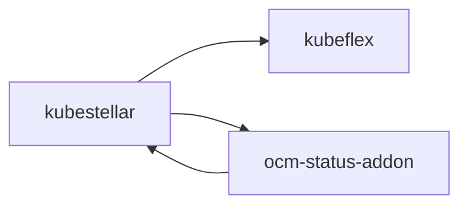
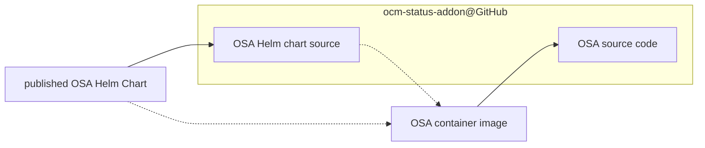
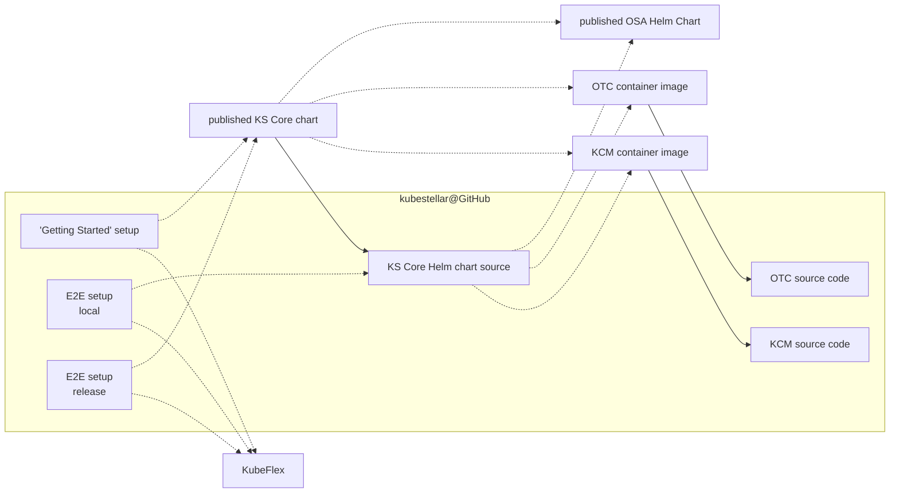
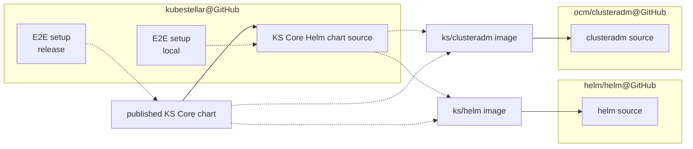
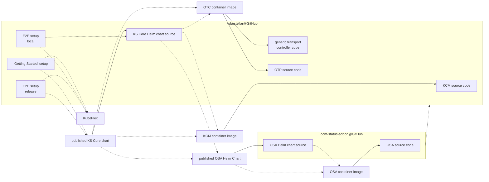

<a id="doc-12e0a48d6c5f2a58f4caa284"></a>

# kubestellar/kubestellar / ADOPTERS.md

Upstream: https://github.com/kubestellar/kubestellar/blob/ad1230f15147fcf161546ba6147ef7200d3dab60/ADOPTERS.md

Commit: `ad1230f15147fcf161546ba6147ef7200d3dab60`

Retrieved: 2026-10-01T15:22:29.862014+00:00

Kind: official-document

Raw SHA256: `84f99e291dccc8a54137096d23e7306ffd32f511f7eade50ad2938f1ea9eda45`

Source text below is untrusted reference content. Acquisition does not verify technical claims.

License status: UPSTREAM_NOTICES_CAPTURED_PER_FILE_REVIEW_REQUIRED. See this repository's captured license files.

---

# Adopters

Listed below are organizations that have adopted KubeStellar in one way or another. We are delighted to welcome them to the KubeStellar community. If you are using KubeStellar in your organization, we would love to add you to the list below. You can open a pull request against this file directly.


| Organization  | Description | Maturity Level | Further Information |
| ------------- | ------------- | --- | --- |
| Cornell University | Workload orchestration for the Software-Defined Farm (SDF) System | Workload Integration | [SDF Repo](https://github.com/Cornell-CIDA-Dev/Software-Defined-Farm) |
| [Tuna OS](https://github.com/tuna-os) | Contributing idle GPU capacity to the Hive network via the KubeStellar Hive Console, backed by a self-hosted Qwen3.6-27B model on a Talos Linux K8s cluster | Compute Contribution | — |
| ------------- | ------------- | --- | --- |


<a id="doc-ffdbe3a1e7ee93cacfc080b6"></a>

# kubestellar/kubestellar / CODE_OF_CONDUCT.md

Upstream: https://github.com/kubestellar/kubestellar/blob/ad1230f15147fcf161546ba6147ef7200d3dab60/CODE_OF_CONDUCT.md

Commit: `ad1230f15147fcf161546ba6147ef7200d3dab60`

Retrieved: 2026-10-01T15:22:29.862014+00:00

Kind: official-document

Raw SHA256: `3a64bd7c55570b0738cf07883b1ccdecda8209393823fb30e24725a4a6fb0503`

Source text below is untrusted reference content. Acquisition does not verify technical claims.

License status: UPSTREAM_NOTICES_CAPTURED_PER_FILE_REVIEW_REQUIRED. See this repository's captured license files.

---

<!--coc-start-->
This project is following the [CNCF Code of Conduct](https://github.com/cncf/foundation/blob/main/code-of-conduct.md). 

# KubeStellar Community Code of Conduct

As contributors, maintainers, and participants in the CNCF community, and in the interest of fostering
an open and welcoming community, we pledge to respect all people who participate or contribute
through reporting issues, posting feature requests, updating documentation,
submitting pull requests or patches, attending conferences or events, or engaging in other community or project activities.

We are committed to making participation in the CNCF community a harassment-free experience for everyone, regardless of age, body size, caste, disability, ethnicity, level of experience, family status, gender, gender identity and expression, marital status, military or veteran status, nationality, personal appearance, race, religion, sexual orientation, socioeconomic status, tribe, or any other dimension of diversity.

## Scope 

This code of conduct applies:
* within project and community spaces,
* in other spaces when an individual CNCF community participant's words or actions are directed at or are about a CNCF project, the CNCF community, or another CNCF community participant.

### CNCF Events

CNCF events that are produced by the Linux Foundation with professional events staff are governed by the Linux Foundation [Events Code of Conduct](https://events.linuxfoundation.org/code-of-conduct/) available on the event page. This is designed to be used in conjunction with the CNCF Code of Conduct.

## Our Standards

The CNCF Community is open, inclusive and respectful. Every member of our community has the right to have their identity respected.

Examples of behavior that contributes to a positive environment include but are not limited to:

* Demonstrating empathy and kindness toward other people
* Being respectful of differing opinions, viewpoints, and experiences
* Giving and gracefully accepting constructive feedback
* Accepting responsibility and apologizing to those affected by our mistakes,
  and learning from the experience
* Focusing on what is best not just for us as individuals, but for the
  overall community
* Using welcoming and inclusive language
  

Examples of unacceptable behavior include but are not limited to:

* The use of sexualized language or imagery
* Trolling, insulting or derogatory comments, and personal or political attacks
* Public or private harassment in any form
* Publishing others' private information, such as a physical or email
  address, without their explicit permission
* Violence, threatening violence, or encouraging others to engage in violent behavior
* Stalking or following someone without their consent
* Unwelcome physical contact
* Unwelcome sexual or romantic attention or advances
* Other conduct which could reasonably be considered inappropriate in a
  professional setting
  
The following behaviors are also prohibited:
* Providing knowingly false or misleading information in connection with a Code of Conduct investigation or otherwise intentionally tampering with an investigation.
* Retaliating against a person because they reported an incident or provided information about an incident as a witness.

Project maintainers have the right and responsibility to remove, edit, or reject comments, commits, code, wiki edits, issues, and other contributions that are not aligned to this Code of Conduct. 
By adopting this Code of Conduct, project maintainers commit themselves to fairly and consistently applying these principles to every aspect
of managing a CNCF project. 
Project maintainers who do not follow or enforce the Code of Conduct may be temporarily or permanently removed from the project team.

## Reporting 

For incidents occurring in the KubeStellar community, contact the [KubeStellar Code of Conduct Committee of Conduct Committee](mailto:kubestellar-dev-private@googlegroups.com). You can expect a response within three business days.

For other projects, or for incidents that are project-agnostic or impact multiple CNCF projects, please contact the [CNCF Code of Conduct Committee](https://www.cncf.io/conduct/committee/) via [`conduct@cncf.io`](mailto:conduct@cncf.io).  Alternatively, you can contact any of the individual members of the [CNCF Code of Conduct Committee](https://www.cncf.io/conduct/committee/) to submit your report. For more detailed instructions on how to submit a report, including how to submit a report anonymously, please see our [Incident Resolution Procedures](https://www.cncf.io/conduct/procedures/). You can expect a response within three business days.

For incidents occurring at CNCF event that is produced by the Linux Foundation, please contact [`eventconduct@cncf.io`](mailto:eventconduct@cncf.io).

## Enforcement 

Upon review and investigation of a reported incident, the CoC response team that has jurisdiction will determine what action is appropriate based on this Code of Conduct and its related documentation. 

For information about which Code of Conduct incidents are handled by project leadership, which incidents are handled by the CNCF Code of Conduct Committee, and which incidents are handled by the Linux Foundation (including its events team), see our [Jurisdiction Policy](https://www.cncf.io/conduct/jurisdiction/).

## Amendments

Consistent with the CNCF Charter, any substantive changes to this Code of Conduct must be approved by the Technical Oversight Committee.

## Acknowledgements

This Code of Conduct is adapted from the Contributor Covenant
(<http://contributor-covenant.org>), version 2.0 available at
<http://contributor-covenant.org/version/2/0/code_of_conduct/>

<!--coc-end-->


<a id="doc-eca12c0a30e25b4b46522ebf"></a>

# kubestellar/kubestellar / CONTRIBUTING.md

Upstream: https://github.com/kubestellar/kubestellar/blob/ad1230f15147fcf161546ba6147ef7200d3dab60/CONTRIBUTING.md

Commit: `ad1230f15147fcf161546ba6147ef7200d3dab60`

Retrieved: 2026-10-01T15:22:29.862014+00:00

Kind: official-document

Raw SHA256: `04c59290f95887225c7783869106490633046da4e9585ceeb882c917c4c7dea3`

Source text below is untrusted reference content. Acquisition does not verify technical claims.

License status: UPSTREAM_NOTICES_CAPTURED_PER_FILE_REVIEW_REQUIRED. See this repository's captured license files.

---

<!-- Canonical GitHub version. Edit contributing-inc.md for website. -->
# Contributing to KubeStellar

Greetings! We are grateful for your interest in joining the KubeStellar community and making a positive impact. Whether you're raising issues, enhancing documentation, fixing bugs, or developing new features, your contributions are essential to our success.

To get started, kindly read through this document and familiarize yourself with our code of conduct. If you have any inquiries, please feel free to reach out to us on [Slack](https://cloud-native.slack.com/archives/C097094RZ3M).

We can't wait to collaborate with you!


This document describes our policies, procedures and best practices for working on KubeStellar via the project and repository on GitHub. Much of this interaction (issues, pull requests, discussions) is meant to be viewed directly at the [KubeStellar repository webpage on GitHub](https://github.com/kubestellar/kubestellar/). Other community discussions and questions are available via our slack channel. If you have any inquiries, please feel free to reach out to us on the [KubeStellar-dev Slack channel](https://cloud-native.slack.com/archives/C097094RZ3M/).

Please read the following guidelines if you're interested in contributing to KubeStellar.

## General practices in the KubeStellar GitHub Project

### Contributing Code -- Prerequisites


Please make sure that your environment has all the necessary versions as spelled out in the prerequisites section of our [user guide](docs/content/direct/pre-reqs.md)

### Issues

**Before reporting a new issue, please search our [issue archive](https://github.com/kubestellar/kubestellar/issues?q=is%3Aissue) (including closed issues) to see if it has already been reported or resolved.**

Our complete issue history is publicly available and searchable at our [GitHub Issues page](https://github.com/kubestellar/kubestellar/issues), where you can find both current and resolved issues with full discussion threads. 


Prioritization for pull requests is given to those that address and resolve existing GitHub issues. Utilize the available issue labels to identify meaningful and relevant issues to work on.

If you believe that there is a need for a fix and no existing issue covers it, feel free to create a new one.

As a new contributor, we encourage you to start with issues labeled as **[good first issue.](https://github.com/kubestellar/kubestellar/issues?q=is%3Aissue%20state%3Aopen%20label%3A%22good%20first%20issue%22)**

We also have a subset of issues we've labeled **[help wanted!](https://github.com/kubestellar/kubestellar/labels/help%20wanted)**

Your assistance in improving documentation is highly valued, regardless of your level of experience with the project.

To claim an issue that you are interested in, assign it to yourself by leaving a comment "/assign". You may also remove yourself from an issue with "/unassign" in a comment.

#### GitHub Slash Commands

KubeStellar uses Prow and GitHub bots to help manage issues and pull requests through slash commands. These commands should be written as comments on their own line:

**Issue Management Commands:**  
- `/assign @username` - Assign an issue to a specific user  
- `/unassign @username` - Remove assignment from a user  
- `/assign` - Assign the issue to yourself  
- `/unassign` - Remove your assignment  
- `/good-first-issue` - Add the "good first issue" label  
- `/help-wanted` - Add the "help wanted" label  

**Pull Request Review Commands:**  
- `/lgtm` - Indicate "looks good to me" (cannot be used on your own PR)  
- `/approve` - Approve the PR for merging (can be used on your own PR)  
- `/hold` - Prevent the PR from being merged  
- `/unhold` - Remove the hold  
- `/retest` - Re-run failed tests  

These commands make it easier for contributors and maintainers to manage the workflow without needing special repository permissions.

### Committing
We encourage all contributors to adopt [best practices in git commit management](https://hackmd.io/q22nrXjERBeIGb-fqwrUSg) to facilitate efficient reviews and retrospective analysis. Note: that document was written for projects where some of the contributors are doing merges into the main branch, but in KubeStellar we have GitHub doing that for us. For the kubestellar repository, this is controlled by [Prow](https://docs.prow.k8s.io/); for the other repositories in the kubestellar organization we use the GitHub mechanisms directly.

Your git commits should provide ample context for reviewers and future codebase readers.

A recommended format for final commit messages is as follows:

```
{Short Title}: {Problem this commit is solving and any important contextual information} {issue number if applicable}
```
In conformance with CNCF expectations, we will only merge commits that indicate your agreement with the [Developer Certificate of Origin](#certificate-of-origin). The CNCF defines how to do this, and there are two cases: one for developers working for an organization that is a CNCF member, and one for contributors acting as individuals. For the latter, assent is indicated by doing a Git "sign-off" on the commit. 


See [Git Commit Signoff and Signing](docs/content/direct/pr-signoff.md) for more information on how to do that.

### Pull Requests
[View active Pull Requests on GitHub](https://github.com/kubestellar/kubestellar/pulls)

When submitting a pull request, clear communication is appreciated. This can be achieved by providing the following information:

- Detailed description of the problem you are trying to solve, along with links to related GitHub issues
- Explanation of your solution, including links to any design documentation and discussions
- Information on how you tested and validated your solution
- Updates to relevant documentation and examples, if applicable

Following are a few more things to keep in mind when making a pull request.

- Smaller pull requests are typically easier to review and merge than larger ones. If your pull request is big, it is always recommended to collaborate with the maintainers to find the best way to divide it.
- Do not make a PR from your `main` branch. Your life will be much easier if the `main` branch in your fork tracks the `main` branch in the shared repository.
- Learn to use `git rebase`. It is your friend. It is one of your most helpful friends. It is how you can cope when other changes merge while you are in the midst of working on your PR.
- There are, broadly speaking, two styles of using Git history: keeping an accurate record of your development process, or producing a simple explanation of the end result. We aim for the latter. Squash out uninteresting intermediate commits.
- Do not merge from `main` into your PR's branch. That makes a tangled Git history, and we prefer to keep it simple. Instead, rebase your PR's branch onto the latest edition of `main`.
- When adding/updating a GitHub Actions workflow, be aware of the [action reference discipline](#github-action-reference-discipline).
- For a PR that modifies the website, include a preview. That gets much easier if you follow the documentation about setting up for that (i.e., properly create your `gh-pages` branch, enabling its use in your fork's settings) and make the name of your PR's branch start with "doc-". If you already have a PR with a different sort of name, you can explicitly invoke the rendering workflow --- unless your branch name has a slash or other exotic character in it; stick to alphanumerics plus dash and dot. You can not change the name of the branch in a PR, but you can close a PR and open an equivalent one using a branch with a good name.
- For a PR that modifies the website, remember that the doc source files are viewed two ways (see the website documentation); make them work in both views.
- If you mix pervasive changes to whitespace with substantial changes, you risk GitHub's display of the diff becoming confused. DO check that. If the diff display is confused, it makes reviewing much harder. Have mercy on your reviewers; skip the pervasive whitespace changes if they confuse GitHub's diff. BTW, did you really intend to make all those whitespace changes, or are they an unintended gift from your IDE? Don't make changes that you do not really intend.

#### Titling Pull Requests
We require that the title of each pull request start with a special nickname character (emoji) that classifies the request into one of the following categories. 

The nickname characters to use for different PRs are as follows

- ✨ (nickname `:sparkles:`) feature
- 🐛 (nickname `:bug:`) bug fix
- 📖 (nickname `:book:`) docs
- 📝 (nickname `:memo:`)  proposal
- ⚠️ (nickname `:warning:`) breaking change
- 🌱 (nickname `:seedling:`) other/misc
- ❓ (nickname `:question:`) requires manual review/categorization

---

_Note: The GitHub web interface will assist you with adding the character; while editing the title of your pull request:_

- _type a colon (':')_
- _begin typing the character nickname (_e.g._ sparkles)_
- _the web interface should offer you a pick-list of corresponding characters._
- _Just click on the correct one to insert it in the title_
- _Add at least one space after the special character._

#### Continuous Integration

Pull requests are subjected to checking by a collection of [GitHub
Actions](https://docs.github.com/en/actions) workflows and
[Prow](https://docs.prow.k8s.io/docs/overview/) jobs. The [infra
repo](https://github.com/kubestellar/infra/) defines the Prow instance
used for KubeStellar. The GitHub Actions workflows are found in [the
.github/workflows
directory](https://github.com/kubestellar/kubestellar/tree/main/.github/workflows).

##### GitHub Action reference discipline

For the sake of supply chain security, every reference from a workflow
to an action identifies the action's version by a commit hash rather
than a mutable tag.

Action version updates are proposed by
[Dependabot](https://github.com/dependabot), which creates PRs that
update the commit hash in the affected workflow files. Maintainers
review and merge those PRs directly. When reviewing such a PR,
maintainers should verify that the new commit hash matches the
intended tag and perform a security review as described in
[SECURITY.md](https://github.com/kubestellar/kubestellar/blob/main/SECURITY.md).

#### Review and Approval Process

Reviewers will review your PR within a business day. A PR requires both an `/lgtm` and then an `/approve` in order to get merged. These are commands to Prow, each appearing alone on a line in a comment of the PR. You may `/approve` your own PR but you may not `/lgtm` it. Once both forms of assent have been given and the other gating checks have passed, the PR will go into the Prow merge queue and eventually be merged. Once that happens, you will be notified:

_Congratulations! Your pull request has been successfully merged!_ 👏

If you have any questions about contributing, don't hesitate to reach out to us on the KubeStellar-dev [Slack channel](https://cloud-native.slack.com/archives/C097094RZ3M/).


## Testing Locally


Our [Getting Started](docs/content/direct/get-started.md) guide shows a user how to install a simple "kick the tires" instance of KubeStellar using a helm chart and kind.

To set up and test a development system, please refer to the _test/e2e/README.md_ file in the GitHub repository.
After running any of those e2e (end to end) tests you will be left with a running system that can be exercised further.

### Testing changes to the helm chart

If you are interested in modifying the Helm chart itself, look at the User Guide page on the [Core Helm chart](docs/content/direct/core-chart.md) for more information on its many options before you begin, notably on how to specify using a local version of the script.

### Testing the script against an upcoming release

Prior to making a new release, there needs to be testing that the
current Helm chart works with the executable behavior that will
appear in the new release.  

## Licensing

KubeStellar is [Apache 2.0 licensed](LICENSE) and we accept contributions via GitHub pull requests.

## Certificate of Origin

By contributing to this project you agree to the Developer Certificate of
Origin (DCO). This document was created by the Linux Kernel community and is a
simple statement that you, as a contributor, have the legal right to make the
contribution. See the [DCO](DCO) file for details.

<a id="doc-654cd3aa6c025eaaba7b8ea1"></a>

# kubestellar/kubestellar / GOVERNANCE-CONSOLE.md

Upstream: https://github.com/kubestellar/kubestellar/blob/ad1230f15147fcf161546ba6147ef7200d3dab60/GOVERNANCE-CONSOLE.md

Commit: `ad1230f15147fcf161546ba6147ef7200d3dab60`

Retrieved: 2026-10-01T15:22:29.862014+00:00

Kind: official-document

Raw SHA256: `1e51a63384f431c14016a76b6ed496fa8680211e7790243b94153c8f2d814136`

Source text below is untrusted reference content. Acquisition does not verify technical claims.

License status: UPSTREAM_NOTICES_CAPTURED_PER_FILE_REVIEW_REQUIRED. See this repository's captured license files.

---

# KubeStellar Console Project Governance

KubeStellar Console is a subproject of [KubeStellar](https://github.com/kubestellar),
a CNCF Sandbox project. As a subproject, Console follows KubeStellar's overall
governance structure while maintaining its own Maintainer Committee for
day-to-day project decisions.

- [Values](#values)
- [Subproject Governance](#subproject-governance)
- [Maintainer Committee](#maintainer-committee)
  - [Maintainer Committee Duties](#maintainer-committee-duties)
  - [Current Maintainers](#current-maintainers)
  - [Becoming a Maintainer](#becoming-a-maintainer)
  - [Removing a Maintainer](#removing-a-maintainer)
- [Contributor Ladder](#contributor-ladder)
- [Code of Conduct](#code-of-conduct)
- [Security Response Team](#security-response-team)
- [Decision-Making](#decision-making)
- [Adding New Components](#adding-new-components)
- [Amendments](#amendments)

## Values

KubeStellar Console and its leadership embrace the following values:

* Openness: Communication and decision-making happens in the open and is
  discoverable for future reference. As much as possible, all discussions and
  work take place in public forums and open repositories.

* Fairness: All stakeholders have the opportunity to provide feedback and submit
  contributions, which will be considered on their merits.

* Community over Product or Company: Sustaining and growing our community takes
  priority over shipping code or sponsors' organizational goals. Each
  contributor participates in the project as an individual.

* Inclusivity: We innovate through different perspectives and skill sets, which
  can only be accomplished in a welcoming and respectful environment.

* Participation: Responsibilities within the project are earned through
  participation, and there is a clear path up the contributor ladder into
  leadership positions.

## Subproject Governance

KubeStellar Console is one of KubeStellar's subprojects, alongside:

* [KubeStellar Core](https://github.com/kubestellar/kubestellar) — multi-cluster
  configuration management for edge, multi-cloud, and hybrid environments
* [Hive](https://github.com/kubestellar/hive) — AI agent orchestration for
  open source project maintenance

As a subproject, Console defers to the KubeStellar Steering Committee on
cross-project matters, CNCF compliance, and trademark usage. All other
governance is handled by Console's own Maintainer Committee.

## Maintainer Committee

All active Maintainers of KubeStellar Console, as defined in the Contributor
Ladder, are members of the Maintainer Committee, which governs the project.
Maintainers have write access to the [project GitHub repository](https://github.com/kubestellar/console)
and can merge their own patches or patches from others. The current maintainers
can be found as top-level approvers in [OWNERS](OWNERS).

This privilege is granted with some expectation of responsibility: maintainers
are people who care about the KubeStellar Console project and want to help it
grow and improve. A maintainer is not just someone who can make changes, but
someone who has demonstrated their ability to collaborate with the team, get the
most knowledgeable people to review code and docs, contribute high-quality code,
and follow through to fix issues (in code or tests).

### Maintainer Committee Duties

The Maintainer Committee is responsible for the following governance activities:

* Ensuring that the project creates and publishes regular releases;
* Holding regular, project-wide discussions on issues and planning;
* Monthly review of project contributors for advancement on the Contributor
  Ladder;
* Making final decisions on project changes that involve controversial
  trade-offs;
* Responding to security compromise reports;
* Supporting the Code of Conduct within the project and referring violations to
  the KubeStellar Code of Conduct Committee;
* Selecting one representative to the KubeStellar Steering Committee annually.

### Current Maintainers

| Name           | GitHub                                            | Role       |
|----------------|---------------------------------------------------|------------|
| Andy Anderson  | [@clubanderson](https://github.com/clubanderson)  | Maintainer |

### Becoming a Maintainer

To become a Maintainer you need to demonstrate the following:

* commitment to the project:
  * participate in discussions, contributions, code and documentation reviews
    for 3 months or more,
  * perform reviews for 5 non-trivial pull requests,
  * contribute 5 non-trivial pull requests and have them merged,
* ability to write quality code and/or documentation,
* ability to collaborate with the team,
* understanding of how the team works (policies, processes for testing and code
  review, etc),
* understanding of the project's code base and coding and documentation style.

A new Maintainer must be proposed by an existing maintainer by sending a message
to the [developer mailing list](https://groups.google.com/g/kubestellar-dev). A
simple majority vote of existing Maintainers approves the application.

### Removing a Maintainer

Maintainers may resign at any time if they feel that they will not be able to
continue fulfilling their project duties.

Maintainers may also be removed after being inactive, failure to fulfill their
Maintainer responsibilities, violating the Code of Conduct, or other reasons.
Inactivity is defined as a period of very low or no activity in the project for
a year or more, with no definite schedule to return to full Maintainer activity.

A Maintainer may be removed at any time by a 2/3 vote of the remaining
maintainers, or a majority vote of the KubeStellar Steering Committee.

## Contributor Ladder

KubeStellar Console follows the [KubeStellar Contributor Ladder](https://github.com/kubestellar/community/blob/main/CONTRIBUTOR_LADDER.md)
with the following project-specific roles:

* **Contributor**: Anyone who has submitted a pull request, filed an issue, or
  participated in project discussions.
* **Organization Member**: Contributors who have made sustained contributions
  and are recognized by the Maintainer Committee. Organization Members may be
  granted triage permissions.
* **Reviewer**: Organization Members who have demonstrated expertise in one or
  more areas of the codebase and are listed in the OWNERS file as reviewers.
* **Maintainer**: Reviewers who have demonstrated broad project knowledge,
  sustained contribution, and sound technical judgment. Maintainers have write
  access and are listed as approvers in the OWNERS file.

Advancement on the Contributor Ladder is reviewed monthly by the Maintainer
Committee. Contributors may request advancement by opening an issue or
contacting a Maintainer directly.

## Code of Conduct

KubeStellar Console follows the [CNCF Code of Conduct](https://github.com/cncf/foundation/blob/main/code-of-conduct.md).
Violations by community members will be discussed and resolved on the
[private Maintainer mailing list](https://groups.google.com/u/1/g/kubestellar-dev-private).
Violations may also be reported directly to the CNCF at conduct@cncf.io.

## Security Response Team

The Maintainers will appoint a Security Response Team to handle security
reports. This committee may simply consist of the Maintainer Committee
themselves. The Security Response Team is responsible for handling all reports
of security holes and breaches according to the [security policy](SECURITY.md).

## Decision-Making

Decisions within KubeStellar Console are made using a consensus-seeking process:

1. **Proposals** are submitted as GitHub issues or pull requests.
2. **Discussion** happens in the open on the issue or PR.
3. **Consensus** is sought among Maintainers. If consensus cannot be reached,
   decisions are made by majority vote of the Maintainer Committee.
4. **Escalation**: Decisions that affect other KubeStellar subprojects or that
   the Maintainer Committee cannot resolve may be escalated to the KubeStellar
   Steering Committee.

Lazy consensus applies to routine decisions: if no objection is raised within
a reasonable period (typically 72 hours for non-trivial changes), the proposal
is accepted.

Votes can be taken on [the developer mailing list](https://groups.google.com/g/kubestellar-dev)
or [the private Maintainer mailing list](https://groups.google.com/u/1/g/kubestellar-dev-private)
for security or conduct matters. Most votes require a simple majority of all
Maintainers to succeed.

## Adding New Components

New components (dashboard cards, integrations, API endpoints) may be proposed by
any contributor via a GitHub issue. The Maintainer Committee will evaluate
proposals based on:

* Alignment with Console's mission of multi-cluster observability and management;
* Whether the component is appropriately licensed (Apache-2.0);
* Whether the component is under active development;
* Code and design quality.

Experimental components may be accepted with an "Experimental" designation and
will be reviewed periodically for promotion to stable status.

## Amendments

This governance document can be amended with a 2/3 majority vote of the
Maintainer Committee. Unless time is of the essence, amendments should be
circulated in the contributor community for comment for at least one week
before voting.

Amendments that affect Console's relationship to the KubeStellar umbrella
project require approval from the KubeStellar Steering Committee.


<a id="doc-6cd07d04e20d313c75096a82"></a>

# kubestellar/kubestellar / GOVERNANCE-HIVE.md

Upstream: https://github.com/kubestellar/kubestellar/blob/ad1230f15147fcf161546ba6147ef7200d3dab60/GOVERNANCE-HIVE.md

Commit: `ad1230f15147fcf161546ba6147ef7200d3dab60`

Retrieved: 2026-10-01T15:22:29.862014+00:00

Kind: official-document

Raw SHA256: `39d01c31cf04a0e70738e7e87aad37f3ce9d2e9a4b5a2e78b4448f4c39dc533b`

Source text below is untrusted reference content. Acquisition does not verify technical claims.

License status: UPSTREAM_NOTICES_CAPTURED_PER_FILE_REVIEW_REQUIRED. See this repository's captured license files.

---

# Hive Governance (moved)

Hive has been spun out of the KubeStellar organization into the Hive Commons
organization, per the public maintainer consensus in
[kubestellar/kubestellar#3986](https://github.com/kubestellar/kubestellar/issues/3986).

The repository now lives at <https://github.com/hivecommons/hive>.

Hive's governance, maintainer list, and contributor ladder are now maintained at:

- [Governance](https://github.com/hivecommons/.github/blob/main/GOVERNANCE.md)
- [Maintainers](https://github.com/hivecommons/.github/blob/main/MAINTAINERS.md)

This file is kept as a pointer for link stability and is no longer
authoritative.

Thank you to the KubeStellar community for incubating Hive.


<a id="doc-b60c6a93e9f74ee52e71bf33"></a>

# kubestellar/kubestellar / GOVERNANCE.md

Upstream: https://github.com/kubestellar/kubestellar/blob/ad1230f15147fcf161546ba6147ef7200d3dab60/GOVERNANCE.md

Commit: `ad1230f15147fcf161546ba6147ef7200d3dab60`

Retrieved: 2026-10-01T15:22:29.862014+00:00

Kind: official-document

Raw SHA256: `ad1fc66ff57185fa8a330953543665a759a31f4d9d61f10409a43d1eff144718`

Source text below is untrusted reference content. Acquisition does not verify technical claims.

License status: UPSTREAM_NOTICES_CAPTURED_PER_FILE_REVIEW_REQUIRED. See this repository's captured license files.

---

# KubeStellar Project Governance

The KubeStellar project is dedicated to solving challenges stemming from
multi-cluster configuration management for edge, multi-cloud, and hybrid cloud. 
This governance explains how the project is run.

- [Manifesto](#manifesto)
- [Values](#values)
- [Maintainers](#maintainers)
- [Code of Conduct Enforcement](#code-of-conduct)
- [Security Response Team](#security-response-team)
- [Voting](#voting)
- [Modifying this Charter](#modifying-this-charter)

## Manifesto
 
 * KubeStellar Maintainers strive to be good citizens in the Kubernetes project.
 * KubeStellar Maintainers see KubeStellar always as part of the Kubernetes ecosystem and always 
   strive to keep that ecosystem united. In particular, this means:
   * KubeStellar strives to not divert from Kubernetes, but strives to extend its 
     use-cases to non-container control planes while keeping the ecosystems of 
     libraries and tooling united.
   * KubeStellar – as a consumer of Kubernetes API Machinery – will strive to stay 100% 
     compatible with the semantics of Kubernetes APIs, while removing container 
     orchestration specific functionality.
   * KubeStellar strives to upstream changes to Kubernetes code as much as possible.

## Values

The KubeStellar and its leadership embrace the following values:

 * *Openness*: Communication and decision-making happens in the open and is 
   discoverable for future reference. As much as possible, all discussions and 
   work take place in public forums and open repositories.
 * *Fairness*: All stakeholders have the opportunity to provide feedback and 
   submit contributions, which will be considered on their merits.
 * *Community over Product or Company*: Sustaining and growing our community 
   takes priority over shipping code or sponsors' organizational goals. Each 
   contributor participates in the project as an individual.
 * *Inclusivity*: We innovate through different perspectives and skill sets, 
   which can only be accomplished in a welcoming and respectful environment.
 * *Participation*: Responsibilities within the project are earned through 
   participation, and there is a clear path up the contributor ladder into 
   leadership positions.

## Maintainers

KubeStellar Maintainers have write access to the [project GitHub repository](https://github.com/kubestellar/kubestellar).
They can merge their own patches or patches from others. The current maintainers
can be found as top-level approvers in [OWNERS](https://github.com/kubestellar/kubestellar/blob/main/OWNERS).  Maintainers collectively 
manage the project's resources and contributors.

This privilege is granted with some expectation of responsibility: maintainers
are people who care about the KubeStellar project and want to help it grow and
improve. A maintainer is not just someone who can make changes, but someone who
has demonstrated their ability to collaborate with the team, get the most
knowledgeable people to review code and docs, contribute high-quality code, and
follow through to fix issues (in code or tests).

A maintainer is a contributor to the project's success and a citizen helping
the project succeed.

The collective team of all Maintainers is known as the Maintainer Council, which 
is the governing body for the project.

## Becoming a Maintainer

<!-- If you have full Contributor Ladder documentation that covers becoming
a Maintainer or Owner, then this section should instead be a reference to that
documentation -->

To become a Maintainer you need to demonstrate the following:

  * commitment to the project:
    * participate in discussions, contributions, code and documentation reviews
      for 3 months or more,
    * perform reviews for 5 non-trivial pull requests,
    * contribute 5 non-trivial pull requests and have them merged,
  * ability to write quality code and/or documentation,
  * ability to collaborate with the team,
  * understanding of how the team works (policies, processes for testing and code review, etc),
  * understanding of the project's code base and coding and documentation style.
  <!-- add any additional Maintainer requirements here -->

A new Maintainer must be proposed by an existing maintainer by sending a message to the
[developer mailing list](https://groups.google.com/g/kubestellar-dev). A simple majority 
vote of existing Maintainers approves the application.

Maintainers who are selected will be granted the necessary GitHub rights,
and invited to the [private maintainer mailing list](https://groups.google.com/g/kubestellar-dev-private).

### Bootstrapping Maintainers

To bootstrap the process, 3 maintainers are defined (in the initial PR adding 
this to the repository) that do not necessarily follow the above rules. When a 
new maintainer is added following the above rules, the existing maintainers 
define one not following the rules to step down, until all of them follow the 
rules.

### Removing a Maintainer

Maintainers may resign at any time if they feel that they will not be able to 
continue fulfilling their project duties.

Maintainers may also be removed after being inactive, failure to fulfill their 
Maintainer responsibilities, violating the Code of Conduct, or other reasons. 
Inactivity is defined as a period of very low or no activity in the project for 
a year or more, with no definite schedule to return to full Maintainer activity.

A Maintainer may be removed at any time by a 2/3 vote of the remaining maintainers.

Depending on the reason for removal, a Maintainer may be converted to Emeritus 
status. Emeritus Maintainers will still be consulted on some project matters, 
and can be rapidly returned to Maintainer status if their availability changes.


## Meetings

Time zones permitting, Maintainers are expected to participate in the public 
community call meeting. Maintainers will also have closed meetings in order to 
discuss security reports or Code of Conduct violations. Such meetings should be 
scheduled by any Maintainer on receipt of a security issue or CoC report. 
All current Maintainers must be invited to such closed meetings, except for any 
Maintainer who is accused of a CoC violation.

## Code of Conduct

<!-- This assumes that your project does not have a separate Code of Conduct
Committee; most maintainer-run projects do not.  Remember to place a link
to the private Maintainer mailing list or alias in the code-of-conduct file.-->

[Code of Conduct](coc-inc.md)
violations by community members will be discussed and resolved
on the [private Maintainer mailing list](https://groups.google.com/u/1/g/kubestellar-dev-private).

## Security Response Team

The Maintainers will appoint a Security Response Team to handle security reports.
This committee may simply consist of the Maintainer Council themselves. If this 
responsibility is delegated, the Maintainers will appoint a team of at least two 
contributors to handle it. The Maintainers will review who is assigned to this 
at least once a year.

The Security Response Team is responsible for handling all reports of security 
holes and breaches according to the [security policy](security/security-inc.md).

## Voting

While most business in KubeStellar is conducted by "lazy consensus", periodically
the Maintainers may need to vote on specific actions or changes.
A vote can be taken on [the developer mailing list](https://groups.google.com/g/kubestellar-dev) or
[the private Maintainer mailing list](https://groups.google.com/u/1/g/kubestellar-dev-private)
for security or conduct matters.  Votes may also be taken at the community call 
meeting. Any Maintainer may demand a vote be taken.

Most votes require a simple majority of all Maintainers to succeed. Maintainers
can be removed by a 2/3 majority vote of all Maintainers, and changes to this
Governance require a 2/3 vote of all Maintainers.

## Modifying this Charter

Changes to this Governance and its supporting documents may be approved by a 
2/3 vote of the Maintainers.


<a id="doc-c693279643b8cd5d248172d9"></a>

# kubestellar/kubestellar / LICENSE

Upstream: https://github.com/kubestellar/kubestellar/blob/ad1230f15147fcf161546ba6147ef7200d3dab60/LICENSE

Commit: `ad1230f15147fcf161546ba6147ef7200d3dab60`

Retrieved: 2026-10-01T15:22:29.862014+00:00

Kind: license

Raw SHA256: `b01ef1701bc4e3be95a5174fa52619704219f3e0287a455d410c226eab9c8311`

Source text below is untrusted reference content. Acquisition does not verify technical claims.

License status: UPSTREAM_NOTICES_CAPTURED_PER_FILE_REVIEW_REQUIRED. See this repository's captured license files.

---

````text

                                 Apache License
                           Version 2.0, January 2004
                        http://www.apache.org/licenses/

   TERMS AND CONDITIONS FOR USE, REPRODUCTION, AND DISTRIBUTION

   1. Definitions.

      "License" shall mean the terms and conditions for use, reproduction,
      and distribution as defined by Sections 1 through 9 of this document.

      "Licensor" shall mean the copyright owner or entity authorized by
      the copyright owner that is granting the License.

      "Legal Entity" shall mean the union of the acting entity and all
      other entities that control, are controlled by, or are under common
      control with that entity. For the purposes of this definition,
      "control" means (i) the power, direct or indirect, to cause the
      direction or management of such entity, whether by contract or
      otherwise, or (ii) ownership of fifty percent (50%) or more of the
      outstanding shares, or (iii) beneficial ownership of such entity.

      "You" (or "Your") shall mean an individual or Legal Entity
      exercising permissions granted by this License.

      "Source" form shall mean the preferred form for making modifications,
      including but not limited to software source code, documentation
      source, and configuration files.

      "Object" form shall mean any form resulting from mechanical
      transformation or translation of a Source form, including but
      not limited to compiled object code, generated documentation,
      and conversions to other media types.

      "Work" shall mean the work of authorship, whether in Source or
      Object form, made available under the License, as indicated by a
      copyright notice that is included in or attached to the work
      (an example is provided in the Appendix below).

      "Derivative Works" shall mean any work, whether in Source or Object
      form, that is based on (or derived from) the Work and for which the
      editorial revisions, annotations, elaborations, or other modifications
      represent, as a whole, an original work of authorship. For the purposes
      of this License, Derivative Works shall not include works that remain
      separable from, or merely link (or bind by name) to the interfaces of,
      the Work and Derivative Works thereof.

      "Contribution" shall mean any work of authorship, including
      the original version of the Work and any modifications or additions
      to that Work or Derivative Works thereof, that is intentionally
      submitted to Licensor for inclusion in the Work by the copyright owner
      or by an individual or Legal Entity authorized to submit on behalf of
      the copyright owner. For the purposes of this definition, "submitted"
      means any form of electronic, verbal, or written communication sent
      to the Licensor or its representatives, including but not limited to
      communication on electronic mailing lists, source code control systems,
      and issue tracking systems that are managed by, or on behalf of, the
      Licensor for the purpose of discussing and improving the Work, but
      excluding communication that is conspicuously marked or otherwise
      designated in writing by the copyright owner as "Not a Contribution."

      "Contributor" shall mean Licensor and any individual or Legal Entity
      on behalf of whom a Contribution has been received by Licensor and
      subsequently incorporated within the Work.

   2. Grant of Copyright License. Subject to the terms and conditions of
      this License, each Contributor hereby grants to You a perpetual,
      worldwide, non-exclusive, no-charge, royalty-free, irrevocable
      copyright license to reproduce, prepare Derivative Works of,
      publicly display, publicly perform, sublicense, and distribute the
      Work and such Derivative Works in Source or Object form.

   3. Grant of Patent License. Subject to the terms and conditions of
      this License, each Contributor hereby grants to You a perpetual,
      worldwide, non-exclusive, no-charge, royalty-free, irrevocable
      (except as stated in this section) patent license to make, have made,
      use, offer to sell, sell, import, and otherwise transfer the Work,
      where such license applies only to those patent claims licensable
      by such Contributor that are necessarily infringed by their
      Contribution(s) alone or by combination of their Contribution(s)
      with the Work to which such Contribution(s) was submitted. If You
      institute patent litigation against any entity (including a
      cross-claim or counterclaim in a lawsuit) alleging that the Work
      or a Contribution incorporated within the Work constitutes direct
      or contributory patent infringement, then any patent licenses
      granted to You under this License for that Work shall terminate
      as of the date such litigation is filed.

   4. Redistribution. You may reproduce and distribute copies of the
      Work or Derivative Works thereof in any medium, with or without
      modifications, and in Source or Object form, provided that You
      meet the following conditions:

      (a) You must give any other recipients of the Work or
          Derivative Works a copy of this License; and

      (b) You must cause any modified files to carry prominent notices
          stating that You changed the files; and

      (c) You must retain, in the Source form of any Derivative Works
          that You distribute, all copyright, patent, trademark, and
          attribution notices from the Source form of the Work,
          excluding those notices that do not pertain to any part of
          the Derivative Works; and

      (d) If the Work includes a "NOTICE" text file as part of its
          distribution, then any Derivative Works that You distribute must
          include a readable copy of the attribution notices contained
          within such NOTICE file, excluding those notices that do not
          pertain to any part of the Derivative Works, in at least one
          of the following places: within a NOTICE text file distributed
          as part of the Derivative Works; within the Source form or
          documentation, if provided along with the Derivative Works; or,
          within a display generated by the Derivative Works, if and
          wherever such third-party notices normally appear. The contents
          of the NOTICE file are for informational purposes only and
          do not modify the License. You may add Your own attribution
          notices within Derivative Works that You distribute, alongside
          or as an addendum to the NOTICE text from the Work, provided
          that such additional attribution notices cannot be construed
          as modifying the License.

      You may add Your own copyright statement to Your modifications and
      may provide additional or different license terms and conditions
      for use, reproduction, or distribution of Your modifications, or
      for any such Derivative Works as a whole, provided Your use,
      reproduction, and distribution of the Work otherwise complies with
      the conditions stated in this License.

   5. Submission of Contributions. Unless You explicitly state otherwise,
      any Contribution intentionally submitted for inclusion in the Work
      by You to the Licensor shall be under the terms and conditions of
      this License, without any additional terms or conditions.
      Notwithstanding the above, nothing herein shall supersede or modify
      the terms of any separate license agreement you may have executed
      with Licensor regarding such Contributions.

   6. Trademarks. This License does not grant permission to use the trade
      names, trademarks, service marks, or product names of the Licensor,
      except as required for reasonable and customary use in describing the
      origin of the Work and reproducing the content of the NOTICE file.

   7. Disclaimer of Warranty. Unless required by applicable law or
      agreed to in writing, Licensor provides the Work (and each
      Contributor provides its Contributions) on an "AS IS" BASIS,
      WITHOUT WARRANTIES OR CONDITIONS OF ANY KIND, either express or
      implied, including, without limitation, any warranties or conditions
      of TITLE, NON-INFRINGEMENT, MERCHANTABILITY, or FITNESS FOR A
      PARTICULAR PURPOSE. You are solely responsible for determining the
      appropriateness of using or redistributing the Work and assume any
      risks associated with Your exercise of permissions under this License.

   8. Limitation of Liability. In no event and under no legal theory,
      whether in tort (including negligence), contract, or otherwise,
      unless required by applicable law (such as deliberate and grossly
      negligent acts) or agreed to in writing, shall any Contributor be
      liable to You for damages, including any direct, indirect, special,
      incidental, or consequential damages of any character arising as a
      result of this License or out of the use or inability to use the
      Work (including but not limited to damages for loss of goodwill,
      work stoppage, computer failure or malfunction, or any and all
      other commercial damages or losses), even if such Contributor
      has been advised of the possibility of such damages.

   9. Accepting Warranty or Additional Liability. While redistributing
      the Work or Derivative Works thereof, You may choose to offer,
      and charge a fee for, acceptance of support, warranty, indemnity,
      or other liability obligations and/or rights consistent with this
      License. However, in accepting such obligations, You may act only
      on Your own behalf and on Your sole responsibility, not on behalf
      of any other Contributor, and only if You agree to indemnify,
      defend, and hold each Contributor harmless for any liability
      incurred by, or claims asserted against, such Contributor by reason
      of your accepting any such warranty or additional liability.

   END OF TERMS AND CONDITIONS

   APPENDIX: How to apply the Apache License to your work.

      To apply the Apache License to your work, attach the following
      boilerplate notice, with the fields enclosed by brackets "[]"
      replaced with your own identifying information. (Don't include
      the brackets!)  The text should be enclosed in the appropriate
      comment syntax for the file format. We also recommend that a
      file or class name and description of purpose be included on the
      same "printed page" as the copyright notice for easier
      identification within third-party archives.

   Copyright 2023-2025 The KubeStellar Authors

   Licensed under the Apache License, Version 2.0 (the "License");
   you may not use this file except in compliance with the License.
   You may obtain a copy of the License at

       http://www.apache.org/licenses/LICENSE-2.0

   Unless required by applicable law or agreed to in writing, software
   distributed under the License is distributed on an "AS IS" BASIS,
   WITHOUT WARRANTIES OR CONDITIONS OF ANY KIND, either express or implied.
   See the License for the specific language governing permissions and
   limitations under the License.

````


<a id="doc-24e1b9b7651bc16edad670e6"></a>

# kubestellar/kubestellar / ONBOARDING.md

Upstream: https://github.com/kubestellar/kubestellar/blob/ad1230f15147fcf161546ba6147ef7200d3dab60/ONBOARDING.md

Commit: `ad1230f15147fcf161546ba6147ef7200d3dab60`

Retrieved: 2026-10-01T15:22:29.862014+00:00

Kind: official-document

Raw SHA256: `650c9e43551437168d724f598d52ab21c17cdb43547cd8d1a49be894eb8aeec0`

Source text below is untrusted reference content. Acquisition does not verify technical claims.

License status: UPSTREAM_NOTICES_CAPTURED_PER_FILE_REVIEW_REQUIRED. See this repository's captured license files.

---

<!--onboarding-start-->
KubeStellar GitHub Organization
On-boarding and Off-boarding Policy

Effective Date: June 1st, 2023

  At KubeStellar we love our contributors.  Our contributors can make various valuable contributions to our project. They can actively engage in code development by submitting pull requests, implementing new features, or fixing bugs. Additionally, contributors can assist with testing, CICD, documentation, providing clear and comprehensive guides, tutorials, and examples. Moreover, they can contribute to the project by participating in discussions, offering feedback, and helping to improve overall community engagement and collaboration.

1. Introduction:
The purpose of this policy is to ensure a smooth on-boarding and off-boarding process for members of the KubeStellar GitHub organization. This policy applies to all individuals joining or leaving the organization, including community contributors.

2. On-boarding Process:
2.1. Access Request:
- New members shall submit an access request, via a blank GitHub issue from the KubeStellar repository, mentioning all members of the [OWNERS](https://github.com/kubestellar/kubestellar/blob/main/OWNERS) file.
- The access request should include the member's GitHub username and a brief description of their role and contributions to the KubeStellar project.

2.2. Review and Approval:
- The organization's maintainers or designated personnel will review the access request issue.
- The maintainers will evaluate the request based on the member's role, contributions, and adherence to the organization's code of conduct.
- Upon approval, the member will receive an invitation to join the KubeStellar GitHub organization.

2.3. Getting Help:
- The organization's maintainers are here to help contributors be efficient and confident in their collaboration effort. If you need help you can reach out to the maintainers on slack at the [KubeStellar-dev Slack Channel](https://cloud-native.slack.com/archives/C097094RZ3M).
- Be sure to join the [KubeStellar-dev Google Group](https://groups.google.com/g/kubestellar-dev) to get access to important artifacts like proposals, diagrams, and meeting invitations.

2.4. Orientation:
- Newly on-boarded members will be provided with [contribution guidelines](https://github.com/kubestellar/kubestellar/blob/main/CONTRIBUTING.md).
- The guide will include instructions on how to access relevant repositories, participate in discussions, and contribute to ongoing projects.

3. Off-boarding Process:
3.1. Departure Notification:
- Members leaving the organization shall notify the maintainers or their respective team lead in advance of their departure date.
- The notification should include the member's departure date and any necessary transition information.

3.2. Access Termination:
- Upon receiving the departure notification, the maintainers or designated personnel will initiate the off-boarding process.
- The member's access to the KubeStellar GitHub organization will be revoked promptly to ensure data security and prevent unauthorized access.

3.3. Knowledge Transfer:
- Departing members should facilitate the transfer of their ongoing projects, tasks, and knowledge to their respective replacements or relevant team members.
- Documentation or guidelines related to ongoing projects should be updated and made available to the team for seamless continuity.

4. Code of Conduct:
- All members of the KubeStellar GitHub organization are expected to adhere to the organization's [code of conduct](https://github.com/kubestellar/kubestellar/blob/main/CODE_OF_CONDUCT.md), promoting a respectful and inclusive environment.
- Violations of the code of conduct will be addressed following the organization's established procedures for handling such incidents.

5. Policy Compliance:
- It is the responsibility of all members to comply with the on-boarding and off-boarding policy.
- The organization's maintainers or designated personnel will oversee the implementation and enforcement of this policy.

6. Policy Review:
- This policy will be reviewed periodically to ensure its effectiveness and relevance.
- Any updates or revisions to the policy will be communicated to the organization's members in a timely manner.

Please note that this policy is subject to change, and any modifications will be communicated to all members of the KubeStellar GitHub organization.

By joining the organization, all members agree to abide by the terms and guidelines outlined in this policy.

Andy Anderson (clubanderson)
KubeStellar Maintainer
June 1, 2023
<!--onboarding-end-->

<a id="doc-b335630551682c19a781afeb"></a>

# kubestellar/kubestellar / README.md

Upstream: https://github.com/kubestellar/kubestellar/blob/ad1230f15147fcf161546ba6147ef7200d3dab60/README.md

Commit: `ad1230f15147fcf161546ba6147ef7200d3dab60`

Retrieved: 2026-10-01T15:22:29.862014+00:00

Kind: official-document

Raw SHA256: `de4186f32c338e098a7003d1900273e681715b29baa36bc865c470890cf5802b`

Source text below is untrusted reference content. Acquisition does not verify technical claims.

License status: UPSTREAM_NOTICES_CAPTURED_PER_FILE_REVIEW_REQUIRED. See this repository's captured license files.

---

<!--
Note: This repo has two README files with nearly identical content:
- /README.md
- /docs/content/readme.md

If you update shared content in one, please make the same change in the other so they stay in sync.
-->


<br/>
<br/>
<br/>
<br/>

## Multi-cluster Configuration Management for Edge, Multi-Cloud, and Hybrid Cloud

[](https://www.firsttimersonly.com/)&nbsp;&nbsp;&nbsp;
[](https://github.com/kubestellar/kubestellar/actions/workflows/broken-links-crawler.yml)
[](https://www.bestpractices.dev/projects/8266)
[](https://scorecard.dev/viewer/?uri=github.com/kubestellar/kubestellar)
[](https://artifacthub.io/packages/search?repo=kubestellar)
<a href="https://cloud-native.slack.com/archives/C097094RZ3M">
    
</a>
<a href="https://deepwiki.com/kubestellar/kubestellar">
    
</a>

**KubeStellar** is a Cloud Native Computing Foundation (CNCF) Sandbox project that simplifies the deployment and configuration of applications across multiple Kubernetes clusters. It provides a seamless experience akin to using a single cluster, and it integrates with the tools you're already familiar with, eliminating the need to modify existing resources.

KubeStellar is particularly beneficial if you're currently deploying in a single cluster and are looking to expand to multiple clusters, or if you're already using multiple clusters and are seeking a more streamlined developer experience.


The use of multiple clusters offers several advantages, including:

- Separation of environments (e.g., development, testing, staging)
- Isolation of groups, teams, or departments
- Compliance with enterprise security or data governance requirements
- Enhanced resiliency, including across different clouds
- Improved resource availability
- Access to heterogeneous resources
- Capability to run applications on the edge, including in disconnected environments

In a single-cluster setup, developers typically access the cluster and deploy Kubernetes objects directly. Without KubeStellar, multiple clusters are usually deployed and configured individually, which can be time-consuming and complex.

KubeStellar simplifies this process by allowing developers to define a binding policy between clusters and Kubernetes objects. It then uses your regular single-cluster tooling to deploy and configure each cluster based on these binding policies, making multi-cluster operations as straightforward as managing a single cluster. This approach enhances productivity and efficiency, making KubeStellar a valuable tool in a multi-cluster Kubernetes environment.

## Ecosystem

KubeStellar is a platform — the core orchestration engine is complemented by sub-projects that deliver UI, AI agent tooling, and community content.

| Sub-project | Role | Links |
|-------------|------|-------|
| **kubestellar** *(this repo)* | Core engine — BindingPolicy, WDS, ITS, WEC workload propagation | [Docs](https://kubestellar.io) · [Quickstart](https://docs.kubestellar.io/latest/Getting-Started/quickstart/) |
| [console](https://github.com/kubestellar/console) | AI-powered web dashboard — 160+ cards, GPU monitoring, AI missions | [console.kubestellar.io](https://console.kubestellar.io) |
| [console-marketplace](https://github.com/kubestellar/console-marketplace) | 153+ community card presets — GPU/AI/ML, ArgoCD, OPA, Falco, LLM-d | [Browse](https://github.com/kubestellar/console-marketplace) |
| [console-kb](https://github.com/kubestellar/console-kb) | AI knowledge base — community missions and operational runbooks | [Browse](https://github.com/kubestellar/console-kb) |
| [kubestellar-mcp](https://github.com/kubestellar/kubestellar-mcp) | MCP server — AI agent tooling for Claude, Cursor, Windsurf, VS Code | [Install](https://github.com/kubestellar/kubestellar-mcp#installation) |

**[Try the Console →](https://console.kubestellar.io)** — start in demo mode, no install required. Monitor clusters, deploy workloads, manage GPU resources, and troubleshoot with 400+ AI-powered missions.

> **AI-native stack**: combine [`kubestellar-mcp`](https://github.com/kubestellar/kubestellar-mcp) (natural-language cluster ops via Claude/Cursor/Windsurf) with Console's LLM-d monitoring cards for end-to-end AI inference infrastructure management.

## Website

For usage, architecture, and other documentation, see [the website](https://kubestellar.io).

## Contributing

We ❤️ our contributors! If you're interested in helping us out, please head over to our [Contributing](https://github.com/kubestellar/kubestellar/blob/main/CONTRIBUTING.md) guide and be sure to look at `main` or the release of interest to you.

This community has a [Code of Conduct](./CODE_OF_CONDUCT.md). Please make sure to follow it.

## Our Roadmap
Have a look at what we are working on next, see our [Roadmap](https://github.com/kubestellar/docs/blob/main/docs/content/kubestellar/roadmap.md)
## Getting in touch

There are several ways to communicate with us:

- Instantly get access to our documents and meeting invites at http://kubestellar.io/joinus

- The [`#kubestellar-dev` channel](https://cloud-native.slack.com/archives/C097094RZ3M) in the [CNCF Slack workspace](https://communityinviter.com/apps/cloud-native/cncf)
- Our mailing lists:
    - [kubestellar-dev](https://groups.google.com/g/kubestellar-dev) for development discussions
    - [kubestellar-users](https://groups.google.com/g/kubestellar-users) for discussions among users and potential users
- Subscribe to the [community meeting calendar](https://calendar.google.com/calendar/event?action=TEMPLATE&tmeid=MWM4a2loZDZrOWwzZWQzZ29xanZwa3NuMWdfMjAyMzA1MThUMTQwMDAwWiBiM2Q2NWM5MmJlZDdhOTg4NGVmN2ZlOWUzZjZjOGZlZDE2ZjZmYjJmODExZjU3NTBmNTQ3NTY3YTVkZDU4ZmVkQGc&tmsrc=b3d65c92bed7a9884ef7fe9e3f6c8fed16f6fb2f811f5750f547567a5dd58fed%40group.calendar.google.com&scp=ALL) for community meetings and events
    - The [kubestellar-dev](https://groups.google.com/g/kubestellar-dev) mailing list is subscribed to this calendar
- See recordings of past KubeStellar community meetings on [YouTube](https://www.youtube.com/@kubestellar)
- See [upcoming](https://github.com/kubestellar/kubestellar/issues?q=is%3Aissue+is%3Aopen+label%3Acommunity-meeting) and [past](https://github.com/kubestellar/kubestellar/issues?q=is%3Aissue+is%3Aclosed+label%3Acommunity-meeting) community meeting agendas and notes
- Browse the [shared Google Drive](https://drive.google.com/drive/folders/1p68MwkX0sYdTvtup0DcnAEsnXElobFLS?usp=sharing) to share design docs, notes, etc.
    - Members of the [kubestellar-dev](https://groups.google.com/g/kubestellar-dev) mailing list can view this drive
- Follow us on:
    - LinkedIn - [#kubestellar](https://www.linkedin.com/feed/hashtag/?keywords=kubestellar)
    - Medium - [kubestellar.medium.com](https://medium.com/@kubestellar/list/predefined:e785a0675051:READING_LIST)

<div>
<h2><font size="6"> Contributors </font></h2>
</div>
<br>

<center>
<a href="https://github.com/kubestellar/kubestellar/graphs/contributors">
  
</a>
</center>
<br>
<br>

[](https://clomonitor.io/projects/cncf/kubestellar)
<br>
<br>

[](https://app.fossa.com/projects/git%2Bgithub.com%2Fkubestellar%2Fkubestellar?ref=badge_large&issueType=license)
<br>
<br>

<td>
    <a href="https://landscape.cncf.io">
        
    </a>
</td>
<br>We are a Cloud Native Computing Foundation sandbox project.
<br>Kubernetes and the Kubernetes logo are registered trademarks of The Linux Foundation® (TLF).
<br>The Linux Foundation has registered trademarks and uses trademarks. For a list of trademarks of The Linux Foundation, please see our <a href="https://www.linuxfoundation.org/legal/trademark-usage">Trademark Usage page</a>.
<br>© 2022-2025. The KubeStellar Authors.


<a id="doc-2b1b69303b927a484e02c7fa"></a>

# kubestellar/kubestellar / RELEASE.md

Upstream: https://github.com/kubestellar/kubestellar/blob/ad1230f15147fcf161546ba6147ef7200d3dab60/RELEASE.md

Commit: `ad1230f15147fcf161546ba6147ef7200d3dab60`

Retrieved: 2026-10-01T15:22:29.862014+00:00

Kind: official-document

Raw SHA256: `19445929118a6414c916443538ac691392aaf69888f0d5d90f6fbf076bc5e47d`

Source text below is untrusted reference content. Acquisition does not verify technical claims.

License status: UPSTREAM_NOTICES_CAPTURED_PER_FILE_REVIEW_REQUIRED. See this repository's captured license files.

---

# Release Process

This document describes the release process for the KubeStellar project, satisfying LFX Insights OSPS-BR-01.01.

## Overview
KubeStellar follows a semantic versioning strategy. Releases are automated using our CI/CD pipeline managed by Prow and GitHub Actions.

## Release Cadence
* **Major/Minor Releases:** Scheduled based on feature completion and stability milestones.
* **Patch Releases:** Issued as needed to address critical bugs or security vulnerabilities.

## Automation
The release process is fully automated. When a new tag is pushed to the repository (e.g., `v0.25.0`), the release pipeline triggers automatically to:
1.  Build the necessary binaries and container images.
2.  Run the test suite to ensure stability.
3.  Publish the artifacts to the container registry.
4.  Create a GitHub Release with the generated changelog.

## Artifacts
All release artifacts (source code, binaries, checksums) are available on the [GitHub Releases Page](https://github.com/kubestellar/kubestellar/releases).


<a id="doc-51c0832bebbbbe0b98ad16b4"></a>

# kubestellar/kubestellar / REPOSITORIES.md

Upstream: https://github.com/kubestellar/kubestellar/blob/ad1230f15147fcf161546ba6147ef7200d3dab60/REPOSITORIES.md

Commit: `ad1230f15147fcf161546ba6147ef7200d3dab60`

Retrieved: 2026-10-01T15:22:29.862014+00:00

Kind: official-document

Raw SHA256: `a0114e33db1c0dd70a87eff788a134139a4df29eed2c008abce78895c1664e56`

Source text below is untrusted reference content. Acquisition does not verify technical claims.

License status: UPSTREAM_NOTICES_CAPTURED_PER_FILE_REVIEW_REQUIRED. See this repository's captured license files.

---

# KubeStellar Repositories

This document lists the codebases that are considered subprojects or additional repositories within the KubeStellar project, satisfying LFX Insights OSPS-QA-04.01.

## Core Repositories
* **[kubestellar/kubestellar](https://github.com/kubestellar/kubestellar):** The main repository containing the core KubeStellar controllers and logic.
* **[kubestellar/ocm-transport-plugin](https://github.com/kubestellar/ocm-transport-plugin):** The transport plugin integration for Open Cluster Management (OCM).
* **[kubestellar/kubeflex](https://github.com/kubestellar/kubeflex):** A flexible framework for hosting control planes (often used with KubeStellar).

## Infrastructure & Support
* **[kubestellar/infra](https://github.com/kubestellar/infra):** Infrastructure configuration, Prow jobs, and CI/CD automation scripts.
* **[kubestellar/community](https://github.com/kubestellar/community):** Community governance, meeting notes, and membership details.

For a complete and up-to-date list of all repositories under the KubeStellar organization, please visit [github.com/kubestellar](https://github.com/kubestellar).


<a id="doc-f6ed156e4bf5c79168066246"></a>

# kubestellar/kubestellar / SECURITY.md

Upstream: https://github.com/kubestellar/kubestellar/blob/ad1230f15147fcf161546ba6147ef7200d3dab60/SECURITY.md

Commit: `ad1230f15147fcf161546ba6147ef7200d3dab60`

Retrieved: 2026-10-01T15:22:29.862014+00:00

Kind: official-document

Raw SHA256: `050ffba6cf5594e07deb0fcf1ac81619f8316aa2da301f64b3053821951ded2b`

Source text below is untrusted reference content. Acquisition does not verify technical claims.

License status: UPSTREAM_NOTICES_CAPTURED_PER_FILE_REVIEW_REQUIRED. See this repository's captured license files.

---

<!--security-start-->
## Security Announcements

Join the [kubestellar-security-announce](https://groups.google.com/u/1/g/kubestellar-security-announce) group for emails about security and major API announcements.

## Dependencies Policy

KubeStellar manages its dependencies with the following policy:

- **Dependency Detection:** We use [Dependabot](https://github.com/dependabot) to automatically check for and propose updates to dependencies in Go modules, Python requirements, Dockerfiles, Helm charts, and GitHub Actions workflows. Dependabot PRs serve as prompts but are not automatically accepted.
- **Update Process:** After Dependabot creates a PR, maintainers wait for potential issues to surface before proceeding. The handling then depends on the type of dependency and whether Dependabot's proposal is functional:
    - **GitHub Actions:** Maintainers review and merge Dependabot's PR directly, verifying that it follows our [GitHub Action reference discipline](https://github.com/kubestellar/kubestellar/blob/main/CONTRIBUTING.md#github-action-reference-discipline).
    - **Go Dependencies:** If Dependabot's proposal is functional, it may be accepted directly. If the proposal is broken, maintainers create their own PR to address the dependency update properly.
- **Review Process:** All dependency update pull requests are subject to the same [review process](https://github.com/kubestellar/kubestellar/blob/main/CONTRIBUTING.md#pull-requests) as other code changes. Maintainers verify that updates do not introduce breaking changes or known vulnerabilities before merging.
- **Vulnerability Checking:** Before merging dependency updates, maintainers perform security assessments:
    - **Security Scanning:** Given that KubeStellar imports various types of dependencies (Go packages, pre-built binaries, container images, Helm charts, and GitHub Actions), we rely on GitHub's security advisory database and Dependabot's vulnerability detection capabilities. Specific additional security scanning tools are not currently standardized across all dependency types.
    - **Security Advisories:** Review security advisories and release notes for the updated dependencies
    - **Breaking Changes:** Verify that updates do not introduce breaking changes or compatibility issues
    - **GitHub Actions:** For GitHub Actions specifically, ensure updates follow our [GitHub Action Reference Discipline](https://github.com/kubestellar/kubestellar/blob/main/CONTRIBUTING.md#github-action-reference-discipline): verify the commit hash in the Dependabot PR matches the intended tag, and check GitHub's security advisories and the web for any reported vulnerabilities in the new version.
    - **SBOM Generation:** Generate Software Bill of Materials (SBOM) using [Anchore's syft tool](https://github.com/kubestellar/kubestellar/blob/main/.github/workflows/goreleaser.yml) during releases to identify and track dependencies for security analysis
    - **Testing:** Run available tests to verify that updated dependencies work correctly with the codebase
- **Security Best Practices:** We avoid using unmaintained or deprecated dependencies. Monitoring for security advisories affecting our dependencies is primarily done through GitHub's security advisory database and Dependabot notifications. Vulnerabilities in dependencies are prioritized for prompt remediation.
- **Documentation:** The dependency update process is documented in the repository's README and CONTRIBUTING guidelines.

## Report a Vulnerability

We're extremely grateful for security researchers and users that report vulnerabilities to the KubeStellar Open Source Community. All reports are thoroughly investigated by a set of community volunteers.

You can also email the private [kubestellar-security-announce@googlegroups.com](mailto:kubestellar-security-announce@googlegroups.com) list with the security details and the details expected for [all KubeStellar bug reports](https://github.com/kubestellar/kubestellar/blob/main/.github/ISSUE_TEMPLATE/bug_report.yaml).

### When Should I Report a Vulnerability?

- You think you discovered a potential security vulnerability in KubeStellar
- You are unsure how a vulnerability affects KubeStellar
- You think you discovered a vulnerability in another project that KubeStellar depends on
    - For projects with their own vulnerability reporting and disclosure process, please report it directly there


### When Should I NOT Report a Vulnerability?

- You need help tuning KubeStellar components for security
- You need help applying security related updates
- Your issue is not security related

## Security Vulnerability Response

Each report is acknowledged and analyzed by the maintainers of KubeStellar within 3 working days.

Any vulnerability information shared with Security Response Committee stays within KubeStellar project and will not be disseminated to other projects unless it is necessary to get the issue fixed.

As the security issue moves from triage, to identified fix, to release planning we will keep the reporter updated.

## Public Disclosure Timing

A public disclosure date is negotiated by the KubeStellar Security Response Committee and the bug submitter. We prefer to fully disclose the bug as soon as possible once a user mitigation is available. It is reasonable to delay disclosure when the bug or the fix is not yet fully understood, the solution is not well-tested, or for vendor coordination. The timeframe for disclosure is from immediate (especially if it's already publicly known) to a few weeks. For a vulnerability with a straightforward mitigation, we expect report date to disclosure date to be on the order of 7 days. The KubeStellar maintainers hold the final say when setting a disclosure date.
<!--security-end-->

<a id="doc-496c75ddc0fedebe9d5fd69e"></a>

# kubestellar/kubestellar / THREAT-MODEL.md

Upstream: https://github.com/kubestellar/kubestellar/blob/ad1230f15147fcf161546ba6147ef7200d3dab60/THREAT-MODEL.md

Commit: `ad1230f15147fcf161546ba6147ef7200d3dab60`

Retrieved: 2026-10-01T15:22:29.862014+00:00

Kind: official-document

Raw SHA256: `3f0bec6481cf0bef9e148b85b9e8f8d9da67744b3a74f43bbdd894f783da896c`

Source text below is untrusted reference content. Acquisition does not verify technical claims.

License status: UPSTREAM_NOTICES_CAPTURED_PER_FILE_REVIEW_REQUIRED. See this repository's captured license files.

---

# KubeStellar Threat Model

This is a placeholder for the KubeStellar Threat Model. This will be based on [OSSF standards](https://github.com/ossf/security-insights-spec/tree/main/docs/threat-model) and examples of existing threat models. This is a significant chunk of work for KubeStellar due to the diversity and complexity of all the supported components in deployment. 

<a id="doc-6a1109480e1ac7e05a0f5565"></a>

# kubestellar/kubestellar / cmd/kflex-get-kubeconfig/README.md

Upstream: https://github.com/kubestellar/kubestellar/blob/ad1230f15147fcf161546ba6147ef7200d3dab60/cmd/kflex-get-kubeconfig/README.md

Commit: `ad1230f15147fcf161546ba6147ef7200d3dab60`

Retrieved: 2026-10-01T15:22:29.862014+00:00

Kind: official-document

Raw SHA256: `6446ccb9011d6f2080f29c6b07948cdd8b0a6a3b1e6e8db05dda01e567e69bf8`

Source text below is untrusted reference content. Acquisition does not verify technical claims.

License status: UPSTREAM_NOTICES_CAPTURED_PER_FILE_REVIEW_REQUIRED. See this repository's captured license files.

---

# kflex-get-kubeconfig

This is a simple utility for fetching a kubeconfig to use to access
the apiservers of a KubeFlex `ControlPlane`.

This utility is given either (1) a non-empty string that is the name
of the `ControlPlane` or (2) a non-empty label selector (in the same
format as given to `kubectl`) that is expected to match the labels of
exactly 1 `ControlPlane`.

This utility is told whether to extract the in-cluster or external
kubeconfig.

This utility is also given a file pathname where the fetched
kubeconfig should be written. The special pathname `-` may be passed
to indicate writing to stdout.

Following is an example invocation.

```shell
kflex-get-kubeconfig --output-file taste \
    --control-plane-label-selector kflex.kubestellar.io/cptype=its \
    --in-cluster=false
```

## Command line flags

### Specific to this utility

```console
      --control-plane-label-selector string   label selector that identifies exactly one ControlPlane, or empty string (meaning to pick by name); default is empty string
      --control-plane-name string             name of ControlPlane to read, or empty string (meaning to pick by label selector); default is empty string
      --in-cluster                            whether to extract the kubeconfig for use in the kubeflex hosting cluster (default true)
      --output-file string                    pathname of file where the kubeconfig will be written; '-' means stdout
```

### Kubernetes client

```console
      ---burst int                            Allowed burst in requests/sec for reading ControlPlane (default 10)
      ---qps float                            Max average requests/sec for reading ControlPlane (default 5)
      --cluster string                        The name of the kubeconfig cluster to use for reading ControlPlane
      --context string                        The name of the kubeconfig context to use for reading ControlPlane
      --kubeconfig string                     Path to the kubeconfig file to use for reading ControlPlane
      --user string                           The name of the kubeconfig user to use for reading ControlPlane
```

### Go logging

```console
      --add_dir_header                        If true, adds the file directory to the header of the log messages
      --alsologtostderr                       log to standard error as well as files (no effect when -logtostderr=true)
      --log_backtrace_at traceLocation        when logging hits line file:N, emit a stack trace (default :0)
      --log_dir string                        If non-empty, write log files in this directory (no effect when -logtostderr=true)
      --log_file string                       If non-empty, use this log file (no effect when -logtostderr=true)
      --log_file_max_size uint                Defines the maximum size a log file can grow to (no effect when -logtostderr=true). Unit is megabytes. If the value is 0, the maximum file size is unlimited. (default 1800)
      --logtostderr                           log to standard error instead of files (default true)
      --one_output                            If true, only write logs to their native severity level (vs also writing to each lower severity level; no effect when -logtostderr=true)
      --skip_headers                          If true, avoid header prefixes in the log messages
      --skip_log_headers                      If true, avoid headers when opening log files (no effect when -logtostderr=true)
      --stderrthreshold severity              logs at or above this threshold go to stderr when writing to files and stderr (no effect when -logtostderr=true or -alsologtostderr=true) (default 2)
  -v, --v Level                               number for the log level verbosity
      --vmodule moduleSpec                    comma-separated list of pattern=N settings for file-filtered logging
```


<a id="doc-3667f2e8b25812de39b64f2e"></a>

# kubestellar/kubestellar / cmd/kubectl-rbac-flatten/README.md

Upstream: https://github.com/kubestellar/kubestellar/blob/ad1230f15147fcf161546ba6147ef7200d3dab60/cmd/kubectl-rbac-flatten/README.md

Commit: `ad1230f15147fcf161546ba6147ef7200d3dab60`

Retrieved: 2026-10-01T15:22:29.862014+00:00

Kind: official-document

Raw SHA256: `d7c5b820d5fd1cbfa32c84e1500c873855656e2aa1e42c222bd0a82b63398711`

Source text below is untrusted reference content. Acquisition does not verify technical claims.

License status: UPSTREAM_NOTICES_CAPTURED_PER_FILE_REVIEW_REQUIRED. See this repository's captured license files.

---

# kubectl-rbac-flatten command

The kubectl-rbac-flatten command reads `RoleBinding` and
`ClusterRoleBinding` objects and computes and prints the outer product
of the subjects and the rules. The intent is to produce output that is
easy to search for an explanation of why something is allowed.

The kubectl-rbac-flatten command takes all the standard arguments for
a Kubernetes command-line tool, and so can be used as a [kubectl
plugin](https://kubernetes.io/docs/tasks/extend-kubectl/kubectl-plugins/).

## Data Model

The semantics of the collection of RBAC objects in a cluster is a
collection of _privilege grants_, each of which has the following
attributes.  Here we expand the semantics of the RBAC objects to
atomic tuples; that is, each one identifies just one subject, verb,
object, role-ism, and binding --- with the exception of wildcards.

- **Subject**: who the privilege is granted to. A user (ordinary or
  ServiceAccount) or group. Kubernetes authentication of a request
  identifies the user and the set of groups that the user belongs
  to. This set always includes either `system:authenticated` or
  `system:unauthenticated`.

- **Verb**: the action being allowed. When the _object_ is a
  _resource_, the verb is one of: `create`, `update`, `patch`,
  `delete`, `deletecollection`, `get`, `list`, `watch`.  When the
  object is not a resource, the verb is one of: `get`, `put`,
  `delete`, `post`.  The wildcard `*` grants usage of all verbs.

- **Object**: the thing that the subject is allowed to invoke the verb on.
  There are two cases here: API object, and "non-resource" URL path.

    A non-resource URL path is just the path part of a URL; the schema
    and authority of the authorized URL are implicitly those of the
    apiserver.

    An API object is identified by a "resource", "object name"
    (misnamed "ResourceName" in the RBAC API), and possibly
    "namespace".  A resource exists within an _api group_. A resource
    is identified by a string of the form
    `<base>.<apigroup>/<subresource>`, where `<base>` is the lowercase
    plural way of identifying a kind of object. The `.<apigroup>` is
    empty for the core API group.  The `/<subresource>` is optional.
    Example resources: `nodes`, `jobs.batch`,
    `clusterroles.rbac.authorization.k8s.io`,
    `certificatesigningrequests/approval.certificates.k8s.io`. The
    wildcard `*` can stand for all resources, for all namespaces, and
    for all object names.

    Each resource has a _scope_, which is either "cluster" or
    "namespace".

    Only a ClusterRoleBinding grants access to a
    cluster-scoped resource. Nothing stops a RoleBinding from
    referring to a ClusterRole that refers to cluster-scoped
    resources, but that RoleBinding grants no actual privileges
    regarding those resources.

- **Role-ism**: the Role or ClusterRole object that defines the verb
  and object.

- **Binding**: the RoleBinding or ClusterRoleBinding object that
  associates the role-ism with the subject.

## Query semantics

This command can be directed to filter the reported grants to include
only those that involve a given set of subjects, set of verbs, and/or
set of resources.

## Usage

No filesystem I/O is done except that involved in reading the
kubeconfig file.

The `kubectl-rbac-flatten` command takes all the standard Kubernetes
client command line flags (e.g., `--kubeconfig`, `--context`) plus the
additional ones listed below.

```
  -o, --output-format string               output format, either json or table (default "table")
      --resources strings                  comma separated list of resources to focus on; resource syntax is plural.group/subresource; .group and /subresource are omitted when appropriate; '*' means all resources (default [*])
      --show-role                          include role in listing for resource grans (default true)
      --subject-service-accounts strings   comma separated list of subject service accounts to focus on; syntax for one is namespace:name; '*' means all
      --subject-user-groups strings        comma and/or space separated list of subject user groups to focus on; '*' means all
      --subject-user-names strings         comma separated list of subject user names to focus on; '*' means all
      --verbs strings                      comma separated list of verbs to focus on; '*' means all (default [*])
```

The filtering on subjects is a little irregular, for convenience. If
`--subject-service-accounts`, `--subject-user-groups`, and
`--subject-user-names` are all empty lists (which is the default for
these) then there is no filtering on subject. Otherwise, only the
specified subjects pass the filter.

## Output

Warnings about ineffective RBAC are logged to stderr, and as much
processing as possible is done.

There are two possible output formats, chosen by a command line flag.

### JSON Output


The JSON output does a minimal outer product, producing a tuple per
(Subject, PolicyRule). The tuples also include some additional fields
describing their source. The precise data type is as follows, where
`NamespacedName` is imported from `k8s.io/apimachinery/pkg/types`.

```go
type Tuple struct {
	Binding       NamespacedName
	RoleInCluster bool
	RoleName      string
	Subject       rbac.Subject
	Rule          PolicyRule
}

type PolicyRule struct {
	Verbs            []string
	Resources        []string
	ObjectNames      []string
	NonResourcePaths []string
}
```

The output is one JSON value, an array. Each tuple is written on one
line, with the comma separators on other lines, making it easy to use
text-based tools for simple searches. For non-trivial searching, you
can use a real JSON processor.

Following is an example of JSON output.

```json
[
{"Binding":{"Namespace":"","Name":"cluster-admin"},"RoleInCluster":true,"RoleName":"cluster-admin","Subject":{"kind":"Group","apiGroup":"rbac.authorization.k8s.io","name":"system:masters"},"Rule":{"Verbs":["*"],"Resources":null,"ObjectNames":null,"NonResourcePaths":["*"]}}
,
{"Binding":{"Namespace":"","Name":"dpctlr-node-viewer"},"RoleInCluster":true,"RoleName":"node-viewer","Subject":{"kind":"ServiceAccount","name":"dual-pods-controller","namespace":"default"},"Rule":{"Verbs":["get","list","watch"],"Resources":["nodes"],"ObjectNames":null,"NonResourcePaths":null}}
,
...
]
```

### Tabular Output

The tabular output does a maximal cross product, so that no tuple in
the result has a list/slice/array-structured field. The tabular output
has two tables, one for resource-based rules and one for non-resource
URLs. The second one is omitted if `--api-goups` is given anything
other than `*`.

The fields in one row are separated by TABs. The empty string API
group is output as an empty string (thus between two TABs).

The resource-based table omits the column for the role, for brevity.

Following are excerpts from example tabular output, with `--show-role=false`.

```
BINDING                                                          SUBJECT                                                        VERB               RESOURCE                                                          OBJNAME
/cluster-admin                                                   G:system:masters                                               *                  apiservices.apiregistration.k8s.io                                *
/cluster-admin                                                   G:system:masters                                               *                  apiservices/status.apiregistration.k8s.io                         *
...

BINDING                                    ROLE                                      SUBJECT                    VERB   PATH
/cluster-admin                             cluster-admin                             G:system:masters           *      *
/kubeadm:cluster-admins                    cluster-admin                             G:kubeadm:cluster-admins   *      *
/system:discovery                          system:discovery                          G:system:authenticated     get    /api
...
```

The columns are as follows.

- **BINDING:** The namespace/name for the `ClusterRoleBinding` or `RoleBinding`; namespace is empty fo a `ClusterRoleBinding`.
- **ROLE:** The name of the `ClusterRole` or `Role` object referenced by the BINDING.
- **SUBJECT:** A slightly compacted representation of the `rbac.Subject`.
- **VERB**
- **RESOURCE:** Including API group and subresource. Omitted if exactly 1 resource is being queried for.
- **OBJNAME:** Name of an individual object. `*` matches all names.
- **NRURL:** A URL path usable in Non-Resource URLs; `*` matches all paths.

## Examples

### Who can list nodes?

```shell
go run ./cmd/kubectl-rbac-flatten \
    --show-role=false \
    --resources=nodes \
    --verbs=list \
    >/tmp/can-list-nodes.txt 2>/tmp/errs.txt
```

### What can I do with nodes?

First, find out your username and groups.

```console
mspreitz@mjs13 kubestellar % kubectl auth whoami
ATTRIBUTE                                  VALUE
Username                                   mspreitz@us.ibm.com
UID                                        83ded72e-e466-4ea4-b204-cd881218e405
Groups                                     [vcp-mspreitz-admin system:authenticated:oauth system:authenticated]
Extra: scopes.authorization.openshift.io   [user:full]
```

Then, restrict to my user name and groups.

```shell
go run ./cmd/kubectl-rbac-flatten \
    --show-role=false \
    --resources=nodes \
    --subject-user-names=mspreitz@us.ibm.com \
    --subject-user-groups="vcp-mspreitz-admin system:authenticated:oauth system:authenticated" \
    > /tmp/i-can-nodes.txt 2>/tmp/errs.txt
```


<a id="doc-9b30884c1390972769551c5a"></a>

# kubestellar/kubestellar / core-chart/LICENSE

Upstream: https://github.com/kubestellar/kubestellar/blob/ad1230f15147fcf161546ba6147ef7200d3dab60/core-chart/LICENSE

Commit: `ad1230f15147fcf161546ba6147ef7200d3dab60`

Retrieved: 2026-10-01T15:22:29.862014+00:00

Kind: license

Raw SHA256: `b01ef1701bc4e3be95a5174fa52619704219f3e0287a455d410c226eab9c8311`

Source text below is untrusted reference content. Acquisition does not verify technical claims.

License status: UPSTREAM_NOTICES_CAPTURED_PER_FILE_REVIEW_REQUIRED. See this repository's captured license files.

---

````text

                                 Apache License
                           Version 2.0, January 2004
                        http://www.apache.org/licenses/

   TERMS AND CONDITIONS FOR USE, REPRODUCTION, AND DISTRIBUTION

   1. Definitions.

      "License" shall mean the terms and conditions for use, reproduction,
      and distribution as defined by Sections 1 through 9 of this document.

      "Licensor" shall mean the copyright owner or entity authorized by
      the copyright owner that is granting the License.

      "Legal Entity" shall mean the union of the acting entity and all
      other entities that control, are controlled by, or are under common
      control with that entity. For the purposes of this definition,
      "control" means (i) the power, direct or indirect, to cause the
      direction or management of such entity, whether by contract or
      otherwise, or (ii) ownership of fifty percent (50%) or more of the
      outstanding shares, or (iii) beneficial ownership of such entity.

      "You" (or "Your") shall mean an individual or Legal Entity
      exercising permissions granted by this License.

      "Source" form shall mean the preferred form for making modifications,
      including but not limited to software source code, documentation
      source, and configuration files.

      "Object" form shall mean any form resulting from mechanical
      transformation or translation of a Source form, including but
      not limited to compiled object code, generated documentation,
      and conversions to other media types.

      "Work" shall mean the work of authorship, whether in Source or
      Object form, made available under the License, as indicated by a
      copyright notice that is included in or attached to the work
      (an example is provided in the Appendix below).

      "Derivative Works" shall mean any work, whether in Source or Object
      form, that is based on (or derived from) the Work and for which the
      editorial revisions, annotations, elaborations, or other modifications
      represent, as a whole, an original work of authorship. For the purposes
      of this License, Derivative Works shall not include works that remain
      separable from, or merely link (or bind by name) to the interfaces of,
      the Work and Derivative Works thereof.

      "Contribution" shall mean any work of authorship, including
      the original version of the Work and any modifications or additions
      to that Work or Derivative Works thereof, that is intentionally
      submitted to Licensor for inclusion in the Work by the copyright owner
      or by an individual or Legal Entity authorized to submit on behalf of
      the copyright owner. For the purposes of this definition, "submitted"
      means any form of electronic, verbal, or written communication sent
      to the Licensor or its representatives, including but not limited to
      communication on electronic mailing lists, source code control systems,
      and issue tracking systems that are managed by, or on behalf of, the
      Licensor for the purpose of discussing and improving the Work, but
      excluding communication that is conspicuously marked or otherwise
      designated in writing by the copyright owner as "Not a Contribution."

      "Contributor" shall mean Licensor and any individual or Legal Entity
      on behalf of whom a Contribution has been received by Licensor and
      subsequently incorporated within the Work.

   2. Grant of Copyright License. Subject to the terms and conditions of
      this License, each Contributor hereby grants to You a perpetual,
      worldwide, non-exclusive, no-charge, royalty-free, irrevocable
      copyright license to reproduce, prepare Derivative Works of,
      publicly display, publicly perform, sublicense, and distribute the
      Work and such Derivative Works in Source or Object form.

   3. Grant of Patent License. Subject to the terms and conditions of
      this License, each Contributor hereby grants to You a perpetual,
      worldwide, non-exclusive, no-charge, royalty-free, irrevocable
      (except as stated in this section) patent license to make, have made,
      use, offer to sell, sell, import, and otherwise transfer the Work,
      where such license applies only to those patent claims licensable
      by such Contributor that are necessarily infringed by their
      Contribution(s) alone or by combination of their Contribution(s)
      with the Work to which such Contribution(s) was submitted. If You
      institute patent litigation against any entity (including a
      cross-claim or counterclaim in a lawsuit) alleging that the Work
      or a Contribution incorporated within the Work constitutes direct
      or contributory patent infringement, then any patent licenses
      granted to You under this License for that Work shall terminate
      as of the date such litigation is filed.

   4. Redistribution. You may reproduce and distribute copies of the
      Work or Derivative Works thereof in any medium, with or without
      modifications, and in Source or Object form, provided that You
      meet the following conditions:

      (a) You must give any other recipients of the Work or
          Derivative Works a copy of this License; and

      (b) You must cause any modified files to carry prominent notices
          stating that You changed the files; and

      (c) You must retain, in the Source form of any Derivative Works
          that You distribute, all copyright, patent, trademark, and
          attribution notices from the Source form of the Work,
          excluding those notices that do not pertain to any part of
          the Derivative Works; and

      (d) If the Work includes a "NOTICE" text file as part of its
          distribution, then any Derivative Works that You distribute must
          include a readable copy of the attribution notices contained
          within such NOTICE file, excluding those notices that do not
          pertain to any part of the Derivative Works, in at least one
          of the following places: within a NOTICE text file distributed
          as part of the Derivative Works; within the Source form or
          documentation, if provided along with the Derivative Works; or,
          within a display generated by the Derivative Works, if and
          wherever such third-party notices normally appear. The contents
          of the NOTICE file are for informational purposes only and
          do not modify the License. You may add Your own attribution
          notices within Derivative Works that You distribute, alongside
          or as an addendum to the NOTICE text from the Work, provided
          that such additional attribution notices cannot be construed
          as modifying the License.

      You may add Your own copyright statement to Your modifications and
      may provide additional or different license terms and conditions
      for use, reproduction, or distribution of Your modifications, or
      for any such Derivative Works as a whole, provided Your use,
      reproduction, and distribution of the Work otherwise complies with
      the conditions stated in this License.

   5. Submission of Contributions. Unless You explicitly state otherwise,
      any Contribution intentionally submitted for inclusion in the Work
      by You to the Licensor shall be under the terms and conditions of
      this License, without any additional terms or conditions.
      Notwithstanding the above, nothing herein shall supersede or modify
      the terms of any separate license agreement you may have executed
      with Licensor regarding such Contributions.

   6. Trademarks. This License does not grant permission to use the trade
      names, trademarks, service marks, or product names of the Licensor,
      except as required for reasonable and customary use in describing the
      origin of the Work and reproducing the content of the NOTICE file.

   7. Disclaimer of Warranty. Unless required by applicable law or
      agreed to in writing, Licensor provides the Work (and each
      Contributor provides its Contributions) on an "AS IS" BASIS,
      WITHOUT WARRANTIES OR CONDITIONS OF ANY KIND, either express or
      implied, including, without limitation, any warranties or conditions
      of TITLE, NON-INFRINGEMENT, MERCHANTABILITY, or FITNESS FOR A
      PARTICULAR PURPOSE. You are solely responsible for determining the
      appropriateness of using or redistributing the Work and assume any
      risks associated with Your exercise of permissions under this License.

   8. Limitation of Liability. In no event and under no legal theory,
      whether in tort (including negligence), contract, or otherwise,
      unless required by applicable law (such as deliberate and grossly
      negligent acts) or agreed to in writing, shall any Contributor be
      liable to You for damages, including any direct, indirect, special,
      incidental, or consequential damages of any character arising as a
      result of this License or out of the use or inability to use the
      Work (including but not limited to damages for loss of goodwill,
      work stoppage, computer failure or malfunction, or any and all
      other commercial damages or losses), even if such Contributor
      has been advised of the possibility of such damages.

   9. Accepting Warranty or Additional Liability. While redistributing
      the Work or Derivative Works thereof, You may choose to offer,
      and charge a fee for, acceptance of support, warranty, indemnity,
      or other liability obligations and/or rights consistent with this
      License. However, in accepting such obligations, You may act only
      on Your own behalf and on Your sole responsibility, not on behalf
      of any other Contributor, and only if You agree to indemnify,
      defend, and hold each Contributor harmless for any liability
      incurred by, or claims asserted against, such Contributor by reason
      of your accepting any such warranty or additional liability.

   END OF TERMS AND CONDITIONS

   APPENDIX: How to apply the Apache License to your work.

      To apply the Apache License to your work, attach the following
      boilerplate notice, with the fields enclosed by brackets "[]"
      replaced with your own identifying information. (Don't include
      the brackets!)  The text should be enclosed in the appropriate
      comment syntax for the file format. We also recommend that a
      file or class name and description of purpose be included on the
      same "printed page" as the copyright notice for easier
      identification within third-party archives.

   Copyright 2023-2025 The KubeStellar Authors

   Licensed under the Apache License, Version 2.0 (the "License");
   you may not use this file except in compliance with the License.
   You may obtain a copy of the License at

       http://www.apache.org/licenses/LICENSE-2.0

   Unless required by applicable law or agreed to in writing, software
   distributed under the License is distributed on an "AS IS" BASIS,
   WITHOUT WARRANTIES OR CONDITIONS OF ANY KIND, either express or implied.
   See the License for the specific language governing permissions and
   limitations under the License.

````


<a id="doc-18b60c22b197bcd3ce70574e"></a>

# kubestellar/kubestellar / docs/CLAUDE.md

Upstream: https://github.com/kubestellar/kubestellar/blob/ad1230f15147fcf161546ba6147ef7200d3dab60/docs/CLAUDE.md

Commit: `ad1230f15147fcf161546ba6147ef7200d3dab60`

Retrieved: 2026-10-01T15:22:29.862014+00:00

Kind: official-document

Raw SHA256: `be84be77db5e80156acc837931f52fc44bab2e3ffce716bd2629e88eaca67d92`

Source text below is untrusted reference content. Acquisition does not verify technical claims.

License status: UPSTREAM_NOTICES_CAPTURED_PER_FILE_REVIEW_REQUIRED. See this repository's captured license files.

---

# KubeStellar Docs

## Directory Structure

### Console Documentation
- **Location**: `content/console/`
- **NOT** `content/ui-docs/` (this folder does not exist)
- Screenshots go in `content/console/images/`

### Console Doc Files
- `klaude-console-overview.md` - Main overview
- `klaude-console-features.md` - Feature documentation with screenshots
- `klaude-console-cards.md` - Card catalog reference
- `klaude-console-rewards.md` - Rewards system
- `klaude-console-updates.md` - Release channels and updates

## Taking Screenshots

When taking screenshots for console docs:
1. Use Demo Mode (from agent dropdown in nav bar)
2. Save to `content/console/images/`
3. Reference in markdown as ``


<a id="doc-0b5ca119d2be595aa307d345"></a>

# kubestellar/kubestellar / docs/README.md

Upstream: https://github.com/kubestellar/kubestellar/blob/ad1230f15147fcf161546ba6147ef7200d3dab60/docs/README.md

Commit: `ad1230f15147fcf161546ba6147ef7200d3dab60`

Retrieved: 2026-10-01T15:22:29.862014+00:00

Kind: official-document

Raw SHA256: `2c41fad836a78a66fffa5d59e6389204f988e8f0cea4833aff3f5fba5ea3e5af`

Source text below is untrusted reference content. Acquisition does not verify technical claims.

License status: UPSTREAM_NOTICES_CAPTURED_PER_FILE_REVIEW_REQUIRED. See this repository's captured license files.

---

# These Are Not The Docs You Are Looking For

The documentation for KubeStellar has been moved to a separate repository, [https://github.com/kubestellar/docs](https://github.com/kubestellar/docs) to be rendered as part of the new (2026) consolidated kubestellar.io site.

**Do NOT open issues or PRs against anything in the docs folder of this repository.**

The previous docs folder contents in this repository have been moved into a docs-to-be-deleted folder  as a precaution while we confirm that there are no omissions in the files copied into the docs repository

## How to make a docs PR for Kubestellar

### A. The easy way

For simple edits to a single page

1. Sign into Github in your browser.
2.  Open a second tab and visit the page in the website you wish to modify. (Make sure have selected the specific version of the docs with the dropdown in the masthead)
3. Find and click on the Edit This Page (Pencil) icon near the upper right page
4. A Github editor session will open for you and when you commit your changes, you will be presented with the option to create a corresponding PR. 
5. You may have to make some adjustments to the PR title, etc to follow our rules.

### B. The complicated way

For less simple edits, for edits across multiple files, or for editing the docs site structure/navigation, you will have to go the more traditional GitHub route of:
1. creating a fork of the docs repository, 
2. editing the files
3. committing changes to the branch
   _be sure to both sign off (-s option) for DCO    and sign (-S option) your commits_
3. pushing those changes up to your fork 
4. and then doing a standard Pull Request.

## Don't Waste Your or the Reviewers' Time

Docs PRS _for the website_ submitted from the **kubestellar/kubestellar** repository instead of the **kubestellar/docs** repository will be closed without further review. 

<a id="doc-c0b421af0a355ad83b600462"></a>

# kubestellar/kubestellar / docs/content/console/klaude-console-cards.md

Upstream: https://github.com/kubestellar/kubestellar/blob/ad1230f15147fcf161546ba6147ef7200d3dab60/docs/content/console/klaude-console-cards.md

Commit: `ad1230f15147fcf161546ba6147ef7200d3dab60`

Retrieved: 2026-10-01T15:22:29.862014+00:00

Kind: official-document

Raw SHA256: `f742f559c09279583f271013792fb92de52dfe7971aa1dcbefbde115af49faed`

Source text below is untrusted reference content. Acquisition does not verify technical claims.

License status: UPSTREAM_NOTICES_CAPTURED_PER_FILE_REVIEW_REQUIRED. See this repository's captured license files.

---

# Card Reference

The Klaude Console includes over 100 dashboard cards organized into categories. Cards can display live data from your clusters or demo data for evaluation.


## Card Categories

### Cluster Health (8 cards)

| Card | Description | Data Source |
|------|-------------|-------------|
| Cluster Health | Health status of all clusters | Live |
| Cluster Metrics | CPU, memory, and pod metrics over time | Live |
| Cluster Locations | Clusters grouped by region and cloud provider | Live |
| Cluster Focus | Single cluster detailed view | Live |
| Cluster Comparison | Side-by-side cluster metrics | Live |
| Cluster Costs | Resource cost estimation | Demo |
| Cluster Upgrade Status | Available cluster upgrades | Live |
| Cluster Resource Tree | Hierarchical view of cluster resources | Live |

### Workloads (7 cards)

| Card | Description | Data Source |
|------|-------------|-------------|
| Deployment Status | Deployment health across clusters | Live |
| Deployment Issues | Deployments with problems | Live |
| Deployment Progress | Rolling update progress | Live |
| Pod Issues | Pods with errors or restarts | Live |
| Top Pods | Highest resource consuming pods | Live |
| Workload Status | Workload health overview | Live |
| Workload Deployment | Multi-cluster workload deployment | Live |

### Compute (8 cards)

| Card | Description | Data Source |
|------|-------------|-------------|
| Compute Overview | CPU, memory, and GPU summary | Live |
| Resource Usage | CPU and memory utilization | Live |
| Resource Capacity | Cluster capacity and allocation | Live |
| GPU Overview | Total GPUs across clusters | Live |
| GPU Status | GPU utilization by state | Live |
| GPU Inventory | Detailed GPU list | Live |
| GPU Workloads | Pods running on GPU nodes | Live |
| GPU Usage Trend | GPU used vs available over time | Live |

### Storage (2 cards)

| Card | Description | Data Source |
|------|-------------|-------------|
| Storage Overview | Total storage capacity and PVC summary | Live |
| PVC Status | Persistent Volume Claims with status | Live |

### Network (7 cards)

| Card | Description | Data Source |
|------|-------------|-------------|
| Network Overview | Services breakdown by type | Live |
| Service Status | Service list with type and ports | Live |
| Cluster Network | API server and network info | Live |
| Service Exports (MCS) | Multi-cluster service exports | Live |
| Service Imports (MCS) | Multi-cluster service imports | Live |
| Gateway API | Kubernetes Gateway API resources | Live |
| Service Topology | Animated service mesh visualization | Demo |

### GitOps (7 cards)

| Card | Description | Data Source |
|------|-------------|-------------|
| Helm Releases | Helm release status and versions | Live |
| Helm History | Release revision history | Live |
| Helm Values Diff | Compare values vs defaults | Live |
| Helm Chart Versions | Available chart upgrades | Live |
| Kustomization Status | Flux kustomizations health | Live |
| Overlay Comparison | Compare kustomize overlays | Demo |
| GitOps Drift | Configuration drift detection | Live |

### ArgoCD (3 cards)

| Card | Description | Data Source |
|------|-------------|-------------|
| ArgoCD Applications | ArgoCD app status | Live |
| ArgoCD Sync Status | Sync state of applications | Live |
| ArgoCD Health | Application health overview | Live |

### Operators (3 cards)

| Card | Description | Data Source |
|------|-------------|-------------|
| OLM Operators | Operator Lifecycle Manager status | Live |
| Operator Subscriptions | Subscriptions and pending upgrades | Live |
| CRD Health | Custom resource definitions status | Live |

### Namespaces (5 cards)

| Card | Description | Data Source |
|------|-------------|-------------|
| Namespace Monitor | Real-time resource monitoring | Live |
| Namespace Overview | Namespace resources and health | Live |
| Namespace Quotas | Resource quota usage | Live |
| Namespace RBAC | Roles, bindings, service accounts | Live |
| Namespace Events | Events in namespace | Live |

### Security and Events (3 cards)

| Card | Description | Data Source |
|------|-------------|-------------|
| Security Issues | Security findings and vulnerabilities | Live |
| Event Stream | Live Kubernetes event feed | Live |
| User Management | Console users and Kubernetes RBAC | Live |

### Live Trends (4 cards)

| Card | Description | Data Source |
|------|-------------|-------------|
| Events Timeline | Warning vs normal events over time | Live |
| Pod Health Trend | Healthy/unhealthy/pending pods | Live |
| Resource Trend | CPU, memory, pods, nodes over time | Live |
| GPU Utilization | GPU allocation trend | Live |

### Klaude AI (3 cards)

| Card | Description | Data Source |
|------|-------------|-------------|
| Klaude Issues | AI-powered issue detection | Live |
| Klaude Kubeconfig Audit | Audit kubeconfig for stale contexts | Live |
| Klaude Health Check | Comprehensive AI health analysis | Live |

### Alerting (2 cards)

| Card | Description | Data Source |
|------|-------------|-------------|
| Active Alerts | Firing alerts with severity | Live |
| Alert Rules | Manage alert rules and notifications | Live |

### Cost Management (3 cards)

| Card | Description | Data Source |
|------|-------------|-------------|
| Cluster Costs | Resource cost estimation by cluster | Demo |
| OpenCost | Cost allocation by namespace | Demo |
| Kubecost | Cost optimization recommendations | Demo |

### Security Posture (7 cards)

| Card | Description | Data Source |
|------|-------------|-------------|
| OPA Gatekeeper | Policy enforcement status | Live |
| Kyverno Policies | Kubernetes-native policy management | Live |
| Falco Alerts | Runtime security monitoring | Demo |
| Trivy Scanner | Vulnerability scanning | Demo |
| Kubescape | Security posture management | Demo |
| Policy Violations | Aggregated policy violations | Live |
| Compliance Score | Overall compliance posture | Demo |

### Data Compliance (4 cards)

| Card | Description | Data Source |
|------|-------------|-------------|
| HashiCorp Vault | Secrets management | Demo |
| External Secrets | Sync secrets from external providers | Live |
| Cert-Manager | TLS certificate lifecycle | Live |
| Access Controls | RBAC policies and auditing | Live |

### Workload Detection (7 cards)

| Card | Description | Data Source |
|------|-------------|-------------|
| Prow Jobs | Prow CI/CD job status | Live |
| Prow Status | Prow controller health | Live |
| Prow History | Recent Prow job runs | Live |
| llm-d inference | vLLM, llm-d, TGI server status | Live |
| llm-d models | Deployed language models | Live |
| ML Training Jobs | Kubeflow, Ray training status | Demo |
| ML Notebooks | Running Jupyter notebook servers | Demo |

### Arcade (21 cards)

Fun games and entertainment:

- Kube-Man (Pac-Man style)
- Kube Kong (Donkey Kong style)
- Node Invaders (Space Invaders)
- Pod Pitfall (Pitfall adventure)
- Container Tetris
- Flappy Pod
- Pod Sweeper (Minesweeper)
- Kube 2048
- AI Checkers
- AI Chess
- Kube Solitaire
- Kube Match (Memory game)
- Kubedle (Wordle style)
- Sudoku
- Pod Brothers (Mario style)
- Kube Kart (Racing)
- Kube Pong
- Kube Snake
- Kube Galaga
- KubeCraft 2D
- KubeCraft 3D

### Utilities (4 cards)

| Card | Description | Data Source |
|------|-------------|-------------|
| Network Utils | Ping hosts, check ports | Live |
| Mobile Browser | iPhone-style web browser | Live |
| RSS Feed | Read RSS feeds from tech sources | Live |
| Iframe Embed | Embed external dashboards | Live |

### Miscellaneous (4 cards)

| Card | Description | Data Source |
|------|-------------|-------------|
| Weather | Weather with forecasts | Live |
| GitHub Activity | Monitor GitHub repository activity | Live |
| Kubectl | Interactive kubectl terminal | Live |
| Stock Market Ticker | Track stocks with charts | Live |

## Adding Cards

1. Click **Add Card** on the dashboard
2. Browse categories or search for specific cards
3. Click a card to add it to your dashboard
4. Drag to reposition, use the menu to configure

## Card Data Sources

- **Live**: Data fetched from your connected clusters
- **Demo**: Simulated data for demonstration purposes

Demo cards can be useful for:
- Evaluating features before deployment
- Training and onboarding
- Showcasing capabilities


<a id="doc-2e4b7c989e652481abcd8502"></a>

# kubestellar/kubestellar / docs/content/console/klaude-console-features.md

Upstream: https://github.com/kubestellar/kubestellar/blob/ad1230f15147fcf161546ba6147ef7200d3dab60/docs/content/console/klaude-console-features.md

Commit: `ad1230f15147fcf161546ba6147ef7200d3dab60`

Retrieved: 2026-10-01T15:22:29.862014+00:00

Kind: official-document

Raw SHA256: `cbd3686bbfd0d47fcf7a870878380e0d665ee098ceef2547a43d421198b7cf1e`

Source text below is untrusted reference content. Acquisition does not verify technical claims.

License status: UPSTREAM_NOTICES_CAPTURED_PER_FILE_REVIEW_REQUIRED. See this repository's captured license files.

---

# Klaude Console Features

This guide covers the main features of the KubeStellar Klaude Console.

## Dashboard

The main dashboard provides a customizable view of your multi-cluster environment with real-time metrics, cluster health, and resource allocation across all connected clusters.


### Stats Overview

The stats bar at the top of the dashboard displays key metrics:

- **Clusters**: Total cluster count and health status
- **Nodes**: Total nodes across all clusters
- **Pods**: Total pod count with status breakdown
- **AI Insights**: Security issues and recommended actions

### Dashboard Cards

Cards are the building blocks of the dashboard. Each card displays specific information about your clusters:

- Drag cards to reorder them
- Resize cards by adjusting their width
- Collapse cards to save space
- Use the AI button to get insights about card data

### Dashboard Templates

Pre-configured dashboard layouts for common use cases:

- **Operations**: Cluster health, deployments, events
- **GPU Monitoring**: GPU utilization, workloads, trends
- **Security**: OPA policies, alerts, vulnerabilities
- **GitOps**: Helm releases, drift detection, sync status

## Settings

The settings page allows you to configure all aspects of the console.


### AI Usage Mode

Control how much AI assistance you receive:

- **Low**: Direct kubectl commands, minimal token usage
- **Medium**: AI for analysis and suggestions
- **High**: Full AI assistance for all operations

### Local Agent

Connect to your local kubeconfig and Claude Code:

- View agent version and connection status
- See connected clusters
- Monitor token usage (session, daily, monthly)

### Update Channels

Choose your release channel:

- **Stable (Weekly)**: Tested releases every week
- **Nightly**: Latest features, updated daily

### Appearance

Customize the look and feel:

- Multiple themes: KubeStellar, Batman, Dracula, Nord, Tokyo Night, Cyberpunk, Matrix
- Visual effects: star field, glow effects, gradients
- Accessibility: color blind mode, reduce motion, high contrast

### Token Usage

Monitor and limit AI token consumption:

- Set monthly token limits
- Configure warning and critical thresholds
- Reset usage counters

## Clusters

The Clusters page provides detailed information about all connected Kubernetes clusters, including health status, resource utilization, and quick links to cloud provider consoles.


## Workloads

Monitor and manage deployments, pods, and jobs across all your clusters from a single view.


## Events

Track Kubernetes events across all clusters with filtering by type, cluster, and time range.


## Security

Monitor security issues, compliance scores, and RBAC configurations across your infrastructure.


## Nodes

View node health, resource capacity, and utilization across all clusters.


## GPU Reservations

Schedule and manage GPU resources with team quotas and reservation calendars.


## Navigation

The sidebar provides access to all major sections:

### Primary Navigation

- **Dashboard**: Main multi-cluster overview
- **Clusters**: Detailed cluster management
- **Workloads**: Deployments, pods, and jobs
- **Compute**: CPU, memory, and GPU resources
- **Storage**: Persistent volumes and claims
- **Network**: Services, ingresses, and network policies
- **Events**: Kubernetes event stream
- **Security**: Security posture and alerts
- **GitOps**: Helm, Kustomize, and ArgoCD

### Secondary Navigation

- **Card History**: Previously viewed cards
- **Namespaces**: Namespace-specific views
- **User Management**: RBAC and access control
- **Settings**: Console configuration

### Special Sections

- **Arcade**: Games and entertainment
- **Deploy**: Multi-cluster deployment tools

## Search

The global search bar (`Cmd/Ctrl + K`) enables quick navigation:

- Search clusters by name
- Find applications and pods
- Navigate to specific namespaces
- Filter by resource type

## Alerts

The alert system keeps you informed:

- Real-time notifications for critical events
- Configurable alert rules
- Integration with external notification systems
- Alert history and acknowledgment

## AI Missions

AI-powered automation for common tasks:

- Automatic issue detection
- Suggested remediation steps
- One-click fixes for common problems
- Custom mission definitions


<a id="doc-13db407b0b684265ccd3c8b9"></a>

# kubestellar/kubestellar / docs/content/console/klaude-console-overview.md

Upstream: https://github.com/kubestellar/kubestellar/blob/ad1230f15147fcf161546ba6147ef7200d3dab60/docs/content/console/klaude-console-overview.md

Commit: `ad1230f15147fcf161546ba6147ef7200d3dab60`

Retrieved: 2026-10-01T15:22:29.862014+00:00

Kind: official-document

Raw SHA256: `d6a6653c64422f2762846cc4faac9aae290c67512f0a08a2d43fd998716540fe`

Source text below is untrusted reference content. Acquisition does not verify technical claims.

License status: UPSTREAM_NOTICES_CAPTURED_PER_FILE_REVIEW_REQUIRED. See this repository's captured license files.

---

# KubeStellar Klaude Console

The KubeStellar Klaude Console is a modern, AI-powered multi-cluster management interface that provides real-time monitoring, intelligent insights, and a customizable dashboard experience for managing Kubernetes clusters at scale.


## Key Features

### Multi-Cluster Management
- Monitor and manage multiple Kubernetes clusters from a single dashboard
- Support for various cluster types: OpenShift, OKE, EKS, GKE, AKS, kind, and more
- Unified view of cluster health, resources, and workloads across all clusters

### AI-Powered Insights
- AI missions for automated issue detection and remediation
- Intelligent recommendations for cluster optimization
- Natural language queries about cluster state and resources

### Customizable Dashboards
- 100+ dashboard cards for different monitoring needs
- Drag-and-drop card arrangement
- Dashboard templates for quick setup
- Configurable stat blocks for at-a-glance metrics

### Real-Time Monitoring
- Live cluster metrics with historical charts
- Event streaming across clusters
- GPU monitoring and utilization tracking
- Pod and deployment status tracking

## Getting Started

### Demo Mode

The Klaude Console includes a demo mode that showcases all features with simulated data. To run in demo mode:

```bash
cd web
VITE_DEMO_MODE=true npm run dev -- --port 5174
```

Navigate to `http://localhost:5174` to explore the console with demo data.

### Production Setup

For production use, the console requires:

1. **KKC Agent**: A local agent that connects to your kubeconfig
2. **Backend API**: The KKC API server running on port 8080

See the [setup guide](README.md) for detailed installation instructions.

## Architecture

The Klaude Console consists of:

- **Frontend**: React + TypeScript + Vite application
- **KKC Agent**: Go-based agent that interfaces with Kubernetes clusters
- **Backend API**: REST API for data aggregation and AI features

## Documentation

- [Features Guide](klaude-console-features.md) - Detailed feature documentation
- [Card Reference](klaude-console-cards.md) - Complete list of available cards
- [Rewards System](klaude-console-rewards.md) - Community engagement and rewards
- [Updates](klaude-console-updates.md) - Release channels and version management

## Community

Join the KubeStellar community:

- [GitHub Repository](https://github.com/kubestellar/console)
- [Slack Channel](https://kubestellar.io/community)
- [Weekly Community Meetings](https://kubestellar.io/meetings)


<a id="doc-75ebdb601bc7a5b6b799d6af"></a>

# kubestellar/kubestellar / docs/content/console/klaude-console-rewards.md

Upstream: https://github.com/kubestellar/kubestellar/blob/ad1230f15147fcf161546ba6147ef7200d3dab60/docs/content/console/klaude-console-rewards.md

Commit: `ad1230f15147fcf161546ba6147ef7200d3dab60`

Retrieved: 2026-10-01T15:22:29.862014+00:00

Kind: official-document

Raw SHA256: `9e757e1dbc3ba9bbfba70341f61c764b25b141f78ad214e06520a66a954be883`

Source text below is untrusted reference content. Acquisition does not verify technical claims.

License status: UPSTREAM_NOTICES_CAPTURED_PER_FILE_REVIEW_REQUIRED. See this repository's captured license files.

---

# Rewards System

The KubeStellar Klaude Console includes a community rewards system to encourage engagement and contributions.


## Earning Coins

Coins are earned through various activities that help improve the KubeStellar ecosystem:

| Activity | Coins | Description |
|----------|-------|-------------|
| Bug Report | 300 | Submit a valid bug report through the feedback panel |
| Feature Request | 100 | Suggest a new feature or improvement |
| GitHub Invite | 500 | Invite someone to the KubeStellar GitHub organization |
| LinkedIn Share | 200 | Share KubeStellar on LinkedIn |
| First Dashboard | 50 | Complete your first dashboard customization |
| Daily Login | 10 | Log in to the console each day |
| Complete Onboarding | 100 | Finish the onboarding tour |
| First Card Add | 25 | Add your first custom card to the dashboard |

## Submitting Feedback


The feedback panel allows you to:

1. **Report Bugs** (+300 coins)
   - Describe the issue you encountered
   - Provide steps to reproduce
   - Opens a GitHub issue for tracking

2. **Request Features** (+100 coins)
   - Describe the desired feature
   - Explain the use case
   - Opens a GitHub issue for discussion

## Social Sharing

Share your KubeStellar experience on LinkedIn to earn 200 coins:

1. Click your profile in the top navigation
2. Select **Share on LinkedIn +200**
3. Customize your post and share
4. Coins are awarded automatically

## Achievements

Unlock achievements as you use the console:

| Achievement | Requirement |
|-------------|-------------|
| First Steps | Complete the onboarding tour |
| Bug Hunter | Submit 5 bug reports |
| Idea Machine | Submit 10 feature suggestions |
| Coin Collector | Earn 1,000 total coins |
| Treasure Hunter | Earn 5,000 total coins |
| Community Champion | Earn 10,000 total coins |
| Social Butterfly | Share on social media 5 times |

## Viewing Your Coins

Your current coin balance is displayed in:

- The user profile dropdown
- The rewards panel
- The settings page

## Future Rewards

The coins system is designed for future expansion:

- Exclusive dashboard themes
- Early access to new features
- Community recognition
- Swag and merchandise

## Privacy

- Coin balances are stored locally in your browser
- Activity is tracked anonymously for analytics
- You can reset your rewards in settings


<a id="doc-aae796379421ad70a93959c6"></a>

# kubestellar/kubestellar / docs/content/console/klaude-console-updates.md

Upstream: https://github.com/kubestellar/kubestellar/blob/ad1230f15147fcf161546ba6147ef7200d3dab60/docs/content/console/klaude-console-updates.md

Commit: `ad1230f15147fcf161546ba6147ef7200d3dab60`

Retrieved: 2026-10-01T15:22:29.862014+00:00

Kind: official-document

Raw SHA256: `fb0e0d74f04bde92f616d29f4ad49216f5620c2f51a9d22a903039f09a137237`

Source text below is untrusted reference content. Acquisition does not verify technical claims.

License status: UPSTREAM_NOTICES_CAPTURED_PER_FILE_REVIEW_REQUIRED. See this repository's captured license files.

---

# Updates and Releases

The KubeStellar Klaude Console follows a regular release schedule with two update channels.

## Release Channels

### Stable (Weekly)

The stable channel receives tested releases every week:

- **Version format**: `v0.x.y-weekly.YYYYMMDD`
- **Release day**: Every Monday
- **Recommended for**: Production environments

Weekly releases include:
- Bug fixes from the previous week
- Performance improvements
- Security patches
- Tested new features

### Nightly

The nightly channel provides the latest development builds:

- **Version format**: `v0.x.y-nightly.YYYYMMDD`
- **Release frequency**: Daily at midnight UTC
- **Recommended for**: Testing and development

Nightly releases include:
- Latest features and improvements
- Experimental functionality
- May contain bugs or incomplete features

## Checking for Updates

### From the Settings Page

1. Navigate to **Settings** in the sidebar
2. Scroll to the **System Updates** section
3. View current version and latest available
4. Click **Check Now** to manually check for updates

The settings page displays:
- **Update Channel**: Current release channel
- **Current Version**: Installed version with commit hash
- **Latest Available**: Newest version in your channel
- **Status**: Whether you're up to date
- **Last Checked**: When updates were last checked

### Automatic Checks

The console automatically checks for updates:
- On startup
- Every 6 hours while running
- When switching release channels

## Switching Channels

To switch between stable and nightly:

1. Go to **Settings** > **System Updates**
2. Click the **Update Channel** button
3. Select your preferred channel
4. The console will check for the latest version in that channel

**Note**: Switching from stable to nightly may introduce newer (potentially unstable) features. Switching from nightly to stable may require waiting for the next weekly release.

## Version Information

The version is displayed in multiple locations:

- **Settings page**: Full version with commit hash
- **Footer**: Abbreviated version
- **About dialog**: Complete version details

Example version: `v0.3.6-nightly.20260127 (71e4039)`

- `v0.3.6`: Semantic version
- `nightly`: Release channel
- `20260127`: Release date (January 27, 2026)
- `71e4039`: Git commit hash

## Update Notifications

When a new version is available:

1. A notification badge appears in the header
2. The settings page shows "Update Available"
3. Release notes are displayed for major changes

## Manual Installation

To manually update or install a specific version:

### Using npm

```bash
# Clone the repository
git clone https://github.com/kubestellar/console.git
cd console/web

# Install dependencies
npm install

# Start in development mode
npm run dev -- --port 5174
```

### Using Docker

```bash
# Pull the latest image
docker pull quay.io/kubestellar/console:latest

# Or a specific version
docker pull quay.io/kubestellar/console:v0.3.6-weekly.20260127
```

## Release Notes

Release notes are published:

- In the console's update notification
- On the [GitHub Releases page](https://github.com/kubestellar/console/releases)
- In the [KubeStellar blog](https://kubestellar.io/blog)

## Rollback

If you encounter issues with a new version:

1. Note your current version
2. Check out the previous tag from Git
3. Rebuild and restart the console

```bash
# List available versions
git tag -l

# Checkout a specific version
git checkout v0.3.5-weekly.20260120

# Rebuild
npm install && npm run build
```

## Support

For update-related issues:

- Check the [troubleshooting guide](README.md#troubleshooting)
- Search [GitHub Issues](https://github.com/kubestellar/console/issues)
- Ask in the [KubeStellar Slack](https://kubestellar.io/community)


<a id="doc-832b0fc94d5020bad5462300"></a>

# kubestellar/kubestellar / docs/to-be-deleted/README.md

Upstream: https://github.com/kubestellar/kubestellar/blob/ad1230f15147fcf161546ba6147ef7200d3dab60/docs/to-be-deleted/README.md

Commit: `ad1230f15147fcf161546ba6147ef7200d3dab60`

Retrieved: 2026-10-01T15:22:29.862014+00:00

Kind: official-document

Raw SHA256: `73f0d484267bd2a2afaed36cb1cb104503beda8f638612183e99d071af9f4d12`

Source text below is untrusted reference content. Acquisition does not verify technical claims.

License status: UPSTREAM_NOTICES_CAPTURED_PER_FILE_REVIEW_REQUIRED. See this repository's captured license files.

---

See
[here](content/contribution-guidelines/operations/document-management.md)
for documentation about how the website is constructed.


<a id="doc-bbf10446bd1700442f28fcf5"></a>

# kubestellar/kubestellar / docs/to-be-deleted/content/Community/_index.md

Upstream: https://github.com/kubestellar/kubestellar/blob/ad1230f15147fcf161546ba6147ef7200d3dab60/docs/to-be-deleted/content/Community/_index.md

Commit: `ad1230f15147fcf161546ba6147ef7200d3dab60`

Retrieved: 2026-10-01T15:22:29.862014+00:00

Kind: official-document

Raw SHA256: `a0a5c678806ba70e41fdb5f99a9eb9d2e56e259005494663007b61aaed7f6181`

Source text below is untrusted reference content. Acquisition does not verify technical claims.

License status: UPSTREAM_NOTICES_CAPTURED_PER_FILE_REVIEW_REQUIRED. See this repository's captured license files.

---


# Join the KubeStellar community
### KubeStellar is an open source project that anyone in the community can use, improve, and enjoy. Join us! Here's a few ways to find out what's happening and get involved


### Learn and Connect
#### Using or want to use KubeStellar? Find out more here:
- [User mailing list](https://groups.google.com/g/kubestellar-users): Discussion and help from your fellow users
- [YouTube Channel](https://www.youtube.com/@kubestellar): Follow us on YouTube to view recordings of past KubeStellar community meetings and demo days
- [LinkedIn](https://www.linkedin.com/feed/hashtag/?keywords=kubestellar): See what others are saying about the community
- [Medium Blog Series](https://medium.com/@kubestellar/list/predefined:e785a0675051:READING_LIST): Follow us on Medium to read about community developments


### Develop and Contribute
#### If you want to get more involved by contributing to KubeStellar, join us here:

- [GitHub]({{ config.repo_url }}): Development takes place here!
- [#kubestellar-dev Slack channel](https://cloud-native.slack.com/archives/C097094RZ3M) in the [CNCF slack workspace](https://communityinviter.com/apps/cloud-native/cncf): Chat with other project developers
- [Developer mailing list](https://groups.google.com/g/kubestellar-dev): Discuss development issues around the project
- You can find out how to contribute to KubeStellar in our [Contribution Guidelines](../contribution-guidelines/contributing-inc.md)


### Community Meetings

1. Join our [Developer mailing list](https://groups.google.com/g/kubestellar-dev) to get your community meeting invitation.
2. You can also directly [subscribe to the community calendar](https://calendar.google.com/calendar/ical/b3d65c92bed7a9884ef7fe9e3f6c8fed16f6fb2f811f5750f547567a5dd58fed%40group.calendar.google.com/public/basic.ics), or view our [calendar](https://calendar.google.com/calendar/embed?src=b3d65c92bed7a9884ef7fe9e3f6c8fed16f6fb2f811f5750f547567a5dd58fed%40group.calendar.google.com&ctz=America%2FNew_York)
3. See [upcoming]({{ config.repo_url }}/issues?q=is%3Aissue+is%3Aopen+label%3Acommunity-meeting) and [past]({{ config.repo_url }}/issues?q=is%3Aissue+is%3Aclosed+label%3Acommunity-meeting) community meeting agendas and notes
4. Sign up to discuss a topic in the [KubeStellar Community Meeting Agenda](https://docs.google.com/document/d/1XppfxSOD7AOX1lVVVIPWjpFkrxakfBfVzcybRg17-PM/edit?usp=share_link)

### Other Resources
- [Google Drive](https://drive.google.com/drive/u/1/folders/1p68MwkX0sYdTvtup0DcnAEsnXElobFLS)

<br/>
<iframe src="https://calendar.google.com/calendar/embed?src=b3d65c92bed7a9884ef7fe9e3f6c8fed16f6fb2f811f5750f547567a5dd58fed%40group.calendar.google.com&ctz=America%2FNew_York" style="border: 0" width="800" height="600" frameborder="0" scrolling="no"></iframe>


<a id="doc-93dccddd31f78313000d3b3f"></a>

# kubestellar/kubestellar / docs/to-be-deleted/content/Community/gsoc/2025/ideas.md

Upstream: https://github.com/kubestellar/kubestellar/blob/ad1230f15147fcf161546ba6147ef7200d3dab60/docs/to-be-deleted/content/Community/gsoc/2025/ideas.md

Commit: `ad1230f15147fcf161546ba6147ef7200d3dab60`

Retrieved: 2026-10-01T15:22:29.862014+00:00

Kind: official-document

Raw SHA256: `f7e4860bfafba0aa04ce12ae30fe1eb03b5b407e996e41120d2a9554a480b1bc`

Source text below is untrusted reference content. Acquisition does not verify technical claims.

License status: UPSTREAM_NOTICES_CAPTURED_PER_FILE_REVIEW_REQUIRED. See this repository's captured license files.

---

# Potential GSoC Project Ideas for AI/ML in Disconnected Environments with KubeStellar

## 1. Intelligent Model Deployment & Synchronization in Air-Gapped Clusters
#### Goal: Enable efficient deployment and synchronization of AI/ML models across disconnected or air-gapped Kubernetes clusters using KubeStellar.
#### Features:
  - Automate model distribution from a central hub to edge clusters when connectivity is available.
  - Implement version control for models, ensuring outdated versions do not overwrite newer ones.
  - Introduce a caching mechanism for model artifacts and inference pipelines for offline operation.
#### Challenges: Handling large model sizes, ensuring integrity and consistency across clusters.


## 2. AI/ML Pipeline Orchestration for Edge Devices
#### Goal: Build a lightweight AI/ML pipeline manager for disconnected environments using KubeStellar’s workload synchronization capabilities.
#### Features:
  - Define, deploy, and update ML pipelines using a declarative approach.
  - Implement scheduling policies for AI jobs that adjust based on resource constraints (e.g., CPU, memory).
  - Introduce offline-first strategies where models can be trained or fine-tuned locally and synchronized when reconnected.
#### Challenges: Efficient resource allocation on constrained devices, handling intermittent connectivity.


## 3. Federated Learning Support with KubeStellar
#### Goal: Enable federated learning (training ML models across multiple disconnected clusters without sharing raw data) using KubeStellar’s workload propagation.
#### Features:
  - Implement mechanisms for sharing only model updates (gradients, weights) between clusters.
  - Ensure secure aggregation of models when connectivity is restored.
  - Optimize update frequency based on available bandwidth and compute power.
#### Challenges: Privacy and security of model updates, ensuring consistency across federated learning nodes.


## 4. AI/ML Model Monitoring and Drift Detection in Disconnected Clusters
#### Goal: Build a monitoring system that detects model drift in disconnected environments and triggers alerts or automatic retraining using KubeStellar.
#### Features:
  - Deploy AI models with embedded monitoring hooks that capture drift signals (e.g., statistical changes in input distributions).
  - Store and sync monitoring metrics when connectivity is restored.
  - Provide a mechanism for automatic model retraining and redeployment.
#### Challenges: Efficiently storing and analyzing monitoring data locally, reducing unnecessary sync traffic.


## 5. Optimized Model Compression and Deployment for Edge Devices
#### Goal: Integrate automatic model compression (quantization, pruning, distillation) into KubeStellar to optimize AI deployments in disconnected clusters.
#### Features:
  - Implement policies that choose between full, quantized, or pruned models based on available resources.
  - Automate model format conversion for optimized inference (e.g., TensorFlow Lite, ONNX).
  - Sync only compressed versions when bandwidth is limited.
#### Challenges: Ensuring compressed models maintain acceptable accuracy, managing multiple model versions.

<a id="doc-b35a7af488f94f6109d3ec8b"></a>

# kubestellar/kubestellar / docs/to-be-deleted/content/Community/kubecon/eu2025/contribfest.md

Upstream: https://github.com/kubestellar/kubestellar/blob/ad1230f15147fcf161546ba6147ef7200d3dab60/docs/to-be-deleted/content/Community/kubecon/eu2025/contribfest.md

Commit: `ad1230f15147fcf161546ba6147ef7200d3dab60`

Retrieved: 2026-10-01T15:22:29.862014+00:00

Kind: official-document

Raw SHA256: `0191f1f51f4318bc5a34d5e997d1ede377381df7eeee284e83e039800a365f65`

Source text below is untrusted reference content. Acquisition does not verify technical claims.

License status: UPSTREAM_NOTICES_CAPTURED_PER_FILE_REVIEW_REQUIRED. See this repository's captured license files.

---

# Join us for KubeStellar's Contribfest at KubeCon EU 2025 in London, UK!


We’re thrilled to be hosting a Contribfest session at KubeCon + CloudNativeCon Europe 2025 in London, UK! Join us on Thursday, April 3, 2025, from 4:00pm to 5:15pm BST in ExceL London, Level 3 | ICC Capital Suite 1.

As a Sandbox CNCF project, KubeStellar is at an exciting stage of growth, and there’s never been a better time to get involved as an open-source contributor. In this post, we’ll explain what Contribfest is, highlight some beginner-friendly issues, and show you how you can join the fun, whether you're attending in London or contributing remotely.

### What is Contribfest?
Contribfest is an interactive session where attendees can collaborate with project maintainers and community contributors to tackle beginner-friendly issues, hunt bugs, discuss feature ideas, and even pair program to contribute directly to CNCF projects.

At this year’s KubeStellar Contribfest, project maintainers will guide contributors of all experience levels through the KubeStellar codebase, share insights into its architecture, and help attendees make their first contributions to this groundbreaking project for multicluster application orchestration.

Whether you're new to KubeStellar or ready to dive deep, you'll have the chance to get familiar with the KubeStellar developer experience, work side-by-side with maintainers, and become part of the community driving innovation in the cloud-native ecosystem.

### Good first issues
Want to get started ahead of Contribfest? Here are some open issues to consider bringing to the session—or to start working on right now:

- **[FEATURE]** - [kubestellar#2158 - Prometheus metrics](https://github.com/kubestellar/kubestellar/issues/2158)
- **[FEATURE]** - [kubestellar#2094 - enable pprof to all KubeStellar Controllers](https://github.com/kubestellar/kubestellar/issues/2094)
- **[DOCUMENTATION]** - [kubestellar#1915 - document KubeStellar tear-down procedure](https://github.com/kubestellar/kubestellar/issues/1915)
- **[FEATURE]** - [kubeflex#307 - enable me to work with more than one system](https://github.com/kubestellar/kubeflex/issues/307)
- **[BUG]** - [kubeflex#300 - wait for condition not working as expected with control plane conditions](https://github.com/kubestellar/kubeflex/issues/300)
- **[FEATURE]** - [kubeflex#271 - command is called 'kflex' but brew formula is called 'kubeflex' - pick one please](https://github.com/kubestellar/kubeflex/issues/271)
- **[DOCUMENTATION]** - [kubeflex#270 - Clarity on installation instructions](https://github.com/kubestellar/kubeflex/issues/270)
- **[FEATURE]** - [kubeflex#159 - List clusters](https://github.com/kubestellar/kubeflex/issues/159)
- **[FEATURE]** - [kubeflex#165 - Add kflex command/flag to get the current context](https://github.com/kubestellar/kubeflex/issues/165)

Explore the complete list of issues on KubeStellar's GitHub [https://github.com/kubestellar/kubestellar/issues](https://github.com/kubestellar/kubestellar/issues).

### Help wanted
Help us improve KubeStellar by contribution to upstream projects:

- **[FEATURE]** - [HELM: Introduce an annotation that would make Helm wait for user-specified resources](https://github.com/helm/helm/issues/30669)
- **[FEATURE]** - [HELM: Introduce priority/coordination of Helm resource creation](https://github.com/helm/helm/issues/30670)
- **[FEATURE]** - [HELM: Introduce an alternative path for dependence chart override values](https://github.com/helm/helm/issues/30671))
- **[FEATURE]** - [HELM: Introduce a mechanism for a chart to require a specified Helm min version or range](https://github.com/helm/helm/issues/30672))

### Join us!
If you’re in London, join us for Contribfest on Thursday, April 3, 2025, from 4:00pm to 5:15pm BST in ExCeL London, Level 3 | ICC Capital Suite 1.

No matter where you are, you can connect with us anytime on the KubeStellar Slack or during our weekly community meetings every Wednesday at 4:00pm UTC. Come hang out, learn about multicluster orchestration, and discover how you can contribute to KubeStellar!

## We can’t wait to see you at KubeCon EU 2025!


<a id="doc-11c99d7da27720ba681ba2c6"></a>

# kubestellar/kubestellar / docs/to-be-deleted/content/Community/partners/argocd.md

Upstream: https://github.com/kubestellar/kubestellar/blob/ad1230f15147fcf161546ba6147ef7200d3dab60/docs/to-be-deleted/content/Community/partners/argocd.md

Commit: `ad1230f15147fcf161546ba6147ef7200d3dab60`

Retrieved: 2026-10-01T15:22:29.862014+00:00

Kind: official-document

Raw SHA256: `137d82ab68345360c0a2c4f34060c8beaba32c55e5dc560f640c5a8cc2476a66`

Source text below is untrusted reference content. Acquisition does not verify technical claims.

License status: UPSTREAM_NOTICES_CAPTURED_PER_FILE_REVIEW_REQUIRED. See this repository's captured license files.

---

This document explains how to add KubeStellar's 'workspaces' as Argo CD's 'clusters'.

### Add KubeStellar's workspaces to Argo CD as clusters

As of today, the 'workspaces', aka 'logical clusters' used by KubeStellar are not identical with ordinary Kubernetes clusters.
Thus, in order to add them as Argo CD's 'clusters', there are a few more steps to take.

For KubeStellar's Inventory Management Workspace (IMW) and Workload Management Workspace (WMW).
The steps are similar.
Let's take WMW as an example:

<ol>
<li>Create `kube-system` namespace in the workspace.</li>
<li>Make sure necessary apibindings exist in the workspace. 
For WMW, we need one for Kubernetes and one for KubeStellar's edge API.</li>
<li>Exclude `ClusterWorkspace` from discovery and sync.

```shell
kubectl -n argocd edit cm argocd-cm
```

Make sure `resource.exclusions` exists in the `data` field of the `argocd-cm` configmap as follows:

```yaml
data:
  resource.exclusions: |
    - apiGroups:
      - "tenancy.kcp.io"
      kinds:
      - "ClusterWorkspace"
      clusters:
      - "*"
```

Restart the Argo CD server.

```shell
kubectl -n argocd rollout restart deployment argocd-server
```

Argo CD's documentation mentions this feature as [Resource Exclusion/Inclusion](https://argo-cd.readthedocs.io/en/stable/operator-manual/declarative-setup/#resource-exclusioninclusion).

</li>
<li>Make sure the current context uses WMW, then identify the admin.kubeconfig.
The command and output should be similar to
```console
$ argocd cluster add --name wmw --kubeconfig ./admin.kubeconfig workspace.kcp.io/current
WARNING: This will create a service account `argocd-manager` on the cluster referenced by context `workspace.kcp.io/current` with full cluster level privileges. Do you want to continue [y/N]? y
INFO[0001] ServiceAccount "argocd-manager" already exists in namespace "kube-system"
INFO[0001] ClusterRole "argocd-manager-role" updated
INFO[0001] ClusterRoleBinding "argocd-manager-role-binding" updated
Cluster 'https://172.31.31.125:6443/clusters/root:my-org:wmw-turbo' added
```

### Create Argo CD Applications

Once KubeStellar's workspaces are added, Argo CD Applications can be created as normal.
There are a few examples listed [here](https://github.com/edge-experiments/gitops-source/tree/main/kubestellar),
and the commands to use the examples are listed as follows.

#### Create Argo CD Applications against KubeStellar's IMW

Create two Locations. The command and output should be similar to

```console
$ argocd app create locations \
--repo https://github.com/edge-experiments/gitops-source.git \
--path kubestellar/locations/ \
--dest-server https://172.31.31.125:6443/clusters/root:imw-turbo \
--sync-policy automated
application 'locations' created
```

Create two SyncTargets. The command and output should be similar to

```console
$ argocd app create synctargets \
--repo https://github.com/edge-experiments/gitops-source.git \
--path kubestellar/synctargets/ \
--dest-server https://172.31.31.125:6443/clusters/root:imw-turbo \
--sync-policy automated
application 'synctargets' created
```

#### Create Argo CD Application against KubeStellar's WMW

Create a Namespace. The command and output should be similar to

```console
$ argocd app create namespace \
--repo https://github.com/edge-experiments/gitops-source.git \
--path kubestellar/namespaces/ \
--dest-server https://172.31.31.125:6443/clusters/root:my-org:wmw-turbo \
--sync-policy automated
application 'namespace' created
```

Create a Deployment for 'cpumemload'. The command and output should be similar to

```console
$ argocd app create cpumemload \
--repo https://github.com/edge-experiments/gitops-source.git \
--path kubestellar/workloads/cpumemload/ \
--dest-server https://172.31.31.125:6443/clusters/root:my-org:wmw-turbo \
--sync-policy automated
application 'cpumemload' created
```

Create an EdgePlacement. The command and output should be similar to

```console
$ argocd app create edgeplacement \
--repo https://github.com/edge-experiments/gitops-source.git \
--path kubestellar/placements/ \
--dest-server https://172.31.31.125:6443/clusters/root:my-org:wmw-turbo \
--sync-policy automated
application 'edgeplacement' created
```

</li>
</ol>

# Other Resources

Medium - [Sync 10,000 ArgoCD Applications in One Shot](https://medium.com/itnext/sync-10-000-argo-cd-applications-in-one-shot-bfcda04abe5b)<br/>
Medium - [Sync 10,000 ArgoCD Applications in One Shot, by Yourself](https://medium.com/@filepp/how-to-sync-10-000-argo-cd-applications-in-one-shot-by-yourself-9e389ab9e8ad)<br/>
Medium - [GitOpsCon - here we come](https://medium.com/@clubanderson/gitopscon-here-we-come-9a8b8ffe2a33)<br/>

### ArgoCD Scale Experiment - KubeStellar Community Demo Day

<p align=center>
<div id="spinner1">
  
</div>
<iframe class="centerImage" id="embed1" width="720" height="400" src="https://www.youtube.com/embed/7XuEJF7--Sc?start=90" title="YouTube video player" frameborder="0" allow="accelerometer; autoplay; clipboard-write; encrypted-media; gyroscope; picture-in-picture; web-share" allowfullscreen style="visibility:hidden;" onload= "document.getElementById('spinner1').style.display='none';document.getElementById('embed1').style.visibility='visible';document.getElementById('embed1').width='720';document.getElementById('embed1').height='400';"></iframe>
</p>

### GitOpsCon 2023 - A Quantitative Study on Argo Scalability - Andrew Anderson & Jun Duan, IBM

<p align=center>
<div id="spinner2">
  
</div>
<iframe class="centerImage" id="embed2" width="0" height="0" src="https://www.youtube.com/embed/PB3OTXDjFjg" title="YouTube video player" frameborder="0" allow="accelerometer; autoplay; clipboard-write; encrypted-media; gyroscope; picture-in-picture; web-share" allowfullscreen style="visibility:hidden;" onload= "document.getElementById('spinner2').style.display='none';document.getElementById('embed2').style.visibility='visible';document.getElementById('embed2').width='720';document.getElementById('embed2').height='400';"></iframe>
</p>

### ArgoCD and KubeStellar in the news

<p align=center>
<div id="spinner3">
  
</div>
<iframe class="centerImage" id="embed3" src="https://www.linkedin.com/embed/feed/update/urn:li:share:7031032280722632704" scrolling=no height="0" width="0" frameborder="0" allowfullscreen="" title="Embedded post" style="visibility:hidden;" onload= "document.getElementById('spinner3').style.display='none';document.getElementById('embed3').style.visibility='visible';document.getElementById('embed3').width='740';document.getElementById('embed3').height='400';"></iframe>
</p>
</br>
<p align=center>
<div id="spinner4">
  
</div>
<iframe class="centerImage" id="embed4" src="https://www.linkedin.com/embed/feed/update/urn:li:share:7046166635367268352" scrolling=no height="0" width="0" frameborder="0" allowfullscreen="" title="Embedded post" style="visibility:hidden;" onload="document.getElementById('spinner4').style.display='none';document.getElementById('embed4').style.visibility='visible';document.getElementById('embed4').width='740';document.getElementById('embed4').height='400';"></iframe>
</p>
</br>
<p align=center>
<div id="spinner5">
  
</div>
<iframe class="centerImage" id="embed5" src="https://www.linkedin.com/embed/feed/update/urn:li:share:7060337925300838400" scrolling=no height="0" width="0" frameborder="0" allowfullscreen="" title="Embedded post" style="visibility:hidden;" onload="document.getElementById('spinner5').style.display='none';document.getElementById('embed5').style.visibility='visible';document.getElementById('embed5').width='740';document.getElementById('embed5').height='400';"></iframe>
</p>
</br>
<p align=center>
<div id="spinner6">
  
</div>
<iframe class="centerImage" id="embed6" src="https://www.linkedin.com/embed/feed/update/urn:li:ugcPost:7074718212461899776" scrolling=no height="0" width="0" frameborder="0" allowfullscreen="" title="Embedded post" style="visibility:hidden;" onload="document.getElementById('spinner6').style.display='none';document.getElementById('embed6').style.visibility='visible';document.getElementById('embed6').width='740';document.getElementById('embed6').height='400';"></iframe>
</p>

<style type="text/css">
.centerImage
{
 display: block;
 margin: auto;
}
</style>


<a id="doc-b144cc4afe5f15bf4038101a"></a>

# kubestellar/kubestellar / docs/to-be-deleted/content/Community/partners/fluxcd.md

Upstream: https://github.com/kubestellar/kubestellar/blob/ad1230f15147fcf161546ba6147ef7200d3dab60/docs/to-be-deleted/content/Community/partners/fluxcd.md

Commit: `ad1230f15147fcf161546ba6147ef7200d3dab60`

Retrieved: 2026-10-01T15:22:29.862014+00:00

Kind: official-document

Raw SHA256: `7472ea481abc7894f58947ddbe3edd311967888fa087251b4ba2373894e94119`

Source text below is untrusted reference content. Acquisition does not verify technical claims.

License status: UPSTREAM_NOTICES_CAPTURED_PER_FILE_REVIEW_REQUIRED. See this repository's captured license files.

---



[Work with us](https://cloud-native.slack.com/archives/C097094RZ3M) to create this document


<a id="doc-9551b1ca330217732be6e950"></a>

# kubestellar/kubestellar / docs/to-be-deleted/content/Community/partners/kyverno.md

Upstream: https://github.com/kubestellar/kubestellar/blob/ad1230f15147fcf161546ba6147ef7200d3dab60/docs/to-be-deleted/content/Community/partners/kyverno.md

Commit: `ad1230f15147fcf161546ba6147ef7200d3dab60`

Retrieved: 2026-10-01T15:22:29.862014+00:00

Kind: official-document

Raw SHA256: `ef98b7a3592fcc4e1d83a6423c7cf2ecaed18d2a9a4ed6ab39d2b95917351111`

Source text below is untrusted reference content. Acquisition does not verify technical claims.

License status: UPSTREAM_NOTICES_CAPTURED_PER_FILE_REVIEW_REQUIRED. See this repository's captured license files.

---

# Check out KubeStellar working with Kyverno:

Medium - [Syncing Objects from one Kubernetes cluster to another Kubernetes cluster](https://medium.com/@yana1205dev/syncing-objects-between-kubernetes-kubernetes-bcedafdc80c2)<br/>

### Kyverno and KubeStellar Demo Day

<p align=center>
<div id="spinner1">
  
</div>
<iframe class="centerImage" id="embed1" width="0" height="0" src="https://www.youtube.com/embed/tcpequs5pVM?controls=0" title="YouTube video player" frameborder="0" allow="accelerometer; autoplay; clipboard-write; encrypted-media; gyroscope; picture-in-picture; web-share" allowfullscreen style="visibility:hidden;" onload= "document.getElementById('spinner1').style.display='none';document.getElementById('embed1').style.visibility='visible';document.getElementById('embed1').width='720';document.getElementById('embed1').height='400';"></iframe>
<!--  -->
</p>

### Kyverno and KubeStellar in the news

<p align=center>
<div id="spinner2">
  
</div>
<iframe class="centerImage" id='embed2' src="https://www.linkedin.com/embed/feed/update/urn:li:share:7072623853629263875" scrolling=no height="0" width="0" frameborder="0" allowfullscreen="" title="Kyverno and KubeStellar" style="visibility:hidden;" onload= "document.getElementById('spinner2').style.display='none';document.getElementById('embed2').style.visibility='visible';document.getElementById('embed2').width='740';document.getElementById('embed2').height='400';"></iframe>
</p>

### How do I get this working with my KubeStellar instance?

[Work with us](https://cloud-native.slack.com/archives/C097094RZ3M) to create this document

<style type="text/css">
.centerImage
{
    display: block;
    margin: auto;
}
</style>


<a id="doc-28526f32cad734d3f68e4e95"></a>

# kubestellar/kubestellar / docs/to-be-deleted/content/Community/partners/mvi.md

Upstream: https://github.com/kubestellar/kubestellar/blob/ad1230f15147fcf161546ba6147ef7200d3dab60/docs/to-be-deleted/content/Community/partners/mvi.md

Commit: `ad1230f15147fcf161546ba6147ef7200d3dab60`

Retrieved: 2026-10-01T15:22:29.862014+00:00

Kind: official-document

Raw SHA256: `4d51974925d1a4c37451bc897469062d4cf380886752a97b83a9c6589244ffb0`

Source text below is untrusted reference content. Acquisition does not verify technical claims.

License status: UPSTREAM_NOTICES_CAPTURED_PER_FILE_REVIEW_REQUIRED. See this repository's captured license files.

---

# Check out KubeStellar working with IBM's Maximo Visual Inspection (MVI):

Medium - [Deployment and configuration of MVI-Edge using KubeStellar](https://medium.com/@francostellari/deployment-and-configuration-of-mvi-edge-using-kubestellar-8972ea949ebd)<br/>

### MVI and KubeStellar Demo Day

<p align=center>
<div id="spinner1">
  
</div>
<iframe class="centerImage" id="embed1" width="0" height="0" src="https://www.youtube.com/embed/5P8O4bxHvKw?controls=0" title="YouTube video player" frameborder="0" allow="accelerometer; autoplay; clipboard-write; encrypted-media; gyroscope; picture-in-picture; web-share" allowfullscreen style="visibility:hidden;" onload= "document.getElementById('spinner1').style.display='none';document.getElementById('embed1').style.visibility='visible';document.getElementById('embed1').width='720';document.getElementById('embed1').height='400';"></iframe>
</p>

### How do I get this working with my KubeStellar instance?

[Work with us](https://cloud-native.slack.com/archives/C097094RZ3M) to create this document

### MVI and KubeStellar in the news

<p align=center>
<div id="spinner1">
    
</div>
<iframe class="centerImage" id="embed2" src="https://www.linkedin.com/embed/feed/update/urn:li:share:7076627464424189953" scrolling=no height="0" width="0" frameborder="0" allowfullscreen="" title="Embedded post" style="visibility:hidden;" onload= "document.getElementById('spinner1').style.display='none';document.getElementById('embed2').style.visibility='visible';document.getElementById('embed2').width='740';document.getElementById('embed2').height='400';"></iframe>
</p>

<p align=center>
<div id="spinner2">
    
</div>
<iframe class="centerImage" id="embed2" src="https://www.linkedin.com/embed/feed/update/urn:li:share:7076651072211013632" scrolling=no height="0" width="0" frameborder="0" allowfullscreen="" title="Embedded post" style="visibility:hidden;" onload= "document.getElementById('spinner2').style.display='none';document.getElementById('embed2').style.visibility='visible';document.getElementById('embed2').width='740';document.getElementById('embed2').height='400';"></iframe>
</p>

<style type="text/css">
.centerImage
{
 display: block;
 margin: auto;
}
</style>


<a id="doc-524a7b66d4950a90ba7845ee"></a>

# kubestellar/kubestellar / docs/to-be-deleted/content/Community/partners/openziti.md

Upstream: https://github.com/kubestellar/kubestellar/blob/ad1230f15147fcf161546ba6147ef7200d3dab60/docs/to-be-deleted/content/Community/partners/openziti.md

Commit: `ad1230f15147fcf161546ba6147ef7200d3dab60`

Retrieved: 2026-10-01T15:22:29.862014+00:00

Kind: official-document

Raw SHA256: `05a7941899b789a80faf4679ebd46d191dbb009bb4a37e5bd9ff4306f3b470f7`

Source text below is untrusted reference content. Acquisition does not verify technical claims.

License status: UPSTREAM_NOTICES_CAPTURED_PER_FILE_REVIEW_REQUIRED. See this repository's captured license files.

---



<a id="doc-be56742ed8dda16a8a35488c"></a>

# kubestellar/kubestellar / docs/to-be-deleted/content/Community/partners/turbonomic.md

Upstream: https://github.com/kubestellar/kubestellar/blob/ad1230f15147fcf161546ba6147ef7200d3dab60/docs/to-be-deleted/content/Community/partners/turbonomic.md

Commit: `ad1230f15147fcf161546ba6147ef7200d3dab60`

Retrieved: 2026-10-01T15:22:29.862014+00:00

Kind: official-document

Raw SHA256: `f605f7d872b1ec0d7182b9a554969cdd0e291c80812b5c3d2a622a58dbbe94a4`

Source text below is untrusted reference content. Acquisition does not verify technical claims.

License status: UPSTREAM_NOTICES_CAPTURED_PER_FILE_REVIEW_REQUIRED. See this repository's captured license files.

---

# Check out KubeStellar working with Turbonomic:

Medium - [Make Multi-Cluster Scheduling a No-Brainer](https://medium.com/@waltforme/make-multi-cluster-scheduling-a-no-brainer-e1979ba5b9b2)<br/>

### Turbonomic and KubeStellar Demo Day

<p align=center>
<div id="spinner1">
  
</div>
<iframe class="centerImage" id="embed1" width="0" height="0" src="https://www.youtube.com/embed/B3jZTnu1LDo?controls=0" title="YouTube video player" frameborder="0" allow="accelerometer; autoplay; clipboard-write; encrypted-media; gyroscope; picture-in-picture; web-share" allowfullscreen style="visibility:hidden;" onload= "document.getElementById('spinner1').style.display='none';document.getElementById('embed1').style.visibility='visible';document.getElementById('embed1').width='720';document.getElementById('embed1').height='400';"></iframe>
</p>

### How do I get this working with my KubeStellar instance?

As we can see from the blog and the demo, Turbonomic talks to KubeStellar via GitOps. The scheduling decisions are passed from Turbonomic to KubeStellar in two steps:

1. Turbo -> GitHub repository.
2. GitHub repository -> KubeStellar.

For the first step (Turbonomic -> GitHub repository), a controller named "[change reconciler](https://github.com/irfanurrehman/change-reconciler)" creates PRs against the GitHub repository, where the PRs contains changes to scheduling decisions.

There's also [a piece of code](https://github.com/edge-experiments/turbonomic-integrations) which intercepts Turbonomic actions and creates CRs for the above change reconciler.

For the second step (GitHub repository-> KubeStellar), we can use Argo CD. The detailed procedure to integrate Argo CD with KubeStellar is documented [here](./argocd.md).

As we can see from the blog and the demo, Turbonomic collects data from edge clusters. This is made possible by installing [kubeturbo](https://github.com/turbonomic/kubeturbo) into each of the edge clusters.

### Turbonomic and KubeStellar in the news

<p align=center>
<div id="spinner2">
    
</div>
<iframe class="centerImage" id="embed2" src="https://www.linkedin.com/embed/feed/update/urn:li:share:7066466334334668800" scrolling=no height="0" width="0" frameborder="0" allowfullscreen="" title="Embedded post" style="visibility:hidden;" onload= "document.getElementById('spinner2').style.display='none';document.getElementById('embed2').style.visibility='visible';document.getElementById('embed2').width='740';document.getElementById('embed2').height='400';"></iframe>
</p>

<style type="text/css">
.centerImage
{
 display: block;
 margin: auto;
}
</style>


<a id="doc-225913d4fb07ab0abd8adc2b"></a>

# kubestellar/kubestellar / docs/to-be-deleted/content/common-subs/coming-soon.md

Upstream: https://github.com/kubestellar/kubestellar/blob/ad1230f15147fcf161546ba6147ef7200d3dab60/docs/to-be-deleted/content/common-subs/coming-soon.md

Commit: `ad1230f15147fcf161546ba6147ef7200d3dab60`

Retrieved: 2026-10-01T15:22:29.862014+00:00

Kind: official-document

Raw SHA256: `d2c6bdb82464f194fbbe6456d421af28bbc14e4a9f0690811b580257c3270c62`

Source text below is untrusted reference content. Acquisition does not verify technical claims.

License status: UPSTREAM_NOTICES_CAPTURED_PER_FILE_REVIEW_REQUIRED. See this repository's captured license files.

---

<!--coming-soon-start-->
<p align="center">

</p>
<!--coming-soon-end-->


<a id="doc-659ca42bece024c4547e7e7b"></a>

# kubestellar/kubestellar / docs/to-be-deleted/content/common-subs/placeholder.md

Upstream: https://github.com/kubestellar/kubestellar/blob/ad1230f15147fcf161546ba6147ef7200d3dab60/docs/to-be-deleted/content/common-subs/placeholder.md

Commit: `ad1230f15147fcf161546ba6147ef7200d3dab60`

Retrieved: 2026-10-01T15:22:29.862014+00:00

Kind: official-document

Raw SHA256: `26ab0b718a24196c4f0ff0afb80702ceba458e85e669327577e61d9f54a2460d`

Source text below is untrusted reference content. Acquisition does not verify technical claims.

License status: UPSTREAM_NOTICES_CAPTURED_PER_FILE_REVIEW_REQUIRED. See this repository's captured license files.

---

* *This is a placeholder file to allow  building the navigation*


<a id="doc-e0f7f7449d58ebae0a1e7f7f"></a>

# kubestellar/kubestellar / docs/to-be-deleted/content/contribution-guidelines/coc-inc.md

Upstream: https://github.com/kubestellar/kubestellar/blob/ad1230f15147fcf161546ba6147ef7200d3dab60/docs/to-be-deleted/content/contribution-guidelines/coc-inc.md

Commit: `ad1230f15147fcf161546ba6147ef7200d3dab60`

Retrieved: 2026-10-01T15:22:29.862014+00:00

Kind: official-document

Raw SHA256: `ac11ff26ac57ac03611ae213cd646107b5dca00823080cd81b288b5d8fcddc23`

Source text below is untrusted reference content. Acquisition does not verify technical claims.

License status: UPSTREAM_NOTICES_CAPTURED_PER_FILE_REVIEW_REQUIRED. See this repository's captured license files.

---




<a id="doc-be9943dcd86e03a9e52fa223"></a>

# kubestellar/kubestellar / docs/to-be-deleted/content/contribution-guidelines/contributing-inc.md

Upstream: https://github.com/kubestellar/kubestellar/blob/ad1230f15147fcf161546ba6147ef7200d3dab60/docs/to-be-deleted/content/contribution-guidelines/contributing-inc.md

Commit: `ad1230f15147fcf161546ba6147ef7200d3dab60`

Retrieved: 2026-10-01T15:22:29.862014+00:00

Kind: official-document

Raw SHA256: `7192fb0462c84e02e741351ee7ee902c65c5e5dffe5bff026a659a523b562dbf`

Source text below is untrusted reference content. Acquisition does not verify technical claims.

License status: UPSTREAM_NOTICES_CAPTURED_PER_FILE_REVIEW_REQUIRED. See this repository's captured license files.

---

<!-- Included in website. Edit CONTRIBUTING.md for GitHub. -->


<a id="doc-33a6193601380a36a36c0614"></a>

# kubestellar/kubestellar / docs/to-be-deleted/content/contribution-guidelines/contributor_ladder.md

Upstream: https://github.com/kubestellar/kubestellar/blob/ad1230f15147fcf161546ba6147ef7200d3dab60/docs/to-be-deleted/content/contribution-guidelines/contributor_ladder.md

Commit: `ad1230f15147fcf161546ba6147ef7200d3dab60`

Retrieved: 2026-10-01T15:22:29.862014+00:00

Kind: official-document

Raw SHA256: `bed5cdbbb19bcf549d3a0551f6543839578d96ff28715bb33066a572b2681c19`

Source text below is untrusted reference content. Acquisition does not verify technical claims.

License status: UPSTREAM_NOTICES_CAPTURED_PER_FILE_REVIEW_REQUIRED. See this repository's captured license files.

---

# Maintainer Pathway – KubeStellar

This document outlines the process by which contributors to the [KubeStellar](https://github.com/kubestellar/kubestellar) open source project can progress toward becoming maintainers, and defines a transparent, merit-based path that rewards consistent engagement and community contribution.

---

## Purpose

To provide contributors with a clear understanding of how to grow within the KubeStellar community — from first-time contributors to trusted maintainers — based on mentorship, impact, and measurable contributions.

---

## Contributor Journey

Each level reflects a growing commitment to the project, increased responsibilities, and expanded leadership opportunities.

---

### 1.  Contributor -> Unpaid Intern

**Requirements:**
- Minimum of **3 contributions** (e.g., bug reports, documentation PRs, or code PRs)
- Display enthusiasm and interest in long-term participation
- Be active on GitHub and Slack
- Informal application or nomination to join the intern program

---

### 2. Unpaid Intern -> Paid Intern

**Timeframe:** 12-week internship  
**Quantitative Requirements (within 12 weeks):**
- Open at least **6 “help wanted” issues**
- **Merge at least 20 PRs**
  - Of those, at least **8 PRs must be merged within the first 6 weeks**
- Attend weekly team meetings or submit summaries asynchronously
- Work collaboratively with mentors

Promotion to paid intern requires completion of the above plus:
- A mentor’s recommendation
- Strong communication and follow-through

---

### 3. Paid Intern -> Mentor

**Requirements:**
- Successfully complete at least one 12-week paid internship cycle
- Help onboard and support at least one new intern or contributor
- Submit:
  - ≥ **3 PR reviews**
  - ≥ **5 helpful comments** on PRs or issues
- Present or co-present at a community call

---

### 4. Mentor -> Maintainer

**Requirements:**
- Demonstrate technical leadership in one or more key areas
- Maintain consistent contribution activity
- Engage with the community in GitHub and Slack
- Approved by core maintainers following a public review process

---

## Maintainer Activity Requirements

Maintainers are expected to remain active by meeting the following **bi-monthly (every 2 months)** contribution minimums:

| Metric                                | Requirement (Per 2 Months) |
|---------------------------------------|----------------------------|
| “Help Wanted” Issues                  | ≥ 2                        |
| **PRs Merged**                        | ≥ 3                        |
| PR Reviews or Constructive Comments   | ≥ 8                        |
| Community Meeting Attendance          | ≥ 3                        |

All maintainers will be listed in a shared Google Sheet where these metrics are tracked publicly.

---

## Evaluation and Status

- Evaluations occur every 6 weeks for interns and every 8 weeks for maintainers
- Interns who do not meet the required output may be removed from the program
- Maintainers who fail to meet activity thresholds for 2 consecutive cycles will be reviewed for possible status change
- Contributors may re-enter or regain status based on future contributions

---

## Metric Tracking

Contribution metrics will be gathered via GitHub API and updated to a public Google Sheet (link TBD). Contributions across the following repos count toward intern and maintainer totals:

- [`kubestellar/kubestellar`](https://github.com/kubestellar/kubestellar)
- [`kubestellar/kubeflex`](https://github.com/kubestellar/kubeflex)
- [`kubestellar/ui`](https://github.com/kubestellar/ui)

---

## Join the Pathway

If you’re interested in becoming an intern or nominating someone, please attend a [KubeStellar Community Meeting](https://github.com/kubestellar/community), or open an issue with the label `maintainer-pathway`.

---

*Maintained by the KubeStellar team. Last updated: July 2025.*


<a id="doc-acf5d1620130fc4242e7e6bf"></a>

# kubestellar/kubestellar / docs/to-be-deleted/content/contribution-guidelines/governance-inc.md

Upstream: https://github.com/kubestellar/kubestellar/blob/ad1230f15147fcf161546ba6147ef7200d3dab60/docs/to-be-deleted/content/contribution-guidelines/governance-inc.md

Commit: `ad1230f15147fcf161546ba6147ef7200d3dab60`

Retrieved: 2026-10-01T15:22:29.862014+00:00

Kind: official-document

Raw SHA256: `bd22681c6123ed19503bb33f2dd206dc0bae3792293420538d049e15788e7396`

Source text below is untrusted reference content. Acquisition does not verify technical claims.

License status: UPSTREAM_NOTICES_CAPTURED_PER_FILE_REVIEW_REQUIRED. See this repository's captured license files.

---

<!-- A wrapper file to include the GOVERNANCE file from the repository root -->


_Note: this file "governance-inc" is a wrapper that includes the GOVERNANCE.md file found in the root of the KubeStellar repository_


<a id="doc-9590da36cbd1d9cc0692ee5a"></a>

# kubestellar/kubestellar / docs/to-be-deleted/content/contribution-guidelines/license-inc.md

Upstream: https://github.com/kubestellar/kubestellar/blob/ad1230f15147fcf161546ba6147ef7200d3dab60/docs/to-be-deleted/content/contribution-guidelines/license-inc.md

Commit: `ad1230f15147fcf161546ba6147ef7200d3dab60`

Retrieved: 2026-10-01T15:22:29.862014+00:00

Kind: license

Raw SHA256: `f46c5ab45f22f568ecabb84770904132dc1f81e7e829c84dd420bb610eedf962`

Source text below is untrusted reference content. Acquisition does not verify technical claims.

License status: UPSTREAM_NOTICES_CAPTURED_PER_FILE_REVIEW_REQUIRED. See this repository's captured license files.

---

````text

````


<a id="doc-88ca20f553c87d31f0fd3247"></a>

# kubestellar/kubestellar / docs/to-be-deleted/content/contribution-guidelines/onboarding-inc.md

Upstream: https://github.com/kubestellar/kubestellar/blob/ad1230f15147fcf161546ba6147ef7200d3dab60/docs/to-be-deleted/content/contribution-guidelines/onboarding-inc.md

Commit: `ad1230f15147fcf161546ba6147ef7200d3dab60`

Retrieved: 2026-10-01T15:22:29.862014+00:00

Kind: official-document

Raw SHA256: `26549a49cb2b35e8b904a85e30f565bdb5771e7bb99f000c1f2567e8d85facfa`

Source text below is untrusted reference content. Acquisition does not verify technical claims.

License status: UPSTREAM_NOTICES_CAPTURED_PER_FILE_REVIEW_REQUIRED. See this repository's captured license files.

---




<a id="doc-7fddfb5c57427374c9723302"></a>

# kubestellar/kubestellar / docs/to-be-deleted/content/contribution-guidelines/operations/code-management.md

Upstream: https://github.com/kubestellar/kubestellar/blob/ad1230f15147fcf161546ba6147ef7200d3dab60/docs/to-be-deleted/content/contribution-guidelines/operations/code-management.md

Commit: `ad1230f15147fcf161546ba6147ef7200d3dab60`

Retrieved: 2026-10-01T15:22:29.862014+00:00

Kind: official-document

Raw SHA256: `0bd05ffd84c8209cd9b66c6f94df3edabce95911d16c236627b5fe08afb080a2`

Source text below is untrusted reference content. Acquisition does not verify technical claims.

License status: UPSTREAM_NOTICES_CAPTURED_PER_FILE_REVIEW_REQUIRED. See this repository's captured license files.

---



<!-- Code management
  Prow, Gh actions broken links, pr verifier, emoji in titles of prs, add issue to project. Add pr to project. Check spelling errors, wordlist.txt, 
Quay.io -->
# Code Management
Fork kubestellar into your own repo, create a local branch, set upstream to kubestellar, add and commit changes to local branch, and squash your commits

## Initial setup

### Fork the Github kubestellar repo into your own Github repo:
You can do this either 1: from the kubestellar Github website using the "Fork" button or 2: by using the git fork command from your local git command line interface, such as git bash.

copy the forked repo from Github to your local system by using the "git clone" command or by downloading the repository's zip file.

In your new local forked repo, set upstream to kubestellar main

check what your repository's remote settings are

```
git remote -v
```

### Set upstream to use kubestellar:

```
git remote add upstream git@github.com:kubestellar/kubestellar.git
```

For example:

```
$ git remote -v
origin  git@github.com:fileppb/kubestellar.git (fetch)
origin  git@github.com:fileppb/kubestellar.git (push)

$ git remote add upstream git@github.com:kubestellar/kubestellar.git

$ git remote -v
origin  git@github.com:fileppb/kubestellar.git (fetch)
origin  git@github.com:fileppb/kubestellar.git (push)
upstream        git@github.com:kubestellar/kubestellar.git (fetch)
upstream        git@github.com:kubestellar/kubestellar.git (push)

$ git fetch upstream
Enter passphrase for key '/c/Users/owner/.ssh/id_rsa':
remote: Enumerating objects: 60394, done.
remote: Counting objects: 100% (5568/5568), done.
remote: Compressing objects: 100% (255/255), done.
remote: Total 60394 (delta 4768), reused 5457 (delta 4706), pack-reused 54826
Receiving objects: 100% (60394/60394), 52.38 MiB | 3.25 MiB/s, done.
Resolving deltas: 100% (34496/34496), completed with 415 local objects.

$ git status

On branch main
Your branch is up to date with 'origin/main'.

nothing to commit, working tree clean
```

## Ongoing contributions

### Prior to working on an issue

Ensure that you personal repository if up to date with the kubestellar repository.
You can do this by opening your github repository page, check that the selected branch is "main", and press the "sync fork" button.

### Select an issue to work on and create a local branch, 

Create a local branch for your work, preferably including the issue number in the branch name

for example if working on issue #11187, then you might name your local branch "issue-1187"

```
git checkout -b issue-1187
```

### As you work and change files, you should try to commit relatively small pieces of work, using the following commands

```
git add (there are several options you can specify for the git add command)

git commit -m "your message"

git push -u origin branch-name (-u sets upstream to origin which is your remote github repository)
```

### When you have completed your work and tested it locally, then you should perform a squash of the git commits to make the upcoming push request more manageable.

To perform a squash, checkout the branch you want to squash,
1. use the "git log" command to see the history of commits to the branch
2. Count the number of commits you want to squash
3. use the "git rebase -i HEAD~n" where n is the number of commits you would like to squash together. (There are other ways to do this)
4. The text editor you have configured to use with git should automatically open your source and you will see a list of commits preceded by "pick". Leaving the first "pick" as it is, replace the remaining "pick"s with "squash"es. 
5. Save the text file and exit the editor.
6. The text editor will open again to let you edit comments for your new squashed commit.
7. Make your edits if any and save and exit the file.
The commits will then be squashed into one commit.

### When you are done with the squash, push your changes to your remote branch. You can either:

```
git push -u origin <branch-name>

or 

git push --force-with-lease
```

Note: if using the git push -u origin <branch-name> command, the -u only needs to specified the first time you push. It will set tracking for subsequent pushes to the branch. On the other hand, keeping the -u in the command does no particular harm.

## Run Actions (automated workflow tests) manually in your personal Github repository

1. Select the "Actions" tab toward the upper left of your github personal web page. This will cause a list of Actions to show.
2. Select the action you wish to execute from the list of Actions. For example you might chose "docs-ecutable - example1".
Note: docs-ecutable should be described in a separate section. But in a nutshell it's a Continuous Integration automation technique of embedding scripts and data within the body of documentation, and then parsing and executing those scripts which in turn interpret and execute source code from a branch that you designate. It's somewhat similar to Travis. So the Action "docs-ecutable - example1" executes scripts and data embedded within the documentation for the Example 1 scenario, described in the Kubestellar documents. Those scripts will run using the source code pointed to by the next step, step 3.
3. Select the source code branch you wish to exercise by following the next 3 steps:
  1. select the black and white "Run Workflow" on the right side of your github web page. This will open a dialog box.
  2. within the dialog box, select the branch you wish to exercise by opening the dropdown labeled "use workflow from"
  3. within the dialog box, select the green "Run Workflow" button 
Your selected Action workflow will execute and the results will be available when it completes.  

## Create a Pull Request (PR) from your Github repo branch in order to request review and approval from the Kubestellar team

Take a look at [the contribution guidelines](../contributing-inc.md).

You can create a Pull Request from your Github web repository by selecting the "Compare & pull request" button.

You will be presented with a Github web page titled Comparing Changes, which allows you to enter metadata regarding your pull request

Reference the issue you are addressing ( add #issue-number)
Add one of the listed emojis to the first character of the title of your new PR indicating the type of issue (bug fix, feature, etc)
Complete the summary description field
Complete the Related issue field by inserting the issue number preceded by the # character, for example "#1187"
Decide whether this is a draft PR or if it's ready for review, and select the option you want by expanding on the Create Pull Request button.
Assign a label to the PR from the available list of labels (a drop down list on the right side of the web page)

Kubestellar CI pipeline:

Prow (https://docs.prow.k8s.io/docs/overview/)


<a id="doc-e924816cc2512b724ec9d071"></a>

# kubestellar/kubestellar / docs/to-be-deleted/content/contribution-guidelines/operations/docs-styleguide.md

Upstream: https://github.com/kubestellar/kubestellar/blob/ad1230f15147fcf161546ba6147ef7200d3dab60/docs/to-be-deleted/content/contribution-guidelines/operations/docs-styleguide.md

Commit: `ad1230f15147fcf161546ba6147ef7200d3dab60`

Retrieved: 2026-10-01T15:22:29.862014+00:00

Kind: official-document

Raw SHA256: `aefe0bdd12156ef81daedf423b8833295eba241928b7146ec3c11d5335e9ccd0`

Source text below is untrusted reference content. Acquisition does not verify technical claims.

License status: UPSTREAM_NOTICES_CAPTURED_PER_FILE_REVIEW_REQUIRED. See this repository's captured license files.

---

# KubeStellar Documentation Style Guide

_This document is just a starting point for a much more complete style guide and toolbox being developed as a CNCF LFX Mentorship project in 2025_

## Why have a Style Guide?

For KubeStellar's website and other documentation to be useful and effective, the pages need to be readable and accessible to its audience. Given the cooperative nature of an open-source project, a Style Guide makes it easier for multiple contributors to write and maintain the documentation with a consistent and understandable format and authorial voice.

An extended [Design System for KubeStellar's websites and UI is being developed](https://github.com/kubestellar/ui/blob/dev/docs/design-progress.md) during mid-2025. The resulting **Design Guide** will govern the visual language and components of KubeStellar UIs and docs.
This **Style Guide** is intended to complement the Design Guide to govern the _prose_ (written language/text) components of the KubeStellar ecosystem, and will evolve alongside the Design Guide.

## Basic Style Considerations

As a starting point, here are some very basic items to consider when working on documentation for KubeStellar and its components:

- [Use clear and concise prose](#use-clear-and-concise-prose)
- [Avoid use of emojis (especially in headings)](#avoid-use-of-emojis-in-prose)
- [Compose and format for Accessibility](#compose-and-format-for-accessibility)
- [Use care if using generative AI](#use-care-if-using-generative-ai) for writing assistance. Review text carefully to make sure it is both coherent and accurate.
- [Always check spelling and grammar](#always-do-a-spelling-and-grammar-check) before committing docs changes

### Use Clear and Concise Prose

The goal of written documentation should be "just enough." Enough detail that the reader can find the information they need, but not so much detail that they must search incessantly to find the key points.

It should also be **clear**: terms should be defined and jargon explained when first used. Long, convoluted explanations should be examined to see if they might be better broken up into smaller chunks.

Much of KubeStellar's existing documentation -- especially introductory and overview text -- is written with a slightly light and breezy tone. That is deliberate; it, however, does not mean that the texts should not be technically accurate.

### Avoid Use of Emojis in Prose

The **Design Guide** will include guidance on use and placement of iconography in KubeStellar docs and UIs.
In textual documentation, however, emojis may interfere with rendering and navigation of the website documentation, _especially_ if they are used in headings or titles. They also may make the documentation inaccessible to visitors who must use screen reader technology.

### Compose and Format for Accessibility

Writing for accessibility means ensuring that screen readers can easily read your text, your content is easy to navigate, visually clear and logically structured. This includes the appropriate usage of Heading tags, styling your text consistently and using a 'gender-neutral' language where applicable.

Accessibility is a part of any good web project, and docs are no different. As a bare minimum, we require that all our images and diagrams always have an appropriate 'alt-text' to support visually impared users and screenreaders. In Markdown, you can add alt-text using the following syntax:

```markdown

```

In this example, the text inside the square brackets [An image of KubeStellar Contributors] serves as the alt-text, and it should clearly describe the content or purpose of the image.

For a more detailed guidance on writing alt-texts, we recommend checking out [WebAIM Guide to Alternative Texts.](https://webaim.org/techniques/alttext/)

We also recommend keeping the [W3C Guidelines for Accessibility](https://www.w3.org/TR/WCAG21/) in mind when writing/illustrating KubeStellar documentation.

That said, accessibility is an ever-evolving area in technical content. As an open-source contributor, familiarizing yourself with accessibility standards will help you make more thoughtful and inclusive descisions, whether in documentation, or other areas of your work.

If you want to deepen your understanding of accessibility, we recommend checking out the following resources:

- [Gruntwork Markdown Style Guide](https://docs.gruntwork.io/guides/style/markdown-style-guide/)
- [Web Content Accessibility Guidelines (WCAG)](https://www.w3.org/WAI/standards-guidelines/wcag/)
- [Google's Style Guide for Writing Inclusive Documentation](https://developers.google.com/style/inclusive-documentation)

>**Note:** KubeStellar docs are authored primarily in **Markdown**. The examples in this guide therefore use Markdown syntax (for example, ``).
>While some resources above reference **HTML**, they remain useful for understanding core accessibility principles (like alt text and headings) and for cases where we embed raw HTML in Markdown. If you’re new to Markdown, start with Markdown-focused references first.

### Use Care If Using Generative AI

The use of generative AI for writing assistance is becoming more common. Any text created via generative AI tools should be **carefully** reviewed to make sure it is both coherent and accurate. Among the items to check for (this is just a start):

- Ensure the generated text is not outright plagiarism, as some LLMs have been trained on copyrighted works.
- The generated text should contain no derivative works (as understood in copyright law) of other copyrighted material.

## Always Do a Spelling and Grammar Check

Before committing and/or pushing new docs to the repository and creating a pull request, be sure to check your written content for spelling and grammar errors. This will a) prevent the need to do a secondary commit to correct any discovered during the PR review and b) avoid the risk that such an error will confuse or throw a reader out of the text when they are using the documentation.


<a id="doc-2146ee87d6c7c7734390e54b"></a>

# kubestellar/kubestellar / docs/to-be-deleted/content/contribution-guidelines/operations/document-management.md

Upstream: https://github.com/kubestellar/kubestellar/blob/ad1230f15147fcf161546ba6147ef7200d3dab60/docs/to-be-deleted/content/contribution-guidelines/operations/document-management.md

Commit: `ad1230f15147fcf161546ba6147ef7200d3dab60`

Retrieved: 2026-10-01T15:22:29.862014+00:00

Kind: official-document

Raw SHA256: `21bc808ab3ef91e057b4caf4de037be32e2e38e8293f7b08483f2c2fe7aafd01`

Source text below is untrusted reference content. Acquisition does not verify technical claims.

License status: UPSTREAM_NOTICES_CAPTURED_PER_FILE_REVIEW_REQUIRED. See this repository's captured license files.

---

## Kubestellar Website Overview 

### Websites

We have two web sites, as follows.

- `https://kubestellar.io`. This is hosted by GoDaddy and administered by [Andy Anderson](mailto://andy@clubanderson.com). It contains a few redirects. The most important is that `https://kubestellar.io/` redirects to `https://docs.kubestellar.io/`.
- `https://docs.kubestellar.io`. This is a GitHub pages website based on the `github.com/kubestellar/kubestellar/` repository.

**A contributor may have their own copy of the latter website**, at `https://${repo_owner}.github.io/${fork_name}`, if they have [set up the fork properly to render the webpages](#creating-a-fork-that-can-use-the-generate-and-push-docs-action). This is useful for generating previews of changes before they are merged into the `main` branch of the shared repository. **A PR that modifies the website should include such a preview.** See the section below on [Serving up documents globally from a fork of the repo via GitHub](#serving-up-documents-globally-from-a-fork-of-the-repository-via-github).

### Dual-use documentation sources

The documentation that is rendered to the website (as described in the
rest of this page) is designed so that it can also be usefully viewed
directly at GitHub. For example, you can view this page both (a) on
the website at
[https://docs.kubestellar.io/unreleased-development/contribution-guidelines/operations/document-management/](https://docs.kubestellar.io/unreleased-development/contribution-guidelines/operations/document-management/)
and (b) directly in GitHub at
[https://github.com/kubestellar/kubestellar/blob/main/docs/content/contribution-guidelines/operations/document-management.md](https://github.com/kubestellar/kubestellar/blob/main/docs/content/contribution-guidelines/operations/document-management.md). Unfortunately,
those two uses interpret the documentation sources a bit
differently. To the degree possible, we choose to write the
documentation sources in a way that is rendered consistently in those
two views (for example: indenting with four spaces instead of
three). When that is not possible, considerations for the website
rendering take precedence.

### Style Guide

With more contributors writing pages for our documentation, we are implementing a [Style Guide](docs-styleguide.md) to help ensure more usable documenations with a consistent style and voice.

### GitHub pages

Our documentation is powered by [mike](https://github.com/jimporter/mike) and [MkDocs](https://www.mkdocs.org/). MkDocs is powered by [Python-Markdown](https://pypi.org/project/Markdown/). These are immensely configurable and extensible. You can see our MkDocs configuration in `docs/mkdocs.yml`. Following are some of the choices we have made.

- The MkDocs theme is [Material for MkDocs](https://squidfunk.github.io/mkdocs-material/).
- MkDocs plugin [awesome-pages](https://github.com/lukasgeiter/mkdocs-awesome-pages-plugin) for greater control over how navigation links are shown.
- MkDocs plugin [macros](https://mkdocs-macros-plugin.readthedocs.io/en/latest/).
- MkDocs plugin [include-markdown](https://pypi.org/project/mkdocs-include-markdown-plugin/), allowing the source to be factored into re-used files.
- Python-Markdown extension [SuperFences](https://facelessuser.github.io/pymdown-extensions/extensions/superfences/), supporting fenced code blocks that play nice with other markdown features.
- Python-Markdown extension [Highlight](https://facelessuser.github.io/pymdown-extensions/extensions/highlight/), for syntax highlighting of fenced code.
- [Pygments](https://pypi.org/project/Pygments/) for even fancier code highlighting.
- MkDocs plugin [mkdocs-static-i18n](https://github.com/ultrabug/mkdocs-static-i18n/tree/0.53#readme) to support multiple languages. We currently only have documentation in English. If you're interested in contributing translations, please let us know!

#### Note on using include-markdown for "wrapper" files

There are several places where pages in the website are generated by including a file in the root of the repository by wrapping it in a short file in the docs file tree via an include directive. This is especially used for including assorted REQUIRED files from the root (denoted by all-caps filenames). For ease of navigation _during the editing process_ such wrapper files should be indicated by including **-inc** or **-include** as part of their filename. This will reduce the chance of a future documentation contributor editing the wrong file.

-----

## Rendering and Previewing modifications to the website

You may preview possible changes to the website either
(a) by downloading and rendering the documents locally, or
(b) letting GitHub render a revised website from a branch in your fork of the kubestellar repository (**which is highly recommended when making a PR that modifies the website**).

### Serving up documents globally from a fork of the repository via GitHub

You can take advantage of [the "Generate and Push Docs" GitHub Actions workflow](https://github.com/kubestellar/kubestellar/blob/v{{ config.ks_latest_release }}/.github/workflows/docs-gen-and-push.yml)---invoked either explicitly in the GitHub web UI or implicitly by a branch naming convention---to create an online, shareable rendering of the website.
This is particularly useful for documentation PRs, as it allows you to share a preview of your proposed changes directly via a URL to a working website.
To take advantage of this action, you must (a) limit the character set used in the name of your branch and (b) ensure that your fork is properly set up for using [GitHub Pages](https://pages.github.com/). Your branch name should consist only of alphanumerics and dashes and dots. Fork setup for GitHub Pages entails two things: having a version of the branch named `gh-pages`, and configuring GitHub to publish a website based on that branch.

The name of your branch equals the "version" of the website where the rendering appears.

The URL for the published website is reported by the "pages build and
deployment" workflow, as described [below](#publishing-workflow).

When making a PR that modifies the website, your PR must include a
link to the preview.

#### Automatically render the website

The website rendering workflow will trigger automatically whenever you
commit changes to a branch whose name begins with `doc-`
(e.g. `doc-myversion`).  If you have [prepared your fork for GitHub
Pages
rendering](#creating-a-fork-that-can-use-the-generate-and-push-docs-action)
and restricted the name of your branch as described
[above](#serving-up-documents-globally-from-a-fork-of-the-repository-via-github)
then the workflow will succeed to create/update a website rendering in
the GitHub Pages of your fork. For example: if you name your branch
`doc-holliday` then the GitHub pages for your fork will get a website
version named `doc-holliday`.

When preparing a PR that modifies the website, it is **strongly
recommended** that you take advantage of this to get a preview
automatically created, and include a URL for the preview in a comment
in your PR.

#### Creating a fork that can use the Generate and Push Docs Action

1. Log into your GitHub account via webbrowser
2. Navigate to github.com/kubestellar/kubestellar
3. Select the **Forks** dropdown and click on the plus sign to create a new fork
    

4. In the resulting dialog select your account as the owner, pick a repository name for the fork, and _be sure to uncheck the box next to_ **"copy the** `main` **branch only"**
    

    **NOTE: If you already created a fork but only included the main branch** then you can remedy the problem by propagating the `gh-pages` branch into your fork using `git` commands

5. Go to the Settings tab of your fork, select "Pages" in the navigation panel on the left, and make sure that you have told GitHub to publish your site based on the contents of the `gh-pages` branch in your fork. It will look something like the following
    

#### Enabling GitHub pages for a fork that already exists

1. Using the Git command line, and assuming that you have a "remote" named "origin" that points to your fork and a remote named "upstream" that points to https://github.com/kubestellar/kubestellar, do the following commands.

    ```shell
    git checkout upstream/gh-pages
    git push -f origin gh-pages
    ```

2. Adjust the Settings of your fork as described in the section [above](#creating-a-fork-that-can-use-the-generate-and-push-docs-action).

#### Manually generating a website rendered from a branch of your fork

1. Work on the documents in a branch of your fork of the repository, and commit the changes
2. (If you have been working on a local copy of the files, push the changes to the fork, then log into the GitHub webpage for your fork)
3. Switch to the Actions tab in the top menu bar of the repository page
4. Select Generate and Push Docs from the list of Actions on the left
5. Click on the Run Workflow button on the right 
6. Select the branch you wish to render and click on the second Run Workflow Button 
7. If that workflow completes successfully, it will automatically call the **Pages build and deployment** workflow.
8. You can observe the progress of the workflows on the Actions page; a green checkmark circle indicates successful completion.<br />
9. After a minute or so, you should be able to preview your new version of the website at `https://${repo_owner}.github.io/${fork_name}/${branch_name}`

#### Informational Errors

The "Generate and push docs" workflow triggers the broken links crawler workflow, which will fail when there are broken links. This failure also marks the "Generate and push docs" workflow as failed, even though it did not actually fail to generate and push. Do not be discouraged by these informational failures.

#### Switching between versions

Each branch of your fork will render as its own version. You can use the release dropdown inside the rendered pages to quickly switch between versions.

Note: the **main** branch will render as `https://${repo_owner}.github.io/${fork_name}/main`, **NOT** as "unreleased-development" which is a special alias on the main kubestellar.io website.

#### Removing outdated (draft branch) versions after rendering

When you've finished working with draft branches (like `doc-*` branches used for previewing documentation changes), you should clean up the rendered versions to avoid cluttering your fork's GitHub Pages site.

**Method 1: Using mike to remove specific versions**

To remove individual versions, work locally on your `gh-pages` branch and then push the changes:

```shell
git checkout gh-pages
git pull
mike delete doc-mybranch
git commit -m "Remove outdated doc-mybranch version"
git push origin gh-pages
```

Alternatively, you can remove and push changes immediately:

```shell
git checkout gh-pages
git pull
mike delete --push doc-mybranch
```

**Method 2: Reset gh-pages to match the shared repository**

If you have many outdated versions or want a complete reset, you can replace your fork's `gh-pages` branch with a copy from the shared repository:

```shell
# Assuming 'upstream' points to https://github.com/kubestellar/kubestellar
git checkout upstream/gh-pages
git push -f origin gh-pages
```

> **Warning:** This method will remove ALL your custom versions and replace them with only the official versions from the shared repository.

**Best practices for version cleanup**

- **Clean up regularly:** Remove draft versions after your PR is merged to keep your fork's site organized
- **Use descriptive branch names:** Stick to alphanumerics, dashes, and dots for branch names to ensure compatibility with the rendering workflow
- **Check before deleting:** Use `mike list` to see all available versions before removing any
- **Coordinate with team:** If working on shared documentation, communicate with other contributors before removing versions that might be referenced elsewhere

**Notes**

The documentation system uses `mike` for version management, which maintains a `versions.json` file that tracks all available versions and aliases. The cleanup methods described above work by modifying this file and the associated directory structure in the `gh-pages` branch.

-----

### Serving up documents locally

You can view and modify our documentation in your local development environment.  Simply checkout one of our branches.

```shell
git clone git@github.com:{{ config.repo_short_name }}.git
cd {{ config.repo_default_file_path }}/docs
git checkout {{ config.ks_branch }}
```

You can view and modify our documentation in the branch you have checked out by using `mkdocs serve` from [mkdocs](https://www.mkdocs.org).  We have a Python requirements file in `requirements.txt`, and a Makefile target that builds a Python virtual environment and installs the requirements there.  You can either install those requirements into your global Python environment or use the Makefile target.  To install those requirements into your global Python environment, do the following usual thing.

```shell
pip install -r requirements.txt
```

Alternatively, use the following commands to use the Makefile target to construct an adequate virtual environment and enter it.

```shell
(cd ..; make venv)
. venv/bin/activate
```

Then, using your chosen environment with the requirements installed, build and serve the documents with the following command.

```shell
mkdocs serve
```

Then open a browser to [`http://localhost:8000/`](http://localhost:8000/)

Another way to view (not modify - this method reflects what has been deployed to the `gh-pages` branch of our repo) all branches/versions of our documentation locally using 'mike' [mike for mkdocs](https://github.com/jimporter/mike):

```shell
git clone git@github.com:{{ config.repo_short_name }}.git
cd {{ config.repo_default_file_path }}
git checkout {{ config.ks_branch }}
cd docs
mike set-default {{ config.ks_branch }}
cd ..
make serve-docs
```

Then open a browser to [`http://localhost:8000/`](http://localhost:8000/)

-----

## Supported aliases for our documentation

`mike` has a concept of aliases. We currently maintain only one alias.

- `latest` ([{{config.docs_url}}/latest](https://docs.kubestellar.io/latest)), for the latest regular release.

The publishing workflow updates these aliases. The latest regular release is determined by picking the first version listed by `mike list` that matches the regexp `release-[0-9.]*`.

## Publishing from the branch named "main"

The branch named "main" also gets published as a "version" on the
website, but with a different name. This is not done by `mike`
aliasing, because that only _adds_ a version. The branch named "main"
is published as the version named "unreleased-development".

## Shortcut URLs

We have a few shortcut urls that come in handy when referring others to our project:

<b>note:</b> You need to join our mailing list first to get access to some of the links that follow ([{{ config.docs_url }}/joinus](https://kubestellar.io/joinus))

- [https://kubestellar.io/agenda](https://kubestellar.io/agenda) - our community meeting agenda google doc
- [https://kubestellar.io/blog](https://kubestellar.io/blog) - our medium reading list
- [https://kubestellar.io/code](https://kubestellar.io/code) - our current GitHub repo (wherever that is)
- [https://kubestellar.io/community](https://kubestellar.io/community) - our stable docs community page
- [https://kubestellar.io/drive](https://kubestellar.io/drive) - our google drive
- [https://kubestellar.io/joinus](https://kubestellar.io/joinus) - our dev mailing list where you join and get our invites
- [https://kubestellar.io/join_us](https://kubestellar.io/join_us) - also, our dev mailing list
- [https://kubestellar.io/linkedin](https://kubestellar.io/linkedin) - our linkedin filter (soon, our page)
- [https://kubestellar.io/tv](https://kubestellar.io/tv) - our youtube channel
- [https://kubestellar.io/youtube](https://kubestellar.io/tv) - also, our youtube channel
- [https://kubestellar.io/infomercial](https://kubestellar.io/infomercial) - our infomercial that premieres on June 12th at 9am

and, the very important…
- [https://kubestellar.io/quickstart](https://kubestellar.io/quickstart) - our 'stable' Getting Started recipe

## Jinja templating

Our documentation stack includes [Jinja](https://jinja.palletsprojects.com/en/3.1.x/). The Jinja constructs --- \{\# comment \#\}, \{\{ expression \}\}, and {&#37; statement &#37;} --- can appear in the markdown sources.

## File structure

All documentation-related items live in `docs` (with the small exception of various `make` targets and some helper 
scripts in `hack`).

The structure of `docs` is as follows:

| Path                        | Description                                                                       |
|-----------------------------|-----------------------------------------------------------------------------------|
| config/$language/mkdocs.yml | Language-specific `mkdocs` configuration.                                         |
| content/$language           | Language-specific website content.                                                |
| generated/branch            | All generated content for all languages for the current version.                  |
| generated/branch/$language  | Generated content for a single language. Never added to git.                      |
| generated/branch/index.html | Minimal index for the current version that redirects to the default language (en) |
| overrides                   | Global (not language-specific) content.                                           |
| Dockerfile                  | Builds the kubestellar-docs image containing mkdocs + associated tooling.                 |
| mkdocs.yml                  | Minimal `mkdocs` configuration for `mike` for multi-version support.              |
| requirements.txt            | List of Python modules used to build the site.                                    |

### Global Variables
There are many global variables defined in the <a href="{{ config.repo_raw_url }}/{{ config.ks_branch }}/docs/mkdocs.yml">docs/mkdocs.yml</a>.  The following are some very common variables you are encouraged to use in our documentation.  Use of these variables/macros allows our documentation to have github branch context and take advantage of our evolution without breaking

    - site_name: {{ config.site_name }}
    - repo_url: {{ config.repo_url }}
    - site_url: {{ config.site_url }}
    - repo_default_file_path: {{ config.repo_default_file_path }}
    - repo_short_name: {{ config.repo_short_name }}
    - docs_url: {{ config.docs_url }}
    - repo_raw_url: {{ config.repo_raw_url }}
    - edit_uri: {{ config.edit_uri }}
    - ks_branch: {{ config.ks_branch }}
    - ks_tag: {{ config.ks_tag }}
    - ks_latest_regular_release: {{ config.ks_latest_regular_release }}
    - ks_latest_release: {{ config.ks_latest_release }}

to use a variables/macro in your documentation reference like this:

\{\{ config.<var_name\> \}\}

and in context that can look something like this:

bash <(curl -s \{\{ config.repo_raw_url \}\}/\{\{ config.ks_branch \}\}/bootstrap/bootstrap-kubestellar.sh) --kubestellar-version \{\{ config.ks_tag \}\}


<b>note:</b><br /> 
&nbsp;&nbsp;&nbsp;&nbsp;- We also check for broken links as part of our PR pipeline.  For more information check out our <a href="{{ config.repo_url }}/actions/workflows/broken-links-crawler.yml">Broken Links Crawler</a><br />

### Navigation (website menu)

The navigation for the documentation is _also_ configured in  <a href="{{ config.repo_raw_url }}/{{ config.ks_branch }}/docs/mkdocs.yml">docs/mkdocs.yml</a>.
The section which begins with **nav:** lays out the navigation structure and which markdown files correspond to each topic. 


### Page variables

A markdown source file can contribute additional variables by defining them in `name: value` lines at the start of the file, set off by lines of triple dashes. For example, suppose a markdown file begins with the following.

```markdown
---
short_name: example1
manifest_name: 'docs/content/Coding Milestones/PoC2023q1/example1.md'
---
```

These variables can be referenced as \{\{ page.meta.short_name \}\} and \{\{ page.meta.manifest_name \}\}.

### Including external markdown

We make extensive use of 'include-markdown' to help us keep our documentation modular and up-to-date.  To use 'include-markdown' you must add a block in your document that refers to a block in your external document content:

In your original markdown document, add a block that refers to the external markdown you want to include:


In the document you want to include, add the start and end tags you configured in the include-markdown block in your original document:


for more information on the 'include-markdown' plugin for mkdocs look [here](https://github.com/mondeja/mkdocs-include-markdown-plugin)

### Codeblocks

mkdocs has some very helpful ways to include blocks of code in a style that makes it clear to our readers that console interaction is necessary in the documentation.  There are options to include a plain codeblock (```), shell (shell), console (console - no used in our documentation), language or format-specific (yaml, etc.), and others.  For more detailed information, checkout the [mkdocs information on codeblocks](https://squidfunk.github.io/mkdocs-material/reference/code-blocks/).

**NOTE**: the docs-ecutable technology does _not_ apply Jinja, at any stage; Jinja source inside executed code blocks will not be expanded by Jinja but rather seen directly by `bash`.

Here are some examples of how we use codeblocks.

#### Seen and executed

For a codeblock that can be 'tested' (and seen by the reader) as part of our CI, use the <b><i>`shell`</i></b> block:
<br/><b>codeblock:</b>
````
```shell
mkdocs serve
```
````
<b>as seen by reader:</b>
```shell
mkdocs serve
```
<br/>

#### Executed but not seen

(Think hard before hiding stuff from your reader.)

For a codeblock that should be 'tested', BUT <b>not</b> seen by the reader, use the <b><i>`.bash`</i></b> with the plain codeblock, and the <b><i>'.hide-me'</i></b> style (great for hiding a sleep command that user does not need to run, but CI does):
<br/><b>codeblock:</b>
````
``` {.bash .hide-me}
sleep 10
```
````
<b>as seen by reader:</b>
```
```
<br/>

#### Seen but not executed

(To avoid confusing readers of the HTML, this should be used only for _output_ seen in a shell session.)

For a codeblock that should <u>not</u> be 'tested' as part of our CI, use the <b><i>`.bash`</i></b> with the plain codeblock, and <b>without</b> the <b><i>'.hide-me'</b></i> style:
<br/><b>codeblock:</b>
````
``` {.bash}
mkdocs server
```
````
<b>as seen by reader:</b>
``` {.bash}
mkdocs server
```
<br/>

#### Seen but not executed and no copy button

For a codeblock that should not be 'tested', be seen by the reader, and not include a 'copy' icon (great for output-only instances), use the <b><i>`.bash`</i></b> codeblock <b>without</b> the <b><i>'.no-copy'</b></i> style:
<br/><b>codeblock:</b>
```` {.bash .no-copy}
``` {.bash .no-copy}
I0412 15:15:57.867837   94634 shared_informer.go:282] Waiting for caches to sync for placement-translator
I0412 15:15:57.969533   94634 shared_informer.go:289] Caches are synced for placement-translator
I0412 15:15:57.970003   94634 shared_informer.go:282] Waiting for caches to sync for what-resolver
```
````
<b>as seen by reader:</b>
``` {.bash .no-copy}
I0412 15:15:57.867837   94634 shared_informer.go:282] Waiting for caches to sync for placement-translator
I0412 15:15:57.969533   94634 shared_informer.go:289] Caches are synced for placement-translator
I0412 15:15:57.970003   94634 shared_informer.go:282] Waiting for caches to sync for what-resolver
```
<br/>

#### Other language-specific highlighting

For other language-specific highlighting (yaml, etc.), use the <b><i>yaml</i></b> codeblock
<br/><b>codeblock:</b>
````
```yaml
nav:
  - Home: index.md
  - QuickStart: Getting-Started/quickstart.md
  - Contributing: 
      - Guidelines: Contribution guidelines/CONTRIBUTING.md
```
````
<b>as seen by reader:</b>
```yaml
nav:
  - Home: index.md
  - QuickStart: Getting-Started/quickstart.md
  - Contributing: 
      - Guidelines: Contribution guidelines/CONTRIBUTING.md
```
<br/>

#### Codeblock with a title

For a codeblock that has a title, and will not be tested, use the <b><i>'title'</i></b> parameter in conjunction with the plain codeblock (greater for showing or prescribing contents of files):
<br/><b>codeblock:</b>
````
``` title="testing.sh"
#!/bin/sh
echo hello KubeStellar
```
````
<b>as seen by reader:</b>
``` title="testing.sh"
#!/bin/sh
echo hello KubeStellar
```
<br/>

(other variations are possible, PR an update to the <a href="{{ config.repo_url }}/blob/{{ config.ks_branch }}/docs/overrides/stylesheets/kubestellar.css">kubestellar.css</a> file and, once approved, use the style on the plain codeblock in your documentation.)

### Testing/Running Docs
How do we ensure that our documented examples work?  Simple, we 'execute' our documentation in our CI.  We built automation called 'docs-ecutable' which can be invoked to test any markdown (.md) file in our repository. You could use it in your project as well - afterall it is opensource.

#### The way it works:
- create your .md file as you normally would
- add codeblocks that can be tested, tested but hidden, or not tested at all:
    - use <b><i>'shell'</i></b> to indicate code you want to be tested
    - use <b><i>'.bash'</i></b> with the plain codeblock, and the <b><i>'.hide-md'</i></b> style for code you want to be tested, but hidden from the reader (some like this, but its not cool if you want others to run your instructions without hiccups)
    - use plain codeblock (```) if you want to show sample output that is not to be tested
- you can use 'include-markdown' blocks, and they will also be executed (or not), depending on the codeblock style you use in the included markdown files.

#### The GitHub Workflow:
- One example of the GitHub Workflow is located in our {{ config.repo_short_name }} at <a href="{{ config.repo_url }}/blob/{{ config.ks_branch }}/.github/workflows/docs-ecutable-where-resolver.yml">{{ config.repo_url }}/blob/{{ config.ks_branch }}/.github/workflows/docs-ecutable-where-resolver.yml</a>
- An example workflow using the newer technology is located in our {{ config.repo_short_name }} repo at <a href="{{ config.repo_url }}/blob/{{ config.ks_branch }}/.github/workflows/docs-ecutable-example1.yml">{{ config.repo_url }}/blob/{{ config.ks_branch }}/.github/workflows/docs-ecutable-example1.yml</a>

#### The original secret sauce:
- The original code that made all this possible is at <a href="{{ config.repo_url }}/blob/{{ config.ks_branch }}/docs/scripts/docs-ecutable.sh">{{ config.repo_url }}/blob/{{ config.ks_branch }}/docs/scripts/docs-ecutable.sh</a>
    - This code parses the .md file you give it to pull out all the 'shell' and '.bash .hide-me' blocks
    - The code is smart enough to traverse the include-markdown blocks and include the 'shell' and '.bash .hide-me' blocks in them
    - The Jinja constructs are not expanded by this code.
    - It then creates a file called 'generate_script.sh' which is then run at the end of the docs-ecutable execution.

All of this is invoke in a target in our <a href="{{ config.repo_url }}/blob/{{config.ks_branch}}/Makefile">Makefile</a>
``` {.bash .no-copy}
.PHONY: docs-ecutable
docs-ecutable: 
	MANIFEST=$(MANIFEST) docs/scripts/docs-ecutable.sh
```

You give the path from that follows the '{{config.repo_url}}/docs' path, and name of the .md file you want to 'execute'/'test' as the value for the <b><i>MANIFEST</i></b> variable:

``` title="How to 'make' our docs-ecutable target"
make MANIFEST="'docs/content/Getting-Started/quickstart.md'" docs-ecutable
```

<b>note:</b> there are single and double-quotes used here to avoid issues with 'spaces' used in files names or directories.  Use the single and double-quotes as specified in the quickstart example here.

#### The new and improved secret sauce:
- The newer code for executing bash snippets in documentation is at <a href="{{ config.repo_url }}/blob/{{ config.ks_branch }}/docs/scripts/execute-html.sh">{{ config.repo_url }}/blob/{{ config.ks_branch }}/docs/scripts/execute-html.sh</a>
    - This code parses the HTML generated by MkDocs to extract all the fenced code blocks tagged for the "shell" language.
    - This HTML scraping is relatively easy because it does not have to work on general HTML but only the HTML generated by _our_ stack from _our_ sources. The use of the option setting `pygments_lang_class: true` for the Python-Markdown extension `pymdownx.highlight` plays a critical role, getting the source language into the generated HTML.
    - Because it reads the generated HTML, invisible code blocks are not extracted.
    - Because it reads the generated HTML, the Jinja constructs have their usual effects.
    - This script is given the name of the HTML file to read and the current working directory to establish at the start of the extracted bash.
    - It then creates a file called 'generated_script.sh' which is then run.

All of this is invoked in a target in our <a href="{{ config.repo_url }}/blob/{{config.ks_branch}}/Makefile">Makefile</a>
``` {.bash .no-copy}
.PHONY: execute-html
execute-html: venv
	. $(VENV)/activate; \
	cd docs; \
	mkdocs build; \
	scripts/execute-html.sh "$$PWD/.." "generated/$(MANIFEST)/index.html"
```

The `make` target requires the variable `MANIFEST` to be set to the directory that contains the generated `index.html` file, relative to '{{config.repo_url}}/docs/generated'. This is the name of the markdown source file, relative to '{{config.repo_url}}/docs/content' and with the `.md` extension dropped.

``` title="How to 'make' a docs-ecutable target"
make MANIFEST="Coding Milestones/PoC2023q1/example1" execute-html
```

<b>note:</b> this target has no special needs for quoting --- which is not to deny the quoting that your shell needs.

### Important files in our gh-pages branch
#### index.html and home.html
These appear in the branch named `gh-pages` and redirect from the root to the version named `latest`. The one named `index.html` is managed by `mike set-default`. The other should be kept consistent.

- <a href="{{config.repo_url}}/blob/gh-pages/home.html">{{config.repo_url}}/blob/gh-pages/home.html</a>
- <a href="{{config.repo_url}}/blob/gh-pages/index.html">{{config.repo_url}}/blob/gh-pages/index.html</a>

both files have content similar to:
```html title="index.html and home.html"
<!DOCTYPE html>
<html>
<head>
<title>KubeStellar</title>
<meta http-equiv="content-type" content="text/html; charset=utf-8" >
<meta http-equiv="refresh" content="0; URL=https://docs.kubestellar.io/latest" />
</head>
```

Do not remove these files!
#### CNAME
The CNAME file has to be in the gh-pages root to allow github to recognize the url tls cert served by our hosting provider.  Do not remove this file!

the CNAME file must have the following content in it:
``` title="CNAME"
docs.kubestellar.io
```

#### versions.json
The versions.json file contains the version and alias information required by 'mike' to properly serve our doc site.  This file is maintained by the 'mike' environment and should not be edited by hand.

```json
[{"version": "release-0.22.0", "title": "release-0.22.0", "aliases": ["latest"]}, {"version": "release-0.22.0-rc3", "title": "release-0.22.0-rc3", "aliases": []}, {"version": "release-0.21.2", "title": "release-0.21.2", "aliases": []}, {"version": "release-0.21.2-rc1", "title": "release-0.21.2-rc1", "aliases": []}, {"version": "release-0.21.1", "title": "release-0.21.1", "aliases": []}, {"version": "release-0.21.0", "title": "release-0.21.0", "aliases": []}, {"version": "release-0.14", "title": "release-0.14", "aliases": []}]
```

### In case of emergency
If you find yourself in a jam and the pages are not showing up at kubestellar.io or docs.kubestellar.io, check the following
1) Is the index.html, home.html, CNAME, and versions.json file in the gh-pages branch alongside the folders for the compiled documents?  If not, then recreate those files as indicated above (except for versions.json which is programmatically created by 'mike').
2) Is GitHub settings for 'Pages' for the domain pointing at the https://docs.kubestellar.io url?  If not, paste it in and check off 'enforce https'.  This can happen if the CNAME file goes missing from the gh-pages branch.

### How to recreate the gh-pages branch
To recreate the gh-pages branch, do the following:
- checkout the gh-pages branch to your local system
```shell
git clone -b gh-pages {{ config.repo_url }} KubeStellar
cd KubeStellar
```
- delete all files in the branch and push it to GitHub
```shell
rm -rf *
git add; git commit -m "removing all gh-pages files"; git push -u origin gh-pages
```
- switch to the 'release' branch, switch to /docs and run 'mike deploy' for the release branch. Add the alias 'latest' for the latest release 
```shell
git checkout release-0.22
git pull
mike deploy --push --rebase --update-aliases release-0.22 latest
```
- switch back to the gh-pages branch and recreate the home.html, index.html, and CNAME files as needed (make sure you back out of the docs path first before switching to gh-pages because that path does not exist in that branch)
```shell
cd ..
git checkout gh-pages
git pull
vi index.html
vi home.html
vi CNAME
```
- push the new files into gh-pages
```shell
git add .;git commit -m "add index, home, and CNAME files";git push -u origin gh-pages
```
- go into the GitHub UI and go to the settings for the project and click on 'Pages' to add https://docs.kubestellar.io as the domain and check the box to enforce https.

- if the above did not work, then you might have an issue with the GoDaddy domain (expired, files missing, etc.)

### How to delete a rendering of a branch

Use `mike delete $branch_name`, either acting locally on your checked out `gh-pages` branch (after pull and before git commit and push) or acting more directly on the remote repo using `--remote` and `--push`. See [the mike delete command doc](https://github.com/jimporter/mike?tab=readme-ov-file#deleting-docs).

## Publishing Workflow

All documentation building and publishing is done using GitHub Actions in
`.github/workflows/docs-gen-and-push.yml`. This workflow is triggered either manually or by a push to a branch named `main` or `release-<something>` or `doc-<something>`. This workflow will actually do something _ONLY_ if either (a) it is acting on the shared GitHub repository at `github.com/kubestellar/kubestellar` and on behalf of the repository owner or (b) it is acting on a contributor's fork of that repo and on behalf of that same contributor. The published site appears at `https://pages.github.io/kubestellar/${branch}` in case (a) and at `https://${repo_owner}.github.io/${fork_name}/${branch}` in case (b). This workflow will build and publish a website _version_ whose name is the same as the name of the branch that it is working on. This workflow will also update the relevant `mike` alias, if necessary.

The `.github/workflows/docs-gen-and-push.yml` workflow only updates
the `gh-pages` branch of the relevant repo. There is one more step
that needs to happen: copying the updated content from the `gh-pages`
branch to the actual GitHub web server. This is done by a follow-on
workflow named "pages build and deployment". This workflow is not
defined by KubeStellar, it is supplied by GitHub when you have
instructed GitHub to publish pages from the gh-pages branch (step 5 of
the [instructions
above](#creating-a-fork-that-can-use-the-generate-and-push-docs-action)). The
"deploy" job in that workflow reports the URL where the rendered
website appears. This workflow is automatically triggered when the
`gh-pages` branch is updated.


<a id="doc-1ee0d4acf15187f13ed57b70"></a>

# kubestellar/kubestellar / docs/to-be-deleted/content/contribution-guidelines/operations/testing-doc-prs.md

Upstream: https://github.com/kubestellar/kubestellar/blob/ad1230f15147fcf161546ba6147ef7200d3dab60/docs/to-be-deleted/content/contribution-guidelines/operations/testing-doc-prs.md

Commit: `ad1230f15147fcf161546ba6147ef7200d3dab60`

Retrieved: 2026-10-01T15:22:29.862014+00:00

Kind: official-document

Raw SHA256: `ed94439ff7002e088c5e8e875230503b5dd0dfc7f68db2f50fe672c6a0920ad3`

Source text below is untrusted reference content. Acquisition does not verify technical claims.

License status: UPSTREAM_NOTICES_CAPTURED_PER_FILE_REVIEW_REQUIRED. See this repository's captured license files.

---

# Testing a KubeStellar documentation PR

If a contributor has _**not**_ created a sharable preview of a documentation PR [as documented in the documents management overview](document-management.md#serving-up-documents-globally-from-a-fork-of-the-repository-via-github) , here are the steps to checkout a git pull request for local testing.

## STEP 1: Checkout the Pull Request**

Helpers: [GitHub](https://docs.github.com/en/pull-requests/collaborating-with-pull-requests/reviewing-changes-in-pull-requests/checking-out-pull-requests-locally), [DevOpsCube](https://devopscube.com/checkout-git-pull-request/)

Following is one approach to checking out the branch that a PR asks to merge. Alternatively you could use any other technique that accomplishes the same thing.

### 1.1 Use `git fetch` to get a local copy of the PR's branch (note: be sure to check out the right PR!)

Fetch the reference to the pull request based on its ID number, creating a new branch locally. Replace ID with your PR # and BRANCH_NAME with the desired branch name. The branch name will be used only in your local workspace; you can pick anything you like.

The following command assumes that your local workspace has a "git remote" named "upstream" that refers to the shared repository at `github.com/kubestellar/kubestellar`.

```shell
git fetch upstream pull/ID/head:BRANCH_NAME
```

### 1.2 Switch to the new branch

Checkout the BRANCH_NAME where you have all the changes from the pull request.

```shell
git checkout BRANCH_NAME
```

At this point, you can do anything you want with this branch. You can run some local tests, or merge other branches into the branch.

## STEP 2: Test and Build the Documentation (optional)**

See [Serving up documents locally](document-management.md#serving-up-documents-locally) for how
to view and modify the documentation in the branch that you have checked out.


<a id="doc-c85dc3e51ed18cb07505ea6f"></a>

# kubestellar/kubestellar / docs/to-be-deleted/content/contribution-guidelines/security/security-inc.md

Upstream: https://github.com/kubestellar/kubestellar/blob/ad1230f15147fcf161546ba6147ef7200d3dab60/docs/to-be-deleted/content/contribution-guidelines/security/security-inc.md

Commit: `ad1230f15147fcf161546ba6147ef7200d3dab60`

Retrieved: 2026-10-01T15:22:29.862014+00:00

Kind: official-document

Raw SHA256: `f316667f54373f4be5233b9bfeed3e928805c11dc24f10731a7c535ade6b1e92`

Source text below is untrusted reference content. Acquisition does not verify technical claims.

License status: UPSTREAM_NOTICES_CAPTURED_PER_FILE_REVIEW_REQUIRED. See this repository's captured license files.

---




<a id="doc-b3427ba344ed43fb671a6dc4"></a>

# kubestellar/kubestellar / docs/to-be-deleted/content/contribution-guidelines/security/security_contacts-inc.md

Upstream: https://github.com/kubestellar/kubestellar/blob/ad1230f15147fcf161546ba6147ef7200d3dab60/docs/to-be-deleted/content/contribution-guidelines/security/security_contacts-inc.md

Commit: `ad1230f15147fcf161546ba6147ef7200d3dab60`

Retrieved: 2026-10-01T15:22:29.862014+00:00

Kind: official-document

Raw SHA256: `c6e3807b6260e998e5606012374321663c976982701e18b202cc0b35bb1c4a79`

Source text below is untrusted reference content. Acquisition does not verify technical claims.

License status: UPSTREAM_NOTICES_CAPTURED_PER_FILE_REVIEW_REQUIRED. See this repository's captured license files.

---




<a id="doc-a75ebcf1374f95e794a995b7"></a>

# kubestellar/kubestellar / docs/to-be-deleted/content/direct/acquire-hosting-cluster.md

Upstream: https://github.com/kubestellar/kubestellar/blob/ad1230f15147fcf161546ba6147ef7200d3dab60/docs/to-be-deleted/content/direct/acquire-hosting-cluster.md

Commit: `ad1230f15147fcf161546ba6147ef7200d3dab60`

Retrieved: 2026-10-01T15:22:29.862014+00:00

Kind: official-document

Raw SHA256: `522d9749993ffcdf59f39f2aab146154d9e359cee7c4e0ae87b2867140b25641`

Source text below is untrusted reference content. Acquisition does not verify technical claims.

License status: UPSTREAM_NOTICES_CAPTURED_PER_FILE_REVIEW_REQUIRED. See this repository's captured license files.

---

# A cluster for KubeFlex hosting

This document tells you what makes a Kubernetes cluster suitable to serve as the [KubeFlex](https://github.com/kubestellar/kubeflex) hosting cluster and shows some ways to create such a cluster.

## Requirements on the KubeFlex hosting cluster

The KubeFlex hosting cluster needs to run an Ingress controller with
SSL passthrough enabled.

### Connectivity from clients

The clients in KubeStellar need to be able to open a TCP connection to where the Ingress controller is listening for HTTPS connections.

The clients in KubeStellar comprise the following.

- The OCM Agent and the OCM Status Add-On Agent in each WEC.
- The KubeStellar controller-manager and the transport controller for each WDS, running in the KubeFlex hosting cluster.

TODO: finish writing this subsection for real. Following are some clues.

When everything runs on one machine, the defaults just work. When core and some WECs are on different machines, it gets more challenging. When the KubeFlex hosting cluster is an OpenShift cluster with a public domain name, the defaults just work.

After the Getting Started setup, I looked at an OCM Agent (klusterlet-agent, to be specific) and did not find a clear passing of kubeconfig. I found adjacent Secrets holding kubeconfigs in which `cluster[0].cluster.server` was `https://kubeflex-control-plane:31048`. Note that `kubeflex-control-plane` is the name of the Docker container running `kind` cluster serving as KubeFlex hosting cluster. I could not find an explanation for the port number 31048; that Docker container maps port 443 inside to 9443 on the outside.

`kflex init` takes a command line flag `--domain string` described as `domain for FQDN (default "localtest.me")`.

## Creating a hosting cluster

Following are some ways to create a Kubernetes cluster that is suitable to use
as a KubeFlex hosting cluster. This is not an exhaustive list.

### Create and init a kind cluster as hosting cluster with kflex

The following command will use `kind` to create a cluster with an Ingress controller with SSL passthrough _AND ALSO_ proceed to install the KubeFlex implementation in it and set your current kubeconfig context to access that cluster as admin.

```shell
kflex init --create-kind
```

### Create and init a kind cluster as hosting cluster with curl-to-bash script

There is a bash script at [`https://raw.githubusercontent.com/kubestellar/kubestellar/v{{ config.ks_latest_regular_release }}/scripts/create-kind-cluster-with-SSL-passthrough.sh`](https://raw.githubusercontent.com/kubestellar/kubestellar/v{{ config.ks_latest_regular_release }}/scripts/create-kind-cluster-with-SSL-passthrough.sh) that can be fed directly into `bash` and will create a `kind` cluster _AND ALSO_ initialize it as the KubeFlex hosting cluster. This script accepts the following command line flags.

- `--name name`: set a specific name of the kind cluster (default: kubestellar).
- `--port port`: map the specified host port to the kind cluster port 443 (default: 9443).
- `--nowait`: when given, the script proceeds without waiting for the nginx ingress patching to complete.
- `--nosetcontext`: when given, the script does not change the current kubectl context to the newly created cluster.
- `-X` enable verbose execution of the script for debugging.

### Create a k3d cluster

This has been tested with version 5.6.0 of [k3d](https://k3d.io).

1. Create a K3D hosting cluster with nginx ingress controller:
    ```shell
    k3d cluster create -p "9443:443@loadbalancer" --k3s-arg "--disable=traefik@server:*" kubeflex
    helm install ingress-nginx ingress-nginx --repo https://kubernetes.github.io/ingress-nginx --version 4.12.1 --namespace ingress-nginx --create-namespace
    ```

1. When we use kind, the name of the container is kubeflex-control-plane and that is what we use 
   in the internal URL for `--force-internal-endpoint-lookup`.
   Here the name of the container created by K3D is `k3d-kubeflex-server-0` so we rename it:
    ```shell
    docker stop k3d-kubeflex-server-0
    docker rename k3d-kubeflex-server-0 kubeflex-control-plane
    docker start kubeflex-control-plane
    ```
    Wait 1-2 minutes for all pods to be restarted.
    Use the following command to confirm all are fully running:
    ```shell
    kubectl --context k3d-kubeflex get po -A
    ```

1. Enable SSL passthrough:
   We are using nginx ingress with tls passthrough.
   The current install for kubeflex installs also nginx ingress but specifically for kind.
   To specify passthrough for K3D, edit the ingress placement controller with the following command and add `--enable-ssl-passthrough` to the list of arguments for the container
    ```shell
    kubectl edit deployment ingress-nginx-controller -n ingress-nginx  
    ```


<a id="doc-126a0530fff04df1b5939f59"></a>

# kubestellar/kubestellar / docs/to-be-deleted/content/direct/architecture.md

Upstream: https://github.com/kubestellar/kubestellar/blob/ad1230f15147fcf161546ba6147ef7200d3dab60/docs/to-be-deleted/content/direct/architecture.md

Commit: `ad1230f15147fcf161546ba6147ef7200d3dab60`

Retrieved: 2026-10-01T15:22:29.862014+00:00

Kind: official-document

Raw SHA256: `ebfdf7c8cae78f4c45216cb912f06822776c7699a49b0e5e532e954fafd4a860`

Source text below is untrusted reference content. Acquisition does not verify technical claims.

License status: UPSTREAM_NOTICES_CAPTURED_PER_FILE_REVIEW_REQUIRED. See this repository's captured license files.

---

# KubeStellar Architecture

KubeStellar provides multi-cluster deployment of Kubernetes objects, controlled by simple `BindingPolicy` objects, where Kubernetes objects are expressed in their native format with no wrapping or bundling. The high-level architecture for KubeStellar is illustrated in Figure 1.


KubeStellar relies on the concept of *spaces*.  
A Space is an abstraction to represent an API service that 
behaves like a Kubernetes kube-apiserver (including the persistent storage behind it) 
and the subset of controllers in the kube-controller-manager that are concerned with 
API machinery generalities (not management of containerized workloads). 
A KubeFlex `ControlPlane` is an example. A regular Kubernetes cluster is another example.
Users can use spaces to perform these tasks:

1. Create *Workload Definition Spaces* (WDSes) to store the definitions of their workloads.
A Kubernetes workload is an application that runs on Kubernetes. A workload can be made by a 
single Kubernetes object or several objects that work together.
2. Create *Inventory and Transport Spaces* (ITSes) to manage the inventory of clusters and 
the transport of workloads.
3. Register and label Workload Execution Clusters (WECs) with the Inventory and 
Transport Space, to keep track of the available clusters and their characteristics.
4. Define `BindingPolicy` to specify *what* objects and *where* should be 
deployed on the WECs.
5. Submit objects in the native Kubernetes format to the WDSes, 
and let the `BindingPolicy` govern which WECs should receive them.
6. Check the status of submitted objects from the WDS.

In KubeStellar, users can assume a variety of roles and responsibilities. 
These roles could range from system administrators and application owners 
to CISOs and DevOps Engineers. However, for the purpose of this document, 
we will not differentiate between these roles. Instead we will use the term 
'user' broadly, without attempting to make distinctions among roles.

Examples of user interactions with KubeStellar are illustrated in the
[KubeStellar Usage Example Scenarios](./example-scenarios.md) document.

The KubeStellar architecture has the following main modules.

- [*KubeFlex*](https://github.com/kubestellar/kubeflex/). KubeStellar builds on the services of KubeFlex, using it to keep track of, and possibly provide, the Inventory and Transport spaces and the Workload Description spaces. Each of those appears as a `ControlPlane` object in the KubeFlex hosting cluster.

- *KubeStellar Controller Manager*: this module is instantiated once per WDS and is responsible for watching `BindingPolicy` objects and create from it a matching `Binding` object that contains list of references to the concrete objects and list of references to the concrete clusters, and for returning reported state from the ITS into the WDS.

- *Pluggable Transport Controller*: this module is instantiated once per WDS and is responsible for projecting KubeStellar workload and control objects of the WDS into OCM workload/control objects in the ITS.

- *Space Manager*: This module manages the lifecycle of spaces.

- *OCM Cluster Manager*: This module is instantiated once per ITS and syncs objects from that ITS to the Workload Execution 
Clusters (WECs). In the ITS, each mailbox namespace is associated with one WEC. Objects 
that are put in a mailbox namespace are delivered to the matching WEC.

- *OCM Agent*: This module registers the WEC to the OCM Hub, watches for 
[ManifestWork.v1.work.open-cluster-management.io](https://github.com/open-cluster-management-io/api/blob/v0.12.0/work/v1/types.go#L17) objects and unwraps and syncs the objects into the WEC.

- *OCM Status Add-On Controller*: This module is instantiated once per ITS and uses the [OCM Add-on Framework](https://open-cluster-management.io/concepts/addon/) to get the OCM Status Add-On Agent installed in each WEC along with supporting RBAC objects.

- *OCM Status Add-On Agent*: This module watches [AppliedManifestWork.v1.work.open-cluster-management.io](https://github.com/open-cluster-management-io/api/blob/v0.12.0/work/v1/types.go#L528) objects 
to find objects that are synced by the OCM agent, gets their status 
and updates `WorkStatus` objects in the ITS namespace associated with the WEC.


## KubeStellar Controller Manager

This module manages the binding controller and the status controller. 

* The binding controller watches `BindingPolicy` and workload objects
on the Workload Definition Space (WDS), and maintains a `Binding`
object for each `BindingPolicy` in the WDS. A `Binding` object
contains (a) the concrete list of references to workload objects (and
associated modulations on downsync behavior) and (b) the concrete list
of clusters that were selected by the `BindingPolicy` selectors.

* The status controller watches for *WorkStatus* objects on the ITS
  and, based on the instructions in the `BindingPolicy` and
  `StatusCollector` objects, returns reported state into the WDS in
  [the two defined ways](combined-status.md).

There is one instance of a KubeStellar Controller Manager for each WDS. 
Currently this controller-manager runs in the KubeFlex hosting cluster and is responsible for installing the required 
CRDs in the associated WDS.
More details on the internals of this module are provided in [KubeStellar Controllers Architecture](#kubestellar-controllers-architecture).

## Pluggable Transport Controller

This controller's job is to (possibly through delegating some
responsibilities): (a) get workload objects from WDS to WECs as
prescribed by the `Binding` objects and their referenced
`CustomTransform` objects and inventory objects and (b) get
corresponding reported state back into `WorkStatus` objects in the
ITS.

Different implementations of this controller are possible; it would be
possible to enable even more different implementations by taking a
more general approach to inventory.

The implementations need not be in this Git repository. Currently
there is one implementation, and it _is_ in this repository. This
implementation uses [Open Cluster
Management](https://open-cluster-management.io). The OCM Status Add-On
Controller and Agent are part of the way this transport controller
gets its job done.

The OCM (based) Transport Controller maintains, in the ITS, a set of
`ManifestWork` objects that constitute an OCM representation of what
is requested by the KubeStellar workload and control objects in the
WDS. Based on the associations in the `Binding` objects, this
transport controller bundles workload objects from the WDS into
`ManifestWork` objects in the ITS. The bundling is controllable, with
configured limits on both the number of objects in a bundle and the
size of the `ManifestWorkSpec`.

There is one instance of the pluggable transport controller for each
WDS, managed according to a `Deployment` object in the KubeFlex
hosting cluster.  More details on the internals of this module are
provided in [KubeStellar Controllers
Architecture](#kubestellar-controllers-architecture).

## Space Manager

The Space Manager handles the lifecycle of spaces. 
KubeStellar uses the [KubeFlex project](https://github.com/kubestellar/kubeflex)
for space management. In KubeFlex, a space is named a `ControlPlane`, and we will use 
both terms in this document. KubeStellar currently prereqs KubeFlex to 
provide one or more spaces. We plan to make this optional in the near future.

KubeFlex is a flexible framework that supports various kinds of control planes, such
as *k8s*, a basic Kubernetes API Server with a subset of kube controllers, and 
*vcluster*: a virtual cluster that runs on the hosting cluster based on the
[vCluster Project](https://www.vcluster.com). More detailed information
on the different types of control planes and architecture are described
in the [KubeFlex Architecture](https://github.com/kubestellar/kubeflex/blob/main/docs/architecture.md).

There are currently two roles for spaces managed by KubeFlex: Inventory and Transport Space 
(ITS) and Workload Description Space (WDS). The former runs the [OCM Cluster Manager](#ocm-cluster-manager) on a vcluster-type control plane, and the latter runs on a k8s-type control plane.

An ITS holds the inventory and the mailbox namespaces. The inventory is anchored by [ManagedCluster.v1.cluster.open-cluster-management.io](https://github.com/open-cluster-management-io/api/blob/v0.12.0/cluster/v1/types.go#L33) objects that describe the WECs. For each WEC there may also be a `ConfigMap` object (in the `customization-properties` namespace) that carries additional properties of that WEC; this `ConfigMap` is used in customizing the workload to the WEC. The mailbox namespaces and their contents are transport implementation details that users do not need to deal with. Each mailbox namespace corresponds 1:1 with a WEC and holds `ManifestWork` objects managed by the central KubeStellar controllers.

A WDS holds user workload objects and the user's objects that form the interface to KubeStellar control. 
Currently, the user control objects are `BindingPolicy` and `Binding` objects.
Future development may define more kinds of control objects hosted in the WDS.

KubeFlex provides the ability to start controllers connected to a
Control Plane API Server or to deploy Helm Charts into a Control Plane
API server with [<u>post-create
hooks</u>](https://github.com/kubestellar/kubeflex/blob/main/docs/users.md#post-create-hooks).
This feature is currently adopted for KubeStellar modules startup, as it allows to
create a Workload Description Space (WDS) and start the KubeStellar Controller Manager, and create an Inventory and Transport Space (ITS) in a
`vcluster` and install the [<u>Open Cluster Management
Hub</u>](https://open-cluster-management.io/) there.

## OCM Cluster Manager

This module is based on the [Open Cluster Management Project](https://open-cluster-management.io),
a community-driven project that focuses on multicluster and multicloud scenarios for Kubernetes apps. 
It provides APIs for cluster registration, work distribution and much more. 
The project is based on a hub-spoke architecture, where a single hub cluster 
handles the distribution of workloads through manifests, and one or more spoke clusters 
receive and apply the workload objects from the manifests. In Open Cluster Management, spoke clusters 
are called *managed clusters*, and the component running on the hub cluster is the *cluster manager*.
Manifests provide a summary for the status of each object, however in some use 
cases this might not be sufficient as the full status for objects may be required. 
OCM provides an add-on framework that allows to automatically install additional 
agents on the managed clusters to provide specific features. This framework is used to
install the status add-on on all managed clusters.
KubeStellar currently exposes users directly to OCM inventory management and WEC registration.

## OCM Agent

The OCM Agent Module (a.k.a klusterlet) has two main controllers: the *registration agent*
and the *work agent*. 

The **registration agent** is responsible for registering 
a new cluster into OCM. The agent creates an unaccepted [ManagedCluster](https://github.com/open-cluster-management-io/api/blob/v0.12.0/cluster/v1/types.go#L33) into 
the hub cluster along with a temporary [CertificateSigningRequest.v1.certificates](https://github.com/kubernetes/api/blob/v0.26.1/certificates/v1/types.go#L41) (CSR) object. 
The cluster will be accepted by the hub control plane if the CSR is approved and 
signed by any certificate provider setting filling `.status.certificate` with legit 
X.509 certificates, and the ManagedCluster resource is approved by setting 
`.spec.hubAcceptsClient` to true in the spec. Upon approval, the registration 
agent observes the signed certificate and persists them as a local secret 
named `hub-kubeconfig-secret` (by default in the `open-cluster-management-agent` namespace) 
which will be mounted to the other fundamental components of klusterlet such as 
the work agent. The registration process in OCM is called *double opt-in* mechanism, 
which means that a successful cluster registration requires both sides of approval 
and commitment from the hub cluster and the managed cluster.

The **work agent** monitors the `ManifestWork` resource in the cluster namespace 
on the hub cluster. The work agent tracks all the resources defined in ManifestWork 
and updates its status. There are two types of status in ManifestWork: the *resourceStatus* 
tracks the status of each manifest in the ManifestWork, and *conditions* reflects the overall 
status of the ManifestWork. The work agent checks whether a resource is *Available*, 
meaning the resource exists on the managed cluster, and *Applied*, meaning the resource 
defined in ManifestWork has been applied to the managed cluster. To ensure the resources 
applied by ManifestWork are reliably recorded, the work agent creates an `AppliedManifestWork` 
on the managed cluster for each ManifestWork as an anchor for resources relating to ManifestWork. 
When ManifestWork is deleted, the work agent runs a *Foreground* deletion, and that ManifestWork 
will stay in deleting state until all its related resources have been fully cleaned in the managed 
cluster.

## OCM Status Add-On Controller

This module automates the installation of the OCM status add-on agent 
on all managed clusters. It is based on the 
[OCM Add-on Framework](https://open-cluster-management.io/concepts/addon/), 
which is a framework that helps developers to develop extensions 
for working with multiple clusters in custom cases. A module based on 
the add-on framework has two components: a controller and an 
agent. The controller interacts with the add-on manager to register 
the add-on, manage the distribution of the add-on to all clusters, and set 
up the RBAC permissions required by the add-on agent to interact with the mailbox 
namespace associated with the managed cluster. More specifically, the status 
add-on controller sets up RBAC permissions to allow the add-on agent to 
list and get `ManifestWork` objects and create and update *WorkStatus* objects.

## OCM Status Add-On Agent

The OCM Status Add-On Agent is a controller that runs alongside the OCM Agent 
in the managed cluster. Its primary function is to track objects delivered 
by the work agent and report the full status of those objects back to the ITS. 
Other KubeStellar controller(s) then propagate and/or summarize that status information into the WDS. The OCM Status Add-On Agent watches [AppliedManifestWork.v1.work.open-cluster-management.io](https://github.com/open-cluster-management-io/api/blob/v0.12.0/work/v1/types.go#L528) objects in the WEC to observe the status reported there by the OCM Agent. Each `AppliedManifestWork` object is specific to one workload object, and holds both the local (in the WEC) status from that object and a reference to that object. For each `AppliedManifest`, the OCM Status Add-On Agent maintains a corresponding `WorkStatus` object in the relevant mailbox namespace in the ITS. Such a `WorkStatus` object also is about exactly one workload object, so that status updates for one object do not require updates of a whole bundle. A `WorkStatus` object holds the status of a workload object and a reference to that object. 

Installing the Status Add-On Agent in the WEC causes status to be returned to `WorkStatus` objects for all downsynced objects.

## KubeStellar Controllers Architecture

The KubeStellar controllers architecture is based on common patterns and best 
practices for Kubernetes controllers, such as the 
[<u>Kubernetes Sample Controller</u>](https://github.com/kubernetes/sample-controller). 
A Kubernetes controller uses informers to watch for changes in Kubernetes
objects, caches to store the objects, event handlers to react to
events, work queues for parallel processing of tasks, and a reconciler
to ensure the actual state matches the desired state. However, that
pattern has been extended to provide the following features:

- Using dynamic informers for workload objects
- Starting informers on all API Resources (except some that do not need
  watching)
- Workload Informers and Listers are maintained in a hash map that is
  indexed by GVR (Group, Version, Resource) of the watched objects.
- Using a common work queue and set of workers, multiplexing multiple types of object references into that queue.
    - A reference to a workload object carries its API Group, Version, Resource, and Kind. No need for a `RESMapper`, the "Kind" and "Resource" are learned together from the API discovery process.
- Starting & stopping informers dynamically based on creation or
  deletion of CRDs (which add/remove APIs on the WDS).
- One client connected to the WDS space and one (or more in the future)
  to connect to one or more OCM shards.
    - The WDS-connected client is used to start the dynamic
      informers/listers for workload and control objects in the WDS
    - The OCM-connected client is used to start informers/listers for OCM
      ManagedClusters and to copy/update/remove the wrapped objects
      into/from the OCM mailbox namespaces.

There are two controllers in the KubeStellar controller manager:

- Binding Controller - one client connected to the WDS and one
  (or more in the future) to connect to one or more ITS shards.

    - The WDS-connected client is used to start the dynamic
      informers/listers for workload objects and KubeStellar control
      objects in the WDS.

    - The OCM-connected client is used to start informers/listers for
      OCM ManagedClusters. This is a temporary state until cluster
      inventory abstraction is implemented and decoupled from OCM (and
      then this client should be removed and we would need to use
      client to inventory space).

    - This controller maintains an internal data structure called the
      `BindingPolicyResover` that tracks what `Binding` _should_
      correspond to each `BindingPolicy`, and uses it to make that so.

- Status controller - one client connected to the WDS and one
  connected to the ITS; also uses informer-like services from the
  Binding Controller, regarding workload objects and
  BindingPolicies. The Status Controller gets reported state from the
  ITS back to the WDS, in [the two supported
  ways](combined-status.md): combining reported state from multiple
  WECs to a query result object, and copying status from a single WEC
  to the original workload object.

There is also a separate Transport Controller. This also has a
WDS-connected client, used to monitor workload and control objects,
and an ITS-connected-client, used to monitor and create/update/delete
`ManifestWork` objects.

### Binding Controller

The Binding controller is responsible for watching workload objects
and `BindingPolicy` objects, and maintains for each of the latter a
matching `Binding` object in the WDS.  A `Binding` object is mapped
1:1 to a `BindingPolicy` object and contains the concrete list of
references to workload objects and the concrete list of references to
inventory objects that were selected by the policy.

The Binding Controller is centered on its workqueue and an internal
data structure, called a `BindingPolicyResover`, that represents the
set of `Binding` objects that _should_ exist based on the controller's
inputs. The controller has informers for all of its inputs: a static
collection for the control objects (`BindingPolicy` and inventory
objects) and a dynamic collection (based on continual API discovery)
for the workload objects. The controller also has informers for its
output objects (i.e., `Binding` objects). Every notification from an
informer is handled by putting a relevant object reference into the
work queue. Working on a reference to an input involves updating the
`BindingPolicyResover` and enqueuing a reference to any output object
(`Binding`) that might need a change. Working on a reference to a
`Binding` involves comparing what is actually in that `Binding` with
what the `BindingPolicyResover` says should be there, and
creating/updating/deleting the `Binding` if there is a difference.

The Binding Controller also provides two informer-like services that
the Status Controller uses. One is notifying about any change to that
internal data structure, and the ability to read from it. The other is
notifying about workload object events.

The architecture and the event flow of the code for create/update object events is
illustrated in Figure 3 (some details are omitted to make the flow easier
to understand).


At startup, the controller code sets up the dynamic informers, the event
handler and the work queue as follows:

- lists all API preferred resources (using discovery client's `ServerPreferredResources()`
  to return only one preferred storage version for API group)
- Filters out some resources
- For each resource:
    - Creates GVR key
    - Registers Event Handler
    - Starts Informer
    - Stores informer and lister in a map indexed by GVR
- Waits for all caches to sync
- Gets the list of all `BindingPolicy` objects and, for each one, invokes the `BindingPolicyResover` method for the presence of the `BindingPolicy`.
- Starts N workers to process work queue

The informer and watches specific resources on the WDS API Server; on
create/update/delete object events it puts a copy of the object into
the informer's local cache, which is what the lister reads. The
informer invokes the event handler. The handler implements the event
handling functions (`AddFunc`, `UpdateFunc`, `DeleteFunc`)

#### Sync BindingPolicy

For a `BindingPolicy` that is deleted or being deleted, sync consists of the following steps.

1. Ensure the absence of the KubeStellar finalizer on the `BindingPolicy`.
1. Invoke the `BindingPolicyResover` method for the absence of the `BindingPolicy`.

For a `BindingPolicy` that is neither deleted nor being deleted, sync consists of the following steps.

1. Ensure the presence of the KubeStellar finalizer on the `BindingPolicy`.
1. Invoke the `BindingPolicyResover` method for the presence of the `BindingPolicy`.
1. Find all the WECs (which are represented by inventory objects) that match the `BindingPolicy`.
1. Invoke the `BindingPolicyResover` method that associates a BindingPolicy's name with its current set of matching WECs.
1. Enqueue a reference to every workload object.

#### Sync Workload Object

If the workload object is a CRD then, in addition to the steps below,
the controller makes the corresponding change in the results of API
discovery.

If the workload object is being deleted then the controller invokes
the `BindingPolicyResolver` method that handles with the non-existence
of an object; this completes sync in this case.

Otherwise the controller proceeds as follows, independently for each
`BindingPolicy` that exists in the informer's local cache and the
`BindingPolicyResolver` is aware of.

1. The workload object is tested against the downsync policy clauses
   of the `BindingPolicy` and results accumulated.
  
1. The controller calls the `BindingPolicyResolver` method that copes
   with the accumulated results.

1. If the resolver reported that this made a difference then the
   controller enqueues a reference to the corresponding `Binding`
   object.

#### Sync Binding

If the `BindingPolicyResover` is unaware of the existence of a
corresponding `BindingPolicy` then almost nothing needs to be done:
the `BindingPolicy` is either being created or deleted and there will
be more syncing done due to other events. All that need be done here
and now is have the resolver notify its registered handlers (which are
from the Status Controller) for `BindingPolicy` events.

If the corresponding `BindingPolicy` object does not exist, then
nothing more is done.

In the remaining cases, the controller takes the following steps.

1. The controller generates the proper `BindingSpec` from the
   information in the `BindingPolicyResover`. The controller compares
   that with the `BindingSpec` (if any) from the `Binding` lister. If
   there is a difference then the controller updates the `Binding`
   object and has the resolver notify the registered handlers for
   `BindingPolicy` events. When creating a `Binding` object, the
   controller sets the corresponding `BindingPolicyObject` as a
   controlling owner in the object metadata.

1. The controller writes the `.status` of the corresponding
   `BindingPolicy`.  This includes propagating the errors from the
   `.status.errors` of the `Binding` and adding reports of invalid
   requests for singleton reported state return (requests where the
   object is not distributed to exactly 1 WEC).


### Status Controller

The status controller implements the last stage of reported state
propagation, from the ITS into the WDS. This includes both singleton
reported state return into the `.status` section of workload objects
and programmed aggregation into `CombinedStatus` objects.

The `WorkStatus` objects are created, updated, and deleted in the ITS
by the chosen transport. For the OCM transport, that is the OCM Status
Add-On Agent described [above](#ocm-status-add-on-agent).

The status controller has informers for its unique inputs, which are
`StatusCollector` objects in the WDS and `WorkStatus` objects in the
ITS. The status controller also gets informer-like services from the
binding controller: getting notified of and being able to read the
current state resulting from (a) workload object create/update/delete,
(b) change in an intended `Binding`, and (c) change in whether
singleton reported state return is requested for a workload
object. The status controller also has informers for its unique
outputs, which are the `CombinedStatus` objects.

The high-level flow for the singleton status update is described in Figure 4.


### Transport Controller

The transport controller is pluggable and allows the option to plug different
implementations of the transport interface. The interface between the plugin and the generic code is a Go language interface (in `pkg/transport/transport.go`) that the plugin has to implement. This interface requires the following from the plugin.

- Upon registration of a new WEC, plugin should create a namespace for the WEC in the ITS and delete the namespace once the WEC registration goes away (mailbox namespace per WEC);
- Plugin must be able to wrap any number of objects into a single wrapped object;
- Have an agent that can be used to pull the wrapped objects from the mailbox namespace and apply them to the WEC. A single example for such an agent is an agent that runs on the WEC and watches the wrapped object in the corresponding namespace in the central hub and is able to unwrap it and apply the objects to the WEC. 
- Have inventory representation for the clusters.

The above list is required in order to comply with [<u>SIG Multi-Cluster Work API</u>](https://multicluster.sigs.k8s.io/concepts/work-api/).

Each plugin has an executable with a `main` function that calls the generic code (in `pkg/transport/cmd/generic-main.go`), passing the plugin object that implements the plugin interface. The generic code does the rule-based customization; the plugin is given customized objects. The generic code also ensures that the namespace named "customization-properties" exists in the ITS.

KubeStellar currently has one transport plugin implementation which is based on CNCF Sandbox project [Open Cluster Management](https://open-cluster-management.io). OCM transport plugin implements the above interface and supplies a function to start the transport controller using the specific OCM implementation. Code is available [here](https://github.com/kubestellar/ocm-transport-plugin).  
We expect to have more transport plugin options in the future.

The following section describes how transport controller works, while the described behavior remains the same no matter which transport plugin is selected. The high level flow for the transport controller is described in Figure 5.


The transport controller is driven by `Binding` objects in the WDS. There is a 1:1 correspondence between `Binding` objects and `BindingPolicy` objects, but the transport controller does not care about the latter. A `Binding` object contains (a) a list of references to workload objects that are selected for distribution and (b) a list of references to the destinations for those workload objects.

The transport controller watches for `Binding` objects on the WDS, using an informer. Upon every add, update, and delete event from that informer, the controller puts a reference to that `Binding` object in its work queue. The transport controller also has informers on the inventory objects (both `ManagedCluster` and their associated `ConfigMap`) and on the wrapped objects (`ManifestWork`). Forked goroutines process items from the work queue. For a reference to a control or workload object, that processing starts with retrieving the informer's cached copy of that object. 

The transport controller also maintains a finalizer on each Binding object. When processing a reference to a `Binding` object that no longer exists, the transport controller has nothing more to do (because it processes the deletion before removing its finalizer).

When processing a reference to a `Binding` object that still exists, the transport controller looks at whether that `Binding` is in the process of being deleted. If so then the controller ensures that the corresponding wrapped object (`ManifestWork`) in the ITS no longer exists and then removes the finalizer from the `Binding`.

When processing a `Binding` object that is not being deleted, the transport controller first ensures that the finalizer is on that object. Then the controller constructs an internal function from destination to the customized wrapped object for that destination. The controller then iterates over the `Binding`'s list of destinations and propagates the corresponding wrapped object (reported by the function just described) to the corresponding mailbox namespace.  Once the wrapped object is in the mailbox namespace of a cluster on the ITS, it's the agent responsibility to pull the wrapped object from there and apply/update/delete the workload objects on the WEC.

To construct the function from destination to customized wrapped object, the transport controller reads the `Binding`'s list of references to workload objects. The controller reads those objects from the WDS using a Kubernetes "dynamic" client. Immediately upon reading each workload object, the controller applies the WEC-independent transforms (from the `CustomTransform` objects). After doing that for all the listed workload objects, the controller goes through those objects one-by-one and applies template expansion for each destination if the object requests template expansion. If any of those objects requests template expansion and has a string that actually involves template expansion: the controller accumulates a map from destination to slice of customized objects and then invokes the transport plugin on each of those slices, to ultimately produce the function from destination to wrapped object. If none of the selected workload objects actually involved any template expansion then the controller wraps the slice of workload objects to get one wrapped object and produces a constant function from destination to that one wrapped object. 

Transport controller is based on the controller design pattern and aims to bring the current state to the desired state. If a WEC was removed from the `Binding`, the transport controller will also make sure to remove the matching wrapped object(s) from the WEC's mailbox namespace.

#### Custom transform cache

To support efficient application of the `CustomTransform` objects, the transport controller maintains a cache of the results of internalizing what the users are asking for. In relational algebra terms, that cache consists of the following relations.

Relation "USES": has a row whenever the `Binding`'s list of workload objects uses the `GroupResource`.

| column name | type | in key |
| ----------- | ---- | ------ |
| `bindingName` | string | yes |
| `gr` | metav1.GroupResource | yes |

Relation "INSTRUCTIONS": has a row saying what to do for each `GroupResource`.

| column name | type | in key |
| ----------- | ---- | ------ |
| `gr` | metav1.GroupResource | yes |
| `removes` | SET(jsonpath.Query) | no |

Relation "SPECS": remembers the specs of `CustomTransform` objects.

| column name | type | in key |
| ----------- | ---- | ------ |
| `ctName` | string | yes |
| `gr` | metav1.GroupResource | no |
| `removes` | SET(string) | no |

The cache maintains the following invariants on those relations. Note how these invariants require removal of data that is no longer interesting.

1. INSTRUCTIONS has a row for a given `GroupResource` if and only if USES has one or more rows for that `GroupResource`.
1. SPECS has a row for a given `CustomTransform` name if and only if that `CustomTransform` contributed to an existing row in INSTRUCTIONS.

Whenever it removes a row from INSTRUCTIONS due to loss of confidence in that row, the cache has the controller enqueue a reference to every related `Binding` from USES, so that eventually a revised row will be derived and applied to every dependent `Binding`.

The interface to the cache is `customTransformCollection` and the implementation is in a `*customTransformCollectionImpl`. This represents those relations as follows.

1. USES is represented by two indices, each a map from one column value to the set of related other column values. The two indices are in `bindingNameToGroupResources` and `grToTransformData/bindingsThatCare`.
1. INSTRUCTIONS is represented by `grToTransformData/removes`.
1. SPECS is represented by `ctNameToSpec` and an index, `grToTransformData/ctNames`.

The cache interface has the following methods.

- `getCustomTransformChanges` ensures that the cache has an entry for a given usage (a (`Binding`, `GroupResource`) pair) and returns the corresponding instructions (i.e., set of JSONPath to remove) for that `GroupResource`. This method sets the status of each `CustomTransform` API object that it processes.

    Of course this method maintains the cache's invariants. That means adding rows to SPECS as necessary. It also means removing a row from INSTRUCTIONS upon discovery that a `CustomTransform`'s Spec has changed its `GroupResource`. Note that the cache's invariants require this removal by this method, not relying on an eventual call to `NoteCustomTransform` (because the cache records at most the latest Spec for each `CustomTransform`, a later cache operation will not know about the previous `GroupResource`).

    Removing a row from INSTRUCTIONS also entails removing the corresponding rows from SPECS, to maintain the cache's invariants.

- `noteCustomTransform` reacts to a create/update/delete of a `CustomTransform` object. In the update case, if the `CustomResourceSpec` changed its `GroupResource` then this method removes two rows from INSTRUCTIONS (if they were present): the one for the old `GroupResource` and the one for the new. In case of create, delete, or other change in Spec, this method removes the one relevant row (if present) in INSTRUCTIONS.

- `setBindingGroupResources` reacts to knowing the full set of `GroupResource` that a given `Binding` uses. This removes outdated rows from USES (updates the two indices that represent it) and removes rows from INSTRUCTIONS that are no longer allowed.

#### Customization properties cache

The transport controller maintains a cached set of customization properties for each destination, and an association between `Binding` and the set of destinations that it references. When a relevant informer delivers an event about an inventory object (either a `ManagedCluster` object or a `ConfigMap` object that adds properties for that destination) the controller enqueues a work item of type `recollectProperties`. This work item carries the name of the inventory object. Processing that work item starts by re-computing the full map of properties for that destination. If the cache has an entry for that destination and the cached properties differ from the ones freshly computed, the controller updates that cache entry and enqueues a reference to every `Binding` object that depends on the properties of that destination.


<a id="doc-8a784c432c6f7a8b7526da69"></a>

# kubestellar/kubestellar / docs/to-be-deleted/content/direct/argo-to-wds1.md

Upstream: https://github.com/kubestellar/kubestellar/blob/ad1230f15147fcf161546ba6147ef7200d3dab60/docs/to-be-deleted/content/direct/argo-to-wds1.md

Commit: `ad1230f15147fcf161546ba6147ef7200d3dab60`

Retrieved: 2026-10-01T15:22:29.862014+00:00

Kind: official-document

Raw SHA256: `5c752af5aa7c1c49d8ad50c6edbb5fbe0cffabe44594c49fa98dfd58dd9161e1`

Source text below is untrusted reference content. Acquisition does not verify technical claims.

License status: UPSTREAM_NOTICES_CAPTURED_PER_FILE_REVIEW_REQUIRED. See this repository's captured license files.

---

# Install ArgoCD for delivery to a WDS

This document tells you how to install ArgoCD in the KubeFlex hosting
cluster and configure ArgoCD to deliver applications to a WDS.  The
commands shown here assume that you access the KubeFlex hosting
cluster via a kubeconfig context named "kind-kubeflex" and that you
access the WDS via a kubeconfig context named "wds1"; adapt as
appropriate to your particular circumstances.

Install ArgoCD on kind-kubeflex:

```shell
kubectl --context kind-kubeflex create namespace argocd
kubectl --context kind-kubeflex apply -n argocd -f https://raw.githubusercontent.com/argoproj/argo-cd/stable/manifests/install.yaml
```

Install CLI:

on MacOS:

```shell
brew install argocd
```

on Linux:

```shell
curl -sSL -o argocd-linux-amd64 https://github.com/argoproj/argo-cd/releases/latest/download/argocd-linux-amd64
sudo install -m 555 argocd-linux-amd64 /usr/local/bin/argocd
rm argocd-linux-amd64
```

Check the [ArgoCD releases](https://github.com/argoproj/argo-cd/releases) page for the obtaining the latest 
stable release for other architectures and operating systems.

Configure Argo to work with the ingress installed in the hosting cluster:

```shell
kubectl --context kind-kubeflex apply -f - <<EOF
apiVersion: networking.k8s.io/v1
kind: Ingress
metadata:
  name: argocd-server-ingress
  namespace: argocd
  annotations:
    nginx.ingress.kubernetes.io/force-ssl-redirect: "true"
    nginx.ingress.kubernetes.io/ssl-passthrough: "true"
spec:
  ingressClassName: nginx
  rules:
  - host: argocd.localtest.me
    http:
      paths:
      - path: /
        pathType: Prefix
        backend:
          service:
            name: argocd-server
            port:
              name: https
EOF
```

Open a browser to ArgoCD console:

```shell
open https://argocd.localtest.me:9443
```

Note: if you are working on a VM via SSH, just take the IP of the VM (VM_IP)
and add the line `<VM_IP> argocd.localtest.me` to your '/etc/hosts' file, replacing
<VM_IP> with the actual IP of your desktop.

Get the password for Argo with:

```shell
kubectl config use-context kind-kubeflex
argocd admin initial-password -n argocd
```

Login into the ArgoCD console with `admin` and the password just retrieved. Type
the following on a shell terminal in your desktop (or just enter the address
<https://argocd.localtest.me:9443> on your browser):

```shell
open https://argocd.localtest.me:9443
```

Also, login with the argocd CLI with the same credentials.

```shell
argocd login --insecure argocd.localtest.me:9443
```

Add the `wds1` space as cluster to ArgoCD:

```shell
CONTEXT=wds1
kubectl config view --minify --context=${CONTEXT} --flatten > /tmp/${CONTEXT}.kubeconfig
kubectl config --kubeconfig=/tmp/${CONTEXT}.kubeconfig set-cluster ${CONTEXT}-cluster --server=https://${CONTEXT}.${CONTEXT}-system 2>/dev/null
kubectl config use-context kind-kubeflex
ARGO_SERVER_POD=$(kubectl get pods -n argocd -l app.kubernetes.io/name=argocd-server -o 'jsonpath={.items[0].metadata.name}')
kubectl cp /tmp/${CONTEXT}.kubeconfig -n argocd ${ARGO_SERVER_POD}:/tmp
PASSWORD=$(argocd admin initial-password -n argocd | cut -d " " -f 1)
kubectl exec -it -n argocd $ARGO_SERVER_POD -- argocd login argocd-server.argocd --username admin --password $PASSWORD --insecure
kubectl exec -it -n argocd $ARGO_SERVER_POD -- argocd cluster add ${CONTEXT} --kubeconfig /tmp/${CONTEXT}.kubeconfig -y
```

Configure Argo to label resources with the "argocd.argoproj.io/instance" label:

```shell
kubectl --context kind-kubeflex patch cm -n argocd argocd-cm -p '{"data": {"application.instanceLabelKey": "argocd.argoproj.io/instance"}}'
```


<a id="doc-f353841e34bf65ebd2b89f7b"></a>

# kubestellar/kubestellar / docs/to-be-deleted/content/direct/authorization.md

Upstream: https://github.com/kubestellar/kubestellar/blob/ad1230f15147fcf161546ba6147ef7200d3dab60/docs/to-be-deleted/content/direct/authorization.md

Commit: `ad1230f15147fcf161546ba6147ef7200d3dab60`

Retrieved: 2026-10-01T15:22:29.862014+00:00

Kind: official-document

Raw SHA256: `b883b77eaa1bc3e93250abd4d8f2630ea3c4dd701f6dbdfd0de28d63d5669f20`

Source text below is untrusted reference content. Acquisition does not verify technical claims.

License status: UPSTREAM_NOTICES_CAPTURED_PER_FILE_REVIEW_REQUIRED. See this repository's captured license files.

---

# Authorization in Workload Execution Clusters (WECs)

KubeStellar aims to follow the principle of least privilege by not adding any privileges beyond those required by its dependencies. Because KubeStellar uses Open Cluster Management (OCM) for distribution, the default permissions for downsyncing are exactly those of the OCM work agent ("klusterlet work agent"). OCM provides broad default permissions for convenience, which KubeStellar inherits. You can customize these permissions to meet your specific security requirements.

- The work agent runs in the WEC as ServiceAccount `klusterlet-work-sa` in the namespace `open-cluster-management-agent`.
- The baseline, default permissions for the agent are defined by OCM. See OCM's documentation: [Permission setting for work agent](https://open-cluster-management.io/docs/concepts/work-distribution/manifestwork/#permission-setting-for-work-agent)

If you want the agent to manipulate additional API resources (for example, custom resources not covered by the defaults), you must explicitly expand authorization.

## Ways to expand authorization

There are two supported approaches. Choose whichever best fits your operational model and security controls.

1) Directly grant RBAC in the WEC
- Create a `ClusterRole` for the needed API groups/resources/verbs and bind it to `klusterlet-work-sa` (consider limiting scope to only what's necessary for your use case).
- Do this per WEC, using your preferred process/tooling.

Example (grant access to custom resources):

```yaml
apiVersion: rbac.authorization.k8s.io/v1
kind: ClusterRole
metadata:
  name: example-crd-access  # Use a descriptive name for your use case
rules:
- apiGroups: ["example.my.group"]  # Replace with your actual API group
  resources: ["widgets"]           # Replace with your custom resources
  verbs: ["get", "list", "watch", "create", "update", "patch"]  # Recommendation: add only verbs you need
---
apiVersion: rbac.authorization.k8s.io/v1
kind: ClusterRoleBinding
metadata:
  name: klusterlet-example-crd-access  # Should identify your ClusterRole purpose
roleRef:
  apiGroup: rbac.authorization.k8s.io
  kind: ClusterRole
  name: example-crd-access  # Must match the ClusterRole name above
subjects:
- kind: ServiceAccount
  name: klusterlet-work-sa           # This is the OCM work agent service account
  namespace: open-cluster-management-agent  # This is the OCM agent namespace
```

2) Downsync RBAC objects
- Treat RBAC as part of your desired state in the WDS and downsync the `ClusterRole`/`(Cluster)RoleBinding` objects to selected WECs via a `BindingPolicy`.
- This keeps RBAC changes auditable and repeatable in the same pipeline you use for the rest of your workload.
- Note that this approach is a specific example of approach 1, where KubeStellar serves as your preferred process/tooling for managing RBAC.

Tip: OCM also supports an aggregated ClusterRole pattern. If you create a `ClusterRole` labeled `open-cluster-management.io/aggregate-to-work: "true"`, its rules are automatically included in the existing `klusterlet-work-sa` permissions through OCM's aggregation mechanism. You can also downsync such a `ClusterRole`. With the aggregated pattern, no separate ClusterRoleBinding is needed - OCM handles the permission binding automatically.

Example (aggregated ClusterRole):

```yaml
apiVersion: rbac.authorization.k8s.io/v1
kind: ClusterRole
metadata:
  name: example-open-cluster-management:klusterlet-work:extra-rules  # Use descriptive naming
  labels:
    open-cluster-management.io/aggregate-to-work: "true"  # This label enables auto-aggregation
rules:
- apiGroups: ["example.my.group"]  # Replace with your actual API group
  resources: ["widgets"]           # Replace with your custom resources
  verbs: ["get", "list", "watch", "create", "update", "patch", "delete"]  # Include needed verbs
```

Refer to OCM's docs for details on both methods: [Permission setting for work agent](https://open-cluster-management.io/docs/concepts/work-distribution/manifestwork/#permission-setting-for-work-agent)

## Concrete example: Out-of-tree CRDs

Scenario 2 shows how to grant the agent the additional rights needed to manipulate an out-of-tree CRD (AppWrapper). See [Scenario 2](./example-scenarios.md#scenario-2-out-of-tree-workload) in the Example Scenarios.

## Why KubeStellar does not auto-grant

Automating privilege expansion would remove the ability for platform teams to maintain independent controls over what is authorized. See [Issue #1542](https://github.com/kubestellar/kubestellar/issues/1542) for discussion. Prior subsets of this documentation concern appeared in [Issue #2915](https://github.com/kubestellar/kubestellar/issues/2915) and [Issue #2947](https://github.com/kubestellar/kubestellar/issues/2947).

## Troubleshooting authorization failures

If a downsynced resource fails with Forbidden errors in the WEC, or a `ManifestWork`/`AppliedManifestWork` shows reconciliation failures:
- Identify the missing verb/resource/apiGroup in the error message.
- Expand authorization using one of the approaches above (consider your security requirements when determining scope).
- Reconcile again and verify status.


<a id="doc-9773452a5b2646bdad1f56bd"></a>

# kubestellar/kubestellar / docs/to-be-deleted/content/direct/binding.md

Upstream: https://github.com/kubestellar/kubestellar/blob/ad1230f15147fcf161546ba6147ef7200d3dab60/docs/to-be-deleted/content/direct/binding.md

Commit: `ad1230f15147fcf161546ba6147ef7200d3dab60`

Retrieved: 2026-10-01T15:22:29.862014+00:00

Kind: official-document

Raw SHA256: `10df27c4181e1db0190555c1a3a75430e5070881e8b331888966f69ff1e767cb`

Source text below is untrusted reference content. Acquisition does not verify technical claims.

License status: UPSTREAM_NOTICES_CAPTURED_PER_FILE_REVIEW_REQUIRED. See this repository's captured license files.

---

# Binding workload with WEC

This document is about associating WECs with workload objects. The
primary concept is sometimes called "downsync", which confusingly
refers to both the propagation and [transformation](transforming.md)
of desired state from core to WECs _and_ the propagation and
summarization of reported state from WECs to core.

## Binding Basics

The user controls downsync primarily through API objects of kinds
`BindingPolicy` and `Binding`. These go in a WDS and associate
workload objects in that WDS with WECs, along with adding some
modulations on how downsync is done.

`BindingPolicy` is a higher level concept than `Binding`. KubeStellar
has a controller that translates each `BindingPolicy` to a
`Binding`. A user _could_ eschew the `BindingPolicy` and directly
maintain a `Binding` object or let a different controller maintain the
`Binding` object (TODO: check that this is true). The `Binding` object
shows which workload objects and which WECs matched the predicates in
the `BindingPolicy` and so is also useful as feedback to the user
about that.

## BindingPolicy

The `spec` of a `BindingPolicy` has two predicates that (1) identify a
subset of the WECs in the inventory of the ITS associated with the WDS
and (2) identify a subset of the workload objects in the WDS. The
primary function of the `BindingPolicy` is to assert the desired
association between (1) and (2). A `BindingPolicy` can also add some
modulations on how those workload objects are downsynced to/from those
WECs.

The WEC-selecting predicate is an array of label selectors in
`spec.clusterSelectors`. These label selectors test the labels of the
inventory objects describing the WECs. The bound WECs are the ones
whose inventory object passes at least one of the the label selectors
in `spec.clusterSelectors`.

The workload object selection predicate is in `spec.downsync`, which
holds a list of `DownsyncPolicyClause`s; each includes both a workload
object selection predicate and also three kinds of information that
modulate the downsync. Note that each such clause must have at least
one field specifying part of the workload selection predicate.

For more definitional details about a `BindingPolicy`, see [the API reference](https://pkg.go.dev/github.com/kubestellar/kubestellar@v{{ config.ks_latest_release }}/api/control/v1alpha1#BindingPolicy){# readers of the unrendered sources should see [the Go source](../../../api/control/v1alpha1/types.go) instead #}.

Following is an example of a `BindingPolicy` object, used in the
end-to-end test of `createOnly` functionality.

```yaml
apiVersion: control.kubestellar.io/v1alpha1
kind: BindingPolicy
metadata:
  name: nginx
spec:
  clusterSelectors:
  - matchLabels:
      location-group: edge
  downsync:
  - objectSelectors:
    - matchLabels:
        app.kubernetes.io/name: nginx
    resources:
    - namespaces
  - createOnly: true
    objectSelectors:
    - matchLabels:
        app.kubernetes.io/name: nginx
    resources:
    - deployments
```

## Binding

TODO: write this


<a id="doc-3b1e370ab166d7e0371c8f4d"></a>

# kubestellar/kubestellar / docs/to-be-deleted/content/direct/combined-status.md

Upstream: https://github.com/kubestellar/kubestellar/blob/ad1230f15147fcf161546ba6147ef7200d3dab60/docs/to-be-deleted/content/direct/combined-status.md

Commit: `ad1230f15147fcf161546ba6147ef7200d3dab60`

Retrieved: 2026-10-01T15:22:29.862014+00:00

Kind: official-document

Raw SHA256: `cd986df962c7ab26b06aa0f03c3fd076c3e7ffc93beeac547f46436344663f63`

Source text below is untrusted reference content. Acquisition does not verify technical claims.

License status: UPSTREAM_NOTICES_CAPTURED_PER_FILE_REVIEW_REQUIRED. See this repository's captured license files.

---

# Combined Status from WECs

Note on terminology: the general idea that we wish to address is returning reported state about a workload object to its WDS. At the current level of development, we equate reported state with the status section of an object --- while anticipating a more general treatment in the future.

There are two methods of returning reported state: a general one and a special case. The general method returns reported state from any number of WECs. The special case applies when the number of WECs is exactly 1, and returns the reported state into the original object in the WDS.

## Introduction to the General Technique

The general technique for combining reported state from WECs is built upon the following ideas:

1. The way that reported state is combined is specified by the user, in a simple but powerful way modeled on SQL. This is chosen because it is a well worked out set of ideas, is widely known, and is something that we may someday want to use in our implementation. We do not need to support anything like full SQL (for any version of SQL). This proposal only involves one particular pattern of relatively simple SELECT statement, and a different expression language (CEL, which is the most prominent expression language in the Kubernetes milieu).

1. The expressions may reference the content of the workload object as it sits in the WDS as well as the state returned from the WECs.

1. The specification of how to combine reported state is defined in `StatusCollector` objects. These objects are referenced in the `BindingPolicy` objects right next to the criteria for selecting workload objects. This saves users the trouble of having to write selection criteria twice. With the specification being separate rather than embedded, it is possible to have a library of `StatusCollectors` that can be reused across different `BindingPolicy` objects. In the future KubeStellar would provide a library of `StatusCollector` objects that cover convenient use-cases for kubernetes built-in resources such as deployments.

1. The `Binding` objects also hold references to `StatusCollector` objects. Each reference to a workload object is paired with references to all the `StatusCollectors` mentioned in all the `DownsyncObjectTestAndStatusCollection` structs that matched the workload object.

1. The combined reported state appears in a new kind of object, one per (workload object, `Binding` object) pair.

1. A user can request a list without aggregation, possibly after filtering, but certainly with a limit on list length. The expectation is that such a list makes sense only if the length of the list will be modest. For users that want access to the full reported state from each WEC for a large number of WECs, KubeStellar should have an abstraction that gives the users access --- in a functional way, not by making another copy --- to that state (which is already in the mailbox namespaces).

1. The reported state for a given workload object from a given WEC is implicitly augmented with metadata about the WEC and about the end-to-end propagation from WDS to that WEC. This extra information is available just like the regular contents of the object, for use in combining reported state.
    * The specifics of queryable objects and implicit augmentations can be found in `api/control/v1alpha1/types.go` and are specified in [Queryable Objects](#queryable-objects).

1. Errors in the user-supplied expressions are reported in relevant API objects (`StatusCollector` and `CombinedStatus`). For aggregation operations, input rows with expression errors are skipped.

### Relation with SQL

#### Overview of Relation with SQL

To a given workload object, and in the context of a given `Binding` object, the user has bound some `StatusCollector` objects. The meaning of a `StatusCollector` in the context of a (workload object, `Binding` object) pair is analogous to an SQL SELECT statement that does the following things.

1. The SELECT statement has one input table, which has a row per WEC that the Binding says the workload object should go to.

1. The SELECT statement can have a WHERE clause that filters out some of the rows.

1. The SELECT statement either does aggregation or does not. In the case of not doing aggregation, the SELECT statement simply has a collection of named expressions defining the columns of its output.

1. In the case of aggregation, the SELECT statement has the following.

    - An optional `GROUP BY` clause saying how the rows (WECs) are
      grouped to form the inputs for aggregation, in terms of named
      expressions. For convenience here, each of these named
      expressions is implicitly included in the output columns.

    - A collection of named expressions using aggregation functions to define
      additional output columns.

1. The SELECT statement has a LIMIT on the number of rows that it will yield.

#### Detailed Relation with SQL

For a given workload object, `Binding`, and `StatusCollector`: start with a table named `PerWEC`. This table has one primary key column and it holds the name of the WEC that the reported state is from. The dependent columns hold the workload object content from the WDS, the workload object content returned from the WEC, and the augmentations.

There are three forms of `StatusCollector`, equivalent to three forms of SQL statement.

##### Plain selection

When the `StatusCollector` has selection but no "GROUP BY" and no aggregation, this is equivalent to the following form of SELECT statement. The [List of stale WECs example below](#list-of-stale-wecs) is an example of this form.

```sql
SELECT <selected columns>
FROM PerWEC WHERE <filter condition>
LIMIT <limit>
```

##### Aggregation without `GROUP BY`

When there is aggregation but no plain selection and _no_ `GROUP BY`, this is equivalent to the following form of SELECT statement. The [Number of WECs example below](#number-of-wecs) is an example of this form.

```sql
SELECT <aggregation columns>
FROM PerWEC WHERE <filter condition>
LIMIT <limit>
```

##### Aggregation with `GROUP BY`

When there is `GROUP BY` and aggregation but no plain selection, this is equivalent to the following form of SELECT statement. The [Histogram of Pod phase example below](#histogram-of-pod-phase) is an example of this form.

```sql
SELECT <group-by column names>, <aggregation columns>
FROM (SELECT <group-by column 1 expr> AS <group-by column 1 name>,
             ...
             <group-by column N expr> AS <group-by column N name>,
             *
      FROM PerWEC WHERE <filter condition>)
GROUP BY <group-by column names>
LIMIT <limit>
```

When there are N `GROUP BY` columns, the result has a row for each tuple of values (v1, v2, ... v`N`) such that there exists a WEC for which (v1, v2, ... v`N`) are the values of the `GROUP BY` columns. The result has no more rows than that.

## Specification of the general technique

In `types.go` see (a) `StatusCollector`, (b) the references to those
from `DownsyncPolicyClause`, `NamespaceScopeDownsyncClause`, and
`ClusterScopeDownsyncClause`, and (c) `CombinedStatus`.

### Queryable Objects

A CEL expression within a `StatusCollector` can reference the following objects:

1. `inventory`: The inventory object for the workload object:
    - `inventory.name`: The name of the inventory object.

1. `obj`: The workload object from the WDS:
    - All fields of the workload object except the status subresource.

1. `returned`: The reported state from the WEC:
    - `returned.status`: The status section of the object returned from the WEC.

1. `propagation`: Metadata about the end-to-end propagation process:
    - `propagation.lastReturnedUpdateTimestamp`: metav1.Time of last update to any returned state.

## Examples of using the general technique

### Number of WECs

The `StatusCollector` would look like the following.

```yaml
apiVersion: control.kubestellar.io/v1alpha1
kind: StatusCollector
metadata:
  name: count-wecs
spec:
  combinedFields:
     - name: count
       type: COUNT
  limit: 10
```

To specify using that, the `BindingSpec` would reference it from the `statusCollectors` in the relevant `DownsyncPolicyClause`(s). Following is an example.

```yaml
apiVersion: control.kubestellar.io/v1alpha1
kind: BindingPolicy
metadata:
  name: example-binding-policy
spec:
  clusterSelectors:
  - matchLabels: {"location-group":"edge"}
  downsync:
  - objectSelectors:
    - matchLabels: {"app.kubernetes.io/name":"nginx"}
    statusCollectors: [ count-wecs ]
```

The analogous SQL statement would look something like the following.

```sql
SELECT COUNT(*) AS count FROM PerWEC LIMIT <something>
```

The table resulting from this would have one column and one row. The one value in this table would be the number of WECs.

Following is an example of a consequent `CombinedStatus` object.

```yaml
apiVersion: control.kubestellar.io/v1alpha1
kind: CombinedStatus
metadata:
  creationTimestamp: "2024-11-07T20:15:27Z"
  generation: 1
  labels:
    status.kubestellar.io/api-group: apps
    status.kubestellar.io/binding-policy: nginx-bindingpolicy
    status.kubestellar.io/name: nginx-deployment
    status.kubestellar.io/namespace: nginx
    status.kubestellar.io/resource: deployments
  name: 0990056b-ccbc-4c46-b0fe-366ef3a2de5e.332d2c17-7b55-44f6-9a6e-21445523c808
  namespace: nginx
  resourceVersion: "604"
  uid: cc167004-073e-4a20-9857-449f692e9643
results:
- columnNames:
  - count
  name: count-wecs
  rows:
  - columns:
    - float: "2"
      type: Number
```

### Histogram of Pod phase

The `spec` of the `StatusCollector` would look like the following.

```yaml
  groupBy:
     - name: phase
       def: returned.status.phase
  combinedFields:
     - name: count
       type: COUNT
```

The analogous SQL statement would look something like the following.

```sql
SELECT phase, COUNT(*) AS count
FROM (SELECT <SQL expression for returned.status.phase> AS phase, *
      FROM PerWEC)
GROUP BY phase
LIMIT <something>
```

The result would have two columns, holding a phase value and a count. The number of rows equals the number of different values of `returned.status.phase` that appear among the WECs. For each row (P, N): P is a phase value that appears in at least one WEC, and N is the number of WECs where the phase value is P.

### Histogram of number of available replicas of a Deployment

This reports, for each number of available replicas, how many WECs have that number. The `spec` of the `CombinedStatus` would look like the following.

```yaml
  groupBy:
     - name: numAvailable
       def: returned.status.availableReplicas
  combinedFields:
     - name: count
       type: COUNT
```

### List of WECs where the Deployment is not as available as desired

The `spec` of the `CombinedStatus` would look like the following.

```yaml
  filter: "obj.spec.replicas != returned.status.availableReplicas"
  select:
     - name: wec
       def: inventory.name
```

### Full status from each WEC with information retrieval time

The `spec` of the `CombinedStatus` would look like the following.
This produces a listing of object status paired with inventory object name.

```yaml
  select:
     - name: wec
       def: inventory.name
     - name: status
       def: returned.status
     - name: retrievalTime
       def: propagation.lastReturnedUpdateTimestamp
```

## Special case for 1 WEC

When a workload object is distributed from a WDS to exactly one WEC,
the reported state from that WEC can be returned into the copy of the
workload object in the WDS. The design of most kinds of Kubernetes API
object implicitly assumes that the object exists and has its defined
effect in only one cluster. That is why it makes sense to return the
reported state from the WEC to the WDS only when the object goes to
exactly one WEC.

As mentioned above, currently KubeStellar equates "reported state"
with the `.status` section of the API object.

The user has to specifically request this last step of `.status`
propagation. This is done in an optional boolean field, named
`wantSingletonReportedState`, in a `DownsyncPolicyClause` in a
`BindingPolicy`. This is one of the three kinds of downsync
modulations that a policy clause can associate with the matching
workload objects. In a `Binding`, this same optional boolean field
appears in `NamespaceScopeDownsyncClause` and
`ClusterScopeDownsyncClause`. If multiple policy clauses in a
`BindingPolicy` match a given workload object, the settings for
`.wantSingletonReportedState` are combined by OR to get the one
boolean value that appears with the reference to the object in the
corresponding `Binding`. If multiple `Binding` objects in one WDS
reference a given workload object, there is another level of
multiplicity to consider. Read on.

For a given workload object and WDS, we say that "singleton status
return is requested" if and only if there exists at least one
BindingPolicy or Binding that has `wantSingletonReportedState==true`
in a clause that matches/references the workload object.

The "qualified WEC set" of a given workload object in a given WDS is
the set of WECs that are associated with that workload object by at
least one BindingPolicy or Binding that has
`wantSingletonReportedState==true` in a clause that matches/references
the workload object.

For a given workload object in a given WDS, while singleton status
return is requested, KubeStellar maintains a label on the object whose
name (key) is `kubestellar.io/executing-count` and whose value is a
string representation of the size of the qualified WEC set of that
object.  While singleton status return is _not_ requested, KubeStellar
suppresses the existence of a label with that name (key).  While
singleton status return is requested _and_ the size of the qualified
WEC set is 1, KubeStellar propagates the object's `.status` from that
WEC to the `.status` section of the object in the WDS.  While either
singleton status return is NOT requested or the size of the qualified
WEC set is NOT 1, there is nothing in the `.status` of the object in
the WDS that was propagated there from a WEC by KubeStellar.

<a id="doc-031b5d2e4aa26ece96cf710c"></a>

# kubestellar/kubestellar / docs/to-be-deleted/content/direct/contribute.md

Upstream: https://github.com/kubestellar/kubestellar/blob/ad1230f15147fcf161546ba6147ef7200d3dab60/docs/to-be-deleted/content/direct/contribute.md

Commit: `ad1230f15147fcf161546ba6147ef7200d3dab60`

Retrieved: 2026-10-01T15:22:29.862014+00:00

Kind: official-document

Raw SHA256: `817b5de929a77ba9566252ca63793b22d6f92f6786cd3ab22de055534f3c20dd`

Source text below is untrusted reference content. Acquisition does not verify technical claims.

License status: UPSTREAM_NOTICES_CAPTURED_PER_FILE_REVIEW_REQUIRED. See this repository's captured license files.

---

# Contributing to KubeStellar
Welcome to the KubeStellar Contribution Guide! We are excited to have you here. 

You can join the community via our [Slack channel](https://cloud-native.slack.com/archives/C097094RZ3M/).

This section provides information on the Code of Conduct, guidelines, terms, and conditions that define the KubeStellar contribution processes. By contributing, you are enabling the success of KubeStellar users, and that goes a long way to make everyone happier, including you. We welcome individuals who are new to open-source contributions.

There are different ways you can contribute to the KubeStellar development:

- **Documentation:** Enhance the documentation by fixing typos, enabling semantic clarity, adding links, updating information on changelogs and release versions, and implementing content strategy.
  
- **Code:** Indicate your interest in developing new features, modifying existing features, raising concerns, or fixing bugs.

Before you start contributing, familiarize yourself with our community [Code of Conduct](../contribution-guidelines/coc-inc.md).

## Visit the GitHub repository

The KubeStellar [GitHub organization](https://github.com/kubestellar) is a collection of the different KubeStellar repositories that you can start contributing to.

### Sign off your contribution

Ensure that you comply with the rules and policy guiding the repository contribution indicated in the [Developer Certificate of Origin (DCO)](https://github.com/kubestellar/kubestellar/blob/main/DCO). 

If you are contributing via the GitHub web interface, navigate to the **Settings** section of your forked repository and enable the **Require contributors to sign off on web-based commits** setting. This will allow you to automatically sign off your commits via GitHub directly, as shown below.


If you are contributing via the command line terminal, run the `git commit --signoff --message [commit message]` or `git commit -s -m [commit message]` command when making each commit. For more detailed information about signing and signing off on commits, including steps to create signing keys and use both the `-s` and `-S` options, see [Sign-off and Signing Contributions](pr-signoff.md).


## Contribution Resources

Read the resources to gain a better understanding of the contribution processes.

- **[Code of Conduct](../contribution-guidelines/coc-inc.md)** The CNCF code of conduct for the KubeStellar community
- **[Contribution Guidelines](../contribution-guidelines/contributing-inc.md)** General Guidelines for our Github processes
- **[Contributor Ladder](../contribution-guidelines/contributor_ladder.md)** Path for becoming a KubeStellar maintainer by contributing
- **[License](../contribution-guidelines/license-inc.md)** The Apache 2.0 license under which KubeStellar is published
- **[Governance](../contribution-guidelines/governance-inc.md)** The protocols under which the KubeStellar project is run
- **[Onboarding](../contribution-guidelines/onboarding-inc.md)** The procedures for adding/removing members of our Github organization
- **Website**
    - **[Build Overview](../contribution-guidelines/operations/document-management.md)** How our website is built and how to collaboratively work on changes to it using Github staging
    - **[Style Guide](../contribution-guidelines/operations/docs-styleguide.md)** Guidelines on writing the prose parts of our documentation/website
    - **[Testing website PRs](../contribution-guidelines/operations/testing-doc-prs.md)** how to test website changes using only your local workstation
- **Security**
    - **[Policy](../contribution-guidelines/security/security-inc.md)** Security Policies
    - **[Contacts](../contribution-guidelines/security/security_contacts-inc.md)** Who to contact with security concerns
- **[Testing](testing.md)** How to use the preconfigured tests in the repository
- **[Packaging](packaging.md)** How the components of KubeStellar are organized
- **[Release Process](release.md)** All the steps involved in creating and publishing a new release of KubeStellar
- **[Release Testing](release-testing.md)** Steps involved in testing a release or release candidate before merging it into the main branch.
- **[Sign-off and Signing Contributions](pr-signoff.md)** How to properly configure your commits so they are both signed and "signed off" (and how those terms differ)


<a id="doc-e3fbd42afbd827795ab189f6"></a>

# kubestellar/kubestellar / docs/to-be-deleted/content/direct/control.md

Upstream: https://github.com/kubestellar/kubestellar/blob/ad1230f15147fcf161546ba6147ef7200d3dab60/docs/to-be-deleted/content/direct/control.md

Commit: `ad1230f15147fcf161546ba6147ef7200d3dab60`

Retrieved: 2026-10-01T15:22:29.862014+00:00

Kind: official-document

Raw SHA256: `226923541137abed804f214c741a514ee8a31e93afda6e95a7dbafee8dad9708`

Source text below is untrusted reference content. Acquisition does not verify technical claims.

License status: UPSTREAM_NOTICES_CAPTURED_PER_FILE_REVIEW_REQUIRED. See this repository's captured license files.

---

# Controlling KubeStellar

This is the parent document for docs about particular kinds of control.

- [Binding](binding.md) between workload objects and WECs
- [Transforming](transforming.md) workload objects on their way to WECs
- [Combining returned status](combined-status.md)

TODO: write this for real.


<a id="doc-8140eb6c4eca9999f3804a52"></a>

# kubestellar/kubestellar / docs/to-be-deleted/content/direct/core-chart-argocd.md

Upstream: https://github.com/kubestellar/kubestellar/blob/ad1230f15147fcf161546ba6147ef7200d3dab60/docs/to-be-deleted/content/direct/core-chart-argocd.md

Commit: `ad1230f15147fcf161546ba6147ef7200d3dab60`

Retrieved: 2026-10-01T15:22:29.862014+00:00

Kind: official-document

Raw SHA256: `183dfced7213aa90da04391b7bdebd3a4ef962d413939e892979494146b20f55`

Source text below is untrusted reference content. Acquisition does not verify technical claims.

License status: UPSTREAM_NOTICES_CAPTURED_PER_FILE_REVIEW_REQUIRED. See this repository's captured license files.

---

# Using Argo CD with KubeStellar Core chart

## Table of Contents

- [Overview](#overview)
- [Pre-requisites](#pre-requisites)
- [Installing Argo CD using KubeStellar Core chart](#installing-argo-cd-using-kubestellar-core-chart)
- [Deploying Argo CD applications](#deploying-argo-cd-applications)

## Overview

This documents explains how to use the KubeStellar core Helm chart to:

- deploy Argo CD in KubeFlex hosting cluster;
- register every WDS as a target cluster in Argo CD; and
- create Argo CD applications as specified by the chart values.

For a detailed step-by-step installation guide with expected outputs, see [Step-by-Step Installation Guide](core-chart.md).

## Pre-requisites

Before installing Argo CD with KubeStellar Core chart, ensure you have:

- All prerequisites from [installing KubeStellar using the Core chart](core-chart.md#pre-requisites)
- A properly configured KubeFlex hosting cluster
- Helm installed and configured
- kubectl access to your cluster

The settings described in this document are an extension of the KubeStellar Core chart settings described [here](core-chart.md#kubestellar-core-chart-values).

> The KubeStellar core chart can optionally be used to install Argo CD in the KubeFlex hosting cluster and register each KubeStellar WDS as an Argo CD target cluster. The core chart also has the option to define some Argo CD Applications.  
> This section will cover installing Argo CD and mapping WDSes to target clusters; the next section will show how to also define some Applications.

## Installing Argo CD using KubeStellar Core chart

To enable the installation of Argo CD by the KubeStellar Core chart, use the flag `--set argocd.install=true`. Besides deploying an instance of Argo CD, KubeStellar Core chart will take care of registering all the WDSes installed by the chart as Argo CD target clusters.

When deploying in an **OpenShift** cluster, add the flag `--set argocd.openshift.enabled=true`.

When deploying in a **Kubernetes** cluster, use the flag `--set argocd.global.domain=<url>` to provide the URL for the **nginx** ingress, which defaults to `argocd.localtest.me`.

Note that when creating a local **Kubernetes** cluster using our scripts for **Kind** or **k3s**, the **nginx** ingress will be accessible on host port `9443`; therefore the Argo CD UI can be accessed at the address `https://argocd.localtest.me:9443`.

### Example installation with Argo CD

```bash
helm upgrade --install ks-core core-chart \
  --set argocd.install=true
```

**Expected output:**

```
Release "ks-core" has been upgraded. Happy Helming!
NAME: ks-core
LAST DEPLOYED: Thu Jun 12 11:02:16 2025
NAMESPACE: default
STATUS: deployed
REVISION: 3
TEST SUITE: None
NOTES:
For your convenience you will probably want to add contexts to your
kubeconfig named after the non-host-type control planes (WDSes and
ITSes) that you just created (a host-type control plane is just an
alias for the KubeFlex hosting cluster). You can do that with the
following `kflex` commands; each creates a context and makes it the
current one. See
https://github.com/kubestellar/kubestellar/blob/0.28.0-alpha.2/docs/content/direct/core-chart.md#kubeconfig-files-and-contexts-for-control-planes
for a way to do this without using `kflex`.
Start by setting your current kubeconfig context to the one you used
when installing this chart.

kubectl config use-context $the_one_where_you_installed_this_chart
kflex ctx --set-current-for-hosting # make sure the KubeFlex CLI's hidden state is right for what the Helm chart just did

Finally, you can use `kflex ctx` to switch back to the kubeconfig
context for your KubeFlex hosting cluster.

Access Argo CD UI at https://argocd.localtest.me (append :9443 for Kind or k3s installations).
Obtain Argo CD admin password using the command:
kubectl -n default get secret argocd-initial-admin-secret -o jsonpath="{.data.password}" | base64 -d
```

### Retrieve Argo CD admin password

The initial password for the `admin` user can be retrieved using the following command:

```bash
kubectl -n default get secret argocd-initial-admin-secret -o jsonpath="{.data.password}" | base64 -d
```

**Expected output(similar):**

```
EpQ2-OMgvfdHiMiD
```

### Verify Argo CD installation

Verify that all Argo CD components are running:

```bash
kubectl get pods -A | grep -i argo
```

**Expected output (similar to):**

```
default              ks-core-argocd-application-controller-0                     1/1     Running     0          15m
default              ks-core-argocd-applicationset-controller-6669c9f789-wd5h7   1/1     Running     0          15m
default              ks-core-argocd-dex-server-8464bc64b9-dplv5                  1/1     Running     0          15m
default              ks-core-argocd-notifications-controller-66b8ccc4c7-8mjdx    1/1     Running     0          15m
default              ks-core-argocd-redis-76c6b4db57-7cfrs                       1/1     Running     0          15m
default              ks-core-argocd-repo-server-6774bd65db-rxmtz                 1/1     Running     0          15m
default              ks-core-argocd-server-84cbbd8cbd-bpl92                      1/1     Running     0          15m
```

### Access Argo CD UI

Open your browser and navigate to: `https://argocd.localtest.me:9443/`

**Login credentials:**

- **Username**: `admin`
- **Password**: Use the password obtained from the previous command (e.g., `EpQ2-OMgvfdHiMiD`)

> **Note:** If you encounter SSL certificate warnings in your browser, proceed with "Advanced" → "Proceed to argocd.localtest.me (unsafe)" or similar option, as this is expected for local development setups.
> 

## Deploying Argo CD applications

The KubeStellar Core chart can also be used to deploy Argo CD applications as specified by chart values. The example below shows the relevant fragment of the chart values that could be used for deploying an application corresponding to `scenario-6` in [KubeStellar docs](example-scenarios.md#scenario-6-multi-cluster-workload-deployment-of-app-with-serviceaccount-with-argocd).

```yaml
argocd:
  applications: # list of Argo CD applications to be create
  - name: scenario-6 # required, must be unique
    project: default # default: default
    repoURL: https://github.com/kubestellar/kubestellar.git
    targetRevision: HEAD # default: HEAD
    path: hack/argo/nginx
    destinationWDS: wds1
    destinationNamespace: nginx-sa # default: default
    syncPolicy: auto # default: manual
```

Alternatively, the same result can be achieved from Helm CLI by using the followig minimal argument (note that the default values are not explicitely set):

```shell
--set-json='argocd.applications=[ { "name": "scenario-6", "repoURL": "https://github.com/kubestellar/kubestellar.git", "path": "hack/argo/nginx", "destinationWDS": "wds1", "destinationNamespace": "nginx-sa" } ]'
```


> **Important**: Currently, the KubeStellar controller does not return resource status correctly to Argo CD. This means that deployed applications may not show as "Healthy" or green in the Argo CD UI, even when they are actually running correctly on the workload execution clusters. This is a known limitation and does not indicate that your deployment has failed.


<a id="doc-fdc11a1e8a29f49f804ac9ce"></a>

# kubestellar/kubestellar / docs/to-be-deleted/content/direct/core-chart.md

Upstream: https://github.com/kubestellar/kubestellar/blob/ad1230f15147fcf161546ba6147ef7200d3dab60/docs/to-be-deleted/content/direct/core-chart.md

Commit: `ad1230f15147fcf161546ba6147ef7200d3dab60`

Retrieved: 2026-10-01T15:22:29.862014+00:00

Kind: official-document

Raw SHA256: `b575477785f959c015856826593fb0e88e3b656267be603cb18e6b72b6d9169a`

Source text below is untrusted reference content. Acquisition does not verify technical claims.

License status: UPSTREAM_NOTICES_CAPTURED_PER_FILE_REVIEW_REQUIRED. See this repository's captured license files.

---

# KubeStellar Core Chart Documentation

## 📚 Table of Contents

- [Pre-requisites](#pre-requisites)
- [KubeStellar Core Chart values](#kubestellar-core-chart-values)
- [KubeStellar Core Chart Usage Step-by-Step](#kubestellar-core-chart-usage-step-by-step)
- [Kubeconfig Files and Contexts for Control Planes](#kubeconfig-files-and-contexts-for-control-planes)
- [Argo CD Integration](#argo-cd-integration)
- [Uninstalling the KubeStellar Core Chart](#uninstalling-the-kubestellar-core-chart)

This documents explains how to use KubeStellar Core chart to do three
of the 11 installation and usage steps; please see [the
full outline](user-guide-intro.md#the-full-story) for generalities and [Getting Started](get-started.md) for an example of usage.

This Helm chart can do any subset of the following things.

- Initialize a pre-existing cluster to serve as the KubeFlex hosting cluster.
- Create some ITSes.
- Create some WDSes.

The information provided is specific for the following release:

```shell
export KUBESTELLAR_VERSION={{ config.ks_latest_release }}
```

## Pre-requisites

To install the Helm chart the only requirement is [Helm](https://helm.sh/).
However, additional executables may be required to create/manage the cluster(s) (_e.g._, Kind and kubectl),
to join Workload Execution Clusters (WECs) (_e.g._, clusteradm),
and to interact with Control Planes (_e.g._, kubectl), _etc_.
For such purpose, a full list of executable that may be required can be found [here](./pre-reqs.md).

The setup of KubeStellar via the Core chart requires the existence of a KubeFlex hosting cluster.

While not a complete list of supported hosting clusters, here we discuss how to use KubeStellar in:

1. A local **Kind** or **k3s** cluster with an ingress with SSL passthrough and a mapping to host port 9443

    This option is particularly useful for first time users or users that would like to have a local deployment.

    It is important to note that, when the hosting cluster was created by **kind** or **k3s** and its Ingress domain name is left to default to localtest.me, then the name of the container running hosting cluster must be also be referenced during the Helm chart installation by setting `--set "kubeflex-operator.hostContainer=<control-plane-container-name>"`.
    The `<control-plane-container-name>` is the name of the container in which kind or k3d is running the relevant control plane. One may use `docker ps` to find the `<control-plane-container-name>`.

    If a host port number different from the expected 9443 is used for the Kind cluster, then the same port number must be specified during the chart installation by adding the following argument `--set "kubeflex-operator.externalPort=<port>"`.

    By default the KubeStellar Core chart uses a test domain `localtest.me`, which is OK for testing on a single host machine. However, for scenarios that span more than one machine, it is necessary to set `--set "kubeflex-operator.domain=<domain>"` to a more appropriate `<domain>` that can be reached from Workload Execution Clusters (WECs).

    For convenience, a new local **Kind** cluster that satisfies the requirements for KubeStellar setup
    and that can be used to exercises the [examples](./example-scenarios.md) can be created with the following command:

    ```shell
    bash <(curl -s https://raw.githubusercontent.com/kubestellar/kubestellar/v$KUBESTELLAR_VERSION/scripts/create-kind-cluster-with-SSL-passthrough.sh) --name kubeflex --port 9443
    ```

    Alternatively, a new local **k3s** cluster that satisfies the requirements for KubeStellar setup
    and that can be used to exercises the [examples](./example-scenarios.md) can be created with the following command:

    ```shell
    bash <(curl -s https://raw.githubusercontent.com/kubestellar/kubestellar/v$KUBESTELLAR_VERSION/scripts/create-k3s-cluster-with-SSL-passthrough.sh) --port 9443
    ```

2. An **OpenShift** cluster

    When using this option, one is required to explicitly set the `isOpenShift` variable to `true` by including `--set "kubeflex-operator.isOpenShift=true"` in the Helm chart installation command.

## KubeStellar Core Chart values

The KubeStellar chart makes available to the user several values that may be used to customize its installation into an existing cluster:

```yaml
# Control controller log verbosity
# The "default" verbosity value will be used for all controllers unless a specific controller verbosity override is specified
verbosity:
  default: 2
  # Specific controller verbosity overrides:
  # kubestellar: 6 (controller-manager)
  # clusteradm: 6
  # transport: 6

# KubeFlex override values
kubeflex-operator:
  install: true # enable/disable the installation of KubeFlex by the chart (default: true)
  installPostgreSQL: true # enable/disable the installation of the appropriate version of PostgreSQL required by KubeFlex (default: true)
  isOpenShift: false # set this variable to true when installing the chart in an OpenShift cluster (default: false)
  # Kind cluster specific settings:
  domain: localtest.me # used to define the DNS domain name used from outside the KubeFlex hosting cluster to reach that cluster's Ingress endpoint (default: localtest.me)
  externalPort: 9443 # used to set the port to access the Control Planes API (default: 9443)
  hostContainer: kubeflex-control-plane # used to set the name of the container that runs the KubeFlex hosting cluster (default: kubeflex-control-plane, which corresponds to a Kind cluster with name kubeflex)

# Determine if the Post Create Hooks should be installed by the chart
InstallPCHs: true

# List the Inventory and Transport Spaces (ITSes) to be created by the chart
# Each ITS consists of:
# - a mandatory unique name
# - an optional type, which could be host, vcluster, or external (default to vcluster, if not specified)
# - an optional install_clusteradm flag, which could be true  or false  (default to true) to enable/disable the installation of OCM in the control plane
# - an optional bootstrapSecret secion to be used for Control Plabes of type external (more details below)
ITSes: # ==> installs ocm (optional) + ocm-status-addon

# List the Workload Description Spaces (WDSes) to be created by the chart
# Each WDS consists of a mandatory unique name and several optional parameters:
# - type: host or k8s (default to k8s, if not specified)
# - APIGroups: a comma separated list of APIGroups
# - ITSName: the name of the ITS control plane to be used by the WDS. Note that the ITSName MUST be specified if more than one ITS exists.
WDSes: # all the CPs in this list will execute the transport-controller.yaml and kubestellar-controller.yaml PCHs
  - name: <wds1>     # mandatory name of the control plane
    type: <host|k8s> # optional type of control plane host or k8s (default to k8s, if not specified)
    APIGroups: ""    # optional string holding a comma-separated list of APIGroups
    ITSName: <its1>  # optional name of the ITS control plane, this MUST be specified if more than one ITS exists at the moment the WDS PCH starts
  - name: <wds2>     # mandatory name of the control plane
    type: <host|k8s> # optional type of control plane host or k8s (default to k8s, if not specified)
    APIGroups: ""    # optional string holding a comma-separated list of APIGroups
    ITSName: <its2>  # optional name of the ITS control plane, this MUST be specified if more than one ITS exists at the moment the WDS PCH starts
  ...
```

The first section of the `values.yaml` file refers to parameters that are specific to the KubeFlex installation, see [here](https://github.com/kubestellar/kubeflex/blob/main/docs/users.md) for more information.

In particular:
- `kubeflex-operator.install` accepts a boolean value to enable/disable the installation of KubeFlex into the cluster by the chart
- `kubeflex-operator.isOpenShift` must be set to true by the user when installing the chart into a OpenShift cluster

By default, the chart will install the KubeFlex and its PostgreSQL dependency.

The second section allows a user of the chart to determine if Post Create Hooks (PCHes) needed for creating ITSes and WDSes control planes should be installed by the chart. By default `InstallPCHs` is set to `true` to enable the installation of the PCHes, however one may want to set this value to `false` when installing multiple copies of the chart to avoid conflicts. A single copy of the PCHes is required and allowed per cluster.

The third section of the `values.yaml` file allows one to create a list of Inventory and Transport Spaces (ITSes). By default, this list is empty and no ITS will be created by the chart. A list of ITSes can be specified using the following format:

```yaml
ITSes: # all the CPs in this list will execute the its.yaml PCH
  - name: <its1>          # mandatory name of the control plane
    type: <vcluster|host|external> # optional type of control plane: host, vcluster, or external (default to vcluster, if not specified)
    install_clusteradm: true|false  # optional flag to enable/disable the installation of OCM in the control plane (default to true, if not specified)
    bootstrapSecret: # this section is ignored unless type is "external"
      name: <secret-name> # default: "<control-plane-name>-bootstrap"
      namespace: <secret-namespace> # default: Helm chart installation namespace
      key: <key-name> # default: "kubeconfig-incluster"
  - name: <its2>          # mandatory name of the control plane
    type: <vcluster|host|external> # optional type of control plane: host, vcluster, or external (default to vcluster, if not specified)
    install_clusteradm: true|false  # optional flag to enable/disable the installation of OCM in the control plane (default to true, if not specified)
    bootstrapSecret: # this section is ignored unless type is "external"
      name: <secret-name> # default: "<control-plane-name>-bootstrap"
      namespace: <secret-namespace> # default: Helm chart installation namespace
      key: <key-name> # default: "kubeconfig-incluster"
  ...
```

where `name` must specify a name unique among all the control planes in that KubeFlex deployment, the optional `type` can be vcluster (default), host, or external, see [here](https://github.com/kubestellar/kubeflex/blob/main/docs/users.md) for more information, and the optional `install_clusteradm`can be either true (default) or false to enable or disable the installation of OCM in the control plane.

When the ITS `type` is `external`, the `bootstrapSecret` sub-section can be used to indicate the bootstrap secret used by KubeFlex to connect to the external cluster. Specifically, it can be used to specify any combination of (a) the name of the secret, (b) the namespace containing the secret, and (c) the name of the key containg the kubeconfig of the external cluster if they need to be different from their default value.

If the secret was created using the [create-external-bootstrap-secret.sh](https://github.com/kubestellar/kubestellar/tree/v{{ config.ks_latest_release }}/scripts/create-external-bootstrap-secret.sh) script and the value passed to the argument `--controlplane` matches the name of the Control Plane specified by the Helm chart, then the sub-section `bootstrapSecret` is not required because all default values will identify the bootstrap secret created by the script. More specifically, if an external kind cluster was created with the command `kind create cluster --name its1` and the `create-external-bootstrap-secret.sh --controlplane its1 --verbose` command was used to create the bootstrap secret, then it would be enough to inform the Helm chart with `--set-json='ITSes=[{"name":"its1","type":"external"}]'`.

The fourth section of the `values.yaml` file allows one to create a list of Workload Description Spaces (WDSes). By default, this list is empty and no WDS will be created by the chart. A list of WDSes can be specified using the following format:

```yaml
WDSes: # all the CPs in this list will execute the transport-controller.yaml and kubestellar-controller.yaml PCHs
  - name: <wds1>     # mandatory name of the control plane
    type: <host|k8s> # optional type of control plane host or k8s (default to k8s, if not specified)
    APIGroups: ""    # optional string holding a comma-separated list of APIGroups
    ITSName: <its1>  # optional name of the ITS control plane, this MUST be specified if more than one ITS exists at the moment the WDS PCH starts
  - name: <wds2>     # mandatory name of the control plane
    type: <host|k8s> # optional type of control plane host or k8s (default to k8s, if not specified)
    APIGroups: ""    # optional string holding a comma-separated list of APIGroups
    ITSName: <its2>  # optional name of the ITS control plane, this MUST be specified if more than one ITS exists at the moment the WDS PCH starts
  ...
```

where `name` must specify a name unique among all the control planes in that KubeFlex deployment (note that this must be unique among both ITSes and WDSes), the optional `type` can be either k8s (default) or host, see [here](https://github.com/kubestellar/kubeflex/blob/main/docs/users.md) for more information, the optional `APIGroups` provides a list of APIGroups, see [here](https://docs.kubestellar.io/release-{{ config.ks_latest_release }}/direct/examples/#scenario-2-using-the-hosting-cluster-as-wds-to-deploy-a-custom-resource) for more information, and `ITSName` specify the ITS connected to the new WDS being created (this parameter MUST be specified if more that one ITS exists in the cluster, if no value is specified and only one ITS exists in the cluster, then it will be automatically selected).

## KubeStellar Core Chart usage step by step

The local copy of the core chart can be installed in an existing cluster using the commands:
```shell
git clone https://github.com/kubestellar/kubestellar.git
cd kubestellar
```
```shell
helm dependency update core-chart
```
Output(similar):
```
Saving 2 charts
Downloading kubeflex-operator from repo oci://ghcr.io/kubestellar/kubeflex/chart
Pulled: ghcr.io/kubestellar/kubeflex/chart/kubeflex-operator:v0.8.9
Digest: sha256:2be43de71425ad682edca6544f6c3a5864afbfad09a4b7e1e57bde6dae664334
Downloading argo-cd from repo oci://ghcr.io/argoproj/argo-helm
Pulled: ghcr.io/argoproj/argo-helm/argo-cd:7.8.5
Digest: sha256:662f4687e8e525f86ff9305020632b337a09ffacb7b61b7c42a841922c91da7b
Deleting outdated charts
```
```shell
helm upgrade --install ks-core core-chart
```
Output:
```
Release "ks-core" does not exist. Installing it now.
NAME: ks-core
LAST DEPLOYED: Thu Jun 12 09:58:44 2025
NAMESPACE: default
STATUS: deployed
REVISION: 1
TEST SUITE: None
NOTES:
For your convenience you will probably want to add contexts to your kubeconfig named after the non-host-type control planes (WDSes and ITSes) that you just created (a host-type control plane is just an alias for the KubeFlex hosting cluster). You can do that with the following `kflex` commands; each creates a context and makes it the current one.

See https://github.com/kubestellar/kubestellar/blob/0.28.0-alpha.2/docs/content/direct/core-chart.md#kubeconfig-files-and-contexts-for-control-planes for a way to do this without using `kflex`.

Start by setting your current kubeconfig context to the one you used when installing this chart.

kubectl config use-context $the_one_where_you_installed_this_chart
kflex ctx --set-current-for-hosting # make sure the KubeFlex CLI's hidden state is right for what the Helm chart just did

Finally, you can use `kflex ctx` to switch back to the kubeconfig context for your KubeFlex hosting cluster.
```

Alternatively, a specific version of the KubeStellar core chart can be simply installed in an existing cluster using the following command:

```shell
helm upgrade --install ks-core oci://ghcr.io/kubestellar/kubestellar/core-chart --version $KUBESTELLAR_VERSION
```

Either of the previous ways of installing KubeStellar core chart will install KubeFlex and the Post Create Hooks, but it will not create any Control Plane.

Please remember to add `--set "kubeflex-operator.isOpenShift=true"` when installing/updating into an OpenShift cluster.

User defined control planes can be added using additional values files or `--set` arguments, _e.g._:

- add a single ITS named its1 of default vcluster type: `--set-json='ITSes=[{"name":"its1"}]'`
- add two ITSes named its1 and its2 of of type vcluster and host, respectively: `--set-json='ITSes=[{"name":"its1"},{"name":"its2","type":"host"}]'`
- add a single WDS named wds1 of default k8s type connected to the one and only ITS: `--set-json='WDSes=[{"name":"wds1"}]'`

A KubeStellar Core installation that is consistent with [Getting Started](get-started.md) and and supports [the example scenarios](./example-scenarios.md) could be achieved with the following command:

```shell
helm upgrade --install ks-core oci://ghcr.io/kubestellar/kubestellar/core-chart --version "$KUBESTELLAR_VERSION" \
  --set-json ITSes='[{"name":"its1"}]' \
  --set-json WDSes='[{"name":"wds1"}]'
```
Output:
```
Release "ks-core" has been upgraded. Happy Helming!
NAME: ks-core
LAST DEPLOYED: Thu Jun 12 10:08:50 2025
NAMESPACE: default
STATUS: deployed
REVISION: 2
TEST SUITE: None
NOTES:
For your convenience you will probably want to add contexts to your
kubeconfig named after the non-host-type control planes (WDSes and
ITSes) that you just created (a host-type control plane is just an
alias for the KubeFlex hosting cluster). You can do that with the
following `kflex` commands; each creates a context and makes it the
current one. See
https://github.com/kubestellar/kubestellar/blob/0.28.0-alpha.2/docs/content/direct/core-chart.md#kubeconfig-files-and-contexts-for-control-planes
for a way to do this without using `kflex`.
Start by setting your current kubeconfig context to the one you used
when installing this chart.

kubectl config use-context $the_one_where_you_installed_this_chart
kflex ctx --set-current-for-hosting # make sure the KubeFlex CLI's hidden state is right for what the Helm chart just did

kflex ctx --overwrite-existing-context its1
kflex ctx --overwrite-existing-context wds1

Finally, you can use `kflex ctx` to switch back to the kubeconfig
context for your KubeFlex hosting cluster.
```
The core chart also supports the use of a pre-existing cluster (or any space, really) as an ITS. A specific application is to connect to existing OCM clusters. As an example, create a first local kind cluster with OCM installed in it:

```shell
kind create cluster --name ext1

clusteradm init
```

Then, create a second kind cluster suitable for KubeStellar installation and create a bootstrap secret in the new cluster with the kubeconfig information of the `ext1` cluster:

```shell
bash <(curl -s https://raw.githubusercontent.com/kubestellar/kubestellar/v$KUBESTELLAR_VERSION/scripts/create-kind-cluster-with-SSL-passthrough.sh) --name kubeflex --port 9443

bash <(curl -s https://raw.githubusercontent.com/kubestellar/kubestellar/v$KUBESTELLAR_VERSION/scripts/create-external-bootstrap-secret.sh) --controlplane its1 --source-context kind-ext1 --address https://ext1-control-plane:6443 --verbose
```

Note that the last command above creates a secret named `its1-bootstrap` in the Helm chart installation namespace of the `kind-kubeflex` cluster.

The `--address` URL needs to be one that the KubeFlex controller can use to open a connection to the external cluster's Kubernetes apiserver(s). In this example, the external cluster is a kind cluster with one kube-apiserver and it listens on port 6443 in its node's network namespace. This example relies on the DNS resolver in Docker networking to map the domain name `ext1-control-plane` to the Docker network address of the container of that same name.

Finally, install the core chart using the `ext1` cluster as ITS:

```shell
helm upgrade --install core-chart oci://ghcr.io/kubestellar/kubestellar/core-chart --version $KUBESTELLAR_VERSION \
  --set-json='ITSes=[{"name":"its1","type":"external","install_clusteradm":false}]' \
  --set-json='WDSes=[{"name":"wds1"}]'
```

Note that by default, the `its1` Control Plane of type `external` will look for a secret named `its1-bootstrap` in the Helm chart installation namespace. Additionally the `"install_clusteradm":false` value is specified to avoid reinstalling OCM in the `ext1` cluster.

After the initial installation is completed, there are two main ways to install additional control planes (_e.g._, create a second `wds2` WDS):

1. Upgrade the initial chart. This choice requires to relist the existing control planes, which would otherwise be deleted:

    ```shell
    helm upgrade --install ks-core oci://ghcr.io/kubestellar/kubestellar/core-chart --version $KUBESTELLAR_VERSION \
      --set-json='ITSes=[{"name":"its1"}]' \
      --set-json='WDSes=[{"name":"wds1"},{"name":"wds2"}]'
    ```

2. Install a new chart with a different name. This choice does not requires to relist the existing control planes, but requires to disable the reinstallation of KubeFlex and PCHes:

    ```shell
    helm upgrade --install add-wds2 oci://ghcr.io/kubestellar/kubestellar/core-chart --version $KUBESTELLAR_VERSION \
      --set='kubeflex-operator.install=false,InstallPCHs=false' \
      --set-json='WDSes=[{"name":"wds2"}]'
    ```

## Kubeconfig files and contexts for Control Planes

It is convenient to use one kubeconfig file that has a context for
each of your control planes. That can be done in two ways, one using
the `kflex` CLI and one not.

1. Using `kflex` CLI

    The following commands will add a context, named after the given
    control plane, to your current kubeconfig file and make that the
    current context. The deletion is to remove an older vintage if it
    is present.

    ```shell
    kubectl config delete-context $cpname
    kflex ctx $cpname
    ```

    The `kflex ctx` command is unable to create a new context if the
    current context does not access the KubeFlex hosting cluster AND
    the KubeFlex kubeconfig extension remembering that context's name
    is not set; see the KubeFlex user guide for your release of
    KubeFlex for more information.

    To automatically add all Control Planes as contexts of the current kubeconfig, one can use the convenience script below:

    ```shell
    echo "Getting the kubeconfig of all Control Planes..."
    for cpname in `kubectl get controlplane -o name`; do
      cpname=${cpname##*/}
      echo "Getting the kubeconfig of Control Planes \"$cpname\"..."
      kflex ctx $cpname
    done
    ```

    After doing the above context switching you may wish to use `kflex ctx` to switch back to the hosting cluster context.

    Afterwards the content of a Control Plane `$cpname` can be accessed by specifying its context:

    ```shell
    kubectl --context "$cpname" ...
    ```

2. Using plain `kubectl` commands

    The following commands can be used to create a fresh kubeconfig file for each of the KubeFlex Control Planes in the hosting cluster:

    ```shell
    echo "Creating a kubeconfig for each KubeFlex Control Plane:"
    for cpname in `kubectl get controlplane -o name`; do
      cpname=${cpname##*/}
      echo "Getting the kubeconfig of \"$cpname\" ==> \"kubeconfig-$cpname\"..."
      if [[ "$(kubectl get controlplane $cpname -o=jsonpath='{.spec.type}')" == "host" ]] ; then
        kubectl config view --minify --flatten > "kubeconfig-$cpname"
      else
        kubectl get secret $(kubectl get controlplane $cpname -o=jsonpath='{.status.secretRef.name}') \
          -n $(kubectl get controlplane $cpname -o=jsonpath='{.status.secretRef.namespace}') \
          -o=jsonpath="{.data.$(kubectl get controlplane $cpname -o=jsonpath='{.status.secretRef.key}')}" \
          | base64 -d > "kubeconfig-$cpname"
      fi
      curname=$(kubectl --kubeconfig "kubeconfig-$cpname" config current-context)
      if [ "$curname" != "$cpname" ]
      then kubectl --kubeconfig "kubeconfig-$cpname" config rename-context "$curname" $cpname
      fi
    done
    ```

    The code above puts the kubeconfig for a control plane `$cpname` into a file name `kubeconfig-$cpname` in the local folder.
    The current context will be renamed to `$cpname`, if it does not already have that name (which it will for control planes of type "k8s", for example).

    With the above kubeconfig files in place, the control plane named `$cpname` can be accessed as follows.

    ```shell
    kubectl --kubeconfig "kubeconfig-$cpname" ...
    ```

    The individual kubeconfigs can also be merged as contexts of the current `~/.kube/config` with the following commands:

    ```shell
    echo "Merging the Control Planes kubeconfigs into ~/.kube/config ..."
    cp ~/.kube/config ~/.kube/config.bak
    KUBECONFIG=~/.kube/config:$(find . -maxdepth 1 -type f -name 'kubeconfig-*' | tr '\n' ':') kubectl config view --flatten > ~/.kube/kubeconfig-merged
    mv ~/.kube/kubeconfig-merged ~/.kube/config
    ```

    Afterwards the content of a Control Plane `$cpname` can be accessed by specifying its context:

    ```shell
    kubectl --context "$cpname" ...
    ```

3. Using `import-cp-contexts.sh` script

    The following convenience command can also be used to import all the KubeFlex Control Planes in the current hosting cluster as contexts of the current kubeconfig. The script involved requires that you have [`yq`](https://github.com/mikefarah/yq) (also available from [Homebrew](https://formulae.brew.sh/formula/yq)) installed.

    ```shell
    bash <(curl -s https://raw.githubusercontent.com/kubestellar/kubestellar/v$KUBESTELLAR_VERSION/scripts/import-cp-contexts.sh) --merge
    ```

    The script above only requires `kubectl` and `yq`.

    The script accepts the following arguments:

    - `--kubeconfig <filename>` specify the kubeconfig of the hosting cluster where the KubeFlex Control Planes are located. Note that this argument will override the content of the `KUBECONFIG` environment variable
    - `--context <name>` specify a context of the current kubeconfig where to look for KubeFlex Control Planes. If this argument is not specified, then all contexts will be searched.
    - `--names|-n <name1>,<name2>,..` comma separated list of KubeFlex Control Planes names to import. If this argument is not specified then *all* available KubeFlex Control Planes will be imported.
    - `--replace-localhost|-r <host>` replaces server addresses "127.0.0.1" with a desired `<host>`. This parameter is useful for making KubeFlex Control Planes of type `host` accessible from outside the machine hosting the cluster.
    - `--merge|-m` merge the kubeconfig with the contexts of the control planes with the existing cluster kubeconfig. If this flag is not specified, then only the kubeconfig with the contexts of the KubeFlex Control Planes will be produced.
    - `--output|-o <filename>|-` specify a kubeconfig file to save the kubeconfig to. Use `-` for stdout. If this argument is not provided, then the kubeconfig will be saved to the input specified kubeconfig, if provided, or to `~/.kube/config`.
    - `--silent|-s` quiet mode, do not print information. This may be useful when using `-o -`.
    - `-X` enable verbose execution of the script for debugging

## Argo CD integration

KubeStellar Core Helm chart allows to deploy ArgoCD in the KubeFlex hosting cluster, register every WDS as a target cluster in Argo CD, and create Argo CD applications as specified by chart values, as explained [here](core-chart-argocd.md).

## Uninstalling the KubeStellar Core chart

The chart can be uninstalled using the command:

```shell
helm uninstall ks-core
```

This will remove KubeFlex, PostgreSQL, Post Create Hooks (PCHes), and all KubeFlex Control Planes (_i.e._, ITSes and WDSes) that were created by the chart.

Additionally, if a **Kind** cluster was created with the provide script, it can be deleted with the command:

```shell
kind delete cluster --name kubeflex
```

Alternatively, if a **k3s** cluster was created with the provide script, it can be deleted with the command:

```shell
/usr/local/bin/k3s-uninstall.sh
```

<a id="doc-42d7a4edc247fc05f482f754"></a>

# kubestellar/kubestellar / docs/to-be-deleted/content/direct/example-scenarios.md

Upstream: https://github.com/kubestellar/kubestellar/blob/ad1230f15147fcf161546ba6147ef7200d3dab60/docs/to-be-deleted/content/direct/example-scenarios.md

Commit: `ad1230f15147fcf161546ba6147ef7200d3dab60`

Retrieved: 2026-10-01T15:22:29.862014+00:00

Kind: official-document

Raw SHA256: `43d1cb9120f55c27d74fa2df00a329993b125106a48e4fe6a3adc91d763fb200`

Source text below is untrusted reference content. Acquisition does not verify technical claims.

License status: UPSTREAM_NOTICES_CAPTURED_PER_FILE_REVIEW_REQUIRED. See this repository's captured license files.

---

# KubeStellar Example Scenarios

This document shows some simple examples of using the release that contains this version of this document. These scenarios can be used to test a KubeStellar installation for proper functionality. These scenarios suppose that you have done "setup". General setup instructions are outlined in [the User Guide Overview](user-guide-intro.md#the-full-story); a simple example setup is in [the Setup section of Getting Started](get-started.md#setup).

## Assumptions and Variables

Each scenario supposes that one ITS and one WDS have been created, and that two WECs have been created and registered and also labeled for selection by KubeStellar control objects. These scenarios are written as shell commands (bash or zsh). These commands assume that you have defined the following shell variables to convey the needed information about that ITS and WDS and those WECs. For a concrete example of settings of these variables, see [the end of Getting Started](get-started.md#exercise-kubestellar).

- `host_context`: the name of the kubeconfig context to use when accessing the KubeFlex hosting cluster.
- `its_cp`: the name of the KubeFlex control plane that is playing the role of ITS.
- `its_context`: the name of the kubeconfig context to use when accessing the ITS.
- `wds_cp`: the name of the KubeFlex control plane that is playing the role of WDS.
- `wds_context`: the name of the kubeconfig context to use when accessing the WDS.
- `wec1_name`, `wec2_name`: the names of the `ManagedCluster` objects in the ITS representing the two WECs.
- `wec1_context`, `wec2_context`: the names of the kubeconfig contexts to use when accessing the two WECs.
- `label_query_both`: a restricted `kubectl` label query over `ManagedCluster` objects in the ITS that matches both WECs. The general form of label query usable here is a comma-separated series of `key=value` requirements.
- `label_query_one`: a restricted `kubectl` label query over `ManagedCluster` objects that picks out just one of the WECs.

Each example scenario concludes with instructions on how to undo its effects.

There are also end-to-end (E2E) tests that are based on scenario 4 and an extended variant of scenario 1. These tests normally exercise the copy of the repo containing them (rather than a release). They can alternatively test a release. See the e2e tests (in `test/e2e`). Contributors can run these tests, and CI includes checking that these E2E tests pass. Some of these tests, and the setup for all of them, are written in `bash` so that contributors can easily follow them.

## Scenario 0: Look Around

The following command will list all the `ManagedCluster` objects that will be relevant to these scenarios.

```shell
kubectl --context "$its_context" get managedclusters -l "$label_query_both"
```

Expect to get a listing of your two `ManagedCluster` objects.

## Scenario 1: Multi-cluster Workload Deployment with Kubectl

Create a BindingPolicy to deliver an app to all clusters in the WDS:

```shell
kubectl --context "$wds_context" apply -f - <<EOF
apiVersion: control.kubestellar.io/v1alpha1
kind: BindingPolicy
metadata:
  name: nginx-bpolicy
spec:
  clusterSelectors:
  - matchLabels: {$(echo "$label_query_both" | tr , $'\n' | while IFS="=" read key val; do echo -n ", \"$key\": \"$val\""; done | tail -c +3)}
  downsync:
  - objectSelectors:
    - matchLabels: {"app.kubernetes.io/name":"nginx"}
EOF
```

This BindingPolicy configuration determines **where** to deploy the workload by using
the label selector expressions found in *clusterSelectors*. It also specifies **what**
to deploy through the downsync.labelSelectors expressions.
Each matchLabels expression is a criterion for selecting a set of objects based on
their labels. Other criteria can be added to filter objects based on their namespace,
api group, resource, and name. If these criteria are not specified, all objects with
the matching labels are selected. If an object has multiple labels, it is selected
only if it matches all the labels in the matchLabels expression.
If there are multiple objectSelectors, an object is selected if it matches any of them.

Now deploy the app:

```shell
kubectl --context "$wds_context" apply -f - <<EOF
apiVersion: v1
kind: Namespace
metadata:
  labels:
    app.kubernetes.io/name: nginx
  name: nginx
---
apiVersion: apps/v1
kind: Deployment
metadata:
  name: nginx-deployment
  namespace: nginx
  labels:
    app.kubernetes.io/name: nginx
spec:
  replicas: 1
  selector:
    matchLabels:
      app: nginx
  template:
    metadata:
      labels:
        app: nginx
    spec:
      containers:
      - name: nginx
        image: public.ecr.aws/nginx/nginx:latest
        ports:
        - containerPort: 80
EOF
```

Verify that the deployment has been created in both clusters

```shell
kubectl --context "$wec1_context" get deployments -n nginx
kubectl --context "$wec2_context" get deployments -n nginx
```

Please note, in line with Kubernetes’ best practices, the order in which you apply
a BindingPolicy and the objects doesn’t affect the outcome. You can apply the BindingPolicy
first followed by the objects, or vice versa. The result remains consistent because
the binding controller identifies any changes in either the BindingPolicy or the objects,
triggering the start of the reconciliation loop.

### [Optional] Teardown Scenario 1

```shell
kubectl --context "$wds_context" delete ns nginx
kubectl --context "$wds_context" delete bindingpolicies nginx-bpolicy
```

## Scenario 2: Out-of-Tree Workload

This scenario is like the previous one but involves a workload whose
kind of objects is not built into Kubernetes. Instead, the workload
object kind is defined by a `CustomResourceDefinition` object. While
KubeStellar can handle the case where the CRD is part of the workload,
this example concerns the case where the CRD is established in the
WECs by some other means.

For background on authorization of the OCM work agent in WECs and how to expand it safely, see [Authorization in WECs](./authorization.md).

For this example, we use the `AppWrapper` custom resource defined in the
[multi cluster app dispatcher](https://github.com/project-codeflare/multi-cluster-app-dispatcher)
project.

Install the AppWrapper CRD in the WDS and the WECs.

```shell
clusters=("$wds_context" "$wec1_context" "$wec2_context");
  for cluster in "${clusters[@]}"; do
  kubectl --context ${cluster} apply -f https://raw.githubusercontent.com/project-codeflare/multi-cluster-app-dispatcher/v1.39.0/config/crd/bases/workload.codeflare.dev_appwrappers.yaml
done
```

Run the following command to give permission for the klusterlet to
operate on the appwrapper cluster resource.

```shell
clusters=("$wec1_context" "$wec2_context");
for cluster in "${clusters[@]}"; do
kubectl --context ${cluster} apply -f - <<EOF
apiVersion: rbac.authorization.k8s.io/v1
kind: ClusterRole
metadata:
  name: appwrappers-access
rules:
- apiGroups: ["workload.codeflare.dev"]
  resources: ["appwrappers"]
  verbs: ["get", "list", "watch", "create", "update", "patch"]
---
apiVersion: rbac.authorization.k8s.io/v1
kind: ClusterRoleBinding
metadata:
  name: klusterlet-appwrappers-access
roleRef:
  apiGroup: rbac.authorization.k8s.io
  kind: ClusterRole
  name: appwrappers-access
subjects:
- kind: ServiceAccount
  name: klusterlet-work-sa
  namespace: open-cluster-management-agent
EOF
done
```

This step will be eventually automated, see [this issue](https://github.com/kubestellar/kubestellar/issues/1542)
for more details.

Next, apply an appwrapper object to the WDS:

```shell
kubectl --context "$wds_context" apply -f  https://raw.githubusercontent.com/project-codeflare/multi-cluster-app-dispatcher/v1.39.0/test/yaml/0008-aw-default.yaml
```

Label the appwrapper to match the binding policy:

```shell
kubectl --context "$wds_context" label appwrappers.workload.codeflare.dev defaultaw-schd-spec-with-timeout-1 app.kubernetes.io/part-of=my-appwrapper-app
```

Finally, apply the BindingPolicy:

```shell
kubectl --context "$wds_context" apply -f - <<EOF
apiVersion: control.kubestellar.io/v1alpha1
kind: BindingPolicy
metadata:
  name: aw-bpolicy
spec:
  clusterSelectors:
  - matchLabels: {$(echo "$label_query_both" | tr , $'\n' | while IFS="=" read key val; do echo -n ", \"$key\": \"$val\""; done | tail -c +3)}
  downsync:
  - objectSelectors:
    - matchLabels: {"app.kubernetes.io/part-of":"my-appwrapper-app"}
EOF
```

Check that the app wrapper has been delivered to both clusters:

```shell
kubectl --context "$wec1_context" get appwrappers
kubectl --context "$wec2_context" get appwrappers
```

### [Optional] Teardown Scenario 2

```shell
kubectl --context "$wds_context" delete bindingpolicies aw-bpolicy
kubectl --context "$wds_context" delete appwrappers --all
```

Wait until the following commands show no appwrappers in the two WECs.

```shell
kubectl --context "$wec1_context" get appwrappers -A
kubectl --context "$wec2_context" get appwrappers -A
```

Then continue.

```shell
for cluster in "$wec1_context" "$wec2_context"; do
  kubectl --context $cluster delete clusterroles appwrappers-access
  kubectl --context $cluster delete clusterrolebindings klusterlet-appwrappers-access
done
```

Delete the CRD from the WDS and the WECs.

```shell
clusters=("$wds_context" "$wec1_context" "$wec2_context");
  for cluster in "${clusters[@]}"; do
  kubectl --context ${cluster} delete -f https://raw.githubusercontent.com/project-codeflare/multi-cluster-app-dispatcher/v1.39.0/config/crd/bases/workload.codeflare.dev_appwrappers.yaml
done
```

## Scenario 3: Multi-Custer Workload Deployment with Helm

Create a BindingPolicy for the helm chart app:

```shell
kubectl --context "$wds_context" apply -f - <<EOF
apiVersion: control.kubestellar.io/v1alpha1
kind: BindingPolicy
metadata:
  name: postgres-bpolicy
spec:
  clusterSelectors:
  - matchLabels: {$(echo "$label_query_both" | tr , $'\n' | while IFS="=" read key val; do echo -n ", \"$key\": \"$val\""; done | tail -c +3)}
  downsync:
  - objectSelectors:
    - matchLabels: {
      "app.kubernetes.io/managed-by": Helm,
      "app.kubernetes.io/instance": postgres}
EOF
```

Note that helm sets `app.kubernetes.io/instance` to the *name* of the installed *release*.

Create and label the namespace and install the chart:

```shell
kubectl --context "$wds_context" create ns postgres-system
kubectl --context "$wds_context" label ns postgres-system app.kubernetes.io/managed-by=Helm app.kubernetes.io/instance=postgres
helm --kube-context "$wds_context" install -n postgres-system postgres oci://registry-1.docker.io/bitnamicharts/postgresql
```

Verify that `StatefulSet` has been created in both clusters

```shell
kubectl --context "$wec1_context" get statefulsets -n postgres-system
kubectl --context "$wec2_context" get statefulsets -n postgres-system
```

### [Optional] Propagate Helm Metadata Secret to Managed Clusters

Run "helm list" on the WDS:

```shell
helm --kube-context "$wds_context" list -n postgres-system
```

and expect to see output like the following.

```
NAME            NAMESPACE       REVISION        UPDATED                                 STATUS       CHART                    APP VERSION
postgres        postgres-system 1               2023-10-31 13:39:52.550071 -0400 EDT    deployed     postgresql-13.2.0        16.0.0
```

And try that on the managed clusters; you will get empty output.

```shell
helm list --kube-context "$wec1_context" -n postgres-system
helm list --kube-context "$wec2_context" -n postgres-system
```

This is because Helm creates a `Secret` object to hold its metadata about a "release" (chart instance) but Helm does not apply the usual labels to that object, so it is not selected by the `BindingPolicy` above and thus does not get delivered. The workload is functioning in the WECs, but `helm list` does not recognize its handiwork there. That labeling could be done for example with:

```shell
kubectl --context "$wds_context" label secret -n postgres-system $(kubectl --context "$wds_context" get secrets -n postgres-system -l name=postgres -l owner=helm  -o jsonpath='{.items[0].metadata.name}') app.kubernetes.io/managed-by=Helm app.kubernetes.io/instance=postgres
```

Verify that the chart shows up on the managed clusters:

```shell
helm list --kube-context "$wec1_context" -n postgres-system
helm list --kube-context "$wec2_context" -n postgres-system
```

Implementing this in a controller for automated propagation of
helm metadata is tracked in this [issue](https://github.com/kubestellar/kubestellar/issues/1543).

### [Optional] Teardown Scenario 3

```shell
helm --kube-context "$wds_context" uninstall -n postgres-system postgres
kubectl --context "$wds_context" delete ns postgres-system
kubectl --context "$wds_context" delete bindingpolicies postgres-bpolicy
```

## Scenario 4: Singleton Status

This scenario shows how to get the full status updated, by setting `wantSingletonReportedState`
in a `DownsyncPolicyClause`. This still an experimental feature.

Apply a BindingPolicy with the `wantSingletonReportedState` flag set:

```shell
kubectl --context "$wds_context" apply -f - <<EOF
apiVersion: control.kubestellar.io/v1alpha1
kind: BindingPolicy
metadata:
  name: nginx-singleton-bpolicy
spec:
  clusterSelectors:
  - matchLabels: {"name":"cluster1"}
  downsync:
  - objectSelectors:
    - matchLabels: {"app.kubernetes.io/name":"nginx-singleton"}
    wantSingletonReportedState: true
EOF
```

Apply a new deployment for the singleton BindingPolicy:

```shell
kubectl --context "$wds_context" apply -f - <<EOF
apiVersion: apps/v1
kind: Deployment
metadata:
  name: nginx-singleton-deployment
  labels:
    app.kubernetes.io/name: nginx-singleton
spec:
  replicas: 1
  selector:
    matchLabels:
      app: nginx
  template:
    metadata:
      labels:
        app: nginx
    spec:
      containers:
      - name: nginx
        image: public.ecr.aws/nginx/nginx:latest
        ports:
        - containerPort: 80
EOF
```

Verify that the status is available in the WDS for the deployment by
running the command:

```shell
kubectl --context "$wds_context" get deployments nginx-singleton-deployment -o yaml
```

Finally, scale the deployment from 1 to 2 replicas in the WDS:

```shell
kubectl --context "$wds_context" scale deployment nginx-singleton-deployment --replicas=2
```

and verify that replicas has been updated in the WEC and the WDS:

```shell
kubectl --context "$wec1_context" get deployment nginx-singleton-deployment
kubectl --context "$wds_context" get deployment nginx-singleton-deployment
```

### [Optional] Teardown Scenario 4

```shell
kubectl --context "$wds_context" delete bindingpolicies nginx-singleton-bpolicy
kubectl --context "$wds_context" delete deployments nginx-singleton-deployment
```

## Scenario 5: Resiliency testing

This is a test that you can do after finishing Scenario 1.

TODO: rewrite this so that it makes sense after Scenario 4.

Bring down the control plane: stop and restart the ITS and WDS API servers,
KubeFlex and KubeStellar controllers:

First stop all:

```shell
kubectl --context "$host_context" scale deployment -n "$wds_cp"-system kube-apiserver --replicas=0
kubectl --context "$host_context" scale statefulset -n "$its_cp"-system vcluster --replicas=0
kubectl --context "$host_context" scale deployment -n kubeflex-system kubeflex-controller-manager --replicas=0
kubectl --context "$host_context" scale deployment -n "$wds_cp"-system kubestellar-controller-manager --replicas=0
kubectl --context "$host_context" scale deployment -n "$wds_cp"-system transport-controller --replicas=0
```

Then restart all:

```shell
kubectl --context "$host_context" scale deployment -n "$wds_cp"-system kube-apiserver --replicas=1
kubectl --context "$host_context" scale statefulset -n "$its_cp"-system vcluster --replicas=1
kubectl --context "$host_context" scale deployment -n kubeflex-system kubeflex-controller-manager --replicas=1
kubectl --context "$host_context" scale deployment -n "$wds_cp"-system kubestellar-controller-manager --replicas=1
kubectl --context "$host_context" scale deployment -n "$wds_cp"-system transport-controller --replicas=1
```

Wait for about a minute for all pods to restart, then apply a new BindingPolicy:

```shell
kubectl --context "$wds_context" apply -f - <<EOF
apiVersion: control.kubestellar.io/v1alpha1
kind: BindingPolicy
metadata:
  name: nginx-res-bpolicy
spec:
  clusterSelectors:
  - matchLabels: {$(echo "$label_query_both" | tr , $'\n' | while IFS="=" read key val; do echo -n ", \"$key\": \"$val\""; done | tail -c +3)}
  downsync:
  - objectSelectors:
    - matchLabels: {"app.kubernetes.io/name":"nginx-res"}
EOF
```

and a new workload:

```shell
kubectl --context "$wds_context" apply -f - <<EOF
apiVersion: v1
kind: Namespace
metadata:
  labels:
    app.kubernetes.io/name: nginx-res
  name: nginx-res
---
apiVersion: apps/v1
kind: Deployment
metadata:
  name: nginx-res-deployment
  namespace: nginx-res
  labels:
    app.kubernetes.io/name: nginx-res
spec:
  replicas: 1
  selector:
    matchLabels:
      app: nginx-res
  template:
    metadata:
      labels:
        app: nginx-res
    spec:
      containers:
      - name: nginx-res
        image: public.ecr.aws/nginx/nginx:latest
        ports:
        - containerPort: 80
EOF
```

Verify that deployment has been created in both clusters

```shell
kubectl --context "$wec1_context" get deployments -n nginx-res
kubectl --context "$wec2_context" get deployments -n nginx-res
```

### [Optional] Teardown Scenario 5

```shell
kubectl --context "$wds_context" delete ns nginx-res
kubectl --context "$wds_context" delete bindingpolicies nginx-res-bpolicy
```

## Scenario 6: Multi-Cluster Workload Deployment of App with ServiceAccount with ArgoCD

Before running this scenario, install ArgoCD on the hosting cluster and configure it
work with the WDS as outlined [here](argo-to-wds1.md).

Including a ServiceAccount tests whether there will be a controller fight over a token Secret for that ServiceAccount, which was observed in some situations with older code.

Apply the following BindingPolicy to the WDS:

```shell
kubectl --context "$wds_context" apply -f - <<EOF
apiVersion: control.kubestellar.io/v1alpha1
kind: BindingPolicy
metadata:
  name: argocd-sa-bpolicy
spec:
  clusterSelectors:
  - matchLabels: {$(echo "$label_query_both" | tr , $'\n' | while IFS="=" read key val; do echo -n ", \"$key\": \"$val\""; done | tail -c +3)}
  downsync:
  - objectSelectors:
    - matchLabels: {"argocd.argoproj.io/instance":"nginx-sa"}
EOF
```

Switch context to hosting cluster and argocd namespace (this is required by argo to
create an app with the CLI)

```shell
kubectl config use-context "$host_context"
kubectl config set-context --current --namespace=argocd
```

Create a new application in ArgoCD:

```shell
argocd app create nginx-sa --repo https://github.com/kubestellar/kubestellar.git --path hack/argo/nginx --dest-server https://"${wds_cp}.${wds_cp}-system" --dest-namespace nginx-sa
```

Open browser to Argo UI:

```shell
open https://argocd.localtest.me:9443
```

Open the app `nginx-sa` and sync it by clicking the "sync" button and then "synchronize".

Alternatively, use the CLI to sync the app:

```shell
argocd app sync nginx-sa
```

Finally, check if the app has been deployed to the two clusters.

```shell
kubectl --context "$wec1_context" -n nginx-sa get deployments,sa,secrets
kubectl --context "$wec2_context" -n nginx-sa get deployments,sa,secrets
```

Repeat multiple syncing on Argo and verify that extra secrets for the service account
are not created in the WDS and both clusters:

```shell
kubectl --context "$wds_context" -n nginx-sa get secrets
kubectl --context "$wec1_context" -n nginx-sa get secrets
kubectl --context "$wec2_context" -n nginx-sa get secrets
```

### [Optional] Teardown Scenario 6

(Assuming that kubectl is still using the context for the hosting cluster and namespace `argocd`.)

```shell
argocd app delete nginx-sa --cascade
kubectl --context "$wds_context" delete bindingpolicies argocd-sa-bpolicy
```


<a id="doc-2729f85838df7260550a33c5"></a>

# kubestellar/kubestellar / docs/to-be-deleted/content/direct/galaxy-intro.md

Upstream: https://github.com/kubestellar/kubestellar/blob/ad1230f15147fcf161546ba6147ef7200d3dab60/docs/to-be-deleted/content/direct/galaxy-intro.md

Commit: `ad1230f15147fcf161546ba6147ef7200d3dab60`

Retrieved: 2026-10-01T15:22:29.862014+00:00

Kind: official-document

Raw SHA256: `79c12cb02630aa29ba78fa342e49e123b2805fdbf0411de97f465a980e692b80`

Source text below is untrusted reference content. Acquisition does not verify technical claims.

License status: UPSTREAM_NOTICES_CAPTURED_PER_FILE_REVIEW_REQUIRED. See this repository's captured license files.

---

# galaxy

The KubeStellar **galaxy** is a secondary repository of _as-is_ KubeStellar-related tools and packages that are not part of the regular KubeStellar releases.
These integrations are beyond the scope of the core kubestellar repo, so are located here in a separate repository.
It's name is **galaxy** in line with our space theme and to indicate a broader constellation of projects for establishing integrations/collaborations.

It includes additional modules, tools and documentation to facilitate KubeStellar integration with other community projects, as well as some more experimental code we may be tinkering with for possible inclusion at some point.


Right now, **galaxy** includes some bash-based utility, and scripts to replicate demos and PoCs such as KFP + KubeStellar integration
and Argo Workflows + KubeStellar integration.

## Utility Scripts

- `suspend-webhook` - webhook used to suspend argo workflows (and in the future other types of workloads supporting the suspend flag)

- `shadow-pods` - controller used to support streaming logs in Argo Workflows and KFP.

- `clustermetrics` - a CRD and controller that provide basic cluster metrics info for each node in a cluster, designed to work together with KubeStellar sync/status sync mechanisms.

- `mc-scheduling` - A Multi-cluster scheduling framework supporting pluggable schedulers.


## KubeFlow Pipelines v2


## Argo Workflows 

# Learn More

To learn more [visit the repository at https://github.com/kubestellar/galaxy](https://github.com/kubestellar/galaxy)
**_Note that all the code in the galaxy repo is experimental and is available on an as-is basis **


<a id="doc-f0eb52843805f243ad4023b1"></a>

# kubestellar/kubestellar / docs/to-be-deleted/content/direct/get-started.md

Upstream: https://github.com/kubestellar/kubestellar/blob/ad1230f15147fcf161546ba6147ef7200d3dab60/docs/to-be-deleted/content/direct/get-started.md

Commit: `ad1230f15147fcf161546ba6147ef7200d3dab60`

Retrieved: 2026-10-01T15:22:29.862014+00:00

Kind: official-document

Raw SHA256: `fc23db08c174d9bac28f3819ff25fbf93aa4a05a29d6a3af958d7d037dc68d6e`

Source text below is untrusted reference content. Acquisition does not verify technical claims.

License status: UPSTREAM_NOTICES_CAPTURED_PER_FILE_REVIEW_REQUIRED. See this repository's captured license files.

---

# Getting Started with KubeStellar

## Set Up A Demo System

This page shows two ways to create one particular simple configuration that is suitable for kicking the tires (not production usage). This configuration has one `kind` cluster serving as your KubeFlex hosting cluster and two more serving as WECs. This page covers steps 2--7 from [the full installation and usage outline](user-guide-intro.md#the-full-story). This page concludes with forwarding you to some example scenarios that illustrate the remaining steps.

The two ways to create this simple configuration are as follows.

1. A [quick automated setup](#quick-start-using-the-automated-script) using our demo setup script, which creates a basic working environment for those who want to start experimenting right away.

2. A [Step by step walkthrough](#step-by-step-setup) that demonstrates the core concepts and components, showing how to manually set up a simple single-host system.

### Note for Windows users

For some users on WSL, use of the setup procedure on this page and/or the demo environment creation script may require running as the user `root` in Linux. There is a [known issue about this](knownissue-helm-ghcr.md).

### Note for MacOS users
Running multiple `kind` clusters on macOS may require increasing Docker Desktop’s memory allocation  
(4–6 GB recommended). Users with 8 GB RAM should avoid running more than 2–3 clusters concurrently or prefer `k3d` for lower overhead.

### Important: Shell Variables for Example Scenarios

After completing the setup, you will need to define several shell variables to run the example scenarios. The meanings of these variables are defined [at the start of the example scenarios document](example-scenarios.md#assumptions-and-variables). What is shown later in this document are the specific values that are correct for the setup procedure described in this guide.

The key variables you'll need are:

- `host_context`, `its_cp`, `its_context` - for accessing the hosting cluster and ITS
- `wds_cp`, `wds_context` - for accessing the WDS
- `wec1_name`, `wec2_name`, `wec1_context`, `wec2_context` - for accessing the workload execution clusters
- `label_query_both`, `label_query_one` - for cluster selection in scenarios

## Quick Start Using the Automated Script

If you want to quickly setup a basic environment, you can use our automated installation script.

### Install software prerequisites

Be sure to [install the software prerequisites](pre-reqs.md) _before_ running the script!

The script will check for the pre-reqs and exit if they are not present.

### Run the script

The script can install KubeStellar's demonstration environment on top of kind or k3d

For use with kind

```shell
bash <(curl -s https://raw.githubusercontent.com/kubestellar/kubestellar/refs/tags/v{{ config.ks_latest_release }}/scripts/create-kubestellar-demo-env.sh) --platform kind
```

For use with k3d

```shell
bash <(curl -s https://raw.githubusercontent.com/kubestellar/kubestellar/refs/tags/v{{ config.ks_latest_release }}/scripts/create-kubestellar-demo-env.sh) --platform k3d
```

If successful, the script will output the variable definitions that you would use when proceeding to the example scenarios. After successfully running the script, proceed to the [Exercise KubeStellar](#exercise-kubestellar) section below.

_Note: the script does the same things as described in the [Step by Step Setup](#step-by-step-setup) but with a little more concurrency, so it can complete a bit faster. While this is great for getting started quickly with a demo system, you may want to follow the manual setup below to better understand the components and how to create a [configuration that meets your needs](#next-steps)._

---

## Step by Step Setup

This walks you through the steps to produce the same configuration as does the script above, suitable for study but not production usage. For general setup information, see [the full story](user-guide-intro.md#the-full-story).

### Install software prerequisites

The following command will check for the prerequisites that you will need for the later steps. See [the prerequisites doc](pre-reqs.md) for more details.

```shell
bash <(curl https://raw.githubusercontent.com/kubestellar/kubestellar/v{{ config.ks_latest_release }}/scripts/check_pre_req.sh) kflex ocm helm kubectl docker kind
```

If that script complains then take it seriously! For example, the following indicates that you have a version of clusteradm that KubeStellar cannot use.

```console
$ bash <(curl https://raw.githubusercontent.com/kubestellar/kubestellar/v0.27.1/scripts/check_pre_req.sh) kflex ocm helm kubectl docker kind
  % Total    % Received % Xferd  Average Speed   Time    Time     Time  Current
                                 Dload  Upload   Total   Spent    Left  Speed
100  9278  100  9278    0     0   135k      0 --:--:-- --:--:-- --:--:--  137k
✔ KubeFlex (Kubeflex version: v0.8.2.5fd5f9c 2025-03-10T14:58:02Z)
✔ OCM CLI (:v0.11.0-0-g73281f6)
  structured version ':v0.11.0-0-g73281f6' is less than required minimum ':v0.7' or ':v0.10' but less than ':v0.11'
```

This setup recipe uses [kind](https://kind.sigs.k8s.io/) to create three Kubernetes clusters on your machine.
Note that `kind` does not support three or more concurrent clusters unless you raise some limits as described in this `kind` "known issue": [Pod errors due to "too many open files"](https://kind.sigs.k8s.io/docs/user/known-issues/#pod-errors-due-to-too-many-open-files).

### Cleanup from previous runs

If you have run this recipe or any related recipe previously then
you will first want to remove any related debris. The following
commands tear down the state established by this recipe.

```shell
kind delete cluster --name kubeflex
kind delete cluster --name cluster1
kind delete cluster --name cluster2
kubectl config delete-context cluster1
kubectl config delete-context cluster2
```

After that cleanup, you may want to `set -e` so that failures do not
go unnoticed (the various cleanup commands may legitimately "fail" if
there is nothing to clean up).

### Set the Version appropriately as an environment variable

```shell
kubestellar_version={{ config.ks_latest_release }}
```

### Create a kind cluster to host KubeFlex

For convenience, a new local **Kind** cluster that satisfies the requirements for playing the role of KubeFlex hosting cluster can be created with the following command:

```shell
bash <(curl -s https://raw.githubusercontent.com/kubestellar/kubestellar/v{{ config.ks_latest_release }}/scripts/create-kind-cluster-with-SSL-passthrough.sh) --name kubeflex --port 9443
```

### Use Core Helm chart to initialize KubeFlex and create ITS and WDS

```shell
helm upgrade --install ks-core oci://ghcr.io/kubestellar/kubestellar/core-chart \
    --version "$kubestellar_version" \
    --set-json ITSes='[{"name":"its1"}]' \
    --set-json WDSes='[{"name":"wds1"},{"name":"wds2","type":"host"}]' \
    --set verbosity.default=5  # so we can debug your problem reports
```

That command will print some notes about how to get kubeconfig "contexts" named "its1", "wds1", and "wds2" defined. Do that, because those contexts are used in the steps that follow.

```shell
kubectl config use-context kind-kubeflex # this is here only to remind you, it will already be the current context if you are following this recipe exactly
kflex ctx --set-current-for-hosting # make sure the KubeFlex CLI's hidden state is right for what the Helm chart just did
kflex ctx --overwrite-existing-context wds1
kflex ctx --overwrite-existing-context wds2
kflex ctx --overwrite-existing-context its1
```

#### Wait for ITS to be fully initialized

The Helm chart above has a Job that initializes the ITS as an OCM "hub" cluster. Helm does not have a way to wait for that initialization to finish. So you have to do the wait yourself. The following commands will do that.

```shell
kubectl --context kind-kubeflex wait controlplane.tenancy.kflex.kubestellar.org/its1 --for 'jsonpath={.status.postCreateHooks.its-hub-init}=true' --timeout 90s
kubectl --context kind-kubeflex wait -n its1-system job.batch/its-hub-init --for condition=Complete --timeout 150s
kubectl --context kind-kubeflex wait controlplane.tenancy.kflex.kubestellar.org/its1 --for 'jsonpath={.status.postCreateHooks.install-status-addon}=true' --timeout 90s
kubectl --context kind-kubeflex wait -n its1-system job.batch/install-status-addon --for condition=Complete --timeout 150s
```

*To learn more about the Core Helm Chart, refer to the [Core Helm Chart documentation](./core-chart.md)*

### Create and register two workload execution clusters

The following steps show how to create two new `kind` clusters and
register them with the hub as described in the
[official open cluster management docs](https://open-cluster-management.io/docs/getting-started/installation/start-the-control-plane/).

Note that `kind` does not support three or more concurrent clusters unless you raise some limits as described in this `kind` "known issue": [Pod errors due to "too many open files"](https://kind.sigs.k8s.io/docs/user/known-issues/#pod-errors-due-to-too-many-open-files).

1. Execute the following commands to create two kind clusters, named `cluster1` and `cluster2`, and register them with the OCM hub. These clusters will serve as workload clusters. If you have previously executed these commands, you might already have contexts named `cluster1` and `cluster2`. If so, you can remove these contexts using the commands `kubectl config delete-context cluster1` and `kubectl config delete-context cluster2`.

    ```shell
    : set flags to "" if you have installed KubeStellar on an OpenShift cluster
    flags="--force-internal-endpoint-lookup"
    clusters=(cluster1 cluster2);
    for cluster in "${clusters[@]}"; do
       kind create cluster --name ${cluster}
       kubectl config rename-context kind-${cluster} ${cluster}
       clusteradm --context its1 get token | grep '^clusteradm join' | sed "s/<cluster_name>/${cluster}/" | awk '{print $0 " --context '${cluster}' --singleton '${flags}'"}' | sh
    done
    ```

    The `clusteradm` command grabs a token from the hub (`its1` context), and constructs the command to apply the new cluster
    to be registered as a managed cluster on the OCM hub.

2. Repeatedly issue the command:

    ```shell
    kubectl --context its1 get csr
    ```

    until you see that the certificate signing requests (CSR) for both cluster1 and cluster2 exist.
    Sometimes it can take a little while for the CSRs to appear after running the join commands, so if you do not see them immediately, wait a few seconds and try again.
    Note that the CSRs condition is supposed to be `Pending` until you approve them in step 4.

    For convenience, you can use a shell loop to automatically check every few seconds:
    
    ```shell
    # This will check every 10 seconds until both CSRs are present
    while true; do
      kubectl --context its1 get csr
      # Replace 2 with the number of clusters you are registering if different
      if [ $(kubectl --context its1 get csr | grep -c Pending) -ge 2 ]; then
        echo "Both CSRs found."
        break
      fi
      echo "Waiting for CSRs to appear..."
      sleep 10
    done
    ```

3. Once the CSRs are created, approve the CSRs complete the cluster registration with the command:

    ```shell
    clusteradm --context its1 accept --clusters cluster1
    clusteradm --context its1 accept --clusters cluster2
    ```

4. Check the new clusters are in the OCM inventory and label them:

    ```shell
    kubectl --context its1 get managedclusters
    kubectl --context its1 label managedcluster cluster1 location-group=edge name=cluster1
    kubectl --context its1 label managedcluster cluster2 location-group=edge name=cluster2
    ```

### Variables for running the example scenarios

**Important**: Before moving on to try exercising KubeStellar, you will need the following shell variable settings to inform the scenario commands about the configuration.

```shell
host_context=kind-kubeflex
its_cp=its1
its_context=its1
wds_cp=wds1
wds_context=wds1
wec1_name=cluster1
wec2_name=cluster2
wec1_context=$wec1_name
wec2_context=$wec2_name
label_query_both=location-group=edge
label_query_one=name=cluster1
```

**Note**: These variable values are specific to the setup described in this guide. If you followed a different setup procedure, you will need to adjust these values accordingly.

## Exercise KubeStellar

Now that your system is running, you can try some example scenarios

1. **Define the needed shell variables** using the settings from the [Variables for running the example scenarios](#variables-for-running-the-example-scenarios) section above. If you used the automated script, use the settings it output. The meanings of these variables are defined [at the start of the example scenarios document](example-scenarios.md#assumptions-and-variables).

2. Proceed to [Scenario 1 (multi-cluster workload deployment with kubectl) in the example scenarios](example-scenarios.md#scenario-1-multi-cluster-workload-deployment-with-kubectl) and/or other examples on the same page, after defining the shell variables that characterize the configuration created above.

## Next Steps

The configuration created here was a basic one suitable for learning. The [full Installation and Usage outline](user-guide-intro.md#the-full-story) shows that KubeStellar has a lot of flexibility.

- Create Kubernetes clusters any way you want
- Multiple Inventory and Transport Spaces (ITS)
- Multiple Workload Definition Spaces (WDS)
- Dynamic addition and removal of ITSes
- Dynamic addition and removal of WDSes
- Use the KubeFlex hosting cluster or a KubeFlex Control Plane as ITS
- Use the KubeFlex hosting cluster or a KubeFlex Control Plane as WDS
- Dynamic addition and removal of Workload Execution Clusters (WECs)

For general setup information, see [the full story](user-guide-intro.md#the-full-story).

## Troubleshooting

In the event something goes wrong, check out the [troubleshooting page](troubleshooting.md) to see if someone else has experienced the same thing


<a id="doc-0813d2547558c7b367abcf9c"></a>

# kubestellar/kubestellar / docs/to-be-deleted/content/direct/images/image-files-readme.md

Upstream: https://github.com/kubestellar/kubestellar/blob/ad1230f15147fcf161546ba6147ef7200d3dab60/docs/to-be-deleted/content/direct/images/image-files-readme.md

Commit: `ad1230f15147fcf161546ba6147ef7200d3dab60`

Retrieved: 2026-10-01T15:22:29.862014+00:00

Kind: official-document

Raw SHA256: `bbdbd1db2602361ff550023f09b2549ab1702329e882bb92d0f513c61aa7a660`

Source text below is untrusted reference content. Acquisition does not verify technical claims.

License status: UPSTREAM_NOTICES_CAPTURED_PER_FILE_REVIEW_REQUIRED. See this repository's captured license files.

---

# How to edit these pictures

The pictures have been created with [draw.io](https://app.diagrams.net), and
have been saved in an editable format. You can use draw.io to modify
and save back these pictures using an editable format.

<a id="doc-3988e0ff1cf54dbeb6f22bf3"></a>

# kubestellar/kubestellar / docs/to-be-deleted/content/direct/init-hosting-cluster.md

Upstream: https://github.com/kubestellar/kubestellar/blob/ad1230f15147fcf161546ba6147ef7200d3dab60/docs/to-be-deleted/content/direct/init-hosting-cluster.md

Commit: `ad1230f15147fcf161546ba6147ef7200d3dab60`

Retrieved: 2026-10-01T15:22:29.862014+00:00

Kind: official-document

Raw SHA256: `83e0033ca05869c5e3d1b9aea9f0b29efed5089ffa234f3e819effd705172bfd`

Source text below is untrusted reference content. Acquisition does not verify technical claims.

License status: UPSTREAM_NOTICES_CAPTURED_PER_FILE_REVIEW_REQUIRED. See this repository's captured license files.

---

# Initializing the KubeFlex hosting cluster

The [KubeFlex](https://github.com/kubestellar/kubeflex) implementation
has to be installed in the cluster chosen to play the role of KubeFlex
hosting cluster. This can be done in any of the following ways.

## Bundled with cluster creation

As mentioned earlier, there are a couple of ways to both create the hosting cluster and initialize it for KubeFlex in one operation.

- [Using kflex init --create-kind](acquire-hosting-cluster.md#create-and-init-a-kind-cluster-as-hosting-cluster-with-kflex).
- [curl-to-bash script](acquire-hosting-cluster.md#create-and-init-a-kind-cluster-as-hosting-cluster-with-curl-to-bash-script).

## kflex init

The following command will install the KubeFlex implementation in the cluster that `kubectl` is configured to access, if you have sufficient privileges.

```shell
kflex init
```

### Using an existing OpenShift cluster as the hosting cluster

When the hosting cluster is an OpenShift cluster, the recipe for registering a WEC with the ITS ([to be written](wec.md)) needs to be modified. In the `clusteradm` command, omit the `--force-internal-endpoint-lookup` flag. If following [Getting Started](get-started.md#create-and-register-two-workload-execution-clusters) literally, this means to define `flags=""` rather than `flags="--force-internal-endpoint-lookup"`.

## KubeStellar core Helm chart

The [KubeStellar core Helm chart](core-chart.md) will install the KubeFlex implementation in the cluster that `kubectl` is configured to access, as well as create ITSes and WDSes.


<a id="doc-6fecbb9f670f989cde8a2463"></a>

# kubestellar/kubestellar / docs/to-be-deleted/content/direct/installation-errors.md

Upstream: https://github.com/kubestellar/kubestellar/blob/ad1230f15147fcf161546ba6147ef7200d3dab60/docs/to-be-deleted/content/direct/installation-errors.md

Commit: `ad1230f15147fcf161546ba6147ef7200d3dab60`

Retrieved: 2026-10-01T15:22:29.862014+00:00

Kind: official-document

Raw SHA256: `c3ecc8258dd63f8a4b55572ede078f3b647623575e047f44f077ceb4e2f25e70`

Source text below is untrusted reference content. Acquisition does not verify technical claims.

License status: UPSTREAM_NOTICES_CAPTURED_PER_FILE_REVIEW_REQUIRED. See this repository's captured license files.

---

# Kind host not configured for more than two clusters

[Kind](https://kind.sigs.k8s.io/) uses a docker-in-docker technique to
create multiple Kubernetes clusters on your host. But, in order for
this to work for three or more clusters, the host running Docker
typically needs an expanded configuration. This is mostly described in
[a known issue of
kind](https://kind.sigs.k8s.io/docs/user/known-issues/#pod-errors-due-to-too-many-open-files). However,
that document does not mention the additional complexity that arises
when the OS running the containers is the guest OS inside a virtual
machine on your host (e.g., a Mac, which does not natively run
containers and so uses a virtual machine with a Linux guest OS).

## Symptoms

Many KubeStellar setup paths check for the needed configuration. When
the check fails, you get an error message like the following.

```
sysctl fs.inotify.max_user_watches is only 155693 but must be at least 524288
```

If you avoid the check but the configuration is not expanded then the
symptom will most likely be setup ceasing to make progress at some
point. Or maybe other errors about things not happening or things not
existing.

## Solution
To resolve this error, you need to increase the value of `fs.inotify.max_user_watches` and/or `fs.inotify.max_user_instances`. Follow the steps below:

### For Rancher Desktop
1. Open the configuration file:
   ```sh
   vi "~/Library/Application Support/rancher-desktop/lima/_config/override.yaml"
   ```

2. Add the following script to the `provision` section:
   ```yaml
   provision:
   - mode: system
     script: |
       #!/bin/sh
       sysctl fs.inotify.max_user_watches=524288
       sysctl fs.inotify.max_user_instances=512
   ```

3. Restart Rancher Desktop.

### Docker on Linux

The resolution in the [kind known issue](https://kind.sigs.k8s.io/docs/user/known-issues#pod-errors-due-to-too-many-open-files) can be used directly.

1. Create a new configuration file:
   ```sh
   sudo vi /etc/sysctl.d/99-sysctl.conf
   ```

2. Add the following lines:
   ```sh
   fs.inotify.max_user_watches=1048576
   fs.inotify.max_user_instances=1024
   ```

3. Apply the changes:
   ```sh
   sudo sysctl -p /etc/sysctl.d/99-sysctl.conf
   ```


<a id="doc-4d599d7d7a548c4cdbdc8585"></a>

# kubestellar/kubestellar / docs/to-be-deleted/content/direct/its.md

Upstream: https://github.com/kubestellar/kubestellar/blob/ad1230f15147fcf161546ba6147ef7200d3dab60/docs/to-be-deleted/content/direct/its.md

Commit: `ad1230f15147fcf161546ba6147ef7200d3dab60`

Retrieved: 2026-10-01T15:22:29.862014+00:00

Kind: official-document

Raw SHA256: `028f61236fce14436227167e64e5c2ffd9233bd109615296214f5207b2eddc0e`

Source text below is untrusted reference content. Acquisition does not verify technical claims.

License status: UPSTREAM_NOTICES_CAPTURED_PER_FILE_REVIEW_REQUIRED. See this repository's captured license files.

---

# Inventory and Transport Spaces

- [What is an ITS?](#what-is-an-its)
- [Creating an ITS](#creating-an-its)
  - [Using the KubeStellar Core Helm Chart](#using-the-kubestellar-core-helm-chart)
  - [Using the KubeFlex CLI](#using-the-kubeflex-cli)
- [KubeFlex Hosting Cluster as ITS](#kubeflex-hosting-cluster-as-its)
- [Important Note on ITS Registration](#important-note-on-its-registration)
- [Architecture and Components](#architecture-and-components)

## What is an ITS?

An Inventory and Transport Space (ITS) is a core component of the KubeStellar architecture. At its foundation, an ITS is an OCM (Open Cluster Management) "hub" that serves as a Kubernetes-like API server with storage.

An ITS combines two essential aspects of the KubeStellar system:

- **An inventory space** that is part of the interface to KubeStellar, maintaining a registry of all Workload Execution Clusters (WECs) available in the system.
- **A transport space** that is part of the implementation of KubeStellar, handling the movement of workloads from Workload Description Spaces (WDSes) to the appropriate WECs.

More specifically, an ITS:

- Holds inventory information about all registered WECs using [ManagedCluster.v1.cluster.open-cluster-management.io](https://github.com/open-cluster-management-io/api/blob/v0.12.0/cluster/v1/types.go#L33) objects
- Contains a "customization-properties" namespace with ConfigMaps carrying additional properties for each WEC
- Manages mailbox namespaces that correspond 1:1 with each WEC, holding ManifestWork objects
- Runs the OCM (Open Cluster Management) Cluster Manager to synchronize objects with the WECs

For more details on how the ITS fits into the overall system design, see the [Architecture](architecture.md) page.

## Creating an ITS

There is currently one supported way to create an ITS: using the KubeStellar Core Helm Chart.

### Using the KubeStellar Core Helm Chart

The recommended approach is to use the KubeStellar Core Chart:

```shell
helm upgrade --install ks-core oci://ghcr.io/kubestellar/kubestellar/core-chart \
  --set-json='ITSes=[{"name":"its1", "type":"vcluster"}]'
```

You can customize your ITS by specifying:

- `name`: A unique name for the ITS
- `type`: 
  - `vcluster` (default): Creates a virtual cluster
  - `host`: Uses the KubeFlex hosting cluster itself
  - `external`: Uses an external cluster
- `install_clusteradm`: `true` (default) or `false` to control OCM installation

### Using the KubeFlex CLI

You can also create an ITS using the KubeFlex CLI:

```shell
kflex create its1 --type vcluster -p ocm
```

## KubeFlex Hosting Cluster as ITS

The KubeFlex hosting cluster can be configured to act as an ITS by specifying `type: host` when creating the ITS:

```shell
helm upgrade --install ks-core oci://ghcr.io/kubestellar/kubestellar/core-chart \
  --set-json='ITSes=[{"name":"its1", "type":"host"}]'
```

This approach:

- Avoids creating a separate virtual cluster
- Simplifies the architecture by reusing the hosting cluster
- Makes the ITS directly accessible through the hosting cluster's API server

## Important Note on ITS Registration

Creating an ITS includes installing the relevant OCM (Open Cluster Management) machinery in it. However, registering the ITS as a KubeFlex control plane is a separate step that happens automatically when using the Core Helm Chart or KubeFlex CLI with the appropriate parameters.

## Architecture and Components

The ITS runs the OCM Cluster Manager. This manager performs the following functions:

- Accepts registrations from WECs through the OCM registration agent
- Manages the distribution of workloads to WECs
- Maintains status information from the WECs
- Creates and manages mailbox namespaces for each registered WEC


<a id="doc-f7ca5b0c87d09944b1942be0"></a>

# kubestellar/kubestellar / docs/to-be-deleted/content/direct/known-issues.md

Upstream: https://github.com/kubestellar/kubestellar/blob/ad1230f15147fcf161546ba6147ef7200d3dab60/docs/to-be-deleted/content/direct/known-issues.md

Commit: `ad1230f15147fcf161546ba6147ef7200d3dab60`

Retrieved: 2026-10-01T15:22:29.862014+00:00

Kind: official-document

Raw SHA256: `00b623b26d0383a064152a1bcb40f1c41d3ead371a1db35ea8828cf48dd6072a`

Source text below is untrusted reference content. Acquisition does not verify technical claims.

License status: UPSTREAM_NOTICES_CAPTURED_PER_FILE_REVIEW_REQUIRED. See this repository's captured license files.

---

# Some known problems

Here are some user and/or environment problems that we have seen.

For bugs, see [the issues on GitHub](https://github.com/kubestellar/kubestellar/issues) and the [release notes](release-notes.md).

## Wrong value stuck in hidden kflex state in kubeconfig

The symptom is `kflex ctx ...` commands failing. See [Confusion due to hidden state in your kubeconfig](knownissue-kflex-extension.md).

## Kind clusters failing to work

The symptom is `kind` cluster(s) that get created but fail to get their job done. See [Potential Error with Kubestellar Installation related to Issues with Kind backed by Rancher Desktop](knownissue-kind-config.md).

## Authorization fail for Helm fetching chart from ghcr

The symptom is that attempting to instantiate the core Helm chart gets an authorization failure. See [Authorization failure while fetching Helm chart from ghcr.io](knownissue-helm-ghcr.md).

## Missing results in a CombinedStatus object

The symptom is a missing entry in the `results` of a `CombinedStatus` object. See [Missing results in a CombinedStatus object](knownissue-collector-miss.md).

## Kind host not configured for more than two clusters

This can arise when using `kind` inside a virtual machine (e.g., when using Docker on a Mac). The symptom is either a complaint from KubeStellar setup that `sysctl fs.inotify.max_user_watches is only 155693 but must be at least 524288` or setup grinding to a halt. See [Kind host not configured for more than two clusters](installation-errors.md).

## Insufficient CPU for your clusters

This can happen when you are using a docker-in-docker technique. The symptom is that setup stops making progress at some point. See [Insufficient CPU for your clusters](knownissue-cpu-insufficient-for-its1.md)


<a id="doc-440301dde527ee2e1a52d4a1"></a>

# kubestellar/kubestellar / docs/to-be-deleted/content/direct/knownissue-collector-miss.md

Upstream: https://github.com/kubestellar/kubestellar/blob/ad1230f15147fcf161546ba6147ef7200d3dab60/docs/to-be-deleted/content/direct/knownissue-collector-miss.md

Commit: `ad1230f15147fcf161546ba6147ef7200d3dab60`

Retrieved: 2026-10-01T15:22:29.862014+00:00

Kind: official-document

Raw SHA256: `4ec001a38ea447183eac145a8b5e3b44545d2bd840abaab076b5aed9ef943685`

Source text below is untrusted reference content. Acquisition does not verify technical claims.

License status: UPSTREAM_NOTICES_CAPTURED_PER_FILE_REVIEW_REQUIRED. See this repository's captured license files.

---

# Missing results in a CombinedStatus object

## Description of the Issue

A `CombinedStatus` object, which is specific to one `Binding`
(`BindingPolicy`) and one workload object, lacks an entry in `results`
for some `StatusCollector` whose name is associated with the workload
object by the `Binding`.

## Root Cause

There is no `StatusCollector` object with the name given in the `Binding`.

This could be because of a typo in the `Binding` or because something
failed to create the intended `StatusCollector`.


<a id="doc-c2a50604e8dc9b888bdf03b8"></a>

# kubestellar/kubestellar / docs/to-be-deleted/content/direct/knownissue-cpu-insufficient-for-its1.md

Upstream: https://github.com/kubestellar/kubestellar/blob/ad1230f15147fcf161546ba6147ef7200d3dab60/docs/to-be-deleted/content/direct/knownissue-cpu-insufficient-for-its1.md

Commit: `ad1230f15147fcf161546ba6147ef7200d3dab60`

Retrieved: 2026-10-01T15:22:29.862014+00:00

Kind: official-document

Raw SHA256: `bf53c344b613ac440f0c044f65610921ba527f9e2f1deb842ac04336bdbbfb99`

Source text below is untrusted reference content. Acquisition does not verify technical claims.

License status: UPSTREAM_NOTICES_CAPTURED_PER_FILE_REVIEW_REQUIRED. See this repository's captured license files.

---

# Insufficient CPU for your clusters

When following [Getting Started](get-started.md), you may find that it hangs at some point --- simply stops making progress. For example: after instantiating [the core Helm chart](core-chart.md), a `kflex ctx` command may grind to a halt with the following output and no more.

```console
$ kflex ctx --overwrite-existing-context its1
no kubeconfig context for its1 was found: context its1 not found for control plane its1
✔ Overwriting existing context for control plane
trying to load new context its1 from server...
```

## Root cause

You are using `kind`, `k3d`, GitHub Codespaces, or any other docker-in-docker based technique and your host does not have enough CPU for all of your clusters.

## Resolution

### General

Stop any irrelevant containers.

### MacOS

On Mac computers, Docker runs all of your containers in a virtual machine. Examples of things that do this include Docker Desktop, Rancher desktop, and colima. You may need to increase the CPU allocated to this virtual machine.

For example, the colima default VM is configured to use `--cpu 2 --memory 4` --- which is insufficient for Kubestellar components on KinD clusters. In fact, KinD inherit **colima** resources when created.

To solve this issue, increase colima resource capacity to increase KinD clusters resource capcity:

1. Stop colima VM

```bash
colima stop
```

 2. Increase colima cpu and memory capacity

 ```bash
 colima start --cpu 4 --memory 8
 ```

3. Delete kind cluster created by the tutorial, and start over again on a clean state.


<a id="doc-7381278eaf1833a0af0f4ad2"></a>

# kubestellar/kubestellar / docs/to-be-deleted/content/direct/knownissue-helm-ghcr.md

Upstream: https://github.com/kubestellar/kubestellar/blob/ad1230f15147fcf161546ba6147ef7200d3dab60/docs/to-be-deleted/content/direct/knownissue-helm-ghcr.md

Commit: `ad1230f15147fcf161546ba6147ef7200d3dab60`

Retrieved: 2026-10-01T15:22:29.862014+00:00

Kind: official-document

Raw SHA256: `f387c2a01ecd476cae294676aca1c4bcde7dc98612766fe0074733b6a3c4fd7d`

Source text below is untrusted reference content. Acquisition does not verify technical claims.

License status: UPSTREAM_NOTICES_CAPTURED_PER_FILE_REVIEW_REQUIRED. See this repository's captured license files.

---

# Authorization failure while fetching Helm chart from ghcr.io

## Description of the Issue

When following the
[Getting Started recipe](get-started.md) you might get a failure from
the command to instantiate KubeStellar's core Helm chart. The error
message is as follows.

> Error: failed to authorize: failed to fetch oauth token: unexpected status from GET request to https://ghcr.io/token?scope=repository%3Akubestellar%2Fkubestellar%2Fcore-chart%3Apull&service=ghcr.io: 403 Fobidden

This is [Issue 2544](https://github.com/kubestellar/kubestellar/issues/2544).

## Root Cause

Following is one root cause that is partly understood. There may be others.

The cause is the user having a broken configuration for Docker. Even
though `helm` does not itself use containers, `helm` will consult the
user's Docker configuration file (`~/.docker/config.json`) for
registry credentials if that file exists.

Fetching a Helm chart from an OCI registry can involve getting a
temporary token. For a private Helm chart, registry credentials are
required in order to get that temporary token; for a public Helm
chart, registry credentials are not needed.  Even though fetching a
public Helm chart does not require registry credentials, `helm` tries
to get and use credentials for the `ghcr.io` registry if that Docker
configuration file exists.  When that file exists but specifies
something that does not work, that can lead to an error message about
an authorization failure in the request to get the temporary token.

This pathology is discussed in [an Issue in the Helm repository on
GitHub](https://github.com/helm/helm/issues/13179).

For an example, consider the case of someone using Rancher Desktop on
Linux. The installation instructions for Rancher Desktop, in the Linux
case, [recommend installing and initializing a package named
"pass"](https://docs.docker.com/desktop/setup/install/linux/#general-system-requirements). This
is explained in more detail in a [linked
document](https://docs.docker.com/desktop/setup/sign-in/#credentials-management-for-linux-users). If
the user does _not_ install _and_ initialize "pass" then Docker's
handling of registry credentials will be messed up.

### Testing whether Helm can fetch public charts

To test whether the problem is breakage in helm/docker, try the
command `helm show chart
oci://ghcr.io/kubestellar/kubestellar/core-chart`. If that fails all
by itself, the problem is in Helm or something that it uses.

### Resolution for lack of "pass"

Install _and initialize_ the package named "pass".

## Workarounds

If the resolution above does not work then you can try doing the
KubeStellar setup as a different user --- an ordinary user or root
(but remember that unnecessary use of root is a security risk). When
the problem is caused by the user's Docker config file, a different
user's Docker config file might not have the problem. Also, as noted
in [the GitHub Issue](https://github.com/helm/helm/issues/13179),
`helm` will succeed at fetching public charts if the user does NOT
_have_ a Docker config file.

Another way to work around a broken Docker config file is to
temporarily remove or rename it while doing the KubeStellar setup. The
KubeStellar setup does not require credentials for any registry ---
except for pull rate limit considerations. The KubeStellar setup
_does_ involve using some images from DockerHub, and DockerHub imposes
a strict rate limit on non-logged-in users.


<a id="doc-4c0147213657fe5c3fefe62a"></a>

# kubestellar/kubestellar / docs/to-be-deleted/content/direct/knownissue-kflex-extension.md

Upstream: https://github.com/kubestellar/kubestellar/blob/ad1230f15147fcf161546ba6147ef7200d3dab60/docs/to-be-deleted/content/direct/knownissue-kflex-extension.md

Commit: `ad1230f15147fcf161546ba6147ef7200d3dab60`

Retrieved: 2026-10-01T15:22:29.862014+00:00

Kind: official-document

Raw SHA256: `5e73c45eb9ac0719c3572ca1466f5a0036892ceeff0ee264e88e9cae8012f4cd`

Source text below is untrusted reference content. Acquisition does not verify technical claims.

License status: UPSTREAM_NOTICES_CAPTURED_PER_FILE_REVIEW_REQUIRED. See this repository's captured license files.

---

# Confusion due to hidden state in your kubeconfig

The `kflex` command maintains and works with a bit of state hidden in your kubeconfig file. This is where KubeFlex stashes the name of the kubeconfig context to use for accessing the KubeFlex hosting cluster. Following is an example of examining that state.

```console
mspreitz@mjs13 kubestellar % yq .preferences ${KUBECONFIG:-$HOME/.kube/config}
extensions:
  - extension:
      data:
        kflex-initial-ctx-name: kscore-stage
      metadata:
        creationTimestamp: null
        name: kflex-config-extension-name
    name: kflex-config-extension-name
```

The `kflex ctx` commands are normally hesitant to replace a bad value in there. Later releases of `kflex` are better than older ones, and the latest releases have ways on the command line to explicitly remove this hesitancy; the KubeStellar instructions and scripts use those.

Although it should no longer be necessary to use this, the following command shows a way to remove that bit of hidden state; after this, a `kflex ctx` command will succeed _if_ your current kubeconfig context is the one to use for accessing the KubeFlex hosting cluster.

```shell
yq -i 'del(.preferences)' ${KUBECONFIG:-$HOME/.kube/config}
```


<a id="doc-9a354b9e3d87ffcca85dde75"></a>

# kubestellar/kubestellar / docs/to-be-deleted/content/direct/knownissue-kind-config.md

Upstream: https://github.com/kubestellar/kubestellar/blob/ad1230f15147fcf161546ba6147ef7200d3dab60/docs/to-be-deleted/content/direct/knownissue-kind-config.md

Commit: `ad1230f15147fcf161546ba6147ef7200d3dab60`

Retrieved: 2026-10-01T15:22:29.862014+00:00

Kind: official-document

Raw SHA256: `0745bac3ba4a8de434e7eef15db39221363a6dd3b17ee32a20733f583d976f51`

Source text below is untrusted reference content. Acquisition does not verify technical claims.

License status: UPSTREAM_NOTICES_CAPTURED_PER_FILE_REVIEW_REQUIRED. See this repository's captured license files.

---

# Potential Error with Kubestellar Installation related to Issues with Kind backed by Rancher Desktop

## Description of the Issue

Kubestellar installation may fail for some users during the setup of the second cluster (cluster2) when running Kind with Docker provided by Rancher Desktop. The failure occurs while initializing the cluster, with an error related to `kubeadm`. Insufficient system parameter settings (`sysctl`) within the Rancher Desktop virtual machine may be causing this issue.

## Error Message Example

```
Error: hub oriented command should not running against non-hub cluster
Creating cluster "cluster2" ...
...
ERROR: failed to create cluster: failed to init node with kubeadm: command "docker exec --privileged cluster2-control-plane kubeadm init --skip-phases=preflight --config=/kind/kubeadm.conf --skip-token-print --v=6" failed with error: exit status 1
Command Output: I1008 16:11:20.743111 134 initconfiguration.go:255] loading configuration from "/kind/kubeadm.conf"
...
[config] WARNING: Ignored YAML document with GroupVersionKind kubeadm.k8s.io/v1beta3, Kind=JoinConfiguration
...
```

## Root Cause

This is caused by a [known issue with kind](https://kind.sigs.k8s.io/docs/user/known-issues/#pod-errors-due-to-too-many-open-files).

When using Rancher Desktop, the Linux machine that needs to be reconfigured is a virtual machine that Rancher Desktop is managing.

Kind requires the following minimum settings in the Linux machine:

```
fs.inotify.max_user_watches = 524288
fs.inotify.max_user_instances = 512
```

If these parameters are set lower than the suggested values, the second cluster initialization may fail.

## Steps to Reproduce the Issue
1. Install Rancher Desktop
   * Download and install Rancher Desktop from the official website.
   * Configure it to use Docker as the container runtime (`dockerd`).
2. Install Kind
   * Follow the installation instructions provided in the Kind documentation.
3. Install Kubestellar Prerequisites
   * Ensure that all required dependencies for Kubestellar are installed on your system. Refer to the Kubestellar documentation for a complete list.
4. Run the Kubestellar Getting Started Guide or Demo Environment Setup Script
   * Follow the steps in the Kubestellar Getting Started guide or run the automated demo environment setup script.
5. Monitor the Installation Process
   * Confirm the successful installation of kubeflex.
   * Ensure that ITS1 (Information Transformation Service 1) and WDS1 (Workload Distribution Service 1) are created.
   * Verify the creation of the first cluster (cluster1).
6. Wait for the Creation of Cluster2
   * Allow the script to attempt the creation of the second remote cluster (cluster2).
   * The error should occur during this step if the issue is present.

## Expected Behavior

Cluster 2 should create successfully, and the installation should complete without errors.

## Steps to Fix
1. Check Current `sysctl` Parameter Values
    * Use the command `rdctl shell` to log in to the Rancher Desktop VM.
      Run:
        ````
        sysctl fs.inotify.max_user_watches
        sysctl fs.inotify.max_user_instances
        ````
    * Confirm if these values are below the recommended settings (524288 for max_user_watches and 512 for max_user_instances).
2. Modify the Parameter Settings
    * Setting these parameters temporarily with `sysctl` will revert after restarting Rancher Desktop. To persist the changes, you need to modify the configuration using an overlay file.
3. Create an Override Configuration File
    - On a Mac:
        * Open a terminal and create a new file:

            ```
            vi ~/Library/Application\ Support/rancher-desktop/lima/_config/override.yaml
            ```

        * Add the following content:

            ```
            provision:
            - mode: system
              script: |
                #!/bin/sh
                echo "fs.inotify.max_user_watches=524288" > /etc/sysctl.d/fs.inotify.conf
                echo "fs.inotify.max_user_instances=512" >> /etc/sysctl.d/fs.inotify.conf
                sysctl -p /etc/sysctl.d/fs.inotify.conf
            ```

        * Save the file.
4. Restart Rancher Desktop
    * Restart Rancher Desktop for the changes to take effect and ensure the new `sysctl` parameter values persist.
5. Delete Existing Kind Clusters
    * Before re-running the Kubestellar Getting Started guide, delete all previously created clusters:

        ```
        kind delete cluster --name <cluster-name>
        ```

    * Repeat for each cluster (e.g., kubeflex, cluster1, cluster2).
6. Re-run the Kubestellar Setup
    * With the updated configuration, run the Kubestellar Getting Started guide or the automated demo environment script again.
    * Verify that both clusters are created successfully without errors.

## Additional Note: Ensuring a Clean Environment for Reinstallation
Deleting all existing Kind clusters before re-running the installation ensures no leftover configurations interfere with the new setup.


<a id="doc-f60881c486b5aa41d40a6c7a"></a>

# kubestellar/kubestellar / docs/to-be-deleted/content/direct/kubeflex-intro.md

Upstream: https://github.com/kubestellar/kubestellar/blob/ad1230f15147fcf161546ba6147ef7200d3dab60/docs/to-be-deleted/content/direct/kubeflex-intro.md

Commit: `ad1230f15147fcf161546ba6147ef7200d3dab60`

Retrieved: 2026-10-01T15:22:29.862014+00:00

Kind: official-document

Raw SHA256: `c2deb6275332d6b3f4379bd2cff92674eac2439f0dff24634bc0a1379cddd68e`

Source text below is untrusted reference content. Acquisition does not verify technical claims.

License status: UPSTREAM_NOTICES_CAPTURED_PER_FILE_REVIEW_REQUIRED. See this repository's captured license files.

---

#  KubeFlex

One of the technologies underlying KubeStellar is KubeFlex, a kubernetes-based platform designed to:

- Provide lightweight Kube API Server instances and selected controllers as a service.
- Provide a flexible architecture for the storage backend
- Offer flexibility in choice of API Server build
- Present a single binary command line interface for improved user experience

KubeFlex is a flexible framework that supports various kinds of control planes, such as:

- *k8s*: a basic Kubernetes API Server with a subset of kube controllers.
  The control plane in this context does not execute workloads, such as pods,
  because the controllers associated with these objects are not activated.
  This environment is referred to as ‘denatured’ because it lacks the typical
  characteristics and functionalities of a standard Kubernetes cluster
  It uses about 350 MB of memory per instance with a shared Postgres Database Backend.

- *vcluster*: a virtual cluster that runs on the hosting cluster,
  based on the [vCluster Project](https://www.vcluster.com). This type of control
  plane can run pods using worker nodes of the hosting cluster.

- *host*: the KubeFlex hosting cluster, which is exposed as a control plane.

- *external*: an external cluster that is imported as a control plane (this
  is in the roadmap but not yet implemented)

- *ocm*: a control plane that uses the
  [multicluster-controlplane project](https://github.com/open-cluster-management-io/multicluster-controlplane)
  for managing multiple clusters.

When using KubeFlex, users interact with the API server of the hosting cluster to create or delete control planes.
KubeFlex defines a ControlPlane CRD that represents a Control Plane.

## Learn More

To explore more fully KubeFlex's capabilities [visit the repository at https://github.com/kubestellar/kubeflex](https://github.com/kubestellar/kubeflex)

There is also a [introductory video about KubeFlex](https://youtu.be/vI2O0L5ijVU?si=p32OUaQU96JOs5iH) on the KubeStellar YouTube Channel


<a id="doc-b37c7645b2261df975f9d96b"></a>

# kubestellar/kubestellar / docs/to-be-deleted/content/direct/multi-wec-aggregated-status-proposal.md

Upstream: https://github.com/kubestellar/kubestellar/blob/ad1230f15147fcf161546ba6147ef7200d3dab60/docs/to-be-deleted/content/direct/multi-wec-aggregated-status-proposal.md

Commit: `ad1230f15147fcf161546ba6147ef7200d3dab60`

Retrieved: 2026-10-01T15:22:29.862014+00:00

Kind: official-document

Raw SHA256: `e5399a49d31e9ba9b42e49de144f8c78773f6568ebb94a38c8720d92a1a7df2a`

Source text below is untrusted reference content. Acquisition does not verify technical claims.

License status: UPSTREAM_NOTICES_CAPTURED_PER_FILE_REVIEW_REQUIRED. See this repository's captured license files.

---

# Proposal: Multi-WEC Aggregated Status Enhancement

This document proposes an enhancement to KubeStellar’s status return mechanisms that enables the `.status` field of a workload object in the Workload Description Space (WDS) to reflect aggregated status when the object is downsynced to more than one Workload Execution Cluster (WEC). This expands the existing singleton reported state feature to the multi-WEC case.

## Problem Statement

When a workload is downsynced to multiple WECs, the current controller behavior leaves the `.status` field of the workload object in the WDS empty. Users must inspect `CombinedStatus` objects to understand the per-WEC state. This limits the value of the `.status` field for both human operators and tools such as Argo CD that rely on it for health evaluation.

The status controller lacks a mechanism to merge status data from multiple WECs into a meaningful summary for the WDS workload object.

## Goals

- Introduce an opt-in API for requesting aggregated status return.
- Provide deterministic and reproducible aggregation behavior.
- Support workload kinds for which Argo CD defines health rules.
- Supply general-purpose aggregation rules for other kinds.
- Preserve current behavior unless the user explicitly opts in.
- Maintain backward compatibility for singleton status return.

## Non-Goals

- Full semantic interpretation of arbitrary workload kinds.
- Aggregation of fields not used by health or readiness evaluation.
- Replacement of the `CombinedStatus` mechanism.

## Proposed API Enhancement

Extend the `DownsyncModulation` struct with a new field:

```
wantMultiWECReportedState: bool
```

This field indicates that when more than one WEC is selected, the status controller should aggregate status results from all selected WECs and write the aggregated value to the `.status` field of the workload object in the WDS.

This field parallels the existing `wantSingletonReportedState` option.

The enhancement requires updating both the `BindingPolicy` and `Binding` API types.

## Controller Behavior

If the user sets `wantMultiWECReportedState: true`, the controller will:

1. Identify the WECs selected for the workload object.
2. Retrieve the reported status from each selected WEC.
3. Determine whether to apply singleton copying or aggregation:
   - One WEC → copy status
   - More than one WEC → aggregate status
4. Write the resulting status into the WDS workload object.

The existing rules for singleton status return remain unchanged.

## Aggregation Approach

Aggregation rules depend on the workload kind.

### Workload Kinds with Argo CD Health Rules

For kinds with built-in Argo CD health assessment:
- Identify the subset of fields used by Argo CD.
- Aggregate readiness-related numeric fields using minimum.
- Aggregate conditions using three-value logic.
- Ignore fields not used by Argo CD’s health evaluator.

### Other Workload Kinds

- Numeric fields: use minimum across WECs.
- Boolean fields: false if any false, true only if all true.
- Conditions: three-value logic for truth value, latest timestamp, and reason/message from the newest entry.
- List/map fields: aggregate only when structurally compatible.

These rules aim to provide a practical summarization without inferring unsupported semantics.

## Data Flow

1. WECs publish status into their respective ExecutionSpaces.
2. The status controller watches these updates.
3. For each workload in the WDS, the controller collects the relevant per-WEC statuses.
4. The controller computes the aggregated output.
5. The controller updates the `.status` field of the WDS object.

The existing `CombinedStatus` objects continue to store per-WEC details and remain unaffected.

## Validation Plan

The following cases will be validated:

- **Singleton fallback**: One WEC selected → `.status` matches the WEC's reported status.
- **Multi-WEC aggregation** for:
  - Deployments (varied readiness across WECs)
  - StatefulSets
  - DaemonSets
  - Jobs (handling of `active`, `succeeded`, `failed`)
  - Arbitrary workload kinds without Argo CD rules
- **Inconsistent fields**:
  - Incompatible list/map structures
  - Mixed boolean values
  - Divergent condition timestamps
- **Argo CD integration**:
  - Aggregated `.status` leads to expected health assessments.

## Risks and Mitigations

- **Misinterpretation of numeric fields**  
  Not all numeric fields represent readiness.  
  *Mitigation:* Aggregate only fields covered by Argo CD rules for known kinds; use minimal general aggregation for unknown kinds.

- **Large numbers of WECs**  
  Aggregation cost and update frequency may increase.  
  *Mitigation:* Continue relying on existing rate-limiting and batching.

- **Inconsistent field shapes across WECs**  
  Some fields cannot be merged safely.  
  *Mitigation:* Omit fields that differ structurally.

## Expected Outcome

- Users gain a meaningful `.status` summary for workloads deployed across multiple WECs.
- Argo CD and other tools can evaluate multi-WEC workloads without reading `CombinedStatus` objects.
- Existing behavior remains unchanged for users who do not opt in.


<a id="doc-a49d684f7deef66ebca47d14"></a>

# kubestellar/kubestellar / docs/to-be-deleted/content/direct/multi-wec-aggregated-status.md

Upstream: https://github.com/kubestellar/kubestellar/blob/ad1230f15147fcf161546ba6147ef7200d3dab60/docs/to-be-deleted/content/direct/multi-wec-aggregated-status.md

Commit: `ad1230f15147fcf161546ba6147ef7200d3dab60`

Retrieved: 2026-10-01T15:22:29.862014+00:00

Kind: official-document

Raw SHA256: `97e1d6d0f0afc7737336ec37f1151185f5ced6401b251c3a979815cfd775ea3d`

Source text below is untrusted reference content. Acquisition does not verify technical claims.

License status: UPSTREAM_NOTICES_CAPTURED_PER_FILE_REVIEW_REQUIRED. See this repository's captured license files.

---

# Multi-WEC Aggregated Status

This page describes how KubeStellar returns status information to workload objects in a Workload Description Space (WDS) when those objects are downsynced to more than one Workload Execution Cluster (WEC). This mechanism complements the existing singleton reported state feature and allows the `.status` field of the workload object in the WDS to reflect an aggregated result from multiple WECs.

## Overview

KubeStellar propagates workload objects from a WDS to one or more WECs according to the bindings specified by the user. When a workload is downsynced to exactly one WEC, users may request singleton reported state, which copies the `.status` field from that WEC to the corresponding object in the WDS.

When a workload is downsynced to multiple WECs, the default behavior leaves the `.status` field of the WDS object empty. Users can inspect the `CombinedStatus` objects for full per-cluster details, but the workload object itself does not show a summarized readiness or health view.

The Multi-WEC Aggregated Status option allows users to request status aggregation in these multi-cluster cases. The aggregated status is written into the `.status` field of the workload object in the WDS using deterministic rules.

## Enabling Multi-WEC Status Reporting

Status return is configured in the `DownsyncModulation` section of a `BindingPolicy` or `Binding`. To request aggregated status from multiple WECs, set:

```yaml
wantMultiWECReportedState: true
```

This option parallels `wantSingletonReportedState` but applies in the case where more than one WEC is selected.

Example:

```yaml
apiVersion: policies.kubestellar.io/v1alpha1
kind: BindingPolicy
metadata:
  name: multiwec-nginx
spec:
  clusterSelectors:
    - matchLabels:
        location: edge
  downsync:
    - objectSelectors:
        - matchLabels:
            app.kubernetes.io/name: nginx-multi
      wantMultiWECReportedState: true
```

For field definitions, see the DownsyncModulation API:
https://github.com/kubestellar/kubestellar/blob/v0.29.0/api/control/v1alpha1/types.go#L138-L167

## Behavior Summary

The effect of status return options depends on the number of selected WECs.

| `wantSingletonReportedState` | `wantMultiWECReportedState` | WEC count | Result |
|:--:|:--:|:--:|:--|
| T | F | 1 | Copy status from the single WEC. |
| T | F | 0 or >1 | Clear `.status`. |
| F | T | 1 | Copy status from the single WEC. |
| F | T | >1 | Aggregate status from all WECs. |
| T | T | 1 | Copy status from the single WEC. |
| T | T | >1 | Aggregate status from all WECs (multi-WEC takes precedence). |
| F | F | any | Leave `.status` empty. |

**Legend:** T = true, F = false

When both flags are enabled, the multi-WEC aggregation behavior takes precedence if more than one WEC is selected.

## Aggregated Status Semantics

The `.status` field of a Kubernetes workload object is defined for a single cluster. When aggregating from multiple WECs, KubeStellar applies approximation rules. The aggregation logic distinguishes two broad categories:

- Workload kinds for which Argo CD defines built-in health assessment.
- All other kinds.

For Argo CD’s health rules, see:
https://argo-cd.readthedocs.io/en/stable/operator-manual/health/

### Workload Kinds with Argo CD Health Rules

Only fields evaluated by Argo CD’s health logic are aggregated. These include readiness-related numeric fields and conditions.

For Deployments, StatefulSets, ReplicaSets, and DaemonSets:

- Readiness-related numeric fields (such as `readyReplicas`, `availableReplicas`, and their equivalents) are aggregated using the minimum across WECs.
- Conditions are aggregated using the condition rules described below.

For Jobs:

- Numeric fields used by Argo CD’s health assessment (`active`, `succeeded`, `failed`) are aggregated using minimum.
- Conditions are aggregated using the same condition rules.

### General Aggregation Rules (Other Kinds)

For workload kinds not evaluated by Argo CD:

- Numeric fields are aggregated using the minimum value.
- Boolean fields are aggregated as `false` if any WEC reports `false`, `true` only if all report `true`.
- Conditions follow the condition rules described below.
- Timestamps from condition entries use the latest `lastTransitionTime`.
- `reason` and `message` fields for a condition are taken from the condition entry with the latest `lastTransitionTime`.
- List and map fields are aggregated only when their structure matches across all WECs. Fields with incompatible shapes are omitted.

These rules avoid making assumptions about workload semantics while still providing a useful summary.

## Condition Aggregation

Conditions use uniform rules across all workload kinds.

> **Implementation Note:** For Kubernetes resource kinds that are specially handled by KubeStellar and have built-in health checks in Argo CD (such as Deployment, StatefulSet, ReplicaSet, and DaemonSet), only condition types necessary for Argo CD's health evaluation are aggregated. This ensures compatibility with Argo CD's health assessment logic.

### Truth Value

| WEC condition values | Aggregated value |
| -- | -- |
| Any `False` | `False` |
| All `True` | `True` |
| Mix of `True` and `Unknown` | `Unknown` |
| All `Unknown` | `Unknown` |

### Timestamps

The aggregated condition uses the most recent `lastTransitionTime` across all WECs.

### Reason and Message

The `reason` and `message` fields come from the condition entry whose `lastTransitionTime` is the most recent.

## Example

Consider a Deployment that is downsynced to two WECs, each reporting the Deployment as fully available. With Multi-WEC status reporting enabled, the WDS object contains:

```yaml
status:
  replicas: 3
  readyReplicas: 3
  availableReplicas: 3
  conditions:
    - type: Available
      status: "True"
      lastTransitionTime: "2025-11-01T12:34:56Z"
      reason: MinimumReplicasAvailable
      message: Deployment has minimum availability.
```

This aggregated status supports tools such as Argo CD in evaluating the workload’s health directly from the WDS object.

## Relation to Combined Status

This feature updates only the `.status` field of the workload object in the WDS. The `CombinedStatus` mechanism continues to provide detailed per-WEC information and remains available for inspection and debugging.

See:  
[Combining reported state](combined-status.md)

## Limitations

- Aggregation is an approximation because workload `.status` fields are cluster-specific.
- Only the fields used in Argo CD’s health rules are aggregated for the workload kinds supported by Argo CD.
- For other kinds, aggregation is best-effort and avoids semantic assumptions.
- Larger numbers of WECs increase status reporting volume; rate-limiting and batching apply.

## See Also

- [Binding](binding.md)
- [Transforming desired state](transforming.md)
- [Combining reported state](combined-status.md)
- [Example scenarios](example-scenarios.md)
- DownsyncModulation API reference: https://github.com/kubestellar/kubestellar/blob/v0.29.0/api/control/v1alpha1/types.go#L138-L167
- Argo CD health checks: https://argo-cd.readthedocs.io/en/stable/operator-manual/health/


<a id="doc-f2d4d64e6d92555c82a4484b"></a>

# kubestellar/kubestellar / docs/to-be-deleted/content/direct/observability.md

Upstream: https://github.com/kubestellar/kubestellar/blob/ad1230f15147fcf161546ba6147ef7200d3dab60/docs/to-be-deleted/content/direct/observability.md

Commit: `ad1230f15147fcf161546ba6147ef7200d3dab60`

Retrieved: 2026-10-01T15:22:29.862014+00:00

Kind: official-document

Raw SHA256: `2541a268d9e3e33699d8847c4602ecbccdae2da16d36dbec38e864b063cc2448`

Source text below is untrusted reference content. Acquisition does not verify technical claims.

License status: UPSTREAM_NOTICES_CAPTURED_PER_FILE_REVIEW_REQUIRED. See this repository's captured license files.

---

# Observability in KubeStellar

KubeStellar provides endpoints and integrations for observability and monitoring. This page describes the available observability features, how to access them, and how to use them in a typical deployment.

## Metrics Endpoints

KubeStellar controllers expose Prometheus-compatible metrics endpoints. These endpoints respond to HTTP requests for metrics and can be queried by any monitoring system; KubeStellar does not mandate how metrics are collected or scraped. For an example of collecting both metrics and debug endpoint data using Prometheus, see the [monitoring](https://github.com/kubestellar/kubestellar/tree/main/monitoring/) directory. This is just one possible approach; KubeStellar does not require or mandate any specific monitoring tool or method.

### Metrics Endpoint Table

| Controller                     | Protocol | Port  | Path     | AuthN/AuthZ                                               | Notes                                                         |
|-------------------------------|----------|-------|----------|-----------------------------------------------------------|---------------------------------------------------------------|
| kubestellar-controller-manager | HTTPS    | 8443  | /metrics | Kubernetes client authentication required (Service or Pod) | Service: `kubestellar-controller-manager-metrics-service`.    |
| kubestellar-controller-manager | HTTP     | 8080  | /metrics | None (debug; not recommended for production)               | Debug endpoint; typically disabled in production.              |
| ks-transport-controller        | HTTP     | 8090  | /metrics | None (in-cluster)                                          | Port configurable via Helm values.                            |
| status-addon-controller        | HTTP     | 9280  | /metrics | None (in-cluster)                                          |                                                               |
| status-addon-agent             | HTTP     | 8080  | /metrics | None (in-cluster)                                          | Port configurable via Helm values.                            |

**Note:** The listed ports are defaults. Only the `ks-transport-controller` and `status-addon-agent` metrics ports are configurable via Helm values (see [issue #2158](https://github.com/kubestellar/kubestellar/issues/2158)).

## Debug/Profiling Endpoints

Some KubeStellar components expose Go's built-in pprof debug endpoints for profiling and troubleshooting.

### pprof Endpoint Table

| Controller                      | Protocol | Port  | Path            | AuthN/AuthZ | Notes |
|----------------------------------|----------|-------|-----------------|-------------|-------|
| kubestellar-controller-manager   | HTTP     | 8082  | /debug/pprof/   | None        |  |
| ks-transport-controller         | HTTP     | 8092  | /debug/pprof/   | None        | Port configurable via Helm values. |
| status-addon-controller         | HTTP     | 9282  | /debug/pprof/   | None        |  |
| status-addon-agent              | HTTP     | 8082  | /debug/pprof/   | None        | Port configurable via Helm values. |

**Note:** The listed ports are defaults. Only the `ks-transport-controller` and `status-addon-agent` pprof ports are configurable via Helm values.

## Example: Accessing KubeStellar Controller Metrics and Debug Endpoints

**Note:** The following example assumes you have a running KubeStellar controller-manager pod and access to the appropriate Kubernetes context and namespace. The Deployment name is always `kubestellar-controller-manager`, but you may need to adjust the context and namespace for your environment.

```sh
kubectl --context kind-kubeflex port-forward -n wds1-system deployment/kubestellar-controller-manager 8443:8443 8082:8082
```

Access metrics: [https://localhost:8443/metrics](https://localhost:8443/metrics) (Kubernetes client authentication required)

Access pprof: [http://localhost:8082/debug/pprof/](http://localhost:8082/debug/pprof/)

## Grafana Dashboards

- Example Grafana dashboards and configuration can be found in [`monitoring/grafana/`](https://github.com/kubestellar/kubestellar/tree/main/monitoring/grafana).
- After deploying Prometheus and Grafana (or your preferred stack), you can import dashboards to visualize KubeStellar metrics.

## Additional Resources

- [KubeStellar Monitoring](https://github.com/kubestellar/kubestellar/tree/main/monitoring/) (one possible way to collect metrics and profiles)
- [Prometheus Operator Documentation](https://prometheus-operator.dev/)
- [Grafana Documentation](https://grafana.com/docs/)
- [Go pprof Documentation](https://pkg.go.dev/net/http/pprof)

---

If you have suggestions for more observability features or documentation, please [open an issue](https://github.com/kubestellar/kubestellar/issues/new?labels=kind%2Fdocumentation&template=documentation_request.yaml).


<a id="doc-7ab7d532ab1b9f9b75d1ab40"></a>

# kubestellar/kubestellar / docs/to-be-deleted/content/direct/packaging.md

Upstream: https://github.com/kubestellar/kubestellar/blob/ad1230f15147fcf161546ba6147ef7200d3dab60/docs/to-be-deleted/content/direct/packaging.md

Commit: `ad1230f15147fcf161546ba6147ef7200d3dab60`

Retrieved: 2026-10-01T15:22:29.862014+00:00

Kind: official-document

Raw SHA256: `30f0becd4867cb887ac452ddec2d8ee103804e1a416fd50c136356cc34e1db03`

Source text below is untrusted reference content. Acquisition does not verify technical claims.

License status: UPSTREAM_NOTICES_CAPTURED_PER_FILE_REVIEW_REQUIRED. See this repository's captured license files.

---

# Packaging and Delivery

## Outline of GitHub repositories

The following is a graph of the GitHub repositories in the `kubestellar` GitHub organization and the dependencies among them. The repo at the tail of an arrow depends on the repo at the head of the arrow. These are not just build-time dependencies but any reference from one repo to another.



The references from ocm-status-addon to kubestellar are only in documentation and are in the process of being removed (no big difficulty is anticipated).

## KubeFlex

See [the GitHub repo](https://github.com/kubestellar/kubeflex).

## OCM Status Addon

The [OCM Status Addon](https://github.com/kubestellar/ocm-status-addon) repo is the source of an [Open Cluster Management Addon](https://open-cluster-management.io/concepts/addon/). It builds one image that has two subcommands that tell it which role to play in that framework: the controller (which runs in the OCM hub, the KubeStellar ITS) or the agent.

### Outline of OCM status addon publishing



The dashed dependencies are at run time, not build time.

"OSA" is OCM Status Addon.

### OCM status addon container image

There is a container image at [ghcr.io/kubestellar/ocm-status-addon](https://github.com/orgs/kubestellar/packages/container/package/ocm-status-addon). This image can operate as either controller or agent.

In its capacity as controller, the code in this image can emit YAML for a Deployment object that runs the OCM Status Add-On Agent. The compiled code has an embedded copy of `pkg/controller/manifests`, which includes the YAML source for the agent Deployment.

The container image is built and published by that repository's release process, which is documented at [its `docs/release.md` file](https://github.com/kubestellar/ocm-status-addon/blob/main/docs/release.md).

By our development practices and not doing any manual hacks, we maintain the association that a container image tagged with `$VERSION` is built from the Git commit that has the Git tag `v$VERSION`.

To support testing, `make ko-local-build` will build a single-platform
image and not push it, only leave it among your Docker images. The
single platform's OS is Linux. The single platform's ISA is defined by
the `make` variable `ARCH`, which defaults to what `go env GOARCH`
prints.

### OCM status addon Helm chart

The OCM Status Add-On Controller is delivered by a Helm chart at [ghcr.io/kubestellar/ocm-status-addon-chart](https://github.com/orgs/kubestellar/packages/container/package/ocm-status-addon-chart). The chart references the container image.

By our development practices and doing doing any manual hacks, we maintain the association that the OCI image tagged `v$VERSION` contains a Helm chart that declares its `version` and its `appVersion` to be `v$VERSION` and the templates in that chart include a Deployment for the OCM Status Add-On Agent using the container image `ghcr.io/kubestellar/ocm-status-addon:$VERSION`.

## OCM Transport Plugin

This repository ([github.com/kubestellar/ocm-transport-plugin](https://github.com/kubestellar/ocm-transport-plugin)) is retired. Its contents have been merged into the kubestellar repository.

The primary product was the OCM Transport Controller, which is built from generic transport controller code plus code specific to using OCM for transport. This controller now comes from the ks/ks repository. The published artifacts for this controller from ks/OTP, which still linger because older releases of KubeStellar are still in use and because GitHub is all about not forgetting things, are as follows. DO NOT USE THEM with releases of KubeStellar _after_ `0.24.0-alpha.2`.

- OCM Transport Controller container image. Appears at [ghcr.io/kubestellar/ocm-transport-plugin/transport-controller](https://github.com/kubestellar/ocm-transport-plugin/pkgs/container/ocm-transport-plugin%2Ftransport-controller).
- OCM Transport Controller Helm chart. Appears at [ghcr.io/kubestellar/ocm-transport-plugin/chart/ocm-transport-plugin](https://github.com/kubestellar/ocm-transport-plugin/pkgs/container/ocm-transport-plugin%2Fchart%2Focm-transport-plugin).

## KubeStellar

### WARNING

Literal KubeStellar release numbers appear here, and are historical. The version of this document in a given release does not mention that release. See [the release process](release.md) for more details on what self-references are and are not handled.

### Outline of publishing

The following diagram shows most of it. For simplicity, this omits the clusteradm and the Helm CLI container images.



The following diagram shows the parts involving the clusteradm and Helm CLI container images.



The dashed dependencies are at run time, not build time.

"KCM" is the KubeStellar controller-manager.

**NOTE**: among the references to published artifacts, some have a
  version that is maintained in Git while others have a placeholder in
  Git that is replaced in the publishing process. See [the release
  document](release.md) for more details. This is an on-going matter
  of development.

### Local copy of KubeStellar git repo

**NOTE**: Because of [a restriction in one of the code generators that
we
use](https://github.com/kubernetes/code-generator/blob/v0.29.10/kube_codegen.sh#L394-L395),
a contributor needs to have their local copy of the git repo in a
directory whose pathname ends with the Go package name --- that is,
ends with `/github.com/kubestellar/kubestellar`.

### Derived files

Some files in the kubestellar repo are derived from other files there. Contributors are responsible for invoking the commands to (re)derive the derived files as necessary.

Some of these derived files are derived by standard generators from the Kubernetes milieu. A contributor can use the following command to make all of those, or use the individual `make` commands described in the following subsubsections to update particular subsets.

```shell
make all-generated
```

The following command, which we aspire to check in CI, checks whether all those derived files have been correctly derived. It must be invoked in a state where the `git status` is clean, or at least the dirty files are irrelevant; the current commit is what is checked. This command has side-effects on the filesystem like `make all-generated`.

```shell
hack/verify-codegen.sh
```

#### Files generated by controller-gen

- `make manifests` generates the CustomResourceDefinition files,
  which exist in two places:
  `config/crd/bases` and
  `pkg/crd/files`.

- `make generate` generates the deep copy code, which exists in
  `zz_generated.deepcopy.go` next to the API source.

#### Files generated by code-generator

The files in `pkg/generated` are generated by [k/code-generator](https://github.com/kubernetes/code-generator). This generation is done at development time by the command `make codegenclients`.

### KubeStellar controller-manager container image

KubeStellar has one container image, for what is called the
KubeStellar controller-manager. For each WDS, KubeStellar has a pod
running that image. It installs the needed custom resource
_definition_ objects if they are not already present, and is a
controller-manager hosting the per-WDS controllers ([binding controller](architecture.md#binding-controller) and [status controller](architecture.md#status-controller)) from the kubestellar repo.

The image repository is `ghcr.io/kubestellar/kubestellar/controller-manager`.

By our development practices and not doing any manual hacking we maintain the association that the container image tagged `$VERSION` is built from the Git commit having the Git tag `v$VERSION`.

The [release process](release.md) builds and publishes that container image.

`make ko-build-controller-manager-local` will make a local image for just the local
platform. This is used in local testing.

### OCM Transport Controller container image

The [release process](release.md) builds and publishes this image at [ghcr.io/kubestellar/kubestellar/ocm-transport-controller](https://github.com/kubestellar/kubestellar/pkgs/container/kubestellar%2Focm-transport-controller).

By our development practices and not doing any manual hacking we maintain the association that the container image tagged `$VERSION` is built from the Git commit having the Git tag `v$VERSION`.

### clusteradm container image

The kubestellar GitHub repository has a script,
`hack/build-clusteradm-image.sh`, that creates and publishes a
container image holding the `clusteradm` command from OCM. The source
of the container image is read from the latest release of
[github.com/open-cluster-management-io/clusteradm](https://github.com/open-cluster-management-io/clusteradm),
unless a command line flag says to use a specific version. This script
also pushes the built container image to
[quay.io/kubestellar/clusteradm](https://quay.io/repository/kubestellar/clusteradm)
using a tag that equals the ocm/clusteradm version that the image was
built from.

This image is used by the [core Helm chart](#kubestellar-core-helm-chart) to initialize an ITS as an Open Cluster Management hub.

### Helm CLI container image

The container image at `quay.io/kubestellar/helm:3.14.0` was built by `hack/build-helm-image.sh`.

### KubeStellar core Helm chart

This Helm chart is instantiated in a pre-existing Kubernetes cluster and (1) makes it into a KubeFlex hosting cluster and (2) sets up a requested collection of WDSes and ITSes. See [the core chart doc](core-chart.md). This chart is defined in the `core-chart` directory and published to `ghcr.io/kubestellar/kubestellar/core-chart`.

The chart's `templates/` generate KubeFlex `ControlPlane` objects for
the ITSes and WDSes specified in the chart's "values". These use the
PostCreateHooks discussed below, which are also sensitive to a variety
of settings in the chart's values. A PostCreateHook is cluster-scoped.

This Helm chart defines and uses two KubeFlex PostCreateHooks in the
KubeFlex hosting cluster, as follows.

- `its` defines a Job with two containers. One container uses the clusteradm container image to initialize the target cluster as an OCM "hub". The other container uses the Helm CLI container image to instantiate the [OCM Status Addon Helm chart](#ocm-status-addon-helm-chart). The version to use is defined in the `values.yaml` of the core chart. This PostCreateHook is used for every requested ITS.

- `wds` defines two `Deployment` objects and supporting RBAC
  objects. One `Deployment` runs the KubeStellar
  controller-manager. The other runs the OCM transport
  controller. Each uses a container image repo in
  `ghcr.io/kubestellar/kubestellar`, with an image tag specified in
  the chart's values. The default values identify the images built for
  the chart's release. When setting up for local testing: a transitory
  tag value is set, with the image being built locally and loaded into
  the KubeFlex hosting `kind` cluster named as if it were in
  `ghcr.io/kubestellar/kubestellar`.

By our development practices and not doing any manual hacking, we maintain the association that the OCI image tagged `$VERSION` contains a Helm chart that declares its `version` and its `appVersion` to be `$VERSION` and instantiates version `$VERSION` of [the KubeStellar controller-manager container image](#kubestellar-controller-manager-container-image) and [the OCM Transport Controller container image](#ocm-transport-controller-container-image).


### KubeStellar controller-manager Helm Chart

**NOTE**: This is not used for anything anymore, but the published OCI images still exist at [ghcr.io/kubestellar/kubestellar/controller-manager-chart](https://github.com/kubestellar/kubestellar/pkgs/container/kubestellar%2Fcontroller-manager-chart).

### OCM Transport Controller Helm chart

**NOTE**: This is not used for anything anymore, but the published OCI images still exist at [ghcr.io/kubestellar/kubestellar/ocm-transport-controller-chart](https://github.com/kubestellar/kubestellar/pkgs/container/kubestellar%2Focm-transport-controller-chart).

### Scripts and instructions

There are instructions for using a release ([Getting Started](get-started.md) document) and a setup script for end-to-end testing(`test/e2e/common/setup-kubestellar.sh`). The end-to-end testing can either test the local copy/version of the kubestellar repo or test a release. So there are three cases to consider.

#### 'Getting Started' setup instructions

Although we maintained variants in the past, we now maintain just one "getting started" setup recipe. It uses the [core Helm chart](#kubestellar-core-helm-chart).

The instructions are a Markdown file that displays commands for a user to execute. These start with commands that define environment variables that hold the release of ks/kubestellar to use.

The instructions display a command to instantiate the core Helm chart, at the version in the relevant environment variable, requesting the creation of one ITS and one WDS.

The instructions display commands to update the user's kubeconfig file to have contexts for the ITS and the WDS created by the chart instance. These commands use the KubeFlex CLI (`kflex`). There is also a script under development that will do the job using `kubectl` instead of `kflex`; when it appears, the instructions will display a curl-to-bash command that fetches the script from GitHub using a version that appears as a literal in the instructions and gets manually updated as part of making a new release.

#### E2E setup for testing a release

When setting up to test a release, the setup script uses the published core Helm chart of the release being tested. That is the latest release as of the script's version.

#### E2E setup for testing local copy/version

When setting up to test the local copy/version, the setup script uses the local version of the core Helm chart.

The script builds a local kubestellar controller-manager container image from local sources. Then the script loads that image into the KubeFlex hosting cluster (e.g., using `kind load`). The script does the same for the OCM transport controller. The core chart is instantiated with settings to use the images just built.


## Amalgamated graph

Currently only showing kubestellar and ocm-status-addon.

Again, omitting clusteradm and Helm CLI container images for simplicity.

TODO: finish this



Every dotted line is a reference that must be versioned. How do we
keep all those versions right?

Normally a git tag is an immutable reference to an immutable git
commit. Let's not violate that.

Can/should we say that an OCI image (or whatever) tag equals the tag
of the commit that said image (or whatever) was built from? While
keeping `main` always a working system?


<a id="doc-ed0330fdf804e1db48897308"></a>

# kubestellar/kubestellar / docs/to-be-deleted/content/direct/pr-signoff.md

Upstream: https://github.com/kubestellar/kubestellar/blob/ad1230f15147fcf161546ba6147ef7200d3dab60/docs/to-be-deleted/content/direct/pr-signoff.md

Commit: `ad1230f15147fcf161546ba6147ef7200d3dab60`

Retrieved: 2026-10-01T15:22:29.862014+00:00

Kind: official-document

Raw SHA256: `329340f08d11a1dbebfa46540845d3f7fd81ee52708d140d01a58aa9123bd293`

Source text below is untrusted reference content. Acquisition does not verify technical claims.

License status: UPSTREAM_NOTICES_CAPTURED_PER_FILE_REVIEW_REQUIRED. See this repository's captured license files.

---

# Git Commit Signoff and Signing

**NOTE**: "sign-off" is different from "signing" a commit.  The former
indicates your assent to the repository's terms for contributors, the
latter adds a cryptographic signature that is rarely displayed.  See
[the git
book](https://git-scm.com/book/en/v2/Git-Tools-Signing-Your-Work)
about signing. For commit signoff, do a web search on `git
signoff`. GitHub has a concept of [a commit being
"verified"](https://docs.github.com/en/authentication/managing-commit-signature-verification)
that extends the Git concept of signing.

In order to get a pull request approved, you must first complete a DCO
sign-off for each commit that the request is asking to add to the
repository. This process is defined by the CNCF, and there are two
cases: individual contributors and contributors that work for a
corporate CNCF member. Both mean consent with the terms stated in [the
`DCO` file at the root of this Git
repository](https://github.com/kubestellar/kubestellar/blob/main/DCO). In
the case of an individual, DCO sign-off is accomplished by doing a Git
"sign-off" on the commit.

We prefer that commits contributed to this repository be signed and
GitHub verified, but this is not strictly necessary or enforced.

## Commit Sign-off

Your submitted PR must pass the automated checks in order to be merged. One of these checks that each commit that you propose to contribute is signed-off. If you use the `git` shell command, this involves passing the `-s` flag on the command line. For example, the following command will create a signed-off commit but _not_ sign it.

```shell
git commit -s
```

Alternatively, the following command will create a commit that is both signed-off and signed.

```shell
git commit -s -S
```

For other tools, consult their documentation.

## Signing Commits

Before signing any commits, you must have a GPG and SSH key. Basic setup instructions can be found below (For more detailed instructions, refer to the Github [GPG](https://docs.github.com/en/authentication/managing-commit-signature-verification/generating-a-new-gpg-key) and [SSH](https://docs.github.com/en/authentication/connecting-to-github-with-ssh/generating-a-new-ssh-key-and-adding-it-to-the-ssh-agent#generating-a-new-ssh-key) setup pages.)

To sign a particular commit, you must either include `-S` on the `git commit` command line (see the command exhibited above for an example) or have configured automatic signing (see ["Everyone Must Sign" in the Git Book](https://git-scm.com/book/en/v2/Git-Tools-Signing-Your-Work#_everyone_must_sign) for a hint about that).

Before starting, make sure that your user email is verified on Github. To check for this:

1. Login to Github and navigate to your Github **Settings** page
2. In the sidebar, open the **Emails** tab
3. Emails associated with Github should be listed at the top of the page under the "Emails" label
4. An unverified email would have an "Unverified" label under it in orange text
5. To verify, click **Resend verification email** and follow its prompts
6. Navigate back to your **Emails** page, if the "Unverified" label is no longer there, then you're good to go!

<br />

For Windows users, **Git Bash** is also highly recommended.

<br />

## Setting up the GPG Key

1. Install GnuPG (the GPG command line tool).
    - Binary releases for your specific OS can be found [here](https://www.gnupg.org/download/) after scrolling down to the Binary Releases section (i.e. Gpg4win on Windows, Mac GPG for MacOS, etc).
    - After downloading the installer, follow the prompts to set up GnuPG.

2. Open Git Bash (or your CLI of choice) and use the following command to generate your GPG key pair:

   ```shell
   gpg --full-generate-key
   ```

3. If prompted to specify the size, type, and duration of the key that you want, press `Enter` to select the default option.
4. Once prompted, enter your user info and a passphrase:
    - Make sure to list your email as the same one that's verified by Github
5. Use the following command to list the long form of your generated GPG keys:

   ```shell
   gpg --list-secret-keys --keyid-format=long
   ```

    - Your GPG key ID should be the characters on the output line starting with `sec`, beginning directly after the `/` and ending before the listed date.
    - For example, in the output below (from the Github [GPG](https://docs.github.com/en/authentication/managing-commit-signature-verification/generating-a-new-gpg-key) setup page), the GPG key ID would be `3AA5C34371567BD2`

        ```shell
        $ gpg --list-secret-keys --keyid-format=long
         /Users/hubot/.gnupg/secring.gpg
         ------------------------------------
         sec   4096R/3AA5C34371567BD2 2016-03-10 [expires: 2017-03-10]
         uid                          Hubot <hubot@example.com>
         ssb   4096R/4BB6D45482678BE3 2016-03-10
        ```
6. Copy your GPG key ID and run the command below, replacing `[your_GPG_key_ID]` with the key ID you just copied:

    ```shell
    gpg --armor --export [your_GPG_key_ID]
    ```

7. This should generate an output with your GPG key. Copy the characters starting from `-----BEGIN PGP PUBLIC KEY BLOCK-----` and ending at `--END PGP PUBLIC KEY BLOCK-----` (inclusive) to your clipboard.
8. After copying or saving your GPG key, navigate to **Settings** in your Github
9. Navigate to the **SSH and GPG keys** page under the Access section in the sidebar
10. Under GPG keys, select **New GPG key**
    - Enter a suitable name for your key under "Title" and paste your GPG key that you copied/saved in **Step 7** under "Key".
    - Once done, click **Add GPG key**
11. Your new GPG key should now be displayed under GPG keys.

<br />

## Setting up the SSH Key

1. Open Git Bash (or your CLI of choice) and use the following command to generate your new SSH key (make sure to replace `your_email` with your Github-verified email address):

    ```shell
    ssh-keygen -t ed25519 -C "your_email"
    ```
   
2. Press `Enter` to select the default option if prompted to set a save-file or passphrase for the key (you may choose to enter a passphrase if desired; this will prompt you to enter the passphrase every time you perform a DCO sign-off).
    - The following output should generate a `randomart` image 
3. Use the following command to copy the new SSH key to your clipboard:

    ```shell
    clip < ~/.ssh/id_ed25519.pub
    ```
    _Note: in a WSL terminal/command line interface, the above command will probably trigger an error. Try "clip.exe" instead of "clip" to access the Windows clipboard:_

    ```shell
    clip.exe < ~/.ssh/id_ed25519.pub
    ```

4. After copying or saving your SSH key, navigate to **Settings** in your Github.
5. Navigate to the **SSH and GPG keys** page under the Access section in the sidebar.
6. Under SSH keys, select **New SSH key**.
    - Enter a suitable name for your key under "Title"
    - Open the dropdown menu under "Key type" and select **Signing Key**
    - Paste your SSH key that you copied/saved in **Step 3** under "Key"
7. Your new SSH key should now be displayed under SSH keys.
8. **Optional**: To test if your SSH key is connecting properly or not, run the following command in your CLI (more specific instructions can be found in the [Github documentation](https://docs.github.com/en/authentication/connecting-to-github-with-ssh/testing-your-ssh-connection)):

    ```shell
    ssh -T git@github.com
    ```

    - If given a warning saying something like `The authenticity of the host '[host IP]' can't be established` along with a key fingerprint and a prompt to continue, verify if the provided key fingerprint matches any of those listed [here](https://docs.github.com/en/authentication/keeping-your-account-and-data-secure/githubs-ssh-key-fingerprints)
    - Once you've verified the match, type `yes`
    - If the resulting message says something along the lines of `Hi [User]! You've successfully authenticated, but GitHub does not provide shell access.`, then it means your SSH key is up and ready.


<br />

## Creating Pull Requests Using the GitHub Website

This is not recommended for individual contributors, because the commits that it produces are not "signed-off" (as defined by Git) and thus do not carry assent to the DCO; see [Repairing commits](#repairing-commits) below for a way to recover if you have inadvertently made such a PR. For corporate contributors the DCO assent is indicated differently.

Whether it's editing files from Kubestellar.io or directly from the Kubestellar Github, there are a couple steps to follow that streamlines the workflow of your PR:

1. Changes made to any file are automatically committed to a new branch in your fork.
    - After clicking **Commit changes...**, write your commit message summary line and any extended desription that you want. Then click **Propose changes**, review your changes, and then create the PR.
    - When making the PR, make sure to specify the type of PR at the beginning of the PR's title (i.e. :bug: if it addresses a bug-type issue)

1. If the PR addresses a specific issue that has already been opened in GitHub, make sure to include the open issue number in **Related Issue(s)** (i.e. `Fixes #NNNN`); this will cause GitHub to automatically close the Issue once the PR is merged. If you have finished addressing an open issue without getting it automatically closed then explicitly close it.

    - If you want the issue to remain open after this PR is merged (for example, large issues that are addressed across multiple PRs), avoid the auto-closing keywords `fix`, `fixes`, `fixed`, `close`, `closes`, `closed`, `resolve`, `resolves`, `resolved`. Instead, reference the issue without auto-closing by using: `Related to #NNNN`.
    - Use an auto-closing keyword only in the final PR that fully resolves the issue.

## Repairing commits

If you have already created a PR that proposes to merge a branch that
adds commits that are not signed-off then you can repair this (and
lack of signing, if you choose) by adding the signoff to each using
`git commit -s --amend` on each of them. If you also want those
commits signed then you would use `git commit -s -S --amend` or
configure automatic signing. Following is an outline of how to do it
for a branch that adds **exactly one** commit. If your branch adds
more than one commit then you can extrapolate using `git cherry-pick
-s -S` to build up a revised series of commits one-by-one.

The following instructions provide a basic walk-through if you have already created your own fork of the repository but yet not made a clone on your workstation.

1. Navigate to the **Code** page of the Kubestellar github.

2. Click the **Fork** dropdown in the top right corner of the page.
    - Under "Existing Forks" click your fork (should look something like "your_username/kubestellar")
3. Once in your fork, click the **Code** dropdown.
    - Under the "Local" tab at the top of the dropdown, select the SSH tab
    - Copy the SSH repo URL to your clipboard
4. Open Git Bash (or your CLI of choice), create or change to a different directory if desired.
5. Clone the repository using `git clone` followed by pasting the URL you just copied.
6. Change your directory to the Kubestellar repo using `cd kubestellar`.
7. `git checkout` to the branch in your fork where the changes were committed.
    - The branch name should be written at the top of your submitted PR page and looks something like "patch-*X*" (where "X" should be the number of PRs made on your fork to date)
8. Once in your branch, type `git commit -s --amend` to sign off your PR.
    - The commit will also be signed if either you have set up automatic signing or both include the `-S` flag on that command and have set up your GPG key.
    - You may extend that command with `-m` followed by a quoted commit message if you desire. Otherwise `git` will pop up an editor for you to use in making any desired adjustment to the commit message. After making any desired changes, save and exit the editor. FYI: in `vi` (which GitBash uses), when it is in Command mode (which is the normal mode, and contrasts with Insert mode) the keystrokes `:wq!` will attempt to save and then will exit no matter what.
9. Type `git push -f origin [branch_name]`, replacing `[branch_name]` with the actual name of your branch.
10. Navigate back to your PR github page.
    - A green `dco-signoff: yes` label indicates that your PR is successfully signed


<a id="doc-0cd1587f749545f0e7d696da"></a>

# kubestellar/kubestellar / docs/to-be-deleted/content/direct/pre-reqs.md

Upstream: https://github.com/kubestellar/kubestellar/blob/ad1230f15147fcf161546ba6147ef7200d3dab60/docs/to-be-deleted/content/direct/pre-reqs.md

Commit: `ad1230f15147fcf161546ba6147ef7200d3dab60`

Retrieved: 2026-10-01T15:22:29.862014+00:00

Kind: official-document

Raw SHA256: `4d1b659245540207a02b2f2398b706c958d32bb6ef26d59f7aa09e5491c5cace`

Source text below is untrusted reference content. Acquisition does not verify technical claims.

License status: UPSTREAM_NOTICES_CAPTURED_PER_FILE_REVIEW_REQUIRED. See this repository's captured license files.

---

# KubeStellar Prerequisites

The following prerequisites are required.
You can use the [check-pre-req](#automated-check-of-prerequisites-for-kubestellar) script, to validate if all needed prerequisites are installed.


## Infrastructure (clusters)

Because of its multicluster architecture, KubeStellar requires that you have the necessary privileges and infrastructure access to create and/or configure the necessary Kubernetes clusters. These are the following; see [the architecture document](architecture.md) for more details.

- One cluster to serve as the [KubeFlex](https://github.com/kubestellar/kubeflex/) hosting cluster.
- Any additional Kubernetes clusters that are not created by KubeFlex but you will use as a WDS or ITS.
- Your WECs.

Our documentation has remarks about using the following sorts of clusters:

- **kind**
- **k3s**
- **openshift** 

<!-- begin software prerequisites -->
## Software Prerequisites: for Using KubeStellar

- **kubeflex** version 0.8.0 or higher.
    To install kubeflex go to [https://github.com/kubestellar/kubeflex/blob/main/docs/users.md#installation](https://github.com/kubestellar/kubeflex/blob/main/docs/users.md#installation). To upgrade from an existing installation,
follow [these instructions](https://github.com/kubestellar/kubeflex/blob/main/docs/users.md#upgrading-kubeflex). At the end of the install make sure that the kubeflex CLI, kflex, is in your `$PATH`.

- **OCM CLI (clusteradm)** 0.10 <= version **< 0.11**.
    To install the latest acceptable version of the OCM CLI use:

    ```shell
    bash <(curl -L https://raw.githubusercontent.com/open-cluster-management-io/clusteradm/main/install.sh) 0.10.1
    ```

    Note that the default installation of clusteradm will install in /usr/local/bin which will require root access. If you prefer to avoid root, you can specify an alternative installation location using the INSTALL_DIR environment variable, as follows:

    ```shell
    mkdir -p ocm
    export INSTALL_DIR="$PWD/ocm"
    bash <(curl -L https://raw.githubusercontent.com/open-cluster-management-io/clusteradm/main/install.sh) 0.10.1
    export PATH=$PWD/ocm:$PATH
    ```

    At the end of the install make sure that the OCM CLI, clusteradm, is in your `$PATH`.

- **helm** version >= 3. To deploy the Kubestellar and kubeflex charts. Your `helm` command must not be broken; see [the known issue](knownissue-helm-ghcr.md).
- [**kubectl**](https://kubernetes.io/docs/tasks/tools/) version >= 1.29 - to access the kubernetes clusters

## Additional Software for the Getting Started setup

- [**kind**](https://kind.sigs.k8s.io/) version >= 0.20 and configured to be able to run at least 3 clusters (see the `kind` "known issue" named [Pod errors due to "too many open files"](https://kind.sigs.k8s.io/docs/user/known-issues#pod-errors-due-to-too-many-open-files) and note that it is NOT about `ulimit -n`)
- **docker** (or compatible docker engine that works with kind) (client version >= 20)

## Additional Software for monitoring

The setup in `montoring/` additional uses the following.

- [`yq`](https://github.com/mikefarah/yq) (also available from [Homebrew](https://formulae.brew.sh/formula/yq)) version >= 1.5

## Additional Software For Running the Examples

- [**argocd**](https://argo-cd.readthedocs.io/en/stable/getting_started/) version >= 2 - for the examples that use it

## Additional Software For Building KubeStellar from Source and Testing

- [**go**](https://go.dev/doc/install) version 1.23 or higher - to build Kubestellar
- [**GNU make**](https://www.gnu.org/software/make/) version >= 3.5 - to build Kubestellar and create the Kubestellar container images
- [**ko**](https://ko.build/install/) version >= 0.15 - to create some of the Kubestellar container images
- **docker** (or equivalent that implements `docker buildx`) (client version >= 20) - to create other KubeStellar container images


To build and _**test**_ KubeStellar properly, you will also need

- [**kind**](https://kind.sigs.k8s.io/) version >= 0.20 and, if you want the demo setup or any other with three or more clusters, configured to be able to run at least 3 clusters (see the `kind` "known issue" named [Pod errors due to "too many open files"](https://kind.sigs.k8s.io/docs/user/known-issues#pod-errors-due-to-too-many-open-files) and note that it is NOT about `ulimit -n`)
- [**OCP**](https://docs.openshift.com/container-platform/4.13/installing/index.html), if you are testing a scenario involving OCP
- [**ginkgo**](https://onsi.github.io/ginkgo/), if you will run the ginkgo-based end-to-end test
- [`yq`](https://github.com/mikefarah/yq) (also available from [Homebrew](https://formulae.brew.sh/formula/yq)) version >= 4 - for running tests

<!-- start tag for check script  include -->

## Automated Check of Prerequisites for KubeStellar
The [check_pre_req](https://github.com/kubestellar/kubestellar/blob/main/scripts/check_pre_req.sh) script offers a convenient way to check for the prerequisites needed for [KubeStellar](./pre-reqs.md) deployment and [use](./example-scenarios.md).

This script is self-contained, so it is suitable for "curl-to-bash" style usage. The latest development version is at [https://raw.githubusercontent.com/kubestellar/kubestellar/refs/heads/main/scripts/check_pre_req.sh](https://raw.githubusercontent.com/kubestellar/kubestellar/refs/heads/main/scripts/check_pre_req.sh). To check the prerequisites for using a particular release of KubeStellar, you will want to use the script from that release.

The script checks for a prerequisite presence in the `$PATH`, by using the `which` command, and it can optionally provide version and path information for prerequisites that are present, or installation information for missing prerequisites.

We envision that this script could be useful for user-side debugging as well as for asserting the presence of prerequisites in higher-level automation scripts.

The script accepts a list of optional flags and arguments.

### **Supported flags:**

- `-A|--assert`: exits with error code 2 upon finding the first missing prerequisite
- `-L|--list`: prints a list of supported prerequisites
- `-V|--verbose`: displays version and path information for installed prerequisites or installation information for missing prerequisites
- `-X`: enable `set -x` for debugging the script

### **Supported arguments:**

The script accepts a list of specific prerequisites to check, among the list of available ones:

```shell
$ check_pre_req.sh --list
argo brew docker go helm jq kflex kind ko kubectl make ocm yq
```

### Examples
For example, list of prerequisites required by KubeStellar can be checked with the command below (add the `-V` flag to get the version of each program and a suggestions on how to install missing prerequisites):

```shell
$ scripts/check_pre_req.sh
Checking pre-requisites for using KubeStellar:
✔ Docker (Docker version 27.2.1-rd, build cc0ee3e)
✔ kubectl (v1.29.2)
✔ KubeFlex (Kubeflex version: v0.6.3.672cc8a 2024-09-23T16:15:47Z)
✔ OCM CLI (:v0.9.0-0-g56e1fc8)
✔ Helm (v3.16.1)
✔ helm can fetch public charts
Checking additional pre-requisites for running the examples:
✔ Kind (kind v0.22.0 go1.22.0 darwin/arm64)
✔ fs.inotify.max_user_watches is 524288
✔ fs.inotify.max_user_instances is 512
✔ ArgoCD CLI (v2.10.1+a79e0ea)
Checking pre-requisites for building KubeStellar:
✔ GNU Make (GNU Make 3.81)
✔ Go (go version go1.23.2 darwin/arm64)
✔ KO (0.16.0)
```

<!-- end tag for check-prereq script -->

In another example, a specific list of prerequisites could be asserted by a higher-level script, while providing some installation information, with the command below (note that the script will terminate upon finding a missing prerequisite):

```shell
$ check_pre_req.sh --assert --verbose helm argo docker kind
Checking KubeStellar pre-requisites:
✔ Helm
  version (unstructured): version.BuildInfo{Version:"v3.14.0", GitCommit:"3fc9f4b2638e76f26739cd77c7017139be81d0ea", GitTreeState:"clean", GoVersion:"go1.21.5"}
     path: /usr/sbin/helm
X ArgoCD CLI
  how to install: https://argo-cd.readthedocs.io/en/stable/cli_installation/; get at least version v2
```


<a id="doc-7f2ebe956353a1ac078c5bb4"></a>

# kubestellar/kubestellar / docs/to-be-deleted/content/direct/release-notes.md

Upstream: https://github.com/kubestellar/kubestellar/blob/ad1230f15147fcf161546ba6147ef7200d3dab60/docs/to-be-deleted/content/direct/release-notes.md

Commit: `ad1230f15147fcf161546ba6147ef7200d3dab60`

Retrieved: 2026-10-01T15:22:29.862014+00:00

Kind: official-document

Raw SHA256: `a7a3d3f12f981ad99911c7ebcc35138643189a5883212af83870ce34729551e4`

Source text below is untrusted reference content. Acquisition does not verify technical claims.

License status: UPSTREAM_NOTICES_CAPTURED_PER_FILE_REVIEW_REQUIRED. See this repository's captured license files.

---

# Release notes

The following sections list the known issues for each release. The issue list is not differential (i.e., compared to previous releases) but a full list representing the overall state of the specific release. 

## 0.29.0

This release makes some backward-incompatible changes, as follows.

- Changes to the names of the PostCreateHooks and their Jobs that are using in a KubeFlex `ControlPlane` for an ITS. This changes what a careful user (and the KubeStellar scripts) wait on after instantiating KubeStellar's core Helm chart.
- Not actually shipped through KubeStellar, but the latest KubeFlex CLI makes a backward-incompatible change in the extensions that it puts in the user's kubeconfig file.

### Remaining limitations in 0.29.0

* Although the create-only feature can be used with Job objects to avoid trouble with `.spec.selector`, requesting singleton reported state return will still lead to a controller fight over `.status.replicas` while the Job is in progress.
* Removing of WorkStatus objects (in the transport namespace) is not supported and may not result in recreation of that object
* Objects on two different WDSes shouldn't have the exact same identifier (same group, version, kind, name and namespace). Such a conflict is currently not identified.
* Creation, deletion, and modification of `CustomTransform` objects does not cause corresponding updates to the workload objects in the WECs; the current state of the `CustomTransform` objects is simply read at any moment when the objects in the WECs are being updated for other reasons.
* It is not known what actually happens when two different `Binding` objects list the same workload object and either or both say "create only".
* If (a) the workload object count or volume vs the configured limits on content of a `ManifestWork` causes multiple `ManifestWork` to be created for one `Binding` (`BindingPolicy`) AND (b) the limit on number of workload objects in one `ManifestWork` is greater then 1, then there may be transients where workload objects are deleted and re-created in a WEC --- which, in addition to possibly being troubling on its own, will certainly thwart the "create-only" functionality. The default limit on the number of workload objects in one `ManifestWork` is 1, so this issue will only arise when you use a non-default value. In this case you will avoid this issue if you set that limit to be at least the highest number of workload objects that will appear in a `Binding` (do check your `Binding` objects, lest you be surprised) AND your workload is not so large that multiple `ManifestWork` are created due to the limit on their size.

## 0.28.0

Helm chart, the name of the subobject for ArgoCD has changed from
`argo-cd` to `argocd`.

There have been minor fixups, including to the website.

We have advanced the version of the kube-rbac-proxy image used, from 0.18.0 (which is based on Kubernetes 1.30) to 0.19.1 (which is based on Kubernetes 1.31). Depending on a later minor release of Kubernetes is generally risky, but expected to work OK in this case.

### 0.28.0-rc.1

There is one breaking change for users: in the "values" for the core
Helm chart, the name of the subobject for ArgoCD has changed from
`argo-cd` to `argocd`.

There have been minor fixups, including to the website.

### 0.28.0-alpha.2

The main change is advancing the version of the kube-rbac-proxy image used, from 0.18.0 (which is based on Kubernetes 1.30) to 0.19.1 (which is based on Kubernetes 1.31). Depending on a later minor release of Kubernetes is generally risky, but expected to work OK in this case.

### 0.28.0-alpha.1

The main changes are moving from Kubernetes 1.29 to 1.30, and picking
up advances in other dependencies (but staying limited to Kubernetes
1.30).

### Remaining limitations in 0.28.0

* Although the create-only feature can be used with Job objects to avoid trouble with `.spec.selector`, requesting singleton reported state return will still lead to a controller fight over `.status.replicas` while the Job is in progress.
* Removing of WorkStatus objects (in the transport namespace) is not supported and may not result in recreation of that object
* Objects on two different WDSes shouldn't have the exact same identifier (same group, version, kind, name and namespace). Such a conflict is currently not identified.
* Creation, deletion, and modification of `CustomTransform` objects does not cause corresponding updates to the workload objects in the WECs; the current state of the `CustomTransform` objects is simply read at any moment when the objects in the WECs are being updated for other reasons.
* It is not known what actually happens when two different `Binding` objects list the same workload object and either or both say "create only".
* If (a) the workload object count or volume vs the configured limits on content of a `ManifestWork` causes multiple `ManifestWork` to be created for one `Binding` (`BindingPolicy`) AND (b) the limit on number of workload objects in one `ManifestWork` is greater then 1, then there may be transients where workload objects are deleted and re-created in a WEC --- which, in addition to possibly being troubling on its own, will certainly thwart the "create-only" functionality. The default limit on the number of workload objects in one `ManifestWork` is 1, so this issue will only arise when you use a non-default value. In this case you will avoid this issue if you set that limit to be at least the highest number of workload objects that will appear in a `Binding` (do check your `Binding` objects, lest you be surprised) AND your workload is not so large that multiple `ManifestWork` are created due to the limit on their size.

## 0.27.2

Fixes `scripts/check_pre_req.sh` so that when it objects to the version of `clusteradm`, this is more obvious (restores the RED X that was inadvertently removed in the previous patch release).

Also some doc improvements, and bumps to some build-time dependencies.

## 0.27.1

Bumps version of ingrex-nginx used to 0.12.1, to avoid recently disclosed vulnerabilities in older versions.

Avoids use of release 0.11 of clusteradm, **which introduced an incompatible change in the name of a ServiceAccount**.

## 0.27.0 and its RCs

The major changes since 0.26.0 are as follows.

- Adding the ability to use a pre-existing cluster as an ITS.
- Reliability improvement: The core Helm chart now uses KubeFlex release 0.8.1, which avoids pulling from DockerHub (which is rate-limited).

## 0.26.0 and its RCs

The major changes since 0.25.1 are as follows.

- Increase the Kubernetes release that kubestellar depends on, from 1.28 to 1.29.
- The demo environment creation script is much more reliable, mainly due to no longer attempting concurrent operations. Still, external network/server hiccups can cause the script to fail.
- This release removes the thrashing of workload objects in the WEC in the case where the transport controller's `max-num-wrapped` is 1.
- This release adds reporting, in `BindingPolicy` and `Binding` status, of whether any of the referenced `StatusCollector` objects do not exist.
- This release changes the schema for a `BindingPolicy` so that the request for sigleton status return is made/not-made independently in each `DownsyncPolicyClause` rather than once on the whole `BindingPolicySpec`. The schema for `Binding` objects is changed correspondingly. **This is a breaking change in the YAML schema for Binding[Policy] objects that request singleton status return.**

### Remaining limitations in 0.26.0

* Although the create-only feature can be used with Job objects to avoid trouble with `.spec.selector`, requesting singleton reported state return will still lead to a controller fight over `.status.replicas` while the Job is in progress.
* Removing of WorkStatus objects (in the transport namespace) is not supported and may not result in recreation of that object
* Objects on two different WDSes shouldn't have the exact same identifier (same group, version, kind, name and namespace). Such a conflict is currently not identified.
* Creation, deletion, and modification of `CustomTransform` objects does not cause corresponding updates to the workload objects in the WECs; the current state of the `CustomTransform` objects is simply read at any moment when the objects in the WECs are being updated for other reasons.
* It is not known what actually happens when two different `Binding` objects list the same workload object and either or both say "create only".
* If (a) the workload object count or volume vs the configured limits on content of a `ManifestWork` causes multiple `ManifestWork` to be created for one `Binding` (`BindingPolicy`) AND (b) the limit on number of workload objects in one `ManifestWork` is greater then 1, then there may be transients where workload objects are deleted and re-created in a WEC --- which, in addition to possibly being troubling on its own, will certainly thwart the "create-only" functionality. The default limit on the number of workload objects in one `ManifestWork` is 1, so this issue will only arise when you use a non-default value. In this case you will avoid this issue if you set that limit to be at least the highest number of workload objects that will appear in a `Binding` (do check your `Binding` objects, lest you be surprised) AND your workload is not so large that multiple `ManifestWork` are created due to the limit on their size.

## 0.26.0-alpha.5

This release is intended to have the same functionality as 0.26.0-alpha.3 and 0.26.0-alpha.4 but test a change to the GitHub Actions workflow that makes a release; the change adds SBOM generation ([PR 2718](https://github.com/kubestellar/kubestellar/pull/2718)).


## 0.26.0-alpha.4

This release is intended to have the same functionality as 0.26.0-alpha.3 but test a change to the GitHub Actions workflow that makes a release; the change suppresses attachment of useless binary archives ([PR 2704](https://github.com/kubestellar/kubestellar/pull/2704)).

## 0.26.0-alpha.3

This release adds the option for the core Helm chart to not take responsibility for running `clusteradm init` on an ITS. **Somebody** has to, but not necessarily this chart.

### Remaining limitations in 0.26.0-alpha.3

* Although the create-only feature can be used with Job objects to avoid trouble with `.spec.selector`, requesting singleton reported state return will still lead to a controller fight over `.status.replicas` while the Job is in progress.
* Removing of WorkStatus objects (in the transport namespace) is not supported and may not result in recreation of that object
* Objects on two different WDSes shouldn't have the exact same identifier (same group, version, kind, name and namespace). Such a conflict is currently not identified.
* Creation, deletion, and modification of `CustomTransform` objects does not cause corresponding updates to the workload objects in the WECs; the current state of the `CustomTransform` objects is simply read at any moment when the objects in the WECs are being updated for other reasons.
* It is not known what actually happens when two different `Binding` objects list the same workload object and either or both say "create only".
* If (a) the workload object count or volume vs the configured limits on content of a `ManifestWork` causes multiple `ManifestWork` to be created for one `Binding` (`BindingPolicy`) AND (b) the limit on number of workload objects in one `ManifestWork` is greater then 1, then there may be transients where workload objects are deleted and re-created in a WEC --- which, in addition to possibly being troubling on its own, will certainly thwart the "create-only" functionality. The default limit on the number of workload objects in one `ManifestWork` is 1, so this issue will only arise when you use a non-default value. In this case you will avoid this issue if you set that limit to be at least the highest number of workload objects that will appear in a `Binding` (do check your `Binding` objects, lest you be surprised) AND your workload is not so large that multiple `ManifestWork` are created due to the limit on their size.


## 0.26.0-alpha.1, 0.26.0-alpha.2

This release removes the thrashing of workload objects in the WEC in the case where the transport controller's `max-num-wrapped` is 1.

This release changes the schema for a `BindingPolicy` so that the request for sigleton status return is made/not-made independently in each `DownsyncPolicyClause` rather than once on the whole `BindingPolicySpec`. The schema for `Binding` objects is changed correspondingly.

### Remaining limitations in 0.26.0-alpha.1 and 0.26.0-alpha.2

* Although the create-only feature can be used with Job objects to avoid trouble with `.spec.selector`, requesting singleton reported state return will still lead to a controller fight over `.status.replicas` while the Job is in progress.
* Removing of WorkStatus objects (in the transport namespace) is not supported and may not result in recreation of that object
* Objects on two different WDSes shouldn't have the exact same identifier (same group, version, kind, name and namespace). Such a conflict is currently not identified.
* Creation, deletion, and modification of `CustomTransform` objects does not cause corresponding updates to the workload objects in the WECs; the current state of the `CustomTransform` objects is simply read at any moment when the objects in the WECs are being updated for other reasons.
* It is not known what actually happens when two different `Binding` objects list the same workload object and either or both say "create only".
* If (a) the workload object count or volume vs the configured limits on content of a `ManifestWork` causes multiple `ManifestWork` to be created for one `Binding` (`BindingPolicy`) AND (b) the limit on number of workload objects in one `ManifestWork` is greater then 1, then there may be transients where workload objects are deleted and re-created in a WEC --- which, in addition to possibly being troubling on its own, will certainly thwart the "create-only" functionality. The default limit on the number of workload objects in one `ManifestWork` is 1, so this issue will only arise when you use a non-default value. In this case you will avoid this issue if you set that limit to be at least the highest number of workload objects that will appear in a `Binding` (do check your `Binding` objects, lest you be surprised) AND your workload is not so large that multiple `ManifestWork` are created due to the limit on their size.

## 0.25.1

This patch release fixes some bugs and some documentation oversights. Following are the most notable ones.

- The transport controller bugs that strike when there is more than one `ManifestWork` for a given `Binding` (`BindingPolicy`) have been fixed (we hope).
- The [Getting Started document](get-started.md) has been updated to include documentation of how to use the script that does the steps listed in that document.

### Remaining limitations in 0.25.1

* Although the create-only feature can be used with Job objects to avoid trouble with `.spec.selector`, requesting singleton reported state return will still lead to a controller fight over `.status.replicas` while the Job is in progress.
* Removing of WorkStatus objects (in the transport namespace) is not supported and may not result in recreation of that object
* Objects on two different WDSes shouldn't have the exact same identifier (same group, version, kind, name and namespace). Such a conflict is currently not identified.
* Creation, deletion, and modification of `CustomTransform` objects does not cause corresponding updates to the workload objects in the WECs; the current state of the `CustomTransform` objects is simply read at any moment when the objects in the WECs are being updated for other reasons.
* It is not known what actually happens when two different `Binding` objects list the same workload object and either or both say "create only".
* If the workload object count or volume vs the configured limits on content of a `ManifestWork` causes multiple `ManifestWork` to be created for one `Binding` (`BindingPolicy`) then there may be transients where workload objects are deleted and re-created in a WEC --- which, in addition to possibly being troubling on its own, will certainly thwart the "create-only" functionality. Unless you workload is very large, you can avoid this situation by setting the `transport_controller.max_num_wrapped` "value" of [the core Helm chart](core-chart.md) to a number that is larger than the number of your workload objects (double check your count in your `Binding` object).


## 0.25.0 and its candidates

* The main advance in this release is finishing the implementation of the create-only feature. It is now available for use.
* The default value of transport controller's `max-num-wrapped` flag is changed to 1, in the core Helm chart.

### Remaining limitations in 0.25.0 and its candidates

* Although the create-only feature can be used with Job objects to avoid trouble with `.spec.selector`, requesting singleton reported state return will still lead to a controller fight over `.status.replicas` while the Job is in progress.
* Removing of WorkStatus objects (in the transport namespace) is not supported and may not result in recreation of that object
* Objects on two different WDSes shouldn't have the exact same identifier (same group, version, kind, name and namespace). Such a conflict is currently not identified.
* Creation, deletion, and modification of `CustomTransform` objects does not cause corresponding updates to the workload objects in the WECs; the current state of the `CustomTransform` objects is simply read at any moment when the objects in the WECs are being updated for other reasons.
* If the workload object count or volume vs the configured limits on content of a `ManifestWork` causes multiple `ManifestWork` to be created for one `Binding` (`BindingPolicy`) then there are bugs in the updating of workload objects in the WECs.
* It is not known what actually happens when two different `Binding` objects list the same workload object and either or both say "create only".
* If the workload object count or volume vs the configured limits on content of a `ManifestWork` causes multiple `ManifestWork` to be created for one `Binding` (`BindingPolicy`) then there may be transients where workload objects are deleted and re-created in a WEC --- which, in addition to possibly being troubling on its own, will certainly thwart the "create-only" functionality. Unless you workload is very large, you can avoid this situation by setting the `transport_controller.max_num_wrapped` "value" of [the core Helm chart](core-chart.md) to a number that is larger than the number of your workload objects (double check your count in your `Binding` object).


## 0.25.0-alpha.1 test releases

These test the release-building functionality, which has been revised in the course of merge the controller-manager and transport-controller Helm charts into the core Helm chart.


## 0.24.0 and its candidates and their precursors

The main functional change from 0.23.X is the completion of the status combination and the partial introduction of the create-only feature (its API is there but its implementation is not --- DO NOT TRY TO USE THIS FEATURE). There is also further work on the organization of the website. There is also a major change in the GitHub repository structure: the kubestellar/ocm-transport-plugin repository's contents have been merged into the kubestellar/kubestellar repo (after `0.24.0-alpha.2`).

### Remaining limitations in 0.24.0

* Job objects are not properly supported.
* Removing of WorkStatus objects (in the transport namespace) is not supported and may not result in recreation of that object
* Singleton status return: It is the user responsibility to make sure that if a BindingPolicy requesting singleton status return matches a given workload object then no other BindingPolicy matches the same object. Currently there is no enforcement of that.
* Objects on two different WDSes shouldn't have the exact same identifier (same group, version, kind, name and namespace). Such a conflict is currently not identified.
* Creation, deletion, and modification of `CustomTransform` objects does not cause corresponding updates to the workload objects in the WECs; the current state of the `CustomTransform` objects is simply read at any moment when the objects in the WECs are being updated for other reasons.
* If the workload object count or volume vs the configured limits on content of a `ManifestWork` causes multiple `ManifestWork` to be created for one `Binding` (`BindingPolicy`) then there are bugs in the updating of workload objects in the WECs.
* It is not known what actually happens when two different `Binding` objects list the same workload object and either or both say "create only".
* If the workload object count or volume vs the configured limits on content of a `ManifestWork` causes multiple `ManifestWork` to be created for one `Binding` (`BindingPolicy`) then there may be transients where workload objects are deleted and re-created in a WEC --- which, in addition to possibly being troubling on its own, will certainly thwart the "create-only" functionality.

## 0.23.1

The main change from 0.23.0 is a re-organization of the website, which is still a work in progress, and archival of all website content that is outdated.

### Remaining limitations in 0.23.1

* Job objects are not properly supported.
* Removing of WorkStatus objects (in the transport namespace) is not supported and may not result in recreation of that object
* Singleton status return: It is the user responsibility to make sure that if a BindingPolicy requesting singleton status return matches a given workload object then no other BindingPolicy matches the same object. Currently there is no enforcement of that.
* Objects on two different WDSes shouldn't have the exact same identifier (same group, version, kind, name and namespace). Such a conflict is currently not identified.

## 0.23.0 and its release candidates

The main change is introduction of the an all-in-one chart, called the core chart, for installing KubeStellar in a given hosting cluster and creating an initial set of WDSes and ITSes.

This release also introduces a preliminary API for combining workload object reported state from the WECs --- **BUT THE IMPLEMENTATION IS NOT DONE***. The control objects can be created but the designed response is not there. The design of the control objects is likely to change in the future too (without change in the Kubernetes API group's version string). In short, stay away from this feature in this release.

This release also features better observability (`/metrics` and `/debug/pprof`) and control over client-side self-restraint (request QPS and burst).

### Remaining limitations in 0.23.0 and its release candidates

* Job objects are not properly supported.
* Removing of WorkStatus objects (in the transport namespace) is not supported and may not result in recreation of that object
* Singleton status return: It is the user responsibility to make sure that if a BindingPolicy requesting singleton status return matches a given workload object then no other BindingPolicy matches the same object. Currently there is no enforcement of that.
* Objects on two different WDSes shouldn't have the exact same identifier (same group, version, kind, name and namespace). Such a conflict is currently not identified.

## 0.22.0 and its release candidates

The changes include adding the following features.

- Custom WEC-independent transformations of workload objects on their way from WDS to WEC.
- WEC-dependent Go template expansion in the strings of a workload object on its way from WDS to WEC.
- `PriorityClass` objects (from API group `scheduling.k8s.io`) propagate now.
- Support multiple WDSes.
- Allow multiple ITSes.
- Use the new Helm chart from kubestellar/ocm-transport-plugin for deploying the transport controller.

Prominent bug fixes include more discerning cleaning of workload objects on their way from WDS to WEC. This includes keeping a "headless" `Service` headless and removing the `spec.suspend` field from a `Job`.

See [the changelogs on GitHub](https://github.com/kubestellar/kubestellar/releases) for full details.

### Remaining limitations in 0.22.0 and its release candidates

* Job objects are not properly supported.
* Removing of WorkStatus objects (in the transport namespace) is not supported and may not result in recreation of that object
* Singleton status return: It is the user responsibility to make sure that if a BindingPolicy requesting singleton status return matches a given workload object then no other BindingPolicy matches the same object. Currently there is no enforcement of that.
* Objects on two different WDSes shouldn't have the exact same identifier (same group, version, kind, name and namespace). Such a conflict is currently not identified.


## 0.21.2 and its release candidates

The changes since 0.21.1 include efficiency improvements, reducing costs of running the kubestellar-controller-manager for a WDS that is an OpenShift cluster. There are also bug fixes and documentation improvements.

## 0.21.1
This release mainly updates the documentation exposed under kubestellar.io.

## 0.21.0 and its release candidates


### Major changes for 0.21.0 and its release candidates

* This release introduces pluggable transport. Currently the only plugin is [the OCM transport plugin](https://github.com/kubestellar/ocm-transport-plugin).

### Bug fixes in 0.21.0 and its release candidates

* dynamic changes to WECs **are supported**. Existing Bindings and ManifestWorks will be updated when new WECs are added/updated/delete or when labels are added/updated/deleted on existing WECs
* An update to a workload object that removes some BindingPolicies from the matching set _is_ handled correctly.
* These changes that happen while a controller is down are handled correctly:
   * If a workload object is deleted, or changed to remove some BindingPolicies from the matching set;
   * A BindingPolicy update that removes workload objects or clusters from their respective matching sets.

### Remaining limitations in 0.21.0 and its release candidates

* Job objects are not properly supported.
* Removing of WorkStatus objects (on the transport namespace) is not supported and may not result in recreation of that object
* Singleton status return: It is the user responsibility to make sure that if a BindingPolicy requesting singleton status return matches a given workload object then no other BindingPolicy matches the same object. Currently there is no enforcement of that.
* Objects on two different WDSes shouldn't have the exact same identifier (same group, version, kind, name and namespace). Such a conflict is currently not identified.

## 0.20.0 and its release candidates

* Job objects are not properly supported.
* Dynamic changes to WECs are not supported. Existing ManifestWorks will not be updated when new WECs are added or when labels are added/deleted on existing WECs
* Removing of WorkStatus objects (on the transport namespace) is not supported and may not result in recreation of that object
* Singleton status return: It is the user responsibility to make sure that if a BindingPolicy requesting singleton status return matches a given workload object then no other BindingPolicy matches the same object. Currently there is no enforcement of that.
* Objects on two different WDSes shouldn't have the exact same identifier (same group, version, kind, name and namespace). Such a conflict is currently not identified.
* An update to a workload object that removes some BindingPolicies from the matching set is not handled correctly.
* Some operations are not handled correctly while the controller is down:
   * If a workload object is deleted, or changed to remove some BindingPolicies from the matching set, it will not be handled correctly.
   * A BindingPolicy update that removes workload objects or clusters from their respective matching sets is not handled correctly.


<a id="doc-354c3857b5d8313b0bf81efb"></a>

# kubestellar/kubestellar / docs/to-be-deleted/content/direct/release-testing.md

Upstream: https://github.com/kubestellar/kubestellar/blob/ad1230f15147fcf161546ba6147ef7200d3dab60/docs/to-be-deleted/content/direct/release-testing.md

Commit: `ad1230f15147fcf161546ba6147ef7200d3dab60`

Retrieved: 2026-10-01T15:22:29.862014+00:00

Kind: official-document

Raw SHA256: `ec97fedc79fab9d80251fed957ced59e05ef2cba967dc8276b2affc1f6b768e1`

Source text below is untrusted reference content. Acquisition does not verify technical claims.

License status: UPSTREAM_NOTICES_CAPTURED_PER_FILE_REVIEW_REQUIRED. See this repository's captured license files.

---

# Testing a new KubeStellar Release

The following testing process should be applied to every new KubeStellar release in order to validate it, this include both regular releases and release candidates. All the tests should be done while the KubeStellar code is still under code-freeze and new code shouldn't be merged into the main branch until all tests are passed and the release is officially declared as ready.  
In case the release tests fail (even one of them), the release should be declared as unstable and a fix through a new release candidate should be worked on ASAP. The KubeStellar code-freeze should be lifted only after all tests are passed and a the release was completed.  
To reduce the exposure of unstable releases the update of the KubeStellar site [kubestellar.io](https://docs.kubestellar.io) should be done only once all release tests passed successfully.

## Release tests

The following section describe the tests that must be executed for each release.

Our release tests consists of:

- Automatic tests running on Ubuntu X86 (see below)
- Manually initiated tests running on OCP (TODO: add specific version and machine details)

Due to the lack of OCP based automatic testing, these tests will be performed only once a release candidate passed all other tests and is a candidate to become a regular release.

Note: We plan to automate all release tests in the future

### Automatic (github based) release tests

KubeStellar CICD automatically runs a set of e2e tests on each new release. Currently these tests include 2 main test types bash based e2e tests and ginkgo based e2e tests. The bash test basically tests the scenario of [multi-cluster workload deployment with kubectl](example-scenarios.md#scenario-1-multi-cluster-workload-deployment-with-kubectl). The ginkgo test cover the [Singleton status test](example-scenarios.md#scenario-4-singleton-status), and several other tests that are listed in the test [README](https://github.com/kubestellar/kubestellar/blob/main/test/e2e/ginkgo/README.md). Note, however, that the content of the releases tests may be changed in the future. We will refer to those tests as the **e2e release tests**.
The automatic tests are running on github hosted runners of type **Ubuntu latest (currently 22.04) X86 64 bit**
Note: When a new release is created please verify that the automatic tests indeed executed and passed.

### e2e release tests on OCP

As many of the KubeStellar customers are using OCP, the release tests should be executed on an OCP cluster as well.  
Currently these tests should be initiated manually on a dedicated OCP cluster that is reserved for the release testing process.

TODO: The details on how to setup and run the test
{: style="height:100px;width:100px"}

## Other platforms

KubeStellar is also used on other platforms such as ARM64, MacOS, etc.. Currently these platforms are not part of the routine release testing, however the KubeStellar team will try its best to help and solve issues detected on other platforms as well. Users should go through the regular procedure of opening issues against the KubeStellar [project](https://github.com/kubestellar/kubestellar/) .


<a id="doc-9e9faa8f4826b917c0b62a97"></a>

# kubestellar/kubestellar / docs/to-be-deleted/content/direct/release.md

Upstream: https://github.com/kubestellar/kubestellar/blob/ad1230f15147fcf161546ba6147ef7200d3dab60/docs/to-be-deleted/content/direct/release.md

Commit: `ad1230f15147fcf161546ba6147ef7200d3dab60`

Retrieved: 2026-10-01T15:22:29.862014+00:00

Kind: official-document

Raw SHA256: `d6a33b93173e53a9e119031cd798606bb55aba546594a3a5d46c488d1428e35f`

Source text below is untrusted reference content. Acquisition does not verify technical claims.

License status: UPSTREAM_NOTICES_CAPTURED_PER_FILE_REVIEW_REQUIRED. See this repository's captured license files.

---

# Making KubeStellar Releases

This document defines how releases of the KubeStellar repository are made. This document is a work-in-progress.

This document starts with step-by-step instructions for the current procedure, then proceeds with the thinking behind them.

See the associated [packaging and delivery doc](packaging.md) for some
clues about the problem.

Every release should pass all release tests before it can be officially declare as a new stable release. Please see the details in [release-testing](release-testing.md).

## Step-by-Step

### Reacting to a new KubeFlex release

- Update the KubeFlex release in `go.mod`
- `go mod tidy`
- Update the KubeFlex release in `core-chart/Chart.yaml`
- Update the KubeFlex release everywhere it occurs in any of the `.github/workflows`:
    - `.github/workflows/ocp-self-runner.yml`
    - `.github/workflows/pr-test-e2e.yml`
    - `.github/workflows/pr-test-integration.yml`
    - `.github/workflows/test-latest-release.yml`

Or you could search for appearances of the old release string yourself using a command like the following. And maybe also search for the release before that, in case it was overlooked earlier.

```shell
find * .github/workflows \( -name "*.svg" -prune \) -or \( -path "*venv" -prune \) -or \( -path hack/tools -prune \) -or \( -type f -exec fgrep 0.6.2 \{\} \; -print -exec echo \; \)
```

#### To increase the lower bound on KubeFlex release

- Update the KubeFlex release in `docs/content/direct/pre-reqs.md`
- Update the "kflex" release in `scripts/check_pre_req.sh`

### Reacting to a new ocm-status-addon release

Between each release of [ks/OSA](https://github.com/kubestellar/ocm-status-addon) and the next release of ks/ks, update the references to the ocm-status-addon release in the following files.

- `core-chart/values.yaml`
- `monitoring/README.md`

### Making a new kubestellar release

Making a new kubestellar release requires a contributor to do the following things. Here `$version` is the semver identifier for the release (e.g., `1.2.3-rc2`).

- If not already in effect, declare a code freeze. There should be nothing but bug fixes and doc improvements while working towards a regular release.

- Edit `docs/mkdocs.yml` and update the definition of `ks_latest_release` to `$version` (e.g., `'0.23.0-rc42'`). If this is a regular release then also update the definition of `ks_latest_regular_release`.

- Update the version in `scripts/check_pre_req.sh`.

- Update the version in the core chart defaults, `core-chart/values.yaml`.

- Update the version in `scripts/create-kubestellar-demo-env.sh`. **Note:** merging this change will cause the script to be broken until the release is made.

- Until we have our first stable release, edit the old docs README(`oldocs/README.md`, section "latest-stable-release") where it wishes it could cite a stable release but instead cites the latest release, to refer to the coming release.

- Edit the release notes in `docs/content/direct/release-notes.md`.

- Make a new Git commit with those changes and get it into the right branch in the shared repo (through the regular PR process if not authorized to cheat).

- Wait for successful completion of the testing after that merge.

- Apply the Git tag `v$version` to that new commit in the shared repo.

- After that, the "goreleaser" GitHub workflow then creates and publishes the artifacts for that release (as discussed [above](#technology)) and then the "Test latest release" workflow will run the E2E tests using those artifacts. 

- Verify that the automatic tests indeed executed and passed (see more details in [CICD release testing](release-testing.md#automatic-github-based-release-tests))

- After the release artifacts have been published, create and push to the shared repo a branch named `release-$version`. This will also trigger the workflow that tests the latest release. Every push to a branch with such a name triggers that workflow, in case there has been a change in an E2E test for that release.

- Follow the procedure in [OCP testing](release-testing.md#e2e-release-tests-on-ocp), to verify that the release is functional on OCP.

- If the test results are good and the release is regular (not an RC) then declare the code freeze over.

## Goals and limitations

The release process has the following goals.

- A release is identified using [semantic versioning](https://semver.org). This means that the associated semantics are followed, in terms of what sort of changes to the repo require what sort of changes to the release identifier.
- A user can pick up and use a given existing release without being perturbed by on-going contributor work. A release is an immutable thing.
- A release with a given semver identifier is built from a commit of this Git repository tagged with a tag whose name is "v" followed by the release identifier.
- The contents of `main` always work. This includes passing CI tests. This includes documentation being accurate. We allow point-in-time specific documentation, such as a document that says "Here is how to use release 1.2.3" --- which would refer to a release made in the past. We do not require the documentation in `main` to document all releases.
- A git tag is immutable. Once associated with a given Git commit, that association is not changed later.
- We do not put self-references into Git. For example, making release `1.2.3` does not require changing any file in Git to have the string `1.2.3` in it.

We have the following limitations.

- The only way to publish artifacts (broadly construed, not (necessarily) GitHub "release artifacts") is to make a release.
- The only way to test published artifacts is to make a release and test it.
- Thus, it is necessary to keep users clearly appraised of the quality (or status of evaluating the quality) of each release.
- Because of the lack of self references, most user instructions (e.g., examples) and tests do not have concrete release identifiers in them; instead, the user has to chose and supply the release identifier. There can also be documentation of a specific past release (e.g., the latest stable release) that uses the literal identifier for that past release.
- **PAY ATTENTION TO THIS ONE**: Because of the prohibition of self references, **Git will not contain the exact bytes of our Helm chart definitions**. Where a Helm chart states its own version or has a container image reference to an image built from the same release, the bytes in Git have a placeholder for that image's tag and the process of creating the published release artifacts fills in that placeholder. Think of this as being analogous to the linking done when building a binary executable file.
- The design below falls short of the goal of not putting self-references in files under Git control. One place is in the core Helm chart's `values.yaml` file. Another is in the Getting Started setup instructions.

## Dependency cycle with ks/OTP

This is a thing of the past. The kubestellar/ocm-transport-plugin repository is retired now, its contents have been moved into the kubestellar/kubestellar repository.

## Technology

There is a GitHub workflow that creates the published artifacts for each Git tag whose name starts with "v". The rest of the tag name is required to be a semver release identifier. Note that this document does not (yet, anyway) specify **how** that GitHub workflow gets its job done. This workflow is confusingly named "goreleaser" and in a file named "goreleaser.yml" and has a job named "goreleaser" despite the fact that it does more than use goreleaser.

For each tag `v$version` the following published artifacts will be created.

- The container image for the kubestellar-controller-manager (KCM), at `ghcr.io/kubestellar/kubestellar/controller-manager`. Image tag will be `$version`. This GitHub "package" will be connected to the ks/ks repo (this connection is something that an admin will do once, it will stick for all versions).
- The container image for the OCM transport-controller (OTC), at `ghcr.io/kubestellar/kubestellar/ocm-transport-controller`. Image tag will be `$version`. This GitHub "package" will be connected to the ks/ks repo (this connection is something that an admin will do once, it will stick for all versions).
- The core Helm chart, at `ghcr.io/kubestellar/kubestellar/core-chart` with version `$version` and Helm "appVersion" `$version`. This GitHub "package" will also be connected to the ks/ks repo. The chart has a reference to container image for the KCM and that reference is `ghcr.io/kubestellar/kubestellar/controller-manager:$version`. The chart also has a reference to container image for the OTC and that reference is `ghcr.io/kubestellar/kubestellar/ocm-transport-controller:$version`. **In Git the chart has only placeholders in these places, _not_ `$version`; the `$version` is inserted into a distinct copy by the GitHub workflow, which then publishes this specialized copy.**

## Website

We use `mike` and `MkDocs` to derive and publish GitHub pages. See [the website documentation](../contribution-guidelines/operations/document-management.md) for details.

The published GitHub pages are organized into "releases".  Each release in the GitHub pages corresponds to a git branch whose name begins with "release-" or is "main".

Our documentation is, mostly, viewable in either of two ways. The source documents can be viewed directly through GitHub's web UI for files. The other way is through the website.

## Testing and Examples

The unit tests (of which we have almost none right now), integration tests (of which we also have very few), and end-to-end (E2E) tests in this repository are run in the context of a local copy of this repository and test that version of this repository --- not using any published release artifacts. Additionally, some E2E tests have the option to test published artifacts instead of the local copy of this repo.

The end-to-end tests include ones written in `bash`, and these are the only documentation telling a user how to use the present version of this repository. Again, these tests do not use any published artifacts from a release of this repo.

We have another category of tests, _release tests_. These test a given release, using the published artifacts of that release. These differ from the non-release tests only in the setup script, where it uses the published core Helm chart instead of the local version and uses published image tags rather than ephemeral local ones.

We have GitHub workflows that exercise the E2E tests, normally on the copy of the repo that the workflow applies to. However, these workflows are parameterized and can be told to test the released artifacts instead.

We also have a GitHub workflow, named "Test latest release" in `.github/workflows/test-latest-release.yml`, that invokes those E2E tests on the latest release. This workflow can be triggered manually, and is also configured to run after completion of the workflow ("goreleaser") that publishes release artifacts.

We will maintain a document that lists releases that pass our quality bar. The latest of those is thus the latest stable release. This document is updated in `main` as quality evaluations come in.

We used to maintain a statement of what is the latest stable release in `docs/content/direct/README.md`.

We maintain a [Getting Started](get-started.md) document that tells users how to exercise the release that the document appears in. This requires a self-reference that is updated as part of the release process.

## Policy

We aim for all regular releases to be working. In order to do that, we have to make test releases and test them. The widely recognized pattern for doing that is to make "release candidates" (i.e., releases for testing purposes) `1.2.3-rc0`, `1.2.3-rc1`, `1.2.3-rc2`, and so on, while trying to get to a quality release `1.2.3`. Once one of them is judged to be of passing quality, we make a release without the `-rc<N>` suffix. Due to the self-references in the repo, this will involve making a new commit.

Right after making a release we test it thoroughly.

### Deliberately feature-incomplete releases

We plan a few deliberately feature-incomplete releases. They will be regular releases as far as the technology here is concerned. They will be announced only to selected users who acknowledge that they are getting something that is incomplete. In GitHub, these will be marked as "pre-releases". The status of these releases will be made clear in their documentation (which currently appears in [the release notes](release-notes.md).

### Website

We aim to keep the documents viewable both through the website and GitHub's web UI for viewing files. We aim for all of the documentation to be reachable on the website and in the GitHub file UI starting from the repository's README.md.

We create a release in the GitHub pages for every release. A patch release is a release. A test release is a release. Creating that GitHub pages release is done by creating a git branch named `release-$version`.

## Future Process Development

We intend to get rid of the self-reference in the KCM PCH, as follows. Define a Helm chart for installing the PCH. Update the release workflow to specialize that Helm chart, similarly to the specialization done for the KCM Helm chart.

## Open questions

Exactly when does a new release branch diverge from `main`? What about cherry-picking between `main` and the latest (or also earlier?) release branch?

What about the clusteradm container image?


<a id="doc-060e219cec9c90acc7c30ccd"></a>

# kubestellar/kubestellar / docs/to-be-deleted/content/direct/roadmap.md

Upstream: https://github.com/kubestellar/kubestellar/blob/ad1230f15147fcf161546ba6147ef7200d3dab60/docs/to-be-deleted/content/direct/roadmap.md

Commit: `ad1230f15147fcf161546ba6147ef7200d3dab60`

Retrieved: 2026-10-01T15:22:29.862014+00:00

Kind: official-document

Raw SHA256: `4655c408d3f3d3e87681b05b0f89c7460afb9640135f21a30a5607ca35185ec8`

Source text below is untrusted reference content. Acquisition does not verify technical claims.

License status: UPSTREAM_NOTICES_CAPTURED_PER_FILE_REVIEW_REQUIRED. See this repository's captured license files.

---

# KubeStellar Roadmap

This document defines the KubeStellar feature roadmap. This document is a work-in-progress.

- Land most of the open PRs.
- Address security vulnerabilities that can be addressed while sticking to Kubernetes 1.30.
    - E.g., see the full security report [about the core Helm chart at ArtifactHUB](https://artifacthub.io/packages/helm/kubestellar/core-chart).
- Address failings in the [OpenSSF Best Practices scorecared](https://www.bestpractices.dev/en/projects/8266).
- Make a KubeFlex release.
- Update KubeStellar to use that KubeFlex release.
- Upgrade to Kubernetes 1.31 .
- Address more security vulnerabilities.
- Work on OCM/ACM convergence.


<a id="doc-1b573ac25b8cabfff3b94464"></a>

# kubestellar/kubestellar / docs/to-be-deleted/content/direct/setup-limitations.md

Upstream: https://github.com/kubestellar/kubestellar/blob/ad1230f15147fcf161546ba6147ef7200d3dab60/docs/to-be-deleted/content/direct/setup-limitations.md

Commit: `ad1230f15147fcf161546ba6147ef7200d3dab60`

Retrieved: 2026-10-01T15:22:29.862014+00:00

Kind: official-document

Raw SHA256: `5558f61367c8340b256491c4e26850ff4639713a019a70e681feaf01ca11421c`

Source text below is untrusted reference content. Acquisition does not verify technical claims.

License status: UPSTREAM_NOTICES_CAPTURED_PER_FILE_REVIEW_REQUIRED. See this repository's captured license files.

---

# Setup Limitations

**Note:**  This section is under construction and includes partial information.

## Size considerations
As KubeStellar is built on top of Kubernetes all Kubernetes limitations and recommendations apply to KubeStellar as well. These recommendations can be found in [Kubernetes Considerations for large clusters](https://kubernetes.io/docs/setup/best-practices/cluster-large/).


<a id="doc-90ee2c6ba93094d999e56e4b"></a>

# kubestellar/kubestellar / docs/to-be-deleted/content/direct/setup-overview.md

Upstream: https://github.com/kubestellar/kubestellar/blob/ad1230f15147fcf161546ba6147ef7200d3dab60/docs/to-be-deleted/content/direct/setup-overview.md

Commit: `ad1230f15147fcf161546ba6147ef7200d3dab60`

Retrieved: 2026-10-01T15:22:29.862014+00:00

Kind: official-document

Raw SHA256: `7cee56bdde5f2e0ee4519bf96b5e8757cf5a134801a03bc8f65392d8fb552b8c`

Source text below is untrusted reference content. Acquisition does not verify technical claims.

License status: UPSTREAM_NOTICES_CAPTURED_PER_FILE_REVIEW_REQUIRED. See this repository's captured license files.

---

# Setting up KubeStellar

"Setup" is a porous grouping of some of the steps in [the full outline](user-guide-intro.md#the-full-story), and comprises the following. Also, bear in mind the [Setup limitations](setup-limitations.md).

- Install software prerequisites. See [prerequisites](pre-reqs.md).
- KubeFlex Hosting cluster
    - Acquire the ability to use a Kubernetes cluster to serve as the [KubeFlex](https://github.com/kubestellar/kubeflex/) hosting cluster. See [Acquire cluster for KubeFlex hosting](acquire-hosting-cluster.md).
    - [Initialize that cluster as a KubeFlex hosting cluster](init-hosting-cluster.md).
- Core Spaces
    - Create an [Inventory and Transport Space](its.md) (ITS).
    - Create a [Workload Description Space](wds.md) (WDS).
- [Core Helm Chart](core-chart.md) (covering three of the above topics).
- Workload Execution Clusters
    - Create a [Workload Execution Cluster](wec.md) (WEC).
    - [Register the WEC in the ITS](wec-registration.md).


<a id="doc-d5093f75f196cbf93dc573cc"></a>

# kubestellar/kubestellar / docs/to-be-deleted/content/direct/start-from-ocm.md

Upstream: https://github.com/kubestellar/kubestellar/blob/ad1230f15147fcf161546ba6147ef7200d3dab60/docs/to-be-deleted/content/direct/start-from-ocm.md

Commit: `ad1230f15147fcf161546ba6147ef7200d3dab60`

Retrieved: 2026-10-01T15:22:29.862014+00:00

Kind: official-document

Raw SHA256: `bffe183752f309c3b61cc035b154bfa36b73e353ba4b7a453b3827eecbb605e4`

Source text below is untrusted reference content. Acquisition does not verify technical claims.

License status: UPSTREAM_NOTICES_CAPTURED_PER_FILE_REVIEW_REQUIRED. See this repository's captured license files.

---

# Adding KubeStellar to OCM

In general, the key idea is to use the OCM hub cluster as the
KubeStellar "Inventory and Transport Space" (ITS) and the KubeFlex
hosting cluster.

This page shows one concrete example of adding KubeStellar to an
existing OCM system. In particular, a hub plus two managed clusters
almost exactly as created by [the OCM Quick Start
instructions](https://open-cluster-management.io/docs/getting-started/quick-start/).
In terms of the [full Installation and Usage outline of
KubeStellar](user-guide-intro.md#the-full-story), the modified OCM
Quick Start has already: established some, but not all, of the
software prerequisites; acquired the ability to use a Kube cluster as
KubeFlex hosting cluster; created an Inventory and Transport Space;
created two Workload Execution Clusters (WECs) and registered
them. These are the boxes outlined in red in the following flowchart.

.

  1. [Setup](#setup)
    1. Install remaining software prerequisites
    1. Cleanup from previous runs
    1. OCM Quick Start with Ingress
    1. Label WECs for selection by examples
    1. Install Kubestellar core components
  2. [Exercise KubeStellar](#exercise-kubestellar)
  3. [Troubleshooting](#troubleshooting)

## Setup

Continuing with the spirit of the OCM Quick Start, this is one way to
produce a very simple system --- suitable for study but not production
usage. For general setup information, see [the full
story](user-guide-intro.md#the-full-story).

### Install software prerequisites

The following command will check for the prerequisites that KubeStellar will need for the later steps. See [the prerequisites doc](pre-reqs.md) for more details.

```shell
bash <(curl https://raw.githubusercontent.com/kubestellar/kubestellar/v{{ config.ks_latest_release }}/scripts/check_pre_req.sh) kflex ocm helm kubectl docker kind
```

### Cleanup from previous runs

If you have run this recipe or any related recipe previously then
you will first want to remove any related debris. The following
commands tear down the state established by this recipe.

```shell
kind delete cluster --name hub
kind delete cluster --name cluster1
kind delete cluster --name cluster2
kubectl config delete-context cluster1
kubectl config delete-context cluster2
```

After that cleanup, you may want to `set -e` so that failures do not
go unnoticed (the various cleanup commands may legitimately "fail" if
there is nothing to clean up).

### Set the Version appropriately as an environment variable

```shell
kubestellar_version={{ config.ks_latest_release }}
```

### OCM Quick Start with Ingress

This recipe uses a modified version of [the OCM Quick Start script](https://raw.githubusercontent.com/open-cluster-management-io/OCM/v0.15.0/solutions/setup-dev-environment/local-up.sh). The modification is necessary because KubeStellar requires the hosting cluster to have an Ingress controller with SSL passthrough enabled. The modified Quick Start script has the following modifications compared to the baseline.

1. The `kind` cluster created for the hub has an additional port mapping, where the Ingress controller listens.
1. The script installs [the NGINX Ingress Controller](https://docs.nginx.com/nginx-ingress-controller/) into the hub cluster, then patches the controller to enable SSL passthrough, and later waits for it to be in service.

You can invoke the modified OCM Quick Start as follows.

```shell
curl -L https://raw.githubusercontent.com/kubestellar/kubestellar/refs/tags/v{{ config.ks_latest_release }}/scripts/ocm-local-up-for-ingress.sh | bash
```

Like the baseline, this script creates a `kind` cluster named "hub" to
serve as hub cluster (known in KubeStellar as an Inventory and
Transport Space, ITS) and two `kind` clusters named "cluster1" and
"cluster2" to serve as managed clusters (known in KubeStellar as
Workload Execution Clusters, WECs), and registers them in the hub.

### Label WECs for selection by examples

The examples will use label selectors to direct workload to WECs (in
terms of their ManagedCluster representations). The following commands
apply labels that will be used in the examples.

```shell
kubectl --context kind-hub label managedcluster cluster1 location-group=edge name=cluster1
kubectl --context kind-hub label managedcluster cluster2 location-group=edge name=cluster2
```

### Use Core Helm chart to initialize KubeFlex, recognize ITS, and create WDS

This chart instance will do the following.

- Install KubeFlex in the hosting cluster.
- Assign the hosting cluster the role of an ITS, named "its1".
- Create a KubeFlex ControlPlane named "wds1" to play the role of a WDS.
- Install the KubeStellar core stuff in the hosting cluster.

```shell
helm --kube-context kind-hub upgrade --install ks-core oci://ghcr.io/kubestellar/kubestellar/core-chart \
    --version $kubestellar_version \
    --set-json='ITSes=[{"name":"its1", "type":"host"}]' \
    --set-json='WDSes=[{"name":"wds1"}]' \
    --set-json='verbosity.default=5' # so we can debug your problem reports
```

That command will print some notes about how to get a kubeconfig
"context" named "wds1" defined. Do that, because this context is used
in the steps that follow. The notes assume that your current
kubeconfig context is the one where the Helm chart was installed,
which is not necessarily true --- so take care for that too.

```shell
kubectl config use-context kind-hub
kflex ctx --set-current-for-hosting # make sure the KubeFlex CLI's hidden state is right for what the Helm chart just did
kflex ctx --overwrite-existing-context wds1
```

For more information about this Helm chart, see [its documentation](core-chart.md).

## Exercise KubeStellar

Use the following commands to wait for the KubeStellar core Helm chart to finish setting up the WDS, because the examples assume that this has completed.

```shell
while [ -z "$(kubectl --context wds1 get crd bindingpolicies.control.kubestellar.io --no-headers -o name 2> /dev/null)" ] ;  do
    sleep 5
done
kubectl --context wds1 wait --for condition=Established crd bindingpolicies.control.kubestellar.io
```

Proceed to [Scenario 1 (multi-cluster workload deployment with kubectl) in the example scenarios](example-scenarios.md#scenario-1-multi-cluster-workload-deployment-with-kubectl) _after_ defining the shell variables that characterize the setup done above. Following are the settings for those variables, whose meanings are defined [at the start of the example scenarios document](example-scenarios.md#assumptions-and-variables).

```shell
host_context=kind-hub
its_cp=its1
its_context=${host_context}
wds_cp=wds1
wds_context=wds1
wec1_name=cluster1
wec2_name=cluster2
wec1_context=kind-$wec1_name
wec2_context=kind-$wec2_name
label_query_both=location-group=edge
label_query_one=name=cluster1
```
## Troubleshooting

In the event something goes wrong, check out the [troubleshooting page](troubleshooting.md) to see if someone else has experienced the same thing


<a id="doc-66b716246a9224f3b7920b07"></a>

# kubestellar/kubestellar / docs/to-be-deleted/content/direct/teardown.md

Upstream: https://github.com/kubestellar/kubestellar/blob/ad1230f15147fcf161546ba6147ef7200d3dab60/docs/to-be-deleted/content/direct/teardown.md

Commit: `ad1230f15147fcf161546ba6147ef7200d3dab60`

Retrieved: 2026-10-01T15:22:29.862014+00:00

Kind: official-document

Raw SHA256: `5d60fd7ffa57551699b0b627a7d169247a391f6328dc9c2d1522b7181a4bf0b9`

Source text below is untrusted reference content. Acquisition does not verify technical claims.

License status: UPSTREAM_NOTICES_CAPTURED_PER_FILE_REVIEW_REQUIRED. See this repository's captured license files.

---

# Teardown

This document describes a way to tear down a KubeStellar system, back
to the point where the WECs and KubeFlex hosting cluster exist but
have nothing from OCM, KubeFlex, and KubeStellar installed in
them. You may find it useful to refer to [the setup and usage
flowchart](user-guide-intro.md#the-full-story).

There is a documented procedure for detaching an OCM "managed cluster"
from an OCM "hub cluster" [on the OCM
website](https://open-cluster-management.io/docs/getting-started/installation/register-a-cluster/#detach-the-cluster-from-hub). In
my experience this hangs if invoked while the managed cluster has any
workload objects being managed by the klusterlet. So teardown has to
proceed in mincing steps, first removing workload from the WECs before
detaching them from their ITS.

## Preparation

You need to be clear on what is the KubeFlex hosting cluster and have
a kubeconfig context that refers to that cluster. Put the name of that
context in the shell variable `host_context`.

Next, get a list of the KubeFlex ControlPlanes; a command like the
following will do that.

```shell
kubectl --context $host_context get controlplanes
```

Following is an example of the output from such a command. Note that
the output that you should expect to see depends on the ITSes and
WDSes that you have defined.

```console
NAME   SYNCED   READY   TYPE       AGE
its1   True     True    vcluster   196d
wds0   True     True    host       186d
```

## Teardown procedure depends on Helm charts used

If the [KubeStellar core Helm chart](core-chart.md) was used then you
will be deleting the instances of that, and this relieves you of
having to do some deletions directly.

## Deleting the WDSes

In the KubeFlex hosting cluster delete each `ControlPlane` object for
a WDS that was not created by an instance of the KubeStellar core Helm
chart.

## Deleting the OCM workload and addon

For each ITS (remember, a KubeStellar ITS is an OCM hub cluster) you
need to make sure that all the OCM workload and addons are gone.

Get a kubeconfig context for accessing the ITS, either using the
KubeFlex CLI `kflex` or by directly reading the relevant
`ControlPlane` and `Secret` objects. See [the KubeFlex user
guide](https://github.com/kubestellar/kubeflex/blob/main/docs/users.md)
for details.

Get a listing of `ManifestWork` objects in the ITS. The following command will do that,
supposing that the current kubeconfig file has a context for accessing
the ITS and the context's name is in the shell variable `its_context`.

```shell
kubectl --context $its_context get manifestworks -A
```

Following is an example of the output to expect; it shows that
KubeStellar's OCM Status Addon is still installed.

```console
NAMESPACE                NAME                          AGE
edgeplatform-test-wec1   addon-addon-status-deploy-0   196d
edgeplatform-test-wec2   addon-addon-status-deploy-0   196d
```

Delete any `ManifestWork` objects that are _NOT_ from KubeStellar's
OCM Status Addon. The ones from that addon are maintained by that
addon, so it is not effective for you to simply delete them.

KubeStellar's OCM Status Addon was installed by a Helm chart from
[ks/OSA](https://github.com/kubestellar/ocm-status-addon). When using
KubeStellar's [core Helm chart](core-chart.md), the OSA chart is
instantiated by a command run inside a container of a `Job`, so merely
deleting the core chart instance does not remove the OSA chart
instance; you must do it yourself.

Following is an example of a command that lists the Helm chart
instances ("releases", in Helm jargon) in an ITS.

```shell
helm --kube-context $its_context list -A
```

Following is an example of output from that command.

```console
NAME        	NAMESPACE              	REVISION	UPDATED                                	STATUS  	CHART                            	APP VERSION
status-addon	open-cluster-management	1       	2024-06-04 02:37:37.505803572 +0000 UTC	deployed	ocm-status-addon-chart-v0.2.0-rc9	v0.2.0-rc9
```

Following is an example of a command to delete such a chart instance.

```shell
helm --kube-context $its_context delete status-addon -n open-cluster-management
```

Check whether that got the `ManifestWork` objects deleted, using a
command like the following.

```shell
kubectl --context $its_context get manifestworks -A
```

You will probably find that they are still there. So delete them
explicitly, with a command like the following.

```shell
kubectl --context $its_context delete manifestworks -A --all
```

## Removing OCM from the WECs

The OCM website has instructions for [disconnecting a managed cluster
from its
hub](https://open-cluster-management.io/docs/getting-started/installation/register-a-cluster/#detach-the-cluster-from-hub). Do this.

Check whether all traces of OCM are gone; you can use a command like
the following, supposing that your current kubeconfig file has a
context for accessing the WEC and the context's name is in the shell
variable `wec_context`.

```shell
kubectl --context $wec_context get ns  | grep open-cluster
```

You will probably find that OCM is not all gone; following is example output.

```console
open-cluster-management                            Active   196d
```

If you find that Namespace remaining, delete it. You can use a command
like the following; it may take a few tens of seconds to complete.

```shell
kubectl --context $wec_context delete ns open-cluster-management
```

### Deleting CRDs and their instances in the WECs

The steps above still leave some `CustomResourceDefinition` (CRD)
objects from OCM in the WECs. You should remove those, and their
instances.  See [Deleting CRDs and their instances in the KubeFlex
hosting
cluster](#deleting-crds-and-their-instances-in-the-kubeflex-hosting-cluster),
but do it for the WECs instead of the KubeFlex hosting cluster and for
CRDs from OCM instead of from KubeStellar (grep for
"open-cluster-management" instead of "kubestellar").

## Deleting the ITSes

Now that there is no trace of OCM left in the WECs, it is safe to
delete the ITSes. In the KubeFlex hosting cluster, delete each ITS
`ControlPlane` object that was not created due to an instance of the
KubeStellar core Helm chart.

## Deleting Remaining Stuff in the KubeFlex hosting cluster

### Delete Helm chart instances in the KubeFlex hosting cluter

Look at the Helm chart instances in the KubeFlex hosting cluster. You
might use a command like the following.

```shell
helm --kube-context $host_context list -A
```

The output may look something like the following.

```console
NAME                          	NAMESPACE            	REVISION	UPDATED                                	STATUS  	CHART                                    	APP VERSION  
...
kubeflex-operator             	kubeflex-system      	1       	2024-06-03 22:35:24.360137 -0400 EDT   	deployed	kubeflex-operator-v0.6.2                 	v0.6.2       
postgres                      	kubeflex-system      	1       	2024-06-03 22:33:33.210041 -0400 EDT   	deployed	postgresql-13.1.5                        	16.0.0       
...
```

If you used the [KubeStellar core chart](core-chart.md) then one or
more instances of it will be in that list. In this case you can simply
delete those Helm chart instances. If the core chart was not used to
install KubeFlex in its hosting cluster then you will need to delete
the `kubeflex-system` Helm chart instance. That will probably not
delete the postgress chart instance. If that remains, delete it too.

Following is an example of a command that deletes a Helm chart
instance.

```shell
helm --kube-context $host_context delete kubeflex-operator -n kubeflex-system
```

Next, delete the `kubeflex-system` Namespace. That should be the only
one that you can find related to KubeFlex or KubeStellar.

### Deleting CRDs and their instances in the KubeFlex hosting cluster

Deleting those Helm chart instances does not remove the
`CustomResourceDefinition` (CRD) objects created by containers in
those charts. You have to delete those by hand. If I recall correctly:
before deleting the _definition_ of a custom resource, you should (for
the sake of not leaving junk in the underlying object storage, which
is bad enough in itself and could be a problem if you later introduce
a different definition for a resource of the same name) also delete
instances (objects) of that resource. The first step is to get a
listing of all the KubeStellar CRDs. You could do that with a command
like the following.

```shell
kubectl --context $host_context get crds | grep kubestellar
```

Following is an example of output from such a command.

```console
bindingpolicies.control.kubestellar.io           2024-03-01T22:03:47Z
bindings.control.kubestellar.io                  2024-03-01T22:03:48Z
campaigns.stacker.kubestellar.io                 2024-02-26T21:10:25Z
clustermetrics.galaxy.kubestellar.io             2024-06-05T15:07:08Z
controlplanes.tenancy.kflex.kubestellar.org      2024-06-03T13:58:14Z
customtransforms.control.kubestellar.io          2024-06-04T01:29:16Z
galaxies.stacker.kubestellar.io                  2024-02-26T21:10:25Z
missions.stacker.kubestellar.io                  2024-02-26T21:10:26Z
placements.control.kubestellar.io                2024-02-14T16:26:00Z
placements.edge.kubestellar.io                   2024-02-14T13:23:44Z
postcreatehooks.tenancy.kflex.kubestellar.org    2024-06-03T13:58:14Z
stars.stacker.kubestellar.io                     2024-02-26T21:10:26Z
universes.stacker.kubestellar.io                 2024-02-26T21:10:27Z
```

Next, for each one of those CRD objects, find and delete the instances
of the resource that it defines. Following is an example of a command
that gets a list for a given custom resource; this is not strictly
necessary (see the delete command below), but you may want to do it
for your own information.

```shell
kubectl --context $host_context get -A postcreatehooks.tenancy.kflex.kubestellar.org
```

Following is an example of output from such a command.

```console
NAME             SYNCED   READY   TYPE   AGE
kubestellar                              196d
ocm                                      196d
openshift-crds                           196d
```

You can delete all of the instances of a given resource with a command
like the following (which works for both cluster-scoped and namespaced
resources).

```shell
kubectl --context $host_context delete -A --all postcreatehooks.tenancy.kflex.kubestellar.org
```

Following is an example of output from such a command.

```console
postcreatehook.tenancy.kflex.kubestellar.org "kubestellar" deleted
postcreatehook.tenancy.kflex.kubestellar.org "ocm" deleted
postcreatehook.tenancy.kflex.kubestellar.org "openshift-crds" deleted
```


<a id="doc-5e0f6bf821b5a7bba99484c8"></a>

# kubestellar/kubestellar / docs/to-be-deleted/content/direct/testing.md

Upstream: https://github.com/kubestellar/kubestellar/blob/ad1230f15147fcf161546ba6147ef7200d3dab60/docs/to-be-deleted/content/direct/testing.md

Commit: `ad1230f15147fcf161546ba6147ef7200d3dab60`

Retrieved: 2026-10-01T15:22:29.862014+00:00

Kind: official-document

Raw SHA256: `da5d1bbdeb891ab3ae65d87e0253742f6e8793f61ada97d620ae0145a2eae9bf`

Source text below is untrusted reference content. Acquisition does not verify technical claims.

License status: UPSTREAM_NOTICES_CAPTURED_PER_FILE_REVIEW_REQUIRED. See this repository's captured license files.

---

# Testing

Make sure all pre-requisites are installed as described in [pre-reqs](pre-reqs.md).

## Unit testing

The Makefile has a target for running all the unit tests.

```shell
make test
```

## Integration testing

There are currently three integration tests. Contributors can run them. There is also a GitHub Actions workflow (in `.github/workflows/pr-test-integration.yml`) that runs these tests.

These tests require you to already have `etcd` on your `$PATH`.
See https://github.com/kubernetes/kubernetes/blob/v1.29.10/hack/install-etcd.sh for an example of how to do that.

To run the tests sequentially, issue a command like the following.

```shell
CONTROLLER_TEST_NUM_OBJECTS=24 go test -v ./test/integration/controller-manager &> /tmp/test.log
```

If `CONTROLLER_TEST_NUM_OBJECTS` is not set then the number of objects
will be 18. This parameterization by an environment variable is only a
point-in-time hack, it is expected to go away once we have a test that
runs reliably on a large number of objects.

To run one of the individual tests, issue a command like the following example.

```shell
go test -v -timeout 60s -run ^TestCRDHandling$ ./test/integration/controller-manager
```

## End-to-end testing

See `test/e2e/` in the GitHub repository. It has a README.

## Testing releases

See [the release testing doc](release-testing.md).


<a id="doc-89c3b4180ed78882caaf65fa"></a>

# kubestellar/kubestellar / docs/to-be-deleted/content/direct/transforming.md

Upstream: https://github.com/kubestellar/kubestellar/blob/ad1230f15147fcf161546ba6147ef7200d3dab60/docs/to-be-deleted/content/direct/transforming.md

Commit: `ad1230f15147fcf161546ba6147ef7200d3dab60`

Retrieved: 2026-10-01T15:22:29.862014+00:00

Kind: official-document

Raw SHA256: `9f9c5e74939f358df5595b2917b32b917ba75d27a865e7b640251122e78c1916`

Source text below is untrusted reference content. Acquisition does not verify technical claims.

License status: UPSTREAM_NOTICES_CAPTURED_PER_FILE_REVIEW_REQUIRED. See this repository's captured license files.

---

# Transforming Desired State

This document is for users of a release. Examples of using the latest release are in [the example scenarios document](example-scenarios.md). This document adds information not conveyed in the examples.

KubeStellar has two kinds of transformations of desired workload state
on its way from WDS to WEC: one kind is independent of the WEC, and
the other supports variation from WEC to WEC.

## WEC-independent workload object transformation

KubeStellar does some transformation of workload objects on their way from WDS to WEC. First, there are transformations that are independent of the destination; these are described in this section. Second, there is customization to the WEC, described [later](#rule-based-customization).

The WEC-independent transformations are removal of certain content.

There are three categories of these transformations, as follows. They are applied in this order.

1. Transformations that are built into KubeStellar and apply to all workload objects.
1. Transformations that are built into KubeStellar and apply to specific kinds of workload objects.
1. Transformations that are configured by control objects and apply to specific kinds of workload objects.

### Transformations for all workload objects

The following are applied to every workload object.

1. Remove the following fields from `metadata`: `managedFields`, `finalizers`, `generation`, `ownerReferences`, `selfLink`, `resourceVersion`, `UID`, `generateName`.
1. Remove the annotation named `kubectl.kubernetes.io/last-applied-configuration`.
1. Remove the `status`.

### Built-in transformations of specific kinds of workload object

In a `Service` (core API group) object:

1. remove the following fields from `spec`: `ipFamilies`, `externalTrafficPolicy`, `internalTrafficPolicy`, `ipFamilyPolicy`, `sessionAffinity`. Also remove the `nodePort` field from every port unless the annotation `control.kubestellar.io/preserve=nodeport` is present.

1. in the `spec` remove the field `clusterIP` unless it is present with value "None".

1. in the `spec`: if the field `clusterIPs` (which holds an array of strings) is present and those strings include "None" then keep it present holding only "None", otherwise remove that field if it is present.

In a `Job` (API group `batch`) object, remove the following things.

1. `spec.selector`

1. `spec.suspended`

1. In `metadata`, the annotation named `batch.kubernetes.io/job-tracking`

1. In `metadata` _and_ in `spec.template.metadata`, the labels named `controller-uid` or `batch.kubernetes.io/controller-uid`.

### Configured transformation of workload objects

The user can configure additional transformations of workload objects by putting `CustomTransform` (in the `control.kubestellar.io` API group) objects in the WDS. Each `CustomTransform` object binds to certain workload objects and specifies certain transformations.

Currently the binding is simply by naming the workload object's API group and "resource" name in the `CustomTransform`'s `spec`. The transformations from all of the bound `CustomTransform` objects are applied to the workload object. There should be at most one `CustomTransform` object that specifies a given API group and resource.

Currently the only available transformations are removals of specified content. The content to be removed is identified by a small subset of JSONPath (which was originally and somewhat loosely defined in [an article by Stefan Goessner](https://goessner.net/articles/JsonPath/) and later defined more carefully in [RFC 9535](https://datatracker.ietf.org/doc/rfc9535/)). In the subset accepted here: the root node identifier (`$`) must be followed by a positive number of segments, where each segment is either (a) `.` and a name (a `member-name-shorthand`, in the grammar of the RFC) or (b) `[`, a string literal, and `]`; no more of the grammar is allowed, not even whitespace. The allowed names and string literals are as specified in RFC 9535, except that only double-quoted strings are allowed.

For example, the following `CustomTransform` object says to remove the `spec` field named `suspend` from `Job` objects (in the API group `batch`).

```yaml
apiVersion: control.kubestellar.io/v1alpha1
kind: CustomTransform
metadata:
  name: example
spec:
  apiGroup: batch
  resource: jobs
  remove:
  - "$.spec.suspend"
```


## Rule-based customization

KubeStellar can distribute one workload object to multiple WECs, and it is common for users to need some customization to each WEC. By _rule based_ we mean that the customization is not expressed via one or more literal expressions but rather can refer to _properties_ of each WEC by property name. As KubeStellar distributes or transports a workload object from WDS to a WEC, the object can be transformed in a way that depends on those properties.

At its current level of development, KubeStellar has a simple but limited way to specify rule-based customization, called "template expansion".

### Template Expansion

Template expansion is an optional feature that a user can request on an object-by-object basis. The way to request this feature on an object is to put the following annotation on the object.

```yaml
    control.kubestellar.io/expand-templates: "true"
```

The customization that template expansion does when distributing an object from a WDS to a WEC is applied independently to each leaf string of the object and is based on the "text/template" standard package of Go. The string is parsed as a template and then replaced with the result of expanding the template. Errors from this process are reported in the status field of the Binding object involved. Errors during template expansion usually produce broken YAML, in which case no corresponding object will be created in the WEC.

The data used when expanding the template are properties of the WEC. These properties are collected from the following four sources, which are listed in decreasing order of precedence.

1. The ConfigMap object, if any, that is in the namespace named "customization-properties" in the ITS and has the same name as the inventory object for the WEC. In particular, the ConfigMap string and binary data items whose name is valid as a [Go language identifier](https://go.dev/ref/spec#Identifiers) supply properties.
1. The annotations of the inventory item for the WEC supply properties if the annotation's name (AKA key) is valid as a Go language identifier.
1. The labels of the inventory item for the WEC supply properties if the label's name (AKA key) is valid as a Go language identifier.
1. There is a pre-defined property whose name is "clusterName" and whose value is the name of the inventory item (i.e., the `ManagedCluster` object) for the WEC.

A Binding object's `status` section has a field holding a slice of error message strings reporting user errors that arose the last time the transport controller processed that Binding, along with the `observedGeneration` reporting the `metadata.generation` that was processed. For each workload object that the Binding references: if template expansion reports errors for any destinations, the errors reported for the first such destination are included in the Binding object's status.

Any failure in any template expansion for a given Binding suppresses propagation of desired state from that Binding; the previously propagated desired state from that Binding, if any, remains in place in the WEC.

Template expansion can only be applied when and where the unexpanded leaf strings pass the validation that the WDS applies, and can only express substring replacements.

For example, consider the following example workload object.

```yaml
apiVersion: logging.openshift.io/v1
kind: ClusterLogForwarder
metadata:
  name: instance
  namespace: openshift-logging
  annotations:
    control.kubestellar.io/expand-templates: "true"
spec:
  outputs:
    - name: remote-loki
      type: loki
      url: "https://my.loki.server.com/{\u007B .clusterName }}-{\u007B.clusterHash}}"
...
```

(Note: "{\u007B" is JSON for a string consisting of two consecutive left curly brackets --- which mkdocs does not have a way to quote inside a fenced code block.)

The following ConfigMap in the ITS provides a value for the `clusterHash` property.

```yaml
apiVersion: v1
kind: ConfigMap
metadata:
  namespace: customization-properties
  name: virgo
data:
  clusterHash: 1001-dead-beef
...
```

When distributed to the virgo WEC, that ClusterLogForwarder would say the following.

```yaml
...
      url: "https://my.loki.server.com/virgo-1001-dead-beef"
...
```


<a id="doc-95f91ca911f314250e861065"></a>

# kubestellar/kubestellar / docs/to-be-deleted/content/direct/troubleshooting.md

Upstream: https://github.com/kubestellar/kubestellar/blob/ad1230f15147fcf161546ba6147ef7200d3dab60/docs/to-be-deleted/content/direct/troubleshooting.md

Commit: `ad1230f15147fcf161546ba6147ef7200d3dab60`

Retrieved: 2026-10-01T15:22:29.862014+00:00

Kind: official-document

Raw SHA256: `ee128c958e41ce300e3c4bb76c5eefdc6fb0bf19bbdbdb008fe8416b29aaf374`

Source text below is untrusted reference content. Acquisition does not verify technical claims.

License status: UPSTREAM_NOTICES_CAPTURED_PER_FILE_REVIEW_REQUIRED. See this repository's captured license files.

---

# Troubleshooting

This guide is a work in progress.

## Debug log levels

The KubeStellar controllers take an optional command line flag that
sets the level of debug logging to emit. Each debug log message is
associated with a _log level_, which is a non-negative integer. Higher
numbers correspond to messages that appear more frequently and/or give
more details. The flag's name is `-v` and its value sets the highest
log level that gets emitted; higher level messages are suppressed.

The KubeStellar debug log messages are assigned to log levels roughly
according to the following rules. Note that the various Kubernetes
libraries used in these controllers also emit leveled debug log
messages, according to their own numbering conventions. The
KubeStellar rules are designed to be mostly consistent with the
Kubernetes practice.

- **0**: messages that appear O(1) times per run.
- **1**: more detailed messages that appear O(1) times per run.
- **2**: messages that appear O(1) times per lifecycle event of an API object or important conjunction of them (e.g., when a Binding associates a workload object with a WEC).
- **3**: more detailed messages that appear O(1) times per lifecycle event of an API object or important conjunction of them.
- **4**: messages that appear O(1) times per sync. A sync is when a controller reads the current state of one API object and reacts to that.
- **5**: more detailed messages that appear O(1) times per sync.

The [core Helm chart](core-chart.md) has "values" that set the
verbosity (`-v`) of various controllers.

## Things to look at

- Existence and version of dependencies. There is [a document](pre-reqs.md) and a checking script (`scripts/check_pre_req.sh`).
- While double-checking your input is never bad, using `kubectl get -o yaml --show-managed-fields` to examine the live API objects adds some good stuff: confirmation that your input was received and parsed as expected, display of any error messages in your API objects, timestamps in the metadata (helpful for comparing with log messages), indication of what last wrote to each part of your API objects and when.
- When basic stuff is not working, survey the Pod objects in the KubeFlex hosting cluster to look for ones that are damaged in some way. For example: you can get a summary with the command `kubectl --context kind-kubeflex get pods -A` --- adjust as necessary for the name of your kubeconfig context to use for the KubeFlex hosting cluster.
- Remember that for each of your BindingPolicy objects, there is a corresponding Binding object that reports what is matching the policy object.
- Although not part of the interface, when debugging you can look at the ManifestWork and WorkStatus objects in the ITS.
- More broadly, remember that KubeStellar uses OCM.
- Look at logs of controllers. If they have had container restarts that look relevant, look also at the previous logs. Do not forget OCM controllers. Do not forget that some Pods have more than one interesting container.
    - Remember that the amount of log retained is typically a configured option in the relevant container runtime. If your logs are too short, look into increasing that log retention.
- If a controller's `-v` is not at least 5, increase it.
- Remember that Kubernetes controllers tend to report transient problems as errors without making it clear that the problem is transient and tend to not make it clear if/when the problem has been resolved (sigh).

## Some known problems

We have [the start of a list](known-issues.md).

## Making a good trouble report

Basic configuration information.

- Include the versions of all the relevant software; do not forget the OCM pieces.
- Report on each Kubernetes/OCP cluster involved. What sort of cluster is it (kind, k3d, OCP, ...)? What version of that?
- For each WDS and ITS involved, report on what sort of thing is playing that role (remember that a Space is a role) --- a new KubeFlex control plane (report type) or an existing cluster (report which one).

Do a simple clean demonstration of the problem, if possible.

Show the particulars of something going wrong.

- Show a shell session, starting from scratch.
- Show a run of `scripts/check_pre_req.sh`.
- Report timestamps of when salient changes happened. Make it clear which timezone is involved in each one. Particularly interesting times are when KubeStellar did the wrong thing or failed to do anything at all in response to something.
- Show the relevant API objects. When the problem is behavior over time, show the objects contents from before and after the misbehavior.
    - In the WDS: the workload objects involved; any `BidingPolicy` involved, and the corresponding `Binding` for each; any `CustomTransform`, `StatusCollector`, or `CombinedStatus` involved.
    - Any involved objects in the WEC(s).
    - Implementation objects in the ITS: `ManifestWork`, `WorkStatus`.
    - Here is one way to show the evolution of a relevant set of objects over time. The following command displays the `ManifestWork` objects, after creation and after each update (modulo the gaps allowed by eventual consistency), in an ITS as addressed by the kubeconfig context named `its1` --- after first listing the existing objects. Each line is prefixed with the hour:minute:second at which it appears.
        ```shell
        kubectl --context its1 get manifestworks -A --show-managed-fields -o yaml --watch | while IFS="" read line; do echo "$(date +%T)| $line"; done
        ```
- When reporting kube API object contents, include the `meta.managedFields`. For example, when using `kubectl get`, include `--show-managed-fields`.
- Show the logs from relevant controllers. The most active and directly relevant ones are the following.
    - The KubeStellar controller-manager (running in the KubeFlex hosting cluster) for the WDS
    - KubeStellar's OCM-based transport-controller (running in the KubeFlex hosting cluster) for the WDS+ITS
    - The OCM Status Add-On Agent in the WEC.
    - OCM's klusterlet-agent in the WEC.

### Use the snapshot script

There is a script that is intended to capture a lot of relevant state;
using it can **help** make a good trouble report (but remember all of the ideas above).

You can use a command like the following to invoke the script.

```shell
bash <(curl -s https://raw.githubusercontent.com/kubestellar/kubestellar/refs/heads/main/scripts/kubestellar-snapshot.sh) -V -Y -L
```

Report the log of running the script.

If the script is successful then it will create an archive file and
tell you about it; include that file in your trouble report.


<a id="doc-4fc569e7acdd8fb942975971"></a>

# kubestellar/kubestellar / docs/to-be-deleted/content/direct/ui-intro.md

Upstream: https://github.com/kubestellar/kubestellar/blob/ad1230f15147fcf161546ba6147ef7200d3dab60/docs/to-be-deleted/content/direct/ui-intro.md

Commit: `ad1230f15147fcf161546ba6147ef7200d3dab60`

Retrieved: 2026-10-01T15:22:29.862014+00:00

Kind: official-document

Raw SHA256: `7cd90055b1d1fd3bae4b44f39cfc6e89096a4f229463ef87c3b0886e2201577a`

Source text below is untrusted reference content. Acquisition does not verify technical claims.

License status: UPSTREAM_NOTICES_CAPTURED_PER_FILE_REVIEW_REQUIRED. See this repository's captured license files.

---

# KubeStellar UI (User Interface)

The KubeStellar UI is an add-on developed to make managing workloads via KubeStellar even simpler and more intuitive.
With its web-based interface, you can view and manage your Workload Definition Space, Inventory and Transport Space, and Binding Policies all interactively, with both drag-and-drop and text-based interface modes available for use.

## Learn More
The Kubestellar UI has [its own section in our User Guide](../ui-docs/ui-overview.md)

To explore more fully under the covers, [visit the UI repository at https://github.com/kubestellar/ui](https://github.com/kubestellar/ui)


<a id="doc-00da392b2e3b15cd14aaf10f"></a>

# kubestellar/kubestellar / docs/to-be-deleted/content/direct/usage-limitations.md

Upstream: https://github.com/kubestellar/kubestellar/blob/ad1230f15147fcf161546ba6147ef7200d3dab60/docs/to-be-deleted/content/direct/usage-limitations.md

Commit: `ad1230f15147fcf161546ba6147ef7200d3dab60`

Retrieved: 2026-10-01T15:22:29.862014+00:00

Kind: official-document

Raw SHA256: `1fe003ec54e6ad8e286880613a65a964e3f4594b01b3efe0c89029f1ba884403`

Source text below is untrusted reference content. Acquisition does not verify technical claims.

License status: UPSTREAM_NOTICES_CAPTURED_PER_FILE_REVIEW_REQUIRED. See this repository's captured license files.

---

# Usage Limitations

**Note:**  This section is under construction and includes partial information.

## Size considerations

The KubeStellar Transport Plugin is built on top of OCM, so KubeStellar also comply to some of OCM's limitations. Users should take into account the following restrictions:

  * The ManifestWork shouldn't exceed 500KB


<a id="doc-b453df07f8319d2de294a9e5"></a>

# kubestellar/kubestellar / docs/to-be-deleted/content/direct/user-guide-intro.md

Upstream: https://github.com/kubestellar/kubestellar/blob/ad1230f15147fcf161546ba6147ef7200d3dab60/docs/to-be-deleted/content/direct/user-guide-intro.md

Commit: `ad1230f15147fcf161546ba6147ef7200d3dab60`

Retrieved: 2026-10-01T15:22:29.862014+00:00

Kind: official-document

Raw SHA256: `ab23036952ce94a1af641bc7778ccc2ea816780a1bd7ef863480b88620702115`

Source text below is untrusted reference content. Acquisition does not verify technical claims.

License status: UPSTREAM_NOTICES_CAPTURED_PER_FILE_REVIEW_REQUIRED. See this repository's captured license files.

---

# KubeStellar User Guide

This document is an overview of the User Guide.
See the KubeStellar [overview](../readme.md) for architecture and other information.

This user guide is an ongoing project. If you find errors, please point them out in our [Slack channel](https://cloud-native.slack.com/archives/C097094RZ3M/) or open an issue in our [github repository](https://github.com/kubestellar/kubestellar)!

## Simple Examples

If you want to try a simple installation process and example then you can try out [Getting Started](get-started.md), which uses [kind](https://kind.sigs.k8s.io/) and a helm chart. The [helm chart](core-chart.md) supports many options; the instructions on the Getting Started page show only the chart's usage in that recipe.

Another simple example, which starts with (a slightly modified version of) the OCM Quick Start is [here](start-from-ocm.md).

## In Brief

If you want a simple rough grouping, you can divide the concepts here into:

- "setup" (steps 1--7 below), exemplified in [the Setup section of Getting Started](get-started.md#setup), and
- "usage" (the remaining steps), illustrated by [the example scenarios document](example-scenarios.md).

However, you do not need to follow that dichotomy. As noted below, the relevant components can be organized more flexibly.

## The Full Story

Installing and using KubeStellar progresses through the following steps.

1. Install software prerequisites. See [prerequisites](pre-reqs.md).
2. Acquire the ability to use a Kubernetes cluster to serve as the [KubeFlex](https://github.com/kubestellar/kubeflex/) hosting cluster. See [Acquire cluster for KubeFlex hosting](acquire-hosting-cluster.md).
3. [Initialize that cluster as a KubeFlex hosting cluster](init-hosting-cluster.md).
4. [Inventory and Transport Space](its.md) (ITS).
    1. Create something to serve as ITS.
    1. Register the ITS as a KubeFlex ControlPlane.
5. [Workload Description Space](wds.md) (WDS).
    1. Create something to serve as WDS.
    1. Register the WDS as a KubeFlex ControlPlane and initialize it for KubeStellar usage.
6. Create a [Workload Execution Cluster](wec.md) (WEC).
7. [Register the WEC in the ITS](wec-registration.md).
8. Maintain workload desired state in the WDS.
9. Maintain [control objects](control.md) in the WDS to bind workload with WEC and modulate the state propagation back and forth. The [API reference](https://pkg.go.dev/github.com/kubestellar/kubestellar/api/control/v1alpha1) documents all of them. There are control objects for the following topics.
    1. [Binding workload with WEC(s)](binding.md).
    1. [Transforming desired state](transforming.md) as it travels from WDS to WEC.
    1. [Summarizing reported state](combined-status.md) from WECs into WDS.
10. Enjoy the effects of workloads being propagated to the WEC.
11. Consume reported state from WDS.

By "maintain" we mean create, read, update, delete, list, and watch as you like, over time. KubeStellar is eventually consistent: you can change your inputs as you like over time, and KubeStellar continually strives to achieve what you are currently asking it to do.

There is some flexibility in the ordering of those steps. The following flowchart shows the key ordering constraints. 


You can have multiple ITSes, WDSes, and WECs, created and deleted over time as you like.

Besides "Start", the other green items in that graph are entry points for extending usage at any later time. You could also see them as distinct user roles or authorities, or as additional layers of setup/install.

KubeStellar's [Core Helm chart](core-chart.md) combines (a) initializing the KubeFlex hosting cluster, (b) optionally creating and certainly registering some ITSes, and (c) optionally creating and certainly registering and initializing some WDSes.

You can find an example run through of steps 2--7 in [Getting Started](get-started.md). This dovetails with [the example scenarios document](example-scenarios.md), which shows examples of the later steps.

There is also an example run through of steps 2--7 that starts with (a slightly modified version of) the OCM Quick Start and also dovetails with the example scenarios. See [here](start-from-ocm.md).

## Observability and Monitoring

KubeStellar provides several endpoints and integrations for observability, including Prometheus metrics and debug endpoints. See the [Observability](observability.md) page for details on available metrics, endpoints, and how to access them.

## Troubleshooting

See [the Troubleshooting guide](troubleshooting.md).

## Teardown

See [Teardown](teardown.md) for how to tear everything down to unadorned Kubernetes clusters.


<a id="doc-9124ef2821aec463af8f89a2"></a>

# kubestellar/kubestellar / docs/to-be-deleted/content/direct/wds.md

Upstream: https://github.com/kubestellar/kubestellar/blob/ad1230f15147fcf161546ba6147ef7200d3dab60/docs/to-be-deleted/content/direct/wds.md

Commit: `ad1230f15147fcf161546ba6147ef7200d3dab60`

Retrieved: 2026-10-01T15:22:29.862014+00:00

Kind: official-document

Raw SHA256: `ebf11e4db8dff347c38c5c95e92b82597a218659f28d26c473c4dce67e29dcb1`

Source text below is untrusted reference content. Acquisition does not verify technical claims.

License status: UPSTREAM_NOTICES_CAPTURED_PER_FILE_REVIEW_REQUIRED. See this repository's captured license files.

---

# Workload Description Spaces

- [What is a WDS?](#what-is-a-wds)
- [Creating a WDS](#creating-a-wds)
    - [Creating a kubeconfig context for accessing the WDS](#creating-a-kubeconfig-context-for-accessing-the-wds)
- [Working with a WDS](#working-with-a-wds)
- [WDS vs. ControlPlane Registration](#wds-vs-controlplane-registration)
- [Controllers that work with a WDS](#controllers-that-work-with-a-wds)


## What is a WDS?

A Workload Description Space (WDS) is a space in the [KubeStellar architecture](architecture.md) that serves as the primary interface for users to define and manage workloads for multi-cluster deployment. The WDS consists of a Kubernetes API server with storage that:

- Stores the definitions of workloads in their native Kubernetes format
- Stores the control objects (`BindingPolicy`, `Binding`, `Status Collector`, `CombinedStatus` and `CustomTransform`) that define how workloads are distributed
- Stores status information about deployed workloads
- Acts as the main user interface to the KubeStellar system


## Creating a WDS

Currently the only documented way to create a WDS is by using the [core Helm chart](core-chart.md). See [the step-by-step instructions for getting started](get-started.md#use-core-helm-chart-to-initialize-kubeflex-and-create-its-and-wds) for an example.

The adventurous user could --- after using the core Helm chart to get this `PostCreateHook` object created --- create a WDS directly using the KubeFlex CLI or API to create a suitable `ControlPlane` object that uses the same `PostCreateHook` as the core Helm chart does for creating WDSes.

### Creating a kubeconfig context for accessing the WDS

After creating your WDS, you will need access to it. To do this you will want your kubeconfig file to have a context for accessing your WDS. The aforementioned step-by-step instructions include doing this.

The following command will (1) ensure that your kubeconfig file has a context that has (a) the same name as the WDS and (b) the right contents for accessing the WDS and then (2) make that context be your current one. You only need to to this once, after creating the WDS. **BEWARE:** This command must only be launched either (a) when the current kubeconfig context is for accessing the KubeFlex hosting cluster or (b) after the KubeFlex CLI has added its [hosting cluster extension](https://github.com/kubestellar/kubeflex/blob/main/docs/users.md#hosting-context) into your kubeconfig file (see the KubeFlex documentation about that, and, for example, the `kflex ctx --set-current-for-hosting` command in the KubeStellar step-by-step setup instructions).

```shell
# Create the WDS context if it does not already exist; ensure it has the right contents; make it current.
kflex ctx --overwrite-existing-context <wds-name>
```

Any time later that you want to switch your current kubeconfig context back to the one for this WDS, you can do it with either of the following two commands.

1. `kflex ctx <wds-name>`
2. `kubectl config use-context <wds-name>`

## Working with a WDS

With a suitable context in a kubeconfig file, you can use any Kubernetes client to manipulate objects in that WDS. See the "User Guide > Usage" section of this website for more information on using a WDS.

## WDS vs. ControlPlane Registration

It's important to distinguish between:

1. **Creating a space that can serve as a WDS**: This involves setting up a Kubernetes-like API server.
2. **Registering it with KubeFlex as a ControlPlane and deploying KubeStellar components**: This is the step that makes the space function as a WDS in the KubeStellar ecosystem.

When using KubeFlex ControlPlane types `host` or `external` for your WDS, step 1 has already been done before creating the `ControlPlane` object for the WDS.

## Controllers that work with a WDS

The following two Pods run the KubeStellar controllers for a WDS.

1. The [KubeStellar Controller Manager](architecture.md#kubestellar-controller-manager).
2. The [Transport Controller](architecture.md#pluggable-transport-controller).

These controllers are managed as `Deployment` objects in the KubeFlex hosting cluster. These `Deployment` objects are created by the setup procedures discussed above.


<a id="doc-ac58b4b2bff942f0ad79ab03"></a>

# kubestellar/kubestellar / docs/to-be-deleted/content/direct/wec-registration.md

Upstream: https://github.com/kubestellar/kubestellar/blob/ad1230f15147fcf161546ba6147ef7200d3dab60/docs/to-be-deleted/content/direct/wec-registration.md

Commit: `ad1230f15147fcf161546ba6147ef7200d3dab60`

Retrieved: 2026-10-01T15:22:29.862014+00:00

Kind: official-document

Raw SHA256: `34e4da377f180ae592a0e2c34ba074bdbdf599fb7b351d5cbeefcdce4d73a40f`

Source text below is untrusted reference content. Acquisition does not verify technical claims.

License status: UPSTREAM_NOTICES_CAPTURED_PER_FILE_REVIEW_REQUIRED. See this repository's captured license files.

---

# Registering a Workload Execution Cluster

This document explains how to register a Workload Execution Cluster (WEC) with an Inventory and Transport Space (ITS) in KubeStellar.

## Overview

Registering a WEC with an ITS follows the same process as registering a managed cluster with an OCM hub. KubeStellar uses Open Cluster Management (OCM) for cluster registration and management.

The instructions below provide a comprehensive registration process focused on KubeStellar-specific considerations. For additional OCM registration details, refer to the [official Open Cluster Management documentation](https://open-cluster-management.io/docs/getting-started/installation/register-a-cluster/).

### Terminology Mapping

| OCM Term             | KubeStellar Equivalent                        |
|----------------------|-----------------------------------------------|
| **OCM Hub**          | **ITS** (Inventory and Transport Space) |
| **OCM Managed Cluster** | **WEC** (Workload Execution Cluster) |
| **Klusterlet**       | **Klusterlet** |

## Prerequisites

Before registering a WEC, ensure you have:

1. **An existing ITS** with OCM cluster manager running
2. **A running Kubernetes cluster** that will serve as the WEC
3. **Network connectivity** from the WEC to the ITS (HTTPS connections must be possible)
4. **`kubectl` access** to both the WEC and ITS
5. **`clusteradm` CLI tool** installed on the machine where you will run the registration commands ([installation guide](https://open-cluster-management.io/docs/getting-started/installation/start-the-control-plane/))
6. **Sufficient permissions** to create resources in both clusters (typically cluster-admin or equivalent)

For a complete understanding of how WEC registration fits into the overall KubeStellar architecture, see [The Full Story](user-guide-intro.md#the-full-story).

To verify your ITS is ready for WEC registration:

```shell
# Check if the ITS is accessible (this returns a short result)
kubectl --context <its-context> get ServiceAccount default

# Verify OCM cluster manager is running (look for absence of Pending or failing Pods)
kubectl --context <its-context> get pods -n open-cluster-management-hub

# Check for the customization-properties namespace
kubectl --context <its-context> get ns customization-properties
```

## Registration Process

### Step 1: Get the Registration Token

Obtain a registration token from the ITS:

```shell
# Get the registration token from the ITS
clusteradm --context <its-context> get token
```

This command outputs a `clusteradm join` command that you will use in the next step. The token and apiserver URL from this command will be used in the join command.

### Step 2: Join the WEC to the ITS

**Important:** Before executing the join command, determine if you need additional flags based on your environment. The basic command below may not work for all cluster types.

Execute the join command on the WEC to initiate the registration process. The exact command depends on your environment:

```shell
# Basic join command (additional flags may be required based on your environment)
clusteradm join --hub-token <token> --hub-apiserver <api-server-url> --cluster-name <your-wec-name> --context <wec-context>
```

**Important flags:**
- `--cluster-name`: Choose a unique name for your WEC
- `--context`: Specify the kubectl context for your WEC
- `--singleton`: Use this flag if the WEC is a single-node cluster
- `--force-internal-endpoint-lookup`: Required for Kind clusters and other clusters with internal-only API server endpoints

**Example for Kind clusters:**
```shell
clusteradm join --hub-token <token> --hub-apiserver <api-server-url> --cluster-name cluster1 --context cluster1 --singleton --force-internal-endpoint-lookup
```

**Example for cloud provider clusters:**
```shell
clusteradm join --hub-token <token> --hub-apiserver <api-server-url> --cluster-name prod-cluster-east --context prod-cluster-east
```

### Step 3: Wait for Certificate Signing Request

After the join command completes, wait for a Certificate Signing Request (CSR) to appear on the ITS:

```shell
# Check for pending certificate signing requests
kubectl --context <its-context> get csr
```

The first few attempts might not show the CSR with your WEC name and status `Pending`. Continue checking until the CSR appears. This CSR is created by the OCM registration agent running on your WEC.

#### Loop that waits for Certificate Signing Request

The following bash loop automates the waiting described just above:

```shell
# Wait for CSR to be created (this may take a few moments)
while [ -z "$(kubectl --context <its-context> get csr | grep <your-wec-name>)" ]; do
    echo "Waiting for CSR to appear..."
    sleep 5
done
```

### Step 4: Accept the Registration

Approve the registration request from the ITS side:

```shell
# Accept the WEC registration
clusteradm --context <its-context> accept --clusters <your-wec-name>
```

You can accept multiple WECs at once:
```shell
clusteradm --context <its-context> accept --clusters cluster1,cluster2,cluster3
```

### Step 5: Verify Registration

Confirm that the WEC has been successfully registered:

```shell
# List all managed clusters
kubectl --context <its-context> get managedclusters

# Check the status of your specific WEC
kubectl --context <its-context> get managedcluster <your-wec-name> -o yaml

# Verify the klusterlet is running on the WEC (look for absence of Pending or failing Pods)
kubectl --context <wec-context> get pods -n open-cluster-management-agent
```

A successfully registered WEC will show:
- Status: `Available` and `Joined`
- Klusterlet pods running in the `open-cluster-management-agent` namespace
- A corresponding mailbox namespace in the ITS

## Post-Registration Configuration

### Labeling WECs

After registration, you should label your WECs to make them selectable by BindingPolicies. The following are examples of useful labels - you should choose labels that make sense for your environment:

```shell
# Basic labeling
kubectl --context <its-context> label managedcluster <wec-name> location-group=edge name=<wec-name>

# Geographic labels
kubectl --context <its-context> label managedcluster <wec-name> region=us-east zone=us-east-1

# Capability labels
kubectl --context <its-context> label managedcluster <wec-name> gpu=true cpu-architecture=amd64

# Environment labels
kubectl --context <its-context> label managedcluster <wec-name> environment=production tier=critical

# Custom organizational labels
kubectl --context <its-context> label managedcluster <wec-name> team=platform business-unit=engineering
```

### Customization Properties

You can define additional properties for a WEC using ConfigMaps in the `customization-properties` namespace:

```shell
# Create customization properties
kubectl --context <its-context> create configmap <wec-name> \
  -n customization-properties \
  --from-literal clusterURL=https://my.clusters/1001-abcd \
  --from-literal datacenter=us-east-1a \
  --from-literal maxPods=100
```

These properties can be used for rule-based transformations when workloads are distributed to the WEC.

## Different Deployment Scenarios

### Local Development Clusters (Kind/K3d)

For instructions on creating and registering local development clusters (Kind or K3d), refer to the  
[Create and Register Two Workload Execution Clusters guide](https://docs.kubestellar.io/unreleased-development/direct/get-started/#create-and-register-two-workload-execution-clusters).

### OpenShift Clusters

For OpenShift clusters, omit the `--force-internal-endpoint-lookup` flag:

```shell
# Register OpenShift cluster
clusteradm --context its1 get token | grep '^clusteradm join' | \
  sed "s/<cluster_name>/openshift-cluster/" | \
  awk '{print $0 " --context openshift-cluster"}' | sh

# Accept registration
clusteradm --context its1 accept --clusters openshift-cluster
```

### Cloud Provider Clusters

For clusters from cloud providers (EKS, GKE, AKS, etc.):

```shell
# Ensure you have the correct context
kubectl config use-context <cloud-cluster-context>

# Register the cluster
clusteradm join --hub-token <token> --hub-apiserver <its-api-server> \
  --cluster-name <cloud-cluster-name> \
  --context <cloud-cluster-context>

# Accept from ITS
clusteradm --context <its-context> accept --clusters <cloud-cluster-name>
```

## Managing Registered WECs

### Viewing WEC Status

```shell
# List all WECs
kubectl --context <its-context> get managedclusters

# Get detailed status
kubectl --context <its-context> get managedcluster <wec-name> -o yaml

# Check WEC labels
kubectl --context <its-context> get managedcluster <wec-name> --show-labels
```

### Updating WEC Labels

```shell
# Add new labels
kubectl --context <its-context> label managedcluster <wec-name> new-label=value

# Remove labels
kubectl --context <its-context> label managedcluster <wec-name> old-label-

# Update existing labels
kubectl --context <its-context> label managedcluster <wec-name> existing-label=new-value --overwrite
```

### Deregistering a WEC

To remove a WEC from KubeStellar:

```shell
# Delete the ManagedCluster resource
kubectl --context <its-context> delete managedcluster <wec-name>

# Clean up the WEC (optional)
kubectl --context <wec-context> delete namespace open-cluster-management-agent
kubectl --context <wec-context> delete namespace open-cluster-management-agent-addon
```

## Troubleshooting

For troubleshooting WEC registration issues, see the [general troubleshooting guide](troubleshooting.md). Common issues include:

- Certificate Signing Requests not appearing
- Network connectivity problems
- Klusterlet agent failures
- Registration acceptance issues

## Next Steps

After successfully registering your WEC, you can:

1. **Create BindingPolicies** to distribute workloads to your WEC
2. **Configure customization properties** for workload transformation
3. **Set up monitoring** for your WEC
4. **Register additional WECs** to scale your deployment

For more information on using WECs with KubeStellar, see the [example scenarios](example-scenarios.md) and [BindingPolicy documentation](binding.md/#bindingpolicy).

For the complete picture of how WEC registration fits into the overall KubeStellar architecture, see [The Full Story](user-guide-intro.md#the-full-story).


<a id="doc-946232a4e7fbfc7f9f7872f8"></a>

# kubestellar/kubestellar / docs/to-be-deleted/content/direct/wec.md

Upstream: https://github.com/kubestellar/kubestellar/blob/ad1230f15147fcf161546ba6147ef7200d3dab60/docs/to-be-deleted/content/direct/wec.md

Commit: `ad1230f15147fcf161546ba6147ef7200d3dab60`

Retrieved: 2026-10-01T15:22:29.862014+00:00

Kind: official-document

Raw SHA256: `358c2422048025723e6690544328fe3482766082209994f0dd46546a169c065b`

Source text below is untrusted reference content. Acquisition does not verify technical claims.

License status: UPSTREAM_NOTICES_CAPTURED_PER_FILE_REVIEW_REQUIRED. See this repository's captured license files.

---

# Workload Execution Clusters
- [What is a WEC?](#what-is-a-wec)
- [Creating a WEC](#creating-a-wec)
  - [Using Kind (for development/testing)](#using-kind-for-developmenttesting)
  - [Using K3d (for development/testing)](#using-k3d-for-developmenttesting)
  - [Using MicroShift (for edge deployments)](#using-microshift-for-edge-deployments)
  - [Using Production Kubernetes Distributions](#using-production-kubernetes-distributions)
- [Registering a WEC](#registering-a-wec)
- [Labeling WECs](#labeling-wecs)
- [WEC Customization Properties](#wec-customization-properties)
- [WEC Status and Monitoring](#wec-status-and-monitoring)
- [Workload Transformation](#workload-transformation)
Workload Execution Clusters (WECs) are the Kubernetes clusters where KubeStellar deploys and runs the workloads defined in the Workload Description Spaces (WDSes).

## What is a WEC?

A WEC is a standard Kubernetes cluster that:

- Runs the actual workloads distributed by KubeStellar
- Has the OCM Agent (klusterlet) installed for communication with the ITS
- Is registered with an Inventory and Transport Space (ITS)
- May have specific characteristics (location, resources, capabilities) that make it suitable for particular workloads

## Requirements for a WEC

For a Kubernetes cluster to function as a WEC in the KubeStellar ecosystem, it must:

1. **Have network connectivity** to the Inventory and Transport Space (ITS)
2. **Be a valid Kubernetes cluster** with a working control plane
3. **Have the OCM Agent installed** for integration with KubeStellar
4. **Be registered with an ITS** to receive workloads

## Creating a WEC

You can use any existing Kubernetes cluster as a WEC, or create a new one using your preferred method:

### Using Kind (for development/testing)

```shell
kind create cluster --name cluster1
kubectl config rename-context kind-cluster1 cluster1
```

### Using K3d (for development/testing)

```shell
k3d cluster create -p "9443:443@loadbalancer" cluster1
kubectl config rename-context k3d-cluster1 cluster1
```

### Using MicroShift (for edge deployments)

For resource-constrained environments like edge devices, you can use MicroShift:

```shell
# Instructions for setting up MicroShift can be found at
# https://community.ibm.com/community/user/cloud/blogs/alexei-karve/2021/11/28/microshift-4
```

### Using Production Kubernetes Distributions

For production environments, consider using:

- Red Hat OpenShift
- Amazon EKS
- Google GKE
- Microsoft AKS
- Any conformant Kubernetes distribution

## Registering a WEC

After creating your cluster, you need to register it with an ITS. This process installs the OCM Agent and establishes the communication channel.

```shell
# Get the join command from the ITS
clusteradm --context its1 get token

# Execute the join command with your WEC name
clusteradm join --hub-token <token> --hub-apiserver <api-server-url> --cluster-name cluster1 --context cluster1

# Accept the registration on the ITS side
clusteradm --context its1 accept --clusters cluster1
```

For detailed registration instructions, see [WEC Registration](wec-registration.md).

## Labeling WECs

After registration, you should label your WEC to make it selectable by BindingPolicies:

```shell
kubectl --context its1 label managedcluster cluster1 location-group=edge name=cluster1
```

These labels can represent any characteristics relevant to your workload placement decisions:

- Geographic location (`region=us-east`, `location=edge`)
- Hardware capabilities (`gpu=true`, `cpu-architecture=arm64`)
- Environment type (`environment=production`, `environment=development`)
- Compliance requirements (`pci-dss=compliant`, `hipaa=compliant`)
- Custom organizational labels (`team=retail`, `business-unit=finance`)

## WEC Customization Properties

For each WEC, you can define additional properties in a ConfigMap stored in the "customization-properties" namespace of the ITS. These properties can be used for rule-based transformations of workloads.

## WEC Status and Monitoring

You can check the status of your registered WECs:

```shell
kubectl --context its1 get managedclusters
```

## Workload Transformation

KubeStellar performs transformations on workloads before they are deployed to WECs:

1. **Generic transformations** that apply to all workloads
2. **Rule-based customizations** that adapt workloads to specific WEC characteristics

For more information, see [Transforming Desired State](transforming.md).


<a id="doc-a1e887fa8f68da99255d1ad6"></a>

# kubestellar/kubestellar / docs/to-be-deleted/content/index.md

Upstream: https://github.com/kubestellar/kubestellar/blob/ad1230f15147fcf161546ba6147ef7200d3dab60/docs/to-be-deleted/content/index.md

Commit: `ad1230f15147fcf161546ba6147ef7200d3dab60`

Retrieved: 2026-10-01T15:22:29.862014+00:00

Kind: official-document

Raw SHA256: `e1375a9e00d4256cabd12be04035434e89ab310237f6fc03d835caee067cec78`

Source text below is untrusted reference content. Acquisition does not verify technical claims.

License status: UPSTREAM_NOTICES_CAPTURED_PER_FILE_REVIEW_REQUIRED. See this repository's captured license files.

---

---
title: ""
description: "KubeStellar documentation: learn how to create once and deploy many across multiple Kubernetes clusters, clouds, and edge with a Kubernetes-native multi-cluster delivery system."
template: home.html
---


<a id="doc-4dfff54028460abb3408ab84"></a>

# kubestellar/kubestellar / docs/to-be-deleted/content/readme.md

Upstream: https://github.com/kubestellar/kubestellar/blob/ad1230f15147fcf161546ba6147ef7200d3dab60/docs/to-be-deleted/content/readme.md

Commit: `ad1230f15147fcf161546ba6147ef7200d3dab60`

Retrieved: 2026-10-01T15:22:29.862014+00:00

Kind: official-document

Raw SHA256: `20fdde53b987848742f6cde65f4fbd9c7655cee4bd4caba8aed2b4b4a1844333`

Source text below is untrusted reference content. Acquisition does not verify technical claims.

License status: UPSTREAM_NOTICES_CAPTURED_PER_FILE_REVIEW_REQUIRED. See this repository's captured license files.

---

<!--
Note: This repo has two README files with nearly identical content:
- /README.md
- /docs/content/readme.md

If you update shared content in one, please make the same change in the other so they stay in sync.
-->


<br/>
<br/>
<br/>
<br/>

## Multi-cluster Configuration Management for Edge, Multi-Cloud, and Hybrid Cloud

[](https://github.com/kubestellar/kubestellar/actions/workflows/docs-gen-and-push.yml)&nbsp;&nbsp;&nbsp;
[](https://www.firsttimersonly.com/)&nbsp;&nbsp;&nbsp;
[](https://github.com/kubestellar/kubestellar/actions/workflows/broken-links-crawler.yml)
[](https://www.bestpractices.dev/projects/8266)
[](https://artifacthub.io/packages/search?repo=kubestellar)
[](https://scorecard.dev/viewer/?uri=github.com/kubestellar/kubestellar)
<a href="https://cloud-native.slack.com/archives/C097094RZ3M">
    
</a>

**KubeStellar** is a Cloud Native Computing Foundation (CNCF) Sandbox project that simplifies the deployment and configuration of applications across multiple Kubernetes clusters. It provides a seamless experience akin to using a single cluster, and it integrates with the tools you're already familiar with, eliminating the need to modify existing resources.

KubeStellar is particularly beneficial if you're currently deploying in a single cluster and are looking to expand to multiple clusters, or if you're already using multiple clusters and are seeking a more streamlined developer experience.


The use of multiple clusters offers several advantages, including:

- Separation of environments (e.g., development, testing, staging)
- Isolation of groups, teams, or departments
- Compliance with enterprise security or data governance requirements
- Enhanced resiliency, including across different clouds
- Improved resource availability
- Access to heterogeneous resources
- Capability to run applications on the edge, including in disconnected environments

In a single-cluster setup, developers typically access the cluster and deploy Kubernetes objects directly. Without KubeStellar, multiple clusters are usually deployed and configured individually, which can be time-consuming and complex.

KubeStellar simplifies this process by allowing developers to define a binding policy between clusters and Kubernetes objects. It then uses your regular single-cluster tooling to deploy and configure each cluster based on these binding policies, making multi-cluster operations as straightforward as managing a single cluster. This approach enhances productivity and efficiency, making KubeStellar a valuable tool in a multi-cluster Kubernetes environment.

## Getting Started

See the [Getting Started setup guide](direct/get-started.md) for getting started with kicking the tires.

## Contributing

We ❤️ our contributors! If you're interested in helping us out, please head over to our [Contributing](contribution-guidelines/contributing-inc.md) guide.

## Getting in touch

There are several ways to communicate with us:

- Instantly get access to our documents and meeting invites [http://kubestellar.io/joinus](http://kubestellar.io/joinus)

- The [`#kubestellar-dev` channel](https://cloud-native.slack.com/archives/C097094RZ3M) in the [CNCF Slack workspace](https://communityinviter.com/apps/cloud-native/cncf)
- Our mailing lists:
    - [kubestellar-dev](https://groups.google.com/g/kubestellar-dev) for development discussions
    - [kubestellar-users](https://groups.google.com/g/kubestellar-users) for discussions among users and potential users
- Subscribe to the [community calendar](https://calendar.google.com/calendar/event?action=TEMPLATE&tmeid=MWM4a2loZDZrOWwzZWQzZ29xanZwa3NuMWdfMjAyMzA1MThUMTQwMDAwWiBiM2Q2NWM5MmJlZDdhOTg4NGVmN2ZlOWUzZjZjOGZlZDE2ZjZmYjJmODExZjU3NTBmNTQ3NTY3YTVkZDU4ZmVkQGc&tmsrc=b3d65c92bed7a9884ef7fe9e3f6c8fed16f6fb2f811f5750f547567a5dd58fed%40group.calendar.google.com&scp=ALL) for community meetings and events
    - The [kubestellar-dev](https://groups.google.com/g/kubestellar-dev) mailing list is subscribed to this calendar
- See recordings of past KubeStellar community meetings on [YouTube](https://www.youtube.com/@kubestellar)
- See [upcoming](https://github.com/kubestellar/kubestellar/issues?q=is%3Aissue+is%3Aopen+label%3Acommunity-meeting) and [past](https://github.com/kubestellar/kubestellar/issues?q=is%3Aissue+is%3Aclosed+label%3Acommunity-meeting) community meeting agendas and notes
- Browse the [shared Google Drive](https://drive.google.com/drive/folders/1p68MwkX0sYdTvtup0DcnAEsnXElobFLS?usp=sharing) to share design docs, notes, etc.
    - Members of the [kubestellar-dev](https://groups.google.com/g/kubestellar-dev) mailing list can view this drive
- Read our [documentation]({{ config.docs_url }})
- Follow us on:
    - LinkedIn - [#kubestellar](https://www.linkedin.com/feed/hashtag/?keywords=kubestellar)
    - Medium - [kubestellar.medium.com](https://medium.com/@kubestellar/list/predefined:e785a0675051:READING_LIST)

## Release Notes

For detailed, summaries of each release—including new features, bug fixes, and breaking changes—please visit our release notes page:

https://docs.kubestellar.io/unreleased-development/direct/release-notes/

## ❤️ Contributors

Thanks go to these wonderful people:

<!-- ALL-CONTRIBUTORS-LIST:START - Do not remove or modify this section -->
<!-- prettier-ignore-start -->
<!-- markdownlint-disable -->
<table>
  <tr>
    <td align="center"><a href="https://github.com/waltforme"><br /><sub><b>Jun Duan</b></sub></a><br /><a href="https://github.com/kubestellar/kubestellar/issues?q=assignee%3Awaltforme+" title="Contributed PRs">👀</a></td>
    <td align="center"><a href="https://github.com/dumb0002"><br /><sub><b>Braulio Dumba</b></sub></a><br /><a href="https://github.com/kubestellar/kubestellar/issues?q=assignee%3Adumb0002+" title="Contributed PRs">👀</a></td>
    <td align="center"><a href="https://github.com/MikeSpreitzer"><br /><sub><b>Mike Spreitzer</b></sub></a><br /><a href="https://github.com/kubestellar/kubestellar/pulls?q=is%3Apr+reviewed-by%3AMikeSpreitzer" title="Reviewed Pull Requests">👀</a></td>
    <td align="center"><a href="https://github.com/pdettori"><br /><sub><b>Paolo Dettori</b></sub></a><br /><a href=https://github.com/kubestellar/kubestellar/issues?q=assignee%3Apdettori+" title="Contributed PRs">👀</a></td>
    <td align="center"><a href="https://github.com/clubanderson"><br /><sub><b>Andy Anderson</b></sub></a><br /><a href="https://github.com/kubestellar/kubestellar/pulls?q=is%3Apr+reviewed-by%3Aclubanderson" title="Reviewed Pull Requests">👀</a></td>
    <td align="center"><a href="https://github.com/francostellari"><br /><sub><b>Franco Stellari</b></sub></a><br /><a href="https://github.com/kubestellar/kubestellar/issues?q=assignee%3Afrancostellari+" title="Contributed PRs">👀</a></td>
    <td align="center"><a href="https://github.com/ezrasilvera"><br /><sub><b>Ezra Silvera</b></sub></a><br /><a href="https://github.com/kubestellar/kubestellar/pulls?q=is%3Apr+reviewed-by%3Aezrasilvera" title="Reviewed Pull Requests">👀</a></td>
  </tr>
  <tr>
    <td align="center"><a href="https://github.com/fileppb"><br /><sub><b>Bob Filepp</b></sub></a><br /><a href="https://github.com/kubestellar/kubestellar/issues?q=assignee%3Afileppb+" title="Contributed PRs">👀</a></td>
    <td align="center"><a href="https://github.com/effi-ofer"><br /><sub><b>Effi Ofer</b></sub></a><br /><a href="https://github.com/kubestellar/kubestellar/issues?q=assignee%3Aeffi-ofer+" title="Contributed PRs">👀</a></td>
    <td align="center"><a href="https://github.com/mra-ruiz"><br /><sub><b>Maria Camila Ruiz Cardenas</b></sub></a><br /><a href="https://github.com/kubestellar/kubestellar/issues?q=assignee%3Amra-ruiz+" title="Contributed PRs">👀</a></td>
    <td align="center"><a href="https://github.com/andreyod"><br /><sub><b>Andrey Odarenko</b></sub></a><br /><a href="https://github.com/kubestellar/kubestellar/issues?q=assignee%3Aandreyod+" title="Contributed PRs">👀</a></td>
    <td align="center"><a href="https://github.com/amanroa"><br /><sub><b>Aashni Manroa</b></sub></a><br /><a href="https://github.com/kubestellar/kubestellar/issues?q=assignee%3Aamanroa+" title="Contributed PRs">👀</a></td>
    <td align="center"><a href="https://github.com/KPRoche"><br /><sub><b>Kevin Roche</b></sub></a><br /><a href="https://github.com/kubestellar/kubestellar/issues?q=assignee%3AKPRoche+" title="Contributed PRs">👀</a></td>
    <td align="center"><a href="https://github.com/namasl"><br /><sub><b>Nick Masluk</b></sub></a><br /><a href="https://github.com/kubestellar/kubestellar/issues?q=assignee%3Anamasl+" title="Contributed PRs">👀</a></td>
  </tr>
  <tr>
     <td align="center"><a href="https://github.com/fab7"><br /><sub><b>Francois Abel</b></sub></a><br /><a href="https://github.com/kubestellar/kubestellar/issues?q=assignee%3Afab7+" title="Contributed PRs">👀</a></td>
    <td align="center"><a href="https://github.com/nirrozenbaum"><br /><sub><b>Nir Rozenbaum</b></sub></a><br /><a href="https://github.com/kubestellar/kubestellar/issues?q=assignee%3Anirrozenbaum+" title="Contributed PRs">👀</a></td>
    <td align="center"><a href="https://github.com/vMaroon"><br /><sub><b>Maroon Ayoub</b></sub></a><br /><a href="https://github.com/kubestellar/kubestellar/issues?q=assignee%3AvMaroon+" title="Contributed PRs">👀</a></td>
    <td align="center"><a href="https://github.com/grahamwhiteuk"><br /><sub><b>Graham White</b></sub></a><br /><a href="https://github.com/kubestellar/kubestellar/pulls?q=is%3Apr+author%3A%40me+" title="Contributed PRs">👀</a></td>
  </tr>
</table>

<!-- markdownlint-restore -->
<!-- prettier-ignore-end -->

<!-- ALL-CONTRIBUTORS-LIST:END -->


<a id="doc-ca2365ea9bbfe9d723de3185"></a>

# kubestellar/kubestellar / docs/to-be-deleted/content/ui-docs/README.md

Upstream: https://github.com/kubestellar/kubestellar/blob/ad1230f15147fcf161546ba6147ef7200d3dab60/docs/to-be-deleted/content/ui-docs/README.md

Commit: `ad1230f15147fcf161546ba6147ef7200d3dab60`

Retrieved: 2026-10-01T15:22:29.862014+00:00

Kind: official-document

Raw SHA256: `7f89e22c8ad7bc44997f3be9cdbaa0ff7cc97de364a99af94fd8142f137fe8c9`

Source text below is untrusted reference content. Acquisition does not verify technical claims.

License status: UPSTREAM_NOTICES_CAPTURED_PER_FILE_REVIEW_REQUIRED. See this repository's captured license files.

---

# KubestellarUI Setup Guide

Welcome to **KubestellarUI**! This guide will help you set up the KubestellarUI application on your local machine after cloning the repository for development. The application consists of two main parts:

1. **Frontend**: Built with React and TypeScript
2. **Backend**: Built with Golang using the Gin framework.

## Contents

- [Prerequisites](#prerequisites)
- [Installation Steps](#installation-steps)
  - [Local Setup](#local-setup)
  - [Local Setup with Docker Compose](#local-setup-with-docker-compose)
- [Docker Image Versioning and Pulling](#docker-image-versioning-and-pulling)
- [Accessing the Application](#accessing-the-application)

## Prerequisites

Before you begin, ensure that your system meets the following requirements:

### 1. Golang

- **Version**: 1.23.4
- **Download Link**: [Golang Downloads](https://golang.org/dl/)

### 2. Node.js and npm

- **Node.js Version**: ≥ 16.x.x
- **npm Version**: Comes bundled with Node.js
- **Download Link**: [Node.js Downloads](https://nodejs.org/en/download/)

> [!NOTE]
> You can use [nvm](https://github.com/nvm-sh/nvm) to manage multiple Node.js versions.

### 3. Git

- Ensure Git is installed to clone the repository
- **Download Link**: [Git Downloads](https://git-scm.com/downloads)

### 4. Kubernetes Clusters

- Ensure you have access to a Kubernetes clusters setup with Kubestellar Getting Started Guide & Kubestellar prerequisites installed

- **Kubestellar guide**: [Guide](https://docs.kubestellar.io/release-0.25.1/direct/get-started/)

## Installation Steps

Clone the Repository

```bash
git clone https://github.com/your-github-username/ui.git

cd ui
```

Then go through one of the setup options below:

- [Local Setup](#local-setup)
- [Local Setup with Docker Compose](#local-setup-with-docker-compose)

### Local Setup

#### Step 1: Create `.env` File for Frontend Configuration

To configure the frontend, copy the `.env.example` file to a `.env` file in the project root directory (where `package.json` is located).

```bash
cp .env.example .env
```

**Example `.env` file:**

```
VITE_BASE_URL=http://localhost:4000
VITE_APP_VERSION=0.1.0
VITE_GIT_COMMIT_HASH=$GIT_COMMIT_HASH
```

> [!NOTE]
> This is because `.env` files are intended to be a personal environment configuration file. The included `.env.example` in the repo is a standard that most other node projects include for the same purpose. You rename the file to `.env` and then change its contents to align with your system and personal needs.

##### Tracking Application Version and Git Commit Hash

KubestellarUI uses environment variables to track the app version and the current Git commit hash.

**Environment Variables**

| Variable               | Purpose                                 | Example                 |
| ---------------------- | --------------------------------------- | ----------------------- |
| `VITE_BASE_URL`        | Defines the base URL for API calls      | `http://localhost:4000` |
| `VITE_APP_VERSION`     | Defines the current application version | `0.1.0`                 |
| `VITE_GIT_COMMIT_HASH` | Captures the current Git commit hash    | (Set during build)      |

#### Step 2: Run Redis Container (Optional)

KubestellarUI uses Redis for caching real-time WebSocket updates to prevent excessive Kubernetes API calls.

Run Redis using Docker:

```bash
docker run --name redis -d -p 6379:6379 redis
```

Verify Redis is running:

```bash
docker ps | grep redis
```

#### Step 3: Install and Run the Backend

Make sure you are in the root directory of the project

```bash
cd backend

go mod download

go run main.go
```

You should see output indicating the server is running on port `4000`.

#### Step 4: Install and Run Frontend

Open another terminal and make sure you are in the root directory of the project.

```bash
npm install

npm run dev
```

You should see output indicating the server is running on port `5173`.

### Local Setup with Docker Compose

If you prefer to run the application using Docker Compose, follow these steps:

#### Step 1: Ensure Docker is Installed

- **Download Link**: [Docker Downloads](https://www.docker.com/products/docker-desktop)

> [!NOTE]
> If you are using Compose V1, change the `docker compose` command to `docker-compose` in the following steps.
> Checkout [Migrating to Compose V2](https://docs.docker.com/compose/releases/migrate/) for more info.

#### Step 2: Run Services

From the project root directory

```bash
docker compose up --build
```

You should see output indicating the services are running.

To stop the application

```bash
docker compose down
```

#### Use Docker Compose in Development Cycle

For ongoing development, use the following steps:

- **Step 1: Stop the running Application**:

  ```bash
  docker compose down
  ```

- **Step 2: Pull the Latest Source Code Changes**:

  ```bash
  git pull origin main
  ```

- **Step 3: Rebuild and Restart the Application**:

  ```bash
  docker compose up --build
  ```

  This will:

- Stop the running containers.
- Pull the latest source code changes.
- Rebuild and restart the application.

## **🚀 Install GolangCI-Lint**

To install **GolangCI-Lint**, follow these steps:

### **🔹 Linux & macOS**

Run the following command:

```sh
curl -sSfL https://raw.githubusercontent.com/golangci/golangci-lint/master/install.sh | sh -s -- -b $(go env GOPATH)/bin v1.54.2
```

Ensure `$(go env GOPATH)/bin` is in your `PATH`:

```sh
export PATH=$(go env GOPATH)/bin:$PATH
```

### **🔹 Windows**

Use **scoop** (recommended):

```powershell
scoop install golangci-lint
```

Or **Go install**:

```sh
go install github.com/golangci/golangci-lint/cmd/golangci-lint@latest
```

### **🔹 Verify Installation**

Run:

```sh
golangci-lint --version
```

---

## **🛠 Linting & Fixing Code**

### **🔹 Check for Issues**

```sh
make check-lint
```

### **🔹 Auto-Fix Issues**

```sh
make fix-lint
```

### **🔹 Run Both**

```sh
make lint
```

### Docker Image Versioning and Pulling

If you'd like to work with the Docker images for the **KubestellarUI** project, here's how you can use the `latest` and versioned tags:

1. **Frontend Image**:

   - Tag: `quay.io/kubestellar/ui:frontend`
   - Latest Version: `latest`
   - Specific Version (Commit Hash): `frontend-<commit-hash>`

2. **Backend Image**:
   - Tag: `quay.io/kubestellar/ui:backend`
   - Latest Version: `latest`
   - Specific Version (Commit Hash): `backend-<commit-hash>`

#### How to Pull the Latest Images:

- **Frontend Image**:

  ```bash
  docker pull quay.io/kubestellar/ui:frontend
  ```

- **Backend Image**:
  ```bash
  docker pull quay.io/kubestellar/ui:backend
  ```

#### How to Pull Specific Version (Commit Hash):

If you want to pull an image for a specific version (e.g., commit hash), use:

- **Frontend Image with Version**:

  ```bash
  docker pull quay.io/kubestellar/ui:frontend-abcd1234
  ```

- **Backend Image with Version**:
  ```bash
  docker pull quay.io/kubestellar/ui:backend-abcd1234
  ```

### Accessing the Application

1. **Backend API**: [http://localhost:4000](http://localhost:4000)
2. **Frontend UI**: [http://localhost:5173](http://localhost:5173)

<div>
<h2><font size="6"> Contributors </font></h2>
</div>
<br>

<center>
<a href="https://github.com/kubestellar/ui/graphs/contributors">
  
</a>
</center>
<br>


<a id="doc-324da62f23b59e01e395f485"></a>

# kubestellar/kubestellar / docs/to-be-deleted/content/ui-docs/ui-overview.md

Upstream: https://github.com/kubestellar/kubestellar/blob/ad1230f15147fcf161546ba6147ef7200d3dab60/docs/to-be-deleted/content/ui-docs/ui-overview.md

Commit: `ad1230f15147fcf161546ba6147ef7200d3dab60`

Retrieved: 2026-10-01T15:22:29.862014+00:00

Kind: official-document

Raw SHA256: `a9ccfef9c4daa7aac09c5c5fd0c6049f31baf4483ae288d5387ab7cff914ef97`

Source text below is untrusted reference content. Acquisition does not verify technical claims.

License status: UPSTREAM_NOTICES_CAPTURED_PER_FILE_REVIEW_REQUIRED. See this repository's captured license files.

---

# KubeStellar UI (User Interface)


The KubeStellar UI is an add-on developed to make managing workloads via KubeStellar even simpler and more intuitive.
With its web-based interface, you can view and manage your Workload Definition Space, Inventory and Transport Space, and Binding Policies all interactively, with both drag-and-drop and text-based interface modes available for use.

## Learn More

### UI Repository
To explore more fully under the covers, [visit the UI repository at https://github.com/kubestellar/ui](https://github.com/kubestellar/ui)

---

### README (copied from the UI Repository)

(The content that follows is imported from a copy of the README.md file for the KubeStellarUI repository)




<a id="doc-d9bd2b801b68aa7ade08c28c"></a>

# kubestellar/kubestellar / docs/to-be-deleted/requirements.txt

Upstream: https://github.com/kubestellar/kubestellar/blob/ad1230f15147fcf161546ba6147ef7200d3dab60/docs/to-be-deleted/requirements.txt

Commit: `ad1230f15147fcf161546ba6147ef7200d3dab60`

Retrieved: 2026-10-01T15:22:29.862014+00:00

Kind: official-document

Raw SHA256: `77c5001353df95b3ec603c451ee0f2c0e7f97456b963493242e0340d47e1808c`

Source text below is untrusted reference content. Acquisition does not verify technical claims.

License status: UPSTREAM_NOTICES_CAPTURED_PER_FILE_REVIEW_REQUIRED. See this repository's captured license files.

---

# Core Dependencies
mkdocs>=1.5,<2.0
Jinja2>=3.1.5,<4.0
Markdown>=3.3.7,<4.0
MarkupSafe>=2.1.2,<3.0

# MkDocs Plugins
mkdocs-material>=9.5.34,<10.0
mkdocs-material-extensions>=1.3,<2.0
mkdocs-awesome-pages-plugin>=2.8.0,<3.0
mkdocs-mermaid2-plugin>=1.1.1,<2.0
mkdocs-macros-plugin>=0.7.0,<1.0
mkdocs-static-i18n>=0.53,<1.0
mkdocs-open-in-new-tab>=1.0.2,<2.0
mike>=1.1.2,<2.0

# Markdown Extensions
markdown-captions>=2.1.2,<3.0
pymdown-extensions>=10.2,<11.0
Pygments>=2.16,<3.0

# Include Markdown Plugin
mkdocs-include-markdown-plugin>=7.1.2,<8.0
mkdocs-redirects>=1.2.0,<2.0


<a id="doc-b3733cfb0205dddee17d6d48"></a>

# kubestellar/kubestellar / monitoring/README.md

Upstream: https://github.com/kubestellar/kubestellar/blob/ad1230f15147fcf161546ba6147ef7200d3dab60/monitoring/README.md

Commit: `ad1230f15147fcf161546ba6147ef7200d3dab60`

Retrieved: 2026-10-01T15:22:29.862014+00:00

Kind: official-document

Raw SHA256: `8ff58873da3e788c5fff695fc123e95956d81fc13fd7ed4844be4262347f69eb`

Source text below is untrusted reference content. Acquisition does not verify technical claims.

License status: UPSTREAM_NOTICES_CAPTURED_PER_FILE_REVIEW_REQUIRED. See this repository's captured license files.

---

# Monitoring Tools for KubeStellar Control Plane


### Requirement
To follow the instructions here you need to use KubeStellar `main` branch or any future KubeStellar release higher than `0.24.0`. Also, you need to have release `v0.2.0-rc15` or higher for the status-addon controller and agent installed in your environment. If you're using an older release, please follow these instructions to update your environment: 

1.  Remove the status-addon-controller and status-addon-agent from your current environment:

```bash
helm --kube-context its1 -n open-cluster-management delete status-addon
kubectl --context its1 -n cluster1 delete manifestwork addon-addon-status-deploy-0
```

2. Re-deploy the status-addon controller and agents: 

```bash
helm --kube-context its1 upgrade --install ocm-status-addon -n open-cluster-management oci://ghcr.io/kubestellar/ocm-status-addon-chart --version v0.2.0-rc17
```

### Description
This example shows how to deploy monitoring tools (Prometheus/Thanos, Grafana and Pyroscope) for KubeStellar control plane components - see architecture image above. These instructions can be used to deploy monitoring tools to any KubeStellar system. If you already have the monitoring tools installed in your environment, you can skip to `step-2`.


#### 1. Install the monitoring tools:

Starting from a local directory containing the git repo, do the following:

a) Deploy the monitoring tools in a plain K8s hosting cluster (e.g., `kind-kubeflex`):

```bash
cd monitoring
./install-ks-monitoring.sh --cluster-context kind-kubeflex --set core
```

For an OpenShift cluster add the flag `--env ocp` in the commad above. 

Optionally, check the deployment of the monitoring tools:

```bash
kubectl --context kind-kubeflex -n ks-monitoring get pods
```

Output:
```bash
NAME                                                   READY   STATUS    RESTARTS   AGE
grafana-59f4c8bdf5-mgcmk                               1/1     Running   0          2d2h
minio-0                                                1/1     Running   0          2d2h
minio-1                                                1/1     Running   0          2d2h
prometheus-kube-prometheus-operator-79d5cf844f-nm462   1/1     Running   0          2d2h
prometheus-prometheus-kube-prometheus-prometheus-0     2/2     Running   0          2d2h
pyroscope-0                                            1/1     Running   0          2d2h
pyroscope-alloy-0                                      2/2     Running   0          2d2h
thanos-compactor-c8756458-5ssjt                        1/1     Running   0          2d2h
thanos-query-7c7fc49dbb-69wqp                          1/1     Running   0          2d2h
thanos-query-frontend-5fb66b5744-r42g2                 1/1     Running   0          2d2h
thanos-receive-0                                       1/1     Running   0          2d2h
thanos-storegateway-0                                  1/1     Running   0          2d2h
```


b) Deploy the monitoring tools in a plain K8s WEC cluster (e.g., `cluster1`):

```bash
./install-ks-monitoring.sh --cluster-context cluster1 --set wec --kubeflex-hosting-cluster-context kind-kubeflex
```

For OpenShift clusters add the flags `--env ocp` in the commad above. 

Optionally, check the deployment of the monitoring tools:

```bash
kubectl --context cluster1 -n ks-monitoring get pods
```

Output:
```bash
NAME                                                   READY   STATUS    RESTARTS   AGE
prometheus-kube-prometheus-operator-79d5cf844f-vdggz   1/1     Running   0          2d1h
prometheus-prometheus-kube-prometheus-prometheus-0     2/2     Running   0          2d1h
pyroscope-0                                            1/1     Running   0          2d1h
pyroscope-alloy-0                                      2/2     Running   0          2d1h
```


#### 2. Configure Prometheus and Pyroscope to scrape your KubeStellar spaces and Workload Execution Clusters:

a) WDS space:

```bash
./configure-monitoring-wds.sh --kubeflex-hosting-cluster-context kind-kubeflex
```

If you have more than one WDS, you can run the above script with the `--space-name` flag. For example: `./configure-monitoring-wds.sh --space-name wds2`

Optionally, check the prometheus service monitor objects for the WDS space:

```bash
kubectl --context kind-kubeflex -n ks-monitoring get servicemonitor -l "app.kubernetes.io/part-of!=kube-prometheus-stack" | grep "wds1*"
```

Output:
```bash
wds1-apiserver                 64m
wds1-ks-controller-manager     64m
wds1-ks-transport-controller   64m
```

b) ITS space:

```bash
./configure-monitoring-its.sh --kubeflex-hosting-cluster-context kind-kubeflex
```

If you have more than one ITS, you can run the above script with the `--space-name` flag. For example: `./configure-monitoring-its.sh --space-name its2`

Optionally, check the prometheus service monitor objects for the ITS space:

```bash
kubectl --context kind-kubeflex -n ks-monitoring get servicemonitor -l "app.kubernetes.io/part-of!=kube-prometheus-stack" | grep "its1*"
```

Output:
```bash
its1-apiserver                 64m
its1-status-addon-controller   64m
```

c) Workload execution cluster (WEC):

Run the following command for every WEC: `$ ./configure-monitoring-wec.sh --wec-cluster-context <wec-ctx-name>`.

  For example:
  ```bash
  ./configure-monitoring-wec.sh --wec-cluster-context cluster1
  ```

  Optionally, for every WEC (e.g., `cluster1`) check the prometheus service monitor object:

  ```bash
  kubectl --context cluster1 -n ks-monitoring get servicemonitor -l "app.kubernetes.io/part-of!=kube-prometheus-stack"
  ```

  Output:
  ```bash
  NAME                    AGE
  cluster1-status-agent   47s
  ```


#### 3. Connect to Grafana UI: 

a) Port-forward Grafana to localhost, by using the kubectl command:

```bash
kubectl --context kind-kubeflex port-forward -n ks-monitoring svc/grafana 3000:80
```
For OpenShift clusters get the OpenShift route for the Grafana service in the `ks-monitoring` namespace.

b) Check Prometheus and Pyroscope data source configuration: in a browser, go to the Grafana server at http://localhost:3000 and on the left-hand side, go to Home > Connections > Data sources.


#### 4. Import KubeStellar Grafana dashboards into the Grafana UI:

a) Click `Dashboards` in the primary menu

b) Click `New` and select `Import` in the drop-down menu

c) Upload the dashboard JSON files from your local `./grafana` sub-directory into the Grafana UI. You should be able to see the following dashboards:


#### 5. View Grafana dashboard based on KubeStellar spaces and controller component names:

a) API Server Monitoring: input into the following text boxes.
- `NS`: name of the KubeStellar space namespace, e.g., *wds1-system*, *wds2-system*, *its1-system*, etc.
- `APIService`: name of the service for a KubeStellar space apiserver, e.g., *wds1*, *wds2*, *vcluster*, etc.
- `Instance`: hostname and port number for the target KubeStellar space apiserver, e.g., *10.244.0.18:9444*

     

To monitor a WDS space (e.g., wds1) use the following combination of `NS/APIService` parameters: `NS: wds1-system` and `APIService: wds1`. Likewise, to monitor a ITS space (e.g., its1): `NS: its1-system` and `APIService: vcluster`

**Note**: 
- You can also use the following combination of `NS/APIService` values to monitor the apiserver of the hosting cluster or a WEC cluster: `NS: default` and `APIService: apiserver`
- Use the following commands to obtain the IP address of the apiserver in the hosting cluster, WDS (e.g., `wds1`) and ITS (e.g., `its1-system`) spaces:

    ```bash
    kubectl --context <hosting-cluster-context> get Endpoints -A | egrep "NAME| wds| vcluster |kubernetes"
    ```

    For example:

    ```bash
    $ kubectl --context kind-kubeflex get Endpoints -A | egrep "NAME| wds| vcluster |kubernetes"
    ```

    Output:

    ```bash
    NAMESPACE         NAME                                                              ENDPOINTS                                                AGE
    default           kubernetes                                                        172.18.0.2:6443                                          3d20h
    its1-system       vcluster                                                          10.244.0.12:8443,10.244.0.12:8443                        3d20h
    wds1-system       wds1                                                              10.244.0.21:9444                                         3d20h
    ```

    Use the following command to obtain the IP address of the host container for your cluster: `kubectl --context <cluster-context> get Endpoints -n default`

    For example:
 
    ```bash
    kubectl --context cluster1 get Endpoints -n default 
    ```

    Output:

    ```bash
    NAME         ENDPOINTS         AGE
    kubernetes   172.18.0.3:6443   4d14h
    ```

Here are the default port number for the apiservers: 

| apiserver Pod | Default Port #|
| ------------- | ------------- |
| Host-cluster  |     6443      |
| WDS space     |     6443      |
| ITS space     |     8443      |
| WEC-cluster   |     6443      |


b) API Server Priority & Fairness: input into the following text boxes.
- `NS`: name of the KubeStellar space namespace, e.g., *wds1-system*, *wds2-system*, *its1-system*, etc.
- `APIService`: name of the service for a KubeStellar space apiserver, e.g., *wds1*, *wds2*, *vcluster*, etc.
- `Instance`: hostname and port number for the target KubeStellar space apiserver, e.g., *10.244.0.18:9444*

     

**Note**: use the same combinations of `NS` and `APIService` parameters described in `step 5-a` to monitor the apiserver in the WDS space, ITS space, the hosting or WEC clusters. 


c) KubeStellar Controllers Monitoring: input into the following text box and drop-down menu. 

- `NS`: name of the KubeStellar space namespace, e.g., *wds1-system*, *wds2-system*, etc.

- `KSController`: select the KubeStellar controller name. Available options from the drop-down menu: *kubestellar-controller-manager-metrics-service*, *ks-transport-controller*, *status-addon-controller* and *status-agent-controller*. 

- `Instance`: hostname and port number for the target KubeStellar space controller, e.g., *10.244.0.71:8090*

    

To monitor the KubeStellar controllers in a WDS space (e.g., wds1) or ITS space (e.g., its1) use the following combination of `NS/APIService` parameters: 
- `NS: wds1-system` and `KSController: kubestellar-controller-manager-metrics-service`
- `NS: wds1-system` and `KSController: ks-transport-controller`

Likewise, to monitor the KubeStellar controller in a ITS space and WEC (e.g., its1): `NS: its1-system` and `KSController: status-addon-controller` & `NS: open-cluster-management-agent-addon` and `KSController: status-agent-controller`.

Note: 
- Use the following commands to obtain the IP address of the KubeStellar controllers in the WDS (e.g., `wds1`) and ITS (e.g., `its1-system`) spaces and WEC (e.g.,`cluster1`):

  ```bash
  kubectl --context kind-kubeflex -n wds1-system get Endpoints | egrep ".*controller"
  ```
  ```bash
  kubectl --context kind-kubeflex -n its1-system get Endpoints | egrep ".*controller"
  ```
  ```bash
  kubectl --context cluster1 -n open-cluster-management-agent-addon get Endpoints
  ```

Here are the default port number for the KubeStellar Controllers metrics endpoint: 

| KS Controllers            | Default Port #|
| ------------------------- | ------------- |
| KS controller-manager     |     8443      |
| transport-controller      |     8090      |
| status-addon-controller   |     9280      |
| status-agent-controller   |     8080      |


#### 6. View Pyroscope profile graphs for KubeStellar controllers in Grafana: 

a) Connect to Pyroscope dashboard: 
   i) Click `Connections -> Data Sources` in the primary menu
  ii) Click `Explore` in the Pyroscope "datasource" selection

b) Query profiles for the Kubestellar controllers in a hosting cluster: for each controller, input a profile query (see sample below) and then click the button `Run query` (on the top right).
- kubestellar-controller-manager: query: `{service_name="wds1-system/manager"}`
- transport-controller: query: `{service_name="wds1-system/transport-controller"}`
- status-addon-controller: query: `{service_name="its1-system/status-controller"}`

    

c) Query profiles for the Kubestellar controller in a WEC cluster: connect to the UI of the Pyroscope application running in the target WEC, since there is not a single pane of glass to visualize Pyroscope data across all clusters in our monitoring architecture:

  i) Port-forward Pyroscope to localhost, by using the kubectl command:

  ```bash
  kubectl --context cluster1 -n ks-monitoring port-forward svc/pyroscope 9090:4040
  ```
  ii) In the main drop-down menu select the following option (also see screenshot below): `open-cluster-management-agent-addon/status-agent`

  


<a id="doc-e5cc07abd1f4deb8f1bf82fb"></a>

# kubestellar/kubestellar / oldocs/README-TRULY.md

Upstream: https://github.com/kubestellar/kubestellar/blob/ad1230f15147fcf161546ba6147ef7200d3dab60/oldocs/README-TRULY.md

Commit: `ad1230f15147fcf161546ba6147ef7200d3dab60`

Retrieved: 2026-10-01T15:22:29.862014+00:00

Kind: official-document

Raw SHA256: `44eb5f262d757f60168bc8e18204a60483f3182a0942e48c5e395223f63054f1`

Source text below is untrusted reference content. Acquisition does not verify technical claims.

License status: UPSTREAM_NOTICES_CAPTURED_PER_FILE_REVIEW_REQUIRED. See this repository's captured license files.

---

# Miscellaneous Documents -- What's In Here?
As we reorganize our website, some files are not directly connected into the main structure.
This section is to make sure access to those files is not lost until their content is integrated into the rest of the site.

Files are listed with their menu links from the previous site.


<a id="doc-78f3dfbfef63e89d3f475c04"></a>

# kubestellar/kubestellar / oldocs/README.md

Upstream: https://github.com/kubestellar/kubestellar/blob/ad1230f15147fcf161546ba6147ef7200d3dab60/oldocs/README.md

Commit: `ad1230f15147fcf161546ba6147ef7200d3dab60`

Retrieved: 2026-10-01T15:22:29.862014+00:00

Kind: official-document

Raw SHA256: `357d8d4fb679347fbc3dc63d639425498b6564154fadbe7378b99d0ffcb0339c`

Source text below is untrusted reference content. Acquisition does not verify technical claims.

License status: UPSTREAM_NOTICES_CAPTURED_PER_FILE_REVIEW_REQUIRED. See this repository's captured license files.

---

# KubeStellar

KubeStellar supports multi-cluster deployment of Kubernetes objects, controlled by a 
simple binding policy and deploying Kubernetes objects in their native format.  It uses OCM as 
transport, with standard OCM agents (Klusterlet). We show examples of deploying workloads to 
multi-cluster with kubectl, helm and ArgoCD using a simple label-selectors-based binding policy.


## Supported Features:

1. *Multi-cluster Deployment:* Kubernetes objects are deployed across multiple clusters, controlled by a 
straightforward binding policy.
2. *Pure-Kube User Experience:* Deployment of non-wrapped objects is handled in a pure Kubernetes manner.
3. *Object Management via WDS:* Creation, update, and deletion of objects in managed clusters are performed from WDS.
4. *OCM as Transport:* The Open Cluster Management (OCM) is used as transport, with standard OCM agents (Klusterlet).
5. *Multi-WDS and single OCM Shard:* Multiple WDSs and a single OCM shard are supported.
6. *Resiliency:* All components are running in Kubernetes, ensuring continued operation even after restarts of any component.
7. *Re-evaluation of Objects:* Existing objects are re-evaluated when a new binding policy is added or updated.
8. *Object Removal:* Objects are removed from clusters when the binding policy that led to their deployment on
 those clusters is deleted or updated and the what or where no longer match.
9. *Dynamic Handling of APIs:* Dynamically start/stop informers when adding/removing CRDs.
10. *Simplified setup:* Just 3 commands to get a fully functional setup (`kflex init`, `kflex create its`, `kflex create wds`)
11. *OpenShift Support:* Same commands to set it up. All components have been tested in OpenShift, 
including OCM Klusterlet for the WECs.
12. *Singleton Status* Addressed by the status controller in KubeStellar and the [Status Add-On for OCM](https://github.com/kubestellar/ocm-status-addon).

## To be supported

1. Status summarization
2. Customization
3. OCM sharding
4. Upsync

## Latest release

The first release using the new architecture is 0.20.0; it is feature-incomplete.
The latest regular release is 0.24.0.
See also [the release notes](release-notes.md).

## Architecture

See [Architecture](architecture.md).

## User Guide

See [User Guide](user-guide.md).

## Packaging and Delivery

See [Packaging and Delivery](packaging.md)

## Usage examples, and testing

[Examples](examples.md) shows a few examples of how to deploy and use a release of KubeStellar.

The `test/e2e` directory holds end-to-end tests.

The contributor guide has a section on [integration testing](contributor.md#integration-testing).

The contributor guide has a section on [unit testing](contributor.md#unit-testing).

## Using an existing hosting cluster

See [the instructions for using an existing hosting cluster](hosting-cluster.md) for notes on that and coping with multi-machine scenarios.

## Contributor Guide

See [the contributor guide](contributor.md), which is also just beginning to be written.


<a id="doc-7d9a55ec9712c1ccc931efe1"></a>

# kubestellar/kubestellar / test/e2e/README.md

Upstream: https://github.com/kubestellar/kubestellar/blob/ad1230f15147fcf161546ba6147ef7200d3dab60/test/e2e/README.md

Commit: `ad1230f15147fcf161546ba6147ef7200d3dab60`

Retrieved: 2026-10-01T15:22:29.862014+00:00

Kind: official-document

Raw SHA256: `3437a33cac7cb82457d8fd531a1ae32bdec8501a7f24590ee0da4dd7f3568a76`

Source text below is untrusted reference content. Acquisition does not verify technical claims.

License status: UPSTREAM_NOTICES_CAPTURED_PER_FILE_REVIEW_REQUIRED. See this repository's captured license files.

---

# Kubestellar end to end testing

KubeStellar end-to-end testing covers the following test matrix.

- Run either of two scenarios.
- Either create three new `kind` clusters or use three pre-existing OCP clusters.
- Test either the local copy of the repo or the latest release before the local copy's version.

However there is a restriction: when using OCP, only a release can be tested.

This directory has a script that will run a given one of the six allowed cells in that matrix. The script is [run-test.sh](run-test.sh). The command line flags say which cell to run. The default is the bash scenario using three new `kind` clusters and the local copy of the repo.

## Version

This script will test the relevant release if `--released` appears on the command line, otherwise will test the local copy of the repo.

## Scenario

Select the scenario by putting `--test-type $scenario` on the command line, where `$scenario` is either `bash` (for the scenario in the [bash subdirectory](bash)) or `ginkgo` (for the scenario in the [ginkgo subdirectory](ginkgo)). In order to run the ginkgo scenario you **need to** have [ginkgo](https://onsi.github.io/ginkgo/) installed; see [ginkgo Getting Started](https://onsi.github.io/ginkgo/#getting-started).

## Infrastructure

Select the infrastructure by putting `--env $env` on the command line, where `$env` is either `kind` (for three new `kind` clusters) or `ocp` (for three pre-existing OCP clusters).

When using `kind`, this test involves three `kind` clusters, so you **need to** [raise the relevant OS limits](https://kind.sigs.k8s.io/docs/user/known-issues/#pod-errors-due-to-too-many-open-files).

When using three pre-existing OCP clusters, your kubeconfig must include contexts named `kscore` (for the kubeflex hosting cluster), `cluster1` and `cluster2`. The following shows an example listing of adequate contexts.

```bash
$ kubectl config get-contexts
CURRENT   NAME          CLUSTER                   AUTHINFO               NAMESPACE
          kscore       <url>:port               <defaul-value>            default
          cluster1     <url>:port               <defaul-value>            default
*         cluster2     <url>:port               <defaul-value>            default
```

FYI, if you need to rename a kubeconfig context in order to reach the above configuration then you can use the `kubectl config rename-context` command. For example:

```bash 
$ kubectl config rename-context <default-wec1-context-name> cluster1
```

## Fail fast or run every test case

For the ginkgo-based test, normally every test case is run. However, the script accepts a `--fail-fast` flag --- which will get passed on to `ginkgo`, making it stop after the first failed test case.

## Verbosity

The kubestellar controller-manager will be invoked with `-v=2` unless otherwise specified on the command line with `--kubestellar-controller-manager-verbosity $number`. This verbosity can not be set to a value other than 2 when using `--released`.

The transport controller will be invoked with `-v=4` unless otherwise specified on the command line with `--transport-controller-verbosity $number`.


<a id="doc-0b229636973c0eba26305d30"></a>

# kubestellar/kubestellar / test/e2e/bash/README.md

Upstream: https://github.com/kubestellar/kubestellar/blob/ad1230f15147fcf161546ba6147ef7200d3dab60/test/e2e/bash/README.md

Commit: `ad1230f15147fcf161546ba6147ef7200d3dab60`

Retrieved: 2026-10-01T15:22:29.862014+00:00

Kind: official-document

Raw SHA256: `6ad58de80f115992d5af291326253649d93c6bf22b5461ad8a73d417753b4265`

Source text below is untrusted reference content. Acquisition does not verify technical claims.

License status: UPSTREAM_NOTICES_CAPTURED_PER_FILE_REVIEW_REQUIRED. See this repository's captured license files.

---

#  Kubestellar end to end test written in bash

This test is an executable variant of the "multi-cluster workload deployment with kubectl" scenario in 1 in [the examples doc](../../../docs/content/direct/examples.md). In this scenario, there are one hosting cluster and two workload execution clusters (WECs). Using a single binding policy, a nginx deployment is synced from the hosting cluster to both WECs. For more details refer to [scenario 1](https://github.com/dumb0002/kubestellar/blob/e2e-test-reorg/docs/content/direct/examples.md#scenario-1---multi-cluster-workload-deployment-with-kubectl). 

The bash scripting in this scenario and the common setup/cleanup illustrates how a contributor might do their own testing of their modified version of the repo.


<a id="doc-2002b409a5195bea5cfb0826"></a>

# kubestellar/kubestellar / test/e2e/ginkgo/README.md

Upstream: https://github.com/kubestellar/kubestellar/blob/ad1230f15147fcf161546ba6147ef7200d3dab60/test/e2e/ginkgo/README.md

Commit: `ad1230f15147fcf161546ba6147ef7200d3dab60`

Retrieved: 2026-10-01T15:22:29.862014+00:00

Kind: official-document

Raw SHA256: `840b931e3d2b90371ae789b4c8dc80dda06b7e4fc1d76be2d0f9f51216b7327a`

Source text below is untrusted reference content. Acquisition does not verify technical claims.

License status: UPSTREAM_NOTICES_CAPTURED_PER_FILE_REVIEW_REQUIRED. See this repository's captured license files.

---

# ginkgo end-to-end testing

This end to end testing includes:
1. Deployments are downsync propagated to the WECs
1. Update of the workload object on WDS should update the object on the WECs. Increase the number of replicas from 1 to 2, verify they are updated on the WECs.
1. Supports to the 'create-only' mode
1. Changing the BindingPolicy objectSelector to no longer match should delete the object from the WECs
1. Changing the BindingPolicy objectSelector to match should create the object on the WECs
1. Delete of an overlapping BindingPolicy object should not delete objects on the WECs
1. Delete of the workload object on WDS deletes the relevant objects on the WECs
1. Delete of a BindingPolicy deletes the relevant objects on the WECs
1. Downsync objects that fully match on object and cluster selector
1. Handles OR of cluster and object selectors
1. Downsync based on object labels and object name
1. Singleton status update
1. Object cleaning for services
1. Resiliency testing - killing kubestellar manager on the WDS
1. Resiliency testing - killing kubeflex
1. Resiliency testing - killing both kubestellar and kubeflex

## Running the tests

In order to run this test suite you must have ginkgo installed; see [Ginkgo's getting started](https://onsi.github.io/ginkgo/#getting-started).

You can run this test suite using the general runner, as described in [the parent README](../README.md). Alternatively, you can run this suite directly using ginkgo commands shown below.

To execute these tests, issue the following command. This will make a local image and run the end to end tests. Omit the `--no-color` if you want pretty terminal output; omit the `KFLEX_DISABLE_CHATTY=true` to get progress logging from kubeflex.

```shell
KFLEX_DISABLE_CHATTY=true ginkgo --vv --trace --no-color
```

To pass additional command line flags/args to the embedded usage of the [setup-kubestellar.sh script](../common/setup-kubestellar.sh), pass one additional flag to the test suite, where this outer flag's name is `kubestellar-setup-flags` and the outer flag's value is the space-separated concatenation of all the additional setup-kubestellar flags/args. Remember that test suite args/flags must be preceded on the `ginkgo` command line by `--`. Following is an example.

```shell
KFLEX_DISABLE_CHATTY=true ginkgo --vv --trace --no-color -- -kubestellar-setup-flags="--kubestellar-controller-manager-verbosity 5" 
```

To test the latest release image, either (a) pass the `--released` flag to setup-kubestellar using the technique above or (b) pass `--released` to the test suite. For example:

```shell
KFLEX_DISABLE_CHATTY=true ginkgo --vv --trace --no-color -- -released
```

To test a specific test use ginkgo's `--focus` parameter.  For example:

```shell
KFLEX_DISABLE_CHATTY=true ginkgo --vv --trace --no-color --focus "survives ITS vcluster coming down"
```

To skip the cleanup and setup phase, pass `-skip-setup` to the test. For example:

```shell
KFLEX_DISABLE_CHATTY=true ginkgo --vv --trace --no-color -- -skip-setup
```


<a id="doc-3e84e55095a707e55b935a06"></a>

# kubestellar/kubestellar / test/e2e/performance/README.md

Upstream: https://github.com/kubestellar/kubestellar/blob/ad1230f15147fcf161546ba6147ef7200d3dab60/test/e2e/performance/README.md

Commit: `ad1230f15147fcf161546ba6147ef7200d3dab60`

Retrieved: 2026-10-01T15:22:29.862014+00:00

Kind: official-document

Raw SHA256: `098f6211470250a852ff421a0e8768991639839e3f4b8b3c1e84c6ef6ab7642f`

Source text below is untrusted reference content. Acquisition does not verify technical claims.

License status: UPSTREAM_NOTICES_CAPTURED_PER_FILE_REVIEW_REQUIRED. See this repository's captured license files.

---

# Kubestellar performance regression testing
This is a simple performance test that aims to identify major regressions. 

The test adds a deployment to the WDS and measures the cumulative time it takes to create the WDS workload object, the Binding object, the ManifestWork object, and the deployment object on the WEC. The starting time is just prior to adding the workload to the WDS and the end time is just after the object is observed on the WEC. The timings are obtained from the objects creation timestamp which have seconds granularity. We expect this test to run on VMs and and anything below seconds is likely just noise. 

This is what the results look like:

```shell
  Run 0: wds deployment=0, binding=1, manifestwork=1, wec deployment=1, total=2
  Run 1: wds deployment=0, binding=0, manifestwork=0, wec deployment=5, total=6
  Run 2: wds deployment=0, binding=1, manifestwork=1, wec deployment=7, total=7
  Run 3: wds deployment=0, binding=0, manifestwork=0, wec deployment=5, total=5
  Run 4: wds deployment=0, binding=0, manifestwork=0, wec deployment=4, total=5
  Run 5: wds deployment=0, binding=0, manifestwork=0, wec deployment=4, total=5
  Run 6: wds deployment=0, binding=0, manifestwork=0, wec deployment=4, total=5
  Run 7: wds deployment=0, binding=1, manifestwork=1, wec deployment=6, total=7
  Run 8: wds deployment=0, binding=0, manifestwork=0, wec deployment=4, total=5
  Run 9: wds deployment=0, binding=0, manifestwork=0, wec deployment=5, total=5
  ----------------------------------------------------------------------------------
  Avg:   wds deployment=0, binding=0, manifestwork=0, wec deployment=4, total=5
```

## Running the tests
To install Ginkgo, follow the instructions in [Ginkgo's getting started](https://onsi.github.io/ginkgo/#getting-started).

To execute these tests, issue the following command. 

```shell
ginkgo -v 
```

To test the latest release up through the commit of test/e2e being used, pass `-released` to the test. For example:

```shell
ginkgo -v -- -released
```

To output just the summary, pass `-just-summary` to the test. For example:

```shell
ginkgo -v -- -just-summary
```

To skip the cleanup and setup phase, pass `-skip-setup` to the test. For example:

```shell
ginkgo -v -- -skip-setup
```


<a id="doc-bea0df81e6ece5471ea1adbd"></a>

# kubestellar/kubestellar / test/performance/README.md

Upstream: https://github.com/kubestellar/kubestellar/blob/ad1230f15147fcf161546ba6147ef7200d3dab60/test/performance/README.md

Commit: `ad1230f15147fcf161546ba6147ef7200d3dab60`

Retrieved: 2026-10-01T15:22:29.862014+00:00

Kind: official-document

Raw SHA256: `05a5943db81994d05711447d9af45bcc690d6577cb229187a9bd9ce3e017eb00`

Source text below is untrusted reference content. Acquisition does not verify technical claims.

License status: UPSTREAM_NOTICES_CAPTURED_PER_FILE_REVIEW_REQUIRED. See this repository's captured license files.

---

## Benchmarking Tools for KubeStellar

### Pre-requisite: 

In order to follow the instructions below, you must have [python3](https://www.python.org/downloads/) with all the dependencies listed [here](common/requirements.txt) installed. We recommend to create a python virtual environment `.venv` under `test/performance/common/`, for example: 

```bash
cd test/performance/common 
python3 -m venv .venv
. .venv/bin/activate
pip3 install -r requirements.txt
```

Additionally, you must have an environment with KubeStellar installed; see [KubeStellar getting started](https://docs.kubestellar.io/release-0.23.1/direct/get-started/). Alternatively, you can also use KubeStellar e2e script [run-test.sh](https://github.com/kubestellar/kubestellar/blob/main/test/e2e/run-test.sh) to setup an environment.

Use the following instructions to conduct short and long running performance tests for KubeStellar using our benchmarking workloads:

a)[Instructions for short-running tests](short-running-tests/README.md)

b)[Instructions for long-running tests](long-running-tests/README.md)

Use the following instructions to deploy our framework to benchmark KubeStellar data-plane: [data-plane latencies](latency-controller/README.md)


<a id="doc-14fce2f5264bd562d8a2148d"></a>

# kubestellar/kubestellar / test/performance/latency-controller/README.md

Upstream: https://github.com/kubestellar/kubestellar/blob/ad1230f15147fcf161546ba6147ef7200d3dab60/test/performance/latency-controller/README.md

Commit: `ad1230f15147fcf161546ba6147ef7200d3dab60`

Retrieved: 2026-10-01T15:22:29.862014+00:00

Kind: official-document

Raw SHA256: `217f3fe03bf859c2d8ea31ef3349ee57b2c99042266865ac401740a4b87c5988`

Source text below is untrusted reference content. Acquisition does not verify technical claims.

License status: UPSTREAM_NOTICES_CAPTURED_PER_FILE_REVIEW_REQUIRED. See this repository's captured license files.

---

# Framework to Benchmark KubeStellar Data-Plane Latencies

<p align="center">
  
</p>

## Prerequisites

Before deploying the Latency Controller, ensure you have:

1. **KubeStellar Environment**: You must have an environment with KubeStellar installed; see [KubeStellar getting started](https://docs.kubestellar.io/release-0.23.1/direct/get-started/). Alternatively, you can also use KubeStellar e2e script [run-test.sh](https://github.com/kubestellar/kubestellar/blob/main/test/e2e/run-test.sh) to setup an environment.

2. **KubeStellar Monitoring Setup**: setup the KubeStellar monitoring stack using the instructions [Here](https://github.com/kubestellar/kubestellar/tree/main/monitoring#readme)

## Overview

This framework provides a comprehensive monitoring solution designed to measure all data plane latencies across multi-cluster workload deployments in KubeStellar environments. The main component of this system is a KubeStellar latency controller that provides detailed metrics collection and observability (in combination of the Kubestellar monitoring tools) for the life-cycle of workload deployed via KubeStellar: from the workload deployment in a Workload Definition Space (WDS) to its execution in a Workload Execution Clusters (WECs).

The following steps describe the end-to-end workflow of object creation, delivery, and status propagation:

1. **WDS Object Created**
   - Initial object is created in the WDS cluster.

2. **📦 Packaging → ManifestWork Created (ITS)**
   - The workload is packaged into a `ManifestWork` object in the ITS cluster.

3. **📬 Delivery → AppliedManifestWork Created (WEC)**
   - The packaged work is delivered, resulting in an `AppliedManifestWork` in the WEC cluster.

4. **🏭 Activation → Workload Object Created (WEC)**
   - The workload object (e.g., Deployment, Service) is created in the WEC cluster.

5. **📝 Status Report → WorkStatus Created (ITS)**
   - The WEC cluster reports status back to the ITS cluster through a `WorkStatus` object.

6. **✅ Status Finalization → WDS Object Status Updated**
   - The collected status is propagated back and reflected in the original WDS object.

## Features

### Advanced Monitoring Capabilities

- **Multi-Cluster Support**: Monitors workloads across multiple WEC clusters simultaneously  
- **Dynamic Resource Discovery**: Automatically discovers and monitors all Kubernetes namespaced resources
- **Real-time Metrics**: Provides live latency measurements via Prometheus metrics  
- **Workload Count Tracking**: Monitors the number of deployed workload objects per cluster  
- **Status Field Detection**: Intelligently handles resources with and without status fields  

## Installation

### Step 1: Build and Push Controller Image

Build and push your image to the location specified by `IMAGE` var:

a) First set your image:
```bash
IMAGE=<your-registry>/latency-controller:tag
```

b)
```bash
make docker-build $IMAGE
make docker-push $IMAGE
```

### Step 2: Configure Latency Controller

The latency-collector resources need to be applied in the **namespace associated with the WDS space** where the KubeStellar controller will be deployed.  
For example, if your WDS space is `wds1`, then the namespace will be `wds1-system`.

a) Set `WDS` var with the name of your WDS space:
```bash
WDS="wds1"
```

b) Create latency-collector service
```bash
sed s/%WDS%/$WDS/g configuration/latency-collector-svc.yaml | kubectl -n WDS$-system apply -f -
```

c) Create latency-collector service monitor
```bash
sed s/%WDS%/WDS/g configuration/latency-collector-sm.yaml | kubectl -n ks-monitoring apply -f -
```
✅ This way it’s clear that:
- The **service** goes into `<wds-space>-system` (e.g., `wds1-system`).  
- The **service monitor** goes into the monitoring namespace (`ks-monitoring`).

### Step 3: Deploy the Latency Controller

Use the deployment script to install the controller:
```bash
./deploy-latency-controller.sh
--latency_controller_image "<CONTROLLER_IMAGE>"
--binding-policy-name "<BINDING_POLICY_NAME>"
--monitored-namespace "<NAMESPACE_TO_MONITOR>"
--host-context "<HOST_KUBECONFIG_CONTEXT>"
--wds-context "<WDS_CONTEXT>"
--its-context "<ITS_CONTEXT>"
--wec-files "<WEC_NAME1>:<PATH_TO_KUBECONFIG1>,<WEC_NAME2>:<PATH_TO_KUBECONFIG2>"
[--image-pull-policy "<PULL_POLICY>"]
[--controller-verbosity "<VERBOSITY_LEVEL>"]
[--wds-incluster-file "<PATH_TO_WDS_INCLUSTER_CONFIG>"]
[--its-incluster-file "<PATH_TO_ITS_INCLUSTER_CONFIG>"]
```

### Configuration Parameters

| Parameter                   | Description                                                | Required | Default  |
|-----------------------------|------------------------------------------------------------|----------|----------|
| `--latency_controller_image`| Container image for the latency controller                 | ✅        | -        |
| `--binding-policy-name`          | Name of the BindingPolicy to monitor                       | ✅        | -        |
| `--monitored-namespace`     | Namespace to monitor for workloads                         | ✅        | -        |
| `--host-context`            | Kubeconfig context for KubeFlex hosting cluster            | ✅        | -        |
| `--wds-context`             | Kubeconfig context for WDS                                 | ✅        | -        |
| `--its-context`             | Kubeconfig context for ITS                                 | ✅        | -        |
| `--wec-files`               | Comma-separated list of WEC configs (name:path)            | ✅        | -        |
| `--image-pull-policy`       | Image pull policy for the controller                       | ❌        | `Always` |
| `--controller-verbosity`    | Log verbosity level (0-10)                                 | ❌        | `2`      |
| `--wds-incluster-file`      | Path to WDS in-cluster config                              | ❌        | -        |
| `--its-incluster-file`      | Path to ITS in-cluster config                              | ❌        | -        |

Check The latency controller service:
```
kubectl get pods -n wds1-system | grep "latency-controller"
```

Output:
```
NAME                                            READY   STATUS    RESTARTS   AGE
latency-controller-867f84f4cf-tdl8d             1/1     Running   0          62s
```

### Step 3: Import KubeStellar Grafana dashboards into the Grafana UI as in Monitoring Tool:

After deploying the Latency Controller, import the provided Grafana dashboard to visualize the metrics:

1. **Access Grafana**: Connect to your Grafana instance (deployed via KS monitoring setup)  
2. **Import Dashboard**: Import the Grafana dashboard `kubestellar-dashboard.json` into the Grafana UI deployed via KS monitoring setup  

<p align="center">
  
</p>

## Metrics

The Latency Controller exposes the following Prometheus metrics:

- **kubestellar_downsync_packaging_duration_seconds**: Time from WDS object creation to ManifestWork creation  
- **kubestellar_downsync_delivery_duration_seconds**: Time from ManifestWork to AppliedManifestWork creation  
- **kubestellar_downsync_activation_duration_seconds**: Time from AppliedManifestWork to WEC object creation  
- **kubestellar_downsync_duration_seconds**: End-to-end time from WDS to WEC object creation  
- **kubestellar_statusPropagation_report_duration_seconds**: Time for status to flow back from WEC to Workstatus status 
- **kubestellar_statusPropagation_finalization_duration_seconds**: Time for status to flow back from Workstatus to WDS  
- **kubestellar_statusPropagation_duration_seconds** Total time for status to flow back from WEC to WDS sttus updation
- **kubestellar_e2e_latency_duration_seconds**: Complete cycle from workload creation to status update 
- **kubestellar_workload_count**: Number of workload objects deployed in clusters   

All histogram metrics include labels: `workload`, `cluster`, `kind`, `apiVersion`, `namespace`, `bindingpolicy` 


<a id="doc-d0e3d5804e1be431f135cd0a"></a>

# kubestellar/kubestellar / test/performance/long-running-tests/README.md

Upstream: https://github.com/kubestellar/kubestellar/blob/ad1230f15147fcf161546ba6147ef7200d3dab60/test/performance/long-running-tests/README.md

Commit: `ad1230f15147fcf161546ba6147ef7200d3dab60`

Retrieved: 2026-10-01T15:22:29.862014+00:00

Kind: official-document

Raw SHA256: `31e96419b6dae83ad044876251bc032a961dfc858f8334195618d8d923104092`

Source text below is untrusted reference content. Acquisition does not verify technical claims.

License status: UPSTREAM_NOTICES_CAPTURED_PER_FILE_REVIEW_REQUIRED. See this repository's captured license files.

---

## Workload Benchmark for KubeStellar

To generate the sample workload for KubeStellar performance experiments for long running tests proceed as following:

1. Clone the following clusterloader2 repo. It's the tool used to deploy the benchmark workload in a KubeStellar environment:

   ```bash 
   git clone -b release-1.32 https://github.com/kubernetes/perf-tests.git
   ```

2. Configure clusterloader2 to generate KS performance workloads:

   Starting from a local directory containing this KubeStellar git repo, run the following script to set-up your environment:

   a) cd into the `test/performance/common` directory from your local copy of the KubeStellar repo, for example:

   ```bash 
   cd $HOME/kubestellar/test/performance/common
   ```

   b) set-up your environment:

   First, set the variable `CL2_DIR` to the path of the subdirectory `clusterloader2/` of the cloned repo in step 1. For example: 

   ```bash 
   export CL2_DIR=$HOME/perf-tests/clusterloader2
   ```

   Then, run the set-up script as following:
   ```bash 
   ./setup-clusterloader2.sh --exp l
   ```

3. Configure the parameters of your workload:  

   a) cd into the load configuration directory.

   ```bash 
   cd  $CL2_DIR/testing/load/
   ```
  
   b) configure the parameters to create the workload traffic.
   
   ```bash 
   vi long-duration-exp-config.yaml
   ``` 

   More specifically, configure the following parameter: 

   - numberOfWorkloadObjects: total number of objects to be created in the experiment `perf-test` namespace (default value: `10`)
   - burstSize: number of workload objects created at a burst event (default value: `1`) 
   - stepDelay: specifies the time interval between burst events (default value: `60s`)

   The workload objects are created using the clusterloader `SteppedLoad` tuningSet. It defines a load that generates a burst of a given size every X seconds, see more [here](https://github.com/kubernetes/perf-tests/blob/fac2a5eec96fab76a4bc4858795df4544b729b0b/clusterloader2/api/types.go#L240). To learn more about clusterloader2 tuningSet, see the following: [tuningSets configurations](https://github.com/kubernetes/perf-tests/blob/master/clusterloader2/docs/design.md#tuning-set).
   
   Use the following equation to understand how long an experiment should take in seconds:

   $$t_{exp} = [stepDelay \times \frac{numberOfWorkloadObjects}{burstSize}] + \alpha$$

   Where $\alpha <= 60$ seconds and it corresponds to the amount of time that clusterloader2 takes to cleanup resources after successful execution of a test. 
   
   For example, using the default parameters (i.e., burstSize=1, stepDelay=60 seconds, 10 workload objects) the experiment will take 660 seconds at most. Below are some sample parameters:

   | burstSize (#)   | stepDelay (sec) |  numberOfWorkloadObjects  | duration |
   | --------------- | --------------- | ------------------------- |--------- |
   |       1         |      60         |           1,440           |  1 day   |
   |       1         |      5          |          120,960          |  7 days  |


4. Deploy your first workload:

   First, use a kubeconfig that includes contexts for WDS spaces and set its current context to a target WDS space (e.g., `wds1`):

   ```bash 
   kubectl config use-context wds1
   ```

   Output:
   ```console 
   Switched to context "wds1".
   ```
   
   Optionally, check the kubeconfig contexts: 
   ```bash 
   kubectl config get-contexts
   ```
   
   Output:
   ```console 
   CURRENT   NAME            CLUSTER         AUTHINFO        NAMESPACE
             cluster1        kind-cluster1   kind-cluster1   
             cluster2        kind-cluster2   kind-cluster2   
             its1            its1-cluster    its1-admin      
             kind-kubeflex   kind-kubeflex   kind-kubeflex   
   *         wds1            wds1-cluster    wds1-admin      default
             wds2            wds2-cluster    wds2-admin      default
   ```

   Second, create the binding Policy and namespace for your experiment using the following commands:

   ```bash 
   cd $CL2_DIR/testing/load/
   kubectl apply -f long-duration-exp-setup.yaml
   ```

   Use a command of the following form to create the workload. The value given to the `--kubeconfig` flag should be a pathname of the kubeconfig file used above. This command uses the newly added KubeStellar provider (`--provider=ks`):

   ```bash
   cd $CL2_DIR
   go run cmd/clusterloader.go --testconfig=./testing/load/long-duration-exp-config.yaml --kubeconfig=${KUBECONFIG:-$HOME/.kube/config} --provider=ks --v=2
   ```

   The generated workload is a pod that sleeps for 20 seconds ([see here](workloads/long-duration-exp-workload.yaml)). Proceed to the next step below and we recommend to execute it in parallel to step 4, if you want to maintain the minimal number of created workload objects in your environment at all times. Beware that delaying the execution of step 5 leads to an accumulation of created workload objects, and potentially overloading the system if the delay continues for an extended period.

5. Open a new terminal and run the metrics collection script to collect the creation and status_update timestamps for the benchmark workload objects:

   a) cd into the `test/performance/common` directory from your local copy of the KubeStellar repo, for example:
   
   ```bash 
   cd $HOME/kubestellar/test/performance/common
   ```

   b) Run the metrics collection script:

   ```bash
   python3 metrics_collector.py <kubeconfig> <wds-context-name> <its-context-name> <wec-context-name> <number-of-namespaces> <output-directory> <exp-type> <number-of-pods> <watch-interval>
   ```

   For example:
   
   ```bash 
   python3 metrics_collector.py $HOME/.kube/config wds1 its1 cluster1 1 $HOME/data l 10 660
   ```

   Observations: 
      - The script creates a custom controller that deletes a pod after reaching the completed state.
      - The workload generation tool (i.e., clusterloader2) launched at step 4 will create another pod after `stepDelay` (default value: 1 minute) with a different name. 
      - The above procedure guarantees that the running system is not overloaded. 

   Below is a detailed explanation of the input parameters:
   - `kubeconfig`: path to the kubeconfig file, e.g., `$HOME/.kube/config`
   - `wds-context-name`: name of the context for the target WDS, e.g., `wds1`
   - `its-context-name`: name of the context for the target ITS, e.g., `its1`
   - `wec-context-name`: name of the context for the target WEC, e.g., `cluster1`
   - `number-of-namespaces`: it must be set to `1` always. There is only one namespace created: `perf-test`. 
   - `output-directory`: path to the directory for the output data files, e.g., `$HOME/data`
   - `exp-type`: experiment type (e.g., `l`)
   - `number-of-pods`: total number of pods to be created in the experiment. The same value configured at step 3-b. This script runs until it has collected data for this number of Pods.
   - `watch-interval`: time duration in seconds of your experiment (e.g., `660`). The same value configured at step 3-b.

   The creation and status_update timestamps will be collected for the workload objects created in `wds1`, manifestwork & workstatus objects created in `its1`, and workload & appliedmanifestworks objects created in `wec1`, for example:

   ```bash  
   cd $HOME/data
   tree
   ```

   Output:
   ```console  
      .
      ├── 10-appliedmanifestwork.csv
      ├── 10-manifestworks.csv
      ├── 10-pod-wds.csv
      ├── 10-pod-wec.csv
      └── 10-workstatus.csv
   ```

   The generated output from the script are tab-delimited files with the following structure:

   ```console 
   <obj-name> <obj-creation-time> <obj-status-update-time> <obj-status-condition> <obj-controller-manager>
   ```
   
   Where: `<obj-controller-manager>` - it is the FieldManager value used by the controller that updated the status of the workload object.

   For example: 

   ```console 
   stress-pod-2	2024-03-14 19:51:19+00:00	2024-03-14 19:51:44+00:00	Succeeded	controller-manager
   ```

6. Clean up the generated workload Kubernetes API objects from your cluster:

   ```bash 
   cd $CL2_DIR
   ./cleanup.sh
   ```

<a id="doc-428ce98c8b3640220a38a638"></a>

# kubestellar/kubestellar / test/performance/short-running-tests/README.md

Upstream: https://github.com/kubestellar/kubestellar/blob/ad1230f15147fcf161546ba6147ef7200d3dab60/test/performance/short-running-tests/README.md

Commit: `ad1230f15147fcf161546ba6147ef7200d3dab60`

Retrieved: 2026-10-01T15:22:29.862014+00:00

Kind: official-document

Raw SHA256: `e30a0f0de5dc7a4fb6c9cee8f13f7fd242146cbc6185b4b17e376f2390428681`

Source text below is untrusted reference content. Acquisition does not verify technical claims.

License status: UPSTREAM_NOTICES_CAPTURED_PER_FILE_REVIEW_REQUIRED. See this repository's captured license files.

---

## Workload Benchmark for KubeStellar

To generate the sample workload for KubeStellar performance experiments for short running tests proceed as following:

### Generate the workload traffic

1. Clone the following clusterloader2 repo: 

   ```bash
   git clone -b release-1.32 https://github.com/kubernetes/perf-tests.git
   ```

2. Configure clusterloader2 to generate KS performance workloads:

   Starting from a local directory containing this KubeStellar git repo, run the following script based on your cluster environment:

   a) cd into the `test/performance/common` directory from your local copy of the KubeStellar repo, for example:

   ```bash
   cd .$HOME/kubestellar/test/performance/common
   ```

   b) set-up your environment:

   First, set the variable `CL2_DIR` to the path of the subdirectory `clusterloader2/` of the cloned repo in step 1. For example: 

   ```bash 
   export CL2_DIR=$HOME/perf-tests/clusterloader2
   ```
   
   Then, run the set-up script:

      i) If using plain K8s clusters:

      ```bash
      ./setup-clusterloader2.sh
      ```

      ii) If using OpenShift clusters: 

      ```bash
      ./setup-clusterloader2.sh --env ocp
      ```

3. Configure the parameters of your workload:  

   a) cd into the load configuration directory

   ```bash
   cd  $CL2_DIR/testing/load/
   ```
  
   b) configure the parameters to create the workload traffic (e.g., RandomizedLoad, SteppedLoad, Sequence, etc.)
   
   ```bash
   vi performance-test-config.yaml
   ``` 

   More specifically, configure the following parameters: 

   - namespaces: number of namespaces to be created in your cluster to deploy the workload defined in step-2 above (default value: `1`). For example: if `namespaces=2`, then the following namespaces will be created: `perf-exp-0` and `perf-exp-1`
   - K8S_CLUSTER: set to `true` for plain Kubernetes clusters (default value: "true")
   - OPENSHIFT_CLUSTER: set to `true` for Kubernetes clusters (default value: "false")
   - tuningSet: workload generation function (default value: "RandomizedLoad")

   To learn more about clusterloader2 tuningSet, see the following: [tuningSets](https://github.com/kubernetes/perf-tests/blob/master/clusterloader2/docs/design.md#tuning-set) and [configurations](https://github.com/kubernetes/perf-tests/blob/fac2a5eec96fab76a4bc4858795df4544b729b0b/clusterloader2/api/types.go#L249).


4. Deploy your first workload:

   First, use a kubeconfig that includes contexts for WDS spaces and set its current context to a target WDS space (e.g., `wds1`):

   ```bash
   kubectl config use-context wds1
   ```

   Output:
   ```console
   Switched to context "wds1".
   ```
   
   Optionally, check the kubeconfig contexts: 
   ```bash
   kubectl config get-contexts
   ```
   
   Output:
   ```console
   CURRENT   NAME            CLUSTER         AUTHINFO        NAMESPACE
             cluster1        kind-cluster1   kind-cluster1   
             cluster2        kind-cluster2   kind-cluster2   
             its1            its1-cluster    its1-admin      
             kind-kubeflex   kind-kubeflex   kind-kubeflex   
   *         wds1            wds1-cluster    wds1-admin      default
             wds2            wds2-cluster    wds2-admin      default
   ```

  Use a command of the following form to create the workload. The value given to the `--kubeconfig` flag should be a pathname of the kubeconfig file used above. This command uses the newly added KubeStellar provider (`--provider=ks`):

   ```bash
   cd $CL2_DIR
   go run cmd/clusterloader.go --testconfig=./testing/load/performance-test-config.yaml --kubeconfig=${KUBECONFIG:-$HOME/.kube/config} --provider=ks --v=2
   ```

   In plain Kubernetes environments, a modified version of the kube-burner [cluster-density](https://github.com/kube-burner/kube-burner/tree/main/examples/workloads/cluster-density) workload is generated per namespace. This workload consists of the following objects:

   - 1 deployments, with two pod replicas (pause), mounting 2 secrets, 2 config maps
   - 3 services, the first service points to the TCP/8080 port of the deployments, respectively.
   - 10 secrets containing a 2048-character random string.
   - 10 config maps

   In Openshift environments, a modified version of the kube-burner [cluster-density-ms](https://github.com/kube-burner/kube-burner-ocp/tree/478bb42e1842a94ca3210d26a08633b70a443005/cmd/config/cluster-density-ms) workload is generated per namespace. This workload consists of the following objects:

   - 1 image stream.
   - 4 deployments, each with two pod replicas (pause), mounting 4 secrets, 4 config maps, and 1 downward API volume each.
   - 2 services, each pointing to the TCP/8080 and TCP/8443 ports of the first and second deployments, respectively.
   - 1 edge route pointing to the first service.
   - 20 secrets containing a 2048-character random string.
   - 10 config maps containing a 2048-character random string


### Collect the creation & update timestamps for workload benchmark (OPTIONAL)


To collect the creation and status_update timestamps for the benchmark workload objects proceed as following:  

1. Run the metrics collection script:

   a) cd into the `test/performance/common` directory from your local copy of the KubeStellar repo, for example:

   ```bash
   cd .$HOME/kubestellar/test/performance/common
   ```

   b) Run the metrics collection script:

   ```bash
   python3 metrics_collector.py <kubeconfig> <wds-context-name> <its-context-name> <wec-context-name> <number-of-namespaces> <output-directory> <exp-type>
   ```

   For example:
   
   ```bash
   python3 metrics_collector.py $HOME/.kube/config wds1 its1 cluster1 2 $HOME/data s
   ```

   Below is a detailed explanation of the input parameters:
   - `kubeconfig`: path to the kubeconfig file, e.g., `$HOME/.kube/config`
   - `wds-context-name`: name of the context for the target WDS, e.g., `wds1`
   - `its-context-name`: name of the context for the target ITS, e.g., `its1`
   - `wec-context-name`: name of the context for the target WEC, e.g., `cluster1`
   - `number-of-namespaces`: number of namespaces created in your experiment, e.g., `2`
   - `output-directory`: path to the directory for the output data files, e.g., `$HOME/data`

   For each namespace, the creation and status_update timestamps will be collected for the workload objects created in `wds1`, manifestwork & workstatus objects created in `its1`, and workload & appliedmanifestworks objects created in `wec1`, for example: let's assume that `num_ns=2`, then the following directories and files will be created: 

   ```bash
   cd $HOME/data
   tree
   ```

   Output:
   ```console 
      .
      ├── perf-exp-0
      │   ├── appliedmanifestworks
      │   ├── configmaps-wds1
      │   ├── configmaps-wec
      │   ├── deployments-wds1
      │   ├── deployments-wec
      │   ├── manifestworks
      │   ├── secrets-wds1
      │   ├── secrets-wec
      │   ├── services-wds1
      │   ├── services-wec
      │   └── workstatuses
      └── perf-exp-1
         ├── appliedmanifestworks
         ├── configmaps-wds1
         ├── configmaps-wec
         ├── deployments-wds1
         ├── deployments-wec
         ├── manifestworks
         ├── secrets-wds1
         ├── secrets-wec
         ├── services-wds1
         ├── services-wec
         └── workstatuses
   ```

   The generated output from the script are tab-delimited files with the following structure:

   ```console
   <obj-name> <obj-creation-time> <obj-status-update-time> <obj-status-condition> <obj-controller-manager>
   ```
   
   Where: `<obj-controller-manager>` - it is the FieldManager value used by the controller that updated the status of the workload object.

   For example: 

   ```console
   stress-pod-2	2024-03-14 19:51:19+00:00	2024-03-14 19:51:44+00:00	Succeeded	controller-manager
   ```

2. Clean up the generated workload Kubernetes API objects from your cluster:

   ```bash
   cd $CL2_DIR
   ./cleanup.sh
   ```

<a id="doc-a84b181e5d25659b5dc2e71d"></a>

# kubestellar/kubestellar / test/scale-infra/README.md

Upstream: https://github.com/kubestellar/kubestellar/blob/ad1230f15147fcf161546ba6147ef7200d3dab60/test/scale-infra/README.md

Commit: `ad1230f15147fcf161546ba6147ef7200d3dab60`

Retrieved: 2026-10-01T15:22:29.862014+00:00

Kind: official-document

Raw SHA256: `acd2a38af79819a538fc53daada3f760c3d9d2102b08b5800bc5c81b770e186e`

Source text below is untrusted reference content. Acquisition does not verify technical claims.

License status: UPSTREAM_NOTICES_CAPTURED_PER_FILE_REVIEW_REQUIRED. See this repository's captured license files.

---

A scalable Kubernetes-based testbed for KubeStellar Performance Tests
---------------------------------------------------------------------


### Prerequisites

In order to follow the instructions below, you must have [python3](https://www.python.org/downloads/) with all the dependencies listed [here](common/requirements.txt) installed. We recommend to create a python virtual environment `.venv` under `kubestellar/test/scale-infra`, for example: 

```bash
cd kubestellar/test/scale-infra 
python3 -m venv .venv
. .venv/bin/activate
pip3 install --upgrade pip
pip3 install -r requirements.txt
```

Additionally, you must have the following:

- [AWS CLI](https://docs.aws.amazon.com/cli/latest/userguide/getting-started-install.html)
- AWS access key ID and AWS secret access key (to configure AWS CLI follow instructions [here](https://docs.aws.amazon.com/cli/v1/userguide/cli-configure-files.html#cli-configure-files-methods))
- An SSH "keypair" registered with EC2 in the region that you will be using. 


### Overview

The testbed consists of (from bottom to top):
- Networking and storage resources from AWS;
- AWS EC2 instances;
- Kubernetes cluster(s);
- Workload(s): Kubestellar Core and WEC components 


### Quick Start Deployment Instructions:

#### Deployment
Starting from a local directory containing the git repo, do the following:

1. Deploy the KS control plane hosting infra: 

    First, set the following variables:
    ```console
    VPC="<vpc_name>"
    EC2_AMI="<aws-ami>"
    KS_RELEASE="<ks-release>"
    EC2_SSH_PUBLIC_KEY="<mykey>"
    ARCH="x86_64"
    REGION="us-east-2"
    CLUSTER_NAME="core"
    NUM_WORKER_NODES=2
    EC2_INSTANCE_TYPE="t2.xlarge"
    ```
     
    Set var `KS_RELEASE` to release 0.25.1 or later. Then, deploy the core infrastructure which includes a VPC, security groups, EC2 instances, etc.
    ```bash
    cd test/scale-infra
    ./deploy_ks_cp_infra.sh --cluster-name $CLUSTER_NAME --region $REGION --vpc-name $VPC --k8s-num-workers $NUM_WORKER_NODES --instances-type $EC2_INSTANCE_TYPE --aws-key-name $EC2_SSH_PUBLIC_KEY --arch $ARCH --ec2-image-id $EC2_AMI --ks-release $KS_RELEASE
    ```

    The above command creates the required AWS infrastructure including a VPC, security groups and EC2 instances. Then, it creates a Kubernetes cluster deployed using Kubeadm. Lastly, it deploys the KubeStellar core components. You can use the flag `--ks-release` to specify the KubeStellar release. Kubestellar is deployed using the [KS helmchart](https://github.com/kubestellar/kubestellar/tree/release-0.26.0/core-chart) configured with a ITS of type host. 

    Use the flag `--vpc-name` to specify the name for the [AWS virtual private cloud](https://docs.aws.amazon.com/vpc/latest/userguide/what-is-amazon-vpc.html) to deploy your infrastructure in a logically isolated virtual network: *We highly advise utilizing a unique name or the AWS IAM user ID as the identifier for your VPC*. Furthermore, use the flag `--ec2-image-id` to specify the [Amazon machine image ID](https://docs.aws.amazon.com/AWSEC2/latest/UserGuide/AMIs.html), keeping in mind that it is region-specific.

    We advise to use the Ubuntu Amazon EC2 AMI Locator to acquire the AMI value for a specific region: https://cloud-images.ubuntu.com/locator/ec2/. Select Ubuntu release `22.04` or `24.04`. 

    Also, use the flag `--aws-key-name` to specify the name of the uploaded public ssh key to your AWS account in the target region. 

    Upon completion of the script's execution, an Ansible inventory file containing the IP addresses of the nodes that constitute the Kubernetes cluster will be generated at the current directory at `.data/${REGION}_${VPC}/hosts_core`.

    Furthermore, use the generated kubeconfig file `.data/${REGION}_${VPC}/admin.conf` to access the Kubernetes cluster and the control plane components for KubeStellar, for example:
    
    Check the created kubeconfig contexts:

    ```bash 
    kubectl --kubeconfig=$PWD/.data/${REGION}_${VPC}/admin.conf config get-contexts
    ```

    Output:
    ```console
    CURRENT   NAME     CLUSTER        AUTHINFO           NAMESPACE
    *         kscore   kubernetes     kubernetes-admin   
              wds1     wds1-cluster   wds1-admin         default
    ```


    To access the `wds1` k8s context first extract the command displayed at the end of the last Ansible task to edit your `etc/hosts` file with wds1 host entry:

    (*Sample Ansible task command line output*):

    ```console
    TASK [Command to edit your etc/hosts file with wds1 host entry] ***********************************************************************
    ok: [master1] => {
        "msg": "echo '192.168.56.20 wds1.ec2-192-168-56-20.compute-1.amazonaws.com' | sudo tee -a /etc/hosts"
    }

    PLAY RECAP ****************************************************************************************************************************
    master1                    : ok=24   changed=20   unreachable=0    failed=0    skipped=2    rescued=0    ignored=1   
    ```

    Then, extract and execute the command displayed in the Ansible task above:

    ```bash
    echo '192.168.56.20 wds1.ec2-192-168-56-20.compute-1.amazonaws.com' | sudo tee -a /etc/
    ```

    Lastly, check the namespaces created in the `wds1` context:

    ```bash 
    kubectl --kubeconfig=$PWD/.data/${REGION}_${VPC}/admin.conf --context wds1 get ns
    ```

    Output:
    ```console
    NAME                 STATUS   AGE
    kube-system          Active   29m
    kube-public          Active   29m
    kube-node-lease      Active   29m
    default              Active   29m
    kubestellar-report   Active   28m
    ```


2. Create WEC hosting instances:
    
    Set the following variables:
    ```console
    CLUSTER_NAME="wec"
    NUM_HOSTING_INSTANCES=2
    EC2_INSTANCE_TYPE="t2.xlarge"
    ```

    Then, deploy the WEC infra:

    ```bash
    ./deploy_wec_infra.sh --cluster-name $CLUSTER_NAME --region $REGION --vpc-name $VPC --wecs-hosting-instances $NUM_HOSTING_INSTANCES --instances-type $EC2_INSTANCE_TYPE --aws-key-name $EC2_SSH_PUBLIC_KEY --arch $ARCH --ec2-image-id $EC2_AMI
    ```

    Use the flag `--wecs-hosting-instances` to specify the number of ec2 instances to be created to host the WECs. You must create the WEC hosting instances in the same region as the KS control plane hosting infra created a step 1 - multiple regions deployment is not supported at the moment.  

    Upon completion of the script's execution, an Ansible inventory file containing the IP addresses of the ec2 WEC hosting instances will be generated in the present directory at `.data/${REGION}_${VPC}/hosts_wec`.

3. Create WEC kind clusters:

    a) Update the inventory of the WEC instances to include the IP address of a master node from the K8s cluster created in step 1 above:

    First, find the required master's IP address info in the following file: `.data/${REGION}_${VPC}/hosts_core`.

    Next, use the following command to see the content of the WEC ansible inventory:
    ```bash
    cat .data/${REGION}_${VPC}/hosts_wec
    ```

    Sample output: 
    ```console
    [masters]

    [add_workers]
    worker1 ansible_host=192.168.56.1
    worker1 ansible_host=192.168.56.2
    ```

    Lastly, edit the contents of the file `.data/${REGION}_${VPC}/hosts_wec` to include the IP address and name of a master node in the [masters] section, for example:
    ```console
    [masters]
    master1 ansible_host=192.168.56.20

    [add_workers]
    worker1 ansible_host=192.168.56.1
    worker1 ansible_host=192.168.56.2
    ```

    b) Create WEC kind clusters and connect to KS Core cluster:

    ```bash
    ansible-playbook -i .data/${REGION}_${VPC}/hosts_wec deploy_ks_wec.yaml --ssh-common-args="-o StrictHostKeyChecking=no" -e "region=$REGION vpc_name=$VPC num_wecs=1"
    ```

    Use the input paramater `num_wecs` to specify the number of kind clusters to be created for each WEC Hosting Instances. The above command creates kind WEC clusters and connects them to the KubeStellar core cluster created in step 1. Furthermore, it attaches a [KWOK](https://github.com/kubernetes-sigs/kwok) fake node to each kind cluster. 

    c) Access the WEC kind clusters from Ansible control machine:

    A kubeconfig file is generated for each WEC hosting instances at the following directory `.data/${REGION}_${VPC}/wecs_config/`. For example:

    ```bash
    ls .data/${REGION}_${VPC}/wecs_config/
    ``` 

    Output:
    ```console
    192-168-56-1.conf	192-168-56-2.conf
    ```
    
    Use these kubeconfig to access the WEC kind clusters, example:

    ```bash
    kubectl --kubeconfig=$PWD/.data/${REGION}_${VPC}/wecs_config/192-168-56-1.conf config get-contexts --insecure-skip-tls-verify=true
    ```

    Output:
    ```console
    CURRENT   NAME              CLUSTER                AUTHINFO               NAMESPACE
    *         192-168-56-1-0   kind-192-168-56-1-0   kind-192-168-56-1-0 
    ```

    Lastly, check that the kind WEC clusters are connected to the KubeStellar control plane:

    ```bash
    kubectl --kubeconfig=$PWD/.data/${REGION}_${VPC}/admin.conf get managedclusters
    ```

    Output:
    ```console
    NAME             HUB ACCEPTED   MANAGED CLUSTER URLS                        JOINED   AVAILABLE   AGE
    192-168-56-1-0    true        https://192-168-56-1-0-control-plane:6443       True     True        5m2s
    192-168-56-2-0    true        https://192-168-56-2-0-control-plane:6443       True     True        5m2s
    ```


#### Uninstall

To destroy the infrastructure run the following command:

```bash
./delete_all_infra.sh  --region $REGION --vpc-name $VPC
```

As an alternative to this quick start, a step-by-step bootstrapping of all the components can be done by following the instructions [here](INSTRUCTIONS.md).

<a id="doc-a6a78a0be758d769d450bdc1"></a>

# kubestellar/kubestellar / test/scale-infra/roles/ec2instances/README.md

Upstream: https://github.com/kubestellar/kubestellar/blob/ad1230f15147fcf161546ba6147ef7200d3dab60/test/scale-infra/roles/ec2instances/README.md

Commit: `ad1230f15147fcf161546ba6147ef7200d3dab60`

Retrieved: 2026-10-01T15:22:29.862014+00:00

Kind: official-document

Raw SHA256: `eeef01f32fd55032bded5bf34cd6117658f565135e1629a72978c82346923cd7`

Source text below is untrusted reference content. Acquisition does not verify technical claims.

License status: UPSTREAM_NOTICES_CAPTURED_PER_FILE_REVIEW_REQUIRED. See this repository's captured license files.

---

ec2instances
=========

Manage EC2 instance(s).

Requirements
------------

Python package `boto` is required.

Role Variables
--------------

AWS credentials are NOT coded as role variables. They can be set by environment variables, e.g. `AWS_ACCESS_KEY` and `AWS_SECRET_KEY`.

Default role variables are defined in defaults/main.yml.

Dependencies
------------

N/A

Example Playbooks
-----------------
Create EC2 instance(s):
```
---
- hosts: localhost
  roles:
    - role: ec2instances
      vars:
        verb: create
        instance_type: t2.medium
        count: 2

  post_tasks:
  - debug:
      msg:
      - "{{ ec2_instances }}"
      - "{{ public_ips }}"
      - "{{ private_ips }}"
```

Delete EC2 instance(s):
```
---
- hosts: localhost
  roles:
    - role: ec2instances
      vars:
        verb: delete
        instance_ids: ["i-0302409269dcd826f","i-0d0f441666c10085c"]

  post_tasks:
  - debug:
      msg:
      - "{{ ec2_instances }}"
```

<a id="doc-d38a6b8bf3dbad7949bc6b55"></a>

# kubestellar/kubestellar / users.md

Upstream: https://github.com/kubestellar/kubestellar/blob/ad1230f15147fcf161546ba6147ef7200d3dab60/users.md

Commit: `ad1230f15147fcf161546ba6147ef7200d3dab60`

Retrieved: 2026-10-01T15:22:29.862014+00:00

Kind: official-document

Raw SHA256: `3e5bd0778757d24eab9f89741912f4743ae60ded738131c06a65449a2243e9f9`

Source text below is untrusted reference content. Acquisition does not verify technical claims.

License status: UPSTREAM_NOTICES_CAPTURED_PER_FILE_REVIEW_REQUIRED. See this repository's captured license files.

---

## Who uses KubeStellar?

As the KubeStellar Community grows, we'd like to keep track of our users. Please send a
PR with your organization name if you are using KubeStellar.

Currently, the following organizations are **officially** using Argo CD:

1. [your org name here](https://your-org-url-here.com/)
