<a id="doc-46281b86efdf41065dbb03a9"></a>

# kubevela/kubevela / .license/README.md

Upstream: https://github.com/kubevela/kubevela/blob/f450c6ee9648626b6463ebd1de87dfbbcf4cafdd/.license/README.md

Commit: `f450c6ee9648626b6463ebd1de87dfbbcf4cafdd`

Retrieved: 2026-10-01T15:22:33.428106+00:00

Kind: official-document

Raw SHA256: `067e9d2e7a5d24f09f4a4db7c1c9274ee9374ca99c31462aa89828b2f83ed6ed`

Source text below is untrusted reference content. Acquisition does not verify technical claims.

License status: UPSTREAM_NOTICES_CAPTURED_PER_FILE_REVIEW_REQUIRED. See this repository's captured license files.

---

# License Checker

Our license checker CI rely on https://github.com/pivotal/LicenseFinder.

## How to add a new license?

LicenseFinder is a ruby project, so make sure you have ruby installed.

### Install the tool

```shell
gem install license_finder
```

### Add a license

```shell
license_finder  permitted_licenses add MIT --decisions_file .license/dependency_decisions.yml
```


<a id="doc-6e23b512656a4dede4806ee4"></a>

# kubevela/kubevela / CHANGELOG/CHANGELOG-1.0.md

Upstream: https://github.com/kubevela/kubevela/blob/f450c6ee9648626b6463ebd1de87dfbbcf4cafdd/CHANGELOG/CHANGELOG-1.0.md

Commit: `f450c6ee9648626b6463ebd1de87dfbbcf4cafdd`

Retrieved: 2026-10-01T15:22:33.428106+00:00

Kind: official-document

Raw SHA256: `c0affe1eca024fa4a1c4631ddf3f1acb8ef6525dfcd88fc3110a07fcf94f9ada`

Source text below is untrusted reference content. Acquisition does not verify technical claims.

License status: UPSTREAM_NOTICES_CAPTURED_PER_FILE_REVIEW_REQUIRED. See this repository's captured license files.

---

# v1.0.7

This is a minor fix for release-1.0, please refer to release-1.1.x for the latest feature.

1. Fix podDisruptive field for inner traits #1844


# v1.0.6

1. fix bug: When the Component contains multiple traits of the same type, the status of the trait in the Application is reported incorrectly (#1731) (#1743)
2. Fix terraform component can't work normally, generate OpenAPI JSON schema for Terraform Component (#1738) (#1753)
3. Improve the logging system #1735 #1758
4. add ConcurrentReconciles for setting the concurrent reconcile number of the controller  #1775 

# v1.0.5

1. Fix Terraform application status issue (#1611)
2. application supports specifying different versions of Definition (#1597)
3. Enable Dynamic Admission Control for Application (#1619)
4. Update inner samples for "vela show xxx --web" (#1616)
5. fix empty rolloutBatch will panic whole controller bug (#1646)
6. Use stricter syntax check for CUE (#1643)
7. make ResourceTracker to own cluster-scope resource (#1634)
8. update docs

# v1.0.4

## Upgrade to this release

**Please update Application CRD to upgrade from v1.0.3 to this release**

```
kubectl apply -f https://raw.githubusercontent.com/kubevela/kubevela/master/charts/vela-core/crds/core.oam.dev_applications.yaml
```

**Check the upgrade docs to upgrade from other release: https://kubevela.io/docs/advanced-install#upgrade**


## Changelog

1. add more PVC volume traits and docs (#1524)
2. automatically sync vela api code to the repo([kubevela-core-api](https://github.com/oam-dev/kubevela-core-api)) on release, you can use this repo as import package for kubevela integration (#1523)
3. fix cue template of worker and ingress with more accurate error info (#1532)
4. add critical path k8s event for Application (#1463)
5. support K8s Deployment for AppRollout #1539 #1557
6. vela cli: enable "vela show" to support namespaced capability (#1521)
7. Add scpoe reference in Application object `status.Service` (#1540)
8. vela cli: `vela show` support list the parameter of ComponentDefinition created by helm charts (#1543)
9. Add revision mechanism for Component/Trait Definition and default revision histroy will keep 20 revisions #1531
10. fix CRD for legacy K8s cluser(<=1.14) (#1531)
11. fix duplate key in kubevela chart webhook yaml (#1571)
12. Check whether parameter.cmd is nill for `sidecar` trait (#1575)
13. add e2e-test into test coverage report (#1553)
14. support krew install for kubectl vela plugin #1582
15. fix controller cannot start due to the format error of the third-party CRD (#1584)
16. use accelerate domain for helm chart repo to speed up for global users (#1585)
17.  embed rollout in an application, now you can use rolloutPlan in Application (#1568)
18. Support server-side Terraform as cloud resource provider #1519

# v1.0.3

More end user guide was added in `Application Deployment` section.

1. add helm test to verify the chart of KubeVela have been installed successfully  (#1415)
2. fix bug which Component/TraitDefinition won't work when contains “`_|_`” in value (#1450)
3. add volumes definition in worker/webservice (#1459)
4. Remove local kind binary dependency #1458
5. ignore error not found when deleting resourceTracker (#1462)
6. add context.appRevisionNum as runtime context (#1466)
7. implement cli `vela system live-diff` to check diff before upgrade (#1419)
8. add webhook validation on CUE template outputs name (#1460)
9. Fix helm chart about wrong webhook policy (#1483)
10. Remove trait-injector from controller options (#1490)
12. add app name as label for AppRevision (#1488)
13. Introduce vela as a kubectl plugin (#1485)
14. update status of appContext by patch to avoid resourceVersion conflict error (#1500)
15. add workloadDefinitionRef to application status.services (#1471)
16. Add garbage collection mechanism for AppRevision, it will only keep 10 revisions by default (#1501)
17. Remove AGE in definition crd print columns (#1509)


# v1.0.2

1. remove no used ingress notes in KubeVela charts (#1405)
2. fix import inner package in the format of third party package path and add docs (#1412  #1417)
3. vela cli support use "vela system cue-packages" to list cue-package (#1417)
4. Fix bug that the registered k8s built-in gvk does not exist in third party package path (#1414)
5. Fix bug that patchKey not work when strategyUnify function not work with close call (#1430)
6. add podDisruptive to traitdefinition to notify wether a trait update will cause restart of pod or not (#1192)
7. Add a new cloneset scale controller (#1301)
8. Support garbage collection for across-namespace workloads and traits  (#1421)
9. Add short name for crds && Remove redundant and ambiguous short names #1434
10. Refresh built-in packages when component/trait definition are registered (#1402)


**You should upgrade following CRDs to upgrade from v1.0.1, all CRDs changes are backward compatible**:

```
kubectl apply -f https://raw.githubusercontent.com/oam-dev/kubevela/master/charts/vela-core/crds/core.oam.dev_resourcetrackers.yaml
kubectl apply -f https://raw.githubusercontent.com/oam-dev/kubevela/master/charts/vela-core/crds/standard.oam.dev_rollouttraits.yaml
kubectl apply -f https://raw.githubusercontent.com/oam-dev/kubevela/master/charts/vela-core/crds/core.oam.dev_traitdefinitions.yaml
kubectl apply -f https://raw.githubusercontent.com/oam-dev/kubevela/master/charts/vela-core/crds/core.oam.dev_applications.yaml
kubectl apply -f https://raw.githubusercontent.com/oam-dev/kubevela/master/charts/vela-core/crds/core.oam.dev_approllouts.yaml
kubectl apply -f https://raw.githubusercontent.com/oam-dev/kubevela/master/charts/vela-core/crds/core.oam.dev_applicationrevisions.yaml
```


# v1.0.1

There are some fixes contained for release v1.0.0:

1. add initial finalizer and abandon support for app rollout, you can revert quickly now(#1362)
2. fix vela show fail to get component definition (#1366)
3. fix application context controller should not own application object (#1370)
4. fix: "system-definition-namespace" chart args not work in vela chart (#1371)
5. fix resources created in different namespace can not be updated (#1374)
6. fix automatically generate schema for helm values fail in array list value (#1375)
7. upgrade API version of mutate/validate webhook to v1 (#1383)
8. fix webhook not work by helm install kubevela without cert-manager #1267
7. remove create cert-manager issuer in vela CLI env command (#1267)
8. refine CRD print results: add additional print column and short Name for CRD (#1377)

Many other docs improvements.

Thanks for all the contributors!

# v1.0.0

We're excited to announce the release of KubeVela 1.0.0! 🎉🎉🎉🎉

Thanks to all the new and existing contributors who helped make this release happen!

You may already noticed the awesome community has shipped a brand new KubeVela website https://kubevela.io ! 🎉🎉

If you're new to KubeVela, feel free to start with its [getting started page](https://kubevela.io/docs/quick-start) and learning about [its core concepts](https://kubevela.io/docs/concepts). The full feature of vela is explained in [platform builder guide](https://kubevela.io/docs/platform-engineers/overview).

For existing adopters, please follow the [installing](https://kubevela.io/docs/install) or [upgrading](https://kubevela.io/docs/install#upgrade) KubeVela to version 1.0.0.

## Acknowledgements ❤️

Thanks to everyone who made this release possible!

@captainroy-hy @sunny0826 @leejanee  @yangsoon @wangyikewxgm @hongchaodeng @zzxwill @ryanzhang-oss @resouer @wonderflow  @hprotzek @vnzongzna  @majian159 @Cweiping @mengjiao-liu @kushthedude @unknwon @Ghostbaby @mosesyou @dylandee @wangkai1994 @LeoLiuYan @just-do1 @hoopoe61 @Incubator4th @TomorJM @hahchenchen @zeed-w-beez @allenhaozi @mason1kwok @kinsolee @shikanon @96RadhikaJadhav

# What's New

## API version upgraded to `v1beta1`

All user facing APIs have been upgraded to `v1beta1`, you could learn more details in the [API Changes](#API-Changes) section below.

## `ComponentDefinition`

The [`ComponentDefinition`](https://kubevela.io/docs/platform-engineers/definition-and-templates) now takes the responsibility of defining encapsulation and abstraction for your app components. And you are free to choose to use Helm chart or CUE to define them. This leaves `WorkloadDefinition` focusing on declaring workload characteristic such as `replicable`, `childResource`  etc, so the `spec.schematic` field in `WorkloadDefinition` could be deprecated in next few releases.

## Application Versioning and Progressive Rollout

* A rolling style upgrade was supported by the object called [`AppRollout`](https://kubevela.io/docs/rollout/rollout/). It can help you to upgrade an Application from source revision to the target and support Blue/Green, Canary and A/B testing rollout strategy.
* Multi-Version, Multi-Cluster Application Deployment was supported by the object called [`AppDeployment`](https://kubevela.io/docs/rollout/appdeploy). It can help you to deploy multiple revision apps to multiple clusters with leverage of Service Mesh.

## Visualization Enhancement

KubeVela now automatically generates Open-API-v3 Schema for all the definition abstractions including CUE, Helm and raw Kubernetes resource templates. You can integrate KubeVela with your own dashboard and [generate forms from definitions](https://kubevela.io/docs/platform-engineers/openapi-v3-json-schema) at ease!

## Application Abstraction

There're several major updates on the `Application` abstraction itself:
* [Helm based abstraction](https://kubevela.io/docs/helm/component) was supported with few [limitations](https://kubevela.io/docs/helm/known-issues). In other words, you can now declare any existing Helm chart as an app component in KubeVela. The most exciting part is the trait system of KubeVela works seamlessly with the Helm based components, yes, just [attach trait](https://kubevela.io/docs/helm/trait) to it!
* [Raw Kubernetes resource templates](https://kubevela.io/docs/kube/component) was still supported, that's simpler but less powerful comparing to [the CUE way](https://kubevela.io/docs/cue/component). Of course, the trait system also [works seamless](https://kubevela.io/docs/kube/trait) with it.


## CUE Template Enhancement

* [Runtime information context](https://kubevela.io/docs/cue/component#full-available-information-in-cue-context) was supported, you could use this information to render the resources in CUE template.
* [Data passing](https://kubevela.io/docs/cue/advanced#data-passing) was supported during CUE rendering. Specifically, the `context.output` contains the rendered workload API resource and the `context.outputs.<xx>` contains all the other rendered API resources.
* [K8s API resources are now built-in packages](https://kubevela.io/docs/cue/basic#import-kube-package): the K8s built-in API including CRD will be discovered by KubeVela and automatically built as CUE packages, you can use it in your CUE template. This is very helpful in validation especially on writing new CUE templates.
* [Dry-run Application](https://kubevela.io/docs/platform-engineers/debug-test-cue) was supported along with a debug and test guide for building CUE template. You can create CUE based definitions with confidence now!
* [Deploy resources in different namespaces](https://kubevela.io/docs/cue/cross-namespace-resource/) was supported now, you can specify namespace in your CUE template.

## Declare and Consume Cloud Resources

* [Declare and consume cloud resources](https://kubevela.io/docs/platform-engineers/cloud-services/) were supported now in KubeVela, you can easily register cloud resources by `ComponentDefinition` and bind the service into the applications.

## A brand new website

We have upgraded our website [kubevela.io](https://github.com/oam-dev/kubevela.io) based on "Docusaurus". All docs is automatically generated from [KubeVela](https://github.com/oam-dev/kubevela/tree/master/docs) while the blogs are on [kubevela.io/blogs](https://github.com/oam-dev/kubevela.io/tree/main/blog).


# Changes

## API Changes

1. Change definition from cluster scope to namespace scope #1085 the cluster scope CRD was still compatible.
2. Application Spec changes.
    - `spec.components[x].settings` in v1alpha2 was changed to `spec.components[x].properties` in v1beta1
    - `spec.components[x].traits[x].name` in v1alpha2 was changed to `spec.components[x].traits[x].type` in v1beta1

Example of the v1alpha2 Spec:

```
apiVersion: core.oam.dev/v1alpha2
kind: Application
metadata:
  name: first-vela-app
spec:
  components:
    - name: express-server
      type: webservice
      settings:
        ...
      traits:
        - name: ingress
          properties:
            ...
```

Example of the v1beta1 Spec:

```
apiVersion: core.oam.dev/v1beta1
kind: Application
metadata:
  name: first-vela-app
spec:
  components:
    - name: express-server
      type: webservice
      properties:
        ...
      traits:
        - type: ingress
          properties:
            ...
```


## Deprecation

1. route/autoscaler/metrics these three traits and their controllers were moved out from the vela core.  #1172 You could still find and use them from https://github.com/oam-dev/catalog.
2. the dashboard was deprecated in KubeVela and we will merge these features and create a new in [velacp](https://github.com/oam-dev/velacp) soon.
3. vela CLI will only support run/modify an app from appfile by using `vela up`, so some other commands related were deprecated, such as `vela svc deploy`, `vela <trait> ...`


## Other Notable changes

1. `prometheus` and `certmanager` CRD are not required in installation #1005
2. Parent overrides child when annotation/labels conflicts && one revision will apply once only in force mode && AC.status CRD updated #1109
3. `ApplicationRevision` CRD Object was introduced as revision of Application #1214
4. KubeVela chart image pull policy was changed to `Always` from `IfNotPresent` #1228
   5.` Application` Controller will use `AppContext` to manage the resources generation #1245, in other word, you can run KubeVela `Application Controller` without any `v1apha2 Object`.
6. The regular time for all events automatically sync changed from 5min to 1 hour   #1285
7. `vela system dry-run` will print raw K8s resources in a better format  #1246


# Known Issues

1. Built-in CUE package was not supported now for K8s Cluster v1.20, we will support in the next release. #1313
2. Resources created in different namespace from application will only be garbage collected (GC) when the application deleted, an update will not trigger GC for now, we will fix it in the next release. #1339


Thanks again to all the contributors!

<a id="doc-be150b4577165134bda81481"></a>

# kubevela/kubevela / CHANGELOG/CHANGELOG-1.1.md

Upstream: https://github.com/kubevela/kubevela/blob/f450c6ee9648626b6463ebd1de87dfbbcf4cafdd/CHANGELOG/CHANGELOG-1.1.md

Commit: `f450c6ee9648626b6463ebd1de87dfbbcf4cafdd`

Retrieved: 2026-10-01T15:22:33.428106+00:00

Kind: official-document

Raw SHA256: `47850ea77b1a1edb77fd0033417a39198f1569caeea6f9559f9ae274008a38bc`

Source text below is untrusted reference content. Acquisition does not verify technical claims.

License status: UPSTREAM_NOTICES_CAPTURED_PER_FILE_REVIEW_REQUIRED. See this repository's captured license files.

---

# v1.1.3

## What's Changed
* Fix: remove ocm addon enable in Makefile by @Somefive in https://github.com/oam-dev/kubevela/pull/2327
* Chore(cli): remove useless deploy.yaml by @chivalryq in https://github.com/oam-dev/kubevela/pull/2335
* Fix: do not override the workload name if its specified by @FogDong in https://github.com/oam-dev/kubevela/pull/2336
* Fix: remove appcontext CRD and controller by @wonderflow in https://github.com/oam-dev/kubevela/pull/2270
* Feat: add revisionHistoryLimit to helm chart by @haugom in https://github.com/oam-dev/kubevela/pull/2343
* Chore: deprecate 'vela dashboard' apiserver by @chivalryq in https://github.com/oam-dev/kubevela/pull/2341
* Chore: remove e2e-api-test in rollout test to speed up by @chivalryq in https://github.com/oam-dev/kubevela/pull/2345
* Docs: rollout demo by @wangyikewxgm in https://github.com/oam-dev/kubevela/pull/2348
* Feat: add vela minimal chart by @FogDong in https://github.com/oam-dev/kubevela/pull/2340
* Fix: runc security issue by @Somefive in https://github.com/oam-dev/kubevela/pull/2350
* Docs: add a WeChat QR code by @barnettZQG in https://github.com/oam-dev/kubevela/pull/2351
* Feat: Initialize api for vela dashboard and CLI by @barnettZQG in https://github.com/oam-dev/kubevela/pull/2339
* Fix(helm chart): fix startup args for apiserver by @yangsoon in https://github.com/oam-dev/kubevela/pull/2362
* Fix: dockerfile e2e test command lack environment configuration by @Somefive in https://github.com/oam-dev/kubevela/pull/2231
* Feat: inputs support setting value in array by @leejanee in https://github.com/oam-dev/kubevela/pull/2358
* Feat: support rollout controller for StatefulSet by @whichxjy in https://github.com/oam-dev/kubevela/pull/1969
* Fix: delete deprecated vela dashboard in e2e setup by @FogDong in https://github.com/oam-dev/kubevela/pull/2379
* Fix: try fix CI unit test by @wonderflow in https://github.com/oam-dev/kubevela/pull/2376
* Feat: Addon REST API by @hongchaodeng in https://github.com/oam-dev/kubevela/pull/2369
* Fix: fix built in workflow steps by @FogDong in https://github.com/oam-dev/kubevela/pull/2378
* Feat: add vela minimal in make manifests by @FogDong in https://github.com/oam-dev/kubevela/pull/2389
* Chore(deps): bump go.mongodb.org/mongo-driver from 1.3.2 to 1.5.1 by @wonderflow in https://github.com/oam-dev/kubevela/pull/2391
* Fix: use aliyun oss istio chart by @wangyikewxgm in https://github.com/oam-dev/kubevela/pull/2392
* Support remote git repo for Terraform configuration by @zzxwill in https://github.com/oam-dev/kubevela/pull/2337
* Feat: add inputs test cases and optimize code by @leejanee in https://github.com/oam-dev/kubevela/pull/2388
* Fix: pass owner to workload if rollout failed by @wangyikewxgm in https://github.com/oam-dev/kubevela/pull/2397
* Feat: bootstrap multicluster testing by @Somefive in https://github.com/oam-dev/kubevela/pull/2368
* Feat(workflow): add depends on in workflow by @FogDong in https://github.com/oam-dev/kubevela/pull/2387
* Fix: make the name of Terraform credential secret same to component name by @zzxwill in https://github.com/oam-dev/kubevela/pull/2399
* Fix: revision GC in workflow mode by @FogDong in https://github.com/oam-dev/kubevela/pull/2355
* Fix: Applied Resources Statistics  Error by @leejanee in https://github.com/oam-dev/kubevela/pull/2398


# v1.1.2

This is a bug fix release.
Since the big v1.1.1 release, many users had given it try for our new features. We sincerely appreciate your enthusiasm and amazing feedback.

There are some small issues found by our users and we have fixed them. Most notably:

- The Charts of addons (prometheus, etc.) are moved to OSS to provide better accessibility and network speed.
- The FluxCD and Terraform addons are not enabled by default. Users can install them via `vela addon enable ...`.

We have located more small issues around templates as well and fixed them, and decided a bug fix release ASAP.

Users are highly recommended to use the v1.1.2 release instead. We want to thank all of our users sincerely! ❤️ ❤️ ❤️

## What's Changed
* Fix(rollout): improve rollback experience by @hongchaodeng in https://github.com/oam-dev/kubevela/pull/2294
* Fix: fix typo by @hughxia in https://github.com/oam-dev/kubevela/pull/2317
* Fix: fix cluster-gateway image tag in chart by @Somefive in https://github.com/oam-dev/kubevela/pull/2318
* Fix: workflow example by @leejanee in https://github.com/oam-dev/kubevela/pull/2323
* Fix: fix multicluster values bug by @Somefive in https://github.com/oam-dev/kubevela/pull/2326
* Fix(helm): Do not install fluxcd and terraform by default by @yangsoon in https://github.com/oam-dev/kubevela/pull/2328
* Fix: move charts from github repo to Alibaba Cloud OSS repo by @zzxwill in https://github.com/oam-dev/kubevela/pull/2324
* Fix: add comments and adjust helm typed component's spec by @zzxwill in https://github.com/oam-dev/kubevela/pull/2332
* Fix: fix multicluster template bug by @Somefive in https://github.com/oam-dev/kubevela/pull/2333
* Feat: add args for init-contianer and sidecar by @Gallardot in https://github.com/oam-dev/kubevela/pull/2331

# v1.1.1

Users are highly recommended to use the v1.1.2 release instead.

# Changes since v1.1.0

1. rollout trait change IncreaseFirst to DecreaseFirst (#2142)
2. Feat(definition): add built-in dingtalk workflow step definition (#2152)
3. Fix(dryrun): add default name and namespace in dry run (#2150)
4. Docs: fix typo about workflow rollout (#2163)
5. Fix: traitdefinition controller reconcile in a infinite loop (#2157)
6. Refactor: change the ownerReference of configMap which store the parameter for each revision to definitionRevision (#2164)
7. Fix: add fluxcd dashbaords (#2130)
8. Feat: modify apply component cue action to support skipWorkload trait (#2167)
9.  Trait: Add TraitDefinition for PVC (#2158)
10. initilize KubeVela codeowner file (#2178)
11. Feat(cue): support access components artifacts in cue template context (#2161)
12. Feat(addon): add default enable addon (#2172)
13. Feat(envbinding): add resourceTracker for envBinding (#2179)
14. Fix: align all CUE template keyword to use parameter (#2181)
15. Feat: add vela live-diff , dry-run, cue-packages into vela commands (#2182)
16. Fix: move Terraform defintions charts/vela-core/templates/definitions (#2176)
17. Fix: add patchkey to volumes (#2191)
18. Feat(workflow): add depends-on workflow step definition (#2190)
19. Feat: add pprof (#2192)
20. Feat: add more registry traits as internal ones (#2184)
21. Fix: support more Terraform variable types (#2194)
22. Fix: update help message of ingress trait (#2198)
23. Refactor(#2185): remove unused config options in Makefile (#2200)
24. Docs: update environment design (#2199)
25. Fix: modify service-binding with more accurate type (#2209)
26. Feat(healthscope): add health-scope-binding policy and e2e test for health scope (#2205)
27. Feat(workflow): support dingding and slack in webhook notification (#2213)
28. Feat(workflow): add apply application workflow step definition (#2186)
29. Feat(workflow): input.ParameterKey described like paths notation (#2214)
30. Fix(upgrade): upgrade controller-tools from 0.2 to 0.6.2 (#2215)
31. Fix(app): When only the policy is specified, the resources in the app need to be rendered and created (#2197)
32. Feat(workflow): outputs support script notation (#2218)
33. Fix(addon): rename clonset-service to clonse (#2219)
34. Feat(workflow): Add op.#Task action (#2220)
35. Fix(webhook): only check the uniqueness of component names under the same namespace (#2222)
36. Feat(apiserver): add apiserver service to helm chart (#2225)
37. Fix: add flag --label to filer components and traits (#2217)
38. Fix(addons): remove kruise addon (#2226)
39. Feat: add pressure-test parameter optimize (#2230)
40. Fix: align the envbind-app name with the original application name (#2232)
41. Feat(workflow): add status check for workflow mutil-env deploy (#2229)
42. Refactor: move from io/ioutil to io and os package (#2234)
43. Feat(trait): annotation and labels trait should also affect the workload object along with pod (#2237)
44. Feat(app): show health status from HealthScope in application (#2228)
45. Fix: kustomize json patch trait definition (#2239)
46. Docs: canary rollout demo (rollout part only) (#2177)
47. Feat: vela show annotations display undefined should be refined (#2244)
48. Feat: support code-generator and sync to kubevela-core-api (#2174)
49. Feat: add image auto update for gitops (#2251)
50. Fix: fix the output DB_PASSWORD for rds definition (#2267)
51. Fix: add alibaba eip cloud resource (#2268)
52. Refactor application code to make it run as Dag workflow (#2236)
53. Fix: remove podspecworkload controller and CRD (#2269)
54. Feat: add more options for leader election configuration to avoid pressure on apiserver
55. Feat: istio addon and use case demo (#2276)
56. Fix: patch any key using retainKeys strategy (#2280)
57. Fix: add exponential backoff wait time for workflow reconciling (#2279)
58. Refactor: change field exportKey to valueFrom (#2284)
59. Fix(helm): enable apiserver by default (#2249)
60. Feat: alibaba provider addon (#2243)
61. Support MultiCluster EnvBinding with cluster-gateway (#2247)
62. Fix: fix apply application workflow step (#2288)
63. Fix: fix alibaba cloud rds module (#2293)
64. Feat: add commit msg in kustomize (#2296)
65. Feat: allow user specify alibaba provider addon's region (#2297)
66. Fix: generate service in canary-traffic trait (#2300)
67. Fix: imagePullSecrets error from cloneset (#2305)
68. Fix: add application logging dashboard (#2301)
69. Feat: Make applicationComponent can be modified in step (#2304)
70. Fix: generate service in canary-traffic trait (#2307)


# v1.1.0

Note: the documents (https://kubevela.io/)  for v1.1.0 is still WIP, so we mark it as pre-release. The ETA for documents is next 2 weeks.

We would like to extend our thanks to all [the new and existing contributors](https://github.com/oam-dev/kubevela/graphs/contributors) who helped make this release happen.

Please follow the guide to [install](https://kubevela.io/docs/next/getting-started/quick-install) or [upgrade](https://kubevela.io/docs/next/platform-engineers/advanced-install/) KubeVela to version v1.1.0.

## What's New

- **Hybrid Environment App Delivery Control plane**
    - In the new release, we have fully upgraded KubeVela to a multi-cluster/hybrid-cloud/multi-cloud app delivery control plane with leverage of OAM as the consistent app delivery model across clouds and infrastructures.
- **Workflow**
    - KubeVela has added a Workflow mechanism that empowers users to glue any operational tasks to customize the control logic to build more complex operations. Workflow is modular by design and each module is mainly composed in CUE -- so you can define complex operations in a declarative, data-driven manner.
- **Environment**
    - KubeVela added an Initializer which allow users to define what constructs the environment. The environment Initialized by the Initilizer could contain different kinds of resources include K8s cluster, system components, policies and almost everything. Of course, you can destry an environment very easily with the help of Initializer.
- **Out of Box Addons**
    - With the help of Initilizer, KubeVela has support lots of out of box addons. You can list/enable/disable them by `vela addon` command. Each addon is an Initializer that deloy the CRD Controllers and other resources related.
- **Cloud Resources Support**
    - We also support terraform to provision almost every cloud resources and pass through to other components defined in KubeVela application.
- **Tools to edit and manage X-Definition**
    - We also provide the `vela def` tool sets to provide unified CUE based capability to manage X-Definition.
- **Others**
    - Allow specify name for component revision auto-generated by Application. Allow specify name for auto generated Definition revision.
    - Controller runtime dependency upgrade that can compatible with Kubernetes v1.21 . KubeVela support Kubernetes v1.18~v1.21.
    - Other details you could read changelog in the release history.
    
## Change log since v1.1-rc2

1. fix configmap patchkey bug (#2080)
2. Merge velacp to apiserver branch in oam repo (#2039) (#2127)  (#2087)
3. support rollout controller seprated and install as helm chart in runtime cluster  (#2075)
4. fix bug that KubeVela can not be installed in specified namespace (#2083)
5. enable vela def to use import decl (#2084)
6. enhance envbinding: support apply resources to cluster (#2093)
7. Add obsevability addon (#2091)
8. Feat(vela): add vela workflow suspend command (#2108)
9. feat(def): add built-in workflow definitions (#2094)
10. Feat(vela): add vela workflow resume command (#2114)
11. upgrade openkruise version to v0.9.0 (#2076)
12. Fix(workflow): set workload name in configmap if the name is not specified (#2119)
13. helm component support OSS bucket (#2104)
14. add rollout demo with Workflow (#2121)
15. Support script as parameter and make the WorkflowStepDefinition more universal  (#2124)
16. fix(cli) fix bug when vela show componetdefinition's workload type is AutoDetectWorkloadDefinition (#2125)
17. Fix(workflow): set the namespace to app's ns if it's not specified (#2133)
18. fix specify external revision bug (#2126)
19. add CUE-based health check in HealthScope controller (#1956)
20. Feat(addon): Add source and patch to kustomize definition (#2138)
21. Feat(vela): add vela workflow terminate and restart command (#2131)


# v1.1.0-rc.2

1. Allow users to specify component revision name in Application (#1929) the new field `externalRevision` can specify the revision name.

```
kind: Application
spec:
  components:
  - name: mycomp
    type: webservice
    externalRevision: my-revision-v1
    properties:
      ...
```

2. Add more workflow demo and fix some demos #2042  #2059 #2060 #2064
3. Add cloneset ComponentDefinition into kruise addon (#2050)
4. definitions support specify the revision name (#2044), you can specify the name by adding an annotation `definitionrevision.oam.dev/name`

```
apiVersion: core.oam.dev/v1beta1
kind: ComponentDefinition
metadata:
  name: worker
  annotations:
    # you can specify the revision name in annotations
    definitionrevision.oam.dev/name: "1.1.3"
spec:
  ...
```

5. fix definition controller log error cause by openapi schema generation error (#2063)
6. Add add-on input go-template implementation (#2049)

# v1.1.0-rc.1


1. Workflow support specify Order Steps by Field Tag (#2022)
2. support application policy (#2011)
3. add OCM multi cluster demo (#1992)
4. Fix(volume): separate volume to trait (#2027)
5. allow application skip gc resource and leave workload ownerReference controlled by rollout(#2024)
6. Store component parameters in context (#2030)
7. Allow specify chart values for helm trait(#2033)
8. workflow support http provider (#2029)
9.  Use vela def commands to replace mergedef.sh for internal definition generation (#2031)


# Other release histories

Refer to https://github.com/oam-dev/kubevela/releases

<a id="doc-122b47dbc046c3ba92429cc0"></a>

# kubevela/kubevela / CHANGELOG/CHANGELOG-1.2.md

Upstream: https://github.com/kubevela/kubevela/blob/f450c6ee9648626b6463ebd1de87dfbbcf4cafdd/CHANGELOG/CHANGELOG-1.2.md

Commit: `f450c6ee9648626b6463ebd1de87dfbbcf4cafdd`

Retrieved: 2026-10-01T15:22:33.428106+00:00

Kind: official-document

Raw SHA256: `11a2393d1341ed6a73031089046afd75caccdc9539131eb00e9bf4b5b9cfeef3`

Source text below is untrusted reference content. Acquisition does not verify technical claims.

License status: UPSTREAM_NOTICES_CAPTURED_PER_FILE_REVIEW_REQUIRED. See this repository's captured license files.

---

# v1.2.2


## What's Changed
* Feat: add JFrog webhook trigger by @chwetion in https://github.com/oam-dev/kubevela/pull/3104
* Fix: trait/comp command output without a new line by @chivalryq in https://github.com/oam-dev/kubevela/pull/3112
* Feat: support wild match for env patch by @Somefive in https://github.com/oam-dev/kubevela/pull/3111
* Fix: fix revision will change when add new trait with skiprevisionaffect to application by @chwetion in https://github.com/oam-dev/kubevela/pull/3032
* Fix: add app samples for Terraform definition by @zzxwill in https://github.com/oam-dev/kubevela/pull/3118
* Feat: add port name in webservice by @FogDong in https://github.com/oam-dev/kubevela/pull/3110
* Fix: add imagePullSecrets for helm templates  to support private docker registry by @StevenLeiZhang in https://github.com/oam-dev/kubevela/pull/3122
* Fix: workflow skip executing all steps occasionally by @leejanee in https://github.com/oam-dev/kubevela/pull/3025
* Fix: support generate Terraform ComponentDefinition from local HCL file by @zzxwill in https://github.com/oam-dev/kubevela/pull/3132
* Fix: prioritize namespace flag for `vela up` by @devholic in https://github.com/oam-dev/kubevela/pull/3135
* Fix: handle workflow cache reconcile by @FogDong in https://github.com/oam-dev/kubevela/pull/3128
* Feat: extend gateway trait to set class in spec by @devholic in https://github.com/oam-dev/kubevela/pull/3138
* Fix: add providerRef in generated ComponentDefinition by @zzxwill in https://github.com/oam-dev/kubevela/pull/3142
* Fix: retrieve Terraform variables from variables.tf by @zzxwill in https://github.com/oam-dev/kubevela/pull/3149
* Feat: addon parameter support ui-shcema by @wangyikewxgm in https://github.com/oam-dev/kubevela/pull/3154
* Fix: vela addnon enable cannot support '=' by @wangyikewxgm in https://github.com/oam-dev/kubevela/pull/3156
* Fix: add context parameters into the error message by @zeed-w-beez in https://github.com/oam-dev/kubevela/pull/3145
* Feat: support vela show for workflow step definition by @FogDong in https://github.com/oam-dev/kubevela/pull/3140

## New Contributors
* @devholic made their first contribution in https://github.com/oam-dev/kubevela/pull/3135

**Full Changelog**: https://github.com/oam-dev/kubevela/compare/v1.2.1...v1.2.2

# v1.2.1

## What's Changed

* Fix: can't query data from the MongoDB by @barnettZQG in https://github.com/oam-dev/kubevela/pull/3095
* Fix: use personal token of vela-bot instead of github token for homebrew update by @wonderflow in https://github.com/oam-dev/kubevela/pull/3096
* Fix: acr image no version by @wangyikewxgm in https://github.com/oam-dev/kubevela/pull/3100
* Fix: support generate cloud resource docs in Chinese by @zzxwill in https://github.com/oam-dev/kubevela/pull/3079
* Fix: clear old data in mongodb unit test case by @barnettZQG in https://github.com/oam-dev/kubevela/pull/3103
* Feat: support external revision in patch component by @Somefive in https://github.com/oam-dev/kubevela/pull/3106
* Fix:  file under the path of github addon registry is not ignored by @StevenLeiZhang in https://github.com/oam-dev/kubevela/pull/3099
* Fix: Vela is crashed, when disabling addon, which needs namespace vela-system by @StevenLeiZhang in https://github.com/oam-dev/kubevela/pull/3109
* Fix: rollout workload namespace not aligned with rollout by @Somefive in https://github.com/oam-dev/kubevela/pull/3107

## New Contributors
* @StevenLeiZhang made their first contribution in https://github.com/oam-dev/kubevela/pull/3099

**Full Changelog**: https://github.com/oam-dev/kubevela/compare/v1.2.0...v1.2.1


# v1.2.0

❤️  KubeVela v1.2.0 released ! ❤️

Docs have been updated about the release at https://kubevela.io/docs/next/ .

**Changelog Between v1.2.0-rc.2~v1.2.0**: https://github.com/oam-dev/kubevela/compare/v1.2.0-rc.2...v1.2.0

## What's New

### UI Console Supported

Check how to use the GUI by this [how-to document](https://kubevela.io/docs/next/how-to/dashboard/application/create-application).

**GUI frontend code repo is here: https://github.com/oam-dev/velaux**
**API Server Code is here: https://github.com/oam-dev/kubevela/tree/master/pkg/apiserver**

We also add a [VelaQL](https://kubevela.io/docs/next/platform-engineers/system-operation/velaql) feature that could allow apiserver to interact with K8s Object in an extended way.

### Addon System

We add a new addon system in v1.2, this helps KubeVela install it's extension including more than X-Definition files.

The community has already supported some built-in addons here（https://github.com/oam-dev/catalog/tree/master/addons ）, there're also some experimental addons here （https://github.com/oam-dev/catalog/tree/master/experimental/addons）。

You can learn how to use it [from docs](https://kubevela.io/docs/next/how-to/cli/addon/addon).

You can [build and contribute](https://kubevela.io/docs/next/platform-engineers/addon/intro) your own addons.

### CI/CD Integration

You can use triggers to integrate with different CI and image registry systems on VelaUX.

* Feat: add ACR webhook trigger for CI/CD (#3044)
* Feat: add Harbor image registry webhook trigger for CI/CD (#3065)
* Feat: add DockerHub webhook trigger for CI/CD (#3081)

### Cloud Resources Enhancement

* Feature: support terraform/provider-azure addon by @zzxwill in https://github.com/oam-dev/kubevela/pull/2402
* Fix: aws/azure Terraform provider are broken by @zzxwill in https://github.com/oam-dev/kubevela/pull/2513 ,  https://github.com/oam-dev/kubevela/pull/2520 , https://github.com/oam-dev/kubevela/pull/2465
* Feat: Add Terraform Azure Storage Account by @maciejgwizdala in https://github.com/oam-dev/kubevela/pull/2646
* Docs: add vpc and vswitch cloud resource templates of alicloud by @lowkeyrd in https://github.com/oam-dev/kubevela/pull/2663
* Fix: allow external cloud resources to be kept when Application is deleted by @zzxwill in https://github.com/oam-dev/kubevela/pull/2698
* Feat: add alibaba cloud redis definition by @chivalryq in https://github.com/oam-dev/kubevela/pull/2507
* Feat: envbinding support cloud resource deploy and share by @Somefive in https://github.com/oam-dev/kubevela/pull/2734
* Fix: support naming a terraform provider by @zzxwill in https://github.com/oam-dev/kubevela/pull/2794


### Multi-Cluster Enhancement

* Feat: multicluster support ServiceAccountToken by @Somefive in https://github.com/oam-dev/kubevela/pull/2356
* Feat: add secure tls for cluster-gateway by @Somefive in https://github.com/oam-dev/kubevela/pull/2426
* Feat: add support for envbinding with namespace selector by @Somefive in https://github.com/oam-dev/kubevela/pull/2432
* Feat: upgrade cluster gateway to support remote debug by @Somefive in https://github.com/oam-dev/kubevela/pull/2673
* Feat: set multicluster enabled by default  by @Somefive in #2930

### Workflow Enhancement

* Feat: add apply raw built in workflow steps by @FogDong in https://github.com/oam-dev/kubevela/pull/2420
* Feat: add read object step def by @FogDong in https://github.com/oam-dev/kubevela/pull/2480
* Feat: add export config and secret def for workflow by @FogDong in https://github.com/oam-dev/kubevela/pull/2484
* Feat: support secret in webhook notification by @FogDong in https://github.com/oam-dev/kubevela/pull/2509
* Feat: Record workflow execution state by @leejanee in https://github.com/oam-dev/kubevela/pull/2479
* Fix(cli): use flag instead of env in workflow cli by @FogDong in https://github.com/oam-dev/kubevela/pull/2512
* Not update resource if render hash equal. by @leejanee in https://github.com/oam-dev/kubevela/pull/2522
* Feat: add email support in webhook notification by @FogDong in https://github.com/oam-dev/kubevela/pull/2535
* Feat: add render component and apply component remaining by @FogDong in https://github.com/oam-dev/kubevela/pull/2587
* Feat: add list application records api by @FogDong in https://github.com/oam-dev/kubevela/pull/2757
* Feat: component-pod-view support filter resource by cluster name and cluster namespace by @yangsoon in https://github.com/oam-dev/kubevela/pull/2754
* Feat: workflow support update by @barnettZQG in https://github.com/oam-dev/kubevela/pull/2760
* Feat: add workflow reconciling backoff time and failed limit times by @FogDong in #2881

### Component/Trait Enhancement

* Feat: add health check and custom status for helm type component  by @chivalryq in https://github.com/oam-dev/kubevela/pull/2499
* Feat: add nocalhost dev config trait definition by @yuyicai in https://github.com/oam-dev/kubevela/pull/2545
* Feat(rollout): fill rolloutBatches if empty when scale up/down by @wangyikewxgm in https://github.com/oam-dev/kubevela/pull/2569
* Feat: allow import package in custom status cue template by @Chwetion in https://github.com/oam-dev/kubevela/pull/2585
* Feat: add trait service-account by @yangsoon in https://github.com/oam-dev/kubevela/pull/2878
* Fix: add ingress class as arguments by @Somefive in https://github.com/oam-dev/kubevela/pull/2445
* Fix: add libgit2 support for gitops by @FogDong in https://github.com/oam-dev/kubevela/pull/2477
* Fix: make nginx class to be default value and allow pvc trait to attach more than once by @wonderflow in https://github.com/oam-dev/kubevela/pull/2466
* Feat: add imagePullPolicy/imagePullSecret to task def by @chivalryq in https://github.com/oam-dev/kubevela/pull/2503


### Vela CLI Enhancement

* Feat: add vela prob to test cluster by @wonderflow in https://github.com/oam-dev/kubevela/pull/2635
* Feat: vela logs support multicluster by @chivalryq in https://github.com/oam-dev/kubevela/pull/2593
* Feat: vela-cli support use ocm to join/list/detach cluster by @yangsoon in https://github.com/oam-dev/kubevela/pull/2599
* Feat: add vela exec for multi cluster by @wonderflow in https://github.com/oam-dev/kubevela/pull/2299
* Feat: multicluster vela status/exec/port-forward by @Somefive in https://github.com/oam-dev/kubevela/pull/2662
* Fix: support `-n` flag for all commands to specify namespace by @chivalryq in https://github.com/oam-dev/kubevela/pull/2719
* Feat: vela delete add wait and force options by @yangsoon in https://github.com/oam-dev/kubevela/pull/2747
* Feat: add workflow rollback cli by @FogDong in https://github.com/oam-dev/kubevela/pull/2795
* Refactor: refine cli commands && align kubectl-vela with vela && use getnamespaceAndEnv for all by @wonderflow in #3048


### Overall Enhancements

* Feat: ResourceTracker new architecture by @Somefive in https://github.com/oam-dev/kubevela/pull/2849
* New Resource Management Model: Garbage Collection and Resource State Keeper [Desigin Doc](https://github.com/oam-dev/kubevela/blob/master/design/vela-core/resourcetracker_design.md)
* Feat:  output log with structured tag & add step duration metrics by @leejanee in https://github.com/oam-dev/kubevela/pull/2683
* Feat: support user defined image registry that allows private installation by @wonderflow in https://github.com/oam-dev/kubevela/pull/2623
* Feat: add a built in garbage-collect policy to application by @yangsoon in https://github.com/oam-dev/kubevela/pull/2575
* Feat: health scope controller support check trait-managing workload by @wangyikewxgm in https://github.com/oam-dev/kubevela/pull/2527
* Chore:  add homebrew bump to support `brew install kubevela` by @basefas in https://github.com/oam-dev/kubevela/pull/2434
* Chore: Update release action to support build binaries for more platform by @basefas in https://github.com/oam-dev/kubevela/pull/2537
* Feat: add reconcile timeout configuration for vela-core by @Somefive in https://github.com/oam-dev/kubevela/pull/2630
* Chore: push docker images to Alibaba Cloud ACR by @zzxwill in https://github.com/oam-dev/kubevela/pull/2601


## What's Changed/Deprecated

* Deprecated: containerized workload by @reetasingh in https://github.com/oam-dev/kubevela/pull/2330
* Deprecated: initializer CRD controller by @chivalryq in https://github.com/oam-dev/kubevela/pull/2491
* Deprecated: remove envbinding controller, use #ApplyComponent for EnvBinding by @Somefive in https://github.com/oam-dev/kubevela/pull/2556 , https://github.com/oam-dev/kubevela/pull/2382
* Deprecated(cli): CLI vela config by @chivalryq in https://github.com/oam-dev/kubevela/pull/2037
* Deprecated: remove addon with no definitions by @chivalryq in https://github.com/oam-dev/kubevela/pull/2574
* Refactor: remove apiserver component from the chart, users should use velaux addon instead by @barnettZQG in https://github.com/oam-dev/kubevela/pull/2838
* Refactor: all addons are migrated from initializer to application objects by @chivalryq in https://github.com/oam-dev/kubevela/pull/2444
* Refactor: change rollout's json tag so the status of rollout will be optional by @GingoBang in https://github.com/oam-dev/kubevela/pull/2314
* Deprecated: deprecate CRD discovery for CUE import in Definition to prevent memory leak and OOM crash (#2925)
* Deprecated: delete approllout related code #3040
* Deprecate: delete appDeployment related logic #3050

## Bugfix

* Feat: rework resource tracker to solve bugs by @Somefive in https://github.com/oam-dev/kubevela/pull/2797
* Fix: change raw extension to pointer by @FogDong in https://github.com/oam-dev/kubevela/pull/2451
* Fix: show reconcile error log by @wonderflow in https://github.com/oam-dev/kubevela/pull/2626
* Fix: Closure Bug In newValue by @leejanee in https://github.com/oam-dev/kubevela/pull/2437
* Fix: resourceTracker compatibility bug by @wangyikewxgm in https://github.com/oam-dev/kubevela/pull/2467
* Fix(application): nil pointer for component properties by @kinsolee in https://github.com/oam-dev/kubevela/pull/2481
* Fix: Commit step-generate data  without success by @leejanee in https://github.com/oam-dev/kubevela/pull/2539
* Fix(cli): client-side throttling in vela CLI by @chivalryq in https://github.com/oam-dev/kubevela/pull/2581
* Fix: fix delete a component from application not delete workload by @wangyikewxgm in https://github.com/oam-dev/kubevela/pull/2680
* Fix: lookupByScript don't support `import` by @leejanee in https://github.com/oam-dev/kubevela/pull/2788
* Fix: resourcetracker do not garbage collect legacyRTs correctly by @Somefive in https://github.com/oam-dev/kubevela/pull/2817
* Fix: application conditions confusion. by @leejanee in https://github.com/oam-dev/kubevela/pull/2834

## New Contributors
* @GingoBang made their first contribution in https://github.com/oam-dev/kubevela/pull/2314
* @basefas made their first contribution in https://github.com/oam-dev/kubevela/pull/2434
* @yuyicai made their first contribution in https://github.com/oam-dev/kubevela/pull/2540
* @maciejgwizdala made their first contribution in https://github.com/oam-dev/kubevela/pull/2646
* @lowkeyrd made their first contribution in https://github.com/oam-dev/kubevela/pull/2663
* @zxbyoyoyo made their first contribution in https://github.com/oam-dev/kubevela/pull/2703
* @yue9944882 made their first contribution in https://github.com/oam-dev/kubevela/pull/2751
* @snyk-bot made their first contribution in https://github.com/oam-dev/kubevela/pull/2857
* @yunjianzhong made their first contribution in https://github.com/oam-dev/kubevela/pull/3005
* @songminglong made their first contribution in https://github.com/oam-dev/kubevela/pull/3064
* @basuotian made their first contribution in https://github.com/oam-dev/kubevela/pull/3059
* @K1ngram4 made their first contribution in https://github.com/oam-dev/kubevela/pull/3065

**Full Changelog**: https://github.com/oam-dev/kubevela/compare/v1.1.3...v1.2.0

<a id="doc-b540efd45d2cca1e43fbae8a"></a>

# kubevela/kubevela / CHANGELOG/README.md

Upstream: https://github.com/kubevela/kubevela/blob/f450c6ee9648626b6463ebd1de87dfbbcf4cafdd/CHANGELOG/README.md

Commit: `f450c6ee9648626b6463ebd1de87dfbbcf4cafdd`

Retrieved: 2026-10-01T15:22:33.428106+00:00

Kind: official-document

Raw SHA256: `e7aa991f4046814ceda03c1fe3e1e6414ae06878499cf56f95a2a0b9800b1972`

Source text below is untrusted reference content. Acquisition does not verify technical claims.

License status: UPSTREAM_NOTICES_CAPTURED_PER_FILE_REVIEW_REQUIRED. See this repository's captured license files.

---

# CHANGELOGs

## Development release

- [CHANGELOG-1.2.md](./CHANGELOG-1.2.md)

## Current release

- [CHANGELOG-1.1.md](./CHANGELOG-1.1.md)

## Older releases

- [CHANGELOG-1.0.md](./CHANGELOG-1.0.md)

<a id="doc-ffdbe3a1e7ee93cacfc080b6"></a>

# kubevela/kubevela / CODE_OF_CONDUCT.md

Upstream: https://github.com/kubevela/kubevela/blob/f450c6ee9648626b6463ebd1de87dfbbcf4cafdd/CODE_OF_CONDUCT.md

Commit: `f450c6ee9648626b6463ebd1de87dfbbcf4cafdd`

Retrieved: 2026-10-01T15:22:33.428106+00:00

Kind: official-document

Raw SHA256: `23cc1927d01baeebd098f3abd6747903ae608c08825b63fdb42fd0a9335b0009`

Source text below is untrusted reference content. Acquisition does not verify technical claims.

License status: UPSTREAM_NOTICES_CAPTURED_PER_FILE_REVIEW_REQUIRED. See this repository's captured license files.

---

# Code of Conduct

KubeVela follows the [CNCF Code of Conduct](https://github.com/cncf/foundation/blob/master/code-of-conduct.md).

<a id="doc-393e4aae2d355a937ead0caa"></a>

# kubevela/kubevela / COMMUNITY.md

Upstream: https://github.com/kubevela/kubevela/blob/f450c6ee9648626b6463ebd1de87dfbbcf4cafdd/COMMUNITY.md

Commit: `f450c6ee9648626b6463ebd1de87dfbbcf4cafdd`

Retrieved: 2026-10-01T15:22:33.428106+00:00

Kind: official-document

Raw SHA256: `53a90a82208d06774d316fa0342b7496b378a6ef7b2db779975e80cc172bd70d`

Source text below is untrusted reference content. Acquisition does not verify technical claims.

License status: UPSTREAM_NOTICES_CAPTURED_PER_FILE_REVIEW_REQUIRED. See this repository's captured license files.

---

# Community

KubeVela is built and maintained by an open community, with bootstrap
contributors from more than 8 organizations. This is a short map. The full
detail lives in the [kubevela/community](https://github.com/kubevela/community)
repo.

## Communication

- Slack: [#kubevela](https://cloud-native.slack.com/archives/C01BLQ3HTJA) on
  the CNCF Slack (English)
- DingTalk and WeChat groups for Chinese-speaking contributors
- Weekly community meetings, alternating between English and Chinese

See [community communication](https://github.com/kubevela/community#communication)
for joining links, group IDs, and the current meeting schedule. Those change
often enough that duplicating them here would just go stale.

## How can I get involved?

Pick up a [good first issue](https://github.com/kubevela/kubevela/labels/good%20first%20issue)
or a [help wanted](https://github.com/kubevela/kubevela/labels/help%20wanted)
issue, answer questions in
[GitHub Discussions](https://github.com/kubevela/kubevela/discussions), help
with [issue triage](https://github.com/kubevela/community/blob/main/ISSUE_TRIAGE.md),
write docs, or just join a community meeting. See
[CONTRIBUTING.md](./CONTRIBUTING.md) for the full path from first issue to
first pull request.

## Governance and membership

See [GOVERNANCE.md](./GOVERNANCE.md) for how decisions get made, and
[community membership](https://github.com/kubevela/community/blob/main/community-membership.md)
for the Reviewer, Approver, and Maintainer ladder.

## Code of Conduct

KubeVela follows the CNCF Code of Conduct. See [CODE_OF_CONDUCT.md](./CODE_OF_CONDUCT.md).


<a id="doc-eca12c0a30e25b4b46522ebf"></a>

# kubevela/kubevela / CONTRIBUTING.md

Upstream: https://github.com/kubevela/kubevela/blob/f450c6ee9648626b6463ebd1de87dfbbcf4cafdd/CONTRIBUTING.md

Commit: `f450c6ee9648626b6463ebd1de87dfbbcf4cafdd`

Retrieved: 2026-10-01T15:22:33.428106+00:00

Kind: official-document

Raw SHA256: `f76a77d03ed3a357c7ea61b77034452dcce773c22a23e7777b162e8f8e8a08e0`

Source text below is untrusted reference content. Acquisition does not verify technical claims.

License status: UPSTREAM_NOTICES_CAPTURED_PER_FILE_REVIEW_REQUIRED. See this repository's captured license files.

---

# Contributing to KubeVela

Thanks for your interest in KubeVela. Contributions of every kind are welcome, whether
you are fixing a typo, triaging an issue, improving the docs, or shipping a new feature.
This page is a map: it covers what you need before your first pull request and links out
to the full guide for everything else.

## Code of Conduct

KubeVela follows the CNCF Code of Conduct. By participating, you agree to uphold it.
See [CODE_OF_CONDUCT.md](./CODE_OF_CONDUCT.md).

## Ways to contribute

- **Code**
  - Pick up a [good first issue](https://github.com/kubevela/kubevela/labels/good%20first%20issue).
  - Follow the [code conventions](https://kubevela.io/docs/contributor/code-conventions) and [test principles](https://kubevela.io/docs/contributor/principle-of-test).
  - See the [code contribution guide](https://kubevela.io/docs/contributor/code-contribute) for local setup and the pull request process.
- **Docs**
  - The docs live in [kubevela/kubevela.io](https://github.com/kubevela/kubevela.io).
  - See its [developer guide](https://github.com/kubevela/kubevela.io/blob/main/README.md) for how to write and preview them.
- **Issue triage**
  - Help reproduce, label, and narrow down reported bugs.
  - See [ISSUE_TRIAGE.md](https://github.com/kubevela/community/blob/main/ISSUE_TRIAGE.md).
- **Answer questions**: help other users in [GitHub Discussions](https://github.com/kubevela/kubevela/discussions) and on Slack.
- **Everything else**
  - Blog posts, talks, case studies, and translations all count.
  - See the [non-code contribution guide](https://kubevela.io/docs/contributor/non-code-contribute).

## Quick start

Build the CLI, run the unit tests, and lint before opening a pull request:

```bash
make             # build the vela CLI to bin/vela
make test        # run unit tests
make reviewable  # lint, generate, and get the PR ready for review
```

These assume the prerequisites (Go, kustomize, CUE, and friends) are already
installed. See the [code contribution guide](https://kubevela.io/docs/contributor/code-contribute)
for installing those, running `vela-core` and VelaUX locally, and end-to-end tests.
For step-by-step local dev/debug workflows in this repo (IDE debugging, local
k3d clusters, remote-cluster testing, logging), see
[`docs/development/`](./docs/development/README.md).

## Commit messages

Commits follow `<Type>[optional scope]: <subject>`, with the type capitalized:

```
Fix: correct minor typos in code
Feat(cli): add polish language
Docs: changed url to URL in all documentation files
```

`<Type>` is one of Feat, Fix, Docs, Build, Style, Refactor, Perf, Test, or
Chore. Pull requests are squash-merged, so the PR title becomes the commit
message, use the same format there too. See
[Formatting guidelines](https://kubevela.io/docs/contributor/code-contribute#formatting-guidelines)
for the full convention, including scopes and areas.

## Sign your commits (DCO)

Every commit must carry a `Signed-off-by` line certifying you wrote the code and can
contribute it under the project license. Add it with `-s`:

```bash
git commit -s -m "your commit message"
```

Without it, your pull request may not be able to merge. For the full explanation and
how to fix commits you already pushed, see
[Sign Your Commits (DCO)](https://kubevela.io/docs/contributor/code-contribute#sign-your-commits-dco).

## More

- **Full Contributor Guide**: [kubevela.io/docs/contributor/overview](https://kubevela.io/docs/contributor/overview), covering development setup, testing, and the pull request process.
- **Governance**: [GOVERNANCE.md](./GOVERNANCE.md) explains roles, responsibilities, and how decisions get made.
- **Security**: do not open a public issue for a vulnerability. Follow [SECURITY.md](./SECURITY.md).
- **Communication**: Slack, community meetings, and how to get involved are covered in [COMMUNITY.md](./COMMUNITY.md).


<a id="doc-b60c6a93e9f74ee52e71bf33"></a>

# kubevela/kubevela / GOVERNANCE.md

Upstream: https://github.com/kubevela/kubevela/blob/f450c6ee9648626b6463ebd1de87dfbbcf4cafdd/GOVERNANCE.md

Commit: `f450c6ee9648626b6463ebd1de87dfbbcf4cafdd`

Retrieved: 2026-10-01T15:22:33.428106+00:00

Kind: official-document

Raw SHA256: `54a9c281653de3d57579cf868654e05e2ed7cfd9c9a96c18bced7327430f5d10`

Source text below is untrusted reference content. Acquisition does not verify technical claims.

License status: UPSTREAM_NOTICES_CAPTURED_PER_FILE_REVIEW_REQUIRED. See this repository's captured license files.

---

# Governance

This is a short map. The full governance document, including how decisions get
made and how it can itself be amended, lives in
[kubevela/community/GOVERNANCE.md](https://github.com/kubevela/community/blob/main/GOVERNANCE.md).

## Code of Conduct

KubeVela follows the CNCF Code of Conduct. See [CODE_OF_CONDUCT.md](./CODE_OF_CONDUCT.md).

## Meetings

Weekly community meetings are open to the public and are the primary place to
discuss pull requests before they merge. See
[community meetings](https://github.com/kubevela/community#community-meetings)
for the schedule and joining links.

## KubeVela Enhancement Proposals

Changes that introduce new behavior or modify existing requirements go through
a KubeVela Enhancement Proposal, tracked under
[design/](https://github.com/kubevela/kubevela/tree/master/design). Simple
additions and bug fixes can go straight to a pull request, see
[CONTRIBUTING.md](./CONTRIBUTING.md).

## Membership

KubeVela has three levels of membership beyond contributor: Reviewer,
Approver, and Maintainer, each with more responsibility than the last. See
[community membership](https://github.com/kubevela/community/blob/main/community-membership.md)
for what each level requires, and
[OWNERS.md](https://github.com/kubevela/community/blob/main/OWNERS.md) for who
currently holds which role.

Maintainers who are unresponsive for more than six months are removed unless
the other maintainers agree by supermajority to extend that period. New
maintainers are added the same way, by a supermajority vote.

## Security

Security vulnerabilities are handled privately per [SECURITY.md](./SECURITY.md),
never as a public issue.

## Releases

KubeVela aims for a major or minor release at least once every two months,
with patch releases as needed. Only maintainers can cut a release. See
[Release Process And Cadence](https://kubevela.io/docs/contributor/release-process)
for the full cadence and branch cut process.


<a id="doc-bdb2f72625af131d301f3e0a"></a>

# kubevela/kubevela / ISSUE_TRIAGE.md

Upstream: https://github.com/kubevela/kubevela/blob/f450c6ee9648626b6463ebd1de87dfbbcf4cafdd/ISSUE_TRIAGE.md

Commit: `f450c6ee9648626b6463ebd1de87dfbbcf4cafdd`

Retrieved: 2026-10-01T15:22:33.428106+00:00

Kind: official-document

Raw SHA256: `0d986c4db7facf60697725ea97c76582103d5450d72bd0d87c9c98c16059654c`

Source text below is untrusted reference content. Acquisition does not verify technical claims.

License status: UPSTREAM_NOTICES_CAPTURED_PER_FILE_REVIEW_REQUIRED. See this repository's captured license files.

---

# Issue Triage

The full issue triage process, for KubeVela project Maintainers, Owners, and
Admins, lives at
[kubevela/community/ISSUE_TRIAGE.md](https://github.com/kubevela/community/blob/main/ISSUE_TRIAGE.md).

This file used to carry a full copy of that document. Two versions of the
same process drift apart over time, in this case it went stale enough to
still reference the project's old `oam-dev/kubevela` org name after the move
to `kubevela/kubevela`, so it now just points at the one canonical copy
instead.

If you're looking to help with triage rather than run it, see
[COMMUNITY.md](./COMMUNITY.md) for how to get involved, and the canonical
[ISSUE_TRIAGE.md](https://github.com/kubevela/community/blob/main/ISSUE_TRIAGE.md)
linked above for how the `type/*`, `area/*`, and `priority/*` labels work.


<a id="doc-c693279643b8cd5d248172d9"></a>

# kubevela/kubevela / LICENSE

Upstream: https://github.com/kubevela/kubevela/blob/f450c6ee9648626b6463ebd1de87dfbbcf4cafdd/LICENSE

Commit: `f450c6ee9648626b6463ebd1de87dfbbcf4cafdd`

Retrieved: 2026-10-01T15:22:33.428106+00:00

Kind: license

Raw SHA256: `c71d239df91726fc519c6eb72d318ec65820627232b2f796219e87dcf35d0ab4`

Source text below is untrusted reference content. Acquisition does not verify technical claims.

License status: UPSTREAM_NOTICES_CAPTURED_PER_FILE_REVIEW_REQUIRED. See this repository's captured license files.

---

````text
                                 Apache License
                           Version 2.0, January 2004
                        http://www.apache.org/licenses/

   TERMS AND CONDITIONS FOR USE, REPRODUCTION, AND DISTRIBUTION

   1. Definitions.

      "License" shall mean the terms and conditions for use, reproduction,
      and distribution as defined by Sections 1 through 9 of this document.

      "Licensor" shall mean the copyright owner or entity authorized by
      the copyright owner that is granting the License.

      "Legal Entity" shall mean the union of the acting entity and all
      other entities that control, are controlled by, or are under common
      control with that entity. For the purposes of this definition,
      "control" means (i) the power, direct or indirect, to cause the
      direction or management of such entity, whether by contract or
      otherwise, or (ii) ownership of fifty percent (50%) or more of the
      outstanding shares, or (iii) beneficial ownership of such entity.

      "You" (or "Your") shall mean an individual or Legal Entity
      exercising permissions granted by this License.

      "Source" form shall mean the preferred form for making modifications,
      including but not limited to software source code, documentation
      source, and configuration files.

      "Object" form shall mean any form resulting from mechanical
      transformation or translation of a Source form, including but
      not limited to compiled object code, generated documentation,
      and conversions to other media types.

      "Work" shall mean the work of authorship, whether in Source or
      Object form, made available under the License, as indicated by a
      copyright notice that is included in or attached to the work
      (an example is provided in the Appendix below).

      "Derivative Works" shall mean any work, whether in Source or Object
      form, that is based on (or derived from) the Work and for which the
      editorial revisions, annotations, elaborations, or other modifications
      represent, as a whole, an original work of authorship. For the purposes
      of this License, Derivative Works shall not include works that remain
      separable from, or merely link (or bind by name) to the interfaces of,
      the Work and Derivative Works thereof.

      "Contribution" shall mean any work of authorship, including
      the original version of the Work and any modifications or additions
      to that Work or Derivative Works thereof, that is intentionally
      submitted to Licensor for inclusion in the Work by the copyright owner
      or by an individual or Legal Entity authorized to submit on behalf of
      the copyright owner. For the purposes of this definition, "submitted"
      means any form of electronic, verbal, or written communication sent
      to the Licensor or its representatives, including but not limited to
      communication on electronic mailing lists, source code control systems,
      and issue tracking systems that are managed by, or on behalf of, the
      Licensor for the purpose of discussing and improving the Work, but
      excluding communication that is conspicuously marked or otherwise
      designated in writing by the copyright owner as "Not a Contribution."

      "Contributor" shall mean Licensor and any individual or Legal Entity
      on behalf of whom a Contribution has been received by Licensor and
      subsequently incorporated within the Work.

   2. Grant of Copyright License. Subject to the terms and conditions of
      this License, each Contributor hereby grants to You a perpetual,
      worldwide, non-exclusive, no-charge, royalty-free, irrevocable
      copyright license to reproduce, prepare Derivative Works of,
      publicly display, publicly perform, sublicense, and distribute the
      Work and such Derivative Works in Source or Object form.

   3. Grant of Patent License. Subject to the terms and conditions of
      this License, each Contributor hereby grants to You a perpetual,
      worldwide, non-exclusive, no-charge, royalty-free, irrevocable
      (except as stated in this section) patent license to make, have made,
      use, offer to sell, sell, import, and otherwise transfer the Work,
      where such license applies only to those patent claims licensable
      by such Contributor that are necessarily infringed by their
      Contribution(s) alone or by combination of their Contribution(s)
      with the Work to which such Contribution(s) was submitted. If You
      institute patent litigation against any entity (including a
      cross-claim or counterclaim in a lawsuit) alleging that the Work
      or a Contribution incorporated within the Work constitutes direct
      or contributory patent infringement, then any patent licenses
      granted to You under this License for that Work shall terminate
      as of the date such litigation is filed.

   4. Redistribution. You may reproduce and distribute copies of the
      Work or Derivative Works thereof in any medium, with or without
      modifications, and in Source or Object form, provided that You
      meet the following conditions:

      (a) You must give any other recipients of the Work or
          Derivative Works a copy of this License; and

      (b) You must cause any modified files to carry prominent notices
          stating that You changed the files; and

      (c) You must retain, in the Source form of any Derivative Works
          that You distribute, all copyright, patent, trademark, and
          attribution notices from the Source form of the Work,
          excluding those notices that do not pertain to any part of
          the Derivative Works; and

      (d) If the Work includes a "NOTICE" text file as part of its
          distribution, then any Derivative Works that You distribute must
          include a readable copy of the attribution notices contained
          within such NOTICE file, excluding those notices that do not
          pertain to any part of the Derivative Works, in at least one
          of the following places: within a NOTICE text file distributed
          as part of the Derivative Works; within the Source form or
          documentation, if provided along with the Derivative Works; or,
          within a display generated by the Derivative Works, if and
          wherever such third-party notices normally appear. The contents
          of the NOTICE file are for informational purposes only and
          do not modify the License. You may add Your own attribution
          notices within Derivative Works that You distribute, alongside
          or as an addendum to the NOTICE text from the Work, provided
          that such additional attribution notices cannot be construed
          as modifying the License.

      You may add Your own copyright statement to Your modifications and
      may provide additional or different license terms and conditions
      for use, reproduction, or distribution of Your modifications, or
      for any such Derivative Works as a whole, provided Your use,
      reproduction, and distribution of the Work otherwise complies with
      the conditions stated in this License.

   5. Submission of Contributions. Unless You explicitly state otherwise,
      any Contribution intentionally submitted for inclusion in the Work
      by You to the Licensor shall be under the terms and conditions of
      this License, without any additional terms or conditions.
      Notwithstanding the above, nothing herein shall supersede or modify
      the terms of any separate license agreement you may have executed
      with Licensor regarding such Contributions.

   6. Trademarks. This License does not grant permission to use the trade
      names, trademarks, service marks, or product names of the Licensor,
      except as required for reasonable and customary use in describing the
      origin of the Work and reproducing the content of the NOTICE file.

   7. Disclaimer of Warranty. Unless required by applicable law or
      agreed to in writing, Licensor provides the Work (and each
      Contributor provides its Contributions) on an "AS IS" BASIS,
      WITHOUT WARRANTIES OR CONDITIONS OF ANY KIND, either express or
      implied, including, without limitation, any warranties or conditions
      of TITLE, NON-INFRINGEMENT, MERCHANTABILITY, or FITNESS FOR A
      PARTICULAR PURPOSE. You are solely responsible for determining the
      appropriateness of using or redistributing the Work and assume any
      risks associated with Your exercise of permissions under this License.

   8. Limitation of Liability. In no event and under no legal theory,
      whether in tort (including negligence), contract, or otherwise,
      unless required by applicable law (such as deliberate and grossly
      negligent acts) or agreed to in writing, shall any Contributor be
      liable to You for damages, including any direct, indirect, special,
      incidental, or consequential damages of any character arising as a
      result of this License or out of the use or inability to use the
      Work (including but not limited to damages for loss of goodwill,
      work stoppage, computer failure or malfunction, or any and all
      other commercial damages or losses), even if such Contributor
      has been advised of the possibility of such damages.

   9. Accepting Warranty or Additional Liability. While redistributing
      the Work or Derivative Works thereof, You may choose to offer,
      and charge a fee for, acceptance of support, warranty, indemnity,
      or other liability obligations and/or rights consistent with this
      License. However, in accepting such obligations, You may act only
      on Your own behalf and on Your sole responsibility, not on behalf
      of any other Contributor, and only if You agree to indemnify,
      defend, and hold each Contributor harmless for any liability
      incurred by, or claims asserted against, such Contributor by reason
      of your accepting any such warranty or additional liability.

   END OF TERMS AND CONDITIONS

   APPENDIX: How to apply the Apache License to your work.

      To apply the Apache License to your work, attach the following
      boilerplate notice, with the fields enclosed by brackets "[]"
      replaced with your own identifying information. (Don't include
      the brackets!)  The text should be enclosed in the appropriate
      comment syntax for the file format. We also recommend that a
      file or class name and description of purpose be included on the
      same "printed page" as the copyright notice for easier
      identification within third-party archives.

   Copyright [yyyy] [name of copyright owner]

   Licensed under the Apache License, Version 2.0 (the "License");
   you may not use this file except in compliance with the License.
   You may obtain a copy of the License at

       http://www.apache.org/licenses/LICENSE-2.0

   Unless required by applicable law or agreed to in writing, software
   distributed under the License is distributed on an "AS IS" BASIS,
   WITHOUT WARRANTIES OR CONDITIONS OF ANY KIND, either express or implied.
   See the License for the specific language governing permissions and
   limitations under the License.

````


<a id="doc-b335630551682c19a781afeb"></a>

# kubevela/kubevela / README.md

Upstream: https://github.com/kubevela/kubevela/blob/f450c6ee9648626b6463ebd1de87dfbbcf4cafdd/README.md

Commit: `f450c6ee9648626b6463ebd1de87dfbbcf4cafdd`

Retrieved: 2026-10-01T15:22:33.428106+00:00

Kind: official-document

Raw SHA256: `19caa23061588ca2bbf5b090d93cde115df419b25772fab78ea6aa9c83d668b1`

Source text below is untrusted reference content. Acquisition does not verify technical claims.

License status: UPSTREAM_NOTICES_CAPTURED_PER_FILE_REVIEW_REQUIRED. See this repository's captured license files.

---

<div style="text-align: center">
  <p align="center">
    
    <br><br>
    <i>Make shipping applications more enjoyable.</i>
  </p>
</div>


[](https://goreportcard.com/report/github.com/kubevela/kubevela)

[](https://codecov.io/gh/kubevela/kubevela)
[](/LICENSE)
[](https://github.com/kubevela/kubevela/releases)
[](https://www.tickgit.com/browse?repo=github.com/kubevela/kubevela)
[](https://twitter.com/oam_dev)
[](https://artifacthub.io/packages/search?repo=kubevela)
[](https://bestpractices.coreinfrastructure.org/projects/4602)

[](https://scorecard.dev/viewer/?uri=github.com/kubevela/kubevela)
[](https://opensource.alibaba.com/contribution_leaderboard/details?projectValue=kubevela)

## Introduction

KubeVela is a modern application delivery platform that makes deploying and operating applications across today's hybrid, multi-cloud environments easier, faster and more reliable.


## Highlights

KubeVela practices the "render, orchestrate, deploy" workflow with below highlighted values added to existing ecosystem:

#### **Deployment as Code**

Declare your deployment plan as workflow, run it automatically with any CI/CD or GitOps system, extend or re-program the workflow steps with [CUE](https://cuelang.org/).
No ad-hoc scripts, no dirty glue code, just deploy. The deployment workflow in KubeVela is powered by [Open Application Model](https://oam.dev/).

#### **Built-in observability, multi-tenancy and security support**

Choose from the wide range of LDAP integrations we provided out-of-box, enjoy enhanced [multi-tenancy and multi-cluster authorization and authentication](https://kubevela.io/docs/platform-engineers/auth/advance),
pick and apply fine-grained RBAC modules and customize them as per your own supply chain requirements.
All delivery process has fully [automated observability dashboards](https://kubevela.io/docs/platform-engineers/operations/observability).

#### **Multi-cloud/hybrid-environments app delivery as first-class citizen**

Natively supports multi-cluster/hybrid-cloud scenarios such as progressive rollout across test/staging/production environments,
automatic canary, blue-green and continuous verification, rich placement strategy across clusters and clouds,
along with automated cloud environments provision.

#### **Lightweight but highly extensible architecture**

Minimize your control plane deployment with only one pod and 0.5c1g resources to handle thousands of application delivery.
Glue and orchestrate all your infrastructure capabilities as reusable modules with a highly extensible architecture
and share the large growing community [addons](https://kubevela.io/docs/reference/addons/overview).

## Getting Started

* [Introduction](https://kubevela.io/docs)
* [Installation](https://kubevela.io/docs/install)
* [Deploy Your Application](https://kubevela.io/docs/quick-start)

### Get Your Own Demo with Alibaba Cloud

- install KubeVela on a Serverless K8S cluster in 3 minutes, try:

  <a href="https://acs.console.aliyun.com/quick-deploy?repo=kubevela/kubevela&branch=master" target="_blank">
    
  </a>

## Documentation

Full documentation is available on the [KubeVela website](https://kubevela.io/).
For building, running, and debugging `vela-core` locally, see
[`docs/development/`](./docs/development/README.md).

## Blog

Official blog is available on [KubeVela blog](https://kubevela.io/blog).

## Community

We want your contributions and suggestions!
One of the easiest ways to contribute is to participate in discussions on the Github Issues/Discussion, chat on IM or the community calls.
See [COMMUNITY.md](./COMMUNITY.md) for Slack, DingTalk, WeChat, and meeting info, and the [KubeVela community repo](https://github.com/kubevela/community) for joining links, the current meeting schedule, and developer and contributing guidelines.

## Talks and Conferences

Check out [KubeVela videos](https://kubevela.io/videos/talks/en/oam-dapr) for these talks and conferences.

## Contributing

Check out [CONTRIBUTING.md](./CONTRIBUTING.md) to see how to develop with KubeVela.

## Report Vulnerability

Security is a first priority thing for us at KubeVela. See [SECURITY.md](./SECURITY.md) to report an issue privately, or send email directly to security@mail.kubevela.io.

## Code of Conduct

KubeVela adopts [CNCF Code of Conduct](https://github.com/cncf/foundation/blob/master/code-of-conduct.md).

<a id="doc-f6ed156e4bf5c79168066246"></a>

# kubevela/kubevela / SECURITY.md

Upstream: https://github.com/kubevela/kubevela/blob/f450c6ee9648626b6463ebd1de87dfbbcf4cafdd/SECURITY.md

Commit: `f450c6ee9648626b6463ebd1de87dfbbcf4cafdd`

Retrieved: 2026-10-01T15:22:33.428106+00:00

Kind: official-document

Raw SHA256: `fece4fceb5cdb60c4c5ecab3610b9111a971f1b50ef954cd263b05ce7450f89d`

Source text below is untrusted reference content. Acquisition does not verify technical claims.

License status: UPSTREAM_NOTICES_CAPTURED_PER_FILE_REVIEW_REQUIRED. See this repository's captured license files.

---

# Security Policy

## Reporting a Vulnerability

If you've found a security issue that you'd like to disclose confidentially please send email to security@mail.kubevela.io .

### Who Reads Email Sent to security@mail.kubevela.io?

Only a restricted and carefully chosen group of KubeVela maintainers will have access to material sent to the security@mail.kubevela.io address.
No outside users can subscribe to this list.

### What to Send to security@mail.kubevela.io

Please provide as much information about your system and the issue as possible when contacting the list.

## How We Respond

Email sent to security@mail.kubevela.io is read and acknowledged with a non-automated response within three working days.
For issues that are complicated and require significant attention,
we will open an investigation and will provide you with a mechanism to check the status of our progress at any time.


<a id="doc-0d6c1bc86a173ca628e23dd0"></a>

# kubevela/kubevela / charts/vela-core/README.md

Upstream: https://github.com/kubevela/kubevela/blob/f450c6ee9648626b6463ebd1de87dfbbcf4cafdd/charts/vela-core/README.md

Commit: `f450c6ee9648626b6463ebd1de87dfbbcf4cafdd`

Retrieved: 2026-10-01T15:22:33.428106+00:00

Kind: official-document

Raw SHA256: `44689f2af353365131c8d97fdb4feae2e9447ef1bf6f4ac255825c9da2ddc776`

Source text below is untrusted reference content. Acquisition does not verify technical claims.

License status: UPSTREAM_NOTICES_CAPTURED_PER_FILE_REVIEW_REQUIRED. See this repository's captured license files.

---

<div style="text-align: center">
  <p align="center">
    
    <br><br>
    <i>Make shipping applications more enjoyable.</i>
  </p>
</div>


[](https://goreportcard.com/report/github.com/kubevela/kubevela)

[](https://codecov.io/gh/kubevela/kubevela)
[](/LICENSE)
[](https://github.com/kubevela/kubevela/releases)
[](https://www.tickgit.com/browse?repo=github.com/kubevela/kubevela)
[](https://twitter.com/oam_dev)
[](https://artifacthub.io/packages/search?repo=kubevela)
[](https://bestpractices.coreinfrastructure.org/projects/4602)

# KubeVela helm chart

KubeVela is a modern application platform that makes it easier and faster to deliver and manage applications across hybrid,
multi-cloud environments. At the mean time, it is highly extensible and programmable, which can adapt to your needs as they grow.

## TL;DR

```bash
helm repo add kubevela https://kubevela.github.io/charts
helm repo update
helm install --create-namespace -n vela-system kubevela kubevela/vela-core --wait
```

## Prerequisites

- Kubernetes >= v1.19 && < v1.22
  
## Parameters

### KubeVela core parameters

| Name                          | Description                                                                                   | Value |
| ----------------------------- | --------------------------------------------------------------------------------------------- | ----- |
| `systemDefinitionNamespace`   | System definition namespace, if unspecified, will use built-in variable `.Release.Namespace`. | `nil` |
| `applicationRevisionLimit`    | Application revision limit                                                                    | `2`   |
| `definitionRevisionLimit`     | Definition revision limit                                                                     | `2`   |
| `concurrentReconciles`        | concurrentReconciles is the concurrent reconcile number of the controller                     | `4`   |
| `controllerArgs.reSyncPeriod` | The period for resync the applications                                                        | `5m`  |

### KubeVela workflow parameters

| Name                                                    | Description                                                                                         | Value   |
| ------------------------------------------------------- | --------------------------------------------------------------------------------------------------- | ------- |
| `workflow.enableSuspendOnFailure`                       | Enable suspend on workflow failure                                                                  | `false` |
| `workflow.enableExternalPackageForDefaultCompiler`      | Enable external package for default cuex compiler                                                   | `true`  |
| `workflow.enableExternalPackageWatchForDefaultCompiler` | Enable external package watch for default cuex compiler                                             | `false` |
| `workflow.enableCUEVersionCompatibility`                | Automatically rewrite legacy CUE syntax in stored definitions at render time                        | `true`  |
| `workflow.cueCompatibilityCacheSize`                    | Maximum number of CUE templates to cache after version compatibility rewriting (0 disables caching) | `512`   |
| `workflow.cueUpgradeListConcatEnabled`                  | Enable list concat/list arithmetic compatibility rewrite pass                                       | `true`  |
| `workflow.cueUpgradeErrorFieldLabelEnabled`             | Enable error field-label compatibility rewrite pass                                                 | `true`  |
| `workflow.cueUpgradeBoolDefaultGuardEnabled`            | Enable bool default-guard hazard compatibility rewrite pass                                         | `false` |
| `workflow.cueUpgradeGenericDefaultGuardEnabled`         | Enable generic default-guard hazard compatibility rewrite pass                                      | `false` |
| `workflow.cueUpgradeKeepValidatorsSingletonEnabled`     | Enable keepvalidators singleton concretization compatibility pass                                   | `false` |
| `workflow.cueUpgradeEvalv3SelfRefGuardEnabled`          | Enable evalv3 self-reference default-guard compatibility rewrite pass                               | `false` |
| `workflow.backoff.maxTime.waitState`                    | The max backoff time of workflow in a wait condition                                                | `60`    |
| `workflow.backoff.maxTime.failedState`                  | The max backoff time of workflow in a failed condition                                              | `300`   |
| `workflow.step.errorRetryTimes`                         | The max retry times of a failed workflow step                                                       | `10`    |

### KubeVela Helm cache parameters

| Name                      | Description                                                                                                                                                                                               | Value       |
| ------------------------- | --------------------------------------------------------------------------------------------------------------------------------------------------------------------------------------------------------- | ----------- |
| `helmCache.maxBytes`      | Maximum number of bytes to keep in the Helm chart cache. Tune this down on memory-constrained deployments (the default 256MiB can be a quarter of a 1Gi container). Set to 0 to use the built-in default. | `268435456` |
| `helmCache.sweepInterval` | How often the Helm chart cache sweeps expired entries (e.g. "60s"). The sweep shares the lock with Get and Put, so a very small interval raises lock contention. Set to 0 to use the built-in default.    | `60s`       |
| `helmCache.immutableTTL`  | Cluster-wide default cache TTL for immutable (semver) chart versions. Used only when a component does not set options.cache.immutableTTL. Set to 0 to use the built-in default (24h).                     | `24h`       |
| `helmCache.mutableTTL`    | Cluster-wide default cache TTL for mutable chart tags. Used only when a component does not set options.cache.mutableTTL. Set to 0 to use the built-in default (5m).                                       | `5m`        |

### KubeVela controller parameters

| Name                        | Description                                                                  | Value              |
| --------------------------- | ---------------------------------------------------------------------------- | ------------------ |
| `replicaCount`              | KubeVela controller replica count                                            | `1`                |
| `imageRegistry`             | Image registry                                                               | `""`               |
| `image.repository`          | Image repository                                                             | `oamdev/vela-core` |
| `image.tag`                 | Image tag                                                                    | `latest`           |
| `image.pullPolicy`          | Image pull policy                                                            | `Always`           |
| `resources.limits.cpu`      | KubeVela controller's cpu limit                                              | `500m`             |
| `resources.limits.memory`   | KubeVela controller's memory limit                                           | `1Gi`              |
| `resources.requests.cpu`    | KubeVela controller's cpu request                                            | `50m`              |
| `resources.requests.memory` | KubeVela controller's memory request                                         | `20Mi`             |
| `extraEnvs`                 | Extra environment variables to inject into the KubeVela controller container | `[]`               |
| `webhookService.type`       | KubeVela webhook service type                                                | `ClusterIP`        |
| `webhookService.port`       | KubeVela webhook service port                                                | `9443`             |
| `healthCheck.port`          | KubeVela health check port                                                   | `9440`             |

### KubeVela controller optimization parameters

| Name                                                         | Description                                                                                                                                                                                                                      | Value   |
| ------------------------------------------------------------ | -------------------------------------------------------------------------------------------------------------------------------------------------------------------------------------------------------------------------------- | ------- |
| `optimize.cachedGvks`                                        | Optimize types of resources to be cached.                                                                                                                                                                                        | `""`    |
| `optimize.markWithProb`                                      | Optimize ResourceTracker GC by only run mark with probability. Side effect: outdated ResourceTracker might not be able to be removed immediately.                                                                                | `0.1`   |
| `optimize.disableComponentRevision`                          | Optimize componentRevision by disabling the creation and gc                                                                                                                                                                      | `true`  |
| `optimize.disableApplicationRevision`                        | Optimize ApplicationRevision by disabling the creation and gc.                                                                                                                                                                   | `false` |
| `optimize.enableInMemoryWorkflowContext`                     | Optimize workflow by use in-memory context.                                                                                                                                                                                      | `false` |
| `optimize.disableResourceApplyDoubleCheck`                   | Optimize workflow by ignoring resource double check after apply.                                                                                                                                                                 | `false` |
| `optimize.enableResourceTrackerDeleteOnlyTrigger`            | Optimize resourcetracker by only trigger reconcile when resourcetracker is deleted.                                                                                                                                              | `true`  |
| `featureGates.gzipResourceTracker`                           | compress ResourceTracker using gzip (good) before being stored. This is reduces network throughput when dealing with huge ResourceTrackers.                                                                                      | `false` |
| `featureGates.zstdResourceTracker`                           | compress ResourceTracker using zstd (fast and good) before being stored. This is reduces network throughput when dealing with huge ResourceTrackers. Note that zstd will be prioritized if you enable other compression options. | `true`  |
| `featureGates.applyOnce`                                     | if enabled, the apply-once feature will be applied to all applications, no state-keep and no resource data storage in ResourceTracker                                                                                            | `false` |
| `featureGates.multiStageComponentApply`                      | if enabled, the multiStageComponentApply feature will be combined with the stage field in TraitDefinition to complete the multi-stage apply.                                                                                     | `true`  |
| `featureGates.gzipApplicationRevision`                       | compress apprev using gzip (good) before being stored. This is reduces network throughput when dealing with huge apprevs.                                                                                                        | `false` |
| `featureGates.zstdApplicationRevision`                       | compress apprev using zstd (fast and good) before being stored. This is reduces network throughput when dealing with huge apprevs. Note that zstd will be prioritized if you enable other compression options.                   | `true`  |
| `featureGates.preDispatchDryRun`                             | enable dryrun before dispatching resources. Enable this flag can help prevent unsuccessful dispatch resources entering resourcetracker and improve the user experiences of gc but at the cost of increasing network requests.    | `true`  |
| `featureGates.validateComponentWhenSharding`                 | enable component validation in webhook when sharding mode enabled                                                                                                                                                                | `false` |
| `featureGates.disableWebhookAutoSchedule`                    | disable auto schedule for application mutating webhook when sharding enabled                                                                                                                                                     | `false` |
| `featureGates.disableBootstrapClusterInfo`                   | disable the cluster info bootstrap at the starting of the controller                                                                                                                                                             | `false` |
| `featureGates.informerCacheFilterUnnecessaryFields`          | filter unnecessary fields for informer cache                                                                                                                                                                                     | `true`  |
| `featureGates.sharedDefinitionStorageForApplicationRevision` | use definition cache to reduce duplicated definition storage for application revision, must be used with InformerCacheFilterUnnecessaryFields                                                                                    | `true`  |
| `featureGates.disableWorkflowContextConfigMapCache`          | disable the workflow context's configmap informer cache                                                                                                                                                                          | `true`  |
| `featureGates.enableCueValidation`                           | enable the strict cue validation for cue required parameter fields                                                                                                                                                               | `false` |
| `featureGates.enableApplicationStatusMetrics`                | enable application status metrics and structured logging                                                                                                                                                                         | `false` |
| `featureGates.validateResourcesExist`                        | enable webhook validation to check if resource types referenced in definition templates exist in the cluster                                                                                                                     | `false` |
| `featureGates.enableApplicationScopedPolicies`               | enable Application-scoped PolicyDefinitions that transform Application CR before rendering (Alpha)                                                                                                                               | `false` |
| `featureGates.enableGlobalPolicies`                          | enable automatic discovery and application of global PolicyDefinitions to all Applications (Alpha)                                                                                                                               | `false` |
| `featureGates.enableSourceAutoUpdate`                        | default for spec.sources[].autoUpdate - re-dispatch components when a value they read from a SourceDefinition changes, for bindings that express no preference (Alpha)                                                           | `false` |
| `featureGates.enableCelExpressions`                          | read $( ) property expressions, and with them SourceDefinition. Off by default because $(VAR_NAME) is Kubernetes' own env-var syntax and would be read as an expression (Alpha)                                                  | `false` |
| `featureGates.requireCelExpressionOptIn`                     | while enableCelExpressions is on, read expressions only in Applications annotated app.oam.dev/cel-expressions=true, so enabling the feature is not a fleet-wide change (Alpha)                                                   | `true`  |
| `featureGates.validateUndeclaredParameters`                  | reject Application properties that the definition's parameter stanza does not declare (Alpha)                                                                                                                                    | `false` |
| `featureGates.enableCueExpVariable`                          | inject the CUE_EXPERIMENT env var (evalv3=0,keepvalidators=0) into the controller to disable experimental CUE features during the v0.14.x migration window                                                                       | `true`  |
| `featureGates.enableAddonComponent`                          | enable installing an addon as an Application component via the type: addon ComponentDefinition (Alpha)                                                                                                                           | `false` |
| `featureGates.restrictDefinitionNamespaces`                  | enforce a definition's spec.restrictions or definition.oam.dev/restrict-namespaces annotation when an Application is created or updated (Beta, on by default; a no-op until a definition declares a restriction)                 | `true`  |
| `featureGates.enableDefinitionInheritance`                   | enable spec.extends on ComponentDefinition and TraitDefinition                                                                                                                                                                   | `false` |

### Definition restriction parameters

| Name                     | Description                                                                                                                                         | Value |
| ------------------------ | --------------------------------------------------------------------------------------------------------------------------------------------------- | ----- |
| `definitionRestrictions` | Restrictions stamped onto the builtin definitions, as `default` (applied to every one) and `overrides` (per definition name, replacing the default) | `{}`  |

### MultiCluster parameters

| Name                                                          | Description                                                                                 | Value                            |
| ------------------------------------------------------------- | ------------------------------------------------------------------------------------------- | -------------------------------- |
| `multicluster.enabled`                                        | Whether to enable multi-cluster                                                             | `true`                           |
| `multicluster.metrics.enabled`                                | Whether to enable multi-cluster metrics collect                                             | `false`                          |
| `multicluster.clusterGateway.direct`                          | controller will connect to ClusterGateway directly instead of going to Kubernetes APIServer | `true`                           |
| `multicluster.clusterGateway.replicaCount`                    | ClusterGateway replica count                                                                | `1`                              |
| `multicluster.clusterGateway.port`                            | ClusterGateway port                                                                         | `9443`                           |
| `multicluster.clusterGateway.image.repository`                | ClusterGateway image repository                                                             | `oamdev/cluster-gateway`         |
| `multicluster.clusterGateway.image.tag`                       | ClusterGateway image tag                                                                    | `v1.9.0-alpha.2`                 |
| `multicluster.clusterGateway.image.pullPolicy`                | ClusterGateway image pull policy                                                            | `IfNotPresent`                   |
| `multicluster.clusterGateway.resources.requests.cpu`          | ClusterGateway cpu request                                                                  | `50m`                            |
| `multicluster.clusterGateway.resources.requests.memory`       | ClusterGateway memory request                                                               | `20Mi`                           |
| `multicluster.clusterGateway.resources.limits.cpu`            | ClusterGateway cpu limit                                                                    | `500m`                           |
| `multicluster.clusterGateway.resources.limits.memory`         | ClusterGateway memory limit                                                                 | `200Mi`                          |
| `multicluster.clusterGateway.secureTLS.enabled`               | Whether to enable secure TLS                                                                | `true`                           |
| `multicluster.clusterGateway.secureTLS.certPath`              | Path to the certificate file                                                                | `/etc/k8s-cluster-gateway-certs` |
| `multicluster.clusterGateway.secureTLS.certManager.enabled`   | Whether to enable cert-manager                                                              | `false`                          |
| `multicluster.clusterGateway.serviceMonitor.enabled`          | Whether to enable service monitor                                                           | `false`                          |
| `multicluster.clusterGateway.serviceMonitor.additionalLabels` | Additional labels for service monitor                                                       | `{}`                             |

### Test parameters

| Name                  | Description         | Value                |
| --------------------- | ------------------- | -------------------- |
| `test.app.repository` | Test app repository | `oamdev/hello-world` |
| `test.app.tag`        | Test app tag        | `v1`                 |
| `test.k8s.repository` | Test k8s repository | `oamdev/alpine-k8s`  |
| `test.k8s.tag`        | Test k8s tag        | `1.18.2`             |

### Common parameters

| Name                                           | Description                                                                                                                                                        | Value                |
| ---------------------------------------------- | ------------------------------------------------------------------------------------------------------------------------------------------------------------------ | -------------------- |
| `imagePullSecrets`                             | Image pull secrets                                                                                                                                                 | `[]`                 |
| `nameOverride`                                 | Override name                                                                                                                                                      | `""`                 |
| `fullnameOverride`                             | Fullname override                                                                                                                                                  | `""`                 |
| `serviceAccount.create`                        | Specifies whether a service account should be created                                                                                                              | `true`               |
| `serviceAccount.annotations`                   | Annotations to add to the service account                                                                                                                          | `{}`                 |
| `serviceAccount.name`                          | The name of the service account to use. If not set and create is true, a name is generated using the fullname template                                             | `nil`                |
| `nodeSelector`                                 | Node selector                                                                                                                                                      | `{}`                 |
| `tolerations`                                  | Tolerations                                                                                                                                                        | `[]`                 |
| `affinity`                                     | Affinity                                                                                                                                                           | `{}`                 |
| `rbac.create`                                  | Specifies whether a RBAC role should be created                                                                                                                    | `true`               |
| `logDebug`                                     | Enable debug logs for development purpose                                                                                                                          | `false`              |
| `devLogs`                                      | Enable formatted logging support for development purpose                                                                                                           | `false`              |
| `logFilePath`                                  | If non-empty, write log files in this path                                                                                                                         | `""`                 |
| `logFileMaxSize`                               | Defines the maximum size a log file can grow to. Unit is megabytes. If the value is 0, the maximum file size is unlimited.                                         | `1024`               |
| `admissionWebhookTimeout`                      | Timeout seconds for admission webhooks                                                                                                                             | `10`                 |
| `kubeClient.qps`                               | The qps for reconcile clients                                                                                                                                      | `400`                |
| `kubeClient.burst`                             | The burst for reconcile clients                                                                                                                                    | `600`                |
| `authentication.enabled`                       | Enable authentication framework for applications                                                                                                                   | `false`              |
| `authentication.withUser`                      | Application authentication will impersonate as the request User (must be true for security)                                                                        | `true`               |
| `authentication.defaultUser`                   | Application authentication will impersonate as the User if no user provided or withUser is false                                                                   | `kubevela:vela-core` |
| `authentication.groupPattern`                  | Application authentication will impersonate as the request Group that matches the pattern                                                                          | `kubevela:*`         |
| `authorization.definitionValidationEnabled`    | Enable definition permission validation for RBAC checks on definitions                                                                                             | `false`              |
| `sharding.enabled`                             | When sharding enabled, the controller will run as master mode. Refer to https://github.com/kubevela/kubevela/blob/master/design/vela-core/sharding.md for details. | `false`              |
| `sharding.schedulableShards`                   | The shards available for scheduling. If empty, dynamic discovery will be used.                                                                                     | `""`                 |
| `core.metrics.enabled`                         | Enable metrics for vela-core                                                                                                                                       | `false`              |
| `core.metrics.serviceMonitor.enabled`          | Enable service monitor for metrics                                                                                                                                 | `false`              |
| `core.metrics.serviceMonitor.additionalLabels` | Additional labels for service monitor                                                                                                                              | `{}`                 |


## Uninstallation

### Vela CLI 

To uninstall KubeVela, you can just run the following command by vela CLI:

```shell
vela uninstall --force
```

### Helm CLI

**Notice**: You must disable all the addons before uninstallation, this is a script for convenience. 

```shell
#! /bin/sh
addon=$(vela addon list|grep enabled|awk {'print $1'})

fluxcd=false
for var in ${addon[*]}
do
  if [ $var == "fluxcd" ]; then
      fluxcd=true
      continue
      else
        vela addon disable $var
  fi
done
if [ $fluxcd ]; then
    vela addon disable fluxcd
fi
```

Make sure all existing KubeVela resources deleted before uninstallation:
```shell
kubectl delete applicationrevisions.core.oam.dev --all
kubectl delete applications.core.oam.dev --all
kubectl delete componentdefinitions.core.oam.dev --all
kubectl delete definitionrevisions.core.oam.dev --all
kubectl delete policies.core.oam.dev --all
kubectl delete policydefinitions.core.oam.dev --all
kubectl delete resourcetrackers.core.oam.dev --all
kubectl delete traitdefinitions.core.oam.dev --all
kubectl delete workflows.core.oam.dev --all
kubectl delete workflowstepdefinitions.core.oam.dev --all
kubectl delete workloaddefinitions.core.oam.dev --all
```

To uninstall the KubeVela helm release:

```shell
$ helm uninstall -n vela-system kubevela
```

Finally, this command will remove all the Kubernetes resources associated with KubeVela and remove this chart release.


<a id="doc-7a08ff7823f72212ed396d3f"></a>

# kubevela/kubevela / design/README.md

Upstream: https://github.com/kubevela/kubevela/blob/f450c6ee9648626b6463ebd1de87dfbbcf4cafdd/design/README.md

Commit: `f450c6ee9648626b6463ebd1de87dfbbcf4cafdd`

Retrieved: 2026-10-01T15:22:33.428106+00:00

Kind: official-document

Raw SHA256: `5a7174ffa2c458ecc16059d407b2d3335035c316d596791033a1a12ffcbf0605`

Source text below is untrusted reference content. Acquisition does not verify technical claims.

License status: UPSTREAM_NOTICES_CAPTURED_PER_FILE_REVIEW_REQUIRED. See this repository's captured license files.

---

# KubeVela Enhancement Proposals (KEPs)

This directory is a place to propose and discuss new ideas of KubeVela concepts, designs, architectures and techniques.

### When do we need KEPs

When major changes are intended to be made to KubeVela project, we need KEPs. Major changes includes:
- New project-level features that add modules to the architecture, like new Controller or APIServer.
- Break changes to the core concepts of KubeVela, such as Application, Workflow, Component, etc.
- Techniques or domains that lots of related enhancements need to be added to KubeVela, like multi-cluster, observability, etc.

Changes to the internal mechanism of core KubeVela are recommended to add proposals as well, including:
- Application behaviours and related policies: State-keep, garbage-collect, resource dispatch, etc.
- API changes of auxiliary resources in KubeVela, such as ApplicationRevision, ResourceTracker.
- New concepts and layers in KubeVela APIServer on VelaUX, such as Project, Target, etc.

Minor changes and enhancements do not necessarily need to be included, but instead recommended to be tracked by issues, such as 
- New addons.
- New Component/Trait/WorkflowStep definitions.
- New additional function APIs in APIServer.
- Bug detection and fixes.
- Auxiliary commands in CLI.

### Areas

There are several directories contained. Each directory contains the KEPs in specific area.

- **/vela-core**: The proposals of features and changes to the core KubeVela, including Application APIs, internal mechanisms, auxiliary policies, etc.
- **/vela-cli**: The proposals of features to the KubeVela CLI, such as `vela top`, `vela def`.
- **/api**: The proposals of the interfaces KubeVela exposes to users, such as command line args for the core controller.
- **/platform**: The proposals of integrating features in various related areas outside KubeVela, such as edge computing, artificial intelligence.
- **/resources**: The related images embedded in the design documentations.

### Writing a new Proposal

The aim of a proposal is to communicate designs with others and give KubeVela users some basic ideas of how features and evolved and developed.

To reach that, there are several things seed to be included in a proposal.
1. The background of the feature or change, which explains why we need it.
2. The goals and non-goals for the proposal.
3. The potential technical solutions for the proposal and comparisons between various solutions. (Single solution is also acceptable.)
4. How we should move on for the proposal. The estimated milestones or timelines for the feature development.

### Submitting a new proposal

We recommend to use the [template](./TEMPLATE.md) to start a new proposal.
After finishing the proposal in the proper directory, raise a pull request to add the proposal to the main repo.
If there are any issues related to the proposal, you can also add links to the issues in the pull request.

<a id="doc-73c00eec3de73389b244d907"></a>

# kubevela/kubevela / design/vela-core/keps/2.1-core-api/README.md

Upstream: https://github.com/kubevela/kubevela/blob/f450c6ee9648626b6463ebd1de87dfbbcf4cafdd/design/vela-core/keps/2.1-core-api/README.md

Commit: `f450c6ee9648626b6463ebd1de87dfbbcf4cafdd`

Retrieved: 2026-10-01T15:22:33.428106+00:00

Kind: official-document

Raw SHA256: `7b873d075d33e30bdc69c39601a8aa0fa2c01c32760374f5f7d3ed79393b6290`

Source text below is untrusted reference content. Acquisition does not verify technical claims.

License status: UPSTREAM_NOTICES_CAPTURED_PER_FILE_REVIEW_REQUIRED. See this repository's captured license files.

---

> ⚠️ **Early concept draft.** This KEP is an early-stage exploration. It is **incomplete and may be inaccurate**, its direction is unsettled, and it should not be relied upon for implementation or as a description of committed behaviour. Expect substantial change.

# KEP-2.1: `core.oam.dev/v2alpha1` API Types & CRDs

**Status:** Drafting (Not ready for consumption)
**Parent:** [vNext Roadmap](../README.md)

---

## Overview

KEP-2.1 defines `core.oam.dev/v2alpha1` — a new *version* of KubeVela's existing `core.oam.dev` API group, not a new group. The Definition types are not new resources: `ComponentDefinition`, `TraitDefinition`, and `WorkflowStepDefinition` already exist under `core.oam.dev/v1beta1` and are carried into `v2alpha1` with **structural changes** (the unified `outputs` list, directory/blueprint authoring, annotation-driven behaviour). One primitive is genuinely added at this version: `Component`, elevated to a first-class instance CR. This KEP establishes the `v2alpha1` structure and the conventions shared across the Definition types.

> **API versioning note:** v2 uses `core.oam.dev/v2alpha1` — the same API group as KubeVela v1 (`core.oam.dev`), but a new version. This is intentional: it enables coexistence of v1.x and v2.x types in the same cluster without group conflicts, and simplifies migration tooling since both generations share a common group. The v1.x `Application` and related types continue to live under `core.oam.dev/v1beta1`; the new v2 primitives are introduced under `core.oam.dev/v2alpha1`.

---

## API Group & Resources

**API Version:** `core.oam.dev/v2alpha1`

| Resource | Scope | Runs on | Role |
|---|---|---|---|
| `ComponentDefinition` | Cluster | Hub + Spoke | Template: CUE package + schema |
| `TraitDefinition` | Cluster | Hub + Spoke | Template: named trait with phase |
| `WorkflowStepDefinition` | Cluster | Spoke | Template: reusable workflow step |
| `Component` | Namespace | Spoke (dispatched by hub) | Instance of a ComponentDefinition |

---

## What Changes in v2alpha1

### Definition types: carried forward, restructured

`ComponentDefinition`, `TraitDefinition`, `WorkflowStepDefinition`, `PolicyDefinition`, and `ApplicationDefinition` are all CUE-authored, and all use the same input-schema identifier: **`parameter`** (singular), read at evaluation time as **`context.parameter`**. They differ only in packaging shape, not in that convention:

- **Blueprint shape** (`ComponentDefinition`): a multi-file blueprint referenced via `spec.source` (git/OCI) or `spec.inline`. Input schema lives in `variables.cue` as top-level `parameter`; resources live in `outputs.cue`. See the `ComponentDefinition` example below.
- **Inline-template shape** (`TraitDefinition`, `WorkflowStepDefinition`, and the simpler definition types): a `spec.template:` CUE block with `parameter` and `output` inside it. See the `TraitDefinition`/`WorkflowStepDefinition` examples below.

In both shapes the schema field is `parameter` (singular); it is never pluralised.

### Component is a First-Class Instance CR

`Component` can be deployed standalone without an Application. It manages its own full lifecycle on the spoke.

### `outputs: []` Replaces `output:`/`outputs:`

The new unified `outputs` field is a named list with `type` (defaults to `resource`), `value`, and `statusPaths` per entry. It supports `type: component` for nested Component instances.

**Output types:**
- `resource` (default, can be omitted) — a Kubernetes object, applied via SSA on the spoke
- `component` — a nested `Component` instance, created on the spoke, managed independently

### Annotations as Behaviour Contract

`component.oam.dev/apply-strategy`, `component.oam.dev/ownership`, `component.oam.dev/gc-strategy` replace feature flags, policy-driven apply options, and per-manifest cluster routing labels.

### Definition Authoring as Directories

Like Terraform modules: `metadata.cue` is the required entrypoint, all other files merged via CUE unification; supports inline and OCI source modes.

---

## Definition Authoring: Directory Structure

A `ComponentDefinition` is authored as a directory of CUE files, merged via CUE unification before evaluation. This is analogous to Terraform modules — the directory is the unit of authorship, reuse, and versioning.

```
postgres-database/
  metadata.cue      # required — identifies the directory as a Definition package
  variables.cue     # input schema (OpenAPI v3)
  outputs.cue       # output resources
  exports.cue       # exported values for dependent Components
  workflow.cue      # lifecycle steps (create, upgrade, delete)
  health.cue        # isHealthy expression
```

`metadata.cue` is the required entrypoint. All other files are optional and merged. The controller (and CLI tooling) loads and unifies all `.cue` files in the directory before evaluation.

The `ComponentDefinition` CRD supports two source modes:
- **Directory reference** — points to a git repo path or OCI artifact (primary authoring mode)
- **Inline** — embeds merged CUE directly in the CRD spec (for simple cases or generated/distributed form)

### Example: metadata.cue

```cue
metadata: {
  name: "postgres-database"
}
```

### Example: variables.cue

```cue
// Input schema — validated against Component.spec.properties at admission time
parameter: {
  version: string
  storage: string
  dbName:  string
}
```

### Example: outputs.cue

```cue
// outputs is a list; controller indexes by name for context.status resolution
// type defaults to "resource" — most users never need to specify it
outputs: [
  {
    name: "database"
    // type omitted — defaults to "resource"
    value: {
      apiVersion: "apps/v1"
      kind:       "StatefulSet"
      metadata: name: context.name
      spec: template: spec: containers: [{
        image: "postgres:\(context.parameter.version)"
      }]
    }
  },
  {
    name: "service"
    value: {
      apiVersion: "v1"
      kind:       "Service"
      metadata: name: context.name
    }
  },
  {
    name: "cache"
    type: component       // nested Component instance — full lifecycle managed independently
    value: {
      type: "redis"
      properties: { maxMemory: "256mb" }
    }
  },
]
```

### Example: health.cue

```cue
// Evaluated against live resources on the spoke — full in-cluster access, no feedback rules needed
isHealthy:
  context.status.database.readyReplicas == context.status.database.replicas &&
  context.status.database.replicas > 0
```

### Example: exports.cue

```cue
// Evaluated after isHealthy is true
// Available to dependent Components via dependsOn.imports
exports: {
  connectionString: "postgresql://\(context.status.service.clusterIP):5432/\(context.parameter.dbName)"
  host:             context.status.service.clusterIP
  port:             5432
}
```

---

## ComponentDefinition CRD

```yaml
apiVersion: core.oam.dev/v2alpha1
kind: ComponentDefinition
metadata:
  name: postgres-database
spec:
  # Option 1: directory reference (git or OCI)
  source:
    oci: "registry.example.com/blueprints/postgres-database:v1.2.0"

  # Option 2: inline merged CUE (generated or simple cases)
  inline: |
    outputs: [...]
    workflow: { ... }
    isHealthy: ...
```

---

## Component CRD

Namespace-scoped. In standalone mode, created directly by the user on the spoke. In application-driven mode, dispatched by the hub application-controller.

```yaml
apiVersion: core.oam.dev/v2alpha1
kind: Component
metadata:
  name: my-postgres
  namespace: team-a
  annotations:
    component.oam.dev/snapshot-signature: "<sig>"  # hub-signed; spoke verifies before executing
spec:
  type: postgres-database         # resolves ComponentDefinition
  properties:
    version: "14"
    storage: "10Gi"
    dbName:  "appdb"
  traits:                         # resolved and injected by hub before dispatch
    - type: apply-once
      properties:
        selector: { resourceTypes: ["StatefulSet"] }
  dependsOn:
    - name: my-config-service
      imports:
        dbPassword: secretValue

  # Present only when dispatched by hub application-controller
  # Absent in standalone mode — component-controller loads Definition from local cluster
  definitionSnapshot:
    revision: 3                   # included in dispatch integrity HMAC
    inline: "<AES-256-GCM ciphertext of Definition CUE, encrypted with per-spoke symmetric key>"

status:
  observedGeneration: 3
  isHealthy: true
  exports:
    connectionString: "postgresql://10.0.0.5:5432/appdb"
    host: "10.0.0.5"
    port: 5432
  conditions: [...]
```

---

## Definition Snapshot Security

When the hub dispatches a `Component` CR with a `definitionSnapshot`, the snapshot is encrypted using the per-spoke AES-256-GCM symmetric key established at spoke registration (KEP-2.5). The `inline` field contains ciphertext — not plaintext CUE. A user with write access to Component CRs on the spoke cannot inject arbitrary CUE — they do not hold the symmetric key required to produce valid ciphertext, and any tampering causes decryption to fail.

Definitions are stored on the hub only. The spoke has no access to the hub API and does not fetch definitions independently — `spec.definitionSnapshot.inline` is the sole source of truth for rendering.

### Encryption

The hub encrypts the full Definition snapshot (Component CUE template, trait CUE, and any referenced WorkflowStepDefinition CUE) with the **per-spoke AES-256-GCM symmetric key**:

```
ciphertext = AES-256-GCM-Encrypt(definitionCUE, perSpokeSymmetricKey)
```

AES-256-GCM provides both confidentiality and authenticated integrity in a single operation — any modification to the ciphertext causes decryption to fail. The dispatch integrity HMAC annotation (KEP-2.5) additionally covers `definitionSnapshot.revision`, binding the revision into the per-Component signature so it cannot be tampered with independently.

### Decryption & Rendering

The spoke component-controller:
1. Decrypts `spec.definitionSnapshot.inline` using its copy of the per-spoke AES-256-GCM symmetric key
2. If decryption succeeds — uses the decrypted Definition CUE for rendering
3. If decryption fails — rejects the Component, emits a warning event, does not render

### Standalone Mode

Standalone Components (no `definitionSnapshot`) do not use this mechanism — the component-controller loads `ComponentDefinition` resources from the local spoke cluster. Definition execution is gated by RBAC on `ComponentDefinition` resources on that cluster.

---

## TraitDefinition CRD

```yaml
apiVersion: core.oam.dev/v2alpha1
kind: TraitDefinition
metadata:
  name: apply-once
spec:
  phase: default                   # pre | default | post  (default if omitted)
  template: |
    patch: outputs: [ for o in context.outputs if list.Contains(parameter.selector.resourceTypes, o.value.kind) {
      name: o.name
      metadata: annotations: "component.oam.dev/apply-strategy": "once"
    }]
```

---

## WorkflowStepDefinition CRD

Spoke-side only. Executed by the component-controller with full in-cluster access.

```yaml
apiVersion: core.oam.dev/v2alpha1
kind: WorkflowStepDefinition
metadata:
  name: register-service
spec:
  template: |
    #do: "http-request"
    method: "POST"
    url:     "http://\(parameter.registry)/register"
    body: {
      name:     context.name
      endpoint: context.status.service.clusterIP
    }
```

---

## CUE Context

The same `context` object is available across all CUE evaluation phases. On the spoke, all fields are available without constraint — the component-controller has full in-cluster access.

```cue
context: {
  name:       string
  namespace:  string
  parameter: { ... }        // input properties; mutated by pre traits; imports injected here

  // available during default trait phase and later:
  outputs: [...]            // rendered output list

  // available after dispatch and health check:
  status: {
    [outputName]: {
      [fieldName]: _        // resolved from live resources on spoke
    }
  }
}
```

---

## Behaviour Annotations

Traits set well-known `component.oam.dev/` annotations on output resources. The spoke component-controller reads these when applying resources. (Note: these annotation keys retain the `component.oam.dev/` prefix as stable, well-known annotation names; they are not API group references.)

| Annotation | Values | Effect |
|---|---|---|
| `component.oam.dev/apply-strategy` | `once`, `always` | Control re-apply behaviour |
| `component.oam.dev/ownership` | `read-only`, `take-over`, `shared` | Resource ownership semantics |
| `component.oam.dev/gc-strategy` | `retain`, `delete` | Garbage collection on Component deletion |

Note: `component.oam.dev/force-local` is no longer needed — the component-controller always runs on the spoke and always has local access.

---

## Status & Health

### Spoke-side: context.status

The spoke component-controller reads live resources directly from the spoke API server. `statusPaths` declared on each output define which fields to extract and surface into `context.status` for use in `isHealthy`, `exports`, and workflow steps:

```cue
{
  name: "database"
  value: { ... }
  statusPaths: [
    { name: "readyReplicas", path: ".status.readyReplicas" },
    { name: "replicas",      path: ".status.replicas" },
  ]
}
```

The spoke controller does a direct `client.Get` on each output resource and extracts the declared paths into `context.status.database.readyReplicas` etc.

### isHealthy

Evaluated on the spoke against `context.status`:

```cue
isHealthy:
  context.status.database.readyReplicas == context.status.database.replicas &&
  context.status.database.replicas > 0
```

Written to `Component.status.isHealthy`, which the hub reads to track Component health.

---

## Exports & Dependencies

`exports` are evaluated on the spoke after `isHealthy` is true, written to `Component.status.exports`.

The hub reads `Component.status.exports` and injects imported values into dependent Component specs before dispatching them. Dependent Components receive their imports in `context.parameter` — transparent to the Definition template.

For OCM, exports are declared as ManifestWork feedback rules on `Component.status.exports.*` fields. The hub reads them from ManifestWork status.

---

## Upgrade & Drift

- **Drift correction** — the spoke component-controller continuously reconciles diverged resources via SSA
- **Re-render** — triggered when `Component.spec` changes or `definitionSnapshot` hash changes
- **Rollback** — revert `Component.spec` on the hub; hub re-dispatches updated Component CR to spoke
- **Revision tracking** — `Component.status.observedGeneration` tracks the last successfully reconciled generation

No `ComponentDefinitionRevision` CRD needed. Definition versioning is managed at the source level (git, OCI) and pinned via `ComponentDefinition.spec.source`.

---

## Cross-KEP References

- **`from*` family** (`fromParameter`, `fromSource`, `fromDependency`) — render-time value resolution directives that operate inline within `properties`. These are cross-KEP concerns spanning KEP-2.3 (hub), KEP-2.16 (`fromSource`), and KEP-2.17 (`fromDependency`). Not duplicated here; see those KEPs.
- **Spoke reconcile pipeline** — the ordered execution sequence for the spoke component-controller is defined in [KEP-2.2](../2.2-spoke-controller/README.md).
- **Hub reconcile pipeline** — how the hub resolves Definitions, snapshots, injects traits, and dispatches is defined in [KEP-2.3](../2.3-hub-controller/README.md).
- **Credential model** — the AES-256-GCM symmetric key, HMAC dispatch integrity, and per-spoke signing key are defined in [KEP-2.5](../2.5-credential-model/README.md).
- **Dispatcher implementations** — local, cluster-gateway, and OCM Dispatcher types are detailed in [KEP-2.4](../2.4-dispatchers/README.md).


<a id="doc-1d0d8c2cab1aef808e49e92e"></a>

# kubevela/kubevela / design/vela-core/keps/2.10-compositions/README.md

Upstream: https://github.com/kubevela/kubevela/blob/f450c6ee9648626b6463ebd1de87dfbbcf4cafdd/design/vela-core/keps/2.10-compositions/README.md

Commit: `f450c6ee9648626b6463ebd1de87dfbbcf4cafdd`

Retrieved: 2026-10-01T15:22:33.428106+00:00

Kind: official-document

Raw SHA256: `646037b808b562404c7dbbbe0231cea13a187a90a52087399b2a3248b756c2f5`

Source text below is untrusted reference content. Acquisition does not verify technical claims.

License status: UPSTREAM_NOTICES_CAPTURED_PER_FILE_REVIEW_REQUIRED. See this repository's captured license files.

---

> ⚠️ **Early concept draft.** This KEP is an early-stage exploration. It is **incomplete and may be inaccurate**, its direction is unsettled, and it should not be relied upon for implementation or as a description of committed behaviour. Expect substantial change.

# KEP-2.10: Compositions

**Status:** Drafting (Not ready for consumption)
**Parent:** [vNext Roadmap](../README.md)

Compositions are a first-class pattern for composing multiple ComponentDefinitions into higher-order abstractions. Rather than ApplicationDefinition (which targets platform engineers building developer-facing constructs), Compositions address the common case of combining smaller, well-defined Definitions into a single deployable unit with a unified parameter surface.

A Composition is itself a ComponentDefinition whose `outputs:` list includes entries of `type: component`. Each `type: component` output declares the child Component — its Definition reference, parameter mapping from the parent's `context.parameters`, and lifecycle relationship.

```cue
// database-stack composition
template: {
  outputs: [
    {
      name: "postgres"
      type: component
      definition: "postgres-definition"
      parameters: {
        storage:  context.parameters.storage
        replicas: context.parameters.replicas
      }
    },
    {
      name: "pgbouncer"
      type: component
      definition: "pgbouncer-definition"
      parameters: {
        host: context.outputs["postgres"].status.host
      }
    },
    {
      name: "metrics-exporter"
      type: component
      definition: "postgres-exporter-definition"
      parameters: {
        dsn: context.outputs["postgres"].status.connectionString
      }
    }
  ]

  parameter: {
    storage:  *"10Gi" | string
    replicas: *1 | int
  }
}
```

Child Components are instantiated on the same spoke as the parent. Their lifecycle — create, update, delete — is governed by the parent Component controller. Output chaining (`context.outputs["postgres"].status.host`) is resolved after the referenced child reaches healthy status, creating an implicit ordering dependency without requiring explicit workflow steps.

## Benefits

Compositions enable:
- **Definition reuse at scale** — platform teams build small, focused Definitions and assemble them rather than writing monolithic templates
- **Clean parameter surfaces** — parent exposes only the parameters that vary; child defaults handle the rest
- **Dependency-ordered rollout** — the component-controller respects output dependency chains when reconciling child Components
- **Independent health aggregation** — the Composition is healthy only when all child Components are healthy; individual child status surfaces up through `context.outputs`


<a id="doc-70d9366a35128d5b29e12981"></a>

# kubevela/kubevela / design/vela-core/keps/2.11-definition-testing/README.md

Upstream: https://github.com/kubevela/kubevela/blob/f450c6ee9648626b6463ebd1de87dfbbcf4cafdd/design/vela-core/keps/2.11-definition-testing/README.md

Commit: `f450c6ee9648626b6463ebd1de87dfbbcf4cafdd`

Retrieved: 2026-10-01T15:22:33.428106+00:00

Kind: official-document

Raw SHA256: `9c426b5f4ba3904fadddddf053e44334b1f1f1ea3cd5b7f7255c977715f9ea96`

Source text below is untrusted reference content. Acquisition does not verify technical claims.

License status: UPSTREAM_NOTICES_CAPTURED_PER_FILE_REVIEW_REQUIRED. See this repository's captured license files.

---

> ⚠️ **Early concept draft.** This KEP is an early-stage exploration. It is **incomplete and may be inaccurate**, its direction is unsettled, and it should not be relied upon for implementation or as a description of committed behaviour. Expect substantial change.

# KEP-2.11: Definition Testing Framework

**Status:** Drafting (Not ready for consumption)
**Parent:** [vNext Roadmap](../README.md)

The most significant gap for platform engineers adopting 2.0. Without a testing framework, Definition authors cannot confidently publish definitions. This should be a first-class part of the Definition authoring CLI.

## Testing Model

Each Definition type has a defined testing model:

| Definition type | Test approach |
|---|---|
| `ComponentDefinition` | Unit test rendering — given parameters, assert rendered outputs |
| `TraitDefinition` | Unit test rendering — given a component output, assert patched result |
| `PolicyDefinition` | Unit test structural impact — given an Application spec, assert policy mutations |
| `ApplicationDefinition` | Integration test — given parameters, assert fully resolved Application spec |
| `WorkflowStepDefinition` | E2E harness — mock spoke cluster or real cluster with test fixtures |

## Directory Layout

Test files live alongside the Definition CUE files:

```
postgres-database/
  metadata.cue
  outputs.cue
  health.cue
  exports.cue
  workflow.cue
  tests/
    render_test.cue       # unit tests for CUE rendering
    health_test.cue       # unit tests for isHealthy expressions
    workflow_test.cue     # workflow step assertions
```

## Test Format

A `vela definition test` CLI command runs the test suite, reports failures with diffs. The framework is CUE-native — test cases are CUE values asserting expected output shapes:

```cue
// tests/render_test.cue
testCases: [
  {
    name: "default storage"
    input: { version: "14", storage: "10Gi", dbName: "app" }
    assert: {
      outputs: [{
        name: "database"
        value: spec: template: spec: containers: [{
          image: "postgres:14"
        }]
      }]
    }
  }
]
```


<a id="doc-d11dbf7690bcabb1a781f7e0"></a>

# kubevela/kubevela / design/vela-core/keps/2.12-observability/README.md

Upstream: https://github.com/kubevela/kubevela/blob/f450c6ee9648626b6463ebd1de87dfbbcf4cafdd/design/vela-core/keps/2.12-observability/README.md

Commit: `f450c6ee9648626b6463ebd1de87dfbbcf4cafdd`

Retrieved: 2026-10-01T15:22:33.428106+00:00

Kind: official-document

Raw SHA256: `171e70716881b05c613e5b19122da3b992cfbde06e94232fff970aef084dbd94`

Source text below is untrusted reference content. Acquisition does not verify technical claims.

License status: UPSTREAM_NOTICES_CAPTURED_PER_FILE_REVIEW_REQUIRED. See this repository's captured license files.

---

> ⚠️ **Early concept draft.** This KEP is an early-stage exploration. It is **incomplete and may be inaccurate**, its direction is unsettled, and it should not be relied upon for implementation or as a description of committed behaviour. Expect substantial change.

# KEP-2.12: ObservabilityDefinition

**Status:** Drafting (Not ready for consumption)
**Parent:** [vNext Roadmap](../README.md)

A standalone CRD for fleet-level observability across Component instances. Decoupled from `ComponentDefinition` so teams can publish, update, and scope observability views independently.

```yaml
apiVersion: core.oam.dev/v2alpha1
kind: ObservabilityDefinition
metadata:
  name: postgres-fleet-health
spec:
  template: |
    // Can target one or multiple Definition types
    targets: [
      { type: "postgres-database" },
    ]

    views: [
      {
        name: "fleet-health"
        interval: "60s"
        selector: {
          namespaces: ["production", "staging"]
          labels: { "team": "platform" }
        }
        metrics: [
          {
            name: "healthy_ratio"
            type: "gauge"
            value: len([ for i in context.instances if i.status.isHealthy { i } ]) / len(context.instances)
          }
        ]
        alerts: [
          {
            name: "HighUnhealthyRatio"
            condition: healthy_ratio < 0.8
            severity: "critical"
            message: "Fewer than 80% of production instances are healthy"
          }
        ]
      },
      {
        name: "version-drift"
        interval: "10m"
        selector: {
          fields: ["parameters.version"]   // only fetch version field — minimal overhead
        }
        logs: [
          {
            condition: len({ for i in context.instances { i.parameters.version: true } }) > 1
            level: "warning"
            message: "Multiple versions running across fleet"
            fields: {
              versions: [ for i in context.instances { i.parameters.version } ]
            }
          }
        ]
      }
    ]
```

## Key Design Properties

- **Views** are independently scoped — each declares its own `selector`, `interval`, and outputs
- **`selector.fields`** limits what the controller fetches per instance — no surprise expensive queries
- **Multiple targets** — a single `ObservabilityDefinition` can query across `postgres-database`, `redis`, `kafka` etc. for holistic views (e.g. `data-tier-overview`)
- **Multiple teams** can publish different `ObservabilityDefinition` objects over the same Definition type — infra team watches storage, security team watches version drift, app team watches latency
- **Outputs**: `metrics` (Prometheus), `logs` (structured stdout), `alerts` (Kubernetes Events)

## Future Enhancement: Per-Component Observability

`context.status` is already the right hook for golden signals. A CUE-configurable `observability` block in the Definition that the component-controller uses to auto-register metrics with Prometheus — no per-Definition wiring required:

```cue
// observability.cue
observability: {
  metrics: [
    {
      name: "ready_replicas"
      help: "Number of ready replicas"
      type: "gauge"
      value: context.status.database.readyReplicas
    },
    {
      name: "storage_bytes"
      help: "Allocated storage in bytes"
      type: "gauge"
      value: context.parameters.storage  // parsed from "10Gi" → bytes
    }
  ]
}
```

The component-controller exposes a `/metrics` endpoint per Component instance. Platform teams get golden signals for free — no Prometheus exporters to write, no ServiceMonitors to configure per Definition.


<a id="doc-09de669a7bc7ee8093adad03"></a>

# kubevela/kubevela / design/vela-core/keps/2.13-addons/README.md

Upstream: https://github.com/kubevela/kubevela/blob/f450c6ee9648626b6463ebd1de87dfbbcf4cafdd/design/vela-core/keps/2.13-addons/README.md

Commit: `f450c6ee9648626b6463ebd1de87dfbbcf4cafdd`

Retrieved: 2026-10-01T15:22:33.428106+00:00

Kind: official-document

Raw SHA256: `8dcb32b6c483f35607cb278c3bf8db1400e1e8b337b10fe087c44fe0f05539b7`

Source text below is untrusted reference content. Acquisition does not verify technical claims.

License status: UPSTREAM_NOTICES_CAPTURED_PER_FILE_REVIEW_REQUIRED. See this repository's captured license files.

---

# KEP-2.13: Declarative Addon Lifecycle

**Status:** In Progress
**Parent:** [vNext Roadmap](../README.md)

Addons are the **delivery and distribution mechanism** for versioned X-Definition APIs. The module identity model, API line versioning, and definition naming convention that make those APIs stable and manageable are covered in [KEP-2.20](../2.20-module-versioning/README.md). This KEP covers the declarative addon lifecycle that powers that delivery: continuous reconciliation of the `Addon` CR, drift correction, and addon-of-addons composition.

Together, KEP-2.13 and KEP-2.20 form the complete declarative addon delivery model; KEP-2.20 defines the versioned API contract, KEP-2.13 defines how that contract is reliably delivered and kept in sync with the cluster.

## Problem

KubeVela addons today are installed imperatively via `vela addon enable` and managed one version at a time:

- **Imperative and one-shot**: `vela addon enable` is a single operation, not a continuously reconciled loop. The addon's owned Application drift-corrects its `resources/` components, but definitions, Views, ConfigTemplates, and Schemas are applied separately as auxiliary outputs outside the Application's `spec.components` (the Application controller has no knowledge of them, so out-of-band changes such as manual edits and accidental deletes are never detected or healed).
- **No GitOps support**: There is no CR that represents "addon X at version Y should be installed". Platform teams cannot declare addon state in git and have a controller drive the cluster toward it.
- **No context-aware installation**: Addon definitions cannot gate themselves on cluster capabilities without custom wrapper tooling.
- **Monolithic addon disable**: `vela addon disable` removes all installed definitions immediately, with no mechanism to defer removal until Applications have migrated.
- **Addon updates are dangerous**: When an addon author ships a new version that changes a definition's parameter schema, the change lands immediately on every consumer. There is no migration window, no coexistence period, and no warning; Applications using the definition either break silently or start rendering differently.
- **No composition model**: Installing multiple related addons with version pinning requires manual coordination.
- **No versioned API delivery**: Without continuous reconciliation, the X-Definition versioning model in KEP-2.20 cannot be reliably enforced; drift correction and deprecation lifecycle management require a continuously reconciled delivery layer.

## Goals

- Establish the `Addon` CR as the declarative delivery unit for versioned X-Definition APIs
- Extend the `Addon` CR to be continuously reconciled (a GitOps-compatible declaration of desired addon state)
- Enable drift correction: re-apply definitions removed out of band, preserving the API contract
- Enable context-aware line installation via CueX-evaluated `enabled` in `_version.cue` (see KEP-2.20)
- Enable addon composition via the OAM Application model with a new `addon` component type
- Maintain full backwards compatibility with existing addons

## Overview

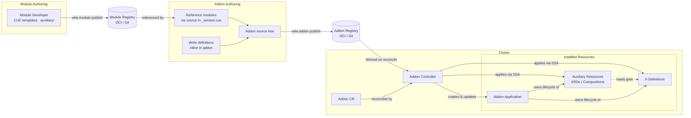

Modules are independently versioned and published to a registry. Addon authors either reference published modules (pulling definitions and auxiliary resources at install time via `source` in `_version.cue`) or write definitions directly inline in the addon source tree. The addon is published to a registry and installed by creating an `Addon` CR. The Addon controller fetches the source, creates the owned Application for infrastructure resources, applies auxiliary resources, and (once those are ready) applies the X-Definitions that platform teams consume.

The design has two explicit layers: the **Addon CR** is the declarative GitOps-facing interface that expresses desired addon state, and the **generated Application** in `vela-system` is the payload representation (the existing addon vehicle through which all installed resources are owned, tracked, and cleaned up). The Addon controller bridges the two, translating Addon CR desired state into Application content and resource operations on every reconcile cycle.

## Declarative Addon CR

This KEP introduces the `Addon` CR as the primary declarative unit for addon management (a desired-state declaration that the addon controller continuously reconciles). The controller realises that desired state by keeping a generated Application in `vela-system` aligned with the Addon CR: the Application is the pre-existing addon payload vehicle, preserved and reused; the Addon CR is the new GitOps-facing layer on top of it. See [Implementation Philosophy](#implementation-philosophy) for the "wrap, don't replace" rationale.

`Addon` is a **cluster-scoped** CRD (it represents a platform-wide capability, not a namespaced resource). The Application that the addon controller generates to carry the addon's payload is namespaced to `vela-system`.

```yaml
apiVersion: core.oam.dev/v1beta1
kind: Addon
metadata:
  name: aws-s3
spec:
  version: v1.2.0       # exact tag: pinned mode (recommended)
  # version: ">=1.2.0"  # semver constraint: tracking mode (requires upgradePolicy)
  # upgradePolicy: Manual  # default; notify on newer match but do not upgrade
  # upgradePolicy: Auto    # upgrade automatically when a newer match is found
  registry: my-registry
  parameters:
    region: us-east-1
    enableV2: true
  clusters:
    - local        # omit to deploy to all registered clusters (current default)
    # - cluster1   # add clusters explicitly for multi-cluster rollout
  overrideDefinitions: false
  skipVersionCheck: false
```

`vela addon enable aws-s3 --version v1.2.0` now creates or patches an `Addon` CR rather than directly invoking installation logic. The CLI and GitOps workflows are interchangeable; both operate on the same CR. See [CLI Commands](#cli-commands) for the full command set including local development mode.

Reconciliation is suspended by setting the label `controller.core.oam.dev/pause: "true"` on the `Addon` CR (consistent with how Application reconciliation is paused).

## Reconciliation Semantics

> **Design exploration (not yet accepted):** An active companion exploration in [`design/`](./design/) revisits how much of this reconcile loop the addon controller needs to own. [Design 01](./design/01-per-component-topology-placement.md) and [Design 02](./design/02-application-managed-resources.md) argue that, with per-component topology placement (implemented in #7213), all addon resources can move inside the generated Application's `spec.components`, so dispatch, drift correction, tracking, and staleness cleanup are handled by the Application controller rather than a bespoke addon reconcile loop. This KEP remains the baseline until that direction is accepted.

The addon controller reconciles continuously; it runs on every change to the `Addon` CR and at a configurable periodic interval (default: 5 minutes).

The reconcile loop follows a strict three-tier ordering designed to ensure that no API surface is published until the infrastructure backing it is operational and ownership is unambiguous:

1. **Infrastructure first**: the owned Application (operators, CRDs, platform resources) is applied and must reach healthy status before anything else proceeds.
2. **Auxiliary readiness**: per-API-line auxiliary resources (XRDs, Compositions) are applied and gated on kstatus readiness. Only once a line's auxiliary resources are ready does that line's definitions become eligible for application.
3. **Definitions last**: definitions are the go-live signal. Applying a definition makes a new API type visible to all Application authors on the cluster. The ordering ensures that by the time a definition is applied, the infrastructure and compositions it depends on are already operational.

A definition conflict pre-flight runs between tiers 1 and 2 as a global check: if any definition the addon would install is already owned by a different addon (or is unowned), reconciliation stops before any definitions or per-line work begins.

On each cycle:

1. Check whether `spec.version` differs from `status.installedVersion`; if so, set `phase: upgrading`; if this is the first install, set `phase: installing`. Setting the phase before any work ensures status is meaningful during in-progress reconciles. On every reconcile, the source is re-fetched and re-rendered against the current CUE context; rendered outputs are never cached, since cluster context and parameters may change between reconciles. The remote digest (OCI manifest digest or Git commit SHA) is resolved cheaply first (OCI HEAD request / `git ls-remote`); if it matches `status.resolvedSourceDigest` a full re-fetch can be skipped and the source re-rendered from a local copy. If the remote is unreachable, set `SourceResolved=false` condition and requeue with exponential backoff (initial 30s, max 10m); no stale rendered output is applied. The Addon phase remains at its current value (not set to `failed`) so that a transient registry outage does not trigger downstream alerts; persistent failure beyond the max backoff window surfaces as `phase: failed`.

> **Implementation note - source caching strategy:** Whether to cache raw source files (in-memory LRU, filesystem tarballs à la Flux source-controller, or no cache with always-fetch) is an implementation decision to be made based on observed performance. The digest-based change detection above is the important design constraint; the caching mechanism is an optimisation detail. Flux stores fetched artifacts as compressed tarballs on the filesystem served via a local HTTP server, avoiding memory pressure entirely (this is the reference approach if caching proves necessary).
2. Resolve the addon source from `spec.registry` and `spec.version`
3. Build addon context: query all `Config` resources in `vela-system` labelled `addon.oam.dev/cluster-context: "true"`, merge their values, and inject into the shared context for `_module.cue` and `_version.cue` evaluation (see KEP-2.20, Cluster Context)
4. Apply addon-wide assets: create or update the owned Application CR (the payload representation of the addon, which owns and tracks all installed resources), rendering it from the top-level `resources/` content; apply `ConfigTemplate` resources; apply VelaQL `View` resources; apply UI `Schema` resources
5. Check the owned Application's health: inspect `status.conditions` for a condition of type `Ready`; if `status: "True"` the Application is healthy; if the Application's `status.phase` is `workflowFailed`, `workflowTerminated`, or if any component reports an error condition, set Addon `phase: failed` with `ApplicationHealthy=false`; if none of these match (e.g. `phase: rendering`, `phase: running` but not yet `Ready`), requeue and wait. **No definitions are applied until this gate passes** (infrastructure must be operational before any API surface is exposed).
6. **Definition conflict pre-flight (global):** if `spec.overrideDefinitions` is false, check every definition this addon would install against the cluster. If any definition already exists under a different owner (a different addon, or no owner), set `phase: failed` and `DefinitionConflict=True` with the condition message listing each conflicting definition name and its current owner. **Stop: no definitions are applied, no API lines proceed.** This check is global and all-or-nothing: a single conflict blocks the entire addon, not just the affected line. The operator must remove or retransfer the conflicting definition, or set `spec.overrideDefinitions: true`, before the next reconcile can proceed.
7. For each enabled API line (in parallel): apply `auxiliary/` resources via server-side apply; wait for readiness using kstatus: poll each resource for a `Ready` or `Established` condition with `status: "True"` (standard kstatus semantics). Resources that expose no kstatus conditions are considered ready once accepted by the API server without error (a best-effort gate for non-kstatus-compliant resources). Once the line's auxiliary resources are ready, apply definitions; definitions are the go-live gate for that line. Lines run in parallel; if one line fails, the others continue. After all parallel work completes, if any line failed the Addon phase is set to `failed` with the `AuxiliaryReady` or `ModulesSynced` condition recording which lines failed and why. The field manager string for all Addon controller SSA writes is `addon.oam.dev/controller`.
8. If `modules/` is present: module lifecycle semantics run within step 7 per API line (see KEP-2.20). If `definitions/` is present: definitions are applied at the end of step 7 after the Application health gate and conflict pre-flight. Both paths are independent and can coexist; `definitions/` is a permanent valid authoring path, not a migration target.
9. Run stale resource cleanup: compare `status.installedResources` from the previous reconcile against the set of resources produced by the current render. Hard-delete any metadata resources (Views, ConfigTemplates, Schemas) present in the previous set but absent from the current one. For definitions and auxiliary resources, skip hard-delete; they remain on the cluster. Deprecated resources (carrying `definition.oam.dev/deprecated: "true"`) follow the deprecation lifecycle in KEP-2.20; non-deprecated stale resources are retained indefinitely until explicitly removed by an operator. Update `status.installedResources` with the current set. Set `phase: running`.

For auxiliary resources that do not expose kstatus conditions, the tier-2 readiness guarantee is best-effort (API server acceptance only). See KEP-2.20 (Two-Tier Resource Model) for the broader rationale behind infrastructure-first ordering.

**Stale resource cleanup on upgrade**: the existing addon installer is purely additive; upgrading from v1.0.0 to v1.1.0 never removes resources that were installed by the old version but are absent from the new one. The new reconciler introduces cleanup on upgrade, with the strategy determined by a single question: **does a running Application depend on this resource at reconcile time?**

| Resource | Runtime dependency | On upgrade removal |
|---|---|---|
| Definitions | Yes (Applications bind to them by type) | Deprecation lifecycle (KEP-2.20); never hard-deleted |
| Auxiliary (`auxiliary/`) | Yes (Compositions/XRDs back active Claims) | Deprecation lifecycle; never hard-deleted |
| VelaQL Views | No (tooling/UI query metadata) | Hard delete |
| ConfigTemplates | No (template metadata; existing Config instances are separate resources) | Hard delete |
| Schemas | No (VelaUX rendering metadata) | Hard delete |

The staleness diff uses `status.installedResources` (populated at the end of each reconcile from the set of resources actually applied) as its inventory. On the next reconcile, the controller compares the freshly rendered set against this inventory. Resources present in the inventory but absent from the rendered set are stale.

For Views, ConfigTemplates, and Schemas: stale resources are hard-deleted immediately. Stale metadata left in place causes user-visible pollution (ghost queries in the VelaQL catalogue, phantom config types in the UI).

For definitions and auxiliary resources: the staleness diff runs the same comparison, but hard-delete is skipped. These resources have runtime dependencies (Applications bind to definitions by type, and Compositions/XRDs back active Claims) so they are never removed incrementally. Their lifecycle ends only when the Application is deleted and ResourceTracker GC runs. Incremental deprecation marking (KEP-2.20) is the mechanism for signalling intent to remove; the actual deletion follows at Application deletion time.

> **Note - label query vs inventory diff:** Labels (`addons.oam.dev/name`) are used to *populate* `status.installedResources` after each apply (querying all resources belonging to this addon). The staleness *diff* is then computed from that recorded inventory, not by re-querying labels on every reconcile. This means the inventory is always one reconcile cycle behind; a resource applied in cycle N appears in the inventory used for the diff in cycle N+1.

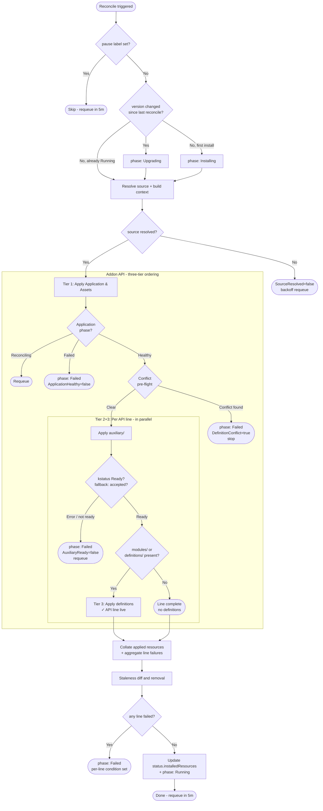

The existing `pkg/addon/` install and upgrade logic handles source loading, rendering, and all apply operations. The Addon controller wraps this with phase management and contributes two new steps that do not exist today: the Application health gate (currently the controller proceeds immediately without waiting) and the post-install resource collection + staleness diff. Applied resources are collected by querying resources labelled `addons.oam.dev/name: {addon-name}`; this gives the full current set, which is written to `status.installedResources` and used as the basis for the next reconcile's staleness check.

> **Auxiliary readiness gate - design decision:** The controller gates definition application on auxiliary resource readiness using kstatus: a resource is considered ready when it has a condition of type `Ready` or `Established` with `status: "True"` (standard kstatus semantics). Resources that expose no kstatus conditions (such as bare Crossplane `Composition` objects) are considered ready once accepted by the API server without error. This is a known limitation: for non-kstatus-compliant resources the gate is best-effort only, and definitions may be applied before those resources are fully operational. Addon authors using auxiliary resources that require genuine readiness guarantees should ensure those resources expose kstatus-compatible conditions. When definitions are applied after a best-effort gate pass, no condition is set to indicate that auxiliary was not fully operational at that point; the safety guarantee is best-effort only and is not separately observable in the Addon CR status.

| Event | Controller action |
|---|---|
| Addon CR created | Evaluate context; apply addon-wide assets & Application; once Application healthy, run conflict pre-flight (on conflict: set `DefinitionConflict=True`, stop); apply auxiliary resources per API line; once ready, apply definitions |
| Addon CR updated | Re-evaluate context; update addon-wide assets; once Application healthy, run conflict pre-flight (on conflict: set `DefinitionConflict=True`, stop); update auxiliary per line; once ready, update definitions |
| Addon CR updated with new `spec.version` | Re-evaluate context; upgrade addon-wide assets; once Application healthy, run conflict pre-flight (on conflict: set `DefinitionConflict=True`, stop); update auxiliary per line; once ready, update definitions |
| Addon CR deleted | Finalizer runs per `spec.deletionPolicy`: `Protect` blocks if any Application references an addon definition; once clear, deletes the owned Application (the Application controller's ResourceTracker GC then removes all tracked resources as a consequence). `Force` deletes the owned Application immediately; ResourceTracker GC removes all tracked resources. `Orphan` releases the finalizer without deleting the Application; all installed resources remain on the cluster, unmanaged, until the Application is eventually deleted by other means. |
| Periodic reconcile | Same as update: re-evaluate and re-apply all assets in order; server-side apply is idempotent |

The controller uses a finalizer (`addon.oam.dev/cleanup`) to ensure ordered cleanup on deletion.

## Version Selection

Addon version selection has two modes, controlled by the shape of `spec.version` and the value of `spec.upgradePolicy`.

### Pinned mode (default, recommended for GitOps)

Set `spec.version` to an exact tag:

```yaml
spec:
  version: v1.2.0
```

The controller installs exactly this version. `spec.version` is never mutated autonomously. The cluster state always matches what is declared in git. This is the correct choice for most production environments.

`upgradePolicy` is ignored in pinned mode. To upgrade, update `spec.version` in git (or run `vela addon upgrade --version v1.3.0`).

### Tracking mode: `Manual` is GitOps-safe; `Auto` is opt-in

Set `spec.version` to a semver constraint:

```yaml
spec:
  version: ">=1.2.0"
  upgradePolicy: Manual  # default: notify but do not upgrade autonomously
```

The controller resolves the constraint against the registry on every periodic reconcile cycle, finding the highest matching version. What happens next depends on `spec.upgradePolicy`:

**`Manual` (default)**: if the resolved version is newer than `status.installedVersion`, the controller writes it to `status.availableUpgrade` and sets an `UpgradeAvailable` condition. Nothing is installed or changed. The operator applies the upgrade explicitly:

```bash
vela addon upgrade aws-s3 --version v1.4.0  # or update spec.version in git
```

This preserves GitOps determinism: upgrades are explicit, auditable events. `spec.version` in git never diverges from what is running.

**`Auto`**: if the resolved version is newer than `status.installedVersion`, the controller upgrades immediately without any operator action. `spec.version` is not mutated; the installed version is visible in `status.installedVersion` but **does not appear in git**. This means the cluster is running a version that is not recorded in the GitOps source of truth; upgrades are invisible to git history, audit logs, and pull request review.

```yaml
spec:
  version: ">=1.2.0"
  upgradePolicy: Auto
```

> **Operator guidance:** `Auto` is appropriate only when continuous delivery of the latest matching version is explicitly desired and the consequences are understood: definitions may change on any reconcile cycle, Applications consuming those definitions may break on major version bumps, and there is no git-visible record of when or why an upgrade occurred. For production platform APIs, `Manual` tracking or pinned mode is strongly preferred.

### Version omitted

If `spec.version` is omitted, the controller resolves to the latest available version at install time, installs it, and records the result in `status.installedVersion`. `spec.version` is not written back; subsequent reconciles treat the absence of a version constraint as "no change required" and do not re-resolve. The effective behaviour is a one-time pin to whatever was latest at install time.

**Not recommended for GitOps environments.** When `spec.version` is omitted, the installed version is only visible in `status.installedVersion` (not in the spec declared in git). The git representation of the Addon CR does not record what version is actually running, making it impossible to audit, reproduce, or reason about the installed state from the source of truth alone. Always set an explicit version in GitOps workflows.

### Summary

| `spec.version` | `spec.upgradePolicy` | Behaviour |
|---|---|---|
| Exact tag (`v1.2.0`) | any (ignored) | Pinned. Never changes autonomously. |
| Semver constraint | `Manual` (default) | Resolves on each reconcile; records candidate in `status.availableUpgrade`; does not upgrade. |
| Semver constraint | `Auto` | Resolves on each reconcile; upgrades immediately when a newer match is found. |
| Omitted | any (ignored) | Resolves latest at install time; behaves as a pin thereafter. |

## Ownership Model

> **Design exploration (not yet accepted):** [Design 02](./design/02-application-managed-resources.md) corrects a factual assumption used below: X-Definitions (`ComponentDefinition`, `TraitDefinition`, etc.) are **Namespaced**, not cluster-scoped (`scope: Namespaced` in the CRDs). This means a module-owned Application co-located with its definitions can own them via ordinary owner references, and the "direct SSA-apply outside the Application" step is not required. [Design 03](./design/03-cuex-components-instead-of-crs.md) extends this to a nested-Application ownership chain. This KEP's ownership description below reflects the current implementation and remains the baseline until the exploration is accepted.

**The Application is the execution unit and structural owner of all addon-installed resources.** The Addon CR declares desired state; the Addon controller translates that state into Application content and direct SSA-applies; but it is the Application (through the Application controller's ResourceTracker GC) that owns the lifecycle of every installed resource. No resource is considered owned by the Addon CR directly. The Addon CR's sole structural role is to gate deletion of the Application via its finalizer.

> This section documents the existing ownership and cleanup mechanism. The core model (Application as payload owner, ResourceTracker GC for terminal cleanup) is preserved unchanged. This KEP adds one new mechanism on top: the Addon controller's staleness diff, which explicitly deletes stale metadata resources (Views, ConfigTemplates, Schemas) during upgrades without requiring an Application deletion. This section is included because the ownership model is not stated anywhere in the current codebase documentation and is a prerequisite for understanding the reconciliation semantics above.

```
Addon CR ──(finalizer gates deletion of)──► Application ──(ResourceTracker GC)──► Definitions
                                                                                    Auxiliary resources
                                                                                    Views / Schemas / ConfigTemplates
```

**Addon CR - lifecycle gate.** The Addon CR is the declarative desired state for the addon. A single finalizer (`addon.oam.dev/cleanup`) is the sole authority over when the owned Application is deleted. `spec.deletionPolicy` controls the conditions under which the finalizer releases: `Protect` waits until no Application references an addon definition; `Force` releases immediately; `Orphan` releases without deleting the Application at all.

**Application - payload representation and structural owner.** The Application in `vela-system` is the pre-existing addon vehicle that this KEP preserves: it is the concrete representation of what the addon has installed on the cluster. All addon-installed resources carry `ownerReferences` pointing to it (`addOwner()` in `pkg/addon/addon.go`). When the Application is deleted, the Application controller's ResourceTracker GC (KubeVela's own multi-generation tracking and explicit-delete engine) iterates through all tracked resources and deletes them, including cluster-scoped resources such as `ComponentDefinition` and `TraitDefinition`. This is distinct from Kubernetes' built-in cascade GC: the ResourceTracker finalizer loop handles cross-scope deletion that native GC cannot (a namespace-scoped Application cannot own a cluster-scoped resource via Kubernetes GC, but the ResourceTracker engine deletes them explicitly regardless of scope).

**Addon controller - reconciliation engine.** On every reconcile cycle the controller re-renders the addon source, SSA-applies all resources (adding and updating), and hard-deletes stale metadata resources (Views, ConfigTemplates, Schemas) explicitly via a staleness diff. The controller never deletes the Application itself except through the finalizer path on Addon CR deletion.

### Cleanup Responsibility

**All addon resources are cleaned up through Application deletion.** When the Application is deleted, the Application controller's ResourceTracker GC iterates through every tracked resource and deletes it explicitly: definitions, auxiliary resources, Views, ConfigTemplates, Schemas. This is the single terminal cleanup path. The Addon controller does not manage resource deletion independently; it manages the Application, and the Application manages the resources.

One incremental operation sits on top of this model: the Addon controller's **staleness diff** hard-deletes stale metadata resources (Views, ConfigTemplates, Schemas) on every reconcile cycle. This is not a separate cleanup mechanism; it is an optimisation that keeps the cluster clean during upgrades without requiring an Application deletion. It applies only to resources with no runtime dependencies. Resources with runtime dependencies (definitions and auxiliary resources) are never hard-deleted incrementally; they follow the deprecation lifecycle (KEP-2.20) and are only removed when the Application is deleted.

| Resource type | Incremental removal on upgrade | Terminal removal on Application deletion |
|---|---|---|
| Definitions (`ComponentDefinition`, `TraitDefinition`, …) | Deprecation lifecycle only (KEP-2.20); never hard-deleted | ResourceTracker GC |
| Auxiliary resources (Crossplane CRDs, `Compositions`, …) | Deprecation lifecycle only (KEP-2.20); never hard-deleted | ResourceTracker GC |
| Views, Schemas, ConfigTemplates | Staleness diff: hard-deleted when absent from current rendered set | ResourceTracker GC |

### Ownership Metadata

Resource ownership is tracked through two complementary mechanisms:

**Labels on installed resources**: every resource applied by the addon controller carries:
- `addons.oam.dev/name: {addon-name}` (identifies the owning addon)
- `addons.oam.dev/version: {version}` (records the installed version)

These labels allow the controller to list all resources belonging to an addon with a single label selector query, independent of ResourceTracker state.

**Annotations on the addon Application**: the Application records which definitions the addon created, as comma-separated name lists:
- `addon.oam.dev/componentDefinitions`
- `addon.oam.dev/traitDefinitions`
- `addon.oam.dev/workflowStepDefinitions`
- `addon.oam.dev/policyDefinitions`

The `Protect` deletion policy uses these annotations to scan all Applications on the cluster and check whether any component, trait, workflow step, or policy references an addon-installed definition before allowing the finalizer to proceed.

### Deprecation vs Deletion

Definition deprecation (marking a definition as superseded while leaving it available for existing consumers during a migration window) is a versioned API concern, not an addon lifecycle concern. It is handled at the definition level by KEP-2.20's API line versioning model. From KEP-2.13's perspective a definition is either present (applied by the controller) or absent (removed by the staleness diff or ResourceTracker GC); there is no intermediate deprecated-but-retained state managed here.

### Orphan Policy Gap

`DeletionPolicy: Orphan` releases the finalizer without deleting the Application. The Application and all owned resources remain on the cluster as **unmanaged** resources; no controller reconciles them and no Addon CR gates their lifecycle. A subsequent out-of-band deletion of the Application (by a human, a GitOps tool, or an accidental `kubectl delete`) will trigger the Application controller's ResourceTracker GC, which will explicitly delete all tracked definitions and auxiliary resources with no Addon-level protection or warning. This is intentional: the operator has explicitly chosen to release management control entirely. Operators choosing `Orphan` should document this and understand that any future Application deletion will be destructive.

## Addon-of-Addons Composition

> **Design exploration (not yet accepted):** [Design 03](./design/03-cuex-components-instead-of-crs.md) takes this composition idea further, exploring whether addons and modules can be delivered *as* components that render nested Applications, removing the need for dedicated CRs and controllers altogether. It also introduces a **Module** as a lighter-weight API unit (see [KEP-2.20 design notes](../2.20-module-versioning/design/)). This KEP's `Addon` CR model remains the baseline; the component-based approach is a documented alternative under evaluation.

Multiple addons can be composed into a capability set using the OAM Application model with a new built-in `addon` component type:

```yaml
apiVersion: core.oam.dev/v1beta1
kind: Application
metadata:
  name: data-platform
  namespace: vela-system
spec:
  components:
    - name: aws-s3           # name defaults to component name "aws-s3"
      type: addon
      properties:
        version: v1.3.0      # pinned
        parameters:
          region: us-east-1

    - name: postgres
      type: addon
      properties:
        version: v2.1.4      # pinned
        include:
          resources: false    # skip Application resources (no operator install); install definitions and auxiliary only

    - name: observability
      type: addon
      properties:
        version: v3.0.1      # pinned
        parameters:
          retention: 30d
```

To use tracking mode with automatic upgrades, set `upgradePolicy: Auto` explicitly. This is not recommended for production platform APIs; upgrades happen on any reconcile cycle and do not appear in git history:

```yaml
    - name: aws-s3
      type: addon
      properties:
        version: ">=1.2.0"        # semver constraint: tracking mode
        upgradePolicy: Auto       # upgrades automatically; not GitOps-safe
        parameters:
          region: us-east-1
```

The `addon` component type causes the Application controller to create or update `Addon` CRs for each component. Dependency ordering between addon components follows the existing OAM resource dependency model.

The following diagram shows how addon-of-addons can be used to compose a complete data platform from independent building blocks, delivered as a single GitOps unit:

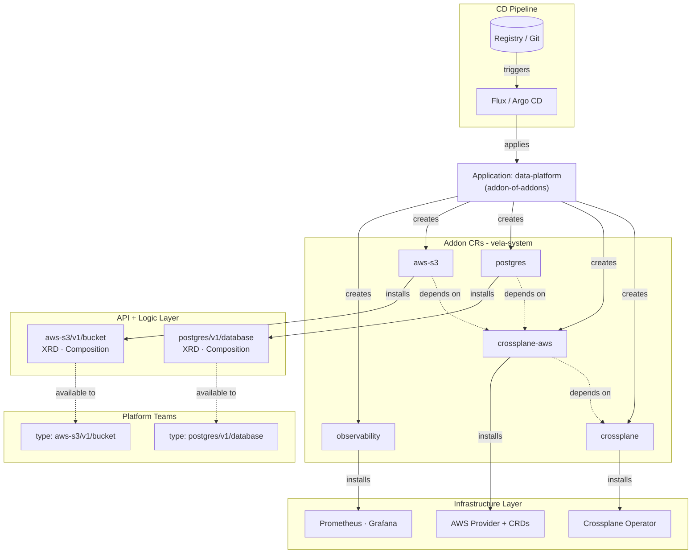

A single Application in `vela-system` declares the entire platform capability set. Dependency ordering is enforced by the Application workflow; each addon component can declare `dependsOn` relationships, and the workflow will not advance to a dependent component until the upstream component's health check passes. The `addon` component type reports health by surfacing the Addon CR's `phase: running` and `Ready` condition back to the Application; a dependency that is still `installing` or `failed` holds the workflow at that step.

The composition is recursive; the `crossplane` addon is itself an addon-of-addons, internally bundling `crossplane-operator` and `crossplane-aws` as its own components. The `data-platform` author declares a single `crossplane` dependency; the crossplane addon author owns the internal wiring. Platform teams consume the resulting typed APIs without needing to know which addons back them.

### Addon CR Naming

The Addon CR name equals the addon name (`{name}` from `AddonComponentProperties`). Installing two components with the same `name` updates the same Addon CR.

> **Multi-instance addons** (where the Addon CR name is derived from instance parameters via `instance` in `_module.cue`) are deferred to [KEP-2.22](../2.22-multi-instance-addons/README.md). The `instance` field is reserved but not implemented in the initial delivery.

## CLI Commands

The `vela addon` subcommand is updated to operate on `Addon` CRs rather than invoking installation logic directly. The CLI is a thin CR writer; the controller does the actual work.

### Standard commands (CR-backed)

```bash
# Create or patch an Addon CR (equivalent to applying the YAML below)
vela addon enable aws-s3 --version v1.2.0 --registry my-registry

# Delete the Addon CR (uses spec.deletionPolicy; defaults to Protect)
vela addon disable aws-s3

# Disable with an explicit policy override
vela addon disable aws-s3 --deletion-policy Force

# Patch spec.version; controller runs the upgrade path
vela addon upgrade aws-s3 --version v1.3.0

# List all Addon CRs and their phase/conditions
vela addon list

# Show full status for a single addon: phase, conditions, installed lines, blocked refs
vela addon status aws-s3
```

`vela addon enable` produces (or patches) an `Addon` CR and exits; it does not block waiting for the controller. Use `vela addon status aws-s3` or `kubectl wait addon/aws-s3 --for=condition=Ready` to observe progress.

`vela addon disable` patches `spec.deletionPolicy` to the requested value (defaulting to the existing value if already set) and then deletes the CR. Under `Protect`, the delete call will be blocked by the finalizer if referencing Applications exist; the CLI surfaces the blocking condition rather than hanging.

### Local development mode

For testing an addon source tree directly against a cluster (without publishing to a registry or creating an Addon CR):

```bash
# Apply the full addon directly to the current kubectl context
# Follows the same ordering as the controller: Application first,
# wait healthy, conflict pre-flight, aux per API line, wait ready, definitions last.
# No Addon CR is created; no registry is involved.
vela addon apply --local ./my-addon

# Apply a single module within a local addon tree
vela addon apply --local ./my-addon --module aws-s3

# Apply a specific API line only
vela addon apply --local ./my-addon --module aws-s3 --line v1

# Dry-run: show what would be applied without touching the cluster
vela addon apply --local ./my-addon --dry-run
```

`vela addon apply --local` is the inner development loop for addon authors. It is intentionally separate from `vela addon enable` to make the boundary between "testing locally" and "declaring desired cluster state" explicit; running `--local` does not leave a reconciling CR behind, so drift correction is not active. Resources applied this way are unmanaged until an Addon CR is created.

> **Relationship to `vela module deploy`:** `vela module deploy` (KEP-2.20) targets a single module within a larger addon tree and is aimed at module authors iterating on definitions and auxiliary resources in isolation. `vela addon apply --local` operates on the full addon (including the top-level `resources/` Application) and is aimed at addon authors testing the complete installation end-to-end.

## API Changes

### Owned Application Labels and Annotations

The Application created by the Addon controller (`addon-{name}` in `vela-system`) carries the following metadata. Labels are used for selection (identifying and grouping resources); annotations carry controller metadata not suitable for indexing.

```
Labels:
  addons.oam.dev/name:      {addon-name}        # existing: selects all resources belonging to this addon
  addons.oam.dev/version:   {installed-version} # existing: installed semver tag
  addons.oam.dev/registry:  {registry-name}     # existing: source registry

Annotations:
  addons.oam.dev/addon-uid: {addon-cr-uid}      # UID of the owning Addon CR; used for ownership verification, not selection
```

The `addons.oam.dev/addon-uid` annotation is written at Application create time and verified on every reconcile. A mismatch (e.g. the Addon CR was deleted and recreated) indicates a stale Application; the controller re-adopts it under the new Addon CR by resetting the annotation.

No owner reference is set from the Application to the Addon CR. Owner references would cause Kubernetes GC to cascade-delete the Application when the Addon CR is deleted, bypassing the finalizer and making `Orphan` deletion policy unimplementable. Deletion is fully controlled by the finalizer, which respects `spec.deletionPolicy`.

The same `addons.oam.dev/name` label is applied to all addon-installed resources (definitions, auxiliary resources, Views, ConfigTemplates, Schemas) enabling fleet-level queries (e.g. "all resources installed by the aws-s3 addon").

### Extended Addon CR Spec

```go
type AddonSpec struct {
    // Version is an exact semver tag (e.g. "v1.2.0") or a semver constraint
    // (e.g. ">=1.2.0", "~2.1.0", "^1.0.0").
    //
    // Exact tag - Pinned mode. The controller installs exactly this version and
    // never changes it autonomously. This is the recommended default for GitOps
    // workflows: the cluster state always matches what is declared in git.
    //
    // Semver constraint - Tracking mode. The controller resolves the constraint
    // against the registry on every periodic reconcile. What happens when a newer
    // matching version is found depends on spec.upgradePolicy.
    //
    // Omitting version resolves to the latest available version at install time
    // and is immediately written as a pinned exact tag in status.installedVersion.
    // The spec.version field is not mutated; subsequent reconciles treat it as
    // "no constraint" and do not re-resolve.
    Version             string                 `json:"version,omitempty"`
    // UpgradePolicy controls autonomous upgrade behaviour when spec.version is a
    // semver constraint (tracking mode). Ignored when spec.version is an exact tag.
    // Defaults to Manual.
    UpgradePolicy       AddonUpgradePolicy     `json:"upgradePolicy,omitempty"`
    Registry            string                 `json:"registry,omitempty"`
    Parameters          map[string]interface{} `json:"parameters,omitempty"`
    // Clusters lists the cluster names to deploy the addon's Application to.
    // Translated at reconcile time into an OAM topology policy on the owned Application.
    // Omitting this field deploys to all registered clusters (consistent with the
    // existing addon system behaviour).
    //
    // Existing behaviour: this field only takes effect if the addon's parameter.cue
    // defines a "clusters" parameter (types.ClustersArg = "clusters"). Addons that do
    // not declare this parameter in their API schema ignore spec.clusters entirely;
    // the field is a no-op for those addons. This is inherited from the current addon
    // system and is not changed by this KEP.
    //
    // Example - local cluster only:
    //   clusters: [local]
    // Example - explicit multi-cluster:
    //   clusters: [local, cluster1, cluster2]
    //
    // > **Implementation note:** At implementation time, evaluate whether the default
    // > should be changed to local-only. A local-only default would be safer for
    // > GitOps workflows (explicit opt-in for multi-cluster rollout) but would differ
    // > from the existing addon behaviour. If changed, the inheritance sweep must
    // > reconstruct spec.clusters from the legacy Application's topology policy rather
    // > than relying on the new default, to avoid silently narrowing the rollout scope
    // > for existing multi-cluster addons.
    //
    // Longer-term this field will be superseded by KEP-2.19 named topology groups.
    Clusters            []string               `json:"clusters,omitempty"`
    // OverrideDefinitions allows the addon to overwrite definitions that already exist
    // on the cluster under a different owner (i.e. owned by a different addon, or
    // not owned by any addon). When false (default), the presence of any such
    // definition fails the reconciliation immediately; phase is set to Failed and
    // a DefinitionConflict condition is set listing each conflicting definition name
    // and its current owner. No definitions are applied, ensuring the install is
    // never partially successful. The operator must either remove the conflicting
    // definition, transfer ownership, or set overrideDefinitions: true to proceed.
    OverrideDefinitions bool                   `json:"overrideDefinitions,omitempty"`
    // SkipVersionCheck bypasses the minKubeVelaVersion compatibility check declared in
    // the addon's metadata. Use with caution; skipping the check may result in
    // installing an addon against an incompatible KubeVela version.
    SkipVersionCheck    bool                   `json:"skipVersionCheck,omitempty"`
    // DeletionPolicy controls what happens when the Addon CR is deleted.
    // Defaults to Protect. See Deletion Policy below.
    DeletionPolicy      AddonDeletionPolicy    `json:"deletionPolicy,omitempty"`
}

// AddonUpgradePolicy controls when the controller acts on a newly resolved version
// in tracking mode (spec.version is a semver constraint).
type AddonUpgradePolicy string

const (
    // AddonUpgradePolicyManual (default): when the constraint resolves to a version
    // newer than status.installedVersion, the controller writes the candidate to
    // status.availableUpgrade and sets an UpgradeAvailable condition, but does not
    // upgrade. The operator applies the upgrade by updating spec.version to the
    // candidate (or by running `vela addon upgrade`).
    // This preserves GitOps determinism: spec.version in git always matches what
    // is running, and upgrades are explicit, auditable events.
    AddonUpgradePolicyManual AddonUpgradePolicy = "Manual"

    // AddonUpgradePolicyAuto: when the constraint resolves to a version newer than
    // status.installedVersion, the controller upgrades immediately. spec.version is
    // not mutated; the installed version is visible in status.installedVersion.
    // Use when continuous delivery of the latest matching version is explicitly
    // desired and the operational implications (automatic definition changes,
    // potential Application breaks on major bumps) are understood and accepted.
    AddonUpgradePolicyAuto  AddonUpgradePolicy = "Auto"
)

// AddonDeletionPolicy controls the finalizer behaviour when an Addon CR is deleted.
type AddonDeletionPolicy string

const (
    // AddonDeletionPolicyProtect (default): the finalizer blocks deletion if any
    // Application on the cluster references a definition installed by this addon.
    // Once no referencing Applications exist, the finalizer deletes the owned
    // Application; the Application controller's ResourceTracker GC then explicitly
    // deletes all tracked resources, including cluster-scoped definitions.
    AddonDeletionPolicyProtect AddonDeletionPolicy = "Protect"

    // AddonDeletionPolicyForce: the finalizer deletes the owned Application
    // immediately regardless of active references; the Application controller's
    // ResourceTracker GC explicitly deletes all tracked resources. Existing
    // Applications that reference addon definitions will break. Intended for
    // cluster teardown or emergency cleanup.
    AddonDeletionPolicyForce   AddonDeletionPolicy = "Force"

    // AddonDeletionPolicyOrphan: the finalizer is released without deleting the
    // owned Application. All addon-installed resources (definitions, auxiliary,
    // Views, ConfigTemplates, Schemas) remain on the cluster as unmanaged resources.
    // Useful when decommissioning addon management while keeping the capability running.
    AddonDeletionPolicyOrphan  AddonDeletionPolicy = "Orphan"
)
```

> **Implementation note:** `Protect` requires a scan for Applications referencing this addon's definitions at deletion time (an O(n Applications) query). This only runs when the Addon CR is being deleted, not on every reconcile, so the cost is acceptable.

### `addon` Component Type

> **Design exploration (not yet accepted):** the `addon` component here renders an `Addon` *CR*. [Design 03](./design/03-cuex-components-instead-of-crs.md) explores a variant (already prototyped in commit `ade26c3f5`) where the `addon` component's CueX provider renders a nested *Application* directly, so no `Addon` CR or controller is needed. Same component-type entry point, different output. This KEP's CR-rendering behaviour remains the baseline.

The `addon` component type is a built-in `ComponentDefinition` shipped with KubeVela core. It renders an `Addon` CR from the component properties. The application controller treats it identically to any other component type; the addon controller reconciles the resulting `Addon` CR through its normal loop.

```go
type AddonComponentProperties struct {
    // Name is the addon name. Defaults to the component name if omitted.
    Name       string                 `json:"name,omitempty"`
    Registry   string                 `json:"registry,omitempty"`
    // Version is passed through directly to spec.version on the rendered Addon CR.
    // Accepts an exact tag ("v1.2.0") or a semver constraint (">=2.0.0", "~8.0.0",
    // "^1.0.0"). Version resolution and upgrade behaviour are governed by the Addon
    // CR's spec.upgradePolicy; see Version Selection for details.
    Version       string                 `json:"version,omitempty"`
    // UpgradePolicy is passed through to spec.upgradePolicy on the rendered Addon CR.
    // Defaults to Manual. See AddonUpgradePolicy for semantics.
    UpgradePolicy AddonUpgradePolicy     `json:"upgradePolicy,omitempty"`
    Parameters map[string]interface{} `json:"parameters,omitempty"`
    // Clusters is passed through to spec.clusters on the rendered Addon CR.
    // Omitting deploys to all registered clusters (current default). See AddonSpec.Clusters.
    Clusters   []string               `json:"clusters,omitempty"`
    // Include controls which addon asset categories are installed.
    // All categories default to true. Set a category to false to skip it.
    // Useful when a team only wants module definitions installed without
    // the accompanying Application resources (e.g. Crossplane compositions).
    Include    *AddonInclude          `json:"include,omitempty"`
}

type AddonInclude struct {
    Definitions     *bool `json:"definitions,omitempty"`     // default: true
    ConfigTemplates *bool `json:"configTemplates,omitempty"` // default: true
    Views           *bool `json:"views,omitempty"`           // default: true
    // Schemas controls installation of UI schema files from schemas/ (ConfigMaps
    // consumed by VelaUX to render parameter forms for definitions and addon parameters).
    Schemas         *bool `json:"schemas,omitempty"`         // default: true
    // Packages controls installation of CUE package files from packages/ (shared CUE
    // libraries that definitions in this addon import). Future feature; reserved for
    // when the packages/ directory is implemented.
    Packages        *bool `json:"packages,omitempty"`        // default: true
    // Resources controls installation of top-level resources/ (the owned Application
    // that installs addon infrastructure, such as operators and CRDs). Skipping this means the
    // addon's owned Application is not created or updated.
    Resources       *bool `json:"resources,omitempty"`       // default: true
    // Auxiliary controls installation of per-API-line auxiliary/ resources (e.g.
    // Crossplane Compositions, KRO ResourceGraphDefinitions). These are applied
    // after the owned Application is healthy. Skipping this installs only
    // definitions and top-level resources, without the line-specific compositions.
    Auxiliary       *bool `json:"auxiliary,omitempty"`       // default: true
}
```

#### Version Resolution

The `addon` component type passes `version` and `upgradePolicy` through to the rendered Addon CR unchanged. All resolution and upgrade behaviour is governed by the Addon CR itself; see [Version Selection](#version-selection) below.

#### Default Name Convention

The `name` property defaults to the OAM component name (`context.name`) when omitted. This allows concise component declarations:

```yaml
components:
  - name: aws-s3        # addon name also becomes "aws-s3"
    type: addon
    properties:
      version: v1.3.0   # pinned: recommended default
      parameters:
        region: us-east-1
```

Explicit `name` is required only when the component name differs from the addon name.

### Addon CR Status (lifecycle fields)

```go
type AddonStatus struct {
    Phase              AddonPhase              `json:"phase,omitempty"`
    ObservedGeneration int64                   `json:"observedGeneration,omitempty"`
    LastReconciledAt   *metav1.Time            `json:"lastReconciledAt,omitempty"`
    InstalledVersion   string                  `json:"installedVersion,omitempty"`
    InstalledRegistry  string                  `json:"installedRegistry,omitempty"`
    // AvailableUpgrade is set when spec.version is a semver constraint and the
    // controller has resolved a version newer than InstalledVersion. Only populated
    // when spec.upgradePolicy is Manual; cleared once the upgrade is applied.
    AvailableUpgrade   string                  `json:"availableUpgrade,omitempty"`
    // ResolvedSourceDigest is the content-addressable identifier of the addon source
    // artifact resolved at the last install or upgrade. For OCI sources this is the
    // manifest digest (e.g. "sha256:abc…"); for Git sources this is the full commit SHA.
    // On periodic reconciles where spec.version is unchanged, the controller compares
    // this value against the current remote digest/SHA. A change indicates the source
    // artifact has been mutated (mutable tag or branch) and triggers a re-apply.
    ResolvedSourceDigest string                 `json:"resolvedSourceDigest,omitempty"`
    ApplicationName    string                  `json:"applicationName,omitempty"`
    // ApplicationHealthy is a root-level boolean quick indicator of owned Application health.
    // Supplemented by the ApplicationHealthy condition for transition time and reason.
    ApplicationHealthy bool                    `json:"applicationHealthy,omitempty"`
    // Conditions provides structured Kubernetes-native status reporting, integrating
    // with kubectl wait, GitOps health checks, and status.conditions tooling.
    Conditions         []metav1.Condition      `json:"conditions,omitempty"`
    InstalledResources AddonInstalledResources  `json:"installedResources,omitempty"`
    // Modules records per-module API line states (see KEP-2.20)
    Modules            []AddonModuleStatus     `json:"modules,omitempty"`
}

type AddonPhase string
const (
    AddonPhaseInstalling AddonPhase = "installing"
    AddonPhaseUpgrading  AddonPhase = "upgrading"
    AddonPhaseRunning    AddonPhase = "running"
    AddonPhaseFailed     AddonPhase = "failed"
)
```

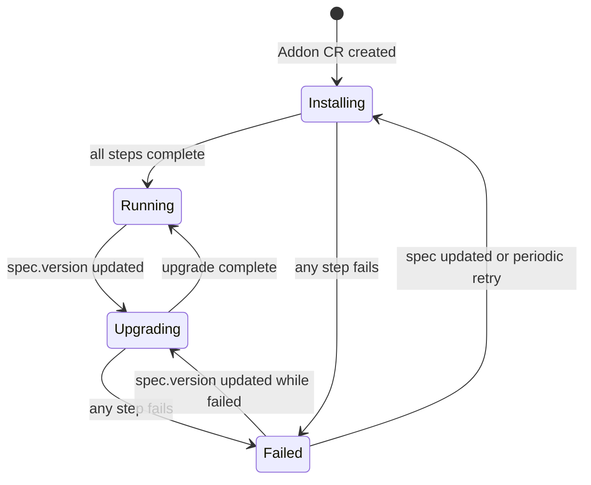

```go
// Standard condition types set on the Addon CR.
const (
    // AddonConditionReady is true when all modules are synced and all API lines
    // that are enabled have their auxiliary resources ready and definitions applied.
    AddonConditionReady              = "Ready"
    // AddonConditionSourceResolved is true when the source artifact was successfully
    // fetched and its digest resolved. False indicates a registry/network failure;
    // the reconciler retries with exponential backoff and does not apply stale outputs.
    AddonConditionSourceResolved     = "SourceResolved"
    // AddonConditionApplicationHealthy is true when the owned Application has
    // reached Healthy status. False blocks auxiliary and definition application.
    AddonConditionApplicationHealthy = "ApplicationHealthy"
    // AddonConditionAuxiliaryReady is true when all enabled API line auxiliary
    // resources across all modules have reached Ready status.
    AddonConditionAuxiliaryReady     = "AuxiliaryReady"
    // AddonConditionModulesSynced is true when all modules have been evaluated
    // and their definitions applied without error on the last reconcile cycle.
    AddonConditionModulesSynced      = "ModulesSynced"
    // AddonConditionDefinitionConflict is true when one or more definitions this
    // addon would install already exist on the cluster under a different owner and
    // spec.overrideDefinitions is false. The condition message lists each conflicting
    // definition name and its current owner (addon name, or "no owner" if unmanaged).
    // Phase is set to Failed and no definitions are applied until the conflict is
    // resolved. Set spec.overrideDefinitions: true, or remove/retransfer the
    // conflicting definitions, to clear this condition.
    AddonConditionDefinitionConflict = "DefinitionConflict"
)

type AddonInstalledResources struct {
    Definitions     []AddonResourceRef `json:"definitions,omitempty"`
    VelaQLViews     []AddonResourceRef `json:"velaQLViews,omitempty"`
    ConfigTemplates []AddonResourceRef `json:"configTemplates,omitempty"`
    Schemas         []AddonResourceRef `json:"schemas,omitempty"`
    // Packages tracks CUE package files installed from packages/. Populated once
    // the packages/ feature is implemented.
    Packages        []AddonResourceRef `json:"packages,omitempty"`
}

type AddonResourceRef struct {
    Name         string `json:"name"`
    Kind         string `json:"kind"`
    Deprecated   bool   `json:"deprecated,omitempty"`
    DeprecatedAt string `json:"deprecatedAt,omitempty"`
}
```

```go
// AddonModuleStatus records the reconcile state of a single module within the addon.
type AddonModuleStatus struct {
    // Name is the module directory name under modules/.
    Name  string                  `json:"name"`
    Lines []AddonModuleLineStatus `json:"lines,omitempty"`
}
```

`AddonModuleLineStatus` (defined in KEP-2.20) is extended with one additional field to track applied auxiliary resources per API line:

```go
type AddonModuleLineStatus struct {
    APIVersion            string             `json:"apiVersion"`
    Enabled               bool               `json:"enabled"`
    Deprecated            bool               `json:"deprecated"`
    DeprecationReason     string             `json:"deprecationReason,omitempty"`
    // AuxiliaryResources tracks the auxiliary/ resources applied for this API line.
    AuxiliaryResources    []AddonResourceRef `json:"auxiliaryResources,omitempty"`
    ResolvedSourceVersion string             `json:"resolvedSourceVersion,omitempty"`
    Message               string             `json:"message,omitempty"`
}
```

> **Note:** Surfacing which Applications reference a deprecated line (blocking removal) is intentionally deferred. The admission webhook already prevents new Applications from using deprecated definitions; since automated removal is out of scope for initial delivery, an on-demand scan via CLI tooling is sufficient for the cases where explicit removal is needed.

## Implementation Location

Implemented entirely in KubeVela core (`github.com/kubevela/kubevela`):

- `pkg/addon/` - addon source loading, module tree scanning, local apply logic shared by CLI and controller
- `pkg/controller/addon/` - `AddonReconciler` extension with continuous reconciliation
- `pkg/webhook/core.oam.dev/v1beta1/application/` - semver range validation on `addon` component `version` field
- `references/cli/` - `vela addon` command group; CR write operations and `apply --local` path

### Implementation Philosophy

The core design principle is **wrap, don't replace**. The existing addon logic in `pkg/addon/` (encapsulated today in `vela addon enable`, `vela addon upgrade`, and `vela addon disable`) already handles source loading, rendering, and application of addon resources. The Addon CR and its controller are a declarative layer added on top of that existing machinery, not a replacement for it. The Application in `vela-system` remains the payload representation; the Addon CR is the new desired-state interface that drives it.

Concretely:
- Wrap the existing enable/upgrade/disable paths behind a finalizer and a reconcile loop rather than replacing them
- Add the deprecation annotation pass and stale-resource diff as incremental additions to the existing dispatch path
- Validate behaviour on a real cluster early and iterate based on testing and feedback rather than designing ahead of observed failure modes

## Backwards Compatibility

### Inheriting Already-Installed Addons

Clusters upgraded to the new controller may have addons installed by the old CLI that have no associated Addon CR. These are identifiable as Applications in `vela-system` carrying the `addons.oam.dev/name` label without a corresponding Addon CR.

The controller performs an inheritance sweep at startup:

1. List all Applications in `vela-system` with `addons.oam.dev/name` label
2. For each, check whether an Addon CR with the same name already exists
3. If not, reconstruct one from the data already on the cluster:
   - `spec.version` - from the `addons.oam.dev/version` label on the Application
   - `spec.registry` - from the `addons.oam.dev/registry` label on the Application
   - `spec.parameters` - from the `addon-secret-{name}` Secret in `vela-system` (parameters are JSON-marshalled into the secret's data under the key `"addonParameterDataKey"`, i.e. `AddonParameterDataKey` in `pkg/addon/addon.go`)
4. Create the Addon CR; the reconciler takes ownership of the Application from that point

This is feasible because all the information needed to reconstruct the Addon CR's installation state is already persisted on the cluster by the current CLI installation. `spec.deletionPolicy` is not reconstructed; it defaults to `Protect`, which is the safest choice for inherited addons. No data loss is expected for addons installed with `--set` parameters.

> **Feasibility caveat:** The inheritance path should be validated against real clusters during implementation. Edge cases to investigate: addons installed without explicit `--registry` (using the default registry), addons where the parameter secret has been manually modified post-install, and addons installed by very old CLI versions that may use different label keys.

### `definitions/` and `modules/` Directory Support

The `definitions/` directory is a permanent, first-class authoring path (not a migration target). Addon authors using `definitions/` are not expected or encouraged to migrate to `modules/` unless they specifically need API line versioning and coexistence.

Both directories are supported simultaneously. If an addon contains both `definitions/` and `modules/`, the reconciler runs both paths independently on each cycle; definitions from `definitions/` are installed as unversioned component types; modules from `modules/` are installed under the full API line model (see KEP-2.20).

Addons using only `definitions/` gain everything from KEP-2.13:
- Continuous reconciliation and drift correction
- GitOps-compatible Addon CR management
- Health-gated ordered apply
- Stale resource cleanup on upgrade
- `spec.deletionPolicy` on disable

Addons using `modules/` additionally gain:
- API line versioning and simultaneous coexistence (`v1` and `v2` live together)
- Context-aware `enabled` expressions per line
- Per-line auxiliary resource management and deprecation lifecycle

The `modules/` structure is an advanced feature for platform teams managing versioned capability APIs across large numbers of consumers. See KEP-2.20 for the full module authoring model.

## Security Considerations

- **RBAC for Addon CR creation**: Creating an `Addon` CR causes the controller to install arbitrary Definitions. RBAC should limit Addon CR creation to platform team service accounts.
- See KEP-2.20 for module-specific security considerations (definition name collision, remote defkit source trust boundary, CueX evaluation sandbox).

## Cross-KEP References

- **KEP-2.20**: Module identity, API line versioning, definition naming convention, deprecation lifecycle
- **KEP-2.22**: Multi-instance addons; `instance` field in `_module.cue`; per-instance Addon CR naming
- **KEP-2.19**: Named topology groups; forward migration target for `spec.clusters`
- **KEP-2.6**: KubeVela Operator installs and drift-corrects the addon controller deployment


<a id="doc-9587e4b1b292d85c3b1e2d66"></a>

# kubevela/kubevela / design/vela-core/keps/2.13-addons/design/README.md

Upstream: https://github.com/kubevela/kubevela/blob/f450c6ee9648626b6463ebd1de87dfbbcf4cafdd/design/vela-core/keps/2.13-addons/design/README.md

Commit: `f450c6ee9648626b6463ebd1de87dfbbcf4cafdd`

Retrieved: 2026-10-01T15:22:33.428106+00:00

Kind: official-document

Raw SHA256: `499e5dae2ba872e7280bfdb729f5c0b6674f7574ef5f80ba72c38e8f2b75a930`

Source text below is untrusted reference content. Acquisition does not verify technical claims.

License status: UPSTREAM_NOTICES_CAPTURED_PER_FILE_REVIEW_REQUIRED. See this repository's captured license files.

---

# KEP-2.13 Design Notes (companion exploration)

These are companion design notes to [KEP-2.13](../README.md), exploring an evolved
architecture for delivering addons (and, with [KEP-2.20](../../2.20-module-versioning/README.md),
modules). They are an **active exploration**, not accepted design; the KEPs remain the
baseline. This index is the front door: read it first.

## Reading order

Read in sequence; each builds on the previous.

1. **[Design 01: Per-Component Topology Placement](./01-per-component-topology-placement.md)**
   — the primitive. A workflow step can send different components to different clusters
   (hub vs spokes). Implemented in #7213. Everything else rests on this.
2. **[Design 02: Application-Managed Resources](./02-application-managed-resources.md)**
   — "everything is an Application." Because of Design 01, *all* addon resources move inside
   the generated Application, so the lifecycle controller owns intent and the Application owns
   deployment (dispatch, drift, GC, health, VelaUX).
3. **[Design 03: CueX Components Instead of CRs](./03-cuex-components-instead-of-crs.md)**
   — the component model. If the Application owns deployment, an addon/module can be a
   CueX-backed *component* that renders a nested Application, needing **no CRD and no
   controller**. Includes the investigation comparing this to the CRD model.

Related, in the KEP-2.20 folder:
[Module CRD](../../2.20-module-versioning/design/01-module-crd.md),
[Namespaces & Tenancy](../../2.20-module-versioning/design/02-namespace-and-tenancy.md),
[API Line Investigation](../../2.20-module-versioning/design/03-api-line-investigation.md).

## The central fork

One directional decision runs through the whole set, and it is a **fork with two
alternatives, not two complementary layers**:

- **CR + controller model** — an Addon/Module is a CR reconciled by a dedicated controller
  that manages an Application. This is the KEP baseline; the Module form is written up in
  [KEP-2.20 Design 01](../../2.20-module-versioning/design/01-module-crd.md).
- **Component model** — an Addon/Module is a component whose CueX provider renders a nested
  Application; **no CRD, no controller**. Written up in
  [Design 03](./03-cuex-components-instead-of-crs.md).

These are **mutually exclusive end-states**, documented side by side so the choice can be
made deliberately. Addon and Module should share the decision (same rationale at both
layers). Design 02's "thin controller" and Design 03's "no controller" are the two sides of
this same fork — not a controller plus a component on top of it.

**What is *not* forked** (holds under either model): per-component placement (Design 01);
everything-is-an-Application (Design 02); Module identity, namespace-per-module, and the API
line model (KEP-2.20 Designs 01–03). Those stand regardless of how the fork lands.

## Status of each idea

| Topic | Status |
|---|---|
| Per-component placement (Design 01) | Implemented (#7213) |
| Everything-is-an-Application (Design 02) | Exploration; foundation for both fork sides |
| Component model (Design 03) | Exploration; alternative to the CR baseline |
| CR model (KEP-2.20 Design 01) | Baseline |
| API line: encapsulate vs own identity | Open investigation (KEP-2.20 Design 03) |

Each doc ends with an **"Open Discussions & Spikes"** section listing what that doc leaves
for the team to resolve.


<a id="doc-eb0d3b9bd471948b5a802eef"></a>

# kubevela/kubevela / design/vela-core/keps/2.14-tenants/README.md

Upstream: https://github.com/kubevela/kubevela/blob/f450c6ee9648626b6463ebd1de87dfbbcf4cafdd/design/vela-core/keps/2.14-tenants/README.md

Commit: `f450c6ee9648626b6463ebd1de87dfbbcf4cafdd`

Retrieved: 2026-10-01T15:22:33.428106+00:00

Kind: official-document

Raw SHA256: `6c6ca544146a64b30fff5e7df5ef73eda7d4f4b8ca3a8aa284be8006a1755f46`

Source text below is untrusted reference content. Acquisition does not verify technical claims.

License status: UPSTREAM_NOTICES_CAPTURED_PER_FILE_REVIEW_REQUIRED. See this repository's captured license files.

---

> ⚠️ **Early concept draft.** This KEP is an early-stage exploration. It is **incomplete and may be inaccurate**, its direction is unsettled, and it should not be relied upon for implementation or as a description of committed behaviour. Expect substantial change.

# KEP-2.14: TenantDefinition & Tenant

**Status:** Drafting (Not ready for consumption)
**Parent:** [vNext Roadmap](../README.md)

Multi-tenancy is a first-class platform primitive in the vNext Roadmap. Rather than leaving namespace provisioning, RBAC wiring, quota setup, and cluster access scoping as manual operational tasks, the `TenantDefinition` and `Tenant` CRDs make tenancy a fully reconciled, version-controlled platform capability.

## TenantDefinition

`TenantDefinition` is a cluster-scoped CRD in the `core.oam.dev/v2alpha1` API version. Platform engineers define different tenancy archetypes — `team`, `environment`, `external-partner` — each with their own provisioning rules. Like all Definitions, it follows the standard CUE authoring model: a `metadata.cue` entrypoint, a `template:` block containing `parameter` and `output`, and supporting files merged via CUE unification.

```
my-tenant-definition/
  metadata.cue       # name, type: "tenant", description, attributes
  template.cue       # parameter schema + output
  rbac.cue           # RBAC output fragments
  quotas.cue         # ResourceQuota / LimitRange output fragments
  application.cue    # inline Application or ApplicationDefinition reference
```

The `output` of a `TenantDefinition` is a structured provisioning spec containing:

- **`namespaces`** — list of namespaces to create, with labels and annotations
- **`rbac`** — Groups, Roles, RoleBindings, and ClusterRoleBindings to provision on the hub; rendered as Kubernetes RBAC resources applied to the hub
- **`clusterAccess`** — label selectors over `Cluster` CRs (from the Cluster KEP) defining which spoke groups this tenant can dispatch to
- **`application`** — either an inline `Application` spec or a reference to an `ApplicationDefinition` + parameters; deployed to the hub and continuously reconciled; used to provision shared tenant infrastructure (e.g. Crossplane claims, secrets, monitoring stacks)
- **`quotas`** — `ResourceQuota` and `LimitRange` objects applied per namespace

```cue
// template.cue
template: {
  output: {
    namespaces: [
      { name: "\(context.parameters.teamName)-dev",  labels: { "tenant": context.parameters.teamName } },
      { name: "\(context.parameters.teamName)-prod", labels: { "tenant": context.parameters.teamName } },
    ]
    rbac: [
      {
        kind:     "RoleBinding"
        name:     "\(context.parameters.teamName)-developers"
        subjects: context.parameters.members
        roleRef:  "developer"
        namespaces: ["\(context.parameters.teamName)-dev", "\(context.parameters.teamName)-prod"]
      }
    ]
    clusterAccess: {
      matchLabels: { "spoke-group": "app" }
    }
    application: {
      definition: "team-infra"
      parameters: {
        teamName: context.parameters.teamName
        costCentre: context.parameters.costCentre
      }
    }
    quotas: [
      {
        namespace: "\(context.parameters.teamName)-dev"
        hard: { "requests.cpu": "4", "requests.memory": "8Gi" }
      }
    ]
  }

  parameter: {
    teamName:   string
    costCentre: string
    members: [...{ kind: string, name: string }]
  }
}
```

## Tenant

`Tenant` is a cluster-scoped CR. It references a `TenantDefinition` by name and supplies parameters. The hub's tenant-controller reconciles it continuously — provisioning and drift-correcting all declared resources.

```yaml
apiVersion: core.oam.dev/v2alpha1
kind: Tenant
metadata:
  name: team-payments
spec:
  definition: team-tenant
  # definitionRevision pins to a specific DefinitionRevision.
  # If omitted, resolves to the current revision at creation time and pins.
  # Explicit update required to adopt a new revision.
  definitionRevision: team-tenant-v2
  parameters:
    teamName: payments
    costCentre: CC-4412
    members:
      - kind: User
        name: alice@example.com
      - kind: Group
        name: payments-engineers
```

## Revision Pinning

`TenantDefinition` revisions are managed via the existing `DefinitionRevision` mechanism. When a `Tenant` CR is created, the tenant-controller resolves the current `TenantDefinition` revision and writes it into `spec.definitionRevision`. All subsequent reconciles use that pinned revision — the tenant is isolated from Definition changes until a platform engineer explicitly updates `spec.definitionRevision`. This mirrors how `Component` instances are pinned to Definition snapshots.

## Lifecycle

| Event | Controller action |
|---|---|
| `Tenant` created | Resolve Definition revision, pin it, provision namespaces + RBAC + quotas, deploy Application |
| `Tenant` updated (parameters) | Re-render against pinned revision, reconcile diff |
| `Tenant` updated (`definitionRevision`) | Re-render against new revision, reconcile diff (may add/remove namespaces, update RBAC) |
| `TenantDefinition` updated | No effect on existing Tenants — revision pinning isolates them |
| `Tenant` deleted | Finalizer runs: delete owned Application, remove RBAC, optionally retain namespaces (configurable via `spec.namespaceRetainPolicy: Retain \| Delete`) |

## Relationship to Other KEPs

- **Cluster KEP** — `clusterAccess` label selectors are evaluated against `Cluster` CRs; the Cluster KEP must expose spoke group labels for this to work
- **Definition RBAC KEP** — `TenantDefinition` access control (`access.cue`) gates which platform engineers can create which tenant types
- **ApplicationDefinition (KEP-2.9)** — the `application` block in a `TenantDefinition` output may reference an `ApplicationDefinition` by name, composing tenant provisioning with the platform's application delivery model


<a id="doc-a8465ed97c08aba0ef6465c0"></a>

# kubevela/kubevela / design/vela-core/keps/2.15-operations/README.md

Upstream: https://github.com/kubevela/kubevela/blob/f450c6ee9648626b6463ebd1de87dfbbcf4cafdd/design/vela-core/keps/2.15-operations/README.md

Commit: `f450c6ee9648626b6463ebd1de87dfbbcf4cafdd`

Retrieved: 2026-10-01T15:22:33.428106+00:00

Kind: official-document

Raw SHA256: `9c892226ce7c21afbbc879b0ec8e0c5293717ef0c46ee848f4ce0b774295bc14`

Source text below is untrusted reference content. Acquisition does not verify technical claims.

License status: UPSTREAM_NOTICES_CAPTURED_PER_FILE_REVIEW_REQUIRED. See this repository's captured license files.

---

# KEP-2.15: OperationTemplate & Operation

**Status:** Ready for Review
**Parent:** [vNext Roadmap](../README.md)

**A `ComponentDefinition` is an act of encapsulation.** Its author takes expertise about a thing: how an S3 bucket should be configured, what a Postgres instance needs, which knobs a Kafka topic exposes, and packages it so that consumers get the benefit without acquiring the expertise. That is the whole point of the abstraction, and it is why the same author also declares `healthPolicy`; judging whether the thing is *working* is expertise too, and it is theirs.

**That authority currently stops at deployment, and the boundary is arbitrary.** The person who knows how a Postgres instance should be configured is the same person who knows how it is backed up, restored, failed over, and how its credentials are rotated. The definition already reaches past deployment to say what healthy means; it simply has no way to say what *operating* means. So the knowledge lands somewhere else: runbooks, Confluence pages, reactive automations, where it is separated from the component it describes, versioned separately if at all, and free to drift.

`OperationTemplate` and `Operation` close that gap. Day 2 procedures are authored by the component author, shipped with the `ComponentDefinition`, versioned with it, and attached to it, so a team consuming the component inherits its operational knowledge the same way they inherit its configuration. KubeVela does not perform the work; it links the operation to its target, resolves that target's OAM context, and delegates execution to `WorkflowStepDefinition` primitives that call out to whatever actually does the job (Argo Workflows, Crossplane claims, cloud APIs).

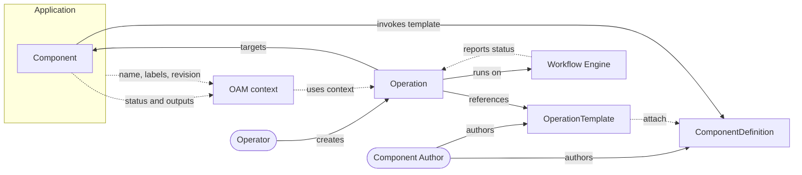

The dotted edge from `OperationTemplate` to `ComponentDefinition` is the attachment, which under Component scope is `attach.allowedComponentTypes`. The definition determines the status shape, the template is written against it, and the two are authored and versioned together.

A template may instead attach to the Application, selected by label, in which case it coordinates rather than does the work: its steps dispatch child operations against the components underneath. The picture above is the component case because that is where the encapsulation argument lives; see [Composition and Fan-out](#composition-and-fan-out) for the other.

The OAM context is not a thing anyone declares. It falls out of the Application and the Component that already exist: the app contributes its name, labels and revision, the component contributes the live status and outputs of whatever it rendered. An `Operation` consumes that rather than being told it, which is why an operator invoking a backup does not have to know a bucket name to run one.

The consequence for consumers is the one that matters. A team adopting a `postgres` component today gets deployment and health assessment from its author, and is left to write their own failover. Under this KEP they get the failover too, and when the component author learns something (a new pause-writes step, a corrected ordering), that improvement reaches every consumer through the same upgrade path as any other change to the definition.

## Who Does What

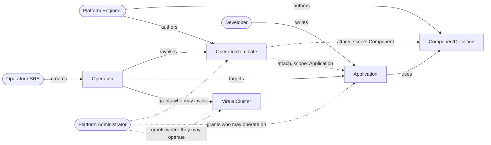

One author, two consumers. The platform engineer publishes a component and the operations that go with it; the developer consumes the first, the operator consumes the second, and both paths converge on the same running Application without either consumer reading what the platform engineer wrote.

| Role | Writes | So that |
|---|---|---|
| **Platform engineer** | `ComponentDefinition`, `WorkflowStepDefinition`, and the `OperationTemplate`s that accompany them | a component arrives with both how to deploy it and how to run it |
| **Developer** | `Application`, naming component types | they get a working deployment without acquiring the expertise behind it |
| **Operator / SRE** | `Operation`, against a component or an application | they get the runbook without acquiring that expertise either |
| **Platform administrator** | RBAC grants on templates, targets and clusters | who may run what, and where, is a decision rather than a convention |

The first two rows are the model KubeVela already has, and [KEP-2.9](../2.9-app-templates/README.md) sets out the same split for delivery: platform engineers publish capability, developers consume it.

**The third row is new.** The delivery KEPs stop at the developer, because delivery stops when the thing is running. Operations add a second consumer of the same encapsulation, arriving later and asking a different question. A developer asks *what can I deploy*; an operator asks *what can I do to what is already deployed*. Both are answered by artifacts the platform engineer wrote, and neither has to read them.

The operator is frequently not the developer and frequently not on the same team, which is why [discovery](#what-this-requires) and [permissions](#permissions) carry as much weight in this KEP as the execution model does. An operation nobody can find, or that anyone can run, fails the person in the third row regardless of how well the first two are served.

## What This Requires

Four things. The first three make the encapsulation real; the fourth is what makes it safe to hand to anyone.

**1. Operations must be declarative.** Platforms sprawl. Runbooks and automations get distributed and lost across disparate systems and teams. Declared rather than programmed, an operation lives beside the definition it accompanies, reviewable in a pull request and versioned with the component, so the knowledge travels from the people who build the component to the people who run it.

**2. Operations must be discoverable.** Encapsulation only pays off if the consumer can find what they have been given. Someone holding a component should be able to ask *what can I do to this?* and be told, without reading the definition's source, and without prior knowledge that a failover procedure exists at all. That means operations are queryable against a target and surfaceable as a list of offered actions, not a set of files somebody has to already know about.

Discoverability is also a safety property rather than only a convenience. If the platform knows which operations apply to which components, it can decline the ones that do not, and nobody is offered a failover for something with no replica to promote.

**3. Operations must be context aware and integrated with OAM concepts.** An operation attached to a bucket should know that bucket's name and region without an operator retyping them; a failover should know the instance's replicas. This is what separates an operation from a `WorkflowRun` that happens to be filed nearby: it participates in the OAM model, reading the target's live state through the same context that component rendering and health assessment already use. Without it the component author's expertise cannot actually be encoded, because the procedure would have to ask its user for the very details the abstraction exists to hide.

**4. Operations must be permissioned.** Day 2 procedures are not uniformly safe. Reading a backup manifest and promoting a replica during an incident are different acts, and the platform has to be able to tell one set of people apart from another. Three distinct questions, all of which need answering:

- *May this user act on this target?* An operation changes a running Application, so being allowed to run backups in general says nothing about being allowed to run one against `payments`. The target is checked in its own right.
- *May this user invoke this operation?* The privileged act is not creating an `Operation`, it is utilising a particular `OperationTemplate` within an Operation. Permission therefore belongs on the template, checked against the invoking user at admission, exactly as an `Application` is checked against the X-Definitions it references today.
- *What may the operation do once it runs?* By default, whatever the template was written to do, under an identity the platform provides. Requiring every operation to impersonate its invoker would mean a developer needed direct RBAC over Jobs and Secrets before they could run a backup, which is the low-level access the abstraction exists to remove. So the grant on the template is the decision, and the identity it runs under bounds the damage if that decision was wrong. Templates that warrant a named human behind them can [ask to assume the invoker's identity instead](#choosing-the-identity-per-template), and a cluster can require it of everything.

The first two are independent and both required. Holding a template does not let you point it at somebody else's application, and owning an application does not let you run procedures nobody granted you.

Requirements 1, 2 and 4 are largely settled and are covered in [Attachment](#attachment), [CLI](#cli) and [Permissions](#permissions). Requirement 3 has [three viable answers](#injecting-the-oam-context-three-options), differing in where coupling sits, how much CUE an author has to write, and what they depend on.

## Scope: Orchestration, Not Execution

KubeVela has no opinion on how an operation actually does its work, and should acquire none. It contributes four things: the **attachment** that links a procedure to the component it belongs to, the **OAM context** that tells the procedure what it is operating on, the **workflow engine** that runs the steps, and the **record** of what happened. The work itself is somebody else's.

Whether a backup turns out to be a Kubernetes Job, an Argo Workflow, a Crossplane claim, a call to a vendor API or an HTTP request to an internal CI system or service is entirely the template author's business. `WorkflowStepDefinition` is already an open vocabulary, and this KEP adds no blessed execution substrate, no `backup` primitive, and no notion of what a correct operation looks like.

**The value is derived from context and attachment, not execution.** What is powerful here is the unification of what is deployed with how it is managed: one description, versioned in one place, for the whole life of the thing. That is what reins platform sprawl back into a single declarative system, and no execution engine can supply it, because the knowledge lives in the OAM model rather than in whatever runs the steps.

**Existing investment can be adopted rather than rewritten.** A team whose backups already run as a GitHub Actions workflow does not port that into an `OperationTemplate`. They wrap the dispatch in a step, attach the template to the component, and get discovery, permissioning, context and a record on top of what they already run.

**Correctness of the procedure is not KubeVela's to guarantee.** It orchestrates, records and refuses to run what the target does not match. Whether the backup is actually restorable, or the failover ordering is right, belongs to the author, which is precisely why [requirement 1](#what-this-requires) insists the procedure be readable enough for a team to check it.

## Mental Model

| Layer | Artifact | Author | Responsibility |
|---|---|---|---|
| Template | `OperationTemplate` | Component / platform author | Declares attachment rules, parameter schema, and the workflow to run |
| Invocation | `Operation` | Operator | Names a template and, unless the template is unattached, a target; supplies parameters; records the result |
| Execution | embedded workflow engine | Controller | Builds the target's context (if any) and runs the workflow to completion |

The separation matters: an `OperationTemplate` is a high-trust artifact published alongside a `ComponentDefinition`, carrying arbitrary workflow steps. An `Operation` is low-trust: it names a template and supplies parameters against a validated schema, and cannot alter what the template does.

**"Target" means the Component or Application an operation was pointed at**, per `attach.scope`, which defaults to `Component`. An Application-scoped operation coordinates; a Component-scoped one does the work; a `None`-scoped one has no target at all and runs its steps directly. See [Composition and Fan-out](#composition-and-fan-out) and [Scope: None](#scope-none-the-unattached-case).

## Injecting the OAM Context: Three Options

All three deliver the same capability and differ in how a workflow step obtains the target's data. They are presented as peers; this KEP uses **Option 1** for its worked examples because it requires nothing that does not already exist, but that is a starting point rather than a conclusion.

### Option 1: Static template, context read by the step definition

The `OperationTemplate` is static YAML naming steps. Each `WorkflowStepDefinition` reads `context` in its own CUE template, exactly as a `healthPolicy` does.

```yaml
- name: backup
  # a step written specifically for aws-s3-bucket components: the template names
  # it and passes a destination, but the step is what knows that a bucket's name
  # lives at status.atProvider.bucketName on the target
  type: s3-backup-job
  properties:
    destination: acme-archive
```

```cue
// s3-backup-job.cue, ships with the aws-s3-bucket ComponentDefinition
template: {
  parameter: destination: string
  output: {
    apiVersion: "batch/v1", kind: "Job"
    spec: template: spec: containers: [{
      image: "my-org/backup-s3:1.4.0"
      env: [
        {name: "SRC_BUCKET",  value: context.output.status.atProvider.bucketName},
        {name: "DEST_BUCKET", value: parameter.destination},
      ]
    }]
  }
}
```

**Coupling moves into the step definition.** `s3-backup-job` knows where an S3 bucket keeps its name, so it is effectively part of the S3 component's module, shipped by the same author, versioned together. That is coherent when the two genuinely belong together.

**The cost is that the step library multiplies with the components.** A step can only read `context` for a shape it was written against, so *every* operation needing target data needs a step written for that component type. A given component might need to offer backup, restore, failover, promote-replica and rotate-credentials, so its module ships five or more bespoke `WorkflowStepDefinition`s, each a CUE file to write, test, scope-label, version and maintain. The next component along ships its own five, differing only in where a hostname or an identifier happens to live.

Worse, it puts the platform's existing step library largely out of reach. `notification`, `request`, `webhook`, `apply-object` and `read-object` all work fine, until the message needs to contain the bucket name, or the URL needs the instance endpoint. At that point there is no way to pass the value in, so the author writes `s3-notification` and `postgres-request`, and the generic steps get reimplemented once per component type.

The counter-argument is real: a well-factored module ships a handful of good steps and reuses them across its own operations, and a step that encapsulates "how we back up S3" is genuinely valuable. But the reuse stops at the module boundary: nothing in `s3-backup-job` is available to any component that is not an S3 bucket, however similar the procedure.

Works today. No dependency on any other KEP. Detailed in [Two ways a step gets its data](#two-ways-a-step-gets-its-data).

### Option 2: CUE template rendered at invocation

The `OperationTemplate` is a CUE template producing a workflow, as [KEP-2.9](../2.9-app-templates/README.md)'s `ApplicationDefinition` produces an Application spec. It is evaluated per `Operation`, with the target's context and the operator's parameters concrete.

```cue
template: {
  parameter: {destination: string, verify: *true | bool}
  output: workflow: steps: [
    {
      name: "backup"
      type: "job"                 // generic step, as in Option 3
      properties: {
        name:  "backup-\(context.operationName)"
        image: "my-org/backup-s3:1.4.0"
        env: {
          SRC_BUCKET:  context.output.status.atProvider.bucketName
          DEST_BUCKET: parameter.destination
        }
      }
    },
    // only this option can decide whether a step exists at all
    if parameter.verify {
      {name: "verify", type: "job", properties: {
        image: "my-org/backup-s3:1.4.0"
        env: {MODE: "verify", DEST_BUCKET: parameter.destination}
      }}
    },
  ]
}
```

**The most powerful, and the most to maintain.** Steps can be generated and conditional: the `if` above, or "one snapshot step per PVC this component happens to have", which is expressible here and nowhere else. Note the step itself is the same generic `job` as Option 3 uses; what differs is that the workflow around it is computed. The costs are real: authors write and test non-trivial CUE, errors move from `kubectl apply` to the middle of a running operation, and the stored template is opaque to the API server, so no structural validation and no `kubectl explain`.

It also stops being a new kind of object. In this form the artifact is an X-Definition, and should be named `OperationDefinition`, inheriting `vela def`, `DefinitionRevision`, and distribution through the addon and module machinery that already ships `ComponentDefinition`s.

Detailed in [Option 2 in detail](#option-2-in-detail-render-time-cue).

### Option 3: Expressions carry context into generic steps

The `OperationTemplate` stays static YAML, but step properties may contain the bounded expressions [KEP-2.16](../2.16-source-definition/README.md) introduces, so context and platform data can be passed into steps that know nothing about the component.

```yaml
- name: backup
  type: job                       # generic step; the template supplies the data
  properties:
    name:  'backup-$(context.operationName)'
    image: my-org/backup-s3:1.4.0
    env:
      SRC_BUCKET:  '$(context.output.status.atProvider.bucketName)'
      DEST_BUCKET: acme-archive
```

**Coupling stays visible in the template and is checked at admission.** The expression grammar is deliberately bounded: no conditionals, comparisons or function calls, so result types are a function of operand types and paths can be type-checked before an `Operation` is ever created. That restriction is also why it cannot generate steps, only fill them.

All three examples above run the same container with the same environment. What differs is where the line `SRC_BUCKET = context.output.status.atProvider.bucketName` is written:

| | Where that line lives | Consequence |
|---|---|---|
| 1 | inside `s3-backup-job.cue` | written once, reused by every operation on that component type, invisible to anyone reading the operation |
| 2 | in the template's CUE | visible, and the surrounding workflow can be computed from it |
| 3 | in the template's YAML | visible and admission-checked, but restated by every operation that needs it |

It is not three architectures; it is one line of knowledge and three places to keep it.

> **The `job` step is hypothetical.** There is no built-in `job` `WorkflowStepDefinition` today. The examples above use one because a step taking a name, an image and some environment reads clearly and keeps the comparison about where knowledge lives rather than about YAML. In practice the equivalent is `apply-object` carrying a `batch/v1` Job, or a purpose-built step of the kind Option 1 requires anyway. The same applies to `s3-backup-job` and the other named steps throughout this KEP: they are illustrative, not proposed additions to the built-in library.

Detailed in [Option 3 in detail](#option-3-in-detail-expression-based-inputs).

### Comparison

| | 1: Static + step reads context | 2: CUE template | 3: Expressions |
|---|---|---|---|
| Where the component coupling lives | `WorkflowStepDefinition` | the template | the template |
| Visible at the call site | no | yes | yes |
| Checked before running | no | no | yes, at admission |
| Generic steps usable | no | yes | yes |
| Can generate / loop steps | no | **yes** | no |
| Author must write CUE | for each step | for the template | no |
| Existing step library usable with target data | no | yes | yes |
| Steps to write and maintain | one or more **per component type × operation** | none beyond what exists | none beyond what exists |
| Depends on other KEPs | none | none | KEP-2.16 extensions |
| Available today | **yes** | needs a renderer | needs KEP-2.16 |

The step-count row is the one that compounds. Options 2 and 3 let an operation author reach for whatever already exists: the platform's steps, another module's steps, a step they wrote for something else, and supply the differences declaratively. Option 1 requires that any step touching target data be written for that component type, so the library grows with the product of components and operations rather than staying a shared set. At one component it is invisible; at twenty it is the dominant maintenance cost of the feature.

They are not mutually exclusive. Option 1 and Option 3 compose: a template can pass some values explicitly and let a bespoke step read others, which is a feature when a module ships its own steps, and a hazard if it becomes the path of least resistance in both directions. Option 2 subsumes both and replaces the template format.

### What does not depend on this choice

Most of this KEP. Attachment, the `Operation` CR, execution through the workflow SDK, re-execution, the CLI, status and retention are identical under all three. The decision is scoped to how a step obtains its data, not to three competing designs, and can be revisited without disturbing the rest.

## OperationTemplate

`OperationTemplate` is a namespaced CRD in the `core.oam.dev/v2alpha1` API version.

```yaml
apiVersion: core.oam.dev/v2alpha1
kind: OperationTemplate
metadata:
  name: s3-backup
  namespace: payments-prod
spec:
  # ── what this operation may attach to ──
  attach:
    scope: Component
    allowedComponentTypes: [aws-s3-bucket]

  # ── operation flags. Anything describing the target is read from the
  #    context by the steps themselves, not asked of the operator. ──
  parameters:
    openAPIV3:
      type: object
      properties:
        verify:
          type: boolean
          default: true
          description: Verify the backup after writing it
        retentionDays:
          type: integer
          default: 30

  # ── what it does ──
  workflow:
    steps:
      - name: backup
        # reads context.output.status.atProvider.* for the bucket and region,
        # and context.operationParams.retentionDays. See the definition below
        type: s3-backup-job
        properties:
          destination: acme-archive

      - name: verify
        if: context.operationParams.verify
        type: s3-verify-backup

      - name: record
        type: write-status
        properties:
          patch:
            lastBackup:
              status: success

      - name: cleanup
        if: always
        type: clean-jobs
        properties:
          labelSelector:
            operation.oam.dev/name: context.operationName
```

The step definitions read the target Component's live state directly, the same way that component's own `healthPolicy` would. That is not a figure of speech: it is the same context map, built by the same call.

`Component.GetTemplateContext` (`pkg/appfile/appfile.go`) asks the rendering engine for the component's live objects and adds its parameters, and `Component.EvalStatus` evaluates the CUE against the result. The application-controller reaches it through `collectWorkloadHealthStatus` and `collectHealthStatus` (`pkg/controller/core.oam.dev/v1beta1/application/apply.go`), which is what populates `context.output` and `context.outputs` for a `healthPolicy` today. An operation's step templates are handed the same map, so a component author who has written one already knows how to write the other. The full chain is in [Reusing the health-evaluation path](#reusing-the-health-evaluation-path).

```cue
// s3-backup-job.cue
"s3-backup-job": {
  type: "workflow-step"
  labels: "scope.oam.dev/operation": "true"
}
template: {
  // the step's own properties, from the workflow spec
  parameter: destination: string

  output: {
    apiVersion: "batch/v1"
    kind:       "Job"
    metadata: {
      name: "backup-\(context.operationName)"
      labels: "operation.oam.dev/name": context.operationName
    }
    spec: template: spec: {
      restartPolicy: "Never"
      containers: [{
        name:  "backup"
        image: "my-org/backup-s3:1.4.0"
        env: [
          {name: "SRC_BUCKET",     value: context.output.status.atProvider.bucketName},
          {name: "SRC_REGION",     value: context.output.status.atProvider.region},
          {name: "DEST_BUCKET",    value: parameter.destination},
          {name: "DEST_PREFIX",    value: "\(context.appName)/\(context.componentName)"},
          {name: "RETENTION_DAYS", value: "\(context.operationParams.retentionDays)"},
        ]
      }]
    }
  }
}
```

Everything here works against the feature set that exists today. The `OperationTemplate` is plain YAML with no expression language; step properties are literal; `if:` is the engine's own CUE, evaluated at step time with `context` in scope; and step templates read `context` exactly as component and trait templates already do. Nothing in this baseline depends on [KEP-2.16](../2.16-source-definition/README.md) or on any change to it.

> **This example uses [Option 1](#option-1-static-template-context-read-by-the-step-definition).** Under [Option 3](#option-3-in-detail-expression-based-inputs) the `backup` step would name a generic step and receive `SRC_BUCKET` as a property, so there would be no `s3-backup-job.cue` at all; under [Option 2](#option-2-in-detail-render-time-cue) the `workflow` block would be a CUE template producing these steps rather than listing them. The `attach` and `parameters` blocks, and everything from [`Operation`](#operation) onward, are identical in all three.

> **Design exploration (not yet accepted):** [Design 01](./design/01-application-wrapper.md) proposes an alternative execution model in which an `Operation` renders a temporary `Application` and lets the Application controller run the workflow, gaining `components`, `traits`, and policy-driven placement and resource lifecycle. It is a strict superset of the model described here, the `attach`, `parameters`, and `sources` blocks are identical, so it remains available as a later increment. This KEP's direct workflow execution remains the baseline.

### Parameters

`spec.parameters` declares what an operator may supply, as either an OpenAPI v3 schema or a CUE `parameter{}` block.

**Offering OpenAPI at all differs from KubeVela convention.** Every other artifact in the ecosystem declares its inputs as CUE, and an author moving between a `ComponentDefinition` and an `OperationTemplate` would reasonably expect the same.

The argument for offering it is that OpenAPI is already generated and persisted for every definition, just not in the definition itself. On reconcile, the definition controllers call `StoreOpenAPISchema` (`pkg/controller/utils/capability.go`), which compiles the CUE `parameter{}` block and writes an OpenAPI v3 schema into a companion ConfigMap, for both the definition and its revision. That ConfigMap is what UIs render forms from, and [KEP-2.16](../2.16-source-definition/README.md) describes the same form backing `ConfigTemplate.data.schema`. SDK generation (`vela def gen-api`, `pkg/definition/gen_sdk`) has its own OpenAPI path and is a separate consumer.

So the shape is already there; the question is where it lives. Declaring it in the CR puts the schema in the object rather than in a generated sidecar, and lets the API server validate it structurally, which it cannot do for a CUE string.

**Both forms are supported, and the field says which.** This follows the shape `Schematic` already uses for the same kind of choice (`apis/core.oam.dev/common/types.go`), where `cue` and `terraform` are mutually exclusive keys rather than a guessed type:

```yaml
# OpenAPI, the form a Kubernetes user reads everywhere else
parameters:
  openAPIV3:
    type: object
    required: [destination]
    properties:
      destination: {type: string}
      verify: {type: boolean, default: true}
```

```yaml
# CUE, the form every other KubeVela artifact uses
parameters:
  cue: |
    destination: string
    verify: *true | bool
```

The controller resolves whichever is present when the `Operation` is admitted: an OpenAPI schema validates the supplied parameters directly, a CUE block unifies them and reports CUE's own errors. Both are checked before the operation runs, so this is not a trade of safety for convenience.

Supporting both is cheap because neither is new. OpenAPI validation is ordinary, and the CUE path is the same compilation the definition controllers already perform in `StoreOpenAPISchema`.

**Exactly one of them, and it needs enforcing.** `parameters` itself is optional, but if it is present then exactly one of `openAPIV3` and `cue` must be set. This is the one place not to follow the precedent: `Schematic` permits both, and `pkg/appfile/template.go` resolves the ambiguity by assigning the CUE template and then letting Terraform overwrite it. An object with both set is accepted and quietly behaves as one of them. Nothing rejects it, and nothing tells the author which one won.

Rejection belongs at admission, alongside the checks the definition validating handlers already run. A CRD-level rule would be tighter still, since `x-kubernetes-validations` with `has(self.openAPIV3) != has(self.cue)` catches it in the API server with no webhook round trip, but no CRD in this repo uses CEL validation yet, so that would be a first rather than a reuse. Either is fine; silently preferring one is not.

**CUE is more expressive than OpenAPI, so the two are not interchangeable.** Constraints CUE can state and OpenAPI cannot will validate under one form and not the other. That is already true of every definition today, where the derived OpenAPI is a lossy view of the CUE, so it is a known asymmetry rather than a new one. Worth documenting, not worth designing around.

**Two forms means two paths to keep behaving alike.** The guard is that they share a compiler and neither is bespoke to Operations. It is also why a *third* compact shorthand is still deliberately not offered: two established forms with existing tooling is reuse, a third invented spelling is drift.

Which form suits depends on the artifact rather than on the author. A YAML manifest reads better with OpenAPI, and it is what a Kubernetes user already knows how to read. Under [Option 2](#option-2-in-detail-render-time-cue), where the whole artifact is CUE, a `parameter{}` block belongs with the rest of it. Supporting both means that choice does not have to be made now, and does not have to be unpicked if Option 2 is adopted later.

The broader question, whether KubeVela should declare OpenAPI generally rather than deriving it, is wider than one KEP and is recorded in the [open questions](#open-questions).

### Attachment

`spec.attach` declares what the operation may be run against. It answers *availability*: is this operation offered for this target at all, and nothing more. A template never acts on anything; the `Operation` does, and only against a target the template admits.

**Two of the three scopes attach to different kinds of thing, which is worth noticing.** Component scope binds to a component *type*, so a template written against an `aws-s3-bucket` is applicable wherever that definition is used and nowhere else. Application scope has no type to bind to, so it selects Application *instances* by label. The third scope, `None`, attaches to nothing at all; see [below](#scope-none-the-unattached-case).

That asymmetry follows from what exists. A `ComponentDefinition` is the contract a component-scoped template is written against, and reading its status shape is the whole point. There is no equivalent contract for an Application: two Applications carrying the same label may contain entirely different components. So an application-scoped template can assert what must be present (`requiredComponentTypes`) but cannot be written against a declared shape the way a component-scoped one is, and its steps [dispatch to components](#composition-and-fan-out) rather than reading the Application directly.

**Component scope** restricts by component type:

```yaml
attach:
  scope: Component
  allowedComponentTypes: [aws-s3-bucket]   # empty means unrestricted
```

**Application scope** restricts by label, annotation and the presence of component types:

```yaml
attach:
  scope: Application
  selector:
    matchLabels:
      dr.oam.dev/enabled: "true"
    matchExpressions:
      - {key: env, operator: In, values: [prod, staging]}
    requiredComponentTypes: [postgres]     # all listed types must be present
```

**Either scope may also constrain clusters.** `allowedComponentTypes` and `selector` say what the template understands on the target axis; `clusterSelector` says the same on the cluster axis, and it is optional in both scopes:

```yaml
attach:
  scope: Component
  allowedComponentTypes: [aws-ebs-volume]
  clusterSelector:
    matchLabels:
      provider: aws                        # this snapshot procedure is not portable
```

It is evaluated by listing clusters and matching their labels, which works today: a `VirtualCluster` carries `Labels`, and `FindVirtualClustersByLabels` (`pkg/multicluster/virtual_cluster.go`) is the existing lookup. Nothing about it requires cluster metadata in the CUE context, which is a separate question owned by [KEP-2.20 Design 04](../2.20-module-versioning/design/04-cluster-context.md) and still open. `clusterSelector` is meaningful under `None` too, in the narrower sense of restricting which clusters the operator may pass in `spec.clusters`; see [below](#scope-none-the-unattached-case).

**A cluster excluded by `clusterSelector` is refused, not skipped.** That is a deliberate difference from the [operator's own selector](#running-across-clusters), where a cluster matching `--clusters region=eu` but not running the component is skipped and reported. The operator's net was wide and being in an EU cluster without the component is not an error. `clusterSelector` is the author saying the procedure does not work there, so naming such a cluster explicitly fails at admission rather than quietly dropping it. Skip when the operator's net was wide; fail when the author's constraint was crossed.

`scope` defaults to `Component`. An Application-scoped operation exists to coordinate: its workflow dispatches [child operations](#composition-and-fan-out) against the components underneath, and it is the level at which "fail this application over" is a single reviewable thing rather than a script.

**Coordinating does not mean running centrally.** The `Application` object lives on the hub, but an Application-scoped operation still [fans out to a workflow per cluster](#cluster-targeting) like any other, and those workflows run in the target clusters rather than on the hub. The [failover example](#worked-example-dr-failover-with-a-human-gate) leans on this: `spec.clusters` names only the surviving region, so the coordinating workflow runs *there*, which is the point when the region being abandoned might have taken the hub with it. Scope decides what a workflow does once it is running, dispatch children or act directly; it does not decide where it runs.

**One kind with a scope field, not three kinds.** All three share parameters, workflow, sources, permissions, `runAs`, retention and status; what differs is `attach`, part of the context, and which steps make sense. That is a mode rather than a different artifact, so splitting them would duplicate a schema to express one field. It also keeps RBAC, discovery and the webhook path singular, and means a future fourth scope is a value rather than another CRD. `None` in particular earns its keep only because it is a value here rather than a second controller with its own schema, RBAC and CLI verb; see [Execution Model](#execution-model) for what that convergence is worth.

`OperationTemplate` avoids that by **mirroring `scope` into a label**, for the same reason [step scope](#workflowstepdefinition-scope) belongs in labels: they are server-side selectable. Discovery then filters with a selector rather than fetching and inspecting, and nobody has to build an index to answer "which of these apply to an Application" — or, for `None`, "which of these need no target at all".

Fields that are only meaningful in one scope, `selector` under Application and `allowedComponentTypes` under Component, are rejected in the wrong one at admission; under `None` both are rejected. `clusterSelector` is the exception, being meaningful in every scope, `None` included. That is the same validation obligation as the [parameters union](#parameters), and the same two ways of discharging it.

### Scope: None, the unattached case

`scope: None` is what makes `Operation` capable of everything `WorkflowRun` does today, inside the same primitive rather than a neighboring one:

```yaml
attach:
  scope: None   # no target, no context, no placement resolution
```

**`spec.target` is optional, and only under this scope.** Every other scope requires it; `None` is the one case where an `Operation` may be created without one. When it is absent, the controller skips both steps that a target would otherwise drive: it does not build a CUE context from a target's live status (there is no target to read), and it does not resolve placement from a topology policy (there is nothing to place). The workflow's steps run directly, against whatever they name themselves, exactly as a `WorkflowRun`'s steps do today.

**This is parity, not a reduced mode.** Permissions, discovery, retention, `runAs`, and the CLI are unchanged: an unattached operation is checked against the invoker exactly as an attached one is, [`clusterSelector`](#attachment) still restricts which clusters an operator may name in `spec.clusters` (there is no target to fan out over, but nothing stops an operator asking for a step to run in more than one), and it shows up in `vela operation list` and `status` like any other. What it does not get, because there is nothing for it to get, is a populated `context.output`/`context.outputs` and automatic multi-cluster placement — a step wanting either has to be pointed at a target instead, which is what the other two scopes are for.

**Why this, and not a fourth CRD or an upstream change to `WorkflowRun`.** `WorkflowRun` is delivered as an optional addon precisely so an install can omit it (KEP-2.7); extending its type would either force every install to carry the controller or leave `Operation` unable to rely on it being present, and the type itself lives in a separately-released module (`github.com/kubevela/workflow`), so the change would need upstream coordination before it reached here at all. `scope: None` needs none of that: it is a value on a type this KEP already introduces, checked by the webhook this KEP already specifies, so the cost of the unattached case is the cost of making `None` a first-class value rather than a fourth CRD, a second controller, or a second release train.

Two enforcement points, serving the two requirements attachment exists for:

- **Discovery**, `vela operation list --app <name>` and VelaUX offer only the templates whose selector matches, so a consumer can ask what can be done to a component and be told. This is requirement 2, and it is the primary purpose of the selector rather than a by-product of it.
- **Admission** rejects an `Operation` whose target does not match. An operator is never offered a failover for something with no replica to promote, and cannot construct one by hand either.

Attachment is therefore doing two jobs that look similar and are not: describing what an operation *understands* (which component types expose the status shape it reads), and controlling what it is *offered for*. Both are expressed here because they coincide in the common case, but a template that understands a type it should not be routinely offered on, a destructive repair procedure, say, is a real case, and one the selector should be able to express without widening what admission permits.

## Operation

`Operation` is a namespaced, run-to-completion CR. Each represents a single execution. Recurring operations are achieved by creating new `Operation` CRs (via CronJob, automation, or `vela operation run`).

```yaml
apiVersion: core.oam.dev/v2alpha1
kind: Operation
metadata:
  name: backup-payments-db-20260804
  namespace: payments-prod
spec:
  template: s3-backup

  # target names the Component or Application this operation attaches to.
  # Required for every scope except None, where it is omitted entirely:
  # see [Scope: None](#scope-none-the-unattached-case).
  target:
    kind: Component
    name: payments-db

  # clusters restricts which of the target's clusters are operated on.
  # Omitted means every cluster the target is dispatched to. Under scope
  # None there is no target to dispatch from, so clusters names them directly.
  clusters: [eu-west-1, eu-central-1]


  # Flags only. Nothing here describes the bucket: the steps read that from
  # the target's own context. With the optional expression layer, these values
  # may themselves be expressions; in the baseline they are literals.
  parameters:
    retentionDays: 90
    verify: true

  # retention governs the Operation record itself, not the resources it creates.
  retention:
    ttlAfterFinished: 1h
    onFailure: Retain

```

## Execution Model

The operation-controller executes the workflow using the **embedded workflow engine**, the Go library described in [KEP-2.7](../2.7-workflowrun/README.md), which is "always present on the spoke" wherever a component-controller runs.

It deliberately does **not** create a `WorkflowRun`. KEP-2.7 makes the standalone WorkflowRun controller *optional* (bundled by default, disableable). An `Operation` that depended on it would silently fail to run wherever it had been switched off. The embedded engine has no such failure mode, and the component-controller already embeds it for Component lifecycle workflows, so this follows an established pattern rather than introducing one.

**`Operation` and `WorkflowRun` converge rather than staying permanently separate features.** An early draft of this KEP drew a hard boundary — "an `Operation` is hub-orchestrated and cluster-aware; a `WorkflowRun` is spoke-local and single-cluster" — and treated the two as different kinds of thing for different jobs. That is the wrong place to draw it. `WorkflowRun`'s own KEP describes it as "an independent controller for running arbitrary workflows outside Component/Application scope" (KEP-2.7), which is exactly [`scope: None`](#scope-none-the-unattached-case): no target, no context, no placement resolution, steps that run as they are written. An `Operation` under that scope *is* what a `WorkflowRun` is today, inside the primitive this KEP already specifies, with the same permissions, discovery, retention and CLI every other scope gets for free.

Three implementation paths were weighed for closing this gap:

- **Extend `WorkflowRun` itself** to be target- and cluster-aware. Rejected: the type lives in `github.com/kubevela/workflow`, a separately-released module, so this is a coordinated upstream change rather than a local one; it also reverses KEP-2.7's own rationale for keeping the controller optional, since an `Operation` depending on it would fail silently wherever it was disabled; and once extended this way it is `Operation` under a different name, which is the "two ways to do one thing" drift this KEP rejects everywhere else, one level up.
- **Let `Operation` support the unattached case**, via `scope: None`. Adopted. One controller, one CLI, one permissions model, whether or not a given operation has a target. The cost is low because the machinery is being built either way; what changes is treating `None` as a first-class value rather than a validation-skipping afterthought.
- **Client-side execution**, where the CLI itself fetches a template and runs its steps against the invoker's own kubeconfig rather than an on-cluster controller. Considered and deferred: it trades away exactly the property this KEP exists to provide, a durable, resumable, auditable record of what ran, for simpler RBAC. Out of scope for this KEP.

**Migration is incremental, not a flag day.** The `WorkflowRun` addon stays available and unchanged while `scope: None` operations are proven out; it is deprecated only once parity is confirmed, at which point a cluster can retire the addon without losing anything a bare workflow could do. Nothing here requires migrating existing `WorkflowRun`s on any particular timeline.

So attachment is something an `Operation` usually has rather than what defines it, and there is a real class of work with an OAM target of neither kind: fleet-wide reads, cluster bootstrap checks, anything whose subject is the cluster. That is distinct from the unattached case above, since the cluster *is* a target, just not a Component or Application one. [Design 04](./design/04-cluster-scope.md) works that case through as a further `scope: Cluster`. It is deliberately secondary to the thesis of this KEP and shares its machinery rather than extending its argument.

### The shape of a reconcile

Admission is covered by the two decision trees under [Permissions](#permissions) and is not repeated here. This is what happens once an `Operation` is admitted:

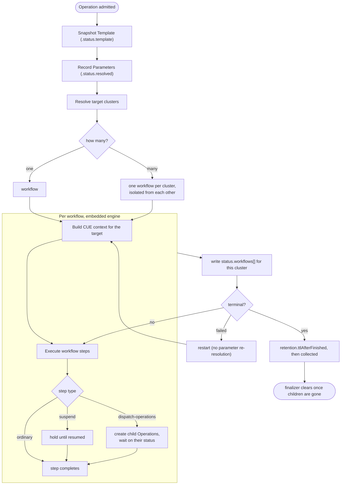

Three things in that flow are the ones worth arguing with, and each is stated elsewhere in this KEP rather than only in the picture.

**Parameters and the template are fixed at creation; nothing else is.** `spec.parameters` evaluate once and are recorded, and the template is snapshotted, so a `restart` runs the same procedure with the same arguments. `context` and sources deliberately are *not* fixed: both resolve when a step executes, so a re-run observes the world as it is now. See [Stability across steps](#resolution-timing-by-root), where freezing sources was considered and rejected.

**Clusters fan out, children do not.** One `Operation` becomes N workflows because it is one procedure applied in several places. Dispatched children are separate `Operation` objects because they are *different* procedures against different targets. Those two multiplicities are easy to conflate and behave differently under failure.

**A child is an ordinary `Operation`.** It is created by the controller, admitted like any other, and finalized like any other, which is why the parent cannot go until its children have. What child admission does *not* do is re-litigate the invoker's grants: those were settled when the parent was applied, [`requireDirectGrant`](#requiring-a-direct-grant-instead) included, so a permission refusal never surfaces mid-run. What can still fail at dispatch is anything that depends on the state at that moment, a target that no longer matches `attach` or a [lease](#concurrency) held by someone else.

### Type reuse

Neither CRD introduces a type that already exists. The novel surface is small and deliberately so:

| Field | Type | Source |
|---|---|---|
| `spec.workflow` | `WorkflowSpec` | `github.com/kubevela/pkg`, `apis/oam/v1alpha1/workflow_types.go` |
| `spec.workflow.steps[]` | `WorkflowStep` | same |
| `spec.sources[]` | source binding | the type [KEP-2.16](../2.16-source-definition/README.md) introduces for `Application.spec.sources[]` |
| `spec.parameters` | OpenAPI v3 schema | the same shape `StoreOpenAPISchema` already derives for every Definition |
| `status.workflows[].` (phase, steps, contextBackend) | `WorkflowRunStatus` | `github.com/kubevela/workflow`, the same status an Application stores |
| **`spec.attach`** | new | the only genuinely new concept |
| **`spec.retention`, `attempts[]`, `children[]`** | new | run-to-completion lifecycle and composition |

An `Operation` is close to *`Application` minus `components`, `policies` and `traits`, plus `attach`*. Where the two overlap they are the same types, so a change to `WorkflowStep` reaches both without a porting step.

**The subtraction is where this most likely goes next.** An `Operation` is an Application with a short lifecycle, and the fields it currently lacks are exactly the ones that would let a template reach for the platform's definition library instead of hand-written step YAML: `components` for the work itself, `traits` for what surrounds it. That would close the [step-count problem](#comparison) at its root rather than working around it, since a `task` component brings a parameter schema, a health policy and a status reader that somebody already maintains.

[Design 01](./design/01-application-wrapper.md) sets out what that buys and the one thing that makes it hard: owning resources means collecting them, and an operation whose purpose is to leave something behind must not silently revert on success. That is a solvable problem rather than a reason to rule it out, and it is why this KEP treats the omission as a starting point rather than a boundary.

`policies` is the exception and should stay subtracted. It is [a compilation target, not an authoring surface](./design/01-application-wrapper.md#policies-are-compiled-never-exposed): the moment a template can write raw policies, an `Operation` becomes an Application with extra steps and the abstraction stops earning anything.

### Workflow reuse

An `Operation`'s workflow is not an Application's workflow, but it is not a lookalike either. `OperationTemplate.spec.workflow` is `WorkflowSpec` from `github.com/kubevela/pkg` (`apis/oam/v1alpha1/workflow_types.go`), the same Go type an `Application` and a `WorkflowRun` use, so there is no translation layer between the template and the engine and nothing to drift.

Everything a step can do in an Application workflow it can do here:

| Field | Notes for Operations |
|---|---|
| `name`, `type`, `properties` | as in an Application |
| `if` | including `always`, which supplies cleanup and compensation |
| `timeout` | per-step bound, including on a `dispatch-operations` step waiting on children, so nothing waits forever unless it was told to |
| `dependsOn` | explicit ordering independent of list order |
| `inputs` / `outputs` | step-to-step data passing, a snapshot step emits an identifier the restore step consumes |
| `subSteps` + `mode` | `DAG` or `StepByStep`, so a fan-out group runs in parallel while the operation as a whole stays ordered |
| `meta.alias` | human-facing label |

`inputs`/`outputs` matter more here than they might appear. An operation is often a chain where each step's result is the next step's argument: a snapshot ID, a lease token, a promoted endpoint, and that already works without a bespoke mechanism.

Consistency is the default, and deviating from it is what needs justifying: a step author writing for both surfaces should not have to learn two shapes, and the engine should not need an adapter that can drift.

### Executing the workflow

The operation-controller follows the same sequence the application-controller uses (`pkg/controller/core.oam.dev/v1beta1/application/generator.go` and `application_controller.go`). The differences are in what is supplied, not in how it is driven.

```go
// 1. Build the CUE process context. This is what steps see as `context`.
//    The Application builds it from the app; the Operation builds it from the
//    target, plus the parameters fixed on the CR.
pCtx := velaprocess.NewContext(generateContextDataFromOperation(ctx, op, target))

// 1a. Attach the identity the operation runs as, resolved from the template's
//     runAs mode. Everything that touches the cluster inherits it.
ctx = auth.ContextWithUserInfo(ctx, identityFor(op, template))

// 2. Inject runtime capabilities. An Operation needs a strict subset of the
//    Application's: it renders no components, so ComponentApply and
//    ComponentRender are omitted. WorkloadRender and ComponentHealthCheck are
//    retained: they are how context.output and .outputs are populated,
//    the same routine that serves healthPolicy.
ctx.SetContext(oamprovidertypes.WithRuntimeParams(ctx.GetContext(), oamprovidertypes.RuntimeParams{
    WorkloadRender:       ...,   // renders the target component
    ComponentHealthCheck: ...,   // reads its live objects
    KubeHandlers:         &providertypes.KubeHandlers{Apply: h.Apply, Delete: h.Delete},
    ConfigFactory:        ...,
    KubeClient:           h.Client,
    // ComponentApply / ComponentRender / Appfile / App: not supplied
}))

// 3. Build the WorkflowInstance. ChildOwnerReferences point at the Operation,
//    so the engine's context backend is collected with the Operation record.
instance := &wfTypes.WorkflowInstance{
    WorkflowMeta: wfTypes.WorkflowMeta{
        Name: op.Name, Namespace: op.Namespace, UID: op.UID,
        Labels: op.Labels, Annotations: op.Annotations,
        ChildOwnerReferences: []metav1.OwnerReference{ /* → Operation */ },
    },
    Steps: template.Workflow.Steps,
    Mode:  template.Workflow.Mode,
}
instance.Status = copyWorkflowStatusToInstance(op)   // resume across reconciles
executor.InitializeWorkflowInstance(instance)

// 4. Generate runners and execute.
runners, err := generator.GenerateRunners(ctx, instance, wfTypes.StepGeneratorOptions{
    Compiler:       providers.DefaultCompiler.Get(),
    ProcessCtx:     pCtx,
    TemplateLoader: template.NewWorkflowStepTemplateRevisionLoader(...),
})
state, err := executor.New(instance).ExecuteRunners(authCtx, runners)
```

Four points where an Operation differs:

**The process context is built from the target, not the app.** `generateContextDataFromOperation` is the analogue of `generateContextDataFromApp`, and it is the single place the OAM context the KEP is built on gets assembled: target output and outputs from the health-assessment routine, the operation's parameters, cluster metadata. Sources are not in it. They only exist at all under [Option 3](#option-3-in-detail-expression-based-inputs), and there they resolve per step as their expressions are evaluated rather than being assembled into the context up front.

**Status round-trips through `WorkflowRunStatus`.** `copyWorkflowStatusToInstance` restores phase, suspend state, step statuses, and the context backend reference across reconciles, exactly as the Application does, which is what makes suspend/resume and re-execution work without bespoke state. Each entry in `Operation.status.workflows[]` stores one verbatim; the cluster, children and attempt history sit alongside rather than replacing it.

**The execution identity is explicit.** The application-controller wraps its context with `auth.ContextWithUserInfo` before applying (`generator.go`), sourced from annotations on the Application. An Operation resolves the same annotations, but the value comes from [`runAs`](#choosing-the-identity-per-template) on the template rather than from the target: a named service account, the invoker, or the invoker regardless if the cluster gate demands it.

**Terminal handling differs, and only here.** The Application maps `WorkflowStateSucceeded` back to `ApplicationRunning` and keeps reconciling. The Operation maps it to `Succeeded`, records `completionTime`, stops, and lets `spec.retention` govern the record. This is the entire behavioural difference between the two controllers.

### Observability additions go in `meta`

Where Operations do need more than an Application, the extension point is `WorkflowStepMeta`, which already exists for `alias` and is the designated home for human-facing metadata. Adding optional fields there keeps `WorkflowStep` itself identical for the engine, which ignores `meta` entirely, while the CLI and UI render it.

```yaml
- name: promote-replica
  type: promote-replica-job
  meta:
    alias: Promote replica
    description: >
      Promotes the read replica to primary. Writes are unavailable
      until this completes, and it cannot be undone by re-running.
    impact: Irreversible
```

| Field | Purpose |
|---|---|
| `alias` | existing, short label |
| `description` | what the step does and why, rendered by `vela operation status`. A runbook read during an incident is read by someone who did not write it. |
| `impact` | `Safe` / `Disruptive` / `Irreversible`. Renders in `status`, and gates re-execution alongside the step definition's `idempotent` declaration. |

`impact` is the one with teeth. `vela operation status` showing which steps have already had irreversible effects is the difference between an operator who can reason about a half-failed failover and one who is guessing. It is deliberately author-declared rather than inferred, the engine cannot know, and a wrong inference here is worse than none.

These are additive optional fields on a shared type, so an `Application` gains them too and simply does not render them. That is preferable to forking `WorkflowStep` for Operations, which would put the two surfaces on a path to drifting.

### Fields worth adding to `StepStatus`

`StepStatus` (`github.com/kubevela/workflow`, `api/v1alpha1/types.go`) is `{ID, Name, Type, Phase, Message, Reason, FirstExecuteTime, LastExecuteTime}`. Everything a step wants to say beyond phase has to go through free-text `Message`, which callers then parse. Three additions would serve Applications and `WorkflowRun` as much as Operations, and each has precedent in `ApplicationComponentStatus` or an existing engine behaviour that is computed but discarded.

| Field | Why | Precedent |
|---|---|---|
| `Details map[string]string` | Structured progress without string-parsing a message, e.g. `deploy` with `parallelism` reporting per-batch counts. **Two-part change:** the field on `StepStatus`, plus a writer on the `Action` interface, which today exposes only string-valued methods. | `ApplicationComponentStatus.Details` |
| `Retries int` | The engine already computes retry state (`failedAfterRetries`, `checkFailedAfterRetries` in `pkg/executor/workflow.go`) but persists only a message constant. How many times a step retried before succeeding is currently unknowable from status. | behaviour exists; only the count is missing |
| `Cluster string` | Which cluster the step executed against. Absent today, and needed the moment a workflow targets more than one, true for multi-cluster Applications as much as for Operations. | `ApplicationComponentStatus.Cluster` |

`Retries` is the strongest of the three: the information already exists inside the executor and is discarded at the status boundary, which is a pure loss and the first question anyone asks about a step that eventually went green.

`Details` is explicitly **not** required by this KEP. [Child status](#child-status-and-lifecycle) is aggregated by the controller from objects it owns rather than reported by the step, which is the more durable path anyway. `Details` is worth having for steps with nothing to aggregate from, batch and parallel ones especially, but nothing here is blocked on it, and it is the largest of the three changes.

**`Retries` and `attempts[]` are different things** and should not be conflated. `Retries` counts the engine's own retries *within a single execution*; `attempts[]` records operator-triggered re-runs *across executions*, each with its own trigger and timestamps. An operation can legitimately show `attempts: 2` where the second attempt itself has `retries: 3`.

These are types in `github.com/kubevela/workflow`, a separate repository on its own release cycle, and consumed here through a pinned version rather than a local replace, so the change lands upstream first and arrives later. And status fields are API surface: additive and optional is cheap, removal is not. That argues for taking the three with clear precedent and leaving speculative ones (execution attribution, structured outputs) until something concrete needs them.

### Resource ownership and cleanup

Resources created by workflow steps are **not tracked**. There is no ResourceTracker, no owning Application, and no garbage collection. The consequences are deliberate:

- Anything a step applies **persists until something removes it**. An operation whose purpose is to leave something behind, a restored PVC, a rotated Secret, a promoted replica, does so by default, with no policy required.
- Cleanup of transient resources is the template author's responsibility, expressed as a step. The workflow engine supports `if: always` (`pkg/executor/workflow.go`), which gives ordinary finally semantics:

```yaml
- name: cleanup
  if: always
  type: clean-jobs
  properties:
    labelSelector:
      operation.oam.dev/name: context.operationName
```

The failure polarity of this choice is the reason for it. If an author forgets to think about lifecycle, the failure is a leaked Job, visible in `kubectl get jobs` and cleanable. The alternative model, in which the operation owns its resources and collects them on completion, fails the other way: a forgotten retention marker means a successful restore silently reverts itself. See [Design 01](./design/01-application-wrapper.md) for how that model addresses it and what it costs.

## Option 2 in Detail: Render-Time CUE

Adopting [Option 2](#option-2-cue-template-rendered-at-invocation) replaces the template format: `spec.workflow` becomes a CUE template producing a `WorkflowSpec`, evaluated once per `Operation` with the target's context and the operator's parameters concrete. This is [KEP-2.9](../2.9-app-templates/README.md)'s `ApplicationDefinition` model applied to workflows, and it converges the two authoring stories rather than leaving them divergent.

```cue
template: {
  parameter: {verify: *true | bool}
  output: workflow: steps: [
    for name, res in context.outputs if res.kind == "PersistentVolumeClaim" {
      {name: "snapshot-\(name)", type: "apply-object", properties: {...}}
    },
  ] + [
    if parameter.verify {
      {name: "verify", type: "request", properties: {...}}
    },
  ]
}
```

**What only this option can do.** Generate steps from the target's actual shape. "One snapshot step per PVC this component happens to have" is not expressible under Option 1 or 3 at all.

**What it costs.**

*Authoring and testing.* Every template becomes a program. Component authors write comprehensions and conditionals, and the failure modes of CUE evaluation, non-concrete values, unintended unification, incomplete errors, become theirs. This is the cost the KEP's declarative premise was meant to avoid, and it should not be waved away: the artifact stops being reviewable by someone who does not write CUE.

*Error timing.* Errors move from `kubectl apply` to the middle of a running operation. For a runbook executed during an incident this is the worst possible moment for a typo to surface.

*Opacity.* The stored template is a CUE string, so no structural validation, no `kubectl explain`, and `spec.workflow` cannot be schema-checked by the API server.

*Per-step resolution is foreclosed.* A whole-template render happens once, so every value is fixed before step 1 runs and `context` cannot be re-read later. A failover that promotes a replica at step 3 and needs the new endpoint at step 5 must fall back to explicit `read-object` steps for state the target already exposes. Options 1 and 3 both resolve as each step executes.

**If this option is chosen, the artifact is an X-Definition and should be named one.** A metadata block, `template:` at the top level, `parameter` and `output` inside it. that is the `ComponentDefinition` / `TraitDefinition` / `SourceDefinition` shape exactly. Calling it `OperationTemplate` while it behaves in every respect like a definition would invent a parallel concept for no reason. Under Option 2 it becomes **`OperationDefinition`**, which is also the name [KEP-2.9](../2.9-app-templates/README.md) already uses for it.

The name is not the point; what comes with it is. As a definition it inherits machinery this KEP would otherwise specify from scratch:

| Comes free | What this KEP currently proposes instead |
|---|---|
| `vela def apply / get / list / show / vet / del` | nothing; the CR is applied with `kubectl` like any other manifest |
| `DefinitionRevision`, immutable, versioned | an [inline template snapshot](#the-template-is-snapshotted-not-referenced) in `Operation.status` |
| Parameter schemas derived and published for UIs automatically | `vela op list` output assembled by hand |
| Definition admission and validation webhooks | operation-specific admission |
| Snapshotting into `ApplicationRevision` alongside other definitions ([KEP-2.9](../2.9-app-templates/README.md)) | not addressed |
| Distribution through addons and modules ([KEP-2.13](../2.13-addons/README.md), [KEP-2.20](../2.20-module-versioning/README.md)) | not addressed |

The last row is the thesis of this KEP rather than a convenience. Definitions are how capability is packaged and shipped in this ecosystem. If an operation is a definition, it travels with the `ComponentDefinition` through the module and addon machinery that already exists, which is precisely what "authored together, versioned together, shipped together" requires. Under Options 1 and 3 that distribution path has to be established for a new kind of object.

The counter-weight is real too: this makes CUE mandatory for every operation author, including those writing a three-step runbook that needs no computation at all. Options 1 and 3 keep the simple case in YAML.

**Compatibility.** Adopting this later does not invalidate work done now: `spec.workflow` could accept either a static list or a CUE template producing one, since the engine consumes the same `WorkflowSpec` either way. Under Options 1 and 3 the artifact stays a YAML manifest applied like any other; an author wanting CUE for the parameter schema alone already has [`parameters.cue`](#parameters) without the artifact becoming a definition.

## Option 3 in Detail: Expression-Based Inputs

Adopting [Option 3](#option-3-expressions-carry-context-into-generic-steps) means step properties may carry KEP-2.16's bounded expressions, and `spec.sources[]` bindings become available on both the `OperationTemplate` and the `Operation`. It can be adopted alongside Option 1 or instead of it; nothing elsewhere in the KEP changes either way.

**What it solves.** Under Option 1 alone, a step needing target or platform data must read it itself, which means a purpose-built `WorkflowStepDefinition` per data shape. That is right when the step ships alongside the component it understands, and wrong when the step is generic. There is no way to hand `apply-object` a bucket name without writing an `s3-apply-object`.

**What it adds.** Expressions in step properties, plus declarative source bindings:

```yaml
spec:
  sources:
    - name: backup-archive
      type: backup-archive-reader
      properties: {scope: platform}

  workflow:
    steps:
      - name: notify-start
        type: notification              # generic step, no bespoke definition
        properties:
          slack:
            url: '$(source["backup-archive"].slackWebhook)'
            message:
              text: 'Backing up $(context.componentName)'
```

The gain is that data flow becomes visible at the call site and checkable at admission, and generic steps become usable where a bespoke one would otherwise be required.

**What it costs.** Two dependencies Option 1 does not carry, the `$(parameter.*)` expression root and registration of `Operation.spec.parameters` as a consuming surface, both of which are KEP-2.16's to grant ([open questions](#open-questions)), and, if adopted alongside Option 1, a second way to do one job, which is the drift KEP-2.16 itself warns about.

The remainder of this section specifies the behaviour if it is adopted.

### Source resolution

Sources behave exactly as [KEP-2.16](../2.16-source-definition/README.md) specifies, with no operation-specific resolution mode. Resolution is **lazy and just-in-time**: a source is processed when a surface referencing it is rendered, here, when a workflow step that carries the expression executes, checking the cache first and executing the `SourceDefinition`'s `template:` only on a miss or expiry.

Laziness is not incidental and should not be optimised away. A step guarded by `if: false` never renders, so its sources are never resolved and their `template:` blocks, which perform real I/O, never run. An operation-controller that eagerly resolved every declared binding at creation would execute network calls for sources no executed step ever reads, and could fail an operation on a source irrelevant to the path it actually took.

What each source resolution observed is recorded in `Operation.status.resolved.sources` for audit, so the run stays reconstructible without changing when resolution happens.

### The template is snapshotted, not referenced

`Operation.spec.template` names a template; it does not mean the controller re-reads it. At creation, the operation-controller copies the template into `status.template` **with its expressions intact, unresolved**. Every subsequent reconcile executes from that snapshot. What gets resolved when is [a separate question](#resolution-timing-by-root), and keeping the snapshot unresolved is what makes both answers available.

Snapshotting the source text rather than a render also keeps the record legible: `status.template` diffs directly against the `OperationTemplate` it came from, so "did this run use the version I think it did" is answerable by eye, not by reconstructing a render.

Referencing live would be wrong in three separate ways:

| | Failure if the template is read live |
|---|---|
| Mid-run edit | Steps 1–4 came from one template, step 5 from another. The run is incoherent and nothing records that it happened. |
| Re-execution | `restart --step` an hour later replays against whatever the template says *now*, so the attempt history describes runs that never occurred. |
| Audit | "What ran?" has no answer once the template has moved on, the worst case being the failed operation you retained precisely in order to investigate. |

This follows the established rule rather than inventing one: KEP-2.9 specifies that re-renders and rollbacks "always use the snapshotted Definition versions, not whatever is currently installed in the cluster", and `DefinitionRevision` exists for the same reason.

**Inline the render rather than pinning a revision.** Both would be correct; inlining suits this object better. An `Operation` is short-lived with a TTL, so the storage cost is bounded and temporary, and inlining makes the record self-contained, readable without chasing a revision that may itself have been garbage-collected, which KEP-2.9 notes is an active concern for template revisions. It also avoids making `OperationTemplate` grow its own revision and GC machinery before anything needs it.

Template identity and a content hash are recorded alongside for provenance, so two operations can be compared without diffing their full templates.

**Editing a template does not affect operations already running, by design.** To run a changed template, create a new `Operation`, `restart` replays what this run was, which is the only thing that makes its attempt history meaningful.

### Resolution timing by root

**Everything in a template resolves at the same moment: when the step carrying the expression executes.** There is no substitution pass at creation and the snapshot in `status.template` is never rewritten. Whether a root's value came from the CR, a cache, or a live read is invisible to the expression, all operands are concrete by the time it is evaluated.

| Root | Where the value comes from at step time |
|---|---|
| `parameter.*` | the `Operation` CR, fixed for the life of the object |
| `source.*` | KEP-2.16 resolution: cache hit within `storageTTL`, otherwise the `SourceDefinition` executes |
| `context.*` | a live read of the target |

So an expression mixing roots poses no question at all:

```yaml
target: '$(source["backup-archive"].bucket + "/" + context.componentName)'
```

One evaluation, when the step runs. This is the main reason not to resolve roots at different times: a two-pass scheme would make this expression ill-defined *and* would mean rewriting the template snapshot mid-run, destroying the property that makes it worth keeping.

The one surface that differs is `Operation.spec.parameters` on the CR. Those expressions evaluate at creation, before any step exists, so every root there, `context` included, is creation-time. That is a property of the surface, not an exception: there is no step to defer to.

**Stability across steps comes from the cache, not from a freeze.** Two steps reading the same source within its `storageTTL` get the same value, served from the same `Config` entry. that is what the cache key and TTL are *for*. What the cache does not promise is stability across a TTL boundary, so a long or suspended operation can legitimately see a source change between steps.

Where a value must be identical across steps regardless, the mechanism already exists and is explicit: read it in an early step and carry it forward through step `outputs`/`inputs`. That puts the pinning in the workflow where a reader can see it, rather than in a resolution rule they have to know about.

An earlier draft of this KEP froze all sources at creation to guarantee that stability. It was the wrong trade: it broke laziness, diverged from KEP-2.16 for the one consumer least able to justify a bespoke mode, and hid a decision that `outputs`/`inputs` express perfectly well in the open.

The case that forces live `context` is concrete: a failover promotes a replica at step 3, then at step 5 wants the new primary's endpoint. Determined at start, `context.output` describes the world as it was *before the operation ran*, and step 5 silently uses a pre-promotion endpoint. Reading it at each step is the correct behaviour, not a convenience, and it costs nothing structurally, since each step's CUE template is already evaluated at execution time by the engine.

The early-failure property this KEP cares about is preserved by admission, not by resolution timing. Every expression's path, type and surface are checked at `kubectl apply` (KEP-2.16's admission rules, unchanged), so configuration errors are rejected before an `Operation` is ever created: an undeclared binding, a mistyped parameter, a path not in a source's schema. What remains at run time is failure of the *external system*: a source that cannot be reached, or a path absent because the world is not yet in the expected shape. Neither is knowable in advance under any resolution scheme.

**Suspend is the sharp edge.** An operation held overnight for approval and resumed at 09:00 re-reads everything: `context` against a world that has moved on, which is usually right since the approver is approving what happens *now*; and any source whose `storageTTL` has since expired. A template that needs the value the operation started with must have captured it in a step output before suspending. This is worth calling out in author-facing documentation, because "it was fine in testing, where the whole thing took ninety seconds" is exactly how this class of bug reaches production.

`read-object` remains available and is still the right tool for reading something that is *not* the target, a related resource, a lease, another component's state. `context` covers the target; steps cover everything else.

### Two sets of bindings

| | `OperationTemplate.spec.sources[]` | `Operation.spec.sources[]` |
|---|---|---|
| Author | Platform / component author | Operator |
| Consumable from | Workflow step properties | `Operation.spec.parameters` |
| Trust | High, published with the template | Low, supplied per invocation |

They are separate namespaces. Neither can reference the other's bindings; values cross the boundary only through `parameters`. Within each set, KEP-2.16's ordering rules apply unchanged, declaration order, forward references only.

As in KEP-2.16, an expression naming a binding that is not declared is rejected at admission. A template that consumes `$(source["platform-endpoints"].slackWebhook)` must declare `platform-endpoints` in its own `spec.sources[]`.

### Expressions

Consumption uses KEP-2.16's `$( )` expressions, unchanged in grammar and type-checking.

**This KEP depends on one extension to KEP-2.16: `parameter` as an expression root.** Today the type-checker rejects `$(parameter.image)` with *unknown identifier "parameter"*, because parameter substitution in Applications is specified separately in [KEP-2.9](../2.9-app-templates/README.md) as the `fromParameter` directive, the structural twin of the `fromSource` directive KEP-2.16 removed on the grounds that a directive can name a value but not compute with one, and that two mechanisms mean two enforcement paths that drift.

Adding the root reuses the existing machinery rather than introducing any: the OpenAPI parameter schema supplies the declared types, sentinels are materialised from it, and the result kind is compared against the consuming step parameter exactly as it is for source fields today. It buys admission-time detection of the errors that would otherwise surface mid-operation:

| Written | Rejected at admission with |
|---|---|
| `days: '$(parameter.retentionDayz)'` | *not declared in the template's parameter schema* |
| `replicas: '$(parameter.secondaryRegion)'` | *is string but step "scale" parameter expects int* |
| `region: '$(parameter.optionalRegion)'` | *may be absent and feeds required … supply a default with `*… \| <fallback>`* |

This resolves the KEP-2.9 / KEP-2.16 disagreement with one mechanism rather than deepening it. The decision is not this KEP's to make alone; see [Open Questions](#open-questions).

**What expressions deliberately cannot do.** KEP-2.16's grammar admits "no conditionals, no comparisons, no function calls, and exactly one disjunction", the restriction that makes the result type a function of operand types, and therefore makes admission-time checking sound. So an expression can substitute a value into a step; it cannot decide whether a step exists, or emit one step per item in a list.

Whether that matters in practice is what separates [Option 2](#option-2-in-detail-render-time-cue) from the baseline: render-time CUE is the only form that can generate steps rather than fill them.

## Where Inputs Come From

This is the centre of the feature, and the easiest thing to get wrong when authoring a template. Inputs have distinct origins, and confusing them produces runbooks that ask an operator to retype what the platform already knows.

| Origin | Answers | Example |
|---|---|---|
| **Target context** | *What is this thing?* | the bucket's name, its region, the database's endpoint, the current replica count |
| **Parameters** | *What should this run do?* | verify or not, retention days, dry-run, which region to fail over to |
| **Sources** *(optional layer)* | *What does the platform provide?* | the backup archive, the Slack webhook, the PagerDuty URL |

Under [Option 1](#option-1-static-template-context-read-by-the-step-definition), target context and parameters both reach a step through `context`, read by the step's own template, and platform data has no dedicated mechanism, a step needing it reads it as any controller would, with a `read-object` or `read-config` step. [Option 3](#option-3-in-detail-expression-based-inputs) makes both declarative, at the call site. [Option 2](#option-2-in-detail-render-time-cue) makes both available to the template renderer. The distinction between the three origins holds regardless of which is chosen.

**If an operator could not answer a question without looking it up in the cluster, it is not a parameter.** A backup that asks for `--bucket` when it is attached to a bucket component has pushed the platform's own knowledge onto the person least placed to supply it, and re-introduces exactly the manual data-passing this KEP exists to remove.

Parameters remain the right home for operation-specific flags and for genuine decisions, a failover's target region is a choice, not a lookup.

### The target's context is built the same way health assessment builds it

The operation-controller does not define a context shape of its own. It fills the existing one with the target's values, using the same status-collection call that serves `healthPolicy` and `customStatus`, so `context.output` and `context.outputs.<name>` mean in a step template exactly what they mean in `task.cue` or `expose.cue`. See [CUE Context](#cue-context) for the field list, including the one field whose meaning is operation-specific, and [Reusing the health-evaluation path](#reusing-the-health-evaluation-path) for the call chain.

The trade is that an `OperationTemplate` reads the component's raw status shape, so it is coupled to the component type, which is what `attach.allowedComponentTypes` is really guarding. A declared contract would decouple them; [KEP-2.17](../2.17-component-exports/README.md)'s `exports` is the obvious candidate if and when it lands, and would let an operation attach to any component type satisfying a shape rather than to a named list.

### Two ways a step gets its data

A `WorkflowStepDefinition`'s CUE template has `context` in scope, so there are two ways for target data to reach a step.

**Implicit, the step reads `context` itself. This is the baseline.** The template names only the step; the step definition knows the shape. It requires nothing that does not already exist.

```yaml
- name: backup
  type: s3-backup-job          # reads context.output.status.atProvider.* internally
```

```cue
// s3-backup-job.cue
template: {
  output: {
    apiVersion: "batch/v1"
    kind:       "Job"
    spec: template: spec: containers: [{
      env: [{name: "SRC_BUCKET", value: context.output.status.atProvider.bucketName}]
    }]
  }
}
```

| | Explicit | Implicit |
|---|---|---|
| What the template shows | the data the step consumes | the step's name |
| Coupling to the component's status shape | in the `OperationTemplate`, per use | in the `WorkflowStepDefinition`, once |
| Admission checking | expression path and type validated against the step's `parameter` schema | none. There is no expression to check |
| Reuse | generic step, many component types | one step per shape it understands |
| Verbosity | high | minimal |

**The coupling exists either way. The question is where it is declared, and whether it is visible.** Explicit puts it in the template, where a reviewer reading the runbook can see what it touches and admission can check it. Implicit moves it into the step definition, where it is checked by nothing and invisible to anyone reading the operation.

Implicit is nonetheless the right choice in one clear case: a step shipped *alongside* the `ComponentDefinition` whose status it reads, by the same author, as part of the same module. There the coupling is internal rather than across a boundary, and forcing the shape out into every template that uses the step would spread a private detail across artifacts that should not know it. A `postgres` module shipping `postgres-promote` is the shape to expect.

The KEP already uses both, and the split is a reasonable model to follow: [`write-status`](#status-writeback) reads its target implicitly: it always writes to the operation's target, which is not a parameter, while taking its `patch` explicitly, because that is the caller's decision rather than the platform's.

**Implicit steps make `scope` load-bearing.** A step presuming an Operation's context will misbehave in an Application workflow, where `context.output` is the rendered component being applied rather than an operation's target, and it will do so silently, since there is no expression whose path could fail. Any step reading `context` directly should declare `scope.oam.dev/operation` and rely on [enforcement in the template loader](#workflowstepdefinition-scope). This is the strongest argument in the KEP for promoting scope from advisory metadata to something the generator refuses.

This is the same trade-off as a workflow reference that can be handed additional context: convenient, and it works, but what the callee actually reads stops being visible at the call site. Neither form is wrong; the cost is paid in different places, and it should be a deliberate choice rather than whichever the author reached for first.

Resolution timing is identical either way: a step's CUE template is evaluated when the step executes, which is exactly when its expressions would have been. Choosing implicit changes what is visible, not what is fresh.

### `$( )` collides with Kubernetes env expansion

Operations apply Pod specs far more often than Applications do, so a collision that is theoretical elsewhere is routine here: **Kubernetes expands `$(VAR)` in container `args` and `env` itself**, using the same delimiter as KEP-2.16 expressions and the same `$$(` escape.

An unescaped `$(SRC_BUCKET)` in a container's args is read as an expression, fails to name a declared root, and is rejected at admission, loudly, which is the good case. The rule is:

| Written | Resolved by |
|---|---|
| `$(context.componentName)` | the operation-controller, before the workflow runs |
| `$$(SRC_BUCKET)` | Kubernetes, when the container starts |

Shell command substitution in a `command:` array has the same problem and the same fix. This should be prominent in author-facing documentation rather than discovered.

## CUE Context

**The context is the existing one, populated for the target.** No `context.target` namespace, no parallel vocabulary. `velaprocess.ContextData` (`pkg/cue/process/handle.go`) already carries `AppName`, `CompName`, `AppLabels`, `AppAnnotations`, `Cluster` and `Output`, and `process.NewContext` maps `CompName` to `context.componentName`. An Operation fills the same struct with its target's values.

The payoff is that a `ComponentDefinition` author who has written a `healthPolicy` against `context.output.status` already knows how to write an operation. The spelling is identical, and snippets move between the two unchanged.

Where each part comes from:

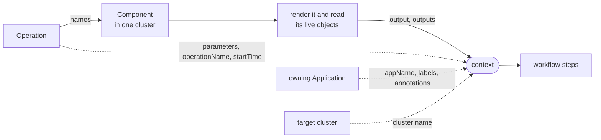

The solid path is the only part that does any work: the target is rendered and its live objects read, which is where `context.output` and `context.outputs` come from. Everything else is copied in from what the `Operation` already knows.

| Field | Populated with | Scope | Existing? |
|---|---|---|---|
| `context.name` | the `Operation`'s name, the thing this execution is about | all three | existing (`CompName`) |
| `context.operationName` | `Operation` CR name | all three | **new** |
| `context.operationParams` | the `Operation`'s resolved parameters, validated against the template's schema | all three | **new** |
| `context.operationScope` | `Component`, `Application` or `Cluster`, from `attach.scope` | all three | **new** |
| `context.startTime` | ISO8601 timestamp when the Operation was triggered | all three | **new** |
| `context.stepName` | the name of the step currently executing | all three | existing |
| `context.appName` | owning Application name | Component, Application | existing |
| `context.namespace` | target namespace | all three | existing |
| `context.appLabels` / `context.appAnnotations` | owning Application labels / annotations | Component, Application | existing |
| `context.appRevision` / `context.appRevisionNum` | the Application revision the target was rendered from | Component, Application | existing |
| `context.components` | the Application's components | Component, Application | existing |
| `context.cluster` | the name of the cluster this execution is targeting, as a string | all three | existing |
| `context.clusterVersion` | the target cluster's Kubernetes version | all three | existing |
| `context.componentName` | the target Component's name | Component | KEP-2.16 (`#ComponentIdentity`) |
| `context.componentType` | the target's component type, the thing `allowedComponentTypes` matches | Component | existing |
| `context.componentParams` | the target component's own `properties`, as its `healthPolicy` sees them | Component | existing (`comp.Params`) |
| `context.revision` | the target's component revision | Component | existing |
| `context.replicaKey` | the replica key, where the target is replicated | Component | existing |
| `context.output` | the target's live workload object | Component | existing |
| `context.outputs` | the target's trait and auxiliary resources, keyed by name | Component | existing |
| `context.status.healthy` | whether the target's own `healthPolicy` says it is healthy | Component | existing (`StatusResult`) |
| `context.status.message` | the target's `customStatus` message | Component | existing (`StatusResult`) |
| `context.status.details` | the target's structured `details`, values keeping their CUE types | Component | existing (`templateContext["status"]["details"]`) |

### Context Surfaces

The table above should not be restated in Go. [KEP-2.16](../2.16-source-definition/README.md) introduces exactly this problem and solves it: the `pkg/definition/sourceexpr/context.cue` it proposes declares every context field once, in groups (`#AppIdentity`, `#ClusterIdentity`, `#ComponentIdentity`, `#StepIdentity`) composed into a type per call site, and Go reads that file rather than repeating it, so the types an expression is checked against at admission and the values it is evaluated against at render come from one place and cannot disagree.

Operations are two more surfaces in that model, not a parallel mechanism:

```cue
#OperationIdentity: {operationName: string, operationParams: {...}, operationScope: string, startTime: string}

surfaces: {
    operationComponent:   {#AppIdentity, #ClusterIdentity, #ComponentIdentity, #StepIdentity, #OperationIdentity, name: string}
    operationApplication: {#AppIdentity, #ClusterIdentity, #StepIdentity, #OperationIdentity, name: string}
    operationCluster:     {#ClusterIdentity, #StepIdentity, #OperationIdentity, name: string}
}
```

Each scope is a surface, and they nest: Application scope is Component scope minus `#ComponentIdentity`, and [Cluster scope](./design/04-cluster-scope.md) is that minus `#AppIdentity` again. The Scope column is therefore the context set itself, and admission validates against it exactly as it does for Applications.

**This subsumes much of what step `scope` was being asked to do.** A `WorkflowStepDefinition` reading `context.operationParams` fails unification against the Application workflow surface, at admission, with a message naming the field. No label needs consulting, and the check cannot drift from the values the step is later evaluated against, because both come from one declaration.

What `scope` is still needed for is the case context typing cannot see: a step that reads nothing operation-specific but is semantically wrong elsewhere. `write-status` is the example. It would type-check perfectly well in an Application workflow and still has no business there. So both mechanisms remain, doing different jobs: the surface model catches what a step *reads*, `scope` catches what a step *means*.

**Everything component-facing is absent under Application scope**, because there is no single component to read it from. An Application-scoped operation knows which components exist (`context.components`) but not the shape, status or parameters of any one of them.

That is not a gap to be filled later. It is the same fact that makes an [application-scoped template a coordinator](#attachment): with no component in hand there is nothing for its steps to act on directly, so they [dispatch to child operations](#composition-and-fan-out) which do have one. A template author reaching for `context.output` under Application scope has written the wrong kind of template, and admission can tell them so.

**`context.status` is the component author's own assessment, and operations should prefer it to re-deriving one.** `EvalStatus` returns `health.StatusResult{Healthy, Message, Details}` (`pkg/cue/definition/health/health.go`), evaluated from the `healthPolicy`, `customStatus` and `details` blocks the same author wrote in the `ComponentDefinition`. It is already computed on the path an Operation uses to build `context.output`, so exposing it costs nothing.

It is also the right thing for a runbook to read. A backup that should not run against a degraded database can say `if: context.status.healthy`, and a step that needs to know *why* has the author's own structured diagnostics in `context.status.details` rather than having to interpret a raw workload status it does not understand. Re-deriving health from `context.output` would mean a template guessing at what the definition already states.

**`details` must be the typed form, not the stringified one.** `getStatusMap` (`pkg/cue/definition/health/health.go`) produces both from a single evaluation: `detailsMap map[string]interface{}`, decoded so an int stays an int, and `status map[string]string`, formatted for display. The typed map is the one already placed in the template context (`statusContext["details"] = detailsMap`); the stringified map is what surfaces on `ApplicationComponentStatus` for `vela status` to print.

An Operation must receive the first. A step writing `if: context.status.details.replicaCount > 2` needs an integer, and handing it `"2"` turns a comparison into either a type error or, worse, a lexicographic one. The same applies to booleans, where the stringified form makes every value truthy.

**The `operation`-prefixed keys exist only here, and that makes some steps incompatible with Application workflows.** A `WorkflowStepDefinition` reading `context.operationName` or `context.operationParams` cannot run in an Application's workflow, because those keys are not populated there. It is not a matter of taste: the step will fail, and depending on how the CUE is written it may fail obscurely rather than clearly.

That is caught by declaring Operations as [surfaces in KEP-2.16's context model](#context-surfaces), where a step reading a field the surface does not carry fails unification at admission. [`scope` on `WorkflowStepDefinition`](#workflowstepdefinition-scope) remains for the narrower case that typing cannot see, a step that reads nothing operation-specific but still belongs nowhere near an Application workflow.

Note the Application workflow already sets `CompName: app.Name` (`generateContextDataFromApp`, `generator.go`), so `context.name` meaning "the thing this execution is about" is established behaviour rather than a reinterpretation. In an Application workflow it is the Application; in an Operation it is the `Operation`, with `context.operationName` as the explicit alias exactly as `context.appName` is in the other. What the operation is acting *on* is `context.componentName`.

**The operation's parameters are `parameter` where the template is being evaluated, and `context.operationParams` inside a step definition.** Both spellings exist, and which one applies depends on what is being rendered rather than on preference.

| Where | Spelling | Why |
|---|---|---|
| Template properties, [Option 3](#option-3-in-detail-expression-based-inputs) | `$(parameter.retentionDays)` | Matches every other X-Definition |
| Template body, [Option 2](#option-2-in-detail-render-time-cue) | `parameter.retentionDays` | The artifact is a CUE definition; identical to `ComponentDefinition` |
| Inside a `WorkflowStepDefinition` | `context.operationParams.retentionDays` | `parameter` is already the step's own properties |

That last row is forced, not chosen. `apply-component.cue` declares `parameter: {component: string, cluster: *"" | string, ...}`, populated from the step's `properties:` block, so a step template cannot also use `parameter` for the operation's parameters without breaking every step definition that exists.

The component's own properties are a third thing again, and they are available as `context.componentParams`. `Component.GetTemplateContext` already sets them (`templateContext[velaprocess.ParameterFieldName] = comp.Params`, `pkg/appfile/appfile.go`), which is what a `healthPolicy` reads as `parameter`; an Operation surfaces the same values under a name that does not collide.

They are not the same as `context.output.spec`. That is the *rendered* workload, the output of the component's template, so a property like `version: "15"` may be transformed, renamed or absorbed on the way through and never appear verbatim. A step that needs what the component was configured with should read `context.componentParams`; one that needs what actually exists in the cluster should read `context.output`.

So there are three parameter-shaped things in scope, and they answer different questions:

| | Answers |
|---|---|
| `parameter` | what was passed to *this step* |
| `context.operationParams` | what the operator supplied when running the operation |
| `context.componentParams` | what the component was configured with when it was deployed |

### Reusing the health-evaluation path

The target's `output`, `outputs` and status are not re-derived. They come from the same call the workflow engine already makes for health checks, exposed as the `ComponentHealthCheck` runtime parameter:

```
oamprovidertypes.ComponentHealthCheck                        (runtime param)
  └─ AppHandler.checkComponentHealth(appParser, af)          generator.go
       ├─ prepareWorkloadAndManifests(...)                   renders the component
       ├─ renderComponentsAndTraits(...)                     workload + traits
       └─ AppHandler.collectHealthStatus(...)                apply.go
            └─ collectWorkloadHealthStatus(...)              apply.go
                 ├─ Component.GetTemplateContext(...)        appfile.go
                 │    └─ engine.GetTemplateContext(...)      reads the live objects
                 └─ Component.EvalStatus(templateContext)    appfile.go
                      evaluates healthPolicy / customStatus
               returns (status, output, outputs, isHealth, err)
```

`GetTemplateContext` is the bottom of it, and the reason the claim about `healthPolicy` is literal rather than analogous. It asks the rendering engine for the component's live objects and sets `parameter` to the component's own params, producing exactly the map a `healthPolicy` is evaluated against.

Its return values are the Operation context, more or less directly:

| `collectHealthStatus` returns | Becomes |
|---|---|
| `*common.ApplicationComponentStatus` | `context.status.healthy` / `.message` / `.details` |
| workload `*unstructured.Unstructured` | `context.output` |
| traits `[]*unstructured.Unstructured` | `context.outputs` |

`generateContextDataFromOperation` calls it and maps the result onto `ContextData.Output` and the outputs hook. Nothing about status collection is reimplemented, so if health evaluation changes, operations follow.

This is also why the Operation controller retains `WorkloadRender` and `ComponentHealthCheck` in its runtime params while omitting `ComponentApply`. See [Executing the workflow](#executing-the-workflow).

**`context.componentName` is new, and it is what makes the identity unambiguous.** No such key exists today; a component's name is `context.name` in its own render. Giving the target its own key means a `SourceDefinition` keyed on the component resolves against the component, while `context.name` resolves against the operation, and neither can be mistaken for the other. The earlier alternative, letting `context.name` mean the component inside an Operation, would have keyed a shared cache entry under an identity its author did not intend.

## Cluster Targeting

A component dispatched to several clusters has several live instances, and they are not interchangeable. `context.output` is the target's live workload, read under `multicluster.ContextWithClusterName` (`generator.go`), so a component in three clusters has three different `context.output` values. A bucket name or endpoint read in one cluster is simply wrong in another.

**So one `Operation` runs one workflow per target cluster.** Same template, same parameters, a different context each time. `spec.clusters` names them, and omitting it means every cluster the target is dispatched to.

This is a multiplicity within one operation rather than several operations, because it is one thing the operator asked for happening in several places. There is one record to watch, one thing to restart, and one place the failures are visible together. `status.workflows[]` is where they live, keyed by cluster.

```yaml
status:
  workflows:
    - {cluster: eu-west-1,    phase: succeeded}
    - {cluster: eu-central-1, phase: failed, message: "AccessDenied: bucket policy"}
```

**Steps therefore run once per cluster, and template authors must expect that.** An operation that calls an external API will call it once per cluster. Usually right, since each instance genuinely needs the work done. Where it is not, the operation names a single cluster.

### An author consideration: CueX calls do not know which cluster you mean

A step definition's CueX operations take an explicit cluster and default to the hub when it is omitted. `read-object` passes `cluster: parameter.cluster` into `kube.#Read`, with `parameter.cluster: *"" | string` (`vela-templates/definitions/internal/workflowstep/read-object.cue`), and empty means local. `apply-object` is the same.

In an Application workflow that default is usually harmless. In an Operation it is a trap in both directions, because the step body runs once per target cluster.

**A step that means the target must say so.** A `kube.#Read` or `kube.#Apply` without a cluster reads or writes on the hub, not on the cluster the workflow is running for. It will not error; it will quietly operate on the wrong place, and on a single-cluster setup where hub and target coincide it will even appear to work. Anything acting on the target passes `cluster: context.cluster`.

**A step that means the hub must expect to run N times.** Writing a platform-side record, or calling an external API, executes once per cluster workflow. Idempotent writes are fine. Appends, counters, ticket creation and notifications are not, and three tickets for one failover is the sort of thing that gets a feature turned off.

Gating is ordinary workflow syntax. For "only when acting centrally", test the hub; for "exactly once regardless of targets", name a cluster and test that, because a hub test does not fire when the hub is not a target:

```yaml
- name: sync-platform-inventory
  if: context.cluster == "local"                                  # only on the hub
  type: write-platform-record

- name: open-incident
  if: context.cluster == context.operationParams.primaryCluster   # exactly once
  type: create-ticket
```

None of this is new machinery, and none of it is checkable by admission: a missing `cluster` parameter is valid CUE that means something else. It belongs in author-facing documentation for `WorkflowStepDefinition`s intended for Operations, and it is a reason to prefer steps that take the cluster explicitly over steps that assume one.

Which clusters an operator gets is a CLI concern rather than a template one, and `--clusters` takes either explicit names or a label selector: see [Running across clusters](#running-across-clusters) and, for recovering from a single cluster's failure, [Restarting a single cluster](#restarting-a-single-cluster).

**Partial failure across clusters needs a policy**, and its default is genuinely unsettled:

| `onClusterFailure` | Behaviour |
|---|---|
| `continue` | Run every cluster and report the failures. Right for a backup, where two of three succeeding is worth having. |
| `failFast` | Stop dispatching on the first failure. Right where clusters are not independent and a half-applied change is worse than none. |

Neither is safe as a blanket default and this KEP does not pick one, so a template states its own. What it does commit to is isolation: a failure in one cluster does not corrupt another's record, and `restart --cluster` re-runs one without touching the others.

`context.cluster` is populated per workflow, so a step may branch on where it is running. The useful comparison is usually against `local`, the hub's name (`multicluster.Local`, `types.ClusterLocalName`), because that is the line between acting centrally and acting alongside the workload:

```yaml
# hub side: touch platform-owned state
- name: record-centrally
  if: context.cluster == "local"
  type: write-platform-record

# spoke side: act on the workload where it actually lives
- name: pause-writes
  if: context.cluster != "local"
  type: pause-writes
```

`if:` is the engine's own CUE, evaluated with `context` in scope when the step runs, so this needs nothing beyond what exists.

Note what `== "local"` does and does not mean. It fires when *this* workflow is running for a hub-dispatched instance, so it is the right gate for "only relevant on the hub". It is not a way to run something once: if the operation targets two spokes and not the hub, it never fires at all. Running exactly once across a multi-cluster operation needs a designated cluster, not a hub test.

**Branching on cluster *labels* is not available and this KEP does not add it.** `ContextData.Cluster` (`pkg/cue/process/handle.go`) is a string, the cluster's name, and nothing in KubeVela exposes cluster labels to CUE today. [KEP-2.20 Design 04](../2.20-module-versioning/design/04-cluster-context.md) proposes exactly that as its baseline, and records a blocking prerequisite: the hub has no cluster-metadata entry, so label-based context would resolve on spokes and not on the hub. Inventing a second version of it here would be the cross-KEP drift this repository keeps getting bitten by.

Until it lands, a template that needs more about a cluster than its name reads it explicitly, with a `read-object` step or a `SourceDefinition` keyed on `context.cluster`. That is more verbose and it is honest about doing I/O. If Design 04 ships, `context.cluster` gains structure and these templates get simpler without any of them breaking.

## Composition and Fan-out

An `Operation`'s workflow may dispatch child `Operation`s. This is how an Application-scoped operation acts across the components underneath it, and it is a different multiplicity from the per-cluster one above:

| Across | Because | Shape |
|---|---|---|
| **Clusters** | Same procedure, different context | N workflows inside one `Operation` |
| **Components** | Different procedures. `postgres` pauses writes, `aws-s3-bucket` snapshots | Child `Operation`s, one per component |

Neither collapses into the other. Child CRs per cluster would misrepresent one action happening in three places; parallel workflows per component would misrepresent genuinely different operations as one.

`dispatch-operations` takes a selector and a template, creates one child `Operation` per matching component, and waits. It may also name a `cluster`, which is what makes an asymmetric operation expressible: a failover pauses writes in one region and promotes in another, so the children of a single workflow can target different clusters. Omitted, a child inherits the cluster of the workflow that dispatched it.

```yaml
apiVersion: core.oam.dev/v2alpha1
kind: OperationTemplate
metadata:
  name: dr-failover
spec:
  attach:
    scope: Application
    selector:
      matchLabels:
        dr.oam.dev/enabled: "true"
      requiredComponentTypes: [postgres]

  parameters:
    openAPIV3:
      type: object
      required: [secondaryRegion]
      properties:
        secondaryRegion: {type: string}

  workflow:
    steps:
      - name: pause-database-writes
        type: dispatch-operations
        properties:
          selector: {componentType: postgres}
          template: pause-writes
          onChildFailure: failFast

      - name: snapshot-buckets
        type: dispatch-operations
        properties:
          selector: {componentType: aws-s3-bucket}
          template: s3-backup
          parameters: {retentionDays: 90}
          # inheritParameters copies named parameters from the parent into each
          # child, so a value the operator supplied once reaches every child.
          inheritParameters: [secondaryRegion]

      - name: promote-replicas
        type: dispatch-operations
        properties:
          selector: {componentType: postgres, matchLabels: {role: replica}}
          template: promote-replica
          onChildFailure: failFast

      - name: resume-writes
        if: always
        type: dispatch-operations
        properties:
          selector: {componentType: postgres}
          template: resume-writes
```

Ordering is step ordering, branching is `if:`, and compensation is `if: always`. There is no phase state machine, because the workflow language already has all three.

### Dispatch is explicit, and that has a cost

Each `dispatch-operations` step names a component type and the template to run against it. That needs nothing from component authors and is obvious to read, but the application-level template has to enumerate the types it expects. Add a component type to the application tomorrow and this failover runs, reports success, and silently does not touch it, because no selector matched.

For a backup, the place that is discovered is a restore. Mitigations, in increasing order of ambition:

- `onMissing: Fail` on a step, so a selector matching nothing is an error rather than a no-op. Cheap, and it catches the case where a type was renamed.
- A template-level assertion that every component in the target was covered by some step. Still explicit, but the gap becomes loud.
- Role-based dispatch, where component authors declare which of their operations fulfils `backup`, and the application-level step asks for the role rather than the type. That closes it properly and is [deferred](#role-based-dispatch), because it needs a vocabulary and an ecosystem-wide ask.

### Child status and lifecycle

Children carry both an owner reference to the parent and a label identifying it. The two do different jobs, and only the label makes them findable:

| Mechanism | Provides | Does not provide |
|---|---|---|
| `ownerReferences` | cascade delete, provenance, and `Owns(&Operation{})` so a child's phase change reconciles the parent | any way to *list* children; the API server has no owner index |
| `operation.oam.dev/parent` label | `client.MatchingLabels` lookup, server-side | lifecycle; a label is not ownership |

This is the pattern `ResourceTracker` already uses: owner-referenced by its Application for lifecycle, found by `client.MatchingLabels{oam.LabelAppName, oam.LabelAppNamespace}` (`pkg/resourcetracker/app.go`), with a field index over those labels when list optimisation is on (`cache.AppIndex`, `pkg/cache/optimize.go`).

The loop, with no polling anywhere:

1. A child reaches a terminal phase.
2. The `Owns()` watch reconciles the parent.
3. The controller lists children by label and rebuilds `status.workflows[].children[]`.
4. The workflow re-executes; the `dispatch-operations` step lists the same children and either calls `Action.Wait` again or completes.

**Child creation must be idempotent.** The step re-executes on every reconcile while waiting, so child names are derived deterministically from the parent, the component and the cluster, and a create on the second pass is a no-op rather than a duplicate.

**Terminal children are snapshotted, not just referenced.** Children have their own `retention.ttlAfterFinished`, so a parent that only re-derived from a live list would watch its own record hollow out as children are collected. Once a child is terminal its name, template, component, cluster, phase and message are written into the parent's status and kept; only non-terminal children are re-read live.

**Recursion must be bounded.** A template that dispatches itself, directly or through a cycle, spawns without limit. Admission catches static self-reference, but `template:` may come from a parameter, so enforcement is a depth counter carried on the child's labels alongside its parent reference, with a configurable cap. The child fails; the parent does not.

### Partial failure

This is the hardest question in composed operations and it is not settled. It is the difference between an operation that is safe to run at 3am and one that is not.

When a `dispatch-operations` step fans out to twelve children and three fail, the right behaviour depends entirely on the operation:

| Operation | Desired behaviour when 3 of 12 fail |
|---|---|
| Backup | Continue. Nine backups are worth having; report the three. |
| Failover | Stop, and ideally undo. A half-promoted set is worse than a clean failure. |
| Credential rotation | Ambiguous: depends on whether consumers tolerate mixed credentials. |

So the step carries an explicit policy rather than a default:

| `onChildFailure` | Behaviour |
|---|---|
| `continue` | Run all children; the step succeeds if any did; failures are reported. |
| `failFast` | Cancel outstanding children on first failure; the step fails. |
| `threshold: <n>` | The step succeeds if at least *n* children succeeded. |

**There is no rollback primitive, and this KEP does not propose one.** `if: always` can run a compensating step, but compensation is the template author's code and can itself fail. An operation that cannot tolerate partial application must be written so its irreversible step is last and singular, or must not be written as a fan-out at all. That constraint belongs in author-facing documentation, not in a footnote.

## Worked Example

One application, two component types, two clusters, using [Option 3](#option-3-in-detail-expression-based-inputs) expressions throughout. The application `payments` runs in `eu-west-1` and `eu-central-1`, with a `postgres` component and an `aws-s3-bucket` component in each.

### The coordinating template

```yaml
apiVersion: core.oam.dev/v2alpha1
kind: OperationTemplate
metadata:
  name: payments-backup
  namespace: payments-prod
  labels:
    operation.oam.dev/scope: Application     # mirrors spec.attach.scope, for discovery
spec:
  attach:
    scope: Application
    selector:
      matchLabels:
        backup.oam.dev/enabled: "true"
      requiredComponentTypes: [postgres, aws-s3-bucket]

  parameters:
    openAPIV3:
      type: object
      properties:
        retentionDays: {type: integer, default: 30}

  sources:
    - name: platform
      type: platform-endpoint-reader
      properties: {scope: notifications}

  workflow:
    steps:
      - name: notify-start
        type: notification
        properties:
          slack:
            url: '$(source["platform"].slackWebhook)'
            message:
              text: 'Backing up $(context.componentName) in $(context.cluster)'

      - name: back-up-databases
        type: dispatch-operations
        properties:
          selector: {componentType: postgres}
          template: pg-dump
          inheritParameters: [retentionDays]
          onChildFailure: continue

      - name: back-up-buckets
        type: dispatch-operations
        properties:
          selector: {componentType: aws-s3-bucket}
          template: s3-snapshot
          inheritParameters: [retentionDays]
          onChildFailure: continue
```

It coordinates and nothing else. It knows there are databases and buckets and what order to do them in; it knows nothing about where a Postgres endpoint or a bucket name lives.

### The two component templates

```yaml
apiVersion: core.oam.dev/v2alpha1
kind: OperationTemplate
metadata:
  name: pg-dump
  labels:
    operation.oam.dev/scope: Component
spec:
  attach:
    scope: Component
    allowedComponentTypes: [postgres]

  parameters:
    openAPIV3:
      type: object
      properties:
        retentionDays: {type: integer, default: 30}

  sources:
    - name: archive
      type: backup-archive-reader
      properties: {scope: platform}

  workflow:
    steps:
      - name: dump
        type: job
        properties:
          name:  'pg-dump-$(context.operationName)'
          image: my-org/pg-backup:2.1.0
          env:
            PGHOST:         '$(context.output.status.atProvider.endpoint)'
            PGDATABASE:     '$(context.output.status.atProvider.dbName)'
            DEST_BUCKET:    '$(source["archive"].bucket)'
            DEST_PREFIX:    '$(context.appName)/$(context.componentName)/$(context.cluster)'
            RETENTION_DAYS: '$(parameter.retentionDays)'

      - name: record
        type: write-status
        properties:
          patch:
            lastBackup: {status: success}
```

```yaml
apiVersion: core.oam.dev/v2alpha1
kind: OperationTemplate
metadata:
  name: s3-snapshot
  labels:
    operation.oam.dev/scope: Component
spec:
  attach:
    scope: Component
    allowedComponentTypes: [aws-s3-bucket]

  parameters:
    openAPIV3:
      type: object
      properties:
        retentionDays: {type: integer, default: 30}

  sources:
    - name: archive
      type: backup-archive-reader
      properties: {scope: platform}

  workflow:
    steps:
      - name: sync
        type: job
        properties:
          name:  'snapshot-$(context.operationName)'
          image: my-org/backup-s3:1.4.0
          env:
            SRC_BUCKET:     '$(context.output.status.atProvider.bucketName)'
            SRC_REGION:     '$(context.output.status.atProvider.region)'
            DEST_BUCKET:    '$(source["archive"].bucket)'
            DEST_PREFIX:    '$(context.appName)/$(context.componentName)/$(context.cluster)'
            RETENTION_DAYS: '$(parameter.retentionDays)'
```

Each knows exactly one component type's status shape, and neither knows anything about the other or about the application above it. That is the encapsulation the KEP is for: the `postgres` module ships `pg-dump`, the `aws-s3-bucket` module ships `s3-snapshot`, and neither had to agree with the other about anything beyond the parameter name they both accept.

### Invoking it

```
$ vela op run payments-backup --app payments --clusters eu-west-1,eu-central-1 retentionDays=90
created operation payments-backup-20260806-a3f9
  eu-west-1     pending
  eu-central-1  pending
```

```yaml
apiVersion: core.oam.dev/v2alpha1
kind: Operation
metadata:
  name: payments-backup-20260806-a3f9
  namespace: payments-prod
spec:
  template: payments-backup
  target:
    kind: Application
    name: payments
  clusters: [eu-west-1, eu-central-1]
  parameters:
    retentionDays: 90
  retention:
    ttlAfterFinished: 24h
    onFailure: Retain
```

### What exists at runtime

```
Operation payments-backup-20260806-a3f9        (1 record, the thing you watch)
├── workflow  eu-west-1
│   ├── notify-start
│   ├── back-up-databases  → Operation pg-dump-payments-db-eu-west-1
│   └── back-up-buckets    → Operation s3-snapshot-payments-assets-eu-west-1
└── workflow  eu-central-1
    ├── notify-start
    ├── back-up-databases  → Operation pg-dump-payments-db-eu-central-1
    └── back-up-buckets    → Operation s3-snapshot-payments-assets-eu-central-1
```

One `Operation` the operator created, two workflows because the application spans two clusters, four child `Operation`s because two component types are dispatched in each. Both multiplicities are visible, and they arise for different reasons: the workflows are the same procedure in different places, the children are different procedures.

### When one cluster fails

```
$ vela op status payments-backup-20260806-a3f9
CLUSTER       PHASE      CHILDREN                 MESSAGE
eu-west-1     Succeeded  2/2 succeeded            -
eu-central-1  Failed     1/2 succeeded            child s3-snapshot-payments-assets-eu-central-1 failed

$ vela op status payments-backup-20260806-a3f9 --cluster eu-central-1
STEP                PHASE      MESSAGE
notify-start        succeeded  -
back-up-databases   succeeded  1/1 succeeded
back-up-buckets     failed     AccessDenied: archive bucket policy

$ vela op restart payments-backup-20260806-a3f9 --cluster eu-central-1 --failed-only
```

The three succeeded children are untouched, the failed one re-runs, and the record still describes a single thing the operator asked for.

## Worked Example: DR Failover With a Human Gate

The backup above is symmetric and short. A failover is neither: it acts on two regions differently, and the interesting part is the days-long pause in the middle. Like that example, this one presumes [Option 3](#option-3-in-detail-expression-based-inputs) and therefore the KEP-2.16 work it depends on.

`payments` runs in `eu-west-1` (primary) and `eu-central-1` (standby). The primary has degraded. The operator fails over now, and fails back whenever the primary is trustworthy again, which might be an hour or a week.

```yaml
apiVersion: core.oam.dev/v2alpha1
kind: OperationTemplate
metadata:
  name: dr-failover
  labels:
    operation.oam.dev/scope: Application
spec:
  attach:
    scope: Application
    selector:
      matchLabels: {dr.oam.dev/enabled: "true"}
      requiredComponentTypes: [postgres]

  parameters:
    openAPIV3:
      type: object
      required: [from, to]
      properties:
        from: {type: string, description: Region being failed away from}
        to:   {type: string, description: Region taking over}

  workflow:
    steps:
      - name: pause-writes-in-primary
        type: dispatch-operations
        meta:
          alias: Pause writes in the primary
          impact: Disruptive
        properties:
          selector: {componentType: postgres}
          cluster: '$(parameter.from)'
          template: pause-writes
          # the primary may already be unreachable, which is why we are here
          onChildFailure: continue

      - name: promote-standby
        type: dispatch-operations
        meta:
          alias: Promote the standby to primary
          impact: Irreversible
        properties:
          selector: {componentType: postgres}
          cluster: '$(parameter.to)'
          template: promote-replica
          onChildFailure: failFast

      - name: switch-routing
        type: job
        meta: {alias: Point traffic at the new primary, impact: Disruptive}
        properties:
          name:  'route-$(context.operationName)'
          image: my-org/dns-switch:3.0.1
          env:
            TARGET_REGION: '$(parameter.to)'

      # ── everything above is the failover. Everything below is the failback. ──

      - name: await-primary-recovery
        type: suspend
        meta:
          alias: Wait for the primary region to recover
          description: >
            Holds here until an operator confirms the old primary is healthy
            and ready to take traffic again. There is no timeout: an operation
            waiting is a truer record than one that gave up.

      - name: resync-primary
        type: dispatch-operations
        meta: {alias: Rebuild the old primary from the new one, impact: Disruptive}
        properties:
          selector: {componentType: postgres}
          cluster: '$(parameter.from)'
          template: rebuild-replica
          onChildFailure: failFast

      - name: switch-routing-back
        type: job
        meta: {alias: Return traffic to the original primary, impact: Disruptive}
        properties:
          name:  'route-back-$(context.operationName)'
          image: my-org/dns-switch:3.0.1
          env:
            TARGET_REGION: '$(parameter.from)'
```

Note `cluster` differing between steps. `pause-writes-in-primary` dispatches into the region being abandoned, `promote-standby` into the one taking over, from a single workflow. Without per-child cluster targeting this would have to be two operations with a human holding the ordering in their head.

### Running it

```
$ vela op run dr-failover --app payments --clusters eu-central-1 \
    from=eu-west-1 to=eu-central-1
created operation dr-failover-payments-20260806-c41d

$ vela op status dr-failover-payments-20260806-c41d --tree
dr-failover-payments-20260806-c41d           Application/payments        Suspended
└─ eu-central-1                                                          Suspended
   ├─ pause-writes-in-primary      dispatch-operations           0/1   failed    primary unreachable
   ├─ promote-standby      dispatch-operations           1/1   succeeded
   ├─ switch-routing       job                                 succeeded
   └─ await-primary-recovery  suspend                          suspended
      Wait for the primary region to recover
```

`spec.clusters` names only `eu-central-1`, so there is one workflow: the surviving region coordinates. The children reach into `eu-west-1` because their steps say so.

The operation now sits suspended, for as long as it takes. When the primary is back:

```
$ vela op resume dr-failover-payments-20260806-c41d
```

### What a long pause actually means

**The record stays open, and retention does not touch it.** `retention.ttlAfterFinished` applies to finished operations. A suspended one has not finished, so nothing collects it, and `vela op list` shows an operation mid-flight rather than an absence.

**Editing the template changes nothing.** `status.template` was [snapshotted at creation](#the-template-is-snapshotted-not-referenced), so a week of ordinary work on `dr-failover` does not alter the run that is waiting. The failback that executes is the failback that was reviewed when the failover started.

**Post-resume steps see the world as it is now.** `context` is read [per step](#resolution-timing-by-root), so `resync-primary` observes the recovered primary rather than the wreckage that was there when the operation began. For a failback that is not a nicety, it is the entire point.

**Sources re-resolve, and that is the sharp edge.** A source read before the suspend may have expired its `storageTTL` by the time the operation resumes. Values that were consistent across the failover can differ across the failback. A template that needs the value it started with has to capture it in a step output before suspending. This is worth saying loudly in author-facing documentation, because it will never show up in testing, where the whole thing takes ninety seconds.

### Who may resume

Resuming is an act of the same weight as invoking: it releases `promote-replica` and a routing change. It is therefore permission-checked the same way, against the [template](#may-the-invoker-use-the-template) and the [target](#may-the-invoker-act-on-the-target), and not merely against whoever can edit the `Operation`.

The resumer is often not the person who started it, which is the point of an approval gate. The operation continues to run under the identity resolved at creation, so the change of hands is recorded in the attempt history rather than silently changing what the workflow can do. Whether resuming should instead re-resolve `runAs` from the resumer is a real question and is left open; the safer default is the one that does not quietly widen an operation's reach midway through.

## Deferred

### Role-Based Dispatch

[Dispatch is explicit](#dispatch-is-explicit-and-that-has-a-cost): an application-scoped template names a component type and the template to run against it. The gap is that adding a component type means it is silently not covered.

The design that closes it has component authors declare what *role* an operation fulfils, so the application-level step dispatches by intent rather than by name:

```yaml
# on the OperationTemplate the aws-s3-bucket module ships
spec:
  role: backup

# in an application-scoped template
- name: back-up-everything
  type: dispatch-operations
  properties:
    selector: {all: true}
    role: backup
    onMissing: Fail          # Skip | Report | Fail
```

"Back up this application" then means "run each component's own backup, whatever that is". A new component type is covered the day it is added, because it brought its backup with it.

It is deferred rather than rejected because it needs a role vocabulary agreed across the ecosystem, and every module publishing templates has to adopt it before it is worth more than explicit dispatch. Explicit dispatch works today with no ecosystem ask, and the two compose: a step can name a template or a role, and role-based dispatch can arrive without changing anything already written.

### Invoker-Chosen Identity

An operator cannot currently choose the identity an operation runs under; the template and the platform decide between them. A `vela op run --as system:serviceaccount:ns:name` would let them, checked by the ordinary `impersonate` rule against the invoker, so they could only ever assume something they already hold.

It has real uses in both directions. An operator could *narrow* deliberately, running a risky procedure under a restricted account rather than the template's broader one. Or they could reach an account the template does not name, which is bounded by their own rights and therefore not an escalation.

Deferred because it changes who owns the decision. Identity is currently a property of the template and the platform, which is what makes [`OperationsRunAsInvoker`](#two-settings-not-one) and [`requireDirectGrant`](#requiring-a-direct-grant-instead) meaningful as floors: a template author and a platform administrator can reason about what an operation will run as. Letting the invoker override it means both of those need to say whether they permit it, which is a third dimension on an already three-dimensional model.

**Delegation chains are a separate idea, and a worse one.** The variant worth naming is a namespace holding an account that may in turn impersonate a central one, so a team reaches `vela-system:op-failover` through their own account rather than being granted it directly.

It solves nothing that is still open. Bounding a central account per team is already what `RoleBinding`s do: a namespace that grants `op-failover` nothing gives it nothing there, so the namespace administrator already decides both whether it acts and what it may do.

And it trades away the property this model is built on. With direct grants, *who can reach `op-failover`* is a query: list the subjects holding `impersonate` on it. With chains it is a graph traversal, and a binding added anywhere can open a path nobody reviewed. A permission model whose central claim is that granting a template is a weighable decision should not make the set of people holding that grant expensive to enumerate.

It is also not free mechanically. Impersonation does not chain within a request, so reaching an account through another means the controller authenticating as the first and requesting the second, with the API server checking the first's rights over it.

### System-Invoked Operations

Migrations, of the kind an API line version change needs ([KEP-2.20](../2.20-module-versioning/README.md), [KEP-2.8](../2.8-migration/README.md)), look a great deal like operations: a declarative procedure, attached to the thing it acts on, versioned with it, and recorded when it runs. Expressing them as `OperationTemplate`s is worth exploring and nothing here precludes it.

Two assumptions in the current model would need answering first, and neither is a missing field.

**Invocation assumes a human.** [Permissions](#permissions) gate on a `SubjectAccessReview` against the invoking user, and `runAs` resolves either to a service account or to that user. An operation triggered by a version transition has no invoker. Both the gate and the identity need a different answer, and "the controller did it" is not one, because it reintroduces exactly the escalation the model exists to prevent.

**Discovery assumes browsing.** `vela op list` answers what an operator may run against a target. A migration should not appear in it, and offering one to a person would be actively wrong.

A `type` discriminator (`standard`, `migration`, and so on) is the obvious way to separate the two, and is deliberately not added now: an optional field defaulting to `standard` is non-breaking to introduce whenever something actually needs it, so reserving it early buys nothing. It is also worth checking first whether the real difference is *what it attaches to* rather than *what kind of thing it is*. If a migration attaches to an API line or a Module rather than a Component, then `attach.scope` grows a value and no second discriminator is needed.

## Status

The `Operation` CR is the durable record of the run.

```yaml
status:
  phase: Succeeded            # Pending | Running | Succeeded | Failed | Cancelled
  startTime: "2026-08-04T02:00:00Z"
  completionTime: "2026-08-04T02:04:11Z"

  # the template as copied at creation, expressions intact
  template:
    name: s3-backup
    hash: sha256:a3f9c21b7e4d…
    spec: {...}

  # parameters are fixed on the CR; sources are recorded as observed, not frozen
  resolved:
    parameters:
      verify: true
      retentionDays: 30
    # only present under Option 3, where spec.sources[] exists
    sources:
      backup-archive:
        resolvedAt: "2026-08-04T02:00:14Z"   # when a step first read it
        readBySteps: [notify-start, backup, verify]
        phase: Resolved

  # one workflow execution per target cluster. Each carries the engine's
  # WorkflowRunStatus verbatim, plus the cluster it ran against and any
  # child Operations its steps dispatched.
  workflows:
    - cluster: eu-west-1
      phase: succeeded
      finished: true
      contextBackend: {name: op-backup-payments-db-eu-west-1-context, kind: ConfigMap}
      steps:
        - {name: backup,  type: s3-backup-job,    phase: succeeded, meta: {impact: Disruptive}}
        - {name: verify,  type: s3-verify-backup, phase: skipped, message: 'if: false'}
        - {name: record,  type: write-status,     phase: succeeded}
        - {name: cleanup, type: clean-jobs,       phase: succeeded, meta: {impact: Safe}}
      # dispatched by this workflow. `cluster` is the child's own target, which
      # may differ from the workflow that dispatched it: a failover run in one
      # region legitimately promotes a replica in another.
      children:
        - {name: pause-writes-payments-db-eu-west-1, template: pause-writes,
           component: payments-db, cluster: eu-west-1, phase: Succeeded}

    - cluster: eu-central-1
      phase: failed
      message: "AccessDenied: bucket policy"
      steps: [...]
```

Every `Operation` has `workflows[]` with one or more entries, so a single-cluster backup is one entry rather than a different shape. `vela op status` collapses it for display when there is only one.

The list is named for what it holds. Each entry has a phase, steps and children, which is a workflow execution; the cluster is one of its attributes. Naming it `clusters[]` would name the discriminator instead of the object, and would then have to explain why a cluster has steps.

`spec.retention` governs this record: `ttlAfterFinished` deletes it after a delay, and `onFailure: Retain` overrides the TTL for failed runs so a failure is always available for diagnosis.

## CLI

`vela operation` mirrors `vela workflow` (`references/cli/workflow.go`), which already provides `suspend`, `resume`, `terminate`, `restart`, `rollback`, `logs`, `debug` and `list`, with a `--step/-s` flag on the verbs that support step scoping.

It is aliased to **`vela op`**, following the convention the CLI already uses for its longer nouns (`vela components` is aliased `comp`, `vela config-template` is `ct`). Operations are typed most often during an incident, by someone who wants the shortest thing that works.

```
vela op run <template> --app <app> [--component <comp>] [--clusters <names|selector>]
            [key=value ...] [-f params.yaml]
vela op list           [--app <app>] [--component <comp>]
vela op status  <name> [--step <step>] [--cluster <c>] [-t, --tree]
vela op logs    <name> [--step <step>]
vela op suspend <name>
vela op resume  <name> [--step <step>]
vela op restart <name> [--cluster <c>] [--step <step>] [--only] [--failed-only] [--refresh-inputs]
vela op terminate <name>
vela op render  <template> --app <app> [--component <comp>]   # dry run
```

**Step scoping is a flag, not a sub-noun.** `vela operation status --step backup` rather than `vela operation step status`. This is not a preference: operators already know the `vela workflow --step` form, and a second convention for the same concept in an adjacent command is a papercut that never gets fixed.

`vela operation list` is [requirement 2](#what-this-requires) made concrete: it filters by what `attach` admits, so it answers *what can I do to this component* for someone who does not already know the answer. It is the command a consumer runs first, and the one VelaUX renders as a list of offered actions. Its output should therefore carry each template's description and the parameters it needs, enough to choose between operations without opening any of them:

```
$ vela op list --app payments --component payments-db
NAME              DESCRIPTION                                  PARAMETERS
s3-backup         Back up bucket contents to the archive         verify, retentionDays
promote-replica   Promote a read replica to primary            (none)
rotate-creds      Rotate the instance's generated credentials  notifyChannel
```

### Supplying parameters

Parameters are positional `key=value` arguments, using the same form and the same parser as `vela addon enable`: `strvals.ParseInto` (`references/cli/addon.go`). That brings nested keys, list indices and type coercion without inventing anything.

```
vela op run s3-backup --app payments --component payments-db \
  destination=acme-archive verify=false retentionDays=90
```

`-f` takes the same values as YAML, for anything long enough that a shell line stops being readable, or for values a team wants to keep in version control rather than retype:

```
vela op run s3-backup --app payments --component payments-db -f dr-params.yaml
```

Values are checked against the template's schema at admission, not in the CLI. A wrong type or a missing required parameter is refused by the same check whether the `Operation` came from `vela op run`, `kubectl apply`, a CronJob or VelaUX, so there is one answer rather than one per entry point. The CLI's job is to render that error legibly and to have said what was needed beforehand, which is what the `PARAMETERS` column of `vela op list` is for.

`vela op render` accepts parameters identically and produces the `Operation` without creating it, which is the dry run for "what would this actually do".

### Running across clusters

An `Operation` runs [one workflow per target cluster](#cluster-targeting), so operating across clusters is one object, not many. `--clusters` maps straight onto `spec.clusters` and accepts either form:

| | |
|---|---|
| `--clusters eu-west-1,eu-central-1` | explicit names |
| `--clusters region=eu` | a label selector, resolved to names before the `Operation` is created |
| *(omitted)* | every cluster the target is dispatched to |

The two are told apart by the `=`, which a cluster name cannot contain.

Resolving a selector client-side is deliberate: the `Operation` always records the concrete list it targeted. Reading the record in six months tells you which clusters were operated on, rather than a selector that would resolve differently now.

```
$ vela op run s3-backup --app payments --component payments-db --clusters region=eu retentionDays=90
created operation s3-backup-payments-db-8f2a
  eu-west-1     pending
  eu-central-1  pending
skipped
  us-east-1     component not dispatched there
```

A cluster matching the selector but not running the component is skipped and reported rather than treated as an error. The operator asked for "the EU clusters", and being told which of them were not applicable is more useful than a refusal. Naming a cluster explicitly that the component is not in is an error, because there the operator asserted something untrue rather than described a set.

### Seeing the whole thing at once

`vela op status <name> --tree` renders the operation, its workflows and its children as one tree. It reuses the `--tree/-t` flag `vela status` already has (`references/cli/status.go`), whose printer already carries a `ClusterNameMapper`, so clusters are not a new concept for it.

```
$ vela op status payments-backup-20260806-a3f9 --tree
payments-backup-20260806-a3f9                    Application/payments         Failed
├─ eu-west-1                                                                  Succeeded
│  ├─ notify-start         notification                                       succeeded
│  ├─ back-up-databases    dispatch-operations                     1/1        succeeded
│  │  └─ pg-dump-payments-db-eu-west-1           Component/payments-db        Succeeded
│  └─ back-up-buckets      dispatch-operations                     1/1        succeeded
│     └─ s3-snapshot-payments-assets-eu-west-1   Component/payments-assets    Succeeded
└─ eu-central-1                                                               Failed
   ├─ notify-start         notification                                       succeeded
   ├─ back-up-databases    dispatch-operations                     1/1        succeeded
   │  └─ pg-dump-payments-db-eu-central-1        Component/payments-db        Succeeded
   └─ back-up-buckets      dispatch-operations                     0/1        failed
      └─ s3-snapshot-payments-assets-eu-central-1 Component/payments-assets   Failed
         AccessDenied: archive bucket policy
```

Three levels, each of which is a real object or execution rather than a rendering conceit: the `Operation`, its per-cluster workflows, and the child `Operation`s its steps dispatched. Because a child is itself an `Operation`, the tree recurses, bounded by the same [depth cap](#child-status-and-lifecycle) that bounds dispatch.

**It renders from status, not from live objects.** Children are [snapshotted when they reach a terminal phase](#child-status-and-lifecycle), so the tree still draws correctly after their own TTL has collected them. A post-mortem an hour later shows what happened rather than an increasingly empty tree, which is the failure mode a purely live view would have.

**One command answers "what is going on".** The flat `vela op status` output is better for a single-cluster operation and for scripting; the tree is what an operator wants when a composed operation has partly failed and they need to see where. Both read the same status, so neither can disagree with the other.

### Restarting a single cluster

Because each cluster is its own workflow, failure and recovery are per cluster:

```
$ vela op status s3-backup-payments-db-8f2a
CLUSTER       PHASE      STEP     MESSAGE
eu-west-1     Succeeded  -        -
eu-central-1  Failed     backup   AccessDenied: bucket policy

$ vela op restart s3-backup-payments-db-8f2a --cluster eu-central-1
```

That re-runs one workflow and leaves the succeeded one alone, which is the behaviour that makes a multi-cluster operation recoverable rather than all-or-nothing. `--cluster` combines with `--step` to re-run a single step in a single cluster.

## Re-execution

An `Operation` is a record of one execution, but not necessarily of one *attempt*. Re-running a step after fixing an external system is the normal recovery path for an operational runbook, and it needs to be first-class rather than a matter of deleting the CR and starting over.

### Attempts

Each step in `status.workflows[].steps[]` gains an attempt history. The `Operation` remains a single record; what changes is that a step's result is the latest of several, with the earlier ones retained:

```yaml
status:
  phase: Succeeded
  attempts: 2
  steps:
    - name: backup
      type: s3-backup-job
      phase: succeeded
      attempts:
        - {n: 1, phase: failed,    startTime: "...", message: "AccessDenied: bucket policy"}
        - {n: 2, phase: succeeded, startTime: "...", triggeredBy: "vela op restart --step backup"}
```

Retaining failed attempts is the point. An operation that succeeded on the third try is a materially different fact from one that succeeded first time, and the record should say so.

### Parameters are reused, not re-resolved

Because parameters are evaluated once at creation, a re-run uses the values already recorded in `status.resolved` by default. A step re-executed an hour later writes to the same bucket, with the same prefix, as the step it replaces, which is the entire reason for fixing them.

This applies to `parameter` values and to the template snapshot, and to nothing else. It does **not** apply to `context` or `source`: both resolve when the step executes ([Resolution timing](#resolution-timing-by-root)), so a re-run necessarily observes the world as it is now. That is the point, the reason to re-run a step is usually that something about the world was fixed.

`--refresh-inputs` therefore does not un-freeze anything; it invalidates the cached `Config` entries backing this operation's sources, so the next step to read one re-executes its `SourceDefinition` rather than serving a value still inside its TTL. It is the CLI form of KEP-2.16's documented refresh, delete the cache entry and let the controller re-execute, scoped to one operation.

### Idempotency is not assumed

Re-running `notify-start` is harmless. Re-running `promote-replica` promotes twice. The engine cannot tell these apart, so the step author declares it:

```yaml
# WorkflowStepDefinition
spec:
  idempotent: false     # default when unset for Operation-scoped steps
```

Re-running a step declared non-idempotent requires `--force` and an interactive confirmation naming the step. This is deliberately more friction than `vela workflow restart --step`, because an Application workflow step re-runs against a convergent desired state, whereas an operation step re-runs against whatever the world looks like now.

### Scope of a re-run

| Invocation | Behaviour |
|---|---|
| `restart <name>` | Re-runs the whole workflow from the first step. |
| `restart <name> --step <s>` | Re-runs from `<s>` onward. Downstream steps re-execute. |
| `restart <name> --step <s> --only` | Re-runs `<s>` alone; downstream steps keep their prior results. |
| `restart <name> --cluster <c>` | Re-runs one cluster's workflow, leaving the others as they are. |
| `restart <name> --failed-only` | For a `dispatch-operations` step, re-runs only the children that failed. |

`--only` exists for the case where a step failed on something external and downstream steps already succeeded against a partial result, but it can leave the record internally inconsistent, so it is not the default.

### Permitted states

| Operation phase | `restart` | `resume` |
|---|---|---|
| `Failed` | yes | n/a |
| `Suspended` | yes | yes |
| `Running` | no | n/a |
| `Succeeded` | `--force` only | n/a |
| `Cancelled` | yes | n/a |

`Suspended` arises from the `suspend` step type, which gives an operation a human approval gate, a natural fit for failover, where the decision to promote is often a person's rather than a controller's.

## Concurrency

**At most one operation runs against a given component instance at a time.** Two backups racing is untidy; a backup racing a failover is a corrupt restore. The unit is the component *in a cluster*, since the same component in two regions is two independent things.

Admission alone cannot enforce this. Two `Operation`s created at the same moment both pass a "is anything else running against this target" check, because admission is not serialised. Something atomic is required, and Kubernetes already provides it: creating an object with a specific name either succeeds or fails with `AlreadyExists`.

So there are two layers, doing different jobs:

**A `Lease` is the lock.** `coordination.k8s.io/v1`, named deterministically from the target, for example `op-<namespace>-<component>-<cluster>`. The controller acquires it before the first step executes and renews it while the operation runs, exactly as controller-runtime's own leader election does (`cmd/core/app/server.go`). Renewal matters: a controller that dies mid-operation lets the lease expire rather than blocking the target forever, and a *suspended* operation keeps renewing, which is correct. A week-long failover gate should block a nightly backup on the same database.

**Admission is the courtesy.** It lists non-terminal `Operation`s on the same target and rejects with a message naming the one already running. It catches every case a human will actually hit, and it fails at `kubectl apply` rather than leaving an object that never runs. The lease is what makes it correct; admission is what makes it pleasant.

An `Operation` that cannot acquire its lease goes `Pending` with the holder named, rather than failing. Automation colliding with an incident should wait or be cancelled by a person, not disappear.

### Lock granularity, and why it does not deadlock

| Scope | Locks |
|---|---|
| Component | the target component in the target cluster |
| Application | the Application, not the components underneath it |

If an Application-scoped operation took locks on the components it was about to dispatch to, it would hold exactly the locks its own children then need, and deadlock on its first step. Locking one level up keeps the hierarchy strict: a parent never holds anything a child wants, and the children serialise against each other and against any directly-invoked component operation.

The consequence is that two application-scoped operations on the same Application are mutually exclusive, which is what anyone would want, and a component-scoped backup can still run while an unrelated application-scoped operation is in flight, up until the moment that operation dispatches a child to the same component.

### Declaring what a template needs, without minting it

A template can state the access its steps require:

```yaml
spec:
  runAs:
    mode: Platform
    serviceAccountName: op-s3-backup
    requires:
      - {apiGroups: [""], resources: [secrets], verbs: [get], resourceNames: [payments-db-creds]}
      - {apiGroups: ["batch"], resources: [jobs], verbs: [create, get, list]}
```

This is worth having for three reasons that have nothing to do with creating anything. It makes the template self-describing, so a reviewer can see what a runbook will reach for without reading its steps. It lets admission check the configured service account actually holds those permissions, so a missing grant fails at `kubectl apply` rather than as a `Forbidden` halfway through a failover. And it gives the platform administrator granting the template a concrete list to weigh, rather than a name.

It also pairs with the [`use` check](#choosing-the-identity-per-template): that one establishes the author was granted the account, this one establishes the account can actually do the job. Together they answer both halves of "is this the right identity", and both fail at apply time rather than mid-run.

**Provisioning it can be componentised, and that needs nothing from this KEP.** The account, its `Role` and its `RoleBinding`s are ordinary Kubernetes objects, so a platform can deliver them as an `Application` like anything else. A purpose-built `operation-permissions` `ComponentDefinition` taking the same shape as `requires:` would make that tidy:

```yaml
components:
  - name: backup-permissions
    type: operation-permissions
    properties:
      serviceAccountName: op-backup
      namespaces: [payments-prod, orders-prod]
      rules:
        - {apiGroups: [""], resources: [secrets], verbs: [get]}
        - {apiGroups: ["batch"], resources: [jobs], verbs: [create, get, list]}
```

A service account has no permissions of its own. It is an identity, and what it may do in a namespace comes entirely from `RoleBinding`s in *that* namespace. So `op-backup` lives in `vela-system`, while the Jobs it creates and the Secrets it reads are in whichever namespace the target Component lives in:

```
vela-system                    payments-prod                  reporting-dev
└── ServiceAccount/op-backup   ├── Role/op-backup-ops         (nothing)
      identity only,           │     get secrets
      zero permissions         │     create jobs                op-backup can
                               └── RoleBinding                  do nothing here
                                     subject:
                                       vela-system/op-backup
```

That is what the `namespaces` parameter is: the namespaces this account is permitted to operate in, one `Role` and `RoleBinding` pair rendered into each. The alternative is a `ClusterRole` and `ClusterRoleBinding`, which would grant those powers in every namespace including ones that never wanted operations running in them. Listing them is the bounded version, and it is the same mechanism that made a `Local` mode unnecessary: a namespace that is not in the list refuses the operation.

The definition is unremarkable: a `ServiceAccount`, a `Role` and `RoleBinding` pair looped into each listed namespace, and the `use` grant. It is written out in full, alongside its consumer-side sibling, in [Design 03](./design/03-permission-components.md).

Applied in `vela-system`, it yields the account there, a `Role` and `RoleBinding` in every namespace it serves, and the `use` grant that lets a named group author templates naming it:

```yaml
kind: Application
metadata: {name: backup-permissions, namespace: vela-system}
spec:
  components:
    - name: op-backup
      type: operation-permissions
      properties:
        serviceAccountName: op-backup
        namespaces: [payments-prod, orders-prod]   # where it may operate
        rules:
          - {apiGroups: [""], resources: [secrets], verbs: [get]}
          - {apiGroups: ["batch"], resources: [jobs], verbs: [create, get, list]}
        templateAuthors:
          - {kind: Group, name: platform-engineers}
```

Three grants, one object: what the account may do, where it may do it, and who may point a template at it. Removing the Application removes all of it, which is the part a hand-rolled set of `RoleBinding`s across four namespaces tends not to get right.

**Who needs which grant**, since four different subjects need four different things and they are easy to conflate:

| Subject | Needs | Resource | For |
|---|---|---|---|
| template author | `use` | the `ServiceAccount` | naming it in `runAs`. Checked at template apply. Confers no API access |
| operator | `invoke` | the `OperationTemplate` | running it. The service account never appears in their RBAC |
| operator | `operate` | the target `Application` | acting on it, distinct from editing it |
| operator | `create` | `operations` in the namespace | the coarse gate, an ordinary API write |
| the service account | `Role` + `RoleBinding` per namespace | whatever the steps touch | what the operation actually does |
| the operation-controller | `impersonate` | `serviceaccounts` | assuming the account at run time. Already in the chart when `authentication.enabled` |

Three of those are verbs Kubernetes does not define, and one is not. `create` on `operations` is a real API write and the API server enforces it, so it stays standard. `use`, `invoke` and `operate` are authorization decisions that map to no request, so each gets its own verb and nothing else confers it.

The operator's three rows are the whole consumer-facing model: `invoke` on the procedure, `operate` on the thing it acts upon, and `create` where the record lands. Everything else is arranged beforehand by people they never have to talk to.

**Those three componentise the same way**, as a sibling that grants rather than provisions:

```yaml
kind: Application
metadata: {name: payments-oncall, namespace: payments-prod}
spec:
  components:
    - name: oncall
      type: operation-access
      properties:
        subjects: [{kind: Group, name: payments-oncall}]
        templates:                            # invoke, in the template's namespace
          - {namespace: vela-system, names: [s3-backup, restart-workload, dr-failover]}
        applications: [payments]              # operate, here
        allowCreate: true                     # create on operations, here
```

Which renders a `Role` and `RoleBinding` in `payments-prod` for the target and the `Operation` itself, plus a pair in `vela-system` for the `invoke` grants, since a template's grant has to live where the template does. [Design 03](./design/03-permission-components.md) has both definitions in full, an Application applying the pair together, and the rendered objects laid out side by side.

Two components, split by who owns them. `operation-permissions` is the platform administrator's, changes when a runbook needs a new API, and lives with the module. `operation-access` is the team's, changes when someone joins the rota, and lives with the team. Rolling them into one would tie an on-call change to a re-review of what the service account may touch.

The pairing is the point: the template *declares* what it needs, the component *provisions* it, and the two are the same list. A module can then ship its `ComponentDefinition`, the `OperationTemplate`s that go with it, and the permissions those templates require, as one reviewable unit. That completes the thesis rather than extending it, since today a template travels with its component and the RBAC that makes it work does not.

Two things to be clear about. This is a `ComponentDefinition` somebody writes, not an API this KEP adds. And it is only meaningfully safe under the authenticated posture: Kubernetes prevents a subject creating a `Role` granting more than it holds, which binds the *applier* only when the platform impersonates them. With `authentication.enabled` off, an Application applies with the controller's identity and that check does not bite. That is already true of any Application carrying RBAC objects, so it is a property to know rather than one introduced here.

**The controller does not create the service account, and should not.** Generating one per operation, binding the declared rules to it, and tearing it down afterwards is the obvious next step and it inverts the security model. Kubernetes prevents privilege escalation through RBAC: a subject cannot create a Role granting permissions it does not itself hold, absent the `escalate` verb. So a controller that mints bindings from template declarations must hold the union of everything any template might ever declare, and anyone able to publish a template can then reach it.

That is strictly worse than what this KEP proposes, where the controller borrows an identity rather than being able to grant one. It would also need a policy bounding what a template may request, which is a subsystem in its own right, and it does not deliver the ephemerality it promises: a [suspended operation](#worked-example-dr-failover-with-a-human-gate) holds its account for as long as it waits, which may be a week.

Declaring requirements and verifying them keeps the useful half. The service account remains something a platform administrator creates deliberately, once, with a name the template refers to.

## Drift Correction During an Operation

An `Application` is convergent: it re-applies its desired state and corrects drift. An `Operation` deliberately changes that state. Left alone, the two fight, and the Application wins, because it reconciles forever and the operation finishes.

**This is not a problem for most operations, and that matters.** A backup creates a Job the Application does not own and calls an external API; nothing it does is drift. Suspending reconciliation for it would be pure cost, and worse than cost: a component that starts crash-looping mid-backup would not be repaired, because repair is exactly what was switched off.

It bites for the operations that mutate what the Application manages. Promoting a replica, scaling for a maintenance window, patching a CR in place: the operation succeeds, the Application state-keeps, and the change is reverted somewhere between immediately and the next resync. From the operator's side the operation reported success and nothing happened.

### Not automatic

Auto-suspending reconciliation while an operation runs is the tempting answer and the wrong one, for three reasons.

It is too coarse. Reconciliation is an Application-level concern, so pausing it for an operation targeting one component stops drift correction for every other component in that Application, for the duration.

It is usually unnecessary, as above, and a default that is wrong most of the time trains people to ignore it.

And it removes self-healing at the moment risk is highest. An operation is a deliberate change to a running system; that is precisely when you want the platform still watching.

### Declared on the template, not stepped in the workflow

Where an operation does need it, the template says so:

```yaml
spec:
  attach:
    scope: Component
    allowedComponentTypes: [postgres]
  suspendTargetReconciliation: true    # default false
```

A `suspend-reconciliation` / `resume-reconciliation` step pair would be more flexible and is the wrong shape, because it can leak. If the workflow dies between the two, or the controller restarts, or a step panics, reconciliation stays off with nothing left running to turn it back on. `if: always` narrows that window without closing it.

Declaring it on the template lets the controller own the lifecycle: acquired before the first step, released when the operation reaches a terminal phase, and released by the [finalizer](#deletion) if the `Operation` is deleted mid-flight. The same guarantee that releases the [concurrency lease](#concurrency) releases this.


## Deletion

Deleting an `Operation` deletes what it created *as records*, and does not undo what it did.

**A finalizer orders the teardown.** `operation.oam.dev/finalizer` on the `Operation` holds deletion until, in order: running workflows are terminated, child `Operation`s are deleted and confirmed gone, and the lease is released. Children have the same finalizer, so a tree tears down depth-first without the parent's record vanishing while its children are still running.

Owner references alone would not be enough. They give cascade deletion, but in the default background propagation the parent disappears immediately and the children are collected whenever the garbage collector gets to them. For an operation that is mid-promotion, "the record is gone but the work is still happening" is the worst available state.

**Deletion is not rollback.** Resources a step created are [untracked](#resource-ownership-and-cleanup), so they persist. Deleting a failover does not fail back, and deleting a restore does not un-restore. This is the same property that makes an operation's effects durable, seen from the other side, and it belongs in author-facing documentation because "delete the Operation" is exactly what someone will try when a run goes wrong.

**The record outlives its target.** An `Operation` references its Application, it is not owned by it, so deleting the Application does not delete the history of what was done to it. An operation whose target disappears mid-run terminates with a message saying so rather than failing obscurely on a context it can no longer build.

## Status Writeback

The `write-status` `WorkflowStepDefinition` is provided by the operation-controller runtime. It accepts a `patch` (a partial status object) and applies it as a strategic merge patch to `status.operationStatus` on the target Component or Application. This lets component authors surface operational state, last backup time, last restore result, credential rotation timestamp, directly on the target without a custom controller.

```yaml
- name: record
  type: write-status
  properties:
    patch:
      lastBackup:
        status: success
        time: context.startTime
        operation: context.operationName
```

The target is implicit: `write-status` always writes to the operation's target. An earlier draft made it an explicit parameter, which allowed an operation to write status onto an object it had no relationship with.

## WorkflowStepDefinition Scope

Restricting which steps may run in an Operation versus an Application uses the `scope` label that step definitions already carry. No new API field is required.

**What exists today.** A definition's CUE `labels:` block is written to the CR's `metadata.labels` by `vela def` (`pkg/definition/definition.go`, `case "labels"`, `SetLabels`) and read back on round-trip. So this:

```cue
// vela-templates/definitions/internal/workflowstep/apply-component.cue
labels: {
  "scope": "Application"
}
```

is present on the object, queryable, and stable across `vela def get` / `apply`. Eight of the built-in step definitions declare it. Definition lookup by label is also already a pattern in the same file (`client.MatchingLabels`), so scope can be resolved with a server-side selector rather than by fetching and filtering.

**What is missing is enforcement, not data.** Nothing in the controller reads the label today, the only Go reference that touches it is `references/cli/dryrun.go`, which sets it. It is currently descriptive metadata for tooling.

Enforcement belongs at admission, where the cost of being wrong is a rejected apply rather than a runbook that fails halfway. An `Application` or `OperationTemplate` whose workflow names a step the scope excludes is refused, in the same webhook that already checks the definitions an Application references.

The step generator is the backstop. `GenerateRunners` loads templates through a `TemplateLoader`, the single point every step passes through, so anything that reaches execution without having been admitted still fails to load with a named error rather than running where it does not belong. Between them, this keeps `write-status` out of application delivery workflows and `apply-component` out of Operations.

**Multi-scope needs one key per scope.** A label value holds a single token, Kubernetes label values are alphanumeric plus `-_.`, so a delimited list is not available, and plenty of steps (`notification`, `request`, `suspend`, `read-object`) are legitimately valid everywhere. The shape that stays in labels and stays selectable is one key per permitted context:

```cue
labels: {
  "scope.oam.dev/application": "true"
  "scope.oam.dev/operation":   "true"
}
```

with the legacy bare `scope: X` read as `scope.oam.dev/<x>: "true"`, so the eight existing definitions keep their meaning unchanged.

**Absence stays permissive.** The 24 built-ins that declare no scope remain unrestricted. Tightening that default is a breaking change this KEP does not make, but it is worth deciding early, because "unset means anywhere" is far harder to reverse once definition authors outside the repo rely on it.

## Permissions

Three separate questions, answered with existing mechanisms rather than new ones. The first two are both checked at admission and both must pass.

This mirrors what creating an `Application` requires when a platform has opted in: RBAC on the `Application` resource itself, *and* a `SubjectAccessReview` against every X-Definition it references. An `Operation` is the same shape, with the target in place of the Application and the template in place of the definitions. Note the Application check is gated on `authorization.definitionValidationEnabled`, which defaults to `false`, so wherever this document says Applications already do something, it means they can be configured to.

Two paths, checked at two different moments against two different people. [Design 02](./design/02-permission-scenarios.md) works the whole model through five scenarios with real roles and grants, including the ones that get refused.

**Applying an `OperationTemplate`**, checked against its author:

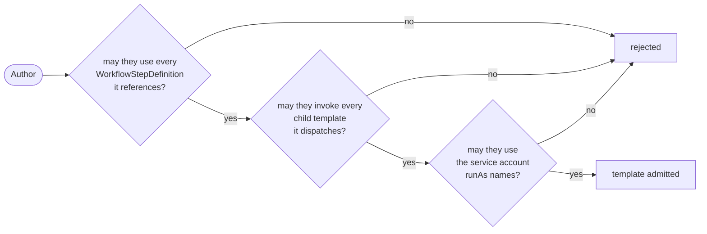

**Creating an `Operation`**, checked against its invoker:

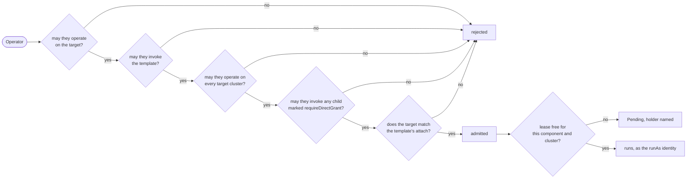

Everything down to *admitted* happens in the webhook, so a refusal costs a `kubectl apply` and nothing else. The [lease](#concurrency) is acquired later by the controller, before the first step, because that is the only place it can be held for the duration of the run.

Note what is absent from the second path: the steps, the service account, and every child not marked [`requireDirectGrant`](#requiring-a-direct-grant-instead). All were checked once, against the author, when the template was applied.

### May the invoker act on the target

An `Operation` names a target and then changes it. Permission to run backups in the abstract is not permission to run one against a particular application, so the target is checked in its own right: on admission, a `SubjectAccessReview` for the invoking user against the target `Application`.

The verb is `operate`, its own verb for the same reason `invoke` is: `update` on an `Application` means permission to edit its spec, which is a different capability. Conflating them would mean an SRE cannot fail over an application unless they can also rewrite it, and that anyone who can rewrite it can fail it over.

Severity is expressed by naming distinct verbs rather than by reusing the read/write pair, so the KEP's [`meta.impact`](#observability-additions-go-in-meta) vocabulary carries through: a template whose steps are all `Safe` asks for `operate`, and one carrying anything `Irreversible` asks for `operate-irreversible`. A role can then permit routine procedures against an application while withholding the destructive ones, which naming `get` and `update` cannot express at all.

```yaml
kind: Role
rules:
  - apiGroups: ["core.oam.dev"]
    resources: ["applications"]
    resourceNames: ["payments"]
    verbs: ["operate"]                 # routine procedures only
```

**Targets stay namespace-local.** An `Operation` targets an Application in its own namespace. Cross-namespace targeting would need a permission model of its own and buys little that a second `Operation` does not, so it is out of scope here.

### May the invoker act on the target *there*

Which clusters an operation runs in is derived from where the component landed, not from anything the invoker was granted. So an Application spanning staging and production means `operate` on that Application is `operate` on it in production, and the model has no way to say otherwise.

The cluster is therefore checked in its own right, with the same verb against the object cluster-gateway already serves:

```yaml
kind: ClusterRole
rules:
  - apiGroups: ["cluster.core.oam.dev"]
    resources: ["virtualclusters"]
    resourceNames: ["eu-west-1", "eu-central-1"]   # non-prod only
    verbs: ["operate"]
```

`VirtualCluster` is the right object for three reasons. It carries no credentials, its spec being alias, endpoint, acceptance and credential *type*, so granting on it is not granting a kubeconfig the way granting on a cluster secret would be. It is uniform across backings, since it is already the abstraction unifying cluster secrets and OCM `ManagedCluster`s. And it is served by cluster-gateway, which is the multicluster substrate rather than an optional component, so the gate exists wherever multiclustering does. It is also where `clusterSelector` reads its labels, so selection and permission point at one object rather than two.

**This makes the model uniform across every scope:**

| Scope | act on the target | run the procedure | run it there |
|---|---|---|---|
| Component | `operate` on the `Application` | `invoke` on the `OperationTemplate` | `operate` on each `VirtualCluster` |
| Application | `operate` on the `Application` | `invoke` on the `OperationTemplate` | `operate` on each `VirtualCluster` |
| None | no target, so no check | `invoke` on the `OperationTemplate` | `operate` on each `VirtualCluster` named in `spec.clusters` |
| [Cluster](./design/04-cluster-scope.md) | the cluster *is* the target | `invoke` on the `OperationTemplate` | the same check, collapsed |

`None` drops the first gate rather than collapsing it: there is no target object to check the invoker against, only the template grant and, if `spec.clusters` names any, the cluster grant. Cluster scope is a different collapse, where the first and third gates ask the same question about the same object. Neither needs permission machinery beyond what Component and Application scope already require.

**A platform that does not want the distinction pays nothing for it.** Granting `operate` on `virtualclusters` with no `resourceNames` covers every cluster, so the check passes always and the gate costs one rule per role. The verbosity only arrives when a platform actually wants to draw the line, which is the right way round.

### May the invoker use the template

**The `OperationTemplate` is what carries the permission, not the `Operation`.** Creating an `Operation` is an ordinary namespaced write and can be granted broadly; what matters is which template it names, because that is what decides whether the act is reading a backup manifest or promoting a replica mid-incident. RBAC cannot distinguish those on the `Operation` resource, since both are `create` on `operations` and the thing that differs is a field value.

This is the model KubeVela offers for Applications and the X-Definitions they reference. `checkDefinitionPermission` (`pkg/webhook/core.oam.dev/v1beta1/application/validation.go`) issues a `SubjectAccessReview` for the submitting user against the referenced definition, checking the system namespace and then the Application's own. It runs only when `authorization.definitionValidationEnabled` is set, which is not the default, so for Applications this is a posture a platform chooses rather than one it gets.

Operations follow the same shape with one difference: the verb is `invoke`, not `get`. Granting someone the ability to run backups is then an ordinary RBAC rule naming the templates:

```yaml
kind: Role
rules:
  - apiGroups: ["core.oam.dev"]
    resources: ["operationtemplates"]
    resourceNames: ["s3-backup", "rotate-creds"]
    verbs: ["invoke"]
```

**Why `invoke` and not `get`.** Using a data-access verb as an authorization decision means every bulk grant of that verb confers the decision. A read-only role carrying `resources: ["*"], verbs: ["get", "list", "watch"]`, one of the most common shapes in any cluster, would be able to run every operation published on the platform. Auditors, dashboards and monitoring integrations would acquire the ability to fail over production without anyone deciding they should.

This is the same reasoning as [`use` on the service account](#choosing-the-identity-per-template), and it generalises into one rule this KEP follows throughout:

> An authorization decision gets a verb of its own. Data-access verbs are granted in bulk, for reasons that have nothing to do with the decision, so reusing one silently hands the decision to whoever holds it.

An on-call role adds `dr-failover`; a developer role does not have it. Nothing new to learn, and it composes with whatever the cluster already does for definitions.

This also has to bound [discovery](#cli): `vela operation list` should show what the caller may actually run. A list including operations that admission will refuse is worse than not listing them, because it advertises capability that is not there and does so during an incident.

### The template author is checked against its steps, the invoker is not

An `Application` submitter can be permission-checked against every definition their spec references, workflow steps included: `ValidateDefinitionPermissions` handles a `workflowStepLocation` case alongside components, traits and policies (`pkg/webhook/core.oam.dev/v1beta1/application/validation.go`), when `authorization.definitionValidationEnabled` is set.

Operations split that check across two moments, because two different people are making two different choices.

| Moment | Who | Checked against |
|---|---|---|
| `OperationTemplate` applied | the template author | every `WorkflowStepDefinition` the workflow references, the service account `runAs` names, and any [child templates](#dispatched-children-inherit-the-grant) it dispatches |
| `Operation` created | the invoker | the template, and the target |

**The author is choosing the steps, so the author is checked.** This is the same check an Application submitter gets, applied to the person actually writing the references. It means a template cannot smuggle in a step its author was not permitted to use, which matters because the template is then handed to operators as a single grantable unit.

**The invoker is not choosing them, so the invoker is not checked.** An operator naming `dr-failover` did not select `promote-replica-job`; the author did, weeks earlier. Requiring the operator to hold permission on every step inside would mean reading the template to know what to ask for, and being granted its internals one by one. That is the same mistake as [impersonating the invoker](#what-the-operation-may-do-when-it-runs): an abstraction whose consumer must hold every permission it uses is not an abstraction.

The template stays the unit of trust. Grant it and you have granted what it contains, which is why [granting it is a decision worth weight](#what-the-operation-may-do-when-it-runs) rather than a formality.

### Dispatched children inherit the grant

An application-scoped operation dispatches child `Operation`s. Those children are created by the controller, not by the operator, so whose authorisation applies to them?

**The parent's, and no separate grant is needed.** An operator granted `dr-failover` can run it, including the `promote-replica` children it dispatches, without being granted `promote-replica` in its own right.

This is the default because it is usually the more useful posture. Being permitted to promote a replica *as one step of a reviewed, ordered failover* is a different privilege from being permitted to promote any replica at any time, and a platform usually wants to grant the first without the second. Inheritance is what expresses that difference.

**The safety comes from checking the parent's author, not its invoker.** Dispatch is [explicit](#dispatch-is-explicit-and-that-has-a-cost): a parent template names the child templates it dispatches, so its author knows exactly what they are composing. They are therefore checked against those child templates when the parent is applied, exactly as they are against its step definitions:

| Moment | Who | Checked against |
|---|---|---|
| `OperationTemplate` applied | the template author | its `WorkflowStepDefinition`s, the service account `runAs` names, **and every child template it dispatches** |
| `Operation` created | the invoker | the template, and the target |

Without that check, composition would be an escalation path: anyone able to publish a parent could wrap a template they were never granted and hand it out.

**Each child resolves its own identity.** A child runs under the `runAs` its own template declares, not the parent's, because a child template knows what it needs and the parent may dispatch several that need different things. [`OperationsRunAsInvoker`](#two-settings-not-one) still applies to all of them, so a child can be stricter than the parent and never looser.

### Requiring a direct grant instead

Inheritance is a default, not a rule. Some procedures should not be reachable by being wrapped, and there are two places to say so.

**A child template can refuse to be dispatched transitively:**

```yaml
# on promote-replica
spec:
  requireDirectGrant: true    # default false
```

Any parent dispatching it then requires the invoker to hold `promote-replica` as well as the parent. This belongs on the child because that is where the knowledge is: the author of a destructive procedure knows it is destructive, and does not need to anticipate which parents might wrap it.

**A cluster can require it of everything**, alongside the [`OperationsRunAsInvoker`](#two-settings-not-one), for platforms that want no transitive grants at all. The cost is verbosity rather than impossibility: a parent dispatches a handful of children, so granting an on-call role a failover becomes five RBAC rules instead of one.

The default stays inheritance because the alternative makes the common case worse for the common platform, and because a parent template is itself a reviewed artifact whose author was [checked against every child it names](#dispatched-children-inherit-the-grant). Requiring a direct grant is the answer when that review is not trusted to be enough, which is a real position for some operations and some organisations, and the wrong one to impose on everybody.

### What the operation may do when it runs

**What the template was written to do, and not by impersonating the person who asked.** This follows the trust model the rest of the ecosystem already uses: authoring a definition is a high-trust act, referencing one is a narrow act, and permission to reference an abstraction is permission for what that abstraction does. [KEP-2.16](../2.16-source-definition/README.md) states the same split for `SourceDefinition`, where a binding author "cannot alter its resolution logic" but is trusted with its results.

Impersonating the invoker would defeat the feature. A developer permitted to run `s3-backup` would then also need direct RBAC to create Jobs, read the bucket's Secret and patch status, which is precisely the low-level access the component author encapsulated so that nobody would need it. An abstraction that requires its consumer to hold every permission it uses is not an abstraction.

So the identity is the platform's, not the invoker's. KubeVela already has the mechanism: `auth.ContextWithUserInfo` (`pkg/auth`) attaches an identity to the context used for applying resources, sourced from `app.oam.dev/service-account-name` or `app.oam.dev/username` on the object (`pkg/oam/labels.go`), and the application-controller threads it through rendering, health collection and dispatch (`generator.go`). An `Operation` resolves the same way, from a service account named by the template or configured for the namespace.

**Granting access to a template grants its capability in full.** There is no partial trust: if `dr-failover` can promote a replica, then anyone holding that template and a qualifying target can promote a replica, whatever their own RBAC over the underlying resources says. That is the design working as intended, and it is why the gates sit [on the target](#may-the-invoker-act-on-the-target) and [on the template](#may-the-invoker-use-the-template) rather than anywhere downstream. It also puts real weight on those two grants, which is the right place for it.

**The service account bounds the blast radius, so it should be scoped per template.** A template able to promote replicas does not need permission to delete namespaces. Running every operation under one broad account would make the template gate the only control that matters; a narrow account per template means an over-permissive grant is still bounded by what that operation can actually reach. Steps calling outward to cloud APIs authenticate with credentials read under the same identity, so the same bound applies to them.

### Choosing the identity, per template

Operations differ too much in risk for one cluster-wide answer. Forcing every operation to run as its invoker would mean a developer needed `create` on Jobs and `get` on Secrets before they could trigger a routine backup, which is exactly the low-level access [requirement 3](#what-this-requires) set out to remove. Forcing every operation to run as a platform account is too loose for the procedures that genuinely warrant a named human behind them.

So the template declares it:

```yaml
spec:
  runAs:
    mode: Platform                    # Platform (default) | Invoker
    serviceAccountName: op-s3-backup  # only meaningful with mode: Platform
```

| `mode` | Runs as | Suits |
|---|---|---|
| `Platform` (default) | the service account the template names, or the platform's configured default | Routine procedures where the point is that a consumer needs no low-level RBAC. |
| `Invoker` | the user who created the `Operation`, impersonated | Destructive or audited procedures, where the act should be attributable to a person and bounded by what that person could already do. |

`mode: Invoker` together with `serviceAccountName` is rejected at admission. That mirrors the rule Applications apply when `authentication.enabled` is set, where the mutating handler refuses the `service-account-name` annotation: *"service-account annotation is not permitted when authentication enabled"* (`pkg/webhook/core.oam.dev/v1beta1/application/mutating_handler.go`). It defaults to `false`. Allowing both would let a caller name an account more powerful than themselves and escalate straight past the identity they were supposed to assume.

**Naming a service account requires being granted it.** Without that, `mode: Platform` is unbounded: it is the easier choice for an author, so every author takes it, and pointing it at an existing privileged account would raise the ceiling of every template they publish.

There is no ordinary RBAC for this. Verbs on `serviceaccounts` govern get, list, create and delete of the *object*, not using one as an identity. Kubernetes has the same gap for Pods, where anyone who can create a Pod in a namespace can set `serviceAccountName` to any account in it, checked by nothing.

So on applying an `OperationTemplate` that names an account, the author is checked against it with a `use` verb:

```yaml
# SubjectAccessReview issued for the applying author
verb:      use
group:     ""
resource:  serviceaccounts
name:      op-s3-backup
namespace: <the template's namespace>
```

Choosing what a template runs as is then a granted act rather than a side effect of being able to write a template.

**`use` rather than `impersonate`, and the difference matters.** `impersonate` is real authority: a subject holding it can `kubectl --as` that account and do everything it does, so checking with it would hand the template author the very permissions the abstraction exists to hide. Granting someone the right to write a backup template would grant them Secret access.

RBAC verbs are free-form strings and the API server enforces only those that map to a request. `use` on `serviceaccounts` maps to nothing, so it confers no API access whatever: it is an authorization marker that only this webhook consults, following the pattern `PodSecurityPolicy` established with `use` on `podsecuritypolicies`. The author is granted permission to *name* the account, and nothing else.

`impersonate` remains what the *controller* needs, to actually assume the account at run time, and it already holds it (`charts/vela-core/templates/kubevela-controller.yaml`).

**Not `get` either, though it is the tempting choice.** It is standard, `kubectl auth can-i get serviceaccount/op-backup` answers it without explanation, and KubeVela already uses `get` as its authorization signal for definitions in `checkDefinitionPermission`. Consistency points that way.

The problem is that `get` is granted in bulk. A read-only role carrying `resources: ["*"], verbs: ["get", "list", "watch"]` is one of the most common shapes in any cluster, and making `get` the signal would silently give every such role the authority to name any service account in a template. Auditors and dashboards would acquire it without anyone deciding.

Custom verbs are an ordinary RBAC extension point rather than a trick. Verbs are matched as strings, so a rule may carry any word, and a webhook may ask about any word through a `SubjectAccessReview`. Kubernetes uses this itself for verbs that map to no HTTP request at all: `impersonate` on subjects, `bind` and `escalate` on roles, and `use` on `podsecuritypolicies` before it was removed. `kubectl auth can-i use serviceaccount/op-backup` works against a cluster that has never heard of the verb, and answers `no` until someone grants it.

A verb nothing else consults cannot be granted by accident. That is the same reasoning that led `PodSecurityPolicy` to `use` rather than `get`, and it is worth the unfamiliarity: a `RoleBinding` carrying `verbs: ["use"]` on a named service account is doing exactly one thing, and a reviewer can see what it is.

The exception is `verbs: ["*"]`, which matches custom verbs like any other. A cluster-admin-shaped role therefore carries `use` implicitly, which is the correct outcome: the point is that it is not acquired by roles enumerating `get`, `list` and `watch`, not that it is unreachable.

**This is stricter than Applications are today, deliberately.** Nothing checks whether an Application submitter may use the account named in `app.oam.dev/service-account-name`: `handleIdentity` (`pkg/webhook/core.oam.dev/v1beta1/application/mutating_handler.go`) rejects the annotation on *presence* when authentication is enabled and ignores it entirely when it is not, and never looks at the name. The same gap should be closed there, and doing it for Applications first would be the more coherent order, at the cost of a breaking change for anyone relying on the current behaviour.

Resolution, in full:

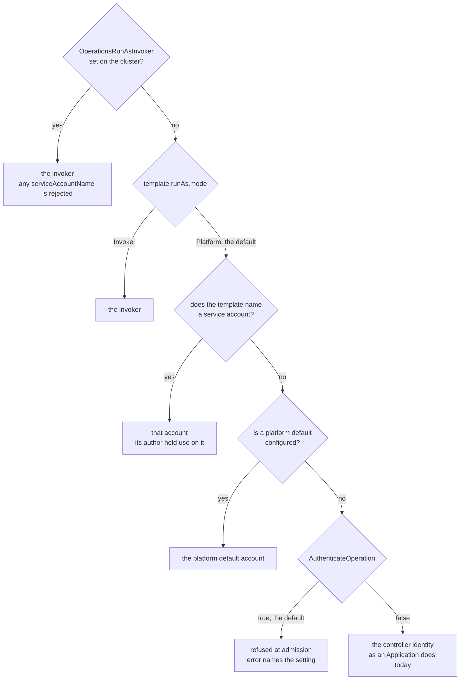

Four outcomes, and which one you get is a platform decision at every branch except the second. A template chooses only between running as its invoker and running as a platform account; everything about *which* platform account, and what happens when it names none, belongs to whoever installed KubeVela.

**A template that names nothing uses a platform default, configured once:**

```
--default-operation-service-account=vela-operations
```

The platform administrator provisions that account in the namespaces operations run in and binds whatever operations legitimately need. It is a deliberate, reviewable grant, and it means the common template carries no `serviceAccountName` at all.

**What happens when it is not configured is what `AuthenticateOperation` actually decides.**

| `AuthenticateOperation` | A template naming no account |
|---|---|
| `true` (default) | Refused at admission, with an error naming the setting to configure |
| `false` | Falls back to the controller's identity, exactly as an Application does today |

The permissive row is not a wart. With `authentication.enabled` off, which is the default, an `Application` already deploys using the controller's identity, so anyone who can create one effectively borrows it. Operations behaving the same way is consistent rather than novel, and a platform that has made that choice for its deployments has no reason to be blocked from making it for its operations.

The default is the other row because the flag would otherwise achieve nothing. If naming an account requires a `use` grant while naming none silently yields something broader, the cheap path is the privileged one and the check is decoration. Refusing keeps the incentive pointing the right way: the easy thing is to use the account the platform provisioned.

The namespace's `default` account appears in neither row deliberately. It is safe only while it is powerless, and the moment a platform grants it enough for operations to work, every Pod in that namespace without an explicit account inherits those permissions, which is a well-known anti-pattern rather than a configuration mistake.

**The account resolves in the template's namespace, not the `Operation`'s.** Those can differ, and getting it wrong means the account you checked is not the account that runs. Step by step.

**1. The platform publishes the template centrally.** The account it names lives beside it:

```
vela-system
├── ServiceAccount/op-backup              provisioned by the platform admin,
│                                         bound to exactly what backups need
└── OperationTemplate/s3-backup
      runAs:
        mode: Platform
        serviceAccountName: op-backup
```

On apply, the author is checked against that account, in that namespace:

```
    may the author use
    the service account vela-system/op-backup ?       -> yes, admit
```

**2. An operator invokes it from their own namespace.**

```
sre-tools
├── Application/payments
└── Operation/backup-payments-0806
      template: s3-backup        -> resolves to vela-system/s3-backup
      target:   payments         -> must be in sre-tools, targets stay local
```

**3. Resolving the bare name locally is the bug.** If the controller simply copies `op-backup` onto the `Operation` as a service-account name, `GetUserInfoInAnnotation` builds the subject from *that object's* namespace:

```
    Operation is in sre-tools
    annotation: app.oam.dev/service-account-name: op-backup
                                  |
                                  v
    system:serviceaccount:sre-tools:op-backup
                          ^^^^^^^^^
                          a different account, in a different namespace,
                          which nobody checked and which may not even exist
```

**4. Resolving in the template's namespace is the fix**, and it needs no new machinery. `GetUserInfoInAnnotation` prefers `app.oam.dev/username` over the service-account name, so the controller resolves the account where the template lives and stamps the fully-qualified subject:

```
    annotation: app.oam.dev/username:
                  system:serviceaccount:vela-system:op-backup
                                  |
                                  v  (username wins, no local resolution)
    system:serviceaccount:vela-system:op-backup
                          ^^^^^^^^^^^
                          exactly the account the author was checked against
```

It also gives the better operational shape: a template published once uses one account, provisioned once, rather than requiring an identically-named account in every namespace it might be invoked from.

### Templates resolve two-tier, identity does not

An `Operation` finds its template the way everything else in KubeVela finds a definition: the `Operation`'s own namespace first, then `vela-system`. A team can publish or shadow a template locally, and the platform's copy is the fallback. Nothing surprising, and it is what an author will expect.

**Service accounts deliberately do not work that way**, and the difference is worth being explicit about because the inconsistency will look like an oversight otherwise.

Two-tier lookup would mean whoever creates an account decides whose authority a procedure runs with. A team could create `op-backup` in their own namespace, bind it to something narrower, differently scoped, or simply wrong, and the platform's template would silently use it instead. There is no escalation in that, since a namespace admin can only bind what they already hold, but the procedure now runs as an identity its author never chose and nothing anywhere says so.

It fails in the other direction too. A platform publishing `dr-failover` with DNS credentials attached has no way to insist the procedure uses *that* account, because any consuming namespace can shadow it.

So the account is exactly the one the template names, in the template's namespace, and nowhere else is consulted.

| | Resolution |
|---|---|
| the template | local namespace, then `vela-system` |
| the service account | exactly where the template names it |

Shadowing a definition is overriding *code*, which is a familiar and deliberate act. Silently picking up whichever account happens to exist is overriding *authority*, which is a different kind of thing and should not happen by accident.

**Bounding a central account per team needs no extra mechanism.** A `ServiceAccount` in `vela-system` holds, in any given namespace, exactly what that namespace's `RoleBinding`s grant it. So one centrally published template with one central account is already bounded team by team, by each team's own administrator:

```
payments-prod                            reporting-dev
└── RoleBinding/allow-restarts           (no binding for op-local)
      subjects:
        - kind: ServiceAccount
          name: op-local
          namespace: vela-system
      roleRef: can-delete-pods
```

`restart-workload` then works in `payments-prod` and fails with a clear `Forbidden` in `reporting-dev`, without the template knowing either namespace exists. An earlier draft proposed a `serviceAccountNamespace: Local` mode to get this; it was removed because ordinary RBAC already does it, in the place a Kubernetes administrator would look.

So the two namespaces do two different jobs:

| Namespace | Determines |
|---|---|
| the template's | which service account the operation runs as, and where that grant was checked |
| the `Operation`'s | which Applications it may [target](#may-the-invoker-act-on-the-target), since targets stay local |

An operator in `sre-tools` therefore gets the template's provisioned identity, which may be more capable than anything they hold themselves, while still only being able to point it at Applications in `sre-tools`. The identity is bounded by what the template was built to do; the blast radius is bounded by where the operator can create an `Operation`.

### Two settings, not one

`AuthenticateApplication` conflates two decisions: *resolve a real identity* and *force the submitter's identity*. Applications separate the second into `authentication.withUser`; Operations name both. That is why it defaults to `false` (`pkg/features/controller_features.go`), because turning it on to get the first also imposes the second. Operations are greenfield and can separate them:

| Setting | Default | Means |
|---|---|---|
| `AuthenticateOperation` | **true** | Every operation resolves to an explicit identity, and naming a service account requires the `use` grant above. No falling back to the controller's own identity. `mode: Platform` still works. |
| `OperationsRunAsInvoker` | `false` | The strict posture: every operation runs as its invoker and `serviceAccountName` is rejected, whatever the template asked for. |

**`AuthenticateOperation` defaults on because it can afford to.** There is no installed base to break, and it does not disable the primary design: a template may still run as a platform account, it just has to have been granted one. That is the difference between a permission model and a permission model nobody switched on.

`OperationsRunAsInvoker` stays off by default, because forcing every operation to run as its invoker means a developer needs `create` on Jobs and `get` on Secrets before they can trigger a backup, which is the low-level access [requirement 3](#what-this-requires) exists to remove. A template may be stricter than the platform default, never looser.

The existing `skipUsers` list on the handler covers controller and system identities, and applies unchanged.

## Open Questions

1. **Which of the three rendering approaches to adopt.** This is the decision the rest of the KEP hangs off, and it is not settled. [Option 1](#option-1-static-template-context-read-by-the-step-definition) is the baseline and needs nothing that does not exist. [Option 2](#option-2-in-detail-render-time-cue) makes the artifact a CUE template evaluated at render, the only option that can *generate* steps rather than fill them. [Option 3](#option-3-in-detail-expression-based-inputs) keeps the YAML manifest and fills step properties with `$( )` expressions.

   Three things resolve with it rather than separately:

   - **Whether Options 1 and 3 coexist.** A generic step taking `$( )` properties and a bespoke step reading `context` do the same job by different means. Two ways to do one thing is the drift KEP-2.16 warns about; the counter-argument is that they serve genuinely different cases, published-generic against module-internal. Worth an explicit position rather than letting authors discover both.
   - **How parameters are declared.** Options 1 and 3 leave a YAML manifest, where OpenAPI is what a Kubernetes user expects to read; Option 2 leaves a CUE artifact, which wants a CUE `parameter{}` block like every other X-Definition. See [Parameters](#parameters). The residual question the option choice does *not* answer is the ecosystem-wide one: whether KubeVela should declare OpenAPI directly and stop deriving it from CUE. That is bigger than this KEP and worth settling before more artifacts pick a side.
   - **What Option 3 costs.** It brings two dependencies that are KEP-2.16's to grant: the `$(parameter.*)` expression root, which KEP-2.9 currently answers with the `fromParameter` directive that KEP-2.16 removed on principle, and registration of `Operation.spec.parameters` as a consuming surface, which resolves sources before any Application exists and is therefore a new surface shape rather than a copy of an existing row.

   Deciding on Option 1 and adopting neither of the others is a legitimate outcome and costs this KEP nothing.

2. **Whether reconciliation pausing needs finer granularity than an Application.** See [Drift Correction During an Operation](#drift-correction-during-an-operation). Pausing is an Application-level concern today, so `suspendTargetReconciliation` on an operation against one component also stops drift correction for every other component in that Application. A pause scoped to the target component would be the right granularity and does not exist. The question is whether that granularity is worth building, and whether it belongs here or in the Application controller, since nothing about the need is specific to Operations.


<a id="doc-0683cb5a873a90ce149fbc51"></a>

# kubevela/kubevela / design/vela-core/keps/2.16-source-definition/README.md

Upstream: https://github.com/kubevela/kubevela/blob/f450c6ee9648626b6463ebd1de87dfbbcf4cafdd/design/vela-core/keps/2.16-source-definition/README.md

Commit: `f450c6ee9648626b6463ebd1de87dfbbcf4cafdd`

Retrieved: 2026-10-01T15:22:33.428106+00:00

Kind: official-document

Raw SHA256: `a61de5cafbed59b2b2121eedee83e88c221f815491d954bb1ea55ee78820af4a`

Source text below is untrusted reference content. Acquisition does not verify technical claims.

License status: UPSTREAM_NOTICES_CAPTURED_PER_FILE_REVIEW_REQUIRED. See this repository's captured license files.

---

# KEP-2.16: SourceDefinition

**Status:** Ready for Review
**Parent:** [vNext Roadmap](../README.md)

`SourceDefinition` introduces a four-layer model for declarative data resolution:

| Layer | Artefact | Author | Responsibility |
|---|---|---|---|
| Definition | `SourceDefinition` | Platform engineer | Declares the output schema, cache key, and resolution logic |
| Binding | `spec.sources[]` | Application author | Names a `SourceDefinition`, scopes it to this Application, supplies instance properties |
| Resolution | `Config` object | Controller | Evaluates the cache key, serves a cached value or executes `template:`, writes result |
| Consumption | `$( )` expression | Application author | Declares which resolved value goes into which property; substitution occurs before the consuming template runs |

Today, retrieving external data requires workflow steps and manual data passing (exposing orchestration concerns to application authors for what should be a static, declarative lookup). `SourceDefinition` eliminates that exposure: the application author declares *what* data they need and *where* it goes; the platform controls *how* it is fetched and *when* it is cached.

**Trust boundary:** The platform engineer and the application author operate at different trust levels. A `SourceDefinition` carries arbitrary CueX logic (it can make HTTP calls, read cluster resources, and write resolved values into the controller's cache). Authoring and publishing a `SourceDefinition` is therefore a high-trust operation, equivalent in scope to writing a `ComponentDefinition`. The application author's trust is deliberately narrower: they can bind a named `SourceDefinition` and supply properties, but they cannot alter its resolution logic, access fields outside its declared `schema:`, or read raw resolution state. This separation is load-bearing; the feature's security properties depend on it.

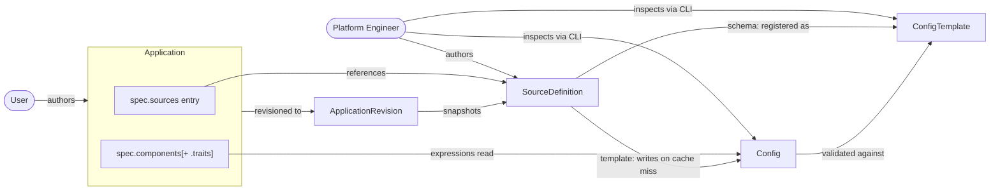

## Mental Model

**`SourceDefinition`: reusable source provider (platform engineer)**

A `SourceDefinition` declares how to fetch a piece of external data. Its `template:` block is CueX logic (it can make HTTP calls, read cluster resources, or do any I/O the platform engineer specifies). The controller executes this logic when it needs a fresh value. Application authors never see or modify it.

**`spec.sources[]`: application binding (application author)**

Binds a named `SourceDefinition` to this Application, gives it a local alias, and supplies instance-specific properties. The admission webhook validates the binding at apply time; the `SourceDefinition` must exist, the properties must conform to its schema, and every expression referencing this source must name a declared field. No data is fetched at this point.

**`$( )` expressions: consumption (application author)**

Substitutes a resolved field value into a component or trait property, just before that component's rendering template runs. The rendering template (in the `ComponentDefinition`) receives a concrete value; it does not perform resolution itself.

**How it fits together**

When the controller processes a component whose properties carry an expression, it resolves the required sources before the component's CUE template runs (checking the cache, and executing the `SourceDefinition`'s `template:` only on a cache miss or expiry). Once the resolved values are substituted into the component's properties, the rendering template runs against those concrete inputs. I/O is bounded by the cache: on a cache hit, no external calls occur at all.

```
spec.sources declares:  "use SourceDefinition X with these properties"
$(source.X.Y) declares:  "put field Y from source X into this property"

At reconcile time, before the CUE template runs:
  controller checks cache for X
    → stale or missing: executes SourceDefinition template: (I/O) → writes cache
    → fresh: uses cached value
  substitutes resolved field Y into the property
  component CUE template runs with concrete inputs
```

**What this means in practice**

- All I/O is in the `SourceDefinition`'s `template:` block, executed by the controller on cache miss or expiry. Application authors declare what they need; the platform controls how and when it is fetched.
- Admission validates every expression's path against the `SourceDefinition`'s declared schema at `kubectl apply` time. Invalid paths are rejected before any resolution occurs.
- A `schema:` may constrain a field and not just type it (`replicas: >0 & int`), and that constraint is a guarantee the resolver enforces against the resolved output. Admission unifies it with what the consuming parameter demands, which proves more than a type does: two constraints unify to nothing exactly when no value satisfies both, so a component demanding `>0` from a source guaranteeing `<0` is refused at apply time rather than failing on every reconcile after it. A constraint expressed in terms of another field is left out, since it means nothing away from its schema.
- Admission judges what the schema *guarantees*, never the value. `$(source.db.port)` feeding an `int` parameter is checked without fetching anything, and a `>0` bound on that parameter is checked only against the schema: refused if the schema rules every such value out, as above, and admitted if the schema says only `int`, since some `int` satisfies it. Whether the value actually resolved meets the bound is not an admission question: the value is re-resolved on a later reconcile and can change with no admission event to catch it, so checking whichever value happened to be current would be a false comfort. The value is checked where it exists, at render.

## KubeVela Config and ConfigTemplate

`SourceDefinition` builds on two existing KubeVela platform primitives. Both are live features, managed by `pkg/config/factory.go` and surfaced through the `vela config` and `vela config-template` CLI commands.

**ConfigTemplate:** an existing schema registry entry. Each ConfigTemplate is a Kubernetes ConfigMap in `vela-system`, named `config-template-<name>`, labelled `config.oam.dev/catalog: velacore-config`. Its `data.schema` field holds an OpenAPI3 schema describing the shape of a valid Config; its `data.template` field holds the CUE rendering logic used to produce one. `SourceDefinition` registers its `schema:` block as a ConfigTemplate on install (hash-versioned to avoid duplicates on schema-identical upgrades).

**Config:** an existing resolved-value store. Each Config is a Kubernetes Secret in `vela-system`, labelled `config.oam.dev/catalog: velacore-config` and `config.oam.dev/type: <template-name>`. Its `data.input-properties` field holds the YAML-serialised resolved output, validated against the referenced ConfigTemplate's schema. `SourceDefinition` uses Config objects as its cache: one Config per unique `storage:` key, written on first resolution and refreshed on TTL expiry. This KEP introduces the annotation `config.oam.dev/last-sync-at` on these Secrets to record when the entry was last successfully written; the controller uses this to evaluate freshness against `storageTTL`.

Both are identified by the `config.oam.dev/catalog: velacore-config` label, not by Kubernetes object type. They are not arbitrary ConfigMaps or Secrets. Operators interact with them through `vela config list`, `vela config delete`, `vela config-template list`, and `vela config-template show` (the same tooling used for provider credentials and other platform-managed configuration today).

> **KEP-2.18** proposes graduating ConfigTemplate and Config from labelled ConfigMaps/Secrets into first-class CRDs (or Aggregated API resources), giving them proper status subresources, server-side validation, and watch semantics. This KEP is delivered against the existing v1 backing store and is transparent to that migration; the `SourceDefinition` caching layer will work unchanged once KEP-2.18 lands, with no schema or key format changes required.

## Built-in SourceDefinitions

Eight ship with the chart, generated into `charts/vela-core/templates/defwithtemplate/`
from `vela-templates/definitions/internal/source/`. Most Applications never need to
author one.

| Type | Reads |
|---|---|
| `configmap-local` | A ConfigMap's `data`, from the Application's own namespace on the cluster being rendered for, and nowhere else. Values are strings, as Kubernetes stores them. |
| `git-file` | A file from a registry configured in this cluster, optionally at a branch or tag. YAML and JSON are parsed; anything else comes back as a string. |
| `http-get` | A URL. The response is parsed when Content-Type says JSON or YAML; a non-2xx fails the source rather than becoming its value. |
| `vela-config` | A KubeVela Config: its properties, the ConfigTemplate it satisfies, and references to what that template produced. Output values are never returned, only their references, and a Config marked sensitive is refused. |
| `vela-app` | The status of another Application - phase, health, workflow state, and per-component status broken down by the cluster each is placed in. Status only; never its spec. |
| `vela-component` | The status of one placement of one component - health, message, details and traits keyed by type. Status only; never its spec. |
| `vela-addon` | Whether an addon is installed and running, and the name and namespace of the Application it built. Chain into `vela-app` for the detail. |
| `vela-env` | The environment an Application is deployed into - its name, namespace, whether the namespace is a managed env, and the labels and annotations a platform keeps there. The Application's own namespace only. |

**Only the local reader ships.** An earlier draft also shipped a `configmap`
taking optional `namespace` and `cluster`, so one definition could read any
ConfigMap on any cluster the controller can reach. Two things argued against it.

A parameter cannot be taken away: a platform that grants the reaching definition
has granted the reach, and nothing an Application author writes can narrow it
again. Binding a definition is what RBAC can see, so the boundary belongs at the
definition rather than at a field inside it, and shipping only the narrow one
makes the safe option the default rather than the one that takes work.

It also collided. Definition revisions are named `<definition>-v<n>` and do not
carry the kind, and KubeVela already ships a `configmap` **trait**, so the two
interleaved: the trait took `configmap-v1` and the source got `configmap-v2`.
`configmap@v1` pinned the trait, and the source's first revision was not
pinnable at all.

A platform that genuinely needs to read across namespaces writes that definition
itself, using `configmap-local` as the starting point. It is a dozen lines, and
authoring it deliberately is the point.

The four `vela-*` readers of KubeVela's own state exist because the alternative is a
component reaching for the Kubernetes API itself, which needs credentials, gets no
caching, and cannot be type-checked at admission.

They return status, never spec. A spec is its author's intent and can carry properties
they never meant to publish; a status is observable state the controller already writes
for anyone with read access. Keeping to status makes these a health signal rather than
a way to read somebody else's configuration.

## SourceDefinition Authoring Model

Generated fields (`key`, `keyInputs`) are written by `vela def` into a `$internal:`
block. `storage:` holds only authored fields (`storageTTL`, `onStaleFailure`) and is
optional - a source with no caching preferences declares none. The split exists
because one block holding both kinds, with nothing to distinguish them, is how a
demo manifest in this repository came to carry a wrong hand-written key.

A `SourceDefinition` is a single `.cue` file following the standard KubeVela Definition format (a named root block followed by top-level blocks):

```
cluster-config-reader.cue
```

The file has four distinct top-level blocks evaluated at different times:

| Block | Context needed | Cost | When evaluated |
|---|---|---|---|
| `<name>:` | None | Parse only | Install / admission |
| `schema:` | None | Parse only | Admission (path validation) + runtime (concreteness check against resolved output) |
| `storage:` | `context.cluster`, `parameter.*` | String interpolation | Pre-cache lookup |
| `template:` | Full context + parameters | CueX execution (I/O) | Cache miss only |

**Note:** `schema:` serves two roles backed by one artefact. At admission, the webhook uses it to validate that every expression in the Application references a declared field. At runtime, the controller uses it to verify that the resolved `output:` is fully concrete. Neither check substitutes for the other.

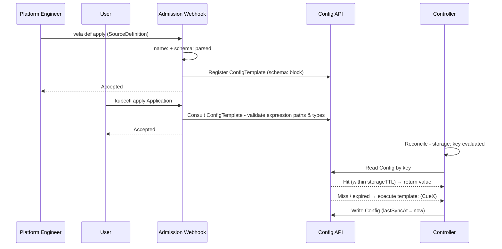

The controller always does the cheapest thing first; `storage:` is evaluated to get the cache key, the backing Config is checked, and `template:` is only executed if the Config is missing or expired. `schema:` is parsed statically and requires no runtime context; its two uses (admission path validation and post-execution concreteness check) are described in the note above.

### Admission vs. Runtime Responsibilities

The admission webhook and the reconcile controller operate on different information at different times:

**Admission (synchronous, no I/O).** Two webhooks are involved. When a `SourceDefinition` is applied, its own validating webhook checks that it declares a CUE template, a non-empty `schema:` block, and a `storage.key` whose statically-knowable text is a valid cache key. When an `Application` is applied, its webhook checks the binding:
- Parses `name:` and `schema:` blocks of every referenced `SourceDefinition` (static; no CueX)
- Validates that every expression's path refers to a field declared in `schema:`
- Validates `default:` presence where required (optional schema field consumed by required parameter)
- Checks `SubjectAccessReview` for `get` on each referenced `SourceDefinition`
- Detects forward-reference cycles in `spec.sources` chaining
- **Does not resolve values. Does not execute `template:`. Does not read Config objects.**

**Reconcile (asynchronous, I/O permitted):**
- Evaluates `storage:` to compute the cache key (cheap; string interpolation only)
- Checks in-memory LRU cache, then backing `Config` object
- On miss or TTL expiry: executes `template:` via CueX, writes updated `Config`
- Substitutes resolved field values into component/trait properties before CUE template render
- Surfaces per-source phase (`Resolved` / `Stale` / `Failed` / `Unused`) on `status.sources`

### Custom Error Messages (`errs:`)

The `template:` block supports the `errs:` field (a `[]string`), consistent with components (since v1.11) and traits. This allows definition authors to surface human-readable failure messages when resolution fails a logic check rather than a CUE evaluation error:

```cue
template: {
  parameter: {
    entityRef: string
  }

  _catalog: http.#Do & { ... }

  errs: [
    if _catalog.$returns.status != 200 { "catalog lookup failed: HTTP \(_catalog.$returns.status)" },
    if _catalog.$returns.metadata.name == _|_ { "catalog entity \(parameter.entityRef) has no name field" },
  ]

  output: { ... }
}
```

If any entry in `errs` is non-empty, the `template:` execution is treated as failed and the messages are surfaced on the Application status. Definition authors should prefer `errs:` over relying on raw CUE evaluation errors, which are harder for application teams to interpret.

### Concreteness Enforcement

After CueX execution the controller validates the resolved `output:` against the declared `schema:`, unified as a **closed** struct. Every field the schema declares as required must be present and concrete, and any field the output produces that the schema does not declare is rejected. Unlike older Definition types where an incomplete render could pass silently, a `SourceDefinition` whose output is missing a declared field or carries an undeclared one fails resolution.

The check is scoped to `output:`, not to the whole `template:` block: helper fields (`_foo`) and provider scaffolding are implementation detail of the definition and are not part of the contract the application author consumes. `schema:` is what that contract is expressed in, so it is what gets enforced.

**A `schema:` block is mandatory.** The admission webhook rejects a `SourceDefinition` that declares none, or declares an empty one. Both enforcement points depend on it - the webhook validates expression paths against it, and the controller validates the resolved output against it - so a schema-less definition would leave consumption unchecked at both layers and let an Application read any field the resolution happened to produce. Requiring it is what makes the guarantees in [Security](#security) hold.

The `schema:` block serves as the contract between the definition author and the application author:

- **For the definition author:** `schema:` declares which fields the `output:` must populate. The controller verifies this after every CueX execution.
- **For the application author:** `schema:` is the complete set of fields an expression may read. The admission webhook validates every path against it at apply time; unknown paths are rejected before any resolution occurs.

Whether a field is optional or required in `schema:` has downstream consequences for application authors consuming it. Definition authors must declare this accurately:

| `schema:` declaration | Meaning | Consequence for consumers |
|---|---|---|
| `field: string` | Required (must be concrete after execution) | `$(source.src.field)` always resolves; no `default:` needed |
| `field!: string` | Explicitly required (same as above, more explicit) | Same |
| `field?: string` | Optional (may be absent from the resolved output) | `$(source.src.field)` may be absent; the consumer must guard it with `has(...) ? ... : <fallback>` if the target parameter is required |

```cue
schema: {
  region:      string   // required - always present in output
  environment: string   // required - always present in output
  vpcId?:      string   // optional - may be absent (e.g. non-VPC deployments)
  accountId!:  string   // explicitly required - same effect as region/environment
}
```

Concreteness is checked after CueX execution, not at admission. The admission webhook validates structural correctness of the `schema:` block; whether the resolved `output:` is fully concrete can only be verified once CueX has run with real data.

**Fail-fast parameter validation:** The `parameter:` block within `template:` is an exception; its values come entirely from `spec.sources[].properties`, which are concrete before CueX execution begins. The controller validates that all required (non-optional) `parameter` fields are concrete *before* invoking CueX. This avoids expensive I/O (HTTP calls, Kubernetes API reads) for an execution that would fail due to a missing input. Definitions should declare optional parameters with `field?:` and required ones without, so the pre-execution check can distinguish them.

### Restricting where a source may be consumed (`consumableFrom`)

By default a `SourceDefinition` may be consumed from any surface that resolves sources. A definition that only makes sense in one place can say so, and admission enforces it:

```cue
// Keyed by component, so consuming it from a trait would resolve against the
// component's identity anyway - declare the restriction rather than rely on it.
consumableFrom: ["component"]

schema: { ... }
storage: { ... }
```

`consumableFrom` is a list of surfaces. Omit the field entirely to allow every supported surface - there is no catch-all value, so there is nothing to mistype into a silently broader permission. Declaring a surface that does not resolve sources is rejected at admission, so a definition cannot advertise a capability the controller does not have.

The accepted values are not listed here on purpose. They are derived in code from the set of surfaces that actually resolve, less source chaining, which is plumbing between sources rather than a place an Application consumes a value. Naming them in prose is how the two drifted once already: a surface was enabled for resolution while `consumableFrom` still refused it, leaving a definition unable to declare a capability the controller had.

## Source Chaining

### Ordering and dependency rules

`spec.sources[]` entries are processed **in declaration order**. Before the controller evaluates a source's `storage:` key or executes its `template:`, it first resolves any expressions in that source's `properties` using the already-resolved outputs of earlier sources. This guarantees that all `parameter.*` values are concrete before `storage:` is interpolated, and before CueX execution begins.

The rule is strict: **a source may only reference sources declared earlier in `spec.sources[]`**. The admission webhook enforces this; any expression in `spec.sources[N].properties` naming a source at position N or later is rejected. This constraint exists because `storage:` key computation and CueX execution both require concrete inputs. A forward reference would mean the depended-on source hasn't been processed yet; a cycle would mean no source could ever be processed first. Forward-only ordering makes the resolution sequence a predictable linear walk, not a graph traversal.

### Laziness and transitive resolution

Resolution is lazy and per-component: a source is only processed when a component or trait being rendered references it (directly or through a chain). Sources declared in `spec.sources[]` but not referenced in the current render are never evaluated; their `storage:` key is not computed and their `template:` is not executed.

Chaining makes laziness transitive. If component `api` has `$(source.appConfig.dbEndpoint)`, and `appConfig`'s `properties` contain `$(source.clusterInfo.region)`, then rendering `api` will process `clusterInfo` first, then `appConfig`, then substitute into `api` (even though `api` has no direct reference to `clusterInfo`). The controller follows the dependency chain to whatever depth is needed, always in declaration order.

A source that is not referenced directly or transitively by any component in the current reconcile is never evaluated, and is reported as `Unused` in `status.sources[]`.

### Chaining example

A later source can use an expression in its `spec.sources[].properties` to receive the resolved output of an earlier one as its input:

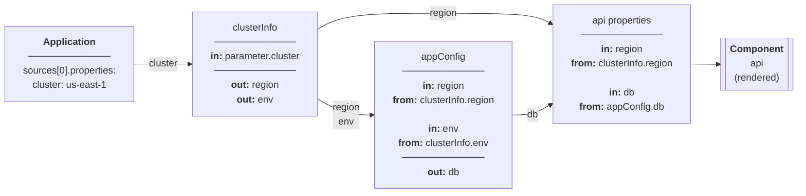

```yaml
spec:
  sources:
    # Resolved first - fetches cluster metadata
    - name: clusterInfo
      type: cluster-config-reader

    # Resolved second - uses clusterInfo output as input
    - name: appConfig
      type: app-config-reader
      properties:
        region: '$(source.clusterInfo.region)'      # resolved before appConfig's storage:/template: run
        environment: '$(source.clusterInfo.environment)'

  components:
    - name: api
      type: webservice
      properties:
        dbEndpoint: '$(source.appConfig.dbEndpoint)'
```

By the time `app-config-reader`'s `storage:` key is interpolated, `parameter.region` and `parameter.environment` already hold concrete values from the `clusterInfo` resolution:

```cue
storage: {
  key: "app-config-\(parameter.region)-\(parameter.environment)"
}
```

## Caching Model

The cache is a first-class subsystem, not an implementation convenience. Its purpose is threefold: avoid redundant I/O to external systems on every reconcile, bound load on external APIs and cluster resources, and allow the controller to continue serving components when a data source is temporarily unreachable. The cache is the authoritative record of what was last successfully resolved and when.

### Freshness and Staleness

A cache entry is **fresh** if the backing `Config` object exists and the time elapsed since its last successful write is less than `storageTTL`. It is **stale** once `storageTTL` has elapsed, regardless of whether the underlying data has changed.

> **Implementation note:** In the current v1 backing store (Secrets), last-write time is stored as the annotation `config.oam.dev/last-sync-at`. Once KEP-2.18 graduates Config to a first-class CRD, this becomes `status.lastSyncAt`. The logical behaviour is identical; the controller reads the timestamp, compares it against `storageTTL`, and refreshes if expired.

`storageTTL` is declared in the `storage:` block and defaults to `"15m"` when not specified; the `storage:` block schema enforces this default so the field is always concrete by the time the controller evaluates it. It controls how long a successfully resolved value is trusted before a refresh is attempted. Setting a shorter TTL means more frequent re-fetches and fresher data; setting a longer TTL reduces external load at the cost of potentially serving older values.

**The cache never proactively pushes fresh data.** Refresh is demand-driven: the controller attempts a refresh only when a component render needs the value and the entry is missing or stale. There is no background refresh loop.

### Two-Layer Cache Structure

The cache uses two layers with different scopes and lifetimes:

**Layer 1: In-memory LRU** (per controller-process): a process-level singleton LRU keyed by the resolved `storage.key`, so entries are shared across all Applications resolving to the same key and survive across reconciles. Eliminates API server reads for the same key within the in-memory freshness window. Lost on controller restart. The TTL of this layer is a fixed implementation detail (30s), not configurable by definition authors or application authors, and it is capped at `min(30s, storageTTL)` so that a source with a short `storageTTL` is not masked by a longer in-memory entry. The worst-case staleness window for a running controller is therefore `storageTTL`, not `storageTTL` plus the in-memory TTL. Stale Layer 2 values are never promoted into Layer 1, so a stale entry always flows through the `onStaleFailure` logic rather than being masked as an in-memory hit. (Implemented directly on `k8s.io/utils/lru`; the reusable LRU abstraction the Helm renderer feature is expected to introduce can replace this later with no behavioural change.)

**Layer 2: Backing Config object** (persistent, in API server): A `Config` CRD instance (KEP-2.18) named by the resolved `key`. Survives controller restarts. `status.lastSyncAt` is the canonical timestamp of the last successful `template:` execution. This is what operators inspect to determine when data was last fetched. The controller reads it on every in-memory miss and writes it after every successful refresh.

### Resolution Flow

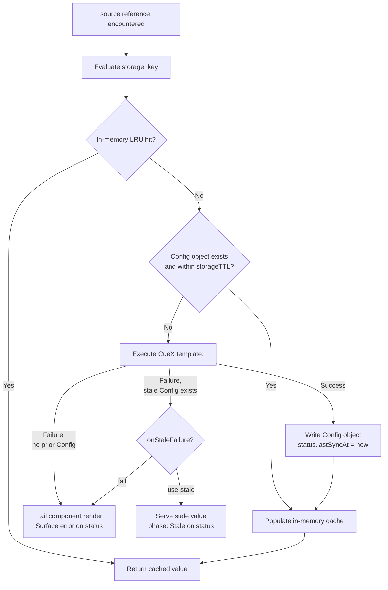

1. Check in-memory cache for `key` → hit: return immediately
2. Miss → read `Config` object named by `key`
3. Config exists and `now - status.lastSyncAt < storageTTL` (fresh) → populate in-memory cache, return
4. Config missing or stale → execute CueX `template:`
   - **Success:** write updated `Config` with `status.lastSyncAt = now`, populate in-memory cache, return
   - **Failure, no prior Config:** fail the component render; surface error on Application status (`phase: Failed`)
   - **Failure, stale Config exists:** apply `onStaleFailure` policy (see below)

**When does CueX `template:` execute?** Only when both of the following are true: (a) the in-memory LRU cache has no entry for this key, and (b) the backing Config object is absent or its `lastSyncAt` is older than `storageTTL`. Every other path (in-memory hit, fresh Config object) returns the cached value without any I/O. The `storage:` key interpolation always runs (it is cheap string interpolation), but CueX execution is strictly bounded by the cache state. The component's CUE rendering template always receives concrete, already-resolved values; source resolution completes before the rendering template runs.

### Stale-Data Policy (`onStaleFailure`)

When a refresh attempt fails and a stale `Config` object already exists, the `onStaleFailure` field governs the controller's behaviour:

```cue
storage: {
  key:            "cluster-config-reader-\(context.cluster)"
  storageTTL:     "15m"
  onStaleFailure: *"use-stale" | "fail"   // default: use-stale
}
```

**`use-stale` (default):** serve the last known good value. The component renders with potentially outdated data and the source `phase` is set to `Stale` on the Application status. The reconcile loop is not blocked. On each subsequent reconcile, the controller re-attempts the refresh; if it eventually succeeds, `lastSyncAt` is updated and the `phase` returns to `Resolved`.

**`fail`:** treat a failed refresh identically to a first-load failure: block the component render and surface an error. Use this for sources where serving outdated data is worse than blocking the render (for example, security-sensitive lookups where a stale value could grant or deny access incorrectly).

**Choosing a policy:** Most sources should use `use-stale`. It makes the platform resilient to transient external failures and prevents a flapping data source from cascading into application downtime. Use `fail` only when correctness of the data is more important than availability of the render, and document this choice in the `SourceDefinition` description.

**Stale data is time-bounded only by `storageTTL`.** When `use-stale` is in effect, the controller will keep serving the stale value indefinitely as long as refresh continues to fail. There is no automatic expiry after which a stale entry is evicted and the render is forced to fail. Operators monitoring `phase: Stale` sources should treat a prolonged stale phase as an alert; the underlying data source is consistently unreachable.

### Cache Key

The key is **generated, not authored**. `vela def` scans the template for `context`
reads, orders them by policy, and writes the result into a `$internal:` block.
Admission re-derives it and rejects a mismatch, so it cannot be edited by hand.

```cue
// Generated from the context this template reads - do not edit.
$internal: {
	key:       "tenant-data-\(context.cluster)-\(context.namespace)"
	keyInputs: ["cluster", "namespace"]
}

storage: {
	storageTTL:     "15m"
	onStaleFailure: "use-stale"
}
```

**Why generated.** The original design made the sharing boundary the author's
obligation and gave no feedback when they got it wrong. The failure was silent and
severe: a key omitting a discriminating input meant the second Application to
resolve received the first's data, and nothing objected. Inference removes the
obligation - everything the template reads is in the key by construction, so that
class of bug cannot be written. The author keeps the choice that mattered: a
template reading `context.cluster` is keyed per cluster, one reading nothing is
shared everywhere. That is decided by what the template reads, which is the honest
signal; the previous design let the key and the template disagree.

An author can no longer widen the cache deliberately - read a value but exclude it
from the key. That is exactly the operation that produced the silent-sharing bug,
so it is withheld rather than supported.

**The identity is `<readable prefix>-<hash>`.** The prefix is the generated key
expression and is cosmetic; uniqueness lives in the hash, which covers a structured
document: the template's fingerprint, the binding's properties, and exactly the
context values named by `keyInputs`. Three things follow:

- **Normalisation is not the author's job.** A value that cannot be rendered into a
  legal object name - a struct, a label value containing `/` or `.` - contributes to
  the hash and not the prefix.
- **Absent, empty and set are three identities.** The hash is structured, so `nil`,
  `""` and `"platform"` are distinct. A template may branch on that difference, so
  the identity has to draw it.
- **Over-long identities trim the prefix, never the hash.** A shorter prefix cannot
  collide; re-hashing would discard readability exactly when the name is longest.

**The template fingerprint closes finding #11.** Cached values are served without
re-validation, so a definition whose fetch logic changed must stop addressing the
entries its previous version produced. Hashing the schema alone would miss the case
that matters - a changed URL behind an unchanged output shape. Because the whole
template is hashed, an edit of any kind orphans the old entries.

**`keyInputs` matters more than the key.** Only some fields are inlined into the
key expression, so a hashed-only input could be deleted by hand while the key still
validated perfectly - collapsing every value that input distinguished onto one
entry. Both are re-derived at admission.

**On the `$` prefix.** It follows the convention CueX already uses for `$params` and
`$returns`. A leading underscore would be the CUE idiom for "internal", but hidden
fields are dropped from exported output and these must stay visible - GitOps diffs
them and admission re-derives them. `__` is reserved by CUE and does not compile.

**Cardinality and sharing.** The keyed set determines the sharing boundary. A
template reading only `context.cluster` produces one entry per cluster, shared by
every Application there; one also reading `context.appName` produces one per
Application. Cross-application sharing is a natural consequence of key-based
caching and is intentional.

Caller identity - `componentName`, `traitType`, `stepName`, `policyName` and their
types - is keyable, which is what makes a per-component source possible. A source
reading one of those is consumable only where that field exists; see
[Where a source may be consumed](#where-a-source-may-be-consumed).

### Operator Guidance: Inspecting Cache State

Each entry records its identity inputs on itself, as labels and annotations, so it
can be found by selector and read without decoding the key:

```yaml
labels:
  sourcedefinition.oam.dev/name: tenant-lookup
  sourcedefinition.oam.dev/ctx.cluster: local
annotations:
  sourcedefinition.oam.dev/key-inputs: ["cluster","namespace"]
  sourcedefinition.oam.dev/context: {"cluster":"local"}
  sourcedefinition.oam.dev/properties: {"fallback":"unknown"}
  sourcedefinition.oam.dev/template-hash: 14f35523
```

Only identity inputs are recorded. An entry is shared by every binding that
resolves to it, so anything outside the identity - the consuming Application, say -
differs between sharers, and recording it would describe whichever one wrote the
entry first. Labels are selectable but constrained to 63 characters of a restricted
alphabet, so only context values legal as both a label key and value become labels;
annotations carry the rest. Resolved output is deliberately not recorded:
encryption-at-rest covers a Secret's `data` but not its metadata, so mirroring
output there would quietly defeat it.

Configs (labelled Secrets in `vela-system`) are accessed through the `vela config` CLI (not via `kubectl get secret` or similar direct object commands). Use the following:

```bash
# List all cache entries for a SourceDefinition
vela config list -t cluster-config-reader-a3f9c21b

# Check per-source phase (Resolved / Stale / Failed / Unused), and who read each value
vela status <name> --sources

# Force a refresh: delete the cache entry - the controller will re-execute template: on next reconcile
vela config delete cluster-config-reader-us-east-1
```

Deleting the cache entry is the supported mechanism for forcing an immediate refresh; the controller treats a missing entry as a cache miss and unconditionally executes `template:` on the next reconcile. If `template:` fails after deletion, there is no stale value to fall back to: the component render will fail until the source becomes reachable again.

## ConfigTemplate Versioning

The `schema:` block is registered as a `ConfigTemplate` whose name embeds a hash of that schema: `{source-definition-name}-{schema-hash}` (for example `cluster-config-reader-a3f9c21b`). The hash is the schema's identity, so the name is deterministic rather than sequential:

1. Compute the hash of the new `schema:` block
2. Derive the ConfigTemplate name from it
3. **Name already exists:** the schema is unchanged; the SourceDefinition revision attaches to the existing ConfigTemplate and no new object is created
4. **Name does not exist:** create it

A new ConfigTemplate therefore appears only on a genuine schema change, and a `SourceDefinition` revision that reverts to a previously-used schema re-attaches to that schema's existing `ConfigTemplate` rather than creating a duplicate. The current name and hash are recorded on the SourceDefinition's `status.configTemplateRef`.

> **Note:** an earlier draft of this KEP specified a monotonically incrementing `{name}-v{N}` scheme with the hash carried in a `definition.oam.dev/schema-hash` annotation. The shipped implementation derives the name from the hash directly, which gives the same deduplication with no counter to maintain and no ordering to reason about. Operator commands below use the hash-suffixed form.

Each `DefinitionRevision` records the name of its attached `ConfigTemplate`; this link is what allows the controller to determine the correct cache schema for any snapshotted revision, including during rollbacks (see [ApplicationRevision Snapshot](#applicationrevision-snapshot)). Garbage collection of `ConfigTemplate` entries whose schema is no longer referenced is left to a future enhancement.

If multiple components in the same Application reference the same `SourceDefinition`, the cached `Config` entry from the first resolution is reused for subsequent ones; the second component's reconcile is a cache hit.

## Full Example: cluster-config-reader

```cue
// cluster-config-reader.cue

"cluster-config-reader": {
  type:        "source"
  description: "Reads platform metadata from the cluster-config ConfigMap in platform-data namespace"
  attributes: {
    scope: "spoke"   // advisory: reads a per-cluster ConfigMap. The read below routes to the spoke via cluster: context.cluster
  }
}

// schema declares the output contract for this SourceDefinition.
// It serves two purposes:
//   1. Admission: the webhook validates that expression paths name fields declared here.
//   2. Runtime: the controller verifies that the resolved output: is fully concrete against this schema.
// Registered as a versioned ConfigTemplate on install (hash-deduplicated).
// No runtime context is available at this stage - evaluated at parse time only.
schema: {
  region:      string
  environment: string
  // +sensitive
  vpcId:       string
  // +sensitive
  accountId:   string
}

// storage declares the cache key, TTL, and stale-data policy.
// Evaluated with context.cluster and parameter.* only - cheap string interpolation.
// May not reference context.output, context.status, or CueX providers.
// onStaleFailure defaults to "use-stale" - serve prior data if refresh fails.
storage: {
  key:        "cluster-config-reader-\(context.cluster)"
  storageTTL: parameter.cacheDuration | *"15m"
}

// template contains the CueX resolution logic.
// Only executed on cache miss or storageTTL expiry.
template: {
  parameter: {
    // +usage=How long to cache the resolved cluster config before re-fetching
    cacheDuration?: *"15m" | string
  }

  _clusterConfig: ex.#Read & {
    $params: {
      cluster:    context.cluster   // route to the spoke; omit for a hub-local read
      apiVersion: "v1"
      kind:       "ConfigMap"
      metadata: {
        name:      "cluster-config"
        namespace: "platform-data"
      }
    }
  }

  output: {
    region:      _clusterConfig.$returns.data.region
    environment: _clusterConfig.$returns.data.environment
    vpcId:       _clusterConfig.$returns.data.vpcId
    accountId:   _clusterConfig.$returns.data.accountId
  }
}
```

## Application Usage

Application authors declare source bindings in `spec.sources` and reference them with `$( )` expressions. Each entry names a `SourceDefinition` (via `type:`), assigns it a local name (via `name:`), and supplies instance properties that parameterise this particular use. The local name is the namespace for every expression within this Application; components and traits read resolved values as `<local-name>.<field-path>`, never referencing the `SourceDefinition` directly.

The shorthand string form is preferred for simple references:

```yaml
apiVersion: core.oam.dev/v1beta1
kind: Application
spec:
  sources:
    - name: clusterInfo
      type: cluster-config-reader
      properties:
        cacheDuration: "1h"

  components:
    - name: api
      type: webservice
      properties:
        region: '$(source.clusterInfo.region)'       # shorthand: <source>.<path>
        accountId: '$(source.clusterInfo.accountId)'
        image: myapp:v1
```

Supply a default when the field is optional and the target parameter is required:

```yaml
        region: '$(has(source.clusterInfo.region) ? source.clusterInfo.region : "us-east-1")'
```

The resulting Config (a labelled Secret in `vela-system`, keyed by `cluster-config-reader-us-east-1`). The YAML below shows the abstract Config model; the KEP-2.18 CRD will formalise this shape:

```yaml
apiVersion: config.oam.dev/v1beta1
kind: Config
metadata:
  name: cluster-config-reader-us-east-1
  namespace: vela-system   # or configured System Namespace
spec:
  template: cluster-config-reader-a3f9c21b   # {name}-{schema-hash}; changes only when the schema does
  properties:
    region:      us-east-1
    environment: production
    vpcId:       vpc-0abc123def456
    accountId:   "123456789012"
status:
  phase:      Valid
  lastSyncAt: "2026-03-30T10:00:00Z"
```

## Parameterised Example: backstage-component

For comparison, a SourceDefinition with parameters (the `key` includes `parameter.*` values to namespace cache entries per-instance):

```cue
// backstage-component.cue

"backstage-component": {
  type:        "source"
  description: "Reads component metadata from Backstage software catalog"
  attributes: {
    scope: "hub"
  }
}

schema: {
  name:        string
  description: string
  team:        string
  tier:        string
}

storage: {
  key:        "backstage-component-\(parameter.entityRef)"
  storageTTL: "10m"
}

template: {
  parameter: {
    entityRef: string
  }

  _catalog: http.#Do & {
    method: "GET"
    url:    "https://backstage.internal/api/catalog/entities/by-ref/\(parameter.entityRef)"
  }

  output: {
    name:        _catalog.$returns.metadata.name
    description: _catalog.$returns.metadata.description
    team:        _catalog.$returns.spec.owner
    tier:        _catalog.$returns.metadata.annotations["backstage.io/techdocs-ref"]
  }
}
```

## Platform Pattern: Governance Metadata

The previous examples use `parameter.*` (source properties set by the application author) to drive resolution. But `context.appLabels` (the labels on the Application CR) opens a complementary pattern: sources whose resolution is supported by platform labelling conventions, reducing or eliminating the need for author-supplied properties.

Platform teams can standardise a set of governance labels on every Application. Configurable Application Policies (introduced in v1.11) are the natural mechanism for enforcing this; a platform-level policy can validate or inject standard labels, ensuring every Application carries the expected metadata before sources are resolved.

A `SourceDefinition` can then read those labels to look up extended metadata from a service catalog. Because the source key is derived from `context.appLabels` and `context.cluster`, the source needs no `parameter:` block; the application author never needs to supply resolution inputs beyond following the labelling convention.

```cue
// governance-metadata.cue

"governance-metadata": {
  type:        "source"
  description: "Fetches governance metadata from the service catalog using Application labels"
  attributes: {
    scope: "hub"
  }
}

schema: {
  serviceName: string
  owner:       string
  department:  string
  tier:        string
  costCentre:  string
}

storage: {
  // Key derived from Application labels and cluster - no author properties needed.
  // If example.org/service-name is absent, key computation fails with a fail-fast error,
  // enforcing the labelling convention at resolution time.
  key:        "governance-\(context.appLabels["example.org/service-name"])-\(context.cluster)"
  storageTTL: "1h"
}

template: {
  parameter: {}   // no source properties - all inputs come from context.appLabels

  _serviceName: context.appLabels["example.org/service-name"]

  _catalog: http.#Do & {
    method: "GET"
    url:    "https://service-catalog.internal/api/services/\(_serviceName)"
  }

  errs: [
    if _catalog.$returns.status != 200 { "service catalog lookup failed for \(_serviceName): HTTP \(_catalog.$returns.status)" },
  ]

  output: {
    serviceName: _serviceName
    owner:       _catalog.$returns.owner
    department:  _catalog.$returns.department
    tier:        _catalog.$returns.tier
    costCentre:  _catalog.$returns.costCentre
  }
}
```

The Application is minimal (just labels and a source reference with no properties):

```yaml
apiVersion: core.oam.dev/v1beta1
kind: Application
metadata:
  name: checkout
  labels:
    example.org/service-name: checkout
    example.org/owner:        platform-team
    example.org/department:   engineering
spec:
  sources:
    - name: governance
      type: governance-metadata
      # no properties - resolution is driven entirely by Application labels

  components:
    - name: api
      type: webservice
      properties:
        department: '$(source.governance.department)'
        costCentre: '$(source.governance.costCentre)'
        tier: '$(source.governance.tier)'
```

Because the source has no properties, it can be injected transparently; platform teams can use policies to assure every Application has the governance source attached without requiring application authors to declare it. The only contract the author must honour is the labelling convention.

If the required label is absent, the `storage:` key interpolation produces an error at resolution time; the missing label surfaces as a fail-fast error on the Application status before any CueX I/O is attempted. This makes the labelling convention self-enforcing: an unlabelled Application cannot successfully render components that consume governance data.

## Enablement: the delimiter problem

`$( )` is not a free choice of delimiter. `$(VAR_NAME)` is Kubernetes' own syntax
for a dependent environment variable, documented and ordinary in `env`, `command`
and `args`. This repository contains an instance of it:
`e2e/addon/mock/testdata/fluxcd/.../source-controller.yaml` passes
`--storage-adv-addr=source-controller.$(RUNTIME_NAMESPACE).svc.cluster.local.`

With the expression pass running, that value is read as an expression and the
Application is refused, at admission and again at render. It fails loudly rather
than rendering wrong, which is the right failure, but it is still a breaking
change to every Application that uses the Kubernetes form. An installed base that
has never heard of this feature must not have to escape anything.

Alternatives considered: a different delimiter (`${ }` collides with shell,
`{{ }}` with Helm and with every templating layer already wrapped around
KubeVela); an escape-free grammar that only reads `$(source.` and `$(context.`
prefixes (rejected because it makes the language's shape depend on what happens to
be defined today, and a future root silently changes the meaning of stored
Applications). Refusing to run at all until asked is the only option that leaves
existing Applications untouched by construction.

So two gates, giving three states:

| State | `EnableCelExpressions` | `RequireCelExpressionOptIn` | Read |
| --- | --- | --- | --- |
| Off (default) | `false` | - | Nothing |
| Opt-in | `true` | `true` (default) | Applications annotated `app.oam.dev/cel-expressions: "true"` |
| On | `true` | `false` | Every Application |

`ExpressionsEnabledFor` in `pkg/sources` is the single place that answers the
question, so admission and render cannot disagree about whether an Application is
in scope, which is the recurring shape of bug in this feature.

**Named for CEL, not for sources.** `$(context.appName)` needs no SourceDefinition
at all, so the gate and the annotation are named for the mechanism rather than for
its first consumer. Sources are what made expressions worth having; they are not
the boundary of what expressions will be used for.

**Opt-in is per Application, not per namespace.** What is being opted in to is a
new reading of the Application's own property values, and only its author knows
whether any of them mean `$(VAR)` in the Kubernetes sense. A namespace-level
switch would make one team's decision break another team's container.

The migration path for an operator is therefore: enable the feature, let teams
annotate as they audit their own properties, and only drop
`RequireCelExpressionOptIn` once the fleet has been swept. Going straight to the
third state re-reads every Application at once, and a break surfaces at some
unrelated later admission looking like a regression in something else.

## Consuming a Source

A property may be a [CEL](https://github.com/google/cel-spec) expression, delimited
by `$( )`. That is the only consumption mechanism; the `fromSource` directive it
replaced is gone, along with its `FromSource` and `SourceSelector` API types.

```yaml
image:      '$(source.catalog.image + ":1.25.0")'   # concatenation
replicas:   '$(source.tenant.maxReplicas / 2)'      # integer arithmetic
port:       '$(source.catalog.httpPort)'            # stays an int
labels:     '$(source.catalog.standardLabels)'      # a struct, whole
value:      '$(has(source.registry.mirror) ? source.registry.mirror : "none")'
value:      '$(context.appName + "." + context.namespace)'
value:      'https://$(source.registry.host)/health'  # embedded in text
```

CEL was chosen over a purpose-built language because it is already the expression
language of Kubernetes - CRD validation rules, admission policies, authorisation -
so consumers largely know it, `k8s.io/apiserver/pkg/cel` was already a transitive
dependency, and its checker gives a static result type without evaluating anything.
The alternative was growing a bespoke grammar to cover ternaries, comparisons,
string functions and iteration, each of which had to be specified, implemented and
explained.

The function set is CEL's standard library plus its Strings and Lists extensions:
operators and macros (`has`, `all`, `exists`, `map`, `filter`), string handling
(`split`, `join`, `replace`, `substring`, `trim`, `indexOf`, case conversion), list
indexing and `slice`, and the `int`/`string`/`double`/`bool` conversions. Both
extensions are pure and total, so the sandbox argument below is unchanged. `sort`
and `distinct` need a newer cel-go than Kubernetes pins and are therefore absent.

`$$(` escapes the delimiter.

**A binding name must be a CEL identifier.** A binding is read as a field selection,
so `source.cluster-info` parses as subtraction, and there is no bracket escape:
`source` is an object type rather than a map, so `source.clusterInfo` does not
compile either. Hyphenated names are therefore refused when the binding is declared
- which reports the problem once, at the declaration, instead of as a compile
failure inside every expression that reads it. Write `clusterInfo`.

Substitution happens before the consuming template runs. Resolution - the cache
lookup and, on miss or expiry, `template:` execution - always completes first, so an
expression reads an already-resolved value, never an in-flight one. The expressions
in a component's properties determine which sources are resolved during that
component's reconcile, and in what order.

**Why not a directive.** `fromSource` could *name* a value but not compute with one.
Concatenating a tag onto an image, halving a granted quota, or building a hostname
from two fields each required a bespoke `WorkflowStepDefinition` - written,
installed and maintained per platform - or was hardcoded and left to drift. Two
mechanisms also meant two enforcement paths, and they drifted: `fromSource` had a
single list of where it resolved, expressions grew separate surface handling, and
admission came to accept `$(context...)` in every policy while only some
substituted it.

### Type checking

The expression is type-checked at admission against the parameter it feeds. The
source's `schema:` - a `cue.Value` - is translated into an
`apiservercel.DeclType`, the expression is compiled against an environment holding
one such type per binding, and CEL's `OutputType()` reports the result type. Nothing
is evaluated: the type is a property of the expression and the declared schema, so
no data has to exist at admission.

The CUE schema remains the single contract. It is the definition author's
declaration and the consumer's type check; the translation into CEL's type system is
mechanical and invisible to both.

| Written | Rejected at admission with |
|---|---|
| `port: '$(source.catalog.image)'` | *is string but component "webservice" parameter expects int* |
| `image: '$(source.catalog.standardLabels)'` | *is object but … expects string* |
| `image: '$(source.catalog.standardLabels)-x'` | *cannot be combined with text* |
| `image: '$(source.registry.mirror)'` | *may be absent and feeds required … guard it with `has(…) ? … : <fallback>`* |
| `image: '$(source.registry.nope)'` | *undefined field 'nope'* |
| `image: '$(parameter.image)'` | *undeclared reference to 'parameter'* |

**Validation is two-phase, and the second is gated on the first.** Soundness comes
first - expressions compile, their types fit the parameters they feed, sources are
declared and ordered, names are unique, permissions hold - and rendering is
attempted only when all of it passes.

| Phase | Answers | Cost |
|---|---|---|
| Soundness | is the Application well-formed? | static; no evaluation, no side effects |
| Rendering | does it actually render? | generates the appfile, evaluates every template and trait, **resolves every source for real** |

The gate exists because rendering was restating soundness failures in the
evaluator's words and from a coarser field path: a type error reported precisely
against `spec.components[0].properties.tags` reappeared as an opaque failure
against `"schematic"`, so the same mistake was reported twice and the second
telling was the worse one. It also stops an Application already known to be
invalid from issuing whatever HTTP, git or Kubernetes reads its sources perform -
admission-time resolution is real resolution.

The cost is that a soundness failure hides a rendering failure until it is fixed.
That is the usual compiler trade, and it is why the two phases are named: they
answer different questions and only one of them can be answered cheaply.

The last row is the sandbox: an environment declares exactly `source` and `context`,
so any other identifier fails to compile. It needs no grammar restriction to
enforce, and it holds inside a macro body, which is the one place an author could
plausibly introduce a name.

**Element types are compared too.** A CUE kind says only "list", so `list(string)`
feeding a `[...int]` parameter would pass and fail at render - the failure this
feature exists to prevent. CEL carries the element type, so the check is made on
it. It judges collections only, and only where both sides are concrete: a struct,
an untyped region and a `dyn` fail open, because a false rejection there is
unfixable from the Application.

**Conditionals are supported.** An earlier revision of this KEP excluded them, and
the move to CEL reversed that. The exclusion rested on two arguments and CEL
dissolved both.

The soundness argument was mechanical: CUE has no conditional *expression* - `if` is
a comprehension, so only the list-index idiom `[if c {a}, b][0]` parses as a value -
and the checker materialised the schema into sentinels and evaluated once, so a
conditional would branch on fake data and mistype. CEL's checker types a ternary
statically and requires both arms to unify, so the result is value-independent by
construction.

The design argument was that an expression should surface a value, not decide what
the platform does, and that branching in an Application moves platform logic into
the artefact least able to review it. That remains sound as *guidance*, and
definition authors should still put real decisions in the definition, where CUE is
unrestricted and the output is validated against a schema:

```cue
schema: {replicas: int}
output: {
	if _data.tier == "gold" { replicas: 10 }
	if _data.tier != "gold" { replicas: 2 }
}
```

But it was never worth a checker to enforce, and enforcing it is no longer possible
anyway: the ternary is how CEL spells a guarded read of a possibly-absent value
(`has(x) ? x : fallback`), so the construct has to be available. What was a
restriction is now a convention.

**Defaults are target-aware.** A default is required exactly when a possibly-absent
read feeds a *required* parameter:

| Schema field | Target parameter | Default | Outcome |
|---|---|---|---|
| Required | Required | Not needed | Field always present |
| Required | Optional | Not needed | Nothing to default |
| Optional | Required | **Required** | Admission rejects without one |
| Optional | Optional | Allowed | Absent field simply omits the parameter |

A default is not a fallback for execution failures; those are governed by
`storage.onStaleFailure`.

### Where a source may be consumed

| Surface | `source` | `context` |
|---|---|---|
| Component properties | yes | yes |
| Trait properties | yes | yes |
| Later `spec.sources[]` (chaining) | yes | yes |
| Workflow step properties | yes | yes |
| Policy with a CUE template (renders resources) | yes | yes |
| Built-in policy (`topology`, `override`, …) | no | yes |
| Application-scoped policy | no | yes |

The last two rows are a property of those paths, not a gap. A built-in policy's
properties are read straight off the appfile by a provider, so nothing renders them
and there is no resolver to reach a source through. An Application-scoped policy
renders before the appfile exists, so there is no parsed `spec.sources[]` at all. In
both cases `context` is available and `source` is not, so permitting `context` lets
the surface carry expressions rather than being excluded because half the feature
cannot work there.

Reading `source` where it cannot resolve is rejected with a reason, not silently
substituted with nothing:

```
"source" cannot be read here; this surface permits "context"
```

"Policy" is three surfaces, not one, and only the rendering kind resolves sources.
Only `spec.scope` on the `PolicyDefinition` distinguishes the scoped kind from the
rendering kind - the type name looks identical - so every enforcement point looks it
up rather than deciding for itself.

**A source is further restricted by what it reads.** One keyed on
`context.componentName` resolves per component and cannot be consumed where no
component is rendered:

```
SourceDefinition "per-component" reads context.componentName,
which is unavailable in workflow steps
```

This is enforced per binding at admission and reported by `vela def show` before
anything is applied. It is what makes a per-component source safe rather than
silently resolving against the wrong identity somewhere else.

**The component is the unit of consumption.** An expression resolves identically in a
component's properties or in one of its traits': same context, same key, same entry.
A trait has no separate identity in source resolution, so it is reported as a
consumer named `<component>/<trait>` in `status.sources[].consumedBy` rather than as
something a source resolves for on its own terms.

Expressions are found structurally, at any depth within `properties`, including
nested objects and array entries - a `k8s-objects` component whose parameter is an
open list of open structs is substituted the same as any other.

### Validation summary

`schema:` is checked at two different times by two different actors:

| When | Who | What is checked |
|---|---|---|
| `kubectl apply Application` (admission) | Webhook | Every expression's path names a declared `schema:` field; its result type fits the consuming parameter; a default is present where required; the surface permits the roots read; the source's own context reads are satisfiable on every consuming surface; `SubjectAccessReview` passes for each referenced `SourceDefinition` |
| Reconcile, cache miss (runtime) | Controller | Resolved `output:` matches the `schema:` contract; required fields are concrete; optional fields are present or absent |

Every surface is type-checked, not just components and traits. Errors from admission
block the apply; runtime errors surface on the Application status and block the
render. Neither substitutes for the other.

## Context in a SourceDefinition

A source is compiled against a context built from the cache-key policy, narrowed to
the surface consuming it:

```
source context = ( keyed ∩ surfaces[callerSurface] ) + name := binding
```

A field that would not contribute to the key is *absent*, so it cannot be read even
where admission is disabled. Reading anything else fails admission with one message:
additional data reaches a source as a property instead. With the key covering what
the template reads, the converse has to hold too, or a template could depend on a
value the key ignores - reintroducing silent sharing through a different door.

`context.name` is the `spec.sources[]` binding entry, not the consuming component,
so it is stable on every surface. Because `context.name` means something different
at each call site, every definition kind also gets its own pair, set before it
renders:

| Render | Own | Inherited |
|---|---|---|
| component | `componentName`, `componentType` | - |
| trait | `traitType` | `componentName`, `componentType` |
| workflow step | `stepName`, `stepType` | - |
| policy | `policyName`, `policyType` | - |

There is no `traitName`: `ApplicationTrait` carries only a `Type`, and inventing an
instance name would recreate the ambiguity this removes.

**One declaration, per surface.** `pkg/definition/sourceexpr/context.cue` declares
every field once, in groups composed into a type per call site. Go reads it rather
than restating it, so the types an expression is checked against at admission and
the values it is evaluated against at render come from one place and cannot
disagree.

```cue
#ComponentIdentity: {componentName: string, componentType: string, ...}
#TraitIdentity:     {traitType: string}

surfaces: {
	component:    {#AppIdentity, #DeliveryIdentity, #ClusterIdentity, #ComponentIdentity, name: string}
	trait:        {surfaces.component, #TraitIdentity}
	workflowstep: {#AppIdentity, #DeliveryIdentity, #ClusterIdentity, #StepIdentity, name: string}
	...
}
```

Declared type against real type is *unification* rather than a comparison someone
has to write:

```
surfaces.component & <a real render context>
→ appRevisionNum: conflicting values "3" and int (mismatched types string and int)
```

Membership is pinned both ways: a field the render context carries must be placed in
a group or in `excluded` with a `+reason` the loader requires at startup. Exclusion
messages are derived, not prose - a field offered elsewhere reports *"available on:
component, trait, workflow step"*.

## Resolution Scope: hub vs spoke

Source resolution executes the `template:` in the controller process. The target cluster for any I/O is **chosen by the definition author on the CueX read provider itself**, not by a separate controller code path. The KubeVela `kube` / `ex.#Read` providers accept a `cluster:` field and route the read to that cluster through the configured cluster gateway; when `cluster:` is empty they read the local (hub) cluster. This means hub-vs-spoke resolution is a property of how the definition is authored, and no special controller wiring is required.

**Reading from the hub (default).** Omit `cluster:` (or set it to the empty string / the hub cluster name). This is the right choice for central data such as a service registry ConfigMap on the hub. A single `Config` cache entry is shared across all consumers for the same key.

```cue
template: {
  _clusterConfig: ex.#Read & {
    $params: {
      // no cluster: → reads the hub/local cluster
      apiVersion: "v1"
      kind:       "ConfigMap"
      metadata: { name: "service-registry", namespace: "platform-data" }
    }
  }
  output: { ... }
}
```

**Reading from a spoke.** Set `cluster: context.cluster` (or an explicit cluster name) on the read. The provider routes the read to that spoke through the cluster gateway. Include `context.cluster` in the `storage.key` so each spoke gets its own cache entry and cross-spoke collisions are avoided.

```cue
storage: {
  key: "cluster-config-reader-\(context.cluster)"   // per-spoke cache entry
}

template: {
  _clusterConfig: ex.#Read & {
    $params: {
      cluster:    context.cluster                    // route to the spoke
      apiVersion: "v1"
      kind:       "ConfigMap"
      metadata: { name: "cluster-config", namespace: "platform-data" }
    }
  }
  output: { ... }
}
```

**`attributes.scope` is advisory documentation.** It may still be declared in the named root block to communicate intent to platform reviewers, but the controller does not construct a spoke client from it; the effective cluster is whatever the read provider's `cluster:` field resolves to.

```cue
"cluster-config-reader": {
  type: "source"
  attributes: {
    scope: *"hub" | "spoke"   // advisory: documents where this source reads from
  }
}
```

> **Note:** because the author controls the target cluster directly on the read, a single `SourceDefinition` can even read from different clusters across bindings (e.g. driven by `context.cluster`). Definition authors handling per-spoke data must key their cache by `context.cluster` as shown above.

## Propagating a Re-resolved Value (opt-in)

Resolution is demand-driven, but a value that has been re-resolved still has to reach the cluster. A
succeeded workflow short-circuits, so nothing re-dispatches on its own and StateKeep goes on enforcing
the manifest stored when the workflow last ran.

This is **opt-in per binding**, on the binding itself:

```yaml
spec:
  sources:
    - name: registry
      type: configmap-local
      autoUpdate: true       # a new image rolls out as soon as it is published
    - name: flags
      type: configmap-local
      autoUpdate: false      # flags wait for a deliberate rollout
    - name: cluster
      type: cluster-lookup   # unset: the controller-wide default applies
```

It sits on the binding rather than on the Application because it is a property of the data, not of the
app. A registry address is worth picking up the moment it moves; a feature flag should wait for someone
to decide; one Application routinely reads both. An unset field defers to the `EnableSourceAutoUpdate`
feature gate, so a platform sets the fleet's posture and an Application disagrees per binding, in either
direction.

**A `publishVersion` pin suppresses it.** An explicit pin is hard, and a source value changing must not
move what is deployed until the pin is bumped - the rule a helmchart `valuesFrom` fingerprint already
follows. Two external-data features answering the same question differently would make "pinned" mean
one thing for one and something else for the other.

**How the change is detected.** Each dispatched workload is stamped with `source.oam.dev/resolved-hash`,
a per-source hash of the values that render actually consumed. A re-render whose hash differs from the
live workload's re-dispatches; one that matches does not.

**Scope.** Components and traits only. A workflow step or a policy resolves its sources once, when it
runs. Re-dispatching a component is safe in a way that re-running a step is not: a step may notify,
approve or deploy, and repeating it because a ConfigMap changed is not something to do implicitly.

**What a refresh must also do.** Re-dispatch changes desired state without minting an ApplicationRevision,
which is the invariant garbage collection depends on: GC recycles whole ResourceTrackers, and a tracker
retires only when a new revision supersedes it. A component whose rendered set shrank would therefore
leave the difference tracked and running forever. The refresh path prunes what a component no longer
renders, diffing against the tracker entries attributed to it. This is most visible when a resource name
derives from source data - the rename dispatches a second object rather than updating the first - but any
shrink in the rendered set leaks the same way.

Pruning is all-or-nothing per component. A partial view of what a component renders would make a
transient render error look like a deletion.

**Why it is opt-in.** Re-dispatching on every resolved-value change turns any volatile source into a
continuous deployment trigger, which is a decision an Application should make rather than inherit.

**Cadence.** Re-dispatch cannot be faster than resolution, which is bounded by `storageTTL` and the
reconcile interval. A short TTL with auto-update off means status shows a fresh value that no running
workload has.

## ApplicationRevision Snapshot

### What is snapshotted and why

Without snapshotting, a rollback or re-render could silently use a different version of the `SourceDefinition` than was active when the revision was originally applied (one with different resolution logic, a different cache key structure, or a schema change that alters which paths are valid). The result would be a render that produces different output from the original despite being nominally the same revision. Snapshotting prevents this: every render of a given `ApplicationRevision` uses exactly the resolution logic that was current when that revision was created.

`SourceDefinition` is therefore included in the `ApplicationRevision` definition snapshot alongside `ComponentDefinition`, `TraitDefinition`, `WorkflowStepDefinition`, and `PolicyDefinition`. When an `ApplicationRevision` is created, the hub copies the full body of every `SourceDefinition` revision referenced in `spec.sources` into the revision object. This is a self-contained copy (not a reference to the live cluster version). Subsequent updates or deletion of the live `SourceDefinition` do not affect renders of the snapshotted revision.

All subsequent renders of that revision (including triggered re-renders and explicit rollbacks) use the snapshotted definition body, not the live cluster version.

### What is not snapshotted: resolved data

The snapshot preserves the **resolution logic** (the `storage:`, `schema:`, and `template:` blocks) but not the **resolved data** (the `Config` cache entry). When a snapshotted revision is re-rendered or a rollback is executed, the controller re-executes the snapshotted `template:` against the external data source as it exists at that moment; it does not restore the data values from the time of the original render.

This is intentional. Snapshotting external data at revision time would be impractical and often counterproductive; a rollback that restores stale cluster metadata or stale Backstage entries would be worse than fetching current values with the original logic. The invariant is: **rollbacks reproduce the resolution behaviour of the original revision, not the resolved values**.

Operators should be aware of this when rolling back in environments where the underlying data source has changed significantly since the original render. In most cases this is desirable; for sources where data stability is critical, the `storageTTL` and `onStaleFailure` controls govern how aggressively the cache is refreshed.

### Revision stability invariants

The snapshot guarantees three properties that together make renders deterministic:

1. **Same resolution logic:** the `template:` block used to fetch data is identical across all renders of the same revision.
2. **Same schema:** the `ConfigTemplate` version used to validate cache entries matches the snapshotted definition's schema. The controller always reads and writes `Config` objects against the `ConfigTemplate` version attached to the snapshotted `SourceDefinition` revision, preventing type mismatches between cached data and the schema the controller expects.
3. **Same cache key structure:** the `storage:` block used to compute the Config object name is identical, so cache hits and misses behave consistently regardless of when the render occurs.

## Application Status

Source consumption is reported **once per Application**, in `status.sources[]`. A binding is declared
once in `spec.sources[]`, so whether it resolved, what backs it and when that expires are properties of
the binding rather than of each component reading it.

```yaml
status:
  sources:
    - name: cluster-info
      type: cluster-config-reader@v2   # the revision, where one was pinned
      phase: Failed                    # worst across the instances below
      autoUpdate: true
      resolutions:
        - storageKey: cluster-config-reader-eu-west-prod
          clusters: [eu-west-prod]
          phase: Resolved
          expiresAt: "2026-08-19T16:30:00Z"
        - storageKey: cluster-config-reader-us-east-prod
          clusters: [us-east-prod]
          phase: Failed
          message: "dial tcp: i/o timeout"
      consumedBy:
        - definitionKind: component
          name: api
          type: webservice
          cluster: eu-west-prod
          namespace: default
          values:
            - property: image
              sourceAttr: data.image
              value: ghcr.io/acme/api:1.4.0
        - definitionKind: workflowstep
          name: notify
          type: notification
          values:
            - property: slack.message
              sourceAttr: data.channel
              value: "#deploys"
```

**Resolutions are keyed by storage key, not by cluster.** The key is what a resolution is. A source
keyed on `context.cluster` has an entry per cluster, each with its own expiry and its own state; one
keyed on `context.componentName` has an entry per component inside a single cluster; one keyed on
nothing has a single entry serving everything. Reporting a single `config` and `expiresAt` per binding
named one of several arbitrarily, and keying the list by cluster would invent entries in the first case
and collapse them in the third. The binding's own `phase` is the worst of its resolutions, so which
cluster reconciled last cannot decide whether the Application looks healthy.

| Phase | Means |
|---|---|
| `Resolved` | fetched, serving a current value |
| `Stale` | a refresh failed and the previous value is still served. The Application works and its data has stopped moving |
| `Failed` | could not be resolved |
| `Unused` | declared but nothing reads it |

**Consumption hangs off the source rather than off each consumer.** Not every consumer has somewhere to
put it: a workflow step's status is `workflowv1alpha1.WorkflowStepStatus`, owned by the `kubevela/workflow`
module, and that engine is deliberately unaware sources exist since properties are substituted before it
ever sees them. Recording there would mean teaching another repository about a concept it was designed not
to know. Inverting it also gives one place to answer both "did my data arrive" and "who used it".

**A value records where it went, not only what it was.** `sourceAttr` is what was read, `property` is the
consumer property that received it. A list rather than a map, because one attribute can feed several
properties and one property can be assembled from several attributes - `host: "$(source.db.addr):$(source.db.port)"`
is two values into one property, which a map cannot express.

**Reads are attributed to the reader that made them.** A chained source resolves through the same resolver
as the component that triggered it, so without this the component is credited with reads it never made and
the chain is invisible.

Values marked `// +sensitive`, and any path the binding's `statusPolicy` masks, are redacted wherever they
appear - including inside a struct or list that was substituted whole, where a mark one level below the
read would otherwise not match.

### `statusPolicy`

A definition author marks what is secret with `// +sensitive`; `statusPolicy` is how the *consuming*
Application narrows what reaches its own status, for a value the author had no reason to consider secret
but this Application does.

```yaml
spec:
  sources:
    - name: db
      type: db-config
      statusPolicy:
        maskPaths: [password, "tls.key"]   # redacted to *** wherever they appear
        exposeConsumedValues: false        # omit every value; the properties are still listed
```

| Field | Unset | Effect |
|---|---|---|
| `maskPaths` | mask nothing beyond `// +sensitive` | a path here, or anything beneath it, is replaced with `***` |
| `exposeConsumedValues` | expose | `false` omits `values[].value` entirely, keeping `property` and `sourceAttr` |

The two are independent, and unset is not the same as `false`. Masking one path narrows what is published;
it does not ask for silence, so the fields not named stay visible. `exposeConsumedValues` is the blunt
instrument for a source whose whole output is sensitive, where naming the paths would mean keeping a list
in step with a schema that can change under you.

Neither affects what a component *renders* - only what is reported. A masked value still reaches the
workload; `status` is not the security boundary, RBAC on the `SourceDefinition` is.

There is no per-component copy. `status.services[].sources` carried one, and everything in it was in
`status.sources[].consumedBy` alongside the property each value landed in and where the component was
placed, so it was strictly less information stored twice - and it multiplied by components and clusters,
where this design is already closest to outgrowing an etcd object.

**On the CLI.** `vela status` lists each binding with its instances and consumers; `vela status --sources`
adds what each consumer took and where, with `--component` and `--cluster` filters and `-o yaml|json|jsonpath`
for scripting.

## Practical Operations

This section describes runtime behavior at each stage of the cache lifecycle and explains what operators should expect and how to respond.

### Scenario: first resolution (no cache entry)

**What happens:** The controller interpolates the `storage:` key, finds no LRU entry, and finds no Config in `vela-system`. It executes the CueX `template:`. On success it writes the result as a new Config (setting `config.oam.dev/last-sync-at = now`), populates the LRU, and substitutes the resolved fields into the component properties. `phase: Resolved`.

**What to expect:** A short delay on the first reconcile while CueX executes. All subsequent reconciles within `storageTTL` will be cache hits with no I/O.

---

### Scenario: LRU hit (fresh)

**What happens:** The controller finds the key in the in-memory LRU. The cached value is returned immediately. No Config read occurs. No `template:` execution occurs. `phase: Resolved`.

**What to expect:** No I/O at all. This is the common path for busy reconcile windows where the same source is referenced by multiple components or reconciles in rapid succession.

---

### Scenario: LRU miss, Config fresh

**What happens:** The controller finds no LRU entry, reads the Config from `vela-system`, and finds `now - last-sync-at < storageTTL`. The value from the Config is served, the LRU is repopulated, and `template:` is not executed. `phase: Resolved`.

**What to expect:** One API server read; no external I/O. This is the normal path after a controller restart or when the LRU has evicted an entry.

---

### Scenario: LRU miss, Config stale, refresh succeeds

**What happens:** The controller reads the Config, finds `now - last-sync-at >= storageTTL`, and re-executes `template:`. On success the Config is overwritten with fresh data, `last-sync-at` is reset, and the LRU is repopulated. `phase: Resolved`.

**What to expect:** Normal TTL-driven refresh. The prior Config value is still present until overwritten; if the refresh had failed instead, it would have been available as a fallback under `use-stale`.

---

### Scenario: LRU miss, Config stale, refresh fails

**What happens:** The controller reads the Config, finds it stale, and re-executes `template:`. CueX execution fails. The existing Config is kept unchanged. Behavior then depends on `onStaleFailure`: with `use-stale` (default), the prior resolved value is served and `phase: Stale` is set; with `fail`, the component render is blocked and `phase: Failed` is set (identical to a first-load failure). The controller retries on every subsequent reconcile.

**What to expect:** Components continue to render with the last known good data indefinitely; there is no automatic eviction. `phase: Stale` is the signal that data may be outdated.

**What to check:**
```bash
vela status <name> --sources          # phase: Stale, with the message saying why
vela config list | grep <definition>  # check lastSyncAt to assess how stale
```

**How to respond:** Investigate why the data source is unreachable. The controller will refresh automatically on the next reconcile once it recovers. To force a refresh and drop the stale value (accepting that a subsequent failure will block the render):
```bash
vela config delete <cache-entry-name>
```

---

### Scenario: Config missing, execution fails (first-load failure)

**What happens:** No Config exists and `template:` execution fails. There is no prior value to fall back to. `phase: Failed`. The component render is blocked. The controller retries on every reconcile. Other components that do not reference this source are unaffected.

**What to check:**
```bash
vela status <name> --sources         # phase: Failed, with the message saying why
kubectl describe application <name>  # events may include the raw error
```

---

### Inspecting cache state

| Task | Command |
|---|---|
| List all cache entries for a definition | `vela config list \| grep <definition>` |
| List entries by schema version | `vela config list -t <definition>-<schema-hash>` |
| Check the registered output schema | `vela config-template show <definition>-<schema-hash>` |
| Force a cache refresh | `vela config delete <cache-entry-name>` |
| Check per-source phase, and who read each value | `vela status <name> --sources` |

### Expected operational failures

| Failure | `phase` | Likely cause | Resolution |
|---|---|---|---|
| Source never resolves on first apply | `Failed` | External endpoint unreachable, missing parameter, `errs:` check failing | Check the message in `vela status --sources`; verify endpoint reachability and parameters |
| Source resolved initially, now `Stale` | `Stale` | Transient or persistent failure after a successful first fetch | Components render with stale data; investigate source; use `onStaleFailure: fail` if stale data is unacceptable |
| Source path rejected at `kubectl apply` | Admission error | Expression path not in `schema:`, a missing default, a type mismatch, or no `get` permission on `SourceDefinition` | Check the admission error; verify the path is declared in `schema:` and a default is present where required |
| Key computation fails | `Failed` | `storage:` interpolation references a label or parameter that is absent | Check the message in `vela status --sources`; verify required Application labels or parameters are present |

## Security

### Trust Model

The separation is load-bearing, and expressions moved where the line sits. It is no
longer *"the author has no language"*; it is *"the author has a language that cannot
escape the schema"*. What holds it is structural rather than advisory:

| Property | Enforced by |
|---|---|
| Only `source` and `context` are reachable; no `parameter`, no imports | The CEL environment declares those two variables and nothing else |
| Only the surface's permitted roots and declared context fields | Per-surface context schema, compiled into the environment |
| Only fields the source's `schema:` declares | The schema's `DeclType`; an undeclared field fails to compile |
| No I/O, no provider calls | CEL has no I/O, and no extension functions are registered |
| The environment is built from Go data, never concatenated as CUE text | Types are constructed, and values encode via JSON |

CEL narrowed this rather than widening it. The sandbox used to depend on a grammar
walk refusing constructs - a check that has to enumerate everything unsafe and stays
correct only while nothing is added. It now depends on what the environment
*declares*, which is a closed list: an identifier that was not declared cannot
compile, whatever it is. Function calls are the one deliberate relaxation, and only
CEL's own built-ins, which are total, pure and have no access to anything outside
their arguments.

The last row is correctness, not style. Binding names and label keys come from the
Application spec, so they are attacker-controlled if the author is hostile; a name
like `a": {pwned: "yes"}, "b` concatenated into CUE source would inject fields,
silently. Constructing types and encoding values means a name can only ever be a
key. It has its own regression test.

An author can now construct a value the platform did not anticipate -
`source.a.host + source.b.path` - from fields the platform did publish. The platform
still decides what exists and what is readable, and no longer decides what may be
computed from it.

`SourceDefinition` is designed around a deliberate two-tier trust model. The two tiers have different capabilities and different responsibilities:

**Platform engineer (high trust).** A `SourceDefinition` carries arbitrary CueX logic (it can make outbound HTTP calls, read cluster resources, and write resolved values into Configs in `vela-system`). Executing that logic runs inside the controller process under the controller's service account, with no sandboxing or auditing. This is intentional and mirrors the trust model of `ComponentDefinition`: the platform engineer is a trusted author, and the controller executes their definition faithfully. The security boundary for this tier is RBAC; only platform engineers should be permitted to create or update `SourceDefinition` resources.

**Application author (narrower trust).** The application author binds a named `SourceDefinition` and supplies properties, but cannot alter its resolution logic, access fields outside its declared `schema:`, or read raw resolution state. This constraint is structural and enforced by the controller; it is not a policy the operator needs to configure.

The feature's security properties depend on maintaining this separation. The controller enforces the application author's boundary structurally. The platform engineer's boundary is an operational requirement: it must be established via RBAC before `SourceDefinition` is deployed in any environment.

**Why this model is tighter than workflow-step data passing.** Before `SourceDefinition`, the pattern for injecting external data into components was workflow steps that made arbitrary calls and passed raw values through Application parameters or context. That model gave application authors (or whoever could author workflow steps) unconstrained access to any data the workflow could reach, with no schema enforcement, no caching boundary, and no structural separation between who fetched the data and who consumed it. `SourceDefinition` replaces that with a capability-based model: the platform engineer declares exactly what can be fetched and exactly what fields are exportable; the application author can only consume declared fields. The execution that performs I/O is platform-controlled code, not application-controlled code. This gives operators a single auditable locus (the `SourceDefinition`) rather than distributed, ad-hoc workflow logic scattered across applications.

### Controller Guarantees

The following properties are enforced by the controller and do not require operator configuration.

| Property | Enforced by |
|---|---|
| Expression paths are limited to declared `schema:` fields | Admission webhook (structural check) |
| Application authors have `get` permission on referenced `SourceDefinition` | Admission webhook (`SubjectAccessReview`) |
| Resolved cache entries cannot be overwritten by application authors | RBAC on `config.oam.dev/managed-by: source-controller` Secrets |
| Sensitive fields, and every field beneath them, are redacted from `status` and logs | Controller (`// +sensitive` marker in `schema:` or `output:`) |

`// +sensitive` covers the field it names and every field beneath it, matched on
path segments - `propertiesExtra` is a different field and is not covered. The
marker can only be written where a schema declares a field, so a source exposing an
open struct (`properties: _`) has nowhere to put one except on the struct itself;
exact matching would redact a read of `properties` while publishing
`properties.token` in the status beside it, which is precisely the case the marker
exists for.
| Sensitive values are not stored in the Application CR | Controller (substitution at render time, not at apply time) |

### Application Admission RBAC

The existing Application admission webhook (`pkg/webhook/core.oam.dev/v1beta1/application/validation.go`) performs `SubjectAccessReview` checks for every definition type referenced in an Application (`ComponentDefinition`, `TraitDefinition`, `PolicyDefinition`, and `WorkflowStepDefinition`). These checks verify that the user submitting the Application has `get` permission on the referenced definition in either `vela-system` or the Application's own namespace.

`SourceDefinition` must be added to these checks. The `definitionUsage` struct and `collectDefinitionUsage` function must be extended:

```go
// Add to definitionUsage struct:
sourceTypes map[string][]int   // spec.sources[i].type → indices

// Add to collectDefinitionUsage:
for i, source := range app.Spec.Sources {
    usage.sourceTypes[source.Type] = append(usage.sourceTypes[source.Type], i)
}
```

And a corresponding `validateDefinitions` call added to `ValidateDefinitionPermissions` for `SourceDefinition`. Without this, a user could reference a `SourceDefinition` they do not have access to and the Application would be accepted at admission; the permission gap would only surface at reconcile time rather than at apply time.

### Operator Responsibilities

The following properties are the operator's responsibility. They are not enforced by the controller; they are the platform controls that give the controller's guarantees their meaning.

| Property | Required operational control |
|---|---|
| Only trusted users can publish `SourceDefinition` resources | RBAC: restrict `create`/`update` on `sourcedefinitions` to platform engineers |
| CueX providers cannot reach unauthorized endpoints | Network policy and/or CueX provider allowlists on the controller pod |
| Sensitive values do not appear in spoke resource manifests | Definition author responsibility; return references, not raw values (see below) |
| `vela-system` Secrets are not accessible to untrusted users | RBAC on `vela-system` namespace (this is a load-bearing security boundary) |

### Credentials and Sensitive Values

**Where the marker goes.** `// +sensitive` is honoured on a field in either the `schema:` block (its documented home, as in the `cluster-config-reader` example above) or the `output:` block. Marking the field in `schema:` is preferred - it states the sensitivity as part of the published contract rather than as a property of one implementation - but both are recognised, and a field marked in either is redacted.

`SourceDefinition` is not the right mechanism for distributing raw credential values to components. `// +sensitive` redacts values from `status` output and logs, but a sensitive value can still be written to a Config in `vela-system`, passed through the CUE renderer, and written into a rendered resource on the spoke.

The recommended pattern is to return a **reference** (the name of a Kubernetes Secret, an ESO `ExternalSecret` path, or a Vault reference) rather than the credential value itself. The component consumes the reference and the platform handles injection at the resource level. Platform teams should code-review any `SourceDefinition` that handles credentials to verify it follows this pattern.

### Threat Model

| Threat | Mitigation |
|---|---|
| **SourceDefinition exfiltrates data or makes unauthorized API calls** | Operator: RBAC restricting `SourceDefinition` authorship to platform engineers; network policy on the controller pod; CueX provider allowlists |
| **Application author references a SourceDefinition they should not access** | Controller: `SubjectAccessReview` at admission; user must have `get` on the `SourceDefinition` in `vela-system` or the Application namespace |
| **Application author reads fields beyond the declared schema** | Controller: Structural enforcement; expression paths are validated against `schema:` at admission; raw CueX state is never reachable |
| **Sensitive values exposed in Application status or logs** | Controller: `// +sensitive` schema markers redact the entire field value wherever it appears in `status.sources[]`, including inside a struct or list that was substituted whole, and in all controller logs |
| **Sensitive values stored in hub API server** | Controller: Values are substituted at render time on the controller; they are never written to Application or Component specs; the only API-server copy is the Config in `vela-system` |
| **Sensitive values accessible via vela-system** | Operator: `vela-system` RBAC must restrict access to platform operators; this namespace holds plaintext resolved values for `scope: spoke` definitions |
| **Sensitive values appear in spoke resource manifests** | Definition author: Return references rather than raw values; the controller cannot prevent a definition from passing a resolved value through to a rendered resource |

### Operational Posture

The controls in the Operator Responsibilities table above collectively define the expected deployment posture for `SourceDefinition`. Environments where one or more of these controls cannot be enforced should restrict `SourceDefinition` availability accordingly. In practice this means one of:

- **Namespace-scoping:** deploy `SourceDefinition` only in namespaces where the operator controls authorship, and deny creation in multi-tenant namespaces.
- **Feature flag / admission policy:** use an admission webhook or OPA/Kyverno policy to reject `SourceDefinition` creation in environments below a defined compliance baseline.
- **Privileged-only environments:** reserve `SourceDefinition` for environments where full network policy and RBAC controls are in place (e.g., a dedicated platform-engineer-only cluster or namespace), and disable the feature in developer sandbox environments.

The controller itself does not gate availability; that decision belongs to the operator, implemented through the mechanisms above.

## Implementation Location

Source resolution is implemented inside `pkg/cue/definition/template.go`, in the `workloadDef.Complete()` method. Traits resolve identically; trait context (`context.cluster`, `context.namespace`, `context.name`, `parameter.*`) is structurally the same as component context, so the same resolution hook in the trait `Complete()` method applies without modification.

The hook sits **after** the process context is fully built (`ctx.BaseContextFile()` has returned) but **before** `paramFile` is marshaled and passed to `cuex.DefaultCompiler`. Context fields such as `context.cluster`, `context.namespace`, and `context.name` are populated by the standard workflow context pipeline before `Complete()` is called (the same fields components and traits already use). The hook requires them to be available because `storage:` key computation interpolates against them.

```
ctx.BaseContextFile()           ← standard workflow context already populated
  ↓
Walk params for expressions
  → for each $(source.source.field)
      1. Resolve source properties (chaining: earlier sources already processed)
      2. Interpolate storage.key (string interpolation only - no I/O)
      3. Check LRU cache
      4. On miss: read Config object; if absent/expired → execute CueX template:, write Config
      5. Extract field at path from resolved output
      6. Substitute node value
  ↓
json.Marshal(resolvedParams) → paramFile
  ↓
cuex.DefaultCompiler.CompileString(template + paramFile + contextFile)
```

Source resolution is **lazy and per-component**: only sources actually referenced by a component's (or trait's) expressions are processed during that component's render. Because resolved outputs are cached, multiple components referencing the same source incur only one CueX `template:` execution per cache TTL window.

## Observability and Compatibility via `vela config` Commands

Because `SourceDefinition` resolution reuses the existing `ConfigTemplate` and `Config` infrastructure, all existing `vela config` commands work against source cache entries without any new CLI surface area. This also preserves full compatibility with existing Config consumers; workflow steps and other platform tooling that reads `Config` objects can observe and interact with source-resolved data through the same interfaces they already use.

**Inspect registered schema versions for a SourceDefinition:**

```bash
# List all ConfigTemplate versions for a SourceDefinition
vela config-template list | grep cluster-config-reader
# cluster-config-reader-a3f9c21b   source   2026-04-01

# Render the output schema of a specific version as human-readable docs
# (shows resolved field names, types, and descriptions from the schema: block)
vela config-template show cluster-config-reader-a3f9c21b
```

A registered ConfigTemplate is stored as a `ConfigMap` in `vela-system`. The ConfigMap name carries the `config-template-` prefix used by the existing factory loader; the CLI presents the name without it:

```yaml
apiVersion: v1
kind: ConfigMap
metadata:
  # ConfigMap name = "config-template-" + template name (factory convention)
  name: config-template-cluster-config-reader-a3f9c21b
  namespace: vela-system
  labels:
    config.oam.dev/catalog: velacore-config
    config.oam.dev/scope:   system
  annotations:
    config.oam.dev/description: "Reads platform metadata from the cluster-config ConfigMap"
    config.oam.dev/description: ...              # the schema hash is carried in the name, not an annotation
data:
  template: |
    <CUE source of the template: block>
  schema: |
    <YAML-serialised JSON Schema of the schema: block>
```

**Inspect cached resolution results:**

```bash
# List all Config entries backed by a given ConfigTemplate version
vela config list -t cluster-config-reader-a3f9c21b
# NAME                               TEMPLATE                          CREATED-TIME
# cluster-config-reader-us-east-1   cluster-config-reader-a3f9c21b   2026-04-01 10:00:00

# List all cached entries across all versions of a SourceDefinition
vela config list | grep cluster-config-reader
```

A resolved Config is stored as a labelled Secret in `vela-system`. The `config.oam.dev/last-sync-at` annotation is introduced by this KEP:

```yaml
apiVersion: v1
kind: Secret
metadata:
  name: cluster-config-reader-us-east-1
  namespace: vela-system
  labels:
    config.oam.dev/catalog: velacore-config
    config.oam.dev/type:    cluster-config-reader-a3f9c21b   # links back to the ConfigTemplate
    config.oam.dev/scope:   system
  annotations:
    config.oam.dev/template-namespace: vela-system
    config.oam.dev/last-sync-at: "2026-04-01T10:00:00Z"   # set by this KEP; compared against storageTTL to determine freshness
data:
  input-properties: |
    <YAML-serialised resolved output properties>
```

Platform engineers can inspect what data is cached for each source, verify that cache entries are current (via the `config.oam.dev/last-sync-at` annotation on the backing Secret), and identify stale entries, all using the same tooling already familiar from managing provider credentials and other platform configs.

**Reuse in Workflow steps:**

Because resolved source outputs are stored as standard `Config` objects, any workflow step that can read a `Config` can consume them directly (no expression needed). A workflow step that needs the same cluster metadata a `SourceDefinition` already resolved simply reads the `Config` object by its well-known key (`cluster-config-reader-{cluster}`). The data is already there, already validated against the `ConfigTemplate` schema, and already cached. This means `SourceDefinition` resolution and workflow-driven config consumption are not parallel systems; they share the same backing store, and a value resolved by one is immediately visible to the other.

## Non-Goals

- Replacing workflow steps for runtime data passing
- Arbitrary runtime dependency orchestration
- `fromContext`: OAM context fields needed in properties should be exposed via a `SourceDefinition` authored by the platform engineer, keeping the resolution model consistent

## Future Enhancements

- **~~Expressions in workflow steps and policies~~** - *closed.* Workflow steps
  resolve sources; a policy that renders resources does too. The two policy kinds
  that never render cannot, which is a property of those paths rather than a gap.
  The `context.name` hazard originally recorded here was closed by binding
  `context.name` to the `spec.sources[]` entry, and by giving each definition kind
  its own `{kind}Name` / `{kind}Type` pair.
- **Configurable Config namespace:** allow resolved Config objects that contain no `// +sensitive` fields to be written to a user-accessible namespace (e.g. the Application's namespace) so that end users can inspect resolved source data without access to `vela-system`. Requires a focused design pass on the scope/access model and enforcement that definitions with any `// +sensitive` fields cannot opt into this.
- **Garbage collection of old ConfigTemplate versions:** remove versioned `ConfigTemplate` entries once no `ApplicationRevision` references that Definition revision.

## Changelog

The design above is current. This records what implementation changed, for anyone
who read an earlier draft. Each entry was applied to the body rather than kept as
an appendix; the reasoning that is not obvious from the result is under
[Implementation notes](#implementation-notes).

| # | Change |
|---|---|
| A1 | The cache key is inferred from the template, not authored |
| A2 | Generated fields live in `$internal:`; `storage:` is authored-only and optional |
| A3 | Cache identity is a readable prefix plus a hash of every resolution input |
| A4 | A source reads only the context that is part of its key |
| A5 | Cache entries carry their identity as labels and annotations |
| A6 | A property may be a CEL expression, type-checked against the parameter it feeds |
| A7 | Expressions resolve on workflow steps, not just components and traits |
| A8 | The author/platform boundary widened; a sandbox holds it rather than the absence of a language |
| A9 | `// +sensitive` covers every field beneath the one it marks |
| A10 | `fromSource` is removed; expressions are the only consumption mechanism |
| A11 | Every surface type-checks its expressions |
| A12 | Context is declared once in CUE, per surface, and read by Go rather than restated |
| A13 | A resource-rendering policy resolves sources; "policy" was one name for three surfaces |
| A14 | A source may key on its caller's identity, which restricts where it can be consumed |
| A15 | Expressions are CEL; the purpose-built expression engine is removed, and conditionals - previously excluded by A6 - are supported |
| A16 | The Strings and Lists extensions are offered, and a collection's element type is checked against the parameter it feeds |
| A17 | Validation is two-phase: rendering is attempted only when soundness passes |
| A18 | Auto-update moves from an Application annotation to `spec.sources[].autoUpdate`, defaulted by a feature gate |
| A19 | A `publishVersion` pin suppresses source-driven re-dispatch, as it already does a helmchart `valuesFrom` |
| A20 | A refresh prunes what a component no longer renders; GC is tracker-level and cannot see it |
| A21 | Source status moves to `status.sources[]`, once per binding rather than once per component |
| A22 | A binding reports one resolution per storage key, not a single arbitrary one |
| A23 | Consumption records the property each value landed in, and the reader that read it |
| A24 | SourceDefinitions get DefinitionRevisions, so `type: my-source@v1` can be pinned |
| A25 | `vela status` reports sources, with `--sources` for detail and `-o` for scripting |

Nothing in this feature has shipped, so none of these carried compatibility debt.
A15 changed authored syntax with nothing in the field to migrate.

## Implementation notes

Findings that shaped the design and are not visible in the result. Most were found
by applying the shipped source library to a real cluster rather than by a unit
suite, which is the strongest recurring argument in this list.

**Two declarations of the same fact drift in both directions at once.** What an
expression could read was declared in Go twice - once for admission, once for
render. `context.appRevisionNum` passed the check and failed at render as an
undefined field, while `context.policyName` was supplied at render and refused by
the check. Neither table was neglected; both were maintained, and they still
disagreed. That is the argument for the registry being read rather than restated.

**A surface accepted at admission and unhandled at render fails as literal text.**
Admission permitted `$(context...)` in every policy while only Application-scoped
policies substituted it. A `topology` policy reading `$(context.namespace)` was
accepted at apply and failed at deploy with `namespaces "$(context.namespace)" not
found` - the expression used verbatim as a name. Two enforcement points disagreeing
about a surface is the failure mode a single derived list exists to prevent.

**A field that renders empty is worse than one that is absent.** `context.cluster`
was declared on the policy surface while that render path never assigned it. It
type-checked at admission and rendered `""`. Measured on a cluster: in one
reconcile a component read `local` while the policy beside it read `""`. An absent
field fails loudly; an always-empty one tells the author nothing.

**A check that fails open, fails silently.** The target-type check never ran for
workflow steps: `loadTargetParameter` compiled the whole definition template, which
needs every package it imports registered with the compiler in hand. Every
workflow-step definition failed to compile, the check failed open, and it logged at
`klog.V(4)`. Compiling only the `parameter:` block fixed it.

**A feature gate that is off in development hides the paths it guards.**
`ValidateComponentParams` validated *unresolved* params, so an expression reached
CUE as literal text and collided with any non-string constraint. It only fires with
`EnableCueValidation=true`, which defaults to false and was disabled in every local
run and e2e setup - so the feature was built and tested with the one check that
inspects raw params switched off. Reported by a user running with it on.

**Schema lookup had never handled three shapes the library's own sources use.**
Routing every read through one pass exposed `labels["platform.io/team"]` (a dotted
key), `traits.scaler.healthy` (a key of an open map) and `properties.endpoint`
(below an open field) - all ordinary reads, all rejected as undeclared. None was
caught by a unit suite.

**A guard built before the case it guards is worth landing anyway.** Surface
compatibility shipped while it could be proven inert - every keyable field existed
on every surface, so no definition could trip it. Adding caller identity to the
keyed rules is what made it bite, and it worked, having been written and tested
when there was nothing to break.

**Hand-authored keys were wrong in this repository's own demo manifests.** A
manifest carried a key that omitted a discriminating input, precisely because the
field sat beside `storageTTL` and looked equally authorable. That is why generated
fields moved to `$internal:` and why the key is inferred.


**A registry written for one type system served another unchanged.** The context
registry (A12) was built to stop two Go tables drifting. When the expression engine
was replaced with CEL, it was the reason the swap was affordable: every context
field and surface was already declared once, in CUE, so both type systems could be
driven from it without an edit. The engine changed; the declaration did not. Making
a fact readable rather than restated paid out in a way that was not foreseen when it
was written.

**CEL's checker does not model absence, so optionality is an AST property.**
`source.cfg.note` on an optional field compiles cleanly as a string and fails at
evaluation with "no such key". The rule that a possibly-absent read feeding a
required parameter must be defended is therefore enforced by walking the checked AST
for `has()` and `in` tests. Two rounds of adversarial questioning were needed to get
it right: the first version accepted `has(other) ? note : x`, which defends nothing
about `note`, and the second treated a read in a nested ternary's *condition* as
guarded, though a condition is always evaluated. Both were found by being asked how
resilient the analysis was - neither was reachable from the tests that existed,
because those tests were written by the same reasoning that wrote the guard.

**Replacing a language removes more than it adds.** The purpose-built engine - its
own grammar, scope resolver, type checker and evaluator - came to about 1,490 lines
and was queued to grow with every construct anyone asked for. The CEL engine
replacing it is 1,451 lines including its tests, and the net change across the
migration was +2,029 / −3,597. Interpolation needed no migration at all: `$( )`
splitting is text handling, and was never part of the expression language.


**A value that survived JSON stopped being an integer.** Resolved source values
reach evaluation having been JSON-decoded, where every number is a float64 and the
int/float distinction is gone. CEL has no mixed-numeric overloads, so
`source.cfg.port + 1000` failed at render with "no such overload" - an error naming
neither the field nor the cause - on an expression that type-checked cleanly at
admission because the schema said `port: int`. The type system was right and the
values had quietly stopped matching it.

The fix belongs in `Eval`, not in its callers. It was first applied to `EvalTree`,
which left the render-side resolver in `pkg/cue/definition` building its own input
map and still failing; the symptom moved rather than went away, and only a second
e2e run showed it. The same shape as the two-Go-tables drift the registry removed:
when two paths construct the same thing, fixing one is indistinguishable from
fixing both until something exercises the other.

**Tests inherited from a replaced language test the replaced language.** The suite
carried over from the CUE engine covered paths, defaults, concatenation and
arithmetic, because that was the whole grammar. After the swap it passed 30/30
while saying nothing about conditionals, comprehensions, string functions or
element types - every one of which was now reachable. Three defects were sitting in
that gap. A green suite is evidence about the code it was written for.


**Accumulating every check's errors made the precise ones worth less.** Validation
ran soundness and rendering and reported both, so a type error arrived alongside
the render's restatement of it - the same mistake twice, and the second telling
against `"schematic"` rather than the property that caused it. The fix was not a
better message but an ordering: answer the cheap question first, and only ask the
expensive one when the answer is yes. Admission-time source resolution is real
resolution, so the expensive question also has consequences outside the cluster.

## Cross-KEP References

| KEP | Relationship |
|---|---|
| **KEP-2.18** (ConfigTemplate & Config CRDs) | Graduates ConfigTemplate and Config from labelled ConfigMap/Secret objects to first-class CRDs. `SourceDefinition` is transparent to this migration (see [KubeVela Config and ConfigTemplate](#kubevela-config-and-configtemplate)). |
| **KEP-2.21** (`from*` resolution model) | KEP-2.21 defines the unified resolution model for all `from*` directives. `SourceDefinition` implements the source case of that model, with `$( )` expressions in place of a `from*` directive. |


<a id="doc-49c91d61e43760f973ae5079"></a>

# kubevela/kubevela / design/vela-core/keps/2.17-component-exports/README.md

Upstream: https://github.com/kubevela/kubevela/blob/f450c6ee9648626b6463ebd1de87dfbbcf4cafdd/design/vela-core/keps/2.17-component-exports/README.md

Commit: `f450c6ee9648626b6463ebd1de87dfbbcf4cafdd`

Retrieved: 2026-10-01T15:22:33.428106+00:00

Kind: official-document

Raw SHA256: `902cee79cc34bfaaa9583369358515feffaec341cd3f4fb354a7bcb1729ee9dc`

Source text below is untrusted reference content. Acquisition does not verify technical claims.

License status: UPSTREAM_NOTICES_CAPTURED_PER_FILE_REVIEW_REQUIRED. See this repository's captured license files.

---

> ⚠️ **Early concept draft.** This KEP is an early-stage exploration. It is **incomplete and may be inaccurate**, its direction is unsettled, and it should not be relied upon for implementation or as a description of committed behaviour. Expect substantial change.

# KEP-2.17: Component Exports & Same-Topology fromDependency

**Status:** Drafting (Not ready for consumption)
**Parent:** [vNext Roadmap](../README.md)

Intra-application data binding is today handled via workflow steps and manual data passing — exposing orchestration complexity for what should be a declarative property reference. `exports` and `fromDependency` introduce a clean, contract-driven binding model.

Cross-topology `fromDependency` (producer and consumer on different clusters) is covered in [KEP-2.19](../2.19-cross-topology-deps/README.md).

## exports in ComponentDefinition

`exports` is declared in the `ComponentDefinition` template and defines the public contract of data this component makes available to other components in the same Application. It is the only surface `fromDependency` may read from — consumers cannot access internal fields, status internals, or properties directly.

```cue
// template.cue
template: {
  output: {
    apiVersion: "apps/v1"
    kind:       "Deployment"
    // ...
  }

  // exports declares the public contract.
  // Values are CUE expressions resolved after the component reaches healthy status.
  exports: {
    endpoint:    context.status.loadBalancer.ingress[0].hostname
    port:        context.parameters.port
    serviceName: context.name
  }

  parameter: {
    port:  *80 | int
    image: string
  }
}
```

`exports` values are CUE expressions with access to `context.status`, `context.parameters`, `context.name`, and `context.outputs`. They are evaluated spoke-side after the component reaches healthy status and written to `Component.status.exports.*`. This is the same `outputs:` mechanism already defined in the Component status model — `exports` in the Definition is the authoring-time declaration of what will be written there.

## fromDependency

`fromDependency` supports two forms for same-topology dependencies (producer and consumer on the same cluster):

**Shorthand** — `<component>.<path>`:

```yaml
components:
  - name: database
    type: postgres
    properties:
      storage: 20Gi

  - name: api
    type: webservice
    properties:
      dbHost:
        fromDependency: database.endpoint    # <component>.<path>
      dbPort:
        fromDependency: database.port
      image: myapp:v1.2
```

**Map form** — required when a `default` is needed:

```yaml
      dbHost:
        fromDependency:
          component: database
          path: endpoint
          default: "localhost"
```

`fromDependency` creates an implicit ordering dependency — the Application controller will not render or dispatch `api` until `database` is healthy and its `exports` are available. No explicit `dependsOn` is required.

## Dependency Graph

The Application controller builds a dependency graph from all `fromDependency` references at render time. Cycles are rejected at admission with a clear error identifying the cycle. The graph is acyclic by enforcement — no runtime cycle detection is required.

## Phase 1 Scope

Phase 1 is limited to render-time exports only:

- `exports` values are evaluated after the component reaches healthy status
- `fromDependency` consumers wait for the referenced component's exports to be available before rendering
- No staged reconciliation or runtime dependency re-evaluation

Future phases may introduce runtime exports (re-evaluated on status change) and staged reconciliation (partial re-render when an upstream export changes).

## Security

- `exports` are declared only in `ComponentDefinition` definitions — application manifests cannot declare arbitrary exports or override what a Definition exposes
- `fromDependency` cannot traverse beyond the declared `exports` contract — no access to `properties`, raw `status`, or secrets not explicitly exported
- Secret values in exports should be declared `sensitive: true`; the component-controller redacts them from logs and limits their appearance in status

## Non-Goals

- Cross-application dependencies
- Arbitrary status field access via `fromDependency`
- Runtime dependency orchestration (Phase 1)
- Cross-topology `fromDependency` — covered in [KEP-2.19](../2.19-cross-topology-deps/README.md)

<a id="doc-2fb83926b6d679113f6b9d12"></a>

# kubevela/kubevela / design/vela-core/keps/2.18-config-crds/README.md

Upstream: https://github.com/kubevela/kubevela/blob/f450c6ee9648626b6463ebd1de87dfbbcf4cafdd/design/vela-core/keps/2.18-config-crds/README.md

Commit: `f450c6ee9648626b6463ebd1de87dfbbcf4cafdd`

Retrieved: 2026-10-01T15:22:33.428106+00:00

Kind: official-document

Raw SHA256: `4df05b8375dcad11d2603aa412727e9215734d783e736553d59bfd248bf9e9d0`

Source text below is untrusted reference content. Acquisition does not verify technical claims.

License status: UPSTREAM_NOTICES_CAPTURED_PER_FILE_REVIEW_REQUIRED. See this repository's captured license files.

---

> ⚠️ **Early concept draft.** This KEP is an early-stage exploration. It is **incomplete and may be inaccurate**, its direction is unsettled, and it should not be relied upon for implementation or as a description of committed behaviour. Expect substantial change.

# KEP-2.18: ConfigTemplate & Config as First-Class CRDs

**Status:** Drafting (Not ready for consumption)
**Parent:** [vNext Roadmap](../README.md)

`ConfigTemplate` and `Config` are currently implemented as formatted `ConfigMap` objects identified by a well-known label convention. The CUE authoring model is good — a `metadata` block and a `template` block containing a `parameter` schema and an output shape — but the storage is not. Schema validation only occurs in the CLI (`vela config`); the API server accepts any ConfigMap regardless of content. GitOps adoption is poor — authors must hand-craft ConfigMaps with CUE embedded as string values in `data` keys, and `kubectl apply` provides no feedback on malformed entries.

This KEP promotes both to proper CRDs while preserving the existing CUE authoring model exactly.

## Problem

- **No admission-time validation** — malformed ConfigMap-format entries are accepted by the API server and only caught at runtime
- **Poor GitOps ergonomics** — the CUE template is stored as a raw string inside a ConfigMap `data` key; Config properties must be base64-encoded JSON in a Secret `data` key; neither has native YAML structure or API server awareness
- **Weak RBAC** — access control relies on label selectors against the ConfigMap resource type rather than a dedicated API group and resource name
- **No status model** — ConfigMaps have no `status` subresource; controllers cannot surface validation errors or last-updated timestamps
- **No GC integration** — `ownerReferences` on ConfigMaps work but are unconventional; CRD-backed resources integrate naturally with Kubernetes garbage collection
- **No drift correction** — resources created by a Config's `output:` block are applied once and never reconciled; mutations or deletions are not detected or corrected
- **No reactive updates** — credential rotation or Secret changes require manual re-triggering via `vela config create`; there is no watch-based propagation

## API Design

The CUE authoring format is unchanged — `metadata` block and `template` block with `parameter` schema and output shape. The CRD simply becomes the native storage for what today gets embedded into a ConfigMap.

**ConfigTemplate CRD** — cluster-scoped. Static metadata (`alias`, `description`, `sensitive`, `scope`) are first-class `spec` fields. The CUE template in `spec.template` contains only the executable logic — the `parameter` schema and output shape. The controller extracts the `parameter` schema and validates `Config` instances against it at admission.

```yaml
apiVersion: config.oam.dev/v1beta1
kind: ConfigTemplate
metadata:
  name: nacos-config
spec:
  alias:       "Nacos Configuration"
  description: "Write the configuration to the nacos"
  sensitive:   false
  scope:       system
  template: |
    nacos: {
      endpoint: { name: "nacos" }
      format: parameter.contentType
      metadata: {
        dataId: parameter.dataId
        group:  parameter.group
      }
      content: parameter.content
    }
    parameter: {
      dataId:      string
      group:       *"DEFAULT_GROUP" | string
      content:     { ... }
      contentType: *"json" | "yaml" | "properties" | "toml"
      appName?:    string
    }
```

**Config CRD** — namespace-scoped. Holds user-supplied parameter values validated against the referenced `ConfigTemplate`'s `parameter` schema. Non-sensitive values are supplied inline in `spec.properties`; sensitive values are kept in a separately managed Secret and referenced via `spec.fromSecrets`.

```yaml
# Non-sensitive config — all values inline
apiVersion: config.oam.dev/v1beta1
kind: Config
metadata:
  name: helm-repo
  namespace: my-app-ns
spec:
  template: helm-repository
  properties:
    url:  https://charts.example.com
    name: example
status:
  phase:      Valid        # Valid | Invalid | Pending
  message:    ""
  lastSyncAt: "2026-03-29T10:00:00Z"
```

```yaml
# Mixed: non-sensitive inline, sensitive/external from Secrets and ConfigMaps
apiVersion: config.oam.dev/v1beta1
kind: Config
metadata:
  name: my-nacos-config
  namespace: my-app-ns
spec:
  template: nacos-config
  properties:
    dataId:      app-config
    group:       DEFAULT_GROUP
    contentType: json
  fromSecrets:
    - name: nacos-credentials
      keys:
        - key: password
          property: serverPassword
        - key: username
          property: serverUsername
  fromConfigMaps:
    - name: nacos-endpoint
      keys:
        - key: host
          property: serverHost
        - key: port
          property: serverPort
status:
  phase:      Valid
  message:    ""
  lastSyncAt: "2026-03-29T10:00:00Z"
```

`fromSecrets` and `fromConfigMaps` are lists of references resolved by the controller and merged with `spec.properties` before CUE template rendering; `spec.properties` takes precedence on key collision. All references are restricted to the same namespace as the Config (except for Configs in `vela-system`, which may reference any namespace). This keeps the Config compiler sandboxed — templates do not need `http` or `kube` providers to consume external data managed by other controllers or Helm charts.

If a referenced Secret or ConfigMap does not exist at reconcile time, the Config transitions to `status.phase: Pending` until it becomes available — allowing manifests to land in different GitOps sync waves.

### `// +sensitive` marker

ConfigTemplate authors mark sensitive parameters with a `// +sensitive` comment in the `parameter` block, using the same annotation convention as `// +immutable`:

```cue
parameter: {
  host:     string
  username: string
  // +sensitive
  password: string
}
```

`vela config create` reads these markers and automatically splits the supplied values:
- Non-sensitive values are written inline to `spec.properties`
- Sensitive values are written to a generated Secret (`<config-name>-sensitive`) and the Config CR is pre-populated with the corresponding `fromSecrets` entries

This means authors using the CLI never need to think about the split — they supply all values as flags and the CLI handles separation. For GitOps workflows, authors create the Config CR directly with their own Secret (Sealed Secret, ESO etc.) referenced in `fromSecrets`; the `// +sensitive` marker serves as documentation for which fields are expected there.

`vela config-template show` surfaces the marker so developers know which fields to expect in Secrets vs inline properties.

## Config Controller

A Config controller is introduced by this KEP (no equivalent exists today — the current system is factory-based with synchronous CRUD calls and no reconciliation loop). The controller:

- Watches `Config` CRDs
- Watches Secrets referenced by `spec.fromSecrets` via an index — a Secret update immediately enqueues any Config that references it
- Watches output objects produced by `output:` / `outputs:` blocks via owner references — deletion or mutation of an output object immediately enqueues the owning Config for re-reconciliation
- On each reconcile: reads `spec.properties`, resolves all `spec.fromSecrets` references, merges the results, and validates the merged property set against the `ConfigTemplate` parameter schema
- Re-renders the CUE template and re-applies `output:` / `outputs:` objects on every reconcile loop (drift correction — same model as the application controller for components)
- Re-triggers ExpandedWriter destinations (Nacos etc.) when the rendered output changes
- Sets `status.phase`: `Pending` (a referenced Secret is missing), `Invalid` (schema validation failed with detail in `status.message`), or `Valid`

This replaces the current `ParseConfig` + `CreateOrUpdateConfig` + `writer.Write` synchronous path with a continuously-reconciling model. Credential rotation propagates automatically: when a referenced Secret is updated, the controller picks up the change, re-renders, and re-applies without any manual intervention.

The existing `Factory` interface methods are retained for use by workflow CUE providers and the CLI, but their write path delegates to the controller's reconciliation state rather than performing independent writes.

## Migration Path

The v1 `vela config` CLI and application-controller continue to support ConfigMap-format entries during the transition period. A `vela config migrate` command converts existing entries to `ConfigTemplate` + `Config` CRDs in-place.

Migration is purely additive — no data is moved or re-encoded:

- For each legacy Config Secret, a `Config` CRD is created with `spec.fromSecrets` referencing the existing Secret, mapping all keys. The original Secret is annotated with `config.oam.dev/migrated: "true"` and `config.oam.dev/config-ref: <namespace>/<name>` pointing at the newly created Config CR, making the relationship navigable in both directions.
- Since the original Secret's sensitivity is unknown, all migrations treat it as sensitive and use `fromSecrets`. Operators can later move non-sensitive values inline to `spec.properties` at their discretion.
- ConfigTemplate ConfigMaps are converted to `ConfigTemplate` CRDs with `spec.alias`, `spec.description`, `spec.sensitive`, and `spec.scope` extracted from the CUE `metadata` block into first-class fields.
- `secret.Data["objects-reference"]` entries migrate to controller-managed owned resources tracked via the Config CRD's status.

The controller reads CRD-format entries preferentially; on miss it falls back to ConfigMap/Secret-format. The fallback is removed at vNext GA.

## Relationship to SourceDefinition Caching (KEP-2.16)

The versioned `ConfigTemplate` CRDs created by the application-controller for `SourceDefinition` cache entries (`<definition-name>-v<schema-hash>`) are controller-managed. The application-controller has permission to create and update them; application authors do not. This enforces the read-only cache semantics described in KEP-2.16 — resolved source values are observable via `kubectl get config` but not writable by users without elevated RBAC.

## Key Design Decisions

- **`config.oam.dev` API group** — separate from `core.oam.dev` to allow the Config subsystem to version independently
- **Cluster-scoped ConfigTemplate, namespace-scoped Config** — platform engineers own the schema; tenants own their data instances
- **CUE authoring model unchanged** — `metadata` + `template { parameter{} ... }` format is identical to today; only the storage backing changes
- **Schema hash in controller-managed ConfigTemplate names** — prevents silent type mismatches when a `SourceDefinition` output schema changes (see KEP-2.16)
- **`spec.properties` + `spec.fromSecrets` + `spec.fromConfigMaps`** — sensitive values stay in Secrets (preserving Secret RBAC and etcd at-rest encryption); non-sensitive values are inline for readable GitOps diffs. The split is template-driven via `// +sensitive` markers on `parameter` fields. `vela config create` automates the split; GitOps authors reference their own Secrets directly. Mirrors the Pod `env`/`envFrom` pattern already familiar to Kubernetes authors.
- **Config controller replaces the factory's synchronous write path** — the existing factory pattern is push-based with no drift correction and no watch-based propagation. A reconciler provides both naturally. The factory interface is preserved for workflow providers and the CLI but its write path routes through the controller's desired-state model.
- **Scope derived from namespace** — `vela-system` Configs are system-scoped and may reference Secrets/ConfigMaps in any namespace; Configs in other namespaces are project-scoped and restricted to same-namespace references. The `scope` field on ConfigTemplate is retained for backwards-compatible listing but is not author-settable on Config instances — it is derived and set by the controller. This enforces the system/project boundary that was previously advisory-only.

## Alternatives Considered

### Aggregated API server over existing ConfigMap/Secret storage

An aggregated API (AA) server could present `ConfigTemplate` and `Config` as typed Kubernetes resources while keeping ConfigMaps and Secrets as the backing store, avoiding any data migration. This was considered and rejected for two reasons.

First, Config and ConfigTemplate are not virtual or synthesized resources — they are structured data with no reason to avoid etcd. The precedent in this codebase for AA is `VirtualCluster` (cluster-gateway), which justifies its AA complexity because it must proxy arbitrary API calls to remote clusters and aggregates data from Secrets and OCM ManagedClusters at query time. That use case cannot be served by a CRD. Config/ConfigTemplate has no equivalent requirement.

Second, an AA server carries permanent operational overhead: a separate process, TLS bootstrapping, an `APIService` registration, and an availability dependency separate from kube-apiserver. The migration cost for the CRD approach is one-time and non-destructive (original ConfigMaps are retained with an annotation until explicitly removed). Trading a one-time migration for permanent operational complexity is the wrong trade.

### Validating webhook over existing ConfigMap/Secret storage

A validating admission webhook on labeled Secrets and ConfigMaps would move schema validation from the CLI to the API server without changing storage or introducing new resource types. This was considered and rejected because it does not address the primary GitOps authoring pain point: authors would still hand-craft Secrets with base64-encoded `input-properties` and ConfigMaps with CUE embedded as raw strings. Validation errors surface earlier, but the authoring format remains opaque in PR diffs and error-prone to write without tooling. The CRD approach fixes both validation and authoring ergonomics simultaneously.

## Non-Goals

- Replacing Kubernetes `Secret` for credential storage — `sensitive: true` entries are for non-credential platform metadata; credentials belong in Secrets or an external secrets manager
- A general-purpose key-value store — Config is scoped to KubeVela platform data (source cache, addon config, platform metadata)

## Distribution (Draft Thoughts)

The current distribution mechanism (`vela config distribute`) creates a proxy `Application` using `ref-objects` to ship the raw Config Secret to target clusters via topology policies. This has two problems: it clutters the Application list with infrastructure noise, and spoke clusters receive a raw Secret they cannot independently process (they would need the ConfigTemplate and a local controller to render it).

A better model: `Config` specifies its own `spec.topology` and the Config controller dispatches the **rendered output objects** directly to target clusters — not the Config Secret itself. Spokes receive ready-to-use resources with no local controller dependency. Distribution status folds into the Config's own `status`.

Whether the Config controller dispatches directly or delegates to the Dispatcher (KEP-2.4) is TBD — KEP-2.4 is the natural owner of multi-cluster delivery semantics so delegation is likely the right split.

The existing `ExpandedWriter` mechanism (currently hardcoded to Nacos) is also a form of distribution — pushing rendered config to an external system rather than a spoke cluster. This should eventually be made extensible (writer plugins rather than hardcoded keys) but that is out of scope for this KEP.


<a id="doc-cee8e22fd623868ee9dfbc83"></a>

# kubevela/kubevela / design/vela-core/keps/2.19-cross-topology-deps/README.md

Upstream: https://github.com/kubevela/kubevela/blob/f450c6ee9648626b6463ebd1de87dfbbcf4cafdd/design/vela-core/keps/2.19-cross-topology-deps/README.md

Commit: `f450c6ee9648626b6463ebd1de87dfbbcf4cafdd`

Retrieved: 2026-10-01T15:22:33.428106+00:00

Kind: official-document

Raw SHA256: `66ea6efe24e19e8f0460c2b93810f231973080469282f115c92db98e0b1f8b5a`

Source text below is untrusted reference content. Acquisition does not verify technical claims.

License status: UPSTREAM_NOTICES_CAPTURED_PER_FILE_REVIEW_REQUIRED. See this repository's captured license files.

---

> ⚠️ **Early concept draft.** This KEP is an early-stage exploration. It is **incomplete and may be inaccurate**, its direction is unsettled, and it should not be relied upon for implementation or as a description of committed behaviour. Expect substantial change.

# KEP-2.19: Cross-Topology fromDependency

**Status:** Drafting (Not ready for consumption)
**Parent:** [vNext Roadmap](../README.md)
**Depends on:** [KEP-2.17](../2.17-component-exports/README.md), [KEP-2.4](../2.4-dispatchers/README.md), [KEP-2.18](../2.18-config-crds/README.md)

Same-topology `fromDependency` — where producer and consumer deploy to the same cluster — is covered in [KEP-2.17](../2.17-component-exports/README.md). This KEP extends that model to cross-topology dependencies, where the consuming component and the producing component are dispatched to different clusters.

## Problem

Same-topology `fromDependency` resolves spoke-locally — the spoke knows its own identity and can read the producer's `Component.status.exports` directly. When the consumer is on cluster C and the producer is on cluster A, hub-mediated resolution is required.

The hub cannot resolve `component: infra` unambiguously when `infra` is deployed to multiple clusters — it needs to know **which instance** to read from. Named topology groups solve this. A topology group is a named `Config` (KEP-2.18) of a dispatcher-registered `topology` ConfigTemplate (KEP-2.4). It binds a logical name to a cluster selector and makes the reference unambiguous.

## Cross-Topology fromDependency Syntax

Cross-topology references extend the same-topology syntax with a `/<group>` segment.

**Shorthand** — `<component>/<group>.<path>`. `/` separates component+group from the path; `.` separates path segments:

```yaml
      vpcId:
        fromDependency: infra/infra-a.vpcId   # <component>/<group>.<path>
```

**Map form** — required when a `default` is needed:

```yaml
      vpcId:
        fromDependency:
          component: infra
          group: infra-a
          path: vpcId
          default: "vpc-unknown"
```

The `group:` field is only valid in cross-topology references. Same-topology `fromDependency` (without `group:`) is covered in KEP-2.17.

## Named Topology Groups

A topology group is a named `Config` object (KEP-2.18) whose template is the dispatcher-registered topology ConfigTemplate (KEP-2.4). It binds a logical name to a cluster selector:

```yaml
apiVersion: config.oam.dev/v1beta1
kind: Config
metadata:
  name: infra-a
  labels:
    config.oam.dev/type: topology-group
spec:
  template: cluster-gateway-topology   # registered by the cluster-gateway dispatcher
  properties:
    clusterSelector:
      labels:
        region: us-east
        role: infra
```

Once topology groups are named, `fromDependency` can reference them explicitly:

```yaml
components:
  - name: api
    type: webservice
    properties:
      vpcId:
        fromDependency:
          component: infra
          group: infra-a          # named topology group → unambiguous cluster target
          path: vpcId
```

The topology policy in the Application references named groups instead of inline selectors:

```yaml
policies:
  - name: spread-infra
    type: topology
    properties:
      groups: [infra-a, infra-b]
```

Inline selectors remain valid for Applications that only use same-topology dependencies. Named groups are only required when cross-topology `fromDependency` is used.

## Hub Resolution

The hub resolves a cross-topology `fromDependency` as follows:

1. Look up the named `Config` (e.g. `infra-a`) → call `ResolveTopologyGroup(groupName)` on the active Dispatcher (KEP-2.4) to get the cluster list
2. Find the `Component` CR for the named component dispatched to that cluster
3. Read `Component.status.exports.<path>`
4. Substitute the concrete value into the consumer's properties before dispatch

The hub does not dispatch the downstream component until the upstream export is available. This creates the same implicit ordering dependency as same-topology `fromDependency` (KEP-2.17).

For OCM, exports are declared as ManifestWork feedback rules on `Component.status.exports.*` fields. The hub reads them from ManifestWork status.

## Admission Validation

Cross-topology `fromDependency` is validated at admission time using the same type-checking mechanism as same-topology (KEP-2.17):

- The `group` value must reference a `Config` object with `config.oam.dev/type: topology-group` in the same namespace or in `vela-system`
- The `path` must refer to a field declared in the producer `ComponentDefinition`'s `exports{}` schema
- The type of the export field must be compatible with the consumer component's `parameter{}` schema at the given property path

## Migration: Inline to Named Topology Groups

Teams that want to use cross-topology `fromDependency` must migrate their topology policies from inline selectors to named `Config` references. This is opt-in — inline selectors continue to work for Applications that only use same-topology dependencies.

```bash
# Extract inline topology selectors into named Config objects
vela migrate topology --namespace production --dry-run
vela migrate topology --namespace production
```

The command creates a `Config` per unique inline selector found, assigns a generated name (e.g. `topology-us-east-infra`), and rewrites the Application policy to reference it by name.

## Non-Goals

- Cross-application dependencies
- Same-topology `fromDependency` — covered in [KEP-2.17](../2.17-component-exports/README.md)
- Cross-topology `fromDependency` using inline selectors — named topology groups are required
- Runtime dependency re-evaluation on upstream status change (Phase 1)

## Cross-KEP References

- **KEP-2.17** — Component exports & same-topology `fromDependency`; this KEP extends that model
- **KEP-2.4** — Dispatcher `ResolveTopologyGroup` method; topology ConfigTemplate registration per dispatcher type
- **KEP-2.18** — `Config` CRD used for named topology group objects
- **KEP-2.3** — Hub reconcile pipeline; hub-mediated resolution and dispatch ordering

<a id="doc-62f62d64a839fd0edf181c3d"></a>

# kubevela/kubevela / design/vela-core/keps/2.2-spoke-controller/README.md

Upstream: https://github.com/kubevela/kubevela/blob/f450c6ee9648626b6463ebd1de87dfbbcf4cafdd/design/vela-core/keps/2.2-spoke-controller/README.md

Commit: `f450c6ee9648626b6463ebd1de87dfbbcf4cafdd`

Retrieved: 2026-10-01T15:22:33.428106+00:00

Kind: official-document

Raw SHA256: `cbaa1305022c4d4dad4cbc694f598fb45aa703037b2d62ff7d4f20ccd278262f`

Source text below is untrusted reference content. Acquisition does not verify technical claims.

License status: UPSTREAM_NOTICES_CAPTURED_PER_FILE_REVIEW_REQUIRED. See this repository's captured license files.

---

> ⚠️ **Early concept draft.** This KEP is an early-stage exploration. It is **incomplete and may be inaccurate**, its direction is unsettled, and it should not be relied upon for implementation or as a description of committed behaviour. Expect substantial change.

# KEP-2.2: Spoke Component-Controller & Workflow Engine

**Status:** Drafting (Not ready for consumption)
**Parent:** [vNext Roadmap](../README.md)

---

## Overview

KEP-2.2 defines the spoke component-controller: the controller that runs on every target cluster, executes CUE rendering, the trait pipeline, lifecycle workflows, health evaluation, and ResourceTracker management. The workflow engine is embedded directly in the component-controller — it is not a separate addon.

---

## Spoke: component-controller

- Runs on every target cluster (installed as part of spoke setup)
- Loads `ComponentDefinition` definitions locally (standalone mode) or from hub-dispatched snapshots (application-driven mode)
- Executes CUE rendering, trait pipeline, and lifecycle workflows
- Has full in-cluster access — no proxy, no feedback rules, no constrained execution
- Manages `ResourceTracker`, GC, health evaluation
- Reflects `Component.status.isHealthy` back to hub

---

## Why This Resolves the OCM Problem

OCM wraps a single `Component` CR in a `ManifestWork`. The spoke component-controller does all the work locally. OCM feeds back `isHealthy: true` from `Component.status` — a single boolean field, trivially declared as a feedback rule. No complex status path declarations, no constrained workflow steps, no push proxies.

```
Hub application-controller
  └─ dispatches Component CR (via OCM ManifestWork / cluster-gateway)
       └─ Spoke component-controller
            ├─ renders CUE template
            ├─ executes workflow (full in-cluster access)
            ├─ manages ResourceTracker + GC
            └─ reflects Component.status.isHealthy
  └─ watches Component.status.isHealthy
  └─ manages dependsOn ordering
```

---

## Open Decision: Where Rendering Happens

This KEP has the spoke render: it loads `ComponentDefinition`s locally or from hub-dispatched snapshots and does the CUE work itself. The alternative is for the hub to render and ship concrete resources, with the spoke applying, tracking and reporting but never evaluating a template. **Not yet decided**, and the choice has consequences beyond where the CPU cycles land.

| | Spoke renders (this KEP) | Hub renders |
|---|---|---|
| Definition governance | spoke needs the definition set; versions drift across the fleet | central, no skew |
| Hub compute | distributed | the fleet bottleneck |
| Payload | parameters and a signed snapshot | full rendered manifests, including rendered Secret material |
| Authority bound | spoke RBAC **and** the local definition set | spoke RBAC alone |
| Partition behaviour | spoke keeps rendering and reconciling | spoke keeps reconciling what it last received |

Neither is wrong. Spoke-renders distributes compute and keeps rendered Secret material out of an object that travels between clusters. Hub-renders is simpler and keeps definitions centrally governed, at the cost of hub scaling. The fourth row usually decides it: under spoke-renders the local definition set is part of the trust boundary, which argues for or against depending on who administers the spoke.

---

## Keep the Spoke Controller Source-Agnostic

**The spoke controller is a local controller over `Component` CRs in its own cluster, and nothing else.** It watches a namespace, renders, applies, tracks, evaluates health, and writes status back onto the object. It has no opinion about how those objects arrived.

This is what makes push versus pull a later delivery-layer swap rather than a rewrite. Three things would break it:

- an inbound endpoint the hub calls, rather than the spoke watching its own API
- status reported anywhere other than the local object's status field
- cluster context injected by the hub that only makes sense because the hub wrote it

The third is the one most easily done by accident.

---

## Spoke Reconcile Pipeline

```
1. Verify definitionSnapshot signature (if present)
2. Load Definition (from snapshot or local cluster)
3. Diff current spec against previous generation → populate:
   - context.event (create / upgrade / delete)
   - context.paramsChanged (bool convenience)
   - context.params.current / context.params.target (full parameter maps)
   - context.apiVersion.current / context.apiVersion.target (from definitionSnapshot or live Definition)
   - context.definitionChanged, context.traitsChanged
4. Load context.workflow from Component.status.workflow
5. If lifecycle event (create/upgrade/delete): execute pre-dispatch workflow steps
   (context.parameters known; resources not yet rendered or applied)
6. Resolve from* directives (fromParameter, fromSource, fromDependency)
7. Run pre traits → mutated parameters
8. Evaluate merged CUE (template + default traits) → outputs list
   (context.workflow available to renderer)
9. dispatch step → SSA-apply outputs to spoke cluster
10. Execute post-dispatch workflow steps (context.outputs available)
11. Persist context.workflow → Component.status.workflow
12. Evaluate isHealthy → write to Component.status.isHealthy
13. If healthy: evaluate exports → write to Component.status.exports
14. Run post traits
```

---

## CUE Rendering Pipeline

The spoke evaluates the merged CUE package (all `.cue` files from the Definition directory unified together). The `context` object is the entry point — it carries input parameters, dispatcher metadata, and previously persisted workflow state.

The rendering pass produces the `outputs` list. Each output entry has a `name`, an optional `type` (defaults to `resource`), a `value` (the Kubernetes object), and optional `statusPaths` for health field extraction.

The renderer always has access to `context.workflow.*` — populated from `Component.status.workflow` before rendering begins, regardless of whether the current reconcile triggered a workflow execution.

---

## Trait Pipeline

Traits are resolved and injected by the hub before dispatch. The spoke component-controller executes them.

```
context.parameters
   └─ [pre traits]              # mutate context.parameters before template evaluates
        └─ CUE evaluation       # Definition template + default traits (CUE unification)
             └─ context.outputs (rendered output list)
                  └─ workflow execution (spoke-side, full in-cluster access)
                       └─ health check (isHealthy — direct resource reads on spoke)
                            └─ exports evaluated → Component.status.exports
                                 └─ [post traits]
```

### Phase Behaviours

| Phase | Input | Can do |
|---|---|---|
| `pre` | `context.parameters` | Mutate input properties; override dispatcher |
| `default` | Full context except `context.status` | Patch existing outputs; add new outputs |
| `post` | Full context including `context.status` | Dispatch additional resources after health confirmed |

---

## Workflow Engine as Embedded Library

The workflow engine is a Go library embedded directly in the component-controller. It is not a separate controller, not an optional addon — it is part of the spoke installation. If a component-controller is running, the workflow engine is available. Definition authors can always rely on workflow steps.

This means:
- `WorkflowStepDefinition` is a guaranteed primitive — no capability detection required
- `create`, `upgrade`, `delete` are first-class lifecycle concepts in the engine, not generic workflow runs
- The engine has native access to Component context, outputs, status, and exports — it is purpose-built for the component lifecycle

---

## Lifecycle Workflows

### The `workflow:` Block

The `workflow.cue` file in a ComponentDefinition declares two lifecycle blocks: `create` and `delete`.

`create` is a single unified lifecycle workflow that runs on every create or upgrade event. `context.event` and change flags let the author branch on what triggered the reconcile. `delete` remains separate — it has fundamentally different semantics and runs pre-render.

```cue
workflow: {
  // Unified create/upgrade workflow — runs on create and upgrade events
  // Steps before dispatch are pre-render; steps after have access to context.outputs
  create: [
    if context.event == "create" {
      { type: "run-job", properties: {
          image: "migrate:latest"
          command: ["./migrate", "up"]
        }
      }
    },
    if context.event == "upgrade" && context.paramsChanged {
      { type: "run-job", properties: {
          image: "migrate:latest"
          command: ["./migrate", "up"]
        }
      }
    },
    { type: "dispatch" },   // ← render + resource apply happens here
    { type: "wait-healthy", selector: { names: ["database"] } },
  ]
  // delete runs pre-render with context.previousParams available
  delete: [
    { type: "run-job", properties: {
        image: "migrate:latest"
        command: ["./migrate", "down"]
      }
    },
    { type: "dispatch-delete" },
  ]
}
```

If `workflow.cue` is absent the component-controller falls back to implicit dispatch — resources are applied immediately after rendering, preserving v1 behaviour.

Since the component-controller runs on the spoke with full in-cluster access, workflow steps execute natively — reading resources, calling in-cluster APIs, checking health — without any dispatcher constraints. `run-job` is reserved for cases that genuinely require a container (migration scripts, tooling only available as a Docker image). All other spoke interactions are native workflow step operations.

### Lifecycle Events

There are two workflow blocks:

- **`create`** — runs on every `create` or `upgrade` event. A single unified block; the author branches on `context.event` and change flags. Steps before `dispatch` are pre-render (parameters known, resources not yet applied). Steps after `dispatch` are post-render (`context.outputs` available).
- **`delete`** — runs on deletion. Always pre-render; `context.previousParams` holds the last known parameter values.

If no event has occurred (reconcile triggered by health check or external drift), no workflow runs — the controller evaluates health and applies StateKeep only.

### Workflow Context

The following context fields are available in workflow steps:

| Field | Available | Description |
|---|---|---|
| `context.event` | Always | `create`, `upgrade`, `delete` |
| `context.paramsChanged` | `create` | Convenience bool — true if any parameter value changed from previous generation |
| `context.definitionChanged` | `create` | Definition revision changed |
| `context.traitsChanged` | `create` | Trait set or trait properties changed |
| `context.params.current` | `create`, `delete` | Full parameter map from the previous generation — for fine-grained diffing |
| `context.params.target` | `create` | Full parameter map being applied this reconcile |
| `context.apiVersion.current` | `create`, `delete` | `apiVersion` of the ComponentDefinition currently running on the cluster |
| `context.apiVersion.target` | `create` | `apiVersion` of the ComponentDefinition being applied this reconcile |
| `context.outputs` | Post-`dispatch` in `create` only | Rendered resource objects after apply; not available in `delete` |
| `context.workflow` | Always | Persisted state map from previous workflow runs (see below) |
| `context.steps.<name>` | After named step completes | Output values from a completed workflow step |

`context.paramsChanged` is a convenience shorthand for `context.params.current != context.params.target`. For simple gates use `context.paramsChanged`; for branching on specific field changes use `context.params.current.<field>` vs `context.params.target.<field>` directly.

`context.apiVersion.current` vs `context.apiVersion.target` enables Definition authors to detect API version migrations and run schema migration steps before upgrading. When both are equal no version change is in progress.

```cue
// Example: API version migration + targeted param diffing
create: [
  if context.apiVersion.current != context.apiVersion.target {
    { type: "helm-migrate-schema", properties: {
        fromVersion: context.apiVersion.current
        toVersion:   context.apiVersion.target
        fromParams:  context.params.current
        toParams:    context.params.target
      }
    }
  }
  if context.event == "upgrade" && context.params.current.version != context.params.target.version {
    { type: "helm-upgrade", properties: { ... } }
  }
  { type: "dispatch" }
]
```

---

## Workflow State Persistence

`context.workflow.*` is a user-facing key/value namespace persisted across reconciles. Workflow steps write to it via `set-workflow-state`; the component-controller persists it to `Component.status.workflow` after each workflow run and injects it into the CUE render context on every subsequent reconcile — whether or not the workflow re-executes.

**This is a component-controller concern, not the workflow engine.** The workflow engine (`kubevela/workflow`) has its own internal context persistence (ConfigMap-backed `ContextBackend`) for step execution state, backoff timers, and suspend state. That is engine-internal plumbing and is not exposed to CUE templates. `context.workflow.*` is a separate, user-facing layer owned by the component-controller:

```
Workflow executes
  → set-workflow-state step writes key/value pairs to step output
  → component-controller collects output after workflow completes
  → writes to Component.status.workflow
  → cleared on next reconcile trigger from status, injected as context.workflow.*
  → renderer and subsequent workflow runs have access to context.workflow.*
```

Between lifecycle events — when no workflow executes — the component-controller loads `Component.status.workflow` directly and injects it as `context.workflow.*` without running any workflow steps. The renderer always has access to the last persisted state.

```cue
// workflow.cue — helm-chart ComponentDefinition
create: [
  if context.event == "create" {
    { type: "helm-install", properties: {
        chart:   context.parameters.chart
        version: context.parameters.version
      }
    }
  }
  if context.event == "upgrade" && context.paramsChanged {
    { type: "helm-upgrade", properties: {
        chart:   context.parameters.chart
        version: context.parameters.version
      }
    }
  }
  // component-controller collects this output and writes to Component.status.workflow
  { type: "set-workflow-state", properties: {
      releaseName: context.steps["helm-install"].releaseName
    }
  }
  { type: "dispatch" }
]
```

```cue
// template.cue — renderer consumes persisted workflow state
// context.workflow.* is always available, populated from Component.status.workflow
output: {
  metadata: annotations: {
    "helm.sh/release-name": context.workflow.releaseName
  }
}
```

**Execution contract:**
- Workflow executes **once per lifecycle event** (create, upgrade, delete) — not on every reconcile
- Between events: no workflow execution, `context.workflow.*` loaded from status
- Definition authors are responsible for **idempotency** of their custom steps — the controller guarantees at-least-once execution per event on transient failures
- The end consumer never sees any of this — they declare component type and properties only

The end consumer never sees any of this — they simply declare the component type and properties. The Definition author encapsulates all workflow and state logic internally.

---

## `set-workflow-state` Built-in Step

`set-workflow-state` writes key/value pairs to `Component.status.workflow`, making them available as `context.workflow.*` on subsequent reconciles and in the renderer.

```cue
{ type: "set-workflow-state", properties: {
    releaseName: context.name
  }
  inputs: [
    { from: "helmResources", parameterKey: "resources" }
  ]
}
```

---

## Selective Step Execution

The workflow author is responsible for deciding which steps run under which conditions — the controller does not attempt to infer this. The `context.event` and change flags (`context.paramsChanged`, `context.definitionChanged`, `context.traitsChanged`) give the author full visibility into what triggered the reconcile, and CUE `if` expressions gate steps accordingly.

```cue
create: [
  // always runs — cheap data refresh, no side effects
  { type: "refresh-catalog-metadata" }
  { type: "set-workflow-state", properties: {
      catalogData: context.steps["refresh-catalog-metadata"].result
    }
  }

  // only runs when properties actually changed — has side effects
  if context.paramsChanged {
    { type: "helm-upgrade" }
  }

  { type: "dispatch" }
]
```

The `dispatch` step itself is idempotent — the controller compares the rendered output hash against what is currently applied on the cluster and skips API calls if nothing has changed. Definition authors do not need to guard `dispatch` — unnecessary applies are prevented automatically regardless of how often the workflow runs.

The key design principle: **workflow steps with side effects should be explicitly gated by the author; `dispatch` does not need to be**.

---

## Built-in Step Types

| Step | Effect |
|---|---|
| `dispatch` | Renders outputs and SSA-applies them to the spoke cluster. Acts as the pre/post render boundary in `create`. |
| `dispatch-delete` | Tears down all ResourceTracker-owned resources. Acts as the pre/post delete boundary in `delete` — steps before it are pre-delete (resources still exist), steps after it are post-delete (resources gone). |
| `wait-healthy` | Waits for specified outputs to reach healthy state before proceeding. |
| `set-workflow-state` | Writes key/value pairs to `Component.status.workflow`, available as `context.workflow.*` on subsequent reconciles and in the renderer. |
| `run-job` | Creates a Job on the spoke, waits for completion. Reserved for cases requiring a container (migration scripts, tooling only available as a Docker image). |

**Custom steps** resolve a `WorkflowStepDefinition` by name. All steps execute spoke-side with full in-cluster access.

---

## Helm via WorkflowStepDefinition

Since workflow steps run natively on the spoke, Helm can be invoked via SDK rather than shelling out to a container:

```cue
// WorkflowStepDefinition: helm-install
template: |
  parameters: {
    chart:   string
    version: string
  }
  #do: "helm-install"
  release:   context.name
  chart:     parameters.chart
  version:   parameters.version
  namespace: context.namespace
```

```cue
// workflow.cue — helm-chart ComponentDefinition
workflow: {
  create: [
    // API version migration — run schema migration before upgrade if version changed
    if context.apiVersion.current != context.apiVersion.target {
      { type: "helm-migrate-schema", properties: {
          fromVersion: context.apiVersion.current
          toVersion:   context.apiVersion.target
          fromParams:  context.params.current
          toParams:    context.params.target
        }
      }
    }
    if context.event == "create" {
      {
        type: "helm-install"
        properties: { ... }
        outputs: [
          { name: "helmResources", valueFrom: "resources" }
        ]
      }
    }
    if context.event == "upgrade" && context.paramsChanged {
      {
        type: "helm-upgrade"
        properties: { ... }
        outputs: [
          { name: "helmResources", valueFrom: "resources" }
        ]
      }
    }
    {
      type: "set-workflow-state"
      properties: { releaseName: context.name }
      inputs: [
        { from: "helmResources", parameterKey: "resources" }
      ]
    }
    { type: "dispatch" }
  ]
  delete: [
    // pre-delete — resources still exist on cluster
    { type: "helm-uninstall", properties: { ... } }
    { type: "dispatch-delete" }   // ← KubeVela deletes resources here
    // post-delete — resources gone; context.params.current and context.workflow still available
    { type: "notify", properties: { message: "teardown complete" } }
  ]
}
```

Context available in `delete` workflow:

| Phase | Available context |
|---|---|
| Pre-`dispatch-delete` | `context.params.current`, `context.workflow`, `context.event` |
| Post-`dispatch-delete` | `context.params.current`, `context.workflow` — `context.outputs` is not available (resources are gone) |

---

## Health Evaluation

Health is evaluated on the spoke against `context.status` — direct resource reads, no feedback rules needed.

`isHealthy` is written to `Component.status.isHealthy`. The hub reads this via the Dispatcher's `componentHealth` expression.

See [KEP-2.1](../2.1-core-api/README.md) for the `isHealthy` expression format and `statusPaths` configuration.

---

## ResourceTracker on Spoke

The spoke component-controller maintains a `ResourceTracker` for each Component — tracking all spoke-side owned resources for GC lifecycle.

```go
// ResourceTracker tracks spoke-side owned resources for GC lifecycle
type ResourceTracker interface {
    Record(ctx context.Context, outputs []*unstructured.Unstructured) error
    GarbageCollect(ctx context.Context) error
    ContainsAll(ctx context.Context, outputs []*unstructured.Unstructured) (bool, error)
}
```

When a Component is deleted or its outputs change, the ResourceTracker drives garbage collection — removing resources no longer declared in the current outputs list.

---

## Deployment Summary

| Component | Standalone | KubeVela bundle |
|---|---|---|
| component-controller + workflow engine | ✓ (spoke installation) | ✓ |
| application-controller | — | ✓ |
| WorkflowRun controller | ✓ (optional) | ✓ (bundled, default on) |

---

## Cross-KEP References

- **API types** — `Component`, `ComponentDefinition`, `TraitDefinition`, `WorkflowStepDefinition` CRDs are defined in [KEP-2.1](../2.1-core-api/README.md).
- **Hub reconcile pipeline** — the hub's role in resolving Definitions, injecting traits, and dispatching Component CRs is in [KEP-2.3](../2.3-hub-controller/README.md).
- **Dispatcher** — how the hub wraps and delivers Component CRs; how health is fed back — [KEP-2.4](../2.4-dispatchers/README.md).
- **Credential model** — definitionSnapshot encryption, dispatch integrity HMAC — [KEP-2.5](../2.5-credential-model/README.md).
- **WorkflowRun controller** — standalone WorkflowRun bundling (separate from the embedded workflow engine) — [KEP-2.7](../2.7-workflowrun/README.md).


<a id="doc-92d1a7ef85ee498d7da7b311"></a>

# kubevela/kubevela / design/vela-core/keps/2.20-module-versioning/README.md

Upstream: https://github.com/kubevela/kubevela/blob/f450c6ee9648626b6463ebd1de87dfbbcf4cafdd/design/vela-core/keps/2.20-module-versioning/README.md

Commit: `f450c6ee9648626b6463ebd1de87dfbbcf4cafdd`

Retrieved: 2026-10-01T15:22:33.428106+00:00

Kind: official-document

Raw SHA256: `9e8d77f50fdde175f77a4c373a248e0bda75a2c7a304788db2b083b6e04306d8`

Source text below is untrusted reference content. Acquisition does not verify technical claims.

License status: UPSTREAM_NOTICES_CAPTURED_PER_FILE_REVIEW_REQUIRED. See this repository's captured license files.

---

# KEP-2.20: Module & API Line Versioning

**Status:** Ready for Review
**Parent:** [vNext Roadmap](../README.md)
**Depends on:** [KEP-2.13](../2.13-addons/README.md)

This KEP covers the module identity model, API line naming convention, type reference resolution, and API line deprecation lifecycle. It is an **advanced feature** for platform teams managing versioned capability APIs across large numbers of consumers; teams that need to introduce breaking changes without immediately disrupting consumers, run `v1` and `v2` API lines simultaneously, and give consumers a migration window before old lines are removed.

The versioning model is implemented at the **X-Definition level** (`spec.module` and `spec.apiVersion` are fields on the definitions themselves, not on the addon). Addons are the delivery mechanism; the `modules/` directory structure is opt-in. Addons using only `definitions/` continue to work and receive the full benefit of KEP-2.13 (continuous reconciliation, drift correction, stale cleanup) without adopting this model. The declarative addon lifecycle (Addon CR, reconciliation, drift correction) is covered in [KEP-2.13](../2.13-addons/README.md).

## Mental Model

At admission, the webhook resolves a component's `type` reference to a canonical triple (**`(module, apiVersion, definitionName)`**) and locks it into the `ApplicationRevision`. From that point on, the controller reads the locked triple and never re-resolves: the identity of every definition used by a render is fixed for the lifetime of that revision. **API version** (`v1`, `v1beta1`) is the stability contract the application author binds to; a given API line is a promise that the parameter schema remains fulfillable for its lifetime. **Module** is the delivery and namespace boundary, not the contract; two modules can publish independent `v1` lines for the same definition name without collision. Breaking a parameter contract requires a new API line, not an in-place edit.

## Problem

KubeVela Applications act as a contract between Platform Engineering teams and platform users, abstracting away underlying platform complexity. The X-Definition suite (`ComponentDefinition`, `TraitDefinition`, `WorkflowStepDefinition`, `PolicyDefinition`) is that contract (the stable surface through which users declare what they need).

But today, definitions have no stable identity model. This creates several concrete problems for teams managing capability APIs at scale:

- **Addon updates are dangerous**: Upgrading an addon replaces its definitions in place. A breaking parameter change (a renamed field, a new required property, a changed output schema) lands on every consumer immediately. There is no migration window, no coexistence period, no warning. The practical consequence is that platform teams avoid upgrading addons, or resort to appending `-v2` to definition names and treating the new version as an entirely separate resource.
- **No stable type reference**: There is no stable `type` syntax that survives addon upgrades. Applications break silently when the definitions they depend on are replaced out from under them.
- **Semver is a release concept, not an API stability concept**: Addon semver tracks which *release* shipped a definition, not whether the parameter contract remains fulfillable across upgrades. Users pin to specific addon versions as a workaround, but this is operationally fragile: definitions may not be present on freshly built clusters, may be garbage-collected, and the pin provides no guarantee against breaking parameter changes.
- **No deprecation lifecycle**: There is no mechanism to defer definition removal until Applications have migrated to a new API line. Disable removes definitions immediately, with no transition window.

The new model inverts this: the **API version** (`v1`, `v1beta1`) is the stable contract that users bind to. Module authors are expected to treat an API line as a commitment that the parameter contract remains fulfillable for its lifetime; if the contract must be broken (for example by adding a new mandatory field), that requires a new API line, not an in-place modification. The admission webhook provides optional best-effort tooling to detect obvious parameter schema violations (see API Line Parameter Schema Check), but behavioral compatibility (including template logic, output schema, and auxiliary resource changes) is the module author's responsibility and is not mechanically enforced.

## Goals

- **Make addon updates safer**: breaking changes to a definition's parameter contract should introduce a new API line, not an in-place replacement. The old line stays live until all consumers have migrated. The admission webhook can surface obvious parameter schema breakage when the `warn` or `reject` policy flag is enabled, but full behavioral compatibility (template logic, outputs, auxiliary resources) is not mechanically enforced.
- **Standardise versioned API delivery**: platform teams can publish, version, and deprecate capability APIs using the same conventions engineers already know from Kubernetes API evolution (`v1alpha1` → `v1beta1` → `v1`), replacing ad-hoc `-vN` definition name suffixes with a first-class model.
- Introduce the `module` + `apiVersion` identity model at the X-Definition level (fields on the definitions themselves, populated by the addon controller at install time)
- Install definitions from module-aware addons under a stable naming convention encoding module, definition name, and API line
- Enable API line coexistence: `v1` and `v2` lines installed simultaneously, so consumers can migrate at their own pace without a flag day
- Implement context-aware line installation via CueX-evaluated `enabled` in `_version.cue`
- Implement API line deprecation and removal driven by line presence/absence in new addon versions, with blocking-reference checks enforcing that no consumer is broken silently
- Maintain full backwards compatibility with existing addons and un-versioned definitions (the module system is opt-in)

## Ecosystem Overview

The following diagram shows how the actors in the ecosystem relate; from module authors publishing independent versioned artifacts, through platform teams bundling them into addons, to CD tooling and the addon controller delivering them to the cluster.

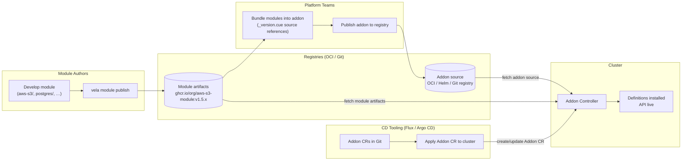

## Definition Identity: module, apiVersion, name

Two new optional fields are added to all Definition CRD specs:

```go
// Added to ComponentDefinition, TraitDefinition,
// WorkflowStepDefinition, and PolicyDefinition.

// Module is the globally unique module identifier this definition belongs to.
// Typically set by the addon controller when installing module-managed definitions,
// but may also be set manually on hand-authored definitions to opt into the module
// identity and API line versioning model.
// Absent for legacy definitions outside the module system.
// +optional
Module string `json:"module,omitempty"`

// APIVersion is the API line identifier for this definition (e.g. "v1", "v2", "v1beta1").
// Must follow the Kubernetes API stability level convention: v{N}, v{N}beta{M}, or v{N}alpha{M}.
// Validated by the admission webhook against the pattern ^v\d+(alpha\d+|beta\d+)?$
// Typically set by the addon controller when installing module-managed definitions,
// but may also be set manually on hand-authored definitions.
// Absent for legacy definitions outside the module system.
// +optional
APIVersion string `json:"apiVersion,omitempty"`
```

| Field | Example | Set by | Visible to |
|---|---|---|---|
| `spec.module` | `aws-s3` | addon controller or manual | Operators, resolution logic |
| `spec.apiVersion` | `v1` | addon controller or manual | Application authors (for `type: aws-s3/v1/bucket`) |
| `spec.version` | `v1.2.3` | addon controller | Operators (internal, not for pinning) |

`spec.version` continues to work exactly as today; it is the addon release semver stamped by the controller and used for internal versioning. Application authors should never reference it directly. `spec.apiVersion` is the user-facing stable contract identifier.

`spec.apiVersion` is validated at admission against the pattern `^v\d+(alpha\d+|beta\d+)?$` (the Kubernetes API stability level convention). Values such as `1.0`, `v1.2`, `latest`, or arbitrary strings are rejected. Valid examples: `v1`, `v2`, `v1beta1`, `v1alpha2`.

The canonical identity of a definition within the module system is the triple
`{module}/{apiVersion}/{name}`. All three fields must be present for a definition to
participate in versioned resolution; definitions missing `spec.module` or `spec.apiVersion`
are treated as non-module definitions and resolved by exact name match only. The canonical
triple is the authoritative reference used by the admission webhook, the deprecation check,
and the Application status record.

**Two independent models.** A definition is either *legacy* (no `spec.module`, no `spec.apiVersion`, resolved by exact name only) or *versioned* (both fields present, participates in the module system and canonical triple resolution). There is no partial participation: a definition missing either field is treated as legacy and is outside the module versioning system entirely. The two models do not intersect at resolution time.

> **Lock and immutability:** see [Definition Lock Model](#definition-lock-model) below for how the canonical triple is stored, how immutability is enforced, and the Form 2 vs Form 3 lock behavior.

## Definition Naming Convention

Definitions installed by the module system are named using the pattern:

```
{module}-{apiVersion}-{definition-name}
```

The API version sits before the definition name, reflecting the containment hierarchy: the definition belongs to an API line which belongs to a module. This also means DefinitionRevision counters (appended as `-v{N}`) are unambiguously attached to the definition name rather than the API line:

| Module | Definition | API Version | Installed Name | DefinitionRevision example |
|---|---|---|---|---|
| `aws-s3` | `bucket` | `v1` | `aws-s3-v1-bucket` | `aws-s3-v1-bucket-v3` |
| `aws-s3` | `bucket` | `v2` | `aws-s3-v2-bucket` | `aws-s3-v2-bucket-v1` |
| `aws-s3` | `encryption-policy` | `v1beta1` | `aws-s3-v1beta1-encryption-policy` | `aws-s3-v1beta1-encryption-policy-v2` |
| `postgres` | `database` | `v1` | `postgres-v1-database` | `postgres-v1-database-v1` |

If the derived name exceeds 253 characters, it is truncated and an 8-character hash suffix appended:

```
{truncated-prefix}-{8-char-hash}
```

The hash is computed over the full untruncated name (stable across reconcile cycles).

**Why not use DefinitionRevisions for coexistence?** `DefinitionRevision` tracks history within a single definition; only one revision is "current". Applications pinning `type: bucket@v5` are frozen on a historical snapshot with no maintained evolution path. API lines are different: `aws-s3-bucket-v1` and `aws-s3-bucket-v2` are two *simultaneously active, independently maintained* definitions; both receive updates, both are "current", and teams migrate between them on their own schedule. The two mechanisms are complementary: DefinitionRevisions still track the update history *within* each API line.

**Breaking change note**: This naming convention is a breaking change for tooling that hardcodes definition names. Legacy definitions (installed by addons without `_version.cue`) keep their existing names. Migration guidance must address tools that reference definition names directly.

## Definition Labels and Annotations

All module-managed definitions carry a standard label and annotation set:

**Labels** (used for fast selector-based lookups):

```yaml
labels:
  definition.oam.dev/module: aws-s3
  definition.oam.dev/api-version: v1
  definition.oam.dev/name: bucket
  addon.oam.dev/name: aws-s3
```

**Annotations** (internal metadata):

```yaml
annotations:
  addon.oam.dev/version: v1.2.3
  addon.oam.dev/managed-by: controller
  definition.oam.dev/full-name: aws-s3-v1-bucket
```

**Lifecycle annotations** (set dynamically):

```yaml
annotations:
  definition.oam.dev/deprecated: "true"
  definition.oam.dev/deprecated-at: "2026-03-24T10:00:00Z"
  definition.oam.dev/disabled: "true"    # set when enabled evaluates to false
```

## Type Reference Syntax

> **Design exploration (not yet accepted):** [Design 01](./design/01-module-crd.md) proposes a simpler resolution model that drops Form 2 (`v1/bucket`, module-discovered) and keeps only two forms: legacy unqualified (`bucket`) and fully qualified (`aws-s3/v1/bucket`). Under namespace-per-module, the qualified reference resolves to a definition named `v1-bucket` (no module prefix) in `vela-module-aws-s3` via a single deterministic GET, removing the global selector and ambiguity handling below. The full three-form model here remains the baseline; the two-form simplification is under evaluation.

> **Design principle:** The API version is the stability contract. Any reference form that
> guesses or discovers the version undermines that contract; and anyone using the module
> versioning system has already opted in to caring about it. Module discovery is permitted
> (Form 2) because the module is a delivery namespace, not a contract boundary. The version
> must always be explicit.

Applications reference definitions using an extended type syntax. For a summary of which
form to use in each context, see [Recommended Usage](#recommended-usage) below.


```yaml
components:
  # Form 3: Fully qualified - recommended for production, GitOps, and automated pipelines.
  # Module and API version are both explicit; resolution is fully deterministic.
  - name: my-bucket
    type: aws-s3/v1/bucket

  # Form 2: Version-scoped. API version is explicit; module is discovered from cluster state
  # at first admission and stored in the lock. Use when the API version is known but
  # the module does not need to be pinned. For full determinism, use Form 3.
  - name: my-bucket
    type: v1/bucket

  # Form 1: Unqualified name only - legacy path for hand-authored definitions.
  # Supported ONLY for non-module definitions (spec.module absent): exact-name match,
  # no lock, no module system involvement.
  # ⚠️  If the matched definition has spec.module set, admission is rejected:
  #     versioned definitions must use Form 2 or Form 3.
  - name: my-bucket
    type: bucket
```

The `type` field is parsed by segment count:

| Segments | First segment | Form | Pattern | Nickname |
|---|---|---|---|---|
| 1 | (any) | Form 1 | `{definition-name}` | Unqualified |
| 2 | matches `^v\d+` | Form 2 | `{apiVersion}/{definition-name}` | Version-scoped |
| 3 | (any) | Form 3 | `{module}/{apiVersion}/{definition-name}` | Fully qualified |

**Form 2** (`{apiVersion}/{definition-name}`, e.g. `v1/bucket`): the API version is
explicit, but the module is discovered from cluster state at first admission. The webhook
performs a global label selector (`definition.oam.dev/api-version={apiVersion},
definition.oam.dev/name={name}`) across all installed modules. If exactly one result is
found, its module is stored in the lock and the reference is accepted. If more than one
result is found (that is, two or more modules both provide the same definition name at
the same API version), the reference is rejected with an ambiguity error; the author must
use Form 3 to specify the module explicitly. Once locked, the stored canonical triple is
used for all subsequent admissions; no lookup of any kind occurs. Use Form 2 when the
API version is known but the module does not need to be pinned. Use Form 3 when both must
be fully deterministic from the moment the manifest is written.

The order mirrors both the installed name convention (`{module}-{apiVersion}-{definition-name}`)
and the Kubernetes API URL structure (`/apis/{group}/{version}/{resource}`). There is no
separate `module` field on the component; module scoping is expressed entirely within `type`.

**Form 3 is the canonical reference form**; it encodes the full triple directly without a resolution step and is safe from the moment it is written. See [Recommended Usage](#recommended-usage) for when to use each form.

**Choosing a form:**

| Scenario | Recommended form |
|---|---|
| Production manifest, GitOps repo, automated pipeline | **Form 3** (`module/apiVersion/name`) |
| API version known, module not pinned | Form 2 (`apiVersion/name`): module discovered but version explicit |
| Legacy un-versioned (hand-authored) definition | Form 1 (`name`): exact-name match, no dynamic resolution (non-module path only) |
| New module-backed definition | Form 2 or Form 3; Form 1 is rejected for module-backed definitions |

**Form 2 defers module discovery only; the version is explicit and is the contract.** Once the module is locked at first admission, the stored canonical triple is used directly for all subsequent admissions.

**Form 1 is for non-module definitions only.** No version is involved; resolution is a
direct name lookup. If the matched definition has `spec.module` set, admission is rejected.

Only Form 3 (which encodes the full canonical triple in the type string) requires no
cluster state at any point and is safe from the moment it is written.

### Resolution Rules

All resolution is performed at admission time. Resolution is normalisation: the admission
webhook resolves the type reference to the canonical triple `{module}/{apiVersion}/{name}`
before any downstream operation. For Form 2, the resolved triple is written to the
`ApplicationRevision` lock; the status record is derived from that. For Form 3, the
triple is derived directly from the type string with no lookup. For non-module definitions
(no `spec.module`), only exact-name matching applies and no canonical triple is produced;
those definitions are outside the module versioning system entirely.

The four rules that govern all versioned resolution:

1. **Version is always explicit.** There is no version inference or fallback. A type string without an explicit `apiVersion` segment is not a versioned reference.
2. **Module is required when ambiguous.** If a global selector on `(apiVersion, name)` returns more than one result, the reference is rejected. The author must supply the module (Form 3).
3. **Ambiguity is always a hard failure.** There is no "pick the best" fallback, no stability ranking used for selection, and no implicit default. Exactly one candidate must exist.
4. **Binding is permanent for `module` and `name`.** Once resolved, the `module` and `name` components of the canonical triple are immutable for that component reference. Only `apiVersion` may change, via an explicit type string update. A `type` change that would alter `module` or `name` is rejected; that is a contract replacement, not a migration.

> **Ambiguity invariant:** see rules 1–3 above. The short version: version always explicit,
> module required when ambiguous, ambiguity always fails hard.

Form selection is determined solely by parsing the `type` string (segment count and
first-segment pattern). There is no fallback between forms: a type string is resolved as
its parsed form or rejected; it does not silently fall back to another form's resolution.

**Resolution priority order:**

Each form follows a strict priority sequence. Steps are evaluated in order; once a step
succeeds or definitively fails, no later step is reached.

**Form 3** (`{module}/{apiVersion}/{definition-name}`):
1. Lock entry present → check `module` and `name` match stored values → reject if either differs.
2. Derive CR name from naming convention → direct GET → accept or reject.
3. Write (or update) `ComponentDefinitionLock` with canonical triple → accept.

**Form 2** (`{apiVersion}/{definition-name}`):
1. Stored lock present → direct GET on (stored-module, apiVersion, name) → accept or reject. No fallback.
2. No stored lock → global selector (`definition.oam.dev/api-version={apiVersion}, definition.oam.dev/name={name}`)
   → if more than one result: reject with ambiguity error (use Form 3); exactly one: store lock → accept.

**Form 1** (`{definition-name}`):
1. Exact-name GET (`metadata.name = name`):
   - Found, `spec.module` absent → legacy path: accept, no lock written.
   - Found, `spec.module` present → **reject**: this is a versioned definition; use Form 2 or Form 3.
   - Not found → reject: definition not found.

Form 1 never writes a definition lock. It operates entirely outside the module versioning system.

No fallback exists between forms.

**Form 3 - fully qualified** (`{module}/{apiVersion}/{definition-name}`):
The controller derives the exact CR name using the naming convention
(`{module}-{apiVersion}-{definition-name}`, with truncation+hash if needed) and performs a
direct `GET`. No selector query. Ambiguity is impossible; the name is deterministic. If
the computed CR does not exist, admission is rejected.

**Form 1 - legacy path** (`{definition-name}`):
Performs a direct exact-name GET (`metadata.name = {name}`). No selector. No lock.
- Found, `spec.module` **absent**: the definition is outside the module system; accept,
  no lock written.
- Found, `spec.module` **present**: the definition is versioned; Form 1 cannot address it.
  Reject: use Form 2 (`apiVersion/name`) or Form 3 (`module/apiVersion/name`).
- Not found: reject (definition not found).

Form 1 is the unchanged pre-module resolution path. It has no knowledge of modules,
API lines, or the canonical triple, and does not interact with the definition lock.

> **Legacy priority is unconditional.** Because legacy authors have no syntax available to
> disambiguate (`type: bucket` is already maximally specific for a non-module definition),
> the exact-name GET must resolve before any other check. Installing a module definition
> with label `definition.oam.dev/name=bucket` does **not** shadow an existing non-module
> definition named `bucket`. Platform teams introducing module definitions for a name that
> was previously served by a legacy definition must be aware that the legacy definition
> continues to win for Form 1 references until it is removed.

**API version stability ordering:** Stability class takes absolute precedence over version
number. This ordering is relevant for the deprecation lifecycle; it is not used to
implicitly select among multiple candidates (the ambiguity invariant means any resolver
that encounters more than one candidate rejects rather than ranks). The ordering, highest first:

1. `vN` - stable, N descending (`v2` > `v1`)
2. `vNbetaM` - beta, N descending, M descending (`v2beta1` > `v1beta2` > `v1beta1`)
3. `vNalphaM` - alpha, N descending, M descending (`v2alpha1` > `v1alpha2`)

This means `v1` (stable) always ranks above `v2beta1` (beta), which always ranks above
`v3alpha1` (alpha), regardless of the version number. A `v2alpha1` line installed alongside
a `v1` stable line does **not** shadow the stable line; they are distinct API lines and
an author must explicitly choose which one to reference. This follows the
[Kubernetes API versioning convention](https://kubernetes.io/docs/reference/using-api/#api-versioning), not semver.

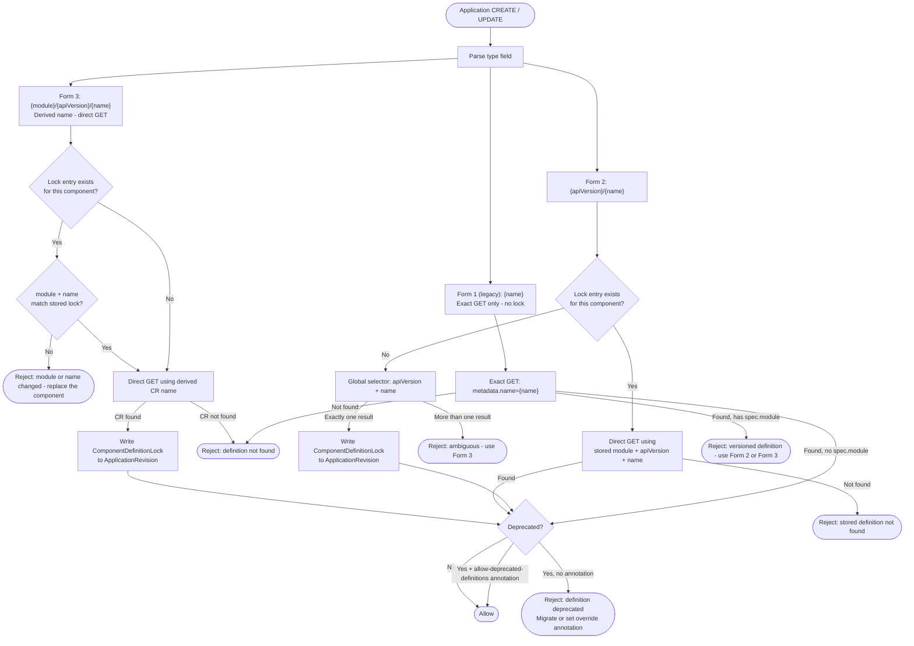

### Resolution Stability Summary

| Form | Module | API version | Production use |
|------|---|---|---|
| **3** `aws-s3/v1/bucket` | Explicit + pinned | Explicit + pinned | ✅ Recommended; fully deterministic from first admission |
| **2** `v1/bucket` | Resolved at first admission; bound permanently in lock | Explicit + pinned | ⚠️ Version pinned, module bound at first admission; use Form 3 for full determinism |
| **1** `bucket` | None | None (outside module system) | ✅ Legacy path; exact-name match for non-module definitions only |

> **Note:** If the matched definition has `spec.module` set, admission is rejected (Form 1 cannot address versioned definitions). This is not a Form 1 failure mode; it is a model mismatch.

**Definition lock** is the per-component binding record stored in
`ApplicationRevision.spec.definitionLocks` (the authoritative source of truth for all
resolution decisions). The lifecycle is: **input → resolve once → store canonical triple →
reuse directly**. Both Form 2 and Form 3 write a `ComponentDefinitionLock` entry at first
admission. On every subsequent admission the webhook reads the stored triple from
`ApplicationRevision`; cluster state is never consulted again. The selector never runs
again for a locked component. Publishing a new API line, installing a new module, or
making unrelated spec changes does not affect any Application with a stored lock.
`.status.services[i].resolvedDefinition` is a read-only projection of the lock for human
readability; it carries no binding authority.
The render path reads the stored canonical triple and uses it directly; it performs no definition lookup, no selector query, and no re-resolution of any kind.

Form 2 is therefore **not safe for fresh-cluster GitOps**: a manifest applied to a cluster
with no pre-existing lock depends on cluster state at first admission to resolve the
module. Form 3 requires no resolution step and is safe from the moment it is written.

**To upgrade to a new API line**, the Application author must explicitly update `type` to
Form 3 with the new version (e.g. `type: aws-s3/v2/bucket`). The webhook derives the new
canonical triple directly from the Form 3 name (no selector), checks that `module` and
`name` are unchanged from the stored lock, and updates the lock's `apiVersion` to the new
value. There is no implicit upgrade path; any spec change that does not also change the
`type` string continues to resolve using the stored lock.

**To reset the definition binding**, a platform operator may remove the relevant
`ComponentDefinitionLock` entry from the `ApplicationRevision`. This returns the component
to its initial unbound state; the stored canonical triple is discarded. The
`.status.services[i].resolvedDefinition` projection will reflect the cleared state on the
next status sync. On the next admission the component is treated as a first-time submission:
Form 2 runs the selector against current cluster state and binds to whatever definition it
finds (subject to the ambiguity invariant). Because the binding is re-established from
current cluster state, this is an operator action with contract implications; use it only
when deliberately re-targeting a component, not as routine maintenance.

**Lock staleness - failure mode and recovery:** If the module that owns a stored lock is
uninstalled, re-applying the Application will fail at the direct-GET step ("stored
definition not found") even if a definition with the same name exists under a different
module or as a legacy definition. The stored canonical triple is treated as authoritative; no fallback or re-binding
occurs. This is intentional: silently binding to a different definition after a module
uninstall would be a silent contract change, which the module system is designed to prevent.

The admission error in this case is:

```
Error: component "my-bucket" has a stored definition lock for "aws-s3-v1-bucket"
but that definition no longer exists. Remove the ComponentDefinitionLock entry from
the ApplicationRevision, then reapply with the replacement type.
```

Recovery: clear the stale lock, then reapply.

Because the immutability check fires on any admission where the incoming `type` string
would change `module` or `name` relative to the stored lock, you cannot simply update
`type` in place; the webhook will reject the change before it can resolve the new
definition. The lock must be removed first so the next admission is treated as a
first-time submission.

```bash
# Find the current ApplicationRevision name
kubectl get application <app-name> -o jsonpath='{.status.latestRevision.name}'

# Remove the lock entry for the affected component
kubectl patch applicationrevision <revision-name> --type=json \
  -p='[{"op":"remove","path":"/spec/definitionLocks/<i>"}]'
```

Then update `type` to the replacement definition's Form 3 name and reapply. The
component is now unbound: the webhook resolves the new type string as a first admission
and writes a fresh lock. Use Form 3 (`module/apiVersion/name`) so the new binding is
deterministic from the first apply.

**Adding a new API line (v1 → v2 coexistence):** When a `v2` API line is added to an
existing module, both `aws-s3-v1-bucket` and `aws-s3-v2-bucket` are installed
simultaneously. Applications with a stored lock continue to resolve to `v1` indefinitely;
neither the addon upgrade nor any unrelated spec change alters the binding. To migrate
to `v2`, the author must change `type` to `aws-s3/v2/bucket` (Form 3). The `v1` line
remains active until explicitly deprecated and removed.

## Recommended Usage

The guidance below summarises the most important usage rules for consumers and module
authors. The single most impactful rule: **use Form 3 (`module/apiVersion/name`) for any
manifest that will be stored in version control, applied by a GitOps agent, or shared
across clusters.** Form 2 (`apiVersion/name`) is a convenience for interactive and
exploratory use; it resolves against cluster state at first admission and is not
reproducible across environments until a lock is stored. Within a given API line,
treat the parameter contract as stable: do not make breaking changes in place; introduce a
new API line instead. The subsections below expand on each rule.

### Use Form 3 for production and GitOps

`type: aws-s3/v1/bucket` is the only form that is fully deterministic from the moment the
manifest is written. The CR name is derived without any cluster state lookup; the same
manifest resolves identically on any cluster where the definition is installed. Use Form 3
for:

- Applications managed by Flux, Argo CD, or any GitOps agent
- Manifests stored in version control
- Automated pipelines and CI/CD-generated Applications
- Any context where an unexpected version change would be a production incident

### Use Form 1 for legacy definitions only

Form 1 (`type: bucket`) is the legacy resolution path. It is the correct form for
hand-authored definitions that do not participate in the module system (those with no
`spec.module` field).

The choice between Form 1 and Forms 2/3 is not a syntax preference; it is determined by
the definition itself. If a definition has `spec.module` set, it is a versioned definition
and Form 1 cannot address it; the webhook rejects the reference and the author must use
Form 2 or Form 3. If a definition has no `spec.module`, it is a legacy definition and
Form 1 is the only applicable path; Forms 2 and 3 do not apply to it.

These two models do not overlap. Migrating a hand-authored definition into the module
system requires setting `spec.module` and `spec.apiVersion` on the definition and updating
all Application references to Form 2 or Form 3. That is a deliberate migration, not a
transparent upgrade.

### Treat API lines as stable contracts

An API line (`v1`, `v2`) is a convention (and where the schema check is enabled, a
partially enforced rule) that the parameter contract remains fulfillable for the lifetime
of that line. Do not make breaking changes within a line; introduce a new line instead.
The admission webhook can detect obvious parameter schema violations when
`--api-line-contract-policy=warn` or `reject` is set, but template body changes, output
schema changes, and auxiliary resource changes are outside the scope of static schema
comparison and are the module author's responsibility to manage safely. Consumers who have
pinned to `v1` via Form 3 are isolated from `v2` until they explicitly migrate.

### Do not rely on implicit re-binding

The definition lock (stored in `ApplicationRevision.spec.definitionLocks`, projected
read-only to `.status.services[i].resolvedDefinition`) binds the component to the
resolved canonical triple after first admission. Nothing changes it implicitly; not a
new API line being published, not an unrelated spec change. To change the resolved
version, the `type` field must be explicitly updated to Form 3 with the new version.
The `module` and `name` components of the stored triple cannot be changed in place;
doing so would alter the underlying contract of the reference, not merely migrate it.
This is intentional: implicit contract changes are the problem the module system is
designed to prevent.

### Migrating between API lines

Perform the migration in two explicit steps:

```yaml
# Step 1: Ensure you are on Form 3 at the current version.
#         If you were using Form 2 (type: v1/bucket), this makes the module explicit in
#         the type string. Lock written: {module: aws-s3, apiVersion: v1, name: bucket}.
type: aws-s3/v1/bucket

# Step 2: Migrate to the new API line - explicit, reviewable in a pull request.
#         module and name match the stored lock; apiVersion differs - migration allowed.
#         Lock updated: {module: aws-s3, apiVersion: v2, name: bucket}.
type: aws-s3/v2/bucket
```

Separating the steps makes each change independently reviewable. The old `v1` line remains
available for any consumers that have not yet migrated.

## Module Structure in Addon Source Tree

> **Design exploration (not yet accepted):** the design notes reconsider the Module as a first-class, independently installable, publishable capability rather than only a subtree of an addon source. See [Design 01](./design/01-module-crd.md) (Module identity, namespace-per-module, module-owned Application) and [Design 02](./design/02-namespace-and-tenancy.md). A Module is scoped to just definitions + the auxiliary resources that back them (no Schemas/ConfigTemplates/Views). This KEP's `modules/`-subtree structure remains the baseline.

The addon controller scans `modules/` for `_module.cue` files to discover modules, then looks for `_version.cue` in subdirectories to discover API lines. The full addon controller reconciliation loop (source resolution, drift correction, owned Application management) is covered in [KEP-2.13](../2.13-addons/README.md). This section describes only the module source tree layout that KEP-2.13's controller consumes.

There are two ways to include modules in an addon source tree: **inline** (definitions authored directly in the addon) and **imported** (definitions fetched from a published OCI or Git artifact at reconcile time). Both can coexist in the same addon.

### Inline Modules

Modules authored directly inside the addon source tree. The controller discovers them by scanning for `_module.cue` files under `modules/`:

```
my-addon/
  metadata.cue
  template.cue
  resources/                # Tier 1: addon infrastructure; compiled into owned Application
  definitions/              # legacy path; still supported with deprecation warning
  modules/
    aws-s3/
      _module.cue           # module identity
      auxiliary/            # Tier 2: module-wide auxiliary (XRDs - singleton, shared across API lines)
      v1/
        _version.cue        # API line v1 metadata
        bucket.cue
        encryption-policy.cue
        auxiliary/          # Tier 3: API-line auxiliary (Compositions, KRO ResourceGraphDefinitions)
      v2/
        _version.cue        # API line v2 metadata
        bucket.cue
        auxiliary/
    postgres/
      _module.cue
      auxiliary/            # Tier 2: module-wide auxiliary (XRD)
      v1/
        _version.cue
        database.cue
        auxiliary/          # Tier 3: API-line auxiliary (Composition for v1)
```

### Imported Modules - `_imports.cue`

> **Status: Proposal - to be validated during implementation**

For addons that bundle independently published modules rather than authoring definitions inline, a single `modules/_imports.cue` file replaces the per-module directory tree. The controller detects the presence of `_imports.cue` and resolves each entry from its declared source at reconcile time.

```
my-addon/
  metadata.cue
  template.cue
  modules/
    _imports.cue            # all external module references declared here
```

```cue
// modules/_imports.cue
imports: [
    {
        module:  "aws-s3"
        enabled: true        // AND-ed with the fetched module's own _module.cue enabled
        sources: [
            {
                oci:      { ref: "ghcr.io/org/aws-s3-module", version: "~1.0.0" }
                versions: ["v1", "v1beta1"]   // API lines to install from this artifact
            },
            {
                oci:      { ref: "ghcr.io/org/aws-s3-module", version: "~2.0.0" }
                versions: ["v2"]
            },
        ]
    },
    {
        module:  "postgres"
        enabled: true
        sources: [
            {
                oci:      { ref: "ghcr.io/org/postgres-module", version: "~1.0.0" }
                // no versions filter - installs all API lines present in the artifact
            },
        ]
    },
    {
        module:  "microservice"   // DefKit module - apiLine assigned at import time
        sources: [
            { oci: { ref: "ghcr.io/org/microservice-module", version: "~1.0.0" }, apiLine: "v1" },
        ]
    },
]
```

**`sources` fields:**

| Field | Type | Description |
|-------|------|-------------|
| `registry` | string | Named addon registry (configured in KubeVela). The module name is resolved within this registry. Preferred over raw `oci`/`git` refs; registry configuration is the single source of truth for artifact locations. |
| `oci` | object | Raw OCI artifact reference (`ref` + `version` semver range). Use when the module lives outside a configured registry. |
| `git` | object | Raw Git repository reference (`url` + `version` branch/tag/semver range). Use when the module lives outside a configured registry. |
| `version` | string | Semver range for the module artifact. Used with `registry`; the registry resolves the range against its index. |
| `versions` | `[string]` | API lines to install from this artifact. If absent, all lines are installed. Only applies to CUE modules. |
| `apiLine` | string | Assigns an API line identifier to all definitions from a DefKit artifact. Mutually exclusive with `versions`. See DefKit note above. |

**Registry resolution - preferred source form:** When modules are published to a configured KubeVela addon registry, the `registry` + `version` form is preferred over raw `oci`/`git` refs. The full artifact URL is an infrastructure detail that belongs in registry configuration (not repeated across every `_imports.cue`). This also means migrating to a different registry (e.g. from Artifactory to GHCR) requires no changes to any addon source files.

```cue
// Preferred - registry-resolved
sources: [
    { registry: "oam-modules", version: "~1.0.0", versions: ["v1"] },
]

// Explicit - raw OCI ref (use when module is outside a configured registry)
sources: [
    { oci: { ref: "ghcr.io/myorg/aws-s3-module", version: "~1.0.0" }, versions: ["v1"] },
]
```

**`versions` default - all lines:** Omitting `versions` is intentional shorthand for "install all API lines present in the artifact". Addon authors should specify `versions` explicitly when they want to restrict which lines are exposed (for example, to hold back a `v2` line until consumers have been notified). The absence of `versions` is not an error and produces no warning.

**`enabled` AND semantics:** The `enabled` field on an import entry is AND-ed with the `enabled` expression in the fetched module's own `_module.cue`. The module is installed only if both evaluate to true. The controller records the source of the gate (`addon` or `module`) in the Addon CR status when a module is skipped.

**CueX evaluation:** `_imports.cue` is evaluated as a CueX expression with the same full context contract as `_module.cue` and `_version.cue`; `parameter.*`, `context.*`, and controller-injected fields (`context.addonName`, `context.addonVersion`) are all available. This means import entries, `enabled` expressions, and `sources` fields can all reference cluster context at reconcile time.

A practical example (rolling out a new `v2alpha1` API line to a single region for initial testing before broader promotion):

```cue
// modules/_imports.cue
imports: [
    {
        module:  "aws-s3"
        enabled: true
        sources: [
            {
                // v1 ships everywhere
                oci:      { ref: "artifactory.guidewire.com/atmos-helm-release/modules/aws-s3", version: "~1.0.0" }
                versions: ["v1"]
            },
            {
                // v2alpha1 only installs in us-east-1 for initial rollout
                oci:      { ref: "artifactory.guidewire.com/atmos-helm-release/modules/aws-s3", version: "~2.0.0-alpha" }
                versions: ["v2alpha1"]
                enabled:  context.region == "us-east-1"
            },
        ]
    },
]
```

When `context.region` is not `us-east-1` the second source entry is skipped entirely; no `v2alpha1` definitions are applied, no auxiliary resources fetched. The Addon CR status records which source entries were skipped and why. Once testing is complete the `enabled` constraint is removed and the line promotes to all regions on the next reconcile.

**Inline and imported modules may coexist** in the same addon; `_imports.cue` is processed alongside any inline `_module.cue` directories present under `modules/`.

### Three-Tier Resource Model

The addon source tree supports three categories of deployable resources with distinct semantics and installation ordering. Together with the definitions they back, they form four conceptual layers:

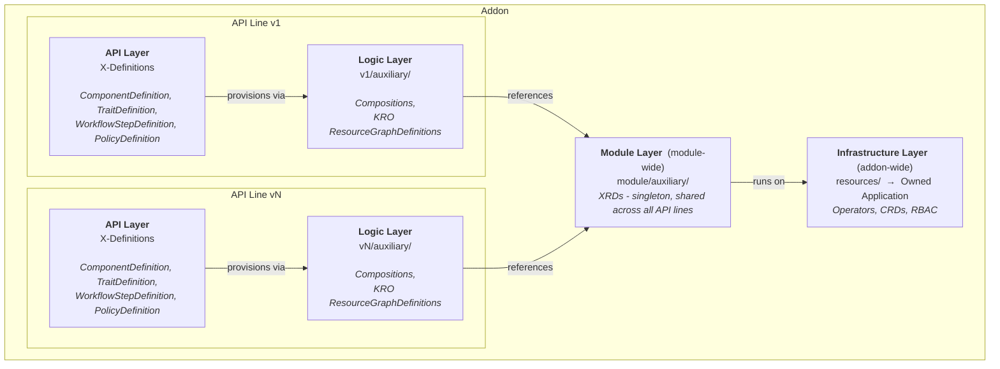

The scoping hierarchy: Infrastructure (`resources/`) is **addon-wide**. Module auxiliary (`module/auxiliary/`) is **module-wide** (shared across all API lines within a module). Logic (`v{N}/auxiliary/`) and API (Definitions) are **per API line** (each line carries its own compositions and definitions, allowing v1 and v2 to have independent contracts and backing logic).

**Tier 1: Addon Application resources (`resources/`)**

The top-level `resources/` directory contains version-agnostic infrastructure the addon as a whole requires. These files are compiled into the addon's owned Application CR and support the full OAM workflow model (ordered component deployment, health gates, workflow steps, and conditions). Typical contents: operator deployments (Crossplane, KRO, cert-manager), CRDs, RBAC.

> **Note:** `resources/` components use built-in KubeVela types to install infrastructure; they do not reference module definitions from the same addon, since definitions are the API *to* those resources, not the mechanism that installs them. If an addon needs to consume another addon's definitions, that is expressed through addon-of-addons composition (see KEP-2.13) rather than within a single addon's `resources/`.

**Tier 2: Module-wide auxiliary resources (`module/auxiliary/`)**

Each module may contain a top-level `auxiliary/` directory for resources that are shared across all API lines within that module. The primary use case is the Crossplane `CompositeResourceDefinition` (XRD) (a singleton resource that spans all versions and must exist before any API-line Composition referencing it is applied).

> **Crossplane note:** A single XRD serves multiple Composition versions (v1alpha1, v1beta1, etc.) by listing all served versions internally. The XRD cannot be split per API line; Crossplane does not support multiple XRDs for the same resource type. The module-level `auxiliary/` directory is the correct home for this singleton. When transitioning to KRO, the XRD in `module/auxiliary/` disappears entirely; each API line's `ResourceGraphDefinition` is self-contained and owns its own schema and version, making module-level auxiliary unnecessary for KRO-based modules.

**Tier 3: API-line auxiliary resources (`v{N}/auxiliary/`)**

Each API line may contain an `auxiliary/` directory with resources specific to that line's contract (the logic layer that definitions in the line depend on at runtime). Typical contents: versioned Crossplane `Composition` objects (referencing the module-level XRD at their specific version), or KRO `ResourceGraphDefinition` resources (self-contained, no module-level XRD needed).

Auxiliary resources at both Tier 2 and Tier 3 are intentionally simpler than Tier 1: they are YAML manifests or CUE templates (for parameter-driven generation) and do not support OAM workflow steps. They are applied by the addon controller via server-side apply.

**Multi-cluster placement of auxiliary resources**

Auxiliary resources must be deployable to spoke clusters, not only the hub. A Crossplane `Composition` or KRO `ResourceGraphDefinition` must exist on the same spoke where component Claims are submitted; applying it only to the hub is insufficient in any multi-cluster addon deployment.

This is a first-class requirement of the module versioning model, and it is one of the principal open questions for implementation. The current "addon controller applies auxiliary via SSA" model applies resources to the hub only and does not participate in the topology engine. To support spoke placement, auxiliary resources need to be brought inside the topology-aware machinery that the owned Application already provides.

The intended high-level approach is:

- Auxiliary resources (Tier 2 and Tier 3) are embedded as entries in `spec.components[]` of the owned Application, using a suitable passthrough component type (e.g. `k8s-objects` or an equivalent that preserves kstatus health semantics on the wrapped resource).
- A dedicated workflow step is appended to the owned Application's `spec.workflow.steps[]` to deploy the auxiliary components. The step is ordered after the infrastructure steps and before definitions are applied, preserving the installation ordering guarantees described below.
- Placement is governed by the addon's topology policy, giving auxiliary resources the same spoke-targeting semantics as any other Application component (no separate placement mechanism is required).

The Tier 2 / Tier 3 distinction (module-wide XRD before API-line Compositions) maps onto step ordering within the workflow: a module-auxiliary step runs and gates before the per-line auxiliary steps, maintaining the schema-before-implementation guarantee across spokes.

> **Open question for implementation:** the exact component type, health-gate semantics on wrapped resources, and workflow step structure (whether Tier 2 and Tier 3 are separate named steps or a single step with internal ordering) are left to the implementation team. The requirement is that auxiliary resources participate in the Application's topology and workflow model so that spoke placement is handled uniformly with the rest of the addon's components.

**Installation ordering**

Definitions are applied last; they are the go-live gate that signals the API is open for business:

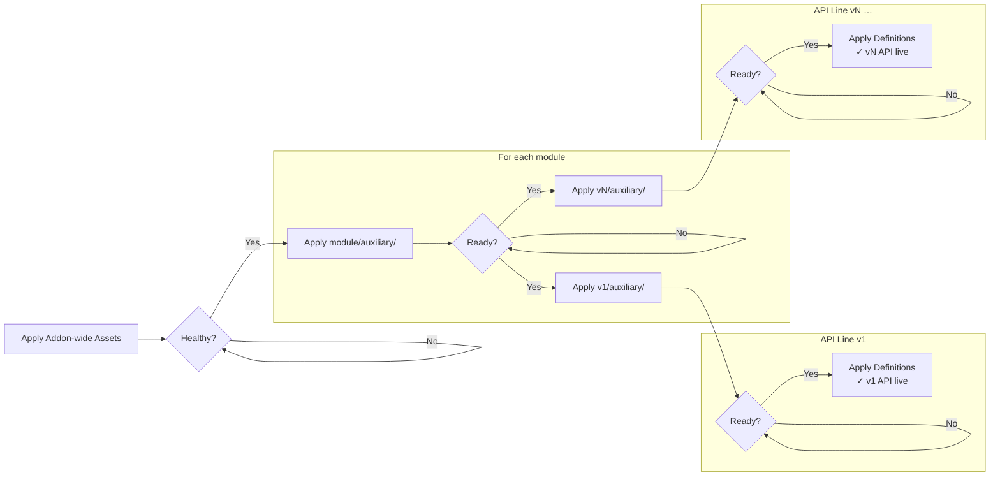

1. Apply addon-wide assets (no health dependency):
   - Create/update owned Application from top-level `resources/`
   - Apply `ConfigTemplate` resources
   - Apply VelaQL `View` resources
   - Apply UI `Schema` resources
2. Wait for owned Application → Healthy
3. For each module, apply module-wide auxiliary (`module/auxiliary/`) (e.g. Crossplane XRD)
4. Wait for module auxiliary → Ready
5. For each enabled API line (in parallel):
   - Apply `v{N}/auxiliary/` resources (e.g. Crossplane Composition)
   - Wait for auxiliary resources → Ready
   - Apply definitions (`ComponentDefinition`, `TraitDefinition`, etc.) (go-live gate)

This ordering has three important guarantees:

- **Infrastructure-before-logic**: Crossplane Compositions and XRDs are never applied before the Crossplane CRDs exist. Applying them before the operator is running fails immediately; the Application health gate prevents that.
- **Schema-before-implementation**: Crossplane XRDs (module-level) are always applied and ready before any Composition (API-line-level) referencing them. A Composition applied before its XRD is registered fails immediately.
- **Logic-before-API**: Definitions are never visible to Application authors until the compositions backing them are ready. Without this, a user who writes `type: aws-s3/v1/bucket` immediately after an addon install will get a reconciliation failure from a missing Composition rather than a working bucket. Definitions land only once the full stack beneath them is operational.

On upgrade the same ordering applies; updated definitions land only after updated auxiliary resources are ready, preventing a window where the old definition renders against a new incompatible composition.

> **Multi-cluster note:** The installation ordering diagram above depicts the logical sequence. In a multi-cluster deployment, steps 3–5 (auxiliary and definitions) must execute on each target spoke, not only the hub. The mechanism for this (embedding auxiliary resources as `spec.components[]` with a dedicated workflow step, as described in the **Multi-cluster placement of auxiliary resources** section above) means that the "Apply module/auxiliary/" and "Apply vN/auxiliary/" boxes in the diagram represent workflow steps executing across the addon's topology, not hub-only SSA operations. The health gates (Ready? checks) apply per spoke: the workflow step does not advance until auxiliary resources are Ready on all targeted spokes. The exact per-spoke health aggregation behaviour is an open implementation question.

If the owned Application does not reach Healthy, auxiliary resources and definitions are not applied and the Addon CR transitions to `Failed` with a condition identifying the blocking Application component. If auxiliary resources do not reach Ready, definitions are withheld and the condition identifies the unready resource.

**Auxiliary resource content**

Auxiliary files are plain YAML (`.yaml`) or CUE (`.cue`). CUE files in `auxiliary/` (at both module level and API-line level) are evaluated with the **full addon context** before being applied. This is the same context available to `_version.cue` and `_module.cue`:

- `parameter.*`: all addon parameters and their current values
- `context.apiVersion`: the API line version (API-line auxiliary only)
- `context.provider`, `context.region`, and all other cluster context values from `Config` resources
- `context.addonName`, `context.addonVersion`: controller-injected addon identity fields

This means module authors can use parameter guards in auxiliary CUE to conditionally configure resources (for example, controlling which XRD versions are served based on addon parameters, or parameterising a Composition's region or account ID from `parameter.region`). Auxiliary CUE has the same expressive power as `_version.cue` for conditional logic.

```yaml
# modules/aws-s3/auxiliary/xrd.yaml  ← module-wide singleton
apiVersion: apiextensions.crossplane.io/v1
kind: CompositeResourceDefinition
metadata:
  name: xbuckets.s3.aws.example.com
spec:
  versions:
    - name: v1alpha1
      served: true
      referenceable: true
  # ...

# modules/aws-s3/v1alpha1/auxiliary/composition.yaml  ← API-line specific
apiVersion: apiextensions.crossplane.io/v1
kind: Composition
metadata:
  name: aws-s3-v1alpha1-bucket
spec:
  # ...
```

The `AddonInclude` type in KEP-2.13 includes separate `auxiliary` categories for both module-wide and API-line auxiliary resources alongside `resources`, `definitions`, `configTemplates`, and `views`; this allows addon composition scenarios to install auxiliary resources independently of top-level Application resources.

## _module.cue Fields

```cue
// modules/aws-s3/_module.cue (CUE source module)
module:  "aws-s3"
type:    "cue"      // "cue" (default) | "defkit"
version: "1.0.0"   // semver tag; authoritative version for vela module publish

// enabled is evaluated by CueX at reconcile time with injected cluster context.
// Defaults to true if absent. If false, the entire module is skipped - no
// auxiliary resources, no API lines, no definitions are installed.
// Supports the same CueX expressions as _version.cue enabled.
enabled: context.provider == "aws"  // or simply: true

// metadata carries structured internal fields for organisational tooling.
// Typed and queryable - used by CI/CD, ownership registries, cost allocation.
// The Dependencies field from legacy metadata.cue is omitted - dependency
// ordering is now structural (module auxiliary/ before api-line definitions/).
metadata: {
    departmentCode: 275
    maintainedBy:   "pod-ajanta"
    createdBy:      "sgopalani"
    stage:          "release"  // "alpha" | "beta" | "release"
}

// labels are arbitrary string key-value pairs stamped onto installed resources
// alongside standard addon controller labels. Namespaced by domain to avoid
// collisions. Consumed by external tooling; the addon controller passes them
// through without interpretation.
labels: {
    "gwcp.guidewire.com/maintained-by": "pod-ajanta"
    "gwcp.guidewire.com/created-by":    "sgopalani"
    "gwcp.guidewire.com/stage":         "release"
    "gwcp.guidewire.com/dept":          "275"
}
```

`type: "defkit"` signals that the module was authored in Go and compiled to CUE at publish time. The source artifact for each API line is declared in `_version.cue` (see below).

> **DefKit and API line versioning - implementation investigation required**
>
> DefKit compiles to a flat set of definitions without the `v1/`, `v2/` API line structure. DefKit modules therefore cannot natively express API lines or participate in the `_version.cue` enabled/coexistence model.
>
> A proposed compatibility model for addon imports: the `_imports.cue` `sources` entry carries an `apiLine` field that the controller stamps as `spec.apiVersion` onto all definitions fetched from that artifact. This allows addon authors to assign and evolve API lines at the import layer without changes to DefKit:
>
> ```cue
> // _imports.cue - DefKit module with addon-assigned API line
> imports: [
>     {
>         module: "microservice"
>         sources: [
>             { oci: { ref: "ghcr.io/org/microservice-module", version: "~1.0.0" }, apiLine: "v1" },
>             { oci: { ref: "ghcr.io/org/microservice-module", version: "~2.0.0" }, apiLine: "v2" },
>         ]
>     },
> ]
> ```
>
> Two artifacts with different `apiLine` values gives coexistence without DefKit encoding API lines natively. Whether this is sufficient or whether DefKit needs first-class API line support is **to be investigated during implementation**. DefKit enhancements will be considered if the import-layer model proves insufficient.`

`version` is the module's own semver tag, independent of the addon version. It is read by `vela module publish` to determine the registry tag (no `--version` flag needed in the common case). It is also used by `vela module validate --check-breaking` to identify which previously-published artifact to compare against.

`enabled` is evaluated at reconcile time; the entire module (auxiliary, API lines, definitions) is skipped if it evaluates to false. This is the module-level equivalent of `_version.cue`'s `enabled` field. Disabling a module is cleaner than disabling every API line individually.

`metadata` carries structured internal organisational fields. Unlike `labels`, these are typed CUE values queryable by internal tooling. The `Dependencies` field from the legacy `metadata.cue` format is intentionally absent; inter-module dependency ordering is now expressed structurally through the three-tier resource model rather than declared as metadata.

`labels` are pass-through string key-value pairs for external tooling (CI/CD systems, ownership registries, cost allocation). The addon controller stamps them onto installed resources alongside the standard addon labels.

### `instance` - Multi-Instance Addons

> **Deferred.** Multi-instance addon support (the `instance` field and its implications for definition scoping, namespace isolation, and deduplication) is out of scope for this KEP and will be addressed in a dedicated follow-on KEP. The `instance` field is reserved in `_module.cue` but not implemented in the initial delivery.

## _version.cue Fields

```cue
// modules/aws-s3/v1/_version.cue

// apiVersion is the user-facing API line identifier.
apiVersion: "v1"

// enabled is evaluated by CueX at reconcile time with injected cluster context.
// Defaults to true if absent.
enabled: context.provider == "aws"

// minKubeVelaVersion enforces a minimum version constraint (semver >=).
// Line surfaces as Disabled if constraint is not met.
// Pre-release KubeVela versions (e.g. v1.11.0-rc.1) have their pre-release
// suffix stripped before comparison - v1.11.0-rc.1 satisfies minKubeVelaVersion: "v1.11.0".
minKubeVelaVersion: "v1.11.0"

// source specifies where the controller fetches the compiled definitions and
// auxiliary resources for this API line. Required for DefKit modules; optional
// for CUE modules whose files are inline in the addon source tree.
// Accepts an OCI registry reference or a Git repository.
// Both forms accept an exact tag or a semver range.
source: {
    oci: {
        ref:     "ghcr.io/myorg/aws-s3-module"
        version: "~1.5.0"   // patch-compatible range: >=1.5.0 <1.6.0 - resolved to highest matching tag at reconcile
    }
}
// Wider minor range (allows all 1.x updates up to 2.0 - use with care):
// source: { oci: { ref: "ghcr.io/myorg/aws-s3-module", version: ">=1.5.0 <2.0.0" } }
//
// Exact pin (fully deterministic - no implicit updates):
// source: { oci: "ghcr.io/myorg/aws-s3-module:v1.5.2" }
//
// Git with patch-compatible range:
// source: {
//     git: {
//         url:     "https://github.com/myorg/aws-s3-module.git"
//         version: "~1.5.0"   // patch-compatible range: >=1.5.0 <1.6.0
//     }
// }
//
// The `~` (patch-compatible) range is recommended for production _version.cue files.
// It permits patch-level fixes without operator intervention while requiring an explicit
// file edit to accept a new minor version. Exact pins are appropriate for environments
// where any unreviewed update is unacceptable.
```

Each API line declares its own `source`, allowing v1 and v2 to ship from independent artifacts with decoupled release cycles. If `source` is absent, the controller expects the definition `.cue` files to be present inline in the addon source tree alongside `_version.cue`.

When a semver range is specified, the addon controller resolves it against the registry at each reconcile cycle and fetches the highest matching version. The resolved concrete tag is recorded in `AddonModuleLineStatus.resolvedSourceVersion` (see the API Changes section). This means a module author can publish patch releases independently and addons that declare a compatible range will pick them up automatically, without an addon rollout.

## Cluster Context

> **Design exploration (not yet accepted):** [Design 04: Cluster Context](./design/04-cluster-context.md) proposes starting simpler: inject the target cluster's labels/annotations into the CUE context as the baseline (`context.cluster.labels[...]`), and treat this richer `Config`-based schema as a stretch goal that *merges with* those labels later. It also flags a blocking prerequisite (the local hub has no cluster-metadata entry today). The full mechanism below remains the target; the phased approach is under evaluation.

Module expressions in `_version.cue` (such as `enabled`) can reference platform-supplied context values via `context.*`. Context values are supplied by the platform team through labelled `Config` resources; a single query serves all addons with no per-module I/O.

> **Cross-KEP note:** The `cluster-context-schema` ConfigTemplate and `Config`-based context mechanism described here is consistent with the cluster metadata model proposed in the Cluster Infrastructure KEP. As that KEP matures, the `ClusterController` may auto-populate the standard `cluster-context` Config from `Cluster` CR status, removing the need for manual maintenance of well-known fields.

### Built-in ConfigTemplate

KubeVela ships a built-in `ConfigTemplate` named `cluster-context-schema`. It defines well-known fields that addon authors can rely on, plus an open extension for any additional primitive values platform teams need:

```yaml
# Built-in ConfigTemplate (ships with KubeVela core)
apiVersion: core.oam.dev/v1alpha1
kind: ConfigTemplate
metadata:
  name: cluster-context-schema
  namespace: vela-system
spec:
  schema: |
    // provider: cloud provider identifier ("aws" | "gcp" | "azure" | "bare-metal")
    provider?: string
    // region: cloud region (e.g. "us-east-1", "eu-west-1")
    region?: string
    // kubeVersion: Kubernetes server version (e.g. "v1.29.0")
    kubeVersion?: string
    // platformVersion: platform team's own versioning scheme for the cluster configuration
    platformVersion?: string
    // Additional custom fields - any primitive key-value pair
    [string]: int | string | bool
```

Platform teams create a `Config` resource in `vela-system` referencing this template, labelled `addon.oam.dev/cluster-context: "true"`. Multiple Config resources are allowed for separation of concerns; they are merged in alphabetical name order:

```yaml
apiVersion: core.oam.dev/v1alpha1
kind: Config
metadata:
  name: cluster-context
  namespace: vela-system
  labels:
    addon.oam.dev/cluster-context: "true"
spec:
  template: cluster-context-schema
  config:
    provider: aws
    region: us-east-1
    kubeVersion: v1.29.0
    platformVersion: "v2"
    crossplaneInstalled: true
```

**Module context contract**

Module authors declare which context fields their module depends on via `context.required` in `_module.cue`. This makes the dependency explicit and allows the controller to validate it before evaluating any CUE:

```cue
// modules/aws-s3/_module.cue
context: {
    required: ["provider", "accountId", "region"]
}
```

At reconcile time, before evaluating `enabled` or any auxiliary CUE, the controller checks that all `required` fields are present in the resolved cluster context. If any are missing the module is skipped and the Addon CR transitions to `Failed` with a descriptive condition:

```
module aws-s3 requires context fields [accountId region] but they are not set;
populate a Config resource implementing cluster-context-schema in vela-system
```

This gives module authors a formal way to document their context contract, and gives operators a clear error rather than a cryptic CUE evaluation failure deep in reconciliation.

**Discovery and merge**

At each reconcile cycle the addon controller discovers context by:

1. Querying all `Config` resources in `vela-system` with label `addon.oam.dev/cluster-context: "true"` and `spec.template: cluster-context-schema`
2. Sorting results by `metadata.creationTimestamp` ascending (oldest first)
3. Merging their `config` maps in that order, with later-created Configs overriding earlier ones on key conflict

This means a base `cluster-context` Config can be created at bootstrap with well-known fields, and supplementary Configs created later can extend or selectively override it without modifying the original. The merge is shallow; values are primitive, so there is no nested merging to reason about.

**Public API**

The discovery and merge logic is implemented as a reusable public Go package in KubeVela core rather than embedded in the addon controller. Any controller that needs cluster context (the addon controller, DefKit, the Cluster Infrastructure controller) imports the same package:

```go
// pkg/clustercontext

// Resolve queries all Config resources implementing cluster-context-schema
// in the given namespace, merges them in creation order, and returns the
// resulting context map. Controllers inject the result into their own
// evaluation context.
func ResolveClusterContext(ctx context.Context, client client.Client, namespace string) (map[string]any, error)
```

This ensures the discovery rules, merge semantics, and reserved-field protection are applied consistently regardless of which controller is consuming the context.

Module `_version.cue` expressions reference these values directly (no I/O, no CueX calls):

```cue
// _version.cue - pure references
enabled: context.provider == "aws"
```

### Gating an API Line on Platform Version

A common use case is gating an API line on the platform team's own versioning (for example, a `v2` API line that depends on a newer Crossplane composition model that was only rolled out as part of `platformVersion: "v2"`):

```cue
// modules/aws-s3/v2/_version.cue
apiVersion: "v2"

// v2 line requires platformVersion v2 - earlier clusters stay on v1
enabled: context.platformVersion == "v2"
```

When a cluster's Config is updated to `platformVersion: "v2"`, the addon controller's next reconcile automatically enables the `v2` line on that cluster. Clusters still on `platformVersion: "v1"` continue to see only the `v1` line. This gives platform teams a clean mechanism for staged capability rollout without touching addon versions.

### Populating Context Dynamically

For clusters where context values need to be derived from cluster state, the platform team is responsible for creating and maintaining the `Config` resource. The simplest approach is a static manifest applied at cluster bootstrap or updated as cluster capabilities change:

```yaml
apiVersion: core.oam.dev/v1alpha1
kind: Config
metadata:
  name: cluster-info
  namespace: vela-system
  labels:
    addon.oam.dev/cluster-context: "true"
spec:
  template: cluster-context-schema
  config:
    provider: aws
    region: us-east-1
    crossplaneInstalled: true
```

For dynamic population (where values need to be read from cluster resources at runtime), a KubeVela `WorkflowRun` (one-shot) or `Application` workflow (continuous reconciliation) can read the relevant resources and write the resulting `Config`. The KubeVela workflow step library provides read and apply primitives suited to this pattern. The resulting `Config` is automatically picked up by all addon reconcile cycles.

### Context Schema

The full context available to `_version.cue` and `_module.cue` expressions combines controller-injected fields with platform-supplied Config values:

```cue
// Top-level - addon parameters, consistent with ComponentDefinition template convention
parameter: {}    // from Addon CR spec.parameters

context: {
    // Controller-injected - always present, cannot be overridden
    addonName:    "aws-s3"
    addonVersion: { version: "v1.2.0", major: 1, minor: 2, patch: 0 }
    apiVersion:   "v1"           // version-level context only
    clusterVersion: {
        version: "v1.29.0", major: 1, minor: 29, gitVersion: "v1.29.0"
    }
    velaVersion: { version: "v1.11.0", major: 1, minor: 11, patch: 0 }
    addonPhase:  "installing"    // installing | upgrading | running | failed

    // Platform-supplied - merged from Config resources labelled addon.oam.dev/cluster-context: "true"
    provider:            "aws"
    region:              "us-east-1"
    crossplaneInstalled: true
}
```

Controller-injected fields take precedence over platform-supplied values; a Config resource cannot override `addonName`, `addonVersion`, `apiVersion`, `clusterVersion`, `velaVersion`, or `addonPhase`. The controller silently drops any platform-supplied key that collides with the reserved set and records a warning condition on the Addon CR.

## API Line Deprecation

> **Design exploration (not yet accepted):** [KEP-2.13 Design 03](../2.13-addons/design/03-cuex-components-instead-of-crs.md) proposes implementing deprecation as a reusable **garbage-collect / retention policy** enhancement (retain-and-mark-deprecated instead of delete) rather than controller-specific logic, so the capability is available to any Application. The deprecation lifecycle described here remains the baseline; the policy-based mechanism is under evaluation.

### Deprecation Detection

A line enters the deprecation lifecycle under two conditions:

**1. Line removed from a new addon version:** on each addon upgrade (version bump in the `Addon` CR):

1. Scan `_version.cue` files in the new addon version to determine the set of API lines present
2. Diff against the previous installed version's line set (recorded in Addon CR status)
3. Any line present in the previous version but absent from the new version is marked deprecated

**2. `enabled` evaluates to false:** when the cluster context changes such that a previously-enabled line's `enabled` expression now returns `false` (e.g. `platformVersion` downgraded, provider changed), the line enters the same deprecation lifecycle as a removed line. It is not removed immediately.

In both cases, deprecated definitions remain fully functional; Applications pinned to them continue to work. Deprecation surfaces as a warning condition on the Addon CR. This ensures that a cluster context change never silently breaks running Applications.

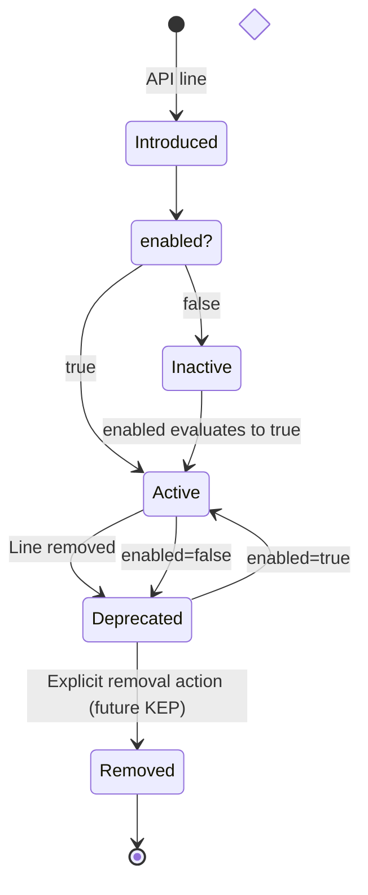

The two deprecation paths have different reversiblity: `disabled-by-context` deprecation is reversible; if the cluster context changes such that `enabled` evaluates to `true` again (e.g. provider restored, `platformVersion` upgraded), the line transitions back to Active on the next reconcile. `line-removed` deprecation is one-way; the line is absent from the addon source and cannot reactivate without a new addon version that restores it.

### Admission Gate for Deprecated Lines

Deprecated definitions remain on the cluster indefinitely; they are never removed automatically. Existing Applications that reference a deprecated definition continue to work unchanged.

The admission webhook blocks **new** Applications from referencing a deprecated definition:

```
Error: component "bucket" uses definition "aws-s3-v1-bucket" which is deprecated.
Migrate to the current API line or set annotation
app.oam.dev/allow-deprecated-definitions: "true" to override.
```

The `app.oam.dev/allow-deprecated-definitions: "true"` annotation on an Application allows it to reference deprecated definitions; this is an escape hatch for teams that need time to migrate and is expected to be a temporary measure.

### Explicit Removal

Removal of a deprecated API line (its definitions **and** its auxiliary resources) is an explicit action, not driven by the addon controller. Auxiliary resources (Compositions, XRDs, ResourceGraphDefinitions) must be removed together with their definitions: deleting them while deprecated definitions remain on the cluster would break any existing Claims or workloads that the deprecated definitions still provision.

The blocking Applications check (surfaced in Addon CR status) serves as a pre-deletion guard; tooling that performs removal should validate zero active references before proceeding.

```
Addon aws-s3: api line v1 is deprecated.
  Blocking applications (cannot reference this line in new deployments):
  - application "data-processing" (namespace: production) references aws-s3-v1-bucket
  - application "batch-jobs" (namespace: staging) references aws-s3-v1-bucket
```

Dedicated CLI commands, `WorkflowStepDefinition` resources, and a formal removal API are out of scope for the initial delivery and will be addressed in a follow-on KEP.

## API Line Parameter Schema Check

When a definition with `spec.apiVersion` set is updated (whether by the addon controller, `kubectl apply`, or any other means), the admission webhook can perform a best-effort check for obvious breaking changes to the `parameter:` input schema. This is a static AST-level comparison and does not constitute a full API compatibility guarantee. Changes to the definition's template body, auxiliary resources (Compositions, ResourceGraphDefinitions), or output schema are outside the scope of this check and are not detected.

The check fires when the existing definition has `spec.apiVersion` set and the incoming update preserves the same `spec.apiVersion` value. Cross-line updates (changing `spec.apiVersion`) are never checked; introducing a new API line is the intended mechanism for breaking changes. 

### Policy Flag

Contract validation is controlled by a cluster-level feature flag set on the KubeVela controller:

```
--api-line-contract-policy=disabled|warn|reject
```

| Mode | Behaviour | Recommended for |
|---|---|---|
| `disabled` | No check performed | Default; teams exploring the API versioning model |
| `warn` | Obvious parameter schema breakage is surfaced as a `BreakingChangeDetected` condition on the definition, but the apply proceeds | Teams who want a safety signal while iterating; does not replace review of template body and auxiliary changes |
| `reject` | Obvious parameter schema breakage causes the webhook to hard-reject the update | Teams who want a hard gate on input schema changes; note that template body and auxiliary changes are not covered |

The default is `disabled` so that teams adopting `spec.apiVersion` incrementally are not immediately blocked. The graduation path is `disabled` → `warn` → `reject` as confidence grows.

```mermaid
flowchart TD
    A([Definition UPDATE]) --> B{"spec.apiVersion set<br/>on existing object?"}
    B -->|No - legacy definition| Allow([Allow])
    B -->|Yes| C{apiVersion changing?}
    C -->|Yes - new API line| Allow
    C -->|No - same line| D{--api-line-contract-policy?}
    D -->|disabled| Allow
    D -->|warn or reject| E["Compare CUE parameter blocks<br/>field-by-field"]
    E --> F{Breaking change detected?}
    F -->|No| Allow
    F -->|Yes| G{"allow-breaking-change<br/>annotation present?"}
    G -->|Yes| Allow
    G -->|No + warn| H(["Allow + surface<br/>BreakingChangeDetected condition"])
    G -->|No + reject| I([Reject: introduce a new API line])
```

### Breaking vs Non-Breaking Changes

The following categories are inspired by the [Kubernetes API compatibility guidelines](https://github.com/kubernetes/community/blob/master/contributors/devel/sig-architecture/api_changes.md), adapted for CUE `parameter:` blocks. They cover only the parameter input schema (not runtime behaviour, output schema, or auxiliary resource changes, which are outside the scope of static schema comparison).

| Change | Classification | Reason |
|---|---|---|
| Field removed | **Breaking** | Existing Applications referencing the field break |
| Optional → mandatory (`field?` → `field`) | **Breaking** | Applications that omitted the field now fail validation |
| New mandatory field added (no `?`, no default) | **Breaking** | Existing Applications do not supply the field |
| Type narrowed (`string \| int` → `string`) | **Breaking** | Applications passing the removed type break |
| Disjunction value removed (`"a" \| "b"` → `"a"`) | **Breaking** | Applications using the removed value break |
| Constraint tightened (`string` → `string & =~"^v[0-9]+"`) | **Breaking** | Existing values that don't match the new constraint break |
| Default removed from previously-defaulted field | **Breaking** | Applications relying on the default now get no value |
| Default value changed (`*"a"` → `*"b"`) | **Breaking** | Silent behaviour change for Applications that rely on the default (treated as breaking even though existing values remain valid) |
| New optional field added | Non-breaking | Existing Applications simply don't supply it |
| Type widened (`string` → `string \| int`) | Non-breaking | Existing values remain valid |
| Disjunction value added (`"a"` → `"a" \| "b"`) | Non-breaking | More permissive than before |
| Constraint loosened (`string & =~"^v[0-9]+"` → `string`) | Non-breaking | Previously valid values remain valid; more values now accepted |
| Default added to previously undefaulted field | Non-breaking | More permissive than before |
| Field description or label changed | Non-breaking | No schema effect |

The webhook compares the CUE AST of the `parameter:` block from the existing definition against the incoming one. Field presence, optionality markers (`?`), type constraints, and default values are compared field-by-field. The check is best-effort: complex or computed CUE constraints that cannot be compared structurally at the AST level may produce false negatives (a real breaking change not detected) or false positives (an equivalent rewrite flagged as breaking). A clean result means no obvious structural breakage was detected; it is not a guarantee of full compatibility.

### Error Message (reject mode)

```
definition "aws-s3-v1-bucket" (apiVersion: v1): breaking parameter change detected
  - field "encryptionKey" changed from optional to mandatory
  - field "region" removed
If this change is intentional, introduce a new API line (v2) instead of modifying v1.
To override for this apply, set annotation definition.oam.dev/allow-breaking-change: "true".
```

### Per-Apply Bypass Annotation

```yaml
annotations:
  definition.oam.dev/allow-breaking-change: "true"
```

Bypasses the check for that specific apply operation regardless of the cluster-wide policy. It is not persisted; it must be re-supplied on each apply that would otherwise be rejected. The expected long-term path for genuine breaking changes is a new API line, not repeated use of this annotation.

### Implementation Location

New validation steps in the existing X-Definition validating webhook handlers (`pkg/webhook/core.oam.dev/v1beta1/`):

1. **`spec.apiVersion` format** (`CREATE` and `UPDATE`): if `spec.apiVersion` is non-empty, validate it matches `^v\d+(alpha\d+|beta\d+)?$`. Rejection is unconditional (no bypass annotation).
2. **`metadata.name` convention** (`CREATE`): each field independently enforces its portion of the naming convention (catching manual applies that omit the required prefix):
   - `spec.module` set → `metadata.name` must start with `{module}-`
   - `spec.apiVersion` set → `metadata.name` must start with `*-{apiVersion}-` (i.e. the api version segment follows the module prefix)
   - Both set → `metadata.name` must start with `{module}-{apiVersion}-`
   The addon controller always produces correctly-named definitions; this check is a safety net for user mistakes. On rejection the error message computes and surfaces the expected name. Mutating webhooks cannot change `metadata.name`, so rejection with a suggestion is the only available mechanism.
3. **Parameter contract check** (`UPDATE`): when the existing object has `spec.apiVersion` set and the incoming update preserves the same value, compare the CUE `parameter:` block from `spec.schematic.cue` against the prior definition using the CUE Go API. Behaviour controlled by `--api-line-contract-policy`.

## Legacy → Module Transition

When an addon author adds `_version.cue` to an existing addon, the controller detects the
new module structure on the next reconcile and performs the following:

1. Installs module-named definitions (`{module}-{apiVersion}-{name}`) alongside the
   existing legacy-named ones.
2. Marks the legacy-named definitions as deprecated immediately, on the same reconcile
   that installs the module-named ones. Deprecated definitions remain fully functional;
   the admission webhook blocks only **new** Applications from referencing them by the
   deprecated name directly.
3. Existing Applications continue to resolve to the legacy definition via Form 1
   exact-name GET (legacy priority is unconditional; see Resolution Rules). No existing
   Application is broken by the transition.

**`definitions/` and `modules/` can coexist.** Adding `modules/` to an addon that still
has `definitions/` is supported; the controller applies legacy semantics to `definitions/`
and module semantics to `modules/` independently in the same reconcile. This allows a
gradual migration without a flag day. However, the mixed layout is not recommended as a
permanent state; the controller emits an advisory condition on the Addon CR when both
directories are present.

**Consumer migration path:**

Consumers migrate at their own pace by updating their Application `type` field:

| Before | After | Notes |
|---|---|---|
| `type: bucket` | `type: aws-s3/v1/bucket` | **Recommended.** Fully qualified; deterministic from first apply; no lock stored |
| `type: bucket` | `type: v1/bucket` | Version-scoped; module discovered at first admission and stored in lock. Use Form 3 for full determinism. |

After updating `type`, `.status.services[i].resolvedDefinition` is populated with the
resolved module and apiVersion on the next admission. The Application now resolves via the
module system and the legacy definition is no longer referenced.

**Rollback:** If the addon is reverted to a version without `_version.cue`, the
module-named definitions are removed by the addon controller's stale-cleanup logic (per
KEP-2.13). Legacy-named definitions are restored to non-deprecated status. Applications
that had already migrated to `type: aws-s3/v1/bucket` will fail admission (the
module-named definition no longer exists) until the addon is re-upgraded or the
Application `type` is reverted.

```bash
# Find deprecated legacy definitions with no active references, older than 7 days
vela def list-deprecated --addon aws-s3 --no-references --older-than 7d
```

## Controller Detection Logic

The controller determines which semantics to apply by inspecting the addon source tree
structure. Detection is performed once per reconcile, before any resources are applied.

### Layout forms

An addon source tree may take one of three forms, which may coexist:

| Layout | Indicator | Semantics applied |
|---|---|---|
| **Legacy** | `definitions/` directory present | Legacy install; definitions applied by name, no module system |
| **Inline module** | `modules/{module}/_module.cue` present | Module lifecycle; auxiliary and definitions installed per API line |
| **Imported module** | `modules/_imports.cue` present | Module lifecycle; definitions fetched from external OCI/Git artifact |

All three may coexist in the same addon. Legacy and module layouts are processed
independently in the same reconcile cycle.

### Detection rules

```
1. If definitions/ is present:
     → apply legacy install semantics to all files in definitions/
     → emit Addon CR condition: LegacyLayoutDetected (advisory, not an error)
     → if modules/ is also present:
         emit Addon CR condition: MixedLayoutDetected
         (advisory - supported for migration windows; consolidate to modules/ when ready)

2. If modules/_imports.cue is present:
     → evaluate _imports.cue as a CueX expression
     → for each import entry: fetch and apply module lifecycle (see _imports.cue Fields)

3. Scan modules/ recursively for _module.cue files:
     → for each _module.cue found:
         scan descendant directories for _version.cue files
         → for each _version.cue found:
             apply module lifecycle for this (module, apiVersion) pair
         → if no _version.cue found under this _module.cue:
             emit Addon CR condition: ModuleHasNoAPILines (warning)
             no definitions installed for this module

4. If a _version.cue is found with no _module.cue in its ancestor chain
   (e.g. placed directly under modules/ without a module subdirectory):
     → skip this _version.cue
     → emit Addon CR condition: OrphanedVersionFile (warning, identifies the path)
     → the previously installed version of this API line, if any, is left in place
       (stale cleanup applies on the next successful reconcile of the owning module)
```

### Condition reference

| Condition | Severity | Meaning |
|---|---|---|
| `LegacyLayoutDetected` | Advisory | `definitions/` is in use; no action required but migration to `modules/` is encouraged |
| `MixedLayoutDetected` | Advisory | Both `definitions/` and `modules/` present; supported during migration |
| `ModuleHasNoAPILines` | Warning | A `_module.cue` was found but no `_version.cue` files beneath it |
| `OrphanedVersionFile` | Warning | A `_version.cue` has no `_module.cue` in its ancestor chain; skipped |

### Directory name convention

Module discovery scans `modules/` by convention; the directory name is explicit and
intentional. Placing `_module.cue` or `_version.cue` files outside `modules/` is not
supported and will not be detected. The Non-Goals section entry "Mandating `modules/` as
the directory name (module discovery is by `_version.cue` presence)" is superseded by
this rule.

## API Changes

### New Fields on Definition CRDs

See "Definition Identity" section above. `spec.module` and `spec.apiVersion` are additive optional fields on `ComponentDefinitionSpec`, `TraitDefinitionSpec`, `WorkflowStepDefinitionSpec`, and `PolicyDefinitionSpec`.

### Extended `type` Field on Application Component

The `type` field on `ApplicationComponent` is extended to accept 1-, 2-, or 3-segment slash-separated values. No new fields are added to the struct; module scoping is expressed entirely within `type`. The parser determines the form from segment count and whether the first segment matches `^v\d+(alpha\d+|beta\d+)?$`.

### New Fields on ApplicationRevision (authoritative lock)

The definition lock is stored in `ApplicationRevision.spec.definitionLocks`. This is the
authoritative source of truth for resolution binding. The admission webhook reads and writes
this field; nothing else does. `Application.status` is a derived, read-only projection
computed from this field and carries no binding authority; clearing status has no effect
on resolution.

```go
// ComponentDefinitionLock holds the resolved canonical identity for one component.
// Added as []ComponentDefinitionLock to ApplicationRevisionSpec.
// Written by the admission webhook at first admission for both Form 2 and Form 3.
// Form 2: stores the resolved module (from selector) and full canonical triple.
// Form 3: stores the canonical triple derived from the type string, as a baseline for
//         immutability enforcement - module and name must match on all future admissions.
// Never written at reconcile time.
// On subsequent admissions the webhook reads this field to enforce immutability
// (module and name cannot change) and, for Form 2, to perform a direct GET.
type ComponentDefinitionLock struct {
    // ComponentName is the Application component this lock applies to.
    ComponentName string `json:"componentName"`
    // ResolvedDefinition is the canonical identity locked at admission.
    // Absent for legacy non-module components (Form 1 exact-name match).
    // Once set, Module and Type are immutable for the lifetime of this reference.
    // Only APIVersion may change, via an explicit type string update (API line migration).
    ResolvedDefinition *ResolvedDefinitionRef `json:"resolvedDefinition,omitempty"`
}

// ResolvedDefinitionRef is the canonical triple {module}/{apiVersion}/{type}.
// This is the only representation used for binding decisions - it is not derived
// from runtime state after first admission.
type ResolvedDefinitionRef struct {
    // Module is the module identifier. e.g. "aws-s3"
    // Immutable once set - changing the module means a different contract.
    Module string `json:"module"`
    // APIVersion is the API line. e.g. "v1"
    // The only field that may change, via an explicit type string update.
    APIVersion string `json:"apiVersion"`
    // Type is the bare definition name. e.g. "bucket"
    // Immutable once set - changing the type name means a different contract.
    Type string `json:"type"`
    // FullyQualifiedName is the derived CR name, for human readability only.
    // e.g. "aws-s3-v1-bucket"
    // Derive programmatically from Module+APIVersion+Type; do not parse this field.
    FullyQualifiedName string `json:"fullyQualifiedName,omitempty"`
}
```

### New Fields on Application Component Status (read-only projection)

Two fields are added to the per-component entry in `.status.services[]`. These are
populated by the controller as a convenience projection from the `ApplicationRevision`
lock; they have no binding authority and must not be used for resolution decisions.
To reset the binding, remove the `ComponentDefinitionLock` entry from the
`ApplicationRevision`; clearing these status fields alone has no effect.

```go
// Added to the existing ApplicationComponentStatus struct.

// ResolvedType is the bare definition name resolved for this component.
// Set for all resolution paths including legacy.
// e.g. "bucket" (from any of: type: bucket, type: v1/bucket, type: aws-s3/v1/bucket)
// Read-only projection - do not use for binding decisions.
ResolvedType string `json:"resolvedType,omitempty"`

// ResolvedDefinition is a read-only projection of the canonical triple from the
// ApplicationRevision lock. Present for all module-backed components; absent for
// legacy non-module definitions. Mutations to this field are ignored - update the
// ApplicationRevision lock entry to change resolution binding.
ResolvedDefinition *ResolvedDefinitionRef `json:"resolvedDefinition,omitempty"`
```

| Form | `resolvedType` | `resolvedDefinition` | Notes |
|---|---|---|---|
| Form 3 `aws-s3/v1/bucket` | `"bucket"` | `{module, apiVersion, type, fullyQualifiedName}` | Populated directly from type string; no selector |
| Form 2 `v1/bucket` | `"bucket"` | `{module, apiVersion, type, fullyQualifiedName}` | Resolved at first admission; module discovered; frozen in ApplicationRevision lock |
| Form 1 `bucket` | `"bucket"` | absent | Legacy exact-name match; outside module system |

> **Note:** If the matched definition has `spec.module` set, admission is rejected; this is a model mismatch, not a Form 1 behaviour. Form 1 is only valid for non-module definitions.

### Label and Annotation Constants

```go
const (
    LabelDefinitionModule              = "definition.oam.dev/module"
    LabelDefinitionAPIVersion          = "definition.oam.dev/api-version"
    LabelDefinitionName                = "definition.oam.dev/name"
    AnnotationDefinitionFullName       = "definition.oam.dev/full-name"
    AnnotationDefinitionDeprecated     = "definition.oam.dev/deprecated"
    AnnotationDefinitionDeprecatedAt   = "definition.oam.dev/deprecated-at"
    AnnotationDefinitionDisabled       = "definition.oam.dev/disabled"
)
```

### AddonModuleStatus Types

```go
type AddonModuleStatus struct {
    Module string                 `json:"module"`
    Lines  []AddonModuleLineStatus `json:"lines,omitempty"`
}

type AddonModuleLineStatus struct {
    APIVersion  string `json:"apiVersion"`
    // Enabled reflects the current evaluation of the _version.cue enabled expression.
    // When this transitions from true to false, the line enters the deprecation lifecycle
    // (Deprecated is set to true) rather than being removed immediately.
    Enabled     bool   `json:"enabled"`
    // Deprecated is true when the line is absent from the current addon version or
    // enabled has evaluated to false. Deprecated lines remain on the cluster
    // indefinitely; they are never removed automatically. New Applications are
    // blocked from referencing them by the admission webhook.
    Deprecated  bool   `json:"deprecated"`
    // DeprecationReason records why the line was deprecated: "line-removed" or "disabled-by-context".
    // "disabled-by-context" deprecation is reversible - if enabled evaluates to true again on a
    // subsequent reconcile, Deprecated is cleared and the line returns to Active.
    // "line-removed" is one-way - the line is absent from the current addon source.
    DeprecationReason string `json:"deprecationReason,omitempty"`
    // ResolvedSourceVersion is the concrete tag the controller resolved the
    // _version.cue source.version constraint to on the last reconcile.
    // Empty when source is inline (no registry reference).
    ResolvedSourceVersion string `json:"resolvedSourceVersion,omitempty"`
    Message               string `json:"message,omitempty"`
}
```

## Built-in `vela` Module

KubeVela ships its own built-in definitions (the `addon` component type, built-in workflow step types, and other core capability definitions) as a reserved module named `vela`. These definitions follow the same module identity model and versioning convention as addon-delivered modules.

The `vela` module is distinguished from addon-delivered modules in one way: it is bundled with the KubeVela controller image and installed during controller startup, not by the addon controller. It does not have a registry entry and cannot be managed via an `Addon` CR.

Built-in definition naming follows the same convention:

| Module | Definition | API Version | Installed Name |
|---|---|---|---|
| `vela` | `addon` | `v1` | `vela-v1-addon` |
| `vela` | `apply-once` | `v1` | `vela-v1-apply-once` |
| `vela` | `webservice` | `v1` | `vela-v1-webservice` |

Applications reference built-in definitions using the same type reference syntax. The fully qualified form (`type: vela/v1/addon`) is always safe and recommended for any version-controlled manifest. The unqualified form (`type: addon`) follows Form 1 resolution rules; it is convenient for interactive use but is cluster-state-dependent and not a stable contract.

The `vela` module name is reserved; addon authors may not ship a module named `vela`. The admission webhook rejects `Addon` CRs or addon source trees with `module: "vela"` set in `_module.cue`.

Built-in API lines are versioned independently of the KubeVela release version. A KubeVela v2.1 release may ship `vela-v1-addon` unchanged while introducing `vela-v2-webservice`. The deprecation lifecycle for built-in API lines follows the same rules as addon-delivered lines; deprecated definitions remain on the cluster, new Applications are blocked from referencing them, and removal is an explicit action. For built-in lines, removal requires a KubeVela controller upgrade rather than an addon upgrade.

## Module Developer Workflow

Modules are independently versioned artifacts. The `vela module` CLI subcommand covers the full lifecycle from local development through registry publication.

### Versioning Hierarchy

Three independent versioning axes operate at different cadences:

| Level | Mechanism | Author | Cadence |
|---|---|---|---|
| **Definition** | `spec.version` / DefinitionRevision (e.g. `-v3`) | addon controller (automatic) | Every definition update |
| **Module** | OCI/git tag from `_module.cue version` | module author | API patch/minor releases, independent of addon |
| **Addon** | Addon semver (`Addon CR spec.version`) | platform team | Infrastructure changes, composition overhauls |

This separation means a module author can publish a new definition patch (`aws-s3-module:v1.5.3`) and every addon that declares `version: "~1.5.0"` in its `_version.cue source` picks it up on the next reconcile; no addon rollout required. Larger changes that need infrastructure updates (new Crossplane provider, updated CRDs) flow through an addon version bump instead.

### CLI Commands

**Development iteration - deploy directly to the current cluster:**

```bash
# Apply a module's definitions and auxiliary resources directly to the cluster
# Reads from a local path; no packaging or publishing involved
vela module deploy ./aws-s3

# Deploy a specific API line only
vela module deploy ./aws-s3 --line v1

# Deploy without applying auxiliary resources (definitions only)
vela module deploy ./aws-s3 --no-auxiliary
```

`vela module deploy` is the inner development loop. It applies definitions and auxiliary resources to the current `kubectl` context, following the same installation ordering as the addon controller (Application health gate, auxiliary ready gate, definitions last), but without creating an Addon CR or touching a registry.

**Validation:**

```bash
# Validate CUE syntax, _module.cue and _version.cue fields, and naming conventions
vela module validate ./aws-s3

# Check for breaking parameter changes against the previously published version
# (reads version from _module.cue, fetches prior tag from the registry)
vela module validate ./aws-s3 --check-breaking --registry ghcr.io/myorg

# Check against an explicit version
vela module validate ./aws-s3 --check-breaking --against ghcr.io/myorg/aws-s3-module:v1.4.0
```

`--check-breaking` runs the same contract check as the admission webhook (see API Line Contract Validation) locally before publish, comparing `parameter:` blocks field-by-field across all API lines.

**Publishing to a registry:**

```bash
# Publish - version tag read from _module.cue
vela module publish ./aws-s3 --registry ghcr.io/myorg

# Override the version tag (e.g. for release candidates)
vela module publish ./aws-s3 --registry ghcr.io/myorg --version v1.5.3-rc1

# Publish to a git remote (creates a tag and pushes)
vela module publish ./aws-s3 --git https://github.com/myorg/aws-s3-module.git

# Dry-run - show what would be published without pushing
vela module publish ./aws-s3 --registry ghcr.io/myorg --dry-run
```

`vela module publish` packages the module directory (`_module.cue`, all `_version.cue` files and their sibling definition files, and `auxiliary/` directories) as an OCI artifact and pushes it to the registry under the version tag from `_module.cue`. The tag must be a valid semver string.

**Private registry authentication:** registry credentials for both `vela module publish` and the addon controller's module artifact pulls use the existing KubeVela registry configuration (`vela addon registry add`), extended to support OCI source types.

**Inspecting installed modules:**

```bash
# List all modules installed in the current cluster
vela module list

# Show resolved source versions for all lines
vela module list --show-versions

# Show details for a specific module including resolved source version per line
vela module describe aws-s3
```

### Addon as Module Consumer

An addon can reference a published module in `_version.cue` with a semver range. When it does, the addon directory contains no inline definition files for that line; they are fetched from the published module artifact at reconcile time:

```
my-platform-addon/
  metadata.yaml
  resources/              # Crossplane operator, provider configs
  modules/
    aws-s3/
      _module.cue         # module: "aws-s3", type: "cue" - no version here (addon doesn't own it)
      v1/
        _version.cue      # source points to published aws-s3-module artifact
      v2/
        _version.cue
```

```cue
// modules/aws-s3/v1/_version.cue in the addon
apiVersion: "v1"
enabled: context.provider == "aws"
source: {
    oci: {
        ref:     "ghcr.io/myorg/aws-s3-module"
        version: "~1.5.0"   // auto-update within 1.5.x; a jump to 1.6.x requires updating this file
    }
}
```

The addon `_module.cue` omits `version`; version is the module artifact's concern, not the addon's. The addon controls *which range* it tracks in `_version.cue source`; the module author controls what is published within that range.

Alternatively, addons can continue to inline definition files directly alongside `_version.cue` without publishing to a registry; the `source` block is optional. Publishing as a separate module artifact is a choice, not a requirement.

The semver range governs non-breaking updates only. Breaking API changes always require a new API line (`v2/`) regardless of the range; the range cannot cross a breaking boundary because breaking changes mandate a new `apiVersion`.

### Testing (Future Enhancement)

Testing support for modules and addons is intentionally deferred. The intended commands are:

```bash
# Run tests against a module
vela module test ./aws-s3

# Run tests against an addon
vela addon test ./my-platform-addon
```

Testing at this level is non-trivial: meaningful tests require a live cluster (to verify auxiliary resources apply cleanly, definitions render correctly, and the full installation ordering holds), a way to declare expected outcomes for parameterised CUE templates, and integration with the API line contract validation checks. The tooling and conventions for this are left as a future enhancement once the core module and addon lifecycle is stable.

In the interim, `vela module deploy` against a development cluster combined with `vela module validate --check-breaking` covers the most critical pre-publish checks.

## Control File Reference

A summary of the three CueX-evaluated control files, the fields each accepts, and the full context available to each.

All three files share the same context contract; it is injected by the addon controller at reconcile time before CueX evaluation. No per-file I/O; a single query populates the shared context for all files in one reconcile cycle.

### Available Context

| Key | Source | Description |
|-----|--------|-------------|
| `context.provider` | `cluster-context` Config | Cloud provider identifier (`"aws"` \| `"gcp"` \| `"azure"` \| `"bare-metal"`) |
| `context.region` | `cluster-context` Config | Cloud region (e.g. `"us-east-1"`) |
| `context.accountId` | `cluster-context` Config | Cloud account / project ID |
| `context.crossplaneInstalled` | `cluster-context` Config | Whether Crossplane is present on the cluster |
| `context.*` | Any `cluster-context` Config | Any additional primitive values stamped by the platform team |
| `context.addonName` | Controller-injected | Name of the owning addon |
| `context.addonVersion` | Controller-injected | Version of the owning addon |
| `context.apiVersion` | Controller-injected | API line version (available in `_version.cue` only) |
| `parameter.*` | Addon CR `spec.parameters` | All addon parameters and their current values |

### `_imports.cue` - Addon module import declarations

Evaluated once per reconcile for the addon as a whole. Controls which external modules are fetched and which API lines are exposed.

| Field | Type | Required | Description |
|-------|------|----------|-------------|
| `imports` | list | yes | List of module import entries |
| `imports[].module` | string | yes | Module identifier; must match the fetched module's `_module.cue` `module` field |
| `imports[].enabled` | CueX expr | no | Gates the entire module import. AND-ed with the fetched module's own `_module.cue` `enabled`. Defaults to `true` |
| `imports[].sources` | list | yes | One or more source entries; evaluated in order |
| `imports[].sources[].oci` | object | one of oci/git | OCI artifact reference: `ref` (registry path) + `version` (semver range) |
| `imports[].sources[].git` | object | one of oci/git | Git reference: `url` + `version` (branch, tag, or semver range) |
| `imports[].sources[].versions` | `[string]` | no | API lines to install from this artifact. **Absent = all lines.** Applies to CUE modules only |
| `imports[].sources[].apiLine` | string | no | Assigns an API line identifier to all definitions from a DefKit artifact. Mutually exclusive with `versions` |
| `imports[].sources[].enabled` | CueX expr | no | Gates this specific source entry. Evaluated with full context. Absent = `true` |

### `_module.cue` - Module identity and module-level gate

Evaluated once per module per reconcile. Controls whether the entire module (auxiliary, API lines, definitions) is installed.

| Field | Type | Required | Description |
|-------|------|----------|-------------|
| `module` | string | yes | Globally unique module identifier |
| `type` | string | no | `"cue"` (default) \| `"defkit"` |
| `version` | string | yes | Module semver; authoritative tag for `vela module publish` |
| `enabled` | CueX expr | no | Gates the entire module. If `false`, no auxiliary, API lines, or definitions are installed. Defaults to `true` |
| `context.required` | `[string]` | no | Context keys that must be present before install. Controller fails fast with a descriptive error if any are missing |
| `metadata` | object | no | Structured organisational fields (typed CUE values) for internal tooling (`departmentCode`, `maintainedBy`, `createdBy`, `stage`) |
| `labels` | object | no | Arbitrary string key-value pairs stamped onto all installed resources alongside standard addon controller labels |

### `_version.cue` - API line gate and source declaration

Evaluated once per API line per reconcile. Controls whether a specific API line is installed and where its definitions come from (for externally sourced lines).

| Field | Type | Required | Description |
|-------|------|----------|-------------|
| `apiVersion` | string | yes | User-facing API line identifier; must match Kubernetes API stability convention (`v1`, `v1beta1`, `v1alpha2`) |
| `enabled` | CueX expr | no | Gates this API line. If `false`, no auxiliary or definitions for this line are installed. Defaults to `true`. `context.apiVersion` is available here |
| `minKubeVelaVersion` | string | no | Minimum KubeVela version constraint (`>=`). Line surfaces as `Disabled` if not met |
| `source` | object | no | Where the controller fetches compiled definitions and auxiliary for this line. Required for DefKit modules; optional for inline CUE modules. Accepts `oci` or `git`. If absent, definitions are expected inline alongside `_version.cue` |

### Evaluation order and precedence

```
_imports.cue  →  imported module _module.cue  →  _version.cue (per API line)
```

1. `_imports.cue` `imports[].enabled` is evaluated; if `false`, the module is skipped entirely and the fetched module's files are not evaluated
2. The module's `_module.cue` `enabled` is evaluated (whether the module is inline or fetched from a remote source), AND-ed with the import `enabled`; if either is `false`, the module is skipped
3. `_version.cue` `enabled` is evaluated per API line; if `false`, that line's auxiliary and definitions are not applied and other lines in the same module continue
4. `_imports.cue` `sources[].enabled` is evaluated per source entry (controls which source artifacts are fetched for a given module)

The controller records the gate source (`imports`, `module`, or `line`) and the evaluated expression in the Addon CR status for each skipped module or line.

## Non-Goals

- Introducing a new CRD or controller outside the addon system
- Auto-upgrading addons without operator involvement
- Trait scoping to module API lines (see FE-2)
- Supporting arbitrary directory names for module source trees (`modules/` is the required convention; files outside it are not detected)

## Alternatives Considered

### Lock storage: separate `definitionLocks` field vs. normalise into ApplicationRevision

Two approaches to sticky Form 2 resolution are worth comparing during implementation:

**Option A (current design):** Store the resolved canonical triple in a dedicated `ApplicationRevision.spec.definitionLocks` field. The live `Application.spec.components[i].type` is never mutated; it stays as the user wrote it. On subsequent admissions the webhook reads the lock field directly.

**Option B:** Rather than a separate field, the webhook normalises the `type` string to its Form 3 equivalent (`aws-s3/v1/bucket`) and writes the normalised value into the ApplicationRevision's snapshot of the Application spec. The live Application object is not mutated. On subsequent admissions, the webhook compares the incoming type string against the ApplicationRevision's normalised type to decide whether re-resolution is needed.

Option B eliminates the `ComponentDefinitionLock` data structure entirely; the ApplicationRevision snapshot already exists and already records component state. The key question for the implementer is whether webhook-written derived data belongs in `ApplicationRevision.spec.components` alongside the user-authored spec, and whether the comparison logic ("same type as before, now normalised" vs. "user changed the type") is straightforward to implement correctly.

A third variant (mutating the live `Application.spec.components[i].type` in place) creates GitOps drift: Flux and Argo CD would see a perpetual diff between the normalised type on the cluster and the shorthand in Git, re-syncing on every cycle.

**Recommendation for implementers:** Prototype both Option A and Option B and compare on simplicity, operator ergonomics (what does a confused operator see when inspecting an ApplicationRevision?), and edge-case handling (lock staleness, module uninstall, rollback).

### Group / Module / Component Directory Layering

**Suggestion:** Introduce a three-level hierarchy within `modules/` (a `group` directory (e.g. `aws`), a `module` directory beneath it (e.g. `s3`), and component definitions beneath that (e.g. `bucket.cue`)). Under this model, the full path would be `modules/aws/s3/v1/bucket.cue` and the reference syntax would require both a group and module qualifier.

**Decision: not adopted.** The current two-level structure (`modules/aws-s3/v1/bucket.cue`) is sufficient and introduces less cognitive overhead for the following reasons:

- **The addon can serve as the grouping structure.** Modules within an addon are naturally grouped by their shared delivery and lifecycle unit (the `Addon` CR itself). `aws-s3` and `aws-rds` are both modules within an `aws` addon, and that addon boundary already conveys the relationship. A formal `group` directory adds a concept without adding capability.
- **Grouping is already expressible via naming convention.** `aws-s3`, `aws-rds`, and `aws-eks` are self-evidently in the same `aws` family. Label selectors (`definition.oam.dev/module=aws-s3`) already support fleet-level queries by module. No directory nesting is required to answer "give me all AWS definitions".
- **The reference syntax stays simple.** `type: bucket/v1` with `module: aws-s3` maps directly to the two concepts users need to know: what definition, from which module. A group layer would require either a path-like `module: aws/s3` field value or separate `group:` and `module:` fields; both add surface area with no new capability.
- **The four-concept stack is already at the cognitive limit.** Users reason about: addon → module → API line → definition. Adding `group` as a formal concept between addon and module increases the stack to five levels. Discovery of "what concrete type do I use?" already requires navigating module names, API versions, and definition names; a group qualifier makes that traversal harder, not easier.

The naming convention (`{module}-{apiVersion}-{definition-name}`) already encodes the vendor/service relationship that groups would formalise. If a future use case emerges that naming and label selectors genuinely cannot serve, a group concept can be introduced then with concrete motivation.

## Cross-KEP References

- **KEP-2.13:** Declarative addon lifecycle; Addon CR reconciliation; addon-of-addons composition
- **KEP-2.1:** Definition CRD specs that gain `spec.module` and `spec.apiVersion` fields

## Open Questions

### OQ-1: How much resolution flexibility is worth the complexity cost?

**Resolved: adopted (Option B variant - Form 1 legacy-only + Form 3 fully-qualified required).**

The design supports three author-facing forms:

| Form | Syntax | Resolution mechanism | Lock written? |
|------|--------|----------------------|---------------|
| Legacy (Form 1) | `type: bucket` (no `spec.module`) | Exact-name GET; non-module definition only | No |
| Form 2 | `type: v1/bucket` | Global selector; version explicit, module discovered; exactly one result required | Yes |
| Form 3 | `type: aws-s3/v1/bucket` | Fully deterministic; no cluster state dependency | Yes (baseline lock written at first admission for immutability enforcement) |

Form 1 with `spec.module` present is rejected outright. The old Form 3 (`aws-s3/bucket`, module-scoped without version) has been removed; API versions are always mandatory for versioned references.

**Option A (previously considered): Make Form 1 legacy-only (drop the module-resolution branch).**
Removed the global label selector branch of Form 1. Form 1 now serves only non-module-backed definitions via exact-name GET. Any component referencing a module-backed definition must use Form 2 or Form 3.

**Option B (previously considered): Legacy + fully-qualified only (drop Forms 1 module resolution and old Form 3 entirely).**
All dynamic resolution without an explicit API version is removed. The only supported forms are the legacy exact-name path (non-module definitions, no lock) and Form 3 (fully qualified `{module}/{apiVersion}/{definition}`, no selector). Form 2 (`v1/bucket`, version-scoped) is retained as a middle ground.

**Decision: adopted.** Form 1 is legacy-only (exact-name match, `spec.module` absent). Old Form 3 (`aws-s3/bucket`) is removed; no form accepts a module-backed reference without an explicit API version. Form 2 retains version-scoped discovery. Form 3 (fully qualified) is required for GitOps and production use.

### OQ-2: Should `v1/bucket` be supported as Form 2?

**Resolved: adopted as Form 2.**

`v1/bucket` (two segments, first segment matches `^v\d+`) is supported as Form 2 (a version-scoped reference where the API version is explicit and the module is discovered from cluster state). A global selector on `(apiVersion, name)` is used at first admission; if exactly one result is found the module is stored in the lock; if more than one result is found the reference is rejected with an ambiguity error requiring Form 3. See the [Resolution Rules](#resolution-rules) section for the full priority sequence.

## Future Enhancements

### FE-1: Version migration workflows

When a component's resolved API version changes (detected as a change in the definition lock, e.g. `resolvedDefinition.apiVersion` moving from `v1` to `v2`, triggered by the author bumping `type: aws-s3/v1/bucket` to `type: aws-s3/v2/bucket`), the module could supply a prescribed migration workflow that runs with the component's context available. This would allow module developers to encode migration steps directly into the API line rather than leaving them to operator runbooks.

**Proposed shape.** A `_migrate.cue` file within the module (location TBD - likely alongside the API line it targets, e.g. `modules/aws-s3/v1-to-v2/_migrate.cue`) would define two things:

- `upgradePermitted: bool`: a CUE expression evaluated against the component context that gates whether the version bump is allowed to proceed at all (e.g. checking that a required field exists in the new spec, or that a precondition on the cluster is met).
- A migration workflow using the existing KubeVela workflow step mechanism, executed when the version change is admitted. The workflow would have access to the component's old and new resolved context.

**Trigger.** The version change is detected at admission by comparing the incoming `type` field against the current definition lock. If the lock held `v1` and the new spec references `v2`, the migration path is entered.

**Open questions for a future KEP:**
- Where exactly does `_migrate.cue` live within the module directory structure, and how is it discovered?
- How is the workflow stored and executed (as an annotated workflow on the `ComponentDefinition`, a separate CR, or inline in the `_migrate.cue` output)?
- Failure semantics: if the migration workflow fails, does the upgrade roll back, halt pending operator intervention, or proceed regardless?
- Does `upgradePermitted: false` block admission (hard gate) or produce a warning (soft gate)?

### FE-2: Module-scoped traits and component compatibility

Traits declared within a module could be scoped to that module, with compatibility expressed via a `compatibleWith` field on the `TraitDefinition`:

```yaml
compatibleWith:
  - module: aws-s3
    apiVersions: [v1, v2]
    definitions: [bucket, multipart-bucket]  # omit for "all definitions in this module"
```

This would allow module developers to ship traits alongside components and declare exactly which component API lines they apply to. Global/cross-cutting traits (e.g. `scaler`, `gateway`) would remain unscoped and available everywhere.

Key open questions deferred to a future KEP:
- Whether scoping is exclusive (out-of-scope application is a hard rejection) or advisory
- How global traits opt out of scoping
- Whether trait versioning tracks component API lines or is independent
- Is migration only supported between adjacent API lines (`v1` → `v2`) or arbitrary version pairs?

<a id="doc-40e82c076bd1162d59aaa84a"></a>

# kubevela/kubevela / design/vela-core/keps/2.20-module-versioning/design/README.md

Upstream: https://github.com/kubevela/kubevela/blob/f450c6ee9648626b6463ebd1de87dfbbcf4cafdd/design/vela-core/keps/2.20-module-versioning/design/README.md

Commit: `f450c6ee9648626b6463ebd1de87dfbbcf4cafdd`

Retrieved: 2026-10-01T15:22:33.428106+00:00

Kind: official-document

Raw SHA256: `b4404c620011f60655f8dd888b33a20467734a347ea826891836054c3cb6df43`

Source text below is untrusted reference content. Acquisition does not verify technical claims.

License status: UPSTREAM_NOTICES_CAPTURED_PER_FILE_REVIEW_REQUIRED. See this repository's captured license files.

---

# KEP-2.20 Design Notes (companion exploration)

These are companion design notes to [KEP-2.20](../README.md), exploring the Module and API
line versioning model. They are an **active exploration**, not accepted design; the KEP
remains the baseline. This index is the front door: read it first.

## Reading order

1. **[Design 01: Module CRD, Registry Publishing & Module-Owned Application](./01-module-crd.md)**
   — what a Module is (an independently installable/publishable API unit: definitions + the
   auxiliary resources that back them), its identity, and how it is delivered. Describes the
   **CR + controller** baseline while flagging the component alternative.
2. **[Design 02: Module Namespaces, Tenancy & `vela-system` Coexistence](./02-namespace-and-tenancy.md)**
   — the namespace model (`vela-module-<name>`), why namespaced definitions make it clean,
   resolution, tenancy/RBAC, and coexistence with legacy `vela-system` definitions. Hub doc for
   anything namespace/resolution.
3. **[Design 03: API Line Investigation](./03-api-line-investigation.md)**
   — the largest **open** question: should an API line be encapsulated as state within the
   Module, or have its own durable identity? Presented neutrally; deliberately undecided.
4. **[Design 04: Cluster Context](./04-cluster-context.md)**
   — how `enabled` gating gets its context values: baseline cluster labels/annotations now, the
   richer `Config` model as a merging stretch goal, and the blocking hub-metadata prerequisite.
   Fork-neutral (applies under either the CR or component model).

Foundational context lives in the KEP-2.13 folder — read those first if you have not:
[Per-Component Placement](../../2.13-addons/design/01-per-component-topology-placement.md),
[Everything-is-an-Application](../../2.13-addons/design/02-application-managed-resources.md),
[CueX Components Instead of CRs](../../2.13-addons/design/03-cuex-components-instead-of-crs.md).

## The central fork

One directional decision runs through the whole set, and it is a **fork with two
alternatives, not two complementary layers**:

- **CR + controller model** — a Module is a CR reconciled by a controller that manages an
  Application. This is the baseline, written up in [Design 01](./01-module-crd.md).
- **Component model** — a Module is a component whose CueX provider renders a nested
  Application; **no CRD, no controller**. Written up in
  [KEP-2.13 Design 03](../../2.13-addons/design/03-cuex-components-instead-of-crs.md).

These are **mutually exclusive**; Addon and Module should share the outcome. Design 01 is
written CR-first but marks which of its content is **model-agnostic** (namespace, naming,
Application-as-engine, VelaUX — all hold either way) versus **CR-specific** (finalizer,
controller loop). The API line investigation (Design 03) decides only *whether* a line has
its own identity; the *form* of that identity (CR vs component) follows this same fork.

**What is *not* forked** (holds under either model): Module identity and the
`<module>/<apiLine>/<definition>` reference model; namespace-per-module and its resolution
behaviour; module-mediated publishing; the API line naming and coexistence rules.

## Divergences from the published KEP-2.20 (reconcile on merge-back)

These notes intentionally diverge from KEP-2.20 in a few places; each is flagged in-doc:

- **Definition naming** drops the module prefix (`v1-bucket`, not `aws-s3-v1-bucket`) because
  the namespace carries the module (Design 02).
- **Resolution** keeps only two reference forms (legacy `bucket`, canonical
  `aws-s3/v1/bucket`); the two-segment `v1/bucket` form is dropped (Design 01 identity brief).
- **Definitions are Namespaced, not cluster-scoped** — a factual correction the KEP prose
  needs (Design 02).

## Status of each idea

| Topic | Status |
|---|---|
| Module as independently installable/publishable API unit | Exploration |
| Namespace-per-module + deterministic resolution | Exploration; model-agnostic |
| Module-mediated line publishing (`vela module publish-line`) | Settled within these notes |
| API line: encapsulate vs own identity | Open investigation (Design 03) |
| Immutable revisions (`ModuleRevision`/`APILineRevision`) | Open, conditional on the CR path |
| Full identity/resolution model (locks, override, `vela` module) | Deferred to a future identity design (brief in Design 01) |

Each doc ends with an **"Open Discussions & Spikes"** section listing what it leaves for the
team to resolve.


<a id="doc-06a4dae9c96cdc11cd06f8fc"></a>

# kubevela/kubevela / design/vela-core/keps/2.21-from-resolution/README.md

Upstream: https://github.com/kubevela/kubevela/blob/f450c6ee9648626b6463ebd1de87dfbbcf4cafdd/design/vela-core/keps/2.21-from-resolution/README.md

Commit: `f450c6ee9648626b6463ebd1de87dfbbcf4cafdd`

Retrieved: 2026-10-01T15:22:33.428106+00:00

Kind: official-document

Raw SHA256: `3b5854fe2c0748ca062b0a6d0af85f61b70d53c64ecbb9b48f6adf078c949770`

Source text below is untrusted reference content. Acquisition does not verify technical claims.

License status: UPSTREAM_NOTICES_CAPTURED_PER_FILE_REVIEW_REQUIRED. See this repository's captured license files.

---

> ⚠️ **Early concept draft.** This KEP is an early-stage exploration. It is **incomplete and may be inaccurate**, its direction is unsettled, and it should not be relied upon for implementation or as a description of committed behaviour. Expect substantial change.

# KEP-2.21: The `from*` Family — Render-Time Resolution & Schema Validation

**Status:** Drafting (Not ready for consumption)
**Parent:** [vNext Roadmap](../README.md)
**Depends on:** [KEP-2.1](../2.1-core-api/README.md), [KEP-2.3](../2.3-hub-controller/README.md)
**Consumed by:** [KEP-2.16](../2.16-source-definition/README.md) (`fromSource`), [KEP-2.17](../2.17-component-exports/README.md) (`fromDependency`), [KEP-2.19](../2.19-cross-topology-deps/README.md) (cross-topology `fromDependency`)

`fromParameter`, `fromSource`, and `fromDependency` are a family of inline value substitution directives. This KEP specifies the resolution model, admission-time schema validation, and shorthand syntax that apply to all three. The specific semantics of each directive — what it resolves from and its authoring model — are covered in the individual KEPs; this KEP covers the cross-cutting mechanics they share.

## Summary

| Directive | Resolved from | When resolved | Schema validated at |
|---|---|---|---|
| `fromParameter` | `Application.spec.parameters` | Render time (immediate) | Admission (key + type for templated apps) |
| `fromSource` | `SourceDefinition` CueX template | Render time (lazy, cached) | Admission (path + type via `schema:` block) |
| `fromDependency` | `Component.status.exports` | After upstream healthy | Admission (path + type via `exports:` block) |

## Resolution Model

Resolution happens in two phases, both before component rendering:

**Phase 1 — Source resolution (sequential):** `spec.sources` entries are resolved in declaration order. For each source, any `fromSource` references in its `properties` are resolved against already-resolved earlier sources. The resolved source output is cached and made available for subsequent sources and for component properties. This enables source chaining — see KEP-2.16 for full details.

**Phase 2 — Component property resolution (single recursive pass):** The Application controller performs a single recursive pass over the merged `properties` map for each component immediately before handing the properties to the Definition renderer. The traversal:

1. Walks every node in the properties tree (objects, arrays, scalar leaves)
2. When it encounters a node whose **sole key** is `fromParameter`, `fromSource`, or `fromDependency`, it replaces the entire node with the resolved value
3. Passes the fully-resolved properties to the CUE Definition renderer

`fromDependency` nodes are only resolvable once the referenced component is healthy and has written its `exports` to `Component.status.exports`. Until then, the consuming component is not rendered — the controller defers it and re-queues when the upstream export becomes available. `fromSource` nodes are resolved using the already-cached source outputs from Phase 1. `fromParameter` nodes are resolved immediately from `spec.parameters`.

The Phase 2 recursive pass is deterministic and single-pass for `fromParameter` and `fromSource`. It is topologically ordered for `fromDependency`.

## Detection

`from*` directives are detected **structurally** — not by string matching. A node is detected as a substitution directive if and only if it is a map containing exactly one key and that key is `fromParameter`, `fromSource`, or `fromDependency`. Any map with additional keys alongside one of these is treated as a plain map, not a substitution directive.

```yaml
# Detected as a fromParameter directive
region:
  fromParameter: region

# NOT detected — has a second key alongside fromParameter
region:
  fromParameter: region
  default: us-east-1    # incorrect — use map form instead
```

`from*` directives are valid at any depth within `properties`, including nested objects and array entries. They are not valid as map keys, only as values.

## Schema Contract Validation at Admission Time

The `from*` directives are deliberately declarative. This means the *schema* of every substitution reference can be validated at `kubectl apply` time — before reconciliation, before rendering, and before any runtime values exist.

| Directive | Schema source | Validated at admission |
|---|---|---|
| `fromParameter` | `spec.parameters` (free-form) or `ApplicationDefinition.parameter{}` schema | Key existence (free-form) or key type match (templated) |
| `fromSource` | `SourceDefinition.schema:` block | Source name exists in `spec.sources`; `path` refers to a declared output field; output field type is compatible with the consuming component's `parameter{}` schema at the given property path |
| `fromDependency` | `ComponentDefinition.exports{}` schema | Dependency component exists in the Application; `path` refers to a declared `exports` field; exports field type is compatible with the consuming component's `parameter{}` schema at the given property path |

The key insight: even though `fromSource` and `fromDependency` values are not known at admission time, their *types* are known from the publishing Definition's `output{}` / `exports{}` schema. The hub admission webhook resolves both the consuming component's `parameter{}` schema and the supplying Definition's output schema, and validates type compatibility between the two — catching broken wiring at apply time rather than at runtime.

**Example — caught at admission:**

```yaml
# aws-rds ComponentDefinition declares:
#   parameter: { port: *5432 | int }
# postgres-ha ComponentDefinition declares:
#   exports: { endpoint: string, port: int }

components:
  - name: db
    type: postgres-ha

  - name: app
    type: aws-rds
    properties:
      port:
        fromDependency:
          component: db
          path: endpoint   # ← type mismatch: endpoint is string, port expects int
                           #   caught at admission, not at runtime
```

The admission webhook rejects this with:
```
fromDependency type mismatch: db.exports.endpoint is string, aws-rds.parameter.port expects int
```

## Shorthand Syntax

All three directives support a shorthand string form and a map form. The shorthand is preferred for simple references; the map form is required when `default` is needed.

| Directive | Shorthand | Map form (with default) |
|---|---|---|
| `fromParameter` | `fromParameter: my-param` | `fromParameter: {name: my-param, default: "x"}` |
| `fromSource` | `fromSource: source-name.field` | `fromSource: {name: source-name, path: field, default: "x"}` |
| `fromDependency` (same topology) | `fromDependency: component.field` | `fromDependency: {component: comp, path: field, default: "x"}` |
| `fromDependency` (cross-topology) | `fromDependency: component/group.field` | `fromDependency: {component: comp, group: grp, path: field, default: "x"}` |

The parser detects form by value type — string means shorthand, map means explicit. Shorthand intentionally has no `default` support; needing a default implies the field is optional and warrants the more explicit map form.

## fromParameter

`fromParameter` resolves from `Application.spec.parameters` — a free-form set of values representing application-level constants shared across components, traits, policies, and operations.

```yaml
spec:
  parameters:
    region: us-west-2
    tier: production

  components:
    - name: my-db
      type: aws-rds
      properties:
        region:
          fromParameter: region
        tier:
          fromParameter: tier
```

`fromParameter` is valid within `properties` at any depth. It is not valid in `OperationDefinition` templates — Operations use `context.appParams` directly.

For templated Applications (those referencing an `ApplicationDefinition`), `fromParameter` references are validated against the Definition's `parameter{}` schema at admission. For non-templated Applications, key existence is checked.

## fromSource

`fromSource` resolves from a `SourceDefinition` instance declared in `Application.spec.sources`. It supports lazy, cached resolution via the `Config` CRD. Full authoring model in [KEP-2.16](../2.16-source-definition/README.md).

```yaml
spec:
  sources:
    - name: cluster-info
      definition: cluster-config-reader
      properties:
        cacheDuration: "1h"

  components:
    - name: api
      type: webservice
      properties:
        region:
          fromSource: cluster-info.region
```

## fromDependency

`fromDependency` resolves from a sibling component's `Component.status.exports`. Creates an implicit ordering dependency — the consuming component is not rendered until the producing component is healthy. Full authoring model in [KEP-2.17](../2.17-component-exports/README.md). Cross-topology resolution in [KEP-2.19](../2.19-cross-topology-deps/README.md).

```yaml
components:
  - name: database
    type: postgres

  - name: api
    type: webservice
    properties:
      dbHost:
        fromDependency: database.endpoint
```

## Non-Goals

- Arbitrary runtime property mutation (these are render-time, not reconcile-time)
- Cross-application substitution — `fromDependency` is intra-Application only
- `from*` as map keys — values only

## Cross-KEP References

- **KEP-2.3** — Hub reconcile pipeline; the resolution pass runs in the hub application-controller
- **KEP-2.9** — `ApplicationDefinition` & `fromParameter` in templated Applications
- **KEP-2.16** — `SourceDefinition` authoring model; `fromSource` semantics and caching
- **KEP-2.17** — Component exports; same-topology `fromDependency`
- **KEP-2.19** — Cross-topology `fromDependency` with named topology groups

<a id="doc-01f4562fb1ead28f3db2135f"></a>

# kubevela/kubevela / design/vela-core/keps/2.22-multi-instance-addons/README.md

Upstream: https://github.com/kubevela/kubevela/blob/f450c6ee9648626b6463ebd1de87dfbbcf4cafdd/design/vela-core/keps/2.22-multi-instance-addons/README.md

Commit: `f450c6ee9648626b6463ebd1de87dfbbcf4cafdd`

Retrieved: 2026-10-01T15:22:33.428106+00:00

Kind: official-document

Raw SHA256: `9fb6813b28fc710ec310022c6976f070098cdc9476eb2fc6b2a6014fd3762143`

Source text below is untrusted reference content. Acquisition does not verify technical claims.

License status: UPSTREAM_NOTICES_CAPTURED_PER_FILE_REVIEW_REQUIRED. See this repository's captured license files.

---

> ⚠️ **Early concept draft.** This KEP is an early-stage exploration. It is **incomplete and may be inaccurate**, its direction is unsettled, and it should not be relied upon for implementation or as a description of committed behaviour. Expect substantial change.

# KEP-2.22: Multi-Instance Addons

**Status:** Drafting (Not ready for consumption)
**Parent:** [vNext Roadmap](../README.md)
**Depends on:** [KEP-2.13](../2.13-addons/README.md), [KEP-2.20](../2.20-module-versioning/README.md)

## Problem

Some addons need to be installed multiple times on the same cluster with different parameters — for example, a `tenant-infra` addon that provisions per-tenant infrastructure, or an `aws-s3` addon installed independently for different teams with different region or access configurations.

The single-instance model in KEP-2.13 does not support this: the Addon CR is named after the addon, so a second install with different parameters overwrites the first. There is also no model for where definitions installed by multiple instances should live — installing the same `aws-s3-v1-bucket` definition twice from different instances with different parameters would cause each instance to stomp the other on every reconcile.

## Goals

- Enable multiple independent instances of the same addon to coexist on a cluster
- Define where definitions installed by multi-instance addons are scoped (cluster-wide vs namespace-scoped)
- Specify the Addon CR naming convention for multi-instance addons
- Enforce that definition templates do not reference instance parameters (preventing cross-instance stomping)
- Maintain full backwards compatibility — existing single-instance addons are unaffected

## `instance` — Multi-Instance Addons

The optional `instance` field in `_module.cue` is a CUE expression that, when present, marks the addon as multi-instance and determines the Addon CR name suffix. It is evaluated against the injected context — including `parameter` (the addon's `spec.parameters`):

```cue
// modules/tenant-infra/_module.cue
module:   "tenant-infra"
type:     "cue"
instance: parameter.tenant   // Addon CR name = "tenant-infra-{parameter.tenant}"
```

The resulting Addon CR name is `{addon-name}-{instance}`. The owned Application created in `vela-system` follows the `addon-` prefix convention: `addon-{addon-name}-{instance}` (e.g. `addon-tenant-infra-acme`). The instance value must be a non-empty string after evaluation; if it evaluates to `_|_` or empty, the controller surfaces a validation error and transitions the Addon CR to `Failed`.

Because `instance` is a full CUE expression, compound discriminators are natural:

```cue
// One Addon CR per tenant per region:
// Addon CR name        → "tenant-infra-acme-us-east-1"
// Owned Application    → "addon-tenant-infra-acme-us-east-1"
instance: "\(parameter.tenant)-\(parameter.region)"
```

The admission webhook validates that parameters referenced by `instance` are present in `spec.parameters` at install time. Addon authors should document which parameters are required for instance key construction.

When `instance` is absent, the addon is single-instance: the Addon CR name equals the addon name, and installing a second instance with different parameters updates the existing CR rather than creating a new one.

## Definition Scoping

Multi-instance addons cannot install definitions into `vela-system`. Definitions installed by a multi-instance addon are scoped to a namespace derived from the instance — preventing cluster-wide collision between instances that would otherwise stomp each other's definitions on every reconcile.

| Addon type | Definition target namespace | Visibility |
|---|---|---|
| Single-instance (`instance` absent) | `vela-system` | Cluster-wide |
| Multi-instance (`instance` present) | Instance namespace (derived from parameters) | Namespace-scoped |

Type resolution for Applications checks the Application's own namespace first, then falls back to `vela-system` — consistent with KubeVela's existing namespace-scoped definition resolution.

### Parameter Constraint

Definition CUE templates in multi-instance addons must not reference `parameter.*`. Parameters are valid only in control expressions — `enabled`, `instance`, and `source`. If a definition template referenced instance parameters, two instances with different parameters would produce conflicting definition bodies. The admission webhook validates this constraint on addon source tree upload.

## Addon CR Naming in Addon-of-Addons Composition

When using the `addon` component type in an Application, multi-instance addons are identified by supplying the parameters that form the instance key:

```yaml
components:
  - name: s3-team-a
    type: addon
    properties:
      name: aws-s3
      parameters:
        tenant: team-a     # → Addon CR: "aws-s3-team-a"

  - name: s3-team-b
    type: addon
    properties:
      name: aws-s3
      parameters:
        tenant: team-b     # → Addon CR: "aws-s3-team-b"
```

The OAM component name (`s3-team-a`, `s3-team-b`) is only used within the Application for dependency ordering. The Addon CR name is derived entirely from the addon's `instance` expression and the supplied parameters.

## Security Considerations

- **Instance isolation**: Multi-instance Addon CRs carry the addon registry name as their `addon.oam.dev/name` label, keeping fleet-level queries (e.g. "all installs of aws-s3") accurate regardless of per-instance CR names.
- **Namespace boundary enforcement**: The admission webhook rejects any multi-instance addon that attempts to install definitions into `vela-system`.

## Cross-KEP References

- **KEP-2.13** — Declarative addon lifecycle; Addon CR; `addon` component type
- **KEP-2.20** — Module identity; `instance` field reserved in `_module.cue`


<a id="doc-41036d0cd9d1fbd1c05da00d"></a>

# kubevela/kubevela / design/vela-core/keps/2.23-plugins/README.md

Upstream: https://github.com/kubevela/kubevela/blob/f450c6ee9648626b6463ebd1de87dfbbcf4cafdd/design/vela-core/keps/2.23-plugins/README.md

Commit: `f450c6ee9648626b6463ebd1de87dfbbcf4cafdd`

Retrieved: 2026-10-01T15:22:33.428106+00:00

Kind: official-document

Raw SHA256: `2c57ca182de2ba380f7dfc9f05516edf1d28aa634ba5a399d55856b338f58b2c`

Source text below is untrusted reference content. Acquisition does not verify technical claims.

License status: UPSTREAM_NOTICES_CAPTURED_PER_FILE_REVIEW_REQUIRED. See this repository's captured license files.

---

> ⚠️ **Early concept draft.** This KEP is an early-stage exploration. It is **incomplete and may be inaccurate**, its direction is unsettled, and it should not be relied upon for implementation or as a description of committed behaviour. Expect substantial change.

# KEP-2.23: Plugin Extension Points

**Status:** Drafting (Not ready for consumption)
**Parent:** [vNext Roadmap](../README.md)

A `Plugin` lets an organisation replace or extend KubeVela's controller behaviour at
named extension points, without forking vela-core and without a new CRD per feature.

| Layer | Artefact | Author | Responsibility |
|---|---|---|---|
| Extension point | Go registration + embedded CUE schema | KubeVela | Declares a named point, its functions, their types, cardinality, failure policy, and a base implementation |
| Implementation | `Plugin` CR | Platform engineer | Supplies CUE satisfying one or more extension points; optionally a workload and offered packages |
| Activation | `--enable-plugin` flags | Installation owner | Decides which registered plugins are live |
| Invocation | `Func.Invoke` / `.Collect` | KubeVela controllers | Calls the point; never branches on whether a plugin or the base answered |

Today, extending KubeVela means one of three things: forking the controller, waiting for
a feature to be accepted upstream, or minting a bespoke definition CRD for each
extensible surface, as [KEP-2.4](../2.4-dispatchers/README.md) proposes with
`DispatcherDefinition`. CueX already runs one direction, letting a CUE template call out
to Go. What is missing is the inverse: controller code calling out to CUE. This KEP
introduces that direction.

## Motivation

KubeVela's extensibility is real but one-directional.

CueX (`github.com/kubevela/pkg/cue/cuex`) lets a CUE template call out to Go: a template
declares `#do` and `#provider`, and the compiler resolves it against a registered
`ProviderFn`. That one declaration covers both transports. In-process Go is the common
case, either typed and JSON round-tripped (`GenericProviderFn`) or handed the raw
`cue.Value` directly (`NativeProviderFn`), both registered through
`NewInternalPackage`; a remote HTTP endpoint (`ExternalProviderFn`) arrives via a
`Package` CR. The template cannot tell which it got. That is how `base64`, `kube` and
every external `Package` work, and it extends the *vocabulary available to definitions*.

What does not exist is the inverse: a way for controller code to call out to
CUE supplied by an operator. Every place KubeVela wants to be configurable today ends up
either hardcoded, gated behind a flag, or promoted into its own definition kind with its
own CRD, controller wiring, admission rules and lifecycle. That cost is paid per surface,
which is why most surfaces simply are not extensible.

The consequence is visible in the roadmap. [KEP-2.4](../2.4-dispatchers/README.md)
proposes `DispatcherDefinition` to make delivery pluggable, and independently arrives at
named CUE functions with fixed contracts, per-function failure semantics, a `default`
compatibility anchor, and selection precedence. Those are the ingredients of a general
mechanism, discovered bottom-up for one surface. The next extensible surface would
rediscover them again.

### Goals

- One mechanism for extending controller behaviour at any designated point.
- Type-safe contracts: a plugin that does not satisfy its point is rejected at
  admission, not at reconcile.
- Third-party CUE runs confined, with no more reach than its point grants it.
- Every point has a working base implementation, so a plugin is always optional.
- A plugin can be a coherent bundle: implementations, a workload, addons it installs,
  and CUE packages it offers to everyone else.

### Non-Goals

- Replacing addons. Addons are packaging with no controller dependency; a plugin binds
  to controller flow. An addon may ship a `Plugin`; they do not compete.
- Arbitrary workload deployment. The optional runtime tier is deliberately narrow.
- Chained/pipeline extension points. See [Open questions](#open-questions).

## Mental Model

CueX and plugins are mirror images, and they compose.

```mermaid
graph LR
    subgraph cuex["CueX providers (exists today)"]
        CUE1[CUE template] -->|"#do / #provider"| GO1[Go ProviderFn]
    end
    subgraph plugin["Plugin extension points (this KEP)"]
        GO2[Go controller] -->|"Func.Invoke"| CUE2[Plugin CUE]
    end
    CUE2 -.->|"may call"| GO1
```

A controller calls an extension point. The point resolves to a plugin's CUE, or to the
base implementation written in Go. The plugin's CUE may in turn use whatever CueX
vocabulary its point permits, and may call its own service through `#Invoke`.

**Extension point (KubeVela).** A named point, declared in Go with an embedded CUE
schema beside it. The schema is the contract; the Go types are how vela-core's own call
sites stay honest against it.

**Plugin (platform engineer).** A cluster-scoped CR supplying CUE for one or more
points. Creating it is inert.

**Activation (installation owner).** A plugin does nothing until listed in the
`--enable-plugin` flags. Registration and activation are separate permissions.

**Base implementation (KubeVela).** Ordinary Go, shipped in the box, registered
alongside the point. It is what runs when no plugin is active, and the fallback when an
active one fails. Because it is Go, it is not subject to the import allowlist or the
call budget, which is what makes it a trustworthy floor rather than just another
implementation.

## Declaring an Extension Point

The schema and the Go types live side by side as `<package>.cue` and `<package>.go`,
following how CueX providers are laid out today: `base64.cue` beside `base64.go`,
`kube.cue` beside `kube.go`. It is a convention rather than something enforced, and a
larger provider spreads its Go over more files, but the schema stays one file.

The running example throughout is **X-Definition authorization**: deciding whether a
given Application may use a given definition, at Application admission. KubeVela has no
answer to that today beyond RBAC on the definition objects themselves, which governs who
may *read* a definition rather than who may *use* one.

```cue
// pkg/plugin/defauthz/defauthz.cue
#Authorize: {
    // +usage=Decide whether an Application may use an X-Definition
    $params: {
        definition: {
            // +usage=ComponentDefinition, TraitDefinition, PolicyDefinition, WorkflowStepDefinition
            kind: string
            name: string
        }
        application: {name: string, namespace: string}
        // +usage=The authenticated user from the admission request
        user: {name: string, groups: [...string]}
    }
    $returns: {
        allowed: bool
        // +usage=Shown to the user on refusal, so it must say what to do next
        reason: string
    }
}
```

```go
// pkg/plugin/defauthz/defauthz.go
//go:embed defauthz.cue
var schema string

type AuthorizeParams struct {
    Definition  DefinitionRef `json:"definition"`
    Application ObjectRef     `json:"application"`
    User        UserInfo      `json:"user"`
}
type AuthorizeReturns struct {
    Allowed bool   `json:"allowed"`
    Reason  string `json:"reason"`
}

var Extension = plugin.NewExtensionPoint("definition-authorization", schema,
    plugin.Exclusive,
    plugin.WithBudget(500*time.Millisecond),
    plugin.Allow("base64", "cue"))

var Authorize = plugin.ExclusiveFunc[AuthorizeParams, AuthorizeReturns](
    Extension, "#Authorize",
    plugin.Required,
    plugin.OnError(plugin.FallbackToBase),
    plugin.WithBase(allowAll))
```

The base is `allowAll`, which is today's behaviour. A point whose base changes existing
behaviour is not an extension point, it is a breaking change wearing one.

The call site carries no strings and no type assertions:

```go
out, err := defauthz.Authorize.Invoke(ctx, &defauthz.AuthorizeParams{
    Definition:  defauthz.DefinitionRef{Kind: "TraitDefinition", Name: "expose"},
    Application: defauthz.ObjectRef{Name: app.Name, Namespace: app.Namespace},
    User:        userFrom(req),
})
```

This one runs in the Application admission webhook, once per definition an Application
references. That is why its budget is 500ms rather than seconds: admission has a hard
timeout, and a point that overruns it fails the apply rather than degrading quietly.

### Why Go Types Exist

The CUE schema validates values. It cannot validate the controller code that reads
them. Add a field to the schema and, with an untyped `map[string]any` boundary, nothing
in Go breaks: every call site still compiles and the mismatch surfaces on a cluster.
With generated or hand-written types, `go build` reports it everywhere at once.

Hand-writing the types is acceptable because it is once-off per point, provided drift is
caught mechanically. The drift test must **iterate the registry, never enumerate the
points**, or a new point without a test reintroduces exactly the drift it guards against:

```go
func TestSchemaMatchesGoTypes(t *testing.T) {
    for _, p := range plugin.Registry.All() {
        for name, fn := range p.Fns() {
            schema := p.Schema().LookupPath(cue.ParsePath(name + ".$params"))
            got    := cuecontext.New().EncodeType(fn.ParamsType())
            requireSameFieldSet(t, schema, got)
        }
    }
}
```

Two rules for `requireSameFieldSet`:

- **Compatible, not identical.** Narrowing is what CUE is for.
  `port: >0 & <65536` against Go's `int` must pass. Bidirectional subsumption would
  reject it.
- **Check optionality explicitly.** `omitempty` versus `?` is the mismatch that slips
  through, because both sides look correct in isolation and the failure is a nil
  dereference at runtime.

Not all points want types. A dispatcher's output becomes `unstructured` regardless and
is never destructured by the controller, so a generated struct there is friction with no
payoff. The point declares which it wants:

```go
plugin.GenericFn[P, R]{}   // typed boundary
plugin.RawFn{}             // cue.Value in, cue.Value out
```

Both validate against the schema identically.

## The `Plugin` CR

```yaml
apiVersion: plugin.oam.dev/v1alpha1
kind: Plugin
metadata:
  name: opa                       # cluster-scoped
spec:
  schemaVersion: v1

  parameter: |                    # optional, see Parameters
    cpu:      *"100m" | string
    replicas: *2 | int

  implements:
    - extensionPoint: definition-authorization
      cue: |
        #Authorize: {
          $params: _
          _t: #Invoke & {method: "POST", path: "/authorize", body: $params}
          $returns: {
            allowed: _t.body.allowed
            reason:  _t.body.reason
          }
        }
    - extensionPoint: application-context
      cue: |
        #Contribute: {...}

  runtime:                        # optional
    image: ghcr.io/acme/vela-authz:v0.3.1        # never parameterised
    replicas: $(parameter.replicas)
    port: 8443
    secretRefs: [opa-bundle-credentials]
    resources: {requests: {cpu: $(parameter.cpu), memory: 128Mi}}

  addons:                         # optional, installed and owned
    - name: dex                   # resolves user group membership
      version: v1.2.0
      parameters: {imageRegistry: registry.acme.io}

  dependencies:                   # optional, must already exist
    - name: fluxcd                # the platform's, syncs the policy bundles

  offers:                         # optional
    - package: authz              # importable as vela/plugin/authz
      functions: ["#Authorize"]

status:
  phase: Available
  endpoint: https://vela-plugin-opa.vela-system.svc:8443
  offers:
    - package: authz
      path: vela/plugin/authz
```

A plugin at a CUE-only point (application context, health evaluation) is the same CR
with `runtime`, `addons`, `dependencies` and `offers` all absent, and no `#Invoke` in
its CUE. That is the common case: most extension points need no process at all.

Admission is all-or-nothing across `implements`. Partial acceptance yields a CR whose
spec does not describe its behaviour, which is worse than a hard failure.

### Scope

`Plugin` is **cluster-scoped**. The reason matters, because the conclusion
alone invites someone to make it namespaced for multi-tenancy: *namespaces should not
have an impact on application behaviour*. A namespaced plugin would mean two Applications
with identical specs behaving differently based on where they live.

The consequence: cluster-scoped `Plugin` plus activation via controller flags is two
cluster-level grants, neither delegable. A [KEP-2.14](../2.14-tenants/README.md) tenant
cannot bring its own plugin. That is correct for v1, since a tenant-scoped dispatcher
would change delivery for workloads outside the tenant, but it is a decision rather than
an oversight.

## Cardinality

The mode belongs to the extension point, not to the plugin. The question that picks it is
**who chooses the implementation, and when**.

| Mode | Who chooses | When |
|---|---|---|
| `Exclusive` | the operator | once, at install |
| `Named` | the caller, usually the Application author | per call |
| `Accumulate` | nobody, all of them run | n/a |

Underneath, all three are one mechanism: a name-to-implementation map. `Exclusive` does
not expose the selector; `Accumulate` iterates the map instead of resolving one entry.

### Exclusive

At most one active implementation for the whole installation. None active means the base
runs. Use when the behaviour is a property of the *installation*, not the workload.

```go
out, err := defauthz.Authorize.Invoke(ctx, params)
```

The caller cannot tell whether base or a plugin answered, by design. The moment
"did I get base?" appears in a signature, every call site starts branching on it.

| Situation | Behaviour | Status |
|---|---|---|
| Nothing activated | base | Ready |
| Activated but absent or never Available | base | **Degraded**, named in `Plugin.status` and a controller condition |
| Plugin errors | per `OnError` | circuit opens after N consecutive failures |
| Two plugins activated for the point | refused, base runs, **Degraded** | detected at startup and on plugin change; see [Activation](#activation) |

Those first two rows must never look alike. Silently falling back when an activated
plugin is missing is how an installation discovers in production that its credential
plugin was never installed and everything has been running on static secrets.

### Accumulate

Every active implementation contributes; results are unified. There is no base and no
selection. Use when contributions are additive and independent, and several being right
at once is normal rather than a conflict.

```go
fields, err := appcontext.Contribute.Collect(ctx, params)
```

The merge is CUE unification, so no merge logic is written and two implementations
assigning the same field different values is a language-level error rather than
last-writer-wins. Contributions namespace under `context.plugins.<name>`, which makes
collision impossible rather than merely detected.

| Situation | Behaviour |
|---|---|
| Nothing activated | empty contribution, the correct default here |
| One implementation errors | `Fatal` |
| Two declare the same field | rejected at admission on field-name overlap |

`Fatal` is the default and `FallbackToBase` is refused at registration, because there is
no base to fall back *to*: base plus one contributor is not base plus two. Dropping a
contribution silently removes context fields definitions already read, and the resulting
error points at the definition rather than at the plugin.

Field-name overlap is checkable at admission; value conflict is not, since contributions
are dynamic. Accumulate implementations therefore declare their contributed field set.
`pkg/definition/sourceexpr/context.cue` already does exactly this with its groups, and
its drift tests extend to cover plugin-contributed ones.

### Named

Several active simultaneously; the caller supplies a name per call. The base registers
under a name like any other, so "plugin or base" collapses into ordinary resolution.

```go
var Dispatch = plugin.NamedFunc[DispatchParams, DispatchReturns](
    Extension, "#Dispatch",
    plugin.WithNamed("cluster-gateway", clusterGatewayImpl),
    plugin.WithDefaultName("cluster-gateway"))

out, err := Dispatch.Invoke(ctx, step.Properties.Dispatcher, params)  // "" means default
```

| Situation | Behaviour |
|---|---|
| Name unset | the default name |
| Name set and resolves | that implementation |
| **Name set and missing** | **hard error, never falls back** |
| Implementation errors | per `OnError` |

That third row is the one to be strict about. An Application that asked for `ocm` and
silently received cluster-gateway has dispatched to the wrong place and will report
healthy doing it. Checked twice: at Application admission (does the name resolve, and is
this author permitted to use it), and again at call time, since the plugin may have been
deactivated in between.

### Choosing

1. Does the caller need more than one answer at once? → `Accumulate`
2. Does the caller know per call which implementation it wants? → `Named`
3. Otherwise → `Exclusive`

## `#Invoke` and the Capability Boundary

Plugin CUE is third-party code evaluated inside vela-core, in vela-core's network
position and with vela-core's ServiceAccount available to any provider it can reach. The
vocabulary a point grants its implementations is therefore a security boundary, not an
ergonomic choice.

`http.#Do` would let plugin CUE reach anything vela-core can reach: the API server,
internal services, `169.254.169.254`. On EKS with IRSA that is a direct path to the
controller's own credentials. `kube.#Apply` is worse, since it runs with vela-core's
ServiceAccount, which is close to cluster-admin.

So the vocabulary is **default-deny**, declared per point, at either package or function
granularity:

```go
plugin.Allow("base64", "cue")        // whole packages, both pure
plugin.Allow("kube.#Get", "kube.#List")   // read-only; #Apply and #Patch withheld
```

Function granularity is necessary rather than a refinement. The kube provider carries
distinct `#do` values per function (`get`, `list`, `apply`, `patch`), and a point that
needs to read a resource has no reason to be granted `#Apply`, which runs with
vela-core's ServiceAccount. Note also that `kube.#Get` accepts a `cluster` parameter
defaulting to `""`, so granting it permits reads against any registered cluster, not only
the one being rendered for. That is sometimes what you want and should be a deliberate
choice.

The allowlist governs CueX providers, not the CUE standard library. `encoding/json` and
similar are pure computation with no I/O and need no grant.

and the sanctioned way out is `#Invoke`, which is scoped to the plugin's own service:

```cue
_t: #Invoke & {method: "POST", path: "/authorize", body: $params}
```

There is no host field. The controller rendered the workload, so it knows the address and
injects it; the CUE only ever names a path. A plugin cannot point `#Invoke` anywhere
other than itself.

### Exposing Endpoints

The plugin author marks handlers in their own Go, which generates both the
`externalserver` routes and a path manifest shipped with the plugin:

```go
//+expose POST /authorize
func Authorize(ctx context.Context, in *AuthorizeReq) (*AuthorizeResp, error) { ... }
```

A marker is right here, unlike in the extension point registration, because one
declaration must produce two artefacts in a repository KubeVela does not build. Admission
then checks every `#Invoke` path in the CUE against the manifest, so a typo fails on
`kubectl apply` rather than mid-reconcile in someone else's ComponentDefinition.

## Offered Packages

A plugin may contribute CUE vocabulary to the whole installation. This is the one part of
the design that is not about controller flow, and it is opt-in per function: a plugin's
implementations are private unless explicitly offered.

```yaml
offers:
  - package: authz
    functions: ["#Authorize"]
```

Nothing more is needed. The template generates from the extension point's schema, and the
provider function is a `NativeProviderFn` calling straight back into `Invoke`:

```go
fns := map[string]cuexruntime.ProviderFn{
    "Authorize": cuexruntime.NativeProviderFn(defauthz.Authorize.InvokeValue),
}
pkg, _ := cuexruntime.NewInternalPackage("plugin/authz", generateTemplate(...), fns)
compiler.LoadInternalPackages(pkg)
```

No `Package` CR, no second endpoint, no HTTP hop, and no dependency on
`--list-watch-external-cue-package`. Because it routes *through* `Invoke` rather than
around it, a ComponentDefinition importing `vela/plugin/authz` inherits the budget, the
failure policy and the base fallback automatically.

### Path Namespace

Offered packages are always under `vela/plugin/`. The user supplies only the leaf name.

This is a safety property, not a convention. `LoadInternalPackages` performs an
unconditional `Internals.Set(pkg.GetName(), pkg)` with no collision check, so a
configurable prefix would let a plugin offering a package named `kube` silently replace
the built-in `kube` provider for the entire compiler, and every ComponentDefinition in
the cluster calling `kube.#Apply` would be calling the plugin. A fixed `vela/plugin/`
namespace makes that unreachable: a plugin can only ever collide with another plugin.

Two plugins offering the same leaf name is then first-writer-wins, recorded in an
ownership registry, with admission rejecting the second and naming the incumbent.

## The Optional Runtime Tier

Most extension points need no process. When one does, the plugin declares a narrow,
closed shape and the controller renders it. It does **not** accept a free-form
Application spec.

The reason is not ergonomics. Whoever can write a `Plugin` would otherwise deploy an
arbitrary workload into `vela-system`, which vela-core then makes authenticated calls
into and believes the answers from, at a point that may decide who is permitted to use
which definition. A closed schema is webhook-validatable; an arbitrary Application is
not.

Opinionation for convenience and opinionation for security want different homes:

| | Where it lives | Who can change it |
|---|---|---|
| Shape (webservice, probes, service, defaults) | a ComponentDefinition, in CUE | an organisation, per install, no vela-core release |
| Floor (namespace, ServiceAccount, no privileged/hostNetwork/hostPath, resource limits, NetworkPolicy) | applied by the controller after render | nobody |

If the floor lives in the same CUE as the shape, it is a default, not a floor.

### Naming

```
Plugin        opa
Application   vela-plugin-opa          (vela-system)
component     vela-plugin-opa
Deployment    vela-plugin-opa
Service       vela-plugin-opa
endpoint      https://vela-plugin-opa.vela-system.svc:8443
```

`vela-plugin-` is a **reserved prefix**: admission refuses any user-created Application in
`vela-system` matching it. Without that, a pre-created Application can be adopted
unintentionally or conflict permanently with one the controller believes it owns.

The generated component takes the plugin's name rather than something generic. A
`webservice` component named `server` produces a Deployment called `server`, so two
plugins would collide in `vela-system`. Naming it after the plugin is what makes the
endpoint deterministic rather than discovered.

Plugin names are capped, because Service names are DNS-1123 labels at 63 characters and
`vela-plugin-` consumes 12. Without a cap, a legal Plugin name renders an Application
whose Service fails to create, surfacing as a plugin stuck short of Available with a
message nobody connects to the CR name:

```go
// +kubebuilder:validation:MaxLength=40
// +kubebuilder:validation:Pattern=`^[a-z0-9]([-a-z0-9]*[a-z0-9])?$`
```

Anything programmatic (GC, readiness, `vela plugin points`) selects on
`plugin.oam.dev/name`, never on the name prefix.

### Lifecycle

Because the workload is a normal Application, KubeVela's own machinery does the work:
owner references, garbage collection, health checks and ResourceTracker. There is no
imperative `#Create`/`#Shutdown` protocol, which could not be honoured anyway when a
process is SIGKILLed or a CR force-deleted.

```mermaid
sequenceDiagram
    participant U as Platform engineer
    participant A as Admission
    participant C as Plugin controller
    participant Ad as Addon CRs
    participant App as Application
    U->>A: apply Plugin
    A->>A: unify CUE against schema, then check calls, paths, offers, addon conflicts
    A-->>U: accepted (inert)
    Note over C: activated via --enable-plugin
    C->>Ad: create or adopt, add required-by finalizer
    Ad-->>C: Ready
    C->>App: render runtime, stamp security floor
    App-->>C: healthy
    C->>C: resolve endpoint, probe
    C->>C: phase: Available - Invoke now routes to the plugin
```

Deleting the Plugin cascades the Application via owner references, and calls fall back to
base.

## Addons

A plugin is a packaging unit as well as an extension. It can install a set of addons as
one coherent thing, and it can require addons it must not own. Those are different
relationships, so they are different fields.

| | `addons` | `dependencies` |
|---|---|---|
| Relationship | the plugin installs and owns it | must already be present |
| If absent | created | plugin stays **Blocked**, named and loud |
| If already present | adopted, never rewritten | used as found |
| On plugin deletion | removed per `removalPolicy` | untouched |
| Deletion while in use | blocked | blocked |

```yaml
addons:                          # installed and owned
  - name: dex
    version: v1.2.0              # pinned; see below on constraints
    registry: my-registry
    parameters:
      imageRegistry: registry.acme.io
    removalPolicy: Delete        # Delete (default) | Retain

dependencies:                    # must already exist; never installed
  - name: fluxcd
    version: ">= 1.2.0"
```

The example splits the way real ones do. The plugin brought `dex` and should take it away
again; `fluxcd` belongs to the platform team, several things depend on it, and a plugin
that uninstalled it would be doing damage well outside its own concern.

### Installation Creates `Addon` CRs

The Plugin controller writes [KEP-2.13](../2.13-addons/README.md)'s `Addon` CR and then
waits. It does not render addon Applications, resolve registries, or evaluate version
constraints itself. `Addon` already carries `spec.version` (pinned, or a semver
constraint with `upgradePolicy`), `spec.registry`, `spec.parameters`, `spec.clusters` and
`spec.deletionPolicy`, and addon metadata already declares `Dependencies`, validated by
`validateAddonDependencies` in `pkg/addon`.

That distinction is what keeps installation from producing two divergent addon
lifecycles. The plugin is a declarative *requester* with an owner reference, in the same
position as a human running `vela addon enable`, and everything downstream of the `Addon`
CR is unchanged.

### Why Two Lists

Collapsing the two and inferring ownership from whether the addon happened to exist makes
the plugin's behaviour depend on install order. Apply the plugin to a fresh cluster and it
owns `fluxcd`; apply it to a cluster where a colleague enabled `fluxcd` last week and it
does not. Same manifests, different uninstall behaviour, and no field records which
happened. Declaring the intent removes the question.

### Deletion Protection

A finalizer alone produces the classic bad outcome: `kubectl delete addon fluxcd`
succeeds, sets `deletionTimestamp`, and leaves a permanently Terminating object the
operator cannot exit. They get no error, just a stuck resource.

Two mechanisms doing different jobs:

| Mechanism | Job |
|---|---|
| Validating webhook on DELETE | Rejects immediately with `addon "fluxcd" is required by plugin "opa"`. The object is untouched and the operator gets a real error. |
| Finalizer `plugin.oam.dev/required-by-<plugin>` | Backstop for when the webhook is unavailable or bypassed, so the guarantee is not merely advisory. |

This applies to both lists. An owned addon is protected because deleting it out from
under the plugin that installed it breaks the plugin; a dependency is protected because
the plugin never owned it and cannot recreate it.

Finalizer names are **per plugin**. Two plugins needing `fluxcd` each add their own and
deletion unblocks only when both are gone; a single shared finalizer gives the
last-one-wins bug.

This composes with KEP-2.13's `addon.oam.dev/cleanup` rather than competing with it. That
finalizer gates deletion of the addon's owned Application; the plugin's gates deletion of
the `Addon` CR itself, so the cleanup path is never reached while a plugin requires it.

### Ordering

Addon-to-addon dependencies are already declared in addon metadata and resolved by the
addon system. A `dependsOn` DAG in the `Plugin` CR would duplicate
`validateAddonDependencies` and eventually disagree with it.

Ordering *within* `addons` is the same story: the controller creates every `Addon` CR and
waits for all of them, letting their own declared dependencies sequence the work. It does
not serialise them itself.

The one edge the addon system cannot know is that a plugin's own workload may need what
its addons install, and that dependencies must be satisfied before anything is created at
all. That belongs in the controller's readiness sequence, not in the CR:

```
dependencies present → addons Ready → runtime Application healthy → endpoint probes → phase: Available
```

A missing dependency stops the sequence at the first step, with the plugin **Blocked** and
the missing addon named. It does not proceed to install its own addons on the assumption
that the dependency will turn up.

A case needing ordering between addons that the addons themselves do not declare is a
signal that the addon metadata is wrong. Fixing it there benefits every consumer rather
than one plugin.

### Conflicts, Adoption and Removal

**Conflicts are admission failures, never last-writer-wins.** Two plugins installing
`dex` at different versions, or with different parameter values, is unresolvable, and
silently picking one produces an installation nobody described. Same class as the offered
package name collision, and it gets the same treatment: reject, naming the incumbent. One
plugin installing an addon that another merely depends on is not a conflict.

**Adopt, never overwrite.** An addon named in `addons` may already exist, installed by an
operator before any plugin did. The plugin adds its finalizer and validates that the
existing spec is compatible; it does not rewrite someone else's `Addon` CR to suit
itself.

**An adopted addon is never deleted, whatever `removalPolicy` says.** Ownership is
recorded at creation, in status, and only what the plugin actually created is removable
by it. Without that, `removalPolicy: Delete` on a fresh plugin would uninstall an addon
that predated it and outlives it.

**`removalPolicy` defaults to `Delete` for `addons`.** This reverses an earlier draft.
The argument for `Retain` was that other workloads may have come to depend on the addon,
and leaving a resource behind is recoverable where deleting a live dependency is not.
That argument is now carried by the two rules above: anything else needing the addon
either declares it as a `dependency`, which blocks deletion outright, or the addon was
adopted rather than created, which makes it undeletable. What is left is an addon this
plugin installed and nothing else claims, and a packaging unit that cannot uninstall what
it installed is not a packaging unit. `Retain` stays available for the cautious case.

**Pin rather than constrain, by default.** A plugin whose CUE assumes an addon's
definitions is coupled to that addon's API line, so a semver range means an addon upgrade
can break a plugin with no change to either CR. Whether a plugin should be able to
express a constraint at all, and how it would declare the API line it depends on, belongs
to [KEP-2.20](../2.20-module-versioning/README.md) rather than being solved here.

## Activation

Creating a `Plugin` is inert. That separates two permissions which should not be one: a
platform team (or an addon) may install plugins; only whoever owns the installation turns
them on.

Activation is per plugin, not per implementation. A plugin declares its implementations as
a bundle; someone wanting only part of one can ship two plugins.

### v1: Controller Flags

```
--enable-plugin=opa
--enable-plugin=corp-metadata
```

Repeatable, and `StringArrayVar` rather than `StringSliceVar` so names are not
comma-split behind the operator's back. In practice these are rendered from a Helm value
rather than typed:

```yaml
plugins:
  enabled: [opa, corp-metadata]
```

There is precedent in `--default-dispatcher`. Two behaviours follow from the rules in
[Exclusive](#exclusive):

| Situation | Behaviour |
|---|---|
| Flag names a plugin with no CR | **Degraded**, loud, never silently ignored |
| `Plugin` CR named in no flag | registered and dormant; listed under `OTHERS` in `vela plugin points` |

Changing a flag means patching the Deployment, which is a deliberately high grant,
auditable as a workload change, and impossible to do by accident. Activation is rare and
changes controller behaviour cluster-wide, so a rollout is proportionate. Parameters bind
at startup and take effect on the same restart, so there is one change model rather than
two, and the grant needed to alter controller behaviour does not vary by which field you
alter.

### Rejected: `Plugin.spec.enabled`

The obvious convenience, and it should be rejected explicitly rather than merely
not-built, or it will be added later as a self-evident improvement.

It collapses registration and activation into one grant: anyone able to write a
cluster-scoped `Plugin` could also turn it on. That is a real difference in an
organisation where a broad platform role holds cluster-scoped CR write but not Deployment
write.

### Rejected: A Bootstrap ConfigMap

A single `vela-plugins` ConfigMap listing activations would avoid the restart. It fails
on a non-obvious RBAC detail: `resourceNames` cannot restrict `create`. `update` and
`patch` can be narrowed to one named object, but while the ConfigMap does not yet exist,
anyone with `create` on configmaps in `vela-system` can author it and choose what is
activated. The grant appears narrowed and is not. Avoiding the restart is in any case no
longer an argument in its favour, since parameters bind at startup too.

### Migration to KEP-2.6

[KEP-2.6](../2.6-operator/README.md)'s `KubeVela` CR is the eventual home, matching its
existing `addons: [{name, enabled}]` idiom:

```yaml
kind: KubeVela
spec:
  plugins:
    - name: opa
      enabled: true
      parameters: {cpu: "500m", replicas: 3}
```

That CR does not exist and is not backlogged, so nothing here depends on it. Because the
Plugin controller's only parameter source is the labelled config Secret described below,
the operator becomes a *writer* of a `Config` when it lands rather than a replacement for
it, and no controller code changes.

Two notes for whenever that happens. There is one `KubeVela` CR per cluster, not per
installation, since it carries `role: hub | spoke | standalone`, so "the installation
owner" means whoever owns that cluster's CR. And it is namespaced in `vela-system` while
`Plugin` is cluster-scoped; they do not share a scope.

## Parameters

A plugin declares a parameter schema; the installation supplies values. This is what lets
a shipped `Plugin` be tuned without editing the artefact, which would otherwise drift on
every upgrade.

```yaml
kind: Plugin
metadata: {name: opa}
spec:
  parameter: |
    // +usage=CPU request for the plugin service
    cpu:      *"100m"  | string
    // +usage=Memory request for the plugin service
    memory:   *"128Mi" | string
    replicas: *2 | int
    // +usage=Log level, passed through to the required addon
    logLevel: *"info" | "debug" | "warn" | "error"

  runtime:
    replicas:  $(parameter.replicas)
    resources: {requests: {cpu: $(parameter.cpu), memory: $(parameter.memory)}}

  addons:
    - name: fluxcd
      parameters: {logLevel: $(parameter.logLevel)}
```

Substitution reuses `$( )` rather than inventing a syntax.
[KEP-2.21](../2.21-from-resolution/README.md) exists to own render-time resolution,
admission schema validation and shorthand for that family; a second mechanism would be a
second set of bugs. Whether `$( )` resolves into non-string leaves such as `replicas: int`
is an open question, since the existing examples are all string-valued.

### Values Come From Configs

Parameter values are supplied as KubeVela `Config`s. A rendered `Config` is a Secret in
`vela-system` carrying the config labels, so the controller lists by selector rather than
looking up a fixed name:

```
labels:
  config.oam.dev/catalog: velacore-config
  config.oam.dev/type:    plugin-<name>
  config.oam.dev/scope:   system
annotations:
  config.oam.dev/sensitive: "true" | "false"
```

This reuses config machinery that already exists rather than inventing a parallel one. A
`ConfigTemplate` carries the schema, `vela config` and VelaUX render a validated form
from it, and `sensitive` already governs whether values can be read back through the API.
The template is **generated by the controller from `spec.parameter`**, so the plugin
author still ships one artefact and the schema has one home; a hand-written template
alongside a `Plugin` would be two things to keep in agreement.

**No `parameterSource` field.** A reference field on a cluster-scoped resource is a read
primitive for any object in any namespace, and a plugin has no reason to point anywhere
but at its own. A selector over a fixed namespace grants nothing extra.

**The controller reads the rendered Secret, not the `Config`.** Whatever produced it, the
CLI, GitOps, or an operator writing it by hand, the read path is identical. So this does
not wait on [KEP-2.18](../2.18-config-crds/README.md): today `CreateOrUpdateConfig` is
called only from `references/cli/config.go` and nothing reconciles a `Config` applied by
GitOps. A hand-written Secret skips schema validation, which is a real gap, but it is
2.18's to close and it is no worse than any other hand-written parameter source.

**Labels are discovery, not RBAC.** Kubernetes RBAC cannot scope `get` or `list` by label,
only by `resourceNames`. What confines a plugin to its own parameters is the namespace
plus the controller reading only its own `type`. The labels are not a boundary and should
not be described as one.

**At most one Config per sensitivity class.** Two non-sensitive Configs for the same
plugin is ambiguity, and "which one won" is a bad thing to have to debug, so it is
rejected and surfaced in status rather than resolved by precedence.

A single structured key avoids fighting `map[string]string`:

```yaml
apiVersion: v1
kind: Secret
metadata:
  name: plugin-opa
  namespace: vela-system
  labels:
    config.oam.dev/catalog: velacore-config
    config.oam.dev/type:    plugin-opa
    config.oam.dev/scope:   system
  annotations:
    config.oam.dev/sensitive: "false"
stringData:
  values: |
    cpu: "500m"
    replicas: 3
```

Unified against the `parameter` schema, that yields defaults, type checking and real
error messages from machinery that already exists. `replicas: "3"` fails with a CUE error
naming the field, rather than a silent conversion.

**Creating the Config does not activate the plugin.** Otherwise activation is implicitly
delegated to anyone who can write config Secrets in `vela-system`, which is a far wider
grant than turning on controller behaviour deserves. The flag activates; the Config
configures.

### Parameter Boundaries

**Parameters cannot influence `runtime.image`.** Setting the image is code execution in
`vela-system`, which is why it requires the cluster-scoped `Plugin` write. If a parameter
could reach it, config write access in `vela-system` would become that same code
execution at a much lower grant. Parameters reach `replicas`, `resources`, `env` and the
implementation CUE. The image is fixed by the `Plugin` CR.

**Sensitive parameters reach the workload, never the CUE.** A secret bound into plugin
CUE can flow into `$returns`, into context, and from there into rendered resources and
status. Values from a Config annotated `config.oam.dev/sensitive: "true"` reach the pod as
env or mounts through `runtime.secretRefs` only; the non-sensitive Config is the one that
binds into `parameter` scope for CUE. The annotation is doing the same work the separate
ConfigMap did in an earlier draft, with one storage kind instead of two.

Separately, the closed structural schema on `runtime` is what keeps parameterisation from
leaking hardening: a parameter can raise `cpu` but cannot introduce `privileged`,
`hostPath` or `hostNetwork`, because those fields do not exist in the schema at all.
Parameters substitute into leaves; they cannot widen the shape.

### Change Semantics

**Values bind once, at controller startup.** A change to a Config is validated and
reported immediately, but it does not take effect until the controller restarts.

The reason is the one that already puts activation behind a flag. Applying values live
would let anyone who can write a config Secret in `vela-system` re-render the plugin's
Application or reconfigure a required addon at will, and an addon reconfiguration reaches
workloads beyond this plugin. Binding at startup puts both behind the same Deployment
patch that activation needs: auditable, and hard to do by accident. It also fixes a
plugin's behaviour for the lifetime of the process, so two calls within one reconcile
cannot see different parameters.

The cost is real. Changing a CPU request needs a restart, which will feel heavy to anyone
used to live config. It is accepted because the alternative is two change models in one
design, a high grant for activation and a much lower one for everything parameters reach,
and the second quietly undermines the first.

`Plugin.status.parameters` carries both the **active** values the process is running with
and any **pending** ones, so a change that appears to have done nothing has a visible
explanation. Diagnosing a pod OOMing likewise does not require cross-referencing a Config
and mentally applying schema defaults.

## Validation

| Check | When | Mechanism |
|---|---|---|
| Implementation satisfies the contract | admission | unification against the embedded schema |
| Required functions present | admission | `plugin.Required` on the func |
| Provider calls within the allowlist | admission | `#do`/`#provider` pairs against `plugin.Allow` |
| `#Invoke` paths exist on the service | admission | against the plugin's generated path manifest |
| Offered leaf names unclaimed | admission | ownership registry |
| Two plugins installing one addon agree on version and parameters | admission | reject, naming the incumbent |
| Parameter values conform to the schema | on config Secret change | unification against `spec.parameter` |
| Changed values take effect | controller restart | values bind at startup; pending change surfaced in status |
| At most one Config per sensitivity class | on config Secret change | rejected, surfaced in status |
| No parameter reaches `runtime.image` | admission | `$( )` references refused in that field |
| Addon deletion while a plugin installs or depends on it | admission (DELETE) | validating webhook, finalizer as backstop |
| Declared dependencies present | before any addon is created | plugin held **Blocked**, missing addon named |
| Accumulate field sets disjoint | admission | against the context registry and other plugins |
| Exclusive point claimed once | startup and plugin change | refuse both, run base, report Degraded |
| Named implementation resolves | Application admission | plus authorization to use it |
| Go types match the CUE schema | `go test` | registry-driven drift test |
| Time and cost of a call | runtime | per-point budget |
| Workload healthy, endpoint reachable | runtime | readiness gate on `phase: Available` |

## Failure, Budget and Circuit Breaking

Every point carries a budget. `cuex.Compiler.Resolve` checks only the context deadline:
there is no per-function timeout, no recursion limit and no circuit breaker. That is
tolerable for rendering a definition and not tolerable for a point invoked per
Application per reconcile.

A timeout alone is insufficient. Under `FallbackToBase`, a broken plugin costs the full
budget on *every* call before falling back, so a wedged pod becomes a fleet-wide stall
whose symptom is "KubeVela got slow" rather than "the opa plugin is down". At an
admission-time point that is worse than slow: every Application apply in the cluster
blocks for the budget and then fails on the webhook timeout, which looks like the API
server is broken rather than like one plugin is. The point short-circuits to base after N
consecutive failures, for a cooldown, and says so:

```
$ vela plugin points
POINT                     MODE        ACTIVE                     STATE
definition-authorization  Exclusive   opa                        OpenCircuit (12 failures, retry in 45s)
application-context       Accumulate  opa, corp-metadata         Ready
dispatcher                Named       (default: cluster-gateway) Ready
```

Running on base because nobody configured a plugin, and running on base because the
configured one is broken, must never look alike. This is the same principle as the
activation table, applied at the call rather than at startup.

Which implementation answered is observability, not control flow: a metric labelled by
point, source and outcome, plus a span, since `cuex/runtime` already carries the tracer
and header propagation.

## Interaction With the Context Registry

> **Captured, not solutioned.** The problem and the shape of an answer are recorded here
> so the first `Accumulate` point does not discover them mid-implementation. The design
> is not settled and nothing below should be built from as written.

An `application-context` point contributes fields that Applications then read. KEP-2.16
type-checks `$( )` expressions at admission against
`pkg/definition/sourceexpr/context.cue`, which is deliberately closed: every field is
either in the rules or in `excluded` with a reason, and drift tests enforce that. A
plugin contributing `context.plugins.clustermeta.tier` is a field the registry has never
heard of.

**The easy fix is the one to avoid**: widening the surface to
`context: plugins: [string]: _`. That would make every plugin expression pass admission
and fail at render, converting a closed checked surface into an open one and undoing
precisely what the registry exists for.

### Likely Shape

A separate `schema:` field beside `cue:` gives two declarations that can disagree.
Deriving the schema by inspecting `$returns` is unreliable, since an author writing
`accountId: _meta.accountId` with no constraint yields nothing usable. Unification gives
both from one declaration:

```cue
#Schema: {
  accountId: string
  region:    string
  tier:      "dev" | "staging" | "prod"
}

#Contribute: {
  $params: _
  let p = $params
  _cm:   kube.#Get & {$params: {cluster: p.clusterName, resource: {...}}}
  _meta: json.Unmarshal(_cm.$returns.data["cluster.json"])

  $returns: #Schema & {
    accountId: _meta.accountId
    region:    _meta.region
    tier:      _meta.tier
  }
}
```

Admission reads `#Schema` and composes it into the registry under
`context.plugins.<plugin-name>`; the implementation cannot return a field outside it,
because CUE definitions are closed. Drift is structurally impossible rather than
test-detected, which is the standard `context.cue` already holds itself to.

The `let p = $params` is required, not stylistic: inside `kube.#Get & {$params: {...}}` a
bare `$params` resolves to the provider's, not `#Contribute`'s.

**The plugin declares fields; the extension point declares surfaces.** A plugin should
not claim its contribution is readable where the controller never invokes it.
`context.cue` already records why: `#ClusterIdentity` is separate from
`#DeliveryIdentity` because a component renders per placement while a policy renders once
for the hub, and the policy path briefly rendered `""` for a field it appeared to offer.
A cluster-keyed context provider has that same shape.

### What Is Unresolved

- **The registry becomes dynamic.** `contextRegistry` is parsed once from the embedded
  file today. Plugin activation would rebuild it.
- **Application admission would depend on plugin state.** An Application that validates
  today fails tomorrow if the plugin is deactivated. Probable answer: deactivation is
  refused while a plugin's fields are referenced, naming the referrers, which matches the
  rule for offered packages. Harder with flags than with a CR, since a flag change is not
  admission-checked; it may have to surface as Degraded plus a blocked rollout instead.
- **`ApplicationRevision` would need to snapshot plugin schemas**, as KEP-2.16 snapshots
  the `SourceDefinition`. Otherwise a replayed revision type-checks against a registry
  that has moved.
- **The drift tests stop being total.** They can only cover built-in fields once fields
  arrive dynamically. Plugin fields fall back to admission, which is a weaker guarantee,
  and that should be stated rather than left implied by the existing tests' reputation.
- **Cache keys, unverified.** If a source's cache key can read `context`, plugin
  contributions entering that key mean the plugin's identity and version must be in the
  hash, or clusters with differing plugin state share entries. Whether the key can reach
  `context` has not been traced.
- **No caching story for context providers doing I/O.** A context contributor that reads
  cluster metadata performs a `kube.#Get` per render, per cluster, under `OnError: Fatal`,
  on the path that renders every component of every Application. That metadata changes
  approximately never, so it wants KEP-2.16's TTL cache rather than a live read each
  time. This is the obvious use case for an `Accumulate` point and the design currently
  has no answer for it.

## What Changes in KEP-2.4

[KEP-2.4](../2.4-dispatchers/README.md) independently derived most of this mechanism
from a single surface, delivery:

| KEP-2.4 has | Which is |
|---|---|
| Four named templates with fixed contracts | extension point functions |
| Per-template failure table | per-function `OnError` |
| `default` as compatibility anchor | the base implementation, under a name |
| Step property, then `--default-dispatcher` | `Named` selection with a default |
| Cluster-scoped, RBAC-restricted, reference authorization | the trust boundary |
| "reject malformed templates before they affect runtime paths" | admission unification |

Two independent derivations converging is the strongest evidence available that the
shape is right. What changes is that `DispatcherDefinition` is not minted: dispatchers
become `Plugin`s at a `Named` point, and the next extensible surface does not repeat the
exercise.

The retrofit is not cheap. The baseline `Dispatcher` CR is shipped, `ocm-manifestwork` is
marked Available, there is a compatibility guarantee on `default`, and KEP-2.4 depends on
KEP-2.18 for topology templates. Retrofitting under a partly-shipped feature carrying a
compatibility anchor is the hardest first move available, which is why the recommended
sequence starts elsewhere.

## Recommended Sequence

Each step stands alone and delivers value without the next.

1. **Typed context for the dispatcher surface**, via the existing `sourceexpr` registry.
   No new machinery, and it removes the defensive `!= _|_` chains from dispatcher
   templates today.
2. **Application context as the first extension point.** `Accumulate`, no runtime, no
   endpoint, no lifecycle, and a working prototype already in tree.
3. **Health evaluation as the second.** Forces the ownership question below.
4. **Definition authorization**, which introduces the optional runtime tier.
5. **Revisit KEP-2.4** with three worked points behind it, so the retrofit argument is
   evidence rather than assertion.

Building the framework against one use case would produce the wrong framework. Three
CUE-only points precede any commitment to the runtime tier.

## Prerequisite Fixes in `kubevela/pkg`

Two defects surface once package registration becomes dynamic. Both are small, standalone
PRs to `pkg`, landing before `kubevela` bumps its dependency.

- **`Internals` is keyed inconsistently.** `WithInternalPackage.ApplyTo` sets by
  `GetPath()`, so built-ins land under `vela/kube`. `LoadInternalPackages` sets by
  `GetName()`, so a dynamically added package lands under `kube`. `GetProviders()` keys
  everything by `GetName()`. Nothing calls `LoadInternalPackages` after construction
  today, so it does not currently bite; plugin registration is precisely what would, and
  the failure is a duplicate in `GetPackages()` resolving nondeterministically by map
  iteration order.
- **There is no removal path for internal packages.** `Externals` has
  `delExternalPackage`; `Internals` has no equivalent. A deleted plugin needs one.

Noted rather than fixed: `DefaultClientInsecureSkipVerify` defaults to
`true` for the CueX external provider client. It is flag-controlled, but if plugins
become how organisations inject credential-fetching logic, that default needs revisiting.

## Open Questions

- **Is health evaluation its own extension point, or does it stay inside dispatcher?**
  KEP-2.4 bundles `statusMappingTemplate` and `healthOverrideTemplate` into the
  dispatcher, but that looks like an accident of scope: health override landed there
  because OCM's `ManifestWork` forced it, not because health is a dispatch concern. If
  health is a point in its own right, a dispatcher registers *at* it rather than owning
  it. Cheaper to settle before another backend ships.
- **Is `definition-authorization` `Exclusive` or `Accumulate`?** `Exclusive` gives one
  authority and a clear answer. `Accumulate` with deny-wins lets an organisation layer a
  central policy under a team one, which is how authorization usually ends up being
  wanted, but it inverts the accumulate contract: contributions there are additive and
  independent, whereas here any single refusal decides the outcome. That may mean a
  fourth mode rather than reusing `Accumulate`, which is a reason to settle it early.
- **Does `Chain` ever get built?** Deliberately excluded. Ordering, idempotency and
  debuggability all fail at once, and nothing on the current list needs it.
- **Namespaced versus flat accumulate contributions.** `context.plugins.<name>.field`
  makes collision impossible but costs verbosity at every read site. Flat contribution
  with admission-checked disjoint field sets is friendlier and weaker. This KEP proposes
  namespaced for v1.
- **Does `$( )` resolve into non-string leaves?** Plugin parameters use it for
  `replicas: int` and similar, but every existing example is string-valued. If it is
  string-only, either those fields become strings or the parameter surface stays
  string-typed with the controller converting, and neither is good.
- **Cost of `--list-watch-external-cue-package` at scale.** Offered packages avoid
  depending on it, but if any future work does, its cost should be measured first.

## Verified Versus Asserted

**Verified by reading code in this workspace.** The CueX provider mechanism
(`#do`/`#provider` resolution, `GenericProviderFn`, `ExternalProviderFn`,
`NativeProviderFn`); `NewInternalPackage` and `LoadInternalPackages` signatures and
behaviour; the `Internals` keying inconsistency; the absence of a removal path for
internal packages; `Resolve` checking only the context deadline;
`DefaultClientInsecureSkipVerify` defaulting to `true`;
`EnableExternalPackageWatchForDefaultCompiler` defaulting to `false`; the `Package` CRD
shape; `externalserver.NewServer`; `AppStatus.AppliedResources` as
`[]ClusterObjectReference`; addons rendering into `addon-<name>` Applications in
`vela-system`; the `sourceexpr` context registry and its stated rationale; the kube
provider's function surface (`#Get`, `#List`, `#Apply`, `#Patch` as distinct `#do`
values, each taking an optional `cluster` parameter defaulting to `""`); the existence of
`Dependencies` in addon metadata and `validateAddonDependencies` in `pkg/addon`; the
labels and annotations a rendered `Config` carries (`config.oam.dev/catalog`, `/type`,
`/scope`, `/sensitive`) and that it renders to a Secret rather than a ConfigMap; that
`CreateOrUpdateConfig` is called only from `references/cli/config.go`, so nothing
reconciles a `Config` applied by GitOps.

**Taken from other KEPs' text rather than from code.** The `KubeVela` CR
(`core.oam.dev/v1alpha1`, namespaced in `vela-system`, carrying `role`, `components`,
`features`, `security` and `addons`) is read from KEP-2.6, a 106-line early concept
draft; it is unbuilt and unscheduled, which is why nothing here depends on it. The
`Addon` CR's field set
(`version`, `upgradePolicy`, `registry`, `parameters`, `clusters`, `deletionPolicy`) and
the `addon.oam.dev/cleanup` finalizer's role are read from KEP-2.13, which is itself a
draft describing intended rather than shipped behaviour. The characterisation of
KEP-2.4's shipped state is likewise from that KEP rather than its implementation branch.

**Asserted, not verified.** Every API in this document is proposed, not implemented:
`plugin.NewExtensionPoint`, `ExclusiveFunc`, `AccumulateFunc`, `NamedFunc`, `#Invoke`,
the `Plugin` CRD, and the `//+expose` marker. The DNS-1123 label limit and ReplicaSet
suffix arithmetic behind the 40-character name cap are from general Kubernetes knowledge.
Performance claims about budget and circuit breaking are reasoned, not measured. The RBAC
claim that `resourceNames` cannot restrict `create`, which is the argument against a
bootstrap ConfigMap of activations, is from general Kubernetes knowledge and should be
confirmed before it is relied on. Whether `$( )` resolves into non-string leaves is
recorded as an open question precisely because it has not been checked.


<a id="doc-17b9455e0065cb76a60a33b2"></a>

# kubevela/kubevela / design/vela-core/keps/2.24-component-config-policies/README.md

Upstream: https://github.com/kubevela/kubevela/blob/f450c6ee9648626b6463ebd1de87dfbbcf4cafdd/design/vela-core/keps/2.24-component-config-policies/README.md

Commit: `f450c6ee9648626b6463ebd1de87dfbbcf4cafdd`

Retrieved: 2026-10-01T15:22:33.428106+00:00

Kind: official-document

Raw SHA256: `43492001edee3fa11990c95c3c4ee2426cf046304ebd8d991848e2988647edaa`

Source text below is untrusted reference content. Acquisition does not verify technical claims.

License status: UPSTREAM_NOTICES_CAPTURED_PER_FILE_REVIEW_REQUIRED. See this repository's captured license files.

---

> ⚠️ **Early concept draft.** This KEP is an early-stage exploration. It is **incomplete and may be inaccurate**, its direction is unsettled, and it should not be relied upon for implementation or as a description of committed behaviour. Expect substantial change.

# KEP-2.24: Component Configuration & Policies as Transforms

**Status:** Drafting (Not ready for consumption)
**Parent:** [vNext Roadmap](../README.md)

Policy is not a category of features. It is **one mechanism, cross-cutting override**,
that became a namespace for eleven unrelated ones. This KEP moves per-resource
configuration onto the component where it belongs, and reduces policy to a CUE transform
over component structure.

## The Three-Layer Model

| Layer | Drives | By |
|---|---|---|
| **Annotation** | controller behaviour | being the only thing the controller reads off a resource |
| **Trait** | component behaviour | applying the controller annotations to that component's resources |
| **Policy** | application behaviour | overriding the traits of one or more components |

Scope widens going down the table, from one resource to one component to the whole
application. Mechanism narrows going up: each layer is expressed purely in terms of the
one above it.

**No layer skips a level.** A policy cannot stamp an annotation; it can only attach or
alter a trait. A trait cannot call the controller; it can only emit an annotation. That
single constraint is what produces most of the properties this KEP argues for elsewhere:
third-party CUE stays off the deletion path because it can only write a value that fixed
Go interprets, the spoke can be sent traits and never need to know a policy existed, and
"why did this resource survive deletion" is answerable with `kubectl get -o yaml` instead
of by reading eight files and a selector.

It also says what is *not* here. `placement` and `dispatcher` fit no row, because the
controller needs them before there is a rendered resource to annotate. Those stay
first-class fields on the component; see [Trait or field](#trait-or-field).

| Mechanism | What it does | Status today |
|---|---|---|
| Component properties | placement, GC intent, drift paths, update semantics, sharing, ownership | expressed as app-scoped policies with resource selectors |
| **Override** | cross-cutting mutation of those properties, per environment | exists (`override`), and is the only structurally necessary policy |
| **Inject** | app-scoped additions attached to no component | exists, as a rendered `PolicyDefinition` |

## Motivation

`pkg/appfile/policy_kind.go` documents the problem in its own header comments:

> The distinction was previously implicit, a switch in `parsePolicies`, a scope lookup
> elsewhere, which is why all three shared one set of rules and got the narrowest of them.

> `parsePoliciesFromRevision` carries a *different* list, it omits replication, so an
> Application parsed from a revision classifies that one policy differently from the same
> Application parsed fresh. That inconsistency predates this file and is not resolved here.

> `appScoped` cannot be derived from the type alone... Five places need this answer.

Eleven built-in policy types, with behaviour scattered across `appfile/parser.go`,
`workflow/step/generator.go`, `workflow/providers/multicluster/deploy.go`, `pkg/policy/`,
`config/factory.go`, `addon/render.go`, and eight files in `resourcekeeper/`.

### Origins

`PolicyDefinition` can only do one thing: **render resources**. It can add objects to the
output. It cannot change what the controller does.

So every policy that changes *behaviour* rather than adding resources has no expressible
form, and is therefore hardcoded into whichever subsystem consumes it. The dumping ground
is not carelessness. It is the only door that was open.

## The Selector Diagnostic

Six of the eleven types embed `ResourcePolicyRuleSelector`: `apply-once`,
`garbage-collect`, `resource-update`, `read-only`, `take-over`, `shared-resource`. Its
fields are:

```go
CompNames, CompTypes, OAMResourceTypes, TraitTypes, ResourceTypes, ResourceNames
```

Every one reaches *down* from app scope to pick out individual resources. **The selector
exists purely to undo a scope mismatch.** If a policy needs one, it is a per-resource
property declared at the wrong level.

The specs confirm it. `apply-once` carries field paths like
`spec.template.spec.containers[0].resources` that are permitted to drift.
`resource-update` carries `RecreateFields`. Those are facts about a resource *type*, not
about an application: a definition supporting HPA knows `replicas` is externally managed;
a definition emitting a Service knows `clusterIP` is immutable. No application author
should be restating either.

## Verdict Per Policy

| Policy | Verdict | Expressed instead as |
|---|---|---|
| `override` | **Genuine policy.** Varies components from outside, expressing what the author did not anticipate. | A `#TransformSpec` returning a modified component, evaluated per cluster. Writes the same fields an author would |
| `topology` | **Becomes a component field plus override.** Placement must resolve before rendering, so it cannot be a trait. See below. | `placement` on the component, varied by `override` |
| `apply-once` | Definition default, author override. It knows which paths are externally managed; the author knows what the cluster does to them. | The `apply-once` trait. [Worked below](#worked-example-apply-once). |
| `resource-update` | Definition. Immutable fields are a type property. | The `apply-once` trait's `recreateFields` |
| `shared-resource` | Resource. It is or is not shared. | The `ownership` trait, `mode: shared` |
| `read-only` | Resource. It is or is not externally owned. | The `ownership` trait, `mode: read-only`, usually on a `from*`-resolved external resource |
| `garbage-collect` | Definition default (it knows whether it holds data); situational variance stays an override. | The `gc-strategy` trait |
| `replication` | Placement in disguise. Its own doc comment says it must be used with `override`. | The `placement` field, varied by `override`. No separate concept |
| `take-over` | Not a policy, an operation. Adoption is a migration mode, not steady state. | `vela adopt`, or a workflow step. Not a standing field in the Application |
| `debug` | Not a policy, a runtime flag. | A controller flag or a CLI flag |
| `env-binding` | Deprecated. | Removed |

The principle: **a policy is legitimate when it expresses something the component author
cannot know and should not decide.** Only two categories qualify, environment binding and
cross-cutting variation. Everything else drifted in for want of anywhere else to go.

## Topology and Placement

`Placement` already carries `ClusterLabelSelector map[string]string`, and cluster labels
are already first class: `NewVirtualClusterFromSecret` copies every label off the cluster
Secret onto `VirtualCluster.Labels`, and `FindVirtualClustersByLabels` selects on them.

So a component can carry its own placement and resolve against real clusters with code
that exists today. Topology-as-policy is not performing resolution only a policy can do;
it is where the selector happens to be written.

The real question is what the component names:

```cue
// concrete: simple, resolves today, couples app artefacts to fleet label conventions
placement: clusterLabelSelector: {tier: "prod", region: "eu"}

// abstract: apps stay portable, needs a resolver
placement: "regional"
```

The concrete form puts fleet knowledge into the app artefact, so a change to the
labelling scheme breaks every application. The abstract form keeps apps portable at the
cost of a resolver, but that resolver is a single fleet-level artefact rather than a
policy per app, and it is a natural extension point
([KEP-2.23](../2.23-plugins/README.md)).

Expected answer: support both, recommend the abstract form, make the resolver pluggable.

## Trait or Field

Component-level behaviour has two possible carriers, and picking between them is the
question this section exists to answer.

**A behaviour that operationally affects a resource is a trait. A behaviour KubeVela
itself needs in order to function is a first-class field.**

The mechanical form of that: **can the effect be carried by an annotation on a rendered
resource?** If it can, it is a trait. If it cannot, the controller needs it before there
is anything to annotate, and it is a field.

| | Trait | Component field |
|---|---|---|
| Answers | how should this resource be treated once it exists | what must KubeVela do to produce or deliver it at all |
| Carrier | `component.oam.dev/*` on the rendered object | read by the controller directly, never rendered |
| Consumed by | `resourcekeeper`, apply, GC | placement resolution, dispatcher selection |
| Extensible by an organisation | yes, with a `TraitDefinition` | no, the controller switches on it |
| Examples | `gc-strategy`, `ownership`, `apply-once`, `resource-update` | `placement`, `dispatcher` |

`gc-strategy: never` is a trait because it says what to do with a PVC that already
exists. `placement` cannot be, because it decides whether that PVC exists in a given
cluster at all, and it has to resolve before any per-cluster rendering: this KEP's own
transform signature is `(component, clusterContext) → component`, which presupposes the
cluster. `dispatcher` cannot be either, because it names the mechanism that carries the
resource rather than any property of it, and the choice is consumed by code that runs
outside the render.

**The risk is field growth.** "Central to how KubeVela functions" is a judgement, and
judgements of that shape trend towards yes. The annotation test is the guard: a field has
to be read before render by a named controller, and anything that fails that is a trait.

## Component Behaviour

```yaml
components:
  - name: db
    type: stateful-service
    properties:
      image: postgres:16
    placement:                        # field, resolved before rendering
      abstract: regional
    traits:
      - type: gc-strategy
        properties: {strategy: never}
      - type: ownership
        properties: {mode: shared}
```

`properties` is what the component *is*, `traits` are how it should be treated, and
`placement` is what KubeVela must know before it can treat it at all. None of them belong
in a separate object that reaches back and names the component by string.

This is the umbrella roadmap's mechanism rather than a new one. "Traits own behaviour"
already names `apply-once`, `gc`, `read-only` and `ownership` as traits, and the trait
`pre`/`default`/`post` phases already express the pre-render versus post-render split
this KEP would otherwise have to invent.

### Layering and Precedence

The trait on the component is not the only source. A definition still knows structural
facts an author should not have to restate, and a policy still exists to vary things
across many components at once. They compose as a strict precedence chain:

```
ComponentDefinition default   the definition knows a PVC holds data
        ↓ overridden by
trait on the component        the author declares it for this instance
        ↓ overridden by
policy injects a trait        cross-cutting, per-cluster variation
        ↓ all emit
component.oam.dev/* annotations   the wire contract; resourcekeeper reads only this
```

Each layer only ever overrides the one above, which is this KEP's thesis applied to
itself: **policies override, they do not originate.** The roadmap's "policies inject
traits" supplies the third layer with no separate merge story, and its consequence,
**policies never reach the spoke**, follows directly: the spoke sees traits and cannot
tell which were author-declared and which were injected.

> **This reverses two earlier drafts, and both errors are recorded here.** The first had
> the definition stamp annotations and claimed no new API was needed, which left an author
> with no way to express intent the definition had not anticipated. The second put a closed
> `policies` map on the component, which fixed that but invented a parallel mechanism for a
> subset of what traits already do. That is the same mistake this KEP attributes to
> policies, made one level down.

### Vocabulary

Three behaviours, taken from the roadmap rather than invented here. Each is a trait, and
each emits an annotation of the same name:

| Trait | Annotation value | Replaces |
|---|---|---|
| `ownership` | `exclusive` (default), `shared`, `read-only` | `shared-resource`, `read-only` |
| `gc-strategy` | `onAppDelete` (default), `onAppUpdate`, `never` | `garbage-collect` |
| `apply-once` | `{skipPaths: [...], recreateFields: [...]}` | `apply-once`, `resource-update` |

**Nobody writes the annotation.** It is emitted, and it exists so `resourcekeeper` has one
thing to read. That matters most for `apply-once`, which carries field-path lists and so
cannot be an enum: as an annotation it is JSON with no API server validation, but the
trait's `parameter` schema is validated at admission like any other definition. The
authoring surface being a definition rather than a raw annotation is what removes that
problem instead of living with it.

**These three are shipped traits, not special cases.** They have no privileges an
organisation's own trait would not have, which is what makes the vocabulary open: a
fourth behaviour needs a `TraitDefinition`, not a KubeVela release.

### Mechanism

A trait does not call anything. It stamps an annotation, and the annotation is read by
whichever Go code path already handles that concern:

```
TraitDefinition
  patch: metadata: annotations: "component.oam.dev/gc-strategy": "never"
        ↓ CUE unification during render
rendered object carries the annotation
        ↓ travels through dispatch as ordinary metadata, nothing special
applicator / resourcekeeper reads it off the object and branches
```

**This is not speculative. One of the eleven already works exactly this way.**
`shared-resource` is annotation-driven end to end today: `app.oam.dev/shared-by` is
written onto the manifest in `resourcekeeper/gc.go` and `utils/apply/apply.go`, and read
back in `apply.go` and `resourcekeeper/cache.go`. The only thing this KEP changes is where
the annotation *originates*. Today a policy computes it through
`SharedResourcePolicySpec.FindStrategy`; under this a trait emits it. The consumption half
needs no invention, which is the strongest evidence available that the contract is
workable.

The work on the consumption side is subtraction. Seven files in `pkg/resourcekeeper`
import the policy types and switch on them, and each becomes a read of a field it already
has on an object it already holds.

### Gap: Annotating a Component's Full Output

This is the mechanism's weakest link and it is a real blocker, not a detail.

`patch` reaches the base workload only. `patchOutputs` iterates the component's auxiliary
outputs and looks each one up **by name**, skipping any it does not name:

```go
for _, auxiliary := range auxiliaries {
    target := outputsPatcher.LookupPath(value.FieldPath(auxiliary.Name))
    if !target.Exists() { continue }
    ...
}
```

There is no wildcard. So a generic `gc-strategy` trait used across twenty
`ComponentDefinition`s would have to enumerate the internal output names of all twenty,
which couples every behaviour trait to every definition it is used with and breaks the
moment a definition renames an output. That is unusable for exactly the behaviours this
KEP wants traits to carry, because those apply to *the component's resources* rather than
to one named resource.

Three ways out, none chosen:

| Option | Cost |
|---|---|
| A wildcard in `patchOutputs` | Smallest change, but "patch everything" is a sharp tool to hand every trait author |
| The controller propagates after render | Matches the roadmap's `post` phase, but the behaviour is then not expressed in the trait's own CUE, which weakens "traits own behaviour" |
| The annotation is set once on the component and stamped by the controller onto everything it rendered | Cleanest to reason about, and closest to a field again, which reopens the trait-or-field question for exactly these three |

Whichever wins, it should be settled before any of the three traits are written, because
all three depend on it and the answer changes what they look like.

### Worked Example: `apply-once`

This is the least obvious of the eleven, because `apply-once` looks situational and the
application author is the one who currently sets it. It needs working through, since
if the answer is unconvincing here the whole verdict table is unconvincing.

Today the author must know that an HPA will fight KubeVela over `spec.replicas`, and say
so in a policy that names the component by string:

```yaml
policies:
  - name: no-drift
    type: apply-once
    properties:
      enable: true
      rules:
        - selector: {componentNames: ["backend"]}
          strategy: {path: ["spec.replicas"]}
```

Under this KEP nobody writes that. The definition already knows: if it emitted an HPA, it
knows something else owns `replicas`.

```cue
// ComponentDefinition: webservice
output: {
    apiVersion: "apps/v1"
    kind:       "Deployment"
    metadata: annotations: {
        if parameter.autoscaling != _|_ {
            "component.oam.dev/apply-once": json.Marshal({skipPaths: ["spec.replicas"]})
        }
    }
    spec: {
        if parameter.autoscaling == _|_ { replicas: parameter.replicas }
        ...
    }
}

parameter: {
    autoscaling?: {minReplicas: int, maxReplicas: int}
    replicas:     *1 | int
}
```

The application author asks for autoscaling and never mentions drift:

```yaml
components:
  - name: backend
    type: webservice
    properties:
      image: acme/backend:1.4
      autoscaling: {minReplicas: 2, maxReplicas: 10}
```

**That answers the objection that users only interact through components.** They still
do. What changes is that the intent is derived from what they asked for rather than
restated in a second place, in a policy that names the component by string and can
silently stop matching when the component is renamed.

Now the two cases the definition cannot know, and where each lands:

**A path the definition never anticipated.** A service mesh injects a sidecar and
KubeVela reverts its `resources`. No definition foresees that. The author says so on the
component:

```yaml
- name: backend
  type: webservice
  properties: {image: acme/backend:1.4}
  traits:
    - type: apply-once
      properties:
        skipPaths: ["spec.template.spec.containers[1].resources"]
```

Which merges with, rather than replaces, whatever the definition contributed. This is the
layer whose absence made the earlier draft unworkable.

**The same thing across forty components in one cluster.** That is a policy, and it is
what policies are for:

```cue
// PolicyDefinition: mesh-drift  (pre-render #TransformSpec)
$returns: component: $params.component & {
    if context.cluster == "prod-mesh" {
        traits: [{
            type: "apply-once"
            properties: skipPaths: ["spec.template.spec.containers[1].resources"]
        }]
    }
}
```

The policy attaches the same trait the author would have attached. It does not reach past
the component into the rendered resource, and it needs no selector vocabulary to say
which components it applies to, because it is invoked per component already.

### The Annotation Contract

The component field is what people write. The annotation is what the machinery reads, and
the two are deliberately different surfaces:

```
definition default → author-declared trait → policy-injected trait
                                        ↓
                            stamped onto each rendered resource
                                        ↓
resourcekeeper / dispatch      →  read annotations only, know nothing about policy types
```

`resourcekeeper` references policies in eight files and imports the policy types directly
in seven of them, switching on them.
Under this it reads declared intent off each resource and has no idea a policy exists.
The decoupling matters because **policy authoring and policy consumption are currently the
same code.**

Two consequences follow:

- **Third-party code stays off the deletion path.** A transform can only write an
  annotation that a fixed Go code path interprets. It cannot decide to delete anything.
- **Policy effects become inspectable.** Working out why a resource survived deletion is
  `kubectl get pvc -o yaml`, not reading a policy's selectors and knowing which of eight
  files consumed it. Dry-run becomes meaningful for policies for the first time.

Precedent: `helm.sh/resource-policy: keep` and Argo's `Prune=false` are the same pattern
for the same reason. KubeVela has its own, too: `app.oam.dev/shared-by` is already a
resource annotation recording cross-application intent, so the contract described here is
an extension of something in tree rather than a new idea.

## Policies as Transforms

A policy becomes a pure function over component structure, written in CUE.

**There are two stages, not one.** `override` mutating `properties.image` must run before
rendering or the template never sees it. Stamping an annotation on a PVC must run after,
because the PVC does not exist until then.

```cue
#TransformSpec: {
    $params:  {component: <spec>,      context: {cluster: string, ...}}
    $returns: {component: <spec>}
}

#TransformOutput: {
    $params:  {resources: [...],       context: {cluster: string, ...}}
    $returns: {resources: [...]}
}
```

| Stage | Policies |
|---|---|
| Pre-render (`#TransformSpec`) | `override`, `replication` |
| Post-render (`#TransformOutput`) | `garbage-collect`, `apply-once`, `read-only`, `shared-resource`, `resource-update` |

That the split is clean is evidence it is the real seam.

### Per-Cluster Variation

Signature is `(component, clusterContext) → component`, evaluated once per
(component, cluster) after placement resolves. Not a component carrying a
`clusters[name]{...}` tree, which would grow with the fleet and make it ambiguous what a
transform is modifying. `override`'s per-placement variation then needs no special case, because
the transform reads `context.cluster`.

### Rationale

A transform is a **pure function**, so a policy can be unit tested with no cluster, no
Application and no controller. Testing `apply-once` behaviour today means exercising
`resourcekeeper`. It is also the idiom already in use: `ComponentDefinition` is
`parameter → resources`; a policy is `component → component`.

The eleven built-ins become eleven shipped CUE transforms, readable in the repository and
copyable as a starting point. Today `apply-once`'s semantics live across
`resourcekeeper/statekeep.go` and its neighbours, and you must read Go to learn them.

## Constraints

**Ordering becomes explicit, and nobody has decided it.** Today the interaction between
`override`, `replication` and the resource policies is implicit in Go execution order.
Chained transforms force the question open. Declaration order in `spec.policies` is the
obvious default.

**Idempotency is a requirement, not an expectation.** A transform that appends to a list
works once and corrupts on the second reconcile, and the failure is intermittent. This is
more acute now that `skipPaths` merges across the three layers rather than replacing: merge is
exactly the operation that is not naturally idempotent. Test it mechanically: run every
transform twice, assert the result is identical.

**This puts CUE on a hot path where Go is today.** `garbage-collect` is currently a
selector match in Go; under this it is a CUE evaluation per component per cluster per
reconcile. That is KEP-2.23's budget and caching problem arriving in the most
performance-sensitive place available. **Measure before committing, not after.**

**Provenance, or debugging becomes miserable.** With three layers and N chained
transforms, "why does this have 3 replicas" needs an answer, and so does "why is this PVC
still here when I set `gc-strategy: onAppDelete`". Provenance has to record the layer as
well as the policy, since "the definition already said `never` and nothing overrode it" is
a different answer from "a policy set it back". Feasible, arguably a bigger win than the
extensibility, and much harder to add later.

## Migration

Eleven behaviour-preserving rewrites. The success criterion is testable and the existing
suites are the oracle: behaviour must not change. Also resolved as a side effect:

- the `builtinPolicyTypes` map disappears, because everything renders
- the divergent `parsePoliciesFromRevision` list disappears with it
- the built-in / rendered / application-scoped trichotomy collapses
- "five places need this answer" stops being true

## Relationship to Other KEPs

| KEP | Relationship |
|---|---|
| [2.23 Plugins](../2.23-plugins/README.md) | Supplies the extension mechanism. This KEP reduces the surface from eleven candidate points to two: placement resolution and render-time transformation. |
| [2.2 Spoke controller](../2.2-spoke-controller/README.md) | **Shared seam.** Transforms produce what a dispatched `Component` CR carries, and the annotation contract is what the spoke consumes. The contract becomes a cross-cluster API rather than an in-process one, so version skew matters far more. |
| [2.4 Dispatchers](../2.4-dispatchers/README.md) | `topology` moving to components changes `targetsTemplate`'s inputs. Placement resolution becomes shared rather than dispatcher-owned. |
| [2.9 App templates](../2.9-app-templates/README.md) | Application-scoped `PolicyDefinition` is the `Inject` mechanism this KEP keeps. |
| [2.21 `from*` resolution](../2.21-from-resolution/README.md) | Component-declared placement resolved by a fleet-level resolver is the same declare-then-resolve idiom. |

## Relationship to the vNext Roadmap

> **This KEP overlaps the umbrella README and has not yet been reconciled with it.**
> Recorded here so the overlap is visible and the merge is scoped, rather than two
> documents describing the same direction differently.

The roadmap already states the direction in four lines:

> **Annotations as behaviour contract** — `component.oam.dev/apply-strategy`,
> `component.oam.dev/ownership`, `component.oam.dev/gc-strategy` replace feature flags,
> policy-driven apply options, and per-manifest cluster routing labels

> **Traits own behaviour** — anything that modifies a component's operational behaviour is
> a trait (`apply-once`, `gc`, `read-only`, `ownership`)

> **Three phases** — `pre` (mutate inputs before CUE evaluation), `default` (CUE
> unification with template), `post` (dispatched after health check)

> **Policies inject traits** — purely application-layer concerns; pure functions over
> application state that attach traits to matching Components before dispatch

**The roadmap's mechanism is better than this KEP's earlier drafts and has been adopted
above.** A trait is the authoring surface and the annotation is the wire contract it
emits. That is more KubeVela-native, gives behaviour a definition with parameters and CUE
like anything else, and answers "who stamps the annotation, and with what authority"
cleanly. The trait `pre`/`default`/`post` phases already express the pre-render versus
post-render split this KEP would otherwise invent. Two earlier drafts here got it wrong,
first by having definitions stamp annotations directly and then by adding a closed
`policies` map to the component; both are recorded above rather than quietly dropped.

What this KEP adds beyond the roadmap:

| Addition | Why it matters |
|---|---|
| The `ResourcePolicyRuleSelector` diagnostic | A mechanical test for which policies are misplaced, covering all eleven rather than four examples |
| The `policy_kind.go` evidence | The trichotomy, the divergent `parsePoliciesFromRevision` list, "five places need this answer". That file postdates the roadmap |
| Topology moves too | The roadmap keeps `topology` as a policy. `ClusterLabelSelector` plus cluster labels already make component-declared placement resolvable today |
| Ordering, idempotency, provenance | Consequences of chained transforms that nothing currently records |
| CUE on the reconcile hot path | The cost of moving Go selector matching into CUE, unmeasured and the largest risk here |
| The trait-or-field test | The roadmap says traits own behaviour but does not say what is left over. `placement` and `dispatcher` are read before render, so no annotation can carry them |

**Merge direction when reconciled:** adopt traits as the carrier, keep the diagnostic, the
evidence, the topology argument and the four constraints as the detailed case for a
direction the roadmap states in a line.

## Open Questions

- **Concrete selector, abstract shape, or both** for component-declared placement, and
  who owns the abstraction vocabulary.
- **Can a definition express a hard constraint** rather than a default, so a policy cannot
  silently override "this PVC holds data"? Needs a real case; Helm and Argo both let the
  operator win.
- **Annotation authority.** Anyone who can write a resource can edit its annotations. Is
  hub-stamped intent authoritative and drift-corrected, or advisory? The question sharpens
  once the annotation crosses a cluster boundary and lands where other actors can edit it;
  see [KEP-2.2](../2.2-spoke-controller/README.md).
- **The app-scoped residue.** Revision limits and workflow behaviour do not fit an
  annotation on a rendered object. The model must not pretend everything does.
- **Two policies stamping the same annotation differently** needs explicit precedence.
  The conflict exists today, buried in execution order; this surfaces it.
- **`take-over` as an operation.** If adoption is not a policy, what is it?
  [KEP-2.15](../2.15-operations/README.md) may be the right home.
- **Where is the line for a first-class field?** `placement` and `dispatcher` are both
  read before render, so both pass the test above. Nothing else currently does, and the
  next candidate should be argued against the test rather than added by analogy. The
  failure mode is a component spec that accretes fields for a decade.
- **Merge or replace, per trait.** Two `apply-once` traits, one from the definition and
  one from the author, plainly want their `skipPaths` merged. Two `gc-strategy` traits
  plainly want the later to win. So the rule is per trait rather than uniform, and a trait
  needs somewhere to declare which it is. Traits have no such field today.
- **Can a trait be open to the deletion path?** These three emit annotations that
  `resourcekeeper` obeys. Any `TraitDefinition` can emit the same annotation, so any trait
  author can make a resource undeletable. That may be correct, since it is the same grant
  as writing the annotation directly, but it should be a decision rather than a
  consequence.
- **Can a definition forbid an override?** A definition that knows a PVC holds data may
  want `gc-strategy: never` to be a floor rather than a default. This is the same question
  as hard constraints above, now with a concrete field to hang it on, and the two should
  be settled together.

## Verified Versus Asserted

**Verified by reading code.** That `app.oam.dev/shared-by` is already an annotation-driven
behaviour end to end, written in `resourcekeeper/gc.go` and `utils/apply/apply.go` and read
in `apply.go` and `resourcekeeper/cache.go`, which is the proposed contract already
shipping for one of the eleven; that `patchOutputs` resolves auxiliaries by name with no
wildcard (`cue/definition/template.go`), so a trait cannot annotate every resource a
component produced; that eight files in `pkg/resourcekeeper` reference policies and seven
import the types directly. The eleven built-in policy type constants; that six embed
`ResourcePolicyRuleSelector` and what its fields are; `ApplyOncePolicySpec`'s drift paths
and affect stages; `ResourceUpdatePolicySpec`'s `RecreateFields`;
`GarbageCollectStrategy`'s three values (`never`, `onAppUpdate`, `onAppDelete`), which
the `gc-strategy` key reuses verbatim; that `ReadOnlyPolicySpec`,
`SharedResourcePolicySpec` and `TakeOverPolicySpec` carry nothing but a selector, which
is what makes them resource
facts rather than policies; that `app.oam.dev/shared-by` already exists as a resource
annotation; that `Placement` carries
`ClusterLabelSelector`; that cluster Secret labels are preserved onto `VirtualCluster` and
selectable; that `ReplicationPolicySpec`'s own comment requires `override`; the scattering
of policy handling across `appfile`, `workflow`, `policy`, `config`, `addon` and eight
files in `resourcekeeper`; the `policy_kind.go` comments quoted above.

**Asserted, not verified.** That the pre/post-render split covers every built-in cleanly
has been reasoned from each spec, not proven by rewriting them. Performance claims about
CUE on the reconcile path are unmeasured, and are the largest risk in this KEP. That
per-component placement is sufficient for every case `topology` serves today has not been
checked against real Applications.


<a id="doc-88b28ca00d7538a202bf1568"></a>

# kubevela/kubevela / design/vela-core/keps/2.3-hub-controller/README.md

Upstream: https://github.com/kubevela/kubevela/blob/f450c6ee9648626b6463ebd1de87dfbbcf4cafdd/design/vela-core/keps/2.3-hub-controller/README.md

Commit: `f450c6ee9648626b6463ebd1de87dfbbcf4cafdd`

Retrieved: 2026-10-01T15:22:33.428106+00:00

Kind: official-document

Raw SHA256: `5a10c2ceb840e175c1fe482231415830755475065cbec5f3b36d4cbe180a0bb6`

Source text below is untrusted reference content. Acquisition does not verify technical claims.

License status: UPSTREAM_NOTICES_CAPTURED_PER_FILE_REVIEW_REQUIRED. See this repository's captured license files.

---

> ⚠️ **Early concept draft.** This KEP is an early-stage exploration. It is **incomplete and may be inaccurate**, its direction is unsettled, and it should not be relied upon for implementation or as a description of committed behaviour. Expect substantial change.

# KEP-2.3: Hub Application-Controller Integration

**Status:** Drafting (Not ready for consumption)
**Parent:** [vNext Roadmap](../README.md)

---

## Overview

KEP-2.3 defines the hub application-controller: its responsibilities, the reconcile pipeline, how it parses Applications and resolves Definitions, how it snapshots Definitions and dispatches Component CRs, how it injects traits from policies, and how it watches Component health and manages ordering.

---

## Hub: application-controller

- Resolves `ComponentDefinition` definitions and snapshots them at reconcile time
- Injects traits from policies into Component specs
- Dispatches `Component` CRs to spokes — one resource per component, via the Dispatcher
- Watches `Component.status.isHealthy` for orchestration decisions (dependsOn, workflow gating)
- Manages Application-level concerns: ordering, policies, exports aggregation
- Minimal RBAC — only needs permission to create/watch `Component` CRs on spokes

---

## Architectural Principle

The fundamental architectural insight is that **trying to control everything from the hub is not an effective model**. Workflows, health evaluation, and resource dispatch all benefit from running on the spoke with full in-cluster access. The hub's job is orchestration — not execution.

```
Hub application-controller
  └─ dispatches Component CR (via OCM ManifestWork / cluster-gateway)
       └─ Spoke component-controller
            ├─ renders CUE template
            ├─ executes workflow (full in-cluster access)
            ├─ manages ResourceTracker + GC
            └─ reflects Component.status.isHealthy
  └─ watches Component.status.isHealthy
  └─ manages dependsOn ordering
```

The application-controller's job shrinks dramatically: resolve Definitions, inject traits, dispatch Component CRs, watch health, manage ordering. All execution moves to the spoke.

---

## Effective Authority Is Bounded by the Spoke, Not by the Grant

The hub's RBAC on each spoke narrows to a single GVK: create and watch `Component` CRs. That improves accidental scope and audit legibility: a reviewer can see at a glance what the hub is permitted to do, and a bug in hub code cannot write a ClusterRoleBinding.

**It is not a reduction in what an attacker can do.** A credential that can create `Component` CRs is exactly as powerful as whatever the spoke component-controller will apply on its behalf, and the spoke applies whatever the rendered definition emits. Narrow grant, unchanged blast radius.

What actually bounds authority is the spoke refusing things: a GVK allowlist, namespace scoping, and a policy over what a rendered Component may apply. Until that exists, "minimal RBAC, only needs permission to create/watch Component CRs" describes the shape of the grant rather than its power, and the phrase will be quoted in a security review as though the narrow grant were the protection.

This matters for sequencing, because the steps are independently deliverable and only one of them is security:

| Step | Buys | Security? |
|---|---|---|
| 1. Ship the spoke controller and `Component` CR | status fidelity, partition tolerance | no |
| 2. Narrow the hub's RBAC to one GVK | audit legibility, accidental scope | no |
| 3. Add the spoke's apply policy | **bounded authority** | **yes** |
| 4. Optionally revisit pull-based delivery | removes the hub credential entirely | marginal, given 3 |

Steps 1 and 2 are worth doing on their own merits, and each is useful without the next. Nobody should declare the credential problem solved after step 2.

Step 4 is not free with today's transport. cluster-gateway proxies with an upgrade-aware handler, so watches and streaming already pass through. But konnectivity's agent only ever *receives* `DIAL_REQ` and never sends one, so the tunnel cannot be reversed to let a spoke initiate connections to the hub. Pull needs its own channel and its own registration flow, not a reuse of the existing one.

---

## Hub Reconcile Pipeline

```
1. Resolve ComponentDefinition + snapshot → sign with (name + namespace + revision) salt
2. Resolve dependsOn Component.status.exports → inject into Component spec
3. Inject policy-driven traits into Component spec
4. Dispatcher.Dispatch(Component CR) → spoke
5. Watch Component.status.isHealthy
6. When healthy: read Component.status.exports → pass to dependent Components
```

---

## Hub Dispatcher Interface

The hub dispatcher is dramatically simplified — it only needs to deliver a single `Component` CR.

```go
// Dispatcher delivers a Component CR to a target spoke
type Dispatcher interface {
    Dispatch(ctx context.Context, component *Component) error
    Watch(ctx context.Context, component *Component) (StatusWatcher, error)
    Delete(ctx context.Context, component *Component) error
}

// StatusWatcher watches Component.status.isHealthy on the spoke
type StatusWatcher interface {
    IsHealthy() (bool, error)
    Exports() (map[string]any, error)
}
```

---

## Resolving Definitions and Snapshotting

At reconcile time the hub:

1. Resolves the `ComponentDefinition` referenced by each component entry in the Application
2. Snapshots the resolved Definition — the full CUE package (component template, referenced trait CUE, any referenced WorkflowStepDefinition CUE)
3. Encrypts the snapshot with the per-spoke AES-256-GCM symmetric key (see KEP-2.5)
4. Embeds the encrypted snapshot in `Component.spec.definitionSnapshot.inline`
5. Signs the snapshot with the per-spoke Definition signing key — the signature annotation `component.oam.dev/snapshot-signature` is set on the Component CR

This means the spoke always renders against the Definition that was current at the time the hub last reconciled. Definition upgrades on the hub propagate to spokes on the next reconcile.

---

## Trait Injection from Policies

**Policies inject traits** — policies are purely application-layer concerns; pure functions over application state that attach traits to matching Components before dispatch.

**Policies never reach the spoke** — the Component controller only sees traits, regardless of whether they were user-declared or policy-injected.

The three trait phases:

| Phase | Input | Can do |
|---|---|---|
| `pre` | `context.parameters` | Mutate input properties; override dispatcher |
| `default` | Full context except `context.status` | Patch existing outputs; add new outputs |
| `post` | Full context including `context.status` | Dispatch additional resources after health confirmed |

---

## Dispatching Component CRs

The hub creates one `Component` CR per component in the Application. Each Component CR carries:

> **On the name.** `Component` is free at the API level — no `Component` kind is registered under `core.oam.dev` and no such CRD ships today; `component_types.go` holds only constants, and the inline type in `spec.components[]` is `ApplicationComponent`. The ambiguity is in prose rather than in the API: "component" will mean both an entry in `spec.components[]` and a dispatched CR, and the two are one-to-one but not the same object. `ComponentWork` was considered and rejected as needless once the collision turned out not to exist.


- `spec.type` — the ComponentDefinition name
- `spec.properties` — the resolved properties (after `fromParameter` substitution)
- `spec.traits` — the merged trait list (user-declared + policy-injected)
- `spec.dispatcher` — the resolved Dispatcher reference and parameters
- `spec.dependsOn` — the dependency list with resolved imports
- `spec.definitionSnapshot` — the encrypted, signed Definition snapshot

```yaml
apiVersion: core.oam.dev/v2alpha1
kind: Component
metadata:
  name: my-postgres
  namespace: team-a
  annotations:
    component.oam.dev/snapshot-signature: "<sig>"
spec:
  type: postgres-database
  dispatcher:
    name: ocm-prod
    parameters:
      cluster: "prod-cluster-1"
      placement: "prod"
  properties:
    version: "14"
    storage: "10Gi"
    dbName:  "appdb"
  traits:
    - type: apply-once
      properties:
        selector: { resourceTypes: ["StatefulSet"] }
  dependsOn:
    - name: my-config-service
      imports:
        dbPassword: secretValue
  definitionSnapshot:
    revision: 3
    inline: "<AES-256-GCM ciphertext>"
```

---

## Watching Component.status.health

The hub watches `Component.status.isHealthy` via the Dispatcher's `status` CUE transform — which maps the dispatcher's wrapping structure (e.g. ManifestWork status) back to a normalised `componentHealth` boolean.

For OCM the `status` transform maps `ManifestWork.status.resourceStatuses` → `componentHealth`. For cluster-gateway it reads `Component.status.isHealthy` directly via the proxy. Definition authors never need to think about this — it is a Dispatcher concern.

---

## Application.status.placements Model

The hub maintains `Application.status.placements` — a map from component name to the set of clusters the Component was dispatched to, along with per-cluster health status:

```yaml
status:
  placements:
    my-postgres:
      - cluster: prod-cluster-1
        namespace: team-a
        isHealthy: true
    my-cache:
      - cluster: prod-cluster-1
        namespace: team-a
        isHealthy: true
```

This is populated from `Component.status.isHealthy` as read through the Dispatcher's `componentHealth` expression.

---

## fromDependency Hub-Mediated Resolution and Ordering

`fromDependency` wires a component's input properties to an upstream component's exported values. The hub mediates this:

1. The hub dispatches upstream components first (determined by the dependency graph)
2. The hub watches the upstream `Component.status.isHealthy`
3. Once healthy, the hub reads `Component.status.exports` from the upstream Component
4. The hub injects the imported values into the downstream Component's `spec.properties` (replacing the `fromDependency` directives)
5. The hub dispatches the downstream Component

Dependent Components receive their imports in `context.parameters` — transparent to the Definition template.

For OCM, exports are declared as ManifestWork feedback rules on `Component.status.exports.*` fields. The hub reads them from ManifestWork status.

**Schema validation at admission:** The `from*` family is validated at admission time — the hub admission webhook resolves both the consuming component's `parameter{}` schema and the supplying Definition's `exports{}` schema and validates type compatibility between the two. See the cross-KEP section below.

---

## ApplicationRevision Snapshot

When an `ApplicationRevision` is created, the hub resolves and snapshots all Definition definitions the Application was rendered against. The snapshot set in vNext includes:

| Definition type | Purpose |
|---|---|
| `ComponentDefinition` | Component rendering and exports schema |
| `TraitDefinition` | Trait pipeline rendering |
| `WorkflowStepDefinition` | Workflow step execution |
| `PolicyDefinition` | Policy rendering |
| `SourceDefinition` | Source resolution schema and CueX template |

Re-renders and rollbacks of a historical `ApplicationRevision` always use the snapshotted Definition versions — not whatever is currently installed in the cluster. For `SourceDefinition` this is particularly important: the `output{}` schema in the snapshot determines the `ConfigTemplate` version used for cache lookups, ensuring cache correctness across controller restarts and Definition upgrades.

---

## Application Parameters & fromParameter

Applications support an optional `spec.parameters` map — a free-form set of values that represent application-level constants shared across components, traits, policies, and operations. This avoids duplicating cross-cutting values (regions, tier names, cost centres) across every component's properties.

### Templated Applications

When an Application is created from an `ApplicationDefinition`, `spec.parameters` is validated against the Definition's `parameter{}` schema at admission time. The Application controller renders the Application spec from the Definition template with `parameter` values injected — component properties, trait properties, and policy properties are all CUE-rendered, so `parameter.*` references resolve naturally.

### Non-Templated Applications

Non-templated Applications also accept `spec.parameters` as a free-form map. Rather than a CUE render pass, property values may reference parameters via `fromParameter` — an explicit substitution directive that sits inline within `properties`:

```yaml
apiVersion: core.oam.dev/v1beta1
kind: Application
spec:
  parameters:
    region: us-west-2
    tier: production
    enableMultiAz: true

  components:
    - name: my-db
      type: aws-rds
      properties:
        # regular value — no substitution
        instanceClass: db.t3.medium
        # fromParameter resolves before Definition rendering
        region:
          fromParameter: region
        multiAz:
          fromParameter: enableMultiAz

    - name: my-cache
      type: elasticache
      properties:
        region:
          fromParameter: region
        tier:
          fromParameter: tier
```

The Application controller resolves all `fromParameter` references before handing properties to the Definition renderer. If a referenced key is absent from `spec.parameters`, the controller surfaces a validation error at reconcile time with a clear message identifying the missing key.

`fromParameter` is valid within `properties` at any depth — including nested objects and array entries. It is not valid as a map key, only as a value.

### Operations

`spec.parameters` is available in Operations via `context.appParams`. For templated Applications with a known schema, `OperationDefinition` authors may declare `requiredAppDefinition` to rely on specific keys safely. For non-templated Applications, authors should use CUE defaults (`context.appParams.region | "us-east-1"`) or declare dependencies explicitly in the Operation's own `parameter{}` schema.

`fromParameter` is not available in `OperationDefinition` templates — Operations use `context.appParams` directly.

---

## The `from*` Family — Render-Time Resolution & Schema Validation

The `from*` family (`fromParameter`, `fromSource`, `fromDependency`) is fully specified in [KEP-2.21](../2.21-from-resolution/README.md). The hub application-controller is the execution point for the resolution model described there.

The hub's specific responsibilities in this area:

- Executing the single-pass recursive resolution for `fromParameter` and `fromSource` at render time
- Deferring and re-queuing components whose `fromDependency` references are not yet resolvable (upstream not yet healthy)
- Running admission-time schema validation via the hub admission webhook for all three directive types
- Topologically ordering component dispatch based on the `fromDependency` graph

---

## ApplicationDefinition Integration

When an Application references an `ApplicationDefinition` via `spec.definition`, the hub:

1. Resolves the `ApplicationDefinition`
2. Evaluates the CUE template with the provided `spec.parameters`
3. Gets back a fully-formed Application spec
4. Reconciles the resolved spec exactly as if the developer had written it by hand

The Application CR becomes minimal — just a definition reference and parameters:

```yaml
apiVersion: core.oam.dev/v1beta1
kind: Application
metadata:
  name: my-app
  namespace: team-a
spec:
  definition: web-service
  parameters:
    image:    "myapp:v1.2.0"
    replicas: 3
    domain:   "myapp.example.com"
    dbSize:   "20Gi"
```

> **Cross-KEP note:** `ApplicationDefinition` (App Templates) is detailed in [KEP-2.9](../2.9-app-templates/README.md).

---

## Hub / Spoke Architecture Summary

```
Hub application-controller
  └─ dispatches Component CR (via OCM ManifestWork / cluster-gateway)
       └─ Spoke component-controller
            ├─ renders CUE template
            ├─ executes workflow (full in-cluster access)
            ├─ manages ResourceTracker + GC
            └─ reflects Component.status.isHealthy
  └─ watches Component.status.isHealthy
  └─ manages dependsOn ordering
```

### Why the OCM Problem Is Resolved

OCM wraps a single `Component` CR in a `ManifestWork`. The spoke component-controller does all the work locally. OCM feeds back `isHealthy: true` from `Component.status` — a single boolean field, trivially declared as a feedback rule. No complex status path declarations, no constrained workflow steps, no push proxies.

---

## Cross-KEP References

- **API types** — `Component`, `ComponentDefinition`, `Dispatcher` CRDs — [KEP-2.1](../2.1-core-api/README.md).
- **Spoke reconcile pipeline** — what the spoke does after receiving a Component CR — [KEP-2.2](../2.2-spoke-controller/README.md).
- **Dispatcher implementations** — local, cluster-gateway, OCM — [KEP-2.4](../2.4-dispatchers/README.md).
- **Credential model** — AES-256-GCM snapshot encryption, dispatch integrity HMAC, per-spoke signing keys — [KEP-2.5](../2.5-credential-model/README.md).
- **App Templates (`ApplicationDefinition`)** — [KEP-2.9](../2.9-app-templates/README.md).
- **fromSource** — SourceDefinition and lazy render-scoped resolution — [KEP-2.16](../2.16-source-definition/README.md).
- **fromDependency** — Component exports and dependency graph — [KEP-2.17](../2.17-component-exports/README.md).


<a id="doc-395450d4748e9146f2efbd1d"></a>

# kubevela/kubevela / design/vela-core/keps/2.4-dispatchers/README.md

Upstream: https://github.com/kubevela/kubevela/blob/f450c6ee9648626b6463ebd1de87dfbbcf4cafdd/design/vela-core/keps/2.4-dispatchers/README.md

Commit: `f450c6ee9648626b6463ebd1de87dfbbcf4cafdd`

Retrieved: 2026-10-01T15:22:33.428106+00:00

Kind: official-document

Raw SHA256: `734cb243875f132bd2f1d9d9c1cc2f9aa0161d82882a0eab1f2da2c71aac929b`

Source text below is untrusted reference content. Acquisition does not verify technical claims.

License status: UPSTREAM_NOTICES_CAPTURED_PER_FILE_REVIEW_REQUIRED. See this repository's captured license files.

---

> ⚠️ **Early concept draft.** This KEP is an early-stage exploration. It is **incomplete and may be inaccurate**, its direction is unsettled, and it should not be relied upon for implementation or as a description of committed behaviour. Expect substantial change.

# KEP-2.4: Dispatcher Implementations

**Status:** Drafting (Not ready for consumption)  
**Parent:** [vNext Roadmap](../README.md)

A `Dispatcher` is the pluggable delivery mechanism the hub application-controller uses to place rendered resources onto target clusters. Each Dispatcher implementation handles a different cluster connectivity model.

This KEP defines the dispatcher feature contract first, then maps it to current baseline behavior and planned architecture.

## Feature Scope

Dispatcher defines **how** rendered application resources are delivered to target clusters, independently from:

- component authoring (`what`)
- policy/topology intent (`where`)
- workflow step orchestration (`when`)

Core feature responsibilities:

- resolve concrete targets from placement/topology inputs
- transform rendered workload/trait resources into dispatchable objects
- optionally map backend status into application-facing status
- optionally override health assessment when backend-specific signals are required

## Feature Contract (Current Baseline)

Current baseline uses a `Dispatcher` CR with CUE templates evaluated at runtime by the deploy workflow step.

Contracted template fields:

- `targetsTemplate`
- `dispatchTemplate`
- `statusMappingTemplate` (optional)
- `healthOverrideTemplate` (optional)

Contracted runtime behavior:

- `targetsTemplate` resolves cluster placement via `targets` (legacy `resolveTargets` remains accepted for compatibility).
- `dispatchTemplate` transforms rendered `output`/`outputs` into objects to apply.
- `statusMappingTemplate` can map transformed/live status back to component context.
- `healthOverrideTemplate` can directly set health/message/details and supersede default component health logic when provided.
- If `statusMappingTemplate` evaluation fails, health collection falls back to normal component health (non-fatal behavior).

## Architecture flow (code-informed)

The diagrams below describe the dispatcher flow as implemented in the reference implementation branch, and the code surface typically touched to evolve it.

### Dispatcher-enabled flow

Conceptually, the dispatcher-enabled path is:

1. **Application** owns the workflow.
2. Workflow executes the **deploy** step.
3. Deploy resolves **placement** from policies.
4. Deploy asks **Dispatcher** to resolve effective targets from baseline placements.
5. Deploy renders resources (`output`/`outputs`) for each effective target.
6. Deploy passes rendered resources + target context into **Dispatcher** for packaging/transform.
7. Deploy applies final resources through the delivery backend (for example cluster-gateway path).
8. Health/status gating returns to deploy/workflow progression.

```mermaid
flowchart LR
  subgraph appFlow [Application Controller]
    app1["1. Run deploy step"]
    app2["2. Resolve placements from policies"]
    app3["3. Select dispatcher"]
    app4["4. Get Updated Targets"]
    app5["6. Render output/outputs for effective targets"]
    app6["8. Apply transformed output"]
    app7["10. Final health evaluation"]
    app8["11. Workflow step result"]
  end

  subgraph dispatcherFlow [Dispatcher]
    disp1["5. Determine Targets (targetsTemplate CUE)"]
    disp2["7. Transform output (dispatchTemplate)"]
    disp3["9a. statusMappingTemplate (optional)"]
    disp4["9b. healthOverrideTemplate (optional)"]
  end

  app1 --> app2 --> app3 --> app4 --> disp1 --> app5 --> disp2 --> app6
  app6 --> disp3 --> app7
  app6 --> disp4 --> app7
  app7 --> app8
```

#### Ownership boundary

- **Core controller/runtime responsibilities**
  - placement resolution from policies
  - component rendering
  - applying objects
  - health-gating workflow progression
- **Dispatcher responsibilities**
  - target interpretation via `targetsTemplate`
  - backend-specific packaging/dispatch object shape via `dispatchTemplate`
  - optional backend-aware status normalization via `statusMappingTemplate`
  - optional backend-aware health signals via `healthOverrideTemplate`

### Responsibility map (compact)

| Layer | Owns |
|---|---|
| Application controller | placement resolution, component rendering, applying returned objects, final workflow health gating |
| Dispatcher templates | target interpretation (`targetsTemplate`), object packaging (`dispatchTemplate`), optional status/health normalization |
| Delivery backend | object persistence/execution and backend-native status signals (for example direct API, cluster-gateway, OCM) |

### Routed sequence (handoff points)

```mermaid
sequenceDiagram
  participant app as Application
  participant wf as WorkflowDeployStep
  participant disp as DispatcherTemplates
  participant backend as ClusterGatewayOrOtherBackend

  app->>wf: Run deploy step
  wf->>wf: Resolve placements from policies
  wf->>wf: Get Updated Targets
  wf->>disp: Determine Targets (evaluate targetsTemplate CUE)
  disp-->>wf: Return effective targets
  wf->>wf: Render output/outputs for each effective target
  wf->>disp: Evaluate dispatchTemplate (output/outputs + effective target + policies)
  disp-->>wf: Final resources to apply
  wf->>backend: Dispatch/apply final resources
  backend-->>wf: Runtime status/conditions
  Note over wf,disp: Optional normalization hooks
  wf->>disp: Evaluate statusMappingTemplate (optional)
  disp-->>wf: Mapped status/message/outputs (optional)
  wf->>disp: Evaluate healthOverrideTemplate (optional)
  disp-->>wf: isHealth/message/details (optional)
  wf->>app: Health result gates workflow progression
```

### Dispatcher selection precedence

```mermaid
flowchart TD
  stepConfig["deploy step properties.dispatcher"] --> hasStep{"step dispatcher set?"}
  hasStep -->|Yes| useStep["use step dispatcher"]
  hasStep -->|No| controllerDefault["controller --default-dispatcher"]
  controllerDefault --> hasDefault{"default configured?"}
  hasDefault -->|Yes| useDefault["use controller default"]
  hasDefault -->|No| noDispatcher["use non-dispatcher deploy path"]
```

### OCM packaging path

```mermaid
flowchart TD
  rendered["rendered Deployment/Service/etc"] --> ocmDispatch["OCM dispatchTemplate"]
  ocmDispatch --> manifestWork["ManifestWork output"]
  manifestWork --> hubApply["apply to hub cluster"]
  hubApply --> ocmAgent["OCM agent applies on managed cluster"]
  ocmAgent --> feedback["WellKnownStatus + conditions"]
  feedback --> statusHealth["statusMapping/healthOverride normalize signals"]
```

### Change surface (implementation-oriented)

When evolving dispatcher behavior, changes usually span these areas:

- **Runtime selection and execution:** deploy workflow provider path that selects dispatcher, resolves targets, transforms output, and performs health gating.
- **Health/status integration:** application health collection path that consumes mapped status/override health without breaking default health behavior.
- **Controller defaults/config:** controller args/flags and bootstrapping logic that sets default dispatcher behavior.
- **Template/runtime packages:** internal CUE package registration exposed to dispatcher template evaluation (for example transform or multicluster helper functions).
- **Examples and docs:** dispatcher CR examples, deploy workflow examples, and environment setup guides used for validation and onboarding.

### Policy context and loose coupling

Dispatcher templates are evaluated with policy-derived context (for example `context.policies` and resolved placement/target inputs).
This creates an intentional loose coupling between policy design and dispatch implementation:

- policies define intent and backend-specific knobs
- dispatcher templates consume those values from context
- the controller runtime remains generic

As a result, dispatchers can start using new policy properties by updating CUE templates, without requiring underlying controller code changes for each policy evolution.

This keeps platform extensibility high while maintaining a stable dispatch runtime contract.

## Dispatcher Selection

### Current precedence

Dispatcher used by deploy workflow step:

1. Step-level dispatcher override in `deploy` step properties
2. Controller-level default dispatcher (`--default-dispatcher`, default `default`)

### Planned extensions

- Operator-level dispatcher type model on `KubeVela` CR
- Per-Application override annotations for migration
- Component-level dispatcher preference (future enhancement candidate)

## Compatibility and migration guarantees

### Default behavior compatibility

The `default` dispatcher is the compatibility anchor for migration.

- Controller default dispatcher remains `default` unless explicitly overridden.
- `default` must retain like-for-like behavior with current dispatch semantics.
- Switching to dispatcher-based routing should not change behavior for users who stay on `default`.

### Impact boundaries

- New behavior should only come from selecting a non-default dispatcher.
- Non-default dispatcher authoring/testing responsibility belongs to the dispatcher authoring team.
- Existing applications that do not opt into alternate dispatchers should see no behavioral impact.

### Guardrails

- Platform should enforce guardrails so `default` is treated as protected baseline behavior.
- Admission/policy validation should prevent direct unsafe mutation of `default` in production environments.
- Dispatcher validation should reject malformed templates before they can affect runtime paths.

## Failure semantics (current baseline)

| Stage | Failure behavior | Fallback |
|---|---|---|
| `targetsTemplate` evaluation | Dispatcher path fails for that step | none (explicit dispatcher contract failure) |
| `dispatchTemplate` evaluation | Dispatcher path fails for that step | none (cannot produce dispatch objects) |
| `statusMappingTemplate` evaluation | Non-fatal for health collection | default component health path continues |
| `healthOverrideTemplate` evaluation | Override not applied | default component health path continues |

For target resolution specifically, an empty dispatcher target result may fall back to baseline resolved placements, preserving progress where possible.

## Security and trust boundaries

Dispatcher templates can influence:

- target selection,
- dispatched object shape/content,
- status/health interpretation.

Therefore, dispatcher management is a platform-trust operation.

### Scope and ownership

- Dispatchers should be cluster-scoped in the target model.
- Creation/update rights should be limited to platform engineering (or equivalent trusted groups).

### RBAC and access control

- RBAC must restrict who can create/update dispatchers.
- Application create/update should be policy-checked so users can only reference dispatchers they are authorized to use (similar to protected definition usage patterns).
- Auditability should be maintained for dispatcher changes and application-to-dispatcher references.

## Non-goals (this KEP scope)

- Full verbatim parity of backend-native status objects for all resource types.
- Automatic correctness of custom dispatcher logic authored by end users.
- Component-level automatic dispatcher preference resolution (future extension).
- Full DispatcherDefinition + topology template lifecycle completion in this phase.

## Target Architecture (Planned): DispatcherDefinition CRD

Each dispatcher is planned to become a `DispatcherDefinition` custom resource (similar extensibility model to `ComponentDefinition` and `TraitDefinition`), with behavior expressed in CUE and loaded dynamically.

```yaml
apiVersion: core.oam.dev/v1beta1
kind: DispatcherDefinition
metadata:
  name: cluster-gateway
spec:
  # CUE template evaluated for dispatch/delete behavior.
  dispatchTemplate: |
    context: {
      component: {...}
      target: {
        clusterName: string
        namespace:   string
      }
      operation: "dispatch" | "delete"
    }
    output: {...}

  # CUE template evaluated to resolve topology config to targets.
  topologyResolveTemplate: |
    context: {
      config: {...}
    }
    targets: [...{
      clusterName: string
      namespace:   string
    }]

  # Name of the topology ConfigTemplate registered by this dispatcher.
  topologyConfigTemplate: cluster-gateway-topology
```

## Topology Schema Registration (Planned)

Each DispatcherDefinition is planned to ship a `topology.cue` schema that the operator registers as a `ConfigTemplate`. Teams then create named `Config` instances from those templates.

```
cluster-gateway-dispatcher/
  metadata.cue
  template.cue
  topology.cue
```

Planned topology template variants remain:

- `cluster-gateway-topology`
- `ocm-topology`
- `local-topology`

The migration objective remains unchanged: swap topology template + properties while keeping Application spec shape and `fromDependency` semantics stable.

## Relationship to KEP-2.17 (fromDependency)

The long-term contract remains: topology resolution should be dispatcher-agnostic, so hub dependency ordering can call a dispatcher-owned resolver to map named topology groups to target clusters before waiting on cross-cluster exports.

The current baseline partially prepares this path (dispatcher-driven target resolution via templates), while full `ResolveTopologyGroup` + ConfigTemplate-backed topology remains planned.

## Relationship to KEP-2.18 (ConfigTemplate & Config CRDs)

This KEP still depends on KEP-2.18 for the full dispatcher-owned topology template lifecycle. In the target design, the operator ensures required topology templates exist before dispatcher processing proceeds, and surfaces degraded conditions when required topology templates are missing.

## OCM rationale and examples

### Why dispatcher abstraction matters for OCM

OCM does not natively accept an arbitrary KubeVela `Component` object as the delivery unit.  
Its primary delivery contract is `ManifestWork`, which carries a list of Kubernetes manifests plus OCM-specific control/status fields.

That means an OCM delivery path currently requires wrapping rendered workload/trait resources into a `ManifestWork` envelope before dispatch.

Without a dispatcher abstraction, this often forces one of two poor outcomes:

- coupling component definitions directly to OCM resource shape, or
- creating separate OCM-specific component definitions.

The dispatcher model avoids this by keeping component definitions transport-agnostic and moving backend-specific packaging into dispatcher templates.

### Example: same component, different dispatch packaging

Given a single `webservice` component:

- default dispatcher path can dispatch rendered `Deployment`/`Service` directly
- OCM dispatcher path can transform the same rendered resources into one `ManifestWork`

So the application author keeps one component contract while platform teams choose delivery backend by dispatcher selection.

### OCM-specific dispatch shape (illustrative)

```yaml
apiVersion: work.open-cluster-management.io/v1
kind: ManifestWork
metadata:
  name: vela-ocm-web-<cluster>
  namespace: <ocm-work-namespace>
spec:
  workload:
    manifests:
      - <rendered Deployment>
      - <rendered Service>
  manifestConfigs:
    - resourceIdentifier: ...
      feedbackRules:
        - type: WellKnownStatus
```

In this model, OCM concerns (work namespace, naming, feedback rules, condition interpretation) stay in dispatcher logic, not in component definitions.

### Health/status implication

When dispatch target is `ManifestWork`, native workload health (`Deployment` status, etc.) is not always directly available in the same shape expected by default component health templates.

Dispatcher-level status mapping and health override exist to bridge this gap:

- `statusMappingTemplate` can normalize backend status into component-facing context
- `healthOverrideTemplate` can express pragmatic health using backend conditions (for example OCM applied/available signals)

This preserves one logical component definition while allowing backend-aware health semantics when needed.

### Lessons learned from OCM status mapping

During implementation, we attempted to map OCM `ManifestWork` feedback back into KubeVela status/health context in a way that preserved native workload semantics.
Two practical constraints emerged:

1. **Verbatim underlying workload status is hard to recover reliably**
   - OCM exposes status through `ManifestWork` condition/feedback abstractions rather than a guaranteed full passthrough of each underlying resource status object.
   - Different resource kinds expose different status shapes, and some kinds have little/no well-known feedback fields.
   - As a result, reconstructing "exact underlying status as if directly dispatched" is not consistently achievable.

2. **JSONPath-based extraction does not scale with flexible CUE outputs**
   - KubeVela component/trait rendering is highly flexible and may produce varied object graphs across definitions.
   - OCM feedback JSONPaths must be authored against concrete, stable field paths.
   - At scale, defining/maintaining JSONPaths for all required fields across diverse CUE-generated resources becomes brittle and high-cost.

Because of these constraints, the current pragmatic approach is:

- use OCM `WellKnownStatus` and condition signals as baseline backend truth,
- normalize useful feedback into dispatcher `details` where available,
- use dispatcher `healthOverrideTemplate` for explicit backend-aware health semantics,
- avoid assuming full, verbatim underlying status parity for all resource types.

This keeps dispatcher behavior predictable while preserving the long-term option to improve fidelity as backend capabilities evolve.

## Examples (Non-normative)

The following examples illustrate the contract, but are not the feature definition itself:

| Example Dispatcher | Mechanism | Topology resolution | Status |
|---|---|---|---|
| `local` | Direct API server write (same cluster) | Namespace selector only | Planned |
| `default` (cluster-gateway style) | Direct/cluster-gateway dispatch templates | Policy-derived placements via `targetsTemplate` | Available |
| `ocm-manifestwork` | OCM `ManifestWork` API | Hub target + OCM policy properties | Available |

### Example: custom dispatcher with `internal-topology` policy groups

This example shows how a platform team can:

1. create a custom dispatcher that understands internal cluster groups,
2. pass group intent via policy context,
3. set that dispatcher as the controller default so applications do not need per-step dispatcher overrides.

#### 1) Define an `internal-groups` dispatcher

```yaml
apiVersion: core.oam.dev/v1beta1
kind: Dispatcher
metadata:
  name: internal-groups
  namespace: vela-system
spec:
  schematic:
    cue:
      targetsTemplate: |
        // Read internal-topology policy from context.policies.
        _internal: [for p in context.policies if p.type == "internal-topology" {p}]
        _group: *"dev" | string
        if len(_internal) > 0 && _internal[0].properties != _|_ && _internal[0].properties.group != _|_ {
          _group: _internal[0].properties.group
        }

        // Example static group -> cluster mapping (illustrative).
        _clustersByGroup: {
          dev:  ["cluster-dev-1", "cluster-dev-2"]
          prod: ["cluster-prod-1", "cluster-prod-2"]
        }
        _clusters: _clustersByGroup[_group]

        targets: [
          for c in _clusters {
            cluster: c
            namespace: "default"
          },
        ]

      dispatchTemplate: |
        // Direct pass-through dispatch shape.
        output:  context.output
        outputs: context.outputs
```

#### 2) Use `internal-topology` policy in Application

```yaml
apiVersion: core.oam.dev/v1beta1
kind: Application
metadata:
  name: app-internal-groups
  namespace: default
spec:
  components:
    - name: web
      type: webservice
      properties:
        image: nginx
        ports:
          - port: 80
  policies:
    - name: internal-topology-prod
      type: internal-topology
      properties:
        group: prod
  workflow:
    steps:
      - name: deploy
        type: deploy
        properties:
          policies: ["internal-topology-prod"]
          # dispatcher omitted intentionally
```

#### 3) Set as controller default dispatcher

Set controller flag:

```bash
--default-dispatcher=internal-groups
```

With this default:

- applications can omit `workflow.steps[].properties.dispatcher`,
- deploy still routes through dispatcher logic,
- policy inputs (`internal-topology` group) stay loosely coupled from controller code and are consumed in CUE.

## Acceptance criteria

- Existing applications using the `default` dispatcher preserve current dispatch behavior without user-facing regressions.
- Dispatcher-enabled deploy supports target resolution, transform, apply, and health gating through dispatcher templates.
- OCM dispatcher can package rendered resources into `ManifestWork` while preserving one component definition contract.
- Status mapping failure does not hard-fail default health collection path.
- Controller-level default dispatcher selection works when step-level dispatcher is omitted.

## Open follow-ups

- Formalize transition from `Dispatcher` baseline CR to `DispatcherDefinition` target model.
- Define lifecycle and validation model for dispatcher-owned topology templates (`ConfigTemplate` integration).
- Specify protected-baseline policy for `default` dispatcher mutation prevention in production installs.
- Evaluate component-level dispatcher preference model and precedence contract.


<a id="doc-173bf7d7efaeb53d019f1790"></a>

# kubevela/kubevela / design/vela-core/keps/2.5-credential-model/README.md

Upstream: https://github.com/kubevela/kubevela/blob/f450c6ee9648626b6463ebd1de87dfbbcf4cafdd/design/vela-core/keps/2.5-credential-model/README.md

Commit: `f450c6ee9648626b6463ebd1de87dfbbcf4cafdd`

Retrieved: 2026-10-01T15:22:33.428106+00:00

Kind: official-document

Raw SHA256: `2e08b0ac657462ff08b58b192ea0cc2856830ea2c57459c09b2b6e2f56c8798b`

Source text below is untrusted reference content. Acquisition does not verify technical claims.

License status: UPSTREAM_NOTICES_CAPTURED_PER_FILE_REVIEW_REQUIRED. See this repository's captured license files.

---

> ⚠️ **Early concept draft.** This KEP is an early-stage exploration. It is **incomplete and may be inaccurate**, its direction is unsettled, and it should not be relied upon for implementation or as a description of committed behaviour. Expect substantial change.

# KEP-2.5: Credential Model & Token Rotation

**Status:** Drafting (Not ready for consumption)
**Parent:** [vNext Roadmap](../README.md)

Communication between hub and spoke is entirely hub-initiated. The hub reads and writes to spoke clusters via cluster-gateway; the spoke never opens a connection to the hub. The spoke "responds" to hub requests by writing to its own local API, which the hub reads back through cluster-gateway. No persistent outbound connection from spoke to hub is required.

| Direction | Mechanism |
|---|---|
| Hub → spoke | cluster-gateway (kubectl proxy) |
| Spoke → hub | Spoke writes to local API; hub reads via cluster-gateway |

## Bootstrap — Spoke Registration

When a spoke is registered from the hub (using a kubeconfig provided by the operator):

1. Hub generates an **ECDH keypair** (P-256) for the spoke relationship
2. Both sides perform a key agreement to derive a **shared AES-256-GCM symmetric key** — neither side transmits this secret; both independently compute the same value from the keypair material
3. Hub stores the derived symmetric key and the spoke's public key in `vela-system/spoke-credential-<spoke-name>` on the hub
4. Hub writes its own public key to the spoke via the bootstrap kubeconfig as `vela-system/hub-credential`
5. Spoke derives the same shared symmetric key locally and stores it alongside the hub public key
6. The bootstrap kubeconfig is discarded after registration — all subsequent communication uses cluster-gateway with the registered credential

The shared AES-256-GCM symmetric key is the **long-lived bootstrap credential**. It persists across token rotation cycles and is only refreshed via an explicit re-registration flow (see Bootstrap Credential Refresh below).

## Token Rotation Protocol

The hub drives all token rotation. A request/response Secret on the spoke serves as the message bus — the hub writes a request, the spoke updates it with a response, the hub reads it back via cluster-gateway.

**Step 1 — Hub initiates:**
1. Hub generates a fresh **RSA-OAEP keypair** (2048-bit) for this rotation cycle
2. Hub constructs: `{ newPublicKey: <RSA public key>, requestId: <uuid>, issuedAt: <timestamp> }`
3. Hub encrypts the payload with the **shared AES-256-GCM symmetric key**
4. Hub writes the encrypted payload to the spoke: `vela-system/token-rotation-<requestId>` labelled `oam.dev/hub-request: token-rotation`

**Step 2 — Spoke processes:**
1. Spoke watches for Secrets labelled `oam.dev/hub-request: token-rotation` on its local API
2. Spoke decrypts the payload using its copy of the shared AES-256-GCM symmetric key
3. Spoke generates or rotates the cluster-gateway access token
4. Spoke encrypts the new token with the hub's **new RSA public key** from the payload — the token is now only readable by the holder of the matching private key
5. Spoke writes `{ encryptedToken: <RSA-encrypted token>, requestId: <uuid>, respondedAt: <timestamp> }` back to the same Secret

**Step 3 — Hub collects:**
1. Hub watches the request Secret via cluster-gateway, detects response fields present
2. Hub decrypts the token with its **new RSA private key**
3. Hub stores the new token in `vela-system/spoke-credential-<spoke-name>`
4. Hub deletes the request Secret from the spoke
5. Hub logs the rotation event for audit

The fresh RSA keypair per rotation cycle provides **forward secrecy on token delivery** — compromise of one cycle's private key cannot expose tokens from any other cycle.

## Rotation Has a Circular Dependency

The rotation request travels to the spoke **through cluster-gateway**, which needs a currently valid credential to reach it. So the channel that repairs an expired credential is the same channel the expired credential gates.

A single failed rotation is harmless, since the old token is still valid and the next attempt succeeds. Sustained failure is not: once the credential expires, there is no in-band way to deliver a new one, and recovery means manual re-registration against every affected spoke. That turns a transient outage on the rotation path into an operational incident proportional to fleet size.

This needs designing for rather than discovering. Rotation must begin far enough before expiry that the retry budget exceeds any plausible outage, and the alert has to fire on *rotation failing*, not on the credential having expired. By then the channel is gone.

---

## Secret Lifecycle & Audit

Request Secrets are deleted from the spoke immediately after the hub reads and stores the response. The hub-side audit trail is maintained via structured controller logs:

```
INFO  token-rotation  spoke=prod-eu requestId=abc123 status=initiated
INFO  token-rotation  spoke=prod-eu requestId=abc123 status=response-received respondedAt=...
INFO  token-rotation  spoke=prod-eu requestId=abc123 status=complete secret-deleted=true
```

## Bootstrap Credential Refresh

If the long-lived shared symmetric key needs manual rotation the operator triggers a re-registration flow — providing a fresh kubeconfig, repeating the ECDH key agreement, and overwriting the symmetric key on both sides. Existing token rotation resumes using the new symmetric key on the next scheduled cycle.

## Cryptographic Primitives

| Purpose | Algorithm | Rationale |
|---|---|---|
| Bootstrap key agreement | ECDH (P-256) | Standard, no key transmission required |
| Request/response envelope | AES-256-GCM | Fast authenticated symmetric encryption |
| Token delivery | RSA-OAEP (2048-bit) | Token readable only by hub even if symmetric key is later compromised |
| Key material storage | Kubernetes Secret | Standard; can be KMS-backed (see Open Questions) |

## Dispatch Integrity

The shared AES-256-GCM symmetric key doubles as a dispatch integrity mechanism. Every Component CR dispatched by the hub carries an HMAC-SHA256 signature annotation computed over the Component's key fields. The spoke component-controller validates this signature before processing — rejecting any Component that cannot be authenticated as originating from the hub.

The annotation:

```yaml
metadata:
  annotations:
    oam.dev/dispatch-sig: <HMAC-SHA256(canonicalPayload, sharedSymmetricKey)>
```

The canonical payload is a deterministic serialisation of the fields the hub commits to:

```
componentName + namespace + definitionName + definitionRevision + propertiesHash + resourceVersion
```

The spoke recomputes the HMAC from the same fields using its copy of the shared symmetric key. If the values match, the Component is authentic and unmodified. If they don't, the spoke rejects the Component, emits a warning event, and does not proceed with rendering.

Since the shared symmetric key is **per-spoke**, a Component signed for `spoke-a` will always fail validation on `spoke-b` — cross-spoke replay is structurally prevented without any additional nonce or audience field.

The hub refreshes the signature on every reconcile that modifies the Component (properties change, definition upgrade, trait injection). The spoke treats a missing or invalid signature as a hard rejection — there is no fail-open mode for dispatch integrity.


<a id="doc-3396a7956d3a3ebd74b79eaf"></a>

# kubevela/kubevela / design/vela-core/keps/2.6-operator/README.md

Upstream: https://github.com/kubevela/kubevela/blob/f450c6ee9648626b6463ebd1de87dfbbcf4cafdd/design/vela-core/keps/2.6-operator/README.md

Commit: `f450c6ee9648626b6463ebd1de87dfbbcf4cafdd`

Retrieved: 2026-10-01T15:22:33.428106+00:00

Kind: official-document

Raw SHA256: `732442eba26eb80f63264c774c3645f8bfdb69cda4efd026840367f921b96033`

Source text below is untrusted reference content. Acquisition does not verify technical claims.

License status: UPSTREAM_NOTICES_CAPTURED_PER_FILE_REVIEW_REQUIRED. See this repository's captured license files.

---

> ⚠️ **Early concept draft.** This KEP is an early-stage exploration. It is **incomplete and may be inaccurate**, its direction is unsettled, and it should not be relied upon for implementation or as a description of committed behaviour. Expect substantial change.

# KEP-2.6: KubeVela Operator

**Status:** Drafting (Not ready for consumption)
**Parent:** [vNext Roadmap](../README.md)

A `KubeVela` CR that describes and reconciles the entire KubeVela installation for a given cluster. The operator installs, configures, and upgrades the appropriate controllers based on the declared role.

This follows the industry direction of operator-managed installations (Cert-Manager, Istio/Sail, OpenTelemetry) — a single CR in git describes the complete installation, the operator makes it so and keeps it converged.

## KubeVela CR

```yaml
apiVersion: core.oam.dev/v1alpha1
kind: KubeVela
metadata:
  name: kubevela
  namespace: vela-system
spec:
  role: hub                    # hub | spoke | standalone
  version: "2.0.0"

  # spoke: only valid when role: spoke
  # Validated by admission webhook — rejected if role != spoke
  spoke:
    name: "prod-cluster-1"
    hubEndpoint: "https://hub.example.com"

  components:
    applicationController:     # hub only
      enabled: true
      replicas: 2
    componentController:       # spoke + standalone
      enabled: true
      replicas: 3
    workflowRunController:     # all roles, default on
      enabled: true

  features:
    multiCluster: true
    ocmIntegration: true
    driftDetection: true
    admissionWebhook: true

  security:
    keyRotationInterval: "24h"
    tokenTTL: "1h"
    auditEvents: true

  addons:                      # references only — Addon CR handles lifecycle
    - name: velaux
      enabled: true
    - name: ocm-hub-control-plane
      enabled: true
```

## Validation

A validating admission webhook enforces role-specific field constraints:

| Role | Valid fields | Invalid fields |
|---|---|---|
| `hub` | `components`, `features`, `security`, `addons` | `spoke` |
| `spoke` | `components`, `features`, `security`, `addons`, `spoke` | — |
| `standalone` | `components`, `features`, `security`, `addons` | `spoke` |

## Operator Responsibilities

- **Install** — deploys the correct controllers for the declared role
- **Configure** — applies feature flags and security settings to controller deployments
- **Upgrade** — orchestrates safe rolling upgrades when `version` changes; understands controller dependency ordering
- **Drift correction** — reconciles manual edits back to desired state
- **Spoke registration** — when `role: spoke`, drives the bootstrap handshake automatically (no manual CLI steps required)
- **Status** — surfaces installation health in `KubeVela.status`

```yaml
status:
  ready: true
  version: "2.0.0"
  role: hub
  components:
    applicationController:
      ready: true
      version: "2.0.0"
    componentController:
      ready: true
      version: "2.0.0"
    workflowRunController:
      ready: true
      version: "2.0.0"
  addons:
    - name: velaux
      ready: true
  conditions: [...]
```

## Benefits over Helm-only Installation

| Concern | Helm | KubeVela Operator |
|---|---|---|
| Upgrades | Template-and-apply, no state awareness | Orchestrated rolling upgrade with dependency ordering |
| Configuration drift | Not reconciled | Continuously reconciled back to desired state |
| Spoke registration | Manual CLI steps | Automatic on `role: spoke` |
| Observability | Hunt through Helm releases | `kubectl get kubevela` shows complete state |
| GitOps | Hundreds of Helm values | One CR, readable and reviewable |


<a id="doc-9727ff6fdbde6b3f27b3cd82"></a>

# kubevela/kubevela / design/vela-core/keps/2.7-workflowrun/README.md

Upstream: https://github.com/kubevela/kubevela/blob/f450c6ee9648626b6463ebd1de87dfbbcf4cafdd/design/vela-core/keps/2.7-workflowrun/README.md

Commit: `f450c6ee9648626b6463ebd1de87dfbbcf4cafdd`

Retrieved: 2026-10-01T15:22:33.428106+00:00

Kind: official-document

Raw SHA256: `e457b9b15be7d10786c813eb8511c311c61a5ddfad838e22eafdd18e558d78cf`

Source text below is untrusted reference content. Acquisition does not verify technical claims.

License status: UPSTREAM_NOTICES_CAPTURED_PER_FILE_REVIEW_REQUIRED. See this repository's captured license files.

---

> ⚠️ **Early concept draft.** This KEP is an early-stage exploration. It is **incomplete and may be inaccurate**, its direction is unsettled, and it should not be relied upon for implementation or as a description of committed behaviour. Expect substantial change.

# KEP-2.7: WorkflowRun Controller Bundling

**Status:** Drafting (Not ready for consumption)
**Parent:** [vNext Roadmap](../README.md)

---

## Overview

KEP-2.7 addresses the WorkflowRun controller: an independent controller for running arbitrary workflows outside Component/Application scope. The core decision is that the WorkflowRun controller is **bundled in the KubeVela Helm chart by default**, eliminating the current pain point where nothing can presume its presence.

---

## Motivation

In KubeVela, the workflow controller is a separate installation that nothing can safely presume the presence of. This creates friction for:

- Platform engineers building `WorkflowStepDefinition`-based tooling who cannot rely on the WorkflowRun controller being available
- Definition authors who want to offer standalone operational runbooks that are not bound to a Component or Application lifecycle
- Teams who only need workflow capabilities and not the full KubeVela stack

The current situation where `WorkflowRun` is a separate, optional addon means that platform teams and Definition authors cannot build on it confidently.

---

## Design

### Embedded Workflow Engine vs. WorkflowRun Controller

There are **two distinct workflow execution contexts** in KubeVela 2.0:

1. **Embedded workflow engine** — a Go library embedded directly in the component-controller. It is not a separate controller. It executes `create`/`upgrade`/`delete` lifecycle workflows for `Component` CRs, with native access to Component context, outputs, status, and exports. This engine is always present on the spoke — if a component-controller is running, the workflow engine is available.

2. **Standalone WorkflowRun controller** — an independent controller with its own binary for running arbitrary `WorkflowRun` CRs outside Component/Application scope. This is the controller addressed by this KEP.

These are separate concerns. The embedded workflow engine is not optional and is not the subject of this KEP.

### Standalone WorkflowRun Controller

The WorkflowRun controller:

- Is **optional** — can be installed standalone by teams who only need that capability
- Is **bundled** — included in the KubeVela Helm chart by default, enabled unless explicitly disabled

This eliminates the current KubeVela pain point where the workflow controller is a separate installation that nothing can presume the presence of. A standard KubeVela installation always includes the WorkflowRun controller — Definition authors and platform teams can build on it confidently.

### Why Bundle by Default

Bundling the WorkflowRun controller by default means:

- **`WorkflowStepDefinition` becomes a reliable primitive** — Definition authors can reference `WorkflowStepDefinition` types in standalone `WorkflowRun` contexts without per-cluster capability detection
- **Platform tooling has a stable foundation** — teams building operational tooling (OperationDefinition phases, CI pipelines, administrative workflows) can rely on the WorkflowRun controller being present in any standard KubeVela installation
- **Opt-out is still possible** — teams with strict resource constraints or security requirements can disable it via `KubeVela.spec.components.workflowRunController.enabled: false`

---

## Deployment Summary

| Component | Standalone | KubeVela bundle |
|---|---|---|
| component-controller + workflow engine | ✓ (spoke installation) | ✓ |
| application-controller | — | ✓ |
| WorkflowRun controller | ✓ (optional) | ✓ (bundled, default on) |

### KubeVela CR Configuration

```yaml
apiVersion: core.oam.dev/v1alpha1
kind: KubeVela
metadata:
  name: kubevela
  namespace: vela-system
spec:
  role: hub
  components:
    workflowRunController:     # all roles, default on
      enabled: true            # set to false to disable
```

---

## Relationship to Other KEPs

- **KEP-2.2 (Spoke component-controller)** — the embedded workflow engine inside the component-controller is a separate concern from the standalone WorkflowRun controller. KEP-2.2 covers the embedded engine. This KEP covers standalone bundling.
- **KEP-2.6 (KubeVela Operator)** — the `KubeVela` CR's `components.workflowRunController` field governs whether the WorkflowRun controller is deployed. The operator installs, configures, and drift-corrects it.
- **KEP-2.15 (OperationDefinition)** — `WorkflowStepDefinition` primitives are shared across Operations and WorkflowRuns. Bundling the WorkflowRun controller ensures the same step types are available in both execution contexts.
- **KEP-2.2 (Spoke controller)** — `WorkflowStepDefinition` scope field controls which execution contexts a step may be used in (`Application`, `Operation`, `WorkflowRun`).


<a id="doc-5266259a08c1f402ae58d6ea"></a>

# kubevela/kubevela / design/vela-core/keps/2.8-migration/README.md

Upstream: https://github.com/kubevela/kubevela/blob/f450c6ee9648626b6463ebd1de87dfbbcf4cafdd/design/vela-core/keps/2.8-migration/README.md

Commit: `f450c6ee9648626b6463ebd1de87dfbbcf4cafdd`

Retrieved: 2026-10-01T15:22:33.428106+00:00

Kind: official-document

Raw SHA256: `65651dd2a57f7bfd55da0198793be7ab36209b36c61222613c73c04009fb9209`

Source text below is untrusted reference content. Acquisition does not verify technical claims.

License status: UPSTREAM_NOTICES_CAPTURED_PER_FILE_REVIEW_REQUIRED. See this repository's captured license files.

---

> ⚠️ **Early concept draft.** This KEP is an early-stage exploration. It is **incomplete and may be inaccurate**, its direction is unsettled, and it should not be relied upon for implementation or as a description of committed behaviour. Expect substantial change.

# KEP-2.8: KubeVela v1 → v2 Migration

**Status:** Drafting (Not ready for consumption)
**Parent:** [vNext Roadmap](../README.md)

Migration is the highest community-adoption risk for the vNext Roadmap. The goal is a **zero-downtime, opt-in, incremental migration path** — teams can adopt v2 piece-by-piece over months, existing v1 Applications keep running without modification, and the cluster operator is never forced into a big-bang cutover.

## Guiding Principles

1. **Additive CRD changes first.** New fields on existing CRDs (`Application`, `ComponentDefinition`, `TraitDefinition`) are added as optional fields. v1 controllers ignore unknown fields; v2 controllers read them. No CRD removal until after a two-release deprecation window.
2. **Dual-stack coexistence.** v1 and v2 controllers run side-by-side, gated by a feature flag on the `KubeVela` operator CR. The hub application-controller gains a `spec.controllerMode` field:
   - `v1` (default at upgrade) — existing behaviour, no spoke dispatch.
   - `dual` — v1 behaviour for unlabelled Applications; v2 spoke dispatch for Applications labelled `app.oam.dev/controller-mode: v2`.
   - `v2` — all Applications use v2 spoke dispatch; v1 path is disabled.
3. **ResourceTracker natural lifecycle.** Hub-side ResourceTrackers (v1) are not forcibly migrated. They live out their natural lifecycle — the last Application reconcile that completes GC removes them. New Applications provisioned after mode switch get spoke-side ResourceTrackers immediately. Existing Applications are migrated lazily on the first v2 reconcile.
4. **Conversion webhooks for API version.** `ComponentDefinition` and related Definition CRDs will be served at both `core.oam.dev/v1beta1` and `core.oam.dev/v2alpha1`. A conversion webhook translates between the two on read/write so existing tooling (`kubectl`, CI, VelaCLI) continues to work against v1beta1 without change.

## Phase 1 — Additive CRD Extensions (no behaviour change)

Ship these in a minor v1 release before v2 goes GA:

| Field | CRD | Purpose |
|---|---|---|
| `spec.controllerMode` | `KubeVela` | Gate per-Application v2 dispatch |
| `metadata.labels["app.oam.dev/controller-mode"]` | `Application` | Opt an Application into v2 |
| `spec.component.definitionRef.apiVersion` | `Component` | Track which Definition API version was used at dispatch |
| `spec.definitionSnapshot.inline` | `Component` | Encrypted Definition snapshot for spoke-side rendering (KEP-2.5) |
| `status.workflow` | `Component` | Spoke workflow state persistence (KEP-2.2) |

All fields are optional with zero-value defaults that preserve v1 semantics. A cluster running this release is fully v1 — no operational change.

## Phase 2 — Spoke Controller Deployment

The spoke `component-controller` is deployed as a new `Deployment` managed by the `KubeVela` operator. It does not interfere with the hub application-controller. The operator CR controls which spokes get the controller:

```yaml
apiVersion: install.oam.dev/v1beta1
kind: KubeVela
spec:
  controllerMode: dual           # hub stays in v1 mode for unlabelled Apps
  spokeController:
    enabled: true
    clusters: ["*"]              # deploy to all registered clusters
    image: oamdev/vela-core:v2.0.0
```

During `dual` mode:
- Applications **without** `app.oam.dev/controller-mode: v2` are reconciled by the existing hub application-controller path (hub ResourceTracker, hub-side trait injection, existing workflow engine).
- Applications **with** `app.oam.dev/controller-mode: v2` are reconciled by the new hub path: parse → snapshot → dispatch `Component` CR to spoke → watch `Component.status.health`.

Teams can opt individual Applications in by adding the label. This allows progressive rollout within a cluster without disrupting other teams.

## Phase 3 — Definition Migration

`ComponentDefinition` and `TraitDefinition` CRDs gain a `core.oam.dev/v2alpha1` version served via conversion webhook. The conversion is mostly a no-op for v1-compatible Definitions — field names are unchanged, and the workflow block is new-optional (Definitions without `workflow:{}` use the implicit dispatch-only path).

Definitions that use v2-only features (`workflow: create:{}`, `fromSource:`, `fromDependency:`) must be authored against `v2alpha1`. The conversion webhook rejects a downgrade request for such Definitions with a clear error:

```
ComponentDefinition "helm-chart" cannot be converted to v1beta1:
  field workflow.create is not representable in v1beta1.
  Remove v2-only fields before downgrading.
```

**Definition migration checklist for platform teams:**

- [ ] Audit existing `ComponentDefinition` CUE templates for deprecated patterns (e.g., inline workflow steps that should move to `workflow: create:{}`).
- [ ] Add `workflow: create: [{ type: "dispatch" }]` to Definitions that need explicit dispatch control — no-op functionally but makes the lifecycle explicit.
- [ ] Replace ad-hoc Helm steps with `workflow: create: [{type: "helm-install"}, {type: "dispatch"}]` pattern.
- [ ] Test each Definition with `vela def dry-run --mode v2` before switching the Application label.

## Phase 4 — ResourceTracker Migration

When an Application is switched to v2 mode, its hub-side ResourceTracker is handled as follows:

1. **On the first v2 reconcile**, the hub application-controller detects a hub-side `currentRT` for this Application.
2. It annotates the `currentRT` with `resourcetracker.oam.dev/migration-policy: preserve-until-gc`. This prevents the v2 path from also creating a hub-side RT.
3. The v2 path dispatches the `Component` CR to the spoke. The spoke creates its own spoke-side ResourceTracker.
4. On the **next GC cycle** for the Application (triggered by a delete or a deploy that removes components), the hub-side RT's managed resources are either:
   - Already tracked by the spoke RT (overlap) → hub RT simply removes the reference; spoke owns the resource.
   - Not tracked by the spoke RT (gap, e.g., resources removed before v2 migration) → normal GC applies.
5. Once the hub RT's `Spec.ManagedResources` list reaches zero, it is deleted normally.

This coexistence means no resources are double-deleted and no manual state transfer is needed.

## Phase 5 — Mode Promotion

Once all Applications in a cluster have been migrated to v2 mode (or decommissioned), the operator CR `spec.controllerMode` can be changed to `v2`. This:

- Disables the v1 application-controller reconcile path.
- Rejects `Application` resources with `app.oam.dev/controller-mode: v1` (admission webhook warning, not hard block — gives teams time to clean up labels).
- Removes the dual-mode overhead from the hub controller.

The `KubeVela` operator exposes a migration progress status:

```yaml
status:
  migration:
    v1Applications: 3          # still on v1 path
    v2Applications: 47         # already migrated
    hubResourceTrackers: 2     # remaining hub-side RTs pending natural GC
    readyForModePromotion: false
```

## Application Spec Changes — Backward Compatibility

The Application `spec.components[].type`, `spec.components[].properties`, and `spec.policies[]` fields are unchanged between v1 and v2 — these are the fields most application teams interact with. The migration is transparent to application authors.

The one user-visible change is the removal of `spec.components[].traits[].properties` inline trait injection in favour of policy-expressed traits (KEP-2.9). This is handled by the conversion webhook: the webhook detects inline traits, promotes them to the `spec.policies[]` list as `TraitPolicy` entries, and annotates the Application with `app.oam.dev/migrated-traits: "true"` so operators can audit the promotion.

## `vela migrate` CLI Tooling

A `vela migrate` subcommand assists cluster operators:

```bash
# Dry-run: show what would change
vela migrate plan --namespace production

# Opt a namespace into v2 mode
vela migrate apply --namespace production --mode v2

# Report migration status across all namespaces
vela migrate status

# Roll back a namespace to v1 mode
vela migrate rollback --namespace production
```

`vela migrate plan` outputs a diff table:

```
NAMESPACE    APPLICATION      CURRENT MODE   PROPOSED MODE   ISSUES
production   checkout-api     v1             v2              none
production   payment-svc      v1             v2              inline trait: "gateway" → will be promoted to policy
staging      infra-setup      v1             v2              hub RT has 12 managed resources (will migrate lazily)
```

## Open Questions

- **Inline trait promotion semantics**: When inline `traits[]` are promoted to `TraitPolicy` entries by the conversion webhook, the policy's selector must match the source component exactly. Confirm that the TraitPolicy selector model (KEP-2.9) supports single-component targeting without ambiguity.
- **Hub RT migration timeout**: Should the operator enforce a maximum coexistence window (e.g., 30 days) after which hub RTs are force-deleted? Or leave it entirely to natural lifecycle? Force-deletion risks leaving orphaned resources if spoke RT is incomplete.
- **Multi-tenancy**: In a cluster with many namespaces managed by different teams, `vela migrate apply` must respect RBAC. The CLI should use the calling user's credentials, not a cluster-admin token.


<a id="doc-ba28fdb1d78cd71142d616c9"></a>

# kubevela/kubevela / design/vela-core/keps/2.9-app-templates/README.md

Upstream: https://github.com/kubevela/kubevela/blob/f450c6ee9648626b6463ebd1de87dfbbcf4cafdd/design/vela-core/keps/2.9-app-templates/README.md

Commit: `f450c6ee9648626b6463ebd1de87dfbbcf4cafdd`

Retrieved: 2026-10-01T15:22:33.428106+00:00

Kind: official-document

Raw SHA256: `15fbb09213fc1bd6639ad8c2a67a28808c1dae38a9b712a9f0280986171b4655`

Source text below is untrusted reference content. Acquisition does not verify technical claims.

License status: UPSTREAM_NOTICES_CAPTURED_PER_FILE_REVIEW_REQUIRED. See this repository's captured license files.

---

> ⚠️ **Early concept draft.** This KEP is an early-stage exploration. It is **incomplete and may be inaccurate**, its direction is unsettled, and it should not be relied upon for implementation or as a description of committed behaviour. Expect substantial change.

# KEP-2.9: App Templates (`ApplicationDefinition`)

**Status:** Drafting (Not ready for consumption)
**Parent:** [vNext Roadmap](../README.md)

## The Missing Composition Layer

KubeVela v1 makes it easy for platform engineers to publish `ComponentDefinitions`, `TraitDefinitions`, and `PolicyDefinitions` for developers to consume. But applications frequently share large amounts of configuration — the same component combinations, the same policy sets, the same trait patterns. Without a composition layer, developers either write verbose Application specs by hand or platform engineers resort to Helm charts that bypass the model entirely.

`ApplicationDefinition` fills this gap — a developer-facing composition primitive that lets platform engineers publish opinionated, parameterised application constructs built from the smaller building blocks they deliver. Similar in concept to Crossplane Compositions and KRO, but expressed in CUE and fully integrated with the KubeVela model.

## ApplicationDefinition CRD

Follows the same CUE authoring conventions as ComponentDefinition — metadata block + `template:` at the top level, `parameter` and `output` inside `template`. `output` contains a fully-formed Application spec.

```cue
// web-service.cue
"web-service": {
  type:        "application-definition"
  description: "Opinionated web service with frontend, ingress, and database"
  attributes: {}
}

template: {
  parameter: {
    image:    string
    replicas: int | *1
    domain:   string
    dbSize:   string | *"10Gi"
  }

  output: {
    components: [
      {
        name: "frontend"
        type: "deployment"
        properties: {
          image:    parameter.image
          replicas: parameter.replicas
        }
        traits: [
          { type: "ingress", properties: { domain: parameter.domain } }
          { type: "scaler",  properties: { replicas: parameter.replicas } }
        ]
      },
      {
        name: "database"
        type: "postgres-database"
        properties: {
          storage: parameter.dbSize
        }
      }
    ]
    policies: [
      { type: "garbage-collect" }
      { type: "topology", properties: { clusters: ["prod"] } }
    ]
  }
}
```

The Application CR becomes minimal — just a definition reference and parameters:

```yaml
apiVersion: core.oam.dev/v1beta1
kind: Application
metadata:
  name: my-app
  namespace: team-a
spec:
  definition: web-service
  parameters:
    image:    "myapp:v1.2.0"
    replicas: 3
    domain:   "myapp.example.com"
    dbSize:   "20Gi"
```

The application-controller resolves the `ApplicationDefinition`, evaluates the CUE with the provided parameters, and gets back a fully-formed Application spec. The resolved spec is then reconciled exactly as if the developer had written it by hand.

## CueX Enablement and Package Safety

`ApplicationDefinition` rendering should be CueX-enabled, consistent with `ComponentDefinition` and `TraitDefinition` rendering behavior.

To keep templating expressive while preserving controller safety and determinism, Application templating should receive only a curated, read-only subset of utility packages (and other explicitly approved read-only packages). Mutating, side-effecting, or non-deterministic capabilities are out of scope for template evaluation.

Exact package allowlists and compatibility guarantees should align with the broader CueX policy used by the Definition rendering pipeline.

## Template Metadata for Standardised Application Labels/Annotations

`ApplicationDefinition` templates should support app-level metadata alongside `components`, `workflow`, and `policies`:

```cue
template: {
  metadata: {
    labels: {
      "platform.oam.dev/owner":      "team-a"
      "platform.oam.dev/cost-center": "cc-1234"
    }
    annotations: {
      "platform.oam.dev/compliance-tier": "gold"
    }
  }

  output: {
    components: [...]
    policies:   [...]
  }
}
```

This allows platform teams to stamp standard metadata on rendered `Application` resources for governance, reporting, and policy selection.

### Merge and Precedence

During render, the controller should merge metadata using this precedence:

1. Start with template-provided metadata (`template.metadata.labels/annotations`).
2. Merge user-provided `Application.metadata.labels/annotations` on top.
3. On key conflict, user-provided values win.

Optionally, platform operators may define protected key prefixes that cannot be overridden by user metadata.

### Scope

This metadata applies to the rendered `Application` object. Propagation to component workloads or other generated resources should only happen via explicit mechanisms and is not implied by this section.

## Composing Policies

An `ApplicationDefinition` can reference existing `PolicyDefinition`s by name, the same way an
`Application` does — `PolicyDefinition` is an existing KubeVela concept, not something this KEP
introduces. The composed Application's `policies:` list simply names them:

```cue
policies: [
  { type: "topology" }
  { type: "garbage-collect" }
]
```

## Separation of Concerns

| Role | Owns |
|---|---|
| Platform Engineer | `ComponentDefinition`, `TraitDefinition`, `WorkflowStepDefinition`, `PolicyDefinition` |
| App Platform Engineer | `ApplicationDefinition` — composes platform primitives into opinionated app constructs tailored to developer personas |
| Developer | `Application` — either references an `ApplicationDefinition` with parameters, or hand-crafts their own Application from available building blocks |

Platform engineers deliver the building blocks. App platform engineers compose them into application patterns tailored to developer personas (`web-service`, `data-pipeline`, `ml-training-job`). Developers consume the patterns with minimal configuration — or compose their own Applications directly from the named component and trait types the platform exposes. The CUE machinery is entirely invisible to developers at both levels.

## ApplicationRevision Definition Snapshot

When an `ApplicationRevision` is created, the hub resolves and snapshots all Definition definitions the Application was rendered against. This mirrors how `ComponentDefinition` revisions are captured today. The snapshot set in vNext includes:

| Definition type | Purpose |
|---|---|
| `ComponentDefinition` | Component rendering and exports schema |
| `TraitDefinition` | Trait pipeline rendering |
| `WorkflowStepDefinition` | Workflow step execution |
| `PolicyDefinition` | Policy rendering |
| `SourceDefinition` | Source resolution schema and CueX template |

Re-renders and rollbacks of a historical `ApplicationRevision` always use the snapshotted Definition versions — not whatever is currently installed in the cluster. For `SourceDefinition` this is particularly important: the `output{}` schema in the snapshot determines the `ConfigTemplate` version used for cache lookups, ensuring cache correctness across controller restarts and Definition upgrades.

## Template Revision Lifecycle and Garbage Collection

Template-like resources and snapshots must not accumulate indefinitely. This KEP's direction is:

- **Primary policy (planned):** reference-based GC for immutable template revisions. A template revision is eligible for deletion only when no retained `ApplicationRevision` references it.
- **Secondary policy (planned):** optional TTL cleanup for already-unreferenced revisions. TTL is a safety-net policy, not the source of truth for liveness.

For safe behavior, the GC controller should:

- Start TTL countdown only after effective reference count reaches zero.
- Preserve the active/default selected revision for a template alias.
- Preserve a configurable minimum history (`N` latest revisions) per template lineage.
- Respect explicit retention intent via label/annotation (for example, a manual "retain" marker).
- Emit events/metrics for GC decisions and deletions.

This gives deterministic cleanup semantics for immutable revisions, while still allowing operators to cap long-term drift from stale objects.

## Application Parameters & fromParameter

Applications support an optional `spec.parameters` map — a free-form set of values that represent application-level constants shared across components, traits, policies, and operations. This avoids duplicating cross-cutting values (regions, tier names, cost centres) across every component's properties.

### Templated Applications

When an Application is created from an `ApplicationDefinition`, `spec.parameters` is validated against the Definition's `parameter{}` schema at admission time. The Application controller renders the Application spec from the Definition template with `parameter` values injected — component properties, trait properties, and policy properties are all CUE-rendered, so `parameter.*` references resolve naturally.

### Non-Templated Applications

Non-templated Applications also accept `spec.parameters` as a free-form map. Rather than a CUE render pass, property values may reference parameters via `fromParameter` — an explicit substitution directive that sits inline within `properties`:

```yaml
apiVersion: core.oam.dev/v1beta1
kind: Application
spec:
  parameters:
    region: us-west-2
    tier: production
    enableMultiAz: true

  components:
    - name: my-db
      type: aws-rds
      properties:
        # regular value — no substitution
        instanceClass: db.t3.medium
        # fromParameter resolves before Definition rendering
        region:
          fromParameter: region
        multiAz:
          fromParameter: enableMultiAz

    - name: my-cache
      type: elasticache
      properties:
        region:
          fromParameter: region
        tier:
          fromParameter: tier
```

The Application controller resolves all `fromParameter` references before handing properties to the Definition renderer. If a referenced key is absent from `spec.parameters`, the controller surfaces a validation error at reconcile time with a clear message identifying the missing key.

`fromParameter` is valid within `properties` at any depth — including nested objects and array entries. It is not valid as a map key, only as a value.

### Operations

`spec.parameters` is available in Operations via `context.appParams`. For templated Applications with a known schema, `OperationDefinition` authors may declare `requiredAppDefinition` to rely on specific keys safely. For non-templated Applications, authors should use CUE defaults (`context.appParams.region | "us-east-1"`) or declare dependencies explicitly in the Operation's own `parameter{}` schema and have callers wire them via `fromParameter` or explicit values.

`fromParameter` is not available in `OperationDefinition` templates — Operations use `context.appParams` directly.

Captured as part of `KEP-2.3: Hub application-controller integration`.

## ClusterPlane Foundation (Forward-Looking)

This KEP is also intended to provide reusable foundations for the Cluster KEP's `ClusterPlane` model.

Current intent:

- A `ClusterPlane` can be treated as a cluster-scoped/cluster-targeted realization of a templated application.
- In that framing, `ClusterPlane` is conceptually close to a cluster-specific projection of an Addon or templated `Application`.
- Post-provisioning placement and execution semantics defined in the Cluster KEP can build on the same template/render/snapshot lifecycle described here.

Near-term scope for this KEP is to define the application-template primitives cleanly. As the Cluster KEP matures, this section should be expanded with concrete API and reconciliation mapping between `ApplicationDefinition`-driven rendering and `ClusterPlane` realization.


<a id="doc-694db77037e071fed0d72a25"></a>

# kubevela/kubevela / design/vela-core/keps/README.md

Upstream: https://github.com/kubevela/kubevela/blob/f450c6ee9648626b6463ebd1de87dfbbcf4cafdd/design/vela-core/keps/README.md

Commit: `f450c6ee9648626b6463ebd1de87dfbbcf4cafdd`

Retrieved: 2026-10-01T15:22:33.428106+00:00

Kind: official-document

Raw SHA256: `2733fb9beb0540c9b8fddd2c03bd098840c2493f6e18187e96f5149943a5c55f`

Source text below is untrusted reference content. Acquisition does not verify technical claims.

License status: UPSTREAM_NOTICES_CAPTURED_PER_FILE_REVIEW_REQUIRED. See this repository's captured license files.

---

# KEP: vNext Roadmap — Umbrella Design

**Status:** Drafting (Not ready for consumption)
**Date:** 2026-03-26
**Authors:** TBD

> **vNext** is the codename for KubeVela's next major architectural programme. These KEPs collectively define vNext, which will culminate in a KubeVela 2.0 release. Individual features may land in 1.x releases in advance of that milestone — the 2.0 release marks the point at which the full set is complete and supported.

> This is an umbrella KEP capturing the full vNext Roadmap design. It will be decomposed into focused sub-KEPs for implementation. Sub-KEPs planned:
> - `KEP-2.1`: `core.oam.dev/v2alpha1` API types & CRDs (`ComponentDefinition`, `TraitDefinition`, `WorkflowStepDefinition`, `Component`, `Dispatcher`)
> - `KEP-2.2`: Spoke component-controller & workflow engine
> - `KEP-2.3`: Hub application-controller integration
> - `KEP-2.4`: Dispatcher implementations (local, cluster-gateway, OCM)
> - `KEP-2.5`: Credential model & token rotation
> - `KEP-2.6`: KubeVela Operator (`KubeVela` CR)
> - `KEP-2.7`: WorkflowRun controller bundling
> - `KEP-2.8`: KubeVela v1 → v2 migration tooling
> - `KEP-2.9`: App Templates (`ApplicationDefinition`)
> - `KEP-2.10`: Compositions — `type: component` outputs compose smaller Definitions into higher-order abstractions
> - `KEP-2.11`: Definition testing framework
> - `KEP-2.12`: `ObservabilityDefinition` — fleet-level observability views across Component instances
> - `KEP-2.13`: Declarative Addon Lifecycle — GitOps-compatible Addon CR continuous reconciliation, drift correction, addon-of-addons composition
> - `KEP-2.14`: `TenantDefinition` & `Tenant` — first-class multi-tenancy; namespace + RBAC + quota + cluster access provisioning via CUE-authored tenancy archetypes
> - `KEP-2.15`: `OperationTemplate` & `Operation`: Day 2 operations as OAM-context-aware orchestration primitives; templates attach to a Component or an Application and run a workflow with the target's context, delegating the work to `WorkflowStepDefinition`s
> - `KEP-2.16`: `SourceDefinition` — declarative external data resolution; lazy, render-scoped, cacheable via ConfigTemplate/Config. Consumed via `spec.sources[]` and `$( )` property expressions rather than the `from*` family (see KEP-2.21)
> - `KEP-2.17`: Component Exports & same-topology `fromDependency` — contract-driven intra-app data binding; acyclic dependency graph; no workflow steps required
> - `KEP-2.18`: `ConfigTemplate` & `Config` CRDs — promote ConfigMap-backed config primitives to first-class CRDs with admission validation, native GitOps ergonomics, and proper RBAC
> - `KEP-2.19`: Cross-topology `fromDependency` — named topology groups; hub-mediated resolution across clusters; depends on KEP-2.4 and KEP-2.18
> - `KEP-2.20`: Module & API Line Versioning — module identity model, definition naming convention, API line coexistence and deprecation lifecycle; extends KEP-2.13
> - `KEP-2.21`: `from*` family resolution model — render-time resolution pass, admission schema validation, and shorthand syntax shared by `fromParameter`, `fromSource`, and `fromDependency`
> - `KEP-2.22`: Multi-Instance Addons — `instance` field in `_module.cue`, per-instance Addon CR naming, namespace-scoped definition isolation
> - `KEP-2.23`: Plugin Extension Points — named points where controller behaviour is replaced or extended by operator-supplied CUE; Go interface paired with an embedded schema, three cardinality modes, a Go base implementation per point, confined execution via `#Invoke`
> - `KEP-2.24`: Component Configuration & Policies as Transforms — per-resource config moves onto the component, policy reduces to a CUE transform over component structure, and downstream consumers read a stable annotation contract

---

## High-Level Overview

The vNext Roadmap is an ambitious architectural evolution across nine major areas:

### 1. New API Model (`core.oam.dev/v2alpha1`)
- **Definition types replace Definitions** — `ComponentDefinition`, `TraitDefinition`, `WorkflowStepDefinition`, `PolicyDefinition`, `ApplicationDefinition` follow a consistent CUE authoring model (metadata block + `template:` at top level, `parameter` and `output` inside `template`)
- **`Component` is a first-class instance CR** — can be deployed standalone without an Application
- **`SourceDefinition`** (KEP-2.16) — platform engineers publish reusable external data resolvers (HTTP/APIs, ConfigMaps, Secrets, cluster metadata); application authors bind them in `spec.sources[]` and read them with `$(source.<binding>.<path>)` property expressions; lazy render-scoped resolution with TTL caching persisted via ConfigTemplate/Config; `fromContext` superseded by purpose-built `SourceDefinition` definitions
- **Component Exports & `fromDependency`** (KEP-2.17) — `ComponentDefinition` authors declare an explicit `exports` contract; application authors wire component outputs to downstream inputs via `fromDependency`; implicit ordering dependency graph, cycle detection at admission, no workflow steps required
- **`spec.parameters` on Application** — application-level constants shared across components, traits, policies, and operations; templated apps validated against `ApplicationDefinition` schema; non-templated apps use free-form map with `fromParameter` for inline property substitution; available in Operations as `context.appParams`
- **`outputs: []` replaces `output:`/`outputs:`** — named list with `type` (defaults to `resource`), `value`, and `statusPaths` per entry; supports `type: component` for nested instances
- **`Dispatcher` is CUE-parameterised** — `dispatch:` and `status:` CUE transforms declare how to deliver and how to retrieve status; schema declared inline in CUE consistent with all Definition types
- **Annotations as behaviour contract** — `component.oam.dev/apply-strategy`, `component.oam.dev/ownership`, `component.oam.dev/gc-strategy` replace feature flags, policy-driven apply options, and per-manifest cluster routing labels
- **Definition authoring as directories** — like Terraform modules; `metadata.cue` is the required entrypoint, all other files merged via CUE unification; supports inline and OCI source modes

### 2. Hub / Spoke Architecture
- **Hub (application-controller)** — resolves Definitions, snapshots at reconcile time, injects traits from policies, dispatches `Component` CRs, watches health. Minimal RBAC — only needs permission to create/watch `Component` CRs.
- **Spoke (component-controller)** — runs on every target cluster, executes CUE rendering, trait pipeline, workflows, health evaluation. Full in-cluster access. No OCM constraints.
- **OCM drastically simplified** — hub dispatches a single `Component` CR via ManifestWork; spoke does all the work; hub watches one feedback field (`isHealthy`) — no complex statusPaths or feedback rules
- **Workflow engine embedded** in component-controller — always present, no optional addon required; `WorkflowStepDefinition` is a guaranteed primitive

### 3. Trait & Policy Model
- **Traits own behaviour** — anything that modifies a component's operational behaviour is a trait (`apply-once`, `gc`, `read-only`, `ownership`)
- **Three phases** — `pre` (mutate inputs before CUE evaluation), `default` (CUE unification with template), `post` (dispatched after health check)
- **Policies inject traits** — purely application-layer concerns; pure functions over application state that attach traits to matching Components before dispatch
- **Policies never reach the spoke** — Component controller only sees traits, regardless of whether they were user-declared or policy-injected

### 4. Dispatcher Model
- **Two-phase lookup** — local namespace → `vela-system`; `ComponentDefinition.defaultDispatcher` as final fallback
- **`dispatch:` CUE transform** — wraps `context.outputs` into dispatcher-specific format (e.g. ManifestWork); parameters schema declared inline
- **`status:` CUE transform** — maps dispatcher's wrapping structure back to normalised `context.outputs[x].status` and `componentHealth` boolean
- **Three built-in types** — `local` (SSA direct), `cluster-gateway` (proxy), `ocm` (ManifestWork)
- **`force-local` annotation removed** — spoke always has local access; no longer needed

### 5. Workflow & Lifecycle
- **`create` / `delete`** — first-class lifecycle concepts; `create` is a unified workflow covering both create and upgrade events, branching on `context.event` and change flags (`context.paramsChanged`, `context.definitionChanged`); `dispatch` step within the workflow controls when resources are applied, acting as the pre/post render boundary
- **`context.workflow.*` persistence** — workflow steps write to `context.workflow`, persisted to `Component.status.workflow` and available to the renderer on subsequent reconciles; Definition authors encapsulate workflow complexity internally, consumers see only component type and properties
- **Built-in steps** — `dispatch`, `dispatch-delete`, `wait-healthy`, `run-job`
- **`run-job` narrowly scoped** — reserved for genuine container requirements (migrations, external tooling); all other spoke operations are native workflow steps with full in-cluster access
- **Helm via `WorkflowStepDefinition`** — SDK invocation spoke-side, not container shelling; works correctly with OCM pull-based setups
- **Standalone `WorkflowRun` controller** — bundled in KubeVela Helm chart by default; eliminates current pain point where nothing can presume its presence

### 6. Security & Credential Model
- **No long-lived static tokens** — all credentials short-lived and rotated automatically
- **Bi-directional trust** — spoke controls its own identity (hub cannot mint spoke tokens); hub issues unique per-spoke Definition signing keys (one compromise doesn't affect other spokes)
- **Three-factor token refresh** — requires (1) spoke cluster write access + (2) hub per-spoke signing key (signs the request Secret) + (3) secure channel; compromising any two is insufficient
- **Spoke-initiated secure channel** — spoke drives all credential refreshes; hub is purely reactive; no hub-held spoke kubeconfigs after bootstrap
- **Kubernetes Events for audit** — `SpokeRegistered`, `ComponentDispatched`, `SigningKeyRotated`, `WorkflowStarted/Completed/Failed`, `ComponentHealthy/Degraded` etc.; standard log pipelines scrape automatically

### 7. Platform Engineering
- **`ApplicationDefinition`** — app platform engineers compose platform primitives into opinionated developer-facing constructs; developers consume via `definition:` + `parameters:` or hand-craft their own Applications from available building blocks
- **`PolicyDefinition`** — named, reusable policy definitions; referenced by name in `ApplicationDefinition` and `Application` CRs
- **`OperationTemplate`** (KEP-2.15): component authors ship Day 2 runbooks (backup, restore, rotate-credentials) alongside their Definitions; a template attaches to a Component type or to an Application by label, and its `WorkflowStepDefinition` steps execute with the target's OAM context, one workflow per targeted cluster; KubeVela orchestrates rather than executes, so the work itself lands on external tools (Argo Workflows, Crossplane, external APIs); a `write-status` step surfaces operational state back onto Component/Application status. Named `OperationDefinition` if the CUE-authored option is chosen, which is open
- **`TenantDefinition`** (KEP-2.14) — platform engineers define tenancy archetypes (team, environment, partner); declares namespaces, RBAC, quotas, cluster access label selectors, and an Application or ApplicationDefinition for shared tenant infrastructure; `Tenant` CRs instantiate a type with parameters and pin to a `DefinitionRevision`
- **`ObservabilityDefinition`** — fleet-level observability views across Component instances; scoped `selector` + `fields` projection keeps queries cheap; multiple teams can define independent views over the same or multiple Definition types; outputs metrics (Prometheus), logs (structured stdout), alerts (Kubernetes Events)
- **Compositions** (KEP-2.10) — `type: component` outputs compose smaller Definitions into higher-order abstractions; dependency-ordered rollout, health aggregation, parameter surface reduction
- **Definition testing framework** (KEP-2.11) — CUE-native unit testing for all Definition types; `tests/` directory alongside Definition CUE files; `vela definition test` CLI command

### 8. KubeVela Operator
- **`KubeVela` CR** — single resource describing the entire installation; `role: hub | spoke | standalone` with admission webhook enforcing role-specific field constraints
- **Operator-managed** — installs, configures, upgrades with dependency ordering, and drift-corrects the KubeVela installation; drives spoke registration automatically on `role: spoke`
- **Feature flags and security settings** — `features:`, `security:` blocks replace scattered Helm values and environment variables
- **Addon references** — `addons:` lists addon names; `Addon` CR (separate KEP) handles lifecycle
- **`KubeVela.status`** — surfaces health of all controllers and addons in one place

### 9. Existing Capabilities Updated for vNext
- Self-service catalog, dry-run/preview, schema validation at authoring time — exist in v1, updated for new API model
- Definition marketplace — exists but out of date; revived with OCI-backed registry
- Multi-tenancy, compliance guardrails, cost visibility — solved by `Component` as first-class CR; Kyverno/OPA work naturally

---

## Summary

The vNext Roadmap is an ambitious evolution of the KubeVela platform. It introduces a new API version `core.oam.dev/v2alpha1` that extracts and rewrites KubeVela's component rendering and dispatch machinery into a standalone, reusable system with a clean hub/spoke architecture.

> **API versioning note:** v2 uses `core.oam.dev/v2alpha1` — the same API group as KubeVela v1 (`core.oam.dev`), but a new version. This is intentional: it enables coexistence of v1.x and v2.x types in the same cluster without group conflicts, and simplifies migration tooling since both generations share a common group. The v1.x `Application` and related types continue to live under `core.oam.dev/v1beta1`; the new v2 primitives are introduced under `core.oam.dev/v2alpha1`.

The core primitives are:
- `ComponentDefinition` — a CUE-templated, schema-validated definition of a composable Kubernetes component, authored as a directory of CUE files
- `TraitDefinition` — a named, reusable trait with a declared execution phase (pre/default/post)
- `WorkflowStepDefinition` — a reusable workflow step type executed spoke-side with full in-cluster access
- `Component` — a standalone instance of a ComponentDefinition that manages its own full lifecycle on the spoke
- `Dispatcher` — a CUE-parameterised delivery mechanism that abstracts how Component CRs are delivered to spokes and how status is retrieved
- `ApplicationDefinition` — a CUE-parameterised composition of components, traits, and policies into an opinionated application construct
- `PolicyDefinition` — a named, reusable policy definition that ApplicationDefinitions and Applications reference by name
- `KubeVela` operator CR — a single resource that describes and reconciles the entire KubeVela installation for a given cluster role

This system is built incrementally on KubeVela v1 foundations, extracting and evolving the component rendering and dispatch stack. KubeVela's Application becomes a thin orchestration layer over `core.oam.dev/v2alpha1` primitives rather than owning the rendering and dispatch stack.

This is a **v2.0 breaking change**. It does not attempt backwards compatibility with KubeVela v1 APIs.

---

## Motivation

KubeVela's component rendering and dispatch is tightly coupled to `Application` reconciliation. This creates several problems:

- Components cannot be instantiated without the overhead of an Application, workflow, and policy
- Dispatch topology is controlled via policies, which attach to components indirectly through workflow steps — creating tangled, hard-to-reason-about behaviour
- Operational modifiers (apply-once, garbage collection, read-only) are scattered across policies, feature flags, and apply options rather than being explicit component concerns
- The render/dispatch pipeline has accumulated parallel code paths, implicit feature flags, and cluster routing embedded as labels on manifests
- Definition authoring is constrained to monolithic CUE strings embedded in YAML
- Hub-side orchestration of spoke-side operations creates fundamental tension with pull-based dispatch models (OCM)

The goal is a system where:
- A `Component` can be deployed standalone, without an Application
- Each component owns its dispatch mechanism
- Operational behaviour is controlled by traits, set explicitly or injected by policies
- The rendering pipeline is a clean, testable, single-path orchestrator
- Definitions are authored as directories of CUE files, like Terraform modules
- Hub and spoke responsibilities are cleanly separated

### Alignment with OAM

This design is directionally consistent with the Open Application Model spec — components, traits, and application-level policies — but consciously diverges from the letter of the spec in two ways:

1. `Component` becomes a namespace-scoped instance resource rather than a cluster-scoped definition
2. Policies are purely application-layer concerns that inject traits into components, rather than first-class OAM primitives

OAM Scopes are not addressed in this proposal. Topology (placement) is handled via the `Dispatcher` reference on each Component, which policies can override.

---

## Architecture: Hub / Spoke Split

The fundamental architectural insight is that **trying to control everything from the hub is not an effective model**. Workflows, health evaluation, and resource dispatch all benefit from running on the spoke with full in-cluster access. The hub's job is orchestration — not execution.

### Hub: application-controller

- Resolves `ComponentDefinition` definitions and snapshots them at reconcile time
- Injects traits from policies into Component specs
- Dispatches `Component` CRs to spokes — one resource per component, via the Dispatcher
- Watches `Component.status.isHealthy` for orchestration decisions (dependsOn, workflow gating)
- Manages Application-level concerns: ordering, policies, exports aggregation
- Minimal RBAC — only needs permission to create/watch `Component` CRs on spokes

### Spoke: component-controller

- Runs on every target cluster (installed as part of spoke setup)
- Loads `ComponentDefinition` definitions locally (standalone mode) or from hub-dispatched snapshots (application-driven mode)
- Executes CUE rendering, trait pipeline, and lifecycle workflows
- Has full in-cluster access — no proxy, no feedback rules, no constrained execution
- Manages `ResourceTracker`, GC, health evaluation
- Reflects `Component.status.isHealthy` back to hub

### Why this resolves the OCM problem

OCM wraps a single `Component` CR in a `ManifestWork`. The spoke component-controller does all the work locally. OCM feeds back `isHealthy: true` from `Component.status` — a single boolean field, trivially declared as a feedback rule. No complex status path declarations, no constrained workflow steps, no push proxies.

```
Hub application-controller
  └─ dispatches Component CR (via OCM ManifestWork / cluster-gateway)
       └─ Spoke component-controller
            ├─ renders CUE template
            ├─ executes workflow (full in-cluster access)
            ├─ manages ResourceTracker + GC
            └─ reflects Component.status.isHealthy
  └─ watches Component.status.isHealthy
  └─ manages dependsOn ordering
```

---

## The `from*` Family — Render-Time Resolution & Schema Validation

`fromParameter`, `fromSource`, and `fromDependency` form the complete `from*` family of value-level substitution directives. All three operate inline within `properties` at any depth, are detected structurally (not by string matching), and resolve to concrete values before the Definition renderer sees the properties map.

### Render-Time Resolution Model

The Application controller performs a single recursive pass over the merged `properties` map for each component immediately before handing the properties to the Definition renderer. The traversal:

1. Walks every node in the properties tree (objects, arrays, scalar leaves)
2. When it encounters a node whose sole key is `fromParameter`, `fromSource`, or `fromDependency`, it replaces the entire node with the resolved value
3. Passes the fully-resolved properties to the CUE Definition renderer

`fromDependency` nodes are only resolvable once the referenced component is healthy and has written its `exports` to `Component.status.exports`. Until then, the consuming component is not rendered — the controller defers it and re-queues when the upstream export becomes available (see KEP-2.17). `fromSource` nodes are resolved by evaluating the `SourceDefinition` CueX template (with caching, see KEP-2.16). `fromParameter` nodes are resolved immediately from `spec.parameters`.

The recursive pass is deterministic and single-pass for `fromParameter` and `fromSource`. It is topologically ordered for `fromDependency` — the dependency graph determines evaluation order.

### Schema Contract Validation at Admission Time

The `from*` directives are deliberately declarative rather than opaque. This means the *schema* of every substitution reference can be validated at `kubectl apply` time — before reconciliation, before rendering, and before any runtime values exist. Three validations run at admission:

| Directive | Schema source | Validated at admission |
|---|---|---|
| `fromParameter` | `spec.parameters` (free-form) or `ApplicationDefinition.parameter{}` schema | Key existence (free-form) or key type match (templated) |
| `fromSource` | `SourceDefinition.output{}` schema | Source name exists in `spec.sources`; `path` refers to a declared output field; output field type is compatible with the consuming component's `parameter{}` schema at the given property path |
| `fromDependency` | `ComponentDefinition.exports{}` schema | Dependency component exists in the Application; `path` refers to a declared `exports` field; exports field type is compatible with the consuming component's `parameter{}` schema at the given property path |

The key insight: even though `fromSource` and `fromDependency` values are not known at admission time, their *types* are known from the publishing Definition's `output{}` / `exports{}` schema. The hub admission webhook resolves both the consuming component's `parameter{}` schema and the supplying Definition's output schema, and validates type compatibility between the two — catching broken wiring at apply time rather than at runtime.

**Example — caught at admission:**

```yaml
# aws-rds ComponentDefinition declares:
#   parameter: { port: *5432 | int }
# postgres-ha ComponentDefinition declares:
#   exports: { endpoint: string, port: int }

components:
  - name: db
    type: postgres-ha

  - name: app
    type: aws-rds
    properties:
      port:
        fromDependency:
          component: db
          path: endpoint   # ← type mismatch: endpoint is string, port expects int
                           #   caught at admission, not at runtime
```

The admission webhook rejects this with:
```
fromDependency type mismatch: db.exports.endpoint is string, aws-rds.parameter.port expects int
```

This makes the `from*` family a schema-safe wiring system — the contract between producer and consumer is enforced statically, while the values themselves remain dynamic.

### Shorthand Syntax Reference

All three directives support a shorthand string form and a map form. The shorthand is preferred for simple references; the map form is required when `default` is needed.

| Directive | Shorthand | Map form (with default) |
|---|---|---|
| `fromParameter` | `fromParameter: my-param` | `fromParameter: {name: my-param, default: "x"}` |
| `fromSource` | `fromSource: source-name.field` | `fromSource: {name: source-name, path: field, default: "x"}` |
| `fromDependency` (same topology) | `fromDependency: component.field` | `fromDependency: {component: comp, path: field, default: "x"}` |
| `fromDependency` (cross-topology) | `fromDependency: component/group.field` | `fromDependency: {component: comp, group: grp, path: field, default: "x"}` |

The parser detects form by value type — string means shorthand, map means explicit. Shorthand intentionally has no `default` support; needing a default implies the field is optional and warrants the more explicit map form.

### Summary

| Directive | Resolved from | When resolved | Schema validated at |
|---|---|---|---|
| `fromParameter` | `Application.spec.parameters` | Render time (immediate) | Admission (key + type for templated apps) |
| `fromSource` | `SourceDefinition` CueX template | Render time (lazy, cached) | Admission (path + type via `schema:` block) |
| `fromDependency` | `Component.status.exports` | After upstream healthy | Admission (path + type via `exports:` block) |

---

## Cross-KEP Requirements

### Cluster KEP — Spoke Component Admission

When spokes are modelled as a first-class `Cluster` CRD (tracked in a separate Cluster KEP), spokes should be able to declare which `ComponentDefinition` types they are willing to accept. This allows fleet operators to segment spokes by role — for example, an `infra` spoke group that only accepts cloud-provider Definitions (`aws/*`, `gcp/*`), and an `app` spoke group that only accepts workload Definitions (`webservice`, `worker`).

**Requirement for the Cluster KEP:** The `Cluster` CRD must support a component admission selector that the hub respects at dispatch time and/or the spoke enforces via admission webhook. Design details (selector mechanism, enforcement point, conflict behaviour) are deferred to that KEP.

### Definition RBAC KEP — CUE-Expressed Access Control for Definitions

Kubernetes RBAC is too coarse for controlling access to individual `ComponentDefinition`, `TraitDefinition`, `WorkflowStepDefinition`, `PolicyDefinition`, and `Dispatcher` definitions. Every time a new Definition is introduced, operators must manually update Groups, Roles, and RoleBindings — which does not scale in a platform with many teams and a growing Definition catalog.

**Requirement:** Each Definition type should support an optional accompanying access control expression, authored in CUE consistent with the Definition authoring model. The expression receives caller identity and definition context and returns a structured verdict:

```cue
// access.cue — sits alongside other Definition CUE files
access: {
    // context.user:   { name: string, groups: [...string], serviceAccount: string }
    // context.definition: { name: string, type: string, namespace: string }

    permitted: context.user.groups.exists(g, g == "platform-team") ||
               context.user.serviceAccount == "ci-deployer"
    message:   "Only platform-team members or the ci-deployer service account may use this Definition"
}
```

The access expression is evaluated by the hub admission webhook at the point a `Component`, `Application`, or `ApplicationRevision` references the Definition. Evaluation uses the same CUE runtime as Definition rendering — no separate policy engine required. The `permitted: bool` and `message: string` contract is fixed; the body is fully user-defined CUE.

This subsumes the current workaround of maintaining manual RBAC groups per definition and makes access policy a first-class, version-controlled part of the Definition itself.

**Requirement for the Definition RBAC KEP:** Design the `access.cue` evaluation lifecycle (when it runs, what context is available, caching strategy), the failure mode (fail-open vs fail-closed), and how access policies compose when a Definition is referenced transitively via Compositions or `ApplicationDefinition`.

---

## Open Questions

- [ ] Definition registry design (OCI artifact format, versioning, discovery)
- [ ] `type: component` nested instance ownership and lifecycle — does parent Component deletion cascade to child Components on the spoke?
- [ ] OAM Scope alignment — network and health scopes not addressed in this proposal
- [ ] CLI tooling for Definition authoring, linting, testing, and publishing
- [ ] Admission webhook strategy for `Component` property validation against Definition schema on the spoke
- [ ] Multi-tenancy: RBAC model for Definition consumption across namespaces
- [ ] Key storage strategy — where hub stores per-spoke signing keys (k8s Secret per spoke vs KMS)
- [ ] `run-job` output capture — convention for Jobs writing structured results back to the controller (ConfigMap written by job, read by controller after completion)
- [ ] Spoke component-controller installation and upgrade lifecycle — how is it distributed to spokes?
- [ ] Export federation for OCM — ManifestWork feedback rules for `Component.status.exports.*` fields
- [ ] `fromSource` / `fromDependency` / `fromParameter` in trait and policy properties — currently specified for component properties only; determine whether the same substitution model applies throughout. KEP-2.16 shipped `$( )` property expressions in place of `fromSource`, covering components, traits, workflow steps and resource-rendering policies, so the `from*` family needs revisiting against what that established
- [ ] Config distribution alignment (KEP-2.18 × KEP-2.4) — the existing Config distribution mechanism (push to target clusters) is a parallel delivery path to the Dispatcher; needs rationalisation: should platform-engineer-authored `Config` CRDs be dispatched via the same Dispatcher path as Components, or retain a separate distribution reconciler? Spoke access model (hub read via cluster-gateway vs replica on spoke), ownership when a spoke has GitOps-applied Configs of its own, and whether `SourceDefinition` cache Configs (hub-local by definition) should be excluded from distribution entirely all need design decisions before KEP-2.18 is complete.

---

## Sub-KEPs

| KEP | Title | Priority | README |
|---|---|---|---|
| KEP-2.1 | `core.oam.dev/v2alpha1` API types & CRDs | Core | [2.1-core-api/README.md](2.1-core-api/README.md) |
| KEP-2.2 | Spoke component-controller & workflow engine | Core | [2.2-spoke-controller/README.md](2.2-spoke-controller/README.md) |
| KEP-2.3 | Hub application-controller integration | Core | [2.3-hub-controller/README.md](2.3-hub-controller/README.md) |
| KEP-2.4 | Dispatcher implementations (local, cluster-gateway, OCM) | Core | [2.4-dispatchers/README.md](2.4-dispatchers/README.md) |
| KEP-2.5 | Credential model & token rotation | Core | [2.5-credential-model/README.md](2.5-credential-model/README.md) |
| KEP-2.6 | KubeVela Operator (`KubeVela` CR) | Core | [2.6-operator/README.md](2.6-operator/README.md) |
| KEP-2.7 | WorkflowRun controller bundling | Core | [2.7-workflowrun/README.md](2.7-workflowrun/README.md) |
| KEP-2.8 | KubeVela v1 → v2 migration tooling | Core | [2.8-migration/README.md](2.8-migration/README.md) |
| KEP-2.9 | App Templates (`ApplicationDefinition`) | High | [2.9-app-templates/README.md](2.9-app-templates/README.md) |
| KEP-2.10 | Compositions | High | [2.10-compositions/README.md](2.10-compositions/README.md) |
| KEP-2.11 | Definition testing framework | High | [2.11-definition-testing/README.md](2.11-definition-testing/README.md) |
| KEP-2.12 | Definition observability integration | Enhancement | [2.12-observability/README.md](2.12-observability/README.md) |
| KEP-2.13 | Declarative Addon Lifecycle | High | [2.13-addons/README.md](2.13-addons/README.md) |
| KEP-2.14 | `TenantDefinition` & `Tenant` | High | [2.14-tenants/README.md](2.14-tenants/README.md) |
| KEP-2.15 | `OperationTemplate` & `Operation` | High | [2.15-operations/README.md](2.15-operations/README.md) |
| KEP-2.16 | `SourceDefinition` | High | [2.16-source-definition/README.md](2.16-source-definition/README.md) |
| KEP-2.17 | Component Exports & same-topology `fromDependency` | High | [2.17-component-exports/README.md](2.17-component-exports/README.md) |
| KEP-2.18 | `ConfigTemplate` & `Config` CRDs | High | [2.18-config-crds/README.md](2.18-config-crds/README.md) |
| KEP-2.19 | Cross-topology `fromDependency` | High | [2.19-cross-topology-deps/README.md](2.19-cross-topology-deps/README.md) |
| KEP-2.20 | Module & API Line Versioning | High | [2.20-module-versioning/README.md](2.20-module-versioning/README.md) |
| KEP-2.21 | `from*` family resolution model | High | [2.21-from-resolution/README.md](2.21-from-resolution/README.md) |
| KEP-2.22 | Multi-Instance Addons | Medium | [2.22-multi-instance-addons/README.md](2.22-multi-instance-addons/README.md) |
| KEP-2.23 | Plugin Extension Points | High | [2.23-plugins/README.md](2.23-plugins/README.md) |
| KEP-2.24 | Component Configuration & Policies as Transforms | High | [2.24-component-config-policies/README.md](2.24-component-config-policies/README.md) |


<a id="doc-fdfb4079d775de41e05b3876"></a>

# kubevela/kubevela / docs/development/README.md

Upstream: https://github.com/kubevela/kubevela/blob/f450c6ee9648626b6463ebd1de87dfbbcf4cafdd/docs/development/README.md

Commit: `f450c6ee9648626b6463ebd1de87dfbbcf4cafdd`

Retrieved: 2026-10-01T15:22:33.428106+00:00

Kind: official-document

Raw SHA256: `c860cc574db0e71a2e38ea8d5692281b69d78afbe85a1402564ddb7bc69db4d5`

Source text below is untrusted reference content. Acquisition does not verify technical claims.

License status: UPSTREAM_NOTICES_CAPTURED_PER_FILE_REVIEW_REQUIRED. See this repository's captured license files.

---

# Running KubeVela Locally

This guide covers the day-to-day workflow for building, running, and
debugging the KubeVela controller (`vela-core`) on your own machine. It
supplements [`CONTRIBUTING.md`](../../CONTRIBUTING.md) and the
[full contributor guide](https://kubevela.io/docs/contributor/code-contribute)
with concrete, in-repo steps.

## Prerequisites

| Tool | Version | Check |
|---|---|---|
| Go | matching `go.mod` (currently 1.23.x) | `go version` |
| Docker | any recent version | `docker info` |
| [k3d](https://k3d.io/) | v5+ | `k3d version` |
| kubectl | 1.28+ | `kubectl version --client` |
| Helm | v3 | `helm version --short` |
| openssl | any recent version | `openssl version` |
| [Delve](https://github.com/go-delve/delve) (optional, only for CLI-based debugging) | a release supporting Go 1.23+ | `dlv version` |
| VS Code + [Go extension](https://marketplace.visualstudio.com/items?itemName=golang.Go), **or** IntelliJ IDEA / GoLand with the Go plugin | latest | n/a |

## Guides in this folder

Roughly in the order you'd reach for them, from first getting something
running to debugging specific pieces of it:

| Guide | Covers | Reach for it when |
|---|---|---|
| [`ide-debugging.md`](./ide-debugging.md) | Running the controller from your IDE, against any cluster your kubeconfig can reach | You want the fastest inner loop: breakpoints, no image build |
| [`k3d-workflow.md`](./k3d-workflow.md) | Building the real controller image and running it in a local k3d cluster (plus a `ttl.sh`-push alternative) | You want to test the image the way it actually ships, with a fast rebuild/reload loop |
| [`remote-cluster-deployment.md`](./remote-cluster-deployment.md) | Deploying to a real remote cluster (EKS as the worked example, but generic) | You need production-like conditions a local single-node cluster can't reproduce |
| [`ide-remote-cluster-debugging.md`](./ide-remote-cluster-debugging.md) | Attaching Delve to a manager process already running in a pod (local or remote) | You're chasing a bug that only shows up under real cluster conditions |
| [`ide-multi-cluster-debugging.md`](./ide-multi-cluster-debugging.md) | A master/slave k3d cluster pair plus Cluster Gateway, with the controller running from your IDE | You're debugging multi-cluster scheduling/dispatch code, e.g. the `topology` policy |
| [`webhook-debugging.md`](./webhook-debugging.md) | Running and debugging the admission webhook (validating/mutating handlers) locally | You're touching `ComponentDefinition`/`Application` validation or defaulting logic |
| [`testing.md`](./testing.md) | The unit and e2e `make` targets | You're running or adding to the test suites |
| [`logging.md`](./logging.md) | Verbosity and log-format flags | You need more detail out of a running controller |

## Repository layout (development-relevant paths)

```
cmd/core/main.go                 # controller entrypoint
charts/vela-core/                # Helm chart that installs the controller
pkg/                             # controller + provider source
pkg/webhook/core.oam.dev/...     # admission webhook handlers
test/e2e-test/                   # Ginkgo e2e suite (needs a live cluster)
hack/debug-webhook-setup.sh      # generates local webhook TLS certs + config
Makefile, makefiles/*.mk         # build/test/debug targets (see each guide)
```

## Prerequisite reading

If you're new to writing or debugging a Kubernetes controller, these cover
the background KubeVela's controller code assumes:

- [KubeVela Docs](https://kubevela.io/docs/)
- [Kubernetes API Concepts](https://kubernetes.io/docs/reference/using-api/api-concepts/#api-verbs)
- [Extending Kubernetes (Custom Resources)](https://kubernetes.io/docs/tasks/extend-kubernetes/custom-resources/custom-resource-definitions/)
- [Kubernetes API Extension](https://kubernetes.io/docs/concepts/extend-kubernetes/api-extension/)
- [KubeBuilder](https://book.kubebuilder.io/)
- [K8s Controller Runtime](https://github.com/kubernetes-sigs/controller-runtime)
- [Working with K8s Objects](https://kubernetes.io/docs/concepts/overview/working-with-objects/)
- [K8s API Machinery](https://github.com/kubernetes/apimachinery)
- [Kubernetes Controllers at Scale: Clients, Caches, Conflicts, Patches Explained](https://medium.com/@timebertt/kubernetes-controllers-at-scale-clients-caches-conflicts-patches-explained-aa0f7a8b4332)


<a id="doc-c2298345016f3a748ebfe61a"></a>

# kubevela/kubevela / docs/development/ide-debugging.md

Upstream: https://github.com/kubevela/kubevela/blob/f450c6ee9648626b6463ebd1de87dfbbcf4cafdd/docs/development/ide-debugging.md

Commit: `f450c6ee9648626b6463ebd1de87dfbbcf4cafdd`

Retrieved: 2026-10-01T15:22:33.428106+00:00

Kind: official-document

Raw SHA256: `5e7ba0679e9d36f1dd8b3e8350826912997227950ea0c2b2cc1a3cf3922b20bb`

Source text below is untrusted reference content. Acquisition does not verify technical claims.

License status: UPSTREAM_NOTICES_CAPTURED_PER_FILE_REVIEW_REQUIRED. See this repository's captured license files.

---

# Debugging from Your IDE

Run `cmd/core/main.go` directly on your host, attached to your IDE's
debugger, against any cluster your kubeconfig can reach (a local k3d cluster
or a remote one). This is the fastest inner loop because there's no image to
build, but it doesn't test the actual container image, so pair it with
[the k3d workflow](./k3d-workflow.md) before merging.

## Prerequisites

You need a cluster with KubeVela's CRDs and definitions installed:

```bash
# Against any cluster your current kubeconfig points to:
make core-install   # applies CRDs from charts/vela-core/crds/
make def-install     # installs default ComponentDefinitions/TraitDefinitions

# Or spin up a local cluster first (see k3d-workflow.md)
```

## VS Code

1. Install the [Go extension](https://marketplace.visualstudio.com/items?itemName=golang.Go).
2. Add configurations to `.vscode/launch.json` (create the file if it doesn't exist):

   ```json
   {
       "version": "0.2.0",
       "configurations": [
           {
               "name": "Run KubeVela Core",
               "type": "go",
               "request": "launch",
               "mode": "debug",
               "program": "${workspaceFolder}/cmd/core",
               "args": [
                   "-v=3",
                   "--dev-logs=true",
                   "--log-file-path=${workspaceFolder}/vela.log",
                   "--application-re-sync-period=1m"
               ]
           },
           {
               "name": "Debug Webhook Validation",
               "type": "go",
               "request": "launch",
               "mode": "debug",
               "program": "${workspaceFolder}/cmd/core",
               "args": [
                   "--dev-logs=true",
                   "--log-debug=true",
                   "--metrics-addr=:8080",
                   "--enable-leader-election=false",
                   "--use-webhook=true",
                   "--webhook-port=9445",
                   "--webhook-cert-dir=${workspaceFolder}/k8s-webhook-server/serving-certs",
                   "--application-re-sync-period=1m"
               ],
               "env": {
                   "KUBECONFIG": "${env:HOME}/.kube/config",
                   "POD_NAMESPACE": "vela-system"
               },
               "console": "integratedTerminal"
           }
       ]
   }
   ```

3. Set breakpoints (see below), open the "Run and Debug" panel, pick a
   configuration, and press `F5`.

The first configuration runs the controller with no webhook server. That's the
common case for day-to-day reconciler work. The second additionally starts
the webhook server on `:9445`; see [`webhook-debugging.md`](./webhook-debugging.md)
for the certificate and cluster-side setup it needs.

There's no `--webhook-timeout` flag on the controller side, and adding one
fails quietly rather than loudly. `NewCoreCommand` sets
`FParseErrWhitelist{UnknownFlags: true}` (`cmd/core/app/server.go`) for
backward compatibility, so an unregistered flag is accepted, ignored, and
never reported. The controller starts normally and the setting you thought
you applied does nothing.

That applies to typos too, which is the case worth watching for here: drop a
letter and `--use-webook=true` leaves the webhook server switched off, with
no error to point at. Check a flag against `vela-core --help` before relying
on it. A bad *value* on a real flag is still rejected loudly, so it's only
the flag name that fails silently.

The webhook call's timeout is a cluster-side setting anyway: `timeoutSeconds`
on each rule in the
`ValidatingWebhookConfiguration`/`MutatingWebhookConfiguration` objects that
`hack/debug-webhook-setup.sh` creates.

## IntelliJ IDEA / GoLand

1. Install the Go plugin (bundled in GoLand; install from Marketplace in
   IntelliJ IDEA Ultimate).
2. **Run → Edit Configurations → + → Go Build**.
3. Fill in:
   - **Run kind**: `Package`
   - **Package path**: `github.com/oam-dev/kubevela/cmd/core`
   - **Working directory**: the repository root
   - **Program arguments**: same flags as the VS Code config above, e.g.
     `-v=3 --dev-logs=true --log-file-path=./vela.log --application-re-sync-period=1m`
   - **Environment variables**: for the webhook variant, add
     `KUBECONFIG=<path to your kubeconfig>` and `POD_NAMESPACE=vela-system`
4. Save it under a descriptive name (e.g. "Run KubeVela Core" /
   "Debug Webhook Validation" to mirror the VS Code configs), then click the
   **Debug** icon (not Run) next to the configuration picker.

## Recommended breakpoints

- **General controller behavior**: `Reconcile()` in
  `pkg/controller/core.oam.dev/v1beta1/application/application_controller.go`.
- **Webhook validation**: the handlers under
  `pkg/webhook/core.oam.dev/v1beta1/*/validating_handler.go`, e.g.
  `application/validating_handler.go` or
  `componentdefinition/component_definition_validating_handler.go`.

## Verifying it's working

- **No-webhook config**: apply an `Application` (`kubectl apply -f ...`) and
  confirm execution stops at your `Reconcile()` breakpoint.
- **Webhook config**: once the webhook server has started (check the IDE's
  console for a listening message), applying a `ComponentDefinition` or
  `Application` should stop at your validating-handler breakpoint. If nothing
  happens, the webhook configuration likely isn't pointing at your machine.
  See [`webhook-debugging.md`](./webhook-debugging.md).


<a id="doc-6eedac1e47191c555f79b679"></a>

# kubevela/kubevela / docs/development/ide-multi-cluster-debugging.md

Upstream: https://github.com/kubevela/kubevela/blob/f450c6ee9648626b6463ebd1de87dfbbcf4cafdd/docs/development/ide-multi-cluster-debugging.md

Commit: `f450c6ee9648626b6463ebd1de87dfbbcf4cafdd`

Retrieved: 2026-10-01T15:22:33.428106+00:00

Kind: official-document

Raw SHA256: `5c00118a70c8134ca598616d227a4d39c4cc3ea0c99bb201d73a3b7d378fe967`

Source text below is untrusted reference content. Acquisition does not verify technical claims.

License status: UPSTREAM_NOTICES_CAPTURED_PER_FILE_REVIEW_REQUIRED. See this repository's captured license files.

---

# Debugging a Multi-Cluster Setup from Your IDE

Debugging against a single cluster from your IDE is covered in
[`ide-debugging.md`](./ide-debugging.md). This one's for the multi-cluster
case: a "master" cluster running [Cluster Gateway](https://github.com/kubevela/cluster-gateway)
in-cluster while the controller itself runs from your IDE, plus a "slave"
cluster joined to it. That's enough to set breakpoints in multi-cluster
scheduling and dispatch code (the `topology` policy, for instance) without
giving up the ability to run the binary on your host.

## Prerequisites

k3d, kubectl, Helm v3, Go, and the `vela` CLI built from this repo
(`make vela-cli`, which puts it at `bin/vela`; the steps below assume it's on
your `PATH` or invoked as `./bin/vela`).

## Quick start: automate the cluster setup

Steps 1-2 and 5-7 below (create both clusters, patch their kubeconfigs,
install, join) are mechanical and don't change based on what you're
debugging. A script that does all of it in one shot:

```bash
#!/usr/bin/env bash
# Create a master/slave KubeVela multi-cluster lab on k3d: creates both
# clusters, patches both kubeconfigs for cross-cluster reachability, installs
# KubeVela on master, and joins slave into it.
#
# Usage: bash setup-k3d-multicluster.sh
#
# Optional environment variables:
#   MASTER_NAME=master
#   SLAVE_NAME=slave
#   KUBECONFIG_DIR="$HOME/.kube"
#   HOST_ADDRESS=192.168.1.10   # auto-detected if unset
#   VELA_BIN=./bin/vela
#   VELA_INSTALL_TIMEOUT=300s
#   CLUSTER_READY_TIMEOUT=120s

set -euo pipefail

MASTER_NAME="${MASTER_NAME:-master}"
SLAVE_NAME="${SLAVE_NAME:-slave}"
KUBECONFIG_DIR="${KUBECONFIG_DIR:-$HOME/.kube}"
MASTER_KUBECONFIG="${MASTER_KUBECONFIG:-$KUBECONFIG_DIR/$MASTER_NAME.yaml}"
SLAVE_KUBECONFIG="${SLAVE_KUBECONFIG:-$KUBECONFIG_DIR/$SLAVE_NAME.yaml}"
VELA_INSTALL_TIMEOUT="${VELA_INSTALL_TIMEOUT:-300s}"
CLUSTER_READY_TIMEOUT="${CLUSTER_READY_TIMEOUT:-120s}"

if [[ -x "${VELA_BIN:-}" ]]; then
    VELA="${VELA_BIN}"
elif [[ -x "./bin/vela" ]]; then
    VELA="./bin/vela"
else
    VELA="vela"
fi

info() { printf '\033[1;34m==>\033[0m %s\n' "$*"; }
die() { printf '\033[1;31mERROR:\033[0m %s\n' "$*" >&2; exit 1; }
require_cmd() { command -v "$1" >/dev/null 2>&1 || die "$1 is required but was not found in PATH"; }

detect_host_address() {
    if [[ -n "${HOST_ADDRESS:-}" ]]; then
        printf '%s\n' "$HOST_ADDRESS"
        return
    fi
    if [[ "$(uname -s)" == "Darwin" ]]; then
        ipconfig getifaddr en0 2>/dev/null && return
        ipconfig getifaddr en1 2>/dev/null && return
    fi
    if command -v ip >/dev/null 2>&1; then
        ip route get 1.1.1.1 2>/dev/null | awk '{for (i=1; i<=NF; i++) if ($i == "src") {print $(i+1); exit}}' && return
    fi
    die "could not detect host address; set HOST_ADDRESS explicitly"
}

wait_for_cluster() {
    KUBECONFIG="$1" kubectl wait --for=condition=Ready nodes --all --timeout="$CLUSTER_READY_TIMEOUT"
}

api_port_from_kubeconfig() {
    kubectl --kubeconfig "$1" config view --raw -o jsonpath='{.clusters[0].cluster.server}' \
        | sed -E 's#^https://[^:/]+:([0-9]+).*$#\1#'
}

cluster_entry_from_kubeconfig() {
    kubectl --kubeconfig "$1" config view --raw -o jsonpath='{.clusters[0].name}'
}

patch_kubeconfig_server() {
    local kubeconfig="$1" cluster_name="$2" host_address="$3" port="$4"
    info "Patching $kubeconfig server to https://$host_address:$port"
    kubectl --kubeconfig "$kubeconfig" config set-cluster "$cluster_name" \
        --server="https://$host_address:$port" --insecure-skip-tls-verify=true >/dev/null
    kubectl --kubeconfig "$kubeconfig" config unset "clusters.$cluster_name.certificate-authority-data" >/dev/null 2>&1 || true
}

join_slave_to_master() {
    info "Joining slave cluster into master"
    KUBECONFIG="$MASTER_KUBECONFIG" "$VELA" cluster join "$SLAVE_KUBECONFIG"
    local deadline=$((SECONDS + 180)) joined="k3d-$SLAVE_NAME" status
    while (( SECONDS < deadline )); do
        status="$(KUBECONFIG="$MASTER_KUBECONFIG" "$VELA" cluster list 2>/dev/null || true)"
        printf '%s\n' "$status"
        printf '%s\n' "$status" | awk -v name="$joined" '$1 == name && $0 ~ /true/ {found=1} END {exit found ? 0 : 1}' && return
        sleep 5
    done
    die "slave cluster was not accepted within 180s"
}

require_cmd k3d; require_cmd kubectl; require_cmd "$VELA"
mkdir -p "$KUBECONFIG_DIR"

info "Creating master cluster: $MASTER_NAME"
k3d cluster create "$MASTER_NAME" --wait
k3d kubeconfig get "$MASTER_NAME" > "$MASTER_KUBECONFIG"

info "Creating slave cluster: $SLAVE_NAME"
k3d cluster create "$SLAVE_NAME" --wait
k3d kubeconfig get "$SLAVE_NAME" > "$SLAVE_KUBECONFIG"

host_address="$(detect_host_address)"
patch_kubeconfig_server "$MASTER_KUBECONFIG" "$(cluster_entry_from_kubeconfig "$MASTER_KUBECONFIG")" "$host_address" "$(api_port_from_kubeconfig "$MASTER_KUBECONFIG")"
patch_kubeconfig_server "$SLAVE_KUBECONFIG" "$(cluster_entry_from_kubeconfig "$SLAVE_KUBECONFIG")" "$host_address" "$(api_port_from_kubeconfig "$SLAVE_KUBECONFIG")"

wait_for_cluster "$MASTER_KUBECONFIG"
wait_for_cluster "$SLAVE_KUBECONFIG"

info "Installing KubeVela on master"
KUBECONFIG="$MASTER_KUBECONFIG" "$VELA" install
KUBECONFIG="$MASTER_KUBECONFIG" kubectl wait deployment -n vela-system --all --for=condition=Available --timeout="$VELA_INSTALL_TIMEOUT"

join_slave_to_master

cat <<EOF

Done.
Master kubeconfig: $MASTER_KUBECONFIG
Slave kubeconfig:  $SLAVE_KUBECONFIG

Use:
  export KUBECONFIG=$MASTER_KUBECONFIG
  $VELA cluster list
EOF
```

A few things to know before running it:

- **It patches both kubeconfigs, not just the slave's**, unlike the more
  conservative "only the slave needs it" reasoning in step 6 below. That's
  the safer default: on some Docker/network setups the host itself can't
  reach k3d's `0.0.0.0`/`127.0.0.1` server address either, so patching only
  the slave isn't always enough.
- **`vela install` pulls the last released chart from KubeVela's chart repo,
  not your local `./charts/vela-core`.** This script gets you a working
  master/slave topology to test joins, `topology` policies, or Cluster
  Gateway behavior against a stock release. It does **not** run your local
  code. If you also want to debug the controller from your IDE, follow
  steps 3-4 below (strip the `Deployment`, install with the local chart)
  instead of, or in addition to, this script's `vela install` step.
- **It's your own script to adapt.** Unlike `hack/debug-webhook-setup.sh`,
  this isn't wired into the Makefile, drop it wherever's convenient and run
  it with `bash`.

Cleanup:

```bash
k3d cluster delete slave master
rm -f ~/.kube/master.yaml ~/.kube/slave.yaml
```

> The original version of this script also deletes *every* existing k3d
> cluster on the host before creating master/slave, as a "start clean"
> convenience. That's a sharp edge if you have unrelated k3d clusters
> around, it's been left out of the version above; add it back deliberately
> (`k3d cluster delete --all` before the create steps) only if you actually
> want a fully clean slate.

## 1. Create the master cluster

```bash
k3d cluster create master --wait
k3d kubeconfig get master > ~/.kube/master.yaml
export KUBECONFIG=~/.kube/master.yaml
```

Keeping each cluster's kubeconfig in its own file (rather than merging into
your default `~/.kube/config`) makes it easy to point specific tools
(your IDE, `vela cluster join`) at a specific cluster without juggling
contexts.

## 2. Install CRDs and definitions

```bash
make core-install   # applies CRDs from charts/vela-core/crds/
make def-install     # installs default ComponentDefinitions/TraitDefinitions
```

## 3. Install only Cluster Gateway in the master cluster

The controller is going to run from your IDE, so you don't want the chart's
own controller `Deployment` also running in-cluster; both would reconcile the
same resources. Unlike the admission webhook, which the chart already lets
you skip with `--set admissionWebhooks.enabled=false`, there's no values flag
for the controller `Deployment` in `charts/vela-core/templates/kubevela-controller.yaml`,
it's unconditional. Temporarily remove it the same way
[`ide-remote-cluster-debugging.md`](./ide-remote-cluster-debugging.md#2-disable-leader-election-and-health-probes-for-this-deployment)
edits the same file:

```bash
cp charts/vela-core/templates/kubevela-controller.yaml{,.bak}
trap 'mv charts/vela-core/templates/kubevela-controller.yaml.bak charts/vela-core/templates/kubevela-controller.yaml' EXIT

# Remove the "Deployment" block from
# charts/vela-core/templates/kubevela-controller.yaml before continuing.
# Leave the ServiceAccount/ClusterRole/Role/RoleBinding resources above it
# alone, the controller running in your IDE still needs that RBAC.
```

The `Service`/`ServiceMonitor` resources further down the same file are
already gated behind `core.metrics.enabled` (default `false`), so they won't
render unless you've turned metrics on.

```bash
helm install kubevela ./charts/vela-core \
  --namespace vela-system --create-namespace \
  --set admissionWebhooks.enabled=false \
  --set devLogs=true \
  --wait --debug
```

`multicluster.enabled` defaults to `true`, so this installs Cluster Gateway
without any extra flag. Verify:

```bash
kubectl get all -n vela-system
```

You should see only a `kubevela-cluster-gateway` pod/deployment/service, no
`kubevela-vela-core` pod.

## 4. Point your IDE at the master cluster and run the controller

Use the "Run KubeVela Core" configuration from
[`ide-debugging.md`](./ide-debugging.md#vs-code), adding (or confirming) a
`KUBECONFIG` environment variable pointing at `~/.kube/master.yaml`:

```json
"env": { "KUBECONFIG": "/absolute/path/to/.kube/master.yaml" }
```

The controller resolves its cluster from `KUBECONFIG` the same way `kubectl`
does (via `controller-runtime`'s config loading), so without this it would
fall back to your default kubeconfig/context instead of the master cluster.
Start the debugger; the controller is now running on your host against the
master cluster, with Cluster Gateway running inside it.

## 5. Create the slave cluster

```bash
k3d cluster create slave --wait
k3d kubeconfig get slave > ~/.kube/slave.yaml
```

## 6. Make the slave cluster reachable from Cluster Gateway

`vela cluster join` hands the slave's kubeconfig to Cluster Gateway, which
then dials the address in that kubeconfig **from inside the master cluster's
pod network**, not from your host. By default k3d writes `server:
https://0.0.0.0:<port>` (or `127.0.0.1`), which resolves to the caller
itself, so from inside a pod that's the pod, not your slave cluster. Edit
`~/.kube/slave.yaml`:

1. Replace the `server:` host with an address reachable from inside the
   master cluster's containers, not `0.0.0.0`/`127.0.0.1`. This is the exact
   same reachability problem `hack/debug-webhook-setup.sh` solves for webhook
   certificate SANs (see [`webhook-debugging.md`](./webhook-debugging.md#what-make-webhook-debug-setup-actually-does)):
   `host.docker.internal` on macOS, the Docker bridge gateway IP on Linux
   bridge networking, or your host's LAN IP as a fallback. Keep the port k3d
   already wrote.
2. Add `insecure-skip-tls-verify: true` under the `cluster` entry.
3. Remove the now-unneeded `certificate-authority-data` line.

```yaml
clusters:
- cluster:
    server: https://<reachable-host-address>:<port>   # was 0.0.0.0 or 127.0.0.1
    insecure-skip-tls-verify: true
  name: k3d-slave
```

If your host itself can't reach `k3d-master`'s or `k3d-slave`'s API server
at all, the cluster's own kubeconfig may need the same server-address fix
before this step will work.

## 7. Join the slave cluster

```bash
export KUBECONFIG=~/.kube/master.yaml   # vela cluster join targets whatever context is current
vela cluster join ~/.kube/slave.yaml --name k3d-slave
vela cluster ls
```

Expected:

```
CLUSTER      ALIAS    TYPE               ENDPOINT                        ACCEPTED
local                 Internal           -                               true
k3d-slave             X509Certificate    https://<reachable-address>:<port>    true
```

## 8. Deploy an app across both clusters

```yaml
apiVersion: core.oam.dev/v1beta1
kind: Application
metadata:
  name: multi-cluster-demo
spec:
  components:
    - name: podinfo
      type: webservice
      properties:
        image: stefanprodan/podinfo:4.0.3
      traits:
        - type: expose
          properties:
            port: [80]
  policies:
    - name: topo
      type: topology
      properties:
        clusters: ["local", "k3d-slave"]
  workflow:
    steps:
      - name: deploy
        type: deploy
        properties:
          policies: ["topo"]
```

```bash
kubectl apply -f multi-cluster-demo.yaml   # against the master cluster (KUBECONFIG=~/.kube/master.yaml)
```

Set a breakpoint before applying (e.g. in the `topology` policy's dispatch
path or wherever you're debugging), then check both clusters:

```bash
KUBECONFIG=~/.kube/master.yaml kubectl get pods
KUBECONFIG=~/.kube/slave.yaml kubectl get pods
```

`podinfo` should be running in both.

## Cleanup

```bash
helm uninstall kubevela -n vela-system --kubeconfig ~/.kube/master.yaml
k3d cluster delete master slave
# the trap from step 3 restores charts/vela-core/templates/kubevela-controller.yaml
```

## Troubleshooting

- **Controller can't reach the cluster from your IDE**: confirm the
  `KUBECONFIG` env var on the run configuration is an absolute path; IDEs
  don't reliably expand `~`.
- **`vela cluster join` succeeds but pods never appear on the slave**: check
  Cluster Gateway's own logs (`kubectl logs -n vela-system -l
  app=kubevela-cluster-gateway --kubeconfig ~/.kube/master.yaml`) for dial
  errors to the address you put in `slave.yaml`, that confirms whether it's a
  reachability problem (step 6) versus a policy/workflow problem.
- **Pods land on `local` but not on the slave cluster name**: the name in
  the `topology` policy's `clusters` list must match the `CLUSTER` column
  from `vela cluster ls`, not an arbitrary alias.

## References

- [Cluster Gateway](https://github.com/kubevela/cluster-gateway)
- [KubeVela multi-cluster docs](https://kubevela.io/docs/case-studies/multi-cluster)


<a id="doc-4c00c71181f961af9d1efb3e"></a>

# kubevela/kubevela / docs/development/ide-remote-cluster-debugging.md

Upstream: https://github.com/kubevela/kubevela/blob/f450c6ee9648626b6463ebd1de87dfbbcf4cafdd/docs/development/ide-remote-cluster-debugging.md

Commit: `f450c6ee9648626b6463ebd1de87dfbbcf4cafdd`

Retrieved: 2026-10-01T15:22:33.428106+00:00

Kind: official-document

Raw SHA256: `60b6d1747e0e4b66824673a08467174c657b159e66ac399e844a3d57ef1213b0`

Source text below is untrusted reference content. Acquisition does not verify technical claims.

License status: UPSTREAM_NOTICES_CAPTURED_PER_FILE_REVIEW_REQUIRED. See this repository's captured license files.

---

# Debugging a Process Running In-Cluster

The other guides either run the binary on your host
([`ide-debugging.md`](./ide-debugging.md)) or build an image and load it into
a cluster without attaching a debugger
([`k3d-workflow.md`](./k3d-workflow.md), [`remote-cluster-deployment.md`](./remote-cluster-deployment.md)).
This guide covers a third option: attaching [Delve](https://github.com/go-delve/delve)
directly to the manager process already running inside a pod, on a cluster
you don't want to (or can't) run the binary outside of. Use this when you
need to reproduce a bug that only shows up under real cluster conditions, or
you're debugging on a cluster where running the binary locally isn't
practical. It works the same way whether that cluster is a local k3d cluster
or a remote one like EKS.

## Prerequisites

Docker with buildx, kubectl, Helm v3, Go, and push/deploy access to whichever
cluster you're targeting.

## 1. Build a debug-enabled image

The default build strips debug symbols and disables Delve's ability to set
accurate breakpoints. Use a separate `Dockerfile.debug` rather than editing
the repo's real `Dockerfile`, the same way [`k3d-workflow.md`](./k3d-workflow.md)
uses a separate `Dockerfile.local`:

```dockerfile
# Dockerfile.debug
FROM golang:1.23.8-alpine AS builder
WORKDIR /workspace
COPY go.mod go.sum ./
RUN go mod download
COPY cmd/core/ cmd/core/
COPY apis/ apis/
COPY pkg/ pkg/
COPY version/ version/
COPY references/ references/

ARG TARGETARCH
ARG VERSION
ARG GITVERSION
# -gcflags disables optimizations/inlining so breakpoints land on the right
# line. Dropping -s -w (present in the real Dockerfile) keeps debug symbols.
RUN GO111MODULE=on CGO_ENABLED=0 GOOS=linux GOARCH=${TARGETARCH} \
    go build -gcflags="all=-N -l" -a \
    -ldflags "-X github.com/oam-dev/kubevela/version.VelaVersion=${VERSION:-undefined} -X github.com/oam-dev/kubevela/version.GitRevision=${GITVERSION:-undefined}" \
    -o manager-${TARGETARCH} cmd/core/main.go

# Match this to your Go toolchain (go.mod) - Delve releases track Go versions.
RUN go install github.com/go-delve/delve/cmd/dlv@latest

FROM alpine:3.18
RUN apk add --no-cache ca-certificates bash expat
WORKDIR /
ARG TARGETARCH
COPY --from=builder /workspace/manager-${TARGETARCH} /usr/local/bin/manager
COPY --from=builder /go/bin/dlv /usr/local/bin/dlv
COPY entrypoint.sh /usr/local/bin/
EXPOSE 40000
ENTRYPOINT ["entrypoint.sh"]
CMD ["manager"]
```

```bash
docker buildx build --platform linux/<arch> -t <your-registry>/vela-core:debug --push \
  --build-arg VERSION=debug --build-arg GITVERSION=debug -f Dockerfile.debug .
```

(See [`remote-cluster-deployment.md`](./remote-cluster-deployment.md) for
detecting the target architecture and registry-login mechanics; they're the
same here.)

## 2. Disable leader election and health probes for this deployment

Breakpoints pause the process, sometimes for a long time. If leader election
or the readiness/liveness probes are active, Kubernetes will fail them and
restart the pod mid-debug-session. `charts/vela-core/templates/kubevela-controller.yaml`
hardcodes `--enable-leader-election` with no `values.yaml` flag to disable
it, so temporarily edit the chart the same way `hack/e2e/modify_charts.sh`
already does for the same reason (see [`testing.md`](./testing.md#coverage-instrumented-main-e2e-make-e2e-test-main-local)):

```bash
cp charts/vela-core/templates/kubevela-controller.yaml{,.bak}
trap 'mv charts/vela-core/templates/kubevela-controller.yaml.bak charts/vela-core/templates/kubevela-controller.yaml' EXIT

# Remove the "--enable-leader-election" line and the readinessProbe/livenessProbe
# blocks from charts/vela-core/templates/kubevela-controller.yaml before continuing.
```

## 3. Deploy the debug image

```bash
helm upgrade --install vela-core ./charts/vela-core \
  --namespace vela-system --create-namespace \
  --set image.repository="<your-registry>/vela-core" \
  --set image.tag=debug \
  --set image.pullPolicy=Always \
  --set securityContext.capabilities.add[0]=SYS_PTRACE \
  --wait --timeout 5m
```

`securityContext` is `{}` by default (`values.yaml`), so without
`SYS_PTRACE` the container has no `ptrace` access and `dlv attach` in step 4
fails immediately with a permission error, before your IDE ever gets a
chance to connect.

> If your cluster enforces a restricted Pod Security Standard (or your own
> `securityContext`/`podSecurityContext` customization drops capabilities),
> it may reject `SYS_PTRACE` outright regardless of this flag. That's a
> cluster-policy problem, not something this chart setting can work around.

## 4. Attach Delve to the running pod

The container's entrypoint runs `manager` as PID 1 (`exec "$@"` in
`entrypoint.sh`, so there's no wrapper process to work around):

```bash
kubectl exec -it <pod-name> -n vela-system -- dlv attach 1 --headless --listen=:40000 --api-version=2 --accept-multiclient
```

Expect:

```
API server listening at: [::]:40000
```

## 5. Forward the debugger port

In a separate terminal (this blocks, so it needs its own session):

```bash
kubectl port-forward pod/<pod-name> -n vela-system 40000:40000
```

## 6. Connect from your IDE

**VS Code** (`.vscode/launch.json`):

```json
{
    "name": "Attach to In-Cluster Pod",
    "type": "go",
    "request": "attach",
    "mode": "remote",
    "port": 40000,
    "substitutePath": [
        { "from": "${workspaceFolder}", "to": "/workspace" }
    ]
}
```

The image was built with `WORKDIR /workspace` (see the Dockerfile in step
1), so the binary's embedded source paths start with `/workspace/...`, not
your local checkout's path. Without `substitutePath` mapping the two, VS
Code can't match the debugger's paths to your local files and breakpoints
won't bind.

**IntelliJ IDEA / GoLand**: Run → Edit Configurations → + → **Go Remote** →
Host `localhost`, Port `40000` → Apply → Debug.

## 7. Trigger a breakpoint

Set a breakpoint (e.g. in a `validating_handler.go`), then apply a matching
resource:

```bash
kubectl apply -f your-componentdefinition.yaml
```

> **Don't edit the source file while attached.** The running binary was
> built from a specific snapshot of the code; editing it locally afterward
> doesn't change what's running in the pod; it just desyncs line numbers
> between your editor and the debugger, making breakpoints land in the wrong
> place.

## Cleanup

```bash
helm uninstall vela-core -n vela-system
mv charts/vela-core/templates/kubevela-controller.yaml.bak charts/vela-core/templates/kubevela-controller.yaml
```

Restore the chart file explicitly here rather than relying on the step 2
trap alone. The trap only fires when the shell itself exits, so if you keep
this terminal open and `helm install` something else in the meantime, it
would silently pick up the debug-only chart (no leader election, no
probes) instead of the real one.

## References

- [Debugging a Go application inside a Docker container (JetBrains)](https://blog.jetbrains.com/go/2020/05/06/debugging-a-go-application-inside-a-docker-container/)
- [Attach to running Go processes with the debugger (JetBrains)](https://www.jetbrains.com/help/go/attach-to-running-go-processes-with-debugger.html)
- [Delve installation docs](https://github.com/go-delve/delve/tree/master/Documentation/installation)


<a id="doc-2351b4820ecdb242f9dd4d5c"></a>

# kubevela/kubevela / docs/development/k3d-workflow.md

Upstream: https://github.com/kubevela/kubevela/blob/f450c6ee9648626b6463ebd1de87dfbbcf4cafdd/docs/development/k3d-workflow.md

Commit: `f450c6ee9648626b6463ebd1de87dfbbcf4cafdd`

Retrieved: 2026-10-01T15:22:33.428106+00:00

Kind: official-document

Raw SHA256: `3c476fadf9cf9e8b887e0190c095d3ae9d303a78efc9436f670f3467a28ee133`

Source text below is untrusted reference content. Acquisition does not verify technical claims.

License status: UPSTREAM_NOTICES_CAPTURED_PER_FILE_REVIEW_REQUIRED. See this repository's captured license files.

---

# Building and Running in a Local k3d Cluster

This workflow builds the controller into a real container image and runs it
inside a local [k3d](https://k3d.io/) cluster, which is closer to production
than [IDE debugging](./ide-debugging.md) and much faster to iterate on than a
remote cluster.

## Prerequisites

k3d, Docker, kubectl, Helm v3, Go.

## 1. Create the cluster

```bash
k3d cluster create vela-dev --wait
kubectl config use-context k3d-vela-dev
```

The repo also ships a `make k3d-create` target that does the same thing
(1 server + 1 agent, idempotent, so it's a no-op if the cluster already
exists) against a fixed cluster name, `kubevela-debug`:

```bash
make k3d-create      # creates/reuses "kubevela-debug" and switches kubectl context to it
make k3d-delete      # deletes it
```

This isn't specific to webhook debugging. It's also used as a building block
by [`webhook-debugging.md`](./webhook-debugging.md), and it's just a
convenience for "give me *a* k3d cluster" when you don't care about the name
or node count. Use whichever fits: your own `k3d cluster create <name>` for
full control, or `make k3d-create` when the defaults are fine.

> **Pick one and stick with it.** Steps 4-7 below use the literal name
> `vela-dev` (`k3d image import ... -c vela-dev`, `k3d cluster delete
> vela-dev`). If you use `make k3d-create` instead, its cluster is named
> `kubevela-debug`, not `vela-dev`, so substitute that name in every later
> command, or override it once: `make k3d-create K3D_CLUSTER_NAME=vela-dev`.

## 2. Build the manager binary

Cross-compile for Linux even if you're on macOS or Windows, since the image
runs on the cluster's Linux nodes:

```bash
CGO_ENABLED=0 GOOS=linux GOARCH=$(go env GOARCH) go build \
  -ldflags "-s -w -X github.com/oam-dev/kubevela/version.VelaVersion=dev-$(git rev-parse --short HEAD)" \
  -o bin/manager cmd/core/main.go
```

## 3. Build a local image

A minimal Alpine-based image works well for local iteration:

```dockerfile
# Dockerfile.local
FROM alpine:3.18
RUN apk add --no-cache ca-certificates bash expat
WORKDIR /
COPY bin/manager /usr/local/bin/manager
COPY entrypoint.sh /usr/local/bin/
ENTRYPOINT ["entrypoint.sh"]
CMD ["manager"]
```

```bash
docker build -t vela-core:local -f Dockerfile.local .
```

## 4. Load the image into the cluster

k3d clusters can't pull local-only images from a registry, so import them
directly:

```bash
k3d image import vela-core:local -c vela-dev
```

## 5. Install the chart

```bash
helm install vela-core ./charts/vela-core \
  --namespace vela-system --create-namespace \
  --set image.repository=vela-core \
  --set image.tag=local \
  --set image.pullPolicy=Never \
  --set controllerArgs.reSyncPeriod=1m \
  --wait --timeout 3m
```

`pullPolicy=Never` is what makes the kubelet use the image you just imported
instead of trying to pull it from a registry.

## 6. Verify

```bash
kubectl get pods -n vela-system
kubectl get componentdefinitions.core.oam.dev -n vela-system
```

## 7. Iterate after code changes

Repeat the build/import steps, then force the pod to restart so it picks up
the new image (`pullPolicy=Never` means a plain rollout restart won't
re-pull, so delete the pod instead):

```bash
# Rebuild binary + image (steps 2-3), then:
k3d image import vela-core:local -c vela-dev
kubectl delete pod -n vela-system -l app.kubernetes.io/name=vela-core --force --grace-period=0
kubectl rollout status deployment vela-core -n vela-system --timeout=60s
```

This does **not** touch the cluster or the Helm release, only the image and
the running pod, so it's fast (roughly 30-90s depending on build time).

## Running tests against this cluster

```bash
# Unit tests don't need a live cluster:
go test ./pkg/... -count=1

# e2e tests do:
go test ./test/e2e-test/ -v -count=1 -timeout=30m -ginkgo.focus=Helmchart
```

## Alternative: push to ttl.sh instead of importing

Steps 2-4 skip a registry entirely by importing straight into k3d's
containerd. That's the fastest loop, but it doesn't exercise the actual pull
path (`imagePullPolicy: Always`, a registry the cluster has to reach), and it
doesn't give you an image reference you could hand to someone else. For
those cases, push to [ttl.sh](https://ttl.sh) instead, an anonymous registry
that needs no login and expires images automatically:

```bash
IMAGE_REF="ttl.sh/vela-core-$(git rev-parse --short HEAD):1h"   # expires in 1h

# Build with the real multi-stage Dockerfile (not Dockerfile.local), since
# there's no local binary to COPY in this flow:
docker build \
  --build-arg VERSION="$(git rev-parse --abbrev-ref HEAD)" \
  --build-arg GITVERSION="$(git rev-parse HEAD)" \
  -t "$IMAGE_REF" -f Dockerfile .

docker push "$IMAGE_REF"

helm upgrade --install vela-core ./charts/vela-core \
  --namespace vela-system --create-namespace \
  --set image.repository="${IMAGE_REF%:*}" \
  --set image.tag="${IMAGE_REF##*:}" \
  --set image.pullPolicy=Always \
  --wait --timeout 6m
```

`pullPolicy=Always` means a `kubectl rollout restart deployment vela-core -n
vela-system` after pushing an updated image is enough to pick up the change,
unlike step 7's `Never`-policy flow, which needs the pod deleted outright.

> Don't reach for `k3d cluster delete --all` if you're scripting this
> end-to-end. It deletes every k3d cluster on the host, including unrelated
> ones, for example the master/slave pair from
> [`ide-multi-cluster-debugging.md`](./ide-multi-cluster-debugging.md).
> Delete only the cluster this workflow created (`k3d cluster delete
> vela-dev`), the same as the teardown step below.

## Tearing down

```bash
helm uninstall vela-core -n vela-system   # keep the cluster, drop KubeVela
k3d cluster delete vela-dev               # delete the cluster entirely
```


<a id="doc-f99fca509d997a196f7a121e"></a>

# kubevela/kubevela / docs/development/logging.md

Upstream: https://github.com/kubevela/kubevela/blob/f450c6ee9648626b6463ebd1de87dfbbcf4cafdd/docs/development/logging.md

Commit: `f450c6ee9648626b6463ebd1de87dfbbcf4cafdd`

Retrieved: 2026-10-01T15:22:33.428106+00:00

Kind: official-document

Raw SHA256: `15a60e1adb32cf8a9e99a0355ded870f62ece4206857132100596f3706c7340f`

Source text below is untrusted reference content. Acquisition does not verify technical claims.

License status: UPSTREAM_NOTICES_CAPTURED_PER_FILE_REVIEW_REQUIRED. See this repository's captured license files.

---

# Logging and Verbosity

## Controller flags

| Flag | Effect |
|---|---|
| `-v=<N>` | klog verbosity level. Default is `0`; most diagnostic detail lives at `2`-`4`. |
| `--dev-logs=true` | Human-readable, colorized log output instead of structured JSON. Easier to read locally. |
| `--log-debug=true` | Enables debug-level application logs (separate from klog's `-v`). |
| `--log-file-path=<path>` | Also write logs to a file, in addition to stdout. |

Combine them for a readable local session, e.g. `-v=3 --dev-logs=true
--log-file-path=./vela.log`.

## Where to look

- **Running from an IDE**: the IDE's own console/Debug Console shows stdout
  in real time.
- **Running in a cluster** (k3d or remote):

  ```bash
  kubectl logs -n vela-system -l app.kubernetes.io/name=vela-core -f
  ```

## Raising verbosity on an already-running deployment

You don't need to rebuild or redeploy to turn up verbosity temporarily. Patch
the deployment's args directly:

```bash
kubectl -n vela-system patch deployment vela-core --type=json -p='[
  {"op": "add", "path": "/spec/template/spec/containers/0/args/-", "value": "--v=4"}
]'
kubectl -n vela-system rollout status deployment/vela-core --timeout=60s
```

This survives a later [image-only rebuild](./k3d-workflow.md#7-iterate-after-code-changes),
since rebuilding only swaps the image and force-restarts the pod without
touching the deployment's arg list. You don't need to re-apply it after
every code change, only after `helm upgrade`/`helm install` resets the
deployment spec.


<a id="doc-2d0b0f348905c61547d2a09f"></a>

# kubevela/kubevela / docs/development/remote-cluster-deployment.md

Upstream: https://github.com/kubevela/kubevela/blob/f450c6ee9648626b6463ebd1de87dfbbcf4cafdd/docs/development/remote-cluster-deployment.md

Commit: `f450c6ee9648626b6463ebd1de87dfbbcf4cafdd`

Retrieved: 2026-10-01T15:22:33.428106+00:00

Kind: official-document

Raw SHA256: `0c46487eb227cc39522ccb680c63bd6642e6d71d1307d0e8275827cb58148415`

Source text below is untrusted reference content. Acquisition does not verify technical claims.

License status: UPSTREAM_NOTICES_CAPTURED_PER_FILE_REVIEW_REQUIRED. See this repository's captured license files.

---

# Deploying to a Remote Cluster

Once local testing looks good, deploy to a real cluster to validate behavior
a local single-node k3d cluster won't reproduce, like real etcd behavior,
multiple nodes, or provider-specific networking and IAM. The pattern below is
generic; **Amazon EKS** is used as the worked example since it's what this
repo's tooling currently automates, but the same steps apply to any managed
Kubernetes offering (GKE, AKS, self-managed) by swapping the registry-login
and cluster-auth commands.

To interactively debug a process already running on a remote (or local)
cluster once it's deployed, see
[`ide-remote-cluster-debugging.md`](./ide-remote-cluster-debugging.md).

## Prerequisites

Docker with buildx, kubectl, Helm v3, Go, `jq`, and your cloud provider's CLI
(e.g. `aws`, `gcloud`, `az`) authenticated with push access to a container
registry and admin access to the target cluster.

## 1. Detect the target node architecture

Build for the cluster's actual node architecture, not your local machine's:

```bash
NODE_ARCH=$(kubectl get nodes -o jsonpath='{.items[0].status.nodeInfo.architecture}')
```

## 2. Cross-compile

```bash
CGO_ENABLED=0 GOOS=linux GOARCH="$NODE_ARCH" go build \
  -ldflags "-s -w -X github.com/oam-dev/kubevela/version.VelaVersion=dev-$(git rev-parse --short HEAD)" \
  -o "bin/manager-$NODE_ARCH" cmd/core/main.go
```

## 3. Build a platform-explicit image

```bash
docker buildx build --platform "linux/$NODE_ARCH" \
  -t "<your-registry>/vela-core:<tag>" --load \
  -f - . <<EOF
FROM ${NODE_ARCH}/alpine:3.18
RUN apk add --no-cache ca-certificates bash expat
WORKDIR /
COPY bin/manager-${NODE_ARCH} /usr/local/bin/manager
COPY entrypoint.sh /usr/local/bin/
ENTRYPOINT ["entrypoint.sh"]
CMD ["manager"]
EOF
```

## 4. Push to a registry your cluster can pull from

The login step is provider-specific; everything after it is the same:

```bash
# Amazon ECR:
aws ecr get-login-password --region <region> | docker login --username AWS --password-stdin <registry-host>

# Google Artifact Registry / GCR:
gcloud auth configure-docker <region>-docker.pkg.dev

# Azure Container Registry:
az acr login --name <registry-name>

# Docker Hub / GHCR / self-hosted:
docker login <registry-host>
```

```bash
docker push "<your-registry>/vela-core:<tag>"
```

## 5. Deploy

**Fresh install:**

```bash
helm install vela-core ./charts/vela-core \
  --namespace vela-system --create-namespace \
  --set image.repository="<your-registry>/vela-core" \
  --set image.tag="<tag>" \
  --set image.pullPolicy=Always \
  --set controllerArgs.reSyncPeriod=1m \
  --wait --timeout 5m
```

**Update an existing install** (same image name/tag with `pullPolicy=Always`
in the deployment, so a rolling restart is enough after a fresh push):

```bash
kubectl rollout restart deployment vela-core -n vela-system
kubectl rollout status deployment vela-core -n vela-system --timeout=120s
```

## Useful follow-up operations

**Change the reconcile interval without a redeploy:**

```bash
kubectl get deployment vela-core -n vela-system -o json \
  | jq '(.spec.template.spec.containers[0].args[] | select(startswith("--application-re-sync-period"))) = "--application-re-sync-period=5m"' \
  | kubectl apply -f -
```

**Increase webhook timeouts** (useful for large chart installs where
admission review can otherwise time out):

```bash
kubectl patch validatingwebhookconfigurations vela-core-admission \
  --type=json -p='[{"op": "replace", "path": "/webhooks/0/timeoutSeconds", "value": 30}]'
# repeat for each /webhooks/<index>/timeoutSeconds entry, or patch all at once
# with a full replace of the "webhooks" array if you prefer.
```

## Tearing down

```bash
helm uninstall vela-core -n vela-system
kubectl delete namespace vela-system
```


<a id="doc-51840c6001bebb21d56b029c"></a>

# kubevela/kubevela / docs/development/testing.md

Upstream: https://github.com/kubevela/kubevela/blob/f450c6ee9648626b6463ebd1de87dfbbcf4cafdd/docs/development/testing.md

Commit: `f450c6ee9648626b6463ebd1de87dfbbcf4cafdd`

Retrieved: 2026-10-01T15:22:33.428106+00:00

Kind: official-document

Raw SHA256: `e5bb65c868b380788886c59cbb1c12f34ac197adb3930731c48892de326d5016`

Source text below is untrusted reference content. Acquisition does not verify technical claims.

License status: UPSTREAM_NOTICES_CAPTURED_PER_FILE_REVIEW_REQUIRED. See this repository's captured license files.

---

# Running Tests

KubeVela has three broad layers of tests: unit tests (no cluster needed),
controller/API e2e tests (need a live cluster), and a coverage-instrumented
"main e2e" run. This guide covers the `make` targets for each and the
gotchas that trip people up.

## Quick reference

| Goal | Command |
|---|---|
| Unit tests | `make test` |
| Controller e2e (self-provisions a cluster) | `make e2e-test-local` |
| Controller e2e against a cluster you already deployed to | `make e2e-test` |
| One e2e spec / flake check | `ginkgo -v --focus="<text>" ./test/e2e-test` |
| CLI-driven application e2e | `make e2e-application-test-local` |
| Coverage-instrumented main e2e | `make e2e-test-main-local` |
| Addon / multicluster / API e2e | `make e2e-addon-test`, `make e2e-multicluster-test`, `make e2e-api-test` |

## Prerequisites

- Run everything from the repository root.
- If Go tooling reports "no Go files" or similar despite files clearly being
  present, your Git checkout may be flagged as having "dubious ownership"
  (common on bind-mounted/shared filesystems). Fix with:

  ```bash
  git config --global --add safe.directory "$(pwd)"
  ```

- Make sure your `KUBECONFIG` actually points at a reachable, valid
  kubeconfig file before running anything that touches a cluster. An invalid
  or stale `KUBECONFIG` can cause client-go's config loading to fail in ways
  that don't always produce an obvious error message mid-test-run.

## Unit tests

```bash
make test
```

This chains three targets:

1. `envtest`: downloads the pinned Kubernetes control-plane test binaries
   (currently **1.31.0**) via `setup-envtest`, so unit tests can talk to a
   real (in-memory) API server without a full cluster.
2. `unit-test-core`: runs `go test` over `./pkg/... ./cmd/... ./apis/...`
   and `./references/...` (excluding `apiserver` and
   `applicationconfiguration`), using `KUBEBUILDER_ASSETS` from step 1.
3. `test-cli-gen`: regenerates the CLI docs (it doesn't test them).

`make test` stops at the first failing stage. To run the equivalent
`unit-test-core` commands standalone (useful when iterating, or to see every
package's result instead of stopping early), both `go test` invocations,
matching the Makefile exactly:

```bash
KUBEBUILDER_ASSETS="$(bin/setup-envtest use 1.31.0 -p path)" \
  go test $(go list ./pkg/... ./cmd/... ./apis/... | grep -v apiserver | grep -v applicationconfiguration)

KUBEBUILDER_ASSETS="$(bin/setup-envtest use 1.31.0 -p path)" \
  go test $(go list ./references/... | grep -v apiserver)
```

Scope to one package while iterating on a specific change:

```bash
go test ./pkg/<subpath>/... -count=1
```

> **Three packages depend on external network access or a Linux Docker
> daemon, and fail for environmental reasons in a sandboxed or
> Docker-outside-of-Docker setup:**
>
> - `pkg/utils/registries` (`TestAuthn`) and `pkg/cue/cuex/providers/config`
>   (`TestImageRegistry`) reach real registries (`index.docker.io` and
>   similar); with egress blocked they time out after 30s.
> - `pkg/definition/gen_sdk` (`TestGenSdk`) shells out to `docker run -v
>   /tmp:/local/input openapitools/openapi-generator-cli`. Under
>   Docker-outside-of-Docker the daemon is the host's, so `/tmp` resolves to
>   the host's `/tmp`, not the container's, and the generator can't find its
>   input spec.
>
> All three pass in CI, where egress is open and the Docker daemon is local.
> If exactly these three fail and everything else is green, that's this, not
> a regression.

## Controller e2e tests

### Self-provisioned cluster (`make e2e-test-local`)

The most self-contained option. It creates (or reuses) a `kubevela-debug` k3d
cluster, builds and imports a `vela-core:e2e-test` image, pre-loads the
public registry images the "Helmchart Auth" suite needs
(`ghcr.io/project-zot/zot-minimal-linux-amd64`, `ghcr.io/helm/chartmuseum`,
`docker.io/library/nginx`), installs the chart with the webhook enabled, and
runs `./test/e2e-test`:

```bash
make e2e-test-local
```

> **Known gap**: `e2e-test-local`'s Helm install only enables the
> `enableCueValidation` and `validateResourcesExist` feature gates. The
> "Application Policy Transform" specs additionally require
> `EnableApplicationScopedPolicies` and `EnableGlobalPolicies` (both alpha,
> off by default). Without them, those specs will time out waiting for
> behavior that never happens. To run them, add both flags to the Helm
> install (`--set featureGates.enableApplicationScopedPolicies=true --set
> featureGates.enableGlobalPolicies=true`), or patch an already-running
> deployment:
>
> ```bash
> kubectl -n vela-system patch deploy kubevela-vela-core --type=json -p='[
>   {"op":"add","path":"/spec/template/spec/containers/0/args/-","value":"--feature-gates=EnableApplicationScopedPolicies=true"},
>   {"op":"add","path":"/spec/template/spec/containers/0/args/-","value":"--feature-gates=EnableGlobalPolicies=true"}
> ]'
> kubectl -n vela-system rollout status deploy/kubevela-vela-core --timeout=90s
> ```

### Against an already-deployed cluster (`make e2e-test`)

If you've already installed vela-core yourself (e.g. via
[`k3d-workflow.md`](./k3d-workflow.md) or `make e2e-setup-core`), skip the
provisioning and just run the suite:

```bash
make e2e-test
```

### Running a single spec or checking for a flake

Ginkgo's `--focus` is a regex matched against the full `Describe > Context >
It` path. Focus on the parent `Describe` if the spec you care about depends
on a sibling setup spec; focusing too narrowly will skip it.

```bash
ginkgo -v --focus="<some spec description>" ./test/e2e-test

# Run it a few times in a row to rule out a timing-sensitive flake:
ginkgo -v --repeat=2 --focus="<some spec description>" ./test/e2e-test
```

A handful of controller e2e specs are known to be timing-sensitive under CPU
load (they assert on a resource reaching some state without a generous
retry/backoff). If a spec fails once but passes reliably in isolation, that's
more likely a flake than a regression. It's worth confirming against a fresh
cluster before spending time chasing it as a real bug.

## Application e2e tests (`e2e/application`)

This is a CLI-driven suite: the test harness execs the repository's
`bin/vela` binary directly, so that binary's OS/architecture must match
whatever machine the tests run on.

```bash
GO111MODULE=on CGO_ENABLED=0 go build -o bin/vela ./references/cmd/cli/main.go
```

> If you built `bin/vela` on a different OS/architecture than where the
> tests run (e.g. built on macOS, running the tests inside a Linux
> container), the harness will fail immediately with something like
> `exec format error`. Rebuild `bin/vela` for the target platform first.

```bash
make e2e-application-test-local   # self-provisions a cluster, runs the suite, deletes the cluster afterward
```

To run just the test phase against a cluster you already have vela-core
running on:

```bash
# Clean up leftover apps/environments from a previous run first
vela ls -n default --quiet 2>/dev/null | tail -n +2 | awk '{print $1}' | xargs -I {} vela delete {} -n default -y 2>/dev/null || true
vela env delete env-application 2>/dev/null || true
ginkgo -v -r e2e/application
```

> **Reusing a cluster across runs can break the interactive `vela init`
> spec.** It types `webservice` at the workload-type prompt and expects the
> next prompt to offer a `ComponentDefinition` named exactly that. If a
> previous test run left behind a definition whose name merely *contains*
> "webservice" (e.g. one created by an earlier controller e2e run), fuzzy
> matching can select the wrong one and the scripted prompts desync,
> eventually timing out. If you hit this, either start from a fresh cluster
> or delete the stray definition and re-run.

## Coverage-instrumented main e2e (`make e2e-test-main-local`)

This target is not a pass/fail suite. It compiles `cmd/core`'s `main()` as a
test binary, deploys it into its own `kubevela-e2e-main` k3d cluster (with
webhooks and multicluster disabled for a clean install), and lets it run so
code coverage can be collected:

```bash
make e2e-test-main-local
```

Success looks like a `1/1 Running` controller pod that's reconciling
definitions without panics. Check with:

```bash
kubectl logs -n vela-system -l app.kubernetes.io/name=vela-core -f
```

Coverage output is written to `/workspace/data/e2e-profile.out` inside the
pod; the target attempts to copy it out to `./e2e-main-coverage.out`. Clean
up afterward with:

```bash
make e2e-test-main-clean
```

## Other e2e targets

| Target | What it does |
|---|---|
| `make e2e-api-test` | Runs the general API suite plus `e2e/application`, against an already-deployed cluster. |
| `make e2e-addon-test` | Copies `bin/vela` to `/tmp/`, runs `./test/e2e-addon-test`. |
| `make e2e-multicluster-test` | Runs the multicluster suite under `test/e2e-multicluster-test` with its own coverage profile. |
| `make e2e-setup-core` / `make e2e-setup-core-auth` | Installs vela-core into the current cluster (without / with auth + sharding enabled) so you can then run `make e2e-test` against it directly. |
| `make e2e-cleanup` | Removes `~/.vela` local CLI state. |

## Cleanup

```bash
helm uninstall kubevela -n vela-system   # drop vela-core, keep the cluster
make e2e-test-main-clean                  # or: k3d cluster delete kubevela-e2e-main
k3d cluster delete kubevela-debug
```

## Related

- [`k3d-workflow.md`](./k3d-workflow.md): manual cluster setup, building the
  controller image, and installing the chart.
- [`webhook-debugging.md`](./webhook-debugging.md): debugging the admission
  webhook specifically, if an e2e failure points there.


<a id="doc-8aa7ec3141c7d49be274a8fc"></a>

# kubevela/kubevela / docs/development/webhook-debugging.md

Upstream: https://github.com/kubevela/kubevela/blob/f450c6ee9648626b6463ebd1de87dfbbcf4cafdd/docs/development/webhook-debugging.md

Commit: `f450c6ee9648626b6463ebd1de87dfbbcf4cafdd`

Retrieved: 2026-10-01T15:22:33.428106+00:00

Kind: official-document

Raw SHA256: `2abb0d2561f472fe1ec41bbb8dc3a776331fef675d30266d1a9a31f00e1acee8`

Source text below is untrusted reference content. Acquisition does not verify technical claims.

License status: UPSTREAM_NOTICES_CAPTURED_PER_FILE_REVIEW_REQUIRED. See this repository's captured license files.

---

# Debugging the Admission Webhook

KubeVela's admission webhook validates `ComponentDefinition`, `TraitDefinition`,
`PolicyDefinition`, `WorkflowStepDefinition`, and `Application` resources at
create/update time. For example, it checks that a CUE template only
references Kubernetes resources that actually exist on the cluster. It also
mutates (defaults/normalizes) `Application` and `ComponentDefinition`
resources before validation runs. This guide covers debugging both the
validating and mutating handlers. For general controller debugging, see
[`ide-debugging.md`](./ide-debugging.md).

The webhook needs a TLS-serving certificate the API server trusts, and
webhook configurations pointing at wherever the webhook server is running.
Locally, that means running the webhook server on your host (via your IDE)
and pointing the cluster's webhook config back at your machine.

Run `make webhook-help` at any time for a quick cheat-sheet of the commands
below, printed straight from the Makefile.

## Quick start

```bash
make webhook-debug-setup
```

Then start the **"Debug Webhook Validation"** configuration from your IDE
(see [`ide-debugging.md`](./ide-debugging.md)).

### What `make webhook-debug-setup` actually does

1. `make k3d-create`: creates a k3d cluster (default name `kubevela-debug`,
   1 server + 1 agent). This target is a generic "give me a k3d cluster"
   helper, not webhook-specific. It's the same one covered in
   [`k3d-workflow.md`](./k3d-workflow.md#1-create-the-cluster), so you can
   also use it (or `make k3d-delete`) outside of webhook debugging, or skip
   it entirely and point this whole workflow at a cluster you already have.
2. `make manifests && kubectl apply -f charts/vela-core/crds/`: installs
   KubeVela's CRDs.
3. `make webhook-setup`, which runs `hack/debug-webhook-setup.sh`:
   - Generates a CA and a server certificate/key under
     `k8s-webhook-server/serving-certs/`.
   - **Auto-detects a reachable host address** for the certificate's SANs and
     the webhook config's URL: it checks whether the current kubectl context
     is a k3d cluster, inspects whether that cluster's Docker network mode is
     `host` or `bridge`, and picks accordingly (`host.docker.internal` on
     macOS, `127.0.0.1` for Linux host-networking, the Docker bridge gateway
     IP for Linux bridge-networking, or a Rancher-Desktop-style default
     gateway if it isn't a k3d cluster at all). The certificate's SAN list
     also always includes `localhost`, `host.k3d.internal`,
     `host.docker.internal`, and `host.lima.internal` so it works across the
     common local container-runtime setups.
   - Creates the `webhook-server-cert` TLS secret in the `vela-system`
     namespace.
   - Creates a `ValidatingWebhookConfiguration` named
     `kubevela-vela-core-admission` covering componentdefinitions,
     traitdefinitions, policydefinitions, workflowstepdefinitions, and
     applications, each pointing at `https://<detected-host>:<port>/...`
     with `failurePolicy: Fail`.
   - Creates a `MutatingWebhookConfiguration`, also named
     `kubevela-vela-core-admission`, covering applications and
     componentdefinitions (the only two resource kinds the controller
     mutates), same host/port/CA bundle as the validating config.

## Manual / step-by-step equivalent

Useful if you want to point the webhook at a specific address the
auto-detection doesn't pick, or if you already have a cluster and just need
the certs/config:

```bash
make k3d-create                                     # or use an existing cluster
make manifests && kubectl apply -f charts/vela-core/crds/ --validate=false
make webhook-setup                                  # runs hack/debug-webhook-setup.sh with no arguments (port 9445)
```

`make webhook-setup`'s recipe calls the script with no arguments, so it
can't forward a custom port. For a non-default port, call the script
directly instead of through `make`:

```bash
./hack/debug-webhook-setup.sh 9446
```

Default is `9445`, not `9443`: if you're using Rancher Desktop, it already
binds `9443` on your host, so a webhook server configured to listen on that
port will fail to start.

> If your cluster isn't k3d, the script's host-address auto-detection falls
> back to a hardcoded `192.168.5.2`, which is almost certainly not reachable
> from that cluster. There's no flag or environment variable to override
> it, the script only takes the port as an argument, so on a non-k3d
> cluster you'll need to edit the `HOST_IP="192.168.5.2"` fallback in
> `hack/debug-webhook-setup.sh` to your actual reachable address before
> running it.

## Recommended breakpoints

**Validating handlers:**
- `pkg/webhook/core.oam.dev/v1beta1/application/validating_handler.go`
- `pkg/webhook/core.oam.dev/v1beta1/componentdefinition/component_definition_validating_handler.go`
- `pkg/webhook/core.oam.dev/v1beta1/traitdefinition/validating_handler.go`
- `pkg/webhook/core.oam.dev/v1beta1/policydefinition/validating_handler.go`
- `pkg/webhook/core.oam.dev/v1beta1/workflowstepdefinition/workflowstep_validating_handler.go`

**Mutating handlers:**
- `pkg/webhook/core.oam.dev/v1beta1/application/mutating_handler.go`
- `pkg/webhook/core.oam.dev/v1beta1/componentdefinition/mutating_handler.go`

## Verifying the webhook server is listening

Before applying a real resource, confirm the webhook server itself is up and
reachable at the address the cluster will call. This isolates "my webhook
server isn't running/reachable" from "the cluster isn't calling it" as two
separate failure modes:

```bash
curl -s --cacert k8s-webhook-server/serving-certs/ca.crt \
  -X POST "https://<detected-host>:<port>/mutating-core-oam-dev-v1beta1-componentdefinitions?timeout=10s"
```

Use `--cacert` with the CA `hack/debug-webhook-setup.sh` generated, not
`-k`. `-k` skips certificate validation entirely, so it can "succeed" even
with a cert the API server would actually reject (wrong SAN, wrong CA),
which defeats the point of this check.

A correctly running server responds with something like:

```json
{"response":{"uid":"","allowed":false,"status":{"metadata":{},"message":"request body is empty","code":400}}}
```

Getting a response at all (even this "rejected" one) confirms the server is
listening and its TLS certificate is valid. A connection error or timeout
here means the problem is in the server/network setup, not in your
breakpoint or the resource you're about to apply.

## Triggering a breakpoint

With the debugger running and a breakpoint set, apply any resource of the
matching kind:

```bash
kubectl apply -f your-componentdefinition.yaml
```

Execution should stop at your breakpoint once the API server calls out to
your local webhook server.

## Cleaning up

```bash
make webhook-clean    # removes local certs, the Secret, and both webhook configurations
make k3d-delete        # deletes the k3d cluster entirely
```

## Troubleshooting

- **Connection refused / webhook never triggers**: confirm the debugger is
  actually running and listening on the configured port, and that the
  webhook configuration's URL matches an address reachable from inside the
  cluster (`kubectl get validatingwebhookconfigurations
  kubevela-vela-core-admission -o yaml`, or `mutatingwebhookconfigurations`
  for the mutating side). The auto-detected address can be wrong in less
  common Docker/network setups. Rerun `hack/debug-webhook-setup.sh` after
  adjusting your setup, or edit the generated webhook config directly. Use
  the curl check above to confirm the server side before suspecting the
  cluster-side config.
- **TLS errors**: regenerate certificates (`make webhook-setup`) and restart
  the debugger. Stale certs are a common cause after switching networks or
  Docker runtimes.
- **Everything hangs after you stop debugging**: the webhook config uses
  `failurePolicy: Fail`, which means an unreachable webhook blocks *all*
  create/update operations on the covered resource kinds, cluster-wide.
  Run `make webhook-clean` as soon as you're done, or before switching to a
  different debugging task.


<a id="doc-0058849d6b5ef75a0a736794"></a>

# kubevela/kubevela / docs/examples/addon-component/README.md

Upstream: https://github.com/kubevela/kubevela/blob/f450c6ee9648626b6463ebd1de87dfbbcf4cafdd/docs/examples/addon-component/README.md

Commit: `f450c6ee9648626b6463ebd1de87dfbbcf4cafdd`

Retrieved: 2026-10-01T15:22:33.428106+00:00

Kind: official-document

Raw SHA256: `e936efaec775e14b8b1d1185f8f2860ea23a3637680c8c9b03355f9d067253ad`

Source text below is untrusted reference content. Acquisition does not verify technical claims.

License status: UPSTREAM_NOTICES_CAPTURED_PER_FILE_REVIEW_REQUIRED. See this repository's captured license files.

---

# Addon as a component

Install an addon by declaring it in an Application instead of running
`vela addon enable`. The `addon` ComponentDefinition renders the addon's own
Application as an inner Application that the outer one owns, so the addon's
whole footprint, including its definitions, is tracked and drift corrected like
any other resource.

The examples here use addons from the community registry the `vela-core` chart
pre-registers, so they work on a fresh cluster with no registry setup.

| File | What it shows |
| --- | --- |
| `minimal.yaml` | The shortest form. Addon name comes from the component name. |
| `pinned.yaml` | Addon, version and registry given explicitly. |
| `with-parameters.yaml` | Passing the addon's own parameters through. |

## Enabling the feature

`EnableAddonComponent` is alpha and off by default. It ships as a chart value:

```shell
helm upgrade --install vela-core kubevela/vela-core \
  -n vela-system --create-namespace \
  --set featureGates.enableAddonComponent=true
```

Applying a `type: addon` component with the gate off is refused at admission:

```
admission webhook "validating.core.oam.dev.v1beta1.applications" denied the request:
  1) "schematic": addon-as-component is disabled; enable the
     EnableAddonComponent feature gate to use type: addon components.
```

## Parameters

| Field | Default | Meaning |
| --- | --- | --- |
| `addon` | the component name | Addon to install. |
| `version` | empty | Exact version. Empty resolves to latest, which is not reproducible. |
| `registry` | empty | Registry name. Empty searches the configured registries. |
| `properties` | `{}` | The addon's own parameters, passed to its templates. |
| `skipVersionValidation` | `false` | Skip the addon's vela and kubernetes requirement check. |

## Trying it

```shell
kubectl apply -f pinned.yaml
```

You get two Applications. The one you applied, and an inner `addon-<name>` it
owns:

```shell
$ kubectl -n vela-system get applications
NAME               COMPONENT   TYPE          PHASE     HEALTHY   STATUS
addon-fluxcd       fluxcd-ns   k8s-objects   running   true      Ready:1/1
fluxcd-addon       fluxcd      addon         running   true

$ kubectl -n vela-system get app fluxcd-addon \
    -o jsonpath='{range .status.appliedResources[*]}{.kind}/{.namespace}/{.name}{"\n"}{end}'
Application/vela-system/addon-fluxcd
```

The inner Application holds the addon's resources plus a `k8s-objects`
component for each category of auxiliary the addon ships:

```shell
$ kubectl -n vela-system get app addon-fluxcd \
    -o jsonpath='{range .spec.components[*]}{.name}{"\t"}{.type}{"\n"}{end}'
fluxcd-ns                            k8s-objects
fluxcd-rbac                          k8s-objects
fluxcd-CRD                           k8s-objects
fluxcd-helm-controller               webservice
fluxcd-source-controller             webservice
fluxcd-image-automation-controller   webservice
fluxcd-image-reflector-controller    webservice
fluxcd-kustomize-controller          webservice
addon-definitions                    k8s-objects
addon-config-templates               k8s-objects
addon-schemas                        k8s-objects
```

`addon-definitions`, `addon-config-templates`, `addon-schemas`, `addon-views`,
`addon-secret` and `addon-auxiliaries` appear only when the addon has that
content.

Because the definitions are components, they carry the tracking label and are
restored if something removes them:

```shell
$ kubectl get componentdefinition,traitdefinition -A -l app.oam.dev/name=addon-fluxcd \
    -o custom-columns='NS:.metadata.namespace,KIND:.kind,NAME:.metadata.name' --no-headers
flux-system   ComponentDefinition   helm
flux-system   ComponentDefinition   kustomize
flux-system   TraitDefinition       helm-labels
flux-system   TraitDefinition       kustomize-json-patch
flux-system   TraitDefinition       kustomize-patch
flux-system   TraitDefinition       kustomize-strategy-merge

$ kubectl -n flux-system delete traitdefinition kustomize-patch
$ # reappears within one --application-re-sync-period
```

Removing the outer Application removes the addon:

```shell
kubectl -n vela-system delete application fluxcd-addon
```

## Notes

An addon can be owned by only one installer. `vela addon enable` and a
`type: addon` component both render `addon-<name>`, so the second one to be
applied fails its pre-dispatch dryrun with `existing object Application
vela-system/addon-<name> is managed by other application ...`. Disable the
imperative install before converting an addon to a component.

An addon that declares no `apply-once` policy of its own gets an implicit
`addon-component-state-keep` policy that disables apply-once, so its resources
stay drift corrected. An addon that declares one keeps its own.

`skipVersionValidation: true` bypasses the addon's declared vela and kubernetes
requirements. The check already fails open when it cannot be evaluated, for
example on a controller built without a semver version, so reach for this only
when a requirement is genuinely wrong for your cluster.


<a id="doc-f077a49304b17996d469e2e0"></a>

# kubevela/kubevela / docs/examples/apiserver.md

Upstream: https://github.com/kubevela/kubevela/blob/f450c6ee9648626b6463ebd1de87dfbbcf4cafdd/docs/examples/apiserver.md

Commit: `f450c6ee9648626b6463ebd1de87dfbbcf4cafdd`

Retrieved: 2026-10-01T15:22:33.428106+00:00

Kind: official-document

Raw SHA256: `208e9746e0a20beafd71dd48088729c61d11dc32dc9bceffb2ae33bbbd256b19`

Source text below is untrusted reference content. Acquisition does not verify technical claims.

License status: UPSTREAM_NOTICES_CAPTURED_PER_FILE_REVIEW_REQUIRED. See this repository's captured license files.

---

# How to use apiserver

## Preparation

The apiserver is enabled by default, but you need some extra works to make it accessible outside the k8s cluster.

1. For development environment, you can use `kubectl port-forward` to access the KubeVela apiserver.

```shell
kubectl port-forward --namespace vela-system service/kubevela-vela-core-apiserver 8000:80
```

2. For production environment, you can set up Ingress to expose the KubeVela apiserver.

```shell
cat <<EOF | kubectl apply -f -
apiVersion: networking.k8s.io/v1
kind: Ingress
metadata:
  name: kubevela-vela-core-apiserver
  namespace: vela-system
spec:
  defaultBackend:
    service:
      name: kubevela-vela-core-apiserver
      port:
        number: 80
EOF
```

```shell
$ kubectl get ingress -n vela-system
NAME                           CLASS    HOSTS   ADDRESS         PORTS   AGE
kubevela-vela-core-apiserver   <none>   *       <your ip>       80      99m
```

## Api

### Create or Update Application

1. URL

```
POST /v1/namespaces/<namespace>/applications/<application name>
```

2. Request Body Example

```json
{
  "components": [
    {
      "name": "express-server",
      "type": "webservice",
      "properties": {
        "image": "crccheck/hello-world",
        "port": 8000
      },
      "traits": [
        {
          "type": "ingress",
          "properties": {
            "domain": "testsvc.example.com",
            "http": {
              "/": 8000
            }
          }
        }
      ]
    }
  ]
}
```

### Delete Application

```
DELETE /v1/namespaces/<namespace>/applications/<application name>
```

<a id="doc-e232c514ba9e666ce30a2b57"></a>

# kubevela/kubevela / docs/examples/app-with-policy/apply-once-policy/apply-once.md

Upstream: https://github.com/kubevela/kubevela/blob/f450c6ee9648626b6463ebd1de87dfbbcf4cafdd/docs/examples/app-with-policy/apply-once-policy/apply-once.md

Commit: `f450c6ee9648626b6463ebd1de87dfbbcf4cafdd`

Retrieved: 2026-10-01T15:22:33.428106+00:00

Kind: official-document

Raw SHA256: `25bb5da758d6f0c7614517e23cc611da25a67b0a0338a233ac145365371fbbe1`

Source text below is untrusted reference content. Acquisition does not verify technical claims.

License status: UPSTREAM_NOTICES_CAPTURED_PER_FILE_REVIEW_REQUIRED. See this repository's captured license files.

---

# How to use ApplyOnce policy

By default, the KubeVela operator will prevent configuration drift for applied resources by reconciling them routinely.
This is useful if you want to keep your application always have the desired configuration in avoid of some unintentional
changes by external modifiers.

However, sometimes, you might want to use KubeVela Application to do the dispatch job and recycle job but want to leave
resources mutable after workflow is finished such as `Horizontal Pod Autoscaler`, etc. In this case, you can use the
following ApplyOnce policy.

```shell
$ cat <<EOF | kubectl apply -f -
apiVersion: core.oam.dev/v1beta1
kind: Application
metadata:
  name: apply-once-app-1
spec:
  components:
    - name: hello-world
      type: webservice
      properties:
        image: crccheck/hello-world
      traits:
        - type: scaler
          properties:
            replicas: 1
  policies:
    - name: apply-once
      type: apply-once
      properties:
        enable: true
EOF
```

In the `apply-once-app-1` case, if you change the replicas of the `hello-world` deployment after Application
enters `running` state, it would be brought back. On the contrary, if you set the `apply-once` policy to be disabled (by
default), any changes to the replicas of `hello-world` application will be brought back in the next reconcile loop.

```shell
$ cat <<EOF | kubectl apply -f -
apiVersion: core.oam.dev/v1beta1
kind: Application
metadata:
  name: apply-once-app-2
spec:
  components:
    - name: hello-world
      type: webservice
      properties:
        image: crccheck/hello-world
      traits:
        - type: scaler
          properties:
            replicas: 1
    - name: hello-cosmos
      type: webservice
      properties:
        image: crccheck/hello-world
      traits:
        - type: scaler
          properties:
            replicas: 1
  policies:
    - name: apply-once
      type: apply-once
      properties:
        enable: true
        rules:
          - selector:
              componentNames: [ "hello-cosmos" ]
              resourceTypes: [ "Deployment" ]
            strategy:
              path: [ "spec.replicas", "spec.template.spec.containers[0].resources" ]
EOF
```

In the `apply-once-app-2` case, any changes to the replicas or containers[0].resources of `hello-cosmos` deployment will
not be brought back in the next reconcile loop. And any changes of `hello-world` component will be brought back in the
next reconcile loop.

```shell
$ cat <<EOF | kubectl apply -f -
apiVersion: core.oam.dev/v1beta1
kind: Application
metadata:
  name: apply-once-app-3
spec:
  components:
    - name: hello-world
      type: webservice
      properties:
        image: crccheck/hello-world
        port: 8080
      traits:
        - type: scaler
          properties:
            replicas: 1
    - name: hello-cosmos
      type: webservice
      properties:
        image: crccheck/hello-world
        port: 8080
      traits:
        - type: scaler
          properties:
            replicas: 1
  policies:
    - name: apply-once
      type: apply-once
      properties:
        enable: true
        rules:
          - selector:
              componentNames: [ "hello-cosmos" ]
              resourceTypes: [ "Deployment" ]
            strategy:
              path: [ "*" ]
EOF
```

In the `apply-once-app-3` case, any changes of `hello-cosmos` deployment will not be brought back and any changes
of `hello-cosmos` service will be brought back in the next reconcile loop. In the same time, any changes
of `hello-world` component will be brought back in the next reconcile loop.

```shell
$ cat <<EOF | kubectl apply -f -
apiVersion: core.oam.dev/v1beta1
kind: Application
metadata:
  name: apply-once-app-4
spec:
  components:
    - name: hello-world
      type: webservice
      properties:
        image: crccheck/hello-world
        port: 8080
      traits:
        - type: scaler
          properties:
            replicas: 1
    - name: hello-cosmos
      type: webservice
      properties:
        image: crccheck/hello-world
        port: 8080
      traits:
        - type: scaler
          properties:
            replicas: 1
  policies:
    - name: apply-once
      type: apply-once
      properties:
        enable: true
        rules:
          - selector:
              componentNames: [ "hello-cosmos" ]
              resourceTypes: [ "Deployment" ]
            strategy:
              affect: onStateKeep
              path: [ "spec.replicas"]
EOF
```

By default, KubeVela executes the apply-once policy in two phases: application update and cycle state maintenance,
allowing configuration drift depending on the policy configuration.

If you have special requirements, you can set the affect to determine the phase of policy execution . 
affect supported configurations: onUpdate/onStateKeep/always (default)

When affect=always, or not set, the policy is executed in two phase.

When affect=onStateKeep, the policy is executed only during the stateKeep phase. In the case of `apply-once-app-4`, any
changes to the deployed copy of `hello-cosmos` will not be brought back to the next state keeping loop, but will be
brought back to the next application update.

When affect=onUpdate, the policy is only executed when the application is updated. In the case of `
apply-once-app-4`, if affect=onUpdate is set, any changes to the deployed copy of `hello-cosmos` will not be brought
back in the next application update, but will be brought back in the next state keeping loop.


<a id="doc-82d3513b08c2e76f4608c63b"></a>

# kubevela/kubevela / docs/examples/app-with-policy/gc-policy/keep-legacy-resources.md

Upstream: https://github.com/kubevela/kubevela/blob/f450c6ee9648626b6463ebd1de87dfbbcf4cafdd/docs/examples/app-with-policy/gc-policy/keep-legacy-resources.md

Commit: `f450c6ee9648626b6463ebd1de87dfbbcf4cafdd`

Retrieved: 2026-10-01T15:22:33.428106+00:00

Kind: official-document

Raw SHA256: `9115da25dffa92dc20f8bc70fb2fb6e0567d582e25b5c68b4ff5569d3fc4800c`

Source text below is untrusted reference content. Acquisition does not verify technical claims.

License status: UPSTREAM_NOTICES_CAPTURED_PER_FILE_REVIEW_REQUIRED. See this repository's captured license files.

---

## How to keep legacy resources

Suppose you want to keep the resources created by the old version of the app. You only need to specify garbage-collect in the policy field of the app and enable the option `keepLegacyResource`.

```yaml
#app.yaml
apiVersion: core.oam.dev/v1beta1
kind: Application
metadata:
  name: first-vela-app
spec:
  components:
    - name: express-server
      type: webservice
      properties:
        image: crccheck/hello-world
        port: 8000
      traits:
        - type: ingress-1-20
          properties:
            domain: testsvc.example.com
            http:
              "/": 8000
  policies:
    - name: keep-legacy-resource
      type: garbage-collect
      properties:
        keepLegacyResource: true
```

1. create app

``` shell
kubectl apply -f app.yaml
```

```shell
$ kubectl get app
NAME             COMPONENT        TYPE         PHASE     HEALTHY   STATUS   AGE
first-vela-app   express-server   webservice   running   true               29s
```

2. update the app

```yaml
#app1.yaml
apiVersion: core.oam.dev/v1beta1
kind: Application
metadata:
  name: first-vela-app
spec:
  components:
    - name: express-server-1
      type: webservice
      properties:
        image: crccheck/hello-world
        port: 8000
      traits:
        - type: ingress-1-20
          properties:
            domain: testsvc.example.com
            http:
              "/": 8000
  policies:
    - name: keep-legacy-resource
      type: garbage-collect
      properties:
        keepLegacyResource: true
```

``` shell
kubectl apply -f app1.yaml
```

```shell
$ kubectl get app
NAME             COMPONENT          TYPE         PHASE     HEALTHY   STATUS   AGE
first-vela-app   express-server-1   webservice   running   true               9m35s
```

check whether legacy resources are reserved.

```
$ kubectl get deploy
NAME               READY   UP-TO-DATE   AVAILABLE   AGE
express-server     1/1     1            1           10m
express-server-1   1/1     1            1           40s
```

```
$ kubectl get svc
NAME               TYPE        CLUSTER-IP      EXTERNAL-IP   PORT(S)    AGE
express-server     ClusterIP   10.96.102.249   <none>        8000/TCP   10m
express-server-1   ClusterIP   10.96.146.10    <none>        8000/TCP   46s
```

```
$ kubectl get ingress
NAME               CLASS    HOSTS                 ADDRESS   PORTS   AGE
express-server     <none>   testsvc.example.com             80      10m
express-server-1   <none>   testsvc.example.com             80      50s
```

```
$ kubectl get resourcetrackers.core.oam.dev
NAME                        AGE
first-vela-app-default      12m
first-vela-app-v1-default   12m
first-vela-app-v2-default   2m56s
```

3. delete the app

```
$ kubectl delete app first-vela-app
```


<a id="doc-6ab688fbb75ad8bf72e25918"></a>

# kubevela/kubevela / docs/examples/app-with-policy/gc-policy/persist-resources.md

Upstream: https://github.com/kubevela/kubevela/blob/f450c6ee9648626b6463ebd1de87dfbbcf4cafdd/docs/examples/app-with-policy/gc-policy/persist-resources.md

Commit: `f450c6ee9648626b6463ebd1de87dfbbcf4cafdd`

Retrieved: 2026-10-01T15:22:33.428106+00:00

Kind: official-document

Raw SHA256: `15da6326f49b4abd140f8588426c5b5af813c1fd646d4d274aa0c7ecbc19a5ee`

Source text below is untrusted reference content. Acquisition does not verify technical claims.

License status: UPSTREAM_NOTICES_CAPTURED_PER_FILE_REVIEW_REQUIRED. See this repository's captured license files.

---

# How to persist resources

By leveraging the garbage-collect policy, users can persist some resources, which skip the normal garbage-collect process when application is updated.

### traitTypes

Take the following app as an example, in the garbage-collect policy, a rule is added which marks all the resources created by the `expose` trait to use the `onAppDelete` strategy. This will keep those services until application is deleted.
```shell
$ cat <<EOF | kubectl apply -f -
apiVersion: core.oam.dev/v1beta1
kind: Application
metadata:
  name: garbage-collect-app
spec:
  components:
    - name: hello-world
      type: webservice
      properties:
        image: crccheck/hello-world
      traits:
        - type: expose
          properties:
            port: [8000]
  policies:
    - name: garbage-collect
      type: garbage-collect
      properties:
        rules:
          - selector:
              traitTypes:
                - expose
            strategy: onAppDelete
EOF
```

You can find deployment and service are created.
```shell
$ kubectl get deployment
NAME          READY   UP-TO-DATE   AVAILABLE   AGE
hello-world   1/1     1            1           74s
$ kubectl get service   
NAME          TYPE        CLUSTER-IP      EXTERNAL-IP   PORT(S)    AGE
hello-world   ClusterIP   10.96.160.208   <none>        8000/TCP   78s
```

If you upgrade the application and use a different component, you will find the old versioned deployment is deleted by the service is kept.
```shell
$ cat <<EOF | kubectl apply -f -
apiVersion: core.oam.dev/v1beta1
kind: Application
metadata:
  name: garbage-collect-app
spec:
  components:
    - name: hello-world-new
      type: webservice
      properties:
        image: crccheck/hello-world
      traits:
        - type: expose
          properties:
            port: [8000]
  policies:
    - name: garbage-collect
      type: garbage-collect
      properties:
        rules:
          - selector:
              traitTypes:
                - expose
            strategy: onAppDelete
EOF

$ kubectl get deployment
NAME              READY   UP-TO-DATE   AVAILABLE   AGE
hello-world-new   1/1     1            1           10s
$ kubectl get service   
NAME              TYPE        CLUSTER-IP      EXTERNAL-IP   PORT(S)    AGE
hello-world       ClusterIP   10.96.160.208   <none>        8000/TCP   5m56s
hello-world-new   ClusterIP   10.96.20.4      <none>        8000/TCP   13s
```

### componentTypes

Users can also keep component if they are deploying job-like components. Resources dispatched by `job-like-component` type component will be kept after application is deleted.

```yaml
apiVersion: core.oam.dev/v1beta1
kind: Application
metadata:
  name: garbage-collect-app
spec:
  components:
    - name: hello-world-new
      type: job-like-component
  policies:
    - name: garbage-collect
      type: garbage-collect
      properties:
        rules:
          - selector:
              componentTypes:
                - webservice
            strategy: never
```

### componentNames

A more straightforward way is to specify `compNames` to match specified components.
```yaml
apiVersion: core.oam.dev/v1beta1
kind: Application
metadata:
  name: create-ns-app
spec:
  components:
    - name: example-addon-namespace
      type: k8s-objects
      properties:
        objects:
          - apiVersion: v1
            kind: Namespace
  policies:
    - name: garbage-collect
      type: garbage-collect
      properties:
        rules:
          - selector:
              componentNames:
                - example-addon-namespace
            strategy: never
```

### oamTypes

Users can also persist resources using `oamTypes`, where the values of `oamTypes` can be `TRAIT` and `WORKLOAD`.

```shell
$ cat <<EOF | kubectl apply -f -
apiVersion: core.oam.dev/v1beta1
kind: Application
metadata:
  name: garbage-collect-app
spec:
  components:
    - name: hello-world
      type: webservice
      properties:
        image: crccheck/hello-world
      traits:
        - type: expose
          properties:
            port: [8000]
  policies:
    - name: garbage-collect
      type: garbage-collect
      properties:
        rules:
          - selector:
              oamTypes:
                - TRAIT
            strategy: onAppDelete
EOF
```

And then, let's modify the component name.

```shell
$ cat <<EOF | kubectl apply -f -
apiVersion: core.oam.dev/v1beta1
kind: Application
metadata:
  name: garbage-collect-app
spec:
  components:
    - name: hello-world-new
      type: webservice
      properties:
        image: crccheck/hello-world
      traits:
        - type: expose
          properties:
            port: [8000]
  policies:
    - name: garbage-collect
      type: garbage-collect
      properties:
        rules:
          - selector:
              oamTypes:
                - TRAIT
            strategy: onAppDelete
EOF
```

List the service in cluster, you will find:

```shell
$ kubectl get service
NAME              TYPE        CLUSTER-IP     EXTERNAL-IP   PORT(S)    AGE
hello-world       ClusterIP   10.96.31.209   <none>        8000/TCP   31s
hello-world-new   ClusterIP   10.96.17.103   <none>        8000/TCP   5s
```


<a id="doc-31b2e91e74bc7a862ac38ae3"></a>

# kubevela/kubevela / docs/examples/app-with-policy/gc-policy/reverse-dependency.md

Upstream: https://github.com/kubevela/kubevela/blob/f450c6ee9648626b6463ebd1de87dfbbcf4cafdd/docs/examples/app-with-policy/gc-policy/reverse-dependency.md

Commit: `f450c6ee9648626b6463ebd1de87dfbbcf4cafdd`

Retrieved: 2026-10-01T15:22:33.428106+00:00

Kind: official-document

Raw SHA256: `afd987dad9cfe0c3b40742d08cd5e553f36e18b1ec587e33602473662b29416e`

Source text below is untrusted reference content. Acquisition does not verify technical claims.

License status: UPSTREAM_NOTICES_CAPTURED_PER_FILE_REVIEW_REQUIRED. See this repository's captured license files.

---

# How to garbage collect resources in the order of dependency

If you want to garbage collect resources in the order of reverse dependency, you can add `order: dependency` in the `garbage-collect` policy.

> Notice that this order policy is only valid for the resources that are created in the components.

In the following example, component `test1` depends on `test2`, and `test2` need the output from `test3`.

So the order of deployment is: `test3 -> test2 -> test1`.

When we add `order: dependency` in `garbage-collect` policy and delete the application, the order of garbage collect is: `test1 -> test2 -> test3`.

```yaml
apiVersion: core.oam.dev/v1beta1
kind: Application
metadata:
  name: gc-dependency
  namespace: default
spec:
  components:
  - name: test1
    type: webservice
    properties:
      image: crccheck/hello-world
      port: 8000
    dependsOn:
      - "test2"
  - name: test2
    type: webservice
    properties:
      image: crccheck/hello-world
      port: 8000
    inputs:
      - from: test3-output
        parameterKey: test
  - name: test3
    type: webservice
    properties:
      image: crccheck/hello-world
      port: 8000
    outputs:
      - name: test3-output
        valueFrom: output.metadata.name
  
  policies:
    - name: gc-dependency
      type: garbage-collect
      properties:
        order: dependency
```


<a id="doc-aa747405f53eddf4fd839a45"></a>

# kubevela/kubevela / docs/examples/app-with-policy/shared-resource-policy/shared-resource.md

Upstream: https://github.com/kubevela/kubevela/blob/f450c6ee9648626b6463ebd1de87dfbbcf4cafdd/docs/examples/app-with-policy/shared-resource-policy/shared-resource.md

Commit: `f450c6ee9648626b6463ebd1de87dfbbcf4cafdd`

Retrieved: 2026-10-01T15:22:33.428106+00:00

Kind: official-document

Raw SHA256: `ea4311c9dafc8c8f7b047c3ed8d4704b0d075e04e07ab7fa8f322fb4e7a461cf`

Source text below is untrusted reference content. Acquisition does not verify technical claims.

License status: UPSTREAM_NOTICES_CAPTURED_PER_FILE_REVIEW_REQUIRED. See this repository's captured license files.

---

## How to share resources across applications

Sometimes, you may want different applications to share the same resource.
For example, you might have various applications that needs the same namespace to exist.
In this case, you can use the `shared-resource` policy to declare which resources should be shared.

### Usage

```yaml
apiVersion: core.oam.dev/v1beta1
kind: Application
metadata:
  name: app1
spec:
  components:
    - name: ns1
      type: k8s-objects
      properties:
        objects:
          - apiVersion: v1
            kind: Namespace
            metadata:
              name: example
    - name: cm1
      type: k8s-objects
      properties:
        objects:
          - apiVersion: v1
            kind: ConfigMap
            metadata:
              name: cm1
              namespace: example
            data:
              key: value1
  policies:
    - name: shared-resource
      type: shared-resource
      properties:
        rules:
          - selector:
              resourceTypes: ["Namespace"]
```

```yaml
apiVersion: core.oam.dev/v1beta1
kind: Application
metadata:
  name: app2
spec:
  components:
    - name: ns2
      type: k8s-objects
      properties:
        objects:
          - apiVersion: v1
            kind: Namespace
            metadata:
              name: example
    - name: cm2
      type: k8s-objects
      properties:
        objects:
          - apiVersion: v1
            kind: ConfigMap
            metadata:
              name: cm2
              namespace: example
            data:
              key: value2
  policies:
    - name: shared-resource
      type: shared-resource
      properties:
        rules:
          - selector:
              resourceTypes: ["Namespace"]
```

The above two applications will dispatch the same namespace "example".
They will create two different ConfigMap inside namespace "example" respectively.

Both application use the `shared-resource` policy and declared the namespace resource as shared.
In this way, there will be no conflict for creating the same namespace.
If the `shared-resource` policy is not used, the second application will report error after it finds that the namespace "example" is managed by the first application. 

The namespace will only be recycled when both applications are removed.

### Working Detail

One of the problem for sharing resource is that what will happen if different application holds different configuration for the shared resource.
In the `shared-resource` policy, all sharers will be recorded by time order. The first sharer will be able to write the resource while other sharers can only read it. After the first sharer is deleted, it will give the control of the resource to the next sharer. If no sharer is handling it, the resource will be finally removed.


<a id="doc-738dc0c43616776bf6e57667"></a>

# kubevela/kubevela / docs/examples/app-with-probe/README.md

Upstream: https://github.com/kubevela/kubevela/blob/f450c6ee9648626b6463ebd1de87dfbbcf4cafdd/docs/examples/app-with-probe/README.md

Commit: `f450c6ee9648626b6463ebd1de87dfbbcf4cafdd`

Retrieved: 2026-10-01T15:22:33.428106+00:00

Kind: official-document

Raw SHA256: `9ecdd4294182ecf13cba25a967313ad100d11e2cd33f7679bc7ab1dbd19867c1`

Source text below is untrusted reference content. Acquisition does not verify technical claims.

License status: UPSTREAM_NOTICES_CAPTURED_PER_FILE_REVIEW_REQUIRED. See this repository's captured license files.

---

# How to probe application's status

In this section, I'll illustrate by an example how to declare a probe to test if an application is alive.

## Prerequisites

1. You can access a Kubernetes cluster(remotely or locally like `kind` or `minikube`)
2. You have installed KubeVela

## Steps

### Check application yaml

in [app-with-probe.yaml](./app-with-probe.yaml), you'll see a `livenessProbe` field in `properties`, which shows how to test if a component is alive.

`path` is the health check path your web server is exposed and `port` is the port your server is listening to.

In this example, we use `httpGet` method to check the application. It's a common method in web service. Besides the `httpGet` probe method, you can also change it into `exec` or `tcpSocket` method.

### Apply the application

Just apply the file in cluster.
```shell
kubectl apply -f app-with-probe.yaml
```

### Check the status

the application in the cluster is rendered into resources like `pod`.

Try to describe the pod:
```shell
$ kubectl get pod
NAME                        READY   STATUS    RESTARTS   AGE
frontend-86bc89d8f5-xgrnc   1/1     Running   0          18s

$ kubectl describe pod frontend-86bc89d8f5-xgrnc
...
Liveness:     http-get http://:8080/ delay=0s timeout=1s period=10s #success=1 #failure=3
...(other infomation)
```
You'll see the pod is running without any errors. If this component is unusable reported by livenessProbe, it will restart automatically.


<a id="doc-a9cb13fbbfae852c8b06c389"></a>

# kubevela/kubevela / docs/examples/application/Demo.md

Upstream: https://github.com/kubevela/kubevela/blob/f450c6ee9648626b6463ebd1de87dfbbcf4cafdd/docs/examples/application/Demo.md

Commit: `f450c6ee9648626b6463ebd1de87dfbbcf4cafdd`

Retrieved: 2026-10-01T15:22:33.428106+00:00

Kind: official-document

Raw SHA256: `9848947eadb52c809860d18a9b66095491f12559bedd67ef6895521fb20ad214`

Source text below is untrusted reference content. Acquisition does not verify technical claims.

License status: UPSTREAM_NOTICES_CAPTURED_PER_FILE_REVIEW_REQUIRED. See this repository's captured license files.

---

# Application Example

In this Demo, Application application-sample will be converted to appcontext and component

The fields in the application spec come from the parametes defined in the definition template
, so we must install Definition at first

Step 1: Install ComponentDefinition & Trait Definition
```
kubectl apply -f template.yaml
```
Step 2: Create a sample application in the cluster
```
kubectl apply -f application-sample.yaml
```
Step 3: View the application status
```
kubectl get -f application-sample.yaml -oyaml

// You can see the following
apiVersion: core.oam.dev/v1beta1
kind: Application
metadata:
  annotations:
    kubectl.kubernetes.io/last-applied-configuration: |
      {"apiVersion":"core.oam.dev/v1beta1","kind":"Application","metadata":{"annotations":{},"name":"application-sample","namespace":"default"},"spec":{"components":[{"name":"myweb","properties":{"cmd":["sleep","1000"],"image":"busybox"},"traits":[{"properties":{"replicas":10},"type":"scaler"},{"properties":{"image":"nginx","name":"sidecar-test"},"type":"sidecar"},{"properties":{"http":{"server":80}},"type":"kservice"}],"type":"worker"}]}}
  ...   
spec:
  components:
  - name: myweb
    properties:
      cmd:
      - sleep
      - "1000"
      image: busybox
    traits:
    - properties:
        replicas: 10
      type: scaler
    - properties:
        image: nginx
        name: sidecar-test
      type: sidecar
    - properties:
        http:
          server: 80
      type: kservice
    type: worker
status:
  batchRollingState: ""
  components:
  - apiVersion: core.oam.dev/v1alpha2
    kind: Component
    name: myweb
  conditions:
  - reason: Available
    status: "True"
    type: Parsed
  - reason: Available
    status: "True"
    type: Built
  - reason: Available
    status: "True"
    type: Applied
  status: running
  ...
```


<a id="doc-62ab2ba5a787bcc771db3c5a"></a>

# kubevela/kubevela / docs/examples/application/README.md

Upstream: https://github.com/kubevela/kubevela/blob/f450c6ee9648626b6463ebd1de87dfbbcf4cafdd/docs/examples/application/README.md

Commit: `f450c6ee9648626b6463ebd1de87dfbbcf4cafdd`

Retrieved: 2026-10-01T15:22:33.428106+00:00

Kind: official-document

Raw SHA256: `60d32f93e520ed0959d33f9fbc1ec5c43ea5f25119bb676081191897582edbd0`

Source text below is untrusted reference content. Acquisition does not verify technical claims.

License status: UPSTREAM_NOTICES_CAPTURED_PER_FILE_REVIEW_REQUIRED. See this repository's captured license files.

---

# Definition Docs

## Reserved word
### Patch
Perform the CUE AND operation with the content declared by 'patch' and workload cr,

you can define the strategy of list merge through comments, example as follows

base model
 ```
containers: [{
        name: "x1"
}, {
        name: "x2"
        image:  string
        envs: [{
                name: "OPS"
                value: string
        }, ...]
}, ...]
```
define patch model
```
 // +patchKey=name
containers: [{
        name: "x2"
        image:  "test-image"
        envs: [{
                name: "OPS1"
                value: "V-OPS1"
        },{
                name: "OPS"
                value: "V-OPS"
        }, ...]
}, ...]
```
and the result model after patch is follow
```
containers: [{
        name: "x1" 
 },{
        name: "x2"
        image:  "test-image"
        envs: [{
                name: "OPS1"
                value: "V-OPS1"
        },{
                name: "OPS"
                value: "V-OPS"
        }, ...]
}, ...]
 ```


### output
Generate a new cr, which is generally associated with workload cr

## ComponentDefinition
The following ComponentDefinition is to generate a deployment
```
apiVersion: core.oam.dev/v1beta1
kind: ComponentDefinition
metadata:
  name: worker
  annotations:
    definition.oam.dev/description: "Long-running scalable backend worker without network endpoint"
spec:
  workload:
    definition:
      apiVersion: apps/v1
      kind: Deployment
  schematic:
    cue:
      template: |
        output: {
          apiVersion: "apps/v1"
          kind:       "Deployment"
          spec: {
            selector: matchLabels: {
              "app.oam.dev/component": context.name
            }

            template: {
              metadata: labels: {
                "app.oam.dev/component": context.name
              }

              spec: {
                containers: [{
                  name:  context.name
                  image: parameter.image

                  if parameter["cmd"] != _|_ {
                    command: parameter.cmd
                  }
                }]
              }
            }
          }
        }

        parameter: {
          // +usage=Which image would you like to use for your service
          // +short=i
          image: string

          cmd?: [...string]
        }
```

If defined an application as follows
```
apiVersion: core.oam.dev/v1beta1
kind: Application
metadata:
  name: application-sample
spec:
  components:
    - name: myweb
      type: worker
      properties:
        image: "busybox"
        cmd:
        - sleep
        - "1000"
```
we will get a deployment
```
apiVersion: apps/v1
kind: Deployment
spec:
  selector:
    matchLabels:
      app.oam.dev/component: myweb
  template:
    metadata:
      labels:
        app.oam.dev/component: myweb
    spec:
      containers:
      - command:
        - sleep
        - "1000"
        image: busybox
        name: myweb
```
##  Service Trait Definition

Define a trait Definition that appends service to workload(worker) , as shown below
```
apiVersion: core.oam.dev/v1beta1
kind: TraitDefinition
metadata:
  annotations:
    definition.oam.dev/description: "service the app"
  name: kservice
spec:
  appliesToWorkloads:
    - deployments.apps
  schematic:
    cue:
      template: |-
        patch: {spec: template: metadata: labels: app: context.name}
        outputs: service: {
          apiVersion: "v1"
          kind: "Service"
          metadata: name: context.name
          spec: {
            selector:  app: context.name
            ports: [
              for k, v in parameter.http {
                port: v
                targetPort: v
              }
            ]
          }
        }
        parameter: {
          http: [string]: int
        }
```

If add service capability to the application, as follows
```
apiVersion: core.oam.dev/v1beta1
kind: Application
metadata:
  name: application-sample
spec:
  components:
    - name: myweb
      type: worker
      properties:
        image: "busybox"
        cmd:
        - sleep
        - "1000"
      traits:
        - type: kservice
          properties:
            http:
              server: 80
```

we will get a new deployment and service
```
// origin deployment  template add labels
apiVersion: apps/v1
kind: Deployment
spec:
  selector:
    matchLabels:
      app.oam.dev/component: myweb
  template:
    metadata:
      labels:
        // add label app
        app: myweb
        app.oam.dev/component: myweb
    spec:
      containers:
      - command:
        - sleep
        - "1000"
        image: busybox
        name: myweb
---
apiVersion: v1
kind: Service
metadata:
  name: myweb
spec:
  ports:
  - port: 80
    targetPort: 80
  selector:
    app: myweb         
```

## Scaler Trait Definition

Define a trait Definition that scale workload(worker) replicas
```
apiVersion: core.oam.dev/v1beta1
kind: TraitDefinition
metadata:
  annotations:
    definition.oam.dev/description: "Manually scale the app"
  name: scaler
spec:
  appliesToWorkloads:
    - deployments.apps
  schematic:
    cue:
      template: |-
        patch: {
          spec: replicas: parameter.replicas
        }
        parameter: {
          //+short=r
          replicas: *1 | int
        }
```
If add scaler capability to the application, as follows
```
  components:
    - name: myweb
      type: worker
      properties:
        image: "busybox"
        cmd:
        - sleep
        - "1000"
      traits:
        - type: kservice
          properties:
            http:
              server: 80           
        - type: scaler
          properties:
            replicas: 10
```

The deployment replicas will be scale to 10
```
apiVersion: apps/v1
kind: Deployment
spec:
  selector:
    matchLabels:
      app.oam.dev/component: myweb
  // scale to 10    
  replicas: 10    
  template:
    metadata:
      labels:
        // add label app
        app: myweb
        app.oam.dev/component: myweb
    spec:
      containers:
      - command:
        - sleep
        - "1000"
        image: busybox
        name: myweb
```

## Sidecar Trait Definition

Define a trait Definition that append containers to workload(worker)
```
apiVersion: core.oam.dev/v1beta1
kind: TraitDefinition
metadata:
  annotations:
    definition.oam.dev/description: "add sidecar to the app"
  name: sidecar
spec:
  appliesToWorkloads:
    - deployments.apps
  schematic:
    cue:
      template: |-
        patch: {
          // +patchKey=name
          spec: template: spec: containers: [parameter]
        }
        parameter: {
          name: string
          image: string
          command?: [...string]
        }
```

If add sidercar capability to the application, as follows
```
apiVersion: core.oam.dev/v1beta1
kind: Application
metadata:
  name: application-sample
spec:
  components:
    - name: myweb
      type: worker
      properties:
        image: "busybox"
        cmd:
        - sleep
        - "1000"
      traits:
        - type: scaler
          properties:
            replicas: 10
        - type: sidecar
          properties:
            name: "sidecar-test"
            image: "nginx"
        - type: kservice
          properties:
            http:
              server: 80
```
The deployment updated as follows
```
apiVersion: apps/v1
kind: Deployment
spec:
  selector:
    matchLabels:
      app.oam.dev/component: myweb
  // scale to 10    
  replicas: 10    
  template:
    metadata:
      labels:
        // add label app
        app: myweb
        app.oam.dev/component: myweb
    spec:
      containers:
      - command:
        - sleep
        - "1000"
        image: busybox
        name: myweb
      - name: sidecar-test
        image: nginx  
```


<a id="doc-1658b02268bb256413971f88"></a>

# kubevela/kubevela / docs/examples/application/versioning.md

Upstream: https://github.com/kubevela/kubevela/blob/f450c6ee9648626b6463ebd1de87dfbbcf4cafdd/docs/examples/application/versioning.md

Commit: `f450c6ee9648626b6463ebd1de87dfbbcf4cafdd`

Retrieved: 2026-10-01T15:22:33.428106+00:00

Kind: official-document

Raw SHA256: `a9e26fa7b2f3dec056af03e06fbc96268c8d54316e1ac4b9d2e6080d155bcef8`

Source text below is untrusted reference content. Acquisition does not verify technical claims.

License status: UPSTREAM_NOTICES_CAPTURED_PER_FILE_REVIEW_REQUIRED. See this repository's captured license files.

---

# Managing KubeVela Application Versions


In KubeVela, ApplicationRevision keeps the snapshot of application and all its runtime dependencies such as ComponentRevision, external Policy or referred objects.
This revision can be used review the application changes and rollback to past configurations.

In KubeVela v1.3, for application which uses the `PublishVersion` feature, we support viewing the history revisions, checking the differences across revisions, and rolling back to the latest succeeded revision.

For application with the `app.oam.dev/publishVersion` annotation, the workflow runs are strictly controlled.
The annotation, which is noted as *publishVersion* in the following paragraphs, is used to identify a static version of the application and its dependencies.

When the annotation is updated to a new value, the application will generate a new revision no matter if the application spec or the dependencies are changed. 
It will then trigger a fresh new run of workflow after terminating the previous run.

During the running of workflow, all related data are retrieved from the ApplicationRevision, which means the changes to the application spec or the dependencies will not take effects until a newer `publishVerison` is annotated.

Fo example, let's start with an application with has referred objects, external workflow and policies.

```yaml
apiVersion: core.oam.dev/v1beta1
kind: Application
metadata:
  name: nginx-publish-version
  namespace: examples
  annotations:
    app.oam.dev/publishVersion: alpha1
spec:
  components:
    - name: nginx-publish-version
      type: ref-objects
      properties:
        objects:
          - resource: deployment
  workflow:
    ref: make-release-in-hangzhou
---
apiVersion: core.oam.dev/v1alpha1
kind: Policy
metadata:
  name: topology-hangzhou-clusters
  namespace: examples
type: topology
properties:
  clusterLabelSelector:
    region: hangzhou
---
apiVersion: core.oam.dev/v1alpha1
kind: Workflow
metadata:
  name: make-release-in-hangzhou
  namespace: examples
steps:
  - name: deploy-hangzhou
    type: deploy
    properties:
      policies: ["topology-hangzhou-clusters"]
```

This application should be successful after a while. 
Now if we edit the referred deployment and set its image to an invalid value, such as `nginx:1.200`. 
The application will not re-run the workflow to make this change take effect automatically.
But since the dependencies of this application changes, it means the next workflow run will update the deployment image.

Now let's run `vela live-diff nginx-publish-version -n examples` to check this diff
```bash
$ vela live-diff nginx-publish-version -n examples
* Application (nginx-publish-version) has no change
* External Policy (topology-hangzhou-clusters) has no change
* External Workflow (make-release-in-hangzhou) has no change
* Referred Object (apps/v1 Deployment examples/nginx-publish-version) has been modified(*)
  apiVersion: apps/v1
  kind: Deployment
  metadata:
    annotations:
-     deployment.kubernetes.io/revision: "1"
+     deployment.kubernetes.io/revision: "2"
    labels:
      app: nginx-publish-version
    name: nginx-publish-version
    namespace: examples
  spec:
    progressDeadlineSeconds: 600
    replicas: 1
    revisionHistoryLimit: 10
    selector:
      matchLabels:
        app: nginx-publish-version
    strategy:
      rollingUpdate:
        maxSurge: 25%
        maxUnavailable: 25%
      type: RollingUpdate
    template:
      metadata:
        creationTimestamp: null
        labels:
          app: nginx-publish-version
      spec:
        containers:
-       - image: nginx
+       - image: nginx:1.200
          imagePullPolicy: Always
          name: nginx
          resources: {}
          terminationMessagePath: /dev/termination-log
          terminationMessagePolicy: File
        dnsPolicy: ClusterFirst
        restartPolicy: Always
        schedulerName: default-scheduler
        securityContext: {}
        terminationGracePeriodSeconds: 30
```

We can see all the changes of the application spec and the dependencies. 
Now let's make this change take effects. 
Update the `publishVersion` annotation in the application to `alpha2` to trigger the re-run of workflow.
We will find the application stuck at `runningWorkflow` as the deployment cannot finish the update progress due to the invalid image.

Now we can run `vela revision list nginx-publish-version -n examples` to list all the available revisions.
```bash
$ vela revision list nginx-publish-version -n examples
NAME                            PUBLISH_VERSION SUCCEEDED       HASH                    BEGIN_TIME              STATUS          SIZE   
nginx-publish-version-v1        alpha1          true            d428eff1f0a7918         2022-03-28 20:54:25     Succeeded       8.1 KiB
nginx-publish-version-v2        alpha2          false           4f04da8827d87922        2022-03-28 21:01:25     Executing       8.1 KiB
```

Before rolling back, we need to suspend the workflow of the application first. Run `vela workflow suspend nginx-publish-version -n examples`. 
After the application workflow is suspended, run `vela workflow rollback nginx-publish-version -n examples`, the workflow will be rolled back and the application resources will restore to the succeeded state.
```bash
$ vela workflow suspend nginx-publish-version -n examples 
Successfully suspend workflow: nginx-publish-version
$ vela workflow rollback nginx-publish-version -n examples
Find succeeded application revision nginx-publish-version-v1 (PublishVersion: alpha1) to rollback.
Application spec rollback successfully.
Application status rollback successfully.
Application rollback completed.
Application outdated revision cleaned up.
```


<a id="doc-96be6ebfb946cdaa95d673ec"></a>

# kubevela/kubevela / docs/examples/argo/run.sh

Upstream: https://github.com/kubevela/kubevela/blob/f450c6ee9648626b6463ebd1de87dfbbcf4cafdd/docs/examples/argo/run.sh

Commit: `f450c6ee9648626b6463ebd1de87dfbbcf4cafdd`

Retrieved: 2026-10-01T15:22:33.428106+00:00

Kind: upstream-example-code

Raw SHA256: `e09b8d26cff2cc980882f3e306fd9fe15dd1a514809274b30b24614254d432d3`

Source text below is untrusted reference content. Acquisition does not verify technical claims.

License status: UPSTREAM_NOTICES_CAPTURED_PER_FILE_REVIEW_REQUIRED. See this repository's captured license files.

---

````text
# 1. build container that includes vela binary
make cross-build
docker build -t oamdev/argo-tool:v1 -f Dockerfile .
kind load docker-image oamdev/argo-tool:v1

# 2. restarts argo server and insert plugin configMap, vela init container, vela configMap
kubectl -n argocd apply -f vela-cm.yaml
kubectl -n argocd patch cm/argocd-cm -p "$(cat argo-cm.yaml)"
kubectl -n argocd patch deploy/argocd-repo-server -p "$(cat deploy.yaml)"

# 3. apply argo app to test appfile gitops deployment
kubectl -n argocd apply -f app.yaml

````


<a id="doc-26677164110a03c991c9b327"></a>

# kubevela/kubevela / docs/examples/canary-rollout-use-case/README.md

Upstream: https://github.com/kubevela/kubevela/blob/f450c6ee9648626b6463ebd1de87dfbbcf4cafdd/docs/examples/canary-rollout-use-case/README.md

Commit: `f450c6ee9648626b6463ebd1de87dfbbcf4cafdd`

Retrieved: 2026-10-01T15:22:33.428106+00:00

Kind: official-document

Raw SHA256: `10b9ac5076781a91d3907ef87c5525b512b17dde43c4e78be8fe966ef5eb94b9`

Source text below is untrusted reference content. Acquisition does not verify technical claims.

License status: UPSTREAM_NOTICES_CAPTURED_PER_FILE_REVIEW_REQUIRED. See this repository's captured license files.

---

# Canary rollout use case

This chapter will introduce how to define a canary rollout workflow to implement [bookinfo demo](https://istio.io/latest/docs/examples/bookinfo/?ie=utf-8&hl=en&docs-search=Canary) by leverage [istio](https://istio.io/latest/)

## Prerequisite

enable istio addon in you cluster
```shell
vela addon enable istio
```

enable label istio injection in `default namespace`

```shell
kubectl label namespace default istio-injection=enabled
```

## First deployment

```shell
kubectl apply -f first-deploy.yaml
```

Wait a few minutes until all pods are ready. Use kubectl port-forward map gateway's service port to localhost.
```shell
kubectl port-forward service/istio-ingressgateway -n istio-system 19082:80
```

Request http://127.0.0.1:19082/productpage in your browser will see webpage like this.


## Canary Rollout

Update the Application to define a canary rollout workflow.
This workflow will suspend after rolling the first batch of new `reviews` pods and shift 10% traffic to new revision.
It waits for user to do manual-check.

```shell
kubectl apply -f rollout-v2.yaml
```

Wait a few minutes new revision pods ready. Request http://127.0.0.1:19082/productpage in your browser again several times. Will see almost 90% chance see previous the webpage and 10% chance see the new webpage whose reviews will display red starts like this.


### Rollout rest batches and traffic

resume workflow to continue rollout rest replicas and shift all traffic to new revision.

```shell
vela workflow reumse book-info
```

Request again. You will always see the new webpage

### Rollback to the first deployment

If you find some problems after manual-check and want to revert to previous revision, you can rollback to the first deployment.

```shell
kubectl apply -f rollback.yaml
```

By request again. You will always see the old webpage


<a id="doc-06556868f8c2b44add825975"></a>

# kubevela/kubevela / docs/examples/cloneset-rollout/README.md

Upstream: https://github.com/kubevela/kubevela/blob/f450c6ee9648626b6463ebd1de87dfbbcf4cafdd/docs/examples/cloneset-rollout/README.md

Commit: `f450c6ee9648626b6463ebd1de87dfbbcf4cafdd`

Retrieved: 2026-10-01T15:22:33.428106+00:00

Kind: official-document

Raw SHA256: `a0397fcd4ea9acb4cc827a4905415e7870025fabd05e3190ffddc7182c7945e2`

Source text below is untrusted reference content. Acquisition does not verify technical claims.

License status: UPSTREAM_NOTICES_CAPTURED_PER_FILE_REVIEW_REQUIRED. See this repository's captured license files.

---

# Rollout Example

Here is an example of how to rollout an application with a component of type CloneSet.

## Install Kruise

```shell 
helm install kruise https://github.com/openkruise/kruise/releases/download/v0.9.0/kruise-chart.tgz --set featureGates="PreDownloadImageForInPlaceUpdate=true"
```

## Rollout steps

1. Install CloneSet based workloadDefinition

```shell
kubectl apply -f docs/examples/cloneset-rollout/clonesetDefinition.yaml
```

2. Apply an application for rolling out
```shell
kubectl apply -f docs/examples/cloneset-rollout/app-scale.yaml
kubectl apply -f docs/examples/cloneset-rollout/appRollout-scale.yaml
```
Check the status of the ApplicationRollout and wait for the rollout to complete.

3. Modify the application image and apply
```shell
kubectl apply -f docs/examples/cloneset-rollout/app-target.yaml
```

4. Apply the application rollout that stops at the second batch and mrk the application as normal
```shell
kubectl apply -f docs/examples/cloneset-rollout/appRollout-pause.yaml
```

Check the status of the ApplicationRollout and see the step by step rolling out. This rollout
will pause after the second batch.

5. Apply the application rollout that completes the rollout
```shell
kubectl apply -f docs/examples/cloneset-rollout/appRollout-finish.yaml
```

Check the status of the ApplicationRollout and see the rollout completes, and the
ApplicationRollout's "Rolling State" becomes `rolloutSucceed`

<a id="doc-49af7c9242df3ac9f3bcd3d1"></a>

# kubevela/kubevela / docs/examples/config/dex-connector/README.md

Upstream: https://github.com/kubevela/kubevela/blob/f450c6ee9648626b6463ebd1de87dfbbcf4cafdd/docs/examples/config/dex-connector/README.md

Commit: `f450c6ee9648626b6463ebd1de87dfbbcf4cafdd`

Retrieved: 2026-10-01T15:22:33.428106+00:00

Kind: official-document

Raw SHA256: `b83fe3724daeaa2df5bae8ba1bbb2bcd58c32331cd76bfbcd51f01f28846ddd6`

Source text below is untrusted reference content. Acquisition does not verify technical claims.

License status: UPSTREAM_NOTICES_CAPTURED_PER_FILE_REVIEW_REQUIRED. See this repository's captured license files.

---

# How to config a dex connector

* Step 1: Make sure there is a dex-connector template

```bash
$ vela config-template list -A
NAMESPACE       NAME                    ALIAS                                   SCOPE   SENSITIVE       CREATED-TIME                 
vela-system     dex-connector           Dex Connector                           system  false           2022-10-12 23:48:05 +0800 CST
vela-system     helm-repository         Helm Repository                         project false           2022-10-14 12:04:58 +0800 CST
vela-system     image-registry          Image Registry                          project false           2022-10-13 15:39:37 +0800 CST

# View the document of the properties
$ vela config-template show dex-connector
```

If not exist, please enable the dex addon firstly.

* Step 2: Create a config

```bash
# Create a connector config
$ vela config create github-oauth --template dex-connector type=github github.clientID=*** github.clientSecret=*** github.redirectURI=***
```

Write a yaml file to create the config.

```bash
$ cat>github.yaml<<EOF

github:
  clientID: ***
  clientSecret: ***
  redirectURI: ***
EOF

$ vela config create github-oauth --template dex-connector type=github -f github.yaml
```


<a id="doc-1def7e64298009e7ea8bc417"></a>

# kubevela/kubevela / docs/examples/config/helm-repository/README.md

Upstream: https://github.com/kubevela/kubevela/blob/f450c6ee9648626b6463ebd1de87dfbbcf4cafdd/docs/examples/config/helm-repository/README.md

Commit: `f450c6ee9648626b6463ebd1de87dfbbcf4cafdd`

Retrieved: 2026-10-01T15:22:33.428106+00:00

Kind: official-document

Raw SHA256: `b5c92f564643f33f106c4f14bf770fd8450cc1bd2df6d0c32032c7630437ade0`

Source text below is untrusted reference content. Acquisition does not verify technical claims.

License status: UPSTREAM_NOTICES_CAPTURED_PER_FILE_REVIEW_REQUIRED. See this repository's captured license files.

---

# How to config a helm repository

* Step 1: Make sure there is a helm-repository template

```bash
$ vela config-template list -A
NAMESPACE       NAME                    ALIAS                                   SCOPE   SENSITIVE       CREATED-TIME                 
vela-system     dex-connector           Dex Connector                           system  false           2022-10-12 23:48:05 +0800 CST
vela-system     helm-repository         Helm Repository                         project false           2022-10-14 12:04:58 +0800 CST
vela-system     image-registry          Image Registry                          project false           2022-10-13 15:39:37 +0800 CST

# View the document of the properties
$ vela config-template show helm-repository

```

If not exist, please enable the flux addon firstly.

* Step 2: Create a config and distribute to the developer namespace

```bash
# Create a developer environment(namespace)
$ vela env init developer --namespace developer

# Create a registry config for the chart repository hosted by KubeVela team
$ vela config create kubevela-core --template helm-repository --target developer url=https://charts.kubevela.net/core
```

* Step 3: Create a application to use the helm repository

```bash
apiVersion: core.oam.dev/v1beta1
kind: Application
metadata:
  name: helm-app
  namespace: developer
spec:
  components:
  - name: helm
    properties:
      chart: vela-rollout
      repoType: helm
      retries: 3
      secretRef: kubevela-core
      url: "https://kubevela.github.io/charts"
    type: helm
```


<a id="doc-ef2c4d9ed6df3b92e06f06a4"></a>

# kubevela/kubevela / docs/examples/config/nacos-config/README.md

Upstream: https://github.com/kubevela/kubevela/blob/f450c6ee9648626b6463ebd1de87dfbbcf4cafdd/docs/examples/config/nacos-config/README.md

Commit: `f450c6ee9648626b6463ebd1de87dfbbcf4cafdd`

Retrieved: 2026-10-01T15:22:33.428106+00:00

Kind: official-document

Raw SHA256: `d3e5298ddc65063e697c1f90bf07a3c7ec6d3047824b430e6f11ae2253b5d561`

Source text below is untrusted reference content. Acquisition does not verify technical claims.

License status: UPSTREAM_NOTICES_CAPTURED_PER_FILE_REVIEW_REQUIRED. See this repository's captured license files.

---

# How to write the config to Nacos server

* Step 1: Make sure there are a nacos-server and nacos-config templates

```bash
$ vela config-template list -A
NAMESPACE       NAME                    ALIAS                                   SCOPE   SENSITIVE       CREATED-TIME                 
vela-system     nacos-config            Nacos Configuration                     system  false           2022-10-13 15:39:44 +0800 CST
vela-system     nacos-server            Nacos Server                            system  false           2022-10-13 15:39:47 +0800 CST

# View the document of the properties
$ vela config-template show nacos-server
```

If not exist, please enable the VelaUX addon firstly.

* Step 2: Create a config to added a Nacos server

```bash

# Create a nacos server config, the config name must be "nacos"
$ vela config create nacos --template nacos-server servers[0].ipAddr=127.0.0.1 servers[0].port=8849
```

* Step 3: Create a config to the Nacos server

```bash
# Use the default template, you could define custom template.
$ vela config create db-config --template nacos-config dataId=db group="DEFAULT_GROUP" contentType="properties" content.host=127.0.0.1 content.port=3306 content.username=root 
```

Then, the content will be written to the Nacos server.

```properties
host = 127.0.0.1
port = 3306
username = root
```


<a id="doc-4fe4efa6a2701f0b535dcdd2"></a>

# kubevela/kubevela / docs/examples/config/private-image-registry/README.md

Upstream: https://github.com/kubevela/kubevela/blob/f450c6ee9648626b6463ebd1de87dfbbcf4cafdd/docs/examples/config/private-image-registry/README.md

Commit: `f450c6ee9648626b6463ebd1de87dfbbcf4cafdd`

Retrieved: 2026-10-01T15:22:33.428106+00:00

Kind: official-document

Raw SHA256: `32eda57dfbae537f36082de6f90dd468c8a41b5f32e297248cfadd7fb20e069f`

Source text below is untrusted reference content. Acquisition does not verify technical claims.

License status: UPSTREAM_NOTICES_CAPTURED_PER_FILE_REVIEW_REQUIRED. See this repository's captured license files.

---

# How to config a private registry

* Step 1: Make sure there is a image-registry template

```bash
$ vela config-template list -A
NAMESPACE       NAME                    ALIAS                                   SCOPE   SENSITIVE       CREATED-TIME                 
vela-system     dex-connector           Dex Connector                           system  false           2022-10-12 23:48:05 +0800 CST
vela-system     helm-repository         Helm Repository                         project false           2022-10-14 12:04:58 +0800 CST
vela-system     image-registry          Image Registry                          project false           2022-10-13 15:39:37 +0800 CST

# View the document of the properties
$ vela config-template show image-registry
```

If not exist, please enable the VelaUX addon firstly.

* Step 2: Create a config and distribute to the developer namespace

```bash
# Create a developer environment(namespace)
$ vela env init developer --namespace developer

# Create a registry config for the docker hub, you could change the username and password
$ vela config create private-demo --template image-registry --target developer registry=index.docker.io auth.username=demo auth.password=demo
```

* Step 3: Create a application to use the private registry.

```bash
apiVersion: core.oam.dev/v1beta1
kind: Application
metadata:
  name: private-image
  namespace: developer
spec:
  components:
  - name: private-image
    properties:
      cpu: "0.5"
      image: private/nginx
      imagePullSecrets:
      - private-demo
    type: webservice
```


<a id="doc-88e70ed71e45c43cbe352f88"></a>

# kubevela/kubevela / docs/examples/custom-trait/README.md

Upstream: https://github.com/kubevela/kubevela/blob/f450c6ee9648626b6463ebd1de87dfbbcf4cafdd/docs/examples/custom-trait/README.md

Commit: `f450c6ee9648626b6463ebd1de87dfbbcf4cafdd`

Retrieved: 2026-10-01T15:22:33.428106+00:00

Kind: official-document

Raw SHA256: `9d0b86f89f5704211be875ed3b1de2aefc8765f94d5defae4dcbc3292f6e56c1`

Source text below is untrusted reference content. Acquisition does not verify technical claims.

License status: UPSTREAM_NOTICES_CAPTURED_PER_FILE_REVIEW_REQUIRED. See this repository's captured license files.

---

The Kubevela platform out of the box provides supported and complete `StatefulSet` component and `Storage` trait. This example is just provided for education.

Please check also the online documentation: 
* [Trait Definition](https://kubevela.io/docs/platform-engineers/traits/customize-trait/)
* [Component Definition](https://kubevela.io/docs/platform-engineers/components/custom-component/)

# Yet another example defining a custom component and custom trait

1. define a stateful component with StatefulSet as output

```shell
$ vela def apply stateful.cue
ComponentDefinition test-stateful created in namespace vela-system.
```

2. define a custom trait with patch volume

```shell
$ vela def apply volume-trait.cue
TraitDefinition storageclass created in namespace vela-system.
```

3. You can validate it by:
```
$ vela def vet volume-trait.cue 
Validation succeed.
```


4. try dry run your app:
```
vela dry-run -f app.yaml 
```

```yaml
# Application(website) -- Component(custom-component)
---

apiVersion: apps/v1
kind: StatefulSet
metadata:
  annotations: {}
  labels:
    app.oam.dev/appRevision: ""
    app.oam.dev/component: custom-component
    app.oam.dev/name: website
    app.oam.dev/namespace: default
    app.oam.dev/resourceType: WORKLOAD
    workload.oam.dev/type: test-stateful
  name: custom-component
  namespace: default
spec:
  minReadySeconds: 10
  replicas: 1
  selector:
    matchLabels:
      app: custom-component
  serviceName: custom-component
  template:
    metadata:
      labels:
        app: custom-component
    spec:
      containers:
      - image: nginx:latest
        name: nginx
        ports:
        - containerPort: 80
          name: web
        volumeMounts:
        - mountPath: /usr/share/nginx/html
          name: test
      terminationGracePeriodSeconds: 10
  volumeClaimTemplates:
  - metadata:
      name: test
    spec:
      accessModes:
      - ReadWriteOnce
      resources:
        requests:
          storage: 10Gi
      storageClassName: cbs

---
apiVersion: v1
kind: Service
metadata:
  annotations: {}
  labels:
    app: custom-component
    app.oam.dev/appRevision: ""
    app.oam.dev/component: custom-component
    app.oam.dev/name: website
    app.oam.dev/namespace: default
    app.oam.dev/resourceType: TRAIT
    trait.oam.dev/resource: web
    trait.oam.dev/type: AuxiliaryWorkload
  name: custom-component
  namespace: default
spec:
  clusterIP: None
  ports:
  - name: web
    port: 80
  selector:
    app: custom-component
```

<a id="doc-0bc5d379b621d7b2b6d8bcd9"></a>

# kubevela/kubevela / docs/examples/dry-run/README.md

Upstream: https://github.com/kubevela/kubevela/blob/f450c6ee9648626b6463ebd1de87dfbbcf4cafdd/docs/examples/dry-run/README.md

Commit: `f450c6ee9648626b6463ebd1de87dfbbcf4cafdd`

Retrieved: 2026-10-01T15:22:33.428106+00:00

Kind: official-document

Raw SHA256: `22bccf75c0fcd2d333e117bdbbc343d98ed11c57e59976d8e0fb0e6045af07fc`

Source text below is untrusted reference content. Acquisition does not verify technical claims.

License status: UPSTREAM_NOTICES_CAPTURED_PER_FILE_REVIEW_REQUIRED. See this repository's captured license files.

---

# Vela Dry run

```shell
$ vela system dry-run -f docs/examples/dry-run/app.yaml -d docs/examples/dry-run/definitions
---
# App application-sample -- Component myweb
---

apiVersion: apps/v1
kind: Deployment
metadata:
  labels:
    app.oam.dev/component: myweb
    app.oam.dev/name: application-sample
    workload.oam.dev/type: myworker
spec:
  selector:
    matchLabels:
      app.oam.dev/component: myweb
  template:
    metadata:
      labels:
        app.oam.dev/component: myweb
    spec:
      containers:
      - command:
        - sleep
        - "1000"
        image: busybox
        name: myweb

---
apiVersion: v1
kind: Service
metadata:
  labels:
    app.oam.dev/component: myweb
    app.oam.dev/name: application-sample
    trait.oam.dev/resource: service
    trait.oam.dev/type: myingress
  name: myweb
spec:
  ports:
  - port: 80
    targetPort: 80
  selector:
    app.oam.dev/component: myweb

---
apiVersion: networking.k8s.io/v1beta1
kind: Ingress
metadata:
  labels:
    app.oam.dev/component: myweb
    app.oam.dev/name: application-sample
    trait.oam.dev/resource: ingress
    trait.oam.dev/type: myingress
  name: myweb
spec:
  rules:
  - host: www.example.com
    http:
      paths:
      - backend:
          serviceName: myweb
          servicePort: 80
        path: /

---

```

<a id="doc-a69bfa241c9d5f94a263cbe5"></a>

# kubevela/kubevela / docs/examples/helmchart-valuesfrom/README.md

Upstream: https://github.com/kubevela/kubevela/blob/f450c6ee9648626b6463ebd1de87dfbbcf4cafdd/docs/examples/helmchart-valuesfrom/README.md

Commit: `f450c6ee9648626b6463ebd1de87dfbbcf4cafdd`

Retrieved: 2026-10-01T15:22:33.428106+00:00

Kind: official-document

Raw SHA256: `43cc55394ee6571799afd41c9f7d6f959cdbf0e660474323de22837c93b066e8`

Source text below is untrusted reference content. Acquisition does not verify technical claims.

License status: UPSTREAM_NOTICES_CAPTURED_PER_FILE_REVIEW_REQUIRED. See this repository's captured license files.

---

# helmchart valuesFrom examples

The native `helmchart` component can merge values from `ConfigMap` and `Secret`
resources before rendering the chart. Useful for pulling per-environment config,
database DSNs, or any sensitive value out of the Application spec itself.

## Quick reference

```yaml
components:
  - type: helmchart
    properties:
      chart:
        source: podinfo
        repoURL: https://stefanprodan.github.io/podinfo
        version: "6.11.1"
      release:
        name: podinfo
        namespace: myapp
      values:
        replicaCount: 3              # inline — wins over anything below
      valuesFrom:
        - kind: ConfigMap
          name: podinfo-base         # read first
        - kind: Secret
          name: podinfo-overlay      # read second, overrides earlier on conflict
          # key: values.yaml         # optional, defaults to "values.yaml"
          # optional: true           # skip silently on not-found
```

## Merge order

Highest priority wins:

```
inline `values` > valuesFrom[N] > valuesFrom[N-1] > ... > valuesFrom[0] > chart defaults
```

- **Deep-merge** for map keys (e.g. `resources.limits.memory`)
- **Replace** for arrays (e.g. `extraArgs: [...]` from a later source replaces earlier)
- `null` values are preserved (not treated as a delete marker)

## Semantics you should know

| Field        | Default                        | Notes                                                      |
|--------------|--------------------------------|------------------------------------------------------------|
| `kind`       | —                              | Only `Secret` and `ConfigMap` are supported.               |
| `name`       | —                              | Required.                                                  |
| `namespace`  | Chart release namespace (which itself defaults to the Application's own namespace when `release.namespace` is unset) | Cross-namespace references are **rejected** by design — the explicit value must equal either the release namespace or the Application's own namespace. |
| `key`        | `values.yaml`                  | Which key inside `.data` holds the YAML blob.              |
| `optional`   | `false`                        | When `true`, missing resource/key is skipped silently. Parse errors and permission errors still fail. |

### Cross-namespace is disallowed

Because the KubeVela controller has cluster-wide read on ConfigMaps and Secrets,
allowing an arbitrary user-supplied `namespace` would let any tenant read
arbitrary Secrets. An explicit `valuesFrom.namespace` is therefore accepted
only if it matches one of:

- the **chart release namespace** (`release.namespace`, the default), or
- the **Application's own namespace** (`metadata.namespace` on the
  `Application` object).

When `release.namespace` is unset it falls back to the Application's namespace,
so the two are equal in the common single-namespace case. They diverge when a
user explicitly puts the chart in a different namespace from the App; both
options remain valid for the source.

Anything else fails with:

```
cross-namespace valuesFrom sources are not permitted
```

If you need shared config across unrelated namespaces, copy the ConfigMap into
each Application namespace (e.g. via a replicator) rather than referencing
across.

### External CM/Secret edits propagate on the next reconcile

An edit to a referenced `ConfigMap` or `Secret` does not directly trigger a
reconcile, but on the next reconcile (periodic resync, default ~5 minutes) the
controller computes a content fingerprint of every referenced source and folds
it into `desiredRev` as a `-vf-…` suffix on `status.workflow.appRevision`. When
the content moves, the suffix moves, the workflow gate fails, the workflow
restarts, and the chart re-renders with the new values.

To roll out immediately rather than waiting for the next resync, touch the
`app.oam.dev/requestreconcile` annotation on the Application:

```bash
kubectl -n myapp annotate app foo app.oam.dev/requestreconcile=$(date +%s) --overwrite
```

Caveats:

- **Cosmetic-only edits do not roll out.** YAML→JSON canonicalisation (matching
  Helm's own value-comparison contract) drops whitespace, comments, and key
  order, so an edit that adds a comment or reformats produces the same digest.
- **A rollback to identical earlier content does not roll out**, for the same
  reason.
- **`publishVersion` annotation pin**: when `app.oam.dev/publishVersion` is set,
  the suffix is **not** appended. The pin is hard — CM/Secret edits are
  deferred until the user bumps the pin.
- **Multi-cluster**: `valuesFrom` sources are always read from the
  control-plane cluster, regardless of where the chart is deployed (e.g. via a
  topology policy). A CM/Secret living only on a target member cluster will not
  be found.
- **Optional missing sources** contribute a stable `<missing>` sentinel to the
  fingerprint, so they do not cause spurious upgrades while absent and
  deterministically move the digest the moment they appear.

## Files in this folder

- [`configmap-backed.yaml`](./configmap-backed.yaml) — a minimal example with
  one ConfigMap backing `replicaCount`.
- [`secret-and-inline.yaml`](./secret-and-inline.yaml) — three-layer merge:
  chart defaults → ConfigMap → Secret → inline.

Each file is self-contained (the ConfigMap/Secret is bundled alongside the
Application). Apply with:

```bash
kubectl apply -f configmap-backed.yaml
# or
kubectl apply -f secret-and-inline.yaml
```


<a id="doc-481aaa214a56837cf6da540c"></a>

# kubevela/kubevela / docs/examples/imagepulljob/README.md

Upstream: https://github.com/kubevela/kubevela/blob/f450c6ee9648626b6463ebd1de87dfbbcf4cafdd/docs/examples/imagepulljob/README.md

Commit: `f450c6ee9648626b6463ebd1de87dfbbcf4cafdd`

Retrieved: 2026-10-01T15:22:33.428106+00:00

Kind: official-document

Raw SHA256: `3bb8a9bc38509daa8535e2d01161d81c17fe7976dd0f3b8d1cf86e7edb8e59fb`

Source text below is untrusted reference content. Acquisition does not verify technical claims.

License status: UPSTREAM_NOTICES_CAPTURED_PER_FILE_REVIEW_REQUIRED. See this repository's captured license files.

---

This example shows how to use imagePullJob as a workflow step in an application deployment.

## Install Definitions

  install openkruise:
    ```
    vela addon enable kruise
    ```
  or install openkruise manully
    ```
    helm install kruise https://github.com/openkruise/kruise/releases/download/v0.9.0/kruise-chart.tgz --set featureGates="PreDownloadImageForInPlaceUpdate=true"
    kubectl apply -f kubevela/vela-templates/addons/kruise/definitions/imagepulljob-step.yaml
    ```

  Pre-download workflow step should be installed successfully at present. Check Component and Workflow definitions:
    ```
    kubectl get workflowstep
    ```

  Output:
    ```
    NAME              AGE
    predownloadimage  49s
    ```

  Install another workflow step that need to be performed after pre-download image:
    ```
    kubectl apply -f applydemo-definition.yaml
    ```

  apply(Nginx) workflow step should be installed successfully at present. Check Component and Workflow definitions:
    ```
    kubectl get workflowstep
    ```

  Output:
    ```
    NAME              AGE
    predownloadimage  49s
    apply             49s
    ```


## Begin The Workflow Demo

This Demo is to apply pull image for nginx first and that start a nginx application.


1. Apply Application:
    ```
    kubectl apply -f basic_image_pull.yaml
    ```


2. Check workflow status in Application:
    ```
    kubectl get application pullimage-sample -o yaml
    ```

    Output:
    ```yaml
    ...
    apiVersion: core.oam.dev/v1beta1
    kind: Application
    metadata:
      ...
    spec:
      components:
      - name: nginx
        properties:
          image: nginx:1.9.1
          port: 80
        type: webservice
      workflow:
        steps:
        - name: pullimage
          properties:
            image: nginx:1.9.1
            kvs:
              kubernetes.io/os: linux
            parallel: 3
          type: predownloadimage
        - name: deploy-remaining
          properties:
            component: nginx
          type: apply
    status:
      ...
      services:
      - healthy: true
        name: nginx
        workloadDefinition:
          apiVersion: apps/v1
          kind: Deployment
      status: running
      workflow:
        appRevision: pullimage-sample-v1
        contextBackend:
          kind: ConfigMap
          name: workflow-pullimage-sample-v1
        stepIndex: 2
        steps:
        - name: pullimage
          phase: succeeded
          resourceRef: {}
          type: predownloadimage
        - name: deploy-remaining
          phase: succeeded
          resourceRef: {}
          type: apply
        suspend: false
        terminated: true
      ```
    In Above "workflow:" fields. you can see that two steps all in phase succeeded, which means these two steps have been performed successfully.

2. Check Resource in cluster.

    ```
    kubectl get imagepulljob
    kubectl get pods
    ```

    Output:

    ```
    NAME             TOTAL   ACTIVE   SUCCEED   FAILED   AGE   MESSAGE
    pull-image-job   3       0        3         0        19s   job is running, progress 0.0%
    ```

    ```
    NAME                      READY   STATUS    RESTARTS   AGE
    nginx-868d6c9dc7-kmgvs    1/1     Running   0          55s
    ```

  The above step shows how to use workflow step to start a deployment.

<a id="doc-c14fbbadde20edb718d911a2"></a>

# kubevela/kubevela / docs/examples/legacy-upgrade-demo/README.md

Upstream: https://github.com/kubevela/kubevela/blob/f450c6ee9648626b6463ebd1de87dfbbcf4cafdd/docs/examples/legacy-upgrade-demo/README.md

Commit: `f450c6ee9648626b6463ebd1de87dfbbcf4cafdd`

Retrieved: 2026-10-01T15:22:33.428106+00:00

Kind: official-document

Raw SHA256: `8f778993f91b6f02336276bb9319ad6ee1ff61339e1220daddc846d93331d7e3`

Source text below is untrusted reference content. Acquisition does not verify technical claims.

License status: UPSTREAM_NOTICES_CAPTURED_PER_FILE_REVIEW_REQUIRED. See this repository's captured license files.

---

# Legacy CUE Upgrade Demo

A self-contained example that exercises all three CUE compatibility upgrade rules
introduced in KubeVela v1.11. Each definition deliberately uses a pattern that
breaks on CUE v0.14+ and is fixed transparently at render time by the upgrade engine.

## The three issues

| File | Rule | Broken pattern | Fixed pattern |
|---|---|---|---|
| `component-db-provisioner.cue` | `list-arithmetic` | `list1 + list2`, `list * n` | `list.Concat([...])`, `list.Repeat(...)` |
| `trait-sidecar-logger.cue` | `error-field-label` | `error: "..."` (unquoted) | `"error": "..."` |
| `workflow-check-global-replica.cue` | `bool-default-negation` | `_flag: bool \| *false` + if-guard | direct boolean expression |

### Issue 1 — list arithmetic (`component-db-provisioner.cue`)

Pre-v1.11 definitions commonly use `+` to append env vars or init scripts:

```cue
allEnv: parameter.env + [{name: "MANAGED_BY", value: "kubevela"}]
expandedScripts: parameter.initScripts * parameter.scriptReplicas
```

CUE v0.14 made these a hard error. The engine rewrites them to:

```cue
allEnv: list.Concat([parameter.env, [{name: "MANAGED_BY", value: "kubevela"}]])
expandedScripts: list.Repeat(parameter.initScripts, parameter.scriptReplicas)
```

### Issue 2 — `error` field label (`trait-sidecar-logger.cue`)

CUE v0.14 introduced `error` as a built-in function, breaking any field named `error`:

```cue
// parse error in CUE v0.14+
error: "unsupported log format; expected json or logfmt"
```

The engine quotes the field label:

```cue
"error": "unsupported log format; expected json or logfmt"
```

### Issue 3 — bool default negation (`workflow-check-global-replica.cue`)

CUE v0.14 reads the default value of a `bool | *false` field before unification,
so `if !_isSecondary` fires even when `_isSecondary` was set to `true` by a
conditional block. This causes secondary clusters to incorrectly fail the
`engineVersion` requirement:

```cue
// Broken: default evaluated before unification in CUE v0.14+
_isSecondary: bool | *false
if parameter.globalCluster != _|_ {
    if parameter.globalCluster.mode == "secondary" {
        _isSecondary: true
    }
}
if !_isSecondary {
    if parameter.engineVersion == _|_ {
        _engineVersionRequired: 0 & "engineVersion is required for primary clusters"
    }
}
```

The engine inlines the conditions directly into the flag value:

```cue
_isSecondary: (parameter.globalCluster != _|_ && parameter.globalCluster.mode == "secondary")
if !_isSecondary {
    if parameter.engineVersion == _|_ {
        _engineVersionRequired: 0 & "engineVersion is required for primary clusters"
    }
}
```

## The Application

`application.yaml` deploys a secondary database replica that exercises all three
definitions simultaneously:

- **Component** `db-provisioner` — Deployment with env var concatenation and init script repetition
- **Trait** `sidecar-logger` — injects a Fluent Bit sidecar and emits a status ConfigMap with an `error` field
- **Workflow step** `check-global-replica` — validates replica role; `engineVersion` is intentionally
  omitted to prove the bool-default-negation fix works (a secondary must not require it)

## Usage

```bash
# 1. Apply the three definitions
vela def apply examples/legacy-upgrade-demo/component-db-provisioner.cue
vela def apply examples/legacy-upgrade-demo/trait-sidecar-logger.cue
vela def apply examples/legacy-upgrade-demo/workflow-check-global-replica.cue

# 2. Deploy the application
kubectl apply -f examples/legacy-upgrade-demo/application.yaml

# 3. Watch it reconcile — all three definitions are upgraded transparently
kubectl get application db-global-secondary -w

# 4. Confirm the workflow step result ConfigMap was created
kubectl get configmap replica-check-result -o yaml
# Expected: data.isSecondary=true, no engineVersion key

# 5. To see the raw failures, restart the controller with the flag disabled:
#      --enable-cue-version-compatibility=false
#    All three definitions will produce CUE compilation errors.
```

## Upgrading definitions permanently

To fix the definitions at source rather than relying on the runtime compatibility layer:

```bash
vela def upgrade examples/legacy-upgrade-demo/component-db-provisioner.cue
vela def upgrade examples/legacy-upgrade-demo/trait-sidecar-logger.cue
vela def upgrade examples/legacy-upgrade-demo/workflow-check-global-replica.cue
```


<a id="doc-9d84eb6ed6f479fa8118521e"></a>

# kubevela/kubevela / docs/examples/multi-stage-component-apply/README.md

Upstream: https://github.com/kubevela/kubevela/blob/f450c6ee9648626b6463ebd1de87dfbbcf4cafdd/docs/examples/multi-stage-component-apply/README.md

Commit: `f450c6ee9648626b6463ebd1de87dfbbcf4cafdd`

Retrieved: 2026-10-01T15:22:33.428106+00:00

Kind: official-document

Raw SHA256: `1a2f54c065020a9eb2fe638aa23eda17c479a81a7c473da7aba56c9f5335eac6`

Source text below is untrusted reference content. Acquisition does not verify technical claims.

License status: UPSTREAM_NOTICES_CAPTURED_PER_FILE_REVIEW_REQUIRED. See this repository's captured license files.

---

# MultiStageComponentApply

This example shows how to enable MultiStageComponentApply, the MultiStageComponentApply feature will be combined with the stage field in TraitDefinition to complete the multi-stage apply. Currently, the stage field in TraitDefinition is an optional parameter, which provides `PreDispatch` and `PostDispatch`.

## How to use multi-stage
> The future-gate is still in alpha stage, and it is recommended to use it only in short-term test clusters.

The `MultiStageComponentApply` is not enabled by default, you need some extra works to use it. 

1. Add an args `--feature-gates=MultiStageComponentApply=ture` in KubeVela controller's deployment like:

```yaml
    spec:
      containers:
        - args:
            - --feature-gates=MultiStageComponentApply=true
          ...
```

2. Sometime, you have multi-stage apply requirements inside the component, and it is the `outputs` resource defined in the trait. In this case,  you can use the `stage` with the value `PreDispatch` or `PostDispatch` like:

```yaml
  apiVersion: core.oam.dev/v1beta1
  kind: TraitDefinition
  metadata:
    annotations:
      definition.oam.dev/description: Add storages on K8s pod for your workload which follows the pod spec in path 'spec.template'.
    name: storage
    namespace: vela-system
  spec:
    appliesToWorkloads:
      - deployments.apps
      - statefulsets.apps
      - daemonsets.apps
      - jobs.batch
    podDisruptive: true
    stage: PreDispatch
    schematic:
      cue:
        template: |
          ...
```


<a id="doc-01bfe8a67ff45fa09ae0c9c4"></a>

# kubevela/kubevela / docs/examples/multicluster/deploy.md

Upstream: https://github.com/kubevela/kubevela/blob/f450c6ee9648626b6463ebd1de87dfbbcf4cafdd/docs/examples/multicluster/deploy.md

Commit: `f450c6ee9648626b6463ebd1de87dfbbcf4cafdd`

Retrieved: 2026-10-01T15:22:33.428106+00:00

Kind: official-document

Raw SHA256: `e3c8ca986f422b48f944fbdac12dbcecc1ef0666266e5f52a5deffbe741ee2bf`

Source text below is untrusted reference content. Acquisition does not verify technical claims.

License status: UPSTREAM_NOTICES_CAPTURED_PER_FILE_REVIEW_REQUIRED. See this repository's captured license files.

---

# Advanced examples for multi-cluster deployment

The below features are introduced in KubeVela v1.3.


## Topology Policy

Topology policy is a policy used to describe the location where application component should be deployed and managed.

The most straight forward way is directly specifying the names of clusters to be deployed.
In the following example, the nginx webservice will be deployed to the `examples` namespace in both `hangzhou-1` and `hangzhou-2` clusters concurrently.
After nginx in both clusters are ready, the application will finish running workflow and becomes healthy. 

```yaml
apiVersion: core.oam.dev/v1beta1
kind: Application
metadata:
  name: basic-topology
  namespace: examples
spec:
  components:
    - name: nginx-basic
      type: webservice
      properties:
        image: nginx
  policies:
    - name: topology-hangzhou-clusters
      type: topology
      properties:
        clusters: ["hangzhou-1", "hangzhou-2"]
```

The clusters in the topology can also be selected by labels instead of names.

```yaml
apiVersion: core.oam.dev/v1beta1
kind: Application
metadata:
  name: label-selector-topology
  namespace: examples
spec:
  components:
    - name: nginx-label-selector
      type: webservice
      properties:
        image: nginx
  policies:
    - name: topology-hangzhou-clusters
      type: topology
      properties:
        clusterLabelSelector:
          region: hangzhou
```

If you want to deploy application components into the control plane cluster, you can use the `local` cluster.
Besides, you can also deploy your application components in another namespace other than the application's namespace.

```yaml
apiVersion: core.oam.dev/v1beta1
kind: Application
metadata:
  name: local-ns-topology
  namespace: examples
spec:
  components:
    - name: nginx-local-ns
      type: webservice
      properties:
        image: nginx
  policies:
    - name: topology-local
      type: topology
      properties:
        clusters: ["local"]
        namespace: examples-alternative
```

## Deploy WorkflowStep

By default, if you declare multiple topology policies in the application, the application components will be deployed in all destinations following the order of the policies.

If you want to manipulate the process of deploying them, for example, changing the order or adding manual-approval, you can use the `deploy` workflow step explicitly in the workflow to achieve that.

```yaml
apiVersion: core.oam.dev/v1beta1
kind: Application
metadata:
  name: deploy-workflowstep
  namespace: examples
spec:
  components:
    - name: nginx-deploy-workflowstep
      type: webservice
      properties:
        image: nginx
  policies:
    - name: topology-hangzhou-clusters
      type: topology
      properties:
        clusterLabelSelector:
          region: hangzhou
    - name: topology-local
      type: topology
      properties:
        clusters: ["local"]
        namespace: examples-alternative
  workflow:
    steps:
      - type: deploy
        name: deploy-local
        properties:
          policies: ["topology-local"]
      - type: deploy
        name: deploy-hangzhou
        properties:
          # require manual approval before running this step
          auto: false
          policies: ["topology-hangzhou-clusters"]
```

You can also deploy application components with different topology policies concurrently, by filling these topology policies in on `deploy` step.

```yaml
apiVersion: core.oam.dev/v1beta1
kind: Application
metadata:
  name: deploy-concurrently
  namespace: examples
spec:
  components:
    - name: nginx-deploy-concurrently
      type: webservice
      properties:
        image: nginx
  policies:
    - name: topology-hangzhou-clusters
      type: topology
      properties:
        clusterLabelSelector:
          region: hangzhou
    - name: topology-local
      type: topology
      properties:
        clusters: ["local"]
        namespace: examples-alternative
  workflow:
    steps:
      - type: deploy
        name: deploy-all
        properties:
          policies: ["topology-local", "topology-hangzhou-clusters"]
```

## Override Policy

Override policy helps you to customize the application components in different clusters. For example, using a different container image or changing the default number of replicas. The override policy should be used together with the topology policy in the `deploy` workflow step.

```yaml
apiVersion: core.oam.dev/v1beta1
kind: Application
metadata:
  name: deploy-with-override
  namespace: examples
spec:
  components:
    - name: nginx-with-override
      type: webservice
      properties:
        image: nginx
  policies:
    - name: topology-hangzhou-clusters
      type: topology
      properties:
        clusterLabelSelector:
          region: hangzhou
    - name: topology-local
      type: topology
      properties:
        clusters: ["local"]
        namespace: examples-alternative
    - name: override-nginx-legacy-image
      type: override
      properties:
        components:
          - name: nginx-with-override
            properties:
              image: nginx:1.20
    - name: override-high-availability
      type: override
      properties:
        components:
          - type: webservice
            traits:
              - type: scaler
                properties:
                  replicas: 3
  workflow:
    steps:
      - type: deploy
        name: deploy-local
        properties:
          policies: ["topology-local"]
      - type: deploy
        name: deploy-hangzhou
        properties:
          policies: ["topology-hangzhou-clusters", "override-nginx-legacy-image", "override-high-availability"]
```

The override policy has many advanced capabilities, such as adding new component or selecting components to use.
The following example will deploy `nginx:1.20` to local cluster. `nginx` and `nginx:stable` will be deployed to hangzhou clusters.

```yaml
apiVersion: core.oam.dev/v1beta1
kind: Application
metadata:
  name: advance-override
  namespace: examples
spec:
  components:
    - name: nginx-advance-override-legacy
      type: webservice
      properties:
        image: nginx:1.20
    - name: nginx-advance-override-latest
      type: webservice
      properties:
        image: nginx
  policies:
    - name: topology-hangzhou-clusters
      type: topology
      properties:
        clusterLabelSelector:
          region: hangzhou
    - name: topology-local
      type: topology
      properties:
        clusters: ["local"]
        namespace: examples-alternative
    - name: override-nginx-legacy
      type: override
      properties:
        selector: ["nginx-advance-override-legacy"]
    - name: override-nginx-latest
      type: override
      properties:
        selector: ["nginx-advance-override-latest", "nginx-advance-override-stable"]
        components:
          - name: nginx-advance-override-stable
            type: webservice
            properties:
              image: nginx:stable
  workflow:
    steps:
      - type: deploy
        name: deploy-local
        properties:
          policies: ["topology-local", "override-nginx-legacy"]
      - type: deploy
        name: deploy-hangzhou
        properties:
          policies: ["topology-hangzhou-clusters", "override-nginx-latest"]
```

## Ref-object Component

Sometimes, you may want to copy resources from one place to other places, such as copying secrets from the control plane cluster into managed clusters.
You can use the `ref-object` typed component to achieve that.

```yaml
apiVersion: core.oam.dev/v1beta1
kind: Application
metadata:
  name: ref-objects-example
  namespace: examples
spec:
  components:
    - name: image-pull-secrets
      type: ref-objects
      properties:
        objects:
          - resource: secret
            name: image-credential-to-copy
  policies:
    - name: topology-hangzhou-clusters
      type: topology
      properties:
        clusterLabelSelector:
          region: hangzhou
```

You can also select resources by labels and duplicate them from one cluster into another cluster.

```yaml
apiVersion: core.oam.dev/v1beta1
kind: Application
metadata:
  name: ref-objects-duplicate-deployments
  namespace: examples
spec:
  components:
    - name: duplicate-deployment
      type: ref-objects
      properties:
        objects:
          - resource: deployment
            cluster: hangzhou-1
            # select all deployment in the `examples` namespace in cluster `hangzhou-1` that matches the labelSelector
            labelSelector:
              need-duplicate: "true"
  policies:
    - name: topology-hangzhou-2
      type: topology
      properties:
        clusters: ["hangzhou-2"]
```

You can also form a component by multiple referenced resources and even attach traits to the main workload.

```yaml
apiVersion: core.oam.dev/v1beta1
kind: Application
metadata:
  name: ref-objects-multiple-resources
  namespace: examples
spec:
  components:
    - name: nginx-ref-multiple-resources
      type: ref-objects
      properties:
        objects:
          - resource: deployment
          - resource: service
      traits:
        - type: scaler
          properties:
            replicas: 3
  policies:
    - name: topology-hangzhou-clusters
      type: topology
      properties:
        clusterLabelSelector:
          region: hangzhou
```

## External Policies and Workflow

Sometimes, you may want to use the same policy across multiple applications or reuse previous workflow to deploy different resources.
To reduce the repeated code, you can leverage the external policies and workflow and refer to them in your applications.

> NOTE: you can only refer to Policy and Workflow within your application's namespace.

```yaml
apiVersion: core.oam.dev/v1alpha1
kind: Policy
metadata:
  name: topology-hangzhou-clusters
  namespace: examples
type: topology
properties:
  clusterLabelSelector:
    region: hangzhou
---
apiVersion: core.oam.dev/v1alpha1
kind: Policy
metadata:
  name: override-high-availability-webservice
  namespace: examples
type: override
properties:
  components:
    - type: webservice
      traits:
        - type: scaler
          properties:
            replicas: 3
---
apiVersion: core.oam.dev/v1alpha1
kind: Workflow
metadata:
  name: make-release-in-hangzhou
  namespace: examples
steps:
  - type: deploy
    name: deploy-hangzhou
    properties:
      auto: false
      policies: ["override-high-availability-webservice", "topology-hangzhou-clusters"]
```

```yaml
apiVersion: core.oam.dev/v1beta1
kind: Application
metadata:
  name: external-policies-and-workflow
  namespace: examples
spec:
  components:
    - name: nginx-external-policies-and-workflow
      type: webservice
      properties:
        image: nginx
  workflow:
    ref: make-release-in-hangzhou
```

> NOTE: The internal policies will be loaded first. External policies will only be used when there is no corresponding policy inside the application. In the following example, we can reuse `tology-hangzhou-clusters` policy and `make-release-in-hangzhou` workflow but modify the `override-high-availability-webservice` by injecting the same-named policy inside the new application.

```yaml
apiVersion: core.oam.dev/v1beta1
kind: Application
metadata:
  name: nginx-stable-ultra
  namespace: examples
spec:
  components:
    - name: nginx-stable-ultra
      type: webservice
      properties:
        image: nginx:stable
  policies:
    - name: override-high-availability-webservice
      type: override
      properties:
        components:
          - type: webservice
            traits:
              - type: scaler
                properties:
                  replicas: 5
  workflow:
    ref: make-release-in-hangzhou
```

<a id="doc-ca2f3a5329cc9244ddcdc227"></a>

# kubevela/kubevela / docs/examples/rbac/rbac.md

Upstream: https://github.com/kubevela/kubevela/blob/f450c6ee9648626b6463ebd1de87dfbbcf4cafdd/docs/examples/rbac/rbac.md

Commit: `f450c6ee9648626b6463ebd1de87dfbbcf4cafdd`

Retrieved: 2026-10-01T15:22:33.428106+00:00

Kind: official-document

Raw SHA256: `c8ef1a4f4a4d938da621d3f116aa77c2410b9a254658c7ca4a28aa82bb25ed97`

Source text below is untrusted reference content. Acquisition does not verify technical claims.

License status: UPSTREAM_NOTICES_CAPTURED_PER_FILE_REVIEW_REQUIRED. See this repository's captured license files.

---

# RBAC

User:

```yaml
name: user
userRoles: ["app-developer"]
...
```

ProjectUser:

```yaml
username: user
project: demo
userRoles: ["app-developer"]
```

Role:

```yaml
name: app-developer
project: demo
permissions: ["app-manage"]
```

```yaml
name: admin
permissions: ["all"]
```

Permission:

```yaml
name: app-manage
project: demo
resource: ["project:demo/application:*"]
actions: ["*"]
effect: Allow
principal: {}
condition: {}
```

```yaml
name: app1-manage
project: demo
resource: ["project:demo/application:app1/*"]
actions: ["*"]
effect: Allow
principal: {}
condition: {}

name: app2-manage
project: demo
resource: ["project:demo/application:app2/*"]
actions: ["*"]
effect: Allow
principal: {}
condition: {}
```

```yaml
name: cluster-manage
resource: ["cluster:*"]
actions: ["*"]
effect: Allow
principal: {}
condition: {}
```

```yaml
name: cluster-beijing-manage
resource: ["cluster:beijing"]
actions: ["*"]
effect: Allow
principal: {}
condition: {}
```

```yaml
name: all
resource: ["*"]
actions: ["*"]
effect: Allow
principal: {}
condition: {}
```

PermissionTemplate:

```yaml
name: app-manage
resource: ["project:${projectName}/application:*"]
actions: ["*"]
level: project
effect: Allow
principal: {}
condition: {}
```

```yaml
name: deny-delete-cluster
resource: ["cluster:*"]
actions: ["delete"]
level: platform
effect: Deny
```


<a id="doc-d05d35de5f04f89691e26128"></a>

# kubevela/kubevela / docs/examples/rollout-trait/README.md

Upstream: https://github.com/kubevela/kubevela/blob/f450c6ee9648626b6463ebd1de87dfbbcf4cafdd/docs/examples/rollout-trait/README.md

Commit: `f450c6ee9648626b6463ebd1de87dfbbcf4cafdd`

Retrieved: 2026-10-01T15:22:33.428106+00:00

Kind: official-document

Raw SHA256: `76c57c7121b00b4722764689aae8d6cc9f7850964075f75b45ca40dbec0502bc`

Source text below is untrusted reference content. Acquisition does not verify technical claims.

License status: UPSTREAM_NOTICES_CAPTURED_PER_FILE_REVIEW_REQUIRED. See this repository's captured license files.

---

# Application use Rollout trait Example

Here is an example of how to use rollout trait with workload type is webservice.

1. create test namespace
```shell
kubectl create ns  rollout-trait-test
```

2. create application with a component and a rollout trait
```shell
kubectl apply -f ./docs/examples/rollout-trait/application.yaml
```

3. modify container cpu to rollout to component v2
```shell
kubectl apply -f ./docs/examples/rollout-trait/app-v2.yaml
```

4. specify component v1 to revert
```shell
kubectl apply -f ./docs/examples/rollout-trait/app-revert.yaml
```

5. modify cpu again and omit targetRevision to rollout to component v3
```shell
kubectl apply -f ./docs/examples/rollout-trait/app-v3.yaml
```

6. modify targetSize as 7 to scale
```shell
kubectl apply -f ./docs/examples/rollout-trait/app-scale.yaml
```


<a id="doc-7e9bd9e7d06f35b55cd8099f"></a>

# kubevela/kubevela / docs/examples/source-definition-demo/README.md

Upstream: https://github.com/kubevela/kubevela/blob/f450c6ee9648626b6463ebd1de87dfbbcf4cafdd/docs/examples/source-definition-demo/README.md

Commit: `f450c6ee9648626b6463ebd1de87dfbbcf4cafdd`

Retrieved: 2026-10-01T15:22:33.428106+00:00

Kind: official-document

Raw SHA256: `621dbe4ae2e8e2fe446e629010702d515f25a5752923a870024bf4a86f034e2f`

Source text below is untrusted reference content. Acquisition does not verify technical claims.

License status: UPSTREAM_NOTICES_CAPTURED_PER_FILE_REVIEW_REQUIRED. See this repository's captured license files.

---

# Authoring a SourceDefinition

Two demos, each self-contained. The first writes a `SourceDefinition` and reads
it; the second chains one source into another.

For the expression language itself see `../source-expressions-demo/`, and for the
sources that ship with KubeVela see `../source-library/`.

> Expressions are off by default. The controller needs
> `--feature-gates=EnableCelExpressions=true`, and every Application here carries
> `app.oam.dev/cel-expressions: "true"` to opt in, which the default opt-in mode
> requires.

## 1. Reading live cluster state

Two purpose-built definitions read the cluster through the CueX `kube` provider,
and one Application turns their values into a Deployment and a ConfigMap.

| File | Is |
|---|---|
| `definitions/cluster-lookup.cue` | reads the `cluster-info` ConfigMap in `kube-system`; surfaces `region`, `zone`, `provider`. Keyed per cluster |
| `definitions/tenant-data.cue` | reads the current namespace's labels; surfaces tenant `name`, `department`, `environment` and an optional `costCenter`. Keyed per cluster and namespace |
| `definitions/get-random.cue` | GETs an integer from random.org over HTTPS. Keyed per `(min,max)`, TTL 10s |
| `definitions/demo-deployment.cue` | a plain Deployment component, so the demo needs no other definitions |
| `apps/tenant-workload.yaml` | binds all three and writes a Deployment and a ConfigMap |
| `resources/` | the `source-demo` namespace with tenant labels, and the `cluster-info` ConfigMap |

```bash
kubectl apply -f docs/examples/source-definition-demo/resources/
vela def apply docs/examples/source-definition-demo/definitions/
kubectl apply -f docs/examples/source-definition-demo/apps/tenant-workload.yaml
```

`vela def apply` rather than `kubectl apply`: these are authored in the `vela def`
CUE format. With no `-n` they install to `vela-system`, and the controller reads
them whatever namespace the Application is in.

```bash
kubectl get deploy -n source-demo -o custom-columns=NAME:.metadata.name,REPLICAS:.spec.replicas
# us-east-1-us-east-1a-platform-acme-web   3

kubectl get cm tenant-config -n source-demo -o jsonpath='{.data}'
```

> `get-random` polls `https://www.random.org` from the controller process, so it
> needs outbound access. There is no in-cluster service to run.

### What to notice

**Cache scope follows what the template reads.** `cluster-lookup` reads
`context.cluster`, so there is one entry per cluster and every Application on it
shares the entry. `tenant-data` also reads `context.namespace`, so it has one per
namespace. Nothing declares this; it is inferred from the template.

```bash
vela config list | grep -E 'cluster-lookup|tenant-data'
```

**An expression composes across sources.** The Deployment's name is built in one
expression rather than by a definition whose only job would be joining strings:

```
$((source.cluster.region + "-" + source.cluster.zone + "-" +
   source.tenant.department + "-" + source.tenant.name + "-web").lowerAscii())
```

**Optional fields need a guard only where the target is required.** `costCenter`
is optional in `tenant-data`. Here it feeds a free-form ConfigMap field, so
admission does not insist on a default, but the example supplies one so an absent
label produces `unassigned` rather than dropping the key.

**A missing required input fails the source, not the render.** Remove a label and
the source reports `Failed`:

```bash
kubectl label ns source-demo tenant.example.com/name-
```

**`autoUpdate` re-dispatches on a changed value.** Each binding sets it. When a
source re-resolves differently the components reading it are re-dispatched even
though their spec is unchanged, because the controller stamps
`source.oam.dev/resolved-hash` on the workload and compares. Unset, it follows the
`EnableSourceAutoUpdate` gate; `app.oam.dev/publishVersion` suppresses it either
way. Re-dispatch happens on reconcile, so nudge it if you do not want to wait:

```bash
vela config delete get-random-1-5     # force a re-roll
kubectl annotate app tenant-workload -n source-demo demo/nudge=$(date +%s) --overwrite
```

## 2. Chaining one source into another

`source-chain-app.yaml` is a single file: two `SourceDefinition`s and an
Application. The second source's *properties* are fed by expressions reading the
first, which is what chaining is for. Joining strings is not, and needs no
chaining at all.

```bash
kubectl apply -f docs/examples/source-definition-demo/source-chain-app.yaml
kubectl get deploy web-chain -o jsonpath='{.spec.template.spec.containers[0].image}{"\n"}'
# nginx:1.25.2
```

### What to notice

**Forward-only ordering.** A source may only read one declared before it;
admission refuses a reference to a source at or after its own position.

**Nested paths resolve.** `$(source.cluster.nested.image.repo)` reads through the
structure the definition returns.

**A binding can mask what status records.** `clusterInfo` sets
`statusPolicy.maskPaths: [nested.image.tag]`, so the read is reported as `***`
while the container still receives the real value:

```bash
kubectl get app source-chain-app -o jsonpath='{.status.sources[*].consumedBy[*].values[*]}'
# clusterInfo.nested.image.tag -> ***      rendered.resolved.image -> nginx:1.25.2

kubectl get deploy web-chain -o jsonpath='{.spec.template.spec.containers[0].env[0].value}'
# 1.25.2
```

That is a status-reporting choice made by the Application. A definition that
should never expose a value marks it `+sensitive` instead, which no binding can
override.


<a id="doc-6a5b3a91105b3abb0310522d"></a>

# kubevela/kubevela / docs/examples/source-expressions-demo/README.md

Upstream: https://github.com/kubevela/kubevela/blob/f450c6ee9648626b6463ebd1de87dfbbcf4cafdd/docs/examples/source-expressions-demo/README.md

Commit: `f450c6ee9648626b6463ebd1de87dfbbcf4cafdd`

Retrieved: 2026-10-01T15:22:33.428106+00:00

Kind: official-document

Raw SHA256: `66fd9a6a9ce54e63e99122312378ec3ad927db6987c8e282d220a7bddf962d7f`

Source text below is untrusted reference content. Acquisition does not verify technical claims.

License status: UPSTREAM_NOTICES_CAPTURED_PER_FILE_REVIEW_REQUIRED. See this repository's captured license files.

---

# Data sources and property expressions

A platform team exposes three data sources. An application author consumes them
across a component, a trait, a workflow step and a policy — without learning where
any of the data comes from.

Every value in this README was produced by applying these files to a cluster.

## The shape of it

```
                    reads a ConfigMap            reads namespace labels
                            │                             │
                  ┌─────────▼──────────┐        ┌─────────▼─────────┐
                  │ platform-registry  │        │  tenant-profile   │
                  │  keyed per cluster │        │ per cluster + ns  │
                  └─────────┬──────────┘        └─────────┬─────────┘
                            │                             │
                            └────────────┬────────────────┘
                                         │  chained
                               ┌─────────▼─────────┐
                               │  service-catalog  │  naming + placement rules
                               └─────────┬─────────┘
                                         │
        ┌────────────────┬───────────────┼──────────────┬────────────────┐
        ▼                ▼               ▼              ▼                ▼
    component          trait        workflow step     policy         (status)
```

## What the author writes

```yaml
sources:
  - {name: registry, type: platform-registry, properties: {}}
  - {name: tenant,   type: tenant-profile,    properties: {}}
  - name: catalog
    type: service-catalog
    properties:                                   # a source fed from two others
      registryHost: '$(source.registry.host)'
      project:      '$(source.registry.project)'
      team:         '$(source.tenant.team)'
      environment:  '$(source.tenant.environment)'
      component:    nginx
```

They never mention the `registry-info` ConfigMap, the namespace labels, the cache,
or the cluster. Those are the definition's business.

## What it produces

**Component** — concatenation, a scalar, an int that stays an int, and a struct
and a list substituted whole:

```yaml
image:            '$(source.catalog.image + ":1.25.0")'
imagePullPolicy:  '$(source.registry.pullPolicy)'
port:             '$(source.catalog.httpPort)'
labels:           '$(source.catalog.standardLabels)'
imagePullSecrets: '$(source.catalog.pullSecrets)'
```

```
image=docker.io/library/nginx:1.25.0    replicas=3   ready=3
pullPolicy=IfNotPresent
pullSecrets=[{"name":"platform-registry-creds"}]
port=8080
podLabels={"platform.io/team":"payments","platform.io/environment":"production",
           "platform.io/managed-by":"kubevela", ...}
```

**Environment** — interpolation, context, and two optional fields that are genuinely
absent, each with a fallback:

```
SERVICE_NAME=payments-nginx
MESH_DOMAIN=no-mesh                  # tenant has not opted into mesh
OWNER=payments-oncall                # from context.appLabels
WHERE=checkout.checkout-prod
MIRROR=none                          # platform publishes no mirror on this cluster
```

**Trait** — integer arithmetic on a source value:

```yaml
- type: scaler
  properties:
    replicas: '$(source.tenant.maxReplicas / 2)'      # 6 div 2 -> 3
```

**Workflow step** — the same sources, in a step that runs after the deploy:

```
{"image":"docker.io/library/nginx:1.25.0","service":"payments-nginx",
 "tier":"production","costCentre":"CC-4471","replicas":"3"}
```

**Policy** — Application-scoped policies render *before* the appfile exists, so they
read `context` but not `source`. Reading a source there is refused with a reason,
rather than silently doing nothing:

```
platform.io/owner=payments-oncall
platform.io/app=checkout--checkout-prod
```

**Status** — each binding reports the cache entry it resolved against. Note the
key shapes: per cluster, per cluster+namespace, and shared:

```
registry -> platform-registry-local-049ff91a
tenant   -> tenant-profile-local-checkout-prod-b2b559ad
catalog  -> service-catalog-12824cb5
```

## Why the keys look like that

Nobody wrote them. `vela def` infers the cache key from the context each template
reads and writes it into a `$internal` block; admission re-derives it and rejects a
mismatch.

| Definition | Reads | Generated key | Sharing |
|---|---|---|---|
| `platform-registry` | `context.cluster` | `platform-registry-\(context.cluster)` | one entry per cluster |
| `tenant-profile` | `context.cluster`, `context.namespace` | `tenant-profile-\(context.cluster)-\(context.namespace)` | one per namespace |
| `service-catalog` | nothing | `service-catalog` | shared by every consumer with the same inputs |

The author cannot get this wrong, because they do not write it.

## What is checked before the Application is admitted

Not at render — at admission, against the consuming parameter:

| Written | Rejected with |
|---|---|
| `port: '$(source.catalog.image)'` | *type mismatch: … is string but component "webservice" parameter expects int* |
| `image: '$(source.catalog.standardLabels)'` | *… is object but … expects string* |
| `image: '$(source.catalog.standardLabels)-x'` | *cannot be combined with text* |
| `image: '$(source.registry.mirror)'` | *may be absent and feeds required … supply a default with `*… \| <fallback>`* |
| `image: '$(source.registry.nope)'` | *not declared in the source's schema* |
| `image: '$(parameter.image)'` | *unknown identifier "parameter"* |
| `owner: '$(source.registry.host)'` in a scoped policy | *"source" cannot be read here; this surface permits "context"* |

## Run it

> Expressions are off by default. The controller needs
> `--feature-gates=EnableCelExpressions=true`, and each Application here carries
> `app.oam.dev/cel-expressions: "true"` to opt in, which is what the default
> opt-in mode requires.

```bash
kubectl apply -f resources/platform.yaml
kubectl apply -f definitions/
kubectl apply -f app/checkout.yaml

kubectl get deploy -n checkout-prod api -o yaml
kubectl get cm -n checkout-prod checkout-deployment-summary -o jsonpath='{.data}'
kubectl get app -n checkout-prod checkout -o jsonpath='{.status.services[*].sources[*]}'
```

The policy needs `--feature-gates=EnableApplicationScopedPolicies=true` on the
controller; without it that part is silently skipped.

## The point

The platform decides what exists, what it costs to fetch, and how widely it is
shared. The author decides what they need and where it goes. Neither has to know
the other's job — and the parts that could go wrong (a wrong type, a missing
optional, a key that under-discriminates) are refused before the Application is
accepted rather than surfacing as a render failure later.


<a id="doc-ce102128793278689cdc5f83"></a>

# kubevela/kubevela / docs/examples/source-library/README.md

Upstream: https://github.com/kubevela/kubevela/blob/f450c6ee9648626b6463ebd1de87dfbbcf4cafdd/docs/examples/source-library/README.md

Commit: `f450c6ee9648626b6463ebd1de87dfbbcf4cafdd`

Retrieved: 2026-10-01T15:22:33.428106+00:00

Kind: official-document

Raw SHA256: `469a9fbe99ab86b4bfee3e8bd959d5dcf05f468fe03b470bc3607a7247da5cfd`

Source text below is untrusted reference content. Acquisition does not verify technical claims.

License status: UPSTREAM_NOTICES_CAPTURED_PER_FILE_REVIEW_REQUIRED. See this repository's captured license files.

---

# Source library examples

The source library itself ships with vela-core. Its definitions live in
[`vela-templates/definitions/internal/source/`](../../vela-templates/definitions/internal/source)
and are rendered into the Helm chart by `make manifests`, so `configmap-local`,
`git-file`, `http-get`, `vela-addon`, `vela-app`, `vela-component`,
`vela-config` and `vela-env` are available in any cluster running KubeVela.

What is left here are Applications that read them, one per source, small enough
to follow in a sitting:

| App | Reads |
| --- | --- |
| `configmap-app.yaml` | A ConfigMap's data from the Application's own namespace, into a component's properties |
| `git-file-app.yaml` | One file from a registry, at three different refs, and an optional file that may not exist |
| `http-get-app.yaml` | A JSON endpoint, with fields read out of the response |
| `vela-config-app.yaml` | A KubeVela Config's properties and the references it produced |

Apply one against a cluster with the chart installed:

```bash
kubectl apply -f docs/examples/source-library/configmap-app.yaml
vela status <app> --sources
```

To read the definitions themselves, read the CUE rather than the rendered YAML -
the YAML in the chart is generated, `$internal` included.


<a id="doc-beeb96eb9b424ee1fd751ede"></a>

# kubevela/kubevela / docs/examples/testapp/server.js

Upstream: https://github.com/kubevela/kubevela/blob/f450c6ee9648626b6463ebd1de87dfbbcf4cafdd/docs/examples/testapp/server.js

Commit: `f450c6ee9648626b6463ebd1de87dfbbcf4cafdd`

Retrieved: 2026-10-01T15:22:33.428106+00:00

Kind: upstream-example-code

Raw SHA256: `98f81fb2c9f7f2b582966f3ffb74f9f72c3c362624acb638e97d0f1557bf1811`

Source text below is untrusted reference content. Acquisition does not verify technical claims.

License status: UPSTREAM_NOTICES_CAPTURED_PER_FILE_REVIEW_REQUIRED. See this repository's captured license files.

---

````text
'use strict';

const express = require('express');
// const promMid = require('express-prometheus-middleware');

// Constants
const PORT = 8080;
const HOST = '0.0.0.0';

// App
const app = express();
app.get('/', (req, res) => {
    res.send('Hello World');
});

// expose metrics:
// - https://www.npmjs.com/package/express-prometheus-middleware
// - https://medium.com/teamzerolabs/node-js-monitoring-with-prometheus-grafana-3056362ccb80
// app.use(promMid({
//     metricsPath: '/metrics',
//     collectDefaultMetrics: true,
//     requestDurationBuckets: [0.1, 0.5, 1, 1.5],
// }));

app.listen(PORT, HOST);
console.log(`Running on http://${HOST}:${PORT}`);


````


<a id="doc-0a6d714637eb2ad664a9be0a"></a>

# kubevela/kubevela / docs/examples/traits/control-plane-only-usecase/README.md

Upstream: https://github.com/kubevela/kubevela/blob/f450c6ee9648626b6463ebd1de87dfbbcf4cafdd/docs/examples/traits/control-plane-only-usecase/README.md

Commit: `f450c6ee9648626b6463ebd1de87dfbbcf4cafdd`

Retrieved: 2026-10-01T15:22:33.428106+00:00

Kind: official-document

Raw SHA256: `364432bb88efae1c6441d68d95720b77505b3e01345c317d383c3c82935a88ac`

Source text below is untrusted reference content. Acquisition does not verify technical claims.

License status: UPSTREAM_NOTICES_CAPTURED_PER_FILE_REVIEW_REQUIRED. See this repository's captured license files.

---

# How to use controlPlaneOnly

In this section, I'll illustrate by an example how to controlPlaneOnly.

## Prerequisites

1. You have installed KubeVela
2. You can access several Kubernetes cluster(remotely or locally like `kind` or `minikube`) via `vela cluster join xxx`

## Steps

### Apply trait with controlPlaneOnly

In [control-plane-only-usecase.cue](./control-plane-only-usecase.cue), you'll see a `controlPlaneOnly` field in `attributes`, which shows that whether resources generated by trait are dispatched to the hubcluster `local`.

apply the cue file in cluster

```shell
vela def apply control-plane-only-usecase.cue
```

### Apply the application
In [app-with-control-plane-only-usecase.yaml](./app-with-control-plane-only-usecase.yaml), you'll see a application with trait `hubcluster`

Just apply the file in cluster.
```shell
kubectl apply -f app-with-control-plane-only-usecase.yaml
```

### Check the application

the application in the cluster is rendered into resources like `pod`, `hpa`.

Try to describe the pod in `cluster01`:
```shell
$ kubectl get pod
NAME                                                        READY   STATUS    RESTARTS   AGE
app-with-control-plane-only-component-01-66bd996fd7-xlwsh   1/1     Running   0          18s
```

Try to describe the pod in `cluster02`:
```shell
$ kubectl get pod
NAME                                                        READY   STATUS    RESTARTS   AGE
app-with-control-plane-only-component-01-66bd996fd7-p66rv   1/1     Running   0          18s
```

Try to describe the hpa in `local`:
```shell
$ kubectl get hpa
NAME                                       READY   STATUS    RESTARTS   AGE
app-with-control-plane-only-component-01   1/1     Running   0          18s
```

You'll see the pod is running without any errors and hpa is running in `local`.


<a id="doc-9c7d45a555051d47550c8965"></a>

# kubevela/kubevela / docs/examples/velaql-views/usage.md

Upstream: https://github.com/kubevela/kubevela/blob/f450c6ee9648626b6463ebd1de87dfbbcf4cafdd/docs/examples/velaql-views/usage.md

Commit: `f450c6ee9648626b6463ebd1de87dfbbcf4cafdd`

Retrieved: 2026-10-01T15:22:33.428106+00:00

Kind: official-document

Raw SHA256: `0ba21aa939562d3ce69f5d9f8ee37fd77de747b69c898f8e0fb2d78eb69ea70d`

Source text below is untrusted reference content. Acquisition does not verify technical claims.

License status: UPSTREAM_NOTICES_CAPTURED_PER_FILE_REVIEW_REQUIRED. See this repository's captured license files.

---


### Usage

You can use velaQL with a syntax similar to promeQL.

The syntax format of velaQL is as follows:

```sql
view{parameter1=value1}.statusKey
```

1. `view` represents different query views, we have built a few views: `component-pod-view`,`pod-view`,`resource-view`
2. `parameter1=value1` represents query configuration items
3. `statusKey`  represents the aggregate result of the query, default is `status`

### component-pod-view

#### describe

List the pods created by specified component

#### parameter

```
parameter: {
	appName:    string // application name
	appNs:      string // application namespace
	name:       string // component name
	cluster?:   string // cluster name(Optional)
	clusterNs?: string // cluster namespace(Optional)
}
```

#### statusKey

`status`

#### query result

```
// query successful
status: {
  podList: [{
    cluster: string
    worload: {
      apiVersion: string
      kind:       string
    }
    metadata: {
      name:         string
      namespace:    string
      creationTime: string
      version: {
        revision:       string
        publishVersion: string
        deployVersion:  string
      }
    }
    status: {
      phase:    "Pending" | "Running" | "Succeeded" | "Failed" | "Unknown"
      // if phase == "Pending" or "Unknown": podIP, hostIP, nodeName will be empty
      podIP:    string
      hostIP:   string
      nodeName: string
    }
  }]
}

// query failed
status: {
  error: string
}
```

#### demo

```sql
component-pod-view{appName=demo,appNs=default,cluster=prod,clusterNs=default,name=web}.status
```

### pod-view

#### describe

Query the pods detail information

#### parameter

```
parameter: {
	name:      string // pod name
	namespace: string // pod namespace
	cluster?:  string // cluster name(Optional)
}
```

#### statusKey

`status`

#### query result

```
// query successful
status: {
	containers: [{
		name:  string
		image: string
		resources: {
			limits: {
				cpu:    string
				memory: string
			}
			requests: {
				cpu:    string
				memory: string
			}
			usage: {
				cpu:    string
				memory: string
			}
		}
		status: {
		    // state holds a possible state of container. 
		    // only one of its members may be specified.
			state: {
				running: {...}
				waiting: {...}
				terminated: {...}
			}
			restartCount: string
		}
	}]
	events: [...v1.Event]
}

// query failed
status: {
  error: string
}
```

#### demo

```
pod-view{name=demo,namespace=default,cluster=prod}.status
```

### resource-view

#### describe

List resources

#### parameter

```
parameter: {
	type:      "ns" | "secret" | "configMap" | "pvc" | "storageClass"
	namespace: *"" | string // Optional
	cluster:   *"" | string // Optional
}
```

#### statusKey

`status`

#### query result

```
// query successful
status: {
	list: [...k8sObject]
}

// query failed
status: {
	error: string
}
```

#### demo

```
resource-view{type=ns,cluster=prod}.status
```


<a id="doc-1f3ed8a330ff87cd09ac940c"></a>

# kubevela/kubevela / docs/examples/workflow/README.md

Upstream: https://github.com/kubevela/kubevela/blob/f450c6ee9648626b6463ebd1de87dfbbcf4cafdd/docs/examples/workflow/README.md

Commit: `f450c6ee9648626b6463ebd1de87dfbbcf4cafdd`

Retrieved: 2026-10-01T15:22:33.428106+00:00

Kind: official-document

Raw SHA256: `f6325683682f5f9f1f7df0a23e50cbe269e515c77a2a2ba1d1e55a901e7b0f12`

Source text below is untrusted reference content. Acquisition does not verify technical claims.

License status: UPSTREAM_NOTICES_CAPTURED_PER_FILE_REVIEW_REQUIRED. See this repository's captured license files.

---

## Install Definitions

   ```
   kubectl apply -f definition.yaml
   ```
 Check Component and Workflow definitions:

   ```
    kubectl get componentDefinition
    kubectl get workflowstep
   ```

 Output:
   ```
    NAME              AGE
    singleton-server   49s

    NAME              AGE
    apply-component   49s
    apply-with-ip      49s
   ```


## Begin The Workflow Demo

This Demo is to apply component in the cluster in order by workflow, and inject the IP of the previous pod into the environment variables of the next Pod.


1. Apply Application:

    ```
    kubectl apply -f app.yaml
    ```


2. Check workflow status in Application:

    ```
    kubectl get -f app.yaml
    ```

    Output:
    ```yaml
    ...
    status:  
      workflow:
        appRevision: application-sample-v1
        contextBackend:
          apiVersion: v1
          kind: ConfigMap
          name: workflow-application-sample-v1
          uid: 783769c9-0fe1-4686-8528-94ce2887a5f8
        stepIndex: 2
        steps:
        - name: deploy-server1
          phase: succeeded
          resourceRef:
            apiVersion: ""
            kind: ""
            name: ""
          type: apply
        - name: deploy-server2
          phase: succeeded
          resourceRef:
            apiVersion: ""
            kind: ""
            name: ""
          type: apply

      ```

2. Check Resource in cluster.

    ```
    kubectl get pods
    ```

    Output:

    ```
    NAME       READY   STATUS    RESTARTS   AGE
    server1    1/1     Running   0          15s
    server2    1/1     Running   0          18s
    ```

    This means the resource has been rendered correctly.


3. Check `server2` Environment variable

    ```
    kubectl exec server2 -- env|grep PrefixIP
    ```

    Output:

    ```
    PrefixIP=10.244.0.22
    ```
## WorkflowStep Definition Introduction.

WorkflowStep consists of a series of actions, you can describe the actions to be done  step by step in WorkflowStep Definition.

1. `op.#Load`
   Get component schema from workflow context
2. `op.#Apply`
   Apply schema to cluster.
3. `op.#ConditionalWait`
   Condition waits until continue is true.

<a id="doc-35f38d587faee9f8010ac074"></a>

# kubevela/kubevela / docs/examples/workflow/app-with-if/README.md

Upstream: https://github.com/kubevela/kubevela/blob/f450c6ee9648626b6463ebd1de87dfbbcf4cafdd/docs/examples/workflow/app-with-if/README.md

Commit: `f450c6ee9648626b6463ebd1de87dfbbcf4cafdd`

Retrieved: 2026-10-01T15:22:33.428106+00:00

Kind: official-document

Raw SHA256: `2c84158c84eba29278d0e19d1b59d8eb29225da387fdc4843e514352d1287a62`

Source text below is untrusted reference content. Acquisition does not verify technical claims.

License status: UPSTREAM_NOTICES_CAPTURED_PER_FILE_REVIEW_REQUIRED. See this repository's captured license files.

---

# Steps with if

Every step can specify a `if`, you can use the `if` to determine whether the step should be executed or not.

## Always

If you want to execute the step no matter what, for example, send a notification after the component is deployed even it's failed, you can use the `if` with the value `always` like:

```yaml
apiVersion: core.oam.dev/v1beta1
kind: Application
metadata:
  name: if-always-with-err
  namespace: default
spec:
  components:
  - name: err-component
    type: k8s-objects
    properties:
      objects:
        - err: "error case"
  workflow:
    steps:
    - name: apply-err-comp
      type: apply-component
      properties:
        component: err-component
    - name: notification
      type: notification
      if: always
      properties:
        slack:
          url:
            value: <your slack webhook url>
          message:
            text: always
```

## Custom Judgement

You can also write your own judgement logic to determine whether the step should be executed or not, note that the values of `if` will be executed as cue code. We support some built-in variables to use in `if`, they are:

* `status`: in this value, you can get the status of the step for judgement like `status.<step-name>.phase == "succeeded"`, or you can use the simplify way `status.<step-name>.succeeded`.
* `inputs`: in this value, you can get the inputs of the step for judgement like `inputs.<input-name> == "value"`.

### Status Example

If you want to control the step by the status of another step, you can follow the example:

```yaml
apiVersion: core.oam.dev/v1beta1
kind: Application
metadata:
  name: if-timeout
  namespace: default
spec:
  components:
  - name: comp-custom-timeout
    type: webservice
    properties:
      image: crccheck/hello-world
      port: 8000
  workflow:
    steps:
    - name: suspend
      timeout: 5s
      type: suspend
    - name: suspend2
      # or `status.suspend.reason == "Timeout"`
      if: status.suspend.timeout
      type: suspend
      timeout: 5s
    - name: notification-1
      type: notification
      if: suspend.timeout
      properties:
        slack:
          url:
            value: <your slack webhook url>
          message:
            text: suspend is timeout
    - name: notification-2
      type: notification
      if: status["notification-1"].succeeded
      properties:
        slack:
          url:
            value: <your slack webhook url>
          message:
            text: notification-1 is succeeded
```

### Inputs example

If you want to control the step by the inputs of another step, you can follow the example:

```yaml
apiVersion: core.oam.dev/v1beta1
kind: Application
metadata:
  name: if-input
  namespace: default
spec:
  components:
  - name: comp-custom-timeout
    type: webservice
    properties:
      image: crccheck/hello-world
      port: 8000
  workflow:
    steps:
    - name: suspend
      type: suspend
      timeout: 5s
      outputs:
        - name: test
          valueFrom: context.name + " message"
    - name: notification
      type: notification
      inputs:
        - from: test
          parameterKey: slack.message.text
      if: inputs.test == "if-input message"
      properties:
        slack:
          url:
            value: <your slack webhook url>
          message:
            text: from input
```

<a id="doc-86c3415a29f8b3ac804700b3"></a>

# kubevela/kubevela / docs/examples/workflow/app-with-timeout/README.md

Upstream: https://github.com/kubevela/kubevela/blob/f450c6ee9648626b6463ebd1de87dfbbcf4cafdd/docs/examples/workflow/app-with-timeout/README.md

Commit: `f450c6ee9648626b6463ebd1de87dfbbcf4cafdd`

Retrieved: 2026-10-01T15:22:33.428106+00:00

Kind: official-document

Raw SHA256: `eddbfde55aefdbb72d2a066fb36b605ff6598af08c897b428756edf5914cd8e2`

Source text below is untrusted reference content. Acquisition does not verify technical claims.

License status: UPSTREAM_NOTICES_CAPTURED_PER_FILE_REVIEW_REQUIRED. See this repository's captured license files.

---

# Timeout steps

Every step can specify a `timeout`, if the timeout expires and the step has not succeeded, the step will fail with the reason `Timeout`.

Here is an example:

```yaml
apiVersion: core.oam.dev/v1beta1
kind: Application
metadata:
  name: app-with-timeout
  namespace: default
spec:
  components:
  - name: comp
    type: webservice
    properties:
      image: crccheck/hello-world
      port: 8000
    traits:
    - type: scaler
      properties:
        replicas: 10
  workflow:
    steps:
    - name: apply
      timeout: 1m
      type: apply-component
      properties:
        component: comp
    - name: suspend
      type: suspend
      timeout: 5s
```

If the first step is succeeded in the time of `1m`, the second step will be executed. If the second step is not resumed in the time of `5s`, the suspend step will be failed with the reason `Timeout`, and the application will end up with the status of `WorkflowTerminated` like:

```yaml
status:
  status: workflowTerminated
  workflow:
    ...
    finished: true
    message: Terminated
    mode: StepByStep
    steps:
    - firstExecuteTime: "2022-06-22T09:19:42Z"
      id: gdcwh929ih
      lastExecuteTime: "2022-06-22T09:20:08Z"
      name: apply
      phase: succeeded
      type: apply-component
    - firstExecuteTime: "2022-06-22T09:20:08Z"
      id: rloz8axnju
      lastExecuteTime: "2022-06-22T09:20:13Z"
      name: suspend
      phase: failed
      reason: Timeout
      type: suspend
    suspend: false
    terminated: true
```

<a id="doc-b347013d3e0d8d7cdf7ee603"></a>

# kubevela/kubevela / docs/examples/workflow/canary-rollout/README.md

Upstream: https://github.com/kubevela/kubevela/blob/f450c6ee9648626b6463ebd1de87dfbbcf4cafdd/docs/examples/workflow/canary-rollout/README.md

Commit: `f450c6ee9648626b6463ebd1de87dfbbcf4cafdd`

Retrieved: 2026-10-01T15:22:33.428106+00:00

Kind: official-document

Raw SHA256: `0441a9c35c3e698682e27ff88cdf08cfd51a45915cd83fefc05dbd498b5a35dc`

Source text below is untrusted reference content. Acquisition does not verify technical claims.

License status: UPSTREAM_NOTICES_CAPTURED_PER_FILE_REVIEW_REQUIRED. See this repository's captured license files.

---

# Canary Rollout

## Prerequisite

enable istio addon in you cluster
```shell
vela addon enable istio
```

enable label istio injection in `default namespace`

```shell
kubectl label namespace default istio-injection=enabled
```


## Canary rollout workflow

### First deployment

Apply this YAML to deploy application.

```shell
kubectl apply -f first-deploy.yaml
```

Use `kubectl port-forward` map gateway port to localhost
```shell
kubectl port-forward -n istio-system service/istio-ingressgateway 9082:80
```

Wait a few minutes, when rollout have finished. Request back-end service by gateway several times.
```shell
curl  http://127.0.0.1:9082/server
```

Will always see return page of `httpd` like this.
```shell
Demo: v1
```

### Canary rollout part of traffic and replicas to new revision
```shell
kubectl apply -f rollout-v2.yaml
```

Request back-end service by gateway several times.
```shell
curl http://127.0.0.1:9082/server
```

This's a 90% chance still see return page of `v1`, and 10% see return page of `v2` like this.

```shell
Demo: v2
```

### Rollout rest traffic and replicas to new revision

```shell
vela workflow resume  canary-test
```

Wait a few minutes, when rollout have finished. Request back-end service by gateway several times.
```shell
curl http://127.0.0.1:9082/server
```

Will always see return page of `v2`.


<a id="doc-2601f427e539f0e662030440"></a>

# kubevela/kubevela / docs/examples/workflow/step-group/README.md

Upstream: https://github.com/kubevela/kubevela/blob/f450c6ee9648626b6463ebd1de87dfbbcf4cafdd/docs/examples/workflow/step-group/README.md

Commit: `f450c6ee9648626b6463ebd1de87dfbbcf4cafdd`

Retrieved: 2026-10-01T15:22:33.428106+00:00

Kind: official-document

Raw SHA256: `457acf3e06b738557762518e9ba9551995bdc126ade40c842e57a96ce0e69b20`

Source text below is untrusted reference content. Acquisition does not verify technical claims.

License status: UPSTREAM_NOTICES_CAPTURED_PER_FILE_REVIEW_REQUIRED. See this repository's captured license files.

---

# Step Group

## How to start

Edit a yaml file as `example.yaml`, then execute it with `vela up` command.

## Parameter Introduction

`step-group` has a `subSteps` parameter which is an array containing any step type whose valid parameters do not include the `step-group` step type itself.

`step-group` doesn't support `properties` for now.

## Execute process

When executing the `step-group` step, the subSteps in the step group are executed in dag mode. The step group will only complete when all subSteps have been executed to completion.
SubStep has the same execution behavior as a normal step.


<a id="doc-4ff363aa2bef49c5fedf0fd4"></a>

# kubevela/kubevela / hack/docgen/README.md

Upstream: https://github.com/kubevela/kubevela/blob/f450c6ee9648626b6463ebd1de87dfbbcf4cafdd/hack/docgen/README.md

Commit: `f450c6ee9648626b6463ebd1de87dfbbcf4cafdd`

Retrieved: 2026-10-01T15:22:33.428106+00:00

Kind: official-document

Raw SHA256: `c944fca2ed0c3972caa1aac683d51d59e792ac37e5731f722f6b2d0da27eefa5`

Source text below is untrusted reference content. Acquisition does not verify technical claims.

License status: UPSTREAM_NOTICES_CAPTURED_PER_FILE_REVIEW_REQUIRED. See this repository's captured license files.

---

# KubeVela.io CLI Reference Doc

Refer to [contribute docs in kubevela.io](http://kubevela.io/docs/contributor/cli-ref-doc) for more details.

<a id="doc-72933490db41ee0aba6b7a20"></a>

# kubevela/kubevela / hack/load-test/README.md

Upstream: https://github.com/kubevela/kubevela/blob/f450c6ee9648626b6463ebd1de87dfbbcf4cafdd/hack/load-test/README.md

Commit: `f450c6ee9648626b6463ebd1de87dfbbcf4cafdd`

Retrieved: 2026-10-01T15:22:33.428106+00:00

Kind: official-document

Raw SHA256: `aa18250aaa61ac28944317596b17974f3b0e6e9b8cbd67e62895a47e2e78a3f4`

Source text below is untrusted reference content. Acquisition does not verify technical claims.

License status: UPSTREAM_NOTICES_CAPTURED_PER_FILE_REVIEW_REQUIRED. See this repository's captured license files.

---

# Load Test Guide

## Files

Two application templates are provided in [app-templates](./app-templates) folder. The [community template](app-templates/community.yaml) is a standard template which can be applied in a standard KubeVela environment. The [SAE template](app-templates/sae.yaml), on the other hand, requires support for extended definitions (env & cloneset-service) and OpenKruise to be installed. The `tolerate-hollow-node` trait is used to add toleration to pods in load test applications, which makes them allocatable for hollow nodes mocked by `kubemark`.

The `dashboard.json` is a grafana dashboard file that can track several groups of key metrics when running load tests.

## Steps

1. **Prepare Kubernetes Clusters.** The load test is conducted under ACK (Alibaba Cloud Container Service for Kubernetes) environment. You can set up your own Kubernetes cluster environment if you would like to run your own pressure test. 
2. **Prepare Kubernetes Environments.** You need to install KubeVela first in your environment and add program flag `--perf-enabled` to the pods of KubeVela to enable performance monitoring. Remember to disable MutatingWebhookConfigurations and ValidatingWebhookConfigurations if you only care about the KubeVela controller performance.
3. **[Optional] Prepare Kubemark Environments.** The `tolerate-hollow-node` trait need to be installed if you would like to make load test on hollow nodes mocked by `kubemark`. Another issue for using `kubemark` is that you need to ensure pods created by pressure test applications would be assigned to hollow nodes while other pods like KubeVela controller must not be assigned on these hollow nodes. You can achieve that by adding taints to nodes and adding nodeSelector or toleration to pods.  
4. **Prepare Monitoring Tools.** Install Grafana, Loki, Prometheus in your Kubernetes which can help you watch load test progress and discover problems. If you have `vela` command line tool installed, you can run `vela addon enable observability` to enable it.
5. **Run Pressure Test.** Start load test by rendering application templates with different IDs to generate application instances and apply them to Kubernetes at a desired creation speed. Wait for a while (could be hours) and delete them. This is standard progress of the pressure test. More mutating actions could be injected.
6. **Check Result.** You can upload the grafana dashboard file to the Grafana website exposed from your cluster. Then you can check the result of the load test.

## Use of application bulk deploy scripts

### Setup

Run `SHARD=3 CLUSTER=2 bash bootstrap.sh`. This will create 3 namespaces `load-test-0`, `load-test-1`, `load-test-2` to local cluster and all managed clusters.

### Deploy Apps

#### Basic

Run `BEGIN=0 SIZE=1000 SHARD=3 WORKER=6 bash deploy.sh` to deploy 1000 application (id from 0 to 1000) to 3 shard in 6 parallel threads.

#### Version Update

By default, the deployed apps will use variable `VERSION=1`. You can set this variable to change the version of applications and test version upgrades.

#### Choose different app templates

Set `TEMPLATE=heavy` will use the `app-templates/heavy.yaml` as the application template to deploy.

#### Multicluster Apps

Set `CLUSTER=3` will inject the `CLUSTER` variable to the app template. You can use `TEMPLATE=multicluster` or `TEMPLATE=region` to make multicluster application delivery.

> To make multicluster load testing environment, you can set up multiple k3d instances and register them in the control plane.

#### QPS

By default, there is no rate limit for the client. If you want to set the QPS for each worker, you can use `QPS=2`.

### Cleanup

Run `SHARD=3 WORKER=4 BEGIN=0 SIZE=1000 bash cleanup.sh` to delete `app-0` to `app-999` from namespace `load-test-0` to `load-test-2` in 4 threads.


<a id="doc-5b4ed6e61570b757c62673bd"></a>

# kubevela/kubevela / pkg/cue/upgrade/README.md

Upstream: https://github.com/kubevela/kubevela/blob/f450c6ee9648626b6463ebd1de87dfbbcf4cafdd/pkg/cue/upgrade/README.md

Commit: `f450c6ee9648626b6463ebd1de87dfbbcf4cafdd`

Retrieved: 2026-10-01T15:22:33.428106+00:00

Kind: official-document

Raw SHA256: `db77afcf90cf23387dfb69feff7cb0899a8eadcd5ca66ccd3b2efbfdb457a71e`

Source text below is untrusted reference content. Acquisition does not verify technical claims.

License status: UPSTREAM_NOTICES_CAPTURED_PER_FILE_REVIEW_REQUIRED. See this repository's captured license files.

---

# CUE Upgrade System

This package provides an extensible system for upgrading CUE templates to handle version compatibility as KubeVela evolves.

## Architecture

- **`upgrade.go`**: Core interface, registry, and main `Upgrade()` function
- **`upgrade_1_11.go`**: KubeVela 1.11+ specific upgrades (list concatenation)
- **`upgrade_test.go`**: Comprehensive test suite
- **Future**: `upgrade_1_12.go`, `upgrade_1_13.go`, etc.

## Usage

```go
import "github.com/oam-dev/kubevela/pkg/cue/upgrade"

// Upgrade using current KubeVela CLI version (auto-detected)
result, err := upgrade.Upgrade(cueTemplate)
if err != nil {
    // If version detection fails, you'll get a helpful error message
    // suggesting to use the --target-version flag
    log.Fatal(err)
}

// Upgrade to specific KubeVela version
result, err := upgrade.Upgrade(cueTemplate, "1.11")

// Future: upgrade to newer versions
result, err := upgrade.Upgrade(cueTemplate, "1.12")
```

## Adding New Version Upgrades

To add support for KubeVela 1.12 (example):

1. **Create** `upgrade_1_12.go`:

```go
package upgrade

import "fmt"

func init() {
    // Register your new upgrade functions
    RegisterUpgrade("1.12", upgradeSomeNewFeature)
    RegisterUpgrade("1.12", upgradeAnotherFeature)
}

// upgradeSomeNewFeature handles a breaking change in CUE 0.15
func upgradeSomeNewFeature(cueStr string) (string, error) {
    // Your upgrade logic here
    // Parse, transform, format, return
    return transformedCue, nil
}
```

2. **Update** `upgrade.go` `supportedVersions`:

```go
// In the Upgrade() function
supportedVersions := []string{"1.11", "1.12"}
```

3. **Add tests** to `upgrade_test.go` for the new functionality

4. **Done!** The system automatically applies all relevant upgrades

## Current Upgrades

### 1.11 - List Concatenation
- **Problem**: `list1 + list2` syntax deprecated in underlying CUE version
- **Solution**: Converts to `list.Concat([list1, list2])`
- **Auto-imports**: Adds `import "list"` when needed

## Features

- **Version-aware**: Only applies upgrades up to target version
- **Composable**: Multiple upgrades can be registered per version  
- **Safe**: Falls back gracefully on errors
- **Extensible**: Easy to add new version support
- **Well-tested**: Comprehensive test coverage

## Examples

### Before (Old CUE):
```cue
myList1: [1, 2, 3]
myList2: [4, 5, 6]
combined: myList1 + myList2
```

### After (CUE 0.14+):
```cue
import "list"

myList1: [1, 2, 3]
myList2: [4, 5, 6] 
combined: list.Concat([myList1, myList2])
```

This system ensures KubeVela templates remain compatible as CUE continues to evolve.

## CLI Usage

The upgrade functionality is available through the KubeVela CLI:

```bash
# Upgrade using current KubeVela CLI version (auto-detected)
vela def upgrade my-definition.cue

# Save upgraded definition to a file
vela def upgrade my-definition.cue -o upgraded-definition.cue

# Upgrade for specific KubeVela version
vela def upgrade my-definition.cue --target-version=v1.11

# Also works with just the version number
vela def upgrade my-definition.cue --target-version=1.11
```

**Version Detection:**
- When no `--target-version` is specified, the system automatically detects the current KubeVela CLI version
- If version detection fails (e.g., in development builds), you'll get a helpful error message suggesting to use `--target-version=1.11`
- **Note:** Use `--target-version=` (with equals sign) for the version flag

<a id="doc-90d8f44edaec180c7330055d"></a>

# kubevela/kubevela / pkg/definition/cachekey/README.md

Upstream: https://github.com/kubevela/kubevela/blob/f450c6ee9648626b6463ebd1de87dfbbcf4cafdd/pkg/definition/cachekey/README.md

Commit: `f450c6ee9648626b6463ebd1de87dfbbcf4cafdd`

Retrieved: 2026-10-01T15:22:33.428106+00:00

Kind: official-document

Raw SHA256: `020c2a46a5aec3f36aaf0e729eca1e8ad1046e57fd07ee0c81db1ea7bb6a4a80`

Source text below is untrusted reference content. Acquisition does not verify technical claims.

License status: UPSTREAM_NOTICES_CAPTURED_PER_FILE_REVIEW_REQUIRED. See this repository's captured license files.

---

# Source Cache-Key Rules

`rules/a-v1.cue` decides two things at once:

1. **What a SourceDefinition's CUE template may read** from `context`. Anything not
   listed is rejected at `vela def apply` and is *absent* from the context a source
   is compiled against — so it cannot be read even where admission is disabled.
2. **How a cache key is assembled** from those reads.

A source's key is never authored. `Infer` derives it from what the template
actually reads, and `Stamp` writes the result into the definition's `$internal:`
block. Admission re-derives it and rejects a mismatch, so the block cannot be
edited by hand.

For the *other* half of context — what an Application's `$(context.x)` expressions
may read — see [`../sourceexpr/README.md`](../sourceexpr/README.md). The two files
are routinely confused; that README opens with the distinction.

## Architecture

- **`rules/a-v1.cue`** — the rules. One file per version; all are embedded.
- **`rules.go`** — loads and hashes them (`LoadRules`, `LoadRulesByHash`, `policyHash`).
- **`infer.go`** — derives the key dimensions from a template's reads.
- **`stamp.go`** — writes the `$internal:` block.
- **`expression.go`** — assembles the key expression from the dimensions.
- **`surfaces.go`** — which surfaces can supply a set of fields (`SurfacesSupporting`,
  `CheckSurface`, `MissingOn`).
- **`key_validation.go`** — validates a stamped key against a re-derivation.

## The assembled identity

```
<definition>[-<readable segments...>]-<hash>
```

The **hash covers every value the template reads** and carries uniqueness on its
own. Segments are cosmetic — they exist so an operator can grep, and an empty one
is simply dropped. `segment: true` therefore says nothing about correctness.

```cue
keyed: {
	cluster: {order: 2, segment: true}     // inlined and hashed
	clusterVersion: order: 3               // hashed only - a struct has no rendered form
	appLabels: {order: 10, indexed: true}  // read by literal key: appLabels["team"]
}
```

| Option | Means |
|---|---|
| `order` | position in the key; dimensions come out in this sequence, not alphabetically |
| `segment: true` | inline the value in the readable prefix as well as hashing it |
| `indexed: true` | the read carries a literal key, and that key's value is what contributes |

Inline only what is **always renderable** — a Kubernetes-style name. Not a struct
(`clusterVersion`), not a free-form value (label and annotation values may contain
characters legal there and illegal in an object name), and not something
legitimately empty in normal operation (`appRevision` before the first revision,
`replicaKey` outside the replication policy), which would leave a blank segment.

## Readable implies keyed

There is no "a template may read this, but it does not affect the key". If a
template reads a value, that value **must** contribute, or two different values
share one cache entry and the cache is wrong.

What you can choose is whether it is *inlined*. A hash-only field separates entries
correctly without lengthening the key. That is the right answer for anything not
worth grepping.

A read costs a cache entry per distinct value. That is the cost of *reading* one,
not of listing it here — a template that does not read a field is unaffected by
its presence.

## Changing the rules

Before release the version rule does not bite: nothing outside this repository has
ever been stamped, so **edit `a-v1.cue` in place** and regenerate. After release,
add a new file alongside it — a definition stamped with one version's hash loads
that version's rules, so the old file must remain for as long as any definition
references it.

To edit in place:

1. **Edit `keyed:`.** Give the field an `order`, and `segment: true` only if it is
   always renderable and worth grepping.

2. **Run the tests.** `TestStampedRulesHashHasNotMoved` will fail and tell you the
   new hash. It exists so an accidental edit is a failing test rather than a
   mismatch discovered against a cluster.

3. **Restamp every generated definition.** The stamped annotation is
   `definition.oam.dev/cache-key-rules`:

   ```bash
   grep -rl '<old-hash>' examples/ | xargs sed -i '' 's/<old-hash>/<new-hash>/g'
   ```

   Adding fields does not change existing keys: a template that does not read the
   new field keeps its `$internal:` block byte-for-byte. Only the annotation moves.

4. **Update the pinned constant** in `TestStampedRulesHashHasNotMoved`.

5. **Apply every definition against a running controller.** This is the real proof
   — admission re-derives the stamp and rejects a mismatch, so acceptance means the
   restamp is correct:

   ```bash
   for f in charts/vela-core/templates/defwithtemplate/*.yaml; do kubectl apply -f "$f"; done
   ```

Comments do not affect the hash — it covers the decoded `keyed` map alone — so
documenting a field is free.

## A keyed field must exist in the registry

`TestKeyedFieldsExistInTheContextRegistry` enforces two things: the field is
declared in `sourceexpr/context.cue`, and it is offered by **at least one** surface
that resolves a source.

At least one, not all. A field offered by only some surfaces is the point — it is
what restricts where a source reading it may be consumed:

| Field | A source reading it is consumable from |
|---|---|
| `appName`, `namespace`, `cluster`, … | everywhere |
| `componentName`, `componentType` | components, traits |
| `traitType` | traits |
| `stepName`, `stepType` | workflow steps |
| `policyName`, `policyType` | policies that render resources |

Zero surfaces is the error: the field would be absent at render on every path, so
no source could ever use it. `policyRevisionName` is the shape of that mistake —
it is in the registry, but only on `policy-app`, which renders before the appfile
exists and so resolves no sources.

That restriction is enforced per binding at Application admission and shown by
`vela def show` before anything is applied.

## What the tests enforce

| Test | Enforces |
|---|---|
| `TestStampedRulesHashHasNotMoved` | the hash matches what generated definitions carry |
| `TestKeyedFieldsExistInTheContextRegistry` | every keyed field exists and is reachable |
| `TestKeyExpressionInlinesOnlySegments` | only `segment: true` fields reach the readable prefix |
| `TestKeyInputsRecordEveryDimension` | `$internal.keyInputs` matches the inferred dimensions |
| `TestUnsupportedContextIsOneMessage` | an unlisted field is rejected by name, pointing at properties |
| `TestSurfaceSpecificFieldsRestrict` | surface-specific fields genuinely narrow consumption |


<a id="doc-4b800ce5328497624495ac6a"></a>

# kubevela/kubevela / pkg/definition/gen_sdk/_scaffold/go/README.md

Upstream: https://github.com/kubevela/kubevela/blob/f450c6ee9648626b6463ebd1de87dfbbcf4cafdd/pkg/definition/gen_sdk/_scaffold/go/README.md

Commit: `f450c6ee9648626b6463ebd1de87dfbbcf4cafdd`

Retrieved: 2026-10-01T15:22:33.428106+00:00

Kind: official-document

Raw SHA256: `b84224548946d81b31236325c4e2e70c3e27d43103120b059d3e487afec91d4b`

Source text below is untrusted reference content. Acquisition does not verify technical claims.

License status: UPSTREAM_NOTICES_CAPTURED_PER_FILE_REVIEW_REQUIRED. See this repository's captured license files.

---

# KubeVela Go SDK

This is a Go SDK for KubeVela generated via vela CLI

## Installation

Recommended way to install this SDK is run command below.

```shell
go get github.com/kubevela-contrib/kubevela-go-sdk
go mod edit -replace=sigs.k8s.io/apiserver-network-proxy/konnectivity-client=sigs.k8s.io/apiserver-network-proxy/konnectivity-client@v0.0.24
```

## Features:

- 🔧Application manipulating
  - [x] Add Components/Traits/Workflow Steps/Policies
  - [x] Set Workflow Mode
  - [x] Convert to/from K8s Application Object
  - [x] Convert to YAML/JSON
  - [x] Get Components/Traits/Workflow Steps/Policies from app
  - [x] Validate Application required parameters recursively
  - [ ] Referring to external Workflow object.
- 🔍Application client
  - [x] Create/Delete/Patch/Update Application
  - [x] List/Get Application

## Example

See [example](example) for some basic usage of this SDK.

## Future Work

There is some proper features for this SDK and possible to be added in the future. If you are interested in any of them, please feel free to contact us.

- Part of vela CLI functions
  - Application logs/exec/port-forward
  - Application resource in tree structure
  - VelaQL
  - ...
- Standalone workflow functions
  - CRUD of workflow

## Known issues

There are some known issues in this SDK, please be aware of them before using it.

1. `labels` and `annotations` trait is not working as expected.
2. `notification` workflow-step's parameter is not exactly the same as the one in KubeVela.


<a id="doc-6bede340d459610fd98b9276"></a>

# kubevela/kubevela / pkg/definition/propexpr/README.md

Upstream: https://github.com/kubevela/kubevela/blob/f450c6ee9648626b6463ebd1de87dfbbcf4cafdd/pkg/definition/propexpr/README.md

Commit: `f450c6ee9648626b6463ebd1de87dfbbcf4cafdd`

Retrieved: 2026-10-01T15:22:33.428106+00:00

Kind: official-document

Raw SHA256: `40306656b9e0020c8676a19a601e21ee65d4ee1ab1027a62d1197f9aefa764cf`

Source text below is untrusted reference content. Acquisition does not verify technical claims.

License status: UPSTREAM_NOTICES_CAPTURED_PER_FILE_REVIEW_REQUIRED. See this repository's captured license files.

---

# The context registry

`context.cue` declares every field the render context can carry, its type, and
which call sites offer it. Go reads this file rather than restating it, so
admission and render cannot disagree about what `context.x` means.

## Files

| | |
|---|---|
| `context.cue` | the registry: field groups, composed into one type per surface |
| `registry.go` | loads it (`//go:embed`); `ContextFor`, `SurfaceOffers`, `SurfaceDeclared`, `SurfacePlural`, `SurfaceNames` |
| `context.go` | `ContextSchema`, a view over one surface's `cue.Value` |
| `expr.go` | parsing a property value into literal and expression fragments |
| `reference.go` | the shape of a read, shared by the parser and the type checker |
| `optional.go` | which reads could be absent at render and carry no default |
| `walk.go` | traversing a properties blob, since every string in it may hold an expression |
| `helpers.go` | what survives the expression engine, given a source's schema is CUE |

## Shape

Fields are declared once in a group; groups compose into a type per call site.
The surface types are CUE types, so a field's type is its CUE type.

```cue
#ComponentIdentity: {componentName: string, componentType: string, ...}
#TraitIdentity:     {traitType: string}

surfaces: {
	component:    {#AppIdentity, #DeliveryIdentity, #ClusterIdentity, #ComponentIdentity, name: string}
	trait:        {surfaces.component, #TraitIdentity}
	workflowstep: {#AppIdentity, #DeliveryIdentity, #ClusterIdentity, #StepIdentity, name: string}
}
```

| Surface | Is |
|---|---|
| `component` | a ComponentDefinition template, and the properties substituted before it |
| `trait` | a TraitDefinition template: the component's context plus its own type |
| `workflowstep` | a workflow step's properties |
| `policy-rendered` | a PolicyDefinition with a CUE template |
| `policy-default` | a built-in policy (`topology`, `override`), read off the appfile |
| `policy-app` | an Application-scoped policy, rendered before the appfile exists |

Which of these may resolve a source is decided by `sourceReadingSurfaces` in
`pkg/sources/source_surfaces.go`, not here. That list also contains `source`,
for one source reading another, which is not a registry surface: a chained
source resolves inside whichever render triggered it and adds no context.

## Adding a field

1. Put it in the group that describes when it exists. It appears on every surface
   embedding that group. A field the render carries but nothing may read goes in
   `excluded:` with a `+reason=`; the loader panics without one.
2. Check the render path supplies it. A declared field the render omits passes
   admission and fails at render; one supplied as a permanent empty string passes
   both and tells the author nothing.
3. Run the tests, which are the enforcement:

   | Test | Enforces |
   |---|---|
   | `TestContextTypesMatchTheRenderContext` | every field the render carries is declared or excluded |
   | `TestRenderedPolicySurfaceMatchesTheRender` (`pkg/appfile`) | every declared field renders non-empty |
   | `TestKeyedFieldsExistInTheContextRegistry` (`pkg/definition/cachekey`) | every keyed field exists here |

   They unify a real render context with the declared type rather than comparing
   field kinds, so a new field cannot be missed:

   ```
   surfaces.component & <a real render context>
   → appRevisionNum: conflicting values "3" and int (mismatched types string and int)
   ```

4. To let a *source template* read it too, add it to the cache-key rules as well.
   See [`../cachekey/README.md`](../cachekey/README.md). This registry governs
   `$(context.x)` in an Application's properties; the rules govern `context.x`
   inside a SourceDefinition's template.

## Notes

- `context.custom` is `_`: whatever an Application-scoped policy published, absent
  unless one did. Reading it needs a type assertion and a default.
- `context.name` differs per surface (the component, the step, the binding), which
  is why each kind also gets `{kind}Name` and `{kind}Type`.
- An unknown surface falls back to the component's context rather than rejecting
  the expression.


<a id="doc-b5361dd3bddc84b6ab9b9950"></a>

# kubevela/kubevela / pkg/monitor/README.md

Upstream: https://github.com/kubevela/kubevela/blob/f450c6ee9648626b6463ebd1de87dfbbcf4cafdd/pkg/monitor/README.md

Commit: `f450c6ee9648626b6463ebd1de87dfbbcf4cafdd`

Retrieved: 2026-10-01T15:22:33.428106+00:00

Kind: official-document

Raw SHA256: `a5e501e79b6d46507e035fdeae70cf8ffb7a95ef6d1e2cefa3c124b75fb2d6b3`

Source text below is untrusted reference content. Acquisition does not verify technical claims.

License status: UPSTREAM_NOTICES_CAPTURED_PER_FILE_REVIEW_REQUIRED. See this repository's captured license files.

---

# Package Usage

## Context
First, this context is compatible with built-in context interface.
Also, it supports fork and commit like trace span.

### Fork
`Fork` will generate a sub context that inherit the parent's tags. When new tags are added to the `sub-context`, the `parent-context` will not be affected.

### Commit
`Commit` will log the context duration, and export metrics or other execution information.

### usage
```
tracerCtx:=context.NewTraceContext(stdCtx,"$id") 
defer tracerCtx.Commit("success")

// Execute sub-code logic
subCtx:=tracerCtx.Fork("sub-id")
...
subCtx.Commit("step is executed")

```

## Metrics
First, you need register `metricVec` in package `pkg/monitor/metrics`, like below:
```
StepDurationSummary = prometheus.NewSummaryVec(prometheus.SummaryOpts{
		Name:        "step_duration_ms",
		Help:        "step latency distributions.",
		Objectives:  map[float64]float64{0.5: 0.05, 0.9: 0.01, 0.99: 0.001},
		ConstLabels: prometheus.Labels{},
	}, []string{"application", "workflow_revision", "step_name", "step_type"})
```

Now, you can export metrics by context,for example
```
subCtx:=tracerCtx.Fork("sub-id",DurationMetric(func(v float64) {
					metrics.StepDurationSummary.WithLabelValues(e.app.Name, e.status.AppRevision, stepStatus.Name, stepStatus.Type).Observe(v)
				})
subCtx.Commit("export") // At this time, it will export the StepDurationSummary metrics. 			

```

Context only support `DurationMetric` exporter. you can submit pr to support more exporters.
If metrics have nothing to do with context, there is no need to extend it through context exporter


<a id="doc-c65d839d23fdf368e8a76d51"></a>

# kubevela/kubevela / pkg/registry/README.md

Upstream: https://github.com/kubevela/kubevela/blob/f450c6ee9648626b6463ebd1de87dfbbcf4cafdd/pkg/registry/README.md

Commit: `f450c6ee9648626b6463ebd1de87dfbbcf4cafdd`

Retrieved: 2026-10-01T15:22:33.428106+00:00

Kind: official-document

Raw SHA256: `99938d5af0fd50665a97eb5dc7ecbb36c013559d4ac2bf29b58d845c95c7d3b8`

Source text below is untrusted reference content. Acquisition does not verify technical claims.

License status: UPSTREAM_NOTICES_CAPTURED_PER_FILE_REVIEW_REQUIRED. See this repository's captured license files.

---

# Provider Registry

A minimal, interface-based provider registry for breaking import cycles in the codebase.

## Purpose

This registry is a **fallback mechanism** for situations where import cycles block development work. It provides runtime indirection through interface-based contracts while maintaining type safety.

## Why It Exists

Large, mature codebases sometimes develop import cycles between packages:
- `pkg/appfile` needs types from `pkg/controller`
- `pkg/controller` needs functionality from `pkg/appfile`
- Result: Import cycle prevents compilation

While the ideal solution is restructuring packages with clear boundaries, this isn't always practical in the short term. The registry unblocks development while allowing refactoring efforts to be planned appropriately.

## Design Philosophy

**Use as a fallback, not a default:**
- New code should use well-designed package boundaries and constructor injection
- Existing code can use the registry when cycles genuinely block work
- Services registered here are candidates for future refactoring

**Keep it simple:**
- Interface-only registration (enforced)
- Thread-safe operations
- No complex lifecycle management
- Stdlib dependencies only

## How It Works

### 1. Define an Interface

```go
// In cmd/core/app/bootstrap.go or appropriate location
type MyProvider interface {
    DoSomething(ctx context.Context) error
}
```

### 2. Register During Bootstrap

```go
// In cmd/core/app/bootstrap.go
func bootstrapProviderRegistry() {
    // MyProvider - Brief description of what it does
    // Cycle: pkg/foo ↔ pkg/bar
    // Note: Consider refactoring to extract shared interfaces
    provider := foo.NewMyProvider()
    registry.RegisterAs[MyProvider](provider)
}
```

### 3. Retrieve Where Needed

```go
// In any package that needs it
provider, ok := registry.Get[MyProvider]()
if !ok {
    return fmt.Errorf("MyProvider not registered")
}
err := provider.DoSomething(ctx)
```

## API

- **`RegisterAs[T any](impl T)`** - Register an implementation for interface T
- **`Get[T any]() (T, bool)`** - Retrieve registered implementation
- **`Snapshot() RegistrySnapshot`** - Save current state (for testing)
- **`Restore(snapshot RegistrySnapshot)`** - Restore saved state (for testing)

## Testing

Use Snapshot/Restore to isolate tests:

```go
func TestSomething(t *testing.T) {
    snapshot := registry.Snapshot()
    defer registry.Restore(snapshot)

    // Override with mock
    registry.RegisterAs[MyProvider](mockImpl)

    // Test code using mock
}
// Original providers restored automatically
```

## When NOT to Use

Prefer constructor injection when:
- Writing new code with clean package boundaries
- No import cycle exists between packages
- Extracting interfaces to a neutral package is straightforward
- Dependencies can be passed explicitly through constructors

## Trade-offs

**Benefits:**
- Unblocks development immediately
- Breaks cycles without major refactoring
- Type-safe through generics
- Easy to mock in tests

**Costs:**
- Less visible than constructor injection
- Runtime lookups instead of compile-time
- Can hide architectural issues if overused

## Guidance

Use this registry judiciously as a pragmatic tool. Each provider registered represents an opportunity to improve package structure in the future. The goal is to keep usage minimal while unblocking important development work.

For detailed implementation guidelines, see the package documentation in `registry.go`.


<a id="doc-21f1a859500dad32f4e09d2e"></a>

# kubevela/kubevela / references/README.md

Upstream: https://github.com/kubevela/kubevela/blob/f450c6ee9648626b6463ebd1de87dfbbcf4cafdd/references/README.md

Commit: `f450c6ee9648626b6463ebd1de87dfbbcf4cafdd`

Retrieved: 2026-10-01T15:22:33.428106+00:00

Kind: official-document

Raw SHA256: `a8a26ed80a642b8a8457846b9e8795c11b9393a7d9cb9ea7220bf98405ff6fad`

Source text below is untrusted reference content. Acquisition does not verify technical claims.

License status: UPSTREAM_NOTICES_CAPTURED_PER_FILE_REVIEW_REQUIRED. See this repository's captured license files.

---

# Vela CLI and Dashboard Reference Implementation

This folder contains all reference implementation of vela cli, apiserver and dashboard.
It provides a PoC of how to integrate KubeVela with your own system,
you can refer to these implementations and build your own.

The formal KubeVela APIServer is a standalone project called [velacp](https://github.com/oam-dev/velacp).

<a id="doc-44fff93cb49597b1fb22468a"></a>

# kubevela/kubevela / references/cli/test-data/addon/sample/readme.md

Upstream: https://github.com/kubevela/kubevela/blob/f450c6ee9648626b6463ebd1de87dfbbcf4cafdd/references/cli/test-data/addon/sample/readme.md

Commit: `f450c6ee9648626b6463ebd1de87dfbbcf4cafdd`

Retrieved: 2026-10-01T15:22:33.428106+00:00

Kind: official-document

Raw SHA256: `7dacc0395121472671d28082c78e3a47f975955991bbc138f8d14e34048cb2ba`

Source text below is untrusted reference content. Acquisition does not verify technical claims.

License status: UPSTREAM_NOTICES_CAPTURED_PER_FILE_REVIEW_REQUIRED. See this repository's captured license files.

---

# Example FluxCD Addon

This is an example addon based [FluxCD](https://fluxcd.io/)

## Directory Structure

- `template.yaml`: contains the basic app, you can add some component and workflow to meet your requirements. Other files 
  in `resources/` and `definitions/` will be rendered as Components and appended in `spec.components`
- `metadata.yaml`: contains addon metadata information.
- `definitions/`: contains the X-Definition yaml/cue files. These file will be rendered as KubeVela Component in `template.yaml`
- `resources/`:
  - `parameter.cue` to expose parameters. It will be converted to JSON schema and rendered in UI forms.
  - All other files will be rendered as KubeVela Components. It can be one of the two types:
    - YAML file that contains only one resource. This will be rendered as a `raw` component
    - CUE template file that can read user input as `parameter.XXX` as defined `parameter.cue`.
      Basically the CUE template file will be combined with `parameter.cue` to render a resource.
      **You can specify the type and trait in this format**
      


<a id="doc-c31155df14adc5973725b7fc"></a>

# kubevela/kubevela / references/cuegen/README.md

Upstream: https://github.com/kubevela/kubevela/blob/f450c6ee9648626b6463ebd1de87dfbbcf4cafdd/references/cuegen/README.md

Commit: `f450c6ee9648626b6463ebd1de87dfbbcf4cafdd`

Retrieved: 2026-10-01T15:22:33.428106+00:00

Kind: official-document

Raw SHA256: `e74a462bfe626ad762734873be7c934929a544eeae4fdc8de7dedb1f21144479`

Source text below is untrusted reference content. Acquisition does not verify technical claims.

License status: UPSTREAM_NOTICES_CAPTURED_PER_FILE_REVIEW_REQUIRED. See this repository's captured license files.

---

## CUE Generator

Auto generation of CUE schema and docs from Go struct

## Type Conversion

- All comments will be copied to CUE schema

### Basic Types

|      Go Type       | CUE Type  |
|:------------------:|:---------:|
|       `int`        |   `int`   |
|       `int8`       |  `int8`   |
|      `int16`       |  `int16`  |
|      `int32`       |  `int32`  |
|      `int64`       |  `int64`  |
|       `uint`       |  `uint`   |
|      `uint8`       |  `uint8`  |
|      `uint16`      | `uint16`  |
|      `uint32`      | `uint32`  |
|      `uint64`      | `uint64`  |
|     `float32`      | `float32` |
|     `float64`      | `float64` |
|      `string`      | `string`  |
|       `bool`       |  `bool`   |
|       `nil`        |  `null`   |
|       `byte`       |  `uint8`  |
|     `uintptr`      | `uint64`  |
|      `[]byte`      |  `bytes`  |
| `interface{}/any`  |    `_`    |

### Map Type

- CUE only supports `map[string]T` type, which is converted to `[string]: T` in CUE schema
- All `map[string]any/map[string]interface{}` are converted to `{...}` in CUE schema

### Struct Type

- Fields will be expanded recursively in CUE schema
- All unexported fields will be ignored
- Do not support recursive struct type, which will cause infinite loop

`json` Tag:

- Fields with `json:"FIELD_NAME"` tag will be renamed to `FIELD_NAME` in CUE schema, otherwise the field name will be
  used
- Fields with `json:"-"` tag will be ignored in generation
- Anonymous fields with `json:",inline"` tag will be expanded inlined in CUE schema
- Fields with `json:",omitempty"` tag will be marked as optional in CUE schema

`cue` Tag:

- Format: `cue:"key1:value1;key2:value2;boolValue1;boolValue2"`
- Fields with `cue:"enum:VALUE1,VALUE2"` tag will be set with enum values `VALUE1` and `VALUE2` in CUE schema
- Fields with `cue:"default:VALUE"` tag will be set with default value `VALUE` in CUE schema, and `VALUE` must be one of
  go basic types, including `int`, `float`, `string`, `bool`
- Separators `';'`, `':'` and `','` can be escaped with `'\'`, e.g. `cue:"default:va\\;lue\\:;enum:e\\;num1,e\\:num2\\,enum3"` will
  be parsed as `Default: "va;lue:", Enum: []string{"e;num1", "e:num2,enum3"}}`


<a id="doc-0fb59bb12600a4ad7a0acfea"></a>

# kubevela/kubevela / references/docgen/def-doc/README.md

Upstream: https://github.com/kubevela/kubevela/blob/f450c6ee9648626b6463ebd1de87dfbbcf4cafdd/references/docgen/def-doc/README.md

Commit: `f450c6ee9648626b6463ebd1de87dfbbcf4cafdd`

Retrieved: 2026-10-01T15:22:33.428106+00:00

Kind: official-document

Raw SHA256: `bde57622c0b35bf879cc6aa658ee27bc4c3f4e0a085e352d6171ed4f49d07826`

Source text below is untrusted reference content. Acquisition does not verify technical claims.

License status: UPSTREAM_NOTICES_CAPTURED_PER_FILE_REVIEW_REQUIRED. See this repository's captured license files.

---

# Why do the def-doc embedded here instead of inside the kubevela.io?

* The example can be used not only in generation the reference doc of kubevela.io, but also help users to generate their own by `vela show`.
* They're examples usage of built-in definitions, they should align with the [built-in definitions files](../../../vela-templates/definitions/README.md).

<a id="doc-67d1869499bfa5e518fdd10c"></a>

# kubevela/kubevela / vela-templates/README.md

Upstream: https://github.com/kubevela/kubevela/blob/f450c6ee9648626b6463ebd1de87dfbbcf4cafdd/vela-templates/README.md

Commit: `f450c6ee9648626b6463ebd1de87dfbbcf4cafdd`

Retrieved: 2026-10-01T15:22:33.428106+00:00

Kind: official-document

Raw SHA256: `6933181670b481b8f7644042e6120a165cdd9ee73234f15168684131fe67e4df`

Source text below is untrusted reference content. Acquisition does not verify technical claims.

License status: UPSTREAM_NOTICES_CAPTURED_PER_FILE_REVIEW_REQUIRED. See this repository's captured license files.

---

This is the stole place for hold built-in CUE templates for Vela Core and Registry. `definitions/registry` and `definitions/internal` store these templates
   
To update definitions in charts and registry, run:

```shell
./vela-templates/gen_definitions.sh
```


<a id="doc-20e202ff617ca67560b9383c"></a>

# kubevela/kubevela / vela-templates/definitions/README.md

Upstream: https://github.com/kubevela/kubevela/blob/f450c6ee9648626b6463ebd1de87dfbbcf4cafdd/vela-templates/definitions/README.md

Commit: `f450c6ee9648626b6463ebd1de87dfbbcf4cafdd`

Retrieved: 2026-10-01T15:22:33.428106+00:00

Kind: official-document

Raw SHA256: `e2875c482bbb2c62ad55e49b05009a2de11333b91806615fab6d6293d00e4824`

Source text below is untrusted reference content. Acquisition does not verify technical claims.

License status: UPSTREAM_NOTICES_CAPTURED_PER_FILE_REVIEW_REQUIRED. See this repository's captured license files.

---

# Vela Definitions

This directory contains KubeVela definitions that could be used in Applications to extend the ability of workloads.

To install definition like **internal/resource.cue**, run `vela def apply internal/resource.cue` to install it. You can check if by running `vela def get resource` or `vela def list`. Optionally, you can run `vela up -f ./usage-examples/application-with-resource.yaml` to see how to use this **resource** definition with an application.

If you would like to customize your own *resource* definitions, you can run `vela def edit resource` or edit the **internal/resource.cue** file locally and then re-run `vela def apply internal/resource.cue`. You can also run `vela def vet internal/resource.cue` to check if your modification is valid.

If you do not want it anymore, you can run `vela def del resource` to remove it.

Finally, if you would like to create your own definition from scratch, you can run `vela def init my-definition -i` to initiate your definition.