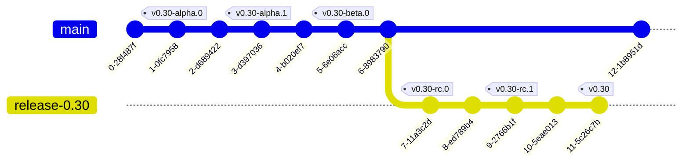

<a id="doc-12e0a48d6c5f2a58f4caa284"></a>

# kubevirt/kubevirt / ADOPTERS.md

Upstream: https://github.com/kubevirt/kubevirt/blob/635f26f3945628165586c719977cfde364769a33/ADOPTERS.md

Commit: `635f26f3945628165586c719977cfde364769a33`

Retrieved: 2026-10-01T15:22:38.313245+00:00

Kind: official-document

Raw SHA256: `04e02640f26bff86dacef72837cc52378650b6d1cf158bff9d4f5cd79e3130f8`

Source text below is untrusted reference content. Acquisition does not verify technical claims.

License status: UPSTREAM_NOTICES_CAPTURED_PER_FILE_REVIEW_REQUIRED. See this repository's captured license files.

---


> **Note**
> Do you want to add yourself to this list? Simply fork the repository and open a PR with the required change.
> We have a short description of the adopter types at the bottom of this page. Each adopter type is in alphabetical order. 
> Once your PR is merged, see our [website repo](https://github.com/kubevirt/kubevirt.github.io?tab=readme-ov-file#adopters) to add your logo to our website.

# KubeVirt Adopters

| Type | Name | Since | Website | Use-Case |
|:-|:-|:-|:-|:-|
| End-user | arm | 2021 | [link](https://www.arm.com) | KubeVirt enables seamless transition from legacy Virtual Machine based workloads to cloud-native container platforms. Arm believes KubeVirt addresses this challenge, allowing Virtual Machines workloads to easily deploy and scale in the cloud and at the edge. <br><br>Arm is an active contributor to the project, focused on enabling and optimizing Kubevirt performance on aarch64 and working with the ecosystem to facilitate users in deploying their workloads on cloud-native platforms. |
| End-user | Aussie Broadband | 2023 | [link](https://www.aussiebroadband.com.au) | Aussie Broadband is adopting Kubernetes as the base-layer for our infrastructure. KubeVirt enables us to bridge the gap between virtual machines and containers on baremetal. |
| End-user| Bytedance | 2023 | [link](https://www.bytedance.com/en/) | We use KubeVirt as part of our innovation Trusted Container Stack for TEE cluster provisioning. |
| End-user | Child Rescue Coalition | 2024 | [link](https://childrescuecoalition.org) | KubeVirt enables Child Rescue Coalition to run automated solutions in multiple platforms and operating systems. We offer these systems to law enforcement in 100+ countries free of charge. |
| End-user| Civo | 2020 | [link](https://www.civo.com) | We are using KubeVirt as part of our stack to enable tenant cluster provisioning within Civo cloud. |
| End-user | Cloudflare | 2018 | [link](https://www.cloudflare.com/) | Cloudflare uses KubeVirt within its core data centers to accommodate use cases of our teams that are less container friendly, such as our CI runners, while still taking advantage of the Kubernetes environment. |
| End-user | CloudRaft| 2024 | [link](https://cloudraft.io/) | CloudRaft is using KubeVirt to build a GPU Cloud platform for AI workload. KubeVirt allows end users such as Data scientists to experiment on powerful remote VMs equipped with GPUs and AI/ML packages.  |
| End-user | CoreWeave | 2020 | [link](https://www.coreweave.com) | A Kubernetes native cloud provider with focus on GPUs at scale. KubeVirt allows us to co-locate non-containerizable workloads such as Virtual Desktops next to compute intensive containers executing on bare metal. All orchestrated via the Kubernetes API leveraging the same network policies and persistent volumes for both VM and containerized workloads. |
| End-user | Genesis Cloud | 2022 | [link](https://genesiscloud.com/) | Genesis Cloud is basing its public cloud offering for instances with GPUs and other accelerators on kubevirt. |
| End-user | Intel Gaudi | 2024 | [link](https://habana.ai/) | Intel Gaudi utilizes KubeVirt and builds upon open-source projects such as Kubernetes and KubeVirt within its core data centers to empower products like [Intel® Gaudi® 3](https://habana.ai/products/gaudi3/) |
| End-user | Killercoda | 2022 | [link](https://killercoda.com) | Killercoda provides interactive learning environments based on VMs managed by KubeVirt. |
| End-user | The Linux Foundation - Training and Certification | 2022 | [link](https://training.linuxfoundation.org/) | The Linux Foundation uses KubeVirt for provisioning isolated and fully featured environments used to evaluate the hands-on skills required for accreditation in flagship open source technologies. |
| End-user | Nebius | 2023 | [link](https://nebius.com/) | Nebius uses KubeVirt as part of its AI cloud infrastructure to run GPU-backed virtual machines on Kubernetes, enabling cloud-native orchestration for high-performance AI workloads across large-scale GPU clusters. |
| End-user | NVIDIA | 2018 | [link](https://www.nvidia.com) | NVIDIA's latest computing platform is built on open-source projects like Kubernetes and KubeVirt to power products like [GeForce NOW](https://www.nvidia.com/en-us/geforce-now/) with more to come. |
| End-user | S3NS | 2023 | [link](https://www.s3ns.io/en) | S3NS (Thales x Google) is a French cloud provider based on a self-hosted, air-gapped regulated Google Cloud region. We offer public institutions and companies wishing to protect their sensitive data a trusted cloud offer meeting French ANSSI's SecNumCloud label criteria. We are currently using kubevirt for all our underlying core and real-time inspectability private infrastructure.|
| End-user | SK Telecom | 2022 | [link](https://www.sktelecom.com/en) | SK Telecom uses KubeVirt as the core virtualization engine of Petasus AI Cloud, our GPU cloud platform powering some of Korea's largest sovereign AI clusters. KubeVirt enables us to deliver GPU virtual machines with RDMA networking at scale, fully orchestrated through the Kubernetes API. |
| Integration | CloudCasa by Catalogic | 2024 | [link](https://cloudcasa.io/backup-recovery-kubevirt-red-hat-openshift-suse-harvester/) | [CloudCasa](https://cloudcasa.io/kubernetes-backup-and-restore/) provides seamless protection for virtual machines running on KubeVirt, Red Hat OpenShift Virtualization, and SUSE Virtualization. It enables policy-driven automation for backup, disaster recovery, and application mobility across diverse Kubernetes versions, distributions, storage providers, and cloud environments-offering unified data protection for both containerized and virtual workloads as SaaS or self-hosted solution. |
| Integration | Isovalent | 2024 | [link](https://isovalent.com/labs/cilium-kubevirt/) | Integrating VMs with Kubernetes’ CNI via Cilium and KubeVirt, implementing Zero Trust security policies and enabling advanced networking features like live migration. |
| Integration | Kasten by Veeam | 2022 | [link](https://docs.kasten.io/latest/usage/openshift_virtualization.html?highlight=kubevirt) | [Kasten K10](https://www.kasten.io/product/) manages KubeVirt and Red Hat OpenShift Virtualization VMs seamlessly for policy based automation of backup, disaster recovery, and application mobility across different Kubernetes versions, distributions, storage providers, and clouds. |
| Integration | minikube | 2020 | [link](https://minikube.sigs.k8s.io) | |
| Integration | oVirt | 2020 | [link](https://www.ovirt.org/documentation/administration_guide/index.html#proc-adding-kubevirt-openshift-as-an-external-provider_external_providers) | oVirt can view and manage VMs that are running on a KubeVirt cluster. |
| Integration | okd | 2020 | [link](https://www.okd.io) | [OKD Virtualization](https://docs.okd.io/latest/virt/about_virt/about-virt.html) adds KubeVirt functionality to OKD. |
| Integration | osbuild-operator | 2022 | [link](https://github.com/project-flotta/osbuild-operator) | OSBuild-Operator uses KubeVirt to provision its internal worker VMs. |
| Integration | PITS Global Data Recovery Services | 2023 | [link](https://www.pitsdatarecovery.net/) | KubeVirt allows us to manage highly-loaded VMs and containers from one place. |
| Integration | Portworx Backup | 2024 | [link](https://www.portworx.com/) | [Portworx Backup](https://portworx.com/services/backup-and-data-protection/) provides a single pane of glass for KubeVirt-aware backup and recovery of VMs and container workloads running on any Kubernetes distribution, using any storage provider on any cloud. |
| Integration | Portworx Enterprise | 2020 | [link](https://www.portworx.com/) | [Portworx Enterprise](https://portworx.com/services/kubernetes-storage/) abstracts any block storage to provide cloud-native storage capabilities for KubeVirt and Red Hat OpenShift Virtualization VMs - enabling storage automation, Kubernetes-aware synchronous and asynchronous disaster recovery, automated capacity management, data mobility and more for KubeVirt deployments at scale. |
| Integration | Trilio | 2021 | [link](https://trilio.io/) | TrilioVault has been cloud-native since day one and protects the most demanding environments to maximize stability across all tenants. Our platform is built for flexibility across deployments, integrating seamlessly with Kubernetes, OpenStack and Red Hat Virtualization. That means we can equally backup and restore stateful and stateless applications based on VMs, Containers or VMs in Containers based on KubeVirt.  |
| Vendor | Ænix | 2023 | [link](https://aenix.io/) | Ænix uses KubeVirt in free PaaS platform [Cozystack](https://cozystack.io) for running virtual machines and Kubernetes-as-a-Service. |
| Vendor | Alauda | 2021 | [link](https://www.alauda.io/) | As a distributor we provide KubeVirt-based VM management in Alauda Container Platform. |
| Vendor | Deckhouse | 2022 | [link](https://deckhouse.io/) | Deckhouse is a No-Ops Kubernetes Platform by [Flant](https://flant.com/) which provides out-of-box solution to run any type of production-grade workloads. It includes monitoring, storage, and virtual machines based on KubeVirt. |
| Vendor | EQUINIX | | [link](https://metal.equinix.com/) | |
| Vendor | H3C | 2019 | [link](https://www.h3c.com/en/Products_Technology/Enterprise_Products/Cloud_Computing/Cloud_Computing_Products/H3C_CloudOS/H3C_CloudOS_full-stack/) | We distribute KubeVirt as part of CloudOS to enable VM workloads on Kubernetes at customer sites. |
| Vendor | Kube-DC | 2023 | [link](https://kube-dc.com/platform) | As a platform for sovereign and neo-cloud infrastructures, we are using KubeVirt for VM management and nested Kubernetes clusters as isolated workers. |
| Vendor | KUBERMATIC | 2019 | [link](https://www.kubermatic.com/products/kubevirt/) | As a distributor we are running KubeVirt to enable VM workload on Kubermatic Virtualization. |
| Vendor | KUBESPHERE | 2020 | [link](https://kubesphere.cloud/en/ksv/) | KubeSphere Virtualization (KSV) provides lightweight VM management capability based on KubeVirt. |
| Vendor | Microsoft | 2023 | [link](https://www.microsoft.com/) | Microsoft is leveraging KubeVirt to host VM workloads as part of the [Azure Operator Nexus](https://azure.microsoft.com/en-us/products/operator-nexus) platform. |
| Vendor | NCR Voyix | 2024 | [link](https://www.ncrvoyix.com/) | NCR Voyix is leveraging KubeVirt to unify management of virtualized and containerized applications at the edge. |
| Vendor | Oracle | 2023 | [link](https://www.oracle.com) | As a distributor we are leveraging KubeVirt to enable VM workload on [Oracle Cloud Native Environment](https://www.oracle.com/linux/cloud-native-environment/), the Oracle multicloud and on-premises Kubernetes distribution. |
| Vendor | PLATFORM9 | | [link](https://platform9.com/managed-kubevirt/) | Run Legacy and Cloud-Native Applications on Platform9 |
| Vendor | Puzl | 2022 | [link](https://puzl.cloud/) | As a cloud-native computing platform we want to provide users with seamless experience. Many users are familiar with cloud VMs, but not yet with Kubernetes, and with Kubevirt we are giving them a bridge to a cloud-native world to make their migration easier. |
| Vendor | Rafay | 2026 | [link](https://rafay.co) | Rafay packages KubeVirt in its Virtual Machine as a Service (VMaaS) offering, turning bare-metal GPU fleets into self-service, multi-tenant virtual machines with GPU and vGPU passthrough, high-performance networking and storage, and full lifecycle management from a single control plane. |
| Vendor | Red Hat, Inc. | 2016 | [link](https://www.redhat.com) | As a distributor we are building OpenShift Virtualization on KubeVirt in order to enable VM workloads and -flows on Kubernetes. |
| Vendor | Spectro Cloud | 2022 | [link](https://www.spectrocloud.com/solutions/vms-on-kubernetes) | Spectro Cloud Palette's Virtual Machine Orchestrator (VMO) feature builds on KubeVirt. It gives enterprises an easy yet powerful way to bring their VM workloads into their Kubernetes clusters, on bare metal and at the edge — with full lifecycle management and unified policies and governance. |
| Vendor | SUSE | 2020 | [link](https://www.suse.com/) | SUSE believes KubeVirt is the best open source way to handle Virtual Machines on Kubernetes today. We offer this additional possibility to our customers by leveraging KubeVirt in our products. |
| Vendor | Swisscom | 2024 | [link](https://www.swisscom.ch/en/business/enterprise/offer/cloud/cloudnative/container-services.html) | Swisscom uses KubeVirt as a cloud-native infrastructure platform to enable VM workloads on bare-metal Kubernetes. On top, we offer Kubernetes as a service, additionally making use of the KubeVirt CSI driver to provide a storage solution to the end user clusters. |
| Vendor | TrueFullstaq | 2024 | [link](https://www.truefullstaq.com/) | TrueFullstaq is a European cloud native consultancy and managed hosting provider. Our CNCF Kubestronaut-certified engineers help organizations design, implement, and operate KubeVirt-based virtualization on Kubernetes, backed by the 24/7 operations of our managed services. |

### Adopter Types

**End-user**: The organization runs KubeVirt in production in some way.

**Integration**: The organization has a product that integrates with KubeVirt, but does not contain KubeVirt.

**Vendor**: The organization packages KubeVirt in their product and sells it as part of their product.


<a id="doc-ffdbe3a1e7ee93cacfc080b6"></a>

# kubevirt/kubevirt / CODE_OF_CONDUCT.md

Upstream: https://github.com/kubevirt/kubevirt/blob/635f26f3945628165586c719977cfde364769a33/CODE_OF_CONDUCT.md

Commit: `635f26f3945628165586c719977cfde364769a33`

Retrieved: 2026-10-01T15:22:38.313245+00:00

Kind: official-document

Raw SHA256: `5c37d437a942f757bc6782e8e4867482471bee46ca4a4eaf4c8163f93d2343bd`

Source text below is untrusted reference content. Acquisition does not verify technical claims.

License status: UPSTREAM_NOTICES_CAPTURED_PER_FILE_REVIEW_REQUIRED. See this repository's captured license files.

---


Contributor Covenant Code of Conduct
====================================

Our Pledge
----------

In the interest of fostering an open and welcoming environment, we as
contributors and maintainers pledge to making participation in our project
and our community a harassment-free experience for everyone, regardless of
age, body size, disability, ethnicity, gender identity and expression, level
of experience, nationality, personal appearance, race, religion, or sexual
identity and orientation.

Our Standards
-------------

Examples of behavior that contributes to creating a positive environment
include:

* Using welcoming and inclusive language
* Being respectful of differing viewpoints and experiences
* Gracefully accepting constructive criticism
* Focusing on what is best for the community
* Showing empathy towards other community members

Examples of unacceptable behavior by participants include:

* The use of sexualized language or imagery and unwelcome sexual attention or
  advances
* Trolling, insulting/derogatory comments, and personal or political attacks
* Public or private harassment
* Publishing others' private information, such as a physical or electronic
  address, without explicit permission
* Other conduct which could reasonably be considered inappropriate in a
  professional setting

Our Responsibilities
--------------------

Project maintainers are responsible for clarifying the standards of acceptable
behavior and are expected to take appropriate and fair corrective action in
response to any instances of unacceptable behavior.

Project maintainers have the right and responsibility to remove, edit, or
reject comments, commits, code, wiki edits, issues, and other contributions
that are not aligned to this Code of Conduct, or to ban temporarily or
permanently any contributor for other behaviors that they deem inappropriate,
threatening, offensive, or harmful.

Scope
-----

This Code of Conduct applies both within project spaces and in public spaces
when an individual is representing the project or its community. Examples of
representing a project or community include using an official project e-mail
address, posting via an official social media account, or acting as an
appointed representative at an online or offline event. Representation of a
project may be further defined and clarified by project maintainers.

Enforcement
-----------

Instances of abusive, harassing, or otherwise unacceptable behavior may be
reported by contacting [the KubeVirt Maintainers](mailto:cncf-kubevirt-conduct@lists.cncf.io). 
If you wish to report an incident that involves
a KubeVirt Maintainer, contact the [CNCF Staff](mailto: conduct@cncf.io). All
complaints will be reviewed and investigated and will result in a response that
is deemed necessary and appropriate to the circumstances. The project team is
obligated to maintain confidentiality with regard to the reporter of an
incident. Further details of specific enforcement policies may be posted
separately.

Project maintainers who do not follow or enforce the Code of Conduct in good
faith may face temporary or permanent repercussions as determined by other
members of the project's leadership.

Attribution
-----------

This Code of Conduct is adapted from the Contributor Covenant, version 1.4,
available at http://contributor-covenant.org/version/1/4.


<a id="doc-eca12c0a30e25b4b46522ebf"></a>

# kubevirt/kubevirt / CONTRIBUTING.md

Upstream: https://github.com/kubevirt/kubevirt/blob/635f26f3945628165586c719977cfde364769a33/CONTRIBUTING.md

Commit: `635f26f3945628165586c719977cfde364769a33`

Retrieved: 2026-10-01T15:22:38.313245+00:00

Kind: official-document

Raw SHA256: `1d21e2533393ea17f31a043d473c2d2633091cb429a621e5fc12a1114325c107`

Source text below is untrusted reference content. Acquisition does not verify technical claims.

License status: UPSTREAM_NOTICES_CAPTURED_PER_FILE_REVIEW_REQUIRED. See this repository's captured license files.

---

# Introduction

Let's start with the relationship between the two important components:

* **Kubernetes** is a container orchestration system, and is used to run
  containers on a cluster
* **KubeVirt** is an add-on which is installed on-top of Kubernetes, to be able
  to add basic virtualization functionality to Kubernetes.

KubeVirt is an add-on to Kubernetes, and they have several things in
common:

* Mostly written in golang
* Often related to distributed microservice architectures
* Declarative and Reactive (Operator pattern) approach

This short page shall help to get started with the projects and topics
surrounding them


## Contributing to KubeVirt

### Our workflow

Contributing to KubeVirt should be as simple as possible. Have a question? Want
to discuss something? Want to contribute something? Just open an
[Issue](https://github.com/kubevirt/kubevirt/issues), a [Pull
Request](https://github.com/kubevirt/kubevirt/pulls), or send a mail to our
[Google Group](https://groups.google.com/forum/#!forum/kubevirt-dev).

If you spot a bug or want to change something pretty simple, just go
ahead and open an Issue and/or a Pull Request, including your changes
at [kubevirt/kubevirt](https://github.com/kubevirt/kubevirt).

For larger changes that require more planning and discussion, creating a VEP (Virtualization Enhancement Proposal)
might be required.
The technical effort for these changes will impact a large section of the
development community and users, so they should be communicated widely. Examples of these types
of changes:
- New APIs
- Architectural changes
- Major code refactors
- Complex features
- API changes

For more information about VEPs, please refer to the [KubeVirt Enhancement](https://github.com/kubevirt/enhancements) repository.
To create a new VEP, follow the [process](https://github.com/kubevirt/enhancements#process) outlined in this repository.

### Getting started

To make yourself comfortable with the code, you might want to work on some
Issues marked with one or more of the following labels:
[good-first-issue](https://github.com/kubevirt/kubevirt/labels/good-first-issue),
[help-wanted](https://github.com/kubevirt/kubevirt/labels/help-wanted)
or [kind/bug](https://github.com/kubevirt/kubevirt/labels/kind%2Fbug).
Any help is highly appreciated.

### Testing

**Untested features do not exist**. To ensure that the code really works,
relevant flows should be covered via unit tests and functional tests. So when
thinking about a contribution, also think about testability. All tests can be
run local without the need of CI. Have a look at the
[Testing](docs/getting-started.md#testing)
section in the [Developer Guide](docs/getting-started.md).

#### Automated testing of pull requests

Automated testing is triggered on pull requests (PRs) opened by members of the KubeVirt organization, with the exception of _[draft pull requests](CONTRIBUTING.md#consider-opening-your-pull-request-as-draft)_. Pull requests opened by new contributors are initially marked with the label [`needs-ok-to-test`](https://github.com/kubevirt/kubevirt/labels/needs-ok-to-test) and are not automatically tested. Test lanes will be created after a member of the KubeVirt organization adds [`/ok-to-test`](https://prow.ci.kubevirt.io/command-help#ok_to_test) on the PR.

For more information about our CI, please have a look at the [docs](https://github.com/kubevirt/project-infra/tree/main/docs) in the project-infra repository.

#### Consider opening your pull request as draft
Not all pull requests are ready for review when they are created. This might be because the author wants to initiate a conversation or they might not be entirely sure whether the changes go in the right direction, or even because the changes are not complete.

Please consider creating such PRs as [Draft Pull Requests](https://github.blog/2019-02-14-introducing-draft-pull-requests/). Draft PRs are skipped by CI, which saves CI resources. It also means that reviewers are not automatically assigned and the community will understand that this PR is not yet ready for review.

After you mark your draft pull request as ready for review, reviewers will be assigned and tests will be triggered if the ok-to-test label is present (see [above](CONTRIBUTING.md#automated-testing-of-pull-requests)).

**Note that organization members can always trigger lanes manually by commenting [`/test`](https://prow.ci.kubevirt.io/command-help#test) on the pull request.**

### Contributor compliance with Developer Certificate Of Origin (DCO)

We require every contributor to certify that they are legally permitted to contribute to our project.
A contributor expresses this by consciously signing their commits, and by this act expressing that
they comply with the [Developer Certificate Of Origin](https://developercertificate.org/)

A signed commit is a commit where the commit message contains the following content:

```
Signed-off-by: John Doe <jdoe@example.org>
```

This can be done by adding [`--signoff`](https://git-scm.com/docs/git-commit#Documentation/git-commit.txt---signoff) to your git command line.

For commit message formatting guidelines, see [Commit message guidelines](docs/commit-message-guidelines.md).

### Getting your code reviewed/merged

Maintainers are here to help you enabling your use-case in a reasonable amount
of time. The maintainers will try to review your code and give you productive
feedback in a reasonable amount of time. However, if you are blocked on a
review, or your Pull Request does not get the attention you think it deserves,
reach out for us via Comments in your Issues, or ping us on Slack
[#kubevirt-dev @ kubernetes.slack.com](https://kubernetes.slack.com/?redir=%2Farchives%2FC0163DT0R8X).

Maintainers are tracked in [OWNERS
files](https://github.com/kubernetes/test-infra/blob/f7e21a3c18f4f4bbc7ee170675ed53e4544a0632/prow/plugins/approve/approvers/README.md)
and will be assigned by Prow.

### Becoming a member

Contributors that frequently contribute to the project may ask to join the
KubeVirt organization.

Please have a look at our [membership guidelines](https://github.com/kubevirt/community/blob/main/membership_policy.md).

## Projects & Communities

### [KubeVirt](https://github.com/kubevirt/)

* Getting started
  * [Developer Guide](docs/getting-started.md)
  * [Demo](https://github.com/kubevirt/demo)
  * [Documentation](docs/)

### [Kubernetes](http://kubernetes.io/)

* Getting started
  * [http://kubernetesbyexample.com](http://kubernetesbyexample.com)
  * [Hello Minikube - Kubernetes](https://kubernetes.io/docs/tutorials/stateless-application/hello-minikube/)
  * [User Guide - Kubernetes](https://kubernetes.io/docs/user-guide/)
* Details
  * [Declarative Management of Kubernetes Objects Using Configuration Files - Kubernetes](https://kubernetes.io/docs/concepts/tools/kubectl/object-management-using-declarative-config/)
  * [Kubernetes Architecture](https://github.com/kubernetes/community/blob/master/contributors/design-proposals/architecture/architecture.md)

## Additional Topics

* Golang
  * [Documentation - The Go Programming Language](https://golang.org/doc/)
  * [Getting Started - The Go Programming Language](https://golang.org/doc/install)
* Patterns
  * [Introducing Operators: Putting Operational Knowledge into Software](https://web.archive.org/web/20210210032403/https://coreos.com/blog/introducing-operators.html)
  * [Microservices](https://martinfowler.com/articles/microservices.html) nice
    content by Martin Fowler
* Testing
  * [Ginkgo - A Golang BDD Testing Framework](https://onsi.github.io/ginkgo/)


<a id="doc-c7bd425fd98aad1f9fef2009"></a>

# kubevirt/kubevirt / FAQ.md

Upstream: https://github.com/kubevirt/kubevirt/blob/635f26f3945628165586c719977cfde364769a33/FAQ.md

Commit: `635f26f3945628165586c719977cfde364769a33`

Retrieved: 2026-10-01T15:22:38.313245+00:00

Kind: official-document

Raw SHA256: `9f1939a84f457e4aafa9a9716f50c3ca7dda8252ca3d337a9430f06b4d34d114`

Source text below is untrusted reference content. Acquisition does not verify technical claims.

License status: UPSTREAM_NOTICES_CAPTURED_PER_FILE_REVIEW_REQUIRED. See this repository's captured license files.

---


# Frequently Asked Questions

## Why don't you use the Container Runtime Interface (CRI) to launch VMs?

The short story is that there are two main reasons: Currently there is
no way how VMs can be launched in a parametrized way, and the second
reason is that Kubernetes is built around the assumption of cloud
workloads. This assumption is contradicting the assumptions we have on
pet VMs.

KubeVirt is looking for a solution to manage VMs. This includes both ends:
VMs as they are used in the cloud, thus with few tunables, but also pet
VMs like they are used in traditional data-center virtualization, which expose
a lot more tunables.

Especially the pet case requires the exposure of many tunables, and this can
currently not be established with CRI - in a scalable way. (I.e. it could be
raised that annotations could be used to set VM parameters, but to us this is
rather a workaround than a solution).

Besides that Kubernetes is built around the assumptions of containers and
cloud workloads. And it's difficult to bend Kubernetes to also handle or
support assumptions on which pet VMs are based.

## What architectures are supported?

Currently we are only supporting x86-64.

## Why don't you support my distribution?

In general we aim to be OS independent by shipping all dependencies in
containers (i.e. libvirtd).
But in case that you have issues, please
[file a bug](https://github.com/kubevirt/kubevirt/issues).

## What's the difference between KubeVirt and Kata containers?

[Kata containers](https://katacontainers.io/) allow you to run containers inside virtual machines.  
KubeVirt allows you to run full virtual machines on Kubernetes alongside regular containers.  
One could say they're opposites:  
Kata containers are containers inside virtual machines.  
KubeVirt is a virtual machine inside a container.

## Why don't you answer this question: … ?

We want to, please open an
[issue](https://github.com/kubevirt/kubevirt/issues) and we'll try to answer
and consider to add it to this FAQ.


<a id="doc-c693279643b8cd5d248172d9"></a>

# kubevirt/kubevirt / LICENSE

Upstream: https://github.com/kubevirt/kubevirt/blob/635f26f3945628165586c719977cfde364769a33/LICENSE

Commit: `635f26f3945628165586c719977cfde364769a33`

Retrieved: 2026-10-01T15:22:38.313245+00:00

Kind: license

Raw SHA256: `5febf914b9f9eed690207764788b0660d5a6ceefdf6f9fb2d8e47bdac3ffefa3`

Source text below is untrusted reference content. Acquisition does not verify technical claims.

License status: UPSTREAM_NOTICES_CAPTURED_PER_FILE_REVIEW_REQUIRED. See this repository's captured license files.

---

````text

                                 Apache License
                           Version 2.0, January 2004
                        http://www.apache.org/licenses/

   TERMS AND CONDITIONS FOR USE, REPRODUCTION, AND DISTRIBUTION

   1. Definitions.

      "License" shall mean the terms and conditions for use, reproduction,
      and distribution as defined by Sections 1 through 9 of this document.

      "Licensor" shall mean the copyright owner or entity authorized by
      the copyright owner that is granting the License.

      "Legal Entity" shall mean the union of the acting entity and all
      other entities that control, are controlled by, or are under common
      control with that entity. For the purposes of this definition,
      "control" means (i) the power, direct or indirect, to cause the
      direction or management of such entity, whether by contract or
      otherwise, or (ii) ownership of fifty percent (50%) or more of the
      outstanding shares, or (iii) beneficial ownership of such entity.

      "You" (or "Your") shall mean an individual or Legal Entity
      exercising permissions granted by this License.

      "Source" form shall mean the preferred form for making modifications,
      including but not limited to software source code, documentation
      source, and configuration files.

      "Object" form shall mean any form resulting from mechanical
      transformation or translation of a Source form, including but
      not limited to compiled object code, generated documentation,
      and conversions to other media types.

      "Work" shall mean the work of authorship, whether in Source or
      Object form, made available under the License, as indicated by a
      copyright notice that is included in or attached to the work
      (an example is provided in the Appendix below).

      "Derivative Works" shall mean any work, whether in Source or Object
      form, that is based on (or derived from) the Work and for which the
      editorial revisions, annotations, elaborations, or other modifications
      represent, as a whole, an original work of authorship. For the purposes
      of this License, Derivative Works shall not include works that remain
      separable from, or merely link (or bind by name) to the interfaces of,
      the Work and Derivative Works thereof.

      "Contribution" shall mean any work of authorship, including
      the original version of the Work and any modifications or additions
      to that Work or Derivative Works thereof, that is intentionally
      submitted to Licensor for inclusion in the Work by the copyright owner
      or by an individual or Legal Entity authorized to submit on behalf of
      the copyright owner. For the purposes of this definition, "submitted"
      means any form of electronic, verbal, or written communication sent
      to the Licensor or its representatives, including but not limited to
      communication on electronic mailing lists, source code control systems,
      and issue tracking systems that are managed by, or on behalf of, the
      Licensor for the purpose of discussing and improving the Work, but
      excluding communication that is conspicuously marked or otherwise
      designated in writing by the copyright owner as "Not a Contribution."

      "Contributor" shall mean Licensor and any individual or Legal Entity
      on behalf of whom a Contribution has been received by Licensor and
      subsequently incorporated within the Work.

   2. Grant of Copyright License. Subject to the terms and conditions of
      this License, each Contributor hereby grants to You a perpetual,
      worldwide, non-exclusive, no-charge, royalty-free, irrevocable
      copyright license to reproduce, prepare Derivative Works of,
      publicly display, publicly perform, sublicense, and distribute the
      Work and such Derivative Works in Source or Object form.

   3. Grant of Patent License. Subject to the terms and conditions of
      this License, each Contributor hereby grants to You a perpetual,
      worldwide, non-exclusive, no-charge, royalty-free, irrevocable
      (except as stated in this section) patent license to make, have made,
      use, offer to sell, sell, import, and otherwise transfer the Work,
      where such license applies only to those patent claims licensable
      by such Contributor that are necessarily infringed by their
      Contribution(s) alone or by combination of their Contribution(s)
      with the Work to which such Contribution(s) was submitted. If You
      institute patent litigation against any entity (including a
      cross-claim or counterclaim in a lawsuit) alleging that the Work
      or a Contribution incorporated within the Work constitutes direct
      or contributory patent infringement, then any patent licenses
      granted to You under this License for that Work shall terminate
      as of the date such litigation is filed.

   4. Redistribution. You may reproduce and distribute copies of the
      Work or Derivative Works thereof in any medium, with or without
      modifications, and in Source or Object form, provided that You
      meet the following conditions:

      (a) You must give any other recipients of the Work or
          Derivative Works a copy of this License; and

      (b) You must cause any modified files to carry prominent notices
          stating that You changed the files; and

      (c) You must retain, in the Source form of any Derivative Works
          that You distribute, all copyright, patent, trademark, and
          attribution notices from the Source form of the Work,
          excluding those notices that do not pertain to any part of
          the Derivative Works; and

      (d) If the Work includes a "NOTICE" text file as part of its
          distribution, then any Derivative Works that You distribute must
          include a readable copy of the attribution notices contained
          within such NOTICE file, excluding those notices that do not
          pertain to any part of the Derivative Works, in at least one
          of the following places: within a NOTICE text file distributed
          as part of the Derivative Works; within the Source form or
          documentation, if provided along with the Derivative Works; or,
          within a display generated by the Derivative Works, if and
          wherever such third-party notices normally appear. The contents
          of the NOTICE file are for informational purposes only and
          do not modify the License. You may add Your own attribution
          notices within Derivative Works that You distribute, alongside
          or as an addendum to the NOTICE text from the Work, provided
          that such additional attribution notices cannot be construed
          as modifying the License.

      You may add Your own copyright statement to Your modifications and
      may provide additional or different license terms and conditions
      for use, reproduction, or distribution of Your modifications, or
      for any such Derivative Works as a whole, provided Your use,
      reproduction, and distribution of the Work otherwise complies with
      the conditions stated in this License.

   5. Submission of Contributions. Unless You explicitly state otherwise,
      any Contribution intentionally submitted for inclusion in the Work
      by You to the Licensor shall be under the terms and conditions of
      this License, without any additional terms or conditions.
      Notwithstanding the above, nothing herein shall supersede or modify
      the terms of any separate license agreement you may have executed
      with Licensor regarding such Contributions.

   6. Trademarks. This License does not grant permission to use the trade
      names, trademarks, service marks, or product names of the Licensor,
      except as required for reasonable and customary use in describing the
      origin of the Work and reproducing the content of the NOTICE file.

   7. Disclaimer of Warranty. Unless required by applicable law or
      agreed to in writing, Licensor provides the Work (and each
      Contributor provides its Contributions) on an "AS IS" BASIS,
      WITHOUT WARRANTIES OR CONDITIONS OF ANY KIND, either express or
      implied, including, without limitation, any warranties or conditions
      of TITLE, NON-INFRINGEMENT, MERCHANTABILITY, or FITNESS FOR A
      PARTICULAR PURPOSE. You are solely responsible for determining the
      appropriateness of using or redistributing the Work and assume any
      risks associated with Your exercise of permissions under this License.

   8. Limitation of Liability. In no event and under no legal theory,
      whether in tort (including negligence), contract, or otherwise,
      unless required by applicable law (such as deliberate and grossly
      negligent acts) or agreed to in writing, shall any Contributor be
      liable to You for damages, including any direct, indirect, special,
      incidental, or consequential damages of any character arising as a
      result of this License or out of the use or inability to use the
      Work (including but not limited to damages for loss of goodwill,
      work stoppage, computer failure or malfunction, or any and all
      other commercial damages or losses), even if such Contributor
      has been advised of the possibility of such damages.

   9. Accepting Warranty or Additional Liability. While redistributing
      the Work or Derivative Works thereof, You may choose to offer,
      and charge a fee for, acceptance of support, warranty, indemnity,
      or other liability obligations and/or rights consistent with this
      License. However, in accepting such obligations, You may act only
      on Your own behalf and on Your sole responsibility, not on behalf
      of any other Contributor, and only if You agree to indemnify,
      defend, and hold each Contributor harmless for any liability
      incurred by, or claims asserted against, such Contributor by reason
      of your accepting any such warranty or additional liability.

   END OF TERMS AND CONDITIONS

   APPENDIX: How to apply the Apache License to your work.

      To apply the Apache License to your work, attach the following
      boilerplate notice, with the fields enclosed by brackets "[]"
      replaced with your own identifying information. (Don't include
      the brackets!)  The text should be enclosed in the appropriate
      comment syntax for the file format. We also recommend that a
      file or class name and description of purpose be included on the
      same "printed page" as the copyright notice for easier
      identification within third-party archives.

   Copyright 2017 The KubeVirt Authors

   Licensed under the Apache License, Version 2.0 (the "License");
   you may not use this file except in compliance with the License.
   You may obtain a copy of the License at

       http://www.apache.org/licenses/LICENSE-2.0

   Unless required by applicable law or agreed to in writing, software
   distributed under the License is distributed on an "AS IS" BASIS,
   WITHOUT WARRANTIES OR CONDITIONS OF ANY KIND, either express or implied.
   See the License for the specific language governing permissions and
   limitations under the License.

````


<a id="doc-b335630551682c19a781afeb"></a>

# kubevirt/kubevirt / README.md

Upstream: https://github.com/kubevirt/kubevirt/blob/635f26f3945628165586c719977cfde364769a33/README.md

Commit: `635f26f3945628165586c719977cfde364769a33`

Retrieved: 2026-10-01T15:22:38.313245+00:00

Kind: official-document

Raw SHA256: `681d91797a85c19e74dff7727e41d1950dbfaf01a9b9d8c5024b815dece5e2cc`

Source text below is untrusted reference content. Acquisition does not verify technical claims.

License status: UPSTREAM_NOTICES_CAPTURED_PER_FILE_REVIEW_REQUIRED. See this repository's captured license files.

---

# KubeVirt

<p align="center">

</p>


<div align="center">
    
  [](https://prow.ci.kubevirt.io/?job=push-kubevirt-main)
  [](https://www.apache.org/licenses/LICENSE-2.0)
  [](https://coveralls.io/github/kubevirt/kubevirt?branch=main)
  [](https://bestpractices.coreinfrastructure.org/projects/3203)
  [](https://kubernetes.slack.com/?redir=%2Farchives%2FC0163DT0R8X)
  [](https://app.fossa.com/projects/custom%2B13072%2Fgit%40github.com%3Akubevirt%2Fkubevirt.git?ref=badge_shield)
      
</div>


**KubeVirt** is a virtual machine management add-on for Kubernetes.
The aim is to provide a common ground for virtualization solutions on top of
Kubernetes.

## Introduction

### Virtualization extension for Kubernetes

At its core, KubeVirt extends [Kubernetes][k8s] by adding
additional virtualization resource types (especially the `VM` type) through
[Kubernetes's Custom Resource Definitions API][crd].
By using this mechanism, the Kubernetes API can be used to manage these `VM`
resources alongside all other resources Kubernetes provides.

The resources themselves are not enough to launch virtual machines.
For this to happen the _functionality and business logic_ needs to be added to
the cluster. The functionality is not added to Kubernetes itself, but rather
added to a Kubernetes cluster by _running_ additional controllers and agents
on an existing cluster.

The necessary controllers and agents are provided by KubeVirt.

As of today KubeVirt can be used to declaratively

 * Create a predefined VM
 * Schedule a VM on a Kubernetes cluster
 * Launch a VM
 * Stop a VM
 * Delete a VM

[](https://asciinema.org/a/497168)

## To start using KubeVirt

Try our quickstart at [kubevirt.io](https://kubevirt.io/get_kubevirt/).

See our user documentation at [kubevirt.io/docs](https://kubevirt.io/user-guide).

Once you have the basics, you can learn more about how to run KubeVirt and its newest features by taking a look at:

 * [KubeVirt blog](https://kubevirt.io/blogs/)
 * [KubeVirt Youtube channel](https://www.youtube.com/channel/UC2FH36TbZizw25pVT1P3C3g)

## To start developing KubeVirt

To set up a development environment please read our
[Getting Started Guide](docs/getting-started.md). To learn how to contribute, please read our [contribution guide](https://github.com/kubevirt/kubevirt/blob/main/CONTRIBUTING.md).

You can learn more about how KubeVirt is designed (and why it is that way),
and learn more about the major components by taking a look at
[our developer documentation](docs/):

 * [Architecture](docs/architecture.md) - High-level view on the architecture
 * [Components](docs/components.md) - Detailed look at all components
 * [API Reference](https://kubevirt.io/api-reference/)

## Useful links

The KubeVirt SIG-release repo is responsible for information regarding upcoming and previous releases. 

 * [KubeVirt to Kubernetes version support matrix](https://github.com/kubevirt/sig-release/blob/main/releases/k8s-support-matrix.md) - Verify the versions of KubeVirt that are built and supported for your version of Kubernetes
 * [Noteworthy changes for the next KubeVirt release](https://github.com/kubevirt/sig-release/blob/main/upcoming-changes.md) - Pre-release notes for the upcoming release
 * [Release schedule](https://github.com/kubevirt/sig-release/blob/main/releases/) - For our current and previous releases

## Community

If you got enough of code and want to speak to people, then you got a couple
of options:

* Follow us on [Twitter](https://twitter.com/kubevirt)
* Chat with us on Slack via [#virtualization @ kubernetes.slack.com](https://kubernetes.slack.com/?redir=%2Farchives%2FC8ED7RKFE)
* Discuss with us on the [kubevirt-dev Google Group](https://groups.google.com/forum/#!forum/kubevirt-dev)
* Stay informed about designs and upcoming events by watching our [community content](https://github.com/kubevirt/community/)

### Related resources

 * [Kubernetes][k8s]
 * [Libvirt][libvirt]
 * [Cockpit][cockpit]
 * [kubevirt.core][kubevirt.core] Ansible collection

### Submitting patches

When sending patches to the project, the submitter is required to certify that
they have the legal right to submit the code. This is achieved by adding a line

    Signed-off-by: Real Name <email@address.com>

to the bottom of every commit message. Existence of such a line certifies
that the submitter has complied with the Developer's Certificate of Origin 1.1,
(as defined in the file docs/developer-certificate-of-origin).

This line can be automatically added to a commit in the correct format, by
using the '-s' option to 'git commit'.

## License

KubeVirt is distributed under the
[Apache License, Version 2.0](http://www.apache.org/licenses/LICENSE-2.0.txt).

    This file is part of the KubeVirt project

    Licensed under the Apache License, Version 2.0 (the "License");
    you may not use this file except in compliance with the License.
    You may obtain a copy of the License at

        http://www.apache.org/licenses/LICENSE-2.0

    Unless required by applicable law or agreed to in writing, software
    distributed under the License is distributed on an "AS IS" BASIS,
    WITHOUT WARRANTIES OR CONDITIONS OF ANY KIND, either express or implied.
    See the License for the specific language governing permissions and
    limitations under the License.

    Copyright The KubeVirt Authors.

[//]: # (Reference links)
   [k8s]: https://kubernetes.io
   [crd]: https://kubernetes.io/docs/tasks/access-kubernetes-api/extend-api-custom-resource-definitions/
   [ovirt]: https://www.ovirt.org
   [cockpit]: https://cockpit-project.org/
   [libvirt]: https://www.libvirt.org
   [kubevirt.core]: https://github.com/kubevirt/kubevirt.core

## FOSSA Status

[](https://app.fossa.com/projects/custom%2B13072%2Fgit%40github.com%3Akubevirt%2Fkubevirt.git?ref=badge_large)


<a id="doc-f6ed156e4bf5c79168066246"></a>

# kubevirt/kubevirt / SECURITY.md

Upstream: https://github.com/kubevirt/kubevirt/blob/635f26f3945628165586c719977cfde364769a33/SECURITY.md

Commit: `635f26f3945628165586c719977cfde364769a33`

Retrieved: 2026-10-01T15:22:38.313245+00:00

Kind: official-document

Raw SHA256: `808056be8989f1207c2acfc0df908df995a14b0c7adb5ae87df90733224e2528`

Source text below is untrusted reference content. Acquisition does not verify technical claims.

License status: UPSTREAM_NOTICES_CAPTURED_PER_FILE_REVIEW_REQUIRED. See this repository's captured license files.

---

# Security Policy

## Reporting a Vulnerability

The KubeVirt project treats security vulnerabilities seriously, so we
strive to take action quickly when required.

The project requests that security issues be disclosed in a responsible
manner to allow adequate time to respond.  If a security issue or
vulnerability has been found, please disclose the details to our
dedicated email address:

cncf-kubevirt-security@lists.cncf.io

Please include as much information as possible with the report. The
following details assist with analysis efforts:
  - Description of the vulnerability
  - Affected component (version, commit, branch etc)
  - Affected code (file path, line numbers)
  - Exploit code

Any confidential information disclosed to the security team will be
handled appropriately to prevent misuse or accidental disclosure.

## Security Notices

Security notices will be sent to the kubevirt-dev@googlegroups.com
mailing list and published to the
[Security Advisories](https://github.com/kubevirt/kubevirt/security/advisories)
page.

## Security Team

The security team currently consists of the Maintainers of KubeVirt and is
supported by security teams of involved vendors.

List of involved vendor security teams:
- Red Hat <secalert@redhat.com>
- SUSE <psirt@suse.com>
- Google <vulncc-ext-feed@google.com>

## Alternate Reporting Mechanism

If you are unable to report the vulnerability to the dedicated email address, you can use the [GitHub vulnerability report mechanism](https://docs.github.com/en/code-security/security-advisories/guidance-on-reporting-and-writing-information-about-vulnerabilities/privately-reporting-a-security-vulnerability#privately-reporting-a-security-vulnerability). 


<a id="doc-61628a5b79395222eb4a3e08"></a>

# kubevirt/kubevirt / api/openapi-spec/README.md

Upstream: https://github.com/kubevirt/kubevirt/blob/635f26f3945628165586c719977cfde364769a33/api/openapi-spec/README.md

Commit: `635f26f3945628165586c719977cfde364769a33`

Retrieved: 2026-10-01T15:22:38.313245+00:00

Kind: official-document

Raw SHA256: `198e8ae5b7dc5d97e40f83ddbccbbc0b3344f97ce99ee98233bb7190f05a2840`

Source text below is untrusted reference content. Acquisition does not verify technical claims.

License status: UPSTREAM_NOTICES_CAPTURED_PER_FILE_REVIEW_REQUIRED. See this repository's captured license files.

---

# KubeVirt's OpenAPI Specification

This folder contains an [OpenAPI specification](https://github.com/OAI/OpenAPI-Specification) for KubeVirt API.


<a id="doc-247f23c648b1f73d51f7b0fa"></a>

# kubevirt/kubevirt / cmd/README.md

Upstream: https://github.com/kubevirt/kubevirt/blob/635f26f3945628165586c719977cfde364769a33/cmd/README.md

Commit: `635f26f3945628165586c719977cfde364769a33`

Retrieved: 2026-10-01T15:22:38.313245+00:00

Kind: official-document

Raw SHA256: `58db8ef656bcb8020b1010d94a13a4a749a5aba558d0320c420f02e15f9a33f1`

Source text below is untrusted reference content. Acquisition does not verify technical claims.

License status: UPSTREAM_NOTICES_CAPTURED_PER_FILE_REVIEW_REQUIRED. See this repository's captured license files.

---

This directory contains all major component sources.

Besides the sources (which leverage smaller components from ../pkg/),
the subdirectories also contain Dockerfiles which can be used
to build images for each component.


<a id="doc-67057011eba12339f2869c36"></a>

# kubevirt/kubevirt / cmd/container-disk-v2alpha/README.md

Upstream: https://github.com/kubevirt/kubevirt/blob/635f26f3945628165586c719977cfde364769a33/cmd/container-disk-v2alpha/README.md

Commit: `635f26f3945628165586c719977cfde364769a33`

Retrieved: 2026-10-01T15:22:38.313245+00:00

Kind: official-document

Raw SHA256: `55b57a021620fa51b3185b03251747bc2eb423e6ebd9f0dbf2028ba01f4943ed`

Source text below is untrusted reference content. Acquisition does not verify technical claims.

License status: UPSTREAM_NOTICES_CAPTURED_PER_FILE_REVIEW_REQUIRED. See this repository's captured license files.

---

# KubeVirt Registry Disk Base Container

The KubeVirt Registry Disk Base Container allows users to store VMI disks in
a container registry and attach those disk to VMIs automatically using the
KubeVirt runtime.

This Base Container is compatible with disk type ContainerDisk:v1alpha

# Storing Disks in Container Registry

VMI disks can be stored in either qcow2 format or raw format by copying the vm
disk into a container image and uploading that container image to a container
registry.

Example: Place a bootable VMI disk into a container image in the /disk directory
and upload to the container registry.
```
cat << END > Dockerfile
FROM scratch
ADD fedora25.qcow2 /disk/
END

docker build -t vmdisks/fedora25:latest .
docker push vmdisks/fedora25:latest
```

# Assigning Ephemeral Disks to VMIs

Assign an ephemeral disk backed by an image in the container registry by
adding a ContainerDisk:v2alpha disk to the VMI definition and supplying
the container image as the disk's source name.

Example: Create a KubeVirt VMI definition with container backed ephemeral disk.

```
cat << END > vm.yaml
apiVersion: kubevirt.io/v1
kind: VirtualMachine
metadata:
  creationTimestamp: null
  name: vm-ephemeral
spec:
  domain:
    devices:
      disks:
      - disk:
          bus: virtio
        name: containerdisk
        volumeName: registryvolume
    machine:
      type: ""
    resources:
      requests:
        memory: 64M
  terminationGracePeriodSeconds: 0
  volumes:
  - name: registryvolume
    containerDisk:
      image: kubevirt/cirros-container-disk-demo:devel
status: {}
END
```

After creating the VMI definition, starting the VMI is as simple starting a pod.

```
kubectl create -f vm.yaml
```


<a id="doc-0e70b244a19d2911a66ca256"></a>

# kubevirt/kubevirt / cmd/sidecars/README.md

Upstream: https://github.com/kubevirt/kubevirt/blob/635f26f3945628165586c719977cfde364769a33/cmd/sidecars/README.md

Commit: `635f26f3945628165586c719977cfde364769a33`

Retrieved: 2026-10-01T15:22:38.313245+00:00

Kind: official-document

Raw SHA256: `1ecfae8231598639a7fe0a3f99fa3a3f67badc1a6b7370222d303d84ca63e7f3`

Source text below is untrusted reference content. Acquisition does not verify technical claims.

License status: UPSTREAM_NOTICES_CAPTURED_PER_FILE_REVIEW_REQUIRED. See this repository's captured license files.

---

# Sidecars base image

## Introduction

In Kubernetes, Sidecar containers are containers that run along with the main container in the pod.
In the context of KubeVirt, we use the Sidecar container to apply changes before the Virtual Machine
is initialized.

> **Note**: The Sidecar feature gate must be enabled in the KubeVirt Custom Resource before using sidecars.
> Add `Sidecar` to `spec.configuration.developerConfiguration.featureGates` in your KubeVirt CR.
```yaml
apiVersion: kubevirt.io/v1
kind: KubeVirt
metadata:
  name: kubevirt
  namespace: kubevirt
spec:
  configuration:
    developerConfiguration:
      featureGates:
        - Sidecar
```

Once enabled, every VM owner may use it to run arbitrary code in the context of virt-launcher which may have unexpected effects.

The Sidecar containers communicate with the main container over a socket with a gRPC protocol, [with
two versions at moment](../../pkg/hooks). The Sidecar is meant to do the changes over libvirt's XML
and return the new XML over gRPC for the VM creation.

## Sidecar-shim image

To reduce the amount of boilerplate that developers need to do in order to run VM with custom
modifications, we introduced the `sidecar-shim-image` that takes care of implementing the
communication with the main container.

The `sidecar-shim-image` contains the `sidecar-shim` binary which should be kept as the entrypoint
of the container. This binary will search in $PATH for binaries named after the Hook names (e.g
onDefineDomain) and run them and provide the necessary arguments as command line options (flags).

Besides a binary, one could also execute shell or python scripts by making them available at the
expected location.

`sidecar-shim-image` is built as part of the Kubevirt build chain and its consumed as the
default image from `virt-operator` and `virt-controller`.

In the case of `onDefineDomain`, the arguments will be the VMI information as JSON string, (e.g
--vmi vmiJSON) and the current domain XML (e.g --domain domainXML) to the users binaries. As
standard output it expects the modified domain XML.

In the case of `preCloudInitIso`, the arguments will be the VMI information as JSON string, (e.g
--vmi vmiJSON) and the [CloudInitData](../../pkg/cloud-init/cloud-init.go) (e.g --cloud-init
cloudInitJSON) to the users binaries. As standard output it expects the modified CloudInitData (as
JSON).

## Notes

The `sidecar-shim` binary needs to inform what gRPC protocol version it'll communicate with, so it
requires a `--version` parameter (e.g: v1alpha2)

## Example

Using the current [smbios sidecar](../example-hook-sidecar/) as example. The `smbios.go` is compiled
as a binary named `onDefineDomain` and installed under `/usr/bin` in a container that uses
`sidecar-shim-image` as base with an entrypoint of `/sidecar-shim`.

```go
const (
	baseBoardManufacturerAnnotation = "smbios.vm.kubevirt.io/baseBoardManufacturer"
)

func onDefineDomain(vmiJSON, domainXML []byte) string {
	vmiSpec := vmSchema.VirtualMachineInstance{}
	if err := json.Unmarshal(vmiJSON, &vmiSpec); err != nil {
		panic(err)
	}

	domainSpec := api.DomainSpec{}
	if err := xml.Unmarshal(domainXML, &domainSpec); err != nil {
		panic(err)
	}

	annotations := vmiSpec.GetAnnotations()
	if _, found := annotations[baseBoardManufacturerAnnotation]; !found {
		return string(domainXML)
	}

	domainSpec.OS.SMBios = &api.SMBios{Mode: "sysinfo"}
	if domainSpec.SysInfo == nil {
		domainSpec.SysInfo = &api.SysInfo{}
	}
	domainSpec.SysInfo.Type = "smbios"
	if baseBoardManufacturer, found := annotations[baseBoardManufacturerAnnotation]; found {
		domainSpec.SysInfo.BaseBoard = append(domainSpec.SysInfo.BaseBoard, api.Entry{
			Name:  "manufacturer",
			Value: baseBoardManufacturer,
		})
	}
	if newDomainXML, err := xml.Marshal(domainSpec); err != nil {
		panic(err)
	} else {
		return string(newDomainXML)
	}
}

func main() {
	var vmiJSON, domainXML string
	pflag.StringVar(&vmiJSON, "vmi", "", "VMI to change in JSON format")
	pflag.StringVar(&domainXML, "domain", "", "Domain spec in XML format")
	pflag.Parse()

	if vmiJSON == "" || domainXML == "" {
		os.Exit(1)
	}
	fmt.Println(onDefineDomain([]byte(vmiJSON), []byte(domainXML)))
}
```

## Hook Sidecars Annotation

The `hooks.kubevirt.io/hookSidecars` annotation is a JSON array that defines one or more sidecar containers to be added to the virt-launcher pod. Each sidecar entry supports the following fields:

### Field Reference

| Field | Type | Required | Description | Example |
|-------|------|----------|-------------|---------|
| `image` | `string` | No | Container image to use for the sidecar. If not specified, the default `sidecar-shim-image` built by KubeVirt will be used. | `"image": "registry:5000/kubevirt/example-hook-sidecar:devel"` |
| `imagePullPolicy` | `string` | No | Image pull policy for the sidecar container. Must be one of: `IfNotPresent`, `Always`, or `Never`. If not specified, follows Kubernetes default behavior. | `"imagePullPolicy": "IfNotPresent"` |
| `command` | `array of strings` | No | Command to execute in the sidecar container. If not specified, the default entrypoint of the image will be used. | `"command": ["/custom-entrypoint", "--flag"]` |
| `args` | `array of strings` | No | Arguments to pass to the sidecar container command. For sidecar-shim, this typically includes the gRPC protocol version (e.g., `["--version", "v1alpha2"]`). | `"args": ["--version", "v1alpha2"]` |
| `configMap` | `object` | No | Reference to a ConfigMap containing a script to execute. The script will be mounted and executed by the sidecar-shim. See nested fields below. | See nested fields below |
| `configMap.name` | `string` | Yes | Name of the ConfigMap in the same namespace containing a script to execute. | `"name": "my-config-map"` |
| `configMap.key` | `string` | Yes | Key in the ConfigMap that contains the script. | `"key": "my_script.sh"` |
| `configMap.hookPath` | `string` | Yes | Path where the script will be mounted. Must be either `/usr/bin/onDefineDomain` or `/usr/bin/preCloudInitIso`. | `"hookPath": "/usr/bin/onDefineDomain"` |
| `pvc` | `object` | No | Reference to a PersistentVolumeClaim to mount in the sidecar container, optionally shared with the compute container. See nested fields below. | See nested fields below |
| `pvc.name` | `string` | Yes | Name of the PVC in the same namespace to mount in the sidecar container. | `"name": "my-pvc"` |
| `pvc.volumePath` | `string` | Yes | Mount path in the sidecar container. | `"volumePath": "/debug"` |
| `pvc.sharedComputePath` | `string` | No | Mount path in the compute (virt-launcher) container. If specified, the PVC will be shared between both containers. | `"sharedComputePath": "/var/run/debug"` |

### Complete Annotation Example

```yaml
annotations:
  hooks.kubevirt.io/hookSidecars: |
    [
      {
        "image": "registry:5000/kubevirt/example-hook-sidecar:devel",
        "imagePullPolicy": "IfNotPresent",
        "args": ["--version", "v1alpha2"]
      },
      {
        "imagePullPolicy": "IfNotPresent",
        "args": ["--version", "v1alpha2"],
        "configMap": {
          "name": "my-config-map",
          "key": "my_script.sh",
          "hookPath": "/usr/bin/onDefineDomain"
        }
      },
      {
        "image": "custom-sidecar:latest",
        "imagePullPolicy": "Always",
        "command": ["/custom-entrypoint"],
        "args": ["--custom-arg", "value"],
        "pvc": {
          "name": "shared-storage",
          "volumePath": "/data",
          "sharedComputePath": "/var/run/shared"
        }
      }
    ]
```

## Using ConfigMap to run custom script

Besides injecting a script into the container image, one can also store it in a ConfigMap and 
use annotations to make sure the script is run before the VMI creation. The flow would be as below:

1. Create a ConfigMap containing the shell or python script you would like to run
2. Create a VMI containing the annotation `hooks.kubevirt.io/hookSidecars` and mention the
   ConfigMap information in it.

## Examples

Create a ConfigMap using one of the following examples. In both the examples, we are modifying
the value of baseboard manufacturer for the VMI.

### Shell script

```yaml
apiVersion: v1
kind: ConfigMap
metadata:
  name: my-config-map
data:
  my_script.sh: |
    #!/bin/sh
    tempFile=`mktemp --dry-run`
    echo $4 > $tempFile
    sed -i "s|<baseBoard></baseBoard>|<baseBoard><entry name='manufacturer'>Radical Edward</entry></baseBoard>|" $tempFile
    cat $tempFile
```

### Python script

```yaml
apiVersion: v1
kind: ConfigMap
metadata:
  name: my-config-map
data:
  my_script.sh: |
    #!/usr/bin/env python

    import xml.etree.ElementTree as ET
    import sys

    def main(s):
        # write to a temporary file
        f = open("/tmp/orig.xml", "w")
        f.write(s)
        f.close()

        # parse xml from file
        xml = ET.parse("/tmp/orig.xml")
        # get the root element
        root = xml.getroot()
        # find the baseBoard element
        baseBoard = root.find("sysinfo").find("baseBoard")

        # prepare new element to be inserted into the xml definition
        element = ET.Element("entry", {"name": "manufacturer"})
        element.text = "Radical Edward"
        # insert the element
        baseBoard.insert(0, element)

        # write to a new file
        xml.write("/tmp/new.xml")
        # print file contents to stdout
        f = open("/tmp/new.xml")
        print(f.read())
        f.close()

    if __name__ == "__main__":
        main(sys.argv[4])
```

Above ConfigMap manifests have a shell/python script embedded in it. The script, when executed, modifies the baseboard
manufacturer information of the VMI in its XML definition and prints the output on stdout. This output is then used
to create a VMI on the cluster.

After creating one of the above ConfigMap, create the VMI using the manifest in
[this example](../../examples/vmi-with-sidecar-hook-configmap.yaml). Of importance here is the ConfigMap information stored in
the annotations:

```yaml
annotations:
  hooks.kubevirt.io/hookSidecars: '[{"args": ["--version", "v1alpha2"],
    "configMap": {"name": "my-config-map", "key": "my_script.sh", "hookPath": "/usr/bin/onDefineDomain"}}]'
```

Please notice that annotations set on VMs are not automatically propagated to VMIs so,
in the case of a VM, the VM owner should configure it on `/spec/template/metadata/annotations`
instead of directly annotating the VM as in [this example](../../examples/vm-cirros-with-sidecar-hook-configmap.yaml).
The annotation will be rendered on the generated VMI once the VM will be restarted.

After creating the VMI, verify that it is in the `Running` state, and connect to its console and
see if the desired changes to baseboard manufacturer get reflected:

```shell
# Once the VM is ready, connect to its display and login using name and password "fedora"
hack/virtctl.sh vnc vmi-with-sidecar-hook-configmap

# Check whether the base board manufacturer value was successfully overwritten
sudo dmidecode -s baseboard-manufacturer
# or
cat /sys/devices/virtual/dmi/id/board_vendor
```


<a id="doc-1267414061b4e19f2551a2ba"></a>

# kubevirt/kubevirt / cmd/sidecars/disk-mutation/README.md

Upstream: https://github.com/kubevirt/kubevirt/blob/635f26f3945628165586c719977cfde364769a33/cmd/sidecars/disk-mutation/README.md

Commit: `635f26f3945628165586c719977cfde364769a33`

Retrieved: 2026-10-01T15:22:38.313245+00:00

Kind: official-document

Raw SHA256: `be701f2773a79fb0d83b54390d6f2cc9ea008d69a16e1fe8d2a7beae27bed0e4`

Source text below is untrusted reference content. Acquisition does not verify technical claims.

License status: UPSTREAM_NOTICES_CAPTURED_PER_FILE_REVIEW_REQUIRED. See this repository's captured license files.

---

# KubeVirt Root disk mutation hook sidecar

To use this hook, use following annotations:

```yaml
annotations:
  # Request the hook sidecar
  hooks.kubevirt.io/hookSidecars: '[{"image": "registry:5000/kubevirt/example-disk-mutation-hook-sidecar:devel"}]'
  # Overwrite the disk image name
  diskimage.vm.kubevirt.io/bootImageName: "virt-disk.img"
```


<a id="doc-8c558e8663c5720bca3e7e9d"></a>

# kubevirt/kubevirt / cmd/sidecars/network-passt-binding/README.md

Upstream: https://github.com/kubevirt/kubevirt/blob/635f26f3945628165586c719977cfde364769a33/cmd/sidecars/network-passt-binding/README.md

Commit: `635f26f3945628165586c719977cfde364769a33`

Retrieved: 2026-10-01T15:22:38.313245+00:00

Kind: official-document

Raw SHA256: `5ef5840810993e478aa551f0c75aaa4b365585ea0fbb550b5b1c3fba9f657117`

Source text below is untrusted reference content. Acquisition does not verify technical claims.

License status: UPSTREAM_NOTICES_CAPTURED_PER_FILE_REVIEW_REQUIRED. See this repository's captured license files.

---

# KubeVirt Network Passt Binding Plugin

## Summary

Passt network binding plugin configures VMs Passt interface using Kubevirts hook sidecar interface.

It will be used by Kubevirt to offload Passt networking configuration.

> _NOTE_:
> Passt network binding is supported for pod network interfaces only.

# How to use

Register the `passt` binding plugin with its sidecar image:

```yaml
apiVersion: kubevirt.io/v1
kind: KubeVirt
metadata:
  name: kubevirt
  namespace: kubevirt
spec:
  configuration:
    network:
      binding:
        passt:
          sidecarImage: registry:5000/kubevirt/network-passt-binding:devel
  ...
```

In the VM spec, set interface to use `passt` binding plugin:

```yaml
apiVersion: kubevirt.io/v1
kind: VirtualMachineInstance
metadata:
  name: vmi-passt
spec:
  domain:
    devices:
      interfaces:
      - name: passt
        binding:
          name: passt
  ...
  networks:
  - name: passt-net
    pod: {}
  ...
```


<a id="doc-0aa50aeb02859eb93f3fee29"></a>

# kubevirt/kubevirt / cmd/sidecars/smbios/README.md

Upstream: https://github.com/kubevirt/kubevirt/blob/635f26f3945628165586c719977cfde364769a33/cmd/sidecars/smbios/README.md

Commit: `635f26f3945628165586c719977cfde364769a33`

Retrieved: 2026-10-01T15:22:38.313245+00:00

Kind: official-document

Raw SHA256: `b3b24fbc5e7db88791ca819d20fb37747aeec2bb6b83997e696e3638a045e9ae`

Source text below is untrusted reference content. Acquisition does not verify technical claims.

License status: UPSTREAM_NOTICES_CAPTURED_PER_FILE_REVIEW_REQUIRED. See this repository's captured license files.

---

# KubeVirt SMBIOS hook sidecar

To use this hook, use following annotations:

```yaml
annotations:
  # Request the hook sidecar
  hooks.kubevirt.io/hookSidecars: '[{"image": "registry:5000/kubevirt/example-hook-sidecar:devel"}]'
  # Overwrite base board manufacturer name
  smbios.vm.kubevirt.io/baseBoardManufacturer: "Radical Edward"
```

## Example

```shell
# Create a VM requesting the hook sidecar
cluster/kubectl.sh create -f examples/vmi-with-sidecar-hook.yaml

# Once the VM is ready, connect to its display and login using name and password "fedora"
hack/virtctl.sh vnc vm-with-sidecar-hook

# Install dmidecode
sudo dnf install -y dmidecode

# Check whether the base board manufacturer value was successfully overwritten
sudo dmidecode -s baseboard-manufacturer
```


<a id="doc-0b5ca119d2be595aa307d345"></a>

# kubevirt/kubevirt / docs/README.md

Upstream: https://github.com/kubevirt/kubevirt/blob/635f26f3945628165586c719977cfde364769a33/docs/README.md

Commit: `635f26f3945628165586c719977cfde364769a33`

Retrieved: 2026-10-01T15:22:38.313245+00:00

Kind: official-document

Raw SHA256: `4d6b89a9da3a6dc798d098bc753567038b42e2dd8691c160fe6e1969656d1f2d`

Source text below is untrusted reference content. Acquisition does not verify technical claims.

License status: UPSTREAM_NOTICES_CAPTURED_PER_FILE_REVIEW_REQUIRED. See this repository's captured license files.

---

## Technical Overview

Kubernetes allows for extensions to its architecture via
[*custom resources*]( https://Kubernetes.io/docs/concepts/extend-Kubernetes/api-extension/custom-resources/),
which add a new endpoint in the Kubernetes API that stores and retrieves a
collection API objects of a certain kind.
The *custom resources* by themselves only
enable store and retrieve structured data;
to add business logic and specific functionality,
[*custom controllers*]( https://Kubernetes.io/docs/concepts/extend-Kubernetes/) are needed.
*Controllers* are clients of the Kubernetes API-Server that typically read an
object's `.spec`, possibly do things, and then update the object's
`.status`.

KubeVirt uses CRDs, *controllers* and other Kubernetes features, to
represent and manage traditional virtual machines side by side with
containers.

KubeVirt's primary CRD is the VirtualMachine (VM) resource, which manages
the lifecycle of a VirtualMachineInstance (VMI) object that represents a
single virtualized workload that executes once until completion
(i.e., powered off).

### Project Components
The key KubeVirt components are the virt-api, the
virt-controller, the virt-handler, and the virt-launcher.


 * **virt-api**: This component provides a HTTP RESTful entrypoint to manage
   the virtual machines within the cluster.
 * **virt-controller**: This component is a Kubernetes controller that
 manages the lifecycle of VMs within the Kubernetes cluster.
 * **virt-handler**: This is a daemon that runs on each Kubernetes node.
It is responsible for monitoring the state of VMIs according to
Kubernetes and ensuring the corresponding libvirt domain is booted or
halted accordingly. To perform these operations, the virt-handler has a
communication channel with each virt-launcher that is used to manage the
lifecycle of the qemu process within the *virt-launcher* pod.
 * **virt-launcher**: There is one per running VMI.
This component directly manages the lifecycle of the qemu process within
the VMI's pod and receives lifecycle commands from virt-handler.

### Scripts

 * `kubevirtci/cluster-up/kubectl.sh`: This is a wrapper around Kubernetes' kubectl command so
   that it can be run directly from this checkout without logging into a node.
 * `hack/virtctl.sh` is a wrapper around `virtctl`. `virtctl` brings all
   virtual machine specific commands with it. It is supplement to `kubectl`.
   e.g. `hack/virtctl.sh console testvm`.
 * `kubevirtci/cluster-up/cli.sh` helps you create ephemeral kubernetes and openshift
   clusters for testing. This is helpful when direct management or access to
   cluster nodes is necessary. e.g. `kubevirtci/cluster-up/cli.sh ssh node01`.

### Makefile Commands

 * `make cluster-up`: This will deploy a fresh environment, the contents of
   `KUBE_PROVIDER` will be used to determine which provider from the `cluster`
   directory will be deployed.
 * `make cluster-sync`: After deploying a fresh environment, or after making
   changes to code in this tree, this command will sync the Pods and DaemonSets
   in the running KubeVirt environment with the state of this tree.
 * `make cluster-down`: This will tear down a running KubeVirt environment.


<a id="doc-ed1897aa85abceb88d0ea13e"></a>

# kubevirt/kubevirt / docs/api/design_guidelines.md

Upstream: https://github.com/kubevirt/kubevirt/blob/635f26f3945628165586c719977cfde364769a33/docs/api/design_guidelines.md

Commit: `635f26f3945628165586c719977cfde364769a33`

Retrieved: 2026-10-01T15:22:38.313245+00:00

Kind: official-document

Raw SHA256: `e6c2b2e1cdd7422a31f4151db6bceec8c8b83bd6a63cd6f0bdf6831f885fba19`

Source text below is untrusted reference content. Acquisition does not verify technical claims.

License status: UPSTREAM_NOTICES_CAPTURED_PER_FILE_REVIEW_REQUIRED. See this repository's captured license files.

---

# KubeVirt API Design Guidelines & Best Practices

## Table of Contents

1. [Foundations](#1-foundations)
2. [Resource Hierarchy & Lifecycle](#2-resource-hierarchy--lifecycle)
3. [Field & Type Design](#3-field--type-design)
4. [Validation](#4-validation)
5. [Hypervisor Translation Layer](#5-hypervisor-translation-layer)
6. [Status & Conditions](#6-status--conditions)
7. [References & Sources](#7-references--sources)

---

## How to Read This Document

These guidelines describe the **target state** for KubeVirt's API — the rules
that new API work must follow. The existing VM and VMI APIs predate many of
these rules and contain acknowledged technical debt: `uint32`/`uint64` fields,
historical `+kubebuilder:validation:Enum` markers on extensible fields,
near-zero CEL adoption, custom condition structs without per-condition
`observedGeneration`, etc. Where the document calls out known gaps explicitly, those
sections note it; the absence of such a note does not imply the existing API is
compliant.

New fields, new resources, and new API surface must follow these guidelines.
Retrofitting existing violations will be addressed through individual VEPs as
the API evolves.

---

## 1. Foundations

### 1.1 Backend Agnosticism

KubeVirt's public API must remain decoupled from any specific backend
implementation — both to future-proof the project and to allow for the potential
coexistence of alternative backends. This applies at every layer of the stack:
hypervisor engines, storage drivers, network plugins, and future virtualization
backends must not leak their names, native types, or internal semantics into the
public API surface. API fields, condition types, and validation rules should use
generalized, implementation-neutral nomenclature — `hypervisor`, `domain`,
`runtime` — rather than engine-specific terms. This applies at every abstraction
layer:

- **Hypervisor:** Avoid embedding `qemu`- or `libvirt`-specific concepts. Use
  `hypervisor`, `domain`, or `runtime` instead of surfacing engine internals.
  The temptation to break this rule is highest at the virtualization boundary, which is why the
  hypervisor is the most prominent example of this principle.
- **Storage backends:** Avoid encoding a specific CSI driver's behavior in a
  field name.
- **Network plugins:** Avoid exposing plugin-specific types or identifiers in
  public API fields.

**Justified exceptions:** A field whose explicit purpose is to identify or
select a specific backend may name that backend directly.
`HypervisorConfiguration.Name` (values: `kvm`, `hyperv-direct`) is the canonical
example — the field exists precisely to declare which hypervisor is present.
Similarly, expert or debug annotations such as `kubevirt.io/libvirt-log-filters`
are deliberate escape hatches that must name the engine to be meaningful. Each
such exception must be explicitly motivated in the field's API comment or the
relevant [VEP](https://github.com/kubevirt/enhancements).

### 1.2 Kubernetes Ecosystem Alignment (The KubeVirt Razor)

KubeVirt follows the architectural rule known as the **KubeVirt Razor**: *"If
something is useful for Pods, we should not implement it only for VMs."* The
intent is to prevent KubeVirt from building a parallel ecosystem that duplicates
mechanisms Kubernetes already provides. KubeVirt's API should feel like a
natural extension of Kubernetes, not a separate system running alongside it.

When a Kubernetes standard mechanism exists, it must be used in preference to a
KubeVirt-specific equivalent:

- **Types:** Use `metav1.Condition` for conditions, `resource.Quantity` for
  sizes and capacities, `metav1.Duration` for durations. Introducing a
  KubeVirt-specific parallel requires explicit justification.
- **Patterns:** Use owner references for garbage collection and standard
  `status.observedGeneration` for controller sync signaling. [Server-side
  apply](https://kubernetes.io/docs/reference/using-api/server-side-apply/) for
  field ownership is the Kubernetes-standard target pattern; KubeVirt adoption
  is in progress via [VEP
  #389](https://github.com/kubevirt/enhancements/pull/390). The cost of
  deviating from a standard pattern is paid by every consumer of the API.
- **Conventions:** Follow Kubernetes naming, serialization, and deprecation
  conventions (documented in the [Kubernetes API
  guidelines](https://github.com/kubernetes/community/blob/main/contributors/devel/sig-architecture/api-conventions.md)).
  Deviations create a learning tax for users and operators already familiar with
  the Kubernetes ecosystem.

KubeVirt does deviate from Kubernetes conventions in cases where virtualization
semantics have no Pod equivalent — the VM→VMI orchestration hierarchy, the
[sticky-spec late-defaulting](#22-identity-persistence-considerations) for
hardware identity, and the hypervisor abstraction layer are several examples.
Each such deviation must be explicitly motivated in the relevant API
documentation or [VEP](https://github.com/kubevirt/enhancements); the mere fact
that something is convenient or already implemented is not sufficient
justification. For example, the [sticky-spec
late-defaulting](#22-identity-persistence-considerations) is a deliberate
deviation from the Kubernetes spec/status split — the VM controller writes
generated hardware identity values back into `VM.spec`, the same resource the
user manages, rather than into `status`. See
[§2.2.1](#221-exception-late-defaulting-into-spec) for the justification.

---

## 2. Resource Hierarchy & Lifecycle

### 2.1 VM vs VMI Roles

#### 2.1.1 VirtualMachine (VM)

The `VirtualMachine` resource represents the persistent, long-lived management
object (analogous to a specialized Kubernetes `StatefulSet`). It acts as the
definitive source of truth for the user's permanent desired state — including
boot configuration, storage topologies, and high-level power state intent (e.g.,
`spec.runStrategy: Always` or `spec.runStrategy: Halted`). A `VirtualMachine`
resource outlives any single guest operating system boot cycle.

#### 2.1.2 VirtualMachineInstance (VMI)

The `VirtualMachineInstance` represents the transient execution span of a
virtual machine runtime. Unlike standard Kubernetes `Pods` which maintain a 1:1
relationship with an active container boundary, a VMI tracks a continuous
virtualization lifecycle. It must accommodate complex runtime orchestration,
such as mapping to multiple underlying infrastructure primitives concurrently
(e.g., managing both a source and a target Pod during Live Migration).

#### 2.1.3 Unidirectional Mutation

Users mutate the `VM` specification. The VM controller reconciles this intent by
managing the creation, deletion, or highly controlled mutation of the underlying
`VMI` specification. Direct user changes to `VMI` spec are rejected at the API
boundary — only KubeVirt's internal controllers are permitted to modify it.

---

### 2.2 Identity Persistence Considerations

#### 2.2.1 Exception: Late Defaulting into Spec

This pattern is a deliberate deviation from the Kubernetes spec/status split:
the VM controller writes generated hardware identity values back into `VM.spec`
— the user-managed resource — rather than into `status`. The motivation is
below.

In standard cloud-native environments, restarts provide a completely blank
slate. In virtualized infrastructure, however, specific hardware identifiers
dictate the permanent identity of a virtual machine and must survive across hard
reboots. For example, if a guest OS unexpectedly loses its firmware UUID, SMBIOS
serial number, or persistent MAC address between boot cycles, it can trigger
guest OS license deactivations, alter network interface ordering, or cause
catastrophic system failure.

#### 2.2.2 Persistence Patterns

Some fields, such as hardware identity fields, are complex, low-level details
that users should not be expected to manage. KubeVirt does not require them to
be set at `VM` creation time, and instead takes care of generating and
persisting these values transparently — using the patterns below — so that the
VM lifecycle remains stable without user intervention.

- **Pattern 1 — Admission Webhook Seeding (primary pattern):** For new VMs, the
  mutating admission webhook generates stable identity values and writes them
  directly into `VM.spec` at creation time. The firmware UUID is the canonical
  example: if not provided by the user, the webhook seeds it before the object
  is persisted. Anchoring in `VM.spec` ensures the value survives across the
  entire VM lifecycle, including reboots and re-creations of the underlying VMI.

- **Pattern 2 — VM Controller Back-fill (migration pattern):** When a new field
  requiring lifecycle-persistent identity is introduced, existing VMs in the
  cluster will not have it set. If KubeVirt can reproduce the value
  deterministically, the VM controller can compute it and patch it into
  `VM.spec` retroactively. The firmware UUID is again the canonical example: for
  pre-existing VMs that predate the admission webhook logic, the VM controller
  computes the UUID deterministically from the VM name and writes it into
  `VM.spec`.

- **Pattern 3 — Write-Back from Runtime (future consideration):** Some identity
  values are generated by the hypervisor and are challenging to reproduce
  deterministically within KubeVirt (e.g., vNIC MAC addresses or PCI device
  addressing, which must remain stable across reboots to avoid network
  configuration changes). This pattern is not yet implemented generically in
  KubeVirt.

When a new spec field is introduced, its design needs to take into account its
persistence requirements. If it is identified as requiring one, the required
lifecycle (VM vs VMI) must be considered upfront and an explicit persistence
strategy defined.

---

### 2.3 Ownership, Garbage Collection, and Finalizers

#### 2.3.1 Owner References

Owner references express the parent-child relationship between KubeVirt
resources and enable Kubernetes to cascade-delete children when their owner is
deleted. The canonical chain is:

```
VirtualMachine → VirtualMachineInstance → virt-launcher Pod
```

The VM controller creates the VMI with an owner reference pointing to the VM.
The VMI controller creates the virt-launcher Pod with an owner reference
pointing to the VMI. When the VM is deleted, Kubernetes cascades deletion to the
VMI; when the VMI is deleted, the Pod follows.

**Namespace constraint:** Owner references must be within the same namespace.
Cross-namespace owner references are explicitly disallowed by Kubernetes and
must never be introduced.

#### 2.3.2 Finalizers

Owner references alone do not guarantee ordering. Kubernetes background deletion
(the default) removes the owner immediately and cleans up dependents
asynchronously with no ordering guarantee. For KubeVirt, where a running
hypervisor domain must be stopped and pods must be cleaned up before their
parent objects disappear, this timing is not sufficient.

Finalizers are the correct tool for sequencing: they block the object's removal
from etcd until the controller explicitly clears them, giving the controller a
guaranteed window to complete cleanup.

KubeVirt uses two finalizers in the VM→VMI lifecycle:

- **`kubevirt.io/foregroundDeleteVirtualMachine`** on VMI — placed by the
  mutating admission webhook at VMI creation time; cleared by the VMI lifecycle
  controller after the VMI has completed its lifecycle and all associated pods
  have been deleted.
- **`kubevirt.io/virtualMachineControllerFinalize`** on VM — held by the VM
  controller; cleared after the VMI has been fully removed from etcd and the VM
  controller has completed its own cleanup.

The VM controller also places `kubevirt.io/virtualMachineControllerFinalize` on
the VMI itself. This is complementary to the owner reference: the owner
reference triggers cascade deletion, while the additional finalizer gives the VM
controller a guaranteed observation window — the VMI cannot be removed from etcd
until the controller explicitly clears the finalizer. The controller uses this
window to complete any work that requires the VMI's final state to still be
present in etcd. Currently, that means reading the VMI's final status
(conditions, generation, run strategy, volume requests, etc.) and writing it
onto the VM object before the VMI disappears. This follows the guideline in
§2.3.4: *"Add a finalizer to the parent if the parent controller must observe
the child's terminal state before completing its own cleanup."*

#### 2.3.3 Finalizer Naming

All KubeVirt finalizer names must be domain-qualified with the `kubevirt.io/`
prefix. Unqualified finalizer names are rejected by the Kubernetes API server.
The deprecated finalizer `foregroundDeleteVirtualMachine` (without the prefix)
is a historical violation of this rule; it is retained solely for migration
purposes and must not be used as a model for new finalizers.

#### 2.3.4 Guidelines for New Resources

When adding a new resource to the KubeVirt hierarchy:

- Set an owner reference on the child pointing to the parent to enable cascade
  GC.
- Add a finalizer to the child if the controller must perform cleanup (external
  state, domain teardown, pod deletion) before the child object is removed.
- Add a finalizer to the parent if the parent controller must observe the
  child's terminal state before completing its own cleanup.
- Do not rely on Kubernetes background GC timing for correctness. If ordering
  matters, use finalizers.
- Never add a new finalizer to an object after its `deletionTimestamp` has been
  set — Kubernetes rejects this.

---

## 3. Field & Type Design

### 3.1 Kubernetes-Native Data Primitives

#### 3.1.1 Supported Primitives

The public API surface (spanning both `spec` and `status`) should utilize
deterministic, Kubernetes-friendly data primitives: booleans, strings, signed
integers (`int32`/`int64`), and `resource.Quantity`. Unsigned integers
(`uint32`/`uint64`) exist in the API as technical debt and must not be used in
new fields; where they appear, the mitigations in §3.1.2 apply.

#### 3.1.2 Mapping Rules

- **Capacities & Sizes:** Any field representing size, memory allocation, or
  storage limits must use `resource.Quantity`. This abstracts hypervisor
  byte-level or sector-level requirements away from the end user into clean,
  cloud-native strings (e.g., expressing memory as `2Gi` or disk size as `40Gi`
  instead of raw integers).

- **Fractional or Decimal Weights:** Raw floating-point numbers are strictly
  forbidden within `spec` and strongly discouraged in `status`. Floats introduce
  non-deterministic serialization behavior across different client architectures
  (Go, Python, JavaScript), causing values to silently change when round-tripped
  through different implementations. Floats in `status` additionally cause
  spurious etcd writes when values oscillate in their least significant bits
  between reconciliation cycles. Any field requiring fractional granularity must
  be represented as an integer using milli-units (e.g., representing a
  performance weight of `1.5` as `1500m`); the conversion to the backend's
  native float happens at the translation layer (§5.1). Consider whether a
  frequently changing float value (e.g., byte counters, utilization ratios) is
  better reported via a metrics endpoint — each `status` update is persisted to
  etcd and is not designed for high-frequency telemetry.

  > **Note:** The prohibition is stronger for `spec` than for `status` because
  > `spec` is typically written by multiple actors across different languages and client
  > implementations — a float written by one client and read back by another may
  > silently change due to serialization differences, and that corrupted value
  > then drives controller logic. `status` is written only by controllers
  > (typically a single Go binary), so the round-trip corruption risk is lower;
  > the remaining concerns are efficiency (spurious etcd writes) and client-side
  > display inconsistency.

- **Oversized Unsigned Values:** Hypervisor configurations that naturally use
  `uint64` must be mapped to safe `string` types or verified `int64` fields
  accompanied by rigid OpenAPI upper/lower boundary validation tags to prevent
  overflow exploits.

---

### 3.2 Open String Set (Avoiding Enums)

#### 3.2.1 Kubernetes Compatibility

In accordance with [Kubernetes
`api_changes.md`](https://github.com/kubernetes/community/blob/main/contributors/devel/sig-architecture/api_changes.md),
the use of hard OpenAPI `enum` arrays for schema validation must be avoided on
fields representing extensible lists of choices (e.g., disk bus types, network
binding modes, hypervisor features, or power states). Hard enums break rolling
upgrades: if a newer version of KubeVirt introduces a new string token, any
older client or older control plane component running the historical schema will
completely reject the payload at the API boundary, causing serialization and
upgrade failures.

> **Note:** Several existing fields carry `+kubebuilder:validation:Enum` markers
> in violation of this rule. The clearest cases are
> `HypervisorConfiguration.Name` (`kvm;hyperv-direct`),
> `ExperimentalMigrationOptions.Compression` (`none;zstd`), and
> `TLSConfiguration.MinTLSVersion` (`VersionTLS10`–`VersionTLS13`) — all
> enumerate technology lists where new values are a natural extension path.
> Additional violations exist; search for `+kubebuilder:validation:Enum` in
> `staging/src/kubevirt.io/api/` to identify them. None of these must be used as
> a model for new fields.

#### 3.2.2 Schema Implementation

Fields that represent a selection from a set of string constants must be defined
as open `string` primitives in the OpenAPI v3 schema.

#### 3.2.3 Graceful Rejection

Instead of hard-rejecting unrecognized values at the cluster edge, validation
and error handling are deferred to the internal controller loops and node-level
daemons:

- **Serialization Safety:** If an older KubeVirt component processes a resource
  containing a newer, unrecognized string value, it must smoothly ingest, parse,
  and pass the object without failing or crashing.
- **Soft Failure Transmission:** The reconciling controller must observe the
  unrecognized value and gracefully pause execution *for that specific object
  only*. It must signal the error by updating the object's `status.conditions`,
  e.g. `Ready=False` with a clear programmatic code (e.g.,
  `Reason=UnsupportedValue`) and an explanatory human-readable message.

---

### 3.3 Additional Structural Conventions

The [Kubernetes API conventions](https://github.com/kubernetes/community/blob/main/contributors/devel/sig-architecture/api-conventions.md)
document a number of structural rules beyond primitive typing and enums. The
ones below come up often enough in KubeVirt API design to call out explicitly.

- **Lists of Named Subobjects Preferred over Maps:** When representing a
  collection of subobjects that have a natural name or key (e.g., a set of
  network interfaces, disks, or volumes), use a list of structs with a `name`
  field rather than a map keyed by that name
  ([reference](https://github.com/kubernetes/community/blob/main/contributors/devel/sig-architecture/api-conventions.md#lists-of-named-subobjects-preferred-over-maps)).
  Maps serialize with non-deterministic key ordering, complicate strategic
  merge patches and JSON patches, and cannot carry a `patchMergeKey` for
  server-side apply. KubeVirt's `Disks`, `Interfaces`, and `Volumes` fields
  follow this pattern already; it should be the default for any new
  collection-of-named-things field.

- **Prefer Descriptive Open Strings over Bool Fields:** A `bool` is effectively
  a closed, two-value enum, frozen at `true`/`false` forever
  ([reference](https://github.com/kubernetes/community/blob/main/contributors/devel/sig-architecture/api-conventions.md#primitive-types)).
  The same reasoning behind the open string set (§3.2) applies here: represent
  the underlying concept as a descriptive open string instead of `True`/`False`,
  so a third state can be added later without a breaking change or an awkward
  second field. `VirtualMachineSpec.Running *bool` shows the cost of not doing
  this: a bare bool could only express "run" or "don't run," and once KubeVirt
  needed additional states (`Manual`, `RerunOnFailure`, `Once`,
  `WaitAsReceiver`, ...), there was no room to grow into. The fix required an
  entirely new, mutually-exclusive field, `RunStrategy
  *VirtualMachineRunStrategy`, with `Running` left in the API permanently as
  deprecated debt that every reader and writer of the spec must still account
  for. This is a judgment call, not an absolute prohibition — a field that is
  genuinely binary and unlikely to ever need a third state (e.g., `ReadOnly
  bool` on a disk) is fine as a bool.

  Sometimes the growth isn't another state of the same value but a separate
  piece of configuration alongside it — at that point, widening the string set
  isn't enough and the field needs to become a struct instead. This is harder
  to anticipate than the bool-vs-string case and is general API design hygiene
  rather than a documented Kubernetes convention; weigh it against §4.1's
  caution against speculative, unused structure — design for this kind of
  growth only when it is plausible, not as a default for every field.

---

## 4. Validation

### 4.1 Structural Invariants

#### 4.1.1 Only Absolute Invariants

OpenAPI schema-level constraints — such as `Minimum`, `Maximum`, `MaxLength`,
`MaxItems`, and `Pattern` — must **only** be enforced if they represent an
absolute physical, mathematical, or architectural invariant that is
fundamentally incapable of changing in the future. Arbitrary boundaries
established for business logic or aesthetic neatness artificially restrict
system growth and require disruptive, coordinated CRD schema rollouts to alter.
A field whose reasonable bound is merely uncertain rather than absolute is not
exempt from validation — see [§4.2.4](#424-when-uncertain-start-restrictive)
for how to bound it safely via CEL instead.

#### 4.1.2 Legitimate Structural Invariants

Schema constraints are strictly reserved for unyielding specifications,
including:

- **Mathematical Primitives:** `// +kubebuilder:validation:Minimum=1` for
  virtual CPU counts (a runtime environment cannot execute on zero or negative
  processing cores).
- **Network & Protocol Specs:** `// +kubebuilder:validation:Maximum=65535` for
  standard TCP/UDP port allocations.
- **Fixed Cryptographic/IEEE Formats:** `// +kubebuilder:validation:Pattern=...`
  for MAC addresses or standard UUID structures where the string layout is
  governed by immutable external RFC standards.

### 4.2 CEL Validation

#### 4.2.1 Prefer CEL over Webhooks

Cross-field validation — where the validity of one configuration parameter
depends directly on the state of another — must prioritize high-performance
**CEL (Common Expression Language)** rules via the
`+kubebuilder:validation:XValidation`
[marker](https://book.kubebuilder.io/reference/markers/crd-validation), which
instructs Kubebuilder to generate the corresponding CEL [validation
rules](https://kubernetes.io/docs/tasks/extend-kubernetes/custom-resources/custom-resource-definitions/#validation-rules)
in the CRD schema. Writing or extending imperative validating admission webhooks
should be treated as a secondary fallback, reserved for validation logic CEL
genuinely cannot express. It is worth warning that validating admission
webhooks that base their decisions on external state are subject to a
potential TOCTOU (time-of-check to time-of-use) race, and special attention is
needed when using them.

> **Note:** KubeVirt's existing validation logic lives predominantly in
> imperative admission webhooks, which predate CEL and this requirement. These must not
> be treated as a model for new validation work; new cross-field constraints
> must use CEL. Search for `+kubebuilder:validation:XValidation` in
> `staging/src/kubevirt.io/api/` to identify existing CEL adoption.

#### 4.2.2 CEL Examples

CEL rules allow immediate server-side rejection at the API boundary before etcd
persistence:

- **Exactly One:** Ensuring that a virtual disk drive slot does not
  simultaneously define conflicting storage backends (illustrative — the real
  `Disk` struct has many more backend types; a production rule must account for
  all of them). In CEL, `has(a) != has(b)` is a boolean XOR — it evaluates to
  `true` when exactly one of the two fields is present, and `false` when both or
  neither are present:
  `// +kubebuilder:validation:XValidation:rule="has(self.containerDisk) != has(self.persistentVolumeClaim)",message="A disk slot must define exactly one backend provider (ContainerDisk or PVC)"`

- **Dependency Enforcement:** Verifying that a feature flag is only set when its
  prerequisite is also configured. For example, `isolateEmulatorThread` requires
  `dedicatedCPUPlacement`:

  ```yaml
  # Valid
  spec:
    domain:
      cpu:
        dedicatedCPUPlacement: true
        isolateEmulatorThread: true

  # Rejected: isolation requires dedicated CPU placement
  spec:
    domain:
      cpu:
        dedicatedCPUPlacement: false
        isolateEmulatorThread: true
  ```

  ```go
  // +kubebuilder:validation:XValidation:rule="!has(self.isolateEmulatorThread) || !self.isolateEmulatorThread || self.dedicatedCPUPlacement",message="isolateEmulatorThread requires dedicatedCPUPlacement"
  ```

#### 4.2.3 Upgrade Safety

Because Custom Resource Definitions (CRDs) containing new CEL rules are updated
in the cluster *before* the corresponding controller binaries are fully rolled
out, developers must observe strict safety rules when introducing rules:

- **Safe CEL Usage (New Fields & Pure Invariants):** It is safe to apply CEL
  constraints to newly introduced API fields or to validate absolute, unchanging
  architectural invariants. Older active clients will not be interacting with
  these new properties and are thus insulated from validation triggers.

- **Unsafe CEL Usage (Retroactive Restrictions):** Developers must not introduce
  a CEL rule that retroactively tightens validation criteria on an *existing,
  older field* if an active legacy client or third-party operator could still be
  writing payloads that would violate the new rule — doing so breaks cluster
  state continuity and triggers abrupt, unexpected rejections during the rolling
  upgrade window. **Exception:** [CRD Validation
  Ratcheting](https://kubernetes.io/docs/tasks/extend-kubernetes/custom-resources/custom-resource-definitions/#validation-rules)
  is a cluster-level API server behavior: on update, a field whose value is
  unchanged from what is already stored is not re-validated, even if it now
  fails a newly added or tightened rule. This protects existing objects whose
  already-persisted value would violate the new rule from being rejected on
  their next, unrelated update — it does not protect a client that is still
  actively writing new values that violate the rule for that field. It applies
  to structural constraints (`enum`, `pattern`, `minimum`, etc.) and CEL rules,
  except CEL transition rules referencing `oldSelf`, which are never
  ratcheted. This is guaranteed only from Kubernetes 1.33 (GA).

- **Unconditional Schema Change with Gated Population:** A field may be added to
  the API schema unconditionally — always present in the Go type and CRD — while
  its population by controllers is gated behind a feature flag. The pattern is
  illustrated by the planned migration of `VirtualMachineCondition` to
  `metav1.Condition` ([VEP
  #376](https://github.com/kubevirt/enhancements/pull/377)): the struct change
  would be unconditional, but controllers would only populate
  `ObservedGeneration` once a corresponding feature gate is enabled. When the
  gate is off, the field stays at its zero value, which `omitempty` serializes
  as absent.

  This pattern carries a hard design constraint: **the zero or absent value of
  the field must be a safe no-op for every consumer.** If any consumer acts on
  the zero value as though it were meaningful data, it will break before the
  gate is ever enabled — silently, with no error. For example, a consumer
  checking condition freshness with
  `condition.ObservedGeneration < vm.Generation` would evaluate `0 < 5 = true`
  and incorrectly treat every condition as stale on every VM, regardless of
  actual state. The safe consumer pattern is to treat zero/absent as
  "information not yet available" and skip the check entirely:

  ```go
  if condition.ObservedGeneration > 0 && condition.ObservedGeneration < vm.Generation {
      // treat condition as stale
  }
  ```

  To illustrate why zero-safety matters beyond initial enablement: if a feature
  gate is later disabled — for example, while investigating a regression or
  waiting for a hotfix — controllers will stop populating the field and
  consumers will again observe zero/absent. A consumer written without the `> 0`
  guard would misfire on every VM. Write the guard from day one, before the gate
  is ever enabled.

  **Note:** As of this writing, `VirtualMachineCondition` and
  `VirtualMachineInstanceCondition` are still custom structs without
  per-condition `ObservedGeneration`. [VEP
  #376](https://github.com/kubevirt/enhancements/pull/377) will introduce this
  field; this section describes the pattern to apply when it does.

For feature gate graduation criteria, alpha/beta/GA definitions, and the full
deprecation process, see
[feature-lifecycle.md](https://github.com/kubevirt/enhancements/blob/main/docs/feature-lifecycle.md).

#### 4.2.4 When Uncertain, Start Restrictive

The safety rules in §4.2.3 are asymmetric: loosening a bound later is safe,
but adding or tightening one after real objects exist is not, since it may
retroactively reject values a client already wrote. This has a direct design
consequence for new fields whose correct bound is not yet known — for
example, a performance-sensitive count where the exact safe ceiling is a
guess. In that situation, prefer encoding a conservative limit via CEL over
leaving the field unconstrained: the limit can only be safely relaxed once
real usage informs the right value, and that relaxation is a safe change
under §4.2.3, whereas introducing the same limit later, once clients may
already be writing values that would violate it, is not.

This does not relax §4.1.1 — the limit must still go through CEL, not an
OpenAPI schema constraint, so it stays easy to loosen. Document the bound's
rationale and provisional nature in the field's API comment so it can be
revisited as experience accumulates.

---

## 5. Hypervisor Translation Layer

The upper layers of the KubeVirt control plane must remain entirely ignorant of
hypervisor-native configuration types, quirks, and raw data models. This section
specifies the concrete translation boundary at which the backend agnosticism
principle (§1.1) is enforced in practice.

### 5.1 Write Path: Spec → Hypervisor

The translation of safe, standardized Kubernetes API primitives into raw
hypervisor-specific types (e.g., converting a `resource.Quantity` into a raw
bit-mask, byte count, or string configuration block, or a milli-unit integer
into a floating-point number) must be deferred to the absolute edge of
execution. This translation must occur at the node level (e.g., within the
localized runtime agent container), immediately before the hypervisor's native
execution engine API or configuration writer is invoked.

### 5.2 Read Path: Hypervisor → Status

#### 5.2.1 Translate Back to Native Types

The abstraction layer must work symmetrically in reverse. Raw hardware metrics,
execution states, and telemetry data read directly from the hypervisor engine
will naturally contain floats, raw bytes, or non-standard types.

#### 5.2.2 Translate at the Node

These values must be translated *back* into safe, standardized Kubernetes-native
primitives at the node level immediately upon collection by the node daemon. The
data published to the `VMI.status` block must strictly mirror the data types,
granularities, and structures established in the `spec`.

#### 5.2.3 Hypervisor as Source of Truth

Virt-handler must be capable of querying the active hypervisor provider on the
host to rebuild the VMI `status` completely from scratch. The running hypervisor
instance is always the absolute source of truth — etcd, remote controllers, and
cached state are all potentially stale or racy relative to the current hardware
reality. The control plane must be capable of perfectly reconstructing the
object's `status` purely from that observed physical reality without relying on
cached historical flags.

## 6. Status & Conditions

### 6.1 Use Conditions, not Linear State-Machines

#### 6.1.1 Condition Types

Condition types inside the `status.conditions` array must exclusively represent
high-level, long-running, and orthogonal facets of a resource's readiness,
capability, or health (e.g., `Ready`, `LiveMigratable`, `Paused`).

#### 6.1.2 Avoid Phase Fields

Do not introduce
[`Phase`](https://github.com/kubernetes/community/blob/03ffbd014976893b33f750b469fd6843c4070275/contributors/devel/sig-architecture/api-conventions.md#typical-status-properties)
string fields or linear state-machine tracking in new API resources. A single
`Phase` string forces a multi-faceted distributed system into an imperative,
edge-triggered state timeline that is prone to deadlocks and is difficult to
extend without breaking consumers.

- **The Alternative:** If sub-component states or progressive configuration
  steps must be exposed, they should be tracked via distinct, decoupled boolean
  conditions or well-scoped programmatic reasons within an existing top-level
  condition, rather than a centralized linear state machine.

**Historical note — `vmi.Status.Phase`:** `VirtualMachineInstance` carries a
`Phase` field (`Pending`, `Scheduling`, `Scheduled`, `Running`, `Succeeded`,
`Failed`, `WaitingForSync`, `Unknown`) for the same historical reason Kubernetes
`Pod` does: conditions were adopted as the preferred pattern later, after the
problems with phase-based state machines were well understood. `WaitingForSync`
was added later to support decentralized live migration, and is a concrete
example of how phase-based models accrete values over time rather than composing
cleanly. Because `vmi.Status.Phase` is a stable `v1` field with heavy consumer
dependency, there are no plans to deprecate it. However, new consumers and new
API designs are strongly encouraged to prefer conditions over phase fields, as
conditions are orthogonal, independently observable, and more precisely reflect
the multi-controller reality of KubeVirt.

---

### 6.2 `Reason` vs `Message`

#### 6.2.1 The `Reason` Field

The `Reason` field is a machine-readable, single-word `CamelCase` token. Its
primary design audience is **other controllers or automated operators** that
must programmatically branch, switch, or execute recovery actions based on the
reported state.

- **Abstract Categorization:** `Reason` codes should be structured abstractly
  enough to group comparable operational states under broad, predictable
  categories (e.g., `ResourceAllocationError`, `NetworkBindingFailed`). This
  allows consuming controllers to make safe, generalized automation decisions.
- **Specialized Exception:** Highly focused, narrow `Reason` codes are
  acceptable *only* if a consuming controller needs to execute a distinctly
  different, automated remediation pathway for that specific sub-fault.
- **No Multi-Reason Packing:** A condition must never attempt to combine
  multiple distinct failures into a single programmatic reason string (e.g.,
  avoid `StorageAndNetworkNotReady`).

#### 6.2.2 The `Message` Field

The `Message` field is a dynamic, human-readable string intended for end-user
triage, CLI output (`kubectl describe`), and log analysis. All granular
multi-faceted error strings, raw hardware stack traces, nested error codes, or
contextual virtualization parameters must be offloaded entirely to the `Message`
field.

---

### 6.3 Level-Based Status

"Level-based" means the controller acts on the *current* observed state of the
world (the level), rather than reacting to state-change events (edge-triggered).
This is the design pattern recommended by the [Kubernetes API
Conventions](https://github.com/kubernetes/community/blob/main/contributors/devel/sig-architecture/api-conventions.md).

#### 6.3.1 Recomputation from Scratch

The `status` block must strictly reflect the current physical reality observed
during the active execution loop, rather than being computed as a delta,
increment, or state transition from the *previous* reconciliation cycle's
status data — see [§5.2.3](#523-hypervisor-as-source-of-truth) for how this
applies to the hypervisor translation layer specifically.

#### 6.3.2 Anti-Pattern: Historical Memory

Relying on cached values from previous status loops to determine the next status
transforms the controller into an unstable, edge-triggered state machine. If a
controller container crashes mid-reconciliation, or etcd experiences a temporary
network partition, this historical memory is permanently lost, leaving the
platform in an unrecoverable or inconsistent state. Any deviation from pure
recomputation is an architectural anomaly that requires extraordinary
justification and bulletproof fallback recovery paths.

---

### 6.4 Abstract Status Fields

#### 6.4.1 Vendor-Neutral Schemas

Data exposed inside the `status` block must be cleanly abstracted away from
hypervisor-specific or provider-specific primitives. This shields the public API
from backend implementation leaks and preserves long-term extensibility.

#### 6.4.2 Abstract Wrapping

Do not leak low-level execution engine return codes, hardware-specific layout
bitmasks, or raw virtualization driver structures directly into status fields.
Instead, wrap these details in generalized, high-level structures or abstract
classifications. This ensures that if alternative hypervisor backends or
virtualization engines are introduced to KubeVirt in the future, the public
status API remains entirely unchanged, and backend-specific differences remain
isolated within the node-agent layer.

---

### 6.5 `observedGeneration`

#### 6.5.1 Producer Responsibilities

To guarantee transparency across distributed asynchronous components, every
top-level status block must maintain an `observedGeneration` field. Whenever a
controller evaluates a resource and writes a status update, it must snapshot the
`metadata.generation` it evaluated and save it into `status.observedGeneration`.
This is a current hard requirement for all new resources.

Per-condition `observedGeneration` — where each individual entry in the
`conditions` array carries its own generation snapshot — is the target standard,
aligned with [VEP #376](https://github.com/kubevirt/enhancements/pull/377) and
the migration of KubeVirt conditions to `metav1.Condition`. Existing resources
(`VirtualMachine`, `VirtualMachineInstance`) do not yet have per-condition
`observedGeneration`; new resources should design for it from the start by
adopting `metav1.Condition` rather than a custom condition struct.

**Note on current state:** `VirtualMachineStatus` carries a top-level
`observedGeneration` field. `VirtualMachineInstanceStatus` does not — this is a
known gap. Consumers must not assume `vmi.status.observedGeneration` is present.

#### 6.5.2 Consumer Responsibilities

Any sub-component, webhook, or external operator consuming a KubeVirt resource
status is not strictly forced to block execution until the status stabilizes
(`metadata.generation == status.observedGeneration`). Instead, consumers must
execute a conscious, contextual design decision:

- **Synchronized/High-Stakes Logic:** If the consuming logic executes an
  irreversible or destructive action (e.g., triggering a hard resource eviction
  or declaring a terminal failure state), it should check for a generation
  mismatch. If `metadata.generation > status.observedGeneration`, it should
  recognize the status as stale, defer execution, and wait for the reconciling
  controller to catch up.
- **Speculative/Low-Stakes Logic:** If the consumer is executing non-destructive
  monitoring, speculative routing, or path optimization, it may choose to act
  immediately on the current data, fully aware of the active reconciliation gap.

---

### 6.6 Status Ownership

#### 6.6.1 Single Controller Owner

To eliminate etcd write conflicts, optimistic concurrency failures, and infinite
controller update cascades, the status should be owned by exactly **one**
controller binary. For new resources, this must be enforced structurally by
declaring a [`/status`
subresource](https://kubernetes.io/docs/tasks/extend-kubernetes/custom-resources/custom-resource-definitions/#status-subresource)
in the CRD. With a status subresource in place, the API server silently discards
status fields included in a spec (main-resource) write — status can only be
updated via the `/status` subresource endpoint — preventing spec writes from
accidentally clobbering observed state. Designing single-ownership in from the
start is always preferable to relying on convention.

#### 6.6.2 VMI: Dual-Writer Debt

`VirtualMachineInstance` sits at the boundary between two distinct control
planes: the VMI controller (cluster-level orchestration) and `virt-handler`
(node-level domain state). Both currently write to `vmi.Status` as part of their
core responsibilities, and VMI does not have a `/status` subresource. This is a
known architectural debt that cannot be resolved without significant rework. It
is not a pattern to emulate in new resources; it is a debt inherited from the
foundational design of the platform.

#### 6.6.3 Field-Group Isolation

Where dual-write cannot be avoided, the primary mitigation is strict field-group
isolation: each component writes only to fields it exclusively owns, and those
ownership boundaries must be honored by convention and reflected in the schema
structure where possible (e.g., via [Server-Side
Apply](https://kubernetes.io/docs/reference/using-api/server-side-apply/) field
ownership). The controllers operate within non-overlapping sub-structures or
independent field paths. This reduces the blast radius of a write conflict to a
single field group rather than the entire status block.

#### 6.6.4 Careful Merge (Last Resort)

Some fields cannot be partitioned cleanly because both components contribute
distinct, complementary values to the same field —
`vmi.Status.Interfaces[n].InfoSource` is the canonical example, where the VMI
controller and `virt-handler` each populate it with information the other does
not have. When this cannot be avoided, the **careful merge pattern** applies:

- **Explicit ownership documentation:** The field's API comment must state which
  component owns which portion of the value. This is a hard requirement —
  undocumented shared ownership is indistinguishable from a bug.
- **Read-before-write with preservation:** Each component reads the current
  field value, calculates only its own portion, and merges the result back
  without touching the portion owned by the other component. Neither component
  may assume the field is empty on write.
- **Single batched patch:** All status changes a component needs to make in a
  given reconcile must be collected and issued as a single patch operation.
  Issuing multiple sequential patches increases the window for the other
  component to interleave a write between them, compounding the race. Full
  object `.Update()` calls are prohibited — a full update from a stale in-memory
  copy will silently overwrite whatever the other component last wrote.

The careful merge pattern is inherently racy and error-prone. It must be treated
as a last resort, applied only when partitioning the field is not possible, and
subjected to heightened scrutiny in design review and code review.

---

### 6.7 Condition Design Guidelines

#### 6.7.1 Adding a New Condition

Before introducing a new condition type, apply these considerations in order:

1. **Can an existing condition cover it?** Check whether the scenario is
    already expressible via an existing condition's `Reason` or `Message`
    fields. Adding a new condition type is only justified when the new facet is
    independently observable, long-lived, and meaningful to automation — not
    merely a sub-state of something already tracked.

2. **Should the condition be more generic?** If a new condition is genuinely
    needed, consider whether a broader formulation would serve the same purpose
    while leaving room for future extension. A condition scoped to one specific
    operation risks proliferation: `HotVCPUChange`, `HotMemoryChange`, and
    `VolumesChange` are each specific to a single hotplug operation; a more
    generic `ResourceChange` might have unified them. Conversely, a condition so
    broad it means "something is happening" is not actionable by automation. The
    right level is the one at which a consuming controller or operator can make
    a meaningful, independent decision.

3. **Define absence semantics explicitly.** `Unknown` — and an absent
    condition, which consumers should treat as `Unknown` — legitimately covers
    two interpretations: the state has not yet been determined, or the condition
    is not relevant to this resource or its current configuration. When
    introducing a new condition, document which of these applies.

#### 6.7.2 Naming Conventions

New condition types should follow the established patterns:

- **Adjective or past-participle for persistent state:** `Ready`, `Paused`,
  `LiveMigratable`, `StorageLiveMigratable`
- **Noun phrase for a pending requirement:** `RestartRequired`,
  `MigrationRequired`, `ManualRecoveryRequired`
- **Noun phrase for an in-progress change:** `HotVCPUChange`, `HotMemoryChange`,
  `VolumesChange`

Avoid negative forms (e.g., `AgentVersionNotSupported` is a legacy outlier —
prefer the positive framing with `status: "False"` and an appropriate `Reason`
to signal the negative case).

#### 6.7.3 Existing Condition Types

The source of truth for current condition types is
[`staging/src/kubevirt.io/api/core/v1/types.go`](https://github.com/kubevirt/kubevirt/blob/v1.8.4/staging/src/kubevirt.io/api/core/v1/types.go).

---

## 7. References & Sources

This document synthesizes rules and patterns from the sources below. Inline
citations throughout link to specific sections where applicable; this list
provides the complete set of sources consulted.

> **Codebase alignment note:** The implementation patterns, examples, and known
> architectural constraints in this document are also grounded in the [KubeVirt
> codebase](https://github.com/kubevirt/kubevirt) as it existed at the time of
> writing. The codebase evolves independently of this document. When assessing
> whether this document remains accurate — whether by a human reviewer or an AI
> agent — the current state of the codebase should be consulted alongside the
> upstream sources listed below to verify that described patterns have not been
> superseded.

### Kubernetes

| Source | Sections influenced |
|----|----|
| [Kubernetes API Conventions (`api-conventions.md`)](https://github.com/kubernetes/community/blob/main/contributors/devel/sig-architecture/api-conventions.md) | Foundational structure rules: spec/status separation, object anatomy, naming, serialization, conditions schema — §1.2, §3.1, §3.2, §6 |
| [Kubernetes API Changes Guide (`api_changes.md`)](https://github.com/kubernetes/community/blob/main/contributors/devel/sig-architecture/api_changes.md) | Rules for evolving APIs safely: new fields must be optional, backward-compatible defaulting, hub-and-spoke versioning — §3.2, §4.2.3 |
| [Kubernetes Deprecation Policy](https://kubernetes.io/docs/reference/using-api/deprecation-policy/) | Minimum support lifespans by graduation track (alpha/beta/GA), co-existence and warning header requirements — §4.2.3 |
| [Kubernetes API Concepts](https://kubernetes.io/docs/reference/using-api/api-concepts/) | Operational standards: server-side apply field ownership, pagination, dry-run — §1.2 |
| [Kubernetes CRD Validation Rules](https://kubernetes.io/docs/tasks/extend-kubernetes/custom-resources/custom-resource-definitions/#validation-rules) | CEL validation rule mechanics and CRD schema enforcement — §4.2 |
| [Kubernetes CRD Status Subresource](https://kubernetes.io/docs/tasks/extend-kubernetes/custom-resources/custom-resource-definitions/#status-subresource) | Structural enforcement of single-owner status writes — §6.6 |
| [Server-Side Apply](https://kubernetes.io/docs/reference/using-api/server-side-apply/) | Field ownership model for multi-actor reconciliation — §1.2 |
| [Gateway API Design Guide](https://gateway-api.sigs.k8s.io/guides/api-design/) | Real-world CRD design patterns: conflict resolution, naming conventions (use plural nouns for array fields, singular verbs for action fields) — §6.7 |

### Tooling

| Source | Sections influenced |
|----|----|
| [Kubebuilder Book](https://book.kubebuilder.io/) | Practical reference for generating OpenAPI v3 schemas from Go source annotations — §4 |
| [Kubebuilder CRD Validation Markers](https://book.kubebuilder.io/reference/markers/crd-validation) | `+kubebuilder:validation:XValidation` and structural constraint markers — §4.1, §4.2 |

### KubeVirt-Specific

| Source | Sections influenced |
|----|----|
| [KubeVirt Enhancement Proposals (VEPs)](https://github.com/kubevirt/enhancements) | Process and rationale for significant API changes; every justified deviation from upstream conventions requires a VEP — §1.1, §1.2, §2.1 |
| [VEP #376: Migrate conditions to `metav1.Condition`](https://github.com/kubevirt/enhancements/pull/377) | Target standard for per-condition `observedGeneration`; gated population pattern — §4.2.3, §6.5 |
| [KubeVirt Feature Lifecycle](https://github.com/kubevirt/enhancements/blob/main/docs/feature-lifecycle.md) | Feature gate graduation criteria, alpha/beta/GA definitions, full deprecation process — §4.2.3 |
| [KubeVirt API types (`staging/src/kubevirt.io/api/core/v1/types.go`)](https://github.com/kubevirt/kubevirt/blob/v1.8.4/staging/src/kubevirt.io/api/core/v1/types.go) | Canonical source of existing VM and VMI condition types — §6.7.3 |


<a id="doc-140eef3ba41bdcf401d50740"></a>

# kubevirt/kubevirt / docs/architecture.md

Upstream: https://github.com/kubevirt/kubevirt/blob/635f26f3945628165586c719977cfde364769a33/docs/architecture.md

Commit: `635f26f3945628165586c719977cfde364769a33`

Retrieved: 2026-10-01T15:22:38.313245+00:00

Kind: official-document

Raw SHA256: `b5985486008c70b9b64a751b63c2b7948f13fea650ce05cd3af4ffc92a17ebfa`

Source text below is untrusted reference content. Acquisition does not verify technical claims.

License status: UPSTREAM_NOTICES_CAPTURED_PER_FILE_REVIEW_REQUIRED. See this repository's captured license files.

---

# Architecture

KubeVirt is built using a service oriented architecture and a choreography
pattern.

## Stack


      +---------------------+
      | KubeVirt            |
    ~~+---------------------+~~
      | Orchestration (K8s) |
      +---------------------+
      | Scheduling (K8s)    |
      +---------------------+
      | Container Runtime   |
    ~~+---------------------+~~
      | Operating System    |
      +---------------------+
      | (Virtual)           |
    ~~+---------------------+~~
      | Physical            |
      +---------------------+

Users requiring virtualization services are speaking to the Virtualization API
(see below) which in turn is speaking to the Kubernetes cluster to schedule
requested Virtual Machine Instances (VMIs). Scheduling, networking, and storage 
are all delegated to Kubernetes, while KubeVirt provides the virtualization functionality.


## Additional Services

KubeVirt provides additional functionality to your Kubernetes cluster,
to perform virtual machine management

If we recall how Kubernetes is handling Pods, then we remember that Pods are
created by posting a Pod specification to the Kubernetes API Server.
This specification is then transformed into an object inside the API Server,
this object is of a specific type or _kind_ - that is how it's called in the
specification.
A Pod is of the type `Pod`. Controllers within Kubernetes know how to handle
these Pod objects. Thus once a new Pod object is seen, those controllers
perform the necessary actions to bring the Pod alive, and to match the
required state.

This same mechanism is used by KubeVirt. Thus KubeVirt delivers three things
to provide the new functionality:

1. Additional types - so called [Custom Resource Definition](https://kubernetes.io/docs/concepts/extend-kubernetes/api-extension/custom-resources/) (CRD) - are added to the Kubernetes API
2. Additional controllers for cluster wide logic associated with these new types
3. Additional daemons for node specific logic associated with new types

Once all three steps have been completed, you are able to

- create new objects of these new types in Kubernetes (VMIs in our
  case)
- and the new controllers take care to get the VMIs scheduled on some host,
- and a daemon - the `virt-handler` - is taking care of a host - alongside the
  `kubelet` - to launch the VMI and configure it until it matches the required
  state.

One final note; both controllers and daemons are running as Pods (or similar)
_on top of_ the Kubernetes cluster, and are not installed alongside it. The type
is - as said before - even defined inside the Kubernetes API server. This allows
users to speak to Kubernetes, but modify VMIs.

The following diagram illustrates how the additional controllers and daemons
communicate with Kubernetes and where the additional types are stored:


And a simplified version:


## Application Layout

* Cluster
  * KubeVirt Components
    * virt-controller
    * virt-handler
    * libvirtd
    * …
  * KubeVirt Managed Pods
    * VMI Foo
    * VMI Bar
    * …
  * KubeVirt Custom Resources
    * VirtualMachine (VM) Foo
        -> VirtualMachineInstance (VMI) Foo
    * VirtualMachineInstanceReplicaSet (VMIRS) Bar
        -> VirtualMachineInstance (VMI) Bar

VirtualMachineInstance (VMI) is the custom resource that represents the basic ephemeral building block of an instance.
In a lot of cases this object won't be created directly by the user but by a high level resource.
High level resources for VMI can be:
* VirtualMachine (VM) - StateFul VM that can be stopped and started while keeping the VM data and state.
* VirtualMachineInstanceReplicaSet (VMIRS) - Similar to pods ReplicaSet, a group of ephemeral VMIs with similar configuration defined in a template.

## Native Workloads

KubeVirt is deployed on top of a Kubernetes cluster.
This means that you can continue to run your Kubernetes-native workloads next
to the VMIs managed through KubeVirt.

Furthermore: if you can run native workloads, and you have KubeVirt installed,
you should be able to run VM-based workloads, too.
For example, Application Operators should not require additional permissions
to use cluster features for VMs, compared to using that feature with a plain Pod.

Security-wise, installing and using KubeVirt must not grant users any permission
they do not already have regarding native workloads. For example, a non-privileged
Application Operator must never gain access to a privileged Pod by using a KubeVirt
feature.

## The Razor

We love virtual machines, think that they are very important and work hard to make
them easy to use in Kubernetes. But even more than VMs, we love good design
and modular, reusable components.
Quite frequently, we face a dilemma: should we solve a problem in KubeVirt in a
way that is best optimized for VMs, or should we take a longer path and introduce
the solution to Pod-based workloads too?

To decide these dilemmas we came up with the **KubeVirt Razor**:
"If something is useful for Pods, we should not implement it only for VMs".

For example, we debated how we should connect VMs to external network
resources. The quickest way seems to introduce KubeVirt-specific code,
attaching a VM to a host bridge.
However, we chose the longer path of integrating with [Multus](https://github.com/intel/multus-cni)
and [CNI](https://github.com/containernetworking) and improving them.


<a id="doc-cc02601c5ae50587acbc720c"></a>

# kubevirt/kubevirt / docs/backup-restore-integration.md

Upstream: https://github.com/kubevirt/kubevirt/blob/635f26f3945628165586c719977cfde364769a33/docs/backup-restore-integration.md

Commit: `635f26f3945628165586c719977cfde364769a33`

Retrieved: 2026-10-01T15:22:38.313245+00:00

Kind: official-document

Raw SHA256: `a399c0448e27da09a45db5fbd323647a5b9ae9ad382d403abb0616873c31919c`

Source text below is untrusted reference content. Acquisition does not verify technical claims.

License status: UPSTREAM_NOTICES_CAPTURED_PER_FILE_REVIEW_REQUIRED. See this repository's captured license files.

---

# Backing Up and Restoring KubeVirt resources

## Introduction

This document is intended for developers building backup/disaster recovery solutions for KubeVirt.

Such solutions typically perform the following high level operations.

### Backup

1.  Build dependency graph for all required Kubernetes resources
2.  Quiesce (freeze) applications
3.  Snapshot PersistentVolumeClaim data
4.  Unquiesce (thaw) applications
5.  Copy all necessary Kubernetes resource definitions to a shared storage location
6.  (optional) Export snapshotted PVC data to a shared storage location

Steps 3, 5, and 6 are beyond the scope of this document.

### Restore

1.  Populate PersistentVolumeClaims with snapshot data
2.  Sanitize and apply all relevant Kubernetes resource definitions

Step 1 is beyond the scope of this document.

## Existing KubeVirt Backup Solutions

### Velero Plugin

[Velero](https://velero.io/) is a popular tool for backing up/migrating Kubernetes clusters.  The KubeVirt team actively maintains a [plugin](https://github.com/kubevirt/kubevirt-velero-plugin) for use with Velero.  The plugin implements much of the logic described in this document.

### VirtualMachineSnapshot + VirtualMachineExport API

The [VirtualMachineSnapshot API](https://kubevirt.io/user-guide/operations/snapshot_restore_api/) provides an easy way for KubeVirt users to backup VirtualMachines within a cluster.  On its own, it is not suitable for offsite backup or disaster recovery.  But combined with the [VirtualMachineExport API](https://kubevirt.io/user-guide/operations/export_api/), VirtualMachine volumes may be made available for copy to remote locations.

## Building the KubeVirt Object Graph


In this section, KubeVirt resources and their relationships will be explored by showing how yaml snippets map to nodes in an object graph.

Nodes in the object graph are represented by the following tuple:

(APIGroup, Kind, namespace, name)

### VirtualMachine Object Graph

```yaml
apiVersion: kubevirt.io/v1
kind: VirtualMachine
metadata:
  name: vm1
  namespace: ns1
...
```

- ("kubevirt.io", "VirtualMachine", "ns1", "vm1")

#### spec.instancetype

```yaml
...
spec:
  instancetype:
    kind: VirtualMachineInstancetype
    name: small
    revisionName: vm1-small-XXXXX-1
...
```

- ("instancetype.kubevirt.io", "VirtualMachineInstancetype", "ns1", "small")
- ("apps", "controllerrevisions", "ns1", "vm1-small-XXXXX-1")

#### spec.preference

```yaml
...
spec:
  preference:
    kind: VirtualMachinePreference
    name: windows
    revisionName: vm1-windows-XXXXX-1
...
```

- ("instancetype.kubevirt.io", "VirtualMachinePreference", "ns1", "windows")
- ("apps", "controllerrevisions", "ns1", "vm1-windows-XXXXX-1")

#### spec.template

See [VirtualMachineInstance](#virtualmachineinstance-object-graph)

### VirtualMachineInstance Object Graph

```yaml
apiVersion: kubevirt.io/v1
kind: VirtualMachineInstance
metadata:
  name: vmi1
  namespace: ns1
...
```

- ("kubevirt.io", "VirtualMachineInstance", "ns1", "vmi1")
- ("", "Pod", "ns1", "virt-launcher-vmi1-XXXXX") \*

\* Each VirtualMachineInstance has a corresponding uniquely named Pod.  The backup process can look up the name of this pod by using the `kubevirt.io/created-by=<UID of VirtualMachineInstance>` label selector.

#### spec.volumes[\*].persistentVolumeClaim

```yaml
...
spec:
  volumes:
  - name: v1
    persistentVolumeClaim:
      claimName: pvc1
...
```

- ("", "PersistentVolumeClaim", "ns1", "pvc1")
- ("cdi.kubevirt.io", "DataVolume", "ns1", "pvc1")

#### spec.volumes[\*].dataVolume

```yaml
...
spec:
  volumes:
  - name: v1
    dataVolume:
      name: dv1
...
```

- ("", "PersistentVolumeClaim", "ns1", "dv1")
- ("cdi.kubevirt.io", "DataVolume", "ns1", "dv1")

#### spec.volumes[\*].configMap

```yaml
...
spec:
  volumes:
  - name: v1
    configMap:
      name: cm1
...
```

- ("", "ConfigMap", "ns1", "cm1")

#### spec.volumes[\*].secret

```yaml
...
spec:
  volumes:
  - name: v1
    secret:
      secretName: s1
...
```

- ("", "Secret", "ns1", "s1")

#### spec.volumes[\*].serviceAccount

```yaml
...
spec:
  volumes:
  - name: v1
    serviceAccount:
      serviceAccountName: sa1
...
```

- ("", "ServiceAccount", "ns1", "sa1")

#### spec.volumes[\*].memoryDump

```yaml
...
spec:
  volumes:
  - name: v1
    memoryDump:
      claimName: pvc1
...
```

- ("", "PersistentVolumeClaim", "ns1", "pvc1")

#### spec.accessCredentials[\*].sshPublicKey

```yaml
...
spec:
  accessCredentials:
  - sshPublicKey:
      source:
        secret:
          secretName: my-pub-key
...
```

- ("", "Secret", "ns1", "my-pub-key")

#### spec.accessCredentials[\*].userPassword

```yaml
...
spec:
  accessCredentials:
  - userPassword:
      source:
        secret:
          secretName: my-user-password
...
```

- ("", "Secret", "ns1", "my-user-password")

#### Backend Storage PVC

The backend storage PVC (also known as **persistent state PVC**) is used to persist changes made by a VirtualMachineInstance that are outside the guest. This includes:
- **EFI firmware settings**: Firmware data is stored here such as EFI vars or custom secure boot certificates.
- **TPM state**: Information stored inside the TPM.

For a VM or VMI to use this PVC, it must be explicitly enabled through one or both of the following fields in the VMI spec:
1. `spec.domain.firmware.bootloader.efi.persistent`
2. `spec.domain.devices.tpm.persistent`

When either of these options is set to `true`, the system ensures that the backend PVC is created and attached to the VMI.

**How to Identify the Backend Storage PVC**
Currently, this PVC is not reflected in the VMI or VM spec, but is created and handled by a controller once the VMI is started. The backend PVC can be identified by the `persistent-state-for` label, which would be set to the name of the VMI it is associated with.

```yaml
apiVersion: v1
kind: PersistentVolumeClaim
metadata:
  name: persistent-state-vmi1-XXXXX
  namespace: ns1
  labels:
    persistent-state-for: vmi1
...
```

- ("", "PersistentVolumeClaim", "ns1", "persistent-state-vmi1-XXXXX")

### VirtualMachineInstanceReplicaSet Object Graph

```yaml
apiVersion: kubevirt.io/v1
kind: VirtualMachineInstanceReplicaSet
metadata:
  name: vmirs1
  namespace: ns1
...
```

- ("kubevirt.io", "VirtualMachineInstanceReplicaSet", "ns1", "vmirs1")
- ("kubevirt.io", "VirtualMachineInstance", "ns1", "vmirs1XXXX1") \*
- ("kubevirt.io", "VirtualMachineInstance", "ns1", "vmirs1XXXX2") \*

\* there are usually multiple VirtualMachineInstances corresponding to a VirtualMachineInstanceReplicaSet.  The backup process can look up the name of this pod by using the `kubevirt.io/vmReplicaSet=<name of VirtualMachineInstanceReplicaSet>` label selector.

#### spec.template

See [VirtualMachineInstance](#virtualmachineinstance-object-graph)

## Backup Actions

### Guest filesystem freeze/thaw hooks

See [this guide](https://github.com/kubevirt/kubevirt/blob/main/docs/freeze.md) for how to execute the freeze/thaw hooks for each VirtualMachineInstance encountered in the object graph.

## Restore Actions

### VirtualMachine Restore

If restoring to a different cluster, and mac address or bios serial number are explicitly set, you should make sure there will be no collisions.  These values are set in:

```
/spec/template/spec/domain/devices/interfaces/<index>/macAddress
/spec/template/spec/domain/firmware/serial
```

### VirtualMachineInstance Restore

If a VirtualMachineInstance is **owned by a VirtualMachine**, it should **not be restored**.  The KubeVirt controller will recreate the resource based on the VirtualMachine definition.  Otherwise, VirtualMachineInstance definitions may be backed up/restored with the same precautions as VirtualMachine for mac address/bios.

```
/spec/domain/devices/interfaces/<index>/macAddress
/spec/domain/firmware/serial
```

### virt-launcher Pod Restore

A Pod with “virt-launcher-” prefix that is ***owned by a VirtualMachineInstance** should not be restored.

### DataVolume Restore

DataVolumes in **Succeeded phase** (status.phase) should have the following **annotation added** at restore time.  Otherwise, the associated PersistentVolumeClaim may get corrupted.  DataVolumes in any phase other than Succeeded do not need to be annotated.

```yaml
cdi.kubevirt.io/storage.prePopulated: <datavolume name>
```

### PersistentVolumeClaim Restore

PersistentVolumeClaims ***owned by DataVolumes*** must have the following ***annotation added*** at backup/restore time.

```yaml
cdi.kubevirt.io/storage.populatedFor: <datavolume name>
```

## Validate backup partner compatibility
In this section, we will describe the different scenarios a backup partner should test in order to assess its compatibility with Kubevirt.

### Prerequisites
Cluster with the backup software and storage existing and Kubevirt + CDI installed.

To validate there are two options:
### Automatically
We have made if possible for our partners to test their compatibility automatically by filling out an example template with a predefined API with their solution implementation of backup and restore. By doing that and defining some env variables you can ran a basic set of tests to determine the compatibility of the backup restore solution with kubevirt.
Please refer to [partner-compatibility-testing](https://github.com/kubevirt/kubevirt-velero-plugin/blob/main/partner-compatibility-testing.md) for more information.

### Manually
As an alternative you can run yourselves the following scenarios with this given manifests:
All the manifests are at: [https://github.com/kubevirt/kubevirt-velero-plugin/tree/main/tests/manifests](https://github.com/kubevirt/kubevirt-velero-plugin/tree/main/tests/manifests)
You will need to replace manually the storageClassName in each yaml with the storageclass you have in your cluster
`$kubectl get storageclass`
or you can use the following command instead of each apply in the tests descriptions:
`$cat <YAML_PATH> | sed 's/{{KVP_STORAGE_CLASS}}/<DESIRED_STORAGE_CLASS>/g' | kubectl create -f -n <NAMESPACE> -`

#### Stopped VM with DataVolume and DataVolumeTemplate
Create namespace
`$kubectl create ns <NAMESPACE>`

Apply blank datavolume and wait for it to be Succeeded:
`$kubectl apply -f -n <NAMESPACE> blank_datavolume.yaml`

Apply VM yaml and wait for it to be Running:
`$kubectl apply -f -n <NAMESPACE> vm_with_dv_and_dvtemplate.yaml`

Write some data. Example:
Access to the VM console
`$virtctl console test-vm-with-dv-and-dvtemplate`
In the console
`$echo "testing" > test.txt`

Stop VM and wait for it to be Stopped
`$virtctl stop test-vm-with-dv-and-dvtemplate`

Create backup for the namespace, wait for it to complete successfully.

Delete VM and Datavolume 
`$kubectl delete -n <NAMESPACE> vm test-vm-with-dv-and-dvtemplate`
`$kubectl delete -n <NAMESPACE> datavolume test-dv`

Create restore from the backup and wait for completion.

Check DV reaches succeeded state right away.

Check VM is in stopped state.

Start VM and wait for it to be Running. Verify data exists.

#### VM running with standalone PVC
Create namespace
`$kubectl create ns <NAMESPACE>`

Create ImportVolumeSource 
`$kubectl apply -f -n <NAMESPACE> volume_import_source.yaml`

Create PVC populated by the ImportVolumeSource
`$kubectl apply -f -n <NAMESPACE> import_populator_pvc.yaml`

Apply VM yaml and wait for it to be Running:
`$kubectl apply -f -n <NAMESPACE> vm_with_pvc.yaml`

Write some data. Example:
Access to the VM console
`$virtctl console test-vm-with-pvc`
In the console
`$echo "testing" > test.txt`

Create backup for the namespace, wait for it to complete successfully.

Delete the Namespace

Create restore from the backup and wait for completion.

Check PVC exists and Bound

Check VM exists and running. Verify data exists.

#### VM with hotplug
Create namespace
`$kubectl create ns <NAMESPACE>`

Apply VM yaml and wait for it to be Running:
`$kubectl apply -f -n <NAMESPACE> vm_for_hotplug.yaml`

Apply DV manifest and wait for it to be succeeded:
`$kubectl apply -f -n <NAMESPACE> blank_datavolume.yaml`

Dynamically attach a volume to the running VM.
`$virtctl addvolume test-vm-for-hotplug --volume-name=test-dv`
Wait to see the attached volume in the VMI volumes and disks lists(vmi.Spec.Volumes, vmi.Spec.Domain.Devices.Disks)

Create backup for the namespace, wait for it to complete successfully.

Delete namespace

Create restore from the backup and wait for completion.

Check DV test-dv succeeded state right away.

Check VM reaches Running state and that the attached volume is in the VMI volumes and disks lists(vmi.Spec.Volumes, vmi.Spec.Domain.Devices.Disks)

#### VM stopped with ConfigMap, Secret and DVTemplate
Create namespace
`$kubectl create ns <NAMESPACE>`

Apply ConfigMap
`$kubectl apply -f -n <NAMESPACE> configmap.yaml`

Apply Secret
`$kubectl apply -f -n <NAMESPACE> secret.yaml`

Apply VM yaml and wait for it to be Running:
`$kubectl apply -f -n <NAMESPACE> vm_with_different_volume_types.yaml`

Stop VM and wait for it to be Stopped

Create backup for the namespace, wait for it to complete successfully.

Delete namespace

Create restore from the backup and wait for completion.

Check DV reaches succeeded state right away.

Check ConfigMap and Secret exists

Check VM is in stopped state.

Start VM and wait for it to be Running.

#### VM running with AccessCredential and DVTemplate
Create namespace
`$kubectl create ns <NAMESPACE>`

Apply AccessCredential
`$kubectl apply -f -n <NAMESPACE> accessCredentialsSecret.yaml`

Apply VM yaml and wait for it to be Running:
`$kubectl apply -f -n <NAMESPACE> vm_with_access_credentials.yaml`

Create backup for the namespace, wait for it to complete successfully.

Delete namespace

Create restore from the backup and wait for completion.

Check DV reaches succeeded state right away.

Check AccessCredential exists

Check VM is Running.

#### VM with instancetype and preference
Create namespace
`$kubectl create ns <NAMESPACE>`

Apply Instancetype
`$kubectl apply -f -n <NAMESPACE> instancetype.yaml`

Apply Preference
`$kubectl apply -f -n <NAMESPACE> preference.yaml`

Apply VM yaml and wait for it to be Running:
`$kubectl apply -f -n <NAMESPACE> vm_with_instancetype_and_preference.yaml`
Check revision names updated in VM spec (vm.Spec.Instancetype.RevisionName, vm.Spec.Preference.RevisionName)

Create backup for the namespace, wait for it to complete successfully.

Delete namespace

Create restore from the backup and wait for completion.

Check VM reaches Running state

#### VMI with a standalone DV
Create namespace
`$kubectl create ns <NAMESPACE>`

Apply DV yaml and wait for it to reach Succeeded state
`$kubectl apply -f -n <NAMESPACE> dv-with-guest-agent-image.yaml`

Apply VMI yaml and wait for it to be Running:
`$kubectl apply -f -n <NAMESPACE> vmi_with_dv.yaml`
Make sure you see in the VMI conditions `AgentConnected`

Create backup for the namespace, wait for it to complete successfully.

Delete namespace

Create restore from the backup and wait for completion.

Check DV reaches succeeded state right away.

Check VMI reaches Running state.


<a id="doc-80ce625d9f2f69760fab5c60"></a>

# kubevirt/kubevirt / docs/build-the-builder.md

Upstream: https://github.com/kubevirt/kubevirt/blob/635f26f3945628165586c719977cfde364769a33/docs/build-the-builder.md

Commit: `635f26f3945628165586c719977cfde364769a33`

Retrieved: 2026-10-01T15:22:38.313245+00:00

Kind: official-document

Raw SHA256: `71397c2554db9360819f4a848be4d07beada8daffaee0e32fa0251d89c61f952`

Source text below is untrusted reference content. Acquisition does not verify technical claims.

License status: UPSTREAM_NOTICES_CAPTURED_PER_FILE_REVIEW_REQUIRED. See this repository's captured license files.

---

# Build The Builder Container

The KubeVirt build system starts with a builder helper container, where the entire toolchain and its dependencies are stored, in order to
ensure consistency between builds. Yet, there are sometimes CVEs that must be remedied with an update of the build toolchain, and from time
to time, KubeVirt must be enabled for a new system architecture, e.g. `s390x`. 

The KubeVirt official build stores its builder container and built images in a protected quay.io registry. If there is no builder image for the architecture
of the machine you are trying to build KubeVirt on and for, `make cluster-up` will fail in its attempt to pull a builder image. You will need to build your own builder image, and tweak the build scripts to refer to it. 


This document will provide the steps to:
 - prepare the local environment to build the builder container
 - build the builder container
 - push the builder image to a custom registry
 - how to update the rpm dependencies with bazeldnf
 - invoke the new test builder image to build new kubevirt operator images
 - push the new kubevirt operator images to a custom registry


## Prerequisites

### Podman or Docker

install podman or docker

On Ubuntu,

```
$ apt get install -y podman
```

or 

```
$ apt get install -y docker
```

On RHEL or CENTOS

```
$ dnf install -y podman
```

### Configure your read/write access to a container registry

You will first need to create read and write access to an appropriate namespace in a container registry

[`docker.io`](https://docs.docker.com/docker-id/) or [`quay.io`](https://docs.quay.io/solution/getting-started.html) or [`icr.io`](https://cloud.ibm.com/docs/Registry?topic=Registry-getting-started) are popular registries to use for this purpose.  Then set up a repository or namespace to hold the container you are building, e.g. `builder` or, where the namespace needs to be more unique, `kubevirt-builder`. 

##  Install bazel and dependencies in order to containerize the builder 

Bazel binary distribution images for version 5.3.0 for the Arm and x86 architectures are available from https://github.com/bazelbuild/bazel/releases/tag/5.3.0

This, the dependent libraries and build script configuration will constitute the containerized KubeVirt build toolchain.  For architectures other than arm and x86, e.g. IBM s390x, you need to build bazel from scratch on your build-the-builder box. 

Currently, [a scripted build for bazel is available for Ubuntu on s390x](https://github.com/linux-on-ibm-z/docs/wiki/Building-TensorFlow) step 1.2 'Build Bazel v5.3.0'.

The Dockerfile you'll be building with that bazel installation expects to 
find the bazel executable in `kubevirt/hack/builder/bazel`, so copy it there, e.g.:

```
$ cp /usr/local/bin/bazel ~/kubevirt/hack/builder/bazel
```

## Build and publish the Bazel builder container

### Set environment variables for building the builder -- all architectures, all registries

Note that the default system architecture is amd64, so if you do not set ARCH as an environment variable, you will build a docker container with x86 object format binaries in it. 

```
export ARCH="<your-system-architecture>"
export DOCKER_PREFIX="<your-registry-URL>/<your-kubevirt-namespace>" 
export DOCKER_IMAGE="builder" 
export VERSION="<your-docker-tag>"
export KUBEVIRT_BUILDER_IMAGE="${DOCKER_PREFIX}/${DOCKER_IMAGE}/${VERSION}"
```
where <your-system-architecture> is either `amd64` or `arm64` or `s390x` for x86, ARM, s390x systems, respectively.


`make builder-build` invokes the build of the bazel builder container. 

This tags your image with namespace you set up in your environment variables.

Now you can

```
$ make builder-publish
```

which, among many other things, pushes the image up to the container registry of choice. Note that you will be pushing these changes to your test repository, in order to use this builder image to build kubevirt test operators in further steps. 

### Update the rpms

edit your local copy of this section of the file `hack/rpm-deps.sh`:

```
LIBVIRT_VERSION=${LIBVIRT_VERSION:-0:11.9.0-1.el9}
QEMU_VERSION=${QEMU_VERSION:-17:10.1.0-10.el9}
SEABIOS_VERSION=${SEABIOS_VERSION:-0:1.16.3-4.el9}
EDK2_VERSION=${EDK2_VERSION:-0:20241117-8.el9}
LIBGUESTFS_VERSION=${LIBGUESTFS_VERSION:-1:1.54.0-9.el9}
GUESTFSTOOLS_VERSION=${GUESTFSTOOLS_VERSION:-0:1.52.2-5.el9}
PASST_VERSION=${PASST_VERSION:-0:0^20250512.g8ec1341-2.el9}
VIRTIOFSD_VERSION=${VIRTIOFSD_VERSION:-0:1.13.0-1.el9}
SWTPM_VERSION=${SWTPM_VERSION:-0:0.8.0-2.el9}
LIBNBD_VERSION=${LIBNBD_VERSION:-0:1.20.3-4.el9}
SINGLE_ARCH=${SINGLE_ARCH:-""}
BASESYSTEM=${BASESYSTEM:-"centos-stream-release"}
```

Update the version numbers of the rpms in accordance with the latest versions observable in https://mirror.stream.centos.org/9-stream/AppStream/$ARCH/os/Packages/

If you do not have a version that can be looked up in the CentOS rpm collection, the build of the bazel helper container for KubeVirt will fail. 

Once you get it working, you can consider incorporating your local versions of the RPM dependencies in a PR, but careful to check for CVEs and other issues in the dependencies you specified. 

### Obtain the `bazeldnf` utility

If you are building the builder on Power, x86 or arm architecture you can get a pre-built binary of the `bazeldnf` utility from https://github.com/rmohr/bazeldnf/releases

If you are building the builder container natively on s390x, you will need to compile it from source, which is also provided at https://github.com/rmohr/bazeldnf/releases


Now run a script which you can name `./fix-rpm-deps.sh` to update these versions throughout the installation with bazeldnf:

```
#!/bin/bash

set -ex

BASESYSTEM=${BASESYSTEM:-"centos-stream-release"}
bazeldnf_repos="--repofile rpm/repo.yaml"

centos_main="
  acl
  curl-minimal
  vim-minimal
"
centos_extra="
  coreutils-single
  glibc-minimal-langpack
  libcurl-minimal
"

sandboxroot_main="
  findutils
  gcc
  glibc-static
  python3
  sssd-client
"
bazeldnf fetch \
    ${bazeldnf_repos}

bazeldnf rpmtree \
        --public --nobest \
        --name sandboxroot_s390x --arch s390x \
        --basesystem ${BASESYSTEM} \
        ${bazeldnf_repos} \
        $centos_main \
        $centos_extra \
        $sandboxroot_main

SINGLE_ARCH=<your-system-architecture> make rpm-deps
```

where <your-system-architecture> is `amd64`, `arm64` or `s390x`

## Build & push KubeVirt images to your test registry 

Because in this instance, you are using your test registry and potentially an architecture other than x86, before running `make && make bazel-push-images && make manifests` as in [getting-started.md](getting-started.md),
set the necessary environment variables for these make targets:

```
export BUILD_ARCH="<your-system-architecture"
export DOCKER_PREFIX="<your-registry-URL>/<your-kubevirt-namespace>" 
export QUAY_REPOSITORY="kubevirt" 
export PACKAGE_NAME="kubevirt-operatorhub"
```


<a id="doc-06c5960b7917026e60305c07"></a>

# kubevirt/kubevirt / docs/cgroup-v1-deprecation.md

Upstream: https://github.com/kubevirt/kubevirt/blob/635f26f3945628165586c719977cfde364769a33/docs/cgroup-v1-deprecation.md

Commit: `635f26f3945628165586c719977cfde364769a33`

Retrieved: 2026-10-01T15:22:38.313245+00:00

Kind: official-document

Raw SHA256: `f6435fa940045c81b3bc3f2dc11b29913f90828d4f9cd774faf56a250042137a`

Source text below is untrusted reference content. Acquisition does not verify technical claims.

License status: UPSTREAM_NOTICES_CAPTURED_PER_FILE_REVIEW_REQUIRED. See this repository's captured license files.

---

# Cgroup v1 support is deprecated

## Introduction

The containerized world, including many technologies like Kubernetes, systemd and KubeVirt,
were originally designed to run on cgroup v1.

At this point, cgroup v2 is the default cgroup manager for most distributions and is widely adopted.

Kubernetes moved cgroup v1 support to maintenance mode in 1.31, and deprecated it in 1.35.
KubeVirt previously followed Kubernetes by moving cgroup v1 to maintenance mode, and is now
formally deprecating it as well.

For more info, please look at the Kubernetes blog post on the subject:
https://kubernetes.io/blog/2024/08/14/kubernetes-1-31-moving-cgroup-v1-support-maintenance-mode/

The Kubernetes enhancement tracking the removal of cgroup v1 support:
https://github.com/kubernetes/enhancements/issues/5573

## What does this mean?

**Cgroup v1 support in KubeVirt is deprecated and will be removed in the next release.**

Users running KubeVirt on nodes that use cgroup v1 should migrate to cgroup v2 before
upgrading to the next KubeVirt release.

During the deprecation phase:
- No new features will be added to cgroup v1 support.
- Critical security fixes will still be provided.
- Major bugs may be fixed if feasible, but some issues might remain unresolved.

Consult your distribution's documentation for instructions on switching from cgroup v1 to
cgroup v2. Kubernetes also provides guidance:
https://kubernetes.io/docs/concepts/architecture/cgroups/

## Background

Quoting from the Kubernetes v1.35 release blog:

> Because cgroup v2 is now the modern standard, Kubernetes is ready to retire the legacy
> cgroup v1 support in v1.35. This is an important notice for cluster administrators: if
> you are still running nodes on older Linux distributions that don't support cgroup v2,
> your kubelet will fail to start. To avoid downtime, you will need to migrate those nodes
> to systems where cgroup v2 is enabled.

KubeVirt is following Kubernetes in deprecating cgroup v1 support, with removal planned
for the next release.


<a id="doc-ff5461caa6ca5242b0c19ac6"></a>

# kubevirt/kubevirt / docs/cloud-init.md

Upstream: https://github.com/kubevirt/kubevirt/blob/635f26f3945628165586c719977cfde364769a33/docs/cloud-init.md

Commit: `635f26f3945628165586c719977cfde364769a33`

Retrieved: 2026-10-01T15:22:38.313245+00:00

Kind: official-document

Raw SHA256: `a496a23a99f25294a1bae6e04893109893b5531bb4020b6864913c42b500bb0e`

Source text below is untrusted reference content. Acquisition does not verify technical claims.

License status: UPSTREAM_NOTICES_CAPTURED_PER_FILE_REVIEW_REQUIRED. See this repository's captured license files.

---

# Overview
Cloud-Init is a project that standardizes methods for injecting data into cloud
VMIs on launch.  Data typically includes **metadata** and **userdata**

**Metadata** is dynamically generated by the cloud provider and contains
information about the unique instance.

**Userdata** is VMI configuration data supplied by the user that executes
when the VMI instance starts.

It is common for cloud IaaS users to associate userdata with a VMI instance in
order to execute a short script that software provisions on startup.

# Data Sources
The Cloud Init project supports multiple ways of supplying metadata and
userdata to a VMI. These methods are called **data sources**.

https://cloudinit.readthedocs.io/en/latest/reference/datasources.html

KubeVirt supports the different data source standards by taking the userdata
and metadata associated with a VMI and formatting that data in a way that
adheres to the specific datasource standard in use.

## NoCloud Data Source

https://cloudinit.readthedocs.io/en/latest/reference/datasources/nocloud.html

The **NoCloud** data source involves generating an iso with userdata and
metadata in it, and attaching that iso the VMI instance. The fedora-atomic
project supports this datasource for their VMI images. 

To associated userdata with a VMI instance using the NoCloud data source, all
users have to do is base64 encode userdata information into the VMI definition. 

Example
```
metadata:
  name: testvm-nocloud
apiVersion: kubevirt.io/v1alpha2
kind: VirtualMachineInstance
spec:
  domain:
    devices:
      disks:
      - type: ContainerDisk:v1alpha
        source:
          name: kubevirt/cirros-container-disk-demo:devel
        target:
          dev: vda
      - type: file
        target:
          dev: vdb
        cloudinit:
            nocloud:
                userDataBase64: I2Nsb3VkLWNvbmZpZwpwYXNzd29yZDogYXRvbWljCnNzaF9wd2F1dGg6IFRydWUKY2hwYXNzd2Q6IHsgZXhwaXJlOiBGYWxzZSB9Cg==
      interfaces:
      - source:
          network: default
        type: network
    memory:
      unit: MB
      value: 64
    os:
      type:
        os: hvm
    type: qemu
```

### NoCloud with UserData stored in k8s secret

Instead of placing the userdata directly into the VMI definition, another option
is to reference the userdata in a k8s secret object.

To use this method, the user must create an Opaque type kubernetes secret with
a key named 'userdata' containing a value representing the base64 encoded
userdata. The name of the kubernetes secret is then referenced in the CloudInit
object on the VMI spec.

Example: Create a k8s secret with UserData. Reference the secret in the NoCloud
disk definition.

First create the secret.
```
apiVersion: v1
kind: Secret
metadata:
  name: my-vm-secret
type: Opaque
data:
  userdata: I2Nsb3VkLWNvbmZpZwpwYXNzd29yZDogYXRvbWljCnNzaF9wd2F1dGg6IFRydWUKY2hwYXNzd2Q6IHsgZXhwaXJlOiBGYWxzZSB9Cg==
```

Then reference the secret in the userDataSecretRef field.
```
metadata:
  name: testvm-nocloud
apiVersion: kubevirt.io/v1alpha2
kind: VirtualMachineInstance
spec:
  domain:
    devices:
      disks:
      - type: ContainerDisk:v1alpha
        source:
          name: kubevirt/cirros-container-disk-demo:devel
        target:
          dev: vda
      - type: file
        target:
          dev: vdb
        cloudinit:
            nocloud:
                userDataSecretRef: my-vm-userdata 
      interfaces:
      - source:
          network: default
        type: network
    memory:
      unit: MB
      value: 64
    os:
      type:
        os: hvm
    type: qemu
```

Multiple VMIs can reference the same k8s secret object containing userdata.

### NoCloud Implementation Details

Internally, kubevirt passes the cloud-init spec to the config-disk package.
That package generates the iso files associated with the nocloud datasource.

When the VMI starts, virt-handler injects the NoCloud iso as a file based disk
that the VMI consumes.

From there the NoCloud datasource process internal to the VMI detects the
attached disk and processes the userdata and metadata stored on the disk.

## Future Disk Based Data Sources
The VMI definition structures and cloud-init package have been structured in a
way that should allow for additional disk based data sources to be added in the
future with ease. 

Example: User facing details related to another data source.
```
  cloudInit:
    SomeOtherProviderData:
      userDataBase64: I2Nsb3VkLWNvbmZpZwpwYXNzd29yZDogYXRvbWljCnNzaF9wd2F1dGg6IFRydWUKY2hwYXNzd2Q6IHsgZXhwaXJlOiBGYWxzZSB9Cg==
      Whatever1: somethingelse
      Whatever2: otherstuff
```

The cloud-init package would then get a new data source called
'SomeOtherSource'. Everything related to the 'NoCloud' source is isolated by
switch statements already. The 'SomeOtherSource' implementation details would
just need to be added in whatever way makes sense for that data source.

## Future Metadata Server Based Data Sources
Not all cloud init data sources involve injecting a disk into the VMI. Another
common method for injecting cloud init data is to use a metadata server. With
a metadata server, the VMI launches and makes a request for the cloud init
data on a well known IP address backed by the metadata server. The metadata
server responds with the userdata and metadata associated with that VMI.

For KubeVirt to support metadata servers, this will require integrating
the metadata server into the VMI launch flow. KubeVirt will have to know how to
register VMI specific information with the metadata server so that server can
provide it to the VMI upon request.


<a id="doc-b177b19b972992453ad09a78"></a>

# kubevirt/kubevirt / docs/coding-conventions.md

Upstream: https://github.com/kubevirt/kubevirt/blob/635f26f3945628165586c719977cfde364769a33/docs/coding-conventions.md

Commit: `635f26f3945628165586c719977cfde364769a33`

Retrieved: 2026-10-01T15:22:38.313245+00:00

Kind: official-document

Raw SHA256: `1954d7c11255c074875421a5e436a051ebdcd1142b326d900c240e12fccfff89`

Source text below is untrusted reference content. Acquisition does not verify technical claims.

License status: UPSTREAM_NOTICES_CAPTURED_PER_FILE_REVIEW_REQUIRED. See this repository's captured license files.

---

# Coding conventions

This document outlines a collection of guidelines, style suggestions, and tips
for writing code in the KubeVirt project. It is partially based on [Kubernetes
Coding Conventions](https://github.com/kubernetes/community/blob/master/contributors/guide/coding-conventions.md).

The coding conventions in this document are mainly focused on Golang,
the language used primarily in the KubeVirt project.

Consider each convention a broad and opinionated statement. That means
maintainers are allowed to make well-motivated exceptions, but it should not
be the norm.

As a developer you should at least be familiar with the [short coding
conventions (TLDR)](#short-coding-conventions-tldr) of the KubeVirt project.

# Overview of the most important conventions

When contributing to the KubeVirt project, pay special attention to the
following:

## Write elegant, cohesive and easily readable code

- If reviewers ask questions about why the code is the way it is, that's a
  sign that your code is not clear enough.
- Try improving your code on the expense of writing comments. A properly-named
  function is better than a comment on a code stanza.
- Add comments where code-documentation is not enough.

## Avoid nesting and complexity by using early returns

- Deeply nested if/else statements make it harder to understand code.
- By using early returns you can avoid nesting of if/else statements.
- Code that is easier to understand will be easier to review and less
  likely to contain hidden bugs (e.g. control flow issues).

### Bad example

```go
val, err := doSomething()
if err == nil {
    if val {
        return doSomethingElse()
    } else {
        return doAnotherThing()
    }
} else {
    return err
}
```

### Good example

```go
val, err := doSomething()
if err != nil {
    return err
}

if val {
    return doSomethingElse()
}

return doAnotherThing()
```

## Use the same coding style throughout a file

- Having a consistent coding style thought a file is recommended because it
  makes reviews easier.
- In case a cleaner agreed style is suggested by new code, an attempt should
  be made to adjust the existing code as a follow-up contribution.
- When you encounter code that requires a larger cleanup do it in a separate
  commit or PR.

### Bad example

Consider `checkAB` already exists and `checkBC` is added:

```go
func checkAB(in string) bool {
    return in == "A" || in == "B"
}

func checkBC(in string) bool {
    switch in {
    case "B", "C":
        return true
    }

    return false
}
```

### Good example

Using the same style when adding new code:

```go
func checkAB(in string) bool {
    return in == "A" || in == "B"
}

func checkBC(in string) bool {
    return in == "B" || in == "C"
}
```

# Document values meaning through constants or variable names

- Use constants or variables if you would repeat common values otherwise.
- Prefer encapsulation of common values and the operation on them through
  objects and methods.
- Carefully consider if you should make a constant exported.

### Bad example

```go
func getImportantAnnotation(obj metav1.ObjectMeta) string {
    return obj.GetAnnotations()["kubevirt.io/my-annotation"]
}

func setImportantAnnotation(obj metav1.ObjectMeta, val string) {
    obj.GetAnnotations()["kubevirt.io/my-annotation"] = val
}
```

### Good example

```go
const annotationKey = "kubevirt.io/my-annotation"

func getImportantAnnotation(obj metav1.ObjectMeta) string {
    return obj.GetAnnotations()[annotationKey]
}

func setImportantAnnotation(obj metav1.ObjectMeta, val string) {
    obj.GetAnnotations()[annotationKey] = val
}
```

### Another good example (avoiding exposure of constants)

```go
const levelProfessional = "professional"

type Programmer struct {
    level string
}

func (p *Programmer) setProfessional () {
    p.level = levelProfessional
}

func (p *Programmer) isProfessional () bool {
    return p.level == levelProfessional
}
```

# Uniform import order and naming

- Use the following import order with one block per item:
    - Golang standard libraries
    - Ginkgo / Gomega imports (only in test files)
    - Third-party libraries (attempt to group the packages by domain when
      possible)
    - Local packages
- Use the following naming schemes for imports:
    - `v1` for imports of `kubevirt.io/api/core/v1`
    - `metav1` for imports of `k8s.io/apimachinery/pkg/apis/meta/v1`
    - `k8s` prefix for other `k8s.io` imports on collision with imports
- `make format` is able to help you with this.

### Bad example

```go
import (
    "context"
    k8sv1 "k8s.io/api/core/v1"
    "time"

    ."github.com/onsi/ginkgo/v2"
    ."github.com/onsi/gomega"
    metav1 "k8s.io/apimachinery/pkg/apis/meta/v1"
    v1 "kubevirt.io/api/core/v1"
    "kubevirt.io/kubevirt/tests/clientcmd"

    "kubevirt.io/kubevirt/tests/testsuite"
)
```

### Good example

```go
import (
    "context"
    "time"

    ."github.com/onsi/ginkgo/v2"
    ."github.com/onsi/gomega"

    k8sv1 "k8s.io/api/core/v1"
    metav1 "k8s.io/apimachinery/pkg/apis/meta/v1"

    v1 "kubevirt.io/api/core/v1"

    "kubevirt.io/kubevirt/tests/clientcmd"
    "kubevirt.io/kubevirt/tests/testsuite"
)
```

## Short coding conventions (TLDR)

Here are some important but short conventions. If you want to learn more
about conventions in detail take a look at the [detailed
coding conventions](#detailed-coding-conventions).

- [Write elegant, cohesive and easily readable code](#write-elegant-cohesive-and-easily-readable-code)
- [Avoid nesting and complexity by using early returns](#avoid-nesting-and-complexity-by-using-early-returns)
- [Use the same coding style throughout a file](#use-the-same-coding-style-throughout-a-file)
- [Document values meaning through constants or variable names](#document-values-meaning-through-constants-or-variable-names)
- [Uniform import order and naming](#uniform-import-order-and-naming)
- Be cautious when adding new dependencies.
    - New dependencies should be authored by a trusted and well established
      organization. Avoid packages from personal GitHub accounts.
    - Before adding a new dependency pay attention to additional details like:
        - Is it well maintained? Is there activity in the repository?
        - How many users does this package have?
- Prefer to use initialization statements.
    - For example: Inline `err` checks in if-statements.
    - Another example: Inline expression assignment in switch-statements.
- Use switch-cases to avoid long `if`, `else if` and `else` statements.
- Isolate code by using objects and polymorphism (through interfaces).
    - Avoid use of bare structs.
    - Make sure to use interfaces to express behavior and avoid adding only
      similar methods to objects where common behavior is expected.
    - Define interfaces where they are used and do not define them together
      with a concrete implementation. Interfaces are meant to break the
      coupling between behavior and implementation.
- Avoid use of global variables.
    - Use structs and receiver methods to keep state.
- Avoid long files.
    - Avoid adding helpers in a single place. Long files like `tests/utils.go`
      are hard to maintain.
    - Alternatively, add helpers to the places where they are used or group them
      in packages/files with representative names.
- Avoid returning too many values from a function.
- Prefer to define variables in the function body instead of using named
  return values.
    - Avoid naked returns.
    - There are cases where it makes sense to use named return values, e.g.
      to provide documentation when returning two or more values of the same
      type.
    - However, it should be an exception to need named return values and one
      should try to avoid it because it is a smell.
- Use closures with caution, be aware of the risks and use them only when it
  makes sense.
    - Acceptable use cases are:
        - Defined and used inline, not though variable assignment.
        - Used as actual closures, binding to external variables.
        - Grouping a set of instructions to provide common scope functionality
          (e.g. defer).
    - Exceptions may exist, but they need to be well reasoned for, expressing
      what alternatives have been considered.
- Declare empty slices with the var syntax.
    - Pay attention when serializing data,
      see [Declaring Empty Slices](https://go.dev/wiki/CodeReviewComments#declaring-empty-slices).
- Avoid use of `fmt.Sprintf` for manual construction of complex objects
  or operations (e.g. paths or patches).
    - Use helpers or builders when available.
        - Build patches with the `PatchSet` interface.
        - Construct paths with the `path` package.
- Use the `kubevirt.io/kubevirt/pkg/pointer` package when pointers are
  required.
- Keep function signatures lean.
    - E.g. use `kubevirt.Client()` in test functions instead of passing the
      client as an additional function call argument.
    - Again: Use structs and receiver methods to keep state.
- Table-driven tests are preferred for testing matrices of scenarios/inputs.
    - Use Gingko's `DescribeTable` to construct test tables.
- Do not expect an asynchronous thing to happen immediately.
    - For example do not wait for one second and expect a VM to be running.
    - Wait and retry instead, in test code use `Eventually`.
- Avoid `Skip` in tests.
    - Use `decorators` to control in which lanes tests run.
- Namings (packages, interfaces, etc.)
    - Consider the package name when selecting an interface name and avoid
      redundancy.
        - For example, `storage.Reader` is better than `storage.
          ReaderInterface`.
    - Consider the parent directory name when choosing a package name.
        - For example, `pkg/controllers/autoscaler/foo.go` should
          say `package autoscaler` not `package autoscalercontroller`.
    - Unless there's a good reason, the `package foo` line should match the
      name of the directory in which the `.go` file exists.
    - Do not use uppercase characters, underscores, or dashes in package names.
    - Command-line flags should use dashes, not underscores.
    - Importers can use a different name if they need to disambiguate.
    - Locks should be called `lock` and should never be embedded (
      always `lock sync.Mutex`).
    - When multiple locks are present, give each lock a distinct name following
      Go conventions: `stateLock`, `mapLock` etc.

## Directory and file conventions

- Avoid package sprawl. Find an appropriate subdirectory for new packages.
    - If no appropriate home can be found consult your reviewers.
- Avoid general utility packages.
    - Packages called `common`, `handler`, `general`, `util`, etc. are suspect.
    - Instead, derive a name that describes your desired function.
    - For example, the utility functions dealing with building a VMI are in the
      `libvmi` package.
- All filenames should be lowercase.
- Packages should have a maintainable size (not too many files, not too long
  files) and that functions have clear useful names.
- Go source files and directories use underscores, not dashes.
    - Package directories should generally avoid using separators as much as
      possible.
    - When package names are multiple words, they usually should be in nested
      subdirectories.
- Document directories and filenames should use dashes rather than underscores.

# Additional conventions (for scripts, etc.)

- Avoid relying on Docker Hub.
    - Use [Quay.io](https://quay.io) or the [Google Cloud Container Registry](https://gcr.io) instead.

# Good reads

- [Go Code Review Comments](https://go.dev/wiki/CodeReviewComments)
- [Effective Go](https://golang.org/doc/effective_go.html)
- [Go landmines](https://gist.github.com/lavalamp/4bd23295a9f32706a48f)
- [Go's commenting conventions](http://blog.golang.org/godoc-documenting-go-code)
- [The Go Interface](https://ehaas.net/blog/the-go-interface)


<a id="doc-60f76b6773e6668bfca1bdc6"></a>

# kubevirt/kubevirt / docs/commit-message-guidelines.md

Upstream: https://github.com/kubevirt/kubevirt/blob/635f26f3945628165586c719977cfde364769a33/docs/commit-message-guidelines.md

Commit: `635f26f3945628165586c719977cfde364769a33`

Retrieved: 2026-10-01T15:22:38.313245+00:00

Kind: official-document

Raw SHA256: `b4462f4ae59d270c5fac8b49e55fe229031b6ffa3d083c674b3779e111bfe4c9`

Source text below is untrusted reference content. Acquisition does not verify technical claims.

License status: UPSTREAM_NOTICES_CAPTURED_PER_FILE_REVIEW_REQUIRED. See this repository's captured license files.

---

# Commit message guidelines

KubeVirt follows the [Commit Message Guidelines](https://github.com/kubernetes/community/blob/main/contributors/guide/pull-requests.md#commit-message-guidelines) in the Kubernetes contributor guide. Use the links below for the full explanation of each rule.

- [Try to keep the subject line to 50 characters or less; do not exceed 72 characters](https://github.com/kubernetes/community/blob/main/contributors/guide/pull-requests.md#try-to-keep-the-subject-line-to-50-characters-or-less-do-not-exceed-72-characters)
- [The first word in the commit message subject should be capitalized unless it starts with a lowercase symbol or other identifier](https://github.com/kubernetes/community/blob/main/contributors/guide/pull-requests.md#the-first-word-in-the-commit-message-subject-should-be-capitalized-unless-it-starts-with-a-lowercase-symbol-or-other-identifier)
- [Do not end the commit message subject with a period](https://github.com/kubernetes/community/blob/main/contributors/guide/pull-requests.md#do-not-end-the-commit-message-subject-with-a-period)
- [Use imperative mood in your commit message subject](https://github.com/kubernetes/community/blob/main/contributors/guide/pull-requests.md#use-imperative-mood-in-your-commit-message-subject)
- [Add a single blank line before the commit message body](https://github.com/kubernetes/community/blob/main/contributors/guide/pull-requests.md#add-a-single-blank-line-before-the-commit-message-body)
- [Wrap the commit message body at 72 characters](https://github.com/kubernetes/community/blob/main/contributors/guide/pull-requests.md#wrap-the-commit-message-body-at-72-characters)
- [Do not use GitHub keywords or (@)mentions within your commit message](https://github.com/kubernetes/community/blob/main/contributors/guide/pull-requests.md#do-not-use-github-keywords-or-mentions-within-your-commit-message)
- [Use the commit message body to explain the what and why of the commit](https://github.com/kubernetes/community/blob/main/contributors/guide/pull-requests.md#use-the-commit-message-body-to-explain-the-what-and-why-of-the-commit)

Optional subject prefixes (area) are described in [Providing additional context](https://github.com/kubernetes/community/blob/main/contributors/guide/pull-requests.md#providing-additional-context).

All commits need a `Signed-off-by` line for [DCO compliance](../CONTRIBUTING.md#contributor-compliance-with-developer-certificate-of-origin-dco).

## Examples

### Prefer

```
net, vmi: Add support for SR-IOV interfaces

This change introduces support for SR-IOV network interfaces in
KubeVirt, allowing VMs to directly access SR-IOV virtual functions
for improved network performance.

Signed-off-by: John Doe <jdoe@example.org>
```

### Avoid

```
Fixing network stuff

I updated the network code to add SR-IOV support. This fixes
the issue we were having.

Fixes #123
```

Issues with this example:

- Subject uses past tense ("Fixing") instead of [imperative mood](https://github.com/kubernetes/community/blob/main/contributors/guide/pull-requests.md#use-imperative-mood-in-your-commit-message-subject)
- Subject is too vague ("network stuff")
- Body does not clearly explain the what and why of the change
- Body uses GitHub keyword `Fixes #123`—put issue links in the [PR title or description](https://github.com/kubernetes/community/blob/main/contributors/guide/pull-requests.md#do-not-use-github-keywords-or-mentions-within-your-commit-message) instead
- Missing `Signed-off-by` line ([DCO](../CONTRIBUTING.md#contributor-compliance-with-developer-certificate-of-origin-dco))


<a id="doc-fda682790775754c55628569"></a>

# kubevirt/kubevirt / docs/components.md

Upstream: https://github.com/kubevirt/kubevirt/blob/635f26f3945628165586c719977cfde364769a33/docs/components.md

Commit: `635f26f3945628165586c719977cfde364769a33`

Retrieved: 2026-10-01T15:22:38.313245+00:00

Kind: official-document

Raw SHA256: `49c9c3add75353155549eeef69eccea83e4bdad909a6517e76379d2b042139ba`

Source text below is untrusted reference content. Acquisition does not verify technical claims.

License status: UPSTREAM_NOTICES_CAPTURED_PER_FILE_REVIEW_REQUIRED. See this repository's captured license files.

---

# Components

## Overview

KubeVirt consists of a set of services:

                |
        Cluster | (virt-controller)
                |
    ------------+---------------------------------------
                |
     Kubernetes | (VMI CRD)
                |
    ------------+---------------------------------------
                |
      DaemonSet | (virt-handler) (vm-pod M)
                |

    M: Managed by KubeVirt
    CRD: Custom Resource Definition

## Example flow: Create and Delete a VMI

The following flow illustrates the communication flow between several
(not all) components present in KubeVirt.
In general the communication pattern can be considered to be a
choreography, where all components act by themselves to realize the state
provided by the `VMI` objects.

```
Client                     K8s API     VMI CR  Virt Controller         VMI Handler
-------------------------- ----------- ------- ----------------------- ----------

                           listen <----------- WATCH /virtualmachines
                           listen <----------------------------------- WATCH /virtualmachines
                                                  |                       |
POST /virtualmachines ---> validate               |                       |
                           create ---> VMI ---> observe --------------> observe
                             |          |         v                       v
                           validate <--------- POST /pods              defineVMI
                           create       |         |                       |
                             |          |         |                       |
                           schedPod ---------> observe                    |
                             |          |         v                       |
                           validate <--------- PUT /virtualmachines       |
                           update ---> VMI ---------------------------> observe
                             |          |         |                    launchVMI
                             |          |         |                       |
                             :          :         :                       :
                             |          |         |                       |
DELETE /virtualmachines -> validate     |         |                       |
                           delete ----> * ---------------------------> observe
                             |                    |                    shutdownVMI
                             |                    |                       |
                             :                    :                       :
```

**Disclaimer:** The diagram above is not completely accurate, because
there are _temporary workarounds_ in place to avoid bugs and address some
other stuff.

1. A client posts a new VMI definition to the K8s API Server.
2. The K8s API Server validates the input and creates a `VMI` custom resource.
3. The `virt-controller` observes the creation of the new `VMI` object
   and creates a corresponding pod.
4. Kubernetes is scheduling the pod on a host.
5. The `virt-controller` observes that a pod for the `VMI` got started and
   updates the `nodeName` field in the`VMI` object.
   Now that the `nodeName` is set, the responsibility transitions to the
   `virt-handler` for any further action.
6. The `virt-handler` (_DaemonSet_) observes that a `VMI` got assigned to the
   host where it is running on.
6. The `virt-handler` is using the _VMI Specification_ and signals the creation
   of the corresponding domain using a `libvirtd` instance in the VMI's pod.
7. A client deletes the `VMI` object through the `virt-api-server`.
8. The `virt-handler` observes the deletion and turns off the domain.

## `virt-api-server`

HTTP API server which serves as the entry point for all virtualization related
flows.

The API Server is taking care to update the virtualization related custom
resource definition (see below).

As the main entrypoint to KubeVirt it is responsible for defaulting and validation of the provided VMI CRDs.

## `VMI` (CRD)

VMI definitions are kept as custom resources inside the Kubernetes API
server.

The VMI definition is defining all properties of the Virtual machine itself,
for example

* Machine type
* CPU type
* Amount of RAM and vCPUs
* Number and type of NICs
* …

## `virt-controller`

From a high-level perspective the virt-controller has all the _cluster wide_
virtualization functionality.

This controller is responsible for monitoring the VMI (CRs) and managing the
associated pods. Currently the controller will make sure to create and manage
the life-cycle of the pods associated to the VMI objects.

A VMI object will always be associated to a pod during it's life-time, however,
due to i.e. migration of a VMI the pod instance might change over time.

## `virt-launcher`

For every VMI object one pod is created. This pod's primary container runs the
`virt-launcher` KubeVirt component.

Kubernetes or the kubelet is not running the VMIs itself. Instead a daemon on
every host in the cluster will take care to launch a VMI process for every
pod which is associated to a VMI object whenever it is getting scheduled on a
host.

The main purpose of the `virt-launcher` Pod is to provide the cgroups and
namespaces, which will be used to host the VMI process.

`virt-handler` signals `virt-launcher` to start a VMI by passing the VMI's CRD object
to `virt-launcher`. `virt-launcher` then uses a local libvirtd instance within its
container to start the VMI. From there `virt-launcher` monitors the VMI process and
terminates once the VMI has exited.

If the Kubernetes runtime attempts to shutdown the `virt-launcher` pod before the
VMI has exited, `virt-launcher` forwards signals from Kubernetes to the VMI
process and attempts to hold off the termination of the pod until the VMI has
shutdown successfully.

## `virt-handler`

Every host needs a single instance of `virt-handler`. It can be delivered as a DaemonSet.

Like the `virt-controller`, the `virt-handler` is also reactive and is watching for
changes of the VMI object, once detected it will perform all necessary
operations to change a VMI to meet the required state.

This behavior is similar to the choreography between the Kubernetes API Server
and the kubelet.

The main areas which `virt-handler` has to cover are:

1. Keep a cluster-level VMI spec in sync with a corresponding libvirt domain.
2. Report domain state and spec changes to the cluster.
3. Invoke node-centric plugins which can fulfill networking and storage requirements defined in VMI specs.


## `libvirtd`

An instance of `libvirtd` is present in every VMI pod. `virt-launcher` uses libvirtd
to manage the life-cycle of the VMI process.

# Additional components

The components above are essential to deliver core virtualization
functionality in your cluster. However fully featured virtual machines require
more than just plain virtualization functionality. Beyond virtualization they
also require reliable storage and networking functionality to be fully usable.

The components below will be providing this additional functionality if the
functionality is not provided by kubernetes itself.

## Storage

We will try to leverage as much of Kubernetes regarding to mounting and preparing images for VMI.
However, `virt-handler` may provide a plugin mechanism to allow storage mounting and setup from the host, if the KubeVirt requirements do not fit into the Kubernetes storage scenarios.

Since host side preparation of storage may not be enough, a cluster-wide [Storage Controller](#storage-controller) can be used to prepare storage.

Investigations are still in progress.

### Storage Controller

Such a controller will not be part of KubeVirt itself.

However KubeVirt might define a Storage CRD along side with a flow description which will allow such a controller seamless integration into KubeVirt.

## Networking

KubeVirt aims to seamlessly integrate into Kubernetes networking, with VMs
connected to the same network as Pods, using the same resources and same APIs.
Without any external extensions, VMs in KubeVirt are capable of using the pod
network, Services, or NetworkPolicies.

To implement this, VMs are only bound to network resources that are made
available to the virt-launcher Pod's network namespace. With this model, a wide
variety of networking plugins can be supported.

We also care for advanced networking scenarios, such as connecting to service
meshes, multiple network interfaces, SR-IOV, or MAC address pooling. To
implement integration with these technologies, we are following the [KubeVirt
Razor](architecture.md#the-razor), attempting to reuse existing
container-focused technologies as much as is possible.

You can find more information about this topic, including examples of specific
plugins and extensions, in the user-guide:

* [Interfaces and Networks](https://kubevirt.io/user-guide/virtual_machines/interfaces_and_networks/)
* [NetworkPolicy](https://kubevirt.io/user-guide/virtual_machines/networkpolicy/)
* [Service Mesh](https://kubevirt.io/user-guide/virtual_machines/istio_service_mesh/)


<a id="doc-013a891077210c9a4659c928"></a>

# kubevirt/kubevirt / docs/conformance.md

Upstream: https://github.com/kubevirt/kubevirt/blob/635f26f3945628165586c719977cfde364769a33/docs/conformance.md

Commit: `635f26f3945628165586c719977cfde364769a33`

Retrieved: 2026-10-01T15:22:38.313245+00:00

Kind: official-document

Raw SHA256: `a5b1bd58f962fd78d4cb52d3d807635ab8a507f858d4b466033258946bd5d2da`

Source text below is untrusted reference content. Acquisition does not verify technical claims.

License status: UPSTREAM_NOTICES_CAPTURED_PER_FILE_REVIEW_REQUIRED. See this repository's captured license files.

---

# Conformance testing

The Conformance tests are a subset of our e2e test suite that cover a set of features
defining Kubevirt core functionalities. The goal of the suite is to make sure that selected features work across different Vendors, CNIs, CSIs, CRIs implementations.

## How are Conformance tests selected

By default tests with a `conformance` decorator will be executed and tests with a
`[Disruptive]` tag will be skipped. These tests will not destroy or modify
anything outside of the explicitly created test namespaces by the binary.

The tests are always part of Kubevirt e2e tests that are usually approved by individual [Sigs](https://github.com/kubevirt/community/blob/main/sig-list.md#special-interest-groups). For the Conformance tests we have higher requirements than the regular tests, most significant requirements are:
- Test is not Disruptive
- Test is not flaky and is reliable per data available from CI team
- For more concrete details see below


## Conformance tests requirements:
- The feature being tested is GA (no feature gate)
- The feature is not deprecated
- The feature is turned on by default (no feature toggle)
- The test uses only GAed Kubernetes APIs/features
- The test uses only APIs available to user
- The test doesn't use direct access to virt-launcher/libvirt
- It doesn't require any special hardware (such as gpu/pci devices,...) being available on the cluster other than the default required device nodes (kvm, virtio-net)
- It doesn't use `Skip` or any other helper that uses it
- It does not require access to public network, all images or resources should be able to be pre-pulled
- It does not rely on environment of the executor
- It has history of stability and is not flaky, and consequently doesn't have the QUARANTINE label.
- It doesn't rely on specific implementation of CRI, CSI, CNI

Exceptions are allowed but must be explicit and reasoned.

## Delivery

KubeVirt releases a `kubevirt/conformance:<release>` image and
`conformance.yaml` manifest starting from `v0.33.0`. It can be executed as a
[Sonobuoy](https://sonobuoy.io/) plugin to verify if the underlying cluster
meets the basic needs to run KubeVirt.

## Executing conformance tests for a specific release

To execute the conformance tests for a released conformance test suite, run:

```bash
KUBEVIRT_VERSION=v0.41.0
sonobuoy run --plugin https://github.com/kubevirt/kubevirt/releases/download/${KUBEVIRT_VERSION}/conformance.yaml
```

The execution can be monitored using the `status` command:

```bash
sonobuoy status
```

```
                 PLUGIN     STATUS   RESULT   COUNT
   kubevirt-conformance   complete   passed       1

Sonobuoy has completed. Use `sonobuoy retrieve` to get results.
```

Once the test run finishes, the result can be fetched:

```bash
sonobuoy retrieve
```

```
202008201609_sonobuoy_8f8d0b0e-1d37-485a-b61d-bf7185198fbf.tar.gz
```

And interpreted:

```bash
sonobuoy results 202008201609_sonobuoy_8f8d0b0e-1d37-485a-b61d-bf7185198fbf.tar.gz
```

```
Plugin: kubevirt-conformance
Status: passed
Total: 580
Passed: 1
Failed: 0
Skipped: 579
```

### Debugging failures

In case of a failure the artifacts will be collected as well.  
Find them at `plugins/kubevirt-conformance/results/global/k8s-reporter` of the tar file.

## Executing conformance tests in the development environment

```bash
make conformance
```

To run without outside connectivity tests add the following environment variable:

```bash
SKIP_OUTSIDE_CONN_TESTS=true make conformance
```

In case one does not have block storage/snapshot support in the cluster,  
It's possible to run without block storage/snapshot tests via these environment variables:

```bash
SKIP_BLOCK_STORAGE_TESTS=true SKIP_SNAPSHOT_STORAGE_TESTS=true make conformance
```

The following environment variable is only used for running the conformance tests on the Arm64 test infrastructure in KubeVirtCI.
This is necessary because some specific setups, such as IPv6, are not enabled on the Arm64 test infrastructure.
By adding the environment variable, we can skip the unsupported tests.

```bash
RUN_ON_ARM64_INFRA=true make conformance
```

To focus on specific tests pass KUBEVIRT_E2E_FOCUS environment variable:

```bash
KUBEVIRT_E2E_FOCUS=sig-network make conformance
```

To use on specific images tag on test suite override DOCKER_TAG environment variable:

```bash
DOCKER_TAG=mybuild make conformance
```

## Generate manifests

Conformance tests plugin manifest template under
`manifests/release/conformance.yaml` was generated with following commands:

```bash
sonobuoy gen plugin --name kubevirt-conformance --cmd /usr/bin/conformance --image IMAGE -f junit > manifests/release/conformance.yaml.in
sed -i 's#IMAGE#{{.DockerPrefix}}/conformance:{{.DockerTag}}#' manifests/release/conformance.yaml.in
```


<a id="doc-f88c23df1e1c49dd2e3f8c18"></a>

# kubevirt/kubevirt / docs/container-empty-disks.md

Upstream: https://github.com/kubevirt/kubevirt/blob/635f26f3945628165586c719977cfde364769a33/docs/container-empty-disks.md

Commit: `635f26f3945628165586c719977cfde364769a33`

Retrieved: 2026-10-01T15:22:38.313245+00:00

Kind: official-document

Raw SHA256: `44e03c3c1a34afae8e4c23cc6110d4043408e96a4c97cb9651e700e3fbdc775a`

Source text below is untrusted reference content. Acquisition does not verify technical claims.

License status: UPSTREAM_NOTICES_CAPTURED_PER_FILE_REVIEW_REQUIRED. See this repository's captured license files.

---

# Provide temporary empty disks

## Motivation

KubeVirt in combination with use-cases like the cluster-autoscaler can be used
to scale and provision vm pools. With the VirtualMachineInstanceReplicaSet and
cloud-init stateless pools can be instantiated and provisioned.
Many of the used cloud images for these use-cases are booted with small disks
with no additional free space, and/or run in read-only mode. A common pattern
to store temporary data which should survive restarts or temporary data which
is too big to fit in memory on temporary disks. The `emptyDir` in k8s provides
a similar functionality.

To provide a similar functionality for our `VirtualMachineInstances` an `emptyDisk`
volume type will be introduced.

## Implementation

A new volume type `emptyDisk` is introduced. The only parameter it supports is
`capacity`. The `emptyDisk` will be placed by `virt-launcher` in an `emptyDir`,
to make sure that the kubelet can take care of clean-up and that
`ephemeral-store` resource definitions apply to the `emptyDisks` too.

The definition looks like this:


```golang
// EmptyDisk represents a temporary disk which shares the vms lifecycle
type EmptyDiskSource struct {
	// Capacity of the sparse disk.
	Capacity resource.Quantity `json:"capacity"`
}
```

A usage example:

```yaml
apiVersion: kubevirt.io/v1alpha2
kind: VirtualMachineInstance
metadata:
  name: testvm
spec:
  terminationGracePeriodSeconds: 0
  domain:
    resources:
      requests:
        memory: 512M
    devices:
      disks:
      - name: disk1
        volumeName: containerDisk
        disk:
          dev: vda
      - name: disk2
        volumeName: emptyDisk
        disk:
          dev: vdb
  volumes:
    - name: containerDisk
      containerDisk:
        image: kubevirt/cirros-container-disk-demo:devel
    - name: emptyDisk
      emptyDisk:
        capacity: 20G
```

This example will boot cirros (which traditionally boots read-only) and attach
a 20 GB temporary disk which can be used to write temporary data.

How and if this will be tied into the pods
`resources.requests.ephemeral-storage` or `resources.limits.ephemeral-storage`
is not yet clear and not part of this implementation.


<a id="doc-df45ac28e544ecb8a105bdbc"></a>

# kubevirt/kubevirt / docs/container-register-disks.md

Upstream: https://github.com/kubevirt/kubevirt/blob/635f26f3945628165586c719977cfde364769a33/docs/container-register-disks.md

Commit: `635f26f3945628165586c719977cfde364769a33`

Retrieved: 2026-10-01T15:22:38.313245+00:00

Kind: official-document

Raw SHA256: `7b1f37a55936481367856fd28fe24bbcc9e85f5ca0d3381e146fb9fd73507c22`

Source text below is untrusted reference content. Acquisition does not verify technical claims.

License status: UPSTREAM_NOTICES_CAPTURED_PER_FILE_REVIEW_REQUIRED. See this repository's captured license files.

---

# Storing VMI Disks in the Container Registry

## Motivation

KubeVirt is a drop in solution for running VMIs on an existing kubernetes
cluster. One of our goals in doing this is to leverage the tools and workflows
kubernetes has established for containers and apply them to virtualized
workloads.

For example, with KubeVirt VMIs are managed like pods. Users post VMIs to
kubernetes like pods and the VMIs will soon have the option to integrate into
the kubernetes overlay network like pods.

To continue down the path of allowing users to introduce VMI workloads into
an existing kubernetes cluster with as little friction as possible, the next
hurdle for us to overcome is tying VMI disk distribution into the same
mechanism used by pods. To do this, KubeVirt must have a way of storing and
accessing VMI disks using a container registry.

## Requirements
* Users must have a workflow for pushing VMI disks into a container registry.
* KubeVirt runtime must be able to consume VMI disks stored in the container
  registry and attach those disks to VMIs.

## Local Ephemeral Disk Use Cases

### Immutable VMIs booting from ephemeral disk

Users want to launch VMI workloads backed by local ephemeral storage. The VMI
workload does not need to remain persistent across VMI restarts and the workload
does not require live migration support.

### Immutable VMI Replication booting from ephemeral local disks.

Users want to horizontally scale VMI workloads backed by local ephemeral
storage. *Pending introduction and implementation of VMIGroup object*

## Ephemeral Non Bootable local disk storage

Users want to attach a non-bootable disk to a VMI preloaded with data. This data
could consist of anything. It could be configuration data, rpms, or anything
else a user might want to distribute with their VMIs.

## Implementation

### High Level Design

**Standardized KubeVirt VMI disk Wrapper**

KubeVirt provides a standardized base wrapper container image that serves up a
user provided VMI disk as a local file consumable by Libvirt. This base
container image does not have a VMI disk inside of it, it merely contains
everything necessary for serving up a VMI disk in a way Libvirt can consume.

**User Workflow**

Users push VMI Images into the container registry using the KubeVirt base
wrapper container image. By default, the base wrapper container KubeVirt
provides will serve up any VMI disk placed in the /disk directory as a block
device consumable by libvirt.

Example:
```
cat << END > Dockerfile
FROM scratch
ADD --chown=107:107 fedora25.qcow2 /disk/
END
docker build -t vmdisks/fedora25:latest .
docker push vmdisks/fedora25:latest
```
Users start a VMI using a "container registry backed VMI disk" by referencing the
image name they pushed to the registry. Any number of VMIs can be started
anywhere in the cluster referencing the same image.

Example:
```
kind: VirtualMachineInstance
spec:
  domain:
    devices:
      disks:
      - type: ContainerDisk:v1alpha
        - source:
          name: vmdisks/fedora25:latest
        - target:
          device: sda
```

**KubeVirt Runtime Implementation**

When virt-controller sees a VMI object with a disk type of
**ContainerDisk:v1alpha**, virt-controller places the image wrapper container
in the virt-launcher pod along with the container that monitors the VMI process.

When the virt-launcher pod starts, the wrapper container copies the user's VMI
image as file on a shared host directory.

When virt-handler sees a VMI is placed on the local node with the
**ContainerDisk:v1alpha** disk type defined, virt-handler injects the
necessary configuration into the domain xml required to add the disk backed by
a local file.

The **v1** part of the ContainerDisk disk type represents the standard
used during the virt-handler disk conversion process. As we gain more
experience with this feature, we may want to adopt a new standard for how VMI
images are wrapped by a container while maintaining backwards compatibility.


<a id="doc-8566df01ceecea3924a53884"></a>

# kubevirt/kubevirt / docs/containerpath-volumes.md

Upstream: https://github.com/kubevirt/kubevirt/blob/635f26f3945628165586c719977cfde364769a33/docs/containerpath-volumes.md

Commit: `635f26f3945628165586c719977cfde364769a33`

Retrieved: 2026-10-01T15:22:38.313245+00:00

Kind: official-document

Raw SHA256: `5fa2ee0786f1f6545c0729235aa4ba90619d871c25bb92503f8bfda5f6f7dae7`

Source text below is untrusted reference content. Acquisition does not verify technical claims.

License status: UPSTREAM_NOTICES_CAPTURED_PER_FILE_REVIEW_REQUIRED. See this repository's captured license files.

---

# ContainerPath Volumes

## Overview

ContainerPath volumes allow VirtualMachines (VMs) to access files and directories from the virt-launcher pod's filesystem via virtiofs. This enables VMs to consume data that is dynamically injected into the pod by Kubernetes or platform-specific mechanisms.

## Motivation

Kubernetes and cloud platforms provide mechanisms for injecting configuration and credentials into pods at runtime:
- Projected service account tokens for workload identity (e.g., AWS IRSA, GCP Workload Identity)
- Dynamic secrets and configuration via admission webhooks (e.g., Vault agent)

These mechanisms inject data directly into pod containers, but VMs running inside those pods cannot natively access this injected data. ContainerPath volumes bridge this gap by exposing specific paths from the virt-launcher container to the guest VM via virtiofs.

## Primary Use Case: AWS IRSA

A common use case is enabling VMs to authenticate to AWS using IAM Roles for Service Accounts (IRSA).

When a pod uses a ServiceAccount with an IRSA annotation, EKS automatically injects a projected token at `/var/run/secrets/eks.amazonaws.com/serviceaccount/`. The VM can access this token via a ContainerPath volume.

```yaml
apiVersion: v1
kind: ServiceAccount
metadata:
  name: aws-workload-sa
  annotations:
    eks.amazonaws.com/role-arn: arn:aws:iam::123456789012:role/my-pod-role
---
apiVersion: kubevirt.io/v1
kind: VirtualMachine
metadata:
  name: aws-workload
spec:
  runStrategy: Always
  template:
    spec:
      domain:
        devices:
          filesystems:
          - name: sa-volume
            virtiofs: {}
          - name: aws-token
            virtiofs: {}
          disks:
          - name: containerdisk
            disk:
              bus: virtio
        resources:
          requests:
            memory: 2Gi
      volumes:
      - name: containerdisk
        containerDisk:
          image: quay.io/containerdisks/fedora:latest
      # Required: causes the pod to use the IRSA-annotated ServiceAccount
      - name: sa-volume
        serviceAccount:
          serviceAccountName: aws-workload-sa
      # Exposes the IRSA-injected token path to the VM
      - name: aws-token
        containerPath:
          path: /var/run/secrets/eks.amazonaws.com/serviceaccount
```

**Why both volumes?**
- `sa-volume`: The serviceAccount volume ensures the virt-launcher pod uses the specified ServiceAccount, which triggers EKS to inject the IRSA token.
- `aws-token`: The containerPath volume exposes the EKS-injected token path to the VM via virtiofs.

Inside the VM:
```bash
# Mount the IRSA token filesystem
mount -t virtiofs aws-token /mnt/aws-creds

# Configure AWS SDK to use web identity token
export AWS_WEB_IDENTITY_TOKEN_FILE=/mnt/aws-creds/token
export AWS_ROLE_ARN=arn:aws:iam::123456789012:role/my-pod-role

# AWS CLI and SDKs will use these credentials
aws s3 ls
```

## Requirements and Limitations

### Feature Gate

ContainerPath volumes require the `ContainerPathVolumes` feature gate:

```yaml
apiVersion: kubevirt.io/v1
kind: KubeVirt
metadata:
  name: kubevirt
  namespace: kubevirt
spec:
  configuration:
    developerConfiguration:
      featureGates:
      - ContainerPathVolumes
```

### Path Requirements

- The specified `path` must exist within the virt-launcher pod's `compute` container
- The path must be populated before the VM starts, or populated by a sidecar that runs continuously
- Paths are read-only from the VM's perspective
- The path must not conflict with KubeVirt-internal mount points

### Supported Volume Types

ContainerPath only supports paths backed by the following Kubernetes volume types:

- **ConfigMap** - Configuration data
- **Secret** - Sensitive data like credentials
- **Projected** - Combinations of ConfigMaps, Secrets, DownwardAPI, and ServiceAccountToken
- **DownwardAPI** - Pod and container metadata
- **EmptyDir** - Ephemeral pod-local storage

Other volume types (PVC, HostPath, etc.) are not supported.

### Live Migration

ContainerPath volumes do not block live migration, but whether the data remains accessible after migration depends on how the path is populated:

**Generally works with migration:**
- **Secrets, ConfigMaps, ServiceAccount tokens** - Kubernetes re-projects these on the target node
- **Sidecar-populated volumes** - If a sidecar container populates the path (e.g., Vault agent), the sidecar runs on the target node and repopulates the data

**Does not work with migration:**
- **EmptyDir volumes without sidecars** - Data is not copied to the target node
- **ReadWriteOnce (RWO) PVCs** - Cannot be attached to multiple nodes simultaneously

When using ContainerPath volumes with live migration, verify that the mechanism populating your container path will function correctly on the target node. Test migration in your environment before relying on it in production.

### Security Considerations

- VMs gain access to any files within the specified container path
- Only expose paths containing data intended for VM consumption
- Use RBAC and admission policies to control which service accounts and roles can be used with VMs
- ContainerPath volumes inherit the security context of the virt-launcher pod
- Only supported volume types are allowed (see [Supported Volume Types](#supported-volume-types))

## Additional Use Cases

### Webhook-Injected Volumes

Admission webhooks can inject volumes into virt-launcher pods. Use ContainerPath to expose these to VMs (partial example showing only the relevant volume):

```yaml
volumes:
- name: injected-config
  containerPath:
    path: /opt/injected-config
```

A corresponding filesystem device is also required in `spec.domain.devices.filesystems`.

### Kubernetes Service Account Tokens

Access the pod's default service account token (partial example):

```yaml
volumes:
- name: kube-api-token
  containerPath:
    path: /var/run/secrets/kubernetes.io/serviceaccount
```

A corresponding filesystem device is also required in `spec.domain.devices.filesystems`.

## Troubleshooting

### VM Stuck with Synchronized=False

If a VM has `Synchronized=False` with reason `MissingVirtiofsContainers`, the specified path does not exist in the virt-launcher pod.

Check the path in the compute container:
```bash
kubectl exec -n <namespace> <virt-launcher-pod> -c compute -- ls -la /path/to/volume
```

Common issues:
- Path typo in VM spec
- Volume not injected by expected mechanism (check pod spec)
- Timing issue: path populated after virtiofs initialization
- Feature gate `ContainerPathVolumes` not enabled

## Implementation Details

ContainerPath volumes use virtiofs to expose container paths to VMs. When a ContainerPath volume is defined:

1. virt-controller validates that the `ContainerPathVolumes` feature gate is enabled
2. virt-controller skips generating a virtiofs sidecar container (the path already exists in the compute container)
3. virt-launcher verifies the path exists before starting the VM
4. The VM mounts the filesystem: `mount -t virtiofs <name> <mount-point>`


<a id="doc-48df3071e598902804af4bad"></a>

# kubevirt/kubevirt / docs/custom-rpms.md

Upstream: https://github.com/kubevirt/kubevirt/blob/635f26f3945628165586c719977cfde364769a33/docs/custom-rpms.md

Commit: `635f26f3945628165586c719977cfde364769a33`

Retrieved: 2026-10-01T15:22:38.313245+00:00

Kind: official-document

Raw SHA256: `fab14dd9e188386487ab4aaa01c9ee2bebd91b310af56834d537fe11a5205746`

Source text below is untrusted reference content. Acquisition does not verify technical claims.

License status: UPSTREAM_NOTICES_CAPTURED_PER_FILE_REVIEW_REQUIRED. See this repository's captured license files.

---

# Build custom libvirt rpms from source code to KubeVirt builds

This setup illustrates how to build and integrate custom libvirt rpms in KubeVirt. This can be particularly useful if you need to test a fix in libvirt for KubeVirt.

## Build libvirt and the rpms

If you already have the rpms available you can skip this section.

  * Create a volume for the rpms that will be shared with the http server container
```bash
$ docker volume create rpms
```
  * Start build environment for libvirt source code. This setup uses the [container images](https://gitlab.com/libvirt/libvirt/container_registry) used by the libvirt CI. This setup is just an example for reference, and this can be achieved in many ways.
Start container inside the libvirt directory with your changes and enter in the build container
```bash
$ docker run -td -w /libvirt-src --security-opt label=disable --name libvirt-build -v $(pwd):/libvirt-src -v rpms:/root/rpmbuild/RPMS registry.gitlab.com/libvirt/libvirt/ci-centos-stream-8
# Exec in the container
$ docker exec -ti libvirt-build bash
```
  * Steps inside the build environment to obtain the rpms. More details at https://libvirt.org/compiling.html
```bash
# Make sure we get all the latest packages
$ dnf update -y
# Compile and create the rpms
$ meson build
$ ninja -C build dist
```
The build environment might require additional dependencies and this may vary based on the libvirt version:
```bash
$ dnf install -y createrepo hostname
$ rpmbuild -ta    /libvirt-src/build/meson-dist/libvirt-*.tar.xz 
# Create repomd.xml
$ createrepo -v  /root/rpmbuild/RPMS/x86_64
```

## Start the http server for the rpms

If you want to use other publicly available rpms or a private repository that is reachable from the KubeVirt build container, you can skip this section and substitute the custom repository.
The http server container allows to expose locally the rpms to the KubeVirt build server. It is reachable by the IP address from the KubeVirt build container.
  * Start the http server with the `rpms` volume where we created the rpms in the previous step (otherwise pass the directory that contains the rpms)
```bash
$ docker run -dit --name rpms-http-server -p 80 -v rpms:/usr/local/apache2/htdocs/ httpd:latest
```
  * Get the IP of the container `rpms-http-server`
```bash
$ docker inspect -f '{{range.NetworkSettings.Networks}}{{.IPAddress}}{{end}}' rpms-http-server
172.17.0.4
```
## Add the custom repository to KubeVirt

  * Create `custom-repo.yaml` pointing to the local http server:
```yaml
repositories:
- arch: x86_64
  baseurl: http://172.17.0.4:80/x86_64/ # The IP corresponding to the rpms-http-server container
  name: custom-build
  gpgcheck: 0
  repo_gpgcheck: 0
```
  * Update the rpms in KubeVirt repository.
  * If you only want to update a single architecture, set `SINGLE_ARCH="x86_64"`.
  * It is sometimes necessary to change `basesystem` when using custom rpms packages. This can be achieved by setting `BASESYSTEM=xyz` env variable.
  * If you want to change version of some packages you can set env variables. See [`hack/rpm-deps.sh`](/hack/rpm-deps.sh) script for all variables that can be changed.
```bash
$ make CUSTOM_REPO=custom-repo.yaml LIBVIRT_VERSION=0:7.2.0-1.el8 rpm-deps
```
Afterwards, the `WORKSPACE` and `rpm/BUILD.bazel` are automatically updated and KubeVirt can be built with the custom rpms.


<a id="doc-6019563fa28fa370cdbd0814"></a>

# kubevirt/kubevirt / docs/debugging.md

Upstream: https://github.com/kubevirt/kubevirt/blob/635f26f3945628165586c719977cfde364769a33/docs/debugging.md

Commit: `635f26f3945628165586c719977cfde364769a33`

Retrieved: 2026-10-01T15:22:38.313245+00:00

Kind: official-document

Raw SHA256: `15e996dbadada0a58ff47710380119033c033fd7aafd24ee891ea27ee24885f6`

Source text below is untrusted reference content. Acquisition does not verify technical claims.

License status: UPSTREAM_NOTICES_CAPTURED_PER_FILE_REVIEW_REQUIRED. See this repository's captured license files.

---

# Debugging

```bash
kubevirtci/cluster-up/kubectl.sh version
```

will try to connect to the apiserver.

## Retrieving Logs

To investigate the logs of a pod, you can view the logs via
`kubevirtci/cluster-up/kubectl.sh logs`. To view the logs of `virt-api`, type

```bash
kubevirtci/cluster-up/kubectl.sh logs virt-api -f
```

Sometimes a container in a pod is crashlooping because of an application error
inside it. In this case, you normally can't see any logs, because the container
is already gone, and so are the logs. To get the logs from the last run
attempt, the `--previous` flag can be used. To view the logs of the container
`virt-api` in the pod `virt-api` from the previous run, type

```bash
kubevirtci/cluster-up/kubectl.sh logs virt-api -f -c virt-api -p
```

Note that you always have to select a container inside a pod for fetching old
logs with the `--previous` flag.

## Watching Events

Both, Kubernetes and KubeVirt are creating events, which can be viewed via

```bash
kubevirtci/cluster-up/kubectl.sh get events --all-namespaces --watch
```

This way it is pretty easy to detect if a Pod or a VMI got started.

## Entering Containers

It can be very valuable to enter a container and do some investigations there,
to see what is going wrong. In this case the kubectl `exec` command can be
used. To enter `virt-api` with an interactive shell, type

```bash
kubevirtci/cluster-up/kubectl.sh exec virt-api -c virt-api -i -t -- sh
```

## Kubelet Logs

After all you might not see errors in the logs provided by Kubernetes. In that case
you can take a look at the logs of the `kubelet` on the host where the issue is
appearing. Depending on the error it is getting logged to either the system logs or
to the kubelet logs, you can use the following commands to view them:

```bash
journalctl
# or
journalctl -u kubelet
```

## References

 - [kubectl overview](https://kubernetes.io/docs/reference/kubectl/overview/)
 - [kubectl reference](https://kubernetes.io/docs/reference/generated/kubectl/kubectl-commands)

# Using a Debugger (delve)

This shows the basic principle on how remote debugging can be done.

 - Add delve to the container
 - Start delve on a specific port ( `dlv attach <pid> --headless=true --api-version=2 --listen=:1234`)
 - Use kube-proxy to forward the port to your machine

A go debugger can be attached to kubevirt processes in the following manners:
## Local execution of the kubevirt process
Not all processes can easily be executed locally, since some of the processes require specific 
dependencies that exist in the runtime pod and node
For processes that are easily executed locally, such as `virt-controler`, the following program arguments
can be passed to virt-controller `--kubeconfig /path/to/kubeconfig --leader-elect-lease-duration 99h` in order 
to successfully debug. Since virt-controller and other control plane components rely on leader election to achieve
consensus among multiple replicas, and we only want our local replica to be the leader, even in the absence of other 
replicas, we can temporarily grant control to our local replica by specifying the `--leader-elect-lease-duration` 
argument, as shown above, with an example value of `99h`, granting the lease for 99 hours.    
> **Note** `/path/to/kubeconfig` must point to a running kubernetes cluster with kubevirt installed
> 
> **Note** It is recommended to scale down both `virt-controller` and also `virt-operator` deployments to
0 replicas, because otherwise it will override the `virt-controller` deployment manifest.
## Remote debugging running pods
Remote debugging may be more complex to setup, but has the advantage of executing the procesess in its
real runtime environment, where all dependencies are satisfied, therefore it can work for any go process 
### Step 1 - recompile go code, build and publish container image
Compile the required go [cmd](https://github.com/kubevirt/kubevirt/tree/main/cmd) with `-gcflags='all=-N -l'` to produce 
a debuggable binary.  
Validate that it is in fact debuggable by running `file <binary file>` and expect to see `with debug_info, not stripped`
in the output.
For `Bazel` based build, add `--@io_bazel_rules_go//go/config:gc_goopts=-N,-l --strip=never` to the bazel 
build command.
Build a container image, with the compiled binary and publish to a registry that is accessible to the cluster
consider adding `dlv` executable to the image for step 2
### Step 2 - modify workload manifest to consume debug container image and execute delve
Having scaled down virt-operator, patch or edit the respective k8s workload manifest 
(e.g. `virt-controller` Deployment, `virt-handler` Daemonset ) to:
- Consume the debug image
- Execute `dlv`, either in a separate container, and attach to the debugged process as shown above.
  [kubectl debug](https://kubernetes.io/docs/reference/kubectl/generated/kubectl_debug/) can be used, to easily
  add another container to the pod. 
  Note that `shareProcessNamespace: true` is necessary, for dlv to be able to debug a process running in another container.
  The other alternative is to modify the app container `cmd` to have `dlv` `exec` the process in the same container:
  `dlv --listen=:2345 --headless=true --api-version=2 --accept-multiclient exec <binary>`
- Turn off probes, tweak securityContext and anything else that could interfere with slow execution

Here's a working example of a `virt-controller` deployment patch 

```bash
kubevirtci/cluster-up/kubectl.sh --namespace kubevirt patch deployment virt-controller --type='json' -p '[
   {
      "op":"add",
      "path":"/spec/template/spec/containers/-",
      "value":{
         "name":"dlv-debugger",
         "image":"golang:1.23-alpine",
         "command":[
            "sh",
            "-c",
            "apk add --no-cache git bash && go install github.com/go-delve/delve/cmd/dlv@latest && \\
dlv attach $(pgrep virt-controller) --headless --accept-multiclient --api-version 2 --listen=:2345"
         ],
         "securityContext":{
            "seccompProfile":{
               "type":"Unconfined"
            },
            "runAsUser":0
         }
      }
   },
   {
      "op":"add",
      "path":"/spec/template/spec/shareProcessNamespace",
      "value":true
   },
   {
      "op":"replace",
      "path":"/spec/template/spec/containers/0/image",
      "value":"registry:5000/kubevirt/virt-controller:debug"
   },
   {
      "op":"replace",
      "path":"/spec/replicas",
      "value":1
   },
   {
      "op":"replace",
      "path":"/spec/template/spec/containers/0/imagePullPolicy",
      "value":"Always"
   },
   {
      "op":"replace",
      "path":"/spec/template/spec/containers/0/securityContext",
      "value":{
         "runAsUser":0
      }
   },
   {
      "op":"replace",
      "path":"/spec/template/spec/securityContext",
      "value":{
         
      }
   },
   {
      "op":"remove",
      "path":"/spec/template/spec/containers/0/readinessProbe"
   },
   {
      "op":"remove",
      "path":"/spec/template/spec/containers/0/livenessProbe"
   }
]'
```

### Step 3 - port-forward a local port to the target pod designated debug port
`kubectl port-forward <pod> 2345`

### Step 4 - connect to localhost:2345 with your debugger


<a id="doc-8643a6bd412b94d3754ee992"></a>

# kubevirt/kubevirt / docs/deprecation.md

Upstream: https://github.com/kubevirt/kubevirt/blob/635f26f3945628165586c719977cfde364769a33/docs/deprecation.md

Commit: `635f26f3945628165586c719977cfde364769a33`

Retrieved: 2026-10-01T15:22:38.313245+00:00

Kind: official-document

Raw SHA256: `396b3411737b51349cbfd48462df795d1279d4f1283585cddb9c4230493571bd`

Source text below is untrusted reference content. Acquisition does not verify technical claims.

License status: UPSTREAM_NOTICES_CAPTURED_PER_FILE_REVIEW_REQUIRED. See this repository's captured license files.

---

# Deprecation Policy

In order for any software to be reliable enough for production use, it needs to have a stable API. This means that
users would have a high confidence that the way they use Kubevirt would not become obsolete, or at least would give
the proper time to prepare if it does.

This document aims to specify a process for several aspects of deprecation revolving Kubevirt. This is intended to
be a "live document" which updates and refines itself over time.

## Process

### Feature Gates
#### Introduction
A feature gate should be introduced for every new feature, capability, configuration or any other change that
is not yet stable and can jeopardize the cluster.

A feature gate serves as:
* A way to warn the user about a possible danger that could be caused by an unstable logic.
* A way for the users to explicitly state that they would like to take the risk and enable the feature.
* A way for the user to explicitly confirm that some feature / HW is available on the cluster.

Over time the new features would stabilize and graduate their API versions (i.e. from alpha, to beta to stable). When
that happens, and therefore the risk of jeopardizing the user decreases significantly, the feature should be enabled
by default and the feature gate should be deprecated (see section below).

#### Deprecation
A feature gate should be deprecated for one of the following reasons:
* When a feature stabilizes and there is no need to guard it by a feature gate.
* When a feature (that's guarded with a feature gate) did not show as useful, therefore is deprecated.

In order to deprecate a feature gate the following conditions must be met:
* All the features that used to be guarded by it need to be enabled by default.
  * The above point means that all of the features that were guarded by this feature gate
    would be enabled without the need to enable this feature gate. In other words, the
    feature gate needs to turn into a no-op.
* When the feature gate is enabled (by creating / updating Kubevit CR), a warning should be presented to the user. The
  best fit to trigger the warning is probably our validating webhooks.
* A mail should be sent to kubevirt-dev mailing list (kubevirt-dev@googlegroups.com) to inform about the deprecation.

After the above deprecation process, the feature gate should remain as a no-op with a warning popping up.

## Discussion
An ongoing discussion takes part in the following issue: https://github.com/kubevirt/kubevirt/issues/7745


<a id="doc-67271d049d8f928cc194afe7"></a>

# kubevirt/kubevirt / docs/devel/host-devices-and-device-plugins.md

Upstream: https://github.com/kubevirt/kubevirt/blob/635f26f3945628165586c719977cfde364769a33/docs/devel/host-devices-and-device-plugins.md

Commit: `635f26f3945628165586c719977cfde364769a33`

Retrieved: 2026-10-01T15:22:38.313245+00:00

Kind: official-document

Raw SHA256: `7a23e3b3bff81a3119531345920eda151f55893263420caa79f400ae31674266`

Source text below is untrusted reference content. Acquisition does not verify technical claims.

License status: UPSTREAM_NOTICES_CAPTURED_PER_FILE_REVIEW_REQUIRED. See this repository's captured license files.

---

## Host Devices Assignment

KubeVirt provides a mechanism for assigning host devices to a virtual machine. This mechanism is generic and allows various types of PCI devices, such as GPU or any other devices attached to a PCI bus, to be assigned. It also allows Mediated devices, such as pre-configured virtual GPUs to be assigned using the same mechanism.

NOTE: This document doesn't cover KubeVirt's [SR-IOV Support](https://github.com/kubevirt/kubevirt/blob/main/docs/sriov.md).
### Permitting Host Devices to be used in the cluster:

Administrators can control which host devices will be permitted for use in the cluster.
Permitted host devices in the cluster will need to be listed in KubeVirt CR by its `vendor:product` selector for PCI devices or mediated device names

```
configuration:
  permittedHostDevices:
    pciHostDevices:
    - pciVendorSelector: "10DE:1EB8"
      resourceName: "nvidia.com/TU104GL_Tesla_T4"
    - pciVendorSelector: "8086:6F54"
      resourceName: "intel.com/qat"
    mediatedDevices:
    - mdevNameSelector: "GRID T4-1Q"
      resourceName: "nvidia.com/GRID_T4-1Q"
```

### Device plugins for host devices assignment in KubeVirt

KubeVirt provides integrated generic device plugins for the assignment of PCI and Mediated devices.
These device plugins can discover, allocate and provide basic monitoring.
Any host device that is bound to a VFIO driver and permitted for use in the cluster can be assigned to a virtual machine.

KubeVirt can also assign host devices allocated by "external" device plugins, such as the NVIDIA GPU device plugin for KubeVirt.

### KubeVirt interface for device plugins

To assign the allocated devices to virtual machines, KubeVirt expects the device plugins to provide a list of allocated devices via an environment
variables that encode the name of the resource with its relevant type.

The prefixes are PCI_RESOURCE_ for PCI devices and MDEV_PCI_RESOURCE_ for MDEVs.

Here is an example of an expected naming of the variables:
```
PCI_RESOURCE_NVIDIA_COM_TU104GL_Tesla_T4=PCIADDRESS1
```
This encodes a PCI device with its resource name (provided in the KubeVirt CR) "nvidia.com/TU104GL_Tesla_T4"
```
PCI_RESOURCE_INTEL_QAT=PCIADDRESS2,PCIADDRESS3,...
MDEV_PCI_RESOURCE_NVIDIA_COM_GRID_T4-1Q=UUID1,UUID2,UUID3,...
```
Both the internal and the external device plugins are expected to follow the same naming convention.

### Starting a Virtual Machine
HostDevices, as well as the existing GPUs field, will be able to reference both PCI and Mediated devices

```
kind: VirtualMachineInstance
spec:
  domain:
    devices:
      gpus:
      - deviceName: nvidia.com/TU104GL_Tesla_T4
        name: gpu1
      - deviceName: nvidia.com/GRID_T4-1Q
        name: gpu2
      hostDevices:
      - deviceName: intel.com/qat
        name: quickaccess1
```


<a id="doc-aa403056a14021b9e5f50e81"></a>

# kubevirt/kubevirt / docs/devel/migration-premigration-hooks.md

Upstream: https://github.com/kubevirt/kubevirt/blob/635f26f3945628165586c719977cfde364769a33/docs/devel/migration-premigration-hooks.md

Commit: `635f26f3945628165586c719977cfde364769a33`

Retrieved: 2026-10-01T15:22:38.313245+00:00

Kind: official-document

Raw SHA256: `59416ddf86e2fb886ee56060cc9e18d784679987100227fb020251c39f875c57`

Source text below is untrusted reference content. Acquisition does not verify technical claims.

License status: UPSTREAM_NOTICES_CAPTURED_PER_FILE_REVIEW_REQUIRED. See this repository's captured license files.

---

# Pre-Migration Target-Side Hooks

## Overview

During live migration, the domain XML that describes the VM must be adjusted
to match the target node's environment. Historically, these modifications were
applied on the source virt-launcher pod before the XML was sent to the
target. This is problematic because during rolling upgrades, only the target
pod runs the new virt-launcher image while the source pod still runs the old
one. If a bug fix is applied to the XML modification logic, it will not take
effect until the source pod is also updated, which may not happen until the
second migration or restart.

VEP-141 introduced **target-side pre-migration hooks**, built on top of
[libvirt's QEMU hook mechanism](https://libvirt.org/hooks.html). This
mechanism is GA since v1.10 and is always enabled.

Libvirt invokes the `/etc/libvirt/hooks/qemu` executable on the destination host
with the `migrate` operation at the beginning of incoming migration, passing
the domain XML via stdin and reading the modified XML from stdout. KubeVirt
places its hook client binary at that path, which forwards the domain XML to
a hook server running on the target virt-launcher pod over a unix socket.
The hook server applies the registered modifications and returns the updated
XML before the VM starts on the target node.
With target-side hooks, target-based XML modifications are applied by
the target pod itself, which always runs the latest virt-launcher image during upgrade.

## Architecture

The pre-migration hook system consists of:

1. **Hook Server** (`pkg/virt-launcher/premigration-hook-server/hook_server.go`):
   Runs on the target virt-launcher pod. Listens on a unix socket, receives
   the domain XML, applies all registered hooks, and returns the modified XML.

2. **Hook Functions**: Each hook implements the `HookFunc` signature:
   ```go
   type HookFunc func(c *ConverterContext, vmi *v1.VirtualMachineInstance, domain *libvirtxml.Domain) error
   ```
   Hooks modify the `domain` in-place. They are called in registration order.
   The `domain` is the source XML from libvirt. The `vmi` is passed
   from virt-handler on the target pod, and the `ConverterContext` is
   generated locally on the target pod.

3. **Hook Client** (`cmd/virt-launcher/libvirt-hook-client/main.go`):
   Triggered by libvirt's `qemu` hook during the `migrate` operation
   on the destination host. The hook client connects to the hook server's
   unix socket, sends the domain XML for modification, and returns the
   modified XML back to libvirt.

## Migration Flow

```
Source virt-launcher                          Target virt-launcher
─────────────────                          ──────────────────────
                                            Start hook server
                                            (listen on unix socket)
                                                   │
Prepare domain XML ──── send XML ──────────────▶  │
                                            Receive XML
                                            Apply hooks:
                                              1. disk source path
                                              2. CPU
                                              3. vGPU
                                              4. network naming
                                            Return modified XML
         ◀──────────── receive XML ────────────  │
Continue migration
with modified XML
```

## Adding a New Hook

1. Create a new package under `pkg/virt-launcher/premigration-hook-server/`.
2. Implement a function matching the `HookFunc` signature.
3. Register the hook in the virt-launcher startup
   (`cmd/virt-launcher/virt-launcher.go`) by passing it to
   `NewPreMigrationHookServer()`.

## References

- [VEP-141: Target-Side Pre-Migration Hooks](https://github.com/kubevirt/enhancements/issues/141)


<a id="doc-211d3759f47e7a91c6995ae0"></a>

# kubevirt/kubevirt / docs/devel/olm-integration.md

Upstream: https://github.com/kubevirt/kubevirt/blob/635f26f3945628165586c719977cfde364769a33/docs/devel/olm-integration.md

Commit: `635f26f3945628165586c719977cfde364769a33`

Retrieved: 2026-10-01T15:22:38.313245+00:00

Kind: official-document

Raw SHA256: `d5664380e237e2406347264216c4f1cf204af65ffdbf1d82c41442dd9aa84ed1`

Source text below is untrusted reference content. Acquisition does not verify technical claims.

License status: UPSTREAM_NOTICES_CAPTURED_PER_FILE_REVIEW_REQUIRED. See this repository's captured license files.

---

# KubeVirt's OLM and Operator Marketplace Integration

## Introduction

### Operator Lifecycle Manager (OLM)

https://github.com/operator-framework/operator-lifecycle-manager

OLM is the Operator Lifecycle Manager, which consists of 2 operators:

#### OLM Operator

Installs application operators based on the information in ClusterServiceVersions.

CRDs:

- ClusterServiceVersion (CSV):  
  contains application metadata: name, version, icon, required resources, installation, etc...
  provided by developer, together with CRD declarations and package description. The latter declares channels and their CSV version.
  installed by Catalog Operator

- OperatorGroup:  
  declares which namespaces OLM should operate on
  provided and installed by developer, or in UI

#### Catalog Operator

Prepares installations of operators by installing the application's CRDs and CSVs.

CRDs:

- CatalogSource:  
  declares available packages
  provided and installed by Marketplace Operator based on CatalogSourceConfig

- Subscription:  
  declares which version of the operator to install (which channel from which source)
  provided and installed by developer, or in UI

- InstallPlan:  
  calculated list of resources to be created in order to automatically install/upgrade a CSV
  created and installed by the Catalog Operator, needs manual or automatic approval

### Operator Marketplace

https://github.com/operator-framework/operator-marketplace

The Operator Marketplace has another operator, the Marketplace Operator.

CRDs:

- OperatorSource:  
  declares where to find applications bundles (CSV + CRD + package)
  provided and installed by developer, and/or already installed pointing to official repositories (community operators)

- CatalogSourceConfig:  
  declares which packages to enable in the marketplace
  created and deployed by marketplace operator

## KubeVirt Manifests

KubeVirt's OLM / Marketplace manifest templates live in `/manifests/release/olm`. As for all manifests, you need to run
`make generate && make manifests` for getting their final version in the `_out/` directory.

The bundle subdirectory contains 3 files, which are uploaded as a bundle to Quay.io:
  - the ClusterServiceVersion manifest
  - the CRD manifest
  - the Package manifest: this contains the available distribution channels and their corresponding CSV name

Then we have:
  - the OperatorSource manifest: this will be deployed to your cluster.
  - a Subscription manifest: only needed when not created using the OKD console.
  - a OperatorGroup manifest: only needed when not created using the OKD console.

Last but not least there is a preconditions manifest: if there is a need to test the CSV manifest manually, without
OperatorSource and Subscription, you can deploy this manifest in order to satisfy all conditions, which are declared
in the CSV manifest, so that the OLM operator can deploy the KubeVirt operator.  

## Test a new version

>**Note:** This example uses a k8s cluster >= v1.11, with OLM and Marketplace manually being installed.
You might want to use a preconfigured OKD cluster. Namespaces might vary in that case.

>**Note:** You need a Quay.io account

- create manifests with your repository and version info, e.g.:  
  `CSV_VERSION=<csv-version> DOCKER_PREFIX="docker.io/<docker_user>" DOCKER_TAG="<tag>" sh -c 'make generate && make manifests'`
- verify manifests:  
  `make olm-verify`
- push images:  
  `DOCKER_PREFIX="index.docker.io/<docker_user>" DOCKER_TAG="<tag>" make bazel-push-images`
- push the operator bundle:  
  `CSV_VERSION=<csv-version> QUAY_USER=<username> QUAY_PASSWORD=<password> QUAY_REPOSITORY=<repository> make olm-push`
>**Note:** we need Quay user and repository, because for robot accounts it's not the same  
>**Note:** you need to update the CSV version (and also run `make manifests`) on every push!
  
- install OLM and Marketplace (see below)

- install KubeVirt OperatorSource:  
  `cd _out/manifests/release/olm`
  `kubectl apply -f kubevirt-operatorsource.yaml`
- check that a CatalogSourceConfig and a CatalogSource were created in the `marketplace` namespace

- now a workaround is needed, at least when using a k8s cluster with OLM and Marketplace manually installed, in order
  to see the KubeVirt operator in the OperatorHub later on and make the following steps work:  
  The UI only shows CatalogSources from the `openshift-marketplace` or the `olm` namespace. Also, the catalog operator only works
  when Subscriptions point to CatalogSources in the `olm` namespace. But now the kubevirt CatalogSource is in the `marketplace` namespace.  
  For moving the it into the `olm` namespace, edit its CatalogSourceConfig and change the targetNamespace from
  `marketplace` to `olm`. A few seconds later the CatalogSource should be recreated in the `olm` namespace.  
  Heads up, this is a temporary workaround only, the marketplace operator will overwrite this change on the next sync!

- create the `kubevirt` namespace:  
  `kubectl create ns kubevirt`
- install the OperatorGroup for the `kubevirt` namespace:  
  `kubectl apply -f operatorgroup.yaml`
- create a Subscription:  
  `kubectl apply -f kubevirt-subsription.yaml`
- check that a InstallPlan was created
- check that the KubeVirt operator was installed
- install a KubeVirt CR:  
  `kubectl apply -f ../kubevirt-cr.yaml`
- check that KubeVirt components are running

Bonus: install the OKD Console:

- we need cluster-admin permissions for the kube-system:default account:
  `kubectl create clusterrolebinding defaultadmin --clusterrole cluster-admin --serviceaccount kube-system:default`
- in the OLM repository, run `./scripts/run_console_local.sh`
- open `localhost:9000` in a browser

## Release a new version

Travis cares for this on every release.

## Installing OLM on Kubernetes

- clone the [OLM repository](https://github.com/operator-framework/operator-lifecycle-manager)
- `cd deploy/upstream/quickstart`
- `kubectl apply -f olm.yaml`
>**Note:** if you get an error, try again, CRD creation might have been too slow
- check that the olm and catalog operators are running in the `olm` namespace

## Installing Marketplace on Kubernetes

- clone the [Marketplace repository](https://github.com/operator-framework/operator-marketplace)
- `cd deploy`
- `kubectl apply -f upstream/ --validate=false`
- check that the marketplace operator is running in the `marketplace` namespace
## Sources

[CSV description](https://github.com/operator-framework/operator-lifecycle-manager/blob/master/doc/design/building-your-csv.md)  
[CSV required fields](https://github.com/operator-framework/community-operators/blob/master/docs/packaging-required-fields.md)  
[Publish bundles](https://github.com/operator-framework/community-operators/blob/master/docs/testing-operators.md)  
[Install OLM](https://github.com/operator-framework/operator-lifecycle-manager/blob/master/doc/install/install.md)  
[Install and use Marketplace](https://github.com/operator-framework/operator-marketplace)  

## Important

- the Quay repo name needs to match the package name (https://github.com/operator-framework/operator-marketplace/issues/122#issuecomment-470820491)


<a id="doc-8189b5ea57d33c2ab684d343"></a>

# kubevirt/kubevirt / docs/devel/virtual-machine.md

Upstream: https://github.com/kubevirt/kubevirt/blob/635f26f3945628165586c719977cfde364769a33/docs/devel/virtual-machine.md

Commit: `635f26f3945628165586c719977cfde364769a33`

Retrieved: 2026-10-01T15:22:38.313245+00:00

Kind: official-document

Raw SHA256: `efd6f881ae8da8d2a80eaf88f44a6a86a0e584e12cc7c0e418b7865dbbbcde5e`

Source text below is untrusted reference content. Acquisition does not verify technical claims.

License status: UPSTREAM_NOTICES_CAPTURED_PER_FILE_REVIEW_REQUIRED. See this repository's captured license files.

---

# Virtual Machine developer documentation

This document introduces the VirtualMachine kind and provides a
guide how to use it and build upon it.

## What is a Virtual Machine

Almost all virtual machine management systems allow you to manage both running
and stopped virtual machines. Such system allows you to edit configuration of
both types of VMIs and show its statuses.

To allow building such VMI management systems on top of the KubeVirt, the
VirtualMachine is introduced to provide the access to the stopped
virtual machines. When working with running virtual machines, please see
the [VirtualMachine] object documentation. The Virtual Machine object is
designed to work in tandem with the VirtualMachine and provides the
configuration and status for running virtual machines.

VirtualMachine is a Kubernetes [custom resource definition](https://kubernetes.io/docs/concepts/api-extension/custom-resources/), which
allows for using the Kubernetes mechanisms for storing the objects and
exposing it through the API.

## What it does and how to use it

The VirtualMachine provides the functionality to:

* Store VirtualMachineInstances as a template,
* Manipulate the VirtualMachineInstance through the kubectl,
* Manipulate the VirtualMachineInstance through the Kubernetes API,
* Watch for changes in the VirtualMachineInstance and react to them:
  * Convert the VirtualMachineInstance template to a VirtualMachineInstance and thus launch it
  * Stop VirtualMachineInstance and update status of VirtualMachine accordingly

### Kubectl interface

The kubectl allows you to manipulate the Kubernetes objects imperatively.
You can create, delete, update and query objects in the API. More details on
how to use kubectl and what it can do are in the [Kubernetes documentation](https://kubernetes.io/docs/reference/kubectl/overview/).

Following are the examples of working with VirtualMachine and kubectl:

```bash
# Define an VirtualMachine:
kubectl create -f myvm.yaml

# Start an VirtualMachine:
kubectl patch virtualmachine myvm --type=merge -p \
    '{"spec":{"runStrategy": "Always"}}'

# Look at VirtualMachine status and associated events:
kubectl describe virtualmachine myvm

# Look at the now created VirtualMachineInstance status and associated events:
kubectl describe virtualmachine myvm

# Stop an VirtualMachine:
kubectl patch virtualmachine myvm --type=merge -p \
    '{"spec":{"runStrategy": "Halted"}}'

# Implicit cascade delete (first deletes the vm and then the vm)
kubectl delete virtualmachine myvm

# Explicit cascade delete (first deletes the vm and then the vm)
kubectl delete virtualmachine myvm --cascade=true

# Orphan delete (The running vm is only detached, not deleted)
# Recreating the vm would lead to the adoption of the vm
kubectl delete virtualmachine myvm --cascade=false
```

### The REST API

The kubectl is a handy tool that provides handy access to cluster, when you sit
at the console. But, when you are writing an external application that
needs to access the cluster programmatically, it is better to have a API endpoint.
Thats where the Kubernetes REST API endpoint comes right in. Kubernetes provides
for its users the native REST API, which is easily extendable and in one place.

The VirtualMachine object is a CRD, which implies that Kubernetes
provides the API automatically. The API is located at the path

```text
<your-api-server-address>/apis/kubevirt.io/v1alpha2/virtualmachine/
```

and you can do typical REST manipulation, you would expect. All CRUD is
supported, as shown in following example.

```text
POST /apis/kubevirt.io/v1alpha2/namespaces/{namespace}/virtualmachine
GET /apis/kubevirt.io/v1alpha2/namespaces/{namespace}/virtualmachine
GET /apis/kubevirt.io/v1alpha2/namespaces/{namespace}/virtualmachine/{name}
DELETE /apis/kubevirt.io/v1alpha2/namespaces/{namespace}/virtualmachine/{name}
PUT /apis/kubevirt.io/v1alpha2/namespaces/{namespace}/virtualmachine/{name}
PATCH /apis/kubevirt.io/v1alpha2/namespaces/{namespace}/virtualmachine/{name}
```

By **POST** you can store new object in the etcd. With **GET** you either
get the list of all VirtualMachines or get the concrete one. **DELETE**
removes the object from etcd and all its resources. If you want to update the
existing VirtualMachine object use **PUT** and if you want to change
an item inside the object use **PATCH**.
More details on the API are in the [documentation](https://kubevirt.github.io/api-reference/master/operations.html).

To data format used when communicating with the API is the JSON. The format is
set up the usual way by setting the Content-Type header to 'application/json'.
The 'application/yaml' can also be used.

## VirtualMachine object content

Now its time to discuss the content of the VirtualMachine object.
The object is defined in the same way as any other Kubernetes object. You can
use YAML or JSON format to specify the content. The example structure is bellow:

```yaml
apiVersion: kubevirt.io/v1alpha2
kind: VirtualMachine
metadata:
  name: myvm
spec:
  runStrategy: Halted
  template:
    metadata:
      labels:
        my: label
    spec:
      domain:
        resources:
          requests:
            memory: 8Mi
        devices:
          disks:
          - name: disk0
            volumeName: mypcv
      volumes:
        - name: mypvc
          persistentVolumeClaim:
            claimName: myclaim
```

The file specification follows the Kubernetes guide. The apiVersion is linked
with the KubeVirt release cycle.

In the metadata section, there is a *required* field, the **name**. Then
following the spec section, there are two important parts. The **runStrategy**, which
indicates the desired state of the VirtualMachineInstance attached to this VirtualMachineInstance.
Second is the **template**, which is the VirtualMachineInstance template.

Let us go over each of these fields.

### Name

The `metadata.name` is important for the VirtualMachine, it is used to find
created VirtualMachine. The VirtualMachine name is directly derived from
the VirtualMachine. This means, if VirtualMachine is names 'testvm',
the VirtualMachine is named 'testvm' too.

Moreover, the pair namespace and name: `namepace/metadata.name` creates the
unique identifier for the VirtualMachine. This fact implies that two
identical names in the same namespace are considered as an error.

### Template

The spec.template is a VirtualMachineInstance specification used to create an actual
VirtualMachineInstance. Below is an example of such VirtualMachineInstance specification.

```yaml
metadata:
spec:
  domain:
    resources:
      requests:
        memory: 8Mi
    devices:
      disks:
      - name: disk0
        volumeName: mypcv
  volumes:
    - name: mypvc
      persistentVolumeClaim:
        claimName: myclaim
```

It is easy to see that it is exactly the same as [VirtualMachineInstance],
but it does not have a `kind` and `apiVersion`. These are implicitly added.

Thus for the complete list of supported fields in the spec.template please refer
to the [VirtualMachineInstance] documentation.

## VirtualMachine behaviour

The VirtualMachine has to be in sync with its VirtualMachine. This means
that the VirtualMachine controller has to observe both, the VirtualMachine
and created VirtualMachine. When the [link](#ownerreference) is established the config changes
are translated to the VirtualMachine, and corresponding status changes are
translated back to VirtualMachine.

TBD this needs to be more specific

### Status

Shows the information about current VirtualMachine. The example status
is shown below.

```yaml
status:
  observedGeneration: 124 # current observed revision
  virtualMachine: my-vm
  created: true # is the attached VirtualMachineInstance reated
  ready: true # based on http readiness check libvirt info
  conditions: [] # additional possible states
```

The status of the VirtualMachine is watched and is reflected in the
VirtualMachine status. The info propagated from the VirtualMachine is:

* if the vm exists in the cluster
* readiness of the VMI
* name of the VirtualMachineInstance

For more information, user have to check the VirtualMachineInstance object itself.

The conditions can show additional information about state of VirtualMachineInstance.
One possible case would be to show how VirtualMachineInstance was stopped, e.g.:

```yaml
status:
  conditions:
    - lastShutdown: 12.12.2018 00:00:00
      Reason: error
```

### OwnerReference

Linking the created VirtualMachine to its parent VirtualMachine pose
a challenge. Using the same name is only part of the solution. To find the
parent VirtualMachine programmatically in the Kubernetes, the OwnerReference
is used. As described in the
[design document](https://github.com/kubernetes/design-proposals-archive/blob/main/api-machinery/controller-ref.md),
the OwnerReference lives in the metadata section of the object and is created
automatically. Example:

```YAML
apiVersion: kubevirt.io/v1alpha2
kind: VirtualMachine
metadata:
  name: myvm
  ownerReferences:
    - controller: true
      uid: 1234-1234-1234-1234
      kind: VirtualMachine
      version: kubevirt.io/v1alpha2
```

### Update strategy

For now implicit: OnDelete. Can later be extended to RollingUpdate if needed.
Spec changes have no direct effect on already running VMIs, and they will not
directly be propagated to the VMI. If a VMI should be running
and it is powered down (VMI object delete, OS shutdown, ...),
the VMI will be re-created by the controller with the new spec.

### Delete strategy

The delete has a cascade that deletes the created VirtualMachine. If a cascade
is turned off the VirtualMachine is orphaned and leaved running.
When the VirtualMachine with the same name as orphaned VirtualMachine
is created, the VirtualMachine gets adopted and OwnerReference
is updated accordingly.

### Reset and Reboot

This is not covered by the VirtualMachine. This functionality shall
be achieved by subresources for the VirtualMachine (imperative),
and will not result in a recreation of the VirtualMachine object or its Pod.
From the KubeVirt perspective, the VirtualMachine is running all the time.
Thus spec changes on VirtualMachine will not be propagated to
the VirtualMachine in that case.

## How it is implemented

The first implementation of the VirtualMachine kind has two parts:

1) The VirtualMachine custom resource definition,
2) The controller watching for the changes and updating the state.

### Custom resource definition

The VirtualMachine custom resource is straightforward and is shown bellow:

```yaml
apiVersion: apiextensions.k8s.io/v1
kind: CustomResourceDefinition
metadata:
  name: virtualmachines.kubevirt.io
spec:
  scope: Namespaced
  group: kubevirt.io
  version: v1alpha2
  names:
    kind: VirtualMachine
    plural: virtualmachines
    singular: virtualmachine
    shortNames:
    - vm
    - vms
```

Part of the definition of custom resource is a API specification used for
autogenerating the Kubernetes resources: client, lister and watcher.

### Controller

The controller is responsible for watching the change in the registered
virtual machines and update the state of the system. It is also
responsible for creating new VirtualMachineInstance when a fitting `runStrategy` is specified.
Moreover the controller attaches the `metadata.OwnerReference` to the created
VirtualMachineInstance. With this mechanism it can link the VirtualMachine to the
VirtualMachineInstance and show combined status.

The controller is designed to be a standalone service running in its own pod.
Since the whole KubeVirt is designed to be modular, this approach allows for
a more flexibility and less codebase in the core. Moreover it can be scaled
up separately if the need arise.

[VirtualMachineInstance]: https://kubevirt.github.io/api-reference/master/definitions.html#_v1_virtualmachine


<a id="doc-d3006bb7afbde61365808dd4"></a>

# kubevirt/kubevirt / docs/devel/vm-monitoring.md

Upstream: https://github.com/kubevirt/kubevirt/blob/635f26f3945628165586c719977cfde364769a33/docs/devel/vm-monitoring.md

Commit: `635f26f3945628165586c719977cfde364769a33`

Retrieved: 2026-10-01T15:22:38.313245+00:00

Kind: official-document

Raw SHA256: `09ed9b95f58f0a96b96a966b6a7238dab08a4fcd88d7d44c546333264d80df01`

Source text below is untrusted reference content. Acquisition does not verify technical claims.

License status: UPSTREAM_NOTICES_CAPTURED_PER_FILE_REVIEW_REQUIRED. See this repository's captured license files.

---

Monitoring VMs
==============

Summary
-------

VM metrics are collected through libvirt APIs and reported using a prometheus endpoint.
The metrics are scraped when the endpoint is queried, implementing the [Collector](https://godoc.org/github.com/prometheus/client_golang/prometheus#Collector) interface. There is no caching.
The collecting code is robust with respect to slow or unresponsive VMs.
Each VM on a given node is queried by a goroutine.
At any given time no more than one single goroutine can be querying the VM for metrics.

Design
------

The requirements for the collecting code are (not in priority order)
1. be as fast as possible
2. be as lightweight as possible
3. deal gracefully with unresponsive source (more on that below)

While the first two bullet points are easy to understand, the third needs some more context

Unresponsive metrics sources
----------------------------

When we use QEMU on shared storage, like we want to do with KubeVirt, any network issue could cause
one or more storage operations to delay, or to be lost entirely.

In that case, the userspace process that requested the operation can end up in the D state,
and become unresponsive, and unkillable.

A robust monitoring application must deal with the fact that
the libvirt API can block for a long time, or forever. This is not an issue or a bug of one specific
API, but it is rather a byproduct of how libvirt and QEMU interact.

Whenever we query more than one VM, we should take care to avoid that a blocked VM prevent other,
well behaving VMs to be queried. IOW, we don't want one rogue VM to disrupt well-behaving VMs.
Unfortunately, any way we enumerate VMs, either implicitly, using the libvirt bulk stats API,
or explicitly, listing all libvirt domains and query each one in turn, we may unpredictably encounter
unresponsive VMs.


Dealing with unresponsive metrics source
----------------------------------------

From a monitoring perspective, _any_ monitoring-related libvirt call could be unresponsive any given time.
To deal with that:
1. the monitoring of each VM is done in a separate goroutine. Goroutines are cheap, so we don't recycle them (e.g. nothing like a goroutine pool).
Each monitoring goroutine ends once it collected the metrics.
2. we don't want monitoring goroutines to pile up on unresponsive VMs. To avoid that we track the business of metrics source. No more than one goroutine may
query a VM for metrics at any given time. If the VM is unresponsive, no more than a goroutine waits for it. This also act as simple throttling mechanism.
3. it is possible that a libvirt API call _eventually_ unblocks. Thus the monitoring goroutine must take care of checking that the data it is going to submit
is still fresh, and avoid overriding fresh data with stale data.


Appendix: high level recap: libvirt client, libvirt daemon, QEMU
-----------------------------------------------------------------

Let's review how the client application (anything using the pkg.monitoring/vms/processes/prometheus package),
the libvirtd daemon and the QEMU processes interact with each other.

The libvirt daemon talks to QEMU using the JSON QMP protocol over UNIX domain sockets. This happens in the virt-launcher pod.
The details of the protocol are not important now, but the key part is that the protocol
is a simple request/response, meaning that libvirtd must serialize all the interactions
with the QEMU monitor, and must protects its endpoint with a lock.
No out of order request/responses are possible (e.g. no pipelining or async replies).
This means that if for any reason a QMP request could not be completed, any other caller
trying to access the QEMU monitor will block until the blocked caller returns.

To retrieve some key informations, most notably about the block device state or the balloon
device state, the libvirtd daemon *must* use the QMP protocol.

The QEMU core, including the handling of the QMP protocol, is single-threaded.
All the above combined make it possible for a client to block forever waiting for a QMP
request, if QEMU itself is blocked. The most likely cause of block is I/O, and this is especially
true considering how QEMU is used.


<a id="doc-a057467bd0411a8c1a8049e4"></a>

# kubevirt/kubevirt / docs/discard-passthrough.md

Upstream: https://github.com/kubevirt/kubevirt/blob/635f26f3945628165586c719977cfde364769a33/docs/discard-passthrough.md

Commit: `635f26f3945628165586c719977cfde364769a33`

Retrieved: 2026-10-01T15:22:38.313245+00:00

Kind: official-document

Raw SHA256: `7bb812427aae5fa0daa5f4861929830f9a8becce9766565ad49e694a20c0f946`

Source text below is untrusted reference content. Acquisition does not verify technical claims.

License status: UPSTREAM_NOTICES_CAPTURED_PER_FILE_REVIEW_REQUIRED. See this repository's captured license files.

---

# Thick and thin volume provisioning

Sparsification can make a disk thin-provisioned, in other words it allows to convert the freed space within the disk image into free space back on the host. The [fstrim](https://man7.org/linux/man-pages/man8/fstrim.8.html#:~:text=fstrim%20is%20used%20on%20a,unused%20blocks%20in%20the%20filesystem) utility can be used on a mounted filesystem to discard the blocks not used by the filesystem. In order to be able to sparsify a disk inside the guest, the disk needs to be configured in the [libvirt xml](https://libvirt.org/formatdomain.html) with the option `discard=unmap`. In KubeVirt, every disk is passed as default with this option enabled. It is possible to check if the trim configuration is supported in the guest by running`lsblk -D`, and check the discard options supported on every disk. Example:
```bash
$ lsblk -D
NAME   DISC-ALN DISC-GRAN DISC-MAX DISC-ZERO
loop0         0        4K       4G         0
loop1         0       64K       4M         0
sr0           0        0B       0B         0
rbd0          0       64K       4M         0
vda         512      512B       2G         0
└─vda1        0      512B       2G         0
```

However, in certain cases like preallocation or when the disk is thick provisioned, the option needs to be disabled. The disk's PVC has to be marked with an annotation that contains `/storage.preallocation` or `/storage.thick-provisioned`, and set to true. If the volume is preprovisioned using [CDI](https://github.com/kubevirt/containerized-data-importer) and the [preallocation](https://github.com/kubevirt/containerized-data-importer/blob/main/doc/preallocation.md) is enabled, then the PVC is automatically annotated with: `cdi.kubevirt.io/storage.preallocation: true` and the discard passthrough option is disabled.

Example of a PVC definition with the annotation to disable discard passthrough:
```yaml
apiVersion: v1
kind: PersistentVolumeClaim
metadata:
  name: pvc
  annotations:
    user.custom.annotation/storage.thick-provisioned: "true"
spec:
  storageClassName: local
  accessModes:
    - ReadWriteOnce
  volumeMode: Filesystem
  resources:
    requests:
      storage: 1Gi
```


<a id="doc-c214244a028394534e1db1c7"></a>

# kubevirt/kubevirt / docs/disk-expansion.md

Upstream: https://github.com/kubevirt/kubevirt/blob/635f26f3945628165586c719977cfde364769a33/docs/disk-expansion.md

Commit: `635f26f3945628165586c719977cfde364769a33`

Retrieved: 2026-10-01T15:22:38.313245+00:00

Kind: official-document

Raw SHA256: `c329679eb79f08c16d2cc58a87daddb20b828e0c0218e1fff26a8a9802e3ece2`

Source text below is untrusted reference content. Acquisition does not verify technical claims.

License status: UPSTREAM_NOTICES_CAPTURED_PER_FILE_REVIEW_REQUIRED. See this repository's captured license files.

---

# Disk expansion

For some storage methods, Kubernetes may support expanding storage in-use (allowVolumeExpansion feature).
KubeVirt can respond to it by making the additional storage available for the virtual machines.
This feature is currently on by default.

This feature does two things:
- Notify the virtual machine about size changes
- If the disk is a Filesystem PVC, the matching file is expanded to the remaining size (while reserving some space for file system overhead).


<a id="doc-2b550c5d9377453367bb8dcb"></a>

# kubevirt/kubevirt / docs/env-providers.md

Upstream: https://github.com/kubevirt/kubevirt/blob/635f26f3945628165586c719977cfde364769a33/docs/env-providers.md

Commit: `635f26f3945628165586c719977cfde364769a33`

Retrieved: 2026-10-01T15:22:38.313245+00:00

Kind: official-document

Raw SHA256: `da204f4f7e612ed937cb755bd4831a42972bb65167cb643d2f681cc05b4e7b41`

Source text below is untrusted reference content. Acquisition does not verify technical claims.

License status: UPSTREAM_NOTICES_CAPTURED_PER_FILE_REVIEW_REQUIRED. See this repository's captured license files.

---

# Development and Testing Environment Providers

All following providers allow a common workflow:

 * `make cluster-up` to create the environment
 * `make cluster-down` to stop the environment
 * `make cluster-build` to build
 * `make cluster-deploy` to (re)deploy the code (no provider support needed)
 * `make cluster-sync` to build and (re)deploy the code
 * `make functests` to run the functional tests against KubeVirt
 * `kubevirtci/cluster-up/kubectl.sh` to talk to the k8s installation

It is recommended to export the `KUBEVIRT_PROVIDER` variable as part of your `.bashrc`
file.

## Dockerized k8s/ocp clusters

Allows provisioning k8s cluster based on kubeadm. Supports an arbitrary amount
of nodes.

Requires:
 * A working go installation
 * Nested virtualization enabled
 * A running docker daemon

Usage:

```bash
export KUBEVIRT_PROVIDER=k8s-1.13.3 # choose this provider
export KUBEVIRT_NUM_NODES=3 # control-plane + two nodes
make cluster-up
```

## Local

Allows provisioning a single-control-plane k8s cluster based on latest upstream k8s
code.

Requires:
 * A working go installation
 * A running docker daemon

Usage:

```bash
export KUBEVIRT_PROVIDER=local # choose this provider
make cluster-up
```

## External

Uses an existing (external) Kubernetes cluster.

Requires:
 * A working Kubernetes cluster with properly configured worker nodes.
 * A running docker daemon

Usage:

```bash
export KUBEVIRT_PROVIDER=external # choose this provider
make cluster-up
```
## New Providers

First add your provider in the [kubevirtci](https://github.com/kubevirt/kubevirtci) repository.
After this provider is merged, update our copy of this repository with the following command:

```bash
make bump-kubevirtci
```


<a id="doc-1f12512bb686ac2b7de94fc9"></a>

# kubevirt/kubevirt / docs/filesystem-pv-disks.md

Upstream: https://github.com/kubevirt/kubevirt/blob/635f26f3945628165586c719977cfde364769a33/docs/filesystem-pv-disks.md

Commit: `635f26f3945628165586c719977cfde364769a33`

Retrieved: 2026-10-01T15:22:38.313245+00:00

Kind: official-document

Raw SHA256: `5307295c16d5c8839dc2dfa8dc6bded97a122c38391cc489187f2b085954bfa0`

Source text below is untrusted reference content. Acquisition does not verify technical claims.

License status: UPSTREAM_NOTICES_CAPTURED_PER_FILE_REVIEW_REQUIRED. See this repository's captured license files.

---

# Using file-system based PersistentVolumes as virtual disk backends

## Introduction

So far Kubernetes PersistentVolumes are remote file-systems attached to a pod at
runtime. This is currently the only way of exposing remote or local storage to
pods, through a file-system.
Despite the fact that storage is exposed as file-systems to pod, KubeVirt has
no mechanism to use these plain file-system based PVs to act as backends for
virtual disks.


## Goals

This proposal is about adding a simple mechanism to allow using file-system
based PersistentVolumes for storing file images backing virtual disks.

The focus is primarily on providing the right cluster levels mechanics to enable
future changes for improving usability, performance, or other characteristics.


## Non-Goals

- Provide a totally automatic solution
- Cover snapshots explicitly


## Use-case

The primary use-case is to allow a VMI to use PVs as backend storage for their
virtual disks.


## Design Overview

The mechanism proposed in this proposal is leveraging Kubernetes to attach
the remote storage as a file-system to a container, to use this file-system to
store a disk image to act as a backend storage to the VMI's disk.

To keep the story compatibility between the block and file-system storage, this
proposal assumes that the file-system based storage will also just support a 1:1
mapping between the virtual disk and volume.
This aligns with the fact that a block volume can also just back a single
virtual disk.


## API

The general API to use PersistentVolume claims as virtual disk backends was
introduced with [direct PV proposal](direct-pv-disks.md).

The change suggested by this proposal, does not require any API change.

To use a PV as a virtual disk backend, a user needs to create a claim for the
required PV, this claim is then used as a disk source for a virtual disk.

An example:

```yaml
kind: VMI
spec:
  domain:
    devices:
      disks:
      - name: root-disk
        volumeName: my-fs-store
  volumes:
  - name: my-fs-store
    persistentVolumeClaim: my-fs-claim
```

Here the user attaches the PersistentVolumeClaim `my-fs-claim` as a disk to a
VMI.


### Storage Type Inference

The system needs to know if the referenced volume needs to be treated as a
block or file-system volume.
Since Kubernetes 1.9 this information can be inferred from the existing PV
metadata.


## Implementation

### Volume layout

A file-system based volume will contain only a single image file, this file
must be named `disk.img`.
The format of the file must be `raw`.

The file-system layout of a mounted volume then looks like:

```
/disk.img
```

In future we might want to add additional files to carry metadata, but the limit
of a single image file per volume must not be changed.


## Additional Notes

### Virtfs

Virtfs might allow us to directly use file-systems as a backing store for
virtual machines.
This API design should not contradict with this use-case, but it will probably
depend on the `driver` field mentioned above to signal the system how the PV has
to be consumed (mounted).


<a id="doc-d1b10d8eb9699a4207928270"></a>

# kubevirt/kubevirt / docs/fossa.md

Upstream: https://github.com/kubevirt/kubevirt/blob/635f26f3945628165586c719977cfde364769a33/docs/fossa.md

Commit: `635f26f3945628165586c719977cfde364769a33`

Retrieved: 2026-10-01T15:22:38.313245+00:00

Kind: official-document

Raw SHA256: `bb9376fe23eef01826371fda576ce5f25b988ba7dd1093802c4249ddadc85f85`

Source text below is untrusted reference content. Acquisition does not verify technical claims.

License status: UPSTREAM_NOTICES_CAPTURED_PER_FILE_REVIEW_REQUIRED. See this repository's captured license files.

---

# FOSSA license check

## Background

[FOSSA] license scanning was introduced when the KubeVirt project entered the CNCF sandbox. It scans all relevant project dependencies for licensing issues. CNCF offers FOSSA usage [free of charge for all CNCF projects](https://www.cncf.io/services-for-projects/#legal-services).

## Scans performed

Currently, FOSSA license scanning happens in two situations: on every push to a PR branch and on every push to the `kubevirt/kubevirt` default branch.

Job definitions are located in `kubevirt/project-infra`:
* [GitHub search for FOSSA](https://github.com/kubevirt/project-infra/search?q=fossa+path%3Agithub%2Fci%2Fprow-deploy%2Ffiles%2Fjobs%2Fkubevirt%2Fkubevirt)

To view the scan results, you need to look at the job log file, where near the bottom of the file you'll find a direct link to the check results.

## Running the FOSSA license scanning locally

To run the license scan you need a FOSSA API key stored in a file. Please have a look at the [FOSSA CLI quick start guide](https://github.com/fossas/fossa-cli#quick-start).

This token you put into a file and start the analysis like this:

```bash
export FOSSA_TOKEN_FILE=<path to your token file>
./hack/fossa.sh
```

## Configuration

[Configuration of FOSSA license scan](https://app.fossa.com/projects?teamId=332) for KubeVirt project is allowed for KubeVirt FOSSA team members. Please ask one of the maintainers for access in case you need it.

[FOSSA]: https://fossa.com


<a id="doc-aa48fedc4ba00041dc31644d"></a>

# kubevirt/kubevirt / docs/freeze.md

Upstream: https://github.com/kubevirt/kubevirt/blob/635f26f3945628165586c719977cfde364769a33/docs/freeze.md

Commit: `635f26f3945628165586c719977cfde364769a33`

Retrieved: 2026-10-01T15:22:38.313245+00:00

Kind: official-document

Raw SHA256: `f9f47de03cbf2386d6115909fbc28b1094062db2aff5972f0f13ef5fe26a635c`

Source text below is untrusted reference content. Acquisition does not verify technical claims.

License status: UPSTREAM_NOTICES_CAPTURED_PER_FILE_REVIEW_REQUIRED. See this repository's captured license files.

---

# Guest file system freeze

Kubevirt provides a way to freeze/thaw the guest filesystem. That can be used to ensure the filesystem consistency
when making a backup or a VM snapshot. The freeze requires a running qemu-guest-agent in the guest VM.

Note: To check if your vm has a qemu-guest-agent check for 'AgentConnected' in the vm status.

## freeze/unfreeze subresource API

VirtualMachineInstance API implements a subresource for a freeze and unfreeze commands.
When called it sends respective freeze/unfreeze commands to the virt-launcher.

The freeze/unfreeze can be accessed using HTTP PUT command on a vmi REST API or by a Kubevirt client-go.
API subresource is located under a `virtualmachineinstances` resource
(example uri for VM `example-vm` in namespace `demo` is `apis/subresources.kubevirt.io/v1alpha3/namespaces/demo/virtualmachineinstances/example-vm/freeze`).

It can also be access through kubevirt/client-go. It is available on VirtualMachineInstanceInterface defined in `kubevirt.io/client-go/kubecli/kubevirt.go`.

```
virtClient.VirtualMachineInstance(namespace).Freeze(vmiName, unfreezeTimeout)
virtClient.VirtualMachineInstance(namespace).Unfreeze(vmiName)
```

Freeze command has additional parameter - the unfreezeTimeout - the timeout when an automatic unfreeze command is
executed in the virt launcher to prevent the vmi from being stuck on freeze. It can be set to 0 to disable 
automatic unfreeze, but that is not recommended.

The freeze/unfreeze subresources are internally used by the VM VirtualMachineSnapshot API
(https://kubevirt.io/user-guide/operations/snapshot_restore_api/).


## virt-freezer

To integrate with kubevirt agnostic tools that are not using kubevirt REST APIs a special virt-freezer application is
available in the `compute` container. Virt-freezer binary is located in `/usr/bin/virt-freezer`.

Freeze the `example-vm` in the namespace `demo`:
```bash

kubectl exec virt-launcher-example-vm-v8vxz -n demo -- /usr/bin/virt-freezer --freeze --namespace demo --name example-vm 
```
The freeze command has an unfreeze timeout set to 5 minutes, that can be changed with the use of the `unfreezeTimeoutSeconds` flag. 
Example with unfreeze timeout set to one minute:
```bash
kubectl exec virt-launcher-example-vm-v8vxz -n demo -- /usr/bin/virt-freezer --freeze --namespace demo --name example-vm --unfreezeTimeoutSeconds 60
```
Check if the freeze is effective. This can be done by checking the value of the Fs Freeze Status.
```bash
kubectl describe vmi example-vm -n demo | grep Freeze
  Fs Freeze Status:        frozen
```

Unfreeze the `example-vm` in the namespace `demo` and verify that the filesystem is no longer frozen (the freeze status is empty or missing).
```bash
kubectl exec virt-launcher-example-vm-v8vxz -n demo -- /usr/bin/virt-freezer --unfreeze --namespace demo --name example-vm
kubectl describe vmi example-vm -n demo | grep Freeze
```


<a id="doc-31bcba2ccafa41d46fbbd6d1"></a>

# kubevirt/kubevirt / docs/getting-started.md

Upstream: https://github.com/kubevirt/kubevirt/blob/635f26f3945628165586c719977cfde364769a33/docs/getting-started.md

Commit: `635f26f3945628165586c719977cfde364769a33`

Retrieved: 2026-10-01T15:22:38.313245+00:00

Kind: official-document

Raw SHA256: `623c788b8938b3b87671bd40a8d1ea5414062b446194f77eb028a1446c86d0d2`

Source text below is untrusted reference content. Acquisition does not verify technical claims.

License status: UPSTREAM_NOTICES_CAPTURED_PER_FILE_REVIEW_REQUIRED. See this repository's captured license files.

---

# Getting Started

A quick start guide to get KubeVirt up and running inside our container-based
development cluster.

**Note**: Docker is used as default container runtime. If you want to use
podman see [PODMAN.md](https://github.com/kubevirt/kubevirtci/blob/main/PODMAN.md).

## I just want it built and run it on my cluster

First, point the `Makefile` to the Docker registry of your choice:

```bash
export DOCKER_PREFIX=index.docker.io/myrepo
export DOCKER_TAG=mybuild
```

Then build the manifests and images:

```bash
make && make push && make manifests
```

**Note:** If you see failures related to fetching some modules, try increasing bazel's timeout with:
 ```bash
 export PULLER_TIMEOUT=10000
 ```

Finally, push the manifests to your cluster:

```bash
kubectl create -f _out/manifests/release/kubevirt-operator.yaml
kubectl create -f _out/manifests/release/kubevirt-cr.yaml
```

### Docker Desktop for Mac

The Bazel build system does not support the macOS keychain. Docker uses `osxkeychain`, which is the default [credential helper](https://github.com/docker/docker-credential-helpers) 
for mac.

Modify the `$HOME/.docker/config.json` file to include the following snippet:

```json
{
	"credHelpers": {
		"https://index.docker.io/v1/": ""
	}
}
```

This makes sure that no credential helpers are used for the specified registry and hence the credentials will be stored in the config.json file itself.

Now log in with `docker login`. You will get a warning message saying that no credential helper is configured. Your `$HOME/.docker/config.json` should look like:

```json
{
	"auths": {
		"https://index.docker.io/v1/": {
			"auth": "XXXXXXXXXX"
		}
	},
	"credsStore": "desktop",
	"credHelpers": {
		"https://index.docker.io/v1/": ""
	}
}
```

## Requirements

### SELinux support

SELinux-enabled nodes need to have [Container-selinux](https://github.com/containers/container-selinux) version 2.170.0 or newer installed.

## Building

The KubeVirt build system runs completely inside Docker. 
In order to build KubeVirt you need to have `docker` and `rsync` installed. 
You also need to have `docker` running, and have the 
[permissions](https://docs.docker.com/install/linux/linux-postinstall/#manage-docker-as-a-non-root-user) 
to access it.

**Note:** For running KubeVirt in the dockerized cluster, **nested
virtualization** must be enabled - [see here for instructions for Fedora](https://docs.fedoraproject.org/en-US/quick-docs/using-nested-virtualization-in-kvm/index.html).
As an alternative [software emulation](software-emulation.md) can be allowed.
Enabling nested virtualization should be preferred.

### Dockerized environment

Runs master and nodes containers. Each one of them runs virtual machines via QEMU.
In addition it runs `dnsmasq` and Docker registry containers.

### Compatibility

The minimum compatible Kubernetes version is 1.15.0. Important features required
for scheduling and memory are missing or incompatible with previous versions.

### Compile and run it

To build all required artifacts and launch the
dockerized environment, clone the KubeVirt repository, `cd` into it, and:

```bash
# Build and deploy KubeVirt on Kubernetes in our vms inside containers
# export KUBEVIRT_PROVIDER=k8s-1.20 #  uncomment to use a non-default KUBEVIRT_PROVIDER
make cluster-up
make cluster-sync
```

This will create a virtual machine called `node01` which acts as node and control-plane. To create
more nodes which will register themselves on control-plane, you can use the
`KUBEVIRT_NUM_NODES` environment variable. This would create a control-plane and one
node:

```bash
export KUBEVIRT_NUM_NODES=2 # schedulable control-plane + one additional node
make cluster-up
```

You can use the `KUBEVIRT_MEMORY_SIZE` environment 
variable to increase memory size per node. Normally you do not need it, 
because default node memory size is set.

```bash
export KUBEVIRT_MEMORY_SIZE=8192M # node has 8GB memory size
make cluster-up
```

You can use the `FEATURE_GATES` environment variable to enable one or more feature gates provided by KubeVirt. The 
list of feature gates (which evolve in time) can be checked directly from the 
[source code](https://github.com/kubevirt/kubevirt/blob/main/pkg/virt-config/feature-gates.go).

```bash
# export FEATURE_GATES=<feature-gate-1>,<feature-gate-2>
# e.g. to enable Sidecar and HotplugNICs feature gates run below
$ export FEATURE_GATES=Sidecar,HotplugNICs
$ make cluster-sync
```

**Note:** If you see the error below, 
check if the MTU of the container and the host are the same. 
If not, try to adjust them to be the same. 
See [issue 2667](https://github.com/kubevirt/kubevirt/issues/2667)
for more detailed info.
```
# ./kubevirtci/cluster-up/kubectl.sh get pods --all-namespaces
NAMESPACE     NAME                                      READY   STATUS             RESTARTS   AGE
cdi           cdi-operator-5db567b486-grtk9             0/1     ImagePullBackOff   0          42m

Back-off pulling image "kubevirt/cdi-operator:v1.10.1"
```

To destroy the created cluster, type:

```
make cluster-down
```

**Note:** Whenever you type `make cluster-down && make cluster-up`, you will
have a completely fresh cluster to play with.

### Accessing the containerized nodes via ssh

Based on the used cluster, node names might be different.
You can get the names from following command:

```bash
# kubevirtci/cluster-up/kubectl.sh get nodes
NAME     STATUS   ROLES                   AGE   VERSION
node01   Ready    control-plane,worker    13s   v1.18.3
```

Then you can execute the following command to access the node:
```
# ./kubevirtci/cluster-up/ssh.sh node01
[vagrant@node01 ~]$
```

### Automatic Code Generation

Some of the code in our source tree is auto-generated (see `git ls-files|grep '^pkg/.*generated.*go$'`).
On certain occasions (but not when building git-cloned code), you need to regenerate it
with:

```bash
make generate
```

Typical cases where code regeneration should be triggered are:

 * When changing APIs, REST paths or their comments (gets reflected in the API documentation, clients, generated cloners...)
 * When changing mocked interfaces (the mock generator needs to update the generated mocks)

We have a check in our CI system so that you do not miss when `make generate` needs to be called.

 * Another case is when kubevirtci is updated, in order to vendor cluster-up run `hack/bump-kubevirtci.sh` and then
   `make generate`

### Testing

After a successful build you can run the *unit tests*:

```bash
    make
    make test
```

They do not need a running KubeVirt environment to succeed.
To run the *functional tests*, make sure you have set
up a dockerized environment. Then run

```bash
    make cluster-sync # synchronize with your code, if necessary
    make functest # run the functional tests against the dockerized VMs
```

If you would like to run specific functional tests only, you can leverage `ginkgo`
command line options as follows (run a specified suite):

```
    FUNC_TEST_ARGS='--focus-file=vmi_networking' make functest
```

> [!NOTE]
> Ginkgo's [Location-Based Filtering](https://onsi.github.io/ginkgo/#location-based-filtering) and [Description-Based Filtering](https://onsi.github.io/ginkgo/#description-based-filtering) documentation 
> describe additional helpful options for focused execution that do not require recompilation.

In addition, if you want to run a specific test or tests you can prepend any `Describe`,
`Context` and `It` statements of your test with an `F` and Ginkgo will only run items
that are marked with the prefix. Remember to remove the prefix before issuing
your pull request.

For additional information check out the [Ginkgo focused specs documentation](https://onsi.github.io/ginkgo/#focused-specs)

## Use

Congratulations, you are still with us and you have built KubeVirt.

Now it is time to get hands on and give it a try.

### Create a first Virtual Machine

Finally start a VMI called `vmi-ephemeral`:

```bash
    # This can be done from your GIT repo, no need to log into a VMI

    # Create a VMI
    ./kubevirtci/cluster-up/kubectl.sh create -f examples/vmi-ephemeral.yaml

    # Sure? Let's list all created VMIs
    ./kubevirtci/cluster-up/kubectl.sh get vmis

    # Enough, let's get rid of it
    ./kubevirtci/cluster-up/kubectl.sh delete -f examples/vmi-ephemeral.yaml


    # You can actually use kubelet.sh to introspect the cluster in general
    ./kubevirtci/cluster-up/kubectl.sh get pods

    # To check the running kubevirt services you need to introspect the `kubevirt` namespace:
    ./kubevirtci/cluster-up/kubectl.sh -n kubevirt get pods
```

This will start a VMI on control-plane or one of the running nodes with a macvtap and a
tap networking device attached.

#### Example

```bash
$ ./kubevirtci/cluster-up/kubectl.sh create -f examples/vmi-ephemeral.yaml
vm "vmi-ephemeral" created

$ ./kubevirtci/cluster-up/kubectl.sh get pods
NAME                              READY     STATUS    RESTARTS   AGE
virt-launcher-vmi-ephemeral9q7es  1/1       Running   0          10s

$ ./kubevirtci/cluster-up/kubectl.sh get vmis
NAME            AGE   PHASE     IP              NODENAME
vmi-ephemeral   11s   Running   10.244.140.77   node02

$ ./kubevirtci/cluster-up/kubectl.sh get vmis -o json
{
    "kind": "List",
    "apiVersion": "v1",
    "metadata": {},
    "items": [
        {
            "apiVersion": "kubevirt.io/v1alpha2",
            "kind": "VirtualMachine",
            "metadata": {
                "creationTimestamp": "2016-12-09T17:54:52Z",
                "labels": {
                    "kubevirt.io/nodeName": "master"
                },
                "name": "vmi-ephemeral",
                "namespace": "default",
                "resourceVersion": "102534",
                "selfLink": "/apis/kubevirt.io/v1alpha2/namespaces/default/virtualmachineinstances/testvm",
                "uid": "7e89280a-be62-11e6-a69f-525400efd09f"
            },
            "spec": {
    ...
```

### Accessing the Domain via VNC

First make sure you have `remote-viewer` installed. On Fedora run:

```bash
dnf install virt-viewer
```

Windows users can [download remote-viewer from virt-manager.org](https://virt-manager.org/download.html), and may need
to add virt-viewer installation folder to their `PATH`.

Then, after you made sure that the VMI `vmi-ephemeral` is running, type:

```
hack/virtctl.sh vnc vmi-ephemeral
```

This will start a remote session with `remote-viewer`.

`hack/virtctl.sh` is a wrapper around `virtctl`. `virtctl` brings all
virtual machine specific commands with it and is a supplement to `kubectl`.

**Note:** If accessing your cluster through ssh, be sure to forward your X11 session in order to launch `virtctl vnc`.

### Bazel and KubeVirt

#### Build.bazel merge conflicts

You may encounter merge conflicts in `BUILD.bazel` files when creating pull
requests. Normally you can resolve these conflicts extremely easy by simply
accepting the new upstream version of the files and run `make` again. That will
update the build files with your changes.

#### Build.bazel build failures when switching branches

In case you work on two or more branches, `make generate` for example might fail,
the reason is there is a Bazel server in the background, and when the base image changes,
it should be auto restarted, the detection does not always work perfectly.
To solve it, run `docker stop kubevirt-bazel-server`, which will stop the Bazel server.

#### Git worktrees and build tooling

Git worktrees can interfere with build tools like nogo, banncheck, and fuzz, because these tools may pick up source files from the worktree directory. If you have worktrees present (e.g. under `.claude/worktrees/`), they may cause unexpected failures in `make generate` and other build commands. Remove or move worktrees if you encounter unexplained build errors.


<a id="doc-f6db4211affb835fb9db2d23"></a>

# kubevirt/kubevirt / docs/gosec.md

Upstream: https://github.com/kubevirt/kubevirt/blob/635f26f3945628165586c719977cfde364769a33/docs/gosec.md

Commit: `635f26f3945628165586c719977cfde364769a33`

Retrieved: 2026-10-01T15:22:38.313245+00:00

Kind: official-document

Raw SHA256: `cb5fd5f9c9dca640fc520f5bcf3cdc19100e6693e7bb46452808e7b0a9261be3`

Source text below is untrusted reference content. Acquisition does not verify technical claims.

License status: UPSTREAM_NOTICES_CAPTURED_PER_FILE_REVIEW_REQUIRED. See this repository's captured license files.

---

# GOSEC static analysis 
## Background
Gosec (https://github.com/securego/gosec) is a static code analysis tool that scans the code to find security related issues.

Gosec executes a set of validation tests/rules and produces a report listing all the detected potential violations. The set of rules can be configured as well as include and exclude directories. 

## Running gosec in your local environment
To perform gosec scanning over your code run:
```
    make gosec
```
This command will execute all the tests. If you want to run a specific gosec test you can use the `GOSEC` environment variable: E.g.,  `GOSEC="G601`"

## Handle false positive warnings
As a static analysis tool, gosec may produce false positive warnings - identify a potential risk that is not relevant/applicable in the specific KubeVirt code. 
In extreme cases you can annotate the code with a special comment:
```
// #nosec <description>
```
This will instruct gosec to suppress the warning.
The developer is encouraged to avoid this annotation whenever possible as this will **silence all warnings** in the line below the comment, even if the code changes and another, true positive issue is created because of that.

### How to fix false positive warnings
Define a new “safe” function that encapsulates the risky function or code
The safe function name should give good indication on when this function should be used. Whenever possible, the function should validate in-code that the condition really applies.
Annotate the call with a `//#nosec ` comment only within this unsafe function implementation

### Example  
The  rule  “G304:  Potential  file  inclusion  via  variable”  warns  about  the  risk  of  unsafe  path  injection  by  an  attacker.  For  example,  when  using  `ioutil.ReadFile(fileName)`  if  an  attacker  can  can inject/change  `fileName`,  then  using  a  combination  of  `/../`  (e.g.,  `fileName="/safe/path/../../private/path"`)  he  might  be  able  to  access  private  files.

Let's look at the following 
```go
func callerExample(){
    ...    
    exampleFunc("/fixed/static/safe/path/file.txt")
    ...
}

func exampleFunc(fileName string){
    ...    
    ioutil.ReadFile(fileName)
    ...
}
```

**Bad fix: silencing the specific warning**
You should avoid annotating the specific line that generated the "false positive" warning  as illustrated here:
```go
func exampleFunc(fileName string){
    ...   
    // #nosec: fileName is a fixed static path and can't be injected 
    ioutil.ReadFile(fileName)
    ...
}
```
The problem is that because the warning was silenced we won't get warning in case in the future the  `callerExample()` function will be changed and pass a filename that is injectable.  
  
**Recommended fix**  
Define  a  new  "safe”  version  of  `ioutil.ReadFile()`  and use it instead of the original function. The new function should validate  that the file path  is  not  risky  (as  much  as  possible)  and  then  call  the  "unsafe"  original  `ioutil.ReadFile()`.  Only  this  call  within  the  "safe"  function  should  be  annotated  with  `//  #nosec` .

```go
func exampleFunc(fileName string){
    ...    
    ValidatePathAndReadFile(fileName)
    ...
}

func ValidatePathAndReadFile(filename  string)  ([]byte,  error) {

    if !string.HasPrefix(filepath.Clean(filename), "/safe/basepath") {
       return nil, fmt.Errorf("unsafe filename")
    }

    // #nosec filename is known to be safe now
    return ioutil.ReadFile(filename)
}
```


<a id="doc-4708ba90445bee7a2107061c"></a>

# kubevirt/kubevirt / docs/graceful-shutdown.md

Upstream: https://github.com/kubevirt/kubevirt/blob/635f26f3945628165586c719977cfde364769a33/docs/graceful-shutdown.md

Commit: `635f26f3945628165586c719977cfde364769a33`

Retrieved: 2026-10-01T15:22:38.313245+00:00

Kind: official-document

Raw SHA256: `381aca4c973a4045ab476a7502620a5077d4656a7df538d2ed393bf7467679ca`

Source text below is untrusted reference content. Acquisition does not verify technical claims.

License status: UPSTREAM_NOTICES_CAPTURED_PER_FILE_REVIEW_REQUIRED. See this repository's captured license files.

---

# Virtual Machine Graceful Shutdown

## Overview

Virtual machine graceful shutdown is the process of signaling a virtual
machine to begin shutting down before forcing the virtual machine off. This
process gives the virtual machine a chance to react to a shutdown request
before the KubeVirt runtime does the equivalent of pulling the power plug on
the virtual machine.

The period between when a virtual machine is signaled to shutdown, and the
point in time that KubeVirt will force the virtual machine off if it is still
active is called a **Grace Period**. The grace period is a configurable value
represented in the Virtual Machine's specification by the
**terminationGracePeriodSeconds** option.

## Usage Examples

### Default: No terminationGracePeriodSeconds specified

By default, if the grace period option is not set a small default grace period
will be observed before killing the virtual machine. At the moment this default
is 30 seconds, which is consistent with value used for containers by
Kubernetes.

### Immediate Force Shutdown: terminationGracePeriodSeconds = 0

A 0 value for the grace period option means that the virtual machine should not
have a grace period observed during shutdown. If a user specifies 0 for this
value, the virtual machine will be immediately force killed on shutdown.

### Grace Period Values > 0

Any value > 0 specified for terminationGracePeriodSeconds represents the number
of seconds the KubeVirt runtime will wait between signaling a virtual machine
to shutdown and killing the virtual machine if it is still active.

## Design and Implementation

At the moment, the only way to shutdown a virtual machine is to remove the
cluster object from kubernetes. Once the virtual machine object has been
removed, we no longer have access to the terminationGracePeriodSeconds value
stored on the Virtual Machine's spec. 

In order to guarantee the value stored in the virtual machine's
terminationGracePeriodSeconds is observed after the cluster object is deleted,
that value is cached locally by virt-handler during the start flow. When a
deleted virtual machine cluster object is detected, the cached grace period
value is observed as virt-handler is shutting the virtual machine down.

### Virt-Controller Involvement

The only change to virt-controller is that it now configures a custom
grace period for virt-launcher pods that matches the grace period set on
the corresponding virtual machine object. The virt-launcher grace period
is slightly padded in order to ensure under normal operation that
virt-handler will have a chance to force a virtual machine off before the
virt-launcher pod terminates.  If the virt-launcher pod terminates first,
the virtual machine will be forced off as a result of the kubernetes
runtime killing all processes in the virt-launcher cgroup.

### Virt-Handler Involvement

Virt-handler is now responsible for both signaling the virtual machine to
shutdown and ensuring the virtual machine is forced off after the grace
period is observed.

Signaling the beginning of the grace period can come from two sources.

1. The virt-handler virtual machine object informer can notify virt-handler
the cluster object has been removed for currently active virtual machine.

2. A virtual machine's corresponding virt-launcher pod can signal shutdown
by writing to a graceful shutdown trigger file in a shared directory between
virt-launcher and virt-handler.

Once the grace period begins for a virtual machine, virt-handler maintains
the state associated with the grace period in a local cache file. This
allows the grace period to be observed even if the virt-handler process
recovers during this period.

### Virt-Launcher Involvement

Virt-launcher intercepts signals (such as SIGTERM) sent to it by the kubernetes
runtime and notifies virt-handler to begin the graceful shutdown process by
writing to the graceful shutdown trigger file. 

After writing to the graceful shutdown trigger file, virt-launcher continues to
watch the pid until either the pid exits (as a result of virt-handler shutting
it down) or the kubernetes runtime kills the virt-launcher process with SIGKILL.

A force kill of virt-launcher will result in the corresponding virtual machine
exiting.

### Shutdown Notification Race (Virt-Launcher VS. VMI Object Informer)

When a Virtual Machine object is removed from the cluster, that sets off a race
between two sources used to notify virt-handler it should shutdown the virtual
machine.

1. The virtual machine cluster informer.

2. virt-launcher graceful shutdown trigger.

It doesn't matter which one of these comes first. Once it begins, graceful
shutdown process idempotent.

It is worth noting that this race condition one of the reasons why
virt-launcher needs to signal virt-handler to perform graceful shutdown instead
of virt-launcher acting directly on the process. By centralizing the shutdown
flow to virt-handler, we can guarantee a single grace period is observed
accurately.


<a id="doc-e14e34bbbff127f004b7250e"></a>

# kubevirt/kubevirt / docs/handling-eviction-requests.md

Upstream: https://github.com/kubevirt/kubevirt/blob/635f26f3945628165586c719977cfde364769a33/docs/handling-eviction-requests.md

Commit: `635f26f3945628165586c719977cfde364769a33`

Retrieved: 2026-10-01T15:22:38.313245+00:00

Kind: official-document

Raw SHA256: `92517708c84e3c6891cbf424748be049d66e3915d5ea499d705f94b1c0d63349`

Source text below is untrusted reference content. Acquisition does not verify technical claims.

License status: UPSTREAM_NOTICES_CAPTURED_PER_FILE_REVIEW_REQUIRED. See this repository's captured license files.

---

Handling Eviction Requests
=

# Preface
The [Kubernetes](https://kubernetes.io/) API supports [API-initiated Eviction](https://kubernetes.io/docs/concepts/scheduling-eviction/api-eviction/) which allows to programmatically evict pods.
The API is used for example by:
- [kubectl drain](https://kubernetes.io/docs/tasks/administer-cluster/safely-drain-node/)
- [Descheduler](https://github.com/kubernetes-sigs/descheduler)

Since KubeVirt virtual machines are running inside `virt-launcher` pods - they are affected by Kubernetes' eviction mechanism.
This requires special handling on KubeVirt's side, since virtual machines eviction is a bit more complex than the average pod.
`Evacuation` is the term used by KubeVirt to describe the migration of a VMI as the result of `virt-launcher` pod eviction.

This document will describe how KubeVirt currently handles eviction requests.

# Eviction Strategies
A VirtualMachineInstance can have one of four Eviction Strategies. The eviction strategy is defined in the VMI spec, with a fallback to a cluster-wide definition in the KubeVirt CustomResource.

The eviction strategy affects the way the VirtualMachineInstance will be evacuated:

| Eviction Strategy     | Meaning                                                                                                                                                                                                                                                                                                                                          |
|-----------------------|--------------------------------------------------------------------------------------------------------------------------------------------------------------------------------------------------------------------------------------------------------------------------------------------------------------------------------------------------|
| None                  | No action will be taken, according to the specified 'RunStrategy' the VirtualMachine will be restarted or shutdown                                                                                                                                                                                                                               |
| LiveMigrate           | The VirtualMachine will be migrated instead of being shutdown                                                                                                                                                                                                                                                                                    |
| LiveMigrateIfPossible | Same as `LiveMigrate` but only if the VirtualMachine is Live-Migratable, otherwise it will behave as `None`                                                                                                                                                                                                                                      |
| External              | The VirtualMachine will be protected by a PDB and vmi.Status.EvacuationNodeName will be set on eviction. This is mainly useful for cluster-api-provider-kubevirt (capk) which needs a way for VMI’s to be blocked from eviction, yet signal capk that eviction has been called on the VMI so the capk controller can handle tearing the VMI down |

# Pod Eviction Webhook
`virt-api` serves a [validating webhook](https://kubernetes.io/docs/reference/access-authn-authz/extensible-admission-controllers/) which intercepts **all** eviction requests in the cluster:
```shell
kubectl get validatingwebhookconfigurations.admissionregistration.k8s.io virt-api-validator -o yaml
```

The webhook serves two purposes:
1. To trigger VMI evacuation in cases where it is required.
2. To prevent evacuation of associated hotplug pods.

The way the webhook triggers the evacuation is by setting the VMI's `Status.EvacuationNodeName` field to the node name it is currently running on, so the [evacuation controller](#evacuation-controller) will know it needs to migrate it to another node.

The webhook has the ability to:
1. Approve the request - so it could be further processed
2. Deny the request - the request will be declined without additional processing

The webhook admits eviction requests **before** `kube-api` checks them against [Pod Distribution Budget](https://kubernetes.io/docs/concepts/workloads/pods/disruptions/#pod-disruption-budgets) objects.

In case the pod is not a `virt-launcher` or a `hp-volume-` pod - the eviction request is approved. Otherwise, depending on the VMI's eviction strategy and whether it is migratable - the webhook will potentially mark the VMI for evacuation and approve or deny the eviction request: 

| Eviction Strategy     | Is VMI migratable | Is VMI marked for evacuation | Does Webhook approve eviction | Webhook Response                                 |
|-----------------------|-------------------|------------------------------|-------------------------------|--------------------------------------------------|
| None                  | True/False        | False                        | True                          | 200 - Eviction granted                           |
| LiveMigrate           | True              | True                         | False                         | 429 - Eviction denied (evacuation was triggered) |
| LiveMigrate           | False             | False                        | False                         | 429 - Eviction denied                            |
| LiveMigrateIfPossible | True              | True                         | False                         | 429 - Eviction denied (evacuation was triggered) |
| LiveMigrateIfPossible | False             | False                        | True                          | 200 - Eviction granted                           |
| External              | True/False        | True                         | False                         | 429 - Eviction denied (evacuation was triggered) |

The webhook will approve additional eviction requests on a virt-launcher pod owned by a VMI which had previously been marked for evacuation:

| Eviction Strategy     | Is VMI migratable | Does Webhook approve eviction | Webhook Response       |
|-----------------------|-------------------|-------------------------------|------------------------|
| LiveMigrate           | True              | True                          | 200 - Eviction granted |
| LiveMigrateIfPossible | True              | True                          | 200 - Eviction granted |
| External              | True/False        | True                          | 200 - Eviction granted |

In these cases, a PDB will protect the virt-launcher pod (see explanation bellow).

> **Note**  
> Since the webhook intercepts all eviction requests in the cluster, it is configured to be [ignored](https://kubernetes.io/docs/reference/access-authn-authz/extensible-admission-controllers/#failure-policy) in case kube-api fails to get a response from it.
> Ignored in this context means that the eviction request is considered to be approved by the webhook, and will be further checked against the PodDistributionBudget.
> Some virt-launcher pods should be protected from eviction even if the webhook fails, this is the reason PodDistributionBudget objects are required (described in the next section).
> In case the webhook is down, the virt-launcher pod will be protected from eviction by the PDB (if required), but the evacuation will **not** be triggered.

# Pod Distribution Budget
In case the `Pod Eviction Webhook` approved the eviction, kube-api checks whether a PDB protects the `virt-launcher` pod.
If there is a PDB protecting the `virt-launcher` pod - the eviction request is denied, otherwise it is approved and the pod is evicted.

In order for the evacuation of VMIs to happen in a controlled manner, KubeVirt protects part of the `virt-launcher` pods with a PDB which blocks eviction requests.

`virt-controller` has a `Disruption Budget Controller` which decides whether a `virt-launcher` pod should be protected based on the eviction strategy of its controlling VMI:

| Eviction Strategy     | Is a PDB required             | 
|-----------------------|-------------------------------|
| None                  | False                         |
| LiveMigrate           | True                          |
| LiveMigrateIfPossible | Only if the VMI is migratable |
| External              | True                          |

> **Note**  
> During a migration, the PDB that protects the source virt-launcher pod is expended by the migration controller to also protect the target pod.

# Eviction Approval Summary

The eviction request's initiator will observe one of the following responses:

| Eviction Strategy     | Is VMI migratable | Is VMI marked for evacuation | Does Webhook approve eviction | Does PDB allow eviction | Final Response                                   |
|-----------------------|-------------------|------------------------------|-------------------------------|-------------------------|--------------------------------------------------|
| None                  | True/False        | False                        | True                          | True                    | 200 - Eviction granted                           |
| LiveMigrate           | True              | True                         | False                         | False                   | 429 - Eviction denied (evacuation was triggered) |
| LiveMigrate           | False             | False                        | False                         | False                   | 429 - Eviction denied by webhook                 |
| LiveMigrateIfPossible | True              | True                         | False                         | False                   | 429 - Eviction denied (evacuation was triggered) |
| LiveMigrateIfPossible | False             | False                        | True                          | True                    | 200 - Eviction granted                           |
| External              | True/False        | True                         | False                         | False                   | 429 - Eviction denied (evacuation was triggered) |

For additional requests on virt-launcher pods owned by a VMI which had previously been marked for evacuation:

| Eviction Strategy     | Is VMI migratable | Does Webhook approve eviction | Does PDB allow eviction | Final Response                |
|-----------------------|-------------------|-------------------------------|-------------------------|-------------------------------|
| LiveMigrate           | True              | True                          | False                   | 429 - Eviction blocked by PDB |
| LiveMigrateIfPossible | True              | True                          | False                   | 429 - Eviction blocked by PDB |
| External              | True/False        | True                          | False                   | 429 - Eviction blocked by PDB |

To summarize:
1. The eviction request is granted only if both the webhook and the PDB allow them.
2. When the eviction request's initiator gets a 429 response, they can check the (first) response message whether the VMI will be evacuated.

## Example kubectl drain Output
The following output depicts the eviction of a `virt-launcher` pod owned by a migratable VMI (with the `LiveMigrate` eviction strategy):
```shell
$ kubectl drain node01 --ignore-daemonsets --delete-emptydir-data
...
evicting pod default/virt-launcher-vm-cirros-wn5v4
error when evicting pods/"virt-launcher-vm-cirros-wn5v4" -n "default" (will retry after 5s): admission webhook "virt-launcher-eviction-interceptor.kubevirt.io" denied the request: Eviction triggered evacuation of VMI "default/vm-cirros"
...
evicting pod default/virt-launcher-vm-cirros-wn5v4
error when evicting pods/"virt-launcher-vm-cirros-wn5v4" -n "default" (will retry after 5s): Cannot evict pod as it would violate the pod's disruption budget.
...
evicting pod default/virt-launcher-vm-cirros-wn5v4
pod/virt-launcher-vm-cirros-wn5v4 evicted
node/node01 drained
```


# Evacuation Controller
`virt-controller` has an evacuation controller which looks for potential VMIs to evict and tries to migrate them to another node.


<a id="doc-805c1571826e3895dc507381"></a>

# kubevirt/kubevirt / docs/kubernetes-compatibility.md

Upstream: https://github.com/kubevirt/kubevirt/blob/635f26f3945628165586c719977cfde364769a33/docs/kubernetes-compatibility.md

Commit: `635f26f3945628165586c719977cfde364769a33`

Retrieved: 2026-10-01T15:22:38.313245+00:00

Kind: official-document

Raw SHA256: `efdab23ecb80a8fe6582a71c405d51d68e1db80b148ff9cdfa2ed69e7ec5d401`

Source text below is untrusted reference content. Acquisition does not verify technical claims.

License status: UPSTREAM_NOTICES_CAPTURED_PER_FILE_REVIEW_REQUIRED. See this repository's captured license files.

---

# Kubernetes Version Compatibility

Kubernetes supports 3 minor release concurrently. This means if the latest
Kubernetes release is v1.27, that v1.26 and v1.25 will remain supported for
backport fixes but that v1.24 will lose support.

Similarly, each KubeVirt release maintains compatibility with the latest 3
Kubernetes releases that are out at the time the KubeVirt release is made.

See the [KubeVirt to Kubernetes version support matrix](https://github.com/kubevirt/sig-release/blob/main/releases/k8s-support-matrix.md) to see the currently supported versions of KubeVirt and their associated Kubernetes versions.

# Compatibility Matrix Examples.

Here are some theoretical examples (note that the versions are made up to
illustrate the example)

## New KubeVirt Release

KubeVirt release v1.0 is cut. At that point in time the latest Kubernetes
version is v1.27. This means KubeVirt v1.0 will forever be compatible with
Kubernetes v1.27, v1.26, and v1.25.

## KubeVirt Main

KubeVirt main always follows the latest 3 Kubernetes releases. If a new
Kubernetes v1.28 release is cut, that means support for v1.25 will be dropped
for KubeVirt main.

Note that this support for the latest Kubernetes releases doesn't happen
immediately. There is a period of time, usually a few weeks, where the new
version of Kubernetes must be integrated into KubeVirt's CI. The goal here
is to integrate the latest Kubernetes version into CI before the next
KubeVirt release is cut.

## Old KubeVirt Release

KubeVirt main supports Kubernetes releases v1.28, v1.27, and v1.26. However, the
KubeVirt v1.0 release was cut when the latest Kubernetes release was v1.27.

This means that KubeVirt v1.0 supports Kubernetes v1.27, v1.26, v1.25 while
KubeVirt main is tracking support for Kubernetes v1.28, v1.27, v1.26.

# Support Exceptions

The KubeVirt community maintains the ability to extend support for a KubeVirt
release to older and newer Kubernetes versions that may fall outside of the
latest 3 Kubernetes release present at the time of the KubeVirt release.

The KubeVirt commitment to supporting the latest 3 Kubernetes release is a
commitment that this is the minimum guarantee we support and test. We will
not support less than this minimum, however there are times when we may choose
to support _more_ Kubernetes releases than our minimum guideline suggests.

# Unsupported Kubernetes Versions

It is possible, and likely, that KubeVirt releases may continue to work with
unsupported Kubernetes versions. Understand that we make no guarantees for this
support. While it may technically work, there is no testing or CI being
performed to guarantee it remains working with future KubeVirt patch releases. 


<a id="doc-9381a34ce5eabbf86580c854"></a>

# kubevirt/kubevirt / docs/local-custom-files.md

Upstream: https://github.com/kubevirt/kubevirt/blob/635f26f3945628165586c719977cfde364769a33/docs/local-custom-files.md

Commit: `635f26f3945628165586c719977cfde364769a33`

Retrieved: 2026-10-01T15:22:38.313245+00:00

Kind: official-document

Raw SHA256: `8ae1e403e9d3a5b897405f4045b7849dea80098f80b80c9127d241e26055be15`

Source text below is untrusted reference content. Acquisition does not verify technical claims.

License status: UPSTREAM_NOTICES_CAPTURED_PER_FILE_REVIEW_REQUIRED. See this repository's captured license files.

---

# Build KubeVirt using local files

KubeVirt system strongly relies on bazel and it is built mostly by files hosted remotely. It is handy to be able to build KubeVirt using custom local files when you want to replace a file with your local copy. For example for replacing an rpm or, as illustrated below, the libguestfs-appliance, or a binary.

The guide [custom-rpms.md](https://github.com/kubevirt/kubevirt/blob/main/docs/custom-rpms.md) already explains how to build KubeVirt using custom rpms. Here, we specifically focus in using local files, but the 2 methods can be combined based on your needs. The custom-rpms method might fit better for the cases where you also want to resolve the package dependencies automatically.

In the following example, we illustrate how to replace the `libguestfs-appliance` file, but it is valid for any cases using remote files.

1. Copy your custom appliance file in the building container. It is enough to have the directory or the file in the kubevirt directory, and it will be automatically synchronized by the `hack/dockerized` command

```bash
# Local directory with the custom files
$ ls output/
latest-version.txt  libguestfs-appliance-1.48.4-qcow2-linux-5.14.0-183-centos9.tar.xz
# Sync build container and check the file 
$ ./hack/dockerized ls output
go version go1.19.2 linux/amd64

latest-version.txt  libguestfs-appliance-1.48.4-qcow2-linux-5.14.0-183-centos9.tar.xz
```
Modify the WORKSPACE to point to your custom appliance:

2. Calculate the checksum of the file:
```bash
$  sha256sum output/libguestfs-appliance-1.48.4-qcow2-linux-5.14.0-183-centos9.tar.xz 
6bb9db7a4c83992f3e5fadb1dd51080d8cf53aabe6b546ebee6e2e9a52c569bb  output/libguestfs-appliance-1.48.4-qcow2-linux-5.14.0-183-centos9.tar.xz
```
3. Point the WORKSPACE to the file and replace the checksum. In the URL, we need to use the `file` protocol and the file is located in the KubeVirt workspace `/root/go/src/kubevirt.io/kubevirt` + the path of your custom file.

```diff
diff --git a/WORKSPACE b/WORKSPACE
index fa717cdcd..a27b05d29 100644
--- a/WORKSPACE
+++ b/WORKSPACE
@@ -386,9 +386,9 @@ http_archive(
 
 http_file(
     name = "libguestfs-appliance",
-    sha256 = "59fe17973fdaf4d969203b66b1446d855d406aea0736d06ee1cd624100942c8f",
+    sha256 = "6bb9db7a4c83992f3e5fadb1dd51080d8cf53aabe6b546ebee6e2e9a52c569bb",
     urls = [
-        "https://storage.googleapis.com/kubevirt-prow/devel/release/kubevirt/libguestfs-appliance/appliance-1.48.4-linux-5.14.0-176-centos9.tar.xz",
+        "file:///root/go/src/kubevirt.io/kubevirt/output/libguestfs-appliance-1.48.4-qcow2-linux-5.14.0-183-centos9.tar.xz",
     ],
 )
```
4. Build the image with your custom appliance `make bazel-build-images`


<a id="doc-f70e4155bf20136cc2b435c3"></a>

# kubevirt/kubevirt / docs/localstorage-disks.md

Upstream: https://github.com/kubevirt/kubevirt/blob/635f26f3945628165586c719977cfde364769a33/docs/localstorage-disks.md

Commit: `635f26f3945628165586c719977cfde364769a33`

Retrieved: 2026-10-01T15:22:38.313245+00:00

Kind: official-document

Raw SHA256: `5afa6d5672a5dbaa91d604f4c85a58ce807411f32af1b8c40aed7859bab98ee8`

Source text below is untrusted reference content. Acquisition does not verify technical claims.

License status: UPSTREAM_NOTICES_CAPTURED_PER_FILE_REVIEW_REQUIRED. See this repository's captured license files.

---

# Local Storage Placement for VM Disks

This document describes a special handling of `DataVolumes` in the `WaitForFirstConsumer` state. 
`WaitForFirstConsumer` state is available from [CDI v1.21.0](https://github.com/kubevirt/containerized-data-importer/releases/tag/v1.21.0), and the logic to handle this is available from [KubeVirt v0.36.0](https://github.com/kubevirt/kubevirt/releases/tag/v0.36.0)

## Use-case

When the `Virtual Machine` has a `DataVolume` disk (or disks) then bind Local Storage `PVC` to a `PV` on the same `node` where the `VMI` is going to be scheduled.

## The problem

Virtual Machines are able to have a DataVolume disks that are based on Local Storage PVs. Local Storage PVs are bound to a specific node.
Since DataVolumes involve preparing storage with an image before being consumed by the VMI, 
it's possible to result in an Unschedulable VMI in the event that a VMI can not be scheduled to the node the local storage PV was previously pinned to. 

When the VM with a DataVolumeTemplate is defined a DataVolume is created from the template and the `CDI` creates a worker Pod to import/upload/clone data to the PVC (specified in a template).
To run a VMI kubevirt creates a virtlauncher pod with all the VMI requirements. Kubernetes uses the virtlauncher pod requirements to schedule it on a specific node.
Worker Pod might have different constraints than a kubevirt VM. When the VM is scheduled on a different node than the PVC it becomes unusable. 
This is especially problematic when using a VM with DataVolumeTemplate with many disks managed by CDI. 

## The solution

The solution is to leverage Kubernetes pod scheduler to bind the PVC to a PV on a correct node.
By using a StorageClass with `volumeBindingMode` set to `WaitForFirstConsumer` the binding and provisioning of PV is delayed until a Pod using the PersistentVolumeClaim is created. 
KubeVirt can schedule a special ephemeral pod that becomes a first consumer of the PersistentVolumeClaim.
Its only purpose is to be scheduled to a node capable of running VM and by using PVCs to trigger kubernetes to provision and bind PV's on the same node.
After PVC are bound the `CDI` can do its work and KubeVirt can start the actual VM. 
  
## Implementation

### Flow

1. A StorageClass with volumeBindingMode=WaitForFirstConsumer is created
2. User creates the VM with DataVolumeTemplate containing 
3. `KubeVirt` creates DataVolume
4. The `CDI` sees that new DV has unbound PVC with storage class with volumeBindingMode=WaitForFirstConsumer, sets the phase of DV to `WaitForFirstConsumer` and waits for PVC to be bound by some external action. 
5. `KubeVirt` sees the DV in phase `WaitForFirstConsumer`, so it creates an ephemeral pod (basically a virtlauncher pod
without a VM payload and with `kubevirt.io/ephemeral-provisioning` annotation) only used to force PV provisioning 
6. Kubernetes schedules the ephemeral pod, (the node selected meets all the VM requirements), pod requires 
 the same PVC as the VM so kubernetes has to provision and bind the PV to PVC on a correct node before the pod can be started
7. `CDI` sees that PVC is Bound, changes DV status to "ImportScheduled" (or clone/upload), and tries to start worker pods
8. `KubeVirt` sees DV status is `ImportScheduled`, it can terminate the ephemeral provisioning pod
8. `CDI` does the Import, marks DV as `Succeeded`
9. `KubeVirt` creates the virtlauncher pod to start a VM 

This flow differs from standard scenario (import/upload/clone on storage with Immediate binding) by steps 4, 5, 6 and 8. 

Note: 
`WaitForFirstConsumer` state for DataVolumes is available in CDI from v1.21.0 and toggled by a `HonorWaitForFirstConsumer` feature gate. 
When the `HonorWaitForFirstConsumer` feature gate is enabled, the `CDI` is not starting any worker pods when the PVCs StorageClass binding mode is `WaitForFirstConsumer`. In such case the `CDI` puts the DataVolume in a new state `WaitForFirstConsumer`.
More in CDI docs [here](https://github.com/kubevirt/containerized-data-importer/blob/main/doc/waitforfirstconsumer-storage-handling.md).

## Interaction with virtctl

This change solves the problem of node placement for the `VMs`. And everything works automatically when using VM with DV Template, 
but it makes it harder to use virtctl image-upload to upload images to cloud storage.

Right now it is not supported by the virtctl and the user has to do additional steps to upload an image to the storage with `WaitForFirstConsumer` binding.

1. Start an upload with virtctl 
```
virtctl image-upload dv fedora-dv --uploadproxy-url=https://cdi-uploadproxy.mycluster.com --image-path=/images/fedora30.qcow2

DataVolume default/fedora-dv created
Waiting for PVC fedora-dv upload pod to be ready...
cannot upload to DataVolume in state WaitForFirstConsumer
```

Current version of virtctl should immediately detect the problem and error. The older version will take all the time limit and finish with timeout.

2. To bind the `PVC` create a consumer `POD`. With a `nodeSelector` to select a specific node ot without for a random node.

Find a pvc:
`k get pvc -l app=containerized-data-importer -o custom-columns=NAME:.metadata.name,OWNER:.metadata.ownerReferences  | grep fedora-dv
`

Create a pod to bind a pvc to any node using the following snippet with correct pvc name and namespace.

```
PVC=<PVC_NAME>
NAMESPACE=<PVC_NAMESPACE>

cat <<EOF | kubectl create -n $NAMESPACE -f -   
apiVersion: v1
kind: Pod
metadata:
  name: consumer-$PVC
spec:
  volumes:
    - name: pod1-storage
      persistentVolumeClaim:
        claimName: $PVC
  containers:
  - name: test-pod-container
    image: busybox
    command: ['sh', '-c', 'echo "Will bind the pvc!" ']
    volumeMounts:
      - mountPath: /disk
        name: pod1-storage
  nodeSelector:
    kubernetes.io/hostname: <NODE_HOSTNAME>

EOF
```

Check if the pvc is bound and kill the temporary pod.
```
kubectl delete pod consumer-$PVC -n $NAMESPACE
```

3. Repeat the virtctl upload command.

```
virtctl image-upload dv fedora-dv --uploadproxy-url=https://cdi-uploadproxy.mycluster.com --image-path=/images/fedora30.qcow2

DataVolume default/fedora-dv created
Waiting for PVC fedora-dv upload pod to be ready...
Pod now ready
Uploading data to https://localhost:9443

 319.13 MiB / 319.13 MiB [================================================================================================================] 100.00% 0s

Uploading data completed successfully, waiting for processing to complete, you can hit ctrl-c without interrupting the progress
Processing completed successfully
Uploading /images/fedora30.qcow2 completed successfully

```


<a id="doc-1a5e57d66b08bec5a71860d6"></a>

# kubevirt/kubevirt / docs/logging.md

Upstream: https://github.com/kubevirt/kubevirt/blob/635f26f3945628165586c719977cfde364769a33/docs/logging.md

Commit: `635f26f3945628165586c719977cfde364769a33`

Retrieved: 2026-10-01T15:22:38.313245+00:00

Kind: official-document

Raw SHA256: `e1effaa7bde34e4fd066df1ae224894043c4a1680f7969aac1a358d353d928b2`

Source text below is untrusted reference content. Acquisition does not verify technical claims.

License status: UPSTREAM_NOTICES_CAPTURED_PER_FILE_REVIEW_REQUIRED. See this repository's captured license files.

---

# Logging

For logging use the `Log` struct provided in the `log` package (import `kubevirt.io/client-go/log`; see `staging/src/kubevirt.io/client-go/log/`).
That struct offers several functions for providing logs with different log levels, verbosity and content.

## Log Levels and Verbosity

The Log struct offers several functions for logging with a decent log level: `Info(msg)`, `Warning(msg)`, `Error(msg)`, `Critical(msg)`.
These functions also exist in a second flavor, where you can use a formatted string with additional arguments.

Additionally you can set the verbosity with `V(verbosity)`, which takes effect on info level messages.

Please check the [Kubernetes Logging Conventions](https://github.com/kubernetes/community/blob/master/contributors/devel/sig-instrumentation/logging.md) for the meaning of the different log levels and verbosity.

During runtime you will see:

- all info logs with a verbosity equal or lower to verbosity set by the `-v` command line flag
- all warning, error and critical logs

## Default values

If you don't set a verbosity for your info log statements, they will use the default value of `2`.

Also, if you don't provide a `-v` command line flag, it will use a default of `2`.

## Enhancing logs

You can enhance the log statements with some helper functions:

- `Object(o)`: `o` has to be a Kubernetes resource, this will log the name, namespace, kind and uuid of the resource
- `With(...keyvals)`: logs the given key / value pairs
- `Reason(err)`: short for `With("reason", err)`
- `Key(name, kind)`: short for `With("name", name, "kind", kind)`, where given name can be in format `namespace/name`

<a id="doc-d542d9b114988b6ac0ce07e3"></a>

# kubevirt/kubevirt / docs/network/network-binding-mechanisms.md

Upstream: https://github.com/kubevirt/kubevirt/blob/635f26f3945628165586c719977cfde364769a33/docs/network/network-binding-mechanisms.md

Commit: `635f26f3945628165586c719977cfde364769a33`

Retrieved: 2026-10-01T15:22:38.313245+00:00

Kind: official-document

Raw SHA256: `8e8136d8234bc8e05be92c0562fff3245a8f11a084fedb3c31eda413e98d26e6`

Source text below is untrusted reference content. Acquisition does not verify technical claims.

License status: UPSTREAM_NOTICES_CAPTURED_PER_FILE_REVIEW_REQUIRED. See this repository's captured license files.

---

# VMI Networking
Before we explain how KubeVirt performs VM networking configuration, it is
paramount we separate the pod networking configuration and the  VM networking
configuration concepts. The underlying configuration of the pod network
interface is out of the scope of this document; Kubernetes is responsible to
set up pod networking according to its configuration, via [CNI](https://www.cni.dev/). It is safe to
assume it will simply plug a configured network interface into the pod, and
through it, the pod connects to the outside world.

The relevant part for KubeVirt is VM networking configuration, which will be
casually referred to as `binding` throughout this developer's guide.

## VMI networking configuration
In this section we'll explain how VM networking is configured. In order to
follow the principle of least privilege (where each component is limited
to only its required privileges), the configuration of a KubeVirt VM interfaces
is split into two distinct phases:
- [privileged networking configuration](#privileged-vmi-networking-configuration): occurs in the virt-handler process
- [unprivileged networking configuration](#unprivileged-vmi-networking-configuration): occurs in the virt-launcher process

### Privileged VMI networking configuration
Virt-handler is a trusted component of KubeVirt; it runs on a privileged
daemonset. It is responsible for creating & configuring any required network
infrastructure (or configuration) required by the
[binding mechanisms](#binding-mechanisms).

It is important to refer that while this step is performed by virt-handler, it
is performed in the *target* virt-launcher's net namespace.

The first action done in the privileged VMI networking configuration is to
identify the correct [binding mechanism](#binding-mechanisms) to use.
Once identified, the following operations are performed, in this order:

1. Discover the pod network interface: gather information about the pod
   interface required by the binding mechanism. The gathered information
   includes:
   - IP address
   - Routes (**only** bridge)
   - Gateway (**only** bridge)
   - MAC address (**only** bridge)
   - Link MTU

2. Persist the interface state to the file system:
   - Pod interface cache: records the interface state for virt-handler state
     tracking (applies to all bindings).
   - DHCP interface cache: stores the interface configuration for the in-pod
     DHCP server (applies to bridge binding only).

3. Prepare the pod network interfaces: use the information gathered above to
   perform actions specific to each binding mechanism.
   See each binding mechanism section for more details.

### Unprivileged VMI networking configuration
The virt-launcher is an untrusted component of KubeVirt (since it wraps the
libvirt process that will run third party workloads). As a result, it must be
run with as little privileges as required. The only networking-related
capability required by virt-launcher is `CAP_NET_BIND_SERVICE`, which allows
the in-pod DHCP server to bind to a privileged port.

In this second phase, virt-launcher generates the VM's domain configuration
based on the selected binding mechanism and interface information read from
netlink. It also starts an in-pod DHCP server — for bridge binding, it serves
the configuration written by virt-handler in phase 1; for masquerade binding,
it serves addressing derived from the configured CIDR.

The domain configuration is specific to each
[binding mechanism](#binding-mechanisms), as each leads to a different
hypervisor configuration.

## Binding Mechanisms
A binding mechanism specifies how to wire the VM network interface to the pod
network interface. It sets up the required networking infrastructure and
generates the hypervisor configuration.

Each interface type has a different binding mechanism, since it leads to a
different hypervisor configuration and may require different networking
infrastructure to be created — e.g. a bridge for the `bridge` or `masquerade`
binding mechanisms.

The existing binding mechanisms are:
- [bridge](#bridge-binding-mechanism)
- [masquerade](#masquerade-binding-mechanism)

### Bridge binding mechanism
Using the bridge binding requires a VMI configuration featuring a
network whose interface type is `bridge` - the yaml file below can be used
as reference, but please refer to the
[user guide](https://kubevirt.io/user-guide/network/interfaces_and_networks/#bridge)
for more information.
```yaml
kind: VirtualMachine
spec:
  template:
    spec:
      domain:
        devices:
          interfaces:
            - name: default
              bridge: {}
      networks:
      - name: default
        pod: {}
```

Let's refer to the image below to get a better understanding of how this
binding mechanism works.

Bridge binding mechanism diagram


As can be seen in the diagram above, there are three actors at play: CNI,
libvirt, and DHCP. For completeness sake, let's add one more actor that is
implicit in the picture: KubeVirt.

As indicated in [the introduction](#vmi-networking), the pod networking
configuration step - performed by CNI - is out of scope of this guide. The
focus will be instead on how KubeVirt performs bridge binding.

The bridge binding starts by reading the pod networking interface configured by
CNI. It records the assigned MAC address, MTU, IP address(es), and routes.

In phase 1, KubeVirt creates an in-pod bridge and renames the pod networking
interface (e.g. `eth0` → `eth0-nic`), attaching the renamed interface as a
bridge port. Its MAC address is replaced and its IP addresses are removed.

To preserve the original network identity, a dummy interface is created under
the original pod interface name (e.g. `eth0`). It holds the original MAC
address, IP address(es) and MTU. This allows the container runtime
to continue answering CNI CHECK commands at runtime: since the IP has been
moved to the guest and removed from the renamed pod interface, the dummy
retains it so CNI can still verify the pod's network configuration is intact.

In phase 2 (executed by virt-launcher, unprivileged) the VM's domain
configuration is generated.

> [!NOTE]
> **libvirt/QEMU specific:** The following domain XML example applies to the
> libvirt/QEMU hypervisor. Other hypervisors may represent this configuration
> differently.

```xml
<interface type='ethernet'>
    <target dev='tap0' managed='no'/>
    <model type='virtio'/>
    <mac address='8a:37:e9:71:f2:a4'/>
    <mtu size='1450'/>
    <alias name='ua-default'/>
</interface>
```

Once the VM is booted, libvirt consumes the interface XML definition and
connects to the tap device — named after the `target` parameter — which was
created by virt-handler in phase 1 and is already attached to the in-pod
bridge.

Finally, and depending if the pod networking interface had configured IP
address(es), an in-pod DHCP server will be created to advertise the IP address
and routes captured from the pod interface. This last step effectively
carries over the pod interface configuration to the VM interface, transparently
to the user. 

When the pod networking interface does not feature an IP address, the in-pod
DHCP server will not be started, leaving the VM with plain L2 connection via
the in-pod bridge.

### Masquerade binding mechanism
Similar to the [bridge binding mechanism](#bridge-binding-mechanism), triggering
the masquerade binding requires a VMI configuration featuring a
network with the `masquerade` interface type. KubeVirt provides an example of
a
[fedora based VMI](https://github.com/kubevirt/kubevirt/blob/main/examples/vmi-masquerade.yaml)
in the project's examples folder.

The masquerade binding mechanism has plenty in common with bridge binding; both
have virt-handler create an in-pod bridge and generate a hypervisor interface
definition to connect the VM to it. Both phases communicate by caching
interface state between phase 1 and phase 2.

However, the similarities end there; while the networking infrastructure is
the same, VM networking works completely different.

In masquerade binding, the goal is to NAT the traffic from the pod interface
into the VM interface via NFtables. Before venturing into details,
the relevant knobs should be described.

There are 2 knobs that impact the configuration of the masquerade binding:
  - `ports`: an attribute of the interface, described in the
    `spec::domain::interfaces` subtree. Here the user indicates the allowlist
     of ports and protocols. It is important to mention that when the list is
     omitted, **all** ports are implicitly included.
  - `vmNetworkCIDR`: the CIDR from which the in-pod bridge **and** the VM will
    get their IP address. This attribute is defined in the `spec::networks`
    subtree. It defaults to `10.0.2.0/24`.

Please refer to the short example below to visualize the aforementioned knobs:
```yaml
...
spec:
  domain:
    devices:
      ...
      interfaces:
      - masquerade: {}
        name: masqueradenet
        ports:
        - name: http
          port: 80
          protocol: TCP
  networks:
  - name: masqueradenet
    pod:
      vmNetworkCIDR: 10.11.12.0/24
```

As with bridge binding, masquerade binding caches the MTU of the pod
networking interface. It also assigns an IP address from the configured CIDR
(or the default), and reserves an IP for the gateway — which will be the
in-pod bridge. Re-using the example above, we would have `10.11.12.1` as
gateway IP, and `10.11.12.2` as VM IP.

In phase 1, the bridge is configured with the IP address reserved for the
VM's gateway. The bridge acts as the VM's default gateway and not as an L2
bridge; therefore, the pod networking interface is not set as its port.

Afterwards, the nftables rules are provisioned in the NAT table. It
follows a standard one to one NAT implementation using netfilter.

It first involves the `prerouting` chain, which is responsible for packets that
have just arrived at the network interface. This rule simply filters all
incoming traffic from the pod networking interface, making it go through the
`KUBEVIRT_PREINBOUND` chain.

```
chain prerouting {
		iifname "eth0" counter jump KUBEVIRT_PREINBOUND
}
```

On the `KUBEVIRT_PREINBOUND` chain, packets will be DNAT'ed (have their
destination address changed) to the IP address of the VM - e.g. `10.11.12.2`.
This can be subject to an allowlist of ports (if one was provided by the user,
in the masquerade interface specification) or simply have all ports accepted -
when the port configuration is omitted.

```
chain KUBEVIRT_PREINBOUND {
		counter dnat to 10.11.12.2
}
```

Before the packet leaves the interface, it will pass through the
`postrouting` chain, which in turn, makes the packet go through the
`KUBEVIRT_POSTINBOUND` chain.

```
chain postrouting {
	oifname "k6t-eth0" counter jump KUBEVIRT_POSTINBOUND
}
```

In the `KUBEVIRT_POSTINBOUND` chain, in case the source address is localhost, SNAT is
performed: the source IP address of the outbound packet is modified to the IP address of
the gateway - `10.11.12.1`.

```
chain KUBEVIRT_POSTINBOUND {
		ip saddr { 127.0.0.1 } counter snat to 10.11.12.1
}
```

Once the packet leaves the interface, it will be subject to the routing tables
present on the virt-launcher pod. Since we've DNAT'ed the packet, it will be
routed to the in-pod bridge, which will forward the traffic to the VM.

All outbound traffic from the VM can reach the outside world via the in-pod
bridge. The packet will be routed via the default route -
`default via 169.254.1.1 dev eth0` - and before leaving the interface, its
source address will be masqueraded to the IP address of the pod, via the
masquerade target.

```
chain postrouting {
	ip saddr 10.11.12.2 counter masquerade
}
```

### Masquerade binding using IPv6 addresses
The masquerade binding mechanism is currently the only binding mechanism which
accepts IPv6 addresses.

It operates in exactly the same way as in IPv4, and follows the same goals:
configure one to one NAT. As in it's IPv4 counter-part, the pods are reached
via their IPv6 pod addresses.

NAT is configured in the exact same way, but using ip6tables, or the `ipv6-nat`
nftable table. Please refer to the tables below to visualize how NAT for IPv6
addresses is accomplished in KubeVirt.

```
table ip6 nat {
	chain prerouting {
		iifname "eth0" counter jump KUBEVIRT_PREINBOUND
	}

	chain output {
		ip6 daddr { ::1 } counter dnat to fd10:0:2::2
	}

	chain postrouting {
		ip6 saddr fd10:0:2::2 counter masquerade
		oifname "k6t-eth0" counter jump KUBEVIRT_POSTINBOUND
	}

	chain KUBEVIRT_PREINBOUND {
		counter dnat to fd10:0:2::2
	}

	chain KUBEVIRT_POSTINBOUND {
		ip6 saddr { ::1 } counter snat to fd10:0:2::1
	}
}
```

It is important to refer that masquerade binding configures NAT for both IPv4
and IPv6 address families - both address family traffic is forwarded into the
VM instance. Despite that, the only IP address reported is the IPv6 address,
which implicitly highly encourages IPv6 communication towards the VM instance.

On a final note, there is a difference that impacts the user experience when
using masquerade binding for IPv6 addresses; the VMI IP must be [manually
configured by the user](https://kubevirt.io/user-guide/virtual_machines/interfaces_and_networks/#masquerade-ipv4-and-ipv6-dual-stack-support).


<a id="doc-7274fd6aca3fe7ccdde1538d"></a>

# kubevirt/kubevirt / docs/network/network-binding-plugin.md

Upstream: https://github.com/kubevirt/kubevirt/blob/635f26f3945628165586c719977cfde364769a33/docs/network/network-binding-plugin.md

Commit: `635f26f3945628165586c719977cfde364769a33`

Retrieved: 2026-10-01T15:22:38.313245+00:00

Kind: official-document

Raw SHA256: `8f0e65b8037bcb364ab1bf5fa762d06e9a35eae43207d63c571634aa4b3554e7`

Source text below is untrusted reference content. Acquisition does not verify technical claims.

License status: UPSTREAM_NOTICES_CAPTURED_PER_FILE_REVIEW_REQUIRED. See this repository's captured license files.

---

# Network Binding Plugin
[v1.4.0, Beta feature]
[v1.5.0, GA feature]

A modular plugin framework which integrates with Kubevirt to implement a
network binding.

This document is aimed at plugin developers which would like to create
a custom network binding and integrate it with Kubevirt.

Before proceeding with the reading of this developer guide, please read
the [Network Binding Plugins](https://kubevirt.io/user-guide/virtual_machines/network_binding_plugins/)
user guide.

## Overview

### Network Connectivity
In order for a VM to have access to external network(s), several layers
need to be defined and configured, depending on the connectivity characteristics
needs.

These layers include:

- Host connectivity: Network provider.
- Host to Pod connectivity: CNI.
- Pod to domain connectivity: Network Binding.

This guide focuses on the Network Binding portion.

### Network Binding
The network binding defines how the domain (VM) network interface is wired
in the VM pod through the domain to the guest.

The network binding includes:

- Domain vNIC configuration.
- Pod network configuration (optional).
- Services to deliver network details to the guest (optional).
  E.g. DHCP server to pass the IP configuration to the guest.

### Plugins
The network bindings have been part of Kubevirt core API and codebase.
With the increase of the number of network bindings added and
frequent requests to tweak and change the existing network bindings,
a decision has been made to create a network binding plugin infrastructure.

The plugin infrastructure provides means to compose a network binding plugin
and integrate it into Kubevirt in a modular manner.

Kubevirt is providing several network binding plugins as references.
The following plugins are available:

- [passt](https://kubevirt.io/user-guide/virtual_machines/net_binding_plugins/passt/) [v1.1.0]
- [macvtap](https://kubevirt.io/user-guide/virtual_machines/net_binding_plugins/macvtap/) [v1.1.1]

## The Zero Code Plugin

The simplest network binding plugin is the one that requires no additional code.
It takes advantage of the
[Domain Attachment Type](https://kubevirt.io/user-guide/virtual_machines/network_binding_plugins/#domainattachmenttype)
option which provides a pre-defined core Kubevirt method to attach an interface
to the domain.

The currently supported domain attachment type is `tap` (v1.1.1) which
builds a domain interface configuration that points to the tap/macvtap
existing interface.

Such a binding plugin assumes that the CNI used for the network connectivity
exposes in the pod a `tap` or `macvtap` (type) interface with a name corresponding
to the hashed network name:

- `pod<hash network name>` (or plain `eth0` for the primary network)
- `tap<hash network name>` (or plain `tap0` for the primary network)

For secondary networks, Kubevirt virt-controller will define these names on the
pod Multus annotation (`"k8s.v1.cni.cncf.io/networks"`),
therefore there is no special action needed from the plugin author except
choosing a CNI that confirms with the CNI standard spec.

For clarification, the CNI used for the connectivity is the one defined
in the `NetworkAttachmentDefinition` object referenced from the VM network spec.

### Configuration example

Given the following registered binding plugin:

```yaml
apiVersion: kubevirt.io/v1
kind: KubeVirt
metadata:
  name: kubevirt
  namespace: kubevirt
spec:
  configuration:
    network:
      binding:
        my-zero-code-binding:
          domainAttachmentType: tap
```

The VM interface/network spec will include a ref to the binding plugin
and the `NetworkAttachmentDefinition` named `mynad`:

```yaml
apiVersion: kubevirt.io/v1
kind: VirtualMachine
metadata:
  name: myvm
spec:
  template:
    spec:
      domain:
        devices:
          interfaces:
            - name: mynetwork
              binding:
                name: my-zero-code-binding
      networks:
      - name: mynetwork
        multus:
          networkName: mmynad
```

The `mynad` NetworkAttachmentDefinition defines `cni-name` as the CNI plugin
binary:

> **Note**: The CNI plugin mentioned here is not related to the
> network binding plugin CNI (which is optional and described in detail later on).

```yaml
kind: NetworkAttachmentDefinition
apiVersion: k8s.cni.cncf.io/v1
metadata:
  name: mynad
spec:
  config: '{
      "cniVersion": "0.3.1",
      "name": "some-name",
      "type": "cni-name",
    }'
```

Kubevirt will eventually create a domain interface configuration that
points to the tap (e.g. `tap12345678`) or pod interface (e.g. `pod12345678`).
If the interface name that starts with `tap` does not exist, it will use the one
with `pod`.

In addition, the mac address of the pod interface is copied to the domain
configuration.

This is a snippet of the configuration:

```xml
<interface type='ethernet'>
   <alias name='ua-mynetwork'/>
   <target dev='pod12345678' managed='no'/>
   <model type='virtio-non-transitional'/>
   <mac address='12:34:56:78:9a:bc'/>
   <mtu size='1500'/>
   <rom enabled='no'/>
</interface>
```

A classic example of such a plugin is the
[macvtap](https://kubevirt.io/user-guide/virtual_machines/net_binding_plugins/macvtap/)
plugin.

## The Sidecar Plugin

When a standard domain attachment requires customization,
or when additional services are needed (e.g. DHCP), a sidecar container
can be used to integrate with Kubevirt.

The sidecar container runs alongside the virt-launcher container,
which is responsible for running the hypervisor components (Libvirt and QEMU).


### Sidecar Protocol

Kubevirt supports an integration hook between the virt-launcher
and sidecar containers that run in the same pod.

The integration is based on a client-server gRPC protocol.
The server side is setup at the sidecar container and the client
operates at the virt-launcher container.

From the sidecar perspective, the operation steps are as follows:

- The sidecar container is defined as part of the virt-launcher pod,
  by the virt-controller. It includes a mounting point to
  `HookSocketsSharedDirectory`.

- The sidecar starts by listening on an existing unix socket.
```go
import "net"
import "os"
import "path/filepath"

import "kubevirt.io/kubevirt/pkg/hooks"

socketPath := filepath.Join(hooks.HookSocketsSharedDirectory, hookSocket)
socket, err := net.Listen("unix", socketPath)
defer os.Remove(socketPath)
```

- Then registers handlers for various command requests:
  - Info: Returns information about the current server version and its supporting
    hook points. Clients use this information to correctly interact with the
    server (e.g. use the relevant requests supported).
  - Callback server: Registers the services the server supports.
    Depending on the version, the server side supports several operations exposed
    as methods. E.g. the `OnDefineDomain` method which expects a domain configuration
    and a VMI spec to be provided, returning an updated domain configuration as a result.

```go
import "google.golang.org/grpc"

import info "kubevirt.io/kubevirt/pkg/hooks/info"
import v1alpha2 "kubevirt.io/kubevirt/pkg/hooks/v1alpha2"

server := grpc.NewServer([]grpc.ServerOption{}...)
info.RegisterInfoServer(server, srv.InfoServer{Version: "v1alpha2"})
v1alpha2.RegisterCallbacksServer(server, srv.V1alpha2Server{})
```

- Finally starting the gRPC server.
```go
server.Serve(socket)
```

From the client perspective (at the virt-launcher container), it calls
the `OnDefineDomain` command just after generating the domain configuration
and before sending the domain configuration to the hypervisor (i.e. libvirt).

Therefore, the sidecar may implement any logic that mutates the domain
configuration.
In the context of the network binding, the sidecar will usually add
a domain interface configuration.

### Sidecar logic

A network binding sidecar will usually mutate the domain configuration
based on the VMI specification.

The logic needs to be added to the `OnDefineDomain`.
It will usually have a structure similar to the following:

> **Note**: `changeDomain` is the function that accepts a domain and VMI spec,
> returning a new mutated domain spec.

```go
import "kubevirt.io/api/core/v1"
import hooksv1alpha2 "kubevirt.io/kubevirt/pkg/hooks/v1alpha2"
import domainschema "kubevirt.io/kubevirt/pkg/virt-launcher/virtwrap/api"

type V1alpha2Server struct{}

func (s V1alpha2Server) OnDefineDomain(_ context.Context, params *hooksv1alpha2.OnDefineDomainParams) (*hooksv1alpha2.OnDefineDomainResult, error) {
    vmi := &v1.VirtualMachineInstance{}
    if err := json.Unmarshal(params.GetVmi(), vmi); err != nil {
        return nil, fmt.Errorf("failed to unmarshal VMI: %v", err)
    }

    domainSpec := &domainschema.DomainSpec{
        // Unmarshalling domain spec makes the XML namespace attribute empty.
        // Some domain parameters requires namespace to be defined.
        // e.g: https://libvirt.org/drvqemu.html#pass-through-of-arbitrary-qemu-commands
        XmlNS: libvirtDomainQemuSchema,
    }
    if err := xml.Unmarshal(domainXML, domainSpec); err != nil {
        return nil, fmt.Errorf("failed to unmarshal given domain spec: %v", err)
    }

    updatedDomainSpec, err := changeDomain(domainSpec, vmi)
    if err != nil {
        return nil, err
    }

    newDomainXML, err := xml.Marshal(updatedDomainSpec)
    if err != nil {
        return nil, fmt.Errorf("failed to marshal updated domain spec: %v", err)
    }

    return &hooksv1alpha2.OnDefineDomainResult{
        DomainXML: newDomainXML,
    }, nil
}
```

It is recommended to use the latest available hook version.
The unused methods must be defined to satisfy the interface, preferably with
a default non-error response.

#### Pod interface naming

The name of the network interface in the pod, to which the relevant network
is to bind to, is expected to be known.

- For the primary network, the default `eth0` naming is expected.
- For the secondary networks, Kubevirt explicitly specifies the name through
  the pods Multus annotation (`"k8s.v1.cni.cncf.io/networks"`).
  The CNI plugin is expected to use the interface name inputted to define the in-pod
  interface name.
  The name used is generated by Kubevirt with the following format:
  `pod<network name hash ID>`.
  - Network name hash ID: The hash ID is generated based on the network name specified
    in the VM/VMI interface & network spec.
    To programmatically generate it, one can use the following code snippet:

```go
import "kubevirt.io/kubevirt/pkg/network/namescheme"

ifaceName := namescheme.GenerateHashedInterfaceName(network_name)
```

#### Domain configuration

Changing the domain configuration usually involves the addition of a device
or a change in an existing device.

Either way, it is important to understand which are the networking
devices and what are the expectations from Kubevirt:

- Domain API: "kubevirt.io/kubevirt/pkg/virt-launcher/virtwrap/api"
  - `DomainSpec`: The domain configuration spec structure, which is in sync
    with [libvirt domain configuration](https://libvirt.org/formatdomain.html).
    - `Devices`:
      - `Interface`: The network interface configuration spec.
      - `HostDevice`: The general host device configuration spec.
        The host-device is used to pass-through devices from the host to the domain.
        SR-IOV virtual functions are a classic example for networking.

- Device Alias:
  Kubevirt marks on the domain device spec an alias that references
  the logical network name as appearing in the VM/VMI spec.
  - For SR-IOV devices, the alias also includes a prefix: `sriov-`.

  ```go
  import domainschema "kubevirt.io/kubevirt/pkg/virt-launcher/virtwrap/api"
  deviceAlias := domainschema.NewUserDefinedAlias("sriov-" + "mynet1")
  ```

- Parameters: Several configuration parameters of an interface from the VMI spec
  are passed to the domain device configuration directly (e.g. the mac address).
  The domain interface and host-device expose additional parameters
  which are not exposed through the VMI interface spec.
  Plugin authors may populate other domain parameters if needed, taking
  the values as hard-coded or from the VMI object (including annotation).

### Sidecar Artifacts

The expected artifacts include:

- Documentation on how to register it to Kubevirt and what it does.
- A container image that includes the logic of a network binding plugin sidecar.
- Optionally, a link to a registry that contains the container image.

> **Note**: In order to consume a sidecar, the image needs to be available in
> an accessible registry.
> Cluster admins may need to make the sidecar image available on their registry.

## The Binding CNI Plugin

We have covered so far network binding plugins that utilize core domain attachment
types and/or custom sidecars. While many network bindings can find these
integration points sufficient, there is a missing piece.

Network bindings that require pod network changes, should use a CNI plugin.

### Using a custom CNI plugin

A CNI plugin is a program that is called by the runtime when the pod is created.
The program is expected to interpret a standard [CNI](https://www.cni.dev/)
format input and perform changes in the pod network namespace.

> **Note**: The CNI plugin discussed in this section is used for implementing
> a network binding plugin, connecting the pod network to the guest.
> It is not to be confused with the CNI plugin that connects the pod to
> a network on the node.

#### Custom CNI plugin requirements

In order to call multiple times CNI plugins, the cluster requires
Multus to be deployed.

In addition, the CNI plugin itself needs to be deployed on the cluster nodes.

> **Note**: It is out of this document scope to elaborate on how a binary can
> be deployed on cluster nodes and kept up-to-date.

A network binding CNI plugin belongs to a binding, and it is
accompanied by a Network Attachment Definition (NAD) that references the
binary.

#### Creating a network binding CNI plugin

At the time of this writing, there is no known document or tutorial on how
to compose a CNI plugin. However, there are many CNI plugins around to use
as references.

We will take the same approach here and reference the `passt` binding CNI.
It is very simple to follow, performing minimal changes on the pod netns.

Ref: https://github.com/kubevirt/kubevirt/tree/release-1.1/cmd/cniplugins/passt-binding

> **Note**: A CNI plugin outputs its results to `stdout`, therefore avoid
> outputting logging to `stdout` (e.g. use of `fmt.Printf()`) as it will
> corrupt the results.

### Network Binding CNI Operation Flow

Understanding the details of how the binding CNI plugin integrates into a VM
creation may assist in its proper usage.

The following steps occur when an interface is defined with a network binding
plugin that uses a custom binding CNI:

- The `virt-controller` inspects the VMI spec and iterates over the network
  interfaces.
- For each interface, if a network binding plugin is used with
  a network-attachment-definition defined, the `virt-controller` will add to
  the `virt-launcher` pod network (multus) annotation a plugin entry that
  references the binding network-attachment-definition.
- The binding entry includes:
  - The network-attachment-definition name and namespace.
  - The `cni-args`, which allows passing arbitrary data to the CNI plugin.
    At the time of this writing, it is used to pass the logical network name.
    Identified by the field key: `logicNetworkName`.
- The `virt-controller` creates the `virt-launcher` pod and eventually the runtime
  calls the CNI interface with the combined data from the
  network-attachment-definition and pod network annotation.
- Multus acts as a CNI delegator, calling all CNI plugins, including Kubevirt
  network binding CNI plugins.
  - First, it calls the "regular" network CNI plugin which connects the pod to the
    relevant network on the pod.
  - Secondly, it calls the network binding CNI plugin, if it exists, to configure
    the pod networking per the binding needs.
  > **Note**: The network binding CNI entry in the pod network annotation is
  > injected **after** the "regular" connectivity entry.

### Network Binding CNI Logic

The CNI plugin used for the network binding is focused on performing
the needed changes in the pod network namespace.
It is important to avoid using it to perform changes on the host side.

In order to identify on which network interface context the plugin is called,
the `logicNetworkName` can be used.
From it, the possible pod interface name can be calculated:

```go
import "kubevirt.io/kubevirt/pkg/network/namescheme"

podIfaceName := namescheme.GenerateHashedInterfaceName(networkName)
```

It is possible to perform both interface specific and interface agnostic
changes in the pod netns. It is important to consider that there may be other
CNI plugins called in the chain which may collide with such changes.
Therefore, it is important to take into consideration these factors and try
to limit the changes to specific kernel interfaces as much as possible.

### Network Binding CNI and sidecars

The need to share data from the CNI stage to the `virt-launcher` stage may arise.
There may be several options to implement this, one relatively simple
method could be to preserve the data on a `dummy` interface.
Aa a network binding plugin author, both the CNI plugin and the sidecar codebase
is available, therefore both can be in sync to share such information.

## Migration Support

The VM migration operation is considered a core feature in Kubevirt and
therefore the ability to support it needs to be addressed when designing
a network binding plugin.

The following points should be addressed in relation to migration support:
- Kubevirt will allow migration only if the primary network supports it.
- For a network binding plugin to support migration, the `migration` `method`
  must be specified in the Kubevirt CR.
  See the user-guide network binding plugin
  [migration](https://kubevirt.io/user-guide/virtual_machines/network_binding_plugins/#migration)
  section on how to define it.
- The backend `libvirt` and `qemu` needs to support migration for the specific
  device that is used in the domain.
  - The `hostdevice` devices in the domain do not support migration out-of-the-box.
    The network binding plugin infrastructure does not support migration for
    interfaces that have a `hostdevice` backend.

> **Note**:
> Network interfaces with `hostdevice` backend require a special handling from
> Kubevirt. One such handling is to unplug the device at the source before migration
> is started and plugging it back at the destination after the migration completes.
> Future development will consider adding a new migration method to support
> migration for such interfaces.

## Compute Resource Overhead

Some plugins may need additional resources to be added to the compute container of the virt-launcher pod.

It is possible to specify compute resource overhead that will be added to the `compute` container of virt-launcher pods
derived from virtual machines using the plugin.

> **Note**: At the moment, only memory overhead requests are supported.

For a network binding plugin to support compute resource overhead, the `computeResourceOverhead` field
must be specified in the Kubevirt CR.
See the user-guide network binding plugin [section](https://kubevirt.io/user-guide/network/network_binding_plugins/#register) on how to define it.

## Network plugin user sockets

Some plugins may need to create additional sockets beyond the gRPC one used for control communication between the sidecar and compute containers.
A common use case is establishing an extra communication channel between the compute container's virtualization stack and the network plugin running in the sidecar.

KubeVirt scans the `/var/run/kubevirt-hooks` directory in the sidecar for gRPC sockets to communicate with the sidecar.
Therefore, this directory must not contain any unrelated files or sockets.
To avoid conflicts, place additional sockets in a subdirectory under `/var/run/kubevirt-hooks`, such as `/var/run/kubevirt-hooks/userdata`.

Note: Some plugins may need to know the path accessible from the compute container for a specific sidecar.
In such case, use `/var/run/kubevirt-hooks/<sidecar container name>`. The sidecar's container name can be obtained from the `CONTAINER_NAME` environment variable.

## Network Binding Plugin Name

KubeVirt sets the `NETWORK_BINDING_PLUGIN_NAME` environment variable on sidecar containers.
Its value is the name under which the binding plugin was registered in the KubeVirt CR.

The sidecar can use this value to identify the VMI interface it should configure, by matching it against `iface.Binding.Name` in the VMI spec.

This allows a single sidecar image to serve multiple binding plugin registrations that use different names.


<a id="doc-b2e640199b7fbe28a5777fbf"></a>

# kubevirt/kubevirt / docs/network/ordinal-naming-scheme-upgrade.md

Upstream: https://github.com/kubevirt/kubevirt/blob/635f26f3945628165586c719977cfde364769a33/docs/network/ordinal-naming-scheme-upgrade.md

Commit: `635f26f3945628165586c719977cfde364769a33`

Retrieved: 2026-10-01T15:22:38.313245+00:00

Kind: official-document

Raw SHA256: `ef3819ba836bce8fc671d44e0184742f8673ed852b873c2af41fb3f5f0896540`

Source text below is untrusted reference content. Acquisition does not verify technical claims.

License status: UPSTREAM_NOTICES_CAPTURED_PER_FILE_REVIEW_REQUIRED. See this repository's captured license files.

---

# Secondary Interface Naming Scheme Upgrade

Release:

- v1.8: Beta
- v1.10: GA

## Overview

VMs created on KubeVirt versions prior to v1.0.0 use a legacy ordinal naming
scheme (e.g., `net1`, `net2`) for secondary network interfaces attached via
[Multus](https://github.com/k8snetworkplumbingwg/multus-cni). Starting from
v1.0.0, KubeVirt switched to a hashed naming scheme (e.g., `podb1f25a43da3`)
for predictable and stable interface names.

To maintain network connectivity across live migrations and upgrades, KubeVirt
has preserved the legacy ordinal naming for VMs that were already using it.
However, the ordinal scheme is **incompatible with NIC hot-unplug** and
increases maintenance complexity.

Starting with v1.10, KubeVirt automatically upgrades affected VMs from the
ordinal naming scheme to the modern hashed naming scheme **without requiring
a VM restart**. The upgrade is a one-time process that also **unblocks
[NIC hot-unplug](https://kubevirt.io/user-guide/network/hotplug_interfaces/#removing-an-interface-from-a-running-vm)**
functionality for the VM.

## Who Is Affected

This upgrade only applies to VMs that were **originally created on KubeVirt
versions prior to v1.0.0** and are still using the ordinal naming scheme for
secondary network interfaces.

VMs created or restarted on v1.0.0 or later already use the hashed naming
scheme and are not affected.

## How It Works

When a VM with ordinal-named interfaces is live migrated (e.g., as part of a
KubeVirt update), the following happens:

1. The target virt-launcher pod is created with the hashed naming scheme,
   regardless of the source pod's naming scheme.
2. The domain XML is automatically adjusted on the target to map tap device
   names from the old ordinal format (e.g., `tap1`) to the new hashed format
   (e.g., `tapadd93534eeb`).
3. After a successful migration, the VMI status is updated to reflect the new
   interface names.

No manual intervention is required. Once a VM has been upgraded, subsequent
migrations proceed normally.


<a id="doc-228e26c40788afb9777d7e48"></a>

# kubevirt/kubevirt / docs/network/sriov.md

Upstream: https://github.com/kubevirt/kubevirt/blob/635f26f3945628165586c719977cfde364769a33/docs/network/sriov.md

Commit: `635f26f3945628165586c719977cfde364769a33`

Retrieved: 2026-10-01T15:22:38.313245+00:00

Kind: official-document

Raw SHA256: `9078c2c9c61895b29b16bed7f121e7746d6c812fa9816635079efaf26b529cc4`

Source text below is untrusted reference content. Acquisition does not verify technical claims.

License status: UPSTREAM_NOTICES_CAPTURED_PER_FILE_REVIEW_REQUIRED. See this repository's captured license files.

---

# Architecture

There are multiple components involved to provide SR-IOV support in KubeVirt
environment.

* [SR-IOV device plugin](https://github.com/k8snetworkplumbingwg/sriov-network-device-plugin)
  discovers available SR-IOV resources, advertises them to Kubernetes resource
  manager, and allocates them as needed to pods and VMIs. This component
  doesn't modify host resources, only discovers, advertises and allocates them.
  When resources are advertised, they are registered in `capacity` section of
  each node, that is then used for scheduling purposes.  For VMIs, it allocates
  `vfio` device nodes to pods; it also sets environment variables with PCI IDs
  of allocated devices. These variables are later used by KubeVirt to configure
  libvirt domain.
* [SR-IOV CNI plugin](https://github.com/k8snetworkplumbingwg/sriov-cni) configures allocated
  SR-IOV resources before a pod or VMI is started. This component modifies host
  resources to prepare them to be used inside a pod / VMI. Executed in root
  network namespace context. Uses netlink and other commands to configure and
  move SR-IOV VF / PF resources into pod namespaces.
* [Multus]( https://github.com/k8snetworkplumbingwg/multus-cni) is a meta-plugin. It will call
  the SR-IOV CNI plugin when VMI is attached to an SR-IOV interface. It is
  configured through `NetworkAttachmentDefinition` CRD objects. For SR-IOV, the
  object annotations should refer to the resource name configured inside the device
  plugin `config.json` configuration file. This reference is used by KubeVirt
  to automatically fill in `requests` and `limits` sections of `virt-launcher`
  pods. (The same mechanism is used by other plugins, for example, `bridge`.)
  If used alone, SR-IOV CNI plugin would need the PCI address of the device we
  want to use inside the pod (and then, inside the VM). By using it in
  combination with the device plugin and Multus, thanks to the `k8s.v1.cni.cncf.io/resourceName`
  annotation, the pod will receive a device from the pool allocated by the
  device plugin, which avoids the need to manually pass the required PCI
  address.
* [SR-IOV Network Operator](https://github.com/k8snetworkplumbingwg/sriov-network-operator)
  configures the kernel for SR-IOV, drains resources, and reboots the kernel as
  needed, deploys components listed above, and, based on values in policy CRD
  resources managed by admin, configures the above listed components and the
  host.
* KubeVirt, based on values of environment variables set by SR-IOV device
  plugin, configures libvirt domain for SR-IOV attached VMIs to use the right
  PCI IDs. Also, fills in `requests` and `limits` sections of `virt-launcher`
  pod spec as per attached NetworkAttachmentDefinition CRD.

# Configuration

This section first explains how to configure SR-IOV-capable hardware on a
host. Later in this document, the recommended practical workflow for
development and CI uses the emulated `igb` [1] SR-IOV setup.

[1] https://www.qemu.org/docs/master/system/devices/igb.html

> NOTE: steps to configure SR-IOV on a host are only applicable if you don't
> use the SR-IOV Network Operator to deploy SR-IOV components. The operator
> handles most of the steps discussed below, including configuring kernel
> parameters. The only step that cannot be handled by the operator is BIOS
> setup, which should be handled by other means (either manually or through
> some kind of IPMI driven automation).
>
> Documentation on how to use the operator is available in the
> [SR-IOV Network Operator repository](https://github.com/k8snetworkplumbingwg/sriov-network-operator).
> Just remember to set `SriovNetworkNodePolicy` to use `deviceType: vfio-pci`
> when configuring the operator.
>
> For local development and CI, KubeVirt can exercise the SR-IOV flow in
> emulated mode with an emulated `igb` NIC.
> `igb` NIC allows to test SR-IOV networking without requiring physical hardware.
>
> If you know what you are doing and still would like to follow the manual
> configuration path, keep reading.

Before you deploy your cluster, make sure your host has an SR-IOV-capable NIC
plugged in, and that it supports it. You may need to adjust BIOS settings to
make it work. For example, make sure VT-x (hardware virtualization) and Intel
VT for Directed I/O are enabled in BIOS.

You should also configure kernel to enable IOMMU. This can be achieved by
adding the following kernel parameters to kernel command line:

``` 
intel_iommu=on
```

Some hosts may experience problems detecting VFs. If you experience issues
configuring VFs, you may try to add one of the following parameters:

``` 
pci=realloc
pci=assign-busses
```

If all goes well, after reboot your SR-IOV capable NICs should be ready to use.


Check for SR-IOV devices by doing the following:
``` 
$ find /sys -name *vfs*
/sys/devices/pci0000:00/0000:00:09.0/0000:05:00.0/sriov_numvfs
/sys/devices/pci0000:00/0000:00:09.0/0000:05:00.0/sriov_totalvfs
/sys/devices/pci0000:00/0000:00:09.0/0000:05:00.1/sriov_numvfs
/sys/devices/pci0000:00/0000:00:09.0/0000:05:00.1/sriov_totalvfs
```

KubeVirt will use [vfio](https://www.kernel.org/doc/Documentation/vfio.txt)
userspace driver to pass through PCI devices into `qemu`. VFIO is an
established way to pass raw devices into running virtual machines, in contrast
to using the regular `netdevice` device plugin mode used to attach regular pods
to `netlink` interfaces registered with corresponding Linux kernel network
drivers. More information on VFIO can also be found
[here](https://www.linux-kvm.org/images/b/b4/2012-forum-VFIO.pdf).

For this to work, load the following driver:

``` 
$ modprobe vfio-pci
```

Depending on your hardware platform, the driver may need additional kernel
options. For example, if your platform does not support interrupt remapping,
you may need to configure the host as follows:

``` 
$ echo "options vfio_iommu_type1 allow_unsafe_interrupts=1" > /etc/modprobe.d/iommu_unsafe_interrupts.conf
```

# Set up a Kubernetes cluster

The recommended approach for development and CI is to use the emulated `igb`
SR-IOV setup used by automation. It runs the SR-IOV suite in emulated mode,
which is useful when no SR-IOV-capable NIC is available on the host.

```
export KUBEVIRT_PROVIDER=k8s-1.36
export KUBEVIRT_NUM_NODES=3
export KUBEVIRT_WITH_SRIOV=true
export KUBEVIRT_DEPLOY_NETWORK_RESOURCES_INJECTOR=true

make cluster-up
```

Once the cluster is deployed, we can move to SR-IOV specific components.

# Deploy SR-IOV services

> NOTE: manual deployment of SR-IOV components is not recommended. Please
> consider using the
> [SR-IOV Network Operator](https://github.com/k8snetworkplumbingwg/sriov-network-operator)
> instead. The emulated `igb` SR-IOV setup used by automation handles this
> automatically for development and CI environments.

The following components must be deployed to support SR-IOV:

* [Multus](https://github.com/k8snetworkplumbingwg/multus-cni)
* [SR-IOV device plugin](https://github.com/k8snetworkplumbingwg/sriov-network-device-plugin)
* [SR-IOV CNI plugin](https://github.com/k8snetworkplumbingwg/sriov-cni)

After deploying them, create a `NetworkAttachmentDefinition` that refers to the
SR-IOV resource name configured in the device plugin `config.json`. Just make
sure that the network spec refers to the right resource name for SR-IOV
resources configured in the SR-IOV device plugin configuration file.

# Install KubeVirt services

This particular step is not specific to SR-IOV.

``` 
make cluster-sync
```

# Run the tests (`igb` mode)

```
export KUBEVIRT_FUNC_TEST_SUITE_ARGS="-emulated-sriov=true"
export FUNC_TEST_ARGS='--label-filter=SRIOV'
make functest
```

# Usage

If all goes well, you should be able to post a VMI spec referring to the SR-IOV
multus network and get a PCI device allocated to virt-launcher and passed
through into qemu. Please consult
[the VMI spec example](https://github.com/kubevirt/kubevirt/blob/main/examples/vmi-sriov.yaml).

As long as the VMI spec `networks` section refers to the proper
`NetworkAttachmentDefinition` that describes a SR-IOV network, you should be
able to post it and get a machine attached to an SR-IOV device via VFIO. Note
that the `NetworkAttachmentDefinition` resource should also refer, in its
annotations, to a correct resource name as reported by SR-IOV device plugin for
all this to work. More details on usage can be found in
[KubeVirt user documentation](https://kubevirt.io/user-guide/network/interfaces_and_networks/#sriov)
and the [SR-IOV Network Operator documentation](https://github.com/k8snetworkplumbingwg/sriov-network-operator).

> **NOTE:**  In cases where no VLAN is required on the VF, an explicit definition of `vlan: 0` needs to be set on the NAD.
> If the VLAN field is missing, the VF VLAN will not be set and any existing setting on it will be left untouched.

# External resources

* [KubeVirt user documentation on SR-IOV](https://kubevirt.io/user-guide/network/interfaces_and_networks/#sriov)
* [SR-IOV Network Operator](https://github.com/k8snetworkplumbingwg/sriov-network-operator)
* [Doug Smith's blog post on deploying and testing SR-IOV](https://dougbtv.com/nfvpe/2019/05/15/kubevirt-sriov/)


<a id="doc-fee8d84eb3fa824026b461d0"></a>

# kubevirt/kubevirt / docs/observability/metrics.md

Upstream: https://github.com/kubevirt/kubevirt/blob/635f26f3945628165586c719977cfde364769a33/docs/observability/metrics.md

Commit: `635f26f3945628165586c719977cfde364769a33`

Retrieved: 2026-10-01T15:22:38.313245+00:00

Kind: official-document

Raw SHA256: `b9d33f0676ad523e3b5d2e36b2e7aac01b0fc0201dfa7d5e5bb80a77a5f1db70`

Source text below is untrusted reference content. Acquisition does not verify technical claims.

License status: UPSTREAM_NOTICES_CAPTURED_PER_FILE_REVIEW_REQUIRED. See this repository's captured license files.

---

# KubeVirt metrics

| Name | Kind | Type | Description |
|------|------|------|-------------|
| kubevirt_configuration_emulation_enabled | Metric | Gauge | Indicates whether the Software Emulation is enabled in the configuration. |
| kubevirt_console_active_connections | Metric | Gauge | Amount of active Console connections, broken down by namespace and vmi name. |
| kubevirt_decentralized_migration_proxy_active_connections | Metric | Gauge | Number of active connections through the migration proxy |
| kubevirt_decentralized_migration_proxy_bytes_transferred_total | Metric | Counter | Total state/disk bytes transferred through the migration proxy across all migrations |
| kubevirt_decentralized_migration_proxy_errors_total | Metric | Counter | Total number of migration proxy errors |
| kubevirt_decentralized_migration_proxy_migration_bytes | Metric | Gauge | State/disk bytes transferred for an active migration through the proxy |
| kubevirt_decentralized_migration_proxy_throughput_bytes_per_second | Metric | Gauge | Approximate state/disk proxy throughput in bytes per second over a short window |
| kubevirt_info | Metric | Gauge | Version information. |
| kubevirt_node_deprecated_machine_types | Metric | Gauge | List of deprecated machine types based on the capabilities of individual nodes, as detected by virt-handler. |
| kubevirt_portforward_active_tunnels | Metric | Gauge | Amount of active portforward tunnels, broken down by namespace and vmi name. |
| kubevirt_rest_client_rate_limiter_duration_seconds | Metric | Histogram | Client side rate limiter latency in seconds. Broken down by verb and URL. |
| kubevirt_rest_client_request_latency_seconds | Metric | Histogram | Request latency in seconds. Broken down by verb and URL. |
| kubevirt_rest_client_requests_total | Metric | Counter | Number of HTTP requests, partitioned by status code, method, and host. |
| kubevirt_usbredir_active_connections | Metric | Gauge | Amount of active USB redirection connections, broken down by namespace and vmi name. |
| kubevirt_virt_api_ready_status | Metric | Gauge | Indication for a virt-api server that is ready to serve requests. |
| kubevirt_virt_controller_leading_status | Metric | Gauge | Indication for an operating virt-controller. |
| kubevirt_virt_controller_ready_status | Metric | Gauge | Indication for a virt-controller that is ready to take the lead. |
| kubevirt_virt_handler_ready_status | Metric | Gauge | Indication for a virt-handler that is ready to serve requests. |
| kubevirt_virt_operator_leading_status | Metric | Gauge | Indication for an operating virt-operator. |
| kubevirt_virt_operator_ready_status | Metric | Gauge | Indication for a virt-operator that is ready to take the lead. |
| kubevirt_vm_create_date_timestamp_seconds | Metric | Gauge | Virtual Machine creation timestamp. |
| kubevirt_vm_created_by_pod_total | Metric | Counter | [Deprecated] The total number of VMs created by namespace and virt-api pod, since install. |
| kubevirt_vm_disk_allocated_size_bytes | Metric | Gauge | Allocated disk size of a Virtual Machine in bytes, based on its PersistentVolumeClaim. Includes persistentvolumeclaim (PVC name), volume_mode (disk presentation mode: Filesystem or Block), and device (disk name). |
| kubevirt_vm_error_status_last_transition_timestamp_seconds | Metric | Counter | Virtual Machine last transition timestamp to error status. |
| kubevirt_vm_info | Metric | Gauge | Information about Virtual Machines. |
| kubevirt_vm_labels | Metric | Gauge | The metric exposes the VM labels as Prometheus labels. Configure allowed and ignored labels via the 'kubevirt-vm-labels-config' ConfigMap. |
| kubevirt_vm_migrating_status_last_transition_timestamp_seconds | Metric | Counter | Virtual Machine last transition timestamp to migrating status. |
| kubevirt_vm_non_running_status_last_transition_timestamp_seconds | Metric | Counter | Virtual Machine last transition timestamp to paused/stopped status. |
| kubevirt_vm_resource_limits | Metric | Gauge | Resource limits set for a Virtual Machine. Reports CPU and memory limits only when they are defined. |
| kubevirt_vm_resource_requests | Metric | Gauge | Resources requested by Virtual Machine. Reports memory and CPU requests. |
| kubevirt_vm_running_status_last_transition_timestamp_seconds | Metric | Counter | Virtual Machine last transition timestamp to running status. |
| kubevirt_vm_starting_status_last_transition_timestamp_seconds | Metric | Counter | Virtual Machine last transition timestamp to starting status. |
| kubevirt_vm_vnic_info | Metric | Gauge | Details of Virtual Machine (VM) vNIC interfaces, such as vNIC name, binding type, network name, and binding name for each vNIC defined in the VM's configuration. |
| kubevirt_vmi_cpu_system_usage_seconds_total | Metric | Counter | Total CPU time spent in system mode. |
| kubevirt_vmi_cpu_usage_seconds_total | Metric | Counter | Total CPU time spent in all modes (sum of both vcpu and hypervisor usage). |
| kubevirt_vmi_cpu_user_usage_seconds_total | Metric | Counter | Total CPU time spent in user mode. |
| kubevirt_vmi_dirty_rate_bytes_per_second | Metric | Gauge | Guest dirty-rate in bytes per second. |
| kubevirt_vmi_filesystem_capacity_bytes | Metric | Gauge | Total VM filesystem capacity in bytes. |
| kubevirt_vmi_filesystem_used_bytes | Metric | Gauge | Used VM filesystem capacity in bytes. |
| kubevirt_vmi_gpu_info | Metric | Gauge | Info metric mapping GPU/vGPU UUIDs to VMIs. |
| kubevirt_vmi_guest_load_15m | Metric | Gauge | Guest system load average over 15 minutes as reported by the guest agent. Load is defined as the number of processes in the runqueue or waiting for disk I/O. Requires qemu-guest-agent version 10.0.0 or above. |
| kubevirt_vmi_guest_load_1m | Metric | Gauge | Guest system load average over 1 minute as reported by the guest agent. Load is defined as the number of processes in the runqueue or waiting for disk I/O. Requires qemu-guest-agent version 10.0.0 or above. |
| kubevirt_vmi_guest_load_5m | Metric | Gauge | Guest system load average over 5 minutes as reported by the guest agent. Load is defined as the number of processes in the runqueue or waiting for disk I/O. Requires qemu-guest-agent version 10.0.0 or above. |
| kubevirt_vmi_guest_os_panic_total | Metric | Counter | Total number of guest OS panic events detected, partitioned by VMI and panic type. |
| kubevirt_vmi_info | Metric | Gauge | Information about VirtualMachineInstances. |
| kubevirt_vmi_last_api_connection_timestamp_seconds | Metric | Gauge | Virtual Machine Instance last API connection timestamp. Including VNC, console, portforward, SSH and usbredir connections. |
| kubevirt_vmi_launcher_memory_overhead_bytes | Metric | Gauge | Estimation of the memory amount required for virt-launcher's infrastructure components (e.g. libvirt, QEMU). |
| kubevirt_vmi_memory_actual_balloon_bytes | Metric | Gauge | Current balloon size in bytes. |
| kubevirt_vmi_memory_available_bytes | Metric | Gauge | Amount of usable memory as seen by the domain. This value may not be accurate if a balloon driver is in use or if the guest OS does not initialize all assigned pages |
| kubevirt_vmi_memory_cached_bytes | Metric | Gauge | The amount of memory that is being used to cache I/O and is available to be reclaimed, corresponds to the sum of `Buffers` + `Cached` + `SwapCached` in `/proc/meminfo`. |
| kubevirt_vmi_memory_domain_bytes | Metric | Gauge | The amount of memory in bytes allocated to the domain. The `memory` value in domain xml file. |
| kubevirt_vmi_memory_pgmajfault_total | Metric | Counter | The number of page faults when disk IO was required. Page faults occur when a process makes a valid access to virtual memory that is not available. When servicing the page fault, if disk IO is required, it is considered as major fault. |
| kubevirt_vmi_memory_pgminfault_total | Metric | Counter | The number of other page faults, when disk IO was not required. Page faults occur when a process makes a valid access to virtual memory that is not available. When servicing the page fault, if disk IO is NOT required, it is considered as minor fault. |
| kubevirt_vmi_memory_resident_bytes | Metric | Gauge | Resident set size of the process running the domain. |
| kubevirt_vmi_memory_swap_in_traffic_bytes | Metric | Gauge | The total amount of data read from swap space of the guest in bytes. |
| kubevirt_vmi_memory_swap_out_traffic_bytes | Metric | Gauge | The total amount of memory written out to swap space of the guest in bytes. |
| kubevirt_vmi_memory_unused_bytes | Metric | Gauge | The amount of memory left completely unused by the system. Memory that is available but used for reclaimable caches should NOT be reported as free. |
| kubevirt_vmi_memory_usable_bytes | Metric | Gauge | The amount of memory which can be reclaimed by balloon without pushing the guest system to swap, corresponds to 'Available' in /proc/meminfo. |
| kubevirt_vmi_migration_data_bytes_total | Metric | Counter | The total Guest OS data to be migrated to the new VM. |
| kubevirt_vmi_migration_data_processed_bytes | Metric | Gauge | The total Guest OS data processed and migrated to the new VM. |
| kubevirt_vmi_migration_data_remaining_bytes | Metric | Gauge | The remaining guest OS data to be migrated to the new VM. |
| kubevirt_vmi_migration_dirty_memory_rate_bytes | Metric | Gauge | The rate of memory being dirty in the Guest OS. |
| kubevirt_vmi_migration_end_time_seconds | Metric | Gauge | The time at which the migration ended. |
| kubevirt_vmi_migration_failed | Metric | Gauge | Indicates if the VMI migration failed. |
| kubevirt_vmi_migration_memory_transfer_rate_bytes | Metric | Gauge | The rate at which the memory is being transferred. |
| kubevirt_vmi_migration_phase_transition_time_from_creation_seconds | Metric | Histogram | Histogram of VM migration phase transitions duration from creation time in seconds. |
| kubevirt_vmi_migration_start_time_seconds | Metric | Gauge | The time at which the migration started. |
| kubevirt_vmi_migration_succeeded | Metric | Gauge | Indicates if the VMI migration succeeded. |
| kubevirt_vmi_migrations_in_pending_phase | Metric | Gauge | Number of current pending migrations. |
| kubevirt_vmi_migrations_in_running_phase | Metric | Gauge | Number of current running migrations. |
| kubevirt_vmi_migrations_in_scheduling_phase | Metric | Gauge | Number of current scheduling migrations. |
| kubevirt_vmi_migrations_in_unset_phase | Metric | Gauge | Number of current unset migrations. These are pending items the virt-controller hasn’t processed yet from the queue. |
| kubevirt_vmi_network_receive_bytes_total | Metric | Counter | Total network traffic received in bytes. |
| kubevirt_vmi_network_receive_errors_total | Metric | Counter | Total network received error packets. |
| kubevirt_vmi_network_receive_packets_dropped_total | Metric | Counter | The total number of rx packets dropped on vNIC interfaces. |
| kubevirt_vmi_network_receive_packets_total | Metric | Counter | Total network traffic received packets. |
| kubevirt_vmi_network_traffic_bytes_total | Metric | Counter | [Deprecated] Total number of bytes sent and received. |
| kubevirt_vmi_network_transmit_bytes_total | Metric | Counter | Total network traffic transmitted in bytes. |
| kubevirt_vmi_network_transmit_errors_total | Metric | Counter | Total network transmitted error packets. |
| kubevirt_vmi_network_transmit_packets_dropped_total | Metric | Counter | The total number of tx packets dropped on vNIC interfaces. |
| kubevirt_vmi_network_transmit_packets_total | Metric | Counter | Total network traffic transmitted packets. |
| kubevirt_vmi_node_cpu_affinity | Metric | Gauge | Number of VMI CPU affinities to node physical cores. |
| kubevirt_vmi_non_evictable | Metric | Gauge | Indication for a VirtualMachine that its eviction strategy is set to Live Migration but is not migratable. |
| kubevirt_vmi_number_of_outdated | Metric | Gauge | Indication for the total number of VirtualMachineInstance workloads that are not running within the most up-to-date version of the virt-launcher environment. |
| kubevirt_vmi_phase_transition_time_from_creation_seconds | Metric | Histogram | Histogram of VM phase transitions duration from creation time in seconds. |
| kubevirt_vmi_phase_transition_time_from_deletion_seconds | Metric | Histogram | Histogram of VM phase transitions duration from deletion time in seconds. |
| kubevirt_vmi_phase_transition_time_seconds | Metric | Histogram | Histogram of VM phase transitions duration between different phases in seconds. |
| kubevirt_vmi_status_addresses | Metric | Gauge | The addresses of a VirtualMachineInstance. This metric provides the address of an available network interface associated with the VMI in the 'address' label, and about the type of address, such as internal IP, in the 'type' label. |
| kubevirt_vmi_storage_flush_requests_total | Metric | Counter | Total storage flush requests. |
| kubevirt_vmi_storage_flush_times_seconds_total | Metric | Counter | Total time spent on cache flushing. |
| kubevirt_vmi_storage_iops_read_total | Metric | Counter | Total number of I/O read operations. |
| kubevirt_vmi_storage_iops_write_total | Metric | Counter | Total number of I/O write operations. |
| kubevirt_vmi_storage_read_times_seconds_total | Metric | Counter | Total time spent on read operations. |
| kubevirt_vmi_storage_read_traffic_bytes_total | Metric | Counter | Total number of bytes read from storage. |
| kubevirt_vmi_storage_write_times_seconds_total | Metric | Counter | Total time spent on write operations. |
| kubevirt_vmi_storage_write_traffic_bytes_total | Metric | Counter | Total number of written bytes. |
| kubevirt_vmi_sync_total | Metric | Counter | Total number of times a VirtualMachineInstance has been synced. |
| kubevirt_vmi_vcpu_delay_seconds_total | Metric | Counter | Amount of time spent by each vcpu waiting in the queue instead of running. |
| kubevirt_vmi_vcpu_seconds_total | Metric | Counter | Total amount of time spent in each state by each vcpu (cpu_time excluding hypervisor time). Where `id` is the vcpu identifier and `state` can be one of the following: [`OFFLINE`, `RUNNING`, `BLOCKED`]. |
| kubevirt_vmi_vcpu_wait_seconds_total | Metric | Counter | Amount of time spent by each vcpu while waiting on I/O. |
| kubevirt_vmi_vnic_info | Metric | Gauge | Details of VirtualMachineInstance (VMI) vNIC interfaces, such as vNIC name, binding type, network name, and binding name for each vNIC of a running instance. |
| kubevirt_vmsnapshot_succeeded_timestamp_seconds | Metric | Gauge | Returns the timestamp of successful virtual machine snapshot. |
| kubevirt_vnc_active_connections | Metric | Gauge | Amount of active VNC connections, broken down by namespace and vmi name. |
| kubevirt_workqueue_adds_total | Metric | Counter | Total number of adds handled by workqueue |
| kubevirt_workqueue_depth | Metric | Gauge | Current depth of workqueue |
| kubevirt_workqueue_longest_running_processor_seconds | Metric | Gauge | How many seconds has the longest running processor for workqueue been running. |
| kubevirt_workqueue_queue_duration_seconds | Metric | Histogram | How long an item stays in workqueue before being requested. |
| kubevirt_workqueue_retries_total | Metric | Counter | Total number of retries handled by workqueue |
| kubevirt_workqueue_unfinished_work_seconds | Metric | Gauge | How many seconds of work have been in progress without being observed by work_duration. Large values indicate stuck threads. The number of stuck threads can be deduced by observing the rate at which this value increases. |
| kubevirt_workqueue_work_duration_seconds | Metric | Histogram | How long in seconds processing an item from workqueue takes. |
| cluster:kubevirt_api_request_deprecated_total:sum | Recording rule | Counter | The total number of requests to deprecated KubeVirt APIs, by API verb (e.g., LIST, WATCH). |
| cluster:kubevirt_nodes_allocatable:count | Recording rule | Gauge | The number of allocatable nodes in the cluster. |
| cluster:kubevirt_nodes_with_kvm:count | Recording rule | Gauge | The number of nodes in the cluster that have the devices.kubevirt.io/kvm resource available. |
| cluster:kubevirt_non_schedulable_nodes:sum | Recording rule | Gauge | The number of non-schedulable nodes in the cluster. |
| cluster:kubevirt_virt_api_pods_running:count | Recording rule | Gauge | The number of virt-api pods that are running. |
| cluster:kubevirt_virt_api_ready:sum | Recording rule | Gauge | The number of virt-api pods that are ready. |
| cluster:kubevirt_virt_api_up:sum | Recording rule | Gauge | The number of virt-api pods that are up. |
| cluster:kubevirt_virt_controller_leading:sum | Recording rule | Gauge | The number of virt-controller pods that are leading. |
| cluster:kubevirt_virt_controller_pods_running:count | Recording rule | Gauge | The number of virt-controller pods that are running. |
| cluster:kubevirt_virt_controller_ready:sum | Recording rule | Gauge | The number of virt-controller pods that are ready. |
| cluster:kubevirt_virt_controller_up:sum | Recording rule | Gauge | The number of virt-controller pods that are up. |
| cluster:kubevirt_virt_handler_pods_running:count | Recording rule | Gauge | The number of virt-handler pods that are running. |
| cluster:kubevirt_virt_handler_ready:sum | Recording rule | Gauge | The number of virt-handler pods that are ready. |
| cluster:kubevirt_virt_handler_up:sum | Recording rule | Gauge | The number of virt-handler pods that are up. |
| cluster:kubevirt_virt_operator_leading:sum | Recording rule | Gauge | The number of virt-operator pods that are leading. |
| cluster:kubevirt_virt_operator_pods_running:count | Recording rule | Gauge | The number of virt-operator pods that are running. |
| cluster:kubevirt_virt_operator_ready:sum | Recording rule | Gauge | The number of virt-operator pods that are ready. |
| cluster:kubevirt_virt_operator_up:sum | Recording rule | Gauge | The number of virt-operator pods that are up. |
| container:kubevirt_memory_delta_from_requested_bytes:max | Recording rule | Gauge | The delta between the pod with highest memory working set or rss and its requested memory for each container, virt-controller, virt-handler, virt-api, virt-operator and compute(virt-launcher). |
| kubevirt_allocatable_nodes | Recording rule | Gauge | [Deprecated] Replaced by cluster:kubevirt_nodes_allocatable:count. |
| kubevirt_api_request_deprecated_total | Recording rule | Counter | [Deprecated] Replaced by cluster:kubevirt_api_request_deprecated_total:sum. |
| kubevirt_memory_delta_from_requested_bytes | Recording rule | Gauge | [Deprecated] Replaced by container:kubevirt_memory_delta_from_requested_bytes:max. |
| kubevirt_nodes_with_kvm | Recording rule | Gauge | [Deprecated] Replaced by cluster:kubevirt_nodes_with_kvm:count. |
| kubevirt_number_of_vms | Recording rule | Gauge | [Deprecated] Replaced by namespace:kubevirt_vm:sum. |
| kubevirt_virt_api_up | Recording rule | Gauge | [Deprecated] Replaced by cluster:kubevirt_virt_api_up:sum. |
| kubevirt_virt_controller_ready | Recording rule | Gauge | [Deprecated] Replaced by cluster:kubevirt_virt_controller_ready:sum. |
| kubevirt_virt_controller_up | Recording rule | Gauge | [Deprecated] Replaced by cluster:kubevirt_virt_controller_up:sum. |
| kubevirt_virt_handler_up | Recording rule | Gauge | [Deprecated] Replaced by cluster:kubevirt_virt_handler_up:sum. |
| kubevirt_virt_operator_leading | Recording rule | Gauge | [Deprecated] Replaced by cluster:kubevirt_virt_operator_leading:sum. |
| kubevirt_virt_operator_ready | Recording rule | Gauge | [Deprecated] Replaced by cluster:kubevirt_virt_operator_ready:sum. |
| kubevirt_virt_operator_up | Recording rule | Gauge | [Deprecated] Replaced by cluster:kubevirt_virt_operator_up:sum. |
| kubevirt_vm_container_memory_request_margin_based_on_rss_bytes | Recording rule | Gauge | [Deprecated] Replaced by pod_container:kubevirt_vm_memory_request_margin_based_on_rss_bytes:sum. |
| kubevirt_vm_container_memory_request_margin_based_on_working_set_bytes | Recording rule | Gauge | [Deprecated] Replaced by pod_container:kubevirt_vm_memory_request_margin_based_on_working_set_bytes:sum. |
| kubevirt_vm_created_total | Recording rule | Counter | [Deprecated] The total number of VMs created by namespace, since install. |
| kubevirt_vmi_guest_vcpu_queue | Recording rule | Gauge | [Deprecated] Replaced by vmi:kubevirt_vmi_guest_queue_length:sum. |
| kubevirt_vmi_memory_used_bytes | Recording rule | Gauge | [Deprecated] Replaced by vmi:kubevirt_vmi_memory_used_bytes:sum. |
| kubevirt_vmi_migration_data_total_bytes | Recording rule | Counter | [Deprecated] Replaced by kubevirt_vmi_migration_data_bytes_total. |
| kubevirt_vmi_phase_count | Recording rule | Gauge | [Deprecated] Replaced by node:kubevirt_vmi_phase:sum. |
| kubevirt_vmsnapshot_disks_restored_from_source | Recording rule | Gauge | [Deprecated] Replaced by vm:kubevirt_vmsnapshot_disks_restored:sum. |
| kubevirt_vmsnapshot_disks_restored_from_source_bytes | Recording rule | Gauge | [Deprecated] Replaced by vm:kubevirt_vmsnapshot_restored_bytes:sum. |
| kubevirt_vmsnapshot_persistentvolumeclaim_labels | Recording rule | Gauge | [Deprecated] Replaced by pvc:kubevirt_vmsnapshot_labels:info. |
| namespace:kubevirt_vm:sum | Recording rule | Gauge | The number of VMs in the cluster by namespace. |
| node:kubevirt_vmi_phase:sum | Recording rule | Gauge | Sum of VMIs per phase and node. `phase` can be one of the following: [`Pending`, `Scheduling`, `Scheduled`, `Running`, `Succeeded`, `Failed`, `Unknown`]. |
| pod_container:kubevirt_vm_memory_request_margin_based_on_rss_bytes:sum | Recording rule | Gauge | Difference between requested memory and rss for VM containers (request margin). Can be negative when usage exceeds request. |
| pod_container:kubevirt_vm_memory_request_margin_based_on_working_set_bytes:sum | Recording rule | Gauge | Difference between requested memory and working set for VM containers (request margin). Can be negative when usage exceeds request. |
| pvc:kubevirt_suspected_orphaned_storage_bytes:info | Recording rule | Gauge | Suspected orphaned persistent volume claims with their requested storage size in bytes. A PVC is considered suspected orphaned when it is not mounted by any pod and not allocated to any KubeVirt virtual machine disk. |
| pvc:kubevirt_vmsnapshot_labels:info | Recording rule | Gauge | Returns the labels of the persistent volume claims that are used for restoring virtual machines. |
| vm:kubevirt_vmsnapshot_disks_restored:sum | Recording rule | Gauge | Returns the total number of virtual machine disks restored from the source virtual machine. |
| vm:kubevirt_vmsnapshot_restored_bytes:sum | Recording rule | Gauge | Returns the amount of space in bytes restored from the source virtual machine. |
| vmi:kubevirt_vmi_gpu_fb_free:sum | Recording rule | Gauge | Framebuffer memory free (in bytes) of the GPU passed through to a virtual machine instance. |
| vmi:kubevirt_vmi_gpu_fb_used:sum | Recording rule | Gauge | Framebuffer memory used (in bytes) of the GPU passed through to a virtual machine instance. |
| vmi:kubevirt_vmi_gpu_gr_engine_active_ratio:sum | Recording rule | Gauge | Ratio (0-1) of the time the graphics engine was active on the GPU passed through to a virtual machine instance. |
| vmi:kubevirt_vmi_gpu_mem_copy_utilization_ratio:sum | Recording rule | Gauge | Memory utilization (0-1) of the GPU passed through to a virtual machine instance. |
| vmi:kubevirt_vmi_gpu_utilization_ratio:sum | Recording rule | Gauge | Utilization (0-1) of the time the GPU passed through to a virtual machine instance was busy. |
| vmi:kubevirt_vmi_guest_queue_length:sum | Recording rule | Gauge | Guest queue length. |
| vmi:kubevirt_vmi_memory_available_bytes:sum | Recording rule | Gauge | Sum of available memory bytes per VMI (aggregated by name, namespace). |
| vmi:kubevirt_vmi_memory_headroom_ratio:sum | Recording rule | Gauge | Usable memory to available memory ratio per VMI (aggregated by name, namespace). |
| vmi:kubevirt_vmi_memory_used_bytes:sum | Recording rule | Gauge | Amount of `used` memory as seen by the domain. |
| vmi:kubevirt_vmi_pgmajfaults:rate30m | Recording rule | Gauge | Rate of major page faults over 30 minutes per VMI (aggregated by name, namespace). |
| vmi:kubevirt_vmi_pgmajfaults:rate5m | Recording rule | Gauge | Rate of major page faults over 5 minutes per VMI (aggregated by name, namespace). |
| vmi:kubevirt_vmi_swap_traffic_bytes:rate30m | Recording rule | Gauge | Total swap I/O traffic rate over 30 minutes per VMI (swap in + swap out, aggregated by name, namespace). |
| vmi:kubevirt_vmi_swap_traffic_bytes:rate5m | Recording rule | Gauge | Total swap I/O traffic rate over 5 minutes per VMI (swap in + swap out, aggregated by name, namespace). |
| vmi:kubevirt_vmi_vcpu:count | Recording rule | Gauge | The number of the VMI vCPUs. |

## Developing new metrics

All metrics documented here are auto-generated and reflect exactly what is being
exposed. After developing new metrics or changing old ones please regenerate
this document.


<a id="doc-8854216c62c3344feb40b15f"></a>

# kubevirt/kubevirt / docs/observability/monitoring-guidelines.md

Upstream: https://github.com/kubevirt/kubevirt/blob/635f26f3945628165586c719977cfde364769a33/docs/observability/monitoring-guidelines.md

Commit: `635f26f3945628165586c719977cfde364769a33`

Retrieved: 2026-10-01T15:22:38.313245+00:00

Kind: official-document

Raw SHA256: `8b4f19f21c656316858cef294250bef6ad380ed02773ec0320269d4919d7a6bb`

Source text below is untrusted reference content. Acquisition does not verify technical claims.

License status: UPSTREAM_NOTICES_CAPTURED_PER_FILE_REVIEW_REQUIRED. See this repository's captured license files.

---

## KubeVirt Monitoring

### Observability Compatibility Policy

This policy covers all KubeVirt observability signal. Like: metrics (and their names, label sets, and types), Prometheus recording rules, and alerting rules. Unless explicitly stated otherwise, these signals are considered implementation details and are subject to change.

- Stability: KubeVirt does not guarantee long-term backwards compatibility for observability signals. Names, labels, types, and semantics may change between releases to improve correctness, performance, or operability.
- Deprecation: When feasible, we will deprecate renamed or removed signals by:
  - Marking the old name as Deprecated in documentation.
  - Optionally providing short-lived compatibility recording rules (aliases) that map new signals to old names.
  - Keeping deprecated signals for at least one minor release when possible. In exceptional cases (security, correctness, or scalability), changes may occur without a deprecation window.
- Communication: Material changes will be documented in release notes and reflected in `docs/observability/metrics.md`. Alert and rule updates will also be surfaced via PR descriptions.
- Consumer guidance: Dashboards and alerts should:
  - When creating PromQL queries, expect label sets to change; avoid relying on exhaustive or fixed labels. Select, join, and group by the minimum labels required.
    - Example: Prefer `sum by (namespace)(...)` over `sum by (namespace,pod,container,instance)(...)` when possible.
  - Treat deprecated signals as temporary and migrate to replacements promptly.

Contributors adding or changing observability signals should update documentation, consider temporary compatibility rules if practical, and include migration notes in the PR and release notes.

### KubeVirt Metrics
#### Naming a New KubeVirt Metrics:

The KubeVirt metrics should align with the Kubernetes metrics names.

The KubeVirt Users should have the same experience when searching for a node, container, pod and virtual machine metrics.

**Naming requirements:**
1. Check if a similar Kubernetes metric, for node, container or pod, exists and try to align to it.
2. KubeVirt metric for a running VM should have a `kubevirt_vmi_` prefix

For Example, see the following Kubernetes network metrics:
- **node**_network_receive_packets_total
- **node**_network_transmit_packets_total
- **container**_network_receive_packets_total
- **container**_network_transmit_packets_total

The KubeVirt metrics for vmi should be:
- **kubevirt_vmi**_network_receive_packets_total
- **kubevirt_vmi**_network_transmit_packets_total

### KubeVirt Recording Rules

#### Naming a New KubeVirt Recording Rule:

The Prometheus recording rules appear in Prometheus as metrics.

Recording rules should be in the format of <level>:<metric>:<operation>, based on the Prometheus naming best practices.
In order to easily identify the KubeVirt recording rules, they should include a `kubevirt_` prefix in the <metric> section like in metrics.

### KubeVirt Alerts Rules

When creating a KubeVirt alert rule, please see the following :

1. Use [recording rules](https://prometheus.io/docs/prometheus/latest/configuration/recording_rules/#recording-rules) when doing calculations.
2. Create an alert runbook at [KubeVirt runbooks](https://github.com/kubevirt/monitoring/tree/main/docs/runbooks).
3. Alert rule must include `runbook_url` with the link to your runbook from step #2.
4. Alert rule must include `severity`. One of: `critical`, `warning`, `info`.

    NOTE:
     - Critical alerts - When the service is down and you loss critical functionality, an action is required immediately.
     - Warning alerts - When an alert require user intervention. A more serious issue may develop if this is not resolved soon.
     - Info alerts - When a minor problem has been detected. It should be resolved relatively soon and not ignored.

5. Alert `message` must be verbose, since it is being propagated to the [observability/metrics.md](https://github.com/kubevirt/kubevirt/blob/main/docs/observability/metrics.md) file, when running `make-generate`.


<a id="doc-aafa373e568a6c17b47d3fc2"></a>

# kubevirt/kubevirt / docs/pci-topology.md

Upstream: https://github.com/kubevirt/kubevirt/blob/635f26f3945628165586c719977cfde364769a33/docs/pci-topology.md

Commit: `635f26f3945628165586c719977cfde364769a33`

Retrieved: 2026-10-01T15:22:38.313245+00:00

Kind: official-document

Raw SHA256: `ce0016287fe6211fd00cab20a40bb157bb5c673a19297ba6bc3ff3b3759d1e49`

Source text below is untrusted reference content. Acquisition does not verify technical claims.

License status: UPSTREAM_NOTICES_CAPTURED_PER_FILE_REVIEW_REQUIRED. See this repository's captured license files.

---

# PCI Topology for Hotplug Port Reservation

## Problem

Virtual machines on q35 machine types use PCIe root ports for device attachment.
Each device (disk, network interface, controller, etc.) occupies one root port.
To support hotplugging devices after boot, empty root ports must be reserved
at VM creation time — libvirt does not allow adding root ports to a running VM.

**Scope**: PCI topology management only applies to machine types with PCIe bus
hierarchies — **q35** (amd64) and **virt** (arm64). It is skipped for
architectures with flat bus topologies (**s390x** CCW/zPCI, **ppc64le** SPAPR)
and for non-PCIe machine types like **i440fx**. All PCI topology logic
(annotation setting, placeholder allocation, detection) is gated by the
`defaults.SupportsPCIeHotplug()` helper, which checks both architecture and
machine type.

The number and method of reserving these ports directly affect the PCI bus
addresses assigned to devices. If the reservation strategy changes across a
reboot, devices shift to different PCI addresses. This breaks:

- **Windows VMs**: Windows marks non-OS disks as offline when they appear at
  new PCI addresses (SAN policy `OfflineShared`).
- **Device identity**: Applications that reference devices by PCI address
  (udev rules, DPDK bindings) break when addresses change.

## Topology Versions

### v1: Placeholder Interfaces (Original)

Reserves ports by injecting temporary placeholder network interfaces before
the first domain definition. Libvirt assigns root ports to these placeholders,
then they are removed in a second definition pass, leaving empty ports.

**Formula**: `max(0, 4 - len(interfaces))`

- 0 interfaces → 0 placeholders (early return)
- 1 interface → 3 placeholders
- 2 interfaces → 2 placeholders
- 3 interfaces → 1 placeholder
- 4+ interfaces → 0 placeholders

**Example** (1 interface, cirros VM):

```
Bus 0x01: Network interface
Bus 0x02: (empty placeholder)
Bus 0x03: (empty placeholder)
Bus 0x04: (empty placeholder)
Bus 0x05: SCSI controller
Bus 0x06: virtio-serial controller
Bus 0x07: Root disk (vda)          ← stable address
Bus 0x08: Memory balloon
```

3 free ports for hotplug. Maximum 4 regardless of VM size.

### v2: Memory-Scaled Placeholders (PR #14754)

Increased hotplug capacity by scaling placeholder count based on VM memory
and device count.

**Formula**:
```
if memory > 2GB:
    max(16 - portsInUse, 6)
else:
    max(8 - portsInUse, 3)
```

**Example** (1 interface, >2GB memory, 7 ports in use):

```
Bus 0x01: Network interface
Bus 0x02: (empty placeholder)
Bus 0x03: (empty placeholder)
Bus 0x04: (empty placeholder)
Bus 0x05: (empty placeholder)
Bus 0x06: (empty placeholder)
Bus 0x07: (empty placeholder)
Bus 0x08: (empty placeholder)
Bus 0x09: (empty placeholder)
Bus 0x0a: (empty placeholder)
Bus 0x0b: SCSI controller
Bus 0x0c: virtio-serial controller
Bus 0x0d: Root disk (vda)          ← SHIFTED from 0x07
Bus 0x0e: Memory balloon
```

9 free ports, but disk moved from bus 0x07 to 0x0d.

**Why v2 is unstable**: The placeholder count depends on `portsInUse`, which
changes when disks or interfaces are added/removed from the VM spec. Every
spec change can shift ALL device addresses — even without an upgrade.

### v3: Placeholder Interfaces + Direct Controllers (Current)

Uses the v1 placeholder formula for address stability, then adds direct
`pcie-root-port` controllers for additional hotplug capacity. Controllers
sit on bus 0 slots and provide new buses for devices, but libvirt assigns
devices to root ports independently of how many controllers exist — so
adding controllers does not shift any device addresses.

**Placeholder formula**: Same as v1: `max(0, 4 - len(interfaces))`

**Extra controller formula**:
```
if memory > 2GB:
    extra = max(0, max(16 - portsInUse, 6) - placeholderCount)
else:
    extra = max(0, max(8 - portsInUse, 3) - placeholderCount)
```

**Three-pass domain definition**:
1. Define with placeholder interfaces → libvirt assigns root ports
2. Redefine without placeholders → leaves empty ports
3. Redefine with extra controllers appended → adds hotplug capacity

**Example** (1 interface, >2GB memory, 7 ports in use):

```
Bus 0x01: Network interface
Bus 0x02: (empty placeholder)
Bus 0x03: (empty placeholder)
Bus 0x04: (empty placeholder)
Bus 0x05: SCSI controller
Bus 0x06: virtio-serial controller
Bus 0x07: Root disk (vda)          ← SAME as v1
Bus 0x08: Memory balloon
Bus 0x09: (extra controller)
Bus 0x0a: (extra controller)
Bus 0x0b: (extra controller)
Bus 0x0c: (extra controller)
Bus 0x0d: (extra controller)
Bus 0x0e: (extra controller)
```

Same 9 free ports as v2, same device addresses as v1.

## Annotations

Two annotations control PCI topology behavior:

| Annotation | Values | Set by | Purpose |
|---|---|---|---|
| `kubevirt.io/pci-topology-version` | `v2`, `v3` | Webhook | Documents which topology scheme is in use |
| `kubevirt.io/pci-interface-slot-count` | Integer string (e.g. `"11"`) | virt-handler (1.6-1.8 only) | Frozen total of placeholders + boot-time interfaces for v2 VMs |

### Who Sets What

- **VMI mutating webhook** (CREATE): Sets version to `v3` if absent (skipped for s390x/ppc64le)
- **VM mutating webhook** (CREATE): Sets version to `v3` on template if absent (skipped for s390x/ppc64le)
- **virt-controller**: Propagates annotations from VMI to VM template (one-time, only when VM template has no version annotation)

### Annotation Flow

```
VM Created (webhook sets v3 on template)
    │
    ▼
VM Started (template annotations propagate to VMI)
    │
    ▼
virt-launcher reads VMI annotations
    │
    ├── v3 or absent → v1 placeholder formula + extra controllers
    └── v2 + slot count → placeholders = max(0, slotCount - interfaces) + extra controllers
```

## Upgrade Behavior

### Pre-v2 VM (no annotation)

1. Starts → webhook sets `v3` (v3 uses the same v1 placeholder formula)
2. Uses v1 placeholders + extra controllers → same device addresses, more hotplug capacity

### v2 VM (with annotation and frozen slot count)

The latest 1.6-1.8 releases include virt-handler detection logic that
annotates running v2 VMs with the frozen slot count. If those annotations
are present, they are preserved:

1. Starts → webhook sees existing annotation, does not override
2. Uses frozen slot count to derive placeholders → same addresses

### v2 VM (without annotation)

VMs created with v2 topology that were never annotated (e.g. upgraded
directly to 1.9+ without going through the latest 1.6-1.8 releases)
will get v3 on next boot:

1. Starts → webhook sets `v3` (no annotation to preserve)
2. Uses v1 placeholder formula → **one-time address shift**
3. Acceptable since v2 was already unstable across spec changes

## Clone and Snapshot Restore

VM clone and snapshot restore both preserve PCI topology annotations. The
annotations live on `spec.template.metadata.annotations`, which is captured
in the snapshot content and carried through to the new VM:

1. Clone snapshots the source VM, capturing its full spec including template
   annotations
2. The clone controller generates patches from the snapshot — template
   annotations are preserved unless the user specifies
   `cloneSpec.Template.AnnotationFilters` to remove them
3. When the new VM is created, the mutating webhook fires but
   `setDefaultPciTopologyVersion` checks if the annotation already exists
   on the template and returns early

**Result**: A v2 source produces a v2 clone with the same frozen placeholder
count and stable PCI addresses. A v3 source produces a v3 clone.

The only case where the clone gets a different topology is if the user
explicitly strips annotations via `cloneSpec.Template.AnnotationFilters`.
In that case the webhook sets v3 on the new VM, which may shift addresses
relative to the source. This is user-initiated and expected.

## Key Files

| File | Purpose |
|---|---|
| `pkg/defaults/defaults.go` | `SupportsPCIeHotplug` architecture gate |
| `staging/src/kubevirt.io/api/core/v1/types.go` | Annotation constants |
| `pkg/virt-launcher/virtwrap/manager.go` | `allocateHotplugPorts`, formulas, controller addition |
| `pkg/virt-launcher/virtwrap/network/nichotplug.go` | `WithNetworkIfacesResources` (two-pass define) |
| `pkg/virt-launcher/virtwrap/converter/pci-placement.go` | `CountPCIDevices` |
| `pkg/virt-api/webhooks/mutating-webhook/mutators/vmi-mutator.go` | VMI webhook |
| `pkg/virt-api/webhooks/mutating-webhook/mutators/vm-mutator.go` | VM webhook |
| `pkg/virt-controller/watch/vm/vm.go` | Annotation propagation |


<a id="doc-8c3c4fefc6249ab945b0d68c"></a>

# kubevirt/kubevirt / docs/perf-scale-benchmarks.md

Upstream: https://github.com/kubevirt/kubevirt/blob/635f26f3945628165586c719977cfde364769a33/docs/perf-scale-benchmarks.md

Commit: `635f26f3945628165586c719977cfde364769a33`

Retrieved: 2026-10-01T15:22:38.313245+00:00

Kind: official-document

Raw SHA256: `490a4d90a655e5400b06b3b6d7dc26fdb9814dc4ad11e5b83a7cbffce2c71886`

Source text below is untrusted reference content. Acquisition does not verify technical claims.

License status: UPSTREAM_NOTICES_CAPTURED_PER_FILE_REVIEW_REQUIRED. See this repository's captured license files.

---

### Benchmarks

This document shares some of the performance benchmarks observed as part of the v1.8.0 release.
It will talk about what this means for an end-user's perf and scale story.

#### Background: How to interpret the numbers?

KubeVirt is an extension for Kubernetes that includes a collection of custom resource definitions
(CRDs) served by kubevirt-apiserver. These CRDs are managed by controllers. Due to the distributed
nature of the system, understanding performance and scalability data becomes challenging without
taking specific assumptions into account. This section aims to provide clarity on those assumptions.

1. The data presented in the document was collected from `periodic-kubevirt-e2e-k8s-1.31-sig-performance` and after October 16, 2025, data was collected from `periodic-kubevirt-e2e-k8s-1.34-sig-performance`
1. The test suite includes three tests:
   1. It creates 100 minimal VMIs, with a small pause of 100 ms between creation of 2 VMIs. The definition
      of minimal VMIs can be found [here](https://github.com/kubevirt/kubevirt/blob/20f6caaba4108733a2c3f216e3247202929c1ef9/tests/performance/density.go#L273).
      This is represented in the graphs as <Metric> for VMI, for example `vmiCreationToRunningSecondsP50` for VMI
   2. It creates 100 minimal VMs, with a small pause of 100 ms between creation of 2 VMIs. The definition
      of minimal VMs created can be found [here](https://github.com/kubevirt/kubevirt/blob/20f6caaba4108733a2c3f216e3247202929c1ef9/tests/performance/density.go#L219C1-L219C1).
      This is represented in the graphs as <Metric> for VM, for example `vmiCreationToRunningSecondsP50` for VM
   3. It creates VMs with instancetype and preference, the definition can be found [here](https://github.com/kubevirt/kubevirt/blob/20f6caaba4108733a2c3f216e3247202929c1ef9/tests/performance/density.go#L203).
      The benchmarks for this will be added in future releases.
1. The test waits for the VMIs to go into running state and collects a bunch of metrics
1. The collected metrics are categorized into two buckets, performance and scale
   1. Performance Metrics: This tells users how KubeVirt stack is performing. Examples include
      `vmiCreationToRunningSecondsP50` and `vmiCreationToRunningSecondsP95`. This helps users understand how KubeVirt 
       performance evolved over the releases; depending on the user deployment, the numbers will vary, because a real
       production workload could use other KubeVirt extension points like the device plugins, custom scheduler, 
       different version of kubelet etc. These numbers are just a guidance for how the KubeVirt codebase is performing 
       with minimal VMIs, provided all other variables(hardware, kubernetes version, cluster-size etc) remain the same.
   1. Scalability metrics: This helps users understand the KubeVirt scaling behaviors. Examples include, 
      `PATCH-pods-count` for VMI, `PATCH-virtualmachineinstances-count` for VMI and `UPDATE-virtualmachineinstances-count`
      for VMI. These metrics are measured on the client side to understand the load generated to apiserver by the 
      KubeVirt stack. This will help users and developers understand the cost of new features going into KubeVirt. It
      will also make end-users aware about the most expensive calls coming from KubeVirt in their deployment and 
      potentially act on it.  
1. The grey dotted line in the graph is March 25, 2025, denoting release of v1.5.0.
1. The orange dotted line in the graph is April 23, 2025, denoting change in k8s provider to v1.33.
1. The blue dotted line in the graph is July 30, 2025, denoting release of v1.6.0.
1. The yellow dotted line in the graph is August 27, 2025, denoting change in k8s provider to v1.34.
1. The green dotted line in the graph is November 27, 2025, denoting release of v1.7.0.
1. The red dotted line in the graph is December 17, 2025, denoting change in k8s provider to v1.35.
1. The purple dotted line in the graph is March 25, 2026, denoting release of v1.8.0.


#### Performance benchmarks for v1.8.0 release

#### vmiCreationToRunningSecondsP50


#### vmiCreationToRunningSecondsP95


#### CPU and Memory usage of virt-api, virt-controller and virt-handler 


#### avgVirtAPICPUUsage


#### avgVirtControllerCPUUsage


#### avgVirtAPIMemoryUsageInMB


#### avgVirtControllerMemoryUsageInMB


#### avgVirtHandlerCPUUsage


#### avgVirtHandlerMemoryUsageInMB


#### Scalability benchmarks for v1.8.0 release

#### PATCH-pods-count


#### UPDATE-vmis-count


#### PATCH-vmis-count


#### PATCH-nodes-count


#### GET-nodes-count


#### WATCH-virtualmachineinstances-count


#### Note : 
VM metrics between August 2025 and December 2025 because artifacts are uploaded in a wrong path, The path was corrected in https://github.com/kubevirt/project-infra/pull/4670 


<a id="doc-b159bf2f2a9bc33c311e1463"></a>

# kubevirt/kubevirt / docs/probes.md

Upstream: https://github.com/kubevirt/kubevirt/blob/635f26f3945628165586c719977cfde364769a33/docs/probes.md

Commit: `635f26f3945628165586c719977cfde364769a33`

Retrieved: 2026-10-01T15:22:38.313245+00:00

Kind: official-document

Raw SHA256: `1a049f26386ee4c58a1a1b6566ce1e9dbf8ec1113f363810d97da3647ff4541e`

Source text below is untrusted reference content. Acquisition does not verify technical claims.

License status: UPSTREAM_NOTICES_CAPTURED_PER_FILE_REVIEW_REQUIRED. See this repository's captured license files.

---

# Readiness and LivenessProbes

The VMI spec allows setting `livenessProbe` and `readinessProbe` which translate to the same field on the resulting pod running the VM.

## Exec Probes

One option to probe the VM is by running commands on it and determine the ready/live state based on it's success.

Compared to pods, we need a way to execute the command inside the actual VM and not the pod.
To do that, we rely on the qemu-guest-agent to be available inside the VM.

A command supplied to an exec probe, will be wrapped by `virt-probe` in the operator and forwarded to the guest.

## Guest-Agent Ping Probe

Another option to probe the VM is by doing a qemu-guest-agent based `guest-ping`. This will ping the guest and return an error if the guest is not up and running.
To easily define this on VM spec, specify `guestAgentPing: {}` in VM's readiness probe spec; `virt-controller` will translate this into a corresponding command wrapped by `virt-probe`.

> Note: You can only define one of the type of probe.


**Important:** If the qemu-guest-agent is not installed **and** enabled inside the VM, the probe will fail.
Many images don't enable the agent by default so make sure you either run one that does or enable it.

Make sure to provide enough delay and failureThreshold for the VM and the agent to be online.

### Automatic probe suppression

The `guestAgentPing` probe is automatically suppressed whenever the guest agent is unreachable for a reason that does not indicate a real guest fault. Suppression returns a synthetic success so that Kubernetes does not restart the pod or consider the VM unhealthy.

#### During live migration

During live migration the probe is suppressed on any virt-launcher pod where a ping to the guest agent fails with an unreachable-guest error:

- **Pre-copy phase** — the guest is paused on the *target* pod while it receives incoming memory pages; it is still running on the source pod.
- **Post-copy phase** — the guest is paused on the *source* pod, with execution handed off to the target; it is running on the target pod.

Because the probe is implemented as a Kubernetes exec probe running inside each pod's compute container, kubelet executes it on both pods simultaneously. KubeVirt detects the migration-in-progress condition on each pod and returns a synthetic success so that Kubernetes does not restart the pod before it is terminated at the end of the migration.

#### While the VM is paused

When a VM is paused for an intentional or transient reason, the guest agent is unreachable by design. KubeVirt suppresses `guestAgentPing` probe failures in these cases so that a user-initiated pause (or an internal platform pause such as snapshotting or save/restore) does not cause Kubernetes to kill the pod.

Suppression applies when the domain is paused for any of the following reasons:

| Libvirt pause reason | Typical cause |
|---|---|
| `User` | `virtctl pause` / API pause request |
| `Migration` | Pre-copy migration (source domain paused for handoff) |
| `Save` | VM state save |
| `Dump` | Memory dump / core dump |
| `FromSnapshot` | Domain restored from a snapshot, not yet resumed |
| `ShuttingDown` | Graceful shutdown in progress |
| `Snapshot` | Live snapshot in progress |
| `StartingUp` | Domain paused during initial startup |
| `Postcopy` | Post-copy migration |

Probe failures are **not** suppressed when the domain is paused due to a fault — `IOError`, `Crashed`, or `PostcopyFailed` — because these indicate a genuine guest problem that the probe should surface.

#### Other probe types

Other probe types (`exec`, `httpGet`, `tcpSocket`) are **not** suppressed in any of the above situations. Their failure semantics are consistent with those of regular Kubernetes pods, and the existing `initialDelaySeconds` / `failureThreshold` knobs are the right way to tune their tolerance.

### Example

The Fedora image used in this example does have qemu-guest-agent available by default. Nevertheless, in
case qemu-guest-agent is not installed, it will be installed and enabled via cloud-init as shown in the example below. 
Also, cloud-init assigns the proper SELinux context, i.e. virt_qemu_ga_exec_t, to the `/tmp/healthy.txt` file. 
Otherwise, SELinux will deny the attempts to open the `/tmp/healthy.txt` file causing the probe to fail.

> Note:  If SELinux is not installed in your container disk image, the command `chcon` should be removed from the VM
> manifest shown below. Otherwise, the `chcon`  command will fail.

1. Create the VM 

```yaml
$ cat <<EOF | kubectl apply -f -
apiVersion: kubevirt.io/v1
kind: VirtualMachine
metadata:
  labels:
    kubevirt.io/vm: readiness-probe-vm
  name: readiness-probe
spec:
  runStrategy: Always 
  template:
    metadata:
      labels:
        kubevirt.io/domain: readiness-probe
        kubevirt.io/vm: readiness-probe
    spec:
      domain:
        cpu:
          cores: 1
          sockets: 1
          threads: 1
        devices:
          disks:
            - name: containerdisk
              disk:
                bus: virtio
            - name: cloudinitdisk
              disk:
                bus: virtio
          rng: {}
        resources:
          requests:
            memory: 1Gi
      readinessProbe:
        exec:
          command: ["cat", "/tmp/healthy.txt"]
        failureThreshold: 10
        initialDelaySeconds: 120
        periodSeconds: 10
        # Note that timeoutSeconds value does not have any impact before K8s v1.20.
        timeoutSeconds: 5
      terminationGracePeriodSeconds: 180
      volumes:
        - containerDisk:
            image: quay.io/containerdisks/fedora
          name: containerdisk
        - cloudInitNoCloud:
            userData: |
              #cloud-config
              chpasswd:
                expire: false
              password: password
              user: fedora
              packages:
                qemu-guest-agent
              runcmd:
                - ["touch", "/tmp/healthy.txt"]
                - ["sudo", "chcon", "--type", "virt_qemu_ga_exec_t", "/tmp/healthy.txt"]
                - ["sudo", "systemctl", "enable", "--now", "qemu-guest-agent"]
          name: cloudinitdisk
EOF
```
2. (optional) Watch the VM events in a separate shell

```sh
# This will stream the events including any probe failures.
# Observe the guest-agent becoming available here.
kubectl get events --watch
```

3. Wait for the `.status.ready` field to be `true`, it may take a bit

```sh
kubectl wait vms/readiness-probe --for=condition=Ready --timeout=5m
```

4. (optional) Log in to the VM and watch the incoming qemu-ga commands

```sh
virtctl console readiness-probe
journalctl --follow
```


<a id="doc-4ff5f85030a93d12b9e79297"></a>

# kubevirt/kubevirt / docs/quarantine.md

Upstream: https://github.com/kubevirt/kubevirt/blob/635f26f3945628165586c719977cfde364769a33/docs/quarantine.md

Commit: `635f26f3945628165586c719977cfde364769a33`

Retrieved: 2026-10-01T15:22:38.313245+00:00

Kind: official-document

Raw SHA256: `51bb435e56a75cbd6deca30916e82d6905b1e0f7b08a8ca0d4a84cac52b120a4`

Source text below is untrusted reference content. Acquisition does not verify technical claims.

License status: UPSTREAM_NOTICES_CAPTURED_PER_FILE_REVIEW_REQUIRED. See this repository's captured license files.

---

# Test Quarantine

The execution of tests on CI should be as deterministic as possible, besides
potential issues coming from infrastructure or external dependencies. When a
test sometimes fails and sometimes passes, apparently randomly, without any
relationship with the changes in a PR, it has very negative implications:
* The results of the whole suite are less valuable, we can no longer trust
the information given by the suite execution. Changes are added to the codebase
without actually knowing if they are going to break something.
* As a consequence, we can't be completely sure about the state of the product
at release time, it can be ok or not.
* The development process is affected negatively. Developers need to wait
until a lucky execution aligns all the required tests in green, which can take
more than a week in some cases.

In summary, the CI system stops helping the product evolution and instead becomes
an obstacle.

We have introduced a quarantine methodology to put apart the tests that don't
behave deterministically until they are fixed, so that we can keep the rest of
the suite as healthy as possible. You can read more about test quarantine
methodology in [1] and [2], and about an actual implementation in [3].

## Goal

The purpose of applying the methodology described in this document is increasing
the stability of the CI suite. We consider the CI stable if the whole test suite
has a failure rate below 10%.

We need to multiplicate the individual failure rates to obtain the whole suite
passing rate, this means that with a failure rate of 5% per individual test, more
than 2 flaky tests would  lead to an overall test suite failure rate above the 10%
goal (0.95 ** 2 = 0.9025). And, for instance, 17 failing tests with 5% failure rate
would lead to a terrible 41.81% passing rate of the whole suite (0.95 ** 17 = 0.4181).

## Procedure

In order to remove as much as possible the influence of changes in PRs to
determine the stability of the suite, we will take into account only results
from the periodics that run e2e tests from main (hence jobs can be checked
[on testgrid]) and presubmits that are executed on merged code (on tide merge
batches as reported by flakefinder).

We will consider test failures only in jobs where less than 5 tests failed, so
that we don't take into account systemic failures caused for instance by an
infrastructure problem.

### Putting tests in quarantine

A test must be put in quarantine when any of these conditions is met:
* It has a failure rate higher than 5% in the last two weeks.
* It has a failure rate higher than 20% in the last 3 days.

#### Automatic quarantine

The [`periodic-kubevirt-auto-quarantine`] job runs **hourly** and automatically
creates quarantine PRs for the flakiest test(s) that meet the above criteria.
Each run quarantines at most one test.

The job:
1. Aggregates flake statistics from periodic job results over the last 14 days.
2. Cross-references failures with [search.ci] data, filtering out rehearsals,
   flake-check runs, de-quarantine runs, and clustered failures.
3. Identifies the test source file via a Ginkgo dry-run and modifies it to add
   `[QUARANTINE]` and the `decorators.Quarantine` decorator.
4. Creates a PR from the `kubevirt-bot` fork with the `approved`,
   `kind/auto-quarantine`, `kind/flake`, and `priority/critical-urgent` labels,
   plus `/sig {compute,network,storage,operator}` based on the test's SIG label.

Auto-quarantine PRs can be identified by the **`kind/auto-quarantine`** label.
If a PR already exists on the `auto-quarantine` branch with `lgtm`, `approved`,
or `do-not-merge/hold`, the job skips creating a new one.

[`periodic-kubevirt-auto-quarantine`]: https://github.com/kubevirt/project-infra/blob/main/github/ci/prow-deploy/files/jobs/kubevirt/kubevirt/kubevirt-periodics.yaml
[search.ci]: https://search.ci.kubevirt.io/

#### Manual quarantine PR

A quarantine PR can also be proposed manually at any time. The PR must add the
text `[QUARANTINE]` and the `decorators.Quarantine`
[labelDecorator](https://github.com/kubevirt/kubevirt/blob/9a3799f7a0b97b70033e119c0b401778c51dee14/tests/decorators/decorators.go#L5)
to each test's description in the code.

#### Grace period

After a quarantine PR (automatic or manual) is proposed, there is a grace period
of 2 days to prepare and land a fix for a test in the batch. If at least 5
consecutive executions with the fix pass the test can be removed from the batch.

#### Quarantined test owners

Each quarantined test must have a team owner. The PR will add the text
`[sig-{compute,network,storage,operator}]` to each test's description and
the proper label decorator.

#### Quarantining release blockers

When a test marked with the [release-blocker] meets the conditions to be
quarantined we will:
* Create github issue with a comment `/release-blocker main` to ensure that
the issue is addressed before a new release is cut.
* Ensure that the github issue is assigned to an individual who will own bringing
the blocker to completion within a quick time frame.

### Getting tests out of quarantine

A member of the team assigned to each quarantined tests should propose a fix for
the test or, after investigating the source of the errors, determine that the
test itself doesn't need changes to be fixed (maybe the fix needs to be done on
other parts of the code base or in a separate repo). In any case, the team
assigned must communicate when the test is expected to be stable.

A test is eligible for de-quarantining once it demonstrates a failure rate of 0.1% or less.

If the SIG believes the flakyness is resolved they can trigger the pull-kubevirt-check-dequarantine-test job by
commenting /test pull-kubevirt-check-dequarantine-test[^1] directly on the dequarantine pull request.

If the periodic test runs confirm the failure rate meets the above criteria the SIG can open a dequarantine PR.

[^1]: The lane
  [`pull-kubevirt-check-dequarantine-test`](https://github.com/kubevirt/project-infra/blob/a4eeae570d8c2eabbde7286c663972ad09002571/github/ci/prow-deploy/files/jobs/kubevirt/kubevirt/kubevirt-presubmits.yaml#L369)
  has the goal of speeding up the process in showing the stability of a test by
  executing the test repeatedly.
  It leverages the technique from the `pull-kubevirt-check-tests-for-flakes`
  lane that determines the changed test from available changeset data in the
  pull request.

Quarantined tests satisfying the criteria will be ready to join the stable suite
again. A member of the team assigned to each
quarantined test will propose a PR to remove the text `[QUARANTINE]` and the
label decorator from the test description in the code.
After merging this PR the test will be out of quarantine.

# The `NoFlakeCheck` Decorator

The `decorators.NoFlakeCheck` decorator excludes a test from the
[`pull-kubevirt-check-tests-for-flakes`] presubmit lane. It exists for tests
that **cannot run** on the flake-check lane due to infrastructure constraints —
for example, tests that require storage classes, hardware features, or cluster
topologies that the flake-check environment does not provide.

## When to use `NoFlakeCheck`

Apply `NoFlakeCheck` only when the flake-check lane lacks the infrastructure a
test requires. Common legitimate reasons include:

* The test needs a storage class (e.g. RWX filesystem, VM state storage) that
  is not provisioned on the flake-check cluster.
* The test requires special hardware (GPU, SRIOV, SEV) that the flake-check
  nodes do not have.
* The test depends on a multi-node topology that the flake-check environment
  cannot satisfy.

## When NOT to use `NoFlakeCheck`

**This decorator must not be used on tests that are flaky.** If a test fails
intermittently, it must be [quarantined](#putting-tests-in-quarantine) instead.
Misusing `NoFlakeCheck` to hide flakes undermines CI stability for everyone.

## Requirements when applying the decorator

1. **Document the reason.** The commit message (or an inline code comment next
   to the decorator) must explain why the test is incompatible with the
   flake-check lane.
2. **Treat it as temporary.** The long-term goal is to maximize test coverage
   on the flake-check lane. When the lane infrastructure is extended to support
   the test, the decorator should be removed.
3. **Consider a flake-check clone.** Where possible, create a simplified
   variant of the test decorated with `decorators.FlakeCheck` that can run on
   the flake-check lane, so that at least part of the functionality is covered.

For background on this policy see the [kubevirt-dev mailing list discussion].

[`pull-kubevirt-check-tests-for-flakes`]: https://github.com/kubevirt/project-infra/blob/e2fa3f46cb8acbaa4657cdc18a823a0665acbaff/github/ci/prow-deploy/files/jobs/kubevirt/kubevirt/kubevirt-presubmits.yaml#L325
[kubevirt-dev mailing list discussion]: https://groups.google.com/g/kubevirt-dev/c/7z5TXJwmcrs

# Test Lane Quarantine

There can be cases where required test lanes are flaking in a clustered manner with a large
number of tests failing each time. This can cause major delays to merging important pull
requests and overload CI. Individual test case quarantining does not make sense in this case.

A required test lane should be made optional if the following criteria are met:
* The required test lane has a failure rate higher than 25% in the last 7 days
* More than ten individual test cases are causing the required test lane to fail
* The SIG responsible for the required test lane is unable to deliver a fix for the
flake within 7 days

The percentage impact of a flaky test lane can be measured by searching for a relevant
error on the [CI search page](https://search.ci.kubevirt.io/).
The failure rate of a test lane can be checked by going to the 
[top failed lane list](https://github.com/kubevirt/ci-health?tab=readme-ov-file#failures-per-sig-against-last-code-push-for-merged-prs) in the ci-health repository.

Following a required test lane being made optional a number of actions must happen:
* Create github issue with a comment `/release-blocker main` to ensure that
the issue is addressed before a new release is cut.
* Ensure that the github issue is assigned to a member of the responsible SIG who
will own bringing the blocker to completion within a quick time frame.
* The SIG should stop all feature and refactoring work until a fix for the flake
has been identified and a pull request has been created. If the quarantined test lane is 
not receiving the required attention from the responsible SIG, SIG CI can take a 
decision to hold merge queue PRs from the responsible SIG that are not related to a fix.
* Once the fix is merged and the test lane returns to an acceptable failure
rate, the test lane should be set back to required as soon as possible


[1]: https://martinfowler.com/articles/nonDeterminism.html#Quarantine
[2]: https://www.thoughtworks.com/en-us/insights/blog/no-more-flaky-tests-go-team
[3]: https://docs.gitlab.com/ee/development/testing_guide/flaky_tests.html#quarantined-tests
[on testgrid]: https://testgrid.k8s.io/kubevirt-periodics


<a id="doc-8ea784cec106d0d603811083"></a>

# kubevirt/kubevirt / docs/rdp.md

Upstream: https://github.com/kubevirt/kubevirt/blob/635f26f3945628165586c719977cfde364769a33/docs/rdp.md

Commit: `635f26f3945628165586c719977cfde364769a33`

Retrieved: 2026-10-01T15:22:38.313245+00:00

Kind: official-document

Raw SHA256: `c731081d2804050ce3e3a9636eb664dadfa4d81d0fd2cb0c811ed0569a189839`

Source text below is untrusted reference content. Acquisition does not verify technical claims.

License status: UPSTREAM_NOTICES_CAPTURED_PER_FILE_REVIEW_REQUIRED. See this repository's captured license files.

---

# RDP into a VirtualMachineInstance

Every VM and VMI provides a `/portforward` subresource that can be used to create a websocket backed
network tunnel to a port inside the instance similar to Kubernetes pods.

One use-case for this subresource is to forward RDP traffic into the VMI either from the CLI
or a web-UI.

## Usage

To connect to a Windows Guest via RDP, first open a `port-forward` tunnel:

```sh
virtctl port-forward vm/win10 udp/3389 tcp/3389
```

Then you can use the tunnel with an RDP client of your preference:

```sh
freerdp /u:Administrator /p:YourPassword /v:127.0.0.1:3389
```


<a id="doc-373fac4930c51c3cf6f482b2"></a>

# kubevirt/kubevirt / docs/release-branch-backporting.md

Upstream: https://github.com/kubevirt/kubevirt/blob/635f26f3945628165586c719977cfde364769a33/docs/release-branch-backporting.md

Commit: `635f26f3945628165586c719977cfde364769a33`

Retrieved: 2026-10-01T15:22:38.313245+00:00

Kind: official-document

Raw SHA256: `e903cfcd2cf2e5af236632577a8bb75af2fe6227f079d1fa40803eae17f4ce7c`

Source text below is untrusted reference content. Acquisition does not verify technical claims.

License status: UPSTREAM_NOTICES_CAPTURED_PER_FILE_REVIEW_REQUIRED. See this repository's captured license files.

---

# Release Branch Backporting Policy

Bug fixes are eligible to be backported from the main branch to any previous
release branch. The following criteria must be met before a backport can be
considered. It is the reviewer's and approver's responsibility to uphold this
policy.

- **Bug Fix Only:** The backport must be a [bug fix](https://github.com/kubevirt/kubevirt/blob/main/docs/release-branch-backporting.md#bug-fix-definition) and the bug fix must be
first merged into the main branch. The only exception is when a bug only
exists in a stable branch and does not exist in the main branch.

- **Release Note** The PR description's release-note section must indicate in
a brief one line statement what the backport addresses. This note gets
automatically put into our release notes when a new release is cut from the
stable branch.

- **Detailed Description** The backport pull request's description must either
contain a detailed explanation for what the bug fix addresses or contain a
link to such a explanation present in another PR/Issue.

- **CI Lanes Must Pass** The release branch being backported to must still be
able to execute the unit and functional test lanes in order to validate the bug
fix on that branch. This only impacts very old branches that are no longer
compatible with our CI system.

# Bug Fix Definition

For the purposes of determining what is eligible for a backport we define a bug
fix as any set of patches that loosely fall into one of the following
categories.

- Addresses a logical defect in KubeVirt
- Fixes or improves the stability of our test suite
- Any infrastructure change related testing or releasing
- Logging and debug changes aimed at improving supportability of a stable release.

There is purposefully some ambiguity here. These are meant to be read as
guidelines to help reviewers make judgment calls. The intent here is to keep
our release branches as stable as possible and only backport PRs that meet that
goal.

It's possible the eligibility of a backport will not be clear cut, and require
some debate. Take for instance a PR that introduces new functionality to address
a defect. Would this be considered a bug fix? Maybe, maybe not. The reviewers
will have to weigh whether backporting will improve overall stability or
introduce unacceptable risk.

# Documenting Cherry-Pick Conflicts

When a cherry-pick does not apply cleanly to a release branch, the author must
document any meaningful conflicts that were resolved as part of the backport.
This allows reviewers to focus their attention on the manual conflict
resolutions rather than re-reviewing the entire change.

Trivial conflicts such as import reordering, generated files, or build system
files do not need to be listed. Only conflicts that required a judgment call or
a non-obvious resolution should be documented.

Conflict notes should be added as a comment on the backport pull request using
the following format:

```
NOTE($author): This backport required manual conflict resolution.

Conflicts:
- file/path/to/first_conflict.go
- file/path/to/second_conflict.go
```

Replace `$author` with your GitHub username. Include a brief explanation of how
each conflict was resolved when the resolution is not obvious.


<a id="doc-e3320cf793111444adc8e050"></a>

# kubevirt/kubevirt / docs/release-procedure.md

Upstream: https://github.com/kubevirt/kubevirt/blob/635f26f3945628165586c719977cfde364769a33/docs/release-procedure.md

Commit: `635f26f3945628165586c719977cfde364769a33`

Retrieved: 2026-10-01T15:22:38.313245+00:00

Kind: official-document

Raw SHA256: `adf9ff1ed51aea7cd9b6b4c6db23158194eda1a3383ad07d0feceb7f8c39d52b`

Source text below is untrusted reference content. Acquisition does not verify technical claims.

License status: UPSTREAM_NOTICES_CAPTURED_PER_FILE_REVIEW_REQUIRED. See this repository's captured license files.

---

# Overview

This document describes the technical procedure for cutting releases.
Refer to [release.md](release.md) in order to learn about the high-level release process.

# Creating Releases

The actual releases are all cut using the kubevirt release tool. This tool
automates the entire process of creating branches, signing tags, generating
prow configs, and more. To use the release tool, you need to prepare your
credentials.

## Release Tool Credentials

You must have 2 items before you can create a release.

1. **GPG key and passphrase files used for creating signed releases.**

[Instructions for adding GPG key to your github account](https://docs.github.com/en/authentication/managing-commit-signature-verification/adding-a-gpg-key-to-your-github-account)

After adding the GPG key to Gitub, export both the key and the passphrase to 
separate files.
Be aware that this results in both the key and passphrase being placed into
plain text files on your machine. Make sure you don't place this in shared
storage.

**Example of exporting key to file**

    gpg --export-secret-key -a <your-email-address> > ${HOME}/gpg-private

**Example of putting passphrase in file**

    echo "<insert your passphrase here>" > ${HOME}/gpg-passphrase

2. **Github API token file used for accessing the github api**

When you create this token the only permission you need to give it is the
ability to access github repositories. That's it.

[Instructions for creating _classic_ access tokens](https://docs.github.com/en/github/authenticating-to-github/creating-a-personal-access-token)

**Place your token in a text file such as** `${HOME}/github-api-token`

## Release Tool Usage Examples

Once you have your credentials in files, the kubevirt release tool handles
all the rest. All you need to do is provide your credentials and tell the tool
what release you want to make.

Place the paths to your credential files in the following environment variables.

    export GPG_PRIVATE_KEY_FILE="${HOME}/gpg-private"
    export GPG_PASSPHRASE_FILE="${HOME}/gpg-passphrase"
    export GITHUB_API_TOKEN_FILE="${HOME}/github-api-token"

> **Note**
> The release tool is running in a container. SELinux can lead to file
> access issues. Thus look at your audit log if you experience file
> access issues.

Now you can use the release tool to do whatever you'd like. Note that you can
use the `--dry-run=true` (used by default) argument to test a change before executing it.

**Example: creating a new release branch with the initial release candidate v0.31.0-rc.0**

    hack/release.sh --new-branch release-0.31 --new-release v0.31.0-rc.0 --dry-run=false

**Example: Creating a new rc v0.31.0-rc.0**

    hack/release.sh --new-release v0.31.0-rc.0 --dry-run=false

**Example: Promoting a release candidate v0.31.0-rc-1 to official v0.30.0 release.**

    hack/release.sh --promote-release-candidate v0.31.0-rc-1 --dry-run=false

**Example: Creating a patch release v0.31.1. The branch will automatically be detected.**

    hack/release.sh --new-release v0.31.1 --dry-run=false

## Creating New Minor Releases
The release process is mostly automatic and consists of the following steps:

1. Create the branch and initial RC.

   `hack/release.sh --new-branch $RELEASE_BRANCH --new-tag ${TAG}.rc.0`

2. Continue to create RC's according to the release schedule

3. Once it is time for an official release, promote the most recent RC if no blockers exist.

   `hack/release.sh --promote-release-candidate ${TAG}.rc.5`

4. Wait for [Prow job](https://prow.ci.kubevirt.io/?repo=kubevirt%2Fkubevirt) to
   finish, and check that the binary artifacts got attached to the release
   at `https://github.com/kubevirt/kubevirt/releases/tag/${TAG}`
   and that the containers were correctly tagged and pushed to
   <https://quay.io/organization/kubevirt/>

5. If release looks correct, click "edit" on the release in the github UI
   and uncheck the "This is a pre-release" box. This will make the release
   official

6. Send a friendly announcement email to <kubevirt-dev@googlegroups.com> using
   the release notes already present on the release's description in github.

## Creating New Patch Releases

Releases on the stable branch only increment the patch level.
The release itself is only a git signed tag as it's used for minor releases as well.

1. Create the patch release. Note that the branch is automatically detected.

   `hack/release.sh --new-tag ${TAG}`

2. Wait for [Prow job](https://prow.ci.kubevirt.io/?repo=kubevirt%2Fkubevirt) to
   finish, and check that the binary artifacts got attached to the release
   at `https://github.com/kubevirt/kubevirt/releases/tag/$TAG`
   and that the containers were correctly tagged and pushed to
   <https://quay.io/organization/kubevirt/>

3. If release looks correct, click "edit" on the release in the github UI
   and uncheck the "This is a pre-release" box. This will make the release
   official

4. Send a friendly announcement email to <kubevirt-dev@googlegroups.com> using
   the release notes already present on the release's description in github.

# Merging to Release Branches

For every release, a branch will be created following the pattern `release-x.y`.
For now, community members can propose pull requests to be included into a
stable branch.
Those pull requests should be limited to bug fixes and must not be
enhancements. More info related to the policy around backporting can be found
in this document, [docs/release-branch-backporting.md](https://github.com/kubevirt/kubevirt/blob/main/docs/release-branch-backporting.md)

Cherry picking can be used to pick a merge commit from the main branch
to a stable branch. An example:

```bash
git checkout release-0.6
git cherry-pick $THE_MERGE_COMMIT_ID -m 1 -sx
[release-0.6 acd756040] Merge pull request #1234 from great_person
 Author: Bob Builder <builder@bob.com>
 Date: Thu Jun 28 17:50:05 2018 +0300
 5 files changed, 55 insertions(+), 22 deletions(-)
git push $YOUR_REMOTE release-0.6:release-0.6-aParticularFix
```

After pushing the branch, you'll need to make sure to create a pull request
against the correct target branch in GitHub (in this case the target branch
is `release-0.6`).

# Understanding Release Notes

Release notes are automatically generated by our release tool. The notes are
sourced from the delta of PRs merged since the last official release. The text
from those PRs are sourced directly from the `release-notes` section in
each PRs description.

# Using GitHub labels for Release Notes

We use GitHub labels to filter release notes, first using a 'kind/' label and
second using a 'sig/' label where applicable.
In some cases, 'kubevirt-bot' applies one or more of these labels automatically,
however they might need to be manually applied by either the author or a reviewer of the PR.

Add a label by including the `/kind` and `/sig` commands, each on its own line, in the PR description or in a comment on the PR. For example:

```
/kind enhancement
/sig security
/sig compute
```

Alternatively, users with the proper permissions can apply the labels directly through the GitHub UI.

If a PR matches more than one 'kind/' or 'sig/' label, add all that apply. The release note will be included in whichever takes the greater priority.

As per the PR template, if the PR requires additional action from users switching to the new release, include the string "action required" in the release note. The PR will be flagged accordingly.

## The 'kind/' Labels Used for Release Notes

* ```kind/enhancement```: The PR adds (or mostly adds if it is one of several related PRs) a new feature or enhancement to KubeVirt.
* ```kind/api-change```: The PR adds, removes, or otherwise changes an API.
* ```kind/bug```: The PR fixes a bug.
* ```kind/deprecation```: The PR deprecates a feature that will be removed in a subsequent release.

## The 'sig/' Labels Used for Release Notes

* ```sig/security```: The PR is relevant to SIG Security.
* ```sig/compute```: The PR is relevant to SIG Compute.
* ```sig/network```:  The PR is relevant to SIG Networking.
* ```sig/storage```: The PR is relevant to SIG Storage.
* ```sig/code-quality```: The PR is relevant to SIG Code Quality.

## Viewing Release Notes

Release notes are included in the git tag comment for the release, and copied to the [changelog of the KubeVirt website](https://kubevirt.io/tag/changelog).

Below is an example of getting the release notes for v0.31.0-rc.0

    git show v0.31.0-rc.0

# Handling Release Blockers

Release blockers can be set on issues and PRs by [approvers](https://github.com/kubevirt/kubevirt/blob/main/OWNERS_ALIASES) of the project. A PR or
issue can be flagged as a blocker through the use of the `/release-blocker <branch>`
in a github comment.

The KubeVirt release tool scans for blocker Issues/PRs and will not allow certain
actions to take place until the blockers are resolved. A resolved blocker is
when an Issue/PR with a blocker label is closed. **Do not remove the blocker label
for closed issues!**

## Release Blocker Criteria

A release blocker is a critical bug, regression, or backwards incompatible change
that must be addressed before the next official release is made. Only KubeVirt
[approvers](https://github.com/kubevirt/kubevirt/blob/main/OWNERS_ALIASES) can set this label on a PR or Issue.

## Setting a Release Blocker

Once a release blocker is set, the label must never be removed unless we have
decided the issue or PR does not in fact need to block a release. This means
that the release blocker labels should remain even after an issue or PR is closed.

**Example: Signalling a PR/Issue should block the next release branch.** This
Will prevent a new release branch from being cut until PR/Issue is closed.

    /release-blocker main

**Example: Signalling a PR/Issue should block the official release of a
stable branch** This will prevent any existing RCs from being promoted
to an official release. A new RC will only able to be created once this
Issue/PR is closed.

    /release-blocker release-0.31

**Example: Canceling a release-blocker.** This will remove the signal that
an Issue/PR is a blocker. This should only be done if the issue truly
isn't a blocker.

    /release-blocker cancel release-0.31

and canceling a blocker on main would look like.

    /release-blocker cancel main


<a id="doc-87479ac9ea16cec5ceafce00"></a>

# kubevirt/kubevirt / docs/release.md

Upstream: https://github.com/kubevirt/kubevirt/blob/635f26f3945628165586c719977cfde364769a33/docs/release.md

Commit: `635f26f3945628165586c719977cfde364769a33`

Retrieved: 2026-10-01T15:22:38.313245+00:00

Kind: official-document

Raw SHA256: `661edecd0a6f08cd00f2376d8b7dba861efedd2cdcbea819bb21b6b003d0f783`

Source text below is untrusted reference content. Acquisition does not verify technical claims.

License status: UPSTREAM_NOTICES_CAPTURED_PER_FILE_REVIEW_REQUIRED. See this repository's captured license files.

---


> **Note**
> The procedure for cutting a release is automated and can be found [here](release-procedure.md).

# Overview
- [Versioning](#versioning): KubeVirt uses [semantic versioning](http://semver.org)
- [Content](#content): Primary artifact is the source tree in form of signed git tag. Binary artifacts are built for convenience by automation
- [Platform Support](#platform-support): Every KubeVirt release is targeted towards the most recent and validated against Kubernetes releases in the support period
- [Schedule](#schedule): Time based releases aligned to Kubernetes
- [Lifecycle](#release-lifecycle): stabilization and release are followed by a maintenance phase, bound to the maintenance phase of the corresponding Kubernetes release

# Content

The primary artifact of a release is the source tree itself. The trust on the
tree is established by using a signed git tag.

For convenience a number of binary artifacts can be provided alongside a
release, those are:

- Container images (currently docker images), tagged and pushed to a registry
- Client side binaries (i.e. _virtctl_), published on the release page

These artifacts are provided in their respective channels and their natural way
of distribution.


# Platform Support

Every KubeVirt release is

 i. targeted towards and life-time coupled with the most recent Kubernetes release
ii. throughout it's life-time the release is validated against the Kubernetes release
    in the [support period](https://kubernetes.io/releases/patch-releases/#support-period)
    at the time of GA of the KubeVirt release

For example:
* KubeVirt v1.0 is targeted towards Kubernetes v1.27.
* KubeVirt v1.0 will be supported until Kubernetes v1.27 runs out of support.
* KubeVirt v1.0 will be validated against all Kubernetes versions being in
  the support period at the time of the v1.0 GA

Leading to:
* At v1.27 GA: v1.0 with v1.27, v1.26, v1.25
* At v1.28 GA: v1.0 with v1.27, v1.26
* At v1.29 GA: v1.0 with v1.27
* At v1.30 GA: v1.0 EOL as v1.27 slipped out of the support period.

This is reflected in three areas:

1. _CI_ - A precondition of a release is the presence of CI lanes for the targeted Kubernetes release
2. _Schedule_ - A KubeVirt release will be trailing it's corresponding Kubernetes release. It is trailing it, in order to perform the stabilization on a released Kubernetes version
3. _Support matrix_ - A KubeVirt release's maintenance phase is tied to the maintenance phase (called _support period_) of a Kubernetes release.

The primary reasons for defining a target Kubernetes release are:

- Understanding the target platform in order to perform proper integration work

The primary reasons for defining compatible Kubernetes releases are:

- CI resources are finite. And people to maintain it as well.
- Limit the maintenance burden
- Setting the right expectations with end-users
- Define when a KubeVirt release is ending its regular support

The Kubernetes release corresponding to a KubeVirt release is defined in the release metadata of a KubeVirt release maintained by [SIG Release](https://github.com/kubevirt/sig-release/).

## Platform Support Skew

Although we target a specific Kubernetes release, we recognize that there are reasons to support more than one Kubernetes version.
While the KubeVirt Community can not provide this support, patches to support other releases will be considered as long as they are provided in a reasonable manner (scope and time wise).


# Schedule

[SIG Release](https://github.com/kubevirt/sig-release/) is keeping track of specific releases.
In this document the generic process around releases is outlined.

## Minor releases

KubeVirt aligns to the [Kubernetes release cycle](https://www.kubernetes.dev/resources/release/).
But because KubeVirt builds upon Kubernetes, it will trail Kubernetes' release schedule by roughly 2 months, in order to have time to consume and stabilize on top of new releases.

Thus new release branches are cut 3 times a year, or about every 15 weeks.

## Alpha, Beta, and Release Candidates constraints

The release schedule is build around a few guiding principles:

- Alpha and Beta tags must be created before branching for a stable release
- Release branch must only be cut after a Kubernetes minor releases
- Release-Candidate (RC) and Release (GA) tags must be created on release branches

## Release schedule schema

This can then be translated into the following KubeVirt release schedule schema:

| Week of the K8s Rel. Cycle | KubeVirt Ms. | Note                             |
|:--------------------------:|--------------|----------------------------------|
|          14 - 8            | Alpha        | KubeVirt alpha.0 on main         |
|          14 - 4            | Beta         | KubeVirt beta.0 on main          |
|          14 - 4            |              | Start the KubeVirt CI provider   |
|            14              |              | Kubernetes release               |
|          14 + 4            |              | CI lanes for provider are voting |
|          14 + 8            | EF           | KubeVirt stable branch is cut    |
|          14 + 9            | RC           | KubeVirt rc.0 on release branch  |
|          14 + 10           | RC           | KubeVirt rc.1 on release branch  |
|          14 + 11           | GA           | KubeVirt GA                      |

**EF** Enhancement Freeze, **RC** Release Candidate, **GA** General Availability
 

# Versioning

KubeVirt is using [sematic versioning](https://www.semver.org).
Versions are declared with git tags.

## Tag naming convention

Milestone and Release tags adhere to [semantic versioning conventions](http://semver.org).

Let's look at a few examples surrounding the release `v0.30`.

> **Note**
> Alpha and Beta tags are create on the `main` branch.

Alpha, and Beta tag examples:

    v0.30.0-alpha.0
    v0.30.0-alpha.1
    v0.30.0-beta.0
    v0.30.0-beta.1

> **Note**
> RC and GA tags are create on the stable branch of a release.

Release-Candidate tag examples:

    v0.30.0-rc.0
    v0.30.0-rc.1

GA Release tag example:

    v0.30.0

## Stable branch naming convention

For example, the initial release candidate for branch `release-0.30` is called
`v0.30.1-rc.0`

The determined version is then prefixed with a `v` (mostly for consistency,
because we started this way) and used as the tag name (`$TAG` below).

Branches are created for every minor release and take the form of

    release-<major>.<minor>

For example, the release branch for a v0.30.0 release will be

    release-0.30


Putting all of the above together will lead to the following graph:




# Release Lifecycle

Today a KubeVirt release consists of two phases:

1. _Stabilization phase_ - The timeframe from the stable branch cut all the way towards - and ending with - a new KubeVirt release
2. _Maintenance phase_ - The timeframe starts with a new KubeVirt release and ends with the release's [End-Of-Life](#end-of-life-eol)

## Stabilization phase

The stabilization phase of a release begins with the stable branch creation.
The stabilization of a release takes place on the stable branch of the release.

### Bug fixes

Once the branch is created, only backports will be allowed into the stable branch, following KubeVirt's [backport policy](release-branch-backporting.md).

### Blockers

If blockers are detected, then they first have to be fixed, and then a new release candidate is generated and will be promoted after giving the impacted parties enough time to validate the blocker is addressed.

The procedure for handling blockers is described in [release-procedure.md](release-procedure.md).

### Release readiness

The following pre-conditions need to be met before any release tags are created (RC, GA).

#### CI Provider

A pre-condition for the GA of a KubeVirt release is the presence of a KubeVirt CI provider for the corresponding Kubernetes release.
Around the beta release of the corresponding Kubernetes release, the KubeVirt team will start to work on a KubeVirt CI provider.
The assumption is, that the KubeVirt CI provider will be available by KubeVirt's enhancement freeze.

The introduction of a new provider has the following phases:
1. Provider is created
2. Provider is published
3. Provider lands in kubevirt/kubevirt
4. Periodic and presubmit lanes get introduced for the sigs `compute`, `network`, `storage` and `operator`, where
   1. while the periodics deliver a signal for how KubeVirt and the provider are interacting, the presubmits initially are to be triggered manually, so that teams can work on fixing bugs in either the provider or the KubeVirt code
   2. at the point when the periodics look stable enough, the presubmits are turned on to run on every PR
   3. if the signal is looking stable enough, they are made voting (will gate a PR)

### Holidays

Just like in Kubernetes, there will be slowdowns during common holidays which will
cause delays.  So releases that overlap with holidays may be delayed.

### Release procedure

If the release is stable, the release readiness conditions are met, and all holidays are over, then it is finally time to make a release generally available.

The procedure for making a release generally available is described in [release-procedure.md](release-procedure.md).

### Announcement
Every official release must be announced on the `kubevirt-dev` mailinglist
<kubevirt-dev@googlegroups.com> with a body containing the release notes.

You can retrieve the auto generated release notes from the git tag's commit message.

Below is an example of getting the release notes for `v0.31.0-rc.0`

    $ git show v0.31.0-rc.0


## Maintenance phase

The maintenance phase of a KubeVirt release is tied to the [support period](https://kubernetes.io/releases/patch-releases/#support-period) of the corresponding Kubernetes release.

### Bug fixes

During the maintenance phase contributors can backport fixes to a stable branch according to the KubeVirt [backport policy](release-branch-backporting.md).

### Patch releases

During the maintenance phase, KubeVirt will provide patch releases on an irregular basis. 

### End-Of-Life (EOL)

A KubeVirt release will reach its end of life (EOL) once the Kubernetes support period ends.

The EOL of a KubeVirt release is currently not enforced. Fixes can be backported as long as maintainers are willing to approve them.


<a id="doc-623b1917bf23bfca0cfb906b"></a>

# kubevirt/kubevirt / docs/replica-sets.md

Upstream: https://github.com/kubevirt/kubevirt/blob/635f26f3945628165586c719977cfde364769a33/docs/replica-sets.md

Commit: `635f26f3945628165586c719977cfde364769a33`

Retrieved: 2026-10-01T15:22:38.313245+00:00

Kind: official-document

Raw SHA256: `de642a924ee485a1c8aaa2b88fe1f852adc20442dbbdb33ed4e5403376a9c8e2`

Source text below is untrusted reference content. Acquisition does not verify technical claims.

License status: UPSTREAM_NOTICES_CAPTURED_PER_FILE_REVIEW_REQUIRED. See this repository's captured license files.

---

# VirtualMachineInstanceReplicaSet

## Overview

In order to allow scaling up or down similar VMIs, add a way to specify
`VirtualMachineInstance` templates and the amount of replicas required, to let the
runtime create these `VirtualMachineInstance`s.

## Use-cases

### Ephemeral VMIs

Scaling ephemeral VMIs which only have read-only mounts, or work with a backing
store, to keep temporary data, which can be deleted after the VMI gets
undefined.

## Implementation

A new object `VirtualMachineInstanceReplicaSet`, backed with a controller will be
implemented:

```yaml
apiVersion: kubevirt.io/v1alpha2
kind: VirtualMachineInstanceReplicaSet
metadata:
  name: myreplicaset
spec:
  replicas: 3
  selector:
    matchLabels:
      mylabel: mylabel
  template:
    metadata:
      name: test
      labels:
        mylabel: mylabel
    spec:
      domain:
        devices:
      [...]
```

`spec.template` is equal to a `VirtualMachineInstanceSpec`. `spec.replicas` specifies
how many instances should be created out of `spec.template`. `spec.selector`
contains selectors, which need to match `spec.template.metadata.labels`.

The status looks like this:

```yaml
status:
  conditions: null
  replicas: 3
  readyReplicas : 2
```
In case of a scaling error, a `ReplicaFailure` condition is added to the
`status.conditions`. Further it shows the number of `VirtualMachineInstance`s which
are in a non-final state and which match `spec.selector` in the
`status.replicas` field.  `status.readyReplicas` indicates how many of these
replicas meet the ready condition.

*Note* that at the moment when writing this proposal, there exist no
readiness checks for VirtualMachineInstances in KubeVirt. Therefore a `VirtualMachineInstance` is
considered to be ready, when reported by virt-handler as running or migrating.

In case of a delete failure:

```yaml
status:
  conditions:
  - type: "ReplicaFailure"
    status: True
    reason: "FailureDelete"
    message: "no permission to delete VMIs"
    lastTransmissionTime: "..."
  replicas: 4
  readyReplicas: 3
```

In case of a create failure:

```yaml
status:
  conditions:
  - type: "ReplicaFailure"
    status: True
    reason: "FailureCreate"
    message: "no permission to create VMIs"
    lastTransmissionTime: "..."
  replicas: 2
  readyReplicas: 3
```

### Guarantees

The VirtualMachineInstanceReplicaSet  does **not** guarantee that there will never be
more than the wanted replicas active in the cluster. Based on readiness checks,
unknown VirtualMachineInstance states and graceful deletes, it might decide to already
create new replicas in advance, to make sure that the amount of ready replicas
stays close to the expected replica count.

### Chosen Implementation

The implementation of the VirtualMachineInstanceReplicaSet is a reimplementation of the
ReplicaSet for Pods in Kubernetes. It does not wrap around a Kubernetes
ReplicaSet.


There two *hard* reasons why one was chose over the other:

 1. Allow possible VirtualMachineInstance related optimizations by implementing a
    custom deletion order. When scaling down, it can make sense to take
    migrating VirtualMachineInstances into account. A possible deletion order would be:
    not ready VMIs, migrating VMIs, ready VMIs. This would be impossible to
    represent by wrapping around the ReplicaSet.
 2. Make Live Migrations an orthogonal feature for every VirtualMachineInstance
    controller. If a controller does not have to care about the
    VirtualMachineInstance/Pod relationship, it does not have to care in any special
    way about migrations. By wrapping around existing controllers, we will
    always have to hide migration target Pods from the controller, until the
    VirtualMachineInstance was migrated, and then have to make it somehow visible
    again. This solution leads to tricky synchronization problems which may not
    even be completely solvable.

There are several *soft* reasons why one was chosen over the other:

 1. Provide a clear VirtualMachineInstance abstraction via our VirtualMachineInstance
    object. This allows domain specific modelling of controllers.
 2. Hide the whole relationship between VirtualMachineInstances and Pods behind on
    controller, so that others don't have to care about it.
 3. The actual business-logic of scaling the VirtualMachineInstances is very easy to
    understand and simple to implement. We get almost all the necessary
    infrastructure code from k8s libraries. The infrastructure code has a
    similar complexity (entity listeners, creating/deleting resources,
    ... ) for both implementations.  For different types of controllers this
    argument may not apply (e.g.  DaemonSet equivalent for VirtualMachineInstances).
 4. Because of the simplicity of the business-logic, the equal complexity
    regarding to the controller infrastructure and the fact that there exists a
    ReplicaSet reference implementation from which we can learn/copy, it seems
    beneficial to really express our domain and avoid design errors, by
    implementing another complex flow around the existing ReplicaSet.

### Milestones

 * Basic functionality
 * Support label changes
 * Define a well known scale-down order
 * Support graceful delete [1]
 * Support controller references [2]
 * Support adopting orphaned Pods [2]

The basic functionality includes scaling up, down and reporting errors if
scaling does not work. In this stage it is the full responsibility of the user
to attach labels to the VMIs in a way, so that selectors of multiple
VirtualMachineInstanceReplicaSets don't overlap.

### References

1. https://kubernetes.io/docs/tasks/run-application/force-delete-stateful-set-pod/#delete-pods
2. https://github.com/kubernetes/community/blob/58b1c30d95719749068497ba35dfe4c64b21aa72/contributors/design-proposals/api-machinery/controller-ref.md


<a id="doc-6ef43543014a53579f11baf0"></a>

# kubevirt/kubevirt / docs/reviewer-guide.md

Upstream: https://github.com/kubevirt/kubevirt/blob/635f26f3945628165586c719977cfde364769a33/docs/reviewer-guide.md

Commit: `635f26f3945628165586c719977cfde364769a33`

Retrieved: 2026-10-01T15:22:38.313245+00:00

Kind: official-document

Raw SHA256: `93cbbe9b19416620d735653aaa6245974aeaa1c4ba0b5179773a34573b9b9431`

Source text below is untrusted reference content. Acquisition does not verify technical claims.

License status: UPSTREAM_NOTICES_CAPTURED_PER_FILE_REVIEW_REQUIRED. See this repository's captured license files.

---

# Reviewer guide

Some tips and tricks to obtain better reviews.

Make a few passes over the code you want to review.

1st pass, make sure the general design makes sense and that the code is structured in a way that's consistent with the project.

2nd pass, detailed look. depending on the complexity of the PR, sometimes it easier check out the code and step through it in your editor.

3rd pass, verify diffs from previous feedback rounds.

4th pass, through the whole PR once you think that it is ready to be merged, try to put yourself in the position of someone who needs that feature desperately and play with the flow several times

## Good to check:

* User input validation
* Reasonable error messages
* Reasonable info messages
* Unit and functional tests to avoid regressions (the core case must be tested)
* The PR implement what is needed (changes out of the PR scope should belong to a separate one)
* Nested loops must be avoided. When matching elements, create an
  index in a hash map on one of the lists and iterate over the other list. This
  trades `O(n^2)` with `O(n)`, which keeps kubevirt robust and scalable.

## Release notes labels

PRs have a ```release-notes``` section of their description and we use GitHub labels to filter release notes when we generate them at release time. For some PRs, kubevirt-bot is able to apply one of more of these labels but in general they need to be manually added.

If a release note is included in the PR, ensure that it has a `kind/` label and, if relevant, a 'sig/' label as well. For more information on these labels, see the [release-procedure.md](release-procedure.md#using-github-labels-for-release-notes) doc in this repo.

## Pull Request structure

* It's preferred that authors rebase on main instead of merging the main branch into their PRs.
* We merge PRs into our branches.
* Commits in a PR should make sense: Ask people to squash commits like "Fix reviewer comments", "wip", "addition", ...

## Common Architecture Flaws to Avoid

* Avoid using api GETs/LISTs to retrieve an object from the api-server when an informer is more appropriate. In general, informers should be used in cluster wide components such as virt-controller and virt-operator. 
* Note that informers should not however be used within virt-api. This is because unlike virt-controller and virt-operator the API can scale freely, does not use any leader election and pre-caching objects with informers can lead to an unexpected high amount of object transfers far beyond context information retrieval via GETs during actual webhook invocations. For this reason using api GETs etc for object retrieval are recommended from within the virt-api. See [this ML thread for more context](https://groups.google.com/g/kubevirt-dev/c/q_hR1tFH4Rk).
* Use a PATCH instead of an UPDATE operation when a controller does not strictly own the object being modified. An example of this is when the live migration controller needs to modify a VMI. The VMI is owned by a different controller, so the migration controller should use a PATCH on the VMI.
* Avoid adding informers to node level components such as virt-handler. This causes api-server pressure at scale.
* Reconcile loops are multithreaded and we must pay attention to thread safety. For example, accessing an external golang map within the reconcile loop must be protected by locks.
* Take a critical look at an new RBAC permissions added to the project and determine if new permissions grant a component permissions that breaks separation of concerns. For example, virt-handler shouldn't need permissions to list all Pods because viewing pods is virt-controller's responsibility.
* Always consider the update path. Most importantly, does a PR cause a change in behavior that impacts previously expected behavior? For example, if virt-handler always expects a file to exist within a certain folder within virt-launcher, and a PR changes that path, then does this impact virt-handler's ability to manage communication with old virt-launcher pods?
* When creating kubernetes events, make sure the code path issuing the event doesn't cause the event to fire every time the object is reconciled. For example, if we want to fire an event when a vmi moves to the running phase, we should compare the old phase with the new phase and only fire the event when the phase transition is occurring. A bad example would be to fire the event every time the reconcile loop sees the vmi's phase is Running. This would cause an unnecessary amount of duplicate events to be sent to the api-server.
* List ordering on CRD APIs matter. If two components need to update a list on the same object, make sure both components do it in a way that preserves the order of the list. For example, both virt-handler and virt-controller need to modify conditions on the VMI status. If both virt-handler and virt-controller are constantly changing the order of the conditions list, that will cause an update storm where both components are competing with one another to write changes.
* Privileged node-level operations should be added to virt-handler and not virt-launcher to keep the privileges on virt-launcher at a minimum.

## In-Depth PATCH/UPDATE considerations

When trying to determine if an UPDATE or a PATCH should be used, the following has to be considered:

### Updating `spec` or `metadata` sections with a controller

Did the controller in question CREATE the object it operates on?
- Yes: `Update` can be used
- No: `Patch` with a narrow focus on the fields of interest needs to be used

Reasoning:

A controller which did not create an object can not have a full picture of the
object which it operates on. Operating on a compatible API does not mean that
the typed rest clients of k8s see all existing fields. Deserializing and
serializing an object can therefore lead to lost information since a the
final `Update` call would just remove the unknown fields.

On the other hand, if the controller created an object, the operator added all
information which mattered itself. Any additional information, since the
controller is the owner, can only be defaulted from the apiserver. Still one has
to be careful to not hot-loop on such defaulted values.

### Updating `status` sections from a single controller

Does the controller own the `status`?
- Yes: `UpdateStatus` can be used
- No: `Patch` needs to be used

Reasoning:

`status` sections are exclusively owned by controllers and are never owned by
end-users. As such, even if an object gets created by users, and the controller
does not own the `spec` and the `metadata` it usually owns the `status`.

Since it owns the status it is solely responsible for it and as such it can do
`UpdateStatus` operations on that section.

### Updating `status` sections from multiple controllers

Does the controller own the `status`?
- Yes: `UpdateStatus` can be used

Does the controller only enrich certain sections of the `status` and does not own it?
- Yes: `Patch` with a narrow focus on the fields of interest needs to be used

Reasoning:

This can be derived from the reasoning of the use-cases above. Such
multi-controller cases very often require special handling during updates (like
which components get updated first).

## When is a PR good enough?

For defining the lowest acceptable standards the project relies on automation.
People have to pass the automated check and they have to add unit tests and
end-to-end tests for their features and fixes. All tests are run and required
to pass on each PR.
Maintainers are allowed to take in code with varying quality for as long as the
project's maintainability is not at stake and all required criterias are met
(especially the testing and architectural criteria) to be open and inclusive.

The lowest bar for acceptable **coding styles** is enforced via automation:
* [goimports](https://pkg.go.dev/golang.org/x/tools/cmd/goimports) to enforce a common coding style for go code.
* [shfmt](https://github.com/mvdan/sh) to enforce a common coding style for bash scripts.

The lowest bar for acceptable golang **coding standards** (anti-patterns, coding errors, ...) is enforce via automation:
* [nogo](https://github.com/bazelbuild/rules_go/blob/master/go/nogo.rst) from
  bazel is used and applies a [huge set](https://github.com/kubevirt/kubevirt/blob/main/nogo_config.json) of code
  analyzers when one builds kubevirt. If a check fails the build fails.

The lowest **testing bar** to pass:
* New code requires new unit tests.
* New features and bug fixes require at least on e2e test (the core case must be tested).


<a id="doc-59ead0614a4670a750c93cd4"></a>

# kubevirt/kubevirt / docs/software-emulation.md

Upstream: https://github.com/kubevirt/kubevirt/blob/635f26f3945628165586c719977cfde364769a33/docs/software-emulation.md

Commit: `635f26f3945628165586c719977cfde364769a33`

Retrieved: 2026-10-01T15:22:38.313245+00:00

Kind: official-document

Raw SHA256: `8d4d53fa8ad865d38a6ffc03bd51a2406608f742c2e2e1de8765be976df22a92`

Source text below is untrusted reference content. Acquisition does not verify technical claims.

License status: UPSTREAM_NOTICES_CAPTURED_PER_FILE_REVIEW_REQUIRED. See this repository's captured license files.

---

# Software Emulation

By default KubeVirt uses the `/dev/kvm` device to enable hardware emulation.
This is almost always desirable, however there are a few exceptions where this
approach is problematic. For instance, running KubeVirt on a cluster where the
nodes do not support hardware emulation.
In the same way, by default KubeVirt requires presence of `/dev/vhost-net`
in case that at least one network interface model is virtio (note: if the NIC
model is not explicitly specified, by default virtio is chosen).

If `useEmulation` is enabled,
- `qemu` will be used for software emulation, in case that hardware emulation
  via `/dev/kvm` is unavailable.
- QEMU userland virtio NIC emulation will be used for virtio-net interfaces,
  in case that in-kernel virtio-net backend emulation via `/dev/vhost-net` 
  is unavailable.

If `useEmulation` is disabled, and a required hardware emulation device is unavailable
(`/dev/kvm`, or `/dev/vhost-net` for a VirtualMachine which uses virtio for at least one interface),
the VirtualMachine will fail to start and an error will be reported.

Note that software emulation, when enabled, is only used as a fallback when
hardware emulation is not available. Hardware emulation is always attempted first,
regardless of the value of the `useEmulation`.

# Configuration

Enabling software emulation is a cluster-wide setting, and is activated by
editing the `KubeVirt` CR as follows:

```bash
kubevirtci/cluster-up/kubectl.sh --namespace kubevirt edit kubevirt kubevirt
```

Add the following snippet to the spec:

```yaml
spec:
  configuration:
    developerConfiguration:
      useEmulation: true
```


<a id="doc-4fb91daa28dc6a07ce7dba95"></a>

# kubevirt/kubevirt / docs/update-go-version.md

Upstream: https://github.com/kubevirt/kubevirt/blob/635f26f3945628165586c719977cfde364769a33/docs/update-go-version.md

Commit: `635f26f3945628165586c719977cfde364769a33`

Retrieved: 2026-10-01T15:22:38.313245+00:00

Kind: official-document

Raw SHA256: `2809a6fd22a4ead97c7d646f63be766752166fe735e8204f123774c8939f575c`

Source text below is untrusted reference content. Acquisition does not verify technical claims.

License status: UPSTREAM_NOTICES_CAPTURED_PER_FILE_REVIEW_REQUIRED. See this repository's captured license files.

---

# How to update Go version 
A quick guide to update KubeVirt's Go version.

To update the Go version we need to update the builder image so that it uses the new version,
push it to the registry and finally let KubeVirt use the new builder image.

In addition, [go rules for bazel](https://github.com/bazelbuild/rules_go) have to be updated if the current version does not support the target Go version.

## Updating Go Version
### Updating builder image

* Change the `GIMME_GO_VERSION` in the [hack/builder/Dockerfile](../hack/builder/Dockerfile) to the desired Go version.
* Rebuild the builder image by executing `make builder-build`.
  
### Publishing builder image
* Publish new builder image with `make builder-publish`.
  * Note: Proper access rights are required in order to publish builder image.
  * When publish is finished, the builder image tag will be presented. For instance, if the output of `make builder-publish` is:
    ```shell
    2103210933-9be558add-amd64: digest: sha256:cc83534b5d99da35643f8a2a87830b0dabcb4f130c1db181a835dc8def09174b size: 3271
    + TMP_IMAGES=' quay.io/kubevirt/builder:2103210933-9be558add-amd64'
    + export DOCKER_CLI_EXPERIMENTAL=enabled
    + DOCKER_CLI_EXPERIMENTAL=enabled
    + docker manifest create --amend quay.io/kubevirt/builder:2103210933-9be558add quay.io/kubevirt/builder:2103210933-9be558add-amd64
      Created manifest list quay.io/kubevirt/builder:2103210933-9be558add
    + docker manifest push quay.io/kubevirt/builder:2103210933-9be558add
      sha256:d828eb647e7ef3115f39ff4cb2d5d41da39b4134056e429be16c3a019b521957
    + cleanup
    + rm manifests/ -rf
    ```
  * The image tag is `2103210933-9be558add`
* Change `KUBEVIRT_BUILDER_IMAGE` variable in [hack/dockerized](../hack/dockerized) to the tag from the previous step.
* In [WORKSPACE](../WORKSPACE) change `go_version` to the desired Go version.
  * Should look similar to:
    ```shell
    go_register_toolchains(
        go_version = "1.14.14",
        nogo = "@//:nogo_vet",
    )
    ```

## Update go rules for bazel
* In [WORKSPACE](../WORKSPACE) find current Bazel release's SHA ID which can be found under `io_bazel_rules_go`.
  * Should look similar to:
    ```shell
    http_archive(
      name = "io_bazel_rules_go",
      sha256 = "52d0a57ea12139d727883c2fef03597970b89f2cc2a05722c42d1d7d41ec065b",
      urls = [
        ...
      ],
    )
    ```
* Visit [Bazel's releases page](https://github.com/bazelbuild/rules_go/releases) and check whether the current Bazel version supports the new Go version.
  * If it is not supported, replace the `io_bazel_rules_go` definition with the one provided in Bazel's page.


<a id="doc-c7d43c1cf391662cef5b89d8"></a>

# kubevirt/kubevirt / docs/update-k8s-dependencies.md

Upstream: https://github.com/kubevirt/kubevirt/blob/635f26f3945628165586c719977cfde364769a33/docs/update-k8s-dependencies.md

Commit: `635f26f3945628165586c719977cfde364769a33`

Retrieved: 2026-10-01T15:22:38.313245+00:00

Kind: official-document

Raw SHA256: `c1aa8efd49abb5804cfdae79da1b38cfa5b0d8b2faf89212575685e38910b017`

Source text below is untrusted reference content. Acquisition does not verify technical claims.

License status: UPSTREAM_NOTICES_CAPTURED_PER_FILE_REVIEW_REQUIRED. See this repository's captured license files.

---

# Updating Dependencies

## Updating k8s dependencies

To correctly update k8s dependencies we have to first bump all replace directives of `k8s.io/*` in
* [go.mod](../go.mod)
* [staging/client-go/go.mod](../staging/src/kubevirt.io/client-go/go.mod)
* [staging/src/kubevirt.io/api/go.mod](../staging/src/kubevirt.io/api/go.mod)

Then (if necessary) delete generated code that potentially references deprecated or eliminated stuff (like the mock client) and, on cascade, fix the files[1] that include these (remember which files are affected because at the end you will have to revert the changes you made to restore them).  
Delete generated code is not a problem because it will be regenerated.  
Run `make deps-update` to update dependencies.  
Run `make && make generate` to regenerate the code.  
Don't forget to restore the files edited in [1].  

<a id="doc-8b25122518ddc6cd3f4febac"></a>

# kubevirt/kubevirt / docs/updates.md

Upstream: https://github.com/kubevirt/kubevirt/blob/635f26f3945628165586c719977cfde364769a33/docs/updates.md

Commit: `635f26f3945628165586c719977cfde364769a33`

Retrieved: 2026-10-01T15:22:38.313245+00:00

Kind: official-document

Raw SHA256: `48cc97b8e7798b706325fab789f4ec41c0310d47cfeff406ce5503d24bd9e665`

Source text below is untrusted reference content. Acquisition does not verify technical claims.

License status: UPSTREAM_NOTICES_CAPTURED_PER_FILE_REVIEW_REQUIRED. See this repository's captured license files.

---

# KubeVirt Updates

## Overview

Starting with KubeVirt release `v0.17.0` zero downtime updates are supported
through the use of the KubeVirt operator.

`Zero Downtime` in the context of KubeVirt means the following will hold true.

- The KubeVirt control plane components will remain available throughout the
update process allowing for uninterrupted VM/VMI creations, deletions, and
modifications.

- Existing VMI workloads will not be interrupted during the update process.

There are some known disruptions that will occur during updates though. This is
limited to anything that involves persistent connections to a control plane
component.

1. In-flight migrations will fail. The VMI will remain available, but the
migration itself will fail due to a severed TLS connection occurring when
virt-handler updates.

2. `virtctl console` and `virtctl vnc` connections will get dropped. This is
due to the virt-api instance that is proxying the connection getting shut down
in favor of a an updated virt-api instance. The new virt-api instance will be
available before the old one is terminated which is why creation, deletions,
and modifications are not impacted.

### Methods to Trigger KubeVirt Update

There are two ways to trigger an update of KubeVirt. 

#### By Patching KubeVirt CR's imageTag value

If an imageTag is specified in the KubeVirt CR, then KubeVirt can be updated
by patching the imageTag value with a new release tag.

**Example:**

The cluster has the following KubeVirt CR deployed.

```
apiVersion: kubevirt.io/v1
kind: KubeVirt
metadata:
  name: kubevirt
  namespace: kubevirt
spec:
  imageTag: v0.17.0
  imagePullPolicy: IfNotPresent
```

To update the KubeVirt release to a new version, we'd patch the KubeVirt object.

```
kubectl patch kv kubevirt -n kubevirt --type=json -p '[{ "op": "add", "path": "/spec/imageTag", "value": "v0.18.0" }]'
```

#### By Updating KubeVirt Operator

If neither the imageTag nor the imageRegistry values are specified, the system
assumes that the KubeVirt CR's version is locked to the KubeVirt operator's
version. This means that updating the operator will automatically trigger
updating KubeVirt as well.

**Example:**

The cluster has the following KubeVirt CR deployed.

```
apiVersion: kubevirt.io/v1
kind: KubeVirt
metadata:
  name: kubevirt
  namespace: kubevirt
spec:
  imagePullPolicy: IfNotPresent
```

Since the CR does not have the imageTag or imageRegistry values set, the
KubeVirt and KubeVirt Operator versions are locked.

Updating the KubeVirt operator to a new version will result in the
underlying KubeVirt installation to also be updated.

```
export RELEASE=v0.17.0
kubectl apply -f https://github.com/kubevirt/kubevirt/releases/download/${RELEASE}/kubevirt-operator.yaml
```

## Implementation Details

### Component Update Ordering

Controllers (virt-controller and virt-handler) are updated before virt-api.

The old virt-api acts as a feature gate ensuring that new behavior can not be
utilized until all the new controllers are available to support the new features.

Once all the controllers are updated, virt-api is updated which will allow usage
of new functionality. 

### RBAC 

Since during the update our control plane will be briefly running both old and
new versions, we have to ensure that RBAC permissions are available that allow
both the old and new versions of components to operate at the same time.

This means that during the update we are using the RBAC rules defined by both
the old and new KubeVirt versions. Once the update completes, only the new
RBAC rules will remain.

### New APIs

New APIs are not available until after the entire update process has completed.
This ensures that a new API object can't be posted to the cluster until every
component within the cluster is updated to learn of the object.

## Notes

### `v1.0.0` Migration To New Storage Versions

With the `v1.0.0` release of KubeVirt the storage version of all core
`kubevirt.io` APIs will be moving to version `v1`. To
accommodate the eventual removal of the `v1alpha3` version with KubeVirt >=
`v1.2.0` it is recommended that operators deploy the
[`kube-storage-version-migrator`](https://github.com/kubernetes-sigs/kube-storage-version-migrator)
tool within their environment. This will ensure any existing `v1alpha3`
stored objects are migrated to `v1` well in advance of the removal of the
underlying `v1alpha3` version.


<a id="doc-239d842db248236a96e77231"></a>

# kubevirt/kubevirt / docs/updating-dependencies.md

Upstream: https://github.com/kubevirt/kubevirt/blob/635f26f3945628165586c719977cfde364769a33/docs/updating-dependencies.md

Commit: `635f26f3945628165586c719977cfde364769a33`

Retrieved: 2026-10-01T15:22:38.313245+00:00

Kind: official-document

Raw SHA256: `e1a10176d447b67333b7894ced3bbca68a2eac9a0a077f82c5ebbc6a17a7bbdf`

Source text below is untrusted reference content. Acquisition does not verify technical claims.

License status: UPSTREAM_NOTICES_CAPTURED_PER_FILE_REVIEW_REQUIRED. See this repository's captured license files.

---

# Updating Dependencies

## Updating golang dependencies

Run `make deps-update` to simply update the golang dependencies to their latest
states. If specific changes are needed, first manipulate our main
[go.mod](../go.mod). Dependencies for
[staging/client-go](../staging/src/kubevirt.io/client-go) are located in a
separate [go.mod](../staging/src/kubevirt.io/client-go/go.mod). Changing in the
staging area will be inherited by the main go.mod when running `make
deps-update`.
To update k8s dependencies please follow [update-k8s-dependencies](update-k8s-dependencies.md)

## Updating RPM test dependencies

We can build our own base images for various architectures with bazel without
the need of machines of that architecture. Out test container base images is
defined at this [BUILD.bazel](../images/BUILD.bazel). If you need to add new RPMs
into the  test base image, you can simply add the RPM package to
[hack/rpm-deps.sh](../hack/rpm-deps.sh) and run `make rpm-deps` afterwards.

`make rpm-deps` can periodically be run to just update to the latest RPM
packages. The resolved RPMs are then added to the [WORKSPACE](../WORKSPACE) and
the `rpmtree` targets in [rpm/BUILD.bazel](../rpm/BUILD.bazel) are updated.
Finally no longer needed RPM definitions are removed from the WORKSPACE.  The
updated `rpmtree` dependencies are the base for the test image containers.

To update the RPM repositories in use, change [repo.yaml](../repo.yaml).

This is an example entry for Fedora 32 on `aarch64`:

```yaml
- arch: aarch64
  metalink: https://mirrors.fedoraproject.org/metalink?repo=fedora-32&arch=aarch64
  name: 32-aarch64-primary-repo
```

Here the corresponding entry for `x86_64`:

```yaml
- arch: x86_64
  metalink: https://mirrors.fedoraproject.org/metalink?repo=fedora-32&arch=x86_64
  name: 32-x86_64-primary-repo
```

Arbitrary RPM repos can be used too. Demonstrated here by referencing a Fedora
COPR repo:

```yaml
- arch: x86_64
  baseurl: https://download.copr.fedorainfracloud.org/results/@kubevirt/libvirt-6.6.0-8.el8/fedora-32-x86_64/
  name: kubevirt/libvirt-copr-x86_64
```

More information can be found at [bazeldnf](https://github.com/rmohr/bazeldnf).

## Updating libvirt and libvirt-devel RPM dependencies

Works the same way like for the RPM test dependencies.

## Verifying RPMs

`bazeldnf` does some initial checks based on sha256. Notably the metalink,
repomd.xml and the packages XML are verified.  These checks happen whenever
`make rpm-deps` is run. However, since we have no guarantee to still have the
same RPMs available on subsequent runs, it is hard to check based on this the
validity of the content in CI. RPM repos use therefore GPG signing to verify
the origin of the content.

Therefore, local and CI verification based on gpg keys can be performend by
executing the `make verify-rpm-deps` command.

## Onboarding new architectures

* Create architecture specific entries in [repo.yaml](../repo.yaml) and
[hack/rpm-deps.sh](../hack/rpm-deps.sh).
* Adjust the select clauses on all container entries to choose the right
  target architecture and the right base image.
* Add architecture specific entries to [.bazelrc](../.bazelrc)
* Running `make rpm-deps` requires a sandbox enviroment, which is also updated from the previous command. You need to either run the command on an already onboarded architecture or updating the sandbox manually, by sourcing the variables from `hack/rpm-deps.sh` and running the bazeldnf command.
```
bazeldnf rpmtree \
        --public --nobest \
        --name sandboxroot_s390x --arch s390x \
        --basesystem ${BASESYSTEM} \
        ${bazeldnf_repos} \
        $centos_main \
        $centos_extra \
        $sandboxroot_main
```

For x86_64 libvirt-devel dependencies exist for linking and unit-testing.
Updating or adding such targets for other architectures is only necessary if
the unit tests are supposed to be executed on the target platform. Otherwise it
is sufficient to only create images for the target-platform with libvirt
dependencies installed.


<a id="doc-162afa7a0ed2363d0dc2313f"></a>

# kubevirt/kubevirt / docs/vm-configuration.md

Upstream: https://github.com/kubevirt/kubevirt/blob/635f26f3945628165586c719977cfde364769a33/docs/vm-configuration.md

Commit: `635f26f3945628165586c719977cfde364769a33`

Retrieved: 2026-10-01T15:22:38.313245+00:00

Kind: official-document

Raw SHA256: `07de22d63f41bc358d1d6b16ce8ce2bfeab27bce907db72329ddfa1f9a13dac0`

Source text below is untrusted reference content. Acquisition does not verify technical claims.

License status: UPSTREAM_NOTICES_CAPTURED_PER_FILE_REVIEW_REQUIRED. See this repository's captured license files.

---

Virtual Machine Configuration
=============================

The configuration of virtual machines is one of the core tasks to accomplish
with kubevirt. At the public kubernetes API layer, this will involve the user
creating manifests that follow the published schema for one or more third party
resource types. Internally, kubevirt will be using libvirt for managing QEMU,
so there is a need to convert between the public resource descriptions and the
libvirt XML document formats.

This document will only consider the configuration associated with a specific
instance of a virtual machine. It will ignore the topic of 'templating' by
which a higher level generalised config can be used as a cookie cutter for
creating many guests.


Frontend / backend split
------------------------

The libvirt domain XML schema defines configuration for two related, but
separate concepts. The frontend configuration elements describe the hardware to
expose for the virtual machine. This covers aspects like peripheral device
models, PCI addresses, RAM/CPU setup, BIOS metadata and more.  The backend
configuration elements describe how the frontends are integrated with the host
operating system services. This covers aspects like which file path is used for
the virtual disk storage, which network interface is connected to the virtual
interface, and performance tuning metrics such as CPU scheduler policies, disk
and NIC I/O limits, or NUMA placement.

Generally the choice of backend config is independent of the choice of frontend
config. For example, a guest can be given multiple virtual NUMA nodes, even if
the host only has a single physical NUMA node. Some combinations may result in
sub-optimal performance, but the choice is typically left to the administrator
or management apps. In certain places, however, there are strict relationships.
For example, the vhostuser network backend in QEMU requires uses of a
virtio-net frontend device.

The frontend configuration is what is seen by the guest, and for some guests it
is important that this does not change after initial provisioning. For example,
if the PCI topology changes, Windows may no longer be able to determine which
disks to use, or it may require license key reactivation. Changing the backend
configuration is totally transparent to the guest (aside from performance
differences inherent in different backend choices).


Portability issues
------------------

The backend configuration information in the libvirt XML schema for configuring
a virtual machine is a representation that is focused on deployment on a
specific host. It is explicitly not a format that is guaranteed portable across
all hosts in a clusters.

Similarly, the frontend configuration information is focused on deployment of
a specific guest instance. It is not a format that can be directly used as a
template for creating many guests, without making certain changes, such as MAC
addresses in NICs, BIOS UUIDs, disk serial numbers and so on.

If a guest is deployed on a particular host, and then needs moving to a
different host, there is a non-negligible chance that changes will be required
in backend config of the XML configuration. For example, the ports currently
used for VNC may not be available on the new host, or the storage devices that
need to be used may require a different /dev/sdNN device path.

There are ways to minimise these differences, to increase portability between
hosts. For example, instead of hardcoding a VNC port, allow libvirt to perform
automatic allocation, or instead of using an unstable /dev/sdNN path, Linux
provides /dev/disk/by-path/XXX symlinks which might be stable across hosts.


Security issues
---------------

There are many security features in libvirt, however, they are primarily focused
around protection from malicious or misbehaving guests. For example, sVirt will
stop guests attacking each other, or the host. NWFilter will stop guests doing
IP/MAC/ARP spoofing on the network.

There is a fine grained access control mechanism for the host facing management
API, however, the checks are performed against the (subject, object, action)
tuple. So while you can block a user or application from being able to invoke
the 'virDomainDefineXML' action, if you allow this API, you cannot then control
what information is passed in its parameters. For example, when configuring
disks in the domain XML, arbitrary host paths can be specified as the backing
storage for the virtual disk. Libvirt will happily let /etc/passwd be specified
as the disk backing store. When libvirt starts the QEMU instance, it will then
tell sVirt to grant access to the /etc/passwd file.

IOW, any application which can invoke the virDomainDefineXML method on the
libvirtd daemon has a privilege level which is equivalent to that of libvirtd
itself, which is root. Thus applications calling virDomainDefineXML (and many
other APIs) which accept configuration input from untrusted users, to feed into
an XML document, must be very careful in their data handling.


Config states
-------------

Naively one might expect a virtual machine to have a single document describing
its configuration. In practice, this is unreasonably restrictive.

The configuration provided by a tenant or management application will typically
not express every single frontend or backend setting. When the XML document is
provided to libvirt, it will fill in any important missing pieces of information
in an attempt to fully represent the virtual hardware configuration and backend
integration. For example, if the tenant did not supply PCI addresses, libvirt
will assign them prior to starting QEMU. Even when libvirt fills in missing
data this is only ever libvirt's best attempt at a complete virtual hardware
configuration. For example, for ISA serial ports, libvirt does not record the
hardware I/O port associated with the serial port, since that is not currently
a configurable option & thus can be assumed stable without being explicitly
represented. A future libvirt or QEMU, may allow I/O port configuration, and
thus when upgrading to newer libvirt, the XML document previously considered
to be complete may have yet more defaults filled in.

Applications that wish to be able to start the guest multiple times, while
guaranteeing a stable hardware ABI, need to capture the augmented configuration
and use it on subsequent boot attempts. Depending on which libvirt APIs are
used, the augmented configuration can be obtained without starting the guest,
or at the same time as starting a guest.

When a guest is started, some aspects of backend configuration may be
dynamically filled in. For example, an automatically chosen VNC port will be
reported in the XML document. This is information that an application will
require for interaction with the guest for as long as it is running, but once
shutoff the information can be discarded.

Running guests can have a variety of configuration changes made to them, in
particular, hotplugging & unplugging of virtual devices such as disks, NICs,
etc. These operations are not all guaranteed to be synchronous, nor are they
even guaranteed to complete at all. For example, unplugging a PCI device
requires co-operation from the guest OS. A guest that is still running the
BIOS, or early boot up, may never honour the unplug request. Malicious or buggy
guests can ignore a request forever too, or take an unexpectedly long time to
complete it.  There is thus a distinction between the configuration that a
running guests currently has, vs what it is desired to have, which is only
resolved when the unplug operation completes.

If disks and memory snapshots are taken of a guest, it is necessary to record
the configuration associated with the guest at that time. When the snapshot is
later activated, the guest must be set to use this original configuration,
which may have different frontend device hardware from the current state. If
the devices have changed since the snapshot was taken, the management
application may not be able to honour the original virtual hardware
configuration if the tenant user no longer has permission to connect the
original devices to suitable backend services on the host. For example, if a
NIC was unplugged since the snapshot was taken, even if the snapshot
configuration has kept track of the existence of this NIC, the tenant may not
be permitted to plug it into any host network. A snapshot can be taken
regardless of whether a guest is running or inactive. The latter case, the
snapshot would only cover disks, while in the former case, the snapshot would
cover disks, and optionally memory too.

Bearing all this in mind there can be multiple configurations associated with
a single instance of a virtual machine.

 1. Initial minimal tenant provided configuration
 2. Expanded configuration for inactive VMI
 3. Expanded configuration for running VMI reflecting desired state
 4. Expanded configuration for running VMI reflecting current state
 5. Zero or many snapshots of the config for either inactive or running VMI

An application may choose not to track all of these configurations explicitly.
For example, by converting the minimal configuration, to the expanded inactive
configuration, an application is fixing the virtual machine to the best practice
at a given point in time. This is good if a stable hardware ABI is desired,
but is not required. Some applications may instead prefer to always have the
latest best practice applied to a guest each time it boots, and let the guest
adapt to changes dynamically. Similarly an application tracking the inactive
configuration of the guest, has a choice about how to handle updates to reflect
hotplug/unplug operations. An unplug operation could be applied to the inactive
configuration unconditionally, without waiting for completion on the running
VMI. This would ensure that the device goes away on the next cold boot, even if
the guest OS ignores the hotunplug.


Additional document formats
---------------------------

The libvirt domain XML format is just one of many XML formats managed via the
libvirt APIs. Many of the additional XML formats are used in conjunction with
the domain XML, when managing individual virtual machines.

The secret APIs in libvirt and their associated secret XML format provide a way
to push security sensitive credentials into libvirt. This covers items such as
network service client login passwords to be used by QEMU, credentials to be
required for network servers run by QEMU (such as VNC) and disk encryption
keys or passphrases. These are not included in the domain XML document since
these documents are widely shared and logged without concern for security
sensitive data. Thus any part of the domain XML configuration that requires
security sensitive data will instead provide the UUID of a libvirt secret
object. The sensitive data will be provided to the secret object ahead of time
via a dedicated API.

The nwfilter APIs in libvirt and their associated XML format provide a way to
define firewall rules to filter traffic that flows over guest virtual network
interfaces. These can be used for a wide variety of tasks, but most common is
their use to prevent IP, MAC and ARP spoofing attacks where one guest tries to
impersonate another guest to captures its traffic or inflict a denial of
service.

The node device APIs in libvirt and their associated XML format provide a way
to dynamically create new host devices for use by virtual machines. For example
they allow to create virtual GPU devices, or NPIV virtual SCSI host adapters
which can then be assigned to the guest.


Design implications
-------------------

The key take away from the analysis above is that kubevirt needs to maintain a
strict separation between the libvirt XML document format, and the format used
in the public APIs. The tenant users who are specifying the virtual machine
configuration cannot be permitted to have direct control over most aspects of
backend configuration. This is because they are both untrusted users, and do not
have knowledge about the compute hosts which is required in order to make the
correct choices.

The public k8s virtual machine configuration must allow users to fully specify
the frontend virtual hardware, in order to enable a stable ABI to be attained.

For the backend configuration, some parts can be automatically determined by
kubevirt without requiring any user specification. For example, there is no need
for the user to specify what VNC port to use, or where to find the UEFI
BIOS files. It is sufficient to know that VNC or UEFI must be enabled. Other
areas of backend configuration will require the user to specify resources in an
abstracted manner. For example, instead of providing a file path for a disk,
the tenant would provide the name of a PersistentVolumeClaim resource, or
alternative k8s API resource. Further areas of backend configuration will
require users to specify desired goals, which kubevirt then translates into
specific configuration information. For example, the tenant may request
exclusive use of CPUs, and kubevirt has to decide which host CPUs to bind
virtual CPUs to, potentially impacting NUMA node placement of the guest as a
result.

Given a k8s API resource describing the virtual machine, it will be possible to
generate a libvirt domain XML document from scratch. The particular API usage
scenario, however, may affect what information is provided in the domain XML.
The domain XML generated at the time a guest is started, will be the most fully
specified XML in terms of both frontend and backend configuration. If domain XML
is generated in isolation, however, while the frontend can be fully specified,
the backend configuration may remain partially specified. For example, it would
be possible to expand a PVC to a backend disk config, but without knowledge of
a specific host to run the guest, the domain XML cannot contain information
about CPU pinning.

Going in the reverse direction is more difficult in general. The conversion
from the high level k8s resource to the domain XML format is a lossy process.
So given a domain XML document in isolation, it is not possible to generate a
full k8s resource description of the virtual machine. At most it can contain
frontend information. Translating the backend information in the domain XML, to
the backend information required in the k8s resource is impractical or
impossible in many cases. For example, there's no practical way to determine
that a disk path on a particular host corresponds to a specific PVC. There is
none the less a need for a conversion from domain XML to the k8s resource, in
order to preserve the virtual hardware information for subsequent boots. Rather
than trying to perform this conversion in isolation, however, it is more
practical to take an initial k8s resource configuration (which contains all the
high level backend information) and then augment the frontend configuration
data with any missing pieces.

A further complication is that a single k8s API resource, may end up triggering
the generation of multiple libvirt XML documents, the domain XML and associated
documents for secrets, network filters and node devices. So there is not a strict
1-1 mapping between the k8s API resource representation and the libvirt low
level representation.

Mapping rules for mapping libvirt XML to the KubeVirt API
---------------------------------------------------------

In order to support libvirt features, we tend to expose the libvirt API as much
as possible in a 1:1 fashion. However, there are some differences which need to
be taken into account:

 1. Our API is json/yaml and not xml.
 2. Host specifics are not exposed on the API.
 3. We want to make use of the golang xml/yaml/json mappers as much as possible.
 4. Ordering of devices can be important (e.g. for pci address assignment).
 5. KubeVirt also delivers specialized device types (mostly for network and
    storage), which need to be fit into the existing structure.

## Devices

### All devices need to be ordered the same way libvirt internally orders them

Libvirt sorts devices into buckets based on their types. This means that if no
PCI addresses are specified by hand, libvirt will always assign lower PCI
addresses to disks than to video devices. No matter in which order they appear
in the XML. The order within devices of the same type is kept.

The buckets are arranged in the following order:

```
emulator
disk
controller
lease
filesystem
interface
smartcard
serial
parallel
console
channel
input
tpm
graphics
sound
video
hostdev
redirdev
redirfilter
hub
watchdog
memballoon
rng
nvram
panic
shmem
memory
iommu
```

In order to avoid surprises we need to keep that order also on the API level.

### Use optional structs to represent different sources or targets

By having an inlined wrapper-struct, containing optional structs corresponding
to different types, we get a reasonable usable API and can maintain explicit
mapping within the code.

Given a `Disk` which can have different `DiskSource`s

```golang
type Disk struct {
    Name string `json:"name"`
    DiskSource `json:"diskSource,inline"`
}

type DiskSource struct {
   ISCSI *ISCSIDiskSource `json"iscsi,omitempty"`
   NoCloud *NoCloudDiskSource `json"noCloud,omitempty"`
}
```

it will map to

```yaml
disk:
  name: mydisk
  diskSource:
    iscsi:
      blub: bla
disk:
  name: mydisk
  diskSource:
    noCloud:
      blub: bla
```

### Device Naming

Every device has a mandatory name field. Amongst other benefits, this allows
easy tracking of the devices for management applications and users, simplifies
declarative hotplug and allows VirtualMachineInstancePresets to detect conflicts based
on device names.

### Specification changes

Only the user changes the specification `spec` of a VirtualMachine. There
exists no back-propagation of any defaults or devices which are added by
libvirt on the node. A specification reflects the requirement from the user and
will only be changed by the system by the apiserver on creation time or by
initializers. After the VirtualMachine is accepted by the system and was
processed by all initializers, controllers will ever only change `status` and
`metadata` fields. VirtualMachineInstancePresets are an example of an initializer which
can manipulate the spec, before the VirtualMachine is fully accepted by the
system.

### Devices inherited from the machine type
They are normally not visible on the VirtualMachine specification. If there
will be the need to represent them, then they need to be represented in the
status.

## Mapping decisions for specific device types

### Disks

`disk`, `lun` and `cdrom` are different structs within
`devices.disks` array. They solely contain the guest side information of the
disk. Each `devices.disks` entry contains one of them and `volumeName`
attribute, which references a named entry in  `spec.volumes`:

```yaml
spec:
  domain:
    resources:
      initial:
        memory: 8Mi
    devices:
      disks:
      - name: disk0
        disk:
          dev: vda
        volumeName: volume0
      - name: cdrom0
        cdrom:
          dev: vdb
          readonly: true
          tray: open
        volumeName: volume1
      - name: lun0
        lun:
          dev: vdd
          readonly: true
        volumeName: volume2
  volumes:
  - name: volume0
    containerDisk:
      image: test/image
  - name: volume1
    cloudInitNoCloud:
      secretRef:
        name: testsecret
  - name: volume2
    persistentVolumeClaim:
      claimName: testclaim
```

#### Hotplug

By default KubeVirt will now add a virtio-scsi controller to support hotplugging disks into a running VM. If for whatever reason you do not want this controller, you can stop KubeVirt from adding it by adding DisableHotplug to the devices section of the VM(I) spec

```yaml
spec:
  domain:
    devices:
      disableHotplug: true
      disks:
      - name: disk0
        disk:
          dev: vda
        volumeName: volume0
  volumes:
  - name: volume0
    containerDisk:
      image: test/image
```


<a id="doc-995d5c88055d2c88c51dee8f"></a>

# kubevirt/kubevirt / docs/vm-presets.md

Upstream: https://github.com/kubevirt/kubevirt/blob/635f26f3945628165586c719977cfde364769a33/docs/vm-presets.md

Commit: `635f26f3945628165586c719977cfde364769a33`

Retrieved: 2026-10-01T15:22:38.313245+00:00

Kind: official-document

Raw SHA256: `fa8042f36b8deb1f85bfc19e0d0b2fa9bc8ba4b2e2f3e8896dd6e2c0ed6bcaad`

Source text below is untrusted reference content. Acquisition does not verify technical claims.

License status: UPSTREAM_NOTICES_CAPTURED_PER_FILE_REVIEW_REQUIRED. See this repository's captured license files.

---

Virtual Machine Presets
=============================

`VirtualMachineInstancePresets` are an extension to general `VirtualMachineInstance`
configuration behaving much like `PodPresets` from Kubernetes. When a
`VirtualMachineInstance` is created, any applicable `VirtualMachineInstancePresets`
will be applied to the existing spec for the `VirtualMachineInstance`. This allows
for re-use of common settings that should apply to multiple `VirtualMachineInstances`.


Implementation
------------------------

`VirtualMachineInstancePresets` are applied early while processing `VirtualMachineInstance`
resources. This means the `VirtualMachineInstance` resource is modified before it
is processed by any other component of KubeVirt.

Once a `VirtualMachineInstancePreset` is successfully applied to a `VirtualMachineInstance`,
the `VirtualMachineInstance` will be marked with an annotation to indicate that it
was applied. If a conflict occurs while a `VirtualMachineInstancePreset` is being
applied that portion of the `VirtualMachineInstancePreset` will be skipped.


Usage
------------------------

KubeVirt uses Kubernetes `Labels` and `Selectors` to determine which
`VirtualMachineInstancePresets` apply to any given `VirtualMachineInstance`, similarly to how
`PodPresets` work in Kubernetes. The `VirtualMachineInstance` is marked with an
Annotation upon successful completion.

Any domain structure can be listed in the `spec` of a `VirtualMachineInstancePreset`.
e.g. Clock, Features, Memory, CPU, or Devices such network interfaces.  All
elements of the `spec` section of a `VirtualMachineInstancePreset` will be applied
to the `VirtualMachineInstance`.


Overrides
------------------------

`VirtualMachineInstancePresets` use a similar conflict resolution strategy to
Kubernetes `PodPresets`. If a portion of the domain spec is present in both a
`VirtualMachineInstance` and a `VirtualMachineInstancePreset` and both resources have the
identical information, then creation of the `VirtualMachineInstance` will continue
normally. If however there is a difference between the resources, an Event will
be created indicating which `DomainSpec` element of which `VirtualMachineInstancePreset`
was overridden. For example: If both the `VirtualMachineInstance` and
`VirtualMachineInstancePreset` define a `CPU`, but use a different number of `Cores`,
KubeVirt will note the difference.

If any settings from the `VirtualMachineInstancePreset` were successfully applied, the
`VirtualMachineInstance` will be annotated.

Because `VirtualMachineInstancePresets` are implemented within the `virt-controller` pod,
log messages associated with resource conflicts will also be reflected there.


Creation and Usage
------------------------

`VirtualMachineInstancePresets` are namespaced resources, so should be created in the
same namespace as the `VirtualMachineInstances` that will use them:

`kubectl create -f <preset>.yaml [--namespace <namespace>]`

KubeVirt will determine which `VirtualMachineInstancePresets` apply to a Particular
`VirtualMachineInstance` by matching `Labels`. For example:

```yaml
kind: VirtualMachineInstancePreset
metadata:
  name: example-preset
spec:
  selector:
    matchLabels:
      kubevirt.io/flavor: foo
  ...
```

would match any `VirtualMachineInstance` in the same namespace with a `Label` of
`kubevirt.io/flavor: foo`. For example:

```yaml
kind: VirtualMachineInstance
version: v1
metadata:
  name: myvm
  labels:
    kubevirt.io/flavor: foo
  ...
```


Exclusions
------------------------
Since `VirtualMachineInstancePresets` use `Selectors` that indicate which
`VirtualMachineInstances` their settings should apply to, there needs to exist a
mechanism by which `VirtualMachineInstances` can opt out of `VirtualMachineInstancePresets`
altogether. This is done using an annotation:

```yaml
kind: VirtualMachineInstance
version: v1
metadata:
  name: myvm
  annotations:
    virtualmachinepresets.admission.kubevirt.io/exclude: "true"
  ...
```


Examples
=============================

Simple `VirtualMachineInstancePreset` Example
------------------------

```yaml
apiVersion: kubevirt.io/v1
kind: VirtualMachineInstancePreset
metadata:
  name: example-preset
spec:
  selector:
    matchLabels:
      kubevirt.io/flavor: windows-10
  domain:
    features:
      acpi: {}
      apic: {}
      hyperv:
        relaxed: {}
        vapic: {}
        spinlocks:
          spinlocks: 8191
---
apiVersion: kubevirt.io/v1
kind: VirtualMachineInstance
version: v1
metadata:
  name: myvm
  labels:
    kubevirt.io/flavor: windows-10
spec:
  domain:
    firmware:
      uuid: c8f99fc8-20f5-46c4-85e5-2b841c547cef
```

Once the `VirtualMachineInstancePreset` is applied to the `VirtualMachineInstance`, the
resulting resource would look like this:


```yaml
apiVersion: v1
items:
- apiVersion: kubevirt.io/v1
  kind: VirtualMachineInstance
  metadata:
    annotations:
      presets.virtualmachines.kubevirt.io/presets-applied: kubevirt.io/v1
      virtualmachinepreset.kubevirt.io/example-preset: kubevirt.io/v1
    labels:
      kubevirt.io/flavor: windows-10
    name: myvm
    namespace: default
    selfLink: /apis/kubevirt.io/v1/namespaces/default/virtualmachineinstances/myvm
  spec:
    domain:
      devices: {}
      features:
        acpi:
          enabled: true
        apic:
          enabled: true
        hyperv:
          relaxed:
            enabled: true
          spinlocks:
            enabled: true
            spinlocks: 8191
          vapic:
            enabled: true
      firmware:
        uuid: c8f99fc8-20f5-46c4-85e5-2b841c547cef
      machine:
        type: q35
      resources:
        requests:
          memory: 8Mi
  status:
    phase: Scheduling
kind: List
metadata:
  resourceVersion: ""
  selfLink: ""
```

Conflict Example
------------------------

This is an example of a merge conflict. In this case both the `VirtualMachineInstance`
and `VirtualMachineInstancePreset` request different number of CPU's.


```yaml
apiVersion: kubevirt.io/v1
kind: VirtualMachineInstancePreset
metadata:
  name: example-preset
spec:
  selector:
    matchLabels:
      kubevirt.io/flavor: default-features
  domain:
    cpu:
      cores: 4
---
apiVersion: kubevirt.io/v1
kind: VirtualMachineInstance
version: v1
metadata:
  name: myvm
  labels:
    kubevirt.io/flavor: default-features
spec:
  domain:
    cpu:
      cores: 6
```

In this case the `VirtualMachineInstance` Spec will remain unmodified. Use
`kubectl get events` to show events.

```yaml
apiVersion: v1
items:
- apiVersion: kubevirt.io/v1
  kind: VirtualMachineInstance
  metadata:
    annotations:
      presets.virtualmachines.kubevirt.io/presets-applied: kubevirt.io/v1
    clusterName: ""
    labels:
      kubevirt.io/flavor: default-features
    name: myvm
    namespace: default
    selfLink: /apis/kubevirt.io/v1/namespaces/default/virtualmachineinstances/myvm
  spec:
    domain:
      cpu:
        cores: 6
      devices: {}
      features:
        acpi:
          enabled: true
      firmware:
        uuid: efaaa6e4-0002-44d6-9de1-5526b24615d1
      machine:
        type: q35
      resources:
        requests:
          memory: 8Mi
  status:
    phase: Scheduling
kind: List
metadata:
  resourceVersion: ""
  selfLink: ""
```

Calling `kubectl get events` would have a line like:
2m          2m           1         myvm.1515bbb8d397f258                       VirtualMachineInstance                                     Warning   Conflict                  virtualmachine-preset-controller   Unable to apply VirtualMachineInstancePreset 'example-preset': spec.cpu: &{6} != &{4}


<a id="doc-2a58d251a728ba01fdf7c79a"></a>

# kubevirt/kubevirt / hack/license-header-check.sh

Upstream: https://github.com/kubevirt/kubevirt/blob/635f26f3945628165586c719977cfde364769a33/hack/license-header-check.sh

Commit: `635f26f3945628165586c719977cfde364769a33`

Retrieved: 2026-10-01T15:22:38.313245+00:00

Kind: license

Raw SHA256: `c7eb83f198589aec60f357393b9b1ea8407488ba4b27b7cbbf5e78f61463e429`

Source text below is untrusted reference content. Acquisition does not verify technical claims.

License status: UPSTREAM_NOTICES_CAPTURED_PER_FILE_REVIEW_REQUIRED. See this repository's captured license files.

---

````text
#!/usr/bin/env bash
# This file is part of the KubeVirt project
#
# Licensed under the Apache License, Version 2.0 (the "License");
# you may not use this file except in compliance with the License.
# You may obtain a copy of the License at
#
#     http://www.apache.org/licenses/LICENSE-2.0
#
# Unless required by applicable law or agreed to in writing, software
# distributed under the License is distributed on an "AS IS" BASIS,
# WITHOUT WARRANTIES OR CONDITIONS OF ANY KIND, either express or implied.
# See the License for the specific language governing permissions and
# limitations under the License.
#
# Copyright the KubeVirt Authors.

set -euo pipefail

ROOT_DIR="$(cd "$(dirname "${BASH_SOURCE[0]}")/../" && pwd)"

TARGET_DIRS=(
    "pkg/monitoring"
    "pkg/instancetype"
    "pkg/network"
    "pkg/storage"
    "pkg/container-disk"
    "pkg/emptydisk"
    "pkg/host-disk"
    "pkg/hotplug-disk"
    "pkg/libdv"
    "pkg/virtiofs"
    "pkg/virt-controller/watch/volume-migration"
    "pkg/virtctl/guestfs"
    "pkg/virtctl/imageupload"
    "pkg/virtctl/memorydump"
    "pkg/virtctl/vmexport"
    "pkg/virt-api"
    "pkg/virt-handler"
    "pkg/handler-launcher-com"
)

IGNORE_FILES=(
    # K8s files
    "pkg/virt-api/webhooks/validating-webhook/admitters/validate-k8s-utils.go"
    "pkg/virt-handler/device-manager/deviceplugin/v1beta1/constants.go"
)

MISSING_LICENSE_FILES=()

# Define the required license lines based on hack/boilerplate (order does not matter)
LICENSE_FILE="$ROOT_DIR/hack/boilerplate/boilerplate.go.txt"
LICENSE_LINES=()

while IFS= read -r line; do
    stripped=$(echo "$line" | sed -E 's/^[[:space:]]*(\/\/|\#|\*|\/\*|\*\/)?[[:space:]]*//')
    [[ -n "$stripped" ]] && LICENSE_LINES+=("$stripped")
done <"$LICENSE_FILE"

FILES=()
for dir in "${TARGET_DIRS[@]}"; do
    while IFS= read -r -d '' file; do
        FILES+=("${file#$ROOT_DIR/}")
    done < <(find "$ROOT_DIR/$dir" -type f \( -name "*.go" -o -name "*.sh" \) -print0)
done

for rel_file in "${FILES[@]}"; do
    for ignore in "${IGNORE_FILES[@]}"; do
        if [[ "$rel_file" == "$ignore" ]]; then
            continue 2
        fi
    done

    file="$ROOT_DIR/$rel_file"
    extension="${file##*.}"

    content=$(head -n 40 "$file" | sed -E 's/^[[:space:]]*(\/\/|\#|\*)[[:space:]]*//; s|^/\*+||; s|\*/$||')
    normalized_content=$(echo "$content" | sed 's/^[[:space:]]*//')

    # Skip files explicitly marked as generated by scanning the normalized header/content block
    if grep -Eq '^Code[[:space:]]+generated[[:space:]]+by' <<<"$normalized_content"; then
        continue
    fi

    missing_line=0
    for license_line in "${LICENSE_LINES[@]}"; do
        if ! grep -Fq "$license_line" <<<"$normalized_content"; then
            missing_line=1
            break
        fi
    done

    if [[ "$missing_line" -eq 1 ]]; then
        MISSING_LICENSE_FILES+=("$rel_file")
    fi
done

if [[ ${#MISSING_LICENSE_FILES[@]} -gt 0 ]]; then
    echo "The following files are missing the required license header:"
    printf '%s\n' "${MISSING_LICENSE_FILES[@]}"
    echo
    echo "Refer to the README file for guidance on applying the Apache License."
    exit 1
fi

exit 0

````


<a id="doc-cb77a41d289e41d31e855399"></a>

# kubevirt/kubevirt / kubevirtci/cluster-up/README.md

Upstream: https://github.com/kubevirt/kubevirt/blob/635f26f3945628165586c719977cfde364769a33/kubevirtci/cluster-up/README.md

Commit: `635f26f3945628165586c719977cfde364769a33`

Retrieved: 2026-10-01T15:22:38.313245+00:00

Kind: official-document

Raw SHA256: `09ba6514700be91a1236f2481ab0904b0336c868ec488601722a6df8e965ed8c`

Source text below is untrusted reference content. Acquisition does not verify technical claims.

License status: UPSTREAM_NOTICES_CAPTURED_PER_FILE_REVIEW_REQUIRED. See this repository's captured license files.

---

# cluster-up

## Prerequisites: podman or docker

cluster-up requires that either podman or docker be installed on the host.
To use podman, follow setup instructions at:
https://github.com/kubevirt/kubevirtci/blob/main/PODMAN.md


## How to use cluster-up

This directory provides a wrapper around gocli. It can be vendored into other
git repos and integrated to provide in the kubevirt well-known cluster commands
like `make cluster-up` and `make cluster-down`.

In order to properly use it, one has to vendor this folder from a git tag,
which can be found on the github release page.

Then, before calling one of the make targets, the environment variable
`KUBEVIRTCI_TAG` must be exported and set to the tag which was used to vendor
kubevirtci. It allow the content to find the right `gocli` version.

```
export KUBEVIRTCI_TAG=`curl -L -Ss https://storage.googleapis.com/kubevirt-prow/release/kubevirt/kubevirtci/latest`
```

Find more kubevirtci tags at https://quay.io/repository/kubevirtci/gocli?tab=tags.


<a id="doc-d3bbce7fa8f6d73244de813e"></a>

# kubevirt/kubevirt / kubevirtci/cluster-up/cluster/README_VGPU.md

Upstream: https://github.com/kubevirt/kubevirt/blob/635f26f3945628165586c719977cfde364769a33/kubevirtci/cluster-up/cluster/README_VGPU.md

Commit: `635f26f3945628165586c719977cfde364769a33`

Retrieved: 2026-10-01T15:22:38.313245+00:00

Kind: official-document

Raw SHA256: `48d2503dfe1ff69d29ddb17650c08eca34dfe3833f2c76e813ccfb798b50be68`

Source text below is untrusted reference content. Acquisition does not verify technical claims.

License status: UPSTREAM_NOTICES_CAPTURED_PER_FILE_REVIEW_REQUIRED. See this repository's captured license files.

---

# K8S with mdev support in a Kind cluster

Provides a pre-deployed k8s cluster that runs using [kind](https://github.com/kubernetes-sigs/kind) The cluster is completely ephemeral and is recreated on every cluster restart. 
The KubeVirt containers are built on the local machine and are then pushed to a registry which is exposed at
`localhost:5000`.

## Bringing the cluster up

The following needs to be executed as root.

```bash
export KUBEVIRT_PROVIDER=kind-1.x-vgpu
make cluster-up
```

The cluster can be accessed as usual:

```bash
$ cluster-up/kubectl.sh get nodes
NAME                  STATUS   ROLES    AGE     VERSION
vgpu-control-plane   Ready    master   6m14s   v1.x.y
```

## Bringing the cluster down

```bash
make cluster-down
```

This destroys the whole cluster. 

## Setting a custom kind version

In order to use a custom kind image / kind version,
export KIND_NODE_IMAGE, KIND_VERSION before running cluster-up.
For example in order to use kind 0.9.0 (which is based on k8s-1.19.1) use:
```bash
export KIND_NODE_IMAGE="kindest/node:v1.19.1@sha256:98cf5288864662e37115e362b23e4369c8c4a408f99cbc06e58ac30ddc721600"
export KIND_VERSION="0.9.0"
```
This allows users to test or use custom images / different kind versions before making them official.
See https://github.com/kubernetes-sigs/kind/releases for details about node images according to the kind version.

- In order to use `make cluster-down` please make sure the right `CLUSTER_NAME` is exported.


<a id="doc-e356161879b186448a661e94"></a>

# kubevirt/kubevirt / kubevirtci/cluster-up/cluster/kind-1.35/README.md

Upstream: https://github.com/kubevirt/kubevirt/blob/635f26f3945628165586c719977cfde364769a33/kubevirtci/cluster-up/cluster/kind-1.35/README.md

Commit: `635f26f3945628165586c719977cfde364769a33`

Retrieved: 2026-10-01T15:22:38.313245+00:00

Kind: official-document

Raw SHA256: `07c10c5bf94d58f8118804b49f51cab5c4f143ab99f53e9987e9bce2eacf7c93`

Source text below is untrusted reference content. Acquisition does not verify technical claims.

License status: UPSTREAM_NOTICES_CAPTURED_PER_FILE_REVIEW_REQUIRED. See this repository's captured license files.

---

# K8S with mdev support in a Kind cluster

Provides a pre-deployed k8s cluster that runs using [kind](https://github.com/kubernetes-sigs/kind) The cluster is completely ephemeral and is recreated on every cluster restart.
The KubeVirt containers are built on the local machine and are then pushed to a registry which is exposed at
`localhost:5000`.

## Bringing the cluster up

The following needs to be executed as root. Please refer to the name of the directory to get the kind version.

```bash
export KUBEVIRT_PROVIDER=kind-x.yz
make cluster-up
```

The cluster can be accessed as usual:

```bash
$ cluster-up/kubectl.sh get nodes
NAME                  STATUS   ROLES    AGE
kind-x.yz-control-plane   Ready    master   6m14s
```

## Bringing the cluster down

```bash
make cluster-down
```

This destroys the whole cluster.

## Setting a custom kind version

In order to use a custom kind image / kind version,
export KIND_NODE_IMAGE, KIND_VERSION before running cluster-up.
For example in order to use kind 0.9.0 (which is based on k8s-1.19.1) use:

```bash
export KIND_NODE_IMAGE="kindest/node:v1.19.1@sha256:98cf5288864662e37115e362b23e4369c8c4a408f99cbc06e58ac30ddc721600"
export KIND_VERSION="0.9.0"
```

This allows users to test or use custom images / different kind versions before making them official.
See <https://github.com/kubernetes-sigs/kind/releases> for details about node images according to the kind version.

- In order to use `make cluster-down` please make sure the right `CLUSTER_NAME` is exported.


<a id="doc-07385b4853bae89effbf9222"></a>

# kubevirt/kubevirt / kubevirtci/cluster-up/cluster/kind-1.36/README.md

Upstream: https://github.com/kubevirt/kubevirt/blob/635f26f3945628165586c719977cfde364769a33/kubevirtci/cluster-up/cluster/kind-1.36/README.md

Commit: `635f26f3945628165586c719977cfde364769a33`

Retrieved: 2026-10-01T15:22:38.313245+00:00

Kind: official-document

Raw SHA256: `e7404c78176f5084ac8db0b681236def89385091123a2726f3b9fa31f9d6a874`

Source text below is untrusted reference content. Acquisition does not verify technical claims.

License status: UPSTREAM_NOTICES_CAPTURED_PER_FILE_REVIEW_REQUIRED. See this repository's captured license files.

---

# Kubernetes 1.36 in a Kind cluster

Provides a pre-deployed k8s cluster that runs using [kind](https://github.com/kubernetes-sigs/kind) The cluster is completely ephemeral and is recreated on every cluster restart.
The KubeVirt containers are built on the local machine and are then pushed to a registry which is exposed at
`localhost:5000`.

## Bringing the cluster up

The following needs to be executed as root. Please refer to the name of the directory to get the kind version.

```bash
export KUBEVIRT_PROVIDER=kind-1.36
make cluster-up
```

The cluster can be accessed as usual:

```bash
$ cluster-up/kubectl.sh get nodes
NAME                  STATUS   ROLES    AGE
kind-1.36-control-plane   Ready    master   6m14s
```

## Bringing the cluster down

```bash
make cluster-down
```

This destroys the whole cluster.

## Setting a custom kind version

In order to use a custom kind image / kind version,
export KIND_NODE_IMAGE, KIND_VERSION before running cluster-up.
For example in order to use kind 0.9.0 (which is based on k8s-1.19.1) use:

```bash
export KIND_NODE_IMAGE="kindest/node:v1.19.1@sha256:98cf5288864662e37115e362b23e4369c8c4a408f99cbc06e58ac30ddc721600"
export KIND_VERSION="0.9.0"
```

This allows users to test or use custom images / different kind versions before making them official.
See <https://github.com/kubernetes-sigs/kind/releases> for details about node images according to the kind version.

- In order to use `make cluster-down` please make sure the right `CLUSTER_NAME` is exported.


<a id="doc-4fe45fbbf7534d3496edec82"></a>

# kubevirt/kubevirt / kubevirtci/cluster-up/cluster/kind-1.37/README.md

Upstream: https://github.com/kubevirt/kubevirt/blob/635f26f3945628165586c719977cfde364769a33/kubevirtci/cluster-up/cluster/kind-1.37/README.md

Commit: `635f26f3945628165586c719977cfde364769a33`

Retrieved: 2026-10-01T15:22:38.313245+00:00

Kind: official-document

Raw SHA256: `612bbd6087534abe73d5d764c1d0265ef5c616642644ea0fafb735729d2ef7bf`

Source text below is untrusted reference content. Acquisition does not verify technical claims.

License status: UPSTREAM_NOTICES_CAPTURED_PER_FILE_REVIEW_REQUIRED. See this repository's captured license files.

---

# Kubernetes 1.37 in a Kind cluster

Provides a pre-deployed k8s cluster that runs using [kind](https://github.com/kubernetes-sigs/kind) The cluster is completely ephemeral and is recreated on every cluster restart.
The KubeVirt containers are built on the local machine and are then pushed to a registry which is exposed at
`localhost:5000`.

## Bringing the cluster up

The following needs to be executed as root. Please refer to the name of the directory to get the kind version.

```bash
export KUBEVIRT_PROVIDER=kind-1.37
make cluster-up
```

The cluster can be accessed as usual:

```bash
$ cluster-up/kubectl.sh get nodes
NAME                  STATUS   ROLES    AGE
kind-1.37-control-plane   Ready    master   6m14s
```

## Bringing the cluster down

```bash
make cluster-down
```

This destroys the whole cluster.

## Setting a custom kind version

In order to use a custom kind image / kind version,
export KIND_NODE_IMAGE, KIND_VERSION before running cluster-up.
For example in order to use kind 0.9.0 (which is based on k8s-1.19.1) use:

```bash
export KIND_NODE_IMAGE="kindest/node:v1.19.1@sha256:98cf5288864662e37115e362b23e4369c8c4a408f99cbc06e58ac30ddc721600"
export KIND_VERSION="0.9.0"
```

This allows users to test or use custom images / different kind versions before making them official.
See <https://github.com/kubernetes-sigs/kind/releases> for details about node images according to the kind version.

- In order to use `make cluster-down` please make sure the right `CLUSTER_NAME` is exported.


<a id="doc-cdbb89cdd43394875d7905b6"></a>

# kubevirt/kubevirt / kubevirtci/cluster-up/cluster/kind-dra/README.md

Upstream: https://github.com/kubevirt/kubevirt/blob/635f26f3945628165586c719977cfde364769a33/kubevirtci/cluster-up/cluster/kind-dra/README.md

Commit: `635f26f3945628165586c719977cfde364769a33`

Retrieved: 2026-10-01T15:22:38.313245+00:00

Kind: official-document

Raw SHA256: `65cf019fcd8e6d34357c1912df82bd93431cea9fcbf07d2c5fcb07ca8c46c1e4`

Source text below is untrusted reference content. Acquisition does not verify technical claims.

License status: UPSTREAM_NOTICES_CAPTURED_PER_FILE_REVIEW_REQUIRED. See this repository's captured license files.

---

# K8S with support for dra-example-driver in a Kind cluster

Provides a pre-deployed k8s cluster that runs using [kind](https://github.com/kubernetes-sigs/kind) The cluster is completely ephemeral and is recreated on every cluster restart.
The KubeVirt containers are built on the local machine and are then pushed to a registry which is exposed at
`localhost:5000`.

## Bringing the cluster up

The following needs to be executed as root. Please refer to the name of the directory to get the kind version.

```bash
export KUBEVIRT_PROVIDER=kind-x.yz
make cluster-up
```

The cluster can be accessed as usual:

```bash
$ cluster-up/kubectl.sh get nodes
NAME                  STATUS   ROLES    AGE
kind-x.yz-control-plane   Ready    master   6m14s
```

## Bringing the cluster down

```bash
make cluster-down
```

This destroys the whole cluster.

## Setting a custom kind version

In order to use a custom kind image / kind version,
export KIND_NODE_IMAGE, KIND_VERSION before running cluster-up.
For example in order to use kind 0.9.0 (which is based on k8s-1.19.1) use:
```bash
export KIND_NODE_IMAGE="kindest/node:v1.19.1@sha256:98cf5288864662e37115e362b23e4369c8c4a408f99cbc06e58ac30ddc721600"
export KIND_VERSION="0.9.0"
```
This allows users to test or use custom images / different kind versions before making them official.
See https://github.com/kubernetes-sigs/kind/releases for details about node images according to the kind version.

- In order to use `make cluster-down` please make sure the right `CLUSTER_NAME` is exported.


<a id="doc-82495453382d9484171eebc8"></a>

# kubevirt/kubevirt / kubevirtci/cluster-up/cluster/kind-ovn/README.md

Upstream: https://github.com/kubevirt/kubevirt/blob/635f26f3945628165586c719977cfde364769a33/kubevirtci/cluster-up/cluster/kind-ovn/README.md

Commit: `635f26f3945628165586c719977cfde364769a33`

Retrieved: 2026-10-01T15:22:38.313245+00:00

Kind: official-document

Raw SHA256: `a6082bb40741fa5e5c1e985b0f1c7f487c58982222e3c3ea0f4451acc4ca96f4`

Source text below is untrusted reference content. Acquisition does not verify technical claims.

License status: UPSTREAM_NOTICES_CAPTURED_PER_FILE_REVIEW_REQUIRED. See this repository's captured license files.

---

# OVN K8S in a Kind cluster

Provides a k8s cluster that runs using [KinD](https://github.com/kubernetes-sigs/kind)
The cluster is completely ephemeral and is recreated on every cluster restart. The KubeVirt containers are built on the
local machine and are then pushed to a registry which is exposed at
`localhost:5000`.

## Bringing the cluster up

```bash
export KUBEVIRT_PROVIDER=kind-ovn
make cluster-up
```

## Bringing the cluster down

```bash
export KUBEVIRT_PROVIDER=kind-ovn
make cluster-down
```

## FAQ

In case the cluster deployment fails, you need to make sure you have enough watches
add those to /etc/sysctl.conf, and apply it `sysctl -p /etc/sysctl.conf`.
```
sysctl fs.inotify.max_user_watches=1048576
sysctl fs.inotify.max_user_instances=512
```


<a id="doc-35c8a416e73bae5cba35751c"></a>

# kubevirt/kubevirt / kubevirtci/cluster-up/cluster/kind/README.md

Upstream: https://github.com/kubevirt/kubevirt/blob/635f26f3945628165586c719977cfde364769a33/kubevirtci/cluster-up/cluster/kind/README.md

Commit: `635f26f3945628165586c719977cfde364769a33`

Retrieved: 2026-10-01T15:22:38.313245+00:00

Kind: official-document

Raw SHA256: `5f26cd58e9428850e4fff81a52ce76396f1739382a306879d29edbab29897045`

Source text below is untrusted reference content. Acquisition does not verify technical claims.

License status: UPSTREAM_NOTICES_CAPTURED_PER_FILE_REVIEW_REQUIRED. See this repository's captured license files.

---

# K8S in a Kind cluster

This folder serves as base to spin a k8s cluster up using [kind](https://github.com/kubernetes-sigs/kind) The cluster is completely ephemeral and is recreated on every cluster restart. 
The KubeVirt containers are built on the local machine and are then pushed to a registry which is exposed at
`localhost:5000`.

A kind cluster must specify:
* KIND_NODE_IMAGE referring the kind node image as one among those listed [here](https://hub.docker.com/r/kindest/node/tags) (please be aware that there might be compatibility issues between the kind executable and the node version)
* CLUSTER_NAME representing the cluster name 

The provider is supposed to copy a valid `kind.yaml` file under `${KUBEVIRTCI_CONFIG_PATH}/$KUBEVIRT_PROVIDER/kind.yaml`

Check [kind-1.36](../kind-1.36) or [kind-dra](../kind-dra) as examples on how to implement a kind cluster provider.


<a id="doc-562e6766c4a8a53210024c41"></a>

# kubevirt/kubevirt / kubevirtci/cluster-up/cluster/minikube/README.md

Upstream: https://github.com/kubevirt/kubevirt/blob/635f26f3945628165586c719977cfde364769a33/kubevirtci/cluster-up/cluster/minikube/README.md

Commit: `635f26f3945628165586c719977cfde364769a33`

Retrieved: 2026-10-01T15:22:38.313245+00:00

Kind: official-document

Raw SHA256: `69e011ebe4c577010ed821ea8f0d9fabb97a8c52c04d3b2bda596641f0f97f9f`

Source text below is untrusted reference content. Acquisition does not verify technical claims.

License status: UPSTREAM_NOTICES_CAPTURED_PER_FILE_REVIEW_REQUIRED. See this repository's captured license files.

---

# Minikube provider

> **⚠️ EXPERIMENTAL**: This provider is in an experimental stage and is not production-ready.

Provides a pre-deployed Kubernetes cluster that runs using [Minikube](https://minikube.sigs.k8s.io/).
The cluster uses docker as the driver and is managed through the `kubevirtci` profile.

## Prerequisites

- Minikube installed on your system
- Podman installed and configured
- kubectl installed

## Bringing the cluster up

```bash
make cluster-up
```

The cluster can be accessed as usual:

```bash
$ cluster-up/kubectl.sh get nodes
NAME       STATUS   ROLES           AGE   VERSION
minikube   Ready    control-plane   1m    v1.x.x
```

## Bringing the cluster down

```bash
make cluster-down
```

This destroys the whole cluster.

## Configuration

The provider uses the following environment variables:

- `MINIKUBE`: Minikube command with profile (default: `minikube --profile=kubevirtci`)
- `BASE_PATH`: Base configuration path (default: `$KUBEVIRTCI_CONFIG_PATH` or `$PWD`)
- `KUBECONFIG`: Path to kubeconfig file (default: `${CI_CONFIG}/.kubeconfig`)

## Notes

- The cluster runs with docker as the default driver (`--driver=docker`)
- The cluster uses the `kubevirtci` profile to avoid conflicts with other Minikube instances
- kubectl binary is automatically copied to the configuration directory for convenience


<a id="doc-1972f4fe67ee86828c9e3767"></a>

# kubevirt/kubevirt / kubevirtci/cluster-up/cluster/vfio-gpu/README.md

Upstream: https://github.com/kubevirt/kubevirt/blob/635f26f3945628165586c719977cfde364769a33/kubevirtci/cluster-up/cluster/vfio-gpu/README.md

Commit: `635f26f3945628165586c719977cfde364769a33`

Retrieved: 2026-10-01T15:22:38.313245+00:00

Kind: official-document

Raw SHA256: `f7389780ebc45fdbdc4c2358a88a9bc0069fff7aa0946dc30b2ea4b3cb04a878`

Source text below is untrusted reference content. Acquisition does not verify technical claims.

License status: UPSTREAM_NOTICES_CAPTURED_PER_FILE_REVIEW_REQUIRED. See this repository's captured license files.

---

# DRA vfio-gpu for KubeVirt e2e

Provides fake `vfio-pci` devices for KubeVirt DRA e2e tests on the
virtualized `k8s-*` providers. The setup uses synthetic PCI devices from the
`fake-iommu` and `fake-pci` kernel modules, but builds and loads those modules
inside the virtualized worker nodes instead of on the host.

> Inspired by the approach explored in
> [kubevirt/kubevirt#16712](https://github.com/kubevirt/kubevirt/pull/16712)
> (synthetic kernel devices for GPU e2e testing without real hardware).

> The host still needs to be able to run kubevirtci `k8s-*` providers with KVM,
> but the fake VFIO kernel modules are loaded in the provider VMs.

> **WARNING:** loading and binding the fake VFIO kernel modules requires
> `root`. If you run the host-side module setup directly, use
> `sudo -E cluster-up/cluster/vfio-gpu/setup-host-vfio-pci.sh`. The `k8s-*`
> provider path loads the fake modules inside the provider worker nodes.

## Contents

| File / dir | Purpose |
| ---------- | ------- |
| `fake-iommu/` | Kernel module that exposes fake IOMMU groups |
| `fake-pci/` | Kernel module that publishes synthetic PCI devices on bus `faca` |
| `vfio-node/setup_node_vfio.sh` | Script copied into each worker node to build/load fake modules and bind devices to `vfio-pci` |
| `setup-fake-pci-host.sh` | Shared helper used inside the worker node to load/unload modules and bind devices |
| `setup-host-vfio-pci.sh` | Host-side helper for loading fake VFIO modules when testing against your own Kind cluster |
| `config_vfio_cluster.sh` | Post-create cluster setup: fake VFIO modules, node labels, DRA driver install |
| `install_dra_example_driver.sh` | Builds, pushes, and installs the DRA example driver |
| `../k8s-*/config_vfio_cluster.sh` | Provider wrapper gated by `KUBEVIRT_USE_FAKE_VFIO=true` |

## Prerequisites

Host tools: `docker` or `podman`, `kubectl`, `helm`, `git`, `make`, and a
kubevirtci `k8s-*` provider that can run nested virtualization.

Worker node packages: `make`, `gcc`, and matching kernel headers for the
running worker-node kernel. These must be present in the provider image; the
VFIO setup validates them before building the fake modules.

## Cluster setup


```bash
export KUBEVIRT_PROVIDER=k8s-1.36
export KUBEVIRT_USE_FAKE_VFIO=true
export FAKE_PCI_DEVICES=8
export FAKE_IOMMU=true

make cluster-up
```

`make cluster-up` creates the `k8s-*` provider and, when
`KUBEVIRT_USE_FAKE_VFIO=true`, runs the provider's `config_vfio_cluster.sh`
wrapper. That wrapper delegates to this directory and configures each worker
node by:

- copying the fake VFIO sources to `/tmp/fake-vfio`;
- building and loading `fake-iommu.ko` and `fake-pci.ko` inside the worker;
- binding fake PCI devices to `vfio-pci`;
- labeling nodes with `fake-vfio-capable=true`;
- building, pushing, and installing the DRA example driver.

CPU Manager must be enabled for the KubeVirt e2e setup. The `k8s-*` worker
bootstrap configures static CPU Manager policy for supported architectures.

To rerun only the VFIO/DRA setup against an existing cluster:

```bash
bash cluster-up/cluster/k8s-1.36/config_vfio_cluster.sh
```

## Kind cluster testing

If you want to test against your own Kind cluster, load and bind the fake VFIO
kernel modules on the host first:

```bash
sudo -E cluster-up/cluster/vfio-gpu/setup-host-vfio-pci.sh
```

Create the Kind cluster with `/dev/vfio` bind-mounted into the node container,
then make the VFIO control device writable inside the node:

```yaml
nodes:
- role: control-plane
  extraMounts:
  - hostPath: /dev/vfio/
    containerPath: /dev/vfio/
```

```bash
docker exec <kind-node> mount -o remount,rw /sys
docker exec <kind-node> chmod 666 /dev/vfio/vfio
```

The `k8s-*` `config_vfio_cluster.sh` flow does not run for an existing Kind
cluster unless a Kind provider explicitly calls it.

## Configuration

| Variable | Default | Purpose |
| -------- | ------- | ------- |
| `KUBEVIRT_USE_FAKE_VFIO` | `false` | Enables fake VFIO setup during `make cluster-up` for supported `k8s-*` providers |
| `FAKE_PCI_DEVICES` | `8` | Number of synthetic PCI devices to create inside each worker node |
| `FAKE_IOMMU` | `true` | Load the fake IOMMU companion so fake devices can bind to `vfio-pci` |
| `DRA_DRIVER_PROFILE` | `vfio-gpu` | DRA example driver profile installed by Helm |
| `DRA_DRIVER_NAME` | `vfio-gpu.example.com` | DRA driver name exposed to KubeVirt |
| `DRA_DRIVER_IMAGE_NAME` | `dra-example-driver` | Image name used for the locally built DRA driver |


<a id="doc-02197edca24f7eaa31a4f8b9"></a>

# kubevirt/kubevirt / pkg/libvmi/README.md

Upstream: https://github.com/kubevirt/kubevirt/blob/635f26f3945628165586c719977cfde364769a33/pkg/libvmi/README.md

Commit: `635f26f3945628165586c719977cfde364769a33`

Retrieved: 2026-10-01T15:22:38.313245+00:00

Kind: official-document

Raw SHA256: `c32d29a396a20db4fbc9f66ee99f2e69b936ce9724799c09c001a70a34a8fe2b`

Source text below is untrusted reference content. Acquisition does not verify technical claims.

License status: UPSTREAM_NOTICES_CAPTURED_PER_FILE_REVIEW_REQUIRED. See this repository's captured license files.

---

# libvmi

libvmi is a VMI manifest composer.

## Overview

### Motivation

While reading code, especially test code, a difficulty has been
observed to understand in an easy and clear manner, what is the content
of a VMI object. In a long chain of function call stack, different portions
of the VMI got updated, sometime overriding previously set fields.

### Goal
 - Simplify the creation of VMI objects.
 - Easily understand what VMI objects contain.

## How
libvmi is aimed to build the vmi manifest.

It uses the builder pattern, allowing a modular construction of VMI
different sections.

### Rules
In order to keep the package useful and easy to maintain, a few
rules are in order.

The main goal of these rules are to keep the package simple to use and
easy to grow. While exceptions may apply, they will need a wide consensus
and should not be overused. It would be better to just ask to change the rules.

- Use only the existing builder pattern to support editing fields.
- Place builders in a proper subject file, either one that exists or in a new
  one with a good name. A common developer should be able to find the relevant
  content based on the file name. 
  - Do **not** fill up the `vmi.go` file, unless you have a very good reason.
- Do **not** add logic in builders, unless they fell into these categories:
  - It is a factory that is widely used. (e.g. amount of memory depending on
    the architecture).
  - It is a widely used abstraction that combines several fields that have some
    dependency on each other.
- Any builder can be added if it has no logic (except for lazy creation of the
  path to the relevant fields).
  In practice, this implies that even builders that are used by a small amount
  of callers can be added, as long as they do not possess logic.
- Do **not** add commands on objects, e.g. calls through clients.
- Building general annotations or labels which have special meaning are a fit
  if they related to VM or VMI objects.
  To clarify, annotation that relate to pods, are not a perfect fit here.
  Annotations that relate to a specific subject (e.g. network) may fit here
  or under a more dedicated library/package.

> **Note**: A builder is considered `widely used` when it is needed from multiple
> packages. In case a single package or test file is using it, it may fit better
> under that package or test. The reason is simple, it has more context closer to
> the usage and known by the developers in a more accurate manner.

### Structure

- VMI: `vmi.go` contains the most basic tooling to start building VMI manifests.
  It contains the most basic factory (`New`), the definition of how the builders
  look like and any other helper that serves the whole libvmi package.
- Subject builders: Various files in which builders and defined.
  These files should group builders with some commonality, such that they
  can be easily found. With time, the grouping and naming may change
  (e.g. subjects split when they grow too much).

## Maintenance and Ownership

Maintainers are expected to follow the above rules or ask for exceptions.
Possibly asking to change a rule with a good reasoning.

Make sure to always keep things in focus, simple and clean.
When things get out of control, things get slower, not faster.


<a id="doc-2c7592b6fa2604fe8ab3f8d9"></a>

# kubevirt/kubevirt / staging/src/kubevirt.io/api/README.md

Upstream: https://github.com/kubevirt/kubevirt/blob/635f26f3945628165586c719977cfde364769a33/staging/src/kubevirt.io/api/README.md

Commit: `635f26f3945628165586c719977cfde364769a33`

Retrieved: 2026-10-01T15:22:38.313245+00:00

Kind: official-document

Raw SHA256: `d5b4c9f3660cf6fa02a84fd485f038b81aaf47f2a1938117bb69ec8860deef0d`

Source text below is untrusted reference content. Acquisition does not verify technical claims.

License status: UPSTREAM_NOTICES_CAPTURED_PER_FILE_REVIEW_REQUIRED. See this repository's captured license files.

---

# KubeVirt API definitions

Go definitions of the [KubeVirt](https://github.com/kubevirt/kubevirt) API.

## How to use it

Add the dependency to your `go.mod`:

```bash
go get kubevirt.io/api
```

Then generate the client
with [client-gen](https://github.com/kubernetes/community/blob/master/contributors/devel/sig-api-machinery/generating-clientset.md).

To download and install the Kubernetes API client code generator `client-gen`, run:

```
go install k8s.io/code-generator/cmd/client-gen@latest
```

The following command creates the client inside an example project called `testapi`:

```bash
client-gen --input-base="kubevirt.io/api/" --input="core/v1" --output-package="testapi/client" --output-base="../" --clientset-name="versioned" --go-header-file boilerplate.go.txt
```

`client-gen` always needs a `boilerplate.go.txt` file. If you don't want to
include a project specific header to the files just create an empty file.

Then run `go get` to fetch any new introduced missing dependencies.

Finally make use of the client:

```golang
cfg, err := clientcmd.BuildConfigFromFlags("", "")
if err != nil {
	panic(err)
}
client := versioned.NewForConfigOrDie(cfg)
client.KubevirtV1().VirtualMachineInstances(v1.NamespaceAll).List(context.Background(), v1.ListOptions{})
```

-----
KubeVirt API is maintained at https://github.com/kubevirt/kubevirt/tree/main/staging/src/kubevirt.io/api.  
The main branch of this repository is updated on every PR merge, release tags are pushed on every release of KubeVirt.

## License

KubeVirt API is distributed under the
[Apache License, Version 2.0](http://www.apache.org/licenses/LICENSE-2.0.txt).

    Copyright 2021

    Licensed under the Apache License, Version 2.0 (the "License");
    you may not use this file except in compliance with the License.
    You may obtain a copy of the License at

        http://www.apache.org/licenses/LICENSE-2.0

    Unless required by applicable law or agreed to in writing, software
    distributed under the License is distributed on an "AS IS" BASIS,
    WITHOUT WARRANTIES OR CONDITIONS OF ANY KIND, either express or implied.
    See the License for the specific language governing permissions and
    limitations under the License.


<a id="doc-dc256d84707c889ef3546c61"></a>

# kubevirt/kubevirt / staging/src/kubevirt.io/client-go/README.md

Upstream: https://github.com/kubevirt/kubevirt/blob/635f26f3945628165586c719977cfde364769a33/staging/src/kubevirt.io/client-go/README.md

Commit: `635f26f3945628165586c719977cfde364769a33`

Retrieved: 2026-10-01T15:22:38.313245+00:00

Kind: official-document

Raw SHA256: `ba2e9712b559442300303bbce6fff6d46f13d7f35736003084e1497639dc650b`

Source text below is untrusted reference content. Acquisition does not verify technical claims.

License status: UPSTREAM_NOTICES_CAPTURED_PER_FILE_REVIEW_REQUIRED. See this repository's captured license files.

---

# KubeVirt client-go

Go clients for talking to [KubeVirt](https://github.com/kubevirt/kubevirt).

## How to use it
please refer to some of [examples here](examples/README.md)

-----
KubeVirt client-go is maintained at https://github.com/kubevirt/kubevirt/tree/main/staging/src/kubevirt.io/client-go.  
The main branch of this repository is updated on every PR merge, release tags are pushed on every release of KubeVirt.

## License

KubeVirt client-go is distributed under the
[Apache License, Version 2.0](http://www.apache.org/licenses/LICENSE-2.0.txt).

    Copyright 2019

    Licensed under the Apache License, Version 2.0 (the "License");
    you may not use this file except in compliance with the License.
    You may obtain a copy of the License at

        http://www.apache.org/licenses/LICENSE-2.0

    Unless required by applicable law or agreed to in writing, software
    distributed under the License is distributed on an "AS IS" BASIS,
    WITHOUT WARRANTIES OR CONDITIONS OF ANY KIND, either express or implied.
    See the License for the specific language governing permissions and
    limitations under the License.


<a id="doc-dacac2ebf9792f0d23c0f922"></a>

# kubevirt/kubevirt / tests/README.md

Upstream: https://github.com/kubevirt/kubevirt/blob/635f26f3945628165586c719977cfde364769a33/tests/README.md

Commit: `635f26f3945628165586c719977cfde364769a33`

Retrieved: 2026-10-01T15:22:38.313245+00:00

Kind: official-document

Raw SHA256: `14436482f6d1a2f1581483c35ec36b5be473d6956798b33c7d40d4f1d1e535e1`

Source text below is untrusted reference content. Acquisition does not verify technical claims.

License status: UPSTREAM_NOTICES_CAPTURED_PER_FILE_REVIEW_REQUIRED. See this repository's captured license files.

---

# Integration tests

## Writing e2e tests

We aim to run e2e tests in parallel by default. As such the following rules should be followed:
 * Use cirros and alpine VMs for testing wherever possible. If you have to
   use another OS, discuss on the PR why it is needed.
 * Stay within the boundary of the Testnamespaces which we prove. If you have
   to create resources outside the test namespaces, discuss potential
   solutions on such a PR.
 * If you really have to run tests serial (destructive tests, infra-tests,
  ...), add the [Serial decorator](https://onsi.github.io/ginkgo/#serial-specs) to the test.
 * If tests are not using the default cleanup code, additional custom
   preparations may be necessary.

Additional suggestions:

 * The `[Disruptive]` tag is recognized by the test suite but is not yet
   mandatory. Feel free to set it on destructive tests.
 * Conformance tests need to be marked with a `decorators.Conformance` label.
 * We try to mark tests that require advanced/special storage capabilities with `[storage-req]`,  
   So they are easy to skip when lanes with new storage solutions are introduced.  
   At the point of writing this we use `rook-ceph-block` which certainly qualifies for running them.

## Test Namespaces

If tests are executed in parallel, every test gets its unique set of namespaces
to test in. If you write a test and reference the namespaces
`test.NamespaceTestDefault`, `test.NamespaceTestAlternative` or
`tests.NamespaceTestOperator`, you get different values, based on the ginkgo
execution node.

For as long as test resources are created by referencing these namespaces,
there is no test conflict to expect.

## Running integration tests

Integration tests require a running Kubevirt cluster.  Once you have a running
Kubevirt cluster, you can use the `-master` and the `-kubeconfig` flags to
point the tests to the cluster.

## Running networking tests for outside connectivity

When running the tests with no internet connection,
some networking tests ,that test outside connectivity, might fail,
and you might want to skip them.
For that some additional flags are needed to be passed.
In addition, if you'd like to test outside connectivity
using different addresses than the default
(`8.8.8.8`, `2001:db8:1::1` and `google.com`), you can achieve that with the 
designated flags as well.

For each method detailed below, there is note about the needed flags
to the outside connectivity tests and how to pass them.

## Run them on an arbitrary KubeVirt installation

```
cd tests # from the git repo root folder
go test -kubeconfig=path/to/my/config -config=default-config.json
```

>**outside connectivity tests:** The tests will run by default.
>To skip the outside connectivity tests add
>`-ginkgo.skip='\[outside_connectivity\]'` To your go command.
>To change the IPV4, IPV6 or DNS used for outside connectivity tests,
>add `conn-check-ipv4-address`,
>`conn-check-ipv6-address` or `conn-check-dns` to your go command,
>with the desired value.
>For example:
>```
>go test -kubeconfig=$KUBECONFIG -config=default-config.json \
>-conn-check-ipv4-address=8.8.4.4 -conn-check-ipv6-address=2620:119:35::35 \
>-conn-check-dns=amazon.com \
>```


## Run them on one of the core KubeVirt providers

There is a make target to run this with the config
taken from hack/config.sh:

```
# from the git repo root folder
make functest
```

>**outside connectivity tests:** The tests will run by default. To skip
>the tests export `KUBEVIRT_E2E_SKIP='\[outside_connectivity\]'` 
>environment variable before running the tests.
>To change the IPV4, IPV6 or DNS used for outside connectivity tests,
>you can export `CONN_CHECK_IPV4_ADDRESS`, `CONN_CHECK_IPV6_ADDRESS` and  
> `CONN_CHECK_DNS` with the desired values. For example:
>```
>export CONN_CHECK_IPV4_ADDRESS=8.8.4.4
>export CONN_CHECK_IPV6_ADDRESS=2620:119:35::35
>export CONN_CHECK_DNS=amazon.com
>```

## Run them anywhere inside of container

```
# Create directory for data / results / kubectl binary
mkdir -p /tmp/kubevirt-tests-data
# Make sure that everybody can write there
setfacl -m d:o:rwx /tmp/kubevirt-tests-data
setfacl -m o:rwx /tmp/kubevirt-tests-data

docker run \
    -v /tmp/kubevirt-tests-data:/home/kubevirt-tests/data:rw,z --rm \
    kubevirt/tests:latest \
        --kubeconfig=data/openshift-master.kubeconfig \
        --container-tag=latest \
        --container-prefix=quay.io/kubevirt \
        --test.timeout 180m \
        --junit-output=data/results/junit.xml \
        --deploy-testing-infra \
        --path-to-testing-infra-manifests=data/manifests
```

## Skipping tests when cluster requirements aren't met
KubeVirt provides [tests decorators](https://github.com/kubevirt/kubevirt/blob/main/tests/decorators/decorators.go)
to indicate the cluster requirements for certain tests. If your
cluster doesn't meet these requirements, you can choose to skip
the relevant tests by explicitly setting the `KUBEVIRT_E2E_SKIP`
environment variable with the appropriate decorators.

For example, to skip tests that require more than one schedulable node,
which is useful for single-node clusters, run:

``` bash
export KUBEVIRT_E2E_SKIP=requires-two-schedulable-nodes
```

The `KUBEVIRT_E2E_SKIP` variable supports regular expressions.
For example, to skip tests requiring two schedulable nodes
and specific storage, run:

``` bash
export KUBEVIRT_E2E_SKIP=requires-two-schedulable-nodes|storage-req
```

For more information on filtering tests when using Ginkgo directly,
refer to [Ginkgo documentation](https://onsi.github.io/ginkgo/#description-based-filtering).

## Filtering tests by labels
You can filter tests by labels using the `KUBEVIRT_LABEL_FILTER`
environment variable. This variable allows you to specify labels
that tests must have to be executed.  
For example, to run only tests with the Conformance label, run:

``` bash
export KUBEVIRT_LABEL_FILTER=Conformance
```

The `KUBEVIRT_LABEL_FILTER` variable supports regular expressions.

## Focusing on specific tests
To focus on specific tests, you can use the `KUBEVIRT_E2E_FOCUS`
environment variable. This variable supports regular expressions
to match the test descriptions.  
For example, to run only tests related to networking, run:

``` bash  
export KUBEVIRT_E2E_FOCUS=networking
```  

The `KUBEVIRT_LABEL_FILTER` variable supports regular expressions.

<a id="doc-195da65858dd83a7bcc09176"></a>

# kubevirt/kubevirt / tests/libvmifact/README.md

Upstream: https://github.com/kubevirt/kubevirt/blob/635f26f3945628165586c719977cfde364769a33/tests/libvmifact/README.md

Commit: `635f26f3945628165586c719977cfde364769a33`

Retrieved: 2026-10-01T15:22:38.313245+00:00

Kind: official-document

Raw SHA256: `b7391214d39140f01c425ede260b5dbf9b76d796881f7a1c3c4c06b6c52b0771`

Source text below is untrusted reference content. Acquisition does not verify technical claims.

License status: UPSTREAM_NOTICES_CAPTURED_PER_FILE_REVIEW_REQUIRED. See this repository's captured license files.

---

# libvmifact

libvmifact is a VMI manifest factory.

## Overview

### Motivation

While reading code, especially test code, a difficulty has been
observed to understand in an easy and clear manner, what is the content
of a VMI object. In a long chain of function call stack, different portions
of the VMI got updated, sometime overriding previously set fields.

### Goal
 - Simplify the creation of VMI objects.
 - Easily understand what VMI objects contain.

## How
libvmifact is aimed to build the vmi manifest with a predefined set of settings
that are commonly used by the e2e tests.

It uses the `libvmi` package, allowing a modular construction of VMI
different sections.

### Rules
In order to keep the package useful and easy to maintain, a few
rules are in order.

The main goal of these rules are to keep the package simple to use and
easy to grow. While exceptions may apply, they will need a wide consensus
and should not be overused. It would be better to just ask to change the rules.

- Do **not** add logic in factories, unless they fell into these categories:
  - It is a factory that is widely used. (e.g. amount of memory depending on
    the architecture).
  - It is a widely used abstraction that combines several fields that have some
    dependency on each other.
- Do **not** add commands on objects, e.g. calls through clients.

> **Note**: A factory is considered `widely used` when it is needed from multiple
> packages. In case a single package or test file is using it, it may fit better
> under that package or test. The reason is simple, it has more context closer to
> the usage and known by the developers in a more accurate manner.

### Structure

- Factory: `factory.go` file contains commonly used base VMI specs.
  Users will usually pick one factory to use and then add different
  builders to continue building the spec.

## Maintenance and Ownership

Maintainers are expected to follow the above rules or ask for exceptions.
Possibly asking to change a rule with a good reasoning.

Make sure to always keep things in focus, simple and clean.
When things get out of control, things get slower, not faster.


<a id="doc-cf5d29e1a795746315acacd5"></a>

# kubevirt/kubevirt / tests/performance/README.md

Upstream: https://github.com/kubevirt/kubevirt/blob/635f26f3945628165586c719977cfde364769a33/tests/performance/README.md

Commit: `635f26f3945628165586c719977cfde364769a33`

Retrieved: 2026-10-01T15:22:38.313245+00:00

Kind: official-document

Raw SHA256: `789ede390bdd998d3a56faa58c981345a42a0917dd67f6b2586773f8dd0e627f`

Source text below is untrusted reference content. Acquisition does not verify technical claims.

License status: UPSTREAM_NOTICES_CAPTURED_PER_FILE_REVIEW_REQUIRED. See this repository's captured license files.

---

This Directory contains E2E Performance tests

## KWOK Performance tests

KWOK (Kubernetes WithOut Kubelet) is a high-performance, lightweight Kubernetes simulation and testing tool. It allows you to simulate a Kubernetes cluster environment without the need to run the kubelet or other node components. This makes it an efficient tool for quickly deploying and testing clusters, especially for scenarios that don't require full-fledged nodes.

### Workflow of the KWOK E2E test
* Create fake nodes
* Create fake VMIs
* Delete fake VMIs
* Collect metrics
* Create fake VMs
* Delete fake VMs
* Collect metrics
* Delete fake nodes

### Running tests locally

To run tests locally, you will first need to set up a Kubernetes cluster using KWOK and then deploy KubeVirt on the cluster
```bash
export KUBEVIRT_DEPLOY_KWOK = "true"
export KUBEVIRT_DEPLOY_PROMETHEUS = "true"

make cluster-up
```
Once the cluster is up, deploy KubeVirt by running the following command:
```bash
make cluster-sync
```
Open port-forward tunnel to connect to prometheus
```bash
kubectl port-forward -n monitoring svc/prometheus-nodeport 30007:9090
```
You can customize the number of nodes and virtual machines (VMs) you want to run the tests against. If not specified, the following default values will be used, NODE_COUNT = 100 and VM_COUNT = 1000.

```bash
export KWOK_NODE_COUNT = "10"
export VM_COUNT = "100"
```
With the environment set up, run the performance tests using the following command:
```bash
make kwok-perftest
```

<a id="doc-5616fdfd63a434e040980047"></a>

# kubevirt/kubevirt / tools/feature-gate-report/README.md

Upstream: https://github.com/kubevirt/kubevirt/blob/635f26f3945628165586c719977cfde364769a33/tools/feature-gate-report/README.md

Commit: `635f26f3945628165586c719977cfde364769a33`

Retrieved: 2026-10-01T15:22:38.313245+00:00

Kind: official-document

Raw SHA256: `b95044d82e12b6f4e001fb05027aff81b177b90289196eb0b37eefbdff232e94`

Source text below is untrusted reference content. Acquisition does not verify technical claims.

License status: UPSTREAM_NOTICES_CAPTURED_PER_FILE_REVIEW_REQUIRED. See this repository's captured license files.

---

# Feature Gate Report

Prints a summary of all registered KubeVirt feature gates (excluding GA and Discontinued).

## Usage

```bash
make feature-gate-report
```

## Options

- `--output-format=json` (default) — JSON array sorted by state then name
- `--output-format=md` — Markdown table sorted by state then name
- `--output-file=PATH` — Write output to a file instead of stdout

## Output

### JSON (default)

```json
[
  {"name": "MyAlphaFeature", "state": "Alpha"},
  {"name": "MyBetaFeature", "state": "Beta"},
  {"name": "MyDeprecatedFeature", "state": "Deprecated"}
]
```

### Markdown

```markdown
# Feature Gate Report

| Feature Gate | State |
|---|---|
| MyAlphaFeature | Alpha |
| MyBetaFeature | Beta |
| MyDeprecatedFeature | Deprecated |
```


<a id="doc-3b1ae9f8aec16f995cdd6ce5"></a>

# kubevirt/kubevirt / tools/gosec/README.md

Upstream: https://github.com/kubevirt/kubevirt/blob/635f26f3945628165586c719977cfde364769a33/tools/gosec/README.md

Commit: `635f26f3945628165586c719977cfde364769a33`

Retrieved: 2026-10-01T15:22:38.313245+00:00

Kind: official-document

Raw SHA256: `817f1529606d618fb9e706420492e40196dcb556540fd2ceaf7edd35511bc474`

Source text below is untrusted reference content. Acquisition does not verify technical claims.

License status: UPSTREAM_NOTICES_CAPTURED_PER_FILE_REVIEW_REQUIRED. See this repository's captured license files.

---

# [GOSEC](https://github.com/securego/gosec)

Junit contains all issues in the project.
Use `// #nosec` on top of reported line to mark issue as false positive. 


<a id="doc-ca713490c92e7eccaf559f71"></a>

# kubevirt/kubevirt / tools/junit-merger/README.md

Upstream: https://github.com/kubevirt/kubevirt/blob/635f26f3945628165586c719977cfde364769a33/tools/junit-merger/README.md

Commit: `635f26f3945628165586c719977cfde364769a33`

Retrieved: 2026-10-01T15:22:38.313245+00:00

Kind: official-document

Raw SHA256: `e4e8bc563c5af3dde40f98d80d3681e3be6a37a27e1a905c75c37730a27aa6e9`

Source text below is untrusted reference content. Acquisition does not verify technical claims.

License status: UPSTREAM_NOTICES_CAPTURED_PER_FILE_REVIEW_REQUIRED. See this repository's captured license files.

---

= JUnit Merger =

This tool helps merging test results from parallel and serial executions to provide a common overview.
The parallel and the serial execution skip tests which the other one executes. As a result naively merging
the junit files leads to an insane amount of skipped tests. One location where this occurs is in Deck from prow.

The tool will do the following things which need to be extra pointed out:
 * Skipped tests are de-duplicated and their execution time gets merged
 * The tool fails if some tests are run in more than one provided junit file


<a id="doc-a3cc309c619048cf2ef67191"></a>

# kubevirt/kubevirt / tools/perfscale-load-generator/README.md

Upstream: https://github.com/kubevirt/kubevirt/blob/635f26f3945628165586c719977cfde364769a33/tools/perfscale-load-generator/README.md

Commit: `635f26f3945628165586c719977cfde364769a33`

Retrieved: 2026-10-01T15:22:38.313245+00:00

Kind: official-document

Raw SHA256: `9ab260fe649ce08892de6ac944763817a949ebd377f47b1379c40ed652f8249e`

Source text below is untrusted reference content. Acquisition does not verify technical claims.

License status: UPSTREAM_NOTICES_CAPTURED_PER_FILE_REVIEW_REQUIRED. See this repository's captured license files.

---

# PerfScale Load Generator

The load generator is a tool aimed at stressing the Kubernetes and KubeVirt control plane by creating several objects (e.g., VM, VMI, and VMIReplicaSet). The main functionality it provides can be summarized as follows:
- Create the objects declared in a workload's description
- Watch for the cluster to have the expected number of object
- Wait for objects to reach their desired state

This tool introduces load into the system and the relevant metrics and results can be collected using the [perfscale-audit tool](https://github.com/kubevirt/kubevirt/tree/main/tools/perfscale-audit).

## CLI
When running the benchmark, you must configure `KUBECONFIG` environment variable of providing the absolute path to the kubeconfig file in the parameter `-kubeconfig`.

The tool runs the default workload example, but you should provide them to the file containing the workload configuration in the parameter `-workload`.

Deleting a workload requires an explicit request by the user.  Run the same command used to create the workload but with the `-delete` flag.
```
  -delete
        Delete a workload
  -kubeconfig string
        absolute path to the kubeconfig file
  -master string
        kubernetes master url
  -verbose int
        log level for V logs (default 2)
  -workload string
        path to the file containing the worload configuration (default "tools/perfscale-load-generator/examples/workload/kubevirt-density/kubevirt-density.yaml")
```

## Workload
There is an example of the workload configuration in [kubevirt-density.yaml](tools/perfscale-load-generator/examples/workload/kubevirt-density/kubevirt-density.yaml)

The workload configuration parameters are defined as follows:
```
name: kubevirt-burst-test
// How long a job will run.  steady-state jobs it will always run until the timesout
timeout: 5m
// Number of objects to manage
count: 5
// Test type - burst or steady-state
type: "burst"
// Object to manage
object:
  templateFile: vmi-ephemeral.yaml
  inputVars:
    containerPrefix: quay.io/kubevirt
    containerImg: cirros-container-disk-demo
    containerTag: ""
    namespace: default
```

#### Workload Types
The **Burst Test** tests how quickly a system can move between different capacities.
A good example of a Burst workload is a sudden spike in demand for compute resources
to handle a massive increase of users.

The **Steady State Test** tests how quickly a system can move between
on how well the system can maintain max capacity or near max capacity.
For example, a system may create a certain number of warm resources


<a id="doc-cb241ab980bab6bf74a34af2"></a>

# kubevirt/kubevirt / tools/vmlog-checker/README.md

Upstream: https://github.com/kubevirt/kubevirt/blob/635f26f3945628165586c719977cfde364769a33/tools/vmlog-checker/README.md

Commit: `635f26f3945628165586c719977cfde364769a33`

Retrieved: 2026-10-01T15:22:38.313245+00:00

Kind: official-document

Raw SHA256: `85eb50a8f65c6c9c553163426d812efbd5b74ea1cb9ae55af5ff8d39a2cc44c2`

Source text below is untrusted reference content. Acquisition does not verify technical claims.

License status: UPSTREAM_NOTICES_CAPTURED_PER_FILE_REVIEW_REQUIRED. See this repository's captured license files.

---

# VM Log Checker

Analyze KubeVirt virt-launcher logs with color-coded error detection.

## Building

```bash
make vmlog-checker
```

## Usage

```bash
# Basic usage
./tools/vmlog-checker/vmlog-checker --log virt-launcher.log

# With options
./tools/vmlog-checker/vmlog-checker --log virt-launcher.log --no-color
./tools/vmlog-checker/vmlog-checker --log virt-launcher.log --all-levels
./tools/vmlog-checker/vmlog-checker --log virt-launcher.log --errors-only
./tools/vmlog-checker/vmlog-checker --log virt-launcher.log --errors-only --no-color
```

## Options

- `--log`: Log file to analyze (required)
- `--no-color`: Disable colored output
- `--all-levels`: Check all log levels (default: only ERROR level, matching test reporter)
- `--errors-only`: Print only unexpected errors (lines that need attention)

## Allowlist

Edit `tests/vmlogchecker/checker.go` to add patterns:

```go
var VirtLauncherErrorAllowlist = []AllowlistEntry{
    {
        ID:    1,
        Regex: regexp.MustCompile(`"level":"error","msg":"pattern here"`),
        SIGs:  SIGCompute,
    },
}
```
