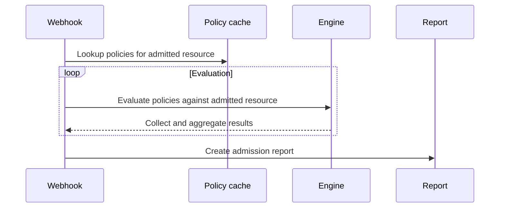
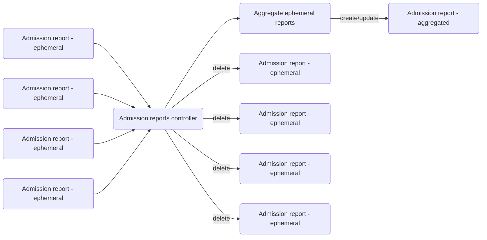
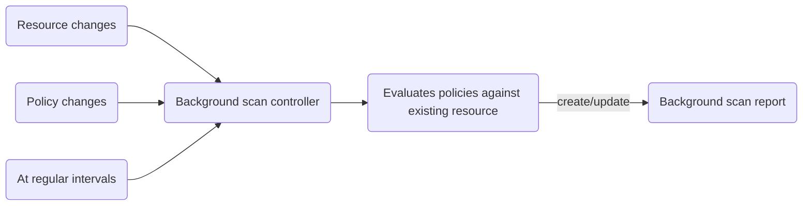
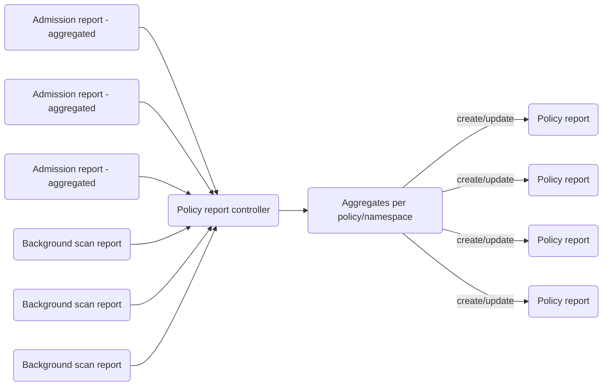
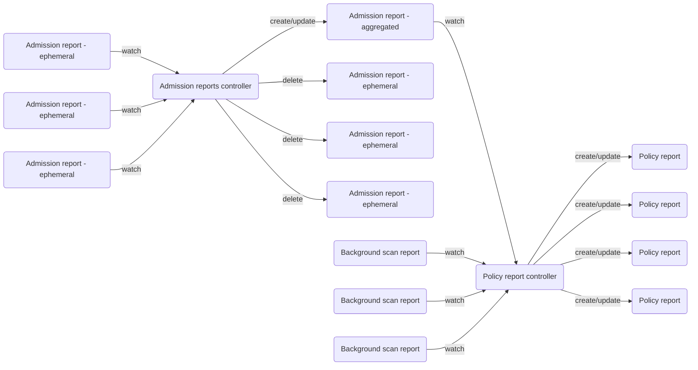

<a id="doc-12e0a48d6c5f2a58f4caa284"></a>

# kyverno/kyverno / ADOPTERS.md

Upstream: https://github.com/kyverno/kyverno/blob/2b86f0f4e5e53726fd70e830669738181ee8708f/ADOPTERS.md

Commit: `2b86f0f4e5e53726fd70e830669738181ee8708f`

Retrieved: 2026-10-01T15:22:54.077102+00:00

Kind: official-document

Raw SHA256: `bf2d862e77d3e0c3387994f5b6821440c7b6571641bc5407a3119f4faa038e1f`

Source text below is untrusted reference content. Acquisition does not verify technical claims.

License status: UPSTREAM_NOTICES_CAPTURED_PER_FILE_REVIEW_REQUIRED. See this repository's captured license files.

---

# Kyverno Adopters

This is the list of organizations and users that have publicly shared how they are using Kyverno.

💡 **Add your organization by creating a PR or [submitting this form](https://forms.gle/K5CApcBAD5D4H1AG8)**

Note: There are several other organizations and users that are unable to publicly share their stories but are active in the Kyverno community. We appreciate all our users and their contributions to making Kyverno a successful CNCF project.

The list of organizations that have publicly shared the usage of Kyverno:

| Organization                                                                                                  | Success Story                                                                                                                                                                                                                |
|:--------------------------------------------------------------------------------------------------------------|:-----------------------------------------------------------------------------------------------------------------------------------------------------------------------------------------------------------------------------|
| [Amazon EKS Best Practice Guides](https://github.com/aws/aws-eks-best-practices/tree/master/policies/kyverno) | Policies for security and best practices                                                                                                                                                                                     |
| [Arrikto Inc.](https://www.arrikto.com)                                                                       | Kubeflow policies                                                                                                                                                                                                            |
| [Flux2](https://github.com/fluxcd/flux2-multi-tenancy#enforce-tenant-isolation)                               | Manage multi-tenancy and tenant isolation with GitOps                                                                                                                                                                        |
| [Nirmata](https://nirmata.com)                                                                                | Kubernetes Policy and Governance                                                                                                                                                                                             |
| [Ohio Supercomputer Center](https://www.osc.edu/)                                                             | Support Kubernetes multi-user workflows through [Open OnDemand](http://openondemand.org/)                                                                                                                                    |
| [Coinbase](https://www.coinbase.com/)                                                                         | Use Kyverno for mutation, to replace hand-written Webhooks, and generation to project common Kubernetes objects into many similar namespaces.                                                                                |
| [Mandiant](https://www.mandiant.com/)                                                                         | Use Kyverno for policy enforcement in all clusters, as well as part of our onboarding systems, populating new namespaces with requisite resources and secrets.                                                               |
| [Giant Swarm](https://www.giantswarm.io/)                                                                     | Use Kyverno extensively to handle defaulting logic on resources (primarily cluster-api resources) and some scenarios to replace PSPs to enforce certain restrictions.                                                        |
| [Vodafone Group Plc](https://www.vodafone.com/)                                                               | Policy enforcement and automation on an internal k8s service offering.                                                                                                                                                       |
| [Deutsche Telekom](https://www.telekom.com/en)                                                                | Use Kyverno to enforce Policies on managed clusters to prevent right escalation of internal customers and to enforce security rules.                                                                                         |
| [VSHN AG - APPUiO Cloud](https://www.vshn.ch/)                                                                | OpenShift Multi-Tenancy Self-Service for [APPUiO Cloud](https://www.appuio.ch), managed with [Project Syn](https://syn.tools). Kyverno policies are available on [GitHub](https://github.com/appuio/component-appuio-cloud). |
| [Bloomberg](https://www.techatbloomberg.com/)                                                                 | Use Kyverno for replacing custom validation and mutation webhooks in their internal Kubernetes based platforms                                                                                                               |
| [Techcombank](https://www.techcombank.com.vn/trang-chu)                                                       | Use Kyverno to enforce security policies rules, Kubernetes best practices for their internal container based workload on Kubernetes                                                                                          |
| [Trendyol](https://www.trendyol.com)                                                                          | In adoption planning to roll out to hundreds of production clusters using GitOps                                                                                                                                             |
| [Rafay Systems](https://rafay.co/)                                                                            | Platform supports centralized deployment of Kyverno across clusters                                                                                                                                                          |
| [Wayfair](https://wayfair.com)                                                                                | Policy enforcement on managed clusters. Replacement of some in-house mutating webhooks.                                                                                                                                      |
| [Yahoo](https://www.yahoo.com/)                                                                               | Use Kyverno for mutation, to replace image tags to digest and also for validation for checking freshness of images.                                                                                                          |
| [T-Systems](https://www.t-systems.com)                                                                        |                                                                                                                                                                                                                              |
| [Red Hat](https://www.redhat.com)                                                                             | Learn more about Red Hat Advanced Cluster Management for Kubernetes for [Generating Governance Policies Using Kustomize and GitOps](https://cloud.redhat.com/blog/generating-governance-policies-using-kustomize-and-gitops).|
| [DE-CIX](https://www.de-cix.net)                                                                              | Kyvernos policy enforcement is used to enforce the company's security guidelines. This is done using validation, mutation and generation techniques.                                                                        |
| [Saxo Bank](https://www.home.saxo/)                                                                           | We use Kyverno to enforce security and best practices.                                                                                                                                                                      |
| [Velux](https://www.velux.com/)                                                                               | We successfully use Kyverno in our clusters for security, best practice enforcement, resource mutation, secret copying and more!                                                                                             |
| [HCS Company](https://www.hcs-company.com/)                                                                   | Policy enforcement and enabling selfservice for DevOps teams.                                                                                                                                                                |
| [Hexagon](https://hexagon.com/)                                                                               | We leverage Kyverno to robustly enforce security policies. Additionally, as a Kubernetes swiss-knife, Kyverno fills our gap in our GitOps workflow by allowing us to apply complex configurations and customizations which are beyond the native capabilities of Kubernetes operators. |
| [Grover Group GmbH](https://www.grover.com)                                                                   | We have been using Kyverno to streamline our K8s security standards and also follow industry best practices for running workloads in K8s using policy enforcements.                                                          |
| [IITS Consulting](https://iits-consulting.de/)                                                                | Security is a piece of cake with Kyverno. Kyverno helped us to implement proper security for different kind of clients (medical/telecommunication/trading...). It solves problems like security enforcement, container image verification, distribution of imagePullSecrets and many more. |
| [LinkedIn](https://www.linkedin.com/)                                                                | Policy enforcement on our on-prem Kubernetes clusters. |
| [Groww](https://groww.in/) | We have implemented Kyverno as a part of Auto compliance. We put policies to satisfy CIS Compliance for GKE as well as block anomalies detected by the Red Team. |
| [Spotify](https://www.cncf.io/announcements/2023/11/08/cloud-native-computing-foundation-presents-the-top-end-user-award-to-spotify/) | Spotify uses Kyverno extensively for its admission controller capabilities, including best practices and environment-specific data. |
| [US DoD Platform One](https://p1.dso.mil/) |  The US Department of Defense (DoD) Platform One uses Kyverno as its default policy engine for Kubernetes. |
| [Censhare](https://www.censhare.com/) | We use Kyverno in almost all possible areas of security and automation, we call Kyverno as a "Multi-tenancy engine" since we host a multi-tenancy environment for our partners and customers. We have deprecated our own tooling that was complicated and hard to maintain, Thanks to Kyverno.  |
| [Coinone](https://coinone.co.kr) | Use Kyverno to enforce security hardening and best practices, and mutate pod specs related to graceful shutdown handling, such as tGPS<sup>terminationGracePeriodSeconds</sup> and custom preStop script. |
| [Davidson consulting](https://www.davidson.group) | We are using Kyverno mutation policies in our pre-production environment to add default NetworkPolicy and to add labels to OKD resources. | 
| [InfraCloud Technologies](https://www.infracloud.io/) | We have successfully implemented Kyverno as a crucial component of our SOC2 compliance, alongside other essential security hardening measures & best practices. Kyverno's policies offer a significantly streamlined implementation process, far exceeding the complexities associated with cloud services. | 
| [North IT](https://www.northit.co.uk/) | North IT use Kyverno to help deploy Kubernetes for our pen-testing and SOC platform. | 
| [Corestream](https://corp.corestream.com/) | At our organization, we've leveraged Kyverno to significantly enhance our Kubernetes-based DevOps practices. We use Kyverno's policy-as-code approach to automate and enforce best practices across our clusters. Our policies cover a wide range of scenarios, from managing Azure Key Vault integrations and secret protections to enforcing image registry restrictions and implementing multi-region deployment strategies. Kyverno allows us to automatically inject configuration, create role-based access controls, and ensure consistent labeling across our resources. This automation not only improves our security posture by preventing misconfigurations and unauthorized changes but also streamlines our deployment processes. By using Kyverno, we've been able to standardize our environments, reduce manual errors, and maintain compliance with our organization's policies. |
| [Tigera](https://www.tigera.io/) | Kubernetes Policy and Governance |
| [kubriX platform](kubrix.io) | Policy enforcement and automation of your kubrix platform using GitOps |
| [OVHcloud](https://www.ovhcloud.com/) | At OVHcloud, we advise our customers to [deploy Kyverno as a policy engine on their Managed Kubernetes (MKS) clusters](https://help.ovhcloud.com/csm/en-gb-public-cloud-kubernetes-install-kyverno?id=kb_article_view&sysparm_article=KB0049839) and we also use it internally to enforce the security of several of our products. |
| [X3M Ads](https://x3mads.com/) | At X3M Ads, we primarily use Kyverno for mutating resources, such as changing pod images to our internal Harbor registry, managing topology distribution and adding node metadata to pods for improved observability. |
| [Tails.com](https://tails.com/) | Big changes start small; we use Kyverno to build up best practices in development environments so that we can easily enforce stringent security measures in our production environments. |
| [ONZACK AG](https://www.onzack.com/) | The operator for everything; we use Kyverno to completely automate resource management (limits & requests). |
| [SingleStore](https://www.singlestore.com/) | We use Kyverno to enforce container images were signed by SingleStore, ensure safer rollouts, and ensure other security practices such as restrict escalation on roles. |
| [Educates Training Platform](https://educates.dev) | Educates is a FOSS Cloud Native Hands-on Training Platform in which we use Kyverno to provide proper workshop isolation between different sessions and enforcing workshop specific related policies |
| [Kubermatic](https://www.kubermatic.com) | Kyverno is fully integrated across platform, project, and cluster levels in KKP - enabling platform teams to declaratively define, automate, and consistently enforce security, compliance, and operational policies across multi-tenant Kubernetes environments, all seamlessly managed through the KKP UI. |
| [Sophotech](https://sopho.tech) | Sophotech leverages Kyverno as a central component of our Kubernetes security strategy. We use it to enforce policies that support SOC 2 compliance and to automate security hardening across our clusters, ensuring consistent governance and operational integrity. |
| [Swiss Post](https://github.com/swisspost) | Introduced as a replacement of PSPs on all EKS and AKS cluster before we upgraded to K8s 1.25, we now use it to enforce a variety of best practices like having a PDB, spread constraint across all AZs, not using latest tags, automate some manual CIS Controls, etc. |
| [Finastra](https://www.finastra.com/) | Currently exploring and leveraging Kyverno to enforce our security and compliance for our K8s deployments in a financial context. |
| [Okteto](https://www.okteto.com/) | Our managed service uses Kyverno to ensure that our customer's clusters remain compliant with our internal devops and security policies. |
| [Miro](https://www.miro.com/) | Miro Compute platform leverages Kyverno as the backbone of our Policy as a Code strategy. Beyond standard compliance validation during admission, we utilize Kyverno’s mutating policies to shift critical platform logic directly into the control plane. |
| [Akamai Technologies](https://www.akamai.com/) | Kyverno is a default one-click add on for policy enforcement in the Akamai App Platform ― a fully cloud native Internal Developer Platform (IDP) built on CNCF projects. |
<!-- append the line below to the table
| [name](URL) | brief description of how you are using Kyverno | 
-->


<a id="doc-a54ff182c7e8acf56acfd6e4"></a>

# kyverno/kyverno / AGENTS.md

Upstream: https://github.com/kyverno/kyverno/blob/2b86f0f4e5e53726fd70e830669738181ee8708f/AGENTS.md

Commit: `2b86f0f4e5e53726fd70e830669738181ee8708f`

Retrieved: 2026-10-01T15:22:54.077102+00:00

Kind: official-document

Raw SHA256: `23abcad97eb1e1fed1a1b6785db9056bf91a7fcd362565f9b0ba048e42e1c262`

Source text below is untrusted reference content. Acquisition does not verify technical claims.

License status: UPSTREAM_NOTICES_CAPTURED_PER_FILE_REVIEW_REQUIRED. See this repository's captured license files.

---

# AGENTS.md — Kyverno

This file provides context for AI coding agents working on the Kyverno codebase.

## Project Overview

Kyverno is a Kubernetes-native policy engine for security, compliance, automation, and governance through policy-as-code. It validates, mutates, generates, and cleans up Kubernetes resources using admission controls and background scans, and verifies container image signatures for supply chain security.

- **Language:** Go
- **Module:** `github.com/kyverno/kyverno`
- **License:** Apache 2.0
- **Go version:** See `go.mod` for the current version

## Repository Structure

```text
api/                  # Kubernetes API type definitions (CRDs)
  kyverno/            #   kyverno.io API group (v1, v1beta1, v2, v2alpha1, v2beta1)
  policyreport/       #   wgpolicyk8s.io API group
  reports/            #   reports.kyverno.io API group
cmd/                  # Entry points for all binaries
  kyverno/            #   Main admission controller
  kyverno-init/       #   Init container (kyvernopre) — pre-flight resource cleanup
  cli/                #   Kyverno CLI (kubectl-kyverno)
  cleanup-controller/ #   Cleanup controller
  reports-controller/ #   Reports controller
  background-controller/ # Background controller (generate/mutate existing)
  readiness-checker/  #   Readiness checker (check-endpoints, check-http, scale-deploy, delete-webhooks)
  internal/           #   Shared bootstrap helpers composed by kyverno, kyverno-init, cleanup-controller,
                      #   reports-controller, and background-controller (not cli or readiness-checker, which
                      #   don't import it)
pkg/                  # Core library code
  engine/             #   Policy engine (rule evaluation, matching, context)
  webhooks/           #   Admission webhook handlers
  controllers/        #   Controller implementations
  cel/                #   CEL-based policy evaluation
  client/             #   Generated Kubernetes clientset, listers, informers for Kyverno's own CRDs and the
                      #   external policies.kyverno.io types (never hand-edit)
  clients/            #   Instrumented client wrappers (metrics/tracing/logging); dclient is the preferred
                      #   entry point for new code needing dynamic/discovery-based access to arbitrary GVKs
  config/             #   Runtime configuration
  toggle/             #   Feature flags
  logging/            #   Structured logging utilities
  metrics/            #   Prometheus metrics
  validation/         #   Policy validation logic
  autogen/            #   Auto-generation of rules for Pod controllers
  image/              #   Image signature/attestation verification (cosign + notary verifiers live under
                      #   image/verifiers/{cpol,ivpol}/{cosign,notary}; pkg/cosign and pkg/notary no longer exist)
  sigstoretuf/        #   TUF root/trust management for sigstore, used by pkg/image's cosign verifiers
  utils/              #   Shared utilities
ext/                  # Small standalone utility packages
charts/               # Helm charts
  kyverno/            #   Main Kyverno chart
  kyverno-policies/   #   Default policies chart
config/               # CRD manifests and install manifests
  crds/               #   Generated CRD YAML files
test/                 # Tests
  cli/                #   CLI test cases (kyverno test)
  conformance/        #   Conformance / e2e tests (chainsaw)
  fuzz/               #   Fuzz tests
  policy/             #   Policy test fixtures
docs/                 # Internal developer documentation
  dev/                #   API design, controllers, logging, feature flags, reports
scripts/              # Build and CI scripts
hack/                 # Code generation helpers
```

## Build System

The project uses `make` extensively. Tools are auto-installed into `.tools/` on first use.

### Key Build Commands

| Command | Description |
|---|---|
| `make build-all` | Build all binaries |
| `make build-kyverno` | Build the main kyverno binary → `cmd/kyverno/kyverno` |
| `make build-kyverno-init` | Build kyvernopre binary → `cmd/kyverno-init/kyvernopre` |
| `make build-cli` | Build CLI binary → `cmd/cli/kubectl-kyverno/kubectl-kyverno` |
| `make build-cleanup-controller` | Build cleanup controller binary |
| `make build-reports-controller` | Build reports controller binary |
| `make build-background-controller` | Build background controller binary |
| `make install-tools` | Install all development tools into `.tools/` |
| `make clean-tools` | Remove installed tools |

### Formatting & Linting

| Command | Description |
|---|---|
| `make fmt` | Run `go fmt ./...` |
| `make vet` | Run `go vet ./...` |
| `make imports` | Fix imports with `goimports` |
| `make fmt-check` | Verify formatting (fails if diff is non-empty) |
| `make imports-check` | Verify imports (fails if diff is non-empty) |
| `make unused-package-check` | Run `go mod tidy` check |

Linting is configured via `.golangci.yml` (golangci-lint v2). Enabled linters include `gosec`, `misspell`, `paralleltest`, `unconvert`, `errname`, `importas`, and others. The `importas` linter enforces specific import alias conventions — see `.golangci.yml` for the full alias rules.

Formatters enabled: `gci`, `gofmt`, `gofumpt`, `goimports`.

**Pre-commit checklist (required for code changes):**

- Run `make imports fmt` before committing.
- Run `make imports-check fmt-check` and ensure both pass.

**Pre-PR checks (required before opening/updating a PR):**

- Run `make codegen-all-code` then `make verify-codegen`.
- Run `./.tools/golangci-lint run` (install first with `make install-tools` if needed).


### Testing

| Command | Description |
|---|---|
| `make test-unit` | Run all unit tests with race detector and coverage |
| `make test-cli` | Run all CLI tests |
| `make test-cli-local` | Run local CLI test suite |
| `make test-clean` | Clear Go test cache |
| `make helm-test` | Run Helm chart tests |

- **Unit tests:** `go test -race -covermode atomic -coverprofile coverage.out ./...`
- **CLI tests:** Use `kubectl-kyverno test` against test fixtures in `test/cli/`
- **Conformance/E2E tests:** Use [chainsaw](https://kyverno.github.io/chainsaw/latest/quick-start/) in `test/conformance/`
- **Fuzz tests:** Located in `test/fuzz/`

### Code Generation

Code generation is heavily used. **Always run codegen after modifying API types.**

| Command | Description |
|---|---|
| `make codegen-all` | Run all code generation (code + docs) |
| `make codegen-all-code` | Generate all code (API, clients, CRDs, CLI, helm, manifests) |
| `make codegen-api-all` | Generate API register and deepcopy functions |
| `make codegen-client-all` | Generate clientset, listers, informers, wrappers |
| `make codegen-crds-all` | Generate all CRD manifests |
| `make codegen-helm-all` | Generate Helm chart CRDs and docs |
| `make verify-codegen` | Verify generated code is up to date (CI check) |

Generated files follow these patterns:
- `zz_generated.deepcopy.go` — deep copy functions in API packages
- `zz_generated.register.go` — API type registrations
- `pkg/client/` — generated clientset, listers, informers
- `config/crds/` — generated CRD YAML manifests

### Docker Images (ko)

| Command | Description |
|---|---|
| `make ko-build-all` | Build all local images with ko |
| `make ko-build-kyverno` | Build kyverno image locally |
| `make ko-publish-all` | Build and publish all images |

### Local Development with KinD

| Command | Description |
|---|---|
| `make kind-create-cluster` | Create a local KinD cluster |
| `make kind-delete-cluster` | Delete the KinD cluster |
| `make kind-load-all` | Build and load all images into KinD |
| `make kind-deploy-kyverno` | Build, load, and deploy Kyverno via Helm |
| `make kind-deploy-all` | Deploy Kyverno + default policies |

Override `KIND_IMAGE` for k8s version, `KIND_NAME` for cluster name.

## Architecture

See **[ARCHITECTURE.md](./ARCHITECTURE.md)** for the full map: runtime boundaries for every binary, how `pkg/`
is layered (including the legacy `pkg/engine` vs. the newer CEL `pkg/cel` stack), sanctioned defaults (which
client package to use, how feature flags and user-facing events work), and the confirmed generated/no-edit zones.
Read it before making a structural change; don't restate it here as this section drifts otherwise.

### Nested AGENTS.md files

These packages have real, package-specific gotchas that don't belong at root scope — read the relevant one before
working in that area: [`api/`](./api/AGENTS.md), [`pkg/engine/`](./pkg/engine/AGENTS.md),
[`pkg/cel/`](./pkg/cel/AGENTS.md), [`pkg/webhooks/`](./pkg/webhooks/AGENTS.md),
[`pkg/background/`](./pkg/background/AGENTS.md), [`pkg/image/`](./pkg/image/AGENTS.md),
[`pkg/clients/`](./pkg/clients/AGENTS.md), [`pkg/toggle/`](./pkg/toggle/AGENTS.md),
[`pkg/controllers/`](./pkg/controllers/AGENTS.md),
[`cmd/cli/kubectl-kyverno/exception/`](./cmd/cli/kubectl-kyverno/exception/AGENTS.md). Every claim in them is grounded in code actually read in the
session that wrote them, not inferred from directory structure — if one goes stale, fix it in place rather than
letting drift accumulate the way the old `pkg/cosign`/`cmd/tools` references did.

## API Design Rules

API types for `kyverno.io`, `policyreport` (`wgpolicyk8s.io`), and `reports.kyverno.io` live in `api/` with
versioned packages. **`policies.kyverno.io` (the CEL-based types) does not** — it lives in the external
`github.com/kyverno/api` module; see `api/AGENTS.md`. For versioning/stability/deprecation rules, see
[docs/context/shared/api-versioning.md](./docs/context/shared/api-versioning.md) — the single canonical copy;
don't restate rules here.

## Coding Conventions

- **Import aliases:** Enforced by `importas` linter. Key patterns:
  - `github.com/kyverno/kyverno/api/<group>/<version>` → `<group><version>` (e.g., `kyvernov1`)
  - `k8s.io/api/<group>/<version>` → `<group><version>` (e.g., `corev1`)
  - See `.golangci.yml` for the full alias table
- **Logging:** Uses `logr` with `zerologr` backend. Default level is 2. See `docs/dev/logging/logging.md`:
  - L0: Errors (with stack traces)
  - L2: Startup info, policy application results
  - L3: Variable evaluation, intermediate decisions
  - L4+: Debugging, execution path details
- **Feature flags:** Managed via the `pkg/toggle` package. Feature toggles are backed by environment variables and CLI flags. See `docs/dev/feature-flags/README.md`.
- **CGO:** Disabled (`CGO_ENABLED=0`)
- **Generated code:** Never edit files matching `zz_generated.*` or content in `pkg/client/` manually. Run `make codegen-all` instead.

## Pull Request Guidelines

- Provide proof manifests for maintainers to verify changes
- New/changed functionality requires a corresponding documentation issue/PR on the [website repo](https://github.com/kyverno/website)
- Test changes with the Kyverno CLI; provide test manifests
- For e2e-testable changes, write conformance tests using [chainsaw](https://kyverno.github.io/chainsaw/latest/quick-start/) in `test/conformance/`
- Run `make verify-codegen` to ensure generated code is up to date before submitting

### PR Failure-Prevention Checklist (DCO + Codegen + CI)

Use this checklist before every push to avoid repeated CI failures:

1. **Always sign commits (DCO)**
   - Create commits with signoff: `git commit -s ...`
   - Verify signoff trailers exist:
     `git log --format='%h %s%n%b' origin/main..HEAD | grep -n "Signed-off-by"`
   - If you forgot signoff on local commits, add it before pushing:
     `git rebase --signoff <base-commit-or-branch>`

2. **Run full codegen verification**
   - Run `make codegen-all` (not just `codegen-all-code`) when docs/manifests may be affected.
   - Run `make verify-codegen` and ensure it exits cleanly with no git diff.

3. **Run required pre-push checks**
   - `make imports fmt`
   - `make imports-check fmt-check`
   - Relevant test targets for changed areas (unit/CLI/chainsaw as applicable).

4. **Keep PR branch clean and reviewable**
   - Avoid merging `main` into the PR branch unless required; prefer rebasing.
   - Keep local-only artifacts untracked (for example, `.claude-*` folders).
   - Re-check status before push: `git status --short`.

5. **Confirm GitHub checks after push**
   - Inspect checks quickly: `gh pr checks <pr-number> -R kyverno/kyverno`
   - If a check fails, fetch failing logs immediately and fix in the next commit.

## Useful References

- [ARCHITECTURE.md](./ARCHITECTURE.md) — Runtime boundaries, `pkg/` domain layering, sanctioned defaults, no-edit zones
- [Development Guide](./DEVELOPMENT.md) — Full build, test, debug, and deploy instructions
- [Contributing Guide](./CONTRIBUTING.md) — Contribution process and PR guidelines
- [API Design](./docs/dev/api/README.md) — API versioning and extension rules
- [Controllers Design](./docs/dev/controllers/README.md) — Controller list and internals
- [Logging](./docs/dev/logging/logging.md) — Logging levels and conventions
- [Feature Flags](./docs/dev/feature-flags/README.md) — How to add and use feature toggles
- [Reports Design](./docs/dev/reports/README.md) — Report architecture
- [Kyverno Docs](https://kyverno.io) — User-facing documentation


<a id="doc-8f6366fd8e7a5fa30f7f0587"></a>

# kyverno/kyverno / ARCHITECTURE.md

Upstream: https://github.com/kyverno/kyverno/blob/2b86f0f4e5e53726fd70e830669738181ee8708f/ARCHITECTURE.md

Commit: `2b86f0f4e5e53726fd70e830669738181ee8708f`

Retrieved: 2026-10-01T15:22:54.077102+00:00

Kind: official-document

Raw SHA256: `f1a404e614fe792119c1118fd805031ced459cc8004c92f80de03f1e19045e2e`

Source text below is untrusted reference content. Acquisition does not verify technical claims.

License status: UPSTREAM_NOTICES_CAPTURED_PER_FILE_REVIEW_REQUIRED. See this repository's captured license files.

---

# Architecture

A navigable map of how kyverno/kyverno is put together: the binaries it ships, how `pkg/` is layered, which
mechanisms are sanctioned for new code, and which parts of the tree are generated and must never be hand-edited.

This file describes **what exists today**, verified against code in this session. For narrower, per-package detail
see the nested `AGENTS.md` files linked from each section, and `docs/context/` for cross-cutting write-ups. ADRs for
*why* a non-obvious structural choice was made don't exist yet.

## Runtime boundaries (`cmd/`)

Kyverno ships as several independently deployed binaries. Most are composed from shared helpers in `cmd/internal/`
(`internal.WithKubeconfig()`, `internal.WithKyvernoClient()`, ...): `kyverno`, `kyverno-init`, `cleanup-controller`,
`reports-controller`, and `background-controller` all import it. `kubectl-kyverno` (the CLI) and `readiness-checker`
do not — both do their own minimal, standalone setup instead.

| Binary | Source | Purpose |
|---|---|---|
| `kyverno` | `cmd/kyverno/` | The admission controller. Runs the webhook server (sync validate/mutate), policy/report/webhook/certmanager controllers, and the CEL-based engines (`pkg/cel/policies/{vpol,mpol,gpol,ivpol}`) alongside the legacy `kyverno.io` engine. |
| `kyvernopre` | `cmd/kyverno-init/` | Init container. Cleans up stale webhook configurations before the admission controller starts. |
| `kubectl-kyverno` | `cmd/cli/kubectl-kyverno/` | Offline CLI for applying/testing policies without a cluster. Built on library code in `pkg/cli` (distinct from the `cmd/cli` command tree itself). |
| `cleanup-controller` | `cmd/cleanup-controller/` | Reconciles `CleanupPolicy`/`ClusterCleanupPolicy`, runs a cleanup-policy validation webhook, and handles CronJob-invoked cleanup plus the CEL `dpol` (DeletingPolicy) engine. |
| `reports-controller` | `cmd/reports-controller/` | Produces and aggregates `PolicyReport`/`ClusterPolicyReport` from admission and background scans. |
| `background-controller` | `cmd/background-controller/` | Processes `generate` and `mutate-existing` rules against already-existing resources via `UpdateRequest`s, plus the CEL `gpol`/`mpol` background paths. |
| `readiness-checker` | `cmd/readiness-checker/` | Small utility binary used by probes/Helm hooks: `check-endpoints`, `check-http`, `scale-deploy`, `delete-webhooks`. |

## Domain layering (`pkg/`)

Roughly bottom-up; lower layers have few or no dependencies on higher ones.

**Foundational (near-leaf):** `logging` (logr + zerologr backend, everything depends on it), `toggle` (feature-flag
registry — see [pkg/toggle/AGENTS.md](pkg/toggle/AGENTS.md)), `config` (runtime/ConfigMap config), `tracing` /
`metrics` (OpenTelemetry + Prometheus, used pervasively by `pkg/clients`), `tls`, `leaderelection`, `deprecations`
(maps legacy `kyverno.io` kinds to their `policies.kyverno.io` replacements), `breaker`, `informers`, `profiling`,
`pss`, `auth`, `userinfo`.

**Client access:** `pkg/client/` is 100% generated typed clientset/informers/listers, covering both kyverno's own CRDs
and the externally-defined `policies.kyverno.io` types from `github.com/kyverno/api` — never hand-edited, regenerate
via `make codegen-client-all`. `pkg/clients/` is a second, distinct generation layer (instrumented metrics+tracing
+logging wrapper clients, produced by `hack/client-wrapper`) that actually gets consumed by business logic.
`pkg/clients/dclient` is hand-written and is the dominant pattern for new code needing dynamic/discovery-based access
across arbitrary GVKs; it embeds no instrumentation decorators of its own, but every controller binary constructs it
via `cmd/internal.Setup`, which hands it already metrics/tracing-wrapped dynamic and kube clients (the CLI binary,
`kubectl-kyverno`, does not use this path) — see [pkg/clients/AGENTS.md](pkg/clients/AGENTS.md) for the exact
boundary. **Prefer `pkg/clients/dclient.Interface` for
generic resource access, or the typed `pkg/clients/{kube,kyverno}` wrappers when the type is known — never construct
a raw `pkg/client`/`k8s.io/client-go` client directly in new controller/webhook code** (accepting one of those
packages' *interface* types as a function parameter is fine and common — the generated wrappers embed those same
interfaces — the rule is about what constructs the concrete client, not what type a function signature names).

**Policy engine core:** `pkg/engine` is the legacy (`kyverno.io`) rule-evaluation engine — JMESPath variable
substitution, pattern/anchor matching, mutate patch generation, external API/context calls. `pkg/cel` is the newer,
parallel CEL-based engine stack for `policies.kyverno.io` types, split by policy kind: `vpol`
(ValidatingPolicy), `mpol` (MutatingPolicy), `gpol` (GeneratingPolicy), `dpol` (DeletingPolicy), `ivpol`
(ImageValidatingPolicy). It sits alongside `pkg/engine`, not layered under it — both are invoked from `cmd/kyverno`
and the other controller binaries for their respective policy families. See [pkg/engine/AGENTS.md](pkg/engine/AGENTS.md)
and [pkg/cel/AGENTS.md](pkg/cel/AGENTS.md). `pkg/admissionpolicy` bridges CEL policy authoring to native Kubernetes
`ValidatingAdmissionPolicy`/`MutatingAdmissionPolicy`. `pkg/autogen` (and `pkg/cel/autogen`) compute autogen rules
for Pod-controller kinds. `pkg/image` holds all image signature/attestation verification — cosign and notary
verifiers live under `pkg/image/verifiers/{cpol,ivpol}/{cosign,notary}` (not `pkg/cosign`/`pkg/notary`, which no
longer exist); `pkg/sigstoretuf` handles TUF trust-root management for the cosign verifiers. See
[pkg/image/AGENTS.md](pkg/image/AGENTS.md).

**Policy lifecycle / admission:** `pkg/policy`, `pkg/validation`, `pkg/exceptions` (`PolicyException` matching),
`pkg/policycache` (informer-driven in-memory cache read at webhook time), `pkg/globalcontext` (`GlobalContextEntry`
caching for JMESPath/CEL context). `pkg/webhooks` holds the actual `AdmissionReview` HTTP handlers — the
synchronous validate/mutate path returns immediately, while generate/mutate-existing rules are queued as
`UpdateRequest`s for `pkg/background` to process asynchronously. See [pkg/webhooks/AGENTS.md](pkg/webhooks/AGENTS.md)
and [pkg/background/AGENTS.md](pkg/background/AGENTS.md). `pkg/controllers/*` wires all of the above into
controller-runtime-style reconcilers; see [pkg/controllers/AGENTS.md](pkg/controllers/AGENTS.md) for the
subdirectory → responsibility → leader-election map.

**Reporting:** `pkg/openreports` adapts Kyverno's internal report model to the upstream `openreports.io` API,
consumed by `pkg/controllers/report/*` and `cmd/reports-controller`.

**Cross-cutting outcomes:** `pkg/event` is the sanctioned way engine/webhook/background code surfaces user-facing
pass/fail/block outcomes as Kubernetes Events (`event.NewPolicyFailEvent(...)` etc.) — plain Go `error` handling
remains standard everywhere else; `pkg/event` is specifically for recording a policy *decision*, not general error
propagation.

## API layer (`api/`)

```text
api/kyverno/{v1,v1beta1,v2,v2alpha1,v2beta1}
api/policyreport/v1alpha2   (wgpolicyk8s.io)
api/reports/v1              (reports.kyverno.io)
```

**`policies.kyverno.io` (the CEL-based types — ValidatingPolicy, MutatingPolicy, GeneratingPolicy, DeletingPolicy,
ImageValidatingPolicy, PolicyException, and their Namespaced\* variants) is NOT in this repo.** It lives in the
external `github.com/kyverno/api` module (pinned in `go.mod`), imported as e.g.
`policiesv1beta1 "github.com/kyverno/api/api/policies.kyverno.io/v1beta1"`. It was split out deliberately so
external Go projects can import Kyverno's API types without the whole controller dependency tree (no backfilled ADR
exists for this yet — see [docs/context/shared/repo-boundaries.md](docs/context/shared/repo-boundaries.md) for the
current writeup). Only the generated CRD manifests (`config/crds/policies.kyverno.io/*.yaml`) and consuming Go code
remain here.

Versioning rules (convention, enforced by reviewers, not tooling): new types are never added to `v1`/`v2`, only to
`v2alpha1` and promoted as they stabilize; at beta/stable tiers, attributes can be added but never deleted/modified
within a version (deprecate and remove after the tier's notice period instead — alpha tiers have no such
guarantee); newer versions may reference older stable types, never the
reverse. Full detail, kept in one place: [docs/context/shared/api-versioning.md](docs/context/shared/api-versioning.md).
See also [api/AGENTS.md](api/AGENTS.md).

## Sanctioned defaults

- **Client access:** `pkg/clients/dclient` for dynamic/discovery-based access; typed `pkg/clients/{kube,kyverno}`
  wrappers when the type is known. Never construct a raw `pkg/client`/`client-go` client in new code (accepting
  those interface types as a parameter is fine — see the client-access section above).
- **Logging:** `logr` API, `zerologr` backend for app logs, `klogr` for client-go/K8s library logs. Levels: L0
  errors, L2 startup/policy-application results, L3 variable evaluation/intermediate decisions, L4+ deep debugging.
  Full detail: [docs/dev/logging/logging.md](docs/dev/logging/logging.md).
- **Feature flags:** `pkg/toggle` — env var + CLI flag + a method on the `Toggles` interface, read via
  `toggle.FromContext(ctx).<Feature>()` — is the preferred mechanism for shared, env-backed toggles (a separate
  container-argument-only convention also exists for flags that don't need this). Full detail:
  [docs/dev/feature-flags/README.md](docs/dev/feature-flags/README.md), and [pkg/toggle/AGENTS.md](pkg/toggle/AGENTS.md)
  for implementation gotchas.
- **User-facing outcomes:** `pkg/event`, not ad hoc logging (see above).
- **Outbound HTTP:** `pkg/tracing`'s OTel-instrumented `http.RoundTripper`, used by `pkg/engine/apicall` for
  external context calls. There is no separate generic HTTP client package beyond this.

## Generated / no-edit zones

Confirmed via `DO NOT EDIT` headers and Makefile targets:

| Path | Regenerate with |
|---|---|
| `pkg/client/{clientset,informers,listers}/**` | `make codegen-client-all` |
| `api/**/zz_generated.{deepcopy,register}.go` | `make codegen-api-all` |
| `pkg/config/mocks/mock_config.go` | no `make` target — see note below |
| `config/crds/**/*.yaml` | `make codegen-crds-all` |
| `cmd/cli/kubectl-kyverno/config/crds/**`, `cmd/cli/kubectl-kyverno/data/crds/**` | `make codegen-cli-all` (the CLI's own controller-gen output, then copied from `config/crds/`) |
| `charts/kyverno/charts/crds/templates/{kyverno.io,reports.kyverno.io,wgpolicyk8s.io}/**` | `make codegen-helm-crds` (the chart's own CRD copies; `_helpers.tpl` in the same dir is hand-written) |
| `config/install-latest-testing.yaml` | `make codegen-manifest-all` |
| `docs/user/crd/**` (HTML reference) | `make codegen-api-docs` |
| `charts/**/README.md` (`helm-docs --chart-search-root charts` generates 4: the two top-level charts plus the nested `charts/kyverno/charts/{crds,grafana}/README.md`) | `make codegen-helm-all` (helm-docs) |

`pkg/config/mocks/mock_config.go` carries a `Code generated by MockGen. DO NOT EDIT.` header, but there's no
`go:generate` directive and no Makefile target that produces it (`mockgen` isn't in `make install-tools`'s tool
list) — it's the repo's only gomock file and was evidently generated by hand once and committed. Regenerating it
means installing `mockgen` yourself and rerunning it against `pkg/config/config.go`.

`pkg/clients/**/*.generated.go` and `pkg/clients/**/interface.generated.go` (produced by `hack/client-wrapper` via
`make codegen-client-wrappers`) belong on this list too, even though — unlike everything else above — they carry no
`DO NOT EDIT` header today. Treat them as generated regardless. `.claude/settings.json`'s `permissions.deny` rules
enforce every path in this table for Claude Code sessions, independent of whether a header is present.

## Ownership

`CODEOWNERS` is the enforced source of truth for review requirements. [OWNERS.md](OWNERS.md) is the readable
subsystem-ownership map (who owns what area) that `docs/context/components/*.md` files cite. `MAINTAINERS.md`
redirects to `kyverno/community`'s org-wide maintainer list — a different, narrower purpose than `OWNERS.md`.

## Related repositories

Kyverno's code and process live in more than one GitHub repo. See
[docs/context/shared/repo-boundaries.md](docs/context/shared/repo-boundaries.md) for the full list and why each is
separate — most importantly `kyverno/api` (CEL policy CRD types) and `kyverno/KDP` (design proposals: any new design
work belongs there, not in a new in-repo proposal process).

## Test architecture

`test/cli/` (fixtures for `kubectl-kyverno test`), `test/conformance/chainsaw/` (the e2e conformance suite — 1000+
`chainsaw-test.yaml` cases, the largest single source of truth for runtime behavior), `test/fuzz/` (Go native fuzz +
OSS-Fuzz), `test/policy/` (reusable hand-authored policy fixtures), `test/integration/` (Go integration tests for
the CEL policy kinds). See [docs/dev/README.md](docs/dev/README.md) and the
[chainsaw quick-start](https://kyverno.github.io/chainsaw/latest/quick-start/) for how to add a conformance case —
there's no co-located skill for this yet.


<a id="doc-06572a96a58dc510037d5efa"></a>

# kyverno/kyverno / CHANGELOG.md

Upstream: https://github.com/kyverno/kyverno/blob/2b86f0f4e5e53726fd70e830669738181ee8708f/CHANGELOG.md

Commit: `2b86f0f4e5e53726fd70e830669738181ee8708f`

Retrieved: 2026-10-01T15:22:54.077102+00:00

Kind: official-document

Raw SHA256: `edcd9b532fc893b963402575af5192f7073173f7410d8a6e719e2d5208c775d9`

Source text below is untrusted reference content. Acquisition does not verify technical claims.

License status: UPSTREAM_NOTICES_CAPTURED_PER_FILE_REVIEW_REQUIRED. See this repository's captured license files.

---

## v1.13.0

### Note

- Removed deprecated flag `reportsChunkSize`.
- Added `--tufRootRaw` flag to pass tuf root for custom sigstore deployments.

### Bug Fixes
- Fixed inconsistent ordering of `imagePullSecrets` in Helm charts which could cause GitOps tools like ArgoCD to show OutOfSync status ([#12995](https://github.com/kyverno/kyverno/issues/12995))

## v1.11.0

## v1.11.0-rc.1

### Note

- Added `--tufRoot` and `--tufMirror` flags to configure tuf for custom sigstore deployments.
- Remove description from deprecated fields in CRDs
- Remove CLI `kyverno test manifest ...` commands (replaced by `kyverno create ...`).
- Added `--caSecretName` and `--tlsSecretName` flags to control names of certificate related secrets.
- Added match conditions support in kyverno config map.
- Deprecated flag `--imageSignatureRepository`. Will be removed in 1.12. Use per rule configuration `verifyImages.Repository` instead.
- Added `--aggregateReports` flag for reports controller to enable/disable aggregated reports (default value is `true`).
- Added `--policyReports` flag for reports controller to enable/disable policy reports (default value is  `true`).
- Renamed CLI flag `--compact` to `--detailed-results` (and changed default value from `true` to `false`).
- Changed the default value of `--enablePolicyException` from `false` to `true`.

## v1.10.0

## v1.10.0-rc.1

### Note

- Removed `GenerateRequest` CRD.
- Refactored `kyverno` chart, migration instructions are available in chart `README.md`.
- Image references in the json context are not mutated to canonical form anymore, do not assume a registry domain is always present.
- Added support for configuring webhook annotations in the config map through `webhookAnnotations` stanza.
- Added `excludeRoles` and `excludeClusterRoles` support in configuration.
- Added new flag `skipResourceFilters` to reports controller to enable/disable considering resource filters in the background (default value is `true`)
- Removed hardcoded defaults for `excludeGroups` and `excludeUsernames`. They are always read from the config map.

## v1.9.0-rc.1

### Note

- Flag `backgroundScanInterval` was added to force background scans at regular intervals (default value is `1h`).
- Flag `splitPolicyReport` was removed, was unused and marked for removal in 1.9.
- Webhook is no longer updated to match `pods/ephemeralcontainers` when policy only specifies `pods`. If users want to match on `pods/ephemeralcontainers`, they must specify `pods/ephemeralcontainers` in the policy.
- Webhook is no longer updated to match `services/status` when policy only specifies `services`. If users want to match on `services/status`, they must specify `services/status` in the policy.
- Flag `autogenInternals` was removed, policy mutation has been removed.
- Flag `leaderElectionRetryPeriod` was added to control leader election renewal frequency (default value is `2s`).
- Support upper case `Audit` and `Enforce` in `.spec.validationFailureAction` of the Kyverno policy, failure actions `audit` and `enforce` are deprecated and will be removed in `v1.11.0`.
- Flag `profileAddress` was added to configure address of profiling server (default value is `""`).

## v1.8.1-rc3

### Note

- A new flag `backgroundScanWorkers` to configure the number of background scan workers (default value is `2`).

## v1.8.0-rc3

### Note

- A new flag `backgroundScan` to enable/disable kyverno background scans (default value is `true`). When this is set to `false`, kyverno will not perform background scans and won't trigger continuous evaluation of policies.
- A new flag `admissionReports` to enable/disable kyverno admission reports (default value is `true`). When this is set to `false`, kyverno will not create admission reports.
- If both `backgroundScan` and  `admissionReports` are set to `false` the entire reports system will be disabled.
- A new flag `reportsChunkSize` to split reports according to the number of results contained in the report (default value is `1000`). This can be disabled by setting the flag value to `0`.
- Deprecated `splitPolicyReport` flag, splitting reports per policy is always enabled, keeping it for backward compatibility, will be removed in future version.
- `ReportChangeRequest` and `ClusterReportChangeRequest` CRDs have been removed and replaced by `AdmissionReport`, `ClusterAdmissionReport`, `BackgroundScanReport` and `ClusterBackgroundScanReport` CRDs.

## v1.8.0-rc1

### Note

- A new flag `protectManagedResources` to enable kyverno managed resources protection (default value is `false`). When this is enabled, kyverno managed resources can only be modified or deleted by the controller.

## v1.7.2-rc2

### Note

- A new flag `maxQueuedEvents` is added to the Kyverno main container, this flag sets the up-limit of the events that are queued internally.

## v1.7.2-rc1

### Note

- A new flag `maxReportChangeRequests` is added to the Kyverno main container, this flag sets the up-limit of reportchangerequests that a namespace can take, or clusterreportchangerequests if matching kinds are cluster-wide resources. The default limit is set to 1000, and it's recommended to configure it to a small threshold on large clusters. Here the large clusters are considered that a policy report has more than 1k results. 

## v1.7.0-rc1

### Note

- `status.ready` of the policy is deprecated in favor of `policy.IsReady()`. The implementation was changed to use `status.conditions` that offer more flexibility. The `status.ready` will be kept for a couple of releases until we remove it in the future.
- Deprecated flags have been removed.
- Flags that were overlapping with config map based configuration were removed (`filterK8sResources`, `excludeGroupRole`, `excludeUsername`). They can now be configured using the config map only.

## v1.6.0-rc1
### Note
- Helm charts are changed to enforce PodDisruptionBudget for multi-replica clusters and PDB is removed from install manifests.
- `anyPattern` for Kyverno validate policies breaks in Kubernetes `v1.23.0`-`v1.23.2`, and the fix is being tracked by this [PR](https://github.com/kubernetes/kubernetes/pull/107688) and will be available in `v1.23.3`.
- To use `any/all` conditions for policies that use `preconditons` and `deny.conditions`, the user can go to this [resource](https://kyverno.io/docs/policy-types/cluster-policy/preconditions/#any-and-all-statements) as a good starting point.
## v1.5.0-rc1
### Note
- The Helm CRDs was switched back to kyverno chart. To upgrade using Helm, please refer to https://github.com/kyverno/website/pull/304.
- With the change of dynamic webhooks, the readiness of the policy is reflected by `.status.ready`, When ready, it means the policy is ready to serve the admission requests.

### Deprecation
- To add a consistent style in flag names the following flags have been deprecated `webhooktimeout`, `gen-workers`,`disable-metrics`, `background-scan`, `auto-update-webhooks`, `profile-port`, `metrics-port` these will be removed in 1.6.0. The new flags are `webhookTimeout`, `genWorkers`, `disableMetrics`, `backgroundScan`, `autoUpdateWebhooks`,`profilePort`, `metricsPort` (#1991).

### Features
- Feature/foreach validate #2443
- Feature/foreach mutate #2493
- Feature/cosign attest #2487
- Make webhooks configurable #1981
- FailurePolicy `Ignore` vs `enforcing` policies #893
- Make failurePolicy configurable per Kyverno policy #1995
- Add feature gate flag "auto-update-webhooks" #2321
- Extend the "kyverno test" command to handle mutate policies #1821

### Enhancements
- Integrate Github Action #2349
- Use a custom repository with verifyImages #2294
- Add pod anti-affinity to Kyverno #1966
- Rename 'policies.kyverno.io/patches' to reflect actual functionality #1528
- Add global variables to CLI #1472
- Allow configuration of test image through chart values #2410
- Switch Helm CRDs back to kyverno chart and moving Policies to dedicated chart #2355
- Updating Contribution Markdown #2450
- Validate GVK in `match`/`exclude` block #2389
- Add `PodDisruptionBudget` in Kustomize & Helm #1979
- Upgrade Kyverno managed webhook configurations to v1 #2424
- Allow background scanning if only request.operation is used in preconditions #1883
- Add security vulnerability scan for the kyverno images #1557
- Run vulnerability scan during Kyverno builds #2432
- Sign Kyverno images and generate SBOM #2175
- Make flag name styles consistent #1991
- Improve init container to use DeleteCollection to remove policy reports #2477
- Leader election for initContianer #1965
- Sample policies should have related CLI apply/test #1994


### Bug Fixes
- Autogen-controllers does not work with "any" rules #2337
- Use `patchesJson6902` where path contains a non-zero index number causes validation failure #2100
- CLI apply command - not filtering the resources from cluster #2417
- Kyverno ConfigMap name not consistent in Helm/Docs and install.yaml #2347
- Fixing helm chart documentation inconsistency #2419
- Create/Update policy failing with custom JMESPath #2409
- GenerateRequests are not cleaned up #2332
- NetworkPolicy: from should be an array of objects #2423
- Kyverno misinterprets pod spec environment variable placeholders as references #2413
- CLI | skipped policy message is displayed even if variable is passed #2445
- Update minio to address vulnerabilities #1953
- No warning about background mode when using `any` / `all` in `match` or `exclude` blocks #2300
- Flaky unit test #2406
- Generating a Kyverno Policy throws error "Policy is unstructured" #2155
- Network policy is not getting generated on creation of a pod #2095
- Namespace generate policy fails with `request.operation` precondition #2226
- Fix `any`/`all` matching logic in the background controller #2386
- Run code-generator for 1.5 schema changes #2465
- Generate policies with no Namespace field #2333
- Excluding clusterRoles does not work if nested under any or all #2301
- Fix auto-gen for `validate.foreach` #2464
- "Auto-gen rules for pod controllers" fails when matching kind is "v1/Pod" #2415
- Set Namespace environment variable for initContainer #2499


### Others
- Cannot add label to nodes #2397
- Purge grafana dashboard json from this project #2399


Thanks to all our contributors! 😊

## v1.4.3

## v1.4.3-rc2

### Bug Fixes
- Fix any/all conversion during policy mutation (#2392)
- Fix upgrade issue from 1.4.2 to latest (#2384)

## v1.4.3-rc1

### Enhancements 
- CLI variables should be coming from the resources itself (#1996)
- Adding `ownerRef` with namespace for Kyverno managed webhook configurations (#2263)
- Support new policy report CRD #1753, (#2376)
- Clean up formatting in mutate test file (#2338)
- Add test case for non zero index patches with patchesJson6902 (#2339)
- Cleanup Kustomization configurations (#2274)
- Kyverno CLI `apply` command improvements (#2342, #2331, #2318, #2310, #2296, #2290, #2122, #2120, #2367)
- Validate `path` element begins with a forward slash in `patchesJson6902` (#2117)
- Support gvk in CLI for policies applied on cluster (#2363)
- Update cosign (#2266)
- Allow users to skip policy validation when mutating resources (#2185)
- Allow NetworkPolicy customization (#2287)
- Patch labels to Helm templates (#2262)
- Support for configurable automatic refresh of metrics and selective exposure of metrics at namespace-level (#2268)
- Support global anchor behavior in validation and mutation rules (#2201)


### Bug Fixes
- Unable to use `GreaterThan` operator with `precondition` (#2211)
- Fix `precondition` logic for mutating policies (#2271, #2228, #2352)
- Fix Kyverno Deployment updateStrategy (#1982)
- Helm chart releases are not gated behind something like a tag (#2264)
- Add validation for generate loops (#1941)
- Policy doesn't work when `match.resources.kinds` is set to `Policy/ClusterPolicy` (#2149)
- Kyverno CLI panics when context is added to rule, but not actually used (#2289)
- Generate policies with `background:false` and `synchronize:false` are still re-evaluated every 15mins (#2181)
- Tests applied on excluded resources should succeed (#2295)
- Kyverno CLI with context variables needs documentation (#2291)
- Kyverno CLI test requires var resolution for non-applicable resources (#2331)
- Test command result showing `Notfound` in result (#2296)
- `any/all` in match block fails in the CLI (#2350)
- JMESPath `contains` function behavior not consistent in Kyverno vs upstream (#2345)
- `patchStrategicMerge` fails to mutate if policy written with initContainers object (#1916)
- Check Any and All ResourceFilters during policy mutation (#2373)
- Support variable replacement in the key of annotations (#2316)
- Background scan doesn't work with any/all (#2299)


### Others
- Kyverno gives error when installed with KEDA (#2267)
- Using Argo to deploy, baseline policies are constantly out-of-sync (#2234)
- Policy update, flux2-multi-tenancy fails to update kyverno to v1.4.2-rc3 (#2241)
- Throws a variable substitution error in spite of no variable present in the policy (#2374)

## v1.4.2

### Enhancements 
- Remove unused variable from Kyverno CLI (#2252)

## v1.4.2-rc4

### Enhancements
- Update cosign to v1.0.0 (#2221)
- Helm Chart - Add Network Policy Support (#2210)
- Add platform to bug template (#2246)
- Update Grafana dashboard json with respect to new set of metrics (#2244)
- Automate CLI binaries releases (#2236)
- Removing OwnerReference for webhook configurations (#2251)

### Bug Fixes
- Resolve variables from the resource passed in CLI (#2222)
- Fix CLI panics when variables are passed using set flag (#2224)

## v1.4.2-rc3


<a id="doc-6ebdb617a8104a7756d0cf36"></a>

# kyverno/kyverno / CLAUDE.md

Upstream: https://github.com/kyverno/kyverno/blob/2b86f0f4e5e53726fd70e830669738181ee8708f/CLAUDE.md

Commit: `2b86f0f4e5e53726fd70e830669738181ee8708f`

Retrieved: 2026-10-01T15:22:54.077102+00:00

Kind: official-document

Raw SHA256: `336cc4fbf19beaada7ccf9986414fa91851a8d7a07dfb3ccbe800a69eed0ab49`

Source text below is untrusted reference content. Acquisition does not verify technical claims.

License status: UPSTREAM_NOTICES_CAPTURED_PER_FILE_REVIEW_REQUIRED. See this repository's captured license files.

---

@AGENTS.md


<a id="doc-ffdbe3a1e7ee93cacfc080b6"></a>

# kyverno/kyverno / CODE_OF_CONDUCT.md

Upstream: https://github.com/kyverno/kyverno/blob/2b86f0f4e5e53726fd70e830669738181ee8708f/CODE_OF_CONDUCT.md

Commit: `2b86f0f4e5e53726fd70e830669738181ee8708f`

Retrieved: 2026-10-01T15:22:54.077102+00:00

Kind: official-document

Raw SHA256: `4c44ba07f976737b71d33dd9b042de985d71dd38a0756d238944a3f359dfcbde`

Source text below is untrusted reference content. Acquisition does not verify technical claims.

License status: UPSTREAM_NOTICES_CAPTURED_PER_FILE_REVIEW_REQUIRED. See this repository's captured license files.

---

# Code of Conduct

[Kyverno and its sub-projects](https://github.com/kyverno#projects) follow the Code of Conduct published and maintained at https://github.com/kyverno/community/blob/main/CODE_OF_CONDUCT.md.
 


<a id="doc-eca12c0a30e25b4b46522ebf"></a>

# kyverno/kyverno / CONTRIBUTING.md

Upstream: https://github.com/kyverno/kyverno/blob/2b86f0f4e5e53726fd70e830669738181ee8708f/CONTRIBUTING.md

Commit: `2b86f0f4e5e53726fd70e830669738181ee8708f`

Retrieved: 2026-10-01T15:22:54.077102+00:00

Kind: official-document

Raw SHA256: `86e25925254b06446655f6cded2dd066831410ae1bfbd7310963fce0e22d977c`

Source text below is untrusted reference content. Acquisition does not verify technical claims.

License status: UPSTREAM_NOTICES_CAPTURED_PER_FILE_REVIEW_REQUIRED. See this repository's captured license files.

---

# Contributor Guidelines for Kyverno

[Kyverno and its sub-projects](https://github.com/kyverno#projects) follow the contributor guidelines published at: https://github.com/kyverno/community/blob/main/CODE_OF_CONDUCT.md.

Please review the general guidelines before proceeding further to the project specific information below.

### Fix or Improve Kyverno Documentation

The [Kyverno website](https://kyverno.io), like the main Kyverno codebase, is stored in its own [git repo](https://github.com/kyverno/website). To get started with contributions to the documentation, [follow the guide](https://github.com/kyverno/website#contributing) on that repository.

### Developer Guides

To learn about the code base and developer processes, refer to the [development guide](/DEVELOPMENT.md).

### Good First Issues

Maintainers identify issues that are ideal for new contributors with a `good first issue` label.

View all Kyverno [good first issues](https://github.com/kyverno/kyverno/issues?q=is%3Aissue+is%3Aopen+label%3A%22good+first+issue%22).

### Pull Request Guidelines

In the process of submitting your PRs, please read and abide by the template provided to ensure the maintainers are able to understand your changes and quickly come up to speed. There are some important pieces that are required outside the code itself. Some of these are up to you, others are up to the maintainers.

1. Provide Proof Manifests allowing the maintainers and other contributors to verify your changes without requiring they understand the nuances of all your code.
2. For new or changed functionality, this typically requires documentation, so raise a corresponding issue (or, better yet, raise a separate PR) on the [documentation repository](https://github.com/kyverno/website).
3. Test your change with the [Kyverno CLI](https://kyverno.io/docs/kyverno-cli/) and provide a test manifest in the proper format. If your feature/fix does not work with the CLI, a separate issue requesting CLI support must be made. For changes that can be tested as an end user, we require conformance/e2e tests by using the `chainsaw` tool. See the [Chainsaw quick-start guide](https://kyverno.github.io/chainsaw/latest/quick-start/) for how and when to write these tests. If your change touches the CEL admission path (`pkg/cel/policies/*` or `pkg/webhooks/resource/{vpol,mpol}`), see [Performance benchmarks](docs/dev/README.md#performance-benchmarks) for how the `make check-perf` gate works (it runs post-merge, not per pull request) and what to do if it fails.
4. Indicate which release this PR is triaged for (maintainers). This step is important, especially for the documentation maintainers, in order to understand when and where the necessary changes should be made.

## Release Processes

Review the Kyverno release process at: https://kyverno.io/docs/releases/


<a id="doc-c0f86987c556ec52d97b9acf"></a>

# kyverno/kyverno / CONTRIBUTORS.md

Upstream: https://github.com/kyverno/kyverno/blob/2b86f0f4e5e53726fd70e830669738181ee8708f/CONTRIBUTORS.md

Commit: `2b86f0f4e5e53726fd70e830669738181ee8708f`

Retrieved: 2026-10-01T15:22:54.077102+00:00

Kind: official-document

Raw SHA256: `df0d9fab018fe5649280c0c3f8f23f1de88fcc28b13e833f2357681bc58c1a7d`

Source text below is untrusted reference content. Acquisition does not verify technical claims.

License status: UPSTREAM_NOTICES_CAPTURED_PER_FILE_REVIEW_REQUIRED. See this repository's captured license files.

---

## Contributors

The list of contributors for [Kyverno and its sub-projects](https://github.com/kyverno#projects) is managed at: https://github.com/kyverno/community/blob/main/CONTRIBUTORS.md.


<a id="doc-837157aac8b8468284b63108"></a>

# kyverno/kyverno / DEPENDENCY-POLICY.md

Upstream: https://github.com/kyverno/kyverno/blob/2b86f0f4e5e53726fd70e830669738181ee8708f/DEPENDENCY-POLICY.md

Commit: `2b86f0f4e5e53726fd70e830669738181ee8708f`

Retrieved: 2026-10-01T15:22:54.077102+00:00

Kind: official-document

Raw SHA256: `7b8760b906f6843b6f71b7ffb46d504bd69a6f0a60434b9c3c8bd3bc0febd49c`

Source text below is untrusted reference content. Acquisition does not verify technical claims.

License status: UPSTREAM_NOTICES_CAPTURED_PER_FILE_REVIEW_REQUIRED. See this repository's captured license files.

---

# Dependency Management Policy

This document describes how the Kyverno project selects, obtains, and tracks its third-party dependencies. It satisfies [OSPS-DO-06](https://baseline.openssf.org/versions/2026-02-19#osps-do-06---publish-dependency-management-policy) of the Open Source Project Security Baseline.

## Language Dependencies

Kyverno is written in Go. All direct and transitive Go module dependencies are declared in [`go.mod`](go.mod) and pinned to exact versions in [`go.sum`](go.sum). Contributors run `go mod tidy` to keep the dependency list minimal and consistent; CI enforces this via the `unused-package-check` target.

## Selection Criteria

When evaluating a new dependency, maintainers consider:

- **Necessity** — Can the functionality be achieved without an external dependency?
- **Maintenance status** — Is the project actively maintained with timely security fixes?
- **License compatibility** — Is the license compatible with Apache 2.0?
- **Security posture** — Does the project follow responsible disclosure practices?
- **Ecosystem trust** — Is it widely adopted in the Kubernetes/Go ecosystem?

New dependencies require maintainer approval during code review.

## Automated Dependency Updates

[Dependabot](https://github.com/dependabot/dependabot-core) is configured to monitor and propose updates daily for:

| Ecosystem | Scope | Schedule |
|-----------|-------|----------|
| Go modules (`gomod`) | `/`, `/hack/controller-gen/`, `/hack/api-group-resources/` | Daily |
| GitHub Actions | `/`, `/.github/actions/*/` | Daily |

Dependabot groups related packages (Kubernetes, Sigstore, OpenTelemetry) to reduce noise. All proposed updates are reviewed by maintainers and must pass CI before merging.

## Vulnerability Scanning

- **Trivy** scans container images on every push and on a periodic schedule (see `.github/workflows/trivy.yaml` and `trivy-periodic-scan.yaml`). Findings above the configured severity threshold are automatically opened as GitHub issues.
- **golangci-lint with gosec** runs on every pull request to detect insecure coding patterns in Go source (see `.github/workflows/lint.yaml`).
- **OpenSSF Scorecard** runs weekly to assess the project's overall supply-chain security posture (see `.github/workflows/scorecard.yaml`).

## Pinning and Reproducibility

- Go module dependencies are pinned by content hash in `go.sum`.
- GitHub Actions are pinned to full commit SHAs in all workflow files.
- Container base images are referenced by digest where possible.

## Dependency Lifecycle

Kyverno publishes a [compatibility matrix](https://kyverno.io/docs/installation/#compatibility-matrix) documenting which versions of Kubernetes are supported by each Kyverno release. Dependencies that fall out of upstream support are upgraded or replaced as part of the regular release cycle.

## Third-Party Attribution

Kyverno distributes third-party software as part of its container images and Helm chart. Attribution notices are provided in the following locations:

- **[NOTICE](NOTICE)** — repo-root notice file listing project copyright and notable upstream attributions
- **`/var/run/ko/NOTICE`** and **`/var/run/ko/LICENSE`** — embedded in each container image at build time via `ko`'s `kodata` mechanism
- **[FOSSA](https://app.fossa.com/projects/git%2Bgithub.com%2Fkyverno%2Fkyverno)** — machine-readable inventory of all third-party licenses, updated on every push to `main`

To produce a per-package license report from the current dependency graph:
```bash
go install github.com/google/go-licenses@v1.6.0 && go-licenses report ./cmd/kyverno/...
```
The `NOTICE` file is maintained manually; the command above outputs a CSV that can be used to verify or update the counts and notable components it contains.

## Vulnerability Remediation SLA

When a vulnerability is confirmed in Kyverno or one of its dependencies, the security response team targets the following fix timelines, measured from the date of confirmed triage:

| Severity | CVSS Score | Target Fix Window |
|----------|------------|-------------------|
| Critical | 9.0 – 10.0 | 7 days |
| High     | 7.0 – 8.9  | 14 days |
| Medium   | 4.0 – 6.9  | 28 days |
| Low      | < 4.0      | Next minor release |

These timelines are targets, not guarantees. Complex vulnerabilities, coordinated disclosure embargoes, or upstream dependency blockers may require adjusted timelines; any deviation is communicated in the associated GitHub issue or security advisory.

Vulnerabilities are reported via the process described in [SECURITY.md](SECURITY.md).

## Related Resources

- [go.mod](go.mod) — Go module dependency list
- [.github/dependabot.yml](.github/dependabot.yml) — Dependabot configuration
- [Compatibility Matrix](https://kyverno.io/docs/installation/#compatibility-matrix) — Supported Kubernetes versions
- [SECURITY-INSIGHTS.yml](SECURITY-INSIGHTS.yml) — Machine-readable security metadata


<a id="doc-fc2a310fcfedfefb0046def6"></a>

# kyverno/kyverno / DEVELOPMENT.md

Upstream: https://github.com/kyverno/kyverno/blob/2b86f0f4e5e53726fd70e830669738181ee8708f/DEVELOPMENT.md

Commit: `2b86f0f4e5e53726fd70e830669738181ee8708f`

Retrieved: 2026-10-01T15:22:54.077102+00:00

Kind: official-document

Raw SHA256: `0cd512fc6edca0dcd9377751768dd01ae5a271960cf921f7483a366fa7851a89`

Source text below is untrusted reference content. Acquisition does not verify technical claims.

License status: UPSTREAM_NOTICES_CAPTURED_PER_FILE_REVIEW_REQUIRED. See this repository's captured license files.

---

# Developer Instructions

This document covers basic needs to work with Kyverno codebase.

It contains instructions to build, run, and test Kyverno.

- [Open project in devcontainer](#open-project-in-devcontainer-recommended)
- [Tools](#tools)
- [Building local binaries](#building-local-binaries)
  - [Building kyvernopre locally](#building-kyvernopre-locally)
  - [Building kyverno locally](#building-kyverno-locally)
  - [Building cli locally](#building-cli-locally)
- [Building local images](#building-local-images)
  - [Building local images with ko](#building-local-images-with-ko)
- [Pushing images](#pushing-images)
  - [Images tagging strategy](#images-tagging-strategy)
  - [Pushing images with ko](#pushing-images-with-ko)
- [Deploying a local build](#deploying-a-local-build)
  - [Create a local cluster](#create-a-local-cluster)
  - [Build and load local images](#build-and-load-local-images)
  - [Deploy with helm](#deploy-with-helm)
- [Code generation](#code-generation)
  - [Generating kubernetes API client](#generating-kubernetes-api-client)
  - [Generating API deep copy functions](#generating-api-deep-copy-functions)
  - [Generating CRD definitions](#generating-crd-definitions)
  - [Generating API docs](#generating-api-docs)
  - [Generating helm charts CRDs](#generating-helm-charts-crds)
  - [Generating helm charts docs](#generating-helm-charts-docs)
- [Debugging local code](#debugging-local-code)
- [Profiling](#profiling)
- [API Design](#api-design)
- [Controllers Design](#controllers-design)
- [Logging](#logging)
- [Feature Flags](#feature-flags)
- [Reports Design](#reports-design)
- [Troubleshooting](#troubleshooting)
- [Selecting Issues](#selecting-issues)
- [Release Instructions](#release-instructions)

## Open project in devcontainer (recommended)

- Clone the project to your local machine.
- Make sure that you have the Visual Studio Code editor installed on your system.

- **For windows:** Make sure that you have WSL (Ubuntu preferred) and Docker installed on your system and on WSL too (docker.sock (UNIX socket) file is necessary to enable the devcontainer to communicate with docker running in host machine).

- **For linux/mac os :** only docker is required

- Open the project in Visual Studio Code, once the project is opened, hit F1 and type WSL, now click on "Reopen in WSL".

- If you haven't already done so, install the **Dev Containers** extension in Visual Studio Code.

- Once the extension is installed, you should see a green icon in the bottom left corner of the window.

- After you have installed the Dev Containers extension, it should automatically detect the .devcontainer folder inside the project opened in WSL, and should suggest you to open the project in container.

- If it doesn't suggest you, then press <kbd>Ctrl</kbd> + <kbd>Shift</kbd> + <kbd>p</kbd> and search "reopen in container" and click on it.

- If everything goes well, the project should be opened in your devcontainer.

- Then follow the steps as mentioned below to configure the project.

## Tools

Building and/or testing Kyverno requires additional tooling.

We use `make` to simplify installing the tools we use.

Tools will be installed in the `.tools` folder when possible, this allows keeping installed tools local to the Kyverno repository.
The `.tools` folder is ignored by `git` and binaries should not be committed.

> **Note**: If you don't install tools, they will be downloaded/installed as necessary when running `make` targets.

You can manually install tools by running:

```console
make install-tools
```

To remove installed tools, run:

```console
make clean-tools
```

## Building local binaries

The Kyverno repository contains code for three different binaries:

- [`kyvernopre`](#building-kyvernopre-locally):
  Binary to update/cleanup existing resources in clusters. This is typically run as an init container before the Kyverno controller starts.
- [`kyverno`](#building-kyverno-locally):
  The Kyverno controller binary.
- [`cli`](#building-cli-locally):
  The Kyverno command line interface.

> **Note**: You can build all binaries at once by running `make build-all`.

### Building kyvernopre locally

To build `kyvernopre` binary on your local system, run:

```console
make build-kyverno-init
```

The binary should be created at `./cmd/kyverno-init/kyvernopre`.

### Building kyverno locally

To build `kyverno` binary on your local system, run:

```console
make build-kyverno
```

The binary should be created at `./cmd/kyverno/kyverno`.

### Building cli locally

To build `cli` binary on your local system, run:

```console
make build-cli
```

The binary should be created at `./cmd/cli/kubectl-kyverno/kubectl-kyverno`.

## Building local images

In the same spirit as [building local binaries](#building-local-binaries), you can build local docker images instead of local binaries.

`ko` is used to build images, please refer to [Building local images with ko](#building-local-images-with-ko).

### Image tags

Building images uses repository tags. To fetch repository tags into your fork, run the following commands:

```sh
git remote add upstream  https://github.com/kyverno/kyverno
git fetch upstream --tags
```

### Building local images with ko

When building local images with ko you can't specify the registry used to create the image names. It will always be `ko.local`.

> **Note**: You can build all local images at once by running `make ko-build-all`.

#### Building kyvernopre image locally

To build `kyvernopre` image on your local system, run:

```console
make ko-build-kyverno-init
```

The resulting image should be available locally, named `ko.local/github.com/kyverno/kyverno/cmd/initcontainer`.

#### Building kyverno image locally

To build `kyverno` image on your local system, run:

```console
make ko-build-kyverno
```

The resulting image should be available locally, named `ko.local/github.com/kyverno/kyverno/cmd/kyverno`.

#### Building cli image locally

To build `cli` image on your local system, run:

```console
make ko-build-cli
```

The resulting image should be available locally, named `ko.local/github.com/kyverno/kyverno/cmd/cli/kubectl-kyverno`.

## Pushing images

Pushing images is very similar to [building local images](#building-local-images), except that built images will be published on a remote image registry.

`ko` is used to build and publish images, please refer to [Pushing images with ko](#pushing-images-with-ko).

When pushing images, you can specify the registry you want to publish images to by setting the `REGISTRY` environment variable (default value is `ghcr.io`).

### Images tagging strategy

When publishing images, we are using the following strategy:

- All published images are tagged with `latest`. Images tagged with `latest` should not be considered stable and can come from multiple release branches or main.
- In addition to `latest`, dev images are tagged with the following pattern `<major>.<minor>-dev-N-<git hash>` where `N` is a two-digit number beginning at one for the major-minor combination and incremented by one on each subsequent tagged image.
- In addition to `latest`, release images are tagged with the following pattern `<major>.<minor>.<patch>-<pre release>`. The pre release part is optional and only applies to pre releases (`-beta.1`, `-rc.2`, ...).

### Pushing images with ko

Authenticating to the remote registry is done automatically in the `Makefile` with `ko login`.

To allow authentication, you will need to set `REGISTRY_USERNAME` and `REGISTRY_PASSWORD` environment variables before invoking targets responsible for pushing images.

> **Note**: You can push all images at once by running `make ko-publish-all` or `make ko-publish-all-dev`.

#### Pushing kyvernopre image

To push `kyvernopre` image on a remote registry, run:

```console
# push stable image
make ko-publish-kyverno-init
```

or

```console
# push dev image
make ko-publish-kyverno-init-dev
```

The resulting image should be available remotely, named `ghcr.io/kyverno/kyvernopre` (by default, if `REGISTRY` environment variable was not set).

#### Pushing kyverno image

To push `kyverno` image on a remote registry, run:

```console
# push stable image
make ko-publish-kyverno
```

or

```console
# push dev image
make ko-publish-kyverno-dev
```

The resulting image should be available remotely, named `ghcr.io/kyverno/kyverno` (by default, if `REGISTRY` environment variable was not set).

#### Pushing cli image

To push `cli` image on a remote registry, run:

```console
# push stable image
make ko-publish-cli
```

or

```console
# push dev image
make ko-publish-cli-dev
```

The resulting image should be available remotely, named `ghcr.io/kyverno/kyverno-cli` (by default, if `REGISTRY` environment variable was not set).

## Deploying a local build

After [building local images](#building-local-images), it is often useful to deploy those images in a local cluster.

We use [KinD](https://kind.sigs.k8s.io/) to create local clusters easily and have targets to:

- [Create a local cluster](#create-a-local-cluster)
- [Build and load local images](#build-and-load-local-images)
- [Deploy with helm](#deploy-with-helm)

### Create a local cluster

If you already have a local KinD cluster running, you can skip this step.

To create a local KinD cluster, run:

```console
make kind-create-cluster
```

You can override the k8s version by setting the `KIND_IMAGE` environment variable (default value is `kindest/node:v1.29.1`).

You can also override the KinD cluster name by setting the `KIND_NAME` environment variable (default value is `kind`).

### Build and load local images

To build local images and load them on a local KinD cluster, run:

```console
# build kyvernopre image and load it in KinD cluster
make kind-load-kyverno-init
```

or

```console
# build kyverno image and load it in KinD cluster
make kind-load-kyverno
```

or

```console
# build kyvernopre and kyverno images and load them in KinD cluster
make kind-load-all
```

You can override the KinD cluster name by setting the `KIND_NAME` environment variable (default value is `kind`).

### Deploy with helm

To build local images, load them on a local KinD cluster, and deploy helm charts, run:

```console
# build images, load them in KinD cluster and deploy kyverno helm chart
make kind-deploy-kyverno
```

or

```console
# deploy kyverno-policies helm chart
make kind-deploy-kyverno-policies
```

or

```console
# build images, load them in KinD cluster and deploy helm charts
make kind-deploy-all
```

This will build local images, load built images in every node of the KinD cluster, and deploy `kyverno` and/or `kyverno-policies` helm charts in the cluster (overriding image repositories and tags).

You can override the KinD cluster name by setting the `KIND_NAME` environment variable (default value is `kind`).

## Code generation

We are using code generation tools to create the following portions of code:

- [Generating kubernetes API client](#generating-kubernetes-api-client)
- [Generating API deep copy functions](#generating-api-deep-copy-functions)
- [Generating CRD definitions](#generating-crd-definitions)
- [Generating API docs](#generating-api-docs)

> **Note**: You can run `make codegen-all` to build all generated code at once.

> **Note**: After bumping the `github.com/kyverno/api` dependency, run `make codegen-api-bump` (or `make codegen-all`): besides the CRD manifests, the API reference docs under `docs/user/crd/` are generated from the api module types and are checked by the "Verify codegen (docs)" CI job. If that job fails anyway, it uploads a `codegen-*-patch` artifact you can apply directly with `git apply` instead of re-running codegen locally.

### Generating kubernetes API client

Based on the [APIs golang code definitions](./api), you can generate the corresponding Kubernetes client by running:

```console
# generate clientset, listers and informers
make codegen-client-all
```

or

```console
# generate clientset
make codegen-client-clientset
```

or

```console
# generate listers
make codegen-client-listers
```

or

```console
# generate informers
make codegen-client-informers
```

This will output generated files in the [/pkg/client](./pkg/client) package.

### Generating API deep copy functions

Based on the [APIs golang code definitions](./api), you can generate the corresponding deep copy functions by running:

```console
# generate all deep copy functions
make codegen-deepcopy-all
```

or

```console
# generate kyverno deep copy functions
make codegen-deepcopy-kyverno
```

or

```console
# generate policy reports deep copy functions
make codegen-deepcopy-report
```

This will output files named `zz_generated.deepcopy.go` in every API package.

### Generating CRD definitions

Based on the [APIs golang code definitions](./api), you can generate the corresponding CRDs manifests by running:

```console
# generate all CRDs
make codegen-crds-all
```

or

```console
# generate Kyverno CRDs
make codegen-crds-kyverno
```

or

```console
# generate policy reports CRDs
make codegen-crds-report
```

This will output CRDs manifests [/config/crds](./config/crds).

### Generating API docs

Based on the [APIs golang code definitions](./api), you can generate the corresponding API reference docs by running:

```console
# generate API docs
make codegen-api-docs
```

This will output API docs in [/docs/crd](./docs/crd).

### Generating helm charts CRDs

Based on the [APIs golang code definitions](./api), you can generate the corresponding CRD definitions for helm charts by running:

```console
# generate helm CRDs
make codegen-helm-crds
```

This will output CRD templates in [`charts/kyverno/charts/crds/templates`](./charts/kyverno/charts/crds/templates).

> **Note**: You can run `make codegen-helm-all` to generate CRDs and docs at once.

### Generating helm charts docs

Based on the helm charts default values:

- [kyverno](./charts/kyverno/values.yaml)
- [kyverno-policies](./charts/kyverno-policies/values.yaml)

You can generate the corresponding helm chart docs by running:

```console
# generate helm docs
make codegen-helm-docs
```

This will output docs in helm charts respective `README.md`:

- [kyverno](./charts/kyverno/README.md)
- [kyverno-policies](./charts/kyverno-policies/README.md)

> **Note**: You can run `make codegen-helm-all` to generate CRDs and docs at once.

## Debugging local code

Running Kyverno on a local machine without deploying it in a remote cluster can be useful, especially for debugging purposes.
You can run Kyverno locally or in your IDE of choice with a few steps:

1. Create a local cluster
   - You can create a simple cluster with [KinD](https://kind.sigs.k8s.io/) with `make kind-create-cluster`
1. Deploy Kyverno manifests except the Kyverno `Deployment`
   - Kyverno is going to run on your local machine, so it should not run in cluster at the same time
   - You can deploy the manifests by running `make debug-deploy`
1. There are multiple environment variables that need to be configured. The variables can be found in [here](./.vscode/launch.json). Their values can be set using the command `export $NAME=value`
1. To run Kyverno locally against the remote cluster you will need to provide `--kubeconfig` and `--serverIP` arguments:
   - `--kubeconfig` must point to your kubeconfig file (usually `~/.kube/config`)
   - `--serverIP` must be set to `<local ip>:9443` (`<local ip>` is the private ip address of your local machine)
   - `--backgroundServiceAccountName` must be set to `system:serviceaccount:kyverno:kyverno-background-controller`
   - `--caSecretName` must be set to `kyverno-svc.kyverno.svc.kyverno-tls-ca`
   - `--tlsSecretName` must be set to `kyverno-svc.kyverno.svc.kyverno-tls-pair`

Once you are ready with the steps above, Kyverno can be started locally with:

```console
go run ./cmd/kyverno/ --kubeconfig ~/.kube/config --serverIP=<local-ip>:9443 --backgroundServiceAccountName=system:serviceaccount:kyverno:kyverno-background-controller --caSecretName=kyverno-svc.kyverno.svc.kyverno-tls-ca  --tlsSecretName=kyverno-svc.kyverno.svc.kyverno-tls-pair
```

You will need to adapt those steps to run debug sessions in your IDE of choice, but the general idea remains the same.

## Profiling

### Enable profiling

To profile Kyverno application running inside a Kubernetes pod, set `--profile` flag to `true` in [install.yaml](https://github.com/kyverno/kyverno/blob/main/definitions/install.yaml). The default profiling port is 6060, and it can be configured via `profile-port`.

```
  --profile
        Set this flag to 'true', to enable profiling.
  --profile-port string
        Enable profiling at given port, defaults to 6060. (default "6060")
```

### Expose the endpoint on a local port

You can get at the application in the pod by port forwarding with kubectl, for example:

```shell
$ kubectl -n kyverno get pod
NAME                                             READY   STATUS      RESTARTS       AGE
kyverno-admission-controller-57df6c565f-pxpnh    1/1     Running     0              20s
kyverno-background-controller-766589695-dhj9m    1/1     Running     0              20s
kyverno-cleanup-controller-54466dfbc6-5mlrc      1/1     Running     0              19s
kyverno-cleanup-update-requests-28695530-ft975   1/1     Running     0              19s
kyverno-reports-controller-76c49549f4-tljwm      1/1     Running     0              20s
```

Check the port of the pod you'd like to forward using the command below.

```bash
$ kubectl get pod kyverno-admission-controller-57df6c565f-pxpnh -n kyverno  --template='{{(index (index .spec.containers 0).ports 0).containerPort}}{{"\n"}}'
9443
```

Use the exposed port from above to run port-forward with the below command.

```bash
$ kubectl -n kyverno port-forward kyverno-admission-controller-57df6c565f-pxpnh 6060:9443
Forwarding from 127.0.0.1:6060 -> 9443
Forwarding from [::1]:6060 -> 9443
```

The HTTP endpoint will now be available as a local port.

Alternatively, use a Service of the type `LoadBalancer` to expose Kyverno. An example Service manifest is given below:

```yaml
apiVersion: v1
kind: Service
metadata:
  name: pproc-service
  namespace: kyverno
spec:
  selector:
    app: kyverno
  ports:
    - protocol: TCP
      port: 6060
      targetPort: 6060
  type: LoadBalancer
```

### Generate the data

You can then generate the file for the **memory** profile with curl and pipe the data to a file:

```shell
$ curl http://localhost:6060/debug/pprof/heap  > heap.pprof
```

Generate the file for the **CPU** profile with curl and pipe the data to a file:

```shell
curl "http://localhost:6060/debug/pprof/profile?seconds=60" > cpu.pprof
```

### Analyze the data

To analyze the data:

```shell
go tool pprof heap.pprof
```

### Read more about profiling

- [Profiling Golang Programs on Kubernetes](https://danlimerick.wordpress.com/2017/01/24/profiling-golang-programs-on-kubernetes/)
- [Official GO blog](https://blog.golang.org/pprof)

## API Design

See [docs/dev/api](./docs/dev/api/README.md)

## Controllers Design

See [docs/dev/controllers](./docs/dev/controllers/README.md)

## Logging

See [docs/dev/logging/logging.md](./docs/dev/logging/logging.md)

## Feature Flags

See [docs/dev/feature-flags](./docs/dev/feature-flags/README.md)

## Reports Design

See [docs/dev/reports](./docs/dev/reports/README.md)

## Troubleshooting

See [docs/dev/troubleshooting](./docs/dev/troubleshooting/)

## Selecting Issues

When you are ready to contribute, you can select an issue at [Good First Issues](https://github.com/orgs/kyverno/projects/10).

## Release Instructions

For release instructions, see [create-a-release.md](./docs/dev/releases/create-a-release.md).


<a id="doc-399080f41ccf73c6004e0f85"></a>

# kyverno/kyverno / GEMINI.md

Upstream: https://github.com/kyverno/kyverno/blob/2b86f0f4e5e53726fd70e830669738181ee8708f/GEMINI.md

Commit: `2b86f0f4e5e53726fd70e830669738181ee8708f`

Retrieved: 2026-10-01T15:22:54.077102+00:00

Kind: official-document

Raw SHA256: `336cc4fbf19beaada7ccf9986414fa91851a8d7a07dfb3ccbe800a69eed0ab49`

Source text below is untrusted reference content. Acquisition does not verify technical claims.

License status: UPSTREAM_NOTICES_CAPTURED_PER_FILE_REVIEW_REQUIRED. See this repository's captured license files.

---

@AGENTS.md


<a id="doc-b60c6a93e9f74ee52e71bf33"></a>

# kyverno/kyverno / GOVERNANCE.md

Upstream: https://github.com/kyverno/kyverno/blob/2b86f0f4e5e53726fd70e830669738181ee8708f/GOVERNANCE.md

Commit: `2b86f0f4e5e53726fd70e830669738181ee8708f`

Retrieved: 2026-10-01T15:22:54.077102+00:00

Kind: official-document

Raw SHA256: `bea1b1bab3f609b916617883ba365392c875642939c4ae390f62a90b91ab35b4`

Source text below is untrusted reference content. Acquisition does not verify technical claims.

License status: UPSTREAM_NOTICES_CAPTURED_PER_FILE_REVIEW_REQUIRED. See this repository's captured license files.

---

# Kyverno Governance

[Kyverno and its sub-projects](https://github.com/kyverno#projects) follow the governance published and maintained at https://github.com/kyverno/community/blob/main/GOVERNANCE.md.


<a id="doc-c693279643b8cd5d248172d9"></a>

# kyverno/kyverno / LICENSE

Upstream: https://github.com/kyverno/kyverno/blob/2b86f0f4e5e53726fd70e830669738181ee8708f/LICENSE

Commit: `2b86f0f4e5e53726fd70e830669738181ee8708f`

Retrieved: 2026-10-01T15:22:54.077102+00:00

Kind: license

Raw SHA256: `c71d239df91726fc519c6eb72d318ec65820627232b2f796219e87dcf35d0ab4`

Source text below is untrusted reference content. Acquisition does not verify technical claims.

License status: UPSTREAM_NOTICES_CAPTURED_PER_FILE_REVIEW_REQUIRED. See this repository's captured license files.

---

````text
                                 Apache License
                           Version 2.0, January 2004
                        http://www.apache.org/licenses/

   TERMS AND CONDITIONS FOR USE, REPRODUCTION, AND DISTRIBUTION

   1. Definitions.

      "License" shall mean the terms and conditions for use, reproduction,
      and distribution as defined by Sections 1 through 9 of this document.

      "Licensor" shall mean the copyright owner or entity authorized by
      the copyright owner that is granting the License.

      "Legal Entity" shall mean the union of the acting entity and all
      other entities that control, are controlled by, or are under common
      control with that entity. For the purposes of this definition,
      "control" means (i) the power, direct or indirect, to cause the
      direction or management of such entity, whether by contract or
      otherwise, or (ii) ownership of fifty percent (50%) or more of the
      outstanding shares, or (iii) beneficial ownership of such entity.

      "You" (or "Your") shall mean an individual or Legal Entity
      exercising permissions granted by this License.

      "Source" form shall mean the preferred form for making modifications,
      including but not limited to software source code, documentation
      source, and configuration files.

      "Object" form shall mean any form resulting from mechanical
      transformation or translation of a Source form, including but
      not limited to compiled object code, generated documentation,
      and conversions to other media types.

      "Work" shall mean the work of authorship, whether in Source or
      Object form, made available under the License, as indicated by a
      copyright notice that is included in or attached to the work
      (an example is provided in the Appendix below).

      "Derivative Works" shall mean any work, whether in Source or Object
      form, that is based on (or derived from) the Work and for which the
      editorial revisions, annotations, elaborations, or other modifications
      represent, as a whole, an original work of authorship. For the purposes
      of this License, Derivative Works shall not include works that remain
      separable from, or merely link (or bind by name) to the interfaces of,
      the Work and Derivative Works thereof.

      "Contribution" shall mean any work of authorship, including
      the original version of the Work and any modifications or additions
      to that Work or Derivative Works thereof, that is intentionally
      submitted to Licensor for inclusion in the Work by the copyright owner
      or by an individual or Legal Entity authorized to submit on behalf of
      the copyright owner. For the purposes of this definition, "submitted"
      means any form of electronic, verbal, or written communication sent
      to the Licensor or its representatives, including but not limited to
      communication on electronic mailing lists, source code control systems,
      and issue tracking systems that are managed by, or on behalf of, the
      Licensor for the purpose of discussing and improving the Work, but
      excluding communication that is conspicuously marked or otherwise
      designated in writing by the copyright owner as "Not a Contribution."

      "Contributor" shall mean Licensor and any individual or Legal Entity
      on behalf of whom a Contribution has been received by Licensor and
      subsequently incorporated within the Work.

   2. Grant of Copyright License. Subject to the terms and conditions of
      this License, each Contributor hereby grants to You a perpetual,
      worldwide, non-exclusive, no-charge, royalty-free, irrevocable
      copyright license to reproduce, prepare Derivative Works of,
      publicly display, publicly perform, sublicense, and distribute the
      Work and such Derivative Works in Source or Object form.

   3. Grant of Patent License. Subject to the terms and conditions of
      this License, each Contributor hereby grants to You a perpetual,
      worldwide, non-exclusive, no-charge, royalty-free, irrevocable
      (except as stated in this section) patent license to make, have made,
      use, offer to sell, sell, import, and otherwise transfer the Work,
      where such license applies only to those patent claims licensable
      by such Contributor that are necessarily infringed by their
      Contribution(s) alone or by combination of their Contribution(s)
      with the Work to which such Contribution(s) was submitted. If You
      institute patent litigation against any entity (including a
      cross-claim or counterclaim in a lawsuit) alleging that the Work
      or a Contribution incorporated within the Work constitutes direct
      or contributory patent infringement, then any patent licenses
      granted to You under this License for that Work shall terminate
      as of the date such litigation is filed.

   4. Redistribution. You may reproduce and distribute copies of the
      Work or Derivative Works thereof in any medium, with or without
      modifications, and in Source or Object form, provided that You
      meet the following conditions:

      (a) You must give any other recipients of the Work or
          Derivative Works a copy of this License; and

      (b) You must cause any modified files to carry prominent notices
          stating that You changed the files; and

      (c) You must retain, in the Source form of any Derivative Works
          that You distribute, all copyright, patent, trademark, and
          attribution notices from the Source form of the Work,
          excluding those notices that do not pertain to any part of
          the Derivative Works; and

      (d) If the Work includes a "NOTICE" text file as part of its
          distribution, then any Derivative Works that You distribute must
          include a readable copy of the attribution notices contained
          within such NOTICE file, excluding those notices that do not
          pertain to any part of the Derivative Works, in at least one
          of the following places: within a NOTICE text file distributed
          as part of the Derivative Works; within the Source form or
          documentation, if provided along with the Derivative Works; or,
          within a display generated by the Derivative Works, if and
          wherever such third-party notices normally appear. The contents
          of the NOTICE file are for informational purposes only and
          do not modify the License. You may add Your own attribution
          notices within Derivative Works that You distribute, alongside
          or as an addendum to the NOTICE text from the Work, provided
          that such additional attribution notices cannot be construed
          as modifying the License.

      You may add Your own copyright statement to Your modifications and
      may provide additional or different license terms and conditions
      for use, reproduction, or distribution of Your modifications, or
      for any such Derivative Works as a whole, provided Your use,
      reproduction, and distribution of the Work otherwise complies with
      the conditions stated in this License.

   5. Submission of Contributions. Unless You explicitly state otherwise,
      any Contribution intentionally submitted for inclusion in the Work
      by You to the Licensor shall be under the terms and conditions of
      this License, without any additional terms or conditions.
      Notwithstanding the above, nothing herein shall supersede or modify
      the terms of any separate license agreement you may have executed
      with Licensor regarding such Contributions.

   6. Trademarks. This License does not grant permission to use the trade
      names, trademarks, service marks, or product names of the Licensor,
      except as required for reasonable and customary use in describing the
      origin of the Work and reproducing the content of the NOTICE file.

   7. Disclaimer of Warranty. Unless required by applicable law or
      agreed to in writing, Licensor provides the Work (and each
      Contributor provides its Contributions) on an "AS IS" BASIS,
      WITHOUT WARRANTIES OR CONDITIONS OF ANY KIND, either express or
      implied, including, without limitation, any warranties or conditions
      of TITLE, NON-INFRINGEMENT, MERCHANTABILITY, or FITNESS FOR A
      PARTICULAR PURPOSE. You are solely responsible for determining the
      appropriateness of using or redistributing the Work and assume any
      risks associated with Your exercise of permissions under this License.

   8. Limitation of Liability. In no event and under no legal theory,
      whether in tort (including negligence), contract, or otherwise,
      unless required by applicable law (such as deliberate and grossly
      negligent acts) or agreed to in writing, shall any Contributor be
      liable to You for damages, including any direct, indirect, special,
      incidental, or consequential damages of any character arising as a
      result of this License or out of the use or inability to use the
      Work (including but not limited to damages for loss of goodwill,
      work stoppage, computer failure or malfunction, or any and all
      other commercial damages or losses), even if such Contributor
      has been advised of the possibility of such damages.

   9. Accepting Warranty or Additional Liability. While redistributing
      the Work or Derivative Works thereof, You may choose to offer,
      and charge a fee for, acceptance of support, warranty, indemnity,
      or other liability obligations and/or rights consistent with this
      License. However, in accepting such obligations, You may act only
      on Your own behalf and on Your sole responsibility, not on behalf
      of any other Contributor, and only if You agree to indemnify,
      defend, and hold each Contributor harmless for any liability
      incurred by, or claims asserted against, such Contributor by reason
      of your accepting any such warranty or additional liability.

   END OF TERMS AND CONDITIONS

   APPENDIX: How to apply the Apache License to your work.

      To apply the Apache License to your work, attach the following
      boilerplate notice, with the fields enclosed by brackets "[]"
      replaced with your own identifying information. (Don't include
      the brackets!)  The text should be enclosed in the appropriate
      comment syntax for the file format. We also recommend that a
      file or class name and description of purpose be included on the
      same "printed page" as the copyright notice for easier
      identification within third-party archives.

   Copyright [yyyy] [name of copyright owner]

   Licensed under the Apache License, Version 2.0 (the "License");
   you may not use this file except in compliance with the License.
   You may obtain a copy of the License at

       http://www.apache.org/licenses/LICENSE-2.0

   Unless required by applicable law or agreed to in writing, software
   distributed under the License is distributed on an "AS IS" BASIS,
   WITHOUT WARRANTIES OR CONDITIONS OF ANY KIND, either express or implied.
   See the License for the specific language governing permissions and
   limitations under the License.

````


<a id="doc-39da3bd6270d44ea37b6ed50"></a>

# kyverno/kyverno / MAINTAINERS.md

Upstream: https://github.com/kyverno/kyverno/blob/2b86f0f4e5e53726fd70e830669738181ee8708f/MAINTAINERS.md

Commit: `2b86f0f4e5e53726fd70e830669738181ee8708f`

Retrieved: 2026-10-01T15:22:54.077102+00:00

Kind: official-document

Raw SHA256: `74a3b76f7d9f58d85a0e5f8d047de4216a1065135fe7189bbfea2786f40e8d2e`

Source text below is untrusted reference content. Acquisition does not verify technical claims.

License status: UPSTREAM_NOTICES_CAPTURED_PER_FILE_REVIEW_REQUIRED. See this repository's captured license files.

---

## Maintainers

The list of maintainers for [Kyverno and its sub-projects](https://github.com/kyverno#projects) is managed at: https://github.com/kyverno/community/blob/main/MAINTAINERS.md.


<a id="doc-dfb14fbb9e7d095209ec4cfd"></a>

# kyverno/kyverno / NOTICE

Upstream: https://github.com/kyverno/kyverno/blob/2b86f0f4e5e53726fd70e830669738181ee8708f/NOTICE

Commit: `2b86f0f4e5e53726fd70e830669738181ee8708f`

Retrieved: 2026-10-01T15:22:54.077102+00:00

Kind: license

Raw SHA256: `ca6931d83fcf86ea492e557913f41c1722e4e13c9e0f6d152cdd9e4731028113`

Source text below is untrusted reference content. Acquisition does not verify technical claims.

License status: UPSTREAM_NOTICES_CAPTURED_PER_FILE_REVIEW_REQUIRED. See this repository's captured license files.

---

````text
Kyverno
Copyright The Kyverno Authors

This product includes software developed by the Kyverno project
(https://kyverno.io) and its contributors.

---

This product bundles third-party software. The full list of dependencies
is declared in go.mod and pinned by content hash in go.sum. License
compliance is audited on every push to main via FOSSA
(https://app.fossa.com/projects/git%2Bgithub.com%2Fkyverno%2Fkyverno).

The dependency summary below was produced from the kyverno module
dependency graph (go-licenses report ./cmd/kyverno/...) and covers the
following license categories:

  Apache-2.0: 197 packages
  MIT:          93 packages
  BSD-3-Clause: 47 packages
  MPL-2.0:      13 packages
  BSD-2-Clause:  4 packages
  ISC:           1 package
  BSD-2-Clause-FreeBSD: 1 package

The full machine-readable license inventory (package, license URL,
SPDX identifier) is available at:

  https://app.fossa.com/projects/git%2Bgithub.com%2Fkyverno%2Fkyverno

---

Notable third-party components and their copyright notices:

Kubernetes (k8s.io/*) — Apache-2.0
Copyright 2014 The Kubernetes Authors.

controller-runtime (sigs.k8s.io/controller-runtime) — Apache-2.0
Copyright 2018 The Kubernetes Authors.

OPA / Rego (github.com/open-policy-agent/opa) — Apache-2.0
Copyright 2016 The OPA Authors. All rights reserved.

cosign / sigstore (github.com/sigstore/*) — Apache-2.0
Copyright 2021 The Sigstore Authors.

Prometheus client (github.com/prometheus/client_golang) — Apache-2.0
Copyright 2012-2015 The Prometheus Authors.

CUE (cuelang.org/go) — Apache-2.0
Copyright 2019 CUE Authors.

Go extended modules (golang.org/x/*) — BSD-3-Clause
Copyright 2009 The Go Authors.

Helm (helm.sh/helm/v3) — Apache-2.0
Copyright The Helm Authors.

---

The Apache License 2.0 (§4(d)) requires that, where an upstream Work
includes a NOTICE file, a readable copy of the attribution notices
contained within it must accompany any redistribution. This NOTICE file
satisfies that requirement for the Kyverno project itself. FOSSA scans
are used to detect upstream NOTICE content from dependencies that may
require propagation.

---

This NOTICE file was last updated: 2026-05-21
To produce a per-package license report: go install github.com/google/go-licenses@v1.6.0 && go-licenses report ./cmd/kyverno/...
This NOTICE is maintained manually; the command above outputs a CSV that can be used to verify or update the counts and notable components above.

````


<a id="doc-403b96de276ed29c25c2559e"></a>

# kyverno/kyverno / OWNERS.md

Upstream: https://github.com/kyverno/kyverno/blob/2b86f0f4e5e53726fd70e830669738181ee8708f/OWNERS.md

Commit: `2b86f0f4e5e53726fd70e830669738181ee8708f`

Retrieved: 2026-10-01T15:22:54.077102+00:00

Kind: official-document

Raw SHA256: `aa19b5b45b88a998cea1dfe5202b9d173dce75101dd2889dc6ee002573fc0818`

Source text below is untrusted reference content. Acquisition does not verify technical claims.

License status: UPSTREAM_NOTICES_CAPTURED_PER_FILE_REVIEW_REQUIRED. See this repository's captured license files.

---

| Maintainer               | GitHub ID                                         | Domain Ownership                                                   | Affiliation               |
|--------------------------|---------------------------------------------------|--------------------------------------------------------------------|---------------------------|
| Jim Bugwadia             | [@JimBugwadia](https://github.com/JimBugwadia)    | Validation, CLI, Docs                                              | Nirmata                   |
| Shuting Zhao             | [@realshuting](https://github.com/realshuting)    | Engine, Admission Control, Background Controller, Mutation, Events | Nirmata                   |
| Charles-Edouard Brétéché | [@eddycharly](https://github.com/eddycharly)      | Engine, CEL, Autogen, Validation, CLI, Helm Charts                 | Nirmata                   |
| Vishal Choudhary         | [@vishal-chdhry](https://github.com/vishal-chdhry)| Engine, Image Verification                                         | Chainguard                |
| Mariam Fahmy             | [@MariamFahmy98](https://github.com/MariamFahmy98)| Generation, Admission Policy, Policy Exception                     | Cloudflare                |
| Frank Jogeleit           | [@fjogeleit](https://github.com/fjogeleit)        | Deletion/Cleanup, Reporting, Metrics, Testing                      | Nirmata                   |
| Liang Deng               | [@YTGhost](https://github.com/YTGhost)            | Pod Security Admission                                             | Kuaishou Technology       |
| Yugandhar Suthari        | [@yrsuthari](https://github.com/yrsuthari)        | Global Context, CLI                                                | Independent Contributor   |
| Xu Liu                   | [@liuxu623](https://github.com/liuxu623)          | Global Context, CEL Validation                                     | RedNote                   |


| Reviewer                 | GitHub ID                                         | Domain Ownership                                                   | Affiliation               |
|--------------------------|---------------------------------------------------|--------------------------------------------------------------------|---------------------------|
| Ammar Yasser             | [@aerosouund](https://github.com/aerosouund)      | CEL, Reporting                                                     | Nirmata                   |


<a id="doc-8292833f536d436231d74537"></a>

# kyverno/kyverno / PR_REBASE_INTENT.md

Upstream: https://github.com/kyverno/kyverno/blob/2b86f0f4e5e53726fd70e830669738181ee8708f/PR_REBASE_INTENT.md

Commit: `2b86f0f4e5e53726fd70e830669738181ee8708f`

Retrieved: 2026-10-01T15:22:54.077102+00:00

Kind: official-document

Raw SHA256: `fb8a6a84d9ed3a5a07b83afff5f8df22333446ce5aa33d498da2a70471751e77`

Source text below is untrusted reference content. Acquisition does not verify technical claims.

License status: UPSTREAM_NOTICES_CAPTURED_PER_FILE_REVIEW_REQUIRED. See this repository's captured license files.

---

# Rebase Legacy Policy PRs to release-1.19

## Background

Kyverno v1.19 is the last release that supports ClusterPolicy, Policy, and CleanupPolicy types.

We want to remove all legacy policy code from `main` but retain the CRDs till v1.21 to detect old types and allow a safe rollback.

Once we remove the legacy engine and code, all open PRs (<https://github.com/kyverno/kyverno/pulls>) that reference the old code will show a conflict.

Hence, we need to rebase them to v1.19 and merge them there.

## Workflow

1. For each open PR, check if it makes changes to legacy policy type code, new CEL policy type code, or both:
   1. If it is only for legacy policy type code, merge to release-1.19
   2. If it is only for new CEL policy type, keep the merge to main
   3. If it's for both, either split to two PRs or keep to main

## New PRs

We will need some way to check new PRs and make sure they are against the right branch.


<a id="doc-d224d1fb8b2fcb5c1cbeba58"></a>

# kyverno/kyverno / PR_REBASE_PLAN.md

Upstream: https://github.com/kyverno/kyverno/blob/2b86f0f4e5e53726fd70e830669738181ee8708f/PR_REBASE_PLAN.md

Commit: `2b86f0f4e5e53726fd70e830669738181ee8708f`

Retrieved: 2026-10-01T15:22:54.077102+00:00

Kind: official-document

Raw SHA256: `3f828e84f925892138bf207c426817f71dfa8c11c60701ecfb7767c743328a9d`

Source text below is untrusted reference content. Acquisition does not verify technical claims.

License status: UPSTREAM_NOTICES_CAPTURED_PER_FILE_REVIEW_REQUIRED. See this repository's captured license files.

---

# Architectural Plan: Retargeting Legacy-Policy PRs to `release-1.19`

Review of `PR_REBASE_INTENT.md` — grounded against the live state of `kyverno/kyverno` on 2026-09-13.

## 0. Executive summary (what the data says)

| Fact | Value | Implication |
|---|---|---|
| Open non-bot PRs on `main` | **339** (340 fetched − 1 Dependabot bot PR) | Manual triage is infeasible; needs tooling |
| Path-rule + content-tier classification (final, post-review-fixes) | 95 LEGACY_ONLY · 69 MIXED · 74 CEL_ONLY · 96 SHARED_ONLY · 5 REVIEW-MIGRATION | ~1/3 of PRs must move; MIXED and content-tier checks route ambiguous PRs to manual review |
| SHARED_ONLY PRs whose *diff text* still references legacy types | Folded into the counts above via the Tier-2 content scan (`--diff-scan`) | Path rules alone are insufficient; a 2nd content tier is required |
| `main` vs `release-1.19` divergence | 135 commits / 157 files | Base-branch flip alone is **not** enough — a rebase is mandatory |
| Rebase probe (40 LEGACY_ONLY PRs `git rebase --onto release-1.19`) | **38/40 clean** | Automated rebase is realistic; the 2 failures (#16988 and #16886) are real merge conflicts and are routed to `retarget/needs-author` |
| Fork PRs with `maintainerCanModify` | 100 % | Maintainers can push rebased branches directly — but this must be opt-in |
| PRs already `CONFLICTING` with `main` | 84 | Pre-existing debt; retargeting resolves many of these for free |
| Already-landed 1.20 work on `main` | #17535 (block legacy writes), #17544, #16868 | A false-positive class exists: "legacy-*gating*" PRs belong on `main` |

**Recommendation:** two-tier classifier (path → diff-content) + human-approved dry-run report, then a `/retarget release-1.19` slash-command bot that rebases via `git rebase --onto` and pushes to the fork (or opens a sibling PR when it cannot), plus a `pr-branch-guard` workflow for new PRs.

---

## 1. Repository structure analysis — legacy vs CEL vs shared

The CEL API types live in the external module `github.com/kyverno/api` (`policies.kyverno.io/v1alpha1|v1beta1`), so **`api/` in this repo is almost entirely legacy**. The import graph shows `pkg/engine/api`, `pkg/engine/jmespath`, `pkg/engine/mutate/patch` and `pkg/admissionpolicy` are consumed by CEL/report code and must be treated as shared.

### 1.1 LEGACY (kyverno.io ClusterPolicy / Policy / CleanupPolicy / UpdateRequest)

```
api/kyverno/v1/**                       api/kyverno/v1beta1/**   api/kyverno/v2beta1/**
api/kyverno/v2/cleanup_policy*          api/kyverno/v2/updaterequest_types.go
pkg/engine/**            (except shared sub-pkgs in §1.3)
pkg/autogen/**           pkg/policycache/**      pkg/controllers/policycache/**
pkg/background/**        (except gpol/, mpol/)
pkg/policy/**            (except gpol*.go, mpol*.go)
pkg/controllers/cleanup/**
pkg/controllers/admissionpolicygenerator/{cpol.go,generate-vap.go,vap.go}
pkg/admissionpolicy/kyvernopolicy_checker*
pkg/validation/policy/** pkg/validation/cleanuppolicy/**
pkg/webhooks/resource/{generation,imageverification,mutation,validation}/**
pkg/webhooks/resource/{updaterequest*,validation*}.go
pkg/webhooks/updaterequest/**   pkg/webhooks/policy/**
pkg/image/verifiers/cpol/**  pkg/cosign/**  pkg/notary/**  pkg/pss/**
cmd/cleanup-controller/**  cmd/background-controller/**
cmd/cli/kubectl-kyverno/commands/{migrate,fix}/**  cmd/cli/kubectl-kyverno/fix/**
config/crds/kyverno/kyverno.io_{clusterpolicies,policies,cleanuppolicies,clustercleanuppolicies,updaterequests}.yaml
charts/kyverno-policies/**
test/conformance/chainsaw/{validate,mutate,generate,cleanup,autogen,verify-images,verify-manifests,
  background-only,rangeoperators,generate-validating-admission-policy,generate-mutating-admission-policy*,
  deferred,force-failure-policy-ignore,policy-validation}/**
test/cli/{test,apply,test-generate,test-mutate,test-fail,test-cleanup-policy,test-context-apicall,
  test-context-configmap,test-exceptions,scenarios_to_cli,test-ruleless-policy,sample-policy-exclusion}/**
test/policy/**   test/fuzz/**
```

### 1.2 CEL (policies.kyverno.io *Policy types)

```
pkg/cel/**
pkg/background/{gpol,mpol}/**        pkg/policy/{gpol,mpol}*.go
pkg/webhooks/resource/{gpol,ivpol,mpol,vpol}/**   pkg/webhooks/celexception/**
pkg/controllers/deleting/**
pkg/controllers/policystatus/{gpol,ivpol,mpol,ngpol,nivpol,vpol}.go
pkg/controllers/admissionpolicygenerator/{vpol.go,mpol*.go}
pkg/controllers/webhook/mpol*.go
pkg/image/verifiers/ivpol/**  pkg/image/verification/**
config/crds/policies.kyverno.io/**   charts/kyverno/charts/crds/templates/policies.kyverno.io/**
test/conformance/chainsaw/{cel,validating-policies,mutating-policies,generating-policies,
  deleting-policies,image-validating-policies,namespaced-*}/**
test/cli/test-*-policy/**  test/cli/test-context-*-{vpol,mpol,gpol,dpol,ivpol}/**  test/cli/test-gpol-custom-crd/**
cmd/cli/kubectl-kyverno/processor/*{vpol,mpol,gpol,dpol,ivpol}*
```

### 1.3 SHARED (everything else, plus explicit overrides)

Explicit overrides that *look* legacy but are imported by CEL/reports (verified via import graph):

```
pkg/engine/api/**  pkg/engine/jmespath/**  pkg/engine/mutate/patch/**
pkg/engine/context/loaders/**  pkg/engine/factories/**  pkg/engine/adapters/**
pkg/admissionpolicy/**  (VAP/MAP builder used by both cpol and vpol)
```

Implicitly shared (no rule → SHARED): `cmd/cli/kubectl-kyverno/**` (apply/test), `pkg/controllers/{webhook,report,ttl,certmanager,globalcontext}`, `pkg/utils/**`, `pkg/config`, `pkg/webhooks/handlers`, `charts/kyverno/**`, `.github/**`, `Makefile`, `go.mod`, docs.

### 1.4 Two-tier classification (why paths alone fail)

Shared files (CLI `apply`/`test`, webhook controller, report controllers) contain hunks that reference `kyvernov1.ClusterPolicy`, `engineapi.*`, JMESPath, etc. Scanning the **diff text** of the 133 SHARED_ONLY PRs re-bucketed 46 of them:

| Signal in added/removed lines | Count | Effect |
|---|---|---|
| Legacy identifiers only (`kyvernov1.`, `ClusterPolicy`, `CleanupPolicy`, `UpdateRequest`, `engineapi.`, `jmespath`, `autogen.`, `policycache.`, `kyverno.io/v1`, `cpol`) | 19 | Shared-path PR → **MIXED** for manual review; never retarget on content alone |
| CEL identifiers only (`policiesv1alpha1.`, `(Namespaced)?{Validating,Mutating,Generating,Deleting,ImageValidating}Policy`, `vpol|mpol|gpol|dpol|ivpol`, `policies.kyverno.io`) | 8 | → CEL_ONLY |
| Both | 19 | → MIXED (manual) |
| Neither | 87 | → SHARED_ONLY, keep on `main` |

Rule: **path tier decides first; content tier refines SHARED_ONLY and LEGACY_ONLY rows.** A SHARED_ONLY row with CEL-only content becomes CEL_ONLY; legacy or mixed content becomes MIXED. A LEGACY_ONLY row with CEL or mixed content becomes MIXED. Content signals never create LEGACY_ONLY.

### 1.5 Known false-positive class: 1.20 migration-grace work

PRs that *touch legacy CRDs/paths in order to gate, warn, block or migrate them* (#17554, #17553, #17534, #17519, #17494) belong on `main`. Detect via: title/body matches `/legacy|migrat|deprecat|1\.20/i` **and** PR touches `pkg/deprecations/**`, `charts/kyverno/**`, or `cmd/cli/**/legacypolicies`. Flag as `REVIEW-MIGRATION`, never auto-retarget. (The 40-PR sample of `LEGACY_ONLY` PRs yielded 38 clean rebases and 2 merge conflicts, #16988 and #16886, with migration PRs correctly held on `main`).

---

## 2. Dry-run plan for existing PRs

### 2.1 Tooling: `hack/pr-triage/pr-branch-triage.py` (prototype delivered, read-only)

Only `gh pr list` and `gh api GET /repos/…/pulls/N/files` and `gh pr diff` are used. **No mutation calls exist in the script.**

```
python3 pr-branch-triage.py --repo kyverno/kyverno --base main --skip-bots \
    --out pr-triage-report.md --json pr-triage-report.json
python3 pr-branch-triage.py --reclassify pr-triage-report.json    # offline re-run after rule edits
python3 pr-branch-triage.py --pr 17565 --repo kyverno/kyverno     # single-PR classification
```

Pipeline per PR:
1. Metadata: `number,title,body,author,isDraft,isCrossRepository,maintainerCanModify,mergeable,labels,headRepositoryOwner,headRefName,headRefOid,baseRefName,updatedAt`.
2. File list (paginated).
3. Tier 1 path classification (first-match-wins over SHARED-override → CEL → LEGACY → default SHARED).
4. Tier 2 diff-content scan **only if** Tier 1 = SHARED_ONLY or LEGACY_ONLY. Legacy identifiers in a shared-path PR route to MIXED, not LEGACY_ONLY; CEL or mixed content in a LEGACY_ONLY PR also routes to MIXED.
5. Migration-work heuristic (§1.5) → `REVIEW-MIGRATION` flag.
6. Optional `--probe-rebase`: compare the fetched PR head SHA to the report's `headRefOid`; only then use a unique temporary worktree and per-run refs to attempt `git rebase --onto release-1.19 $(git merge-base main HEAD)`. Record OK/CONFLICT + conflicting files, abort, and clean up only the worktree and refs created by this probe. Purely local — nothing pushed.

> Use `git rebase --onto`, **not** `cherry-pick A..B`: 40 % of PR branches contain `Merge branch 'main'` commits which cherry-pick refuses; rebase linearizes them. (Probe: cherry-pick 13/25 clean → rebase 38/40 clean.)

### 2.2 Classification criteria

| Category | Rule | Proposed action |
|---|---|---|
| **LEGACY_ONLY** | ≥1 LEGACY file (path), 0 CEL files (path); no CEL or mixed content signal on scanned rows | Retarget → `release-1.19` (rebase) |
| **CEL_ONLY** | ≥1 CEL file (path), 0 LEGACY files (path); or SHARED_ONLY promoted by CEL-only content | Keep on `main` |
| **MIXED** | Both LEGACY and CEL paths, or a scanned SHARED_ONLY/LEGACY_ONLY row routed to manual review by its content signal | Manual: split or keep on `main` |
| **SHARED_ONLY** | 0 LEGACY, 0 CEL, neutral content | Keep on `main`; re-check after removal PR lands |
| **REVIEW-MIGRATION** (flag) | §1.5 heuristic | Keep on `main`; human confirms |
| **STALE** (flag) | `updatedAt` > 90 d **or** `CONFLICTING` + no author activity 60 d | Comment + `needs-rebase`; close after 30 d |

**Content-tier safety invariant:** Tier-2 scans only Tier-1 `SHARED_ONLY` and `LEGACY_ONLY` rows. For `SHARED_ONLY`, CEL-only content promotes to `CEL_ONLY`; legacy or mixed content demotes to `MIXED`. For `LEGACY_ONLY`, CEL or mixed content demotes to `MIXED`; legacy-only or neutral content leaves the path classification unchanged. Content signals alone can **never** produce an auto-eligible `LEGACY_ONLY` — only Tier-1 path matches (or an explicit human `override: RETARGET`) can make a PR eligible for the automated retarget gate in §2.4.

### 2.3 Report format

Header summary, then one table per category (already produced in `pr-triage-report.md`):

```
| PR | Author | Title | Draft | Fork | CanModify | Mergeable | Files (L/C/S) | Proposed label | Proposed Action |
| #17565 | @ANAMASGARD | perf: reduce engine context checkpoint copy cost | | Y | Y | MERGEABLE | 9/0/0 | `type_legacy` | Retarget -> release-1.19 |
```

- `Files (L/C/S)` = counts of legacy / CEL / shared files — lets a reviewer eyeball borderline cases.
- `Proposed label` = the `type_*` category label described in §2.5, computed by `classify_pr()` but **not yet applied to any PR**.
- MIXED section includes a `<details>` block listing the legacy vs CEL file sets per PR (splitting guide input).
- The JSON sidecar records each PR's captured `base_ref`, `head_sha`, and `updated_at`. Before applying a label, the script checks that the PR is still open and that all three values still match; regenerate and re-approve the report if the PR changed, including title/body-only edits that can affect migration classification.
- Machine-readable JSON sidecar drives the execution phase, so **execution uses exactly the approved classification** and refuses stale or older reports without captured PR identity.

### 2.4 Dry-run approval gate

1. Commit `pr-triage-report.md` to a tracking issue ("Legacy PR retargeting — batch 1").
2. Maintainers annotate overrides directly in the JSON (`"override": "KEEP_MAIN" | "RETARGET" | "SPLIT"`), e.g. confirming the 5 REVIEW-MIGRATION PRs → `KEEP_MAIN`. Overrides are preserved during reclassification. An explicit `"override": "RETARGET"` on a `MIXED` or `REVIEW-MIGRATION` PR is a human decision to bypass that category's default routing; re-running `--probe-rebase` probes the captured PR head before it can pass the gate.
3. Only PRs with `(category=LEGACY_ONLY || override=RETARGET) && override!=KEEP_MAIN && probe=OK` and an unchanged captured head/base proceed to automated execution; everything else is manual.

### 2.5 Category labels — `type_legacy` / `type_cel` / `type_mixed` / `type_shared`

As part of the dry run, every classified PR is now tagged in the report/JSON with a **proposed** category label (one-to-one with `classify_pr()`'s output). These four labels are visible triage state — separate from the workflow-state labels in §4.1 (`retarget/*`, `target/*`) which only apply during/after execution.

| Category | Label | Color (suggested) | Description | Applied to |
|---|---|---|---|---|
| LEGACY_ONLY | `type_legacy` | `#b60205` (red) | PR only touches legacy `kyverno.io` ClusterPolicy/Policy/CleanupPolicy code — candidate to retarget to `release-1.19` | 95 PRs |
| CEL_ONLY | `type_cel` | `#00BCD4` (cyan) | PR only touches `policies.kyverno.io` CEL policy code — stays on `main` | 74 PRs |
| MIXED | `type_mixed` | `#FBCA04` (yellow) | PR touches both legacy and CEL code — needs manual split/keep decision | 69 PRs |
| SHARED_ONLY | `type_shared` | `#c5def5` (light blue) | PR touches neither (shared infra/docs/deps/CI) — stays on `main` | 96 PRs |

*(Note: The 5 `REVIEW-MIGRATION` PRs are left unlabeled in the automated labeling step to require explicit human triage.)*

**Definition of done for this step:** labels exist in `.github/labels.yml` (added alongside the §4.1 `legacy-policy`/`cel-policy` glob-based labels — the `type_*` labels are the *triage-result* labels applied by the script below, `legacy-policy`/`cel-policy` are the *ongoing* glob-based labeler labels applied automatically to every future PR) and are backfilled onto the 334 classified PRs in the four labeled categories (out of 339 analyzed non-bot PRs).

**Tooling — `hack/pr-triage/apply-labels.sh` (delivered, dry-run by default):**

```
# Dry run — prints the exact `gh pr edit` commands, changes nothing:
./apply-labels.sh --json pr-triage-report.json

# Dry run for one category only:
./apply-labels.sh --json pr-triage-report.json --category LEGACY_ONLY

# Only after maintainer sign-off on the dry-run output:
./apply-labels.sh --json pr-triage-report.json --execute
```

Behavior:
- Reads `proposed_label` per PR from the triage JSON (never re-derives it — keeps labeling consistent with whatever report was approved).
- Before labeling, requires the live PR to remain open and match the captured base, head SHA, and `updatedAt`; metadata-only changes also invalidate the snapshot. Stale reports and pre-identity snapshots are skipped and must be regenerated.
- Skips PRs that already carry the correct `type_*` label (idempotent — safe to re-run).
- If a PR carries a *different* stale `type_*` label (e.g. reclassified after a push), removes it and adds the new one so exactly one `type_*` label is present at a time.
- **Default mode performs zero writes** — `--execute` is required to call `gh pr edit`. This satisfies the "dry run first, no changes yet" requirement: the labeling step itself is reviewed the same way as the retargeting step (§2.4).
- Rate-limited (`sleep 1` between calls) when `--execute` is used on a large batch.

**Sequencing:** applying `type_*` labels is a prerequisite, low-risk precursor to §3 (retargeting) — it makes the 340-PR backlog visually triageable on the PR list/board *before* any branch/base changes happen, and gives maintainers a lightweight way to override classification (relabeling a PR is equivalent to setting `override` in the JSON, and `apply-labels.sh`/the guard in §4 should be updated to prefer an existing GitHub label over the computed one, so a maintainer's manual relabel sticks across re-runs).

---

## 3. Execution strategy (post-approval)

### 3.1 Why a base flip alone is wrong

Changing `base` from `main` to `release-1.19` on a branch forked from `main` makes GitHub show the 135 `main`-only commits in the PR diff and turns CI red. **The head branch must be rebased onto `release-1.19` first**, then the base is switched (same order the cherry-pick bot uses).

### 3.2 Per-PR workflow (automatable; `hack/pr-triage/retarget.sh <PR>`)

```
1. Pre-flight
   gh pr view N --json baseRefName,headRefName,headRepositoryOwner,maintainerCanModify,isDraft,state
   abort if state!=OPEN or base!=main or override==KEEP_MAIN
2. Announce (idempotent — skip if marker comment exists)
   gh pr comment N --body-file templates/retarget-notice.md      # see §3.4
   gh pr edit N --add-label "retarget/release-1.19"
3. Rebase locally (throwaway worktree)
   git fetch --no-write-fetch-head upstream +pull/N/head:refs/triage/pr-N
   base=$(git merge-base upstream/main refs/triage/pr-N)
   git worktree add -d .wt-N refs/triage/pr-N
   git -C .wt-N rebase --onto upstream/release-1.19 $base   || { record CONFLICT; label "retarget/needs-author"; comment; abort }
4. Verify
   (cd .wt-N && make fmt-check imports-check && go build ./... && go test ./<changed pkgs>)   # cheap gate; CI does the rest
5. Publish rebased head — strategy A (preferred) or B
   # IMPORTANT: the rebased commits only exist in the .wt-N worktree, not in
   # the main checkout. Every push below MUST run with `git -C .wt-N ...` (or
   # `cd .wt-N` first) so `HEAD` resolves to the rebased tip, not whatever the
   # main working tree happens to have checked out.
   newHeadSha=$(git -C .wt-N rev-parse HEAD)
   A. maintainerCanModify==true AND explicit `/retarget release-1.19` author consent:
      git -C .wt-N push --force-with-lease="${headRefName}:${oldHeadSha}" https://github.com/<owner>/kyverno.git HEAD:<headRefName>
      then: gh pr edit N --base release-1.19
   B. else (no consent / 72 h silence / maintainerCanModify==false):
      git -C .wt-N push upstream HEAD:retarget/N-<headRefName>
      gh pr create --base release-1.19 --head retarget/N-<headRefName> \
         --title "$(gh pr view N --json title -q .title)" \
         --body "Retargeted from #N on behalf of @author. Co-authored-by preserved. Closes #N when merged."
      gh pr comment N --body "Superseded by #M (retargeted to release-1.19)"; gh pr edit N --add-label "superseded"
      (close #N only after #M merges — keeps the review thread alive)
6. Record & Update
   gh pr edit N --remove-label "retarget/release-1.19" --add-label "target/release-1.19"
   record {pr, oldHeadSha, newHeadSha, oldBase, newBase, strategy} → hack/pr-triage/executed.json   (rollback ledger; recorded immediately after mutation)
7. Cleanup (best-effort)
   git worktree remove -f .wt-N || true
   git update-ref -d refs/triage/pr-N || true
```

Rate-limit: batch ≤ 25 PRs/hour; the repo already has `pr-rate-limiter.yaml` — run the retarget bot with the `PR_UPDATER_APP` GitHub App (same identity as `cherry-pick-on-merge.yaml`) so pushes carry a bot identity and DCO stays intact (`rebase` preserves author + `Signed-off-by`).

**Strongly prefer A but make force-push opt-in per author**: the notice comment (§3.4) gives authors 72 h to (a) rebase themselves, (b) reply `/retarget release-1.19` to consent to the bot push, or (c) `/keep-main` to contest. Silence after 72 h → strategy B (sibling PR), never an un-consented force-push to someone's fork.

### 3.3 MIXED PRs — splitting guide (69 PRs)

| Situation | Guidance |
|---|---|
| Legacy hunks are incidental (rename, ctx propagation, import churn) — e.g. #17551, #15064 | Drop the legacy hunks, keep on `main`. The legacy files vanish from `main` anyway. |
| Feature spans both engines — e.g. #17194 (KMS verifier cache: cpol + ivpol), #16213 | **Split**: `git rebase -i` → two branches. Legacy branch → `release-1.19`; CEL branch → `main`. Provide `hack/pr-triage/split-helper.sh <PR> <legacy-globs>` that does `git checkout -b <pr>-legacy && git checkout upstream/release-1.19 -- <non-legacy files>` style filtering per file set. |
| Shared-package edits with both flavours (e.g. `pkg/admissionpolicy`, CLI) — #17510, #17335, #17478 | Keep on `main`; open a follow-up cherry-pick to `release-1.19` after merge using the existing `/cherry-pick release-1.19` command. |
| Large refactor / test infra — #15508 (314/132/140 files), #15866 | Keep on `main`; author decides whether legacy tests are worth back-porting. |

Default for MIXED when in doubt: **keep on `main`, cherry-pick the legacy part afterwards** (lowest coordination cost, uses existing automation).

### 3.4 Author communication

- **Labels** (add to `.github/labels.yml`): `target/release-1.19`, `target/main`, `retarget/proposed`, `retarget/needs-author`, `retarget/superseded`, `legacy-policy`, `cel-policy`.
- **Comment template** (`retarget-notice.md`):
  > 👋 Kyverno **v1.19 is the last release supporting `kyverno.io` ClusterPolicy/Policy/CleanupPolicy**. Legacy policy code is being removed from `main` (#\<removal-PR\>), so this PR — which only touches legacy code (`pkg/engine/…`, …) — needs to target **`release-1.19`**.
  > **Options (please pick one within 72 h):**
  > 1. Rebase yourself: `git rebase --onto upstream/release-1.19 $(git merge-base upstream/main HEAD)` then push; we'll switch the base.
  > 2. Reply `/retarget release-1.19` and a maintainer bot will rebase + force-push your branch and switch the base for you.
  > 3. Reply `/keep-main` if you believe this is mis-classified (e.g. 1.20 migration work).
  > If we don't hear back, we'll open a sibling PR against `release-1.19` preserving your authorship and link it here. Details: `docs/dev/legacy-policy-retirement.md`.
- **Docs**: add `docs/dev/legacy-policy-retirement.md` (branch policy table, path rules, how to split), link from `CONTRIBUTING.md` and `.github/PULL_REQUEST_TEMPLATE.md` (add a checkbox: "Targets the right branch — see legacy policy retirement guide").
- **Tracking issue** with the dry-run table, updated as PRs move (checkbox per PR).

### 3.5 Ordering

1. Create labels, docs, PR template update, and the `pr-branch-guard` workflow (§4) **before** any retarget so new PRs don't regress the queue.
2. Run dry run → approval.
3. Retarget LEGACY_ONLY in batches (newest/most-active first — highest chance of author response).
4. Land the legacy-removal PR on `main` **after** batch 1 completes (removal PR itself gets a `REVIEW-MIGRATION` exemption).
5. Re-run the triage against the *post-removal* `main`: any SHARED_ONLY PR that is now `CONFLICTING` gets the same notice.
6. MIXED / STALE handled manually in parallel.

---

## 4. Automation for new PRs — `pr-branch-guard`

Reuse the existing `labels.yml → actions/labeler` pipeline (it already renders globs) plus a small guard job.

### 4.1 Labels (in `.github/labels.yml`, so `pr-labelling.yaml` applies them automatically)

These `legacy-policy`/`cel-policy` labels are the **ongoing, glob-based** labels applied automatically to every PR (present and future) by the labeler action. They are distinct from — and complementary to — the four **triage-result** `type_legacy`/`type_cel`/`type_mixed`/`type_shared` labels from §2.5, which are computed once by `pr-branch-triage.py`, backfilled onto the current 340-PR backlog via `apply-labels.sh`, and represent the classifier's category verdict (including the two-tier content-scan refinement and the MIXED bucket, neither of which a pure glob-based labeler can express). New PRs get both: the glob labeler tags file-level touch points immediately on open, while `pr-branch-guard` (§4.2) additionally applies/updates the `type_*` label so the backlog stays consistently labeled going forward.

```yaml
legacy-policy:
  color: b60205
  description: Touches kyverno.io ClusterPolicy/Policy/CleanupPolicy code (release-1.19 only)
  rules:
    - changed-files:
        - any-glob-to-any-file: [ <LEGACY globs from §1.1> ]
cel-policy:
  color: 00BCD4
  description: Touches policies.kyverno.io CEL policy code
  rules:
    - changed-files:
        - any-glob-to-any-file: [ <CEL globs from §1.2> ]
```

### 4.2 Workflow `.github/workflows/pr-branch-guard.yaml`

```yaml
on:
  pull_request_target: { types: [opened, synchronize, reopened, edited] }   # 'edited' catches base changes
permissions: { contents: read, pull-requests: write, checks: write }
jobs:
  guard:
    steps:
      - checkout (base ref only — never execute PR code)
      - run: python3 hack/pr-triage/pr-branch-triage.py --pr ${{ github.event.pull_request.number }} --diff-scan --json out.json
      - github-script:
          const r = JSON.parse(fs.readFileSync('out.json'))[0];
          const base = context.payload.pull_request.base.ref;
          const exempt = labels.includes('migration/1.20') || body.includes('/keep-main');
          if (r.category === 'LEGACY_ONLY' && base === 'main' && !exempt)  → fail check + sticky comment (template §3.4)
          if (r.category === 'CEL_ONLY'    && base.startsWith('release-1.19')) → fail check ("CEL changes go to main; release-1.19 receives cherry-picks only")
          if (r.category === 'MIXED')      → neutral check + comment linking splitting guide
          else → pass
```

- Enforcement: make the `pr-branch-guard` check **required** on `main` via branch protection/ruleset; keep it *advisory* (neutral) on `release-1.19` for the first 2 weeks.
- Escape hatch: label `migration/1.20` (maintainer-only, via `labels.yml` permission convention) or `/keep-main` comment → skip. All skips are logged in the check summary.
- Single source of truth: the same `RULES` list is consumed by the triage script, the guard, and (rendered) by `labels.yml` — add a `make verify-pr-rules` codegen check that regenerates the two label blocks from the Python rules so they can't drift.
- Post-removal hardening (v1.20+): once legacy code is gone from `main`, the guard on `main` can additionally fail on *any* file under the LEGACY globs except `config/crds/kyverno/*` (retained CRDs) and `pkg/deprecations/**`.

### 4.3 `release-1.19` branch hygiene

- Rulesets: require the same CI as `main` (unit, CLI tests, conformance for legacy suites), DCO, and linear history.
- Reverse-guard: PRs to `release-1.19` that add **new features** (conventional-commit `feat:`) get a warning comment — patch branches take fixes; features only when maintainers explicitly decide 1.19.x is a feature-receiving LTS line (this should be an explicit decision recorded in the docs, since 95 open PRs in LEGACY_ONLY include `feat:` items such as #17494, #17519).

---

## 5. Risk mitigation & rollback

| Risk / edge case | Mitigation |
|---|---|
| Rebase conflict (probe: ~5 %, 2/40; will rise for stale PRs) | Bot never resolves conflicts. Label `retarget/needs-author`, comment with conflicting files and the exact `git rebase --onto` command. |
| Force-push overwrites author's un-pushed work | Only push with `--force-with-lease=<headRefName>:<oldHeadSha>` recorded at pre-flight; only after `/retarget` explicit consent **and** `maintainerCanModify`; silence/no-consent routes to Strategy B (sibling PR); ledger keeps `oldHeadSha` for restore. |
| Author lacks/revokes `maintainerCanModify` (today 0 %, but can change) | Strategy B (sibling PR from an upstream `retarget/*` branch). Keep original open until sibling merges. |
| Draft PRs (8 LEGACY_ONLY) | Comment + label only; never rebase drafts automatically — the author is still iterating. |
| Dependabot/renovate PRs | Skipped entirely (`--skip-bots`); dependency bumps follow `main`. |
| Misclassification: 1.20 migration PRs (#17554, #17553, #17534, #17519, #17494) | `REVIEW-MIGRATION` flag; require human override; `/keep-main` escape hatch; guard exempts `migration/1.20` label. |
| Misclassification: shared file with legacy-only hunks (19 found) | Tier-2 content scan; borderline → MIXED (manual), never auto-move on content alone without path support unless `override: RETARGET`. |
| `release-1.19` CI differs from `main` (workflows evolved) | Before batch 1, cherry-pick CI-only fixes (`.github/workflows/**`) to `release-1.19` so retargeted PRs get green signals; verify with one canary PR (#17525: 1 commit, 4 legacy files, probe OK). |
| Review history/approvals lost on sibling PR (strategy B) | Sibling body links original; reviewers re-approve; `superseded` label; original closed only after sibling merges. |
| Author never responds → PR rots | STALE policy: 30 d after notice → `needs-rebase` + reminder; 60 d → close with "reopen anytime" comment. Bot-opened sibling PRs are owned by the triaging maintainer. |
| Removal PR lands before all LEGACY_ONLY PRs move | Retargeting is independent of removal (it depends only on `release-1.19`). Post-removal, re-run triage; newly `CONFLICTING` PRs get the same treatment. No ordering hazard other than more noise. |
| GitHub API rate limits / partial batch | Idempotent steps keyed on marker comment + labels; ledger allows resume; ≤25 PRs/hour. |
| Wrong retarget (PR should have stayed on `main`) | **Rollback per PR** from ledger: `gh pr edit N --base main`; `git push --force-with-lease=<ref>:<newHeadSha> <oldHeadSha>:<headRefName>` (strategy A) or close sibling + remove `superseded` (strategy B). The original head SHA is always retained in the ledger and in GitHub's PR timeline ("force-pushed from …"). |
| Rules drift between triage script, guard, and `labels.yml` | Single Python `RULES` source + `make verify-pr-rules` codegen check in CI. |

### Rollback plan (batch level)

1. Freeze: disable `pr-branch-guard` enforcement (ruleset toggle), stop the retarget bot.
2. For each ledger entry (`hack/pr-triage/executed.json`) in reverse order: restore base, restore head SHA (force-with-lease against the bot's SHA so any author pushes in between are not clobbered), remove labels, post a short "reverted retarget" comment.
3. The ledger, dry-run JSON and probe outputs are committed to the tracking issue so the operation is fully reproducible/auditable.

---

## 6. Deliverables checklist

- [x] `pr-branch-triage.py` — read-only classifier + Markdown/JSON report, emitting a `proposed_label` (`type_legacy`/`type_cel`/`type_mixed`/`type_shared`) per PR (`hack/pr-triage/pr-branch-triage.py`). Single-PR mode (`--pr`), Tier-2 diff-content scan (`--diff-scan`), and the migration heuristic (`REVIEW-MIGRATION`) are implemented directly inside this script.
- [x] `--probe-rebase` (git-worktree based, per-PR-scoped local refs, `--no-write-fetch-head`, always cleans up and never pushes) implemented inside `pr-branch-triage.py`; sample runs: 8/8 clean, then 38/40 clean on a 40-PR sample (with conflict files captured).
- [x] Live dry-run report for 339 analyzed PRs (`hack/pr-triage/pr-triage-report.md/json`): 95 LEGACY_ONLY, 69 MIXED, 74 CEL_ONLY, 96 SHARED_ONLY, 5 REVIEW-MIGRATION (1 bot PR excluded).
- [x] `hack/pr-triage/apply-labels.sh` — applies the 4 `type_*` labels; **dry-run by default (prints `gh label create`/`gh pr edit` commands only), requires `--execute` to mutate anything**; bootstraps missing labels, queries live labels from GitHub (with failure handling), and preserves manual maintainer labels unless `--force` is given. Verified with live dry-run tests.
- [ ] Maintainer review/approval of the `type_*` dry-run output, then `apply-labels.sh --execute` to backfill labels on the 334 open PRs in the four labeled categories (not yet run — awaiting approval)
- [ ] `hack/pr-triage/retarget.sh` + `split-helper.sh` (execution; only after approval)
- [ ] `.github/labels.yml` additions (both the glob-based `legacy-policy`/`cel-policy` labels and the four `type_*` triage labels); `.github/workflows/pr-branch-guard.yaml`
- [ ] `docs/dev/legacy-policy-retirement.md`; `CONTRIBUTING.md` + PR template updates
- [ ] Tracking issue with the approved report and per-PR checkboxes


<a id="doc-b335630551682c19a781afeb"></a>

# kyverno/kyverno / README.md

Upstream: https://github.com/kyverno/kyverno/blob/2b86f0f4e5e53726fd70e830669738181ee8708f/README.md

Commit: `2b86f0f4e5e53726fd70e830669738181ee8708f`

Retrieved: 2026-10-01T15:22:54.077102+00:00

Kind: official-document

Raw SHA256: `d8694748f8303b889a2a6e5488fefdeff7d34a3320c644dc32f288684376d766`

Source text below is untrusted reference content. Acquisition does not verify technical claims.

License status: UPSTREAM_NOTICES_CAPTURED_PER_FILE_REVIEW_REQUIRED. See this repository's captured license files.

---

<!--
Copyright 2025 The Kyverno Authors

Licensed under the Apache License, Version 2.0 (the "License");
you may not use this file except in compliance with the License.
You may obtain a copy of the License at

    http://www.apache.org/licenses/LICENSE-2.0

Unless required by applicable law or agreed to in writing, software
distributed under the License is distributed on an "AS IS" BASIS,
WITHOUT WARRANTIES OR CONDITIONS OF ANY KIND, either express or implied.
See the License for the specific language governing permissions and
limitations under the License.
-->

# Kyverno [](https://twitter.com/intent/tweet?text=Cloud%20Native%20Policy%20Management.%20No%20new%20language%20required%1&url=https://github.com/kyverno/kyverno/&hashtags=kubernetes,devops)

**Cloud Native Policy Management 🎉**

[](https://github.com/kyverno/kyverno/actions/workflows/check-tests.yaml)

[](https://github.com/kyverno/kyverno/stargazers)
[](https://bestpractices.coreinfrastructure.org/projects/5327)
[](https://securityscorecards.dev/viewer/?uri=github.com/kyverno/kyverno)
[](https://slsa.dev)
[](https://artifacthub.io/packages/search?repo=kyverno)
[](https://app.codecov.io/gh/kyverno/kyverno/branch/main)
[](https://app.fossa.com/projects/git%2Bgithub.com%2Fkyverno%2Fkyverno?ref=badge_shield)

<p align="center"><a href="https://kyverno.io" rel="kyverno.io"></a></p>

## 📑 Table of Contents

- [About Kyverno](#about-kyverno)
- [Non-Goals](#non-goals)
- [Documentation](#-documentation)
- [Demos & Tutorials](#-demos--tutorials)
- [Popular Use Cases](#-popular-use-cases)
- [Explore the Policy Library](#-explore-the-policy-library)
- [Getting Help](#-getting-help)
- [Contributing](#-contributing)
- [Software Bill of Materials](#-software-bill-of-materials)
- [Contributors](#-contributors)
- [License](#-license)

## About Kyverno

Kyverno is a Kubernetes-native policy engine designed for platform engineering teams. It enables security, compliance, automation, and governance through policy-as-code. Kyverno can:

- Validate, mutate, generate, and clean up resources using Kubernetes admission controls and background scans.
- Verify container image signatures for supply chain security.
- Operate with tools you already use — like `kubectl`, `kustomize`, and Git.

<a href="https://opensourcesecurityindex.io/" target="_blank" rel="noopener">
  
</a>

## Non-Goals

Kyverno is only able to impact the policies used by Kubernetes and is **not** designed to address Kubernetes security flaws that are inherent in its design. For example, it cannot protect against vulnerabilities in the Kubernetes API server (e.g. Billion Laughs YAML deserialization, or a faulty Admission Controller implementation) or underlying infrastructure, and Kyverno's policy enforcement may be bypassed if Kubernetes itself has a security flaw. Kyverno does not enforce security requirements that were not explicitly defined — it enforces only the policies that users define and must be actively maintained like any other security product.

Kyverno does not replace, but works in conjunction with, Kubernetes RBAC: RBAC controls access while Kyverno enforces policy compliance. Cluster admins are expected to use RBAC to manage user and service account authorization, and then leverage Kyverno for additional checks that RBAC cannot perform.

Kyverno also does not replace Kubernetes' built-in policy controls like `ValidatingAdmissionPolicies` and `MutatingAdmissionPolicies`, but complements these native controls with additional features such as comprehensive reporting, exception management, and periodic background scanning.

Several capabilities that are out of scope for the core engine are addressed by companion projects in the Kyverno organization: end-to-end testing tooling ([Chainsaw](https://github.com/kyverno/chainsaw)), policy violation reporting and UI ([Policy Reporter](https://github.com/kyverno/policy-reporter)), policy evaluation for non-Kubernetes JSON payloads ([Kyverno JSON](https://github.com/kyverno/kyverno-json)), and authorization policy for service meshes ([Kyverno Envoy Plugin](https://github.com/kyverno/kyverno-envoy-plugin)). These are maintained as separate projects with their own release cycles.

## 📙 Documentation

Kyverno installation and reference documentation is available at [kyverno.io](https://kyverno.io).

- 👉 **[Quick Start](https://kyverno.io/docs/introduction/#quick-start)**
- 👉 **[Installation Guide](https://kyverno.io/docs/installation/)**
- 👉 **[Policy Library](https://kyverno.io/policies/)**

## 🎥 Demos & Tutorials

- ▶️ [Getting Started with Kyverno – YouTube](https://www.youtube.com/results?search_query=kyverno+tutorial)
- 🧪 [Kyverno Playground](https://playground.kyverno.io/)

## 🎯 Popular Use Cases

Kyverno helps platform teams enforce best practices and security standards. Some common use cases include:

### 1. **Security & Compliance**

- Enforce Pod Security Standards (PSS)
- Require specific security contexts
- Validate container image sources and signatures
- Enforce CIS Benchmark policies

### 2. **Operational Excellence**

- Auto-label workloads
- Enforce naming conventions
- Generate default configurations (e.g., NetworkPolicies)
- Validate YAML and Helm manifests

### 3. **Cost Optimization**

- Enforce resource quotas and limits
- Require cost allocation labels
- Validate instance types
- Clean up unused resources

### 4. **Developer Guardrails**

- Require readiness/liveness probes
- Enforce ingress/egress policies
- Validate container image versions
- Auto-inject config maps or secrets

## 📚 Explore the Policy Library

Discover hundreds of production-ready Kyverno policies for security, operations, cost control, and developer enablement.

👉 [Browse the Policy Library](https://kyverno.io/policies/)

## 🙋 Getting Help

We’re here to help:

- 🐞 File a [GitHub Issue](https://github.com/kyverno/kyverno/issues)
- 💬 Join the [Kyverno Slack Channel](https://slack.k8s.io/#kyverno)
- 📅 Attend [Community Meetings](https://kyverno.io/community/#community-meetings)
- ⭐️ [Star this repository](https://github.com/kyverno/kyverno/stargazers) to stay updated

## ➕ Contributing

Thank you for your interest in contributing to Kyverno!

- ✅ Read the [Contribution Guidelines](/CONTRIBUTING.md)
- 🤖 Read the [AI Usage Policy](https://github.com/kyverno/community/blob/main/AI_USAGE_POLICY.md)
- 🧵 Join [GitHub Discussions](https://github.com/kyverno/kyverno/discussions)
- 📖 Read the [Development Guide](/DEVELOPMENT.md)
- 🏁 Check [Good First Issues](https://github.com/kyverno/kyverno/labels/good%20first%20issue) and request with `/assign`
- 🌱 Explore the [Community page](https://kyverno.io/community/)

## 🧾 Software Bill of Materials

All Kyverno images include a Software Bill of Materials (SBOM) in [CycloneDX](https://cyclonedx.org/) format. SBOMs are available at:

- 👉 [`ghcr.io/kyverno/sbom`](https://github.com/orgs/kyverno/packages?tab=packages&q=sbom)
- 👉 [Fetching the SBOM](https://kyverno.io/docs/security/#fetching-the-sbom-for-kyverno)

## 👥 Contributors

Kyverno is built and maintained by our growing community of contributors!

<a href="https://github.com/kyverno/kyverno/graphs/contributors">
  
</a>

_Made with [contributors-img](https://contrib.rocks)_

## 📄 License

Copyright 2026, the Kyverno project. All rights reserved.  
Kyverno is licensed under the [Apache License 2.0](LICENSE).

Kyverno is a [Cloud Native Computing Foundation (CNCF) Incubating project](https://www.cncf.io/projects/) and was contributed by [Nirmata](https://nirmata.com/?utm_source=github&utm_medium=repository).


<a id="doc-4b776210ba07a121b7efc739"></a>

# kyverno/kyverno / REVIEW.md

Upstream: https://github.com/kyverno/kyverno/blob/2b86f0f4e5e53726fd70e830669738181ee8708f/REVIEW.md

Commit: `2b86f0f4e5e53726fd70e830669738181ee8708f`

Retrieved: 2026-10-01T15:22:54.077102+00:00

Kind: official-document

Raw SHA256: `ee32e312961995d5bf0172f389a9724db0f4f1429b286b6e765169b77c0a91ed`

Source text below is untrusted reference content. Acquisition does not verify technical claims.

License status: UPSTREAM_NOTICES_CAPTURED_PER_FILE_REVIEW_REQUIRED. See this repository's captured license files.

---

# Reviewing a PR in this repo

Kyverno-specific things to check before approving a PR, for a human or an agent doing review. This is not a
restatement of general good-review practice, and not a duplicate of [`.github/pr_documentation.md`](.github/pr_documentation.md)
(which is about what a PR *author* must document) — it's the project-specific checks that are easy to miss because
they aren't visible from the diff alone, plus what CI actually runs and doesn't.

## How review actually works here

Most of the line-by-line nitpicking on PRs in this repo comes from two bots — GitHub Copilot's reviewer and
CodeRabbit — not from human maintainers; a maintainer's own review is frequently a same-day approval with little or
no comment body, especially once CI and the bots are green. That makes the bot findings worth taking seriously, but
not at face value: authors here routinely push back on a bot's specific claim with evidence (a code citation, a
live-cluster reproduction) rather than applying the suggested diff automatically, and just as often the bot is
right and the fix lands as suggested. Do the same in reverse when reviewing — a bot comment (or an AI reviewer's
own comment) is a lead to verify against the actual code, not a verdict to rubber-stamp either way.

## Always

- **DCO**: every commit needs a `Signed-off-by` trailer matching its own author, not just *a* trailer somewhere in
  the range. `git log --format='%h %s%n%b' origin/main..HEAD | grep -n "Signed-off-by"` (from `AGENTS.md`'s own
  checklist) only shows which lines matched — it can't tell you which specific commit is missing one, or whether a
  trailer belongs to that commit's actual author. Check per commit instead:
  ```bash
  for c in $(git log --format=%H origin/main..HEAD); do
    author=$(git log -1 --format='%an <%ae>' "$c")
    git log -1 --format=%B "$c" | grep -qF "Signed-off-by: $author" \
      && echo "OK      $c  $author" \
      || echo "MISSING $c  $author"
  done
  ```
  This is a required, separate CI check (`DCO`) — a missing or mismatched trailer fails it regardless of how good
  the change is.
- **Generated/no-edit zones**: is the diff hand-editing anything in `ARCHITECTURE.md`'s "Generated / no-edit zones"
  table — `pkg/client/**`, `api/**/zz_generated.*.go`, `config/crds/**/*.yaml`, the CLI's own CRD copies under
  `cmd/cli/kubectl-kyverno/{config,data}/crds/**`, the Helm chart's CRD templates under
  `charts/kyverno/charts/crds/templates/{kyverno.io,reports.kyverno.io,wgpolicyk8s.io}/**`,
  `config/install-latest-testing.yaml`, `docs/user/crd/**`, any of the 4 `helm-docs`-generated `charts/**/README.md`
  (2 top-level, 2 nested subchart), `pkg/clients/**/*.generated.go`, `pkg/clients/**/interface.generated.go`? These
  should come from the corresponding `make codegen-*` target, not a hand edit — several of them (`pkg/clients/**`)
  carry no `// DO NOT EDIT` header, so this isn't always obvious from the file itself.
- **Codegen freshness, code *and* docs**: CI runs this as two separate required checks —
  `.github/workflows/check-codegen.yaml`'s `verify-codegen-code` job (`make codegen-all-code` then
  `make verify-codegen`) and `verify-codegen-docs` (`make codegen-all-docs` then the same check, which is just
  `git diff --exit-code`). Running `make codegen-all` locally covers both before pushing; running only
  `codegen-all-code` can pass one job and still fail the other.
- **CODEOWNERS coverage**: does the changed path have its listed owner as a reviewer, or at least aware?

## If the PR touches `api/`

- New types go to `v2alpha1`, never directly to `v1`/`v2`. At beta/stable tiers, attributes are additive-only
  within a version (never deleted or modified in place — deprecate and remove after the tier's notice period
  instead); alpha tiers have no such guarantee. See
  [docs/context/shared/api-versioning.md](docs/context/shared/api-versioning.md) for the full rules and a worked
  example of a version's actual lifecycle being messier than the general rule suggests in isolation.
- **A CRD schema change touches more files than `config/crds/`.** The generated CRD YAML for a given kind is
  duplicated into `config/crds/`, `cmd/cli/kubectl-kyverno/data/crds/` (the CLI's offline copy), the Helm chart
  under `charts/kyverno/charts/crds/templates/`, and the install manifest `config/install-latest-testing.yaml` —
  all four move together under `make codegen-all-code` (its `codegen-crds-all`, `codegen-cli-all`,
  `codegen-helm-all`, and `codegen-manifest-all` sub-targets each cover one). If a reviewer only checks `config/crds/`
  for a schema change, the other three can silently drift — `make verify-codegen` is the actual guarantee, not a
  manual diff of one directory.
- **A new/changed `+kubebuilder:deprecatedversion:warning="..."` marker has a hard 256-character limit** —
  it's a real Kubernetes API-server constraint on the CRD's `deprecationWarning` field, not a style guideline.
  `pkg/deprecations/deprecations_test.go`'s `TestWarningLength` asserts every generated warning stays under it;
  a marker that's too long fails that unit test, not just review.

## If the PR adds client/Kubernetes-API access

- New code should use `pkg/clients/dclient.Interface` for generic resource access, or a typed `pkg/clients/*`
  wrapper when the type is known — never construct a raw `pkg/client`/`k8s.io/client-go` client directly (accepting
  one of those packages' interface types as a parameter is fine). See
  [docs/context/shared/client-access.md](docs/context/shared/client-access.md).

## If the PR adds a feature flag

- `pkg/toggle` toggles are per-binary opt-in: the interface method existing doesn't mean the flag is reachable — it
  also needs `flagset.Func(...)` registered in every `cmd/*/main.go` that should expose it on the CLI (env-var
  access works independent of that registration). `AutogenV2` in `pkg/toggle/toggle.go` is a real example of a
  toggle that compiles and has an interface method but is registered and consumed nowhere — check the new flag
  isn't in the same state. See [pkg/toggle/AGENTS.md](pkg/toggle/AGENTS.md).

## Tests and CI checks to expect

- **Unit tests, CLI tests, `golangci-lint`, `go vet`/fmt/imports/unused-package checks, `Verify codegen (code)`,
  `Verify codegen (docs)`, `Chart-testing (lint)`, `Artifact Hub (lint)`, and `Ensure SHA pinned actions`** all run
  automatically on **every** PR against `main`/`release-*` — none of them are path-filtered, so they show up in the
  checks list regardless of whether the PR actually touches `charts/` or a workflow file (verified against each
  workflow's `on:` block in `.github/workflows/`; there's no `paths:` filter on any of them).
- **`Framework tests`** (Go integration tests per CEL policy kind: vpol/mpol/gpol/dpol/ivpol,
  `test/integration/<kind>/...`) is the one exception — `check-framework.yaml` has
  `paths-ignore: [docs/**, charts/**, **/*.md]`, so a PR that only touches those (like a docs-only PR) never
  triggers it. Its absence from the checks list on such a PR is expected, not a CI gap.
- **The ~1000+ chainsaw conformance suite in `test/conformance/chainsaw/` does *not* run automatically on a PR.**
  `.github/workflows/tests-conformance.yaml` is `workflow_call`-only; it's actually triggered either by
  `comment-conformance.yaml` (posting `/conformance` on the PR, `issue_comment` triggered) or by
  `check-tests.yaml` (only on push to `main`/`release-*`, i.e. after merge). For a PR whose correctness genuinely
  needs e2e verification before merge, a reviewer (or the author) needs to explicitly trigger it with a
  `/conformance` comment — it isn't a gate that runs on its own, and its absence from a PR's checks list doesn't
  mean it was skipped by CI, only that it was never asked to run.
- Logic changes still need unit tests regardless of chainsaw coverage; `kubectl-kyverno test` fixtures under
  `test/cli/` for CLI-observable behavior.
- Proof manifests in the PR description, per the PR template and
  [`.github/pr_documentation.md`](.github/pr_documentation.md), for anything user-facing.

## AI-assisted PRs

The org's [`AI_USAGE_POLICY.md`](https://github.com/kyverno/community/blob/main/AI_USAGE_POLICY.md) applies. AI
assistance should be disclosed via a `Co-authored-by`/`Assisted-by` commit trailer, per the PR template checklist —
its absence on a PR that reads as AI-assisted is worth a comment, not an automatic block.


<a id="doc-683343bdf93f55ed3cada861"></a>

# kyverno/kyverno / ROADMAP.md

Upstream: https://github.com/kyverno/kyverno/blob/2b86f0f4e5e53726fd70e830669738181ee8708f/ROADMAP.md

Commit: `2b86f0f4e5e53726fd70e830669738181ee8708f`

Retrieved: 2026-10-01T15:22:54.077102+00:00

Kind: official-document

Raw SHA256: `5108535ed41bf0e620157405d397fdc969afe570b57056c01cf5f68645c95ae2`

Source text below is untrusted reference content. Acquisition does not verify technical claims.

License status: UPSTREAM_NOTICES_CAPTURED_PER_FILE_REVIEW_REQUIRED. See this repository's captured license files.

---

# Roadmap

Roadmap changes are discussed in weekly maintainer meetings and tracked via GitHub issues and milestones:
- [Maintainers Meetings](https://kyverno.io/community/#maintainers-meeting)
- [Milestones](https://github.com/kyverno/kyverno/milestones?sort=due_date&direction=asc)
- [Issues](https://github.com/kyverno/kyverno/issues)

Major features and changes follow the Kyverno Design Proposal process:

- [Kyverno Design Proposals (KDP)](https://github.com/kyverno/KDP)

Kyverno releases progress is tracked via a project board: 
- [Release Tracker board](https://github.com/orgs/kyverno/projects/9/views/1)


<a id="doc-f6ed156e4bf5c79168066246"></a>

# kyverno/kyverno / SECURITY.md

Upstream: https://github.com/kyverno/kyverno/blob/2b86f0f4e5e53726fd70e830669738181ee8708f/SECURITY.md

Commit: `2b86f0f4e5e53726fd70e830669738181ee8708f`

Retrieved: 2026-10-01T15:22:54.077102+00:00

Kind: official-document

Raw SHA256: `cadb37b596bf8ca77b062283ffd79caaf6672d133d00549c66e6f70564c43053`

Source text below is untrusted reference content. Acquisition does not verify technical claims.

License status: UPSTREAM_NOTICES_CAPTURED_PER_FILE_REVIEW_REQUIRED. See this repository's captured license files.

---

# Security Policy

[Kyverno and its sub-projects](https://github.com/kyverno#projects) follow the security practices published and maintained at https://github.com/kyverno/community/blob/main/SECURITY.md.

For the project threat model, security audits, and hardening guidance, see the [Kyverno Security Guide](https://kyverno.io/docs/guides/security/).


<a id="doc-667c7849bf2b89d4a5a81241"></a>

# kyverno/kyverno / charts/kyverno-policies/README.md

Upstream: https://github.com/kyverno/kyverno/blob/2b86f0f4e5e53726fd70e830669738181ee8708f/charts/kyverno-policies/README.md

Commit: `2b86f0f4e5e53726fd70e830669738181ee8708f`

Retrieved: 2026-10-01T15:22:54.077102+00:00

Kind: official-document

Raw SHA256: `1a53c4171e5a7047a503680676ec696bfe7e70ea437aa9c2c11d526ec7d2a544`

Source text below is untrusted reference content. Acquisition does not verify technical claims.

License status: UPSTREAM_NOTICES_CAPTURED_PER_FILE_REVIEW_REQUIRED. See this repository's captured license files.

---

# kyverno-policies

Kubernetes Pod Security Standards implemented as Kyverno policies

  

## About

This chart contains Kyverno's implementation of the Kubernetes Pod Security Standards (PSS) as documented at https://kubernetes.io/docs/concepts/security/pod-security-standards/ and are a Helm packaged version of those found at https://github.com/kyverno/policies/tree/main/pod-security. The goal of the PSS controls is to provide a good starting point for general Kubernetes cluster operational security. These controls are broken down into two categories, Baseline and Restricted. Baseline policies implement the most basic of Pod security controls while Restricted implements more strict controls. Restricted is cumulative and encompasses those listed in Baseline.

The following policies are included in each profile.

**Baseline**

* disallow-capabilities
* disallow-host-namespaces
* disallow-host-path
* disallow-host-ports
* disallow-host-process
* disallow-privileged-containers
* disallow-proc-mount
* disallow-selinux
* restrict-apparmor-profiles
* restrict-seccomp
* restrict-sysctls

**Restricted**

* disallow-capabilities-strict
* disallow-privilege-escalation
* disallow-proc-mount-strict
* require-run-as-non-root-user
* require-run-as-nonroot
* restrict-seccomp-strict
* restrict-volume-types

An additional policy "require-non-root-groups" is included in an `other` group as this was previously included in the official PSS controls but since removed.

For the latest version of these PSS policies, always refer to the kyverno/policies repo at https://github.com/kyverno/policies/tree/main/pod-security.

## Deploy custom policies
If you have custom policies you would like to deploy as part of the Helm release, provide their manifests in `.Values.customPolicies`:
````yaml
customPolicies:
  - apiVersion: kyverno.io/v1
    kind: ClusterPolicy
    metadata: # metadata
    spec: # spec
````

## Installing the Chart

These PSS policies presently have a minimum requirement of Kyverno 1.6.0.

```console
## Add the Kyverno Helm repository
$ helm repo add kyverno https://kyverno.github.io/kyverno/

## Install the Kyverno Policies Helm chart
$ helm install kyverno-policies --namespace kyverno kyverno/kyverno-policies
```

## Uninstalling the Chart

To uninstall/delete the `kyverno-policies` chart:

```console
$ helm delete -n kyverno kyverno-policies
```

The command removes all the Kubernetes components associated with the chart and deletes the release.

## Values

| Key | Type | Default | Description |
|-----|------|---------|-------------|
| policyKind | string | `"ClusterPolicy"` | Policy kind (`ClusterPolicy`, `Policy`) Set to `Policy` if you need namespaced policies and not cluster policies. Only used when `policyType` is `ClusterPolicy` (the legacy kyverno.io types); with the default `policyType: ValidatingPolicy` cluster-wide CEL policies are installed. |
| policyType | string | `"ValidatingPolicy"` | Policy engine type (`ClusterPolicy`, `ValidatingPolicy`) `ValidatingPolicy` installs CEL-based policies (policies.kyverno.io, requires Kyverno 1.17+). Set to `ClusterPolicy` to keep installing the legacy kyverno.io policy types, which are deprecated and will be removed in a future release (see https://kyverno.io/docs/guides/migration-to-cel/). |
| podSecurityStandard | string | `"baseline"` | Pod Security Standard profile (`baseline`, `restricted`, `privileged`, `custom`). For more info https://kyverno.io/policies/pod-security. |
| podSecuritySeverity | string | `"medium"` | Pod Security Standard severity (`low`, `medium`, `high`). |
| podSecuritySeverityByPolicy | object | `{}` | Define podSecuritySeverity overrides for specific policies. Override the global `podSecuritySeverity` with an individual severity for individual policies. An empty string per-policy entry suppresses the annotation entirely. |
| podSecurityPolicies | list | `[]` | Policies to include when `podSecurityStandard` is `custom`. |
| podSecurityUserNamespaces | bool | `false` | Enable the Kubernetes Pod Security Admission relaxation for user namespace pods for ValidatingPolicy templates only. When `true`, the `disallow-proc-mount` (Baseline), `require-run-as-nonroot` and `require-run-as-non-root-user` (Restricted) ValidatingPolicies skip Pods that explicitly set `spec.hostUsers` to `false`. A Pod that omits `hostUsers` or sets it to `true` is always checked. The Restricted `disallow-proc-mount-strict` ValidatingPolicy never relaxes, and neither does `disallow-proc-mount` when the Restricted profile is installed. This setting has no effect on legacy `ClusterPolicy` templates. |
| includeOtherPolicies | list | `[]` | Additional policies to include from `other`. |
| includeRestrictedPolicies | list | `[]` | Additional policies to include from `restricted`. |
| customPolicies | list | `[]` | Additional custom policies to include. |
| failurePolicy | string | `"Fail"` | API server behavior if the webhook fails to respond ('Ignore', 'Fail') For more info: https://kyverno.io/docs/policy-types/cluster-policy/policy-settings/ |
| validationFailureAction | string | `"Audit"` | Validation failure action (`Audit`, `Enforce`). For more info https://kyverno.io/docs/policy-types/cluster-policy/validate. |
| validationFailureActionByPolicy | object | `{}` | Define validationFailureActionByPolicy for specific policies. Override the defined `validationFailureAction` with a individual validationFailureAction for individual Policies. |
| validationFailureActionOverrides | object | `{"all":[]}` | Define validationFailureActionOverrides for specific policies. The overrides for `all` will apply to all policies. |
| auditAnnotations | object | `{}` | Default audit annotations applied to all ValidatingPolicy policies (policyType: ValidatingPolicy only). Map of annotation key to CEL valueExpression. Audit annotations are recorded in the API server audit log. For more info https://kyverno.io/docs/policy-types/validating-policy/#using-auditannotations-to-add-custom-data |
| auditAnnotationsByPolicy | object | `{}` | Define audit annotations for specific ValidatingPolicy policies (policyType: ValidatingPolicy only). Per-policy entries override defaults when they share the same key. |
| validationAllowExistingViolations | bool | `true` | Validate already existing resources. For more info https://kyverno.io/docs/policy-types/. |
| policyExclude | object | `{}` | Exclude resources from individual policies (policyType: ClusterPolicy only). Policies with multiple rules can have individual rules excluded by using the name of the rule as the key in the `policyExclude` map. NOTE: This setting only applies when policyType is set to ClusterPolicy. For ValidatingPolicy, use vpolExclude/vpolExcludeByPolicy instead. |
| vpolExclude | object | `{}` | Default excludes applied to ALL ValidatingPolicy policies (policyType: ValidatingPolicy only). NOTE: This setting only applies when policyType is set to ValidatingPolicy. For ClusterPolicy, use policyExclude instead. Supports the following optional keys:   excludeResourceRules: list of Kubernetes NamedRuleWithOperations (native VAP excludes)   excludeNamespaces:    list of namespace names to exclude (generates CEL matchCondition)   excludeSubjects:      list of subjects to exclude (generates CEL matchCondition)   matchConditions:      list of CEL matchConditions for advanced filtering (passthrough of custom condition) Per-policy overrides via vpolExcludeByPolicy replace these defaults entirely for that policy. |
| vpolExcludeByPolicy | object | `{}` | Per-policy excludes for individual ValidatingPolicy policies (policyType: ValidatingPolicy only). When set for a policy, it completely replaces the global vpolExclude defaults for that policy. NOTE: This setting only applies when policyType is set to ValidatingPolicy. For ClusterPolicy, use policyExclude instead. Each policy name maps to an object with the same keys as vpolExclude. |
| policyPreconditions | object | `{}` | Add preconditions to individual policies. Policies with multiple rules can have individual rules excluded by using the name of the rule as the key in the `policyPreconditions` map. |
| autogenControllers | string | `""` | Customize the target Pod controllers for the auto-generated rules. (Eg. `none`, `Deployment`, `DaemonSet,Deployment,StatefulSet`) For more info https://kyverno.io/docs/policy-types/cluster-policy/autogen/. |
| nameOverride | string | `nil` | Name override. |
| customAnnotations | object | `{}` | Additional Annotations. |
| customAnnotationsByPolicy | object | `{}` | Define custom annotations for specific policies. Per-policy entries override defaults when they share the same key. |
| customLabels | object | `{}` | Additional labels. |
| background | bool | `true` | Policies background mode |
| skipBackgroundRequests | bool | `nil` | SkipBackgroundRequests bypasses admission requests that are sent by the background controller |
| kyvernoVersion | string | `"autodetect"` | Kyverno version The default of "autodetect" will try to determine the currently installed version from the deployment |
| kubeVersionOverride | string | `nil` | Kubernetes version override Override default value of kubeVersion set by release team taken from Chart.yaml with custom value. Ideally range of versions no more than two prior (ex., 1.28-1.31), must be enclosed in quotes. |

## Source Code

* <https://github.com/kyverno/policies>

## Requirements

Kubernetes: `>=1.25.0-0`

## Maintainers

| Name | Email | Url |
| ---- | ------ | --- |
| kyverno-maintainers | <cncf-kyverno-maintainers@lists.cncf.io> |  |

## Changes

### v2.3.4

* Do not evaluate `foreach` policies on DELETE

### v2.3.3

* Add policyPreconditions value to allow policies and rules to have preconditions added

----------------------------------------------
Autogenerated from chart metadata using [helm-docs v1.14.2](https://github.com/norwoodj/helm-docs/releases/v1.14.2)


<a id="doc-acf6b408c7bc3c66a16153d8"></a>

# kyverno/kyverno / charts/kyverno/README.md

Upstream: https://github.com/kyverno/kyverno/blob/2b86f0f4e5e53726fd70e830669738181ee8708f/charts/kyverno/README.md

Commit: `2b86f0f4e5e53726fd70e830669738181ee8708f`

Retrieved: 2026-10-01T15:22:54.077102+00:00

Kind: official-document

Raw SHA256: `236eecbb50eacf61ee1ff3b53addaef76788f307f3d2fbfba02f853e13564cc4`

Source text below is untrusted reference content. Acquisition does not verify technical claims.

License status: UPSTREAM_NOTICES_CAPTURED_PER_FILE_REVIEW_REQUIRED. See this repository's captured license files.

---

# kyverno

Kubernetes Native Policy Management

  

## About

[Kyverno](https://kyverno.io) is a Kubernetes Native Policy Management engine.

It allows you to:
- Manage policies as Kubernetes resources (no new language required.)
- Validate, mutate, and generate resource configurations.
- Select resources based on labels and wildcards.
- View policy enforcement as events.
- Scan existing resources for violations.

This chart bootstraps a Kyverno deployment on a [Kubernetes](http://kubernetes.io) cluster using the [Helm](https://helm.sh) package manager.

Access the complete user documentation and guides at: https://kyverno.io.

## Installing the Chart

**IMPORTANT IMPORTANT IMPORTANT IMPORTANT**

This chart changed significantly between `v2` and `v3`. If you are upgrading from `v2`, please read `Migrating from v2 to v3` section.

**Add the Kyverno Helm repository:**

```console
$ helm repo add kyverno https://kyverno.github.io/kyverno/
```

**Create a namespace:**

You can install Kyverno in any namespace. The examples use `kyverno` as the namespace.

```console
$ kubectl create namespace kyverno
```

**Install the Kyverno chart:**

```console
$ helm install kyverno --namespace kyverno kyverno/kyverno
```

The command deploys Kyverno on the Kubernetes cluster with default configuration. The [installation](https://kyverno.io/docs/installation/) guide lists the parameters that can be configured during installation.

The Kyverno ClusterRole/ClusterRoleBinding that manages webhook configurations must have the suffix `:webhook`. Ex., `*:webhook` or `kyverno:webhook`.
Other ClusterRole/ClusterRoleBinding names are configurable.

**Notes on using ArgoCD:**

When deploying this chart with ArgoCD you will need to enable `Replace` in the `syncOptions`, and you probably want to ignore diff in aggregated cluster roles.

You can do so by following instructions in these pages of ArgoCD documentation:
- [Enable Replace in the syncOptions](https://argo-cd.readthedocs.io/en/stable/user-guide/sync-options/#replace-resource-instead-of-applying-changes)
- [Ignore diff in aggregated cluster roles](https://argo-cd.readthedocs.io/en/stable/user-guide/diffing/#ignoring-rbac-changes-made-by-aggregateroles)

ArgoCD uses helm only for templating but applies the results with `kubectl`.

Unfortunately `kubectl` adds metadata that will cross the limit allowed by Kubernetes. Using `Replace` overcomes this limitation.

Another option is to use server side apply, this will be supported in ArgoCD v2.5.

Finally, we introduced new CRDs in 1.8 to manage resource-level reports. Those reports are associated with parent resources using an `ownerReference` object.

As a consequence, ArgoCD will show those reports in the UI, but as they are managed dynamically by Kyverno it can pollute your dashboard.

You can tell ArgoCD to ignore reports globally by adding them under the `resource.exclusions` stanza in the ArgoCD ConfigMap.

```yaml
    resource.exclusions: |
      - apiGroups:
          - kyverno.io
        kinds:
          - AdmissionReport
          - BackgroundScanReport
          - ClusterAdmissionReport
          - ClusterBackgroundScanReport
        clusters:
          - '*'
```

Below is an example of ArgoCD Application manifest that should work with this chart.

```yaml
apiVersion: argoproj.io/v1alpha1
kind: Application
metadata:
  name: kyverno
  namespace: argocd
spec:
  destination:
    namespace: kyverno
    server: https://kubernetes.default.svc
  project: default
  source:
    chart: kyverno
    repoURL: https://kyverno.github.io/kyverno
    targetRevision: 2.6.0
  syncPolicy:
    automated:
      prune: true
      selfHeal: true
    syncOptions:
      - CreateNamespace=true
      - Replace=true
```

**Notes on using Azure Kubernetes Service (AKS):**

AKS contains a component known as [Admission Enforcer](https://learn.microsoft.com/en-us/azure/aks/faq#can-admission-controller-webhooks-impact-kube-system-and-internal-aks-namespaces) which will attempt to modify Kyverno's webhooks if not excluded explicitly during Helm installation. If Admissions Enforcer is not disabled, this can lead to several symptoms such as high observed CPU usage and potentially cluster instability. Please see the Kyverno documentation [here](https://kyverno.io/docs/installation/platform-notes/#notes-for-aks-users) for more information and how to set this annotation on webhooks.

## Migrating from v2 to v3

Direct upgrades from v2 of the Helm chart to v3 are not supported due to the number of breaking changes and manual intervention is required. Review and select an option after carefully reading below. Because either method requires down time, an upgrade should only be performed during a maintenance window. Regardless of the chosen option, please read all release notes very carefully to understand the full extent of changes brought by Kyverno 1.10. Release notes can be found at https://github.com/kyverno/kyverno/releases.

**IMPORTANT NOTE**: If you currently use [clone-type](https://kyverno.io/docs/writing-policies/generate/#clone-source) generate rules with synchronization enabled, please do not upgrade to 1.10.0 as there is a bug which may prevent synchronization from occurring on all downstream (generated) resources when the source is updated. Please wait for a future patch where this should be resolved. See [issue 7170](https://github.com/kyverno/kyverno/issues/7170) for further details.

### Option 1 - Uninstallation and Reinstallation

The first option for upgrading, which is the recommended option, involves backing up Kyverno policy resources, uninstalling Kyverno, and reinstalling with v3 of the chart. Policy Reports for policies which have background mode enabled will be regenerated upon the next scan interval.

**Pros**

* Reduced complexity with minimal effort
* Allows re-checking older policies against new validation webhooks in 1.10

**Cons**

* Policy Reports which contained results only from admission mode and from policies/rules where background scans were disabled will be lost.
* Requires additional steps if data-type generate rules are used

Follow the procedure below.

1. READ THE COMPLETE RELEASE NOTES FIRST
2. Backup and export all Kyverno policy resources to a YAML manifest. Use the command `kubectl get pol,cpol,cleanpol,ccleanpol,polex -A -o yaml > kyvernobackup.yaml`.
   1. Before performing this step, if you use [data-type](https://kyverno.io/docs/writing-policies/generate/#data-source) generate rules with synchronization enabled (`generate.synchronize: true`) disable synchronization first (set `generate.synchronize: false`). If you do not perform this step first, uninstallation of Kyverno in the subsequent step, which removes all policies, will result in deletion of generated resources.
3. Uninstall your current version of Kyverno.
4. Review the [New Chart Values](#new-chart-values) section and translate your desired features and configurations to the new format.
5. Install the v3 chart with Kyverno 1.10.
6. Restore your Kyverno policies. Use the command `kubectl create -f kyvernobackup.yaml`.
   1. Before performing this step, if step 2.1 applied to you, enable synchronization (set `generate.synchronize: true`) AND add the field `spec.generateExisting: true`. This will cause existing, generated resources to be refreshed with the new labeling system used by Kyverno 1.10. Note that this may increment the `resourceVersion` field on all downstream resources. Also, understand that when re-installing these policies with `spec.generateExisting: true`, it could result in additional resources being created at that moment based upon the current match defined in the policy. You may need to further refine the match/exclude blocks of your rules to account for this.

### Option 2 - Scale to Zero

In the second option, Kyverno policies do not have to be backed up however you perform more manual work in order to prepare for the upgrade to chart v3.

**Pros**

* Policy Reports which contained results from admission mode will be preserved
* Kyverno policies do not need to be backed up first

**Cons**

* Older policies will not be revalidated for correctness according to the breaking schema changes. Some policies may not work as they did before.
* Requires additional steps if data-type generate rules are used

Follow the procedure below.

1. READ THE COMPLETE RELEASE NOTES FIRST
2. Scale the `kyverno` Deployment to zero replicas.
3. If coming from 1.9 and you have installed the cleanup controller, scale the `kyverno-cleanup-controller` Deployment to zero replicas.
4. If step 3 applied to you, now delete the cleanup Deployment.
5. Review the [New Chart Values](#new-chart-values) section and translate your desired features and configurations to the new format.
6. Upgrade to the v3 chart by passing the mandatory flag `upgrade.fromV2=true`.
7. If you use [data-type](https://kyverno.io/docs/writing-policies/generate/#data-source) generate rules with synchronization enabled (`generate.synchronize: true`), after the upgrade modify those policies to add the field `spec.generateExisting: true`. This will cause existing, generated resources to be refreshed with the new labeling system used by Kyverno 1.10. Note that this may increment the `resourceVersion` field on all downstream resources. Also, understand that when making this modification, it could result in additional resources being created at that moment based upon the current match defined in the policy. You may need to further refine the match/exclude blocks of your rules to account for this.

### New Chart Values

In `v3` chart values changed significantly, please read the instructions below to migrate your values:

- `config.metricsConfig` is now `metricsConfig`
- `resourceFiltersExcludeNamespaces` has been replaced with `config.resourceFiltersExcludeNamespaces`
- `excludeKyvernoNamespace` has been replaced with `config.excludeKyvernoNamespace`
- `config.existingConfig` has been replaced with `config.create` and `config.name` to __support bring your own config__
- `config.existingMetricsConfig` has been replaced with `metricsConfig.create` and `metricsConfig.name` to __support bring your own config__
- `namespace` has been renamed `namespaceOverride`
- `installCRDs` has been replaced with `crds.install`
- `testImage` has been replaced with `test.image`
- `testResources` has been replaced with `test.resources`
- `testSecurityContext` has been replaced with `test.securityContext`
- `replicaCount` has been replaced with `admissionController.replicas`
- `updateStrategy` has been replaced with `admissionController.updateStrategy`
- `priorityClassName` has been replaced with `admissionController.priorityClassName`
- `hostNetwork` has been replaced with `admissionController.hostNetwork`
- `dnsPolicy` has been replaced with `admissionController.dnsPolicy`
- `nodeSelector` has been replaced with `admissionController.nodeSelector`
- `tolerations` has been replaced with `admissionController.tolerations`
- `topologySpreadConstraints` has been replaced with `admissionController.topologySpreadConstraints`
- `podDisruptionBudget` has been replaced with `admissionController.podDisruptionBudget`
- `antiAffinity` has been replaced with `admissionController.antiAffinity`
- `antiAffinity.enable` has been replaced with `admissionController.antiAffinity.enabled`
- `podAntiAffinity` has been replaced with `admissionController.podAntiAffinity`
- `podAffinity` has been replaced with `admissionController.podAffinity`
- `nodeAffinity` has been replaced with `admissionController.nodeAffinity`
- `startupProbe` has been replaced with `admissionController.startupProbe`
- `livenessProbe` has been replaced with `admissionController.livenessProbe`
- `readinessProbe` has been replaced with `admissionController.readinessProbe`
- `createSelfSignedCert` has been replaced with `admissionController.createSelfSignedCert`
- `serviceMonitor` has been replaced with `admissionController.serviceMonitor`
- `podSecurityContext` has been replaced with `admissionController.podSecurityContext`
- `tufRootMountPath` has been replaced with `admissionController.tufRootMountPath`
- `sigstoreVolume` has been replaced with `admissionController.sigstoreVolume`
- `initImage` has been replaced with `admissionController.initContainer.image`
- `initResources` has been replaced with `admissionController.initContainer.resources`
- `image` has been replaced with `admissionController.container.image`
- `image.pullSecrets` has been replaced with `admissionController.imagePullSecrets`
- `resources` has been replaced with `admissionController.container.resources`
- `service` has been replaced with `admissionController.service`
- `metricsService` has been replaced with `admissionController.metricsService`
- `initContainer.extraArgs` has been replaced with `admissionController.initContainer.extraArgs`
- `envVarsInit` has been replaced with `admissionController.initContainer.extraEnvVars`
- `envVars` has been replaced with `admissionController.container.extraEnvVars`
- `extraArgs` has been replaced with `admissionController.container.extraArgs`
- `extraInitContainers` has been replaced with `admissionController.extraInitContainers`
- `extraContainers` has been replaced with `admissionController.extraContainers`
- `podLabels` has been replaced with `admissionController.podLabels`
- `podAnnotations` has been replaced with `admissionController.podAnnotations`
- `securityContext` has been replaced with `admissionController.container.securityContext` and `admissionController.initContainer.securityContext`
- `rbac` has been replaced with `admissionController.rbac`
- `generatecontrollerExtraResources` has been replaced with `admissionController.rbac.clusterRole.extraResources`
- `networkPolicy` has been replaced with `admissionController.networkPolicy`
- all `extraArgs` now use objects instead of arrays
- logging, tracing and metering are now configured using `*Controller.logging`, `*Controller.tracing` and `*Controller.metering`

- Labels and selectors have been reworked and due to immutability, upgrading from `v2` to `v3` is going to be rejected. The easiest solution is to uninstall `v2` and reinstall `v3` once values have been adapted to the changes described above.

- Image tags are now validated and must be strings, if you use image tags in the `1.35` form please add quotes around the tag value.

- Image references are now using the `registry` setting, if you override the registry or repository fields please use `registry` (`--set image.registry=ghcr.io --set image.repository=kyverno/kyverno` instead of `--set image.repository=ghcr.io/kyverno/kyverno`).

- Admission controller `Deployment` name changed from `kyverno` to `kyverno-admission-controller`.
- `config.excludeUsername` was renamed to `config.excludeUsernames`
- `config.excludeGroupRole` was renamed to `config.excludeGroups`

Hardcoded defaults for `config.excludeGroups` and `config.excludeUsernames` have been removed, please review those fields if you provide your own exclusions.

## Legacy policy resources gate

Starting with 1.20, installing or upgrading this chart is blocked by default while legacy `kyverno.io` policy resources (`ClusterPolicy`, `Policy`, `CleanupPolicy`, `ClusterCleanupPolicy`, and `kyverno.io/v2` `PolicyException`) still exist on the cluster. These types are deprecated in favor of the `policies.kyverno.io` policy types; see the [migration guide](https://kyverno.io/docs/guides/migration-to-cel/).

The gate has two independent layers:

1. **A render-time check.** On `helm install` and `helm upgrade` against a live cluster, the chart evaluates a `lookup` against the five legacy kinds and fails the render with the counts, a sample of offending resource names, the migration guide link, and the opt-out value when any are found. Helm only populates `lookup` against a live cluster, so offline renders (`helm template`, `helm install --dry-run`) do not trigger this check; see the known bypasses below.
2. **A `pre-install,pre-upgrade` hook Job** (`upgrade.legacyPolicyCheck.*`) that runs `kyverno check-legacy-policies` (an internal, hidden `kyverno-cli` command) against the live cluster with its own bundled, read-only RBAC, for GitOps tools that apply hooks server-side.

Once you have migrated your legacy policies, or if you need to bypass the check temporarily, set:

```console
helm upgrade --install kyverno --namespace kyverno kyverno/kyverno --set upgrade.allowLegacyPolicies=true
```

`upgrade.allowLegacyPolicies=true` disables both layers. `upgrade.legacyPolicyCheck.enabled=false` disables only the hook Job.

**Known bypasses.** Both layers rely on Helm evaluating against a live cluster, so the following paths are not covered:

- `helm template`, client-side `helm install --dry-run` (`--dry-run=client`), and `ct lint` never populate `lookup`, so the render-time check always passes for them. Server-side `helm install --dry-run=server` does connect to the cluster and evaluate `lookup`, so it is still covered by the render-time check.
- `helm upgrade/install --no-hooks` skips the hook Job.
- ArgoCD `Skip Hooks` sync option, or simply not syncing hook resources, skips the hook Job.
- Flux `HelmRelease.spec.install.disableHooks` / `spec.upgrade.disableHooks` skips the hook Job.
- Installing from Kyverno's statically generated manifests (rendered with `global.templating.enabled`) has neither layer, since all hooks are guarded by that flag.

If any of these apply to your install method, run the check manually before installing or upgrading:

```console
kyverno check-legacy-policies
```

(`check-legacy-policies` is a hidden `kyverno-cli` command: it does not appear in `--help`, but it is still directly invokable.)

or, without the `kyverno-cli` binary:

```console
kubectl get clusterpolicies,policies,cleanuppolicies,clustercleanuppolicies -A
kubectl get policyexceptions.kyverno.io -A
```

**Note on the hook Job's failure mode.** When the hook Job blocks an install, Helm records the release as `failed`. Once you have migrated your policies or set the opt-out, retry with `helm upgrade --install` — it upgrades the existing failed release. You only need `helm uninstall` first if you retry with a plain `helm install` under the same release name, which refuses to reuse a name that is still in use.

## Uninstalling the Chart

To uninstall/delete the `kyverno` deployment:

```console
$ helm delete -n kyverno kyverno
```

The command removes all the Kubernetes components associated with the chart and deletes the release.

**Note on legacy policy CRDs:** The legacy `kyverno.io` policy CRDs (`ClusterPolicy`, `Policy`, `CleanupPolicy`, `ClusterCleanupPolicy`, and the legacy `PolicyException`) carry the `helm.sh/resource-policy: keep` annotation. Helm therefore does **not** delete them on uninstall, so existing legacy policy resources are preserved rather than garbage-collected. After migrating to the CEL-based `policies.kyverno.io` APIs, delete these CRDs explicitly once you have verified the migration (note: deleting a CRD also deletes any remaining legacy policy resources of that kind, so back up and confirm your migration first), for example:

```console
$ kubectl delete crd \
    clusterpolicies.kyverno.io \
    policies.kyverno.io \
    cleanuppolicies.kyverno.io \
    clustercleanuppolicies.kyverno.io \
    policyexceptions.kyverno.io
```

See the [migration guide](https://kyverno.io/docs/guides/migration-to-cel/) for details.

## Values

The chart values are organised per component.

### Outbound API call token

Kyverno projects a dedicated ServiceAccount token for outbound APICall and CEL HTTP requests.
Configure this token with `apiCallToken.*`:

- `apiCallToken.audience` (default: `kyverno-svc.kyverno.io`) sets the OIDC `aud` claim expected by your receiving service.
- `apiCallToken.expirationSeconds` (default: `3600`) sets token lifetime before kubelet rotation.

The default audience is Kyverno-specific so leaked tokens are not accepted by the Kubernetes API server.

### Custom resource definitions

| Key | Type | Default | Description |
|-----|------|---------|-------------|
| crds.install | bool | `true` | Whether to have Helm install the Kyverno CRDs, if the CRDs are not installed by Helm, they must be added before policies can be created |
| crds.reportsServer.enabled | bool | `false` | Kyverno reports-server is used in your cluster |
| crds.groups.kyverno | object | `{"cleanuppolicies":true,"clustercleanuppolicies":true,"clusterpolicies":true,"globalcontextentries":true,"policies":true,"policyexceptions":true,"updaterequests":true}` | Install CRDs in group `kyverno.io`. Note: the legacy policy types in this group (`ClusterPolicy`, `Policy`, `ClusterCleanupPolicy`, `CleanupPolicy`, `PolicyException`) are deprecated and will be removed in a future release, migrate to the `policies.kyverno.io` policy types (see https://kyverno.io/docs/guides/migration-to-cel/). |
| crds.groups.policies | object | `{"deletingpolicies":true,"generatingpolicies":true,"imagevalidatingpolicies":true,"mutatingpolicies":true,"namespaceddeletingpolicies":true,"namespacedimagevalidatingpolicies":true,"namespacedmutatingpolicies":true,"namespacedvalidatingpolicies":true,"policyexceptions":true,"validatingpolicies":true}` | Install CRDs in group `policies.kyverno.io` |
| crds.groups.reports | object | `{"clusterephemeralreports":true,"ephemeralreports":true}` | Install CRDs in group `reports.kyverno.io` |
| crds.groups.wgpolicyk8s | object | `{"clusterpolicyreports":true,"policyreports":true}` | Install CRDs in group `wgpolicyk8s.io` |
| crds.annotations | object | `{}` | Additional CRDs annotations |
| crds.customLabels | object | `{}` | Additional CRDs labels |
| crds.migration.enabled | bool | `true` | Enable CRDs migration using helm post upgrade hook |
| crds.migration.extraArgs | object | `{}` | Additional CLI flags passed to the migration job |
| crds.migration.resources | list | `["cleanuppolicies.kyverno.io","clustercleanuppolicies.kyverno.io","clusterpolicies.kyverno.io","globalcontextentries.kyverno.io","policies.kyverno.io","policyexceptions.kyverno.io","updaterequests.kyverno.io","deletingpolicies.policies.kyverno.io","generatingpolicies.policies.kyverno.io","imagevalidatingpolicies.policies.kyverno.io","mutatingpolicies.policies.kyverno.io","namespaceddeletingpolicies.policies.kyverno.io","namespacedgeneratingpolicies.policies.kyverno.io","namespacedimagevalidatingpolicies.policies.kyverno.io","namespacedmutatingpolicies.policies.kyverno.io","namespacedvalidatingpolicies.policies.kyverno.io","policyexceptions.policies.kyverno.io","validatingpolicies.policies.kyverno.io"]` | Resources to migrate |
| crds.migration.image.registry | string | `nil` | Image registry |
| crds.migration.image.defaultRegistry | string | `"reg.kyverno.io"` |  |
| crds.migration.image.repository | string | `"kyverno/kyverno-cli"` | Image repository |
| crds.migration.image.tag | string | `nil` | Image tag Defaults to appVersion in Chart.yaml if omitted |
| crds.migration.image.pullPolicy | string | `"IfNotPresent"` | Image pull policy |
| crds.migration.imagePullSecrets | list | `[]` | Image pull secrets |
| crds.migration.podSecurityContext | object | `{}` | Security context for the pod |
| crds.migration.nodeSelector | object | `{}` | Node labels for pod assignment. Overrides `global.nodeSelector` when non-empty. When empty, the default is `kubernetes.io/os: linux`. |
| crds.migration.tolerations | list | `[]` | List of node taints to tolerate |
| crds.migration.podAntiAffinity | object | `{}` | Pod anti affinity constraints. |
| crds.migration.podAffinity | object | `{}` | Pod affinity constraints. |
| crds.migration.podLabels | object | `{}` | Pod labels. |
| crds.migration.podAnnotations | object | `{}` | Pod annotations. |
| crds.migration.nodeAffinity | object | `{}` | Node affinity constraints. |
| crds.migration.securityContext | object | `{"allowPrivilegeEscalation":false,"capabilities":{"drop":["ALL"]},"privileged":false,"readOnlyRootFilesystem":true,"runAsGroup":65534,"runAsNonRoot":true,"runAsUser":65534,"seccompProfile":{"type":"RuntimeDefault"}}` | Security context for the hook containers |
| crds.migration.podResources.limits | object | `{"cpu":"100m","memory":"256Mi"}` | Pod resource limits |
| crds.migration.podResources.requests | object | `{"cpu":"10m","memory":"64Mi"}` | Pod resource requests |
| crds.migration.serviceAccount.automountServiceAccountToken | bool | `true` | Toggle automounting of the ServiceAccount. When set to false, a projected service account token is used instead which provides time-limited and audience-bound tokens for improved security. |
| crds.migration.serviceAccount.projectedServiceAccountToken | object | `{"audience":"","expirationSeconds":3600}` | Projected service account token configuration (only used when automountServiceAccountToken is false) |
| crds.migration.serviceAccount.projectedServiceAccountToken.expirationSeconds | int | `3600` | Token expiration time in seconds. The kubelet will request a new token before the token expires. |
| crds.migration.serviceAccount.projectedServiceAccountToken.audience | string | `""` | Audience for the projected service account token. If not set, the token will have no audience restriction. |

### Config

| Key | Type | Default | Description |
|-----|------|---------|-------------|
| config.create | bool | `true` | Create the configmap. |
| config.preserve | bool | `true` | Preserve the configmap settings during upgrade. |
| config.name | string | `nil` | The configmap name (required if `create` is `false`). |
| config.annotations | object | `{}` | Additional annotations to add to the configmap. |
| config.enableDefaultRegistryMutation | bool | `true` | Enable registry mutation for container images. Enabled by default. |
| config.defaultRegistry | string | `"docker.io"` | The registry hostname used for the image mutation. |
| config.excludeGroups | list | `["system:nodes"]` | Exclude groups |
| config.excludeUsernames | list | `[]` | Exclude usernames |
| config.excludeRoles | list | `[]` | Exclude roles |
| config.excludeClusterRoles | list | `[]` | Exclude roles |
| config.generateSuccessEvents | bool | `false` | Generate success events. |
| config.successEventActions | string | "" (empty, all success events are emitted when generateSuccessEvents is true) | Comma-separated list of event actions for which success events should be generated. When set, only success events matching the specified actions are emitted. Requires `generateSuccessEvents` to be `true`. Valid values: "Resource Mutated", "Resource Passed", "Resource Generated", "Resource Cleaned Up". Example: "Resource Mutated" or "Resource Mutated,Resource Generated". |
| config.maxContextSize | string | 2Mi | Maximum cumulative size of context data during policy evaluation. Supports Kubernetes quantity format (e.g., 100Mi, 2Gi) or plain bytes (e.g., 2097152). Limits memory used by context variables to prevent unbounded growth. Increase if policies legitimately need large context data (e.g., processing large ConfigMaps). Set to 0 to disable the limit (not recommended for production). |
| config.resourceFilters | list | See [values.yaml](values.yaml) | Resource types to be skipped by the Kyverno policy engine. Make sure to surround each entry in quotes so that it doesn't get parsed as a nested YAML list. These are joined together without spaces, run through `tpl`, and the result is set in the config map. |
| config.updateRequestThreshold | int | `1000` | Sets the threshold for the total number of UpdateRequests generated for mutateExisitng and generate policies. |
| config.webhooks | object | `{"namespaceSelector":{"matchExpressions":[{"key":"kubernetes.io/metadata.name","operator":"NotIn","values":["kube-system"]}]}}` | Defines the `namespaceSelector`/`objectSelector` in the webhook configurations. The Kyverno namespace is excluded if `excludeKyvernoNamespace` is `true` (default) |
| config.webhookAnnotations | object | `{"admissions.enforcer/disabled":"true"}` | Defines annotations to set on webhook configurations. |
| config.webhookLabels | object | `{}` | Defines labels to set on webhook configurations. |
| config.matchConditions | list | `[]` | Defines match conditions to set on webhook configurations (requires Kubernetes 1.27+). |
| config.excludeKyvernoNamespace | bool | `true` | Exclude Kyverno namespace Determines if default Kyverno namespace exclusion is enabled for webhooks and resourceFilters |
| config.resourceFiltersExcludeNamespaces | list | `[]` | resourceFilter namespace exclude Namespaces to exclude from the default resourceFilters |
| config.resourceFiltersExclude | list | `[]` | resourceFilters exclude list Items to exclude from config.resourceFilters |
| config.resourceFiltersIncludeNamespaces | list | `[]` | resourceFilter namespace include Namespaces to include to the default resourceFilters |
| config.resourceFiltersInclude | list | `[]` | resourceFilters include list Items to include to config.resourceFilters |

### Metrics config

| Key | Type | Default | Description |
|-----|------|---------|-------------|
| metricsConfig.create | bool | `true` | Create the configmap. |
| metricsConfig.name | string | `nil` | The configmap name (required if `create` is `false`). |
| metricsConfig.annotations | object | `{}` | Additional annotations to add to the configmap. |
| metricsConfig.namespaces.include | list | `[]` | List of namespaces to capture metrics for. |
| metricsConfig.namespaces.exclude | list | `[]` | list of namespaces to NOT capture metrics for. |
| metricsConfig.metricsRefreshInterval | string | `nil` | Rate at which metrics should reset so as to clean up the memory footprint of kyverno metrics, if you might be expecting high memory footprint of Kyverno's metrics. Default: 0, no refresh of metrics. WARNING: This flag is not working since Kyverno 1.8.0 |
| metricsConfig.bucketBoundaries | list | `[0.005,0.01,0.025,0.05,0.1,0.25,0.5,1,2.5,5,10,15,20,25,30]` | Configures the bucket boundaries for all Histogram metrics, changing this configuration requires restart of the kyverno admission controller |
| metricsConfig.metricsExposure | map | `{"kyverno_admission_requests_total":{"disabledLabelDimensions":["resource_namespace"]},"kyverno_admission_review_duration_seconds":{"disabledLabelDimensions":["resource_namespace"]},"kyverno_cleanup_controller_deletedobjects_total":{"disabledLabelDimensions":["resource_namespace","policy_namespace"]},"kyverno_generating_policy_execution_duration_seconds":{"disabledLabelDimensions":["resource_namespace","resource_request_operation"]},"kyverno_generating_policy_results_total":{"disabledLabelDimensions":["resource_namespace","policy_namespace"]},"kyverno_image_validating_policy_execution_duration_seconds":{"disabledLabelDimensions":["resource_namespace","resource_request_operation"]},"kyverno_image_validating_policy_results_total":{"disabledLabelDimensions":["resource_namespace","policy_namespace"]},"kyverno_mutating_policy_execution_duration_seconds":{"disabledLabelDimensions":["resource_namespace","resource_request_operation"]},"kyverno_mutating_policy_results_total":{"disabledLabelDimensions":["resource_namespace","policy_namespace"]},"kyverno_policy_execution_duration_seconds":{"disabledLabelDimensions":["resource_namespace","resource_request_operation"]},"kyverno_policy_results_total":{"disabledLabelDimensions":["resource_namespace","policy_namespace"]},"kyverno_policy_rule_info_total":{"disabledLabelDimensions":["resource_namespace","policy_namespace"]},"kyverno_validating_policy_execution_duration_seconds":{"disabledLabelDimensions":["resource_namespace","resource_request_operation"]},"kyverno_validating_policy_results_total":{"disabledLabelDimensions":["resource_namespace","policy_namespace"]}}` | Configures the exposure of individual metrics, by default all metrics and all labels are exported, changing this configuration requires restart of the kyverno admission controller |

### Features

| Key | Type | Default | Description |
|-----|------|---------|-------------|
| features.admissionReports.enabled | bool | `true` | Enables the feature |
| features.aggregateReports.enabled | bool | `true` | Enables the feature |
| features.policyReports.enabled | bool | `true` | Enables the feature |
| features.validatingAdmissionPolicyReports.enabled | bool | `true` | Enables the feature |
| features.mutatingAdmissionPolicyReports.enabled | bool | `false` | Enables the feature |
| features.reporting.validate | bool | `true` | Enables the feature |
| features.reporting.mutate | bool | `true` | Enables the feature |
| features.reporting.mutateExisting | bool | `true` | Enables the feature |
| features.reporting.imageVerify | bool | `true` | Enables the feature |
| features.reporting.generate | bool | `true` | Enables the feature |
| features.autoUpdateWebhooks.enabled | bool | `true` | Enables the feature |
| features.excludeBootstrapResources.enabled | bool | `false` | Excludes cluster bootstrap resources (Node, CertificateSigningRequest) from Fail resource webhooks to avoid a webhook deadlock when the cluster restarts with no Kyverno pods running. Policies targeting these resources are not enforced while enabled. |
| features.backgroundScan.enabled | bool | `true` | Enables the feature |
| features.backgroundScan.backgroundScanWorkers | int | `2` | Number of background scan workers |
| features.backgroundScan.backgroundScanInterval | string | `"1h"` | Background scan interval |
| features.backgroundScan.skipResourceFilters | bool | `true` | Skips resource filters in background scan |
| features.configMapCaching.enabled | bool | `true` | Enables the feature |
| features.controllerRuntimeMetrics.bindAddress | string | `":8080"` | Bind address for controller-runtime metrics (use "0" to disable it) |
| features.deferredLoading.enabled | bool | `true` | Enables the feature |
| features.dumpPayload.enabled | bool | `false` | Enables the feature |
| features.forceFailurePolicyIgnore.enabled | bool | `false` | Enables the feature |
| features.blockLegacyPolicyAPIs.enabled | bool | `true` | Blocks creates and spec-changing updates of legacy kyverno.io policy APIs (ClusterPolicy, Policy, CleanupPolicy, ClusterCleanupPolicy, legacy PolicyException) in favor of the CEL-based policies.kyverno.io types. Existing legacy policies remain readable and enforced; no-op, metadata-only, and status-subresource updates remain allowed. Temporary migration escape hatch for 1.20, removed in 1.21. |
| features.generateValidatingAdmissionPolicy.enabled | bool | `true` | Enables the feature |
| features.generateMutatingAdmissionPolicy.enabled | bool | `false` | Enables the feature |
| features.dumpPatches.enabled | bool | `false` | Enables the feature |
| features.globalContext.maxApiCallResponseLength | int | `2000000` | Maximum allowed response size from API Calls. A value of 0 bypasses checks (not recommended) |
| features.globalContext.apiCallTimeout | string | `"30s"` | Timeout for HTTP API calls made by policies. A value of 0s means no timeout. |
| features.globalContext.maxGlobalContextEntries | int | `0` | Maximum number of entries in the global context store. A value of 0 means unbounded. |
| features.logging.format | string | `"text"` | Logging format |
| features.logging.verbosity | int | `2` | Logging verbosity |
| features.omitEvents.eventTypes | list | `["PolicyApplied","PolicySkipped"]` | Events which should not be emitted (possible values `PolicyViolation`, `PolicyApplied`, `PolicyError`, and `PolicySkipped`) |
| features.policyExceptions.enabled | bool | `false` | Enables the feature |
| features.policyExceptions.namespace | string | `""` | Restrict policy exceptions to a single namespace Set to "*" to allow exceptions in all namespaces |
| features.protectManagedResources.enabled | bool | `false` | Enables the feature |
| features.registryClient.allowInsecure | bool | `false` | Allow insecure registry |
| features.registryClient.credentialHelpers | list | `["default","google","amazon","azure","github"]` | Enable registry client helpers |
| features.ttlController.reconciliationInterval | string | `"1m"` | Reconciliation interval for the label based cleanup manager |
| features.tuf.enabled | bool | `false` | Enables the feature |
| features.tuf.root | string | `nil` | Path to Tuf root |
| features.tuf.rootRaw | string | `nil` | Raw Tuf root |
| features.tuf.mirror | string | `nil` | Tuf mirror |

### Admission controller

| Key | Type | Default | Description |
|-----|------|---------|-------------|
| admissionController.autoscaling.enabled | bool | `false` | Enable horizontal pod autoscaling |
| admissionController.autoscaling.minReplicas | int | `1` | Minimum number of pods |
| admissionController.autoscaling.maxReplicas | int | `10` | Maximum number of pods |
| admissionController.autoscaling.targetCPUUtilizationPercentage | int | `80` | Target CPU utilization percentage |
| admissionController.autoscaling.targetMemoryUtilizationPercentage | int | `nil` | Target memory utilization percentage |
| admissionController.autoscaling.behavior | object | `{}` | Configurable scaling behavior |
| admissionController.featuresOverride | object | `{"admissionReports":{"backPressureThreshold":1000}}` | Overrides features defined at the root level |
| admissionController.featuresOverride.admissionReports.backPressureThreshold | int | `1000` | Max number of admission reports allowed in flight until the admission controller stops creating new ones |
| admissionController.rbac.create | bool | `true` | Create RBAC resources |
| admissionController.rbac.createViewRoleBinding | bool | `true` | Create rolebinding to view role |
| admissionController.rbac.viewRoleName | string | `"view"` | The view role to use in the rolebinding |
| admissionController.rbac.serviceAccount.name | string | `nil` | The ServiceAccount name |
| admissionController.rbac.serviceAccount.annotations | object | `{}` | Annotations for the ServiceAccount |
| admissionController.rbac.serviceAccount.automountServiceAccountToken | bool | `true` | Toggle automounting of the ServiceAccount. When set to false, a projected service account token is used instead which provides time-limited and audience-bound tokens for improved security. |
| admissionController.rbac.serviceAccount.projectedServiceAccountToken | object | `{"audience":"","expirationSeconds":3600}` | Projected service account token configuration (only used when automountServiceAccountToken is false) |
| admissionController.rbac.serviceAccount.projectedServiceAccountToken.expirationSeconds | int | `3600` | Token expiration time in seconds. The kubelet will request a new token before the token expires. |
| admissionController.rbac.serviceAccount.projectedServiceAccountToken.audience | string | `""` | Audience for the projected service account token. If not set, the token will have no audience restriction. |
| admissionController.rbac.coreClusterRole.extraResources | list | See [values.yaml](values.yaml) | Extra resource permissions to add in the core cluster role. This was introduced to avoid breaking change in the chart but should ideally be moved in `clusterRole.extraResources`. |
| admissionController.rbac.clusterRole.extraResources | list | `[]` | Extra resource permissions to add in the cluster role |
| admissionController.createSelfSignedCert | bool | `false` | Create self-signed certificates at deployment time. The certificates won't be automatically renewed if this is set to `true`. |
| admissionController.tlsKeyAlgorithm | string | `"RSA"` | Key algorithm for self-signed TLS certificates. Supported values: RSA, ECDSA, Ed25519 Only used when createSelfSignedCert is false (Kyverno-managed certificates). |
| admissionController.certManager | object | `{"algorithm":"RSA","ca":{"duration":"87600h","renewBefore":"720h"},"createSelfSignedIssuer":true,"enabled":false,"issuerRef":{"group":"cert-manager.io","kind":"ClusterIssuer","name":""},"size":2048,"tls":{"duration":"8760h","renewBefore":"720h"}}` | Configure cert-manager to manage TLS certificates. When enabled, cert-manager Certificate resources will be created to provision the TLS certificates for the admission controller. Requires cert-manager to be installed in the cluster. Takes precedence over createSelfSignedCert when enabled. |
| admissionController.certManager.enabled | bool | `false` | Enable cert-manager integration for certificate management |
| admissionController.certManager.createSelfSignedIssuer | bool | `true` | Create a self-signed ClusterIssuer for CA generation. Set to false if you want to use an existing issuer specified in issuerRef. |
| admissionController.certManager.issuerRef | object | `{"group":"cert-manager.io","kind":"ClusterIssuer","name":""}` | Reference to an existing issuer for signing CA certificates. Only used when createSelfSignedIssuer is false. |
| admissionController.certManager.issuerRef.name | string | `""` | Name of the issuer |
| admissionController.certManager.issuerRef.kind | string | `"ClusterIssuer"` | Kind of the issuer (ClusterIssuer or Issuer) |
| admissionController.certManager.issuerRef.group | string | `"cert-manager.io"` | Group of the issuer |
| admissionController.certManager.algorithm | string | `"RSA"` | Key algorithm for certificates (RSA, ECDSA, Ed25519) |
| admissionController.certManager.size | int | `2048` | Key size for RSA (2048, 4096) or ECDSA (256, 384). Ignored for Ed25519. |
| admissionController.certManager.ca | object | `{"duration":"87600h","renewBefore":"720h"}` | CA certificate configuration |
| admissionController.certManager.ca.duration | string | `"87600h"` | Duration of the CA certificate (default 10 years) |
| admissionController.certManager.ca.renewBefore | string | `"720h"` | Time before expiry to renew the CA certificate (default 30 days) |
| admissionController.certManager.tls | object | `{"duration":"8760h","renewBefore":"720h"}` | TLS certificate configuration |
| admissionController.certManager.tls.duration | string | `"8760h"` | Duration of the TLS certificate (default 1 year) |
| admissionController.certManager.tls.renewBefore | string | `"720h"` | Time before expiry to renew the TLS certificate (default 30 days) |
| admissionController.replicas | int | `nil` | Desired number of pods |
| admissionController.revisionHistoryLimit | int | `10` | The number of revisions to keep |
| admissionController.resyncPeriod | string | `"15m"` | Resync period for informers |
| admissionController.crdWatcher | bool | `false` | Enable/Disable custom resource watcher to invalidate cache |
| admissionController.podLabels | object | `{}` | Additional labels to add to each pod |
| admissionController.podAnnotations | object | `{}` | Additional annotations to add to each pod |
| admissionController.labels | object | `{}` | Deployment labels. |
| admissionController.annotations | object | `{}` | Deployment annotations. |
| admissionController.updateStrategy | object | See [values.yaml](values.yaml) | Deployment update strategy. Ref: https://kubernetes.io/docs/concepts/workloads/controllers/deployment/#strategy |
| admissionController.priorityClassName | string | `""` | Optional priority class |
| admissionController.apiPriorityAndFairness | bool | `false` | Change `apiPriorityAndFairness` to `true` if you want to insulate the API calls made by Kyverno admission controller activities. This will help ensure Kyverno stability in busy clusters. Ref: https://kubernetes.io/docs/concepts/cluster-administration/flow-control/ |
| admissionController.priorityLevelConfigurationSpec | object | See [values.yaml](values.yaml) | Priority level configuration. The block is directly forwarded into the priorityLevelConfiguration, so you can use whatever specification you want. ref: https://kubernetes.io/docs/concepts/cluster-administration/flow-control/#prioritylevelconfiguration |
| admissionController.hostNetwork | bool | `false` | Change `hostNetwork` to `true` when you want the pod to share its host's network namespace. Useful for situations like when you end up dealing with a custom CNI over Amazon EKS. Update the `dnsPolicy` accordingly as well to suit the host network mode. |
| admissionController.webhookServer | object | `{"port":9443}` | admissionController webhook server port in case you are using hostNetwork: true, you might want to change the port the webhookServer is listening to |
| admissionController.dnsPolicy | string | `"ClusterFirst"` | `dnsPolicy` determines the manner in which DNS resolution happens in the cluster. In case of `hostNetwork: true`, usually, the `dnsPolicy` is suitable to be `ClusterFirstWithHostNet`. For further reference: https://kubernetes.io/docs/concepts/services-networking/dns-pod-service/#pod-s-dns-policy. |
| admissionController.dnsConfig | object | `{}` | `dnsConfig` allows to specify DNS configuration for the pod. For further reference: https://kubernetes.io/docs/concepts/services-networking/dns-pod-service/#pod-dns-config. |
| admissionController.startupProbe | object | See [values.yaml](values.yaml) | Startup probe. The block is directly forwarded into the deployment, so you can use whatever startupProbes configuration you want. ref: https://kubernetes.io/docs/tasks/configure-pod-container/configure-liveness-readiness-probes/ |
| admissionController.livenessProbe | object | See [values.yaml](values.yaml) | Liveness probe. The block is directly forwarded into the deployment, so you can use whatever livenessProbe configuration you want. ref: https://kubernetes.io/docs/tasks/configure-pod-container/configure-liveness-readiness-probes/ |
| admissionController.readinessProbe | object | See [values.yaml](values.yaml) | Readiness Probe. The block is directly forwarded into the deployment, so you can use whatever readinessProbe configuration you want. ref: https://kubernetes.io/docs/tasks/configure-pod-container/configure-liveness-readiness-probes/ |
| admissionController.nodeSelector | object | `{}` | Node labels for pod assignment. Overrides `global.nodeSelector` when non-empty. When empty, the default is `kubernetes.io/os: linux`. |
| admissionController.tolerations | list | `[]` | List of node taints to tolerate |
| admissionController.antiAffinity.enabled | bool | `true` | Pod antiAffinities toggle. Enabled by default but can be disabled if you want to schedule pods to the same node. |
| admissionController.podAntiAffinity | object | See [values.yaml](values.yaml) | Pod anti affinity constraints. |
| admissionController.podAffinity | object | `{}` | Pod affinity constraints. |
| admissionController.nodeAffinity | object | `{}` | Node affinity constraints. |
| admissionController.topologySpreadConstraints | list | `[]` | Topology spread constraints. |
| admissionController.podSecurityContext | object | `{}` | Security context for the pod |
| admissionController.podDisruptionBudget.enabled | bool | `false` | Enable PodDisruptionBudget. Will always be enabled if replicas > 1. This non-declarative behavior should ideally be avoided, but changing it now would be breaking. |
| admissionController.podDisruptionBudget.minAvailable | int | `1` | Configures the minimum available pods for disruptions. Cannot be used if `maxUnavailable` is set. |
| admissionController.podDisruptionBudget.maxUnavailable | string | `nil` | Configures the maximum unavailable pods for disruptions. Cannot be used if `minAvailable` is set. |
| admissionController.podDisruptionBudget.unhealthyPodEvictionPolicy | string | `nil` | Unhealthy pod eviction policy to be used. Possible values are `IfHealthyBudget` or `AlwaysAllow`. |
| admissionController.tufRootMountPath | string | `"/.sigstore"` | A writable volume to use for the TUF root initialization. |
| admissionController.sigstoreVolume | object | `{"emptyDir":{}}` | Volume to be mounted in pods for TUF/cosign work. |
| admissionController.caCertificates.data | string | `nil` | CA certificates to use with Kyverno deployments This value is expected to be one large string of CA certificates |
| admissionController.caCertificates.volume | object | `{}` | Volume to be mounted for CA certificates Not used when `.Values.admissionController.caCertificates.data` is defined |
| admissionController.imagePullSecrets | list | `[]` | Image pull secrets |
| admissionController.initContainer.image.registry | string | `nil` | Image registry |
| admissionController.initContainer.image.defaultRegistry | string | `"reg.kyverno.io"` |  |
| admissionController.initContainer.image.repository | string | `"kyverno/kyvernopre"` | Image repository |
| admissionController.initContainer.image.tag | string | `nil` | Image tag If missing, defaults to image.tag |
| admissionController.initContainer.image.pullPolicy | string | `nil` | Image pull policy If missing, defaults to image.pullPolicy |
| admissionController.initContainer.resources.limits | object | `{"cpu":"100m","memory":"256Mi"}` | Pod resource limits |
| admissionController.initContainer.resources.requests | object | `{"cpu":"10m","memory":"64Mi"}` | Pod resource requests |
| admissionController.initContainer.securityContext | object | `{"allowPrivilegeEscalation":false,"capabilities":{"drop":["ALL"]},"privileged":false,"readOnlyRootFilesystem":true,"runAsGroup":65534,"runAsNonRoot":true,"runAsUser":65534,"seccompProfile":{"type":"RuntimeDefault"}}` | Container security context |
| admissionController.initContainer.extraArgs | object | `{}` | Additional container args. |
| admissionController.initContainer.extraEnvVars | list | `[]` | Additional container environment variables. |
| admissionController.container.image.registry | string | `nil` | Image registry |
| admissionController.container.image.defaultRegistry | string | `"reg.kyverno.io"` |  |
| admissionController.container.image.repository | string | `"kyverno/kyverno"` | Image repository |
| admissionController.container.image.tag | string | `nil` | Image tag Defaults to appVersion in Chart.yaml if omitted |
| admissionController.container.image.pullPolicy | string | `"IfNotPresent"` | Image pull policy |
| admissionController.container.resources.limits | object | `{"memory":"384Mi"}` | Pod resource limits |
| admissionController.container.resources.requests | object | `{"cpu":"100m","memory":"128Mi"}` | Pod resource requests |
| admissionController.container.securityContext | object | `{"allowPrivilegeEscalation":false,"capabilities":{"drop":["ALL"]},"privileged":false,"readOnlyRootFilesystem":true,"runAsGroup":65534,"runAsNonRoot":true,"runAsUser":65534,"seccompProfile":{"type":"RuntimeDefault"}}` | Container security context |
| admissionController.container.lifecycle | object | `{}` | Container lifecycle hooks (e.g. a preStop sleep for graceful shutdown). The sleep action requires Kubernetes 1.30+. |
| admissionController.container.extraArgs | object | `{}` | Additional container args. |
| admissionController.container.extraEnvVars | list | `[]` | Additional container environment variables. |
| admissionController.extraInitContainers | list | `[]` | Array of extra init containers |
| admissionController.extraContainers | list | `[]` | Array of extra containers to run alongside kyverno |
| admissionController.extraVolumes | list | `[]` | Additional volumes to be mounted in the pod |
| admissionController.extraVolumeMounts | list | `[]` | Additional volumeMounts to be mounted to the main container |
| admissionController.service.port | int | `443` | Service port. |
| admissionController.service.type | string | `"ClusterIP"` | Service type. |
| admissionController.service.nodePort | string | `nil` | Service node port. Only used if `type` is `NodePort`. |
| admissionController.service.annotations | object | `{}` | Service annotations. |
| admissionController.service.trafficDistribution | string | `nil` | Service traffic distribution policy. Set to `PreferClose` to route traffic to nearby endpoints, reducing latency and cross-zone costs. |
| admissionController.metricsService.create | bool | `true` | Create service. |
| admissionController.metricsService.port | int | `8000` | Service port. Kyverno's metrics server will be exposed at this port. |
| admissionController.metricsService.type | string | `"ClusterIP"` | Service type. |
| admissionController.metricsService.nodePort | string | `nil` | Service node port. Only used if `type` is `NodePort`. |
| admissionController.metricsService.annotations | object | `{}` | Service annotations. |
| admissionController.metricsService.trafficDistribution | string | `nil` | Service traffic distribution policy. Set to `PreferClose` to route traffic to nearby endpoints, reducing latency and cross-zone costs. |
| admissionController.networkPolicy.enabled | bool | `false` | When true, use a NetworkPolicy to allow ingress to the webhook This is useful on clusters using Calico and/or native k8s network policies in a default-deny setup. |
| admissionController.networkPolicy.ingressFrom | list | `[]` | A list of valid from selectors according to https://kubernetes.io/docs/concepts/services-networking/network-policies. |
| admissionController.serviceMonitor.enabled | bool | `false` | Create a `ServiceMonitor` to collect Prometheus metrics. |
| admissionController.serviceMonitor.additionalAnnotations | object | `{}` | Additional annotations |
| admissionController.serviceMonitor.additionalLabels | object | `{}` | Additional labels |
| admissionController.serviceMonitor.namespace | string | `nil` | Override namespace |
| admissionController.serviceMonitor.interval | string | `"30s"` | Interval to scrape metrics |
| admissionController.serviceMonitor.scrapeTimeout | string | `"25s"` | Timeout if metrics can't be retrieved in given time interval |
| admissionController.serviceMonitor.secure | bool | `false` | Is TLS required for endpoint |
| admissionController.serviceMonitor.tlsConfig | object | `{}` | TLS Configuration for endpoint |
| admissionController.serviceMonitor.relabelings | list | `[]` | RelabelConfigs to apply to samples before scraping |
| admissionController.serviceMonitor.metricRelabelings | list | `[]` | MetricRelabelConfigs to apply to samples before ingestion. |
| admissionController.tracing.enabled | bool | `false` | Enable tracing |
| admissionController.tracing.address | string | `nil` | Traces receiver address |
| admissionController.tracing.port | string | `nil` | Traces receiver port |
| admissionController.tracing.creds | string | `""` | Traces receiver credentials |
| admissionController.metering.disabled | bool | `false` | Disable metrics export |
| admissionController.metering.config | string | `"prometheus"` | Otel configuration, can be `prometheus` or `grpc` |
| admissionController.metering.port | int | `8000` | Prometheus endpoint port |
| admissionController.metering.secure | bool | `false` | Is TLS required for endpoint |
| admissionController.metering.tlsKeyAlgorithm | string | `"RSA"` | Key algorithm for self-signed TLS certificates. Supported values: RSA, ECDSA, Ed25519 |
| admissionController.metering.collector | string | `""` | Otel collector endpoint |
| admissionController.metering.creds | string | `""` | Otel collector credentials |
| admissionController.profiling.enabled | bool | `false` | Enable profiling |
| admissionController.profiling.port | int | `6060` | Profiling endpoint port |
| admissionController.profiling.serviceType | string | `"ClusterIP"` | Service type. |
| admissionController.profiling.nodePort | string | `nil` | Service node port. Only used if `type` is `NodePort`. |

### Background controller

| Key | Type | Default | Description |
|-----|------|---------|-------------|
| backgroundController.featuresOverride | object | `{}` | Overrides features defined at the root level |
| backgroundController.enabled | bool | `true` | Enable background controller. |
| backgroundController.rbac.create | bool | `true` | Create RBAC resources |
| backgroundController.rbac.createViewRoleBinding | bool | `true` | Create rolebinding to view role |
| backgroundController.rbac.viewRoleName | string | `"view"` | The view role to use in the rolebinding |
| backgroundController.rbac.serviceAccount.name | string | `nil` | Service account name |
| backgroundController.rbac.serviceAccount.annotations | object | `{}` | Annotations for the ServiceAccount |
| backgroundController.rbac.serviceAccount.automountServiceAccountToken | bool | `true` | Toggle automounting of the ServiceAccount. When set to false, a projected service account token is used instead which provides time-limited and audience-bound tokens for improved security. |
| backgroundController.rbac.serviceAccount.projectedServiceAccountToken | object | `{"audience":"","expirationSeconds":3600}` | Projected service account token configuration (only used when automountServiceAccountToken is false) |
| backgroundController.rbac.serviceAccount.projectedServiceAccountToken.expirationSeconds | int | `3600` | Token expiration time in seconds. The kubelet will request a new token before the token expires. |
| backgroundController.rbac.serviceAccount.projectedServiceAccountToken.audience | string | `""` | Audience for the projected service account token. If not set, the token will have no audience restriction. |
| backgroundController.rbac.coreClusterRole.extraResources | list | See [values.yaml](values.yaml) | Extra resource permissions to add in the core cluster role. This was introduced to avoid breaking change in the chart but should ideally be moved in `clusterRole.extraResources`. |
| backgroundController.rbac.clusterRole.extraResources | list | `[]` | Extra resource permissions to add in the cluster role |
| backgroundController.image.registry | string | `nil` | Image registry |
| backgroundController.image.defaultRegistry | string | `"reg.kyverno.io"` |  |
| backgroundController.image.repository | string | `"kyverno/background-controller"` | Image repository |
| backgroundController.image.tag | string | `nil` | Image tag Defaults to appVersion in Chart.yaml if omitted |
| backgroundController.image.pullPolicy | string | `"IfNotPresent"` | Image pull policy |
| backgroundController.imagePullSecrets | list | `[]` | Image pull secrets |
| backgroundController.replicas | int | `nil` | Desired number of pods |
| backgroundController.revisionHistoryLimit | int | `10` | The number of revisions to keep |
| backgroundController.resyncPeriod | string | `"15m"` | Resync period for informers |
| backgroundController.crdWatcher | bool | `false` | Enable/Disable custom resource watcher to invalidate cache |
| backgroundController.podLabels | object | `{}` | Additional labels to add to each pod |
| backgroundController.podAnnotations | object | `{}` | Additional annotations to add to each pod |
| backgroundController.labels | object | `{}` | Deployment labels. |
| backgroundController.annotations | object | `{}` | Deployment annotations. |
| backgroundController.updateStrategy | object | See [values.yaml](values.yaml) | Deployment update strategy. Ref: https://kubernetes.io/docs/concepts/workloads/controllers/deployment/#strategy |
| backgroundController.priorityClassName | string | `""` | Optional priority class |
| backgroundController.hostNetwork | bool | `false` | Change `hostNetwork` to `true` when you want the pod to share its host's network namespace. Useful for situations like when you end up dealing with a custom CNI over Amazon EKS. Update the `dnsPolicy` accordingly as well to suit the host network mode. |
| backgroundController.dnsPolicy | string | `"ClusterFirst"` | `dnsPolicy` determines the manner in which DNS resolution happens in the cluster. In case of `hostNetwork: true`, usually, the `dnsPolicy` is suitable to be `ClusterFirstWithHostNet`. For further reference: https://kubernetes.io/docs/concepts/services-networking/dns-pod-service/#pod-s-dns-policy. |
| backgroundController.dnsConfig | object | `{}` | `dnsConfig` allows to specify DNS configuration for the pod. For further reference: https://kubernetes.io/docs/concepts/services-networking/dns-pod-service/#pod-dns-config. |
| backgroundController.extraArgs | object | `{}` | Extra arguments passed to the container on the command line |
| backgroundController.extraEnvVars | list | `[]` | Additional container environment variables. |
| backgroundController.resources.limits | object | `{"memory":"128Mi"}` | Pod resource limits |
| backgroundController.resources.requests | object | `{"cpu":"100m","memory":"64Mi"}` | Pod resource requests |
| backgroundController.nodeSelector | object | `{}` | Node labels for pod assignment. Overrides `global.nodeSelector` when non-empty. When empty, the default is `kubernetes.io/os: linux`. |
| backgroundController.tolerations | list | `[]` | List of node taints to tolerate |
| backgroundController.antiAffinity.enabled | bool | `true` | Pod antiAffinities toggle. Enabled by default but can be disabled if you want to schedule pods to the same node. |
| backgroundController.podAntiAffinity | object | See [values.yaml](values.yaml) | Pod anti affinity constraints. |
| backgroundController.podAffinity | object | `{}` | Pod affinity constraints. |
| backgroundController.nodeAffinity | object | `{}` | Node affinity constraints. |
| backgroundController.topologySpreadConstraints | list | `[]` | Topology spread constraints. |
| backgroundController.podSecurityContext | object | `{}` | Security context for the pod |
| backgroundController.securityContext | object | `{"allowPrivilegeEscalation":false,"capabilities":{"drop":["ALL"]},"privileged":false,"readOnlyRootFilesystem":true,"runAsGroup":65534,"runAsNonRoot":true,"runAsUser":65534,"seccompProfile":{"type":"RuntimeDefault"}}` | Security context for the containers |
| backgroundController.lifecycle | object | `{}` | Container lifecycle hooks (e.g. a preStop sleep for graceful shutdown). The sleep action requires Kubernetes 1.30+. |
| backgroundController.podDisruptionBudget.enabled | bool | `false` | Enable PodDisruptionBudget. Will always be enabled if replicas > 1. This non-declarative behavior should ideally be avoided, but changing it now would be breaking. |
| backgroundController.podDisruptionBudget.minAvailable | int | `1` | Configures the minimum available pods for disruptions. Cannot be used if `maxUnavailable` is set. |
| backgroundController.podDisruptionBudget.maxUnavailable | string | `nil` | Configures the maximum unavailable pods for disruptions. Cannot be used if `minAvailable` is set. |
| backgroundController.podDisruptionBudget.unhealthyPodEvictionPolicy | string | `nil` | Unhealthy pod eviction policy to be used. Possible values are `IfHealthyBudget` or `AlwaysAllow`. |
| backgroundController.caCertificates.data | string | `nil` | CA certificates to use with Kyverno deployments This value is expected to be one large string of CA certificates |
| backgroundController.caCertificates.volume | object | `{}` | Volume to be mounted for CA certificates Not used when `.Values.backgroundController.caCertificates.data` is defined |
| backgroundController.extraVolumes | list | `[]` | Additional volumes to be mounted in the pod |
| backgroundController.extraVolumeMounts | list | `[]` | Additional volumeMounts to be mounted to the main container |
| backgroundController.metricsService.create | bool | `true` | Create service. |
| backgroundController.metricsService.port | int | `8000` | Service port. Metrics server will be exposed at this port. |
| backgroundController.metricsService.type | string | `"ClusterIP"` | Service type. |
| backgroundController.metricsService.nodePort | string | `nil` | Service node port. Only used if `metricsService.type` is `NodePort`. |
| backgroundController.metricsService.annotations | object | `{}` | Service annotations. |
| backgroundController.metricsService.trafficDistribution | string | `nil` | Service traffic distribution policy. Set to `PreferClose` to route traffic to nearby endpoints, reducing latency and cross-zone costs. |
| backgroundController.networkPolicy.enabled | bool | `false` | When true, use a NetworkPolicy to allow ingress to the webhook This is useful on clusters using Calico and/or native k8s network policies in a default-deny setup. |
| backgroundController.networkPolicy.ingressFrom | list | `[]` | A list of valid from selectors according to https://kubernetes.io/docs/concepts/services-networking/network-policies. |
| backgroundController.serviceMonitor.enabled | bool | `false` | Create a `ServiceMonitor` to collect Prometheus metrics. |
| backgroundController.serviceMonitor.additionalAnnotations | object | `{}` | Additional annotations |
| backgroundController.serviceMonitor.additionalLabels | object | `{}` | Additional labels |
| backgroundController.serviceMonitor.namespace | string | `nil` | Override namespace |
| backgroundController.serviceMonitor.interval | string | `"30s"` | Interval to scrape metrics |
| backgroundController.serviceMonitor.scrapeTimeout | string | `"25s"` | Timeout if metrics can't be retrieved in given time interval |
| backgroundController.serviceMonitor.secure | bool | `false` | Is TLS required for endpoint |
| backgroundController.serviceMonitor.tlsConfig | object | `{}` | TLS Configuration for endpoint |
| backgroundController.serviceMonitor.relabelings | list | `[]` | RelabelConfigs to apply to samples before scraping |
| backgroundController.serviceMonitor.metricRelabelings | list | `[]` | MetricRelabelConfigs to apply to samples before ingestion. |
| backgroundController.tracing.enabled | bool | `false` | Enable tracing |
| backgroundController.tracing.address | string | `nil` | Traces receiver address |
| backgroundController.tracing.port | string | `nil` | Traces receiver port |
| backgroundController.tracing.creds | string | `""` | Traces receiver credentials |
| backgroundController.metering.disabled | bool | `false` | Disable metrics export |
| backgroundController.metering.config | string | `"prometheus"` | Otel configuration, can be `prometheus` or `grpc` |
| backgroundController.metering.port | int | `8000` | Prometheus endpoint port |
| backgroundController.metering.secure | bool | `false` | Is TLS required for endpoint |
| backgroundController.metering.tlsKeyAlgorithm | string | `"RSA"` | Key algorithm for self-signed TLS certificates. Supported values: RSA, ECDSA, Ed25519 |
| backgroundController.metering.collector | string | `""` | Otel collector endpoint |
| backgroundController.metering.creds | string | `""` | Otel collector credentials |
| backgroundController.server | object | `{"port":9443}` | backgroundController server port in case you are using hostNetwork: true, you might want to change the port the backgroundController is listening to |
| backgroundController.profiling.enabled | bool | `false` | Enable profiling |
| backgroundController.profiling.port | int | `6060` | Profiling endpoint port |
| backgroundController.profiling.serviceType | string | `"ClusterIP"` | Service type. |
| backgroundController.profiling.nodePort | string | `nil` | Service node port. Only used if `type` is `NodePort`. |

### Cleanup controller

| Key | Type | Default | Description |
|-----|------|---------|-------------|
| cleanupController.featuresOverride | object | `{}` | Overrides features defined at the root level |
| cleanupController.enabled | bool | `true` | Enable cleanup controller. |
| cleanupController.rbac.create | bool | `true` | Create RBAC resources |
| cleanupController.rbac.serviceAccount.name | string | `nil` | Service account name |
| cleanupController.rbac.serviceAccount.annotations | object | `{}` | Annotations for the ServiceAccount |
| cleanupController.rbac.serviceAccount.automountServiceAccountToken | bool | `true` | Toggle automounting of the ServiceAccount. When set to false, a projected service account token is used instead which provides time-limited and audience-bound tokens for improved security. |
| cleanupController.rbac.serviceAccount.projectedServiceAccountToken | object | `{"audience":"","expirationSeconds":3600}` | Projected service account token configuration (only used when automountServiceAccountToken is false) |
| cleanupController.rbac.serviceAccount.projectedServiceAccountToken.expirationSeconds | int | `3600` | Token expiration time in seconds. The kubelet will request a new token before the token expires. |
| cleanupController.rbac.serviceAccount.projectedServiceAccountToken.audience | string | `""` | Audience for the projected service account token. If not set, the token will have no audience restriction. |
| cleanupController.rbac.coreClusterRole.extraResources | list | See [values.yaml](values.yaml) | Extra resource permissions to add in the core cluster role. This was introduced to avoid breaking change in the chart but should ideally be moved in `clusterRole.extraResources`. |
| cleanupController.rbac.clusterRole.extraResources | list | `[]` | Extra resource permissions to add in the cluster role |
| cleanupController.createSelfSignedCert | bool | `false` | Create self-signed certificates at deployment time. The certificates won't be automatically renewed if this is set to `true`. |
| cleanupController.tlsKeyAlgorithm | string | `"RSA"` | Key algorithm for self-signed TLS certificates. Supported values: RSA, ECDSA, Ed25519 Only used when createSelfSignedCert is false (Kyverno-managed certificates). |
| cleanupController.certManager | object | `{"algorithm":"RSA","ca":{"duration":"87600h","renewBefore":"720h"},"createSelfSignedIssuer":true,"enabled":false,"issuerRef":{"group":"cert-manager.io","kind":"ClusterIssuer","name":""},"size":2048,"tls":{"duration":"8760h","renewBefore":"720h"}}` | Configure cert-manager to manage TLS certificates. When enabled, cert-manager Certificate resources will be created to provision the TLS certificates for the cleanup controller. Requires cert-manager to be installed in the cluster. Takes precedence over createSelfSignedCert when enabled. |
| cleanupController.certManager.enabled | bool | `false` | Enable cert-manager integration for certificate management |
| cleanupController.certManager.createSelfSignedIssuer | bool | `true` | Create a self-signed ClusterIssuer for CA generation. Set to false if you want to use an existing issuer specified in issuerRef. |
| cleanupController.certManager.issuerRef | object | `{"group":"cert-manager.io","kind":"ClusterIssuer","name":""}` | Reference to an existing issuer for signing CA certificates. Only used when createSelfSignedIssuer is false. |
| cleanupController.certManager.issuerRef.name | string | `""` | Name of the issuer |
| cleanupController.certManager.issuerRef.kind | string | `"ClusterIssuer"` | Kind of the issuer (ClusterIssuer or Issuer) |
| cleanupController.certManager.issuerRef.group | string | `"cert-manager.io"` | Group of the issuer |
| cleanupController.certManager.algorithm | string | `"RSA"` | Key algorithm for certificates (RSA, ECDSA, Ed25519) |
| cleanupController.certManager.size | int | `2048` | Key size for RSA (2048, 4096) or ECDSA (256, 384). Ignored for Ed25519. |
| cleanupController.certManager.ca | object | `{"duration":"87600h","renewBefore":"720h"}` | CA certificate configuration |
| cleanupController.certManager.ca.duration | string | `"87600h"` | Duration of the CA certificate (default 10 years) |
| cleanupController.certManager.ca.renewBefore | string | `"720h"` | Time before expiry to renew the CA certificate (default 30 days) |
| cleanupController.certManager.tls | object | `{"duration":"8760h","renewBefore":"720h"}` | TLS certificate configuration |
| cleanupController.certManager.tls.duration | string | `"8760h"` | Duration of the TLS certificate (default 1 year) |
| cleanupController.certManager.tls.renewBefore | string | `"720h"` | Time before expiry to renew the TLS certificate (default 30 days) |
| cleanupController.image.registry | string | `nil` | Image registry |
| cleanupController.image.defaultRegistry | string | `"reg.kyverno.io"` |  |
| cleanupController.image.repository | string | `"kyverno/cleanup-controller"` | Image repository |
| cleanupController.image.tag | string | `nil` | Image tag Defaults to appVersion in Chart.yaml if omitted |
| cleanupController.image.pullPolicy | string | `"IfNotPresent"` | Image pull policy |
| cleanupController.imagePullSecrets | list | `[]` | Image pull secrets |
| cleanupController.replicas | int | `nil` | Desired number of pods |
| cleanupController.revisionHistoryLimit | int | `10` | The number of revisions to keep |
| cleanupController.resyncPeriod | string | `"15m"` | Resync period for informers |
| cleanupController.podLabels | object | `{}` | Additional labels to add to each pod |
| cleanupController.podAnnotations | object | `{}` | Additional annotations to add to each pod |
| cleanupController.labels | object | `{}` | Deployment labels. |
| cleanupController.annotations | object | `{}` | Deployment annotations. |
| cleanupController.updateStrategy | object | See [values.yaml](values.yaml) | Deployment update strategy. Ref: https://kubernetes.io/docs/concepts/workloads/controllers/deployment/#strategy |
| cleanupController.priorityClassName | string | `""` | Optional priority class |
| cleanupController.hostNetwork | bool | `false` | Change `hostNetwork` to `true` when you want the pod to share its host's network namespace. Useful for situations like when you end up dealing with a custom CNI over Amazon EKS. Update the `dnsPolicy` accordingly as well to suit the host network mode. |
| cleanupController.server | object | `{"port":9443}` | cleanupController server port in case you are using hostNetwork: true, you might want to change the port the cleanupController is listening to |
| cleanupController.dnsPolicy | string | `"ClusterFirst"` | `dnsPolicy` determines the manner in which DNS resolution happens in the cluster. In case of `hostNetwork: true`, usually, the `dnsPolicy` is suitable to be `ClusterFirstWithHostNet`. For further reference: https://kubernetes.io/docs/concepts/services-networking/dns-pod-service/#pod-s-dns-policy. |
| cleanupController.dnsConfig | object | `{}` | `dnsConfig` allows to specify DNS configuration for the pod. For further reference: https://kubernetes.io/docs/concepts/services-networking/dns-pod-service/#pod-dns-config. |
| cleanupController.extraArgs | object | `{}` | Extra arguments passed to the container on the command line |
| cleanupController.extraEnvVars | list | `[]` | Additional container environment variables. |
| cleanupController.resources.limits | object | `{"memory":"128Mi"}` | Pod resource limits |
| cleanupController.resources.requests | object | `{"cpu":"100m","memory":"64Mi"}` | Pod resource requests |
| cleanupController.startupProbe | object | See [values.yaml](values.yaml) | Startup probe. The block is directly forwarded into the deployment, so you can use whatever startupProbes configuration you want. ref: https://kubernetes.io/docs/tasks/configure-pod-container/configure-liveness-readiness-probes/ |
| cleanupController.livenessProbe | object | See [values.yaml](values.yaml) | Liveness probe. The block is directly forwarded into the deployment, so you can use whatever livenessProbe configuration you want. ref: https://kubernetes.io/docs/tasks/configure-pod-container/configure-liveness-readiness-probes/ |
| cleanupController.readinessProbe | object | See [values.yaml](values.yaml) | Readiness Probe. The block is directly forwarded into the deployment, so you can use whatever readinessProbe configuration you want. ref: https://kubernetes.io/docs/tasks/configure-pod-container/configure-liveness-readiness-probes/ |
| cleanupController.nodeSelector | object | `{}` | Node labels for pod assignment. Overrides `global.nodeSelector` when non-empty. When empty, the default is `kubernetes.io/os: linux`. |
| cleanupController.tolerations | list | `[]` | List of node taints to tolerate |
| cleanupController.antiAffinity.enabled | bool | `true` | Pod antiAffinities toggle. Enabled by default but can be disabled if you want to schedule pods to the same node. |
| cleanupController.podAntiAffinity | object | See [values.yaml](values.yaml) | Pod anti affinity constraints. |
| cleanupController.podAffinity | object | `{}` | Pod affinity constraints. |
| cleanupController.nodeAffinity | object | `{}` | Node affinity constraints. |
| cleanupController.topologySpreadConstraints | list | `[]` | Topology spread constraints. |
| cleanupController.podSecurityContext | object | `{}` | Security context for the pod |
| cleanupController.securityContext | object | `{"allowPrivilegeEscalation":false,"capabilities":{"drop":["ALL"]},"privileged":false,"readOnlyRootFilesystem":true,"runAsGroup":65534,"runAsNonRoot":true,"runAsUser":65534,"seccompProfile":{"type":"RuntimeDefault"}}` | Security context for the containers |
| cleanupController.lifecycle | object | `{}` | Container lifecycle hooks (e.g. a preStop sleep for graceful shutdown). The sleep action requires Kubernetes 1.30+. |
| cleanupController.podDisruptionBudget.enabled | bool | `false` | Enable PodDisruptionBudget. Will always be enabled if replicas > 1. This non-declarative behavior should ideally be avoided, but changing it now would be breaking. |
| cleanupController.podDisruptionBudget.minAvailable | int | `1` | Configures the minimum available pods for disruptions. Cannot be used if `maxUnavailable` is set. |
| cleanupController.podDisruptionBudget.maxUnavailable | string | `nil` | Configures the maximum unavailable pods for disruptions. Cannot be used if `minAvailable` is set. |
| cleanupController.podDisruptionBudget.unhealthyPodEvictionPolicy | string | `nil` | Unhealthy pod eviction policy to be used. Possible values are `IfHealthyBudget` or `AlwaysAllow`. |
| cleanupController.extraVolumes | list | `[]` | Additional volumes to be mounted in the pod |
| cleanupController.extraVolumeMounts | list | `[]` | Additional volumeMounts to be mounted to the main container |
| cleanupController.service.port | int | `443` | Service port. |
| cleanupController.service.type | string | `"ClusterIP"` | Service type. |
| cleanupController.service.nodePort | string | `nil` | Service node port. Only used if `service.type` is `NodePort`. |
| cleanupController.service.annotations | object | `{}` | Service annotations. |
| cleanupController.service.trafficDistribution | string | `nil` | Service traffic distribution policy. Set to `PreferClose` to route traffic to nearby endpoints, reducing latency and cross-zone costs. |
| cleanupController.metricsService.create | bool | `true` | Create service. |
| cleanupController.metricsService.port | int | `8000` | Service port. Metrics server will be exposed at this port. |
| cleanupController.metricsService.type | string | `"ClusterIP"` | Service type. |
| cleanupController.metricsService.nodePort | string | `nil` | Service node port. Only used if `metricsService.type` is `NodePort`. |
| cleanupController.metricsService.annotations | object | `{}` | Service annotations. |
| cleanupController.metricsService.trafficDistribution | string | `nil` | Service traffic distribution policy. Set to `PreferClose` to route traffic to nearby endpoints, reducing latency and cross-zone costs. |
| cleanupController.networkPolicy.enabled | bool | `false` | When true, use a NetworkPolicy to allow ingress to the webhook This is useful on clusters using Calico and/or native k8s network policies in a default-deny setup. |
| cleanupController.networkPolicy.ingressFrom | list | `[]` | A list of valid from selectors according to https://kubernetes.io/docs/concepts/services-networking/network-policies. |
| cleanupController.serviceMonitor.enabled | bool | `false` | Create a `ServiceMonitor` to collect Prometheus metrics. |
| cleanupController.serviceMonitor.additionalAnnotations | object | `{}` | Additional annotations |
| cleanupController.serviceMonitor.additionalLabels | object | `{}` | Additional labels |
| cleanupController.serviceMonitor.namespace | string | `nil` | Override namespace |
| cleanupController.serviceMonitor.interval | string | `"30s"` | Interval to scrape metrics |
| cleanupController.serviceMonitor.scrapeTimeout | string | `"25s"` | Timeout if metrics can't be retrieved in given time interval |
| cleanupController.serviceMonitor.secure | bool | `false` | Is TLS required for endpoint |
| cleanupController.serviceMonitor.tlsConfig | object | `{}` | TLS Configuration for endpoint |
| cleanupController.serviceMonitor.relabelings | list | `[]` | RelabelConfigs to apply to samples before scraping |
| cleanupController.serviceMonitor.metricRelabelings | list | `[]` | MetricRelabelConfigs to apply to samples before ingestion. |
| cleanupController.tracing.enabled | bool | `false` | Enable tracing |
| cleanupController.tracing.address | string | `nil` | Traces receiver address |
| cleanupController.tracing.port | string | `nil` | Traces receiver port |
| cleanupController.tracing.creds | string | `""` | Traces receiver credentials |
| cleanupController.metering.disabled | bool | `false` | Disable metrics export |
| cleanupController.metering.config | string | `"prometheus"` | Otel configuration, can be `prometheus` or `grpc` |
| cleanupController.metering.port | int | `8000` | Prometheus endpoint port |
| cleanupController.metering.secure | bool | `false` | Is TLS required for endpoint |
| cleanupController.metering.tlsKeyAlgorithm | string | `"RSA"` | Key algorithm for self-signed TLS certificates. Supported values: RSA, ECDSA, Ed25519 |
| cleanupController.metering.collector | string | `""` | Otel collector endpoint |
| cleanupController.metering.creds | string | `""` | Otel collector credentials |
| cleanupController.profiling.enabled | bool | `false` | Enable profiling |
| cleanupController.profiling.port | int | `6060` | Profiling endpoint port |
| cleanupController.profiling.serviceType | string | `"ClusterIP"` | Service type. |
| cleanupController.profiling.nodePort | string | `nil` | Service node port. Only used if `type` is `NodePort`. |

### Reports controller

| Key | Type | Default | Description |
|-----|------|---------|-------------|
| reportsController.featuresOverride | object | `{}` | Overrides features defined at the root level |
| reportsController.enabled | bool | `true` | Enable reports controller. |
| reportsController.rbac.create | bool | `true` | Create RBAC resources |
| reportsController.rbac.createViewRoleBinding | bool | `true` | Create rolebinding to view role |
| reportsController.rbac.viewRoleName | string | `"view"` | The view role to use in the rolebinding |
| reportsController.rbac.serviceAccount.name | string | `nil` | Service account name |
| reportsController.rbac.serviceAccount.annotations | object | `{}` | Annotations for the ServiceAccount |
| reportsController.rbac.serviceAccount.automountServiceAccountToken | bool | `true` | Toggle automounting of the ServiceAccount. When set to false, a projected service account token is used instead which provides time-limited and audience-bound tokens for improved security. |
| reportsController.rbac.serviceAccount.projectedServiceAccountToken | object | `{"audience":"","expirationSeconds":3600}` | Projected service account token configuration (only used when automountServiceAccountToken is false) |
| reportsController.rbac.serviceAccount.projectedServiceAccountToken.expirationSeconds | int | `3600` | Token expiration time in seconds. The kubelet will request a new token before the token expires. |
| reportsController.rbac.serviceAccount.projectedServiceAccountToken.audience | string | `""` | Audience for the projected service account token. If not set, the token will have no audience restriction. |
| reportsController.rbac.coreClusterRole.extraResources | list | See [values.yaml](values.yaml) | Extra resource permissions to add in the core cluster role. This was introduced to avoid breaking change in the chart but should ideally be moved in `clusterRole.extraResources`. |
| reportsController.rbac.clusterRole.extraResources | list | `[]` | Extra resource permissions to add in the cluster role (granted get/list/watch). Required for background-scan/PolicyReport coverage of custom workload CRDs (e.g. Argo Rollout, JobSet) referenced by a CEL policy's `spec.autogen.podControllers.controllers` - Kyverno cannot self-grant RBAC for arbitrary CRDs, so list/watch access for each such CRD must be added here. |
| reportsController.image.registry | string | `nil` | Image registry |
| reportsController.image.defaultRegistry | string | `"reg.kyverno.io"` |  |
| reportsController.image.repository | string | `"kyverno/reports-controller"` | Image repository |
| reportsController.image.tag | string | `nil` | Image tag Defaults to appVersion in Chart.yaml if omitted |
| reportsController.image.pullPolicy | string | `"IfNotPresent"` | Image pull policy |
| reportsController.imagePullSecrets | list | `[]` | Image pull secrets |
| reportsController.replicas | int | `nil` | Desired number of pods |
| reportsController.revisionHistoryLimit | int | `10` | The number of revisions to keep |
| reportsController.resyncPeriod | string | `"15m"` | Resync period for informers |
| reportsController.podLabels | object | `{}` | Additional labels to add to each pod |
| reportsController.podAnnotations | object | `{}` | Additional annotations to add to each pod |
| reportsController.labels | object | `{}` | Deployment labels. |
| reportsController.annotations | object | `{}` | Deployment annotations. |
| reportsController.updateStrategy | object | See [values.yaml](values.yaml) | Deployment update strategy. Ref: https://kubernetes.io/docs/concepts/workloads/controllers/deployment/#strategy |
| reportsController.priorityClassName | string | `""` | Optional priority class |
| reportsController.apiPriorityAndFairness | bool | `false` | Change `apiPriorityAndFairness` to `true` if you want to insulate the API calls made by Kyverno reports controller activities. This will help ensure Kyverno reports stability in busy clusters. Ref: https://kubernetes.io/docs/concepts/cluster-administration/flow-control/ |
| reportsController.priorityLevelConfigurationSpec | object | See [values.yaml](values.yaml) | Priority level configuration. The block is directly forwarded into the priorityLevelConfiguration, so you can use whatever specification you want. ref: https://kubernetes.io/docs/concepts/cluster-administration/flow-control/#prioritylevelconfiguration |
| reportsController.hostNetwork | bool | `false` | Change `hostNetwork` to `true` when you want the pod to share its host's network namespace. Useful for situations like when you end up dealing with a custom CNI over Amazon EKS. Update the `dnsPolicy` accordingly as well to suit the host network mode. |
| reportsController.dnsPolicy | string | `"ClusterFirst"` | `dnsPolicy` determines the manner in which DNS resolution happens in the cluster. In case of `hostNetwork: true`, usually, the `dnsPolicy` is suitable to be `ClusterFirstWithHostNet`. For further reference: https://kubernetes.io/docs/concepts/services-networking/dns-pod-service/#pod-s-dns-policy. |
| reportsController.dnsConfig | object | `{}` | `dnsConfig` allows to specify DNS configuration for the pod. For further reference: https://kubernetes.io/docs/concepts/services-networking/dns-pod-service/#pod-dns-config. |
| reportsController.extraArgs | object | `{}` | Extra arguments passed to the container on the command line |
| reportsController.extraEnvVars | list | `[]` | Additional container environment variables. |
| reportsController.resources.limits | object | `{"memory":"128Mi"}` | Pod resource limits |
| reportsController.resources.requests | object | `{"cpu":"100m","memory":"64Mi"}` | Pod resource requests |
| reportsController.nodeSelector | object | `{}` | Node labels for pod assignment. Overrides `global.nodeSelector` when non-empty. When empty, the default is `kubernetes.io/os: linux`. |
| reportsController.tolerations | list | `[]` | List of node taints to tolerate |
| reportsController.antiAffinity.enabled | bool | `true` | Pod antiAffinities toggle. Enabled by default but can be disabled if you want to schedule pods to the same node. |
| reportsController.podAntiAffinity | object | See [values.yaml](values.yaml) | Pod anti affinity constraints. |
| reportsController.podAffinity | object | `{}` | Pod affinity constraints. |
| reportsController.nodeAffinity | object | `{}` | Node affinity constraints. |
| reportsController.topologySpreadConstraints | list | `[]` | Topology spread constraints. |
| reportsController.podSecurityContext | object | `{}` | Security context for the pod |
| reportsController.securityContext | object | `{"allowPrivilegeEscalation":false,"capabilities":{"drop":["ALL"]},"privileged":false,"readOnlyRootFilesystem":true,"runAsGroup":65534,"runAsNonRoot":true,"runAsUser":65534,"seccompProfile":{"type":"RuntimeDefault"}}` | Security context for the containers |
| reportsController.lifecycle | object | `{}` | Container lifecycle hooks (e.g. a preStop sleep for graceful shutdown). The sleep action requires Kubernetes 1.30+. |
| reportsController.podDisruptionBudget.enabled | bool | `false` | Enable PodDisruptionBudget. Will always be enabled if replicas > 1. This non-declarative behavior should ideally be avoided, but changing it now would be breaking. |
| reportsController.podDisruptionBudget.minAvailable | int | `1` | Configures the minimum available pods for disruptions. Cannot be used if `maxUnavailable` is set. |
| reportsController.podDisruptionBudget.maxUnavailable | string | `nil` | Configures the maximum unavailable pods for disruptions. Cannot be used if `minAvailable` is set. |
| reportsController.podDisruptionBudget.unhealthyPodEvictionPolicy | string | `nil` | Unhealthy pod eviction policy to be used. Possible values are `IfHealthyBudget` or `AlwaysAllow`. |
| reportsController.tufRootMountPath | string | `"/.sigstore"` | A writable volume to use for the TUF root initialization. |
| reportsController.sigstoreVolume | object | `{"emptyDir":{}}` | Volume to be mounted in pods for TUF/cosign work. |
| reportsController.caCertificates.data | string | `nil` | CA certificates to use with Kyverno deployments This value is expected to be one large string of CA certificates |
| reportsController.caCertificates.volume | object | `{}` | Volume to be mounted for CA certificates Not used when `.Values.reportsController.caCertificates.data` is defined |
| reportsController.extraVolumes | list | `[]` | Additional volumes to be mounted in the pod |
| reportsController.extraVolumeMounts | list | `[]` | Additional volumeMounts to be mounted to the main container |
| reportsController.metricsService.create | bool | `true` | Create service. |
| reportsController.metricsService.port | int | `8000` | Service port. Metrics server will be exposed at this port. |
| reportsController.metricsService.type | string | `"ClusterIP"` | Service type. |
| reportsController.metricsService.nodePort | string | `nil` | Service node port. Only used if `type` is `NodePort`. |
| reportsController.metricsService.annotations | object | `{}` | Service annotations. |
| reportsController.metricsService.trafficDistribution | string | `nil` | Service traffic distribution policy. Set to `PreferClose` to route traffic to nearby endpoints, reducing latency and cross-zone costs. |
| reportsController.networkPolicy.enabled | bool | `false` | When true, use a NetworkPolicy to allow ingress to the webhook This is useful on clusters using Calico and/or native k8s network policies in a default-deny setup. |
| reportsController.networkPolicy.ingressFrom | list | `[]` | A list of valid from selectors according to https://kubernetes.io/docs/concepts/services-networking/network-policies. |
| reportsController.serviceMonitor.enabled | bool | `false` | Create a `ServiceMonitor` to collect Prometheus metrics. |
| reportsController.serviceMonitor.additionalAnnotations | object | `{}` | Additional annotations |
| reportsController.serviceMonitor.additionalLabels | object | `{}` | Additional labels |
| reportsController.serviceMonitor.namespace | string | `nil` | Override namespace |
| reportsController.serviceMonitor.interval | string | `"30s"` | Interval to scrape metrics |
| reportsController.serviceMonitor.scrapeTimeout | string | `"25s"` | Timeout if metrics can't be retrieved in given time interval |
| reportsController.serviceMonitor.secure | bool | `false` | Is TLS required for endpoint |
| reportsController.serviceMonitor.tlsConfig | object | `{}` | TLS Configuration for endpoint |
| reportsController.serviceMonitor.relabelings | list | `[]` | RelabelConfigs to apply to samples before scraping |
| reportsController.serviceMonitor.metricRelabelings | list | `[]` | MetricRelabelConfigs to apply to samples before ingestion. |
| reportsController.tracing.enabled | bool | `false` | Enable tracing |
| reportsController.tracing.address | string | `nil` | Traces receiver address |
| reportsController.tracing.port | string | `nil` | Traces receiver port |
| reportsController.tracing.creds | string | `nil` | Traces receiver credentials |
| reportsController.metering.disabled | bool | `false` | Disable metrics export |
| reportsController.metering.config | string | `"prometheus"` | Otel configuration, can be `prometheus` or `grpc` |
| reportsController.metering.port | int | `8000` | Prometheus endpoint port |
| reportsController.metering.secure | bool | `false` | Is TLS required for endpoint |
| reportsController.metering.tlsKeyAlgorithm | string | `"RSA"` | Key algorithm for self-signed TLS certificates. Supported values: RSA, ECDSA, Ed25519 |
| reportsController.metering.collector | string | `nil` | Otel collector endpoint |
| reportsController.metering.creds | string | `nil` | Otel collector credentials |
| reportsController.server | object | `{"port":9443}` | reportsController server port in case you are using hostNetwork: true, you might want to change the port the reportsController is listening to |
| reportsController.profiling.enabled | bool | `false` | Enable profiling |
| reportsController.profiling.port | int | `6060` | Profiling endpoint port |
| reportsController.profiling.serviceType | string | `"ClusterIP"` | Service type. |
| reportsController.profiling.nodePort | string | `nil` | Service node port. Only used if `type` is `NodePort`. |
| reportsController.sanityChecks | bool | `true` | Enable sanity check for reports CRDs |

### Grafana

| Key | Type | Default | Description |
|-----|------|---------|-------------|
| grafana.enabled | bool | `false` | Enable grafana dashboard creation. |
| grafana.configMapName | string | `"{{ include \"kyverno.fullname\" . }}-grafana"` | Configmap name template. |
| grafana.namespace | string | `nil` | Namespace to create the grafana dashboard configmap. If not set, it will be created in the same namespace where the chart is deployed. |
| grafana.annotations | object | `{}` | Grafana dashboard configmap annotations. |
| grafana.labels | object | `{"grafana_dashboard":"1"}` | Grafana dashboard configmap labels |
| grafana.grafanaDashboard | object | `{"allowCrossNamespaceImport":true,"create":false,"folder":"kyverno","matchLabels":{"dashboards":"grafana"}}` | create GrafanaDashboard custom resource referencing to the configMap. according to https://grafana-operator.github.io/grafana-operator/docs/examples/dashboard_from_configmap/readme/ |

### Webhooks cleanup

| Key | Type | Default | Description |
|-----|------|---------|-------------|
| webhooksCleanup.enabled | bool | `true` | Create a helm pre-delete hook to cleanup webhooks. |
| webhooksCleanup.image.registry | string | `"ghcr.io"` | Image registry |
| webhooksCleanup.image.repository | string | `"kyverno/readiness-checker"` | Image repository |
| webhooksCleanup.image.tag | string | `nil` | Image tag Defaults to `latest` if omitted |
| webhooksCleanup.image.pullPolicy | string | `nil` | Image pull policy Defaults to image.pullPolicy if omitted |
| webhooksCleanup.imagePullSecrets | list | `[]` | Image pull secrets |
| webhooksCleanup.podSecurityContext | object | `{}` | Security context for the pod |
| webhooksCleanup.nodeSelector | object | `{}` | Node labels for pod assignment. Overrides `global.nodeSelector` when non-empty. When empty, the default is `kubernetes.io/os: linux`. |
| webhooksCleanup.tolerations | list | `[]` | List of node taints to tolerate |
| webhooksCleanup.podAntiAffinity | object | `{}` | Pod anti affinity constraints. |
| webhooksCleanup.podAffinity | object | `{}` | Pod affinity constraints. |
| webhooksCleanup.podLabels | object | `{}` | Pod labels. |
| webhooksCleanup.podAnnotations | object | `{}` | Pod annotations. |
| webhooksCleanup.nodeAffinity | object | `{}` | Node affinity constraints. |
| webhooksCleanup.securityContext | object | `{"allowPrivilegeEscalation":false,"capabilities":{"drop":["ALL"]},"privileged":false,"readOnlyRootFilesystem":true,"runAsGroup":65534,"runAsNonRoot":true,"runAsUser":65534,"seccompProfile":{"type":"RuntimeDefault"}}` | Security context for the hook containers |
| webhooksCleanup.resources.limits | object | `{"cpu":"100m","memory":"256Mi"}` | Pod resource limits |
| webhooksCleanup.resources.requests | object | `{"cpu":"10m","memory":"64Mi"}` | Pod resource requests |
| webhooksCleanup.serviceAccount.automountServiceAccountToken | bool | `true` | Toggle automounting of the ServiceAccount. When set to false, a projected service account token is used instead which provides time-limited and audience-bound tokens for improved security. |
| webhooksCleanup.serviceAccount.projectedServiceAccountToken | object | `{"audience":"","expirationSeconds":3600}` | Projected service account token configuration (only used when automountServiceAccountToken is false) |
| webhooksCleanup.serviceAccount.projectedServiceAccountToken.expirationSeconds | int | `3600` | Token expiration time in seconds. The kubelet will request a new token before the token expires. |
| webhooksCleanup.serviceAccount.projectedServiceAccountToken.audience | string | `""` | Audience for the projected service account token. If not set, the token will have no audience restriction. |

### Test

| Key | Type | Default | Description |
|-----|------|---------|-------------|
| test.sleep | int | `20` | Sleep time before running test |
| test.image.registry | string | `"ghcr.io"` | Image registry |
| test.image.repository | string | `"kyverno/readiness-checker"` | Image repository |
| test.image.tag | string | `nil` | Image tag Defaults to `latest` if omitted |
| test.image.pullPolicy | string | `nil` | Image pull policy Defaults to image.pullPolicy if omitted |
| test.imagePullSecrets | list | `[]` | Image pull secrets |
| test.resources.limits | object | `{"cpu":"100m","memory":"256Mi"}` | Pod resource limits |
| test.resources.requests | object | `{"cpu":"10m","memory":"64Mi"}` | Pod resource requests |
| test.securityContext | object | `{"allowPrivilegeEscalation":false,"capabilities":{"drop":["ALL"]},"privileged":false,"readOnlyRootFilesystem":true,"runAsGroup":65534,"runAsNonRoot":true,"runAsUser":65534,"seccompProfile":{"type":"RuntimeDefault"}}` | Security context for the test containers |
| test.automountServiceAccountToken | bool | `true` | Toggle automounting of the ServiceAccount. When set to false, a projected service account token is used instead which provides time-limited and audience-bound tokens for improved security. |
| test.projectedServiceAccountToken | object | `{"audience":"","expirationSeconds":3600}` | Projected service account token configuration (only used when automountServiceAccountToken is false) |
| test.projectedServiceAccountToken.expirationSeconds | int | `3600` | Token expiration time in seconds. The kubelet will request a new token before the token expires. |
| test.projectedServiceAccountToken.audience | string | `""` | Audience for the projected service account token. If not set, the token will have no audience restriction. |
| test.nodeSelector | object | `{}` | Node labels for pod assignment. Overrides `global.nodeSelector` when non-empty. When empty, the default is `kubernetes.io/os: linux`. |
| test.podAnnotations | object | `{}` | Additional Pod annotations |
| test.tolerations | list | `[]` | List of node taints to tolerate |

### Api version override

| Key | Type | Default | Description |
|-----|------|---------|-------------|
| apiVersionOverride.podDisruptionBudget | string | `nil` | Override api version used to create `PodDisruptionBudget` resources. When not specified the chart will check if `policy/v1/PodDisruptionBudget` is available to determine the api version automatically. |

### Other

| Key | Type | Default | Description |
|-----|------|---------|-------------|
| global.image.registry | string | `nil` | Global value that allows to set a single image registry across all deployments. When set, it will override any values set under `.image.registry` across the chart. |
| global.imagePullSecrets | list | `[]` | Global list of Image pull secrets When set, it will override any values set under `imagePullSecrets` under different components across the chart. |
| global.resyncPeriod | string | `"15m"` | Resync period for informers |
| global.crdWatcher | bool | `false` | Enable/Disable custom resource watcher to invalidate cache |
| global.caCertificates.data | string | `nil` | Global CA certificates to use with Kyverno deployments This value is expected to be one large string of CA certificates Individual controller values will override this global value |
| global.caCertificates.volume | object | `{}` | Global value to set single volume to be mounted for CA certificates for all deployments. Not used when `.Values.global.caCertificates.data` is defined Individual  controller values will override this global value |
| global.priorityClassName | string | `""` | Global priority class name for pod priority. Non-global values will override the global value. |
| global.extraEnvVars | list | `[]` | Additional container environment variables to apply to all containers and init containers |
| global.nodeSelector | object | `{"kubernetes.io/os":"linux"}` | Global node labels for pod assignment, applied to all chart workloads including controller Deployments, hook Jobs, and Helm test Pods. Non-global (controller) values will override the global value when non-empty. The default `kubernetes.io/os: linux` key is always merged into any user-supplied value and cannot be unset by design, because Kyverno images only run on Linux nodes. |
| global.tolerations | list | `[]` | Global List of node taints to tolerate. Non-global values will override the global value. |
| nameOverride | string | `nil` | Override the name of the chart |
| fullnameOverride | string | `nil` | Override the expanded name of the chart |
| namespaceOverride | string | `nil` | Override the namespace the chart deploys to |
| upgrade.fromV2 | bool | `false` | Upgrading from v2 to v3 is not allowed by default, set this to true once changes have been reviewed. |
| upgrade.allowLegacyPolicies | bool | `false` | Installing or upgrading is blocked by default when legacy kyverno.io policy resources (`ClusterPolicy`, `Policy`, `CleanupPolicy`, `ClusterCleanupPolicy`, `PolicyException`) are found on the cluster. Migrate them to the `policies.kyverno.io` policy types (see https://kyverno.io/docs/guides/migration-to-cel/), or set this to true to bypass the check. This disables both the render-time check and the `legacyPolicyCheck` hook Job. |
| upgrade.legacyPolicyCheck.enabled | bool | `true` | Enable the pre-install/pre-upgrade hook Job that checks for legacy kyverno.io policy resources on the cluster. This is a second, server-side check for GitOps tools that honor Helm hooks; it is independent from the render-time `lookup` check, which some GitOps tools and `helm template`/`--dry-run` do not evaluate against a live cluster. |
| upgrade.legacyPolicyCheck.ttlSecondsAfterFinished | int | `300` | Seconds after the hook Job finishes before it (and its Pod) are auto-deleted. A failed Job's logs stay available until then. Set to 0 or null to keep it indefinitely. |
| upgrade.legacyPolicyCheck.activeDeadlineSeconds | int | `120` | Maximum seconds the hook Job may run before it is failed, so a stalled or unreachable API server can't hang the install/upgrade. Set to 0 or null to disable. |
| upgrade.legacyPolicyCheck.image.registry | string | `nil` | Image registry |
| upgrade.legacyPolicyCheck.image.defaultRegistry | string | `"reg.kyverno.io"` |  |
| upgrade.legacyPolicyCheck.image.repository | string | `"kyverno/kyverno-cli"` | Image repository |
| upgrade.legacyPolicyCheck.image.tag | string | `nil` | Image tag Defaults to appVersion in Chart.yaml if omitted |
| upgrade.legacyPolicyCheck.image.pullPolicy | string | `"IfNotPresent"` | Image pull policy |
| upgrade.legacyPolicyCheck.imagePullSecrets | list | `[]` | Image pull secrets |
| upgrade.legacyPolicyCheck.podSecurityContext | object | `{}` | Security context for the pod |
| upgrade.legacyPolicyCheck.nodeSelector | object | `{}` | Node labels for pod assignment. Overrides `global.nodeSelector` when non-empty. When empty, the default is `kubernetes.io/os: linux`. |
| upgrade.legacyPolicyCheck.tolerations | list | `[]` | List of node taints to tolerate |
| upgrade.legacyPolicyCheck.podAntiAffinity | object | `{}` | Pod anti affinity constraints. |
| upgrade.legacyPolicyCheck.podAffinity | object | `{}` | Pod affinity constraints. |
| upgrade.legacyPolicyCheck.podLabels | object | `{}` | Pod labels. |
| upgrade.legacyPolicyCheck.podAnnotations | object | `{}` | Pod annotations. |
| upgrade.legacyPolicyCheck.nodeAffinity | object | `{}` | Node affinity constraints. |
| upgrade.legacyPolicyCheck.securityContext | object | `{"allowPrivilegeEscalation":false,"capabilities":{"drop":["ALL"]},"privileged":false,"readOnlyRootFilesystem":true,"runAsGroup":65534,"runAsNonRoot":true,"runAsUser":65534,"seccompProfile":{"type":"RuntimeDefault"}}` | Security context for the hook container |
| upgrade.legacyPolicyCheck.podResources.limits | object | `{"cpu":"100m","memory":"256Mi"}` | Pod resource limits |
| upgrade.legacyPolicyCheck.podResources.requests | object | `{"cpu":"10m","memory":"64Mi"}` | Pod resource requests |
| upgrade.legacyPolicyCheck.serviceAccount.automountServiceAccountToken | bool | `true` | Toggle automounting of the ServiceAccount. When set to false, a projected service account token is used instead which provides time-limited and audience-bound tokens for improved security. |
| upgrade.legacyPolicyCheck.serviceAccount.projectedServiceAccountToken | object | `{"audience":"","expirationSeconds":3600}` | Projected service account token configuration (only used when automountServiceAccountToken is false) |
| upgrade.legacyPolicyCheck.serviceAccount.projectedServiceAccountToken.expirationSeconds | int | `3600` | Token expiration time in seconds. The kubelet will request a new token before the token expires. |
| upgrade.legacyPolicyCheck.serviceAccount.projectedServiceAccountToken.audience | string | `""` | Audience for the projected service account token. If not set, the token will have no audience restriction. |
| rbac.roles.aggregate | object | `{"admin":true,"view":true}` | Aggregate ClusterRoles to Kubernetes default user-facing roles. For more information, see [User-facing roles](https://kubernetes.io/docs/reference/access-authn-authz/rbac/#user-facing-roles) |
| openreports.enabled | bool | `false` | Enable OpenReports feature in controllers |
| openreports.installCrds | bool | `false` | Whether to install CRDs from the upstream OpenReports chart. Setting this to true requires enabled to also be true. |
| reportsServer.enabled | bool | `false` | Enable reports-server deployment alongside Kyverno |
| reportsServer.waitForReady | bool | `true` | Wait for reports-server to be ready before starting Kyverno components |
| reportsServer.readinessTimeout | string | `"300s"` | Timeout for waiting for reports-server readiness (as duration string, e.g. 300s, 5m) |
| apiCallToken | object | `{"audience":"kyverno-svc.kyverno.io","expirationSeconds":3600}` | Scoped token injected into outbound APICall and CEL http requests. This token carries a custom audience so that if leaked to an external service it cannot be replayed against the Kubernetes API server. |
| apiCallToken.audience | string | `"kyverno-svc.kyverno.io"` | Audience for the projected token used in outbound requests. Set this to the audience your receiving service validates in the OIDC token's `aud` claim. The default is `kyverno-svc.kyverno.io`, which is a Kyverno-specific audience and prevents the token from being accepted by the Kubernetes API server. |
| apiCallToken.expirationSeconds | int | `3600` | Token lifetime in seconds for the projected outbound API call token. The default is `3600` (1 hour). The kubelet requests a replacement before the token expires, so lowering this reduces token lifetime while increasing rotation frequency. |
| imagePullSecrets | object | `{}` | Image pull secrets for image verification policies, this will define the `--imagePullSecrets` argument |
| existingImagePullSecrets | list | `[]` | Existing Image pull secrets for image verification policies, this will define the `--imagePullSecrets` argument |
| customLabels | object | `{}` | Additional labels |
| prometheusRule.enabled | bool | `false` | Enable PrometheusRule resource creation. Requires prometheus-operator (monitoring.coreos.com/v1 CRD) to be installed — the same prerequisite as serviceMonitor.enabled. The resource is only created when `enabled: true` and `spec` is non-empty. |
| prometheusRule.namespace | string | `nil` | Namespace to create the PrometheusRule in. If not set, it will be created in the same namespace as the chart. |
| prometheusRule.additionalAnnotations | object | `{}` | Additional annotations to add to the PrometheusRule. |
| prometheusRule.additionalLabels | object | `{}` | Additional labels to add to the PrometheusRule. Must match the `ruleSelector` configured on your Prometheus instance (e.g. `release: prometheus` for kube-prometheus-stack). |
| prometheusRule.spec | list | `[]` | Alert rule groups. Provide your own rules here; the examples below use Kyverno's histogram metrics and can serve as starting points. Thresholds MUST be tuned to your environment's measured baseline — see https://kyverno.io/docs/guides/monitoring/#alerting for guidance. |

## TLS Configuration

If `admissionController.createSelfSignedCert` is `true`, Helm will take care of the steps of creating an external self-signed certificate described in option 2 of the [installation documentation](https://kyverno.io/docs/installation/#option-2-use-your-own-ca-signed-certificate)

If `admissionController.createSelfSignedCert` is `false`, Kyverno will generate a self-signed CA and a certificate, or you can provide your own TLS CA and signed-key pair and create the secret yourself as described in the [documentation](https://kyverno.io/docs/installation/#customize-the-installation-of-kyverno).

## Default resource filters

[Kyverno resource filters](https://kyverno.io/docs/installation/#resource-filters) are used to exclude resources from the Kyverno engine rules processing.

This chart comes with default resource filters that apply exclusions on a couple of namespaces and resource kinds:
- all resources in `kube-system`, `kube-public` and `kube-node-lease` namespaces
- all resources in all namespaces for the following resource kinds:
  - `Event`
  - `Node`
  - `APIService`
  - `TokenReview`
  - `SubjectAccessReview`
  - `SelfSubjectAccessReview`
  - `Binding`
  - `ReplicaSet`
  - `AdmissionReport`
  - `ClusterAdmissionReport`
  - `BackgroundScanReport`
  - `ClusterBackgroundScanReport`
- all resources created by this chart itself

Those default exclusions are there to prevent disruptions as much as possible.
Under the hood, Kyverno installs an admission controller for critical cluster resources.
A cluster can become unresponsive if Kyverno is not up and running, ultimately preventing pods to be scheduled in the cluster.

You can however override the default resource filters by setting the `config.resourceFilters` stanza.
It contains an array of string templates that are passed through the `tpl` Helm function and joined together to produce the final `resourceFilters` written in the Kyverno config map.

Please consult the [values.yaml](./values.yaml) file before overriding `config.resourceFilters` and use the appropriate templates to build your desired exclusions list.

Add entries to `config.resourceFiltersExclude` that you wish to omit from `config.resourceFilters`.

Add entries to `config.resourceFiltersInclude` that you wish to add to `config.resourceFilters`.

## High availability

Running a highly-available Kyverno installation is crucial in a production environment.

In order to run Kyverno in high availability mode, you should set `replicas` to `3` or more for desired components.
You should also pay attention to anti affinity rules, spreading pods across nodes and availability zones.

Please see https://kyverno.io/docs/installation/#security-vs-operability for more information.

## Source Code

* <https://github.com/kyverno/kyverno>

## Requirements

Kubernetes: `>=1.25.0-0`

| Repository | Name | Version |
|------------|------|---------|
|  | crds | v0.0.0 |
|  | grafana | v0.0.0 |
| https://kyverno.github.io/api | kyverno-api | 0.0.1-alpha.5 |
| https://kyverno.github.io/reports-server/ | reports-server | 0.1.7 |
| https://openreports.github.io/reports-api | openreports | 0.1.0 |

----------------------------------------------
Autogenerated from chart metadata using [helm-docs v1.14.2](https://github.com/norwoodj/helm-docs/releases/v1.14.2)


<a id="doc-0f35d816aed8a41bf3c6db42"></a>

# kyverno/kyverno / charts/kyverno/charts/crds/README.md

Upstream: https://github.com/kyverno/kyverno/blob/2b86f0f4e5e53726fd70e830669738181ee8708f/charts/kyverno/charts/crds/README.md

Commit: `2b86f0f4e5e53726fd70e830669738181ee8708f`

Retrieved: 2026-10-01T15:22:54.077102+00:00

Kind: official-document

Raw SHA256: `235111a52789ddb7cab65322a26c01c4910d3187e5b862faf3e5086d97256f87`

Source text below is untrusted reference content. Acquisition does not verify technical claims.

License status: UPSTREAM_NOTICES_CAPTURED_PER_FILE_REVIEW_REQUIRED. See this repository's captured license files.

---

# crds


## Values

| Key | Type | Default | Description |
|-----|------|---------|-------------|
| reportsServer.enabled | bool | `false` | Kyverno reports-server is used in your cluster |
| groups.kyverno | object | `{"cleanuppolicies":true,"clustercleanuppolicies":true,"clusterpolicies":true,"globalcontextentries":true,"policies":true,"policyexceptions":true,"updaterequests":true}` | This field can be overwritten by setting crds.labels in the parent chart |
| groups.policies | object | `{"deletingpolicies":true,"generatingpolicies":true,"imagevalidatingpolicies":true,"mutatingpolicies":true,"namespaceddeletingpolicies":true,"namespacedgeneratingpolicies":true,"namespacedimagevalidatingpolicies":true,"namespacedvalidatingpolicies":true,"policyexceptions":true,"validatingpolicies":true}` | Install CRDs in group `reports.kyverno.io` |
| groups.reports | object | `{"clusterephemeralreports":true,"ephemeralreports":true}` | This field can be overwritten by setting crds.labels in the parent chart |
| groups.wgpolicyk8s | object | `{"clusterpolicyreports":true,"policyreports":true}` | This field can be overwritten by setting crds.labels in the parent chart |
| annotations | object | `{}` | This field can be overwritten by setting crds.annotations in the parent chart |
| customLabels | object | `{}` | This field can be overwritten by setting crds.labels in the parent chart |

----------------------------------------------
Autogenerated from chart metadata using [helm-docs v1.14.2](https://github.com/norwoodj/helm-docs/releases/v1.14.2)


<a id="doc-9a2c2d4930c033296aeba38c"></a>

# kyverno/kyverno / charts/kyverno/charts/grafana/README.md

Upstream: https://github.com/kyverno/kyverno/blob/2b86f0f4e5e53726fd70e830669738181ee8708f/charts/kyverno/charts/grafana/README.md

Commit: `2b86f0f4e5e53726fd70e830669738181ee8708f`

Retrieved: 2026-10-01T15:22:54.077102+00:00

Kind: official-document

Raw SHA256: `859a0b1d6cd2fe485bff4902c9594d4c02063799bb8014b4726be7478957c0e6`

Source text below is untrusted reference content. Acquisition does not verify technical claims.

License status: UPSTREAM_NOTICES_CAPTURED_PER_FILE_REVIEW_REQUIRED. See this repository's captured license files.

---

# grafana


## Values

| Key | Type | Default | Description |
|-----|------|---------|-------------|
| configMapName | string | `"{{ include \"kyverno.fullname\" . }}-grafana"` | Configmap name template. |
| namespace | string | `nil` | Namespace to create the grafana dashboard configmap. If not set, it will be created in the same namespace where the chart is deployed. |
| annotations | object | `{}` | Grafana dashboard configmap annotations. |
| labels | object | `{"grafana_dashboard":"1"}` | Grafana dashboard configmap labels |
| grafanaDashboard | object | `{"create":false,"matchLabels":{"dashboards":"grafana"}}` | create GrafanaDashboard custom resource referencing to the configMap. according to https://grafana-operator.github.io/grafana-operator/docs/examples/dashboard_from_configmap/readme/ |

----------------------------------------------
Autogenerated from chart metadata using [helm-docs v1.14.2](https://github.com/norwoodj/helm-docs/releases/v1.14.2)


<a id="doc-acb3d8fe49a16939ca2f9774"></a>

# kyverno/kyverno / cmd/background-controller/kodata/LICENSE

Upstream: https://github.com/kyverno/kyverno/blob/2b86f0f4e5e53726fd70e830669738181ee8708f/cmd/background-controller/kodata/LICENSE

Commit: `2b86f0f4e5e53726fd70e830669738181ee8708f`

Retrieved: 2026-10-01T15:22:54.077102+00:00

Kind: license

Raw SHA256: `c71d239df91726fc519c6eb72d318ec65820627232b2f796219e87dcf35d0ab4`

Source text below is untrusted reference content. Acquisition does not verify technical claims.

License status: UPSTREAM_NOTICES_CAPTURED_PER_FILE_REVIEW_REQUIRED. See this repository's captured license files.

---

````text
                                 Apache License
                           Version 2.0, January 2004
                        http://www.apache.org/licenses/

   TERMS AND CONDITIONS FOR USE, REPRODUCTION, AND DISTRIBUTION

   1. Definitions.

      "License" shall mean the terms and conditions for use, reproduction,
      and distribution as defined by Sections 1 through 9 of this document.

      "Licensor" shall mean the copyright owner or entity authorized by
      the copyright owner that is granting the License.

      "Legal Entity" shall mean the union of the acting entity and all
      other entities that control, are controlled by, or are under common
      control with that entity. For the purposes of this definition,
      "control" means (i) the power, direct or indirect, to cause the
      direction or management of such entity, whether by contract or
      otherwise, or (ii) ownership of fifty percent (50%) or more of the
      outstanding shares, or (iii) beneficial ownership of such entity.

      "You" (or "Your") shall mean an individual or Legal Entity
      exercising permissions granted by this License.

      "Source" form shall mean the preferred form for making modifications,
      including but not limited to software source code, documentation
      source, and configuration files.

      "Object" form shall mean any form resulting from mechanical
      transformation or translation of a Source form, including but
      not limited to compiled object code, generated documentation,
      and conversions to other media types.

      "Work" shall mean the work of authorship, whether in Source or
      Object form, made available under the License, as indicated by a
      copyright notice that is included in or attached to the work
      (an example is provided in the Appendix below).

      "Derivative Works" shall mean any work, whether in Source or Object
      form, that is based on (or derived from) the Work and for which the
      editorial revisions, annotations, elaborations, or other modifications
      represent, as a whole, an original work of authorship. For the purposes
      of this License, Derivative Works shall not include works that remain
      separable from, or merely link (or bind by name) to the interfaces of,
      the Work and Derivative Works thereof.

      "Contribution" shall mean any work of authorship, including
      the original version of the Work and any modifications or additions
      to that Work or Derivative Works thereof, that is intentionally
      submitted to Licensor for inclusion in the Work by the copyright owner
      or by an individual or Legal Entity authorized to submit on behalf of
      the copyright owner. For the purposes of this definition, "submitted"
      means any form of electronic, verbal, or written communication sent
      to the Licensor or its representatives, including but not limited to
      communication on electronic mailing lists, source code control systems,
      and issue tracking systems that are managed by, or on behalf of, the
      Licensor for the purpose of discussing and improving the Work, but
      excluding communication that is conspicuously marked or otherwise
      designated in writing by the copyright owner as "Not a Contribution."

      "Contributor" shall mean Licensor and any individual or Legal Entity
      on behalf of whom a Contribution has been received by Licensor and
      subsequently incorporated within the Work.

   2. Grant of Copyright License. Subject to the terms and conditions of
      this License, each Contributor hereby grants to You a perpetual,
      worldwide, non-exclusive, no-charge, royalty-free, irrevocable
      copyright license to reproduce, prepare Derivative Works of,
      publicly display, publicly perform, sublicense, and distribute the
      Work and such Derivative Works in Source or Object form.

   3. Grant of Patent License. Subject to the terms and conditions of
      this License, each Contributor hereby grants to You a perpetual,
      worldwide, non-exclusive, no-charge, royalty-free, irrevocable
      (except as stated in this section) patent license to make, have made,
      use, offer to sell, sell, import, and otherwise transfer the Work,
      where such license applies only to those patent claims licensable
      by such Contributor that are necessarily infringed by their
      Contribution(s) alone or by combination of their Contribution(s)
      with the Work to which such Contribution(s) was submitted. If You
      institute patent litigation against any entity (including a
      cross-claim or counterclaim in a lawsuit) alleging that the Work
      or a Contribution incorporated within the Work constitutes direct
      or contributory patent infringement, then any patent licenses
      granted to You under this License for that Work shall terminate
      as of the date such litigation is filed.

   4. Redistribution. You may reproduce and distribute copies of the
      Work or Derivative Works thereof in any medium, with or without
      modifications, and in Source or Object form, provided that You
      meet the following conditions:

      (a) You must give any other recipients of the Work or
          Derivative Works a copy of this License; and

      (b) You must cause any modified files to carry prominent notices
          stating that You changed the files; and

      (c) You must retain, in the Source form of any Derivative Works
          that You distribute, all copyright, patent, trademark, and
          attribution notices from the Source form of the Work,
          excluding those notices that do not pertain to any part of
          the Derivative Works; and

      (d) If the Work includes a "NOTICE" text file as part of its
          distribution, then any Derivative Works that You distribute must
          include a readable copy of the attribution notices contained
          within such NOTICE file, excluding those notices that do not
          pertain to any part of the Derivative Works, in at least one
          of the following places: within a NOTICE text file distributed
          as part of the Derivative Works; within the Source form or
          documentation, if provided along with the Derivative Works; or,
          within a display generated by the Derivative Works, if and
          wherever such third-party notices normally appear. The contents
          of the NOTICE file are for informational purposes only and
          do not modify the License. You may add Your own attribution
          notices within Derivative Works that You distribute, alongside
          or as an addendum to the NOTICE text from the Work, provided
          that such additional attribution notices cannot be construed
          as modifying the License.

      You may add Your own copyright statement to Your modifications and
      may provide additional or different license terms and conditions
      for use, reproduction, or distribution of Your modifications, or
      for any such Derivative Works as a whole, provided Your use,
      reproduction, and distribution of the Work otherwise complies with
      the conditions stated in this License.

   5. Submission of Contributions. Unless You explicitly state otherwise,
      any Contribution intentionally submitted for inclusion in the Work
      by You to the Licensor shall be under the terms and conditions of
      this License, without any additional terms or conditions.
      Notwithstanding the above, nothing herein shall supersede or modify
      the terms of any separate license agreement you may have executed
      with Licensor regarding such Contributions.

   6. Trademarks. This License does not grant permission to use the trade
      names, trademarks, service marks, or product names of the Licensor,
      except as required for reasonable and customary use in describing the
      origin of the Work and reproducing the content of the NOTICE file.

   7. Disclaimer of Warranty. Unless required by applicable law or
      agreed to in writing, Licensor provides the Work (and each
      Contributor provides its Contributions) on an "AS IS" BASIS,
      WITHOUT WARRANTIES OR CONDITIONS OF ANY KIND, either express or
      implied, including, without limitation, any warranties or conditions
      of TITLE, NON-INFRINGEMENT, MERCHANTABILITY, or FITNESS FOR A
      PARTICULAR PURPOSE. You are solely responsible for determining the
      appropriateness of using or redistributing the Work and assume any
      risks associated with Your exercise of permissions under this License.

   8. Limitation of Liability. In no event and under no legal theory,
      whether in tort (including negligence), contract, or otherwise,
      unless required by applicable law (such as deliberate and grossly
      negligent acts) or agreed to in writing, shall any Contributor be
      liable to You for damages, including any direct, indirect, special,
      incidental, or consequential damages of any character arising as a
      result of this License or out of the use or inability to use the
      Work (including but not limited to damages for loss of goodwill,
      work stoppage, computer failure or malfunction, or any and all
      other commercial damages or losses), even if such Contributor
      has been advised of the possibility of such damages.

   9. Accepting Warranty or Additional Liability. While redistributing
      the Work or Derivative Works thereof, You may choose to offer,
      and charge a fee for, acceptance of support, warranty, indemnity,
      or other liability obligations and/or rights consistent with this
      License. However, in accepting such obligations, You may act only
      on Your own behalf and on Your sole responsibility, not on behalf
      of any other Contributor, and only if You agree to indemnify,
      defend, and hold each Contributor harmless for any liability
      incurred by, or claims asserted against, such Contributor by reason
      of your accepting any such warranty or additional liability.

   END OF TERMS AND CONDITIONS

   APPENDIX: How to apply the Apache License to your work.

      To apply the Apache License to your work, attach the following
      boilerplate notice, with the fields enclosed by brackets "[]"
      replaced with your own identifying information. (Don't include
      the brackets!)  The text should be enclosed in the appropriate
      comment syntax for the file format. We also recommend that a
      file or class name and description of purpose be included on the
      same "printed page" as the copyright notice for easier
      identification within third-party archives.

   Copyright [yyyy] [name of copyright owner]

   Licensed under the Apache License, Version 2.0 (the "License");
   you may not use this file except in compliance with the License.
   You may obtain a copy of the License at

       http://www.apache.org/licenses/LICENSE-2.0

   Unless required by applicable law or agreed to in writing, software
   distributed under the License is distributed on an "AS IS" BASIS,
   WITHOUT WARRANTIES OR CONDITIONS OF ANY KIND, either express or implied.
   See the License for the specific language governing permissions and
   limitations under the License.

````


<a id="doc-2e874cc1e5616ba969fd0c04"></a>

# kyverno/kyverno / cmd/background-controller/kodata/NOTICE

Upstream: https://github.com/kyverno/kyverno/blob/2b86f0f4e5e53726fd70e830669738181ee8708f/cmd/background-controller/kodata/NOTICE

Commit: `2b86f0f4e5e53726fd70e830669738181ee8708f`

Retrieved: 2026-10-01T15:22:54.077102+00:00

Kind: license

Raw SHA256: `ca6931d83fcf86ea492e557913f41c1722e4e13c9e0f6d152cdd9e4731028113`

Source text below is untrusted reference content. Acquisition does not verify technical claims.

License status: UPSTREAM_NOTICES_CAPTURED_PER_FILE_REVIEW_REQUIRED. See this repository's captured license files.

---

````text
Kyverno
Copyright The Kyverno Authors

This product includes software developed by the Kyverno project
(https://kyverno.io) and its contributors.

---

This product bundles third-party software. The full list of dependencies
is declared in go.mod and pinned by content hash in go.sum. License
compliance is audited on every push to main via FOSSA
(https://app.fossa.com/projects/git%2Bgithub.com%2Fkyverno%2Fkyverno).

The dependency summary below was produced from the kyverno module
dependency graph (go-licenses report ./cmd/kyverno/...) and covers the
following license categories:

  Apache-2.0: 197 packages
  MIT:          93 packages
  BSD-3-Clause: 47 packages
  MPL-2.0:      13 packages
  BSD-2-Clause:  4 packages
  ISC:           1 package
  BSD-2-Clause-FreeBSD: 1 package

The full machine-readable license inventory (package, license URL,
SPDX identifier) is available at:

  https://app.fossa.com/projects/git%2Bgithub.com%2Fkyverno%2Fkyverno

---

Notable third-party components and their copyright notices:

Kubernetes (k8s.io/*) — Apache-2.0
Copyright 2014 The Kubernetes Authors.

controller-runtime (sigs.k8s.io/controller-runtime) — Apache-2.0
Copyright 2018 The Kubernetes Authors.

OPA / Rego (github.com/open-policy-agent/opa) — Apache-2.0
Copyright 2016 The OPA Authors. All rights reserved.

cosign / sigstore (github.com/sigstore/*) — Apache-2.0
Copyright 2021 The Sigstore Authors.

Prometheus client (github.com/prometheus/client_golang) — Apache-2.0
Copyright 2012-2015 The Prometheus Authors.

CUE (cuelang.org/go) — Apache-2.0
Copyright 2019 CUE Authors.

Go extended modules (golang.org/x/*) — BSD-3-Clause
Copyright 2009 The Go Authors.

Helm (helm.sh/helm/v3) — Apache-2.0
Copyright The Helm Authors.

---

The Apache License 2.0 (§4(d)) requires that, where an upstream Work
includes a NOTICE file, a readable copy of the attribution notices
contained within it must accompany any redistribution. This NOTICE file
satisfies that requirement for the Kyverno project itself. FOSSA scans
are used to detect upstream NOTICE content from dependencies that may
require propagation.

---

This NOTICE file was last updated: 2026-05-21
To produce a per-package license report: go install github.com/google/go-licenses@v1.6.0 && go-licenses report ./cmd/kyverno/...
This NOTICE is maintained manually; the command above outputs a CSV that can be used to verify or update the counts and notable components above.

````


<a id="doc-2623f049acd59cf27ff608ff"></a>

# kyverno/kyverno / cmd/cleanup-controller/kodata/LICENSE

Upstream: https://github.com/kyverno/kyverno/blob/2b86f0f4e5e53726fd70e830669738181ee8708f/cmd/cleanup-controller/kodata/LICENSE

Commit: `2b86f0f4e5e53726fd70e830669738181ee8708f`

Retrieved: 2026-10-01T15:22:54.077102+00:00

Kind: license

Raw SHA256: `c71d239df91726fc519c6eb72d318ec65820627232b2f796219e87dcf35d0ab4`

Source text below is untrusted reference content. Acquisition does not verify technical claims.

License status: UPSTREAM_NOTICES_CAPTURED_PER_FILE_REVIEW_REQUIRED. See this repository's captured license files.

---

````text
                                 Apache License
                           Version 2.0, January 2004
                        http://www.apache.org/licenses/

   TERMS AND CONDITIONS FOR USE, REPRODUCTION, AND DISTRIBUTION

   1. Definitions.

      "License" shall mean the terms and conditions for use, reproduction,
      and distribution as defined by Sections 1 through 9 of this document.

      "Licensor" shall mean the copyright owner or entity authorized by
      the copyright owner that is granting the License.

      "Legal Entity" shall mean the union of the acting entity and all
      other entities that control, are controlled by, or are under common
      control with that entity. For the purposes of this definition,
      "control" means (i) the power, direct or indirect, to cause the
      direction or management of such entity, whether by contract or
      otherwise, or (ii) ownership of fifty percent (50%) or more of the
      outstanding shares, or (iii) beneficial ownership of such entity.

      "You" (or "Your") shall mean an individual or Legal Entity
      exercising permissions granted by this License.

      "Source" form shall mean the preferred form for making modifications,
      including but not limited to software source code, documentation
      source, and configuration files.

      "Object" form shall mean any form resulting from mechanical
      transformation or translation of a Source form, including but
      not limited to compiled object code, generated documentation,
      and conversions to other media types.

      "Work" shall mean the work of authorship, whether in Source or
      Object form, made available under the License, as indicated by a
      copyright notice that is included in or attached to the work
      (an example is provided in the Appendix below).

      "Derivative Works" shall mean any work, whether in Source or Object
      form, that is based on (or derived from) the Work and for which the
      editorial revisions, annotations, elaborations, or other modifications
      represent, as a whole, an original work of authorship. For the purposes
      of this License, Derivative Works shall not include works that remain
      separable from, or merely link (or bind by name) to the interfaces of,
      the Work and Derivative Works thereof.

      "Contribution" shall mean any work of authorship, including
      the original version of the Work and any modifications or additions
      to that Work or Derivative Works thereof, that is intentionally
      submitted to Licensor for inclusion in the Work by the copyright owner
      or by an individual or Legal Entity authorized to submit on behalf of
      the copyright owner. For the purposes of this definition, "submitted"
      means any form of electronic, verbal, or written communication sent
      to the Licensor or its representatives, including but not limited to
      communication on electronic mailing lists, source code control systems,
      and issue tracking systems that are managed by, or on behalf of, the
      Licensor for the purpose of discussing and improving the Work, but
      excluding communication that is conspicuously marked or otherwise
      designated in writing by the copyright owner as "Not a Contribution."

      "Contributor" shall mean Licensor and any individual or Legal Entity
      on behalf of whom a Contribution has been received by Licensor and
      subsequently incorporated within the Work.

   2. Grant of Copyright License. Subject to the terms and conditions of
      this License, each Contributor hereby grants to You a perpetual,
      worldwide, non-exclusive, no-charge, royalty-free, irrevocable
      copyright license to reproduce, prepare Derivative Works of,
      publicly display, publicly perform, sublicense, and distribute the
      Work and such Derivative Works in Source or Object form.

   3. Grant of Patent License. Subject to the terms and conditions of
      this License, each Contributor hereby grants to You a perpetual,
      worldwide, non-exclusive, no-charge, royalty-free, irrevocable
      (except as stated in this section) patent license to make, have made,
      use, offer to sell, sell, import, and otherwise transfer the Work,
      where such license applies only to those patent claims licensable
      by such Contributor that are necessarily infringed by their
      Contribution(s) alone or by combination of their Contribution(s)
      with the Work to which such Contribution(s) was submitted. If You
      institute patent litigation against any entity (including a
      cross-claim or counterclaim in a lawsuit) alleging that the Work
      or a Contribution incorporated within the Work constitutes direct
      or contributory patent infringement, then any patent licenses
      granted to You under this License for that Work shall terminate
      as of the date such litigation is filed.

   4. Redistribution. You may reproduce and distribute copies of the
      Work or Derivative Works thereof in any medium, with or without
      modifications, and in Source or Object form, provided that You
      meet the following conditions:

      (a) You must give any other recipients of the Work or
          Derivative Works a copy of this License; and

      (b) You must cause any modified files to carry prominent notices
          stating that You changed the files; and

      (c) You must retain, in the Source form of any Derivative Works
          that You distribute, all copyright, patent, trademark, and
          attribution notices from the Source form of the Work,
          excluding those notices that do not pertain to any part of
          the Derivative Works; and

      (d) If the Work includes a "NOTICE" text file as part of its
          distribution, then any Derivative Works that You distribute must
          include a readable copy of the attribution notices contained
          within such NOTICE file, excluding those notices that do not
          pertain to any part of the Derivative Works, in at least one
          of the following places: within a NOTICE text file distributed
          as part of the Derivative Works; within the Source form or
          documentation, if provided along with the Derivative Works; or,
          within a display generated by the Derivative Works, if and
          wherever such third-party notices normally appear. The contents
          of the NOTICE file are for informational purposes only and
          do not modify the License. You may add Your own attribution
          notices within Derivative Works that You distribute, alongside
          or as an addendum to the NOTICE text from the Work, provided
          that such additional attribution notices cannot be construed
          as modifying the License.

      You may add Your own copyright statement to Your modifications and
      may provide additional or different license terms and conditions
      for use, reproduction, or distribution of Your modifications, or
      for any such Derivative Works as a whole, provided Your use,
      reproduction, and distribution of the Work otherwise complies with
      the conditions stated in this License.

   5. Submission of Contributions. Unless You explicitly state otherwise,
      any Contribution intentionally submitted for inclusion in the Work
      by You to the Licensor shall be under the terms and conditions of
      this License, without any additional terms or conditions.
      Notwithstanding the above, nothing herein shall supersede or modify
      the terms of any separate license agreement you may have executed
      with Licensor regarding such Contributions.

   6. Trademarks. This License does not grant permission to use the trade
      names, trademarks, service marks, or product names of the Licensor,
      except as required for reasonable and customary use in describing the
      origin of the Work and reproducing the content of the NOTICE file.

   7. Disclaimer of Warranty. Unless required by applicable law or
      agreed to in writing, Licensor provides the Work (and each
      Contributor provides its Contributions) on an "AS IS" BASIS,
      WITHOUT WARRANTIES OR CONDITIONS OF ANY KIND, either express or
      implied, including, without limitation, any warranties or conditions
      of TITLE, NON-INFRINGEMENT, MERCHANTABILITY, or FITNESS FOR A
      PARTICULAR PURPOSE. You are solely responsible for determining the
      appropriateness of using or redistributing the Work and assume any
      risks associated with Your exercise of permissions under this License.

   8. Limitation of Liability. In no event and under no legal theory,
      whether in tort (including negligence), contract, or otherwise,
      unless required by applicable law (such as deliberate and grossly
      negligent acts) or agreed to in writing, shall any Contributor be
      liable to You for damages, including any direct, indirect, special,
      incidental, or consequential damages of any character arising as a
      result of this License or out of the use or inability to use the
      Work (including but not limited to damages for loss of goodwill,
      work stoppage, computer failure or malfunction, or any and all
      other commercial damages or losses), even if such Contributor
      has been advised of the possibility of such damages.

   9. Accepting Warranty or Additional Liability. While redistributing
      the Work or Derivative Works thereof, You may choose to offer,
      and charge a fee for, acceptance of support, warranty, indemnity,
      or other liability obligations and/or rights consistent with this
      License. However, in accepting such obligations, You may act only
      on Your own behalf and on Your sole responsibility, not on behalf
      of any other Contributor, and only if You agree to indemnify,
      defend, and hold each Contributor harmless for any liability
      incurred by, or claims asserted against, such Contributor by reason
      of your accepting any such warranty or additional liability.

   END OF TERMS AND CONDITIONS

   APPENDIX: How to apply the Apache License to your work.

      To apply the Apache License to your work, attach the following
      boilerplate notice, with the fields enclosed by brackets "[]"
      replaced with your own identifying information. (Don't include
      the brackets!)  The text should be enclosed in the appropriate
      comment syntax for the file format. We also recommend that a
      file or class name and description of purpose be included on the
      same "printed page" as the copyright notice for easier
      identification within third-party archives.

   Copyright [yyyy] [name of copyright owner]

   Licensed under the Apache License, Version 2.0 (the "License");
   you may not use this file except in compliance with the License.
   You may obtain a copy of the License at

       http://www.apache.org/licenses/LICENSE-2.0

   Unless required by applicable law or agreed to in writing, software
   distributed under the License is distributed on an "AS IS" BASIS,
   WITHOUT WARRANTIES OR CONDITIONS OF ANY KIND, either express or implied.
   See the License for the specific language governing permissions and
   limitations under the License.

````


<a id="doc-a6279bbcd353865643dfa687"></a>

# kyverno/kyverno / cmd/cleanup-controller/kodata/NOTICE

Upstream: https://github.com/kyverno/kyverno/blob/2b86f0f4e5e53726fd70e830669738181ee8708f/cmd/cleanup-controller/kodata/NOTICE

Commit: `2b86f0f4e5e53726fd70e830669738181ee8708f`

Retrieved: 2026-10-01T15:22:54.077102+00:00

Kind: license

Raw SHA256: `ca6931d83fcf86ea492e557913f41c1722e4e13c9e0f6d152cdd9e4731028113`

Source text below is untrusted reference content. Acquisition does not verify technical claims.

License status: UPSTREAM_NOTICES_CAPTURED_PER_FILE_REVIEW_REQUIRED. See this repository's captured license files.

---

````text
Kyverno
Copyright The Kyverno Authors

This product includes software developed by the Kyverno project
(https://kyverno.io) and its contributors.

---

This product bundles third-party software. The full list of dependencies
is declared in go.mod and pinned by content hash in go.sum. License
compliance is audited on every push to main via FOSSA
(https://app.fossa.com/projects/git%2Bgithub.com%2Fkyverno%2Fkyverno).

The dependency summary below was produced from the kyverno module
dependency graph (go-licenses report ./cmd/kyverno/...) and covers the
following license categories:

  Apache-2.0: 197 packages
  MIT:          93 packages
  BSD-3-Clause: 47 packages
  MPL-2.0:      13 packages
  BSD-2-Clause:  4 packages
  ISC:           1 package
  BSD-2-Clause-FreeBSD: 1 package

The full machine-readable license inventory (package, license URL,
SPDX identifier) is available at:

  https://app.fossa.com/projects/git%2Bgithub.com%2Fkyverno%2Fkyverno

---

Notable third-party components and their copyright notices:

Kubernetes (k8s.io/*) — Apache-2.0
Copyright 2014 The Kubernetes Authors.

controller-runtime (sigs.k8s.io/controller-runtime) — Apache-2.0
Copyright 2018 The Kubernetes Authors.

OPA / Rego (github.com/open-policy-agent/opa) — Apache-2.0
Copyright 2016 The OPA Authors. All rights reserved.

cosign / sigstore (github.com/sigstore/*) — Apache-2.0
Copyright 2021 The Sigstore Authors.

Prometheus client (github.com/prometheus/client_golang) — Apache-2.0
Copyright 2012-2015 The Prometheus Authors.

CUE (cuelang.org/go) — Apache-2.0
Copyright 2019 CUE Authors.

Go extended modules (golang.org/x/*) — BSD-3-Clause
Copyright 2009 The Go Authors.

Helm (helm.sh/helm/v3) — Apache-2.0
Copyright The Helm Authors.

---

The Apache License 2.0 (§4(d)) requires that, where an upstream Work
includes a NOTICE file, a readable copy of the attribution notices
contained within it must accompany any redistribution. This NOTICE file
satisfies that requirement for the Kyverno project itself. FOSSA scans
are used to detect upstream NOTICE content from dependencies that may
require propagation.

---

This NOTICE file was last updated: 2026-05-21
To produce a per-package license report: go install github.com/google/go-licenses@v1.6.0 && go-licenses report ./cmd/kyverno/...
This NOTICE is maintained manually; the command above outputs a CSV that can be used to verify or update the counts and notable components above.

````


<a id="doc-cd3cbb712494608b7cda1a68"></a>

# kyverno/kyverno / cmd/cli/kodata/LICENSE

Upstream: https://github.com/kyverno/kyverno/blob/2b86f0f4e5e53726fd70e830669738181ee8708f/cmd/cli/kodata/LICENSE

Commit: `2b86f0f4e5e53726fd70e830669738181ee8708f`

Retrieved: 2026-10-01T15:22:54.077102+00:00

Kind: license

Raw SHA256: `c71d239df91726fc519c6eb72d318ec65820627232b2f796219e87dcf35d0ab4`

Source text below is untrusted reference content. Acquisition does not verify technical claims.

License status: UPSTREAM_NOTICES_CAPTURED_PER_FILE_REVIEW_REQUIRED. See this repository's captured license files.

---

````text
                                 Apache License
                           Version 2.0, January 2004
                        http://www.apache.org/licenses/

   TERMS AND CONDITIONS FOR USE, REPRODUCTION, AND DISTRIBUTION

   1. Definitions.

      "License" shall mean the terms and conditions for use, reproduction,
      and distribution as defined by Sections 1 through 9 of this document.

      "Licensor" shall mean the copyright owner or entity authorized by
      the copyright owner that is granting the License.

      "Legal Entity" shall mean the union of the acting entity and all
      other entities that control, are controlled by, or are under common
      control with that entity. For the purposes of this definition,
      "control" means (i) the power, direct or indirect, to cause the
      direction or management of such entity, whether by contract or
      otherwise, or (ii) ownership of fifty percent (50%) or more of the
      outstanding shares, or (iii) beneficial ownership of such entity.

      "You" (or "Your") shall mean an individual or Legal Entity
      exercising permissions granted by this License.

      "Source" form shall mean the preferred form for making modifications,
      including but not limited to software source code, documentation
      source, and configuration files.

      "Object" form shall mean any form resulting from mechanical
      transformation or translation of a Source form, including but
      not limited to compiled object code, generated documentation,
      and conversions to other media types.

      "Work" shall mean the work of authorship, whether in Source or
      Object form, made available under the License, as indicated by a
      copyright notice that is included in or attached to the work
      (an example is provided in the Appendix below).

      "Derivative Works" shall mean any work, whether in Source or Object
      form, that is based on (or derived from) the Work and for which the
      editorial revisions, annotations, elaborations, or other modifications
      represent, as a whole, an original work of authorship. For the purposes
      of this License, Derivative Works shall not include works that remain
      separable from, or merely link (or bind by name) to the interfaces of,
      the Work and Derivative Works thereof.

      "Contribution" shall mean any work of authorship, including
      the original version of the Work and any modifications or additions
      to that Work or Derivative Works thereof, that is intentionally
      submitted to Licensor for inclusion in the Work by the copyright owner
      or by an individual or Legal Entity authorized to submit on behalf of
      the copyright owner. For the purposes of this definition, "submitted"
      means any form of electronic, verbal, or written communication sent
      to the Licensor or its representatives, including but not limited to
      communication on electronic mailing lists, source code control systems,
      and issue tracking systems that are managed by, or on behalf of, the
      Licensor for the purpose of discussing and improving the Work, but
      excluding communication that is conspicuously marked or otherwise
      designated in writing by the copyright owner as "Not a Contribution."

      "Contributor" shall mean Licensor and any individual or Legal Entity
      on behalf of whom a Contribution has been received by Licensor and
      subsequently incorporated within the Work.

   2. Grant of Copyright License. Subject to the terms and conditions of
      this License, each Contributor hereby grants to You a perpetual,
      worldwide, non-exclusive, no-charge, royalty-free, irrevocable
      copyright license to reproduce, prepare Derivative Works of,
      publicly display, publicly perform, sublicense, and distribute the
      Work and such Derivative Works in Source or Object form.

   3. Grant of Patent License. Subject to the terms and conditions of
      this License, each Contributor hereby grants to You a perpetual,
      worldwide, non-exclusive, no-charge, royalty-free, irrevocable
      (except as stated in this section) patent license to make, have made,
      use, offer to sell, sell, import, and otherwise transfer the Work,
      where such license applies only to those patent claims licensable
      by such Contributor that are necessarily infringed by their
      Contribution(s) alone or by combination of their Contribution(s)
      with the Work to which such Contribution(s) was submitted. If You
      institute patent litigation against any entity (including a
      cross-claim or counterclaim in a lawsuit) alleging that the Work
      or a Contribution incorporated within the Work constitutes direct
      or contributory patent infringement, then any patent licenses
      granted to You under this License for that Work shall terminate
      as of the date such litigation is filed.

   4. Redistribution. You may reproduce and distribute copies of the
      Work or Derivative Works thereof in any medium, with or without
      modifications, and in Source or Object form, provided that You
      meet the following conditions:

      (a) You must give any other recipients of the Work or
          Derivative Works a copy of this License; and

      (b) You must cause any modified files to carry prominent notices
          stating that You changed the files; and

      (c) You must retain, in the Source form of any Derivative Works
          that You distribute, all copyright, patent, trademark, and
          attribution notices from the Source form of the Work,
          excluding those notices that do not pertain to any part of
          the Derivative Works; and

      (d) If the Work includes a "NOTICE" text file as part of its
          distribution, then any Derivative Works that You distribute must
          include a readable copy of the attribution notices contained
          within such NOTICE file, excluding those notices that do not
          pertain to any part of the Derivative Works, in at least one
          of the following places: within a NOTICE text file distributed
          as part of the Derivative Works; within the Source form or
          documentation, if provided along with the Derivative Works; or,
          within a display generated by the Derivative Works, if and
          wherever such third-party notices normally appear. The contents
          of the NOTICE file are for informational purposes only and
          do not modify the License. You may add Your own attribution
          notices within Derivative Works that You distribute, alongside
          or as an addendum to the NOTICE text from the Work, provided
          that such additional attribution notices cannot be construed
          as modifying the License.

      You may add Your own copyright statement to Your modifications and
      may provide additional or different license terms and conditions
      for use, reproduction, or distribution of Your modifications, or
      for any such Derivative Works as a whole, provided Your use,
      reproduction, and distribution of the Work otherwise complies with
      the conditions stated in this License.

   5. Submission of Contributions. Unless You explicitly state otherwise,
      any Contribution intentionally submitted for inclusion in the Work
      by You to the Licensor shall be under the terms and conditions of
      this License, without any additional terms or conditions.
      Notwithstanding the above, nothing herein shall supersede or modify
      the terms of any separate license agreement you may have executed
      with Licensor regarding such Contributions.

   6. Trademarks. This License does not grant permission to use the trade
      names, trademarks, service marks, or product names of the Licensor,
      except as required for reasonable and customary use in describing the
      origin of the Work and reproducing the content of the NOTICE file.

   7. Disclaimer of Warranty. Unless required by applicable law or
      agreed to in writing, Licensor provides the Work (and each
      Contributor provides its Contributions) on an "AS IS" BASIS,
      WITHOUT WARRANTIES OR CONDITIONS OF ANY KIND, either express or
      implied, including, without limitation, any warranties or conditions
      of TITLE, NON-INFRINGEMENT, MERCHANTABILITY, or FITNESS FOR A
      PARTICULAR PURPOSE. You are solely responsible for determining the
      appropriateness of using or redistributing the Work and assume any
      risks associated with Your exercise of permissions under this License.

   8. Limitation of Liability. In no event and under no legal theory,
      whether in tort (including negligence), contract, or otherwise,
      unless required by applicable law (such as deliberate and grossly
      negligent acts) or agreed to in writing, shall any Contributor be
      liable to You for damages, including any direct, indirect, special,
      incidental, or consequential damages of any character arising as a
      result of this License or out of the use or inability to use the
      Work (including but not limited to damages for loss of goodwill,
      work stoppage, computer failure or malfunction, or any and all
      other commercial damages or losses), even if such Contributor
      has been advised of the possibility of such damages.

   9. Accepting Warranty or Additional Liability. While redistributing
      the Work or Derivative Works thereof, You may choose to offer,
      and charge a fee for, acceptance of support, warranty, indemnity,
      or other liability obligations and/or rights consistent with this
      License. However, in accepting such obligations, You may act only
      on Your own behalf and on Your sole responsibility, not on behalf
      of any other Contributor, and only if You agree to indemnify,
      defend, and hold each Contributor harmless for any liability
      incurred by, or claims asserted against, such Contributor by reason
      of your accepting any such warranty or additional liability.

   END OF TERMS AND CONDITIONS

   APPENDIX: How to apply the Apache License to your work.

      To apply the Apache License to your work, attach the following
      boilerplate notice, with the fields enclosed by brackets "[]"
      replaced with your own identifying information. (Don't include
      the brackets!)  The text should be enclosed in the appropriate
      comment syntax for the file format. We also recommend that a
      file or class name and description of purpose be included on the
      same "printed page" as the copyright notice for easier
      identification within third-party archives.

   Copyright [yyyy] [name of copyright owner]

   Licensed under the Apache License, Version 2.0 (the "License");
   you may not use this file except in compliance with the License.
   You may obtain a copy of the License at

       http://www.apache.org/licenses/LICENSE-2.0

   Unless required by applicable law or agreed to in writing, software
   distributed under the License is distributed on an "AS IS" BASIS,
   WITHOUT WARRANTIES OR CONDITIONS OF ANY KIND, either express or implied.
   See the License for the specific language governing permissions and
   limitations under the License.

````


<a id="doc-626ee16bf896860d04435d7c"></a>

# kyverno/kyverno / cmd/cli/kodata/NOTICE

Upstream: https://github.com/kyverno/kyverno/blob/2b86f0f4e5e53726fd70e830669738181ee8708f/cmd/cli/kodata/NOTICE

Commit: `2b86f0f4e5e53726fd70e830669738181ee8708f`

Retrieved: 2026-10-01T15:22:54.077102+00:00

Kind: license

Raw SHA256: `ca6931d83fcf86ea492e557913f41c1722e4e13c9e0f6d152cdd9e4731028113`

Source text below is untrusted reference content. Acquisition does not verify technical claims.

License status: UPSTREAM_NOTICES_CAPTURED_PER_FILE_REVIEW_REQUIRED. See this repository's captured license files.

---

````text
Kyverno
Copyright The Kyverno Authors

This product includes software developed by the Kyverno project
(https://kyverno.io) and its contributors.

---

This product bundles third-party software. The full list of dependencies
is declared in go.mod and pinned by content hash in go.sum. License
compliance is audited on every push to main via FOSSA
(https://app.fossa.com/projects/git%2Bgithub.com%2Fkyverno%2Fkyverno).

The dependency summary below was produced from the kyverno module
dependency graph (go-licenses report ./cmd/kyverno/...) and covers the
following license categories:

  Apache-2.0: 197 packages
  MIT:          93 packages
  BSD-3-Clause: 47 packages
  MPL-2.0:      13 packages
  BSD-2-Clause:  4 packages
  ISC:           1 package
  BSD-2-Clause-FreeBSD: 1 package

The full machine-readable license inventory (package, license URL,
SPDX identifier) is available at:

  https://app.fossa.com/projects/git%2Bgithub.com%2Fkyverno%2Fkyverno

---

Notable third-party components and their copyright notices:

Kubernetes (k8s.io/*) — Apache-2.0
Copyright 2014 The Kubernetes Authors.

controller-runtime (sigs.k8s.io/controller-runtime) — Apache-2.0
Copyright 2018 The Kubernetes Authors.

OPA / Rego (github.com/open-policy-agent/opa) — Apache-2.0
Copyright 2016 The OPA Authors. All rights reserved.

cosign / sigstore (github.com/sigstore/*) — Apache-2.0
Copyright 2021 The Sigstore Authors.

Prometheus client (github.com/prometheus/client_golang) — Apache-2.0
Copyright 2012-2015 The Prometheus Authors.

CUE (cuelang.org/go) — Apache-2.0
Copyright 2019 CUE Authors.

Go extended modules (golang.org/x/*) — BSD-3-Clause
Copyright 2009 The Go Authors.

Helm (helm.sh/helm/v3) — Apache-2.0
Copyright The Helm Authors.

---

The Apache License 2.0 (§4(d)) requires that, where an upstream Work
includes a NOTICE file, a readable copy of the attribution notices
contained within it must accompany any redistribution. This NOTICE file
satisfies that requirement for the Kyverno project itself. FOSSA scans
are used to detect upstream NOTICE content from dependencies that may
require propagation.

---

This NOTICE file was last updated: 2026-05-21
To produce a per-package license report: go install github.com/google/go-licenses@v1.6.0 && go-licenses report ./cmd/kyverno/...
This NOTICE is maintained manually; the command above outputs a CSV that can be used to verify or update the counts and notable components above.

````


<a id="doc-6181b7f72283e58e722c99db"></a>

# kyverno/kyverno / cmd/cli/kubectl-kyverno/README.md

Upstream: https://github.com/kyverno/kyverno/blob/2b86f0f4e5e53726fd70e830669738181ee8708f/cmd/cli/kubectl-kyverno/README.md

Commit: `2b86f0f4e5e53726fd70e830669738181ee8708f`

Retrieved: 2026-10-01T15:22:54.077102+00:00

Kind: official-document

Raw SHA256: `a9b235b829d745d753077f49cb5e0d7eac4ec3b9780cac24a2e3b47b07fee130`

Source text below is untrusted reference content. Acquisition does not verify technical claims.

License status: UPSTREAM_NOTICES_CAPTURED_PER_FILE_REVIEW_REQUIRED. See this repository's captured license files.

---

# kubectl-kyverno

<a href="https://kyverno.io" rel="kyverno.io"></a>

This repository contains [Kyverno CLI](https://kyverno.io/docs/kyverno-cli/) source code.

The CLI can be used as a standalone tool or as a kubectl plugin.

## 📙 Documentation

👉 **[Installation](https://kyverno.io/docs/kyverno-cli/#building-and-installing-the-cli)**

👉 **[Installation](https://kyverno.io/docs/kyverno-cli/#cli-commands)**

👉 **[Reference docs](../../../docs/user/cli/commands/kyverno.md)**

## 🔧 GitHub Action

You can install the Kyverno CLI in your GitHub workflows easily using the [kyverno-cli-installer](https://github.com/kyverno/action-install-cli) GitHub action.

Check the documentation in the [GitHub repository](https://github.com/kyverno/action-install-cli) or [GitHub marketplace](https://github.com/marketplace/actions/kyverno-cli-installer).

## 🙋‍♂️ Help

Use `kyverno --help` to list supported commands and their corresponding flags:

```shell
To enable experimental commands, KYVERNO_EXPERIMENTAL should be configured with true or 1.

Usage:
  kyverno [command]

Available Commands:
  apply       Applies policies on resources.
  completion  Generate the autocompletion script for the specified shell
  create      Provides a command-line interface to help with the creation of various Kyverno resources.
  docs        Generates documentation.
  help        Help about any command
  jp          Provides a command-line interface to JMESPath, enhanced with Kyverno specific custom functions.
  test        Run tests from directory.
  version     Shows current version of kyverno.

Flags:
      --add_dir_header                   If true, adds the file directory to the header of the log messages
      --alsologtostderr                  log to standard error as well as files (no effect when -logtostderr=true)
  -h, --help                             help for kyverno
      --log_backtrace_at traceLocation   when logging hits line file:N, emit a stack trace (default :0)
      --log_dir string                   If non-empty, write log files in this directory (no effect when -logtostderr=true)
      --log_file string                  If non-empty, use this log file (no effect when -logtostderr=true)
      --log_file_max_size uint           Defines the maximum size a log file can grow to (no effect when -logtostderr=true). Unit is megabytes. If the value is 0, the maximum file size is unlimited. (default 1800)
      --logtostderr                      log to standard error instead of files (default true)
      --one_output                       If true, only write logs to their native severity level (vs also writing to each lower severity level; no effect when -logtostderr=true)
      --skip_headers                     If true, avoid header prefixes in the log messages
      --skip_log_headers                 If true, avoid headers when opening log files (no effect when -logtostderr=true)
      --stderrthreshold severity         logs at or above this threshold go to stderr when writing to files and stderr (no effect when -logtostderr=true or -alsologtostderr=false) (default 2)
  -v, --v Level                          number for the log level verbosity
      --vmodule moduleSpec               comma-separated list of pattern=N settings for file-filtered logging
```

To enable experimental commands, `KYVERNO_EXPERIMENTAL` should be configured with true or 1.

## License

Copyright 2023, the Kyverno project. All rights reserved. Kyverno is licensed under the [Apache License 2.0](LICENSE).

Kyverno is a [Cloud Native Computing Foundation (CNCF) Incubating project](https://www.cncf.io/projects/) and was contributed by [Nirmata](https://nirmata.com/?utm_source=github&utm_medium=repository).


<a id="doc-8daf9a57ef9e8de6f7a02841"></a>

# kyverno/kyverno / cmd/kyverno-init/kodata/LICENSE

Upstream: https://github.com/kyverno/kyverno/blob/2b86f0f4e5e53726fd70e830669738181ee8708f/cmd/kyverno-init/kodata/LICENSE

Commit: `2b86f0f4e5e53726fd70e830669738181ee8708f`

Retrieved: 2026-10-01T15:22:54.077102+00:00

Kind: license

Raw SHA256: `c71d239df91726fc519c6eb72d318ec65820627232b2f796219e87dcf35d0ab4`

Source text below is untrusted reference content. Acquisition does not verify technical claims.

License status: UPSTREAM_NOTICES_CAPTURED_PER_FILE_REVIEW_REQUIRED. See this repository's captured license files.

---

````text
                                 Apache License
                           Version 2.0, January 2004
                        http://www.apache.org/licenses/

   TERMS AND CONDITIONS FOR USE, REPRODUCTION, AND DISTRIBUTION

   1. Definitions.

      "License" shall mean the terms and conditions for use, reproduction,
      and distribution as defined by Sections 1 through 9 of this document.

      "Licensor" shall mean the copyright owner or entity authorized by
      the copyright owner that is granting the License.

      "Legal Entity" shall mean the union of the acting entity and all
      other entities that control, are controlled by, or are under common
      control with that entity. For the purposes of this definition,
      "control" means (i) the power, direct or indirect, to cause the
      direction or management of such entity, whether by contract or
      otherwise, or (ii) ownership of fifty percent (50%) or more of the
      outstanding shares, or (iii) beneficial ownership of such entity.

      "You" (or "Your") shall mean an individual or Legal Entity
      exercising permissions granted by this License.

      "Source" form shall mean the preferred form for making modifications,
      including but not limited to software source code, documentation
      source, and configuration files.

      "Object" form shall mean any form resulting from mechanical
      transformation or translation of a Source form, including but
      not limited to compiled object code, generated documentation,
      and conversions to other media types.

      "Work" shall mean the work of authorship, whether in Source or
      Object form, made available under the License, as indicated by a
      copyright notice that is included in or attached to the work
      (an example is provided in the Appendix below).

      "Derivative Works" shall mean any work, whether in Source or Object
      form, that is based on (or derived from) the Work and for which the
      editorial revisions, annotations, elaborations, or other modifications
      represent, as a whole, an original work of authorship. For the purposes
      of this License, Derivative Works shall not include works that remain
      separable from, or merely link (or bind by name) to the interfaces of,
      the Work and Derivative Works thereof.

      "Contribution" shall mean any work of authorship, including
      the original version of the Work and any modifications or additions
      to that Work or Derivative Works thereof, that is intentionally
      submitted to Licensor for inclusion in the Work by the copyright owner
      or by an individual or Legal Entity authorized to submit on behalf of
      the copyright owner. For the purposes of this definition, "submitted"
      means any form of electronic, verbal, or written communication sent
      to the Licensor or its representatives, including but not limited to
      communication on electronic mailing lists, source code control systems,
      and issue tracking systems that are managed by, or on behalf of, the
      Licensor for the purpose of discussing and improving the Work, but
      excluding communication that is conspicuously marked or otherwise
      designated in writing by the copyright owner as "Not a Contribution."

      "Contributor" shall mean Licensor and any individual or Legal Entity
      on behalf of whom a Contribution has been received by Licensor and
      subsequently incorporated within the Work.

   2. Grant of Copyright License. Subject to the terms and conditions of
      this License, each Contributor hereby grants to You a perpetual,
      worldwide, non-exclusive, no-charge, royalty-free, irrevocable
      copyright license to reproduce, prepare Derivative Works of,
      publicly display, publicly perform, sublicense, and distribute the
      Work and such Derivative Works in Source or Object form.

   3. Grant of Patent License. Subject to the terms and conditions of
      this License, each Contributor hereby grants to You a perpetual,
      worldwide, non-exclusive, no-charge, royalty-free, irrevocable
      (except as stated in this section) patent license to make, have made,
      use, offer to sell, sell, import, and otherwise transfer the Work,
      where such license applies only to those patent claims licensable
      by such Contributor that are necessarily infringed by their
      Contribution(s) alone or by combination of their Contribution(s)
      with the Work to which such Contribution(s) was submitted. If You
      institute patent litigation against any entity (including a
      cross-claim or counterclaim in a lawsuit) alleging that the Work
      or a Contribution incorporated within the Work constitutes direct
      or contributory patent infringement, then any patent licenses
      granted to You under this License for that Work shall terminate
      as of the date such litigation is filed.

   4. Redistribution. You may reproduce and distribute copies of the
      Work or Derivative Works thereof in any medium, with or without
      modifications, and in Source or Object form, provided that You
      meet the following conditions:

      (a) You must give any other recipients of the Work or
          Derivative Works a copy of this License; and

      (b) You must cause any modified files to carry prominent notices
          stating that You changed the files; and

      (c) You must retain, in the Source form of any Derivative Works
          that You distribute, all copyright, patent, trademark, and
          attribution notices from the Source form of the Work,
          excluding those notices that do not pertain to any part of
          the Derivative Works; and

      (d) If the Work includes a "NOTICE" text file as part of its
          distribution, then any Derivative Works that You distribute must
          include a readable copy of the attribution notices contained
          within such NOTICE file, excluding those notices that do not
          pertain to any part of the Derivative Works, in at least one
          of the following places: within a NOTICE text file distributed
          as part of the Derivative Works; within the Source form or
          documentation, if provided along with the Derivative Works; or,
          within a display generated by the Derivative Works, if and
          wherever such third-party notices normally appear. The contents
          of the NOTICE file are for informational purposes only and
          do not modify the License. You may add Your own attribution
          notices within Derivative Works that You distribute, alongside
          or as an addendum to the NOTICE text from the Work, provided
          that such additional attribution notices cannot be construed
          as modifying the License.

      You may add Your own copyright statement to Your modifications and
      may provide additional or different license terms and conditions
      for use, reproduction, or distribution of Your modifications, or
      for any such Derivative Works as a whole, provided Your use,
      reproduction, and distribution of the Work otherwise complies with
      the conditions stated in this License.

   5. Submission of Contributions. Unless You explicitly state otherwise,
      any Contribution intentionally submitted for inclusion in the Work
      by You to the Licensor shall be under the terms and conditions of
      this License, without any additional terms or conditions.
      Notwithstanding the above, nothing herein shall supersede or modify
      the terms of any separate license agreement you may have executed
      with Licensor regarding such Contributions.

   6. Trademarks. This License does not grant permission to use the trade
      names, trademarks, service marks, or product names of the Licensor,
      except as required for reasonable and customary use in describing the
      origin of the Work and reproducing the content of the NOTICE file.

   7. Disclaimer of Warranty. Unless required by applicable law or
      agreed to in writing, Licensor provides the Work (and each
      Contributor provides its Contributions) on an "AS IS" BASIS,
      WITHOUT WARRANTIES OR CONDITIONS OF ANY KIND, either express or
      implied, including, without limitation, any warranties or conditions
      of TITLE, NON-INFRINGEMENT, MERCHANTABILITY, or FITNESS FOR A
      PARTICULAR PURPOSE. You are solely responsible for determining the
      appropriateness of using or redistributing the Work and assume any
      risks associated with Your exercise of permissions under this License.

   8. Limitation of Liability. In no event and under no legal theory,
      whether in tort (including negligence), contract, or otherwise,
      unless required by applicable law (such as deliberate and grossly
      negligent acts) or agreed to in writing, shall any Contributor be
      liable to You for damages, including any direct, indirect, special,
      incidental, or consequential damages of any character arising as a
      result of this License or out of the use or inability to use the
      Work (including but not limited to damages for loss of goodwill,
      work stoppage, computer failure or malfunction, or any and all
      other commercial damages or losses), even if such Contributor
      has been advised of the possibility of such damages.

   9. Accepting Warranty or Additional Liability. While redistributing
      the Work or Derivative Works thereof, You may choose to offer,
      and charge a fee for, acceptance of support, warranty, indemnity,
      or other liability obligations and/or rights consistent with this
      License. However, in accepting such obligations, You may act only
      on Your own behalf and on Your sole responsibility, not on behalf
      of any other Contributor, and only if You agree to indemnify,
      defend, and hold each Contributor harmless for any liability
      incurred by, or claims asserted against, such Contributor by reason
      of your accepting any such warranty or additional liability.

   END OF TERMS AND CONDITIONS

   APPENDIX: How to apply the Apache License to your work.

      To apply the Apache License to your work, attach the following
      boilerplate notice, with the fields enclosed by brackets "[]"
      replaced with your own identifying information. (Don't include
      the brackets!)  The text should be enclosed in the appropriate
      comment syntax for the file format. We also recommend that a
      file or class name and description of purpose be included on the
      same "printed page" as the copyright notice for easier
      identification within third-party archives.

   Copyright [yyyy] [name of copyright owner]

   Licensed under the Apache License, Version 2.0 (the "License");
   you may not use this file except in compliance with the License.
   You may obtain a copy of the License at

       http://www.apache.org/licenses/LICENSE-2.0

   Unless required by applicable law or agreed to in writing, software
   distributed under the License is distributed on an "AS IS" BASIS,
   WITHOUT WARRANTIES OR CONDITIONS OF ANY KIND, either express or implied.
   See the License for the specific language governing permissions and
   limitations under the License.

````


<a id="doc-eef59422845fda3ffbb6bf51"></a>

# kyverno/kyverno / cmd/kyverno-init/kodata/NOTICE

Upstream: https://github.com/kyverno/kyverno/blob/2b86f0f4e5e53726fd70e830669738181ee8708f/cmd/kyverno-init/kodata/NOTICE

Commit: `2b86f0f4e5e53726fd70e830669738181ee8708f`

Retrieved: 2026-10-01T15:22:54.077102+00:00

Kind: license

Raw SHA256: `ca6931d83fcf86ea492e557913f41c1722e4e13c9e0f6d152cdd9e4731028113`

Source text below is untrusted reference content. Acquisition does not verify technical claims.

License status: UPSTREAM_NOTICES_CAPTURED_PER_FILE_REVIEW_REQUIRED. See this repository's captured license files.

---

````text
Kyverno
Copyright The Kyverno Authors

This product includes software developed by the Kyverno project
(https://kyverno.io) and its contributors.

---

This product bundles third-party software. The full list of dependencies
is declared in go.mod and pinned by content hash in go.sum. License
compliance is audited on every push to main via FOSSA
(https://app.fossa.com/projects/git%2Bgithub.com%2Fkyverno%2Fkyverno).

The dependency summary below was produced from the kyverno module
dependency graph (go-licenses report ./cmd/kyverno/...) and covers the
following license categories:

  Apache-2.0: 197 packages
  MIT:          93 packages
  BSD-3-Clause: 47 packages
  MPL-2.0:      13 packages
  BSD-2-Clause:  4 packages
  ISC:           1 package
  BSD-2-Clause-FreeBSD: 1 package

The full machine-readable license inventory (package, license URL,
SPDX identifier) is available at:

  https://app.fossa.com/projects/git%2Bgithub.com%2Fkyverno%2Fkyverno

---

Notable third-party components and their copyright notices:

Kubernetes (k8s.io/*) — Apache-2.0
Copyright 2014 The Kubernetes Authors.

controller-runtime (sigs.k8s.io/controller-runtime) — Apache-2.0
Copyright 2018 The Kubernetes Authors.

OPA / Rego (github.com/open-policy-agent/opa) — Apache-2.0
Copyright 2016 The OPA Authors. All rights reserved.

cosign / sigstore (github.com/sigstore/*) — Apache-2.0
Copyright 2021 The Sigstore Authors.

Prometheus client (github.com/prometheus/client_golang) — Apache-2.0
Copyright 2012-2015 The Prometheus Authors.

CUE (cuelang.org/go) — Apache-2.0
Copyright 2019 CUE Authors.

Go extended modules (golang.org/x/*) — BSD-3-Clause
Copyright 2009 The Go Authors.

Helm (helm.sh/helm/v3) — Apache-2.0
Copyright The Helm Authors.

---

The Apache License 2.0 (§4(d)) requires that, where an upstream Work
includes a NOTICE file, a readable copy of the attribution notices
contained within it must accompany any redistribution. This NOTICE file
satisfies that requirement for the Kyverno project itself. FOSSA scans
are used to detect upstream NOTICE content from dependencies that may
require propagation.

---

This NOTICE file was last updated: 2026-05-21
To produce a per-package license report: go install github.com/google/go-licenses@v1.6.0 && go-licenses report ./cmd/kyverno/...
This NOTICE is maintained manually; the command above outputs a CSV that can be used to verify or update the counts and notable components above.

````


<a id="doc-15237f6a38255fe9763dbdf4"></a>

# kyverno/kyverno / cmd/kyverno/kodata/LICENSE

Upstream: https://github.com/kyverno/kyverno/blob/2b86f0f4e5e53726fd70e830669738181ee8708f/cmd/kyverno/kodata/LICENSE

Commit: `2b86f0f4e5e53726fd70e830669738181ee8708f`

Retrieved: 2026-10-01T15:22:54.077102+00:00

Kind: license

Raw SHA256: `c71d239df91726fc519c6eb72d318ec65820627232b2f796219e87dcf35d0ab4`

Source text below is untrusted reference content. Acquisition does not verify technical claims.

License status: UPSTREAM_NOTICES_CAPTURED_PER_FILE_REVIEW_REQUIRED. See this repository's captured license files.

---

````text
                                 Apache License
                           Version 2.0, January 2004
                        http://www.apache.org/licenses/

   TERMS AND CONDITIONS FOR USE, REPRODUCTION, AND DISTRIBUTION

   1. Definitions.

      "License" shall mean the terms and conditions for use, reproduction,
      and distribution as defined by Sections 1 through 9 of this document.

      "Licensor" shall mean the copyright owner or entity authorized by
      the copyright owner that is granting the License.

      "Legal Entity" shall mean the union of the acting entity and all
      other entities that control, are controlled by, or are under common
      control with that entity. For the purposes of this definition,
      "control" means (i) the power, direct or indirect, to cause the
      direction or management of such entity, whether by contract or
      otherwise, or (ii) ownership of fifty percent (50%) or more of the
      outstanding shares, or (iii) beneficial ownership of such entity.

      "You" (or "Your") shall mean an individual or Legal Entity
      exercising permissions granted by this License.

      "Source" form shall mean the preferred form for making modifications,
      including but not limited to software source code, documentation
      source, and configuration files.

      "Object" form shall mean any form resulting from mechanical
      transformation or translation of a Source form, including but
      not limited to compiled object code, generated documentation,
      and conversions to other media types.

      "Work" shall mean the work of authorship, whether in Source or
      Object form, made available under the License, as indicated by a
      copyright notice that is included in or attached to the work
      (an example is provided in the Appendix below).

      "Derivative Works" shall mean any work, whether in Source or Object
      form, that is based on (or derived from) the Work and for which the
      editorial revisions, annotations, elaborations, or other modifications
      represent, as a whole, an original work of authorship. For the purposes
      of this License, Derivative Works shall not include works that remain
      separable from, or merely link (or bind by name) to the interfaces of,
      the Work and Derivative Works thereof.

      "Contribution" shall mean any work of authorship, including
      the original version of the Work and any modifications or additions
      to that Work or Derivative Works thereof, that is intentionally
      submitted to Licensor for inclusion in the Work by the copyright owner
      or by an individual or Legal Entity authorized to submit on behalf of
      the copyright owner. For the purposes of this definition, "submitted"
      means any form of electronic, verbal, or written communication sent
      to the Licensor or its representatives, including but not limited to
      communication on electronic mailing lists, source code control systems,
      and issue tracking systems that are managed by, or on behalf of, the
      Licensor for the purpose of discussing and improving the Work, but
      excluding communication that is conspicuously marked or otherwise
      designated in writing by the copyright owner as "Not a Contribution."

      "Contributor" shall mean Licensor and any individual or Legal Entity
      on behalf of whom a Contribution has been received by Licensor and
      subsequently incorporated within the Work.

   2. Grant of Copyright License. Subject to the terms and conditions of
      this License, each Contributor hereby grants to You a perpetual,
      worldwide, non-exclusive, no-charge, royalty-free, irrevocable
      copyright license to reproduce, prepare Derivative Works of,
      publicly display, publicly perform, sublicense, and distribute the
      Work and such Derivative Works in Source or Object form.

   3. Grant of Patent License. Subject to the terms and conditions of
      this License, each Contributor hereby grants to You a perpetual,
      worldwide, non-exclusive, no-charge, royalty-free, irrevocable
      (except as stated in this section) patent license to make, have made,
      use, offer to sell, sell, import, and otherwise transfer the Work,
      where such license applies only to those patent claims licensable
      by such Contributor that are necessarily infringed by their
      Contribution(s) alone or by combination of their Contribution(s)
      with the Work to which such Contribution(s) was submitted. If You
      institute patent litigation against any entity (including a
      cross-claim or counterclaim in a lawsuit) alleging that the Work
      or a Contribution incorporated within the Work constitutes direct
      or contributory patent infringement, then any patent licenses
      granted to You under this License for that Work shall terminate
      as of the date such litigation is filed.

   4. Redistribution. You may reproduce and distribute copies of the
      Work or Derivative Works thereof in any medium, with or without
      modifications, and in Source or Object form, provided that You
      meet the following conditions:

      (a) You must give any other recipients of the Work or
          Derivative Works a copy of this License; and

      (b) You must cause any modified files to carry prominent notices
          stating that You changed the files; and

      (c) You must retain, in the Source form of any Derivative Works
          that You distribute, all copyright, patent, trademark, and
          attribution notices from the Source form of the Work,
          excluding those notices that do not pertain to any part of
          the Derivative Works; and

      (d) If the Work includes a "NOTICE" text file as part of its
          distribution, then any Derivative Works that You distribute must
          include a readable copy of the attribution notices contained
          within such NOTICE file, excluding those notices that do not
          pertain to any part of the Derivative Works, in at least one
          of the following places: within a NOTICE text file distributed
          as part of the Derivative Works; within the Source form or
          documentation, if provided along with the Derivative Works; or,
          within a display generated by the Derivative Works, if and
          wherever such third-party notices normally appear. The contents
          of the NOTICE file are for informational purposes only and
          do not modify the License. You may add Your own attribution
          notices within Derivative Works that You distribute, alongside
          or as an addendum to the NOTICE text from the Work, provided
          that such additional attribution notices cannot be construed
          as modifying the License.

      You may add Your own copyright statement to Your modifications and
      may provide additional or different license terms and conditions
      for use, reproduction, or distribution of Your modifications, or
      for any such Derivative Works as a whole, provided Your use,
      reproduction, and distribution of the Work otherwise complies with
      the conditions stated in this License.

   5. Submission of Contributions. Unless You explicitly state otherwise,
      any Contribution intentionally submitted for inclusion in the Work
      by You to the Licensor shall be under the terms and conditions of
      this License, without any additional terms or conditions.
      Notwithstanding the above, nothing herein shall supersede or modify
      the terms of any separate license agreement you may have executed
      with Licensor regarding such Contributions.

   6. Trademarks. This License does not grant permission to use the trade
      names, trademarks, service marks, or product names of the Licensor,
      except as required for reasonable and customary use in describing the
      origin of the Work and reproducing the content of the NOTICE file.

   7. Disclaimer of Warranty. Unless required by applicable law or
      agreed to in writing, Licensor provides the Work (and each
      Contributor provides its Contributions) on an "AS IS" BASIS,
      WITHOUT WARRANTIES OR CONDITIONS OF ANY KIND, either express or
      implied, including, without limitation, any warranties or conditions
      of TITLE, NON-INFRINGEMENT, MERCHANTABILITY, or FITNESS FOR A
      PARTICULAR PURPOSE. You are solely responsible for determining the
      appropriateness of using or redistributing the Work and assume any
      risks associated with Your exercise of permissions under this License.

   8. Limitation of Liability. In no event and under no legal theory,
      whether in tort (including negligence), contract, or otherwise,
      unless required by applicable law (such as deliberate and grossly
      negligent acts) or agreed to in writing, shall any Contributor be
      liable to You for damages, including any direct, indirect, special,
      incidental, or consequential damages of any character arising as a
      result of this License or out of the use or inability to use the
      Work (including but not limited to damages for loss of goodwill,
      work stoppage, computer failure or malfunction, or any and all
      other commercial damages or losses), even if such Contributor
      has been advised of the possibility of such damages.

   9. Accepting Warranty or Additional Liability. While redistributing
      the Work or Derivative Works thereof, You may choose to offer,
      and charge a fee for, acceptance of support, warranty, indemnity,
      or other liability obligations and/or rights consistent with this
      License. However, in accepting such obligations, You may act only
      on Your own behalf and on Your sole responsibility, not on behalf
      of any other Contributor, and only if You agree to indemnify,
      defend, and hold each Contributor harmless for any liability
      incurred by, or claims asserted against, such Contributor by reason
      of your accepting any such warranty or additional liability.

   END OF TERMS AND CONDITIONS

   APPENDIX: How to apply the Apache License to your work.

      To apply the Apache License to your work, attach the following
      boilerplate notice, with the fields enclosed by brackets "[]"
      replaced with your own identifying information. (Don't include
      the brackets!)  The text should be enclosed in the appropriate
      comment syntax for the file format. We also recommend that a
      file or class name and description of purpose be included on the
      same "printed page" as the copyright notice for easier
      identification within third-party archives.

   Copyright [yyyy] [name of copyright owner]

   Licensed under the Apache License, Version 2.0 (the "License");
   you may not use this file except in compliance with the License.
   You may obtain a copy of the License at

       http://www.apache.org/licenses/LICENSE-2.0

   Unless required by applicable law or agreed to in writing, software
   distributed under the License is distributed on an "AS IS" BASIS,
   WITHOUT WARRANTIES OR CONDITIONS OF ANY KIND, either express or implied.
   See the License for the specific language governing permissions and
   limitations under the License.

````


<a id="doc-90bfe1a7bb82ba2c53aadc4b"></a>

# kyverno/kyverno / cmd/kyverno/kodata/NOTICE

Upstream: https://github.com/kyverno/kyverno/blob/2b86f0f4e5e53726fd70e830669738181ee8708f/cmd/kyverno/kodata/NOTICE

Commit: `2b86f0f4e5e53726fd70e830669738181ee8708f`

Retrieved: 2026-10-01T15:22:54.077102+00:00

Kind: license

Raw SHA256: `ca6931d83fcf86ea492e557913f41c1722e4e13c9e0f6d152cdd9e4731028113`

Source text below is untrusted reference content. Acquisition does not verify technical claims.

License status: UPSTREAM_NOTICES_CAPTURED_PER_FILE_REVIEW_REQUIRED. See this repository's captured license files.

---

````text
Kyverno
Copyright The Kyverno Authors

This product includes software developed by the Kyverno project
(https://kyverno.io) and its contributors.

---

This product bundles third-party software. The full list of dependencies
is declared in go.mod and pinned by content hash in go.sum. License
compliance is audited on every push to main via FOSSA
(https://app.fossa.com/projects/git%2Bgithub.com%2Fkyverno%2Fkyverno).

The dependency summary below was produced from the kyverno module
dependency graph (go-licenses report ./cmd/kyverno/...) and covers the
following license categories:

  Apache-2.0: 197 packages
  MIT:          93 packages
  BSD-3-Clause: 47 packages
  MPL-2.0:      13 packages
  BSD-2-Clause:  4 packages
  ISC:           1 package
  BSD-2-Clause-FreeBSD: 1 package

The full machine-readable license inventory (package, license URL,
SPDX identifier) is available at:

  https://app.fossa.com/projects/git%2Bgithub.com%2Fkyverno%2Fkyverno

---

Notable third-party components and their copyright notices:

Kubernetes (k8s.io/*) — Apache-2.0
Copyright 2014 The Kubernetes Authors.

controller-runtime (sigs.k8s.io/controller-runtime) — Apache-2.0
Copyright 2018 The Kubernetes Authors.

OPA / Rego (github.com/open-policy-agent/opa) — Apache-2.0
Copyright 2016 The OPA Authors. All rights reserved.

cosign / sigstore (github.com/sigstore/*) — Apache-2.0
Copyright 2021 The Sigstore Authors.

Prometheus client (github.com/prometheus/client_golang) — Apache-2.0
Copyright 2012-2015 The Prometheus Authors.

CUE (cuelang.org/go) — Apache-2.0
Copyright 2019 CUE Authors.

Go extended modules (golang.org/x/*) — BSD-3-Clause
Copyright 2009 The Go Authors.

Helm (helm.sh/helm/v3) — Apache-2.0
Copyright The Helm Authors.

---

The Apache License 2.0 (§4(d)) requires that, where an upstream Work
includes a NOTICE file, a readable copy of the attribution notices
contained within it must accompany any redistribution. This NOTICE file
satisfies that requirement for the Kyverno project itself. FOSSA scans
are used to detect upstream NOTICE content from dependencies that may
require propagation.

---

This NOTICE file was last updated: 2026-05-21
To produce a per-package license report: go install github.com/google/go-licenses@v1.6.0 && go-licenses report ./cmd/kyverno/...
This NOTICE is maintained manually; the command above outputs a CSV that can be used to verify or update the counts and notable components above.

````


<a id="doc-946c38464dc3f636e8b8c97d"></a>

# kyverno/kyverno / cmd/readiness-checker/kodata/LICENSE

Upstream: https://github.com/kyverno/kyverno/blob/2b86f0f4e5e53726fd70e830669738181ee8708f/cmd/readiness-checker/kodata/LICENSE

Commit: `2b86f0f4e5e53726fd70e830669738181ee8708f`

Retrieved: 2026-10-01T15:22:54.077102+00:00

Kind: license

Raw SHA256: `c71d239df91726fc519c6eb72d318ec65820627232b2f796219e87dcf35d0ab4`

Source text below is untrusted reference content. Acquisition does not verify technical claims.

License status: UPSTREAM_NOTICES_CAPTURED_PER_FILE_REVIEW_REQUIRED. See this repository's captured license files.

---

````text
                                 Apache License
                           Version 2.0, January 2004
                        http://www.apache.org/licenses/

   TERMS AND CONDITIONS FOR USE, REPRODUCTION, AND DISTRIBUTION

   1. Definitions.

      "License" shall mean the terms and conditions for use, reproduction,
      and distribution as defined by Sections 1 through 9 of this document.

      "Licensor" shall mean the copyright owner or entity authorized by
      the copyright owner that is granting the License.

      "Legal Entity" shall mean the union of the acting entity and all
      other entities that control, are controlled by, or are under common
      control with that entity. For the purposes of this definition,
      "control" means (i) the power, direct or indirect, to cause the
      direction or management of such entity, whether by contract or
      otherwise, or (ii) ownership of fifty percent (50%) or more of the
      outstanding shares, or (iii) beneficial ownership of such entity.

      "You" (or "Your") shall mean an individual or Legal Entity
      exercising permissions granted by this License.

      "Source" form shall mean the preferred form for making modifications,
      including but not limited to software source code, documentation
      source, and configuration files.

      "Object" form shall mean any form resulting from mechanical
      transformation or translation of a Source form, including but
      not limited to compiled object code, generated documentation,
      and conversions to other media types.

      "Work" shall mean the work of authorship, whether in Source or
      Object form, made available under the License, as indicated by a
      copyright notice that is included in or attached to the work
      (an example is provided in the Appendix below).

      "Derivative Works" shall mean any work, whether in Source or Object
      form, that is based on (or derived from) the Work and for which the
      editorial revisions, annotations, elaborations, or other modifications
      represent, as a whole, an original work of authorship. For the purposes
      of this License, Derivative Works shall not include works that remain
      separable from, or merely link (or bind by name) to the interfaces of,
      the Work and Derivative Works thereof.

      "Contribution" shall mean any work of authorship, including
      the original version of the Work and any modifications or additions
      to that Work or Derivative Works thereof, that is intentionally
      submitted to Licensor for inclusion in the Work by the copyright owner
      or by an individual or Legal Entity authorized to submit on behalf of
      the copyright owner. For the purposes of this definition, "submitted"
      means any form of electronic, verbal, or written communication sent
      to the Licensor or its representatives, including but not limited to
      communication on electronic mailing lists, source code control systems,
      and issue tracking systems that are managed by, or on behalf of, the
      Licensor for the purpose of discussing and improving the Work, but
      excluding communication that is conspicuously marked or otherwise
      designated in writing by the copyright owner as "Not a Contribution."

      "Contributor" shall mean Licensor and any individual or Legal Entity
      on behalf of whom a Contribution has been received by Licensor and
      subsequently incorporated within the Work.

   2. Grant of Copyright License. Subject to the terms and conditions of
      this License, each Contributor hereby grants to You a perpetual,
      worldwide, non-exclusive, no-charge, royalty-free, irrevocable
      copyright license to reproduce, prepare Derivative Works of,
      publicly display, publicly perform, sublicense, and distribute the
      Work and such Derivative Works in Source or Object form.

   3. Grant of Patent License. Subject to the terms and conditions of
      this License, each Contributor hereby grants to You a perpetual,
      worldwide, non-exclusive, no-charge, royalty-free, irrevocable
      (except as stated in this section) patent license to make, have made,
      use, offer to sell, sell, import, and otherwise transfer the Work,
      where such license applies only to those patent claims licensable
      by such Contributor that are necessarily infringed by their
      Contribution(s) alone or by combination of their Contribution(s)
      with the Work to which such Contribution(s) was submitted. If You
      institute patent litigation against any entity (including a
      cross-claim or counterclaim in a lawsuit) alleging that the Work
      or a Contribution incorporated within the Work constitutes direct
      or contributory patent infringement, then any patent licenses
      granted to You under this License for that Work shall terminate
      as of the date such litigation is filed.

   4. Redistribution. You may reproduce and distribute copies of the
      Work or Derivative Works thereof in any medium, with or without
      modifications, and in Source or Object form, provided that You
      meet the following conditions:

      (a) You must give any other recipients of the Work or
          Derivative Works a copy of this License; and

      (b) You must cause any modified files to carry prominent notices
          stating that You changed the files; and

      (c) You must retain, in the Source form of any Derivative Works
          that You distribute, all copyright, patent, trademark, and
          attribution notices from the Source form of the Work,
          excluding those notices that do not pertain to any part of
          the Derivative Works; and

      (d) If the Work includes a "NOTICE" text file as part of its
          distribution, then any Derivative Works that You distribute must
          include a readable copy of the attribution notices contained
          within such NOTICE file, excluding those notices that do not
          pertain to any part of the Derivative Works, in at least one
          of the following places: within a NOTICE text file distributed
          as part of the Derivative Works; within the Source form or
          documentation, if provided along with the Derivative Works; or,
          within a display generated by the Derivative Works, if and
          wherever such third-party notices normally appear. The contents
          of the NOTICE file are for informational purposes only and
          do not modify the License. You may add Your own attribution
          notices within Derivative Works that You distribute, alongside
          or as an addendum to the NOTICE text from the Work, provided
          that such additional attribution notices cannot be construed
          as modifying the License.

      You may add Your own copyright statement to Your modifications and
      may provide additional or different license terms and conditions
      for use, reproduction, or distribution of Your modifications, or
      for any such Derivative Works as a whole, provided Your use,
      reproduction, and distribution of the Work otherwise complies with
      the conditions stated in this License.

   5. Submission of Contributions. Unless You explicitly state otherwise,
      any Contribution intentionally submitted for inclusion in the Work
      by You to the Licensor shall be under the terms and conditions of
      this License, without any additional terms or conditions.
      Notwithstanding the above, nothing herein shall supersede or modify
      the terms of any separate license agreement you may have executed
      with Licensor regarding such Contributions.

   6. Trademarks. This License does not grant permission to use the trade
      names, trademarks, service marks, or product names of the Licensor,
      except as required for reasonable and customary use in describing the
      origin of the Work and reproducing the content of the NOTICE file.

   7. Disclaimer of Warranty. Unless required by applicable law or
      agreed to in writing, Licensor provides the Work (and each
      Contributor provides its Contributions) on an "AS IS" BASIS,
      WITHOUT WARRANTIES OR CONDITIONS OF ANY KIND, either express or
      implied, including, without limitation, any warranties or conditions
      of TITLE, NON-INFRINGEMENT, MERCHANTABILITY, or FITNESS FOR A
      PARTICULAR PURPOSE. You are solely responsible for determining the
      appropriateness of using or redistributing the Work and assume any
      risks associated with Your exercise of permissions under this License.

   8. Limitation of Liability. In no event and under no legal theory,
      whether in tort (including negligence), contract, or otherwise,
      unless required by applicable law (such as deliberate and grossly
      negligent acts) or agreed to in writing, shall any Contributor be
      liable to You for damages, including any direct, indirect, special,
      incidental, or consequential damages of any character arising as a
      result of this License or out of the use or inability to use the
      Work (including but not limited to damages for loss of goodwill,
      work stoppage, computer failure or malfunction, or any and all
      other commercial damages or losses), even if such Contributor
      has been advised of the possibility of such damages.

   9. Accepting Warranty or Additional Liability. While redistributing
      the Work or Derivative Works thereof, You may choose to offer,
      and charge a fee for, acceptance of support, warranty, indemnity,
      or other liability obligations and/or rights consistent with this
      License. However, in accepting such obligations, You may act only
      on Your own behalf and on Your sole responsibility, not on behalf
      of any other Contributor, and only if You agree to indemnify,
      defend, and hold each Contributor harmless for any liability
      incurred by, or claims asserted against, such Contributor by reason
      of your accepting any such warranty or additional liability.

   END OF TERMS AND CONDITIONS

   APPENDIX: How to apply the Apache License to your work.

      To apply the Apache License to your work, attach the following
      boilerplate notice, with the fields enclosed by brackets "[]"
      replaced with your own identifying information. (Don't include
      the brackets!)  The text should be enclosed in the appropriate
      comment syntax for the file format. We also recommend that a
      file or class name and description of purpose be included on the
      same "printed page" as the copyright notice for easier
      identification within third-party archives.

   Copyright [yyyy] [name of copyright owner]

   Licensed under the Apache License, Version 2.0 (the "License");
   you may not use this file except in compliance with the License.
   You may obtain a copy of the License at

       http://www.apache.org/licenses/LICENSE-2.0

   Unless required by applicable law or agreed to in writing, software
   distributed under the License is distributed on an "AS IS" BASIS,
   WITHOUT WARRANTIES OR CONDITIONS OF ANY KIND, either express or implied.
   See the License for the specific language governing permissions and
   limitations under the License.

````


<a id="doc-683c7de6e293751ce075150f"></a>

# kyverno/kyverno / cmd/readiness-checker/kodata/NOTICE

Upstream: https://github.com/kyverno/kyverno/blob/2b86f0f4e5e53726fd70e830669738181ee8708f/cmd/readiness-checker/kodata/NOTICE

Commit: `2b86f0f4e5e53726fd70e830669738181ee8708f`

Retrieved: 2026-10-01T15:22:54.077102+00:00

Kind: license

Raw SHA256: `ca6931d83fcf86ea492e557913f41c1722e4e13c9e0f6d152cdd9e4731028113`

Source text below is untrusted reference content. Acquisition does not verify technical claims.

License status: UPSTREAM_NOTICES_CAPTURED_PER_FILE_REVIEW_REQUIRED. See this repository's captured license files.

---

````text
Kyverno
Copyright The Kyverno Authors

This product includes software developed by the Kyverno project
(https://kyverno.io) and its contributors.

---

This product bundles third-party software. The full list of dependencies
is declared in go.mod and pinned by content hash in go.sum. License
compliance is audited on every push to main via FOSSA
(https://app.fossa.com/projects/git%2Bgithub.com%2Fkyverno%2Fkyverno).

The dependency summary below was produced from the kyverno module
dependency graph (go-licenses report ./cmd/kyverno/...) and covers the
following license categories:

  Apache-2.0: 197 packages
  MIT:          93 packages
  BSD-3-Clause: 47 packages
  MPL-2.0:      13 packages
  BSD-2-Clause:  4 packages
  ISC:           1 package
  BSD-2-Clause-FreeBSD: 1 package

The full machine-readable license inventory (package, license URL,
SPDX identifier) is available at:

  https://app.fossa.com/projects/git%2Bgithub.com%2Fkyverno%2Fkyverno

---

Notable third-party components and their copyright notices:

Kubernetes (k8s.io/*) — Apache-2.0
Copyright 2014 The Kubernetes Authors.

controller-runtime (sigs.k8s.io/controller-runtime) — Apache-2.0
Copyright 2018 The Kubernetes Authors.

OPA / Rego (github.com/open-policy-agent/opa) — Apache-2.0
Copyright 2016 The OPA Authors. All rights reserved.

cosign / sigstore (github.com/sigstore/*) — Apache-2.0
Copyright 2021 The Sigstore Authors.

Prometheus client (github.com/prometheus/client_golang) — Apache-2.0
Copyright 2012-2015 The Prometheus Authors.

CUE (cuelang.org/go) — Apache-2.0
Copyright 2019 CUE Authors.

Go extended modules (golang.org/x/*) — BSD-3-Clause
Copyright 2009 The Go Authors.

Helm (helm.sh/helm/v3) — Apache-2.0
Copyright The Helm Authors.

---

The Apache License 2.0 (§4(d)) requires that, where an upstream Work
includes a NOTICE file, a readable copy of the attribution notices
contained within it must accompany any redistribution. This NOTICE file
satisfies that requirement for the Kyverno project itself. FOSSA scans
are used to detect upstream NOTICE content from dependencies that may
require propagation.

---

This NOTICE file was last updated: 2026-05-21
To produce a per-package license report: go install github.com/google/go-licenses@v1.6.0 && go-licenses report ./cmd/kyverno/...
This NOTICE is maintained manually; the command above outputs a CSV that can be used to verify or update the counts and notable components above.

````


<a id="doc-90ad1ec0125eaacce7debce8"></a>

# kyverno/kyverno / cmd/reports-controller/kodata/LICENSE

Upstream: https://github.com/kyverno/kyverno/blob/2b86f0f4e5e53726fd70e830669738181ee8708f/cmd/reports-controller/kodata/LICENSE

Commit: `2b86f0f4e5e53726fd70e830669738181ee8708f`

Retrieved: 2026-10-01T15:22:54.077102+00:00

Kind: license

Raw SHA256: `c71d239df91726fc519c6eb72d318ec65820627232b2f796219e87dcf35d0ab4`

Source text below is untrusted reference content. Acquisition does not verify technical claims.

License status: UPSTREAM_NOTICES_CAPTURED_PER_FILE_REVIEW_REQUIRED. See this repository's captured license files.

---

````text
                                 Apache License
                           Version 2.0, January 2004
                        http://www.apache.org/licenses/

   TERMS AND CONDITIONS FOR USE, REPRODUCTION, AND DISTRIBUTION

   1. Definitions.

      "License" shall mean the terms and conditions for use, reproduction,
      and distribution as defined by Sections 1 through 9 of this document.

      "Licensor" shall mean the copyright owner or entity authorized by
      the copyright owner that is granting the License.

      "Legal Entity" shall mean the union of the acting entity and all
      other entities that control, are controlled by, or are under common
      control with that entity. For the purposes of this definition,
      "control" means (i) the power, direct or indirect, to cause the
      direction or management of such entity, whether by contract or
      otherwise, or (ii) ownership of fifty percent (50%) or more of the
      outstanding shares, or (iii) beneficial ownership of such entity.

      "You" (or "Your") shall mean an individual or Legal Entity
      exercising permissions granted by this License.

      "Source" form shall mean the preferred form for making modifications,
      including but not limited to software source code, documentation
      source, and configuration files.

      "Object" form shall mean any form resulting from mechanical
      transformation or translation of a Source form, including but
      not limited to compiled object code, generated documentation,
      and conversions to other media types.

      "Work" shall mean the work of authorship, whether in Source or
      Object form, made available under the License, as indicated by a
      copyright notice that is included in or attached to the work
      (an example is provided in the Appendix below).

      "Derivative Works" shall mean any work, whether in Source or Object
      form, that is based on (or derived from) the Work and for which the
      editorial revisions, annotations, elaborations, or other modifications
      represent, as a whole, an original work of authorship. For the purposes
      of this License, Derivative Works shall not include works that remain
      separable from, or merely link (or bind by name) to the interfaces of,
      the Work and Derivative Works thereof.

      "Contribution" shall mean any work of authorship, including
      the original version of the Work and any modifications or additions
      to that Work or Derivative Works thereof, that is intentionally
      submitted to Licensor for inclusion in the Work by the copyright owner
      or by an individual or Legal Entity authorized to submit on behalf of
      the copyright owner. For the purposes of this definition, "submitted"
      means any form of electronic, verbal, or written communication sent
      to the Licensor or its representatives, including but not limited to
      communication on electronic mailing lists, source code control systems,
      and issue tracking systems that are managed by, or on behalf of, the
      Licensor for the purpose of discussing and improving the Work, but
      excluding communication that is conspicuously marked or otherwise
      designated in writing by the copyright owner as "Not a Contribution."

      "Contributor" shall mean Licensor and any individual or Legal Entity
      on behalf of whom a Contribution has been received by Licensor and
      subsequently incorporated within the Work.

   2. Grant of Copyright License. Subject to the terms and conditions of
      this License, each Contributor hereby grants to You a perpetual,
      worldwide, non-exclusive, no-charge, royalty-free, irrevocable
      copyright license to reproduce, prepare Derivative Works of,
      publicly display, publicly perform, sublicense, and distribute the
      Work and such Derivative Works in Source or Object form.

   3. Grant of Patent License. Subject to the terms and conditions of
      this License, each Contributor hereby grants to You a perpetual,
      worldwide, non-exclusive, no-charge, royalty-free, irrevocable
      (except as stated in this section) patent license to make, have made,
      use, offer to sell, sell, import, and otherwise transfer the Work,
      where such license applies only to those patent claims licensable
      by such Contributor that are necessarily infringed by their
      Contribution(s) alone or by combination of their Contribution(s)
      with the Work to which such Contribution(s) was submitted. If You
      institute patent litigation against any entity (including a
      cross-claim or counterclaim in a lawsuit) alleging that the Work
      or a Contribution incorporated within the Work constitutes direct
      or contributory patent infringement, then any patent licenses
      granted to You under this License for that Work shall terminate
      as of the date such litigation is filed.

   4. Redistribution. You may reproduce and distribute copies of the
      Work or Derivative Works thereof in any medium, with or without
      modifications, and in Source or Object form, provided that You
      meet the following conditions:

      (a) You must give any other recipients of the Work or
          Derivative Works a copy of this License; and

      (b) You must cause any modified files to carry prominent notices
          stating that You changed the files; and

      (c) You must retain, in the Source form of any Derivative Works
          that You distribute, all copyright, patent, trademark, and
          attribution notices from the Source form of the Work,
          excluding those notices that do not pertain to any part of
          the Derivative Works; and

      (d) If the Work includes a "NOTICE" text file as part of its
          distribution, then any Derivative Works that You distribute must
          include a readable copy of the attribution notices contained
          within such NOTICE file, excluding those notices that do not
          pertain to any part of the Derivative Works, in at least one
          of the following places: within a NOTICE text file distributed
          as part of the Derivative Works; within the Source form or
          documentation, if provided along with the Derivative Works; or,
          within a display generated by the Derivative Works, if and
          wherever such third-party notices normally appear. The contents
          of the NOTICE file are for informational purposes only and
          do not modify the License. You may add Your own attribution
          notices within Derivative Works that You distribute, alongside
          or as an addendum to the NOTICE text from the Work, provided
          that such additional attribution notices cannot be construed
          as modifying the License.

      You may add Your own copyright statement to Your modifications and
      may provide additional or different license terms and conditions
      for use, reproduction, or distribution of Your modifications, or
      for any such Derivative Works as a whole, provided Your use,
      reproduction, and distribution of the Work otherwise complies with
      the conditions stated in this License.

   5. Submission of Contributions. Unless You explicitly state otherwise,
      any Contribution intentionally submitted for inclusion in the Work
      by You to the Licensor shall be under the terms and conditions of
      this License, without any additional terms or conditions.
      Notwithstanding the above, nothing herein shall supersede or modify
      the terms of any separate license agreement you may have executed
      with Licensor regarding such Contributions.

   6. Trademarks. This License does not grant permission to use the trade
      names, trademarks, service marks, or product names of the Licensor,
      except as required for reasonable and customary use in describing the
      origin of the Work and reproducing the content of the NOTICE file.

   7. Disclaimer of Warranty. Unless required by applicable law or
      agreed to in writing, Licensor provides the Work (and each
      Contributor provides its Contributions) on an "AS IS" BASIS,
      WITHOUT WARRANTIES OR CONDITIONS OF ANY KIND, either express or
      implied, including, without limitation, any warranties or conditions
      of TITLE, NON-INFRINGEMENT, MERCHANTABILITY, or FITNESS FOR A
      PARTICULAR PURPOSE. You are solely responsible for determining the
      appropriateness of using or redistributing the Work and assume any
      risks associated with Your exercise of permissions under this License.

   8. Limitation of Liability. In no event and under no legal theory,
      whether in tort (including negligence), contract, or otherwise,
      unless required by applicable law (such as deliberate and grossly
      negligent acts) or agreed to in writing, shall any Contributor be
      liable to You for damages, including any direct, indirect, special,
      incidental, or consequential damages of any character arising as a
      result of this License or out of the use or inability to use the
      Work (including but not limited to damages for loss of goodwill,
      work stoppage, computer failure or malfunction, or any and all
      other commercial damages or losses), even if such Contributor
      has been advised of the possibility of such damages.

   9. Accepting Warranty or Additional Liability. While redistributing
      the Work or Derivative Works thereof, You may choose to offer,
      and charge a fee for, acceptance of support, warranty, indemnity,
      or other liability obligations and/or rights consistent with this
      License. However, in accepting such obligations, You may act only
      on Your own behalf and on Your sole responsibility, not on behalf
      of any other Contributor, and only if You agree to indemnify,
      defend, and hold each Contributor harmless for any liability
      incurred by, or claims asserted against, such Contributor by reason
      of your accepting any such warranty or additional liability.

   END OF TERMS AND CONDITIONS

   APPENDIX: How to apply the Apache License to your work.

      To apply the Apache License to your work, attach the following
      boilerplate notice, with the fields enclosed by brackets "[]"
      replaced with your own identifying information. (Don't include
      the brackets!)  The text should be enclosed in the appropriate
      comment syntax for the file format. We also recommend that a
      file or class name and description of purpose be included on the
      same "printed page" as the copyright notice for easier
      identification within third-party archives.

   Copyright [yyyy] [name of copyright owner]

   Licensed under the Apache License, Version 2.0 (the "License");
   you may not use this file except in compliance with the License.
   You may obtain a copy of the License at

       http://www.apache.org/licenses/LICENSE-2.0

   Unless required by applicable law or agreed to in writing, software
   distributed under the License is distributed on an "AS IS" BASIS,
   WITHOUT WARRANTIES OR CONDITIONS OF ANY KIND, either express or implied.
   See the License for the specific language governing permissions and
   limitations under the License.

````


<a id="doc-1d4e50eae175d58d281c3411"></a>

# kyverno/kyverno / cmd/reports-controller/kodata/NOTICE

Upstream: https://github.com/kyverno/kyverno/blob/2b86f0f4e5e53726fd70e830669738181ee8708f/cmd/reports-controller/kodata/NOTICE

Commit: `2b86f0f4e5e53726fd70e830669738181ee8708f`

Retrieved: 2026-10-01T15:22:54.077102+00:00

Kind: license

Raw SHA256: `ca6931d83fcf86ea492e557913f41c1722e4e13c9e0f6d152cdd9e4731028113`

Source text below is untrusted reference content. Acquisition does not verify technical claims.

License status: UPSTREAM_NOTICES_CAPTURED_PER_FILE_REVIEW_REQUIRED. See this repository's captured license files.

---

````text
Kyverno
Copyright The Kyverno Authors

This product includes software developed by the Kyverno project
(https://kyverno.io) and its contributors.

---

This product bundles third-party software. The full list of dependencies
is declared in go.mod and pinned by content hash in go.sum. License
compliance is audited on every push to main via FOSSA
(https://app.fossa.com/projects/git%2Bgithub.com%2Fkyverno%2Fkyverno).

The dependency summary below was produced from the kyverno module
dependency graph (go-licenses report ./cmd/kyverno/...) and covers the
following license categories:

  Apache-2.0: 197 packages
  MIT:          93 packages
  BSD-3-Clause: 47 packages
  MPL-2.0:      13 packages
  BSD-2-Clause:  4 packages
  ISC:           1 package
  BSD-2-Clause-FreeBSD: 1 package

The full machine-readable license inventory (package, license URL,
SPDX identifier) is available at:

  https://app.fossa.com/projects/git%2Bgithub.com%2Fkyverno%2Fkyverno

---

Notable third-party components and their copyright notices:

Kubernetes (k8s.io/*) — Apache-2.0
Copyright 2014 The Kubernetes Authors.

controller-runtime (sigs.k8s.io/controller-runtime) — Apache-2.0
Copyright 2018 The Kubernetes Authors.

OPA / Rego (github.com/open-policy-agent/opa) — Apache-2.0
Copyright 2016 The OPA Authors. All rights reserved.

cosign / sigstore (github.com/sigstore/*) — Apache-2.0
Copyright 2021 The Sigstore Authors.

Prometheus client (github.com/prometheus/client_golang) — Apache-2.0
Copyright 2012-2015 The Prometheus Authors.

CUE (cuelang.org/go) — Apache-2.0
Copyright 2019 CUE Authors.

Go extended modules (golang.org/x/*) — BSD-3-Clause
Copyright 2009 The Go Authors.

Helm (helm.sh/helm/v3) — Apache-2.0
Copyright The Helm Authors.

---

The Apache License 2.0 (§4(d)) requires that, where an upstream Work
includes a NOTICE file, a readable copy of the attribution notices
contained within it must accompany any redistribution. This NOTICE file
satisfies that requirement for the Kyverno project itself. FOSSA scans
are used to detect upstream NOTICE content from dependencies that may
require propagation.

---

This NOTICE file was last updated: 2026-05-21
To produce a per-package license report: go install github.com/google/go-licenses@v1.6.0 && go-licenses report ./cmd/kyverno/...
This NOTICE is maintained manually; the command above outputs a CSV that can be used to verify or update the counts and notable components above.

````


<a id="doc-040728077be090f4d0955c71"></a>

# kyverno/kyverno / docs/context/shared/api-versioning.md

Upstream: https://github.com/kyverno/kyverno/blob/2b86f0f4e5e53726fd70e830669738181ee8708f/docs/context/shared/api-versioning.md

Commit: `2b86f0f4e5e53726fd70e830669738181ee8708f`

Retrieved: 2026-10-01T15:22:54.077102+00:00

Kind: official-document

Raw SHA256: `e32c7f9e25ec0b70249d80f6ee789d908a358e110786039b7f5a1594291656fd`

Source text below is untrusted reference content. Acquisition does not verify technical claims.

License status: UPSTREAM_NOTICES_CAPTURED_PER_FILE_REVIEW_REQUIRED. See this repository's captured license files.

---

# API versioning and stability

Canonical source for Kyverno's API versioning, stability, and deprecation rules. `AGENTS.md`, `api/AGENTS.md`, and
`docs/dev/api/README.md` all link here instead of restating these rules — if you're updating them, this is the only
file to edit.

## Where the types live

- `kyverno.io`, `wgpolicyk8s.io` (as `policyreport`), and `reports.kyverno.io` are defined **in this repo**, under
  `api/kyverno/{v1,v1beta1,v2,v2alpha1,v2beta1}`, `api/policyreport/v1alpha2`, and `api/reports/v1`.
- **`policies.kyverno.io`** (the CEL-based types: ValidatingPolicy, MutatingPolicy, GeneratingPolicy, DeletingPolicy,
  ImageValidatingPolicy, PolicyException, and their Namespaced\* variants) is defined in the **separate
  `github.com/kyverno/api` Go module**, not in this repo's `api/` directory. It's pinned in `go.mod` and imported
  like `policiesv1beta1 "github.com/kyverno/api/api/policies.kyverno.io/v1beta1"`. Only the generated CRD manifests
  (`config/crds/policies.kyverno.io/*.yaml`) and consuming Go code live here. See
  [repo-boundaries.md](./repo-boundaries.md) for why (no backfilled ADR exists yet for this decision).

## Stability tiers

| Version tier | Compatibility guarantee | Minimum deprecation notice |
|---|---|---|
| `v1alpha1` / `v2alpha1` | No guarantee; fields may be renamed, removed, or restructured between minor releases | 1 minor release |
| `v1beta1` / `v2beta1` | Breaking changes discouraged; deprecated fields are retained with a `// Deprecated.` Go comment and noted in release notes | 2 minor releases |
| `v1` / `v2` (stable) | No breaking changes; deprecated fields are retained but may be removed after the notice period | 3 minor releases |

## Rules

- **Adding a new kind:** never add new types to `v1` (`kyverno.io`) — introduce them at `v2alpha1` and promote as
  they stabilize. New CEL-policy types go in `policies.kyverno.io` (in `github.com/kyverno/api`, not here).
- **Adding an attribute:** only *optional*, backward-compatible attributes can be added to an existing version
  without a new version. A new *required* field, or stricter validation that could reject writes that were
  previously valid, breaks existing clients and older controller versions — that needs a new version instead.
- **Deleting an attribute:** for `v1beta1`/`v2beta1` and `v1`/`v2` (stable), never delete in place — mark it
  deprecated and remove after the tier's notice period (2 or 3 minor releases respectively, per the table above).
  `v1alpha1`/`v2alpha1` fields have no such guarantee and can be removed with only 1 minor release of notice, per
  the table — the deprecate-first ceremony below isn't required at alpha.
- **Modifying an attribute:** same tier split as deleting. At beta/stable, never modify in place — deprecate the
  existing attribute and add a new one following the same compatibility rules. At alpha, a field may be
  restructured directly with just the 1-release notice.
- **Stable references:** newer API versions may reference older stable types; never the reverse (a `v1` resource
  must not reference a `v2alpha1` type; a `v2alpha1` type referencing `v1` is fine).

**Deprecation procedure:** mark the field/type deprecated in the Go struct comment and OpenAPI schema description →
announce in release notes with the planned removal minor version → remove once the notice window has elapsed. The
published deprecation schedule for legacy `kyverno.io` v1 types (`ClusterPolicy`, `Policy`) lives at
[kyverno.io's deprecation schedule](https://kyverno.io/docs/policy-types/overview/#deprecation-schedule-for-legacy-types)
— that page, not this one, is authoritative for which specific fields are currently deprecated. Their migration path
is **not** to a `kyverno.io/v2` version of the same types — `api/kyverno/v2` has no `ClusterPolicy`/`Policy` type at
all — it's to the CEL `policies.kyverno.io` types (`ValidatingPolicy`, `MutatingPolicy`, `GeneratingPolicy`,
`ImageValidatingPolicy`), per the deprecation marker on `v1.ClusterPolicy` itself (quoted in
[api/AGENTS.md](../../../api/AGENTS.md)).

None of the above is enforced by a linter or CI check today — it's a reviewer-enforced convention. If you're adding
tooling to check it, start here.

## A real worked example of the full lifecycle: `GlobalContextEntry`

`v2alpha1` is not an empty staging ground waiting for the next new type — right now it holds exactly one type,
`GlobalContextEntry`, and its lifecycle is further along than a simple two-version story. Three versions currently
exist, added in this order: `v2alpha1` (2024, `#9591`) → `v2beta1` (Oct 2025, `#14165`) → `v2` (Dec 2025, `#14540`).
`api/kyverno/v2alpha1/global_context_entry_types.go` carries
`+kubebuilder:deprecatedversion:warning="kyverno.io/v2alpha1 GlobalContextEntry is deprecated; use kyverno.io/v2
GlobalContextEntry"` — but the CRD's actual `storage: true` version right now is **`v2beta1`**
(`api/kyverno/v2beta1/global_context_entry_types.go` carries `+kubebuilder:storageversion`), not `v2`; `v2` is the
newest, stable-named version but hasn't been cut over as the storage version yet, and carries no deprecation marker
of its own. All three are still `served: true`
(`config/crds/kyverno/kyverno.io_globalcontextentries.yaml`). Don't assume "the stable-named version is the storage
version" — check the CRD's `storage:` flags directly. `v2alpha1` stays open for the *next* new kind regardless of
what `GlobalContextEntry` is doing there — one kind's lifecycle stage doesn't change the package's role for a
different kind. Check what a version actually contains before assuming any one kind's current role from it.


<a id="doc-5d4973ffe23a469d5c199a43"></a>

# kyverno/kyverno / docs/context/shared/client-access.md

Upstream: https://github.com/kyverno/kyverno/blob/2b86f0f4e5e53726fd70e830669738181ee8708f/docs/context/shared/client-access.md

Commit: `2b86f0f4e5e53726fd70e830669738181ee8708f`

Retrieved: 2026-10-01T15:22:54.077102+00:00

Kind: official-document

Raw SHA256: `190bcc617b0bc29a66ac0930aa541546e9e4a9b84c51ff5c2522f4d0ae2ce092`

Source text below is untrusted reference content. Acquisition does not verify technical claims.

License status: UPSTREAM_NOTICES_CAPTURED_PER_FILE_REVIEW_REQUIRED. See this repository's captured license files.

---

# Kubernetes client access

Two, differently-purposed generated layers exist. Picking the wrong one is an easy mistake for anyone (human or
agent) new to the repo, and nothing currently stops it at compile time — this doc is the fix for that.

## `pkg/client/` — raw generated typed access to Kyverno's own CRDs

Generated clientset, listers, and informers — produced by `client-gen`/`lister-gen`/`informer-gen` via
`make codegen-client-all`. It covers not just the CRDs defined in this repo's `api/` (`kyverno.io`, `policyreport`,
`reports.kyverno.io`) but also the externally-defined `policies.kyverno.io/v1beta1` types from
`github.com/kyverno/api` (see `Makefile`'s `codegen-client-clientset`/`-listers`/`-informers` targets, which take
`github.com/kyverno/api/api/policies.kyverno.io/v1beta1` as an input alongside this repo's own `api/` packages).
Every file carries a `// Code generated ... DO NOT EDIT.` header. **Do not import this package from business
logic.** It exists only as the base that `pkg/clients/` wraps.

## `pkg/clients/` — the instrumented wrappers business logic actually uses

A second generation layer, produced by `hack/client-wrapper` via `make codegen-client-wrappers`: metrics + tracing
+ logging middleware wrapped around both `k8s.io/client-go` and `pkg/client/clientset`. These files are generated
too (`*.generated.go`, `interface.generated.go`) even though — unlike everything else generated in this repo — they
currently carry no `DO NOT EDIT` header. Treat them as no-edit anyway; `.claude/settings.json`'s `permissions.deny`
enforces this by path for Claude Code sessions regardless of the missing header.

Three things under `pkg/clients/` are hand-written: `dclient`, the preferred entry point for new code, plus
`pkg/clients/dynamic/client.go` and `pkg/clients/metadata/client.go`, hand-written adapters described in the next
bullet.

- **`pkg/clients/dclient`** (`dclient.Interface`) — a unified, hand-written dynamic + discovery client for
  arbitrary GVKs. This is what almost all new controller/webhook/engine code should use for generic resource
  access, and is imported pervasively across `cmd/*/main.go` and `pkg/controllers/*`. It has no metrics/tracing
  decorators of its own — but every controller binary (`kyverno`, `cleanup-controller`, `reports-controller`,
  `background-controller`) constructs it through `cmd/internal.Setup` (`createKyvernoDynamicClient` in
  `cmd/internal/client.go`), which hands it dynamic and kube clients that are *already* wrapped with
  `WithMetrics`/`WithTracing` first (`cmd/internal/setup.go`). So ordinary resource calls made through `dclient` in
  those binaries do carry that instrumentation by delegation; it just isn't decorated at the `dclient` layer itself,
  which matters for any `dclient` constructed outside `cmd/internal.Setup` — the `kubectl-kyverno` CLI's `apply`
  command and `ext/cluster.New` both do this directly, with no instrumentation at all. See
  [pkg/clients/AGENTS.md](../../../pkg/clients/AGENTS.md) for more.
- **`pkg/clients/{kube,kyverno,dynamic,metadata,apiserver,aggregator}`** — instrumented typed wrappers, use these
  when the exact Kubernetes type is known and a typed client reads more clearly than `dclient`. `kube`, `kyverno`,
  `apiserver`, and `aggregator` are fully generated (`hack/client-wrapper` calls `generateClientset` for them). For
  `dynamic` and `metadata`, only the per-verb `resource.generated.go` and the composable `interface.generated.go`
  are generated — `client.go` in each is hand-written, because `dynamic.Interface`/`metadata.Interface`'s
  navigational `Resource()`/`Namespace()` shape isn't templatable the same way a flat clientset is
  (`hack/client-wrapper/main.go`'s `main()` never calls `generateClientset` for these two, unlike the other four).

## Rule of thumb for new code

1. Need to CRUD/watch/list an arbitrary or dynamically-discovered GVK? → `pkg/clients/dclient.Interface`.
2. Need a specific, statically-known Kubernetes or Kyverno type? → the matching typed wrapper under `pkg/clients/`.
3. Never *construct* a client from `pkg/client/clientset` or raw `k8s.io/client-go` directly — that bypasses the
   metrics/tracing instrumentation every other client call site gets (`cmd/internal.Setup` wires `WithMetrics`/
   `WithTracing` on every client; `WithLogging` is a real, generated option on these wrappers, but no production
   wiring calls it today). Accepting one of those packages' *interface* types as a function parameter is fine
   (the generated wrappers embed those same interfaces); the rule is about what constructs the concrete client,
   not what type a signature names.


<a id="doc-20b180f650108057a4101e6c"></a>

# kyverno/kyverno / docs/context/shared/repo-boundaries.md

Upstream: https://github.com/kyverno/kyverno/blob/2b86f0f4e5e53726fd70e830669738181ee8708f/docs/context/shared/repo-boundaries.md

Commit: `2b86f0f4e5e53726fd70e830669738181ee8708f`

Retrieved: 2026-10-01T15:22:54.077102+00:00

Kind: official-document

Raw SHA256: `8ebe1bb89dede7f267b9898f837abce432ab07b251048fd9f325f0b983c8ff42`

Source text below is untrusted reference content. Acquisition does not verify technical claims.

License status: UPSTREAM_NOTICES_CAPTURED_PER_FILE_REVIEW_REQUIRED. See this repository's captured license files.

---

# Related repositories

The `kyverno` GitHub org has ~48 repos. This is the subset that actually matters when working in
`kyverno/kyverno`, and why each one is separate rather than a folder in this repo.

| Repo | What it holds | Why it's separate |
|---|---|---|
| [`kyverno/api`](https://github.com/kyverno/api) | The `policies.kyverno.io` CEL-policy CRD Go types (ValidatingPolicy, MutatingPolicy, GeneratingPolicy, DeletingPolicy, ImageValidatingPolicy, PolicyException) | Deliberate: lets external Go projects import Kyverno's API types without pulling in the full controller codebase and its dependency tree. No backfilled ADR exists yet for this decision. |
| [`kyverno/KDP`](https://github.com/kyverno/KDP) | Kyverno Design Proposals | The project's actual design-proposal process. **Any substantial design work belongs there, not in a new in-repo process** — `docs/designs/` in this repo is explicitly scoped to notes too small for KDP, see its README. |
| [`kyverno/website`](https://github.com/kyverno/website) | User-facing documentation (kyverno.io) | User docs have their own build/publish pipeline and audience; `README.md`/`CONTRIBUTING.md` already point PRs with doc impact there. |
| [`kyverno/community`](https://github.com/kyverno/community) | Governance, Code of Conduct, Security policy, Maintainers/Contributors lists, `AI_USAGE_POLICY.md` | Org-wide policy shared across all `kyverno/*` repos, not specific to this codebase. `GOVERNANCE.md`, `SECURITY.md`, `MAINTAINERS.md`, `CONTRIBUTORS.md`, `CODE_OF_CONDUCT.md` in this repo are intentionally thin redirects here. |
| [`kyverno/chainsaw`](https://github.com/kyverno/chainsaw) | The declarative e2e test tool | `test/conformance/chainsaw/` depends on it as a tool, but chainsaw itself is a general-purpose Kubernetes testing project with its own users beyond Kyverno. |
| `kyverno/policies`, `kyverno/policy-reporter*` (5 repos), `kyverno/kyverno-json`, `kyverno/sdk`, `kyverno/playground`, `kyverno/pod-security-admission` | Adjacent ecosystem projects (sample policies, the Policy Reporter product family, a JSON-native policy engine, an SDK, the web playground) | Genuinely separate products under the same org, some with their own release cadence and language stack. Out of scope for this repo's structure. |

## On merging `kyverno/api` back into this repo

Go workspaces and per-module monorepos are an increasingly common pattern precisely because splitting related code
across repos can leave an agent (or a human) blind to the type definitions it's calling. That's a real cost of the
current split. But undoing it is a **maintainer/release-engineering decision**, not something this doc-structure
effort should do unilaterally — it would change `kyverno/api`'s independent release cadence and require a
deprecation/redirect story for every external importer of `github.com/kyverno/api`.

**In the meantime**, if you're working across the `kyverno`/`api` boundary: check both repos out as sibling
directories and use Claude Code's `--add-dir ../api` (or a committed `additionalDirectories` entry) so your agent
session sees both repos' `AGENTS.md` and code at once, without needing the repos actually merged.


<a id="doc-322a2f3bc03329a02dadac15"></a>

# kyverno/kyverno / docs/designs/README.md

Upstream: https://github.com/kyverno/kyverno/blob/2b86f0f4e5e53726fd70e830669738181ee8708f/docs/designs/README.md

Commit: `2b86f0f4e5e53726fd70e830669738181ee8708f`

Retrieved: 2026-10-01T15:22:54.077102+00:00

Kind: official-document

Raw SHA256: `96bebd756e54ee6e4fbbdbdbfcdcf728ac5696d202d567b9e052a668b865e5fe`

Source text below is untrusted reference content. Acquisition does not verify technical claims.

License status: UPSTREAM_NOTICES_CAPTURED_PER_FILE_REVIEW_REQUIRED. See this repository's captured license files.

---

# Design notes

This directory is for lightweight, in-repo technical notes — not the project's design-proposal process.

**Substantial design proposals belong in [kyverno/KDP](https://github.com/kyverno/KDP)** (Kyverno Design
Proposals), which is the actual, existing venue for that (see `ROADMAP.md`). Don't duplicate or compete with it.

Use a file here instead of a KDP proposal only when **all** of the following are true:
- The design is too small or too implementation-specific to justify a full KDP proposal.
- It's still useful to have the reasoning reviewed atomically with code, or preserved for whoever touches this area
  next — not just left in a PR description that gets harder to find over time.
- It's not a lasting architectural decision on its own (if it is, it will belong in a `docs/decisions/` ADR instead
  — that directory doesn't exist yet).

Each file should say up front what it is (status: in progress / done / superseded) and link to the GitHub issue or
PR it belongs to.

When a note here stops being useful as a live reference (the work is done and nothing points back to it anymore), it
will eventually move to a `docs/archive/` directory rather than being deleted — that directory and its README don't
exist yet either.


<a id="doc-8af04b40623f9f2c3be342ff"></a>

# kyverno/kyverno / docs/dev/README.md

Upstream: https://github.com/kyverno/kyverno/blob/2b86f0f4e5e53726fd70e830669738181ee8708f/docs/dev/README.md

Commit: `2b86f0f4e5e53726fd70e830669738181ee8708f`

Retrieved: 2026-10-01T15:22:54.077102+00:00

Kind: official-document

Raw SHA256: `20e7e2c5d785017fc22de1a4d1facd7ad16b3299f3ed05d03fa3e58ea3dcaf70`

Source text below is untrusted reference content. Acquisition does not verify technical claims.

License status: UPSTREAM_NOTICES_CAPTURED_PER_FILE_REVIEW_REQUIRED. See this repository's captured license files.

---

# Developer Documentation (Advanced Topics)

This folder contains developer documentation.

To get started see: [DEVELOPMENT.md](../../DEVELOPMENT.md).

When you are ready to contribute, you can select issue at [Good First Issues](https://github.com/orgs/kyverno/projects/10). 

For release instructions, see: [create-a-release.md](releases/create-a-release.md).

## Performance benchmarks

A `perf` job in the post-merge `check-tests` workflow
(`.github/workflows/check-tests.yaml`, triggered on push to `main` and
`release-*`) runs a fast, cluster-free allocation-regression check against
the CEL admission path. It doesn't run per pull request: if a regression
lands on `main`, the `perf` job files or updates a workflow-failure issue
for a maintainer to triage, rather than blocking a PR, which is what lets
the check use tight headroom (see the ratchet process below).

The check covers four boundaries, all under `pkg/cel/policies/*` and
`pkg/webhooks/resource/{vpol,mpol}`:

- **vpol engine** (`pkg/cel/policies/vpol/engine`): `BenchmarkEngineHandleVpol`,
  the validating-policy engine's `Handle` call against N always-true compiled
  policies (subbenchmarks for N=1, 16, 64) and a realistically sized (~50 KB)
  synthetic pod.
- **mpol engine** (`pkg/cel/policies/mpol/engine`): `BenchmarkEngineHandleMpol`,
  the mutating-policy engine's `Handle` call for a single mutation policy.
- **vpol webhook handler** (`pkg/webhooks/resource/vpol`):
  `BenchmarkVpolHandlerValidate`, the full `ValidateClustered` path -
  `RequestFromAdmission`, engine `Handle`, the async audit fan-out, and
  response construction.
- **mpol webhook handler** (`pkg/webhooks/resource/mpol`):
  `BenchmarkMpolHandlerMutate`, the full `MutateClustered` path, including
  JSON-patch generation.

`gpol`, `dpol`, and `ivpol` are deliberately excluded:

- **gpol** only enqueues an `UpdateRequest` at admission - it has no
  synchronous per-request loop to gate.
- **dpol** is a background/scheduled cleanup engine that never runs at
  admission.
- **ivpol** is I/O-bound: signature and attestation fetches dominate its
  cost, so its allocs/op scales with image count rather than policy logic,
  making it a low-signal, flaky gate target.

Run the benchmarks and gate them against the committed ceilings with:

```shell
make check-perf
```

This runs `go test -bench=. -benchmem` scoped to the four packages above,
then compares each benchmark's `allocs/op` and `B/op` against the ceilings
in `scripts/bench/thresholds.txt`. The check fails if a benchmark exceeds
its ceiling, or if a benchmark listed in the thresholds file is missing from
the test output (for example, because it was renamed or removed).

### Ratcheting the ceilings

The ceilings are fixed numbers committed to `scripts/bench/thresholds.txt`,
not an auto-adjusting baseline, so they need a deliberate ratchet at three
points:

1. **Perf PRs.** If your PR intentionally reduces allocations at one of the
   four boundaries, run `make bench-baseline` and commit the tightened
   ceilings in the same PR.
2. **Allocation-changing PRs.** If your PR legitimately increases allocation
   counts at one of these boundaries, run `make bench-baseline`, commit the
   regenerated ceilings in the same PR, and add a one-line justification to
   your PR description explaining the change.
3. **Release-branch cuts.** At each release-branch cut, the release owner
   re-runs `make bench-baseline` on linux/amd64 and commits the result. This
   bounds ceiling staleness to one release cycle even if individual ratchets
   are missed.

`make bench-baseline` reruns the benchmarks and regenerates
`scripts/bench/thresholds.txt` by applying the headroom formula (+5% on
allocs/op with a minimum of +2, +15% on bytes/op, rounded up) to the
measured values. Both webhook handler benchmarks are deterministic, but for
different reasons:

- The vpol handler already awaits its own audit work in production - it
  runs under a `wait.Group` with a deferred `Wait()` (see
  `pkg/webhooks/resource/vpol/handler.go`) - so `ValidateClustered` doesn't
  return until that work is done, and `BenchmarkVpolHandlerValidate` needs
  no benchmark-side synchronization at all.
- The mpol handler fires its audit (and, for non-dry-run requests, a
  mutate-existing update-request check) in unwaited goroutines instead, so
  `BenchmarkMpolHandlerMutate` adds its own synchronization: a dry-run
  request to skip the update-request goroutine entirely, plus a fake event
  sink that signals when the audit goroutine's last observable side effect
  completes (see that benchmark's doc comment for the full mechanism).

Because both are deterministic, a single headroom applies uniformly across
all six gated benchmarks. `make bench-baseline` only re-measures benchmarks
already gated in `scripts/bench/thresholds.txt` - it never promotes a new,
exploratory benchmark into the gate as a side effect of ratcheting the
existing rows. Because allocation counts differ across GOOS/GOARCH, the
committed ceilings must come from linux/amd64: run `make bench-baseline`
inside a `golang` Docker container if you're on another platform, so your
numbers match what CI will measure.


<a id="doc-9cc9bdbafb570d0bbf0d180e"></a>

# kyverno/kyverno / docs/dev/api/README.md

Upstream: https://github.com/kyverno/kyverno/blob/2b86f0f4e5e53726fd70e830669738181ee8708f/docs/dev/api/README.md

Commit: `2b86f0f4e5e53726fd70e830669738181ee8708f`

Retrieved: 2026-10-01T15:22:54.077102+00:00

Kind: official-document

Raw SHA256: `2e5917033fa1905312eb7029ec698b034b8bc05394eb7c68e4dcd6c151837d13`

Source text below is untrusted reference content. Acquisition does not verify technical claims.

License status: UPSTREAM_NOTICES_CAPTURED_PER_FILE_REVIEW_REQUIRED. See this repository's captured license files.

---

# Kyverno API

This document is the **single entry point** for Kyverno's API reference, stability policy, and deprecation schedule. It covers all four API groups and links to the generated field-level reference for each version.

## API Groups and CRD Reference

The generated HTML reference docs live in [`docs/user/crd/`](../../user/crd/) and are regenerated by running `make codegen-api-docs`. The table below reflects the API groups and versions as of **Kyverno v1.18.x** and links to the per-version reference.

| API group | Versions | Reference | Status |
|---|---|---|---|
| `kyverno.io` | v1, v1beta1, v2, v2alpha1, v2beta1 | [v1](https://htmlpreview.github.io/?https://github.com/kyverno/kyverno/blob/main/docs/user/crd/kyverno.v1.html) · [v1beta1](https://htmlpreview.github.io/?https://github.com/kyverno/kyverno/blob/main/docs/user/crd/kyverno.v1beta1.html) · [v2](https://htmlpreview.github.io/?https://github.com/kyverno/kyverno/blob/main/docs/user/crd/kyverno.v2.html) · [v2alpha1](https://htmlpreview.github.io/?https://github.com/kyverno/kyverno/blob/main/docs/user/crd/kyverno.v2alpha1.html) · [v2beta1](https://htmlpreview.github.io/?https://github.com/kyverno/kyverno/blob/main/docs/user/crd/kyverno.v2beta1.html) | v1 deprecated → v2; see [deprecation schedule](https://kyverno.io/docs/policy-types/overview/#deprecation-schedule-for-legacy-types) |
| `policies.kyverno.io` | v1alpha1, v1beta1, v1 | [v1alpha1](https://htmlpreview.github.io/?https://github.com/kyverno/kyverno/blob/main/docs/user/crd/kyverno_cel_policies.v1alpha1.html) · [v1beta1](https://htmlpreview.github.io/?https://github.com/kyverno/kyverno/blob/main/docs/user/crd/kyverno_cel_policies.v1beta1.html) · [v1](https://htmlpreview.github.io/?https://github.com/kyverno/kyverno/blob/main/docs/user/crd/kyverno_cel_policies.v1.html) | CEL-based policies; v1 is current. **Go type definitions are not in this repo** — they live in the separate [`github.com/kyverno/api`](https://github.com/kyverno/api) module; this repo has the generated CRD manifests plus the Go code that consumes those external types (controllers, engine, CLI). |
| `wgpolicyk8s.io` | v1alpha2 | [v1alpha2](https://htmlpreview.github.io/?https://github.com/kyverno/kyverno/blob/main/docs/user/crd/kyverno_policyreport.v1alpha2.html) | Shared policy report schema |
| `reports.kyverno.io` | v1 | [v1](https://htmlpreview.github.io/?https://github.com/kyverno/kyverno/blob/main/docs/user/crd/kyverno_reports.v1.html) | Kyverno-specific admission reports |

> The reference docs are rendered via `htmlpreview.github.io` for convenience. The source HTML files are in `docs/user/crd/` and can also be opened locally after running `make codegen-api-docs`.

**Regenerating the reference docs:**
```bash
make codegen-api-docs
```
This should be run whenever API types in `api/` change. The output is committed to `docs/user/crd/`.

## Deprecation Schedule

The deprecation schedule for legacy `kyverno.io` v1 types (ClusterPolicy, Policy) is published at:

👉 **[kyverno.io — Deprecation Schedule for Legacy Types](https://kyverno.io/docs/policy-types/overview/#deprecation-schedule-for-legacy-types)**

Their migration path is **not** to a `kyverno.io/v2` version of the same types — `v2` has no `ClusterPolicy`/`Policy`
type at all — it's to the CEL `policies.kyverno.io` types (ValidatingPolicy, MutatingPolicy, GeneratingPolicy,
ImageValidatingPolicy), per the deprecation marker on `v1.ClusterPolicy` itself. `v1` is currently the storage
version for `ClusterPolicy`/`Policy` specifically (`config/crds/kyverno/kyverno.io_clusterpolicies.yaml`) — this is
not a group-wide fact about every `kyverno.io` kind: other kinds in this group (e.g. `GlobalContextEntry`) have
their own, independent storage version. See
[docs/context/shared/api-versioning.md](../../context/shared/api-versioning.md) for the full picture.

## Concepts
* https://kubernetes.io/docs/reference/using-api/api-concepts/ 
* https://kubernetes.io/docs/reference/using-api/ 
* https://kubernetes.io/docs/tasks/extend-kubernetes/custom-resources/custom-resource-definition-versioning/


## API Stability Policy, versioning rules, and stable-reference direction

Moved to [docs/context/shared/api-versioning.md](../../context/shared/api-versioning.md) — the single canonical copy
(also linked from `AGENTS.md` and `api/AGENTS.md`). Edit rules there, not here.


<a id="doc-6f2a09d182087fd484931e72"></a>

# kyverno/kyverno / docs/dev/controllers/README.md

Upstream: https://github.com/kyverno/kyverno/blob/2b86f0f4e5e53726fd70e830669738181ee8708f/docs/dev/controllers/README.md

Commit: `2b86f0f4e5e53726fd70e830669738181ee8708f`

Retrieved: 2026-10-01T15:22:54.077102+00:00

Kind: official-document

Raw SHA256: `265ca218f6145c8df1ee1cf05441ac68e75470ec852a41dfd42e7421dc81bcca`

Source text below is untrusted reference content. Acquisition does not verify technical claims.

License status: UPSTREAM_NOTICES_CAPTURED_PER_FILE_REVIEW_REQUIRED. See this repository's captured license files.

---

# Controllers

This document contains the list of controllers in this repository.

Most controllers code can be found under `pkg/controllers` except for some legacy controllers.

| Name                             | Leader             | Description                                                   |
|----------------------------------|--------------------|---------------------------------------------------------------|
| `certmanager-controller`         | :heavy_check_mark: | Manages TLS certificates                                      |
| `config-controller`              |                    | Watches config map and reloads config on changes              |
| `openapi-controller`             |                    | Polls discovery API and maintains APIs schemas                |
| [`policycache-controller`]       |                    | Maintains an up to date policy cache                          |
| `webhook-controller`             | :heavy_check_mark: | Configures webhooks                                           |
| `admission-report-controller`    | :heavy_check_mark: | Cleans up admission reports                                   |
| `aggregate-report-controller`    | :heavy_check_mark: | Aggregates reports                                            |
| `background-scan-controller`     | :heavy_check_mark: | Manages background scans reports                              |
| `resource-report-controller`     | :heavy_check_mark: | Watches resources that participate in reports                 |
| `cleanup-controller`             | :heavy_check_mark: | Reconciles cleanup policies and associated cron jobs          |
| `policy-controller`              | :heavy_check_mark: | Manages mutation of existing resources                        |
| `update-request-controller`      |                    | Manages generate policy and its generated resources lifecycle |

[`policycache-controller`]: ./policycache.md

## Controller Internals

The internal processes/functions of each controller are explained below.

### Admission Controller

The Admission Controller is where the "heart" of Kyverno's processing logic for most policy types is found. It is a required component of any Kyverno installation.

#### Webhook Server

The webhook server is where Kyverno receives and processes AdmissionReview requests which are sent in response to policies and their matching resources. For mutate and validate rules in `Enforce` mode, Kyverno returns the decision along with the admission response; it is a synchronous request-response process. However, for generate and validate rules in `Audit` mode, Kyverno pushes these requests to a queue and returns the response immediately, then starts processing the data asynchronously. The queue in the validate audit handler is used to generate policy reports.

The webhook server also performs validation for all policies except cleanup policies.

#### Webhook Controller

The webhook controller is responsible for configuring the various webhooks. These webhooks, by default managed dynamically, instruct the Kubernetes API server which resources to send to Kyverno. The webhook controller uses leader election as it maintains an internal webhook timestamp to monitor the webhook status. The controller also recreates the webhook configurations if any are missing.

#### Cert Renewer

The certificate renewer controller is responsible for monitoring the Secrets Kyverno uses for its webhooks. This controller uses leader election.

#### Exceptions Controller

Policy Exceptions are processed in this component so that matching resources of installed policies which also match a Policy Exception are handled properly.

#### UpdateRequest Generator

The UpdateRequest is an intermediary resource used by the Background Controller in handling of generate and mutate-existing rules. UpdateRequests are synchronously generated inside this component and then asynchronously processed by the Background Controller.

#### AdmissionReport Generator

An AdmissionReport is an intermediary resource used by the Reports Controller to create and reconcile the final policy reports. They are created in this component in response to an incoming AdmissionReview request which matches an installed policy.

### Background Controller

The Background Controller handles generate and mutate rules only for existing resources. It has no relationship to the background report scanning which occurs in the Reports Controller.

#### UpdateRequest Controller

This controller reconciles the UpdateRequests created by the Admission Controller and the Policy Controller into their final form, whether that is a generated resource or a mutated existing resource.

#### Policy Controller

The policy controller processes all adds, deletes, and updates to all installed policies, and creates UpdateRequests upon policy events.

### Reports Controller

The report controller is responsible for creation of policy reports from both admission requests and background scans and requires leader election. It tracks resources that need to be processed in the background and generates background scan reports (when policy/resource change). It also aggregates these and the intermediary admission reports into the final policy report resources `PolicyReport` and `ClusterPolicyReport`.

#### Background Scan Controller

This component performs all the background scans in a cluster when the designated interval elapses and creates the intermediary resources `BackgroundScanReport` and `ClusterBackgroundScanReport`.

#### AdmissionReport Aggregator

This component takes the synchronously-generated AdmissionReport resources from the Admission Controller and aggregates them into a second intermediary AdmissionReport resource on a per-resource basis.

#### Policy Report Aggregator

This component aggregates both the background and admission intermediary reports into the final resources `PolicyReport` and `ClusterPolicyReport`.

### Cleanup Controller

The Cleanup Controller performs all the cleanup (deletion) tasks as a result of a `CleanupPolicy` or `ClusterCleanupPolicy`. It is the only other controller aside from the Admission Controller which uses and manages webhooks.

#### Webhook Server

This component validates `CleanupPolicy` and `ClusterCleanupPolicy` resources and serves as the endpoint for CronJobs to invoke the cleanup handler.

#### Webhook Controller

The webhook controller updates the webhook used by the cleanup controller when the Secret changes. This component also uses leader election.

#### Cleanup Handler

The cleanup handler deletes resources which match cleanup policies in response to being invoked by a CronJob.

#### CronJob Controller

In the cleanup process, the CronJob controller reconciles cleanup policies and existing CronJobs from installed cleanup policies. It requires leader election.

#### Cert Renewer

The certificate renewer controller is responsible for monitoring the Secrets used in the cleanup controller's webhooks. This controller uses leader election.


<a id="doc-167aae766289d7e473ff967d"></a>

# kyverno/kyverno / docs/dev/controllers/policycache.md

Upstream: https://github.com/kyverno/kyverno/blob/2b86f0f4e5e53726fd70e830669738181ee8708f/docs/dev/controllers/policycache.md

Commit: `2b86f0f4e5e53726fd70e830669738181ee8708f`

Retrieved: 2026-10-01T15:22:54.077102+00:00

Kind: official-document

Raw SHA256: `48e359fee9376d6c23ef8547429cf96bd4bcbe872c5e4f47f4ecc2b9f22524e1`

Source text below is untrusted reference content. Acquisition does not verify technical claims.

License status: UPSTREAM_NOTICES_CAPTURED_PER_FILE_REVIEW_REQUIRED. See this repository's captured license files.

---

# Policy cache controller

## Attributes

This controller runs on all kyverno instances.

## Purpose

The policy cache controller watches instances of `Policy` and `ClusterPolicy` registered in the cluster and updates the policy cache accordingly.

The policy cache is used at admission time to lookup policies that need to be considered depending on the resource being processed.


<a id="doc-5e82c0962b750e16be24a997"></a>

# kyverno/kyverno / docs/dev/feature-flags/README.md

Upstream: https://github.com/kyverno/kyverno/blob/2b86f0f4e5e53726fd70e830669738181ee8708f/docs/dev/feature-flags/README.md

Commit: `2b86f0f4e5e53726fd70e830669738181ee8708f`

Retrieved: 2026-10-01T15:22:54.077102+00:00

Kind: official-document

Raw SHA256: `cca6324093a67301d60963c544fd1234aefa72a76403d59135d288fccf35b2bb`

Source text below is untrusted reference content. Acquisition does not verify technical claims.

License status: UPSTREAM_NOTICES_CAPTURED_PER_FILE_REVIEW_REQUIRED. See this repository's captured license files.

---

# Feature Flags Guidelines
## Introduction
Feature flags, also known as feature toggles, are a software development technique that allows developers to turn features on and off in a production environment without requiring a new deployment.

There are several ways to enable/disable features in Golang:
1. Feature Toggles: It provides a simple way to enable/disable features based on environment variables and/or command line arguments
2. Container arguments

## Feature Flags
The `toggle` package exists in pkg/toggle and can be used to define and manage a feature toggle for a new feature in Kyverno. Let's say we need to introduce a new feature toggle to enable/disable deferred loading. We can do it as follows:
1. Define a flag name, description, environment variable, and a default value for this new feature in the `toggle` package:
    ```
    EnableDeferredLoadingFlagName    = "enableDeferredLoading"
    EnableDeferredLoadingDescription = "enable deferred loading of context variables"
    enableDeferredLoadingEnvVar      = "FLAG_ENABLE_DEFERRED_LOADING"
    defaultEnableDeferredLoading     = true
    ``` 
2. Create a new toggle for the new feature using the `newToggle` method that takes both default value and environment variable as arguments:
    ```
    EnableDeferredLoading    = newToggle(defaultEnableDeferredLoading, enableDeferredLoadingEnvVar)
    ```
    
    At this point, we have an instance of `toggle` which will be used later to call `toggle.enabled()` of the feature toggle to execute code conditionally. 

3. Add a new method `EnableDeferredLoading() bool` in `Toggles` Interface at pkg/toggle/context.go to call the `enabled` method. It will be used later in Kyverno controllers:
   ```
   type Toggles interface {
       EnableDeferredLoading() bool
   }

   func (defaultToggles) EnableDeferredLoading() bool {
	   return EnableDeferredLoading.enabled()
   }
   ```

4. In the controller, we can use it as follows:
   
   ```
   flag.Func(toggle.EnableDeferredLoadingFlagName, toggle.EnableDeferredLoadingDescription, toggle.EnableDeferredLoading.Parse)
   ```

### Advantages
1. Feature toggles can be accessed globally. Its value can be checked anywhere in the code; there is no need to pass it as an argument among methods/functions.

2. Users can either enable or disable the feature by setting it as an argument to the container `--enableDeferredLoading=false` or setting its
environment variable `FLAG_ENABLE_DEFERRED_LOADING=0`

## Container Arguments
Container arguments can be used directly in the controller. Let's say we want to add a new container flag `--enable-feature`, we can do it as follows:
1. Create a variable for this new flag:
```
var(
    enableFeature bool
)
```

2. Define a bool flag with a specified name, default value, and usage:
```
flagset.BoolVar(&enableFeature, "enable-feature", true, "Set this flag to 'false' to ....")
```


<a id="doc-18a2202e983a3cfcb9fb39a0"></a>

# kyverno/kyverno / docs/dev/logging/logging.md

Upstream: https://github.com/kyverno/kyverno/blob/2b86f0f4e5e53726fd70e830669738181ee8708f/docs/dev/logging/logging.md

Commit: `2b86f0f4e5e53726fd70e830669738181ee8708f`

Retrieved: 2026-10-01T15:22:54.077102+00:00

Kind: official-document

Raw SHA256: `edbfeaf6eefe0f5bcfe1d2c90e817eb093ccd898d39036c58ae761616f19d7ad`

Source text below is untrusted reference content. Acquisition does not verify technical claims.

License status: UPSTREAM_NOTICES_CAPTURED_PER_FILE_REVIEW_REQUIRED. See this repository's captured license files.

---

# Logging Guideline

Logging in Kyverno follows a structured approach using `logr`, with `zerologr` for structured logging and `klogr` for Kubernetes client logs, ensuring consistency and standardization.

## **Log Levels**
- **Default log level:** `2`
- Can be modified via command-line argument: `-v=<level_int>`.
- Uses **zerologr** for structured logging (verbose logs) and **klogr** for client logs, both implemented through `logr` (Go's built-in logging interface).

> :warning: Initially, call depth applied to the logger does not get set. When `logging.Setup` is called in `main`, `globalLog` is switched to the real logger, meaning all loggers created after `logging.Setup` will work correctly if the underlying sink supports it.

## **Identifiers**
- `WithName`: `logging.WithName("setup")` → Adds "setup" as a prefix.
- `WithValues`: `logging.WithValues("key", "value")` → Adds key-value pairs to logs.
- `ControllerLogger`: `logging.ControllerLogger("name")` → Creates a logger for controllers, setting a log level of 1 (`LogLevelController` in `pkg/logging/log.go`).

## **Error Logging (L0)**
```bash
logging.Error(err, "failed due to this error", "key", "value")
logging.Info("failed due to this error", err)

```
- Prints a **stack trace** where the error was defined for deeper debugging.
- **Fatal logs** do not exist; the caller must use `os.Exit()` explicitly.

## **Startup Info & Policy Application Results (L2)**
```bash
logging.V(2).Info("starting controller", "workers", c.workers)
logging.V(2).Info("setup metrics", "otel", otel, "port", metricsPort)
```
- Logs providing information about startup processes or policy application results.

## **Variable Evaluation Logs (L3)**
```bash
logging.V(3).Info("evaluating variable", "value", someVariable)
logging.V(3).Info("failed to fetch UR, falling back", "reason", err.Error())
```
- Logs related to dynamic evaluations, variable processing, or intermediate policy decisions.

## **Debugging Logs (L4 & Above)**
```bash
logging.V(4).Info("fetching downstream resource", "APIVersion", generatePattern.GetAPIVersion())
logging.V(4).Info("ForceFailurePolicyIgnore is enabled, all policies with failures will be set to Ignore")
```
- Detailed logs useful for debugging execution paths.
- Shutdown messages should also be **logged at L4**.

---


<a id="doc-715a2a1aafda275c5c440cb6"></a>

# kyverno/kyverno / docs/dev/releases/create-a-release.md

Upstream: https://github.com/kyverno/kyverno/blob/2b86f0f4e5e53726fd70e830669738181ee8708f/docs/dev/releases/create-a-release.md

Commit: `2b86f0f4e5e53726fd70e830669738181ee8708f`

Retrieved: 2026-10-01T15:22:54.077102+00:00

Kind: official-document

Raw SHA256: `7b60246553ea32cc29a4a28b16f10ffb89cf6007bdaa941f3c5b3a4907364739`

Source text below is untrusted reference content. Acquisition does not verify technical claims.

License status: UPSTREAM_NOTICES_CAPTURED_PER_FILE_REVIEW_REQUIRED. See this repository's captured license files.

---

The release is automated with GitHub Action. Once a new tag is pushed, it will trigger the job to publish the release page, the docker images, the Helm Release, and CLI in Krew. 

## Generate a Release through Automated Jobs
Follow these steps to generate a release (1.8.0+):

- create a release branch on your forked repo
- run `APP_CHART_VERSION=v1.2.3 KYVERNO_CHART_VERSION=1.2.3 POLICIES_CHART_VERSION=1.2.3 make codegen-helm-update-versions` to update versions in Helm charts
- run `make codegen-helm-all`, it updates Helm charts docs and CRDs
- check-in the changes and create a PR to merge to the upstream release branch
- tag the merged commit with `v1.2.3`, for example, to trigger the release process

## Publish Helm Chart

### Publish Helm Chart Automatically
1. Release the kyverno chart, tag a particular commit with the tag `kyverno-chart-*`, for example, `kyverno-chart-1.2.3`.
1. Release the kyverno-policies chart, tag a particular commit with the tag `kyverno-policies-chart-*`, for example, `kyverno-policies-chart-1.2.3`.

Both tags may be pushed for the same release commit. The `helm-release` workflow serializes `gh-pages` updates via a concurrency group, so parallel tag pushes are queued instead of racing.

```
git tag kyverno-chart-1.2.3 -m "tag kyverno-chart-1.2.3" -a
git tag kyverno-policies-chart-1.2.3 -m "tag kyverno-policies-chart-1.2.3" -a
```

#### Recovering a failed chart publish

If a chart tag exists but the package is missing from the [Helm repo index](https://kyverno.github.io/kyverno/index.yaml) (for example `kyverno-policies-X.Y.Z` returns 404), the `helm-release` workflow likely failed while pushing to `gh-pages`. This can happen when two chart releases race on `gh-pages` before the concurrency guard was added.

To recover:

1. **Re-run the failed workflow** from the GitHub Actions UI (`helm-release` workflow, failed `create-release` job), or:
1. **Use workflow dispatch** (Actions → helm-release → Run workflow):
   - `chart`: `kyverno` or `kyverno-policies`
   - `version`: chart version (e.g. `3.8.1`)
   - `ref`: the release tag (e.g. `kyverno-policies-chart-3.8.1`)
1. **Manual publish** (last resort): see "Publish Helm Release Manually" below.

Verify recovery:

```bash
curl -sI https://kyverno.github.io/kyverno/kyverno-policies-<version>.tgz
helm repo add kyverno https://kyverno.github.io/kyverno
helm repo update
helm search repo kyverno/kyverno-policies --version <version>
```

### Publish Helm Release Manually

On the `main` branch, run:
- `helm package ./charts/kyverno`, this will generate file `kyverno-<version>.tgz`
- create a copy of [index.yaml](https://raw.githubusercontent.com/kyverno/kyverno/gh-pages/index.yaml), add it to the current main branch
- `helm repo index --url https://kyverno.github.io/kyverno/ ./ --merge index.yaml`, this will merge new index to index.yaml

Finally, add `kyverno-<version>.tgz` and `index.yaml` to branch `gh-page`, then push to upstream.

<a id="doc-9a9b674ee0e7a8b539a82157"></a>

# kyverno/kyverno / docs/dev/reports/README.md

Upstream: https://github.com/kyverno/kyverno/blob/2b86f0f4e5e53726fd70e830669738181ee8708f/docs/dev/reports/README.md

Commit: `2b86f0f4e5e53726fd70e830669738181ee8708f`

Retrieved: 2026-10-01T15:22:54.077102+00:00

Kind: official-document

Raw SHA256: `3f956ad190780e88b19790ca1f5a7fceb699f7376264739ca138e3d2ff51f899`

Source text below is untrusted reference content. Acquisition does not verify technical claims.

License status: UPSTREAM_NOTICES_CAPTURED_PER_FILE_REVIEW_REQUIRED. See this repository's captured license files.

---

# Reports system design docs

This document summarizes the reports system design.

## Intro

Kyverno generates reports based on policies and matching resources.
Every policy is evaluated against matching resources and the result of the evaluation is recorded in reports.

This happens in two ways:
- at admission time, the policies matching the resource being admitted are evaluated
- in the background, policies are periodically evaluated against matching resources

Admission time reports and background scan reports have a very similar structure but a very different lifecycle.

Reports that are created at admission time and in the background are intermediary reports used internally by Kyverno to produce higher level reports:
- policy reports/cluster policy reports, aggregated per namespace for namespaced resources
- cluster policy reports, aggregated at the cluster level for cluster wide resources

Keep in mind that only validation and image verification rules are recorded in the reports, mutation and generation rules are not.

## Report types

In the following sections we will discuss the different report types, how they are managed and how Kyverno uses them.

### Admission reports

Admission reports are created at resource admission time.
Every time a resource is being admitted, the webhook looks up the policies that need to be evaluated against the resource and a report is created containing the results for this particular admission request.



It's important to note that a resource can be admitted multiple times, CREATE/UPDATE/DELETE, etc... the exact same resource can be admitted multiple times and it's perfectly fine.

One consequence of this is that Kyverno can produce a lot of admission reports for the same resource.

Keeping all those admission reports would be highly inefficient and they would accumulate in the cluster as new admission reports come in.
To prevent admission reports from piling up in the cluster, Kyverno continuously aggregates admission reports into a single one per underlying resource.



With that in mind, it's important to note that most admission reports should be short lived and exist only until they have been aggregated.
Aggregated admission reports can be identified by the `audit.kyverno.io/report.aggregate` label.

Only the aggregated report is expected to be long lived and eventually share the same lifecycle as the underlying resource.
To aggregate reports together, Kyverno groups results per policy/rule and keeps the most recent one.

### Background scan reports

Background scan reports are produced in the background at regular intervals or when something changes in the policy or the resource.
There is always a one-to-one relationship between a resource and a background scan report.

Kyverno updates the same background scan report over and over when policies are evaluated against a resource in the background scan process.



### Policy reports

Policy reports (and cluster policy reports) are the result of aggregating admission reports and background scan reports per policy, at the namespace level (for namespaced resources) and at the cluster level (for cluster wide resources).

Please note that only aggregated admission reports are considered, it would not make sense to consider short lived admission reports here.

To reduce the computation power needed, especially when resources change frequently, we introduce a queue and a delay (`30s`):
- Watch when an admission report and/or background scan report is CREATED, UPDATED or DELETED
- Put the namespace of the report in the queue (`""` if the report is clustered) with a delay of `30s`
- The queue guarantees that only a single worker will process an item at the same time
- When the worker gets the namespace from the queue it lists all admission reports and background scan reports for that particular namespace, aggregates them together and reconciles the existing policy reports

This process can have a significant impact on the number of API calls and the memory footprint, especially when we have large reports.
To mitigate this, we use LIST api calls with pagination and reports are aggregated before loading the next page.




### Conclusion

The entire flow looks like this:



Not shown in this diagram:
- background scan controller watches resources/policies and maintains an up to date background scan report

### Customizing messages and report properties

Kyverno supports attaching arbitrary key/value properties to rule results via the `spec.rules[].reportProperties` field. These properties are propagated to report results and appear under `results[].properties` in PolicyReports and ClusterPolicyReports.

In addition, specific keys can be used to customize the human-readable message shown in the report for any outcome:

- `message`: generic override applied regardless of outcome
- `passMessage`: used when result is `pass`
- `failMessage`: used when result is `fail`
- `warnMessage`: used when result is `warn`
- `errorMessage`: used when result is `error`
- `skipMessage`: used when result is `skip`

## Storage considerations

The system stores everything in etcd, admission reports (aggregated and short lived ones), background scan reports, and policy reports/cluster policy reports.

### Admission reports and background scan reports

If we omit the short lived admission reports, this usually means 2 additional resources per managed resource:
- one aggregated admission report
- one background scan report

Short lived admission reports are ephemeral in nature; as long as they are cleaned up correctly, they shouldn't impact storage too much.
If for some reason Kyverno fails to clean up those reports fast enough, it can become a severe issue though.

Of course not all resources will have background scan reports, some policies can have `background` disabled but you get the picture.
One thing to note here is that it doesn't vary with the number of policies in the cluster. The number of policies will have an impact on the report size though, but not on the number of reports.

Still, admission and background scan reports are usually small sized because they are for a single resource.

### Policy reports and cluster policy reports

For policy reports it's different, the number of policy reports will depend on the number of policies and the number of namespaces:
- one report per policy and per namespace for namespaced resources (10 policies and 20 namespaces -> 200 reports)
- one report per policy for clustered resources (10 policies -> 10 reports)

Policy reports and cluster policy reports are usually much larger, depending on the number of resources in the cluster/namespace.
Sometimes they are too big to be stored in etcd and we split them into multiple reports containing a configurable number of entries (`1000` by default).

### Reports deletion

Quick note about reports deletion, we use the builtin Kubernetes garbage collection mechanism for that. Reports are owned by the resource they apply to and when the resource goes away, reports are garbage collected and deleted automatically.

### Conclusion

Sizing is not an easy task and will depend on the number of policy/rules and resources in a cluster.
The size of individual reports will also vary depending on the rule message, the longer the message, the more disk space will be consumed.

The best approach is to measure the average size of an individual report and multiply this size by three times the number of resources for a given type.

```
If a report for a Pod is 1KB and there's 100 pods.

Disk budget = 100 * 1KB * 3
```

See below for an example based on PSS policies.

## PSS policies example

When deploying PSS policies (with `restricted` profile), it creates:
- 17 policies
- all together, it's 19 rules in total

For every `Pod` in the cluster it will create a background scan report like this and a similar admission report (aggregated):

```yaml
apiVersion: kyverno.io/v1alpha2
kind: BackgroundScanReport
metadata:
  annotations:
    audit.kyverno.io/last-scan-time: "2023-04-16T15:37:53Z"
  creationTimestamp: "2023-04-16T15:37:53Z"
  generation: 2
  labels:
    app.kubernetes.io/managed-by: kyverno
    audit.kyverno.io/resource.hash: dae620c229e01ae80bf829cfd8325920
    audit.kyverno.io/resource.uid: bb228314-0e3e-42c2-b945-63efe9279ad4
    cpol.kyverno.io/disallow-capabilities: "226174"
    cpol.kyverno.io/disallow-capabilities-strict: "226697"
    cpol.kyverno.io/disallow-host-namespaces: "226184"
    cpol.kyverno.io/disallow-host-path: "226191"
    cpol.kyverno.io/disallow-host-ports: "226145"
    cpol.kyverno.io/disallow-host-process: "226185"
    cpol.kyverno.io/disallow-privilege-escalation: "226708"
    cpol.kyverno.io/disallow-privileged-containers: "226180"
    cpol.kyverno.io/disallow-proc-mount: "226172"
    cpol.kyverno.io/disallow-selinux: "226187"
    cpol.kyverno.io/require-run-as-non-root-user: "226717"
    cpol.kyverno.io/require-run-as-nonroot: "226729"
    cpol.kyverno.io/restrict-apparmor-profiles: "226181"
    cpol.kyverno.io/restrict-seccomp: "226167"
    cpol.kyverno.io/restrict-seccomp-strict: "226746"
    cpol.kyverno.io/restrict-sysctls: "226169"
    cpol.kyverno.io/restrict-volume-types: "226761"
  name: bb228314-0e3e-42c2-b945-63efe9279ad4
  namespace: kyverno
  ownerReferences:
  - apiVersion: v1
    kind: Pod
    name: kyverno-admission-controller-7d998c79c4-rj7th
    uid: bb228314-0e3e-42c2-b945-63efe9279ad4
  resourceVersion: "226964"
  uid: d4721704-e188-4dcd-ad39-be7e8cc92707
spec:
  results:
  - category: Pod Security Standards (Baseline)
    message: validation rule 'adding-capabilities' passed.
    policy: disallow-capabilities
    result: pass
    rule: adding-capabilities
    scored: true
    severity: medium
    source: kyverno
    timestamp:
      nanos: 0
      seconds: 1681659473
  - category: Pod Security Standards (Restricted)
    message: rule passed
    policy: disallow-capabilities-strict
    result: pass
    rule: adding-capabilities-strict
    scored: true
    severity: medium
    source: kyverno
    timestamp:
      nanos: 0
      seconds: 1681659534
  - category: Pod Security Standards (Restricted)
    message: rule passed
    policy: disallow-capabilities-strict
    result: pass
    rule: require-drop-all
    scored: true
    severity: medium
    source: kyverno
    timestamp:
      nanos: 0
      seconds: 1681659534
  - category: Pod Security Standards (Baseline)
    message: validation rule 'host-namespaces' passed.
    policy: disallow-host-namespaces
    result: pass
    rule: host-namespaces
    scored: true
    severity: medium
    source: kyverno
    timestamp:
      nanos: 0
      seconds: 1681659473
  - category: Pod Security Standards (Baseline)
    message: validation rule 'host-path' passed.
    policy: disallow-host-path
    result: pass
    rule: host-path
    scored: true
    severity: medium
    source: kyverno
    timestamp:
      nanos: 0
      seconds: 1681659473
  - category: Pod Security Standards (Baseline)
    message: validation rule 'host-ports-none' passed.
    policy: disallow-host-ports
    result: pass
    rule: host-ports-none
    scored: true
    severity: medium
    source: kyverno
    timestamp:
      nanos: 0
      seconds: 1681659473
  - category: Pod Security Standards (Baseline)
    message: validation rule 'host-process-containers' passed.
    policy: disallow-host-process
    result: pass
    rule: host-process-containers
    scored: true
    severity: medium
    source: kyverno
    timestamp:
      nanos: 0
      seconds: 1681659473
  - category: Pod Security Standards (Restricted)
    message: validation rule 'privilege-escalation' passed.
    policy: disallow-privilege-escalation
    result: pass
    rule: privilege-escalation
    scored: true
    severity: medium
    source: kyverno
    timestamp:
      nanos: 0
      seconds: 1681659534
  - category: Pod Security Standards (Baseline)
    message: validation rule 'privileged-containers' passed.
    policy: disallow-privileged-containers
    result: pass
    rule: privileged-containers
    scored: true
    severity: medium
    source: kyverno
    timestamp:
      nanos: 0
      seconds: 1681659473
  - category: Pod Security Standards (Baseline)
    message: validation rule 'check-proc-mount' passed.
    policy: disallow-proc-mount
    result: pass
    rule: check-proc-mount
    scored: true
    severity: medium
    source: kyverno
    timestamp:
      nanos: 0
      seconds: 1681659473
  - category: Pod Security Standards (Baseline)
    message: validation rule 'selinux-type' passed.
    policy: disallow-selinux
    result: pass
    rule: selinux-type
    scored: true
    severity: medium
    source: kyverno
    timestamp:
      nanos: 0
      seconds: 1681659473
  - category: Pod Security Standards (Baseline)
    message: validation rule 'selinux-user-role' passed.
    policy: disallow-selinux
    result: pass
    rule: selinux-user-role
    scored: true
    severity: medium
    source: kyverno
    timestamp:
      nanos: 0
      seconds: 1681659473
  - category: Pod Security Standards (Restricted)
    message: validation rule 'run-as-non-root-user' passed.
    policy: require-run-as-non-root-user
    result: pass
    rule: run-as-non-root-user
    scored: true
    severity: medium
    source: kyverno
    timestamp:
      nanos: 0
      seconds: 1681659534
  - category: Pod Security Standards (Restricted)
    message: validation rule 'run-as-non-root' anyPattern[1] passed.
    policy: require-run-as-nonroot
    result: pass
    rule: run-as-non-root
    scored: true
    severity: medium
    source: kyverno
    timestamp:
      nanos: 0
      seconds: 1681659534
  - category: Pod Security Standards (Baseline)
    message: validation rule 'app-armor' passed.
    policy: restrict-apparmor-profiles
    result: pass
    rule: app-armor
    scored: true
    severity: medium
    source: kyverno
    timestamp:
      nanos: 0
      seconds: 1681659473
  - category: Pod Security Standards (Baseline)
    message: validation rule 'check-seccomp' passed.
    policy: restrict-seccomp
    result: pass
    rule: check-seccomp
    scored: true
    severity: medium
    source: kyverno
    timestamp:
      nanos: 0
      seconds: 1681659473
  - category: Pod Security Standards (Restricted)
    message: validation rule 'check-seccomp-strict' anyPattern[1] passed.
    policy: restrict-seccomp-strict
    result: pass
    rule: check-seccomp-strict
    scored: true
    severity: medium
    source: kyverno
    timestamp:
      nanos: 0
      seconds: 1681659534
  - category: Pod Security Standards (Baseline)
    message: validation rule 'check-sysctls' passed.
    policy: restrict-sysctls
    result: pass
    rule: check-sysctls
    scored: true
    severity: medium
    source: kyverno
    timestamp:
      nanos: 0
      seconds: 1681659473
  - category: Pod Security Standards (Restricted)
    message: validation rule 'restricted-volumes' passed.
    policy: restrict-volume-types
    result: pass
    rule: restricted-volumes
    scored: true
    severity: medium
    source: kyverno
    timestamp:
      nanos: 0
      seconds: 1681659534
  summary:
    error: 0
    fail: 0
    pass: 19
    skip: 0
    warn: 0
```

That's 6.28KB of json data per report.
If you have 1000 pods in a cluster, it gives:
- 1000 admission reports (aggregated) - 6.28KB * 1000 ~ 6.28 MB
- 1000 background scan reports - 6.28KB * 1000 ~ 6.28 MB

With autogen you have to account for `Deployment`, `StatefulSet`, `Job`, `CronJob`, `ReplicaSet` too (reports for them will be approximately the same size).

And of course, ephemeral admission reports consume space too, even if they should be cleaned up quickly.

Finally, you need to take policy reports into account too.
Basically, they should consume approximately the same disk space as background scan reports (approximately because if some policies don't run in the background, results will come from aggregated admission reports).

The number of policy reports is usually inferior to the number of other reports, but they are bigger in size.

In the end, to use PSS policies (with `restricted` profile) on a 1000 pods cluster, you should budget around 25MB of etcd storage, spread across ~2000 reports.

In comparison, an average `Pod` is around 5KB (at least for a pod with a single container). The storage for 1000 pods is around 5MB. We can see that reports have a significant storage impact. Fortunately, etcd stores data on disk and the associated cost should be negligible.

<a id="doc-065c0f6b135116fd85d104e1"></a>

# kyverno/kyverno / docs/dev/troubleshooting/reports.md

Upstream: https://github.com/kyverno/kyverno/blob/2b86f0f4e5e53726fd70e830669738181ee8708f/docs/dev/troubleshooting/reports.md

Commit: `2b86f0f4e5e53726fd70e830669738181ee8708f`

Retrieved: 2026-10-01T15:22:54.077102+00:00

Kind: official-document

Raw SHA256: `c9f79c7ca8c2bff8668a7cd9c03e12917cd8f62fa623871b5f6d171376cfb0e7`

Source text below is untrusted reference content. Acquisition does not verify technical claims.

License status: UPSTREAM_NOTICES_CAPTURED_PER_FILE_REVIEW_REQUIRED. See this repository's captured license files.

---

# Reports

This document contains scripts to help troubleshoot reports issues.

## Getting reports detailed information

When querying reports, you can add `-o wide` to get a more detailed output.

This will show information about the resource associated with the report.

It can be useful to determine if a particular resource kind is responsible for creating too many reports.

If `APIVERSION`, `KIND` and `SUBJECT` is empty it means the report is orphaned, and it is an issue if the report is more than a couple of minutes old.

```console
# list cluster admission reports
kubectl get cadmr -o wide

# list cluster background scan reports
kubectl get cbgscanr -o wide

# list admission reports
kubectl get admr -A -o wide

# list background scan reports
kubectl get bgscanr -A -o wide
```

Below is an example of the output:

```console
$ kubectl get cadmr -o wide
NAME                                   APIVERSION                     KIND                       SUBJECT                                            PASS   FAIL   WARN   ERROR   SKIP   AGE     HASH
06aa537a-e81d-4253-8eb2-cd72f366a000   rbac.authorization.k8s.io/v1   ClusterRole                view                                               0      0      0      0       1      8h      5c71e236747d42e7b2a0cedd3f36434d
076d70b7-64c4-41b0-957e-07122680f930   apiextensions.k8s.io/v1        CustomResourceDefinition   generaterequests.kyverno.io                        0      0      0      0       1      7h48m   b82b99dd89e7ed7ec064d2f96d4b690a
```

## Getting the number of reports in a cluster

This will help check if reports are incorrectly accumulating in the cluster.

```console
COUNT=$(kubectl get cadmr --no-headers 2> /dev/null | wc -l)
echo "number of cluster admission reports: $COUNT"

COUNT=$(kubectl get cbgscanr --no-headers 2> /dev/null | wc -l)
echo "number of cluster background scan reports: $COUNT"

COUNT=$(kubectl get admr -A --no-headers 2> /dev/null | wc -l)
echo "number of admission reports: $COUNT"

COUNT=$(kubectl get bgscanr -A --no-headers 2> /dev/null | wc -l)
echo "number of background scan reports: $COUNT"

NS_LIST=$(kubectl get ns -o jsonpath='{.items[*].metadata.name}')
for ns in $NS_LIST
do
    COUNT=$(kubectl get -n $ns admr --no-headers 2> /dev/null | wc -l)
    echo "number of admission reports in $ns: $COUNT"

    COUNT=$(kubectl get -n $ns bgscanr --no-headers 2> /dev/null | wc -l)
    echo "number of background scan reports in $ns: $COUNT"
done
```

## Getting the number of reports per kind

Use the script below to get the number of reports per resource kind in a cluster.

This will help determine if a particular resource kind is responsible for creating too many reports.

```console
API_LIST=$(kubectl api-resources --namespaced=false --no-headers | awk '{print $NF}')
for api in $API_LIST
do
    COUNT=$(kubectl get cadmr --no-headers -o jsonpath="{range .items[?(@.metadata.ownerReferences[0].kind=='$api')]}{.metadata.name}{'\n'}{end}" 2> /dev/null | wc -l)
    echo "number of cluster admission reports for $api: $COUNT"

    COUNT=$(kubectl get cbgscanr --no-headers -o jsonpath="{range .items[?(@.metadata.ownerReferences[0].kind=='$api')]}{.metadata.name}{'\n'}{end}" 2> /dev/null | wc -l)
    echo "number of cluster background scan reports for $api: $COUNT"
done

API_LIST=$(kubectl api-resources --namespaced=true --no-headers | awk '{print $NF}')
for api in $API_LIST
do
    COUNT=$(kubectl get admr -A --no-headers -o jsonpath="{range .items[?(@.metadata.ownerReferences[0].kind=='$api')]}{.metadata.name}{'\n'}{end}" 2> /dev/null | wc -l)
    echo "number of admission reports for $api: $COUNT"

    COUNT=$(kubectl get bgscanr --no-headers -o jsonpath="{range .items[?(@.metadata.ownerReferences[0].kind=='$api')]}{.metadata.name}{'\n'}{end}" 2> /dev/null | wc -l)
    echo "number of background scan reports for $api: $COUNT"
done
```

## Watching report changes

By using `--watch-only` with `kubectl` you can view report changes only without first listing existing reports.

Listing existing reports can take a long time when there is a high number of reports.

With `--watch-only` you only get an output for reports that are created, updated, or deleted.

This is useful to determine if a particular resource kind is responsible for creating too many reports.

```console
# watch changing cluster admission reports
kubectl get cadmr -o wide -w --watch-only

# watch changing cluster background scan reports
kubectl get cbgscanr -o wide -w --watch-only

# watch changing admission reports
kubectl get admr -A -o wide -w --watch-only

# watch changing background scan reports
kubectl get bgscanr -A -o wide -w --watch-only
```

## Getting orphan reports count

Orphan reports can exist in a cluster but should stay pretty low.

Orphan reports will be either adopted or deleted.

A high number of orphan reports indicates that something is not working correctly.

```console
ALL=$(kubectl get cadmr --no-headers | wc -l)
NOT_ORPHANS=$(kubectl get cadmr --no-headers -o jsonpath="{range .items[?(@.metadata.ownerReferences[0].uid)]}{.metadata.name}{'\n'}{end}" 2> /dev/null | wc -l)
echo "number of orphan cluster admission reports: $((ALL-NOT_ORPHANS)) ($ALL - $NOT_ORPHANS)"

ALL=$(kubectl get cadmr --no-headers 2> /dev/null | wc -l)
NOT_ORPHANS=$(kubectl get cadmr --no-headers -o jsonpath="{range .items[?(@.metadata.ownerReferences[0].uid)]}{.metadata.name}{'\n'}{end}" 2> /dev/null | wc -l)
echo "number of orphan cluster background scan reports: $((ALL-NOT_ORPHANS)) ($ALL - $NOT_ORPHANS)"

ALL=$(kubectl get admr -A --no-headers 2> /dev/null | wc -l)
NOT_ORPHANS=$(kubectl get admr -A --no-headers -o jsonpath="{range .items[?(@.metadata.ownerReferences[0].uid)]}{.metadata.name}{'\n'}{end}" 2> /dev/null | wc -l)
echo "number of orphan admission reports: $((ALL-NOT_ORPHANS)) ($ALL - $NOT_ORPHANS)"

ALL=$(kubectl get bgscanr -A --no-headers 2> /dev/null | wc -l)
NOT_ORPHANS=$(kubectl get bgscanr -A --no-headers -o jsonpath="{range .items[?(@.metadata.ownerReferences[0].uid)]}{.metadata.name}{'\n'}{end}" 2> /dev/null | wc -l)
echo "number of orphan background scan reports: $((ALL-NOT_ORPHANS)) ($ALL - $NOT_ORPHANS)"
```


<a id="doc-e0f30541ca4e8b2c1b1cf8eb"></a>

# kyverno/kyverno / docs/operational-runbook.md

Upstream: https://github.com/kyverno/kyverno/blob/2b86f0f4e5e53726fd70e830669738181ee8708f/docs/operational-runbook.md

Commit: `2b86f0f4e5e53726fd70e830669738181ee8708f`

Retrieved: 2026-10-01T15:22:54.077102+00:00

Kind: official-document

Raw SHA256: `8384f8060f0805e7686856ccd954b81aac523c8ce9013c4ef7411efe7b241a08`

Source text below is untrusted reference content. Acquisition does not verify technical claims.

License status: UPSTREAM_NOTICES_CAPTURED_PER_FILE_REVIEW_REQUIRED. See this repository's captured license files.

---

# Kyverno Operational Runbook

This document covers how to safely disable or limit Kyverno during a production incident, and how to recover afterward.

For day-to-day operations see the [installation guide](https://kyverno.io/docs/installation/) and [monitoring docs](https://kyverno.io/docs/monitoring/).

For webhook certificate issuance, rotation, and cert-manager integration see the [Certificate Management guide](https://kyverno.io/docs/installation/customization/#certificate-management).

---

## Table of Contents

- [Incident Decision Tree](#incident-decision-tree)
- [Disable Patterns](#disable-patterns)
  - [1. Set failurePolicy to Ignore (least disruptive)](#1-set-failurepolicy-to-ignore-least-disruptive)
  - [2. Disable a single policy](#2-disable-a-single-policy)
  - [3. Exempt a namespace](#3-exempt-a-namespace)
  - [4. Create a PolicyException](#4-create-a-policyexception)
  - [5. Scale the admission controller to zero (most disruptive)](#5-scale-the-admission-controller-to-zero-most-disruptive)
- [Recovery Sequence](#recovery-sequence)
- [What to Capture for Post-Incident Review](#what-to-capture-for-post-incident-review)

---

## Incident Decision Tree

```
Is Kyverno blocking or causing issues?
│
├── Yes: Is only one policy/namespace affected?
│   ├── Yes ──▶ Option 2 or 3 (disable one policy or exempt namespace)
│   └── No ──▶ Is it a cert/webhook connectivity issue?
│               ├── Yes ──▶ Option 1 (failurePolicy: Ignore) while you fix certs
│               └── No ──▶ Option 5 (scale to zero) as last resort
│
└── No: Are you doing maintenance that requires bypassing policies temporarily?
    ├── Single resource ──▶ Option 4 (PolicyException)
    └── Single namespace ──▶ Option 3 (namespace label)
```

---

## Disable Patterns

### 1. Set failurePolicy to Ignore (least disruptive)

**What it does:** Tells the API server to allow requests even if Kyverno is unreachable or returns an error. Kyverno keeps running; background scans continue.

**Blast radius:** All in-scope admission enforcement is bypassed if Kyverno is unavailable. Mutations and validations still run when Kyverno is healthy.

```bash
# List all Kyverno webhooks (note the names and how many entries each has)
kubectl get validatingwebhookconfigurations,mutatingwebhookconfigurations \
  -o name | grep kyverno

# Patch failurePolicy for ALL webhook entries in a ValidatingWebhookConfiguration.
# Replace N with the total number of webhooks[] entries (0-based); run once per index.
COUNT=$(kubectl get validatingwebhookconfiguration kyverno-resource-validating-webhook-cfg \
  -o jsonpath='{.webhooks}' | python3 -c "import sys,json; print(len(json.load(sys.stdin)))")
PATCHES=$(python3 -c "
import json, sys
n = int(sys.argv[1])
print(json.dumps([{'op':'replace','path':f'/webhooks/{i}/failurePolicy','value':'Ignore'} for i in range(n)]))
" "$COUNT")
kubectl patch validatingwebhookconfiguration kyverno-resource-validating-webhook-cfg \
  --type='json' -p="$PATCHES"

# Repeat for the mutating webhook
COUNT=$(kubectl get mutatingwebhookconfiguration kyverno-resource-mutating-webhook-cfg \
  -o jsonpath='{.webhooks}' | python3 -c "import sys,json; print(len(json.load(sys.stdin)))")
PATCHES=$(python3 -c "
import json, sys
n = int(sys.argv[1])
print(json.dumps([{'op':'replace','path':f'/webhooks/{i}/failurePolicy','value':'Ignore'} for i in range(n)]))
" "$COUNT")
kubectl patch mutatingwebhookconfiguration kyverno-resource-mutating-webhook-cfg \
  --type='json' -p="$PATCHES"

# Repeat for any other kyverno webhook configurations listed above
```

**Restore:** Patch back to `Fail` once the issue is resolved.

---

### 2. Disable a single policy

**What it does:** Disables admission enforcement for a specific policy without deleting it.

**Blast radius:** Targeted — only that policy stops enforcing at admission time.

**For `ClusterPolicy` / `Policy` (kyverno.io):**

```bash
kubectl patch clusterpolicy <policy-name> \
  --type='merge' \
  -p='{"spec":{"admission":false}}'

# For namespaced Policy:
kubectl patch policy <policy-name> -n <namespace> \
  --type='merge' \
  -p='{"spec":{"admission":false}}'
```

**For CEL-based policies (`policies.kyverno.io`):**

```bash
# ValidatingPolicy
kubectl patch validatingpolicy <policy-name> \
  --type='merge' \
  -p='{"spec":{"evaluation":{"admission":{"enabled":false}}}}'

# MutatingPolicy
kubectl patch mutatingpolicy <policy-name> \
  --type='merge' \
  -p='{"spec":{"evaluation":{"admission":{"enabled":false}}}}'

# Namespaced variants use the same patch on the namespaced resource kind
```

**Restore:** Patch `spec.admission` back to `true`, or `spec.evaluation.admission.enabled` back to `true`.

---

### 3. Exempt a namespace

**What it does:** Adds the target namespace to the webhook `namespaceSelector` exclusion list so the API server stops sending admission requests for that namespace to Kyverno.

**Blast radius:** All Kyverno policies stop enforcing in that namespace.

Kyverno's default webhook `namespaceSelector` uses `kubernetes.io/metadata.name NotIn [kyverno-namespace]`. The cleanest way to add another namespace to that exclusion is to patch the Kyverno ConfigMap, which Kyverno watches and uses to reconcile the webhook configurations:

```bash
# Read the current webhooks config value
kubectl get configmap kyverno -n kyverno -o jsonpath='{.data.webhooks}'

# Add your namespace to the namespaceSelector.  The value is a JSON object;
# set matchExpressions so both the kyverno namespace and your namespace are excluded.
kubectl patch configmap kyverno -n kyverno --type='merge' -p='
{
  "data": {
    "webhooks": "{\"namespaceSelector\":{\"matchExpressions\":[{\"key\":\"kubernetes.io/metadata.name\",\"operator\":\"NotIn\",\"values\":[\"kyverno\",\"<namespace>\"]}]}}"
  }
}'
```

Alternatively, patch the webhook configuration directly (note: Kyverno may reconcile and overwrite this):

```bash
# Get the current number of webhooks[] entries first, then patch each namespaceSelector
kubectl get validatingwebhookconfiguration kyverno-resource-validating-webhook-cfg \
  -o jsonpath='{.webhooks[*].namespaceSelector}'
```

**Restore:** Remove `<namespace>` from the `values` array in the ConfigMap `webhooks` field and re-apply.

---

### 4. Create a PolicyException

**What it does:** Grants a specific workload (by name + namespace) an exception from one or more named policies. The exception is recorded as a Kubernetes object and is auditable.

**Blast radius:** Targeted — only the named resources in the named namespace are excepted.

**For `ClusterPolicy` / `Policy` (kyverno.io):**

```yaml
apiVersion: kyverno.io/v2
kind: PolicyException
metadata:
  name: emergency-exception
  namespace: <namespace>
spec:
  exceptions:
    - policyName: <policy-name>
      ruleNames:
        - <rule-name>        # or "*" for all rules in the policy
  match:
    any:
      - resources:
          kinds:
            - Deployment
          names:
            - <deployment-name>
          namespaces:
            - <namespace>
```

**For CEL-based policies (`policies.kyverno.io`):**

```yaml
apiVersion: policies.kyverno.io/v1alpha1
kind: PolicyException
metadata:
  name: emergency-cel-exception
  namespace: <namespace>
spec:
  policyRefs:
    - name: <policy-name>
      kind: ValidatingPolicy    # or MutatingPolicy
  matchConditions:
    - name: match-target-namespace
      expression: "object.metadata.namespace == '<namespace>'"
    - name: match-target-deployment
      expression: "object.metadata.name == '<deployment-name>'"
```

```bash
kubectl apply -f emergency-exception.yaml
```

**Restore:** `kubectl delete policyexception emergency-exception -n <namespace>`
(Use the same command for CEL exceptions, substituting the CEL exception name.)

---

### 5. Scale the admission controller to zero (most disruptive)

**What it does:** Removes all Kyverno pods. With `failurePolicy: Fail` (the default), the API server will **reject all resource requests in scope** once the webhook times out. Change `failurePolicy` to `Ignore` first (Option 1) before scaling to zero, or the cluster will be unable to admit any resources.

**Blast radius:** All admission policies disabled; no validation, mutation, or image verification at admission time. Background scans also stop.

```bash
# Step 1: Set failurePolicy to Ignore first (see Option 1 above)

# Step 2: Scale down
kubectl scale deployment kyverno-admission-controller \
  -n kyverno --replicas=0
kubectl scale deployment kyverno-background-controller \
  -n kyverno --replicas=0
kubectl scale deployment kyverno-reports-controller \
  -n kyverno --replicas=0
kubectl scale deployment kyverno-cleanup-controller \
  -n kyverno --replicas=0
```

**Restore:**

```bash
kubectl scale deployment kyverno-admission-controller \
  -n kyverno --replicas=1
# Scale other controllers back up as needed, then restore failurePolicy to Fail
```

---

## Recovery Sequence

After resolving the incident, restore enforcement in reverse order:

1. **Verify Kyverno is healthy:** `kubectl get pods -n kyverno` — all pods Running/Ready.
2. **Re-enable in reverse order of what you disabled:**
   - Remove `PolicyException` objects created during the incident.
   - Remove namespace exclusions from the Kyverno ConfigMap `webhooks` field.
   - Re-apply deleted policies from Git.
   - Restore `failurePolicy: Fail` on webhook configurations.
3. **Run a background scan sweep** to catch any drift that occurred while enforcement was off:
   ```bash
   # Trigger an immediate background scan by restarting the background controller
   kubectl rollout restart deployment kyverno-background-controller -n kyverno
   ```
4. **Review PolicyReports** for new violations: `kubectl get policyreports -A`.
5. **Restore monitoring alerts** if they were silenced during the incident.

---

## What to Capture for Post-Incident Review

Before restoring enforcement, capture the following:

```bash
# Current state of all Kyverno webhook configurations (full YAML — do not filter here)
kubectl get validatingwebhookconfigurations,mutatingwebhookconfigurations \
  -o yaml > webhook-state.yaml

# Kyverno controller logs from the incident window
kubectl logs -n kyverno -l app.kubernetes.io/part-of=kyverno \
  --since=2h > kyverno-incident-logs.txt

# Any PolicyReports generated during the incident
kubectl get policyreports,clusterpolicyreports -A -o yaml > policy-reports.yaml

# List of any PolicyExceptions created
kubectl get policyexceptions -A
```

Record in your incident document:
- Which option(s) were invoked and at what time
- What resources were created or admitted while enforcement was off
- Whether any policies were deleted (vs. temporarily disabled) — if deleted, re-apply from Git before restoring


<a id="doc-5a1922e8ea304f350c8669dd"></a>

# kyverno/kyverno / docs/perf-testing/README.md

Upstream: https://github.com/kyverno/kyverno/blob/2b86f0f4e5e53726fd70e830669738181ee8708f/docs/perf-testing/README.md

Commit: `2b86f0f4e5e53726fd70e830669738181ee8708f`

Retrieved: 2026-10-01T15:22:54.077102+00:00

Kind: official-document

Raw SHA256: `c7b4098d983304a55519b98e3a070a4b76ce4c00b5169c3294f6fddbd4c7046e`

Source text below is untrusted reference content. Acquisition does not verify technical claims.

License status: UPSTREAM_NOTICES_CAPTURED_PER_FILE_REVIEW_REQUIRED. See this repository's captured license files.

---

# Kyverno Performance Testing

## Published Benchmarks and Performance Baselines

Performance benchmarks for Kyverno are published at:

**[kyverno.io — Scaling Kyverno](https://kyverno.io/docs/installation/scaling/)**

The published data includes admission controller latency (p95, p99) under varying load conditions (50–500 virtual users, single and multi-replica deployments). These figures serve as the project's informal performance baselines.

Kyverno does not publish formal SLO commitments. The benchmarks on the scaling page are observational results from controlled test runs and are intended as guidance for capacity planning. Operators should conduct load testing in their own environments using the harness described in each version's subdirectory.

---

## Benchmark Results by Version

| Version | Results | Policy API | Hardware |
| ------- | ------- | ---------- | -------- |
| v1.18.1 | [results/summary.md](v1.18.1/results/summary.md) | `policies.kyverno.io/v1beta1` ValidatingPolicy + MutatingPolicy (CEL) | Akamai Dedicated g6-dedicated-32 (32 vCPU / 64 GB), KinD + KWOK |

Each version subdirectory contains:
- `README.md` — step-by-step setup and run guide
- `policies/` — test policy YAML files
- `scripts/k6/` — k6 load test scripts
- `matrix.json` — full test matrix (scenarios × VU levels)
- `results/` — aggregated results and raw k6 JSON

---

## Shared Infrastructure Scripts

Provisioning scripts for Akamai Dedicated instances are in [`provision/`](provision/) and are shared across versions. Override the Kyverno Helm chart version via the `KYVERNO_VERSION` environment variable:

```sh
# Bootstrap cluster node (defaults to Helm chart 3.8.1 / Kyverno v1.18.1)
ssh root@<cluster-ip> 'bash -s' < docs/perf-testing/provision/akamai-setup-cluster.sh

# Override for a newer release
KYVERNO_VERSION=3.9.0 ssh root@<cluster-ip> 'bash -s' < docs/perf-testing/provision/akamai-setup-cluster.sh
```

| Script | Purpose |
| ------ | ------- |
| [`provision/akamai-provision.sh`](provision/akamai-provision.sh) | Create both Akamai Linodes + VLAN via `linode-cli` |
| [`provision/akamai-setup-cluster.sh`](provision/akamai-setup-cluster.sh) | Bootstrap cluster node: Docker, KinD, Helm, KWOK, Prometheus |
| [`provision/akamai-setup-loader.sh`](provision/akamai-setup-loader.sh) | Bootstrap loader node: k6 + xk6-kubernetes |

---

## Load Testing in CI

A load-testing workflow (`.github/workflows/tests-k6.yaml`) runs automated load tests as part of the release process against the `ClusterPolicy` (`kyverno.io/v1`) API. Results feed into the benchmarks published on the scaling page above.

---

## Reports Controller Testing (legacy)

The scripts below were written for Kyverno 1.12 with k3d and test the reports controller under high pod/policyreport counts. They remain usable but are not actively maintained.

- `deployment.sh`, `pod.sh`, `node.sh`, `kwok.sh` — workload and node creation helpers
- `size.sh`, `setupetcd.sh` — etcd size measurement
- See the older k3d-based instructions in git history for full context.


<a id="doc-5cb619d704ce933f790b6d10"></a>

# kyverno/kyverno / docs/perf-testing/v1.18.1/README.md

Upstream: https://github.com/kyverno/kyverno/blob/2b86f0f4e5e53726fd70e830669738181ee8708f/docs/perf-testing/v1.18.1/README.md

Commit: `2b86f0f4e5e53726fd70e830669738181ee8708f`

Retrieved: 2026-10-01T15:22:54.077102+00:00

Kind: official-document

Raw SHA256: `f92a971a1cdfc6ba2297e3bbffe62ac301ce19f2673b196dcd56c32d4cff3b77`

Source text below is untrusted reference content. Acquisition does not verify technical claims.

License status: UPSTREAM_NOTICES_CAPTURED_PER_FILE_REVIEW_REQUIRED. See this repository's captured license files.

---

# Kyverno Performance Testing on Akamai

This guide sets up a dedicated, repeatable load-testing environment on Akamai Cloud (Linode) bare-metal instances to benchmark admission review latency for `ValidatingPolicy` and `MutatingPolicy` (CEL-based policy types, `policies.kyverno.io/v1beta1`).

## Why Akamai

GitHub Actions `ubuntu-latest` runners (4 vCPU / 16 GB) distort high-concurrency latency numbers. Akamai Dedicated instances give consistent, bare-metal-class compute that matches the test environment used for the published benchmarks at [kyverno.io — Scaling Kyverno](https://kyverno.io/docs/installation/scaling/).

## Topology

| Instance label | Linode type | vCPU | RAM | Purpose |
|----------------|-------------|------|-----|---------|
| `kyverno-perf-cluster` | `g6-dedicated-32` | 32 | 64 GB | KinD cluster: control plane + workers + KWOK + Prometheus |
| `kyverno-perf-loader` | `g6-dedicated-16` | 8 | 16 GB | k6 load generator |

Both instances join the `kyverno-perf-vlan` VLAN (10.0.0.0/24) so load traffic stays on a private LAN interface and avoids Akamai egress charges.

---

## Prerequisites

- `linode-cli` authenticated: run `linode-cli configure`
- `jq` installed locally
- SSH public key in `$LINODE_SSH_KEY`

---

## Step 1 — Provision Instances

```sh
export LINODE_SSH_KEY="$(cat ~/.ssh/id_ed25519.pub)"
./docs/perf-testing/provision/akamai-provision.sh
```

This creates both Linodes and waits for them to reach `running` status. It prints SSH instructions and stores instance IDs in `/tmp/kyverno-perf-instance-ids` for teardown.

Optional: override the region:
```sh
REGION=us-west ./docs/perf-testing/provision/akamai-provision.sh
```

---

## Step 2 — Bootstrap the Cluster Node

```sh
# From your local machine (replace <cluster-ip> with the printed public IP)
ssh root@<cluster-ip> 'bash -s' < docs/perf-testing/provision/akamai-setup-cluster.sh
```

This installs Docker, kind, helm, kwok, creates a 3-worker KinD cluster, deploys Prometheus, and creates a KWOK fake node. Expect ~10 minutes.

---

## Step 3 — Bootstrap the Loader Node

```sh
ssh root@<loader-ip> 'bash -s' < docs/perf-testing/provision/akamai-setup-loader.sh
```

This installs Go, kubectl, and builds k6 with the `xk6-kubernetes` extension.

---

## Step 4 — Copy Kubeconfig to Loader

```sh
scp root@<cluster-ip>:/root/.kube/config /tmp/kyverno-perf-kubeconfig

# Point the server at the VLAN IP (10.0.0.10) so loader traffic stays on LAN
sed -i 's|server: https://127.0.0.1:[0-9]*|server: https://10.0.0.10:6443|g' \
    /tmp/kyverno-perf-kubeconfig

scp /tmp/kyverno-perf-kubeconfig root@<loader-ip>:/root/.kube/config
```

---

## Step 5 — Install Kyverno

On the **cluster node**:

```sh
helm repo add kyverno https://kyverno.github.io/kyverno/
helm repo update

# 1-replica run (adjust --set admissionController.replicas for 3-replica runs)
helm upgrade --install kyverno kyverno/kyverno -n kyverno \
  --create-namespace \
  --set admissionController.replicas=1 \
  --set admissionController.serviceMonitor.enabled=true \
  --set reportsController.serviceMonitor.enabled=true \
  --set "features.omitEvents.eventTypes={PolicyApplied,PolicySkipped,PolicyViolation,PolicyError}" \
  --values charts/kyverno/ci/monitoring-values.yaml \
  --wait --timeout 10m
```

---

## Step 6 — Apply Test Policies

Apply **one policy set at a time**; delete between scenario runs to avoid cross-contamination.

```sh
# ValidatingPolicy: single CEL check
kubectl apply -f docs/perf-testing/v1.18.1/policies/vpol-simple.yaml

# ValidatingPolicy: 3-field + variable
kubectl apply -f docs/perf-testing/v1.18.1/policies/vpol-moderate.yaml

# ValidatingPolicy: 6-field + 3 variables (security context checks)
kubectl apply -f docs/perf-testing/v1.18.1/policies/vpol-complex.yaml

# ValidatingPolicy: 16-policy PSS baseline (apples-to-apples with published benchmarks)
kubectl apply -f docs/perf-testing/v1.18.1/policies/vpol-pss-baseline.yaml

# MutatingPolicy: add single label via JSONPatch
kubectl apply -f docs/perf-testing/v1.18.1/policies/mpol-simple.yaml

# MutatingPolicy: 3 labels + annotation (2 mutation blocks)
kubectl apply -f docs/perf-testing/v1.18.1/policies/mpol-moderate.yaml

# MutatingPolicy: ApplyConfiguration sidecar inject
kubectl apply -f docs/perf-testing/v1.18.1/policies/mpol-complex.yaml
```

To delete all test policies:
```sh
kubectl delete -f docs/perf-testing/v1.18.1/policies/ --ignore-not-found
```

---

## Step 7 — Run k6 Tests

Expose Prometheus from the cluster node (keep this running in a background shell):

```sh
# On the cluster node
kubectl port-forward -n monitoring svc/kube-prometheus-stack-prometheus 9090:9090 --address 0.0.0.0 &
```

On the **loader node**, run k6 against a single scenario. Use the same flags as the existing CI workflow:

```sh
# Example: ValidatingPolicy simple, 200 VUs, 10000 iterations
K6_WEB_DASHBOARD_PERIOD=5s \
K6_WEB_DASHBOARD_EXPORT=k6-vpol-simple-200vu.html \
K6_PROMETHEUS_RW_TREND_STATS="avg,min,med,max,p(90),p(95),p(99)" \
k6 run \
  --vus 200 --iterations 10000 \
  --no-connection-reuse \
  --no-vu-connection-reuse \
  --no-usage-report \
  --quiet \
  --summary-mode full \
  --summary-export k6-summary-vpol-simple-200vu.json \
  --summary-trend-stats "avg,min,med,max,p(90),p(95),p(99)" \
  --new-machine-readable-summary \
  --out web-dashboard \
  --out "experimental-prometheus-rw=http://10.0.0.10:9090/api/v1/write" \
  --out "json=k6-vpol-simple-200vu.json" \
  docs/perf-testing/v1.18.1/scripts/k6/vpol-script.js
```

For MutatingPolicy scenarios, replace `vpol-script.js` with `mpol-script.js`.

### Running the Full Matrix

The full test matrix is defined in `docs/perf-testing/v1.18.1/matrix.json` (68 runs across 17 scenarios × 4 load levels). Use `jq` to drive a loop:

```sh
jq -c '.[]' docs/perf-testing/v1.18.1/matrix.json | while read -r entry; do
  scenario=$(echo "$entry" | jq -r '.scenario')
  replicas=$(echo "$entry" | jq -r '.replicas')
  vus=$(echo "$entry"     | jq -r '.concurrent_connections')
  iters=$(echo "$entry"   | jq -r '.total_iterations')
  script=$(echo "$entry"  | jq -r '.k6_script')

  echo "==> Running $scenario VUs=$vus iters=$iters replicas=$replicas"

  k6 run \
    --vus "$vus" --iterations "$iters" \
    --no-connection-reuse --no-vu-connection-reuse \
    --no-usage-report --quiet \
    --summary-mode full \
    --summary-export "summaries/${scenario}-${vus}vu-summary.json" \
    --summary-trend-stats "avg,min,med,max,p(90),p(95),p(99)" \
    --new-machine-readable-summary \
    --out "json=summaries/${scenario}-${vus}vu.json" \
    --out "experimental-prometheus-rw=http://10.0.0.10:9090/api/v1/write" \
    "$script"
done
```

---

## Step 8 — Collect and Aggregate Results

On the **cluster node**, after each run:

```sh
# Kyverno pod CPU + memory (from Prometheus)
./scripts/kyverno-pods-resources-report.sh http://localhost:9090

# etcd size (for reports controller scenarios)
./scripts/etcd-storage-report.sh http://localhost:9090
```

Aggregate k6 summaries into a single markdown table (same script used by CI):

```sh
mkdir -p summaries/vpol-simple summaries/vpol-moderate  # etc.
# move per-scenario JSON files into subdirs by name, then:
./scripts/k6-aggregate-summary.sh summaries \
  baseline vpol-simple vpol-moderate vpol-complex vpol-pss-baseline \
  mpol-simple mpol-moderate mpol-complex combined
```

---

## What to Look For

### Admission Latency by Policy Type (p99 target reference)

| Scenario | Published baseline (ClusterPolicy PSS, 1r, 500VU) | Expected direction |
|----------|--------------------------------------------------|--------------------|
| `vpol-simple-1r` (500VU) | — (new data) | < PSS ClusterPolicy p99 (133ms) |
| `vpol-pss-1r` (500VU) | 133.67ms avg, 1.63s max | apples-to-apples; should be ≈ same |
| `mpol-simple-1r` (500VU) | — (new data) | |
| `combined-1r` (500VU) | — (new data) | expect additive overhead |

**Alert threshold validation:** The current `KyvernoAdmissionHighLatency` PrometheusRule fires at `p99 > 1s`. If any scenario's steady-state p99 (not transient max) approaches 1s at moderate load (≤ 200 VU), the threshold needs adjustment.

### Signals That Need Follow-Up

- p99 > 500ms at ≤ 50 VU on a 3-replica deployment → possible webhook bottleneck
- p99 that grows super-linearly with policy count (simple → moderate → complex) → CEL evaluation scaling issue
- Error rate > 0% at ≤ 200 VU → admission webhook timeout (check `failurePolicy`)
- Kyverno CPU > 2000m at 50 VU on 1 replica → resource request tuning needed

---

## Step 9 — Teardown

```sh
./docs/perf-testing/provision/akamai-provision.sh teardown
```

This deletes both Linode instances using the IDs saved during provisioning.

<a id="doc-3628f082738a34aae8de6c58"></a>

# kyverno/kyverno / docs/perf-testing/v1.18.1/results/summary.md

Upstream: https://github.com/kyverno/kyverno/blob/2b86f0f4e5e53726fd70e830669738181ee8708f/docs/perf-testing/v1.18.1/results/summary.md

Commit: `2b86f0f4e5e53726fd70e830669738181ee8708f`

Retrieved: 2026-10-01T15:22:54.077102+00:00

Kind: official-document

Raw SHA256: `59d3435fc0160d5ff20101616fd29eeba430ea897a653b05b7c29f248d0a8abd`

Source text below is untrusted reference content. Acquisition does not verify technical claims.

License status: UPSTREAM_NOTICES_CAPTURED_PER_FILE_REVIEW_REQUIRED. See this repository's captured license files.

---

# Kyverno v1.18.1 Admission Latency Benchmarks

**Platform**: Akamai Dedicated `g6-dedicated-32` (32 vCPU / 64 GB RAM) — KinD 3-worker cluster + KWOK fake nodes
**Load generator**: Akamai Dedicated `g6-dedicated-16` (8 vCPU / 16 GB RAM) — k6 v0.48.0 + xk6-kubernetes
**Date**: 2026-05-21
**Kyverno**: v1.18.1 (Helm chart 3.8.1)
**Policy API**: `policies.kyverno.io/v1beta1` — `ValidatingPolicy` (CEL) and `MutatingPolicy` (JSONPatch / ApplyConfiguration)

All latency figures are end-to-end k6 iteration duration (API server + webhook round-trip).
Failure rate = fraction of `check()` assertions that failed (pod created successfully).

> **Note**: `baseline` and `vpol-moderate-1r` rows have `n/a` failure rate — those runs pre-dated the `check()` addition to the k6 scripts. Pod creation succeeded (no errors were thrown); failure tracking was not yet wired up.

## Results

| Scenario | VUs | Iterations | avg (ms) | p95 (ms) | p99 (ms) | fail% |
|----------|----:|----------:|--------:|--------:|--------:|------:|
| baseline | 10 | 1000 | 38 | 97 | 103 | n/a |
| baseline | 50 | 5000 | 101 | 126 | 160 | n/a |
| baseline | 200 | 10000 | 145 | 201 | 221 | n/a |
| baseline | 500 | 10000 | 251 | 355 | 443 | n/a |
| | | | | | | |
| combined-1r | 10 | 1000 | 36 | 71 | 109 | 0.0% |
| combined-1r | 50 | 5000 | 51 | 91 | 118 | 0.0% |
| combined-1r | 200 | 10000 | 155 | 295 | 454 | 0.0% |
| combined-1r | 500 | 10000 | 384 | 777 | 1113 ⚠️ | 0.0% |
| | | | | | | |
| combined-3r | 10 | 1000 | 31 | 67 | 115 | 0.0% |
| combined-3r | 50 | 5000 | 59 | 112 | 168 | 0.0% |
| combined-3r | 200 | 10000 | 149 | 241 | 289 | 0.0% |
| combined-3r | 500 | 10000 | 310 | 491 | 567 | 0.0% |
| | | | | | | |
| mpol-complex-1r | 10 | 1000 | 33 | 95 | 100 | 0.0% |
| mpol-complex-1r | 50 | 5000 | 81 | 123 | 132 | 0.0% |
| mpol-complex-1r | 200 | 10000 | 152 | 221 | 240 | 0.0% |
| mpol-complex-1r | 500 | 10000 | 252 | 378 | 427 | 0.0% |
| | | | | | | |
| mpol-complex-3r | 10 | 1000 | 32 | 60 | 103 | 0.0% |
| mpol-complex-3r | 50 | 5000 | 84 | 127 | 160 | 0.0% |
| mpol-complex-3r | 200 | 10000 | 152 | 220 | 244 | 0.0% |
| mpol-complex-3r | 500 | 10000 | 256 | 386 | 460 | 0.0% |
| | | | | | | |
| mpol-moderate-1r | 10 | 1000 | 36 | 94 | 119 | 0.0% |
| mpol-moderate-1r | 50 | 5000 | 60 | 93 | 132 | 0.0% |
| mpol-moderate-1r | 200 | 10000 | 141 | 220 | 259 | 0.0% |
| mpol-moderate-1r | 500 | 10000 | 280 | 456 | 554 | 0.0% |
| | | | | | | |
| mpol-moderate-3r | 10 | 1000 | 38 | 99 | 107 | 0.0% |
| mpol-moderate-3r | 50 | 5000 | 63 | 113 | 130 | 0.0% |
| mpol-moderate-3r | 200 | 10000 | 158 | 252 | 323 | 0.0% |
| mpol-moderate-3r | 500 | 10000 | 282 | 425 | 488 | 0.0% |
| | | | | | | |
| mpol-simple-1r | 10 | 1000 | 45 | 105 | 144 | 0.0% |
| mpol-simple-1r | 50 | 5000 | 72 | 119 | 129 | 0.0% |
| mpol-simple-1r | 200 | 10000 | 150 | 233 | 284 | 0.0% |
| mpol-simple-1r | 500 | 10000 | 269 | 405 | 466 | 0.0% |
| | | | | | | |
| mpol-simple-3r | 10 | 1000 | 39 | 99 | 110 | 0.0% |
| mpol-simple-3r | 50 | 5000 | 70 | 125 | 144 | 0.0% |
| mpol-simple-3r | 200 | 10000 | 151 | 228 | 254 | 0.0% |
| mpol-simple-3r | 500 | 10000 | 267 | 422 | 501 | 0.0% |
| | | | | | | |
| vpol-complex-1r | 10 | 1000 | 31 | 62 | 105 | 0.0% |
| vpol-complex-1r | 50 | 5000 | 76 | 124 | 142 | 0.0% |
| vpol-complex-1r | 200 | 10000 | 130 | 204 | 252 | 0.0% |
| vpol-complex-1r | 500 | 10000 | 290 | 502 | 695 | 0.0% |
| | | | | | | |
| vpol-complex-3r | 10 | 1000 | 38 | 96 | 108 | 0.0% |
| vpol-complex-3r | 50 | 5000 | 72 | 127 | 148 | 0.0% |
| vpol-complex-3r | 200 | 10000 | 128 | 200 | 234 | 0.0% |
| vpol-complex-3r | 500 | 10000 | 276 | 457 | 641 | 0.0% |
| | | | | | | |
| vpol-moderate-1r | 10 | 1000 | 31 | 94 | 117 | n/a |
| vpol-moderate-1r | 50 | 5000 | 71 | 121 | 147 | n/a |
| vpol-moderate-1r | 200 | 10000 | 127 | 193 | 317 | n/a |
| vpol-moderate-1r | 500 | 10000 | 300 | 414 | 610 | n/a |
| | | | | | | |
| vpol-moderate-3r | 10 | 1000 | 33 | 99 | 107 | 0.0% |
| vpol-moderate-3r | 50 | 5000 | 74 | 120 | 129 | 0.0% |
| vpol-moderate-3r | 200 | 10000 | 136 | 231 | 343 | 0.0% |
| vpol-moderate-3r | 500 | 10000 | 255 | 373 | 423 | 0.0% |
| | | | | | | |
| vpol-pss-1r | 10 | 1000 | 32 | 69 | 107 | 0.0% |
| vpol-pss-1r | 50 | 5000 | 57 | 103 | 182 | 0.0% |
| vpol-pss-1r | 200 | 10000 | 156 | 316 | 487 | 0.0% |
| vpol-pss-1r | 500 | 10000 | 366 | 866 | 1247 ⚠️ | 0.0% |
| | | | | | | |
| vpol-pss-3r | 10 | 1000 | 34 | 70 | 80 | 0.0% |
| vpol-pss-3r | 50 | 5000 | 57 | 95 | 106 | 0.0% |
| vpol-pss-3r | 200 | 10000 | 145 | 237 | 284 | 0.0% |
| vpol-pss-3r | 500 | 10000 | 321 | 536 | 649 | 0.0% |
| | | | | | | |
| vpol-simple-1r | 10 | 1000 | 37 | 78 | 101 | 0.0% |
| vpol-simple-1r | 50 | 5000 | 70 | 124 | 132 | 0.0% |
| vpol-simple-1r | 200 | 10000 | 137 | 239 | 447 | 0.0% |
| vpol-simple-1r | 500 | 10000 | 297 | 515 | 821 | 0.0% |
| | | | | | | |
| vpol-simple-3r | 10 | 1000 | 38 | 92 | 139 | 0.0% |
| vpol-simple-3r | 50 | 5000 | 68 | 118 | 127 | 0.0% |
| vpol-simple-3r | 200 | 10000 | 126 | 190 | 217 | 0.0% |
| vpol-simple-3r | 500 | 10000 | 260 | 386 | 445 | 0.0% |

> ⚠️ p99 > 1 s — exceeds `KyvernoAdmissionHighLatency` PrometheusRule threshold

## Key Findings

### PrometheusRule threshold validation

The `KyvernoAdmissionHighLatency` alert fires when admission webhook p99 > 1 s for 5 consecutive minutes.
Two scenarios breach this threshold at extreme load (500 VU, 10k iterations, single replica):

| Scenario | VUs | Replicas | p99 |
|----------|----:|---------:|----:|
| vpol-pss (16 ValidatingPolicies) | 500 | 1 | 1247 ms |
| combined (vpol-moderate + mpol-moderate) | 500 | 1 | 1113 ms |

With 3 replicas, **all scenarios remain below 1 s p99 at every tested load level**.
The `> 1 s` threshold is well-calibrated for standard 3-replica production deployments.
Single-replica deployments under extreme sustained load may see transient alerts — expected and acceptable.

### v1.18.x benchmark refresh with p99

This is the first published benchmark for the `policies.kyverno.io/v1beta1` CEL-based policy API.
At the canonical 500 VU / 10k iteration load (matching the published PSS benchmark):

| Scenario | Replicas | avg | p95 | p99 |
|----------|:--------:|----:|----:|----:|
| vpol-simple-1r | 1 | 297 ms | 515 ms | 821 ms |
| vpol-simple-3r | 3 | 260 ms | 386 ms | 445 ms |
| vpol-moderate-1r | 1 | 300 ms | 414 ms | 610 ms |
| vpol-moderate-3r | 3 | 255 ms | 373 ms | 423 ms |
| vpol-complex-1r | 1 | 290 ms | 502 ms | 695 ms |
| vpol-complex-3r | 3 | 276 ms | 457 ms | 641 ms |
| vpol-pss-1r | 1 | 366 ms | 866 ms | 1247 ms |
| vpol-pss-3r | 3 | 321 ms | 536 ms | 649 ms |
| mpol-simple-1r | 1 | 269 ms | 405 ms | 466 ms |
| mpol-simple-3r | 3 | 267 ms | 422 ms | 501 ms |
| mpol-moderate-1r | 1 | 280 ms | 456 ms | 554 ms |
| mpol-moderate-3r | 3 | 282 ms | 425 ms | 488 ms |
| mpol-complex-1r | 1 | 252 ms | 378 ms | 427 ms |
| mpol-complex-3r | 3 | 256 ms | 386 ms | 460 ms |
| combined-1r | 1 | 384 ms | 777 ms | 1113 ms |
| combined-3r | 3 | 310 ms | 491 ms | 567 ms |

### Scaling benefit (1r → 3r at 500 VU)

| Scenario | 1r p99 | 3r p99 | reduction |
|----------|-------:|-------:|----------:|
| vpol-simple | 821 ms | 445 ms | +46% |
| vpol-moderate | 610 ms | 423 ms | +31% |
| vpol-complex | 695 ms | 641 ms | +8% |
| vpol-pss | 1247 ms | 649 ms | +48% |
| mpol-simple | 466 ms | 501 ms | ~0% (within noise) |
| mpol-moderate | 554 ms | 488 ms | +12% |
| mpol-complex | 427 ms | 460 ms | ~0% (within noise) |
| combined | 1113 ms | 567 ms | +49% |

Scaling from 1 to 3 replicas reduces p99 by 8–49% depending on scenario. Largest gains come from high-policy-count (vpol-pss) and combined webhook-path scenarios. MutatingPolicy scenarios at single-replica already have low p99 (< 500 ms at these loads), so the 3-replica improvement falls within measurement noise.

### CEL complexity vs latency (500 VU, 10k iterations)

| Policy type | Replicas | simple p99 | moderate p99 | complex p99 |
|-------------|:--------:|----------:|------------:|------------:|
| ValidatingPolicy | 1 | 821 ms | 610 ms | 695 ms |
| MutatingPolicy | 1 | 466 ms | 554 ms | 427 ms |
| ValidatingPolicy | 3 | 445 ms | 423 ms | 641 ms |
| MutatingPolicy | 3 | 501 ms | 488 ms | 460 ms |

CEL expression complexity (1 field check → 7 cross-field validations) has negligible impact on p99 latency.
Serialization, network, and etcd overhead dominate admission webhook latency.

### Zero failure rate

No pod creation failures in any scenario at any VU level (0.0% failure rate across all 66 tracked data points).
Kyverno v1.18.1 maintains 100% admission webhook availability under sustained 500 VU load.

## Raw data

Per-scenario JSON summaries (k6 `--summary-export`): [`results/v1.18.1/raw/`](raw/)


<a id="doc-a966ea42423bdedcfcc647aa"></a>

# kyverno/kyverno / docs/user/README.md

Upstream: https://github.com/kyverno/kyverno/blob/2b86f0f4e5e53726fd70e830669738181ee8708f/docs/user/README.md

Commit: `2b86f0f4e5e53726fd70e830669738181ee8708f`

Retrieved: 2026-10-01T15:22:54.077102+00:00

Kind: official-document

Raw SHA256: `313f03f8cadf2e1a002a181291df894e8df1b8195b78d49d87905b37ea7e091a`

Source text below is untrusted reference content. Acquisition does not verify technical claims.

License status: UPSTREAM_NOTICES_CAPTURED_PER_FILE_REVIEW_REQUIRED. See this repository's captured license files.

---

# docs

This folder contains the generated CRD documentation in HTML format. It is referenced from the Kyverno website (https://kyverno.io/docs/crds/).

> **Note for contributors:** Generated HTML files in subdirectories (such as `crd/`) should not be edited manually. For documentation changes, edit the source files in `docs/user/`.

## Building

Follow these steps to generate the docs:

1. Run `make codegen-api-docs`

2. Commit / push the results to git

3. If needed, update the [docs site](https://kyverno.io/docs/crds/).

<a id="doc-92294e42d1f466ba5d30e488"></a>

# kyverno/kyverno / docs/user/cli/commands/kyverno.md

Upstream: https://github.com/kyverno/kyverno/blob/2b86f0f4e5e53726fd70e830669738181ee8708f/docs/user/cli/commands/kyverno.md

Commit: `2b86f0f4e5e53726fd70e830669738181ee8708f`

Retrieved: 2026-10-01T15:22:54.077102+00:00

Kind: official-document

Raw SHA256: `819f2719bcf890c7f616d6dc7bb2d7d81dca5bb3a19e393ae829da7e2eac9f23`

Source text below is untrusted reference content. Acquisition does not verify technical claims.

License status: UPSTREAM_NOTICES_CAPTURED_PER_FILE_REVIEW_REQUIRED. See this repository's captured license files.

---

## kyverno

Kubernetes Native Policy Management.

### Synopsis

Kubernetes Native Policy Management.
  
  The Kyverno CLI provides a command-line interface to work with Kyverno resources.
  It can be used to validate and test policy behavior to resources prior to adding them to a cluster.
  
  The Kyverno CLI comes with additional commands to help creating and manipulating various Kyverno resources.
  
  NOTE: To enable experimental commands, environment variable "KYVERNO_EXPERIMENTAL" should be set true or 1.

  For more information visit https://kyverno.io/docs/kyverno-cli

```
kyverno [flags]
```

### Options

```
      --add_dir_header                      If true, adds the file directory to the header of the log messages
      --alsologtostderr                     log to standard error as well as files (no effect when -logtostderr=true)
      --alsologtostderrthreshold severity   logs at or above this threshold go to stderr when -alsologtostderr=true (no effect when -logtostderr=true)
  -h, --help                                help for kyverno
      --kubeconfig string                   Paths to a kubeconfig. Only required if out-of-cluster.
      --legacy_stderr_threshold_behavior    If true, stderrthreshold is ignored when logtostderr=true (legacy behavior). If false, stderrthreshold is honored even when logtostderr=true (default true)
      --log_backtrace_at traceLocation      when logging hits line file:N, emit a stack trace (default :0)
      --log_dir string                      If non-empty, write log files in this directory (no effect when -logtostderr=true)
      --log_file string                     If non-empty, use this log file (no effect when -logtostderr=true)
      --log_file_max_size uint              Defines the maximum size a log file can grow to (no effect when -logtostderr=true). Unit is megabytes. If the value is 0, the maximum file size is unlimited. (default 1800)
      --logtostderr                         log to standard error instead of files (default true)
      --one_output                          If true, only write logs to their native severity level (vs also writing to each lower severity level; no effect when -logtostderr=true)
      --skip_headers                        If true, avoid header prefixes in the log messages
      --skip_log_headers                    If true, avoid headers when opening log files (no effect when -logtostderr=true)
      --stderrthreshold severity            logs at or above this threshold go to stderr when writing to files and stderr (no effect when -logtostderr=true or -alsologtostderr=true unless -legacy_stderr_threshold_behavior=false) (default 2)
  -v, --v Level                             number for the log level verbosity
      --vmodule moduleSpec                  comma-separated list of pattern=N settings for file-filtered logging
```

### SEE ALSO

* [kyverno apply](kyverno_apply.md)	 - Applies policies on resources.
* [kyverno completion](kyverno_completion.md)	 - Generate the autocompletion script for kyverno for the specified shell.
* [kyverno create](kyverno_create.md)	 - Helps with the creation of various Kyverno resources.
* [kyverno docs](kyverno_docs.md)	 - Generates reference documentation.
* [kyverno fix](kyverno_fix.md)	 - Fix inconsistencies and deprecated usage of Kyverno resources.
* [kyverno jp](kyverno_jp.md)	 - Provides a command-line interface to JMESPath, enhanced with Kyverno specific custom functions.
* [kyverno migrate](kyverno_migrate.md)	 - Migrate one or more resources to the stored version.
* [kyverno oci](kyverno_oci.md)	 - Pulls/pushes images that include policie(s) from/to OCI registries.
* [kyverno test](kyverno_test.md)	 - Run tests from a local filesystem or a remote git repository.
* [kyverno version](kyverno_version.md)	 - Prints the version of Kyverno CLI.


<a id="doc-40a28209f474e64f17b5643a"></a>

# kyverno/kyverno / docs/user/cli/commands/kyverno_apply.md

Upstream: https://github.com/kyverno/kyverno/blob/2b86f0f4e5e53726fd70e830669738181ee8708f/docs/user/cli/commands/kyverno_apply.md

Commit: `2b86f0f4e5e53726fd70e830669738181ee8708f`

Retrieved: 2026-10-01T15:22:54.077102+00:00

Kind: official-document

Raw SHA256: `e56245a56f928b353673a0f41307f44503785898f333ddc459a5568375d0201f`

Source text below is untrusted reference content. Acquisition does not verify technical claims.

License status: UPSTREAM_NOTICES_CAPTURED_PER_FILE_REVIEW_REQUIRED. See this repository's captured license files.

---

## kyverno apply

Applies policies on resources.

### Synopsis

Applies policies on resources.

  For more information visit https://kyverno.io/docs/kyverno-cli/usage/apply/

```
kyverno apply [flags]
```

### Examples

```
  # Apply on a resource
  kyverno apply /path/to/policy.yaml /path/to/folderOfPolicies --resource=/path/to/resource1 --resource=/path/to/resource2

  # Apply on a folder of resources
  kyverno apply /path/to/policy.yaml /path/to/folderOfPolicies --resource=/path/to/resources/

  # Apply on a cluster
  kyverno apply /path/to/policy.yaml /path/to/folderOfPolicies --cluster

  # Apply policies from a gitSourceURL on a cluster
  kyverno apply https://github.com/kyverno/policies/openshift/ --git-branch main --cluster

  # Apply single policy with variable on single resource
  kyverno apply /path/to/policy.yaml --resource /path/to/resource.yaml --set <variable1>=<value1>,<variable2>=<value2>

  # Apply multiple policy with variable on multiple resource
  kyverno apply /path/to/policy1.yaml /path/to/policy2.yaml --resource /path/to/resource1.yaml --resource /path/to/resource2.yaml -f /path/to/value.yaml
```

### Options

```
      --audit-warn                         If set to true, will flag audit policies as warnings instead of failures
      --batch-size int                     Number of resources to fetch per API call (default 100)
  -c, --cluster                            Checks if policies should be applied to cluster in the current context
      --cluster-wide-resources             If set to true, will apply policies to cluster-wide resources
      --concurrent int                     Number of concurrent workers for resource loading (default 1)
      --context string                     The name of the kubeconfig context to use
      --context-file string                File containing context data for CEL policies
      --continue-on-error                  Continue processing despite resource loading errors (default true)
      --continue-on-fail                   If set to true, will continue to apply policies on the next resource upon failure to apply to the current resource instead of exiting out
      --crd-paths strings                  List of paths to CRD files to be used for apply command
      --detailed-results                   If set to true, display detailed results
      --envoy-payload strings              Path to Envoy check request payload files (JSON)
  -e, --exception strings                  Policy exception to be considered when evaluating policies against resources
      --exceptions strings                 Policy exception to be considered when evaluating policies against resources
      --exceptions-with-resources          Evaluate policy exceptions from the resources path
      --exceptions-within-policies         Evaluate policy exceptions from the policies path
      --exceptions-within-resources        Evaluate policy exceptions from the resources path
      --generate-exceptions                Generate policy exceptions for each violation
      --generated-exception-ttl duration   Default TTL for generated exceptions (default 720h0m0s)
  -b, --git-branch string                  test git repository branch
  -h, --help                               help for apply
      --http-payload strings               Path to HTTP check request payload files (JSON)
      --json strings                       Path to JSON payload files
      --kubeconfig string                  path to kubeconfig file with authorization and master location information
  -n, --namespace string                   Optional Policy parameter passed with cluster flag
  -o, --output string                      Prints the mutated/generated resources in provided file/directory
      --output-format string               Specifies the policy report format (json or yaml). Default: yaml. (default "yaml")
      --parameter-resource strings         Path to resource files that act as ValidatingAdmissionPolicy/MutatingAdmissionPolicy parameters
      --password string                    Password for connecting to git repository
  -p, --policy-report                      Generates policy report when passed (default policyviolation)
      --registry                           If set to true, access the image registry using local docker credentials to populate external data
      --remove-color                       Remove any color from output
  -r, --resource strings                   Path to resource files
      --resources strings                  Path to resource files
  -s, --set strings                        Variables that are required
      --show-performance                   Show resource loading performance metrics
  -i, --stdin                              Optional mutate policy parameter to pipe directly through to kubectl
  -t, --table                              Show results in table format
      --target-resource strings            Path to individual files containing target resources files for policies that have mutate existing
      --target-resources strings           Path to a directory containing target resources files for policies that have mutate existing
  -u, --userinfo string                    Admission Info including Roles, Cluster Roles and Subjects
      --username string                    Username for connecting to git repository
  -f, --values-file string                 File containing values for policy variables
      --warn-exit-code int                 Set the exit code for warnings; if failures or errors are found, will exit 1
      --warn-no-pass                       Specify if warning exit code should be raised if no objects satisfied a policy; can be used together with --warn-exit-code flag
      --warnings-as-errors                 Treat deprecation warnings as errors
```

### Options inherited from parent commands

```
      --add_dir_header                      If true, adds the file directory to the header of the log messages
      --alsologtostderr                     log to standard error as well as files (no effect when -logtostderr=true)
      --alsologtostderrthreshold severity   logs at or above this threshold go to stderr when -alsologtostderr=true (no effect when -logtostderr=true)
      --legacy_stderr_threshold_behavior    If true, stderrthreshold is ignored when logtostderr=true (legacy behavior). If false, stderrthreshold is honored even when logtostderr=true (default true)
      --log_backtrace_at traceLocation      when logging hits line file:N, emit a stack trace (default :0)
      --log_dir string                      If non-empty, write log files in this directory (no effect when -logtostderr=true)
      --log_file string                     If non-empty, use this log file (no effect when -logtostderr=true)
      --log_file_max_size uint              Defines the maximum size a log file can grow to (no effect when -logtostderr=true). Unit is megabytes. If the value is 0, the maximum file size is unlimited. (default 1800)
      --logtostderr                         log to standard error instead of files (default true)
      --one_output                          If true, only write logs to their native severity level (vs also writing to each lower severity level; no effect when -logtostderr=true)
      --skip_headers                        If true, avoid header prefixes in the log messages
      --skip_log_headers                    If true, avoid headers when opening log files (no effect when -logtostderr=true)
      --stderrthreshold severity            logs at or above this threshold go to stderr when writing to files and stderr (no effect when -logtostderr=true or -alsologtostderr=true unless -legacy_stderr_threshold_behavior=false) (default 2)
  -v, --v Level                             number for the log level verbosity
      --vmodule moduleSpec                  comma-separated list of pattern=N settings for file-filtered logging
```

### SEE ALSO

* [kyverno](kyverno.md)	 - Kubernetes Native Policy Management.


<a id="doc-87a7a2c583808d5830659774"></a>

# kyverno/kyverno / docs/user/cli/commands/kyverno_completion.md

Upstream: https://github.com/kyverno/kyverno/blob/2b86f0f4e5e53726fd70e830669738181ee8708f/docs/user/cli/commands/kyverno_completion.md

Commit: `2b86f0f4e5e53726fd70e830669738181ee8708f`

Retrieved: 2026-10-01T15:22:54.077102+00:00

Kind: official-document

Raw SHA256: `2c082618d2d5beeeb6c18cb4b5a3f66da79f627547e027fe074d2b7794192488`

Source text below is untrusted reference content. Acquisition does not verify technical claims.

License status: UPSTREAM_NOTICES_CAPTURED_PER_FILE_REVIEW_REQUIRED. See this repository's captured license files.

---

## kyverno completion

Generate the autocompletion script for kyverno for the specified shell.

### Synopsis

Generate the autocompletion script for kyverno for the specified shell.
  
  Shell autocompletion enables tab completion for kyverno commands, subcommands, flags, and arguments.
  This significantly improves CLI usability by providing command suggestions and reducing typing.
  
  The generated script contains shell-specific functions that integrate with your shell's
  completion system to provide intelligent command completion when you press the Tab key.
  
  To enable autocompletion, source the generated script in your shell profile or save it
  to your shell's completion directory. See the examples below for shell-specific instructions.

  For more information visit https://kyverno.io/docs/kyverno-cli/#shell-autocompletion

```
kyverno completion [bash|zsh|fish|powershell]
```

### Examples

```
  # Generate and install bash completion (Linux)
  kyverno completion bash > /etc/bash_completion.d/kyverno

  # Generate and source bash completion for current session
  source <(kyverno completion bash)

  # Generate and install zsh completion
  kyverno completion zsh > "${fpath[1]}/_kyverno"

  # Generate and source zsh completion for current session
  source <(kyverno completion zsh)

  # Generate and install fish completion
  kyverno completion fish > ~/.config/fish/completions/kyverno.fish

  # Generate PowerShell completion
  kyverno completion powershell | Out-String | Invoke-Expression

  # To permanently enable PowerShell completion, add to your profile:
  kyverno completion powershell >> $PROFILE
```

### Options

```
  -h, --help   help for completion
```

### Options inherited from parent commands

```
      --add_dir_header                      If true, adds the file directory to the header of the log messages
      --alsologtostderr                     log to standard error as well as files (no effect when -logtostderr=true)
      --alsologtostderrthreshold severity   logs at or above this threshold go to stderr when -alsologtostderr=true (no effect when -logtostderr=true)
      --kubeconfig string                   Paths to a kubeconfig. Only required if out-of-cluster.
      --legacy_stderr_threshold_behavior    If true, stderrthreshold is ignored when logtostderr=true (legacy behavior). If false, stderrthreshold is honored even when logtostderr=true (default true)
      --log_backtrace_at traceLocation      when logging hits line file:N, emit a stack trace (default :0)
      --log_dir string                      If non-empty, write log files in this directory (no effect when -logtostderr=true)
      --log_file string                     If non-empty, use this log file (no effect when -logtostderr=true)
      --log_file_max_size uint              Defines the maximum size a log file can grow to (no effect when -logtostderr=true). Unit is megabytes. If the value is 0, the maximum file size is unlimited. (default 1800)
      --logtostderr                         log to standard error instead of files (default true)
      --one_output                          If true, only write logs to their native severity level (vs also writing to each lower severity level; no effect when -logtostderr=true)
      --skip_headers                        If true, avoid header prefixes in the log messages
      --skip_log_headers                    If true, avoid headers when opening log files (no effect when -logtostderr=true)
      --stderrthreshold severity            logs at or above this threshold go to stderr when writing to files and stderr (no effect when -logtostderr=true or -alsologtostderr=true unless -legacy_stderr_threshold_behavior=false) (default 2)
  -v, --v Level                             number for the log level verbosity
      --vmodule moduleSpec                  comma-separated list of pattern=N settings for file-filtered logging
```

### SEE ALSO

* [kyverno](kyverno.md)	 - Kubernetes Native Policy Management.


<a id="doc-578975cc2f0c729f4fe5313d"></a>

# kyverno/kyverno / docs/user/cli/commands/kyverno_create.md

Upstream: https://github.com/kyverno/kyverno/blob/2b86f0f4e5e53726fd70e830669738181ee8708f/docs/user/cli/commands/kyverno_create.md

Commit: `2b86f0f4e5e53726fd70e830669738181ee8708f`

Retrieved: 2026-10-01T15:22:54.077102+00:00

Kind: official-document

Raw SHA256: `96030c7015e2cffe576b89209514f86630b9559641d8cdc3a353296b4f02a05d`

Source text below is untrusted reference content. Acquisition does not verify technical claims.

License status: UPSTREAM_NOTICES_CAPTURED_PER_FILE_REVIEW_REQUIRED. See this repository's captured license files.

---

## kyverno create

Helps with the creation of various Kyverno resources.

### Synopsis

Helps with the creation of various Kyverno resources.

  For more information visit https://kyverno.io/docs/kyverno-cli/#create

```
kyverno create [flags]
```

### Examples

```
  # Create metrics config file
  kyverno create metrics-config -i ns-included-1 -i ns-included-2 -e ns-excluded

  # Create test file
  kyverno create test -p policy.yaml -r resource.yaml -f values.yaml --pass policy-name,rule-name,resource-name,resource-namespace,resource-kind

  # Create user info file
  kyverno create user-info -u molybdenum@somecorp.com -g basic-user -c admin

  # Create values file
  kyverno create values -g request.mode=dev -n prod,env=prod --rule policy,rule,env=demo --resource policy,resource,env=demo
```

### Options

```
  -h, --help   help for create
```

### Options inherited from parent commands

```
      --add_dir_header                      If true, adds the file directory to the header of the log messages
      --alsologtostderr                     log to standard error as well as files (no effect when -logtostderr=true)
      --alsologtostderrthreshold severity   logs at or above this threshold go to stderr when -alsologtostderr=true (no effect when -logtostderr=true)
      --kubeconfig string                   Paths to a kubeconfig. Only required if out-of-cluster.
      --legacy_stderr_threshold_behavior    If true, stderrthreshold is ignored when logtostderr=true (legacy behavior). If false, stderrthreshold is honored even when logtostderr=true (default true)
      --log_backtrace_at traceLocation      when logging hits line file:N, emit a stack trace (default :0)
      --log_dir string                      If non-empty, write log files in this directory (no effect when -logtostderr=true)
      --log_file string                     If non-empty, use this log file (no effect when -logtostderr=true)
      --log_file_max_size uint              Defines the maximum size a log file can grow to (no effect when -logtostderr=true). Unit is megabytes. If the value is 0, the maximum file size is unlimited. (default 1800)
      --logtostderr                         log to standard error instead of files (default true)
      --one_output                          If true, only write logs to their native severity level (vs also writing to each lower severity level; no effect when -logtostderr=true)
      --skip_headers                        If true, avoid header prefixes in the log messages
      --skip_log_headers                    If true, avoid headers when opening log files (no effect when -logtostderr=true)
      --stderrthreshold severity            logs at or above this threshold go to stderr when writing to files and stderr (no effect when -logtostderr=true or -alsologtostderr=true unless -legacy_stderr_threshold_behavior=false) (default 2)
  -v, --v Level                             number for the log level verbosity
      --vmodule moduleSpec                  comma-separated list of pattern=N settings for file-filtered logging
```

### SEE ALSO

* [kyverno](kyverno.md)	 - Kubernetes Native Policy Management.
* [kyverno create cluster-role](kyverno_create_cluster-role.md)	 - Create an aggregated role for given resource types
* [kyverno create exception](kyverno_create_exception.md)	 - Create a Kyverno policy exception file.
* [kyverno create metrics-config](kyverno_create_metrics-config.md)	 - Create a Kyverno metrics-config file.
* [kyverno create test](kyverno_create_test.md)	 - Create a Kyverno test file.
* [kyverno create user-info](kyverno_create_user-info.md)	 - Create a Kyverno user-info file.
* [kyverno create values](kyverno_create_values.md)	 - Create a Kyverno values file.


<a id="doc-8b416593d9ed3d09b59dacdf"></a>

# kyverno/kyverno / docs/user/cli/commands/kyverno_create_cluster-role.md

Upstream: https://github.com/kyverno/kyverno/blob/2b86f0f4e5e53726fd70e830669738181ee8708f/docs/user/cli/commands/kyverno_create_cluster-role.md

Commit: `2b86f0f4e5e53726fd70e830669738181ee8708f`

Retrieved: 2026-10-01T15:22:54.077102+00:00

Kind: official-document

Raw SHA256: `5209a18a447278e5876ca66cb2f0baa412388fc2c7e24290987c4473b94390f3`

Source text below is untrusted reference content. Acquisition does not verify technical claims.

License status: UPSTREAM_NOTICES_CAPTURED_PER_FILE_REVIEW_REQUIRED. See this repository's captured license files.

---

## kyverno create cluster-role

Create an aggregated role for given resource types

### Synopsis

This command generates a Kubernetes ClusterRole for specified resource types.
The output is printed to stdout by default or saved to a specified file.
Required flags include 'api-groups', 'verbs', and 'resources'.

```
kyverno create cluster-role [name]  [flags]
```

### Options

```
  -g, --api-groups string         API group for the resource (required)
      --controllers stringArray   List of controllers for the ClusterRole (default = background-controller) (default [background-controller])
  -h, --help                      help for cluster-role
  -o, --output string             Output file path (prints to console if not set)
      --resources stringArray     A comma separated list of resources (required)
      --verbs stringArray         A comma separated list of verbs or 'all' for all verbs
```

### Options inherited from parent commands

```
      --add_dir_header                      If true, adds the file directory to the header of the log messages
      --alsologtostderr                     log to standard error as well as files (no effect when -logtostderr=true)
      --alsologtostderrthreshold severity   logs at or above this threshold go to stderr when -alsologtostderr=true (no effect when -logtostderr=true)
      --kubeconfig string                   Paths to a kubeconfig. Only required if out-of-cluster.
      --legacy_stderr_threshold_behavior    If true, stderrthreshold is ignored when logtostderr=true (legacy behavior). If false, stderrthreshold is honored even when logtostderr=true (default true)
      --log_backtrace_at traceLocation      when logging hits line file:N, emit a stack trace (default :0)
      --log_dir string                      If non-empty, write log files in this directory (no effect when -logtostderr=true)
      --log_file string                     If non-empty, use this log file (no effect when -logtostderr=true)
      --log_file_max_size uint              Defines the maximum size a log file can grow to (no effect when -logtostderr=true). Unit is megabytes. If the value is 0, the maximum file size is unlimited. (default 1800)
      --logtostderr                         log to standard error instead of files (default true)
      --one_output                          If true, only write logs to their native severity level (vs also writing to each lower severity level; no effect when -logtostderr=true)
      --skip_headers                        If true, avoid header prefixes in the log messages
      --skip_log_headers                    If true, avoid headers when opening log files (no effect when -logtostderr=true)
      --stderrthreshold severity            logs at or above this threshold go to stderr when writing to files and stderr (no effect when -logtostderr=true or -alsologtostderr=true unless -legacy_stderr_threshold_behavior=false) (default 2)
  -v, --v Level                             number for the log level verbosity
      --vmodule moduleSpec                  comma-separated list of pattern=N settings for file-filtered logging
```

### SEE ALSO

* [kyverno create](kyverno_create.md)	 - Helps with the creation of various Kyverno resources.


<a id="doc-cbd353da54a077d2ebba4f4c"></a>

# kyverno/kyverno / docs/user/cli/commands/kyverno_create_exception.md

Upstream: https://github.com/kyverno/kyverno/blob/2b86f0f4e5e53726fd70e830669738181ee8708f/docs/user/cli/commands/kyverno_create_exception.md

Commit: `2b86f0f4e5e53726fd70e830669738181ee8708f`

Retrieved: 2026-10-01T15:22:54.077102+00:00

Kind: official-document

Raw SHA256: `5e9629e9d762a1972a11c49a1322119cc4c114b75a6e98f4f139b74bc35d8a3b`

Source text below is untrusted reference content. Acquisition does not verify technical claims.

License status: UPSTREAM_NOTICES_CAPTURED_PER_FILE_REVIEW_REQUIRED. See this repository's captured license files.

---

## kyverno create exception

Create a Kyverno policy exception file.

### Synopsis

Create a Kyverno policy exception file.

  For more information visit https://kyverno.io/docs/kyverno-cli/#create

```
kyverno create exception [name] [flags]
```

### Examples

```
  # Create a policy exception file
  kyverno create exception my-exception --namespace my-ns --policy-rules "policy,rule-1,rule-2" --any "kind=Pod,kind=Deployment,name=test-*"
```

### Options

```
      --all stringArray                                        List of resource filters
      --any stringArray                                        List of resource filters
  -b, --background                                             Set to false when policy shouldn't be considered in background scans (default true)
  -h, --help                                                   help for exception
      --namespace string                                       Policy exception namespace
  -o, --output string                                          Output path (uses standard console output if not set)
      --policy-rules --policy-rules=policy,rule-1,rule-2,...   Policy name, followed by rule names (--policy-rules=policy,rule-1,rule-2,...)
```

### Options inherited from parent commands

```
      --add_dir_header                      If true, adds the file directory to the header of the log messages
      --alsologtostderr                     log to standard error as well as files (no effect when -logtostderr=true)
      --alsologtostderrthreshold severity   logs at or above this threshold go to stderr when -alsologtostderr=true (no effect when -logtostderr=true)
      --kubeconfig string                   Paths to a kubeconfig. Only required if out-of-cluster.
      --legacy_stderr_threshold_behavior    If true, stderrthreshold is ignored when logtostderr=true (legacy behavior). If false, stderrthreshold is honored even when logtostderr=true (default true)
      --log_backtrace_at traceLocation      when logging hits line file:N, emit a stack trace (default :0)
      --log_dir string                      If non-empty, write log files in this directory (no effect when -logtostderr=true)
      --log_file string                     If non-empty, use this log file (no effect when -logtostderr=true)
      --log_file_max_size uint              Defines the maximum size a log file can grow to (no effect when -logtostderr=true). Unit is megabytes. If the value is 0, the maximum file size is unlimited. (default 1800)
      --logtostderr                         log to standard error instead of files (default true)
      --one_output                          If true, only write logs to their native severity level (vs also writing to each lower severity level; no effect when -logtostderr=true)
      --skip_headers                        If true, avoid header prefixes in the log messages
      --skip_log_headers                    If true, avoid headers when opening log files (no effect when -logtostderr=true)
      --stderrthreshold severity            logs at or above this threshold go to stderr when writing to files and stderr (no effect when -logtostderr=true or -alsologtostderr=true unless -legacy_stderr_threshold_behavior=false) (default 2)
  -v, --v Level                             number for the log level verbosity
      --vmodule moduleSpec                  comma-separated list of pattern=N settings for file-filtered logging
```

### SEE ALSO

* [kyverno create](kyverno_create.md)	 - Helps with the creation of various Kyverno resources.


<a id="doc-32f8cf0aa369b97eaf14c003"></a>

# kyverno/kyverno / docs/user/cli/commands/kyverno_create_metrics-config.md

Upstream: https://github.com/kyverno/kyverno/blob/2b86f0f4e5e53726fd70e830669738181ee8708f/docs/user/cli/commands/kyverno_create_metrics-config.md

Commit: `2b86f0f4e5e53726fd70e830669738181ee8708f`

Retrieved: 2026-10-01T15:22:54.077102+00:00

Kind: official-document

Raw SHA256: `bb72db26371355c58885dcd906a96bd64ed4691aada2631f9699880051f6d129`

Source text below is untrusted reference content. Acquisition does not verify technical claims.

License status: UPSTREAM_NOTICES_CAPTURED_PER_FILE_REVIEW_REQUIRED. See this repository's captured license files.

---

## kyverno create metrics-config

Create a Kyverno metrics-config file.

### Synopsis

Create a Kyverno metrics-config file.

  For more information visit https://kyverno.io/docs/kyverno-cli/#create

```
kyverno create metrics-config [flags]
```

### Examples

```
  # Create metrics config file
  kyverno create metrics-config -i ns-included-1 -i ns-included-2 -e ns-excluded
```

### Options

```
  -e, --exclude strings    Excluded namespaces
  -h, --help               help for metrics-config
  -i, --include strings    Included namespaces
  -n, --name string        Name (default "kyverno-metrics")
      --namespace string   Namespace (default "kyverno")
  -o, --output string      Output path (uses standard console output if not set)
```

### Options inherited from parent commands

```
      --add_dir_header                      If true, adds the file directory to the header of the log messages
      --alsologtostderr                     log to standard error as well as files (no effect when -logtostderr=true)
      --alsologtostderrthreshold severity   logs at or above this threshold go to stderr when -alsologtostderr=true (no effect when -logtostderr=true)
      --kubeconfig string                   Paths to a kubeconfig. Only required if out-of-cluster.
      --legacy_stderr_threshold_behavior    If true, stderrthreshold is ignored when logtostderr=true (legacy behavior). If false, stderrthreshold is honored even when logtostderr=true (default true)
      --log_backtrace_at traceLocation      when logging hits line file:N, emit a stack trace (default :0)
      --log_dir string                      If non-empty, write log files in this directory (no effect when -logtostderr=true)
      --log_file string                     If non-empty, use this log file (no effect when -logtostderr=true)
      --log_file_max_size uint              Defines the maximum size a log file can grow to (no effect when -logtostderr=true). Unit is megabytes. If the value is 0, the maximum file size is unlimited. (default 1800)
      --logtostderr                         log to standard error instead of files (default true)
      --one_output                          If true, only write logs to their native severity level (vs also writing to each lower severity level; no effect when -logtostderr=true)
      --skip_headers                        If true, avoid header prefixes in the log messages
      --skip_log_headers                    If true, avoid headers when opening log files (no effect when -logtostderr=true)
      --stderrthreshold severity            logs at or above this threshold go to stderr when writing to files and stderr (no effect when -logtostderr=true or -alsologtostderr=true unless -legacy_stderr_threshold_behavior=false) (default 2)
  -v, --v Level                             number for the log level verbosity
      --vmodule moduleSpec                  comma-separated list of pattern=N settings for file-filtered logging
```

### SEE ALSO

* [kyverno create](kyverno_create.md)	 - Helps with the creation of various Kyverno resources.


<a id="doc-f16ffffd4502e68ab5c334f6"></a>

# kyverno/kyverno / docs/user/cli/commands/kyverno_create_test.md

Upstream: https://github.com/kyverno/kyverno/blob/2b86f0f4e5e53726fd70e830669738181ee8708f/docs/user/cli/commands/kyverno_create_test.md

Commit: `2b86f0f4e5e53726fd70e830669738181ee8708f`

Retrieved: 2026-10-01T15:22:54.077102+00:00

Kind: official-document

Raw SHA256: `dc7cc508a019277f4e219078b81b6cddd3f267f41edf7644e04de5f29780ae1e`

Source text below is untrusted reference content. Acquisition does not verify technical claims.

License status: UPSTREAM_NOTICES_CAPTURED_PER_FILE_REVIEW_REQUIRED. See this repository's captured license files.

---

## kyverno create test

Create a Kyverno test file.

### Synopsis

Create a Kyverno test file.

  For more information visit https://kyverno.io/docs/kyverno-cli/#create

```
kyverno create test [flags]
```

### Examples

```
  # Create test file
  kyverno create test -p policy.yaml -r resource.yaml -f values.yaml --pass policy-name,rule-name,resource-name,resource-namespace,resource-kind
```

### Options

```
      --fail fail          Expected fail results
  -h, --help               help for test
  -n, --name string        Test name (default "test-name")
  -o, --output string      Output path (uses standard console output if not set)
      --pass pass          Expected pass results
  -p, --policy strings     List of policy files
  -r, --resource strings   List of resource files
      --skip skip          Expected skip results
  -f, --values string      Values file
```

### Options inherited from parent commands

```
      --add_dir_header                      If true, adds the file directory to the header of the log messages
      --alsologtostderr                     log to standard error as well as files (no effect when -logtostderr=true)
      --alsologtostderrthreshold severity   logs at or above this threshold go to stderr when -alsologtostderr=true (no effect when -logtostderr=true)
      --kubeconfig string                   Paths to a kubeconfig. Only required if out-of-cluster.
      --legacy_stderr_threshold_behavior    If true, stderrthreshold is ignored when logtostderr=true (legacy behavior). If false, stderrthreshold is honored even when logtostderr=true (default true)
      --log_backtrace_at traceLocation      when logging hits line file:N, emit a stack trace (default :0)
      --log_dir string                      If non-empty, write log files in this directory (no effect when -logtostderr=true)
      --log_file string                     If non-empty, use this log file (no effect when -logtostderr=true)
      --log_file_max_size uint              Defines the maximum size a log file can grow to (no effect when -logtostderr=true). Unit is megabytes. If the value is 0, the maximum file size is unlimited. (default 1800)
      --logtostderr                         log to standard error instead of files (default true)
      --one_output                          If true, only write logs to their native severity level (vs also writing to each lower severity level; no effect when -logtostderr=true)
      --skip_headers                        If true, avoid header prefixes in the log messages
      --skip_log_headers                    If true, avoid headers when opening log files (no effect when -logtostderr=true)
      --stderrthreshold severity            logs at or above this threshold go to stderr when writing to files and stderr (no effect when -logtostderr=true or -alsologtostderr=true unless -legacy_stderr_threshold_behavior=false) (default 2)
  -v, --v Level                             number for the log level verbosity
      --vmodule moduleSpec                  comma-separated list of pattern=N settings for file-filtered logging
```

### SEE ALSO

* [kyverno create](kyverno_create.md)	 - Helps with the creation of various Kyverno resources.


<a id="doc-091587051e2a491b74a391c2"></a>

# kyverno/kyverno / docs/user/cli/commands/kyverno_create_user-info.md

Upstream: https://github.com/kyverno/kyverno/blob/2b86f0f4e5e53726fd70e830669738181ee8708f/docs/user/cli/commands/kyverno_create_user-info.md

Commit: `2b86f0f4e5e53726fd70e830669738181ee8708f`

Retrieved: 2026-10-01T15:22:54.077102+00:00

Kind: official-document

Raw SHA256: `c64e79f27718a284f76325ac68b9101c9ae1e50573a23c5bcb8c7a997dbcb9b9`

Source text below is untrusted reference content. Acquisition does not verify technical claims.

License status: UPSTREAM_NOTICES_CAPTURED_PER_FILE_REVIEW_REQUIRED. See this repository's captured license files.

---

## kyverno create user-info

Create a Kyverno user-info file.

### Synopsis

Create a Kyverno user-info file.

  For more information visit https://kyverno.io/docs/kyverno-cli/#create

```
kyverno create user-info [flags]
```

### Examples

```
  # Create user info file
  kyverno create user-info -u molybdenum@somecorp.com -g basic-user -c admin
```

### Options

```
  -c, --cluster-role strings   Cluster role
  -g, --group strings          Group
  -h, --help                   help for user-info
  -o, --output string          Output path (uses standard console output if not set)
  -r, --role strings           Role
  -u, --username string        User name
```

### Options inherited from parent commands

```
      --add_dir_header                      If true, adds the file directory to the header of the log messages
      --alsologtostderr                     log to standard error as well as files (no effect when -logtostderr=true)
      --alsologtostderrthreshold severity   logs at or above this threshold go to stderr when -alsologtostderr=true (no effect when -logtostderr=true)
      --kubeconfig string                   Paths to a kubeconfig. Only required if out-of-cluster.
      --legacy_stderr_threshold_behavior    If true, stderrthreshold is ignored when logtostderr=true (legacy behavior). If false, stderrthreshold is honored even when logtostderr=true (default true)
      --log_backtrace_at traceLocation      when logging hits line file:N, emit a stack trace (default :0)
      --log_dir string                      If non-empty, write log files in this directory (no effect when -logtostderr=true)
      --log_file string                     If non-empty, use this log file (no effect when -logtostderr=true)
      --log_file_max_size uint              Defines the maximum size a log file can grow to (no effect when -logtostderr=true). Unit is megabytes. If the value is 0, the maximum file size is unlimited. (default 1800)
      --logtostderr                         log to standard error instead of files (default true)
      --one_output                          If true, only write logs to their native severity level (vs also writing to each lower severity level; no effect when -logtostderr=true)
      --skip_headers                        If true, avoid header prefixes in the log messages
      --skip_log_headers                    If true, avoid headers when opening log files (no effect when -logtostderr=true)
      --stderrthreshold severity            logs at or above this threshold go to stderr when writing to files and stderr (no effect when -logtostderr=true or -alsologtostderr=true unless -legacy_stderr_threshold_behavior=false) (default 2)
  -v, --v Level                             number for the log level verbosity
      --vmodule moduleSpec                  comma-separated list of pattern=N settings for file-filtered logging
```

### SEE ALSO

* [kyverno create](kyverno_create.md)	 - Helps with the creation of various Kyverno resources.


<a id="doc-96285d6fc3e628499aa0e6b7"></a>

# kyverno/kyverno / docs/user/cli/commands/kyverno_create_values.md

Upstream: https://github.com/kyverno/kyverno/blob/2b86f0f4e5e53726fd70e830669738181ee8708f/docs/user/cli/commands/kyverno_create_values.md

Commit: `2b86f0f4e5e53726fd70e830669738181ee8708f`

Retrieved: 2026-10-01T15:22:54.077102+00:00

Kind: official-document

Raw SHA256: `38f1b7af2da042ce187ce1f61888d5b0b3bd0815f5d924099ee49885bc5ff086`

Source text below is untrusted reference content. Acquisition does not verify technical claims.

License status: UPSTREAM_NOTICES_CAPTURED_PER_FILE_REVIEW_REQUIRED. See this repository's captured license files.

---

## kyverno create values

Create a Kyverno values file.

### Synopsis

Create a Kyverno values file.

  For more information visit https://kyverno.io/docs/kyverno-cli/#create

```
kyverno create values [flags]
```

### Examples

```
  # Create values file
  kyverno create values -g request.mode=dev -n prod,env=prod --rule policy,rule,env=demo --resource policy,resource,env=demo
```

### Options

```
  -g, --global strings            Global value
  -h, --help                      help for values
  -n, --ns-selector stringArray   Namespace selector
  -o, --output string             Output path (uses standard console output if not set)
      --resource stringArray      Policy resource values
      --rule stringArray          Policy rule values
```

### Options inherited from parent commands

```
      --add_dir_header                      If true, adds the file directory to the header of the log messages
      --alsologtostderr                     log to standard error as well as files (no effect when -logtostderr=true)
      --alsologtostderrthreshold severity   logs at or above this threshold go to stderr when -alsologtostderr=true (no effect when -logtostderr=true)
      --kubeconfig string                   Paths to a kubeconfig. Only required if out-of-cluster.
      --legacy_stderr_threshold_behavior    If true, stderrthreshold is ignored when logtostderr=true (legacy behavior). If false, stderrthreshold is honored even when logtostderr=true (default true)
      --log_backtrace_at traceLocation      when logging hits line file:N, emit a stack trace (default :0)
      --log_dir string                      If non-empty, write log files in this directory (no effect when -logtostderr=true)
      --log_file string                     If non-empty, use this log file (no effect when -logtostderr=true)
      --log_file_max_size uint              Defines the maximum size a log file can grow to (no effect when -logtostderr=true). Unit is megabytes. If the value is 0, the maximum file size is unlimited. (default 1800)
      --logtostderr                         log to standard error instead of files (default true)
      --one_output                          If true, only write logs to their native severity level (vs also writing to each lower severity level; no effect when -logtostderr=true)
      --skip_headers                        If true, avoid header prefixes in the log messages
      --skip_log_headers                    If true, avoid headers when opening log files (no effect when -logtostderr=true)
      --stderrthreshold severity            logs at or above this threshold go to stderr when writing to files and stderr (no effect when -logtostderr=true or -alsologtostderr=true unless -legacy_stderr_threshold_behavior=false) (default 2)
  -v, --v Level                             number for the log level verbosity
      --vmodule moduleSpec                  comma-separated list of pattern=N settings for file-filtered logging
```

### SEE ALSO

* [kyverno create](kyverno_create.md)	 - Helps with the creation of various Kyverno resources.


<a id="doc-eb2b6d0d86ee4f89cb8c6b75"></a>

# kyverno/kyverno / docs/user/cli/commands/kyverno_docs.md

Upstream: https://github.com/kyverno/kyverno/blob/2b86f0f4e5e53726fd70e830669738181ee8708f/docs/user/cli/commands/kyverno_docs.md

Commit: `2b86f0f4e5e53726fd70e830669738181ee8708f`

Retrieved: 2026-10-01T15:22:54.077102+00:00

Kind: official-document

Raw SHA256: `814b36b0554afc30f3bee2da7f5c63979e7a51d6c244c0e1a21cb720516c7535`

Source text below is untrusted reference content. Acquisition does not verify technical claims.

License status: UPSTREAM_NOTICES_CAPTURED_PER_FILE_REVIEW_REQUIRED. See this repository's captured license files.

---

## kyverno docs

Generates reference documentation.

### Synopsis

Generates reference documentation.
  
  The docs command generates Kyverno CLI reference documentation.
  
  It can be used to generate simple markdown files or markdown to be used for the website.

  For more information visit https://kyverno.io/docs/kyverno-cli/#docs

```
kyverno docs [flags]
```

### Examples

```
  # Generate simple markdown documentation
  KYVERNO_EXPERIMENTAL=true kyverno docs -o . --autogenTag=false

  # Generate website documentation
  KYVERNO_EXPERIMENTAL=true kyverno docs -o . --website
```

### Options

```
      --autogenTag      Determines if the generated docs should contain a timestamp (default true)
  -h, --help            help for docs
      --markdownLinks   Determines if the generated docs should contain links to markdown files
      --noDate          Determines if the generated docs should contain a date
  -o, --output string   Output path (default ".")
      --website         Website version
```

### Options inherited from parent commands

```
      --add_dir_header                      If true, adds the file directory to the header of the log messages
      --alsologtostderr                     log to standard error as well as files (no effect when -logtostderr=true)
      --alsologtostderrthreshold severity   logs at or above this threshold go to stderr when -alsologtostderr=true (no effect when -logtostderr=true)
      --kubeconfig string                   Paths to a kubeconfig. Only required if out-of-cluster.
      --legacy_stderr_threshold_behavior    If true, stderrthreshold is ignored when logtostderr=true (legacy behavior). If false, stderrthreshold is honored even when logtostderr=true (default true)
      --log_backtrace_at traceLocation      when logging hits line file:N, emit a stack trace (default :0)
      --log_dir string                      If non-empty, write log files in this directory (no effect when -logtostderr=true)
      --log_file string                     If non-empty, use this log file (no effect when -logtostderr=true)
      --log_file_max_size uint              Defines the maximum size a log file can grow to (no effect when -logtostderr=true). Unit is megabytes. If the value is 0, the maximum file size is unlimited. (default 1800)
      --logtostderr                         log to standard error instead of files (default true)
      --one_output                          If true, only write logs to their native severity level (vs also writing to each lower severity level; no effect when -logtostderr=true)
      --skip_headers                        If true, avoid header prefixes in the log messages
      --skip_log_headers                    If true, avoid headers when opening log files (no effect when -logtostderr=true)
      --stderrthreshold severity            logs at or above this threshold go to stderr when writing to files and stderr (no effect when -logtostderr=true or -alsologtostderr=true unless -legacy_stderr_threshold_behavior=false) (default 2)
  -v, --v Level                             number for the log level verbosity
      --vmodule moduleSpec                  comma-separated list of pattern=N settings for file-filtered logging
```

### SEE ALSO

* [kyverno](kyverno.md)	 - Kubernetes Native Policy Management.


<a id="doc-f616a847cacf37b301e5cd5c"></a>

# kyverno/kyverno / docs/user/cli/commands/kyverno_fix.md

Upstream: https://github.com/kyverno/kyverno/blob/2b86f0f4e5e53726fd70e830669738181ee8708f/docs/user/cli/commands/kyverno_fix.md

Commit: `2b86f0f4e5e53726fd70e830669738181ee8708f`

Retrieved: 2026-10-01T15:22:54.077102+00:00

Kind: official-document

Raw SHA256: `2aa4db364eeb8733410ce19a5cadabad92f4669d32ab07a7d5f26e2b30717fd2`

Source text below is untrusted reference content. Acquisition does not verify technical claims.

License status: UPSTREAM_NOTICES_CAPTURED_PER_FILE_REVIEW_REQUIRED. See this repository's captured license files.

---

## kyverno fix

Fix inconsistencies and deprecated usage of Kyverno resources.

### Synopsis

Fix inconsistencies and deprecated usage of Kyverno resources.
  
  The fix command provides a command-line interface to fix inconsistencies and deprecated usage of Kyverno resources.
  It can be used to fix Kyverno test files.

  NOTE: This is an experimental command, use `KYVERNO_EXPERIMENTAL=true` to enable it.

  For more information visit https://kyverno.io/docs/kyverno-cli/#fix

```
kyverno fix [flags]
```

### Examples

```
  # Fix Kyverno test files
  KYVERNO_EXPERIMENTAL=true kyverno fix test . --save
```

### Options

```
  -h, --help   help for fix
```

### Options inherited from parent commands

```
      --add_dir_header                      If true, adds the file directory to the header of the log messages
      --alsologtostderr                     log to standard error as well as files (no effect when -logtostderr=true)
      --alsologtostderrthreshold severity   logs at or above this threshold go to stderr when -alsologtostderr=true (no effect when -logtostderr=true)
      --kubeconfig string                   Paths to a kubeconfig. Only required if out-of-cluster.
      --legacy_stderr_threshold_behavior    If true, stderrthreshold is ignored when logtostderr=true (legacy behavior). If false, stderrthreshold is honored even when logtostderr=true (default true)
      --log_backtrace_at traceLocation      when logging hits line file:N, emit a stack trace (default :0)
      --log_dir string                      If non-empty, write log files in this directory (no effect when -logtostderr=true)
      --log_file string                     If non-empty, use this log file (no effect when -logtostderr=true)
      --log_file_max_size uint              Defines the maximum size a log file can grow to (no effect when -logtostderr=true). Unit is megabytes. If the value is 0, the maximum file size is unlimited. (default 1800)
      --logtostderr                         log to standard error instead of files (default true)
      --one_output                          If true, only write logs to their native severity level (vs also writing to each lower severity level; no effect when -logtostderr=true)
      --skip_headers                        If true, avoid header prefixes in the log messages
      --skip_log_headers                    If true, avoid headers when opening log files (no effect when -logtostderr=true)
      --stderrthreshold severity            logs at or above this threshold go to stderr when writing to files and stderr (no effect when -logtostderr=true or -alsologtostderr=true unless -legacy_stderr_threshold_behavior=false) (default 2)
  -v, --v Level                             number for the log level verbosity
      --vmodule moduleSpec                  comma-separated list of pattern=N settings for file-filtered logging
```

### SEE ALSO

* [kyverno](kyverno.md)	 - Kubernetes Native Policy Management.
* [kyverno fix policy](kyverno_fix_policy.md)	 - Fix inconsistencies and deprecated usage in Kyverno policy files.
* [kyverno fix test](kyverno_fix_test.md)	 - Fix inconsistencies and deprecated usage in Kyverno test files.


<a id="doc-c0410e64a21547eaed8b7c6f"></a>

# kyverno/kyverno / docs/user/cli/commands/kyverno_fix_policy.md

Upstream: https://github.com/kyverno/kyverno/blob/2b86f0f4e5e53726fd70e830669738181ee8708f/docs/user/cli/commands/kyverno_fix_policy.md

Commit: `2b86f0f4e5e53726fd70e830669738181ee8708f`

Retrieved: 2026-10-01T15:22:54.077102+00:00

Kind: official-document

Raw SHA256: `18b4a2a206e28bfb8caa90d0a678d137d88ce3adba2f80d774c9d618f424168b`

Source text below is untrusted reference content. Acquisition does not verify technical claims.

License status: UPSTREAM_NOTICES_CAPTURED_PER_FILE_REVIEW_REQUIRED. See this repository's captured license files.

---

## kyverno fix policy

Fix inconsistencies and deprecated usage in Kyverno policy files.

### Synopsis

Fix inconsistencies and deprecated usage in Kyverno policy files.

  NOTE: This is an experimental command, use `KYVERNO_EXPERIMENTAL=true` to enable it.

  For more information visit https://kyverno.io/docs/kyverno-cli/#fix

```
kyverno fix policy [dir]... [flags]
```

### Examples

```
  # Fix Kyverno policy files
  KYVERNO_EXPERIMENTAL=true kyverno fix policy .

  # Fix Kyverno policy files and save them back
  KYVERNO_EXPERIMENTAL=true kyverno fix policy . --save
```

### Options

```
  -h, --help   help for policy
      --save   Save fixed file
```

### Options inherited from parent commands

```
      --add_dir_header                      If true, adds the file directory to the header of the log messages
      --alsologtostderr                     log to standard error as well as files (no effect when -logtostderr=true)
      --alsologtostderrthreshold severity   logs at or above this threshold go to stderr when -alsologtostderr=true (no effect when -logtostderr=true)
      --kubeconfig string                   Paths to a kubeconfig. Only required if out-of-cluster.
      --legacy_stderr_threshold_behavior    If true, stderrthreshold is ignored when logtostderr=true (legacy behavior). If false, stderrthreshold is honored even when logtostderr=true (default true)
      --log_backtrace_at traceLocation      when logging hits line file:N, emit a stack trace (default :0)
      --log_dir string                      If non-empty, write log files in this directory (no effect when -logtostderr=true)
      --log_file string                     If non-empty, use this log file (no effect when -logtostderr=true)
      --log_file_max_size uint              Defines the maximum size a log file can grow to (no effect when -logtostderr=true). Unit is megabytes. If the value is 0, the maximum file size is unlimited. (default 1800)
      --logtostderr                         log to standard error instead of files (default true)
      --one_output                          If true, only write logs to their native severity level (vs also writing to each lower severity level; no effect when -logtostderr=true)
      --skip_headers                        If true, avoid header prefixes in the log messages
      --skip_log_headers                    If true, avoid headers when opening log files (no effect when -logtostderr=true)
      --stderrthreshold severity            logs at or above this threshold go to stderr when writing to files and stderr (no effect when -logtostderr=true or -alsologtostderr=true unless -legacy_stderr_threshold_behavior=false) (default 2)
  -v, --v Level                             number for the log level verbosity
      --vmodule moduleSpec                  comma-separated list of pattern=N settings for file-filtered logging
```

### SEE ALSO

* [kyverno fix](kyverno_fix.md)	 - Fix inconsistencies and deprecated usage of Kyverno resources.


<a id="doc-e041e03653c06ce0e115feb5"></a>

# kyverno/kyverno / docs/user/cli/commands/kyverno_fix_test.md

Upstream: https://github.com/kyverno/kyverno/blob/2b86f0f4e5e53726fd70e830669738181ee8708f/docs/user/cli/commands/kyverno_fix_test.md

Commit: `2b86f0f4e5e53726fd70e830669738181ee8708f`

Retrieved: 2026-10-01T15:22:54.077102+00:00

Kind: official-document

Raw SHA256: `38c6af6e8a26a51cf98db3a65ab160ef710b437d771e9e5ad0d28d7f121ab3cb`

Source text below is untrusted reference content. Acquisition does not verify technical claims.

License status: UPSTREAM_NOTICES_CAPTURED_PER_FILE_REVIEW_REQUIRED. See this repository's captured license files.

---

## kyverno fix test

Fix inconsistencies and deprecated usage in Kyverno test files.

### Synopsis

Fix inconsistencies and deprecated usage in Kyverno test files.

  NOTE: This is an experimental command, use `KYVERNO_EXPERIMENTAL=true` to enable it.

  For more information visit https://kyverno.io/docs/kyverno-cli/#fix

```
kyverno fix test [dir]... [flags]
```

### Examples

```
  # Fix Kyverno test files
  KYVERNO_EXPERIMENTAL=true kyverno fix test .

  # Fix Kyverno test files and save them back
  KYVERNO_EXPERIMENTAL=true kyverno fix test . --save

  # Fix Kyverno test files with a specific file name
  KYVERNO_EXPERIMENTAL=true kyverno fix test . --file-name test.yaml --save
```

### Options

```
      --compress           Compress test results
  -f, --file-name string   Test filename (default "kyverno-test.yaml")
      --force              Force save file
  -h, --help               help for test
      --save               Save fixed file
```

### Options inherited from parent commands

```
      --add_dir_header                      If true, adds the file directory to the header of the log messages
      --alsologtostderr                     log to standard error as well as files (no effect when -logtostderr=true)
      --alsologtostderrthreshold severity   logs at or above this threshold go to stderr when -alsologtostderr=true (no effect when -logtostderr=true)
      --kubeconfig string                   Paths to a kubeconfig. Only required if out-of-cluster.
      --legacy_stderr_threshold_behavior    If true, stderrthreshold is ignored when logtostderr=true (legacy behavior). If false, stderrthreshold is honored even when logtostderr=true (default true)
      --log_backtrace_at traceLocation      when logging hits line file:N, emit a stack trace (default :0)
      --log_dir string                      If non-empty, write log files in this directory (no effect when -logtostderr=true)
      --log_file string                     If non-empty, use this log file (no effect when -logtostderr=true)
      --log_file_max_size uint              Defines the maximum size a log file can grow to (no effect when -logtostderr=true). Unit is megabytes. If the value is 0, the maximum file size is unlimited. (default 1800)
      --logtostderr                         log to standard error instead of files (default true)
      --one_output                          If true, only write logs to their native severity level (vs also writing to each lower severity level; no effect when -logtostderr=true)
      --skip_headers                        If true, avoid header prefixes in the log messages
      --skip_log_headers                    If true, avoid headers when opening log files (no effect when -logtostderr=true)
      --stderrthreshold severity            logs at or above this threshold go to stderr when writing to files and stderr (no effect when -logtostderr=true or -alsologtostderr=true unless -legacy_stderr_threshold_behavior=false) (default 2)
  -v, --v Level                             number for the log level verbosity
      --vmodule moduleSpec                  comma-separated list of pattern=N settings for file-filtered logging
```

### SEE ALSO

* [kyverno fix](kyverno_fix.md)	 - Fix inconsistencies and deprecated usage of Kyverno resources.


<a id="doc-32ac030c99340be310cc214f"></a>

# kyverno/kyverno / docs/user/cli/commands/kyverno_jp.md

Upstream: https://github.com/kyverno/kyverno/blob/2b86f0f4e5e53726fd70e830669738181ee8708f/docs/user/cli/commands/kyverno_jp.md

Commit: `2b86f0f4e5e53726fd70e830669738181ee8708f`

Retrieved: 2026-10-01T15:22:54.077102+00:00

Kind: official-document

Raw SHA256: `3c0eee08b402a4103c462f1c5d78194c1ae3b00b277557eb41f2bd134970a155`

Source text below is untrusted reference content. Acquisition does not verify technical claims.

License status: UPSTREAM_NOTICES_CAPTURED_PER_FILE_REVIEW_REQUIRED. See this repository's captured license files.

---

## kyverno jp

Provides a command-line interface to JMESPath, enhanced with Kyverno specific custom functions.

### Synopsis

Provides a command-line interface to JMESPath, enhanced with Kyverno specific custom functions.

  For more information visit https://kyverno.io/docs/kyverno-cli/usage/jp/

```
kyverno jp [flags]
```

### Examples

```
  # List functions
  kyverno jp function

  # Evaluate query
  kyverno jp query -i object.yaml 'request.object.metadata.name | truncate(@, `9`)'

  # Parse expression
  kyverno jp parse 'request.object.metadata.name | truncate(@, `9`)'
```

### Options

```
  -h, --help   help for jp
```

### Options inherited from parent commands

```
      --add_dir_header                      If true, adds the file directory to the header of the log messages
      --alsologtostderr                     log to standard error as well as files (no effect when -logtostderr=true)
      --alsologtostderrthreshold severity   logs at or above this threshold go to stderr when -alsologtostderr=true (no effect when -logtostderr=true)
      --kubeconfig string                   Paths to a kubeconfig. Only required if out-of-cluster.
      --legacy_stderr_threshold_behavior    If true, stderrthreshold is ignored when logtostderr=true (legacy behavior). If false, stderrthreshold is honored even when logtostderr=true (default true)
      --log_backtrace_at traceLocation      when logging hits line file:N, emit a stack trace (default :0)
      --log_dir string                      If non-empty, write log files in this directory (no effect when -logtostderr=true)
      --log_file string                     If non-empty, use this log file (no effect when -logtostderr=true)
      --log_file_max_size uint              Defines the maximum size a log file can grow to (no effect when -logtostderr=true). Unit is megabytes. If the value is 0, the maximum file size is unlimited. (default 1800)
      --logtostderr                         log to standard error instead of files (default true)
      --one_output                          If true, only write logs to their native severity level (vs also writing to each lower severity level; no effect when -logtostderr=true)
      --skip_headers                        If true, avoid header prefixes in the log messages
      --skip_log_headers                    If true, avoid headers when opening log files (no effect when -logtostderr=true)
      --stderrthreshold severity            logs at or above this threshold go to stderr when writing to files and stderr (no effect when -logtostderr=true or -alsologtostderr=true unless -legacy_stderr_threshold_behavior=false) (default 2)
  -v, --v Level                             number for the log level verbosity
      --vmodule moduleSpec                  comma-separated list of pattern=N settings for file-filtered logging
```

### SEE ALSO

* [kyverno](kyverno.md)	 - Kubernetes Native Policy Management.
* [kyverno jp function](kyverno_jp_function.md)	 - Provides function informations.
* [kyverno jp parse](kyverno_jp_parse.md)	 - Parses jmespath expression and shows corresponding AST.
* [kyverno jp query](kyverno_jp_query.md)	 - Provides a command-line interface to JMESPath, enhanced with Kyverno specific custom functions.


<a id="doc-95da39c23236dd458eef4cc1"></a>

# kyverno/kyverno / docs/user/cli/commands/kyverno_jp_function.md

Upstream: https://github.com/kyverno/kyverno/blob/2b86f0f4e5e53726fd70e830669738181ee8708f/docs/user/cli/commands/kyverno_jp_function.md

Commit: `2b86f0f4e5e53726fd70e830669738181ee8708f`

Retrieved: 2026-10-01T15:22:54.077102+00:00

Kind: official-document

Raw SHA256: `d760e32299cf97b59914fd55e8c524893b7a653f3c22eec673f69654859e5ffd`

Source text below is untrusted reference content. Acquisition does not verify technical claims.

License status: UPSTREAM_NOTICES_CAPTURED_PER_FILE_REVIEW_REQUIRED. See this repository's captured license files.

---

## kyverno jp function

Provides function informations.

### Synopsis

Provides function informations.

  For more information visit https://kyverno.io/docs/kyverno-cli/usage/jp/

```
kyverno jp function [function_name]... [flags]
```

### Examples

```
  # List functions
  kyverno jp function

  # Get function infos
  kyverno jp function truncate
```

### Options

```
  -h, --help   help for function
```

### Options inherited from parent commands

```
      --add_dir_header                      If true, adds the file directory to the header of the log messages
      --alsologtostderr                     log to standard error as well as files (no effect when -logtostderr=true)
      --alsologtostderrthreshold severity   logs at or above this threshold go to stderr when -alsologtostderr=true (no effect when -logtostderr=true)
      --kubeconfig string                   Paths to a kubeconfig. Only required if out-of-cluster.
      --legacy_stderr_threshold_behavior    If true, stderrthreshold is ignored when logtostderr=true (legacy behavior). If false, stderrthreshold is honored even when logtostderr=true (default true)
      --log_backtrace_at traceLocation      when logging hits line file:N, emit a stack trace (default :0)
      --log_dir string                      If non-empty, write log files in this directory (no effect when -logtostderr=true)
      --log_file string                     If non-empty, use this log file (no effect when -logtostderr=true)
      --log_file_max_size uint              Defines the maximum size a log file can grow to (no effect when -logtostderr=true). Unit is megabytes. If the value is 0, the maximum file size is unlimited. (default 1800)
      --logtostderr                         log to standard error instead of files (default true)
      --one_output                          If true, only write logs to their native severity level (vs also writing to each lower severity level; no effect when -logtostderr=true)
      --skip_headers                        If true, avoid header prefixes in the log messages
      --skip_log_headers                    If true, avoid headers when opening log files (no effect when -logtostderr=true)
      --stderrthreshold severity            logs at or above this threshold go to stderr when writing to files and stderr (no effect when -logtostderr=true or -alsologtostderr=true unless -legacy_stderr_threshold_behavior=false) (default 2)
  -v, --v Level                             number for the log level verbosity
      --vmodule moduleSpec                  comma-separated list of pattern=N settings for file-filtered logging
```

### SEE ALSO

* [kyverno jp](kyverno_jp.md)	 - Provides a command-line interface to JMESPath, enhanced with Kyverno specific custom functions.


<a id="doc-abfce5126827a0aa64103470"></a>

# kyverno/kyverno / docs/user/cli/commands/kyverno_jp_parse.md

Upstream: https://github.com/kyverno/kyverno/blob/2b86f0f4e5e53726fd70e830669738181ee8708f/docs/user/cli/commands/kyverno_jp_parse.md

Commit: `2b86f0f4e5e53726fd70e830669738181ee8708f`

Retrieved: 2026-10-01T15:22:54.077102+00:00

Kind: official-document

Raw SHA256: `3e9046e5eb8bd1b4ca058e8ac09b7f5bb1b41b3cc4a6b62edb691afe15978117`

Source text below is untrusted reference content. Acquisition does not verify technical claims.

License status: UPSTREAM_NOTICES_CAPTURED_PER_FILE_REVIEW_REQUIRED. See this repository's captured license files.

---

## kyverno jp parse

Parses jmespath expression and shows corresponding AST.

### Synopsis

Parses jmespath expression and shows corresponding AST.

  For more information visit https://kyverno.io/docs/kyverno-cli/usage/jp/

```
kyverno jp parse [-f file|expression]... [flags]
```

### Examples

```
  # Parse expression
  kyverno jp parse 'request.object.metadata.name | truncate(@, `9`)'

  # Parse expression from a file
  kyverno jp parse -f my-file

  # Parse expression from stdin
  kyverno jp parse

  # Parse multiple expressionxs
  kyverno jp parse -f my-file1 -f my-file-2 'request.object.metadata.name | truncate(@, `9`)'

  # Cat into
  cat my-file | kyverno jp parse
```

### Options

```
  -f, --file strings   Read input from a JSON or YAML file instead of stdin
  -h, --help           help for parse
```

### Options inherited from parent commands

```
      --add_dir_header                      If true, adds the file directory to the header of the log messages
      --alsologtostderr                     log to standard error as well as files (no effect when -logtostderr=true)
      --alsologtostderrthreshold severity   logs at or above this threshold go to stderr when -alsologtostderr=true (no effect when -logtostderr=true)
      --kubeconfig string                   Paths to a kubeconfig. Only required if out-of-cluster.
      --legacy_stderr_threshold_behavior    If true, stderrthreshold is ignored when logtostderr=true (legacy behavior). If false, stderrthreshold is honored even when logtostderr=true (default true)
      --log_backtrace_at traceLocation      when logging hits line file:N, emit a stack trace (default :0)
      --log_dir string                      If non-empty, write log files in this directory (no effect when -logtostderr=true)
      --log_file string                     If non-empty, use this log file (no effect when -logtostderr=true)
      --log_file_max_size uint              Defines the maximum size a log file can grow to (no effect when -logtostderr=true). Unit is megabytes. If the value is 0, the maximum file size is unlimited. (default 1800)
      --logtostderr                         log to standard error instead of files (default true)
      --one_output                          If true, only write logs to their native severity level (vs also writing to each lower severity level; no effect when -logtostderr=true)
      --skip_headers                        If true, avoid header prefixes in the log messages
      --skip_log_headers                    If true, avoid headers when opening log files (no effect when -logtostderr=true)
      --stderrthreshold severity            logs at or above this threshold go to stderr when writing to files and stderr (no effect when -logtostderr=true or -alsologtostderr=true unless -legacy_stderr_threshold_behavior=false) (default 2)
  -v, --v Level                             number for the log level verbosity
      --vmodule moduleSpec                  comma-separated list of pattern=N settings for file-filtered logging
```

### SEE ALSO

* [kyverno jp](kyverno_jp.md)	 - Provides a command-line interface to JMESPath, enhanced with Kyverno specific custom functions.


<a id="doc-b506ff504bed7904d8c2c4ce"></a>

# kyverno/kyverno / docs/user/cli/commands/kyverno_jp_query.md

Upstream: https://github.com/kyverno/kyverno/blob/2b86f0f4e5e53726fd70e830669738181ee8708f/docs/user/cli/commands/kyverno_jp_query.md

Commit: `2b86f0f4e5e53726fd70e830669738181ee8708f`

Retrieved: 2026-10-01T15:22:54.077102+00:00

Kind: official-document

Raw SHA256: `8bca924c025fb71f57d048caa32c9cad79ac8869cafe398f9c5b447da8bb396d`

Source text below is untrusted reference content. Acquisition does not verify technical claims.

License status: UPSTREAM_NOTICES_CAPTURED_PER_FILE_REVIEW_REQUIRED. See this repository's captured license files.

---

## kyverno jp query

Provides a command-line interface to JMESPath, enhanced with Kyverno specific custom functions.

### Synopsis

Provides a command-line interface to JMESPath, enhanced with Kyverno specific custom functions.

  For more information visit https://kyverno.io/docs/kyverno-cli/usage/jp/

```
kyverno jp query [-i input] [-q query|query]... [flags]
```

### Examples

```
  # Evaluate query
  kyverno jp query -i object.yaml 'request.object.metadata.name | truncate(@, `9`)'

  # Evaluate query
  kyverno jp query -i object.yaml -q query-file

  # Evaluate multiple queries
  kyverno jp query -i object.yaml -q query-file-1 -q query-file-2 'request.object.metadata.name | truncate(@, `9`)'

  # Cat query into
  cat query-file | kyverno jp query -i object.yaml

  # Cat object into
  cat object.yaml | kyverno jp query -q query-file
```

### Options

```
  -c, --compact         Produce compact JSON output that omits non essential whitespace
  -h, --help            help for query
  -i, --input string    Read input from a JSON or YAML file instead of stdin
  -q, --query strings   Read JMESPath expression from the specified file
  -u, --unquoted        If the final result is a string, it will be printed without quotes
```

### Options inherited from parent commands

```
      --add_dir_header                      If true, adds the file directory to the header of the log messages
      --alsologtostderr                     log to standard error as well as files (no effect when -logtostderr=true)
      --alsologtostderrthreshold severity   logs at or above this threshold go to stderr when -alsologtostderr=true (no effect when -logtostderr=true)
      --kubeconfig string                   Paths to a kubeconfig. Only required if out-of-cluster.
      --legacy_stderr_threshold_behavior    If true, stderrthreshold is ignored when logtostderr=true (legacy behavior). If false, stderrthreshold is honored even when logtostderr=true (default true)
      --log_backtrace_at traceLocation      when logging hits line file:N, emit a stack trace (default :0)
      --log_dir string                      If non-empty, write log files in this directory (no effect when -logtostderr=true)
      --log_file string                     If non-empty, use this log file (no effect when -logtostderr=true)
      --log_file_max_size uint              Defines the maximum size a log file can grow to (no effect when -logtostderr=true). Unit is megabytes. If the value is 0, the maximum file size is unlimited. (default 1800)
      --logtostderr                         log to standard error instead of files (default true)
      --one_output                          If true, only write logs to their native severity level (vs also writing to each lower severity level; no effect when -logtostderr=true)
      --skip_headers                        If true, avoid header prefixes in the log messages
      --skip_log_headers                    If true, avoid headers when opening log files (no effect when -logtostderr=true)
      --stderrthreshold severity            logs at or above this threshold go to stderr when writing to files and stderr (no effect when -logtostderr=true or -alsologtostderr=true unless -legacy_stderr_threshold_behavior=false) (default 2)
  -v, --v Level                             number for the log level verbosity
      --vmodule moduleSpec                  comma-separated list of pattern=N settings for file-filtered logging
```

### SEE ALSO

* [kyverno jp](kyverno_jp.md)	 - Provides a command-line interface to JMESPath, enhanced with Kyverno specific custom functions.


<a id="doc-75857e937278fd4945dba9da"></a>

# kyverno/kyverno / docs/user/cli/commands/kyverno_migrate.md

Upstream: https://github.com/kyverno/kyverno/blob/2b86f0f4e5e53726fd70e830669738181ee8708f/docs/user/cli/commands/kyverno_migrate.md

Commit: `2b86f0f4e5e53726fd70e830669738181ee8708f`

Retrieved: 2026-10-01T15:22:54.077102+00:00

Kind: official-document

Raw SHA256: `7262e8b41ba25208939dbbd7c20b9f34d799702ed44325f6cc059290cb063f8a`

Source text below is untrusted reference content. Acquisition does not verify technical claims.

License status: UPSTREAM_NOTICES_CAPTURED_PER_FILE_REVIEW_REQUIRED. See this repository's captured license files.

---

## kyverno migrate

Migrate one or more resources to the stored version.

### Synopsis

Migrate one or more resources to the stored version.

  For more information visit https://kyverno.io/docs/kyverno-cli/#migrate

```
kyverno migrate [flags]
```

### Examples

```
  # Migrate policy exceptions
  kyverno migrate --resource policyexceptions.kyverno.io
```

### Options

```
      --context string      The name of the kubeconfig context to use
  -h, --help                help for migrate
      --kubeconfig string   path to kubeconfig file with authorization and master location information
      --resource strings    The resource to migrate
```

### Options inherited from parent commands

```
      --add_dir_header                      If true, adds the file directory to the header of the log messages
      --alsologtostderr                     log to standard error as well as files (no effect when -logtostderr=true)
      --alsologtostderrthreshold severity   logs at or above this threshold go to stderr when -alsologtostderr=true (no effect when -logtostderr=true)
      --legacy_stderr_threshold_behavior    If true, stderrthreshold is ignored when logtostderr=true (legacy behavior). If false, stderrthreshold is honored even when logtostderr=true (default true)
      --log_backtrace_at traceLocation      when logging hits line file:N, emit a stack trace (default :0)
      --log_dir string                      If non-empty, write log files in this directory (no effect when -logtostderr=true)
      --log_file string                     If non-empty, use this log file (no effect when -logtostderr=true)
      --log_file_max_size uint              Defines the maximum size a log file can grow to (no effect when -logtostderr=true). Unit is megabytes. If the value is 0, the maximum file size is unlimited. (default 1800)
      --logtostderr                         log to standard error instead of files (default true)
      --one_output                          If true, only write logs to their native severity level (vs also writing to each lower severity level; no effect when -logtostderr=true)
      --skip_headers                        If true, avoid header prefixes in the log messages
      --skip_log_headers                    If true, avoid headers when opening log files (no effect when -logtostderr=true)
      --stderrthreshold severity            logs at or above this threshold go to stderr when writing to files and stderr (no effect when -logtostderr=true or -alsologtostderr=true unless -legacy_stderr_threshold_behavior=false) (default 2)
  -v, --v Level                             number for the log level verbosity
      --vmodule moduleSpec                  comma-separated list of pattern=N settings for file-filtered logging
```

### SEE ALSO

* [kyverno](kyverno.md)	 - Kubernetes Native Policy Management.


<a id="doc-31a174b242e3ba4cfef04f7b"></a>

# kyverno/kyverno / docs/user/cli/commands/kyverno_oci.md

Upstream: https://github.com/kyverno/kyverno/blob/2b86f0f4e5e53726fd70e830669738181ee8708f/docs/user/cli/commands/kyverno_oci.md

Commit: `2b86f0f4e5e53726fd70e830669738181ee8708f`

Retrieved: 2026-10-01T15:22:54.077102+00:00

Kind: official-document

Raw SHA256: `d08a5524c368d32fefc8dec83f3e0e7dbaf3636c7fb7921c798705cbe1e834cd`

Source text below is untrusted reference content. Acquisition does not verify technical claims.

License status: UPSTREAM_NOTICES_CAPTURED_PER_FILE_REVIEW_REQUIRED. See this repository's captured license files.

---

## kyverno oci

Pulls/pushes images that include policie(s) from/to OCI registries.

### Synopsis

Pulls/pushes images that include policie(s) from/to OCI registries.

  NOTE: This is an experimental command, use `KYVERNO_EXPERIMENTAL=true` to enable it.

  For more information visit https://kyverno.io/docs/kyverno-cli/#oci

```
kyverno oci [flags]
```

### Examples

```
  # Push policy to an OCI image from a given policy file
  kyverno oci push -p policy.yaml -i <imgref>

  # Pull policy from an OCI image and save it to the specific directory
  kyverno oci pull -i <imgref> -d policies
```

### Options

```
  -h, --help   help for oci
```

### Options inherited from parent commands

```
      --add_dir_header                      If true, adds the file directory to the header of the log messages
      --alsologtostderr                     log to standard error as well as files (no effect when -logtostderr=true)
      --alsologtostderrthreshold severity   logs at or above this threshold go to stderr when -alsologtostderr=true (no effect when -logtostderr=true)
      --kubeconfig string                   Paths to a kubeconfig. Only required if out-of-cluster.
      --legacy_stderr_threshold_behavior    If true, stderrthreshold is ignored when logtostderr=true (legacy behavior). If false, stderrthreshold is honored even when logtostderr=true (default true)
      --log_backtrace_at traceLocation      when logging hits line file:N, emit a stack trace (default :0)
      --log_dir string                      If non-empty, write log files in this directory (no effect when -logtostderr=true)
      --log_file string                     If non-empty, use this log file (no effect when -logtostderr=true)
      --log_file_max_size uint              Defines the maximum size a log file can grow to (no effect when -logtostderr=true). Unit is megabytes. If the value is 0, the maximum file size is unlimited. (default 1800)
      --logtostderr                         log to standard error instead of files (default true)
      --one_output                          If true, only write logs to their native severity level (vs also writing to each lower severity level; no effect when -logtostderr=true)
      --skip_headers                        If true, avoid header prefixes in the log messages
      --skip_log_headers                    If true, avoid headers when opening log files (no effect when -logtostderr=true)
      --stderrthreshold severity            logs at or above this threshold go to stderr when writing to files and stderr (no effect when -logtostderr=true or -alsologtostderr=true unless -legacy_stderr_threshold_behavior=false) (default 2)
  -v, --v Level                             number for the log level verbosity
      --vmodule moduleSpec                  comma-separated list of pattern=N settings for file-filtered logging
```

### SEE ALSO

* [kyverno](kyverno.md)	 - Kubernetes Native Policy Management.
* [kyverno oci pull](kyverno_oci_pull.md)	 - Pulls policie(s) that are included in an OCI image from OCI registry and saves them to a local directory.
* [kyverno oci push](kyverno_oci_push.md)	 - Push policie(s) that are included in an OCI image to OCI registry.


<a id="doc-f7c1e087e5ecfb04d6f3d8d6"></a>

# kyverno/kyverno / docs/user/cli/commands/kyverno_oci_pull.md

Upstream: https://github.com/kyverno/kyverno/blob/2b86f0f4e5e53726fd70e830669738181ee8708f/docs/user/cli/commands/kyverno_oci_pull.md

Commit: `2b86f0f4e5e53726fd70e830669738181ee8708f`

Retrieved: 2026-10-01T15:22:54.077102+00:00

Kind: official-document

Raw SHA256: `f59dadb4d3abbf0fa61d84d63099593a11518fc222b2a634de221751276fad62`

Source text below is untrusted reference content. Acquisition does not verify technical claims.

License status: UPSTREAM_NOTICES_CAPTURED_PER_FILE_REVIEW_REQUIRED. See this repository's captured license files.

---

## kyverno oci pull

Pulls policie(s) that are included in an OCI image from OCI registry and saves them to a local directory.

### Synopsis

Pulls policie(s) that are included in an OCI image from OCI registry and saves them to a local directory.

  NOTE: This is an experimental command, use `KYVERNO_EXPERIMENTAL=true` to enable it.

  For more information visit https://kyverno.io/docs/kyverno-cli/#pulling

```
kyverno oci pull [dir] [flags]
```

### Examples

```
  # Pull policy from an OCI image and save it to the specific directory
  kyverno oci pull . -i <imgref>
```

### Options

```
  -h, --help           help for pull
  -i, --image string   image reference to push to or pull from
```

### Options inherited from parent commands

```
      --add_dir_header                      If true, adds the file directory to the header of the log messages
      --alsologtostderr                     log to standard error as well as files (no effect when -logtostderr=true)
      --alsologtostderrthreshold severity   logs at or above this threshold go to stderr when -alsologtostderr=true (no effect when -logtostderr=true)
      --kubeconfig string                   Paths to a kubeconfig. Only required if out-of-cluster.
      --legacy_stderr_threshold_behavior    If true, stderrthreshold is ignored when logtostderr=true (legacy behavior). If false, stderrthreshold is honored even when logtostderr=true (default true)
      --log_backtrace_at traceLocation      when logging hits line file:N, emit a stack trace (default :0)
      --log_dir string                      If non-empty, write log files in this directory (no effect when -logtostderr=true)
      --log_file string                     If non-empty, use this log file (no effect when -logtostderr=true)
      --log_file_max_size uint              Defines the maximum size a log file can grow to (no effect when -logtostderr=true). Unit is megabytes. If the value is 0, the maximum file size is unlimited. (default 1800)
      --logtostderr                         log to standard error instead of files (default true)
      --one_output                          If true, only write logs to their native severity level (vs also writing to each lower severity level; no effect when -logtostderr=true)
      --skip_headers                        If true, avoid header prefixes in the log messages
      --skip_log_headers                    If true, avoid headers when opening log files (no effect when -logtostderr=true)
      --stderrthreshold severity            logs at or above this threshold go to stderr when writing to files and stderr (no effect when -logtostderr=true or -alsologtostderr=true unless -legacy_stderr_threshold_behavior=false) (default 2)
  -v, --v Level                             number for the log level verbosity
      --vmodule moduleSpec                  comma-separated list of pattern=N settings for file-filtered logging
```

### SEE ALSO

* [kyverno oci](kyverno_oci.md)	 - Pulls/pushes images that include policie(s) from/to OCI registries.


<a id="doc-0fa8e7f007d610a6cbed9a27"></a>

# kyverno/kyverno / docs/user/cli/commands/kyverno_oci_push.md

Upstream: https://github.com/kyverno/kyverno/blob/2b86f0f4e5e53726fd70e830669738181ee8708f/docs/user/cli/commands/kyverno_oci_push.md

Commit: `2b86f0f4e5e53726fd70e830669738181ee8708f`

Retrieved: 2026-10-01T15:22:54.077102+00:00

Kind: official-document

Raw SHA256: `849128fd2dd5181cf7c7a3cd41c4298c196436077f96676cd812c0a31568937d`

Source text below is untrusted reference content. Acquisition does not verify technical claims.

License status: UPSTREAM_NOTICES_CAPTURED_PER_FILE_REVIEW_REQUIRED. See this repository's captured license files.

---

## kyverno oci push

Push policie(s) that are included in an OCI image to OCI registry.

### Synopsis

Push policie(s) that are included in an OCI image to OCI registry.

  NOTE: This is an experimental command, use `KYVERNO_EXPERIMENTAL=true` to enable it.

  For more information visit https://kyverno.io/docs/kyverno-cli/#pushing

```
kyverno oci push [dir or file] [flags]
```

### Examples

```
  # Push policy to an OCI image from a given policy file
  kyverno oci push ./policy.yaml -i <imgref>

  # Push multiple policies to an OCI image from a given directory that includes policies
  kyverno oci push . -i <imgref>
```

### Options

```
  -h, --help           help for push
  -i, --image string   image reference to push to or pull from
```

### Options inherited from parent commands

```
      --add_dir_header                      If true, adds the file directory to the header of the log messages
      --alsologtostderr                     log to standard error as well as files (no effect when -logtostderr=true)
      --alsologtostderrthreshold severity   logs at or above this threshold go to stderr when -alsologtostderr=true (no effect when -logtostderr=true)
      --kubeconfig string                   Paths to a kubeconfig. Only required if out-of-cluster.
      --legacy_stderr_threshold_behavior    If true, stderrthreshold is ignored when logtostderr=true (legacy behavior). If false, stderrthreshold is honored even when logtostderr=true (default true)
      --log_backtrace_at traceLocation      when logging hits line file:N, emit a stack trace (default :0)
      --log_dir string                      If non-empty, write log files in this directory (no effect when -logtostderr=true)
      --log_file string                     If non-empty, use this log file (no effect when -logtostderr=true)
      --log_file_max_size uint              Defines the maximum size a log file can grow to (no effect when -logtostderr=true). Unit is megabytes. If the value is 0, the maximum file size is unlimited. (default 1800)
      --logtostderr                         log to standard error instead of files (default true)
      --one_output                          If true, only write logs to their native severity level (vs also writing to each lower severity level; no effect when -logtostderr=true)
      --skip_headers                        If true, avoid header prefixes in the log messages
      --skip_log_headers                    If true, avoid headers when opening log files (no effect when -logtostderr=true)
      --stderrthreshold severity            logs at or above this threshold go to stderr when writing to files and stderr (no effect when -logtostderr=true or -alsologtostderr=true unless -legacy_stderr_threshold_behavior=false) (default 2)
  -v, --v Level                             number for the log level verbosity
      --vmodule moduleSpec                  comma-separated list of pattern=N settings for file-filtered logging
```

### SEE ALSO

* [kyverno oci](kyverno_oci.md)	 - Pulls/pushes images that include policie(s) from/to OCI registries.


<a id="doc-cf3a3a47560c3db2fffac007"></a>

# kyverno/kyverno / docs/user/cli/commands/kyverno_test.md

Upstream: https://github.com/kyverno/kyverno/blob/2b86f0f4e5e53726fd70e830669738181ee8708f/docs/user/cli/commands/kyverno_test.md

Commit: `2b86f0f4e5e53726fd70e830669738181ee8708f`

Retrieved: 2026-10-01T15:22:54.077102+00:00

Kind: official-document

Raw SHA256: `ded9c6c10f61da2847fa6631f1b7a6441b316cd6cb89e4bd618f4684afa62319`

Source text below is untrusted reference content. Acquisition does not verify technical claims.

License status: UPSTREAM_NOTICES_CAPTURED_PER_FILE_REVIEW_REQUIRED. See this repository's captured license files.

---

## kyverno test

Run tests from a local filesystem or a remote git repository.

### Synopsis

Run tests from a local filesystem or a remote git repository.
  
  The test command provides a facility to test resources against policies by comparing expected results,
  declared ahead of time in a test manifest file, to actual results reported by Kyverno.
  
  Users provide the path to the folder containing a kyverno-test.yaml file where the location could be
  on a local filesystem or a remote git repository.

  For more information visit https://kyverno.io/docs/kyverno-cli/usage/test/

```
kyverno test [local folder or git repository]... [flags]
```

### Examples

```
  # Test a git repository containing Kyverno test cases
  kyverno test https://github.com/kyverno/policies/pod-security --git-branch main

  # Test a local folder containing test cases
  kyverno test .

  # Test some specific test cases out of many test cases in a local folder
  kyverno test . --test-case-selector "policy=disallow-latest-tag, rule=require-image-tag, resource=test-require-image-tag-pass"
```

### Options

```
      --detailed-results            If set to true, display detailed results
      --fail-only                   If set to true, display all the failing test only as output for the test command
  -f, --file-name string            Test filename (default "kyverno-test.yaml")
  -b, --git-branch string           Test github repository branch
  -h, --help                        help for test
  -o, --output-format string        Specifies the output format (json, yaml, markdown, junit)
      --registry                    If set to true, access the image registry using local docker credentials to populate external data
      --remove-color                Remove any color from output
      --require-tests               If set to true, return an error if no tests are found
  -t, --test-case-selector string   Filter test cases to run (default "policy=*,rule=*,resource=*")
      --warnings-as-errors          Treat deprecation warnings as errors
```

### Options inherited from parent commands

```
      --add_dir_header                      If true, adds the file directory to the header of the log messages
      --alsologtostderr                     log to standard error as well as files (no effect when -logtostderr=true)
      --alsologtostderrthreshold severity   logs at or above this threshold go to stderr when -alsologtostderr=true (no effect when -logtostderr=true)
      --kubeconfig string                   Paths to a kubeconfig. Only required if out-of-cluster.
      --legacy_stderr_threshold_behavior    If true, stderrthreshold is ignored when logtostderr=true (legacy behavior). If false, stderrthreshold is honored even when logtostderr=true (default true)
      --log_backtrace_at traceLocation      when logging hits line file:N, emit a stack trace (default :0)
      --log_dir string                      If non-empty, write log files in this directory (no effect when -logtostderr=true)
      --log_file string                     If non-empty, use this log file (no effect when -logtostderr=true)
      --log_file_max_size uint              Defines the maximum size a log file can grow to (no effect when -logtostderr=true). Unit is megabytes. If the value is 0, the maximum file size is unlimited. (default 1800)
      --logtostderr                         log to standard error instead of files (default true)
      --one_output                          If true, only write logs to their native severity level (vs also writing to each lower severity level; no effect when -logtostderr=true)
      --skip_headers                        If true, avoid header prefixes in the log messages
      --skip_log_headers                    If true, avoid headers when opening log files (no effect when -logtostderr=true)
      --stderrthreshold severity            logs at or above this threshold go to stderr when writing to files and stderr (no effect when -logtostderr=true or -alsologtostderr=true unless -legacy_stderr_threshold_behavior=false) (default 2)
  -v, --v Level                             number for the log level verbosity
      --vmodule moduleSpec                  comma-separated list of pattern=N settings for file-filtered logging
```

### SEE ALSO

* [kyverno](kyverno.md)	 - Kubernetes Native Policy Management.


<a id="doc-6426bea97a16d3fba1736ce0"></a>

# kyverno/kyverno / docs/user/cli/commands/kyverno_version.md

Upstream: https://github.com/kyverno/kyverno/blob/2b86f0f4e5e53726fd70e830669738181ee8708f/docs/user/cli/commands/kyverno_version.md

Commit: `2b86f0f4e5e53726fd70e830669738181ee8708f`

Retrieved: 2026-10-01T15:22:54.077102+00:00

Kind: official-document

Raw SHA256: `d669656faffc70012f892963b81175eaa0fa5d47a676e25f5adddb54404c6d96`

Source text below is untrusted reference content. Acquisition does not verify technical claims.

License status: UPSTREAM_NOTICES_CAPTURED_PER_FILE_REVIEW_REQUIRED. See this repository's captured license files.

---

## kyverno version

Prints the version of Kyverno CLI.

### Synopsis

Prints the version of Kyverno CLI.

  For more information visit https://kyverno.io/docs/kyverno-cli/#version

```
kyverno version [flags]
```

### Examples

```
  # Print Kyverno CLI version
  kyverno version

  # Print Kyverno CLI version in JSON format
  kyverno version -o json

  # Print Kyverno CLI version in YAML format
  kyverno version --output yaml
```

### Options

```
  -h, --help            help for version
  -o, --output string   Output format (json, yaml)
```

### Options inherited from parent commands

```
      --add_dir_header                      If true, adds the file directory to the header of the log messages
      --alsologtostderr                     log to standard error as well as files (no effect when -logtostderr=true)
      --alsologtostderrthreshold severity   logs at or above this threshold go to stderr when -alsologtostderr=true (no effect when -logtostderr=true)
      --kubeconfig string                   Paths to a kubeconfig. Only required if out-of-cluster.
      --legacy_stderr_threshold_behavior    If true, stderrthreshold is ignored when logtostderr=true (legacy behavior). If false, stderrthreshold is honored even when logtostderr=true (default true)
      --log_backtrace_at traceLocation      when logging hits line file:N, emit a stack trace (default :0)
      --log_dir string                      If non-empty, write log files in this directory (no effect when -logtostderr=true)
      --log_file string                     If non-empty, use this log file (no effect when -logtostderr=true)
      --log_file_max_size uint              Defines the maximum size a log file can grow to (no effect when -logtostderr=true). Unit is megabytes. If the value is 0, the maximum file size is unlimited. (default 1800)
      --logtostderr                         log to standard error instead of files (default true)
      --one_output                          If true, only write logs to their native severity level (vs also writing to each lower severity level; no effect when -logtostderr=true)
      --skip_headers                        If true, avoid header prefixes in the log messages
      --skip_log_headers                    If true, avoid headers when opening log files (no effect when -logtostderr=true)
      --stderrthreshold severity            logs at or above this threshold go to stderr when writing to files and stderr (no effect when -logtostderr=true or -alsologtostderr=true unless -legacy_stderr_threshold_behavior=false) (default 2)
  -v, --v Level                             number for the log level verbosity
      --vmodule moduleSpec                  comma-separated list of pattern=N settings for file-filtered logging
```

### SEE ALSO

* [kyverno](kyverno.md)	 - Kubernetes Native Policy Management.


<a id="doc-8338e142072a2112fe084fe5"></a>

# kyverno/kyverno / litmuschaos/README.md

Upstream: https://github.com/kyverno/kyverno/blob/2b86f0f4e5e53726fd70e830669738181ee8708f/litmuschaos/README.md

Commit: `2b86f0f4e5e53726fd70e830669738181ee8708f`

Retrieved: 2026-10-01T15:22:54.077102+00:00

Kind: official-document

Raw SHA256: `4b5d99f7565f7acbedc5c3bcd0f3137d225047f176bb0dd5f3f1527feae74710`

Source text below is untrusted reference content. Acquisition does not verify technical claims.

License status: UPSTREAM_NOTICES_CAPTURED_PER_FILE_REVIEW_REQUIRED. See this repository's captured license files.

---

# Integration of Kyverno with Litmus

Kyverno is a policy engine designed for Kubernetes. It can validate, mutate, and generate configurations using admission controls and background scans. Litmus provides a large number of experiments for testing containers, pods, nodes, as well as specific platforms and tools. The advantage of chaos engineering is that one can quickly figure out issues that other testing layers cannot easily capture. This can save a lot of time in the future, and will help to find the loopholes in the system and fix them.


## Steps to Execute LitmusChaos Experiment

### Prerequisites
 * Ensure that Kubernetes Version > 1.15
 * Ensure that the Kyverno is running by executing `kubectl get pods` in operator namespace (typically, `kyverno`). If not, install from [here](https://kyverno.io/docs/installation/).
* Update Kyverno Deployment to use `ghcr.io/kyverno/kyverno:test-litmuschaos` image. Note that this image is built specifically to run Litmuschaos experiments per this request,  [CHAOS_KILL_COMMAND](https://docs.litmuschaos.io/docs/pod-cpu-hog/#prepare-chaosengine). The official Kyverno images will adopt this soon.
 * Ensure that the Litmus Chaos Operator is running by executing `kubectl get pods` in operator namespace (typically, `litmus`). If not, install from [here](https://docs.litmuschaos.io/docs/getstarted/#install-litmus).


### Running experiment
Aftr setting up the docker images, for running a LitmusChaos experiment following steps need to be followed - 
- Firstly, exicute ` eval export E2E="ok" `
- Run the Chaos Experiment Test Command - ` go test ./litmuschaos/pod_cpu_hog -v `.

The test passes if the enforce policy shows it's expected behaviour. 

# Experiments

| Experiment name  | LitmusChaos experiment - Pod CPU Hog |
| :-------------: | ------------- |
| Test command  | ` go test ./litmuschaos/pod_cpu_hog -v ` |
| Goal  | Seeing how the overall application stack behaves when Kyverno pods experience CPU spikes either due to expected/undesired processes  |
| Performed tests |  <li> Deploy enforce policy. </li><li>Run the chaos test to consume CPU resources on the application container. </li><li> Verify the enforce policy behaviour.  </li></li>|
| Expected result  | Kyverno pod is responding after running Pod CPU Hog Experiment |


<a id="doc-db2d8c98c60183c8d1f3c02f"></a>

# kyverno/kyverno / scripts/labs/argocd/README.md

Upstream: https://github.com/kyverno/kyverno/blob/2b86f0f4e5e53726fd70e830669738181ee8708f/scripts/labs/argocd/README.md

Commit: `2b86f0f4e5e53726fd70e830669738181ee8708f`

Retrieved: 2026-10-01T15:22:54.077102+00:00

Kind: official-document

Raw SHA256: `d270bc938c5f002dbef82f23cb3f3a1b7ffd68254955bac6423bbeddafb5f371`

Source text below is untrusted reference content. Acquisition does not verify technical claims.

License status: UPSTREAM_NOTICES_CAPTURED_PER_FILE_REVIEW_REQUIRED. See this repository's captured license files.

---

# ArgoCD lab

This lab sets up the following components:
- A [kind](https://kind.sigs.k8s.io) cluster
- [ingress-nginx](https://github.com/kubernetes/ingress-nginx)
- [ArgoCD](https://argo-cd.readthedocs.io)
- ArgoCD application to deploy [kyverno](https://kyverno.io)
- ArgoCD application to deploy [kyverno-policies](https://artifacthub.io/packages/helm/kyverno/kyverno-policies)
- ArgoCD application to deploy [policy-reporter](https://kyverno.github.io/policy-reporter)
- ArgoCD application to deploy [metrics-server](https://github.com/kubernetes-sigs/metrics-server)
- ArgoCD application to deploy [kube-prometheus-stack](https://github.com/prometheus-community/helm-charts/tree/main/charts/kube-prometheus-stack)
- ArgoCD application to deploy [loki-stack](https://github.com/grafana/helm-charts/tree/main/charts/loki-stack)

## Install

Run the command below to install the lab:

```console
./kind-argo.sh
```

## Accessing ArgoCD

ArgoCD should be available at http://localhost/argocd.

Login credentials:
- User name: `admin`
- Password: `kubectl -n argocd get secret argocd-initial-admin-secret -o jsonpath="{.data.password}" | base64 -d`

## Accessing policy-reporter

policy-reporter should be available at http://localhost/policy-reporter.

## Accessing prometheus

prometheus should be available at http://localhost/prometheus.

## Accessing alertmanager

alertmanager should be available at http://localhost/alertmanager.

## Accessing grafana

grafana should be available at http://localhost/grafana.

Login credentials:
- User name: `admin`
- Password: `admin`


<a id="doc-0bd0ff4211b186a5e9ba4fb6"></a>

# kyverno/kyverno / test/cli/test/deny-pod-delete-match-opn-block/README.md

Upstream: https://github.com/kyverno/kyverno/blob/2b86f0f4e5e53726fd70e830669738181ee8708f/test/cli/test/deny-pod-delete-match-opn-block/README.md

Commit: `2b86f0f4e5e53726fd70e830669738181ee8708f`

Retrieved: 2026-10-01T15:22:54.077102+00:00

Kind: official-document

Raw SHA256: `6aecb07480ddc40d9e4cfdc1175f2089de7f3d506cab7ebce403edd42b4fd15b`

Source text below is untrusted reference content. Acquisition does not verify technical claims.

License status: UPSTREAM_NOTICES_CAPTURED_PER_FILE_REVIEW_REQUIRED. See this repository's captured license files.

---

## Description

This test checks to ensure that a pod cannot be deleted when the operation is specified in the match block.

## Expected Behavior

If the downstream resource is deleted, the test fails. If it remains, the test passes.

## Reference Issue(s)

https://github.com/kyverno/kyverno/issues/8644


<a id="doc-91d89423833a9e8af76541b2"></a>

# kyverno/kyverno / test/cli/test/deny-pod-delete-validate-deny/README.md

Upstream: https://github.com/kyverno/kyverno/blob/2b86f0f4e5e53726fd70e830669738181ee8708f/test/cli/test/deny-pod-delete-validate-deny/README.md

Commit: `2b86f0f4e5e53726fd70e830669738181ee8708f`

Retrieved: 2026-10-01T15:22:54.077102+00:00

Kind: official-document

Raw SHA256: `6602f76b79f14ed8a408693a02d3e57deebe28c1a2b18f757191c2be4c793f7a`

Source text below is untrusted reference content. Acquisition does not verify technical claims.

License status: UPSTREAM_NOTICES_CAPTURED_PER_FILE_REVIEW_REQUIRED. See this repository's captured license files.

---

## Description

This test checks to ensure that a pod cannot be deleted, but can be created or updated. The test ensures that deletion operations can be specified in `validate.deny` expressions and not just `operations[]` under a `match` block.

## Expected Behavior

If the downstream resource is deleted, the test fails. If it remains, the test passes.

## Reference Issue(s)

https://github.com/kyverno/kyverno/issues/8644


<a id="doc-116de7dad8107fdc8aa9691c"></a>

# kyverno/kyverno / test/conformance/chainsaw/autogen/cel-preconditions/README.md

Upstream: https://github.com/kyverno/kyverno/blob/2b86f0f4e5e53726fd70e830669738181ee8708f/test/conformance/chainsaw/autogen/cel-preconditions/README.md

Commit: `2b86f0f4e5e53726fd70e830669738181ee8708f`

Retrieved: 2026-10-01T15:22:54.077102+00:00

Kind: official-document

Raw SHA256: `eb96729b866b3bd6bf15c40566291395952b78ff3d64a6dac2a96747a2e9055f`

Source text below is untrusted reference content. Acquisition does not verify technical claims.

License status: UPSTREAM_NOTICES_CAPTURED_PER_FILE_REVIEW_REQUIRED. See this repository's captured license files.

---

## Description

The policy should contain autogen rules with cel preconditions correctly adjusted.

## Expected Behavior

The policy contains autogen rules with cel preconditions correctly adjusted.

## Related Issue(s)

- https://github.com/kyverno/kyverno/issues/11421


<a id="doc-635d32458cb48bc6f65e0b0b"></a>

# kyverno/kyverno / test/conformance/chainsaw/autogen/conditions-deprecated/README.md

Upstream: https://github.com/kyverno/kyverno/blob/2b86f0f4e5e53726fd70e830669738181ee8708f/test/conformance/chainsaw/autogen/conditions-deprecated/README.md

Commit: `2b86f0f4e5e53726fd70e830669738181ee8708f`

Retrieved: 2026-10-01T15:22:54.077102+00:00

Kind: official-document

Raw SHA256: `e004fa23373f26df62dab8f0335af05284913b8af3dbb0632cf5aed84f9f1ee1`

Source text below is untrusted reference content. Acquisition does not verify technical claims.

License status: UPSTREAM_NOTICES_CAPTURED_PER_FILE_REVIEW_REQUIRED. See this repository's captured license files.

---

## Description

The policy should contain autogen rules with deny conditions correctly adjusted.

## Expected Behavior

The policy contains autogen rules with deny conditions correctly adjusted.

## Related Issue(s)

- https://github.com/kyverno/kyverno/issues/7566


<a id="doc-ae81c394354ad6e97aa5a062"></a>

# kyverno/kyverno / test/conformance/chainsaw/autogen/conditions/README.md

Upstream: https://github.com/kyverno/kyverno/blob/2b86f0f4e5e53726fd70e830669738181ee8708f/test/conformance/chainsaw/autogen/conditions/README.md

Commit: `2b86f0f4e5e53726fd70e830669738181ee8708f`

Retrieved: 2026-10-01T15:22:54.077102+00:00

Kind: official-document

Raw SHA256: `e004fa23373f26df62dab8f0335af05284913b8af3dbb0632cf5aed84f9f1ee1`

Source text below is untrusted reference content. Acquisition does not verify technical claims.

License status: UPSTREAM_NOTICES_CAPTURED_PER_FILE_REVIEW_REQUIRED. See this repository's captured license files.

---

## Description

The policy should contain autogen rules with deny conditions correctly adjusted.

## Expected Behavior

The policy contains autogen rules with deny conditions correctly adjusted.

## Related Issue(s)

- https://github.com/kyverno/kyverno/issues/7566


<a id="doc-35d443dc994e7a7555e0410b"></a>

# kyverno/kyverno / test/conformance/chainsaw/autogen/deployment-cronjob-deprecated/README.md

Upstream: https://github.com/kyverno/kyverno/blob/2b86f0f4e5e53726fd70e830669738181ee8708f/test/conformance/chainsaw/autogen/deployment-cronjob-deprecated/README.md

Commit: `2b86f0f4e5e53726fd70e830669738181ee8708f`

Retrieved: 2026-10-01T15:22:54.077102+00:00

Kind: official-document

Raw SHA256: `7f01157f6bc4ade90d7598e9fbe894dcf8a5ec008b0df958b79b2dc543722021`

Source text below is untrusted reference content. Acquisition does not verify technical claims.

License status: UPSTREAM_NOTICES_CAPTURED_PER_FILE_REVIEW_REQUIRED. See this repository's captured license files.

---

## Description

The policy should contain autogen rules for cronjobs and deployments because it has the `pod-policies.kyverno.io/autogen-controllers: Deployment,CronJob` annotation.

## Expected Behavior

The policy gets created and contains a autogen rules for cronjobs and deployments in the status.

## Related Issue(s)

- https://github.com/kyverno/kyverno/issues/7444


<a id="doc-98b9f95b533cd7dc28c1dbac"></a>

# kyverno/kyverno / test/conformance/chainsaw/autogen/deployment-cronjob/README.md

Upstream: https://github.com/kyverno/kyverno/blob/2b86f0f4e5e53726fd70e830669738181ee8708f/test/conformance/chainsaw/autogen/deployment-cronjob/README.md

Commit: `2b86f0f4e5e53726fd70e830669738181ee8708f`

Retrieved: 2026-10-01T15:22:54.077102+00:00

Kind: official-document

Raw SHA256: `7f01157f6bc4ade90d7598e9fbe894dcf8a5ec008b0df958b79b2dc543722021`

Source text below is untrusted reference content. Acquisition does not verify technical claims.

License status: UPSTREAM_NOTICES_CAPTURED_PER_FILE_REVIEW_REQUIRED. See this repository's captured license files.

---

## Description

The policy should contain autogen rules for cronjobs and deployments because it has the `pod-policies.kyverno.io/autogen-controllers: Deployment,CronJob` annotation.

## Expected Behavior

The policy gets created and contains a autogen rules for cronjobs and deployments in the status.

## Related Issue(s)

- https://github.com/kyverno/kyverno/issues/7444


<a id="doc-f12f7e566a43a7e7cb8a8a97"></a>

# kyverno/kyverno / test/conformance/chainsaw/autogen/deployment-statefulset-job/README.md

Upstream: https://github.com/kyverno/kyverno/blob/2b86f0f4e5e53726fd70e830669738181ee8708f/test/conformance/chainsaw/autogen/deployment-statefulset-job/README.md

Commit: `2b86f0f4e5e53726fd70e830669738181ee8708f`

Retrieved: 2026-10-01T15:22:54.077102+00:00

Kind: official-document

Raw SHA256: `8324c767fdd7aa5d8fe9227d1bb8da4089f0124196b4d10237ec5441f3831401`

Source text below is untrusted reference content. Acquisition does not verify technical claims.

License status: UPSTREAM_NOTICES_CAPTURED_PER_FILE_REVIEW_REQUIRED. See this repository's captured license files.

---

## Description

The policy should contain autogen rules for deployments, statefulsets and jobs because it has the `pod-policies.kyverno.io/autogen-controllers: Deployment,StatefulSet,Job` annotation.

## Expected Behavior

The policy gets created and contains autogen rules for deployments, statefulsets and jobs in the status.


<a id="doc-b21157683eade81a6087b091"></a>

# kyverno/kyverno / test/conformance/chainsaw/autogen/foreach-jsonpatch/README.md

Upstream: https://github.com/kyverno/kyverno/blob/2b86f0f4e5e53726fd70e830669738181ee8708f/test/conformance/chainsaw/autogen/foreach-jsonpatch/README.md

Commit: `2b86f0f4e5e53726fd70e830669738181ee8708f`

Retrieved: 2026-10-01T15:22:54.077102+00:00

Kind: official-document

Raw SHA256: `67ef375337e13946d6cf060094b9c5a1db941d4373d15b850c02138bc23f0efa`

Source text below is untrusted reference content. Acquisition does not verify technical claims.

License status: UPSTREAM_NOTICES_CAPTURED_PER_FILE_REVIEW_REQUIRED. See this repository's captured license files.

---

## Description

This test creates a cluster policy with a mutation rule containing a foreach and json patch.

## Expected Behavior

No autogen rules should be present in the status as json patches are supposed to disable autogen.

## Reference Issue(s)

- https://github.com/kyverno/kyverno/issues/4731


<a id="doc-21bd52810c0d14f15938b1cc"></a>

# kyverno/kyverno / test/conformance/chainsaw/autogen/none-deprecated/README.md

Upstream: https://github.com/kyverno/kyverno/blob/2b86f0f4e5e53726fd70e830669738181ee8708f/test/conformance/chainsaw/autogen/none-deprecated/README.md

Commit: `2b86f0f4e5e53726fd70e830669738181ee8708f`

Retrieved: 2026-10-01T15:22:54.077102+00:00

Kind: official-document

Raw SHA256: `e890bd37793cfeda1deabafb7647fcf4223993bc63c9ee6a2031c9343ca246e3`

Source text below is untrusted reference content. Acquisition does not verify technical claims.

License status: UPSTREAM_NOTICES_CAPTURED_PER_FILE_REVIEW_REQUIRED. See this repository's captured license files.

---

## Description

The policy should contain no autogen rules because it has the `pod-policies.kyverno.io/autogen-controllers: none` annotation.

## Expected Behavior

The policy gets created and have no autogen rules recorded in the status.


<a id="doc-2ab574b1b75cd6649432ae2d"></a>

# kyverno/kyverno / test/conformance/chainsaw/autogen/none/README.md

Upstream: https://github.com/kyverno/kyverno/blob/2b86f0f4e5e53726fd70e830669738181ee8708f/test/conformance/chainsaw/autogen/none/README.md

Commit: `2b86f0f4e5e53726fd70e830669738181ee8708f`

Retrieved: 2026-10-01T15:22:54.077102+00:00

Kind: official-document

Raw SHA256: `e890bd37793cfeda1deabafb7647fcf4223993bc63c9ee6a2031c9343ca246e3`

Source text below is untrusted reference content. Acquisition does not verify technical claims.

License status: UPSTREAM_NOTICES_CAPTURED_PER_FILE_REVIEW_REQUIRED. See this repository's captured license files.

---

## Description

The policy should contain no autogen rules because it has the `pod-policies.kyverno.io/autogen-controllers: none` annotation.

## Expected Behavior

The policy gets created and have no autogen rules recorded in the status.


<a id="doc-5e38fe3356c83b0692d24a09"></a>

# kyverno/kyverno / test/conformance/chainsaw/autogen/only-cronjob/README.md

Upstream: https://github.com/kyverno/kyverno/blob/2b86f0f4e5e53726fd70e830669738181ee8708f/test/conformance/chainsaw/autogen/only-cronjob/README.md

Commit: `2b86f0f4e5e53726fd70e830669738181ee8708f`

Retrieved: 2026-10-01T15:22:54.077102+00:00

Kind: official-document

Raw SHA256: `211a04b4eafae6085af4af1394666e013a7eee83ac0101b390239a957e82d3fc`

Source text below is untrusted reference content. Acquisition does not verify technical claims.

License status: UPSTREAM_NOTICES_CAPTURED_PER_FILE_REVIEW_REQUIRED. See this repository's captured license files.

---

## Description

The policy should contain a single autogen rule for cronjobs because it has the `pod-policies.kyverno.io/autogen-controllers: CronJob` annotation.

## Expected Behavior

The policy gets created and contains a single autogen rule for cronjobs in the status.


<a id="doc-33328285e35a34c4ee3d85f4"></a>

# kyverno/kyverno / test/conformance/chainsaw/autogen/only-deployment/README.md

Upstream: https://github.com/kyverno/kyverno/blob/2b86f0f4e5e53726fd70e830669738181ee8708f/test/conformance/chainsaw/autogen/only-deployment/README.md

Commit: `2b86f0f4e5e53726fd70e830669738181ee8708f`

Retrieved: 2026-10-01T15:22:54.077102+00:00

Kind: official-document

Raw SHA256: `1722c92f7b115de503e8d71958f6a38dc00139e8b0a8f7326ec93706693017b1`

Source text below is untrusted reference content. Acquisition does not verify technical claims.

License status: UPSTREAM_NOTICES_CAPTURED_PER_FILE_REVIEW_REQUIRED. See this repository's captured license files.

---

## Description

The policy should contain a single autogen rule for deployments because it has the `pod-policies.kyverno.io/autogen-controllers: Deployment` annotation.

## Expected Behavior

The policy gets created and contains a single autogen rule for deployments in the status.


<a id="doc-ada655e78eb97c6e69e85c8b"></a>

# kyverno/kyverno / test/conformance/chainsaw/autogen/should-autogen-deprecated/README.md

Upstream: https://github.com/kyverno/kyverno/blob/2b86f0f4e5e53726fd70e830669738181ee8708f/test/conformance/chainsaw/autogen/should-autogen-deprecated/README.md

Commit: `2b86f0f4e5e53726fd70e830669738181ee8708f`

Retrieved: 2026-10-01T15:22:54.077102+00:00

Kind: official-document

Raw SHA256: `a12134b0bc52fa774f028266ed67c82a132e1f6b4db8c1e9eba281a86f5c07ff`

Source text below is untrusted reference content. Acquisition does not verify technical claims.

License status: UPSTREAM_NOTICES_CAPTURED_PER_FILE_REVIEW_REQUIRED. See this repository's captured license files.

---

## Description

The policy should contain all autogen rules.

## Expected Behavior

The policy gets created and contains all autogen rules in the status.


<a id="doc-fff2f88cd29581f82b595ed6"></a>

# kyverno/kyverno / test/conformance/chainsaw/autogen/should-autogen/README.md

Upstream: https://github.com/kyverno/kyverno/blob/2b86f0f4e5e53726fd70e830669738181ee8708f/test/conformance/chainsaw/autogen/should-autogen/README.md

Commit: `2b86f0f4e5e53726fd70e830669738181ee8708f`

Retrieved: 2026-10-01T15:22:54.077102+00:00

Kind: official-document

Raw SHA256: `a12134b0bc52fa774f028266ed67c82a132e1f6b4db8c1e9eba281a86f5c07ff`

Source text below is untrusted reference content. Acquisition does not verify technical claims.

License status: UPSTREAM_NOTICES_CAPTURED_PER_FILE_REVIEW_REQUIRED. See this repository's captured license files.

---

## Description

The policy should contain all autogen rules.

## Expected Behavior

The policy gets created and contains all autogen rules in the status.


<a id="doc-b9ab5c1d6d2a085207685241"></a>

# kyverno/kyverno / test/conformance/chainsaw/autogen/should-not-autogen-deprecated/README.md

Upstream: https://github.com/kyverno/kyverno/blob/2b86f0f4e5e53726fd70e830669738181ee8708f/test/conformance/chainsaw/autogen/should-not-autogen-deprecated/README.md

Commit: `2b86f0f4e5e53726fd70e830669738181ee8708f`

Retrieved: 2026-10-01T15:22:54.077102+00:00

Kind: official-document

Raw SHA256: `7351e942b7c46d84b847a53fc8f45912968bb195b921ee28d7955ea7374ab001`

Source text below is untrusted reference content. Acquisition does not verify technical claims.

License status: UPSTREAM_NOTICES_CAPTURED_PER_FILE_REVIEW_REQUIRED. See this repository's captured license files.

---

## Description

The policy should not contain autogen rules as autogen should not apply to the policy (it's not a `Pod` only policy).

## Expected Behavior

The policy gets created and contains no autogen rules in the status.


<a id="doc-fd959de55b664d5c001d2742"></a>

# kyverno/kyverno / test/conformance/chainsaw/autogen/should-not-autogen/README.md

Upstream: https://github.com/kyverno/kyverno/blob/2b86f0f4e5e53726fd70e830669738181ee8708f/test/conformance/chainsaw/autogen/should-not-autogen/README.md

Commit: `2b86f0f4e5e53726fd70e830669738181ee8708f`

Retrieved: 2026-10-01T15:22:54.077102+00:00

Kind: official-document

Raw SHA256: `7351e942b7c46d84b847a53fc8f45912968bb195b921ee28d7955ea7374ab001`

Source text below is untrusted reference content. Acquisition does not verify technical claims.

License status: UPSTREAM_NOTICES_CAPTURED_PER_FILE_REVIEW_REQUIRED. See this repository's captured license files.

---

## Description

The policy should not contain autogen rules as autogen should not apply to the policy (it's not a `Pod` only policy).

## Expected Behavior

The policy gets created and contains no autogen rules in the status.


<a id="doc-88206194466eebfe0c4214d1"></a>

# kyverno/kyverno / test/conformance/chainsaw/background-only/cluster-policy/no-admission-event-deprecated/README.md

Upstream: https://github.com/kyverno/kyverno/blob/2b86f0f4e5e53726fd70e830669738181ee8708f/test/conformance/chainsaw/background-only/cluster-policy/no-admission-event-deprecated/README.md

Commit: `2b86f0f4e5e53726fd70e830669738181ee8708f`

Retrieved: 2026-10-01T15:22:54.077102+00:00

Kind: official-document

Raw SHA256: `ef9f4da268be218a8de271896cb962eb6c66fb861e4fb9d9846255b71b2d988e`

Source text below is untrusted reference content. Acquisition does not verify technical claims.

License status: UPSTREAM_NOTICES_CAPTURED_PER_FILE_REVIEW_REQUIRED. See this repository's captured license files.

---

## Description

This test creates a policy with `admission` set to `false`.
Then it creates a resource that violates the policy.

## Expected Behavior

The resource creates fine as the policy doesn't apply at admission time.
No admission event is created.
One background event is created.


<a id="doc-c8386a96c914fd60c802ded1"></a>

# kyverno/kyverno / test/conformance/chainsaw/background-only/cluster-policy/no-admission-event/README.md

Upstream: https://github.com/kyverno/kyverno/blob/2b86f0f4e5e53726fd70e830669738181ee8708f/test/conformance/chainsaw/background-only/cluster-policy/no-admission-event/README.md

Commit: `2b86f0f4e5e53726fd70e830669738181ee8708f`

Retrieved: 2026-10-01T15:22:54.077102+00:00

Kind: official-document

Raw SHA256: `ef9f4da268be218a8de271896cb962eb6c66fb861e4fb9d9846255b71b2d988e`

Source text below is untrusted reference content. Acquisition does not verify technical claims.

License status: UPSTREAM_NOTICES_CAPTURED_PER_FILE_REVIEW_REQUIRED. See this repository's captured license files.

---

## Description

This test creates a policy with `admission` set to `false`.
Then it creates a resource that violates the policy.

## Expected Behavior

The resource creates fine as the policy doesn't apply at admission time.
No admission event is created.
One background event is created.


<a id="doc-ad1f8a1554471e2aac53d95d"></a>

# kyverno/kyverno / test/conformance/chainsaw/background-only/cluster-policy/no-admission-report-deprecated/README.md

Upstream: https://github.com/kyverno/kyverno/blob/2b86f0f4e5e53726fd70e830669738181ee8708f/test/conformance/chainsaw/background-only/cluster-policy/no-admission-report-deprecated/README.md

Commit: `2b86f0f4e5e53726fd70e830669738181ee8708f`

Retrieved: 2026-10-01T15:22:54.077102+00:00

Kind: official-document

Raw SHA256: `733a3902849d2dc2a7823edba3c9c611f3ecc6fb3acc5e2d4b7828203f2155d3`

Source text below is untrusted reference content. Acquisition does not verify technical claims.

License status: UPSTREAM_NOTICES_CAPTURED_PER_FILE_REVIEW_REQUIRED. See this repository's captured license files.

---

## Description

This test creates a policy with `admission` set to `false`.
Then it creates a resource that violates the policy.

## Expected Behavior

The resource creates fine as the policy doesn't apply at admission time.
No admission report is created.


<a id="doc-714cd9d28a1d24adffd0f252"></a>

# kyverno/kyverno / test/conformance/chainsaw/background-only/cluster-policy/no-admission-report/README.md

Upstream: https://github.com/kyverno/kyverno/blob/2b86f0f4e5e53726fd70e830669738181ee8708f/test/conformance/chainsaw/background-only/cluster-policy/no-admission-report/README.md

Commit: `2b86f0f4e5e53726fd70e830669738181ee8708f`

Retrieved: 2026-10-01T15:22:54.077102+00:00

Kind: official-document

Raw SHA256: `733a3902849d2dc2a7823edba3c9c611f3ecc6fb3acc5e2d4b7828203f2155d3`

Source text below is untrusted reference content. Acquisition does not verify technical claims.

License status: UPSTREAM_NOTICES_CAPTURED_PER_FILE_REVIEW_REQUIRED. See this repository's captured license files.

---

## Description

This test creates a policy with `admission` set to `false`.
Then it creates a resource that violates the policy.

## Expected Behavior

The resource creates fine as the policy doesn't apply at admission time.
No admission report is created.


<a id="doc-8bb23799516850c1fda6d888"></a>

# kyverno/kyverno / test/conformance/chainsaw/background-only/cluster-policy/not-rejected-deprecated/README.md

Upstream: https://github.com/kyverno/kyverno/blob/2b86f0f4e5e53726fd70e830669738181ee8708f/test/conformance/chainsaw/background-only/cluster-policy/not-rejected-deprecated/README.md

Commit: `2b86f0f4e5e53726fd70e830669738181ee8708f`

Retrieved: 2026-10-01T15:22:54.077102+00:00

Kind: official-document

Raw SHA256: `94d75bea24f507ac6dff44e33c4d263b2ea6f8ab21cd0e4ccec72980646f093c`

Source text below is untrusted reference content. Acquisition does not verify technical claims.

License status: UPSTREAM_NOTICES_CAPTURED_PER_FILE_REVIEW_REQUIRED. See this repository's captured license files.

---

## Description

This test creates a policy with `admission` set to `false`.
Then it creates a resource that violates the policy.

## Expected Behavior

The resource creates fine as the policy doesn't apply at admission time.


<a id="doc-a196677c11c5f0475612706e"></a>

# kyverno/kyverno / test/conformance/chainsaw/background-only/cluster-policy/not-rejected/README.md

Upstream: https://github.com/kyverno/kyverno/blob/2b86f0f4e5e53726fd70e830669738181ee8708f/test/conformance/chainsaw/background-only/cluster-policy/not-rejected/README.md

Commit: `2b86f0f4e5e53726fd70e830669738181ee8708f`

Retrieved: 2026-10-01T15:22:54.077102+00:00

Kind: official-document

Raw SHA256: `94d75bea24f507ac6dff44e33c4d263b2ea6f8ab21cd0e4ccec72980646f093c`

Source text below is untrusted reference content. Acquisition does not verify technical claims.

License status: UPSTREAM_NOTICES_CAPTURED_PER_FILE_REVIEW_REQUIRED. See this repository's captured license files.

---

## Description

This test creates a policy with `admission` set to `false`.
Then it creates a resource that violates the policy.

## Expected Behavior

The resource creates fine as the policy doesn't apply at admission time.


<a id="doc-1f3e17a2432059259ec6360c"></a>

# kyverno/kyverno / test/conformance/chainsaw/background-only/policy/no-admission-event-deprecated/README.md

Upstream: https://github.com/kyverno/kyverno/blob/2b86f0f4e5e53726fd70e830669738181ee8708f/test/conformance/chainsaw/background-only/policy/no-admission-event-deprecated/README.md

Commit: `2b86f0f4e5e53726fd70e830669738181ee8708f`

Retrieved: 2026-10-01T15:22:54.077102+00:00

Kind: official-document

Raw SHA256: `ef9f4da268be218a8de271896cb962eb6c66fb861e4fb9d9846255b71b2d988e`

Source text below is untrusted reference content. Acquisition does not verify technical claims.

License status: UPSTREAM_NOTICES_CAPTURED_PER_FILE_REVIEW_REQUIRED. See this repository's captured license files.

---

## Description

This test creates a policy with `admission` set to `false`.
Then it creates a resource that violates the policy.

## Expected Behavior

The resource creates fine as the policy doesn't apply at admission time.
No admission event is created.
One background event is created.


<a id="doc-0dd3c3279c9a2ec037a13921"></a>

# kyverno/kyverno / test/conformance/chainsaw/background-only/policy/no-admission-event/README.md

Upstream: https://github.com/kyverno/kyverno/blob/2b86f0f4e5e53726fd70e830669738181ee8708f/test/conformance/chainsaw/background-only/policy/no-admission-event/README.md

Commit: `2b86f0f4e5e53726fd70e830669738181ee8708f`

Retrieved: 2026-10-01T15:22:54.077102+00:00

Kind: official-document

Raw SHA256: `ef9f4da268be218a8de271896cb962eb6c66fb861e4fb9d9846255b71b2d988e`

Source text below is untrusted reference content. Acquisition does not verify technical claims.

License status: UPSTREAM_NOTICES_CAPTURED_PER_FILE_REVIEW_REQUIRED. See this repository's captured license files.

---

## Description

This test creates a policy with `admission` set to `false`.
Then it creates a resource that violates the policy.

## Expected Behavior

The resource creates fine as the policy doesn't apply at admission time.
No admission event is created.
One background event is created.


<a id="doc-a2e367a93c28da13b1205920"></a>

# kyverno/kyverno / test/conformance/chainsaw/background-only/policy/no-admission-report-deprecated/README.md

Upstream: https://github.com/kyverno/kyverno/blob/2b86f0f4e5e53726fd70e830669738181ee8708f/test/conformance/chainsaw/background-only/policy/no-admission-report-deprecated/README.md

Commit: `2b86f0f4e5e53726fd70e830669738181ee8708f`

Retrieved: 2026-10-01T15:22:54.077102+00:00

Kind: official-document

Raw SHA256: `733a3902849d2dc2a7823edba3c9c611f3ecc6fb3acc5e2d4b7828203f2155d3`

Source text below is untrusted reference content. Acquisition does not verify technical claims.

License status: UPSTREAM_NOTICES_CAPTURED_PER_FILE_REVIEW_REQUIRED. See this repository's captured license files.

---

## Description

This test creates a policy with `admission` set to `false`.
Then it creates a resource that violates the policy.

## Expected Behavior

The resource creates fine as the policy doesn't apply at admission time.
No admission report is created.


<a id="doc-a9e0cec6bb519d884009e58c"></a>

# kyverno/kyverno / test/conformance/chainsaw/background-only/policy/no-admission-report/README.md

Upstream: https://github.com/kyverno/kyverno/blob/2b86f0f4e5e53726fd70e830669738181ee8708f/test/conformance/chainsaw/background-only/policy/no-admission-report/README.md

Commit: `2b86f0f4e5e53726fd70e830669738181ee8708f`

Retrieved: 2026-10-01T15:22:54.077102+00:00

Kind: official-document

Raw SHA256: `733a3902849d2dc2a7823edba3c9c611f3ecc6fb3acc5e2d4b7828203f2155d3`

Source text below is untrusted reference content. Acquisition does not verify technical claims.

License status: UPSTREAM_NOTICES_CAPTURED_PER_FILE_REVIEW_REQUIRED. See this repository's captured license files.

---

## Description

This test creates a policy with `admission` set to `false`.
Then it creates a resource that violates the policy.

## Expected Behavior

The resource creates fine as the policy doesn't apply at admission time.
No admission report is created.


<a id="doc-b0f2829bcaafff375675d896"></a>

# kyverno/kyverno / test/conformance/chainsaw/background-only/policy/not-rejected-deprecated/README.md

Upstream: https://github.com/kyverno/kyverno/blob/2b86f0f4e5e53726fd70e830669738181ee8708f/test/conformance/chainsaw/background-only/policy/not-rejected-deprecated/README.md

Commit: `2b86f0f4e5e53726fd70e830669738181ee8708f`

Retrieved: 2026-10-01T15:22:54.077102+00:00

Kind: official-document

Raw SHA256: `94d75bea24f507ac6dff44e33c4d263b2ea6f8ab21cd0e4ccec72980646f093c`

Source text below is untrusted reference content. Acquisition does not verify technical claims.

License status: UPSTREAM_NOTICES_CAPTURED_PER_FILE_REVIEW_REQUIRED. See this repository's captured license files.

---

## Description

This test creates a policy with `admission` set to `false`.
Then it creates a resource that violates the policy.

## Expected Behavior

The resource creates fine as the policy doesn't apply at admission time.


<a id="doc-8eef372f1044d6aef9f276c7"></a>

# kyverno/kyverno / test/conformance/chainsaw/background-only/policy/not-rejected/README.md

Upstream: https://github.com/kyverno/kyverno/blob/2b86f0f4e5e53726fd70e830669738181ee8708f/test/conformance/chainsaw/background-only/policy/not-rejected/README.md

Commit: `2b86f0f4e5e53726fd70e830669738181ee8708f`

Retrieved: 2026-10-01T15:22:54.077102+00:00

Kind: official-document

Raw SHA256: `94d75bea24f507ac6dff44e33c4d263b2ea6f8ab21cd0e4ccec72980646f093c`

Source text below is untrusted reference content. Acquisition does not verify technical claims.

License status: UPSTREAM_NOTICES_CAPTURED_PER_FILE_REVIEW_REQUIRED. See this repository's captured license files.

---

## Description

This test creates a policy with `admission` set to `false`.
Then it creates a resource that violates the policy.

## Expected Behavior

The resource creates fine as the policy doesn't apply at admission time.


<a id="doc-305a0930b53b37223296c08a"></a>

# kyverno/kyverno / test/conformance/chainsaw/cleanup/clusterpolicy/cleanup-pod/README.md

Upstream: https://github.com/kyverno/kyverno/blob/2b86f0f4e5e53726fd70e830669738181ee8708f/test/conformance/chainsaw/cleanup/clusterpolicy/cleanup-pod/README.md

Commit: `2b86f0f4e5e53726fd70e830669738181ee8708f`

Retrieved: 2026-10-01T15:22:54.077102+00:00

Kind: official-document

Raw SHA256: `eaef0d74cea714ef0164c32ffce777974360a2e0660678f35be0e3102e1dbc81`

Source text below is untrusted reference content. Acquisition does not verify technical claims.

License status: UPSTREAM_NOTICES_CAPTURED_PER_FILE_REVIEW_REQUIRED. See this repository's captured license files.

---

# ## Description

This test cleans up pods via a cluster cleanup policy.

## Expected Behavior

The pod `default/example` is cleaned up successfully.

## Reference Issue(s)


<a id="doc-a5c89a1d9a074ed925401717"></a>

# kyverno/kyverno / test/conformance/chainsaw/cleanup/clusterpolicy/context-cleanup-pod/README.md

Upstream: https://github.com/kyverno/kyverno/blob/2b86f0f4e5e53726fd70e830669738181ee8708f/test/conformance/chainsaw/cleanup/clusterpolicy/context-cleanup-pod/README.md

Commit: `2b86f0f4e5e53726fd70e830669738181ee8708f`

Retrieved: 2026-10-01T15:22:54.077102+00:00

Kind: official-document

Raw SHA256: `1da268180bb745c04f09607954a4fbc5b2eb1c2a9b8081e476cfe29629e64eb0`

Source text below is untrusted reference content. Acquisition does not verify technical claims.

License status: UPSTREAM_NOTICES_CAPTURED_PER_FILE_REVIEW_REQUIRED. See this repository's captured license files.

---

# ## Description

This test cleans up pods via a cluster cleanup policy.

## Expected Behavior

The pod `{{ varname }}` in the namespace `{{ varNamespace }}` set by context variable is cleaned up successfully.

## Reference Issue(s)


<a id="doc-963f1782a5aab27e362bccf8"></a>

# kyverno/kyverno / test/conformance/chainsaw/cleanup/policy/cleanup-pod/README.md

Upstream: https://github.com/kyverno/kyverno/blob/2b86f0f4e5e53726fd70e830669738181ee8708f/test/conformance/chainsaw/cleanup/policy/cleanup-pod/README.md

Commit: `2b86f0f4e5e53726fd70e830669738181ee8708f`

Retrieved: 2026-10-01T15:22:54.077102+00:00

Kind: official-document

Raw SHA256: `9901af060b2d73ce6ac9e70222b88d2cb9744c3d776a6f6471d6a8edeed0c485`

Source text below is untrusted reference content. Acquisition does not verify technical claims.

License status: UPSTREAM_NOTICES_CAPTURED_PER_FILE_REVIEW_REQUIRED. See this repository's captured license files.

---

# ## Description

This test cleans up pods via a namespaced cleanup policy.

## Expected Behavior

The pod `default/example` is cleaned up successfully.


## Reference Issue(s)


<a id="doc-b2bb11295dba6bbea85230ad"></a>

# kyverno/kyverno / test/conformance/chainsaw/cleanup/validation/cron-format/README.md

Upstream: https://github.com/kyverno/kyverno/blob/2b86f0f4e5e53726fd70e830669738181ee8708f/test/conformance/chainsaw/cleanup/validation/cron-format/README.md

Commit: `2b86f0f4e5e53726fd70e830669738181ee8708f`

Retrieved: 2026-10-01T15:22:54.077102+00:00

Kind: official-document

Raw SHA256: `99a40d3d5bd0b9d0738a09c32a1ba9f602ec3f7803f41ae16226c71329a5efc0`

Source text below is untrusted reference content. Acquisition does not verify technical claims.

License status: UPSTREAM_NOTICES_CAPTURED_PER_FILE_REVIEW_REQUIRED. See this repository's captured license files.

---

## Description

This test creates tries to create two cleanup policies, one with a valid schedule and one with an invalid schedule.
The creation of the one with the valid schedule is expected to succeed while the one with the invalid schedule is expected to fail.


<a id="doc-de11b51a12c89348738dc0c9"></a>

# kyverno/kyverno / test/conformance/chainsaw/cleanup/validation/no-user-info-in-match/README.md

Upstream: https://github.com/kyverno/kyverno/blob/2b86f0f4e5e53726fd70e830669738181ee8708f/test/conformance/chainsaw/cleanup/validation/no-user-info-in-match/README.md

Commit: `2b86f0f4e5e53726fd70e830669738181ee8708f`

Retrieved: 2026-10-01T15:22:54.077102+00:00

Kind: official-document

Raw SHA256: `7f4d192cfd8741b4a41a7efaec3543dd86f9e8b5f7823842e7fb64050b7cad42`

Source text below is untrusted reference content. Acquisition does not verify technical claims.

License status: UPSTREAM_NOTICES_CAPTURED_PER_FILE_REVIEW_REQUIRED. See this repository's captured license files.

---

## Description

This test creates a cleanup policy containing user infos in `match` statement.
The creation should fail as cleanup policies with user infos are not allowed.

## Steps

1.  - Try create a couple of cleanup policies, expecting the creation to fail because they contain user infos


<a id="doc-7bc14f3bec068d3645c03354"></a>

# kyverno/kyverno / test/conformance/chainsaw/cli/apply/apply-exception-with-ns-selector/README.md

Upstream: https://github.com/kyverno/kyverno/blob/2b86f0f4e5e53726fd70e830669738181ee8708f/test/conformance/chainsaw/cli/apply/apply-exception-with-ns-selector/README.md

Commit: `2b86f0f4e5e53726fd70e830669738181ee8708f`

Retrieved: 2026-10-01T15:22:54.077102+00:00

Kind: official-document

Raw SHA256: `08ebaa25ee593bd82e2511ba7f67b2f1fbc214685506212ff55260eb06fddeb6`

Source text below is untrusted reference content. Acquisition does not verify technical claims.

License status: UPSTREAM_NOTICES_CAPTURED_PER_FILE_REVIEW_REQUIRED. See this repository's captured license files.

---

## Description

This test makes sure that Kyverno CLI apply works as expected when an exception matches a pod with a namespace selector in case of cluster mode. (i.e. `--cluster` flag is set)

## Steps

1.  - Create a namespace `ns-1`
1.  - Label the namespace `ns-1` with `kyverno.tess.io/mutateresource=false`
1.  - Create a pod `test-pod` in namespace `ns-1`
1.  - Create a policy that requires pod to run as non-root user.
1.  - Create an exception that matches any pod whose ns selector is `kyverno.tess.io/mutateresource=false`
1.  - Use `kyverno apply` command to apply the policy and the exception in a cluster mode. It is expected to have a `skip` as a result.

Policy and exception are `policies.kyverno.io` (ValidatingPolicy / CEL PolicyException) rather than
the deprecated `kyverno.io/v1` kinds, which `kyverno apply`/`kyverno test` hard-block since #17553.
In `--cluster` mode the CLI's CEL namespace resolver only reads from `--values-file`
(cmd/cli/kubectl-kyverno/variables/variables.go), it does not fetch the live namespace the way the
legacy engine path does, so `values.yaml` supplies `ns-1`'s label for the exception's
`namespaceObject` matchCondition to see.

## Reference Issue(s)

https://github.com/kyverno/kyverno/issues/10260


<a id="doc-c70110557a3c6111f21d6e16"></a>

# kyverno/kyverno / test/conformance/chainsaw/configs/dont-emit-success-events-upon-generateSuccessEvents-set-false/README.md

Upstream: https://github.com/kyverno/kyverno/blob/2b86f0f4e5e53726fd70e830669738181ee8708f/test/conformance/chainsaw/configs/dont-emit-success-events-upon-generateSuccessEvents-set-false/README.md

Commit: `2b86f0f4e5e53726fd70e830669738181ee8708f`

Retrieved: 2026-10-01T15:22:54.077102+00:00

Kind: official-document

Raw SHA256: `257acb538a7fbf67bde8f576487e028d573955a9df7cb7d00f67de7387891136`

Source text below is untrusted reference content. Acquisition does not verify technical claims.

License status: UPSTREAM_NOTICES_CAPTURED_PER_FILE_REVIEW_REQUIRED. See this repository's captured license files.

---

## Description

This test patches `kyverno` configmap in `kyverno` namespace with `generateSuccessEvents` set to `false`
Then it creates a policy and a resource.
The resource is expected to be accepted.
A `PolicyApplied` event with message `ConfigMap default/foo: pass` from object `policy/require-labels` should not be created as `generateSuccessEvents` config is set to `false`


## Steps

1. Patch `kyverno` configmap in `kyverno` namespace with `generateSuccessEvents` set to `false`
2. Create a policy
3. Assert the policy becomes ready
4. Create a resource
5. Assert there is no `PolicyApplied` event with message `ConfigMap default/foo: pass` is created via script
6. Exit the script with code `1` if it returns an error


<a id="doc-ec5f82d16996b23c5158617a"></a>

# kyverno/kyverno / test/conformance/chainsaw/configs/emit-success-events-upon-generateSuccessEvents-set-true/README.md

Upstream: https://github.com/kyverno/kyverno/blob/2b86f0f4e5e53726fd70e830669738181ee8708f/test/conformance/chainsaw/configs/emit-success-events-upon-generateSuccessEvents-set-true/README.md

Commit: `2b86f0f4e5e53726fd70e830669738181ee8708f`

Retrieved: 2026-10-01T15:22:54.077102+00:00

Kind: official-document

Raw SHA256: `cfcfaad397bd635bea63a0f2de799c615b03601e5cb006e93006843953750eed`

Source text below is untrusted reference content. Acquisition does not verify technical claims.

License status: UPSTREAM_NOTICES_CAPTURED_PER_FILE_REVIEW_REQUIRED. See this repository's captured license files.

---

## Description

This test patches `kyverno` configmap in `kyverno` namespace with `generateSuccessEvents` set to `true`
Then it creates a policy and a resource.
The resource is expected to be accepted.
A `PolicyApplied` event with message `ConfigMap default/foo: pass` from object `policy/require-labels` should be created as `generateSuccessEvents` config is set to `true`


## Steps

1. Patch `kyverno` configmap in `kyverno` namespace with `generateSuccessEvents` set to `true`
2. Create a policy
3. Assert the policy becomes ready
4. Create a resource,
5. Assert there is `PolicyApplied` event with message `ConfigMap default/foo: pass` is created via script
6. Exit the script with code `1` if it returns an error


<a id="doc-09f1f8b5e7af86668437680b"></a>

# kyverno/kyverno / test/conformance/chainsaw/deferred/dependencies-deprecated/README.md

Upstream: https://github.com/kyverno/kyverno/blob/2b86f0f4e5e53726fd70e830669738181ee8708f/test/conformance/chainsaw/deferred/dependencies-deprecated/README.md

Commit: `2b86f0f4e5e53726fd70e830669738181ee8708f`

Retrieved: 2026-10-01T15:22:54.077102+00:00

Kind: official-document

Raw SHA256: `85b5c02ab4d38fec67a7052706da027d9e7fd42993285bace3b481db5850a4e1`

Source text below is untrusted reference content. Acquisition does not verify technical claims.

License status: UPSTREAM_NOTICES_CAPTURED_PER_FILE_REVIEW_REQUIRED. See this repository's captured license files.

---

## Description

This test checks for handling of variable dependencies with deferred lookups

## Expected Behavior

The deployment should fail

## Reference Issues

https://github.com/kyverno/kyverno/issues/7486


<a id="doc-1bf54295a2a1b4f196bfaebd"></a>

# kyverno/kyverno / test/conformance/chainsaw/deferred/dependencies/README.md

Upstream: https://github.com/kyverno/kyverno/blob/2b86f0f4e5e53726fd70e830669738181ee8708f/test/conformance/chainsaw/deferred/dependencies/README.md

Commit: `2b86f0f4e5e53726fd70e830669738181ee8708f`

Retrieved: 2026-10-01T15:22:54.077102+00:00

Kind: official-document

Raw SHA256: `85b5c02ab4d38fec67a7052706da027d9e7fd42993285bace3b481db5850a4e1`

Source text below is untrusted reference content. Acquisition does not verify technical claims.

License status: UPSTREAM_NOTICES_CAPTURED_PER_FILE_REVIEW_REQUIRED. See this repository's captured license files.

---

## Description

This test checks for handling of variable dependencies with deferred lookups

## Expected Behavior

The deployment should fail

## Reference Issues

https://github.com/kyverno/kyverno/issues/7486


<a id="doc-01812a276847ecbcd99e8870"></a>

# kyverno/kyverno / test/conformance/chainsaw/deferred/foreach/README.md

Upstream: https://github.com/kyverno/kyverno/blob/2b86f0f4e5e53726fd70e830669738181ee8708f/test/conformance/chainsaw/deferred/foreach/README.md

Commit: `2b86f0f4e5e53726fd70e830669738181ee8708f`

Retrieved: 2026-10-01T15:22:54.077102+00:00

Kind: official-document

Raw SHA256: `f31015b0fc4bb1f03a587d40b7fa95ad7f55ea9c0f803732040ed4b9f09ccea0`

Source text below is untrusted reference content. Acquisition does not verify technical claims.

License status: UPSTREAM_NOTICES_CAPTURED_PER_FILE_REVIEW_REQUIRED. See this repository's captured license files.

---

## Description

This test checks for deferred variable substitutions in foreach loops

## Expected Behavior

The CM should be created with three new entries

## Reference Issues

https://github.com/kyverno/kyverno/issues/7532


<a id="doc-ce508996fe2273930c5fe958"></a>

# kyverno/kyverno / test/conformance/chainsaw/deferred/recursive/README.md

Upstream: https://github.com/kyverno/kyverno/blob/2b86f0f4e5e53726fd70e830669738181ee8708f/test/conformance/chainsaw/deferred/recursive/README.md

Commit: `2b86f0f4e5e53726fd70e830669738181ee8708f`

Retrieved: 2026-10-01T15:22:54.077102+00:00

Kind: official-document

Raw SHA256: `18ce1cf7e86d46666f9e1785360dcf69cf70923565ca0bd4c14e5a6d22a18e3d`

Source text below is untrusted reference content. Acquisition does not verify technical claims.

License status: UPSTREAM_NOTICES_CAPTURED_PER_FILE_REVIEW_REQUIRED. See this repository's captured license files.

---

## Description

This test checks for handling of variable dependencies with the same name with deferred lookups in a foreach

## Expected Behavior

The configmap should create fine and contain `one: one` in the data.


<a id="doc-e65c71580c850ee543659ad8"></a>

# kyverno/kyverno / test/conformance/chainsaw/deferred/resolve-overriden-variable/README.md

Upstream: https://github.com/kyverno/kyverno/blob/2b86f0f4e5e53726fd70e830669738181ee8708f/test/conformance/chainsaw/deferred/resolve-overriden-variable/README.md

Commit: `2b86f0f4e5e53726fd70e830669738181ee8708f`

Retrieved: 2026-10-01T15:22:54.077102+00:00

Kind: official-document

Raw SHA256: `f2f42236fde5803cca2788de28986a04366b7717db6b36dc833294f1759e54c7`

Source text below is untrusted reference content. Acquisition does not verify technical claims.

License status: UPSTREAM_NOTICES_CAPTURED_PER_FILE_REVIEW_REQUIRED. See this repository's captured license files.

---

## Description

This test checks for handling of variable dependencies with the same name:
- the same name is used twice in the rule context
- the same name is also used in a foreach context

## Expected Behavior

The configmap should create fine and contain `one: one` in the data.


<a id="doc-df6280562240f1a704d867e6"></a>

# kyverno/kyverno / test/conformance/chainsaw/deferred/two-rules/README.md

Upstream: https://github.com/kyverno/kyverno/blob/2b86f0f4e5e53726fd70e830669738181ee8708f/test/conformance/chainsaw/deferred/two-rules/README.md

Commit: `2b86f0f4e5e53726fd70e830669738181ee8708f`

Retrieved: 2026-10-01T15:22:54.077102+00:00

Kind: official-document

Raw SHA256: `dfbee7f09ae14bacf6feb1f8f6c004cf40b67d978fccef0305dff3aecda50eaf`

Source text below is untrusted reference content. Acquisition does not verify technical claims.

License status: UPSTREAM_NOTICES_CAPTURED_PER_FILE_REVIEW_REQUIRED. See this repository's captured license files.

---

## Description

This test checks that variables don't leak from one rule to the next.
The second rule tries to use a variable from the first rule, it should not find it.

## Expected Behavior

The configmap creates fine with the data:
```yaml
data:
    one: test
    two: "null"
```


<a id="doc-4aa5fcb807e71ec5c7db528d"></a>

# kyverno/kyverno / test/conformance/chainsaw/deleting-policies/cel-lib/http-lib/README.md

Upstream: https://github.com/kyverno/kyverno/blob/2b86f0f4e5e53726fd70e830669738181ee8708f/test/conformance/chainsaw/deleting-policies/cel-lib/http-lib/README.md

Commit: `2b86f0f4e5e53726fd70e830669738181ee8708f`

Retrieved: 2026-10-01T15:22:54.077102+00:00

Kind: official-document

Raw SHA256: `58043960edb99464d3ed722451f92f8e65514ee9c8b05cf6fcbd3d895b4cc9db`

Source text below is untrusted reference content. Acquisition does not verify technical claims.

License status: UPSTREAM_NOTICES_CAPTURED_PER_FILE_REVIEW_REQUIRED. See this repository's captured license files.

---

# DeletingPolicy Test — HTTP Library Integration

This test validates Kyverno's support for the `http` custom CEL library within a `DeletingPolicy`. It ensures that external HTTP GET requests can be used as part of condition expressions to decide whether or not to delete a resource.

---

## Test Objective

Delete a `Pod` only if an HTTP GET request to a remote URL returns a matching value.

Specifically, the policy deletes the pod **only if**:

```cel
http.get("http://test-api-service.default.svc.cluster.local:80").metadata.labels.app == "test"
```


<a id="doc-b78220fafdee220b1c7932fb"></a>

# kyverno/kyverno / test/conformance/chainsaw/deleting-policies/cel-lib/resource-lib.yaml/README.md

Upstream: https://github.com/kyverno/kyverno/blob/2b86f0f4e5e53726fd70e830669738181ee8708f/test/conformance/chainsaw/deleting-policies/cel-lib/resource-lib.yaml/README.md

Commit: `2b86f0f4e5e53726fd70e830669738181ee8708f`

Retrieved: 2026-10-01T15:22:54.077102+00:00

Kind: official-document

Raw SHA256: `17f96d9602ce511010d3debb57c29a1be2866cd4f65fd19f4aa0bc7f5f98df8a`

Source text below is untrusted reference content. Acquisition does not verify technical claims.

License status: UPSTREAM_NOTICES_CAPTURED_PER_FILE_REVIEW_REQUIRED. See this repository's captured license files.

---

# DeletingPolicy - Resource Library Test

This test demonstrates the use of the **Resource Library** in a Kyverno `DeletingPolicy`. It verifies that a Pod is deleted only if a specific value exists in a `ConfigMap`.

---

## Test Description

- A `ConfigMap` named `clusterregistries` is created in the `default` namespace.
- A `Pod` named `example` is also created in the `default` namespace.
- A `DeletingPolicy` is applied that checks the value of `clusterregistries.data["registries"]`.
- If the value is `"enabled"`, the Pod is eligible for deletion.
- Kyverno’s Cleanup Controller will delete the Pod on the next schedule if the condition is met.

---

## Expected Outcome

After the policy is applied and enough time passes (`sleep 65s`), the Pod should be **deleted** if the ConfigMap's key `"registries"` is `"enabled"`.

Chainsaw will verify this by asserting that the Pod is no longer present in the cluster.


<a id="doc-9294eaf288028414a32c85a0"></a>

# kyverno/kyverno / test/conformance/chainsaw/deleting-policies/delete-pod/README.md

Upstream: https://github.com/kyverno/kyverno/blob/2b86f0f4e5e53726fd70e830669738181ee8708f/test/conformance/chainsaw/deleting-policies/delete-pod/README.md

Commit: `2b86f0f4e5e53726fd70e830669738181ee8708f`

Retrieved: 2026-10-01T15:22:54.077102+00:00

Kind: official-document

Raw SHA256: `4db3e2ac1c82b74b8e2ebfcb43ea83e86e7dfe7755438ad4bdb57fffd02bd84b`

Source text below is untrusted reference content. Acquisition does not verify technical claims.

License status: UPSTREAM_NOTICES_CAPTURED_PER_FILE_REVIEW_REQUIRED. See this repository's captured license files.

---

# ## Description

This test deletes pods via a deleting policy.

## Expected Behavior

The pod `default/example` is deleted successfully.

## Reference Issue(s)


<a id="doc-ff81bb4d47859008ba97a56f"></a>

# kyverno/kyverno / test/conformance/chainsaw/deleting-policies/dpol-v1alpha1/README.md

Upstream: https://github.com/kyverno/kyverno/blob/2b86f0f4e5e53726fd70e830669738181ee8708f/test/conformance/chainsaw/deleting-policies/dpol-v1alpha1/README.md

Commit: `2b86f0f4e5e53726fd70e830669738181ee8708f`

Retrieved: 2026-10-01T15:22:54.077102+00:00

Kind: official-document

Raw SHA256: `4db3e2ac1c82b74b8e2ebfcb43ea83e86e7dfe7755438ad4bdb57fffd02bd84b`

Source text below is untrusted reference content. Acquisition does not verify technical claims.

License status: UPSTREAM_NOTICES_CAPTURED_PER_FILE_REVIEW_REQUIRED. See this repository's captured license files.

---

# ## Description

This test deletes pods via a deleting policy.

## Expected Behavior

The pod `default/example` is deleted successfully.

## Reference Issue(s)


<a id="doc-2baad18b05d66abf2f4e2e28"></a>

# kyverno/kyverno / test/conformance/chainsaw/deleting-policies/rbac-missing/README.md

Upstream: https://github.com/kyverno/kyverno/blob/2b86f0f4e5e53726fd70e830669738181ee8708f/test/conformance/chainsaw/deleting-policies/rbac-missing/README.md

Commit: `2b86f0f4e5e53726fd70e830669738181ee8708f`

Retrieved: 2026-10-01T15:22:54.077102+00:00

Kind: official-document

Raw SHA256: `6f1d6a9e40ccda6404e16f94c3bd8e8f473680b537cd7fb835f92592a09cd51c`

Source text below is untrusted reference content. Acquisition does not verify technical claims.

License status: UPSTREAM_NOTICES_CAPTURED_PER_FILE_REVIEW_REQUIRED. See this repository's captured license files.

---

# Kyverno Chainsaw Test: DeletingPolicy Without RBAC

##  Purpose

This test validates the behavior of Kyverno's `DeletingPolicy` when the required RBAC permissions for cleanup are **not granted**. It ensures that:

- Kyverno does **not delete** resources when it lacks the necessary permissions.
- The cleanup controller fails gracefully.
- Resources remain intact, and this behavior is verifiable via Chainsaw assertions.

---

## Files

| File               | Description                                                                 |
|--------------------|-----------------------------------------------------------------------------|
| `chainsaw-test.yaml` | Chainsaw test definition with all steps                                    |
| `configmap.yaml`         | ConfigMap definition that will be targeted by the DeletingPolicy                  |
| `configmap-assert.yaml`  | Assertion file to confirm the ConfigMap's presence                                |
| `policy.yaml`      | A `DeletingPolicy` targeting the ConfigMap, but without RBAC                      |

> **Note**: This test intentionally omits any RBAC configuration for Kyverno's cleanup controller.

---

## Test Flow

| Step         | Action                                                           |
|--------------|------------------------------------------------------------------|
| `step-01`    | Creates the ConfigMap `rbac-missing-pod`                               |
| `step-02`    | Asserts that the ConfigMap exists                                      |
| `step-03`    | Applies the `DeletingPolicy` (with no RBAC)                      |
| `step-04`    | Waits for 65 seconds (policy runs every minute)                 |
| `step-05`    | Asserts again that the ConfigMap still exists (i.e., was **not** deleted) |

---

## Expected Behavior

- Kyverno **should not** be able to delete the ConfigMap.
- Chainsaw assertions in `step-05` should pass because the ConfigMap still exists.
- The test passes **only if the ConfigMap is not deleted**, proving that proper RBAC is mandatory for cleanup.


<a id="doc-da230245df63e6acc8c597aa"></a>

# kyverno/kyverno / test/conformance/chainsaw/deleting-policies/schedule/README.md

Upstream: https://github.com/kyverno/kyverno/blob/2b86f0f4e5e53726fd70e830669738181ee8708f/test/conformance/chainsaw/deleting-policies/schedule/README.md

Commit: `2b86f0f4e5e53726fd70e830669738181ee8708f`

Retrieved: 2026-10-01T15:22:54.077102+00:00

Kind: official-document

Raw SHA256: `a1777adf8d1c074d449e4e907edea7ff26bb76cd4ac569504efd284eebf01bcc`

Source text below is untrusted reference content. Acquisition does not verify technical claims.

License status: UPSTREAM_NOTICES_CAPTURED_PER_FILE_REVIEW_REQUIRED. See this repository's captured license files.

---

## Goal
The purpose of this test is to validate the robustness of kyverno's DeletingPolicy controller,
specifically to verify that:
-   Scheduled DeletingPolicy executions continue functioning even after a cleanup-controller restart
-   Deletion based on image conditions is re-evaluated correctly post-restart

## Scope of the test
This test verifies:
-   A DeletingPolicy with a cron-based schedule("*/1 * * * *")
-   A test pod with a container image(nginx)
-   Restart of the kyverno-cleanup-controller component
-   Continued policy enforcement after the restart
-   Automatic deletion of the targeted pod by the scheduled policy

<a id="doc-0684eabf4443ac766328f307"></a>

# kyverno/kyverno / test/conformance/chainsaw/deprecations/create-blocked/README.md

Upstream: https://github.com/kyverno/kyverno/blob/2b86f0f4e5e53726fd70e830669738181ee8708f/test/conformance/chainsaw/deprecations/create-blocked/README.md

Commit: `2b86f0f4e5e53726fd70e830669738181ee8708f`

Retrieved: 2026-10-01T15:22:54.077102+00:00

Kind: official-document

Raw SHA256: `58e0402d7b30cd3c64bf3607e7d5c5a6b8de20590f8b61af194351f115b6ac9c`

Source text below is untrusted reference content. Acquisition does not verify technical claims.

License status: UPSTREAM_NOTICES_CAPTURED_PER_FILE_REVIEW_REQUIRED. See this repository's captured license files.

---

# create-blocked

Verifies the 1.20 write-time hard block on legacy `kyverno.io` policy APIs
(https://github.com/kyverno/kyverno/issues/17483): creating a `ClusterPolicy`, `Policy`,
`ClusterCleanupPolicy`, `CleanupPolicy`, or legacy `PolicyException` — in any served version — is
denied with a migration-guiding error, under the default `features.blockLegacyPolicyAPIs.enabled:
true` setting.

This specifically covers `kyverno.io/v2` for `ClusterCleanupPolicy`/`CleanupPolicy`/
`PolicyException`, which is each resource's storage version, to prove the admission webhook rules
actually intercept the version most manifests use (previously only `v2beta1`/`v2alpha1` were
registered, so a `v2` write bypassed the webhook entirely).


<a id="doc-0c9427f57c1ef6c10ba682ad"></a>

# kyverno/kyverno / test/conformance/chainsaw/events/clusterpolicy/generate-events-upon-fail-generation/README.md

Upstream: https://github.com/kyverno/kyverno/blob/2b86f0f4e5e53726fd70e830669738181ee8708f/test/conformance/chainsaw/events/clusterpolicy/generate-events-upon-fail-generation/README.md

Commit: `2b86f0f4e5e53726fd70e830669738181ee8708f`

Retrieved: 2026-10-01T15:22:54.077102+00:00

Kind: official-document

Raw SHA256: `3a637b88511894ae354d161bdf799810f1883b31c484720adcc8be782b28f66c`

Source text below is untrusted reference content. Acquisition does not verify technical claims.

License status: UPSTREAM_NOTICES_CAPTURED_PER_FILE_REVIEW_REQUIRED. See this repository's captured license files.

---

## Description

This test creates a generate policy, and a resource. A `PolicyError` event should be created upon the failure.

## Steps

1.  - Create a policy
    - Assert the policy becomes ready
1.  - Create a resource
1.  - Asset a `PolicyError` event is created

## Reference Issue(s)

https://github.com/kyverno/kyverno/pull/8466
https://github.com/kyverno/kyverno/pull/1413


<a id="doc-fb1ddef63497c9d1ea7832ba"></a>

# kyverno/kyverno / test/conformance/chainsaw/events/clusterpolicy/generate-events-upon-successful-generation/README.md

Upstream: https://github.com/kyverno/kyverno/blob/2b86f0f4e5e53726fd70e830669738181ee8708f/test/conformance/chainsaw/events/clusterpolicy/generate-events-upon-successful-generation/README.md

Commit: `2b86f0f4e5e53726fd70e830669738181ee8708f`

Retrieved: 2026-10-01T15:22:54.077102+00:00

Kind: official-document

Raw SHA256: `83cf3e1a1bbc10744e623ba4e0ee2679ac5718271268441732fce0a43d31761f`

Source text below is untrusted reference content. Acquisition does not verify technical claims.

License status: UPSTREAM_NOTICES_CAPTURED_PER_FILE_REVIEW_REQUIRED. See this repository's captured license files.

---

## Description

This test creates a generate policy, and the trigger resource (namespace).
Two events are generated:
1. An event for the policy to indicate that a new resource is generated.
2. An event for the generated resource itself.

## Steps

1. Patch `kyverno` configmap in `kyverno` namespace with `generateSuccessEvents` set to `true`
2. Create a generate policy
   Assert the policy becomes ready
3. Create the namespace.
4. An event is created for the policy with message "resource generated"
   An event is created for the generated resource.


<a id="doc-9495167595888395895b3931"></a>

# kyverno/kyverno / test/conformance/chainsaw/events/clusterpolicy/generate-events-upon-successful-mutation/README.md

Upstream: https://github.com/kyverno/kyverno/blob/2b86f0f4e5e53726fd70e830669738181ee8708f/test/conformance/chainsaw/events/clusterpolicy/generate-events-upon-successful-mutation/README.md

Commit: `2b86f0f4e5e53726fd70e830669738181ee8708f`

Retrieved: 2026-10-01T15:22:54.077102+00:00

Kind: official-document

Raw SHA256: `ce908769fcce442948d6c20682f26e0fc04793cce26223d2d59be014864bd994`

Source text below is untrusted reference content. Acquisition does not verify technical claims.

License status: UPSTREAM_NOTICES_CAPTURED_PER_FILE_REVIEW_REQUIRED. See this repository's captured license files.

---

## Description

This test creates a mutate policy which adds labels to the newly created config maps.
An event is generated upon successful generation.

## Steps

1. Patch `kyverno` configmap in `kyverno` namespace with `generateSuccessEvents` set to `true`
2. Create a mutate policy
   Assert the policy becomes ready
3. Create a configmap.
4. An event is created with a message indicating that the config map is successfully mutated.


<a id="doc-6e8655bf81e9a77c8a26ffd7"></a>

# kyverno/kyverno / test/conformance/chainsaw/events/clusterpolicy/no-events-upon-skip-generation/README.md

Upstream: https://github.com/kyverno/kyverno/blob/2b86f0f4e5e53726fd70e830669738181ee8708f/test/conformance/chainsaw/events/clusterpolicy/no-events-upon-skip-generation/README.md

Commit: `2b86f0f4e5e53726fd70e830669738181ee8708f`

Retrieved: 2026-10-01T15:22:54.077102+00:00

Kind: official-document

Raw SHA256: `75c3ecfb331e14365987568c254656455efa5d5a3739eb798ba88b692dce6b06`

Source text below is untrusted reference content. Acquisition does not verify technical claims.

License status: UPSTREAM_NOTICES_CAPTURED_PER_FILE_REVIEW_REQUIRED. See this repository's captured license files.

---

## Description

This test creates a generate policy, and the trigger resource (namespace) `ns-1` which is excluded by the policy.
No events generated since the `ns-1`

## Steps

1.  - Create a generate policy
    - Assert the policy becomes ready
2.  Create the namespace.
3.  No events generated as the rule result is `skip`


<a id="doc-3a827add29cbf1d4a209e0ac"></a>

# kyverno/kyverno / test/conformance/chainsaw/events/policy/policy-applied-deprecated/README.md

Upstream: https://github.com/kyverno/kyverno/blob/2b86f0f4e5e53726fd70e830669738181ee8708f/test/conformance/chainsaw/events/policy/policy-applied-deprecated/README.md

Commit: `2b86f0f4e5e53726fd70e830669738181ee8708f`

Retrieved: 2026-10-01T15:22:54.077102+00:00

Kind: official-document

Raw SHA256: `7657585c4cffc4b72136a618f697c34aec0d07fbb60426855fa009e4e66a118f`

Source text below is untrusted reference content. Acquisition does not verify technical claims.

License status: UPSTREAM_NOTICES_CAPTURED_PER_FILE_REVIEW_REQUIRED. See this repository's captured license files.

---

## Description

This test creates a policy, and a resource.
A `PolicyApplied` event should be created.

## Steps

1. Patch `kyverno` configmap in `kyverno` namespace with `generateSuccessEvents` set to `true`
2. Create a policy
   Assert the policy becomes ready
3. Create a resource
4. Assert a `PolicyApplied` event is created


<a id="doc-4e53d202073e1312a9c064a7"></a>

# kyverno/kyverno / test/conformance/chainsaw/events/policy/policy-applied/README.md

Upstream: https://github.com/kyverno/kyverno/blob/2b86f0f4e5e53726fd70e830669738181ee8708f/test/conformance/chainsaw/events/policy/policy-applied/README.md

Commit: `2b86f0f4e5e53726fd70e830669738181ee8708f`

Retrieved: 2026-10-01T15:22:54.077102+00:00

Kind: official-document

Raw SHA256: `62f0c0df4ea4824a56de925a96aa7fb56378cca173b44e0f38d8cdfe2539a8b9`

Source text below is untrusted reference content. Acquisition does not verify technical claims.

License status: UPSTREAM_NOTICES_CAPTURED_PER_FILE_REVIEW_REQUIRED. See this repository's captured license files.

---

## Description

This test creates a policy, and a resource.
A `PolicyApplied` event should be created.

## Steps

1. Patch `kyverno` configmap in `kyverno` namespace with `generateSuccessEvents` set to `true` 
2. Create a policy
3. Assert the policy becomes ready
4. Create a resource
5. Assert a `PolicyApplied` event is created


<a id="doc-538ec5a1f91206ab4d8a9e87"></a>

# kyverno/kyverno / test/conformance/chainsaw/events/policy/policy-violation-deprecated/README.md

Upstream: https://github.com/kyverno/kyverno/blob/2b86f0f4e5e53726fd70e830669738181ee8708f/test/conformance/chainsaw/events/policy/policy-violation-deprecated/README.md

Commit: `2b86f0f4e5e53726fd70e830669738181ee8708f`

Retrieved: 2026-10-01T15:22:54.077102+00:00

Kind: official-document

Raw SHA256: `5fcb753f85b31ea790a1d9e7cd2de0d43520722fa4e0474f6c5e0567ab001d60`

Source text below is untrusted reference content. Acquisition does not verify technical claims.

License status: UPSTREAM_NOTICES_CAPTURED_PER_FILE_REVIEW_REQUIRED. See this repository's captured license files.

---

## Description

This test creates a policy, and a resource.
The resource is expected to be rejected.
A `PolicyViolation` event should be created.

## Steps

1.  - Create a policy
    - Assert the policy becomes ready
1.  - Try to create a resource, expecting the creation to fail
1.  - Asset a `PolicyViolation` event is created


<a id="doc-a870e198b74531d62cd1e542"></a>

# kyverno/kyverno / test/conformance/chainsaw/events/policy/policy-violation/README.md

Upstream: https://github.com/kyverno/kyverno/blob/2b86f0f4e5e53726fd70e830669738181ee8708f/test/conformance/chainsaw/events/policy/policy-violation/README.md

Commit: `2b86f0f4e5e53726fd70e830669738181ee8708f`

Retrieved: 2026-10-01T15:22:54.077102+00:00

Kind: official-document

Raw SHA256: `5fcb753f85b31ea790a1d9e7cd2de0d43520722fa4e0474f6c5e0567ab001d60`

Source text below is untrusted reference content. Acquisition does not verify technical claims.

License status: UPSTREAM_NOTICES_CAPTURED_PER_FILE_REVIEW_REQUIRED. See this repository's captured license files.

---

## Description

This test creates a policy, and a resource.
The resource is expected to be rejected.
A `PolicyViolation` event should be created.

## Steps

1.  - Create a policy
    - Assert the policy becomes ready
1.  - Try to create a resource, expecting the creation to fail
1.  - Asset a `PolicyViolation` event is created


<a id="doc-ece575d293a6d53f774b5d0c"></a>

# kyverno/kyverno / test/conformance/chainsaw/exceptions/allows-rejects-creation/README.md

Upstream: https://github.com/kyverno/kyverno/blob/2b86f0f4e5e53726fd70e830669738181ee8708f/test/conformance/chainsaw/exceptions/allows-rejects-creation/README.md

Commit: `2b86f0f4e5e53726fd70e830669738181ee8708f`

Retrieved: 2026-10-01T15:22:54.077102+00:00

Kind: official-document

Raw SHA256: `fec33edfc654b28f49caaf3f5d23814ccdd040b7964487b06a3ff77c04279cc2`

Source text below is untrusted reference content. Acquisition does not verify technical claims.

License status: UPSTREAM_NOTICES_CAPTURED_PER_FILE_REVIEW_REQUIRED. See this repository's captured license files.

---

## Description

This test creates a policy, a policy exception and tries to create a couple configmaps.
The policy exception is configured to apply only to the `emergency` configmap.
The `emergency` configmap is expected to create fine while other configmaps creations should fail.

## Steps

1.  - Create a cluster policy
    - Assert the policy becomes ready
1.  - Create a policy exception for the cluster policy created above, configured to apply to configmap named `emergency`
1.  - Try to create a confimap named `emergency`, expecting the creation to succeed
    - Try to create a confimap named `foo`, expecting the creation to fail


<a id="doc-f6da9c131d99b77218719294"></a>

# kyverno/kyverno / test/conformance/chainsaw/exceptions/applies-to-delete/README.md

Upstream: https://github.com/kyverno/kyverno/blob/2b86f0f4e5e53726fd70e830669738181ee8708f/test/conformance/chainsaw/exceptions/applies-to-delete/README.md

Commit: `2b86f0f4e5e53726fd70e830669738181ee8708f`

Retrieved: 2026-10-01T15:22:54.077102+00:00

Kind: official-document

Raw SHA256: `552029207a7e198cf1984482552505c39ef7a95fbc4f6d23900f7c01a46bd2f6`

Source text below is untrusted reference content. Acquisition does not verify technical claims.

License status: UPSTREAM_NOTICES_CAPTURED_PER_FILE_REVIEW_REQUIRED. See this repository's captured license files.

---

## Description

This test creates a policy, a policy exception and tries to create a deployment violating the policy.
The deployment is then deleted.


## Expected Behavior

Both creation and deletion should be accepted, the exception applies to all operations.

## Reference Issue(s)

7423


<a id="doc-1c87ee079550432d000695b0"></a>

# kyverno/kyverno / test/conformance/chainsaw/exceptions/background-mode/standard/README.md

Upstream: https://github.com/kyverno/kyverno/blob/2b86f0f4e5e53726fd70e830669738181ee8708f/test/conformance/chainsaw/exceptions/background-mode/standard/README.md

Commit: `2b86f0f4e5e53726fd70e830669738181ee8708f`

Retrieved: 2026-10-01T15:22:54.077102+00:00

Kind: official-document

Raw SHA256: `f502bf0de08a8f4e63259039cc8f2b1b9e6859a68a1ae365a865e5b0fbc5f877`

Source text below is untrusted reference content. Acquisition does not verify technical claims.

License status: UPSTREAM_NOTICES_CAPTURED_PER_FILE_REVIEW_REQUIRED. See this repository's captured license files.

---

## Description

This test creates policy exceptions with the `spec.background` field. It tests the usage of using components not available in background scans in exceptions.

## Expected Behavior

The polex-right is expected to be created but the polex-wrong should fail due to having a component that isn't available in background scan.

## Reference Issue(s)

https://github.com/kyverno/kyverno/issues/5949

<a id="doc-b5f043e6e8687c7277371a45"></a>

# kyverno/kyverno / test/conformance/chainsaw/exceptions/conditions/README.md

Upstream: https://github.com/kyverno/kyverno/blob/2b86f0f4e5e53726fd70e830669738181ee8708f/test/conformance/chainsaw/exceptions/conditions/README.md

Commit: `2b86f0f4e5e53726fd70e830669738181ee8708f`

Retrieved: 2026-10-01T15:22:54.077102+00:00

Kind: official-document

Raw SHA256: `4dc757bb4f52a8c7d83d992c536644ada790c2f745f861c5ba00fc74a8be5cc1`

Source text below is untrusted reference content. Acquisition does not verify technical claims.

License status: UPSTREAM_NOTICES_CAPTURED_PER_FILE_REVIEW_REQUIRED. See this repository's captured license files.

---

## Description

This test creates a policy that only allows a maximum of 3 containers inside a pod. It then creates an exception with `conditions` field defined which tests out the functionality for the conditions support in `PolicyException`.


## Expected Behavior

If the exception is not applied, both the deployments `bad-deployment` and `good-deployment` should not be allowed but when the exception has been applied, `good-deployment` should be able to pass through the Policy as it satisfies the conditions mentioned in the `PolicyException`.

## Reference Issue(s)

https://github.com/kyverno/kyverno/issues/6223


<a id="doc-3a683ccacead30d70baed33a"></a>

# kyverno/kyverno / test/conformance/chainsaw/exceptions/events-creation/README.md

Upstream: https://github.com/kyverno/kyverno/blob/2b86f0f4e5e53726fd70e830669738181ee8708f/test/conformance/chainsaw/exceptions/events-creation/README.md

Commit: `2b86f0f4e5e53726fd70e830669738181ee8708f`

Retrieved: 2026-10-01T15:22:54.077102+00:00

Kind: official-document

Raw SHA256: `8c24b3ecb4c9edf054f29d53ee92979f1eae8fd81bad90c41cb1b8fa61d69602`

Source text below is untrusted reference content. Acquisition does not verify technical claims.

License status: UPSTREAM_NOTICES_CAPTURED_PER_FILE_REVIEW_REQUIRED. See this repository's captured license files.

---

## Description

This test checks the events are generated properly for policyexceptions.

## Steps

1.  - Create a cluster policy
    - Assert the policy becomes ready
1.  - Create a policy exception for the cluster policy created above but for a specific namespace
1.  - Try to create a pod, expecting two events are created, one for the clusterpolicy, another is for policyexception

## Reference Issue(s)

https://github.com/kyverno/kyverno/issues/6469


<a id="doc-31c9431cf8f7e45e012ea111"></a>

# kyverno/kyverno / test/conformance/chainsaw/exceptions/exclude-capabilities/README.md

Upstream: https://github.com/kyverno/kyverno/blob/2b86f0f4e5e53726fd70e830669738181ee8708f/test/conformance/chainsaw/exceptions/exclude-capabilities/README.md

Commit: `2b86f0f4e5e53726fd70e830669738181ee8708f`

Retrieved: 2026-10-01T15:22:54.077102+00:00

Kind: official-document

Raw SHA256: `db129292b24ea5de39744b49ab7d65c256bcf1791470546272154e5cebff3503`

Source text below is untrusted reference content. Acquisition does not verify technical claims.

License status: UPSTREAM_NOTICES_CAPTURED_PER_FILE_REVIEW_REQUIRED. See this repository's captured license files.

---

## Description

This test creates a policy that enforces the restricted profile and a policy exception that exempts containers running either the nginx or redis image from the Capabilities control.
The policy exception is configured to apply only to the pods that in `staging-ns` namespace.

## Steps

1.  - Create a cluster policy
    - Assert the policy becomes ready
1.  - Create a policy exception for the cluster policy created above.
1.  - Try to create a pod named `goodpod01` whose image is `nginx` in the `staging-ns` namespace that violates the policy, expecting the creation to succeed
    - Try to create a pod named `badpod01` whose image is `nginx` in the `default` namespace that violates the policy, expecting the creation to fail
    - Try to create a pod named `badpod02`  whose image is `busybox` in the `staging-ns` namespace that violates the policy,, expecting the creation to fail


<a id="doc-c22c31439f29306d49432365"></a>

# kyverno/kyverno / test/conformance/chainsaw/exceptions/exclude-ephemeral-containers/README.md

Upstream: https://github.com/kyverno/kyverno/blob/2b86f0f4e5e53726fd70e830669738181ee8708f/test/conformance/chainsaw/exceptions/exclude-ephemeral-containers/README.md

Commit: `2b86f0f4e5e53726fd70e830669738181ee8708f`

Retrieved: 2026-10-01T15:22:54.077102+00:00

Kind: official-document

Raw SHA256: `3e0677b5e675201ef19a814f90876ac2b88ca30813f810b4a0eb8116555dd278`

Source text below is untrusted reference content. Acquisition does not verify technical claims.

License status: UPSTREAM_NOTICES_CAPTURED_PER_FILE_REVIEW_REQUIRED. See this repository's captured license files.

---

## Description

This test makes sure that policy exception matches `Pod/epehemeralcontainers` resource by default in case it matches Pods.

## Expected Behavior
1. Create a policy that matches Pods and restrict setting `runAsNonRoot` to `true`.

2. Create an exception that excludes Pods from the policy.

3. Create a Pod that violates the policy. It is expected that the Pod will be created successfully as it matches the exception.

4. Run `kubectl debug` command to attach to the Pod. It is expected that the command will run successfully since exceptions match `Pod/ephemeralcontainers` resource by default.

## Reference Issue(s)

#9484


<a id="doc-fad41669bb53f07c095c1823"></a>

# kyverno/kyverno / test/conformance/chainsaw/exceptions/exclude-host-ports/README.md

Upstream: https://github.com/kyverno/kyverno/blob/2b86f0f4e5e53726fd70e830669738181ee8708f/test/conformance/chainsaw/exceptions/exclude-host-ports/README.md

Commit: `2b86f0f4e5e53726fd70e830669738181ee8708f`

Retrieved: 2026-10-01T15:22:54.077102+00:00

Kind: official-document

Raw SHA256: `8051726edeed4f1da9f7a9caf2d0d65ffd6beb80e23681621e29bbe2a9309a62`

Source text below is untrusted reference content. Acquisition does not verify technical claims.

License status: UPSTREAM_NOTICES_CAPTURED_PER_FILE_REVIEW_REQUIRED. See this repository's captured license files.

---

## Description

This test creates a policy that enforces the baseline profile and a policy exception that exempts any pod whose image is `nginx` and hostPort set to either 10 or 20.
The policy exception is configured to apply only to the pods that in `staging-ns-3` namespace.

## Steps

1.  - Create a cluster policy
    - Assert the policy becomes ready
1.  - Create a policy exception for the cluster policy created above.
1.  - Try to create a pod named `good-pod-1` in the `default` namespace whose hostPort is set to zero, expecting the creation to succeed.
    - Try to create a pod named `good-pod-2` in the `staging-ns-3` namespace that uses the HostPort control whose values are 10 and 20, expecting the creation to succeed.
    - Try to create a pod named `bad-pod` in the `default` namespace that uses both the HostProcess controls with value 20, expecting the creation to fail.


<a id="doc-87702528f6b9f40000283c6d"></a>

# kyverno/kyverno / test/conformance/chainsaw/exceptions/exclude-host-process-and-host-namespaces/README.md

Upstream: https://github.com/kyverno/kyverno/blob/2b86f0f4e5e53726fd70e830669738181ee8708f/test/conformance/chainsaw/exceptions/exclude-host-process-and-host-namespaces/README.md

Commit: `2b86f0f4e5e53726fd70e830669738181ee8708f`

Retrieved: 2026-10-01T15:22:54.077102+00:00

Kind: official-document

Raw SHA256: `e806b95304c9cc642c2088a1b78bafb7e2d79135616e3bb8c2de4568bfde59f4`

Source text below is untrusted reference content. Acquisition does not verify technical claims.

License status: UPSTREAM_NOTICES_CAPTURED_PER_FILE_REVIEW_REQUIRED. See this repository's captured license files.

---

## Description

This test creates a policy that enforces the baseline profile and exempts any pod that violates the Host Namespaces control and a policy exception that exempts any pod that violates the HostProcess control.
The policy exception is configured to apply only to the pods that in `staging-ns-1` namespace.

## Steps

1.  - Create a cluster policy
    - Assert the policy becomes ready
1.  - Create a policy exception for the cluster policy created above.
1.  - Try to create a pod named `goodpod-01` in the `staging-ns-1` namespace that uses both the Host Namespace and the HostProcess controls, expecting the creation to succeed.
    - Try to create a pod named `goodpod-02` in the `staging-ns-1` namespace that uses the HostProcess control, expecting the creation to succeed.
    - Try to create a pod named `goodpod-03` in the `default` namespace that uses the Host Namespace control, expecting the creation to succeed.
    - Try to create a pod named `badpod-01` in the `default` namespace that uses both the Host Namespace and the HostProcess controls, expecting the creation to fail.


<a id="doc-86930b68415a0c733806269b"></a>

# kyverno/kyverno / test/conformance/chainsaw/exceptions/exclude-hostpath-volume/README.md

Upstream: https://github.com/kyverno/kyverno/blob/2b86f0f4e5e53726fd70e830669738181ee8708f/test/conformance/chainsaw/exceptions/exclude-hostpath-volume/README.md

Commit: `2b86f0f4e5e53726fd70e830669738181ee8708f`

Retrieved: 2026-10-01T15:22:54.077102+00:00

Kind: official-document

Raw SHA256: `8020d620d4ad0d63c318a249f09a404a6097512ad1b2bd8f0cee8449c2bfd620`

Source text below is untrusted reference content. Acquisition does not verify technical claims.

License status: UPSTREAM_NOTICES_CAPTURED_PER_FILE_REVIEW_REQUIRED. See this repository's captured license files.

---

## Description

This test creates a policy that enforces the baseline profile and a policy exception that exempts any pod whose namespace is `staging-ns` and make use of the HostPath volume.

## Steps

1.  - Create a cluster policy
    - Assert the policy becomes ready
1.  - Create a policy exception for the cluster policy created above.
1.  - Try to create a pod named `good-pod-1` in the `default` namespace and doesn't use the HostPath volume, expecting the creation to succeed.
    - Try to create a pod named `good-pod-2` in the `staging-ns` namespace that uses the HostPath volume, expecting the creation to succeed.
    - Try to create a pod named `bad-pod` in the `default` namespace that makes use of the HostPath volume, expecting the creation to fail.


<a id="doc-899a9077a4519a7e7f39168a"></a>

# kyverno/kyverno / test/conformance/chainsaw/exceptions/exclude-privilege-escalation/README.md

Upstream: https://github.com/kyverno/kyverno/blob/2b86f0f4e5e53726fd70e830669738181ee8708f/test/conformance/chainsaw/exceptions/exclude-privilege-escalation/README.md

Commit: `2b86f0f4e5e53726fd70e830669738181ee8708f`

Retrieved: 2026-10-01T15:22:54.077102+00:00

Kind: official-document

Raw SHA256: `f197ee5b640da7b8c68adf3cd1167b53a420db640914c479001c6edf6d2754d2`

Source text below is untrusted reference content. Acquisition does not verify technical claims.

License status: UPSTREAM_NOTICES_CAPTURED_PER_FILE_REVIEW_REQUIRED. See this repository's captured license files.

---

## Description

This test creates a policy that enforces the restricted profile and a policy exception that exempts any pod whose image is `nginx` in the `staging-ns` namespace and sets the `allowPrivilegeEscalation` field.

## Steps

1.  - Create a cluster policy
    - Assert the policy becomes ready
1.  - Create a policy exception for the cluster policy created above.
1.  - Try to create a pod named `good-pod-1` with `allowPrivilegeEscalation` set to `false` in the `default` namespace, expecting the creation to succeed.
    - Try to create a pod named `good-pod-2` whose image is `nginx` in the `staging-ns` namespace and the `allowPrivilegeEscalation` is set to `true`, expecting the creation to succeed.
    - Try to create a pod named `bad-pod-1` whose image is `busybox` in the `staging-ns` namespace and the `allowPrivilegeEscalation` is set to `true`, expecting the creation to fail.
    - Try to create a pod named `bad-pod-2` whose image is `nginx` in the `default` namespace and the `allowPrivilegeEscalation` is set to `true`, expecting the creation to fail.


<a id="doc-2456edd41b383089f32199c8"></a>

# kyverno/kyverno / test/conformance/chainsaw/exceptions/exclude-privileged-containers/README.md

Upstream: https://github.com/kyverno/kyverno/blob/2b86f0f4e5e53726fd70e830669738181ee8708f/test/conformance/chainsaw/exceptions/exclude-privileged-containers/README.md

Commit: `2b86f0f4e5e53726fd70e830669738181ee8708f`

Retrieved: 2026-10-01T15:22:54.077102+00:00

Kind: official-document

Raw SHA256: `f5d05174f5eb9930191fabdb2df756c3209bf7b64ed59ecb7b40790dc1231fa2`

Source text below is untrusted reference content. Acquisition does not verify technical claims.

License status: UPSTREAM_NOTICES_CAPTURED_PER_FILE_REVIEW_REQUIRED. See this repository's captured license files.

---

## Description

This test creates a policy that enforces the baseline profile and a policy exception that exempts any pod whose image is `nginx` in the `staging-ns` namespace and sets the `securityContext.privileged` field in containers and initContainers only.

## Steps

1.  - Create a cluster policy
    - Assert the policy becomes ready
1.  - Create a policy exception for the cluster policy created above.
1.  - Try to create a pod named `good-pod-1` with `securityContext.privileged` set to `false` in the `default` namespace, expecting the creation to succeed.
    - Try to create a pod named `good-pod-2` whose image is `nginx` in the `staging-ns` namespace and the `securityContext.privileged` is set to `true` in containers and initContainers, expecting the creation to succeed.
    - Try to create a pod named `bad-pod-1` whose image is `nginx` in the `staging-ns` namespace and the `securityContext.privileged` is set to `true` in containers, initContainers and ephemeralContainers, expecting the creation to fail.
    - Try to create a pod named `bad-pod-2` whose image is `busybox` in the `staging-ns` namespace and the `securityContext.privileged` is set to `true` in containers and initContainers, expecting the creation to fail.
    - Try to create a pod named `bad-pod-3` whose image is `nginx` in the `default` namespace and the `securityContext.privileged` is set to `true`, expecting the creation to fail.


<a id="doc-1a4b21fe273770fb10851054"></a>

# kyverno/kyverno / test/conformance/chainsaw/exceptions/exclude-restricted-capabilities/README.md

Upstream: https://github.com/kyverno/kyverno/blob/2b86f0f4e5e53726fd70e830669738181ee8708f/test/conformance/chainsaw/exceptions/exclude-restricted-capabilities/README.md

Commit: `2b86f0f4e5e53726fd70e830669738181ee8708f`

Retrieved: 2026-10-01T15:22:54.077102+00:00

Kind: official-document

Raw SHA256: `0bce9544d6b17b204cf92c2646d28fca53df3bb7c14e84836585c73b49b609d2`

Source text below is untrusted reference content. Acquisition does not verify technical claims.

License status: UPSTREAM_NOTICES_CAPTURED_PER_FILE_REVIEW_REQUIRED. See this repository's captured license files.

---

## Description

This test creates a policy that enforces the restricted profile and a policy exception that exempts any pod whose image is `nginx` in the `staging-ns` namespace and fields:
1. `spec.containers[*].securityContext.capabilities.add` is set to `foo`.
2. `spec.initContainers[*].securityContext.capabilities.add` is set to `baz`.

## Steps

1.  - Create a cluster policy
    - Assert the policy becomes ready
1.  - Create a policy exception for the cluster policy created above.
1.  - Try to create a pod named `good-pod-1` in the `default` namespace with `spec.containers[*].securityContext.capabilities.add` set to `NET_BIND_SERVICE`, expecting the creation to succeed.
    - Try to create a pod named `good-pod-2` whose image is `nginx` in the `staging-ns` namespace with `spec.containers[*].securityContext.capabilities.add` set to `foo` and `spec.initContainers[*].securityContext.capabilities.add` set to `baz`, expecting the creation to succeed.
    - Try to create a pod named `bad-pod-1` whose image is `nginx` in the `staging-ns` namespace with `spec.containers[*].securityContext.capabilities.add` set to `baz` and `spec.initContainers[*].securityContext.capabilities.add` set to `foo`, expecting the creation to fail.
    - Try to create a pod named `bad-pod-2` whose image is `busybox` in the `staging-ns` namespace with `spec.containers[*].securityContext.capabilities.add` set to `foo` and `spec.initContainers[*].securityContext.capabilities.add` set to `baz`, expecting the creation to fail.
    - Try to create a pod named `bad-pod-3` whose image is `nginx` in the `staging-ns` namespace with `spec.containers[*].securityContext.capabilities.add` set to `foo` and `spec.ephemeralContainers[*].securityContext.capabilities.add` set to `baz`, expecting the creation to fail.
    - Try to create a pod named `bad-pod-4` whose image is `nginx` in the `default` namespace with `spec.containers[*].securityContext.capabilities.add` set to `foo` and `spec.initContainers[*].securityContext.capabilities.add` set to `baz`, expecting the creation to fail.


<a id="doc-4286ff296f025250cf3fd779"></a>

# kyverno/kyverno / test/conformance/chainsaw/exceptions/exclude-restricted-seccomp/README.md

Upstream: https://github.com/kyverno/kyverno/blob/2b86f0f4e5e53726fd70e830669738181ee8708f/test/conformance/chainsaw/exceptions/exclude-restricted-seccomp/README.md

Commit: `2b86f0f4e5e53726fd70e830669738181ee8708f`

Retrieved: 2026-10-01T15:22:54.077102+00:00

Kind: official-document

Raw SHA256: `90ae8eb9fc5fda90d0713e8613d7bbbe49627093b3deab971fcc34b18e523919`

Source text below is untrusted reference content. Acquisition does not verify technical claims.

License status: UPSTREAM_NOTICES_CAPTURED_PER_FILE_REVIEW_REQUIRED. See this repository's captured license files.

---

## Description

This test creates a policy that enforces the restricted profile and a policy exception that exempts any pod whose image is `nginx` in the `staging-ns` namespace and sets the `spec.containers[*].securityContext.seccompProfile.type` to `Unconfined`.

## Steps

1.  - Create a cluster policy
    - Assert the policy becomes ready
1.  - Create a policy exception for the cluster policy created above.
1.  - Try to create a pod named `good-pod-1` in the `default` namespace that doesn't violate the restricted profile, expecting the creation to succeed.
    - Try to create a pod named `good-pod-2` whose image is `nginx` in the `staging-ns` namespace and the `spec.containers[*].securityContext.seccompProfile.type` is set to `Unconfined`, expecting the creation to succeed.
    - Try to create a pod named `bad-pod-1` whose image is `busybox` in the `staging-ns` namespace and the `spec.containers[*].securityContext.seccompProfile.type` is set to `Unconfined`, expecting the creation to fail.
    - Try to create a pod named `bad-pod-2` whose image is `nginx` in the `staging-ns` namespace and the `spec.initContainers[*].securityContext.seccompProfile.type` is set to `Unconfined`, expecting the creation to fail.
    - Try to create a pod named `bad-pod-3` whose image is `nginx` in the `default` namespace and the `spec.containers[*].securityContext.seccompProfile.type` is set to `Unconfined`, expecting the creation to fail.


<a id="doc-45340bd8400d237b62af2e35"></a>

# kyverno/kyverno / test/conformance/chainsaw/exceptions/exclude-running-as-nonroot-user/README.md

Upstream: https://github.com/kyverno/kyverno/blob/2b86f0f4e5e53726fd70e830669738181ee8708f/test/conformance/chainsaw/exceptions/exclude-running-as-nonroot-user/README.md

Commit: `2b86f0f4e5e53726fd70e830669738181ee8708f`

Retrieved: 2026-10-01T15:22:54.077102+00:00

Kind: official-document

Raw SHA256: `de8ba34e7f444ce1084bc230a1080aebf4f0c24a1db1e3c94ce90fea38a5e87c`

Source text below is untrusted reference content. Acquisition does not verify technical claims.

License status: UPSTREAM_NOTICES_CAPTURED_PER_FILE_REVIEW_REQUIRED. See this repository's captured license files.

---

## Description

This test creates a policy that enforces the restricted profile and a policy exception that exempts any pod whose image is `nginx` in the `staging-ns` namespace and sets the `spec.containers[*].securityContext.runAsUser` field to 0.

## Steps

1.  - Create a cluster policy
    - Assert the policy becomes ready
1.  - Create a policy exception for the cluster policy created above.
1.  - Try to create a pod named `good-pod-1` in the `default` namespace that doesn't violate the restricted profile, expecting the creation to succeed.
    - Try to create a pod named `good-pod-2` whose image is `nginx` in the `staging-ns` namespace and the `spec.containers[*].securityContext.runAsUser` is set to 0, expecting the creation to succeed.
    - Try to create a pod named `bad-pod-1` whose image is `nginx` in the `staging-ns` namespace and the `spec.containers[*].securityContext.runAsUser` is set to 0 and the `spec.initContainers[*].securityContext.runAsNonRoot` is set to 0, expecting the creation to fail.
    - Try to create a pod named `bad-pod-2` whose image is `busybox` in the `staging-ns` namespace and the `spec.containers[*].securityContext.runAsUser` is set to 0, expecting the creation to fail.
    - Try to create a pod named `bad-pod-3` whose image is `nginx` in the `default` namespace and the `spec.containers[*].securityContext.runAsUser` is set to 0, expecting the creation to fail.


<a id="doc-7d8af38fad452b340fcfe7f6"></a>

# kyverno/kyverno / test/conformance/chainsaw/exceptions/exclude-running-as-nonroot/README.md

Upstream: https://github.com/kyverno/kyverno/blob/2b86f0f4e5e53726fd70e830669738181ee8708f/test/conformance/chainsaw/exceptions/exclude-running-as-nonroot/README.md

Commit: `2b86f0f4e5e53726fd70e830669738181ee8708f`

Retrieved: 2026-10-01T15:22:54.077102+00:00

Kind: official-document

Raw SHA256: `73aec96e4f83206a1b14887a96eacd5cd31ca5a5a39ce13fd5253f4083fd0e66`

Source text below is untrusted reference content. Acquisition does not verify technical claims.

License status: UPSTREAM_NOTICES_CAPTURED_PER_FILE_REVIEW_REQUIRED. See this repository's captured license files.

---

## Description

This test creates a policy that enforces the restricted profile and a policy exception that exempts any pod whose image is `nginx` in the `staging-ns` namespace and sets the `spec.containers[*].securityContext.runAsNonRoot` field to `false`.

## Steps

1.  - Create a cluster policy
    - Assert the policy becomes ready
1.  - Create a policy exception for the cluster policy created above.
1.  - Try to create a pod named `good-pod-1` in the `default` namespace that doesn't violate the restricted profile, expecting the creation to succeed.
    - Try to create a pod named `good-pod-2` whose image is `nginx` in the `staging-ns` namespace and the `spec.containers[*].securityContext.runAsNonRoot` is set to `false`, expecting the creation to succeed.
    - Try to create a pod named `bad-pod-1` whose image is `nginx` in the `staging-ns` namespace and the `spec.containers[*].securityContext.runAsNonRoot` is set to `false` and the `spec.initContainers[*].securityContext.runAsNonRoot` is set to `false`, expecting the creation to fail.
    - Try to create a pod named `bad-pod-2` whose image is `busybox` in the `staging-ns` namespace and the `spec.containers[*].securityContext.runAsNonRoot` is set to `false`, expecting the creation to fail.
    - Try to create a pod named `bad-pod-3` whose image is `nginx` in the `default` namespace and the `spec.containers[*].securityContext.runAsNonRoot` is set to `false`, expecting the creation to fail.


<a id="doc-5bd77630721a9ce1edb8116f"></a>

# kyverno/kyverno / test/conformance/chainsaw/exceptions/exclude-seccomp/README.md

Upstream: https://github.com/kyverno/kyverno/blob/2b86f0f4e5e53726fd70e830669738181ee8708f/test/conformance/chainsaw/exceptions/exclude-seccomp/README.md

Commit: `2b86f0f4e5e53726fd70e830669738181ee8708f`

Retrieved: 2026-10-01T15:22:54.077102+00:00

Kind: official-document

Raw SHA256: `1961bd6fe25ace404dcf8e153b8a01fcd5348c8ebf80cd84f7abd45b5f90e103`

Source text below is untrusted reference content. Acquisition does not verify technical claims.

License status: UPSTREAM_NOTICES_CAPTURED_PER_FILE_REVIEW_REQUIRED. See this repository's captured license files.

---

## Description

This test creates a policy that enforces the baseline profile and a policy exception that exempts any pod in the `staging-ns` namespace and sets the `spec.securityContext.seccompProfile.type` to `Unconfined`.

## Steps

1.  - Create a cluster policy
    - Assert the policy becomes ready
1.  - Create a policy exception for the cluster policy created above.
1.  - Try to create a pod named `good-pod-1` in the `default` namespace that doesn't violate the baseline profile, expecting the creation to succeed.
    - Try to create a pod named `good-pod-2` in the `staging-ns` namespace and the `spec.securityContext.seccompProfile.type` is set to `Unconfined` and the `spec.containers[*].securityContext.seccompProfile.type` is set to `RuntimeDefault`, expecting the creation to succeed.
    - Try to create a pod named `bad-pod-1` in the `staging-ns` namespace and the `spec.securityContext.seccompProfile.type` is set to `Unconfined` and the `spec.containers[*].securityContext.seccompProfile.type` is set to `Unconfined`, expecting the creation to fail.
    - Try to create a pod named `bad-pod-2` in the `default` namespace and the `spec.securityContext.seccompProfile.type` is set to `Unconfined` and the `spec.containers[*].securityContext.seccompProfile.type` is set to `Unconfined`, expecting the creation to fail.


<a id="doc-f450bb566c2a8ac9cd0581bd"></a>

# kyverno/kyverno / test/conformance/chainsaw/exceptions/exclude-selinux/README.md

Upstream: https://github.com/kyverno/kyverno/blob/2b86f0f4e5e53726fd70e830669738181ee8708f/test/conformance/chainsaw/exceptions/exclude-selinux/README.md

Commit: `2b86f0f4e5e53726fd70e830669738181ee8708f`

Retrieved: 2026-10-01T15:22:54.077102+00:00

Kind: official-document

Raw SHA256: `e0f0c120285890552906700add119fab072cdab3dc737b082dc5a5903f2d583d`

Source text below is untrusted reference content. Acquisition does not verify technical claims.

License status: UPSTREAM_NOTICES_CAPTURED_PER_FILE_REVIEW_REQUIRED. See this repository's captured license files.

---

## Description

This test creates a policy that enforces the baseline profile and a policy exception that exempts any pod whose image is `nginx` in the `staging-ns` namespace and fields:
1. `spec.containers[*].securityContext.seLinuxOptions.type` is set to `foo`.
2. `spec.initContainers[*].securityContext.seLinuxOptions.type` is set to `bar`.

## Steps

1.  - Create a cluster policy
    - Assert the policy becomes ready
1.  - Create a policy exception for the cluster policy created above.
1.  - Try to create a pod named `good-pod-1` in the `default` namespace that doesn't violate the baseline profile, expecting the creation to succeed.
    - Try to create a pod named `good-pod-2` whose image is `nginx` in the `staging-ns` namespace with `spec.containers[*].securityContext.seLinuxOptions.type` set to `foo` and `spec.initContainers[*].securityContext.seLinuxOptions.type` set to `bar`, expecting the creation to succeed.
    - Try to create a pod named `bad-pod-1` whose image is `nginx` in the `staging-ns` namespace with `spec.containers[*].securityContext.seLinuxOptions.type` set to `bar` and `spec.initContainers[*].securityContext.seLinuxOptions.type` set to `foo`, expecting the creation to fail.
    - Try to create a pod named `bad-pod-2` whose image is `busybox` in the `staging-ns` namespace with `spec.containers[*].securityContext.seLinuxOptions.type` set to `foo` and `spec.initContainers[*].securityContext.seLinuxOptions.type` set to `bar`, expecting the creation to fail.
    - Try to create a pod named `bad-pod-3` whose image is `nginx` in the `staging-ns` namespace with `spec.containers[*].securityContext.seLinuxOptions.type` set to `foo` and `spec.ephemeralContainers[*].securityContext.capabilities.add` set to `bar`, expecting the creation to fail.
    - Try to create a pod named `bad-pod-4` whose image is `nginx` in the `default` namespace with `spec.containers[*].securityContext.seLinuxOptions.type` set to `foo` and `spec.initContainers[*].securityContext.seLinuxOptions.type` set to `bar`, expecting the creation to fail.


<a id="doc-b916eba14586df66acd40d87"></a>

# kyverno/kyverno / test/conformance/chainsaw/exceptions/exclude-sysctls/README.md

Upstream: https://github.com/kyverno/kyverno/blob/2b86f0f4e5e53726fd70e830669738181ee8708f/test/conformance/chainsaw/exceptions/exclude-sysctls/README.md

Commit: `2b86f0f4e5e53726fd70e830669738181ee8708f`

Retrieved: 2026-10-01T15:22:54.077102+00:00

Kind: official-document

Raw SHA256: `5d28bfcb9b936260ef947010634362309fa05e31e1cbef8bee96043d86c65965`

Source text below is untrusted reference content. Acquisition does not verify technical claims.

License status: UPSTREAM_NOTICES_CAPTURED_PER_FILE_REVIEW_REQUIRED. See this repository's captured license files.

---

## Description

This test creates a policy that enforces the baseline profile and a policy exception that exempts any pod whose namespace is `staging-ns` namespace and sets the `spec.securityContext.sysctls[*].name` to `fake.value`.

## Steps

1.  - Create a cluster policy
    - Assert the policy becomes ready
1.  - Create a policy exception for the cluster policy created above.
1.  - Try to create a pod named `good-pod-1` in the `default` namespace whose `spec.securityContext.sysctls[0].name` field is set to `net.ipv4.ip_unprivileged_port_start`, expecting the creation to succeed.
    - Try to create a pod named `good-pod-2` in the `staging-ns` namespace whose `spec.securityContext.sysctls[0].name` field is set to `fake.value`, expecting the creation to succeed.
    - Try to create a pod named `bad-pod-1` in the `staging-ns` namespace whose `spec.securityContext.sysctls[0].name` field is set to `unknown`, expecting the creation to fail.
    - Try to create a pod named `bad-pod-2` in the `default` namespace whose `spec.securityContext.sysctls[0].name` field is set to `fake.value`, expecting the creation to fail.


<a id="doc-c9400081de7c12da6688c7f4"></a>

# kyverno/kyverno / test/conformance/chainsaw/exceptions/exclude-volume-types/README.md

Upstream: https://github.com/kyverno/kyverno/blob/2b86f0f4e5e53726fd70e830669738181ee8708f/test/conformance/chainsaw/exceptions/exclude-volume-types/README.md

Commit: `2b86f0f4e5e53726fd70e830669738181ee8708f`

Retrieved: 2026-10-01T15:22:54.077102+00:00

Kind: official-document

Raw SHA256: `b47b35122660151d2392b9e62db2bfe14683f4fa4fdacd356d0819bbb083654e`

Source text below is untrusted reference content. Acquisition does not verify technical claims.

License status: UPSTREAM_NOTICES_CAPTURED_PER_FILE_REVIEW_REQUIRED. See this repository's captured license files.

---

## Description

This test creates a policy that enforces the restricted profile and a policy exception that exempts any pod whose namespace is `staging-ns` namespace and makes use of `spec.volumes[*].flexVolume`.

## Steps

1.  - Create a cluster policy
    - Assert the policy becomes ready
1.  - Create a policy exception for the cluster policy created above.
1.  - Try to create a pod named `good-pod-1` in the `default` namespace and makes use of `spec.volumes[*].configMap`, expecting the creation to succeed.
    - Try to create a pod named `good-pod-2` in the `staging-ns` namespace and makes use of `spec.volumes[*].flexVolume`, expecting the creation to succeed.
    - Try to create a pod named `bad-pod-1` in the `staging-ns` namespace and makes use of `spec.volumes[*].gcePersistentDisk`, expecting the creation to fail.
    - Try to create a pod named `bad-pod-2` in the `default` namespace and makes use of `spec.volumes[*].gcePersistentDisk`, expecting the creation to fail.


<a id="doc-85a3085f4abf5ddbada5d02b"></a>

# kyverno/kyverno / test/conformance/chainsaw/exceptions/good-bad-conditions/README.md

Upstream: https://github.com/kyverno/kyverno/blob/2b86f0f4e5e53726fd70e830669738181ee8708f/test/conformance/chainsaw/exceptions/good-bad-conditions/README.md

Commit: `2b86f0f4e5e53726fd70e830669738181ee8708f`

Retrieved: 2026-10-01T15:22:54.077102+00:00

Kind: official-document

Raw SHA256: `c000006cabf2896f64943520ecd8f01d9efd8da9367d923294efb7304238fa57`

Source text below is untrusted reference content. Acquisition does not verify technical claims.

License status: UPSTREAM_NOTICES_CAPTURED_PER_FILE_REVIEW_REQUIRED. See this repository's captured license files.

---

## Description

This test creates a policy that only allows a maximum of 3 containers inside a pod. It then creates an exception with `conditions` field defined which tests out the functionality for the conditions support in `PolicyException`. Two `PolicyExceptions` are created one without matching conditions and one with to test the behavior of multiple exceptions with conditions.


## Expected Behavior

The first `PolicyException` should fail the condition but the second `PolicyException` should pass it and the deployment should be created.


<a id="doc-7ad152125a5dae37b9793bf1"></a>

# kyverno/kyverno / test/conformance/chainsaw/exceptions/multiple-exceptions-with-pod-security/README.md

Upstream: https://github.com/kyverno/kyverno/blob/2b86f0f4e5e53726fd70e830669738181ee8708f/test/conformance/chainsaw/exceptions/multiple-exceptions-with-pod-security/README.md

Commit: `2b86f0f4e5e53726fd70e830669738181ee8708f`

Retrieved: 2026-10-01T15:22:54.077102+00:00

Kind: official-document

Raw SHA256: `42858262e836cbd8f3d298cb2bddad65cb742aa11299dfd395b2baed4f44aaf0`

Source text below is untrusted reference content. Acquisition does not verify technical claims.

License status: UPSTREAM_NOTICES_CAPTURED_PER_FILE_REVIEW_REQUIRED. See this repository's captured license files.

---

## Description

This test creates two policy exceptions that match the same policy. It is expected that the pod that satisfies both exceptions will be created successfully.

## Expected Behavior

1. Create a policy that applies the baseline profile.

2. Create two exceptions for the init containters as follows:
   - The first exception `init1-exception-baseline` allows the values of `NET_ADMIN` and `NET_RAW` capabilities in the init containers. 
   - The second exception `init2-exception-baseline` allows the values of `SYS_TIME` capabilities in the init containers. 

3. Create a pod with two init containers. The first init container should have the `NET_ADMIN` and `NET_RAW` capabilities, and the second init container should have the `SYS_TIME` capability. It is expected that the pod will be created successfully as it matches both exceptions.


## Reference Issue(s)

#10580


<a id="doc-ed2a28150ce201bb86efa103"></a>

# kyverno/kyverno / test/conformance/chainsaw/exceptions/multiple-exceptions/README.md

Upstream: https://github.com/kyverno/kyverno/blob/2b86f0f4e5e53726fd70e830669738181ee8708f/test/conformance/chainsaw/exceptions/multiple-exceptions/README.md

Commit: `2b86f0f4e5e53726fd70e830669738181ee8708f`

Retrieved: 2026-10-01T15:22:54.077102+00:00

Kind: official-document

Raw SHA256: `fa09b0c04fa9417b496d78c4d6341c11c412883f3b2d05de1ca8d3441dee96b5`

Source text below is untrusted reference content. Acquisition does not verify technical claims.

License status: UPSTREAM_NOTICES_CAPTURED_PER_FILE_REVIEW_REQUIRED. See this repository's captured license files.

---

## Description

This test creates two policy exceptions that match the same policy. It is expected that the pod that satisfies both exceptions will be created successfully.

## Expected Behavior

1. Create a policy that applies the baseline profile.

2. Create two exceptions as follows:
   - The first exception `exception-baseline` that exempts the whole pod from the baseline profile. 
   - The second exception `init-exception-baseline` allows the values of `SYS_TIME` capabilities in the init containers.

3. Create a pod with two init containers. The first init container should have the `NET_ADMIN` and `NET_RAW` capabilities, and the second init container should have the `SYS_TIME` capability. It is expected that the pod will be created successfully as it matches both exceptions.


## Reference Issue(s)

#10580


<a id="doc-21af56917a698974ab84a1c0"></a>

# kyverno/kyverno / test/conformance/chainsaw/exceptions/namespace-selector/README.md

Upstream: https://github.com/kyverno/kyverno/blob/2b86f0f4e5e53726fd70e830669738181ee8708f/test/conformance/chainsaw/exceptions/namespace-selector/README.md

Commit: `2b86f0f4e5e53726fd70e830669738181ee8708f`

Retrieved: 2026-10-01T15:22:54.077102+00:00

Kind: official-document

Raw SHA256: `82430d4fe6ff8ed4e744bc6a0f76ec058cb88df7770ada1c5b51dccc34eee2d0`

Source text below is untrusted reference content. Acquisition does not verify technical claims.

License status: UPSTREAM_NOTICES_CAPTURED_PER_FILE_REVIEW_REQUIRED. See this repository's captured license files.

---

## Description

This test creates a policy that only allows a maximum of 3 containers inside a pod. It then creates an exception with a namespace selector that allows the exception to be applied to pods and deployments deployed in  namespaces with the label `env: production`.


## Expected Behavior

The deployment `skipped-deployment` in the namespace `production` is created successfully because it matches the exception's namespace selector. The deployment `bad-deployment` in the default namespace is blocked because it does not match the exception's namespace selector and it violates the policy.

## Reference Issue(s)

https://github.com/kyverno/kyverno/issues/13941


<a id="doc-6cb78e8282510d2685e2061e"></a>

# kyverno/kyverno / test/conformance/chainsaw/exceptions/only-for-specific-user/README.md

Upstream: https://github.com/kyverno/kyverno/blob/2b86f0f4e5e53726fd70e830669738181ee8708f/test/conformance/chainsaw/exceptions/only-for-specific-user/README.md

Commit: `2b86f0f4e5e53726fd70e830669738181ee8708f`

Retrieved: 2026-10-01T15:22:54.077102+00:00

Kind: official-document

Raw SHA256: `80755d89dcf5c0602c3683daf53b7616f4f5d84cae7aa46ad994dccf4f7e9aa1`

Source text below is untrusted reference content. Acquisition does not verify technical claims.

License status: UPSTREAM_NOTICES_CAPTURED_PER_FILE_REVIEW_REQUIRED. See this repository's captured license files.

---

## Description

This test creates a policy, a policy exception and tries to create a configmap that violates the policy.
The exception should not apply as it is for a specific user and the configmap creation is expected to be rejected.

## Steps

1.  - Create a cluster policy
    - Assert the policy becomes ready
1.  - Create a policy exception for the cluster policy created above but for a specific user
1.  - Try to create a confimap, expecting the creation to fail

## Reference Issue(s)

5930


<a id="doc-31d13bf9f824d8874bc337eb"></a>

# kyverno/kyverno / test/conformance/chainsaw/exceptions/psa-run-as-non-root/README.md

Upstream: https://github.com/kyverno/kyverno/blob/2b86f0f4e5e53726fd70e830669738181ee8708f/test/conformance/chainsaw/exceptions/psa-run-as-non-root/README.md

Commit: `2b86f0f4e5e53726fd70e830669738181ee8708f`

Retrieved: 2026-10-01T15:22:54.077102+00:00

Kind: official-document

Raw SHA256: `01e335c446d4b6e4632d50c24b93261cea807b46311a1c6f577fc9574e01d772`

Source text below is untrusted reference content. Acquisition does not verify technical claims.

License status: UPSTREAM_NOTICES_CAPTURED_PER_FILE_REVIEW_REQUIRED. See this repository's captured license files.

---

## Description

This test creates an exception for the init containers to set the `runAsNonRoot` to false

## Expected Behavior

1. Create a policy that applies the restricted profile.

2. Create an exception for the init containters to set the `runAsNonRoot` to false.

3. Create a pod with the following characteristics:
   - The pod has an init container that sets the `runAsNonRoot` field to `false`.
   - The pod has a container that doesn't set the `runAsNonRoot` field.

   It is expected that the pod will be blocked with a message reporting the violation of the container. The init container is already excluded by the exception.

3. Create a pod with the following characteristics:
    - The pod has an init container that sets the `runAsNonRoot` field to `true`.
    - The pod has a container that doesn't set the `runAsNonRoot` field.
    
    It is expected that the pod will be blocked with a message reporting the violation of the container.

4. Create a pod with the following characteristics:
    - The pod has an init container that sets the `runAsNonRoot` field to `false`.
    - The pod has a container that doesn't set the `runAsNonRoot` field.
    - `runAsNonRoot` is set to `true` in the pod spec.

    It is expected that the pod will be created successfully.

## Reference Issue(s)

#10581


<a id="doc-aded2a900363c8e36c60ef1c"></a>

# kyverno/kyverno / test/conformance/chainsaw/exceptions/with-wildcard/README.md

Upstream: https://github.com/kyverno/kyverno/blob/2b86f0f4e5e53726fd70e830669738181ee8708f/test/conformance/chainsaw/exceptions/with-wildcard/README.md

Commit: `2b86f0f4e5e53726fd70e830669738181ee8708f`

Retrieved: 2026-10-01T15:22:54.077102+00:00

Kind: official-document

Raw SHA256: `2e2098c5812390a1bbbd538a61debea2486d00b59c335d3e2141d586f8ba66ed`

Source text below is untrusted reference content. Acquisition does not verify technical claims.

License status: UPSTREAM_NOTICES_CAPTURED_PER_FILE_REVIEW_REQUIRED. See this repository's captured license files.

---

## Description

This test creates a policy, a policy exception and tries to create a couple configmaps.
The policy exception is configured to apply only to the `emergency` configmap and has wildcard in the rule name.
The `emergency` configmap is expected to create fine while other configmaps creations should fail.

## Steps

1.  - Create a cluster policy
    - Assert the policy becomes ready
1.  - Create a policy exception for the cluster policy created above, configured to apply to configmap named `emergency`
1.  - Try to create a confimap named `emergency`, expecting the creation to succeed
    - Try to create a confimap named `foo`, expecting the creation to fail


<a id="doc-e0137f201df612256bea67df"></a>

# kyverno/kyverno / test/conformance/chainsaw/filter/exclude/sa/no-wildcard/README.md

Upstream: https://github.com/kyverno/kyverno/blob/2b86f0f4e5e53726fd70e830669738181ee8708f/test/conformance/chainsaw/filter/exclude/sa/no-wildcard/README.md

Commit: `2b86f0f4e5e53726fd70e830669738181ee8708f`

Retrieved: 2026-10-01T15:22:54.077102+00:00

Kind: official-document

Raw SHA256: `1b493330073f98e0d0582601817888bc420d4ce56ec738b4cb6588202c5ea9d4`

Source text below is untrusted reference content. Acquisition does not verify technical claims.

License status: UPSTREAM_NOTICES_CAPTURED_PER_FILE_REVIEW_REQUIRED. See this repository's captured license files.

---

## Description

This test creates a policy, excluding service account `system:serviceaccount:kyverno:kyverno`.
This policy denies pod creation.

## Expected Behavior

The pod should be denied (user is `kubernetes-admin`).

## Related issue(s)

- https://github.com/kyverno/kyverno/issues/7938


<a id="doc-d85e4f92678d2d748f76a55b"></a>

# kyverno/kyverno / test/conformance/chainsaw/filter/exclude/sa/wildcard/README.md

Upstream: https://github.com/kyverno/kyverno/blob/2b86f0f4e5e53726fd70e830669738181ee8708f/test/conformance/chainsaw/filter/exclude/sa/wildcard/README.md

Commit: `2b86f0f4e5e53726fd70e830669738181ee8708f`

Retrieved: 2026-10-01T15:22:54.077102+00:00

Kind: official-document

Raw SHA256: `e9f1c7a6bb97a79f2c43d79c0c297f91c9f5b419527a34bc6259faa49f39e73b`

Source text below is untrusted reference content. Acquisition does not verify technical claims.

License status: UPSTREAM_NOTICES_CAPTURED_PER_FILE_REVIEW_REQUIRED. See this repository's captured license files.

---

## Description

This test creates a policy, excluding service account `system:serviceaccount:?*:?*`.
This policy denies pod creation.

## Expected Behavior

The pod should be denied (user is `kubernetes-admin`).

## Related issue(s)

- https://github.com/kyverno/kyverno/issues/7938


<a id="doc-fd91b13011c95bf5855d3bc7"></a>

# kyverno/kyverno / test/conformance/chainsaw/filter/exclude/user/no-wildcard/block/README.md

Upstream: https://github.com/kyverno/kyverno/blob/2b86f0f4e5e53726fd70e830669738181ee8708f/test/conformance/chainsaw/filter/exclude/user/no-wildcard/block/README.md

Commit: `2b86f0f4e5e53726fd70e830669738181ee8708f`

Retrieved: 2026-10-01T15:22:54.077102+00:00

Kind: official-document

Raw SHA256: `919204b877bde55db9c000e5117a5f6aedafc17d8ce2e6a5a8764b26176ff302`

Source text below is untrusted reference content. Acquisition does not verify technical claims.

License status: UPSTREAM_NOTICES_CAPTURED_PER_FILE_REVIEW_REQUIRED. See this repository's captured license files.

---

## Description

This test creates a policy, excluding users `not-kubernetes-admin`.
This policy denies pod creation.

## Expected Behavior

The pod should be denied (user is `kubernetes-admin`).

## Related issue(s)

- https://github.com/kyverno/kyverno/issues/7938


<a id="doc-b214117fc3d3982ce8aa1264"></a>

# kyverno/kyverno / test/conformance/chainsaw/filter/exclude/user/no-wildcard/pass/README.md

Upstream: https://github.com/kyverno/kyverno/blob/2b86f0f4e5e53726fd70e830669738181ee8708f/test/conformance/chainsaw/filter/exclude/user/no-wildcard/pass/README.md

Commit: `2b86f0f4e5e53726fd70e830669738181ee8708f`

Retrieved: 2026-10-01T15:22:54.077102+00:00

Kind: official-document

Raw SHA256: `5edb14273074bca56c6c5b1d78491946ba986ba4b6b3251e70315ba7bf9c0699`

Source text below is untrusted reference content. Acquisition does not verify technical claims.

License status: UPSTREAM_NOTICES_CAPTURED_PER_FILE_REVIEW_REQUIRED. See this repository's captured license files.

---

## Description

This test creates a policy, excluding users `kubernetes-admin`.
This policy denies pod creation.

## Expected Behavior

The pod should be accepted (user is `kubernetes-admin`).

## Related issue(s)

- https://github.com/kyverno/kyverno/issues/7938


<a id="doc-a6cf2e3f1b2914db79496549"></a>

# kyverno/kyverno / test/conformance/chainsaw/filter/exclude/user/wildcard/block/README.md

Upstream: https://github.com/kyverno/kyverno/blob/2b86f0f4e5e53726fd70e830669738181ee8708f/test/conformance/chainsaw/filter/exclude/user/wildcard/block/README.md

Commit: `2b86f0f4e5e53726fd70e830669738181ee8708f`

Retrieved: 2026-10-01T15:22:54.077102+00:00

Kind: official-document

Raw SHA256: `0d4754e9e876b0615cbf5012f19a7cfe779ea8b9243f929049809cb8d7561bec`

Source text below is untrusted reference content. Acquisition does not verify technical claims.

License status: UPSTREAM_NOTICES_CAPTURED_PER_FILE_REVIEW_REQUIRED. See this repository's captured license files.

---

## Description

This test creates a policy, excluding users with wildcard `not-?*`.
This policy denies pod creation.

## Expected Behavior

The pod should be denied (user is `kubernetes-admin`).

## Related issue(s)

- https://github.com/kyverno/kyverno/issues/7938


<a id="doc-6a4140063d37d1b166c5d574"></a>

# kyverno/kyverno / test/conformance/chainsaw/filter/exclude/user/wildcard/pass/README.md

Upstream: https://github.com/kyverno/kyverno/blob/2b86f0f4e5e53726fd70e830669738181ee8708f/test/conformance/chainsaw/filter/exclude/user/wildcard/pass/README.md

Commit: `2b86f0f4e5e53726fd70e830669738181ee8708f`

Retrieved: 2026-10-01T15:22:54.077102+00:00

Kind: official-document

Raw SHA256: `cefcee8f038fccaec4e8128254cc761d6a39cd86ffae92fe980e5878f9ed106e`

Source text below is untrusted reference content. Acquisition does not verify technical claims.

License status: UPSTREAM_NOTICES_CAPTURED_PER_FILE_REVIEW_REQUIRED. See this repository's captured license files.

---

## Description

This test creates a policy, excluding users with wildcard `?*`.
This policy denies pod creation.

## Expected Behavior

The pod should be accepted (user is `kubernetes-admin`).

## Related issue(s)

- https://github.com/kyverno/kyverno/issues/7938


<a id="doc-26553493b7cde2155a08e284"></a>

# kyverno/kyverno / test/conformance/chainsaw/filter/match/sa/no-wildcard/README.md

Upstream: https://github.com/kyverno/kyverno/blob/2b86f0f4e5e53726fd70e830669738181ee8708f/test/conformance/chainsaw/filter/match/sa/no-wildcard/README.md

Commit: `2b86f0f4e5e53726fd70e830669738181ee8708f`

Retrieved: 2026-10-01T15:22:54.077102+00:00

Kind: official-document

Raw SHA256: `2af2018e3b435da5a0a5f3dcb71fce5667881258ac586d3d05285651969a24cf`

Source text below is untrusted reference content. Acquisition does not verify technical claims.

License status: UPSTREAM_NOTICES_CAPTURED_PER_FILE_REVIEW_REQUIRED. See this repository's captured license files.

---

## Description

This test creates a policy, matching service account `system:serviceaccount:kyverno:kyverno`.
This policy denies pod creation.

## Expected Behavior

The pod should be accepted (user is `kubernetes-admin`).

## Related issue(s)

- https://github.com/kyverno/kyverno/issues/7938


<a id="doc-437dcd16e6a1ad35cad5cb60"></a>

# kyverno/kyverno / test/conformance/chainsaw/filter/match/sa/wildcard/README.md

Upstream: https://github.com/kyverno/kyverno/blob/2b86f0f4e5e53726fd70e830669738181ee8708f/test/conformance/chainsaw/filter/match/sa/wildcard/README.md

Commit: `2b86f0f4e5e53726fd70e830669738181ee8708f`

Retrieved: 2026-10-01T15:22:54.077102+00:00

Kind: official-document

Raw SHA256: `96b6e1e7e8155c9dceb4fb58b0b6dd73a13a92ce8d11fcacc27924b12d9e7284`

Source text below is untrusted reference content. Acquisition does not verify technical claims.

License status: UPSTREAM_NOTICES_CAPTURED_PER_FILE_REVIEW_REQUIRED. See this repository's captured license files.

---

## Description

This test creates a policy, matching service account `system:serviceaccount:?*:?*`.
This policy denies pod creation.

## Expected Behavior

The pod should be accepted (user is `kubernetes-admin`).

## Related issue(s)

- https://github.com/kyverno/kyverno/issues/7938


<a id="doc-7cf95048b3b7be9f25dd0263"></a>

# kyverno/kyverno / test/conformance/chainsaw/filter/match/user/no-wildcard/block/README.md

Upstream: https://github.com/kyverno/kyverno/blob/2b86f0f4e5e53726fd70e830669738181ee8708f/test/conformance/chainsaw/filter/match/user/no-wildcard/block/README.md

Commit: `2b86f0f4e5e53726fd70e830669738181ee8708f`

Retrieved: 2026-10-01T15:22:54.077102+00:00

Kind: official-document

Raw SHA256: `71196e6c3e48a5a5624a8ec7d53f3fd645c53d22238ddb4fbf85ec7163a297d3`

Source text below is untrusted reference content. Acquisition does not verify technical claims.

License status: UPSTREAM_NOTICES_CAPTURED_PER_FILE_REVIEW_REQUIRED. See this repository's captured license files.

---

## Description

This test creates a policy, matching users `kubernetes-admin`.
This policy denies pod creation.

## Expected Behavior

The pod should be denied (user is `kubernetes-admin`).

## Related issue(s)

- https://github.com/kyverno/kyverno/issues/7938


<a id="doc-9ceed5c88787e76d60ec4feb"></a>

# kyverno/kyverno / test/conformance/chainsaw/filter/match/user/no-wildcard/pass/README.md

Upstream: https://github.com/kyverno/kyverno/blob/2b86f0f4e5e53726fd70e830669738181ee8708f/test/conformance/chainsaw/filter/match/user/no-wildcard/pass/README.md

Commit: `2b86f0f4e5e53726fd70e830669738181ee8708f`

Retrieved: 2026-10-01T15:22:54.077102+00:00

Kind: official-document

Raw SHA256: `d7b126677565669fdf9bf597313382f65073da85cbf93ef42a17852043805415`

Source text below is untrusted reference content. Acquisition does not verify technical claims.

License status: UPSTREAM_NOTICES_CAPTURED_PER_FILE_REVIEW_REQUIRED. See this repository's captured license files.

---

## Description

This test creates a policy, matching users `not-kubernetes-admin`.
This policy denies pod creation.

## Expected Behavior

The pod should be accepted (user is `kubernetes-admin`).

## Related issue(s)

- https://github.com/kyverno/kyverno/issues/7938


<a id="doc-29faacf463cb76666507dad5"></a>

# kyverno/kyverno / test/conformance/chainsaw/filter/match/user/wildcard/block/README.md

Upstream: https://github.com/kyverno/kyverno/blob/2b86f0f4e5e53726fd70e830669738181ee8708f/test/conformance/chainsaw/filter/match/user/wildcard/block/README.md

Commit: `2b86f0f4e5e53726fd70e830669738181ee8708f`

Retrieved: 2026-10-01T15:22:54.077102+00:00

Kind: official-document

Raw SHA256: `4082ea00803504605e585fe75855583e5609e260a7a209b20cc3fac4229f4b0a`

Source text below is untrusted reference content. Acquisition does not verify technical claims.

License status: UPSTREAM_NOTICES_CAPTURED_PER_FILE_REVIEW_REQUIRED. See this repository's captured license files.

---

## Description

This test creates a policy, matching users with wildcard `?*`.
This policy denies pod creation.

## Expected Behavior

The pod should be denied (user is `kubernetes-admin`).

## Related issue(s)

- https://github.com/kyverno/kyverno/issues/7938


<a id="doc-cad69ffd429958477c6297a2"></a>

# kyverno/kyverno / test/conformance/chainsaw/filter/match/user/wildcard/pass/README.md

Upstream: https://github.com/kyverno/kyverno/blob/2b86f0f4e5e53726fd70e830669738181ee8708f/test/conformance/chainsaw/filter/match/user/wildcard/pass/README.md

Commit: `2b86f0f4e5e53726fd70e830669738181ee8708f`

Retrieved: 2026-10-01T15:22:54.077102+00:00

Kind: official-document

Raw SHA256: `e2478f150914793b07603db5a81d79220762698b6dc65e1a04635c714775e6c3`

Source text below is untrusted reference content. Acquisition does not verify technical claims.

License status: UPSTREAM_NOTICES_CAPTURED_PER_FILE_REVIEW_REQUIRED. See this repository's captured license files.

---

## Description

This test creates a policy, matching users with wildcard `not-?*`.
This policy denies pod creation.

## Expected Behavior

The pod should be accepted (user is `kubernetes-admin`).

## Related issue(s)

- https://github.com/kyverno/kyverno/issues/7938


<a id="doc-f0426d033322903413e3b4ea"></a>

# kyverno/kyverno / test/conformance/chainsaw/flags/standard/emit-events/README.md

Upstream: https://github.com/kyverno/kyverno/blob/2b86f0f4e5e53726fd70e830669738181ee8708f/test/conformance/chainsaw/flags/standard/emit-events/README.md

Commit: `2b86f0f4e5e53726fd70e830669738181ee8708f`

Retrieved: 2026-10-01T15:22:54.077102+00:00

Kind: official-document

Raw SHA256: `68cd332e30c61794b748093de280851a2766c6d5ca033276fc85c7bca8e09f29`

Source text below is untrusted reference content. Acquisition does not verify technical claims.

License status: UPSTREAM_NOTICES_CAPTURED_PER_FILE_REVIEW_REQUIRED. See this repository's captured license files.

---

## Description

This test updates the deployment with flag `--omitEvents=PolicyApplied` set
Then it creates a policy, and a resource.
The resource is expected to be accepted.
A `PolicyApplied` event should be created.
Then it creates a respource that is expected to be rejected
A `PolicyViolation` event should not be emitted as the flag does not include that.

## Steps

1.  Update the deployment of admission controller to add this ar`--omitEvents=PolicyApplied`.  
2.  - Create a policy
    - Assert the policy becomes ready
3.  - Create a resource,
4.  - Asset a `PolicyApplied` event is created
5.  Try creating a resource with a script that is expected to fail.
6.  Exit the script with `0` if it returns an error


<a id="doc-e5f0fe918edf204ce6af7cca"></a>

# kyverno/kyverno / test/conformance/chainsaw/force-failure-policy-ignore/cluster-policy/fail-deprecated/README.md

Upstream: https://github.com/kyverno/kyverno/blob/2b86f0f4e5e53726fd70e830669738181ee8708f/test/conformance/chainsaw/force-failure-policy-ignore/cluster-policy/fail-deprecated/README.md

Commit: `2b86f0f4e5e53726fd70e830669738181ee8708f`

Retrieved: 2026-10-01T15:22:54.077102+00:00

Kind: official-document

Raw SHA256: `1bce087669a8433069384ed09cdc011201844d387d92e562f022448889968793`

Source text below is untrusted reference content. Acquisition does not verify technical claims.

License status: UPSTREAM_NOTICES_CAPTURED_PER_FILE_REVIEW_REQUIRED. See this repository's captured license files.

---

## Description

This test creates a policy with `failurePolicy: Fail` but the configuration has `forceWebhookFailurePolicyIgnore: true`.

## Expected Behavior

Webhooks should be configured with `failurePolicy: Ignore` regardless of the failure policy configured in the policies.


<a id="doc-100131806bb39407e96bc59d"></a>

# kyverno/kyverno / test/conformance/chainsaw/force-failure-policy-ignore/cluster-policy/fail/README.md

Upstream: https://github.com/kyverno/kyverno/blob/2b86f0f4e5e53726fd70e830669738181ee8708f/test/conformance/chainsaw/force-failure-policy-ignore/cluster-policy/fail/README.md

Commit: `2b86f0f4e5e53726fd70e830669738181ee8708f`

Retrieved: 2026-10-01T15:22:54.077102+00:00

Kind: official-document

Raw SHA256: `1bce087669a8433069384ed09cdc011201844d387d92e562f022448889968793`

Source text below is untrusted reference content. Acquisition does not verify technical claims.

License status: UPSTREAM_NOTICES_CAPTURED_PER_FILE_REVIEW_REQUIRED. See this repository's captured license files.

---

## Description

This test creates a policy with `failurePolicy: Fail` but the configuration has `forceWebhookFailurePolicyIgnore: true`.

## Expected Behavior

Webhooks should be configured with `failurePolicy: Ignore` regardless of the failure policy configured in the policies.


<a id="doc-1bdaa8df77c088c1743de928"></a>

# kyverno/kyverno / test/conformance/chainsaw/force-failure-policy-ignore/image-validating-policy/fail/README.md

Upstream: https://github.com/kyverno/kyverno/blob/2b86f0f4e5e53726fd70e830669738181ee8708f/test/conformance/chainsaw/force-failure-policy-ignore/image-validating-policy/fail/README.md

Commit: `2b86f0f4e5e53726fd70e830669738181ee8708f`

Retrieved: 2026-10-01T15:22:54.077102+00:00

Kind: official-document

Raw SHA256: `1bce087669a8433069384ed09cdc011201844d387d92e562f022448889968793`

Source text below is untrusted reference content. Acquisition does not verify technical claims.

License status: UPSTREAM_NOTICES_CAPTURED_PER_FILE_REVIEW_REQUIRED. See this repository's captured license files.

---

## Description

This test creates a policy with `failurePolicy: Fail` but the configuration has `forceWebhookFailurePolicyIgnore: true`.

## Expected Behavior

Webhooks should be configured with `failurePolicy: Ignore` regardless of the failure policy configured in the policies.


<a id="doc-59b50239891dffb6ef7c869a"></a>

# kyverno/kyverno / test/conformance/chainsaw/force-failure-policy-ignore/mutating-policy/fail/README.md

Upstream: https://github.com/kyverno/kyverno/blob/2b86f0f4e5e53726fd70e830669738181ee8708f/test/conformance/chainsaw/force-failure-policy-ignore/mutating-policy/fail/README.md

Commit: `2b86f0f4e5e53726fd70e830669738181ee8708f`

Retrieved: 2026-10-01T15:22:54.077102+00:00

Kind: official-document

Raw SHA256: `1bce087669a8433069384ed09cdc011201844d387d92e562f022448889968793`

Source text below is untrusted reference content. Acquisition does not verify technical claims.

License status: UPSTREAM_NOTICES_CAPTURED_PER_FILE_REVIEW_REQUIRED. See this repository's captured license files.

---

## Description

This test creates a policy with `failurePolicy: Fail` but the configuration has `forceWebhookFailurePolicyIgnore: true`.

## Expected Behavior

Webhooks should be configured with `failurePolicy: Ignore` regardless of the failure policy configured in the policies.


<a id="doc-ae04598b45889b2a575bbe38"></a>

# kyverno/kyverno / test/conformance/chainsaw/force-failure-policy-ignore/validating-policy/fail/README.md

Upstream: https://github.com/kyverno/kyverno/blob/2b86f0f4e5e53726fd70e830669738181ee8708f/test/conformance/chainsaw/force-failure-policy-ignore/validating-policy/fail/README.md

Commit: `2b86f0f4e5e53726fd70e830669738181ee8708f`

Retrieved: 2026-10-01T15:22:54.077102+00:00

Kind: official-document

Raw SHA256: `1bce087669a8433069384ed09cdc011201844d387d92e562f022448889968793`

Source text below is untrusted reference content. Acquisition does not verify technical claims.

License status: UPSTREAM_NOTICES_CAPTURED_PER_FILE_REVIEW_REQUIRED. See this repository's captured license files.

---

## Description

This test creates a policy with `failurePolicy: Fail` but the configuration has `forceWebhookFailurePolicyIgnore: true`.

## Expected Behavior

Webhooks should be configured with `failurePolicy: Ignore` regardless of the failure policy configured in the policies.


<a id="doc-c390ab9b1698103e2239bbbc"></a>

# kyverno/kyverno / test/conformance/chainsaw/generate-validating-admission-policy/clusterpolicy/standard/generate/block-ephemeral-containers/README.md

Upstream: https://github.com/kyverno/kyverno/blob/2b86f0f4e5e53726fd70e830669738181ee8708f/test/conformance/chainsaw/generate-validating-admission-policy/clusterpolicy/standard/generate/block-ephemeral-containers/README.md

Commit: `2b86f0f4e5e53726fd70e830669738181ee8708f`

Retrieved: 2026-10-01T15:22:54.077102+00:00

Kind: official-document

Raw SHA256: `7769c8816ed11667124e5e1b0dfa775ef0289749dafd563f8f5ba3980216c596`

Source text below is untrusted reference content. Acquisition does not verify technical claims.

License status: UPSTREAM_NOTICES_CAPTURED_PER_FILE_REVIEW_REQUIRED. See this repository's captured license files.

---

## Description

This is a corner case test to ensure that "pods/ephemeralcontainers" are added in the match block of the ValidatingAdmissionPolicy.

## Expected Behavior

The test should pass if the "pods/ephemeralcontainers" are added in the match block of the ValidatingAdmissionPolicy. If not, the test fails. Moreover, a Pod is created and the policy should block the use of ephemeral containers.


<a id="doc-95fdc2979086a9427be1eac3"></a>

# kyverno/kyverno / test/conformance/chainsaw/generate/clusterpolicy/cornercases/README.md

Upstream: https://github.com/kyverno/kyverno/blob/2b86f0f4e5e53726fd70e830669738181ee8708f/test/conformance/chainsaw/generate/clusterpolicy/cornercases/README.md

Commit: `2b86f0f4e5e53726fd70e830669738181ee8708f`

Retrieved: 2026-10-01T15:22:54.077102+00:00

Kind: official-document

Raw SHA256: `6bba460d5599fca0f9f4fb12c20eeb6e43c83f6f85cd784a30d8737e017cc259`

Source text below is untrusted reference content. Acquisition does not verify technical claims.

License status: UPSTREAM_NOTICES_CAPTURED_PER_FILE_REVIEW_REQUIRED. See this repository's captured license files.

---

# Title

Tests in the `cornercases` directory should typically correspond either to a specific Kyverno issue (please provide issue number or link) or a Slack conversation if no issue is logged. These are NOT standard tests for basic functionality but outliers or highly specific/esoteric combinations that have exposed a bug in the past.


<a id="doc-ab91f0bdb9b2a4ac04f75b7c"></a>

# kyverno/kyverno / test/conformance/chainsaw/generate/clusterpolicy/cornercases/clone-list-sync-same-trigger-source-delete-source/README.md

Upstream: https://github.com/kyverno/kyverno/blob/2b86f0f4e5e53726fd70e830669738181ee8708f/test/conformance/chainsaw/generate/clusterpolicy/cornercases/clone-list-sync-same-trigger-source-delete-source/README.md

Commit: `2b86f0f4e5e53726fd70e830669738181ee8708f`

Retrieved: 2026-10-01T15:22:54.077102+00:00

Kind: official-document

Raw SHA256: `9056a8ffb719d368272428a5b864c4315c5dee04929211098a687463718a00f5`

Source text below is untrusted reference content. Acquisition does not verify technical claims.

License status: UPSTREAM_NOTICES_CAPTURED_PER_FILE_REVIEW_REQUIRED. See this repository's captured license files.

---

## Description

This is a corner case test to ensure the downstream target is deleted when the source is deleted, for a generate cloneList type of policy. This is a corner case because the source and the trigger is the same resource.

## Expected Behavior

If the downstream resource is deleted, the test passes. If not, the test fails.

## Reference Issue(s)

https://github.com/kyverno/kyverno/issues/7281

<a id="doc-9432b3d47f7ca730d856508a"></a>

# kyverno/kyverno / test/conformance/chainsaw/generate/clusterpolicy/cornercases/clone-list-sync-same-trigger-source-update-source/README.md

Upstream: https://github.com/kyverno/kyverno/blob/2b86f0f4e5e53726fd70e830669738181ee8708f/test/conformance/chainsaw/generate/clusterpolicy/cornercases/clone-list-sync-same-trigger-source-update-source/README.md

Commit: `2b86f0f4e5e53726fd70e830669738181ee8708f`

Retrieved: 2026-10-01T15:22:54.077102+00:00

Kind: official-document

Raw SHA256: `7c75dfcdf63ac1276a8099e487dda85c3d7994f7cbac36298a01e59d8d4d9d6d`

Source text below is untrusted reference content. Acquisition does not verify technical claims.

License status: UPSTREAM_NOTICES_CAPTURED_PER_FILE_REVIEW_REQUIRED. See this repository's captured license files.

---

## Description

This is a corner case test to ensure a new downstream target is created when the source matches a different namespace, for a generate cloneList type of policy. This is a corner case because the source and the trigger is the same resource.

## Expected Behavior

The new downstream resource should be created after the trigger is updated. Otherwise the test fails.

## Reference Issue(s)

https://github.com/kyverno/kyverno/issues/7281

<a id="doc-78bbc48c14ae557be14a5193"></a>

# kyverno/kyverno / test/conformance/chainsaw/generate/clusterpolicy/cornercases/clone-role-and-rolebinding/README.md

Upstream: https://github.com/kyverno/kyverno/blob/2b86f0f4e5e53726fd70e830669738181ee8708f/test/conformance/chainsaw/generate/clusterpolicy/cornercases/clone-role-and-rolebinding/README.md

Commit: `2b86f0f4e5e53726fd70e830669738181ee8708f`

Retrieved: 2026-10-01T15:22:54.077102+00:00

Kind: official-document

Raw SHA256: `36b6be8fdf11019f4e8549c30292d2be006d4bee67385308127d8ecd942879a0`

Source text below is untrusted reference content. Acquisition does not verify technical claims.

License status: UPSTREAM_NOTICES_CAPTURED_PER_FILE_REVIEW_REQUIRED. See this repository's captured license files.

---

## Description

This test checks the Kyverno can generate a Role and RoleBinding from a clone-type generate rule. This test does NOT require additional privileges granted to the Kyverno ServiceAccount. Because this is a test which covers generation of security-related constructs which the API server has special logic to block if it detects a possible privilege escalation attack, it is being considered a corner case. This test was migrated from e2e.

## Expected Behavior

The Role and RoleBinding should be generated as per the clone declaration in the ClusterPolicy.

## Reference Issue(s)

N/A

<a id="doc-2519de3fb8a22340ff903c5b"></a>

# kyverno/kyverno / test/conformance/chainsaw/generate/clusterpolicy/cornercases/clone-source-managed-by-label-helm/README.md

Upstream: https://github.com/kyverno/kyverno/blob/2b86f0f4e5e53726fd70e830669738181ee8708f/test/conformance/chainsaw/generate/clusterpolicy/cornercases/clone-source-managed-by-label-helm/README.md

Commit: `2b86f0f4e5e53726fd70e830669738181ee8708f`

Retrieved: 2026-10-01T15:22:54.077102+00:00

Kind: official-document

Raw SHA256: `20bbbfaaac1787626ef91db0408512582fea2a8ed755da1f4de420b7a39c3124`

Source text below is untrusted reference content. Acquisition does not verify technical claims.

License status: UPSTREAM_NOTICES_CAPTURED_PER_FILE_REVIEW_REQUIRED. See this repository's captured license files.

---

## Description

This test ensures that the secret is cloned from a source resource has the label `app.kubernetes.io/managed-by: kyverno`.

## Expected Behavior

If the downstream resource is delete after source is deleted, the test passes. If it is not created, the test fails.

## Reference Issue(s)

https://github.com/kyverno/kyverno/issues/9718


<a id="doc-46e77d9e49a3a4059baedc71"></a>

# kyverno/kyverno / test/conformance/chainsaw/generate/clusterpolicy/cornercases/clone-source-name-exceeds-63-characters/README.md

Upstream: https://github.com/kyverno/kyverno/blob/2b86f0f4e5e53726fd70e830669738181ee8708f/test/conformance/chainsaw/generate/clusterpolicy/cornercases/clone-source-name-exceeds-63-characters/README.md

Commit: `2b86f0f4e5e53726fd70e830669738181ee8708f`

Retrieved: 2026-10-01T15:22:54.077102+00:00

Kind: official-document

Raw SHA256: `5d741cc3d37c8b0f31d0bb37078c46cb1eb01230cd23751a493caebd422c1d9e`

Source text below is untrusted reference content. Acquisition does not verify technical claims.

License status: UPSTREAM_NOTICES_CAPTURED_PER_FILE_REVIEW_REQUIRED. See this repository's captured license files.

---

## Description

This test ensures that the secret is cloned from a source resource name exceeds 63 characters limit.

## Expected Behavior

If the downstream resource is created, the test passes. If it is not created, the test fails.

## Reference Issue(s)

https://github.com/kyverno/kyverno/issues/8447


<a id="doc-884fa7baeba1c71f657bd9f3"></a>

# kyverno/kyverno / test/conformance/chainsaw/generate/clusterpolicy/cornercases/clone-sync-same-trigger-source-delete-source/README.md

Upstream: https://github.com/kyverno/kyverno/blob/2b86f0f4e5e53726fd70e830669738181ee8708f/test/conformance/chainsaw/generate/clusterpolicy/cornercases/clone-sync-same-trigger-source-delete-source/README.md

Commit: `2b86f0f4e5e53726fd70e830669738181ee8708f`

Retrieved: 2026-10-01T15:22:54.077102+00:00

Kind: official-document

Raw SHA256: `12218fefb2594d83beb9de8b160682b171ffc7ca8976e65481e4013fb9c9b362`

Source text below is untrusted reference content. Acquisition does not verify technical claims.

License status: UPSTREAM_NOTICES_CAPTURED_PER_FILE_REVIEW_REQUIRED. See this repository's captured license files.

---

## Description

This is a corner case test to ensure the downstream target is deleted when the source is deleted, for a generate clone type of policy. This is a corner case because the source and the trigger is the same resource.

## Expected Behavior

If the downstream resource is deleted, the test passes. If not, the test fails.

## Reference Issue(s)

https://github.com/kyverno/kyverno/issues/7281

<a id="doc-022cdd8f88ad135575232a3c"></a>

# kyverno/kyverno / test/conformance/chainsaw/generate/clusterpolicy/cornercases/clone-sync-same-trigger-source-update-source/README.md

Upstream: https://github.com/kyverno/kyverno/blob/2b86f0f4e5e53726fd70e830669738181ee8708f/test/conformance/chainsaw/generate/clusterpolicy/cornercases/clone-sync-same-trigger-source-update-source/README.md

Commit: `2b86f0f4e5e53726fd70e830669738181ee8708f`

Retrieved: 2026-10-01T15:22:54.077102+00:00

Kind: official-document

Raw SHA256: `178fa37682227ecdbbe8d15a698fc6791dd19114e031953f532aa5d297b06f7e`

Source text below is untrusted reference content. Acquisition does not verify technical claims.

License status: UPSTREAM_NOTICES_CAPTURED_PER_FILE_REVIEW_REQUIRED. See this repository's captured license files.

---

## Description

This is a corner case test to ensure a new downstream target is created when the source matches a different namespace, for a generate clone type of policy. This is a corner case because the source and the trigger is the same resource.

## Expected Behavior

The new downstream resource should be created after the trigger is updated. Otherwise the test fails.

## Reference Issue(s)

https://github.com/kyverno/kyverno/issues/7281

<a id="doc-6502ef81a59390f2d6a9124a"></a>

# kyverno/kyverno / test/conformance/chainsaw/generate/clusterpolicy/cornercases/cpol-clone-create-on-trigger-deletion/README.md

Upstream: https://github.com/kyverno/kyverno/blob/2b86f0f4e5e53726fd70e830669738181ee8708f/test/conformance/chainsaw/generate/clusterpolicy/cornercases/cpol-clone-create-on-trigger-deletion/README.md

Commit: `2b86f0f4e5e53726fd70e830669738181ee8708f`

Retrieved: 2026-10-01T15:22:54.077102+00:00

Kind: official-document

Raw SHA256: `7adc0b3eedf463a5f33ef53bef7aa1ed58e4a18d2adfefa3df2ee8a0c7c6624a`

Source text below is untrusted reference content. Acquisition does not verify technical claims.

License status: UPSTREAM_NOTICES_CAPTURED_PER_FILE_REVIEW_REQUIRED. See this repository's captured license files.

---

## Description

This is a corner case test to ensure a generate clone rule can be triggered on the deletion of the trigger resource.

## Expected Behavior

If the downstream resource is created, the test passes. If it is not created, the test fails.

## Reference Issue(s)

https://github.com/kyverno/kyverno/issues/6398

<a id="doc-9f634c8b4f5216f8264bf039"></a>

# kyverno/kyverno / test/conformance/chainsaw/generate/clusterpolicy/cornercases/cpol-clone-delete-ownerreferences-across-namespaces-deprecated/README.md

Upstream: https://github.com/kyverno/kyverno/blob/2b86f0f4e5e53726fd70e830669738181ee8708f/test/conformance/chainsaw/generate/clusterpolicy/cornercases/cpol-clone-delete-ownerreferences-across-namespaces-deprecated/README.md

Commit: `2b86f0f4e5e53726fd70e830669738181ee8708f`

Retrieved: 2026-10-01T15:22:54.077102+00:00

Kind: official-document

Raw SHA256: `c37bf85cea7ed7c4f11e72d9b515d0fe9e9b2702ea42868111e059121a16b758`

Source text below is untrusted reference content. Acquisition does not verify technical claims.

License status: UPSTREAM_NOTICES_CAPTURED_PER_FILE_REVIEW_REQUIRED. See this repository's captured license files.

---

## Description

This tests that the ownerReferences of cloned objects in different Namespaces are removed. Otherwise these objects will be immediately garbage-collected

## Expected Behavior

The background controller will strip the ownerReference when cloning between Namespaces, if it exists.

## Reference Issue(s)

- https://github.com/kyverno/kyverno/issues/2276


<a id="doc-ea48ffb4d950aaec3032026c"></a>

# kyverno/kyverno / test/conformance/chainsaw/generate/clusterpolicy/cornercases/cpol-clone-delete-ownerreferences-across-namespaces/README.md

Upstream: https://github.com/kyverno/kyverno/blob/2b86f0f4e5e53726fd70e830669738181ee8708f/test/conformance/chainsaw/generate/clusterpolicy/cornercases/cpol-clone-delete-ownerreferences-across-namespaces/README.md

Commit: `2b86f0f4e5e53726fd70e830669738181ee8708f`

Retrieved: 2026-10-01T15:22:54.077102+00:00

Kind: official-document

Raw SHA256: `c37bf85cea7ed7c4f11e72d9b515d0fe9e9b2702ea42868111e059121a16b758`

Source text below is untrusted reference content. Acquisition does not verify technical claims.

License status: UPSTREAM_NOTICES_CAPTURED_PER_FILE_REVIEW_REQUIRED. See this repository's captured license files.

---

## Description

This tests that the ownerReferences of cloned objects in different Namespaces are removed. Otherwise these objects will be immediately garbage-collected

## Expected Behavior

The background controller will strip the ownerReference when cloning between Namespaces, if it exists.

## Reference Issue(s)

- https://github.com/kyverno/kyverno/issues/2276


<a id="doc-9447dffa4b718d5b00f30135"></a>

# kyverno/kyverno / test/conformance/chainsaw/generate/clusterpolicy/cornercases/cpol-clone-sync-create-source-after-policy/README.md

Upstream: https://github.com/kyverno/kyverno/blob/2b86f0f4e5e53726fd70e830669738181ee8708f/test/conformance/chainsaw/generate/clusterpolicy/cornercases/cpol-clone-sync-create-source-after-policy/README.md

Commit: `2b86f0f4e5e53726fd70e830669738181ee8708f`

Retrieved: 2026-10-01T15:22:54.077102+00:00

Kind: official-document

Raw SHA256: `56fa06f675599f2ee09521c5f5d9955a56fb963ffa8c387e50bcb2cd57d1bde9`

Source text below is untrusted reference content. Acquisition does not verify technical claims.

License status: UPSTREAM_NOTICES_CAPTURED_PER_FILE_REVIEW_REQUIRED. See this repository's captured license files.

---

## Description

This is a corner case test to ensure a clone rule is applied when the source is created after the ClusterPolicy.

## Expected Behavior

If the downstream resource is created, the test passes. If it is not created, the test fails.

## Reference Issue(s)

https://github.com/kyverno/kyverno/issues/5411

<a id="doc-735a68cb9d87042f4e43f74e"></a>

# kyverno/kyverno / test/conformance/chainsaw/generate/clusterpolicy/cornercases/cpol-clone-sync-reinstall-policy-deprecated/README.md

Upstream: https://github.com/kyverno/kyverno/blob/2b86f0f4e5e53726fd70e830669738181ee8708f/test/conformance/chainsaw/generate/clusterpolicy/cornercases/cpol-clone-sync-reinstall-policy-deprecated/README.md

Commit: `2b86f0f4e5e53726fd70e830669738181ee8708f`

Retrieved: 2026-10-01T15:22:54.077102+00:00

Kind: official-document

Raw SHA256: `376a3e6aed705cbd133c0958924e9387e2ac5d9c27e062ed9796b813fa52fb46`

Source text below is untrusted reference content. Acquisition does not verify technical claims.

License status: UPSTREAM_NOTICES_CAPTURED_PER_FILE_REVIEW_REQUIRED. See this repository's captured license files.

---

## Description

This is a corner case test to ensure a generate clone rule can be triggered on the deletion of the trigger resource. It also ensures upgrades to 1.10 are successful for the same clone rule type.

## Expected Behavior

1. when the trigger is created, the corresponding downstream target secret should be generated
2. delete the policy, update the source, then re-install the policy with generateExisting=true, the change should be synced to the downstream target
3. update the source again, the change should be synced to the downstream target

## Reference Issue(s)

https://github.com/kyverno/kyverno/issues/7170

<a id="doc-de534b64d1632f4ec515fe5a"></a>

# kyverno/kyverno / test/conformance/chainsaw/generate/clusterpolicy/cornercases/cpol-clone-sync-reinstall-policy/README.md

Upstream: https://github.com/kyverno/kyverno/blob/2b86f0f4e5e53726fd70e830669738181ee8708f/test/conformance/chainsaw/generate/clusterpolicy/cornercases/cpol-clone-sync-reinstall-policy/README.md

Commit: `2b86f0f4e5e53726fd70e830669738181ee8708f`

Retrieved: 2026-10-01T15:22:54.077102+00:00

Kind: official-document

Raw SHA256: `376a3e6aed705cbd133c0958924e9387e2ac5d9c27e062ed9796b813fa52fb46`

Source text below is untrusted reference content. Acquisition does not verify technical claims.

License status: UPSTREAM_NOTICES_CAPTURED_PER_FILE_REVIEW_REQUIRED. See this repository's captured license files.

---

## Description

This is a corner case test to ensure a generate clone rule can be triggered on the deletion of the trigger resource. It also ensures upgrades to 1.10 are successful for the same clone rule type.

## Expected Behavior

1. when the trigger is created, the corresponding downstream target secret should be generated
2. delete the policy, update the source, then re-install the policy with generateExisting=true, the change should be synced to the downstream target
3. update the source again, the change should be synced to the downstream target

## Reference Issue(s)

https://github.com/kyverno/kyverno/issues/7170

<a id="doc-8dbff65a8645ca35ae350c53"></a>

# kyverno/kyverno / test/conformance/chainsaw/generate/clusterpolicy/cornercases/cpol-clone-sync-single-source-multiple-triggers-targets-deprecated/README.md

Upstream: https://github.com/kyverno/kyverno/blob/2b86f0f4e5e53726fd70e830669738181ee8708f/test/conformance/chainsaw/generate/clusterpolicy/cornercases/cpol-clone-sync-single-source-multiple-triggers-targets-deprecated/README.md

Commit: `2b86f0f4e5e53726fd70e830669738181ee8708f`

Retrieved: 2026-10-01T15:22:54.077102+00:00

Kind: official-document

Raw SHA256: `24d4f5c01b878adc9aad2b1294ee367ea8f01db9f51d5029a7ce24cf32a6f3cf`

Source text below is untrusted reference content. Acquisition does not verify technical claims.

License status: UPSTREAM_NOTICES_CAPTURED_PER_FILE_REVIEW_REQUIRED. See this repository's captured license files.

---

## Description

This is a corner case test to ensure the changes to the clone source can be synced to multiple targets.

## Expected Behavior

If the change from `foo=bar` to `foo=baz` is synced to downstream targets, the test passes. Otherwise fails.

## Reference Issue(s)

https://github.com/kyverno/kyverno/issues/7170

<a id="doc-12cbb581ed254f1081673f1e"></a>

# kyverno/kyverno / test/conformance/chainsaw/generate/clusterpolicy/cornercases/cpol-clone-sync-single-source-multiple-triggers-targets/README.md

Upstream: https://github.com/kyverno/kyverno/blob/2b86f0f4e5e53726fd70e830669738181ee8708f/test/conformance/chainsaw/generate/clusterpolicy/cornercases/cpol-clone-sync-single-source-multiple-triggers-targets/README.md

Commit: `2b86f0f4e5e53726fd70e830669738181ee8708f`

Retrieved: 2026-10-01T15:22:54.077102+00:00

Kind: official-document

Raw SHA256: `24d4f5c01b878adc9aad2b1294ee367ea8f01db9f51d5029a7ce24cf32a6f3cf`

Source text below is untrusted reference content. Acquisition does not verify technical claims.

License status: UPSTREAM_NOTICES_CAPTURED_PER_FILE_REVIEW_REQUIRED. See this repository's captured license files.

---

## Description

This is a corner case test to ensure the changes to the clone source can be synced to multiple targets.

## Expected Behavior

If the change from `foo=bar` to `foo=baz` is synced to downstream targets, the test passes. Otherwise fails.

## Reference Issue(s)

https://github.com/kyverno/kyverno/issues/7170

<a id="doc-1329371202467b6a4cc40b07"></a>

# kyverno/kyverno / test/conformance/chainsaw/generate/clusterpolicy/cornercases/cpol-clone-sync-single-trigger-source-multiple-targets/README.md

Upstream: https://github.com/kyverno/kyverno/blob/2b86f0f4e5e53726fd70e830669738181ee8708f/test/conformance/chainsaw/generate/clusterpolicy/cornercases/cpol-clone-sync-single-trigger-source-multiple-targets/README.md

Commit: `2b86f0f4e5e53726fd70e830669738181ee8708f`

Retrieved: 2026-10-01T15:22:54.077102+00:00

Kind: official-document

Raw SHA256: `24d4f5c01b878adc9aad2b1294ee367ea8f01db9f51d5029a7ce24cf32a6f3cf`

Source text below is untrusted reference content. Acquisition does not verify technical claims.

License status: UPSTREAM_NOTICES_CAPTURED_PER_FILE_REVIEW_REQUIRED. See this repository's captured license files.

---

## Description

This is a corner case test to ensure the changes to the clone source can be synced to multiple targets.

## Expected Behavior

If the change from `foo=bar` to `foo=baz` is synced to downstream targets, the test passes. Otherwise fails.

## Reference Issue(s)

https://github.com/kyverno/kyverno/issues/7170

<a id="doc-368d4283bc35c5e37e58157b"></a>

# kyverno/kyverno / test/conformance/chainsaw/generate/clusterpolicy/cornercases/cpol-data-create-on-trigger-deletion/README.md

Upstream: https://github.com/kyverno/kyverno/blob/2b86f0f4e5e53726fd70e830669738181ee8708f/test/conformance/chainsaw/generate/clusterpolicy/cornercases/cpol-data-create-on-trigger-deletion/README.md

Commit: `2b86f0f4e5e53726fd70e830669738181ee8708f`

Retrieved: 2026-10-01T15:22:54.077102+00:00

Kind: official-document

Raw SHA256: `fe6f22f4d11d7aaa8c0f35cf906f94d1a6c39c3358654edc5a6479aa16ddfd10`

Source text below is untrusted reference content. Acquisition does not verify technical claims.

License status: UPSTREAM_NOTICES_CAPTURED_PER_FILE_REVIEW_REQUIRED. See this repository's captured license files.

---

## Description

This is a corner case test to ensure a generate data rule can be triggered on the deletion of the trigger resource.

## Expected Behavior

If the downstream resource is created, the test passes. If it is not created, the test fails.

## Reference Issue(s)

https://github.com/kyverno/kyverno/issues/6398

<a id="doc-584f81b60ead101a3a2374c0"></a>

# kyverno/kyverno / test/conformance/chainsaw/generate/clusterpolicy/cornercases/cpol-data-nosync-rejected-create/README.md

Upstream: https://github.com/kyverno/kyverno/blob/2b86f0f4e5e53726fd70e830669738181ee8708f/test/conformance/chainsaw/generate/clusterpolicy/cornercases/cpol-data-nosync-rejected-create/README.md

Commit: `2b86f0f4e5e53726fd70e830669738181ee8708f`

Retrieved: 2026-10-01T15:22:54.077102+00:00

Kind: official-document

Raw SHA256: `8c4f0120de6165f7396ee1217b360f78d9c8a8eff851e9e3eabc3b38f153098f`

Source text below is untrusted reference content. Acquisition does not verify technical claims.

License status: UPSTREAM_NOTICES_CAPTURED_PER_FILE_REVIEW_REQUIRED. See this repository's captured license files.

---

## Description

This test verifies that a generate policy does NOT create downstream resources
when the trigger resource's UID does not match any live resource.

This simulates the scenario where a Create admission request is rejected by the
API server (AlreadyExists), but Kyverno's webhooks have already processed the
request and created an UpdateRequest. Without the fix for issue #16566, the
background controller would fall back to the admission request bytes and
create downstream resources for a namespace that only existed in the rejected
request.

## Expected Behavior

- The live namespace (layer=operational) is NOT matched by the policy
  (which matches layer=business)
- The UpdateRequest has a phantom UID that doesn't match any live namespace
- The background controller fails the UR on every retry and deletes it once
  it runs out of retries
- No downstream ConfigMap is created

## Reference Issue(s)

#16566


<a id="doc-af8c37d9550e0c87925a14e8"></a>

# kyverno/kyverno / test/conformance/chainsaw/generate/clusterpolicy/cornercases/cpol-data-sync-create-upon-generated-resource/README.md

Upstream: https://github.com/kyverno/kyverno/blob/2b86f0f4e5e53726fd70e830669738181ee8708f/test/conformance/chainsaw/generate/clusterpolicy/cornercases/cpol-data-sync-create-upon-generated-resource/README.md

Commit: `2b86f0f4e5e53726fd70e830669738181ee8708f`

Retrieved: 2026-10-01T15:22:54.077102+00:00

Kind: official-document

Raw SHA256: `f4c1b994f12e2863840febcf315e8a3d3feaf7a0f2a3fc358cf8c040003b0787`

Source text below is untrusted reference content. Acquisition does not verify technical claims.

License status: UPSTREAM_NOTICES_CAPTURED_PER_FILE_REVIEW_REQUIRED. See this repository's captured license files.

---

## Description

This test checks the generate rule to be applied on Kyverno generated resources when `skipBackgroundRequests` is disabled.

## Expected Behavior

The serviceaccount is created when Kyverno creates a new secret.

## Reference Issue(s)

https://github.com/kyverno/kyverno/issues/9131


<a id="doc-79b8bc571392733371587c80"></a>

# kyverno/kyverno / test/conformance/chainsaw/generate/clusterpolicy/cornercases/cpol-data-sync-no-creation-upon-generated-resource/README.md

Upstream: https://github.com/kyverno/kyverno/blob/2b86f0f4e5e53726fd70e830669738181ee8708f/test/conformance/chainsaw/generate/clusterpolicy/cornercases/cpol-data-sync-no-creation-upon-generated-resource/README.md

Commit: `2b86f0f4e5e53726fd70e830669738181ee8708f`

Retrieved: 2026-10-01T15:22:54.077102+00:00

Kind: official-document

Raw SHA256: `d2583f0a095dc494488aafcb25614bfad3ebaaafeed9b574b4562c3778a25b35`

Source text below is untrusted reference content. Acquisition does not verify technical claims.

License status: UPSTREAM_NOTICES_CAPTURED_PER_FILE_REVIEW_REQUIRED. See this repository's captured license files.

---

## Description

This test checks the generate rule doesn't apply on Kyverno generated resources when `skipBackgroundRequests` is enabled.

## Expected Behavior

The serviceaccount is not created when Kyverno creates a new secret.

## Reference Issue(s)

https://github.com/kyverno/kyverno/issues/9131


<a id="doc-529845f61b30f5bcf2618d7d"></a>

# kyverno/kyverno / test/conformance/chainsaw/generate/clusterpolicy/cornercases/cpol-data-sync-remove-list-element/README.md

Upstream: https://github.com/kyverno/kyverno/blob/2b86f0f4e5e53726fd70e830669738181ee8708f/test/conformance/chainsaw/generate/clusterpolicy/cornercases/cpol-data-sync-remove-list-element/README.md

Commit: `2b86f0f4e5e53726fd70e830669738181ee8708f`

Retrieved: 2026-10-01T15:22:54.077102+00:00

Kind: official-document

Raw SHA256: `7d24271ac3bc184f75cc9bc2344dd48aa991df33925543c4212278a52f9ae69e`

Source text below is untrusted reference content. Acquisition does not verify technical claims.

License status: UPSTREAM_NOTICES_CAPTURED_PER_FILE_REVIEW_REQUIRED. See this repository's captured license files.

---

## Description

This test checks the removal of an array element is synced to the downstream resource correctly.

## Expected Behavior

When the `Egress` is removed from the data generate policy, this change should be synced to the downstream generated resource. The test passes if the `Egress` is removed from the networkpolicy `cpol-data-sync-remove-list-element-ns/default-netpol`, otherwise fails.

## Reference Issue(s)

n/a

<a id="doc-6c300c3ca54ddbdb12177d6c"></a>

# kyverno/kyverno / test/conformance/chainsaw/generate/clusterpolicy/cornercases/cpol-data-sync-to-nosync-delete-rule-deprecated/README.md

Upstream: https://github.com/kyverno/kyverno/blob/2b86f0f4e5e53726fd70e830669738181ee8708f/test/conformance/chainsaw/generate/clusterpolicy/cornercases/cpol-data-sync-to-nosync-delete-rule-deprecated/README.md

Commit: `2b86f0f4e5e53726fd70e830669738181ee8708f`

Retrieved: 2026-10-01T15:22:54.077102+00:00

Kind: official-document

Raw SHA256: `b6da36621248f0cb48eb397263d82fea2a620f121125815125f179dcd37fa443`

Source text below is untrusted reference content. Acquisition does not verify technical claims.

License status: UPSTREAM_NOTICES_CAPTURED_PER_FILE_REVIEW_REQUIRED. See this repository's captured license files.

---

## Description

This test checks to ensure that deletion of a rule in a ClusterPolicy generate rule, data declaration, with sync disabled, does not result in the downstream resource's deletion.

## Expected Behavior

The downstream (generated) resource is expected to remain if the corresponding rule within a ClusterPolicy is deleted. If it is not deleted, the test passes. If it is deleted, the test fails.

## Reference Issue(s)


<a id="doc-909fe00a847a519f689eeab5"></a>

# kyverno/kyverno / test/conformance/chainsaw/generate/clusterpolicy/cornercases/cpol-data-sync-to-nosync-delete-rule/README.md

Upstream: https://github.com/kyverno/kyverno/blob/2b86f0f4e5e53726fd70e830669738181ee8708f/test/conformance/chainsaw/generate/clusterpolicy/cornercases/cpol-data-sync-to-nosync-delete-rule/README.md

Commit: `2b86f0f4e5e53726fd70e830669738181ee8708f`

Retrieved: 2026-10-01T15:22:54.077102+00:00

Kind: official-document

Raw SHA256: `b6da36621248f0cb48eb397263d82fea2a620f121125815125f179dcd37fa443`

Source text below is untrusted reference content. Acquisition does not verify technical claims.

License status: UPSTREAM_NOTICES_CAPTURED_PER_FILE_REVIEW_REQUIRED. See this repository's captured license files.

---

## Description

This test checks to ensure that deletion of a rule in a ClusterPolicy generate rule, data declaration, with sync disabled, does not result in the downstream resource's deletion.

## Expected Behavior

The downstream (generated) resource is expected to remain if the corresponding rule within a ClusterPolicy is deleted. If it is not deleted, the test passes. If it is deleted, the test fails.

## Reference Issue(s)


<a id="doc-a62ea1978a7e14e34d6674d5"></a>

# kyverno/kyverno / test/conformance/chainsaw/generate/clusterpolicy/cornercases/cpol-data-trigger-not-present/README.md

Upstream: https://github.com/kyverno/kyverno/blob/2b86f0f4e5e53726fd70e830669738181ee8708f/test/conformance/chainsaw/generate/clusterpolicy/cornercases/cpol-data-trigger-not-present/README.md

Commit: `2b86f0f4e5e53726fd70e830669738181ee8708f`

Retrieved: 2026-10-01T15:22:54.077102+00:00

Kind: official-document

Raw SHA256: `4c42b600a11f9fab07a6e72bdf0db58207608ea645eada9616a11ba8f9dd0de3`

Source text below is untrusted reference content. Acquisition does not verify technical claims.

License status: UPSTREAM_NOTICES_CAPTURED_PER_FILE_REVIEW_REQUIRED. See this repository's captured license files.

---

## Description

This test checks to ensure that deletion of a generated resource with sync enabled, does not result in pending URs in the cluster.

## Expected Behavior

No pending URs are left in the cluster

## Reference Issue(s)

#9350


<a id="doc-33bc38a8212f05c7fa65cfee"></a>

# kyverno/kyverno / test/conformance/chainsaw/generate/clusterpolicy/cornercases/data-role-and-rolebinding/README.md

Upstream: https://github.com/kyverno/kyverno/blob/2b86f0f4e5e53726fd70e830669738181ee8708f/test/conformance/chainsaw/generate/clusterpolicy/cornercases/data-role-and-rolebinding/README.md

Commit: `2b86f0f4e5e53726fd70e830669738181ee8708f`

Retrieved: 2026-10-01T15:22:54.077102+00:00

Kind: official-document

Raw SHA256: `01f003c706f421595672cd07bd83e56a4a81a9fc9da8aa313dd7565573ffc1d0`

Source text below is untrusted reference content. Acquisition does not verify technical claims.

License status: UPSTREAM_NOTICES_CAPTURED_PER_FILE_REVIEW_REQUIRED. See this repository's captured license files.

---

## Description

This test checks the Kyverno can generate a Role and RoleBinding from a data-type generate rule. This test does NOT require additional privileges granted to the Kyverno ServiceAccount. Because this is a test which covers generation of security-related constructs which the API server has special logic to block if it detects a possible privilege escalation attack, it is being considered a corner case. This test was migrated from e2e.

## Expected Behavior

The Role and RoleBinding should be generate as per the data declaration in the ClusterPolicy.

## Reference Issue(s)

N/A

<a id="doc-e2a37ef880820d5484db299c"></a>

# kyverno/kyverno / test/conformance/chainsaw/generate/clusterpolicy/cornercases/generate-event-upon-edit/README.md

Upstream: https://github.com/kyverno/kyverno/blob/2b86f0f4e5e53726fd70e830669738181ee8708f/test/conformance/chainsaw/generate/clusterpolicy/cornercases/generate-event-upon-edit/README.md

Commit: `2b86f0f4e5e53726fd70e830669738181ee8708f`

Retrieved: 2026-10-01T15:22:54.077102+00:00

Kind: official-document

Raw SHA256: `666386b98f75b5748f33798e37b1047f27069c9a94f69ce9ff68fc32fdee1255`

Source text below is untrusted reference content. Acquisition does not verify technical claims.

License status: UPSTREAM_NOTICES_CAPTURED_PER_FILE_REVIEW_REQUIRED. See this repository's captured license files.

---

## Description

This test checks an event should be created when updates a configmap.

## Expected Behavior

Total number of two events should be created at the end, one per UPDATE operation of the configmap.

## Reference Issue(s)

https://github.com/kyverno/kyverno/issues/6458

<a id="doc-57f601c15598cd1781a3056a"></a>

# kyverno/kyverno / test/conformance/chainsaw/generate/clusterpolicy/cornercases/pod-restart-on-cm-update-deprecated/README.md

Upstream: https://github.com/kyverno/kyverno/blob/2b86f0f4e5e53726fd70e830669738181ee8708f/test/conformance/chainsaw/generate/clusterpolicy/cornercases/pod-restart-on-cm-update-deprecated/README.md

Commit: `2b86f0f4e5e53726fd70e830669738181ee8708f`

Retrieved: 2026-10-01T15:22:54.077102+00:00

Kind: official-document

Raw SHA256: `4ec5151f2f4f0bd3b3980d042989ded8a35c4b4942c31e73b10e4a1d57b00ef0`

Source text below is untrusted reference content. Acquisition does not verify technical claims.

License status: UPSTREAM_NOTICES_CAPTURED_PER_FILE_REVIEW_REQUIRED. See this repository's captured license files.

---

## Description

This test checks if a restart is triggered on a generated secret update

## Expected Behavior

Pod restarted after the generated secret is updated

## Reference Issue(s)

https://github.com/kyverno/kyverno/issues/6605

<a id="doc-724d6cf4819b4aeace5ef0d0"></a>

# kyverno/kyverno / test/conformance/chainsaw/generate/clusterpolicy/cornercases/pod-restart-on-cm-update/README.md

Upstream: https://github.com/kyverno/kyverno/blob/2b86f0f4e5e53726fd70e830669738181ee8708f/test/conformance/chainsaw/generate/clusterpolicy/cornercases/pod-restart-on-cm-update/README.md

Commit: `2b86f0f4e5e53726fd70e830669738181ee8708f`

Retrieved: 2026-10-01T15:22:54.077102+00:00

Kind: official-document

Raw SHA256: `4ec5151f2f4f0bd3b3980d042989ded8a35c4b4942c31e73b10e4a1d57b00ef0`

Source text below is untrusted reference content. Acquisition does not verify technical claims.

License status: UPSTREAM_NOTICES_CAPTURED_PER_FILE_REVIEW_REQUIRED. See this repository's captured license files.

---

## Description

This test checks if a restart is triggered on a generated secret update

## Expected Behavior

Pod restarted after the generated secret is updated

## Reference Issue(s)

https://github.com/kyverno/kyverno/issues/6605

<a id="doc-b61e56c052fd8df92ea1ea60"></a>

# kyverno/kyverno / test/conformance/chainsaw/generate/clusterpolicy/cornercases/trigger-resource-name-exceeds-63-characters/README.md

Upstream: https://github.com/kyverno/kyverno/blob/2b86f0f4e5e53726fd70e830669738181ee8708f/test/conformance/chainsaw/generate/clusterpolicy/cornercases/trigger-resource-name-exceeds-63-characters/README.md

Commit: `2b86f0f4e5e53726fd70e830669738181ee8708f`

Retrieved: 2026-10-01T15:22:54.077102+00:00

Kind: official-document

Raw SHA256: `e26878573778a2cf803bd7df02df50827322074372808a213d3e7c69775baf2e`

Source text below is untrusted reference content. Acquisition does not verify technical claims.

License status: UPSTREAM_NOTICES_CAPTURED_PER_FILE_REVIEW_REQUIRED. See this repository's captured license files.

---

## Description

This test checks to ensure that generation of the downstream when the trigger resource name exceeds 63 characters limit.

## Expected Behavior

If the downstream resource is generated, the test passes.

## Reference Issue(s)

https://github.com/kyverno/kyverno/issues/4675


<a id="doc-a10c41d2683e74aa66c0c917"></a>

# kyverno/kyverno / test/conformance/chainsaw/generate/clusterpolicy/standard/README.md

Upstream: https://github.com/kyverno/kyverno/blob/2b86f0f4e5e53726fd70e830669738181ee8708f/test/conformance/chainsaw/generate/clusterpolicy/standard/README.md

Commit: `2b86f0f4e5e53726fd70e830669738181ee8708f`

Retrieved: 2026-10-01T15:22:54.077102+00:00

Kind: official-document

Raw SHA256: `5d15eb7c0a38e5f7b1a2af5531b71eb933d0a0879583dbd5e579a49d0b2645b7`

Source text below is untrusted reference content. Acquisition does not verify technical claims.

License status: UPSTREAM_NOTICES_CAPTURED_PER_FILE_REVIEW_REQUIRED. See this repository's captured license files.

---

# Title

Tests in the `standard` directory should only cover basic functionality of a feature. For testing of specific corner cases addressed as acknowledged bugs, please use the `cornercases` directory.


<a id="doc-abf1a4c600feacfb196fe4cb"></a>

# kyverno/kyverno / test/conformance/chainsaw/generate/clusterpolicy/standard/clone/multiple/sync/basic-create/README.md

Upstream: https://github.com/kyverno/kyverno/blob/2b86f0f4e5e53726fd70e830669738181ee8708f/test/conformance/chainsaw/generate/clusterpolicy/standard/clone/multiple/sync/basic-create/README.md

Commit: `2b86f0f4e5e53726fd70e830669738181ee8708f`

Retrieved: 2026-10-01T15:22:54.077102+00:00

Kind: official-document

Raw SHA256: `0b57c5b2b916900921692b2b79f30b7385a414244631e70dc0dcfdaecdc42a26`

Source text below is untrusted reference content. Acquisition does not verify technical claims.

License status: UPSTREAM_NOTICES_CAPTURED_PER_FILE_REVIEW_REQUIRED. See this repository's captured license files.

---

## Description

This is a basic creation test of the "clone multiple" feature that ensures resources are created as expected by selecting the sources based upon label.

## Expected Behavior

If the `citrine` Namespace receives a Secret named `opal-secret` and a ConfigMap named `opal-cm`, the test passes. If it either does not receive one of these or it additionally receives a Secret named `forbidden`, the test fails.

## Reference Issue(s)

N/A

<a id="doc-bf2a1a9eb57aa1514c851828"></a>

# kyverno/kyverno / test/conformance/chainsaw/generate/clusterpolicy/standard/clone/nosync/cpol-clone-nosync-create/README.md

Upstream: https://github.com/kyverno/kyverno/blob/2b86f0f4e5e53726fd70e830669738181ee8708f/test/conformance/chainsaw/generate/clusterpolicy/standard/clone/nosync/cpol-clone-nosync-create/README.md

Commit: `2b86f0f4e5e53726fd70e830669738181ee8708f`

Retrieved: 2026-10-01T15:22:54.077102+00:00

Kind: official-document

Raw SHA256: `b77676e59e34de41136f9237da4d7e4aa53c73faec60710a435ddeb49c455391`

Source text below is untrusted reference content. Acquisition does not verify technical claims.

License status: UPSTREAM_NOTICES_CAPTURED_PER_FILE_REVIEW_REQUIRED. See this repository's captured license files.

---

# Title

This is a generate test to ensure a cloned secret shows properly in the new Namespace.


<a id="doc-8dba9f083a1cf7a2e03ae296"></a>

# kyverno/kyverno / test/conformance/chainsaw/generate/clusterpolicy/standard/clone/nosync/cpol-clone-nosync-delete-downstream/README.md

Upstream: https://github.com/kyverno/kyverno/blob/2b86f0f4e5e53726fd70e830669738181ee8708f/test/conformance/chainsaw/generate/clusterpolicy/standard/clone/nosync/cpol-clone-nosync-delete-downstream/README.md

Commit: `2b86f0f4e5e53726fd70e830669738181ee8708f`

Retrieved: 2026-10-01T15:22:54.077102+00:00

Kind: official-document

Raw SHA256: `5fd8308353efdc02b779153d4e50651fbd4f32bb20244231cf7276098c31a306`

Source text below is untrusted reference content. Acquisition does not verify technical claims.

License status: UPSTREAM_NOTICES_CAPTURED_PER_FILE_REVIEW_REQUIRED. See this repository's captured license files.

---

## Description

Tests that the deletion of a downstream resource created with a generate rule, clone, and no synchronization remains deleted and is not recreated.

## Expected Behavior

The deleted resource is expected to not be recreated. If the downstream resource is regenerated, the test fails. If it is not regenerated, the test succeeds.

## Reference Issue(s)

4457


<a id="doc-ee4ef73f4873f6a61bc54137"></a>

# kyverno/kyverno / test/conformance/chainsaw/generate/clusterpolicy/standard/clone/nosync/cpol-clone-nosync-delete-policy/README.md

Upstream: https://github.com/kyverno/kyverno/blob/2b86f0f4e5e53726fd70e830669738181ee8708f/test/conformance/chainsaw/generate/clusterpolicy/standard/clone/nosync/cpol-clone-nosync-delete-policy/README.md

Commit: `2b86f0f4e5e53726fd70e830669738181ee8708f`

Retrieved: 2026-10-01T15:22:54.077102+00:00

Kind: official-document

Raw SHA256: `5a488a1ffcacd78f394882a4ffed8eb97f95798e4401a296cdadc69daee26d61`

Source text below is untrusted reference content. Acquisition does not verify technical claims.

License status: UPSTREAM_NOTICES_CAPTURED_PER_FILE_REVIEW_REQUIRED. See this repository's captured license files.

---

## Description

This test ensures that deletion of a whole policy, with a generate rule using clone and no-sync, does NOT cause the downstream resource to be deleted.

## Expected Behavior

Once the policy is deleted, the downstream resource is expected to remain. If it does remain, the test passes. If it gets deleted, the test fails.

## Reference Issue(s)

N/A

<a id="doc-cf6108aa09e38f759b17d44c"></a>

# kyverno/kyverno / test/conformance/chainsaw/generate/clusterpolicy/standard/clone/nosync/cpol-clone-nosync-delete-rule/README.md

Upstream: https://github.com/kyverno/kyverno/blob/2b86f0f4e5e53726fd70e830669738181ee8708f/test/conformance/chainsaw/generate/clusterpolicy/standard/clone/nosync/cpol-clone-nosync-delete-rule/README.md

Commit: `2b86f0f4e5e53726fd70e830669738181ee8708f`

Retrieved: 2026-10-01T15:22:54.077102+00:00

Kind: official-document

Raw SHA256: `3e0fe1529b3c3b38a3905f01f13e6d94382445eba6ad16488ce3982ce769922d`

Source text below is untrusted reference content. Acquisition does not verify technical claims.

License status: UPSTREAM_NOTICES_CAPTURED_PER_FILE_REVIEW_REQUIRED. See this repository's captured license files.

---

## Description

This test ensures that deletion of a rule within a policy containing multiple rules, with a generate rule using clone and no-sync, does NOT cause the downstream resource to be deleted.

## Expected Behavior

Once the rule is deleted, the downstream resource is expected to remain. If it does remain, the test passes. If it gets deleted, the test fails.

## Reference Issue(s)

N/A

<a id="doc-5326145b658209ed82f6d282"></a>

# kyverno/kyverno / test/conformance/chainsaw/generate/clusterpolicy/standard/clone/nosync/cpol-clone-nosync-delete-source/README.md

Upstream: https://github.com/kyverno/kyverno/blob/2b86f0f4e5e53726fd70e830669738181ee8708f/test/conformance/chainsaw/generate/clusterpolicy/standard/clone/nosync/cpol-clone-nosync-delete-source/README.md

Commit: `2b86f0f4e5e53726fd70e830669738181ee8708f`

Retrieved: 2026-10-01T15:22:54.077102+00:00

Kind: official-document

Raw SHA256: `bc15fd063e0fd630b5083c92459674d4c022995560a23b0babc624e6dccec5e0`

Source text below is untrusted reference content. Acquisition does not verify technical claims.

License status: UPSTREAM_NOTICES_CAPTURED_PER_FILE_REVIEW_REQUIRED. See this repository's captured license files.

---

## Description

This test ensures that deletion of a source (upstream) resource, using a generate policy with clone and no-sync, does NOT cause the downstream resource to be deleted.

## Expected Behavior

Once the upstream resource is deleted, the downstream resource is expected to remain. If it does remain, the test passes. If it gets deleted, the test fails.

## Reference Issue(s)

N/A

<a id="doc-746cfa3cc89d194d47e2aee1"></a>

# kyverno/kyverno / test/conformance/chainsaw/generate/clusterpolicy/standard/clone/nosync/cpol-clone-nosync-delete-trigger/README.md

Upstream: https://github.com/kyverno/kyverno/blob/2b86f0f4e5e53726fd70e830669738181ee8708f/test/conformance/chainsaw/generate/clusterpolicy/standard/clone/nosync/cpol-clone-nosync-delete-trigger/README.md

Commit: `2b86f0f4e5e53726fd70e830669738181ee8708f`

Retrieved: 2026-10-01T15:22:54.077102+00:00

Kind: official-document

Raw SHA256: `8a9e7dd5649ac0689d63ad7022013e13622e5996e8c2058d9358c7c8637ca0c7`

Source text below is untrusted reference content. Acquisition does not verify technical claims.

License status: UPSTREAM_NOTICES_CAPTURED_PER_FILE_REVIEW_REQUIRED. See this repository's captured license files.

---

## Description

This test checks to ensure that deletion of a trigger resource, with a generate clone declaration and sync disabled, does not result in the downstream resource's deletion.

## Expected Behavior

If the downstream resource is deleted, the test fails. If it remains, the test passes.

## Reference Issue(s)

https://github.com/kyverno/kyverno/issues/2229

<a id="doc-8ea70feac7b79ad43c50d8b9"></a>

# kyverno/kyverno / test/conformance/chainsaw/generate/clusterpolicy/standard/clone/nosync/cpol-clone-nosync-modify-downstream/README.md

Upstream: https://github.com/kyverno/kyverno/blob/2b86f0f4e5e53726fd70e830669738181ee8708f/test/conformance/chainsaw/generate/clusterpolicy/standard/clone/nosync/cpol-clone-nosync-modify-downstream/README.md

Commit: `2b86f0f4e5e53726fd70e830669738181ee8708f`

Retrieved: 2026-10-01T15:22:54.077102+00:00

Kind: official-document

Raw SHA256: `57898d32ad4f91b2406ed1eea6b358b17dac57a044d02092633bfd839722ed2b`

Source text below is untrusted reference content. Acquisition does not verify technical claims.

License status: UPSTREAM_NOTICES_CAPTURED_PER_FILE_REVIEW_REQUIRED. See this repository's captured license files.

---

## Description

This test ensures that modification of a downstream (generated) resource, using a generate policy with clone and no-sync, does NOT cause changes to be synchronized downstream.

## Expected Behavior

Once the downstream resource is modified, the downstream resource is expected to remain as-is. If it does remain as-is, the test passes. If the changes get reverted (synced), the test fails.

## Reference Issue(s)

N/A

<a id="doc-9c861f6a98a54cb8105288f2"></a>

# kyverno/kyverno / test/conformance/chainsaw/generate/clusterpolicy/standard/clone/nosync/cpol-clone-nosync-modify-source/README.md

Upstream: https://github.com/kyverno/kyverno/blob/2b86f0f4e5e53726fd70e830669738181ee8708f/test/conformance/chainsaw/generate/clusterpolicy/standard/clone/nosync/cpol-clone-nosync-modify-source/README.md

Commit: `2b86f0f4e5e53726fd70e830669738181ee8708f`

Retrieved: 2026-10-01T15:22:54.077102+00:00

Kind: official-document

Raw SHA256: `70cda36115587b14a94c9c3a4e3cc58653a0e3be856082366ef24db375e65197`

Source text below is untrusted reference content. Acquisition does not verify technical claims.

License status: UPSTREAM_NOTICES_CAPTURED_PER_FILE_REVIEW_REQUIRED. See this repository's captured license files.

---

## Description

This test ensures that modification of a source (upstream) resource, using a generate policy with clone and no-sync, does NOT cause changes to be synchronized downstream.

## Expected Behavior

Once the upstream resource is modified, the downstream resource is expected to remain as it was prior to the upstream modification. If it does remain, the test passes. If it gets modified (sync), the test fails.

## Reference Issue(s)

N/A

<a id="doc-8a9a2427438605fab20ae2f0"></a>

# kyverno/kyverno / test/conformance/chainsaw/generate/clusterpolicy/standard/clone/nosync/cpol-clone-nosync-update-trigger-no-match/README.md

Upstream: https://github.com/kyverno/kyverno/blob/2b86f0f4e5e53726fd70e830669738181ee8708f/test/conformance/chainsaw/generate/clusterpolicy/standard/clone/nosync/cpol-clone-nosync-update-trigger-no-match/README.md

Commit: `2b86f0f4e5e53726fd70e830669738181ee8708f`

Retrieved: 2026-10-01T15:22:54.077102+00:00

Kind: official-document

Raw SHA256: `c1e449e9305e784ce603ada9f6fc0d45dcd624ad28ffdf137604af9d5bc87594`

Source text below is untrusted reference content. Acquisition does not verify technical claims.

License status: UPSTREAM_NOTICES_CAPTURED_PER_FILE_REVIEW_REQUIRED. See this repository's captured license files.

---

## Description

This test checks to ensure that updates to a trigger which cause it to no longer match the rule, with a generate clone declaration and sync disabled, does not result in the downstream resource's deletion.

## Expected Behavior

If the downstream resource is deleted, the test fails. If it remains, the test passes.

## Reference Issue(s)

https://github.com/kyverno/kyverno/issues/6507

<a id="doc-7535729fb7763a11701d7e66"></a>

# kyverno/kyverno / test/conformance/chainsaw/generate/clusterpolicy/standard/clone/sync/cpol-clone-list-sync-create-deprecated/README.md

Upstream: https://github.com/kyverno/kyverno/blob/2b86f0f4e5e53726fd70e830669738181ee8708f/test/conformance/chainsaw/generate/clusterpolicy/standard/clone/sync/cpol-clone-list-sync-create-deprecated/README.md

Commit: `2b86f0f4e5e53726fd70e830669738181ee8708f`

Retrieved: 2026-10-01T15:22:54.077102+00:00

Kind: official-document

Raw SHA256: `73add153890a0a65c5ce0c6d7df7ebc34f700b440ffcc60d1ed8a857ac41d2a1`

Source text below is untrusted reference content. Acquisition does not verify technical claims.

License status: UPSTREAM_NOTICES_CAPTURED_PER_FILE_REVIEW_REQUIRED. See this repository's captured license files.

---

## Description

This test ensures that creation of a multiple target resource created by a ClusterPolicy `generate.cloneList` rule. If it is not generated, the test fails.

## Expected Behavior

The cloned Secret and ConfigMap from the default namespace should exists in newly created namespace.

## Reference Issue(s)

N/A

<a id="doc-5fa74a2c99a85d4355f90664"></a>

# kyverno/kyverno / test/conformance/chainsaw/generate/clusterpolicy/standard/clone/sync/cpol-clone-list-sync-create/README.md

Upstream: https://github.com/kyverno/kyverno/blob/2b86f0f4e5e53726fd70e830669738181ee8708f/test/conformance/chainsaw/generate/clusterpolicy/standard/clone/sync/cpol-clone-list-sync-create/README.md

Commit: `2b86f0f4e5e53726fd70e830669738181ee8708f`

Retrieved: 2026-10-01T15:22:54.077102+00:00

Kind: official-document

Raw SHA256: `73add153890a0a65c5ce0c6d7df7ebc34f700b440ffcc60d1ed8a857ac41d2a1`

Source text below is untrusted reference content. Acquisition does not verify technical claims.

License status: UPSTREAM_NOTICES_CAPTURED_PER_FILE_REVIEW_REQUIRED. See this repository's captured license files.

---

## Description

This test ensures that creation of a multiple target resource created by a ClusterPolicy `generate.cloneList` rule. If it is not generated, the test fails.

## Expected Behavior

The cloned Secret and ConfigMap from the default namespace should exists in newly created namespace.

## Reference Issue(s)

N/A

<a id="doc-5b37ece80fda9bef140c9964"></a>

# kyverno/kyverno / test/conformance/chainsaw/generate/clusterpolicy/standard/clone/sync/cpol-clone-list-sync-delete-source/README.md

Upstream: https://github.com/kyverno/kyverno/blob/2b86f0f4e5e53726fd70e830669738181ee8708f/test/conformance/chainsaw/generate/clusterpolicy/standard/clone/sync/cpol-clone-list-sync-delete-source/README.md

Commit: `2b86f0f4e5e53726fd70e830669738181ee8708f`

Retrieved: 2026-10-01T15:22:54.077102+00:00

Kind: official-document

Raw SHA256: `d01e6c6587a79bcbeb3eb133201149522833adcaa0e4102b526f7453b543ec99`

Source text below is untrusted reference content. Acquisition does not verify technical claims.

License status: UPSTREAM_NOTICES_CAPTURED_PER_FILE_REVIEW_REQUIRED. See this repository's captured license files.

---

## Description

This is a corner case test to ensure the corresponding downstream target is deleted when its trigger is deleted, for a generate cloneList type of policy.

## Expected Behavior

If the downstream resources `mysecret-1` and `mysecret-2` are remained in the namespace `cpol-clone-list-sync-delete-source-trigger-ns-2`, the test passes. If not, the test fails.

## Reference Issue(s)

https://github.com/kyverno/kyverno/issues/7535

<a id="doc-6808486276b2eeda5030507f"></a>

# kyverno/kyverno / test/conformance/chainsaw/generate/clusterpolicy/standard/clone/sync/cpol-clone-list-sync-orphan-downstream-delete-policy/README.md

Upstream: https://github.com/kyverno/kyverno/blob/2b86f0f4e5e53726fd70e830669738181ee8708f/test/conformance/chainsaw/generate/clusterpolicy/standard/clone/sync/cpol-clone-list-sync-orphan-downstream-delete-policy/README.md

Commit: `2b86f0f4e5e53726fd70e830669738181ee8708f`

Retrieved: 2026-10-01T15:22:54.077102+00:00

Kind: official-document

Raw SHA256: `63987b93796ed8d9f158c93347125c39157675830acdf6b5d2a8eb0a94f747b6`

Source text below is untrusted reference content. Acquisition does not verify technical claims.

License status: UPSTREAM_NOTICES_CAPTURED_PER_FILE_REVIEW_REQUIRED. See this repository's captured license files.

---

## Description

This test ensures synchronized `generate.cloneList` cleanup on ClusterPolicy deletion respects `orphanDownstreamOnPolicyDelete`.

## Expected Behavior

1. When `orphanDownstreamOnPolicyDelete: false`, deleting the policy removes generated downstream resources.
2. When `orphanDownstreamOnPolicyDelete: true`, deleting the policy preserves generated downstream resources.

## Reference Issue(s)

https://github.com/kyverno/kyverno/issues/16168


<a id="doc-c81ec9f891e037141f299af3"></a>

# kyverno/kyverno / test/conformance/chainsaw/generate/clusterpolicy/standard/clone/sync/cpol-clone-list-sync-update-deprecated/README.md

Upstream: https://github.com/kyverno/kyverno/blob/2b86f0f4e5e53726fd70e830669738181ee8708f/test/conformance/chainsaw/generate/clusterpolicy/standard/clone/sync/cpol-clone-list-sync-update-deprecated/README.md

Commit: `2b86f0f4e5e53726fd70e830669738181ee8708f`

Retrieved: 2026-10-01T15:22:54.077102+00:00

Kind: official-document

Raw SHA256: `ca5a9a82dad8bab966fea91a417fefbd5f31613d4a78ead7e7a336ae971c1513`

Source text below is untrusted reference content. Acquisition does not verify technical claims.

License status: UPSTREAM_NOTICES_CAPTURED_PER_FILE_REVIEW_REQUIRED. See this repository's captured license files.

---

## Description

This test verifies the synchronize behavior of generated resource, if the selected source resources using a matched label selector `allowedToBeCloned: "true"` gets changed, the update should be synchronized with the target resource as well.

## Expected Behavior

This test ensures that update of source resource(ConfigMap) match selected using `allowedToBeCloned:  "true"` label get synchronized with target resource created by a ClusterPolicy `generate.cloneList` rule, otherwise the test fails. 

## Reference Issue(s)

#4930

<a id="doc-91adb5fd28eb5d6e1fd59a1b"></a>

# kyverno/kyverno / test/conformance/chainsaw/generate/clusterpolicy/standard/clone/sync/cpol-clone-list-sync-update-source/README.md

Upstream: https://github.com/kyverno/kyverno/blob/2b86f0f4e5e53726fd70e830669738181ee8708f/test/conformance/chainsaw/generate/clusterpolicy/standard/clone/sync/cpol-clone-list-sync-update-source/README.md

Commit: `2b86f0f4e5e53726fd70e830669738181ee8708f`

Retrieved: 2026-10-01T15:22:54.077102+00:00

Kind: official-document

Raw SHA256: `a4d2fd51dd5d9c1fc19e4c1870e57bb769b2adef37d7ff32d336feceb6fbf22e`

Source text below is untrusted reference content. Acquisition does not verify technical claims.

License status: UPSTREAM_NOTICES_CAPTURED_PER_FILE_REVIEW_REQUIRED. See this repository's captured license files.

---

## Description

This test verifies the synchronize behavior of generated resource, if the selected source resources using a matched label selector `allowedToBeCloned: "true"` gets changed, the update should be synchronized with the target resource as well.

## Expected Behavior

1. update source resource (configmap) match selected using `allowedToBeCloned:  "true"` label, the change should be synced to the target configmap.
2. remove configmap from the `cloneList.kinds` in the policy, update the source configmap, the change should not be synced to the previous cloned configmap

## Reference Issue(s)

#4930

<a id="doc-059a4015eae4709850b4067e"></a>

# kyverno/kyverno / test/conformance/chainsaw/generate/clusterpolicy/standard/clone/sync/cpol-clone-sync-create/README.md

Upstream: https://github.com/kyverno/kyverno/blob/2b86f0f4e5e53726fd70e830669738181ee8708f/test/conformance/chainsaw/generate/clusterpolicy/standard/clone/sync/cpol-clone-sync-create/README.md

Commit: `2b86f0f4e5e53726fd70e830669738181ee8708f`

Retrieved: 2026-10-01T15:22:54.077102+00:00

Kind: official-document

Raw SHA256: `bb04a868ccde386a8413c754287e3a0b1dee43d3eeb7da7208c2b70ee432d002`

Source text below is untrusted reference content. Acquisition does not verify technical claims.

License status: UPSTREAM_NOTICES_CAPTURED_PER_FILE_REVIEW_REQUIRED. See this repository's captured license files.

---

## Description

This is a basic generate test to ensure a cloned secret shows properly in the new Namespace.

## Expected Behavior

If the downstream resource is created, the test passes. If it is not created, the test fails.

## Reference Issue(s)

N/A

<a id="doc-430f18e45e7eaeb8f2c5b1ab"></a>

# kyverno/kyverno / test/conformance/chainsaw/generate/clusterpolicy/standard/clone/sync/cpol-clone-sync-delete-downstream/README.md

Upstream: https://github.com/kyverno/kyverno/blob/2b86f0f4e5e53726fd70e830669738181ee8708f/test/conformance/chainsaw/generate/clusterpolicy/standard/clone/sync/cpol-clone-sync-delete-downstream/README.md

Commit: `2b86f0f4e5e53726fd70e830669738181ee8708f`

Retrieved: 2026-10-01T15:22:54.077102+00:00

Kind: official-document

Raw SHA256: `d44e4d338e540d314741f17a7201a6e2f422540c558cdccea0a6147b541712f5`

Source text below is untrusted reference content. Acquisition does not verify technical claims.

License status: UPSTREAM_NOTICES_CAPTURED_PER_FILE_REVIEW_REQUIRED. See this repository's captured license files.

---

## Description

This test ensures that deletion of a downstream resource created by a ClusterPolicy `generate` rule with sync enabled using a clone declaration causes it to be regenerated. If it is not regenerated, the test fails.

## Expected Behavior

The downstream resource, upon deletion, is expected to be recreated/recloned from the source resource.

## Reference Issue(s)

N/A

<a id="doc-663f25db14e2372db5ddc2d8"></a>

# kyverno/kyverno / test/conformance/chainsaw/generate/clusterpolicy/standard/clone/sync/cpol-clone-sync-delete-policy/README.md

Upstream: https://github.com/kyverno/kyverno/blob/2b86f0f4e5e53726fd70e830669738181ee8708f/test/conformance/chainsaw/generate/clusterpolicy/standard/clone/sync/cpol-clone-sync-delete-policy/README.md

Commit: `2b86f0f4e5e53726fd70e830669738181ee8708f`

Retrieved: 2026-10-01T15:22:54.077102+00:00

Kind: official-document

Raw SHA256: `50e2f48afd42af2a05765ee16c95eec70c67f49ee1e7625f72437db83483c983`

Source text below is untrusted reference content. Acquisition does not verify technical claims.

License status: UPSTREAM_NOTICES_CAPTURED_PER_FILE_REVIEW_REQUIRED. See this repository's captured license files.

---

## Description

This test ensures that deletion of a ClusterPolicy, with a generate rule using clone and sync and `orphanDownstreamOnPolicyDelete: true`, does NOT cause the downstream resource to be deleted. Without that field (default `false`), deleting the policy removes the downstream.

## Expected Behavior

Once the ClusterPolicy is deleted, the downstream resource is expected to remain. If it does remain, the test passes. If it gets deleted, the test fails.

## Reference Issue(s)

N/A

<a id="doc-da63f11767aed660863f5fd1"></a>

# kyverno/kyverno / test/conformance/chainsaw/generate/clusterpolicy/standard/clone/sync/cpol-clone-sync-delete-rule/README.md

Upstream: https://github.com/kyverno/kyverno/blob/2b86f0f4e5e53726fd70e830669738181ee8708f/test/conformance/chainsaw/generate/clusterpolicy/standard/clone/sync/cpol-clone-sync-delete-rule/README.md

Commit: `2b86f0f4e5e53726fd70e830669738181ee8708f`

Retrieved: 2026-10-01T15:22:54.077102+00:00

Kind: official-document

Raw SHA256: `8fb95b46b2aea3ebebf8ad431861610fd569c0147f4a940cb04ff76362ce217e`

Source text below is untrusted reference content. Acquisition does not verify technical claims.

License status: UPSTREAM_NOTICES_CAPTURED_PER_FILE_REVIEW_REQUIRED. See this repository's captured license files.

---

## Description

This test ensures that deletion of a rule within a policy containing multiple rules, with a generate rule using clone and sync and `orphanDownstreamOnPolicyDelete: true`, does NOT cause the downstream resource to be deleted.

## Expected Behavior

Once the rule is deleted, the downstream resource is expected to remain. If it does remain, the test passes. If it gets deleted, the test fails.

## Reference Issue(s)

N/A

<a id="doc-a4a451e76c6ec1808105d390"></a>

# kyverno/kyverno / test/conformance/chainsaw/generate/clusterpolicy/standard/clone/sync/cpol-clone-sync-delete-source/README.md

Upstream: https://github.com/kyverno/kyverno/blob/2b86f0f4e5e53726fd70e830669738181ee8708f/test/conformance/chainsaw/generate/clusterpolicy/standard/clone/sync/cpol-clone-sync-delete-source/README.md

Commit: `2b86f0f4e5e53726fd70e830669738181ee8708f`

Retrieved: 2026-10-01T15:22:54.077102+00:00

Kind: official-document

Raw SHA256: `4161bceab89c944bfaa88933f5c6cf3df1b45a970e90b0c9be5494d657f707ec`

Source text below is untrusted reference content. Acquisition does not verify technical claims.

License status: UPSTREAM_NOTICES_CAPTURED_PER_FILE_REVIEW_REQUIRED. See this repository's captured license files.

---

## Description

This test ensures that deletion of the source (upstream) resource used by a ClusterPolicy `generate` rule with sync enabled using a clone declaration DOES cause deletion of downstream/cloned resources.

## Expected Behavior

After the source is deleted, the downstream resources should be deleted. If the downstream resource remains, the test fails. If the downstream resource is deleted, the test passes.

## Reference Issue(s)

https://github.com/kyverno/kyverno/issues/6266

<a id="doc-51de7eae99d428651237157a"></a>

# kyverno/kyverno / test/conformance/chainsaw/generate/clusterpolicy/standard/clone/sync/cpol-clone-sync-delete-trigger/README.md

Upstream: https://github.com/kyverno/kyverno/blob/2b86f0f4e5e53726fd70e830669738181ee8708f/test/conformance/chainsaw/generate/clusterpolicy/standard/clone/sync/cpol-clone-sync-delete-trigger/README.md

Commit: `2b86f0f4e5e53726fd70e830669738181ee8708f`

Retrieved: 2026-10-01T15:22:54.077102+00:00

Kind: official-document

Raw SHA256: `ba9a18d8d2a2212b4301ce08f7398b65ff21e6deb4d83df51322e384077dc1d2`

Source text below is untrusted reference content. Acquisition does not verify technical claims.

License status: UPSTREAM_NOTICES_CAPTURED_PER_FILE_REVIEW_REQUIRED. See this repository's captured license files.

---

## Description

This test checks to ensure that deletion of a trigger resource, with a generate clone declaration and sync enabled, results in the downstream resource's deletion.

## Expected Behavior

If the downstream resource is deleted, the test passes. If it remains, the test fails.

## Reference Issue(s)

https://github.com/kyverno/kyverno/issues/2229

<a id="doc-76249f1f2454cf503facf9fd"></a>

# kyverno/kyverno / test/conformance/chainsaw/generate/clusterpolicy/standard/clone/sync/cpol-clone-sync-existing-update-trigger-no-precondition-deprecated/README.md

Upstream: https://github.com/kyverno/kyverno/blob/2b86f0f4e5e53726fd70e830669738181ee8708f/test/conformance/chainsaw/generate/clusterpolicy/standard/clone/sync/cpol-clone-sync-existing-update-trigger-no-precondition-deprecated/README.md

Commit: `2b86f0f4e5e53726fd70e830669738181ee8708f`

Retrieved: 2026-10-01T15:22:54.077102+00:00

Kind: official-document

Raw SHA256: `6a105a0f8f1d98b804720df6ede743acdc09de7d819ae9fb1afc277c606f2f56`

Source text below is untrusted reference content. Acquisition does not verify technical claims.

License status: UPSTREAM_NOTICES_CAPTURED_PER_FILE_REVIEW_REQUIRED. See this repository's captured license files.

---

## Description

This test checks to ensure that updates to a trigger which cause it to no longer match a precondition of the rule, with a generate clone declaration and sync enabled, results in the downstream resource's deletion.

## Expected Behavior

If the downstream resource is deleted, the test passes. If it remains, the test fails.

## Reference Issue(s)

https://github.com/kyverno/kyverno/issues/7481


<a id="doc-0df8412917cbc61cf865f088"></a>

# kyverno/kyverno / test/conformance/chainsaw/generate/clusterpolicy/standard/clone/sync/cpol-clone-sync-existing-update-trigger-no-precondition/README.md

Upstream: https://github.com/kyverno/kyverno/blob/2b86f0f4e5e53726fd70e830669738181ee8708f/test/conformance/chainsaw/generate/clusterpolicy/standard/clone/sync/cpol-clone-sync-existing-update-trigger-no-precondition/README.md

Commit: `2b86f0f4e5e53726fd70e830669738181ee8708f`

Retrieved: 2026-10-01T15:22:54.077102+00:00

Kind: official-document

Raw SHA256: `6a105a0f8f1d98b804720df6ede743acdc09de7d819ae9fb1afc277c606f2f56`

Source text below is untrusted reference content. Acquisition does not verify technical claims.

License status: UPSTREAM_NOTICES_CAPTURED_PER_FILE_REVIEW_REQUIRED. See this repository's captured license files.

---

## Description

This test checks to ensure that updates to a trigger which cause it to no longer match a precondition of the rule, with a generate clone declaration and sync enabled, results in the downstream resource's deletion.

## Expected Behavior

If the downstream resource is deleted, the test passes. If it remains, the test fails.

## Reference Issue(s)

https://github.com/kyverno/kyverno/issues/7481


<a id="doc-832c381961ded780e224e311"></a>

# kyverno/kyverno / test/conformance/chainsaw/generate/clusterpolicy/standard/clone/sync/cpol-clone-sync-modify-downstream-apply/README.md

Upstream: https://github.com/kyverno/kyverno/blob/2b86f0f4e5e53726fd70e830669738181ee8708f/test/conformance/chainsaw/generate/clusterpolicy/standard/clone/sync/cpol-clone-sync-modify-downstream-apply/README.md

Commit: `2b86f0f4e5e53726fd70e830669738181ee8708f`

Retrieved: 2026-10-01T15:22:54.077102+00:00

Kind: official-document

Raw SHA256: `55f48be3eb95fa02bb68367be7e46e6a4679a3a71a8fa3278b540d7734e13320`

Source text below is untrusted reference content. Acquisition does not verify technical claims.

License status: UPSTREAM_NOTICES_CAPTURED_PER_FILE_REVIEW_REQUIRED. See this repository's captured license files.

---

## Description

This test ensures that modification of the downstream (cloned/generated) resource used by a ClusterPolicy `generate` rule with sync enabled using a clone declaration and server-side apply causes those changes to be merged from the state of the upstream/source.

## Expected Behavior

After the downstream resource is modified, the changes should be merged with the clone after synchronization occurs. If the downstream resource is synced with the state of the source resource, and also respects the modifications to other fields, the test passes. If the downstream resource doesn't retain the cloned fields and the directly modified fields, the test fails.

## Reference Issue(s)

N/A


<a id="doc-34c499ca32ec3c47c8dfeb72"></a>

# kyverno/kyverno / test/conformance/chainsaw/generate/clusterpolicy/standard/clone/sync/cpol-clone-sync-modify-downstream/README.md

Upstream: https://github.com/kyverno/kyverno/blob/2b86f0f4e5e53726fd70e830669738181ee8708f/test/conformance/chainsaw/generate/clusterpolicy/standard/clone/sync/cpol-clone-sync-modify-downstream/README.md

Commit: `2b86f0f4e5e53726fd70e830669738181ee8708f`

Retrieved: 2026-10-01T15:22:54.077102+00:00

Kind: official-document

Raw SHA256: `cfaf2e3e85ebc66471b373e93238dd33f586ac169f00ad36d990be61eb846413`

Source text below is untrusted reference content. Acquisition does not verify technical claims.

License status: UPSTREAM_NOTICES_CAPTURED_PER_FILE_REVIEW_REQUIRED. See this repository's captured license files.

---

## Description

This test ensures that modification of the downstream (cloned/generated) resource used by a ClusterPolicy `generate` rule with sync enabled using a clone declaration causes those changes to be reverted and synchronized from the state of the upstream/source.

## Expected Behavior

After the downstream resource is modified, the changes should be reverted after synchronization occurs. If the downstream resource is synced with the state of the source resource, the test passes. If the downstream resource remains in a modified state, the test fails.

## Reference Issue(s)

N/A

<a id="doc-ff185e3adbc1db4184aa44ec"></a>

# kyverno/kyverno / test/conformance/chainsaw/generate/clusterpolicy/standard/clone/sync/cpol-clone-sync-modify-source/README.md

Upstream: https://github.com/kyverno/kyverno/blob/2b86f0f4e5e53726fd70e830669738181ee8708f/test/conformance/chainsaw/generate/clusterpolicy/standard/clone/sync/cpol-clone-sync-modify-source/README.md

Commit: `2b86f0f4e5e53726fd70e830669738181ee8708f`

Retrieved: 2026-10-01T15:22:54.077102+00:00

Kind: official-document

Raw SHA256: `15d6a97cc5fa3e8556da7ad176a159d2b1e50392981b48e27b955caccb6ca13c`

Source text below is untrusted reference content. Acquisition does not verify technical claims.

License status: UPSTREAM_NOTICES_CAPTURED_PER_FILE_REVIEW_REQUIRED. See this repository's captured license files.

---

## Description

This test ensures that modification of the source (upstream) resource used by a ClusterPolicy `generate` rule with sync enabled using a clone declaration causes those changes to be synced/propagated downstream.

## Expected Behavior

After the source is modified, the downstream resources should be synced to reflect those modifications. If the downstream resource reflects the changes made to the source, the test passes. If the downstream resource remains unsynced, the test fails.

## Reference Issue(s)

5411

<a id="doc-3bbd8886c64e59e41ba77097"></a>

# kyverno/kyverno / test/conformance/chainsaw/generate/clusterpolicy/standard/clone/sync/cpol-clone-sync-no-existing-update-trigger-no-precondition/README.md

Upstream: https://github.com/kyverno/kyverno/blob/2b86f0f4e5e53726fd70e830669738181ee8708f/test/conformance/chainsaw/generate/clusterpolicy/standard/clone/sync/cpol-clone-sync-no-existing-update-trigger-no-precondition/README.md

Commit: `2b86f0f4e5e53726fd70e830669738181ee8708f`

Retrieved: 2026-10-01T15:22:54.077102+00:00

Kind: official-document

Raw SHA256: `6a105a0f8f1d98b804720df6ede743acdc09de7d819ae9fb1afc277c606f2f56`

Source text below is untrusted reference content. Acquisition does not verify technical claims.

License status: UPSTREAM_NOTICES_CAPTURED_PER_FILE_REVIEW_REQUIRED. See this repository's captured license files.

---

## Description

This test checks to ensure that updates to a trigger which cause it to no longer match a precondition of the rule, with a generate clone declaration and sync enabled, results in the downstream resource's deletion.

## Expected Behavior

If the downstream resource is deleted, the test passes. If it remains, the test fails.

## Reference Issue(s)

https://github.com/kyverno/kyverno/issues/7481


<a id="doc-6dd02306c5d24dbbf94f7775"></a>

# kyverno/kyverno / test/conformance/chainsaw/generate/clusterpolicy/standard/clone/sync/cpol-clone-sync-update-trigger-no-match/README.md

Upstream: https://github.com/kyverno/kyverno/blob/2b86f0f4e5e53726fd70e830669738181ee8708f/test/conformance/chainsaw/generate/clusterpolicy/standard/clone/sync/cpol-clone-sync-update-trigger-no-match/README.md

Commit: `2b86f0f4e5e53726fd70e830669738181ee8708f`

Retrieved: 2026-10-01T15:22:54.077102+00:00

Kind: official-document

Raw SHA256: `e8b12c818eb668a80b89ba35eead64a6322e5404e99c0ef04f2509098d0f7ad6`

Source text below is untrusted reference content. Acquisition does not verify technical claims.

License status: UPSTREAM_NOTICES_CAPTURED_PER_FILE_REVIEW_REQUIRED. See this repository's captured license files.

---

## Description

This test checks to ensure that updates to a trigger which cause it to no longer match the rule, with a generate clone declaration and sync enabled, results in the downstream resource's deletion.

## Expected Behavior

If the downstream resource is deleted, the test passes. If it remains, the test fails.

## Reference Issue(s)

https://github.com/kyverno/kyverno/issues/6507

<a id="doc-7088cb59012c257b898614f4"></a>

# kyverno/kyverno / test/conformance/chainsaw/generate/clusterpolicy/standard/data/nosync-deprecated/cpol-data-nosync-delete-downstream/README.md

Upstream: https://github.com/kyverno/kyverno/blob/2b86f0f4e5e53726fd70e830669738181ee8708f/test/conformance/chainsaw/generate/clusterpolicy/standard/data/nosync-deprecated/cpol-data-nosync-delete-downstream/README.md

Commit: `2b86f0f4e5e53726fd70e830669738181ee8708f`

Retrieved: 2026-10-01T15:22:54.077102+00:00

Kind: official-document

Raw SHA256: `dd6e07d2f0213eb656a832c2e6ede4526927c306237371e9427d6ae863d43507`

Source text below is untrusted reference content. Acquisition does not verify technical claims.

License status: UPSTREAM_NOTICES_CAPTURED_PER_FILE_REVIEW_REQUIRED. See this repository's captured license files.

---

# Title

This is a generate test to ensure deleting a generate policy using a data declaration with sync enabled deletes the downstream ConfigMap when matching a new Namespace.

## Expected Behavior

If the generated (downstream) resource is not recreated, the test passes. If it is recreated from the definition in the rule, the test fails.

## Reference Issue(s)

N/A

<a id="doc-3cc0ad7d8abc8d3dc8469eca"></a>

# kyverno/kyverno / test/conformance/chainsaw/generate/clusterpolicy/standard/data/nosync-deprecated/cpol-data-nosync-delete-policy/README.md

Upstream: https://github.com/kyverno/kyverno/blob/2b86f0f4e5e53726fd70e830669738181ee8708f/test/conformance/chainsaw/generate/clusterpolicy/standard/data/nosync-deprecated/cpol-data-nosync-delete-policy/README.md

Commit: `2b86f0f4e5e53726fd70e830669738181ee8708f`

Retrieved: 2026-10-01T15:22:54.077102+00:00

Kind: official-document

Raw SHA256: `f69a328692a643524a795ce00cffc8faa7b97045ba59520f587e4f1a3edaad47`

Source text below is untrusted reference content. Acquisition does not verify technical claims.

License status: UPSTREAM_NOTICES_CAPTURED_PER_FILE_REVIEW_REQUIRED. See this repository's captured license files.

---

## Description

This test checks to ensure that a generate rule with a data declaration and NO synchronization, when the ClusterPolicy is deleted does NOT cause the generated resources to be deleted.

## Expected Behavior

If the downstream resource remains after deletion of the ClusterPolicy, the test passes. If it is deleted, the test fails.

## Reference Issue(s)

N/A

<a id="doc-7479959bc1d3d7a8045f5e67"></a>

# kyverno/kyverno / test/conformance/chainsaw/generate/clusterpolicy/standard/data/nosync-deprecated/cpol-data-nosync-delete-rule/README.md

Upstream: https://github.com/kyverno/kyverno/blob/2b86f0f4e5e53726fd70e830669738181ee8708f/test/conformance/chainsaw/generate/clusterpolicy/standard/data/nosync-deprecated/cpol-data-nosync-delete-rule/README.md

Commit: `2b86f0f4e5e53726fd70e830669738181ee8708f`

Retrieved: 2026-10-01T15:22:54.077102+00:00

Kind: official-document

Raw SHA256: `5387f7ea2d9bd0661a473d183a4bb120332d088d4f8249097e193f2125a37580`

Source text below is untrusted reference content. Acquisition does not verify technical claims.

License status: UPSTREAM_NOTICES_CAPTURED_PER_FILE_REVIEW_REQUIRED. See this repository's captured license files.

---

## Description

This test checks to ensure that a generate rule with a data declaration and NO synchronization, when a rule within a policy having two rules is deleted does NOT cause any of the generated resources corresponding to that removed rule to be deleted.

## Expected Behavior

If both generated resources remain after deletion of the rule, the test passes. If either one is deleted, the test fails.

## Reference Issue(s)

N/A

<a id="doc-61c289482c188e195bfb7df7"></a>

# kyverno/kyverno / test/conformance/chainsaw/generate/clusterpolicy/standard/data/nosync-deprecated/cpol-data-nosync-modify-downstream/README.md

Upstream: https://github.com/kyverno/kyverno/blob/2b86f0f4e5e53726fd70e830669738181ee8708f/test/conformance/chainsaw/generate/clusterpolicy/standard/data/nosync-deprecated/cpol-data-nosync-modify-downstream/README.md

Commit: `2b86f0f4e5e53726fd70e830669738181ee8708f`

Retrieved: 2026-10-01T15:22:54.077102+00:00

Kind: official-document

Raw SHA256: `87111a30c5ce5b29fe4869fecfba528f7d0aeadc25ee52ac2f3b7d5a3f711aae`

Source text below is untrusted reference content. Acquisition does not verify technical claims.

License status: UPSTREAM_NOTICES_CAPTURED_PER_FILE_REVIEW_REQUIRED. See this repository's captured license files.

---

## Description

This test checks to ensure that a generate rule with a data declaration and NO synchronization, when a downstream (generated) resource is modified this does NOT result in those modifications getting reverted based upon the definition in the rule.

## Expected Behavior

If the downstream resource is left in the modified state, the test passes. If the downstream resource is synced from the definition in the rule, the test fails.

## Reference Issue(s)

N/A

<a id="doc-4080e5f3503b4841894c4a1b"></a>

# kyverno/kyverno / test/conformance/chainsaw/generate/clusterpolicy/standard/data/nosync-deprecated/cpol-data-nosync-modify-rule/README.md

Upstream: https://github.com/kyverno/kyverno/blob/2b86f0f4e5e53726fd70e830669738181ee8708f/test/conformance/chainsaw/generate/clusterpolicy/standard/data/nosync-deprecated/cpol-data-nosync-modify-rule/README.md

Commit: `2b86f0f4e5e53726fd70e830669738181ee8708f`

Retrieved: 2026-10-01T15:22:54.077102+00:00

Kind: official-document

Raw SHA256: `063deaa1b0eae4fc39b66da40739bcddb58427d763cb17ee14b35c860967dbf4`

Source text below is untrusted reference content. Acquisition does not verify technical claims.

License status: UPSTREAM_NOTICES_CAPTURED_PER_FILE_REVIEW_REQUIRED. See this repository's captured license files.

---

## Description

This test checks to ensure that a generate rule with a data declaration and NO synchronization, when a rule within a policy is changed (under the data object) that this does NOT cause the downstream resource to be synced.

## Expected Behavior

If the downstream resource is NOT modified from its initial generation, the test passes. If the downstream resource is synced from the changes made to the rule, the test fails.

## Reference Issue(s)

N/A

<a id="doc-060322706492772cc5767df2"></a>

# kyverno/kyverno / test/conformance/chainsaw/generate/clusterpolicy/standard/data/nosync-deprecated/generate-on-subresource-trigger/README.md

Upstream: https://github.com/kyverno/kyverno/blob/2b86f0f4e5e53726fd70e830669738181ee8708f/test/conformance/chainsaw/generate/clusterpolicy/standard/data/nosync-deprecated/generate-on-subresource-trigger/README.md

Commit: `2b86f0f4e5e53726fd70e830669738181ee8708f`

Retrieved: 2026-10-01T15:22:54.077102+00:00

Kind: official-document

Raw SHA256: `2e180dbdbe1e11d57478e4f2dcfd52523b4b90e270bbe79003b800b8fa59a4bf`

Source text below is untrusted reference content. Acquisition does not verify technical claims.

License status: UPSTREAM_NOTICES_CAPTURED_PER_FILE_REVIEW_REQUIRED. See this repository's captured license files.

---

## Description

This test assures generation of resource with a sub-resource acting as a trigger.

## Expected Behavior

The test passes and `configmap` `zk-kafka-address` is created.

## Reference Issue(s)

6399

<a id="doc-af13f174d7f5c350332ea0ac"></a>

# kyverno/kyverno / test/conformance/chainsaw/generate/clusterpolicy/standard/data/nosync/cpol-data-nosync-delete-downstream/README.md

Upstream: https://github.com/kyverno/kyverno/blob/2b86f0f4e5e53726fd70e830669738181ee8708f/test/conformance/chainsaw/generate/clusterpolicy/standard/data/nosync/cpol-data-nosync-delete-downstream/README.md

Commit: `2b86f0f4e5e53726fd70e830669738181ee8708f`

Retrieved: 2026-10-01T15:22:54.077102+00:00

Kind: official-document

Raw SHA256: `dd6e07d2f0213eb656a832c2e6ede4526927c306237371e9427d6ae863d43507`

Source text below is untrusted reference content. Acquisition does not verify technical claims.

License status: UPSTREAM_NOTICES_CAPTURED_PER_FILE_REVIEW_REQUIRED. See this repository's captured license files.

---

# Title

This is a generate test to ensure deleting a generate policy using a data declaration with sync enabled deletes the downstream ConfigMap when matching a new Namespace.

## Expected Behavior

If the generated (downstream) resource is not recreated, the test passes. If it is recreated from the definition in the rule, the test fails.

## Reference Issue(s)

N/A

<a id="doc-71a2da17208ad6017436139b"></a>

# kyverno/kyverno / test/conformance/chainsaw/generate/clusterpolicy/standard/data/nosync/cpol-data-nosync-delete-policy/README.md

Upstream: https://github.com/kyverno/kyverno/blob/2b86f0f4e5e53726fd70e830669738181ee8708f/test/conformance/chainsaw/generate/clusterpolicy/standard/data/nosync/cpol-data-nosync-delete-policy/README.md

Commit: `2b86f0f4e5e53726fd70e830669738181ee8708f`

Retrieved: 2026-10-01T15:22:54.077102+00:00

Kind: official-document

Raw SHA256: `f69a328692a643524a795ce00cffc8faa7b97045ba59520f587e4f1a3edaad47`

Source text below is untrusted reference content. Acquisition does not verify technical claims.

License status: UPSTREAM_NOTICES_CAPTURED_PER_FILE_REVIEW_REQUIRED. See this repository's captured license files.

---

## Description

This test checks to ensure that a generate rule with a data declaration and NO synchronization, when the ClusterPolicy is deleted does NOT cause the generated resources to be deleted.

## Expected Behavior

If the downstream resource remains after deletion of the ClusterPolicy, the test passes. If it is deleted, the test fails.

## Reference Issue(s)

N/A

<a id="doc-9f624e07ed0a911c4c741b31"></a>

# kyverno/kyverno / test/conformance/chainsaw/generate/clusterpolicy/standard/data/nosync/cpol-data-nosync-delete-rule/README.md

Upstream: https://github.com/kyverno/kyverno/blob/2b86f0f4e5e53726fd70e830669738181ee8708f/test/conformance/chainsaw/generate/clusterpolicy/standard/data/nosync/cpol-data-nosync-delete-rule/README.md

Commit: `2b86f0f4e5e53726fd70e830669738181ee8708f`

Retrieved: 2026-10-01T15:22:54.077102+00:00

Kind: official-document

Raw SHA256: `5387f7ea2d9bd0661a473d183a4bb120332d088d4f8249097e193f2125a37580`

Source text below is untrusted reference content. Acquisition does not verify technical claims.

License status: UPSTREAM_NOTICES_CAPTURED_PER_FILE_REVIEW_REQUIRED. See this repository's captured license files.

---

## Description

This test checks to ensure that a generate rule with a data declaration and NO synchronization, when a rule within a policy having two rules is deleted does NOT cause any of the generated resources corresponding to that removed rule to be deleted.

## Expected Behavior

If both generated resources remain after deletion of the rule, the test passes. If either one is deleted, the test fails.

## Reference Issue(s)

N/A

<a id="doc-3f05c9dccf2cbcb5921a93b4"></a>

# kyverno/kyverno / test/conformance/chainsaw/generate/clusterpolicy/standard/data/nosync/cpol-data-nosync-delete-trigger/README.md

Upstream: https://github.com/kyverno/kyverno/blob/2b86f0f4e5e53726fd70e830669738181ee8708f/test/conformance/chainsaw/generate/clusterpolicy/standard/data/nosync/cpol-data-nosync-delete-trigger/README.md

Commit: `2b86f0f4e5e53726fd70e830669738181ee8708f`

Retrieved: 2026-10-01T15:22:54.077102+00:00

Kind: official-document

Raw SHA256: `df168677c4b5d9501e0797b0fb08ee4bc7d2ac48884823581cffbea0c75ee432`

Source text below is untrusted reference content. Acquisition does not verify technical claims.

License status: UPSTREAM_NOTICES_CAPTURED_PER_FILE_REVIEW_REQUIRED. See this repository's captured license files.

---

## Description

This test checks to ensure that deletion of a trigger resource, with a generate data declaration and sync disabled, doesn't result in the downstream resource's deletion.

## Expected Behavior

If the downstream resource is deleted, the test fails. If it remains, the test passes.

## Reference Issue(s)

https://github.com/kyverno/kyverno/issues/2229

<a id="doc-ee59fea450ae5d1480f22121"></a>

# kyverno/kyverno / test/conformance/chainsaw/generate/clusterpolicy/standard/data/nosync/cpol-data-nosync-modify-downstream/README.md

Upstream: https://github.com/kyverno/kyverno/blob/2b86f0f4e5e53726fd70e830669738181ee8708f/test/conformance/chainsaw/generate/clusterpolicy/standard/data/nosync/cpol-data-nosync-modify-downstream/README.md

Commit: `2b86f0f4e5e53726fd70e830669738181ee8708f`

Retrieved: 2026-10-01T15:22:54.077102+00:00

Kind: official-document

Raw SHA256: `87111a30c5ce5b29fe4869fecfba528f7d0aeadc25ee52ac2f3b7d5a3f711aae`

Source text below is untrusted reference content. Acquisition does not verify technical claims.

License status: UPSTREAM_NOTICES_CAPTURED_PER_FILE_REVIEW_REQUIRED. See this repository's captured license files.

---

## Description

This test checks to ensure that a generate rule with a data declaration and NO synchronization, when a downstream (generated) resource is modified this does NOT result in those modifications getting reverted based upon the definition in the rule.

## Expected Behavior

If the downstream resource is left in the modified state, the test passes. If the downstream resource is synced from the definition in the rule, the test fails.

## Reference Issue(s)

N/A

<a id="doc-385356c8067ee6c5d48d690a"></a>

# kyverno/kyverno / test/conformance/chainsaw/generate/clusterpolicy/standard/data/nosync/cpol-data-nosync-modify-rule/README.md

Upstream: https://github.com/kyverno/kyverno/blob/2b86f0f4e5e53726fd70e830669738181ee8708f/test/conformance/chainsaw/generate/clusterpolicy/standard/data/nosync/cpol-data-nosync-modify-rule/README.md

Commit: `2b86f0f4e5e53726fd70e830669738181ee8708f`

Retrieved: 2026-10-01T15:22:54.077102+00:00

Kind: official-document

Raw SHA256: `063deaa1b0eae4fc39b66da40739bcddb58427d763cb17ee14b35c860967dbf4`

Source text below is untrusted reference content. Acquisition does not verify technical claims.

License status: UPSTREAM_NOTICES_CAPTURED_PER_FILE_REVIEW_REQUIRED. See this repository's captured license files.

---

## Description

This test checks to ensure that a generate rule with a data declaration and NO synchronization, when a rule within a policy is changed (under the data object) that this does NOT cause the downstream resource to be synced.

## Expected Behavior

If the downstream resource is NOT modified from its initial generation, the test passes. If the downstream resource is synced from the changes made to the rule, the test fails.

## Reference Issue(s)

N/A

<a id="doc-dcd4a5016c75a599119f5ffc"></a>

# kyverno/kyverno / test/conformance/chainsaw/generate/clusterpolicy/standard/data/nosync/cpol-data-nosync-update-trigger-no-match/README.md

Upstream: https://github.com/kyverno/kyverno/blob/2b86f0f4e5e53726fd70e830669738181ee8708f/test/conformance/chainsaw/generate/clusterpolicy/standard/data/nosync/cpol-data-nosync-update-trigger-no-match/README.md

Commit: `2b86f0f4e5e53726fd70e830669738181ee8708f`

Retrieved: 2026-10-01T15:22:54.077102+00:00

Kind: official-document

Raw SHA256: `a84e63e531bc5a92de50da7c7efb960e6b891e8bacabab77e7989c0f445abb3d`

Source text below is untrusted reference content. Acquisition does not verify technical claims.

License status: UPSTREAM_NOTICES_CAPTURED_PER_FILE_REVIEW_REQUIRED. See this repository's captured license files.

---

## Description

This test checks to ensure that updates to a trigger which cause it to no longer match the rule, with a generate data declaration and sync disabled, does not result in the downstream resource's deletion.

## Expected Behavior

If the downstream resource remains, the test passes. If it is deleted, the test fails.

## Reference Issue(s)

https://github.com/kyverno/kyverno/issues/6507

<a id="doc-68afa841e5e9b44451b4c0b9"></a>

# kyverno/kyverno / test/conformance/chainsaw/generate/clusterpolicy/standard/data/nosync/generate-on-eviction-subresource-trigger/README.md

Upstream: https://github.com/kyverno/kyverno/blob/2b86f0f4e5e53726fd70e830669738181ee8708f/test/conformance/chainsaw/generate/clusterpolicy/standard/data/nosync/generate-on-eviction-subresource-trigger/README.md

Commit: `2b86f0f4e5e53726fd70e830669738181ee8708f`

Retrieved: 2026-10-01T15:22:54.077102+00:00

Kind: official-document

Raw SHA256: `db2a968a79f66dcc02c3f10a0799e48ee58945eb7518838af8e64f46241c167a`

Source text below is untrusted reference content. Acquisition does not verify technical claims.

License status: UPSTREAM_NOTICES_CAPTURED_PER_FILE_REVIEW_REQUIRED. See this repository's captured license files.

---

## Description

This test assures generation of resource with a pod/eviction sub-resource acting as a trigger.

## Expected Behavior

The test passes and `configmap` `zk-kafka-address` is created.

## Reference Issue(s)

[11573](https://github.com/kyverno/kyverno/issues/11573)

<a id="doc-4f0b3812ddd326715057a910"></a>

# kyverno/kyverno / test/conformance/chainsaw/generate/clusterpolicy/standard/data/nosync/generate-on-subresource-trigger/README.md

Upstream: https://github.com/kyverno/kyverno/blob/2b86f0f4e5e53726fd70e830669738181ee8708f/test/conformance/chainsaw/generate/clusterpolicy/standard/data/nosync/generate-on-subresource-trigger/README.md

Commit: `2b86f0f4e5e53726fd70e830669738181ee8708f`

Retrieved: 2026-10-01T15:22:54.077102+00:00

Kind: official-document

Raw SHA256: `2e180dbdbe1e11d57478e4f2dcfd52523b4b90e270bbe79003b800b8fa59a4bf`

Source text below is untrusted reference content. Acquisition does not verify technical claims.

License status: UPSTREAM_NOTICES_CAPTURED_PER_FILE_REVIEW_REQUIRED. See this repository's captured license files.

---

## Description

This test assures generation of resource with a sub-resource acting as a trigger.

## Expected Behavior

The test passes and `configmap` `zk-kafka-address` is created.

## Reference Issue(s)

6399

<a id="doc-98e84484062600fa800761de"></a>

# kyverno/kyverno / test/conformance/chainsaw/generate/clusterpolicy/standard/data/sync-deprecated/cpol-data-sync-create/README.md

Upstream: https://github.com/kyverno/kyverno/blob/2b86f0f4e5e53726fd70e830669738181ee8708f/test/conformance/chainsaw/generate/clusterpolicy/standard/data/sync-deprecated/cpol-data-sync-create/README.md

Commit: `2b86f0f4e5e53726fd70e830669738181ee8708f`

Retrieved: 2026-10-01T15:22:54.077102+00:00

Kind: official-document

Raw SHA256: `8a95116f8fde6f1361224a0ec00af8c7520df3896968bda502fd9aef36975535`

Source text below is untrusted reference content. Acquisition does not verify technical claims.

License status: UPSTREAM_NOTICES_CAPTURED_PER_FILE_REVIEW_REQUIRED. See this repository's captured license files.

---

# Title

This is a generate test to ensure a generate policy using a data declaration with sync enabled creates a downstream ConfigMap when matching a new Namespace.


<a id="doc-52ff7bb47e8f0d5f8923048b"></a>

# kyverno/kyverno / test/conformance/chainsaw/generate/clusterpolicy/standard/data/sync-deprecated/cpol-data-sync-delete-downstream/README.md

Upstream: https://github.com/kyverno/kyverno/blob/2b86f0f4e5e53726fd70e830669738181ee8708f/test/conformance/chainsaw/generate/clusterpolicy/standard/data/sync-deprecated/cpol-data-sync-delete-downstream/README.md

Commit: `2b86f0f4e5e53726fd70e830669738181ee8708f`

Retrieved: 2026-10-01T15:22:54.077102+00:00

Kind: official-document

Raw SHA256: `0e27a839421b66bdd5544b290b8ef2262ebbc3ad0304ed642576d77533bb0a8d`

Source text below is untrusted reference content. Acquisition does not verify technical claims.

License status: UPSTREAM_NOTICES_CAPTURED_PER_FILE_REVIEW_REQUIRED. See this repository's captured license files.

---

## Description

This test checks to ensure that when a standard generate policy with data type and sync enabled is used, deletion of the generated/downstream resource causes Kyverno to re-create the resource.

## Expected Behavior

If the resource is recreated, the test passes. If it is not, the test fails.

## Reference Issue(s)

N/A

<a id="doc-92aee571fd47c6b63ccb1367"></a>

# kyverno/kyverno / test/conformance/chainsaw/generate/clusterpolicy/standard/data/sync-deprecated/cpol-data-sync-delete-policy/README.md

Upstream: https://github.com/kyverno/kyverno/blob/2b86f0f4e5e53726fd70e830669738181ee8708f/test/conformance/chainsaw/generate/clusterpolicy/standard/data/sync-deprecated/cpol-data-sync-delete-policy/README.md

Commit: `2b86f0f4e5e53726fd70e830669738181ee8708f`

Retrieved: 2026-10-01T15:22:54.077102+00:00

Kind: official-document

Raw SHA256: `d7b477ceb2447b575956e9c4ac265bd98258ceec63b021121782223437b69ea2`

Source text below is untrusted reference content. Acquisition does not verify technical claims.

License status: UPSTREAM_NOTICES_CAPTURED_PER_FILE_REVIEW_REQUIRED. See this repository's captured license files.

---

# Title

This is a generate test to ensure deleting a generate policy using a data declaration with sync enabled deletes the downstream ConfigMap when matching a new Namespace.


<a id="doc-f757e429f9a1d824b1bc17d0"></a>

# kyverno/kyverno / test/conformance/chainsaw/generate/clusterpolicy/standard/data/sync-deprecated/cpol-data-sync-delete-rule/README.md

Upstream: https://github.com/kyverno/kyverno/blob/2b86f0f4e5e53726fd70e830669738181ee8708f/test/conformance/chainsaw/generate/clusterpolicy/standard/data/sync-deprecated/cpol-data-sync-delete-rule/README.md

Commit: `2b86f0f4e5e53726fd70e830669738181ee8708f`

Retrieved: 2026-10-01T15:22:54.077102+00:00

Kind: official-document

Raw SHA256: `76d9fa117915ef0038d8c3dff35c97f660c8bf092c79e8e34a7913d4a4a7349c`

Source text below is untrusted reference content. Acquisition does not verify technical claims.

License status: UPSTREAM_NOTICES_CAPTURED_PER_FILE_REVIEW_REQUIRED. See this repository's captured license files.

---

## Description

This test checks to ensure that deletion of a rule in a ClusterPolicy generate rule, data declaration, with sync enabled, results in the downstream resource's deletion.

## Expected Behavior

The downstream (generated) resource is expected to be deleted if the corresponding rule within a ClusterPolicy is deleted. If it is not deleted, the test fails. If it is deleted, the test passes.

## Reference Issue(s)

https://github.com/kyverno/kyverno/issues/5744


<a id="doc-ee995d6a532d69aebec82f78"></a>

# kyverno/kyverno / test/conformance/chainsaw/generate/clusterpolicy/standard/data/sync-deprecated/cpol-data-sync-existing-update-trigger-no-precondition/README.md

Upstream: https://github.com/kyverno/kyverno/blob/2b86f0f4e5e53726fd70e830669738181ee8708f/test/conformance/chainsaw/generate/clusterpolicy/standard/data/sync-deprecated/cpol-data-sync-existing-update-trigger-no-precondition/README.md

Commit: `2b86f0f4e5e53726fd70e830669738181ee8708f`

Retrieved: 2026-10-01T15:22:54.077102+00:00

Kind: official-document

Raw SHA256: `a804c2d855a0ea530594c5c55aebc13fae9914ac4271b3adc627e05a309c5b45`

Source text below is untrusted reference content. Acquisition does not verify technical claims.

License status: UPSTREAM_NOTICES_CAPTURED_PER_FILE_REVIEW_REQUIRED. See this repository's captured license files.

---

## Description

This test checks to ensure that updates to a trigger which cause it to no longer match a precondition of the rule, with a generate data declaration and sync enabled, results in the downstream resource's deletion.

## Expected Behavior

If the downstream resource is deleted, the test passes. If it remains, the test fails.

## Reference Issue(s)

https://github.com/kyverno/kyverno/issues/7481


<a id="doc-7667c483ede37d000d7184c7"></a>

# kyverno/kyverno / test/conformance/chainsaw/generate/clusterpolicy/standard/data/sync-deprecated/cpol-data-sync-modify-downstream/README.md

Upstream: https://github.com/kyverno/kyverno/blob/2b86f0f4e5e53726fd70e830669738181ee8708f/test/conformance/chainsaw/generate/clusterpolicy/standard/data/sync-deprecated/cpol-data-sync-modify-downstream/README.md

Commit: `2b86f0f4e5e53726fd70e830669738181ee8708f`

Retrieved: 2026-10-01T15:22:54.077102+00:00

Kind: official-document

Raw SHA256: `875e9684e16849e0aed66fc4da81be7a578cea5c6beb065f92771d2a42c2848e`

Source text below is untrusted reference content. Acquisition does not verify technical claims.

License status: UPSTREAM_NOTICES_CAPTURED_PER_FILE_REVIEW_REQUIRED. See this repository's captured license files.

---

## Description

This test checks to ensure that when a standard generate policy with data type and sync enabled is used, modification of the generated/downstream resource causes Kyverno to sync the resource from the definition in the rule.

## Expected Behavior

If the resource is synced from the definition in the rule, the test passes. If it is not and remains in the modified state, the test fails.

## Reference Issue(s)

N/A

<a id="doc-f7cf811f5a358ad12343ae00"></a>

# kyverno/kyverno / test/conformance/chainsaw/generate/clusterpolicy/standard/data/sync-deprecated/cpol-data-sync-modify-rule/README.md

Upstream: https://github.com/kyverno/kyverno/blob/2b86f0f4e5e53726fd70e830669738181ee8708f/test/conformance/chainsaw/generate/clusterpolicy/standard/data/sync-deprecated/cpol-data-sync-modify-rule/README.md

Commit: `2b86f0f4e5e53726fd70e830669738181ee8708f`

Retrieved: 2026-10-01T15:22:54.077102+00:00

Kind: official-document

Raw SHA256: `7f6bf7453c9d71483158b63f77e7f8ff1d7799b98fa9505bdb30bbeec51c392b`

Source text below is untrusted reference content. Acquisition does not verify technical claims.

License status: UPSTREAM_NOTICES_CAPTURED_PER_FILE_REVIEW_REQUIRED. See this repository's captured license files.

---

# Title

This is a generate test to ensure a generate policy using a data declaration with sync enabled and modifying the policy/rule propagates those changes to a downstream ConfigMap.


<a id="doc-6121ae56ab9f455fdb989a88"></a>

# kyverno/kyverno / test/conformance/chainsaw/generate/clusterpolicy/standard/data/sync-deprecated/cpol-data-sync-orphan-downstream-delete-policy/README.md

Upstream: https://github.com/kyverno/kyverno/blob/2b86f0f4e5e53726fd70e830669738181ee8708f/test/conformance/chainsaw/generate/clusterpolicy/standard/data/sync-deprecated/cpol-data-sync-orphan-downstream-delete-policy/README.md

Commit: `2b86f0f4e5e53726fd70e830669738181ee8708f`

Retrieved: 2026-10-01T15:22:54.077102+00:00

Kind: official-document

Raw SHA256: `acfa352e52d3415241134733e7d01d8289cc20946b422e2e73f6f361c549b843`

Source text below is untrusted reference content. Acquisition does not verify technical claims.

License status: UPSTREAM_NOTICES_CAPTURED_PER_FILE_REVIEW_REQUIRED. See this repository's captured license files.

---

## Description

This is a generate test to ensure deleting a generate policy using a data declaration with sync enabled, orphanDownstreamOnPolicyDelete preserves the downstream ConfigMap.

## Expected Behavior

If the generated configmap is retained, the test passes. If it is not, the test fails.

## Reference Issue(s)

https://github.com/kyverno/kyverno/issues/9578

<a id="doc-3081af191508af05d6aae773"></a>

# kyverno/kyverno / test/conformance/chainsaw/generate/clusterpolicy/standard/data/sync/cpol-data-sync-create/README.md

Upstream: https://github.com/kyverno/kyverno/blob/2b86f0f4e5e53726fd70e830669738181ee8708f/test/conformance/chainsaw/generate/clusterpolicy/standard/data/sync/cpol-data-sync-create/README.md

Commit: `2b86f0f4e5e53726fd70e830669738181ee8708f`

Retrieved: 2026-10-01T15:22:54.077102+00:00

Kind: official-document

Raw SHA256: `8a95116f8fde6f1361224a0ec00af8c7520df3896968bda502fd9aef36975535`

Source text below is untrusted reference content. Acquisition does not verify technical claims.

License status: UPSTREAM_NOTICES_CAPTURED_PER_FILE_REVIEW_REQUIRED. See this repository's captured license files.

---

# Title

This is a generate test to ensure a generate policy using a data declaration with sync enabled creates a downstream ConfigMap when matching a new Namespace.


<a id="doc-c3adc9cebb42f64750144a92"></a>

# kyverno/kyverno / test/conformance/chainsaw/generate/clusterpolicy/standard/data/sync/cpol-data-sync-delete-downstream/README.md

Upstream: https://github.com/kyverno/kyverno/blob/2b86f0f4e5e53726fd70e830669738181ee8708f/test/conformance/chainsaw/generate/clusterpolicy/standard/data/sync/cpol-data-sync-delete-downstream/README.md

Commit: `2b86f0f4e5e53726fd70e830669738181ee8708f`

Retrieved: 2026-10-01T15:22:54.077102+00:00

Kind: official-document

Raw SHA256: `0e27a839421b66bdd5544b290b8ef2262ebbc3ad0304ed642576d77533bb0a8d`

Source text below is untrusted reference content. Acquisition does not verify technical claims.

License status: UPSTREAM_NOTICES_CAPTURED_PER_FILE_REVIEW_REQUIRED. See this repository's captured license files.

---

## Description

This test checks to ensure that when a standard generate policy with data type and sync enabled is used, deletion of the generated/downstream resource causes Kyverno to re-create the resource.

## Expected Behavior

If the resource is recreated, the test passes. If it is not, the test fails.

## Reference Issue(s)

N/A

<a id="doc-10de95d9e9c2a26eeb0fe2ed"></a>

# kyverno/kyverno / test/conformance/chainsaw/generate/clusterpolicy/standard/data/sync/cpol-data-sync-delete-one-trigger/README.md

Upstream: https://github.com/kyverno/kyverno/blob/2b86f0f4e5e53726fd70e830669738181ee8708f/test/conformance/chainsaw/generate/clusterpolicy/standard/data/sync/cpol-data-sync-delete-one-trigger/README.md

Commit: `2b86f0f4e5e53726fd70e830669738181ee8708f`

Retrieved: 2026-10-01T15:22:54.077102+00:00

Kind: official-document

Raw SHA256: `2a2ccc7f2dcada537ed6b7d3a271a61e871e8f14971aea1554800d0ecd7ab07c`

Source text below is untrusted reference content. Acquisition does not verify technical claims.

License status: UPSTREAM_NOTICES_CAPTURED_PER_FILE_REVIEW_REQUIRED. See this repository's captured license files.

---

## Description

This test checks to ensure that deletion of a trigger resource, with a generate data declaration and sync enabled, results in its corresponding downstream resource's deletion.

## Expected Behavior

If the downstream resource `foosource-1-replicated` is deleted while the other two `foosource-2-replicated` and `foosource-3-replicated` remain, the test passes. If not, the test fails.

## Reference Issue(s)

https://github.com/kyverno/kyverno/issues/7535

<a id="doc-504b90545b0cc09e9fbab1ea"></a>

# kyverno/kyverno / test/conformance/chainsaw/generate/clusterpolicy/standard/data/sync/cpol-data-sync-delete-policy/README.md

Upstream: https://github.com/kyverno/kyverno/blob/2b86f0f4e5e53726fd70e830669738181ee8708f/test/conformance/chainsaw/generate/clusterpolicy/standard/data/sync/cpol-data-sync-delete-policy/README.md

Commit: `2b86f0f4e5e53726fd70e830669738181ee8708f`

Retrieved: 2026-10-01T15:22:54.077102+00:00

Kind: official-document

Raw SHA256: `d7b477ceb2447b575956e9c4ac265bd98258ceec63b021121782223437b69ea2`

Source text below is untrusted reference content. Acquisition does not verify technical claims.

License status: UPSTREAM_NOTICES_CAPTURED_PER_FILE_REVIEW_REQUIRED. See this repository's captured license files.

---

# Title

This is a generate test to ensure deleting a generate policy using a data declaration with sync enabled deletes the downstream ConfigMap when matching a new Namespace.


<a id="doc-595b0ea483986fc7d2121dd8"></a>

# kyverno/kyverno / test/conformance/chainsaw/generate/clusterpolicy/standard/data/sync/cpol-data-sync-delete-rule/README.md

Upstream: https://github.com/kyverno/kyverno/blob/2b86f0f4e5e53726fd70e830669738181ee8708f/test/conformance/chainsaw/generate/clusterpolicy/standard/data/sync/cpol-data-sync-delete-rule/README.md

Commit: `2b86f0f4e5e53726fd70e830669738181ee8708f`

Retrieved: 2026-10-01T15:22:54.077102+00:00

Kind: official-document

Raw SHA256: `42083428b487e905aeafdc35cc8d01e9f1ec27f88c4f3cc6d6e5dbcaf1bc6123`

Source text below is untrusted reference content. Acquisition does not verify technical claims.

License status: UPSTREAM_NOTICES_CAPTURED_PER_FILE_REVIEW_REQUIRED. See this repository's captured license files.

---

## Description

This test checks to ensure that deletion of a rule in a ClusterPolicy generate rule, data declaration, with sync enabled, results in the downstream resource's deletion.

## Expected Behavior

1. create the namespace that triggers the policy, two rules should be applied and generate a configmap and a secret correspondingly.
2. update the configmap rule and trigger the policy again, a new configmap should be generated.
3. delete the newly updated configmap rule, the new configmap should be deleted while the old configmap preserves.

## Reference Issue(s)

https://github.com/kyverno/kyverno/issues/5744


<a id="doc-baf09f4c8681fd165e8b9f8f"></a>

# kyverno/kyverno / test/conformance/chainsaw/generate/clusterpolicy/standard/data/sync/cpol-data-sync-delete-trigger/README.md

Upstream: https://github.com/kyverno/kyverno/blob/2b86f0f4e5e53726fd70e830669738181ee8708f/test/conformance/chainsaw/generate/clusterpolicy/standard/data/sync/cpol-data-sync-delete-trigger/README.md

Commit: `2b86f0f4e5e53726fd70e830669738181ee8708f`

Retrieved: 2026-10-01T15:22:54.077102+00:00

Kind: official-document

Raw SHA256: `9cb39490652b12f098eaf87cd81c377a2592116868d0fdf054c665cfe0ada44b`

Source text below is untrusted reference content. Acquisition does not verify technical claims.

License status: UPSTREAM_NOTICES_CAPTURED_PER_FILE_REVIEW_REQUIRED. See this repository's captured license files.

---

## Description

This test checks to ensure that deletion of a trigger resource, with a generate data declaration and sync enabled, results in the downstream resource's deletion.

## Expected Behavior

If the downstream resource is deleted, the test passes. If it remains, the test fails.

## Reference Issue(s)

https://github.com/kyverno/kyverno/issues/2229

<a id="doc-ddd249c03ffed74ddfa91e32"></a>

# kyverno/kyverno / test/conformance/chainsaw/generate/clusterpolicy/standard/data/sync/cpol-data-sync-existing-update-trigger-no-precondition/README.md

Upstream: https://github.com/kyverno/kyverno/blob/2b86f0f4e5e53726fd70e830669738181ee8708f/test/conformance/chainsaw/generate/clusterpolicy/standard/data/sync/cpol-data-sync-existing-update-trigger-no-precondition/README.md

Commit: `2b86f0f4e5e53726fd70e830669738181ee8708f`

Retrieved: 2026-10-01T15:22:54.077102+00:00

Kind: official-document

Raw SHA256: `a804c2d855a0ea530594c5c55aebc13fae9914ac4271b3adc627e05a309c5b45`

Source text below is untrusted reference content. Acquisition does not verify technical claims.

License status: UPSTREAM_NOTICES_CAPTURED_PER_FILE_REVIEW_REQUIRED. See this repository's captured license files.

---

## Description

This test checks to ensure that updates to a trigger which cause it to no longer match a precondition of the rule, with a generate data declaration and sync enabled, results in the downstream resource's deletion.

## Expected Behavior

If the downstream resource is deleted, the test passes. If it remains, the test fails.

## Reference Issue(s)

https://github.com/kyverno/kyverno/issues/7481


<a id="doc-51226fae27a6672d27725003"></a>

# kyverno/kyverno / test/conformance/chainsaw/generate/clusterpolicy/standard/data/sync/cpol-data-sync-modify-downstream/README.md

Upstream: https://github.com/kyverno/kyverno/blob/2b86f0f4e5e53726fd70e830669738181ee8708f/test/conformance/chainsaw/generate/clusterpolicy/standard/data/sync/cpol-data-sync-modify-downstream/README.md

Commit: `2b86f0f4e5e53726fd70e830669738181ee8708f`

Retrieved: 2026-10-01T15:22:54.077102+00:00

Kind: official-document

Raw SHA256: `875e9684e16849e0aed66fc4da81be7a578cea5c6beb065f92771d2a42c2848e`

Source text below is untrusted reference content. Acquisition does not verify technical claims.

License status: UPSTREAM_NOTICES_CAPTURED_PER_FILE_REVIEW_REQUIRED. See this repository's captured license files.

---

## Description

This test checks to ensure that when a standard generate policy with data type and sync enabled is used, modification of the generated/downstream resource causes Kyverno to sync the resource from the definition in the rule.

## Expected Behavior

If the resource is synced from the definition in the rule, the test passes. If it is not and remains in the modified state, the test fails.

## Reference Issue(s)

N/A

<a id="doc-68557935ae8329aad0fb2d0b"></a>

# kyverno/kyverno / test/conformance/chainsaw/generate/clusterpolicy/standard/data/sync/cpol-data-sync-modify-policy/README.md

Upstream: https://github.com/kyverno/kyverno/blob/2b86f0f4e5e53726fd70e830669738181ee8708f/test/conformance/chainsaw/generate/clusterpolicy/standard/data/sync/cpol-data-sync-modify-policy/README.md

Commit: `2b86f0f4e5e53726fd70e830669738181ee8708f`

Retrieved: 2026-10-01T15:22:54.077102+00:00

Kind: official-document

Raw SHA256: `67f0ff69b192c506157fde6845b5e30b024c4d0fef19b8407bcfac15cd0f2c97`

Source text below is untrusted reference content. Acquisition does not verify technical claims.

License status: UPSTREAM_NOTICES_CAPTURED_PER_FILE_REVIEW_REQUIRED. See this repository's captured license files.

---

## Description

This test verifies the synchronize behavior of generated data resource, if the data pattern is modified in the policy rule, the changes should be synchronized to the downstream generated resource.

## Expected Behavior

This test ensures that update of the generate data rule gets synchronized to the downstream generated resource, otherwise the test fails. 

## Reference Issue(s)

https://github.com/kyverno/kyverno/issues/4222

<a id="doc-03cdd93b719663b303e48c81"></a>

# kyverno/kyverno / test/conformance/chainsaw/generate/clusterpolicy/standard/data/sync/cpol-data-sync-modify-rule/README.md

Upstream: https://github.com/kyverno/kyverno/blob/2b86f0f4e5e53726fd70e830669738181ee8708f/test/conformance/chainsaw/generate/clusterpolicy/standard/data/sync/cpol-data-sync-modify-rule/README.md

Commit: `2b86f0f4e5e53726fd70e830669738181ee8708f`

Retrieved: 2026-10-01T15:22:54.077102+00:00

Kind: official-document

Raw SHA256: `7f6bf7453c9d71483158b63f77e7f8ff1d7799b98fa9505bdb30bbeec51c392b`

Source text below is untrusted reference content. Acquisition does not verify technical claims.

License status: UPSTREAM_NOTICES_CAPTURED_PER_FILE_REVIEW_REQUIRED. See this repository's captured license files.

---

# Title

This is a generate test to ensure a generate policy using a data declaration with sync enabled and modifying the policy/rule propagates those changes to a downstream ConfigMap.


<a id="doc-7456d77e351768d9204b1485"></a>

# kyverno/kyverno / test/conformance/chainsaw/generate/clusterpolicy/standard/data/sync/cpol-data-sync-mutate-and-generate/README.md

Upstream: https://github.com/kyverno/kyverno/blob/2b86f0f4e5e53726fd70e830669738181ee8708f/test/conformance/chainsaw/generate/clusterpolicy/standard/data/sync/cpol-data-sync-mutate-and-generate/README.md

Commit: `2b86f0f4e5e53726fd70e830669738181ee8708f`

Retrieved: 2026-10-01T15:22:54.077102+00:00

Kind: official-document

Raw SHA256: `ca528621d57d14cce7ad8b14d390607a5536672db1ab19a9cf235a2e7aa5d21f`

Source text below is untrusted reference content. Acquisition does not verify technical claims.

License status: UPSTREAM_NOTICES_CAPTURED_PER_FILE_REVIEW_REQUIRED. See this repository's captured license files.

---

# Title

This is a generate test to ensure that when there is a generate and a mutate policy present, the deferred loader does not panic because of concurrency issues in the policy context.

# Related Issue
https://github.com/kyverno/kyverno/issues/9413


<a id="doc-587e12362106a09340602189"></a>

# kyverno/kyverno / test/conformance/chainsaw/generate/clusterpolicy/standard/data/sync/cpol-data-sync-no-existing-update-trigger-no-precondition/README.md

Upstream: https://github.com/kyverno/kyverno/blob/2b86f0f4e5e53726fd70e830669738181ee8708f/test/conformance/chainsaw/generate/clusterpolicy/standard/data/sync/cpol-data-sync-no-existing-update-trigger-no-precondition/README.md

Commit: `2b86f0f4e5e53726fd70e830669738181ee8708f`

Retrieved: 2026-10-01T15:22:54.077102+00:00

Kind: official-document

Raw SHA256: `a804c2d855a0ea530594c5c55aebc13fae9914ac4271b3adc627e05a309c5b45`

Source text below is untrusted reference content. Acquisition does not verify technical claims.

License status: UPSTREAM_NOTICES_CAPTURED_PER_FILE_REVIEW_REQUIRED. See this repository's captured license files.

---

## Description

This test checks to ensure that updates to a trigger which cause it to no longer match a precondition of the rule, with a generate data declaration and sync enabled, results in the downstream resource's deletion.

## Expected Behavior

If the downstream resource is deleted, the test passes. If it remains, the test fails.

## Reference Issue(s)

https://github.com/kyverno/kyverno/issues/7481


<a id="doc-09b515043f71400a9ee60ee4"></a>

# kyverno/kyverno / test/conformance/chainsaw/generate/clusterpolicy/standard/data/sync/cpol-data-sync-orphan-downstream-delete-policy/README.md

Upstream: https://github.com/kyverno/kyverno/blob/2b86f0f4e5e53726fd70e830669738181ee8708f/test/conformance/chainsaw/generate/clusterpolicy/standard/data/sync/cpol-data-sync-orphan-downstream-delete-policy/README.md

Commit: `2b86f0f4e5e53726fd70e830669738181ee8708f`

Retrieved: 2026-10-01T15:22:54.077102+00:00

Kind: official-document

Raw SHA256: `acfa352e52d3415241134733e7d01d8289cc20946b422e2e73f6f361c549b843`

Source text below is untrusted reference content. Acquisition does not verify technical claims.

License status: UPSTREAM_NOTICES_CAPTURED_PER_FILE_REVIEW_REQUIRED. See this repository's captured license files.

---

## Description

This is a generate test to ensure deleting a generate policy using a data declaration with sync enabled, orphanDownstreamOnPolicyDelete preserves the downstream ConfigMap.

## Expected Behavior

If the generated configmap is retained, the test passes. If it is not, the test fails.

## Reference Issue(s)

https://github.com/kyverno/kyverno/issues/9578

<a id="doc-37b0e3d3acc3e9b14ac897e7"></a>

# kyverno/kyverno / test/conformance/chainsaw/generate/clusterpolicy/standard/data/sync/cpol-data-sync-update-trigger-no-match/README.md

Upstream: https://github.com/kyverno/kyverno/blob/2b86f0f4e5e53726fd70e830669738181ee8708f/test/conformance/chainsaw/generate/clusterpolicy/standard/data/sync/cpol-data-sync-update-trigger-no-match/README.md

Commit: `2b86f0f4e5e53726fd70e830669738181ee8708f`

Retrieved: 2026-10-01T15:22:54.077102+00:00

Kind: official-document

Raw SHA256: `7d4959dbf46526f582a22acc13284b11beaffe6d75a80b0681839b2f0bb54974`

Source text below is untrusted reference content. Acquisition does not verify technical claims.

License status: UPSTREAM_NOTICES_CAPTURED_PER_FILE_REVIEW_REQUIRED. See this repository's captured license files.

---

## Description

This test checks to ensure that updates to a trigger which cause it to no longer match the rule, with a generate data declaration and sync enabled, results in the downstream resource's deletion.

## Expected Behavior

If the downstream resource is deleted, the test passes. If it remains, the test fails.

## Reference Issue(s)

https://github.com/kyverno/kyverno/issues/6507

<a id="doc-884ca62d0ff3a2a6d843f1a8"></a>

# kyverno/kyverno / test/conformance/chainsaw/generate/clusterpolicy/standard/existing-deprecated/existing-basic-add-rule-data/README.md

Upstream: https://github.com/kyverno/kyverno/blob/2b86f0f4e5e53726fd70e830669738181ee8708f/test/conformance/chainsaw/generate/clusterpolicy/standard/existing-deprecated/existing-basic-add-rule-data/README.md

Commit: `2b86f0f4e5e53726fd70e830669738181ee8708f`

Retrieved: 2026-10-01T15:22:54.077102+00:00

Kind: official-document

Raw SHA256: `dc9e13e098cfa80fb34214e794ee2873c2bf6a8553cb82fab124aa9a5c0e2d68`

Source text below is untrusted reference content. Acquisition does not verify technical claims.

License status: UPSTREAM_NOTICES_CAPTURED_PER_FILE_REVIEW_REQUIRED. See this repository's captured license files.

---

## Description

This is a basic creation test for a "generate existing" policy. It checks that the basic functionality works whereby creation of a new rule causes correct evaluation of the match block resulting in generation of resources in only the matching result.

## Expected Behavior

If both `blue-ns` and `yellow-ns` Namespaces receive a generated NetworkPolicy, and `summer-ns` does not receive a NetworkPolicies, the test passes. Otherwise the test fails.

## Reference Issue(s)

https://github.com/kyverno/kyverno/issues/6471


<a id="doc-590891cd115cb202d8a1a913"></a>

# kyverno/kyverno / test/conformance/chainsaw/generate/clusterpolicy/standard/existing-deprecated/existing-basic-create-policy-data/README.md

Upstream: https://github.com/kyverno/kyverno/blob/2b86f0f4e5e53726fd70e830669738181ee8708f/test/conformance/chainsaw/generate/clusterpolicy/standard/existing-deprecated/existing-basic-create-policy-data/README.md

Commit: `2b86f0f4e5e53726fd70e830669738181ee8708f`

Retrieved: 2026-10-01T15:22:54.077102+00:00

Kind: official-document

Raw SHA256: `7bd8d5d04bfb896f32cb2316a3a7ace5ac52424494cca460f4db53ff0e64b0e3`

Source text below is untrusted reference content. Acquisition does not verify technical claims.

License status: UPSTREAM_NOTICES_CAPTURED_PER_FILE_REVIEW_REQUIRED. See this repository's captured license files.

---

## Description

This is a basic creation test for a "generate existing" policy. It checks that the basic functionality works whereby installation of the policy causes correct evaluation of the match block resulting in generation of resources in only the matching result.

## Expected Behavior

If only the `red-ns` Namespace receives a generated NetworkPolicy, the test passes. If either it does not or `green-ns` or `winter-ns` receive NetworkPolicies, the test fails.

## Reference Issue(s)

N/A


<a id="doc-4704651a9fe613874528ed39"></a>

# kyverno/kyverno / test/conformance/chainsaw/generate/clusterpolicy/standard/existing-deprecated/existing-basic-create-policy-preconditions-data/README.md

Upstream: https://github.com/kyverno/kyverno/blob/2b86f0f4e5e53726fd70e830669738181ee8708f/test/conformance/chainsaw/generate/clusterpolicy/standard/existing-deprecated/existing-basic-create-policy-preconditions-data/README.md

Commit: `2b86f0f4e5e53726fd70e830669738181ee8708f`

Retrieved: 2026-10-01T15:22:54.077102+00:00

Kind: official-document

Raw SHA256: `ffa0e553fb44ea06aa832e1536cd2b07bc0b566c86a123d45e9fdc7d871a9c6f`

Source text below is untrusted reference content. Acquisition does not verify technical claims.

License status: UPSTREAM_NOTICES_CAPTURED_PER_FILE_REVIEW_REQUIRED. See this repository's captured license files.

---

## Description

This is a basic creation test for a "generate existing" policy with preconditions. It checks that the basic functionality works whereby installation of the policy causes correct evaluation of the match and preconditions blocks.

## Expected Behavior

If only the `jupiter` Namespace receives a generated ConfigMap, the test passes. If either it does not or `venus` receives a ConfigMap, the test fails.

## Reference Issue(s)

N/A


<a id="doc-d12de4ec0028391ac7f6c042"></a>

# kyverno/kyverno / test/conformance/chainsaw/generate/clusterpolicy/standard/existing/different-configurations-for-generate-existing/README.md

Upstream: https://github.com/kyverno/kyverno/blob/2b86f0f4e5e53726fd70e830669738181ee8708f/test/conformance/chainsaw/generate/clusterpolicy/standard/existing/different-configurations-for-generate-existing/README.md

Commit: `2b86f0f4e5e53726fd70e830669738181ee8708f`

Retrieved: 2026-10-01T15:22:54.077102+00:00

Kind: official-document

Raw SHA256: `ca2b371bf7b630fc8051b33caadd0fd54db1b6f1282fcf6e857956d221031c9f`

Source text below is untrusted reference content. Acquisition does not verify technical claims.

License status: UPSTREAM_NOTICES_CAPTURED_PER_FILE_REVIEW_REQUIRED. See this repository's captured license files.

---

## Description

This test ensures that a generate policy works as expected in case one rule sets the `generateExisting` field whereas the other don't set it. It is expected that rules which don't set the field will use the higher level value `spec.generateExisting`. 

## Expected Behavior

1. Create two Namespaces named `red-ns` and `green-ns`.

2. Create a policy with two generate rules:
    - The first rule named `generate-network-policy` matches Namespaces sets the `generateExisting` to `true`.
    - The second rule named `generate-config-map` matches Namespaces and it doesn't set the field. It is expected that the rule will use the `spec.generateExisting` value which is `false`.

3. It is expected that a NetworkPolicy will be generated for each Namespace whereas ConfigMaps will not be generated.

## Reference Issue(s)

N/A


<a id="doc-4d4d865220c7fb77b6a38cdd"></a>

# kyverno/kyverno / test/conformance/chainsaw/generate/clusterpolicy/standard/existing/different-generate-existing-values-reorder/README.md

Upstream: https://github.com/kyverno/kyverno/blob/2b86f0f4e5e53726fd70e830669738181ee8708f/test/conformance/chainsaw/generate/clusterpolicy/standard/existing/different-generate-existing-values-reorder/README.md

Commit: `2b86f0f4e5e53726fd70e830669738181ee8708f`

Retrieved: 2026-10-01T15:22:54.077102+00:00

Kind: official-document

Raw SHA256: `fbe2df7bd7a0063bb7a54d4953b43d852d1677342418bf486083a742ed2d08c5`

Source text below is untrusted reference content. Acquisition does not verify technical claims.

License status: UPSTREAM_NOTICES_CAPTURED_PER_FILE_REVIEW_REQUIRED. See this repository's captured license files.

---

## Description

This test ensures that a generate policy works as expected in case the rules have a different value for the `generateExisting` field.

## Expected Behavior

1. Create two Namespaces named `red-ns` and `green-ns`.

2. Create a policy with two generate rules:
    - The first rule named `generate-network-policy` matches Namespaces sets the `generateExisting` to `true`.
    - The second rule named `generate-config-map` matches Namespaces sets the `generateExisting` to `false`.

3. It is expected that a NetworkPolicy will be generated for each Namespace whereas ConfigMaps will not be generated.

## Reference Issue(s)

N/A


<a id="doc-46bee85cebc3d049f151e5fc"></a>

# kyverno/kyverno / test/conformance/chainsaw/generate/clusterpolicy/standard/existing/different-generate-existing-values/README.md

Upstream: https://github.com/kyverno/kyverno/blob/2b86f0f4e5e53726fd70e830669738181ee8708f/test/conformance/chainsaw/generate/clusterpolicy/standard/existing/different-generate-existing-values/README.md

Commit: `2b86f0f4e5e53726fd70e830669738181ee8708f`

Retrieved: 2026-10-01T15:22:54.077102+00:00

Kind: official-document

Raw SHA256: `fbe2df7bd7a0063bb7a54d4953b43d852d1677342418bf486083a742ed2d08c5`

Source text below is untrusted reference content. Acquisition does not verify technical claims.

License status: UPSTREAM_NOTICES_CAPTURED_PER_FILE_REVIEW_REQUIRED. See this repository's captured license files.

---

## Description

This test ensures that a generate policy works as expected in case the rules have a different value for the `generateExisting` field.

## Expected Behavior

1. Create two Namespaces named `red-ns` and `green-ns`.

2. Create a policy with two generate rules:
    - The first rule named `generate-network-policy` matches Namespaces sets the `generateExisting` to `true`.
    - The second rule named `generate-config-map` matches Namespaces sets the `generateExisting` to `false`.

3. It is expected that a NetworkPolicy will be generated for each Namespace whereas ConfigMaps will not be generated.

## Reference Issue(s)

N/A


<a id="doc-193475650abcfa0ab71aba40"></a>

# kyverno/kyverno / test/conformance/chainsaw/generate/clusterpolicy/standard/existing/existing-basic-add-rule-data/README.md

Upstream: https://github.com/kyverno/kyverno/blob/2b86f0f4e5e53726fd70e830669738181ee8708f/test/conformance/chainsaw/generate/clusterpolicy/standard/existing/existing-basic-add-rule-data/README.md

Commit: `2b86f0f4e5e53726fd70e830669738181ee8708f`

Retrieved: 2026-10-01T15:22:54.077102+00:00

Kind: official-document

Raw SHA256: `dc9e13e098cfa80fb34214e794ee2873c2bf6a8553cb82fab124aa9a5c0e2d68`

Source text below is untrusted reference content. Acquisition does not verify technical claims.

License status: UPSTREAM_NOTICES_CAPTURED_PER_FILE_REVIEW_REQUIRED. See this repository's captured license files.

---

## Description

This is a basic creation test for a "generate existing" policy. It checks that the basic functionality works whereby creation of a new rule causes correct evaluation of the match block resulting in generation of resources in only the matching result.

## Expected Behavior

If both `blue-ns` and `yellow-ns` Namespaces receive a generated NetworkPolicy, and `summer-ns` does not receive a NetworkPolicies, the test passes. Otherwise the test fails.

## Reference Issue(s)

https://github.com/kyverno/kyverno/issues/6471


<a id="doc-aff72dc5c6673c9463e47bc9"></a>

# kyverno/kyverno / test/conformance/chainsaw/generate/clusterpolicy/standard/existing/existing-basic-create-policy-data/README.md

Upstream: https://github.com/kyverno/kyverno/blob/2b86f0f4e5e53726fd70e830669738181ee8708f/test/conformance/chainsaw/generate/clusterpolicy/standard/existing/existing-basic-create-policy-data/README.md

Commit: `2b86f0f4e5e53726fd70e830669738181ee8708f`

Retrieved: 2026-10-01T15:22:54.077102+00:00

Kind: official-document

Raw SHA256: `7bd8d5d04bfb896f32cb2316a3a7ace5ac52424494cca460f4db53ff0e64b0e3`

Source text below is untrusted reference content. Acquisition does not verify technical claims.

License status: UPSTREAM_NOTICES_CAPTURED_PER_FILE_REVIEW_REQUIRED. See this repository's captured license files.

---

## Description

This is a basic creation test for a "generate existing" policy. It checks that the basic functionality works whereby installation of the policy causes correct evaluation of the match block resulting in generation of resources in only the matching result.

## Expected Behavior

If only the `red-ns` Namespace receives a generated NetworkPolicy, the test passes. If either it does not or `green-ns` or `winter-ns` receive NetworkPolicies, the test fails.

## Reference Issue(s)

N/A


<a id="doc-eaea577516e8b1cd63516b50"></a>

# kyverno/kyverno / test/conformance/chainsaw/generate/clusterpolicy/standard/existing/existing-basic-create-policy-preconditions-data/README.md

Upstream: https://github.com/kyverno/kyverno/blob/2b86f0f4e5e53726fd70e830669738181ee8708f/test/conformance/chainsaw/generate/clusterpolicy/standard/existing/existing-basic-create-policy-preconditions-data/README.md

Commit: `2b86f0f4e5e53726fd70e830669738181ee8708f`

Retrieved: 2026-10-01T15:22:54.077102+00:00

Kind: official-document

Raw SHA256: `ffa0e553fb44ea06aa832e1536cd2b07bc0b566c86a123d45e9fdc7d871a9c6f`

Source text below is untrusted reference content. Acquisition does not verify technical claims.

License status: UPSTREAM_NOTICES_CAPTURED_PER_FILE_REVIEW_REQUIRED. See this repository's captured license files.

---

## Description

This is a basic creation test for a "generate existing" policy with preconditions. It checks that the basic functionality works whereby installation of the policy causes correct evaluation of the match and preconditions blocks.

## Expected Behavior

If only the `jupiter` Namespace receives a generated ConfigMap, the test passes. If either it does not or `venus` receives a ConfigMap, the test fails.

## Reference Issue(s)

N/A


<a id="doc-818ffe24fe24647ad1e7390e"></a>

# kyverno/kyverno / test/conformance/chainsaw/generate/clusterpolicy/standard/existing/existing-with-wildcard-name-matching/README.md

Upstream: https://github.com/kyverno/kyverno/blob/2b86f0f4e5e53726fd70e830669738181ee8708f/test/conformance/chainsaw/generate/clusterpolicy/standard/existing/existing-with-wildcard-name-matching/README.md

Commit: `2b86f0f4e5e53726fd70e830669738181ee8708f`

Retrieved: 2026-10-01T15:22:54.077102+00:00

Kind: official-document

Raw SHA256: `b891015de913bec01716d596a864a4c1652f006c9a57a0babf2a4cc1ec1d128c`

Source text below is untrusted reference content. Acquisition does not verify technical claims.

License status: UPSTREAM_NOTICES_CAPTURED_PER_FILE_REVIEW_REQUIRED. See this repository's captured license files.

---

## Description

This test makes sure that a generate existing policy that matches wildcard names in the `match` block works as expected. The policy should only generate resources for the existing resources that match the wildcard name.


## Expected Behavior

1. Create two Namespaces: `tst-home-dev` and `tst-mobile-dev`.

2. Create a policy that generates a ServiceAccount for all existing namespaces whose name matches the wildcard `tst-*`.

3. Two ServiceAccounts are generated in `tst-home-dev` and `tst-mobile-dev`.

## Reference Issue(s)

#10886


<a id="doc-69a30bb27926c5aa6393daa0"></a>

# kyverno/kyverno / test/conformance/chainsaw/generate/foreach/clusterpolicy/clone/sync/cpol-clone-list-sync-delete-source/README.md

Upstream: https://github.com/kyverno/kyverno/blob/2b86f0f4e5e53726fd70e830669738181ee8708f/test/conformance/chainsaw/generate/foreach/clusterpolicy/clone/sync/cpol-clone-list-sync-delete-source/README.md

Commit: `2b86f0f4e5e53726fd70e830669738181ee8708f`

Retrieved: 2026-10-01T15:22:54.077102+00:00

Kind: official-document

Raw SHA256: `11d4b964a41fc0057aced23f921c76f1eb50da0230abc1fb40fccc308ee9b1ab`

Source text below is untrusted reference content. Acquisition does not verify technical claims.

License status: UPSTREAM_NOTICES_CAPTURED_PER_FILE_REVIEW_REQUIRED. See this repository's captured license files.

---

## Description

This test ensures the corresponding downstream target is deleted when its trigger is deleted, for a generate foreach cloneList type of policy.

## Expected Behavior

If the downstream resources `mysecret-1` is remained in the namespace `cpol-clone-list-sync-delete-source-trigger-ns-1`, the test fails. If not, the test passes.

## Reference Issue(s)

https://github.com/kyverno/kyverno/issues/3542

<a id="doc-30c43d43456839425124f407"></a>

# kyverno/kyverno / test/conformance/chainsaw/generate/foreach/clusterpolicy/clone/sync/cpol-clone-list-sync-update-source/README.md

Upstream: https://github.com/kyverno/kyverno/blob/2b86f0f4e5e53726fd70e830669738181ee8708f/test/conformance/chainsaw/generate/foreach/clusterpolicy/clone/sync/cpol-clone-list-sync-update-source/README.md

Commit: `2b86f0f4e5e53726fd70e830669738181ee8708f`

Retrieved: 2026-10-01T15:22:54.077102+00:00

Kind: official-document

Raw SHA256: `b89e5eba86e8b9a1145535f244fe1a0d94304c5a5a8e5fd9dbb18388a7417975`

Source text below is untrusted reference content. Acquisition does not verify technical claims.

License status: UPSTREAM_NOTICES_CAPTURED_PER_FILE_REVIEW_REQUIRED. See this repository's captured license files.

---

## Description

This test checks the synchronize behavior for a "generate foreach cloneList" policy upon source changes.

## Expected Behavior

1. trigger the standard policy, expect a secret `foreach-cpol-clone-list-sync-delete-source-target-ns-1/mysecret-1` to be cloned.
2. update the source secret, expect changes to be synced to the cloned secret `foreach-cpol-clone-list-sync-delete-source-target-ns-1/mysecret-1`.

## Reference Issue(s)

https://github.com/kyverno/kyverno/issues/3542

<a id="doc-830b36e1ad13a747bd4da9a8"></a>

# kyverno/kyverno / test/conformance/chainsaw/generate/foreach/clusterpolicy/clone/sync/cpol-clone-list-sync-update-target/README.md

Upstream: https://github.com/kyverno/kyverno/blob/2b86f0f4e5e53726fd70e830669738181ee8708f/test/conformance/chainsaw/generate/foreach/clusterpolicy/clone/sync/cpol-clone-list-sync-update-target/README.md

Commit: `2b86f0f4e5e53726fd70e830669738181ee8708f`

Retrieved: 2026-10-01T15:22:54.077102+00:00

Kind: official-document

Raw SHA256: `c007e43aa951a9d42970a7033673c5464f4ea3bf48061bf8d0a202c7a7d7df81`

Source text below is untrusted reference content. Acquisition does not verify technical claims.

License status: UPSTREAM_NOTICES_CAPTURED_PER_FILE_REVIEW_REQUIRED. See this repository's captured license files.

---

## Description

This test checks the synchronize behavior for a "generate foreach cloneList" policy upon target changes.

## Expected Behavior

1. trigger the standard policy, expect a secret `foreach-cpol-clone-list-sync-delete-source-target-ns-1/mysecret-1` to be cloned.
2. update the target cloned secret, expect changes to be reverted to the cloned secret `foreach-cpol-clone-list-sync-delete-source-target-ns-1/mysecret-1`.

## Reference Issue(s)

https://github.com/kyverno/kyverno/issues/3542

<a id="doc-62b36fce35ec290ee6810df2"></a>

# kyverno/kyverno / test/conformance/chainsaw/generate/foreach/clusterpolicy/clone/sync/cpol-clone-sync-create-delete-source/README.md

Upstream: https://github.com/kyverno/kyverno/blob/2b86f0f4e5e53726fd70e830669738181ee8708f/test/conformance/chainsaw/generate/foreach/clusterpolicy/clone/sync/cpol-clone-sync-create-delete-source/README.md

Commit: `2b86f0f4e5e53726fd70e830669738181ee8708f`

Retrieved: 2026-10-01T15:22:54.077102+00:00

Kind: official-document

Raw SHA256: `36385263ddd99585aa710a961d3d72390a8328e4d67c23f362c751568d563121`

Source text below is untrusted reference content. Acquisition does not verify technical claims.

License status: UPSTREAM_NOTICES_CAPTURED_PER_FILE_REVIEW_REQUIRED. See this repository's captured license files.

---

## Description

This is a basic creation test for a "generate foreach clone" policy with preconditions and context variables. It checks that the basic functionality works whereby installation of the policy causes correct evaluation of the match and preconditions blocks.

## Expected Behavior

If only the `foreach-ns-1` Namespace receives a cloned Secret, the test passes. If either it does not or `foreach-ns-2` receives a cloned Secret, the test fails.

## Reference Issue(s)

https://github.com/kyverno/kyverno/issues/3542

<a id="doc-d57061d9a2079f70615678dc"></a>

# kyverno/kyverno / test/conformance/chainsaw/generate/foreach/clusterpolicy/clone/sync/cpol-clone-sync-create/README.md

Upstream: https://github.com/kyverno/kyverno/blob/2b86f0f4e5e53726fd70e830669738181ee8708f/test/conformance/chainsaw/generate/foreach/clusterpolicy/clone/sync/cpol-clone-sync-create/README.md

Commit: `2b86f0f4e5e53726fd70e830669738181ee8708f`

Retrieved: 2026-10-01T15:22:54.077102+00:00

Kind: official-document

Raw SHA256: `36385263ddd99585aa710a961d3d72390a8328e4d67c23f362c751568d563121`

Source text below is untrusted reference content. Acquisition does not verify technical claims.

License status: UPSTREAM_NOTICES_CAPTURED_PER_FILE_REVIEW_REQUIRED. See this repository's captured license files.

---

## Description

This is a basic creation test for a "generate foreach clone" policy with preconditions and context variables. It checks that the basic functionality works whereby installation of the policy causes correct evaluation of the match and preconditions blocks.

## Expected Behavior

If only the `foreach-ns-1` Namespace receives a cloned Secret, the test passes. If either it does not or `foreach-ns-2` receives a cloned Secret, the test fails.

## Reference Issue(s)

https://github.com/kyverno/kyverno/issues/3542

<a id="doc-8fbd2fe3e26af9fe2e60f161"></a>

# kyverno/kyverno / test/conformance/chainsaw/generate/foreach/clusterpolicy/clone/sync/cpol-clone-sync-update-source/README.md

Upstream: https://github.com/kyverno/kyverno/blob/2b86f0f4e5e53726fd70e830669738181ee8708f/test/conformance/chainsaw/generate/foreach/clusterpolicy/clone/sync/cpol-clone-sync-update-source/README.md

Commit: `2b86f0f4e5e53726fd70e830669738181ee8708f`

Retrieved: 2026-10-01T15:22:54.077102+00:00

Kind: official-document

Raw SHA256: `22052c9a602b88640da426d13bb65dd00a19cccc38a605d6720319f48b5b7397`

Source text below is untrusted reference content. Acquisition does not verify technical claims.

License status: UPSTREAM_NOTICES_CAPTURED_PER_FILE_REVIEW_REQUIRED. See this repository's captured license files.

---

## Description

This test checks the synchronize behavior for a "generate foreach clone" policy upon source changes.

## Expected Behavior

1. trigger the standard policy, expect a secret `foreach-ns-1/cloned-secret-0-foreach-ns-1` to be cloned.
2. update the source secret, expect changes to be synced to the target secret `foreach-ns-1/cloned-secret-0-foreach-ns-1`.

## Reference Issue(s)

https://github.com/kyverno/kyverno/issues/3542

<a id="doc-b15dc181f13793c593ea0928"></a>

# kyverno/kyverno / test/conformance/chainsaw/generate/foreach/clusterpolicy/clone/sync/cpol-clone-sync-update-target/README.md

Upstream: https://github.com/kyverno/kyverno/blob/2b86f0f4e5e53726fd70e830669738181ee8708f/test/conformance/chainsaw/generate/foreach/clusterpolicy/clone/sync/cpol-clone-sync-update-target/README.md

Commit: `2b86f0f4e5e53726fd70e830669738181ee8708f`

Retrieved: 2026-10-01T15:22:54.077102+00:00

Kind: official-document

Raw SHA256: `82e3a0f7b3a8aead67d45cf63cf855f704a6caeb827a903b0e4908429a54f57f`

Source text below is untrusted reference content. Acquisition does not verify technical claims.

License status: UPSTREAM_NOTICES_CAPTURED_PER_FILE_REVIEW_REQUIRED. See this repository's captured license files.

---

## Description

This test checks the synchronize behavior for a "generate foreach clone" policy upon target changes.

## Expected Behavior

1. trigger the standard policy, expect a secret `foreach-ns-1/cloned-secret-0-foreach-ns-1` to be cloned.
2. update the cloned secret, expect changes to be reverted to the cloned secret `foreach-ns-1/cloned-secret-0-foreach-ns-1`.

## Reference Issue(s)

https://github.com/kyverno/kyverno/issues/3542

<a id="doc-69b59a8b6b1618c8b8741914"></a>

# kyverno/kyverno / test/conformance/chainsaw/generate/foreach/clusterpolicy/data/sync/cpol-data-sync-create/README.md

Upstream: https://github.com/kyverno/kyverno/blob/2b86f0f4e5e53726fd70e830669738181ee8708f/test/conformance/chainsaw/generate/foreach/clusterpolicy/data/sync/cpol-data-sync-create/README.md

Commit: `2b86f0f4e5e53726fd70e830669738181ee8708f`

Retrieved: 2026-10-01T15:22:54.077102+00:00

Kind: official-document

Raw SHA256: `e635265da5e72f1a539dfb105f1778a72109c843dc27f709b138780e79735fd9`

Source text below is untrusted reference content. Acquisition does not verify technical claims.

License status: UPSTREAM_NOTICES_CAPTURED_PER_FILE_REVIEW_REQUIRED. See this repository's captured license files.

---

## Description

This is a basic creation test for a "generate foreach data" policy with preconditions and context variables. It checks that the basic functionality works whereby installation of the policy causes correct evaluation of the match and preconditions blocks.

## Expected Behavior

If only the `foreach-ns-1` Namespace receives a generated NetworkPolicy, the test passes. If either it does not or `foreach-ns-2` receives a NetworkPolicy, the test fails.

## Reference Issue(s)

https://github.com/kyverno/kyverno/issues/3542

<a id="doc-ba35fc199ea682749d65055c"></a>

# kyverno/kyverno / test/conformance/chainsaw/generate/foreach/clusterpolicy/data/sync/cpol-data-sync-delete-policy/README.md

Upstream: https://github.com/kyverno/kyverno/blob/2b86f0f4e5e53726fd70e830669738181ee8708f/test/conformance/chainsaw/generate/foreach/clusterpolicy/data/sync/cpol-data-sync-delete-policy/README.md

Commit: `2b86f0f4e5e53726fd70e830669738181ee8708f`

Retrieved: 2026-10-01T15:22:54.077102+00:00

Kind: official-document

Raw SHA256: `030d629cc04affc34a8c69394206902f3ef67668aefcbd784f648a83f3dbd47d`

Source text below is untrusted reference content. Acquisition does not verify technical claims.

License status: UPSTREAM_NOTICES_CAPTURED_PER_FILE_REVIEW_REQUIRED. See this repository's captured license files.

---

## Description

This test checks the synchronize behavior for a "generate foreach data" policy.

## Expected Behavior

The test passes if the generated NetworkPolicy in `foreach-ns-1` Namespace is deleted upon policy deletion.

## Reference Issue(s)

https://github.com/kyverno/kyverno/issues/3542

<a id="doc-43714e7c76eb03a4fb8184c5"></a>

# kyverno/kyverno / test/conformance/chainsaw/generate/foreach/clusterpolicy/data/sync/cpol-data-sync-update-policy/README.md

Upstream: https://github.com/kyverno/kyverno/blob/2b86f0f4e5e53726fd70e830669738181ee8708f/test/conformance/chainsaw/generate/foreach/clusterpolicy/data/sync/cpol-data-sync-update-policy/README.md

Commit: `2b86f0f4e5e53726fd70e830669738181ee8708f`

Retrieved: 2026-10-01T15:22:54.077102+00:00

Kind: official-document

Raw SHA256: `337133e16fc101037e799a9881ab63ff94b0498614bc39596c311b7c241162ce`

Source text below is untrusted reference content. Acquisition does not verify technical claims.

License status: UPSTREAM_NOTICES_CAPTURED_PER_FILE_REVIEW_REQUIRED. See this repository's captured license files.

---

## Description

This test checks the synchronize behavior for a "generate foreach data" policy upon policy changes.

## Expected Behavior

1. create the standard policy, expect a netpol `foreach-ns-1/my-networkpolicy-0-foreach-ns-1` to be created.
2. change the target name in `spec.rules.generate.foreach.name`, expect a new netpol `foreach-ns-1/my-networkpolicy-0-foreach-ns-1-new` to be created.
3. change the data block in `spec.rules.generate.foreach.data`, expect the above netpol `foreach-ns-1/my-networkpolicy-0-foreach-ns-1-new` to be updated.

## Reference Issue(s)

https://github.com/kyverno/kyverno/issues/3542

<a id="doc-d86c29276b578885ece756c2"></a>

# kyverno/kyverno / test/conformance/chainsaw/generate/foreach/clusterpolicy/data/sync/cpol-data-sync-update-target/README.md

Upstream: https://github.com/kyverno/kyverno/blob/2b86f0f4e5e53726fd70e830669738181ee8708f/test/conformance/chainsaw/generate/foreach/clusterpolicy/data/sync/cpol-data-sync-update-target/README.md

Commit: `2b86f0f4e5e53726fd70e830669738181ee8708f`

Retrieved: 2026-10-01T15:22:54.077102+00:00

Kind: official-document

Raw SHA256: `84e96555539575d90f055e414949ff3941b8f7ca21edeaeea7b6b53e7c37fa9d`

Source text below is untrusted reference content. Acquisition does not verify technical claims.

License status: UPSTREAM_NOTICES_CAPTURED_PER_FILE_REVIEW_REQUIRED. See this repository's captured license files.

---

## Description

This test checks the synchronize behavior for a "generate foreach data" policy upon target changes.

## Expected Behavior

1. create the standard policy, expect a netpol `foreach-ns-1/my-networkpolicy-0-foreach-ns-1` to be created.
2. change the target resource, expect changes in netpol `foreach-ns-1/my-networkpolicy-0-foreach-ns-1-new` to be reverted.

## Reference Issue(s)

https://github.com/kyverno/kyverno/issues/3542

<a id="doc-341093d5a39edf414033bb0e"></a>

# kyverno/kyverno / test/conformance/chainsaw/generate/foreach/existing/cpol-clone-list-sync-create/README.md

Upstream: https://github.com/kyverno/kyverno/blob/2b86f0f4e5e53726fd70e830669738181ee8708f/test/conformance/chainsaw/generate/foreach/existing/cpol-clone-list-sync-create/README.md

Commit: `2b86f0f4e5e53726fd70e830669738181ee8708f`

Retrieved: 2026-10-01T15:22:54.077102+00:00

Kind: official-document

Raw SHA256: `d41f165c957819898ab2170219b180d1112858f4852348a6ac170fb73baa63e7`

Source text below is untrusted reference content. Acquisition does not verify technical claims.

License status: UPSTREAM_NOTICES_CAPTURED_PER_FILE_REVIEW_REQUIRED. See this repository's captured license files.

---

## Description

This test checks the generateExisting behavior for a "generate foreach cloneList" policy upon policy creation.

## Expected Behavior

1. when a policy is created with `generate.generateExisting: true`, expect target netpol `foreach-existing-cpol-clone-list-sync-create-target-ns-1/mysecret-1`to be created.

## Reference Issue(s)

https://github.com/kyverno/kyverno/issues/3542

<a id="doc-5ad177840f46562e52228ab8"></a>

# kyverno/kyverno / test/conformance/chainsaw/generate/foreach/existing/cpol-clone-sync-create/README.md

Upstream: https://github.com/kyverno/kyverno/blob/2b86f0f4e5e53726fd70e830669738181ee8708f/test/conformance/chainsaw/generate/foreach/existing/cpol-clone-sync-create/README.md

Commit: `2b86f0f4e5e53726fd70e830669738181ee8708f`

Retrieved: 2026-10-01T15:22:54.077102+00:00

Kind: official-document

Raw SHA256: `80db23f17d8deb17a84b88ca86713e0667dc9cd7bb5083023850901080642a3a`

Source text below is untrusted reference content. Acquisition does not verify technical claims.

License status: UPSTREAM_NOTICES_CAPTURED_PER_FILE_REVIEW_REQUIRED. See this repository's captured license files.

---

## Description

This is a basic test for generate existing foreach clone policy, with preconditions and context variables. It checks that the basic functionality works whereby installation of the policy causes correct evaluation of the match and preconditions blocks.

## Expected Behavior

If only the `foreach-ns-1` Namespace receives a cloned Secret upon policy creation, the test passes. If either it does not or `foreach-ns-2` receives a cloned Secret, the test fails.

## Reference Issue(s)

https://github.com/kyverno/kyverno/issues/3542

<a id="doc-378d68385c16659adc4c40d8"></a>

# kyverno/kyverno / test/conformance/chainsaw/generate/foreach/existing/cpol-data-sync-create/README.md

Upstream: https://github.com/kyverno/kyverno/blob/2b86f0f4e5e53726fd70e830669738181ee8708f/test/conformance/chainsaw/generate/foreach/existing/cpol-data-sync-create/README.md

Commit: `2b86f0f4e5e53726fd70e830669738181ee8708f`

Retrieved: 2026-10-01T15:22:54.077102+00:00

Kind: official-document

Raw SHA256: `877577a7492713d1810bcb0ac568530a2ad8865197d2ebdc706691e49d94d20c`

Source text below is untrusted reference content. Acquisition does not verify technical claims.

License status: UPSTREAM_NOTICES_CAPTURED_PER_FILE_REVIEW_REQUIRED. See this repository's captured license files.

---

## Description

This test checks the generateExisting behavior for a "generate foreach data" policy upon policy creation.

## Expected Behavior

1. when a policy is created with `generate.generateExisting: true`, expect target netpol `foreach-ns-1/my-networkpolicy-0-foreach-ns-1`to be created.

## Reference Issue(s)

https://github.com/kyverno/kyverno/issues/3542

<a id="doc-a28845cb95e0bb1c7a174291"></a>

# kyverno/kyverno / test/conformance/chainsaw/generate/policy/cornercases/pol-clone-create-on-trigger-deletion/README.md

Upstream: https://github.com/kyverno/kyverno/blob/2b86f0f4e5e53726fd70e830669738181ee8708f/test/conformance/chainsaw/generate/policy/cornercases/pol-clone-create-on-trigger-deletion/README.md

Commit: `2b86f0f4e5e53726fd70e830669738181ee8708f`

Retrieved: 2026-10-01T15:22:54.077102+00:00

Kind: official-document

Raw SHA256: `bfdc293e281e848a1c47a0772fe7c7867c01be5d107e506585af4e96a4a3f75a`

Source text below is untrusted reference content. Acquisition does not verify technical claims.

License status: UPSTREAM_NOTICES_CAPTURED_PER_FILE_REVIEW_REQUIRED. See this repository's captured license files.

---

## Description

This is a corner case test to ensure a generate clone rule, with sync enabled, can be triggered on the deletion of the trigger resource.

## Expected Behavior

If the downstream resource is created, the test passes. If it is not created, the test fails.

## Reference Issue(s)

https://github.com/kyverno/kyverno/issues/6398

<a id="doc-8d7657b799ac16e8c85f9edf"></a>

# kyverno/kyverno / test/conformance/chainsaw/generate/policy/cornercases/pol-clone-sync-create-source-after-policy/README.md

Upstream: https://github.com/kyverno/kyverno/blob/2b86f0f4e5e53726fd70e830669738181ee8708f/test/conformance/chainsaw/generate/policy/cornercases/pol-clone-sync-create-source-after-policy/README.md

Commit: `2b86f0f4e5e53726fd70e830669738181ee8708f`

Retrieved: 2026-10-01T15:22:54.077102+00:00

Kind: official-document

Raw SHA256: `56fa06f675599f2ee09521c5f5d9955a56fb963ffa8c387e50bcb2cd57d1bde9`

Source text below is untrusted reference content. Acquisition does not verify technical claims.

License status: UPSTREAM_NOTICES_CAPTURED_PER_FILE_REVIEW_REQUIRED. See this repository's captured license files.

---

## Description

This is a corner case test to ensure a clone rule is applied when the source is created after the ClusterPolicy.

## Expected Behavior

If the downstream resource is created, the test passes. If it is not created, the test fails.

## Reference Issue(s)

https://github.com/kyverno/kyverno/issues/5411

<a id="doc-ccc31ac7cd961ab114b6d2c0"></a>

# kyverno/kyverno / test/conformance/chainsaw/generate/policy/cornercases/pol-data-create-on-trigger-deletion/README.md

Upstream: https://github.com/kyverno/kyverno/blob/2b86f0f4e5e53726fd70e830669738181ee8708f/test/conformance/chainsaw/generate/policy/cornercases/pol-data-create-on-trigger-deletion/README.md

Commit: `2b86f0f4e5e53726fd70e830669738181ee8708f`

Retrieved: 2026-10-01T15:22:54.077102+00:00

Kind: official-document

Raw SHA256: `c5c25256575dd8d7cfcca3c5353a15894a2119dba9873d820924ed3ed8eb2a7d`

Source text below is untrusted reference content. Acquisition does not verify technical claims.

License status: UPSTREAM_NOTICES_CAPTURED_PER_FILE_REVIEW_REQUIRED. See this repository's captured license files.

---

## Description

This is a corner case test to ensure a generate data rule, with sync enabled, can be triggered on the deletion of the trigger resource.

## Expected Behavior

If the downstream resource is created, the test passes. If it is not created, the test fails.

## Reference Issue(s)

https://github.com/kyverno/kyverno/issues/6398

<a id="doc-8a2084c59726314e2240c4e1"></a>

# kyverno/kyverno / test/conformance/chainsaw/generate/policy/standard/clone/nosync/pol-clone-nosync-create/README.md

Upstream: https://github.com/kyverno/kyverno/blob/2b86f0f4e5e53726fd70e830669738181ee8708f/test/conformance/chainsaw/generate/policy/standard/clone/nosync/pol-clone-nosync-create/README.md

Commit: `2b86f0f4e5e53726fd70e830669738181ee8708f`

Retrieved: 2026-10-01T15:22:54.077102+00:00

Kind: official-document

Raw SHA256: `ca8a300a108c01bf331b64bccdf9ab4c930f681ae34e2665e9d3c3e297ffac36`

Source text below is untrusted reference content. Acquisition does not verify technical claims.

License status: UPSTREAM_NOTICES_CAPTURED_PER_FILE_REVIEW_REQUIRED. See this repository's captured license files.

---

## Description

This test checks the basic creation behavior of a generate rule in a Policy (Namespaced) using a clone declaration with synchronize disabled.

## Expected Behavior

A resource should be generated via clone in the same Namespace as where the Policy is created. If the resource is created, the test passes. If the resource is not, the test fails.

## Reference Issue(s)

N/A


<a id="doc-acb2639c9257f5fdea02df77"></a>

# kyverno/kyverno / test/conformance/chainsaw/generate/policy/standard/clone/nosync/pol-clone-nosync-delete-downstream/README.md

Upstream: https://github.com/kyverno/kyverno/blob/2b86f0f4e5e53726fd70e830669738181ee8708f/test/conformance/chainsaw/generate/policy/standard/clone/nosync/pol-clone-nosync-delete-downstream/README.md

Commit: `2b86f0f4e5e53726fd70e830669738181ee8708f`

Retrieved: 2026-10-01T15:22:54.077102+00:00

Kind: official-document

Raw SHA256: `d8407b7f40c16f29bac15e3a894bcf7a3430ca24a45a7e4ddff7628dd5725c3f`

Source text below is untrusted reference content. Acquisition does not verify technical claims.

License status: UPSTREAM_NOTICES_CAPTURED_PER_FILE_REVIEW_REQUIRED. See this repository's captured license files.

---

## Description

This test checks to ensure that deletion of a downstream (generated) resource resulting from a Policy (Namespaced) generate rule, clone declaration, with sync disabled, does NOT result the downstream resource's recreation.

## Expected Behavior

The deleted downstream resource should remain deleted. If it is not recreated, the test passes. If it is cloned again from source, the test fails.

## Reference Issue(s)

N/A


<a id="doc-eb9e4b6c02a6d67d97ea0ea0"></a>

# kyverno/kyverno / test/conformance/chainsaw/generate/policy/standard/clone/nosync/pol-clone-nosync-delete-policy/README.md

Upstream: https://github.com/kyverno/kyverno/blob/2b86f0f4e5e53726fd70e830669738181ee8708f/test/conformance/chainsaw/generate/policy/standard/clone/nosync/pol-clone-nosync-delete-policy/README.md

Commit: `2b86f0f4e5e53726fd70e830669738181ee8708f`

Retrieved: 2026-10-01T15:22:54.077102+00:00

Kind: official-document

Raw SHA256: `09b2b12cb6fd499a0f55a65ae4d96055915d274eaa2259af2aa3c507d503ab89`

Source text below is untrusted reference content. Acquisition does not verify technical claims.

License status: UPSTREAM_NOTICES_CAPTURED_PER_FILE_REVIEW_REQUIRED. See this repository's captured license files.

---

## Description

This test checks to ensure that deletion of a Policy (Namespaced) generate rule, clone declaration, with sync disabled, does NOT result in the downstream resource's deletion.

## Expected Behavior

The downstream (generated) resource is expected to remain if the Policy is deleted. If it is not deleted, the test passes. If it is deleted, the test fails.

## Reference Issue(s)

N/A


<a id="doc-9c663d816a70dd00c568553c"></a>

# kyverno/kyverno / test/conformance/chainsaw/generate/policy/standard/clone/nosync/pol-clone-nosync-delete-rule/README.md

Upstream: https://github.com/kyverno/kyverno/blob/2b86f0f4e5e53726fd70e830669738181ee8708f/test/conformance/chainsaw/generate/policy/standard/clone/nosync/pol-clone-nosync-delete-rule/README.md

Commit: `2b86f0f4e5e53726fd70e830669738181ee8708f`

Retrieved: 2026-10-01T15:22:54.077102+00:00

Kind: official-document

Raw SHA256: `4bb5d92dd494ef58189f848bf2e35ab6154227a12681667d25a1564df6b6737e`

Source text below is untrusted reference content. Acquisition does not verify technical claims.

License status: UPSTREAM_NOTICES_CAPTURED_PER_FILE_REVIEW_REQUIRED. See this repository's captured license files.

---

## Description

This test checks to ensure that deletion of a rule in a Policy (Namespaced) generate rule, clone declaration, with sync disabled, does NOT result in the downstream resource's deletion.

## Expected Behavior

The downstream (generated) resource is expected to remain if the corresponding rule within a Policy is deleted. If it is not deleted, the test passes. If it is deleted, the test fails.

## Reference Issue(s)

N/A


<a id="doc-030fae839d5f1528db053aea"></a>

# kyverno/kyverno / test/conformance/chainsaw/generate/policy/standard/clone/nosync/pol-clone-nosync-delete-source/README.md

Upstream: https://github.com/kyverno/kyverno/blob/2b86f0f4e5e53726fd70e830669738181ee8708f/test/conformance/chainsaw/generate/policy/standard/clone/nosync/pol-clone-nosync-delete-source/README.md

Commit: `2b86f0f4e5e53726fd70e830669738181ee8708f`

Retrieved: 2026-10-01T15:22:54.077102+00:00

Kind: official-document

Raw SHA256: `13590fa5344e439da2eb640d5b263158120ebe88d1bbe508d6f5faca51c935af`

Source text below is untrusted reference content. Acquisition does not verify technical claims.

License status: UPSTREAM_NOTICES_CAPTURED_PER_FILE_REVIEW_REQUIRED. See this repository's captured license files.

---

## Description

This test checks to ensure that deletion of the source (upstream) resource used by a Policy (Namespaced) generate rule, clone declaration, with sync disabled, does NOT result in the downstream resource's deletion.

## Expected Behavior

The deleted downstream resource should remain in place. If it is still present after the source deletion, the test passes. If it is deleted, the test fails.

## Reference Issue(s)

N/A


<a id="doc-a90c0ea905c0ebc51debf283"></a>

# kyverno/kyverno / test/conformance/chainsaw/generate/policy/standard/clone/nosync/pol-clone-nosync-delete-trigger/README.md

Upstream: https://github.com/kyverno/kyverno/blob/2b86f0f4e5e53726fd70e830669738181ee8708f/test/conformance/chainsaw/generate/policy/standard/clone/nosync/pol-clone-nosync-delete-trigger/README.md

Commit: `2b86f0f4e5e53726fd70e830669738181ee8708f`

Retrieved: 2026-10-01T15:22:54.077102+00:00

Kind: official-document

Raw SHA256: `8a9e7dd5649ac0689d63ad7022013e13622e5996e8c2058d9358c7c8637ca0c7`

Source text below is untrusted reference content. Acquisition does not verify technical claims.

License status: UPSTREAM_NOTICES_CAPTURED_PER_FILE_REVIEW_REQUIRED. See this repository's captured license files.

---

## Description

This test checks to ensure that deletion of a trigger resource, with a generate clone declaration and sync disabled, does not result in the downstream resource's deletion.

## Expected Behavior

If the downstream resource is deleted, the test fails. If it remains, the test passes.

## Reference Issue(s)

https://github.com/kyverno/kyverno/issues/2229

<a id="doc-a263a697b937720e79fb29a8"></a>

# kyverno/kyverno / test/conformance/chainsaw/generate/policy/standard/clone/nosync/pol-clone-nosync-invalid/README.md

Upstream: https://github.com/kyverno/kyverno/blob/2b86f0f4e5e53726fd70e830669738181ee8708f/test/conformance/chainsaw/generate/policy/standard/clone/nosync/pol-clone-nosync-invalid/README.md

Commit: `2b86f0f4e5e53726fd70e830669738181ee8708f`

Retrieved: 2026-10-01T15:22:54.077102+00:00

Kind: official-document

Raw SHA256: `64e78230a46bed18f5fa0c09c0b77eedb2304ac755b5ad4ea1e70d9b0be5f30b`

Source text below is untrusted reference content. Acquisition does not verify technical claims.

License status: UPSTREAM_NOTICES_CAPTURED_PER_FILE_REVIEW_REQUIRED. See this repository's captured license files.

---

## Description

This test performs two checks to ensure that a "bad" Policy, one in which a user may attempt to cross-Namespace clone a resource, is blocked from creation. The first variant attempts to clone a Secret from an outside Namespace into the Namespace where the Policy is defined. The second variant inverts this to try and clone a Secret co-located in the same Namespace as the Policy to an outside Namespace. Both of these are invalid and must be blocked.

## Expected Behavior

Both "bad" (invalid) Policy should fail to be created. If all the creations are blocked, the test succeeds. If any creation is allowed, the test fails.

## Reference Issue(s)

5099


<a id="doc-901ba83ac18d214e9faa4b22"></a>

# kyverno/kyverno / test/conformance/chainsaw/generate/policy/standard/clone/nosync/pol-clone-nosync-modify-downstream/README.md

Upstream: https://github.com/kyverno/kyverno/blob/2b86f0f4e5e53726fd70e830669738181ee8708f/test/conformance/chainsaw/generate/policy/standard/clone/nosync/pol-clone-nosync-modify-downstream/README.md

Commit: `2b86f0f4e5e53726fd70e830669738181ee8708f`

Retrieved: 2026-10-01T15:22:54.077102+00:00

Kind: official-document

Raw SHA256: `a5dbf187c613e5e19ebf78057f54fbee8e5208406a6615dcd1ff2cf7be42c106`

Source text below is untrusted reference content. Acquisition does not verify technical claims.

License status: UPSTREAM_NOTICES_CAPTURED_PER_FILE_REVIEW_REQUIRED. See this repository's captured license files.

---

## Description

This test checks to ensure that modification of a downstream (generated) resource resulting from a Policy (Namespaced) generate rule, clone declaration, with sync disabled, does NOT result in those modifications being reverted with the contents of the source resource.

## Expected Behavior

The downstream resource, once modified, should remain as-is. If it remains as-is based on the last modification, the test passes. If it is anything else than how it was last modified, the test fails.

## Reference Issue(s)

N/A


<a id="doc-4288b8026f4966bc603aa6a4"></a>

# kyverno/kyverno / test/conformance/chainsaw/generate/policy/standard/clone/nosync/pol-clone-nosync-modify-source/README.md

Upstream: https://github.com/kyverno/kyverno/blob/2b86f0f4e5e53726fd70e830669738181ee8708f/test/conformance/chainsaw/generate/policy/standard/clone/nosync/pol-clone-nosync-modify-source/README.md

Commit: `2b86f0f4e5e53726fd70e830669738181ee8708f`

Retrieved: 2026-10-01T15:22:54.077102+00:00

Kind: official-document

Raw SHA256: `29ab5c22b40f9c9898f47f9c9b9c591b689dce911fd06c0189914f37f13b352a`

Source text below is untrusted reference content. Acquisition does not verify technical claims.

License status: UPSTREAM_NOTICES_CAPTURED_PER_FILE_REVIEW_REQUIRED. See this repository's captured license files.

---

## Description

This test checks to ensure that modification of a source (upstream) resource used by a Policy (Namespaced) generate rule, clone declaration, with sync disabled, does NOT result in those modifications being synced to the downstream resource.

## Expected Behavior

The source resource, once modified, should not cause any cloned (downstream) resources to be changed. If the downstream resource remains as-is, the test passes. If it is anything else other than how it looked when originally created, the test fails.

## Reference Issue(s)

N/A


<a id="doc-db2f4a98eaf2f79b4c5cc307"></a>

# kyverno/kyverno / test/conformance/chainsaw/generate/policy/standard/clone/nosync/pol-clone-nosync-update-trigger-no-match/README.md

Upstream: https://github.com/kyverno/kyverno/blob/2b86f0f4e5e53726fd70e830669738181ee8708f/test/conformance/chainsaw/generate/policy/standard/clone/nosync/pol-clone-nosync-update-trigger-no-match/README.md

Commit: `2b86f0f4e5e53726fd70e830669738181ee8708f`

Retrieved: 2026-10-01T15:22:54.077102+00:00

Kind: official-document

Raw SHA256: `c1e449e9305e784ce603ada9f6fc0d45dcd624ad28ffdf137604af9d5bc87594`

Source text below is untrusted reference content. Acquisition does not verify technical claims.

License status: UPSTREAM_NOTICES_CAPTURED_PER_FILE_REVIEW_REQUIRED. See this repository's captured license files.

---

## Description

This test checks to ensure that updates to a trigger which cause it to no longer match the rule, with a generate clone declaration and sync disabled, does not result in the downstream resource's deletion.

## Expected Behavior

If the downstream resource is deleted, the test fails. If it remains, the test passes.

## Reference Issue(s)

https://github.com/kyverno/kyverno/issues/6507

<a id="doc-6ad93c50ec65b2b149cc00f9"></a>

# kyverno/kyverno / test/conformance/chainsaw/generate/policy/standard/clone/sync/pol-clone-sync-delete-downstream/README.md

Upstream: https://github.com/kyverno/kyverno/blob/2b86f0f4e5e53726fd70e830669738181ee8708f/test/conformance/chainsaw/generate/policy/standard/clone/sync/pol-clone-sync-delete-downstream/README.md

Commit: `2b86f0f4e5e53726fd70e830669738181ee8708f`

Retrieved: 2026-10-01T15:22:54.077102+00:00

Kind: official-document

Raw SHA256: `de3aaf0eb57227a13b0239f238743b6c08a15522ca8a8617f7f1f6201973c2a7`

Source text below is untrusted reference content. Acquisition does not verify technical claims.

License status: UPSTREAM_NOTICES_CAPTURED_PER_FILE_REVIEW_REQUIRED. See this repository's captured license files.

---

## Description

This test ensures that deletion of a downstream resource created by a Policy `generate` rule with sync enabled using a clone declaration causes it to be regenerated. If it is not regenerated, the test fails.

## Expected Behavior

The downstream resource, upon deletion, is expected to be recreated/recloned from the source resource.

## Reference Issue(s)

N/A

<a id="doc-07bdf2e1ed8795755ca08c14"></a>

# kyverno/kyverno / test/conformance/chainsaw/generate/policy/standard/clone/sync/pol-clone-sync-delete-policy/README.md

Upstream: https://github.com/kyverno/kyverno/blob/2b86f0f4e5e53726fd70e830669738181ee8708f/test/conformance/chainsaw/generate/policy/standard/clone/sync/pol-clone-sync-delete-policy/README.md

Commit: `2b86f0f4e5e53726fd70e830669738181ee8708f`

Retrieved: 2026-10-01T15:22:54.077102+00:00

Kind: official-document

Raw SHA256: `5cc3bf5aa9deeb8a8e6472e6b1cb9bc825c439939f1615c4e8eefad65178a626`

Source text below is untrusted reference content. Acquisition does not verify technical claims.

License status: UPSTREAM_NOTICES_CAPTURED_PER_FILE_REVIEW_REQUIRED. See this repository's captured license files.

---

## Description

This test checks to ensure that deletion of a Policy (Namespaced) generate rule, clone declaration, with sync enabled and `orphanDownstreamOnPolicyDelete: true`, does NOT result in the downstream resource's deletion. Without that field (default `false`), deleting the policy removes the downstream.

## Expected Behavior

The downstream (generated) resource is expected to remain if the Policy is deleted. If it is not deleted, the test passes. If it is deleted, the test fails.

## Reference Issue(s)

N/A


<a id="doc-35eb0ea9e337837b478420cf"></a>

# kyverno/kyverno / test/conformance/chainsaw/generate/policy/standard/clone/sync/pol-clone-sync-delete-rule/README.md

Upstream: https://github.com/kyverno/kyverno/blob/2b86f0f4e5e53726fd70e830669738181ee8708f/test/conformance/chainsaw/generate/policy/standard/clone/sync/pol-clone-sync-delete-rule/README.md

Commit: `2b86f0f4e5e53726fd70e830669738181ee8708f`

Retrieved: 2026-10-01T15:22:54.077102+00:00

Kind: official-document

Raw SHA256: `b1087e66dc0e798844f81fc8983f9fc9d2d2c784dd314502ce48c299ac901e18`

Source text below is untrusted reference content. Acquisition does not verify technical claims.

License status: UPSTREAM_NOTICES_CAPTURED_PER_FILE_REVIEW_REQUIRED. See this repository's captured license files.

---

## Description

This test checks to ensure that deletion of a rule in a Policy (Namespaced) generate rule, clone declaration, with sync enabled and `orphanDownstreamOnPolicyDelete: true`, does NOT result in the downstream resource's deletion.

## Expected Behavior

The downstream (generated) resource is expected to remain if the corresponding rule within a Policy is deleted. If it is not deleted, the test passes. If it is deleted, the test fails.

## Reference Issue(s)

N/A


<a id="doc-da165b06c6505405baa638f3"></a>

# kyverno/kyverno / test/conformance/chainsaw/generate/policy/standard/clone/sync/pol-clone-sync-delete-source/README.md

Upstream: https://github.com/kyverno/kyverno/blob/2b86f0f4e5e53726fd70e830669738181ee8708f/test/conformance/chainsaw/generate/policy/standard/clone/sync/pol-clone-sync-delete-source/README.md

Commit: `2b86f0f4e5e53726fd70e830669738181ee8708f`

Retrieved: 2026-10-01T15:22:54.077102+00:00

Kind: official-document

Raw SHA256: `b84b8a4ca8c10688083e732c07c52d1f840c59038ae388e3a53e27d3b9ddf3c2`

Source text below is untrusted reference content. Acquisition does not verify technical claims.

License status: UPSTREAM_NOTICES_CAPTURED_PER_FILE_REVIEW_REQUIRED. See this repository's captured license files.

---

## Description

This test ensures that deletion of the source (upstream) resource used by a Policy `generate` rule with sync enabled using a clone declaration DOES cause deletion of downstream/cloned resources.

## Expected Behavior

After the source is deleted, the downstream resources should be deleted. If the downstream resource remains, the test fails. If the downstream resource is deleted, the test passes.

## Reference Issue(s)

N/A

<a id="doc-135c113069c19b196beb811b"></a>

# kyverno/kyverno / test/conformance/chainsaw/generate/policy/standard/clone/sync/pol-clone-sync-delete-trigger/README.md

Upstream: https://github.com/kyverno/kyverno/blob/2b86f0f4e5e53726fd70e830669738181ee8708f/test/conformance/chainsaw/generate/policy/standard/clone/sync/pol-clone-sync-delete-trigger/README.md

Commit: `2b86f0f4e5e53726fd70e830669738181ee8708f`

Retrieved: 2026-10-01T15:22:54.077102+00:00

Kind: official-document

Raw SHA256: `ba9a18d8d2a2212b4301ce08f7398b65ff21e6deb4d83df51322e384077dc1d2`

Source text below is untrusted reference content. Acquisition does not verify technical claims.

License status: UPSTREAM_NOTICES_CAPTURED_PER_FILE_REVIEW_REQUIRED. See this repository's captured license files.

---

## Description

This test checks to ensure that deletion of a trigger resource, with a generate clone declaration and sync enabled, results in the downstream resource's deletion.

## Expected Behavior

If the downstream resource is deleted, the test passes. If it remains, the test fails.

## Reference Issue(s)

https://github.com/kyverno/kyverno/issues/2229

<a id="doc-f35541ef7a9fe69bc7cc4f5e"></a>

# kyverno/kyverno / test/conformance/chainsaw/generate/policy/standard/clone/sync/pol-clone-sync-invalid/README.md

Upstream: https://github.com/kyverno/kyverno/blob/2b86f0f4e5e53726fd70e830669738181ee8708f/test/conformance/chainsaw/generate/policy/standard/clone/sync/pol-clone-sync-invalid/README.md

Commit: `2b86f0f4e5e53726fd70e830669738181ee8708f`

Retrieved: 2026-10-01T15:22:54.077102+00:00

Kind: official-document

Raw SHA256: `891df3772c72130f1b0584ddeb65db687ae2114ca1b9b531ec4a99b6af233bf9`

Source text below is untrusted reference content. Acquisition does not verify technical claims.

License status: UPSTREAM_NOTICES_CAPTURED_PER_FILE_REVIEW_REQUIRED. See this repository's captured license files.

---

## Description

This test performs two checks to ensure that a "bad" Policy, one in which a user may attempt to cross-Namespace clone a resource, is blocked from creation. The first variant attempts to clone a Secret from an outside Namespace into the Namespace where the Policy is defined. The second variant inverts this to try and clone a Secret co-located in the same Namespace as the Policy to an outside Namespace. Both of these are invalid and must be blocked.

This test is basically identical to a similar one in which sync is disabled and the results should be the same. In this test, the setting of `sync` is irrelevant yet is tested here for completeness.

## Expected Behavior

Both "bad" (invalid) Policy should fail to be created. If all the creations are blocked, the test succeeds. If any creation is allowed, the test fails.

## Reference Issue(s)

5099


<a id="doc-93271214731a5d8f9f50703d"></a>

# kyverno/kyverno / test/conformance/chainsaw/generate/policy/standard/clone/sync/pol-clone-sync-modify-downstream/README.md

Upstream: https://github.com/kyverno/kyverno/blob/2b86f0f4e5e53726fd70e830669738181ee8708f/test/conformance/chainsaw/generate/policy/standard/clone/sync/pol-clone-sync-modify-downstream/README.md

Commit: `2b86f0f4e5e53726fd70e830669738181ee8708f`

Retrieved: 2026-10-01T15:22:54.077102+00:00

Kind: official-document

Raw SHA256: `58e8720331a767c303e1940a69668dc074fc47c42de342b565abb70c84a4d2b7`

Source text below is untrusted reference content. Acquisition does not verify technical claims.

License status: UPSTREAM_NOTICES_CAPTURED_PER_FILE_REVIEW_REQUIRED. See this repository's captured license files.

---

## Description

This test ensures that modification of the downstream (cloned) resource used by a Policy `generate` rule with sync enabled using a clone declaration causes those changes to be reverted and synchronized from the state of the upstream/source.

## Expected Behavior

After the downstream resource is modified, the changes should be reverted after synchronization occurs. If the downstream resource is synced with the state of the source resource, the test passes. If the downstream resource remains in a modified state, the test fails.

## Reference Issue(s)

https://github.com/kyverno/kyverno/issues/5100

<a id="doc-3f1071eed8134d723560fc09"></a>

# kyverno/kyverno / test/conformance/chainsaw/generate/policy/standard/clone/sync/pol-clone-sync-modify-source/README.md

Upstream: https://github.com/kyverno/kyverno/blob/2b86f0f4e5e53726fd70e830669738181ee8708f/test/conformance/chainsaw/generate/policy/standard/clone/sync/pol-clone-sync-modify-source/README.md

Commit: `2b86f0f4e5e53726fd70e830669738181ee8708f`

Retrieved: 2026-10-01T15:22:54.077102+00:00

Kind: official-document

Raw SHA256: `eb3ea30971dc9282a6c97e4063e94ca96ef5be8ab04d400c77e919c1bac281ac`

Source text below is untrusted reference content. Acquisition does not verify technical claims.

License status: UPSTREAM_NOTICES_CAPTURED_PER_FILE_REVIEW_REQUIRED. See this repository's captured license files.

---

## Description

This test ensures that modification of the source (upstream) resource used by a Policy `generate` rule with sync enabled using a clone declaration causes those changes to be synced/propagated downstream.

## Expected Behavior

After the source is modified, the downstream resources should be synced to reflect those modifications. If the downstream resource reflects the changes made to the source, the test passes. If the downstream resource remains unsynced, the test fails.

## Reference Issue(s)

https://github.com/kyverno/kyverno/issues/5277

<a id="doc-a395d43bb81c20f259ede2e8"></a>

# kyverno/kyverno / test/conformance/chainsaw/generate/policy/standard/clone/sync/pol-clone-sync-update-trigger-no-match/README.md

Upstream: https://github.com/kyverno/kyverno/blob/2b86f0f4e5e53726fd70e830669738181ee8708f/test/conformance/chainsaw/generate/policy/standard/clone/sync/pol-clone-sync-update-trigger-no-match/README.md

Commit: `2b86f0f4e5e53726fd70e830669738181ee8708f`

Retrieved: 2026-10-01T15:22:54.077102+00:00

Kind: official-document

Raw SHA256: `e8b12c818eb668a80b89ba35eead64a6322e5404e99c0ef04f2509098d0f7ad6`

Source text below is untrusted reference content. Acquisition does not verify technical claims.

License status: UPSTREAM_NOTICES_CAPTURED_PER_FILE_REVIEW_REQUIRED. See this repository's captured license files.

---

## Description

This test checks to ensure that updates to a trigger which cause it to no longer match the rule, with a generate clone declaration and sync enabled, results in the downstream resource's deletion.

## Expected Behavior

If the downstream resource is deleted, the test passes. If it remains, the test fails.

## Reference Issue(s)

https://github.com/kyverno/kyverno/issues/6507

<a id="doc-616cbeb979813078f2ece8d8"></a>

# kyverno/kyverno / test/conformance/chainsaw/generate/policy/standard/data/nosync/pol-data-nosync-create-policy-invalid/README.md

Upstream: https://github.com/kyverno/kyverno/blob/2b86f0f4e5e53726fd70e830669738181ee8708f/test/conformance/chainsaw/generate/policy/standard/data/nosync/pol-data-nosync-create-policy-invalid/README.md

Commit: `2b86f0f4e5e53726fd70e830669738181ee8708f`

Retrieved: 2026-10-01T15:22:54.077102+00:00

Kind: official-document

Raw SHA256: `25e4b7946a292f31fa655a1e49337fbc8b4ab9fbd19a7ca3214373bc93bca590`

Source text below is untrusted reference content. Acquisition does not verify technical claims.

License status: UPSTREAM_NOTICES_CAPTURED_PER_FILE_REVIEW_REQUIRED. See this repository's captured license files.

---

## Description

This test checks to ensure that a "bad" Policy (Namespaced) cannot be created which attempts to generate a resource into a different Namespace from that in which the Policy exists.

## Expected Behavior

If the Policy cannot be created, the test passes. If it is allowed to be created, the test fails.

## Reference Issue(s)

N/A

<a id="doc-9dbfd6b2b569d1186ffd245a"></a>

# kyverno/kyverno / test/conformance/chainsaw/generate/policy/standard/data/nosync/pol-data-nosync-delete-downstream/README.md

Upstream: https://github.com/kyverno/kyverno/blob/2b86f0f4e5e53726fd70e830669738181ee8708f/test/conformance/chainsaw/generate/policy/standard/data/nosync/pol-data-nosync-delete-downstream/README.md

Commit: `2b86f0f4e5e53726fd70e830669738181ee8708f`

Retrieved: 2026-10-01T15:22:54.077102+00:00

Kind: official-document

Raw SHA256: `eabf4039e57c9618764a6da6cc92f0191ba71eada5b0a3a9c7927056932b014b`

Source text below is untrusted reference content. Acquisition does not verify technical claims.

License status: UPSTREAM_NOTICES_CAPTURED_PER_FILE_REVIEW_REQUIRED. See this repository's captured license files.

---

## Description

This test makes sure that a Policy (Namespaced) with a generate rule, data type, and sync NOT enabled, when the downstream (generated) resource is deleted causes it to NOT be recreated.

## Expected Behavior

If the resource remains in a deleted state, the test passes. If it remains is recreated according to the definition in the rule, the test fails.

## Reference Issue(s)

N/A


<a id="doc-d88605a6fcace6ea27377858"></a>

# kyverno/kyverno / test/conformance/chainsaw/generate/policy/standard/data/nosync/pol-data-nosync-delete-policy/README.md

Upstream: https://github.com/kyverno/kyverno/blob/2b86f0f4e5e53726fd70e830669738181ee8708f/test/conformance/chainsaw/generate/policy/standard/data/nosync/pol-data-nosync-delete-policy/README.md

Commit: `2b86f0f4e5e53726fd70e830669738181ee8708f`

Retrieved: 2026-10-01T15:22:54.077102+00:00

Kind: official-document

Raw SHA256: `49298715b08dee2d66a2ad0d2cf819220313342fda971cb7399293fe299b4ff8`

Source text below is untrusted reference content. Acquisition does not verify technical claims.

License status: UPSTREAM_NOTICES_CAPTURED_PER_FILE_REVIEW_REQUIRED. See this repository's captured license files.

---

## Description

This test makes sure that a Policy (Namespaced) with a generate rule, data type, and sync NOT enabled, when the policy is deleted does NOT cause the downstream (generated) resource to also be deleted.

## Expected Behavior

If the resource is retained after the Policy is deleted, the test passes. If it is deleted, the test fails.

## Reference Issue(s)

N/A

<a id="doc-e031a0030110257744fd0747"></a>

# kyverno/kyverno / test/conformance/chainsaw/generate/policy/standard/data/nosync/pol-data-nosync-delete-rule-deprecated/README.md

Upstream: https://github.com/kyverno/kyverno/blob/2b86f0f4e5e53726fd70e830669738181ee8708f/test/conformance/chainsaw/generate/policy/standard/data/nosync/pol-data-nosync-delete-rule-deprecated/README.md

Commit: `2b86f0f4e5e53726fd70e830669738181ee8708f`

Retrieved: 2026-10-01T15:22:54.077102+00:00

Kind: official-document

Raw SHA256: `b8852ea1d326c7b63c7f640415168de6954a70933424e22b17a24fa75e21b2a6`

Source text below is untrusted reference content. Acquisition does not verify technical claims.

License status: UPSTREAM_NOTICES_CAPTURED_PER_FILE_REVIEW_REQUIRED. See this repository's captured license files.

---

## Description

This test checks to ensure that a generate rule in a Policy (Namespaced) with a data declaration and NO synchronization, when a rule within the Policy having two rules is deleted does NOT cause any of the generated resources corresponding to that removed rule to be deleted.

## Expected Behavior

If both generated resources remain after deletion of the rule, the test passes. If either one is deleted, the test fails.

## Reference Issue(s)

N/A

<a id="doc-081f37b572a0222187423279"></a>

# kyverno/kyverno / test/conformance/chainsaw/generate/policy/standard/data/nosync/pol-data-nosync-delete-rule/README.md

Upstream: https://github.com/kyverno/kyverno/blob/2b86f0f4e5e53726fd70e830669738181ee8708f/test/conformance/chainsaw/generate/policy/standard/data/nosync/pol-data-nosync-delete-rule/README.md

Commit: `2b86f0f4e5e53726fd70e830669738181ee8708f`

Retrieved: 2026-10-01T15:22:54.077102+00:00

Kind: official-document

Raw SHA256: `b8852ea1d326c7b63c7f640415168de6954a70933424e22b17a24fa75e21b2a6`

Source text below is untrusted reference content. Acquisition does not verify technical claims.

License status: UPSTREAM_NOTICES_CAPTURED_PER_FILE_REVIEW_REQUIRED. See this repository's captured license files.

---

## Description

This test checks to ensure that a generate rule in a Policy (Namespaced) with a data declaration and NO synchronization, when a rule within the Policy having two rules is deleted does NOT cause any of the generated resources corresponding to that removed rule to be deleted.

## Expected Behavior

If both generated resources remain after deletion of the rule, the test passes. If either one is deleted, the test fails.

## Reference Issue(s)

N/A

<a id="doc-8756fe4f410f860c869f9d32"></a>

# kyverno/kyverno / test/conformance/chainsaw/generate/policy/standard/data/nosync/pol-data-nosync-delete-trigger/README.md

Upstream: https://github.com/kyverno/kyverno/blob/2b86f0f4e5e53726fd70e830669738181ee8708f/test/conformance/chainsaw/generate/policy/standard/data/nosync/pol-data-nosync-delete-trigger/README.md

Commit: `2b86f0f4e5e53726fd70e830669738181ee8708f`

Retrieved: 2026-10-01T15:22:54.077102+00:00

Kind: official-document

Raw SHA256: `df168677c4b5d9501e0797b0fb08ee4bc7d2ac48884823581cffbea0c75ee432`

Source text below is untrusted reference content. Acquisition does not verify technical claims.

License status: UPSTREAM_NOTICES_CAPTURED_PER_FILE_REVIEW_REQUIRED. See this repository's captured license files.

---

## Description

This test checks to ensure that deletion of a trigger resource, with a generate data declaration and sync disabled, doesn't result in the downstream resource's deletion.

## Expected Behavior

If the downstream resource is deleted, the test fails. If it remains, the test passes.

## Reference Issue(s)

https://github.com/kyverno/kyverno/issues/2229

<a id="doc-7c15d687c8514f1b022a99c3"></a>

# kyverno/kyverno / test/conformance/chainsaw/generate/policy/standard/data/nosync/pol-data-nosync-modify-downstream/README.md

Upstream: https://github.com/kyverno/kyverno/blob/2b86f0f4e5e53726fd70e830669738181ee8708f/test/conformance/chainsaw/generate/policy/standard/data/nosync/pol-data-nosync-modify-downstream/README.md

Commit: `2b86f0f4e5e53726fd70e830669738181ee8708f`

Retrieved: 2026-10-01T15:22:54.077102+00:00

Kind: official-document

Raw SHA256: `7fd416da64f3bd773142ba0092abfaf8cdc49cfd412a9fc078ad73d815bea6d0`

Source text below is untrusted reference content. Acquisition does not verify technical claims.

License status: UPSTREAM_NOTICES_CAPTURED_PER_FILE_REVIEW_REQUIRED. See this repository's captured license files.

---

## Description

This test makes sure that a Policy (Namespaced) with a generate rule, data type, and sync NOT enabled, when the downstream (generated) resource is modified this does NOT result in those modifications being reverted based upon the definition stored in the rule.

## Expected Behavior

If the generated resource remains in the modified state, the test passes. If it is synced with the contents in the rule, the test fails.

## Reference Issue(s)

N/A

<a id="doc-8b4f6300aed05de914238cf8"></a>

# kyverno/kyverno / test/conformance/chainsaw/generate/policy/standard/data/nosync/pol-data-nosync-modify-rule/README.md

Upstream: https://github.com/kyverno/kyverno/blob/2b86f0f4e5e53726fd70e830669738181ee8708f/test/conformance/chainsaw/generate/policy/standard/data/nosync/pol-data-nosync-modify-rule/README.md

Commit: `2b86f0f4e5e53726fd70e830669738181ee8708f`

Retrieved: 2026-10-01T15:22:54.077102+00:00

Kind: official-document

Raw SHA256: `71dfdce58daa1af29cc7b267658268f58a79e6dd0f37fe38855b12d00daefbb1`

Source text below is untrusted reference content. Acquisition does not verify technical claims.

License status: UPSTREAM_NOTICES_CAPTURED_PER_FILE_REVIEW_REQUIRED. See this repository's captured license files.

---

## Description

This test makes sure that a Policy (Namespaced) with a generate rule, data type, and sync NOT enabled, when the rule definition (under the data object) is modified this does NOT cause those changes to be propagated to downstream (generated) resources.

## Expected Behavior

If the resource is not synced from the changes made to the rule, the test passes. If it is synced, the test fails.

## Reference Issue(s)

N/A

<a id="doc-346760af0afe076d38c2341a"></a>

# kyverno/kyverno / test/conformance/chainsaw/generate/policy/standard/data/nosync/pol-data-nosync-update-trigger-no-match/README.md

Upstream: https://github.com/kyverno/kyverno/blob/2b86f0f4e5e53726fd70e830669738181ee8708f/test/conformance/chainsaw/generate/policy/standard/data/nosync/pol-data-nosync-update-trigger-no-match/README.md

Commit: `2b86f0f4e5e53726fd70e830669738181ee8708f`

Retrieved: 2026-10-01T15:22:54.077102+00:00

Kind: official-document

Raw SHA256: `a84e63e531bc5a92de50da7c7efb960e6b891e8bacabab77e7989c0f445abb3d`

Source text below is untrusted reference content. Acquisition does not verify technical claims.

License status: UPSTREAM_NOTICES_CAPTURED_PER_FILE_REVIEW_REQUIRED. See this repository's captured license files.

---

## Description

This test checks to ensure that updates to a trigger which cause it to no longer match the rule, with a generate data declaration and sync disabled, does not result in the downstream resource's deletion.

## Expected Behavior

If the downstream resource remains, the test passes. If it is deleted, the test fails.

## Reference Issue(s)

https://github.com/kyverno/kyverno/issues/6507

<a id="doc-8e26be161588ce577b34615a"></a>

# kyverno/kyverno / test/conformance/chainsaw/generate/policy/standard/data/sync/pol-data-sync-create-policy-invalid/README.md

Upstream: https://github.com/kyverno/kyverno/blob/2b86f0f4e5e53726fd70e830669738181ee8708f/test/conformance/chainsaw/generate/policy/standard/data/sync/pol-data-sync-create-policy-invalid/README.md

Commit: `2b86f0f4e5e53726fd70e830669738181ee8708f`

Retrieved: 2026-10-01T15:22:54.077102+00:00

Kind: official-document

Raw SHA256: `ba9e87930aa234307d499444a8a01255a23ca01f964e6bb00087eb9dd959cfb4`

Source text below is untrusted reference content. Acquisition does not verify technical claims.

License status: UPSTREAM_NOTICES_CAPTURED_PER_FILE_REVIEW_REQUIRED. See this repository's captured license files.

---

## Description

This test performs two checks to ensure that a "bad" Policy, one in which a user may attempt to cross-Namespace generate a resource, is blocked from creation.

This test is basically identical to a similar one in which sync is disabled and the results should be the same. In this test, the setting of `sync` is irrelevant yet is tested here for completeness.

## Expected Behavior

"bad" (invalid) Policy should fail to be created. If all the creations are blocked, the test succeeds. If any creation is allowed, the test fails.

## Reference Issue(s)

5099


<a id="doc-c1ceea07efd4606202bda6f5"></a>

# kyverno/kyverno / test/conformance/chainsaw/generate/policy/standard/data/sync/pol-data-sync-create-policy-valid/README.md

Upstream: https://github.com/kyverno/kyverno/blob/2b86f0f4e5e53726fd70e830669738181ee8708f/test/conformance/chainsaw/generate/policy/standard/data/sync/pol-data-sync-create-policy-valid/README.md

Commit: `2b86f0f4e5e53726fd70e830669738181ee8708f`

Retrieved: 2026-10-01T15:22:54.077102+00:00

Kind: official-document

Raw SHA256: `11621d91b22838bb31286f844d6599feab47b2120206cfca913cca7abf8d2462`

Source text below is untrusted reference content. Acquisition does not verify technical claims.

License status: UPSTREAM_NOTICES_CAPTURED_PER_FILE_REVIEW_REQUIRED. See this repository's captured license files.

---

## Description

This test performs a check to ensure that a "good" Policy, one in which a user may attempt to in-Namespace generate a resource, is allowed to be created.

This test is basically identical to a similar one in which sync is disabled and the results should be the same. In this test, the setting of `sync` is irrelevant yet is tested here for completeness.

## Expected Behavior

"good" (valid) Policy should be successfully created. If the creations is blocked, the test failed. If any creation is allowed, the test succeeds.

## Reference Issue(s)

5099


<a id="doc-ace60aed6de14cf5edc2ecdb"></a>

# kyverno/kyverno / test/conformance/chainsaw/generate/policy/standard/data/sync/pol-data-sync-delete-downstream/README.md

Upstream: https://github.com/kyverno/kyverno/blob/2b86f0f4e5e53726fd70e830669738181ee8708f/test/conformance/chainsaw/generate/policy/standard/data/sync/pol-data-sync-delete-downstream/README.md

Commit: `2b86f0f4e5e53726fd70e830669738181ee8708f`

Retrieved: 2026-10-01T15:22:54.077102+00:00

Kind: official-document

Raw SHA256: `cad413a5056f2566933bb623356399f54b94c5dbb9e39db0d99c79931f46d07e`

Source text below is untrusted reference content. Acquisition does not verify technical claims.

License status: UPSTREAM_NOTICES_CAPTURED_PER_FILE_REVIEW_REQUIRED. See this repository's captured license files.

---

## Description

This test makes sure that a Policy (Namespaced) with a generate rule, data type, and sync enabled, when the downstream (generated) resource is deleted causes it to be recreated with the definition of the resource stored in the rule.

## Expected Behavior

If the resource is re-created according to the definition in the rule, the test passes. If it remains in a deleted state, the test fails.

## Reference Issue(s)

N/A


<a id="doc-67f29de9db1ccf58af02618f"></a>

# kyverno/kyverno / test/conformance/chainsaw/generate/policy/standard/data/sync/pol-data-sync-delete-policy/README.md

Upstream: https://github.com/kyverno/kyverno/blob/2b86f0f4e5e53726fd70e830669738181ee8708f/test/conformance/chainsaw/generate/policy/standard/data/sync/pol-data-sync-delete-policy/README.md

Commit: `2b86f0f4e5e53726fd70e830669738181ee8708f`

Retrieved: 2026-10-01T15:22:54.077102+00:00

Kind: official-document

Raw SHA256: `8012d9df0ae5a109f5c44b7b2c458d823afbe34904d00d77ad5f92fccbd17e4b`

Source text below is untrusted reference content. Acquisition does not verify technical claims.

License status: UPSTREAM_NOTICES_CAPTURED_PER_FILE_REVIEW_REQUIRED. See this repository's captured license files.

---

## Description

This test makes sure that a Policy (Namespaced) with a generate rule, data type, and sync enabled, when the policy is deleted causes the downstream (generated) resource to also be deleted.

## Expected Behavior

If the resource is deleted after the Policy is deleted, the test passes. If it remains, the test fails.

## Reference Issue(s)

5753

<a id="doc-5b118a8f5e4ebe87a3f9f8b3"></a>

# kyverno/kyverno / test/conformance/chainsaw/generate/policy/standard/data/sync/pol-data-sync-delete-rule-deprecated/README.md

Upstream: https://github.com/kyverno/kyverno/blob/2b86f0f4e5e53726fd70e830669738181ee8708f/test/conformance/chainsaw/generate/policy/standard/data/sync/pol-data-sync-delete-rule-deprecated/README.md

Commit: `2b86f0f4e5e53726fd70e830669738181ee8708f`

Retrieved: 2026-10-01T15:22:54.077102+00:00

Kind: official-document

Raw SHA256: `f3118578db7b50da0a6a483aee99810c2192fe4ac0328b5ae9a1a26e1b2eb8b8`

Source text below is untrusted reference content. Acquisition does not verify technical claims.

License status: UPSTREAM_NOTICES_CAPTURED_PER_FILE_REVIEW_REQUIRED. See this repository's captured license files.

---

## Description

This test checks to ensure that deletion of a rule in a Policy (Namespaced) generate rule, data declaration, with sync enabled, results in the downstream resource's deletion.

## Expected Behavior

The downstream (generated) resource is expected to be deleted if the corresponding rule within a Policy is deleted. If it is not deleted, the test fails. If it is deleted, the test passes.

## Reference Issue(s)

https://github.com/kyverno/kyverno/issues/5744


<a id="doc-b176970ea29a093344afb913"></a>

# kyverno/kyverno / test/conformance/chainsaw/generate/policy/standard/data/sync/pol-data-sync-delete-rule/README.md

Upstream: https://github.com/kyverno/kyverno/blob/2b86f0f4e5e53726fd70e830669738181ee8708f/test/conformance/chainsaw/generate/policy/standard/data/sync/pol-data-sync-delete-rule/README.md

Commit: `2b86f0f4e5e53726fd70e830669738181ee8708f`

Retrieved: 2026-10-01T15:22:54.077102+00:00

Kind: official-document

Raw SHA256: `f3118578db7b50da0a6a483aee99810c2192fe4ac0328b5ae9a1a26e1b2eb8b8`

Source text below is untrusted reference content. Acquisition does not verify technical claims.

License status: UPSTREAM_NOTICES_CAPTURED_PER_FILE_REVIEW_REQUIRED. See this repository's captured license files.

---

## Description

This test checks to ensure that deletion of a rule in a Policy (Namespaced) generate rule, data declaration, with sync enabled, results in the downstream resource's deletion.

## Expected Behavior

The downstream (generated) resource is expected to be deleted if the corresponding rule within a Policy is deleted. If it is not deleted, the test fails. If it is deleted, the test passes.

## Reference Issue(s)

https://github.com/kyverno/kyverno/issues/5744


<a id="doc-14e413d9318b209139a21f8f"></a>

# kyverno/kyverno / test/conformance/chainsaw/generate/policy/standard/data/sync/pol-data-sync-delete-trigger/README.md

Upstream: https://github.com/kyverno/kyverno/blob/2b86f0f4e5e53726fd70e830669738181ee8708f/test/conformance/chainsaw/generate/policy/standard/data/sync/pol-data-sync-delete-trigger/README.md

Commit: `2b86f0f4e5e53726fd70e830669738181ee8708f`

Retrieved: 2026-10-01T15:22:54.077102+00:00

Kind: official-document

Raw SHA256: `9cb39490652b12f098eaf87cd81c377a2592116868d0fdf054c665cfe0ada44b`

Source text below is untrusted reference content. Acquisition does not verify technical claims.

License status: UPSTREAM_NOTICES_CAPTURED_PER_FILE_REVIEW_REQUIRED. See this repository's captured license files.

---

## Description

This test checks to ensure that deletion of a trigger resource, with a generate data declaration and sync enabled, results in the downstream resource's deletion.

## Expected Behavior

If the downstream resource is deleted, the test passes. If it remains, the test fails.

## Reference Issue(s)

https://github.com/kyverno/kyverno/issues/2229

<a id="doc-fef0c34186742f582130cde9"></a>

# kyverno/kyverno / test/conformance/chainsaw/generate/policy/standard/data/sync/pol-data-sync-modify-downstream/README.md

Upstream: https://github.com/kyverno/kyverno/blob/2b86f0f4e5e53726fd70e830669738181ee8708f/test/conformance/chainsaw/generate/policy/standard/data/sync/pol-data-sync-modify-downstream/README.md

Commit: `2b86f0f4e5e53726fd70e830669738181ee8708f`

Retrieved: 2026-10-01T15:22:54.077102+00:00

Kind: official-document

Raw SHA256: `e969dd21684655f0d3d8af2622dba597468eed9d3ccfff9125f0225337f5a128`

Source text below is untrusted reference content. Acquisition does not verify technical claims.

License status: UPSTREAM_NOTICES_CAPTURED_PER_FILE_REVIEW_REQUIRED. See this repository's captured license files.

---

## Description

This test ensures that modification of the downstream (cloned/generated) resource used by a Policy `generate` rule with sync enabled using a data declaration causes those changes to be reverted and synchronized from the state of the upstream/source.

## Expected Behavior

After the downstream resource is modified, the changes should be reverted after synchronization occurs. If the downstream resource is synced with the state of the source resource, the test passes. If the downstream resource remains in a modified state, the test fails.


## Reference Issue(s)

https://github.com/kyverno/kyverno/issues/5764

<a id="doc-1ea970481b10184784017422"></a>

# kyverno/kyverno / test/conformance/chainsaw/generate/policy/standard/data/sync/pol-data-sync-modify-rule-deprecated/README.md

Upstream: https://github.com/kyverno/kyverno/blob/2b86f0f4e5e53726fd70e830669738181ee8708f/test/conformance/chainsaw/generate/policy/standard/data/sync/pol-data-sync-modify-rule-deprecated/README.md

Commit: `2b86f0f4e5e53726fd70e830669738181ee8708f`

Retrieved: 2026-10-01T15:22:54.077102+00:00

Kind: official-document

Raw SHA256: `2e15543acf2e864e78d60984473eb798b5ed84b34a6c7aeefb94113e49aaf626`

Source text below is untrusted reference content. Acquisition does not verify technical claims.

License status: UPSTREAM_NOTICES_CAPTURED_PER_FILE_REVIEW_REQUIRED. See this repository's captured license files.

---

## Description

This is a generate test to ensure a generate Policy using a data declaration with sync enabled and modifying the policy/rule propagates those changes to a downstream ConfigMap.

## Expected Behavior

The downstream (generated) resource is expected to be synced from the corresponding rule within a Policy is modified. If it is not sync, the test fails. If it is synced, the test passes.

## Reference Issue(s)

N/A


<a id="doc-d6e6bf5b7b5a05a93fc952fb"></a>

# kyverno/kyverno / test/conformance/chainsaw/generate/policy/standard/data/sync/pol-data-sync-modify-rule/README.md

Upstream: https://github.com/kyverno/kyverno/blob/2b86f0f4e5e53726fd70e830669738181ee8708f/test/conformance/chainsaw/generate/policy/standard/data/sync/pol-data-sync-modify-rule/README.md

Commit: `2b86f0f4e5e53726fd70e830669738181ee8708f`

Retrieved: 2026-10-01T15:22:54.077102+00:00

Kind: official-document

Raw SHA256: `2e15543acf2e864e78d60984473eb798b5ed84b34a6c7aeefb94113e49aaf626`

Source text below is untrusted reference content. Acquisition does not verify technical claims.

License status: UPSTREAM_NOTICES_CAPTURED_PER_FILE_REVIEW_REQUIRED. See this repository's captured license files.

---

## Description

This is a generate test to ensure a generate Policy using a data declaration with sync enabled and modifying the policy/rule propagates those changes to a downstream ConfigMap.

## Expected Behavior

The downstream (generated) resource is expected to be synced from the corresponding rule within a Policy is modified. If it is not sync, the test fails. If it is synced, the test passes.

## Reference Issue(s)

N/A


<a id="doc-e0614bc67c3349518d9256cd"></a>

# kyverno/kyverno / test/conformance/chainsaw/generate/policy/standard/data/sync/pol-data-sync-update-trigger-no-match/README.md

Upstream: https://github.com/kyverno/kyverno/blob/2b86f0f4e5e53726fd70e830669738181ee8708f/test/conformance/chainsaw/generate/policy/standard/data/sync/pol-data-sync-update-trigger-no-match/README.md

Commit: `2b86f0f4e5e53726fd70e830669738181ee8708f`

Retrieved: 2026-10-01T15:22:54.077102+00:00

Kind: official-document

Raw SHA256: `7d4959dbf46526f582a22acc13284b11beaffe6d75a80b0681839b2f0bb54974`

Source text below is untrusted reference content. Acquisition does not verify technical claims.

License status: UPSTREAM_NOTICES_CAPTURED_PER_FILE_REVIEW_REQUIRED. See this repository's captured license files.

---

## Description

This test checks to ensure that updates to a trigger which cause it to no longer match the rule, with a generate data declaration and sync enabled, results in the downstream resource's deletion.

## Expected Behavior

If the downstream resource is deleted, the test passes. If it remains, the test fails.

## Reference Issue(s)

https://github.com/kyverno/kyverno/issues/6507

<a id="doc-2e7c837f1e24b9f98eda5ca4"></a>

# kyverno/kyverno / test/conformance/chainsaw/generate/policy/standard/existing/match-trigger-namespace-deprecated/README.md

Upstream: https://github.com/kyverno/kyverno/blob/2b86f0f4e5e53726fd70e830669738181ee8708f/test/conformance/chainsaw/generate/policy/standard/existing/match-trigger-namespace-deprecated/README.md

Commit: `2b86f0f4e5e53726fd70e830669738181ee8708f`

Retrieved: 2026-10-01T15:22:54.077102+00:00

Kind: official-document

Raw SHA256: `d079de2b26f6619de1f608ab0f3a284c09ce48ce1d1c6739d45bffe872c0b16b`

Source text below is untrusted reference content. Acquisition does not verify technical claims.

License status: UPSTREAM_NOTICES_CAPTURED_PER_FILE_REVIEW_REQUIRED. See this repository's captured license files.

---

## Description

This test checks the generateExisting namespaced policy is applied when the trigger is found in the same namespace as the policy.

## Expected Behavior

If the resource secret is created, the test passes. If it is not, the test fails.

## Reference Issue(s)

https://github.com/kyverno/kyverno/issues/6519

<a id="doc-7b45232fe7f26af35447a14c"></a>

# kyverno/kyverno / test/conformance/chainsaw/generate/policy/standard/existing/match-trigger-namespace/README.md

Upstream: https://github.com/kyverno/kyverno/blob/2b86f0f4e5e53726fd70e830669738181ee8708f/test/conformance/chainsaw/generate/policy/standard/existing/match-trigger-namespace/README.md

Commit: `2b86f0f4e5e53726fd70e830669738181ee8708f`

Retrieved: 2026-10-01T15:22:54.077102+00:00

Kind: official-document

Raw SHA256: `d079de2b26f6619de1f608ab0f3a284c09ce48ce1d1c6739d45bffe872c0b16b`

Source text below is untrusted reference content. Acquisition does not verify technical claims.

License status: UPSTREAM_NOTICES_CAPTURED_PER_FILE_REVIEW_REQUIRED. See this repository's captured license files.

---

## Description

This test checks the generateExisting namespaced policy is applied when the trigger is found in the same namespace as the policy.

## Expected Behavior

If the resource secret is created, the test passes. If it is not, the test fails.

## Reference Issue(s)

https://github.com/kyverno/kyverno/issues/6519

<a id="doc-8fcdf3a577bc394dcbb85418"></a>

# kyverno/kyverno / test/conformance/chainsaw/generate/policy/standard/existing/non-match-trigger-namespace-deprecated/README.md

Upstream: https://github.com/kyverno/kyverno/blob/2b86f0f4e5e53726fd70e830669738181ee8708f/test/conformance/chainsaw/generate/policy/standard/existing/non-match-trigger-namespace-deprecated/README.md

Commit: `2b86f0f4e5e53726fd70e830669738181ee8708f`

Retrieved: 2026-10-01T15:22:54.077102+00:00

Kind: official-document

Raw SHA256: `eaaf02f8bdd1390565363484608d32e77a41c7a99cf69d04a661760ad81048d2`

Source text below is untrusted reference content. Acquisition does not verify technical claims.

License status: UPSTREAM_NOTICES_CAPTURED_PER_FILE_REVIEW_REQUIRED. See this repository's captured license files.

---

## Description

This test checks the generateExisting namespaced policy is not applied when the trigger is not found in the same namespace as the policy.

## Expected Behavior

If the resource secret is not created, the test passes. If it is created, the test fails.

## Reference Issue(s)

https://github.com/kyverno/kyverno/issues/6519

<a id="doc-f2cb471215fe0cbf0b96c5bb"></a>

# kyverno/kyverno / test/conformance/chainsaw/generate/policy/standard/existing/non-match-trigger-namespace/README.md

Upstream: https://github.com/kyverno/kyverno/blob/2b86f0f4e5e53726fd70e830669738181ee8708f/test/conformance/chainsaw/generate/policy/standard/existing/non-match-trigger-namespace/README.md

Commit: `2b86f0f4e5e53726fd70e830669738181ee8708f`

Retrieved: 2026-10-01T15:22:54.077102+00:00

Kind: official-document

Raw SHA256: `eaaf02f8bdd1390565363484608d32e77a41c7a99cf69d04a661760ad81048d2`

Source text below is untrusted reference content. Acquisition does not verify technical claims.

License status: UPSTREAM_NOTICES_CAPTURED_PER_FILE_REVIEW_REQUIRED. See this repository's captured license files.

---

## Description

This test checks the generateExisting namespaced policy is not applied when the trigger is not found in the same namespace as the policy.

## Expected Behavior

If the resource secret is not created, the test passes. If it is created, the test fails.

## Reference Issue(s)

https://github.com/kyverno/kyverno/issues/6519

<a id="doc-85f57ddfb594b79cddc305f4"></a>

# kyverno/kyverno / test/conformance/chainsaw/generate/validation/clusterpolicy/cloneList/README.md

Upstream: https://github.com/kyverno/kyverno/blob/2b86f0f4e5e53726fd70e830669738181ee8708f/test/conformance/chainsaw/generate/validation/clusterpolicy/cloneList/README.md

Commit: `2b86f0f4e5e53726fd70e830669738181ee8708f`

Retrieved: 2026-10-01T15:22:54.077102+00:00

Kind: official-document

Raw SHA256: `9f4ddae5289480de0b1cb13dda2bffaf4cef44e028ff9e3f0aeca07648048d48`

Source text below is untrusted reference content. Acquisition does not verify technical claims.

License status: UPSTREAM_NOTICES_CAPTURED_PER_FILE_REVIEW_REQUIRED. See this repository's captured license files.

---

## Description

This test validate cloneList sources scopes and the namespace settings.

## Expected Behavior

These tests checks:
1. the mixed scoped of clone sources cannot be defined
2. the namespace must be set if clone namespaced resources
3. the namespace must not be set if clone cluster-wide resources


## Reference Issue(s)

https://github.com/kyverno/kyverno/issues/7801

<a id="doc-0bd064f7da14c72242fd7202"></a>

# kyverno/kyverno / test/conformance/chainsaw/generate/validation/clusterpolicy/immutable-rule-spec/README.md

Upstream: https://github.com/kyverno/kyverno/blob/2b86f0f4e5e53726fd70e830669738181ee8708f/test/conformance/chainsaw/generate/validation/clusterpolicy/immutable-rule-spec/README.md

Commit: `2b86f0f4e5e53726fd70e830669738181ee8708f`

Retrieved: 2026-10-01T15:22:54.077102+00:00

Kind: official-document

Raw SHA256: `8cb958d6c51795e517989031eea5e98b443feaaaaef46d1ef93591a5f05a2489`

Source text below is untrusted reference content. Acquisition does not verify technical claims.

License status: UPSTREAM_NOTICES_CAPTURED_PER_FILE_REVIEW_REQUIRED. See this repository's captured license files.

---

## Description

This test ensures that modification of the rule spec fields defined in a generate ClusterPolicy is disallowed except `spec.generate.synchronize`.

## Expected Behavior

The test fails if the modification is allowed, otherwise passes.


## Reference Issue(s)

https://github.com/kyverno/kyverno/issues/6440

<a id="doc-469bb947ac19e2d8afcd5ddc"></a>

# kyverno/kyverno / test/conformance/chainsaw/generate/validation/clusterpolicy/orphan/README.md

Upstream: https://github.com/kyverno/kyverno/blob/2b86f0f4e5e53726fd70e830669738181ee8708f/test/conformance/chainsaw/generate/validation/clusterpolicy/orphan/README.md

Commit: `2b86f0f4e5e53726fd70e830669738181ee8708f`

Retrieved: 2026-10-01T15:22:54.077102+00:00

Kind: official-document

Raw SHA256: `00c30dff9c3ae25f00a75796ab153fad20a83182f8566dde9e707f7d2a1a3363`

Source text below is untrusted reference content. Acquisition does not verify technical claims.

License status: UPSTREAM_NOTICES_CAPTURED_PER_FILE_REVIEW_REQUIRED. See this repository's captured license files.

---

## Description

This test ensures that a generate policy with `orphanDownstreamOnPolicyDelete` can be updated on existing policy.

## Expected Behavior

The test fails if the `orphanDownstreamOnPolicyDelete` can't be updated, otherwise passes.


## Reference Issue(s)

https://github.com/kyverno/kyverno/issues/10464

<a id="doc-d0dfa81d701f645d4aa23232"></a>

# kyverno/kyverno / test/conformance/chainsaw/generate/validation/clusterpolicy/permissions/no-permission/README.md

Upstream: https://github.com/kyverno/kyverno/blob/2b86f0f4e5e53726fd70e830669738181ee8708f/test/conformance/chainsaw/generate/validation/clusterpolicy/permissions/no-permission/README.md

Commit: `2b86f0f4e5e53726fd70e830669738181ee8708f`

Retrieved: 2026-10-01T15:22:54.077102+00:00

Kind: official-document

Raw SHA256: `3b1b1129f2473e59eb4ca3578e45c37781827457fdd1fad839ebcee78df1e9db`

Source text below is untrusted reference content. Acquisition does not verify technical claims.

License status: UPSTREAM_NOTICES_CAPTURED_PER_FILE_REVIEW_REQUIRED. See this repository's captured license files.

---

## Description

This test ensures that a generate policy is denied when it does not have corresponding permissions to generate the downstream resource.

## Expected Behavior

The test fails if the policy creation is allowed, otherwise passes.


## Reference Issue(s)

https://github.com/kyverno/kyverno/issues/6584

<a id="doc-2a40d3184c39370b9b166d73"></a>

# kyverno/kyverno / test/conformance/chainsaw/generate/validation/clusterpolicy/permissions/same-kind/README.md

Upstream: https://github.com/kyverno/kyverno/blob/2b86f0f4e5e53726fd70e830669738181ee8708f/test/conformance/chainsaw/generate/validation/clusterpolicy/permissions/same-kind/README.md

Commit: `2b86f0f4e5e53726fd70e830669738181ee8708f`

Retrieved: 2026-10-01T15:22:54.077102+00:00

Kind: official-document

Raw SHA256: `9884cb9d3c521258f31cb902c56f6a0f3dfa3b8d8b965e4747b9015f827f59ab`

Source text below is untrusted reference content. Acquisition does not verify technical claims.

License status: UPSTREAM_NOTICES_CAPTURED_PER_FILE_REVIEW_REQUIRED. See this repository's captured license files.

---

## Description

This test ensures that the auth checks for generate policy is performed against given the APIVersion and the subresource.

## Expected Behavior

The test fails if the policy that generates `k8s.nginx.org/v1/policy` and its subresource can be created, otherwise passes.


## Reference Issue(s)

https://github.com/kyverno/kyverno/issues/7618

<a id="doc-d85dfa57d5c270bb828672da"></a>

# kyverno/kyverno / test/conformance/chainsaw/generate/validation/clusterpolicy/prevent-loop/README.md

Upstream: https://github.com/kyverno/kyverno/blob/2b86f0f4e5e53726fd70e830669738181ee8708f/test/conformance/chainsaw/generate/validation/clusterpolicy/prevent-loop/README.md

Commit: `2b86f0f4e5e53726fd70e830669738181ee8708f`

Retrieved: 2026-10-01T15:22:54.077102+00:00

Kind: official-document

Raw SHA256: `c2f19011e6974db3dbc4d2a48f638c9645870ece9219c9d3908c1c5ab6f5a80c`

Source text below is untrusted reference content. Acquisition does not verify technical claims.

License status: UPSTREAM_NOTICES_CAPTURED_PER_FILE_REVIEW_REQUIRED. See this repository's captured license files.

---

## Description

This test ensures that a generate policy is allowed to have the same kind defined in the trigger and the target resources. The flag `--backgroundServiceAccountName` was added to prevent endless loop.

## Expected Behavior

The test passes if the policy creation is allowed, otherwise fails.


## Reference Issue(s)

https://github.com/kyverno/kyverno/issues/7280

<a id="doc-380e66d7fb04f34e04cde556"></a>

# kyverno/kyverno / test/conformance/chainsaw/generate/validation/clusterpolicy/target-namespace-scope/README.md

Upstream: https://github.com/kyverno/kyverno/blob/2b86f0f4e5e53726fd70e830669738181ee8708f/test/conformance/chainsaw/generate/validation/clusterpolicy/target-namespace-scope/README.md

Commit: `2b86f0f4e5e53726fd70e830669738181ee8708f`

Retrieved: 2026-10-01T15:22:54.077102+00:00

Kind: official-document

Raw SHA256: `7c4f76f9a4dfc9239b6c5288eec827cfd34946cf679e93717a2b7f38de648f10`

Source text below is untrusted reference content. Acquisition does not verify technical claims.

License status: UPSTREAM_NOTICES_CAPTURED_PER_FILE_REVIEW_REQUIRED. See this repository's captured license files.

---

## Description

This test ensures that the target namespace must be set for namespace-scoped target resource, and must not be set for cluster-wide target resources.

## Expected Behavior

The test fails if the policy creation is allowed, otherwise passes.


## Reference Issue(s)

https://github.com/kyverno/kyverno/issues/7038
https://github.com/kyverno/kyverno/issues/7470
https://github.com/kyverno/kyverno/issues/7750

<a id="doc-f77d956683e4b16d828fefd0"></a>

# kyverno/kyverno / test/conformance/chainsaw/generate/validation/clusterpolicy/use-generate-existing-on-policy-update/README.md

Upstream: https://github.com/kyverno/kyverno/blob/2b86f0f4e5e53726fd70e830669738181ee8708f/test/conformance/chainsaw/generate/validation/clusterpolicy/use-generate-existing-on-policy-update/README.md

Commit: `2b86f0f4e5e53726fd70e830669738181ee8708f`

Retrieved: 2026-10-01T15:22:54.077102+00:00

Kind: official-document

Raw SHA256: `3f50f36c4092be2d27245c7444a038b1791281976689bc1ace37a0b163da4629`

Source text below is untrusted reference content. Acquisition does not verify technical claims.

License status: UPSTREAM_NOTICES_CAPTURED_PER_FILE_REVIEW_REQUIRED. See this repository's captured license files.

---

## Description

This test ensures that the creation of a generate policy that makes use of `spec.generateExistingOnPolicyUpdate` is blocked since it is a deprecated field.

## Expected Behavior

The test passes if the policy creation is blocked, otherwise fails.


<a id="doc-0e6451ad3e3647cd00def753"></a>

# kyverno/kyverno / test/conformance/chainsaw/generate/validation/clusterpolicy/warn-clone-change/README.md

Upstream: https://github.com/kyverno/kyverno/blob/2b86f0f4e5e53726fd70e830669738181ee8708f/test/conformance/chainsaw/generate/validation/clusterpolicy/warn-clone-change/README.md

Commit: `2b86f0f4e5e53726fd70e830669738181ee8708f`

Retrieved: 2026-10-01T15:22:54.077102+00:00

Kind: official-document

Raw SHA256: `9d33901c152a2976f2699ebd717bcbe89dc7743ca1ac399c806585d9a68c084f`

Source text below is untrusted reference content. Acquisition does not verify technical claims.

License status: UPSTREAM_NOTICES_CAPTURED_PER_FILE_REVIEW_REQUIRED. See this repository's captured license files.

---

## Description

This test ensures that modification of the clone source defined in a generate ClusterPolicy is disallowed.

## Expected Behavior

The test fails if the modification is allowed, otherwise passes.


## Reference Issue(s)

6326

<a id="doc-4b768e784f717af3bdb209ed"></a>

# kyverno/kyverno / test/conformance/chainsaw/generate/validation/clusterpolicy/warn-clonelist-change/README.md

Upstream: https://github.com/kyverno/kyverno/blob/2b86f0f4e5e53726fd70e830669738181ee8708f/test/conformance/chainsaw/generate/validation/clusterpolicy/warn-clonelist-change/README.md

Commit: `2b86f0f4e5e53726fd70e830669738181ee8708f`

Retrieved: 2026-10-01T15:22:54.077102+00:00

Kind: official-document

Raw SHA256: `b13d087b3b69b91ad8ed836434a16ffef5028dea61cba5fe75ebc2d92118ad84`

Source text below is untrusted reference content. Acquisition does not verify technical claims.

License status: UPSTREAM_NOTICES_CAPTURED_PER_FILE_REVIEW_REQUIRED. See this repository's captured license files.

---

## Description

This test ensures that modification of the cloneList source defined in a generate ClusterPolicy is disallowed.

## Expected Behavior

The test fails if the modification is allowed, otherwise passes.


## Reference Issue(s)

6326

<a id="doc-d66c4a37a82dbf1f6468d14c"></a>

# kyverno/kyverno / test/conformance/chainsaw/generate/validation/clusterpolicy/warn-downstream-change/README.md

Upstream: https://github.com/kyverno/kyverno/blob/2b86f0f4e5e53726fd70e830669738181ee8708f/test/conformance/chainsaw/generate/validation/clusterpolicy/warn-downstream-change/README.md

Commit: `2b86f0f4e5e53726fd70e830669738181ee8708f`

Retrieved: 2026-10-01T15:22:54.077102+00:00

Kind: official-document

Raw SHA256: `18237784675abe7620d519f61c5de608f403298401ab15daf4420a6cddbe7c18`

Source text below is untrusted reference content. Acquisition does not verify technical claims.

License status: UPSTREAM_NOTICES_CAPTURED_PER_FILE_REVIEW_REQUIRED. See this repository's captured license files.

---

## Description

This test ensures that modification of the downstream resource defined in a generate ClusterPolicy is disallowed.

## Expected Behavior

The test fails if the modification is allowed, otherwise passes.


## Reference Issue(s)

6326

<a id="doc-7f8d7a64b6e50d8a942d33d8"></a>

# kyverno/kyverno / test/conformance/chainsaw/generate/validation/policy/cloneList/README.md

Upstream: https://github.com/kyverno/kyverno/blob/2b86f0f4e5e53726fd70e830669738181ee8708f/test/conformance/chainsaw/generate/validation/policy/cloneList/README.md

Commit: `2b86f0f4e5e53726fd70e830669738181ee8708f`

Retrieved: 2026-10-01T15:22:54.077102+00:00

Kind: official-document

Raw SHA256: `d97bb5a40c70cc37203e70e8769490115ea0de9944cad9420430ad1f33bddbfd`

Source text below is untrusted reference content. Acquisition does not verify technical claims.

License status: UPSTREAM_NOTICES_CAPTURED_PER_FILE_REVIEW_REQUIRED. See this repository's captured license files.

---

## Description

This test validate clone sources scopes and the namespace settings.

## Expected Behavior

These tests checks:
1. the mixed scoped of clone sources cannot be defined
2. a namespace policy cannot clone a cluster-wide resource
3. the clone source namespace must be set for a namespaced policy


## Reference Issue(s)

https://github.com/kyverno/kyverno/issues/7801

<a id="doc-f6d82a2d7ab6734c26fcb8b7"></a>

# kyverno/kyverno / test/conformance/chainsaw/generate/validation/policy/immutable-rule-spec/README.md

Upstream: https://github.com/kyverno/kyverno/blob/2b86f0f4e5e53726fd70e830669738181ee8708f/test/conformance/chainsaw/generate/validation/policy/immutable-rule-spec/README.md

Commit: `2b86f0f4e5e53726fd70e830669738181ee8708f`

Retrieved: 2026-10-01T15:22:54.077102+00:00

Kind: official-document

Raw SHA256: `dc695b30492fe3d3c463bc63c6625004c051839bd7557d78a85ade3097eb49ed`

Source text below is untrusted reference content. Acquisition does not verify technical claims.

License status: UPSTREAM_NOTICES_CAPTURED_PER_FILE_REVIEW_REQUIRED. See this repository's captured license files.

---

## Description

This test ensures that modification of the rule spec fields defined in a generate Policy is disallowed except `spec.generate.synchronize`.

## Expected Behavior

The test fails if the modification is allowed, otherwise passes.


## Reference Issue(s)

https://github.com/kyverno/kyverno/issues/6440

<a id="doc-d2eb1a79bc4b41a24b73dd9c"></a>

# kyverno/kyverno / test/conformance/chainsaw/generate/validation/policy/permissions/README.md

Upstream: https://github.com/kyverno/kyverno/blob/2b86f0f4e5e53726fd70e830669738181ee8708f/test/conformance/chainsaw/generate/validation/policy/permissions/README.md

Commit: `2b86f0f4e5e53726fd70e830669738181ee8708f`

Retrieved: 2026-10-01T15:22:54.077102+00:00

Kind: official-document

Raw SHA256: `3b1b1129f2473e59eb4ca3578e45c37781827457fdd1fad839ebcee78df1e9db`

Source text below is untrusted reference content. Acquisition does not verify technical claims.

License status: UPSTREAM_NOTICES_CAPTURED_PER_FILE_REVIEW_REQUIRED. See this repository's captured license files.

---

## Description

This test ensures that a generate policy is denied when it does not have corresponding permissions to generate the downstream resource.

## Expected Behavior

The test fails if the policy creation is allowed, otherwise passes.


## Reference Issue(s)

https://github.com/kyverno/kyverno/issues/6584

<a id="doc-804b610001bfb7e475f8967e"></a>

# kyverno/kyverno / test/conformance/chainsaw/generate/validation/policy/prevent-loop/README.md

Upstream: https://github.com/kyverno/kyverno/blob/2b86f0f4e5e53726fd70e830669738181ee8708f/test/conformance/chainsaw/generate/validation/policy/prevent-loop/README.md

Commit: `2b86f0f4e5e53726fd70e830669738181ee8708f`

Retrieved: 2026-10-01T15:22:54.077102+00:00

Kind: official-document

Raw SHA256: `c2f19011e6974db3dbc4d2a48f638c9645870ece9219c9d3908c1c5ab6f5a80c`

Source text below is untrusted reference content. Acquisition does not verify technical claims.

License status: UPSTREAM_NOTICES_CAPTURED_PER_FILE_REVIEW_REQUIRED. See this repository's captured license files.

---

## Description

This test ensures that a generate policy is allowed to have the same kind defined in the trigger and the target resources. The flag `--backgroundServiceAccountName` was added to prevent endless loop.

## Expected Behavior

The test passes if the policy creation is allowed, otherwise fails.


## Reference Issue(s)

https://github.com/kyverno/kyverno/issues/7280

<a id="doc-26869f819de794a13849ccb2"></a>

# kyverno/kyverno / test/conformance/chainsaw/generate/validation/policy/target-namespace-scope/README.md

Upstream: https://github.com/kyverno/kyverno/blob/2b86f0f4e5e53726fd70e830669738181ee8708f/test/conformance/chainsaw/generate/validation/policy/target-namespace-scope/README.md

Commit: `2b86f0f4e5e53726fd70e830669738181ee8708f`

Retrieved: 2026-10-01T15:22:54.077102+00:00

Kind: official-document

Raw SHA256: `fc654fe132ba248a2691e11fb860fa1fcfe301c3f3be34e98336ce382d53f9ef`

Source text below is untrusted reference content. Acquisition does not verify technical claims.

License status: UPSTREAM_NOTICES_CAPTURED_PER_FILE_REVIEW_REQUIRED. See this repository's captured license files.

---

## Description

This test ensures that the target namespace must be set for the namespaced policy.

## Expected Behavior

The test fails if the policy creation is allowed, otherwise passes.


## Reference Issue(s)

https://github.com/kyverno/kyverno/issues/7038

<a id="doc-269297c36d72c71f9d414c04"></a>

# kyverno/kyverno / test/conformance/chainsaw/generate/validation/policy/use-generate-existing-on-policy-update/README.md

Upstream: https://github.com/kyverno/kyverno/blob/2b86f0f4e5e53726fd70e830669738181ee8708f/test/conformance/chainsaw/generate/validation/policy/use-generate-existing-on-policy-update/README.md

Commit: `2b86f0f4e5e53726fd70e830669738181ee8708f`

Retrieved: 2026-10-01T15:22:54.077102+00:00

Kind: official-document

Raw SHA256: `3f50f36c4092be2d27245c7444a038b1791281976689bc1ace37a0b163da4629`

Source text below is untrusted reference content. Acquisition does not verify technical claims.

License status: UPSTREAM_NOTICES_CAPTURED_PER_FILE_REVIEW_REQUIRED. See this repository's captured license files.

---

## Description

This test ensures that the creation of a generate policy that makes use of `spec.generateExistingOnPolicyUpdate` is blocked since it is a deprecated field.

## Expected Behavior

The test passes if the policy creation is blocked, otherwise fails.


<a id="doc-7e4d000b12c637e6ba8fe446"></a>

# kyverno/kyverno / test/conformance/chainsaw/generate/validation/policy/warn-clone-change/README.md

Upstream: https://github.com/kyverno/kyverno/blob/2b86f0f4e5e53726fd70e830669738181ee8708f/test/conformance/chainsaw/generate/validation/policy/warn-clone-change/README.md

Commit: `2b86f0f4e5e53726fd70e830669738181ee8708f`

Retrieved: 2026-10-01T15:22:54.077102+00:00

Kind: official-document

Raw SHA256: `ed9609e7057480576253b7c9c48e915f1844380ace68787fb75d89ab2b243cfb`

Source text below is untrusted reference content. Acquisition does not verify technical claims.

License status: UPSTREAM_NOTICES_CAPTURED_PER_FILE_REVIEW_REQUIRED. See this repository's captured license files.

---

## Description

This test ensures that modification of the clone source defined in a generate Policy is disallowed.

## Expected Behavior

The test fails if the modification is allowed, otherwise passes.


## Reference Issue(s)

6326

<a id="doc-febe60fd01d6923d8790b68b"></a>

# kyverno/kyverno / test/conformance/chainsaw/generate/validation/policy/warn-clonelist-change/README.md

Upstream: https://github.com/kyverno/kyverno/blob/2b86f0f4e5e53726fd70e830669738181ee8708f/test/conformance/chainsaw/generate/validation/policy/warn-clonelist-change/README.md

Commit: `2b86f0f4e5e53726fd70e830669738181ee8708f`

Retrieved: 2026-10-01T15:22:54.077102+00:00

Kind: official-document

Raw SHA256: `0ef8eb438afee40d473fead5a4bb9d3ae1b2d9e0812ed44529d658e1ca8a230d`

Source text below is untrusted reference content. Acquisition does not verify technical claims.

License status: UPSTREAM_NOTICES_CAPTURED_PER_FILE_REVIEW_REQUIRED. See this repository's captured license files.

---

## Description

This test ensures that modification of the cloneList source defined in a generate Policy is disallowed.

## Expected Behavior

The test fails if the modification is allowed, otherwise passes.


## Reference Issue(s)

6326

<a id="doc-17a3f6724bac622f2b1f7c05"></a>

# kyverno/kyverno / test/conformance/chainsaw/generate/validation/policy/warn-downstream-change/README.md

Upstream: https://github.com/kyverno/kyverno/blob/2b86f0f4e5e53726fd70e830669738181ee8708f/test/conformance/chainsaw/generate/validation/policy/warn-downstream-change/README.md

Commit: `2b86f0f4e5e53726fd70e830669738181ee8708f`

Retrieved: 2026-10-01T15:22:54.077102+00:00

Kind: official-document

Raw SHA256: `e3d2068ece032636e3cfa1b42fbfcb6db2a1a4ec44926860b626b86277b7b344`

Source text below is untrusted reference content. Acquisition does not verify technical claims.

License status: UPSTREAM_NOTICES_CAPTURED_PER_FILE_REVIEW_REQUIRED. See this repository's captured license files.

---

## Description

This test ensures that modification of the downstream resource defined in a generate Policy is disallowed.

## Expected Behavior

The test fails if the modification is allowed, otherwise passes.


## Reference Issue(s)

6326

<a id="doc-960f1fcfa4ac6334c821ada5"></a>

# kyverno/kyverno / test/conformance/chainsaw/globalcontext/apicall-correct-projection/README.md

Upstream: https://github.com/kyverno/kyverno/blob/2b86f0f4e5e53726fd70e830669738181ee8708f/test/conformance/chainsaw/globalcontext/apicall-correct-projection/README.md

Commit: `2b86f0f4e5e53726fd70e830669738181ee8708f`

Retrieved: 2026-10-01T15:22:54.077102+00:00

Kind: official-document

Raw SHA256: `bdc39b3f50a277ba3dd5be30a029d6997a601acac882cc2fd1c6eaa64bc905b8`

Source text below is untrusted reference content. Acquisition does not verify technical claims.

License status: UPSTREAM_NOTICES_CAPTURED_PER_FILE_REVIEW_REQUIRED. See this repository's captured license files.

---

## Description

This test verifies that Global Context Entries are evaluated correctly.

## Expected Behavior

`new-deployment` will be blocked.

## Reference Issues


<a id="doc-c0262cbe3ef5080ee0946081"></a>

# kyverno/kyverno / test/conformance/chainsaw/globalcontext/apicall-correct/README.md

Upstream: https://github.com/kyverno/kyverno/blob/2b86f0f4e5e53726fd70e830669738181ee8708f/test/conformance/chainsaw/globalcontext/apicall-correct/README.md

Commit: `2b86f0f4e5e53726fd70e830669738181ee8708f`

Retrieved: 2026-10-01T15:22:54.077102+00:00

Kind: official-document

Raw SHA256: `a3d7283df7a8f8b3c3231a1a8d7a10916fffad1151ce0469d6e3c70b1db02e6a`

Source text below is untrusted reference content. Acquisition does not verify technical claims.

License status: UPSTREAM_NOTICES_CAPTURED_PER_FILE_REVIEW_REQUIRED. See this repository's captured license files.

---

## Description

This test verifies that Global Context Entries are evaluated correctly.

## Expected Behavior

`new-deployment` should be created.

## Reference Issues


<a id="doc-584aff70a8892523a60a478b"></a>

# kyverno/kyverno / test/conformance/chainsaw/globalcontext/apicall-failed/README.md

Upstream: https://github.com/kyverno/kyverno/blob/2b86f0f4e5e53726fd70e830669738181ee8708f/test/conformance/chainsaw/globalcontext/apicall-failed/README.md

Commit: `2b86f0f4e5e53726fd70e830669738181ee8708f`

Retrieved: 2026-10-01T15:22:54.077102+00:00

Kind: official-document

Raw SHA256: `a3d7283df7a8f8b3c3231a1a8d7a10916fffad1151ce0469d6e3c70b1db02e6a`

Source text below is untrusted reference content. Acquisition does not verify technical claims.

License status: UPSTREAM_NOTICES_CAPTURED_PER_FILE_REVIEW_REQUIRED. See this repository's captured license files.

---

## Description

This test verifies that Global Context Entries are evaluated correctly.

## Expected Behavior

`new-deployment` should be created.

## Reference Issues


<a id="doc-d0c1e564074047fcf0705d37"></a>

# kyverno/kyverno / test/conformance/chainsaw/globalcontext/gctxentry-not-exist/README.md

Upstream: https://github.com/kyverno/kyverno/blob/2b86f0f4e5e53726fd70e830669738181ee8708f/test/conformance/chainsaw/globalcontext/gctxentry-not-exist/README.md

Commit: `2b86f0f4e5e53726fd70e830669738181ee8708f`

Retrieved: 2026-10-01T15:22:54.077102+00:00

Kind: official-document

Raw SHA256: `4eea417143c269a644c87546ef836477f022896eb7235d6f911336a64d2f4ef2`

Source text below is untrusted reference content. Acquisition does not verify technical claims.

License status: UPSTREAM_NOTICES_CAPTURED_PER_FILE_REVIEW_REQUIRED. See this repository's captured license files.

---

## Description

This test verifies that policies cannot be created if referenced Global Context Entries don't exist.

## Expected Behavior

The clusterpolicy ` cpol-gctxentry-not-exist` should not be created because the globalcontextentry does not exist.

## Reference Issues


<a id="doc-3307fe5dac58fb7d26506c62"></a>

# kyverno/kyverno / test/conformance/chainsaw/globalcontext/resource-correct-projection/README.md

Upstream: https://github.com/kyverno/kyverno/blob/2b86f0f4e5e53726fd70e830669738181ee8708f/test/conformance/chainsaw/globalcontext/resource-correct-projection/README.md

Commit: `2b86f0f4e5e53726fd70e830669738181ee8708f`

Retrieved: 2026-10-01T15:22:54.077102+00:00

Kind: official-document

Raw SHA256: `d28ef8af0699bd5bbc33a9cf80bb72617060c50c5945d88e804850d8aad9e949`

Source text below is untrusted reference content. Acquisition does not verify technical claims.

License status: UPSTREAM_NOTICES_CAPTURED_PER_FILE_REVIEW_REQUIRED. See this repository's captured license files.

---

## Description

This test verifies that Global Context Entries are evaluated correctly.

## Expected Behavior

`new-deployment` will be blocked.

## Reference Issues
https://github.com/kyverno/kyverno/issues/12225


<a id="doc-db90a6558651dc92e955102a"></a>

# kyverno/kyverno / test/conformance/chainsaw/globalcontext/resource-correct/README.md

Upstream: https://github.com/kyverno/kyverno/blob/2b86f0f4e5e53726fd70e830669738181ee8708f/test/conformance/chainsaw/globalcontext/resource-correct/README.md

Commit: `2b86f0f4e5e53726fd70e830669738181ee8708f`

Retrieved: 2026-10-01T15:22:54.077102+00:00

Kind: official-document

Raw SHA256: `a3d7283df7a8f8b3c3231a1a8d7a10916fffad1151ce0469d6e3c70b1db02e6a`

Source text below is untrusted reference content. Acquisition does not verify technical claims.

License status: UPSTREAM_NOTICES_CAPTURED_PER_FILE_REVIEW_REQUIRED. See this repository's captured license files.

---

## Description

This test verifies that Global Context Entries are evaluated correctly.

## Expected Behavior

`new-deployment` should be created.

## Reference Issues


<a id="doc-a0e5074c52298876db795951"></a>

# kyverno/kyverno / test/conformance/chainsaw/globalcontext/validate-apicall-data/README.md

Upstream: https://github.com/kyverno/kyverno/blob/2b86f0f4e5e53726fd70e830669738181ee8708f/test/conformance/chainsaw/globalcontext/validate-apicall-data/README.md

Commit: `2b86f0f4e5e53726fd70e830669738181ee8708f`

Retrieved: 2026-10-01T15:22:54.077102+00:00

Kind: official-document

Raw SHA256: `1bd6c8055da0c863b6b4d9cef3469b2d8af6af119c7cf1b4ccf67def62ec6d1a`

Source text below is untrusted reference content. Acquisition does not verify technical claims.

License status: UPSTREAM_NOTICES_CAPTURED_PER_FILE_REVIEW_REQUIRED. See this repository's captured license files.

---

## Description

This test verifies that Global Context Entries can't have HTTP request data when the method is not POST.

## Expected Behavior

`GlobalContextEntry` should be rejected.

## Reference Issues


<a id="doc-0c4c02701e057c385e0dc9bb"></a>

# kyverno/kyverno / test/conformance/chainsaw/globalcontext/validate-crd/README.md

Upstream: https://github.com/kyverno/kyverno/blob/2b86f0f4e5e53726fd70e830669738181ee8708f/test/conformance/chainsaw/globalcontext/validate-crd/README.md

Commit: `2b86f0f4e5e53726fd70e830669738181ee8708f`

Retrieved: 2026-10-01T15:22:54.077102+00:00

Kind: official-document

Raw SHA256: `2b41f2f9705a98890b5ade55700446fb5ebbebe66e90125a409ec73631f8f4b8`

Source text below is untrusted reference content. Acquisition does not verify technical claims.

License status: UPSTREAM_NOTICES_CAPTURED_PER_FILE_REVIEW_REQUIRED. See this repository's captured license files.

---

## Description

This test creates the following global context entries:
1. A valid global context entry.
2. A context entry with both `kubernetesResource` and `apiCall`.
3. A context entry with neither `kubernetesResource` nor `apiCall`.

## Expected Behavior

1st global context entry should get created, 2nd and 3rd entries should return an error.


<a id="doc-6b60d73fbdabbef5a2e77fcc"></a>

# kyverno/kyverno / test/conformance/chainsaw/globalcontext/validate-reference/README.md

Upstream: https://github.com/kyverno/kyverno/blob/2b86f0f4e5e53726fd70e830669738181ee8708f/test/conformance/chainsaw/globalcontext/validate-reference/README.md

Commit: `2b86f0f4e5e53726fd70e830669738181ee8708f`

Retrieved: 2026-10-01T15:22:54.077102+00:00

Kind: official-document

Raw SHA256: `dc9e8b5540f55c9718307cbc6e59e92ca8d5aaf3b3fdec863bbd4967fbd79f32`

Source text below is untrusted reference content. Acquisition does not verify technical claims.

License status: UPSTREAM_NOTICES_CAPTURED_PER_FILE_REVIEW_REQUIRED. See this repository's captured license files.

---

## Description

This test verifies that Policies that use `GlobalReference` must use its name.

## Expected Behavior

`ClusterPolicy` should be rejected.

## Reference Issues


<a id="doc-1fca4a46ab58ce9e8e1650bf"></a>

# kyverno/kyverno / test/conformance/chainsaw/image-validating-policies/exceptions/autogen/README.md

Upstream: https://github.com/kyverno/kyverno/blob/2b86f0f4e5e53726fd70e830669738181ee8708f/test/conformance/chainsaw/image-validating-policies/exceptions/autogen/README.md

Commit: `2b86f0f4e5e53726fd70e830669738181ee8708f`

Retrieved: 2026-10-01T15:22:54.077102+00:00

Kind: official-document

Raw SHA256: `276f3ad33b566f4abf9d7fef03966e627bdfbd12e0d0802a87636d9483c33818`

Source text below is untrusted reference content. Acquisition does not verify technical claims.

License status: UPSTREAM_NOTICES_CAPTURED_PER_FILE_REVIEW_REQUIRED. See this repository's captured license files.

---

## Description

The policy contains autogen rules for cronjobs, deployments and statefulsets.
The policy enforces tighter security context by disallowing privilege escalation for containers.
The exception helps to bypass the policy for resources marked as "skipped" which are configured to violate the policy.

## Expected Behavior

The good deployment should pass regardless as it satisfies the requirement of the policy.
The bad deployment should be blocked as per the policy.
The skipped deployment should get skipped due to enforcement of the policyexception.


<a id="doc-64614de98613857e0ef4df1a"></a>

# kyverno/kyverno / test/conformance/chainsaw/image-validating-policies/exceptions/wrong-exception/README.md

Upstream: https://github.com/kyverno/kyverno/blob/2b86f0f4e5e53726fd70e830669738181ee8708f/test/conformance/chainsaw/image-validating-policies/exceptions/wrong-exception/README.md

Commit: `2b86f0f4e5e53726fd70e830669738181ee8708f`

Retrieved: 2026-10-01T15:22:54.077102+00:00

Kind: official-document

Raw SHA256: `1aac26e995a2001869439efdf82d81b97df14d1952ec93343e968ee4b094066e`

Source text below is untrusted reference content. Acquisition does not verify technical claims.

License status: UPSTREAM_NOTICES_CAPTURED_PER_FILE_REVIEW_REQUIRED. See this repository's captured license files.

---

## Description

The policyexceptions should only apply to policies specified and not on all the policies of same kind.

## Expected Behavior

The policyexception is set for a different policy and not the applied policy.

The good-deployment should pass without any failure.
The skipped-deployment should fail regardless of the fact it is added in the wrongly configured policyexception.

<a id="doc-3be999e65246994f838fce6b"></a>

# kyverno/kyverno / test/conformance/chainsaw/mutate/cascading/first-rule-is-foreach/README.md

Upstream: https://github.com/kyverno/kyverno/blob/2b86f0f4e5e53726fd70e830669738181ee8708f/test/conformance/chainsaw/mutate/cascading/first-rule-is-foreach/README.md

Commit: `2b86f0f4e5e53726fd70e830669738181ee8708f`

Retrieved: 2026-10-01T15:22:54.077102+00:00

Kind: official-document

Raw SHA256: `c52cab335ece89ac069e19b934868c8ae0f1f902a92259c45f8ea28554d28805`

Source text below is untrusted reference content. Acquisition does not verify technical claims.

License status: UPSTREAM_NOTICES_CAPTURED_PER_FILE_REVIEW_REQUIRED. See this repository's captured license files.

---

## Description

This test creates a policy with two mutation rules.
The second rule depends on the mutation in the first rule.
To succeed, the changes in the first mutation rule need to cascade correctly to get the second rule to execute correctly.

## Related issue

https://github.com/kyverno/kyverno/issues/6210


<a id="doc-090e5d7738d6a47ea7496bdd"></a>

# kyverno/kyverno / test/conformance/chainsaw/mutate/cascading/no-foreach/README.md

Upstream: https://github.com/kyverno/kyverno/blob/2b86f0f4e5e53726fd70e830669738181ee8708f/test/conformance/chainsaw/mutate/cascading/no-foreach/README.md

Commit: `2b86f0f4e5e53726fd70e830669738181ee8708f`

Retrieved: 2026-10-01T15:22:54.077102+00:00

Kind: official-document

Raw SHA256: `c52cab335ece89ac069e19b934868c8ae0f1f902a92259c45f8ea28554d28805`

Source text below is untrusted reference content. Acquisition does not verify technical claims.

License status: UPSTREAM_NOTICES_CAPTURED_PER_FILE_REVIEW_REQUIRED. See this repository's captured license files.

---

## Description

This test creates a policy with two mutation rules.
The second rule depends on the mutation in the first rule.
To succeed, the changes in the first mutation rule need to cascade correctly to get the second rule to execute correctly.

## Related issue

https://github.com/kyverno/kyverno/issues/6210


<a id="doc-fedce2bec05099243f851f55"></a>

# kyverno/kyverno / test/conformance/chainsaw/mutate/cascading/two-foreach-rules/README.md

Upstream: https://github.com/kyverno/kyverno/blob/2b86f0f4e5e53726fd70e830669738181ee8708f/test/conformance/chainsaw/mutate/cascading/two-foreach-rules/README.md

Commit: `2b86f0f4e5e53726fd70e830669738181ee8708f`

Retrieved: 2026-10-01T15:22:54.077102+00:00

Kind: official-document

Raw SHA256: `c52cab335ece89ac069e19b934868c8ae0f1f902a92259c45f8ea28554d28805`

Source text below is untrusted reference content. Acquisition does not verify technical claims.

License status: UPSTREAM_NOTICES_CAPTURED_PER_FILE_REVIEW_REQUIRED. See this repository's captured license files.

---

## Description

This test creates a policy with two mutation rules.
The second rule depends on the mutation in the first rule.
To succeed, the changes in the first mutation rule need to cascade correctly to get the second rule to execute correctly.

## Related issue

https://github.com/kyverno/kyverno/issues/6210


<a id="doc-8d03f95dc2e3bba9fd4ce1bb"></a>

# kyverno/kyverno / test/conformance/chainsaw/mutate/clusterpolicy/cornercases/cascading-mutation/README.md

Upstream: https://github.com/kyverno/kyverno/blob/2b86f0f4e5e53726fd70e830669738181ee8708f/test/conformance/chainsaw/mutate/clusterpolicy/cornercases/cascading-mutation/README.md

Commit: `2b86f0f4e5e53726fd70e830669738181ee8708f`

Retrieved: 2026-10-01T15:22:54.077102+00:00

Kind: official-document

Raw SHA256: `02e964e8235ac38e930f27e0e3b6ef4f9dff7d751f4f929dba8f9232a2f23fc6`

Source text below is untrusted reference content. Acquisition does not verify technical claims.

License status: UPSTREAM_NOTICES_CAPTURED_PER_FILE_REVIEW_REQUIRED. See this repository's captured license files.

---

## Description

This test ensures that cascading mutation (a combined mutation resulting from two or more rules which have a dependency) with strategic merge patches results in correct output.

## Expected Behavior

If the Cassandra Pod has labels `type=database` and `backup-needed="yes"` assigned, the test passes. If it is missing either one, the test fails.

## Reference Issue(s)

N/A

<a id="doc-3b3c7c9da00fc3528f3576f8"></a>

# kyverno/kyverno / test/conformance/chainsaw/mutate/clusterpolicy/cornercases/defaulting-namespace-labels/README.md

Upstream: https://github.com/kyverno/kyverno/blob/2b86f0f4e5e53726fd70e830669738181ee8708f/test/conformance/chainsaw/mutate/clusterpolicy/cornercases/defaulting-namespace-labels/README.md

Commit: `2b86f0f4e5e53726fd70e830669738181ee8708f`

Retrieved: 2026-10-01T15:22:54.077102+00:00

Kind: official-document

Raw SHA256: `50a71b9eb2a523aeccd6765f1469966af9eb91286b5739ecfb07d84863f7a473`

Source text below is untrusted reference content. Acquisition does not verify technical claims.

License status: UPSTREAM_NOTICES_CAPTURED_PER_FILE_REVIEW_REQUIRED. See this repository's captured license files.

---

## Description

This tests checks that if namespace labels used in a policy are not present the resource is NOT created.
If the expected labels are defaulted in the policy the resource creation should work fine.

## Expected Behavior

The first part of the test checks that the resource fails to create if namespace labels are not present.
Then the policy is updated to use default values when namespace labels are missing, then the resource should be created without issue.

## Reference Issue(s)

5136


<a id="doc-2423cf7328cab378e5e92be9"></a>

# kyverno/kyverno / test/conformance/chainsaw/mutate/clusterpolicy/cornercases/jmespath-with-special-chars/README.md

Upstream: https://github.com/kyverno/kyverno/blob/2b86f0f4e5e53726fd70e830669738181ee8708f/test/conformance/chainsaw/mutate/clusterpolicy/cornercases/jmespath-with-special-chars/README.md

Commit: `2b86f0f4e5e53726fd70e830669738181ee8708f`

Retrieved: 2026-10-01T15:22:54.077102+00:00

Kind: official-document

Raw SHA256: `822e8dc1c25bfc87df8a539409222b842daa50ecae1bea91beaafd87e9b53c50`

Source text below is untrusted reference content. Acquisition does not verify technical claims.

License status: UPSTREAM_NOTICES_CAPTURED_PER_FILE_REVIEW_REQUIRED. See this repository's captured license files.

---

## Description

This test checks that document references with special characters in their names are supported.

## Expected Behavior

JMESPath references generated when documents are traversed are escaped properly according to the JMESPath standard.

## Reference Issue(s)

3578
3616


<a id="doc-e446e11255c758d3a946c7f8"></a>

# kyverno/kyverno / test/conformance/chainsaw/mutate/clusterpolicy/cornercases/mutate-using-default-context/README.md

Upstream: https://github.com/kyverno/kyverno/blob/2b86f0f4e5e53726fd70e830669738181ee8708f/test/conformance/chainsaw/mutate/clusterpolicy/cornercases/mutate-using-default-context/README.md

Commit: `2b86f0f4e5e53726fd70e830669738181ee8708f`

Retrieved: 2026-10-01T15:22:54.077102+00:00

Kind: official-document

Raw SHA256: `59eb98d688739cdb2150ac36d7413cde00dd9c8632206e7db7ace92f9cdca21c`

Source text below is untrusted reference content. Acquisition does not verify technical claims.

License status: UPSTREAM_NOTICES_CAPTURED_PER_FILE_REVIEW_REQUIRED. See this repository's captured license files.

---

## Description

This test checks that the `default` field in a context variable should replace nil results in mutateExisting policies.

## Expected Behavior

With the mutateExisting policy, the context variable `podName` will assume the value of `empty` since there is no pod whose name is starting with `good-`, and the pod should get created as preconditions matching as the value of the variable is set to default which is `empty` is equal to  `empty`.

## Reference Issue(s)

https://github.com/kyverno/kyverno/issues/7148

<a id="doc-4ed096e1f44705885f711bed"></a>

# kyverno/kyverno / test/conformance/chainsaw/mutate/clusterpolicy/cornercases/mutate-with-404-api-call/README.md

Upstream: https://github.com/kyverno/kyverno/blob/2b86f0f4e5e53726fd70e830669738181ee8708f/test/conformance/chainsaw/mutate/clusterpolicy/cornercases/mutate-with-404-api-call/README.md

Commit: `2b86f0f4e5e53726fd70e830669738181ee8708f`

Retrieved: 2026-10-01T15:22:54.077102+00:00

Kind: official-document

Raw SHA256: `397372e5628a5e83c6728f8ea4582ce68322fcadfe1930071905b7b5c6d175d6`

Source text below is untrusted reference content. Acquisition does not verify technical claims.

License status: UPSTREAM_NOTICES_CAPTURED_PER_FILE_REVIEW_REQUIRED. See this repository's captured license files.

---

## Description

This test checks that the mutate policy does not fail because of 404 in API Call when failure policy is set to `Ignore`.

## Expected Behavior

The failure policy in the policy is set to Ignore and the API Call refers to a non existent URL. Mutation should not happen and error should not be thrown. 

## Reference Issue(s)

https://github.com/kyverno/kyverno/issues/8936


<a id="doc-bc541e67ab9db0a7fdf63950"></a>

# kyverno/kyverno / test/conformance/chainsaw/mutate/clusterpolicy/cornercases/trigger-name-exceeds-63-characters/README.md

Upstream: https://github.com/kyverno/kyverno/blob/2b86f0f4e5e53726fd70e830669738181ee8708f/test/conformance/chainsaw/mutate/clusterpolicy/cornercases/trigger-name-exceeds-63-characters/README.md

Commit: `2b86f0f4e5e53726fd70e830669738181ee8708f`

Retrieved: 2026-10-01T15:22:54.077102+00:00

Kind: official-document

Raw SHA256: `63d5ce35c64ad24fc140b47b688cb6554ccfef34bcd3efc20dbe32b3b9e2a044`

Source text below is untrusted reference content. Acquisition does not verify technical claims.

License status: UPSTREAM_NOTICES_CAPTURED_PER_FILE_REVIEW_REQUIRED. See this repository's captured license files.

---

## Description

This test ensures that mutation is applied when the trigger name exceeds 63 characters.

## Expected Behavior

If the target resource is mutated, the test passes. If it is not mutated, the test fails.

## Reference Issue(s)

https://github.com/kyverno/kyverno/issues/9134


<a id="doc-84775018513d0ad56089a0e1"></a>

# kyverno/kyverno / test/conformance/chainsaw/mutate/clusterpolicy/cornercases/variables-mutate-existing-deprecated/README.md

Upstream: https://github.com/kyverno/kyverno/blob/2b86f0f4e5e53726fd70e830669738181ee8708f/test/conformance/chainsaw/mutate/clusterpolicy/cornercases/variables-mutate-existing-deprecated/README.md

Commit: `2b86f0f4e5e53726fd70e830669738181ee8708f`

Retrieved: 2026-10-01T15:22:54.077102+00:00

Kind: official-document

Raw SHA256: `12d549e96c62b32af6863f3734bf1d6057ce2b05fb4b9e33455fcdf9d54dc15f`

Source text below is untrusted reference content. Acquisition does not verify technical claims.

License status: UPSTREAM_NOTICES_CAPTURED_PER_FILE_REVIEW_REQUIRED. See this repository's captured license files.

---

## Description

This test checks that variable `request.object` always references the admission request object data in mutateExisting policies.

## Expected Behavior

With the mutateExisting policy, the variable `request.object` should always be substituted to the matching configmap's name `mycm`, not any pod's name. When the test finishes, the annotation `corp.org/random=bar` should be added to the pod `foo/mypod`.

## Reference Issue(s)

https://github.com/kyverno/kyverno/issues/5820

<a id="doc-6bd69202cd4e9379e2987618"></a>

# kyverno/kyverno / test/conformance/chainsaw/mutate/clusterpolicy/cornercases/variables-mutate-existing/README.md

Upstream: https://github.com/kyverno/kyverno/blob/2b86f0f4e5e53726fd70e830669738181ee8708f/test/conformance/chainsaw/mutate/clusterpolicy/cornercases/variables-mutate-existing/README.md

Commit: `2b86f0f4e5e53726fd70e830669738181ee8708f`

Retrieved: 2026-10-01T15:22:54.077102+00:00

Kind: official-document

Raw SHA256: `12d549e96c62b32af6863f3734bf1d6057ce2b05fb4b9e33455fcdf9d54dc15f`

Source text below is untrusted reference content. Acquisition does not verify technical claims.

License status: UPSTREAM_NOTICES_CAPTURED_PER_FILE_REVIEW_REQUIRED. See this repository's captured license files.

---

## Description

This test checks that variable `request.object` always references the admission request object data in mutateExisting policies.

## Expected Behavior

With the mutateExisting policy, the variable `request.object` should always be substituted to the matching configmap's name `mycm`, not any pod's name. When the test finishes, the annotation `corp.org/random=bar` should be added to the pod `foo/mypod`.

## Reference Issue(s)

https://github.com/kyverno/kyverno/issues/5820

<a id="doc-aac1e80b05e8ca32d1c5dab8"></a>

# kyverno/kyverno / test/conformance/chainsaw/mutate/clusterpolicy/standard/basic-check-output/README.md

Upstream: https://github.com/kyverno/kyverno/blob/2b86f0f4e5e53726fd70e830669738181ee8708f/test/conformance/chainsaw/mutate/clusterpolicy/standard/basic-check-output/README.md

Commit: `2b86f0f4e5e53726fd70e830669738181ee8708f`

Retrieved: 2026-10-01T15:22:54.077102+00:00

Kind: official-document

Raw SHA256: `071dd1df9a71538103d06b5c3ee792b4ef62f4617003b9e16b36ae53c4d83489`

Source text below is untrusted reference content. Acquisition does not verify technical claims.

License status: UPSTREAM_NOTICES_CAPTURED_PER_FILE_REVIEW_REQUIRED. See this repository's captured license files.

---

# Title

This is a basic mutation test.


<a id="doc-15d57fe6b8fcf8171e959295"></a>

# kyverno/kyverno / test/conformance/chainsaw/mutate/clusterpolicy/standard/existing/background-false(deprecated)/README.md

Upstream: https://github.com/kyverno/kyverno/blob/2b86f0f4e5e53726fd70e830669738181ee8708f/test/conformance/chainsaw/mutate/clusterpolicy/standard/existing/background-false(deprecated)/README.md

Commit: `2b86f0f4e5e53726fd70e830669738181ee8708f`

Retrieved: 2026-10-01T15:22:54.077102+00:00

Kind: official-document

Raw SHA256: `aa25aeb56da0a0c3f86c5f3fe305ca45023a0f3ced6c321f9c5cb33b36a8de76`

Source text below is untrusted reference content. Acquisition does not verify technical claims.

License status: UPSTREAM_NOTICES_CAPTURED_PER_FILE_REVIEW_REQUIRED. See this repository's captured license files.

---

## Description

This is a test for mutation of existing resources when background is set to false. 

## Expected Behavior

The mutateExisting policy does not require `.spec.background=true` to be applied.

## Reference Issue(s)

5430


<a id="doc-aa02cf6ca4387b64a16cc8c2"></a>

# kyverno/kyverno / test/conformance/chainsaw/mutate/clusterpolicy/standard/existing/background-false/README.md

Upstream: https://github.com/kyverno/kyverno/blob/2b86f0f4e5e53726fd70e830669738181ee8708f/test/conformance/chainsaw/mutate/clusterpolicy/standard/existing/background-false/README.md

Commit: `2b86f0f4e5e53726fd70e830669738181ee8708f`

Retrieved: 2026-10-01T15:22:54.077102+00:00

Kind: official-document

Raw SHA256: `aa25aeb56da0a0c3f86c5f3fe305ca45023a0f3ced6c321f9c5cb33b36a8de76`

Source text below is untrusted reference content. Acquisition does not verify technical claims.

License status: UPSTREAM_NOTICES_CAPTURED_PER_FILE_REVIEW_REQUIRED. See this repository's captured license files.

---

## Description

This is a test for mutation of existing resources when background is set to false. 

## Expected Behavior

The mutateExisting policy does not require `.spec.background=true` to be applied.

## Reference Issue(s)

5430


<a id="doc-49a59f7a50ec2bada8650205"></a>

# kyverno/kyverno / test/conformance/chainsaw/mutate/clusterpolicy/standard/existing/basic-create(deprecated)/README.md

Upstream: https://github.com/kyverno/kyverno/blob/2b86f0f4e5e53726fd70e830669738181ee8708f/test/conformance/chainsaw/mutate/clusterpolicy/standard/existing/basic-create(deprecated)/README.md

Commit: `2b86f0f4e5e53726fd70e830669738181ee8708f`

Retrieved: 2026-10-01T15:22:54.077102+00:00

Kind: official-document

Raw SHA256: `1c77a59e91b9ef9f5f13e0537eb406987a1268b7f55c40d9b362dd71ab0a4391`

Source text below is untrusted reference content. Acquisition does not verify technical claims.

License status: UPSTREAM_NOTICES_CAPTURED_PER_FILE_REVIEW_REQUIRED. See this repository's captured license files.

---

## Description

This is a basic test for the mutate existing capability which ensures that creating a triggering resource results in the correct mutation of a different resource.

## Expected Behavior

When the `dictionary-1` ConfigMap is created, this should result in the mutation of the Secret named `secret-1` within the same Namespace to add the label `foo: bar`. If the Secret is mutated so that the label `foo: bar` is present, the test passes. If not, the test fails.

## Reference Issue(s)

N/A

<a id="doc-ba5b4837c25c2ca409fbf1b9"></a>

# kyverno/kyverno / test/conformance/chainsaw/mutate/clusterpolicy/standard/existing/basic-create-patchesJson6902(deprecated)/README.md

Upstream: https://github.com/kyverno/kyverno/blob/2b86f0f4e5e53726fd70e830669738181ee8708f/test/conformance/chainsaw/mutate/clusterpolicy/standard/existing/basic-create-patchesJson6902(deprecated)/README.md

Commit: `2b86f0f4e5e53726fd70e830669738181ee8708f`

Retrieved: 2026-10-01T15:22:54.077102+00:00

Kind: official-document

Raw SHA256: `c83fd77b37bec4f1ca395848506b216a750e6a6d26d943b62e3bb83ddac57429`

Source text below is untrusted reference content. Acquisition does not verify technical claims.

License status: UPSTREAM_NOTICES_CAPTURED_PER_FILE_REVIEW_REQUIRED. See this repository's captured license files.

---

## Description

This is a basic test for the mutate existing capability, using a JSON patch, which ensures that creating a triggering resource results in the correct mutation of a different resource.

## Expected Behavior

When the `dictionary-4` ConfigMap is created, this should result in the mutation of the Secret named `test-secret-4` within the same Namespace to add the label `env` with value set to the name of the triggering resource's Namespace, `staging-4`. If the Secret is mutated so that the label `env: staging-4` is present, the test passes. If not, the test fails.

## Reference Issue(s)

N/A

<a id="doc-9c6a78512f67d6c8d9155553"></a>

# kyverno/kyverno / test/conformance/chainsaw/mutate/clusterpolicy/standard/existing/basic-create-patchesJson6902/README.md

Upstream: https://github.com/kyverno/kyverno/blob/2b86f0f4e5e53726fd70e830669738181ee8708f/test/conformance/chainsaw/mutate/clusterpolicy/standard/existing/basic-create-patchesJson6902/README.md

Commit: `2b86f0f4e5e53726fd70e830669738181ee8708f`

Retrieved: 2026-10-01T15:22:54.077102+00:00

Kind: official-document

Raw SHA256: `c83fd77b37bec4f1ca395848506b216a750e6a6d26d943b62e3bb83ddac57429`

Source text below is untrusted reference content. Acquisition does not verify technical claims.

License status: UPSTREAM_NOTICES_CAPTURED_PER_FILE_REVIEW_REQUIRED. See this repository's captured license files.

---

## Description

This is a basic test for the mutate existing capability, using a JSON patch, which ensures that creating a triggering resource results in the correct mutation of a different resource.

## Expected Behavior

When the `dictionary-4` ConfigMap is created, this should result in the mutation of the Secret named `test-secret-4` within the same Namespace to add the label `env` with value set to the name of the triggering resource's Namespace, `staging-4`. If the Secret is mutated so that the label `env: staging-4` is present, the test passes. If not, the test fails.

## Reference Issue(s)

N/A

<a id="doc-14ab6154dbfec5bbdb444935"></a>

# kyverno/kyverno / test/conformance/chainsaw/mutate/clusterpolicy/standard/existing/basic-create/README.md

Upstream: https://github.com/kyverno/kyverno/blob/2b86f0f4e5e53726fd70e830669738181ee8708f/test/conformance/chainsaw/mutate/clusterpolicy/standard/existing/basic-create/README.md

Commit: `2b86f0f4e5e53726fd70e830669738181ee8708f`

Retrieved: 2026-10-01T15:22:54.077102+00:00

Kind: official-document

Raw SHA256: `1c77a59e91b9ef9f5f13e0537eb406987a1268b7f55c40d9b362dd71ab0a4391`

Source text below is untrusted reference content. Acquisition does not verify technical claims.

License status: UPSTREAM_NOTICES_CAPTURED_PER_FILE_REVIEW_REQUIRED. See this repository's captured license files.

---

## Description

This is a basic test for the mutate existing capability which ensures that creating a triggering resource results in the correct mutation of a different resource.

## Expected Behavior

When the `dictionary-1` ConfigMap is created, this should result in the mutation of the Secret named `secret-1` within the same Namespace to add the label `foo: bar`. If the Secret is mutated so that the label `foo: bar` is present, the test passes. If not, the test fails.

## Reference Issue(s)

N/A

<a id="doc-8e41c571a4207211d9c1e142"></a>

# kyverno/kyverno / test/conformance/chainsaw/mutate/clusterpolicy/standard/existing/basic-delete(deprecated)/README.md

Upstream: https://github.com/kyverno/kyverno/blob/2b86f0f4e5e53726fd70e830669738181ee8708f/test/conformance/chainsaw/mutate/clusterpolicy/standard/existing/basic-delete(deprecated)/README.md

Commit: `2b86f0f4e5e53726fd70e830669738181ee8708f`

Retrieved: 2026-10-01T15:22:54.077102+00:00

Kind: official-document

Raw SHA256: `c531be28e65a6bacce03e6427be56b079003cb3adb07bd139a1125fa303a20a3`

Source text below is untrusted reference content. Acquisition does not verify technical claims.

License status: UPSTREAM_NOTICES_CAPTURED_PER_FILE_REVIEW_REQUIRED. See this repository's captured license files.

---

## Description

This is a basic test for the mutate existing capability which ensures that specifically deleting a triggering resource, via a precondition, results in the correct mutation of a different resource.

## Expected Behavior

When the `dictionary-2` ConfigMap is deleted, this should result in the mutation of the Secret named `test-secret-2` within the same Namespace to add the label `foo` with value set to the name or `dictionary-2` in this case. If the Secret is mutated so that the label `foo: dictionary-2` is present, the test passes. If not, the test fails.

## Reference Issue(s)

N/A

<a id="doc-4f086feadd6af33af1f3693d"></a>

# kyverno/kyverno / test/conformance/chainsaw/mutate/clusterpolicy/standard/existing/basic-delete/README.md

Upstream: https://github.com/kyverno/kyverno/blob/2b86f0f4e5e53726fd70e830669738181ee8708f/test/conformance/chainsaw/mutate/clusterpolicy/standard/existing/basic-delete/README.md

Commit: `2b86f0f4e5e53726fd70e830669738181ee8708f`

Retrieved: 2026-10-01T15:22:54.077102+00:00

Kind: official-document

Raw SHA256: `c531be28e65a6bacce03e6427be56b079003cb3adb07bd139a1125fa303a20a3`

Source text below is untrusted reference content. Acquisition does not verify technical claims.

License status: UPSTREAM_NOTICES_CAPTURED_PER_FILE_REVIEW_REQUIRED. See this repository's captured license files.

---

## Description

This is a basic test for the mutate existing capability which ensures that specifically deleting a triggering resource, via a precondition, results in the correct mutation of a different resource.

## Expected Behavior

When the `dictionary-2` ConfigMap is deleted, this should result in the mutation of the Secret named `test-secret-2` within the same Namespace to add the label `foo` with value set to the name or `dictionary-2` in this case. If the Secret is mutated so that the label `foo: dictionary-2` is present, the test passes. If not, the test fails.

## Reference Issue(s)

N/A

<a id="doc-a9fdf60cfbb4521e0852898f"></a>

# kyverno/kyverno / test/conformance/chainsaw/mutate/clusterpolicy/standard/existing/basic-update(deprecated)/README.md

Upstream: https://github.com/kyverno/kyverno/blob/2b86f0f4e5e53726fd70e830669738181ee8708f/test/conformance/chainsaw/mutate/clusterpolicy/standard/existing/basic-update(deprecated)/README.md

Commit: `2b86f0f4e5e53726fd70e830669738181ee8708f`

Retrieved: 2026-10-01T15:22:54.077102+00:00

Kind: official-document

Raw SHA256: `2aa86ec14b816c415a096aed1b39907674b98d2c95f6a90d37c8bc0be7c06514`

Source text below is untrusted reference content. Acquisition does not verify technical claims.

License status: UPSTREAM_NOTICES_CAPTURED_PER_FILE_REVIEW_REQUIRED. See this repository's captured license files.

---

## Description

This is a basic test for the mutate existing capability which ensures that modifying (updating) a triggering resource results in the correct mutation of a different resource.

## Expected Behavior

When the `dictionary-1` ConfigMap is updated, this should result in the mutation of the Secret named `secret-1` within the same Namespace to add the label `foo: bar`. If the Secret is mutated so that the label `foo: bar` is present, the test passes. If not, the test fails.

## Reference Issue(s)

N/A

<a id="doc-689882a05338d79e2af935c1"></a>

# kyverno/kyverno / test/conformance/chainsaw/mutate/clusterpolicy/standard/existing/basic-update/README.md

Upstream: https://github.com/kyverno/kyverno/blob/2b86f0f4e5e53726fd70e830669738181ee8708f/test/conformance/chainsaw/mutate/clusterpolicy/standard/existing/basic-update/README.md

Commit: `2b86f0f4e5e53726fd70e830669738181ee8708f`

Retrieved: 2026-10-01T15:22:54.077102+00:00

Kind: official-document

Raw SHA256: `2aa86ec14b816c415a096aed1b39907674b98d2c95f6a90d37c8bc0be7c06514`

Source text below is untrusted reference content. Acquisition does not verify technical claims.

License status: UPSTREAM_NOTICES_CAPTURED_PER_FILE_REVIEW_REQUIRED. See this repository's captured license files.

---

## Description

This is a basic test for the mutate existing capability which ensures that modifying (updating) a triggering resource results in the correct mutation of a different resource.

## Expected Behavior

When the `dictionary-1` ConfigMap is updated, this should result in the mutation of the Secret named `secret-1` within the same Namespace to add the label `foo: bar`. If the Secret is mutated so that the label `foo: bar` is present, the test passes. If not, the test fails.

## Reference Issue(s)

N/A

<a id="doc-942d9b64b2de5bb297093534"></a>

# kyverno/kyverno / test/conformance/chainsaw/mutate/clusterpolicy/standard/existing/descending-patchJson6902/README.md

Upstream: https://github.com/kyverno/kyverno/blob/2b86f0f4e5e53726fd70e830669738181ee8708f/test/conformance/chainsaw/mutate/clusterpolicy/standard/existing/descending-patchJson6902/README.md

Commit: `2b86f0f4e5e53726fd70e830669738181ee8708f`

Retrieved: 2026-10-01T15:22:54.077102+00:00

Kind: official-document

Raw SHA256: `8518d68860fd0707bf071da075ae93a84dabc1c43971a733f3117bc9b2e87f3c`

Source text below is untrusted reference content. Acquisition does not verify technical claims.

License status: UPSTREAM_NOTICES_CAPTURED_PER_FILE_REVIEW_REQUIRED. See this repository's captured license files.

---

## Description

This test creates two `Pod`s: trigger and target. The policy updates the image of the third container in the target pod whemn the trigger pod is created.
## Expected Behavior

When the trigger pod is applied the, image in container3 of target pod changes


<a id="doc-686360cf92e957c30c4d96d5"></a>

# kyverno/kyverno / test/conformance/chainsaw/mutate/clusterpolicy/standard/existing/labelselector/README.md

Upstream: https://github.com/kyverno/kyverno/blob/2b86f0f4e5e53726fd70e830669738181ee8708f/test/conformance/chainsaw/mutate/clusterpolicy/standard/existing/labelselector/README.md

Commit: `2b86f0f4e5e53726fd70e830669738181ee8708f`

Retrieved: 2026-10-01T15:22:54.077102+00:00

Kind: official-document

Raw SHA256: `836c741e00a4f0c98b6fb990b5b5d4450a7a0cd10b460ff0a48a771282949d78`

Source text below is untrusted reference content. Acquisition does not verify technical claims.

License status: UPSTREAM_NOTICES_CAPTURED_PER_FILE_REVIEW_REQUIRED. See this repository's captured license files.

---

## Description

This test ensures that target resources for mutations can be selected using label selectors

## Expected Behavior

The target resource is fetched and mutated when specifying a label selector that will match it

## Steps

### Test Steps

1. Create three `ConfigMap` resources, two with the required label existing and one without it.
2. Create a `ClusterPolicy` that will add a label to `ConfigMaps` on any secret events, and select targets with the label.
3. Create a `Secert` resource.
4. Assert that the `ConfigMaps` got the required labels added to them.
5. Verify that the `ConfigMap` without the required label on it didn't get changed.

## Reference Issue(s)

https://github.com/kyverno/kyverno/issues/10407

<a id="doc-f2d66a2dfb2384a5fabd9df6"></a>

# kyverno/kyverno / test/conformance/chainsaw/mutate/clusterpolicy/standard/existing/multiple-rules-match-exclude(deprecated)/README.md

Upstream: https://github.com/kyverno/kyverno/blob/2b86f0f4e5e53726fd70e830669738181ee8708f/test/conformance/chainsaw/mutate/clusterpolicy/standard/existing/multiple-rules-match-exclude(deprecated)/README.md

Commit: `2b86f0f4e5e53726fd70e830669738181ee8708f`

Retrieved: 2026-10-01T15:22:54.077102+00:00

Kind: official-document

Raw SHA256: `7bfd6a1f263181004d36e9640c03adb035dc1206c72cfa87436c1bcabd785779`

Source text below is untrusted reference content. Acquisition does not verify technical claims.

License status: UPSTREAM_NOTICES_CAPTURED_PER_FILE_REVIEW_REQUIRED. See this repository's captured license files.

---

## Description

This test ensures that match and exclude are applied to the incoming resource correctly, and only the matched rule gets applied.

## Expected Behavior

Both pod `nginx-a` and `nginx-b` has label `policy.lan/remove-flag: 'true'` added but not `policy.lan/apply-flag: "true"`.

## Steps

### Test Steps

1. Create `ClusterRole` that grants the proper permission to apply the mutateExisting policy.
2. Create `Namespace` and two pods in the namespace.
3. Create the `ClusterPolicy` with two mutate existing rules.
4. Remove the label on the `Namespace` to trigger the policy.
5. Verify that the desired label is added to both pods, and undesired label is not added.

## Reference Issue(s)

https://github.com/kyverno/kyverno/issues/7192


<a id="doc-e85abfd3ee630f20025b6b17"></a>

# kyverno/kyverno / test/conformance/chainsaw/mutate/clusterpolicy/standard/existing/multiple-rules-match-exclude/README.md

Upstream: https://github.com/kyverno/kyverno/blob/2b86f0f4e5e53726fd70e830669738181ee8708f/test/conformance/chainsaw/mutate/clusterpolicy/standard/existing/multiple-rules-match-exclude/README.md

Commit: `2b86f0f4e5e53726fd70e830669738181ee8708f`

Retrieved: 2026-10-01T15:22:54.077102+00:00

Kind: official-document

Raw SHA256: `7bfd6a1f263181004d36e9640c03adb035dc1206c72cfa87436c1bcabd785779`

Source text below is untrusted reference content. Acquisition does not verify technical claims.

License status: UPSTREAM_NOTICES_CAPTURED_PER_FILE_REVIEW_REQUIRED. See this repository's captured license files.

---

## Description

This test ensures that match and exclude are applied to the incoming resource correctly, and only the matched rule gets applied.

## Expected Behavior

Both pod `nginx-a` and `nginx-b` has label `policy.lan/remove-flag: 'true'` added but not `policy.lan/apply-flag: "true"`.

## Steps

### Test Steps

1. Create `ClusterRole` that grants the proper permission to apply the mutateExisting policy.
2. Create `Namespace` and two pods in the namespace.
3. Create the `ClusterPolicy` with two mutate existing rules.
4. Remove the label on the `Namespace` to trigger the policy.
5. Verify that the desired label is added to both pods, and undesired label is not added.

## Reference Issue(s)

https://github.com/kyverno/kyverno/issues/7192


<a id="doc-c89b22a7504fdf29876d263a"></a>

# kyverno/kyverno / test/conformance/chainsaw/mutate/clusterpolicy/standard/existing/multiple-trigger-resources(deprecated)/README.md

Upstream: https://github.com/kyverno/kyverno/blob/2b86f0f4e5e53726fd70e830669738181ee8708f/test/conformance/chainsaw/mutate/clusterpolicy/standard/existing/multiple-trigger-resources(deprecated)/README.md

Commit: `2b86f0f4e5e53726fd70e830669738181ee8708f`

Retrieved: 2026-10-01T15:22:54.077102+00:00

Kind: official-document

Raw SHA256: `91917c0b2d777ac2cad683c356398f27f1ff11574b05e59dcd812e41c9312136`

Source text below is untrusted reference content. Acquisition does not verify technical claims.

License status: UPSTREAM_NOTICES_CAPTURED_PER_FILE_REVIEW_REQUIRED. See this repository's captured license files.

---

## Description

This test makes sure that the generated updaterequest is deleted after applying the mutation.

## Expected Behavior

The target resource `pod` is mutated and all updaterequests are deleted.

## Steps

### Test Steps

1. Create a namespace.
2. Create two configmaps `test-org-1` and `test-org-2` i.e. the trigger resources.
3. Create a pod i.e. the target resource.
4. Create a policy that has `mutateExistingOnPolicyUpdate` set to true.
5. Two update requests are generated for both configmaps, one of which has a `failure` status. It is expected that both URs got deleted.


<a id="doc-a5b9d280c50b1e92d71ffb5b"></a>

# kyverno/kyverno / test/conformance/chainsaw/mutate/clusterpolicy/standard/existing/multiple-trigger-resources/README.md

Upstream: https://github.com/kyverno/kyverno/blob/2b86f0f4e5e53726fd70e830669738181ee8708f/test/conformance/chainsaw/mutate/clusterpolicy/standard/existing/multiple-trigger-resources/README.md

Commit: `2b86f0f4e5e53726fd70e830669738181ee8708f`

Retrieved: 2026-10-01T15:22:54.077102+00:00

Kind: official-document

Raw SHA256: `91917c0b2d777ac2cad683c356398f27f1ff11574b05e59dcd812e41c9312136`

Source text below is untrusted reference content. Acquisition does not verify technical claims.

License status: UPSTREAM_NOTICES_CAPTURED_PER_FILE_REVIEW_REQUIRED. See this repository's captured license files.

---

## Description

This test makes sure that the generated updaterequest is deleted after applying the mutation.

## Expected Behavior

The target resource `pod` is mutated and all updaterequests are deleted.

## Steps

### Test Steps

1. Create a namespace.
2. Create two configmaps `test-org-1` and `test-org-2` i.e. the trigger resources.
3. Create a pod i.e. the target resource.
4. Create a policy that has `mutateExistingOnPolicyUpdate` set to true.
5. Two update requests are generated for both configmaps, one of which has a `failure` status. It is expected that both URs got deleted.


<a id="doc-ab0ee22a31d555a81ca371ab"></a>

# kyverno/kyverno / test/conformance/chainsaw/mutate/clusterpolicy/standard/existing/mutate-existing-node-status/README.md

Upstream: https://github.com/kyverno/kyverno/blob/2b86f0f4e5e53726fd70e830669738181ee8708f/test/conformance/chainsaw/mutate/clusterpolicy/standard/existing/mutate-existing-node-status/README.md

Commit: `2b86f0f4e5e53726fd70e830669738181ee8708f`

Retrieved: 2026-10-01T15:22:54.077102+00:00

Kind: official-document

Raw SHA256: `7f6081bd3e49ed4a9ec7761af2c91cf6d4e3587be3386348d06ec337706c9dda`

Source text below is untrusted reference content. Acquisition does not verify technical claims.

License status: UPSTREAM_NOTICES_CAPTURED_PER_FILE_REVIEW_REQUIRED. See this repository's captured license files.

---

## Description

This test validates that an incoming request to `Node` triggers mutating the existing `Node/status` subresource.

## Expected Behavior

The existing `Node/status` subresource is mutated.

## Steps

### Test Steps

1. Create a `ClusterPolicy` that matches on `Node` and mutates `Node/status` object.
2. Create `ClusterRole` for allowing modifications to `Node/status` subresource.
3. Modify kyverno `resourceFilters` to allow mutating requests for `Node` resource.
4. Send a update request to `Node`.
5. Mutate the existing `Node/status` subresource.
6. Verify that the existing `Node/status` object is mutated.

## Reference Issue(s)

https://github.com/kyverno/kyverno/issues/2843


<a id="doc-e08f452e55cdb54854c17f1f"></a>

# kyverno/kyverno / test/conformance/chainsaw/mutate/clusterpolicy/standard/existing/mutate-pod-on-binding-request/README.md

Upstream: https://github.com/kyverno/kyverno/blob/2b86f0f4e5e53726fd70e830669738181ee8708f/test/conformance/chainsaw/mutate/clusterpolicy/standard/existing/mutate-pod-on-binding-request/README.md

Commit: `2b86f0f4e5e53726fd70e830669738181ee8708f`

Retrieved: 2026-10-01T15:22:54.077102+00:00

Kind: official-document

Raw SHA256: `e61804aa08f5e0b7ef7775d0fbeb04826cfca749d76d50a9f3a41c8f4d571814`

Source text below is untrusted reference content. Acquisition does not verify technical claims.

License status: UPSTREAM_NOTICES_CAPTURED_PER_FILE_REVIEW_REQUIRED. See this repository's captured license files.

---

## Description

This test validates that an incoming request to `Pod/binding` subresource can act as a trigger for mutation of an existing `Pod` object.

## Expected Behavior

The `Pod` `nginx-pod` is labelled with `foo: empty` label.

## Steps

### Test Steps

1. Create a `ClusterPolicy` that matches on `Pod/binding` and mutates `Pod` object.
2. Create `ClusterRole` for allowing modifications to `Pod` resource.
3. Modify kyverno `resourceFilters` to allow mutating incoming requests to `Pod/binding` subresource.
4. Modify kyverno `resourceFilters` to allow mutating incoming requests from `kube-system` namespace.
5. Create a `Pod` object.
6. Verify that the `Pod` object is labelled with `foo: empty` label.

## Reference Issue(s)

https://github.com/kyverno/kyverno/issues/6503

<a id="doc-e5dcb8256314f0ab0c24e33e"></a>

# kyverno/kyverno / test/conformance/chainsaw/mutate/clusterpolicy/standard/existing/namespaceselector(deprecated)/README.md

Upstream: https://github.com/kyverno/kyverno/blob/2b86f0f4e5e53726fd70e830669738181ee8708f/test/conformance/chainsaw/mutate/clusterpolicy/standard/existing/namespaceselector(deprecated)/README.md

Commit: `2b86f0f4e5e53726fd70e830669738181ee8708f`

Retrieved: 2026-10-01T15:22:54.077102+00:00

Kind: official-document

Raw SHA256: `833d314e0e369e466eab89eca31bfc8d0f7d755c7b0882a84c36d686eb88e4b3`

Source text below is untrusted reference content. Acquisition does not verify technical claims.

License status: UPSTREAM_NOTICES_CAPTURED_PER_FILE_REVIEW_REQUIRED. See this repository's captured license files.

---

## Description

The `namespaceSelector` should applies to mutateExisting policies upon admission reviews.

## Expected Behavior
The pod is mutated with annotation `org: kyverno-test`.

## Steps

### Test Steps

1. Create a `ClusterPolicy` that mutates existing pod upon configmap operations in namespaces with label `org`.
2. Create a pod in `test` namespace labeled by `org: kyverno-test`.
3. Create a configmap in `test` namespace.
4. The pod should be mutated with the annotation `org: kyverno-test`.

## Reference Issue(s)

https://github.com/kyverno/kyverno/issues/6176


<a id="doc-494ce32e0e835475aaa1bb80"></a>

# kyverno/kyverno / test/conformance/chainsaw/mutate/clusterpolicy/standard/existing/namespaceselector/README.md

Upstream: https://github.com/kyverno/kyverno/blob/2b86f0f4e5e53726fd70e830669738181ee8708f/test/conformance/chainsaw/mutate/clusterpolicy/standard/existing/namespaceselector/README.md

Commit: `2b86f0f4e5e53726fd70e830669738181ee8708f`

Retrieved: 2026-10-01T15:22:54.077102+00:00

Kind: official-document

Raw SHA256: `833d314e0e369e466eab89eca31bfc8d0f7d755c7b0882a84c36d686eb88e4b3`

Source text below is untrusted reference content. Acquisition does not verify technical claims.

License status: UPSTREAM_NOTICES_CAPTURED_PER_FILE_REVIEW_REQUIRED. See this repository's captured license files.

---

## Description

The `namespaceSelector` should applies to mutateExisting policies upon admission reviews.

## Expected Behavior
The pod is mutated with annotation `org: kyverno-test`.

## Steps

### Test Steps

1. Create a `ClusterPolicy` that mutates existing pod upon configmap operations in namespaces with label `org`.
2. Create a pod in `test` namespace labeled by `org: kyverno-test`.
3. Create a configmap in `test` namespace.
4. The pod should be mutated with the annotation `org: kyverno-test`.

## Reference Issue(s)

https://github.com/kyverno/kyverno/issues/6176


<a id="doc-c3f273971ed228a5cb5a3d59"></a>

# kyverno/kyverno / test/conformance/chainsaw/mutate/clusterpolicy/standard/existing/onpolicyupdate/basic-create-policy(deprecated)/README.md

Upstream: https://github.com/kyverno/kyverno/blob/2b86f0f4e5e53726fd70e830669738181ee8708f/test/conformance/chainsaw/mutate/clusterpolicy/standard/existing/onpolicyupdate/basic-create-policy(deprecated)/README.md

Commit: `2b86f0f4e5e53726fd70e830669738181ee8708f`

Retrieved: 2026-10-01T15:22:54.077102+00:00

Kind: official-document

Raw SHA256: `4efd04a2d1a66ade9c2aba5d5450e668d230bee4600e9475ff1ddb5bab0c6710`

Source text below is untrusted reference content. Acquisition does not verify technical claims.

License status: UPSTREAM_NOTICES_CAPTURED_PER_FILE_REVIEW_REQUIRED. See this repository's captured license files.

---

## Description

This is a basic test for the mutate existing capability which ensures that creating of a Kyverno ClusterPolicy causes immediate mutation of downstream targets by setting `mutateExistingOnPolicyUpdate: true`.

## Expected Behavior

When the ClusterPolicy is created, at that time it should mutate the `test-secret-3` Secret in the `staging-3` Namespace to add a label with key `foo` the value of which should be the name of the defined triggering resource, `dictionary-3`. If this mutation is done, the test passes. If not, the test fails.

## Reference Issue(s)

N/A

<a id="doc-7c64637f679792438137155f"></a>

# kyverno/kyverno / test/conformance/chainsaw/mutate/clusterpolicy/standard/existing/onpolicyupdate/basic-create-policy/README.md

Upstream: https://github.com/kyverno/kyverno/blob/2b86f0f4e5e53726fd70e830669738181ee8708f/test/conformance/chainsaw/mutate/clusterpolicy/standard/existing/onpolicyupdate/basic-create-policy/README.md

Commit: `2b86f0f4e5e53726fd70e830669738181ee8708f`

Retrieved: 2026-10-01T15:22:54.077102+00:00

Kind: official-document

Raw SHA256: `4efd04a2d1a66ade9c2aba5d5450e668d230bee4600e9475ff1ddb5bab0c6710`

Source text below is untrusted reference content. Acquisition does not verify technical claims.

License status: UPSTREAM_NOTICES_CAPTURED_PER_FILE_REVIEW_REQUIRED. See this repository's captured license files.

---

## Description

This is a basic test for the mutate existing capability which ensures that creating of a Kyverno ClusterPolicy causes immediate mutation of downstream targets by setting `mutateExistingOnPolicyUpdate: true`.

## Expected Behavior

When the ClusterPolicy is created, at that time it should mutate the `test-secret-3` Secret in the `staging-3` Namespace to add a label with key `foo` the value of which should be the name of the defined triggering resource, `dictionary-3`. If this mutation is done, the test passes. If not, the test fails.

## Reference Issue(s)

N/A

<a id="doc-ca2f47cd6a0bc3641cac2844"></a>

# kyverno/kyverno / test/conformance/chainsaw/mutate/clusterpolicy/standard/existing/onpolicyupdate/different-configurations-for-mutate-existing/README.md

Upstream: https://github.com/kyverno/kyverno/blob/2b86f0f4e5e53726fd70e830669738181ee8708f/test/conformance/chainsaw/mutate/clusterpolicy/standard/existing/onpolicyupdate/different-configurations-for-mutate-existing/README.md

Commit: `2b86f0f4e5e53726fd70e830669738181ee8708f`

Retrieved: 2026-10-01T15:22:54.077102+00:00

Kind: official-document

Raw SHA256: `3e397fc1db47ef75e68c5b3b6a1174054156e39bcdae3667d506f93c69202378`

Source text below is untrusted reference content. Acquisition does not verify technical claims.

License status: UPSTREAM_NOTICES_CAPTURED_PER_FILE_REVIEW_REQUIRED. See this repository's captured license files.

---

## Description

This test ensures that a mutate policy of two rules; one of which sets the `mutateExistingOnPolicyUpdate` while the other doesn't, works as expected.

## Expected Behavior

1. Create two Namespaces `staging-2` and `staging-3`.

2. Create two Secrets `test-secret-2` and `test-secret-3` in Namespaces `staging-2` and `staging-3` respectively.

3. Create two ConfigMaps `dictionary-2` and `dictionary-3` in Namespaces `staging-2` and `staging-3` respectively.

4. Create a ClusterPolicy with two mutate rules:
    - The first rule matches a ConfigMap named `dictionary-3` in Namespace `staging-3` and doesn't set the `mutateExistingOnPolicyUpdate`. Its target is to mutate a Secret named `test-secret-3` in Namespace `staging-3`. In this case, the rule will take the value from `spec.mutateExistingOnPolicyUpdate` field.

    - The second rule matches a ConfigMap named `dictionary-2` in Namespace `staging-2` and sets the value of `mutateExistingOnPolicyUpdate` to `false`. Its target is to mutate a Secret named `test-secret-2` in Namespace `staging-2`.

5. On policy creation, the Secret `test-secret-3` in Namespace `staging-3` should be mutated whereas the Secret `test-secret-2` in Namespace `staging-2` should not be mutated.

## Reference Issue(s)

N/A

<a id="doc-ecbe7951b80e76fbd79af66d"></a>

# kyverno/kyverno / test/conformance/chainsaw/mutate/clusterpolicy/standard/existing/onpolicyupdate/different-mutate-existing-values/README.md

Upstream: https://github.com/kyverno/kyverno/blob/2b86f0f4e5e53726fd70e830669738181ee8708f/test/conformance/chainsaw/mutate/clusterpolicy/standard/existing/onpolicyupdate/different-mutate-existing-values/README.md

Commit: `2b86f0f4e5e53726fd70e830669738181ee8708f`

Retrieved: 2026-10-01T15:22:54.077102+00:00

Kind: official-document

Raw SHA256: `44ab26032c01ce10d0f0dff31b991ccbb66c64242d7f510b97157706315ebba0`

Source text below is untrusted reference content. Acquisition does not verify technical claims.

License status: UPSTREAM_NOTICES_CAPTURED_PER_FILE_REVIEW_REQUIRED. See this repository's captured license files.

---

## Description

This test ensures that a mutate policy of two rules with different values of `mutateExistingOnPolicyUpdate` works as expected. 

## Expected Behavior

1. Create two Namespaces `staging-2` and `staging-3`.

2. Create two Secrets `test-secret-2` and `test-secret-3` in Namespaces `staging-2` and `staging-3` respectively.

3. Create two ConfigMaps `dictionary-2` and `dictionary-3` in Namespaces `staging-2` and `staging-3` respectively.

4. Create a ClusterPolicy with two mutate rules:
    - The first rule matches a ConfigMap named `dictionary-3` in Namespace `staging-3` and sets the value of `mutateExistingOnPolicyUpdate` to `false`. Its target is to mutate a Secret named `test-secret-3` in Namespace `staging-3`.

    - The second rule matches a ConfigMap named `dictionary-2` in Namespace `staging-2` and sets the value of `mutateExistingOnPolicyUpdate` to `false`. Its target is to mutate a Secret named `test-secret-2` in Namespace `staging-2`.

5. On policy creation, the Secret `test-secret-3` in Namespace `staging-3` should be mutated whereas the Secret `test-secret-2` in Namespace `staging-2` should not be mutated.

## Reference Issue(s)

N/A

<a id="doc-dd228750d5faa0b1e8fcbe85"></a>

# kyverno/kyverno / test/conformance/chainsaw/mutate/clusterpolicy/standard/existing/onpolicyupdate/namespaceselector(deprecated)/README.md

Upstream: https://github.com/kyverno/kyverno/blob/2b86f0f4e5e53726fd70e830669738181ee8708f/test/conformance/chainsaw/mutate/clusterpolicy/standard/existing/onpolicyupdate/namespaceselector(deprecated)/README.md

Commit: `2b86f0f4e5e53726fd70e830669738181ee8708f`

Retrieved: 2026-10-01T15:22:54.077102+00:00

Kind: official-document

Raw SHA256: `59b7f5ec77dab7187a67893e479e690862be1515ee02de3686ea1521d62de415`

Source text below is untrusted reference content. Acquisition does not verify technical claims.

License status: UPSTREAM_NOTICES_CAPTURED_PER_FILE_REVIEW_REQUIRED. See this repository's captured license files.

---

## Description

This test ensures that the `namespaceSelector` applies to mutateExisting policies upon policy events, in this case creation of the ClusterPolicy.

## Expected Behavior

The pod is mutated with annotation `org: kyverno-test`.

## Steps

### Test Steps

1. Create a pod and a configmap in the `org-label-inheritance-existing-ns` namespace labeled by `org: kyverno-test`.
2. Create a `ClusterPolicy` that mutates existing pods.
3. The pod should be mutated with the annotation `org: kyverno-test` present on the parent namespace.

## Reference Issue(s)

https://github.com/kyverno/kyverno/issues/6176


<a id="doc-c46576543524fab656052dc9"></a>

# kyverno/kyverno / test/conformance/chainsaw/mutate/clusterpolicy/standard/existing/onpolicyupdate/namespaceselector/README.md

Upstream: https://github.com/kyverno/kyverno/blob/2b86f0f4e5e53726fd70e830669738181ee8708f/test/conformance/chainsaw/mutate/clusterpolicy/standard/existing/onpolicyupdate/namespaceselector/README.md

Commit: `2b86f0f4e5e53726fd70e830669738181ee8708f`

Retrieved: 2026-10-01T15:22:54.077102+00:00

Kind: official-document

Raw SHA256: `59b7f5ec77dab7187a67893e479e690862be1515ee02de3686ea1521d62de415`

Source text below is untrusted reference content. Acquisition does not verify technical claims.

License status: UPSTREAM_NOTICES_CAPTURED_PER_FILE_REVIEW_REQUIRED. See this repository's captured license files.

---

## Description

This test ensures that the `namespaceSelector` applies to mutateExisting policies upon policy events, in this case creation of the ClusterPolicy.

## Expected Behavior

The pod is mutated with annotation `org: kyverno-test`.

## Steps

### Test Steps

1. Create a pod and a configmap in the `org-label-inheritance-existing-ns` namespace labeled by `org: kyverno-test`.
2. Create a `ClusterPolicy` that mutates existing pods.
3. The pod should be mutated with the annotation `org: kyverno-test` present on the parent namespace.

## Reference Issue(s)

https://github.com/kyverno/kyverno/issues/6176


<a id="doc-92e155bfb14f6268325b0c3d"></a>

# kyverno/kyverno / test/conformance/chainsaw/mutate/clusterpolicy/standard/existing/preconditions(deprecated)/README.md

Upstream: https://github.com/kyverno/kyverno/blob/2b86f0f4e5e53726fd70e830669738181ee8708f/test/conformance/chainsaw/mutate/clusterpolicy/standard/existing/preconditions(deprecated)/README.md

Commit: `2b86f0f4e5e53726fd70e830669738181ee8708f`

Retrieved: 2026-10-01T15:22:54.077102+00:00

Kind: official-document

Raw SHA256: `48bba44f0d1e62426482ab3423d07c27102513448f3eb27740bca4d5d098aced`

Source text below is untrusted reference content. Acquisition does not verify technical claims.

License status: UPSTREAM_NOTICES_CAPTURED_PER_FILE_REVIEW_REQUIRED. See this repository's captured license files.

---

## Description

This test creates pods and a policy to add a label to existing pods with per target preconditions based on the target annotations.

## Expected Behavior

Only the pod with `policy.lan/value: foo` annotation has the label `policy-applied: 'true'` added.

## Reference Issue(s)

https://github.com/kyverno/kyverno/issues/7174


<a id="doc-47a9638984bd588080563488"></a>

# kyverno/kyverno / test/conformance/chainsaw/mutate/clusterpolicy/standard/existing/preconditions/README.md

Upstream: https://github.com/kyverno/kyverno/blob/2b86f0f4e5e53726fd70e830669738181ee8708f/test/conformance/chainsaw/mutate/clusterpolicy/standard/existing/preconditions/README.md

Commit: `2b86f0f4e5e53726fd70e830669738181ee8708f`

Retrieved: 2026-10-01T15:22:54.077102+00:00

Kind: official-document

Raw SHA256: `48bba44f0d1e62426482ab3423d07c27102513448f3eb27740bca4d5d098aced`

Source text below is untrusted reference content. Acquisition does not verify technical claims.

License status: UPSTREAM_NOTICES_CAPTURED_PER_FILE_REVIEW_REQUIRED. See this repository's captured license files.

---

## Description

This test creates pods and a policy to add a label to existing pods with per target preconditions based on the target annotations.

## Expected Behavior

Only the pod with `policy.lan/value: foo` annotation has the label `policy-applied: 'true'` added.

## Reference Issue(s)

https://github.com/kyverno/kyverno/issues/7174


<a id="doc-eca10df32d875a8a1810d7d5"></a>

# kyverno/kyverno / test/conformance/chainsaw/mutate/clusterpolicy/standard/existing/target-context/README.md

Upstream: https://github.com/kyverno/kyverno/blob/2b86f0f4e5e53726fd70e830669738181ee8708f/test/conformance/chainsaw/mutate/clusterpolicy/standard/existing/target-context/README.md

Commit: `2b86f0f4e5e53726fd70e830669738181ee8708f`

Retrieved: 2026-10-01T15:22:54.077102+00:00

Kind: official-document

Raw SHA256: `d79cb5d33477a1bb065facfe58d5d81d34bcdc2941ff61ff94f4179e388f7afc`

Source text below is untrusted reference content. Acquisition does not verify technical claims.

License status: UPSTREAM_NOTICES_CAPTURED_PER_FILE_REVIEW_REQUIRED. See this repository's captured license files.

---

## Description

This test creates one `ConfigMap` named `target`. 

It then creates a `ClusterPolicy` with a mutate existing rule targeting the previously created `ConfigMap`.

The policy rule uses `context` on the trigger resource to create a variable containing the value of `data.content`.
The policy rule uses `context` on the target resource to create a variable containing the value of `data.content`.
The policy mutates target resource, setting `data.content` to the value of the trigger resource level variable and `data.targetContent` to the value of the target resource level variable.

Finally, the test creates the trigger config map.

## Expected Behavior

The target config map should contain:

```yaml
data:
  content: trigger
  targetContent: target
```

<a id="doc-3e3551ebb4cc0df926f8c8a7"></a>

# kyverno/kyverno / test/conformance/chainsaw/mutate/clusterpolicy/standard/existing/target-preconditions/README.md

Upstream: https://github.com/kyverno/kyverno/blob/2b86f0f4e5e53726fd70e830669738181ee8708f/test/conformance/chainsaw/mutate/clusterpolicy/standard/existing/target-preconditions/README.md

Commit: `2b86f0f4e5e53726fd70e830669738181ee8708f`

Retrieved: 2026-10-01T15:22:54.077102+00:00

Kind: official-document

Raw SHA256: `703cc0fd9e6f63a46705f8e433aab21a574f3749979ae14d49c5da22ecf41f97`

Source text below is untrusted reference content. Acquisition does not verify technical claims.

License status: UPSTREAM_NOTICES_CAPTURED_PER_FILE_REVIEW_REQUIRED. See this repository's captured license files.

---

## Description

This test creates three `ConfigMap`s:
- one without labels
- one with label `foo: bar`
- one with label `foo: not_bar`

It then creates a `ClusterPolicy` with a mutate existing rule targeting the previously created `ConfigMap`s.

The policy rule uses preconditions on the trigger resource to match only `ConfigMap`s with the `trigger` name.
The policy rule also uses preconditions on target resources to match only `ConfigMap`s with he label `foo: bar`.
The policy mutates target resources passing preconditions by copying the `data.content` from the trigger `ConfigMap` to the target `ConfigMap`.

Finally, the test creates the trigger config map.

## Expected Behavior

Only the target config map with label `foo: bar` should have its content updated.

<a id="doc-bab1c844dc207ca232f3150f"></a>

# kyverno/kyverno / test/conformance/chainsaw/mutate/clusterpolicy/standard/existing/validation/auth-check/cpol-namespace-variable(deprecated)/README.md

Upstream: https://github.com/kyverno/kyverno/blob/2b86f0f4e5e53726fd70e830669738181ee8708f/test/conformance/chainsaw/mutate/clusterpolicy/standard/existing/validation/auth-check/cpol-namespace-variable(deprecated)/README.md

Commit: `2b86f0f4e5e53726fd70e830669738181ee8708f`

Retrieved: 2026-10-01T15:22:54.077102+00:00

Kind: official-document

Raw SHA256: `61590780b98551b611313c023de020972f7e2a4cb376c09ce045eff6a1b72e3c`

Source text below is untrusted reference content. Acquisition does not verify technical claims.

License status: UPSTREAM_NOTICES_CAPTURED_PER_FILE_REVIEW_REQUIRED. See this repository's captured license files.

---

## Description

This test ensures that a mutate existing policy is denied when the target has the namespace defined as variable.

## Expected Behavior

The test fails if the policy creation is allowed, otherwise passes.


## Reference Issue(s)

https://github.com/kyverno/kyverno/issues/7213

<a id="doc-33076ac0f80f8e59549d27e9"></a>

# kyverno/kyverno / test/conformance/chainsaw/mutate/clusterpolicy/standard/existing/validation/auth-check/cpol-namespace-variable/README.md

Upstream: https://github.com/kyverno/kyverno/blob/2b86f0f4e5e53726fd70e830669738181ee8708f/test/conformance/chainsaw/mutate/clusterpolicy/standard/existing/validation/auth-check/cpol-namespace-variable/README.md

Commit: `2b86f0f4e5e53726fd70e830669738181ee8708f`

Retrieved: 2026-10-01T15:22:54.077102+00:00

Kind: official-document

Raw SHA256: `61590780b98551b611313c023de020972f7e2a4cb376c09ce045eff6a1b72e3c`

Source text below is untrusted reference content. Acquisition does not verify technical claims.

License status: UPSTREAM_NOTICES_CAPTURED_PER_FILE_REVIEW_REQUIRED. See this repository's captured license files.

---

## Description

This test ensures that a mutate existing policy is denied when the target has the namespace defined as variable.

## Expected Behavior

The test fails if the policy creation is allowed, otherwise passes.


## Reference Issue(s)

https://github.com/kyverno/kyverno/issues/7213

<a id="doc-d9eb8421be45b846115bbac7"></a>

# kyverno/kyverno / test/conformance/chainsaw/mutate/clusterpolicy/standard/existing/validation/auth-check/cpol-standard-auth-check(deprecated)/README.md

Upstream: https://github.com/kyverno/kyverno/blob/2b86f0f4e5e53726fd70e830669738181ee8708f/test/conformance/chainsaw/mutate/clusterpolicy/standard/existing/validation/auth-check/cpol-standard-auth-check(deprecated)/README.md

Commit: `2b86f0f4e5e53726fd70e830669738181ee8708f`

Retrieved: 2026-10-01T15:22:54.077102+00:00

Kind: official-document

Raw SHA256: `ddb7220f7f6d2e49861fc703f0ff612105a593fde59bb8a23486a999a8dfe531`

Source text below is untrusted reference content. Acquisition does not verify technical claims.

License status: UPSTREAM_NOTICES_CAPTURED_PER_FILE_REVIEW_REQUIRED. See this repository's captured license files.

---

## Description

This test ensures that a mutate existing policy is denied when it does not have corresponding permissions to generate the downstream resource.

## Expected Behavior

The test fails if the policy creation is allowed, otherwise passes.


## Reference Issue(s)

https://github.com/kyverno/kyverno/issues/6584

<a id="doc-ae50defb338073c450340295"></a>

# kyverno/kyverno / test/conformance/chainsaw/mutate/clusterpolicy/standard/existing/validation/auth-check/cpol-standard-auth-check/README.md

Upstream: https://github.com/kyverno/kyverno/blob/2b86f0f4e5e53726fd70e830669738181ee8708f/test/conformance/chainsaw/mutate/clusterpolicy/standard/existing/validation/auth-check/cpol-standard-auth-check/README.md

Commit: `2b86f0f4e5e53726fd70e830669738181ee8708f`

Retrieved: 2026-10-01T15:22:54.077102+00:00

Kind: official-document

Raw SHA256: `ddb7220f7f6d2e49861fc703f0ff612105a593fde59bb8a23486a999a8dfe531`

Source text below is untrusted reference content. Acquisition does not verify technical claims.

License status: UPSTREAM_NOTICES_CAPTURED_PER_FILE_REVIEW_REQUIRED. See this repository's captured license files.

---

## Description

This test ensures that a mutate existing policy is denied when it does not have corresponding permissions to generate the downstream resource.

## Expected Behavior

The test fails if the policy creation is allowed, otherwise passes.


## Reference Issue(s)

https://github.com/kyverno/kyverno/issues/6584

<a id="doc-1d3c5b3d1d41753060b46b35"></a>

# kyverno/kyverno / test/conformance/chainsaw/mutate/clusterpolicy/standard/existing/validation/mutate-existing-require-targets(deprecated)/README.md

Upstream: https://github.com/kyverno/kyverno/blob/2b86f0f4e5e53726fd70e830669738181ee8708f/test/conformance/chainsaw/mutate/clusterpolicy/standard/existing/validation/mutate-existing-require-targets(deprecated)/README.md

Commit: `2b86f0f4e5e53726fd70e830669738181ee8708f`

Retrieved: 2026-10-01T15:22:54.077102+00:00

Kind: official-document

Raw SHA256: `178a7c2e1088c9e163f4e1fc1c835bfcc379876ff136c248380f0fcb627c3a12`

Source text below is untrusted reference content. Acquisition does not verify technical claims.

License status: UPSTREAM_NOTICES_CAPTURED_PER_FILE_REVIEW_REQUIRED. See this repository's captured license files.

---

## Description

This test ensures that a mutate existing policy has to have `mutate.targets` defined if `mutateExistingOnPolicyUpdate` is true.

## Expected Behavior

With `mutateExistingOnPolicyUpdate` set to true, the policy should be rejected if the `mutate.targets` is not defined, and allowed if `mutate.targets` is specified.


## Reference Issue(s)

https://github.com/kyverno/kyverno/issues/6593

<a id="doc-d8b44cdaf64f928771b1f137"></a>

# kyverno/kyverno / test/conformance/chainsaw/mutate/clusterpolicy/standard/existing/validation/mutate-existing-require-targets/README.md

Upstream: https://github.com/kyverno/kyverno/blob/2b86f0f4e5e53726fd70e830669738181ee8708f/test/conformance/chainsaw/mutate/clusterpolicy/standard/existing/validation/mutate-existing-require-targets/README.md

Commit: `2b86f0f4e5e53726fd70e830669738181ee8708f`

Retrieved: 2026-10-01T15:22:54.077102+00:00

Kind: official-document

Raw SHA256: `178a7c2e1088c9e163f4e1fc1c835bfcc379876ff136c248380f0fcb627c3a12`

Source text below is untrusted reference content. Acquisition does not verify technical claims.

License status: UPSTREAM_NOTICES_CAPTURED_PER_FILE_REVIEW_REQUIRED. See this repository's captured license files.

---

## Description

This test ensures that a mutate existing policy has to have `mutate.targets` defined if `mutateExistingOnPolicyUpdate` is true.

## Expected Behavior

With `mutateExistingOnPolicyUpdate` set to true, the policy should be rejected if the `mutate.targets` is not defined, and allowed if `mutate.targets` is specified.


## Reference Issue(s)

https://github.com/kyverno/kyverno/issues/6593

<a id="doc-fef91de7bf7a7d8fe25b09e4"></a>

# kyverno/kyverno / test/conformance/chainsaw/mutate/clusterpolicy/standard/existing/validation/target-variable-validation(deprecated)/README.md

Upstream: https://github.com/kyverno/kyverno/blob/2b86f0f4e5e53726fd70e830669738181ee8708f/test/conformance/chainsaw/mutate/clusterpolicy/standard/existing/validation/target-variable-validation(deprecated)/README.md

Commit: `2b86f0f4e5e53726fd70e830669738181ee8708f`

Retrieved: 2026-10-01T15:22:54.077102+00:00

Kind: official-document

Raw SHA256: `388d6864d33971108184c3d608a905398500b40a7e4ef4537b10592231b6ae16`

Source text below is untrusted reference content. Acquisition does not verify technical claims.

License status: UPSTREAM_NOTICES_CAPTURED_PER_FILE_REVIEW_REQUIRED. See this repository's captured license files.

---

## Description

This test ensures the variable `target` is allowed in a mutateExisting rule, except resource's spec definition under `mutate.targets`.

## Expected Behavior

The good policy should be allowed to create while the bad policy that contains `target.metadata.annotations.dns` cannot be created as it's invalid.


## Reference Issue(s)

https://github.com/kyverno/kyverno/issues/7379

<a id="doc-8c4618ec39a214aeb7cb2e9e"></a>

# kyverno/kyverno / test/conformance/chainsaw/mutate/clusterpolicy/standard/existing/validation/target-variable-validation/README.md

Upstream: https://github.com/kyverno/kyverno/blob/2b86f0f4e5e53726fd70e830669738181ee8708f/test/conformance/chainsaw/mutate/clusterpolicy/standard/existing/validation/target-variable-validation/README.md

Commit: `2b86f0f4e5e53726fd70e830669738181ee8708f`

Retrieved: 2026-10-01T15:22:54.077102+00:00

Kind: official-document

Raw SHA256: `388d6864d33971108184c3d608a905398500b40a7e4ef4537b10592231b6ae16`

Source text below is untrusted reference content. Acquisition does not verify technical claims.

License status: UPSTREAM_NOTICES_CAPTURED_PER_FILE_REVIEW_REQUIRED. See this repository's captured license files.

---

## Description

This test ensures the variable `target` is allowed in a mutateExisting rule, except resource's spec definition under `mutate.targets`.

## Expected Behavior

The good policy should be allowed to create while the bad policy that contains `target.metadata.annotations.dns` cannot be created as it's invalid.


## Reference Issue(s)

https://github.com/kyverno/kyverno/issues/7379

<a id="doc-e35dbbef6c9f72554a64cccf"></a>

# kyverno/kyverno / test/conformance/chainsaw/mutate/clusterpolicy/standard/mutate-node-status/README.md

Upstream: https://github.com/kyverno/kyverno/blob/2b86f0f4e5e53726fd70e830669738181ee8708f/test/conformance/chainsaw/mutate/clusterpolicy/standard/mutate-node-status/README.md

Commit: `2b86f0f4e5e53726fd70e830669738181ee8708f`

Retrieved: 2026-10-01T15:22:54.077102+00:00

Kind: official-document

Raw SHA256: `e39278d807dc4687dff217b47f59c543d39d58b074b4123b5727e9311de6171d`

Source text below is untrusted reference content. Acquisition does not verify technical claims.

License status: UPSTREAM_NOTICES_CAPTURED_PER_FILE_REVIEW_REQUIRED. See this repository's captured license files.

---

## Description

This test validates that an incoming request to `Node/status` is mutated by the mutation policy matching
on `Node/status`.

## Expected Behavior

The request is mutated.

## Steps

### Test Steps

1. Create a `ClusterPolicy` that matches on `Node/status` and mutates the request.
2. Modify kyverno `resourceFilters` to allow mutating requests for `Node` resource.
3. Send a update request to `Node/status`.
4. Mutate the incoming request (done by kyverno).
5. Verify that the request is mutated.

## Reference Issue(s)

https://github.com/kyverno/kyverno/issues/2843


<a id="doc-02ea3d7ab1b30d044df5b9a7"></a>

# kyverno/kyverno / test/conformance/chainsaw/mutate/clusterpolicy/standard/userInfo-roles-clusterRoles/README.md

Upstream: https://github.com/kyverno/kyverno/blob/2b86f0f4e5e53726fd70e830669738181ee8708f/test/conformance/chainsaw/mutate/clusterpolicy/standard/userInfo-roles-clusterRoles/README.md

Commit: `2b86f0f4e5e53726fd70e830669738181ee8708f`

Retrieved: 2026-10-01T15:22:54.077102+00:00

Kind: official-document

Raw SHA256: `07d8732e664451b53534fdccd25d58f827c08039ea9eebe061bc05fbed540ef1`

Source text below is untrusted reference content. Acquisition does not verify technical claims.

License status: UPSTREAM_NOTICES_CAPTURED_PER_FILE_REVIEW_REQUIRED. See this repository's captured license files.

---

# Title

This test verifies that Kyverno is able to pick up and write the `request.userInfo` information from the AdmissionReview payload correctly, as well as the pre-defined vars `request.roles` and `request.clusterRoles` by creating and then performing an action as a new user in the system. The expectation is the custom group and username are both being reflected correctly in a mutation. Similar tests exist for validation flows.


<a id="doc-a7aa63c785115424d6e65f46"></a>

# kyverno/kyverno / test/conformance/chainsaw/mutate/e2e/emit-warning/README.md

Upstream: https://github.com/kyverno/kyverno/blob/2b86f0f4e5e53726fd70e830669738181ee8708f/test/conformance/chainsaw/mutate/e2e/emit-warning/README.md

Commit: `2b86f0f4e5e53726fd70e830669738181ee8708f`

Retrieved: 2026-10-01T15:22:54.077102+00:00

Kind: official-document

Raw SHA256: `53e31fc41afdd37ec85edeb70c5d20067932f8b7f1dbf1af5911bee3024a5621`

Source text below is untrusted reference content. Acquisition does not verify technical claims.

License status: UPSTREAM_NOTICES_CAPTURED_PER_FILE_REVIEW_REQUIRED. See this repository's captured license files.

---

# Title

This test verifies that a warning is emitted when auditWarning is set in mutate policies

<a id="doc-0d45b18f48607475a562749a"></a>

# kyverno/kyverno / test/conformance/chainsaw/mutate/e2e/foreach-patchStrategicMerge-context/README.md

Upstream: https://github.com/kyverno/kyverno/blob/2b86f0f4e5e53726fd70e830669738181ee8708f/test/conformance/chainsaw/mutate/e2e/foreach-patchStrategicMerge-context/README.md

Commit: `2b86f0f4e5e53726fd70e830669738181ee8708f`

Retrieved: 2026-10-01T15:22:54.077102+00:00

Kind: official-document

Raw SHA256: `33d81a3cc86811b6efb17ede249bc6f157559f9dc64c387092a2bcf180fec079`

Source text below is untrusted reference content. Acquisition does not verify technical claims.

License status: UPSTREAM_NOTICES_CAPTURED_PER_FILE_REVIEW_REQUIRED. See this repository's captured license files.

---

## Description

This test ensures that context look up works for mutate foreach.

## Expected Behavior

The pod image should be mutated to `nginx`.

## Reference Issue(s)

N/A

<a id="doc-7aff6b195b7e18809c33246d"></a>

# kyverno/kyverno / test/conformance/chainsaw/mutate/e2e/foreach-patchStrategicMerge-preconditions/README.md

Upstream: https://github.com/kyverno/kyverno/blob/2b86f0f4e5e53726fd70e830669738181ee8708f/test/conformance/chainsaw/mutate/e2e/foreach-patchStrategicMerge-preconditions/README.md

Commit: `2b86f0f4e5e53726fd70e830669738181ee8708f`

Retrieved: 2026-10-01T15:22:54.077102+00:00

Kind: official-document

Raw SHA256: `bfb97ea9dd4ae72dcf5a58b4dc72cb9148cbd2a5abfb2678eac40f2c98a517d9`

Source text below is untrusted reference content. Acquisition does not verify technical claims.

License status: UPSTREAM_NOTICES_CAPTURED_PER_FILE_REVIEW_REQUIRED. See this repository's captured license files.

---

## Description

This is a migrated test from e2e. It tests that preconditions inside a foreach loop are substituted properly. Preconditions, in this case, use predefined variables from image registries and so this is a secondary aspect to the test.

## Expected Behavior

The containers with images from `docker.io` should be mutated so the value of the `image` field with respect to the registry is replaced with `my-private-registry`. Therefore, the input image `nginx:1.14.2` (which implicitly is equal to `docker.io/nginx:1.14.2`) is mutated so the output is `my-private-registry/nginx:1.14.2`. If this occurs, the test passes. If this is not done, the test fails.

## Reference Issue(s)

N/A

<a id="doc-3ddee2198f369a2abe80698a"></a>

# kyverno/kyverno / test/conformance/chainsaw/mutate/e2e/jmespath-logic/README.md

Upstream: https://github.com/kyverno/kyverno/blob/2b86f0f4e5e53726fd70e830669738181ee8708f/test/conformance/chainsaw/mutate/e2e/jmespath-logic/README.md

Commit: `2b86f0f4e5e53726fd70e830669738181ee8708f`

Retrieved: 2026-10-01T15:22:54.077102+00:00

Kind: official-document

Raw SHA256: `f01d21fdd606aed2b6131015164e904658eef924017d0fa702e9039ef6eba3da`

Source text below is untrusted reference content. Acquisition does not verify technical claims.

License status: UPSTREAM_NOTICES_CAPTURED_PER_FILE_REVIEW_REQUIRED. See this repository's captured license files.

---

## Description

This is test migrated from e2e which roughly tests that mutations are successful when the value of key being mutated contains both a context variable as well as a context variable plus additional JMESPath filtering in that variable reference. The test migrated here to chainsaw represents a condensed version of the original test to eliminate minor redundancy.

## Expected Behavior

The mutated ConfigMap should have a label written to it `kyverno.key/copy-me: sample-value`. If this is so, the test passes. If it is not, the test fails.

## Reference Issue(s)

N/A


<a id="doc-e02f30a696ca0843308d1b31"></a>

# kyverno/kyverno / test/conformance/chainsaw/mutate/e2e/patchStrategicMerge-global-addifnotpresent/README.md

Upstream: https://github.com/kyverno/kyverno/blob/2b86f0f4e5e53726fd70e830669738181ee8708f/test/conformance/chainsaw/mutate/e2e/patchStrategicMerge-global-addifnotpresent/README.md

Commit: `2b86f0f4e5e53726fd70e830669738181ee8708f`

Retrieved: 2026-10-01T15:22:54.077102+00:00

Kind: official-document

Raw SHA256: `7a1d9c12305e4d187cdaf32d1014e50e44384e857293e255c2cbf6b6381d2df2`

Source text below is untrusted reference content. Acquisition does not verify technical claims.

License status: UPSTREAM_NOTICES_CAPTURED_PER_FILE_REVIEW_REQUIRED. See this repository's captured license files.

---

## Description

This is a migration from e2e. It tests for a combination of the global anchor plus the add-if-not-present anchor in a patchStrategicMerge mutate policy with two rules.

## Expected Behavior

Two tests are conducted. In the first, if a Pod contains an emptyDir volume, it should have an annotation added. In the second, the Pod has a hostPath volume and should also receive an annotation. If either one of these Pods does not have the annotation `cluster-autoscaler.kubernetes.io/safe-to-evict: "true"` added the test fails. If this annotation is present, the test passes.

## Reference Issue(s)

N/A

<a id="doc-3fa9c2d6e7181998a9910416"></a>

# kyverno/kyverno / test/conformance/chainsaw/mutate/e2e/patchStrategicMerge-global/README.md

Upstream: https://github.com/kyverno/kyverno/blob/2b86f0f4e5e53726fd70e830669738181ee8708f/test/conformance/chainsaw/mutate/e2e/patchStrategicMerge-global/README.md

Commit: `2b86f0f4e5e53726fd70e830669738181ee8708f`

Retrieved: 2026-10-01T15:22:54.077102+00:00

Kind: official-document

Raw SHA256: `312e3ff01e2286a31a74e43ca1e67073a0117a7d922b8888843ded5314bab892`

Source text below is untrusted reference content. Acquisition does not verify technical claims.

License status: UPSTREAM_NOTICES_CAPTURED_PER_FILE_REVIEW_REQUIRED. See this repository's captured license files.

---

## Description

This is a migrated test from e2e. It checks that the global anchor works in tandem with a patchStrategicMerge policy.

## Expected Behavior

If a container image is prefaced with `registry.corp.com` then it should be mutated to add an imagePullSecret named `regcred`. If this is done, the test passes. If this is not, the test fails.

## Reference Issue(s)

N/A

<a id="doc-f79f245d332cf2d56ef81348"></a>

# kyverno/kyverno / test/conformance/chainsaw/mutate/e2e/patchesJson6902-replace/README.md

Upstream: https://github.com/kyverno/kyverno/blob/2b86f0f4e5e53726fd70e830669738181ee8708f/test/conformance/chainsaw/mutate/e2e/patchesJson6902-replace/README.md

Commit: `2b86f0f4e5e53726fd70e830669738181ee8708f`

Retrieved: 2026-10-01T15:22:54.077102+00:00

Kind: official-document

Raw SHA256: `a1aaacc54fb1aab74dccbc40e336d11da880bdd075f7ea43b6a6b3f4c7f2b453`

Source text below is untrusted reference content. Acquisition does not verify technical claims.

License status: UPSTREAM_NOTICES_CAPTURED_PER_FILE_REVIEW_REQUIRED. See this repository's captured license files.

---

## Description

This is a migrated test from e2e. It checks that a simple JSON patch `replace` operation works with a variable from AdmissionReview as a component of the `value` field.

## Expected Behavior

An Ingress's first rule should have the value of the `host` field appended to it `mycompany.com`. If this value has been replaced properly, the test passes. If not, the test fails.

## Reference Issue(s)

N/A

<a id="doc-f3d9a0d07ad3fd22bf4bc72d"></a>

# kyverno/kyverno / test/conformance/chainsaw/mutate/e2e/patchesjson6902-simple/README.md

Upstream: https://github.com/kyverno/kyverno/blob/2b86f0f4e5e53726fd70e830669738181ee8708f/test/conformance/chainsaw/mutate/e2e/patchesjson6902-simple/README.md

Commit: `2b86f0f4e5e53726fd70e830669738181ee8708f`

Retrieved: 2026-10-01T15:22:54.077102+00:00

Kind: official-document

Raw SHA256: `06ab78d042c7c3dbdd0e88bd8854eedd96680abc97c0e4c0f398b8eab801410b`

Source text below is untrusted reference content. Acquisition does not verify technical claims.

License status: UPSTREAM_NOTICES_CAPTURED_PER_FILE_REVIEW_REQUIRED. See this repository's captured license files.

---

## Description

This is a migrated test from e2e. It checks that simple JSON patches function properly when mutating array slices.

## Expected Behavior

If the Pod has a second environment variable added with the name `K8S_IMAGE` with value equal to `busybox:1.11` then the test succeeds. If it does not, the test fails. Note that there is an initContainer present which based upon the policy definition should NOT be mutated.

## Reference Issue(s)

N/A

<a id="doc-8daa3777c22f08477c4a1ef6"></a>

# kyverno/kyverno / test/conformance/chainsaw/mutate/e2e/simple-conditional/README.md

Upstream: https://github.com/kyverno/kyverno/blob/2b86f0f4e5e53726fd70e830669738181ee8708f/test/conformance/chainsaw/mutate/e2e/simple-conditional/README.md

Commit: `2b86f0f4e5e53726fd70e830669738181ee8708f`

Retrieved: 2026-10-01T15:22:54.077102+00:00

Kind: official-document

Raw SHA256: `4555dc27dbad44b9714e86b676665d235254f2ce9c465842d67e1b87459f158c`

Source text below is untrusted reference content. Acquisition does not verify technical claims.

License status: UPSTREAM_NOTICES_CAPTURED_PER_FILE_REVIEW_REQUIRED. See this repository's captured license files.

---

## Description

This is a test migrated from e2e. It tests that simple conditional anchors (multiple) are working properly using a patchStrategicMerge mutation rule.

## Expected Behavior

For a Pod with only `containers[]`, the `securityContext.runAsNonRoot=true` should be written to each container as well as to the `spec`. For a Pod with an added `initContainers[]` entry, the same should occur for the initContainer as well. If both of these happen as expected, the test passes. If any one does not, the test fails.

## Reference Issue(s)

N/A


<a id="doc-18e274382820d895b454f5e8"></a>

# kyverno/kyverno / test/conformance/chainsaw/mutate/e2e/variables-in-keys/README.md

Upstream: https://github.com/kyverno/kyverno/blob/2b86f0f4e5e53726fd70e830669738181ee8708f/test/conformance/chainsaw/mutate/e2e/variables-in-keys/README.md

Commit: `2b86f0f4e5e53726fd70e830669738181ee8708f`

Retrieved: 2026-10-01T15:22:54.077102+00:00

Kind: official-document

Raw SHA256: `f95df37561636caa113e2cead5f47642d8b6d5917a2d5ce44157886fd84e2b61`

Source text below is untrusted reference content. Acquisition does not verify technical claims.

License status: UPSTREAM_NOTICES_CAPTURED_PER_FILE_REVIEW_REQUIRED. See this repository's captured license files.

---

## Description

This is a migrated test from e2e. It tests that variable substitution is occurring properly in the key of a patchStrategicMerge rule.

## Expected Behavior

The annotation `fluentbit.io/exclude-busybox: "true"` is expected to be written to the Deployment. If it is, the test passes. If it is not, the test fails.

## Reference Issue(s)

N/A

<a id="doc-70b0c5712f3d7d7b3aee813d"></a>

# kyverno/kyverno / test/conformance/chainsaw/mutate/policy/cornercases/foreach-remove-elements/README.md

Upstream: https://github.com/kyverno/kyverno/blob/2b86f0f4e5e53726fd70e830669738181ee8708f/test/conformance/chainsaw/mutate/policy/cornercases/foreach-remove-elements/README.md

Commit: `2b86f0f4e5e53726fd70e830669738181ee8708f`

Retrieved: 2026-10-01T15:22:54.077102+00:00

Kind: official-document

Raw SHA256: `6713225e00f2eba2f024e2f374625c2355dd51d5539409af45954040a10ae9ef`

Source text below is untrusted reference content. Acquisition does not verify technical claims.

License status: UPSTREAM_NOTICES_CAPTURED_PER_FILE_REVIEW_REQUIRED. See this repository's captured license files.

---

## Description

This test checks if multiple elements are successfully removed while using foreach.

## Expected Behavior

The two `hostPath` volumes should be removed from the `busybox` pod and only the `emptyDir` volume and service account volume should remain.


## Reference Issue(s)

5661

<a id="doc-0ccd50d11c3d831b86109504"></a>

# kyverno/kyverno / test/conformance/chainsaw/mutate/policy/standard/existing/validation/auth-check/README.md

Upstream: https://github.com/kyverno/kyverno/blob/2b86f0f4e5e53726fd70e830669738181ee8708f/test/conformance/chainsaw/mutate/policy/standard/existing/validation/auth-check/README.md

Commit: `2b86f0f4e5e53726fd70e830669738181ee8708f`

Retrieved: 2026-10-01T15:22:54.077102+00:00

Kind: official-document

Raw SHA256: `ddb7220f7f6d2e49861fc703f0ff612105a593fde59bb8a23486a999a8dfe531`

Source text below is untrusted reference content. Acquisition does not verify technical claims.

License status: UPSTREAM_NOTICES_CAPTURED_PER_FILE_REVIEW_REQUIRED. See this repository's captured license files.

---

## Description

This test ensures that a mutate existing policy is denied when it does not have corresponding permissions to generate the downstream resource.

## Expected Behavior

The test fails if the policy creation is allowed, otherwise passes.


## Reference Issue(s)

https://github.com/kyverno/kyverno/issues/6584

<a id="doc-f87f25b5e79360b3d4152d03"></a>

# kyverno/kyverno / test/conformance/chainsaw/mutate/refactor/foreach/add-and-remove/README.md

Upstream: https://github.com/kyverno/kyverno/blob/2b86f0f4e5e53726fd70e830669738181ee8708f/test/conformance/chainsaw/mutate/refactor/foreach/add-and-remove/README.md

Commit: `2b86f0f4e5e53726fd70e830669738181ee8708f`

Retrieved: 2026-10-01T15:22:54.077102+00:00

Kind: official-document

Raw SHA256: `0c3097eedd2a709d8dc0e9ca0b8b7c21635aa1e2f4eb1d7a86bd9f8dfc64afc1`

Source text below is untrusted reference content. Acquisition does not verify technical claims.

License status: UPSTREAM_NOTICES_CAPTURED_PER_FILE_REVIEW_REQUIRED. See this repository's captured license files.

---

## Description

This test adds an element to an array and removes it.

## Expected Behavior

After mutation, the array is expected to be the same as the original array.

## Reference Issue(s)

5661

<a id="doc-3b5d39d37f5e4d858f58b503"></a>

# kyverno/kyverno / test/conformance/chainsaw/mutate/refactor/foreach/remove-and-add/README.md

Upstream: https://github.com/kyverno/kyverno/blob/2b86f0f4e5e53726fd70e830669738181ee8708f/test/conformance/chainsaw/mutate/refactor/foreach/remove-and-add/README.md

Commit: `2b86f0f4e5e53726fd70e830669738181ee8708f`

Retrieved: 2026-10-01T15:22:54.077102+00:00

Kind: official-document

Raw SHA256: `5e208643c702525f9c7f9d3f22c748df99dbea8934da06fb6110bdbe88fd5ebb`

Source text below is untrusted reference content. Acquisition does not verify technical claims.

License status: UPSTREAM_NOTICES_CAPTURED_PER_FILE_REVIEW_REQUIRED. See this repository's captured license files.

---

## Description

This test removes an element from an array and adds one, effectively replacing it.

## Expected Behavior

After mutation, the array is expected to contained only replaced elements.

## Reference Issue(s)

5661

<a id="doc-3408007c8400218f34f00542"></a>

# kyverno/kyverno / test/conformance/chainsaw/mutate/refactor/foreach/remove-multiple-elements-in-ascending-order/README.md

Upstream: https://github.com/kyverno/kyverno/blob/2b86f0f4e5e53726fd70e830669738181ee8708f/test/conformance/chainsaw/mutate/refactor/foreach/remove-multiple-elements-in-ascending-order/README.md

Commit: `2b86f0f4e5e53726fd70e830669738181ee8708f`

Retrieved: 2026-10-01T15:22:54.077102+00:00

Kind: official-document

Raw SHA256: `d1e9fc85b1567f4472fe51c7a249075ef99e32a221323fee8c7aa83e328d75ce`

Source text below is untrusted reference content. Acquisition does not verify technical claims.

License status: UPSTREAM_NOTICES_CAPTURED_PER_FILE_REVIEW_REQUIRED. See this repository's captured license files.

---

## Description

This test removes multiple elements from an array iterating in ascending order.

## Expected Behavior

Element at index 0 is removed but element at index 1 is not (because when we removed element at index 0, the element at index 1 moved to index 0 and there's nothing to remove at index 1 anymore).

## Reference Issue(s)

5661

<a id="doc-e4fa8126fbcfcab18d2c6ec2"></a>

# kyverno/kyverno / test/conformance/chainsaw/mutate/refactor/foreach/remove-multiple-elements-in-descending-order/README.md

Upstream: https://github.com/kyverno/kyverno/blob/2b86f0f4e5e53726fd70e830669738181ee8708f/test/conformance/chainsaw/mutate/refactor/foreach/remove-multiple-elements-in-descending-order/README.md

Commit: `2b86f0f4e5e53726fd70e830669738181ee8708f`

Retrieved: 2026-10-01T15:22:54.077102+00:00

Kind: official-document

Raw SHA256: `f576e3fdb4928119ac70b0e4bc6331d3e2421f1b1c888af37ea9a2f1703eb5f0`

Source text below is untrusted reference content. Acquisition does not verify technical claims.

License status: UPSTREAM_NOTICES_CAPTURED_PER_FILE_REVIEW_REQUIRED. See this repository's captured license files.

---

## Description

This test removes multiple elements from an array iterating in descending order.

## Expected Behavior

Element at index 1 is removed then element at index 0 is removed, the array becomes empty.

## Reference Issue(s)

5661

<a id="doc-dd1dc30ab7b2347ccd404d74"></a>

# kyverno/kyverno / test/conformance/chainsaw/mutate/refactor/k10-minimum-retention/README.md

Upstream: https://github.com/kyverno/kyverno/blob/2b86f0f4e5e53726fd70e830669738181ee8708f/test/conformance/chainsaw/mutate/refactor/k10-minimum-retention/README.md

Commit: `2b86f0f4e5e53726fd70e830669738181ee8708f`

Retrieved: 2026-10-01T15:22:54.077102+00:00

Kind: official-document

Raw SHA256: `fbf8043db9a341668c7553238bc0b65d0cb20f32b5744b02fa2e94020e07a988`

Source text below is untrusted reference content. Acquisition does not verify technical claims.

License status: UPSTREAM_NOTICES_CAPTURED_PER_FILE_REVIEW_REQUIRED. See this repository's captured license files.

---

## Description

This is a test of the policy in this folder.

## Expected Behavior

The resource is expected to be mutated so it resembles the specified asserted resource. If it does, the test passes. If it does not, it fails.

## Reference Issue(s)

N/A

<a id="doc-59ca4097dd9074ca400e7b2a"></a>

# kyverno/kyverno / test/conformance/chainsaw/mutate/refactor/nested-foreach/remove-all-env-vars/README.md

Upstream: https://github.com/kyverno/kyverno/blob/2b86f0f4e5e53726fd70e830669738181ee8708f/test/conformance/chainsaw/mutate/refactor/nested-foreach/remove-all-env-vars/README.md

Commit: `2b86f0f4e5e53726fd70e830669738181ee8708f`

Retrieved: 2026-10-01T15:22:54.077102+00:00

Kind: official-document

Raw SHA256: `71d62bef5a0402a06b3e2546f0a22b3496f1256e55e48916bd01973661eeef02`

Source text below is untrusted reference content. Acquisition does not verify technical claims.

License status: UPSTREAM_NOTICES_CAPTURED_PER_FILE_REVIEW_REQUIRED. See this repository's captured license files.

---

## Description

This test uses a nested foreach to remove all env variables from all containers.

## Expected Behavior

The created pod contains the same containers as the original pod but all env variables in all containers have been removed.

## Reference Issue(s)

5661

<a id="doc-1db97c6b2b0afcdea13511d9"></a>

# kyverno/kyverno / test/conformance/chainsaw/mutate/refactor/simple/remove-multiple-elements-in-ascending-order/README.md

Upstream: https://github.com/kyverno/kyverno/blob/2b86f0f4e5e53726fd70e830669738181ee8708f/test/conformance/chainsaw/mutate/refactor/simple/remove-multiple-elements-in-ascending-order/README.md

Commit: `2b86f0f4e5e53726fd70e830669738181ee8708f`

Retrieved: 2026-10-01T15:22:54.077102+00:00

Kind: official-document

Raw SHA256: `0b155ae44f7034c00e54bdc9b9f3a251ab34ce9c3e73e9ab8ae50d81e98a3a93`

Source text below is untrusted reference content. Acquisition does not verify technical claims.

License status: UPSTREAM_NOTICES_CAPTURED_PER_FILE_REVIEW_REQUIRED. See this repository's captured license files.

---

## Description

This test removes multiple elements from an array iterating in ascending order.

## Expected Behavior

Removing in ascending order is usually not giving the expected result as removing one element will modify the index on the following elements.
Hence the path to remove following elements are going to point to the wrong index, removing should be done in descending order.
In this case, the we expect volumes at index 0 and 1 to be removed but as we remove volume at index 0 first, removing the volume at index 1 actually removes the volume at index 2 in the original array.

## Reference Issue(s)

5661

<a id="doc-43525dcba8dc14698616ff41"></a>

# kyverno/kyverno / test/conformance/chainsaw/mutate/refactor/simple/remove-multiple-elements-in-descending-order/README.md

Upstream: https://github.com/kyverno/kyverno/blob/2b86f0f4e5e53726fd70e830669738181ee8708f/test/conformance/chainsaw/mutate/refactor/simple/remove-multiple-elements-in-descending-order/README.md

Commit: `2b86f0f4e5e53726fd70e830669738181ee8708f`

Retrieved: 2026-10-01T15:22:54.077102+00:00

Kind: official-document

Raw SHA256: `a09f9268d9a56d3227fdb8cbe65591fc0ba7d2bf2ac3c999fdfd54225a28e53f`

Source text below is untrusted reference content. Acquisition does not verify technical claims.

License status: UPSTREAM_NOTICES_CAPTURED_PER_FILE_REVIEW_REQUIRED. See this repository's captured license files.

---

## Description

This test removes multiple elements from an array iterating in descending order.

## Expected Behavior

The two first volumes in the pod are removed.
Removing in descending order is usually preferred as it preserves the index of array elements while iterating.

## Reference Issue(s)

5661

<a id="doc-7eac762fe54a7639d0ec0a24"></a>

# kyverno/kyverno / test/conformance/chainsaw/openreports/README.md

Upstream: https://github.com/kyverno/kyverno/blob/2b86f0f4e5e53726fd70e830669738181ee8708f/test/conformance/chainsaw/openreports/README.md

Commit: `2b86f0f4e5e53726fd70e830669738181ee8708f`

Retrieved: 2026-10-01T15:22:54.077102+00:00

Kind: official-document

Raw SHA256: `f875dcff05ec5c90cd37f599af50d672fe049d3b903edceac8134bcd6da58404`

Source text below is untrusted reference content. Acquisition does not verify technical claims.

License status: UPSTREAM_NOTICES_CAPTURED_PER_FILE_REVIEW_REQUIRED. See this repository's captured license files.

---

# Title

This tests that reports from the openreports api group are being created


<a id="doc-2aedf2a36f896bdcfe5335b7"></a>

# kyverno/kyverno / test/conformance/chainsaw/policy-validation/cluster-policy/admission-disabled/README.md

Upstream: https://github.com/kyverno/kyverno/blob/2b86f0f4e5e53726fd70e830669738181ee8708f/test/conformance/chainsaw/policy-validation/cluster-policy/admission-disabled/README.md

Commit: `2b86f0f4e5e53726fd70e830669738181ee8708f`

Retrieved: 2026-10-01T15:22:54.077102+00:00

Kind: official-document

Raw SHA256: `0bddd9d3e32257bbfc42085c111f05702422643e4e0b32f39b495915335e94f6`

Source text below is untrusted reference content. Acquisition does not verify technical claims.

License status: UPSTREAM_NOTICES_CAPTURED_PER_FILE_REVIEW_REQUIRED. See this repository's captured license files.

---

## Description

This test tries to create various policies with `admission` set to `false`.

## Expected Behavior

Policies containing mutation, image verification or generation rules should be rejected.


<a id="doc-fec623d024391b3cd6c45a3e"></a>

# kyverno/kyverno / test/conformance/chainsaw/policy-validation/cluster-policy/all-disabled/README.md

Upstream: https://github.com/kyverno/kyverno/blob/2b86f0f4e5e53726fd70e830669738181ee8708f/test/conformance/chainsaw/policy-validation/cluster-policy/all-disabled/README.md

Commit: `2b86f0f4e5e53726fd70e830669738181ee8708f`

Retrieved: 2026-10-01T15:22:54.077102+00:00

Kind: official-document

Raw SHA256: `21ecb27401ea492346c7b62e289033ee817baf999f701ccc8b64ff80e93bd074`

Source text below is untrusted reference content. Acquisition does not verify technical claims.

License status: UPSTREAM_NOTICES_CAPTURED_PER_FILE_REVIEW_REQUIRED. See this repository's captured license files.

---

## Description

This test tries to create a policy with both `admission` and `background` set to `false`.

## Expected Behavior

Policy should be rejected.


<a id="doc-d848e0d97589568dc544db46"></a>

# kyverno/kyverno / test/conformance/chainsaw/policy-validation/cluster-policy/background-subresource/README.md

Upstream: https://github.com/kyverno/kyverno/blob/2b86f0f4e5e53726fd70e830669738181ee8708f/test/conformance/chainsaw/policy-validation/cluster-policy/background-subresource/README.md

Commit: `2b86f0f4e5e53726fd70e830669738181ee8708f`

Retrieved: 2026-10-01T15:22:54.077102+00:00

Kind: official-document

Raw SHA256: `3bdac94516d09fca4742ec721d2c94c6d449faa8faba9625e9ba1659ffe903ce`

Source text below is untrusted reference content. Acquisition does not verify technical claims.

License status: UPSTREAM_NOTICES_CAPTURED_PER_FILE_REVIEW_REQUIRED. See this repository's captured license files.

---

## Description

This test tries to create various policies targeting subresources and `background` set to `true`.

## Expected Behavior

Every policies creation is expected to fail.


<a id="doc-5ed2929d3526306f26e069e0"></a>

# kyverno/kyverno / test/conformance/chainsaw/policy-validation/cluster-policy/background-variables-update/README.md

Upstream: https://github.com/kyverno/kyverno/blob/2b86f0f4e5e53726fd70e830669738181ee8708f/test/conformance/chainsaw/policy-validation/cluster-policy/background-variables-update/README.md

Commit: `2b86f0f4e5e53726fd70e830669738181ee8708f`

Retrieved: 2026-10-01T15:22:54.077102+00:00

Kind: official-document

Raw SHA256: `127629878528a7642818831e25e6fca7ad04d25b63f8fb86e4dbc81b3471e1dc`

Source text below is untrusted reference content. Acquisition does not verify technical claims.

License status: UPSTREAM_NOTICES_CAPTURED_PER_FILE_REVIEW_REQUIRED. See this repository's captured license files.

---

## Description

This test ensures the background policy update that does not contain admission userinfo variables should be allowed.

## Expected Behavior

The policy update should pass through.

## Related Issue

https://github.com/kyverno/kyverno/issues/6938


<a id="doc-8791f4334e42befd0ae235a5"></a>

# kyverno/kyverno / test/conformance/chainsaw/policy-validation/cluster-policy/cel-expressions/README.md

Upstream: https://github.com/kyverno/kyverno/blob/2b86f0f4e5e53726fd70e830669738181ee8708f/test/conformance/chainsaw/policy-validation/cluster-policy/cel-expressions/README.md

Commit: `2b86f0f4e5e53726fd70e830669738181ee8708f`

Retrieved: 2026-10-01T15:22:54.077102+00:00

Kind: official-document

Raw SHA256: `06bd27a5a5d369b660081d90c37995b07c53606b436a7d8669558cc822a290ac`

Source text below is untrusted reference content. Acquisition does not verify technical claims.

License status: UPSTREAM_NOTICES_CAPTURED_PER_FILE_REVIEW_REQUIRED. See this repository's captured license files.

---

## Description

This test tries to create a policy with invalid CEL expression
## Expected Behavior

Policy should be rejected.

## Related Issue

https://github.com/kyverno/kyverno/issues/9351


<a id="doc-2f1acb54b68a01157c822084"></a>

# kyverno/kyverno / test/conformance/chainsaw/policy-validation/cluster-policy/cel-preconditions/README.md

Upstream: https://github.com/kyverno/kyverno/blob/2b86f0f4e5e53726fd70e830669738181ee8708f/test/conformance/chainsaw/policy-validation/cluster-policy/cel-preconditions/README.md

Commit: `2b86f0f4e5e53726fd70e830669738181ee8708f`

Retrieved: 2026-10-01T15:22:54.077102+00:00

Kind: official-document

Raw SHA256: `fe38623431d18fa76710a0ad15a3bbd1c4b6c71d689981129fdfea0f3f4403d6`

Source text below is untrusted reference content. Acquisition does not verify technical claims.

License status: UPSTREAM_NOTICES_CAPTURED_PER_FILE_REVIEW_REQUIRED. See this repository's captured license files.

---

## Description

This Chainsaw test attempts to create policies using `validate`, `mutate`, or `generate` rules that  include the `celPreconditions` field.

## Expected Behavior

The policy should be rejected, as `celPreconditions` are only allowed with the `validate.cel`.

## Related Issue

[kyverno/kyverno#13381](https://github.com/kyverno/kyverno/issues/13381)


<a id="doc-a2a54a1c8a9f9bf56d5a2bca"></a>

# kyverno/kyverno / test/conformance/chainsaw/policy-validation/cluster-policy/deprecated-operations/README.md

Upstream: https://github.com/kyverno/kyverno/blob/2b86f0f4e5e53726fd70e830669738181ee8708f/test/conformance/chainsaw/policy-validation/cluster-policy/deprecated-operations/README.md

Commit: `2b86f0f4e5e53726fd70e830669738181ee8708f`

Retrieved: 2026-10-01T15:22:54.077102+00:00

Kind: official-document

Raw SHA256: `06c27251f3af3aaf096afc883e9f5e4c1fa4f9dcfa75e432994caf86800fbda6`

Source text below is untrusted reference content. Acquisition does not verify technical claims.

License status: UPSTREAM_NOTICES_CAPTURED_PER_FILE_REVIEW_REQUIRED. See this repository's captured license files.

---

## Description

This test creates a policy with NotIn operator.

## Expected Behavior

A warning should be printed when the policy is created.

<a id="doc-d8f993b59a533f75b52bebe3"></a>

# kyverno/kyverno / test/conformance/chainsaw/policy-validation/cluster-policy/invalid-subject-kind/README.md

Upstream: https://github.com/kyverno/kyverno/blob/2b86f0f4e5e53726fd70e830669738181ee8708f/test/conformance/chainsaw/policy-validation/cluster-policy/invalid-subject-kind/README.md

Commit: `2b86f0f4e5e53726fd70e830669738181ee8708f`

Retrieved: 2026-10-01T15:22:54.077102+00:00

Kind: official-document

Raw SHA256: `a7161dc86297ff03c5bee0e767c851efa46642b74783726ef915353876db8d2e`

Source text below is untrusted reference content. Acquisition does not verify technical claims.

License status: UPSTREAM_NOTICES_CAPTURED_PER_FILE_REVIEW_REQUIRED. See this repository's captured license files.

---

## Description

This test tries to create a policy with invalid an invalid subject kind (`Foo`).
Only kinds supported are `User`, `Group`, or `ServiceAccount`.

## Expected Behavior

Policy should be rejected.

## Related Issue

https://github.com/kyverno/kyverno/issues/7052

<a id="doc-db8e21a13bfe52638bad1fff"></a>

# kyverno/kyverno / test/conformance/chainsaw/policy-validation/cluster-policy/invalid-timeout-deprecated/README.md

Upstream: https://github.com/kyverno/kyverno/blob/2b86f0f4e5e53726fd70e830669738181ee8708f/test/conformance/chainsaw/policy-validation/cluster-policy/invalid-timeout-deprecated/README.md

Commit: `2b86f0f4e5e53726fd70e830669738181ee8708f`

Retrieved: 2026-10-01T15:22:54.077102+00:00

Kind: official-document

Raw SHA256: `002156d4b348a247f9bfec9c8d72c30caa26ef751b185b8c9bb645b4a0652d6a`

Source text below is untrusted reference content. Acquisition does not verify technical claims.

License status: UPSTREAM_NOTICES_CAPTURED_PER_FILE_REVIEW_REQUIRED. See this repository's captured license files.

---

## Description

This test tries to create policies with invalid timeouts (`< 1` or `> 30`).

## Expected Behavior

Policies should be rejected.


<a id="doc-8ed0b316c38510cf98481f61"></a>

# kyverno/kyverno / test/conformance/chainsaw/policy-validation/cluster-policy/invalid-timeout/README.md

Upstream: https://github.com/kyverno/kyverno/blob/2b86f0f4e5e53726fd70e830669738181ee8708f/test/conformance/chainsaw/policy-validation/cluster-policy/invalid-timeout/README.md

Commit: `2b86f0f4e5e53726fd70e830669738181ee8708f`

Retrieved: 2026-10-01T15:22:54.077102+00:00

Kind: official-document

Raw SHA256: `002156d4b348a247f9bfec9c8d72c30caa26ef751b185b8c9bb645b4a0652d6a`

Source text below is untrusted reference content. Acquisition does not verify technical claims.

License status: UPSTREAM_NOTICES_CAPTURED_PER_FILE_REVIEW_REQUIRED. See this repository's captured license files.

---

## Description

This test tries to create policies with invalid timeouts (`< 1` or `> 30`).

## Expected Behavior

Policies should be rejected.


<a id="doc-681d21e8ba3b3f2265e6ad96"></a>

# kyverno/kyverno / test/conformance/chainsaw/policy-validation/cluster-policy/policy-exceptions-disabled/README.md

Upstream: https://github.com/kyverno/kyverno/blob/2b86f0f4e5e53726fd70e830669738181ee8708f/test/conformance/chainsaw/policy-validation/cluster-policy/policy-exceptions-disabled/README.md

Commit: `2b86f0f4e5e53726fd70e830669738181ee8708f`

Retrieved: 2026-10-01T15:22:54.077102+00:00

Kind: official-document

Raw SHA256: `85df0874d630ea784b7675e720c088afa96f5517aaf2a890be1519d3d001cca5`

Source text below is untrusted reference content. Acquisition does not verify technical claims.

License status: UPSTREAM_NOTICES_CAPTURED_PER_FILE_REVIEW_REQUIRED. See this repository's captured license files.

---

## Description

This test is attempting to create a resource with the label "app: my-test-app", which would typically violate the policy defined. However, there is a policy exception defined for resources with the same label, which should bypass the policy. Since the Policy Exception feature has not been enabled, the resource will be blocked by the policy instead of being allowed.

## Expected Behavior

The Pod should be blocked.

<a id="doc-09ad7cea81964cf12a8638c8"></a>

# kyverno/kyverno / test/conformance/chainsaw/policy-validation/cluster-policy/schema-validation-crd/README.md

Upstream: https://github.com/kyverno/kyverno/blob/2b86f0f4e5e53726fd70e830669738181ee8708f/test/conformance/chainsaw/policy-validation/cluster-policy/schema-validation-crd/README.md

Commit: `2b86f0f4e5e53726fd70e830669738181ee8708f`

Retrieved: 2026-10-01T15:22:54.077102+00:00

Kind: official-document

Raw SHA256: `45b98f9ba3b5271dc71647982aa81cc4b61397e2fe97a48b4b80a615b04665fc`

Source text below is untrusted reference content. Acquisition does not verify technical claims.

License status: UPSTREAM_NOTICES_CAPTURED_PER_FILE_REVIEW_REQUIRED. See this repository's captured license files.

---

## Description

This test ensures the schema validation is skipped for CustomResourceDefinition.

## Expected Behavior

The Pod creation should be allowed.

## Reference Issue(s)

https://github.com/kyverno/kyverno/issues/7844


<a id="doc-7d818a68b95f19b8816498bf"></a>

# kyverno/kyverno / test/conformance/chainsaw/policy-validation/cluster-policy/success/README.md

Upstream: https://github.com/kyverno/kyverno/blob/2b86f0f4e5e53726fd70e830669738181ee8708f/test/conformance/chainsaw/policy-validation/cluster-policy/success/README.md

Commit: `2b86f0f4e5e53726fd70e830669738181ee8708f`

Retrieved: 2026-10-01T15:22:54.077102+00:00

Kind: official-document

Raw SHA256: `8390b3df542d8cafb38d00b69cc8ed0273ddad3bec96f32a93d21ee289bd10fb`

Source text below is untrusted reference content. Acquisition does not verify technical claims.

License status: UPSTREAM_NOTICES_CAPTURED_PER_FILE_REVIEW_REQUIRED. See this repository's captured license files.

---

## Description

This test tries to create policies.

## Expected Behavior

Policies are valid and should be accepted.

## Reference Issue(s)

https://github.com/kyverno/kyverno/issues/6937


<a id="doc-477fa611b3d6af1f798a2880"></a>

# kyverno/kyverno / test/conformance/chainsaw/policy-validation/cluster-policy/target-context/README.md

Upstream: https://github.com/kyverno/kyverno/blob/2b86f0f4e5e53726fd70e830669738181ee8708f/test/conformance/chainsaw/policy-validation/cluster-policy/target-context/README.md

Commit: `2b86f0f4e5e53726fd70e830669738181ee8708f`

Retrieved: 2026-10-01T15:22:54.077102+00:00

Kind: official-document

Raw SHA256: `0a9b9da9667284bef1720a4d9371c02efee8fea9d0bb3c5608ec345f0ac8c688`

Source text below is untrusted reference content. Acquisition does not verify technical claims.

License status: UPSTREAM_NOTICES_CAPTURED_PER_FILE_REVIEW_REQUIRED. See this repository's captured license files.

---

## Description

This test tries to create policies referencing `target` in the trigger preconditions or context of a mutate existing rule.

## Expected Behavior

Policies shoudl be rejected.
Referencing `target` is only allowed in the target section of a mutate existing rule.

<a id="doc-a38097cae0b3c4cdd003c7ce"></a>

# kyverno/kyverno / test/conformance/chainsaw/policy-validation/policy/admission-disabled/README.md

Upstream: https://github.com/kyverno/kyverno/blob/2b86f0f4e5e53726fd70e830669738181ee8708f/test/conformance/chainsaw/policy-validation/policy/admission-disabled/README.md

Commit: `2b86f0f4e5e53726fd70e830669738181ee8708f`

Retrieved: 2026-10-01T15:22:54.077102+00:00

Kind: official-document

Raw SHA256: `0bddd9d3e32257bbfc42085c111f05702422643e4e0b32f39b495915335e94f6`

Source text below is untrusted reference content. Acquisition does not verify technical claims.

License status: UPSTREAM_NOTICES_CAPTURED_PER_FILE_REVIEW_REQUIRED. See this repository's captured license files.

---

## Description

This test tries to create various policies with `admission` set to `false`.

## Expected Behavior

Policies containing mutation, image verification or generation rules should be rejected.


<a id="doc-0ad2b46106169e64fe55b003"></a>

# kyverno/kyverno / test/conformance/chainsaw/policy-validation/policy/all-disabled/README.md

Upstream: https://github.com/kyverno/kyverno/blob/2b86f0f4e5e53726fd70e830669738181ee8708f/test/conformance/chainsaw/policy-validation/policy/all-disabled/README.md

Commit: `2b86f0f4e5e53726fd70e830669738181ee8708f`

Retrieved: 2026-10-01T15:22:54.077102+00:00

Kind: official-document

Raw SHA256: `21ecb27401ea492346c7b62e289033ee817baf999f701ccc8b64ff80e93bd074`

Source text below is untrusted reference content. Acquisition does not verify technical claims.

License status: UPSTREAM_NOTICES_CAPTURED_PER_FILE_REVIEW_REQUIRED. See this repository's captured license files.

---

## Description

This test tries to create a policy with both `admission` and `background` set to `false`.

## Expected Behavior

Policy should be rejected.


<a id="doc-085006db5ae862a898bfaf9b"></a>

# kyverno/kyverno / test/conformance/chainsaw/policy-validation/policy/background-subresource/README.md

Upstream: https://github.com/kyverno/kyverno/blob/2b86f0f4e5e53726fd70e830669738181ee8708f/test/conformance/chainsaw/policy-validation/policy/background-subresource/README.md

Commit: `2b86f0f4e5e53726fd70e830669738181ee8708f`

Retrieved: 2026-10-01T15:22:54.077102+00:00

Kind: official-document

Raw SHA256: `3bdac94516d09fca4742ec721d2c94c6d449faa8faba9625e9ba1659ffe903ce`

Source text below is untrusted reference content. Acquisition does not verify technical claims.

License status: UPSTREAM_NOTICES_CAPTURED_PER_FILE_REVIEW_REQUIRED. See this repository's captured license files.

---

## Description

This test tries to create various policies targeting subresources and `background` set to `true`.

## Expected Behavior

Every policies creation is expected to fail.


<a id="doc-e7f1b715f351f76cdaf85e12"></a>

# kyverno/kyverno / test/conformance/chainsaw/policy-validation/policy/invalid-timeout/README.md

Upstream: https://github.com/kyverno/kyverno/blob/2b86f0f4e5e53726fd70e830669738181ee8708f/test/conformance/chainsaw/policy-validation/policy/invalid-timeout/README.md

Commit: `2b86f0f4e5e53726fd70e830669738181ee8708f`

Retrieved: 2026-10-01T15:22:54.077102+00:00

Kind: official-document

Raw SHA256: `483745b01fc945aecb106742d566806b6e8e930d0558f8bc56e2b1e9cec54183`

Source text below is untrusted reference content. Acquisition does not verify technical claims.

License status: UPSTREAM_NOTICES_CAPTURED_PER_FILE_REVIEW_REQUIRED. See this repository's captured license files.

---

## Description

This test tries to create policies with invalid timeouts (`< 1` or `> 30`).

## Expected Behavior

Policies shoudl be rejected.


<a id="doc-3f9084282436b492fc61b497"></a>

# kyverno/kyverno / test/conformance/chainsaw/rangeoperators/standard/README.md

Upstream: https://github.com/kyverno/kyverno/blob/2b86f0f4e5e53726fd70e830669738181ee8708f/test/conformance/chainsaw/rangeoperators/standard/README.md

Commit: `2b86f0f4e5e53726fd70e830669738181ee8708f`

Retrieved: 2026-10-01T15:22:54.077102+00:00

Kind: official-document

Raw SHA256: `d128abb7702998903da35610d70936965008628be9666feecc3c26f16c9b88a8`

Source text below is untrusted reference content. Acquisition does not verify technical claims.

License status: UPSTREAM_NOTICES_CAPTURED_PER_FILE_REVIEW_REQUIRED. See this repository's captured license files.

---

## Description

This test creates a policy with range operators and a configmap. It uses ranges with negative and (un)signed positive integer endpoints.

## Expected Behavior

It ensures that a configmap with values not in a range are not created.

## Reference Issue(s)


<a id="doc-84ab681b652f05c46912ce9d"></a>

# kyverno/kyverno / test/conformance/chainsaw/rbac/aggregate-to-admin/README.md

Upstream: https://github.com/kyverno/kyverno/blob/2b86f0f4e5e53726fd70e830669738181ee8708f/test/conformance/chainsaw/rbac/aggregate-to-admin/README.md

Commit: `2b86f0f4e5e53726fd70e830669738181ee8708f`

Retrieved: 2026-10-01T15:22:54.077102+00:00

Kind: official-document

Raw SHA256: `b4fb3e4f4393c35e9f4aba7ea9027e177527d0cd4f171b9f85a7226574902d20`

Source text below is untrusted reference content. Acquisition does not verify technical claims.

License status: UPSTREAM_NOTICES_CAPTURED_PER_FILE_REVIEW_REQUIRED. See this repository's captured license files.

---

## Description

This test verifies that kyverno admin cluster roles exist in the cluster and are labelled correctly to be aggregated to the `admin` cluster role.


<a id="doc-c03c0beec43306c02c93a82d"></a>

# kyverno/kyverno / test/conformance/chainsaw/rbac/aggregate-to-view/README.md

Upstream: https://github.com/kyverno/kyverno/blob/2b86f0f4e5e53726fd70e830669738181ee8708f/test/conformance/chainsaw/rbac/aggregate-to-view/README.md

Commit: `2b86f0f4e5e53726fd70e830669738181ee8708f`

Retrieved: 2026-10-01T15:22:54.077102+00:00

Kind: official-document

Raw SHA256: `fa5f3a17d7113dea4b2c44b73d34c56886530fadef459d6382d8c70cf842ce37`

Source text below is untrusted reference content. Acquisition does not verify technical claims.

License status: UPSTREAM_NOTICES_CAPTURED_PER_FILE_REVIEW_REQUIRED. See this repository's captured license files.

---

## Description

This test verifies that kyverno view cluster roles exist in the cluster and are labelled correctly to be aggregated to the `view` cluster role.


<a id="doc-b54cc32da122c32ac4973e80"></a>

# kyverno/kyverno / test/conformance/chainsaw/rbac/cleanup-policy-with-clusterrole/README.md

Upstream: https://github.com/kyverno/kyverno/blob/2b86f0f4e5e53726fd70e830669738181ee8708f/test/conformance/chainsaw/rbac/cleanup-policy-with-clusterrole/README.md

Commit: `2b86f0f4e5e53726fd70e830669738181ee8708f`

Retrieved: 2026-10-01T15:22:54.077102+00:00

Kind: official-document

Raw SHA256: `023ba85f0a2a1392ab409a89bf27e621dd043b8cdffad2f94e0b9b4dd074e2f2`

Source text below is untrusted reference content. Acquisition does not verify technical claims.

License status: UPSTREAM_NOTICES_CAPTURED_PER_FILE_REVIEW_REQUIRED. See this repository's captured license files.

---

## Description

This test ensures that a policy is successfully created since it is given the necessary permissions to delete a secret named `test-secret`.

## Expected Behavior

The test passes if the policy is successfully created. Otherwise, it fails.

## Reference Issue(s)

https://github.com/kyverno/kyverno/issues/10221


<a id="doc-af76a30a6a2276e65e12eb7c"></a>

# kyverno/kyverno / test/conformance/chainsaw/rbac/mutate-policy-with-clusterrole/README.md

Upstream: https://github.com/kyverno/kyverno/blob/2b86f0f4e5e53726fd70e830669738181ee8708f/test/conformance/chainsaw/rbac/mutate-policy-with-clusterrole/README.md

Commit: `2b86f0f4e5e53726fd70e830669738181ee8708f`

Retrieved: 2026-10-01T15:22:54.077102+00:00

Kind: official-document

Raw SHA256: `27c36b595ce180ea51a50612a2014b98bd2b1940076ea9a60507268c84bd0f44`

Source text below is untrusted reference content. Acquisition does not verify technical claims.

License status: UPSTREAM_NOTICES_CAPTURED_PER_FILE_REVIEW_REQUIRED. See this repository's captured license files.

---

## Description

This test ensures that a policy is successfully created since it is given the necessary permissions to mutate a Deployment named `monitor-grafana`.

## Expected Behavior

The test passes if the policy is successfully created. Otherwise, it fails.

## Reference Issue(s)

https://github.com/kyverno/kyverno/issues/9133


<a id="doc-6b4f44510b8588886b4285bd"></a>

# kyverno/kyverno / test/conformance/chainsaw/reports/admission/label/README.md

Upstream: https://github.com/kyverno/kyverno/blob/2b86f0f4e5e53726fd70e830669738181ee8708f/test/conformance/chainsaw/reports/admission/label/README.md

Commit: `2b86f0f4e5e53726fd70e830669738181ee8708f`

Retrieved: 2026-10-01T15:22:54.077102+00:00

Kind: official-document

Raw SHA256: `557c19d13184590f0af1dc8d37a087ac8c54cd6a13b32995e515cca78882f673`

Source text below is untrusted reference content. Acquisition does not verify technical claims.

License status: UPSTREAM_NOTICES_CAPTURED_PER_FILE_REVIEW_REQUIRED. See this repository's captured license files.

---

## Description

This test ensures that the EphemeralReport is generated successfully at admission, even when long GVR (Group, Version, Resource) labels are used. Kyverno handles this by distributing the GVR components (group, version, resource) into separate labels, ensuring they fit within Kubernetes' 63-character limit.

Kubernetes enforces the 63-character label limit during resource creation, and Kyverno ensures that the GVR components are split appropriately into distinct labels to avoid exceeding this limit.

## Why It's Important

If the combined length of GVR identifiers exceeds the 63-character limit, Kubernetes won't create the EphemeralReport at admission. Kyverno addresses this by:
Splitting the GVR components into separate labels, ensuring no label exceeds the size limit.
This approach enables the successful creation of EphemeralReport at admission.

## Expected Behavior

- Kyverno splits the GVR components (group, version, resource) into separate labels.
- The creation of EphemeralReport at admission will proceed successfully with the labels preserved within size limits.

## Reference Issue(s)

- Kyverno Issue #11547


<a id="doc-6d50a034184c0195c04cb957"></a>

# kyverno/kyverno / test/conformance/chainsaw/reports/admission/mutation/README.md

Upstream: https://github.com/kyverno/kyverno/blob/2b86f0f4e5e53726fd70e830669738181ee8708f/test/conformance/chainsaw/reports/admission/mutation/README.md

Commit: `2b86f0f4e5e53726fd70e830669738181ee8708f`

Retrieved: 2026-10-01T15:22:54.077102+00:00

Kind: official-document

Raw SHA256: `071dd1df9a71538103d06b5c3ee792b4ef62f4617003b9e16b36ae53c4d83489`

Source text below is untrusted reference content. Acquisition does not verify technical claims.

License status: UPSTREAM_NOTICES_CAPTURED_PER_FILE_REVIEW_REQUIRED. See this repository's captured license files.

---

# Title

This is a basic mutation test.


<a id="doc-2463fcc8b41896bf0bfe41b1"></a>

# kyverno/kyverno / test/conformance/chainsaw/reports/admission/namespaceselector/README.md

Upstream: https://github.com/kyverno/kyverno/blob/2b86f0f4e5e53726fd70e830669738181ee8708f/test/conformance/chainsaw/reports/admission/namespaceselector/README.md

Commit: `2b86f0f4e5e53726fd70e830669738181ee8708f`

Retrieved: 2026-10-01T15:22:54.077102+00:00

Kind: official-document

Raw SHA256: `99e05201debe0329060c3c1c8eab844570f28669a357c4000cdc4a209bcf2bdb`

Source text below is untrusted reference content. Acquisition does not verify technical claims.

License status: UPSTREAM_NOTICES_CAPTURED_PER_FILE_REVIEW_REQUIRED. See this repository's captured license files.

---

## Description

This test validate the reporting ability for a audit policy with the `namespaceSelector` defined.

## Expected Behavior

A policy report should be created for the pod `test-audit-reports-namespacesselector/audit-pod`, but not for `test-non-audit-reports-namespacesselector/non-audit-pod` as the namespace selector doesn't match.


<a id="doc-105c6dd73f739bcc5ec4a840"></a>

# kyverno/kyverno / test/conformance/chainsaw/reports/admission/test-report-admission-mode/README.md

Upstream: https://github.com/kyverno/kyverno/blob/2b86f0f4e5e53726fd70e830669738181ee8708f/test/conformance/chainsaw/reports/admission/test-report-admission-mode/README.md

Commit: `2b86f0f4e5e53726fd70e830669738181ee8708f`

Retrieved: 2026-10-01T15:22:54.077102+00:00

Kind: official-document

Raw SHA256: `d32553cda257f26285ba9b8f4db747fa67621f7abd4d7c1bdb7f634ea0c9256c`

Source text below is untrusted reference content. Acquisition does not verify technical claims.

License status: UPSTREAM_NOTICES_CAPTURED_PER_FILE_REVIEW_REQUIRED. See this repository's captured license files.

---

# Title

This test checks that a Policy Report in admission mode is created with an entry that is as expected.

<a id="doc-f54f7c416516b484e87b3dee"></a>

# kyverno/kyverno / test/conformance/chainsaw/reports/admission/test-report-audit-warn/README.md

Upstream: https://github.com/kyverno/kyverno/blob/2b86f0f4e5e53726fd70e830669738181ee8708f/test/conformance/chainsaw/reports/admission/test-report-audit-warn/README.md

Commit: `2b86f0f4e5e53726fd70e830669738181ee8708f`

Retrieved: 2026-10-01T15:22:54.077102+00:00

Kind: official-document

Raw SHA256: `e78b239dde2ecf8d9c3aac6f92c1041a8d425b4f9b52f6c998fedc49fa0b7e7d`

Source text below is untrusted reference content. Acquisition does not verify technical claims.

License status: UPSTREAM_NOTICES_CAPTURED_PER_FILE_REVIEW_REQUIRED. See this repository's captured license files.

---

# Title

This test checks that a Policy Report in admission mode is created when audit warning is set to true.

<a id="doc-793a379a5c1011ad71873f58"></a>

# kyverno/kyverno / test/conformance/chainsaw/reports/admission/test-report-properties/README.md

Upstream: https://github.com/kyverno/kyverno/blob/2b86f0f4e5e53726fd70e830669738181ee8708f/test/conformance/chainsaw/reports/admission/test-report-properties/README.md

Commit: `2b86f0f4e5e53726fd70e830669738181ee8708f`

Retrieved: 2026-10-01T15:22:54.077102+00:00

Kind: official-document

Raw SHA256: `d32553cda257f26285ba9b8f4db747fa67621f7abd4d7c1bdb7f634ea0c9256c`

Source text below is untrusted reference content. Acquisition does not verify technical claims.

License status: UPSTREAM_NOTICES_CAPTURED_PER_FILE_REVIEW_REQUIRED. See this repository's captured license files.

---

# Title

This test checks that a Policy Report in admission mode is created with an entry that is as expected.

<a id="doc-1e8bd50a85a1a17e159e2af9"></a>

# kyverno/kyverno / test/conformance/chainsaw/reports/admission/two-rules-with-different-modes/README.md

Upstream: https://github.com/kyverno/kyverno/blob/2b86f0f4e5e53726fd70e830669738181ee8708f/test/conformance/chainsaw/reports/admission/two-rules-with-different-modes/README.md

Commit: `2b86f0f4e5e53726fd70e830669738181ee8708f`

Retrieved: 2026-10-01T15:22:54.077102+00:00

Kind: official-document

Raw SHA256: `1e791596990f9eaf3d006e82fafbdd603f0aa3cb1bc5b4b9ad2c9cbd9133e094`

Source text below is untrusted reference content. Acquisition does not verify technical claims.

License status: UPSTREAM_NOTICES_CAPTURED_PER_FILE_REVIEW_REQUIRED. See this repository's captured license files.

---

## Description

This test ensures that a policy with two rules with different modes is applied correctly on resources and reports are successfully created.

## Expected Behavior

1. Create a policy that has two rules:
    - The first rule is `require-ns-purpose-label` in the `Enforce` mode that requires the `purpose` label to be set on namespaces.
    - The second rule is `require-ns-env-label` in the `Audit` mode that requires the `environment` field to be set on namespaces.

2. Create a `good-ns-1` namespace that has the `purpose` label. It is expected that the namespace will be created successfully.

3. Create a `good-ns-2` namespace that has both the `purpose` and `environment` labels. It is expected that the namespace will be created successfully.

4. Create a `bad-ns-1` namespace that doesn't have the `purpose` label. It is expected that the namespace will be blocked with a message reporting the violation of the `require-ns-purpose-label` rule.

5. Create a `bad-ns-2` namespace that doesn't have any labels. It is expected that the namespace will be blocked with messages reporting the violations of both rules.

6. Two ClusterPolicyReports will be created for each of the `good-ns-1` and `good-ns-2` namespaces.

## Reference Issue(s)

#10682


<a id="doc-123373b43d4ba386e96e295a"></a>

# kyverno/kyverno / test/conformance/chainsaw/reports/admission/update-deployment/README.md

Upstream: https://github.com/kyverno/kyverno/blob/2b86f0f4e5e53726fd70e830669738181ee8708f/test/conformance/chainsaw/reports/admission/update-deployment/README.md

Commit: `2b86f0f4e5e53726fd70e830669738181ee8708f`

Retrieved: 2026-10-01T15:22:54.077102+00:00

Kind: official-document

Raw SHA256: `1b4a69b44852c68fbac2be48b35d70b32d486791ce77d7d463f074835ab02550`

Source text below is untrusted reference content. Acquisition does not verify technical claims.

License status: UPSTREAM_NOTICES_CAPTURED_PER_FILE_REVIEW_REQUIRED. See this repository's captured license files.

---

## Description

This test verifies that policy report doesn't change when a resource is updated and the engine response is the same as before.

A policy in Audit mode is created.
A deployment is created, the deployment violates the policy and we assert the policy report contains a `warn` result.
The deployment is then updated but it still violates the policy.

## Expected result

When the resource is updated and it still violates the policy, the policy report should not change.

## Related issue(s)

- https://github.com/kyverno/kyverno/issues/10169

<a id="doc-378d0b24e1bf0bcfc827cd00"></a>

# kyverno/kyverno / test/conformance/chainsaw/reports/admission/update/README.md

Upstream: https://github.com/kyverno/kyverno/blob/2b86f0f4e5e53726fd70e830669738181ee8708f/test/conformance/chainsaw/reports/admission/update/README.md

Commit: `2b86f0f4e5e53726fd70e830669738181ee8708f`

Retrieved: 2026-10-01T15:22:54.077102+00:00

Kind: official-document

Raw SHA256: `4a4679c3bc07bd4ca8607b054617c570e329e12e7c549ed2153220e33b8cc466`

Source text below is untrusted reference content. Acquisition does not verify technical claims.

License status: UPSTREAM_NOTICES_CAPTURED_PER_FILE_REVIEW_REQUIRED. See this repository's captured license files.

---

## Description

This test verifies that policy report is correctly updated when a resource changes.
A policy in Audit mode is created.
A deployment is created, the deployment violates the policy and we assert the policy report contains a `fail` result.
The deployment is then updated to not violate the policy anymore and we assert the policy report changes to contain `pass` result.

## Expected result

When the resource does not violate the policy anymore, the result in the policy report should change from `fail` to `pass`.

## Related issue(s)

- https://github.com/kyverno/kyverno/issues/7793

<a id="doc-041cb56149b5b492e307ce16"></a>

# kyverno/kyverno / test/conformance/chainsaw/reports/background/exception-with-conditions/README.md

Upstream: https://github.com/kyverno/kyverno/blob/2b86f0f4e5e53726fd70e830669738181ee8708f/test/conformance/chainsaw/reports/background/exception-with-conditions/README.md

Commit: `2b86f0f4e5e53726fd70e830669738181ee8708f`

Retrieved: 2026-10-01T15:22:54.077102+00:00

Kind: official-document

Raw SHA256: `725636d0b058931df3a20ece7b3e1ca3b29376ed880408473dae03198da4e35a`

Source text below is untrusted reference content. Acquisition does not verify technical claims.

License status: UPSTREAM_NOTICES_CAPTURED_PER_FILE_REVIEW_REQUIRED. See this repository's captured license files.

---

## Description

This test creates a policy, a policy exception and a pod.
It makes sure the generated background scan report contains a skipped result instead of a failed one.

## Steps

1.  - Create a pod named `apps`
2.  - Create a cluster policy
    - Assert the policy becomes ready
3.  - Create a policy exception for the cluster policy created above, configured to apply to pod named `apps`
4.  - Assert that a policy report exists with a skipped result


<a id="doc-da25b92af1f57a3b0762273f"></a>

# kyverno/kyverno / test/conformance/chainsaw/reports/background/exception-with-podsecurity/README.md

Upstream: https://github.com/kyverno/kyverno/blob/2b86f0f4e5e53726fd70e830669738181ee8708f/test/conformance/chainsaw/reports/background/exception-with-podsecurity/README.md

Commit: `2b86f0f4e5e53726fd70e830669738181ee8708f`

Retrieved: 2026-10-01T15:22:54.077102+00:00

Kind: official-document

Raw SHA256: `dcd28ce76b2a2982cb41e599783ea2f43dbf3941ce6aaadc1af5a87004626d6f`

Source text below is untrusted reference content. Acquisition does not verify technical claims.

License status: UPSTREAM_NOTICES_CAPTURED_PER_FILE_REVIEW_REQUIRED. See this repository's captured license files.

---

## Description

This test creates a policy, a policy exception and a pod.
It makes sure the generated background scan report contains a skipped result instead of a failed one.

## Steps

1.  - Create a pod named `nginx`
2.  - Create a cluster policy
    - Assert the policy becomes ready
3.  - Create a policy exception for the cluster policy created above, configured to apply to pod named `nginx`
4.  - Assert that a policy report exists with a skipped result


<a id="doc-c5bbd41d70732218413aa9ac"></a>

# kyverno/kyverno / test/conformance/chainsaw/reports/background/exception/README.md

Upstream: https://github.com/kyverno/kyverno/blob/2b86f0f4e5e53726fd70e830669738181ee8708f/test/conformance/chainsaw/reports/background/exception/README.md

Commit: `2b86f0f4e5e53726fd70e830669738181ee8708f`

Retrieved: 2026-10-01T15:22:54.077102+00:00

Kind: official-document

Raw SHA256: `dbe0679a47653584e84b75bab8a27f0f67589d3d4b041d8681bc269211b5087e`

Source text below is untrusted reference content. Acquisition does not verify technical claims.

License status: UPSTREAM_NOTICES_CAPTURED_PER_FILE_REVIEW_REQUIRED. See this repository's captured license files.

---

## Description

This test creates a policy, a policy exception and a configmap.
It makes sure the generated background scan report contains a skipped result instead of a failed one.

## Steps

1.  - Create a confimap named `emergency`
2.  - Create a cluster policy
    - Assert the policy becomes ready
3.  - Create a policy exception for the cluster policy created above, configured to apply to configmap named `emergency`
4.  - Assert that a policy report exists with a skipped result

## Reference Issue(s)

https://github.com/kyverno/kyverno/issues/7287


<a id="doc-6289ef78e2fa1afb7117ec93"></a>

# kyverno/kyverno / test/conformance/chainsaw/reports/background/generate/README.md

Upstream: https://github.com/kyverno/kyverno/blob/2b86f0f4e5e53726fd70e830669738181ee8708f/test/conformance/chainsaw/reports/background/generate/README.md

Commit: `2b86f0f4e5e53726fd70e830669738181ee8708f`

Retrieved: 2026-10-01T15:22:54.077102+00:00

Kind: official-document

Raw SHA256: `fe806c4d1c8c29e0ac85e37fb35f99627605bc806a26d87ca689ee9e0834b8ac`

Source text below is untrusted reference content. Acquisition does not verify technical claims.

License status: UPSTREAM_NOTICES_CAPTURED_PER_FILE_REVIEW_REQUIRED. See this repository's captured license files.

---

# Title

This is a generate test to ensure cluster policy report is generated for generate rules.


<a id="doc-8e39d25dbe28eff49b5317e2"></a>

# kyverno/kyverno / test/conformance/chainsaw/reports/background/multiple-exceptions-with-pod-security/README.md

Upstream: https://github.com/kyverno/kyverno/blob/2b86f0f4e5e53726fd70e830669738181ee8708f/test/conformance/chainsaw/reports/background/multiple-exceptions-with-pod-security/README.md

Commit: `2b86f0f4e5e53726fd70e830669738181ee8708f`

Retrieved: 2026-10-01T15:22:54.077102+00:00

Kind: official-document

Raw SHA256: `a743a1d85b2bb9c81de66b018a6e24f1a630ba124efbd859747bc580805a2950`

Source text below is untrusted reference content. Acquisition does not verify technical claims.

License status: UPSTREAM_NOTICES_CAPTURED_PER_FILE_REVIEW_REQUIRED. See this repository's captured license files.

---

## Description

This test makes sure that the report is generated correctly when multiple exceptions are created for the same policy.

## Expected Behavior

1. Create a pod with two init containers. The first init container should have the `NET_ADMIN` and `NET_RAW` capabilities, and the second init container should have the `SYS_TIME` capability.

2. Create a policy that applies the baseline profile.

3. Create two exceptions for the init containters as follows:
   - The first exception `init1-exception-baseline` allows the values of `NET_ADMIN` and `NET_RAW` capabilities in the init containers. 
   - The second exception `init2-exception-baseline` allows the values of `SYS_TIME` capabilities in the init containers.

4. It is expected that a policy report is generated with a `skip` result.

5. Delete the first exception.

6. It is expected that a policy report is updated with a `fail` result since the first init container violates the policy and it isn't excluded by the second exception.


## Reference Issue(s)

#10580


<a id="doc-2254d86dbb2ebde0ea4024c7"></a>

# kyverno/kyverno / test/conformance/chainsaw/reports/background/mutate-existing/README.md

Upstream: https://github.com/kyverno/kyverno/blob/2b86f0f4e5e53726fd70e830669738181ee8708f/test/conformance/chainsaw/reports/background/mutate-existing/README.md

Commit: `2b86f0f4e5e53726fd70e830669738181ee8708f`

Retrieved: 2026-10-01T15:22:54.077102+00:00

Kind: official-document

Raw SHA256: `401ea40cfa9911b9ac4f5cf9f5ac8a9a7cac0532e1c015f05ad2535ff9abf4d2`

Source text below is untrusted reference content. Acquisition does not verify technical claims.

License status: UPSTREAM_NOTICES_CAPTURED_PER_FILE_REVIEW_REQUIRED. See this repository's captured license files.

---

## Description

This is a basic test for the mutate existing capability which ensures that creating a triggering resource results in the correct mutation of a different resource and correct report being generated

## Reference Issue(s)

N/A

<a id="doc-a95cf340d349219b73294090"></a>

# kyverno/kyverno / test/conformance/chainsaw/reports/background/report-deletion/README.md

Upstream: https://github.com/kyverno/kyverno/blob/2b86f0f4e5e53726fd70e830669738181ee8708f/test/conformance/chainsaw/reports/background/report-deletion/README.md

Commit: `2b86f0f4e5e53726fd70e830669738181ee8708f`

Retrieved: 2026-10-01T15:22:54.077102+00:00

Kind: official-document

Raw SHA256: `4a4279ce820fb1b9d526c0de48de08f9719227aded2e0e10ca9c2598655b5ff1`

Source text below is untrusted reference content. Acquisition does not verify technical claims.

License status: UPSTREAM_NOTICES_CAPTURED_PER_FILE_REVIEW_REQUIRED. See this repository's captured license files.

---

## Description

This test creates a policy and a pod, it then expects a background scan report to be created for the pod.
When the policy is deleted, the background scan report should also be deleted.

## Steps

1.  - Create a cluster policy
    - Assert the policy becomes ready
1.  - Create a pod
1.  - Assert a policy report is created for the pod and contains the right summary
1.  - Delete the policy
    - Assert the policy report is deleted for the pod


<a id="doc-340ccddd5d274f021d8d1172"></a>

# kyverno/kyverno / test/conformance/chainsaw/reports/background/test-report-background-mode/README.md

Upstream: https://github.com/kyverno/kyverno/blob/2b86f0f4e5e53726fd70e830669738181ee8708f/test/conformance/chainsaw/reports/background/test-report-background-mode/README.md

Commit: `2b86f0f4e5e53726fd70e830669738181ee8708f`

Retrieved: 2026-10-01T15:22:54.077102+00:00

Kind: official-document

Raw SHA256: `ff6182cfcedefdde472b82ce1a77e7d4f9a59358e6e6d85b72d9debf0cc55725`

Source text below is untrusted reference content. Acquisition does not verify technical claims.

License status: UPSTREAM_NOTICES_CAPTURED_PER_FILE_REVIEW_REQUIRED. See this repository's captured license files.

---

# Title

This test checks that a Policy Report is created with an entry that is as expected.

## Steps

1.  - Create a pod
1.  - Create a cluster policy
    - Assert the policy becomes ready
1.  - Assert a report is created for the pod/policy


<a id="doc-4c0cac0112d774d26bd8d69c"></a>

# kyverno/kyverno / test/conformance/chainsaw/reports/background/two-rules-with-different-modes/README.md

Upstream: https://github.com/kyverno/kyverno/blob/2b86f0f4e5e53726fd70e830669738181ee8708f/test/conformance/chainsaw/reports/background/two-rules-with-different-modes/README.md

Commit: `2b86f0f4e5e53726fd70e830669738181ee8708f`

Retrieved: 2026-10-01T15:22:54.077102+00:00

Kind: official-document

Raw SHA256: `313d2883f6dd96b9c694669feefda013f39c673e51fc0ab462df0bc45705d2dd`

Source text below is untrusted reference content. Acquisition does not verify technical claims.

License status: UPSTREAM_NOTICES_CAPTURED_PER_FILE_REVIEW_REQUIRED. See this repository's captured license files.

---

## Description

This test ensures that reports are generated as a result of background scanning when a policy with two rules with different modes is applied on resources.

## Expected Behavior

1. Create a `good-ns-1` namespace that has the `purpose` label.

2. Create a `good-ns-2` namespace that has both the `purpose` and `environment` labels.

3. Create a `bad-ns-1` namespace that doesn't have the `purpose` label.

4. Create a `bad-ns-2` namespace that doesn't have any labels.

5. Create a policy that has two rules:
    - The first rule is `require-ns-purpose-label` in the `Enforce` mode that requires the `purpose` label to be set on namespaces.
    - The second rule is `require-ns-env-label` in the `Audit` mode that requires the `environment` field to be set on namespaces.

6. Four ClusterPolicyReports will be created for each of the `good-ns-1`, `good-ns-2`, `bad-ns-1`, and `bad-ns-2` namespaces.

## Reference Issue(s)

#10682


<a id="doc-6acf2d2380d8aeb179c724fc"></a>

# kyverno/kyverno / test/conformance/chainsaw/reports/background/validating-admission-policy-exclude/README.md

Upstream: https://github.com/kyverno/kyverno/blob/2b86f0f4e5e53726fd70e830669738181ee8708f/test/conformance/chainsaw/reports/background/validating-admission-policy-exclude/README.md

Commit: `2b86f0f4e5e53726fd70e830669738181ee8708f`

Retrieved: 2026-10-01T15:22:54.077102+00:00

Kind: official-document

Raw SHA256: `5c050ffb2b196a1498dbed2a48313ef96180fa3279252efb40b3eaf003972810`

Source text below is untrusted reference content. Acquisition does not verify technical claims.

License status: UPSTREAM_NOTICES_CAPTURED_PER_FILE_REVIEW_REQUIRED. See this repository's captured license files.

---

# Title

This creates a validating admission policy wit the reporting disabled label

## Expected Behavior

No reports created for the policy


<a id="doc-5083ca44ad254dc451587e1f"></a>

# kyverno/kyverno / test/conformance/chainsaw/reports/background/verify-image-fail/README.md

Upstream: https://github.com/kyverno/kyverno/blob/2b86f0f4e5e53726fd70e830669738181ee8708f/test/conformance/chainsaw/reports/background/verify-image-fail/README.md

Commit: `2b86f0f4e5e53726fd70e830669738181ee8708f`

Retrieved: 2026-10-01T15:22:54.077102+00:00

Kind: official-document

Raw SHA256: `96ecd085e59c88f64bddc41f8fe24e0165b57ec57bfcb34727367f6cb0d74830`

Source text below is untrusted reference content. Acquisition does not verify technical claims.

License status: UPSTREAM_NOTICES_CAPTURED_PER_FILE_REVIEW_REQUIRED. See this repository's captured license files.

---

# Title

This test creates pods using an unsigned or not correctly signed image.
It then creates an image verification policy running in the background.

Note: the pods have to be created first because we don't want the policy to apply at admission time.

## Expected Behavior

The pods are created and policy reports are generated with a fail result.


<a id="doc-2d71d7c85f8a3ed65c5de3b4"></a>

# kyverno/kyverno / test/conformance/chainsaw/reports/background/verify-image-pass/README.md

Upstream: https://github.com/kyverno/kyverno/blob/2b86f0f4e5e53726fd70e830669738181ee8708f/test/conformance/chainsaw/reports/background/verify-image-pass/README.md

Commit: `2b86f0f4e5e53726fd70e830669738181ee8708f`

Retrieved: 2026-10-01T15:22:54.077102+00:00

Kind: official-document

Raw SHA256: `792f33e6347f72bf5ee0a4cdc52cb0057ec2e87261cd5d5c2e2de9d79735956d`

Source text below is untrusted reference content. Acquisition does not verify technical claims.

License status: UPSTREAM_NOTICES_CAPTURED_PER_FILE_REVIEW_REQUIRED. See this repository's captured license files.

---

# Title

This test creates a pod using a valid signed image.
It then creates an image verification policy running in the background.

Note: the pod has to be created first because we don't want the policy to apply at admission time.

## Expected Behavior

The pod is created and a policy report is generated for it with a pass result.


<a id="doc-1dc9f911eac3a15125feea6e"></a>

# kyverno/kyverno / test/conformance/chainsaw/sigstore-custom-tuf/sigstore-image-verification-test/README.md

Upstream: https://github.com/kyverno/kyverno/blob/2b86f0f4e5e53726fd70e830669738181ee8708f/test/conformance/chainsaw/sigstore-custom-tuf/sigstore-image-verification-test/README.md

Commit: `2b86f0f4e5e53726fd70e830669738181ee8708f`

Retrieved: 2026-10-01T15:22:54.077102+00:00

Kind: official-document

Raw SHA256: `9366af65cc8c5bfb0a756315b94bd7a5adfdded78e232754f22136e77d381f76`

Source text below is untrusted reference content. Acquisition does not verify technical claims.

License status: UPSTREAM_NOTICES_CAPTURED_PER_FILE_REVIEW_REQUIRED. See this repository's captured license files.

---

## Description

This test verifies sigstore bundle attached to an image.


<a id="doc-650248218ac4d4030d0e47df"></a>

# kyverno/kyverno / test/conformance/chainsaw/tls-certificates/ecdsa-cert-manager/README.md

Upstream: https://github.com/kyverno/kyverno/blob/2b86f0f4e5e53726fd70e830669738181ee8708f/test/conformance/chainsaw/tls-certificates/ecdsa-cert-manager/README.md

Commit: `2b86f0f4e5e53726fd70e830669738181ee8708f`

Retrieved: 2026-10-01T15:22:54.077102+00:00

Kind: official-document

Raw SHA256: `8ca69e62c18f12ce7ff1532056c9e9ec0d708a920086d8370bf30d74cfed0ba7`

Source text below is untrusted reference content. Acquisition does not verify technical claims.

License status: UPSTREAM_NOTICES_CAPTURED_PER_FILE_REVIEW_REQUIRED. See this repository's captured license files.

---

# ECDSA Certificate Manager Test

This test verifies that Kyverno works correctly with ECDSA certificates managed by cert-manager through the helm chart integration.

## Purpose

This test ensures Kyverno can use cert-manager for TLS certificate management with ECDSA algorithm. The certificates are created automatically by the helm chart when `certManager.enabled` is set to `true`.

## Prerequisites

- cert-manager must be installed in the cluster before running this test

## How It Works

The test relies on the Kyverno helm chart's cert-manager integration:

1. **cert-manager installation**: The GitHub Action installs cert-manager before Kyverno
2. **Helm-based certificates**: The helm chart creates Certificate resources when `admissionController.certManager.enabled=true` and `cleanupController.certManager.enabled=true`
3. **Automatic provisioning**: cert-manager automatically provisions the TLS certificates with the correct secret names that Kyverno expects

## Test Steps

1. **Verify ECDSA certificates**: Check that the certificates use ECDSA algorithm
2. **Test webhook functionality**: Apply a test policy and verify the webhook works correctly

## Expected Result

This test should **pass** - ECDSA certificates are fully supported by Kyverno.

## Reference Issue(s)

- https://github.com/kyverno/kyverno/issues/14517


<a id="doc-b5e130d76a887181686e45af"></a>

# kyverno/kyverno / test/conformance/chainsaw/tls-certificates/ecdsa-self-signed/README.md

Upstream: https://github.com/kyverno/kyverno/blob/2b86f0f4e5e53726fd70e830669738181ee8708f/test/conformance/chainsaw/tls-certificates/ecdsa-self-signed/README.md

Commit: `2b86f0f4e5e53726fd70e830669738181ee8708f`

Retrieved: 2026-10-01T15:22:54.077102+00:00

Kind: official-document

Raw SHA256: `2d18a416092c347647df9b9fc987030cf1b1a681004a76b4db7fec39d3291a0a`

Source text below is untrusted reference content. Acquisition does not verify technical claims.

License status: UPSTREAM_NOTICES_CAPTURED_PER_FILE_REVIEW_REQUIRED. See this repository's captured license files.

---

# ECDSA Self-Signed Certificates Test

This test verifies that Kyverno can generate and use self-signed ECDSA certificates for TLS.

## Purpose

This test validates Kyverno's ability to generate its own self-signed certificates using the ECDSA algorithm (P-256 curve).

## Configuration

The test installs Kyverno with the following Helm values:

```yaml
admissionController:
  tlsKeyAlgorithm: ECDSA

cleanupController:
  tlsKeyAlgorithm: ECDSA
```

## Test Flow

1. Install Kyverno with `tlsKeyAlgorithm=ECDSA` for both admission and cleanup controllers
2. Wait for Kyverno to be ready
3. Verify the generated certificates use ECDSA keys
4. Apply a test policy and verify webhook functionality

## Reference Issue(s)

- https://github.com/kyverno/kyverno/issues/14548


<a id="doc-b7b28ba7a95c34698b2dfcef"></a>

# kyverno/kyverno / test/conformance/chainsaw/tls-certificates/ed25519-self-signed/README.md

Upstream: https://github.com/kyverno/kyverno/blob/2b86f0f4e5e53726fd70e830669738181ee8708f/test/conformance/chainsaw/tls-certificates/ed25519-self-signed/README.md

Commit: `2b86f0f4e5e53726fd70e830669738181ee8708f`

Retrieved: 2026-10-01T15:22:54.077102+00:00

Kind: official-document

Raw SHA256: `7986c123dd68c4a2a257c7ad1299a0fe8259240f6edd5628c64abc3b75ba5df9`

Source text below is untrusted reference content. Acquisition does not verify technical claims.

License status: UPSTREAM_NOTICES_CAPTURED_PER_FILE_REVIEW_REQUIRED. See this repository's captured license files.

---

# Ed25519 Self-Signed Certificates Test

This test verifies that Kyverno can generate and use self-signed Ed25519 certificates for TLS.

## Purpose

This test validates Kyverno's ability to generate its own self-signed certificates using the Ed25519 algorithm.

## What This Test Validates

1. **Ed25519 Certificate Generation**: Kyverno can generate self-signed CA and TLS certificates using Ed25519 keys
2. **Kyverno Startup**: The admission controller and cleanup controller start successfully with Ed25519 certificates
3. **Webhook Functionality**: The webhook works correctly with Ed25519 TLS certificates
4. **Certificate Verification**: The generated certificates are actually using Ed25519 (not RSA or ECDSA)

## Configuration

The test installs Kyverno with the following Helm values:

```yaml
admissionController:
  tlsKeyAlgorithm: Ed25519

cleanupController:
  tlsKeyAlgorithm: Ed25519
```

## Test Flow

1. Install Kyverno with `tlsKeyAlgorithm=Ed25519` for both admission and cleanup controllers
2. Wait for Kyverno to be ready
3. Verify the generated certificates use Ed25519 keys
4. Apply a test policy and verify webhook functionality

## Reference Issue(s)

- https://github.com/kyverno/kyverno/issues/14548


<a id="doc-60d1625802e459fb34359b03"></a>

# kyverno/kyverno / test/conformance/chainsaw/tls-certificates/rsa-cert-manager/README.md

Upstream: https://github.com/kyverno/kyverno/blob/2b86f0f4e5e53726fd70e830669738181ee8708f/test/conformance/chainsaw/tls-certificates/rsa-cert-manager/README.md

Commit: `2b86f0f4e5e53726fd70e830669738181ee8708f`

Retrieved: 2026-10-01T15:22:54.077102+00:00

Kind: official-document

Raw SHA256: `d101fbd31d99fb5a785c3392018a8de7cd211c24e73d08826a62e16b9892bbe2`

Source text below is untrusted reference content. Acquisition does not verify technical claims.

License status: UPSTREAM_NOTICES_CAPTURED_PER_FILE_REVIEW_REQUIRED. See this repository's captured license files.

---

# RSA Certificate Manager Test

This test verifies that Kyverno works correctly with RSA certificates managed by cert-manager through the helm chart integration.

## Purpose

This test ensures Kyverno can use cert-manager for TLS certificate management with RSA algorithm. The certificates are created automatically by the helm chart when `certManager.enabled` is set to `true`.

## Prerequisites

- cert-manager must be installed in the cluster before running this test

## How It Works

The test relies on the Kyverno helm chart's cert-manager integration:

1. **cert-manager installation**: The GitHub Action installs cert-manager before Kyverno
2. **Helm-based certificates**: The helm chart creates Certificate resources when `admissionController.certManager.enabled=true` and `cleanupController.certManager.enabled=true`
3. **Automatic provisioning**: cert-manager automatically provisions the TLS certificates with the correct secret names that Kyverno expects

## Test Steps

1. **Verify RSA certificates**: Check that the certificates use RSA algorithm
2. **Test webhook functionality**: Apply a test policy and verify the webhook works correctly

## Expected Result

This test should **pass** - RSA certificates are fully supported by Kyverno.

## Reference Issue(s)

- https://github.com/kyverno/kyverno/issues/14517


<a id="doc-b102740c3e9efe96bbf1d701"></a>

# kyverno/kyverno / test/conformance/chainsaw/ttl/delete-twice/README.md

Upstream: https://github.com/kyverno/kyverno/blob/2b86f0f4e5e53726fd70e830669738181ee8708f/test/conformance/chainsaw/ttl/delete-twice/README.md

Commit: `2b86f0f4e5e53726fd70e830669738181ee8708f`

Retrieved: 2026-10-01T15:22:54.077102+00:00

Kind: official-document

Raw SHA256: `701412061bfefc9feda9529056d21d5dd45deb2787b5cd767c0ad273fe7435f4`

Source text below is untrusted reference content. Acquisition does not verify technical claims.

License status: UPSTREAM_NOTICES_CAPTURED_PER_FILE_REVIEW_REQUIRED. See this repository's captured license files.

---

# ## Description

This test cleans up pods via a label assignment named `cleanup.kyverno.io/ttl: 10s`.
Once deleted, the pod is created a second time and we expect to be deleted again.

## Expected Behavior

The pod `test-pod` is cleaned up successfully after 10s twice.

## Reference Issue(s)


<a id="doc-40846c826dec2ac23091edf1"></a>

# kyverno/kyverno / test/conformance/chainsaw/ttl/invalid-label/README.md

Upstream: https://github.com/kyverno/kyverno/blob/2b86f0f4e5e53726fd70e830669738181ee8708f/test/conformance/chainsaw/ttl/invalid-label/README.md

Commit: `2b86f0f4e5e53726fd70e830669738181ee8708f`

Retrieved: 2026-10-01T15:22:54.077102+00:00

Kind: official-document

Raw SHA256: `4d667e967f88d2b26bde063141a17081b055ab7127985d05395675183bb0bcd2`

Source text below is untrusted reference content. Acquisition does not verify technical claims.

License status: UPSTREAM_NOTICES_CAPTURED_PER_FILE_REVIEW_REQUIRED. See this repository's captured license files.

---

# ## Description

This test must not be able to clean up pod as the label assignment is invalid which will not be recognized by the controller in this case the label is named `cleanup.kyverno.io/ttl: 10ay`.

## Expected Behavior

The pod `test-pod` is not cleaned up successfully after 10s.

## Reference Issue(s)


<a id="doc-4cf26d7df3692bd96e4fc533"></a>

# kyverno/kyverno / test/conformance/chainsaw/ttl/past-timestamp/README.md

Upstream: https://github.com/kyverno/kyverno/blob/2b86f0f4e5e53726fd70e830669738181ee8708f/test/conformance/chainsaw/ttl/past-timestamp/README.md

Commit: `2b86f0f4e5e53726fd70e830669738181ee8708f`

Retrieved: 2026-10-01T15:22:54.077102+00:00

Kind: official-document

Raw SHA256: `b2db52a39283a97e2800c4f032976f7cc48be056435386b690646f8b5e03ac05`

Source text below is untrusted reference content. Acquisition does not verify technical claims.

License status: UPSTREAM_NOTICES_CAPTURED_PER_FILE_REVIEW_REQUIRED. See this repository's captured license files.

---

# ## Description

This test cleans up pods instanteaously without any delay as the value of the label is `cleanup.kyverno.io/ttl: 2023-07-19T120000Z`  the timestamp is mentioned in past.

## Expected Behavior

The pod `test-pod` is cleaned up instantaneously.

The pod `test-pod-2` is cleaned up instantaneously when the label is updated to `cleanup.kyverno.io/ttl: 2023-07-19T120000Z` the timestamp is mentioned in past.

## Reference Issue(s)

- [8242](https://github.com/kyverno/kyverno/issues/8242): `test-pod` might never be created, so the assert could fail.


<a id="doc-d6f0077adaf0cb32212f0d98"></a>

# kyverno/kyverno / test/conformance/chainsaw/ttl/permission-lack/README.md

Upstream: https://github.com/kyverno/kyverno/blob/2b86f0f4e5e53726fd70e830669738181ee8708f/test/conformance/chainsaw/ttl/permission-lack/README.md

Commit: `2b86f0f4e5e53726fd70e830669738181ee8708f`

Retrieved: 2026-10-01T15:22:54.077102+00:00

Kind: official-document

Raw SHA256: `8781bd26a9d03d472718b75ddf7c8c7c3ff092722f83324694ad1099d9d2513c`

Source text below is untrusted reference content. Acquisition does not verify technical claims.

License status: UPSTREAM_NOTICES_CAPTURED_PER_FILE_REVIEW_REQUIRED. See this repository's captured license files.

---

# ## Description

This test must not be able to clean up config map as the service account mounted does not have required permission to cleanup the config map via the `cleanup.kyverno.io/ttl: 10s` label assignment.

## Expected Behavior

The pod `test-cm` is not cleaned up successfully after 10s.

## Reference Issue(s)


<a id="doc-2d1ec9127ab72f8e633c63c0"></a>

# kyverno/kyverno / test/conformance/chainsaw/ttl/valid-label/README.md

Upstream: https://github.com/kyverno/kyverno/blob/2b86f0f4e5e53726fd70e830669738181ee8708f/test/conformance/chainsaw/ttl/valid-label/README.md

Commit: `2b86f0f4e5e53726fd70e830669738181ee8708f`

Retrieved: 2026-10-01T15:22:54.077102+00:00

Kind: official-document

Raw SHA256: `3a83524648dc6bd5eac664842233539f8e6cbc4af5ecbb2a335a3c246166fa43`

Source text below is untrusted reference content. Acquisition does not verify technical claims.

License status: UPSTREAM_NOTICES_CAPTURED_PER_FILE_REVIEW_REQUIRED. See this repository's captured license files.

---

# ## Description

This test cleans up pods via a label assignment named `cleanup.kyverno.io/ttl: 10s`.

## Expected Behavior

The pod `test-pod` is cleaned up successfully after 10s.

## Reference Issue(s)


<a id="doc-b620161f2db4243201102a72"></a>

# kyverno/kyverno / test/conformance/chainsaw/validate/clusterpolicy/cornercases/apply-on-deletion-deprecated/README.md

Upstream: https://github.com/kyverno/kyverno/blob/2b86f0f4e5e53726fd70e830669738181ee8708f/test/conformance/chainsaw/validate/clusterpolicy/cornercases/apply-on-deletion-deprecated/README.md

Commit: `2b86f0f4e5e53726fd70e830669738181ee8708f`

Retrieved: 2026-10-01T15:22:54.077102+00:00

Kind: official-document

Raw SHA256: `4e5aebf14cba2a332098b714035cf788c5e875eb9ddcb70a1a0df22f96b29b33`

Source text below is untrusted reference content. Acquisition does not verify technical claims.

License status: UPSTREAM_NOTICES_CAPTURED_PER_FILE_REVIEW_REQUIRED. See this repository's captured license files.

---

## Description

This test ensures the policy is applied on the resource to be deleted (deletionTimestamp is set).

## Expected Behavior

With a bogus finalizer added to the service, the resource deletion is blocked as no controller serves behind to perform deletion. During this time, when one tries to patch the service that violates the policy, the patch request should be blocked. While if the patch doesn't result in an violation it should be allowed.

## Reference Issue(s)

N/A

<a id="doc-536179d61514e645d7de923f"></a>

# kyverno/kyverno / test/conformance/chainsaw/validate/clusterpolicy/cornercases/apply-on-deletion/README.md

Upstream: https://github.com/kyverno/kyverno/blob/2b86f0f4e5e53726fd70e830669738181ee8708f/test/conformance/chainsaw/validate/clusterpolicy/cornercases/apply-on-deletion/README.md

Commit: `2b86f0f4e5e53726fd70e830669738181ee8708f`

Retrieved: 2026-10-01T15:22:54.077102+00:00

Kind: official-document

Raw SHA256: `4e5aebf14cba2a332098b714035cf788c5e875eb9ddcb70a1a0df22f96b29b33`

Source text below is untrusted reference content. Acquisition does not verify technical claims.

License status: UPSTREAM_NOTICES_CAPTURED_PER_FILE_REVIEW_REQUIRED. See this repository's captured license files.

---

## Description

This test ensures the policy is applied on the resource to be deleted (deletionTimestamp is set).

## Expected Behavior

With a bogus finalizer added to the service, the resource deletion is blocked as no controller serves behind to perform deletion. During this time, when one tries to patch the service that violates the policy, the patch request should be blocked. While if the patch doesn't result in an violation it should be allowed.

## Reference Issue(s)

N/A

<a id="doc-29602e088868911659efd489"></a>

# kyverno/kyverno / test/conformance/chainsaw/validate/clusterpolicy/cornercases/cel-messages-upon-resource-failure-deprecated/README.md

Upstream: https://github.com/kyverno/kyverno/blob/2b86f0f4e5e53726fd70e830669738181ee8708f/test/conformance/chainsaw/validate/clusterpolicy/cornercases/cel-messages-upon-resource-failure-deprecated/README.md

Commit: `2b86f0f4e5e53726fd70e830669738181ee8708f`

Retrieved: 2026-10-01T15:22:54.077102+00:00

Kind: official-document

Raw SHA256: `baf09a1a3ed7919d67bde122f66eef50a7718101c096cba0d3882c16a12f20e1`

Source text below is untrusted reference content. Acquisition does not verify technical claims.

License status: UPSTREAM_NOTICES_CAPTURED_PER_FILE_REVIEW_REQUIRED. See this repository's captured license files.

---

## Description

This test creates a policy that uses CEL expressions to disallow host ports in pods.

## Expected Behavior

The pod `pod-fail` is blocked, and a message is displayed indicating the reason of failure.

## Reference Issue(s)

8826


<a id="doc-99b1b9e2567f4b3ff37a45fe"></a>

# kyverno/kyverno / test/conformance/chainsaw/validate/clusterpolicy/cornercases/cel-messages-upon-resource-failure/README.md

Upstream: https://github.com/kyverno/kyverno/blob/2b86f0f4e5e53726fd70e830669738181ee8708f/test/conformance/chainsaw/validate/clusterpolicy/cornercases/cel-messages-upon-resource-failure/README.md

Commit: `2b86f0f4e5e53726fd70e830669738181ee8708f`

Retrieved: 2026-10-01T15:22:54.077102+00:00

Kind: official-document

Raw SHA256: `baf09a1a3ed7919d67bde122f66eef50a7718101c096cba0d3882c16a12f20e1`

Source text below is untrusted reference content. Acquisition does not verify technical claims.

License status: UPSTREAM_NOTICES_CAPTURED_PER_FILE_REVIEW_REQUIRED. See this repository's captured license files.

---

## Description

This test creates a policy that uses CEL expressions to disallow host ports in pods.

## Expected Behavior

The pod `pod-fail` is blocked, and a message is displayed indicating the reason of failure.

## Reference Issue(s)

8826


<a id="doc-e9956c1ca7c098686c0d6a3d"></a>

# kyverno/kyverno / test/conformance/chainsaw/validate/clusterpolicy/cornercases/check-message-upon-resource-failure-deprecated/README.md

Upstream: https://github.com/kyverno/kyverno/blob/2b86f0f4e5e53726fd70e830669738181ee8708f/test/conformance/chainsaw/validate/clusterpolicy/cornercases/check-message-upon-resource-failure-deprecated/README.md

Commit: `2b86f0f4e5e53726fd70e830669738181ee8708f`

Retrieved: 2026-10-01T15:22:54.077102+00:00

Kind: official-document

Raw SHA256: `683f2fa1fbb96a2d5a35e0aee32fdcf6b87588abc1e01f13cf7c4dd34709b2bf`

Source text below is untrusted reference content. Acquisition does not verify technical claims.

License status: UPSTREAM_NOTICES_CAPTURED_PER_FILE_REVIEW_REQUIRED. See this repository's captured license files.

---

## Description

This test ensures that the policies that are skipped because of preconditions aren't included in admission requests denial responses

## Expected Behavior

The resource will be blocked because it violates the `require-ns-owner-label` policy. As a result, its message will only be displayed.

## Reference Issue(s)

#9502


<a id="doc-dc30d6b58936d38728cef746"></a>

# kyverno/kyverno / test/conformance/chainsaw/validate/clusterpolicy/cornercases/check-message-upon-resource-failure/README.md

Upstream: https://github.com/kyverno/kyverno/blob/2b86f0f4e5e53726fd70e830669738181ee8708f/test/conformance/chainsaw/validate/clusterpolicy/cornercases/check-message-upon-resource-failure/README.md

Commit: `2b86f0f4e5e53726fd70e830669738181ee8708f`

Retrieved: 2026-10-01T15:22:54.077102+00:00

Kind: official-document

Raw SHA256: `683f2fa1fbb96a2d5a35e0aee32fdcf6b87588abc1e01f13cf7c4dd34709b2bf`

Source text below is untrusted reference content. Acquisition does not verify technical claims.

License status: UPSTREAM_NOTICES_CAPTURED_PER_FILE_REVIEW_REQUIRED. See this repository's captured license files.

---

## Description

This test ensures that the policies that are skipped because of preconditions aren't included in admission requests denial responses

## Expected Behavior

The resource will be blocked because it violates the `require-ns-owner-label` policy. As a result, its message will only be displayed.

## Reference Issue(s)

#9502


<a id="doc-e02df8bfbc94a76778413833"></a>

# kyverno/kyverno / test/conformance/chainsaw/validate/clusterpolicy/cornercases/different-configuration-for-actions/README.md

Upstream: https://github.com/kyverno/kyverno/blob/2b86f0f4e5e53726fd70e830669738181ee8708f/test/conformance/chainsaw/validate/clusterpolicy/cornercases/different-configuration-for-actions/README.md

Commit: `2b86f0f4e5e53726fd70e830669738181ee8708f`

Retrieved: 2026-10-01T15:22:54.077102+00:00

Kind: official-document

Raw SHA256: `9659b204c453a7b83c3d6a54a58f31116e32d431c30956bf2fb48e547fad9d6b`

Source text below is untrusted reference content. Acquisition does not verify technical claims.

License status: UPSTREAM_NOTICES_CAPTURED_PER_FILE_REVIEW_REQUIRED. See this repository's captured license files.

---

## Description

This test ensures that a policy with two rules; one of which doesn't specify the `ValidationFailureAction` field, and the other specifies the `ValidationFailureAction` field, works as expected. The rule which don't specify the action should use the default action in `spec.ValidationFailureAction`.

## Expected Behavior

1. Create a policy that has two rules:
    - The first rule is `require-ns-purpose-label` in the `Enforce` mode that requires the `purpose` label to be set on namespaces.
    - The second rule is `require-ns-env-label`  requires the `environment` field to be set on namespaces and doesn't specify the `ValidationFailureAction` field.

2. Create a `good-ns-1` namespace that has the `purpose` label. It is expected that the namespace will be created successfully.

3. Create a `good-ns-2` namespace that has both the `purpose` and `environment` labels. It is expected that the namespace will be created successfully.

4. Create a `bad-ns-1` namespace that doesn't have the `purpose` label. It is expected that the namespace will be blocked with a message reporting the violation of the `require-ns-purpose-label` rule.

5. Create a `bad-ns-2` namespace that doesn't have any labels. It is expected that the namespace will be blocked with messages reporting the violations of both rules.

## Reference Issue(s)

#10682


<a id="doc-6e72a1232bb3d5f5157d8c38"></a>

# kyverno/kyverno / test/conformance/chainsaw/validate/clusterpolicy/cornercases/ephemeral-containers-deprecated/README.md

Upstream: https://github.com/kyverno/kyverno/blob/2b86f0f4e5e53726fd70e830669738181ee8708f/test/conformance/chainsaw/validate/clusterpolicy/cornercases/ephemeral-containers-deprecated/README.md

Commit: `2b86f0f4e5e53726fd70e830669738181ee8708f`

Retrieved: 2026-10-01T15:22:54.077102+00:00

Kind: official-document

Raw SHA256: `0520048518c05e214361da6e0128e518a4228709ccebaaba305815e903499ec1`

Source text below is untrusted reference content. Acquisition does not verify technical claims.

License status: UPSTREAM_NOTICES_CAPTURED_PER_FILE_REVIEW_REQUIRED. See this repository's captured license files.

---

## Description

This test ensures that Kyverno is able to perform basic validation functions against ephemeral containers.

## Expected Behavior

The initial Pod should be successfully created. An ephemeral container, added via the `kubectl debug` imperative command, should be allowed because it does not violate the policy. If the ephemeral container is added, the test passes. If the debug is blocked, the test fails.

## Reference Issue(s)

6943

<a id="doc-b48fdf7195a48f96361a5414"></a>

# kyverno/kyverno / test/conformance/chainsaw/validate/clusterpolicy/cornercases/ephemeral-containers/README.md

Upstream: https://github.com/kyverno/kyverno/blob/2b86f0f4e5e53726fd70e830669738181ee8708f/test/conformance/chainsaw/validate/clusterpolicy/cornercases/ephemeral-containers/README.md

Commit: `2b86f0f4e5e53726fd70e830669738181ee8708f`

Retrieved: 2026-10-01T15:22:54.077102+00:00

Kind: official-document

Raw SHA256: `0520048518c05e214361da6e0128e518a4228709ccebaaba305815e903499ec1`

Source text below is untrusted reference content. Acquisition does not verify technical claims.

License status: UPSTREAM_NOTICES_CAPTURED_PER_FILE_REVIEW_REQUIRED. See this repository's captured license files.

---

## Description

This test ensures that Kyverno is able to perform basic validation functions against ephemeral containers.

## Expected Behavior

The initial Pod should be successfully created. An ephemeral container, added via the `kubectl debug` imperative command, should be allowed because it does not violate the policy. If the ephemeral container is added, the test passes. If the debug is blocked, the test fails.

## Reference Issue(s)

6943

<a id="doc-a93b1aa122675f3bb8ed5336"></a>

# kyverno/kyverno / test/conformance/chainsaw/validate/clusterpolicy/cornercases/external-metrics-deprecated/README.md

Upstream: https://github.com/kyverno/kyverno/blob/2b86f0f4e5e53726fd70e830669738181ee8708f/test/conformance/chainsaw/validate/clusterpolicy/cornercases/external-metrics-deprecated/README.md

Commit: `2b86f0f4e5e53726fd70e830669738181ee8708f`

Retrieved: 2026-10-01T15:22:54.077102+00:00

Kind: official-document

Raw SHA256: `8d1fbe2abfb5163643157f85b02b38780f4c1026b97eb5c5944e0d4acb5c5cdf`

Source text below is untrusted reference content. Acquisition does not verify technical claims.

License status: UPSTREAM_NOTICES_CAPTURED_PER_FILE_REVIEW_REQUIRED. See this repository's captured license files.

---

## Description

Tests the ability to create both a ClusterPolicy and a Policy when there is an external API provider registered in the cluster but with no resources which fall under that group.

## Expected Behavior

Both ClusterPolicy and Policy should be successfully created.

## Reference Issue(s)

918
942
1324
1325
1490
1830
2126
2162
2267
2684
3244
3788
5221


<a id="doc-964ea487694403cdb961bf79"></a>

# kyverno/kyverno / test/conformance/chainsaw/validate/clusterpolicy/cornercases/external-metrics/README.md

Upstream: https://github.com/kyverno/kyverno/blob/2b86f0f4e5e53726fd70e830669738181ee8708f/test/conformance/chainsaw/validate/clusterpolicy/cornercases/external-metrics/README.md

Commit: `2b86f0f4e5e53726fd70e830669738181ee8708f`

Retrieved: 2026-10-01T15:22:54.077102+00:00

Kind: official-document

Raw SHA256: `8d1fbe2abfb5163643157f85b02b38780f4c1026b97eb5c5944e0d4acb5c5cdf`

Source text below is untrusted reference content. Acquisition does not verify technical claims.

License status: UPSTREAM_NOTICES_CAPTURED_PER_FILE_REVIEW_REQUIRED. See this repository's captured license files.

---

## Description

Tests the ability to create both a ClusterPolicy and a Policy when there is an external API provider registered in the cluster but with no resources which fall under that group.

## Expected Behavior

Both ClusterPolicy and Policy should be successfully created.

## Reference Issue(s)

918
942
1324
1325
1490
1830
2126
2162
2267
2684
3244
3788
5221


<a id="doc-39f8298b5f3e81c9ec5b03d3"></a>

# kyverno/kyverno / test/conformance/chainsaw/validate/clusterpolicy/cornercases/invalid-jmespath-variable-substitution-deprecated/README.md

Upstream: https://github.com/kyverno/kyverno/blob/2b86f0f4e5e53726fd70e830669738181ee8708f/test/conformance/chainsaw/validate/clusterpolicy/cornercases/invalid-jmespath-variable-substitution-deprecated/README.md

Commit: `2b86f0f4e5e53726fd70e830669738181ee8708f`

Retrieved: 2026-10-01T15:22:54.077102+00:00

Kind: official-document

Raw SHA256: `c74357b6e41a45296e7d2d5f20ea6360075ff0871f8a1fb8684a44841e69ba54`

Source text below is untrusted reference content. Acquisition does not verify technical claims.

License status: UPSTREAM_NOTICES_CAPTURED_PER_FILE_REVIEW_REQUIRED. See this repository's captured license files.

---

## Description

This test ensures that invalid jmespath in variables cause error and not panic.

## Expected Behavior

The pod should be blocked


<a id="doc-44ce031e72b76e505414b6af"></a>

# kyverno/kyverno / test/conformance/chainsaw/validate/clusterpolicy/cornercases/invalid-jmespath-variable-substitution/README.md

Upstream: https://github.com/kyverno/kyverno/blob/2b86f0f4e5e53726fd70e830669738181ee8708f/test/conformance/chainsaw/validate/clusterpolicy/cornercases/invalid-jmespath-variable-substitution/README.md

Commit: `2b86f0f4e5e53726fd70e830669738181ee8708f`

Retrieved: 2026-10-01T15:22:54.077102+00:00

Kind: official-document

Raw SHA256: `c74357b6e41a45296e7d2d5f20ea6360075ff0871f8a1fb8684a44841e69ba54`

Source text below is untrusted reference content. Acquisition does not verify technical claims.

License status: UPSTREAM_NOTICES_CAPTURED_PER_FILE_REVIEW_REQUIRED. See this repository's captured license files.

---

## Description

This test ensures that invalid jmespath in variables cause error and not panic.

## Expected Behavior

The pod should be blocked


<a id="doc-bc3dca5c511433e2caa5c19f"></a>

# kyverno/kyverno / test/conformance/chainsaw/validate/clusterpolicy/cornercases/psa-run-as-non-root/README.md

Upstream: https://github.com/kyverno/kyverno/blob/2b86f0f4e5e53726fd70e830669738181ee8708f/test/conformance/chainsaw/validate/clusterpolicy/cornercases/psa-run-as-non-root/README.md

Commit: `2b86f0f4e5e53726fd70e830669738181ee8708f`

Retrieved: 2026-10-01T15:22:54.077102+00:00

Kind: official-document

Raw SHA256: `359126641c1aa1cae2da0736aaa11a4a04dc45b2ed0239edb09ba8fdd60e5bf7`

Source text below is untrusted reference content. Acquisition does not verify technical claims.

License status: UPSTREAM_NOTICES_CAPTURED_PER_FILE_REVIEW_REQUIRED. See this repository's captured license files.

---

## Description

This test ensures that pods whose container don't set the `runAsNonRoot` field but init container sets the field to `false` are blocked by the `psa-run-as-non-root` policy with messages reporting both violations.

## Expected Behavior

1. Create a policy that applies the restricted profile.

2. Create a pod with the following characteristics:
   - The pod has an init container that sets the `runAsNonRoot` field to `false`.
   - The pod has a container that doesn't set the `runAsNonRoot` field.

   It is expected that the pod will be blocked with a message reporting both violations.

3. Create a pod with the following characteristics:
    - The pod has an init container that sets the `runAsNonRoot` field to `true`.
    - The pod has a container that doesn't set the `runAsNonRoot` field.
    
    It is expected that the pod will be blocked with a message reporting the violation of the container.

4. Create a pod with the following characteristics:
    - The pod has an init container that sets the `runAsNonRoot` field to `true`.
    - The pod has a container that doesn't set the `runAsNonRoot` field.
    - `runAsNonRoot` is set to `true` in the pod spec.

    It is expected that the pod will be created successfully.

## Reference Issue(s)

#10581


<a id="doc-c871a3bdab3a3e787c279a9a"></a>

# kyverno/kyverno / test/conformance/chainsaw/validate/clusterpolicy/cornercases/schema-validation-for-mutateExisting-deprecated/README.md

Upstream: https://github.com/kyverno/kyverno/blob/2b86f0f4e5e53726fd70e830669738181ee8708f/test/conformance/chainsaw/validate/clusterpolicy/cornercases/schema-validation-for-mutateExisting-deprecated/README.md

Commit: `2b86f0f4e5e53726fd70e830669738181ee8708f`

Retrieved: 2026-10-01T15:22:54.077102+00:00

Kind: official-document

Raw SHA256: `18b3f0c77201d949a114cb782e10062e2abef42fb4408aa8bbdefc868f3efed0`

Source text below is untrusted reference content. Acquisition does not verify technical claims.

License status: UPSTREAM_NOTICES_CAPTURED_PER_FILE_REVIEW_REQUIRED. See this repository's captured license files.

---

## Description

This test ensure Schema validation should validate the target resource rather than the trigger for the mutateExisting type of policy.

## Expected Behavior

ClusterPolicy should be successfully created.

## Reference Issue(s)

6594

<a id="doc-c8096b7c4f1a2987255c98fa"></a>

# kyverno/kyverno / test/conformance/chainsaw/validate/clusterpolicy/cornercases/schema-validation-for-mutateExisting/README.md

Upstream: https://github.com/kyverno/kyverno/blob/2b86f0f4e5e53726fd70e830669738181ee8708f/test/conformance/chainsaw/validate/clusterpolicy/cornercases/schema-validation-for-mutateExisting/README.md

Commit: `2b86f0f4e5e53726fd70e830669738181ee8708f`

Retrieved: 2026-10-01T15:22:54.077102+00:00

Kind: official-document

Raw SHA256: `18b3f0c77201d949a114cb782e10062e2abef42fb4408aa8bbdefc868f3efed0`

Source text below is untrusted reference content. Acquisition does not verify technical claims.

License status: UPSTREAM_NOTICES_CAPTURED_PER_FILE_REVIEW_REQUIRED. See this repository's captured license files.

---

## Description

This test ensure Schema validation should validate the target resource rather than the trigger for the mutateExisting type of policy.

## Expected Behavior

ClusterPolicy should be successfully created.

## Reference Issue(s)

6594

<a id="doc-6043b1f54e9fb492b579890d"></a>

# kyverno/kyverno / test/conformance/chainsaw/validate/clusterpolicy/cornercases/two-rules-with-different-action/README.md

Upstream: https://github.com/kyverno/kyverno/blob/2b86f0f4e5e53726fd70e830669738181ee8708f/test/conformance/chainsaw/validate/clusterpolicy/cornercases/two-rules-with-different-action/README.md

Commit: `2b86f0f4e5e53726fd70e830669738181ee8708f`

Retrieved: 2026-10-01T15:22:54.077102+00:00

Kind: official-document

Raw SHA256: `6ab754a1f02e6e1d30a52252b5b9381246b2db1d91315919e5fa9b73ed2402e3`

Source text below is untrusted reference content. Acquisition does not verify technical claims.

License status: UPSTREAM_NOTICES_CAPTURED_PER_FILE_REVIEW_REQUIRED. See this repository's captured license files.

---

## Description

This test ensures that a policy with two rules with different modes is applied correctly on resources.

## Expected Behavior

1. Patch `kyverno` configmap in `kyverno` namespace with `generateSuccessEvents` set to `true`

2. Create a policy that has two rules:
    - The first rule is `require-ns-purpose-label` in the `Enforce` mode that requires the `purpose` label to be set on namespaces.
    - The second rule is `require-ns-env-label` in the `Audit` mode that requires the `environment` field to be set on namespaces.

3. Create a `good-ns-1` namespace that has the `purpose` label. It is expected that the namespace will be created successfully.

4. Create a `good-ns-2` namespace that has both the `purpose` and `environment` labels. It is expected that the namespace will be created successfully.

5. Create a `bad-ns-1` namespace that doesn't have the `purpose` label. It is expected that the namespace will be blocked with a message reporting the violation of the `require-ns-purpose-label` rule.

6. Create a `bad-ns-2` namespace that doesn't have any labels. It is expected that the namespace will be blocked with messages reporting the violations of both rules.

## Reference Issue(s)

#10682


<a id="doc-89ded0234770ec12149cc763"></a>

# kyverno/kyverno / test/conformance/chainsaw/validate/clusterpolicy/cornercases/validate-pattern-should-fail-deprecated/README.md

Upstream: https://github.com/kyverno/kyverno/blob/2b86f0f4e5e53726fd70e830669738181ee8708f/test/conformance/chainsaw/validate/clusterpolicy/cornercases/validate-pattern-should-fail-deprecated/README.md

Commit: `2b86f0f4e5e53726fd70e830669738181ee8708f`

Retrieved: 2026-10-01T15:22:54.077102+00:00

Kind: official-document

Raw SHA256: `5c4a6541306ae1791c39cbba619d61d0aa74247b0997deb45f69c266cdf14da1`

Source text below is untrusted reference content. Acquisition does not verify technical claims.

License status: UPSTREAM_NOTICES_CAPTURED_PER_FILE_REVIEW_REQUIRED. See this repository's captured license files.

---

## Description

This test ensures that when the policy uses a pattern with conditional anchor, the creation of some resources should be failed instead of skipped.

## Expected Behavior

Resource failed to be created due to validate failure.

## Reference Issue(s)

https://github.com/kyverno/kyverno/issues/8731

<a id="doc-7fb934e1965fe7a68bd3f96c"></a>

# kyverno/kyverno / test/conformance/chainsaw/validate/clusterpolicy/cornercases/validate-pattern-should-fail/README.md

Upstream: https://github.com/kyverno/kyverno/blob/2b86f0f4e5e53726fd70e830669738181ee8708f/test/conformance/chainsaw/validate/clusterpolicy/cornercases/validate-pattern-should-fail/README.md

Commit: `2b86f0f4e5e53726fd70e830669738181ee8708f`

Retrieved: 2026-10-01T15:22:54.077102+00:00

Kind: official-document

Raw SHA256: `5c4a6541306ae1791c39cbba619d61d0aa74247b0997deb45f69c266cdf14da1`

Source text below is untrusted reference content. Acquisition does not verify technical claims.

License status: UPSTREAM_NOTICES_CAPTURED_PER_FILE_REVIEW_REQUIRED. See this repository's captured license files.

---

## Description

This test ensures that when the policy uses a pattern with conditional anchor, the creation of some resources should be failed instead of skipped.

## Expected Behavior

Resource failed to be created due to validate failure.

## Reference Issue(s)

https://github.com/kyverno/kyverno/issues/8731

<a id="doc-7bfd5f7ccebb4b8999c482c3"></a>

# kyverno/kyverno / test/conformance/chainsaw/validate/clusterpolicy/cornercases/validate-pattern-should-pass-deprecated/README.md

Upstream: https://github.com/kyverno/kyverno/blob/2b86f0f4e5e53726fd70e830669738181ee8708f/test/conformance/chainsaw/validate/clusterpolicy/cornercases/validate-pattern-should-pass-deprecated/README.md

Commit: `2b86f0f4e5e53726fd70e830669738181ee8708f`

Retrieved: 2026-10-01T15:22:54.077102+00:00

Kind: official-document

Raw SHA256: `046b042a5ee5c2526cedceb2b504369f5a7b24a3b060b40cf0fec5a218884192`

Source text below is untrusted reference content. Acquisition does not verify technical claims.

License status: UPSTREAM_NOTICES_CAPTURED_PER_FILE_REVIEW_REQUIRED. See this repository's captured license files.

---

## Description

This test ensures that when the policy uses a pattern with conditional anchor, the creation of some resources should be passes instead of skipped.

## Expected Behavior

The creation of resource should be passes instead of skipped.

## Reference Issue(s)

https://github.com/kyverno/kyverno/issues/8731

<a id="doc-61eeac991bccfd322dc43e73"></a>

# kyverno/kyverno / test/conformance/chainsaw/validate/clusterpolicy/cornercases/validate-pattern-should-pass/README.md

Upstream: https://github.com/kyverno/kyverno/blob/2b86f0f4e5e53726fd70e830669738181ee8708f/test/conformance/chainsaw/validate/clusterpolicy/cornercases/validate-pattern-should-pass/README.md

Commit: `2b86f0f4e5e53726fd70e830669738181ee8708f`

Retrieved: 2026-10-01T15:22:54.077102+00:00

Kind: official-document

Raw SHA256: `046b042a5ee5c2526cedceb2b504369f5a7b24a3b060b40cf0fec5a218884192`

Source text below is untrusted reference content. Acquisition does not verify technical claims.

License status: UPSTREAM_NOTICES_CAPTURED_PER_FILE_REVIEW_REQUIRED. See this repository's captured license files.

---

## Description

This test ensures that when the policy uses a pattern with conditional anchor, the creation of some resources should be passes instead of skipped.

## Expected Behavior

The creation of resource should be passes instead of skipped.

## Reference Issue(s)

https://github.com/kyverno/kyverno/issues/8731

<a id="doc-f306b843042f6c79f3cee932"></a>

# kyverno/kyverno / test/conformance/chainsaw/validate/clusterpolicy/cornercases/validate-pattern-should-skip-deprecated/README.md

Upstream: https://github.com/kyverno/kyverno/blob/2b86f0f4e5e53726fd70e830669738181ee8708f/test/conformance/chainsaw/validate/clusterpolicy/cornercases/validate-pattern-should-skip-deprecated/README.md

Commit: `2b86f0f4e5e53726fd70e830669738181ee8708f`

Retrieved: 2026-10-01T15:22:54.077102+00:00

Kind: official-document

Raw SHA256: `4a07cb47d40841282f7e7593b9fa9fdd78957ed75ea7d078fdafc8c300e97316`

Source text below is untrusted reference content. Acquisition does not verify technical claims.

License status: UPSTREAM_NOTICES_CAPTURED_PER_FILE_REVIEW_REQUIRED. See this repository's captured license files.

---

## Description

This test ensures that when the policy uses a pattern with conditional anchor, the creation of some resources should be skipped.

## Expected Behavior

The creation of resource should be skipped.

## Reference Issue(s)

https://github.com/kyverno/kyverno/issues/8731

<a id="doc-6c564c9c511c978dba416b27"></a>

# kyverno/kyverno / test/conformance/chainsaw/validate/clusterpolicy/cornercases/validate-pattern-should-skip/README.md

Upstream: https://github.com/kyverno/kyverno/blob/2b86f0f4e5e53726fd70e830669738181ee8708f/test/conformance/chainsaw/validate/clusterpolicy/cornercases/validate-pattern-should-skip/README.md

Commit: `2b86f0f4e5e53726fd70e830669738181ee8708f`

Retrieved: 2026-10-01T15:22:54.077102+00:00

Kind: official-document

Raw SHA256: `4a07cb47d40841282f7e7593b9fa9fdd78957ed75ea7d078fdafc8c300e97316`

Source text below is untrusted reference content. Acquisition does not verify technical claims.

License status: UPSTREAM_NOTICES_CAPTURED_PER_FILE_REVIEW_REQUIRED. See this repository's captured license files.

---

## Description

This test ensures that when the policy uses a pattern with conditional anchor, the creation of some resources should be skipped.

## Expected Behavior

The creation of resource should be skipped.

## Reference Issue(s)

https://github.com/kyverno/kyverno/issues/8731

<a id="doc-9bffcb2b3068c865ecaaa268"></a>

# kyverno/kyverno / test/conformance/chainsaw/validate/clusterpolicy/cornercases/variable-substitution-failure-messages-deprecated/README.md

Upstream: https://github.com/kyverno/kyverno/blob/2b86f0f4e5e53726fd70e830669738181ee8708f/test/conformance/chainsaw/validate/clusterpolicy/cornercases/variable-substitution-failure-messages-deprecated/README.md

Commit: `2b86f0f4e5e53726fd70e830669738181ee8708f`

Retrieved: 2026-10-01T15:22:54.077102+00:00

Kind: official-document

Raw SHA256: `9852fa8333d7453975bf20fcff4cd8dfc59c62f7df53b4b76fc1a60d6c3de527`

Source text below is untrusted reference content. Acquisition does not verify technical claims.

License status: UPSTREAM_NOTICES_CAPTURED_PER_FILE_REVIEW_REQUIRED. See this repository's captured license files.

---

## Description

This test ensures that variables are substituted correctly in the validation messages for `anyPattern`.

## Expected Behavior

The variable `allowedUIDs` will be successfully substituted by `9999 | 4000` in the validation message.

## Reference Issue(s)

#8095 


<a id="doc-abf7df4952a13b9d6eaa31a6"></a>

# kyverno/kyverno / test/conformance/chainsaw/validate/clusterpolicy/cornercases/variable-substitution-failure-messages/README.md

Upstream: https://github.com/kyverno/kyverno/blob/2b86f0f4e5e53726fd70e830669738181ee8708f/test/conformance/chainsaw/validate/clusterpolicy/cornercases/variable-substitution-failure-messages/README.md

Commit: `2b86f0f4e5e53726fd70e830669738181ee8708f`

Retrieved: 2026-10-01T15:22:54.077102+00:00

Kind: official-document

Raw SHA256: `9852fa8333d7453975bf20fcff4cd8dfc59c62f7df53b4b76fc1a60d6c3de527`

Source text below is untrusted reference content. Acquisition does not verify technical claims.

License status: UPSTREAM_NOTICES_CAPTURED_PER_FILE_REVIEW_REQUIRED. See this repository's captured license files.

---

## Description

This test ensures that variables are substituted correctly in the validation messages for `anyPattern`.

## Expected Behavior

The variable `allowedUIDs` will be successfully substituted by `9999 | 4000` in the validation message.

## Reference Issue(s)

#8095 


<a id="doc-1df010cf175b0ec4c913a0e3"></a>

# kyverno/kyverno / test/conformance/chainsaw/validate/clusterpolicy/standard/apicalls-deprecated/lazyload/README.md

Upstream: https://github.com/kyverno/kyverno/blob/2b86f0f4e5e53726fd70e830669738181ee8708f/test/conformance/chainsaw/validate/clusterpolicy/standard/apicalls-deprecated/lazyload/README.md

Commit: `2b86f0f4e5e53726fd70e830669738181ee8708f`

Retrieved: 2026-10-01T15:22:54.077102+00:00

Kind: official-document

Raw SHA256: `8db478b7ec7f15e12b8116386a523ab27d3873b971cc2fd6712dbd24b8205066`

Source text below is untrusted reference content. Acquisition does not verify technical claims.

License status: UPSTREAM_NOTICES_CAPTURED_PER_FILE_REVIEW_REQUIRED. See this repository's captured license files.

---

## Description

This test verifies that context variables (APICalls, etc.) are lazily evaluated after pre-conditions are processed.

## Expected Behavior

The Ingress delete should be allowed.

## Reference Issues

https://github.com/kyverno/kyverno/issues/4374


<a id="doc-b16f4a8bd14ee7d449f6ff99"></a>

# kyverno/kyverno / test/conformance/chainsaw/validate/clusterpolicy/standard/apicalls-deprecated/subjectaccessreview/README.md

Upstream: https://github.com/kyverno/kyverno/blob/2b86f0f4e5e53726fd70e830669738181ee8708f/test/conformance/chainsaw/validate/clusterpolicy/standard/apicalls-deprecated/subjectaccessreview/README.md

Commit: `2b86f0f4e5e53726fd70e830669738181ee8708f`

Retrieved: 2026-10-01T15:22:54.077102+00:00

Kind: official-document

Raw SHA256: `f0ec7305fde484e85f79dae67b49d6b83d695a177c9d0a02372807f0ccdfb388`

Source text below is untrusted reference content. Acquisition does not verify technical claims.

License status: UPSTREAM_NOTICES_CAPTURED_PER_FILE_REVIEW_REQUIRED. See this repository's captured license files.

---

## Description

This test checks a POST operation to the Kubernetes API server for a SubjectAccessReview. It checks for delete access to the namespace of the request, and allows or denies the request.

## Expected Behavior

The test resource should be allowed to be created in the test namespace but not in the `default` namespace, as Kyverno cannot delete it.

## Reference Issues

https://github.com/kyverno/kyverno/issues/1717

https://github.com/kyverno/kyverno/issues/6857


<a id="doc-765c76cecb1db054fda9163b"></a>

# kyverno/kyverno / test/conformance/chainsaw/validate/clusterpolicy/standard/apicalls/default/README.md

Upstream: https://github.com/kyverno/kyverno/blob/2b86f0f4e5e53726fd70e830669738181ee8708f/test/conformance/chainsaw/validate/clusterpolicy/standard/apicalls/default/README.md

Commit: `2b86f0f4e5e53726fd70e830669738181ee8708f`

Retrieved: 2026-10-01T15:22:54.077102+00:00

Kind: official-document

Raw SHA256: `ad9c1daf134f48237fef3c88f3a48bc0df83a0a5036c79a44c1f0bb6adba7622`

Source text below is untrusted reference content. Acquisition does not verify technical claims.

License status: UPSTREAM_NOTICES_CAPTURED_PER_FILE_REVIEW_REQUIRED. See this repository's captured license files.

---

## Description

This test verifies that that APICall return Default when APICall fail to fetch data from given urlPath

## Expected Behavior

The default value is taken in case of failure in APICall

## Reference Issues

https://github.com/kyverno/kyverno/issues/9723

<a id="doc-fc741c801fb8d7ba37f09f06"></a>

# kyverno/kyverno / test/conformance/chainsaw/validate/clusterpolicy/standard/apicalls/lazyload/README.md

Upstream: https://github.com/kyverno/kyverno/blob/2b86f0f4e5e53726fd70e830669738181ee8708f/test/conformance/chainsaw/validate/clusterpolicy/standard/apicalls/lazyload/README.md

Commit: `2b86f0f4e5e53726fd70e830669738181ee8708f`

Retrieved: 2026-10-01T15:22:54.077102+00:00

Kind: official-document

Raw SHA256: `8db478b7ec7f15e12b8116386a523ab27d3873b971cc2fd6712dbd24b8205066`

Source text below is untrusted reference content. Acquisition does not verify technical claims.

License status: UPSTREAM_NOTICES_CAPTURED_PER_FILE_REVIEW_REQUIRED. See this repository's captured license files.

---

## Description

This test verifies that context variables (APICalls, etc.) are lazily evaluated after pre-conditions are processed.

## Expected Behavior

The Ingress delete should be allowed.

## Reference Issues

https://github.com/kyverno/kyverno/issues/4374


<a id="doc-84f2e60e7026509a0295eab6"></a>

# kyverno/kyverno / test/conformance/chainsaw/validate/clusterpolicy/standard/apicalls/subjectaccessreview/README.md

Upstream: https://github.com/kyverno/kyverno/blob/2b86f0f4e5e53726fd70e830669738181ee8708f/test/conformance/chainsaw/validate/clusterpolicy/standard/apicalls/subjectaccessreview/README.md

Commit: `2b86f0f4e5e53726fd70e830669738181ee8708f`

Retrieved: 2026-10-01T15:22:54.077102+00:00

Kind: official-document

Raw SHA256: `f0ec7305fde484e85f79dae67b49d6b83d695a177c9d0a02372807f0ccdfb388`

Source text below is untrusted reference content. Acquisition does not verify technical claims.

License status: UPSTREAM_NOTICES_CAPTURED_PER_FILE_REVIEW_REQUIRED. See this repository's captured license files.

---

## Description

This test checks a POST operation to the Kubernetes API server for a SubjectAccessReview. It checks for delete access to the namespace of the request, and allows or denies the request.

## Expected Behavior

The test resource should be allowed to be created in the test namespace but not in the `default` namespace, as Kyverno cannot delete it.

## Reference Issues

https://github.com/kyverno/kyverno/issues/1717

https://github.com/kyverno/kyverno/issues/6857


<a id="doc-95fc7852020d84d33bbef704"></a>

# kyverno/kyverno / test/conformance/chainsaw/validate/clusterpolicy/standard/audit-deprecated/background-match-clusterRoles/README.md

Upstream: https://github.com/kyverno/kyverno/blob/2b86f0f4e5e53726fd70e830669738181ee8708f/test/conformance/chainsaw/validate/clusterpolicy/standard/audit-deprecated/background-match-clusterRoles/README.md

Commit: `2b86f0f4e5e53726fd70e830669738181ee8708f`

Retrieved: 2026-10-01T15:22:54.077102+00:00

Kind: official-document

Raw SHA256: `5d4fda324d491db246aff1960b911084db014a712223d6701fb6f79111a48000`

Source text below is untrusted reference content. Acquisition does not verify technical claims.

License status: UPSTREAM_NOTICES_CAPTURED_PER_FILE_REVIEW_REQUIRED. See this repository's captured license files.

---

# Title

Ensures this policy cannot be created because clusterRoles is not valid in background mode. It checks that the return failure output contains the given string and finally checks that the policy has not been created (in case somehow it returned an error, which passed, but was still created).

<a id="doc-363837353af041bf84259a3d"></a>

# kyverno/kyverno / test/conformance/chainsaw/validate/clusterpolicy/standard/audit-deprecated/background-match-roles/README.md

Upstream: https://github.com/kyverno/kyverno/blob/2b86f0f4e5e53726fd70e830669738181ee8708f/test/conformance/chainsaw/validate/clusterpolicy/standard/audit-deprecated/background-match-roles/README.md

Commit: `2b86f0f4e5e53726fd70e830669738181ee8708f`

Retrieved: 2026-10-01T15:22:54.077102+00:00

Kind: official-document

Raw SHA256: `5d4fda324d491db246aff1960b911084db014a712223d6701fb6f79111a48000`

Source text below is untrusted reference content. Acquisition does not verify technical claims.

License status: UPSTREAM_NOTICES_CAPTURED_PER_FILE_REVIEW_REQUIRED. See this repository's captured license files.

---

# Title

Ensures this policy cannot be created because clusterRoles is not valid in background mode. It checks that the return failure output contains the given string and finally checks that the policy has not been created (in case somehow it returned an error, which passed, but was still created).

<a id="doc-6ddee0427ce147c8be2ace79"></a>

# kyverno/kyverno / test/conformance/chainsaw/validate/clusterpolicy/standard/audit-deprecated/background-vars-roles/README.md

Upstream: https://github.com/kyverno/kyverno/blob/2b86f0f4e5e53726fd70e830669738181ee8708f/test/conformance/chainsaw/validate/clusterpolicy/standard/audit-deprecated/background-vars-roles/README.md

Commit: `2b86f0f4e5e53726fd70e830669738181ee8708f`

Retrieved: 2026-10-01T15:22:54.077102+00:00

Kind: official-document

Raw SHA256: `5d4fda324d491db246aff1960b911084db014a712223d6701fb6f79111a48000`

Source text below is untrusted reference content. Acquisition does not verify technical claims.

License status: UPSTREAM_NOTICES_CAPTURED_PER_FILE_REVIEW_REQUIRED. See this repository's captured license files.

---

# Title

Ensures this policy cannot be created because clusterRoles is not valid in background mode. It checks that the return failure output contains the given string and finally checks that the policy has not been created (in case somehow it returned an error, which passed, but was still created).

<a id="doc-38275f009f53ff3a50cada0c"></a>

# kyverno/kyverno / test/conformance/chainsaw/validate/clusterpolicy/standard/audit-deprecated/background-vars-serviceAccountName/README.md

Upstream: https://github.com/kyverno/kyverno/blob/2b86f0f4e5e53726fd70e830669738181ee8708f/test/conformance/chainsaw/validate/clusterpolicy/standard/audit-deprecated/background-vars-serviceAccountName/README.md

Commit: `2b86f0f4e5e53726fd70e830669738181ee8708f`

Retrieved: 2026-10-01T15:22:54.077102+00:00

Kind: official-document

Raw SHA256: `5d4fda324d491db246aff1960b911084db014a712223d6701fb6f79111a48000`

Source text below is untrusted reference content. Acquisition does not verify technical claims.

License status: UPSTREAM_NOTICES_CAPTURED_PER_FILE_REVIEW_REQUIRED. See this repository's captured license files.

---

# Title

Ensures this policy cannot be created because clusterRoles is not valid in background mode. It checks that the return failure output contains the given string and finally checks that the policy has not been created (in case somehow it returned an error, which passed, but was still created).

<a id="doc-262ed53ff557b96aefcd89c4"></a>

# kyverno/kyverno / test/conformance/chainsaw/validate/clusterpolicy/standard/audit-deprecated/background-vars-userInfo/README.md

Upstream: https://github.com/kyverno/kyverno/blob/2b86f0f4e5e53726fd70e830669738181ee8708f/test/conformance/chainsaw/validate/clusterpolicy/standard/audit-deprecated/background-vars-userInfo/README.md

Commit: `2b86f0f4e5e53726fd70e830669738181ee8708f`

Retrieved: 2026-10-01T15:22:54.077102+00:00

Kind: official-document

Raw SHA256: `5d4fda324d491db246aff1960b911084db014a712223d6701fb6f79111a48000`

Source text below is untrusted reference content. Acquisition does not verify technical claims.

License status: UPSTREAM_NOTICES_CAPTURED_PER_FILE_REVIEW_REQUIRED. See this repository's captured license files.

---

# Title

Ensures this policy cannot be created because clusterRoles is not valid in background mode. It checks that the return failure output contains the given string and finally checks that the policy has not been created (in case somehow it returned an error, which passed, but was still created).

<a id="doc-84229aa023321427261b420d"></a>

# kyverno/kyverno / test/conformance/chainsaw/validate/clusterpolicy/standard/audit-deprecated/configmap-context-lookup/README.md

Upstream: https://github.com/kyverno/kyverno/blob/2b86f0f4e5e53726fd70e830669738181ee8708f/test/conformance/chainsaw/validate/clusterpolicy/standard/audit-deprecated/configmap-context-lookup/README.md

Commit: `2b86f0f4e5e53726fd70e830669738181ee8708f`

Retrieved: 2026-10-01T15:22:54.077102+00:00

Kind: official-document

Raw SHA256: `07199557201b79a7022340107712d124a301b77a692719c192fab1becd3759d3`

Source text below is untrusted reference content. Acquisition does not verify technical claims.

License status: UPSTREAM_NOTICES_CAPTURED_PER_FILE_REVIEW_REQUIRED. See this repository's captured license files.

---

## Description

The configmap context lookup uses informer's cache internally, the background processing should use the same to resolve configmap context without crashing Kyverno.

## Expected Behavior

Policy is created successfully and the report is generated properly.

## Reference Issue(s)

https://github.com/kyverno/kyverno/issues/5704

<a id="doc-8a907f0c798335653727a84e"></a>

# kyverno/kyverno / test/conformance/chainsaw/validate/clusterpolicy/standard/audit/background-match-clusterRoles/README.md

Upstream: https://github.com/kyverno/kyverno/blob/2b86f0f4e5e53726fd70e830669738181ee8708f/test/conformance/chainsaw/validate/clusterpolicy/standard/audit/background-match-clusterRoles/README.md

Commit: `2b86f0f4e5e53726fd70e830669738181ee8708f`

Retrieved: 2026-10-01T15:22:54.077102+00:00

Kind: official-document

Raw SHA256: `5d4fda324d491db246aff1960b911084db014a712223d6701fb6f79111a48000`

Source text below is untrusted reference content. Acquisition does not verify technical claims.

License status: UPSTREAM_NOTICES_CAPTURED_PER_FILE_REVIEW_REQUIRED. See this repository's captured license files.

---

# Title

Ensures this policy cannot be created because clusterRoles is not valid in background mode. It checks that the return failure output contains the given string and finally checks that the policy has not been created (in case somehow it returned an error, which passed, but was still created).

<a id="doc-bb9f23ed3ff54bc91d418478"></a>

# kyverno/kyverno / test/conformance/chainsaw/validate/clusterpolicy/standard/audit/background-match-roles/README.md

Upstream: https://github.com/kyverno/kyverno/blob/2b86f0f4e5e53726fd70e830669738181ee8708f/test/conformance/chainsaw/validate/clusterpolicy/standard/audit/background-match-roles/README.md

Commit: `2b86f0f4e5e53726fd70e830669738181ee8708f`

Retrieved: 2026-10-01T15:22:54.077102+00:00

Kind: official-document

Raw SHA256: `5d4fda324d491db246aff1960b911084db014a712223d6701fb6f79111a48000`

Source text below is untrusted reference content. Acquisition does not verify technical claims.

License status: UPSTREAM_NOTICES_CAPTURED_PER_FILE_REVIEW_REQUIRED. See this repository's captured license files.

---

# Title

Ensures this policy cannot be created because clusterRoles is not valid in background mode. It checks that the return failure output contains the given string and finally checks that the policy has not been created (in case somehow it returned an error, which passed, but was still created).

<a id="doc-6c60d780d772f1863f838adf"></a>

# kyverno/kyverno / test/conformance/chainsaw/validate/clusterpolicy/standard/audit/background-vars-roles/README.md

Upstream: https://github.com/kyverno/kyverno/blob/2b86f0f4e5e53726fd70e830669738181ee8708f/test/conformance/chainsaw/validate/clusterpolicy/standard/audit/background-vars-roles/README.md

Commit: `2b86f0f4e5e53726fd70e830669738181ee8708f`

Retrieved: 2026-10-01T15:22:54.077102+00:00

Kind: official-document

Raw SHA256: `5d4fda324d491db246aff1960b911084db014a712223d6701fb6f79111a48000`

Source text below is untrusted reference content. Acquisition does not verify technical claims.

License status: UPSTREAM_NOTICES_CAPTURED_PER_FILE_REVIEW_REQUIRED. See this repository's captured license files.

---

# Title

Ensures this policy cannot be created because clusterRoles is not valid in background mode. It checks that the return failure output contains the given string and finally checks that the policy has not been created (in case somehow it returned an error, which passed, but was still created).

<a id="doc-2dd488eb45085c7ffa551c6f"></a>

# kyverno/kyverno / test/conformance/chainsaw/validate/clusterpolicy/standard/audit/background-vars-serviceAccountName/README.md

Upstream: https://github.com/kyverno/kyverno/blob/2b86f0f4e5e53726fd70e830669738181ee8708f/test/conformance/chainsaw/validate/clusterpolicy/standard/audit/background-vars-serviceAccountName/README.md

Commit: `2b86f0f4e5e53726fd70e830669738181ee8708f`

Retrieved: 2026-10-01T15:22:54.077102+00:00

Kind: official-document

Raw SHA256: `5d4fda324d491db246aff1960b911084db014a712223d6701fb6f79111a48000`

Source text below is untrusted reference content. Acquisition does not verify technical claims.

License status: UPSTREAM_NOTICES_CAPTURED_PER_FILE_REVIEW_REQUIRED. See this repository's captured license files.

---

# Title

Ensures this policy cannot be created because clusterRoles is not valid in background mode. It checks that the return failure output contains the given string and finally checks that the policy has not been created (in case somehow it returned an error, which passed, but was still created).

<a id="doc-1b90512d8628f06515d1619f"></a>

# kyverno/kyverno / test/conformance/chainsaw/validate/clusterpolicy/standard/audit/background-vars-userInfo/README.md

Upstream: https://github.com/kyverno/kyverno/blob/2b86f0f4e5e53726fd70e830669738181ee8708f/test/conformance/chainsaw/validate/clusterpolicy/standard/audit/background-vars-userInfo/README.md

Commit: `2b86f0f4e5e53726fd70e830669738181ee8708f`

Retrieved: 2026-10-01T15:22:54.077102+00:00

Kind: official-document

Raw SHA256: `5d4fda324d491db246aff1960b911084db014a712223d6701fb6f79111a48000`

Source text below is untrusted reference content. Acquisition does not verify technical claims.

License status: UPSTREAM_NOTICES_CAPTURED_PER_FILE_REVIEW_REQUIRED. See this repository's captured license files.

---

# Title

Ensures this policy cannot be created because clusterRoles is not valid in background mode. It checks that the return failure output contains the given string and finally checks that the policy has not been created (in case somehow it returned an error, which passed, but was still created).

<a id="doc-5920abc795ebe1baa1fbe00b"></a>

# kyverno/kyverno / test/conformance/chainsaw/validate/clusterpolicy/standard/audit/configmap-context-lookup/README.md

Upstream: https://github.com/kyverno/kyverno/blob/2b86f0f4e5e53726fd70e830669738181ee8708f/test/conformance/chainsaw/validate/clusterpolicy/standard/audit/configmap-context-lookup/README.md

Commit: `2b86f0f4e5e53726fd70e830669738181ee8708f`

Retrieved: 2026-10-01T15:22:54.077102+00:00

Kind: official-document

Raw SHA256: `07199557201b79a7022340107712d124a301b77a692719c192fab1becd3759d3`

Source text below is untrusted reference content. Acquisition does not verify technical claims.

License status: UPSTREAM_NOTICES_CAPTURED_PER_FILE_REVIEW_REQUIRED. See this repository's captured license files.

---

## Description

The configmap context lookup uses informer's cache internally, the background processing should use the same to resolve configmap context without crashing Kyverno.

## Expected Behavior

Policy is created successfully and the report is generated properly.

## Reference Issue(s)

https://github.com/kyverno/kyverno/issues/5704

<a id="doc-278cbe1e7a4d3bbc5f62266d"></a>

# kyverno/kyverno / test/conformance/chainsaw/validate/clusterpolicy/standard/cel-deprecated/cel-preconditions/README.md

Upstream: https://github.com/kyverno/kyverno/blob/2b86f0f4e5e53726fd70e830669738181ee8708f/test/conformance/chainsaw/validate/clusterpolicy/standard/cel-deprecated/cel-preconditions/README.md

Commit: `2b86f0f4e5e53726fd70e830669738181ee8708f`

Retrieved: 2026-10-01T15:22:54.077102+00:00

Kind: official-document

Raw SHA256: `10c4021cab8dd8b87864835a22290c6bb9ebf902d4f9bf4ca50c0f4581223bfd`

Source text below is untrusted reference content. Acquisition does not verify technical claims.

License status: UPSTREAM_NOTICES_CAPTURED_PER_FILE_REVIEW_REQUIRED. See this repository's captured license files.

---

## Description

This test validates the use of `rule.celPreconditions`. 
The policy will be applied on resources that matches the CEL Preconditions.

## Expected Behavior

The policy will be applied on `pod-fail` and since it violates the rule, it will be blocked.
The policy won't be applied on `pod-pass` because it doesn't match the CEL precondition. Therefore it will be created.


<a id="doc-619bd48ce0b3eac981248c34"></a>

# kyverno/kyverno / test/conformance/chainsaw/validate/clusterpolicy/standard/cel-deprecated/cel-variables/README.md

Upstream: https://github.com/kyverno/kyverno/blob/2b86f0f4e5e53726fd70e830669738181ee8708f/test/conformance/chainsaw/validate/clusterpolicy/standard/cel-deprecated/cel-variables/README.md

Commit: `2b86f0f4e5e53726fd70e830669738181ee8708f`

Retrieved: 2026-10-01T15:22:54.077102+00:00

Kind: official-document

Raw SHA256: `69399b1904fa547083c9c7b96b05febe5cec875754a1cfbfd971ba363173303c`

Source text below is untrusted reference content. Acquisition does not verify technical claims.

License status: UPSTREAM_NOTICES_CAPTURED_PER_FILE_REVIEW_REQUIRED. See this repository's captured license files.

---

## Description

This test validates the use of variables in validate.cel subrule.

This test creates the following:
1. Two namespaces: `production-ns` and `staging-ns`
2. A policy that enforces that all containers of a deployment has the image repo match the environment label of its namespace. Except for "exempt" deployments, or any containers that do not belong to the "example.com" organization For example, if the namespace has a label of {"environment": "staging"}, all container images must be either staging.example.com/* or do not contain "example.com" at all, unless the deployment has {"exempt": "true"} label.
3. Six deployments.

## Expected Behavior

The following deployments is blocked:
1. `deployment-fail-01`: It intended to be created in namespace `production-ns` but its container image is `staging.example.com/nginx` which violates the validation rule.
2. `deployment-fail-02`: It intended to be created in namespace `staging-ns` but its container image is `example.com/nginx` which violates the validation rule.
3. `deployment-fail-03`: It intended to be created in namespace `staging-ns` and it has a label of `exempt: "false"` but its container image is `example.com/nginx` which violates the validation rule.

The following deployments is created:
1. `deployment-pass-01`, It is created in namespace `production-ns` and its container image is `prod.example.com/nginx`.
2. `deployment-pass-02`, It is created in namespace `staging-ns` and its container image is `staging.example.com/nginx`.
3. `deployment-pass-03`, It is created in namespace `staging-ns` and its container image is `example.com/nginx` but it has a label of `exempt: "true"` so it passes the validation rule.


<a id="doc-bfea1a31f7d19f00ab2d0666"></a>

# kyverno/kyverno / test/conformance/chainsaw/validate/clusterpolicy/standard/cel-deprecated/check-statefulset-namespace/README.md

Upstream: https://github.com/kyverno/kyverno/blob/2b86f0f4e5e53726fd70e830669738181ee8708f/test/conformance/chainsaw/validate/clusterpolicy/standard/cel-deprecated/check-statefulset-namespace/README.md

Commit: `2b86f0f4e5e53726fd70e830669738181ee8708f`

Retrieved: 2026-10-01T15:22:54.077102+00:00

Kind: official-document

Raw SHA256: `2ea014a9a8f5621b449f92c2ac3379b9b72157f1273c506c914bb38cf5ea2069`

Source text below is untrusted reference content. Acquisition does not verify technical claims.

License status: UPSTREAM_NOTICES_CAPTURED_PER_FILE_REVIEW_REQUIRED. See this repository's captured license files.

---

## Description

This test creates a policy that uses CEL expressions to check if the statefulset is created in the `production` namespace or not.

## Expected Behavior

The statefulset `bad-statefulset` is blocked, and the statefulset `good-statefulset` is created.


<a id="doc-835e959de2230922813198b8"></a>

# kyverno/kyverno / test/conformance/chainsaw/validate/clusterpolicy/standard/cel-deprecated/disallow-host-port/README.md

Upstream: https://github.com/kyverno/kyverno/blob/2b86f0f4e5e53726fd70e830669738181ee8708f/test/conformance/chainsaw/validate/clusterpolicy/standard/cel-deprecated/disallow-host-port/README.md

Commit: `2b86f0f4e5e53726fd70e830669738181ee8708f`

Retrieved: 2026-10-01T15:22:54.077102+00:00

Kind: official-document

Raw SHA256: `12cf8b619edc80ccd51fb29ba24e10d9e406a950d1c36c7fdfe6aa2b3f8af7c0`

Source text below is untrusted reference content. Acquisition does not verify technical claims.

License status: UPSTREAM_NOTICES_CAPTURED_PER_FILE_REVIEW_REQUIRED. See this repository's captured license files.

---

## Description

This test creates a policy that uses CEL expressions to disallow host ports in pods.

## Expected Behavior

The pod `pod-fail` is blocked, and the pod `pod-pass` is created.


<a id="doc-d70077b1d730195753c60d74"></a>

# kyverno/kyverno / test/conformance/chainsaw/validate/clusterpolicy/standard/cel-deprecated/parameter-resources/clusterscoped/README.md

Upstream: https://github.com/kyverno/kyverno/blob/2b86f0f4e5e53726fd70e830669738181ee8708f/test/conformance/chainsaw/validate/clusterpolicy/standard/cel-deprecated/parameter-resources/clusterscoped/README.md

Commit: `2b86f0f4e5e53726fd70e830669738181ee8708f`

Retrieved: 2026-10-01T15:22:54.077102+00:00

Kind: official-document

Raw SHA256: `82a6eb450c80a2ffcdd71d4e95d9ed109a836442d631cd6dd126f45487eccd8b`

Source text below is untrusted reference content. Acquisition does not verify technical claims.

License status: UPSTREAM_NOTICES_CAPTURED_PER_FILE_REVIEW_REQUIRED. See this repository's captured license files.

---

## Description

This test validates the use of parameter resources in validate.cel subrule.

This test creates the following:
1. A cluster-scoped custom resource definition `NamespaceConstraint`
3. A policy that checks the namespace name using the parameter resource.
4. Two namespaces.

## Expected Behavior

The namespace `testing-ns` is blocked, and the namespace `production-ns` is created.


<a id="doc-7e990f978e072b2e387edc84"></a>

# kyverno/kyverno / test/conformance/chainsaw/validate/clusterpolicy/standard/cel-deprecated/parameter-resources/namespaced/match-clusterscoped-resource/README.md

Upstream: https://github.com/kyverno/kyverno/blob/2b86f0f4e5e53726fd70e830669738181ee8708f/test/conformance/chainsaw/validate/clusterpolicy/standard/cel-deprecated/parameter-resources/namespaced/match-clusterscoped-resource/README.md

Commit: `2b86f0f4e5e53726fd70e830669738181ee8708f`

Retrieved: 2026-10-01T15:22:54.077102+00:00

Kind: official-document

Raw SHA256: `281e6c2ffa44ad291310e69401521ed55fa2e738fdc71a348ed6b8a6b69ed095`

Source text below is untrusted reference content. Acquisition does not verify technical claims.

License status: UPSTREAM_NOTICES_CAPTURED_PER_FILE_REVIEW_REQUIRED. See this repository's captured license files.

---

## Description

This test validates the use of parameter resources in validate.cel subrule.

This test creates the following:
1. A namespaced custom resource definition `NameConstraint`
3. A policy that checks the namespace name using the parameter resource.
4. A namespace `testing`.

## Expected Behavior

Since the parameter resource is namespaced-scope and the policy matches cluster-scoped resource `Namespace`, therefore the creation of a namespace is blocked


<a id="doc-624a1a283486caf3694b1219"></a>

# kyverno/kyverno / test/conformance/chainsaw/validate/clusterpolicy/standard/cel-deprecated/parameter-resources/namespaced/set-paramref-namespace/README.md

Upstream: https://github.com/kyverno/kyverno/blob/2b86f0f4e5e53726fd70e830669738181ee8708f/test/conformance/chainsaw/validate/clusterpolicy/standard/cel-deprecated/parameter-resources/namespaced/set-paramref-namespace/README.md

Commit: `2b86f0f4e5e53726fd70e830669738181ee8708f`

Retrieved: 2026-10-01T15:22:54.077102+00:00

Kind: official-document

Raw SHA256: `ee25937fc61172a75255be12dfe8884eca499d4763b9c7de7e1f7f3f16aa31ae`

Source text below is untrusted reference content. Acquisition does not verify technical claims.

License status: UPSTREAM_NOTICES_CAPTURED_PER_FILE_REVIEW_REQUIRED. See this repository's captured license files.

---

## Description

This test validates the use of parameter resources in validate.cel subrule.

This test creates the following:
1. A namespace `test-params`
2. A namespaced custom resource definition `ReplicaLimit`
3. A policy that checks the deployment replicas using the parameter resource. The `validate.cel.paramRef.namespace` is set.
4. Two deployments.

## Expected Behavior

The deployment `deployment-fail` is blocked, and the deployment `deployment-pass` is created.


<a id="doc-37ffd3a95c32c852a469c9d9"></a>

# kyverno/kyverno / test/conformance/chainsaw/validate/clusterpolicy/standard/cel-deprecated/parameter-resources/namespaced/unset-paramref-namespace/README.md

Upstream: https://github.com/kyverno/kyverno/blob/2b86f0f4e5e53726fd70e830669738181ee8708f/test/conformance/chainsaw/validate/clusterpolicy/standard/cel-deprecated/parameter-resources/namespaced/unset-paramref-namespace/README.md

Commit: `2b86f0f4e5e53726fd70e830669738181ee8708f`

Retrieved: 2026-10-01T15:22:54.077102+00:00

Kind: official-document

Raw SHA256: `b6f3bb197a2a4e545c37080ab1af2ec0fd53ff7a1b13ddabe4d575fb35d48613`

Source text below is untrusted reference content. Acquisition does not verify technical claims.

License status: UPSTREAM_NOTICES_CAPTURED_PER_FILE_REVIEW_REQUIRED. See this repository's captured license files.

---

## Description

This test validates the use of parameter resources in validate.cel subrule.

This test creates the following:
1. A namespace `test-params`
2. A namespaced custom resource definition `ReplicaLimit`
3. A policy that checks the statefulset replicas using the parameter resource. The `validate.cel.paramRef.namespace` is unset so it is expected to retrieve the parameter resource from the statefulset's namespace
4. Two statefulsets.

## Expected Behavior

The statefulset `statefulset-fail` is blocked, and the statefulset `statefulset-pass` is created.


<a id="doc-96b85095855f4d04161c438f"></a>

# kyverno/kyverno / test/conformance/chainsaw/validate/clusterpolicy/standard/cel/cel-preconditions/README.md

Upstream: https://github.com/kyverno/kyverno/blob/2b86f0f4e5e53726fd70e830669738181ee8708f/test/conformance/chainsaw/validate/clusterpolicy/standard/cel/cel-preconditions/README.md

Commit: `2b86f0f4e5e53726fd70e830669738181ee8708f`

Retrieved: 2026-10-01T15:22:54.077102+00:00

Kind: official-document

Raw SHA256: `10c4021cab8dd8b87864835a22290c6bb9ebf902d4f9bf4ca50c0f4581223bfd`

Source text below is untrusted reference content. Acquisition does not verify technical claims.

License status: UPSTREAM_NOTICES_CAPTURED_PER_FILE_REVIEW_REQUIRED. See this repository's captured license files.

---

## Description

This test validates the use of `rule.celPreconditions`. 
The policy will be applied on resources that matches the CEL Preconditions.

## Expected Behavior

The policy will be applied on `pod-fail` and since it violates the rule, it will be blocked.
The policy won't be applied on `pod-pass` because it doesn't match the CEL precondition. Therefore it will be created.


<a id="doc-10c6906eafaa9ed4506b6358"></a>

# kyverno/kyverno / test/conformance/chainsaw/validate/clusterpolicy/standard/cel/cel-variables/README.md

Upstream: https://github.com/kyverno/kyverno/blob/2b86f0f4e5e53726fd70e830669738181ee8708f/test/conformance/chainsaw/validate/clusterpolicy/standard/cel/cel-variables/README.md

Commit: `2b86f0f4e5e53726fd70e830669738181ee8708f`

Retrieved: 2026-10-01T15:22:54.077102+00:00

Kind: official-document

Raw SHA256: `69399b1904fa547083c9c7b96b05febe5cec875754a1cfbfd971ba363173303c`

Source text below is untrusted reference content. Acquisition does not verify technical claims.

License status: UPSTREAM_NOTICES_CAPTURED_PER_FILE_REVIEW_REQUIRED. See this repository's captured license files.

---

## Description

This test validates the use of variables in validate.cel subrule.

This test creates the following:
1. Two namespaces: `production-ns` and `staging-ns`
2. A policy that enforces that all containers of a deployment has the image repo match the environment label of its namespace. Except for "exempt" deployments, or any containers that do not belong to the "example.com" organization For example, if the namespace has a label of {"environment": "staging"}, all container images must be either staging.example.com/* or do not contain "example.com" at all, unless the deployment has {"exempt": "true"} label.
3. Six deployments.

## Expected Behavior

The following deployments is blocked:
1. `deployment-fail-01`: It intended to be created in namespace `production-ns` but its container image is `staging.example.com/nginx` which violates the validation rule.
2. `deployment-fail-02`: It intended to be created in namespace `staging-ns` but its container image is `example.com/nginx` which violates the validation rule.
3. `deployment-fail-03`: It intended to be created in namespace `staging-ns` and it has a label of `exempt: "false"` but its container image is `example.com/nginx` which violates the validation rule.

The following deployments is created:
1. `deployment-pass-01`, It is created in namespace `production-ns` and its container image is `prod.example.com/nginx`.
2. `deployment-pass-02`, It is created in namespace `staging-ns` and its container image is `staging.example.com/nginx`.
3. `deployment-pass-03`, It is created in namespace `staging-ns` and its container image is `example.com/nginx` but it has a label of `exempt: "true"` so it passes the validation rule.


<a id="doc-e6a68d6eae9003830e477db3"></a>

# kyverno/kyverno / test/conformance/chainsaw/validate/clusterpolicy/standard/cel/check-statefulset-namespace/README.md

Upstream: https://github.com/kyverno/kyverno/blob/2b86f0f4e5e53726fd70e830669738181ee8708f/test/conformance/chainsaw/validate/clusterpolicy/standard/cel/check-statefulset-namespace/README.md

Commit: `2b86f0f4e5e53726fd70e830669738181ee8708f`

Retrieved: 2026-10-01T15:22:54.077102+00:00

Kind: official-document

Raw SHA256: `2ea014a9a8f5621b449f92c2ac3379b9b72157f1273c506c914bb38cf5ea2069`

Source text below is untrusted reference content. Acquisition does not verify technical claims.

License status: UPSTREAM_NOTICES_CAPTURED_PER_FILE_REVIEW_REQUIRED. See this repository's captured license files.

---

## Description

This test creates a policy that uses CEL expressions to check if the statefulset is created in the `production` namespace or not.

## Expected Behavior

The statefulset `bad-statefulset` is blocked, and the statefulset `good-statefulset` is created.


<a id="doc-965e213ebb48cb50b847ffa9"></a>

# kyverno/kyverno / test/conformance/chainsaw/validate/clusterpolicy/standard/cel/deny/README.md

Upstream: https://github.com/kyverno/kyverno/blob/2b86f0f4e5e53726fd70e830669738181ee8708f/test/conformance/chainsaw/validate/clusterpolicy/standard/cel/deny/README.md

Commit: `2b86f0f4e5e53726fd70e830669738181ee8708f`

Retrieved: 2026-10-01T15:22:54.077102+00:00

Kind: official-document

Raw SHA256: `319489a57d6ab44da0a8fb68d679aee9589fd2cdde5e7d27c464e38471128b0d`

Source text below is untrusted reference content. Acquisition does not verify technical claims.

License status: UPSTREAM_NOTICES_CAPTURED_PER_FILE_REVIEW_REQUIRED. See this repository's captured license files.

---

## Description

This test creates a policy that uses CEL expressions to deny the creation/deletion/update of any pod.

## Expected Behavior

Any pod creation/deletion/update is blocked.

## Reference Issue(s)

10576


<a id="doc-aa218260f476a3ea9638d3be"></a>

# kyverno/kyverno / test/conformance/chainsaw/validate/clusterpolicy/standard/cel/disallow-host-port/README.md

Upstream: https://github.com/kyverno/kyverno/blob/2b86f0f4e5e53726fd70e830669738181ee8708f/test/conformance/chainsaw/validate/clusterpolicy/standard/cel/disallow-host-port/README.md

Commit: `2b86f0f4e5e53726fd70e830669738181ee8708f`

Retrieved: 2026-10-01T15:22:54.077102+00:00

Kind: official-document

Raw SHA256: `12cf8b619edc80ccd51fb29ba24e10d9e406a950d1c36c7fdfe6aa2b3f8af7c0`

Source text below is untrusted reference content. Acquisition does not verify technical claims.

License status: UPSTREAM_NOTICES_CAPTURED_PER_FILE_REVIEW_REQUIRED. See this repository's captured license files.

---

## Description

This test creates a policy that uses CEL expressions to disallow host ports in pods.

## Expected Behavior

The pod `pod-fail` is blocked, and the pod `pod-pass` is created.


<a id="doc-0f7e315cd86775c02aa64f74"></a>

# kyverno/kyverno / test/conformance/chainsaw/validate/clusterpolicy/standard/cel/parameter-resources/clusterscoped/README.md

Upstream: https://github.com/kyverno/kyverno/blob/2b86f0f4e5e53726fd70e830669738181ee8708f/test/conformance/chainsaw/validate/clusterpolicy/standard/cel/parameter-resources/clusterscoped/README.md

Commit: `2b86f0f4e5e53726fd70e830669738181ee8708f`

Retrieved: 2026-10-01T15:22:54.077102+00:00

Kind: official-document

Raw SHA256: `82a6eb450c80a2ffcdd71d4e95d9ed109a836442d631cd6dd126f45487eccd8b`

Source text below is untrusted reference content. Acquisition does not verify technical claims.

License status: UPSTREAM_NOTICES_CAPTURED_PER_FILE_REVIEW_REQUIRED. See this repository's captured license files.

---

## Description

This test validates the use of parameter resources in validate.cel subrule.

This test creates the following:
1. A cluster-scoped custom resource definition `NamespaceConstraint`
3. A policy that checks the namespace name using the parameter resource.
4. Two namespaces.

## Expected Behavior

The namespace `testing-ns` is blocked, and the namespace `production-ns` is created.


<a id="doc-7b0159f148d41e1170fe0906"></a>

# kyverno/kyverno / test/conformance/chainsaw/validate/clusterpolicy/standard/cel/parameter-resources/namespaced/match-clusterscoped-resource/README.md

Upstream: https://github.com/kyverno/kyverno/blob/2b86f0f4e5e53726fd70e830669738181ee8708f/test/conformance/chainsaw/validate/clusterpolicy/standard/cel/parameter-resources/namespaced/match-clusterscoped-resource/README.md

Commit: `2b86f0f4e5e53726fd70e830669738181ee8708f`

Retrieved: 2026-10-01T15:22:54.077102+00:00

Kind: official-document

Raw SHA256: `281e6c2ffa44ad291310e69401521ed55fa2e738fdc71a348ed6b8a6b69ed095`

Source text below is untrusted reference content. Acquisition does not verify technical claims.

License status: UPSTREAM_NOTICES_CAPTURED_PER_FILE_REVIEW_REQUIRED. See this repository's captured license files.

---

## Description

This test validates the use of parameter resources in validate.cel subrule.

This test creates the following:
1. A namespaced custom resource definition `NameConstraint`
3. A policy that checks the namespace name using the parameter resource.
4. A namespace `testing`.

## Expected Behavior

Since the parameter resource is namespaced-scope and the policy matches cluster-scoped resource `Namespace`, therefore the creation of a namespace is blocked


<a id="doc-4a4bd9c34f18a041e978d3e0"></a>

# kyverno/kyverno / test/conformance/chainsaw/validate/clusterpolicy/standard/cel/parameter-resources/namespaced/set-paramref-namespace/README.md

Upstream: https://github.com/kyverno/kyverno/blob/2b86f0f4e5e53726fd70e830669738181ee8708f/test/conformance/chainsaw/validate/clusterpolicy/standard/cel/parameter-resources/namespaced/set-paramref-namespace/README.md

Commit: `2b86f0f4e5e53726fd70e830669738181ee8708f`

Retrieved: 2026-10-01T15:22:54.077102+00:00

Kind: official-document

Raw SHA256: `ee25937fc61172a75255be12dfe8884eca499d4763b9c7de7e1f7f3f16aa31ae`

Source text below is untrusted reference content. Acquisition does not verify technical claims.

License status: UPSTREAM_NOTICES_CAPTURED_PER_FILE_REVIEW_REQUIRED. See this repository's captured license files.

---

## Description

This test validates the use of parameter resources in validate.cel subrule.

This test creates the following:
1. A namespace `test-params`
2. A namespaced custom resource definition `ReplicaLimit`
3. A policy that checks the deployment replicas using the parameter resource. The `validate.cel.paramRef.namespace` is set.
4. Two deployments.

## Expected Behavior

The deployment `deployment-fail` is blocked, and the deployment `deployment-pass` is created.


<a id="doc-2e75a612285efc5683d122f0"></a>

# kyverno/kyverno / test/conformance/chainsaw/validate/clusterpolicy/standard/cel/parameter-resources/namespaced/unset-paramref-namespace/README.md

Upstream: https://github.com/kyverno/kyverno/blob/2b86f0f4e5e53726fd70e830669738181ee8708f/test/conformance/chainsaw/validate/clusterpolicy/standard/cel/parameter-resources/namespaced/unset-paramref-namespace/README.md

Commit: `2b86f0f4e5e53726fd70e830669738181ee8708f`

Retrieved: 2026-10-01T15:22:54.077102+00:00

Kind: official-document

Raw SHA256: `b6f3bb197a2a4e545c37080ab1af2ec0fd53ff7a1b13ddabe4d575fb35d48613`

Source text below is untrusted reference content. Acquisition does not verify technical claims.

License status: UPSTREAM_NOTICES_CAPTURED_PER_FILE_REVIEW_REQUIRED. See this repository's captured license files.

---

## Description

This test validates the use of parameter resources in validate.cel subrule.

This test creates the following:
1. A namespace `test-params`
2. A namespaced custom resource definition `ReplicaLimit`
3. A policy that checks the statefulset replicas using the parameter resource. The `validate.cel.paramRef.namespace` is unset so it is expected to retrieve the parameter resource from the statefulset's namespace
4. Two statefulsets.

## Expected Behavior

The statefulset `statefulset-fail` is blocked, and the statefulset `statefulset-pass` is created.


<a id="doc-17d29daa20b424dc79ebe536"></a>

# kyverno/kyverno / test/conformance/chainsaw/validate/clusterpolicy/standard/cel/subreource/README.md

Upstream: https://github.com/kyverno/kyverno/blob/2b86f0f4e5e53726fd70e830669738181ee8708f/test/conformance/chainsaw/validate/clusterpolicy/standard/cel/subreource/README.md

Commit: `2b86f0f4e5e53726fd70e830669738181ee8708f`

Retrieved: 2026-10-01T15:22:54.077102+00:00

Kind: official-document

Raw SHA256: `97b7bf95a2be5d3a4690887c6b1347382b96b37b6a97ca1b6c102c4a06bf70e9`

Source text below is untrusted reference content. Acquisition does not verify technical claims.

License status: UPSTREAM_NOTICES_CAPTURED_PER_FILE_REVIEW_REQUIRED. See this repository's captured license files.

---

## Description

This test create two policies that uses CEL expressions:
- one that denies `Deployment/scale` in Audit mode
- one that denies `StatefulSet/scale` in Enforce mode

## Test Steps
1. Create a StatefulSet and a Deployment.
2. Attempt to scale the StatefulSet (expect failure).
3. Scale the Deployment (expect success).

## Purpose
This test ensures Kyverno correctly enforces CEL-based policies on subresources (such as scale) and that Audit/Enforce modes behave as expected.


<a id="doc-d887a0e5dfca74ca9483681b"></a>

# kyverno/kyverno / test/conformance/chainsaw/validate/clusterpolicy/standard/debug-deprecated/with-pod/README.md

Upstream: https://github.com/kyverno/kyverno/blob/2b86f0f4e5e53726fd70e830669738181ee8708f/test/conformance/chainsaw/validate/clusterpolicy/standard/debug-deprecated/with-pod/README.md

Commit: `2b86f0f4e5e53726fd70e830669738181ee8708f`

Retrieved: 2026-10-01T15:22:54.077102+00:00

Kind: official-document

Raw SHA256: `f12e5c379330d9fb6fe8d3e8e38c66f024cc62051148e01c387f48118b2a4af1`

Source text below is untrusted reference content. Acquisition does not verify technical claims.

License status: UPSTREAM_NOTICES_CAPTURED_PER_FILE_REVIEW_REQUIRED. See this repository's captured license files.

---

## Description

This test creates a policy to deny the creation of ephemeral containers.
The policy is targeting `Pod` (we implicitly add the `ephemeralcontainers` subresource) and calls `kubectl debug`, the call is expected to fail.


<a id="doc-d6e1e164dd916c2f2e8c82ce"></a>

# kyverno/kyverno / test/conformance/chainsaw/validate/clusterpolicy/standard/debug-deprecated/with-subresource/README.md

Upstream: https://github.com/kyverno/kyverno/blob/2b86f0f4e5e53726fd70e830669738181ee8708f/test/conformance/chainsaw/validate/clusterpolicy/standard/debug-deprecated/with-subresource/README.md

Commit: `2b86f0f4e5e53726fd70e830669738181ee8708f`

Retrieved: 2026-10-01T15:22:54.077102+00:00

Kind: official-document

Raw SHA256: `8e38212d955f930657476df6e22386d220fbde97aa8a0b4e46f39429396b179f`

Source text below is untrusted reference content. Acquisition does not verify technical claims.

License status: UPSTREAM_NOTICES_CAPTURED_PER_FILE_REVIEW_REQUIRED. See this repository's captured license files.

---

## Description

This test creates a policy to deny the creation of ephemeral containers.
The policy is targeting `Pod/ephemeralcontainers` and calls `kubectl debug`, the call is expected to fail.


<a id="doc-2ac682c7e4fb1aaed3073d8d"></a>

# kyverno/kyverno / test/conformance/chainsaw/validate/clusterpolicy/standard/debug-deprecated/with-wildcard/README.md

Upstream: https://github.com/kyverno/kyverno/blob/2b86f0f4e5e53726fd70e830669738181ee8708f/test/conformance/chainsaw/validate/clusterpolicy/standard/debug-deprecated/with-wildcard/README.md

Commit: `2b86f0f4e5e53726fd70e830669738181ee8708f`

Retrieved: 2026-10-01T15:22:54.077102+00:00

Kind: official-document

Raw SHA256: `681b3b7bc5e832d55bcfae02da006fab69781137bf8fffdb8f59710c3805cc72`

Source text below is untrusted reference content. Acquisition does not verify technical claims.

License status: UPSTREAM_NOTICES_CAPTURED_PER_FILE_REVIEW_REQUIRED. See this repository's captured license files.

---

## Description

This test creates a policy to deny the creation of ephemeral containers.
The policy is targeting `*/ephemeralcontainers` and calls `kubectl debug`, the call is expected to fail.


<a id="doc-6ee583af50642412886f3820"></a>

# kyverno/kyverno / test/conformance/chainsaw/validate/clusterpolicy/standard/debug/with-pod/README.md

Upstream: https://github.com/kyverno/kyverno/blob/2b86f0f4e5e53726fd70e830669738181ee8708f/test/conformance/chainsaw/validate/clusterpolicy/standard/debug/with-pod/README.md

Commit: `2b86f0f4e5e53726fd70e830669738181ee8708f`

Retrieved: 2026-10-01T15:22:54.077102+00:00

Kind: official-document

Raw SHA256: `f12e5c379330d9fb6fe8d3e8e38c66f024cc62051148e01c387f48118b2a4af1`

Source text below is untrusted reference content. Acquisition does not verify technical claims.

License status: UPSTREAM_NOTICES_CAPTURED_PER_FILE_REVIEW_REQUIRED. See this repository's captured license files.

---

## Description

This test creates a policy to deny the creation of ephemeral containers.
The policy is targeting `Pod` (we implicitly add the `ephemeralcontainers` subresource) and calls `kubectl debug`, the call is expected to fail.


<a id="doc-8d700e5f6ffc5fe10d0950bf"></a>

# kyverno/kyverno / test/conformance/chainsaw/validate/clusterpolicy/standard/debug/with-subresource/README.md

Upstream: https://github.com/kyverno/kyverno/blob/2b86f0f4e5e53726fd70e830669738181ee8708f/test/conformance/chainsaw/validate/clusterpolicy/standard/debug/with-subresource/README.md

Commit: `2b86f0f4e5e53726fd70e830669738181ee8708f`

Retrieved: 2026-10-01T15:22:54.077102+00:00

Kind: official-document

Raw SHA256: `8e38212d955f930657476df6e22386d220fbde97aa8a0b4e46f39429396b179f`

Source text below is untrusted reference content. Acquisition does not verify technical claims.

License status: UPSTREAM_NOTICES_CAPTURED_PER_FILE_REVIEW_REQUIRED. See this repository's captured license files.

---

## Description

This test creates a policy to deny the creation of ephemeral containers.
The policy is targeting `Pod/ephemeralcontainers` and calls `kubectl debug`, the call is expected to fail.


<a id="doc-9e7b86dee616beccdd3d921e"></a>

# kyverno/kyverno / test/conformance/chainsaw/validate/clusterpolicy/standard/debug/with-wildcard/README.md

Upstream: https://github.com/kyverno/kyverno/blob/2b86f0f4e5e53726fd70e830669738181ee8708f/test/conformance/chainsaw/validate/clusterpolicy/standard/debug/with-wildcard/README.md

Commit: `2b86f0f4e5e53726fd70e830669738181ee8708f`

Retrieved: 2026-10-01T15:22:54.077102+00:00

Kind: official-document

Raw SHA256: `681b3b7bc5e832d55bcfae02da006fab69781137bf8fffdb8f59710c3805cc72`

Source text below is untrusted reference content. Acquisition does not verify technical claims.

License status: UPSTREAM_NOTICES_CAPTURED_PER_FILE_REVIEW_REQUIRED. See this repository's captured license files.

---

## Description

This test creates a policy to deny the creation of ephemeral containers.
The policy is targeting `*/ephemeralcontainers` and calls `kubectl debug`, the call is expected to fail.


<a id="doc-d5ffe5b7db06ee1c69a6a62c"></a>

# kyverno/kyverno / test/conformance/chainsaw/validate/clusterpolicy/standard/emit-warning/README.md

Upstream: https://github.com/kyverno/kyverno/blob/2b86f0f4e5e53726fd70e830669738181ee8708f/test/conformance/chainsaw/validate/clusterpolicy/standard/emit-warning/README.md

Commit: `2b86f0f4e5e53726fd70e830669738181ee8708f`

Retrieved: 2026-10-01T15:22:54.077102+00:00

Kind: official-document

Raw SHA256: `7c79650590c89feb9852dd0cda18d52a77dec4a50b043a51e701b0f8742237f9`

Source text below is untrusted reference content. Acquisition does not verify technical claims.

License status: UPSTREAM_NOTICES_CAPTURED_PER_FILE_REVIEW_REQUIRED. See this repository's captured license files.

---

# Title

This test verifies that a warning is emitted when auditWarning is set in validate policies

<a id="doc-c20e1c047a985cd7f52b7e00"></a>

# kyverno/kyverno / test/conformance/chainsaw/validate/clusterpolicy/standard/enforce-deprecated/api-initiated-pod-eviction/README.md

Upstream: https://github.com/kyverno/kyverno/blob/2b86f0f4e5e53726fd70e830669738181ee8708f/test/conformance/chainsaw/validate/clusterpolicy/standard/enforce-deprecated/api-initiated-pod-eviction/README.md

Commit: `2b86f0f4e5e53726fd70e830669738181ee8708f`

Retrieved: 2026-10-01T15:22:54.077102+00:00

Kind: official-document

Raw SHA256: `3870f9baf82cfd03f1128609da035489ce2df982f7937f7b0e3e9035ab005680`

Source text below is untrusted reference content. Acquisition does not verify technical claims.

License status: UPSTREAM_NOTICES_CAPTURED_PER_FILE_REVIEW_REQUIRED. See this repository's captured license files.

---

# Evicting pod with label 'evict=false' is forbidden

Validate test to check that a pod with label 'evict=false' cannot be evicted. Related issue https://github.com/kyverno/kyverno/issues/4313

<a id="doc-878c3d16530423da5820f9ed"></a>

# kyverno/kyverno / test/conformance/chainsaw/validate/clusterpolicy/standard/enforce-deprecated/block-pod-exec-requests/README.md

Upstream: https://github.com/kyverno/kyverno/blob/2b86f0f4e5e53726fd70e830669738181ee8708f/test/conformance/chainsaw/validate/clusterpolicy/standard/enforce-deprecated/block-pod-exec-requests/README.md

Commit: `2b86f0f4e5e53726fd70e830669738181ee8708f`

Retrieved: 2026-10-01T15:22:54.077102+00:00

Kind: official-document

Raw SHA256: `152ecd102d09f65b493c8b337998997c4e37a19c48e637e5af2a974328c9b7be`

Source text below is untrusted reference content. Acquisition does not verify technical claims.

License status: UPSTREAM_NOTICES_CAPTURED_PER_FILE_REVIEW_REQUIRED. See this repository's captured license files.

---

# Exec'ing into a pod

Validate test to ensure pods with label `exec=false` cannot be exec'ed into.

<a id="doc-ac0ea31fdd13e6b192014739"></a>

# kyverno/kyverno / test/conformance/chainsaw/validate/clusterpolicy/standard/enforce-deprecated/bypass-with-policy-exception/README.md

Upstream: https://github.com/kyverno/kyverno/blob/2b86f0f4e5e53726fd70e830669738181ee8708f/test/conformance/chainsaw/validate/clusterpolicy/standard/enforce-deprecated/bypass-with-policy-exception/README.md

Commit: `2b86f0f4e5e53726fd70e830669738181ee8708f`

Retrieved: 2026-10-01T15:22:54.077102+00:00

Kind: official-document

Raw SHA256: `36db0e53f13b5ef99e3c2af03beca47755c492c603e0e7fe5a2f5b606c775cb6`

Source text below is untrusted reference content. Acquisition does not verify technical claims.

License status: UPSTREAM_NOTICES_CAPTURED_PER_FILE_REVIEW_REQUIRED. See this repository's captured license files.

---

# ## Description

This test validates that a policy blocking scaling using `Deployment/scale` resource can be bypassed using `PolicyException`.

## Expected Behavior

The `Deployment` is scaled.

## Steps

### Test Steps

1. Create a `ClusterPolicy` that matches on `Deployment/scale` and blocks scaling the `Deployment`.
2. Create a `Deployment` with the number of replicas allowed in the policy.
3. Create a `PolicyException` for the above mentioned policy.
4. Validate that the `Deployment` is scaled.

## Reference Issue(s)

https://github.com/kyverno/kyverno/issues/5804

<a id="doc-5edb61ca68d118e9335188a9"></a>

# kyverno/kyverno / test/conformance/chainsaw/validate/clusterpolicy/standard/enforce-deprecated/csr/README.md

Upstream: https://github.com/kyverno/kyverno/blob/2b86f0f4e5e53726fd70e830669738181ee8708f/test/conformance/chainsaw/validate/clusterpolicy/standard/enforce-deprecated/csr/README.md

Commit: `2b86f0f4e5e53726fd70e830669738181ee8708f`

Retrieved: 2026-10-01T15:22:54.077102+00:00

Kind: official-document

Raw SHA256: `844650b29edaba284f5d260e5d7056e97aa31be31f93687fcae099f384c79ad0`

Source text below is untrusted reference content. Acquisition does not verify technical claims.

License status: UPSTREAM_NOTICES_CAPTURED_PER_FILE_REVIEW_REQUIRED. See this repository's captured license files.

---

## Description

This test mainly verifies that the JMESPath path for x509decode works for CSR does work properly.

## Expected Behavior

1. A policy is created to check Certificate Signing Requests and a policy that adds labels to the CSR.
2. A CSR Resource is created and it is verified that it has the same labels.

## Reference Issue(s)

5858

<a id="doc-e9208268635c2e4006779384"></a>

# kyverno/kyverno / test/conformance/chainsaw/validate/clusterpolicy/standard/enforce-deprecated/enforce-validate-existing/README.md

Upstream: https://github.com/kyverno/kyverno/blob/2b86f0f4e5e53726fd70e830669738181ee8708f/test/conformance/chainsaw/validate/clusterpolicy/standard/enforce-deprecated/enforce-validate-existing/README.md

Commit: `2b86f0f4e5e53726fd70e830669738181ee8708f`

Retrieved: 2026-10-01T15:22:54.077102+00:00

Kind: official-document

Raw SHA256: `ad1714ebd5f375b6a46fe11f40ea411d6145be93eca2d6df71c0d8f6a61ea22a`

Source text below is untrusted reference content. Acquisition does not verify technical claims.

License status: UPSTREAM_NOTICES_CAPTURED_PER_FILE_REVIEW_REQUIRED. See this repository's captured license files.

---

## Description

This test mainly verifies that an enforce validate policy does not block changes in old objects that were present before policy was created

## Expected Behavior

1. A pod is created that violates the policy.
2. The policy is applied.
3. A pod is created that follows the policy.
4. Violating changes on bad pad does not cause error.
5. Violating changes in good pod causes error.
6. The bad pod once passed the policy, will be tracked by the policy and return error on bad changes.
## Reference Issue(s)

8837

<a id="doc-d2689617f4d49da39e3fe42b"></a>

# kyverno/kyverno / test/conformance/chainsaw/validate/clusterpolicy/standard/enforce-deprecated/failure-policy-ignore-anchor/README.md

Upstream: https://github.com/kyverno/kyverno/blob/2b86f0f4e5e53726fd70e830669738181ee8708f/test/conformance/chainsaw/validate/clusterpolicy/standard/enforce-deprecated/failure-policy-ignore-anchor/README.md

Commit: `2b86f0f4e5e53726fd70e830669738181ee8708f`

Retrieved: 2026-10-01T15:22:54.077102+00:00

Kind: official-document

Raw SHA256: `faa7c053cb98e16d707136252cb953e629d2163127987d75b6df99768a32ef32`

Source text below is untrusted reference content. Acquisition does not verify technical claims.

License status: UPSTREAM_NOTICES_CAPTURED_PER_FILE_REVIEW_REQUIRED. See this repository's captured license files.

---

## Description

This test verifies that when failurePolicy is set to to Ignore for a policy that was set to Enforce, Admission webhook denies requests when validation of a resource fails. The error should not get consumed by ignore failurePolicy 

## Expected Behavior

The pod should be not created.

## Reference Issue(s)

https://github.com/kyverno/kyverno/issues/8916

<a id="doc-965a6f776cfd66766137ca79"></a>

# kyverno/kyverno / test/conformance/chainsaw/validate/clusterpolicy/standard/enforce-deprecated/ns-selector-with-wildcard-kind/README.md

Upstream: https://github.com/kyverno/kyverno/blob/2b86f0f4e5e53726fd70e830669738181ee8708f/test/conformance/chainsaw/validate/clusterpolicy/standard/enforce-deprecated/ns-selector-with-wildcard-kind/README.md

Commit: `2b86f0f4e5e53726fd70e830669738181ee8708f`

Retrieved: 2026-10-01T15:22:54.077102+00:00

Kind: official-document

Raw SHA256: `1782a4790defee3cc0342f8f841f484cbf289f90a2b4a606c5ec0b4d2d983059`

Source text below is untrusted reference content. Acquisition does not verify technical claims.

License status: UPSTREAM_NOTICES_CAPTURED_PER_FILE_REVIEW_REQUIRED. See this repository's captured license files.

---

# ## Description

This test validates that the namespaceSelector is applied to a wildcard policy successfully.

## Expected Behavior

The pod `test-validate/nginx-block` is blocked, and the pod `default/nginx-pass` is created.


## Reference Issue(s)

https://github.com/kyverno/kyverno/issues/6015
https://github.com/kyverno/kyverno/issues/7771

<a id="doc-c1a7d329f061573f25af3673"></a>

# kyverno/kyverno / test/conformance/chainsaw/validate/clusterpolicy/standard/enforce-deprecated/operator-allnotin-01/README.md

Upstream: https://github.com/kyverno/kyverno/blob/2b86f0f4e5e53726fd70e830669738181ee8708f/test/conformance/chainsaw/validate/clusterpolicy/standard/enforce-deprecated/operator-allnotin-01/README.md

Commit: `2b86f0f4e5e53726fd70e830669738181ee8708f`

Retrieved: 2026-10-01T15:22:54.077102+00:00

Kind: official-document

Raw SHA256: `62bf34aa2b5277614bd5a7e0d1c88b17d8092bc8f7ee6cca7be3ef350ce8d64b`

Source text below is untrusted reference content. Acquisition does not verify technical claims.

License status: UPSTREAM_NOTICES_CAPTURED_PER_FILE_REVIEW_REQUIRED. See this repository's captured license files.

---

## Description

This test mainly verifies that the operator AllNotIn does not work properly.

## Expected Behavior

1. The clusterpolicy is created correctly.
2. Failed to create resources in test-validate namespace because the deployment lacks of label.
3. Successfully created deployment in default because 'def*' is within the value of AllNotIn.

## Reference Issue(s)

5617


<a id="doc-617c33c5b6853bb9035c6378"></a>

# kyverno/kyverno / test/conformance/chainsaw/validate/clusterpolicy/standard/enforce-deprecated/operator-anyin-boolean/README.md

Upstream: https://github.com/kyverno/kyverno/blob/2b86f0f4e5e53726fd70e830669738181ee8708f/test/conformance/chainsaw/validate/clusterpolicy/standard/enforce-deprecated/operator-anyin-boolean/README.md

Commit: `2b86f0f4e5e53726fd70e830669738181ee8708f`

Retrieved: 2026-10-01T15:22:54.077102+00:00

Kind: official-document

Raw SHA256: `4822ebefd372f5eb64a00ec30b990bafce62584429c1bb9462186484fc81942a`

Source text below is untrusted reference content. Acquisition does not verify technical claims.

License status: UPSTREAM_NOTICES_CAPTURED_PER_FILE_REVIEW_REQUIRED. See this repository's captured license files.

---

## Description

This test mainly verifies that the operator AllIn work properly with the boolean comparison.

## Expected Behavior

1. The clusterpolicy is created correctly.
2. Failed to create resources in because the deny condition is true.

## Reference Issue(s)

https://github.com/kyverno/kyverno/issues/7045


<a id="doc-9a24b8d1e8eba1f5384ca4e9"></a>

# kyverno/kyverno / test/conformance/chainsaw/validate/clusterpolicy/standard/enforce-deprecated/resource-apply-block/README.md

Upstream: https://github.com/kyverno/kyverno/blob/2b86f0f4e5e53726fd70e830669738181ee8708f/test/conformance/chainsaw/validate/clusterpolicy/standard/enforce-deprecated/resource-apply-block/README.md

Commit: `2b86f0f4e5e53726fd70e830669738181ee8708f`

Retrieved: 2026-10-01T15:22:54.077102+00:00

Kind: official-document

Raw SHA256: `ef18868756ffad0506fc33ec17d11c7327dafda0056c1d54db4913564c2577db`

Source text below is untrusted reference content. Acquisition does not verify technical claims.

License status: UPSTREAM_NOTICES_CAPTURED_PER_FILE_REVIEW_REQUIRED. See this repository's captured license files.

---

# Title

Basic validate test to check that a violating resource cannot be created when the policy is in enforce mode.

<a id="doc-19afed960b65cb686d860dde"></a>

# kyverno/kyverno / test/conformance/chainsaw/validate/clusterpolicy/standard/enforce-deprecated/scaling-with-kubectl-scale/README.md

Upstream: https://github.com/kyverno/kyverno/blob/2b86f0f4e5e53726fd70e830669738181ee8708f/test/conformance/chainsaw/validate/clusterpolicy/standard/enforce-deprecated/scaling-with-kubectl-scale/README.md

Commit: `2b86f0f4e5e53726fd70e830669738181ee8708f`

Retrieved: 2026-10-01T15:22:54.077102+00:00

Kind: official-document

Raw SHA256: `2ea58b0f2647836f4acc54f443022d19d623012771cc96fe8dbc231d4c5868d6`

Source text below is untrusted reference content. Acquisition does not verify technical claims.

License status: UPSTREAM_NOTICES_CAPTURED_PER_FILE_REVIEW_REQUIRED. See this repository's captured license files.

---

# Scaling with kubectl scale

Validate test to check that a resource can't be scaled through the `kubectl scale` command. Related issue https://github.com/kyverno/kyverno/issues/3118

<a id="doc-368c451eda2efea7153d1701"></a>

# kyverno/kyverno / test/conformance/chainsaw/validate/clusterpolicy/standard/enforce/api-initiated-pod-eviction/README.md

Upstream: https://github.com/kyverno/kyverno/blob/2b86f0f4e5e53726fd70e830669738181ee8708f/test/conformance/chainsaw/validate/clusterpolicy/standard/enforce/api-initiated-pod-eviction/README.md

Commit: `2b86f0f4e5e53726fd70e830669738181ee8708f`

Retrieved: 2026-10-01T15:22:54.077102+00:00

Kind: official-document

Raw SHA256: `3870f9baf82cfd03f1128609da035489ce2df982f7937f7b0e3e9035ab005680`

Source text below is untrusted reference content. Acquisition does not verify technical claims.

License status: UPSTREAM_NOTICES_CAPTURED_PER_FILE_REVIEW_REQUIRED. See this repository's captured license files.

---

# Evicting pod with label 'evict=false' is forbidden

Validate test to check that a pod with label 'evict=false' cannot be evicted. Related issue https://github.com/kyverno/kyverno/issues/4313

<a id="doc-81e8b7c61382e5dc1d47e4f7"></a>

# kyverno/kyverno / test/conformance/chainsaw/validate/clusterpolicy/standard/enforce/block-pod-exec-requests/README.md

Upstream: https://github.com/kyverno/kyverno/blob/2b86f0f4e5e53726fd70e830669738181ee8708f/test/conformance/chainsaw/validate/clusterpolicy/standard/enforce/block-pod-exec-requests/README.md

Commit: `2b86f0f4e5e53726fd70e830669738181ee8708f`

Retrieved: 2026-10-01T15:22:54.077102+00:00

Kind: official-document

Raw SHA256: `152ecd102d09f65b493c8b337998997c4e37a19c48e637e5af2a974328c9b7be`

Source text below is untrusted reference content. Acquisition does not verify technical claims.

License status: UPSTREAM_NOTICES_CAPTURED_PER_FILE_REVIEW_REQUIRED. See this repository's captured license files.

---

# Exec'ing into a pod

Validate test to ensure pods with label `exec=false` cannot be exec'ed into.

<a id="doc-b9243af602d491b6294a97b7"></a>

# kyverno/kyverno / test/conformance/chainsaw/validate/clusterpolicy/standard/enforce/bypass-with-policy-exception/README.md

Upstream: https://github.com/kyverno/kyverno/blob/2b86f0f4e5e53726fd70e830669738181ee8708f/test/conformance/chainsaw/validate/clusterpolicy/standard/enforce/bypass-with-policy-exception/README.md

Commit: `2b86f0f4e5e53726fd70e830669738181ee8708f`

Retrieved: 2026-10-01T15:22:54.077102+00:00

Kind: official-document

Raw SHA256: `36db0e53f13b5ef99e3c2af03beca47755c492c603e0e7fe5a2f5b606c775cb6`

Source text below is untrusted reference content. Acquisition does not verify technical claims.

License status: UPSTREAM_NOTICES_CAPTURED_PER_FILE_REVIEW_REQUIRED. See this repository's captured license files.

---

# ## Description

This test validates that a policy blocking scaling using `Deployment/scale` resource can be bypassed using `PolicyException`.

## Expected Behavior

The `Deployment` is scaled.

## Steps

### Test Steps

1. Create a `ClusterPolicy` that matches on `Deployment/scale` and blocks scaling the `Deployment`.
2. Create a `Deployment` with the number of replicas allowed in the policy.
3. Create a `PolicyException` for the above mentioned policy.
4. Validate that the `Deployment` is scaled.

## Reference Issue(s)

https://github.com/kyverno/kyverno/issues/5804

<a id="doc-9c554c66b78acd7043ee7453"></a>

# kyverno/kyverno / test/conformance/chainsaw/validate/clusterpolicy/standard/enforce/csr/README.md

Upstream: https://github.com/kyverno/kyverno/blob/2b86f0f4e5e53726fd70e830669738181ee8708f/test/conformance/chainsaw/validate/clusterpolicy/standard/enforce/csr/README.md

Commit: `2b86f0f4e5e53726fd70e830669738181ee8708f`

Retrieved: 2026-10-01T15:22:54.077102+00:00

Kind: official-document

Raw SHA256: `844650b29edaba284f5d260e5d7056e97aa31be31f93687fcae099f384c79ad0`

Source text below is untrusted reference content. Acquisition does not verify technical claims.

License status: UPSTREAM_NOTICES_CAPTURED_PER_FILE_REVIEW_REQUIRED. See this repository's captured license files.

---

## Description

This test mainly verifies that the JMESPath path for x509decode works for CSR does work properly.

## Expected Behavior

1. A policy is created to check Certificate Signing Requests and a policy that adds labels to the CSR.
2. A CSR Resource is created and it is verified that it has the same labels.

## Reference Issue(s)

5858

<a id="doc-73ef9cf1f80b4ce11291050c"></a>

# kyverno/kyverno / test/conformance/chainsaw/validate/clusterpolicy/standard/enforce/enforce-validate-existing-allow-existing-violations/README.md

Upstream: https://github.com/kyverno/kyverno/blob/2b86f0f4e5e53726fd70e830669738181ee8708f/test/conformance/chainsaw/validate/clusterpolicy/standard/enforce/enforce-validate-existing-allow-existing-violations/README.md

Commit: `2b86f0f4e5e53726fd70e830669738181ee8708f`

Retrieved: 2026-10-01T15:22:54.077102+00:00

Kind: official-document

Raw SHA256: `5a8f24200a784d28b334412076af574d2102ef6189cd8e7df30d595dfba183e3`

Source text below is untrusted reference content. Acquisition does not verify technical claims.

License status: UPSTREAM_NOTICES_CAPTURED_PER_FILE_REVIEW_REQUIRED. See this repository's captured license files.

---

## Description

This test mainly verifies that an enforce validate policy blocks changes in old objects that were present before policy was created when `allowExistingViolations` is set to `false`

## Expected Behavior

1. A bad pod is created that violates the policy.
2. The policy is applied.
3. Violating changes in bad pod causes error because `allowExistingViolations` is set to `false`

## Reference Issue(s)

10084


<a id="doc-db1a912892d631fd3ece8022"></a>

# kyverno/kyverno / test/conformance/chainsaw/validate/clusterpolicy/standard/enforce/enforce-validate-existing-deny/README.md

Upstream: https://github.com/kyverno/kyverno/blob/2b86f0f4e5e53726fd70e830669738181ee8708f/test/conformance/chainsaw/validate/clusterpolicy/standard/enforce/enforce-validate-existing-deny/README.md

Commit: `2b86f0f4e5e53726fd70e830669738181ee8708f`

Retrieved: 2026-10-01T15:22:54.077102+00:00

Kind: official-document

Raw SHA256: `ad1714ebd5f375b6a46fe11f40ea411d6145be93eca2d6df71c0d8f6a61ea22a`

Source text below is untrusted reference content. Acquisition does not verify technical claims.

License status: UPSTREAM_NOTICES_CAPTURED_PER_FILE_REVIEW_REQUIRED. See this repository's captured license files.

---

## Description

This test mainly verifies that an enforce validate policy does not block changes in old objects that were present before policy was created

## Expected Behavior

1. A pod is created that violates the policy.
2. The policy is applied.
3. A pod is created that follows the policy.
4. Violating changes on bad pad does not cause error.
5. Violating changes in good pod causes error.
6. The bad pod once passed the policy, will be tracked by the policy and return error on bad changes.
## Reference Issue(s)

8837

<a id="doc-097070735450054fddc0ffa3"></a>

# kyverno/kyverno / test/conformance/chainsaw/validate/clusterpolicy/standard/enforce/enforce-validate-existing-deprecated/README.md

Upstream: https://github.com/kyverno/kyverno/blob/2b86f0f4e5e53726fd70e830669738181ee8708f/test/conformance/chainsaw/validate/clusterpolicy/standard/enforce/enforce-validate-existing-deprecated/README.md

Commit: `2b86f0f4e5e53726fd70e830669738181ee8708f`

Retrieved: 2026-10-01T15:22:54.077102+00:00

Kind: official-document

Raw SHA256: `ad1714ebd5f375b6a46fe11f40ea411d6145be93eca2d6df71c0d8f6a61ea22a`

Source text below is untrusted reference content. Acquisition does not verify technical claims.

License status: UPSTREAM_NOTICES_CAPTURED_PER_FILE_REVIEW_REQUIRED. See this repository's captured license files.

---

## Description

This test mainly verifies that an enforce validate policy does not block changes in old objects that were present before policy was created

## Expected Behavior

1. A pod is created that violates the policy.
2. The policy is applied.
3. A pod is created that follows the policy.
4. Violating changes on bad pad does not cause error.
5. Violating changes in good pod causes error.
6. The bad pod once passed the policy, will be tracked by the policy and return error on bad changes.
## Reference Issue(s)

8837

<a id="doc-604249c4276cf817bea4091d"></a>

# kyverno/kyverno / test/conformance/chainsaw/validate/clusterpolicy/standard/enforce/enforce-validate-existing-pss/README.md

Upstream: https://github.com/kyverno/kyverno/blob/2b86f0f4e5e53726fd70e830669738181ee8708f/test/conformance/chainsaw/validate/clusterpolicy/standard/enforce/enforce-validate-existing-pss/README.md

Commit: `2b86f0f4e5e53726fd70e830669738181ee8708f`

Retrieved: 2026-10-01T15:22:54.077102+00:00

Kind: official-document

Raw SHA256: `366577dd7437d448fcbcf2856db04c9b4a42309883fa7c6513611a1fcc83ab3a`

Source text below is untrusted reference content. Acquisition does not verify technical claims.

License status: UPSTREAM_NOTICES_CAPTURED_PER_FILE_REVIEW_REQUIRED. See this repository's captured license files.

---

## Description

This test mainly verifies that an pss validate policy does not block changes in old objects that were present before policy was created

## Expected Behavior

1. A pod is created that violates the policy.
2. The policy is applied.
3. The bad pod is updated with a bad change, it is applied
4. The bad pod is made to comply
5. A bad change in that pod does not go through
6. A good pod is created
7. Violating changes in good pod causes error.

## Reference Issue(s)

8837


<a id="doc-935f59f7d3bc6a002b2bfd65"></a>

# kyverno/kyverno / test/conformance/chainsaw/validate/clusterpolicy/standard/enforce/enforce-validate-existing/README.md

Upstream: https://github.com/kyverno/kyverno/blob/2b86f0f4e5e53726fd70e830669738181ee8708f/test/conformance/chainsaw/validate/clusterpolicy/standard/enforce/enforce-validate-existing/README.md

Commit: `2b86f0f4e5e53726fd70e830669738181ee8708f`

Retrieved: 2026-10-01T15:22:54.077102+00:00

Kind: official-document

Raw SHA256: `ad1714ebd5f375b6a46fe11f40ea411d6145be93eca2d6df71c0d8f6a61ea22a`

Source text below is untrusted reference content. Acquisition does not verify technical claims.

License status: UPSTREAM_NOTICES_CAPTURED_PER_FILE_REVIEW_REQUIRED. See this repository's captured license files.

---

## Description

This test mainly verifies that an enforce validate policy does not block changes in old objects that were present before policy was created

## Expected Behavior

1. A pod is created that violates the policy.
2. The policy is applied.
3. A pod is created that follows the policy.
4. Violating changes on bad pad does not cause error.
5. Violating changes in good pod causes error.
6. The bad pod once passed the policy, will be tracked by the policy and return error on bad changes.
## Reference Issue(s)

8837

<a id="doc-b44fb0b934736dd32bac8747"></a>

# kyverno/kyverno / test/conformance/chainsaw/validate/clusterpolicy/standard/enforce/enforce-validate-labeled-action-override/README.md

Upstream: https://github.com/kyverno/kyverno/blob/2b86f0f4e5e53726fd70e830669738181ee8708f/test/conformance/chainsaw/validate/clusterpolicy/standard/enforce/enforce-validate-labeled-action-override/README.md

Commit: `2b86f0f4e5e53726fd70e830669738181ee8708f`

Retrieved: 2026-10-01T15:22:54.077102+00:00

Kind: official-document

Raw SHA256: `d5613f796f0d3965fd633f2f68fc53281de0af1594d60f258c988ceffccc8fc1`

Source text below is untrusted reference content. Acquisition does not verify technical claims.

License status: UPSTREAM_NOTICES_CAPTURED_PER_FILE_REVIEW_REQUIRED. See this repository's captured license files.

---

## Description

This test verifies that the `validateFailureActionOverrides` works with a namespaceSelector defined.

## Expected Behavior

1. A namespace with a `kyverno-audit: true` label is created.
2. A policy with a `validationFailureActionOverrides` with said label is created.
3. A bad pod is created in the default namespace and gets blocked.
4. A bad pod is created in the labeled namespace and is allowed.

## Reference Issue(s)

11601


<a id="doc-23cab6d78de20fbe6554adf9"></a>

# kyverno/kyverno / test/conformance/chainsaw/validate/clusterpolicy/standard/enforce/failure-policy-ignore-anchor/README.md

Upstream: https://github.com/kyverno/kyverno/blob/2b86f0f4e5e53726fd70e830669738181ee8708f/test/conformance/chainsaw/validate/clusterpolicy/standard/enforce/failure-policy-ignore-anchor/README.md

Commit: `2b86f0f4e5e53726fd70e830669738181ee8708f`

Retrieved: 2026-10-01T15:22:54.077102+00:00

Kind: official-document

Raw SHA256: `faa7c053cb98e16d707136252cb953e629d2163127987d75b6df99768a32ef32`

Source text below is untrusted reference content. Acquisition does not verify technical claims.

License status: UPSTREAM_NOTICES_CAPTURED_PER_FILE_REVIEW_REQUIRED. See this repository's captured license files.

---

## Description

This test verifies that when failurePolicy is set to to Ignore for a policy that was set to Enforce, Admission webhook denies requests when validation of a resource fails. The error should not get consumed by ignore failurePolicy 

## Expected Behavior

The pod should be not created.

## Reference Issue(s)

https://github.com/kyverno/kyverno/issues/8916

<a id="doc-9a676a62c1a9d20e26332d65"></a>

# kyverno/kyverno / test/conformance/chainsaw/validate/clusterpolicy/standard/enforce/ns-selector-with-wildcard-kind/README.md

Upstream: https://github.com/kyverno/kyverno/blob/2b86f0f4e5e53726fd70e830669738181ee8708f/test/conformance/chainsaw/validate/clusterpolicy/standard/enforce/ns-selector-with-wildcard-kind/README.md

Commit: `2b86f0f4e5e53726fd70e830669738181ee8708f`

Retrieved: 2026-10-01T15:22:54.077102+00:00

Kind: official-document

Raw SHA256: `1782a4790defee3cc0342f8f841f484cbf289f90a2b4a606c5ec0b4d2d983059`

Source text below is untrusted reference content. Acquisition does not verify technical claims.

License status: UPSTREAM_NOTICES_CAPTURED_PER_FILE_REVIEW_REQUIRED. See this repository's captured license files.

---

# ## Description

This test validates that the namespaceSelector is applied to a wildcard policy successfully.

## Expected Behavior

The pod `test-validate/nginx-block` is blocked, and the pod `default/nginx-pass` is created.


## Reference Issue(s)

https://github.com/kyverno/kyverno/issues/6015
https://github.com/kyverno/kyverno/issues/7771

<a id="doc-ab3279dfecc7079a781807fe"></a>

# kyverno/kyverno / test/conformance/chainsaw/validate/clusterpolicy/standard/enforce/operator-allnotin-01/README.md

Upstream: https://github.com/kyverno/kyverno/blob/2b86f0f4e5e53726fd70e830669738181ee8708f/test/conformance/chainsaw/validate/clusterpolicy/standard/enforce/operator-allnotin-01/README.md

Commit: `2b86f0f4e5e53726fd70e830669738181ee8708f`

Retrieved: 2026-10-01T15:22:54.077102+00:00

Kind: official-document

Raw SHA256: `62bf34aa2b5277614bd5a7e0d1c88b17d8092bc8f7ee6cca7be3ef350ce8d64b`

Source text below is untrusted reference content. Acquisition does not verify technical claims.

License status: UPSTREAM_NOTICES_CAPTURED_PER_FILE_REVIEW_REQUIRED. See this repository's captured license files.

---

## Description

This test mainly verifies that the operator AllNotIn does not work properly.

## Expected Behavior

1. The clusterpolicy is created correctly.
2. Failed to create resources in test-validate namespace because the deployment lacks of label.
3. Successfully created deployment in default because 'def*' is within the value of AllNotIn.

## Reference Issue(s)

5617


<a id="doc-6c6c2dcc4712ff46e217cd57"></a>

# kyverno/kyverno / test/conformance/chainsaw/validate/clusterpolicy/standard/enforce/operator-anyin-boolean/README.md

Upstream: https://github.com/kyverno/kyverno/blob/2b86f0f4e5e53726fd70e830669738181ee8708f/test/conformance/chainsaw/validate/clusterpolicy/standard/enforce/operator-anyin-boolean/README.md

Commit: `2b86f0f4e5e53726fd70e830669738181ee8708f`

Retrieved: 2026-10-01T15:22:54.077102+00:00

Kind: official-document

Raw SHA256: `4822ebefd372f5eb64a00ec30b990bafce62584429c1bb9462186484fc81942a`

Source text below is untrusted reference content. Acquisition does not verify technical claims.

License status: UPSTREAM_NOTICES_CAPTURED_PER_FILE_REVIEW_REQUIRED. See this repository's captured license files.

---

## Description

This test mainly verifies that the operator AllIn work properly with the boolean comparison.

## Expected Behavior

1. The clusterpolicy is created correctly.
2. Failed to create resources in because the deny condition is true.

## Reference Issue(s)

https://github.com/kyverno/kyverno/issues/7045


<a id="doc-0ddc62561e0389303758061f"></a>

# kyverno/kyverno / test/conformance/chainsaw/validate/clusterpolicy/standard/enforce/resource-apply-block/README.md

Upstream: https://github.com/kyverno/kyverno/blob/2b86f0f4e5e53726fd70e830669738181ee8708f/test/conformance/chainsaw/validate/clusterpolicy/standard/enforce/resource-apply-block/README.md

Commit: `2b86f0f4e5e53726fd70e830669738181ee8708f`

Retrieved: 2026-10-01T15:22:54.077102+00:00

Kind: official-document

Raw SHA256: `ef18868756ffad0506fc33ec17d11c7327dafda0056c1d54db4913564c2577db`

Source text below is untrusted reference content. Acquisition does not verify technical claims.

License status: UPSTREAM_NOTICES_CAPTURED_PER_FILE_REVIEW_REQUIRED. See this repository's captured license files.

---

# Title

Basic validate test to check that a violating resource cannot be created when the policy is in enforce mode.

<a id="doc-26ef58d570986147747387ef"></a>

# kyverno/kyverno / test/conformance/chainsaw/validate/clusterpolicy/standard/enforce/scaling-with-kubectl-scale/README.md

Upstream: https://github.com/kyverno/kyverno/blob/2b86f0f4e5e53726fd70e830669738181ee8708f/test/conformance/chainsaw/validate/clusterpolicy/standard/enforce/scaling-with-kubectl-scale/README.md

Commit: `2b86f0f4e5e53726fd70e830669738181ee8708f`

Retrieved: 2026-10-01T15:22:54.077102+00:00

Kind: official-document

Raw SHA256: `2ea58b0f2647836f4acc54f443022d19d623012771cc96fe8dbc231d4c5868d6`

Source text below is untrusted reference content. Acquisition does not verify technical claims.

License status: UPSTREAM_NOTICES_CAPTURED_PER_FILE_REVIEW_REQUIRED. See this repository's captured license files.

---

# Scaling with kubectl scale

Validate test to check that a resource can't be scaled through the `kubectl scale` command. Related issue https://github.com/kyverno/kyverno/issues/3118

<a id="doc-bb6ca4424bc2f69bd35f6139"></a>

# kyverno/kyverno / test/conformance/chainsaw/validate/clusterpolicy/standard/enforce/validate-existing-with-precondition/README.md

Upstream: https://github.com/kyverno/kyverno/blob/2b86f0f4e5e53726fd70e830669738181ee8708f/test/conformance/chainsaw/validate/clusterpolicy/standard/enforce/validate-existing-with-precondition/README.md

Commit: `2b86f0f4e5e53726fd70e830669738181ee8708f`

Retrieved: 2026-10-01T15:22:54.077102+00:00

Kind: official-document

Raw SHA256: `19cdf58a21d7c6599c6eff229e75d2e103fee3bb3f6e227fc2f65df74762c494`

Source text below is untrusted reference content. Acquisition does not verify technical claims.

License status: UPSTREAM_NOTICES_CAPTURED_PER_FILE_REVIEW_REQUIRED. See this repository's captured license files.

---

## Description

This test verifies that preconditions are respected when validating old object

## Expected Behavior

1. A policy is created that matches only update operations
2. An ingress is created
3. An update is sent to the ingress, since the policy did not match create operation in precondition the validation should not skip in this case because of skip existing violation behaviour.


<a id="doc-e95bfb7dedbae30d9e4e00e0"></a>

# kyverno/kyverno / test/conformance/chainsaw/validate/clusterpolicy/standard/exclude/exclude-namespace(deprecated)/README.md

Upstream: https://github.com/kyverno/kyverno/blob/2b86f0f4e5e53726fd70e830669738181ee8708f/test/conformance/chainsaw/validate/clusterpolicy/standard/exclude/exclude-namespace(deprecated)/README.md

Commit: `2b86f0f4e5e53726fd70e830669738181ee8708f`

Retrieved: 2026-10-01T15:22:54.077102+00:00

Kind: official-document

Raw SHA256: `e90ff23048f2cd68881a02a965be570e7b380ef0d5df5dbf2c87943301f20a22`

Source text below is untrusted reference content. Acquisition does not verify technical claims.

License status: UPSTREAM_NOTICES_CAPTURED_PER_FILE_REVIEW_REQUIRED. See this repository's captured license files.

---

## Description

This test creates a policy to validate all resources have a `foo: bar` label.
The policy matches on a wildcard but excludes a whole Namespace.
The net result should be any Namespaced resource in the excluded Namespace should not be processed.
It then creates a configmap in the default namespace that doesn't have the expected label.


## Expected Behavior

The configmap should be created successfully as it is excluded by the policy.


<a id="doc-0ec242471334ad88bfc5bbf4"></a>

# kyverno/kyverno / test/conformance/chainsaw/validate/clusterpolicy/standard/exclude/exclude-namespace/README.md

Upstream: https://github.com/kyverno/kyverno/blob/2b86f0f4e5e53726fd70e830669738181ee8708f/test/conformance/chainsaw/validate/clusterpolicy/standard/exclude/exclude-namespace/README.md

Commit: `2b86f0f4e5e53726fd70e830669738181ee8708f`

Retrieved: 2026-10-01T15:22:54.077102+00:00

Kind: official-document

Raw SHA256: `e90ff23048f2cd68881a02a965be570e7b380ef0d5df5dbf2c87943301f20a22`

Source text below is untrusted reference content. Acquisition does not verify technical claims.

License status: UPSTREAM_NOTICES_CAPTURED_PER_FILE_REVIEW_REQUIRED. See this repository's captured license files.

---

## Description

This test creates a policy to validate all resources have a `foo: bar` label.
The policy matches on a wildcard but excludes a whole Namespace.
The net result should be any Namespaced resource in the excluded Namespace should not be processed.
It then creates a configmap in the default namespace that doesn't have the expected label.


## Expected Behavior

The configmap should be created successfully as it is excluded by the policy.


<a id="doc-8d367cc0780a3c43a3704f7b"></a>

# kyverno/kyverno / test/conformance/chainsaw/validate/clusterpolicy/standard/gvk-deprecated/README.md

Upstream: https://github.com/kyverno/kyverno/blob/2b86f0f4e5e53726fd70e830669738181ee8708f/test/conformance/chainsaw/validate/clusterpolicy/standard/gvk-deprecated/README.md

Commit: `2b86f0f4e5e53726fd70e830669738181ee8708f`

Retrieved: 2026-10-01T15:22:54.077102+00:00

Kind: official-document

Raw SHA256: `4e0d8f589ab80ea4327704994eff7032e5d926d6f2ce1a97588b477ec551056f`

Source text below is untrusted reference content. Acquisition does not verify technical claims.

License status: UPSTREAM_NOTICES_CAPTURED_PER_FILE_REVIEW_REQUIRED. See this repository's captured license files.

---

# Title

Checks that a ClusterPolicy with multiple custom resources validate the GVK as defined in the policy.

<a id="doc-9976304a9d9051646e04f815"></a>

# kyverno/kyverno / test/conformance/chainsaw/validate/clusterpolicy/standard/gvk/README.md

Upstream: https://github.com/kyverno/kyverno/blob/2b86f0f4e5e53726fd70e830669738181ee8708f/test/conformance/chainsaw/validate/clusterpolicy/standard/gvk/README.md

Commit: `2b86f0f4e5e53726fd70e830669738181ee8708f`

Retrieved: 2026-10-01T15:22:54.077102+00:00

Kind: official-document

Raw SHA256: `4e0d8f589ab80ea4327704994eff7032e5d926d6f2ce1a97588b477ec551056f`

Source text below is untrusted reference content. Acquisition does not verify technical claims.

License status: UPSTREAM_NOTICES_CAPTURED_PER_FILE_REVIEW_REQUIRED. See this repository's captured license files.

---

# Title

Checks that a ClusterPolicy with multiple custom resources validate the GVK as defined in the policy.

<a id="doc-e8ccf666535e7d929530ce57"></a>

# kyverno/kyverno / test/conformance/chainsaw/validate/clusterpolicy/standard/operations/only-update(deprecated)/README.md

Upstream: https://github.com/kyverno/kyverno/blob/2b86f0f4e5e53726fd70e830669738181ee8708f/test/conformance/chainsaw/validate/clusterpolicy/standard/operations/only-update(deprecated)/README.md

Commit: `2b86f0f4e5e53726fd70e830669738181ee8708f`

Retrieved: 2026-10-01T15:22:54.077102+00:00

Kind: official-document

Raw SHA256: `304a1843109ea27700a9e4cbbf23276022e49cbb9c47b3ed465b1c75e27ac572`

Source text below is untrusted reference content. Acquisition does not verify technical claims.

License status: UPSTREAM_NOTICES_CAPTURED_PER_FILE_REVIEW_REQUIRED. See this repository's captured license files.

---

## Description

This test creates a policy to deny pod updates.
It then creates a pod and updates it.

## Expected Behavior

The pod should create fine but the update should be rejected.

<a id="doc-407edeb6a24c8bd7c18f7e2b"></a>

# kyverno/kyverno / test/conformance/chainsaw/validate/clusterpolicy/standard/operations/only-update/README.md

Upstream: https://github.com/kyverno/kyverno/blob/2b86f0f4e5e53726fd70e830669738181ee8708f/test/conformance/chainsaw/validate/clusterpolicy/standard/operations/only-update/README.md

Commit: `2b86f0f4e5e53726fd70e830669738181ee8708f`

Retrieved: 2026-10-01T15:22:54.077102+00:00

Kind: official-document

Raw SHA256: `304a1843109ea27700a9e4cbbf23276022e49cbb9c47b3ed465b1c75e27ac572`

Source text below is untrusted reference content. Acquisition does not verify technical claims.

License status: UPSTREAM_NOTICES_CAPTURED_PER_FILE_REVIEW_REQUIRED. See this repository's captured license files.

---

## Description

This test creates a policy to deny pod updates.
It then creates a pod and updates it.

## Expected Behavior

The pod should create fine but the update should be rejected.

<a id="doc-012d1aa6492faa58e5ffb8b1"></a>

# kyverno/kyverno / test/conformance/chainsaw/validate/clusterpolicy/standard/psa-deprecated/seccomp-latest-check-no-exclusion/README.md

Upstream: https://github.com/kyverno/kyverno/blob/2b86f0f4e5e53726fd70e830669738181ee8708f/test/conformance/chainsaw/validate/clusterpolicy/standard/psa-deprecated/seccomp-latest-check-no-exclusion/README.md

Commit: `2b86f0f4e5e53726fd70e830669738181ee8708f`

Retrieved: 2026-10-01T15:22:54.077102+00:00

Kind: official-document

Raw SHA256: `9eefa4ec05ad85bbe54641bebb519bc82c43ad7c3ba9670edcc81e54d509b2c1`

Source text below is untrusted reference content. Acquisition does not verify technical claims.

License status: UPSTREAM_NOTICES_CAPTURED_PER_FILE_REVIEW_REQUIRED. See this repository's captured license files.

---

## Description

This test ensures the PSS checks with the latest version, without exclusions, are applied to the resources successfully.

## Expected Behavior

The two pods should not be created as it violate the baseline:latest `seccomp` PSS check.

## Reference Issue(s)
https://github.com/kyverno/kyverno/issues/7260

<a id="doc-524706e3e9303f285ff6fd3b"></a>

# kyverno/kyverno / test/conformance/chainsaw/validate/clusterpolicy/standard/psa-deprecated/test-deletion-request/README.md

Upstream: https://github.com/kyverno/kyverno/blob/2b86f0f4e5e53726fd70e830669738181ee8708f/test/conformance/chainsaw/validate/clusterpolicy/standard/psa-deprecated/test-deletion-request/README.md

Commit: `2b86f0f4e5e53726fd70e830669738181ee8708f`

Retrieved: 2026-10-01T15:22:54.077102+00:00

Kind: official-document

Raw SHA256: `ee88fb15a3c1d22a7df7a1a423fafc734ad75311adabd72646ace768daec2ef3`

Source text below is untrusted reference content. Acquisition does not verify technical claims.

License status: UPSTREAM_NOTICES_CAPTURED_PER_FILE_REVIEW_REQUIRED. See this repository's captured license files.

---

## Description

This test ensures the deletion of a resource that matches the podSecurity does not cause any panic.

## Expected Behavior

The resource should be deleted successfully without any error.

## Reference Issue(s)
https://github.com/kyverno/kyverno/issues/6897

<a id="doc-717e3a046d621cdd304cefb7"></a>

# kyverno/kyverno / test/conformance/chainsaw/validate/clusterpolicy/standard/psa-deprecated/test-exclusion-capabilities/README.md

Upstream: https://github.com/kyverno/kyverno/blob/2b86f0f4e5e53726fd70e830669738181ee8708f/test/conformance/chainsaw/validate/clusterpolicy/standard/psa-deprecated/test-exclusion-capabilities/README.md

Commit: `2b86f0f4e5e53726fd70e830669738181ee8708f`

Retrieved: 2026-10-01T15:22:54.077102+00:00

Kind: official-document

Raw SHA256: `d15e3dedba81baa0079dd8320c9e4e53658ff3233156f84b1533c68ecee91fa5`

Source text below is untrusted reference content. Acquisition does not verify technical claims.

License status: UPSTREAM_NOTICES_CAPTURED_PER_FILE_REVIEW_REQUIRED. See this repository's captured license files.

---

## Description

This test ensures the PSS checks with the new advanced support on exclusions are applied to the resources successfully.

## Expected Behavior

Two pods (`good-pod` & `excluded-pod`) should be created as it follows the baseline:latest `Capabilities` PSS check and one pod (`bad-pod`) should not be created as it violate the baseline:latest `Capabilities` PSS check.


<a id="doc-09ca826928e143ed7373f387"></a>

# kyverno/kyverno / test/conformance/chainsaw/validate/clusterpolicy/standard/psa-deprecated/test-exclusion-host-namespaces/README.md

Upstream: https://github.com/kyverno/kyverno/blob/2b86f0f4e5e53726fd70e830669738181ee8708f/test/conformance/chainsaw/validate/clusterpolicy/standard/psa-deprecated/test-exclusion-host-namespaces/README.md

Commit: `2b86f0f4e5e53726fd70e830669738181ee8708f`

Retrieved: 2026-10-01T15:22:54.077102+00:00

Kind: official-document

Raw SHA256: `6e2585625b2148f781935adf73fb0c962aaa7245075f468ea2b1248471c6d83b`

Source text below is untrusted reference content. Acquisition does not verify technical claims.

License status: UPSTREAM_NOTICES_CAPTURED_PER_FILE_REVIEW_REQUIRED. See this repository's captured license files.

---

## Description

This test ensures the PSS checks with the new advanced support on exclusions are applied to the resources successfully.

## Expected Behavior

Two pods (`good-pod` & `excluded-pod`) should be created as it follows the baseline:latest `Host Namespaces` PSS check and one pod (`bad-pod`) should not be created as it violate the baseline:latest `Host Namespaces` PSS check.


<a id="doc-15f9af54500ae0c875a49e48"></a>

# kyverno/kyverno / test/conformance/chainsaw/validate/clusterpolicy/standard/psa-deprecated/test-exclusion-host-ports/README.md

Upstream: https://github.com/kyverno/kyverno/blob/2b86f0f4e5e53726fd70e830669738181ee8708f/test/conformance/chainsaw/validate/clusterpolicy/standard/psa-deprecated/test-exclusion-host-ports/README.md

Commit: `2b86f0f4e5e53726fd70e830669738181ee8708f`

Retrieved: 2026-10-01T15:22:54.077102+00:00

Kind: official-document

Raw SHA256: `2d352bddc2e1d2621c79adfd4df26bfaa53ca437e169e520abab231bc7ab74c4`

Source text below is untrusted reference content. Acquisition does not verify technical claims.

License status: UPSTREAM_NOTICES_CAPTURED_PER_FILE_REVIEW_REQUIRED. See this repository's captured license files.

---

## Description

This test ensures the PSS checks with the new advanced support on exclusions are applied to the resources successfully.

## Expected Behavior

Two pods (`good-pod` & `excluded-pod`) should be created as it follows the baseline:latest `Host Ports` PSS check and one pod (`bad-pod`) should not be created as it violate the baseline:latest `Host Ports` PSS check.


<a id="doc-790e86c651e33d0a7a76f932"></a>

# kyverno/kyverno / test/conformance/chainsaw/validate/clusterpolicy/standard/psa-deprecated/test-exclusion-hostpath-volume/README.md

Upstream: https://github.com/kyverno/kyverno/blob/2b86f0f4e5e53726fd70e830669738181ee8708f/test/conformance/chainsaw/validate/clusterpolicy/standard/psa-deprecated/test-exclusion-hostpath-volume/README.md

Commit: `2b86f0f4e5e53726fd70e830669738181ee8708f`

Retrieved: 2026-10-01T15:22:54.077102+00:00

Kind: official-document

Raw SHA256: `d78d30febee39000bee2f0e18c75a03495953790a635b201af63f13bb8ad3c0e`

Source text below is untrusted reference content. Acquisition does not verify technical claims.

License status: UPSTREAM_NOTICES_CAPTURED_PER_FILE_REVIEW_REQUIRED. See this repository's captured license files.

---

## Description

This test ensures the PSS checks with the new advanced support on exclusions are applied to the resources successfully.

## Expected Behavior

Two pods (`good-pod` & `excluded-pod`) should be created as it follows the baseline:latest `HostPath Volumes` PSS check.


<a id="doc-3934641e3c666f4e7822ce96"></a>

# kyverno/kyverno / test/conformance/chainsaw/validate/clusterpolicy/standard/psa-deprecated/test-exclusion-hostprocesses/README.md

Upstream: https://github.com/kyverno/kyverno/blob/2b86f0f4e5e53726fd70e830669738181ee8708f/test/conformance/chainsaw/validate/clusterpolicy/standard/psa-deprecated/test-exclusion-hostprocesses/README.md

Commit: `2b86f0f4e5e53726fd70e830669738181ee8708f`

Retrieved: 2026-10-01T15:22:54.077102+00:00

Kind: official-document

Raw SHA256: `a3daca0c44dc0ed4c4f96f3f48a1f334b7e3c05fc99fbb50957d01e787c4803f`

Source text below is untrusted reference content. Acquisition does not verify technical claims.

License status: UPSTREAM_NOTICES_CAPTURED_PER_FILE_REVIEW_REQUIRED. See this repository's captured license files.

---

## Description

This test ensures the PSS checks with the new advanced support on exclusions are applied to the resources successfully.

## Expected Behavior

Two pods (`good-pod` & `excluded-pod`) should be created as it follows the baseline:latest `HostProcesses` PSS check and one pod (`bad-pod`) should not be created as it violate the baseline:latest `HostProcesses` PSS check.


<a id="doc-a029faf9cb2ad159c3f9d134"></a>

# kyverno/kyverno / test/conformance/chainsaw/validate/clusterpolicy/standard/psa-deprecated/test-exclusion-privilege-escalation/README.md

Upstream: https://github.com/kyverno/kyverno/blob/2b86f0f4e5e53726fd70e830669738181ee8708f/test/conformance/chainsaw/validate/clusterpolicy/standard/psa-deprecated/test-exclusion-privilege-escalation/README.md

Commit: `2b86f0f4e5e53726fd70e830669738181ee8708f`

Retrieved: 2026-10-01T15:22:54.077102+00:00

Kind: official-document

Raw SHA256: `8372982bf8b4f922428fc6921803cae325585ab908e6f49f8ad19c89fb5a839b`

Source text below is untrusted reference content. Acquisition does not verify technical claims.

License status: UPSTREAM_NOTICES_CAPTURED_PER_FILE_REVIEW_REQUIRED. See this repository's captured license files.

---

## Description

This test ensures the PSS checks with the new advanced support on exclusions are applied to the resources successfully.

## Expected Behavior

Two pods (`good-pod` & `excluded-pod`) should be created as it follows the restricted:latest `Privilege Escalation` PSS check and one pod (`bad-pod`) should not be created as it violate the restricted:latest `Privilege Escalation` PSS check.


<a id="doc-b1ec9e571bf5931731960fe3"></a>

# kyverno/kyverno / test/conformance/chainsaw/validate/clusterpolicy/standard/psa-deprecated/test-exclusion-privileged-containers/README.md

Upstream: https://github.com/kyverno/kyverno/blob/2b86f0f4e5e53726fd70e830669738181ee8708f/test/conformance/chainsaw/validate/clusterpolicy/standard/psa-deprecated/test-exclusion-privileged-containers/README.md

Commit: `2b86f0f4e5e53726fd70e830669738181ee8708f`

Retrieved: 2026-10-01T15:22:54.077102+00:00

Kind: official-document

Raw SHA256: `e34318f7351b93e10db62192665845329f9dd91b06bf1c0d2e0cac1e15a5a9fd`

Source text below is untrusted reference content. Acquisition does not verify technical claims.

License status: UPSTREAM_NOTICES_CAPTURED_PER_FILE_REVIEW_REQUIRED. See this repository's captured license files.

---

## Description

This test ensures the PSS checks with the new advanced support on exclusions are applied to the resources successfully.

## Expected Behavior

Two pods (`good-pod` & `excluded-pod`) should be created as it follows the baseline:latest `Privileged Containers` PSS check.


<a id="doc-c464413e8fe8bb0188928d9c"></a>

# kyverno/kyverno / test/conformance/chainsaw/validate/clusterpolicy/standard/psa-deprecated/test-exclusion-restricted-capabilities/README.md

Upstream: https://github.com/kyverno/kyverno/blob/2b86f0f4e5e53726fd70e830669738181ee8708f/test/conformance/chainsaw/validate/clusterpolicy/standard/psa-deprecated/test-exclusion-restricted-capabilities/README.md

Commit: `2b86f0f4e5e53726fd70e830669738181ee8708f`

Retrieved: 2026-10-01T15:22:54.077102+00:00

Kind: official-document

Raw SHA256: `5f785e5b7bfb13f8ec28ab3eec4d20cff73c2a14b966a930048d6e8ad9d6a287`

Source text below is untrusted reference content. Acquisition does not verify technical claims.

License status: UPSTREAM_NOTICES_CAPTURED_PER_FILE_REVIEW_REQUIRED. See this repository's captured license files.

---

## Description

This test ensures the PSS checks with the new advanced support on exclusions are applied to the resources successfully.

## Expected Behavior

Two pods (`good-pod` & `excluded-pod`) should be created as it follows the restricted:latest `Capabilities` PSS check and one pod (`bad-pod`) should not be created as it violate the restricted:latest `Capabilities` PSS check.


<a id="doc-22f9a758d1a5df9c17bed719"></a>

# kyverno/kyverno / test/conformance/chainsaw/validate/clusterpolicy/standard/psa-deprecated/test-exclusion-restricted-seccomp/README.md

Upstream: https://github.com/kyverno/kyverno/blob/2b86f0f4e5e53726fd70e830669738181ee8708f/test/conformance/chainsaw/validate/clusterpolicy/standard/psa-deprecated/test-exclusion-restricted-seccomp/README.md

Commit: `2b86f0f4e5e53726fd70e830669738181ee8708f`

Retrieved: 2026-10-01T15:22:54.077102+00:00

Kind: official-document

Raw SHA256: `f2062859445b6917354419c7b082e00f37a9a258d825074cbfc258d7070f8b0b`

Source text below is untrusted reference content. Acquisition does not verify technical claims.

License status: UPSTREAM_NOTICES_CAPTURED_PER_FILE_REVIEW_REQUIRED. See this repository's captured license files.

---

## Description

This test ensures the PSS checks with the new advanced support on exclusions are applied to the resources successfully.

## Expected Behavior

Two pods (`good-pod` & `excluded-pod`) should be created as it follows the restricted:latest `Seccomp` PSS check and one pod (`bad-pod`) should not be created as it violate the restricted:latest `Seccomp` PSS check.


<a id="doc-49a149610b701c34287a277f"></a>

# kyverno/kyverno / test/conformance/chainsaw/validate/clusterpolicy/standard/psa-deprecated/test-exclusion-running-as-nonroot-user/README.md

Upstream: https://github.com/kyverno/kyverno/blob/2b86f0f4e5e53726fd70e830669738181ee8708f/test/conformance/chainsaw/validate/clusterpolicy/standard/psa-deprecated/test-exclusion-running-as-nonroot-user/README.md

Commit: `2b86f0f4e5e53726fd70e830669738181ee8708f`

Retrieved: 2026-10-01T15:22:54.077102+00:00

Kind: official-document

Raw SHA256: `2f0e4384ff718cac263354c5c568d5452d2aeccca70a24a718b9679ade2af0e6`

Source text below is untrusted reference content. Acquisition does not verify technical claims.

License status: UPSTREAM_NOTICES_CAPTURED_PER_FILE_REVIEW_REQUIRED. See this repository's captured license files.

---

## Description

This test ensures the PSS checks with the new advanced support on exclusions are applied to the resources successfully.

## Expected Behavior

Two pods (`good-pod` & `excluded-pod`) should be created as it follows the restricted:latest `Running as Non-root User` PSS check and one pod (`bad-pod`) should not be created as it violate the restricted:latest `Running as Non-root User` PSS check.


<a id="doc-c1e1359e8251669d66b04074"></a>

# kyverno/kyverno / test/conformance/chainsaw/validate/clusterpolicy/standard/psa-deprecated/test-exclusion-running-as-nonroot/README.md

Upstream: https://github.com/kyverno/kyverno/blob/2b86f0f4e5e53726fd70e830669738181ee8708f/test/conformance/chainsaw/validate/clusterpolicy/standard/psa-deprecated/test-exclusion-running-as-nonroot/README.md

Commit: `2b86f0f4e5e53726fd70e830669738181ee8708f`

Retrieved: 2026-10-01T15:22:54.077102+00:00

Kind: official-document

Raw SHA256: `729256c67c2e999e377c4eb8e5d79cb16df30b1aad63ab0fb0a45be321b162b7`

Source text below is untrusted reference content. Acquisition does not verify technical claims.

License status: UPSTREAM_NOTICES_CAPTURED_PER_FILE_REVIEW_REQUIRED. See this repository's captured license files.

---

## Description

This test ensures the PSS checks with the new advanced support on exclusions are applied to the resources successfully.

## Expected Behavior

Two pods (`good-pod` & `excluded-pod`) should be created as it follows the restricted:latest `Running as Non-root` PSS check and one pod (`bad-pod`) should not be created as it violate the restricted:latest `Running as Non-root` PSS check.


<a id="doc-f105c79ea8a6da56c724052e"></a>

# kyverno/kyverno / test/conformance/chainsaw/validate/clusterpolicy/standard/psa-deprecated/test-exclusion-seccomp/README.md

Upstream: https://github.com/kyverno/kyverno/blob/2b86f0f4e5e53726fd70e830669738181ee8708f/test/conformance/chainsaw/validate/clusterpolicy/standard/psa-deprecated/test-exclusion-seccomp/README.md

Commit: `2b86f0f4e5e53726fd70e830669738181ee8708f`

Retrieved: 2026-10-01T15:22:54.077102+00:00

Kind: official-document

Raw SHA256: `80ed6aeed00b44f59e50e5a33fdc50a15da91c367bb27ae85b19d53b8305f111`

Source text below is untrusted reference content. Acquisition does not verify technical claims.

License status: UPSTREAM_NOTICES_CAPTURED_PER_FILE_REVIEW_REQUIRED. See this repository's captured license files.

---

## Description

This test ensures the PSS checks with the new advanced support on exclusions are applied to the resources successfully.

## Expected Behavior

Two pods (`good-pod` & `excluded-pod`) should be created as it follows the baseline:latest `Seccomp` PSS check and one pod (`bad-pod`) should not be created as it violate the baseline:latest `Seccomp` PSS check.


<a id="doc-914f6c146ba2f5e3997d6833"></a>

# kyverno/kyverno / test/conformance/chainsaw/validate/clusterpolicy/standard/psa-deprecated/test-exclusion-selinux/README.md

Upstream: https://github.com/kyverno/kyverno/blob/2b86f0f4e5e53726fd70e830669738181ee8708f/test/conformance/chainsaw/validate/clusterpolicy/standard/psa-deprecated/test-exclusion-selinux/README.md

Commit: `2b86f0f4e5e53726fd70e830669738181ee8708f`

Retrieved: 2026-10-01T15:22:54.077102+00:00

Kind: official-document

Raw SHA256: `fe3f2fae7922ef309a28f5b4127a750c1502454986b00711ca0ab224d7f8a4bb`

Source text below is untrusted reference content. Acquisition does not verify technical claims.

License status: UPSTREAM_NOTICES_CAPTURED_PER_FILE_REVIEW_REQUIRED. See this repository's captured license files.

---

## Description

This test ensures the PSS checks with the new advanced support on exclusions are applied to the resources successfully.

## Expected Behavior

Two pods (`good-pod` & `excluded-pod`) should be created as it follows the baseline:latest `SELinux` PSS check and one pod (`bad-pod`) should not be created as it violate the baseline:latest `SELinux` PSS check.


<a id="doc-9e32827f589bdc497cd2f479"></a>

# kyverno/kyverno / test/conformance/chainsaw/validate/clusterpolicy/standard/psa-deprecated/test-exclusion-sysctls/README.md

Upstream: https://github.com/kyverno/kyverno/blob/2b86f0f4e5e53726fd70e830669738181ee8708f/test/conformance/chainsaw/validate/clusterpolicy/standard/psa-deprecated/test-exclusion-sysctls/README.md

Commit: `2b86f0f4e5e53726fd70e830669738181ee8708f`

Retrieved: 2026-10-01T15:22:54.077102+00:00

Kind: official-document

Raw SHA256: `60a62a10e4605c32d96b8e00a5b4051b50296b701971995eff5046286fafc323`

Source text below is untrusted reference content. Acquisition does not verify technical claims.

License status: UPSTREAM_NOTICES_CAPTURED_PER_FILE_REVIEW_REQUIRED. See this repository's captured license files.

---

## Description

This test ensures the PSS checks with the new advanced support on exclusions are applied to the resources successfully.

## Expected Behavior

Two pods (`good-pod` & `excluded-pod`) should be created as it follows the baseline:latest `Sysctls` PSS check and one pod (`bad-pod`) should not be created as it violate the baseline:latest `Sysctls` PSS check.


<a id="doc-b395553b50676ce8a348aa3e"></a>

# kyverno/kyverno / test/conformance/chainsaw/validate/clusterpolicy/standard/psa-deprecated/test-exclusion-volume-types/README.md

Upstream: https://github.com/kyverno/kyverno/blob/2b86f0f4e5e53726fd70e830669738181ee8708f/test/conformance/chainsaw/validate/clusterpolicy/standard/psa-deprecated/test-exclusion-volume-types/README.md

Commit: `2b86f0f4e5e53726fd70e830669738181ee8708f`

Retrieved: 2026-10-01T15:22:54.077102+00:00

Kind: official-document

Raw SHA256: `d6fa34383ccd29445937a618e20242cb8022350a55f6b00602c06db220654f6a`

Source text below is untrusted reference content. Acquisition does not verify technical claims.

License status: UPSTREAM_NOTICES_CAPTURED_PER_FILE_REVIEW_REQUIRED. See this repository's captured license files.

---

## Description

This test ensures the PSS checks with the new advanced support on exclusions are applied to the resources successfully.

## Expected Behavior

Two pods (`good-pod` & `excluded-pod`) should be created as it follows the restricted:latest `Volume Types` PSS check and one pod (`bad-pod`) should not be created as it violate the restricted:latest `Volume Types` PSS check.


<a id="doc-a6cb38d51820d411b6f7cc05"></a>

# kyverno/kyverno / test/conformance/chainsaw/validate/clusterpolicy/standard/psa/seccomp-latest-check-no-exclusion/README.md

Upstream: https://github.com/kyverno/kyverno/blob/2b86f0f4e5e53726fd70e830669738181ee8708f/test/conformance/chainsaw/validate/clusterpolicy/standard/psa/seccomp-latest-check-no-exclusion/README.md

Commit: `2b86f0f4e5e53726fd70e830669738181ee8708f`

Retrieved: 2026-10-01T15:22:54.077102+00:00

Kind: official-document

Raw SHA256: `9eefa4ec05ad85bbe54641bebb519bc82c43ad7c3ba9670edcc81e54d509b2c1`

Source text below is untrusted reference content. Acquisition does not verify technical claims.

License status: UPSTREAM_NOTICES_CAPTURED_PER_FILE_REVIEW_REQUIRED. See this repository's captured license files.

---

## Description

This test ensures the PSS checks with the latest version, without exclusions, are applied to the resources successfully.

## Expected Behavior

The two pods should not be created as it violate the baseline:latest `seccomp` PSS check.

## Reference Issue(s)
https://github.com/kyverno/kyverno/issues/7260

<a id="doc-2ab7e5809d05ec080a14e5c5"></a>

# kyverno/kyverno / test/conformance/chainsaw/validate/clusterpolicy/standard/psa/test-deletion-request/README.md

Upstream: https://github.com/kyverno/kyverno/blob/2b86f0f4e5e53726fd70e830669738181ee8708f/test/conformance/chainsaw/validate/clusterpolicy/standard/psa/test-deletion-request/README.md

Commit: `2b86f0f4e5e53726fd70e830669738181ee8708f`

Retrieved: 2026-10-01T15:22:54.077102+00:00

Kind: official-document

Raw SHA256: `ee88fb15a3c1d22a7df7a1a423fafc734ad75311adabd72646ace768daec2ef3`

Source text below is untrusted reference content. Acquisition does not verify technical claims.

License status: UPSTREAM_NOTICES_CAPTURED_PER_FILE_REVIEW_REQUIRED. See this repository's captured license files.

---

## Description

This test ensures the deletion of a resource that matches the podSecurity does not cause any panic.

## Expected Behavior

The resource should be deleted successfully without any error.

## Reference Issue(s)
https://github.com/kyverno/kyverno/issues/6897

<a id="doc-9a25adb56bcf0a4d186e8914"></a>

# kyverno/kyverno / test/conformance/chainsaw/validate/clusterpolicy/standard/psa/test-exclusion-capabilities/README.md

Upstream: https://github.com/kyverno/kyverno/blob/2b86f0f4e5e53726fd70e830669738181ee8708f/test/conformance/chainsaw/validate/clusterpolicy/standard/psa/test-exclusion-capabilities/README.md

Commit: `2b86f0f4e5e53726fd70e830669738181ee8708f`

Retrieved: 2026-10-01T15:22:54.077102+00:00

Kind: official-document

Raw SHA256: `d15e3dedba81baa0079dd8320c9e4e53658ff3233156f84b1533c68ecee91fa5`

Source text below is untrusted reference content. Acquisition does not verify technical claims.

License status: UPSTREAM_NOTICES_CAPTURED_PER_FILE_REVIEW_REQUIRED. See this repository's captured license files.

---

## Description

This test ensures the PSS checks with the new advanced support on exclusions are applied to the resources successfully.

## Expected Behavior

Two pods (`good-pod` & `excluded-pod`) should be created as it follows the baseline:latest `Capabilities` PSS check and one pod (`bad-pod`) should not be created as it violate the baseline:latest `Capabilities` PSS check.


<a id="doc-873c31df6087c8efaa6baaa1"></a>

# kyverno/kyverno / test/conformance/chainsaw/validate/clusterpolicy/standard/psa/test-exclusion-host-namespaces/README.md

Upstream: https://github.com/kyverno/kyverno/blob/2b86f0f4e5e53726fd70e830669738181ee8708f/test/conformance/chainsaw/validate/clusterpolicy/standard/psa/test-exclusion-host-namespaces/README.md

Commit: `2b86f0f4e5e53726fd70e830669738181ee8708f`

Retrieved: 2026-10-01T15:22:54.077102+00:00

Kind: official-document

Raw SHA256: `6e2585625b2148f781935adf73fb0c962aaa7245075f468ea2b1248471c6d83b`

Source text below is untrusted reference content. Acquisition does not verify technical claims.

License status: UPSTREAM_NOTICES_CAPTURED_PER_FILE_REVIEW_REQUIRED. See this repository's captured license files.

---

## Description

This test ensures the PSS checks with the new advanced support on exclusions are applied to the resources successfully.

## Expected Behavior

Two pods (`good-pod` & `excluded-pod`) should be created as it follows the baseline:latest `Host Namespaces` PSS check and one pod (`bad-pod`) should not be created as it violate the baseline:latest `Host Namespaces` PSS check.


<a id="doc-8620a370181855fd8274af58"></a>

# kyverno/kyverno / test/conformance/chainsaw/validate/clusterpolicy/standard/psa/test-exclusion-host-ports/README.md

Upstream: https://github.com/kyverno/kyverno/blob/2b86f0f4e5e53726fd70e830669738181ee8708f/test/conformance/chainsaw/validate/clusterpolicy/standard/psa/test-exclusion-host-ports/README.md

Commit: `2b86f0f4e5e53726fd70e830669738181ee8708f`

Retrieved: 2026-10-01T15:22:54.077102+00:00

Kind: official-document

Raw SHA256: `2d352bddc2e1d2621c79adfd4df26bfaa53ca437e169e520abab231bc7ab74c4`

Source text below is untrusted reference content. Acquisition does not verify technical claims.

License status: UPSTREAM_NOTICES_CAPTURED_PER_FILE_REVIEW_REQUIRED. See this repository's captured license files.

---

## Description

This test ensures the PSS checks with the new advanced support on exclusions are applied to the resources successfully.

## Expected Behavior

Two pods (`good-pod` & `excluded-pod`) should be created as it follows the baseline:latest `Host Ports` PSS check and one pod (`bad-pod`) should not be created as it violate the baseline:latest `Host Ports` PSS check.


<a id="doc-1bbde90d73319fc4ab997b9e"></a>

# kyverno/kyverno / test/conformance/chainsaw/validate/clusterpolicy/standard/psa/test-exclusion-hostpath-volume/README.md

Upstream: https://github.com/kyverno/kyverno/blob/2b86f0f4e5e53726fd70e830669738181ee8708f/test/conformance/chainsaw/validate/clusterpolicy/standard/psa/test-exclusion-hostpath-volume/README.md

Commit: `2b86f0f4e5e53726fd70e830669738181ee8708f`

Retrieved: 2026-10-01T15:22:54.077102+00:00

Kind: official-document

Raw SHA256: `d78d30febee39000bee2f0e18c75a03495953790a635b201af63f13bb8ad3c0e`

Source text below is untrusted reference content. Acquisition does not verify technical claims.

License status: UPSTREAM_NOTICES_CAPTURED_PER_FILE_REVIEW_REQUIRED. See this repository's captured license files.

---

## Description

This test ensures the PSS checks with the new advanced support on exclusions are applied to the resources successfully.

## Expected Behavior

Two pods (`good-pod` & `excluded-pod`) should be created as it follows the baseline:latest `HostPath Volumes` PSS check.


<a id="doc-fc606d3c89e8ef9a5062193b"></a>

# kyverno/kyverno / test/conformance/chainsaw/validate/clusterpolicy/standard/psa/test-exclusion-hostprocesses/README.md

Upstream: https://github.com/kyverno/kyverno/blob/2b86f0f4e5e53726fd70e830669738181ee8708f/test/conformance/chainsaw/validate/clusterpolicy/standard/psa/test-exclusion-hostprocesses/README.md

Commit: `2b86f0f4e5e53726fd70e830669738181ee8708f`

Retrieved: 2026-10-01T15:22:54.077102+00:00

Kind: official-document

Raw SHA256: `a3daca0c44dc0ed4c4f96f3f48a1f334b7e3c05fc99fbb50957d01e787c4803f`

Source text below is untrusted reference content. Acquisition does not verify technical claims.

License status: UPSTREAM_NOTICES_CAPTURED_PER_FILE_REVIEW_REQUIRED. See this repository's captured license files.

---

## Description

This test ensures the PSS checks with the new advanced support on exclusions are applied to the resources successfully.

## Expected Behavior

Two pods (`good-pod` & `excluded-pod`) should be created as it follows the baseline:latest `HostProcesses` PSS check and one pod (`bad-pod`) should not be created as it violate the baseline:latest `HostProcesses` PSS check.


<a id="doc-b50f5df636874793235d3dc6"></a>

# kyverno/kyverno / test/conformance/chainsaw/validate/clusterpolicy/standard/psa/test-exclusion-privilege-escalation/README.md

Upstream: https://github.com/kyverno/kyverno/blob/2b86f0f4e5e53726fd70e830669738181ee8708f/test/conformance/chainsaw/validate/clusterpolicy/standard/psa/test-exclusion-privilege-escalation/README.md

Commit: `2b86f0f4e5e53726fd70e830669738181ee8708f`

Retrieved: 2026-10-01T15:22:54.077102+00:00

Kind: official-document

Raw SHA256: `8372982bf8b4f922428fc6921803cae325585ab908e6f49f8ad19c89fb5a839b`

Source text below is untrusted reference content. Acquisition does not verify technical claims.

License status: UPSTREAM_NOTICES_CAPTURED_PER_FILE_REVIEW_REQUIRED. See this repository's captured license files.

---

## Description

This test ensures the PSS checks with the new advanced support on exclusions are applied to the resources successfully.

## Expected Behavior

Two pods (`good-pod` & `excluded-pod`) should be created as it follows the restricted:latest `Privilege Escalation` PSS check and one pod (`bad-pod`) should not be created as it violate the restricted:latest `Privilege Escalation` PSS check.


<a id="doc-76f4ec081d19f2858a503fe0"></a>

# kyverno/kyverno / test/conformance/chainsaw/validate/clusterpolicy/standard/psa/test-exclusion-privileged-containers/README.md

Upstream: https://github.com/kyverno/kyverno/blob/2b86f0f4e5e53726fd70e830669738181ee8708f/test/conformance/chainsaw/validate/clusterpolicy/standard/psa/test-exclusion-privileged-containers/README.md

Commit: `2b86f0f4e5e53726fd70e830669738181ee8708f`

Retrieved: 2026-10-01T15:22:54.077102+00:00

Kind: official-document

Raw SHA256: `e34318f7351b93e10db62192665845329f9dd91b06bf1c0d2e0cac1e15a5a9fd`

Source text below is untrusted reference content. Acquisition does not verify technical claims.

License status: UPSTREAM_NOTICES_CAPTURED_PER_FILE_REVIEW_REQUIRED. See this repository's captured license files.

---

## Description

This test ensures the PSS checks with the new advanced support on exclusions are applied to the resources successfully.

## Expected Behavior

Two pods (`good-pod` & `excluded-pod`) should be created as it follows the baseline:latest `Privileged Containers` PSS check.


<a id="doc-079ad330559b5035ed69f564"></a>

# kyverno/kyverno / test/conformance/chainsaw/validate/clusterpolicy/standard/psa/test-exclusion-restricted-capabilities/README.md

Upstream: https://github.com/kyverno/kyverno/blob/2b86f0f4e5e53726fd70e830669738181ee8708f/test/conformance/chainsaw/validate/clusterpolicy/standard/psa/test-exclusion-restricted-capabilities/README.md

Commit: `2b86f0f4e5e53726fd70e830669738181ee8708f`

Retrieved: 2026-10-01T15:22:54.077102+00:00

Kind: official-document

Raw SHA256: `5f785e5b7bfb13f8ec28ab3eec4d20cff73c2a14b966a930048d6e8ad9d6a287`

Source text below is untrusted reference content. Acquisition does not verify technical claims.

License status: UPSTREAM_NOTICES_CAPTURED_PER_FILE_REVIEW_REQUIRED. See this repository's captured license files.

---

## Description

This test ensures the PSS checks with the new advanced support on exclusions are applied to the resources successfully.

## Expected Behavior

Two pods (`good-pod` & `excluded-pod`) should be created as it follows the restricted:latest `Capabilities` PSS check and one pod (`bad-pod`) should not be created as it violate the restricted:latest `Capabilities` PSS check.


<a id="doc-7c0a584f3429eccd9c274e68"></a>

# kyverno/kyverno / test/conformance/chainsaw/validate/clusterpolicy/standard/psa/test-exclusion-restricted-seccomp/README.md

Upstream: https://github.com/kyverno/kyverno/blob/2b86f0f4e5e53726fd70e830669738181ee8708f/test/conformance/chainsaw/validate/clusterpolicy/standard/psa/test-exclusion-restricted-seccomp/README.md

Commit: `2b86f0f4e5e53726fd70e830669738181ee8708f`

Retrieved: 2026-10-01T15:22:54.077102+00:00

Kind: official-document

Raw SHA256: `f2062859445b6917354419c7b082e00f37a9a258d825074cbfc258d7070f8b0b`

Source text below is untrusted reference content. Acquisition does not verify technical claims.

License status: UPSTREAM_NOTICES_CAPTURED_PER_FILE_REVIEW_REQUIRED. See this repository's captured license files.

---

## Description

This test ensures the PSS checks with the new advanced support on exclusions are applied to the resources successfully.

## Expected Behavior

Two pods (`good-pod` & `excluded-pod`) should be created as it follows the restricted:latest `Seccomp` PSS check and one pod (`bad-pod`) should not be created as it violate the restricted:latest `Seccomp` PSS check.


<a id="doc-079a3d8cb9a3f54a7e57f94c"></a>

# kyverno/kyverno / test/conformance/chainsaw/validate/clusterpolicy/standard/psa/test-exclusion-running-as-nonroot-user/README.md

Upstream: https://github.com/kyverno/kyverno/blob/2b86f0f4e5e53726fd70e830669738181ee8708f/test/conformance/chainsaw/validate/clusterpolicy/standard/psa/test-exclusion-running-as-nonroot-user/README.md

Commit: `2b86f0f4e5e53726fd70e830669738181ee8708f`

Retrieved: 2026-10-01T15:22:54.077102+00:00

Kind: official-document

Raw SHA256: `2f0e4384ff718cac263354c5c568d5452d2aeccca70a24a718b9679ade2af0e6`

Source text below is untrusted reference content. Acquisition does not verify technical claims.

License status: UPSTREAM_NOTICES_CAPTURED_PER_FILE_REVIEW_REQUIRED. See this repository's captured license files.

---

## Description

This test ensures the PSS checks with the new advanced support on exclusions are applied to the resources successfully.

## Expected Behavior

Two pods (`good-pod` & `excluded-pod`) should be created as it follows the restricted:latest `Running as Non-root User` PSS check and one pod (`bad-pod`) should not be created as it violate the restricted:latest `Running as Non-root User` PSS check.


<a id="doc-a68fe9fec99711f13b688902"></a>

# kyverno/kyverno / test/conformance/chainsaw/validate/clusterpolicy/standard/psa/test-exclusion-running-as-nonroot/README.md

Upstream: https://github.com/kyverno/kyverno/blob/2b86f0f4e5e53726fd70e830669738181ee8708f/test/conformance/chainsaw/validate/clusterpolicy/standard/psa/test-exclusion-running-as-nonroot/README.md

Commit: `2b86f0f4e5e53726fd70e830669738181ee8708f`

Retrieved: 2026-10-01T15:22:54.077102+00:00

Kind: official-document

Raw SHA256: `729256c67c2e999e377c4eb8e5d79cb16df30b1aad63ab0fb0a45be321b162b7`

Source text below is untrusted reference content. Acquisition does not verify technical claims.

License status: UPSTREAM_NOTICES_CAPTURED_PER_FILE_REVIEW_REQUIRED. See this repository's captured license files.

---

## Description

This test ensures the PSS checks with the new advanced support on exclusions are applied to the resources successfully.

## Expected Behavior

Two pods (`good-pod` & `excluded-pod`) should be created as it follows the restricted:latest `Running as Non-root` PSS check and one pod (`bad-pod`) should not be created as it violate the restricted:latest `Running as Non-root` PSS check.


<a id="doc-e5504889165aafd3d9ed0ec3"></a>

# kyverno/kyverno / test/conformance/chainsaw/validate/clusterpolicy/standard/psa/test-exclusion-seccomp/README.md

Upstream: https://github.com/kyverno/kyverno/blob/2b86f0f4e5e53726fd70e830669738181ee8708f/test/conformance/chainsaw/validate/clusterpolicy/standard/psa/test-exclusion-seccomp/README.md

Commit: `2b86f0f4e5e53726fd70e830669738181ee8708f`

Retrieved: 2026-10-01T15:22:54.077102+00:00

Kind: official-document

Raw SHA256: `80ed6aeed00b44f59e50e5a33fdc50a15da91c367bb27ae85b19d53b8305f111`

Source text below is untrusted reference content. Acquisition does not verify technical claims.

License status: UPSTREAM_NOTICES_CAPTURED_PER_FILE_REVIEW_REQUIRED. See this repository's captured license files.

---

## Description

This test ensures the PSS checks with the new advanced support on exclusions are applied to the resources successfully.

## Expected Behavior

Two pods (`good-pod` & `excluded-pod`) should be created as it follows the baseline:latest `Seccomp` PSS check and one pod (`bad-pod`) should not be created as it violate the baseline:latest `Seccomp` PSS check.


<a id="doc-602d9e674df0096bcd312420"></a>

# kyverno/kyverno / test/conformance/chainsaw/validate/clusterpolicy/standard/psa/test-exclusion-selinux/README.md

Upstream: https://github.com/kyverno/kyverno/blob/2b86f0f4e5e53726fd70e830669738181ee8708f/test/conformance/chainsaw/validate/clusterpolicy/standard/psa/test-exclusion-selinux/README.md

Commit: `2b86f0f4e5e53726fd70e830669738181ee8708f`

Retrieved: 2026-10-01T15:22:54.077102+00:00

Kind: official-document

Raw SHA256: `fe3f2fae7922ef309a28f5b4127a750c1502454986b00711ca0ab224d7f8a4bb`

Source text below is untrusted reference content. Acquisition does not verify technical claims.

License status: UPSTREAM_NOTICES_CAPTURED_PER_FILE_REVIEW_REQUIRED. See this repository's captured license files.

---

## Description

This test ensures the PSS checks with the new advanced support on exclusions are applied to the resources successfully.

## Expected Behavior

Two pods (`good-pod` & `excluded-pod`) should be created as it follows the baseline:latest `SELinux` PSS check and one pod (`bad-pod`) should not be created as it violate the baseline:latest `SELinux` PSS check.


<a id="doc-4628364605e37d79f900cc65"></a>

# kyverno/kyverno / test/conformance/chainsaw/validate/clusterpolicy/standard/psa/test-exclusion-sysctls/README.md

Upstream: https://github.com/kyverno/kyverno/blob/2b86f0f4e5e53726fd70e830669738181ee8708f/test/conformance/chainsaw/validate/clusterpolicy/standard/psa/test-exclusion-sysctls/README.md

Commit: `2b86f0f4e5e53726fd70e830669738181ee8708f`

Retrieved: 2026-10-01T15:22:54.077102+00:00

Kind: official-document

Raw SHA256: `60a62a10e4605c32d96b8e00a5b4051b50296b701971995eff5046286fafc323`

Source text below is untrusted reference content. Acquisition does not verify technical claims.

License status: UPSTREAM_NOTICES_CAPTURED_PER_FILE_REVIEW_REQUIRED. See this repository's captured license files.

---

## Description

This test ensures the PSS checks with the new advanced support on exclusions are applied to the resources successfully.

## Expected Behavior

Two pods (`good-pod` & `excluded-pod`) should be created as it follows the baseline:latest `Sysctls` PSS check and one pod (`bad-pod`) should not be created as it violate the baseline:latest `Sysctls` PSS check.


<a id="doc-334b36678eb6ed7818887302"></a>

# kyverno/kyverno / test/conformance/chainsaw/validate/clusterpolicy/standard/psa/test-exclusion-volume-types/README.md

Upstream: https://github.com/kyverno/kyverno/blob/2b86f0f4e5e53726fd70e830669738181ee8708f/test/conformance/chainsaw/validate/clusterpolicy/standard/psa/test-exclusion-volume-types/README.md

Commit: `2b86f0f4e5e53726fd70e830669738181ee8708f`

Retrieved: 2026-10-01T15:22:54.077102+00:00

Kind: official-document

Raw SHA256: `d6fa34383ccd29445937a618e20242cb8022350a55f6b00602c06db220654f6a`

Source text below is untrusted reference content. Acquisition does not verify technical claims.

License status: UPSTREAM_NOTICES_CAPTURED_PER_FILE_REVIEW_REQUIRED. See this repository's captured license files.

---

## Description

This test ensures the PSS checks with the new advanced support on exclusions are applied to the resources successfully.

## Expected Behavior

Two pods (`good-pod` & `excluded-pod`) should be created as it follows the restricted:latest `Volume Types` PSS check and one pod (`bad-pod`) should not be created as it violate the restricted:latest `Volume Types` PSS check.


<a id="doc-afe7a1b2485f7063a33e00d8"></a>

# kyverno/kyverno / test/conformance/chainsaw/validate/clusterpolicy/standard/subresource-deprecated/README.md

Upstream: https://github.com/kyverno/kyverno/blob/2b86f0f4e5e53726fd70e830669738181ee8708f/test/conformance/chainsaw/validate/clusterpolicy/standard/subresource-deprecated/README.md

Commit: `2b86f0f4e5e53726fd70e830669738181ee8708f`

Retrieved: 2026-10-01T15:22:54.077102+00:00

Kind: official-document

Raw SHA256: `275360e8853a2f37379a122a311aa4a195b8b82a42e95eecbfc9e5cce6ace439`

Source text below is untrusted reference content. Acquisition does not verify technical claims.

License status: UPSTREAM_NOTICES_CAPTURED_PER_FILE_REVIEW_REQUIRED. See this repository's captured license files.

---

## Description

This test create two policies:
- one that denies `Deployment/scale` in Audit mode
- one that denies `StatefulSet/scale` in Enforce mode

It then create a statefulset and a deployment.

Finally it tries to create the statefulset and expects failure, the, scales the deployment and expects success.


<a id="doc-31bb46e98c6b1859ae01c19f"></a>

# kyverno/kyverno / test/conformance/chainsaw/validate/clusterpolicy/standard/subresource/README.md

Upstream: https://github.com/kyverno/kyverno/blob/2b86f0f4e5e53726fd70e830669738181ee8708f/test/conformance/chainsaw/validate/clusterpolicy/standard/subresource/README.md

Commit: `2b86f0f4e5e53726fd70e830669738181ee8708f`

Retrieved: 2026-10-01T15:22:54.077102+00:00

Kind: official-document

Raw SHA256: `275360e8853a2f37379a122a311aa4a195b8b82a42e95eecbfc9e5cce6ace439`

Source text below is untrusted reference content. Acquisition does not verify technical claims.

License status: UPSTREAM_NOTICES_CAPTURED_PER_FILE_REVIEW_REQUIRED. See this repository's captured license files.

---

## Description

This test create two policies:
- one that denies `Deployment/scale` in Audit mode
- one that denies `StatefulSet/scale` in Enforce mode

It then create a statefulset and a deployment.

Finally it tries to create the statefulset and expects failure, the, scales the deployment and expects success.


<a id="doc-a38da1c881d0545403c3c25f"></a>

# kyverno/kyverno / test/conformance/chainsaw/validate/clusterpolicy/standard/variables/lazyload/conditions-deprecated/README.md

Upstream: https://github.com/kyverno/kyverno/blob/2b86f0f4e5e53726fd70e830669738181ee8708f/test/conformance/chainsaw/validate/clusterpolicy/standard/variables/lazyload/conditions-deprecated/README.md

Commit: `2b86f0f4e5e53726fd70e830669738181ee8708f`

Retrieved: 2026-10-01T15:22:54.077102+00:00

Kind: official-document

Raw SHA256: `ef12a15d44561ad3164b51975c3078735250b17d0a2b09abcdce9615c0d35d25`

Source text below is untrusted reference content. Acquisition does not verify technical claims.

License status: UPSTREAM_NOTICES_CAPTURED_PER_FILE_REVIEW_REQUIRED. See this repository's captured license files.

---

## Description

This test verifies a variable definition is not evaluated until the condition is used

## Expected Behavior

The policy should not cause an error if the first condition (any) passes. The policy should cause an error if the first condition (all) fails.

## Reference Issues

https://github.com/kyverno/kyverno/issues/7211

<a id="doc-8c1e6dfc115d9c00efdc840a"></a>

# kyverno/kyverno / test/conformance/chainsaw/validate/clusterpolicy/standard/variables/lazyload/conditions/README.md

Upstream: https://github.com/kyverno/kyverno/blob/2b86f0f4e5e53726fd70e830669738181ee8708f/test/conformance/chainsaw/validate/clusterpolicy/standard/variables/lazyload/conditions/README.md

Commit: `2b86f0f4e5e53726fd70e830669738181ee8708f`

Retrieved: 2026-10-01T15:22:54.077102+00:00

Kind: official-document

Raw SHA256: `ef12a15d44561ad3164b51975c3078735250b17d0a2b09abcdce9615c0d35d25`

Source text below is untrusted reference content. Acquisition does not verify technical claims.

License status: UPSTREAM_NOTICES_CAPTURED_PER_FILE_REVIEW_REQUIRED. See this repository's captured license files.

---

## Description

This test verifies a variable definition is not evaluated until the condition is used

## Expected Behavior

The policy should not cause an error if the first condition (any) passes. The policy should cause an error if the first condition (all) fails.

## Reference Issues

https://github.com/kyverno/kyverno/issues/7211

<a id="doc-3bd3aab75472c9f8b804dd87"></a>

# kyverno/kyverno / test/conformance/chainsaw/validate/clusterpolicy/standard/wildcard/block-verifyimage-deprecated/README.md

Upstream: https://github.com/kyverno/kyverno/blob/2b86f0f4e5e53726fd70e830669738181ee8708f/test/conformance/chainsaw/validate/clusterpolicy/standard/wildcard/block-verifyimage-deprecated/README.md

Commit: `2b86f0f4e5e53726fd70e830669738181ee8708f`

Retrieved: 2026-10-01T15:22:54.077102+00:00

Kind: official-document

Raw SHA256: `5856429e6a48e242e6d5d6821066545da5d93d09fecda68544c88d147aa4fc60`

Source text below is untrusted reference content. Acquisition does not verify technical claims.

License status: UPSTREAM_NOTICES_CAPTURED_PER_FILE_REVIEW_REQUIRED. See this repository's captured license files.

---

## Description 

Basic validate test to check that a verify-image policy cannot be created when the policy has wildcard(*)  included in match any/all resource block.

<a id="doc-415c879f5e38d09a52870cc8"></a>

# kyverno/kyverno / test/conformance/chainsaw/validate/clusterpolicy/standard/wildcard/block-verifyimage/README.md

Upstream: https://github.com/kyverno/kyverno/blob/2b86f0f4e5e53726fd70e830669738181ee8708f/test/conformance/chainsaw/validate/clusterpolicy/standard/wildcard/block-verifyimage/README.md

Commit: `2b86f0f4e5e53726fd70e830669738181ee8708f`

Retrieved: 2026-10-01T15:22:54.077102+00:00

Kind: official-document

Raw SHA256: `5856429e6a48e242e6d5d6821066545da5d93d09fecda68544c88d147aa4fc60`

Source text below is untrusted reference content. Acquisition does not verify technical claims.

License status: UPSTREAM_NOTICES_CAPTURED_PER_FILE_REVIEW_REQUIRED. See this repository's captured license files.

---

## Description 

Basic validate test to check that a verify-image policy cannot be created when the policy has wildcard(*)  included in match any/all resource block.

<a id="doc-b0ee355b2f709de10bc85e1a"></a>

# kyverno/kyverno / test/conformance/chainsaw/validate/e2e/adding-key-to-config-map-deprecated/README.md

Upstream: https://github.com/kyverno/kyverno/blob/2b86f0f4e5e53726fd70e830669738181ee8708f/test/conformance/chainsaw/validate/e2e/adding-key-to-config-map-deprecated/README.md

Commit: `2b86f0f4e5e53726fd70e830669738181ee8708f`

Retrieved: 2026-10-01T15:22:54.077102+00:00

Kind: official-document

Raw SHA256: `78d7a9ac31ea208104c5a7f9d37dc70704516df76feee444daf11316c1526902`

Source text below is untrusted reference content. Acquisition does not verify technical claims.

License status: UPSTREAM_NOTICES_CAPTURED_PER_FILE_REVIEW_REQUIRED. See this repository's captured license files.

---

## Description

This test validates that an existing ConfigMap can't be updated with a new key that results in violation of a policy.

## Expected Behavior

The existing ConfigMap isn't patched and policy violation is reported.

## Steps

### Test Steps

1. Create a `Policy` that denies only permits combination of two particular keys together.
2. Create a `ConfigMap` that contains one of the keys.
3. Try to patch the `ConfigMap` with a new key that is not permitted by the policy.
4. Verify that the `ConfigMap` is not patched and policy violation is reported.
5. Delete the `Policy` and `ConfigMap`.

## Reference Issue(s)

https://github.com/kyverno/kyverno/issues/3253

<a id="doc-0519569c2e91bdd8308086ec"></a>

# kyverno/kyverno / test/conformance/chainsaw/validate/e2e/adding-key-to-config-map/README.md

Upstream: https://github.com/kyverno/kyverno/blob/2b86f0f4e5e53726fd70e830669738181ee8708f/test/conformance/chainsaw/validate/e2e/adding-key-to-config-map/README.md

Commit: `2b86f0f4e5e53726fd70e830669738181ee8708f`

Retrieved: 2026-10-01T15:22:54.077102+00:00

Kind: official-document

Raw SHA256: `78d7a9ac31ea208104c5a7f9d37dc70704516df76feee444daf11316c1526902`

Source text below is untrusted reference content. Acquisition does not verify technical claims.

License status: UPSTREAM_NOTICES_CAPTURED_PER_FILE_REVIEW_REQUIRED. See this repository's captured license files.

---

## Description

This test validates that an existing ConfigMap can't be updated with a new key that results in violation of a policy.

## Expected Behavior

The existing ConfigMap isn't patched and policy violation is reported.

## Steps

### Test Steps

1. Create a `Policy` that denies only permits combination of two particular keys together.
2. Create a `ConfigMap` that contains one of the keys.
3. Try to patch the `ConfigMap` with a new key that is not permitted by the policy.
4. Verify that the `ConfigMap` is not patched and policy violation is reported.
5. Delete the `Policy` and `ConfigMap`.

## Reference Issue(s)

https://github.com/kyverno/kyverno/issues/3253

<a id="doc-3acfefc8a06737e9999dd4d3"></a>

# kyverno/kyverno / test/conformance/chainsaw/validate/e2e/global-anchor-deprecated/README.md

Upstream: https://github.com/kyverno/kyverno/blob/2b86f0f4e5e53726fd70e830669738181ee8708f/test/conformance/chainsaw/validate/e2e/global-anchor-deprecated/README.md

Commit: `2b86f0f4e5e53726fd70e830669738181ee8708f`

Retrieved: 2026-10-01T15:22:54.077102+00:00

Kind: official-document

Raw SHA256: `665af89e5b1c268b34a8466d1638d46a8f543fbec870cbacd56007f9bdc1065f`

Source text below is untrusted reference content. Acquisition does not verify technical claims.

License status: UPSTREAM_NOTICES_CAPTURED_PER_FILE_REVIEW_REQUIRED. See this repository's captured license files.

---

## Description

This is a migrated test from e2e. The global anchor is being checked for basic functionality here.

## Expected Behavior

If a container uses an image named `someimagename` then the `imagePullSecret` must be set to `my-registry-secret`. The test passes if this combination is found. If an image named `someimagename` uses some other imagePullSecret, the test fails.

## Reference Issue(s)

2390


<a id="doc-6446f555e6baa621b289ab6c"></a>

# kyverno/kyverno / test/conformance/chainsaw/validate/e2e/global-anchor/README.md

Upstream: https://github.com/kyverno/kyverno/blob/2b86f0f4e5e53726fd70e830669738181ee8708f/test/conformance/chainsaw/validate/e2e/global-anchor/README.md

Commit: `2b86f0f4e5e53726fd70e830669738181ee8708f`

Retrieved: 2026-10-01T15:22:54.077102+00:00

Kind: official-document

Raw SHA256: `665af89e5b1c268b34a8466d1638d46a8f543fbec870cbacd56007f9bdc1065f`

Source text below is untrusted reference content. Acquisition does not verify technical claims.

License status: UPSTREAM_NOTICES_CAPTURED_PER_FILE_REVIEW_REQUIRED. See this repository's captured license files.

---

## Description

This is a migrated test from e2e. The global anchor is being checked for basic functionality here.

## Expected Behavior

If a container uses an image named `someimagename` then the `imagePullSecret` must be set to `my-registry-secret`. The test passes if this combination is found. If an image named `someimagename` uses some other imagePullSecret, the test fails.

## Reference Issue(s)

2390


<a id="doc-f86f0d83ab5ae5db216982e0"></a>

# kyverno/kyverno / test/conformance/chainsaw/validate/e2e/lowercase-kind-crd-deprecated/README.md

Upstream: https://github.com/kyverno/kyverno/blob/2b86f0f4e5e53726fd70e830669738181ee8708f/test/conformance/chainsaw/validate/e2e/lowercase-kind-crd-deprecated/README.md

Commit: `2b86f0f4e5e53726fd70e830669738181ee8708f`

Retrieved: 2026-10-01T15:22:54.077102+00:00

Kind: official-document

Raw SHA256: `adc391f0d9b0039b6fe6ea20fecc5fe01bd252417dcdca240f01e55e606980a6`

Source text below is untrusted reference content. Acquisition does not verify technical claims.

License status: UPSTREAM_NOTICES_CAPTURED_PER_FILE_REVIEW_REQUIRED. See this repository's captured license files.

---

## Description

This test validates that CRD with lowercase kind is supported. 

## Expected Behavior

A resource with kind `postgresql` should have the label `app=foo`.

## Reference Issue(s)

5989


<a id="doc-d16657544ecd7a55d522bd52"></a>

# kyverno/kyverno / test/conformance/chainsaw/validate/e2e/lowercase-kind-crd/README.md

Upstream: https://github.com/kyverno/kyverno/blob/2b86f0f4e5e53726fd70e830669738181ee8708f/test/conformance/chainsaw/validate/e2e/lowercase-kind-crd/README.md

Commit: `2b86f0f4e5e53726fd70e830669738181ee8708f`

Retrieved: 2026-10-01T15:22:54.077102+00:00

Kind: official-document

Raw SHA256: `adc391f0d9b0039b6fe6ea20fecc5fe01bd252417dcdca240f01e55e606980a6`

Source text below is untrusted reference content. Acquisition does not verify technical claims.

License status: UPSTREAM_NOTICES_CAPTURED_PER_FILE_REVIEW_REQUIRED. See this repository's captured license files.

---

## Description

This test validates that CRD with lowercase kind is supported. 

## Expected Behavior

A resource with kind `postgresql` should have the label `app=foo`.

## Reference Issue(s)

5989


<a id="doc-2898180df2d34075f655a704"></a>

# kyverno/kyverno / test/conformance/chainsaw/validate/e2e/old-object-exists-deprecated/README.md

Upstream: https://github.com/kyverno/kyverno/blob/2b86f0f4e5e53726fd70e830669738181ee8708f/test/conformance/chainsaw/validate/e2e/old-object-exists-deprecated/README.md

Commit: `2b86f0f4e5e53726fd70e830669738181ee8708f`

Retrieved: 2026-10-01T15:22:54.077102+00:00

Kind: official-document

Raw SHA256: `ce4a6252d93139af574d61da423e778f1bcf803a7993688b31923b50db9fee2d`

Source text below is untrusted reference content. Acquisition does not verify technical claims.

License status: UPSTREAM_NOTICES_CAPTURED_PER_FILE_REVIEW_REQUIRED. See this repository's captured license files.

---

## Description

This test ensures that request.oldObject is not null on UPDATE operations when there are multiple rules in a policy.

## Expected Behavior

The namespace update operation is allowed.

## Reference Issue(s)

https://github.com/kyverno/kyverno/issues/9885

<a id="doc-7793ff24cbdb215846a5301d"></a>

# kyverno/kyverno / test/conformance/chainsaw/validate/e2e/old-object-exists/README.md

Upstream: https://github.com/kyverno/kyverno/blob/2b86f0f4e5e53726fd70e830669738181ee8708f/test/conformance/chainsaw/validate/e2e/old-object-exists/README.md

Commit: `2b86f0f4e5e53726fd70e830669738181ee8708f`

Retrieved: 2026-10-01T15:22:54.077102+00:00

Kind: official-document

Raw SHA256: `ce4a6252d93139af574d61da423e778f1bcf803a7993688b31923b50db9fee2d`

Source text below is untrusted reference content. Acquisition does not verify technical claims.

License status: UPSTREAM_NOTICES_CAPTURED_PER_FILE_REVIEW_REQUIRED. See this repository's captured license files.

---

## Description

This test ensures that request.oldObject is not null on UPDATE operations when there are multiple rules in a policy.

## Expected Behavior

The namespace update operation is allowed.

## Reference Issue(s)

https://github.com/kyverno/kyverno/issues/9885

<a id="doc-43f5473e1705d552c0e6cfbe"></a>

# kyverno/kyverno / test/conformance/chainsaw/validate/e2e/trusted-images-deprecated/README.md

Upstream: https://github.com/kyverno/kyverno/blob/2b86f0f4e5e53726fd70e830669738181ee8708f/test/conformance/chainsaw/validate/e2e/trusted-images-deprecated/README.md

Commit: `2b86f0f4e5e53726fd70e830669738181ee8708f`

Retrieved: 2026-10-01T15:22:54.077102+00:00

Kind: official-document

Raw SHA256: `bda7ef289a4603a7618ca40f48ea8180b3569983a3b6ad4a8b8364da192eae26`

Source text below is untrusted reference content. Acquisition does not verify technical claims.

License status: UPSTREAM_NOTICES_CAPTURED_PER_FILE_REVIEW_REQUIRED. See this repository's captured license files.

---

## Description

This test is migrated from e2e. It tests an imageRegistry context lookup for a "real" image and states that an image built to run as root can only come from GHCR.

## Expected Behavior

If an image is built to run as root user and it does NOT come from GHCR, the Pod is blocked. If it either isn't built to run as root OR it is built to run as root and does come from GHCR, it is allowed.

## Reference Issue(s)

N/A

<a id="doc-1d8e3c76b26e8db61c3e324b"></a>

# kyverno/kyverno / test/conformance/chainsaw/validate/e2e/trusted-images/README.md

Upstream: https://github.com/kyverno/kyverno/blob/2b86f0f4e5e53726fd70e830669738181ee8708f/test/conformance/chainsaw/validate/e2e/trusted-images/README.md

Commit: `2b86f0f4e5e53726fd70e830669738181ee8708f`

Retrieved: 2026-10-01T15:22:54.077102+00:00

Kind: official-document

Raw SHA256: `bda7ef289a4603a7618ca40f48ea8180b3569983a3b6ad4a8b8364da192eae26`

Source text below is untrusted reference content. Acquisition does not verify technical claims.

License status: UPSTREAM_NOTICES_CAPTURED_PER_FILE_REVIEW_REQUIRED. See this repository's captured license files.

---

## Description

This test is migrated from e2e. It tests an imageRegistry context lookup for a "real" image and states that an image built to run as root can only come from GHCR.

## Expected Behavior

If an image is built to run as root user and it does NOT come from GHCR, the Pod is blocked. If it either isn't built to run as root OR it is built to run as root and does come from GHCR, it is allowed.

## Reference Issue(s)

N/A

<a id="doc-dd54e4d1b62e902449d1622e"></a>

# kyverno/kyverno / test/conformance/chainsaw/validate/e2e/x509-decode-deprecated/README.md

Upstream: https://github.com/kyverno/kyverno/blob/2b86f0f4e5e53726fd70e830669738181ee8708f/test/conformance/chainsaw/validate/e2e/x509-decode-deprecated/README.md

Commit: `2b86f0f4e5e53726fd70e830669738181ee8708f`

Retrieved: 2026-10-01T15:22:54.077102+00:00

Kind: official-document

Raw SHA256: `0a68ffa22e9cc389567bfa0a7567a298dc8cf512620c2d62b6da72024a5ba673`

Source text below is untrusted reference content. Acquisition does not verify technical claims.

License status: UPSTREAM_NOTICES_CAPTURED_PER_FILE_REVIEW_REQUIRED. See this repository's captured license files.

---

## Description

This test is migrated from e2e. It tests basic functionality of the x509_decode JMESPath filter.

## Expected Behavior

The `test-bad-configmap` should fail and the `test-good-configmap` should succeed.

## Reference Issue(s)

N/A

<a id="doc-f1d1fd5fc95644eeac22a9cb"></a>

# kyverno/kyverno / test/conformance/chainsaw/validate/e2e/x509-decode/README.md

Upstream: https://github.com/kyverno/kyverno/blob/2b86f0f4e5e53726fd70e830669738181ee8708f/test/conformance/chainsaw/validate/e2e/x509-decode/README.md

Commit: `2b86f0f4e5e53726fd70e830669738181ee8708f`

Retrieved: 2026-10-01T15:22:54.077102+00:00

Kind: official-document

Raw SHA256: `0a68ffa22e9cc389567bfa0a7567a298dc8cf512620c2d62b6da72024a5ba673`

Source text below is untrusted reference content. Acquisition does not verify technical claims.

License status: UPSTREAM_NOTICES_CAPTURED_PER_FILE_REVIEW_REQUIRED. See this repository's captured license files.

---

## Description

This test is migrated from e2e. It tests basic functionality of the x509_decode JMESPath filter.

## Expected Behavior

The `test-bad-configmap` should fail and the `test-good-configmap` should succeed.

## Reference Issue(s)

N/A

<a id="doc-f0e7fd0c2e69c5733769f9a6"></a>

# kyverno/kyverno / test/conformance/chainsaw/validate/e2e/yaml-signing-deprecated/README.md

Upstream: https://github.com/kyverno/kyverno/blob/2b86f0f4e5e53726fd70e830669738181ee8708f/test/conformance/chainsaw/validate/e2e/yaml-signing-deprecated/README.md

Commit: `2b86f0f4e5e53726fd70e830669738181ee8708f`

Retrieved: 2026-10-01T15:22:54.077102+00:00

Kind: official-document

Raw SHA256: `3f8a4a5d002dc3489d643eb3e82bdf0357836a4dd6ea748ba88e2a17204dbd8b`

Source text below is untrusted reference content. Acquisition does not verify technical claims.

License status: UPSTREAM_NOTICES_CAPTURED_PER_FILE_REVIEW_REQUIRED. See this repository's captured license files.

---

## Description

This test is migrated from e2e. It tests basic YAML manifest signature validation functionality.

## Expected Behavior

The `test-deployment` (defined in `bad.yaml`) should fail because it matches the policy conditions yet has not been signed while the `test-deployment` (defined in `02-good-deployment.yaml`) should pass because it also matches yet has been signed and the signature is valid according to the public key defined in the policy.

## Reference Issue(s)

N/A


<a id="doc-8073cf60f5ea1c2317c49ecd"></a>

# kyverno/kyverno / test/conformance/chainsaw/validate/e2e/yaml-signing/README.md

Upstream: https://github.com/kyverno/kyverno/blob/2b86f0f4e5e53726fd70e830669738181ee8708f/test/conformance/chainsaw/validate/e2e/yaml-signing/README.md

Commit: `2b86f0f4e5e53726fd70e830669738181ee8708f`

Retrieved: 2026-10-01T15:22:54.077102+00:00

Kind: official-document

Raw SHA256: `3f8a4a5d002dc3489d643eb3e82bdf0357836a4dd6ea748ba88e2a17204dbd8b`

Source text below is untrusted reference content. Acquisition does not verify technical claims.

License status: UPSTREAM_NOTICES_CAPTURED_PER_FILE_REVIEW_REQUIRED. See this repository's captured license files.

---

## Description

This test is migrated from e2e. It tests basic YAML manifest signature validation functionality.

## Expected Behavior

The `test-deployment` (defined in `bad.yaml`) should fail because it matches the policy conditions yet has not been signed while the `test-deployment` (defined in `02-good-deployment.yaml`) should pass because it also matches yet has been signed and the signature is valid according to the public key defined in the policy.

## Reference Issue(s)

N/A


<a id="doc-61ad58975e9f60cc7caea55d"></a>

# kyverno/kyverno / test/conformance/chainsaw/validating-admission-policy-reports/background/policies-with-the-same-name/README.md

Upstream: https://github.com/kyverno/kyverno/blob/2b86f0f4e5e53726fd70e830669738181ee8708f/test/conformance/chainsaw/validating-admission-policy-reports/background/policies-with-the-same-name/README.md

Commit: `2b86f0f4e5e53726fd70e830669738181ee8708f`

Retrieved: 2026-10-01T15:22:54.077102+00:00

Kind: official-document

Raw SHA256: `30d10733d92f9096ac15445b0513e2ed110d1dede0b738ab9e310294eac9ed31`

Source text below is untrusted reference content. Acquisition does not verify technical claims.

License status: UPSTREAM_NOTICES_CAPTURED_PER_FILE_REVIEW_REQUIRED. See this repository's captured license files.

---

## Description

This test verifies that a report is generated successfully when multiple policies with the same name (ValidatingPolicy, ImageValidatingPolicy, and ValidatingAdmissionPolicy with its binding) are applied to a single resource.

## Steps

1. Create a deployment that has the `env` label set to `prod` with an unsigned image.

2. Create a ValidatingPolicy that checks for the `env` label to be set to `prod`.

3. Create an ImageValidatingPolicy that checks for the image to be signed.

4. Create a ValidatingAdmissionPolicy that checks for the `env` label to be set to `prod`.

5. It is expected that a policy report is generated for the deployment with three results:
    - PASS result for the ValidatingPolicy
    - FAIL result for the ImageValidatingPolicy
    - PASS result for the ValidatingAdmissionPolicy


<a id="doc-08a5b92ce13def3fa6bd7497"></a>

# kyverno/kyverno / test/conformance/chainsaw/validating-admission-policy-reports/background/validating-admission-policy-fail/README.md

Upstream: https://github.com/kyverno/kyverno/blob/2b86f0f4e5e53726fd70e830669738181ee8708f/test/conformance/chainsaw/validating-admission-policy-reports/background/validating-admission-policy-fail/README.md

Commit: `2b86f0f4e5e53726fd70e830669738181ee8708f`

Retrieved: 2026-10-01T15:22:54.077102+00:00

Kind: official-document

Raw SHA256: `b699a1b9925d21793bde93bf7d7afa44f2c459adac61103cbb18d919fc1461db`

Source text below is untrusted reference content. Acquisition does not verify technical claims.

License status: UPSTREAM_NOTICES_CAPTURED_PER_FILE_REVIEW_REQUIRED. See this repository's captured license files.

---

# Title

This test creates a deployment with four replicas.
It then creates a validating admission policy that checks the replicas of the deployment.

## Expected Behavior

The deployment is created and a policy report is generated for it with a fail result.


<a id="doc-94b0c661a7e0eea1f31cd9f6"></a>

# kyverno/kyverno / test/conformance/chainsaw/validating-admission-policy-reports/background/validating-admission-policy-pass/README.md

Upstream: https://github.com/kyverno/kyverno/blob/2b86f0f4e5e53726fd70e830669738181ee8708f/test/conformance/chainsaw/validating-admission-policy-reports/background/validating-admission-policy-pass/README.md

Commit: `2b86f0f4e5e53726fd70e830669738181ee8708f`

Retrieved: 2026-10-01T15:22:54.077102+00:00

Kind: official-document

Raw SHA256: `894a78f913e8c17567aade466aa187494fe21f190192f17857beec9512f17299`

Source text below is untrusted reference content. Acquisition does not verify technical claims.

License status: UPSTREAM_NOTICES_CAPTURED_PER_FILE_REVIEW_REQUIRED. See this repository's captured license files.

---

# Title

This test creates a deployment with two replicas.
It then creates a validating admission policy that checks the replicas of the deployment.

## Expected Behavior

The deployment is created and a policy report is generated for it with a pass result.


<a id="doc-73f58ad9c0be849adff26b4f"></a>

# kyverno/kyverno / test/conformance/chainsaw/validating-admission-policy-reports/background/with-validating-admission-policy-binding-fail/README.md

Upstream: https://github.com/kyverno/kyverno/blob/2b86f0f4e5e53726fd70e830669738181ee8708f/test/conformance/chainsaw/validating-admission-policy-reports/background/with-validating-admission-policy-binding-fail/README.md

Commit: `2b86f0f4e5e53726fd70e830669738181ee8708f`

Retrieved: 2026-10-01T15:22:54.077102+00:00

Kind: official-document

Raw SHA256: `69e37b5f00a9db264f7f42be10e62d2e8f471838ae55392407247bb03d2ca04e`

Source text below is untrusted reference content. Acquisition does not verify technical claims.

License status: UPSTREAM_NOTICES_CAPTURED_PER_FILE_REVIEW_REQUIRED. See this repository's captured license files.

---

## Description

This test checks that policy reports are generated successfully as a result of applying the ValidatingAdmissionPolicy with its binding to a resource.

## Steps

1.  - Create a `staging-ns-2` namespace whose label is `environment: staging-ns-2`
1.  - Create a Deployment named `deployment-3` with 7 replicas in the `staging-ns-2` namespace.
1.  - Create a ValidatingAdmissionPolicy that checks deployment replicas to be less than or equal to 5.
    - Create a ValidatingAdmissionPolicyBinding that matches resources whose namespace has a label of `environment: staging`.
1.  - A policy report is generated for `deployment-3` with a fail result.


<a id="doc-1f7b7c50b80041396f8533c8"></a>

# kyverno/kyverno / test/conformance/chainsaw/validating-admission-policy-reports/background/with-validating-admission-policy-binding-no-reports/README.md

Upstream: https://github.com/kyverno/kyverno/blob/2b86f0f4e5e53726fd70e830669738181ee8708f/test/conformance/chainsaw/validating-admission-policy-reports/background/with-validating-admission-policy-binding-no-reports/README.md

Commit: `2b86f0f4e5e53726fd70e830669738181ee8708f`

Retrieved: 2026-10-01T15:22:54.077102+00:00

Kind: official-document

Raw SHA256: `6e019790badd986e363dfb60090744d115313ec2a6c5981cb61aaa64d32ea69b`

Source text below is untrusted reference content. Acquisition does not verify technical claims.

License status: UPSTREAM_NOTICES_CAPTURED_PER_FILE_REVIEW_REQUIRED. See this repository's captured license files.

---

## Description

This test checks that policy reports are generated successfully as a result of applying the ValidatingAdmissionPolicy with its binding to a resource.

## Steps

1.  - Create a Deployment named `deployment-1` with 7 replicas in the `default` namespace.
    - Create a Deployment named `deployment-2` with 3 replicas in the `default` namespace.
1.  - Create a ValidatingAdmissionPolicy that checks deployment replicas to be less than or equal to 5.
    - Create a ValidatingAdmissionPolicyBinding that matches resources whose namespace has a label of `environment: staging`.
1.  - No policy reports generated for both `deployment-1` and `deployment-2`.


<a id="doc-b9802ac3251a1ad20d80d08f"></a>

# kyverno/kyverno / test/conformance/chainsaw/validating-admission-policy-reports/background/with-validating-admission-policy-binding-pass/README.md

Upstream: https://github.com/kyverno/kyverno/blob/2b86f0f4e5e53726fd70e830669738181ee8708f/test/conformance/chainsaw/validating-admission-policy-reports/background/with-validating-admission-policy-binding-pass/README.md

Commit: `2b86f0f4e5e53726fd70e830669738181ee8708f`

Retrieved: 2026-10-01T15:22:54.077102+00:00

Kind: official-document

Raw SHA256: `19f783cba6857c3b49a61cdcd5ee096c7f744eebfbea671e7507cef12d7eb6bd`

Source text below is untrusted reference content. Acquisition does not verify technical claims.

License status: UPSTREAM_NOTICES_CAPTURED_PER_FILE_REVIEW_REQUIRED. See this repository's captured license files.

---

## Description

This test checks that policy reports are generated successfully as a result of applying the ValidatingAdmissionPolicy with its binding to a resource.

## Steps

1.  - Create a `staging-ns-1` namespace whose label is `environment: staging-ns-1`
1.  - Create a Deployment named `deployment-4` with 3 replicas in the `staging-ns-1` namespace.
1.  - Create a ValidatingAdmissionPolicy that checks deployment replicas to be less than or equal to 5.
    - Create a ValidatingAdmissionPolicyBinding that matches resources whose namespace has a label of `environment: staging`.
1.  - A policy report is generated for `deployment-4` with a pass result.


<a id="doc-acd6486197dbe0d4d4f8bcec"></a>

# kyverno/kyverno / test/conformance/chainsaw/validating-admission-policy-reports/events/README.md

Upstream: https://github.com/kyverno/kyverno/blob/2b86f0f4e5e53726fd70e830669738181ee8708f/test/conformance/chainsaw/validating-admission-policy-reports/events/README.md

Commit: `2b86f0f4e5e53726fd70e830669738181ee8708f`

Retrieved: 2026-10-01T15:22:54.077102+00:00

Kind: official-document

Raw SHA256: `138cc4fe748a0f5c6f7556fd2ebc23c3b06b076b3da3c603a1043fb8813c91b6`

Source text below is untrusted reference content. Acquisition does not verify technical claims.

License status: UPSTREAM_NOTICES_CAPTURED_PER_FILE_REVIEW_REQUIRED. See this repository's captured license files.

---

# Title

This test checks for generated events when applying ValidatingAdmissionPolicies.

## Expected Behavior


This test creates a deployment with 4 replicas that violates the policy. It verifies policy violation events generation for the ValidatingAdmissionPolicy and the Deployment.

## Reference Issues

https://github.com/kyverno/kyverno/issues/8781


<a id="doc-bcdfb14d2f5fc35a2902036a"></a>

# kyverno/kyverno / test/conformance/chainsaw/validating-policies/autogen/autogen-deployments-cronjobs/README.md

Upstream: https://github.com/kyverno/kyverno/blob/2b86f0f4e5e53726fd70e830669738181ee8708f/test/conformance/chainsaw/validating-policies/autogen/autogen-deployments-cronjobs/README.md

Commit: `2b86f0f4e5e53726fd70e830669738181ee8708f`

Retrieved: 2026-10-01T15:22:54.077102+00:00

Kind: official-document

Raw SHA256: `b36d8048c3c1cbcfed9729e6fbefefcbc92d48b8c5c4c72b20b31e7614ce0c33`

Source text below is untrusted reference content. Acquisition does not verify technical claims.

License status: UPSTREAM_NOTICES_CAPTURED_PER_FILE_REVIEW_REQUIRED. See this repository's captured license files.

---

## Description

The policy should contain autogen rules for cronjobs and deployments.

## Expected Behavior

The policy gets created and contains autogen rules for cronjobs and deployments in the status.


<a id="doc-7ca825500175fc3e72aa4d5d"></a>

# kyverno/kyverno / test/conformance/chainsaw/validating-policies/autogen/autogen-deployments-statefulsets/README.md

Upstream: https://github.com/kyverno/kyverno/blob/2b86f0f4e5e53726fd70e830669738181ee8708f/test/conformance/chainsaw/validating-policies/autogen/autogen-deployments-statefulsets/README.md

Commit: `2b86f0f4e5e53726fd70e830669738181ee8708f`

Retrieved: 2026-10-01T15:22:54.077102+00:00

Kind: official-document

Raw SHA256: `e79f92cf8481e2f5ed449b245c99fb50ee5b2b8f2a416f18ff250fae411ec9b2`

Source text below is untrusted reference content. Acquisition does not verify technical claims.

License status: UPSTREAM_NOTICES_CAPTURED_PER_FILE_REVIEW_REQUIRED. See this repository's captured license files.

---

## Description

The policy should contain autogen rules for statefulsets and deployments.

## Expected Behavior

The policy gets created and contains autogen rules for statefulsets and deployments in the status.


<a id="doc-114c18e286d762f5326c1710"></a>

# kyverno/kyverno / test/conformance/chainsaw/validating-policies/autogen/none/README.md

Upstream: https://github.com/kyverno/kyverno/blob/2b86f0f4e5e53726fd70e830669738181ee8708f/test/conformance/chainsaw/validating-policies/autogen/none/README.md

Commit: `2b86f0f4e5e53726fd70e830669738181ee8708f`

Retrieved: 2026-10-01T15:22:54.077102+00:00

Kind: official-document

Raw SHA256: `898c97bfdab6dd8b4c62bd31e59b4d3fa80cf32d12f98c5f7037b28b28580d80`

Source text below is untrusted reference content. Acquisition does not verify technical claims.

License status: UPSTREAM_NOTICES_CAPTURED_PER_FILE_REVIEW_REQUIRED. See this repository's captured license files.

---

## Description

The policy should contain no autogen rules.

## Expected Behavior

The policy gets created and have no autogen rules recorded in the status.


<a id="doc-0ab92390c25756c46a8b34a1"></a>

# kyverno/kyverno / test/conformance/chainsaw/validating-policies/autogen/should-autogen-with-namespace-selector/README.md

Upstream: https://github.com/kyverno/kyverno/blob/2b86f0f4e5e53726fd70e830669738181ee8708f/test/conformance/chainsaw/validating-policies/autogen/should-autogen-with-namespace-selector/README.md

Commit: `2b86f0f4e5e53726fd70e830669738181ee8708f`

Retrieved: 2026-10-01T15:22:54.077102+00:00

Kind: official-document

Raw SHA256: `288887159a346b9d7cbb2933601092a604d097c4cf4e27b292d63a6eba1e3984`

Source text below is untrusted reference content. Acquisition does not verify technical claims.

License status: UPSTREAM_NOTICES_CAPTURED_PER_FILE_REVIEW_REQUIRED. See this repository's captured license files.

---

## Description

The policy should preserve the namespaceSelector during autogen rule generation.

## Expected Behavior

The policy gets created and the autogenerated rules contain the same namespaceSelector as the original policy.


<a id="doc-843428a5400c11944ebec634"></a>

# kyverno/kyverno / test/conformance/chainsaw/validating-policies/autogen/should-autogen/README.md

Upstream: https://github.com/kyverno/kyverno/blob/2b86f0f4e5e53726fd70e830669738181ee8708f/test/conformance/chainsaw/validating-policies/autogen/should-autogen/README.md

Commit: `2b86f0f4e5e53726fd70e830669738181ee8708f`

Retrieved: 2026-10-01T15:22:54.077102+00:00

Kind: official-document

Raw SHA256: `a12134b0bc52fa774f028266ed67c82a132e1f6b4db8c1e9eba281a86f5c07ff`

Source text below is untrusted reference content. Acquisition does not verify technical claims.

License status: UPSTREAM_NOTICES_CAPTURED_PER_FILE_REVIEW_REQUIRED. See this repository's captured license files.

---

## Description

The policy should contain all autogen rules.

## Expected Behavior

The policy gets created and contains all autogen rules in the status.


<a id="doc-fc3e91f1689bfeac74d10190"></a>

# kyverno/kyverno / test/conformance/chainsaw/validating-policies/autogen/should-not-autogen/README.md

Upstream: https://github.com/kyverno/kyverno/blob/2b86f0f4e5e53726fd70e830669738181ee8708f/test/conformance/chainsaw/validating-policies/autogen/should-not-autogen/README.md

Commit: `2b86f0f4e5e53726fd70e830669738181ee8708f`

Retrieved: 2026-10-01T15:22:54.077102+00:00

Kind: official-document

Raw SHA256: `7351e942b7c46d84b847a53fc8f45912968bb195b921ee28d7955ea7374ab001`

Source text below is untrusted reference content. Acquisition does not verify technical claims.

License status: UPSTREAM_NOTICES_CAPTURED_PER_FILE_REVIEW_REQUIRED. See this repository's captured license files.

---

## Description

The policy should not contain autogen rules as autogen should not apply to the policy (it's not a `Pod` only policy).

## Expected Behavior

The policy gets created and contains no autogen rules in the status.


<a id="doc-8f9e86f9182369e3cec34562"></a>

# kyverno/kyverno / test/conformance/chainsaw/validating-policies/context/api-call/http-get/README.md

Upstream: https://github.com/kyverno/kyverno/blob/2b86f0f4e5e53726fd70e830669738181ee8708f/test/conformance/chainsaw/validating-policies/context/api-call/http-get/README.md

Commit: `2b86f0f4e5e53726fd70e830669738181ee8708f`

Retrieved: 2026-10-01T15:22:54.077102+00:00

Kind: official-document

Raw SHA256: `e17cda22ca379f94455bee75d381d8ead1940a372760a30a4a286a607528d690`

Source text below is untrusted reference content. Acquisition does not verify technical claims.

License status: UPSTREAM_NOTICES_CAPTURED_PER_FILE_REVIEW_REQUIRED. See this repository's captured license files.

---

## Description

This test verifies that a pod creation request is validated by performing an HTTP GET call via Kyverno's cel lib `http.get` .

## Expected Behavior

The `good-pod` creation should succeed only if the HTTP GET request returns the expected response.


<a id="doc-21189a73c47b679db98e3c5a"></a>

# kyverno/kyverno / test/conformance/chainsaw/validating-policies/context/api-call/http-post/README.md

Upstream: https://github.com/kyverno/kyverno/blob/2b86f0f4e5e53726fd70e830669738181ee8708f/test/conformance/chainsaw/validating-policies/context/api-call/http-post/README.md

Commit: `2b86f0f4e5e53726fd70e830669738181ee8708f`

Retrieved: 2026-10-01T15:22:54.077102+00:00

Kind: official-document

Raw SHA256: `973c464379c8bf36f0f84393c95b335c68856bb11bafc671c5a6d1b369204c19`

Source text below is untrusted reference content. Acquisition does not verify technical claims.

License status: UPSTREAM_NOTICES_CAPTURED_PER_FILE_REVIEW_REQUIRED. See this repository's captured license files.

---

## Description

This test verifies that a pod creation request is validated by performing an HTTP POST call via Kyverno's cel lib `http.post` .

## Expected Behavior

The `good-pod` creation should succeed only if the HTTP POST request returns the expected response.


<a id="doc-0ac04f42812975341dfc49ef"></a>

# kyverno/kyverno / test/conformance/chainsaw/validating-policies/context/globalreference-missing-graceful/README.md

Upstream: https://github.com/kyverno/kyverno/blob/2b86f0f4e5e53726fd70e830669738181ee8708f/test/conformance/chainsaw/validating-policies/context/globalreference-missing-graceful/README.md

Commit: `2b86f0f4e5e53726fd70e830669738181ee8708f`

Retrieved: 2026-10-01T15:22:54.077102+00:00

Kind: official-document

Raw SHA256: `22f1613245f936f50832eebafc6ef5ab83efc9cd9600ac0b044bcc209795b402`

Source text below is untrusted reference content. Acquisition does not verify technical claims.

License status: UPSTREAM_NOTICES_CAPTURED_PER_FILE_REVIEW_REQUIRED. See this repository's captured license files.

---

## Description

This test verifies that ValidatingPolicies gracefully handle missing GlobalContextEntries instead of failing hard. 

When a ValidatingPolicy uses CEL expressions with `globalContext.get()` and the referenced GlobalContextEntry doesn't exist or isn't synchronized yet, the policy should continue evaluation with null values rather than blocking admission completely.

## Expected Behavior

1. ValidatingPolicy with missing GlobalContextEntry should be created successfully
2. Pod creation should succeed even when GlobalContextEntry is missing (graceful degradation)
3. When GlobalContextEntry is later created, policies should work normally
4. No admission blocking should occur due to missing GlobalContextEntries

## Related Issues

- Fixes #13337: calls to globalContext.get do not work when GlobalContextEntry is missing
- Addresses graceful handling of timing dependencies between GlobalContextEntries and ValidatingPolicies

## Test Coverage

- Missing GlobalContextEntry handling
- Null value evaluation in CEL expressions  
- Policy creation with missing dependencies
- Normal operation when dependencies are available


<a id="doc-93b8d1525d6bdf5c9210d37d"></a>

# kyverno/kyverno / test/conformance/chainsaw/validating-policies/context/globalreference/README.md

Upstream: https://github.com/kyverno/kyverno/blob/2b86f0f4e5e53726fd70e830669738181ee8708f/test/conformance/chainsaw/validating-policies/context/globalreference/README.md

Commit: `2b86f0f4e5e53726fd70e830669738181ee8708f`

Retrieved: 2026-10-01T15:22:54.077102+00:00

Kind: official-document

Raw SHA256: `a3d7283df7a8f8b3c3231a1a8d7a10916fffad1151ce0469d6e3c70b1db02e6a`

Source text below is untrusted reference content. Acquisition does not verify technical claims.

License status: UPSTREAM_NOTICES_CAPTURED_PER_FILE_REVIEW_REQUIRED. See this repository's captured license files.

---

## Description

This test verifies that Global Context Entries are evaluated correctly.

## Expected Behavior

`new-deployment` should be created.

## Reference Issues


<a id="doc-ae95075cb57be1123ece502a"></a>

# kyverno/kyverno / test/conformance/chainsaw/validating-policies/exceptions/autogen/README.md

Upstream: https://github.com/kyverno/kyverno/blob/2b86f0f4e5e53726fd70e830669738181ee8708f/test/conformance/chainsaw/validating-policies/exceptions/autogen/README.md

Commit: `2b86f0f4e5e53726fd70e830669738181ee8708f`

Retrieved: 2026-10-01T15:22:54.077102+00:00

Kind: official-document

Raw SHA256: `574e2bfa9f72d8e65f4490364bf25b9daede62ff75f66ebe6ee3bd54d8efa94c`

Source text below is untrusted reference content. Acquisition does not verify technical claims.

License status: UPSTREAM_NOTICES_CAPTURED_PER_FILE_REVIEW_REQUIRED. See this repository's captured license files.

---

## Description

The policy contains autogen rules for cronjobs, deployments and statefulsets.
The policy enforces tighter security context by disallowing privilege escalation for containers.
The exception helps to bypass the policy for resources marked as "skipped" which are configured to violate the policy.

## Expected Behavior

The good deployment should pass regardless as it satisfies the requirement of the policy.
The bad deployment should be blocked as per the policy.
The skipped deployment should get skipped due to enforcement of the policyexception.

<a id="doc-26323c8088649ab7c624b773"></a>

# kyverno/kyverno / test/conformance/chainsaw/validating-policies/exceptions/empty-policy-ref/README.md

Upstream: https://github.com/kyverno/kyverno/blob/2b86f0f4e5e53726fd70e830669738181ee8708f/test/conformance/chainsaw/validating-policies/exceptions/empty-policy-ref/README.md

Commit: `2b86f0f4e5e53726fd70e830669738181ee8708f`

Retrieved: 2026-10-01T15:22:54.077102+00:00

Kind: official-document

Raw SHA256: `26f2978e61b2d0e57f04e7e4ab8bbb125f389db520130990d59aec2b31bbe9b5`

Source text below is untrusted reference content. Acquisition does not verify technical claims.

License status: UPSTREAM_NOTICES_CAPTURED_PER_FILE_REVIEW_REQUIRED. See this repository's captured license files.

---

## Description

This test tries to create a CEL PolicyException with an empty `spec.policyRef`.

## Expected Behavior

It is expected that the CEL PolicyException is rejected.


<a id="doc-84c3777a7283501d709ee0dc"></a>

# kyverno/kyverno / test/conformance/chainsaw/validating-policies/exceptions/wrong-exception/README.md

Upstream: https://github.com/kyverno/kyverno/blob/2b86f0f4e5e53726fd70e830669738181ee8708f/test/conformance/chainsaw/validating-policies/exceptions/wrong-exception/README.md

Commit: `2b86f0f4e5e53726fd70e830669738181ee8708f`

Retrieved: 2026-10-01T15:22:54.077102+00:00

Kind: official-document

Raw SHA256: `1aac26e995a2001869439efdf82d81b97df14d1952ec93343e968ee4b094066e`

Source text below is untrusted reference content. Acquisition does not verify technical claims.

License status: UPSTREAM_NOTICES_CAPTURED_PER_FILE_REVIEW_REQUIRED. See this repository's captured license files.

---

## Description

The policyexceptions should only apply to policies specified and not on all the policies of same kind.

## Expected Behavior

The policyexception is set for a different policy and not the applied policy.

The good-deployment should pass without any failure.
The skipped-deployment should fail regardless of the fact it is added in the wrongly configured policyexception.

<a id="doc-b983a48de52d8b968a7d5e5c"></a>

# kyverno/kyverno / test/conformance/chainsaw/validating-policies/webhook-configuration/combined/README.md

Upstream: https://github.com/kyverno/kyverno/blob/2b86f0f4e5e53726fd70e830669738181ee8708f/test/conformance/chainsaw/validating-policies/webhook-configuration/combined/README.md

Commit: `2b86f0f4e5e53726fd70e830669738181ee8708f`

Retrieved: 2026-10-01T15:22:54.077102+00:00

Kind: official-document

Raw SHA256: `d012314719b1ae65dea3d4f85f740625db4e91eb9f6a29798bff1417b300a9f9`

Source text below is untrusted reference content. Acquisition does not verify technical claims.

License status: UPSTREAM_NOTICES_CAPTURED_PER_FILE_REVIEW_REQUIRED. See this repository's captured license files.

---

## Description
This tests for when a  policy with fine-grained webhook-config is deployed alongside a policy with basic webhook configuration their are two separate webhooks invocation take place.

## Expected Behavior

There are two separate webhooks invoked i.e a fine-grained and a basic


<a id="doc-0a31c573d67bad28a6e20cba"></a>

# kyverno/kyverno / test/conformance/chainsaw/verify-images/clusterpolicy/cornercases/multiple-attestors/README.md

Upstream: https://github.com/kyverno/kyverno/blob/2b86f0f4e5e53726fd70e830669738181ee8708f/test/conformance/chainsaw/verify-images/clusterpolicy/cornercases/multiple-attestors/README.md

Commit: `2b86f0f4e5e53726fd70e830669738181ee8708f`

Retrieved: 2026-10-01T15:22:54.077102+00:00

Kind: official-document

Raw SHA256: `0e76336a158ce480a3180a95bedc04295c5b7873073bc353ebd24886a1b73ce2`

Source text below is untrusted reference content. Acquisition does not verify technical claims.

License status: UPSTREAM_NOTICES_CAPTURED_PER_FILE_REVIEW_REQUIRED. See this repository's captured license files.

---

## Description

A `VerifyImages` rule specifying multiple attestors should allow pod creation with valid images.

## Expected Behavior

The pod `signed` should be created successfully.

## Reference Issue(s)

Slack discussion - https://kubernetes.slack.com/archives/CLGR9BJU9/p1673303296239259.

<a id="doc-f0cb7683718d8a21c36cc8bd"></a>

# kyverno/kyverno / test/conformance/chainsaw/verify-images/clusterpolicy/standard/configmap-context-lookup/README.md

Upstream: https://github.com/kyverno/kyverno/blob/2b86f0f4e5e53726fd70e830669738181ee8708f/test/conformance/chainsaw/verify-images/clusterpolicy/standard/configmap-context-lookup/README.md

Commit: `2b86f0f4e5e53726fd70e830669738181ee8708f`

Retrieved: 2026-10-01T15:22:54.077102+00:00

Kind: official-document

Raw SHA256: `b9e2d232411a583db5a60f81b6f395863059c59e6812337eae1583b86ad32fd8`

Source text below is untrusted reference content. Acquisition does not verify technical claims.

License status: UPSTREAM_NOTICES_CAPTURED_PER_FILE_REVIEW_REQUIRED. See this repository's captured license files.

---

## Description

The configmap context lookup uses informer's cache internally, the background processing should use the same to resolve configmap context without crashing Kyverno.

This is the second test for configmap lookup, see `test/conformance/chainsaw/validate/clusterpolicy/standard/audit/configmap-context-lookup/README.md` for another.

## Expected Behavior

Policy is expected to be successfully created AND not result in an internal panic.

## Reference Issue(s)

https://github.com/kyverno/kyverno/issues/5704

<a id="doc-8bbd76e6cee336a975d050d6"></a>

# kyverno/kyverno / test/conformance/chainsaw/verify-images/clusterpolicy/standard/empty-image/README.md

Upstream: https://github.com/kyverno/kyverno/blob/2b86f0f4e5e53726fd70e830669738181ee8708f/test/conformance/chainsaw/verify-images/clusterpolicy/standard/empty-image/README.md

Commit: `2b86f0f4e5e53726fd70e830669738181ee8708f`

Retrieved: 2026-10-01T15:22:54.077102+00:00

Kind: official-document

Raw SHA256: `365362e2927f34545fd3514d46fff7cb7345af85fff663294089e8a999195e7d`

Source text below is untrusted reference content. Acquisition does not verify technical claims.

License status: UPSTREAM_NOTICES_CAPTURED_PER_FILE_REVIEW_REQUIRED. See this repository's captured license files.

---

## Description

This test creates a policy to verify images signature.
It then creates a `Deployment` that references an image with an empty string.

## Expected Behavior

The deployment should be created without error.


<a id="doc-6933978fdfe2828e8a75b00c"></a>

# kyverno/kyverno / test/conformance/chainsaw/verify-images/clusterpolicy/standard/failure-policy-test-noconfigmap-diffimage-success-deprecated/README.md

Upstream: https://github.com/kyverno/kyverno/blob/2b86f0f4e5e53726fd70e830669738181ee8708f/test/conformance/chainsaw/verify-images/clusterpolicy/standard/failure-policy-test-noconfigmap-diffimage-success-deprecated/README.md

Commit: `2b86f0f4e5e53726fd70e830669738181ee8708f`

Retrieved: 2026-10-01T15:22:54.077102+00:00

Kind: official-document

Raw SHA256: `335a7dced35a401eb092f8b04268c3c2ac7d399a4f464ea8c402cd0fad6de872`

Source text below is untrusted reference content. Acquisition does not verify technical claims.

License status: UPSTREAM_NOTICES_CAPTURED_PER_FILE_REVIEW_REQUIRED. See this repository's captured license files.

---

## Description

This test verifies that resource creation is not blocked if the `failurePolicy` is set to `Ignore`, when there is an error resolving context variables.

## Expected Behavior

The pod should be created successfully.

## Reference Issue(s)

https://github.com/kyverno/kyverno/issues/6742


<a id="doc-5a702bdf85a3a74dd2c01af3"></a>

# kyverno/kyverno / test/conformance/chainsaw/verify-images/clusterpolicy/standard/failure-policy-test-noconfigmap-diffimage-success/README.md

Upstream: https://github.com/kyverno/kyverno/blob/2b86f0f4e5e53726fd70e830669738181ee8708f/test/conformance/chainsaw/verify-images/clusterpolicy/standard/failure-policy-test-noconfigmap-diffimage-success/README.md

Commit: `2b86f0f4e5e53726fd70e830669738181ee8708f`

Retrieved: 2026-10-01T15:22:54.077102+00:00

Kind: official-document

Raw SHA256: `335a7dced35a401eb092f8b04268c3c2ac7d399a4f464ea8c402cd0fad6de872`

Source text below is untrusted reference content. Acquisition does not verify technical claims.

License status: UPSTREAM_NOTICES_CAPTURED_PER_FILE_REVIEW_REQUIRED. See this repository's captured license files.

---

## Description

This test verifies that resource creation is not blocked if the `failurePolicy` is set to `Ignore`, when there is an error resolving context variables.

## Expected Behavior

The pod should be created successfully.

## Reference Issue(s)

https://github.com/kyverno/kyverno/issues/6742


<a id="doc-d6e1c5b3c275c685fca328bc"></a>

# kyverno/kyverno / test/conformance/chainsaw/verify-images/clusterpolicy/standard/imageExtractors-complex-keyless/README.md

Upstream: https://github.com/kyverno/kyverno/blob/2b86f0f4e5e53726fd70e830669738181ee8708f/test/conformance/chainsaw/verify-images/clusterpolicy/standard/imageExtractors-complex-keyless/README.md

Commit: `2b86f0f4e5e53726fd70e830669738181ee8708f`

Retrieved: 2026-10-01T15:22:54.077102+00:00

Kind: official-document

Raw SHA256: `d76c0f10a4ae94ec20664e594ad507b34c4377b49482e81d364520b6e88ed705`

Source text below is untrusted reference content. Acquisition does not verify technical claims.

License status: UPSTREAM_NOTICES_CAPTURED_PER_FILE_REVIEW_REQUIRED. See this repository's captured license files.

---

# Title

Checks that more complex image extraction with keyless verification and required=true is working by submitting a Task which uses a verified container image. The Task should be created and the annotation `kyverno.io/verify-images` written which contains the image with digest and `true` indicating it was verified.

<a id="doc-bb614a58253c15c8a639045a"></a>

# kyverno/kyverno / test/conformance/chainsaw/verify-images/clusterpolicy/standard/imageExtractors-complex/README.md

Upstream: https://github.com/kyverno/kyverno/blob/2b86f0f4e5e53726fd70e830669738181ee8708f/test/conformance/chainsaw/verify-images/clusterpolicy/standard/imageExtractors-complex/README.md

Commit: `2b86f0f4e5e53726fd70e830669738181ee8708f`

Retrieved: 2026-10-01T15:22:54.077102+00:00

Kind: official-document

Raw SHA256: `c1f9671602aeea1fbdb814891631a00bd31f82a9b9f9845d1721055f31f7486d`

Source text below is untrusted reference content. Acquisition does not verify technical claims.

License status: UPSTREAM_NOTICES_CAPTURED_PER_FILE_REVIEW_REQUIRED. See this repository's captured license files.

---

# Title

Checks that more complex image extraction is working by submitting a Task which uses an unverified container image. The Task should fail to be created since the supplied public key is not valid for it (the image is unsigned).

<a id="doc-56de8f4da0df19a5c1a51b0b"></a>

# kyverno/kyverno / test/conformance/chainsaw/verify-images/clusterpolicy/standard/imageExtractors-none/README.md

Upstream: https://github.com/kyverno/kyverno/blob/2b86f0f4e5e53726fd70e830669738181ee8708f/test/conformance/chainsaw/verify-images/clusterpolicy/standard/imageExtractors-none/README.md

Commit: `2b86f0f4e5e53726fd70e830669738181ee8708f`

Retrieved: 2026-10-01T15:22:54.077102+00:00

Kind: official-document

Raw SHA256: `e2d1ade919760875a147c95cd497327ef79a93cc1df1e4163136a7c2498bac19`

Source text below is untrusted reference content. Acquisition does not verify technical claims.

License status: UPSTREAM_NOTICES_CAPTURED_PER_FILE_REVIEW_REQUIRED. See this repository's captured license files.

---

# Title

Checks that a ClusterPolicy without defining an imageExtractor causes a CustomResource to pass through. Since the ClusterPolicy does not name a field from which to extract the image, no verification can be performed. Expected result is the Task is created even though the image within is not verified.

<a id="doc-d304948a9492360892750960"></a>

# kyverno/kyverno / test/conformance/chainsaw/verify-images/clusterpolicy/standard/imageExtractors-simple/README.md

Upstream: https://github.com/kyverno/kyverno/blob/2b86f0f4e5e53726fd70e830669738181ee8708f/test/conformance/chainsaw/verify-images/clusterpolicy/standard/imageExtractors-simple/README.md

Commit: `2b86f0f4e5e53726fd70e830669738181ee8708f`

Retrieved: 2026-10-01T15:22:54.077102+00:00

Kind: official-document

Raw SHA256: `f16b702a76d5c9efa5eb728e0b8ca89b06b4026ba99d5dee8eb5879accd24dad`

Source text below is untrusted reference content. Acquisition does not verify technical claims.

License status: UPSTREAM_NOTICES_CAPTURED_PER_FILE_REVIEW_REQUIRED. See this repository's captured license files.

---

# Title

Checks that simple image extraction is working by submitting a Task which uses an unverified container image. The Task should fail to be created since the supplied public key is not valid for it (the image is unsigned).

<a id="doc-cf51d4da45b4805d37d13606"></a>

# kyverno/kyverno / test/conformance/chainsaw/verify-images/clusterpolicy/standard/keyed-basic-namespace-selector/README.md

Upstream: https://github.com/kyverno/kyverno/blob/2b86f0f4e5e53726fd70e830669738181ee8708f/test/conformance/chainsaw/verify-images/clusterpolicy/standard/keyed-basic-namespace-selector/README.md

Commit: `2b86f0f4e5e53726fd70e830669738181ee8708f`

Retrieved: 2026-10-01T15:22:54.077102+00:00

Kind: official-document

Raw SHA256: `6a487fabd9ffeac95eb7b8910de1969d5ae7c014a597e328b24dadbc3e7ea031`

Source text below is untrusted reference content. Acquisition does not verify technical claims.

License status: UPSTREAM_NOTICES_CAPTURED_PER_FILE_REVIEW_REQUIRED. See this repository's captured license files.

---

## Description

This test performs a simple verification of an image using a public key specified directly in the policy.

## Expected Behavior

Pod creation should pass as the image has been signed by the public key specified in the policy.

## Reference Issue(s)

N/A

<a id="doc-38c657460c6a836c9e8de92d"></a>

# kyverno/kyverno / test/conformance/chainsaw/verify-images/clusterpolicy/standard/keyed-basic/README.md

Upstream: https://github.com/kyverno/kyverno/blob/2b86f0f4e5e53726fd70e830669738181ee8708f/test/conformance/chainsaw/verify-images/clusterpolicy/standard/keyed-basic/README.md

Commit: `2b86f0f4e5e53726fd70e830669738181ee8708f`

Retrieved: 2026-10-01T15:22:54.077102+00:00

Kind: official-document

Raw SHA256: `6a487fabd9ffeac95eb7b8910de1969d5ae7c014a597e328b24dadbc3e7ea031`

Source text below is untrusted reference content. Acquisition does not verify technical claims.

License status: UPSTREAM_NOTICES_CAPTURED_PER_FILE_REVIEW_REQUIRED. See this repository's captured license files.

---

## Description

This test performs a simple verification of an image using a public key specified directly in the policy.

## Expected Behavior

Pod creation should pass as the image has been signed by the public key specified in the policy.

## Reference Issue(s)

N/A

<a id="doc-a9492619c1564569d898606c"></a>

# kyverno/kyverno / test/conformance/chainsaw/verify-images/clusterpolicy/standard/keyed-oci11/README.md

Upstream: https://github.com/kyverno/kyverno/blob/2b86f0f4e5e53726fd70e830669738181ee8708f/test/conformance/chainsaw/verify-images/clusterpolicy/standard/keyed-oci11/README.md

Commit: `2b86f0f4e5e53726fd70e830669738181ee8708f`

Retrieved: 2026-10-01T15:22:54.077102+00:00

Kind: official-document

Raw SHA256: `6a487fabd9ffeac95eb7b8910de1969d5ae7c014a597e328b24dadbc3e7ea031`

Source text below is untrusted reference content. Acquisition does not verify technical claims.

License status: UPSTREAM_NOTICES_CAPTURED_PER_FILE_REVIEW_REQUIRED. See this repository's captured license files.

---

## Description

This test performs a simple verification of an image using a public key specified directly in the policy.

## Expected Behavior

Pod creation should pass as the image has been signed by the public key specified in the policy.

## Reference Issue(s)

N/A

<a id="doc-4a170ec961457ed168959acc"></a>

# kyverno/kyverno / test/conformance/chainsaw/verify-images/clusterpolicy/standard/keyed-secret/README.md

Upstream: https://github.com/kyverno/kyverno/blob/2b86f0f4e5e53726fd70e830669738181ee8708f/test/conformance/chainsaw/verify-images/clusterpolicy/standard/keyed-secret/README.md

Commit: `2b86f0f4e5e53726fd70e830669738181ee8708f`

Retrieved: 2026-10-01T15:22:54.077102+00:00

Kind: official-document

Raw SHA256: `d662155dba671c8aac3bee5ed401174b5ca5a303aa4940aed9a3ce9d49d810c3`

Source text below is untrusted reference content. Acquisition does not verify technical claims.

License status: UPSTREAM_NOTICES_CAPTURED_PER_FILE_REVIEW_REQUIRED. See this repository's captured license files.

---

# Title

This test tries to verify an image from a public key stored in a Kubernetes Secret. For version 1.9+.

<a id="doc-72eea8ab20b2ff0b247a4e39"></a>

# kyverno/kyverno / test/conformance/chainsaw/verify-images/clusterpolicy/standard/keyed-tsa/README.md

Upstream: https://github.com/kyverno/kyverno/blob/2b86f0f4e5e53726fd70e830669738181ee8708f/test/conformance/chainsaw/verify-images/clusterpolicy/standard/keyed-tsa/README.md

Commit: `2b86f0f4e5e53726fd70e830669738181ee8708f`

Retrieved: 2026-10-01T15:22:54.077102+00:00

Kind: official-document

Raw SHA256: `e394185a389d4ab95c20a41ea22b041e4f290cd7b08cd728c3e1526570e803a5`

Source text below is untrusted reference content. Acquisition does not verify technical claims.

License status: UPSTREAM_NOTICES_CAPTURED_PER_FILE_REVIEW_REQUIRED. See this repository's captured license files.

---

## Description

This test performs a simple verification of an image using a public key and a tsa cert chain.

## Expected Behavior

Pod creation should pass as the image has been signed by the public key and timestamp created using the TSA provider specified in the policy.

## Reference Issue(s)

N/A


<a id="doc-842817da3b9fd9bc3893e4e0"></a>

# kyverno/kyverno / test/conformance/chainsaw/verify-images/clusterpolicy/standard/keyless-attestation-invalid-attestor/README.md

Upstream: https://github.com/kyverno/kyverno/blob/2b86f0f4e5e53726fd70e830669738181ee8708f/test/conformance/chainsaw/verify-images/clusterpolicy/standard/keyless-attestation-invalid-attestor/README.md

Commit: `2b86f0f4e5e53726fd70e830669738181ee8708f`

Retrieved: 2026-10-01T15:22:54.077102+00:00

Kind: official-document

Raw SHA256: `e6566be93b7ab6312d510372674e9d6ee4ab3a9f2916a0f65982290bc52c5f41`

Source text below is untrusted reference content. Acquisition does not verify technical claims.

License status: UPSTREAM_NOTICES_CAPTURED_PER_FILE_REVIEW_REQUIRED. See this repository's captured license files.

---

## Description

Verify image attestations with the given predicateType and attestors. The rule has multiple attestors with an invalid attestor

## Expected Behavior

The rule has two attestors, first attestor is invalid, second attestor is valid. Since count is set to 1, the pod creation should pass.

## Reference Issue(s)

https://github.com/kyverno/kyverno/issues/8842


<a id="doc-d45f577ebeaaf707ac77f85a"></a>

# kyverno/kyverno / test/conformance/chainsaw/verify-images/clusterpolicy/standard/keyless-attestation-regexp/README.md

Upstream: https://github.com/kyverno/kyverno/blob/2b86f0f4e5e53726fd70e830669738181ee8708f/test/conformance/chainsaw/verify-images/clusterpolicy/standard/keyless-attestation-regexp/README.md

Commit: `2b86f0f4e5e53726fd70e830669738181ee8708f`

Retrieved: 2026-10-01T15:22:54.077102+00:00

Kind: official-document

Raw SHA256: `0515c2e7de84158f188463dcbf6ff6cef20647df8995b88dedab3d28a22d4291`

Source text below is untrusted reference content. Acquisition does not verify technical claims.

License status: UPSTREAM_NOTICES_CAPTURED_PER_FILE_REVIEW_REQUIRED. See this repository's captured license files.

---

## Description

Verify image attestations with regexp subject

## Expected Behavior

The pod creation should pass.


<a id="doc-27165fc25b741ba95e8294ba"></a>

# kyverno/kyverno / test/conformance/chainsaw/verify-images/clusterpolicy/standard/keyless-attestations-multiple-subjects-1/README.md

Upstream: https://github.com/kyverno/kyverno/blob/2b86f0f4e5e53726fd70e830669738181ee8708f/test/conformance/chainsaw/verify-images/clusterpolicy/standard/keyless-attestations-multiple-subjects-1/README.md

Commit: `2b86f0f4e5e53726fd70e830669738181ee8708f`

Retrieved: 2026-10-01T15:22:54.077102+00:00

Kind: official-document

Raw SHA256: `d6a88fd80a8b2c4c368ff5561b84c9463657cfe0223662f57534ec85bd465a38`

Source text below is untrusted reference content. Acquisition does not verify technical claims.

License status: UPSTREAM_NOTICES_CAPTURED_PER_FILE_REVIEW_REQUIRED. See this repository's captured license files.

---

## Description

Verify image attestations with the given predicateType and attestors. The image has multiple signatures for different predicateTypes.

## Expected Behavior

Given the defined predicateType, the image's subject and issuer match as well as the attestation specified in the conditions block. The pod creation should pass.

## Reference Issue(s)

https://github.com/kyverno/kyverno/issues/4847


<a id="doc-91edc10b925d7f3d0f222bb8"></a>

# kyverno/kyverno / test/conformance/chainsaw/verify-images/clusterpolicy/standard/keyless-attestations-multiple-subjects-2/README.md

Upstream: https://github.com/kyverno/kyverno/blob/2b86f0f4e5e53726fd70e830669738181ee8708f/test/conformance/chainsaw/verify-images/clusterpolicy/standard/keyless-attestations-multiple-subjects-2/README.md

Commit: `2b86f0f4e5e53726fd70e830669738181ee8708f`

Retrieved: 2026-10-01T15:22:54.077102+00:00

Kind: official-document

Raw SHA256: `581d1c28bfb83159598c5592e30bdd86f7607ac68ff0e5511c8d513d7958fc21`

Source text below is untrusted reference content. Acquisition does not verify technical claims.

License status: UPSTREAM_NOTICES_CAPTURED_PER_FILE_REVIEW_REQUIRED. See this repository's captured license files.

---

## Description

Verify image attestations with the given predicateType and attestors. The image has multiple signatures for different predicateTypes.

## Expected Behavior

Given another defined predicateType, the image's subject and issuer match as well as the attestation specified in the conditions block. The pod creation should pass.

## Reference Issue(s)

https://github.com/kyverno/kyverno/issues/4847


<a id="doc-b44d294bcc19d6bb3370b436"></a>

# kyverno/kyverno / test/conformance/chainsaw/verify-images/clusterpolicy/standard/keyless-attestations-multiple-subjects-3/README.md

Upstream: https://github.com/kyverno/kyverno/blob/2b86f0f4e5e53726fd70e830669738181ee8708f/test/conformance/chainsaw/verify-images/clusterpolicy/standard/keyless-attestations-multiple-subjects-3/README.md

Commit: `2b86f0f4e5e53726fd70e830669738181ee8708f`

Retrieved: 2026-10-01T15:22:54.077102+00:00

Kind: official-document

Raw SHA256: `bfd4405ebfcbc04d5f2f06cedee5dd22f8843439428ad32297861f53ba56909f`

Source text below is untrusted reference content. Acquisition does not verify technical claims.

License status: UPSTREAM_NOTICES_CAPTURED_PER_FILE_REVIEW_REQUIRED. See this repository's captured license files.

---

## Description

Verify image attestations with the given predicateType and attestors. The image has multiple signatures for different predicateTypes.

## Expected Behavior

Given the defined predicateType, the image's subject and issuer for this predicateType does not match. The pod creation should be blocked.


## Reference Issue(s)

https://github.com/kyverno/kyverno/issues/4847


<a id="doc-166df35c8911333db2248eaa"></a>

# kyverno/kyverno / test/conformance/chainsaw/verify-images/clusterpolicy/standard/keyless-attestations-multiple-subjects-4/README.md

Upstream: https://github.com/kyverno/kyverno/blob/2b86f0f4e5e53726fd70e830669738181ee8708f/test/conformance/chainsaw/verify-images/clusterpolicy/standard/keyless-attestations-multiple-subjects-4/README.md

Commit: `2b86f0f4e5e53726fd70e830669738181ee8708f`

Retrieved: 2026-10-01T15:22:54.077102+00:00

Kind: official-document

Raw SHA256: `36f3fa6f6a39c004381725b5c5f435ef4514c5869b4540cfd7502abff8102ced`

Source text below is untrusted reference content. Acquisition does not verify technical claims.

License status: UPSTREAM_NOTICES_CAPTURED_PER_FILE_REVIEW_REQUIRED. See this repository's captured license files.

---

## Description

Verify image attestations with the given predicateType and attestors. The image has multiple signatures for different predicateTypes.

## Expected Behavior

`attestations.attestor` is optional. The pod creation should be allowed with the valid attestations.


## Reference Issue(s)

https://github.com/kyverno/kyverno/issues/4847


<a id="doc-efbe631402c49d4cbffb86cc"></a>

# kyverno/kyverno / test/conformance/chainsaw/verify-images/clusterpolicy/standard/keyless-attestations-multiple-subjects-counts-1/README.md

Upstream: https://github.com/kyverno/kyverno/blob/2b86f0f4e5e53726fd70e830669738181ee8708f/test/conformance/chainsaw/verify-images/clusterpolicy/standard/keyless-attestations-multiple-subjects-counts-1/README.md

Commit: `2b86f0f4e5e53726fd70e830669738181ee8708f`

Retrieved: 2026-10-01T15:22:54.077102+00:00

Kind: official-document

Raw SHA256: `b37d01e1f5c092ecb9bec436c9103e7b50888dc7b0a0345a655f69f772a19022`

Source text below is untrusted reference content. Acquisition does not verify technical claims.

License status: UPSTREAM_NOTICES_CAPTURED_PER_FILE_REVIEW_REQUIRED. See this repository's captured license files.

---

## Description

Verify image attestations with the given predicateType and attestors. The image has multiple signatures for different predicateTypes.

## Expected Behavior

Given the defined predicateType, the matching attestor entries must greater than or equal to the count specified in the rule. This test has one valid attestor so the pod creation should be allowed.


## Reference Issue(s)

https://github.com/kyverno/kyverno/issues/4847


<a id="doc-91fd6ef0152a966d49075074"></a>

# kyverno/kyverno / test/conformance/chainsaw/verify-images/clusterpolicy/standard/keyless-attestations-multiple-subjects-counts-2/README.md

Upstream: https://github.com/kyverno/kyverno/blob/2b86f0f4e5e53726fd70e830669738181ee8708f/test/conformance/chainsaw/verify-images/clusterpolicy/standard/keyless-attestations-multiple-subjects-counts-2/README.md

Commit: `2b86f0f4e5e53726fd70e830669738181ee8708f`

Retrieved: 2026-10-01T15:22:54.077102+00:00

Kind: official-document

Raw SHA256: `541fc582da3342ae376f17a3cd6e0c77616f3ff751afc036ac1d0102f7f69c86`

Source text below is untrusted reference content. Acquisition does not verify technical claims.

License status: UPSTREAM_NOTICES_CAPTURED_PER_FILE_REVIEW_REQUIRED. See this repository's captured license files.

---

## Description

Verify image attestations with the given predicateType and attestors. The image has multiple signatures for different predicateTypes.

## Expected Behavior

Given the defined predicateType, the matching attestor entries must greater than or equal to the count specified in the rule. This test has one valid attestor which is less than the specified count, so the pod creation should be blocked.


## Reference Issue(s)

https://github.com/kyverno/kyverno/issues/4847


<a id="doc-4552672c60f63b63771fa621"></a>

# kyverno/kyverno / test/conformance/chainsaw/verify-images/clusterpolicy/standard/keyless-attestations-multiple-subjects-counts-3/README.md

Upstream: https://github.com/kyverno/kyverno/blob/2b86f0f4e5e53726fd70e830669738181ee8708f/test/conformance/chainsaw/verify-images/clusterpolicy/standard/keyless-attestations-multiple-subjects-counts-3/README.md

Commit: `2b86f0f4e5e53726fd70e830669738181ee8708f`

Retrieved: 2026-10-01T15:22:54.077102+00:00

Kind: official-document

Raw SHA256: `d68bc0b34f1d269582860f59097476d789ddb217f0f1b33de85578494671e540`

Source text below is untrusted reference content. Acquisition does not verify technical claims.

License status: UPSTREAM_NOTICES_CAPTURED_PER_FILE_REVIEW_REQUIRED. See this repository's captured license files.

---

## Description

Verify image attestations with the given predicateType and attestors. The image has multiple signatures for different predicateTypes.

## Expected Behavior

Given the defined predicateType, all attestor entries must be valid if the count is not specified. This test only has one valid attestor so the pod creation should be blocked.


## Reference Issue(s)

https://github.com/kyverno/kyverno/issues/4847


<a id="doc-27faee3a40e4e1767815e953"></a>

# kyverno/kyverno / test/conformance/chainsaw/verify-images/clusterpolicy/standard/keyless-image-invalid-attestor/README.md

Upstream: https://github.com/kyverno/kyverno/blob/2b86f0f4e5e53726fd70e830669738181ee8708f/test/conformance/chainsaw/verify-images/clusterpolicy/standard/keyless-image-invalid-attestor/README.md

Commit: `2b86f0f4e5e53726fd70e830669738181ee8708f`

Retrieved: 2026-10-01T15:22:54.077102+00:00

Kind: official-document

Raw SHA256: `b24aa4d333ec4e9384f4546a47a4b710682dd4655fd3071ae78710ae8f60cdaf`

Source text below is untrusted reference content. Acquisition does not verify technical claims.

License status: UPSTREAM_NOTICES_CAPTURED_PER_FILE_REVIEW_REQUIRED. See this repository's captured license files.

---

## Description

Verify image signature with the given predicateType and attestors. The rule has multiple attestors with an invalid attestor

## Expected Behavior

The rule has two attestors, first attestor is invalid, second attestor is valid. Since count is set to 1, the pod creation should pass.

## Reference Issue(s)

https://github.com/kyverno/kyverno/issues/8842


<a id="doc-9d84e32ccbad28ee5fa5e08a"></a>

# kyverno/kyverno / test/conformance/chainsaw/verify-images/clusterpolicy/standard/keyless-mutatedigest-verifydigest-required/README.md

Upstream: https://github.com/kyverno/kyverno/blob/2b86f0f4e5e53726fd70e830669738181ee8708f/test/conformance/chainsaw/verify-images/clusterpolicy/standard/keyless-mutatedigest-verifydigest-required/README.md

Commit: `2b86f0f4e5e53726fd70e830669738181ee8708f`

Retrieved: 2026-10-01T15:22:54.077102+00:00

Kind: official-document

Raw SHA256: `8aad8678ffbc868637cdf140b3a9f11e9e783295f179020c95aad8ec12115eb1`

Source text below is untrusted reference content. Acquisition does not verify technical claims.

License status: UPSTREAM_NOTICES_CAPTURED_PER_FILE_REVIEW_REQUIRED. See this repository's captured license files.

---

# Title

This is a description of your test.


<a id="doc-def3afc45a7ca0baeecb9d2e"></a>

# kyverno/kyverno / test/conformance/chainsaw/verify-images/clusterpolicy/standard/keyless-nomutatedigest-noverifydigest-norequired/README.md

Upstream: https://github.com/kyverno/kyverno/blob/2b86f0f4e5e53726fd70e830669738181ee8708f/test/conformance/chainsaw/verify-images/clusterpolicy/standard/keyless-nomutatedigest-noverifydigest-norequired/README.md

Commit: `2b86f0f4e5e53726fd70e830669738181ee8708f`

Retrieved: 2026-10-01T15:22:54.077102+00:00

Kind: official-document

Raw SHA256: `8aad8678ffbc868637cdf140b3a9f11e9e783295f179020c95aad8ec12115eb1`

Source text below is untrusted reference content. Acquisition does not verify technical claims.

License status: UPSTREAM_NOTICES_CAPTURED_PER_FILE_REVIEW_REQUIRED. See this repository's captured license files.

---

# Title

This is a description of your test.


<a id="doc-5e4428853fa0952d1fceb36a"></a>

# kyverno/kyverno / test/conformance/chainsaw/verify-images/clusterpolicy/standard/keyless-nomutatedigest-noverifydigest-required/README.md

Upstream: https://github.com/kyverno/kyverno/blob/2b86f0f4e5e53726fd70e830669738181ee8708f/test/conformance/chainsaw/verify-images/clusterpolicy/standard/keyless-nomutatedigest-noverifydigest-required/README.md

Commit: `2b86f0f4e5e53726fd70e830669738181ee8708f`

Retrieved: 2026-10-01T15:22:54.077102+00:00

Kind: official-document

Raw SHA256: `8aad8678ffbc868637cdf140b3a9f11e9e783295f179020c95aad8ec12115eb1`

Source text below is untrusted reference content. Acquisition does not verify technical claims.

License status: UPSTREAM_NOTICES_CAPTURED_PER_FILE_REVIEW_REQUIRED. See this repository's captured license files.

---

# Title

This is a description of your test.


<a id="doc-c5286069fa37081adfb76403"></a>

# kyverno/kyverno / test/conformance/chainsaw/verify-images/clusterpolicy/standard/multiple-image-verification-attestations-fail/README.md

Upstream: https://github.com/kyverno/kyverno/blob/2b86f0f4e5e53726fd70e830669738181ee8708f/test/conformance/chainsaw/verify-images/clusterpolicy/standard/multiple-image-verification-attestations-fail/README.md

Commit: `2b86f0f4e5e53726fd70e830669738181ee8708f`

Retrieved: 2026-10-01T15:22:54.077102+00:00

Kind: official-document

Raw SHA256: `7a8b643649d80d40862866bf217e6574e6adb238a3618a45b1550abc224af6e1`

Source text below is untrusted reference content. Acquisition does not verify technical claims.

License status: UPSTREAM_NOTICES_CAPTURED_PER_FILE_REVIEW_REQUIRED. See this repository's captured license files.

---

## Description

This test verifies multiple image attestations using notary signatures

## Expected Behavior

This test creates a cluster policy.
When a pod is created with the image reference and the signature on multiple attestations matches, the pod creation is failure

## Reference Issue(s)

https://github.com/kyverno/kyverno/issues/9456


<a id="doc-b469a7e4f0ca98ed4a1a440d"></a>

# kyverno/kyverno / test/conformance/chainsaw/verify-images/clusterpolicy/standard/multiple-image-verification-attestations-pass/README.md

Upstream: https://github.com/kyverno/kyverno/blob/2b86f0f4e5e53726fd70e830669738181ee8708f/test/conformance/chainsaw/verify-images/clusterpolicy/standard/multiple-image-verification-attestations-pass/README.md

Commit: `2b86f0f4e5e53726fd70e830669738181ee8708f`

Retrieved: 2026-10-01T15:22:54.077102+00:00

Kind: official-document

Raw SHA256: `3479255d512886220092bb759226e1855739adb654a193283d376e580c2b28b8`

Source text below is untrusted reference content. Acquisition does not verify technical claims.

License status: UPSTREAM_NOTICES_CAPTURED_PER_FILE_REVIEW_REQUIRED. See this repository's captured license files.

---

## Description

This test verifies multiple image attestations using notary signatures

## Expected Behavior

This test creates a cluster policy.
When a pod is created with the image reference and the signature on multiple attestations matches, the pod creation is successful

## Reference Issue(s)

https://github.com/kyverno/kyverno/issues/9456


<a id="doc-ad452ca4a85aa27ff7cf41e0"></a>

# kyverno/kyverno / test/conformance/chainsaw/verify-images/clusterpolicy/standard/multiple-image-verification-attestations-trivy-vex-fail/README.md

Upstream: https://github.com/kyverno/kyverno/blob/2b86f0f4e5e53726fd70e830669738181ee8708f/test/conformance/chainsaw/verify-images/clusterpolicy/standard/multiple-image-verification-attestations-trivy-vex-fail/README.md

Commit: `2b86f0f4e5e53726fd70e830669738181ee8708f`

Retrieved: 2026-10-01T15:22:54.077102+00:00

Kind: official-document

Raw SHA256: `7a8b643649d80d40862866bf217e6574e6adb238a3618a45b1550abc224af6e1`

Source text below is untrusted reference content. Acquisition does not verify technical claims.

License status: UPSTREAM_NOTICES_CAPTURED_PER_FILE_REVIEW_REQUIRED. See this repository's captured license files.

---

## Description

This test verifies multiple image attestations using notary signatures

## Expected Behavior

This test creates a cluster policy.
When a pod is created with the image reference and the signature on multiple attestations matches, the pod creation is failure

## Reference Issue(s)

https://github.com/kyverno/kyverno/issues/9456


<a id="doc-56a74a5a9c17fe2c1dd3a00b"></a>

# kyverno/kyverno / test/conformance/chainsaw/verify-images/clusterpolicy/standard/multiple-image-verification-attestations-trivy-vex-pass/README.md

Upstream: https://github.com/kyverno/kyverno/blob/2b86f0f4e5e53726fd70e830669738181ee8708f/test/conformance/chainsaw/verify-images/clusterpolicy/standard/multiple-image-verification-attestations-trivy-vex-pass/README.md

Commit: `2b86f0f4e5e53726fd70e830669738181ee8708f`

Retrieved: 2026-10-01T15:22:54.077102+00:00

Kind: official-document

Raw SHA256: `7870a9409e7f79c85a8cc627726a78a90d5dedff4a40501cc99fd27483269565`

Source text below is untrusted reference content. Acquisition does not verify technical claims.

License status: UPSTREAM_NOTICES_CAPTURED_PER_FILE_REVIEW_REQUIRED. See this repository's captured license files.

---

## Description

This test verifies multiple image attestations using notary signatures

## Expected Behavior

This test creates a cluster policy.
When a pod is created with the image reference and the signature on multiple attestations matches, the pod creation is successful

## Reference Issue(s)

https://github.com/kyverno/kyverno/issues/9456

<a id="doc-b0990a0828f9209c1c7ae6f1"></a>

# kyverno/kyverno / test/conformance/chainsaw/verify-images/clusterpolicy/standard/mutateDigest-noverifyDigest-norequired/README.md

Upstream: https://github.com/kyverno/kyverno/blob/2b86f0f4e5e53726fd70e830669738181ee8708f/test/conformance/chainsaw/verify-images/clusterpolicy/standard/mutateDigest-noverifyDigest-norequired/README.md

Commit: `2b86f0f4e5e53726fd70e830669738181ee8708f`

Retrieved: 2026-10-01T15:22:54.077102+00:00

Kind: official-document

Raw SHA256: `ef9c4bae793712230381fb86206b37cf8b5c5483e8c0bebcace58a7ef76742f2`

Source text below is untrusted reference content. Acquisition does not verify technical claims.

License status: UPSTREAM_NOTICES_CAPTURED_PER_FILE_REVIEW_REQUIRED. See this repository's captured license files.

---

# Title

Issue: 1234

This is a description of your test.


<a id="doc-2f3a628d1a0b8ecd628536af"></a>

# kyverno/kyverno / test/conformance/chainsaw/verify-images/clusterpolicy/standard/noconfigmap-diffimage-success/README.md

Upstream: https://github.com/kyverno/kyverno/blob/2b86f0f4e5e53726fd70e830669738181ee8708f/test/conformance/chainsaw/verify-images/clusterpolicy/standard/noconfigmap-diffimage-success/README.md

Commit: `2b86f0f4e5e53726fd70e830669738181ee8708f`

Retrieved: 2026-10-01T15:22:54.077102+00:00

Kind: official-document

Raw SHA256: `5e133cf7b0319a4d943c32543a69ae453e958edeac20130f5c071652fd66dd45`

Source text below is untrusted reference content. Acquisition does not verify technical claims.

License status: UPSTREAM_NOTICES_CAPTURED_PER_FILE_REVIEW_REQUIRED. See this repository's captured license files.

---

## Description

This test verifies that resource creation is not blocked if resource image is different than policy image.

## Expected Behavior

This test should create a policy with missing configmap, a pod with different image than policy image. This shouldn't block pod creation.
When pod is created with same image as policy image, pod creation should be blocked.
When test tries to update any field in a policy, it should get updated properly.

## Reference Issue(s)

3709


<a id="doc-1268ecdd19bb7b2dedb09255"></a>

# kyverno/kyverno / test/conformance/chainsaw/verify-images/clusterpolicy/standard/nomutateDigest-verifyDigest-norequired/README.md

Upstream: https://github.com/kyverno/kyverno/blob/2b86f0f4e5e53726fd70e830669738181ee8708f/test/conformance/chainsaw/verify-images/clusterpolicy/standard/nomutateDigest-verifyDigest-norequired/README.md

Commit: `2b86f0f4e5e53726fd70e830669738181ee8708f`

Retrieved: 2026-10-01T15:22:54.077102+00:00

Kind: official-document

Raw SHA256: `ef9c4bae793712230381fb86206b37cf8b5c5483e8c0bebcace58a7ef76742f2`

Source text below is untrusted reference content. Acquisition does not verify technical claims.

License status: UPSTREAM_NOTICES_CAPTURED_PER_FILE_REVIEW_REQUIRED. See this repository's captured license files.

---

# Title

Issue: 1234

This is a description of your test.


<a id="doc-eae1d5a34b27944adf33f7f8"></a>

# kyverno/kyverno / test/conformance/chainsaw/verify-images/clusterpolicy/standard/notary-attestation-verification/README.md

Upstream: https://github.com/kyverno/kyverno/blob/2b86f0f4e5e53726fd70e830669738181ee8708f/test/conformance/chainsaw/verify-images/clusterpolicy/standard/notary-attestation-verification/README.md

Commit: `2b86f0f4e5e53726fd70e830669738181ee8708f`

Retrieved: 2026-10-01T15:22:54.077102+00:00

Kind: official-document

Raw SHA256: `8e4ad59e93f7a40cc78fe0e750599a06cb8559c77888f215a3cd68ab1bccbfd0`

Source text below is untrusted reference content. Acquisition does not verify technical claims.

License status: UPSTREAM_NOTICES_CAPTURED_PER_FILE_REVIEW_REQUIRED. See this repository's captured license files.

---

## Description

This test verifies image attestations using notary signatures

## Expected Behavior

This test creates a cluster policy.
When a pod is created with the image reference and the signature on attestations matches, the pod creation is successful

## Reference Issue(s)

6142


<a id="doc-94fc9ce8e09fab2b8303c89d"></a>

# kyverno/kyverno / test/conformance/chainsaw/verify-images/clusterpolicy/standard/notary-image-verification-secret-from-policy/README.md

Upstream: https://github.com/kyverno/kyverno/blob/2b86f0f4e5e53726fd70e830669738181ee8708f/test/conformance/chainsaw/verify-images/clusterpolicy/standard/notary-image-verification-secret-from-policy/README.md

Commit: `2b86f0f4e5e53726fd70e830669738181ee8708f`

Retrieved: 2026-10-01T15:22:54.077102+00:00

Kind: official-document

Raw SHA256: `99cfd760fdd309c5c662ec10a6584f42a8459511ad94c0579fde836a2859349f`

Source text below is untrusted reference content. Acquisition does not verify technical claims.

License status: UPSTREAM_NOTICES_CAPTURED_PER_FILE_REVIEW_REQUIRED. See this repository's captured license files.

---

# Title

This test verifies images in private registries, that are signed using notary.

<a id="doc-f521bc7b1db81d8775a538b4"></a>

# kyverno/kyverno / test/conformance/chainsaw/verify-images/clusterpolicy/standard/notary-image-verification/README.md

Upstream: https://github.com/kyverno/kyverno/blob/2b86f0f4e5e53726fd70e830669738181ee8708f/test/conformance/chainsaw/verify-images/clusterpolicy/standard/notary-image-verification/README.md

Commit: `2b86f0f4e5e53726fd70e830669738181ee8708f`

Retrieved: 2026-10-01T15:22:54.077102+00:00

Kind: official-document

Raw SHA256: `9521afb0c8fcddc1da4ffe4446376298bfa127258c6eedca6a89099ed37fb4c4`

Source text below is untrusted reference content. Acquisition does not verify technical claims.

License status: UPSTREAM_NOTICES_CAPTURED_PER_FILE_REVIEW_REQUIRED. See this repository's captured license files.

---

## Description

This test verifies images using notary signatures

## Expected Behavior

This test creates a cluster policy.
When a pod is created with the image reference and the signature matches, the pod creation is successful

## Reference Issue(s)

6142


<a id="doc-c93b6c5d22ce18353878bc09"></a>

# kyverno/kyverno / test/conformance/chainsaw/verify-images/clusterpolicy/standard/rollback-image-verification/README.md

Upstream: https://github.com/kyverno/kyverno/blob/2b86f0f4e5e53726fd70e830669738181ee8708f/test/conformance/chainsaw/verify-images/clusterpolicy/standard/rollback-image-verification/README.md

Commit: `2b86f0f4e5e53726fd70e830669738181ee8708f`

Retrieved: 2026-10-01T15:22:54.077102+00:00

Kind: official-document

Raw SHA256: `c6e212194326613ffae688900782768302d27b59b3d6049c86c321759bbf423a`

Source text below is untrusted reference content. Acquisition does not verify technical claims.

License status: UPSTREAM_NOTICES_CAPTURED_PER_FILE_REVIEW_REQUIRED. See this repository's captured license files.

---

## Description

This test verifies images during rollback

## Expected Behavior

This test creates a ClusterPolicy and Deployments, and when we perform a rollback, it will be successfully rolled back.

## Reference Issue(s)

5363


<a id="doc-c873b7d9e5183d27664a314b"></a>

# kyverno/kyverno / test/conformance/chainsaw/verify-images/clusterpolicy/standard/sigstore-attestation-verification-regexp/README.md

Upstream: https://github.com/kyverno/kyverno/blob/2b86f0f4e5e53726fd70e830669738181ee8708f/test/conformance/chainsaw/verify-images/clusterpolicy/standard/sigstore-attestation-verification-regexp/README.md

Commit: `2b86f0f4e5e53726fd70e830669738181ee8708f`

Retrieved: 2026-10-01T15:22:54.077102+00:00

Kind: official-document

Raw SHA256: `e5208844dee65758cd6eb2bea209df510438ab741f10e5458c92c962a17541c1`

Source text below is untrusted reference content. Acquisition does not verify technical claims.

License status: UPSTREAM_NOTICES_CAPTURED_PER_FILE_REVIEW_REQUIRED. See this repository's captured license files.

---

## Description

This test verifies the predicate in sigstore bundle attached to an image using regex issuer


<a id="doc-95331b8f63f1adf48ffe002e"></a>

# kyverno/kyverno / test/conformance/chainsaw/verify-images/clusterpolicy/standard/sigstore-attestation-verification-test/README.md

Upstream: https://github.com/kyverno/kyverno/blob/2b86f0f4e5e53726fd70e830669738181ee8708f/test/conformance/chainsaw/verify-images/clusterpolicy/standard/sigstore-attestation-verification-test/README.md

Commit: `2b86f0f4e5e53726fd70e830669738181ee8708f`

Retrieved: 2026-10-01T15:22:54.077102+00:00

Kind: official-document

Raw SHA256: `70055f5c55f67e21e1c4c3ff52207af711599ff4479f6c366a1928b8b3bc403a`

Source text below is untrusted reference content. Acquisition does not verify technical claims.

License status: UPSTREAM_NOTICES_CAPTURED_PER_FILE_REVIEW_REQUIRED. See this repository's captured license files.

---

## Description

This test verifies the predicate in sigstore bundle attached to an image


<a id="doc-ec4685f34f7b752cbd1dd86a"></a>

# kyverno/kyverno / test/conformance/chainsaw/verify-images/clusterpolicy/standard/sigstore-image-verification-test/README.md

Upstream: https://github.com/kyverno/kyverno/blob/2b86f0f4e5e53726fd70e830669738181ee8708f/test/conformance/chainsaw/verify-images/clusterpolicy/standard/sigstore-image-verification-test/README.md

Commit: `2b86f0f4e5e53726fd70e830669738181ee8708f`

Retrieved: 2026-10-01T15:22:54.077102+00:00

Kind: official-document

Raw SHA256: `9366af65cc8c5bfb0a756315b94bd7a5adfdded78e232754f22136e77d381f76`

Source text below is untrusted reference content. Acquisition does not verify technical claims.

License status: UPSTREAM_NOTICES_CAPTURED_PER_FILE_REVIEW_REQUIRED. See this repository's captured license files.

---

## Description

This test verifies sigstore bundle attached to an image.


<a id="doc-7b45ab11c2bc0aec954299b0"></a>

# kyverno/kyverno / test/conformance/chainsaw/verify-images/clusterpolicy/standard/skip-image-reference/README.md

Upstream: https://github.com/kyverno/kyverno/blob/2b86f0f4e5e53726fd70e830669738181ee8708f/test/conformance/chainsaw/verify-images/clusterpolicy/standard/skip-image-reference/README.md

Commit: `2b86f0f4e5e53726fd70e830669738181ee8708f`

Retrieved: 2026-10-01T15:22:54.077102+00:00

Kind: official-document

Raw SHA256: `81220f2147fbb966711c0ef6d70f956aad72622a4d511eff7c07523fbf35a1bf`

Source text below is untrusted reference content. Acquisition does not verify technical claims.

License status: UPSTREAM_NOTICES_CAPTURED_PER_FILE_REVIEW_REQUIRED. See this repository's captured license files.

---

## Description

This test tests the exclude image references attribute.

## Expected Behavior

This test creates a cluster policy with exclude image references attribute.
The pod that is not excluded will be verified and the pod that is excluded will be skipped

## Reference Issue(s)

8592


<a id="doc-935a9739659da35fa01d9bc2"></a>

# kyverno/kyverno / test/conformance/chainsaw/verify-images/clusterpolicy/standard/update-multi-containers/README.md

Upstream: https://github.com/kyverno/kyverno/blob/2b86f0f4e5e53726fd70e830669738181ee8708f/test/conformance/chainsaw/verify-images/clusterpolicy/standard/update-multi-containers/README.md

Commit: `2b86f0f4e5e53726fd70e830669738181ee8708f`

Retrieved: 2026-10-01T15:22:54.077102+00:00

Kind: official-document

Raw SHA256: `070cbbbe07162edc26370816e6558f473eaafc6a88d54a993c26b31c0dba1483`

Source text below is untrusted reference content. Acquisition does not verify technical claims.

License status: UPSTREAM_NOTICES_CAPTURED_PER_FILE_REVIEW_REQUIRED. See this repository's captured license files.

---

## Description

This test verifies we can update deployments with multiple containers when image verification is enabled

## Expected Behavior

Update works

## Reference Issue(s)

https://github.com/kyverno/kyverno/issues/7651


<a id="doc-e07e24283e4eae071ee0ed03"></a>

# kyverno/kyverno / test/conformance/chainsaw/verify-images/clusterpolicy/standard/verify-image-background-audit/README.md

Upstream: https://github.com/kyverno/kyverno/blob/2b86f0f4e5e53726fd70e830669738181ee8708f/test/conformance/chainsaw/verify-images/clusterpolicy/standard/verify-image-background-audit/README.md

Commit: `2b86f0f4e5e53726fd70e830669738181ee8708f`

Retrieved: 2026-10-01T15:22:54.077102+00:00

Kind: official-document

Raw SHA256: `27d586f373680970964240ca0487b8bab2e5ccf0edd81a69703f0b2acc364bc4`

Source text below is untrusted reference content. Acquisition does not verify technical claims.

License status: UPSTREAM_NOTICES_CAPTURED_PER_FILE_REVIEW_REQUIRED. See this repository's captured license files.

---

## Description

This test performs a simple verification of an image and creates a policy report for it

## Expected Behavior

Pod creation should pass and report should be generated.


<a id="doc-f412cb146790873fc7b17b8e"></a>

# kyverno/kyverno / test/conformance/chainsaw/verify-images/clusterpolicy/standard/verify-image-background-basic/README.md

Upstream: https://github.com/kyverno/kyverno/blob/2b86f0f4e5e53726fd70e830669738181ee8708f/test/conformance/chainsaw/verify-images/clusterpolicy/standard/verify-image-background-basic/README.md

Commit: `2b86f0f4e5e53726fd70e830669738181ee8708f`

Retrieved: 2026-10-01T15:22:54.077102+00:00

Kind: official-document

Raw SHA256: `27d586f373680970964240ca0487b8bab2e5ccf0edd81a69703f0b2acc364bc4`

Source text below is untrusted reference content. Acquisition does not verify technical claims.

License status: UPSTREAM_NOTICES_CAPTURED_PER_FILE_REVIEW_REQUIRED. See this repository's captured license files.

---

## Description

This test performs a simple verification of an image and creates a policy report for it

## Expected Behavior

Pod creation should pass and report should be generated.


<a id="doc-f5ccd72a5a267696473a2708"></a>

# kyverno/kyverno / test/conformance/chainsaw/verify-images/clusterpolicy/standard/verify-image-background-existing/README.md

Upstream: https://github.com/kyverno/kyverno/blob/2b86f0f4e5e53726fd70e830669738181ee8708f/test/conformance/chainsaw/verify-images/clusterpolicy/standard/verify-image-background-existing/README.md

Commit: `2b86f0f4e5e53726fd70e830669738181ee8708f`

Retrieved: 2026-10-01T15:22:54.077102+00:00

Kind: official-document

Raw SHA256: `c324345dff0e941782d11a762da7aab820f99151abbd5f2402a9de8d6373f698`

Source text below is untrusted reference content. Acquisition does not verify technical claims.

License status: UPSTREAM_NOTICES_CAPTURED_PER_FILE_REVIEW_REQUIRED. See this repository's captured license files.

---

## Description

This test creates background scan reports for image verification.

## Expected Behavior

Pod creation should pass as the image has been signed by the public key specified in the policy.


<a id="doc-73ccd8bc2537ddaac01fc2fe"></a>

# kyverno/kyverno / test/conformance/chainsaw/verify-images/clusterpolicy/standard/with-mutation/README.md

Upstream: https://github.com/kyverno/kyverno/blob/2b86f0f4e5e53726fd70e830669738181ee8708f/test/conformance/chainsaw/verify-images/clusterpolicy/standard/with-mutation/README.md

Commit: `2b86f0f4e5e53726fd70e830669738181ee8708f`

Retrieved: 2026-10-01T15:22:54.077102+00:00

Kind: official-document

Raw SHA256: `76d2ce98a06f057eb9225821d04f56741a02dfa51e51f865dba2b92f9c647f18`

Source text below is untrusted reference content. Acquisition does not verify technical claims.

License status: UPSTREAM_NOTICES_CAPTURED_PER_FILE_REVIEW_REQUIRED. See this repository's captured license files.

---

## Description

This test performs a simple verification of an image using a public key specified directly in the policy as well as mutate the image before the verification.

## Expected Behavior

Pod creation should pass as the mutated image has been signed by the public key specified in the policy.

## Reference Issue(s)

N/A

<a id="doc-2bbdd0b64b4e65f02d94fa44"></a>

# kyverno/kyverno / test/conformance/chainsaw/verify-manifests/multi-signatures(deprecated)/README.md

Upstream: https://github.com/kyverno/kyverno/blob/2b86f0f4e5e53726fd70e830669738181ee8708f/test/conformance/chainsaw/verify-manifests/multi-signatures(deprecated)/README.md

Commit: `2b86f0f4e5e53726fd70e830669738181ee8708f`

Retrieved: 2026-10-01T15:22:54.077102+00:00

Kind: official-document

Raw SHA256: `5c8f45a5e2cbabf3f3b735993bfccf5b204c86b867761be3eed90549999eae0b`

Source text below is untrusted reference content. Acquisition does not verify technical claims.

License status: UPSTREAM_NOTICES_CAPTURED_PER_FILE_REVIEW_REQUIRED. See this repository's captured license files.

---

## Description

This test creates a policy to verify manifests signatures.
The policy specifies that two signatures are expected to be valid.

## Expected Behavior

Resource with no signature should be rejected.
Resource with one signature should be rejected.
Resource with two signatures should be accepted.


<a id="doc-5c146d51b703c98ef760ff1b"></a>

# kyverno/kyverno / test/conformance/chainsaw/verify-manifests/multi-signatures/README.md

Upstream: https://github.com/kyverno/kyverno/blob/2b86f0f4e5e53726fd70e830669738181ee8708f/test/conformance/chainsaw/verify-manifests/multi-signatures/README.md

Commit: `2b86f0f4e5e53726fd70e830669738181ee8708f`

Retrieved: 2026-10-01T15:22:54.077102+00:00

Kind: official-document

Raw SHA256: `5c8f45a5e2cbabf3f3b735993bfccf5b204c86b867761be3eed90549999eae0b`

Source text below is untrusted reference content. Acquisition does not verify technical claims.

License status: UPSTREAM_NOTICES_CAPTURED_PER_FILE_REVIEW_REQUIRED. See this repository's captured license files.

---

## Description

This test creates a policy to verify manifests signatures.
The policy specifies that two signatures are expected to be valid.

## Expected Behavior

Resource with no signature should be rejected.
Resource with one signature should be rejected.
Resource with two signatures should be accepted.


<a id="doc-6d3162bf5b8b401050c2e23f"></a>

# kyverno/kyverno / test/conformance/chainsaw/verify-manifests/single-signature(deprecated)/README.md

Upstream: https://github.com/kyverno/kyverno/blob/2b86f0f4e5e53726fd70e830669738181ee8708f/test/conformance/chainsaw/verify-manifests/single-signature(deprecated)/README.md

Commit: `2b86f0f4e5e53726fd70e830669738181ee8708f`

Retrieved: 2026-10-01T15:22:54.077102+00:00

Kind: official-document

Raw SHA256: `17338e9d9142db33cf2601ada6553f9d0f4d3ac065663e94a0a8bcdbe8554b4a`

Source text below is untrusted reference content. Acquisition does not verify technical claims.

License status: UPSTREAM_NOTICES_CAPTURED_PER_FILE_REVIEW_REQUIRED. See this repository's captured license files.

---

## Description

This test creates a policy to verify manifests signatures.
The policy specifies that at least one signature is expected to be valid.

## Expected Behavior

Resource with no signature should be rejected.
Resource with one signature should be accepted.
Resource with two signatures should be accepted.


<a id="doc-d805ae675e9897a7ba7a8bf7"></a>

# kyverno/kyverno / test/conformance/chainsaw/verify-manifests/single-signature/README.md

Upstream: https://github.com/kyverno/kyverno/blob/2b86f0f4e5e53726fd70e830669738181ee8708f/test/conformance/chainsaw/verify-manifests/single-signature/README.md

Commit: `2b86f0f4e5e53726fd70e830669738181ee8708f`

Retrieved: 2026-10-01T15:22:54.077102+00:00

Kind: official-document

Raw SHA256: `17338e9d9142db33cf2601ada6553f9d0f4d3ac065663e94a0a8bcdbe8554b4a`

Source text below is untrusted reference content. Acquisition does not verify technical claims.

License status: UPSTREAM_NOTICES_CAPTURED_PER_FILE_REVIEW_REQUIRED. See this repository's captured license files.

---

## Description

This test creates a policy to verify manifests signatures.
The policy specifies that at least one signature is expected to be valid.

## Expected Behavior

Resource with no signature should be rejected.
Resource with one signature should be accepted.
Resource with two signatures should be accepted.


<a id="doc-1702f4ab3c711fce04488cfa"></a>

# kyverno/kyverno / test/conformance/chainsaw/webhook-configurations/cpol-match-conditions-block/README.md

Upstream: https://github.com/kyverno/kyverno/blob/2b86f0f4e5e53726fd70e830669738181ee8708f/test/conformance/chainsaw/webhook-configurations/cpol-match-conditions-block/README.md

Commit: `2b86f0f4e5e53726fd70e830669738181ee8708f`

Retrieved: 2026-10-01T15:22:54.077102+00:00

Kind: official-document

Raw SHA256: `c016ee14df36e1da31199e1336e62474aa90bac919c4c5c92890d2fa88adf7e3`

Source text below is untrusted reference content. Acquisition does not verify technical claims.

License status: UPSTREAM_NOTICES_CAPTURED_PER_FILE_REVIEW_REQUIRED. See this repository's captured license files.

---

## Description

This test checks fine-grained webhook configuration is synced to admission webhooks.

## Expected Behavior

The request sent from `system:masters` group should be forwarded to Kyverno and get blocked due to the violation

## Reference Issue(s)

#9111


<a id="doc-1feffec3c55e6d8c1329d7c1"></a>

# kyverno/kyverno / test/conformance/chainsaw/webhook-configurations/cpol-match-conditions-pass/README.md

Upstream: https://github.com/kyverno/kyverno/blob/2b86f0f4e5e53726fd70e830669738181ee8708f/test/conformance/chainsaw/webhook-configurations/cpol-match-conditions-pass/README.md

Commit: `2b86f0f4e5e53726fd70e830669738181ee8708f`

Retrieved: 2026-10-01T15:22:54.077102+00:00

Kind: official-document

Raw SHA256: `c016ee14df36e1da31199e1336e62474aa90bac919c4c5c92890d2fa88adf7e3`

Source text below is untrusted reference content. Acquisition does not verify technical claims.

License status: UPSTREAM_NOTICES_CAPTURED_PER_FILE_REVIEW_REQUIRED. See this repository's captured license files.

---

## Description

This test checks fine-grained webhook configuration is synced to admission webhooks.

## Expected Behavior

The request sent from `system:masters` group should be forwarded to Kyverno and get blocked due to the violation

## Reference Issue(s)

#9111


<a id="doc-8e096c636eb7e7cfe46ff980"></a>

# kyverno/kyverno / test/conformance/chainsaw/webhook-configurations/match-conditions-fail/README.md

Upstream: https://github.com/kyverno/kyverno/blob/2b86f0f4e5e53726fd70e830669738181ee8708f/test/conformance/chainsaw/webhook-configurations/match-conditions-fail/README.md

Commit: `2b86f0f4e5e53726fd70e830669738181ee8708f`

Retrieved: 2026-10-01T15:22:54.077102+00:00

Kind: official-document

Raw SHA256: `39b0799b8f9d60379ad57e4986f5f133998dc618a279a2d70c9bfb53d1d910d2`

Source text below is untrusted reference content. Acquisition does not verify technical claims.

License status: UPSTREAM_NOTICES_CAPTURED_PER_FILE_REVIEW_REQUIRED. See this repository's captured license files.

---

## Description

This test checks whether a Policy with failing match conditions will be accepted or not.

## Expected Behavior

Policy creation should be blocked if the match conditions are failing.


<a id="doc-d50ff53cb908ab4b3d360cfc"></a>

# kyverno/kyverno / test/conformance/chainsaw/webhook-configurations/match-conditions-standard/README.md

Upstream: https://github.com/kyverno/kyverno/blob/2b86f0f4e5e53726fd70e830669738181ee8708f/test/conformance/chainsaw/webhook-configurations/match-conditions-standard/README.md

Commit: `2b86f0f4e5e53726fd70e830669738181ee8708f`

Retrieved: 2026-10-01T15:22:54.077102+00:00

Kind: official-document

Raw SHA256: `89bfc20fa6c44e2893518dc81ac18d7321edbb98d6f53b0ee8f1f82fc858a904`

Source text below is untrusted reference content. Acquisition does not verify technical claims.

License status: UPSTREAM_NOTICES_CAPTURED_PER_FILE_REVIEW_REQUIRED. See this repository's captured license files.

---

## Description

This test creates a policy with `matchConditions` and two pods, it then expects a background scan report to be created for the pod in the selected namespace `match-conditions-standard-ns` other than `default`.

## Steps

1.  - Create the testing namespace `match-conditions-standard-ns`
1.  - Create pods in `match-conditions-standard-ns` and `default` namespaces
1.  - Create a cluster policy
    - Assert the policy becomes ready
1.  - Assert a policy report is created for the pod in `match-conditions-standard-ns`
1.  - Assert a policy report is not created for the pod in `default`


<a id="doc-85c91f1a156074122db0109b"></a>

# kyverno/kyverno / test/conformance/chainsaw/webhook-configurations/match-conditions-userinfo/README.md

Upstream: https://github.com/kyverno/kyverno/blob/2b86f0f4e5e53726fd70e830669738181ee8708f/test/conformance/chainsaw/webhook-configurations/match-conditions-userinfo/README.md

Commit: `2b86f0f4e5e53726fd70e830669738181ee8708f`

Retrieved: 2026-10-01T15:22:54.077102+00:00

Kind: official-document

Raw SHA256: `89bfc20fa6c44e2893518dc81ac18d7321edbb98d6f53b0ee8f1f82fc858a904`

Source text below is untrusted reference content. Acquisition does not verify technical claims.

License status: UPSTREAM_NOTICES_CAPTURED_PER_FILE_REVIEW_REQUIRED. See this repository's captured license files.

---

## Description

This test creates a policy with `matchConditions` and two pods, it then expects a background scan report to be created for the pod in the selected namespace `match-conditions-standard-ns` other than `default`.

## Steps

1.  - Create the testing namespace `match-conditions-standard-ns`
1.  - Create pods in `match-conditions-standard-ns` and `default` namespaces
1.  - Create a cluster policy
    - Assert the policy becomes ready
1.  - Assert a policy report is created for the pod in `match-conditions-standard-ns`
1.  - Assert a policy report is not created for the pod in `default`


<a id="doc-85ebbd9765e2e67cc23ad597"></a>

# kyverno/kyverno / test/conformance/chainsaw/webhook-configurations/webhook-registration/README.md

Upstream: https://github.com/kyverno/kyverno/blob/2b86f0f4e5e53726fd70e830669738181ee8708f/test/conformance/chainsaw/webhook-configurations/webhook-registration/README.md

Commit: `2b86f0f4e5e53726fd70e830669738181ee8708f`

Retrieved: 2026-10-01T15:22:54.077102+00:00

Kind: official-document

Raw SHA256: `7c25fff4b19608593ed381b0984e55a30935455b68e1cfe2495c5264a8f2f521`

Source text below is untrusted reference content. Acquisition does not verify technical claims.

License status: UPSTREAM_NOTICES_CAPTURED_PER_FILE_REVIEW_REQUIRED. See this repository's captured license files.

---

## Description

This test checks fine-grained webhook configuration is synced to admission webhooks.

## Expected Behavior

When a policy is created, a webhook rule is automatically created with the same `matchConditions` as configured in the policy. The corresponding webhook rule will be deleted when the policy is deleted.

## Reference Issue(s)

#9111


<a id="doc-6e3ce308c97a9dd5ebdbad5d"></a>

# kyverno/kyverno / test/conformance/chainsaw/webhooks/all-scale/README.md

Upstream: https://github.com/kyverno/kyverno/blob/2b86f0f4e5e53726fd70e830669738181ee8708f/test/conformance/chainsaw/webhooks/all-scale/README.md

Commit: `2b86f0f4e5e53726fd70e830669738181ee8708f`

Retrieved: 2026-10-01T15:22:54.077102+00:00

Kind: official-document

Raw SHA256: `f131a6f0e97fb890a75b9ce9225e6d134ffdc9b75b7cc7b9b4b4d05c3fc4974b`

Source text below is untrusted reference content. Acquisition does not verify technical claims.

License status: UPSTREAM_NOTICES_CAPTURED_PER_FILE_REVIEW_REQUIRED. See this repository's captured license files.

---

## Description

This test verifies the resource validation webhook is configured correctly when a policy targets all `*/scale` subresources.

## Steps

1.  - Create a policy targeting `*/scale`
    - Assert policy gets ready
1.  - Assert that the resource validation webhook is configured correctly


<a id="doc-cf7eaf6d8cd12ef6390e5dee"></a>

# kyverno/kyverno / test/conformance/chainsaw/webhooks/clusterpolicy/README.md

Upstream: https://github.com/kyverno/kyverno/blob/2b86f0f4e5e53726fd70e830669738181ee8708f/test/conformance/chainsaw/webhooks/clusterpolicy/README.md

Commit: `2b86f0f4e5e53726fd70e830669738181ee8708f`

Retrieved: 2026-10-01T15:22:54.077102+00:00

Kind: official-document

Raw SHA256: `8b54d532e4f645550b4984e758e5831173e807c6e75f1301be5dba97fe4c8c56`

Source text below is untrusted reference content. Acquisition does not verify technical claims.

License status: UPSTREAM_NOTICES_CAPTURED_PER_FILE_REVIEW_REQUIRED. See this repository's captured license files.

---

## Description

This test verifies the resource validation webhook is configured correctly when a ClusterPolicy targets all `*` resources.

## Steps

1.  - Create a ClusterPolicy targeting `*`
    - Assert ClusterPolicy gets ready
1.  - Assert that the resource validation webhook is configured correctly and the scope is set to "*"


<a id="doc-d7a0bc0701e4ff214b2178a6"></a>

# kyverno/kyverno / test/conformance/chainsaw/webhooks/double-wildcard/README.md

Upstream: https://github.com/kyverno/kyverno/blob/2b86f0f4e5e53726fd70e830669738181ee8708f/test/conformance/chainsaw/webhooks/double-wildcard/README.md

Commit: `2b86f0f4e5e53726fd70e830669738181ee8708f`

Retrieved: 2026-10-01T15:22:54.077102+00:00

Kind: official-document

Raw SHA256: `04a5adce5f80849d73aa27501139172822c959950e6540300642ffbe974e3400`

Source text below is untrusted reference content. Acquisition does not verify technical claims.

License status: UPSTREAM_NOTICES_CAPTURED_PER_FILE_REVIEW_REQUIRED. See this repository's captured license files.

---

## Description

This test verifies the resource validation webhook is configured correctly when a policy targets all `*/*` resources and subresources.

## Steps

1.  - Create a policy targeting `*/*`
    - Assert policy gets ready
1.  - Assert that the resource validation webhook is configured correctly


<a id="doc-ac75ef96d9363e12c944e963"></a>

# kyverno/kyverno / test/conformance/chainsaw/webhooks/dyn-op-mutate-multiple/README.md

Upstream: https://github.com/kyverno/kyverno/blob/2b86f0f4e5e53726fd70e830669738181ee8708f/test/conformance/chainsaw/webhooks/dyn-op-mutate-multiple/README.md

Commit: `2b86f0f4e5e53726fd70e830669738181ee8708f`

Retrieved: 2026-10-01T15:22:54.077102+00:00

Kind: official-document

Raw SHA256: `25de98cdcc58e28f10a878b12dbe918ba7964cc55872492124f8578401712b71`

Source text below is untrusted reference content. Acquisition does not verify technical claims.

License status: UPSTREAM_NOTICES_CAPTURED_PER_FILE_REVIEW_REQUIRED. See this repository's captured license files.

---

## Description

This test verifies that operations configured dynamically are correct in mutatingwebhookconfiguration with multiple policies
## Steps

1.  - Create 2 policies with mutate
    - Assert policy gets ready
2.  - Assert that the resource mutation webhook is configured correctly


<a id="doc-ca800006c2aa3303a34fcd6f"></a>

# kyverno/kyverno / test/conformance/chainsaw/webhooks/dyn-op-mutate/README.md

Upstream: https://github.com/kyverno/kyverno/blob/2b86f0f4e5e53726fd70e830669738181ee8708f/test/conformance/chainsaw/webhooks/dyn-op-mutate/README.md

Commit: `2b86f0f4e5e53726fd70e830669738181ee8708f`

Retrieved: 2026-10-01T15:22:54.077102+00:00

Kind: official-document

Raw SHA256: `7ebe9ab8be69f90195ac64d2e04677c900aee4c1daad9751a3094677127f0deb`

Source text below is untrusted reference content. Acquisition does not verify technical claims.

License status: UPSTREAM_NOTICES_CAPTURED_PER_FILE_REVIEW_REQUIRED. See this repository's captured license files.

---

## Description

This test verifies that operations configured dynmically are correct in mutatingwebhookconfiguration

## Steps

1.  - Create a policy with mutate
    - Assert policy gets ready
2.  - Assert that the resource mutation webhook is configured correctly


<a id="doc-a75e8d603d176418363a6b2b"></a>

# kyverno/kyverno / test/conformance/chainsaw/webhooks/dyn-op-validate-and-mutate/README.md

Upstream: https://github.com/kyverno/kyverno/blob/2b86f0f4e5e53726fd70e830669738181ee8708f/test/conformance/chainsaw/webhooks/dyn-op-validate-and-mutate/README.md

Commit: `2b86f0f4e5e53726fd70e830669738181ee8708f`

Retrieved: 2026-10-01T15:22:54.077102+00:00

Kind: official-document

Raw SHA256: `8131cb61aa5bb0ef7cdc82e8d89276d65376657fb4991ec73d48d040007017b9`

Source text below is untrusted reference content. Acquisition does not verify technical claims.

License status: UPSTREAM_NOTICES_CAPTURED_PER_FILE_REVIEW_REQUIRED. See this repository's captured license files.

---

## Description

This test verifies that operations configured dynmically are correct in both validatingadmissionwebhooks and mutating webhooks

## Steps

1.  - Create policies with validate block and mutate block
    - Assert policies get ready
2.  - Assert that the resource validation and mutation webhook are configured correctly


<a id="doc-bdd48f294f68940f6cff013e"></a>

# kyverno/kyverno / test/conformance/chainsaw/webhooks/dyn-op-validate-multiple/README.md

Upstream: https://github.com/kyverno/kyverno/blob/2b86f0f4e5e53726fd70e830669738181ee8708f/test/conformance/chainsaw/webhooks/dyn-op-validate-multiple/README.md

Commit: `2b86f0f4e5e53726fd70e830669738181ee8708f`

Retrieved: 2026-10-01T15:22:54.077102+00:00

Kind: official-document

Raw SHA256: `b5ad41a7f2547ac035f9e7bdd70834fc5c43b8bd413571ec57c19c22bad4540b`

Source text below is untrusted reference content. Acquisition does not verify technical claims.

License status: UPSTREAM_NOTICES_CAPTURED_PER_FILE_REVIEW_REQUIRED. See this repository's captured license files.

---

## Description

This test verifies that operations configured dynamically are correct in validatingadmissionwebhooks with multiple policies

## Steps

1.  - Create a policy with validate block
    - Assert policy gets ready
2.  - Assert that the resource validation webhook is configured correctly


<a id="doc-da673bd7f0bab5b6bfb589d4"></a>

# kyverno/kyverno / test/conformance/chainsaw/webhooks/dyn-op-validate/README.md

Upstream: https://github.com/kyverno/kyverno/blob/2b86f0f4e5e53726fd70e830669738181ee8708f/test/conformance/chainsaw/webhooks/dyn-op-validate/README.md

Commit: `2b86f0f4e5e53726fd70e830669738181ee8708f`

Retrieved: 2026-10-01T15:22:54.077102+00:00

Kind: official-document

Raw SHA256: `faab2bb501dc32dbc86d9762bf780c79af0f5e48fe27375b9163c8c694418db8`

Source text below is untrusted reference content. Acquisition does not verify technical claims.

License status: UPSTREAM_NOTICES_CAPTURED_PER_FILE_REVIEW_REQUIRED. See this repository's captured license files.

---

## Description

This test verifies that operations configured dynmically are correct in validatingadmissionwebhooks

## Steps

1.  - Create a policy with validate block
    - Assert policy gets ready
2.  - Assert that the resource validation webhook is configured correctly


<a id="doc-544850be4915c15ba94589ed"></a>

# kyverno/kyverno / test/conformance/chainsaw/webhooks/expected-webhooks/README.md

Upstream: https://github.com/kyverno/kyverno/blob/2b86f0f4e5e53726fd70e830669738181ee8708f/test/conformance/chainsaw/webhooks/expected-webhooks/README.md

Commit: `2b86f0f4e5e53726fd70e830669738181ee8708f`

Retrieved: 2026-10-01T15:22:54.077102+00:00

Kind: official-document

Raw SHA256: `240651bc6e2ba9775b55fc5309a5bab4da2a4adcdfc22e33baaa320947712afb`

Source text below is untrusted reference content. Acquisition does not verify technical claims.

License status: UPSTREAM_NOTICES_CAPTURED_PER_FILE_REVIEW_REQUIRED. See this repository's captured license files.

---

## Description

This test verifies expected webhooks are created.

## Steps

1.  - Assert webhook `kyverno-policy-validating-webhook-cfg` exists
    - Assert webhook `kyverno-resource-validating-webhook-cfg` exists
    - Assert webhook `kyverno-policy-mutating-webhook-cfg` exists
    - Assert webhook `kyverno-resource-mutating-webhook-cfg` exists
    - Assert webhook `kyverno-verify-mutating-webhook-cfg` exists


<a id="doc-9fce8b686219cec3d17e8c5f"></a>

# kyverno/kyverno / test/conformance/chainsaw/webhooks/only-pod/README.md

Upstream: https://github.com/kyverno/kyverno/blob/2b86f0f4e5e53726fd70e830669738181ee8708f/test/conformance/chainsaw/webhooks/only-pod/README.md

Commit: `2b86f0f4e5e53726fd70e830669738181ee8708f`

Retrieved: 2026-10-01T15:22:54.077102+00:00

Kind: official-document

Raw SHA256: `bac7036658e09772f0581347a5af1ea15f42850aef2fdde4631fba2d1b31a3e8`

Source text below is untrusted reference content. Acquisition does not verify technical claims.

License status: UPSTREAM_NOTICES_CAPTURED_PER_FILE_REVIEW_REQUIRED. See this repository's captured license files.

---

## Description

This test verifies the resource validation webhook is configured correctly when a policy targets `Pod`.

## Steps

1.  - Create a policy targeting `Pod`
    - Assert policy gets ready
1.  - Assert that the resource validation webhook is configured correctly


<a id="doc-434c60be52e772689e7f28ca"></a>

# kyverno/kyverno / test/conformance/chainsaw/webhooks/pod-all-subresources/README.md

Upstream: https://github.com/kyverno/kyverno/blob/2b86f0f4e5e53726fd70e830669738181ee8708f/test/conformance/chainsaw/webhooks/pod-all-subresources/README.md

Commit: `2b86f0f4e5e53726fd70e830669738181ee8708f`

Retrieved: 2026-10-01T15:22:54.077102+00:00

Kind: official-document

Raw SHA256: `4056080611b9192e037646fc1a74ad84027617052b75f0e3dbdef55a86dac186`

Source text below is untrusted reference content. Acquisition does not verify technical claims.

License status: UPSTREAM_NOTICES_CAPTURED_PER_FILE_REVIEW_REQUIRED. See this repository's captured license files.

---

## Description

This test verifies the resource validation webhook is configured correctly when a policy targets all `Pod/*` subresources.

## Steps

1.  - Create a policy targeting `Pod/*`
    - Assert policy gets ready
1.  - Assert that the resource validation webhook is configured correctly


<a id="doc-f6b0c4b772a2414e80792fde"></a>

# kyverno/kyverno / test/conformance/chainsaw/webhooks/pod-exec-subresource/README.md

Upstream: https://github.com/kyverno/kyverno/blob/2b86f0f4e5e53726fd70e830669738181ee8708f/test/conformance/chainsaw/webhooks/pod-exec-subresource/README.md

Commit: `2b86f0f4e5e53726fd70e830669738181ee8708f`

Retrieved: 2026-10-01T15:22:54.077102+00:00

Kind: official-document

Raw SHA256: `9a3a5f6fc4026a8f99e4bd5a686012225c0ebbb10b1c34c41be1fcd0f6059df5`

Source text below is untrusted reference content. Acquisition does not verify technical claims.

License status: UPSTREAM_NOTICES_CAPTURED_PER_FILE_REVIEW_REQUIRED. See this repository's captured license files.

---

## Description

This test verifies the resource mutation webhook is configured correctly when a policy targets the `Pod/exec` subresource.

## Steps

1.  - Create a policy targeting `Pod/exec`
    - Assert policy gets ready
1.  - Assert that the resource mutation webhook is configured correctly

## Reference Issue(s)

#9829


<a id="doc-bc463f71cf4a55d2092992f7"></a>

# kyverno/kyverno / test/conformance/chainsaw/webhooks/policy-clusterpolicy-different-resource-group/README.md

Upstream: https://github.com/kyverno/kyverno/blob/2b86f0f4e5e53726fd70e830669738181ee8708f/test/conformance/chainsaw/webhooks/policy-clusterpolicy-different-resource-group/README.md

Commit: `2b86f0f4e5e53726fd70e830669738181ee8708f`

Retrieved: 2026-10-01T15:22:54.077102+00:00

Kind: official-document

Raw SHA256: `51b66a16717e1d31a93364f02065a19fb42058dfcddbfed32182fa7b2334fcc9`

Source text below is untrusted reference content. Acquisition does not verify technical claims.

License status: UPSTREAM_NOTICES_CAPTURED_PER_FILE_REVIEW_REQUIRED. See this repository's captured license files.

---

## Description

This test verifies the resource validation webhook is configured correctly when a ClusterPolicy targets CustomResourceDefinition resources and a Policy targets `ConfigMap`.

## Steps

1.  - Create a policy targeting `*`
    - Assert policy gets ready
1.  - Assert that the resource validation webhook is configured correctly two rules for `ConfigMap` and `CustomResourceDefinition` created


<a id="doc-3f4085cef31749aee97c43ae"></a>

# kyverno/kyverno / test/conformance/chainsaw/webhooks/policy-clusterpolicy-namespaced-clusterscoped-resources/README.md

Upstream: https://github.com/kyverno/kyverno/blob/2b86f0f4e5e53726fd70e830669738181ee8708f/test/conformance/chainsaw/webhooks/policy-clusterpolicy-namespaced-clusterscoped-resources/README.md

Commit: `2b86f0f4e5e53726fd70e830669738181ee8708f`

Retrieved: 2026-10-01T15:22:54.077102+00:00

Kind: official-document

Raw SHA256: `06ec2697ada9f23339a4de537fa11977135185e674e5146d5b27e7f273342bc0`

Source text below is untrusted reference content. Acquisition does not verify technical claims.

License status: UPSTREAM_NOTICES_CAPTURED_PER_FILE_REVIEW_REQUIRED. See this repository's captured license files.

---

## Description

This test verifies the resource validation webhook is configured correctly when a ClusterPolicy targets the `ConfigMap` and `CustomResourceDefinition` resource.

## Steps

1.  - Create a ClusterPolicy targeting `ConfigMap` and `CustomResourceDefinition`
    - Assert polices get ready
1.  - Assert that the resource validation webhook is configured correctly


<a id="doc-1f3ad8b23839e8ccbd1df28c"></a>

# kyverno/kyverno / test/conformance/chainsaw/webhooks/policy-clusterpolicy-namespaced-resources/README.md

Upstream: https://github.com/kyverno/kyverno/blob/2b86f0f4e5e53726fd70e830669738181ee8708f/test/conformance/chainsaw/webhooks/policy-clusterpolicy-namespaced-resources/README.md

Commit: `2b86f0f4e5e53726fd70e830669738181ee8708f`

Retrieved: 2026-10-01T15:22:54.077102+00:00

Kind: official-document

Raw SHA256: `aea14473237a28a82a7ac2a5f627f4e9b40277073a76f404ff81429a3245fe35`

Source text below is untrusted reference content. Acquisition does not verify technical claims.

License status: UPSTREAM_NOTICES_CAPTURED_PER_FILE_REVIEW_REQUIRED. See this repository's captured license files.

---

## Description

This test verifies the resource validation webhook is configured correctly when a Policy targets the `Secret` resource and ClusterPolicy targets the `ConfigMap` resource.

## Steps

1.  - Create a Policy targeting `Secret`
    - Create a ClusterPolicy targeting `ConfigMap`
    - Assert polices get ready
1.  - Assert that the resource validation webhook is configured correctly


<a id="doc-17ae6e36f87e1169143bcbe1"></a>

# kyverno/kyverno / test/conformance/chainsaw/webhooks/policy-clusterpolicy-same-resource/README.md

Upstream: https://github.com/kyverno/kyverno/blob/2b86f0f4e5e53726fd70e830669738181ee8708f/test/conformance/chainsaw/webhooks/policy-clusterpolicy-same-resource/README.md

Commit: `2b86f0f4e5e53726fd70e830669738181ee8708f`

Retrieved: 2026-10-01T15:22:54.077102+00:00

Kind: official-document

Raw SHA256: `d64e1122e7571b02982f0a174e83cb77939363f3aa943e3b2fee05088c1d9a1c`

Source text below is untrusted reference content. Acquisition does not verify technical claims.

License status: UPSTREAM_NOTICES_CAPTURED_PER_FILE_REVIEW_REQUIRED. See this repository's captured license files.

---

## Description

This test verifies the resource validation webhook is configured correctly when a Policy and ClusterPolicy target the `ConfigMap` resource.

## Steps

1.  - Create a Policy targeting `ConfigMap`
    - Create a ClusterPolicy targeting `ConfigMap`
    - Assert polices get ready
1.  - Assert that the resource validation webhook is configured correctly


<a id="doc-b53d8869a22e7f64b5cce4a4"></a>

# kyverno/kyverno / test/conformance/chainsaw/webhooks/policy-clusterpolicy-wildcard-resource/README.md

Upstream: https://github.com/kyverno/kyverno/blob/2b86f0f4e5e53726fd70e830669738181ee8708f/test/conformance/chainsaw/webhooks/policy-clusterpolicy-wildcard-resource/README.md

Commit: `2b86f0f4e5e53726fd70e830669738181ee8708f`

Retrieved: 2026-10-01T15:22:54.077102+00:00

Kind: official-document

Raw SHA256: `eac835b2488a10817de66c9e75debace5e390df5212205b9617a888fb6786a72`

Source text below is untrusted reference content. Acquisition does not verify technical claims.

License status: UPSTREAM_NOTICES_CAPTURED_PER_FILE_REVIEW_REQUIRED. See this repository's captured license files.

---

## Description

This test verifies the resource validation webhook is configured correctly when a Policy and ClusterPolicy target all `*` resources.

## Steps

1.  - Create a Policy targeting `*`
    - Create a ClusterPolicy targeting `*`
    - Assert policies get ready
1.  - Assert that the resource validation webhook is configured correctly


<a id="doc-71741adb6b5418f5916ea7b0"></a>

# kyverno/kyverno / test/conformance/chainsaw/webhooks/policy-clusterscope-resource/README.md

Upstream: https://github.com/kyverno/kyverno/blob/2b86f0f4e5e53726fd70e830669738181ee8708f/test/conformance/chainsaw/webhooks/policy-clusterscope-resource/README.md

Commit: `2b86f0f4e5e53726fd70e830669738181ee8708f`

Retrieved: 2026-10-01T15:22:54.077102+00:00

Kind: official-document

Raw SHA256: `b437652fbd568297981de5ef5da9cbc1b5a00525207c8fc51b9623489bd6059d`

Source text below is untrusted reference content. Acquisition does not verify technical claims.

License status: UPSTREAM_NOTICES_CAPTURED_PER_FILE_REVIEW_REQUIRED. See this repository's captured license files.

---

## Description

This test tries to create a Policy which targets a clusterscoped resource.
The policy should be rejected.


<a id="doc-1ee369a57c4b3b376e95df4e"></a>

# kyverno/kyverno / test/conformance/chainsaw/webhooks/policy-different-resource-group/README.md

Upstream: https://github.com/kyverno/kyverno/blob/2b86f0f4e5e53726fd70e830669738181ee8708f/test/conformance/chainsaw/webhooks/policy-different-resource-group/README.md

Commit: `2b86f0f4e5e53726fd70e830669738181ee8708f`

Retrieved: 2026-10-01T15:22:54.077102+00:00

Kind: official-document

Raw SHA256: `1c0b2e7dbf28cda849e88dda5c46532551fcec7990fa9f882ab30afdcc3635ec`

Source text below is untrusted reference content. Acquisition does not verify technical claims.

License status: UPSTREAM_NOTICES_CAPTURED_PER_FILE_REVIEW_REQUIRED. See this repository's captured license files.

---

## Description

This test verifies the resource validation webhook is configured correctly when a Policy targets all `*` resources.

## Steps

1.  - Create a policy targeting `Deployment`
      Create a policy targeting `Configmap`
    - Assert policies gets ready
1.  - Assert that the resource validation webhook is configured correctly and two rules are created with scope is set to "namespaced"


<a id="doc-19624bcafd03b5e56ffe7bf6"></a>

# kyverno/kyverno / test/conformance/chainsaw/webhooks/policy-wildcard-resource/README.md

Upstream: https://github.com/kyverno/kyverno/blob/2b86f0f4e5e53726fd70e830669738181ee8708f/test/conformance/chainsaw/webhooks/policy-wildcard-resource/README.md

Commit: `2b86f0f4e5e53726fd70e830669738181ee8708f`

Retrieved: 2026-10-01T15:22:54.077102+00:00

Kind: official-document

Raw SHA256: `2b10a50fabf5bcc4fcbf96a8df38d46b328976d1ca41fe6040b435b40716a8ed`

Source text below is untrusted reference content. Acquisition does not verify technical claims.

License status: UPSTREAM_NOTICES_CAPTURED_PER_FILE_REVIEW_REQUIRED. See this repository's captured license files.

---

## Description

This test verifies the resource validation webhook is configured correctly when a ClusterPolicy targets all `*` resources.

## Steps

1.  - Create a ClusterPolicy targeting `*`
    - Assert policy gets ready
1.  - Assert that the resource validation webhook is configured correctly


<a id="doc-806ac45d9ad0ea99e5e47302"></a>

# kyverno/kyverno / test/conformance/chainsaw/webhooks/policy/README.md

Upstream: https://github.com/kyverno/kyverno/blob/2b86f0f4e5e53726fd70e830669738181ee8708f/test/conformance/chainsaw/webhooks/policy/README.md

Commit: `2b86f0f4e5e53726fd70e830669738181ee8708f`

Retrieved: 2026-10-01T15:22:54.077102+00:00

Kind: official-document

Raw SHA256: `cca45d562ee661568cf8fcb25c2e68eeeb628d3bf388f7870c0ceb0972b071b5`

Source text below is untrusted reference content. Acquisition does not verify technical claims.

License status: UPSTREAM_NOTICES_CAPTURED_PER_FILE_REVIEW_REQUIRED. See this repository's captured license files.

---

## Description

This test verifies the resource validation webhook is configured correctly when a Policy targets all `*` resources.

## Steps

1.  - Create a Policy targeting `*`
    - Assert Policy gets ready
1.  - Assert that the resource validation webhook is configured correctly and scope is set to "namespaced"


<a id="doc-e01670f8c522f46aa95f8731"></a>

# kyverno/kyverno / test/conformance/chainsaw/webhooks/scale/README.md

Upstream: https://github.com/kyverno/kyverno/blob/2b86f0f4e5e53726fd70e830669738181ee8708f/test/conformance/chainsaw/webhooks/scale/README.md

Commit: `2b86f0f4e5e53726fd70e830669738181ee8708f`

Retrieved: 2026-10-01T15:22:54.077102+00:00

Kind: official-document

Raw SHA256: `4ea23f44f6ac8a9c4a690a1804218049d2f49c909f9aba9d74c4422065e685fd`

Source text below is untrusted reference content. Acquisition does not verify technical claims.

License status: UPSTREAM_NOTICES_CAPTURED_PER_FILE_REVIEW_REQUIRED. See this repository's captured license files.

---

## Description

This test tries to create a policy targeting the `Scale` kind.
The `Scale` kind doesn't map to a top level resource and therefore the policy is expected to be rejected.

<a id="doc-3af296444f4e1828346101aa"></a>

# kyverno/kyverno / test/conformance/chainsaw/webhooks/unknown-kind/README.md

Upstream: https://github.com/kyverno/kyverno/blob/2b86f0f4e5e53726fd70e830669738181ee8708f/test/conformance/chainsaw/webhooks/unknown-kind/README.md

Commit: `2b86f0f4e5e53726fd70e830669738181ee8708f`

Retrieved: 2026-10-01T15:22:54.077102+00:00

Kind: official-document

Raw SHA256: `3f6fe23dc2affc1e5c9f5091d2e9ba50e96928a8b0e9d575dfb1c086598ceea0`

Source text below is untrusted reference content. Acquisition does not verify technical claims.

License status: UPSTREAM_NOTICES_CAPTURED_PER_FILE_REVIEW_REQUIRED. See this repository's captured license files.

---

## Description

This test tries to create policies with different combinations of unknown kind and/or subresource.
The policies should be rejected.
