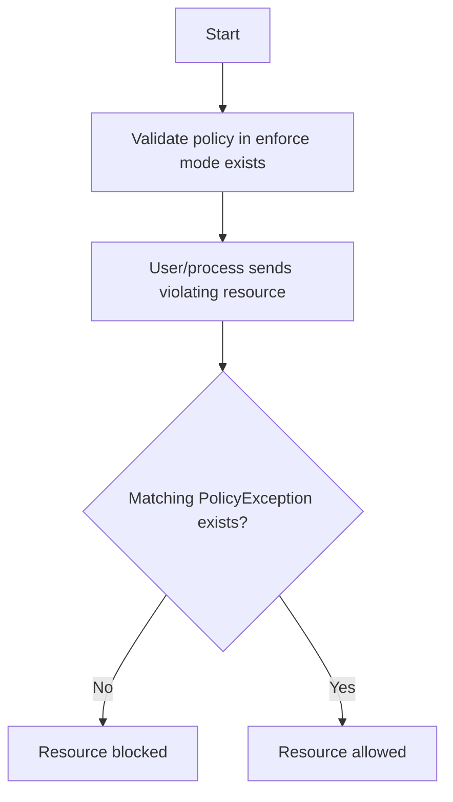
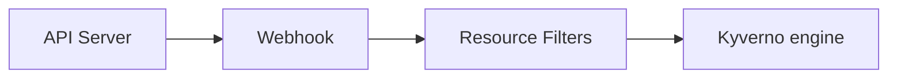
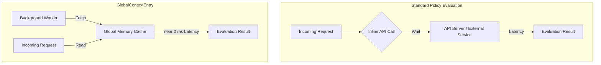

<a id="doc-eca12c0a30e25b4b46522ebf"></a>

# kyverno/website / CONTRIBUTING.md

Upstream: https://github.com/kyverno/website/blob/77f297fdd586483469c5a963d749383c22d6634f/CONTRIBUTING.md

Commit: `77f297fdd586483469c5a963d749383c22d6634f`

Retrieved: 2026-10-01T15:38:43.441015+00:00

Kind: official-document

Raw SHA256: `e4425c63179c5c58a7008fe3b45c05b3c631b24d22ab471aa849bb707605dfb7`

Source text below is untrusted reference content. Acquisition does not verify technical claims.

License status: UPSTREAM_NOTICES_CAPTURED_PER_FILE_REVIEW_REQUIRED. See this repository's captured license files.

---

# How to Contribute

Thank you for expressing interest in contributing to the Kyverno documentation! We welcome all contributions, suggestions, and feedback! We'd love to accept your contributions to this project, there are just a few guidelines you need to follow.

> **New to Kyverno?** Before diving in, we recommend exploring the
> [Kyverno Docs](https://kyverno.io/docs/policy-types/overview/) to get familiar with key concepts
> like validation, mutation, generation, image verification, cleanup and exception policies, it'll make  
> contributing much smoother!

## Contributor License Agreement

Contributions to this project must be accompanied by a [Contributor License Agreement](https://github.com/cncf/cla). Project authors will retain the copyright to your contribution; this simply gives us permission to use and redistribute your contributions as part of the project. You generally only need to submit a CLA once, so if you've already submitted one (even if it was for a different project), you probably don't need to do it again.

## Code Reviews

All submissions, including submissions by project members, require review. We use GitHub pull requests for this purpose. Consult [GitHub Help](https://docs.github.com/en/pull-requests/collaborating-with-pull-requests/proposing-changes-to-your-work-with-pull-requests/about-pull-requests) for more information on using pull requests.

## Community Guidelines

This project follows the [CNCF Code of Conduct](https://github.com/cncf/foundation/blob/main/code-of-conduct.md).

## Ways to Contribute

If you wish to contribute to this project, there are several options as outlined below.

- [Report Issues](#report-issues)
- [Submit a Pull Request](#submit-a-pull-request)
- [Good First Issues](#good-first-issues)
- [Join Our Community Meetings](#community-meetings)

### Report Issues

If you see a bug or want to suggest an enhancement, please create an [issue](https://github.com/kyverno/website/issues/new/choose). Issues are a great way to tell the Kyverno documentation team what you think can be improved or fixed. Even reporting a misspelling is appreciated!

### Good First Issues

New to open source or just getting started with Kyverno? Check out our
[Good First Issues](https://github.com/kyverno/website/issues?q=is%3Aissue+is%3Aopen+label%3A%22good+first+issue%22)
these are hand-picked, beginner-friendly issues to help you make your
first contribution with confidence.

To get started:

1. Browse the list and find an issue that interests you
2. Leave a comment to request assignment
3. Follow the steps in [Submit a Pull Request](#submit-a-pull-request) below

### Submit a Pull Request

Find an [open issue](https://github.com/kyverno/website/issues) and indicate your interest by requesting assignment. We understand that sometimes priorities change, so if you've been assigned an issue but are no longer able to or interested in completing it, please unassign yourself so future contributors know it is available to take on.

If you are new to the git contribution flow or GitHub in general, please see the [excellent documentation](https://git-scm.com/book/en/v2/GitHub-Contributing-to-a-Project) available on the Git website with easy, step-by-step instructions on how to create your first Pull Request on GitHub.

First time contributing to open source? Don't worry, maintainers and community members are happy to help guide you through the contribution process.

#### Overview

The Kyverno website is a static site designed and built using [Astro](https://astro.build/). It uses the [Starlight](https://starlight.astro.build/) documentation theme and is built and hosted on [Netlify](https://www.netlify.com/). The contents of the website are written as standard Markdown and MDX files allowing easy editing and contribution. For more detailed development information, see [DEVELOPMENT.md](./DEVELOPMENT.md).

#### Developing on GitHub Codespaces

This repository can be developed using [GitHub Codespaces](https://github.com/features/codespaces), which provides a containerized development environment with all the necessary tools. If a devcontainer configuration is available, creating a Codespace will automatically set up the environment with Node.js and npm.

If you are new to Codespaces and devcontainers, please see the introductory guide [here](https://docs.github.com/en/codespaces/setting-up-your-project-for-codespaces/adding-a-dev-container-configuration/introduction-to-dev-containers).

#### Developing Locally

The Kyverno website requires Node.js v24 or higher and npm to be installed. When developing locally, ensure you have the correct Node.js version installed.

To check your Node.js version:

```sh
$ node --version
v24.11.1
```

You should see v24 or higher. If you need to install or update Node.js, visit [nodejs.org](https://nodejs.org/).

After cloning the repository, install dependencies:

```sh
npm install
```

For more detailed setup instructions, see [DEVELOPMENT.md](./DEVELOPMENT.md).

#### Testing Changes

Once you have made your changes, inspect them visually by rendering the website.

```sh
npm run dev
```

The development server will start at `http://localhost:4321`. The site will automatically reload when you make changes to source files.

For more information about testing and building, see [DEVELOPMENT.md](./DEVELOPMENT.md).

#### Before Submitting a Pull Request

Before opening a PR, please ensure that:

- [ ] Documentation links and formatting render correctly
- [ ] Changes have been reviewed for typos or grammar issues
- [ ] The website builds and runs successfully using `npm run dev`
- [ ] Commits are signed off according to the [DCO requirements](#developer-certificate-of-origin-dco-sign-off)

### Get In Touch

#### Slack

Kyverno maintains a thriving community with two different opportunities to participate. The largest is the [Kubernetes Slack workspace](https://slack.k8s.io/#kyverno) and the other is the [CNCF Slack workspace](https://cloud-native.slack.com/#kyverno).

#### Community Meetings

- View upcoming Kyverno meetings on the [community meetings page](https://kyverno.io/community/#meetings)
- View the [Kyverno meeting calendar](https://zoom-lfx.platform.linuxfoundation.org/meetings/kyverno?view=week)
- Join the [Kyverno Google Group](https://groups.google.com/g/kyverno) to receive project updates and meeting invites

#### Community Page

Explore the [Kyverno Community Page](https://kyverno.io/community/) to learn
more about the project, meet the maintainers, and discover more ways to get
involved.

## Developer Certificate of Origin (DCO) Sign off

For contributors to certify that they wrote or otherwise have the right to submit the code they are contributing to the project, we require everyone to acknowledge this by signing their work acknowledging the [DCO](https://developercertificate.org/).

For a complete guide on DCO, please see [this article](https://www.secondstate.io/articles/dco/).

For users of Visual Studio Code, there is a convenient setting in the git extension named "Always Sign Off" which, when checked, allows VS Code to sign all commits.


<a id="doc-fc2a310fcfedfefb0046def6"></a>

# kyverno/website / DEVELOPMENT.md

Upstream: https://github.com/kyverno/website/blob/77f297fdd586483469c5a963d749383c22d6634f/DEVELOPMENT.md

Commit: `77f297fdd586483469c5a963d749383c22d6634f`

Retrieved: 2026-10-01T15:38:43.441015+00:00

Kind: official-document

Raw SHA256: `7cf032a177ff7cef7feab576b85792651af2c683e3301319b9fd0685b2a45f49`

Source text below is untrusted reference content. Acquisition does not verify technical claims.

License status: UPSTREAM_NOTICES_CAPTURED_PER_FILE_REVIEW_REQUIRED. See this repository's captured license files.

---

# Development Guide

This guide will help you get started with developing the Kyverno website. It covers setup, project structure, common tasks, and development workflows.

## Prerequisites

Before you begin, ensure you have the following installed:

- **Node.js** v24 or higher ([Download](https://nodejs.org/))
- **npm** package manager
- **Git** for version control
- **Docker** (optional, for generating CLI documentation)

## Getting Started

### 1. Clone the Repository

```bash
git clone https://github.com/kyverno/website.git
cd website
```

If you're contributing, you should fork the repository first and clone your fork:

```bash
git clone https://github.com/YOUR-GITHUB-ID/website.git
cd website
```

### 2. Install Dependencies

We're using NPM as dependency manager

```bash
npm install
```

### 3. Start the Development Server

```bash
npm run dev
```

The development server will start at `http://localhost:4321`. The site will automatically reload when you make changes to source files.

## Project Structure

```
.
├── public/                 # Static assets (images, favicons, etc.)
│   └── assets/
│       ├── images/           # Image assets
│       └── product-icons/    # Product/company icons
├── src/
│   ├── components/           # React components (JSX)
│   ├── constants/            # Constants and configuration data
│   ├── content/              # Content files (Markdown/MDX)
│   │   ├── docs/             # Documentation content
│   │   │   ├── blog/         # Blog posts
│   │   │   └── docs/         # Documentation pages
│   │   └── policies/         # Policy examples (generated)
│   ├── layouts/              # Astro layout components
│   ├── pages/                # Astro pages (file-based routing)
│   ├── sections/             # Page section components
│   ├── styles/               # Global CSS styles
│   └── content.config.ts     # Content collection configuration
├── scripts/                  # Development scripts and tools
│   ├── render-policies.ts    # Policy rendering tool (TypeScript)
│   └── codegen-cli-docs.sh   # CLI documentation generator
├── astro.config.mjs          # Astro configuration
├── package.json              # Dependencies and scripts
└── tsconfig.json             # TypeScript configuration
```

## Available Commands

### Development

- `npm run dev` - Start the development server at `localhost:4321`
- `npm run start` - Alias for `dev` command

### Building

- `npm run build` - Build the production site to `./dist/`
- `npm run preview` - Preview the production build locally

### Code Quality

- `npm run format:check` - Check code formatting with Prettier
- `npm run format:write` - Format code with Prettier
- `npm run check:links` - Validate all internal and external links in the documentation

### Code Generation

The project uses npm scripts for generating content:

- `npm run codegen:policies` - Generate policy markdown files from the kyverno/policies repository
- `npm run codegen:cli-docs` - Generate CLI documentation from the kyverno-cli Docker image
- `npm run codegen` - Run both codegen scripts in sequence

By default, both scripts derive the upstream ref from `WEBSITE_BRANCH` or the current git branch. To override, pass the distant repo branch/tag directly (no transformation):

```bash
npm run codegen
# Or with explicit refs:
npm run codegen:policies -- release-1.17 ./src/content/policies/
npm run codegen:cli-docs -- release-1.17
```

## Technologies & Tools

This website is built with:

- **[Astro](https://astro.build/)** - Static site generator
- **[Starlight](https://starlight.astro.build/)** - Documentation theme for Astro
- **[React](https://react.dev/)** - UI library (via `@astrojs/react`)
- **[Tailwind CSS](https://tailwindcss.com/)** - Utility-first CSS framework
- **[Framer Motion](https://www.framer.com/motion/)** - Animation library
- **[Lucide React](https://lucide.dev/)** - Icon library
- **[Prettier](https://prettier.io/)** - Code formatter
- **[Husky](https://typicode.github.io/husky/)** - Git hooks

## Development Workflow

### Making Changes

1. **Create a branch** for your changes:

   ```bash
   git checkout -b your-feature-branch
   ```

2. **Make your changes** to the relevant files:
   - React components: `src/components/` or `src/sections/`
   - Content: `src/content/docs/`
   - Styles: `src/styles/`
   - Pages: `src/pages/`

3. **Preview your changes**:

   ```bash
   npm run dev
   ```

   Visit `http://localhost:4321` to see your changes.

4. **Format your code**:

   ```bash
   npm run format:write
   ```

5. **Test the production build**:
   ```bash
   npm run build
   npm run preview
   ```

### Working with Content

#### Documentation Pages

Documentation pages are written in Markdown (`.md`) or MDX (`.mdx`) and located in `src/content/docs/docs/`. The sidebar is automatically generated from the directory structure as configured in `astro.config.mjs`.

**Link Formatting Guidelines:**

- **Use absolute paths** for internal documentation links (e.g., `/docs/policy-types/cluster-policy/validate`)
- **Avoid relative links** (e.g., `../validate.md` or `./validate.md`) as they can break when pages are moved or reorganized
- **Remove file extensions** from links (use `/docs/path/to/page` instead of `/docs/path/to/page.md`)
- **Use anchor links** for specific sections (e.g., `/docs/policy-types/cluster-policy/validate#anchors`)

**Examples:**

✅ **Good:**

```markdown
[Validate Policy](/docs/policy-types/cluster-policy/validate)
[Installation Guide](/docs/installation#methods)
```

❌ **Bad:**

```markdown
[Validate Policy](../validate.md)
[Installation Guide](./installation/methods.md#methods)
```

#### Blog Posts

Blog posts are located in `src/content/docs/blog/` and organized by category (e.g., `general/`, `releases/`).

#### Policies

Policy examples are generated from the [kyverno/policies](https://github.com/kyverno/policies) repository. By default, the script uses `WEBSITE_BRANCH` or the current git branch to select the policies ref (`release-x.y` for release branches, `main` otherwise). To regenerate them:

```bash
npm run codegen:policies
```

This will:

1. Clone the kyverno/policies repository (shallow clone, single branch)
2. Find all YAML policy files recursively
3. Extract metadata from policy annotations
4. Generate markdown files with frontmatter and full YAML content
5. Preserve the directory structure from the source repository

The generated files are placed in `src/content/policies/`. The script uses TypeScript and requires Node.js v24+.

### Working with Components

#### React Components

React components are located in `src/components/` and `src/sections/`. They use JSX syntax and can be imported in Astro files:

```astro
---
import MyComponent from '../components/MyComponent.jsx'
---

<MyComponent />
```

#### Styling

The project uses Tailwind CSS for styling. You can use Tailwind utility classes directly in components. Global styles are in `src/styles/`.

### Code Generation

The website includes automatically generated content that should be regenerated when upstream sources change.

#### Generating Policies

Policy documentation is generated from the [kyverno/policies](https://github.com/kyverno/policies) repository. The TypeScript script (`scripts/render-policies.ts`) fetches policies and converts them to markdown format.

**Usage:**

Default (auto mode—derives policies ref from `WEBSITE_BRANCH` or current git branch):

```bash
npm run codegen:policies
```

With explicit ref or full repository URL:

```bash
npm run codegen:policies -- <policies-ref|repo-url> <output-dir>
```

**Branch mapping (auto mode only):**

- `release-x-y` or `release-x-y-z` → fetches `release-x.y` branch from kyverno/policies
- Any other branch → fetches `main`

When a positional argument is provided, it is used directly as the distant repo ref (e.g. `main`, `release-1.17`).

**Example with custom arguments:**

```bash
npm run codegen:policies -- main ./src/content/policies/
npm run codegen:policies -- release-1.17 ./src/content/policies/
npm run codegen:policies -- https://github.com/kyverno/policies/main ./src/content/policies/
```

**What it does:**

1. Clones the specified GitHub repository (shallow clone, single branch)
2. Recursively finds all YAML policy files (`.yaml` or `.yml`)
3. Extracts metadata from policy annotations:
   - `policies.kyverno.io/title`
   - `policies.kyverno.io/category`
   - `policies.kyverno.io/minversion`
   - `policies.kyverno.io/subject`
   - `policies.kyverno.io/description`
4. Determines policy type (`validate`, `mutate`, or `generate`) from the spec
5. Generates markdown files with frontmatter and full YAML content
6. Preserves the directory structure from the source repository

**Output format:**
Each generated markdown file includes:

- Frontmatter with policy metadata (title, category, version, subject, policyType, description)
- A link to the raw YAML file on GitHub
- The complete policy YAML in a code block

**Requirements:**

- Node.js v24 or higher
- Dependencies installed (`npm install`)
- Git (for cloning repositories)

#### Generating CLI Documentation

CLI documentation is generated from the kyverno-cli Docker image:

```bash
npm run codegen:cli-docs
```

With optional override:

```bash
# Auto mode: WEBSITE_BRANCH or git branch (release-1-17 → release-1.17 image)
WEBSITE_BRANCH=release-1-17 npm run codegen:cli-docs

# Explicit: positional arg is the distant image tag directly (no transformation)
npm run codegen:cli-docs -- release-1.17
./scripts/codegen-cli-docs.sh release-1.17
```

**Branch mapping (auto mode only):**

- `release-x-y` or `release-x-y-z` → uses `ghcr.io/kyverno/kyverno-cli:release-x.y` image
- Any other branch → uses `latest` image

When a positional argument is provided, it is used directly as the image tag.

**What it does:**

1. Removes existing CLI documentation files from `src/content/docs/docs/kyverno-cli/reference/`
2. Runs the kyverno-cli Docker container with `--website`, `--noDate`, `--markdownLinks` and related options
3. Post-processes generated markdown: normalizes links to absolute `/docs/...` paths, converts external kyverno.io URLs, and removes "For more information visit..." lines
4. Outputs markdown files to `src/content/docs/docs/kyverno-cli/reference/`

**Requirements:**

- Docker installed and running
- Access to pull `ghcr.io/kyverno/kyverno-cli` image

#### Verifying Generated Content

Before committing changes, ensure generated content is up to date. You can verify by:

1. Running the codegen scripts:

   ```bash
   npm run codegen
   ```

   Or run them individually: `npm run codegen:policies` and `npm run codegen:cli-docs`

2. Checking git status to see if any files changed:

   ```bash
   git status
   ```

3. If files changed, commit them along with your changes

**Note:** Generated content should be committed to the repository so the website can be built without requiring codegen steps during deployment.

## Testing Your Changes

1. **Visual Testing**: Use the development server to visually inspect your changes
2. **Build Testing**: Run `npm run build` to ensure the site builds without errors
3. **Format Checking**: Run `npm run format:check` to ensure code is properly formatted
4. **Link Checking**: Run `npm run check:links` to validate all links in the documentation (both internal and external)
5. **Code Generation**: Run `npm run codegen` to ensure generated content is up to date, then check `git status` for any changes

### Link Validation

The `check:links` command validates all links in the documentation to ensure they are correct and accessible. This is especially important when:

- Adding new documentation pages
- Moving or renaming existing pages
- Updating links between pages
- Fixing broken links

**Usage:**

```bash
npm run check:links
```

This command will:

- Build the site with link validation enabled
- Check all internal documentation links
- Verify external links are accessible
- Report any broken or invalid links

**Note:** The link checker will fail the build if any broken links are found. Fix any reported issues before committing your changes. The link checker uses the [Starlight Links Validator](https://starlight.astro.build/guides/validation/#link-validation) plugin.

## Common Tasks

### Adding a New Component

1. Create a new file in `src/components/` (e.g., `MyComponent.jsx`)
2. Write your React component
3. Import and use it in your pages or layouts

### Adding a New Documentation Page

1. Create a new `.md` or `.mdx` file in the appropriate directory under `src/content/docs/docs/`
2. The sidebar will automatically include it based on the directory structure
3. Use frontmatter to configure the page:

```markdown
---
title: My Page Title
description: Page description
---
```

### Modifying the Sidebar

Edit `astro.config.mjs` and modify the `sidebar` configuration in the Starlight config.

### Adding Styles

- Use Tailwind utility classes directly in components
- Add global styles to `src/styles/global.css` or `src/styles/custom.css`

## Git Hooks

The project uses Husky for git hooks. The `prepare` script automatically sets up git hooks when you run `npm install`. These hooks help ensure code quality before commits.

## Deployment

The site is deployed to [Netlify](https://www.netlify.com/). The build command is `npm run build`, and the publish directory is `dist/`.

## Getting Help

- **Documentation**: See [README.md](./README.md) and [CONTRIBUTING.md](./CONTRIBUTING.md)
- **Issues**: Report issues on [GitHub Issues](https://github.com/kyverno/website/issues)
- **Community**: Join the [Kyverno Slack](https://slack.k8s.io/#kyverno) or [CNCF Slack](https://cloud-native.slack.com/#kyverno)
- **Meetings**: See [Community Meetings](https://kyverno.io/community/#meetings)

## Additional Resources

- [Astro Documentation](https://docs.astro.build/)
- [Starlight Documentation](https://starlight.astro.build/)
- [React Documentation](https://react.dev/)
- [Tailwind CSS Documentation](https://tailwindcss.com/docs)


<a id="doc-c693279643b8cd5d248172d9"></a>

# kyverno/website / LICENSE

Upstream: https://github.com/kyverno/website/blob/77f297fdd586483469c5a963d749383c22d6634f/LICENSE

Commit: `77f297fdd586483469c5a963d749383c22d6634f`

Retrieved: 2026-10-01T15:38:43.441015+00:00

Kind: license

Raw SHA256: `c71d239df91726fc519c6eb72d318ec65820627232b2f796219e87dcf35d0ab4`

Source text below is untrusted reference content. Acquisition does not verify technical claims.

License status: UPSTREAM_NOTICES_CAPTURED_PER_FILE_REVIEW_REQUIRED. See this repository's captured license files.

---

````text
                                 Apache License
                           Version 2.0, January 2004
                        http://www.apache.org/licenses/

   TERMS AND CONDITIONS FOR USE, REPRODUCTION, AND DISTRIBUTION

   1. Definitions.

      "License" shall mean the terms and conditions for use, reproduction,
      and distribution as defined by Sections 1 through 9 of this document.

      "Licensor" shall mean the copyright owner or entity authorized by
      the copyright owner that is granting the License.

      "Legal Entity" shall mean the union of the acting entity and all
      other entities that control, are controlled by, or are under common
      control with that entity. For the purposes of this definition,
      "control" means (i) the power, direct or indirect, to cause the
      direction or management of such entity, whether by contract or
      otherwise, or (ii) ownership of fifty percent (50%) or more of the
      outstanding shares, or (iii) beneficial ownership of such entity.

      "You" (or "Your") shall mean an individual or Legal Entity
      exercising permissions granted by this License.

      "Source" form shall mean the preferred form for making modifications,
      including but not limited to software source code, documentation
      source, and configuration files.

      "Object" form shall mean any form resulting from mechanical
      transformation or translation of a Source form, including but
      not limited to compiled object code, generated documentation,
      and conversions to other media types.

      "Work" shall mean the work of authorship, whether in Source or
      Object form, made available under the License, as indicated by a
      copyright notice that is included in or attached to the work
      (an example is provided in the Appendix below).

      "Derivative Works" shall mean any work, whether in Source or Object
      form, that is based on (or derived from) the Work and for which the
      editorial revisions, annotations, elaborations, or other modifications
      represent, as a whole, an original work of authorship. For the purposes
      of this License, Derivative Works shall not include works that remain
      separable from, or merely link (or bind by name) to the interfaces of,
      the Work and Derivative Works thereof.

      "Contribution" shall mean any work of authorship, including
      the original version of the Work and any modifications or additions
      to that Work or Derivative Works thereof, that is intentionally
      submitted to Licensor for inclusion in the Work by the copyright owner
      or by an individual or Legal Entity authorized to submit on behalf of
      the copyright owner. For the purposes of this definition, "submitted"
      means any form of electronic, verbal, or written communication sent
      to the Licensor or its representatives, including but not limited to
      communication on electronic mailing lists, source code control systems,
      and issue tracking systems that are managed by, or on behalf of, the
      Licensor for the purpose of discussing and improving the Work, but
      excluding communication that is conspicuously marked or otherwise
      designated in writing by the copyright owner as "Not a Contribution."

      "Contributor" shall mean Licensor and any individual or Legal Entity
      on behalf of whom a Contribution has been received by Licensor and
      subsequently incorporated within the Work.

   2. Grant of Copyright License. Subject to the terms and conditions of
      this License, each Contributor hereby grants to You a perpetual,
      worldwide, non-exclusive, no-charge, royalty-free, irrevocable
      copyright license to reproduce, prepare Derivative Works of,
      publicly display, publicly perform, sublicense, and distribute the
      Work and such Derivative Works in Source or Object form.

   3. Grant of Patent License. Subject to the terms and conditions of
      this License, each Contributor hereby grants to You a perpetual,
      worldwide, non-exclusive, no-charge, royalty-free, irrevocable
      (except as stated in this section) patent license to make, have made,
      use, offer to sell, sell, import, and otherwise transfer the Work,
      where such license applies only to those patent claims licensable
      by such Contributor that are necessarily infringed by their
      Contribution(s) alone or by combination of their Contribution(s)
      with the Work to which such Contribution(s) was submitted. If You
      institute patent litigation against any entity (including a
      cross-claim or counterclaim in a lawsuit) alleging that the Work
      or a Contribution incorporated within the Work constitutes direct
      or contributory patent infringement, then any patent licenses
      granted to You under this License for that Work shall terminate
      as of the date such litigation is filed.

   4. Redistribution. You may reproduce and distribute copies of the
      Work or Derivative Works thereof in any medium, with or without
      modifications, and in Source or Object form, provided that You
      meet the following conditions:

      (a) You must give any other recipients of the Work or
          Derivative Works a copy of this License; and

      (b) You must cause any modified files to carry prominent notices
          stating that You changed the files; and

      (c) You must retain, in the Source form of any Derivative Works
          that You distribute, all copyright, patent, trademark, and
          attribution notices from the Source form of the Work,
          excluding those notices that do not pertain to any part of
          the Derivative Works; and

      (d) If the Work includes a "NOTICE" text file as part of its
          distribution, then any Derivative Works that You distribute must
          include a readable copy of the attribution notices contained
          within such NOTICE file, excluding those notices that do not
          pertain to any part of the Derivative Works, in at least one
          of the following places: within a NOTICE text file distributed
          as part of the Derivative Works; within the Source form or
          documentation, if provided along with the Derivative Works; or,
          within a display generated by the Derivative Works, if and
          wherever such third-party notices normally appear. The contents
          of the NOTICE file are for informational purposes only and
          do not modify the License. You may add Your own attribution
          notices within Derivative Works that You distribute, alongside
          or as an addendum to the NOTICE text from the Work, provided
          that such additional attribution notices cannot be construed
          as modifying the License.

      You may add Your own copyright statement to Your modifications and
      may provide additional or different license terms and conditions
      for use, reproduction, or distribution of Your modifications, or
      for any such Derivative Works as a whole, provided Your use,
      reproduction, and distribution of the Work otherwise complies with
      the conditions stated in this License.

   5. Submission of Contributions. Unless You explicitly state otherwise,
      any Contribution intentionally submitted for inclusion in the Work
      by You to the Licensor shall be under the terms and conditions of
      this License, without any additional terms or conditions.
      Notwithstanding the above, nothing herein shall supersede or modify
      the terms of any separate license agreement you may have executed
      with Licensor regarding such Contributions.

   6. Trademarks. This License does not grant permission to use the trade
      names, trademarks, service marks, or product names of the Licensor,
      except as required for reasonable and customary use in describing the
      origin of the Work and reproducing the content of the NOTICE file.

   7. Disclaimer of Warranty. Unless required by applicable law or
      agreed to in writing, Licensor provides the Work (and each
      Contributor provides its Contributions) on an "AS IS" BASIS,
      WITHOUT WARRANTIES OR CONDITIONS OF ANY KIND, either express or
      implied, including, without limitation, any warranties or conditions
      of TITLE, NON-INFRINGEMENT, MERCHANTABILITY, or FITNESS FOR A
      PARTICULAR PURPOSE. You are solely responsible for determining the
      appropriateness of using or redistributing the Work and assume any
      risks associated with Your exercise of permissions under this License.

   8. Limitation of Liability. In no event and under no legal theory,
      whether in tort (including negligence), contract, or otherwise,
      unless required by applicable law (such as deliberate and grossly
      negligent acts) or agreed to in writing, shall any Contributor be
      liable to You for damages, including any direct, indirect, special,
      incidental, or consequential damages of any character arising as a
      result of this License or out of the use or inability to use the
      Work (including but not limited to damages for loss of goodwill,
      work stoppage, computer failure or malfunction, or any and all
      other commercial damages or losses), even if such Contributor
      has been advised of the possibility of such damages.

   9. Accepting Warranty or Additional Liability. While redistributing
      the Work or Derivative Works thereof, You may choose to offer,
      and charge a fee for, acceptance of support, warranty, indemnity,
      or other liability obligations and/or rights consistent with this
      License. However, in accepting such obligations, You may act only
      on Your own behalf and on Your sole responsibility, not on behalf
      of any other Contributor, and only if You agree to indemnify,
      defend, and hold each Contributor harmless for any liability
      incurred by, or claims asserted against, such Contributor by reason
      of your accepting any such warranty or additional liability.

   END OF TERMS AND CONDITIONS

   APPENDIX: How to apply the Apache License to your work.

      To apply the Apache License to your work, attach the following
      boilerplate notice, with the fields enclosed by brackets "[]"
      replaced with your own identifying information. (Don't include
      the brackets!)  The text should be enclosed in the appropriate
      comment syntax for the file format. We also recommend that a
      file or class name and description of purpose be included on the
      same "printed page" as the copyright notice for easier
      identification within third-party archives.

   Copyright [yyyy] [name of copyright owner]

   Licensed under the Apache License, Version 2.0 (the "License");
   you may not use this file except in compliance with the License.
   You may obtain a copy of the License at

       http://www.apache.org/licenses/LICENSE-2.0

   Unless required by applicable law or agreed to in writing, software
   distributed under the License is distributed on an "AS IS" BASIS,
   WITHOUT WARRANTIES OR CONDITIONS OF ANY KIND, either express or implied.
   See the License for the specific language governing permissions and
   limitations under the License.

````


<a id="doc-403b96de276ed29c25c2559e"></a>

# kyverno/website / OWNERS.md

Upstream: https://github.com/kyverno/website/blob/77f297fdd586483469c5a963d749383c22d6634f/OWNERS.md

Commit: `77f297fdd586483469c5a963d749383c22d6634f`

Retrieved: 2026-10-01T15:38:43.441015+00:00

Kind: official-document

Raw SHA256: `97019a26708101c68b3645710a3195ba2eac3977e129ee8aa55be32190490824`

Source text below is untrusted reference content. Acquisition does not verify technical claims.

License status: UPSTREAM_NOTICES_CAPTURED_PER_FILE_REVIEW_REQUIRED. See this repository's captured license files.

---

approvers:

- JimBugwadia
- realshuting
- eddycharly
- MariamFahmy98
- vishal-chdhry
- fjogeleit

reviewers:

- JimBugwadia
- realshuting
- eddycharly
- MariamFahmy98
- vishal-chdhry
- fjogeleit


<a id="doc-b335630551682c19a781afeb"></a>

# kyverno/website / README.md

Upstream: https://github.com/kyverno/website/blob/77f297fdd586483469c5a963d749383c22d6634f/README.md

Commit: `77f297fdd586483469c5a963d749383c22d6634f`

Retrieved: 2026-10-01T15:38:43.441015+00:00

Kind: official-document

Raw SHA256: `c9a2f2fd0d7289313ed660779b5504d047f71729a671ad4d2273beebfd5e53f6`

Source text below is untrusted reference content. Acquisition does not verify technical claims.

License status: UPSTREAM_NOTICES_CAPTURED_PER_FILE_REVIEW_REQUIRED. See this repository's captured license files.

---

# The Kyverno Website

Source for: https://kyverno.io

## Accessing Earlier Documentation

The Kyverno website follows the same support policy as Kyverno, an N-2 policy. Documentation will be made available for the current release and the two previous minor releases. While this extends to the version list on the website, users may still access earlier versions of the documentation by navigating to a specific version by URL.

Documentation for each version is published at a URL like `https://release-X-Y-0.kyverno.io/` where `X` is the major version and `Y` is the minor version. To access the documentation for version 1.9.0, navigate to the URL [https://release-1-9-0.kyverno.io/](https://release-1-9-0.kyverno.io/).

## Contributors

<a href="https://github.com/kyverno/website/graphs/contributors">
  
</a>

Made with [contributors-img](https://contrib.rocks).

## Contributing

This site makes use of the [Starlight](https://starlight.astro.build/getting-started/) theme and [Node v22+](https://nodejs.org/en/blog/announcements/v22-release-announce) is required to render it.

For detailed development setup and workflow instructions, see [DEVELOPMENT.md](./DEVELOPMENT.md).

To contribute changes, use the [fork & pull](https://movi.hashnode.dev/how-to-successfully-fork-clone-signoff-and-make-a-pull-request-ckdyt03sy06utjas18lx1cjer) approach.

1\. First create a [fork](https://docs.github.com/en/get-started/quickstart/fork-a-repo) of the Kyverno website repository to your GitHub account. By default, the forked repository will be named `website` but can be changed in the settings for your repository if desired. You will later created a PR (pull request) using this fork.

2\. Next, create a local clone using the command:

```sh
git clone https://github.com/{YOUR-GITHUB-ID}/website kyverno-website/
```

3\. Then navigate to the local folder and build the website for local viewing of changes:

```sh
cd kyverno-website
npm install
npm run dev
```

## 🚀 Project Structure

Inside of your Astro + Starlight project, you'll see the following folders and files:

```
.
├── public/
├── src/
│   ├── assets/
│   ├── content/
│   │   └── docs/
│   └── content.config.ts
├── astro.config.mjs
├── package.json
└── tsconfig.json
```

Starlight looks for `.md` or `.mdx` files in the `src/content/docs/` directory. Each file is exposed as a route based on its file name.

Images can be added to `src/assets/` and embedded in Markdown with a relative link.

Static assets, like favicons, can be placed in the `public/` directory.

## 🧞 Commands

All commands are run from the root of the project, from a terminal:

| Command                   | Action                                           |
| :------------------------ | :----------------------------------------------- |
| `npm install`             | Installs dependencies                            |
| `npm run dev`             | Starts local dev server at `localhost:4321`      |
| `npm run build`           | Build your production site to `./dist/`          |
| `npm run preview`         | Preview your build locally, before deploying     |
| `npm run astro ...`       | Run CLI commands like `astro add`, `astro check` |
| `npm run astro -- --help` | Get help using the Astro CLI                     |

## Rendering Policies to Markdown

Policies found at https://kyverno.io/policies/ are generated in Markdown from the source repository at [kyverno/policies](https://github.com/kyverno/policies). For any changes to appear on https://kyverno.io/policies/, edits must be made to the upstream policy YAML files at kyverno/policies, and the `render` tool run from this repository to generate the respective Markdown. See [render](/render/README.md) README for more details.

## Style and typographical conventions

The Kyverno website has established several writing conventions in the interest of consistency and accuracy.

### Voice

Active voice is preferred in most writing examples. Ex., "this ClusterPolicy mutates incoming Pods..." and not "incoming Pods are mutated by this ClusterPolicy".

### Code styling

- Kubernetes resource kinds are considered proper nouns and are distinguished from other nouns by the initial letter capitalization. Ex., "a Kubernetes Pod will be annotated".
- Anything intended to be proper code or typed at a CLI is formatting using Markdown code syntax with backticks or in blocks (surrounded by three backticks).
- Code represented in blocks should prefer a syntax declaration for this theme's highlighting ability. Ex., when displaying YAML notate the code block with three backticks and "yaml".

### Grammar

- We standardize on use of the Oxford comma.

### Links

In order to ensure that broken link detection works optimally as well as providing a way for users to find linked content when viewing the raw Markdown files on GitHub, links should be made using **relative paths to files** and not relative rendered paths. Following this method ensures not only pages can be found but anchor links are still valid.

This is a good link:

```
[some link text](foo.md#my-anchor)
```

This is a bad link:

```
[some link text](/docs/foo/#my-anchor)
```

## Documentation Versioning

The Kyverno website now uses releases to organize documentation by the specified release making it easier for users to find the information that pertains to their version. Releases are defined by branches of kyverno/website and a combination of exposing them in the website configuration and modifying hosting parameters.

## Managing Release Versions

Here are the rules for managing release versions:

1. All fixes and feature changes go to the `main` branch (we may in a few rare cases make fixes to prior versions of the documentation.) The main branch can be accessed at `https://main.kyverno.io`.

2. When a new release is ready for GA, a new release branch is created (see steps below). Release branches are named `release-{major}-{minor}-{patch}` for example `release-1-4-2`. The release branch can be accessed using the `{branch}.kyverno.io` and the latest release is available at `kyverno.io`.

### Creating a release branch

To create a new release branch:

1. Create and push the branch using `git checkout -b release-{major}-{minor}-{patch}` or via [GitHub](https://github.com/kyverno/website/branches).

2. [Update Netlify](https://app.netlify.com/sites/kyverno/settings/deploys#branches) to point `production` to the new release branch.

3. Also in Netlify, go into the Domain management settings of the site and add a new subdomain for the branch representing the previous version. For example, if the release to be cut is 1.8.0, there will not be a `release-1-7-0.kyverno.io` record which exists. One must be created for `release-1-7-0.kyverno.io`.

In the `main` branch:

1. Add a new menu version corresponding to the new release branch in [params.toml](/config/_default/params.toml) that points to https://kyverno.io below these lines:

```toml
# version_menu = "Versions"
# Add your release versions here
[[menu.versions]]
  version = "1.8.0"
  url = "https://release-1-8-0.kyverno.io"
  weight = 1
```

and change the older release version entry to point to its own versioned url, so for example if adding 1.13:

```toml
[[versions]] # New Line
  version = "v1.13.0" # New Line
  url = "https://kyverno.io" # New Line

[[versions]]
  version = "v1.12.0"
  url = "https://release-1-12-0.kyverno.io" # Change this line
```

2. Clear the Netlify cache!

In the current release branch:

1. Do the same as above.

2. Update `version` to the new release version. Following our example from above that would be `v1.13.0`.

3. Update `version_menu` to the same release version.

#### Submitting a PR to multiple release branches

Ideally all changes will go to `main` and then be promoted to a release branch. However, occasionally we will need to fix documentation issues for already released versions. Rendered policies will always go to all branches because the policy samples themselves declare minimum capable versions via the `policies.kyverno.io/minversion` annotation.

Use the cherry pick bot to request a PR be cherry picked to a target branch. Call for the bot with a comment on the desired PR with `/cherry-pick release-1-12-0` to cherry pick this PR to the `release-1-12-0` branch. A new PR will be opened with `release-1-12-0` as the target branch.

There are several ways to create multiple PRs, but here is one easy flow:

1. Create a PR for the `main` branch, as usual.
2. For each additional branch, checkout the branch (`git checkout <branch>`), and then cherry pick the commit(s) to that branch using `git --cherry-pick <commit>`. If using GitHub Desktop, a commit can be cherry picked by setting the source branch where the PR was merged, accessing the History tab, and dragging-and-dropping that commit to the destination branch.
3. Submit PRs for each release branch.


<a id="doc-25b96aa16f8b9f68c692d0db"></a>

# kyverno/website / scripts/README.md

Upstream: https://github.com/kyverno/website/blob/77f297fdd586483469c5a963d749383c22d6634f/scripts/README.md

Commit: `77f297fdd586483469c5a963d749383c22d6634f`

Retrieved: 2026-10-01T15:38:43.441015+00:00

Kind: official-document

Raw SHA256: `bb8e7a4dc28c390904795aa7a5a1d3c91d42d043e34e7e341ccd6d940d394876`

Source text below is untrusted reference content. Acquisition does not verify technical claims.

License status: UPSTREAM_NOTICES_CAPTURED_PER_FILE_REVIEW_REQUIRED. See this repository's captured license files.

---

# Development Scripts

This directory contains development scripts and tools for generating content and maintaining the website.

## Scripts Overview

- **`render-policies.ts`** - TypeScript tool for generating policy documentation from GitHub repositories
- **`codegen-cli-docs.sh`** - Bash script for generating CLI documentation from Docker images

## Policy Render Tool (`render-policies.ts`)

This TypeScript tool fetches Kyverno policies from a GitHub repository and generates markdown documentation files for the website.

### Usage

**Via npm script (recommended):**

```bash
npm run codegen:policies
```

**With custom arguments (positional args = distant repo ref/URL and output dir, no transformation):**

```bash
npm run codegen:policies -- <policies-ref|repo-url> <output-dir>
```

**Examples:**

```bash
npm run codegen:policies -- main ./src/content/policies/
npm run codegen:policies -- release-1.17 ./src/content/policies/
npm run codegen:policies -- https://github.com/kyverno/policies/main ./src/content/policies/
```

**Direct execution:**

```bash
tsx scripts/render-policies.ts https://github.com/kyverno/policies/main ./src/content/policies/
```

### How it works

1. Clones the specified GitHub repository (shallow clone, single branch)
2. Recursively finds all YAML policy files (`.yaml` or `.yml`)
3. Extracts metadata from policy annotations:
   - `policies.kyverno.io/title`
   - `policies.kyverno.io/category`
   - `policies.kyverno.io/minversion`
   - `policies.kyverno.io/subject`
   - `policies.kyverno.io/description`
4. Determines policy type (`validate`, `mutate`, or `generate`) from the spec
5. Generates markdown files with frontmatter and full YAML content
6. Preserves the directory structure from the source repository

### Output Format

Each generated markdown file includes:

- Frontmatter with policy metadata (title, category, version, subject, policyType, description)
- A link to the raw YAML file on GitHub
- The complete policy YAML in a code block

### Dependencies

- `js-yaml` - YAML parsing
- `simple-git` - Git operations
- `tsx` - TypeScript execution

### Requirements

- Node.js v24 or higher
- Git (for cloning repositories)

---

## CLI Documentation Generator (`codegen-cli-docs.sh`)

This bash script generates CLI documentation by running the kyverno-cli Docker container and extracting documentation.

### Usage

**Via npm script (recommended):**

```bash
npm run codegen:cli-docs
```

**With explicit image tag (positional arg = distant repo tag, no transformation):**

```bash
./scripts/codegen-cli-docs.sh release-1.17
npm run codegen:cli-docs -- release-1.17
```

**Direct execution (auto mode: uses WEBSITE_BRANCH or git branch):**

```bash
./scripts/codegen-cli-docs.sh
```

When a positional argument is provided, it is used directly as the image tag (e.g. `release-1.17`, `latest`). In auto mode, the website branch is mapped: `release-x-y` → `release-x.y`, else `latest`.

### How it works

1. Removes existing CLI documentation files from `src/content/docs/docs/kyverno-cli/reference/`
2. Runs the `ghcr.io/kyverno/kyverno-cli` Docker container
3. Generates markdown documentation files with the following options:
   - `--autogenTag=false` - Disables auto-generated tags
   - `--website` - Formats output for website
   - `--noDate` - Omits dates from generated files
   - `--markdownLinks` - Uses markdown link format
4. Outputs files to `src/content/docs/docs/kyverno-cli/reference/`

### Requirements

- Docker installed and running
- Access to pull `ghcr.io/kyverno/kyverno-cli` image

---

## Running All Code Generation

To regenerate all generated content:

```bash
npm run codegen:policies
npm run codegen:cli-docs
```

Or run both in sequence:

```bash
npm run codegen:policies && npm run codegen:cli-docs
```

## See Also

For more information about code generation, see [DEVELOPMENT.md](../DEVELOPMENT.md#code-generation).


<a id="doc-3012a3bdb11bcdcdb75b5dff"></a>

# kyverno/website / src/content/docs/community/index.md

Upstream: https://github.com/kyverno/website/blob/77f297fdd586483469c5a963d749383c22d6634f/src/content/docs/community/index.md

Commit: `77f297fdd586483469c5a963d749383c22d6634f`

Retrieved: 2026-10-01T15:38:43.441015+00:00

Kind: official-document

Raw SHA256: `60ee2b5b5d5054acba3a4c26e329fe20208998092bd98b5e21794b22d8953cc2`

Source text below is untrusted reference content. Acquisition does not verify technical claims.

License status: UPSTREAM_NOTICES_CAPTURED_PER_FILE_REVIEW_REQUIRED. See this repository's captured license files.

---

---
title: Community
linkTitle: Community
type: docs
---

## GitHub

The [Kyverno source code](https://github.com/kyverno/kyverno/) and project artifacts are managed on GitHub in the [Kyverno](https://github.com/kyverno) organization.

## Slack Channel

Kyverno maintains a thriving community with two different opportunities to participate. The largest is the [Kubernetes Slack workspace](https://slack.k8s.io/#kyverno), where end-users engage in the [#kyverno](https://slack.k8s.io/#kyverno) channel and contributors collaborate in the [#kyverno-dev](https://slack.k8s.io/#kyverno-dev) channel. The other is the [CNCF Slack workspace](https://cloud-native.slack.com/#kyverno), where the [#kyverno](https://slack.k8s.io/#kyverno) channel is dedicated to end-user interactions.

## Meetings

The Kyverno project holds two recurring meetings:

### Community Meeting

This is a public, monthly meeting for the full Kyverno community. First time participants, new contributors, or anyone interested in Kyverno are welcome! This forum allows community members to propose agenda items of any sort, including but not limited to releases, roadmap, any contributor PRs or issues on which they are working.

- Monthly every third Wednesday at 9:00 AM PST (changes to be APAC friendly every alternate month)
- [Meeting calendar](https://zoom-lfx.platform.linuxfoundation.org/meetings/kyverno?view=month)
- [Agenda and meeting notes](https://docs.google.com/document/d/1kFd4fpAoHS56mRHr73AZp9wknk1Ehy_hTB_KA7gJuy0/)

To attend our community meetings, join the [Kyverno group](https://groups.google.com/g/kyverno). You will then be sent a meeting invite and will have access to the agenda and meeting notes. Any member may suggest topics for discussion.

### Maintainers Meeting

This is a public, weekly meeting for maintainers to discuss issues and PRs pertaining to Kyverno's development and roadmap.

Topics are proposed by maintainers. All in the community are welcome to attend, but non-maintainers may not propose new agenda items in this forum, they can instead add to the [community meeting](#community-meeting) agenda.

- Weekly every Tuesday at 7:30 AM PST
- [Agenda and meeting notes](https://docs.google.com/document/d/1I_GWsz32gLw8sQyuu_Wv0-WQrtRLjn9FuX2KGNkvUY4/edit?usp=sharing)

## Get in touch

If you are unable to attend a community meeting, feel free to reach out anytime on the [Kyverno Slack channel in the Kubernetes workspace](https://slack.k8s.io/#kyverno), or the Kyverno [mailing list](https://groups.google.com/g/kyverno).

We love hearing from our community!

## Contributing

Thanks for your interest in contributing! We welcome all types of contributions and encourage you to read our [contribution guidelines](https://github.com/kyverno/kyverno/blob/main/CONTRIBUTING.md) for next steps.

The project contributors use a combination of [GitHub discussions](https://github.com/kyverno/kyverno/discussions) and the [#kyverno-dev Slack channel](https://kubernetes.slack.com/archives/C032MM2CH7X) for notes on the development environment, project guidelines, and best practices.

Developer documentation is available in the [DEVELOPER.md](https://github.com/kyverno/kyverno/blob/main/DEVELOPMENT.md) file.

**NOTE:** Developer documentation was previously available in the ([GitHub Wiki](https://github.com/kyverno/kyverno/wiki)) but is no longer maintained there.

To start contributing, take a look at available issues in the [Good First Issues](https://github.com/orgs/kyverno/projects/10) project.

## Join Kyverno Adopters

Kyverno is a CNCF Graduated project and is growing fast. To qualify for the [graduation level](https://github.com/cncf/toc/blob/main/process/graduation_criteria.md#graduation-stage) the CNCF requires production usage by multiple end users.

The goal of this adopters program is to gather real-world usage examples and help the Kyverno project grow. We hope to achieve this by learning from the existing and new adopters of Kyverno who are willing to share their stories with CNCF.

To participate, fill out the [Kyverno adopters form](https://forms.gle/K5CApcBAD5D4H1AG8).

## Project Governance

[Kyverno and its sub-projects](https://github.com/kyverno#projects) follow the governance published and maintained at https://github.com/kyverno/community/blob/main/GOVERNANCE.md.


<a id="doc-ca94b5a2741a889b444230d3"></a>

# kyverno/website / src/content/docs/docs/crds/index.md

Upstream: https://github.com/kyverno/website/blob/77f297fdd586483469c5a963d749383c22d6634f/src/content/docs/docs/crds/index.md

Commit: `77f297fdd586483469c5a963d749383c22d6634f`

Retrieved: 2026-10-01T15:38:43.441015+00:00

Kind: official-document

Raw SHA256: `7270bfc05aeffd6850c4750f6b9ad43579a3c462e37bb4e0d17f756efac67102`

Source text below is untrusted reference content. Acquisition does not verify technical claims.

License status: UPSTREAM_NOTICES_CAPTURED_PER_FILE_REVIEW_REQUIRED. See this repository's captured license files.

---

---
title: Resource Definitions
sidebar:
  order: 120
excerpt: Custom Resource Definitions (CRDs) for Kyverno policies and other types.
---

Kyverno uses Kubernetes Custom Resource Definitions (CRDs) for policy definitions, policy reports, and other internal types.

The complete Kyverno CRD reference can be viewed [here](https://htmlpreview.github.io/?https://github.com/kyverno/kyverno/blob/main/docs/user/crd/index.html).

The HTML source is available in the [Kyverno GitHub repository](https://github.com/kyverno/kyverno/tree/main/docs) and generated from type definitions stored [here](https://github.com/kyverno/kyverno/tree/main/api).

## kubectl explain

When operating in a Kubernetes cluster with Kyverno installed, you can always inspect Kyverno types natively using `kubectl explain`.

For example, this is the definition of a Kyverno Policy resource at `policy.spec`:

```shell
KIND:     Policy
VERSION:  kyverno.io/v1

RESOURCE: spec <Object>

DESCRIPTION:
     Spec defines policy behaviors and contains one or more rules.

FIELDS:
   background   <boolean>
     Background controls if rules are applied to existing resources during a
     background scan. Optional. Default value is "true". The value must be set
     to "false" if the policy rule uses variables that are only available in the
     admission review request (e.g. user name).

   failurePolicy        <string>
     FailurePolicy defines how unrecognized errors from the admission endpoint
     are handled. Rules within the same policy share the same failure behavior.
     Allowed values are Ignore or Fail. Defaults to Fail.

   rules        <[]Object>
     Rules is a list of Rule instances. A Policy contains multiple rules and
     each rule can validate, mutate, or generate resources.

   schemaValidation     <boolean>
     Deprecated.

   validationFailureAction      <string>
     ValidationFailureAction controls if a validation policy rule failure should
     disallow the admission review request (enforce), or allow (audit) the
     admission review request and report an error in a policy report. Optional.
     Allowed values are `Audit` or `Enforce`. The default value is `Audit`.

   validationFailureActionOverrides     <[]Object>
     ValidationFailureActionOverrides is a Cluter Policy attribute that
     specifies ValidationFailureAction namespace-wise. It overrides
     ValidationFailureAction for the specified namespaces.

   webhookTimeoutSeconds        <integer>
     WebhookTimeoutSeconds specifies the maximum time in seconds allowed to
     apply this policy. After the configured time expires, the admission request
     may fail, or may simply ignore the policy results, based on the failure
     policy. The default timeout is 10s, the value must be between 1 and 30
     seconds.
```

Kyverno's support for structural schemas also enables integrated help in Kubernetes enabled Integrated Development Environments (IDEs) like [VS Code](https://code.visualstudio.com/) with the [Kubernetes Extension](https://code.visualstudio.com/docs/azure/kubernetes#_install-the-kubernetes-extension) installed.


<a id="doc-a533ec771fffb46b94eb762f"></a>

# kyverno/website / src/content/docs/docs/guides/admission-controllers.md

Upstream: https://github.com/kyverno/website/blob/77f297fdd586483469c5a963d749383c22d6634f/src/content/docs/docs/guides/admission-controllers.md

Commit: `77f297fdd586483469c5a963d749383c22d6634f`

Retrieved: 2026-10-01T15:38:43.441015+00:00

Kind: official-document

Raw SHA256: `f51fcb847b6e0a35b6ae3b36df395f89bff6ce1169bd3a76143d5184c06ae65b`

Source text below is untrusted reference content. Acquisition does not verify technical claims.

License status: UPSTREAM_NOTICES_CAPTURED_PER_FILE_REVIEW_REQUIRED. See this repository's captured license files.

---

---
title: Kubernetes Admission Controllers
excerpt: An introduction to admission controllers in Kubernetes.
sidebar:
  order: 35
---

This page contains an optional overview of admission controllers in Kubernetes and is recommended for new users of Kubernetes in general or those who would like to better understand how admission controllers work. It is not intended to be an exhaustive reference document on the subject. As such, many advanced details and fine points have been omitted to favor readability.

## About Admission Controllers

In Kubernetes, admission controllers are components responsible for either validating or modifying requests as part of the admissions process. These components can be thought of as "extensibility" points for Kubernetes, often used to control the outcome when new resources are being created hence the term. These admission controllers can be both built-in to the Kubernetes API server directly (also referred to as "in-line", "in-process", or "compiled-in" admission controllers) or external. For example, a built-in admission controller called [ResourceQuota](https://kubernetes.io/docs/concepts/policy/resource-quotas/) will examine any new Deployments to ensure that the resources being requested do not exceed a threshold established for its destined Namespace. If this threshold--to be defined by a user with appropriate permissions--is exceeded, the request to create the Deployment will be blocked.

Admission controllers, regardless of whether they are considered built-in or external, can be **validating** or **mutating**. A single admission controller can even do both simultaneously. Regardless of the type, all admission controllers function after authenticating and authorizing requests but before persisting (saving) them to the backend. The flow of these phases is shown in the diagram below.

<br>


<center>
<i>Source: https://kubernetes.io/blog/2019/03/21/a-guide-to-kubernetes-admission-controllers/</i>
</center>
<br></br>

While Kubernetes provides us with built-in admission controllers like ResourceQuota and [many more](https://kubernetes.io/docs/reference/access-authn-authz/admission-controllers/#what-does-each-admission-controller-do), these are highly-specific, purpose-built controllers which only do one task and cannot be modified. In the real world, users--probably yourself included--often have demands that cannot be met by these built-in controllers. For these use cases, which will be covered shortly, something which can implement custom logic is necessary. In addition to these built-in admission controllers, dynamic admission controllers can be developed as extensions and run as webhooks configured at runtime.

There are two specific admission controllers which enable extending the API functionality via webhooks:

- **MutatingAdmissionWebhook**: can modify a request.
- **ValidatingAdmissionWebhook**: can validate whether the request should be allowed to be created or not.

Because these types differ from built-in admission controllers in that they can be used to implement custom decisions, they are known as **dynamic admission controllers**.

## Use Cases

As already mentioned, Kubernetes provides some admission controllers "out of the box" as built-in admission controllers. When you need to implement validations or mutations which are custom in nature and cannot be accomplished with one or more built-in admission controllers, you must turn to dynamic admission controllers. The following is a list of some use cases for dynamic admission controllers.

- **Security:** Admission controllers can increase security by mandating a reasonable security baseline across an entire Namespace or cluster. For example, `PodSecurity` is a built-in admission controller that can be used for disallowing containers from running as root or making sure that containers do not run as privileged. However, many users find that this admission controller, typically referred to as [Pod Security Admission](https://kubernetes.io/docs/concepts/security/pod-security-admission/), is [limited in several ways](/blog/general/psp-migration#comparison). When the limitations of a built-in admission controller such as PodSecurity (Pod Security Admission) are reached, dynamic admission control can be used to plug the gaps.

- **Governance:** Using admission controllers you can enforce the adherence to certain practices like having good labels, annotations, resource limits, or other settings. For example, you can enforce label validation (or mutation) on different objects to ensure proper labels are being used, such as every object being assigned to a team or project, or every Deployment specifying an `app` label. Governance aspects like these are highly specific to the organization and such specific opinions must be enforced via dynamic admission controllers.

- **Configuration management:** Admission controllers allow you to validate the configuration of the objects running in the cluster and prevent misconfiguration. Admission controllers can be useful in detecting and fixing images deployed without semantic tags, automatically adding or validating resource requests and/or limits, and ensuring no two Ingress resources share the same hostname. Like governance, these desires often must be customized by the organization so they align with internal standards and practices. Dynamic admission control is the only way to provide this level of control to users.

- **Fine-grained RBAC:** Traditional RBAC (Role-Based Access Control) defines roles and permissions to perform specific actions within a Kubernetes cluster, but it lacks the granularity needed for certain scenarios. Dynamic admission controllers address this gap by allowing administrators to impose detailed conditions on top of standard RBAC policies. For example, the ability to place restrictions on who may delete a Namespace with a certain label is only possible through dynamic admission control.

- **Multi-tenancy:** Multi-tenancy enhances resource utilization, reduces operational costs, and promotes agility and collaboration as multiple teams share the same cluster. Many organizations operate internally as multi-tenanted businesses. Kubernetes doesn’t have a native way to enforce boundaries between these tenants, hence admission controllers (like `ResourceQuota` and `LimitRanger`) can be used to enforce limits on consumption and creation of cluster resources (such as CPU time, memory, and persistent storage) within a specified Namespace. Some dynamic admission controllers, such as Kyverno, can take this a step further by automating the creation process of resources in new Namespaces adding a bootstrapping capability for new tenants or customers.

- **Cost control:** Running Kubernetes costs you money and without certain checks and gates in place, those expenses could quickly get out of hand. For example, Kubernetes clusters running in public clouds such as AWS, GCP, and Azure have the ability to instantiate other cloud services in your account based on a Kubernetes resource. These cloud resources come at an additional cost. Dynamic admission controllers can limit specific resources that may have cost implications on your infrastructure, for example limiting the number of Kubernetes Services of type `LoadBalancer` which may be created in a given cluster as each one brings up a cloud load balancer.

- **Supply chain security:** Admission controllers act as gatekeepers, validating requests based on predefined policies before allowing resources to be admitted into the cluster. Admission controllers can help incorporate supply chain security measures like ensuring images are signed by a trusted corporate key or have one or more qualities attested to by an authorized third party. Because these aspects of supply chain security often involve fetching additional information about images, a dynamic admission controller must be used.

## About Dynamic Admission Controllers

Dynamic admission controllers are those which are implemented as part of the [MutatingAdmissionWebhook](https://kubernetes.io/docs/reference/access-authn-authz/admission-controllers/#mutatingadmissionwebhook) and [ValidatingAdmissionWebhook](https://kubernetes.io/docs/reference/access-authn-authz/admission-controllers/#validatingadmissionwebhook) admission controllers and contain two parts, a webhook and a controller.

- **Webhook**: A Kubernetes resource which contains a set of directives intended for the API server. Those directives consist of several parts:
  1. What resources to send
  2. Where they should be sent
  3. What the response behavior should be

- **Controller**: A piece of software, typically delivered as one or more Pods, which listens and responds to requests sent to it by the Kubernetes API server. The requests it receives are a result of the instructions defined in the webhook.

### Webhooks

A webhook is a Kubernetes API resource similar to others like Pod and ConfigMap which is created in the Kubernetes cluster and defines a sort of "bridge" between the API server and a separate piece of software. These webhooks are either `ValidatingWebhookConfiguration` or `MutatingWebhookConfiguration`. A `ValidatingWebhookConfiguration` defines the contract governing validations and a `MutatingWebhookConfiguration` defines the contract governing mutations. Multiple such webhooks may be created and it is not uncommon to see several of both types in a single cluster.

An example of an abbreviated `ValidatingWebhookConfiguration` is shown below. Comments have been added to call out the major components which will be explained further.

```yaml
apiVersion: admissionregistration.k8s.io/v1
kind: ValidatingWebhookConfiguration
metadata:
  name: kyverno-resource-validating-webhook-cfg
webhooks:
  - name: validate.kyverno.svc-fail ## The name of this webhook
    rules: ## What resources should be sent
      - apiGroups:
          - apps
        apiVersions:
          - v1
        operations:
          - CREATE
        resources:
          - deployments
    clientConfig: ## Where the resources should be sent
      caBundle: LS0t<snip>0tLS0K
      service:
        name: kyverno-svc
        namespace: kyverno
        path: /validate/fail
        port: 443
    timeoutSeconds: 10 ## How long should the API server wait
    failurePolicy: Fail ## What should happen after the wait is over
```

In this example, the API server has been instructed to send any creation requests for Deployments to a Service in the cluster named `kyverno-svc` existing in the `kyverno` Namespace. Should the API server receive any such creation requests for any other type of resource, these will not be sent. Because this is a ValidatingWebhookConfiguration, the service responding to these requests must deliver either an "allowed" or "denied" response back to the API server. The API server will await this response for 10 seconds and if none is received will block creation of that Deployment.

### Controllers

The controller is the other half of the dynamic admission controller story. Something must be listening for the requests sent by the API server and be prepared to respond. This is typically implemented by a controller running in the same cluster as a Pod. This controller, like the API server with the webhook, must have some instruction for how to respond to requests. This instruction is provided to it in the form of a **policy**. A policy is typically another Kubernetes resource, but this time a [Custom Resource](https://kubernetes.io/docs/concepts/extend-kubernetes/api-extension/custom-resources/), which the controller uses to determine that response. Once the controller examines the policy it is prepared to make a decision for resources it receives.

For example, as you may have learned in the [validation quick start section](/docs/introduction/quick-start#validate-resources), a policy such as `require-labels` can be used to instruct the controller how to respond in the case where it receives a matching request. If the Pod has a label named `team` then its creation will be allowed. If it does not, it will be prevented.

Controllers receiving requests from the Kubernetes API server do so over HTTP/REST. The contents of that request are a "packaging" or "wrapping" of the resource, which has been defined via the webhook, in addition to other pertinent information about who or what made the request. This package is called an `AdmissionReview`. More details on this packaging format along with an example can be seen [here](/docs/policy-types/cluster-policy/jmespath#admissionreview).

Webhooks and controllers work together to bring about these types of custom decisions, some of which were defined in the previous use cases section. A webhook is an instruction for the Kubernetes API server while a policy is an instruction for the controller.

## More Details

While the basics have already been covered, it can be helpful to understand a few more details about how admission controllers, specifically dynamic admission controllers, operate as this can be critical when it comes to providing the best experience for you.

### Order

First, refer back to the diagram at the top of the page and notice the sequence of events. When it comes to dynamic admission control, all mutations happen first followed by all validations. However, even before the mutation step, it is important to understand what the API server has already done. Prior to the mutation step, the API server has already performed these tasks:

- Authenticated the request
- Authorized the request
- Performed any and all field defaulting
- Applied any and all in-process mutations

The latter two are especially important when it comes to authoring policy since what you expect the controller to receive and what it actually receives can be very different.

When a dynamic admission controller such as Kyverno receives a request from the API server, irrespective of whether that request is for a mutation or validation, the request already contains all modifications made to it by the API server and its various internal controllers including built-in admission controllers.

For example, if you as a human user were to author and then create the following Pod definition using the command `kubectl create -f pod.yaml`

```yaml
apiVersion: v1
kind: Pod
metadata:
  name: mypod
spec:
  containers:
    - name: busybox
      image: busybox
      args:
        - sleep
        - infinity
      resources:
        limits:
          memory: 64Mi
          cpu: 100m
```

what a dynamic admission controller may see if it requested to be informed about Pod creation events is the following:

```yaml
apiVersion: v1
kind: Pod
metadata:
  creationTimestamp: '2024-02-11T00:53:09Z'
  managedFields:
    - apiVersion: v1
      fieldsType: FieldsV1
      fieldsV1:
        f:spec:
          f:containers:
            k:{"name":"busybox"}:
              .: {}
              f:args: {}
              f:image: {}
              f:imagePullPolicy: {}
              f:name: {}
              f:resources:
                .: {}
                f:limits:
                  .: {}
                  f:cpu: {}
                  f:memory: {}
                f:requests:
                  .: {}
                  f:cpu: {}
                  f:memory: {}
              f:terminationMessagePath: {}
              f:terminationMessagePolicy: {}
          f:dnsPolicy: {}
          f:enableServiceLinks: {}
          f:restartPolicy: {}
          f:schedulerName: {}
          f:securityContext: {}
          f:terminationGracePeriodSeconds: {}
      manager: kubectl-create
      operation: Update
      time: '2024-02-11T00:53:09Z'
  name: mypod
  namespace: default
  uid: 49fee716-d086-4806-9c87-9796f5d3f7aa
spec:
  containers:
    - args:
        - sleep
        - infinity
      image: busybox
      imagePullPolicy: Always
      name: busybox
      resources:
        limits:
          cpu: 100m
          memory: 64Mi
        requests:
          cpu: 100m
          memory: 64Mi
      terminationMessagePath: /dev/termination-log
      terminationMessagePolicy: File
      volumeMounts:
        - mountPath: /var/run/secrets/kubernetes.io/serviceaccount
          name: kube-api-access-kzw57
          readOnly: true
  dnsPolicy: ClusterFirst
  enableServiceLinks: true
  preemptionPolicy: PreemptLowerPriority
  priority: 0
  restartPolicy: Always
  schedulerName: default-scheduler
  securityContext: {}
  serviceAccount: default
  serviceAccountName: default
  terminationGracePeriodSeconds: 30
  tolerations:
    - effect: NoExecute
      key: node.kubernetes.io/not-ready
      operator: Exists
      tolerationSeconds: 300
    - effect: NoExecute
      key: node.kubernetes.io/unreachable
      operator: Exists
      tolerationSeconds: 300
  volumes:
    - name: kube-api-access-kzw57
      projected:
        defaultMode: 420
        sources:
          - serviceAccountToken:
              expirationSeconds: 3607
              path: token
          - configMap:
              items:
                - key: ca.crt
                  path: ca.crt
              name: kube-root-ca.crt
          - downwardAPI:
              items:
                - fieldRef:
                    apiVersion: v1
                    fieldPath: metadata.namespace
                  path: namespace
status:
  phase: Pending
  qosClass: Guaranteed
```

As you can see, there are quite a few new fields that have been added. These fields are the work of the Pod controller defaulting behavior as well as all built-in admission controllers. For example, notice how in the original request there were neither volumes nor volume mounts and yet suddenly there are both. This is the work of the [ServiceAccount admission controller](https://kubernetes.io/docs/reference/access-authn-authz/admission-controllers/#serviceaccount) which has automatically mounted a token to the Pod corresponding to the `default` ServiceAccount. Notice also how the original Pod manifest specified only limits but no requests but now it has requests equal to limits. This is the work of the Pod controller applying its [default behavior](https://kubernetes.io/docs/concepts/configuration/manage-resources-containers/#requests-and-limits) when limits are specified without requests and without another controller having performed any request defaulting.

The number and type of these field defaultings and mutations can vary based on the resource type, the admission controllers enabled in the cluster, and other factors. Since a dynamic admission controller has no way of distinguishing between what you, as a person, submitted to the API server versus what it received it is important to take these factors into consideration when authoring and troubleshooting policy.

Understanding the sequence of events leading up to dynamic admission controllers being invoked is important, but so is how they are invoked when the time arrives.

During the dynamic mutating admission phase, the webhooks are called serially where one is called followed by the next and so on. They are not called at random but in [lexical order](https://en.wikipedia.org/wiki/Lexicographic_order). For example, if there were two `MutatingWebhookConfigurations`, one named `alpha` and the other `bravo`, the `alpha` webhook will be called first and all responses returned before `bravo` is called. The ordering cannot be influenced aside from changing the name of the MutatingWebhookConfiguration resource itself.

> This serialized order of calling mutation webhooks also involves the responses from them. If `alpha` modified the request and it was subsequently sent to `bravo`, then `bravo` would see the modifications made by `alpha` and not the original resource which only `alpha` received.

During the dynamic validating admission phase, webhooks are called in parallel order which is different from mutations. During this step, all `ValidatingWebhookConfigurations` are called simultaneously and all downstream controllers receive responses roughly at the same time. All controllers which have received a validating request must respond that the resource is allowed in order for it to be persisted. Therefore, the latency experienced by a resource subject to validating webhooks is the greatest value of the slowest controller to respond and not a sum of the response times of all controllers.

### Limitations

Second, it is important to understand the abilities and limitations of dynamic admission control. Dynamic admission control is limited in two primary ways. The first limitation is the operations which may be controlled. The second are the types of resources which may be controlled.

Unlike Kubernetes (Cluster)Roles which can define a whole host of verbs like `create`, `get`, `delete`, and `patch`, the Kubernetes API server only permits a subset of these to be sent to dynamic admission controllers. Rather than being called "verbs" these are called "operations" in webhook parlance. There are four operations which the API server recognizes:

- **CREATE**: The CREATE operation occurs when a resource is created.
- **UPDATE**: The UPDATE operation occurs when an existing resource is modified, regardless of whether it results from a verb "patch" or "update". Because an update means a resource has already been created, the `oldObject` structure in the `AdmissionReview` resource will be populated. Refer back to the [admission review page](/docs/policy-types/cluster-policy/jmespath#admissionreview) for more details.
- **DELETE**: The DELETE operation occurs when a resource is deleted. Note that this may not always align to a `kubectl delete` command. Depending on the resource being deleted, there may first be an UPDATE followed by the ultimate DELETE operation.
- **CONNECT**: The CONNECT operation occurs when a user/process performs a `kubectl exec` command against a Pod.

As you may have noticed, operations corresponding to verbs such as "get", "list", or "watch" are absent. The Kubernetes API server will not permit sending of any such read-related requests to admission controllers. It is therefore not possible to use dynamic admission controllers to protect against these types of requests and adding an operation such as `GET` to the webhook will be ignored.

With a better understanding of what operations can be controlled, you should also know which resources can and cannot be controlled.

The Kubernetes API server allows basically all API resources to be sent to dynamic admission controllers with the exception of two: `MutatingWebhookConfigurations` and `ValidatingWebhookConfigurations`. These resources are exempted implicitly and this behavior cannot be altered. This decision was made to avoid a "chicken-and-egg" situation from occurring and deadlocking the entire cluster. Since a webhook may not be configured to send other webhooks, you may not validate or mutate these resources during dynamic admission control phases.

### Precautions

Dynamic admission controllers are considered a critical piece of cluster machinery and should be deployed, configured, and operated with care. Like with all software having powerful capabilities, failing to do so could be problematic in a number of ways.

#### Performance

If you refer back to the [webhooks section](#webhooks) where a simplified ValidatingWebhookConfiguration was shown, you may recall the `failurePolicy` field. The value of this field instructs the API server what to do with the request if a response has not been received from the controller within `timeoutSeconds`, however regardless of that value the admissions process waits for a response. Because a dynamic admission controller essentially stands in the path of the admissions process, the performance considerations are very important.

Since the Kubernetes API server allows sending the vast majority of API resources and operations on those resources to dynamic admission controllers, it has the possibility of inundating the downstream controller with requests. And as webhooks allow configuring `'*'` for each field, meaning that all resources and all operations should be sent, this can result in potentially thousands of requests per second reaching the controller. Each of those requests must be responded to no matter the response it provides. On very large and active clusters, this has the capability to drive performance into the ground and quickly bring operations to a standstill. You should be cautious of a number of factors when configuring webhooks either manually or dynamically through policy:

1. Only request the resources you actually need. Configuring a webhook for `'*'` should be a last resort.
2. Limit the types of operations which matter. Including `UPDATE` in those operations can result in an order of magnitude greater of admission requests to process. See [this table](/docs/installation/scaling#admissionreview-reference) for more details.
3. Take your cluster's management actions into consideration, for example how often you elastically scale the cluster or perform chaos engineering as these can create high bursts of admission events to process.

On the controller and policy side, there are also some important considerations.

The first is controller scaling. Kyverno supports both horizontal (multiple replicas) and vertical (adding more resource requests to existing replicas) for increased performance. Rightsizing resource requirements is essential to guaranteeing good performance. The default values have proven to be sufficient for many installations but not all. You should always test a dynamic admission controller in a development/test environment first in order to find the right balance between requests and limits. We also recommend not using CPU or memory limits while in this "probationary" period so you can get a full picture of resource usage. Pod restarts are often a good indicator that limits may be set too low for a given workload. See [Scaling Kyverno](/docs/installation/scaling) for more details.

The second controller consideration is what you've asked your policy to do. Some dynamic admission controllers have the ability to call external services such as image registries and even arbitrary services like configuration management systems or service platforms. These could be running anywhere in the world and so a great deal of additional latency can be incurred in this process. Even if you have solved for other performance concerns like those noted previously, making such calls is expensive in terms of latency and can easily form a bottleneck. When authoring policy which makes calls to non-Kubernetes APIs, do everything you can to make these responses fast and reliable and avoid them altogether if possible.

#### Availability

As explained in the [Performance](#performance) section just now, you know that your dynamic admission controller stands in the path of the admissions process. But response time is irrelevant if the controller cannot respond at all. The controller must remain available so it can be reached by callbacks from the API server. So long as a webhook configuration resource exists, the API server will consider this its directive for the requests to send even if the service listed has no endpoints or is absent.

Availability of the controller can be disrupted in a number of ways: cluster failures, improper node scaling procedures, user error, etc. Having multiple replicas can mitigate some of these scenarios but not all. See the [High Availability](/docs/guides/high-availability) page for more information on how Kyverno handles this.

Webhooks can also be configured with Namespace and object selectors allowing the Kubernetes API to withhold sending some types of requests. This is particularly important for the Namespace where the controller resides and potentially those of other critical cluster components. Webhooks are commonly (sometimes by default) configured to exclude the Namespace of the dynamic admission controller itself in order to allow recovery from events like Pod failure. See the [Security vs Operability](/docs/installation/installation#security-vs-operability) section for more information including an example scenario which highlights this need to configure exclusions.

#### Security

A dynamic admission controller is a privileged piece of cluster machinery and should only be installed and configured by those with cluster-admin privileges. Users should take precautions to ensure the controller exists in its own Namespace and not co-located in another Namespace. Nothing else should be deployed into this controller's Namespace. Users should also not be entitled to this Namespace using RBAC remembering how exclusions may be in place as noted in the Availability section previously.

When it comes to RBAC, the dynamic admission controller cannot be a replacement for it. Recall that read-related requests are not sent to such controllers so it is not possible to, for example, somehow give users cluster-admin and rely on a policy engine to do the rest of the work. This approach is faulty and can easily be circumvented in a number of ways, for example by deleting webhooks or the CRDs for policy. Standard Kubernetes RBAC should be used appropriately to form the high levels of security and only after involving a dynamic admission controller for more granular concerns.

Due to the necessity to balance availability with security, an alternative to dynamic validating admission control in the form of [ValidatingAdmissionPolicy](https://kubernetes.io/docs/reference/access-authn-authz/admission-controllers/#validatingadmissionpolicy) has been proposed. Because this is a built-in admission controller, availability is tied to that of the Kubernetes API server itself and many deadlocking situations can be avoided. ValidatingAdmissionPolicy is still in the development stage and time will tell how this will compare to dynamic admission control via webhooks.

## Links

Admission controllers in Kubernetes is a vast subject and much has been written on them. Here are a few links to follow for further reading:

- [Admission Controllers Reference](https://kubernetes.io/docs/reference/access-authn-authz/admission-controllers/) (Kubernetes reference docs)
- [Dynamic Admission Control](https://kubernetes.io/docs/reference/access-authn-authz/extensible-admission-controllers/) (Kubernetes reference docs)
- [A Guide to Kubernetes Admission Controllers](https://kubernetes.io/blog/2019/03/21/a-guide-to-kubernetes-admission-controllers/) (Kubernetes blog)
- [Kubernetes admission controllers in 5 minutes](https://sysdig.com/blog/kubernetes-admission-controllers/) (Sysdig blog)


<a id="doc-b1b9add00877b46ac397e82e"></a>

# kyverno/website / src/content/docs/docs/guides/applying-policies.md

Upstream: https://github.com/kyverno/website/blob/77f297fdd586483469c5a963d749383c22d6634f/src/content/docs/docs/guides/applying-policies.md

Commit: `77f297fdd586483469c5a963d749383c22d6634f`

Retrieved: 2026-10-01T15:38:43.441015+00:00

Kind: official-document

Raw SHA256: `aa9616c2831cf4cfe62135b949c10e5e08f4565fb34480d0578e69f8af8860e2`

Source text below is untrusted reference content. Acquisition does not verify technical claims.

License status: UPSTREAM_NOTICES_CAPTURED_PER_FILE_REVIEW_REQUIRED. See this repository's captured license files.

---

---
title: Applying Policies
excerpt: Apply policies across clusters and delivery pipelines
sidebar:
  order: 40
---

:::tip[Tip]
The [Kyverno Policies](/policies/) repository contains several policies you can immediately apply to your clusters.
:::

## In Clusters

On installation, Kyverno runs as a [dynamic admission controller](https://kubernetes.io/docs/reference/access-authn-authz/extensible-admission-controllers/) in a Kubernetes cluster. Kyverno receives validating and mutating admission webhook HTTP callbacks from the Kubernetes API server and applies matching policies to return results that enforce admission policies or reject requests.

Exceptions to policies may be defined in the rules themselves or with a separate [PolicyException resource](/docs/guides/exceptions).

[Cleanup policies](/docs/policy-types/cleanup-policy), another separate resource type, can be used to remove existing resources based upon a definition and schedule.

## In Pipelines

You can use the [Kyverno CLI](/docs/subprojects/kyverno-cli) to apply policies to YAML resource manifest files as part of a software delivery pipeline. This command line tool allows integrating Kyverno into GitOps style workflows and checks for policy compliance of resource manifests before they are committed to version control and applied to clusters.

Refer to the [Kyverno apply command section](/docs/kyverno-cli/reference/kyverno_apply) for details on the CLI. And refer to the [Continuous Integration section](/docs/guides/testing-policies#continuous-integration) for an example of how to incorporate the CLI to apply and test policies in your pipeline.

## Via APIs

[ValidatingPolicy](/docs/policy-types/validating-policy) and [ImageValidatingPolicy](/docs/policy-types/image-validating-policy) types can be applied to any JSON payload. These policies can be applied via a Golang SDK or web service.


<a id="doc-4d6e7de7f8f6dd1f93e63ef2"></a>

# kyverno/website / src/content/docs/docs/guides/evaluating-policy-engines.md

Upstream: https://github.com/kyverno/website/blob/77f297fdd586483469c5a963d749383c22d6634f/src/content/docs/docs/guides/evaluating-policy-engines.md

Commit: `77f297fdd586483469c5a963d749383c22d6634f`

Retrieved: 2026-10-01T15:38:43.441015+00:00

Kind: official-document

Raw SHA256: `6920552b4344f5961590cfd64640915a87ae6fcb75d5112d0a8a29daaf3015f8`

Source text below is untrusted reference content. Acquisition does not verify technical claims.

License status: UPSTREAM_NOTICES_CAPTURED_PER_FILE_REVIEW_REQUIRED. See this repository's captured license files.

---

---
title: Evaluating Policy Engines
excerpt: A comprehensive guide to evaluating policy engines and understanding how Kyverno meets key criteria
sidebar:
  order: 50
---

This guide is intended to help users when evaluating policy as code solutions. It focuses on how Kyverno addresses each evaluation criteria based on its design principles and feature set.
:::

When evaluating policy engines for Kubernetes, it's important to understand the key criteria that matter for your organization. This guide breaks down each evaluation criterion and explains how Kyverno addresses these requirements.

## Project Philosopy

Kyverno was created to make policy management easy for Kubernetes administrators and users. While validation checks for security and best practices are a major use case, Kyverno uniquely addresses `Policy-Based Automation` across security, operations, and optimization concerns by providing policy types that map to each phase of resource configuration lifecycle. Using Kyverno, platform engineers can easily address a large number of automation use cases, including but not limited to security. This eliminates the need for complex custom controllers, which are difficult to mantain, secure, and scale.

## Policy Language

**Kyverno Approach:** Kyverno uses **YAML and CEL (Common Expression Language)** as its policy language. Kyverno policies are Kubernetes resources written in YAML with evaluation logic embedded as CEL expressions. Sicne CEL is used extensively in Kubernetes, this approach makes Kyverno immediately accessible to all Kubernetes users.

Kyverno eliminates the need to learn a specialized policy language like Rego, while providing powerful capabilities that are easier to use. This approach provides:

- **Minimal learning curve** for teams already familiar with Kubernetes YAML
- **Native Kubernetes structure** - policies look like Kubernetes resources
- **CEL expressions** for advanced validation and transformation logic
- **Type safety** through Kubernetes OpenAPI schemas and CEL compilation
- **Great Performance** CEL-based policies deliver significant better performance and use less CPU and memory resources
- **Highly Secure** CEL expressions are pre-compiled and run with no side effects for sandboxed execution. CEL is non-turing complete to prevent infinite loops and allows resource bounds for host safety.

The YAML-based approach allows policies to be version-controlled, reviewed, and managed using the same tools and processes as other Kubernetes resources.

## Ease of Adoption

**Kyverno Approach:** Kyverno is designed to be **intuitive and extends Kubernetes types naturally**.

Kyverno's design philosophy centers on being Kubernetes-native. This means:

- **Familiar patterns**: Policies use standard Kubernetes selectors (labels, namespaces, kinds)
- **No additional abstractions**: You work directly with Kubernetes resources
- **Gradual adoption**: Start with simple validation policies and gradually add complexity
- **Rich documentation**: Comprehensive guides and examples for common use cases
- **Policy library**: Extensive collection of pre-built policies ready to use

Teams can begin using Kyverno with minimal training, as the concepts map directly to Kubernetes resource management patterns they already understand.

## K8s Resource Validation

**Kyverno Approach:** Kyverno provides **comprehensive Kubernetes resource validation** capabilities.

Kyverno excels at validating Kubernetes resources during admission control. It can:

- **Validate any Kubernetes resource** using match rules and conditions
- **Use CEL expressions** for complex validation logic
- **Reference external data** from ConfigMaps, Secrets, and external API calls
- **Validate resource relationships** and dependencies
- **Enforce best practices** and security policies

Validation policies can check resource specifications, metadata, relationships between resources, and even validate against external data sources. This makes Kyverno suitable for enforcing organizational policies, security standards, and compliance requirements.

## K8s Resource Mutation

**Kyverno Approach:** Kyverno provides **powerful and flexible mutation capabilities** for both new and existing Kubernetes resources.

Mutation is one of Kyverno's core strengths. It can:

- **Add, remove, or modify** resource fields during admission
- **Inject sidecars** and init containers
- **Set default values** for missing fields
- **Transform resource specifications** based on patterns
- **Add labels and annotations** automatically
- **Modify container images** and resource requests

Kyverno mutations are declarative and idempotent, meaning they can be safely applied multiple times without causing issues. This makes it ideal for standardizing resource configurations across clusters and ensuring consistency.

## K8s Resource Generation

**Kyverno Approach:** Kyverno can **generate new Kubernetes resources** based on flexible triggers such as when resources are created or modified, or based on periodically matching existing resources.

Resource generation is a unique capability that allows Kyverno to automate tasks like:

- **Creating NetworkPolicies** automatically based on namespace labels
- **Create ConfigMaps and Secrets** from templates
- **Generate PodDisruptionBudgets** for deployments
- **Clone resources** across namespaces with modifications

This capability enables powerful automation scenarios where resources need to be created automatically based on the presence or configuration of other resources, reducing manual operational overhead.

## K8s Resource Cleanup

**Kyverno Approach:** Kyverno provides **dedicated cleanup policies** for managing resource lifecycle.

Cleanup policies allow Kyverno to:

- **Automatically delete resources** based on schedules or conditions
- **Clean up orhpan resources** when parent resources are deleted
- **Remove resources** that no longer meet certain criteria
- **Schedule periodic cleanup** of temporary or expired resources

This helps maintain cluster hygiene by automatically removing resources that are no longer needed, such as temporary test resources, expired certificates, or resources that violate policies.

## Image Verification

**Kyverno Approach:** Kyverno provides **native image verification** using Sigstore Cosign and Notary.

Image verification is built into Kyverno and supports:

- **Cosign v2 and v3 formats**: Verify container images signed with Cosign
- **Notary v2**: Support for Notary v2 signatures
- **Attestation verification**: Verify SLSA provenance and other attestations
- **Keyless verification**: Support for keyless signing with Sigstore
- **Registry authentication**: Support for private registries

Kyverno can verify images during admission control, ensuring only signed and verified images are deployed to your cluster. This provides strong supply chain security without requiring additional tooling or complex integrations.

## Runtime Controls

**Kyverno Approach:** Kyverno provides **comprehensive runtime policy enforcement** beyond just admission control.

While many policy engines focus only on admission-time validation, Kyverno offers:

- **Background scanning**: Periodic evaluation of existing resources
- **Policy reports**: Continuous monitoring of policy compliance

This means policies aren't just enforced at creation time, but resources are continuously monitored and policies are enforced throughout the resource lifecycle.

## Shift-Left, CI/CD Integration

**Kyverno Approach:** Kyverno provides **strong CI/CD integration** through the Kyverno CLI.

The Kyverno CLI enables shift-left practices by:

- **Testing policies locally** before deploying to clusters
- **Validating Kubernetes manifests** in CI/CD pipelines
- **Validating IaC manifests** such as Terraform plans

This allows teams to catch policy violations early in the development process, reducing the feedback loop and preventing non-compliant resources from reaching production clusters.

## Any Payload

**Kyverno Approach:** Kyverno can validate **any JSON payload**, not just Kubernetes resources.

Through Kyverno JSON policies and the ValidatingPolicy resource type, Kyverno can:

- **Validate any JSON structure** using the same policy language
- **Work outside Kubernetes** via the Kyverno JSON SDK
- **Integrate with web services** and APIs
- **Validate configuration files** and other structured data

This flexibility makes Kyverno useful beyond Kubernetes, allowing organizations to use a single policy engine for multiple use cases.

## Reporting

**Kyverno Approach:** Kyverno provides **comprehensive reporting** through [OpenReports](https://openreports.io).

Kyverno's reporting capabilities include:

- **PolicyReports**: Standard Kubernetes resources for policy results
- **OpenReports API**: Support for the new OpenReports API group
- **Reports Server**: Scalable etcd offload solution for large clusters
- **Background scanning results**: Reports from periodic policy evaluations
- **Integration with reporting tools**: Compatible with various reporting UIs

The reporting system provides visibility into policy compliance across your cluster, making it easy to identify non-compliant resources and track policy effectiveness over time.

## Policy Exceptions

**Kyverno Approach:** Kyverno provides **dedicated PolicyException resources** for managing policy exemptions.

Policy exceptions allow you to:

- **Exempt specific resources** from policy enforcement
- **Define exceptions declaratively** using Kubernetes resources
- **Scope fine-grained exceptions** by namespace, resource name, or labels, or CEL conditions
- **Time bound exceptions** by combining with cleanup policies or TTLs
- **Audit exceptions** through standard Kubernetes APIs

This provides a controlled way to handle legitimate cases where resources need to deviate from standard policies, while maintaining visibility and auditability.

## Test Tooling

**Kyverno Approach:** Kyverno provides **comprehensive testing tools** for policy development.

Kyverno's testing capabilities include:

- **Kyverno CLI test command**: Test policies against sample resources
- **Kyverno Chainsaw**: Advanced testing framework for Kyverno policies

These tools enable policy authors to develop, test, and validate policies before deploying them to production, ensuring policies work as expected and don't break existing workflows.

## Performance

Kyverno is optimized for performance and scalability, with significant results demonstrated in production environments. In addition to other benefits, organizations migrating from OPA/Gatekeeper to Kyverno have reported substantial performance gain (see below.)

The new CEL based policies provide further performance improvements. For detailed reports see the [Scale Tests](/docs/installation/scaling/#scale-testing) documentation.

### Community Migration Stories

Several organizations in the Kyverno community have shared their experiences migrating from OPA/Gatekeeper to Kyverno and seeing improved performance. Here are a few:

- [Adventa](https://adevinta.com/techblog/why-did-we-transition-from-gatekeeper-to-kyverno-for-kubernetes-policy-management/)
- [Wayfair](https://nirmata.com/2023/11/29/why-how-wayfair-migrated-from-opa-to-kyverno/)
- [US DoD](https://docs-bigbang.dso.mil/latest/packages/kyverno/docs/gatekeeper/)
- [PwC](https://medium.com/@glen.yu/why-i-prefer-kyverno-over-gatekeeper-for-native-kubernetes-policy-management-35a05bb94964)

The [Gatekeeper Migration Guide](/docs/guides/gatekeeper/) provides more information to plan your own migration.

## Conclusion

When evaluating policy engines, consider not just feature lists but also:

- **Ease of adoption** for your team
- **Performance characteristics** at your scale
- **Integration** with your existing tooling
- **Community support** and documentation
- **Long-term maintainability**

Kyverno's Kubernetes-native design, comprehensive feature set, and strong performance characteristics make it an excellent choice for organizations looking to implement policy-as-code in their Kubernetes environments.

For more information about specific features, refer to the [Kyverno documentation](/docs/) or explore the [policy library](/policies/) for ready-to-use policies.


<a id="doc-44c6491eeffe41efe4f1293f"></a>

# kyverno/website / src/content/docs/docs/guides/exceptions.md

Upstream: https://github.com/kyverno/website/blob/77f297fdd586483469c5a963d749383c22d6634f/src/content/docs/docs/guides/exceptions.md

Commit: `77f297fdd586483469c5a963d749383c22d6634f`

Retrieved: 2026-10-01T15:38:43.441015+00:00

Kind: official-document

Raw SHA256: `76db2b6326da0877a3c94eb740f315450e14b444359ae9fcd0e1ea166aa04e7e`

Source text below is untrusted reference content. Acquisition does not verify technical claims.

License status: UPSTREAM_NOTICES_CAPTURED_PER_FILE_REVIEW_REQUIRED. See this repository's captured license files.

---

---
title: Policy Exceptions
excerpt: Create an exception to an existing policy using a PolicyException.
sidebar:
  order: 110
---

:::caution[Warning]
PolicyExceptions are disabled by default. To enable them, set the `enablePolicyException` flag to `true`. When enabling PolicyExceptions, you must also specify which namespaces they can be used in by setting the `exceptionNamespace` flag.
For more information, see [Container Flags](/docs/installation/customization#container-flags).
:::

Although Kyverno policies contain multiple methods to provide fine-grained control as to which resources they act upon, all these mechanisms have in common that the resources which they are intended to exclude must occur in the same rule definition. This may be limiting in situations where policies may not be directly editable, or doing so imposes an operational burden.

For example, in organizations where multiple teams must interact with the same cluster, a team responsible for policy authoring and administration may not be the same team responsible for submission of resources. In these cases, it can be advantageous to decouple the policy definition from certain exclusions. Additionally, there are often times where an organization or team must allow certain exceptions which would violate otherwise valid rules but on a one-time basis if the risks are known and acceptable. Both of these are use cases for a **PolicyException** resource.

A `PolicyException` is a Namespaced Custom Resource which allows a resource(s) to be allowed past a given policy and rule combination. The current PolicyException is defined in the `policies.kyverno.io` API group and works with all CEL-based [policy types](/docs/policy-types/overview) such as `ValidatingPolicy` and `ImageValidatingPolicy`.

:::caution[Deprecation Notice]
The legacy PolicyException in the `kyverno.io` API group is deprecated as of Kyverno v1.19 and will be **removed in v1.20** together with `ClusterPolicy`. Use the `policies.kyverno.io` [PolicyException](#policyexceptions-for-cel-policies) instead. The [legacy PolicyException](#legacy-policyexceptions-deprecated) is documented below for existing users.
:::

## PolicyExceptions for CEL Policies

PolicyExceptions in the `policies.kyverno.io` group (introduced in Kyverno 1.14) support **CEL expressions** to selectively skip policy enforcement for policy types like `ValidatingPolicy` and `ImageValidatingPolicy` in both **admission** and **background** modes.

- A **CEL expression** under `matchConditions` dynamically matches target resources (e.g., by name, namespace, or labels).
- The `policyRefs` field specifies the **policy name** and **policy kind** being excluded from enforcement.
- If the match condition evaluates to `true`, the referenced rule is **skipped** and logged accordingly in **PolicyReports**.
- Optional **CEL validations** under `validations` define [compensating controls](#compensating-controls) that a matched resource must also satisfy before the exception is granted.

### Using PolicyException with ValidatingPolicy in Admission Mode

The following `ValidatingPolicy` enforces that all `Deployment` resources must include the label `env=prod`. If this condition is not met, the policy denies the request.

```yaml
apiVersion: policies.kyverno.io/v1
kind: ValidatingPolicy
metadata:
  name: require-prod-label
spec:
  validationActions:
    - Deny
  matchConstraints:
    resourceRules:
      - apiGroups: ['apps']
        apiVersions: ['v1']
        resources: ['deployments']
        operations: ['CREATE', 'UPDATE']
  validations:
    - expression: >-
        has(object.metadata.labels) && object.metadata.labels.env == 'prod'
      messageExpression: "'Deployment must have label env=prod.'"
```

To exclude a specific `Deployment` from the above policy enforcement, a `PolicyException` can be defined. This example uses a CEL expression to match the `Deployment` named `skipped-deployment`, allowing it to bypass the validation.

```yaml
apiVersion: policies.kyverno.io/v1
kind: PolicyException
metadata:
  name: exclude-skipped-deployment
  namespace: default
spec:
  policyRefs:
    - name: require-prod-label
      kind: ValidatingPolicy
  matchConditions:
    - name: skip-by-name
      expression: "object.metadata.name == 'skipped-deployment'"
```

When the exception is triggered during a live admission request, Kyverno logs the decision in a `PolicyReport`. Below is an example showing the policy rule was skipped due to the matching `PolicyException`.

```yaml
apiVersion: wgpolicyk8s.io/v1alpha2
kind: PolicyReport
metadata:
  namespace: default
  labels:
    app.kubernetes.io/managed-by: kyverno
  ownerReferences:
    - apiVersion: apps/v1
      kind: Deployment
      name: skipped-deployment
results:
  - policy: vpol-report-background-sample
    rule: exception
    result: skip
    message: 'rule is skipped due to policy exception: default/exclude-skipped-deployment'
    properties:
      exceptions: exclude-skipped-deployment
      process: admission review
    source: KyvernoValidatingPolicy
    scored: true
scope:
  apiVersion: apps/v1
  kind: Deployment
  name: skipped-deployment
  namespace: default
summary:
  pass: 0
  fail: 0
  warn: 0
  error: 0
  skip: 1
```

#### Interpreting PolicyReport Results from PolicyException

- **result: skip** — indicates the rule was not applied.
- **process: admission review** — confirms the evaluation occurred during a live admission request.
- **exceptions: exclude-skipped-deployment** — references the applied `PolicyException`.

Just like in admission mode, `PolicyException` also functions in background mode and supports other policy type `ImageValidatingPolicy`.

### Using PolicyException with ImageValidatingPolicy in Background Mode

In this example, a Pod named `skipped-pod` meets the match criteria of the policy. It is located in the default namespace, includes the label `prod: true`, and references an unsigned image from ghcr.io. As a result, this image should fail the background policy evaluation due to missing or invalid attestations and signatures.

```yaml
apiVersion: v1
kind: Pod
metadata:
  name: skipped-pod
  namespace: default
  labels:
    prod: 'true'
spec:
  containers:
    - name: nginx
      image: 'ghcr.io/kyverno/test-verify-image:unsigned'
```

The `ImageValidatingPolicy` shown below is configured to run only during background scans, not during admission. It targets Pod resources that have the label `prod: true`. When such a resource is encountered, the policy performs three layers of validation: it verifies the image signature using a provided notary certificate, checks for the presence of an SBOM attestation of type `CycloneDX`, and confirms that the payload format matches the expected structure.

```yaml
apiVersion: policies.kyverno.io/v1
kind: ImageValidatingPolicy
metadata:
  name: ivpol-sample
spec:
  webhookConfiguration:
    timeoutSeconds: 20
  failurePolicy: Ignore
  evaluation:
    admission:
      enabled: false
    background:
      enabled: true
  validationActions:
    - Audit
  matchConstraints:
    resourceRules:
      - apiGroups: ['']
        apiVersions: ['v1']
        operations: ['CREATE']
        resources: ['pods']
  matchConditions:
    - name: 'check-prod-label'
      expression: >-
        has(object.metadata.labels) && has(object.metadata.labels.prod) && object.metadata.labels.prod == 'true'
  matchImageReferences:
    - glob: ghcr.io/*
  attestors:
    - name: notary
      notary:
        certs:
          value: |-
            -----BEGIN CERTIFICATE-----
            MIIDTTCCAjWgAwIBAgIJAPI+zAzn4s0xMA0GCSqGSIb3DQEBCwUAMEwxCzAJB
            ...
            -----END CERTIFICATE-----
  attestations:
    - name: sbom
      referrer:
        type: sbom/cyclone-dx
  validations:
    - expression: >-
        images.containers.map(image, verifyImageSignatures(image, [attestors.notary])).all(e, e > 0)
      message: failed to verify image with notary cert
    - expression: >-
        images.containers.map(image, verifyAttestationSignatures(image, attestations.sbom, [attestors.notary])).all(e, e > 0)
      message: failed to verify attestation with notary cert
    - expression: >-
        images.containers.map(image, extractPayload(image, attestations.sbom).bomFormat == 'CycloneDX').all(e, e)
      message: sbom is not a cyclone dx sbom
```

This `PolicyException` is defined to exempt this pod from enforcement. The exception uses a CEL `expression—object.metadata.name == 'skipped-pod'`to identify the specific resource. It links to the `ImageValidatingPolicy` named `ivpol-sample`, and when the reports controller processes the pod, it detects that the exception applies. As a result, none of the image validation rules are executed for this resource.

```yaml
apiVersion: policies.kyverno.io/v1
kind: PolicyException
metadata:
  name: check-name
spec:
  policyRefs:
    - name: ivpol-sample
      kind: ImageValidatingPolicy
  matchConditions:
    - name: 'check-name'
      expression: "object.metadata.name == 'skipped-pod'"
```

Kyverno reports controller evaluates the pod as a result of [background scan](/docs/guides/reports). It detects that the resource matches the `PolicyException` and Kyverno logs the decision in a `PolicyReport`

```yaml
apiVersion: wgpolicyk8s.io/v1alpha2
kind: PolicyReport
metadata:
  namespace: default
  labels:
    app.kubernetes.io/managed-by: kyverno
  ownerReferences:
    - apiVersion: v1
      kind: Pod
      name: skipped-pod
results:
  - policy: ivpol-sample
    rule: exception
    result: skip
    message: 'rule is skipped due to policy exception: '
    properties:
      exceptions: check-name
      process: background scan
    source: KyvernoImageValidatingPolicy
    scored: true
scope:
  apiVersion: v1
  kind: Pod
  name: skipped-pod
  namespace: default
summary:
  pass: 0
  fail: 0
  warn: 0
  error: 0
  skip: 1
```

#### Interpreting PolicyReport Results from PolicyException

- **result: skip** — indicates the rule was not applied.
- **process: background scan** — confirms the evaluation occurred during a background policy check.
- **exceptions: check-name** — references the applied `PolicyException`.

This enables fine-grained, declarative exemptions without modifying the core policy logic, keeping your security posture strong while allowing flexibility for exceptional cases.

### Using PolicyException with GeneratingPolicy

`PolicyException` can also be used to selectively skip `GeneratingPolicy`. This is useful for preventing resource generation in specific contexts, such as certain namespaces or for resources with particular labels, without altering the base policy.

The following `GeneratingPolicy` is designed to automatically create a ConfigMap named `zk-kafka-address` in any newly created Namespace.

```yaml
apiVersion: policies.kyverno.io/v1
kind: GeneratingPolicy
metadata:
  name: generate-configmap
spec:
  matchConstraints:
    resourceRules:
      - apiGroups: ['']
        apiVersions: ['v1']
        operations: ['CREATE', 'UPDATE']
        resources: ['namespaces']
  variables:
    - name: nsName
      expression: 'object.metadata.name'
    - name: configmap
      expression: >-
        [
          {
            "kind": dyn("ConfigMap"),
            "apiVersion": dyn("v1"),
            "metadata": dyn({
              "name": "zk-kafka-address",
              "namespace": string(variables.nsName),
            }),
            "data": dyn({
              "KAFKA_ADDRESS": "192.168.10.13:9092,192.168.10.14:9092,192.168.10.15:9092",
              "ZK_ADDRESS": "192.168.10.10:2181,192.168.10.11:2181,192.168.10.12:2181"
            })
          }
        ]
  generate:
    - expression: generator.Apply(variables.nsName, variables.configmap)
```

To prevent this `ConfigMap` from being created in a specific namespace (e.g., a "testing" namespace), we can define a `PolicyException`. This exception uses a CEL expression to match any Namespace with the name `testing` and skips the `generate-configmap` policy for it.

```yaml
apiVersion: policies.kyverno.io/v1
kind: PolicyException
metadata:
  name: exclude-namespace-by-name
spec:
  policyRefs:
    - name: generate-configmap
      kind: GeneratingPolicy
  matchConditions:
    - name: 'check-namespace-name'
      expression: "object.metadata.name == 'testing'"
```

When three namespaces—`testing`, `production`, and `staging`—are created, the `GeneratingPolicy` is triggered for each.

```yaml
apiVersion: v1
kind: Namespace
metadata:
  name: testing
---
apiVersion: v1
kind: Namespace
metadata:
  name: production
---
apiVersion: v1
kind: Namespace
metadata:
  name: staging
```

However, the `PolicyException` matches the `testing` namespace, causing the `GeneratingPolicy` to be skipped. As a result, the `zk-kafka-address` ConfigMap is only created in the `production` and `staging` namespaces. The resulting `ConfigMaps` are shown below; note that no `ConfigMap` was created for the `testing` namespace.

```yaml
apiVersion: v1
data:
  KAFKA_ADDRESS: 192.168.10.13:9092,192.168.10.14:9092,192.168.10.15:9092
  ZK_ADDRESS: 192.168.10.10:2181,192.168.10.11:2181,192.168.10.12:2181
kind: ConfigMap
metadata:
  name: zk-kafka-address
  namespace: staging
---
apiVersion: v1
data:
  KAFKA_ADDRESS: 192.168.10.13:9092,192.168.10.14:9092,192.168.10.15:9092
  ZK_ADDRESS: 192.168.10.10:2181,192.168.10.11:2181,192.168.10.12:2181
kind: ConfigMap
metadata:
  name: zk-kafka-address
  namespace: production
```

When the namespaces are created, the Kyverno admission controller queues the work by creating an intermediate object called an `UpdateRequest`. The background controller then processes these `UpdateRequests` to perform the final resource generation. It successfully creates the `ConfigMap` in the `production` and `staging` namespaces. However, due to the matching `PolicyException`, the controller skips the generation step for the `testing` namespace. The reports controller then creates a `ClusterPolicyReport` for each event, showing a `pass` result for the successful generation in the `production` and `staging` namespaces and a `skip` result for the `testing` namespace, correctly identifying the applied exception.

```yaml
apiVersion: wgpolicyk8s.io/v1alpha2
kind: ClusterPolicyReport
metadata:
  labels:
    app.kubernetes.io/managed-by: kyverno
  ownerReferences:
    - apiVersion: v1
      kind: Namespace
      name: production
results:
  - message: policy evaluated successfully
    policy: generate-configmap
    properties:
      generated-resources: /v1, Kind=ConfigMap Name=zk-kafka-address Namespace=production
      process: admission review
    result: pass
    rule: generate-configmap
    scored: true
    source: KyvernoGeneratingPolicy
scope:
  apiVersion: v1
  kind: Namespace
  name: production
summary:
  error: 0
  fail: 0
  pass: 1
  skip: 0
  warn: 0
---
apiVersion: wgpolicyk8s.io/v1alpha2
kind: ClusterPolicyReport
metadata:
  labels:
    app.kubernetes.io/managed-by: kyverno
  ownerReferences:
    - apiVersion: v1
      kind: Namespace
      name: testing
results:
  - policy: generate-configmap
    properties:
      exceptions: exclude-namespace-by-name
      process: admission review
    result: skip
    rule: generate-configmap
    scored: true
    source: KyvernoGeneratingPolicy
scope:
  apiVersion: v1
  kind: Namespace
  name: testing
summary:
  error: 0
  fail: 0
  pass: 0
  skip: 1
  warn: 0
```

### Fine-Grained Policy Exceptions

Kyverno supports narrowly scoped, CEL-aware exceptions so you can permit specific deviations without weakening entire policies. Exceptions can supply structured allowlists into CEL (for example, `exceptions.allowedImages` and `exceptions.allowedValues`) and can also control how results appear in PolicyReports via `reportResult`.

#### Image-based exceptions

This exception allows Pods in the `ci` namespace to use images matching the provided patterns while keeping the “no latest tag” guardrail enforced for all others. The match condition narrows the bypass to a specific team for auditability.

```yaml
apiVersion: policies.kyverno.io/v1beta1
kind: PolicyException
metadata:
  name: allow-ci-latest-images
  namespace: ci
spec:
  policyRefs:
    - name: restrict-image-tag
      kind: ValidatingPolicy
  images:
    - 'ghcr.io/kyverno/*:latest'
  matchConditions:
    - expression: "has(object.metadata.labels.team) && object.metadata.labels.team == 'platform'"
```

The following `ValidatingPolicy` references `exceptions.allowedImages` to skip validation checks for whitelisted image(s).

```yaml
apiVersion: policies.kyverno.io/v1
kind: ValidatingPolicy
metadata:
  name: restrict-image-tag
spec:
  matchConstraints:
    resourceRules:
      - apiGroups: ['']
        apiVersions: [v1]
        operations: [CREATE, UPDATE]
        resources: [pods]
  validations:
    - message: 'Containers must not allow privilege escalation unless they are in the allowed images list.'
      expression: >-
        object.spec.containers.all(container,
          string(container.image) in exceptions.allowedImages ||
          (
            has(container.securityContext) &&
            has(container.securityContext.allowPrivilegeEscalation) &&
            container.securityContext.allowPrivilegeEscalation == false
          )
        )
```

#### Value-based exceptions

This exception supplies a list of values via `allowedValues` that a CEL validation may accept for a constrained set of targets so teams can proceed without weakening the entire policy.

```yaml
apiVersion: policies.kyverno.io/v1beta1
kind: PolicyException
metadata:
  name: allow-debug-annotation
  namespace: dev
spec:
  policyRefs:
    - name: check-security-context
      kind: ValidatingPolicy
  allowedValues:
    - 'debug-mode-temporary'
  matchConditions:
    - expression: "object.metadata.name.startsWith('experiments-')"
```

Here’s the policy leveraging the above allowed values. It denies resources unless the annotation/capability value is present in `exceptions.allowedValues`.

```yaml
apiVersion: policies.kyverno.io/v1beta1
kind: ValidatingPolicy
metadata:
  name: check-security-context
spec:
  matchConstraints:
    resourceRules:
      - apiGroups: [apps]
        apiVersions: [v1]
        operations: [CREATE, UPDATE]
        resources: [deployments]
  variables:
    - name: allowedCapabilities
      expression: "['AUDIT_WRITE','CHOWN','DAC_OVERRIDE','FOWNER','FSETID','KILL','MKNOD','NET_BIND_SERVICE','SETFCAP','SETGID','SETPCAP','SETUID','SYS_CHROOT']"
  validations:
    - expression: >-
        object.spec.containers.all(container,
          container.?securityContext.?capabilities.?add.orValue([]).all(capability,
            capability in exceptions.allowedValues ||
            capability in variables.allowedCapabilities))
      message: >-
        Any capabilities added beyond the allowed list (AUDIT_WRITE, CHOWN, DAC_OVERRIDE, FOWNER,
        FSETID, KILL, MKNOD, NET_BIND_SERVICE, SETFCAP, SETGID, SETPCAP, SETUID, SYS_CHROOT)
        are disallowed.
```

#### Configurable reporting status

Use `reportResult` in a `PolicyException` to control how matches appear in PolicyReports. Setting `reportResult: pass` marks exceptions as “pass” instead of the default “skip”.

```yaml
apiVersion: policies.kyverno.io/v1beta1
kind: PolicyException
metadata:
  name: exclude-skipped-deployment-2
  labels:
    polex.kyverno.io/priority: '0.2'
spec:
  policyRefs:
    - name: 'with-multiple-exceptions'
      kind: ValidatingPolicy
  matchConditions:
    - name: 'check-name'
      expression: "object.metadata.name == 'skipped-deployment'"
  reportResult: pass
```

#### Interpreting PolicyReport Results

- The report for the `production` namespace shows a `result: pass`, and the `properties.generated-resources` field confirms that the `ConfigMap` was successfully created.

- Conversely, the report for the `testing` namespace shows a `result: skip`. The `properties.exceptions` field references `exclude-namespace-by-name`, indicating that the `PolicyException` was successfully applied, and no resource was generated.

### Compensating Controls

By default, a matched `PolicyException` applies unconditionally: it either exempts the resource from the referenced policy outright, or, in the case of the [image-based](#image-based-exceptions) and [value-based](#value-based-exceptions) exceptions above, contributes its `allowedImages` and `allowedValues` to policy evaluation. When an exception should only be granted if other safeguards are in place, such as a tracked security ticket or a stricter network posture, list those safeguards under `spec.validations`. These **compensating controls** are CEL validations that use the same schema as `ValidatingPolicy` validations. Kyverno evaluates `expression`, `message`, and `messageExpression`; `reason` is accepted by the schema but has no effect here, because a policy whose exceptions define controls is never offloaded to a `ValidatingAdmissionPolicy`. A matched resource must satisfy all of them for the exception to be granted.

:::note
Compensating controls are only evaluated for exceptions that reference a `ValidatingPolicy` or `NamespacedValidatingPolicy`. For other policy kinds, the field is ignored and Kyverno returns a warning when the exception is created or updated.
:::

The following `ValidatingPolicy` requires every container in a Pod to run as a non-root user.

```yaml
apiVersion: policies.kyverno.io/v1
kind: ValidatingPolicy
metadata:
  name: disallow-root-user
spec:
  validationActions:
    - Deny
  matchConstraints:
    resourceRules:
      - apiGroups: ['']
        apiVersions: ['v1']
        operations: ['CREATE', 'UPDATE']
        resources: ['pods']
  validations:
    - expression: >-
        (object.spec.containers
          + object.spec.?initContainers.orValue([])
          + object.spec.?ephemeralContainers.orValue([])).all(container,
          container.?securityContext.?runAsNonRoot.orValue(false) == true)
      message: >-
        Running as root is not allowed. Every container must set
        securityContext.runAsNonRoot to true.
```

The `PolicyException` below lets Pods whose names start with `legacy-app` run as root. The exception is only granted when the Pod also has a security ticket annotation and declares strict network isolation.

```yaml
apiVersion: policies.kyverno.io/v1
kind: PolicyException
metadata:
  name: allow-root-legacy-app
  namespace: legacy-apps
spec:
  policyRefs:
    - name: disallow-root-user
      kind: ValidatingPolicy
  # Step 1: select the resources that may use this exception
  matchConditions:
    - name: check-app-name
      expression: "object.metadata.name.startsWith('legacy-app')"
  # Step 2: compensating controls that must hold for the exception to be granted
  validations:
    - expression: "object.metadata.?annotations[?'security.company.com/ticket-id'].orValue('') != ''"
      message: >-
        Compensating Control Failure: Exception requires a security ticket
        annotation ('security.company.com/ticket-id').
    - expression: "object.metadata.?annotations[?'security.company.com/network-isolation'].orValue('') == 'strict'"
      message: >-
        Compensating Control Failure: Workload must run with 'network-isolation: strict'
        annotation to bypass non-root checks.
```

This Pod matches the exception and satisfies both controls, so the exception is granted and the Pod is admitted even though it runs as root.

```yaml
apiVersion: v1
kind: Pod
metadata:
  name: legacy-app-granted
  namespace: legacy-apps
  annotations:
    security.company.com/ticket-id: SEC-1234
    security.company.com/network-isolation: strict
spec:
  containers:
    - name: app
      image: busybox:1.35
```

#### How compensating controls are evaluated

1. Kyverno evaluates the exception's `matchConditions` first. If the resource does not match, the exception and its controls are ignored.
2. If the resource matches, Kyverno evaluates the entries in `validations` in order. The exception is granted only if every entry evaluates to `true`.
3. If an entry evaluates to `false`, the exception is **not** granted and the policy is evaluated as if the exception did not exist. If the policy then fails, the failing control's message is reported instead of the policy's message, so the submitter can see what the exception requires. What that means for the request depends on the policy's `validationActions`: with `Deny` the resource is rejected with that message, with `Warn` it is admitted and the message is returned as an admission warning, and with `Audit` it is admitted and the message is recorded in the PolicyReport.

Compensating controls decide whether the exception is granted. They do not validate the resource on their own. A resource that already complies with the policy does not need the exception, so it is admitted even if it fails the controls.

With the policy and exception above, which uses `validationActions: [Deny]`, Kyverno handles Pods as follows:

| Pod                                                            | Matches exception | Controls satisfied | Result                                                                                                |
| -------------------------------------------------------------- | ----------------- | ------------------ | ----------------------------------------------------------------------------------------------------- |
| `legacy-app-granted`: runs as root, has both annotations       | Yes               | Yes                | Admitted, because the exception is granted                                                            |
| `legacy-app-no-ticket`: runs as root, has no ticket annotation | Yes               | No                 | Denied with `Compensating Control Failure: Exception requires a security ticket annotation ...` |
| `legacy-app-compliant`: runs as non-root, has no annotations   | Yes               | No                 | Admitted, because the Pod complies with the policy                                                    |
| `web-app`: runs as root                                        | No                | Not evaluated      | Denied with `Running as root is not allowed ...`                                                      |

When more than one exception matches a resource, Kyverno considers each one separately. An exception whose controls fail grants nothing, but another matching exception whose controls pass (or which has no controls) still grants the bypass. If every matching exception is refused and the policy fails, Kyverno reports the message from the first refused exception, ordered by namespace and then by name.

Compensating controls also apply to [image-based](#image-based-exceptions) and [value-based](#value-based-exceptions) exceptions. A refused exception adds nothing to `exceptions.allowedImages` or `exceptions.allowedValues`.

#### Writing compensating controls

- Expressions can use `object`, `oldObject`, `request`, `namespaceObject`, and the [Kyverno CEL libraries](/docs/policy-types/cel-libraries/). The policy's `variables` and `exceptions` are not available, because an exception is written separately from the policies that reference it.
- Kyverno compiles the expressions when the `PolicyException` is created or updated, and rejects the exception if any of them is invalid.
- `messageExpression` takes precedence over `message`. If neither is set, the failure message is `compensating control at index <index> failed for policy exception <namespace>/<name>`.
- If a control cannot be evaluated because of a runtime error, the exception is not granted. If the policy then fails, the result is reported as an `error`.
- For [auto-generated pod controller rules](/docs/policy-types/validating-policy#autogen), the failure message includes the path of the pod template that was evaluated.

#### Interpreting PolicyReport Results for Compensating Controls

- When an exception that exempts the resource outright is granted, the result is `skip` (or `pass` when `reportResult: pass` is set), just like an exception without controls. An image- or value-based exception does not exempt the resource, so the policy still runs and its own result is reported.
- When an exception is refused and the policy fails, the result is `fail`, the `message` is the failing control's message, and `properties.exceptions` names the refused exception.

#### ValidatingAdmissionPolicy generation

A generated `ValidatingAdmissionPolicy` cannot evaluate compensating controls. If an exception that references a `ValidatingPolicy` defines `validations`, Kyverno does not generate a `ValidatingAdmissionPolicy` for that policy, and deletes one that was previously generated. The reason is recorded in the policy status, and the policy continues to be enforced by the Kyverno admission webhook.

## Legacy PolicyExceptions (Deprecated)

:::caution
This section describes the legacy PolicyException in the `kyverno.io` API group, which is deprecated as of Kyverno v1.19 and will be removed in v1.20. It only applies to the legacy `ClusterPolicy` and `Policy` types.
:::

Although Kyverno policies contain multiple methods to provide fine-grained control as to which resources they act upon in the form of [`match`/`exclude` blocks](/docs/policy-types/cluster-policy/match-exclude#match-statements), [preconditions](/docs/policy-types/cluster-policy/preconditions) at multiple hierarchies, [anchors](/docs/policy-types/cluster-policy/validate#anchors), and more, all these mechanisms have in common that the resources which they are intended to exclude must occur in the same rule definition. This may be limiting in situations where policies may not be directly editable, or doing so imposes an operational burden.

For example, in organizations where multiple teams must interact with the same cluster, a team responsible for policy authoring and administration may not be the same team responsible for submission of resources. In these cases, it can be advantageous to decouple the policy definition from certain exclusions. Additionally, there are often times where an organization or team must allow certain exceptions which would violate otherwise valid rules but on a one-time basis if the risks are known and acceptable.

Imagine a validate policy exists in `Enforce` mode which mandates all Pods must not mount host namespaces. A separate team has a legitimate need to run a specific tool in this cluster for a limited time which violates this policy. Normally, the policy would block such a "bad" Pod if the policy was not previously altered in such a way to allow said Pod to run. Rather than making adjustments to the policy, an exception may be granted. Both of these examples are use cases for a **PolicyException** resource described below.

A `PolicyException` is a Namespaced Custom Resource which allows a resource(s) to be allowed past a given policy and rule combination. It can be used to exempt any resource from any Kyverno rule type although it is primarily intended for use with validate rules. A PolicyException encapsulates the familiar `match`/`exclude` statements used in `Policy` and `ClusterPolicy` resources but adds an `exceptions{}` object to select the policy and rule name(s) used to form the exception. A `conditions{}` block (optional) uses common expressions similar to those found in [preconditions](/docs/policy-types/cluster-policy/preconditions) and [deny rules](/docs/policy-types/cluster-policy/validate#deny-rules) to query the contents of the selected resources in order to refine the selection process. The logical flow of how a PolicyException works in tandem with a validate policy is depicted below.



An example set of resources is shown below.

A ClusterPolicy exists containing a single validate rule in `Enforce` mode which requires all Pods must not use any host namespaces via the fields `hostPID`, `hostIPC`, or `hostNetwork`. If any of these fields are defined, they must be set to a value of `false`.

```yaml
apiVersion: kyverno.io/v2beta1
kind: ClusterPolicy
metadata:
  name: disallow-host-namespaces
spec:
  background: false
  rules:
    - name: host-namespaces
      match:
        any:
          - resources:
              kinds:
                - Pod
      validate:
        failureAction: Enforce
        message: >-
          Sharing the host namespaces is disallowed. The fields spec.hostNetwork,
          spec.hostIPC, and spec.hostPID must be unset or set to `false`.
        pattern:
          spec:
            =(hostPID): 'false'
            =(hostIPC): 'false'
            =(hostNetwork): 'false'
```

A cluster administrator wishes to grant an exception to a Pod or Deployment named `important-tool` which will be created in the `delta` Namespace. A PolicyException resource is created which specifies the policy name and rule name which should be bypassed as well as the resource kind, Namespace, and name which may bypass it.

:::note[Note]
Auto-generated rules for Pod controllers must be specified along with the Pod controller requesting exception, if applicable. Since Kyverno's auto-generated rules are additive in nature, when specifying specific resource names of Pod controllers, it may be necessary to use a wildcard (`*`) to allow the Pods emitted from those controllers to be exempted as components of the Pod name include ReplicaSet hash and Pod hash.
:::

```yaml
apiVersion: kyverno.io/v2
kind: PolicyException
metadata:
  name: delta-exception
  namespace: delta
spec:
  exceptions:
    - policyName: disallow-host-namespaces
      ruleNames:
        - host-namespaces
        - autogen-host-namespaces
  match:
    any:
      - resources:
          kinds:
            - Pod
            - Deployment
          namespaces:
            - delta
          names:
            - important-tool*
  conditions:
    any:
      - key: "{{ request.object.metadata.labels.app || '' }}"
        operator: Equals
        value: busybox
```

A Deployment matching the characteristics defined in the PolicyException, shown below, will be allowed creation even though it technically violates the rule's definition.

```yaml
apiVersion: apps/v1
kind: Deployment
metadata:
  name: important-tool
  namespace: delta
  labels:
    app: busybox
spec:
  replicas: 1
  selector:
    matchLabels:
      app: busybox
  template:
    metadata:
      labels:
        app: busybox
    spec:
      hostIPC: true
      containers:
        - image: busybox:1.35
          name: busybox
          command: ['sleep', '1d']
```

PolicyExceptions are always Namespaced yet may provide an exception for a cluster-scoped resource as well. There is no correlation between the Namespace in which the PolicyException exists and the Namespace where resources may be excepted.

Exceptions against a ClusterPolicy and those against a (Namespaced) Policy can be disambiguated by specifying the value of the `exceptions[].policyName` field in the format `<namespace>/<policy-name>`.

```yaml
exceptions:
  - policyName: team-a/disallow-host-namespaces
    ruleNames:
      - host-namespaces
```

PolicyExceptions also support background scanning, enabled by default. An exception which either explicitly defines `spec.background=true` or does not define the field at all, will influence [Policy Reports](/docs/guides/reports) when the exception is processed, allowing report results to change from a `Fail` to a `Skip` result. When background scans are enabled, PolicyExceptions forbid matching on the same types of fields as those forbidden by validate rules including Roles, ClusterRoles, and user information.

Wildcards (`"*"`) are supported in the value of the `ruleNames[]` field allowing exception from any/all rules in the policy without having to name them explicitly.

Since PolicyExceptions are just another Custom Resource, their use can and should be controlled by a number of different mechanisms to ensure their creation in a cluster is authorized including:

- Kubernetes RBAC
- Specific Namespace for PolicyExceptions (see [Container Flags](/docs/installation/customization#container-flags))
- Existing GitOps governance processes
- [Kyverno validate rules](/docs/policy-types/cluster-policy/validate)
- [YAML manifest validation](/docs/policy-types/cluster-policy/validate#manifest-validation)

PolicyExceptions may be subjected to Kyverno validate policies which can be used to provide additional guardrails around how they may be crafted. For example, it is considered a best practice to only allow very narrow exceptions to a much broader rule. Given the case shown earlier, only a Pod or Deployment with the name `important-tool` would be allowed by the exception, not any Pod or Deployment. Kyverno policy can help ensure, both in the cluster and in a CI/CD process via the [CLI](/docs/subprojects/kyverno-cli), that PolicyExceptions conform to your design standards. Below is an example of a sample policy to illustrate how a Kyverno validate rule ensure that a specific name must be used when creating an exception. For other samples, see the [policy library](/policies/).

```yaml
apiVersion: kyverno.io/v2beta1
kind: ClusterPolicy
metadata:
  name: policy-for-exceptions
spec:
  background: false
  rules:
    - name: require-match-name
      match:
        any:
          - resources:
              kinds:
                - PolicyException
      validate:
        failureAction: Enforce
        message: >-
          An exception must explicitly specify a name for a resource match.
        pattern:
          spec:
            match:
              =(any):
                - resources:
                    names: '?*'
              =(all):
                - resources:
                    names: '?*'
```

### Pod Security Exemptions

Kyverno policies can be used to apply Pod Security Standards profiles and controls via the [validate.podSecurity](/docs/policy-types/cluster-policy/validate#pod-security) subrule. However, there are cases where certain Pods need to be exempted from these policies. For example, a Pod may need to run as `root` or require privileged access. In such cases, a PolicyException can be used to define an exemption for the Pod through the `podSecurity{}` block. It can be used to define controls that are exempted from the policy.

Given the following policy that enforces the latest version of the Pod Security Standards restricted profile in a single rule across the entire cluster.

```yaml
apiVersion: kyverno.io/v1
kind: ClusterPolicy
metadata:
  name: psa
spec:
  background: true
  rules:
    - name: restricted
      match:
        any:
          - resources:
              kinds:
                - Pod
      validate:
        failureAction: Enforce
        podSecurity:
          level: restricted
          version: latest
```

In this use case, all Pods in the `delta` Namespace need to run as a root. A PolicyException can be used to exempt all Pods whose Namespace is `delta` from the policy by excluding the `runAsNonRoot` control.

```yaml
apiVersion: kyverno.io/v2
kind: PolicyException
metadata:
  name: pod-security-exception
  namespace: policy-exception-ns
spec:
  exceptions:
    - policyName: psa
      ruleNames:
        - restricted
  match:
    any:
      - resources:
          namespaces:
            - delta
  podSecurity:
    - controlName: 'Running as Non-root'
```

The following Pod satisfies all controls in the restricted profile except the `Running as Non-root` control but it matches the exception. Hence, it will be successfully created.

```yaml
apiVersion: v1
kind: Pod
metadata:
  name: nginx-pod
  namespace: delta
spec:
  containers:
    - name: nginx
      image: nginx
      args:
        - sleep
        - 1d
      securityContext:
        seccompProfile:
          type: RuntimeDefault
        runAsNonRoot: false
        allowPrivilegeEscalation: false
        capabilities:
          drop:
            - ALL
```

PolicyExceptions `podSecurity{}` block has the same functionality as the [validate.podSecurity.exclude](/docs/policy-types/cluster-policy/validate#exemptions) block in the policy itself. They can be used to exempt controls that can only be defined in the container level fields.

For example, the following PolicyException exempts the containers running either the `nginx` or `redis` image from following the Capabilities control.

```yaml
apiVersion: kyverno.io/v2
kind: PolicyException
metadata:
  name: pod-security-exception
  namespace: policy-exception-ns
spec:
  exceptions:
    - policyName: psa
      ruleNames:
        - restricted
  match:
    any:
      - resources:
          namespaces:
            - delta
  podSecurity:
    - controlName: Capabilities
      images:
        - nginx*
        - redis*
```

There might be a case where it is required to have specific values for the controls in the PodSecurity profile. In such cases, the `podSecurity.restrictedField` field can be used to define these values for the controls that are exempted from the policy.

For example, service meshes like Istio and Linkerd employ an `initContainer` that requires some privileges which are very often problematic in security-conscious clusters. Minimally, these initContainers must add two [Linux capabilities](https://man7.org/linux/man-pages/man7/capabilities.7.html) which allow them to make modifications to the networking stack: `NET_ADMIN` and `NET_RAW`. These initContainers may go even further by running as a root user, something which is a big no-no in the world of containers.

In this case, the `podSecurity.restrictedField` can be used to enforce the entire baseline profile of the Pod Security Standards but only exclude Istio's and Linkerd's images from specifically the initContainers list.

The following PolicyException grants an exemption to the `initContainers` that use Istio or Linkerd images, allowing them to bypass the `Capabilities` control. This is achieved by permitting the values of `NET_ADMIN` and `NET_RAW` in the `securityContext.capabilities.add` field.

```yaml
apiVersion: kyverno.io/v2
kind: PolicyException
metadata:
  name: pod-security-exception
  namespace: policy-exception-ns
spec:
  exceptions:
    - policyName: psa
      ruleNames:
        - baseline
  match:
    any:
      - resources:
          kinds:
            - Pod
  podSecurity:
    - controlName: Capabilities
      images:
        - '*/istio/proxyv2*'
        - '*/linkerd/proxy-init*'
      restrictedField: spec.initContainers[*].securityContext.capabilities.add
      values:
        - NET_ADMIN
        - NET_RAW
```

The following Pod meets all requirements outlined in the baseline profile, except the `Capabilities` control in the `initContainer`. However, it matches the exception that permits the configuration of `spec.initContainers[*].securityContext.capabilities.add` to include `NET_ADMIN` and `NET_RAW`. Hence, it will be successfully created.

```yaml
apiVersion: v1
kind: Pod
metadata:
  name: istio-pod
spec:
  initContainers:
    - name: istio-init
      image: docker.io/istio/proxyv2:1.20.2
      args:
        - istio-iptables
        - -p
        - '15001'
        - -z
        - '15006'
        - -u
        - '1337'
        - -m
        - REDIRECT
        - -i
        - '*'
        - -x
        - ''
        - -b
        - '*'
        - -d
        - 15090,15021,15020
        - --log_output_level=default:info
      securityContext:
        allowPrivilegeEscalation: false
        capabilities:
          add:
            - NET_ADMIN
            - NET_RAW
          drop:
            - ALL
        privileged: false
        readOnlyRootFilesystem: false
        runAsGroup: 0
        runAsNonRoot: false
        runAsUser: 0
  containers:
    - name: busybox
      image: busybox:1.35
      args:
        - sleep
        - infinity
```

The following Pod meets all requirements outlined in the baseline profile, except the `Capabilities` control in the `initContainer` and it matches the exception but it sets the `spec.initContainers[*].securityContext.capabilities.add` to `SYS_ADMIN` which isn't an allowed value. Hence, it will be rejected.

```yaml
apiVersion: v1
kind: Pod
metadata:
  name: istio-pod
spec:
  initContainers:
    - name: istio-init
      image: docker.io/istio/proxyv2:1.20.2
      args:
        - istio-iptables
        - -p
        - '15001'
        - -z
        - '15006'
        - -u
        - '1337'
        - -m
        - REDIRECT
        - -i
        - '*'
        - -x
        - ''
        - -b
        - '*'
        - -d
        - 15090,15021,15020
        - --log_output_level=default:info
      securityContext:
        allowPrivilegeEscalation: false
        capabilities:
          add:
            - NET_ADMIN
            - NET_RAW
            - SYS_ADMIN
          drop:
            - ALL
        privileged: false
        readOnlyRootFilesystem: false
        runAsGroup: 0
        runAsNonRoot: false
        runAsUser: 0
  containers:
    - name: busybox
      image: busybox:1.35
      args:
        - sleep
        - infinity
```

#### Using PolicyException with (Namespace-)Selectors

Using selectors inside `match` statements (`selector` and `namespaceSelector`) of a PolicyException offers an even more granular approach, for example to exclude the initContainers of Istio.

:::note[Note]
Due to a bug in the past (see [#13941](https://github.com/kyverno/kyverno/issues/13941)), `namespaceSelector` are now fully working since **Kyverno 1.15.2**.
:::

```yaml
apiVersion: kyverno.io/v2
kind: PolicyException
metadata:
  name: pod-security-exception
  namespace: policy-exception-ns
spec:
  exceptions:
    - policyName: psa
      ruleNames:
        - baseline
  match:
    any:
      # Istio Sidecar injection at namespace level
      # https://istio.io/latest/docs/setup/additional-setup/sidecar-injection/#controlling-the-injection-policy
      - resources:
          kinds:
            - Pod
        namespaceSelector:
          matchLabels:
            istio-injection: enabled
      # Sidecar injection can also be controlled on a per-pod basis, by configuring
      # the `sidecar.istio.io/inject` label on a pod
      - resources:
          kinds:
            - Pod
        selector:
          matchLabels:
            sidecar.istio.io/inject: 'true'
  podSecurity:
    - controlName: Capabilities
      images:
        - '*/istio/proxyv2*'
      restrictedField: spec.initContainers[*].securityContext.capabilities.add
      values:
        - NET_ADMIN
        - NET_RAW
```


<a id="doc-05d916735c344590353024cd"></a>

# kyverno/website / src/content/docs/docs/guides/gatekeeper.md

Upstream: https://github.com/kyverno/website/blob/77f297fdd586483469c5a963d749383c22d6634f/src/content/docs/docs/guides/gatekeeper.md

Commit: `77f297fdd586483469c5a963d749383c22d6634f`

Retrieved: 2026-10-01T15:38:43.441015+00:00

Kind: official-document

Raw SHA256: `da8a0ac1b3505042072bb4279ebf6058ff962ea5eb5e09f4d59e4ca1af22c90c`

Source text below is untrusted reference content. Acquisition does not verify technical claims.

License status: UPSTREAM_NOTICES_CAPTURED_PER_FILE_REVIEW_REQUIRED. See this repository's captured license files.

---

---
excerpt: Migration guidelines with policy mappings
title: Gatekeeper Migration Guide
type: policies
url: /policies/gatekeeper/
---

<br/>

### Migration Strategy

A strategy for migration from Gatekeeper is to run both policy engines for some period of time, and incrementally migrate policies over to Kyverno. The Kyverno policies can be initially introduced in [`Audit` mode](/docs/guides/applying-policies) to assess results. Once ready, the Kyverno policies can be set to `Enforce` mode and the corresponding Gatekeeper policies can be removed.

Mutation policies may require additional consideration and testing, as running both engines may result in overwrites. For these, and for custom or complex policies, it is recommended that the Kyverno policies first be tested using the [Kyverno CLI test command](/docs/kyverno-cli/reference/kyverno_test) and then deployed into a cluster.

### Gatekeeper to Kyverno Policy Mapping

The following table maps the [Gatekeeper library policies](https://github.com/open-policy-agent/gatekeeper-library) to the [Kyverno library policies](/policies). While there may be some minor variations in these mappings, anything more than tacit alterations are covered in the Notes section below the table.

| Name                                             | Gatekeeper                                                                                                                                                                                                                                              | Kyverno                                                                                                                                                          |
| ------------------------------------------------ | ------------------------------------------------------------------------------------------------------------------------------------------------------------------------------------------------------------------------------------------------------- | ---------------------------------------------------------------------------------------------------------------------------------------------------------------- |
| Allowed image repositories                       | [allowedrepos](https://github.com/open-policy-agent/gatekeeper-library/tree/master/library/general/allowedrepos)                                                                                                                                        | [Allowed Image Repositories](/policies/other/allowed-image-repos/allowed-image-repos/)                                                                           |
| Automount ServiceAccount Token                   | [automount-serviceaccount-token](https://github.com/open-policy-agent/gatekeeper-library/tree/master/library/general/automount-serviceaccount-token)                                                                                                    | [Restrict Auto-Mount of Service Account Tokens](/policies/other/restrict-automount-sa-token/restrict-automount-sa-token/)                                        |
| CVE-2021-25740                                   | [block-endpoint-edit-default-role](https://github.com/open-policy-agent/gatekeeper-library/tree/master/library/general/block-endpoint-edit-default-role)                                                                                                | [Restrict Edit for Endpoints CVE-2021-25740](/policies/other/restrict-edit-for-endpoints/restrict-edit-for-endpoints/)                                           |
| Disallow Service LoadBalancer                    | [block-loadbalancer-services](https://github.com/open-policy-agent/gatekeeper-library/tree/master/library/general/block-loadbalancer-services)                                                                                                          | [Disallow Service Type LoadBalancer](/policies/other/restrict-loadbalancer/restrict-loadbalancer/)                                                               |
| Disallow Service NodePort                        | [block-nodeport-services](https://github.com/open-policy-agent/gatekeeper-library/tree/master/library/general/block-nodeport-services)                                                                                                                  | [Disallow NodePort](/policies/best-practices/restrict-node-port/restrict-node-port/)                                                                             |
| Block Ingress with wildcards in host             | [block-wildcard-ingress](https://github.com/open-policy-agent/gatekeeper-library/tree/master/library/general/block-wildcard-ingress)                                                                                                                    | [Restrict Ingress Host with Wildcards](/policies/other/restrict-ingress-wildcard/restrict-ingress-wildcard/)                                                     |
| Container limits                                 | [containerlimits](https://github.com/open-policy-agent/gatekeeper-library/tree/master/library/general/containerlimits)                                                                                                                                  | [Require Limits and Requests](/policies/best-practices/require-pod-requests-limits/require-pod-requests-limits/)<sup>1</sup>                                     |
| Container requests                               | [containerrequests](https://github.com/open-policy-agent/gatekeeper-library/tree/master/library/general/containerrequests)                                                                                                                              | [Require Limits and Requests](/policies/best-practices/require-pod-requests-limits/require-pod-requests-limits/)<sup>1</sup>                                     |
| Container resource ratios                        | [containerresourceratios](https://github.com/open-policy-agent/gatekeeper-library/tree/master/library/general/containerresourceratios)                                                                                                                  | [Enforce Resources as Ratio](/policies/other/enforce-resources-as-ratio/enforce-resources-as-ratio/)                                                             |
| Container resources                              | [containerresources](https://github.com/open-policy-agent/gatekeeper-library/tree/master/library/general/containerresources)                                                                                                                            | [Require Limits and Requests](/policies/best-practices/require-pod-requests-limits/require-pod-requests-limits/)<sup>1</sup>                                     |
| Disallow anonymous                               | [disallowanonymous](https://github.com/open-policy-agent/gatekeeper-library/tree/master/library/general/disallowanonymous)                                                                                                                              | [Restrict Binding System Groups](/policies/other/restrict-binding-system-groups/restrict-binding-system-groups/)                                                 |
| Allowed image tags                               | [disallowedtags](https://github.com/open-policy-agent/gatekeeper-library/tree/master/library/general/disallowedtags)                                                                                                                                    | [Disallow Latest Tag](/policies/best-practices/disallow-latest-tag/disallow-latest-tag/)                                                                         |
| Service with ExternalIP                          | [externalip](https://github.com/open-policy-agent/gatekeeper-library/tree/master/library/general/externalip)                                                                                                                                            | [Restrict External IPs](/policies/best-practices/restrict-service-external-ips/restrict-service-external-ips/)                                                   |
| Require Ingress with HTTPS                       | [httpsonly](https://github.com/open-policy-agent/gatekeeper-library/tree/master/library/general/httpsonly)                                                                                                                                              | [Require Ingress HTTPS](/policies/other/require-ingress-https/require-ingress-https/)                                                                            |
| Image digests                                    | [imagedigests](https://github.com/open-policy-agent/gatekeeper-library/tree/master/library/general/imagedigests)                                                                                                                                        | [Require Images Use Checksums](/policies/other/require-image-checksum/require-image-checksum/)                                                                   |
| Restrict ServiceAccount updates                  | [noupdateserviceaccount](https://github.com/open-policy-agent/gatekeeper-library/tree/master/library/general/noupdateserviceaccount)                                                                                                                    | [Restrict Pod Controller ServiceAccount Updates](/policies/other/restrict-pod-controller-serviceaccount-updates/restrict-pod-controller-serviceaccount-updates/) |
| PodDisruptionBudget with non-zero maxUnavailable | [poddisruptionbudget](https://github.com/open-policy-agent/gatekeeper-library/tree/master/library/general/poddisruptionbudget)                                                                                                                          | [PodDisruptionBudget maxUnavailable Non-Zero](/policies/other/pdb-maxunavailable/pdb-maxunavailable/)                                                            |
| Replicas don't match PDB minAvailable            | [poddisruptionbudget](https://github.com/open-policy-agent/gatekeeper-library/tree/master/library/general/poddisruptionbudget)                                                                                                                          | [Check PodDisruptionBudget minAvailable](/policies/other/pdb-minavailable/pdb-minavailable/)                                                                     |
| Replica range                                    | [replicalimits](https://github.com/open-policy-agent/gatekeeper-library/tree/master/library/general/replicalimits)                                                                                                                                      | [Require Multiple Replicas](/policies/other/require-deployments-have-multiple-replicas/require-deployments-have-multiple-replicas/)<sup>2</sup>                  |
| Require annotations                              | [requiredannotations](https://github.com/open-policy-agent/gatekeeper-library/tree/master/library/general/requiredannotations)                                                                                                                          | [Require Annotations](/policies/other/require-annotations/require-annotations/)<sup>3</sup>                                                                      |
| Require labels                                   | [requiredlabels](https://github.com/open-policy-agent/gatekeeper-library/tree/master/library/general/requiredlabels)                                                                                                                                    | [Require Labels](/policies/best-practices/require-labels/require-labels/)<sup>3</sup>                                                                            |
| Metadata regex                                   | [requiredannotations](https://github.com/open-policy-agent/gatekeeper-library/tree/master/library/general/requiredannotations) and [requiredlabels](https://github.com/open-policy-agent/gatekeeper-library/tree/master/library/general/requiredlabels) | [Metadata Matches Regex](/policies/other/metadata-match-regex/metadata-match-regex/)<sup>3</sup>                                                                 |
| Require Pod probes                               | [requiredprobes](https://github.com/open-policy-agent/gatekeeper-library/tree/master/library/general/requiredprobes)                                                                                                                                    | [Require Pod Probes](/policies/best-practices/require-probes/require-probes/)                                                                                    |
| Require StorageClass                             | [storageclass](https://github.com/open-policy-agent/gatekeeper-library/tree/master/library/general/storageclass)                                                                                                                                        | [Require StorageClass](/policies/other/require-storageclass/require-storageclass/)                                                                               |
| Require unique Ingress hosts                     | [uniqueingresshost](https://github.com/open-policy-agent/gatekeeper-library/tree/master/library/general/uniqueingresshost)                                                                                                                              | [Unique Ingress Host](/policies/other/restrict-ingress-host/restrict-ingress-host/)                                                                              |
| Unique Service selector                          | [uniqueserviceselector](https://github.com/open-policy-agent/gatekeeper-library/tree/master/library/general/uniqueserviceselector)                                                                                                                      | [Require Unique Service Selector](/policies/other/require-unique-service-selector/require-unique-service-selector/)                                              |

The Gatekeeper [pod-security-policy](https://github.com/open-policy-agent/gatekeeper-library/tree/master/library/pod-security-policy) grouping maps roughly to the [Pod Security Standard policies](/policies/pod-security/) which they supersede.

### Notes

1. The equivalent Kyverno policy does not enforce CPU limits as this is not a typical best practice, however this can easily be added. It also does not require those limits be under a certain threshold which the Gatekeeper policy defines. A separate rule can be added to ensure the values are under a given amount.
2. The Kyverno policy can easily be modified to accommodate a range rather than a greater-than-zero check.
3. The two Gatekeeper policies conflate the presence of labels and annotations with their values conforming to a specified regex. The Kyverno library has these as separate policies since the presence is more common than the regex.


<a id="doc-896964ac4570c6d3ff15fd3a"></a>

# kyverno/website / src/content/docs/docs/guides/high-availability.md

Upstream: https://github.com/kyverno/website/blob/77f297fdd586483469c5a963d749383c22d6634f/src/content/docs/docs/guides/high-availability.md

Commit: `77f297fdd586483469c5a963d749383c22d6634f`

Retrieved: 2026-10-01T15:38:43.441015+00:00

Kind: official-document

Raw SHA256: `14d040e371524ac8be36c6d3c6da32dd524af6c457da8c58da577aba4dc5470e`

Source text below is untrusted reference content. Acquisition does not verify technical claims.

License status: UPSTREAM_NOTICES_CAPTURED_PER_FILE_REVIEW_REQUIRED. See this repository's captured license files.

---

---
title: High Availability
linkTitle: High Availability
sidebar:
  order: 140
excerpt: Understand the various components of Kyverno and how it impacts high availability.
---

Kyverno contains several different capabilities, decoupled into separate controllers, and each controller runs in its own Kubernetes Deployment. Installing Kyverno in a highly-available manner therefore requires additional replicas for each of the chosen controllers.

## Controllers in Kyverno

Kyverno consists of four different Deployments where each Deployment runs a controller of a single type. Each controller is responsible for one of the main capabilities within Kyverno as well as some supporting and related controllers.

### Admission Controller

- Receives AdmissionReview requests from the Kubernetes API server through validating and mutating webhooks.
- Processes validate, mutate, and image validating rules.
- Manages and renews certificates as Kubernetes Secrets for webhook use through the embedded Cert Renewer.
- Manages and configures webhook rules dynamically based on installed policies through the embedded Webhook Controller.
- Performs policy validation for the `Policy`, `ClusterPolicy`, `ValidatingPolicy`, `ImageValidatingPolicy`, `MutatingPolicy`, `GeneratingPolicy`, `DeletingPolicy`, and `PolicyException` custom resources.
- Processes Policy Exceptions.
- Generates `EphemeralReport` and `ClusterEphemeralReport` intermediary resources for further processing by the Reports Controller.
- Generates `UpdateRequest` intermediary resources for further processing by the Background Controller.

### Reports Controller

- Responsible for creation and reconciliation of the final `PolicyReport` and `ClusterPolicyReport` custom resources.
- Performs background scans and generates, processes, and converts `EphemeralReport` and `ClusterEphemeralReport` intermediary resources into the final policy report resources.

### Background Controller

- Processes generate and mutate-existing rules of the `Policy` or `ClusterPolicy`, and the mutate-existing functionality of the `MutatingPolicy` and `GeneratingPolicy`.
- Processes policy add, update, and delete events.
- Processes and generates `UpdateRequest` intermediary resources to generate or mutate the final resource.
- Generates `EphemeralReport` and `ClusterEphemeralReport` intermediary resources for further processing by the Reports Controller.
- Has no relationship to the Reports Controller for background scans.

### Cleanup Controller

- Processes `CleanupPolicy` and `DeletingPolicy` resources.
- Performs policy validation for the CleanupPolicy and ClusterCleanupPolicy custom resources through a webhook server.
- Reconciles its webhook through a webhook controller.
- Manages and renews certificates as Kubernetes Secrets for use in the webhook.
- Creates and reconciles CronJobs used as the mechanism to trigger cleanup.
- Handles the cleanup by deleting resources from the Kubernetes API.

## How HA works in Kyverno

This section provides details on how Kyverno handles HA scenarios.

### Admission Controller

The Admission Controller is a required component of any Kyverno installation regardless of the type or size. Even if, for example, policy reporting is the only desirable feature, the admission controller must be installed.

The admission controller does not use leader election for inbound webhook requests which means AdmissionReview requests can be distributed and processed by all available replicas. The minimum supported replica count for a highly-available admission controller deployment is three. Leader election is required for certificate and webhook management functions so therefore only one replica will handle these tasks at a given time.

Multiple replicas configured for the admission controller can be used for both availability and scale. Vertical scaling of the individual replicas' resources may also be performed to increase combined throughput.

### Reports Controller

The Reports Controller is responsible for all report processing logic. Since this is a stateful service, the reports controller requires leader election. Regardless of the number of replicas, only a single replica will handle reports processing at any given time.

Multiple replicas configured for the reports controller can only be used for availability. Vertical scaling of the individual replicas' resources may also be performed to increase throughput but will only impact the processing done by leader.

### Background Controller

The Background Controller is responsible for handling of generate and mutate-existing rules. This is also a stateful service and therefore the background controller also requires leader election. Although the Admission Controller can handle multiple, concurrent UpdateRequest generations, regardless of the number of replicas only a single replica of the background controller will handle the final resource generation or, in the case of existing resources, mutation.

Multiple replicas configured for the background controller can only be used for availability. Vertical scaling of the replicas can be performed as well as increasing the number of internal workers used by these processes (`--genWorkers`). See the [container flags section](/docs/installation/customization#container-flags) for more details.

### Cleanup Controller

The Cleanup Controller is responsible for handling of the cleanup policies via creation of the intermediate CronJobs and performing the actual deletions against the API server. It has components which require leader election (certificate and webhook management) and those which do not (cleanup handler).

Multiple replicas configured for the cleanup controller can be used for both availability and scale. Clusters with many concurrent cleanup invocations will see increased throughput when multiple replicas are configured, however only a single replica will handle a given deletion according to a cleanup rule as CronJobs are created and managed on a 1:1 basis. Vertical scaling of the individual replicas' resources may also be performed to increase combined job throughput.

## Installing Kyverno in HA mode

The Helm chart is the recommended method of installing Kyverno in a production-grade, highly-available fashion as it provides all the necessary Kubernetes resources and configuration options to meet most production needs. For more information on installation of Kyverno in high availability, see the corresponding [installation section](/docs/installation/installation#high-availability-installation).


<a id="doc-9b332e7c72fbf29daca82456"></a>

# kyverno/website / src/content/docs/docs/guides/jmespath-to-cel.md

Upstream: https://github.com/kyverno/website/blob/77f297fdd586483469c5a963d749383c22d6634f/src/content/docs/docs/guides/jmespath-to-cel.md

Commit: `77f297fdd586483469c5a963d749383c22d6634f`

Retrieved: 2026-10-01T15:38:43.441015+00:00

Kind: official-document

Raw SHA256: `5f1906d786d80267fc116b479598fbc23dfe2437d3510e5c988efdc804acdcfd`

Source text below is untrusted reference content. Acquisition does not verify technical claims.

License status: UPSTREAM_NOTICES_CAPTURED_PER_FILE_REVIEW_REQUIRED. See this repository's captured license files.

---

---
title: JMESPath to CEL
excerpt: Express JMESPath filter logic using Kyverno's CEL-based policy engine.
sidebar:
  order: 131
---

This page maps each JMESPath custom filter from the [JMESPath guide](/docs/policy-types/cluster-policy/jmespath) to its equivalent in Kyverno's CEL-based policy engine (`ValidatingPolicy` and `MutatingPolicy`). Use it as a companion reference when migrating `ClusterPolicy` rules to the newer CEL-based policy types.

For background on the CEL libraries available in Kyverno, see [CEL Libraries](/docs/policy-types/cel-libraries).

:::note[Unsupported or partially supported filters]
The following JMESPath filters are not yet fully supported in the CEL engine:

- **`multiply()` / `divide()`** — Kubernetes quantity-aware multiplication and division are not yet available in CEL. Support is being developed as an upstream Kubernetes contribution.
- **`sum()`** — Summing an array of quantities has no direct CEL equivalent. The Kubernetes CEL quantity type supports pairwise `add()`, but there is no array-reduce equivalent.
- **`compare()`** — This filter for string lexicographical comparison is not carried forward to the CEL engine.
- **`regex_replace_all()` / `regex_replace_all_literal()`** — CEL string extensions support regex matching (`matches()`, `find()`, `findAll()`) but not regex-based replacement. Support is being developed as an upstream Kubernetes contribution.
  :::

## Quick Reference

| JMESPath Filter               | CEL Equivalent                                                     |
| ----------------------------- | ------------------------------------------------------------------ |
| `add()`                       | `quantity(q).add(quantity(q2))` / `quantity(q).add(int)`           |
| `base64_decode()`             | `base64.decode(str)`                                               |
| `base64_encode()`             | `base64.encode(str)`                                               |
| `divide()`                    | Not yet supported (upstream contribution in progress)              |
| `equal_fold()`                | `a.lowerAscii() == b.lowerAscii()`                                 |
| `image_normalize()`           | `image(str).registry()`, `.tag()`, `.repository()`                 |
| `items()`                     | `myMap.map(k, {"key": k, "value": myMap[k]})`                      |
| `label_match()`               | `map1 == map2`                                                     |
| `lookup()`                    | `map["key"]` / `array[index]`                                      |
| `md5()`                       | `md5(str)` (Hash library)                                          |
| `modulo()`                    | `a % b`                                                            |
| `multiply()`                  | Not yet supported (upstream contribution in progress)              |
| `object_from_lists()`         | `listObjToMap(...)` (Transform library)                            |
| `parse_json()`                | `json.unmarshal(str)` (JSON library)                               |
| `parse_yaml()`                | `yaml.parse(str)` (YAML library)                                   |
| `path_canonicalize()`         | `'/' + str.split('/').filter(s, s != '').join('/')`                |
| `pattern_match()`             | Use `regex_match` / `str.matches(regex)` instead                   |
| `random()`                    | `random(pattern)` (Random library)                                 |
| `regex_match()`               | `str.matches(pattern)`                                             |
| `regex_replace_all()`         | Not yet supported (upstream contribution in progress)              |
| `regex_replace_all_literal()` | Not yet supported (upstream contribution in progress)              |
| `replace()`                   | `str.replace(old, new, n)`                                         |
| `replace_all()`               | `str.replace(old, new, -1)`                                        |
| `round()`                     | `math.round(num, places)` (Math library)                           |
| `semver_compare()`            | `semver(str).isGreaterThan(semver(str2))`, `.isLessThan()`         |
| `sha1()`                      | `sha1(str)` (Hash library)                                         |
| `sha256()`                    | `sha256(str)` (Hash library)                                       |
| `split()`                     | `str.split(delimiter)`                                             |
| `subtract()`                  | `quantity(q).sub(quantity(q2))` / `quantity(q).sub(int)`           |
| `sum()`                       | Not supported (no array-reduce equivalent)                         |
| `time_add()`                  | `timestamp(str) + duration(dur)`                                   |
| `time_after()`                | `timestamp(t1) > timestamp(t2)`                                    |
| `time_before()`               | `timestamp(t1) < timestamp(t2)`                                    |
| `time_between()`              | `timestamp(t) > timestamp(start) && timestamp(t) < timestamp(end)` |
| `time_diff()`                 | `timestamp(end) - timestamp(start)`                                |
| `time_now()`                  | `time.now()`                                                       |
| `time_now_utc()`              | `time.now()`                                                       |
| `time_parse()`                | `timestamp(str)` (RFC 3339 and Unix epoch only)                    |
| `time_since()`                | `time.now() - timestamp(start)`                                    |
| `time_to_cron()`              | `time.toCron(timestamp(str))`                                      |
| `time_truncate()`             | `time.truncate(timestamp(str), duration(dur))`                     |
| `time_utc()`                  | `string(timestamp(str))`                                           |
| `to_boolean()`                | `str.lowerAscii() == "true"`                                       |
| `to_lower()`                  | `str.lowerAscii()`                                                 |
| `to_upper()`                  | `str.upperAscii()`                                                 |
| `trim()`                      | `str.trim()` / `str.replace(chars, "")`                            |
| `trim_prefix()`               | `str.replace(prefix, "", 1)`                                       |
| `truncate()`                  | `str.substring(0, n)`                                              |
| `x509_decode()`               | `x509.decode(str)` (X509 library)                                  |

## Detailed Equivalents

### Add

The JMESPath `add()` filter is unit-aware: it can sum plain numbers, Kubernetes resource quantities (e.g., `10Mi`, `500m`), and durations. In CEL, the approach depends on the type of values being added:

- **Plain numbers** — use the native `+` operator.
- **Kubernetes quantities** — use the `quantity()` constructor together with the `.add()` method, which accepts either another `quantity` or a plain integer (interpreted as bytes for memory quantities).
- **Durations** — use native CEL duration arithmetic: `duration("1h") + duration("30s")`.

The Kubernetes CEL quantity type also exposes `.sign()` (returns `1`, `-1`, or `0`) and comparison methods `isLessThan()`, `isGreaterThan()`, and `compareTo()` for combining quantity results with conditions.

| JMESPath             | CEL                                     |
| -------------------- | --------------------------------------- |
| `add(`10`, `5`)`     | `10 + 5`                                |
| `add('10Mi', '5Mi')` | `quantity("10Mi").add(quantity("5Mi"))` |
| `add('10Mi', `5`)`   | `quantity("10Mi").add(5)`               |
| `add('1h', '30s')`   | `duration("1h") + duration("30s")`      |

**Example:** This policy ensures that a container's memory request, plus a fixed 256Mi overhead reserved for an injected sidecar, does not exceed 2Gi.

JMESPath (`ClusterPolicy`):

```yaml
validate:
  failureAction: Enforce
  message: 'Container memory request plus 256Mi sidecar overhead must not exceed 2Gi.'
  foreach:
    - list: 'request.object.spec.containers'
      deny:
        conditions:
          any:
            - key: "{{ add('{{ element.resources.requests.memory || `0` }}', '256Mi') }}"
              operator: GreaterThan
              value: 2Gi
```

CEL (`ValidatingPolicy`):

```yaml
validations:
  - expression: >-
      object.spec.containers.all(c,
        quantity(c.resources.?requests.memory.orValue("0")).add(quantity("256Mi")).isLessThan(quantity("2Gi"))
      )
    message: Container memory request plus 256Mi sidecar overhead must not exceed 2Gi.
```

---

### Subtract

The JMESPath `subtract()` filter mirrors `add()` and is equally unit-aware. In CEL, the same breakdown by type applies.

| JMESPath                  | CEL                                     |
| ------------------------- | --------------------------------------- |
| `subtract(`10`, `2`)`     | `10 - 2`                                |
| `subtract('10Mi', '5Ki')` | `quantity("10Mi").sub(quantity("5Ki"))` |
| `subtract('10Mi', `5`)`   | `quantity("10Mi").sub(5)`               |
| `subtract('2h', '30s')`   | `duration("2h") - duration("30s")`      |

---

### Lookup

The JMESPath `lookup()` function retrieves a value from a map by key or from an array by index, and is primarily useful for _dynamic_ lookups where the key is itself computed at runtime. CEL supports this natively through direct map and array access.

| JMESPath               | CEL            |
| ---------------------- | -------------- |
| `lookup(map, 'mykey')` | `map["mykey"]` |
| `lookup(array, 1)`     | `array[1]`     |

**Example:**

```cel
// Map lookup
object.metadata.labels["env"]

// Array index
object.spec.containers[0].image
```

---

### Label Match

CEL allows direct comparison of maps with `==`, so `label_match()` does not need a dedicated replacement. Two label maps that are identical in content will compare as equal regardless of insertion order, matching the function's intent.

```cel
object.metadata.labels == object.spec.selector.matchLabels
```

---

### Equal Fold

The JMESPath `equal_fold()` function compares two strings case-insensitively. In CEL, normalize both to the same case before comparing.

| JMESPath           | CEL                                |
| ------------------ | ---------------------------------- |
| `equal_fold(a, b)` | `a.lowerAscii() == b.lowerAscii()` |

**Example:** This policy validates that a ConfigMap's `dept` label and its `data.dept` value are equal regardless of letter case.

JMESPath (`ClusterPolicy`):

```yaml
validate:
  failureAction: Enforce
  message: The dept label must equal the data.dept value aside from case.
  deny:
    conditions:
      any:
        - key: "{{ equal_fold('{{request.object.metadata.labels.dept}}', '{{request.object.data.dept}}') }}"
          operator: NotEquals
          value: true
```

CEL (`ValidatingPolicy`):

```yaml
validations:
  - expression: >-
      object.metadata.labels["dept"].lowerAscii() == object.data["dept"].lowerAscii()
    message: The dept label must equal the data.dept value aside from case.
```

---

### Image Normalize

The JMESPath `image_normalize()` function expands a short image reference to its canonical form, filling in the default registry (`docker.io`) and tag (`latest`) where absent. In CEL, the [Image library](/docs/policy-types/cel-libraries#image-library) parses image references and exposes each component as a method, making it straightforward to inspect or reconstruct the full reference.

| JMESPath               | CEL                                                                  |
| ---------------------- | -------------------------------------------------------------------- |
| `image_normalize(img)` | `image(img)` → `.registry()`, `.repository()`, `.tag()`, `.digest()` |

**Example:** This policy requires all container images to come from an approved internal registry.

JMESPath (`ClusterPolicy`):

```yaml
foreach:
  - list: 'request.object.spec.containers'
    deny:
      conditions:
        any:
          - key: "{{ image_normalize('{{element.image}}') | split(@, '/') | [0] }}"
            operator: NotEquals
            value: harbor.corp.org
```

CEL (`ValidatingPolicy`):

```yaml
validations:
  - expression: >-
      object.spec.containers.all(c, image(c.image).registry() == "harbor.corp.org")
    message: All images must come from harbor.corp.org.
```

---

### Truncate

The JMESPath `truncate()` function limits a string to its first N characters. In CEL, use `substring(startIndex, endIndex)` from the Kubernetes string extensions.

| JMESPath           | CEL                   |
| ------------------ | --------------------- |
| `truncate(str, n)` | `str.substring(0, n)` |

**Example:** This policy truncates a `buildhash` label to its first 12 characters.

JMESPath (`ClusterPolicy`):

```yaml
mutate:
  patchStrategicMerge:
    metadata:
      labels:
        buildhash: "{{ truncate('{{@}}', `12`) }}"
```

CEL (`MutatingPolicy`):

```yaml
variables:
  - name: buildHash
    expression: object.metadata.labels["buildhash"].substring(0, 12)
mutations:
  - patchType: ApplyConfiguration
    applyConfiguration:
      expression: |
        Object{
          metadata: Object.metadata{
            labels: {
              "buildhash": variables.buildHash
            }
          }
        }
```

---

### Trim

The JMESPath `trim()` function strips a set of arbitrary characters from both ends of a string. In CEL:

- For **whitespace** trimming, use `str.trim()` from the Kubernetes string extensions.
- For **specific characters or known substrings**, compose `str.replace(chars, "")` calls.

| JMESPath                              | CEL                            |
| ------------------------------------- | ------------------------------ |
| Whitespace trimming                   | `str.trim()`                   |
| Specific character/substring trimming | `str.replace("@corp.com", "")` |

**Example:** This policy strips a domain suffix from an email annotation.

JMESPath (`ClusterPolicy`):

```yaml
mutate:
  patchStrategicMerge:
    metadata:
      annotations:
        extnameemail: "{{ trim('{{@}}','@corp.com') }}"
```

CEL (`MutatingPolicy`):

```yaml
mutations:
  - patchType: ApplyConfiguration
    applyConfiguration:
      expression: |
        Object{
          metadata: Object.metadata{
            annotations: {
              "extnameemail": object.metadata.annotations["extnameemail"].replace("@corp.com", "")
            }
          }
        }
```

---

### Trim Prefix

The JMESPath `trim_prefix()` function removes a specific string from the beginning of another string. In CEL, use `replace()` with a count of `1` to remove only the first occurrence of the prefix.

| JMESPath                   | CEL                          |
| -------------------------- | ---------------------------- |
| `trim_prefix(str, prefix)` | `str.replace(prefix, "", 1)` |

**Example:** This policy removes the `docker://` URI scheme from an image URL.

JMESPath (`ClusterPolicy`):

```yaml
imageExtractors:
  DataVolume:
    - path: /spec/source/registry/url
      jmesPath: "trim_prefix(@, 'docker://')"
```

CEL:

```cel
c.image.replace("docker://", "", 1)
```

---

### Replace / Replace All

The JMESPath `replace()` function replaces up to N occurrences of a substring; `replace_all()` replaces every occurrence. In CEL, the `replace()` function from the Kubernetes string extensions handles both cases: pass a positive integer to limit replacements, or `-1` to replace all occurrences.

| JMESPath                     | CEL                         |
| ---------------------------- | --------------------------- |
| `replace_all(str, old, new)` | `str.replace(old, new, -1)` |
| `replace(str, old, new, n)`  | `str.replace(old, new, n)`  |

**Example:** This policy normalizes a `team` annotation by replacing spaces with hyphens.

JMESPath (`ClusterPolicy`):

```yaml
mutate:
  patchStrategicMerge:
    metadata:
      annotations:
        team: "{{ replace_all('{{request.object.metadata.annotations.team}}', ' ', '-') }}"
```

CEL (`MutatingPolicy`):

```yaml
variables:
  - name: newTeam
    expression: >-
      object.metadata.annotations["team"].replace(" ", "-", -1)
mutations:
  - patchType: ApplyConfiguration
    applyConfiguration:
      expression: |
        Object{
          metadata: Object.metadata{
            annotations: {
              "team": variables.newTeam
            }
          }
        }
```

---

### Path Canonicalize

The JMESPath `path_canonicalize()` function removes redundant slashes from a filesystem path (e.g., `/var//lib///kubelet` → `/var/lib/kubelet`). In CEL, reproduce this by splitting on `/`, discarding empty segments, and rejoining.

| JMESPath                  | CEL                                                  |
| ------------------------- | ---------------------------------------------------- |
| `path_canonicalize(path)` | `'/' + path.split('/').filter(s, s != '').join('/')` |

**Example:** This policy prevents mounting the Containerd socket even when extra slashes are used in the path.

JMESPath (`ClusterPolicy`):

```yaml
foreach:
  - list: 'request.object.spec.volumes[]'
    deny:
      conditions:
        any:
          - key: '{{ path_canonicalize(element.hostPath.path) }}'
            operator: Equals
            value: '/var/run/containerd/containerd.sock'
```

CEL (`ValidatingPolicy`):

```yaml
variables:
  - name: mountsContainerdSocket
    expression: >-
      object.spec.?volumes.orValue([]).exists(v,
        has(v.hostPath) &&
        ('/' + v.hostPath.path.split('/').filter(s, s != '').join('/')) == '/var/run/containerd/containerd.sock'
      )
validations:
  - expression: variables.mountsContainerdSocket == false
    message: Mounting the Containerd socket is not allowed.
```

---

### Base64 Decode / Encode

The JMESPath `base64_decode()` and `base64_encode()` filters decode and encode base64 strings. In CEL, these are available as standard extensions.

| JMESPath             | CEL                  |
| -------------------- | -------------------- |
| `base64_decode(str)` | `base64.decode(str)` |
| `base64_encode(str)` | `base64.encode(str)` |

**Example:** This policy decodes a Secret's `license` field and blocks a known prohibited key.

JMESPath (`ClusterPolicy`):

```yaml
context:
  - name: status
    apiCall:
      jmesPath: 'data.license'
      urlPath: '/api/v1/namespaces/{{request.namespace}}/secrets/{{element.name}}'
deny:
  conditions:
    any:
      - key: '{{ status | base64_decode(@) }}'
        operator: Equals
        value: W0247-4RXD3-6TW0F-0FD63-64EFD-38180
```

CEL (`ValidatingPolicy`):

```yaml
variables:
  - name: secret
    expression: >-
      resource.Get("v1", "secrets", object.metadata.namespace, "license-secret")
  - name: licenseKey
    expression: base64.decode(variables.secret.data["license"])
validations:
  - expression: variables.licenseKey != "W0247-4RXD3-6TW0F-0FD63-64EFD-38180"
    message: This license key may not be consumed by a Secret.
```

---

### To Lower / To Upper

The JMESPath `to_lower()` and `to_upper()` functions normalize string casing. In CEL, use the Kubernetes string extensions `lowerAscii()` and `upperAscii()`.

| JMESPath        | CEL                |
| --------------- | ------------------ |
| `to_lower(str)` | `str.lowerAscii()` |
| `to_upper(str)` | `str.upperAscii()` |

**Example:** This policy normalizes a zone label to lowercase.

JMESPath (`ClusterPolicy`):

```yaml
mutate:
  patchStrategicMerge:
    metadata:
      labels:
        zonekey: "{{ to_lower('{{@}}') }}"
```

CEL (`MutatingPolicy`):

```yaml
mutations:
  - patchType: ApplyConfiguration
    applyConfiguration:
      expression: |
        Object{
          metadata: Object.metadata{
            labels: {
              "zonekey": object.metadata.labels["zonekey"].lowerAscii()
            }
          }
        }
```

---

### To Boolean

The JMESPath `to_boolean()` function converts the strings `"true"` or `"false"` to their boolean equivalents regardless of letter case. In CEL, lowercase the string and compare directly.

| JMESPath          | CEL                          |
| ----------------- | ---------------------------- |
| `to_boolean(str)` | `str.lowerAscii() == "true"` |

**Example:** This policy sets `hostIPC` from a label value.

JMESPath (`ClusterPolicy`):

```yaml
mutate:
  patchStrategicMerge:
    spec:
      hostIPC: '{{ to_boolean(request.object.metadata.labels.canuseIPC) }}'
```

CEL (`MutatingPolicy`):

```yaml
mutations:
  - patchType: ApplyConfiguration
    applyConfiguration:
      expression: |
        Object{
          spec: Object.spec{
            hostIPC: object.metadata.labels["canuseIPC"].lowerAscii() == "true"
          }
        }
```

---

### Split

The JMESPath `split()` function splits a string into an array on a delimiter. In CEL, the same function is available via the Kubernetes string extensions.

| JMESPath                      | CEL                          |
| ----------------------------- | ---------------------------- |
| `split('cat,dog,horse', ',')` | `'cat,dog,horse'.split(',')` |

**Example:** This policy validates that the `env` label on a Deployment starts with a known tier (`production` or `staging`). The label value is a hyphen-separated composite such as `production-us-east-1`.

JMESPath (`ClusterPolicy`):

```yaml
# trigger: Deployment
deny:
  conditions:
    any:
      - key: "{{ split(request.object.metadata.labels.env, '-') | [0] }}"
        operator: NotIn
        value:
          - production
          - staging
```

CEL (`ValidatingPolicy`):

```yaml
# trigger: Deployment
validations:
  - expression: >-
      object.metadata.labels["env"].split("-")[0] in ["production", "staging"]
    message: The env label must start with 'production' or 'staging'.
```

---

### Modulo

The JMESPath `modulo()` filter returns the remainder of a division. In CEL, use the `%` operator directly (integers only).

| JMESPath       | CEL     |
| -------------- | ------- |
| `modulo(a, b)` | `a % b` |

---

### Round

The JMESPath `round()` filter rounds a number to a given number of decimal places. In CEL, use the [Math library](/docs/policy-types/cel-libraries#math-library).

| JMESPath             | CEL                       |
| -------------------- | ------------------------- |
| `round(num, places)` | `math.round(num, places)` |

**Example:** This policy validates that CPU requests are rounded to at most 2 decimal places.

CEL (`ValidatingPolicy`):

```yaml
validations:
  - expression: >-
      variables.cpuRequests.all(cpu,
        cpu == 0.0 || math.round(cpu, 2) == cpu
      )
    message: CPU requests must be rounded to at most 2 decimal places.
```

---

### Regex Match

The JMESPath `regex_match()` filter tests a string against a regular expression pattern. In CEL, use the native `matches()` method.

| JMESPath                    | CEL                    |
| --------------------------- | ---------------------- |
| `regex_match(pattern, str)` | `str.matches(pattern)` |

**Example:** This policy validates that the `app.kubernetes.io/version` label on a Deployment follows semantic versioning.

JMESPath (`ClusterPolicy`):

```yaml
# trigger: Deployment
deny:
  conditions:
    any:
      - key: "{{ regex_match('^\\d+\\.\\d+\\.\\d+$', '{{request.object.metadata.labels[\"app.kubernetes.io/version\"]}}') }}"
        operator: Equals
        value: false
```

CEL (`ValidatingPolicy`):

```yaml
# trigger: Deployment
validations:
  - expression: >-
      object.metadata.labels["app.kubernetes.io/version"].matches('^\\d+\\.\\d+\\.\\d+$')
    message: The app.kubernetes.io/version label must follow semantic versioning (e.g. 1.2.3).
```

---

### Regex Replace All / Regex Replace All Literal

The JMESPath `regex_replace_all()` and `regex_replace_all_literal()` filters perform regex-based string replacement, with the former supporting capture group references in the replacement string. The CEL string extensions include `matches()`, `find()`, and `findAll()` for pattern detection but do not yet support regex replacement. Support is being developed as an upstream Kubernetes contribution.

---

### Items

The JMESPath `items()` filter converts a map into an array of objects, assigning a custom name to the key and value fields. In CEL, use the `.map()` macro to iterate over a map's keys and construct the target shape.

| JMESPath                     | CEL                                       |
| ---------------------------- | ----------------------------------------- |
| `items(map, 'key', 'value')` | `map.map(k, {"key": k, "value": map[k]})` |
| Keys only                    | `map.map(k, k)`                           |

**Example:** This policy adds a Pod's label keys as an annotation listing them.

JMESPath (`ClusterPolicy`):

```yaml
context:
  - name: labelKeys
    variable:
      jmesPath: items(request.object.metadata.labels,'key','value')[].key
mutate:
  patchStrategicMerge:
    metadata:
      annotations:
        label-keys: "{{labelKeys | join(',', @)}}"
```

CEL (`MutatingPolicy`):

```yaml
variables:
  - name: labelKeys
    expression: object.metadata.labels.map(k, k)
  - name: labelKeysStr
    expression: variables.labelKeys.join(",")
mutations:
  - patchType: ApplyConfiguration
    applyConfiguration:
      expression: |
        Object{
          metadata: Object.metadata{
            annotations: {
              "label-keys": variables.labelKeysStr
            }
          }
        }
```

---

### Object From Lists

The JMESPath `object_from_lists()` filter takes two parallel arrays and produces a map, using one array as keys and the other as values. In CEL, the [Transform library](/docs/policy-types/cel-libraries#transform-library) provides `listObjToMap()`, which performs the same operation over lists of objects by specifying which field to use as the key and which as the value.

| JMESPath                                       | CEL                                       |
| ---------------------------------------------- | ----------------------------------------- |
| `object_from_lists(envs[].name, envs[].value)` | `listObjToMap(env, env, "name", "value")` |

**Example:** This policy maps container environment variable names to their values and checks a specific key.

JMESPath (`ClusterPolicy`):

```yaml
context:
  - name: envs_to_labels
    variable:
      jmesPath: object_from_lists(envs[].name, envs[].value)
```

CEL (`ValidatingPolicy`):

```yaml
variables:
  - name: envMap
    expression: >-
      listObjToMap(
        object.spec.containers[0].env,
        object.spec.containers[0].env,
        "name",
        "value"
      )
validations:
  - expression: variables.envMap["KEY"] == "123-456-789"
    message: KEY must be 123-456-789.
```

---

### Parse JSON

The JMESPath `parse_json()` filter parses a JSON string into a structured object. In CEL, use `json.unmarshal()` from the [JSON library](/docs/policy-types/cel-libraries#json-library).

| JMESPath          | CEL                   |
| ----------------- | --------------------- |
| `parse_json(str)` | `json.unmarshal(str)` |

**Example:** This policy parses JSON-encoded approval metadata from an annotation. The annotation on the target resource looks like:

```yaml
metadata:
  annotations:
    security.approval: '{"approved": true, "approver": "alice", "ticket": "SEC-1234"}'
```

JMESPath (`ClusterPolicy`):

```yaml
deny:
  conditions:
    - key: '{{ request.object.metadata.annotations.config | parse_json(@).approved }}'
      operator: NotEquals
      value: true
```

CEL (`ValidatingPolicy`):

```yaml
variables:
  - name: approval
    expression: json.unmarshal(object.metadata.annotations["security.approval"])
validations:
  - expression: variables.approval.approved == true
    message: Deployment is not approved by security policy.
```

---

### Parse YAML

The JMESPath `parse_yaml()` filter parses a YAML string into a structured object. In CEL, use `yaml.parse()` from the [YAML library](/docs/policy-types/cel-libraries#yaml-library).

| JMESPath          | CEL               |
| ----------------- | ----------------- |
| `parse_yaml(str)` | `yaml.parse(str)` |

**Example:** This policy parses a YAML annotation and checks a nested boolean field. The annotation on the target resource looks like:

```yaml
metadata:
  annotations:
    pets: |
      species:
        name: dog
        isGoodBoi: true
```

JMESPath (`ClusterPolicy`):

```yaml
deny:
  conditions:
    - key: '{{request.object.metadata.annotations.pets | parse_yaml(@).species.isGoodBoi }}'
      operator: NotEquals
      value: true
```

CEL (`ValidatingPolicy`):

```yaml
variables:
  - name: pets
    expression: yaml.parse(object.metadata.annotations["pets"])
validations:
  - expression: variables.pets.species.isGoodBoi == true
    message: Only good bois allowed.
```

---

### MD5 / SHA1 / SHA256

The JMESPath hash filters have direct equivalents in the CEL [Hash library](/docs/policy-types/cel-libraries#hash-library).

| JMESPath      | CEL           |
| ------------- | ------------- |
| `md5(str)`    | `md5(str)`    |
| `sha1(str)`   | `sha1(str)`   |
| `sha256(str)` | `sha256(str)` |

**Example:** This policy validates the MD5 hash of an image name against an expected value.

JMESPath (`ClusterPolicy`):

```yaml
mutate:
  patchStrategicMerge:
    metadata:
      name: '{{ md5(request.object.metadata.name) }}'
```

CEL (`ValidatingPolicy`):

```yaml
variables:
  - name: expectedHash
    expression: '"403554a5dfea78d1ca4a8ff5830ac2ae"'
  - name: md5sum
    expression: md5(object.spec.template.spec.containers[0].image)
validations:
  - expression: variables.md5sum == variables.expectedHash
    messageExpression: '"Expected MD5 hash " + variables.expectedHash + ", got: " + variables.md5sum'
```

---

### Random

The JMESPath `random()` filter generates a random string matching a regex pattern. The CEL [Random library](/docs/policy-types/cel-libraries#random-library) provides the same function with identical syntax.

| JMESPath                | CEL                     |
| ----------------------- | ----------------------- |
| `random('[a-z0-9]{6}')` | `random("[a-z0-9]{6}")` |

**Example:** This policy adds a random tracking label to new Secrets.

JMESPath (`ClusterPolicy`):

```yaml
context:
  - name: randomtest
    variable:
      jmesPath: random('[a-z0-9]{6}')
mutate:
  patchStrategicMerge:
    metadata:
      labels:
        randomoutput: random-{{randomtest}}
```

CEL (`MutatingPolicy`):

```yaml
mutations:
  - patchType: ApplyConfiguration
    applyConfiguration:
      expression: |
        Object{
          metadata: Object.metadata{
            labels: {
              "randomoutput": "random-" + random("[a-z0-9]{6}")
            }
          }
        }
```

---

### Semver Compare

The JMESPath `semver_compare()` filter compares two semantic version strings and accepts operator prefixes and range expressions. In CEL, use the native Kubernetes `semver()` type which exposes `isGreaterThan()`, `isLessThan()`, `major()`, `minor()`, and `patch()` methods for precise comparisons.

| JMESPath                   | CEL                                                                       |
| -------------------------- | ------------------------------------------------------------------------- |
| `semver_compare(v, '>v2')` | `semver(v).isGreaterThan(semver(v2))`                                     |
| `semver_compare(v, '<v2')` | `semver(v).isLessThan(semver(v2))`                                        |
| `semver_compare(v, '=v2')` | `semver(v) == semver(v2)`                                                 |
| AND range `>v1 <v2`        | `semver(v).isGreaterThan(semver(v1)) && semver(v).isLessThan(semver(v2))` |
| Component check `>=4.1.x`  | `semver(v).major() == 4 && semver(v).minor() >= 1`                        |

**Example:** This policy checks that a component's version is greater than 4.5.0.

JMESPath (`ClusterPolicy`):

```yaml
conditions:
  - all:
      - key: "{{ semver_compare( {{ components[?name == 'httpclient'].version | [0] }}, '>4.5.0') }}"
        operator: Equals
        value: true
```

CEL (`ValidatingPolicy`):

```yaml
validations:
  - expression: >-
      variables.components.exists(c,
        c.name == "httpclient" &&
        semver(c.version).isGreaterThan(semver("4.5.0"))
      )
    message: httpclient version must be greater than 4.5.0.
```

---

### x509 Decode

The JMESPath `x509_decode()` filter decodes a PEM-encoded X.509 certificate into a structured object. In CEL, the [X509 library](/docs/policy-types/cel-libraries#x509-library) provides `x509.decode()` with the same capability and field structure.

| JMESPath           | CEL                |
| ------------------ | ------------------ |
| `x509_decode(pem)` | `x509.decode(pem)` |

**Example:** This policy checks that a webhook's CA certificate does not expire within the next week.

JMESPath (`ClusterPolicy`):

```yaml
deny:
  conditions:
    any:
      - key: "{{ base64_decode('{{ request.object.webhooks[0].clientConfig.caBundle }}').x509_decode(@).time_since('',NotBefore,NotAfter) }}"
        operator: LessThan
        value: 168h0m0s
```

CEL (`ValidatingPolicy`):

```yaml
validations:
  - expression: >-
      timestamp(x509.decode(string(base64.decode(object.webhooks[0].clientConfig.caBundle))).NotAfter) - time.now() > duration("168h")
    message: Certificate in the webhook will expire in less than a week.
```

---

## Time Operations

All JMESPath time filters have CEL equivalents. The CEL engine provides native `timestamp()` and `duration()` types, and the Kyverno [Time functions](/docs/policy-types/cel-libraries#time-functions) library adds `time.now()`, `time.truncate()`, and `time.toCron()`.

### time_now / time_now_utc

Both `time_now()` and `time_now_utc()` return the current time. In CEL, `time.now()` always returns a UTC timestamp and covers both.

| JMESPath         | CEL          |
| ---------------- | ------------ |
| `time_now()`     | `time.now()` |
| `time_now_utc()` | `time.now()` |

---

### time_add

| JMESPath                 | CEL                                  |
| ------------------------ | ------------------------------------ |
| `time_add(rfc3339, dur)` | `timestamp(rfc3339) + duration(dur)` |

**Example:** This policy generates a ClusterCleanupPolicy scheduled 4 hours after creation.

JMESPath (`ClusterPolicy`):

```yaml
schedule: "{{ time_add('{{ time_now_utc() }}','4h') | time_to_cron(@) }}"
```

CEL (expression):

```cel
time.toCron(time.now() + duration("4h"))
```

---

### time_after / time_before / time_between

| JMESPath                      | CEL                                                                |
| ----------------------------- | ------------------------------------------------------------------ |
| `time_after(t1, t2)`          | `timestamp(t1) > timestamp(t2)`                                    |
| `time_before(t1, t2)`         | `timestamp(t1) < timestamp(t2)`                                    |
| `time_between(t, start, end)` | `timestamp(t) > timestamp(start) && timestamp(t) < timestamp(end)` |

**Example:** This policy denies ConfigMap creation after a cluster decommission deadline.

JMESPath (`ClusterPolicy`):

```yaml
key: "{{ time_after('{{time_now_utc() }}','2023-01-12T00:00:00Z') }}"
operator: Equals
value: true
```

CEL (`ValidatingPolicy`):

```yaml
validations:
  - expression: time.now() < timestamp("2023-01-12T00:00:00Z")
    message: This cluster is being decommissioned and no further resources may be created after January 12th.
```

**Example:** Time-bounded policy active only within a date range.

JMESPath (`ClusterPolicy`):

```yaml
preconditions:
  all:
    - key: "{{ time_between('{{ time_now_utc() }}','2023-01-01T00:00:00Z','2023-01-31T23:59:59Z') }}"
      operator: Equals
      value: true
```

CEL (`ValidatingPolicy`):

```yaml
variables:
  - name: withinWindow
    expression: >-
      time.now() > timestamp("2023-01-01T00:00:00Z") &&
      time.now() < timestamp("2023-01-31T23:59:59Z")
```

---

### time_diff

| JMESPath                | CEL                                 |
| ----------------------- | ----------------------------------- |
| `time_diff(start, end)` | `timestamp(end) - timestamp(start)` |

The result in CEL is a `duration` that can be compared against `duration("24h")` or similar values.

---

### time_since

The JMESPath `time_since()` filter calculates elapsed time from a fixed start time, optionally using the current time as the end. In CEL, subtract a `timestamp()` from `time.now()` to produce a `duration`.

| JMESPath                        | CEL                                 |
| ------------------------------- | ----------------------------------- |
| `time_since('', startTime, '')` | `time.now() - timestamp(startTime)` |

**Example:** This policy blocks containers built more than 6 months ago.

JMESPath (`ClusterPolicy`):

```yaml
- key: "{{ time_since('', '{{ imageData.configData.created }}', '') }}"
  operator: GreaterThan
  value: 4380h
```

CEL (`ValidatingPolicy`):

```yaml
validations:
  - expression: >-
      object.spec.containers.all(c,
        time.now() - timestamp(variables.imageData.configData.created) <= duration("4380h")
      )
    message: Images built more than 6 months ago are prohibited.
```

---

### time_to_cron

| JMESPath                | CEL                               |
| ----------------------- | --------------------------------- |
| `time_to_cron(rfc3339)` | `time.toCron(timestamp(rfc3339))` |

---

### time_truncate

| JMESPath                      | CEL                                                |
| ----------------------------- | -------------------------------------------------- |
| `time_truncate(rfc3339, dur)` | `time.truncate(timestamp(rfc3339), duration(dur))` |

**Example:** This policy rounds a timestamp annotation down to the nearest 2-hour boundary.

JMESPath (`ClusterPolicy`):

```yaml
thistime: "{{ time_truncate('{{ @ }}','2h') }}"
```

CEL (`MutatingPolicy`):

```yaml
variables:
  - name: thistime
    expression: |
      time.truncate(timestamp(object.metadata.annotations["thistime"]), duration("2h"))
mutations:
  - patchType: ApplyConfiguration
    applyConfiguration:
      expression: |
        Object{
          metadata: Object.metadata{
            annotations: {
              "thistime": string(variables.thistime)
            }
          }
        }
```

---

### time_utc

The JMESPath `time_utc()` function converts a timezone-offset RFC 3339 string to its UTC equivalent. In CEL, `timestamp()` already normalizes any RFC 3339 input (including those with timezone offsets) to UTC internally. Calling `string()` on the result produces the canonical UTC string.

| JMESPath                      | CEL                                    |
| ----------------------------- | -------------------------------------- |
| `time_utc(rfc3339WithOffset)` | `string(timestamp(rfc3339WithOffset))` |

**Example:**

JMESPath expression: `time_utc('2021-01-02T18:04:05-05:00')` → `"2021-01-02T23:04:05Z"`

CEL expression: `string(timestamp("2021-01-02T18:04:05-05:00"))` → `"2021-01-02T23:04:05Z"`

---

### time_parse

The JMESPath `time_parse()` function converts a time string to RFC 3339. In CEL, use `timestamp()` directly with an RFC 3339 string or a Unix epoch integer.

| JMESPath                                         | CEL                     |
| ------------------------------------------------ | ----------------------- |
| `time_parse(rfc3339Layout, str)`                 | `timestamp(str)`        |
| `time_parse('1702691171', '1702691171')` (epoch) | `timestamp(1702691171)` |


<a id="doc-4e7c4f4330846acd81324855"></a>

# kyverno/website / src/content/docs/docs/guides/migration-to-cel.md

Upstream: https://github.com/kyverno/website/blob/77f297fdd586483469c5a963d749383c22d6634f/src/content/docs/docs/guides/migration-to-cel.md

Commit: `77f297fdd586483469c5a963d749383c22d6634f`

Retrieved: 2026-10-01T15:38:43.441015+00:00

Kind: official-document

Raw SHA256: `d404e067f89fe9fe2abf2a32dca3dd0eec74c995d06270115568bba18dfab55e`

Source text below is untrusted reference content. Acquisition does not verify technical claims.

License status: UPSTREAM_NOTICES_CAPTURED_PER_FILE_REVIEW_REQUIRED. See this repository's captured license files.

---

---
title: Migrating to CEL Policies
weight: 10
excerpt: Complete guide for migrating from `ClusterPolicy` to CEL-based policy types
---

This guide helps you migrate from `ClusterPolicy` to the new CEL-based [policy types](/docs/policy-types/overview/).

:::caution[Deprecation Notice]
`ClusterPolicy`, `Policy`, `CleanupPolicy`, and the legacy `kyverno.io` PolicyException are deprecated as of Kyverno v1.19 and will be **removed in v1.20**. The CEL-based policy types provide full feature parity as of v1.19. Plan your migration now — see the [deprecation schedule](/docs/policy-types/overview#deprecation-schedule-for-legacy-types).
:::

:::note[Tip]
Use `kubectl explain cpol.spec` for help on the ClusterPolicy schema.

- `kubectl explain vpol.spec` for ValidatingPolicy schema
- `kubectl explain mpol.spec` for MutatingPolicy schema
- `kubectl explain gpol.spec` for GeneratingPolicy schema
- `kubectl explain dpol.spec` for DeletingPolicy schema
- `kubectl explain ivpol.spec` for ImageValidaingPolicy schema
  :::

## Key Differences

**ClusterPolicy Structure**

A ClusterPolicy contains an [orderered list of rules](/docs/policy-types/cluster-policy/overview/) and [common settings](/docs/policy-types/cluster-policy/policy-settings/).

```yaml
apiVersion: kyverno.io/v1
kind: ClusterPolicy
metadata:
  name: require-labels
spec:
  validationFailureAction: Enforce
  rules:
    - name: check-labels
      match:
        any:
          - resources:
              kinds:
                - Pod
      validate:
        message: 'Required labels missing'
        pattern:
          metadata:
            labels:
              app: '?*'
              version: '?*'
```

**CEL-based Policy Structure**

Kyverno CEL-based policies are defined as discrete types where each policy is focused on a single action e.g., validate, mutate, generate, or cleanup. Each CEL-based policy can contain an ordered list of actions of the same type, e.g. `spec.validations`.

```yaml
apiVersion: policies.kyverno.io/v1
kind: ValidatingPolicy
metadata:
  name: require-app-version-labels
spec:
  matchConstraints:
    resourceRules:
      - apiGroups:
          - ''
        apiVersions:
          - v1
        operations:
          - CREATE
          - UPDATE
        resources:
          - pods
  validationActions:
    - Deny
  validations:
    - expression: >
        ['app', 'version'].all(label, 
          object.metadata.?labels[label].orValue('') != ''
        )
      message: 'Required labels missing'
```

## Policy Settings

Here is a mapping of each ClusterPolicy field to the CEL-based equivalent:

**Common Fields**

| **ClusterPolicy**                             | **CEL-based policies**                                                   |
| --------------------------------------------- | ------------------------------------------------------------------------ |
| **spec.admission**                            | `spec.evaluation.admission.enabled`                                      |
| **applyRules**                                | not applicable; convert each rule to a policy and use `matchConditions`. |
| **spec.background**                           | `spec.evaluation.background.enabled`                                     |
| **spec.emitWarning**                          | `spec.validationActions: Warn`                                           |
| **spec.useServerSideApply**                   | See: [#14853](https://github.com/kyverno/kyverno/issues/14853)           |
| **spec.webhookConfiguration.failurePolicy**   | `spec.failurePolicy`                                                     |
| **spec.webhookConfiguration.matchConditions** | `spec.matchConditions`                                                   |
| **spec.webhookConfiguration.timeoutSeconds**  | `spec.webhookConfiguration.timeoutSeconds`                               |

**Rule Fields**

| **ClusterPolicy**                     | **CEL-based policies**                                         |
| ------------------------------------- | -------------------------------------------------------------- |
| **spec.rules.match**                  | `spec.matchExpressions` and `spec.matchConditions`             |
| **spec.rules.exclude**                | `spec.matchConstraints.excludeResourceRules`                   |
| **spec.rules.context**                | `spec.variables`                                               |
| **spec.rules.preconditions**          | `spec.matchConditions`                                         |
| **spec.rules.celPreconditions**       | `spec.matchConditions`                                         |
| **spec.rules.skipBackgroundRequests** | See: [#14852](https://github.com/kyverno/kyverno/issues/14852) |
| **spec.rules.reportProperties**       | `spec.auditAnnotations`                                        |
| **spec.rules.validate**               | `ValidatingPolicy`                                             |
| **spec.rules.mutate**                 | `MutatingPolicy`                                               |
| **spec.rules.generate**               | `GeneratingPolicy`                                             |
| **spec.rules.imageExtactors**         | `variables.expressions`                                        |
| **spec.rules.verifyImages**           | `ImageValidatingPolicy`                                        |

## Validate Rule

| **ClusterPolicy**                               | **CEL-based policies**                                                              |
| ----------------------------------------------- | ----------------------------------------------------------------------------------- |
| **spec.rules.validate.allowExistingViolations** | not supported; use policy exceptions instead                                        |
| **spec.rules.validate.anyPattern**              | `spec.validations`                                                                  |
| **spec.rules.validate.cel**                     | `spec.validations`                                                                  |
| **spec.rules.validate.deny**                    | `spec.validations` and invert the logic                                             |
| **spec.rules.validate.failureAction**           | `spec.validationActions`                                                            |
| **spec.rules.validate.failureActionOverrides**  | not supported; use policy exceptions instead                                        |
| **spec.rules.validate.foreach**                 | `spec.validations` with CEL comprehensions like `all()`, `exists()`, `exists_one()` |
| **spec.rules.validate.manifests**               | Not supported                                                                       |
| **spec.rules.validate.message**                 | `spec.validations.message` or `spec.validations.messageExpression`                  |
| **spec.rules.validate.pattern**                 | `spec.validations`                                                                  |
| **spec.rules.validate.podSecurity**             | Not supported; use `spec.validations` for each pod security control                 |

**ClusterPolicy validate pattern:**

```yaml
validate:
  pattern:
    spec:
      containers:
        - name: '*'
          image: '!*:latest'
```

**ValidatingPolicy:**

```yaml
validations:
  - expression: >
      ['app', 'version'].all(label, 
        object.metadata.?labels[label].orValue('') != ''
      )
    message: "Pod must have an 'app' and 'version' labels"
```

**ClusterPolicy validate deny**

```yaml
validate:
  deny:
    conditions:
      all:
        - key: '{{ request.object.spec.replicas }}'
          operator: GreaterThan
          value: 10
  message: 'Replica count cannot exceed 10'
```

**ValidatingPolicy:**

Note the logic innversion when converting a `deny` rule to a CEL expression:

```yaml
validate:
  cel:
    expressions:
      - expression: 'object.spec.replicas <= 10'
        message: 'Replica count cannot exceed 10'
```

Refer to the [ValidatingPolicy documentation](/docs/policy-types/validating-policy/) for details and additional examples.

## Mutate Rule

| **ClusterPolicy**                         | **CEL-based policies**                                                              |
| ----------------------------------------- | ----------------------------------------------------------------------------------- |
| **spec.rules.mutate.foreach**             | CEL comprehensions e.g., `all()`, `exists()`, `exists_one()`                        |
| **spec.rules.mutate.mutateExisting**      | `spec.evaluation.mutateExisting.enabled`                                            |
| **spec.rules.mutate.patchStrategicMerge** | not supported; convert to `patchType: ApplyConfiguration` or `patchType: JSONPatch` |
| **spec.rules.mutate.patchesJson6902**     | `patchType: JSONPatch`                                                              |
| **spec.rules.mutate.targets**             | `spec.matchConstraints` or `spec.targetMatchConstraints`                            |

Refer to the [MutatingPolicy documentation](/docs/policy-types/mutating-policy/) for details and examples.

## Generate Rule

| **ClusterPolicy**                                      | **CEL-based policies**                           |
| ------------------------------------------------------ | ------------------------------------------------ |
| **spec.rules.generate.apiVersion**                     | CEL expressions                                  |
| **spec.rules.generate.clone**                          | CEL expressions                                  |
| **spec.rules.generate.cloneList**                      | CEL expressions                                  |
| **spec.rules.generate.data**                           | CEL expressions                                  |
| **spec.rules.generate.foreach**                        | CEL expressions                                  |
| **spec.rules.generate.generateExisting**               | `spec.evaluation.generateExisting`               |
| **spec.rules.generate.kind**                           | CEL expressions                                  |
| **spec.rules.generate.name**                           | CEL expressions                                  |
| **spec.rules.generate.namespace**                      | CEL expressions                                  |
| **spec.rules.generate.orphanDownstreamOnPolicyDelete** | `spec.evaluation.orphanDownstreamOnPolicyDelete` |
| **spec.rules.generate.synchronize**                    | `spec.evaluation.synchronize`                    |

A number of the GeneratingPolicy fields, such as the generated resource properties, are now directly handled as CEL expressions. See [GeneratingPolicy docs](/docs/policy-types/generating-policy/) for details.

## Verify Images Rule

| **ClusterPolicy**                                    | **CEL-based policies**                                 |
| ---------------------------------------------------- | ------------------------------------------------------ |
| **spec.rules.verifyImages.imageReferences**          | `spec.matchImageReferences`                            |
| **spec.rules.verifyImages.skipImageReferences**      | `spec.matchImageReferences` with CEL expressions       |
| **spec.rules.verifyImages.type**                     | `spec.attestors[].cosign` or `spec.attestors[].notary` |
| **spec.rules.verifyImages.attestors**                | `spec.attestors`                                       |
| **spec.rules.verifyImages.attestations**             | `spec.attestations` and `spec.validations`             |
| **spec.rules.verifyImages.imageRegistryCredentials** | `spec.credentials`                                     |
| **spec.rules.verifyImages.mutateDigest**             | `spec.validationConfigurations.mutateDigest`           |
| **spec.rules.verifyImages.verifyDigest**             | `spec.validationConfigurations.verifyDigest`           |
| **spec.rules.verifyImages.required**                 | `spec.validationConfigurations.required`               |
| **spec.rules.imageExtractors**                       | `spec.images`                                          |

Refer to the [ImageValidatingPolicy documentation](/docs/policy-types/image-validating-policy/) for details and examples.

## CleanupPolicy

| **CleanupPolicy**                  | **CEL-based policies**                             |
| ---------------------------------- | -------------------------------------------------- |
| **spec.conditions**                | `spec.matchConstraints` and `spec.matchConditions` |
| **spec.context**                   | `spec.variables`                                   |
| **spec.deletionPropagationPolicy** | `spec.deletionPropagationPolicy`                   |
| **spec.exclude**                   | `spec.matchConstraints.excludeResourceRules`       |
| **spec.match**                     | `spec.matchConstraints` and `spec.matchConditions` |
| **spec.schedule**                  | `spec.schedule`                                    |

Refer to the [DeletingPolicy documentation](/docs/policy-types/deleting-policy/) for details and examples.

## PolicyException

The legacy `kyverno.io` PolicyException must be migrated to the `policies.kyverno.io` PolicyException, which works with the CEL-based policy types:

| **Legacy PolicyException (`kyverno.io`)** | **PolicyException (`policies.kyverno.io`)**             |
| ----------------------------------------- | ------------------------------------------------------- |
| **spec.exceptions.policyName**            | `spec.policyRefs.name`                                  |
| **spec.exceptions.ruleNames**             | not applicable; CEL policies do not contain named rules |
| **spec.match**                            | `spec.matchConditions`                                  |
| **spec.conditions**                       | `spec.matchConditions`                                  |
| **spec.podSecurity**                      | `spec.matchConditions` with CEL expressions             |

```yaml
apiVersion: policies.kyverno.io/v1
kind: PolicyException
metadata:
  name: allow-team-tool
  namespace: delta
spec:
  policyRefs:
    - name: disallow-host-namespaces
      kind: ValidatingPolicy
  matchConditions:
    - name: match-pod-name
      expression: object.metadata.name.startsWith('important-tool')
```

Refer to the [Policy Exceptions guide](/docs/guides/exceptions/) for details and examples.

## Context Variables

| Traditional Kyverno        | CEL Equivalent              | Description                             |
| -------------------------- | --------------------------- | --------------------------------------- |
| `{{ request.object }}`     | `object`                    | The resource being validated            |
| `{{ request.oldObject }}`  | `oldObject`                 | Previous version (for updates)          |
| `{{ request.operation }}`  | `request.operation`         | Operation type (CREATE, UPDATE, DELETE) |
| `{{ serviceAccountName }}` | `request.userInfo.username` | Service account name                    |
| `{{ request.namespace }}`  | `object.metadata.namespace` | Resource namespace                      |

## Testing

You can use the Kyverno CLI to validate the policy syntax:

```bash
# Test with a sample resource
kyverno apply validating-policy.yaml --resource test-pod.yaml
```

Alternatively, you can use the [Kyverno Playground](https://playground.kyverno.io/).

If you have existing [Kyverno CLI tests](/docs/kyverno-cli/reference/kyverno_test), you can use them with the new policy with no changes, and validate it works as expected.

If you have existing [Kyverno Chainsaw](/docs/subprojects/chainsaw/) tests, any policy type and status checks will need to be converted. The rest of the test logic can be reused.

## Detecting Legacy Policy Usage

Starting with Kyverno v1.19, the admission controller and the Kyverno CLI emit deprecation warnings to help you find remaining legacy policies before they are removed.

**Admission Warnings**

When a legacy `kyverno.io` policy type is created or updated, the response includes a warning identifying the replacement type:

```
Warning: kyverno.io/v1 ClusterPolicy is deprecated and will be removed in a future release; migrate to ValidatingPolicy, MutatingPolicy, GeneratingPolicy or ImageValidatingPolicy (policies.kyverno.io), see https://kyverno.io/docs/guides/migration-to-cel/
```

Warnings are also returned for deprecated field values, such as the lowercase `enforce`/`audit` validation failure actions:

```
Warning: spec.validationFailureAction: Validation failure actions enforce/audit are deprecated, use Enforce/Audit instead.
```

**CLI Warnings**

The [`kyverno apply`](/docs/kyverno-cli/reference/kyverno_apply) and [`kyverno test`](/docs/kyverno-cli/reference/kyverno_test) commands print the same kind-level deprecation warnings when loading legacy policies or policy exceptions (field-level warnings are only emitted by the admission controller). To enforce migration in CI pipelines, add the `--warnings-as-errors` flag to make these commands fail when any deprecation warning is found:

```bash
kyverno apply /path/to/policy.yaml --resource /path/to/resource.yaml --warnings-as-errors
kyverno test . --warnings-as-errors
```

**Tracking Usage with Metrics**

The `kyverno_deprecated_api_requests_total` counter, labeled by `group`, `version`, `kind`, and `field`, tracks admission requests that use deprecated policy types or fields. Use it to confirm that nothing in the cluster still creates or updates legacy policies before upgrading. See the [metrics reference](/docs/reference/metrics#deprecated-api-requests-count) for details and example queries.

The counter only records active requests, so it cannot report legacy policies that already exist but that nobody is currently writing. The `kyverno_legacy_policies_total` gauge, labeled by `group` and `kind`, reports the legacy policy resources present in the cluster at rest and returns to `0` once you migrate or delete them. Use it to answer "have I migrated everything yet?":

```
sum(kyverno_legacy_policies_total) by (kind)
```

Alert while any legacy policy remains, so the migration is completed before you upgrade to a release that removes the legacy types:

```
sum(kyverno_legacy_policies_total) > 0
```

See the [metrics reference](/docs/reference/metrics#legacy-policies-count) for details.

**Startup Signals**

When any legacy policy is present, `kyverno-init` (the `kyverno-pre` init container) logs an error and emits a `LegacyPolicyPresent` warning event on the admission controller Deployment as it starts, listing the legacy kinds it still finds and linking to this guide. These signals fire on install, upgrade, or a controller restart. Use the gauge to confirm that no legacy policies remain; the event query below can also show warnings from earlier startup checks until Kubernetes garbage-collects them:

```bash
kubectl get events -n <kyverno-namespace> --field-selector reason=LegacyPolicyPresent
```

## Troubleshooting

**CEL Expression Errors**

**Error:** `unknown field 'foo'`
**Solution:** Use `has()` or `?` to check field existence:

```yaml
expression: "has(object.metadata.labels) && has(object.metadata.labels.foo) && object.metadata.labels.foo == 'value'"
```

```yaml
expression: "object.metadata.?labels.foo.orValue('') == 'value'"
```

**Error:** `index out of bounds`
**Solution:** Check array length before accessing:

```yaml
expression: "size(object.spec.initContainers) > 0 && object.spec.initContainers[0].image != 'bad'"
```

**Error:** `expression of type 'any' cannot be range of a comprehension (must be list, map, or dynamic)`
**Solution:** Convert JSON types to `dynamic` using `orValue`

```yaml
"name": "deploymentList",
"expression": "resource.List('apps/v1', 'deployments', object.metadata.namespace).items.orValue([])"
```

## Additional Resources

- [CEL Language Specification](https://github.com/google/cel-spec)
- [Kyverno CEL Functions Reference](/docs/policy-types/cel-libraries/)
- [ValidatingPolicy API Reference](/docs/policy-types/validating-policy)
- [Kyverno CLI Testing Guide](/docs/kyverno-cli/reference/kyverno_test)


<a id="doc-2d06ae155d47d768bfda38e6"></a>

# kyverno/website / src/content/docs/docs/guides/monitoring.md

Upstream: https://github.com/kyverno/website/blob/77f297fdd586483469c5a963d749383c22d6634f/src/content/docs/docs/guides/monitoring.md

Commit: `77f297fdd586483469c5a963d749383c22d6634f`

Retrieved: 2026-10-01T15:38:43.441015+00:00

Kind: official-document

Raw SHA256: `a4c6b9c1288a4ac07b723641122e7f1cf1229bfc35973186b3e9914a0e9a5d91`

Source text below is untrusted reference content. Acquisition does not verify technical claims.

License status: UPSTREAM_NOTICES_CAPTURED_PER_FILE_REVIEW_REQUIRED. See this repository's captured license files.

---

---
title: Monitoring
excerpt: Monitor and observe the operation of Kyverno using metrics.
sidebar:
  order: 70
---

## Introduction

As a cluster administrator, it may benefit you to have monitoring capabilities over both the state and execution of cluster-applied Kyverno policies. This includes monitoring over any applied changes to policies, any activity associated with incoming requests, and any results produced as an outcome. If enabled, monitoring will allow you to visualize and alert on applied policies, and is critical to overall cluster observability and compliance.

In addition, you can specify the scope of your monitoring targets to either the rule, policy, or cluster level, which enables you to extract more granular insights from collected metrics.

## Installation and Setup

When you install Kyverno via Helm, additional services are created inside the `kyverno` Namespace which expose metrics on port 8000.

```sh
$ values.yaml

admissionController:
  metricsService:
    create: true
  # ...

backgroundController:
  metricsService:
    create: true
  # ...

cleanupController:
  metricsService:
    create: true
  # ...

reportsController:
  metricsService:
    create: true
  # ...
```

By default, the service type is going to be `ClusterIP` meaning that metrics can only be scraped by a Prometheus server sitting inside the cluster.

In some cases, the Prometheus server may sit outside your workload cluster as a shared service. In these scenarios, you will want the `kyverno-svc-metrics` Service to be publicly exposed so as to expose the metrics (available at port 8000) to your external Prometheus server.

Services can be exposed to external clients via an Ingress, or using `LoadBalancer` or `NodePort` Service types.

To expose your `kyverno-svc-metrics` service publicly as `NodePort` at host's/node's port number 8000, you can configure your `values.yaml` before Helm installation as follows:

```sh
admissionController:
  metricsService:
    create: true
    type: NodePort
    port: 8000
    nodePort: 8000
  # ...

backgroundController:
  metricsService:
    create: true
    type: NodePort
    port: 8000
    nodePort: 8000
  # ...

cleanupController:
  metricsService:
    create: true
    type: NodePort
    port: 8000
    nodePort: 8000
  # ...

reportsController:
  metricsService:
    create: true
    type: NodePort
    port: 8000
    nodePort: 8000
  # ...
```

To expose the `kyverno-svc-metrics` service using a `LoadBalancer` type, you can configure your `values.yaml` before Helm installation as follows:

```sh
admissionController:
  metricsService:
    create: true
    type: LoadBalancer
    port: 8000
    nodePort:
  # ...

backgroundController:
  metricsService:
    create: true
    type: LoadBalancer
    port: 8000
    nodePort:
  # ...

cleanupController:
  metricsService:
    create: true
    type: LoadBalancer
    port: 8000
    nodePort:
  # ...

reportsController:
  metricsService:
    create: true
    type: LoadBalancer
    port: 8000
  nodePort:
  # ...
```

## Configuring the metrics

While installing Kyverno via Helm, you also have the ability to configure which metrics to expose, this configuration will be stored in the `kyverno-metrics` ConfigMap.

You can configure which Namespaces you want to `include` and/or `exclude` for metric exportation when configuring your Helm chart. This configuration is useful in situations where you might want to exclude the exposure of Kyverno metrics for certain Namespaces like test or experimental Namespaces. Likewise, you can include certain Namespaces if you want to monitor Kyverno-related activity for only a set of certain critical Namespaces. Exporting the right set of Namespaces (as opposed to exposing all Namespaces) can end up substantially reducing the memory footprint of Kyverno's metrics exporter. Moreover, you can also configure the exposure of specific metrics, disabling them completely or dropping some label dimensions. For Histograms, you can change the default bucket boundaries or configure it for a specific metric as well.

```yaml

...
metricsConfig:
  # 'namespaces.include': list of namespaces to capture metrics for. Default: all namespaces included.
  # 'namespaces.exclude': list of namespaces to NOT capture metrics for. Default: [], none of the namespaces excluded.
  # `exclude` takes precedence over `include` in cases when a Namespace is provided under both.
  namespaces:
    include: []
    exclude: []

  # Configures the bucket boundaries for all Histogram metrics, the value below is the default.
  bucketBoundaries:
    [0.005, 0.01, 0.025, 0.05, 0.1, 0.25, 0.5, 1, 2.5, 5, 10, 15, 20, 25, 30]

  # Per Metric configuration, allows disabling metrics, dropping labels and change the bucket boundaries.
  # For detailed information about these metrics, see the [Metrics Reference](/docs/reference/metrics)
  metricsExposure:
    # Counter disabled
    # See [Policies and Rules Count](/docs/reference/metrics#policies-and-rules-count) for details
    kyverno_policy_rule_info_total:
      enabled: false
    # Histogram disabled
    # See [Admission Review Latency](/docs/reference/metrics#admission-review-latency) for details
    kyverno_admission_review_duration_seconds:
      enabled: false
    # Counter with customized dimensions
    # See [Admission Requests Count](/docs/reference/metrics#admission-requests-count) for details
    kyverno_admission_requests:
      disabledLabelDimensions:
        ['resource_namespace', 'resource_kind', 'resource_request_operation']
    # Histogram with custom boundaries and dimensions
    # See [Policy Rule Execution Latency](/docs/reference/metrics#policy-rule-execution-latency) for details
    kyverno_policy_execution_duration_seconds:
      disabledLabelDimensions:
        ['resource_kind', 'resource_namespace', 'resource_request_operation']
      bucketBoundaries: [0.005, 0.01, 0.025]
...
```

## Disabling metrics

Some metrics may generate an excess amount of data which may be undesirable in situations where this incurs additional cost. Some monitoring products and solutions have the ability to selectively disable which metrics are sent to collectors while leaving others enabled.

### Kyverno configuration side

As described [above](#configuring-the-metrics), Kyverno allows disabling metrics, dropping labels and changing the bucket boundaries by changing the `kyverno-metrics` ConfigMap, please refer to the example provided.

### DataDog OpenMetrics side

Disabling select metrics with [DataDog OpenMetrics](https://docs.datadoghq.com/integrations/openmetrics/) can be done by annotating the Kyverno Pod(s) as shown below.

**Note:** For detailed information about these metrics, see the [Metrics Reference](/docs/reference/metrics):

- [`kyverno_policy_rule_info_total`](/docs/reference/metrics#policies-and-rules-count) - Policies and Rules Count
- [`kyverno_admission_requests`](/docs/reference/metrics#admission-requests-count) - Admission Requests Count
- [`kyverno_policy_changes`](/docs/reference/metrics#policy-changes-count) - Policy Changes Count
- [`kyverno_policy_results`](/docs/reference/metrics#policy-and-rule-execution) - Policy and Rule Execution

```yaml
apiVersion: v1
kind: Pod
metadata:
  annotations:
    ad.datadoghq.com/kyverno.checks: |
      {                                                                                                                                                      
        "openmetrics": {                                                                                                                                     
          "init_config": {},                                                                                                                                 
          "instances": [                                                                                                                                     
            {                                                                                                                                                
              "openmetrics_endpoint": "http://%%host%%:8000/metrics",                                                                                        
              "namespace": "kyverno",                                                                                                                        
              "metrics": [                                                                                                                                   
                {"kyverno_policy_rule_info_total": "policy_rule_info"},                                                                                      
                {"kyverno_admission_requests": "admission_requests"},                                                                                        
                {"kyverno_policy_changes": "policy_changes"}                                                                                                 
              ],                                                                                                                                             
              "exclude_labels": [                                                                                                                            
                "resource_namespace"                                                                                                                         
              ]                                                                                                                                              
            },                                                                                                                                               
            {                                                                                                                                                
              "openmetrics_endpoint": "http://%%host%%:8000/metrics",                                                                                        
              "namespace": "kyverno",                                                                                                                        
              "metrics": [                                                                                                                                   
                {"kyverno_policy_results": "policy_results"}                                                                                                 
              ]                                                                                                                                              
            }                                                                                                                                                
          ]                                                                                                                                                  
        }                                                                                                                                                    
      }
```

The Kyverno Helm chart supports including additional Pod annotations in the values file as shown in the below example.

**Note:** For detailed information about these metrics, see the [Metrics Reference](/docs/reference/metrics):

- [`kyverno_policy_rule_info_total`](/docs/reference/metrics#policies-and-rules-count) - Policies and Rules Count
- [`kyverno_admission_requests`](/docs/reference/metrics#admission-requests-count) - Admission Requests Count
- [`kyverno_policy_changes`](/docs/reference/metrics#policy-changes-count) - Policy Changes Count
- [`kyverno_policy_results`](/docs/reference/metrics#policy-and-rule-execution) - Policy and Rule Execution

```yaml
podAnnotations:
  # https://github.com/DataDog/integrations-core/blob/master/openmetrics/datadog_checks/openmetrics/data/conf.yaml.example
  # Note: To collect counter metrics with names ending in `_total`, specify the metric name without the `_total`
  ad.datadoghq.com/kyverno.checks: |
    {
      "openmetrics": {
        "init_config": {},
        "instances": [
          {
            "openmetrics_endpoint": "http://%%host%%:8000/metrics",
            "namespace": "kyverno",
            "metrics": [
              {"kyverno_policy_rule_info_total": "policy_rule_info"},
              {"kyverno_admission_requests": "admission_requests"},
              {"kyverno_policy_changes": "policy_changes"}
            ],
            "exclude_labels": [
              "resource_namespace"
            ]
          },
          {
            "openmetrics_endpoint": "http://%%host%%:8000/metrics",
            "namespace": "kyverno",
            "metrics": [
              {"kyverno_policy_results": "policy_results"}
            ]
          }
        ]
      }
    }
```

## OpenTelemetry Setup

Setting up OpenTelemetry requires configuration of a few YAML files. The required configurations are listed below.

### Install Cert-Manager

Install Cert-Manager by following the [documentation](https://cert-manager.io/docs/installation/).

### Config file for OpenTelemetry Collector

Create a `configmap.yaml` file in the `kyverno` Namespace with the following content:

```yaml
apiVersion: v1
kind: ConfigMap
metadata:
  name: collector-config
  namespace: kyverno
data:
  collector.yaml: |
    receivers:
      otlp:
        protocols: 
          grpc:
            endpoint: ":8000"
    processors:
      batch:
        send_batch_size: 10000
        timeout: 5s
    extensions:
      health_check: {}
    exporters:
      jaeger:
        endpoint: "jaeger-collector.observability.svc.cluster.local:14250"
        tls:
          insecure: true
      prometheus:
        endpoint: ":9090"
      logging:
        loglevel: debug
    service:
      extensions: [health_check]
      pipelines:
        traces:
          receivers: [otlp]
          processors: []
          exporters: [jaeger, logging]
        metrics:
          receivers: [otlp]
          processors: [batch]
          exporters: [prometheus, logging]
```

- Here the Prometheus exporter endpoint is set as 9090 which means Prometheus will be able to scrape this service on the given endpoint to collect metrics.
- Similarly, the Jaeger endpoint references a Jaeger collector at the default Jaeger endpoint 14250.

### The Collector Deployment

Create a `deployment.yaml` file in the `kyverno` Namespace with the following content:

```yaml
apiVersion: apps/v1
kind: Deployment
metadata:
  name: opentelemetrycollector
  namespace: kyverno
spec:
  replicas: 1
  selector:
    matchLabels:
      app.kubernetes.io/name: opentelemetrycollector
  template:
    metadata:
      labels:
        app.kubernetes.io/name: opentelemetrycollector
    spec:
      containers:
        - name: otelcol
          args:
            - --config=/conf/collector.yaml
          image: otel/opentelemetry-collector:0.50.0
          volumeMounts:
            - name: collector-config
              mountPath: /conf
      volumes:
        - configMap:
            name: collector-config
            items:
              - key: collector.yaml
                path: collector.yaml
          name: collector-config
```

This references the collector defined in the `configmap.yaml` above. Here we are using a Deployment with just a single replica. Ideally, a DaemonSet is preferred. Check the [OpenTelemetry documentation](https://opentelemetry.io/docs/instrumentation/go/getting-started) for more deployment strategies.

### The Collector Service

Finally, create a `service.yaml` file in the `kyverno` Namespace with the following content:

```yaml
apiVersion: v1
kind: Service
metadata:
  name: opentelemetrycollector
  namespace: kyverno
spec:
  ports:
    - name: otlp-grpc
      port: 8000
      protocol: TCP
      targetPort: 8000
    - name: metrics
      port: 9090
      protocol: TCP
      targetPort: 9090
  selector:
    app.kubernetes.io/name: opentelemetrycollector
  type: ClusterIP
```

This defines a Service for the discovery of the collector Deployment.

### Setting up Kyverno and passing required flags

See the [installation instructions](/docs/installation/installation) for Kyverno. Depending on the method used, the following flags must be passed.

- Pass the flag `metricsPort` to defined the OpenTelemetry Collector endpoint for collecting metrics.
- Pass the flag `otelConfig=grpc` to export the metrics and traces to an OpenTelemetry collector on the metrics port endpoint

### Setting up a secure connection between Kyverno and the collector

Kyverno also supports setting up a secure connection with the OpenTelemetry exporter using TLS on the server-side (on the collector). This will require you to create a certificate-key pair for the OpenTelemetry collector from some private CA and then saving the certificate as a Secret in your Kyverno Namespace with key named `ca.pem`.

Considering you already have the `server.pem` and `server-key.pem` files along with the `ca.pem` file (you can configure these using a tool such as OepnSSL or cfssl). Your OpenTelemetry `configmap.yaml` and `deployment.yaml` files will also change accordingly:

`configmap.yaml`

```yaml
apiVersion: v1
kind: ConfigMap
metadata:
  name: collector-config
  namespace: kyverno
data:
  collector.yaml: |
    receivers:
      otlp:
        protocols: 
          grpc:
            endpoint: ":8000"
            tls:
              cert_file: /etc/ssl/certs/server/server.pem
              key_file: /etc/ssl/certs/server/server-key.pem
              ca_file: /etc/ssl/certs/ca/ca.pem
    processors:
      batch:
        send_batch_size: 10000
        timeout: 5s
    extensions:
      health_check: {}
    exporters:
      jaeger:
        endpoint: "jaeger-collector.observability.svc.cluster.local:14250"
        tls:
          insecure: true
      prometheus:
        endpoint: ":9090"
      logging:
        loglevel: debug
    service:
      extensions: [health_check]
      pipelines:
        traces:
          receivers: [otlp]
          processors: []
          exporters: [jaeger, logging]
        metrics:
          receivers: [otlp]
          processors: [batch]
          exporters: [prometheus, logging]
```

`deployment.yaml`

```yaml
apiVersion: apps/v1
kind: Deployment
metadata:
  name: opentelemetrycollector
  namespace: kyverno
spec:
  replicas: 1
  selector:
    matchLabels:
      app.kubernetes.io/name: opentelemetrycollector
  template:
    metadata:
      labels:
        app.kubernetes.io/name: opentelemetrycollector
    spec:
      containers:
        - name: otelcol
          args:
            - --config=/conf/collector.yaml
          image: otel/opentelemetry-collector:0.50.0
          volumeMounts:
            - name: collector-config
              mountPath: /conf
            - name: otel-collector-secrets
              mountPath: /etc/ssl/certs/server
            - name: root-ca
              mountPath: /etc/ssl/certs/ca
      volumes:
        - configMap:
            name: collector-config
            items:
              - key: collector.yaml
                path: collector.yaml
          name: collector-config
        - secret:
            secretName: otel-collector-secrets
          name: otel-collector-secrets
        - secret:
            secretName: root-ca
          name: root-ca
```

This will ensure that the OpenTelemetry collector can only accept encrypted data on the receiver endpoint.

Pass the flag `transportCreds` as the Secret name containing the `ca.pem` file (Empty string means insecure connection will be used).

### Setting up Prometheus

- For the metrics backend, you can install Prometheus on you cluster. For a general example, we have a ready-made configuration for you. Install Prometheus by running:

```sh
kubectl apply -k github.com/kyverno/grafana-dashboard/examples/prometheus
```

- Port-forward the Prometheus service to view the metrics on localhost.

```sh
kubectl port-forward svc/prometheus-server 9090:9090 -n kyverno
```

### Setting up Jaeger

The traces are pushed to the Jaeger backend on port 14250. To install Jaeger:

First install the Jaeger Operator. Replace the version as needed.

```sh
kubectl create namespace observability
kubectl create -n observability -f https://github.com/jaegertracing/jaeger-operator/releases/download/v1.33.0/jaeger-operator.yaml
kubectl wait --for=condition=Available deployment --timeout=2m -n observability --all
```

Create a Jaeger resource configuration as shown below

`jaeger.yaml`

```yaml
apiVersion: jaegertracing.io/v1
kind: Jaeger
metadata:
  name: jaeger
  namespace: observability
```

Install the Jaeger backend

```sh
kubectl create -f jaeger.yaml
```

Port-forward the Jaeger Service on 16686 to view the traces.

```sh
kubectl port-forward svc/jaeger-query 16686:16686 -n observability
```

## Grafana Dashboard

### Setup

#### With Helm Chart

- If your Grafana is configured with the discovery sidecar, set `grafana.enabled` value to `true`.
- If you're using Grafana Operator, set `grafana.enabled` to `true` and `grafana.grafanaDashboard.enabled` value to `true`.

See more configuration options [here](https://github.com/kyverno/kyverno/tree/main/charts/kyverno#grafana).

#### Without Helm Chart

- Download the dashboard's JSON and save it in `kyverno-dashboard.json`

```sh
curl -fsS https://raw.githubusercontent.com/kyverno/kyverno/main/charts/kyverno/charts/grafana/dashboard/kyverno-dashboard.json -o kyverno-dashboard.json
```

- Open your Grafana portal and go to the option of importing a dashboard.


- Go to the "Upload JSON file" button, select the `kyverno-dashboard.json` which you got in the first step and click on Import.


- Configure the fields according to your preferences and click on Import.


- And your dashboard will be ready in front of you.


### Tutorial

```sh
kind create cluster
```

Add Helm repositories.

```sh
helm repo add prometheus-community https://prometheus-community.github.io/helm-charts
helm repo add kyverno https://kyverno.github.io/kyverno/
```

Update Helm repositories.

```sh
helm repo update
```

Install Kyverno and the kube-prometheus-stack Helm chart.

```sh
helm install kyverno kyverno/kyverno --namespace kyverno --create-namespace
helm install monitoring prometheus-community/kube-prometheus-stack -n monitoring --create-namespace

kubectl -n monitoring get po -l "release"
```

Create the ServiceMonitor resource.

Add the following contents to a file named `service-monitor.yaml`.

```yaml
apiVersion: monitoring.coreos.com/v1
kind: ServiceMonitor
metadata:
  labels:
    app.kubernetes.io/instance: monitoring
    chart: kube-prometheus-stack-51.2.0
    heritage: Helm
    release: monitoring
  name: service-monitor-kyverno-service
  namespace: monitoring
spec:
  endpoints:
    - interval: 60s
      path: /metrics
      scheme: http
      targetPort: 8000
      tlsConfig:
        insecureSkipVerify: true
  namespaceSelector:
    matchNames:
      - kyverno
  selector:
    matchLabels:
      app.kubernetes.io/instance: kyverno
```

Add the appropriate labels.

```sh
kubectl label ns kyverno app.kubernetes.io/instance=kyverno
kubectl label ns kyverno app.kubernetes.io/name=kyverno
```

Create the ServiceMonitor.

```sh
kubectl apply -f service-monitor.yaml
```

Restart Deployments and StatefulSets in the `monitoring` Namespace.

```sh
kubectl rollout restart deploy,sts -n monitoring
```

Check services in the `monitoring` Namespace.

```sh
kubectl get svc -n monitoring

NAME                                      TYPE        CLUSTER-IP      EXTERNAL-IP   PORT(S)                      AGE
monitoring-kube-prometheus-prometheus     ClusterIP   10.96.238.189   <none>        9090/TCP,8080/TCP            4h16m
```

Port forward the `monitoring-kube-prometheus-prometheus` Service to a local port.

```sh
kubectl port-forward svc/monitoring-kube-prometheus-prometheus 81:9090 -n monitoring

Forwarding from 127.0.0.1:81 -> 9090
Forwarding from [::1]:81 -> 9090
```

Similarly, port forward the `monitoring-grafana` Service to another local port.

```sh
kubectl get svc -n monitoring

NAME                                      TYPE        CLUSTER-IP      EXTERNAL-IP   PORT(S)                      AGE
monitoring-grafana                        ClusterIP   10.96.188.20    <none>        80/TCP                       4h19m

kubectl port-forward svc/monitoring-grafana -n monitoring 82:3000

Forwarding from 127.0.0.1:82 -> 3000
Forwarding from [::1]:82 -> 3000
```

Go to Prometheus on port 9090 and check status -> Targets -> Filter for kyverno (to see if metrics are getting scraped)

Go to Grafana on port 3000 -> Dashboards -> New -> import -> Upload file that you get from running the below command -> Data type = Prometheus -> import

```sh
curl https://raw.githubusercontent.com/kyverno/grafana-dashboard/master/grafana/dashboard.json -o kyverno-dashboard.json
```

## Alerting

Kyverno supports alerting via an optional `PrometheusRule` resource. This requires [prometheus-operator](https://github.com/prometheus-operator/prometheus-operator) to be installed (the same prerequisite as `serviceMonitor.enabled`). If you followed the [Tutorial](#tutorial) above, kube-prometheus-stack already includes it.

### PrometheusRule

Enable the resource and provide your alert rules via `prometheusRule.spec` in `values.yaml`. The `additionalLabels` must match the `ruleSelector` on your Prometheus instance (for kube-prometheus-stack, this is typically `release: prometheus`).

```yaml
prometheusRule:
  enabled: true
  additionalLabels:
    release: prometheus
  spec:
    - name: kyverno.admission
      rules:
        - alert: KyvernoAdmissionHighLatency
          expr: |
            histogram_quantile(0.99,
              sum(rate(kyverno_admission_review_duration_seconds_bucket[5m])) by (le)
            ) > 1
          for: 5m
          labels:
            severity: warning
          annotations:
            summary: Kyverno admission review p99 latency is elevated
            description: >-
              Admission review p99 latency is {{ $value | humanizeDuration }},
              above the 1s threshold. Kubernetes webhooks hard-timeout at 10s.
            runbook_url: https://kyverno.io/docs/guides/monitoring/#admission-latency-high
```

Additional commented-out example rules are in the chart's `values.yaml` under `prometheusRule.spec`. Thresholds should be tuned to your environment's measured baseline — see [published benchmarks](https://kyverno.io/docs/installation/scaling/) as a starting reference.

### Key Metrics

| Metric                                      | Type      | Description                                                                                            |
| ------------------------------------------- | --------- | ------------------------------------------------------------------------------------------------------ |
| `kyverno_admission_review_duration_seconds` | Histogram | End-to-end admission review latency (all policies combined)                                            |
| `kyverno_policy_execution_duration_seconds` | Histogram | Per-rule execution latency, labelled by `rule_type`                                                    |
| `kyverno_admission_requests_total`          | Counter   | Total admission requests, labelled by `resource_kind`, `resource_request_operation`, `request_allowed` |
| `kyverno_policy_results_total`              | Counter   | Policy evaluation results, labelled by `rule_result`, `rule_execution_cause`                           |

Both histogram metrics expose `_bucket`, `_sum`, and `_count` series, so `histogram_quantile` is supported.

### Alert Runbook {#alerting-runbook}

#### Admission latency high {#admission-latency-high}

**Symptom:** p99 admission review duration is above threshold for more than 5 minutes.

**Possible causes:**

- Surge in admission request volume (check `sum(rate(kyverno_admission_requests_total[5m]))`)
- Policy count or complexity increased recently (check `kyverno_policy_changes_total`)
- Kyverno pods under-resourced (check CPU throttling and memory pressure)
- External data source calls (global context entries, API calls) adding latency

**Diagnosis:**

```sh
kubectl exec -n kyverno deploy/kyverno -c kyverno -- \
  curl -s localhost:8000/metrics | grep admission_review_duration
kubectl top pod -n kyverno
kubectl get events -n kyverno --sort-by='.lastTimestamp' | tail -20
```

**Mitigations:**

1. If CPU-bound: increase `admissionController.resources.limits.cpu` and scale replicas
2. If policy-complexity-bound: review recently added policies; consider background mode for non-urgent validate rules
3. If approaching the Kubernetes timeout: follow the [temporary disable runbook](https://kyverno.io/docs/operational-runbook/) to reduce scope while investigating

#### Policy execution latency high {#policy-execution-latency-high}

**Symptom:** p99 per-rule execution duration is above threshold for more than 5 minutes.

**Possible causes:**

- Complex CEL or JMESPath expressions with large context
- Global context entry fetches (external API calls per rule evaluation)

**Diagnosis:**

```sh
kubectl exec -n kyverno deploy/kyverno -c kyverno -- \
  curl -s localhost:8000/metrics | grep policy_execution_duration
```

**Mitigations:**

1. Identify the slow rule type from the `rule_type` label on the alert
2. For `generate` rules: ensure deferred generation is enabled (`spec.generateExisting: false` where appropriate)
3. For `mutate` rules with external lookups: cache context data or move to background processing


<a id="doc-ad4e363e46487e6a966f8c14"></a>

# kyverno/website / src/content/docs/docs/guides/pod-security.md

Upstream: https://github.com/kyverno/website/blob/77f297fdd586483469c5a963d749383c22d6634f/src/content/docs/docs/guides/pod-security.md

Commit: `77f297fdd586483469c5a963d749383c22d6634f`

Retrieved: 2026-10-01T15:38:43.441015+00:00

Kind: official-document

Raw SHA256: `b804fd4ba3102082b185dc9b83837512c503339fc29c16f83aff3126d6e0c777`

Source text below is untrusted reference content. Acquisition does not verify technical claims.

License status: UPSTREAM_NOTICES_CAPTURED_PER_FILE_REVIEW_REQUIRED. See this repository's captured license files.

---

---
excerpt: Pod Security Standards implemented as Kyverno policies.
title: Pod Security Standards
type: policies
url: /policies/pod-security/
---

Kubernetes Pod Security Standards provide guidelines and best practices to ensure that pods are deployed securely and follow the principle of least privilege. These standards are categorized into different levels—**Privileged**, **Baseline**, and **Restricted**—to help administrators choose the appropriate level of security for their workloads. You can learn more about these standards in the [official Kubernetes documentation](https://kubernetes.io/docs/concepts/security/pod-security-standards/).

Kyverno supports policies for all controls defined in the Kubernetes Pod Security Standards.

## Installation

To apply all Pod Security Standard policies (recommended) [install Kyverno](/docs/installation/installation) and [kustomize](https://kubectl.docs.kubernetes.io/installation/kustomize/binaries/), then run:

```sh
kustomize build https://github.com/kyverno/policies/pod-security | kubectl apply -f -
```

:::note[Note]
The upstream `kustomize` should be used to apply customizations in these policies, available [here](https://kubectl.docs.kubernetes.io/installation/kustomize/binaries/). In many cases the version of `kustomize` built-in to `kubectl` will not work.
:::

Installation is also available via [Helm](/docs/installation/installation#high-availability-installation) by using the chart `kyverno-policies`:

To install the Kyverno Pod Security Standards (PSS) policies via [Helm](https://helm.sh/), you can use the `kyverno/kyverno-policies` chart:

First, add the Kyverno Helm repository:

```sh
helm repo add kyverno https://kyverno.github.io/kyverno/
helm repo update
```

Then install the PSS policies chart:

```sh
helm install kyverno-pss kyverno/kyverno-policies \
  --namespace kyverno-policies --create-namespace \
  --set policyGroups=pod-security
```

This command will install all Pod Security policies into the `kyverno-policies` namespace.  
_You can adjust the namespace as needed for your environment._

For more options and advanced configuration, refer to the [Kyverno Policy Helm chart documentation](https://kyverno.github.io/kyverno/policy-repository/).

## PSP Migration

Kyverno has a number of policies which replicate the same PodSecurityPolicy (PSP) functionality designed to assist in migrating from PSP to Kyverno. See the PSP Migration policy category for these policies.

For a blog post covering a comparison of PodSecurityPolicy to Pod Security Admission and how to migrate from PSP to Kyverno, see [here](/blog/general/psp-migration/index.md).


<a id="doc-a5669ecb1064dede387ce95f"></a>

# kyverno/website / src/content/docs/docs/guides/reports.md

Upstream: https://github.com/kyverno/website/blob/77f297fdd586483469c5a963d749383c22d6634f/src/content/docs/docs/guides/reports.md

Commit: `77f297fdd586483469c5a963d749383c22d6634f`

Retrieved: 2026-10-01T15:38:43.441015+00:00

Kind: official-document

Raw SHA256: `4168e793841803438e931aeb1b432b0710b93ee7faee5bf212033ed851f7471e`

Source text below is untrusted reference content. Acquisition does not verify technical claims.

License status: UPSTREAM_NOTICES_CAPTURED_PER_FILE_REVIEW_REQUIRED. See this repository's captured license files.

---

---
title: Policy Reports
excerpt: View and audit Kyverno policy results with reports.
sidebar:
  order: 1
---

Policy reports are Kubernetes Custom Resources, generated and managed automatically by Kyverno, which contain the results of applying matching Kubernetes resources to Kyverno ClusterPolicy or Policy resources. They are created for `validate`, `mutate`, `generate` and `verifyImages` rules when a resource is matched by one or more rules according to the policy definition. If resources violate multiple rules, there will be multiple entries. When resources are deleted, their entry will be removed from the report. Reports, therefore, always represent the current state of the cluster and do not record historical information.

For example, if a validate policy in `Audit` mode exists containing a single rule which requires that all resources set the label `team` and a user creates a Pod which does not set the `team` label, Kyverno will allow the Pod's creation but record it as a `fail` result in a policy report due to the Pod being in violation of the policy and rule. Policies configured with `spec.rules[*].validate[*].failureAction: Enforce` immediately block violating resources and results will only be reported for `pass` evaluations. Policy reports are an ideal way to observe the impact a Kyverno policy may have in a cluster without causing disruption. The insights gained from these policy reports may be used to provide valuable feedback to both users/developers so they may take appropriate action to bring offending resources into alignment, and to policy authors or cluster operators to help them refine policies prior to changing them to `Enforce` mode. Because reports are decoupled from policies, standard Kubernetes RBAC can then be applied to separate those who can see and manipulate policies from those who can view reports.

Policy reports are created based on two different triggers: an admission event (a `CREATE`, `UPDATE`, or `DELETE` action performed against a resource) or the result of a background scan discovering existing resources. Policy reports, like Kyverno policies, have both Namespaced and cluster-scoped variants; a `PolicyReport` is a Namespaced resource while a `ClusterPolicyReport` is a cluster-scoped resource. Reports are stored in the cluster on a per resource basis. Every namespaced resource will (eventually) have an associated `PolicyReport` and every clustered resource will (eventually) have an associated `ClusterPolicyReport`.

Kyverno uses a standard and open format published by the [Kubernetes Policy working group](https://github.com/kubernetes-sigs/wg-policy-prototypes/tree/master/policy-report) which proposes a common policy report format across Kubernetes tools. Below is an example of a `PolicyReport` generated for a `Pod` which shows passing and failed rules.

```yaml
apiVersion: wgpolicyk8s.io/v1alpha2
kind: PolicyReport
metadata:
  creationTimestamp: '2023-12-06T13:19:03Z'
  generation: 2
  labels:
    app.kubernetes.io/managed-by: kyverno
  name: 487df031-11d8-4ab4-b089-dfc0db1e533e
  namespace: kube-system
  ownerReferences:
    - apiVersion: v1
      kind: Pod
      name: kube-apiserver-kind-control-plane
      uid: 487df031-11d8-4ab4-b089-dfc0db1e533e
  resourceVersion: '720507'
  uid: 0ec04a57-4c3d-492d-9278-951cd1929fe3
results:
  - category: Pod Security Standards (Baseline)
    message: validation rule 'adding-capabilities' passed.
    policy: disallow-capabilities
    result: pass
    rule: adding-capabilities
    scored: true
    severity: medium
    source: kyverno
    timestamp:
      nanos: 0
      seconds: 1701868762
  - category: Pod Security Standards (Baseline)
    message:
      'validation error: Sharing the host namespaces is disallowed. The fields
      spec.hostNetwork, spec.hostIPC, and spec.hostPID must be unset or set to `false`.
      rule host-namespaces failed at path /spec/hostNetwork/'
    policy: disallow-host-namespaces
    result: fail
    rule: host-namespaces
    scored: true
    severity: medium
    source: kyverno
    timestamp:
      nanos: 0
      seconds: 1701868762
# ...
scope:
  apiVersion: v1
  kind: Pod
  name: kube-apiserver-kind-control-plane
  namespace: kube-system
  uid: 487df031-11d8-4ab4-b089-dfc0db1e533e
summary:
  error: 0
  fail: 2
  pass: 10
  skip: 0
  warn: 0
```

The report's contents can be found under the `results[]` object in which it displays a number of fields including the resource that was matched against the rule in the parent policy.

:::note[Note]
Policy reports show policy results for current resources in the cluster only. For information on resources that were blocked during admission controls, use the [policy rule execution metric](/docs/guides/monitoring) or inspect Kubernetes Events on the corresponding Kyverno policy. A `Pod/exec` subresource is not capable of producing an entry in a policy report due to API limitations.
:::

Policy reports have a few configuration options available. For details, see the [container flags](/docs/installation/customization#container-flags) section.

:::caution[Note]
Policy reports created from background scans are not subject to the configuration of a [Namespace selector](/docs/installation/customization#namespace-selectors) defined in the [Kyverno ConfigMap](/docs/installation/customization#configmap-keys).
:::

:::note[Note]
To configure Kyverno to generate reports for Kubernetes ValidatingAdmissionPolicies enable the `--validatingAdmissionPolicyReports` flag in the reports controller.
:::

:::note[Note]
Reporting can be enabled or disabled for rule types by modifying the value of the flag `--enableReporting=validate,mutate,mutateExisting,generate,imageVerify`.
:::

:::note[Note]
Creating reports for a resource require permissions to `get`, `list` and `watch` the resource in Kyverno reports controller.
:::

## Report result logic

Entries in a policy report contain a `result` field which can be either `pass`, `skip`, `warn`, `error`, or `fail`.

| Result | Description                                                                                                                                      |
| ------ | ------------------------------------------------------------------------------------------------------------------------------------------------ |
| pass   | The resource was applicable to a rule and the pattern passed evaluation.                                                                         |
| skip   | Preconditions were not satisfied (if applicable) in a rule, or an applicable PolicyException exists and so further processing was not performed. |
| fail   | The resource failed the pattern evaluation.                                                                                                      |
| warn   | The annotation `policies.kyverno.io/scored` has been set to `"false"` in the policy converting otherwise `fail` results to `warn`.               |
| error  | Variable substitution failed outside of preconditions and elsewhere in the rule (ex., in the pattern).                                           |

:::note[Note]
As of Kyverno 1.17, you can use the `--allowedResults` flag on the admission, background, and reports controllers to control which result types are persisted in reports. By default all result types are stored (`pass,fail,error,warn,skip`). Setting this to a subset (e.g., `--allowedResults=fail`) can significantly reduce ETCD pressure in large clusters.
:::

### Scenarios for Skip results

A `skip` result signifies that Kyverno decided not to evaluate the resource against a specific rule. This is different from a pass where the resource was evaluated and deemed compliant. A `skip` means the rule was essentially bypassed.

Here's a breakdown of common scenarios resulting in a `skip`:

1. **Preconditions Not Met:**

This is the most frequent reason for a skip. If a rule has preconditions defined and any of the conditions within the any or all blocks evaluate to FALSE, the entire rule is skipped. Kyverno won't even attempt to apply the pattern, effectively bypassing the rule.

2. **Policy Exceptions:**

Kyverno allows you to define exceptions to policies using PolicyException resources. If an exception exists that matches a specific resource and rule, Kyverno will skip the rule for that resource.

3. **Conditional Anchors `()` with Unmet Conditions:**

When using a conditional anchor, the corresponding section is skipped if the condition within the anchor evaluates to FALSE.

4. **Global Anchors `<()` with Unmet Conditions:**

Similar to conditional anchors, if the condition inside a global anchor is FALSE, the entire rule is skipped. The difference is that global anchors apply to the whole rule, not just a specific section.

5. **Anchor Logic Resulting in Skip:**

As explained in the [validate documentation](/docs/policy-types/cluster-policy/validate), a combination of anchors and their evaluation results can lead to a skip. Specifically, a conditional anchor might be skipped, but if it's a sibling to another condition that results in a pass or fail, the overall result will reflect that of the sibling, potentially masking the skip.

_Example:_ If we have the following policy:

```yaml
spec:
  =(initContainers):
    - (name): '!istio-init'
      =(securityContext):
        =(runAsUser): '>0'
  =(containers):
    - =(securityContext):
        =(runAsUser): '>0'
```

The following resource would result in pass:

```yaml
spec:
  initContainers:
    - name: istio-init
      securityContext:
        runAsUser: 0
  containers:
    - name: nginx
      image: nginx
```

That's because for the `initContainers` block the condition isn't met so it's a skip. But the `containers` block is a pass. So the overall result is a pass.

**Key Points to Remember:**

- A skip result is not a failure; it's a deliberate bypass based on predefined conditions or exceptions.
- Understanding the distinction between pass and skip is crucial for accurately interpreting policy report data.
- When troubleshooting a skip, carefully examine preconditions, exceptions, and the logic within your anchors to pinpoint the reason for the bypass.

## Viewing report summaries

You can view a summary of the Namespaced policy reports using the following command:

```sh
kubectl get policyreport -A
```

For example, below are the policy reports found in the `kube-system` namespace of a small test cluster created with kind.

```sh
$ kubectl get polr -n kube-system -o wide
NAME                                   KIND         NAME                                         PASS   FAIL   WARN   ERROR   SKIP   AGE
049a4ec1-32a5-4417-9184-1a59cfaa1ca6   DaemonSet    kindnet                                      9      3      0      0       0      16m
049d2cca-c30f-4f26-a70a-dfcc2cc5f433   DaemonSet    kube-proxy                                   9      3      0      0       0      16m
1d491ec4-ca84-4b3a-960a-a2aefa3219ba   Pod          kube-controller-manager-kind-control-plane   10     2      0      0       0      16m
34fa05b8-40cc-4bd3-836e-077abf4c126e   Pod          kindnet-qtq54                                9      3      0      0       0      16m
3997d5d0-363a-4820-8768-4be3788b3968   Pod          kube-proxy-tcgcz                             9      3      0      0       0      16m
4434c0ac-e27f-41eb-b4c2-b1a7aca8056a   ReplicaSet   coredns-5dd5756b68                           12     0      0      0       0      16m
487df031-11d8-4ab4-b089-dfc0db1e533e   Pod          kube-apiserver-kind-control-plane            10     2      0      0       0      16m
553c0601-b995-4ed8-a36b-11e7cb38893b   Pod          kube-proxy-jdsck                             9      3      0      0       0      16m
89044d72-8a1e-4af0-877b-9be727dc3ec4   Pod          kindnet-7rrns                                9      3      0      0       0      16m
9eb8c5c0-fe5c-4c7d-96c3-3ff65c361f4f   Pod          etcd-kind-control-plane                      10     2      0      0       0      16m
b7968d37-4337-4756-bfe8-3c111f7a7356   Pod          kube-proxy-ncvxk                             9      3      0      0       0      16m
cc894ef1-6a45-44e0-99f6-3765a59088e7   Pod          kube-scheduler-kind-control-plane            10     2      0      0       0      16m
cf538bcc-4752-45d4-9712-480c425dc8d3   Pod          kindnet-c8fv6                                9      3      0      0       0      16m
d9ea5169-17a7-458d-a971-09028a73cddd   Pod          coredns-5dd5756b68-z5whj                     12     0      0      0       0      16m
e23946aa-17c3-4b96-b72b-eb7fd72eba62   Deployment   coredns                                      12     0      0      0       0      16m
e666a741-c9cf-499c-a9c7-b8e0c600239a   Pod          kindnet-2rkgr                                9      3      0      0       0      16m
e6f5aa6a-74e0-4c30-bb2b-1a6ee046e5ad   Pod          coredns-5dd5756b68-tnv25                     12     0      0      0       0      16m
fd2aa944-3fc7-42b0-a6c0-1304e0aa473f   Pod          kube-proxy-p4x82                             9      3      0      0       0      16m
```

Similarly, you can view the cluster-wide report using:

```sh
kubectl get clusterpolicyreport
```

:::note[Tip]
Note that the name of the report is mostly random. Add `-o wide` to show additional information that will help identify the resource associated with the report.
:::

:::note[Tip]
For a graphical view of Policy Reports, check out [Policy Reporter](https://github.com/kyverno/policy-reporter#readme).
:::

## Viewing policy violations

Since the report provides information on all rule and resource execution, returning only select entries requires a filter expression.

Policy reports can be inspected using either `kubectl describe` or `kubectl get`. For example, here is a command, requiring `yq`, to view only failures for the (Namespaced) report `1d491ec4-ca84-4b3a-960a-a2aefa3219ba`:

```sh
kubectl get polr 1d491ec4-ca84-4b3a-960a-a2aefa3219ba -o jsonpath='{.results[?(@.result=="fail")]}' | yq -p json -
```

```yaml
category: Pod Security Standards (Baseline)
message: 'validation error: Privileged mode is disallowed. The fields spec.containers[*].securityContext.privileged and spec.initContainers[*].securityContext.privileged must be unset or set to `false`.          . rule privileged-containers failed at path /spec/containers/0/securityContext/privileged/'
policy: disallow-privileged-containers
result: fail
rule: privileged-containers
scored: true
severity: medium
source: kyverno
timestamp:
  nanos: 0
  seconds: 1.666094801e+09
---
category: Pod Security Standards (Baseline)
message: 'validation error: Privileged mode is disallowed. The fields spec.containers[*].securityContext.privileged and spec.initContainers[*].securityContext.privileged must be unset or set to `false`.          . rule privileged-containers failed at path /spec/containers/0/securityContext/privileged/'
policy: disallow-privileged-containers
result: fail
rule: privileged-containers
scored: true
severity: medium
source: kyverno
timestamp:
  nanos: 0
  seconds: 1.666095335e+09
```

## Report internals

The `PolicyReport` and `ClusterPolicyReport` are the final resources composed of matching resources as determined by Kyverno `Policy` and `ClusterPolicy` objects, however these reports are built of four intermediary resources. For matching resources which were caught during admission mode, `AdmissionReport` and `ClusterAdmissionReport` resources are created. For results of background processing, `BackgroundScanReport` and `ClusterBackgroundScanReport` resources are created. An example of a `ClusterAdmissionReport` is shown below.

:::note[Note]
As of kyverno 1.16, you can add the label `reports.kyverno.io/disabled` with any value to a policy of any type (YAML, CEL or VAP/MAP), which will result in no reports of any kind (ephemeral or permanent) be generated for this policy
:::

```yaml
apiVersion: kyverno.io/v1alpha2
kind: ClusterAdmissionReport
metadata:
  creationTimestamp: '2022-10-18T13:15:09Z'
  generation: 1
  labels:
    app.kubernetes.io/managed-by: kyverno
    audit.kyverno.io/resource.hash: a7ec5160f220c5b83c26b5c8f7dc35b6
    audit.kyverno.io/resource.uid: 61946422-14ba-4aa2-94b4-229d38446381
    cpol.kyverno.io/require-ns-labels: '4773'
  name: c0cc7337-9bcd-4d53-abb2-93f7f5555216
  resourceVersion: '4986'
  uid: 10babc6c-9e6e-4386-abed-c13f50091523
spec:
  owner:
    apiVersion: v1
    kind: Namespace
    name: testing
    uid: 61946422-14ba-4aa2-94b4-229d38446381
  results:
    - message:
        'validation error: The label `thisshouldntexist` is required. rule check-for-labels-on-namespace
        failed at path /metadata/labels/thisshouldntexist/'
      policy: require-ns-labels
      result: fail
      rule: check-for-labels-on-namespace
      scored: true
      source: kyverno
      timestamp:
        nanos: 0
        seconds: 1666098909
  summary:
    error: 0
    fail: 1
    pass: 0
    skip: 0
    warn: 0
```

These intermediary resources have the same basic contents as a policy report and are used internally by Kyverno to build the final policy report. Kyverno will merge these results automatically into the appropriate policy report and there is no manual interaction typically required.

For more details on the internal reporting processes, see the developer docs [here](https://github.com/kyverno/kyverno/tree/main/docs/dev/reports).

## Background Scans

Kyverno can validate existing resources in the cluster that may have been created before a policy was created. This can be useful when evaluating the potential effects some new policies will have on a cluster prior to changing them to `Enforce` mode. The application of policies to existing resources is referred to as **background scanning** and is enabled by default unless `spec.background` is set to `false` in a policy like shown below in the snippet.

```yaml
spec:
  background: false
  rules:
    - name: default-deny-ingress
```

:::note[Note]
Background scans are handled by the reports controller and not the background controller.
:::

Background scanning, enabled by default in a `Policy` or `ClusterPolicy` object with the `spec.background` field, allows Kyverno to periodically scan existing resources and find if they match any `validate` or `verifyImages` rules. If existing resources are found which would violate an existing policy, the background scan notes them in a `ClusterPolicyReport` or a `PolicyReport` object, depending on if the resource is namespaced or not. It does not block any existing resources that match a rule, even in `Enforce` mode. It has no effect on either `generate` or `mutate` rules for the purposes of reporting.

Background scanning occurs on a periodic basis (one hour by default) and offers some configuration options via [container flags](/docs/installation/customization#container-flags).

When background scanning is enabled, regardless of whether the policy's `failureAction` is set to `Enforce` or `Audit`, the results will be recorded in a report. To see the specifics of how reporting works with background scans, refer to the tables below.

**Reporting behavior when `background: true`**

|                          | New Resource | Existing Resource |
| ------------------------ | ------------ | ----------------- |
| `failureAction: Enforce` | Pass only    | Report            |
| `failureAction: Audit`   | Report       | Report            |

**Reporting behavior when `background: false`**

|                          | New Resource | Existing Resource |
| ------------------------ | ------------ | ----------------- |
| `failureAction: Enforce` | Pass only    | None              |
| `failureAction: Audit`   | Report       | None              |

Also, policy rules that are written using either certain variables from [AdmissionReview](/docs/policy-types/cluster-policy/variables#variables-from-admission-review-requests) request information (e.g. `request.userInfo`), or fields like Roles, ClusterRoles, and Subjects in `match` and `exclude` statements, cannot be applied to existing resources in the background scanning mode since that information must come from an AdmissionReview request and is not available if the resource exists. Hence, these rules must set `background` to `false` to disable background scanning. The exceptions to this are `request.object` and `request.namespace` variables as these will be translated from the current state of the resource.

## Example: Trigger a PolicyReport

A `PolicyReport` object (Namespaced) is created in the same Namespace where resources apply to one or more Kyverno policies. Cluster wide resources will generate `ClusterPolicyReport` resources at the cluster level.

A single Kyverno ClusterPolicy exists with a single rule which ensures Pods cannot mount Secrets as environment variables.

```yaml
apiVersion: kyverno.io/v1
kind: ClusterPolicy
metadata:
  name: secrets-not-from-env-vars
spec:
  background: true
  rules:
    - name: secrets-not-from-env-vars
      match:
        any:
          - resources:
              kinds:
                - Pod
      validate:
        failureAction: Audit
        message: 'Secrets must be mounted as volumes, not as environment variables.'
        pattern:
          spec:
            containers:
              - name: '*'
                =(env):
                  - =(valueFrom):
                      X(secretKeyRef): 'null'
```

Creating a Pod in this Namespace which does not use any Secrets (and thereby does not violate the `secrets-not-from-env-vars` rule in the ClusterPolicy) will generate the first entry in the PolicyReport, but listed as a `PASS`.

```sh
$ kubectl run busybox --image busybox:1.28 -- sleep 9999
pod/busybox created

$ kubectl get po
NAME      READY   STATUS    RESTARTS   AGE
busybox   1/1     Running   0          66s

$ kubectl get polr -o wide
NAME                                   KIND         NAME                                         PASS   FAIL   WARN   ERROR   SKIP   AGE
89044d72-8a1e-4af0-877b-9be727dc3ec4   Pod          busybox                                      1      0      0      0       0      15s
```

Inspect the PolicyReport in the `default` Namespace to view its contents. Notice that the rule `secrets-not-from-env-vars` is listed as having passed.

```sh
$ kubectl get polr 89044d72-8a1e-4af0-877b-9be727dc3ec4 -o yaml

<snipped>
results:
- message: validation rule 'secrets-not-from-env-vars' passed.
  policy: secrets-not-from-env-vars
  result: pass
  rule: secrets-not-from-env-vars
  scored: true
  source: kyverno
  timestamp:
    nanos: 0
    seconds: 1666097147
summary:
  error: 0
  fail: 0
  pass: 1
  skip: 0
  warn: 0
```

Create another Pod which violates the rule in the sample policy. Because the rule is written with `failureAction: Audit`, resources are allowed to be created which violate the rule. If this occurs, another entry will be created in the PolicyReport which denotes this condition as a FAIL. By contrast, if `failureAction: Enforce` and an offending resource was attempted creation, it would be immediately blocked and therefore would not generate another entry in the report. However, if the resource passed then a PASS result would be created in the report.

```yaml
apiVersion: v1
kind: Pod
metadata:
  name: secret-pod
spec:
  containers:
    - name: busybox
      image: busybox:1.28
      env:
        - name: SECRET_STUFF
          valueFrom:
            secretKeyRef:
              name: mysecret
              key: mysecretname
```

Since the above Pod spec was allowed and it violated the rule, there should now be a failure entry in the PolicyReport in the `default` Namespace.

```sh
$ kubectl get polr -o wide
NAME                                   KIND         NAME                                         PASS   FAIL   WARN   ERROR   SKIP   AGE
9eb8c5c0-fe5c-4c7d-96c3-3ff65c361f4f   Pod          secret-pod                                   0      1      0      0       0      15s

$ kubectl get polr 9eb8c5c0-fe5c-4c7d-96c3-3ff65c361f4f -o yaml

<snipped>
- message: 'validation error: Secrets must be mounted as volumes, not as environment
    variables. rule secrets-not-from-env-vars failed at path /spec/containers/0/env/0/valueFrom/secretKeyRef/'
  policy: secrets-not-from-env-vars
  result: fail
  rule: secrets-not-from-env-vars
  scored: true
  source: kyverno
  timestamp:
    nanos: 0
    seconds: 1666098438
summary:
  error: 0
  fail: 1
  pass: 1
  skip: 0
  warn: 0
```

Lastly, delete the Pod called `secret-pod` and check that the PolicyReport object was also deleted.

```sh
$ kubectl delete po secret-pod
pod "secret-pod" deleted

$ kubectl get polr -o wide
NAME                                   KIND         NAME                                         PASS   FAIL   WARN   ERROR   SKIP   AGE
```

:::note[Note]
Note that a namespaced `Policy` applies only to namespaced resources and only in the Namespace in which they are created. This example would have been exactly the same if we had used a `Policy` instead of `ClusterPolicy`.

For a cluster level resource, a `ClusterPolicyReport` would have been created at cluster level instead of a namespaced `PolicyReport`.
:::

## OpenReports

> **Note:** OpenReports integration is available as of Kyverno 1.15. The feature is in ALPHA status

Kyverno supports reporting policy results using the `openreports.io/v1alpha1` API as an alternative to the default wgpolicyk8s reporting. This can be enabled using the `--openreportsEnabled` flag in the Kyverno controller.

This is an initial step to eventually deprecate `wgpolicyk8s` and fully depend on `openreports.io` as the API group for permanent reports

### Enabling OpenReports

To enable OpenReports integration, add the `--openreportsEnabled` flag to the Kyverno reports controller.

If you are deploying Kyverno using Helm, setting the chart value `openreports.enabled=true` will automatically add the `--openreportsEnabled` flag to the reports controller deployment.

### Example: Enforcing an 'app' Label

Below is an example Kyverno policy that enforces the presence of an `app` label on all Pods. When this policy is applied and OpenReports integration is enabled, Kyverno will generate reports in the `openreports.io/v1alpha1` API group.

#### Policy Example

```yaml
apiVersion: kyverno.io/v1
kind: Policy
metadata:
  name: require-app-label
  namespace: default
spec:
  admission: true
  background: true
  rules:
    - match:
        resources:
          kinds:
            - Pod
      name: check-app-label
      skipBackgroundRequests: true
      validate:
        message: Pods must have an 'app' label.
        pattern:
          metadata:
            labels:
              app: ?*
  validationFailureAction: enforce
```

#### Example OpenReports Output

You can view the reports as follows:

```sh
$ kubectl get reports -A -o yaml
```

```yaml
apiVersion: v1
items:
  - apiVersion: openreports.io/v1alpha1
    kind: Report
    metadata:
      labels:
        app.kubernetes.io/managed-by: kyverno
      name: 7d23ea02-1526-4a4f-ba14-49665adf55e
    results:
      - message: "validation error: Pods must have an 'app' label. rule check-app-label failed at path /metadata/labels/app/"
        policy: default/require-app-label
        properties:
          process: background scan
        result: fail
        rule: check-app-label
        scored: true
        source: kyverno
        timestamp:
          nanos: 0
          seconds: 1849050397
    scope:
      apiVersion: v1
      kind: Pod
      name: example-deployment-c94dc9f47-dfq6l
      namespace: default
      uid: dcd32da4-8539-4636-bba5-fd2cc3a6aaff
    summary:
      error: 0
      fail: 1
      pass: 0
      skip: 0
      warn: 0
kind: List
metadata: {}
```

## ValidatingAdmissionPolicy Reports

Kyverno can generate reports for ValidatingAdmissionPolicies and their bindings. These reports provide information about the resources that are validated by the policies and the results of the validation. They can be used to monitor the health of the cluster and to ensure that the policies are being enforced as expected.

To configure Kyverno to generate reports for ValidatingAdmissionPolicies, set the `--validatingAdmissionPolicyReports` flag to `true` in the reports controller. This flag is set to `false` by default.

### Example: Trigger a PolicyReport

Create a ValidatingAdmissionPolicy that checks the Deployment replicas and a ValidatingAdmissionPolicyBinding that binds the policy to a namespace whose labels set to `environment: staging`.

```yaml
apiVersion: admissionregistration.k8s.io/v1
kind: ValidatingAdmissionPolicy
metadata:
  name: 'check-deployment-replicas'
spec:
  matchConstraints:
    resourceRules:
      - apiGroups:
          - apps
        apiVersions:
          - v1
        operations:
          - CREATE
          - UPDATE
        resources:
          - deployments
  validations:
    - expression: object.spec.replicas <= 5
---
apiVersion: admissionregistration.k8s.io/v1
kind: ValidatingAdmissionPolicyBinding
metadata:
  name: 'check-deployment-replicas-binding'
spec:
  policyName: 'check-deployment-replicas'
  validationActions: [Deny]
  matchResources:
    namespaceSelector:
      matchLabels:
        environment: staging
```

Create a Namespace with the label `environment: staging`:

```sh
kubectl create ns staging
kubectl label ns staging environment=staging
```

Create the following Deployments:

1. A Deployment with 7 replicas in the `default` namespace.

```sh
kubectl create deployment deployment-1 --image=nginx --replicas=7
```

2. A Deployment with 3 replicas in the `default` namespace.

```sh
kubectl create deployment deployment-2 --image=nginx --replicas=3
```

3. A Deployment with 7 replicas in the `staging` namespace.

```sh
kubectl create deployment deployment-3 --image=nginx --replicas=7 -n staging
```

4. A Deployment with 3 replicas in the `staging` namespace.

```sh
kubectl create deployment deployment-4 --image=nginx --replicas=3 -n staging
```

PolicyReports are generated in the same namespace as the resources that are validated. The PolicyReports for the above example are generated in the `default` and `staging` namespaces.

```sh
kubectl get polr -n default

No resources found in default namespace.
```

```sh
kubectl get polr -n staging -o yaml

apiVersion: v1
items:
- apiVersion: wgpolicyk8s.io/v1alpha2
  kind: PolicyReport
  metadata:
    creationTimestamp: "2024-01-25T11:55:33Z"
    generation: 1
    labels:
      app.kubernetes.io/managed-by: kyverno
    name: 0b2d730e-cbc3-4eab-8f3b-ad106ea5d559
    namespace: staging-ns
    ownerReferences:
    - apiVersion: apps/v1
      kind: Deployment
      name: deployment-3
      uid: 0b2d730e-cbc3-4eab-8f3b-ad106ea5d559
    resourceVersion: "83693"
    uid: 90ab79b4-fc0b-41bc-b8d0-da021c02ee9d
  results:
  - message: 'failed expression: object.spec.replicas <= 5'
    policy: check-deployment-replicas
    properties:
      binding: check-deployment-replicas-binding
    result: fail
    source: ValidatingAdmissionPolicy
    timestamp:
      nanos: 0
      seconds: 1706183723
  scope:
    apiVersion: apps/v1
    kind: Deployment
    name: deployment-3
    namespace: staging-ns
    uid: 0b2d730e-cbc3-4eab-8f3b-ad106ea5d559
  summary:
    error: 0
    fail: 1
    pass: 0
    skip: 0
    warn: 0
- apiVersion: wgpolicyk8s.io/v1alpha2
  kind: PolicyReport
  metadata:
    creationTimestamp: "2024-01-25T11:55:33Z"
    generation: 1
    labels:
      app.kubernetes.io/managed-by: kyverno
    name: c1e28ad7-b5c9-4f5c-9b77-8d4278df9fc4
    namespace: staging-ns
    ownerReferences:
    - apiVersion: apps/v1
      kind: Deployment
      name: deployment-4
      uid: c1e28ad7-b5c9-4f5c-9b77-8d4278df9fc4
    resourceVersion: "83694"
    uid: 8e19960d-969d-4e4c-a7d7-480fff15df6d
  results:
  - policy: check-deployment-replicas
    properties:
      binding: check-deployment-replicas-binding
    result: pass
    source: ValidatingAdmissionPolicy
    timestamp:
      nanos: 0
      seconds: 1706183723
  scope:
    apiVersion: apps/v1
    kind: Deployment
    name: deployment-4
    namespace: staging-ns
    uid: c1e28ad7-b5c9-4f5c-9b77-8d4278df9fc4
  summary:
    error: 0
    fail: 0
    pass: 1
    skip: 0
    warn: 0
kind: List
metadata:
  resourceVersion: ""
```


<a id="doc-d6fe06dc060d4a7d8eabcc2e"></a>

# kyverno/website / src/content/docs/docs/guides/security.md

Upstream: https://github.com/kyverno/website/blob/77f297fdd586483469c5a963d749383c22d6634f/src/content/docs/docs/guides/security.md

Commit: `77f297fdd586483469c5a963d749383c22d6634f`

Retrieved: 2026-10-01T15:38:43.441015+00:00

Kind: official-document

Raw SHA256: `92c239ef77c85ca1d5d30fe12bb2c20376a1294c266a459b97d89fda2ab5c1fe`

Source text below is untrusted reference content. Acquisition does not verify technical claims.

License status: UPSTREAM_NOTICES_CAPTURED_PER_FILE_REVIEW_REQUIRED. See this repository's captured license files.

---

---
title: Security
excerpt: Security Processes and Guidelines
sidebar:
  order: 90
---

Kyverno serves as an admission controller and is a critical component of the Kubernetes control plane. It is important to properly secure and monitor Kyverno. This section provides guidance on securing Kyverno and the security processes for the Kyverno project.

## Disclosure Process

Security vulnerabilities are best handled swiftly and discretely with the goal of minimizing the total time users remain vulnerable to exploits.

If you find or suspect a vulnerability, please email the security group at kyverno-security@googlegroups.com with the following information:

- description of the problem
- precise and detailed steps (include screenshots) that created the problem
- the affected version(s)
- any known mitigations

The Kyverno security response team will send an initial acknowledgement of the disclosure in 3-5 working days. Once the vulnerability and mitigation are confirmed, the team will plan to release any necessary changes based on the severity and complexity. Additional details on the security policy and processes are available in the Kyverno [git repo](https://github.com/kyverno/kyverno/blob/main/SECURITY.md).

## Security Advisories

Kyverno publishes security advisories for any vulnerabilities discovered in the project. Users should regularly review [published security advisories](https://github.com/kyverno/kyverno/security/advisories) to stay informed about potential security issues and available patches.

## Security Audits

The Kyverno project participates in 3rd party security audits and reviews that help provide a comprehensive evaluation of the project's security posture. These are listed below:

### Kyverno Third-Party Security Audit 2023

A [Kyverno Third-Party Security Audit](https://kyverno.io/blog/2023-security-audit/assets/kyverno-2023-security-audit-report.pdf) was conducted by [Ada Logics](https://adalogics.com/), in collaboration with the project maintainers and was funded by [the Cloud Native Computing Foundation](https://www.cncf.io/). The audit identified and addressed ten security issues, including six CVEs, with fixes in Kyverno v1.10.6 and v1.11.1. Notably, users of official releases were unaffected by CVEs in the Notary verifier. The audit did not reveal any policy by-pass situations, but did identify two security bugs with a third-party dependency. Kyverno was found to demonstrate strong compliance with [SLSA](https://slsa.dev/), earning the highest score, and ensuring tamper-proof build artifacts. More information is available in this [blog post](https://kyverno.io/blog/2023/11/28/2023-security-audit/) with the audit report link at the bottom.

### Kyverno Fuzzing Security Audit 2023

The [Kyverno Fuzzing Security Audit](https://kyverno.io/blog/fuzzing-audit/assets/kyverno-2023-fuzzing-security-audit.pdf) was conducted as part of the CNCF's security initiative. Fuzz testing, or fuzzing, is an automated process that injects random inputs into the system to reveal defects and vulnerabilities. The audit, spanning July and August 2023, resulted in 15 fuzzers identifying three bugs. Post-audit, Kyverno continues to test for bugs and vulnerabilities using [OSS-Fuzz](https://github.com/google/oss-fuzz).
The audit's findings prompted fixes and ongoing testing to ensure a secure and robust code base. You can read more about the fuzz testing [in this blog post](https://kyverno.io/blog/2023/09/06/fuzzing-audit/).

### CNCF TAG Security Assessments

As part of the CNCF graduation process, Kyverno has undergone security assessments by the CNCF Technical Advisory Group for Security (TAG Security):

- [Self-assessment](https://github.com/cncf/tag-security/blob/main/community/assessments/projects/kyverno/self-assessment.md) — prepared by the Kyverno maintainers, covering the project's security posture, threat model, and compliance with CNCF security best practices.
- Joint assessment — a collaborative assessment between the Kyverno team and CNCF TAG Security reviewers; currently in progress and will be published at the [TAG Security assessments directory](https://github.com/cncf/tag-security/tree/main/community/assessments/projects/kyverno) upon completion.

## Contact Us

To communicate with the Kyverno team, for any questions or discussions, use [Slack](https://slack.k8s.io/#kyverno) or [GitHub](https://github.com/kyverno/kyverno).

## Issues

All security related issues are labeled as `security` and can be viewed [here](https://github.com/kyverno/kyverno/labels/security).

## Release Artifacts

The Kyverno container images are available [here](https://github.com/orgs/kyverno/packages).

With each release, the following artifacts are uploaded (where CLI binaries include signature and PEM files):

- checksums.txt
- install.yaml
- kyverno-cli-<version_number>.tar.gz
- kyverno-cli_v<version_number>\_darwin_arm64.tar.gz
- kyverno-cli_v<version_number>\_darwin_x86_64.tar.gz
- kyverno-cli_v<version_number>\_linux_arm64.tar.gz
- kyverno-cli_v<version_number>\_linux_s390x.tar.gz
- kyverno-cli_v<version_number>\_linux_x86_64.tar.gz
- kyverno-cli_v<version_number>\_windows_arm64.zip
- kyverno-cli_v<version_number>\_windows_x86_64.zip
- kyverno.io\_<crd_names>.yaml
- policies.kyverno.io\_<crd_names>.yaml
- reports.kyverno.io\_<crd_names>.yaml
- wgpolicyk8s.io\_<crd_names>.yaml
- Source code (zip)
- Source code (tar.gz)

## Verifying Kyverno Container Images, Install Manifest and Helm Chart

Kyverno container images and manifests are signed using Cosign and the [keyless signing feature](https://docs.sigstore.dev/cosign/verifying/verify/). The signatures are stored in a separate repository from the container image they reference located at `ghcr.io/kyverno/signatures`. To verify the container image and manifests using Cosign v1.x, follow the steps below.

1. Install [Cosign](https://github.com/sigstore/cosign#installation)

2. Configure the Kyverno signature repository:

```sh
export COSIGN_REPOSITORY=ghcr.io/kyverno/signatures
```

3. Verify the image (we are using `jq` to format the JSON output):

<Tabs>
<TabItem label="Cosign v1.x">

```sh
# Verify an image
COSIGN_EXPERIMENTAL=1 cosign verify ghcr.io/kyverno/kyverno:<release_tag> | jq

# Verify the kubernetes install manifest
COSIGN_EXPERIMENTAL=1 cosign verify ghcr.io/kyverno/manifests/kyverno:<release_tag> | jq

# Verify the kyverno helm chart
COSIGN_EXPERIMENTAL=1 cosign verify ghcr.io/kyverno/charts/kyverno:<release_tag> | jq
```

</TabItem>
<TabItem label="Cosign v2.x">

```sh
# Verify an image
cosign verify ghcr.io/kyverno/kyverno:<release_tag> \
  --certificate-identity-regexp="https://github.com/kyverno/kyverno/.github/workflows/release.yaml@refs/tags/*" \
  --certificate-oidc-issuer="https://token.actions.githubusercontent.com" | jq

# Verify the kubernetes install manifest
cosign verify ghcr.io/kyverno/manifests/kyverno:<release_tag> \
  --certificate-identity-regexp="https://github.com/kyverno/kyverno/.github/workflows/release.yaml@refs/tags/*" \
  --certificate-oidc-issuer="https://token.actions.githubusercontent.com" | jq

# Verify the kyverno helm chart
cosign verify ghcr.io/kyverno/charts/kyverno:<release_tag> \
  --certificate-identity-regexp="https://github.com/kyverno/kyverno/.github/workflows/helm-release.yaml@refs/tags/*" \
  --certificate-oidc-issuer="https://token.actions.githubusercontent.com" | jq
```

</TabItem>
</Tabs>

If the container image was properly signed, the output should be similar to:

```sh
Verification for ghcr.io/kyverno/kyverno:v1.11.2 --
The following checks were performed on each of these signatures:
  - The cosign claims were validated
  - Existence of the claims in the transparency log was verified offline
  - The code-signing certificate was verified using trusted certificate authority certificates
[
  {
    "critical": {
      "identity": {
        "docker-reference": "ghcr.io/kyverno/kyverno"
      },
      "image": {
        "docker-manifest-digest": "sha256:c2d33cc05ca2c7bab7ca13f4ef24276f4f1a83687e13a971945475b0e931bde8"
      },
      "type": "cosign container image signature"
    },
    "optional": {
      "1.3.6.1.4.1.57264.1.1": "https://token.actions.githubusercontent.com",
      "1.3.6.1.4.1.57264.1.2": "push",
      "1.3.6.1.4.1.57264.1.3": "5f9ed6f0f81e36a5f94a8bcece67ff94f7777a1a",
      "1.3.6.1.4.1.57264.1.4": "releaser",
      "1.3.6.1.4.1.57264.1.5": "kyverno/kyverno",
      "1.3.6.1.4.1.57264.1.6": "refs/tags/v1.11.2",
      "Bundle": {
        "SignedEntryTimestamp": "MEQCIH+Nnu89Mzm9XEb/f8n868uaQAGd631+kkx9mjcdYU+gAiAVPMEfIBGT5A+QBRfGR+X/Majgt+Jh5tsVNvlyvUu99A==",
        "Payload": {
          "body": "eyJhcGlWZXJzaW9uIjoiMC4w<snip>",
          "integratedTime": 1703770792,
          "logIndex": 59820453,
          "logID": "c0d23d6ad406973f9559f3ba2d1ca01f84147d8ffc5b8445c224f98b9591801d"
        }
      },
      "Issuer": "https://token.actions.githubusercontent.com",
      "Subject": "https://github.com/kyverno/kyverno/.github/workflows/release.yaml@refs/tags/v1.11.2",
      "githubWorkflowName": "releaser",
      "githubWorkflowRef": "refs/tags/v1.11.2",
      "githubWorkflowRepository": "kyverno/kyverno",
      "githubWorkflowSha": "5f9ed6f0f81e36a5f94a8bcece67ff94f7777a1a",
      "githubWorkflowTrigger": "push",
      "ref": "5f9ed6f0f81e36a5f94a8bcece67ff94f7777a1a",
      "repo": "kyverno/kyverno",
      "workflow": "releaser"
    }
  }
]
```

Note that the important fields to verify in the output are `optional.Issuer` and `optional.Subject`. If Issuer and Subject do not match the values shown above, the image is not genuine.

All Kyverno images can be verified.

## Verifying Provenance

Kyverno creates and attests to the provenance of its builds using the [SLSA standard](https://slsa.dev/provenance/v1.0) and meets the SLSA [Level 3](https://slsa.dev/spec/v1.0/levels) specification. The attested provenance may be verified using the `cosign` tool.

For v1.x of Cosign, use the following command.

```sh
COSIGN_EXPERIMENTAL=1 cosign verify-attestation \
  --type slsaprovenance ghcr.io/kyverno/kyverno:<release_tag> | jq .payload -r | base64 --decode | jq
```

For v2.x of Cosign, use the following command.

```sh
cosign verify-attestation --type slsaprovenance \
  --certificate-identity-regexp="https://github.com/slsa-framework/slsa-github-generator/.github/workflows/generator_container_slsa3.yml@refs/tags/*" \
  --certificate-oidc-issuer="https://token.actions.githubusercontent.com" \
  ghcr.io/kyverno/kyverno:<release_tag> | jq .payload -r | base64 --decode | jq
```

The output will look something similar to the below.

```sh
Verification for ghcr.io/kyverno/kyverno:v1.11.2 --
The following checks were performed on each of these signatures:
  - The cosign claims were validated
  - Existence of the claims in the transparency log was verified offline
  - The code-signing certificate was verified using trusted certificate authority certificates
Certificate subject: https://github.com/slsa-framework/slsa-github-generator/.github/workflows/generator_container_slsa3.yml@refs/tags/v1.9.0
Certificate issuer URL: https://token.actions.githubusercontent.com
GitHub Workflow Trigger: push
GitHub Workflow SHA: 5f9ed6f0f81e36a5f94a8bcece67ff94f7777a1a
GitHub Workflow Name: releaser
GitHub Workflow Repository: kyverno/kyverno
GitHub Workflow Ref: refs/tags/v1.11.2
{
  "_type": "https://in-toto.io/Statement/v0.1",
  "predicateType": "https://slsa.dev/provenance/v0.2",
  "subject": [
    {
      "name": "ghcr.io/kyverno/kyverno",
      "digest": {
        "sha256": "c2d33cc05ca2c7bab7ca13f4ef24276f4f1a83687e13a971945475b0e931bde8"
      }
    }
  ],
  "predicate": {
    "builder": {
      "id": "https://github.com/slsa-framework/slsa-github-generator/.github/workflows/generator_container_slsa3.yml@refs/tags/v1.9.0"
    },
    "buildType": "https://github.com/slsa-framework/slsa-github-generator/container@v1",
    "invocation": {
      "configSource": {
        "uri": "git+https://github.com/kyverno/kyverno@refs/tags/v1.11.2",
        "digest": {
          "sha1": "5f9ed6f0f81e36a5f94a8bcece67ff94f7777a1a"
        },
        "entryPoint": ".github/workflows/release.yaml"
      },
      "parameters": {},
      "environment": {
```

## Fetching the SBOM for Kyverno

An SBOM (Software Bill of Materials) in [CycloneDX](https://cyclonedx.org/) JSON format is published for each Kyverno release, including pre-releases. Like signatures, SBOMs are stored in a separate repository at `ghcr.io/kyverno/sbom`. To download and verify the SBOM for a specific version, install Cosign and run:

```sh
COSIGN_REPOSITORY=ghcr.io/kyverno/sbom cosign download sbom ghcr.io/kyverno/kyverno:<release_tag>
```

To save the SBOM to a file, run the following command:

```sh
COSIGN_REPOSITORY=ghcr.io/kyverno/sbom cosign download sbom ghcr.io/kyverno/kyverno:<release_tag> > kyverno.sbom.json
```

## Security Scorecard

Kyverno uses [Scorecards by OSSF](https://github.com/ossf/scorecard) to maintain repository-wide security standards. The current OSSF/scorecard score for Kyverno can be found in this [tracker issue](https://github.com/kyverno/kyverno/issues/2617). The Kyverno team is committed to achieving and maintaining a high score. Contributions are welcome.

## Vulnerability Scan Reports

The Kyverno Helm Chart is available via the [Artifact Hub page](https://artifacthub.io/packages/helm/kyverno/kyverno) along with an auto-generated [Security Report](https://artifacthub.io/packages/helm/kyverno/kyverno?modal=security-report) generated by Artifact Hub for all the releases.

## Security Best Practices

The following sections discuss related best practices for Kyverno:

### Pod security

Kyverno Pods are configured to follow security best practices and conform to the [Pod Security Standards](https://kubernetes.io/docs/concepts/security/pod-security-standards/) `restricted` profile:

- `runAsNonRoot` is set to `true`
- `privileged` is set to `false`
- `allowPrivilegeEscalation` is set to `false`
- `readOnlyRootFilesystem` is set to `true`
- all capabilities are dropped
- limits and quotas are configured
- liveness and readiness probes are configured

### RBAC

The Kyverno RBAC configurations are described in the [installation](/docs/installation/customization#role-based-access-controls) section.

Use the following command to view all Kyverno roles:

```sh
kubectl get clusterroles,roles -A | grep kyverno
```

### Networking

Kyverno network traffic is encrypted and should be restricted using NetworkPolicies or similar constructs.

By default, a Kyverno installation does not configure NetworkPolicies (see [this issue](https://github.com/kyverno/kyverno/issues/2917)). The [Kyverno Helm chart](https://artifacthub.io/packages/helm/kyverno/kyverno) has a `networkPolicy.enabled` option to enable a NetworkPolicy.

#### Risk of not configuring a NetworkPolicy

Without a NetworkPolicy, the webhook is reachable from any pod and its outbound traffic is unrestricted. Several mitigations in the [Threat Model](#threat-model) below assume a NetworkPolicy is in place, leaving these risks:

- Direct webhook access (Threat IDs 1, 2, 8, 9): Kyverno does not authenticate the API server, so any pod that reaches port 9443 can flood the webhook or send arbitrary `AdmissionReview` requests.
- Data exfiltration (Threat ID 18): Policies can send admission-request data to any reachable endpoint, including cloud metadata and link-local addresses. This covers [`apiCall`](/docs/policy-types/cluster-policy/external-data-sources#variables-from-service-calls) with `apiCall.service.url` and the CEL [HTTP library](/docs/policy-types/cel-libraries#http-library) (`http.Get()` / `http.Post()`).
- Controller compromise (Threat ID 4): The controller can modify Kyverno policies and its own `MutatingWebhookConfiguration` / `ValidatingWebhookConfiguration`, so a compromised pod can silently change what the cluster enforces. With no egress policy, it can also reach the API server and other internal services.

To mitigate, configure a NetworkPolicy allowing only the flows listed below.

Kyverno requires the following network communications to be allowed:

- ingress traffic to port 9443 from the API server
- ingress traffic to port 9443 from the host for health checks
- ingress traffic to port 8000 if metrics are collected by Prometheus or other metrics collectors
- egress traffic to the API server if the [API Call](/docs/policy-types/cluster-policy/external-data-sources#variables-from-kubernetes-api-server-calls) feature is used
- egress (HTTPS) traffic to OCI registries if [image verification](/docs/policy-types/cluster-policy/verify-images/overview) policy rules are configured or if [image registry context variables](/docs/policy-types/cluster-policy/external-data-sources#variables-from-image-registries) are used
- egress (HTTP or HTTPS) traffic to external services if the [external service call](/docs/policy-types/cluster-policy/external-data-sources#variables-from-service-calls) feature is used

The sample manifests in the next section implement these flows.

#### Reference sample manifests

These manifests are a **baseline reference**, not a production-ready default. NetworkPolicy behaviour varies by cluster type, CNI, and provider, so adapt selectors, CIDRs, and allowed egress destinations to your environment before applying.

:::note[CNI enforcement]
NetworkPolicies are only enforced if your cluster's CNI plugin supports them. Verify support before relying on these manifests as a security control.
:::

The samples assume Kyverno is installed in the `kyverno` namespace. Each controller uses these ports:

| Controller              | Webhook | Metrics |
| ----------------------- | ------- | ------- |
| `admission-controller`  | 9443    | 8000    |
| `cleanup-controller`    | 9443    | 8000    |
| `background-controller` | —       | 8000    |
| `reports-controller`    | —       | 8000    |

Egress requirements are shared across all four controllers:

- **Kubernetes API server** for list/watch and the [`apiCall` context variable](/docs/policy-types/cluster-policy/external-data-sources#variables-from-kubernetes-api-server-calls)
- **DNS**
- **OCI registries** for [image verification](/docs/policy-types/cluster-policy/verify-images/overview) and [image registry context variables](/docs/policy-types/cluster-policy/external-data-sources#variables-from-image-registries)
- **External HTTPS endpoints** for [external service calls](/docs/policy-types/cluster-policy/external-data-sources#variables-from-service-calls) and the [CEL HTTP library](/docs/policy-types/cel-libraries#http-library). If you use plain HTTP for either, add a port 80 rule to the egress policy below.

The samples use the labels from a default install, where `app.kubernetes.io/instance` and `app.kubernetes.io/part-of` are both `kyverno`. If you used a different release name, these values will differ. Check the actual labels on your pods and copy them into the manifests before applying:

```sh
kubectl get pods -n kyverno --show-labels
```

##### Ingress: admission and cleanup controllers

Port 9443 accepts webhook traffic from the API server and health probes from the kubelet. Neither reliably matches a pod or namespace selector, so the rule below allows any source on port 9443. The `podSelector` on the policy already scopes it to the controller.

```yaml
apiVersion: networking.k8s.io/v1
kind: NetworkPolicy
metadata:
  name: kyverno-admission-controller
  namespace: kyverno
spec:
  podSelector:
    matchLabels:
      app.kubernetes.io/part-of: kyverno
      app.kubernetes.io/instance: kyverno
      app.kubernetes.io/component: admission-controller
  policyTypes:
    - Ingress
  ingress:
    - ports:
        - protocol: TCP
          port: 9443
    - from:
        - namespaceSelector:
            matchLabels:
              kubernetes.io/metadata.name: monitoring
      ports:
        - protocol: TCP
          port: 8000
```

Apply the same manifest for the cleanup controller: change `metadata.name` to `kyverno-cleanup-controller` and change `app.kubernetes.io/component` in `spec.podSelector.matchLabels` to `cleanup-controller`.

##### Ingress: background and reports controllers

These controllers do not run a webhook, so only the metrics port needs ingress.

```yaml
apiVersion: networking.k8s.io/v1
kind: NetworkPolicy
metadata:
  name: kyverno-background-controller
  namespace: kyverno
spec:
  podSelector:
    matchLabels:
      app.kubernetes.io/part-of: kyverno
      app.kubernetes.io/instance: kyverno
      app.kubernetes.io/component: background-controller
  policyTypes:
    - Ingress
  ingress:
    - from:
        - namespaceSelector:
            matchLabels:
              kubernetes.io/metadata.name: monitoring
      ports:
        - protocol: TCP
          port: 8000
```

Apply the same manifest for the reports controller: change `metadata.name` to `kyverno-reports-controller` and change `app.kubernetes.io/component` in `spec.podSelector.matchLabels` to `reports-controller`.

##### Egress: all Kyverno controllers

One egress policy covers all four controllers. It allows DNS, the Kubernetes API server, and outbound HTTPS to public endpoints. It blocks the cloud metadata range (`169.254.0.0/16`) and RFC1918 private ranges (which typically include your pod and service CIDRs).

```yaml
apiVersion: networking.k8s.io/v1
kind: NetworkPolicy
metadata:
  name: kyverno-egress
  namespace: kyverno
spec:
  podSelector:
    matchLabels:
      app.kubernetes.io/part-of: kyverno
  policyTypes:
    - Egress
  egress:
    - to:
        - namespaceSelector:
            matchLabels:
              kubernetes.io/metadata.name: kube-system
          podSelector:
            matchLabels:
              k8s-app: kube-dns
      ports:
        - protocol: UDP
          port: 53
        - protocol: TCP
          port: 53
    - to:
        - ipBlock:
            cidr: 203.0.113.10/32
      ports:
        - protocol: TCP
          port: 443
    - to:
        - ipBlock:
            cidr: 0.0.0.0/0
            except:
              - 169.254.0.0/16
              - 10.0.0.0/8
              - 172.16.0.0/12
              - 192.168.0.0/16
      ports:
        - protocol: TCP
          port: 443
```

:::caution[Replace before applying]

- These samples use the same object names as the chart-generated NetworkPolicies. If you have `networkPolicy.enabled: true` in the chart, do not also apply the ingress samples above, or `kubectl apply` will conflict with the chart and the next `helm upgrade` will overwrite your changes.
- `203.0.113.10/32` is a documentation placeholder from the [RFC 5737](https://datatracker.ietf.org/doc/html/rfc5737) TEST-NET-3 range. This rule is required for normal controller operation, not only when an [`apiCall`](/docs/policy-types/cluster-policy/external-data-sources#variables-from-kubernetes-api-server-calls) context variable is used. Replace it with the CIDR your CNI evaluates for traffic from Kyverno pods to the Kubernetes API server. Depending on the cluster and where NetworkPolicy is enforced relative to Service DNAT, this may be the `kubernetes.default` Service ClusterIP, the post-DNAT control-plane endpoint, or both. Use these commands to find the possible destinations:

  ```sh
  # Kubernetes Service ClusterIP
  kubectl get service kubernetes -n default \
    -o jsonpath='{.spec.clusterIP}{"\n"}'

  # API server endpoints behind the Service
  kubectl get endpoints kubernetes -n default -o wide
  ```

  After applying, verify all four Kyverno controllers retain API connectivity (pods stay `Ready`, no `dial tcp` timeouts in logs).

- `monitoring` is a placeholder for the namespace hosting Prometheus. Replace it with your metrics-scrape namespace.
- The DNS rule assumes `k8s-app: kube-dns` pods in `kube-system`. This matches kubeadm, GKE, EKS, and AKS. On OpenShift, replace the podSelector with `dns.operator.openshift.io/daemonset-dns: default` and the namespaceSelector with `kubernetes.io/metadata.name: openshift-dns`.
- The `0.0.0.0/0` block excludes RFC1918 by default. RFC1918 typically covers your pod and service CIDRs. Add an explicit allow rule above it for in-cluster destinations such as a mirror registry or an [external service call](/docs/policy-types/cluster-policy/external-data-sources#variables-from-service-calls).

:::

##### Verification

Confirm that the NetworkPolicies are applied and that the API server can still reach the admission webhook:

```sh
kubectl get networkpolicy -n kyverno
kubectl run netpol-test \
  --image=nginx \
  --restart=Never \
  --namespace=default \
  --dry-run=server
```

The server-side dry run exercises the admission path without scheduling a Pod. It verifies admission-webhook reachability only; it does not verify Kyverno's outbound access to the Kubernetes API, DNS, registries, or external services.

After applying the egress policy, confirm that all Kyverno controller deployments remain available:

```sh
kubectl rollout status deployment -l app.kubernetes.io/part-of=kyverno -n kyverno
kubectl get pods -n kyverno
```

Inspect the controller logs for Kubernetes API connection failures, list/watch errors, DNS failures, or request timeouts:

```sh
kubectl logs -n kyverno \
  -l app.kubernetes.io/part-of=kyverno \
  --all-containers \
  --since=10m \
  --prefix
```

If image verification, image registry context variables, or external service calls are configured, test those features separately to verify that their required outbound destinations remain reachable.

##### Using the Helm chart

The Helm chart can generate the four ingress policies via `networkPolicy.enabled` per controller (see [chart `values.yaml`](https://github.com/kyverno/kyverno/blob/main/charts/kyverno/values.yaml)). It does not emit egress rules, so apply `kyverno-egress` above alongside the chart, and skip the ingress samples to avoid conflicts.

##### Defense in depth

Pair the reference samples above with restrictive egress policies:

- allow only approved external destinations used by policy HTTP calls
- explicitly block metadata endpoints and private/link-local ranges unless required by your design

Kyverno also provides HTTP hardening controls for CEL policy HTTP usage (`allowHTTPInNamespacedPolicies`, `httpBlocklist`, and `httpAllowlist`). See [configuration details](/docs/installation/customization#http-calls).

### Webhooks

Use the following command to view all Kyverno webhooks:

```sh
kubectl get mutatingwebhookconfigurations,validatingwebhookconfigurations | grep kyverno
```

Kyverno creates the following mutating webhook configurations:

- `kyverno-policy-mutating-webhook-cfg`: handles policy changes to index and cache policy sets.
- `kyverno-resource-mutating-webhook-cfg`: handles resource admission requests to apply matching Kyverno mutate policy rules.
- `kyverno-verify-mutating-webhook-cfg`: periodically tests Kyverno webhook configurations.

Kyverno creates the following validating webhook configurations:

- `kyverno-policy-validating-webhook-cfg`: validates Kyverno policies with checks that cannot be performed via schema validation.
- `kyverno-resource-validating-webhook-cfg`: handles resource admission requests to apply matching Kyverno validate policy rules.
- `kyverno-cleanup-validating-webhook-cfg`: handles cleanup policies.
- `kyverno-exception-validating-webhook-cfg`: handles policy exceptions.

#### Webhook Failure Mode

Kyverno policies are configured to **fail-closed** by default. This setting can be tuned on a [per policy basis](/docs/policy-types/cluster-policy/policy-settings). Kyverno uses the configured policy set to automatically configure webhooks.

#### Webhook authentication and encryption

By default, Kyverno automatically generates and manages TLS certificates used for authentication with the API server and encryption of network traffic. To use a custom CA, please refer to the details in the [installation section](/docs/installation/customization#certificate-management).

### Recommended policies

The Kyverno community manages a set of [sample policies](/policies/).

At a minimum, the [Pod Security Standards](/docs/guides/pod-security) and [best practices](/policies/?policytypes=Best%2520Practices) policy sets are recommended for use.

### Securing policies

Kyverno policies can be used to mutate and generate namespaced and cluster-wide resources. Hence, policies should be treated as critical resources and access to policies should be protected using RBAC. Note that some policies in these sets may have alternate versions. All policies should be inspected before being installed.

## Threat Model

The [Kubernetes SIG Security](https://github.com/kubernetes/community/tree/master/sig-security) team has defined an [Admission Control Threat Model](https://github.com/kubernetes/sig-security/blob/main/sig-security-docs/papers/admission-control/kubernetes-admission-control-threat-model.md). It is highly recommended that Kyverno administrators read and understand the threat model, and use it as a starting point to create their own threat model.

The sections below list each threat, mitigation, and provide Kyverno specific details.

### Threat ID 1 - Attacker floods webhook with traffic preventing its operations

[Threat Model Link](https://github.com/kubernetes/sig-security/blob/main/sig-security-docs/papers/admission-control/kubernetes-admission-control-threat-model.md#threat-id-1---attacker-floods-webhook-with-traffic-preventing-its-operations)

**Mitigation:**

- [Mitigation ID 2 - Webhook fails closed](https://github.com/kubernetes/sig-security/blob/main/sig-security-docs/papers/admission-control/kubernetes-admission-control-threat-model.md#mitigation-id-2---webhook-fails-closed)

  Kyverno policies are configured **fail-closed** by default. This setting can be tuned on a [per policy basis](/docs/policy-types/cluster-policy/policy-settings). Kyverno uses the configured policy set to automatically configure webhooks.

### Threat ID 2 - Attacker passes workloads which require complex processing causing timeouts

[Threat Model Link](https://github.com/kubernetes/sig-security/blob/main/sig-security-docs/papers/admission-control/kubernetes-admission-control-threat-model.md#threat-id-2---attacker-passes-workloads-which-require-complex-processing-causing-timeouts)

**Mitigations:**

- [Mitigation ID 2 - Webhook fails closed](https://github.com/kubernetes/sig-security/blob/main/sig-security-docs/papers/admission-control/kubernetes-admission-control-threat-model.md#mitigation-id-2---webhook-fails-closed)

  Kyverno policies are configured **fail-closed** by default. This setting can be tuned on a [per policy basis](/docs/policy-types/cluster-policy/policy-settings). Kyverno uses the configured policy set to automatically configure webhooks.

- [Mitigation ID 3 - Webhook authenticates callers](https://github.com/kubernetes/sig-security/blob/main/sig-security-docs/papers/admission-control/kubernetes-admission-control-threat-model.md#mitigation-id-3---webhook-authenticates-callers)

  By default, Kyverno generates a CA and X.509 certificates for the webhook registration. A custom CA and certificates can be used as discussed in the [configuration guide](/docs/installation/customization#custom-certificates). Currently, Kyverno does not authenticate the API server. A network policy can be used to restrict traffic to the Kyverno webhook port.

### Threat ID 3 - Attacker exploits misconfiguration of webhook to bypass

[Threat Model Link](https://github.com/kubernetes/sig-security/blob/main/sig-security-docs/papers/admission-control/kubernetes-admission-control-threat-model.md#threat-id-3---attacker-exploits-misconfiguration-of-webhook-to-bypass)

**Mitigation:**

- [Mitigation ID 8 - Regular reviews of webhook configuration catch issues](https://github.com/kubernetes/sig-security/blob/main/sig-security-docs/papers/admission-control/kubernetes-admission-control-threat-model.md#mitigation-id-8---regular-reviews-of-webhook-configuration-catch-issues)

  Kyverno automatically generates webhook configurations based on the configured policy set. This ensures that webhooks are always current and minimally configured.

### Threat ID 4 - Attacker has rights to delete or modify the Kubernetes webhook object

[Threat Model Link](https://github.com/kubernetes/sig-security/blob/main/sig-security-docs/papers/admission-control/kubernetes-admission-control-threat-model.md#threat-id-4---attacker-has-rights-to-delete-or-modify-the-k8s-webhook-object)

**Mitigation:**

- [Mitigation ID 1 - RBAC rights are strictly controlled](https://github.com/kubernetes/sig-security/blob/main/sig-security-docs/papers/admission-control/kubernetes-admission-control-threat-model.md#mitigation-id-1---rbac-rights-are-strictly-controlled)

  Kyverno RBAC configurations are described in the [installation section](/docs/installation/customization#role-based-access-controls). The `kyverno:admission-controller` role is used by Kyverno to configure webhooks. It is important to limit Kyverno to the required permissions and audit changes in the RBAC roles and role bindings.

### Threat ID 5 - Attacker gets access to valid credentials for the webhook

[Threat Model Link](https://github.com/kubernetes/sig-security/blob/main/sig-security-docs/papers/admission-control/kubernetes-admission-control-threat-model.md#threat-id-5---attacker-gets-access-to-valid-credentials-for-the-webhook)

**Mitigation:**

- [Mitigation ID 2 - Webhook fails closed](https://github.com/kubernetes/sig-security/blob/main/sig-security-docs/papers/admission-control/kubernetes-admission-control-threat-model.md#mitigation-id-2---webhook-fails-closed)

  Kyverno policies are configured **fail-closed** by default. This setting can be tuned on a [per policy basis](/docs/policy-types/cluster-policy/policy-settings). Kyverno uses the configured policy set to automatically configure webhooks.

### Threat ID 6 - Attacker gains access to a cluster admin credential

[Threat Model Link](https://github.com/kubernetes/sig-security/blob/main/sig-security-docs/papers/admission-control/kubernetes-admission-control-threat-model.md#threat-id-6---attacker-gains-access-to-a-cluster-admin-credential)

**Mitigation**

**N/A**

### Threat ID 7 - Attacker sniffs traffic on the container network

[Threat Model Link](https://github.com/kubernetes/sig-security/blob/main/sig-security-docs/papers/admission-control/kubernetes-admission-control-threat-model.md#threat-id-7---attacker-sniffs-traffic-on-the-container-network)

**Mitigation**

- [Mitigation ID 4 - Webhook uses TLS encryption for all traffic](https://github.com/kubernetes/sig-security/blob/main/sig-security-docs/papers/admission-control/kubernetes-admission-control-threat-model.md#mitigation-id-4---webhook-uses-tls-encryption-for-all-traffic)

  Kyverno uses HTTPS for all webhook traffic.

### Threat ID 8 - Attacker carries out a MITM attack on the webhook

[Threat Model Link](https://github.com/kubernetes/sig-security/blob/main/sig-security-docs/papers/admission-control/kubernetes-admission-control-threat-model.md#threat-id-8---attacker-carries-out-a-mitm-attack-on-the-webhook)

**Mitigation**

- [Mitigation ID 5 - Webhook mutual TLS authentication is used](https://github.com/kubernetes/sig-security/blob/main/sig-security-docs/papers/admission-control/kubernetes-admission-control-threat-model.md#mitigation-id-5---webhook-mutual-tls-authentication-is-used)

  By default, Kyverno generates a CA and X.509 certificates for the webhook registration. A custom CA and certificates can be used as discussed in the [configuration guide](/docs/installation/customization#custom-certificates). Currently, Kyverno does not authenticate the API server. A network policy can be used to restrict traffic to the Kyverno webhook port.

### Threat ID 9 - Attacker steals traffic from the webhook via spoofing

[Threat Model Link](https://github.com/kubernetes/sig-security/blob/main/sig-security-docs/papers/admission-control/kubernetes-admission-control-threat-model.md#threat-id-9---attacker-steals-traffic-from-the-webhook-via-spoofing)

**Mitigation**

- [Mitigation ID 5 - Webhook mutual TLS authentication is used](https://github.com/kubernetes/sig-security/blob/main/sig-security-docs/papers/admission-control/kubernetes-admission-control-threat-model.md#mitigation-id-5---webhook-mutual-tls-authentication-is-used)

  By default, Kyverno generates a CA and X.509 certificates for the webhook registration. A custom CA and certificates can be used as discussed in the [configuration guide](/docs/installation/customization#custom-certificates). Currently, Kyverno does not authenticate the API server. A network policy can be used to restrict traffic to the Kyverno webhook port.

### Threat ID 10 - Abusing a mutation rule to create a privileged container

[Threat Model Link](https://github.com/kubernetes/sig-security/blob/main/sig-security-docs/papers/admission-control/kubernetes-admission-control-threat-model.md#threat-id-10---abusing-a-mutation-rule-to-create-a-privileged-container)

**Mitigation**

- [Mitigation ID 6 - All rules are reviewed and tested](https://github.com/kubernetes/sig-security/blob/main/sig-security-docs/papers/admission-control/kubernetes-admission-control-threat-model.md#Mitigation-id-6---all-rules-are-reviewed-and-tested)

  Kyverno rules are Kubernetes resources written in YAML and managed by an OpenAPIv3 schema. This approach makes it easy to understand policy definitions and to apply policy-as-code best practices, like code reviews, to Kyverno policies. The [Kyverno CLI](/docs/subprojects/kyverno-cli) provides a `test` command for executing unit tests as part of a continuous delivery pipeline.

### Threat ID 11 - Attacker deploys workloads to namespaces that are exempt from admission control

[Threat Model Link](https://github.com/kubernetes/sig-security/blob/main/sig-security-docs/papers/admission-control/kubernetes-admission-control-threat-model.md#threat-id-11---attacker-deploys-workloads-to-namespaces-that-are-exempt-from-admission-control)

**Mitigation**

- [Mitigation ID 1 - RBAC rights are strictly controlled](https://github.com/kubernetes/sig-security/blob/main/sig-security-docs/papers/admission-control/kubernetes-admission-control-threat-model.md#mitigation-id-1---rbac-rights-are-strictly-controlled)

  Kyverno RBAC configurations are described in the [configuration section](/docs/installation/customization#role-based-access-controls). The `kyverno:admission-controller` role is used by Kyverno to configure webhooks. It is important to limit Kyverno to the required permissions and audit changes in the RBAC roles and role bindings.

  Kyverno excludes certain critical system Namespaces by default including the Kyverno Namespace itself. These exclusions can be managed and configured via the [ConfigMap](/docs/installation/customization#configmap-keys).

### Threat ID 12 - Block rule can be bypassed due to missing match (e.g. missing initContainers)

[Threat Model Link](https://github.com/kubernetes/sig-security/blob/main/sig-security-docs/papers/admission-control/kubernetes-admission-control-threat-model.md#threat-id-12---block-rule-can-be-bypassed-due-to-missing-match-eg-missing-initcontainers)

**Mitigation**

- [Mitigation ID 6 - All rules are reviewed and tested](https://github.com/kubernetes/sig-security/blob/main/sig-security-docs/papers/admission-control/kubernetes-admission-control-threat-model.md#Mitigation-id-6---all-rules-are-reviewed-and-tested)

  Kyverno rules are Kubernetes resources written in YAML and managed by an OpenAPIv3 schema. This approach makes it easy to understand policy definitions and to apply policy-as-code best practices, like code reviews, to Kyverno policies. The [Kyverno CLI](/docs/subprojects/kyverno-cli) provides a `test` command for executing unit tests as part of a continuous delivery pipeline.

### Threat ID 13 - Attacker exploits bad string matching on a blocklist to bypass rules

[Threat Model Link](https://github.com/kubernetes/sig-security/blob/main/sig-security-docs/papers/admission-control/kubernetes-admission-control-threat-model.md#threat-id-13---attacker-exploits-bad-string-matching-on-a-blocklist-to-bypass-rules)

**Mitigation**

- [Mitigation ID 6 - All rules are reviewed and tested](https://github.com/kubernetes/sig-security/blob/main/sig-security-docs/papers/admission-control/kubernetes-admission-control-threat-model.md#Mitigation-id-6---all-rules-are-reviewed-and-tested)

  Kyverno rules are Kubernetes resources written in YAML and managed by an OpenAPIv3 schema. This approach makes it easy to understand policy definitions and to apply policy-as-code best practices, like code reviews, to Kyverno policies. The [Kyverno CLI](/docs/subprojects/kyverno-cli) provides a `test` command for executing unit tests as part of a continuous delivery pipeline.

### Threat ID 14 - Attacker uses new/old features of the Kubernetes API which have no rules

[Threat Model Link](https://github.com/kubernetes/sig-security/blob/main/sig-security-docs/papers/admission-control/kubernetes-admission-control-threat-model.md#threat-id-14---attacker-uses-newold-features-of-the-kubernetes-api-which-have-no-rules)

**Mitigation**

- [Mitigation ID 6 - All rules are reviewed and tested](https://github.com/kubernetes/sig-security/blob/main/sig-security-docs/papers/admission-control/kubernetes-admission-control-threat-model.md#Mitigation-id-6---all-rules-are-reviewed-and-tested)

  Kyverno rules are Kubernetes resources written in YAML and managed by an OpenAPIv3 schema. This approach makes it easy to understand policy definitions and to apply policy-as-code best practices, like code reviews, to Kyverno policies. The [Kyverno CLI](/docs/subprojects/kyverno-cli) provides a `test` command for executing unit tests as part of a continuous delivery pipeline.

### Threat ID 15 - Attacker deploys privileged container to node running Webhook controller

[Threat Model Link](https://github.com/kubernetes/sig-security/blob/main/sig-security-docs/papers/admission-control/kubernetes-admission-control-threat-model.md#threat-id-15---attacker-deploys-privileged-container-to-node-running-webhook-controller)

**Mitigation**

- [Mitigation ID 7 - Admission controller uses restrictive policies to prevent privileged workloads](https://github.com/kubernetes/sig-security/blob/main/sig-security-docs/papers/admission-control/kubernetes-admission-control-threat-model.md#mitigation-id-7---admission-controller-uses-restrictive-policies-to-prevent-privileged-workloads)

  The Kyverno [policy library](/policies/) contains policies to restrict container privileges and restrict access to host resources. The Pod Security Standards and best practices policies are highly recommended.

### Threat ID 16 - Attacker mounts a privileged node hostPath allowing modification of Webhook controller configuration

[Threat Model Link](https://github.com/kubernetes/sig-security/blob/main/sig-security-docs/papers/admission-control/kubernetes-admission-control-threat-model.md#threat-id-16---attacker-mounts-a-privileged-node-hostpath-allowing-modification-of-webhook-controller-configuration)

**Mitigation**

- [Mitigation ID 7 - Admission controller uses restrictive policies to prevent privileged workloads](https://github.com/kubernetes/sig-security/blob/main/sig-security-docs/papers/admission-control/kubernetes-admission-control-threat-model.md#mitigation-id-7---admission-controller-uses-restrictive-policies-to-prevent-privileged-workloads)

  The Kyverno [policy library](/policies/) contains policies to restrict container privileges and restrict access to host resources. The Pod Security Standards and best practices policies are highly recommended.

### Threat ID 17 - Attacker has privileged SSH access to cluster node running admission webhook

[Threat Model Link](https://github.com/kubernetes/sig-security/blob/main/sig-security-docs/papers/admission-control/kubernetes-admission-control-threat-model.md#threat-id-17---attacker-has-privileged-ssh-access-to-cluster-node-running-admission-webhook)

**Mitigation**

**N/A**

### Threat ID 18 - Attacker uses policies to send confidential data from admission requests to external systems

[Threat Model Link](https://github.com/kubernetes/sig-security/blob/main/sig-security-docs/papers/admission-control/kubernetes-admission-control-threat-model.md#threat-id-18---attacker-uses-policies-to-send-confidential-data-from-admission-requests-to-external-systems)

**Mitigation**

- [Mitigation ID 9 - Strictly control external system access](https://github.com/kubernetes/sig-security/blob/main/sig-security-docs/papers/admission-control/kubernetes-admission-control-threat-model.md#mitigation-id-9---strictly-control-external-system-access)

  See [Networking](#networking) for details on securing networking communications for Kyverno.


<a id="doc-b2c247ea21e24f8527e46991"></a>

# kyverno/website / src/content/docs/docs/guides/testing-policies.md

Upstream: https://github.com/kyverno/website/blob/77f297fdd586483469c5a963d749383c22d6634f/src/content/docs/docs/guides/testing-policies.md

Commit: `77f297fdd586483469c5a963d749383c22d6634f`

Retrieved: 2026-10-01T15:38:43.441015+00:00

Kind: official-document

Raw SHA256: `3c6d5bd2e065709a395cc7cd28d6c9d623cd17f900fefaa6b183c8348cd1ec57`

Source text below is untrusted reference content. Acquisition does not verify technical claims.

License status: UPSTREAM_NOTICES_CAPTURED_PER_FILE_REVIEW_REQUIRED. See this repository's captured license files.

---

---
title: Testing Policies
linkTitle: Testing Policies
sidebar:
  order: 50
excerpt: Test Kyverno policies for effectiveness.
---

:::tip
The [Kyverno CLI `test` command](/docs/kyverno-cli/reference/kyverno_test) can be used to test if a policy is behaving as expected.

Please refer to the [`test` command documentation](/docs/kyverno-cli/reference/kyverno_test) for details. You can also find examples in the [sample policies repo](https://github.com/kyverno/policies).
:::

## Continuous Integration

By using the Kyverno CLI, it is possible to test Kyverno policies in a Continuous Integration (CI) pipeline. There are two primary use cases for such CI integration.

The first use case is that Kubernetes resources, defined in YAML files, can be tested against a set of Kyverno policies to determine their result prior to being applied to a live cluster. This is useful when the policies against which resources should be tested are known yet the resources are not. For example, developer teams are responsible for creating their own manifests and pushing to a git repository from which they will be deployed to a running Kubernetes environment. Tests can be executed on, for example, a [pull request](https://www.pagerduty.com/resources/learn/what-is-a-pull-request/) by applying policies against the resources contained in the pull request and viewing the results. For validate rules, any failing tests may indicate that the resource would fail if it were allowed into the cluster. A failure in any tests would cause a failure in the overall pipeline, and by surfacing these failures early rather than later, users may make changes earlier in the delivery process.

The second use case is when ensuring a set of policies and resources always produce a predefined set of outcomes. This is useful when testing strategic modifications to either policies and/or resources, or when testing future versions of Kyverno prior to upgrading a cluster. For example, operations teams may want to ensure that a standard set of platform services are always allowed to be created in a cluster by defining a Kyverno test manifest which declares they should pass. Those services, represented in YAML manifest form, may be strategically changed when, for example, a new image version is available. By executing the same tests, expected results may be compared to actual results. If there are discrepancies, the tests fail and operations teams will know which test failed and can resolve the issue prior to changes made in a cluster.

### GitHub Actions

[GitHub Actions](https://github.com/features/actions) provides a comprehensive CI system for repositories hosted on GitHub. Tests for Kyverno policies may be executed via a workflow as part of the CI process.

The following is an example of a simple GitHub Actions workflow which may be used as part of building a larger CI pipeline. Consider a repository with the following structure.

```
.
├── .github
│   └── workflows
│       └── kyverno.yaml
├── README.md
├── policies
│   ├── disallow-privilege-escalation.yaml
│   └── disallow-privileged-containers.yaml
├── resources
│   ├── configmap.yaml
│   └── deployment.yaml
└── tests
    ├── require_labels
    │   ├── kyverno-test.yaml
    │   ├── require_labels.yaml
    │   └── resource.yaml
    └── restrict_image_registries
        ├── kyverno-test.yaml
        ├── resource.yaml
        └── restrict_image_registries.yaml
```

The repository contains Kyverno policies stored in `policies/`, Kubernetes resource manifests stored in `resources/` and complete Kyverno test cases stored in `tests/`. A sample workflow may be added at the path `.github/workflows/kyverno.yaml` with the below contents which performs the following for both opened pull requests and manually if triggered on the repository.

1. The repository is checked out.
2. The GitHub action for Kyverno CLI is downloaded by naming a specific version. This can be changed to simulate the effect a Kyverno upgrade may have in a cluster. Please refer to [kyverno-cli-installer](https://github.com/marketplace/actions/kyverno-cli-installer) for more information on the GitHub action for Kyverno CLI.
3. Check the Kyverno CLI version
4. Tests the unknown manifests in `resources/` against the known policies stored in `policies/`.
5. Tests the pre-defined test cases stored in `tests/` which contain Kyverno test manifests, policies, and resources separated by folder.

```yaml
name: kyverno-policy-test
on:
  - pull_request
  - workflow_dispatch
jobs:
  test:
    runs-on: ubuntu-latest
    permissions:
      contents: read
    steps:
      - name: Checkout repo
        uses: actions/checkout@v4
      - name: Install Kyverno CLI
        uses: kyverno/action-install-cli@v0.2.0
        with:
          release: 'v1.11.0'
      - name: Check install
        run: kyverno version
      - name: Test new resources against existing policies
        run: kyverno apply policies/ -r resources/
      - name: Test pre-defined cases
        run: kyverno test tests/
```

Upon pull request to the repository containing this file, the GitHub Actions workflow will be triggered. If all tests succeed, the output will show a success for all steps.


Each step may be expanded for complete output.

If a pull request fails in any of the steps in the job, for example if a new manifest is introduced into `resources/` which fails one or more policies defined in `policies/`, the pipeline will halt causing the entire run to fail.


Again, each step may be inspected for output. In the above screenshot, a Deployment manifest did not pass a validate policy and therefore caused the overall failure.

For full usage details of the Kyverno CLI, refer to the [documentation](/docs/subprojects/kyverno-cli).


<a id="doc-8f9ec85228ec7de9f479653c"></a>

# kyverno/website / src/content/docs/docs/guides/tracing.md

Upstream: https://github.com/kyverno/website/blob/77f297fdd586483469c5a963d749383c22d6634f/src/content/docs/docs/guides/tracing.md

Commit: `77f297fdd586483469c5a963d749383c22d6634f`

Retrieved: 2026-10-01T15:38:43.441015+00:00

Kind: official-document

Raw SHA256: `188373a1001dfe6542fda60d838e542eddb991fd812b754bf9c44023a019aeda`

Source text below is untrusted reference content. Acquisition does not verify technical claims.

License status: UPSTREAM_NOTICES_CAPTURED_PER_FILE_REVIEW_REQUIRED. See this repository's captured license files.

---

---
title: Tracing
excerpt: Using distributed tracing to introspect the internal operations of Kyverno.
sidebar:
  order: 80
---

## Introduction

Tracing is a method of tracking application requests as they are processed by the application software. When a software is instrumented it produces traces, traces are made of spans hierarchically organised to form a trace. Spans are defined by a start and end time, eventually a parent span, and a number of properties that define the span characteristics (client spans, server spans, etc...).

Tracing is not limited to a single application, as the tracing context can be transmitted on the wire it is possible to collect spans from multiple applications and reconcile them in a single trace.

In the context of Kyverno, requests are usually sent by the Kubernetes API server to the Kyverno service during the admission phase. Kyverno receives and processes admission requests according to the configured policies. Every step in the admission pipeline and during the engine policy processing will produce spans. All clients (Kubernetes client, registry client and cosign client) have also been instrumented to produce client spans and transmit the tracing context on the wire.

## Trace example

Below is a trace for a validating admission request.


## Installation and Setup

Tracing requires a backend where Kyverno will send traces. Kyverno uses OpenTelemetry for instrumentation and supports various backends like [Jaeger](https://www.jaegertracing.io/), [Grafana Tempo](https://grafana.com/oss/tempo/) or [Datadog](https://docs.datadoghq.com/tracing/) to name a few.

When you install Kyverno via Helm, you need to set a couple of values to enable tracing.

```shell
$ values.yaml

# ...

# Enable tracing in the admission controller
admissionController:
  tracing:
    # -- Enable tracing
    enabled: true
    # -- Traces receiver address
    address: <backend url>
    # -- Traces receiver port
    port: 4317

# ...

# Enable tracing in the background controller
backgroundController:
  tracing:
    # -- Enable tracing
    enabled: true
    # -- Traces receiver address
    address: <backend url>
    # -- Traces receiver port
    port: 4317

# ...

# Enable tracing in the cleanup controller
cleanupController:
  tracing:
    # -- Enable tracing
    enabled: true
    # -- Traces receiver address
    address: <backend url>
    # -- Traces receiver port
    port: 4317

# ...

# Enable tracing in the reports controller
reportsController:
  tracing:
    # -- Enable tracing
    enabled: true
    # -- Traces receiver address
    address: <backend url>
    # -- Traces receiver port
    port: 4317

# ...
```

Tracing is disabled by default and depending on the backend the associated cost can be significant.

Currently, Kyverno tracing is configured to sample all incoming requests, there's no way to configure the tracing sampler directly in Kyverno. [OpenTelemetry Collector](https://opentelemetry.io/docs/collector/) can be used to take better sampling decision at the cost of a more advanced setup.

## Tracing with Jaeger

This walkthrough shows how to create a local cluster and deploy a number of components, including an [ingress-nginx](https://github.com/kubernetes/ingress-nginx) ingress controller, and [Jaeger](https://www.jaegertracing.io) to store, query and visualise traces.

On the prepared cluster we will deploy Kyverno with tracing enabled and a couple of policies.

Finally we will exercise the Kyverno webhooks by creating a Pod, then we will use Jaeger to find and examine the corresponding trace.

Please note that **this walkthrough uses [kind](https://kind.sigs.k8s.io) to create a local cluster** with a specific label on the control plane node.
This is necessary as we are using an [ingress-nginx](https://github.com/kubernetes/ingress-nginx) deployment specifically crafted to work with kind.
All other components setup should not be kind specific but may require different configuration depending on the target cluster.

### Cluster Setup

In this first step we are going to create a local cluster using [kind](https://kind.sigs.k8s.io).

The created cluster will have two nodes, one master node and one worker node.
Note that the master node maps host ports `80` and `443` to the container node.
If those ports are already in use they can be changed by editing the `hostPort` stanza in the config manifest below.

To create the local cluster, run the following command:

```shell
kind create cluster --config - <<EOF
kind: Cluster
apiVersion: kind.x-k8s.io/v1alpha4
nodes:
  - role: control-plane
    kubeadmConfigPatches:
      - |-
        kind: InitConfiguration
        nodeRegistration:
          kubeletExtraArgs:
            node-labels: "ingress-ready=true"
    extraPortMappings:
      - containerPort: 80
        hostPort: 80
        protocol: TCP
      - containerPort: 443
        hostPort: 443
        protocol: TCP
  - role: worker
EOF
```

### Ingress NGINX Setup

In order to access Grafana from our browser, we need to deploy an ingress controller.

We are going to install [ingress-nginx](https://github.com/kubernetes/ingress-nginx) with the following command:

```shell
kubectl apply -f https://raw.githubusercontent.com/kubernetes/ingress-nginx/main/deploy/static/provider/kind/deploy.yaml
sleep 15
kubectl wait --namespace ingress-nginx --for=condition=ready pod --selector=app.kubernetes.io/component=controller --timeout=90s
```

### Jaeger Setup

[Jaeger](https://www.jaegertracing.io) will allow us to store, search and visualise traces.

Jaeger is made of multiple components and is capable of using multiple storage solutions like Elasticsearch or Cassandra. In this tutorial, we will deploy the all-in-one version of Jaeger and storage will be done in memory.

We can deploy Jaeger using Helm with the following command:

```shell
helm install jaeger --namespace monitoring --create-namespace --wait \
  --repo https://jaegertracing.github.io/helm-charts jaeger \
  --values - <<EOF
storage:
  type: none
provisionDataStore:
  cassandra: false
agent:
  enabled: false
collector:
  enabled: false
query:
  enabled: false
allInOne:
  enabled: true
  ingress:
    enabled: true
    hosts:
      - localhost
EOF
```

At this point, the Jaeger UI should be available at http://localhost.

### Kyverno Setup

We now need to install Kyverno with tracing enabled and pointing to our Jaeger collector.

We can deploy Kyverno using Helm with the following command:

```shell
helm install kyverno --namespace kyverno --create-namespace --wait \
  --repo https://kyverno.github.io/kyverno kyverno \
  --values - <<EOF
admissionController:
  tracing:
    # enable tracing
    enabled: true
    # jaeger backend url
    address: jaeger-collector.monitoring
    # jaeger backend port for opentelemetry traces
    port: 4317

backgroundController:
  tracing:
    # enable tracing
    enabled: true
    # jaeger backend url
    address: jaeger-collector.monitoring
    # jaeger backend port for opentelemetry traces
    port: 4317

cleanupController:
  tracing:
    # enable tracing
    enabled: true
    # jaeger backend url
    address: jaeger-collector.monitoring
    # jaeger backend port for opentelemetry traces
    port: 4317

reportsController:
  tracing:
    # enable tracing
    enabled: true
    # jaeger backend url
    address: jaeger-collector.monitoring
    # jaeger backend port for opentelemetry traces
    port: 4317
EOF
```

### Kyverno policies Setup

Finally we need to deploy some policies in the cluster so that Kyverno can configure admission webhooks accordingly.

We are going to deploy the `kyverno-policies` Helm chart (with the `Baseline` profile of PSS) using the following command:

```shell
helm install kyverno-policies --namespace kyverno --create-namespace --wait \
  --repo https://kyverno.github.io/kyverno kyverno-policies \
  --values - <<EOF
validationFailureAction: Enforce
EOF
```

Note that we are setting `validationFailureAction` to `Enforce` because `Audit`-mode policies are processed asynchronously and will produce a separate trace from the main one (both traces are linked together though, but not with a parent/child relationship).

### Create a Pod and observe the corresponding trace

With everything in place we can exercise the Kyverno admission webhooks by creating a Pod and locating the corresponding trace in Jaeger.

Run the following command to create a Pod:

```shell
kubectl run nginx --image=nginx
```

After that, navigate to the [Jaeger UI](http://localhost) and search for traces with the following criteria:

- Service: `kyverno`, every trace defines a service name and all traces coming from Kyverno will use the `kyverno` service name
- Operation: `ADMISSION POST /validate/fail`, every span defines a span name and root spans created by Kyverno when receiving an admission request have their name computed from the http operation and path (`ADMISSION <HTTP OPERATION> <HTTP PATH>`. The `/validate/fail` path indicates that it's a validating webhook that was configured to fail the admission request in case of error. Fail mode is the default).

The list should show the trace for the previous Pod creation request:


Clicking on the trace will take you to the trace details, showing all spans covered by the Pod admission request:


The trace shows individual spans of all the policies that were just installed, with child spans for every rule that was checked (but not necessarily evaluated). The sum of all spans equals the trace time or the entire time Kyverno spent processing the Pod admission request.

## Tracing with Grafana Tempo

This walkthrough shows how to create a local cluster and deploy a number of components, including an [ingress-nginx](https://github.com/kubernetes/ingress-nginx) ingress controller, [Grafana](https://grafana.com/grafana) and the [Tempo](https://grafana.com/oss/tempo) backend to store traces.

On the prepared cluster we will deploy Kyverno with tracing enabled and a couple of policies.

Finally we will exercise the Kyverno webhooks by creating a Pod, then we will use Grafana to find and examine the corresponding trace.

Please note that **this walkthrough uses [kind](https://kind.sigs.k8s.io) to create a local cluster** with a specific label on the control plane node. This is necessary as we are using an [ingress-nginx](https://github.com/kubernetes/ingress-nginx) deployment specifically crafted to work with kind. All other components setup should not be kind specific but may require different configuration depending on the target cluster.

### Cluster Setup

In this first step we are going to create a local cluster using [kind](https://kind.sigs.k8s.io).

The created cluster will have two nodes, one master node and one worker node. Note that the master node maps host ports `80` and `443` to the container node. If those ports are already in use they can be changed by editing the `hostPort` stanza in the config manifest below.

To create the local cluster, run the following command:

```shell
kind create cluster --config - <<EOF
kind: Cluster
apiVersion: kind.x-k8s.io/v1alpha4
nodes:
  - role: control-plane
    kubeadmConfigPatches:
      - |-
        kind: InitConfiguration
        nodeRegistration:
          kubeletExtraArgs:
            node-labels: "ingress-ready=true"
    extraPortMappings:
      - containerPort: 80
        hostPort: 80
        protocol: TCP
      - containerPort: 443
        hostPort: 443
        protocol: TCP
  - role: worker
EOF
```

### Ingress NGINX Setup

In order to access Grafana from our browser, we need to deploy an ingress controller.

We are going to install [ingress-nginx](https://github.com/kubernetes/ingress-nginx) with the following command:

```shell
kubectl apply -f https://raw.githubusercontent.com/kubernetes/ingress-nginx/main/deploy/static/provider/kind/deploy.yaml
sleep 15
kubectl wait --namespace ingress-nginx --for=condition=ready pod --selector=app.kubernetes.io/component=controller --timeout=90s
```

### Grafana Setup

[Grafana](https://grafana.com/grafana) will allow us to explore, search and examine traces.

We can deploy Grafana using Helm with the following command:

```shell
helm install grafana --namespace monitoring --create-namespace --wait \
  --repo https://grafana.github.io/helm-charts grafana \
  --values - <<EOF
adminPassword: admin
sidecar:
  enableUniqueFilenames: true
  dashboards:
    enabled: true
    searchNamespace: ALL
    provider:
      foldersFromFilesStructure: true
  datasources:
    enabled: true
    searchNamespace: ALL
grafana.ini:
  server:
    root_url: "%(protocol)s://%(domain)s:%(http_port)s/grafana"
    serve_from_sub_path: true
ingress:
  enabled: true
  path: /grafana
  hosts: []
EOF
```

At this point Grafana should be available at http://localhost/grafana (log in with `admin` / `admin`).

### Tempo Setup

[Tempo](https://grafana.com/oss/tempo) is a tracing backend capable of receiving traces in OpenTelemetry format. It is developed and maintained by the Grafana team and integrates very well with it.

We can deploy Tempo using Helm with the following command:

```shell
helm install tempo --namespace monitoring --create-namespace --wait \
  --repo https://grafana.github.io/helm-charts tempo \
  --values - <<EOF
tempo:
  searchEnabled: true
EOF
```

To make Tempo available in Grafana, we need to register it as a Grafana data source:

```shell
kubectl apply -f - <<EOF
apiVersion: v1
kind: ConfigMap
metadata:
  labels:
    grafana_datasource: "1"
  name: tempo-datasource
  namespace: monitoring
data:
  tempo-datasource.yaml: |-
    apiVersion: 1
    datasources:
    - name: Tempo
      type: tempo
      access: proxy
      url: "http://tempo.monitoring:3100"
      version: 1
      isDefault: true
EOF
```

At this point we have a running cluster with Grafana and Tempo backend installed and we can access Grafana using an ingress controller.

### Kyverno Setup

We now need to install Kyverno with tracing enabled and pointing to our Tempo backend.

We can deploy Kyverno using Helm with the following command:

```shell
helm install kyverno --namespace kyverno --create-namespace --wait \
  --repo https://kyverno.github.io/kyverno kyverno \
  --values - <<EOF
admissionController:
  tracing:
    # enable tracing
    enabled: true
    # tempo backend url
    address: tempo.monitoring
    # tempo backend port for opentelemetry traces
    port: 4317

backgroundController:
  tracing:
    # enable tracing
    enabled: true
    # tempo backend url
    address: tempo.monitoring
    # tempo backend port for opentelemetry traces
    port: 4317

cleanupController:
  tracing:
    # enable tracing
    enabled: true
    # tempo backend url
    address: tempo.monitoring
    # tempo backend port for opentelemetry traces
    port: 4317

reportsController:
  tracing:
    # enable tracing
    enabled: true
    # tempo backend url
    address: tempo.monitoring
    # tempo backend port for opentelemetry traces
    port: 4317
EOF
```

### Kyverno policies Setup

Finally we need to deploy some policies in the cluster so that Kyverno can configure admission webhooks accordingly.

We are going to deploy the `kyverno-policies` Helm chart (with the `Baseline` profile of PSS) using the following command:

```shell
helm install kyverno-policies --namespace kyverno --create-namespace --wait \
  --repo https://kyverno.github.io/kyverno kyverno-policies \
  --values - <<EOF
validationFailureAction: Enforce
EOF
```

Note that we are setting `validationFailureAction` to `Enforce` because `Audit`-mode policies are processed asynchronously and will produce a separate trace from the main one (both traces are linked together though, but not with a parent/child relationship).

### Create a Pod and observe the corresponding trace

With everything in place we can exercise the Kyverno admission webhooks by creating a Pod and locating the corresponding trace in Grafana.

Run the following command to create a Pod:

```shell
kubectl run nginx --image=nginx
```

After that, navigate to the [Grafana explore page](http://localhost/grafana/explore), select `Tempo` in the top left drop down list, click on the `Search` tab, and search for traces with the following criteria:

- Service name: `kyverno`, every trace defines a service name and all traces coming from Kyverno will use the `kyverno` service name
- Span name: `ADMISSION POST /validate/fail`, every span defines a span name and root spans created by Kyverno when receiving an admission request have their name computed from the http operation and path (`ADMISSION <HTTP OPERATION> <HTTP PATH>`. The `/validate/fail` path indicates that it's a validating webhook that was configured to fail the admission request in case of error. Fail mode is the default).

The list should show the trace for the previous Pod creation request:


Clicking on the trace will take you to the trace details, showing all spans covered by the Pod admission request:


The trace shows individual spans of all the policies that were just installed, with child spans for every rule that was checked (but not necessarily evaluated). The sum of all spans equals the trace time or the entire time Kyverno spent processing the Pod admission request.


<a id="doc-b60d5704765e5e4c360bc3a4"></a>

# kyverno/website / src/content/docs/docs/guides/troubleshooting.md

Upstream: https://github.com/kyverno/website/blob/77f297fdd586483469c5a963d749383c22d6634f/src/content/docs/docs/guides/troubleshooting.md

Commit: `77f297fdd586483469c5a963d749383c22d6634f`

Retrieved: 2026-10-01T15:38:43.441015+00:00

Kind: official-document

Raw SHA256: `2b91116a266fdf46fb2085445641660fa11b48160a9d8040f20b5556008b0d12`

Source text below is untrusted reference content. Acquisition does not verify technical claims.

License status: UPSTREAM_NOTICES_CAPTURED_PER_FILE_REVIEW_REQUIRED. See this repository's captured license files.

---

---
title: Troubleshooting
excerpt: Processes for troubleshooting and recovery of Kyverno.
sidebar:
  order: 130
---

Although Kyverno's goal is to make policy simple, sometimes trouble still strikes. The following sections can be used to help troubleshoot and recover when things go wrong.

## API server is blocked

**Symptom**: Kyverno Pods are not running and the API server is timing out due to webhook timeouts. My cluster appears "broken".

**Cause**: This can happen if all Kyverno Pods are down, due typically to a cluster outage or improper scaling/killing of full node groups, and policies were configure to [fail-closed](/docs/policy-types/cluster-policy/policy-settings) while matching on Pods. This is usually only the case when the Kyverno Namespace has not been excluded (not the default behavior) or potentially system Namespaces which have cluster-critical components such as `kube-system`.

**Solution**: Delete the Kyverno validating and mutating webhook configurations. When Kyverno recovers, check your Namespace exclusions. Follow the steps below. Also consider running the admission controller component with 3 replicas.

1. Delete the validating and mutating webhook configurations that instruct the API server to forward requests to Kyverno:

```sh
kubectl delete validatingwebhookconfiguration kyverno-resource-validating-webhook-cfg
kubectl delete  mutatingwebhookconfiguration kyverno-resource-mutating-webhook-cfg
```

Note that these two webhook configurations are used for resources. Other Kyverno webhooks are for internal operations and typically do not need to be deleted. When Kyverno recovers, its webhooks will be recreated based on the currently-installed policies.

2. Restart Kyverno

This step is typically not necessary. In case it is, either delete the Kyverno Pods or scale the Deployment down to zero and then up. For example, for an installation with three replicas in the default Namespace use:

```sh
kubectl scale deploy kyverno-admission-controller -n kyverno --replicas 0
kubectl scale deploy kyverno-admission-controller -n kyverno --replicas 3
```

3. Consider excluding namespaces

Use [Namespace selectors](/docs/installation/customization#namespace-selectors) to filter requests to system Namespaces. Note that this configuration bypasses all policy checks on select Namespaces and may violate security best practices. When excluding Namespaces, it is your responsibility to ensure other controls such as Kubernetes RBAC are configured since Kyverno cannot apply any policies to objects therein. For more information, see the [Security vs Operability](/docs/installation/installation#security-vs-operability) section. The Kyverno Namespace is excluded by default. And if running Kyverno on certain PaaS platforms, additional Namespaces may need to be excluded as well, for example `kube-system`.

## Policies are not applied

**Symptom**: My policies are created but nothing seems to happen when I create a resource that should trigger them.

**Solution**: There are a few moving parts that need to be checked to ensure Kyverno is receiving information from Kubernetes and is in good health.

1. Check and ensure the Kyverno Pod(s) are running. Assuming Kyverno was installed into the default Namespace of `kyverno`, use the command `kubectl -n kyverno get po` to check their status. The status should be `Running` at all times.
2. Check all the policies installed in the cluster to ensure they are all reporting `true` under the `READY` column.

   ```sh
   $ kubectl get cpol,pol -A
   NAME                BACKGROUND   VALIDATE ACTION   READY   AGE   MESSAGE
   inject-entrypoint   true         Audit             True    15s   Ready
   ```

3. Kyverno registers as two types of webhooks with Kubernetes. Check the status of registered webhooks to ensure Kyverno is among them.

   ```sh
   $ kubectl get validatingwebhookconfigurations,mutatingwebhookconfigurations
    NAME                                                                                                        WEBHOOKS       AGE
    validatingwebhookconfiguration.admissionregistration.k8s.io/kyverno-cleanup-validating-webhook-cfg             1          5d21h
    validatingwebhookconfiguration.admissionregistration.k8s.io/kyverno-policy-validating-webhook-cfg              1          5d21h
    validatingwebhookconfiguration.admissionregistration.k8s.io/kyverno-exception-validating-webhook-cfg           1          5d21h
    validatingwebhookconfiguration.admissionregistration.k8s.io/kyverno-resource-validating-webhook-cfg            1          5d21h
    validatingwebhookconfiguration.admissionregistration.k8s.io/kyverno-global-context-validating-webhook-cfg      1          5d21h
    validatingwebhookconfiguration.admissionregistration.k8s.io/kyverno-ttl-validating-webhook-cfg                 1          5d21h

    NAME                                                                                              WEBHOOKS   AGE
    mutatingwebhookconfiguration.admissionregistration.k8s.io/kyverno-policy-mutating-webhook-cfg     1          5d21h
    mutatingwebhookconfiguration.admissionregistration.k8s.io/kyverno-verify-mutating-webhook-cfg     1          5d21h
    mutatingwebhookconfiguration.admissionregistration.k8s.io/kyverno-resource-mutating-webhook-cfg   1          5d21h
   ```

   The age should be consistent with the age of the currently running Kyverno Pod(s). If the age of these webhooks shows, for example, a few seconds old, Kyverno may be having trouble registering with Kubernetes.

4. Test that name resolution and connectivity to the Kyverno service works inside your cluster by starting a simple `busybox` Pod and trying to connect to Kyverno. Enter the `wget` command as shown below. If the response is not "remote file exists" then there is a network connectivity or DNS issue within your cluster. If your cluster was provisioned with [kubespray](https://github.com/kubernetes-sigs/kubespray), see if [this comment](https://github.com/jetstack/cert-manager/issues/2640#issuecomment-601872165) helps you.

   ```sh
   $ kubectl run busybox --rm -ti --image=busybox -- /bin/sh
   If you don't see a command prompt, try pressing enter.
   / # wget --no-check-certificate --spider --timeout=1 https://kyverno-svc.kyverno.svc:443/health/liveness
   Connecting to kyverno-svc.kyverno.svc:443 (100.67.141.176:443)
   remote file exists
   / # exit
   Session ended, resume using 'kubectl attach busybox -c busybox -i -t' command when the pod is running
   pod "busybox" deleted
   ```

5. For `validate` policies, ensure that `failureAction` is set to `Enforce` if your expectation is that applicable resources should be blocked. Most policies in the samples library are purposefully set to `Audit` mode so they don't have any unintended consequences for new users. It could be that, if the prior steps check out, Kyverno is working fine only that your policy is configured to not immediately block resources.

6. Check and ensure you aren't creating a resource that is either excluded from Kyverno's processing by default, or that it hasn't been created in an excluded Namespace. Kyverno uses a ConfigMap by default called `kyverno` in the Kyverno Namespace to filter out some of these things. The key name is `resourceFilters` and more details can be found [here](/docs/installation/customization#resource-filters).

7. Check the same ConfigMap and ensure that the user/principal or group responsible for submission of your resource is not being excluded. Check the `excludeGroups` and `excludeUsernames` and others if they exist.

## Kyverno consumes a lot of resources or I see OOMKills

**Symptom**: Kyverno is using too much memory or CPU. How can I understand what is causing this?

**Solution**: It is important to understand how Kyverno experiences and processes work to determine if what you deem as "too much" is, in fact, too much. Kyverno dynamically configures its webhooks (by default but configurable) according the policies which are loaded and on what resources they match. There is no straightforward formula where resource requirements are directly proportional to, for example, number of Pods or Nodes in a cluster. The following questions need to be asked and answered to build a full picture of the resources consumed by Kyverno.

1. What policies are in the cluster and on what types of resources do they match? Policies which match on wildcards (`"*"`) cause a tremendous load on Kyverno and should be avoided if possible as they instruct the Kubernetes API server to send to Kyverno _every action on every resource_ in the cluster. Even if Kyverno does not have matching policies for most of these resources, it is _required_ to respond to every single one. If even one policy matches on a wildcard, expect the resources needed by Kyverno to easily double, triple, or more.
2. Which controller is experiencing the load? Each Kyverno controller has different responsibilities. See the [controller guide](/docs/guides/high-availability#controllers-in-kyverno) for more details. Each controller can be independently scaled, but before immediately scaling in any direction take the time to study the load.
3. Are the default requests and limits still in effect? It is possible the amount of load Kyverno (any of its controllers) is experiencing is beyond the capabilities of the default requests and limits. These defaults have been selected based on a good mix of real-world usage and feedback but **may not suit everyone**. In extremely large and active clusters, from Kyverno's perspective, you may need to increase these.
4. What do your monitoring metrics say? Kyverno is a critical piece of cluster infrastructure and must be monitored effectively just like other pieces. There are several metrics which give a sense of how active Kyverno is, the most important being [admission request count](/docs/guides/monitoring). Others include consumed memory and CPU utilization. Sizing should always be done based on peak consumption and not averages.
5. Have you checked the number of pending update requests when using generate or mutate existing rules? In addition to the admission request count metric, you can use `kubectl -n kyverno get updaterequests` to get a sense of the request count. If there are many requests in a `Pending` status this could be a sign of a permissions issue or, for clone-type generate rules with synchronization enabled, excessive updates to the source resource. Ensure you grant the background controller the required permissions to the resources and operations it needs, and ensure Kyverno is able to label clone sources.

You can also follow the steps on the [Kyverno wiki](https://github.com/kyverno/kyverno/wiki/Profiling-Kyverno-on-Kubernetes) for enabling memory and CPU profiling.

## AKS Webhook Configuration and Performance Issues

**Symptom**: I'm using AKS and Kyverno is using too much memory or CPU or produces many audit logs

**Solution**: On AKS the Kyverno webhooks will be mutated by the AKS [Admissions Enforcer](https://learn.microsoft.com/en-us/azure/aks/faq#can-admission-controller-webhooks-impact-kube-system-and-internal-aks-namespaces) plugin, that can lead to an endless update loop. To prevent that behavior, set the annotation `"admissions.enforcer/disabled": true` to all Kyverno webhooks. When installing via Helm, the annotation can be added with `config.webhookAnnotations`. As of Kyverno 1.12, this configuration is enabled by default.

## Kyverno is slow to respond

**Symptom**: Kyverno's operation seems slow in either mutating resources or validating them, causing additional time to create resources in the Kubernetes cluster.

**Solution**: Check the Kyverno logs for messages about throttling. If many are found, this indicates Kyverno is making too many API calls in too rapid a succession which the Kubernetes API server will throttle. Increase the values, or set the [flags](/docs/installation/customization#container-flags), `--clientRateLimitQPS` and `--clientRateLimitBurst`. While these flags have very sensible values after much field trials, in some cases they may need to be increased.

## Policies are partially applied

**Symptom**: Kyverno is working for some policies but not others. How can I see what's going on?

**Solution**: The first thing is to check the logs from the Kyverno Pod to see if it describes why a policy or rule isn't working.

1. Check the Pod logs from Kyverno. Assuming Kyverno was installed into the default Namespace called `kyverno` use the command `kubectl -n kyverno logs <kyverno_pod_name>` to show the logs. To watch the logs live, add the `-f` switch for the "follow" option.

2. If no helpful information is being displayed at the default logging level, increase the level of verbosity by editing the Kyverno Deployment. To edit the Deployment, assuming Kyverno was installed into the default Namespace, use the command `kubectl -n kyverno edit deploy kyverno-<controller_type>-controller`. Find the `args` section for the container named `kyverno` and either add the `-v` switch or increase to a higher level. The flag `-v=6` will increase the logging level to its highest. Take care to revert this change once troubleshooting steps are concluded.

## Kyverno exits

**Symptom**: I have a large cluster with many objects and many Kyverno policies. Kyverno is seen to sometimes crash.

**Solution**: In cases of very large scale, it may be required to increase the memory limit of the Kyverno Pod so it can keep track of these objects.

1. First, see the [above troubleshooting section](#kyverno-consumes-a-lot-of-resources-or-i-see-oomkills). If changes are required, edit the necessary Kyverno Deployment and increase the memory limit on the container. Change the `resources.limits.memory` field to a larger value. Continue to monitor the memory usage by using something like the [Kubernetes metrics-server](https://github.com/kubernetes-sigs/metrics-server#installation).

## Kyverno fails on GKE

**Symptom**: I'm using GKE and after installing Kyverno, my cluster is either broken or I'm seeing timeouts and other issues.

**Solution**: Private GKE clusters do not allow certain communications from the control planes to the workers, which Kyverno requires to receive webhooks from the API server. In order to resolve this issue, create a firewall rule which allows the control plane to speak to workers on the Kyverno TCP port which, by default at this time, is 9443. For more details, see the [GKE documentation](https://cloud.google.com/kubernetes-engine/docs/how-to/private-clusters#add_firewall_rules).

## Kyverno fails on EKS

**Symptom**: I'm an EKS user and I'm finding that resources that should be blocked by a Kyverno policy are not. My cluster does not use the VPC CNI.

**Solution**: When using EKS with a custom CNI plug-in (ex., Calico), the Kyverno webhook cannot be reached by the API server because the control plane nodes, which cannot use a custom CNI, differ from the configuration of the worker nodes, which can. In order to resolve this, when installing Kyverno via Helm, set the `hostNetwork` option to `true`. See also [this note](https://cert-manager.io/docs/installation/compatibility/#aws-eks). AWS lists the alternate compatible CNI plug-ins [here](https://docs.aws.amazon.com/eks/latest/userguide/alternate-cni-plugins.html).

**Symptom**: When creating Pods or other resources, I receive similar errors like `Error from server (InternalError): Internal error occurred: failed calling webhook "validate.kyverno.svc-fail": Post "https://kyverno-svc.kyverno.svc:443/validate?timeout=10s": context deadline exceeded`.

**Solution**: When using EKS with the VPC CNI, problems may arise if the CNI plug-in is outdated. Upgrade the VPC CNI plug-in to a version supported and compatible with the Kubernetes version running in the EKS cluster.

If the EKS cluster uses your own security group, some of the network traffic from the control plane to the worker nodes might be blocked (documented [here](https://docs.aws.amazon.com/eks/latest/userguide/sec-group-reqs.html)). Create an inbound rule in the security group attached to the EKS worker nodes, allowing communication on port 9443 from the EKS cluster security group.

## Client-side throttling

**Symptom**: Kyverno pods emit logs stating `Waited for <n>s due to client-side throttling`; the creation of mutated resources may be delayed.

**Solution**: Try increasing `clientRateLimitBurst` and `clientRateLimitQPS` (documented [here](/docs/installation/customization#container-flags)). If that doesn't resolve the problem, you can experiment with slowly increasing these values. Just bear in mind that higher values place more pressure on the Kubernetes API (the client-side throttling was implemented for a reason), which could result in cluster-wide latency, so proceed with caution.

## Policy definition not working

**Symptom**: My policy _seems_ like it should work based on how I have authored it but it doesn't.

**Solution**: There can be many reasons why a policy may fail to work as intended, assuming other policies work. One of the most common reasons is that the API server is sending different contents than what you have accounted for in your policy. To see the full contents of the AdmissionReview request the Kubernetes API server sends to Kyverno, add the `dumpPayload` [container flag](/docs/installation/customization#container-flags) set to `true` and check the logs. This has performance impact so it should be removed or set back to `false` when complete.

The second most common reason policies may fail to operate per design is due to variables. To see the values Kyverno is substituting for variables, increase logging to level `4` by setting the container flag `-v=4`. You can `grep` for the string `variable` (or use tools such as [stern](https://github.com/stern/stern)) and only see the values being substituted for those variables.

## Admission reports are stacking up

**Symptom**: Admission reports keep accumulating in the cluster, taking more and more etcd space and slowing down requests.

**Diagnose**: Please follow the [troubleshooting docs](https://github.com/kyverno/kyverno/blob/main/docs/dev/troubleshooting/reports.md) to determine if you are affected by this issue.

**Solution**: Admission reports can accumulate if the reports controller is not working properly so the first thing to check is if the reports controller is running and does not continuously restarts. If the controller works as expected, another potential cause is that it fails to aggregate admission reports fast enough. This usually happens when the controller is throttled. You can fix this by increasing QPS and burst rates for the controller by setting `--clientRateLimitQPS=500` and `--clientRateLimitBurst=500`.
Note that starting with Kyverno 1.10, two cron jobs are responsible for deleting admission reports automatically if they accumulate over a certain threshold.

## Kyverno says it does not have permissions when creating a policy

**Symptom**: Attempting to create a [mutate existing](/docs/policy-types/cluster-policy/mutate#mutate-existing-resources) or [generate](/docs/policy-types/cluster-policy/generate) policy and Kyverno throws an error similar to the one below:

```
Error from server: error when creating "my_cluster_policy.yaml": admission webhook "validate-policy.kyverno.svc" denied the request: path: spec.rules[0].generate..: system:serviceaccount:kyverno:kyverno-background-controller does not have permissions to 'create' resource source.toolkit.fluxcd.io/v1beta2/helmrepository//{{request.object.metadata.name}}. Grant proper permissions to the background controller
```

**Diagnose**: Use `kubectl` to assess whether the Kyverno background controller has the necessary permissions: `kubectl auth can-i create helmrepositories --as system:serviceaccount:kyverno:kyverno-background-controller`. If the response you get from this command is "no" then Kyverno will also receive the same.

**Solution**: The background controller processes all mutations on existing resources and generations. It ships with only a minimal set of permissions. Any additional permissions are up to the user to add. Kyverno performs permissions checks upon creation/update of policies processed by the background controller. If the required permissions are not found, the operation is prevented. This is to ensure a good user experience is maintained. See the page on customizing permissions [here](/docs/installation/customization#customizing-permissions) for instructions on how to easily add the permissions you require. If you have done this and still cannot proceed, likely causes include you targeting the wrong controller, one or more labels is wrong causing aggregation to not occur, or the permissions you have defined in the (Cluster)Role are incorrect (ex., specifying the resource name(s) using their singular form rather than plural). Fix the issues and re-run the `kubectl auth` command. Until it returns with a "yes" the permissions are not correct.


<a id="doc-e2fe4e224b31e67f700167b1"></a>

# kyverno/website / src/content/docs/docs/index.md

Upstream: https://github.com/kyverno/website/blob/77f297fdd586483469c5a963d749383c22d6634f/src/content/docs/docs/index.md

Commit: `77f297fdd586483469c5a963d749383c22d6634f`

Retrieved: 2026-10-01T15:38:43.441015+00:00

Kind: official-document

Raw SHA256: `4be39945c6f70b9f21fa22e43ff933e7385c885417ca201bcbd34a4c125e06aa`

Source text below is untrusted reference content. Acquisition does not verify technical claims.

License status: UPSTREAM_NOTICES_CAPTURED_PER_FILE_REVIEW_REQUIRED. See this repository's captured license files.

---

---
title: Documentation
linkTitle: Documentation
---


<a id="doc-d57dcb457fcc4f1c7eefb6b5"></a>

# kyverno/website / src/content/docs/docs/installation/customization.md

Upstream: https://github.com/kyverno/website/blob/77f297fdd586483469c5a963d749383c22d6634f/src/content/docs/docs/installation/customization.md

Commit: `77f297fdd586483469c5a963d749383c22d6634f`

Retrieved: 2026-10-01T15:38:43.441015+00:00

Kind: official-document

Raw SHA256: `4abb558099311362e9b297be58e227ed47b30c4457d84d37eda316688410622f`

Source text below is untrusted reference content. Acquisition does not verify technical claims.

License status: UPSTREAM_NOTICES_CAPTURED_PER_FILE_REVIEW_REQUIRED. See this repository's captured license files.

---

---
title: Configuring Kyverno
excerpt: Configuration options for a Kyverno installation.
sidebar:
  order: 35
---

## Customizing Kyverno

Kyverno has many different functions and supports a wide range of possible customizations. This section provides more information on Kyverno's supporting resources and how they can be customized to tune certain behaviors.

### Certificate Management

The Kyverno policy engine runs as an admission webhook and requires a CA-signed certificate and key to setup secure TLS communication with the Kubernetes API server. There are two ways to configure secure communications between Kyverno and the API server.

#### Default certificates

By default, Kyverno will automatically generate a self-signed Certificate Authority (CA) and leaf certificates for use in its webhook registrations. The CA certificate expires after one year. When Kyverno manages its own certificates, it will gracefully handle regeneration upon expiry. By default, RSA 2048-bit keys are used, but other [key algorithms](#key-algorithm) can be configured.

After installing Kyverno, use the [step CLI](https://smallstep.com/cli/) to check and verify certificate details.

Get all Secrets in Kyverno's Namespace. The Secret names are configurable, see the [container flags section](/docs/installation/customization#container-flags) for more details.

```sh
$ kubectl -n kyverno get secret
NAME                                                      TYPE                 DATA   AGE
kyverno-cleanup-controller.kyverno.svc.kyverno-tls-ca     kubernetes.io/tls    2      21d
kyverno-cleanup-controller.kyverno.svc.kyverno-tls-pair   kubernetes.io/tls    2      21d
kyverno-svc.kyverno.svc.kyverno-tls-ca                    kubernetes.io/tls    2      21d
kyverno-svc.kyverno.svc.kyverno-tls-pair                  kubernetes.io/tls    2      21d
```

Get and decode the CA certificate used by the admission controller.

```sh
$ kubectl -n kyverno get secret kyverno-svc.kyverno.svc.kyverno-tls-ca -o jsonpath='{.data.tls\.crt}' | \
  step base64 -d | step certificate inspect --short
X.509v3 Root CA Certificate (RSA 2048) [Serial: 0]
  Subject:     *.kyverno.svc
  Issuer:      *.kyverno.svc
  Valid from:  2023-04-14T18:33:37Z
          to:  2024-04-13T19:33:37Z
```

Get and decode the certificate used to register the webhooks with the Kubernetes API server (assumes at least one validate policy is installed) and see the same CA root certificate is in use.

```sh
$ kubectl get validatingwebhookconfiguration kyverno-resource-validating-webhook-cfg -o jsonpath='{.webhooks[0].clientConfig.caBundle}' | \
  step base64 -d | step certificate inspect --short
X.509v3 Root CA Certificate (RSA 2048) [Serial: 0]
  Subject:     *.kyverno.svc
  Issuer:      *.kyverno.svc
  Valid from:  2023-04-14T18:33:37Z
          to:  2024-04-13T19:33:37Z
```

#### Certificates rotation

By default, Kyverno will generate and manage certificates. CA certificates validity is one year and TLS certificates validity is 150 days.

At a minimum, managed certificates are checked for validity every 12 hours. Additionally, validity checks are performed when events occur on secrets containing the managed certificates.

The renewal process runs as follows:

1. Remove expired certificates contained in the secret
1. Check if remaining certificates will become invalid in less than 15 days
1. If needed, generate a new certificate with the validity documented above
1. The new certificate is added to the underlying secret along with current certificates that are still valid
1. Reconfigure webhooks with the new certificates bundle
1. Update the Kyverno server to use the new certificate

Basically, certificates will be renewed approximately 15 days before expiry.

#### Key Algorithm

When Kyverno manages its own certificates (the default behavior), you can configure the cryptographic algorithm used to generate the CA and TLS certificates. The supported algorithms are:

| Algorithm | Description                 |
| --------- | --------------------------- |
| `RSA`     | RSA 2048-bit keys (default) |
| `ECDSA`   | ECDSA P-256 keys            |
| `Ed25519` | Ed25519 keys                |

The key algorithm can be configured via Helm values for both the admission controller and cleanup controller:

```yaml
admissionController:
  tlsKeyAlgorithm: ECDSA

cleanupController:
  tlsKeyAlgorithm: ECDSA
```

Or directly via the `--tlsKeyAlgorithm` container flag (see [Container Flags](#container-flags)).

:::note[Note]
The key algorithm setting only applies when Kyverno manages its own certificates. If you are using custom certificates or cert-manager to provision certificates, you should configure the algorithm in your certificate generation process instead.
:::

After installing Kyverno, you can verify the certificate type:

```sh
$ kubectl -n kyverno get secret kyverno-svc.kyverno.svc.kyverno-tls-ca -o jsonpath='{.data.tls\.crt}' | \
  base64 -d | openssl x509 -noout -text | grep "Public Key Algorithm"
        Public Key Algorithm: id-ecPublicKey
```

#### Custom certificates

You can install your own CA-signed certificate, or generate a self-signed CA and use it to sign certificates for admission and cleanup controllers. Once you have a CA and X.509 certificate-key pairs, you can install these as Kubernetes Secrets in your cluster. If Kyverno finds these Secrets, it uses them, otherwise it will fall back on the default certificate management method. When you bring your own certificates, it is your responsibility to manage the regeneration/rotation process.

##### Generate a self-signed CA and signed certificate-key pairs

:::caution[Note]
Using a separate self-signed root CA is difficult to manage and not recommended for production use.
:::

If you already have a CA and a signed certificate, you can directly proceed to Step 2.

Below is a process which shows how to create a self-signed root CA, and generate signed certificates and keys using [step CLI](https://smallstep.com/cli/):

1. Create a self-signed CA

```sh
step certificate create kyverno-ca rootCA.crt rootCA.key --profile root-ca --insecure --no-password --kty=RSA
```

2. Generate leaf certificates with a five-year expiration

```sh
step certificate create kyverno-svc tls.crt tls.key --profile leaf \
            --ca rootCA.crt --ca-key rootCA.key \
            --san kyverno-svc --san kyverno-svc.kyverno --san kyverno-svc.kyverno.svc --not-after 43200h \
            --insecure --no-password --kty=RSA

step certificate create kyverno-cleanup-controller cleanup-tls.crt cleanup-tls.key --profile leaf \
            --ca rootCA.crt --ca-key rootCA.key \
            --san kyverno-cleanup-controller --san kyverno-cleanup-controller.kyverno --san kyverno-cleanup-controller.kyverno.svc --not-after 43200h \
            --insecure --no-password --kty=RSA
```

3. Verify the contents of the certificate

```sh
step certificate inspect tls.crt --short
```

The certificate must contain the SAN information in the `X509v3 extensions` section:

```sh
X509v3 extensions:
    X509v3 Subject Alternative Name:
        DNS:kyverno-svc, DNS:kyverno-svc.kyverno, DNS:kyverno-svc.kyverno.svc
```

##### Configure Secrets for the CA and TLS certificate-key pair

You can now use the following files to create Secrets:

- `rootCA.crt`
- `tls.crt`
- `tls.key`
- `cleanup-tls.crt`
- `cleanup-tls.key`

To create the required Secrets, use the following commands (do not change the Secret names):

```sh
kubectl create ns <namespace>

kubectl create secret tls kyverno-svc.kyverno.svc.kyverno-tls-pair --cert=tls.crt --key=tls.key -n <namespace>
kubectl create secret generic kyverno-svc.kyverno.svc.kyverno-tls-ca --from-file=rootCA.crt -n <namespace>

kubectl create secret tls kyverno-cleanup-controller.kyverno.svc.kyverno-tls-pair --cert=cleanup-tls.crt --key=cleanup-tls.key -n <namespace>
kubectl create secret generic kyverno-cleanup-controller.kyverno.svc.kyverno-tls-ca --from-file=rootCA.crt -n <namespace>
```

| Secret                                                    | Data              | Content                                                     |
| --------------------------------------------------------- | ----------------- | ----------------------------------------------------------- |
| `kyverno-svc.kyverno.svc.kyverno-tls-pair`                | tls.key & tls.crt | key and signed certificate (admission controller)           |
| `kyverno-svc.kyverno.svc.kyverno-tls-ca`                  | rootCA.crt        | root CA used to sign the certificate (admission controller) |
| `kyverno-cleanup-controller.kyverno.svc.kyverno-tls-pair` | tls.key & tls.crt | key and signed certificate (cleanup controller)             |
| `kyverno-cleanup-controller.kyverno.svc.kyverno-tls-ca`   | rootCA.crt        | root CA used to sign the certificate (cleanup controller)   |

Kyverno uses Secrets created above to setup TLS communication with the Kubernetes API server and specify the CA bundle to be used to validate the webhook server's certificate in the admission and cleanup webhook configurations.

##### Install Kyverno

You can now install Kyverno by selecting one of the available methods from the [installation section](/docs/installation/installation).

### Role Based Access Controls

Kyverno uses Kubernetes Role Based Access Controls (RBAC) to configure permissions for Kyverno controllers to allow access to other resources.

Kyverno creates several Roles, ClusterRoles, RoleBindings, and ClusterRoleBindings some of which may need to be customized depending on additional functionality required.

To view all ClusterRoles and Roles associated with Kyverno, use the command `kubectl get clusterroles,roles -A | grep kyverno`.

#### Roles

Kyverno creates the following Roles in its Namespace, one per controller type:

- `kyverno:admission-controller`
  - create, delete, get, patch, and update Leases to handle high availability configurations.
  - get, list, and watch Deployments so it can manage the Kyverno Deployment itself.
  - get, list, watch, create, update, patch and delete Secrets to manage certificates used for webhook management.
  - get, list, and watch ConfigMaps for configuration changes.
  - get, list, watch, create, update, patch and delete ServiceAccounts to manage webhook configurations auto-deletion.
- `kyverno:reports-controller`
  - get, list, and watch ConfigMaps for configuration changes.
  - create, delete, get, patch, and update Leases to handle high availability configurations.
- `kyverno:background-controller`
  - get, list, and watch ConfigMaps for configuration changes.
  - create, delete, get, patch, and update Leases to handle high availability configurations.
- `kyverno:cleanup-controller`
  - get, list, watch, create, update and delete Secrets to manage certificates used for webhook management.
  - get, list, and watch ConfigMaps for configuration changes.
  - create, delete, get, patch, and update Leases to handle high availability configurations.
  - get, list, and watch Deployments so it can manage the Kyverno Deployment itself.

#### ClusterRoles

Kyverno creates the following ClusterRoles, one per controller type:

- `kyverno:admission-controller`
  - get CustomResourceDefinitions to perform sanity checks.
  - get, list, watch, create, update, patch and delete MutatingWebhookConfigurations to configure webhook rules for admission mutations.
  - get, list, watch, create, update, patch and delete ValidatingWebhookConfigurations to configure webhook rules for admission validations.
  - get, list, watch, create, update, patch and delete ValidatingAdmissionPolicies for auto-generating validatingadmissionpolicies.
  - get, list, watch, create, update, patch and delete ValidatingAdmissionPolicyBindings for auto-generating validatingadmissionpolicybindings.
  - get, list and watch Roles to manage webhook configurations auto-deletion.
  - get, list and watch ClusterRoles manage webhook configurations auto-deletion.
  - get, list and watch RoleBindings manage webhook configurations auto-deletion.
  - get, list and watch ClusterRolebindings manage webhook configurations auto-deletion.
- `kyverno:reports-controller`
  - get CustomResourceDefinitions to perform sanity checks.
  - get, list, watch, create, update, patch and delete ValidatingAdmissionPolicies for auto-generating validatingadmissionpolicies.
  - get, list, watch, create, update, patch and delete ValidatingAdmissionPolicyBindings for auto-generating validatingadmissionpolicybindings.
- `kyverno:background-controller`
  - get CustomResourceDefinitions to perform sanity checks.
- `kyverno:cleanup-controller`
  - get CustomResourceDefinitions to perform sanity checks.
  - get, list, watch, create, update and delete ValidatingWebhookConfigurations to perform resources deletion based on TTL cleanup label.

Kyverno uses [aggregated ClusterRoles](https://kubernetes.io/docs/reference/access-authn-authz/rbac/#aggregated-clusterroles) to search for and combine ClusterRoles which apply to Kyverno. Each controller has its own set of ClusterRoles. Those ending in `core` are the aggregate ClusterRoles which are then aggregated by the top-level role without the `core` suffix.

The following `ClusterRoles` provide Kyverno with permissions to policies and other Kubernetes resources across all Namespaces.

| Role Binding                       | Service Account               | Role                          |
| ---------------------------------- | ----------------------------- | ----------------------------- |
| kyverno:admission-controller       | kyverno-admission-controller  | kyverno:admission-controller  |
| kyverno:admission-controller:view  | kyverno-admission-controller  | view                          |
| kyverno:admission-controller:core  | --                            | --                            |
| kyverno:background-controller      | kyverno-background-controller | kyverno:background-controller |
| kyverno:background-controller:view | kyverno-background-controller | view                          |
| kyverno:background-controller:core | --                            | --                            |
| kyverno:cleanup-controller         | kyverno-cleanup-controller    | kyverno:cleanup-controller    |
| kyverno:cleanup-controller:core    | --                            | --                            |
| kyverno:reports-controller         | kyverno-reports-controller    | kyverno:reports-controller    |
| kyverno:reports-controller:view    | kyverno-reports-controller    | view                          |
| kyverno:reports-controller:core    | --                            | --                            |

:::note[Note]
The Kyverno admission, background, and reports controller have a role binding to the built-in `view` role. This allows these Kyverno controllers view access to most namespaced resources. You can customize this role during Helm installation using the variables `admissionController.rbac.viewRoleName`, `backgroundController.rbac.viewRoleName`, and `reportsController.rbac.viewRoleName`.
:::

#### Customizing Permissions

Kyverno's default permissions are designed to cover commonly used and security non-critical resources. Hence, Kyverno will need to be configured with additional permissions for CRDs, or to allow access to security critical resources.

The ClusterRoles installed by Kyverno use the [cluster role aggregation feature](https://kubernetes.io/docs/reference/access-authn-authz/rbac/#aggregated-clusterroles), making it easy to extend the permissions for Kyverno's controllers. To extend a controller's permissions, add a new role with one or more of the following labels:

| Controller            | Role Aggregation Label                                     |
| --------------------- | ---------------------------------------------------------- |
| admission-controller  | rbac.kyverno.io/aggregate-to-admission-controller: "true"  |
| background-controller | rbac.kyverno.io/aggregate-to-background-controller: "true" |
| reports-controller    | rbac.kyverno.io/aggregate-to-reports-controller: "true"    |
| cleanup-controller    | rbac.kyverno.io/aggregate-to-cleanup-controller: "true"    |

To avoid upgrade issues, it is highly recommended that default roles are not modified but new roles are used to extend them.

Since there are multiple controllers each with their own ServiceAccount, granting Kyverno additional permissions involves identifying the correct controller and using the labels needed to aggregate to that ClusterRole. The table below identifies required permissions for Kyverno features:

| Controller            | Permission Verbs                          | Required For      |
| --------------------- | ----------------------------------------- | ----------------- |
| admission-controller  | view, list, ...                           | API Calls         |
| admission-controller  | view, list, watch                         | Global Context    |
| background-controller | update, view, list, watch                 | Mutate Policies   |
| background-controller | create, update, delete, view, list, watch | Generate Policies |
| reports-controller    | view, list, watch                         | Policy Reports    |
| cleanup-controller    | delete, view, list, watch                 | Cleanup Policies  |

For example, if a new Kyverno generate policy requires that Kyverno be able to create and update Deployments, new permissions need to be provided. Generate rules are handled by the background controller and so it will be necessary to create a new ClusterRole and assign it the aggregation labels specific to the background controller in order for those permissions to take effect.

This sample ClusterRole provides the Kyverno background controller additional permissions to create Deployments:

```yaml
apiVersion: rbac.authorization.k8s.io/v1
kind: ClusterRole
metadata:
  name: kyverno:create-deployments
  labels:
    rbac.kyverno.io/aggregate-to-background-controller: 'true'
rules:
  - apiGroups:
      - apps
    resources:
      - deployments
    verbs:
      - create
      - update
```

Once a supplemental ClusterRole has been created, check the top-level ClusterRole for that controller to ensure aggregation has occurred.

```sh
kubectl get clusterrole kyverno:background-controller -o yaml
```

Similary, if a Kyverno validate and mutate policies operates on a custom resource the background and reports controllers needs to be provided permissions to manage the resource:

```yaml
apiVersion: rbac.authorization.k8s.io/v1
kind: ClusterRole
metadata:
  name: kyverno:crontab:edit
  labels:
    rbac.kyverno.io/aggregate-to-background-controller: 'true'
rules:
  - apiGroups:
      - stable.example.com
    resources:
      - crontabs
    verbs:
      - update
---
apiVersion: rbac.authorization.k8s.io/v1
kind: ClusterRole
metadata:
  name: kyverno:crontab:view
  labels:
    rbac.kyverno.io/aggregate-to-background-controller: 'true'
    rbac.kyverno.io/aggregate-to-reports-controller: 'true'
rules:
  - apiGroups:
      - stable.example.com
    resources:
      - crontabs
    verbs:
      - get
      - list
      - watch
```

Generating Kubernetes ValidatingAdmissionPolicies and their bindings are handled by the admission controller and it is necessary to grant the controller the required permissions to generate these types. For this, a ClusterRole should be created and assigned the aggregation labels for the admission controller in order for those permissions to take effect.

This sample ClusterRole provides the Kyverno admission controller additional permissions to create ValidatingAdmissionPolicies and ValidatingAdmissionPolicyBindings:

```yaml
apiVersion: rbac.authorization.k8s.io/v1
kind: ClusterRole
metadata:
  name: kyverno:generate-validatingadmissionpolicy
  labels:
    rbac.kyverno.io/aggregate-to-admission-controller: 'true'
rules:
  - apiGroups:
      - admissionregistration.k8s.io
    resources:
      - validatingadmissionpolicies
      - validatingadmissionpolicybindings
    verbs:
      - get
      - list
      - watch
      - create
      - update
      - delete
```

### ConfigMap Keys

The following keys are used to control the behavior of Kyverno and must be set in the Kyverno ConfigMap. Kyverno watches for changes to this ConfigMap and will load any updates which occur.

1. `defaultRegistry`: sets the default image registry to use if one is not specified. Defaults to `docker.io`. Accepts a hostname or a hostname with a path suffix (e.g. `registry.example.com/myorg`), in which case an unqualified image like `nginx:latest` resolves to `registry.example.com/myorg/nginx:latest`. Images that already contain a registry prefix are not modified.
2. `enableDefaultRegistryMutation`: tells Kyverno whether it should update its internal context with the value of the `defaultRegistry` key when the condition is met. Defaults to `"true"`.
3. `excludeGroups`: excludes the provided groups from any processing. Supports a comma-separated list of groups. Defaults to `system:nodes`.
4. `excludeUsernames`: excludes user names from any processing. Supports the `!` operator to negate an entry (ex., `!john` will include the username `john` if it was excluded via another parameter). Default is `'!system:kube-scheduler'`.
5. `excludeRoles`: list of Roles to exclude from processing. Default is undefined.
6. `excludeClusterRoles`: list of ClusterRoles to exclude from processing. Default is undefined.
7. `generateSuccessEvents`: specifies whether (true/false) to generate success events. Default is set to "false".
8. `matchConditions`: uses CEL-based expressions in the webhook configuration to narrow which admission requests are forwarded to Kyverno. Requires Kubernetes 1.27+ with the `AdmissionWebhookMatchConditions` feature gate to be enabled.
9. `resourceFilters`: Kubernetes resources in the format "[kind,namespace,name]" where the policy is not evaluated by the admission webhook. For example --filterKind "[Deployment, kyverno, kyverno]" --filterKind "[Deployment, kyverno, kyverno],[Events, *, *]". Note that resource filters do not apply to background scanning mode. See the [Resource Filters](#resource-filters) section for more complete information.
10. `updateRequestThreshold`: sets the threshold for the total number of updaterequests generated for mutateExisting and generate policies. It takes the value of the string and default is 1000.
11. `webhooks`: specifies the Namespace or object exclusion to configure in the webhooks managed by Kyverno. Default is `'[{"namespaceSelector":{"matchExpressions":[{"key":"kubernetes.io/metadata.name","operator":"NotIn","values":["kube-system"]},{"key":"kubernetes.io/metadata.name","operator":"NotIn","values":["kyverno"]}],"matchLabels":null}}]'`.
12. `webhookAnnotations`: instructs Kyverno to add annotations to its webhooks for AKS support. Default is undefined. See the [AKS notes](/docs/installation/platform-notes#notes-for-aks-users) section for details.
13. `webhookLabels`: instructs Kyverno to add labels to its webhooks. Default is undefined.

### Container Flags

The following flags can be used to control the advanced behavior of the various Kyverno controllers and should be set on the main container in the form of arguments. All container flags can be prefaced with one or two dashes (ex., `-admissionReports` or `--admissionReports`). The controller(s) to which a given flag is applicable is shown in parenthesis.

- A: Admission controller
- B: Background controller
- C: Cleanup controller
- R: Reports controller

| Flag                                    | Default                                             | Description                                                                                                                                                                                                                                                                                                                                                                                                                                                                                                                                                                                                                                                     |
| --------------------------------------- | --------------------------------------------------- | --------------------------------------------------------------------------------------------------------------------------------------------------------------------------------------------------------------------------------------------------------------------------------------------------------------------------------------------------------------------------------------------------------------------------------------------------------------------------------------------------------------------------------------------------------------------------------------------------------------------------------------------------------------- |
| `add_dir_header` (ABCR)                 |                                                     | Adds the file directory to the header of the log messages.                                                                                                                                                                                                                                                                                                                                                                                                                                                                                                                                                                                                      |
| `admissionReports` (AR)                 | true                                                | Enables the AdmissionReport resource which is created from validate rules in `Audit` mode. Used to factor into a final PolicyReport.                                                                                                                                                                                                                                                                                                                                                                                                                                                                                                                            |
| `aggregateReports` (R)                  | true                                                | Enables the report aggregating ability of AdmissionReports (1.10.2+).                                                                                                                                                                                                                                                                                                                                                                                                                                                                                                                                                                                           |
| `aggregationWorkers` (R)                | 10                                                  | Configures the number of internal worker threads used to perform reports aggregation (1.12.3+).                                                                                                                                                                                                                                                                                                                                                                                                                                                                                                                                                                 |
| `allowedResults` (ABR)                  | `pass,fail,error,warn,skip`                         | Comma-separated list of result types for which creating reports is desired. Only results matching the specified values are stored. Accepted values: `pass`, `fail`, `error`, `warn`, `skip` (1.17+).                                                                                                                                                                                                                                                                                                                                                                                                                                                            |
| `allowInsecureRegistry` (ABR)           | `"false"`                                           | Allows Kyverno to work with insecure registries (i.e., bypassing certificate checks) either with [verifyImages](/docs/policy-types/cluster-policy/verify-images/overview) rules or [variables from image registries](/docs/policy-types/cluster-policy/external-data-sources#variables-from-image-registries). Only for testing purposes. Not to be used in production situations.                                                                                                                                                                                                                                                                              |
| `alsologtostderr` (ABCR)                |                                                     | Log to standard error as well as files (no effect when -logtostderr=true)                                                                                                                                                                                                                                                                                                                                                                                                                                                                                                                                                                                       |
| `autoUpdateWebhooks` (A)                | true                                                | Set this flag to `false` to disable auto-configuration of the webhook. With this feature disabled, Kyverno creates a default webhook configuration (which matches ALL resources), therefore, webhooks configuration via the ConfigMap will be ignored. However, the user still can modify it by patching the webhook resource manually. Setting this flag to `false` after it has been set to `true` will retain existing webhooks and automatic updates will cease. All further changes will be manual in nature. If the webhook or webhook configuration resource is deleted, it will be replaced by one matching on a wildcard.                              |
| `backgroundServiceAccountName` (A)      |                                                     | The name of the background controller's ServiceAccount name allowing the admission controller to disregard any AdmissionReview requests coming from Kyverno itself. This may need to be removed in situations where, for example, Kyverno needs to mutate a resource it just generated. Default is set to the ServiceAccount for the background controller.                                                                                                                                                                                                                                                                                                     |
| `backgroundScan` (R)                    | true                                                | Enables/disables background reporting scans. Has no effect on background reconciliation by the background controller.                                                                                                                                                                                                                                                                                                                                                                                                                                                                                                                                           |
| `backgroundScanInterval` (R)            | 1h                                                  | Sets the time interval when periodic background scans for reporting take place. Supports minute durations as well (e.g., `10m`).                                                                                                                                                                                                                                                                                                                                                                                                                                                                                                                                |
| `backgroundScanWorkers` (R)             | 2                                                   | Defines the number of internal worker threads to use when processing background scan reports. More workers means faster report processing at the cost of more resources consumed. Since the reports controller uses leader election, all reports processing will only be done by a single replica at a time.                                                                                                                                                                                                                                                                                                                                                    |
| `caSecretName` (AC)                     |                                                     | overwrites the default secret name of the RootCA certificate. See also the related flag `tlsSecretName`.                                                                                                                                                                                                                                                                                                                                                                                                                                                                                                                                                        |
| `cleanupServerHost` (C)                 | `""`                                                | Defines the address used by the cleanup server webhook. This should only be used when `hostNetwork: true` is set in the manifest.                                                                                                                                                                                                                                                                                                                                                                                                                                                                                                                               |
| `cleanupServerPort` (C)                 | 9443                                                | Defines the port used by the cleanup server webhook.                                                                                                                                                                                                                                                                                                                                                                                                                                                                                                                                                                                                            |
| `clientRateLimitBurst` (ABCR)           | 300                                                 | Configures the maximum burst for throttling. Uses the client default if zero.                                                                                                                                                                                                                                                                                                                                                                                                                                                                                                                                                                                   |
| `clientRateLimitQPS` (ABCR)             | 300                                                 | Configures the maximum QPS to the API server from Kyverno. Uses the client default if zero.                                                                                                                                                                                                                                                                                                                                                                                                                                                                                                                                                                     |
| `disableCertManagerController` (AC)     | false                                               | Disables Kyverno's in-process certificate manager controller. Use this when delegating certificate management to cert-manager to avoid TLS Secret reconciliation conflicts.                                                                                                                                                                                                                                                                                                                                                                                                                                                                                     |
| `disableMetrics` (ABCR)                 | false                                               | Specifies whether to enable exposing the metrics.                                                                                                                                                                                                                                                                                                                                                                                                                                                                                                                                                                                                               |
| `dumpPayload` (AC)                      | false                                               | Toggles debug mode. When debug mode is enabled, the full AdmissionReview payload is logged. Additionally, resources of kind Secret are redacted. Should only be used in policy development or troubleshooting scenarios, not left perpetually enabled.                                                                                                                                                                                                                                                                                                                                                                                                          |
| `dumpPatches` (A)                       | false                                               | Toggles debug mode. When debug mode is enabled, the full patch payload is logged                                                                                                                                                                                                                                                                                                                                                                                                                                                                                                                                                                                |
| `eventsRateLimitBurst` (ABCR)           | 2000                                                | Configures the maximum burst for throttling for events. Uses the client default if zero.                                                                                                                                                                                                                                                                                                                                                                                                                                                                                                                                                                        |
| `eventsRateLimitQPS` (ABCR)             | 1000                                                | Configures the maximum QPS to the API server from Kyverno for events. Uses the client default if zero.                                                                                                                                                                                                                                                                                                                                                                                                                                                                                                                                                          |
| `enableConfigMapCaching` (ABR)          | true                                                | Enables the ConfigMap caching feature.                                                                                                                                                                                                                                                                                                                                                                                                                                                                                                                                                                                                                          |
| `enableDeferredLoading` (A)             | true                                                | Enables deferred (lazy) loading of variables (1.10.1+). Set to `false` to disable deferred loading of variables which was the default behavior in versions < 1.10.0.                                                                                                                                                                                                                                                                                                                                                                                                                                                                                            |
| `enablePolicyException` (ABR)           | false                                               | Set to `true` to enable the [PolicyException capability](/docs/guides/exceptions).                                                                                                                                                                                                                                                                                                                                                                                                                                                                                                                                                                              |
| `enableReporting` (ABCR)                | validate,mutate,mutateExisting,generate,imageVerify | Comma separated list to enables reporting for different rule types. (validate,mutate,mutateExisting,generate,imageVerify)                                                                                                                                                                                                                                                                                                                                                                                                                                                                                                                                       |
| `enableTracing` (ABCR)                  | false                                               | Set to enable exposing traces.                                                                                                                                                                                                                                                                                                                                                                                                                                                                                                                                                                                                                                  |
| `enableTuf` (AR)                        |                                                     | Enable tuf for private sigstore deployments.                                                                                                                                                                                                                                                                                                                                                                                                                                                                                                                                                                                                                    |
| `enableCosginLogging` (A)               | false                                               | Enable debug logging for cosign                                                                                                                                                                                                                                                                                                                                                                                                                                                                                                                                                                                                                                 |
| `exceptionNamespace` (ABR)              |                                                     | Set to the name of a Namespace where [PolicyExceptions](/docs/guides/exceptions) will only be permitted. PolicyExceptions created in any other Namespace will throw a warning. If set to "\*", PolicyExceptions from all Namespaces will be accepted. Note that wildcards and multiple Namespace entries are not supported. It is required if the `enablePolicyException` flag is set to true.                                                                                                                                                                                                                                                                  |
| `forceFailurePolicyIgnore` (A)          | false                                               | Set to force Failure Policy to `Ignore`.                                                                                                                                                                                                                                                                                                                                                                                                                                                                                                                                                                                                                        |
| `generateValidatingAdmissionPolicy` (A) | false                                               | Specifies whether to enable generating Kubernetes ValidatingAdmissionPolicies.                                                                                                                                                                                                                                                                                                                                                                                                                                                                                                                                                                                  |
| `genWorkers` (B)                        | 10                                                  | The number of workers for processing generate policies concurrently.                                                                                                                                                                                                                                                                                                                                                                                                                                                                                                                                                                                            |
| `imagePullSecrets` (ABR)                |                                                     | Specifies secret resource names for image registry access credentials. All referenced secrets must exist in Kyverno's Namespace. Multiple values are accepted but must be comma separated.                                                                                                                                                                                                                                                                                                                                                                                                                                                                      |
| `imageVerifyCacheEnabled` (A)           | true                                                | Enable a TTL cache for verified images.                                                                                                                                                                                                                                                                                                                                                                                                                                                                                                                                                                                                                         |
| `imageVerifyCacheMaxSize` (A)           | 1000                                                | Maximum number of keys that can be stored in the TTL cache. Keys are a combination of policy elements along with the image reference. `0` sets the value to default.                                                                                                                                                                                                                                                                                                                                                                                                                                                                                            |
| `imageVerifyCacheTTLDuration` (A)       | 60m                                                 | Maximum TTL value for a cache expressed as duration. `0` sets the value to default.                                                                                                                                                                                                                                                                                                                                                                                                                                                                                                                                                                             |
| `kubeconfig` (ABCR)                     |                                                     | Specifies the Kubeconfig file to be used when overriding the API server to which Kyverno should communicate. Only used when Kyverno is running outside of the cluster in which it services admission requests.                                                                                                                                                                                                                                                                                                                                                                                                                                                  |
| `leaderElectionRetryPeriod` (ABCR)      | `2s`                                                | Controls the leader election renewal frequency.                                                                                                                                                                                                                                                                                                                                                                                                                                                                                                                                                                                                                 |
| `log_backtrace_at` (ABCR)               |                                                     | When logging hits line file:N, emit a stack trace. May only be specified once.                                                                                                                                                                                                                                                                                                                                                                                                                                                                                                                                                                                  |
| `log_dir` (ABCR)                        |                                                     | If non-empty, write log files in this directory (no effect when -logtostderr=true).                                                                                                                                                                                                                                                                                                                                                                                                                                                                                                                                                                             |
| `log_file` (ABCR)                       |                                                     | If non-empty, use this log file (no effect when -logtostderr=true).                                                                                                                                                                                                                                                                                                                                                                                                                                                                                                                                                                                             |
| `log_file_max_size` (ABCR)              | `1800`                                              | Defines the maximum size a log file can grow to (no effect when -logtostderr=true). Unit is megabytes. If the value is 0, the maximum file size is unlimited.                                                                                                                                                                                                                                                                                                                                                                                                                                                                                                   |
| `loggingFormat` (ABCR)                  | `text`                                              | Determines the output format of logs. Logs can be outputted in JSON or text format by setting the flag to `json` or `text` respectively.                                                                                                                                                                                                                                                                                                                                                                                                                                                                                                                        |
| `loggingtsFormat` (ABCR)                | `RFC3339`                                           | Determines the timestamp format of logs. Logs can be formatted to have different timestamps by setting the flag to `iso8601` for ISO8601, `rfc3339` for RFC3339, `rfc3339nano` for RFC3339NANO, `millis` for Epoch Millis, `nanos` for Epoch Nanos time formats. If omitted, defaults to `RFC3339`.                                                                                                                                                                                                                                                                                                                                                             |
| `logtostderr` (ABCR)                    | true                                                | Log to standard error instead of files.                                                                                                                                                                                                                                                                                                                                                                                                                                                                                                                                                                                                                         |
| `maxAPICallResponseLength` (ABCR)       | `10000000`                                          | Sets the maximum length of the response body for API calls.                                                                                                                                                                                                                                                                                                                                                                                                                                                                                                                                                                                                     |
| `maxAuditWorkers` (A)                   | `8`                                                 | Maximum number of workers for audit policy processing.                                                                                                                                                                                                                                                                                                                                                                                                                                                                                                                                                                                                          |
| `maxBackgroundReports` (BR)             | `10000`                                             | Maximum number of ephemeralreports created for the background policies before we stop creating new ones.                                                                                                                                                                                                                                                                                                                                                                                                                                                                                                                                                        |
| `maxAuditCapacity` (A)                  | `1000`                                              | Maximum number of workers for audit policy processing.                                                                                                                                                                                                                                                                                                                                                                                                                                                                                                                                                                                                          |
| `maxQueuedEvents` (ABR)                 | `1000`                                              | Defines the upper limit of events that are queued internally.                                                                                                                                                                                                                                                                                                                                                                                                                                                                                                                                                                                                   |
| `metricsHost` (ABCR)                    | `""`                                                | Specifies the address to expose prometheus metrics. This should only be used when `hostNetwork: true` is set in the manifest. Not used when `--otelConfig="grpc"`.                                                                                                                                                                                                                                                                                                                                                                                                                                                                                              |
| `metricsPort` (ABCR)                    | `8000`                                              | Specifies the port to expose prometheus metrics. Specifies the target port for `otelCollector`. Depending on the `otelConfig` flag being `prometheus` or `grpc`.                                                                                                                                                                                                                                                                                                                                                                                                                                                                                                |
| `omitEvents` (ABR)                      | `"PolicyApplied,PolicySkipped"`                     | Specifies the type of Kyverno events which should not be emitted. Accepts a comma-separated string with possible values `PolicyViolation`, `PolicyApplied`, `PolicyError`, and `PolicySkipped`. Default is `PolicyApplied` and `PolicySkipped`.                                                                                                                                                                                                                                                                                                                                                                                                                 |
| `one_output` (ABCR)                     |                                                     | If true, only write logs to their native severity level (vs also writing to each lower severity level; no effect when -logtostderr=true).                                                                                                                                                                                                                                                                                                                                                                                                                                                                                                                       |
| `openreportsEnabled` (R)                | false                                               | Use openreports.io/v1alpha1 for the reporting group                                                                                                                                                                                                                                                                                                                                                                                                                                                                                                                                                                                                             |
| `otelCollector` (ABCR)                  |                                                     | Sets the OpenTelemetry collector service address. Kyverno will try to connect to this on the metrics port. Default is `opentelemetrycollector.kyverno.svc.cluster.local`.                                                                                                                                                                                                                                                                                                                                                                                                                                                                                       |
| `otelConfig` (ABCR)                     | `prometheus`                                        | Sets the preference for Prometheus or OpenTelemetry. Set to `grpc` to enable OpenTelemetry.                                                                                                                                                                                                                                                                                                                                                                                                                                                                                                                                                                     |
| `policyReports` (R)                     | true                                                | Enables the Policy Reports system (1.10.2+). When enabled, Policy Report Custom Resources will be generated and managed in the cluster.                                                                                                                                                                                                                                                                                                                                                                                                                                                                                                                         |
| `profile` (ABCR)                        | false                                               | Setting this flag to `true` will enable profiling.                                                                                                                                                                                                                                                                                                                                                                                                                                                                                                                                                                                                              |
| `profileAddress` (ABCR)                 | `""`                                                | Configures the address of the profiling server.                                                                                                                                                                                                                                                                                                                                                                                                                                                                                                                                                                                                                 |
| `profilePort` (ABCR)                    | `6060`                                              | Specifies port to enable profiling.                                                                                                                                                                                                                                                                                                                                                                                                                                                                                                                                                                                                                             |
| `protectManagedResources` (AC)          | false                                               | Protects the Kyverno resources from being altered by anyone other than the Kyverno Service Account. Set to `true` to enable.                                                                                                                                                                                                                                                                                                                                                                                                                                                                                                                                    |
| `registryCredentialHelpers` (ABR)       | `"default,google,amazon,azure,github"`              | Enables cloud-registry-specific authentication helpers. Defaults to `"default,google,amazon,azure,github"`.                                                                                                                                                                                                                                                                                                                                                                                                                                                                                                                                                     |
| `renewBefore` (AC)                      | `360h0m0s`                                          | Sets the certificate renewal time before expiration. Please specify the duration using Go's duration format (hours, minutes, and seconds), e.g., `360h0m0s` for 15 days.                                                                                                                                                                                                                                                                                                                                                                                                                                                                                        |
| `reportsChunkSize` (R)                  | `1000`                                              | Maximum number of results in generated reports before splitting occurs if there are more results to be stored. Deprecated.                                                                                                                                                                                                                                                                                                                                                                                                                                                                                                                                      |
| `serverIP` (AC)                         |                                                     | Like the `kubeconfig` flag, used when running Kyverno outside of the cluster which it serves.                                                                                                                                                                                                                                                                                                                                                                                                                                                                                                                                                                   |
| `servicePort` (AC)                      | `443`                                               | Port used by the Kyverno Service resource and for webhook configurations.                                                                                                                                                                                                                                                                                                                                                                                                                                                                                                                                                                                       |
| `skipResourceFilters` (R)               | true                                                | Defines whether to obey the ConfigMap's resourceFilters when performing background report scans. When set to `true`, anything defined in the resourceFilters will not be excluded in background reports. Ex., when set to `true` if the resourceFilters contain the `[*/*,kube-system,*]` entry then background scan reports will be produced for anything in the `kube-system` Namespace. Set this value to `false` to obey resourceFilters in background scan reports. Ex., when set to `false` if the resourceFilters contain the `[*/*,kube-system,*]` entry then background scan reports will NOT be produced for anything in the `kube-system` Namespace. |
| `skip_headers` (ABCR)                   |                                                     | If true, avoid header prefixes in the log messages.                                                                                                                                                                                                                                                                                                                                                                                                                                                                                                                                                                                                             |
| `skip_log_headers` (ABCR)               |                                                     | If true, avoid headers when opening log files (no effect when -logtostderr=true).                                                                                                                                                                                                                                                                                                                                                                                                                                                                                                                                                                               |
| `stderrthreshold` (ABCR)                | `2`                                                 | Logs at or above this threshold go to stderr when writing to files and stderr (no effect when -logtostderr=true or -alsologtostderr=false).                                                                                                                                                                                                                                                                                                                                                                                                                                                                                                                     |
| `tlsSecretName` (AC)                    |                                                     | Overwrites the default secret name of the TLS certificate. See also the related flag `caSecretName`.                                                                                                                                                                                                                                                                                                                                                                                                                                                                                                                                                            |
| `tlsKeyAlgorithm` (AC)                  | `RSA`                                               | Specifies the key algorithm for Kyverno-managed TLS certificates. Supported values: `RSA`, `ECDSA`, `Ed25519`. Only used when Kyverno manages its own certificates (not when using custom certificates or cert-manager).                                                                                                                                                                                                                                                                                                                                                                                                                                        |
| `tracingAddress` (ABCR)                 | `''`                                                | Tracing receiver address.                                                                                                                                                                                                                                                                                                                                                                                                                                                                                                                                                                                                                                       |
| `tracingCreds` (ABCR)                   |                                                     | Set to the CA secret containing the certificate which is used by the Opentelemetry Tracing Client. If empty string is set, an insecure connection will be used.                                                                                                                                                                                                                                                                                                                                                                                                                                                                                                 |
| `tracingPort` (ABCR)                    | `4137`                                              | Tracing receiver port.                                                                                                                                                                                                                                                                                                                                                                                                                                                                                                                                                                                                                                          |
| `transportCreds` (ABCR)                 | `""`                                                | Set to the CA secret containing the certificate used by the OpenTelemetry metrics client. Empty string means an insecure connection will be used.                                                                                                                                                                                                                                                                                                                                                                                                                                                                                                               |
| `ttlReconciliationInterval` (C)         | `1m`                                                | Defines the interval the cleanup controller should perform reconciliation of resources labeled with the cleanup TTL label. See the cleanup documentation [here](/docs/policy-types/cleanup-policy#cleanup-label) for details.                                                                                                                                                                                                                                                                                                                                                                                                                                   |
| `tufMirror` (AR)                        |                                                     | Specifies alternate TUF mirror for sigstore. If left blank, public sigstore one is used for cosign verification.                                                                                                                                                                                                                                                                                                                                                                                                                                                                                                                                                |
| `tufRoot` (AR)                          |                                                     | Specifies alternate TUF root.json for sigstore. If left blank, public sigstore one is used for cosign verification.                                                                                                                                                                                                                                                                                                                                                                                                                                                                                                                                             |
| `v` (ABCR)                              | `2`                                                 | Sets the verbosity level of Kyverno log output. Takes an integer from 1 to 6 with 6 being the most verbose. Level 4 shows variable substitution messages.                                                                                                                                                                                                                                                                                                                                                                                                                                                                                                       |
| `validatingAdmissionPolicyReports` (R)  | false                                               | Specifies whether to enable generating Policy Reports for Kubernetes ValidatingAdmissionPolicies.                                                                                                                                                                                                                                                                                                                                                                                                                                                                                                                                                               |
| `vmodule` (ABCR)                        |                                                     | Comma-separated list of pattern=N settings for file-filtered logging.                                                                                                                                                                                                                                                                                                                                                                                                                                                                                                                                                                                           |
| `webhookRegistrationTimeout` (A)        | `120s`                                              | Specifies the length of time Kyverno will try to register webhooks with the API server.                                                                                                                                                                                                                                                                                                                                                                                                                                                                                                                                                                         |
| `webhookServerHost` (A)                 | `""`                                                | Specifies the address to use for the webhook call-backs. This should only be used when `hostNetwork: true` is set in the manifest.                                                                                                                                                                                                                                                                                                                                                                                                                                                                                                                              |
| `webhookServerPort` (A)                 | `9443`                                              | Specifies the port to use for webhook call-backs.                                                                                                                                                                                                                                                                                                                                                                                                                                                                                                                                                                                                               |
| `webhookTimeout` (A)                    | `10`                                                | Specifies the timeout for webhooks, in seconds. After the timeout passes, the webhook call will be ignored or the API call will fail based on the failure policy. The timeout value must be an integer number between 1 and 30 (seconds).                                                                                                                                                                                                                                                                                                                                                                                                                       |

### HTTP Calls

Kyverno 1.18 introduced additional hardening for HTTP usage within policies.

- CEL HTTP in namespaced policies is disabled by default and must be explicitly enabled with `--allowHTTPInNamespacedPolicies=true` (or `FLAG_ENABLE_HTTP_IN_NAMESPACED_POLICIES=true`).
- Cluster-scoped policies default allow HTTP calls. Treat this as a privileged capability and restrict who can create cluster-scoped policies.
- CEL HTTP calls for both namespaced and cluster-scoped policies can be controlled using `--httpBlocklist`/`FLAG_HTTP_BLOCKLIST` and `--httpAllowlist`/`FLAG_HTTP_ALLOWLIST`.

Default blocked destinations in `httpBlocklist` include:

- AWS/GCP/Azure metadata service: 169.254.169.254
- GCP metadata service alternate: 169.254.169.253
- GCP metadata service hostname: metadata.google.internal
- IPv4 loopback: "127.0.0.0/8
- Pv6 loopback: "::1/128

Example deployment args:

```yaml
spec:
  template:
    spec:
      containers:
        - name: kyverno
          args:
            - --allowHTTPInNamespacedPolicies=true
            - --httpBlocklist=127.0.0.0/8,::1/128,169.254.0.0/16,fe80::/10
            - --httpAllowlist=https://api.example.com,https://webhook.corp/v1/
```

Kyverno also uses a scoped ServiceAccount token for outbound HTTP context requests when no `Authorization` header is provided by policy configuration. This reduces token replay risk against the Kubernetes API server compared to using the default ServiceAccount token.

### Policy Report access

During a Kyverno installation, a ClusterRole named `kyverno:rbac:admin:policyreports` is created which has permissions to perform all operations the two main Policy Report custom resources, `policyreport` and `clusterpolicyreport`. To grant access to a Namespace admin, configure the following YAML manifest according to your needs then apply to the cluster.

- Replace `metadata.namespace` with the Namespace where this should be bound.
- Configure the appropriate `subjects` fields to bind the ClusterRole to the admin's ID.

```yaml
apiVersion: rbac.authorization.k8s.io/v1
kind: RoleBinding
metadata:
  name: admin-policyreports
  namespace: default
roleRef:
  apiGroup: rbac.authorization.k8s.io
  kind: ClusterRole
  name: kyverno:rbac:admin:policyreports
subjects:
  - apiGroup: rbac.authorization.k8s.io
    kind: User
    name: mynsuser
  - apiGroup: rbac.authorization.k8s.io
    kind: Group
    name: mynsgroup
# - kind: ServiceAccount
#   name: default
#   namespace: default
```

### Webhooks

Kyverno requires a few different webhooks to function. The main resource validating and mutating webhooks, those responsible for directing the Kubernetes API server to send the resources which are the subject of policies, are registered and managed dynamically by Kyverno based on the configured policies. With Kyverno-managed webhooks, Kyverno only receives admission requests for the matching resources defined in the policies, thereby preventing unnecessary admission requests being forwarded to Kyverno. For example, after an installation of Kyverno and before installing any policies, the ValidatingWebhookConfiguration named `kyverno-resource-validating-webhook-cfg` will be effectively empty. Creation of the first policy which matches on `Pod` will result in Kyverno configuring its webhook with one rule which instructs the API server to send all Pods to Kyverno. As resources have different scopes (`Namespaced` vs `Cluster`) the [webhook rule scope](https://kubernetes.io/docs/reference/access-authn-authz/extensible-admission-controllers/#matching-requests-rules) is defined by the resource type itself. For `Cluster` scoped resources the default webhook rule scope `*` will be used. For `Namespaced` resources, the rule scope will be set to `Namespaced`. In case of wildcard `*` resources are used in a policy, the scope is derived from the policy type (`ClusterPolicy` will result in `*` and `Policy` will result in `Namespaced` rule scope). The matching of webhooks in general can be further restricted on compatible versions of Kubernetes (v1.27+) by using the `matchConditions` [ConfigMap setting](#configmap-keys).

The dynamic management of resource webhooks is enabled by default but can be turned off by the flag `--autoUpdateWebhooks=false`. If disabled, Kyverno creates the default webhook configurations that forward admission requests for all resources and with `FailurePolicy` set to `Ignore`. In the majority of cases, these dynamically-managed webhooks should not be disabled. Understand that using statically-configured webhooks instead means that you, the operator, are now responsible for their configuration and, if left at their default, will result in the Kubernetes API server sending _every_ type of resource (including subresources like `/status`) creates, updates, deletes, and connect operations. This will dramatically increase the processing required by Kyverno, even if few policies exist.

The failure policy of a webhook controls what happens when a request either takes too long to complete or encounters a failure. The default of `Fail` indicates the request will fail. A value of `Ignore` means the request will be allowed regardless of its status. Kyverno by default configures its webhooks in a mode of `Fail` to be more secure by default. This can be changed with a global flag `--forceFailurePolicyIgnore` which forces `Ignore` mode. Additionally, the `failurePolicy` and `webhookTimeoutSeconds` [policy configuration options](/docs/policy-types/cluster-policy/policy-settings) allow granular control of webhook settings on a per-policy basis.

#### Namespace Selectors

It is possible to instruct the API server to not send AdmissionReview requests at all for certain Namespaces based on labels. Kyverno can filter on these Namespaces using a `namespaceSelector` object in the `webhooks` key of the ConfigMap. For example, in the below snippet, a new object has been added with a `namespaceSelector` object which will filter on Namespaces with the label `kubernetes.io/metadata.name=kyverno`. The effect this will produce is the Kubernetes API server will only send AdmissionReview requests for resources in Namespaces _except_ those labeled with `kubernetes.io/metadata.name` equals `kyverno`. The `webhooks` key only accepts as its value a JSON-formatted `namespaceSelector` object. Note that when installing Kyverno via the Helm chart and setting Namespace exclusions, it will cause the `webhooks` object to be automatically created in the Kyverno ConfigMap. The Kyverno and `kube-system` Namespaces are excluded by default.

```yaml
apiVersion: v1
data:
  webhooks: '[{"namespaceSelector":{"matchExpressions":[{"key":"kubernetes.io/metadata.name","operator":"NotIn","values":["kube-system"]},{"key":"kubernetes.io/metadata.name","operator":"NotIn","values":["kyverno"]}]}}]'
kind: ConfigMap
metadata:
  name: kyverno
  namespace: kyverno
```

#### Match Conditions

In addition to filtering out AdmissionReview requests by namespace selectors and [Kyverno Configmap based match conditions](/docs/installation/customization#configmap-keys), you can define match conditions in Kyverno policies if you need fine-grained request filtering. These match conditions will be used for registering main resource validating and mutating webhooks that are managed by Kyverno. Match conditions are CEL expressions. All match conditions must evaluate to true for a policy to be applied. Requires Kubernetes 1.27+ with the `AdmissionWebhookMatchConditions` feature gate to be enabled.

```yaml
apiVersion: kyverno.io/v1
kind: ClusterPolicy
spec:
  webhookConfiguration:
    matchConditions:
      # Match requests made by non-node users.
      - name: 'exclude-kubelet-requests'
        expression: '!("system:nodes" in request.userInfo.groups)'
```

### Resource Filters

Resource filters are a way to instruct the Kyverno engine which AdmissionReview requests sent by the API server to disregard. It is a much more precise way of filtering through unnecessary requests so Kyverno processes only what it needs and can be thought of as a "last line of defense". Resource filters are not the same as webhooks. A logical flow of a request from the API server to the Kyverno engine is shown below. In order for a given request to be fully processed by the Kyverno engine, it must pass webhooks and then all the resource filters.



Resource filters, unlike webhooks, may effect more than just admission requests--they have the ability to effect policy reports in background scans as well. By default, however, the configured resource filters are not taken into account during background reporting scans. This behavior may be configured with the `--skipResourceFilters` container flag as described in the [Container Flags](#container-flags) section. Also note that resource filters do not effect mutations for existing resources.

The Kubernetes kinds that should be ignored by policies can be filtered out by modifying the value of `data.resourceFilters` in Kyverno's ConfigMap stored in its Namespace. The default name of this ConfigMap is `kyverno` but can be changed by modifying the value of the environment variable `INIT_CONFIG` in the Kyverno deployment spec. `data.resourceFilters` must be a sequence of one or more `[<Kind>,<Namespace>,<Name>]` entries with `*` as a wildcard (`*/*` indicates all subresources within all kinds). Thus, an item `[Secret,*,*]` means that admissions of kind `Secret` in any Namespace and with any name will be ignored. Wildcards are also supported in each of these sequences. For example, the sequence `[Pod,foo-system,redis*]` filters out kind `Pod` in Namespace `foo-system` having names beginning with `redis`.

By default, a number of kinds are skipped in the default configuration including Nodes, Events, APIService, SubjectAccessReview, and more. Filters may be added and removed according to your needs.

```yaml
apiVersion: v1
kind: ConfigMap
metadata:
  name: kyverno
  namespace: kyverno
data:
  # resource types to be skipped by Kyverno
  resourceFilters:
    '[*/*,kyverno,*] [Event,*,*] [*/*,kube-system,*] [*/*,kube-public,*]
    [*/*,kube-node-lease,*] [Node,*,*] [Node/*,*,*] <snip>'
```

Changes to the ConfigMap are read dynamically during runtime. Resource filters may also be configured at installation time via a Helm value.

### Proxy

Kyverno supports using of a proxy by setting the standard environment variables, `HTTP_PROXY`, `HTTPS_PROXY`, and `NO_PROXY`. These variables must be defined for the main container of a given Kyverno Deployment.


<a id="doc-9b0de1cefd10a037dd2dc242"></a>

# kyverno/website / src/content/docs/docs/installation/installation.mdx

Upstream: https://github.com/kyverno/website/blob/77f297fdd586483469c5a963d749383c22d6634f/src/content/docs/docs/installation/installation.mdx

Commit: `77f297fdd586483469c5a963d749383c22d6634f`

Retrieved: 2026-10-01T15:38:43.441015+00:00

Kind: official-document

Raw SHA256: `6c28b597e1931dfb5f034a28c40d2cec6ecce7e40e4d44453eb63f9f08effe45`

Source text below is untrusted reference content. Acquisition does not verify technical claims.

License status: UPSTREAM_NOTICES_CAPTURED_PER_FILE_REVIEW_REQUIRED. See this repository's captured license files.

---

---
title: Installation
linkTitle: Installation
sidebar:
  order: 20
excerpt: Understand how to install and configure Kyverno.
---

import { compatibilityMatrix } from '../../../../constants/version'

Kyverno provides multiple methods for installation: Helm and YAML manifest. When installing in a production environment, Helm is the recommended and most flexible method as it offers convenient configuration options to satisfy a wide range of customizations. Regardless of the method, Kyverno must always be installed in a dedicated Namespace; it must not be co-located with other applications in existing Namespaces including system Namespaces such as `kube-system`. The Kyverno Namespace should also not be used for deployment of other, unrelated applications and services.

The diagram below shows a typical Kyverno installation featuring all available controllers.


<br />
<br />

A standard Kyverno installation consists of a number of different components, some of which are optional.

- **Deployments**
  - Admission controller (required): The main component of Kyverno which handles webhook callbacks from the API server for verification, mutation, [Policy Exceptions](/docs/guides/exceptions), and the processing engine.
  - Background controller (optional): The component responsible for processing of generate and mutate-existing rules.
  - Reports controller (optional): The component responsible for handling of [Policy Reports](/docs/guides/reports).
  - Cleanup controller (optional): The component responsible for processing of [Cleanup Policies](/docs/policy-types/cleanup-policy).
- **Services**
  - Services needed to receive webhook requests.
  - Services needed for monitoring of metrics.
- **ServiceAccounts**
  - One ServiceAccount per controller to segregate and confine the permissions needed for each controller to operate on the resources for which it is responsible.
- **ConfigMaps**
  - ConfigMap for holding the main Kyverno configuration.
  - ConfigMap for holding the metrics configuration.
- **Secrets**
  - Secrets for webhook registration and authentication with the API server.
- **Roles and Bindings**
  - Roles and ClusterRoles, Bindings and ClusterRoleBindings authorizing the various ServiceAccounts to act on the resources in their scope.
- **Webhooks**
  - ValidatingWebhookConfigurations for receiving both policy and resource validation requests.
  - MutatingWebhookConfigurations for receiving both policy and resource mutating requests.
- **CustomResourceDefinitions**
  - CRDs which define the custom resources corresponding to policies, reports, and their intermediary resources.

## Kubernetes Compatibility

See [Releases](/docs/installation/releases/) for supported releases and compatibility.

## Helm Chart

The Helm chart is the recommended method of installing Kyverno in a production-grade, highly-available fashion as it provides all the necessary Kubernetes resources and configuration options to meet most production needs including platform-specific controls.

Kyverno can be deployed via a Helm chart--the recommended and preferred method for a production install--which is accessible either through the Kyverno repository or on [Artifact Hub](https://artifacthub.io/). Both generally available and pre-releases are available with Helm.

Choose one of the installation configuration options based upon your environment type and availability needs.

- For a production installation, see below [High Availability](#high-availability-installation) section.
- For a non-production installation, see below [Non-Production Installation](#non-production-installation) section..

### Non-Production Installation

To install Kyverno using Helm in a non-production environment use:

```sh
helm repo add kyverno https://kyverno.github.io/kyverno/
helm repo update
helm install kyverno kyverno/kyverno -n kyverno --create-namespace
```

### High Availability Installation

Use Helm to create a Namespace and install Kyverno in a highly-available configuration.

```sh
helm install kyverno kyverno/kyverno -n kyverno --create-namespace \
--set admissionController.replicas=3 \
--set backgroundController.replicas=2 \
--set cleanupController.replicas=2 \
--set reportsController.replicas=2
```

Since Kyverno is comprised of different controllers where each is contained in separate Kubernetes Deployments, high availability is achieved on a per-controller basis. A default installation of Kyverno provides four separate Deployments each with a single replica. Configure high availability on the controllers where you need the additional availability. Be aware that multiple replicas do not necessarily equate to higher scale or performance across all controllers. Please see the [high availability page](/docs/guides/high-availability) for more complete details.

The Helm chart offers parameters to configure multiple replicas for each controller. For example, a highly-available, complete deployment of Kyverno would consist of the following values.

```yaml
admissionController:
  replicas: 3
backgroundController:
  replicas: 3
cleanupController:
  replicas: 3
reportsController:
  replicas: 3
```

For all of the available values and their defaults, please see the Helm chart [README](https://github.com/kyverno/kyverno/tree/release-1.13/charts/kyverno). You should carefully inspect all available chart values and their defaults to determine what overrides, if any, are necessary to meet the particular needs of your production environment.

:::caution[Note]
All Kyverno installations require the admission controller be among the controllers deployed. For a highly-available installation, at least 2 or more replicas are required. Based on scalability requirements, and cluster topology, additional replicas can be configured for each controller.
:::

By default, the Kyverno Namespace will be excluded using a namespaceSelector configured with the [immutable label](https://kubernetes.io/docs/concepts/overview/working-with-objects/_print/#automatic-labelling) `kubernetes.io/metadata.name`. Additional Namespaces may be excluded by configuring chart values. Both namespaceSelector and objectSelector may be used for exclusions.

See also the [Namespace selectors](/docs/installation/customization#namespace-selectors) section and especially the [Security vs Operability](/docs/installation/installation#security-vs-operability) section.

### Reports Server (Optional)

You can optionally enable the Reports Server as a subchart during installation. This deploys the Reports Server alongside Kyverno, configures Kyverno to use it for policy reports, and includes readiness checks (via `reportsServer.waitForReady` and `reportsServer.readinessTimeout`) to ensure Kyverno waits for the Reports Server to be operational before starting.

To enable it with default settings:

```sh
helm install kyverno kyverno/kyverno -n kyverno --create-namespace --set reportsServer.enabled=true
```

### Platform Specific Settings

When deploying Kyverno to certain Kubernetes platforms such as EKS, AKS, or OpenShift; or when using certain GitOps tools such as ArgoCD, additional configuration options may be needed or recommended. See the [Platform-Specific Notes](/docs/installation/platform-notes) section for additional details.

### Pre-Release (RC) Installations

To install pre-release versions, such as `alpha`, `beta`, and `rc` (release candidates) versions, add the `--devel` switch to Helm:

```sh
helm install kyverno kyverno/kyverno -n kyverno --create-namespace --devel
```

### Pod Security Policies (Optional)

After Kyverno is installed, you may choose to also install the Kyverno [Pod Security Standard policies](/docs/guides/pod-security), an optional chart containing the full set of Kyverno policies which implement the Kubernetes [Pod Security Standards](https://kubernetes.io/docs/concepts/security/pod-security-standards/).

```sh
helm install kyverno-policies kyverno/kyverno-policies -n kyverno
```

## Install Kyverno using YAMLs

Kyverno can also be installed using a single installation manifest, however for production installations the Helm chart is the preferred and recommended method.

Although Kyverno uses release branches, only YAML manifests from a tagged release are supported. Pull from a tagged release to install Kyverno using the YAML manifest.

```sh
kubectl create -f https://github.com/kyverno/kyverno/releases/download/v1.16.2/install.yaml
```

## Install main (latest)

In some cases, you may wish to trial yet unreleased Kyverno code in a quick way. Kyverno provides an experimental installation manifest for these purposes which reflects the current state of the codebase as it is known on the `main` development branch.

:::caution[Warning]
DO NOT use this manifest for anything other than testing or experimental purposes!
:::

```sh
kubectl create -f https://github.com/kyverno/kyverno/raw/main/config/install-latest-testing.yaml
```

## Security vs Operability

For a production installation, Kyverno should be installed in [high availability mode](/docs/installation/installation#high-availability-installation). Regardless of the installation method used for Kyverno, it is important to understand the risks associated with any webhook and how it may impact cluster operations and security especially in production environments. Kyverno configures its resource webhooks by default (but [configurable](/docs/policy-types/cluster-policy/policy-settings)) in [fail closed mode](https://kubernetes.io/docs/reference/access-authn-authz/extensible-admission-controllers/#failure-policy). This means if the API server cannot reach Kyverno in its attempt to send an AdmissionReview request for a resource that matches a policy, the request will fail. For example, a validation policy exists which checks that all Pods must run as non-root. A new Pod creation request is submitted to the API server and the API server cannot reach Kyverno. Because the policy cannot be evaluated, the request to create the Pod will fail. Care must therefore be taken to ensure that Kyverno is always available or else configured appropriately to exclude certain key Namespaces, specifically that of Kyverno's, to ensure it can receive those API requests. There is a tradeoff between security by default and operability regardless of which option is chosen.

The following combination may result in cluster inoperability if the Kyverno Namespace is not excluded:

1. At least one Kyverno rule matching on `Pods` is configured in fail closed mode (the default setting).
2. No Namespace exclusions have been configured for at least the Kyverno Namespace, possibly other key system Namespaces (ex., `kube-system`). This is not the default as of Helm chart version 2.5.0.
3. All Kyverno Pods become unavailable due to a full cluster outage or improper scaling in of Nodes (for example, a cloud PaaS destroying too many Nodes in a node group as part of an auto-scaling operation without first cordoning and draining Pods).

If this combination of events occurs, the only way to recover is to manually delete the ValidatingWebhookConfigurations thereby allowing new Kyverno Pods to start up. Recovery steps are provided in the [troubleshooting section](/docs/guides/troubleshooting#api-server-is-blocked).

:::note[Note]
Kubernetes will not send ValidatingWebhookConfiguration or MutatingWebhookConfiguration objects to admission controllers, so therefore it is not possible to use a Kyverno policy to validate or mutate these objects.
:::

By contrast, these operability concerns can be mitigated by making some security concessions. Specifically, by excluding the Kyverno and other system Namespaces during installation, should the aforementioned failure scenarios occur Kyverno should be able to recover by itself with no manual intervention. This is the default behavior as of the Helm chart version 2.5.0. However, configuring these exclusions means that subsequent policies will not be able to act on resources destined for those Namespaces as the API server has been told not to send AdmissionReview requests for them. Providing controls for those Namespaces, therefore, lies in the hands of the cluster administrator to implement, for example, Kubernetes RBAC to restrict who and what can take place in those excluded Namespaces.

:::note[Note]
Namespaces and/or objects within Namespaces may be excluded in a variety of ways including namespaceSelectors and objectSelectors. The Helm chart provides options for both, but by default the Kyverno Namespace will be excluded.
:::

:::caution[Note]
When using objectSelector, it may be possible for users to spoof the same label key/value used to configure the webhooks should they discover how it is configured, thereby allowing resources to circumvent policy detection. For this reason, a namespaceSelector using the `kubernetes.io/metadata.name` immutable label is recommended.
:::

The choices and their implications are therefore:

1. Do not exclude system Namespaces, including Kyverno's, (not default) during installation resulting in a more secure-by-default posture but potentially requiring manual recovery steps in some outage scenarios.
2. Exclude system Namespaces during installation (default) resulting in easier cluster recovery but potentially requiring other methods to secure those Namespaces, for example with Kubernetes RBAC.

You should choose the best option based upon your risk aversion, needs, and operational practices.

:::note[Note]
If you choose to _not_ exclude Kyverno or system Namespaces/objects and intend to cover them with policies, you may need to modify the Kyverno [resourceFilters](/docs/installation/customization#resource-filters) entry in the [ConfigMap](/docs/installation/customization#configmap-keys) to remove those items.
:::


<a id="doc-6ecc6b913680f83dc010f768"></a>

# kyverno/website / src/content/docs/docs/installation/platform-notes.md

Upstream: https://github.com/kyverno/website/blob/77f297fdd586483469c5a963d749383c22d6634f/src/content/docs/docs/installation/platform-notes.md

Commit: `77f297fdd586483469c5a963d749383c22d6634f`

Retrieved: 2026-10-01T15:38:43.441015+00:00

Kind: official-document

Raw SHA256: `8c3cf4c795c33f1495bbc572006057e99bb9c564777e390df1dc4cfe0b100a54`

Source text below is untrusted reference content. Acquisition does not verify technical claims.

License status: UPSTREAM_NOTICES_CAPTURED_PER_FILE_REVIEW_REQUIRED. See this repository's captured license files.

---

---
title: Platform Notes
excerpt: Special considerations for certain Kubernetes platforms.
sidebar:
  order: 25
---

## Platform-Specific Notes

Depending on the application used to either install and manage Kyverno or the Kubernetes platform on which the cluster is built, there are some specific considerations of which to be aware. These notes are provided assuming the Helm chart is the installation artifact used.

### Notes for ArgoCD users

ArgoCD v2.10 introduced support for `ServerSideDiff`, leveraging Kubernetes' Server Side Apply feature to resolve OutOfSync issues. This strategy ensures comparisons are handled on the server side, respecting fields like `skipBackgroundRequests` that Kubernetes sets by default, and fields set by mutating admission controllers like Kyverno, thereby preventing unnecessary `OutOfSync` errors caused by local manifest discrepancies.

#### Configuration Best Practices

1. **Server-Side Configuration**
   - Enable `ServerSideDiff` in one of two ways:
     - Per Application: Add the `argocd.argoproj.io/compare-options` annotation
     - Globally: Configure it in the `argocd-cmd-params-cm` ConfigMap

   ```yaml
   apiVersion: argoproj.io/v1alpha1
   kind: Application
   metadata:
     annotations:
       argocd.argoproj.io/compare-options: ServerSideDiff=true,IncludeMutationWebhook=true
       #...
   ```

2. **RBAC and CRD Management**
   - [Enable ServerSideApply](https://argo-cd.readthedocs.io/en/stable/user-guide/sync-options/#server-side-apply) in the `syncOptions` to handle metadata properly
   - Configure ArgoCD to [ignore differences in aggregated ClusterRoles](https://argo-cd.readthedocs.io/en/stable/user-guide/diffing/#ignoring-rbac-changes-made-by-aggregateroles)
   - Ensure proper RBAC permissions for ArgoCD to manage Kyverno CRDs

3. **Sync Options Configuration**
   - Avoid using `Replace=true` as it may cause issues with existing resources
   - Use `ServerSideApply=true` for smooth resource updates
   - Enable `CreateNamespace=true` if deploying to a new namespace

4. **Config Preservation**
   - By default, `config.preserve=true` is set in the Helm chart. This is useful for Helm-based install, upgrade, and uninstall scenarios.
   - This setting enables a Helm post-delete hook, which can cause ArgoCD to show the application as out-of-sync if deployed using an App of Apps pattern.
   - It may also prevent ArgoCD from cleaning up the Kyverno application when the parent application is deleted.
   - **Recommendation:** Set `config.preserve=false` when deploying Kyverno via ArgoCD to ensure proper resource cleanup and sync status.

#### Complete Application Example

```yaml
apiVersion: argoproj.io/v1alpha1
kind: Application
metadata:
  name: kyverno
  namespace: argocd
  annotations:
    argocd.argoproj.io/compare-options: ServerSideDiff=true,IncludeMutationWebhook=true
spec:
  destination:
    namespace: kyverno
    server: https://kubernetes.default.svc
  project: default
  source:
    chart: kyverno
    repoURL: https://kyverno.github.io/kyverno
    targetRevision: <my.target.version>
    helm:
      values: |
        webhookLabels:
          app.kubernetes.io/managed-by: argocd
  syncPolicy:
    automated:
      prune: true
      selfHeal: true
    syncOptions:
      - CreateNamespace=true
      - ServerSideApply=true
```

#### Troubleshooting Guide

1. **CRD Check Failures**
   - **Symptom**: Deployment fails during CRD validation
   - **Common Causes**:
     - Insufficient RBAC permissions
     - CRDs not properly registered
   - **Resolution**:
     - Verify RBAC permissions for ArgoCD service account
     - Ensure CRDs are installed before policies
     - Check ArgoCD logs for specific permission errors

2. **Sync Failures**
   - **Symptom**: Resources show as OutOfSync
   - **Common Causes**:
     - Missing ServerSideDiff configuration
     - Aggregated ClusterRole differences
   - **Resolution**:
     - Enable ServerSideDiff as shown above
     - Configure resource exclusions for aggregated roles
     - Check resource health status in ArgoCD UI

3. **Resource Management Issues**
   - **Symptom**: Resources not properly created or updated
   - **Common Causes**:
     - Incorrect sync options
     - Resource ownership conflicts
   - **Resolution**:
     - Use ServerSideApply instead of Replace
     - Configure resource tracking method
     - Verify resource ownership labels

4. **Performance and Scaling**
   - **Symptom**: Slow syncs or resource processing
   - **Common Causes**:
     - Large number of resources
     - Resource intensive operations
   - **Resolution**:
     - Use selective sync for large deployments
     - Configure appropriate resource limits
     - Enable background processing where applicable

For considerations when using Argo CD along with Kyverno mutate policies, see the documentation [here](/docs/policy-types/cluster-policy/mutate#argocd).

#### Resource Tracking and Ownership

ArgoCD automatically sets the `app.kubernetes.io/instance` label and uses it to determine which resources form the app. The Kyverno Helm chart also sets this label for the same purposes. To resolve this conflict:

1. Configure ArgoCD to use a different tracking mechanism as described in the [documentation](https://argo-cd.readthedocs.io/en/latest/user-guide/resource_tracking/#additional-tracking-methods-via-an-annotation).
2. Add appropriate annotations to your Application manifest.

Argo CD users may also have Kyverno add labels to webhooks via the `webhookLabels` key in the [Kyverno ConfigMap](/docs/installation/customization#configmap-keys), helpful when viewing the Kyverno application in Argo CD.

### Notes for OpenShift Users

Red Hat OpenShift contains a feature called [Security Context Constraints](https://docs.openshift.com/container-platform/4.11/authentication/managing-security-context-constraints.html) (SCC) which enforces certain security controls in a profile-driven manner. An OpenShift cluster contains several of these out of the box with OpenShift 4.11 preferring `restricted-v2` by default. The Kyverno Helm chart defines its own values for the Pod's `securityContext` object which, although it conforms to the upstream [Pod Security Standards' restricted profile](https://kubernetes.io/docs/concepts/security/pod-security-standards/#restricted), may potentially be incompatible with your defined Security Context Constraints. Deploying the Kyverno Helm chart as-is on an OpenShift environment may result in an error similar to "unable to validate against any security context constraint". In order to get past this, deploy the Kyverno Helm chart with with the required securityContext flags/fields set to a value of `null`. OpenShift will apply the defined SCC upon deployment. If on OpenShift 4.11+, the `restricted-v2` profile is known to allow for successful deployment of the chart without modifying the Helm chart installation process.

### Notes for EKS Users

For EKS clusters built with the VPC CNI plug-in, if you wish to opt for the operability strategy as defined in the [Security vs Operability section](/docs/installation/installation#security-vs-operability), during the installation of Kyverno you should exclude the `kube-system` Namespace from webhooks as this is the Namespace where the plug-in runs. In situations where all the cluster Nodes are "deleted" (ex., only one node group in the cluster which is scaled to zero), which also impacts where the Kyverno replicas run, if `kube-system` is not excluded and where at least one policy in `Fail` mode matches on Pods, the VPC CNI plug-in's DaemonSet Pods may not be able to come online to finish the Node bootstrapping process. If this situation occurs, because the underlying cluster network cannot return to a healthy state, Kyverno will be unable to service webhook requests. As of Kyverno 1.12, `kube-system` is excluded by default in webhooks.

### Notes for AKS Users

AKS uses an Admission Enforcer control the webhooks in an AKS cluster and will remove those that may impact system Namespaces. Since Kyverno registers as a webhook, this Admission Enforcer may remove Kyverno's webhook causing the two to fight over webhook reconciliation. See [this Microsoft Azure FAQ](https://learn.microsoft.com/en-us/azure/aks/faq#can-admission-controller-webhooks-impact-kube-system-and-internal-aks-namespaces) for further information. When deploying Kyverno on an AKS cluster, set the Helm option `config.webhookAnnotations` to include the necessary annotation to disable the Admission Enforcer. Kyverno will configure its webhooks with this annotation to prevent their removal by AKS. The annotation that should be used is `"admissions.enforcer/disabled": true`. See the chart [README](https://github.com/kyverno/kyverno/blob/release-1.12/charts/kyverno/README.md) for more information. As of Kyverno 1.12, this annotation has already been set for you.


<a id="doc-514d0c098e2b36ce6957f15c"></a>

# kyverno/website / src/content/docs/docs/installation/releases.md

Upstream: https://github.com/kyverno/website/blob/77f297fdd586483469c5a963d749383c22d6634f/src/content/docs/docs/installation/releases.md

Commit: `77f297fdd586483469c5a963d749383c22d6634f`

Retrieved: 2026-10-01T15:38:43.441015+00:00

Kind: official-document

Raw SHA256: `ac4bdb01eadc9c063b530738c7306afd8e40eb77760d956342770085ca5e0f6f`

Source text below is untrusted reference content. Acquisition does not verify technical claims.

License status: UPSTREAM_NOTICES_CAPTURED_PER_FILE_REVIEW_REQUIRED. See this repository's captured license files.

---

---
title: Releases
linkTitle: Releases
excerpt: Understand how and when Kyverno releases software.
sidebar:
  order: 10
---

## Community Patch Support

Kyverno provides approximately three (3) months of community patch support. Patches are strictly limited to fixes for critical bugs and critical-to-high severity CVEs.

Patches are managed in a dedicated release branch (e.g. `release-1.19`). All patches are first submitted to `main`, where new features are also developed and tested, and then cherry-picked to the release branch.

**Patch Support Schedule:**

|                                    |                                     |
| ---------------------------------- | ----------------------------------- |
| **Supported Release:**             | v1.19 (released: Aug 2026)          |
| **Estimated End of Life:**         | v1.20 release (estimated: Nov 2026) |
| **Kubernetes Versions Supported:** | v1.33 - v1.35                       |

Other Kubernetes versions may work, but are not tested and therefore no guarantees are made as to their full compatibility.

Release notes are available on GitHub at [kyverno/kyverno releases](https://github.com/kyverno/kyverno/releases).

:::note[Enterprise Support]
For long-term compatibility, production support, and maximizing your investment in Kyverno, consider using a **[commercial Kyverno distribution](https://kyverno.io/support/)**. By partnering with vendors who maintain the project, you help secure Kyverno’s future while receiving additional benefits and features.
:::

## Release Management

This section provides guidelines on release timelines and release branch maintenance. You can view all available releases at [kyverno/kyverno releases](https://github.com/kyverno/kyverno/releases).

### Versioning

Kyverno uses the [Semantic Versioning](https://semver.org/) scheme (MAJOR.MINOR.PATCH).

#### MAJOR releases

Major releases contain large features, design and architectural changes, and may include incompatible API changes. Major releases are low frequency and created as required e.g. once a year.

#### MINOR releases

Minor releases contain features, enhancements, and fixes that are introduced in a backwards-compatible manner. Since Kyverno is a fast growing project, but is a critical component of the Kubernetes control plane, having a major release approximately every few months helps balance speed and stability. Vulnerabilities scored as either medium or low will be included in minor releases unless they coincide with an existing patch release.

- Roughly every 3 months

#### PATCH releases

Patch releases are for backwards-compatible bug fixes, very minor enhancements which do not impact stability or compatibility, or critical or high security vulnerabilities. Typically only critical fixes are selected for patch releases.

- When critical fixes are required, or roughly each month

### Branches, Tags, and Versions

Kyverno uses GitHub tags to manage versions. New releases and release candidates are published using the wildcard tag `v<major>.<minor>.<patch>*`.

Untagged pushes to both release branches and the `main` branch also result in images being built. For commits pushed to a release branch (a branch prefixed with `release-`), an image is built with a tag equaling the git SHA which produced the build. A rolling tag of the branch name will be re-applied to the latest image built from commits pushed to that branch. For example, the latest commit to the `release-1.10` branch is `19621b7a703935d6217a404ab5054687a84a3eda` results in an image built which is tagged with `19621b7a703935d6217a404ab5054687a84a3eda` and `release-1.10`. Commits to the `main` branch follow a similar versioning strategy except the rolling tag `latest` will be used instead.

### Issues

Non-critical issues and features are always added to the next minor release milestone, by default.

Critical issues, with no workarounds, are added to the next patch release.

### Branches and PRs

Release branches and PRs are managed as follows:

- All changes are always first committed to `main`.
- Branches are created for each major or minor release.
- The branch name will contain the version, for example `release-1.5`.
- Patch releases are created from a release branch.
- For critical fixes that need to be included in a patch release, PRs should always be first merged to `main` and then cherry-picked to the release branch. The milestone label (for example `milestone-1.5`) must be added to PRs that are to be merged to a release branch, along with the `cherry-pick-required` label. When the PR is cherry picked (or merged), the `cherry-pick-completed` label is added.
- PRs with no corresponding issues are added to the specific milestone for tracking.
- For complex changes, or when branches diverge significantly, separate PRs may be required for `main` and release branches.
- During PR review, the Assignee selection is used to indicate the reviewer.

### Release Planning

A minor release will contain a mix of features, enhancements, and bug fixes.

Major features follow the [Kyverno Design Proposal (KDP)](https://github.com/kyverno/KDP/) process.

During the start of a release, there may be many issues assigned to the release milestone. The priorities for the release are discussed in the weekly maintainer's meetings. As the release progresses several issues may be moved to the next milestone. Hence, if an issue is important it is important to advocate its priority early in the release cycle.

### Release Instructions

For release instructions, see [release.md](https://github.com/kyverno/kyverno/blob/main/docs/dev/releases/create-a-release.md).


<a id="doc-081cbac7a8278a189bf46db9"></a>

# kyverno/website / src/content/docs/docs/installation/scaling.md

Upstream: https://github.com/kyverno/website/blob/77f297fdd586483469c5a963d749383c22d6634f/src/content/docs/docs/installation/scaling.md

Commit: `77f297fdd586483469c5a963d749383c22d6634f`

Retrieved: 2026-10-01T15:38:43.441015+00:00

Kind: official-document

Raw SHA256: `76abfefecd30312a658553eee72c04943800deee90ca14ed197da243feaf78b2`

Source text below is untrusted reference content. Acquisition does not verify technical claims.

License status: UPSTREAM_NOTICES_CAPTURED_PER_FILE_REVIEW_REQUIRED. See this repository's captured license files.

---

---
title: Scaling Kyverno
excerpt: Scaling considerations for a Kyverno installation.
sidebar:
  order: 45
---

## Scaling Kyverno

Kyverno supports scaling in multiple dimensions, both vertical as well as horizontal. It is important to understand when to scale, how to scale, and what the effects of that scaling will have on its operation. See the sections below to understand these topics better.

Because Kyverno is an admission controller with many capabilities and due to the variability with respect to environment type, size, and composition of Kubernetes clusters, the amount of processing performed by Kyverno can vary greatly. Sizing a Kyverno installation based solely upon Node or Pod count is often not appropriate to accurately predict the amount of resources it will require.

For example, a large production cluster hosting 60,000 Pods yet with no Kyverno policies installed which match on `Pod` has no bearing on the resources required by Kyverno. Because webhooks are dynamically managed by Kyverno according to the policies installed in the cluster, no policies which match on `Pod` results in no information about Pods being sent by the API server to Kyverno and, therefore, reduced processing load.

However, any policies which match on a wildcard (`"*"`) will result in Kyverno being forced to process _every_ operation (CREATE, UPDATE, DELETE, and CONNECT) on _every_ resource in the cluster. Even if the policy logic itself is simple, only a single, simple policy written in such a manner and installed in a large cluster can and will have significant impact on the resources required by Kyverno.

### Vertical Scale

Vertical scaling refers to increasing the resources allocated to existing Pods, which amounts to resource requests and limits.

We recommend conducting tests in your own environment to determine real-world utilization in order to best set resource requests and limits, but as a best practice we also recommend not setting CPU limits.

### Horizontal Scale

Horizontal scaling refers to increasing the number of replicas of a given controller. Kyverno supports multiple replicas for each of its controllers, but the effect of multiple replicas is handled differently according to the controller. See the [high availability section](/docs/guides/high-availability#how-ha-works-in-kyverno) for more details.

### Scale Testing

#### Admission Controller

Kyverno admission controller benchmarks are measured using [k6](https://k6.io/open-source/) with the [xk6-kubernetes](https://github.com/grafana/xk6-kubernetes) extension. k6's shared-iterations executor distributes a fixed number of pod CREATE requests across a pool of concurrent virtual users (VUs). All latency values are end-to-end iteration duration measured from the k6 client (API server + webhook round-trip). [KWOK](https://kwok.sigs.k8s.io/) fake nodes are used so pod scheduling overhead does not inflate admission latency numbers.

##### ClusterPolicy (pre-v1.14, `kyverno.io/v1`)

Tested on an AMD EPYC 7502P 32-core @ 2.5 GHz (max 3.35 GHz), 256 GB RAM, Ubuntu 20.04, KinD. Latency reported as avg / max. For more details refer to the load testing documentation [here](https://github.com/kyverno/load-testing/blob/main/README.md).

| replicas | # policies | Rule Type | Mode    | Subject | Virtual Users/Iterations | Latency (avg/max)  | Memory (max) | CPU (max) | Memory Limit    |
| -------- | ---------- | --------- | ------- | ------- | ------------------------ | ------------------ | ------------ | --------- | --------------- |
| 1        | 17         | Validate  | Enforce | Pods    | 100/1,000                | 37.71ms / 110.53ms | 152Mi        | 548m      | default (384Mi) |
| 1        | 17         | Validate  | Enforce | Pods    | 200/5,000                | 80.74ms / 409.35ms | 182Mi        | 2885m     | default (384Mi) |
| 1        | 17         | Validate  | Enforce | Pods    | 500/10,000               | 92.73ms / 3.15s    | 143Mi        | 3033m     | 512Mi           |
| 3        | 17         | Validate  | Enforce | Pods    | 100/1,000                | 32.89ms / 121.19ms | 104Mi        | 262m      | default (384Mi) |
| 3        | 17         | Validate  | Enforce | Pods    | 200/5,000                | 60.06ms / 1.01s    | 117Mi        | 1067m     | default (384Mi) |
| 3        | 17         | Validate  | Enforce | Pods    | 500/10,000               | 151.97ms / 3.17s   | 107Mi        | 1182m     | 512Mi           |

##### CEL-Based Policies (v1.18.1, `policies.kyverno.io/v1`)

Tested on Akamai Dedicated `g6-dedicated-32` (32 vCPU / 64 GB RAM), KinD 3-worker cluster, KWOK fake nodes, Kyverno v1.18.1 (Helm chart 3.8.1). Load generated from a separate `g6-dedicated-16` instance. Latency reported as avg / p95 / p99. Memory and CPU metrics were not captured in this run; use the `kyverno_admission_review_duration_seconds` Prometheus metric for runtime monitoring.

The `vpol-pss` scenario installs 16 `ValidatingPolicy` resources mirroring the Pod Security Standards restricted profile (equivalent to the ClusterPolicy rows above). The `combined` scenario activates one `ValidatingPolicy` and one `MutatingPolicy` simultaneously, exercising both webhook paths per admission request.

| replicas | # policies | Policy Type      | Scenario     | Subject | VUs / Iterations | avg   | p95   | p99       | fail% |
| -------- | ---------- | ---------------- | ------------ | ------- | ---------------- | ----- | ----- | --------- | ----- |
| 1        | 16         | ValidatingPolicy | vpol-pss     | Pods    | 50 / 5,000       | 57ms  | 103ms | 182ms     | 0%    |
| 1        | 16         | ValidatingPolicy | vpol-pss     | Pods    | 200 / 10,000     | 156ms | 316ms | 487ms     | 0%    |
| 1        | 16         | ValidatingPolicy | vpol-pss     | Pods    | 500 / 10,000     | 366ms | 866ms | 1,247ms ⚠ | 0%    |
| 3        | 16         | ValidatingPolicy | vpol-pss     | Pods    | 50 / 5,000       | 57ms  | 95ms  | 106ms     | 0%    |
| 3        | 16         | ValidatingPolicy | vpol-pss     | Pods    | 200 / 10,000     | 145ms | 237ms | 284ms     | 0%    |
| 3        | 16         | ValidatingPolicy | vpol-pss     | Pods    | 500 / 10,000     | 321ms | 536ms | 649ms     | 0%    |
| 1        | 1          | MutatingPolicy   | mpol-complex | Pods    | 200 / 10,000     | 152ms | 221ms | 240ms     | 0%    |
| 1        | 1          | MutatingPolicy   | mpol-complex | Pods    | 500 / 10,000     | 252ms | 378ms | 427ms     | 0%    |
| 3        | 1          | MutatingPolicy   | mpol-complex | Pods    | 200 / 10,000     | 152ms | 220ms | 244ms     | 0%    |
| 3        | 1          | MutatingPolicy   | mpol-complex | Pods    | 500 / 10,000     | 256ms | 386ms | 460ms     | 0%    |
| 1        | 2          | combined         | vpol + mpol  | Pods    | 200 / 10,000     | 155ms | 295ms | 454ms     | 0%    |
| 1        | 2          | combined         | vpol + mpol  | Pods    | 500 / 10,000     | 384ms | 777ms | 1,113ms ⚠ | 0%    |
| 3        | 2          | combined         | vpol + mpol  | Pods    | 200 / 10,000     | 149ms | 241ms | 289ms     | 0%    |
| 3        | 2          | combined         | vpol + mpol  | Pods    | 500 / 10,000     | 310ms | 491ms | 567ms     | 0%    |

⚠ p99 > 1 s at single-replica under extreme load (500 concurrent creates). The `KyvernoAdmissionHighLatency` PrometheusRule alert fires at p99 > 1 s sustained for 5 minutes. With 3 replicas all scenarios remain below 650 ms p99 at 500 VU. Full results including simple/moderate complexity variants and per-VU-level breakdowns are available in [docs/perf-testing/v1.18.1/results/summary.md](https://github.com/kyverno/kyverno/blob/main/docs/perf-testing/v1.18.1/results/summary.md).

#### Reports Controller

The following table shows the resource consumption (memory and CPU) and objects sizes in etcd of increased workloads. The test was conducted where we installed Kyverno policies to audit the Kubernetes pod security standards using 16 policies. Subsequently, we created workloads and scheduled them on the fake KWOK nodes to measure total size of policy reports in etcd. [KWOK](https://kwok.sigs.k8s.io/) is a toolkit that enables setting up a cluster of thousands of Nodes in seconds. For more details on these tests, refer to the testing documentation for [the report controller](https://github.com/kyverno/kyverno/tree/main/docs/perf-testing).

| # policyreports | total etcd size | CPU (max) | memory (max) |
| --------------- | --------------- | --------- | ------------ |
| 1284            | 373 MB          | 3709m     | 99Mi         |
| 2524            | 381 MB          | 3729m     | 102Mi        |
| 3572            | 390 MB          | 3721m     | 110Mi        |
| 4879            | 398 MB          | 3981m     | 118Mi        |
| 6099            | 418 MB          | 4014m     | 124Mi        |
| 7319            | 431 MB          | 4034m     | 136Mi        |
| 10254           | 483 MB          | 4273m     | 152Mi        |

#### AdmissionReview Reference

API requests, operations, and activities which match corresponding Kyverno rules result in an AdmissionReview request getting sent to admission controllers like Kyverno. The number and frequency of these requests may vary greatly depending on the amount and type of activity in the cluster. The following table below is provided to give a sense of how many minimum AdmissionReview requests may result from common operations. These figures only refer to the _minimum_ number and, in actuality, the final count will almost certainly be greater but varies depending on things like finalizers and other controllers in the cluster.

| Operation |  Resource  |                 Config                 |         ARs          |
| :-------: | :--------: | :------------------------------------: | :------------------: |
|  CREATE   |    Pod     |                                        |          1           |
|  DELETE   |    Pod     |                                        |          3           |
|  CREATE   | Deployment |               replicas=1               |          3           |
|  UPDATE   | Deployment |              Change image              |          8           |
|  DELETE   | Deployment |               replicas=1               |          7           |
|  CREATE   | Deployment |               replicas=2               |          4           |
|  UPDATE   | Deployment |              Change image              |          13          |
|  DELETE   | Deployment |               replicas=2               |          10          |
|  CREATE   |    Job     |  restartPolicy=Never, backoffLimit=4   |          3           |
|  DELETE   |    Job     |                                        |          4           |
|  CREATE   |  CronJob   |       schedule="_/1 _ \* \* \*"        | 4 (3 per invocation) |
|  DELETE   |  CronJob   | schedule="_/1 _ \* \* \*", 2 completed |          9           |
|  CREATE   | ConfigMap  |                                        |          1           |
|   EDIT    | ConfigMap  |                                        |          1           |
|  DELETE   | ConfigMap  |                                        |          1           |

These figures were captured using K3d v5.4.9 on Kubernetes v1.26.2 and Kyverno 1.10.0-alpha.2 with a 3-replica admission controller. When testing against KinD, there may be one less DELETE AdmissionReview for Pod-related operations.

### Kubernetes api-server and etcd resource footprint

In clusters with many Kyverno policy resources, the resource footprint of some core Kubernetes components may be affected, in particular the kube-apiserver and etcd.

For example, if you create several thousand Kyverno policy resources, double check that the kube-apiserver pods have head room to increase its memory allocations, otherwise
the cluster may crash entirely.


<a id="doc-c1283b037f350385eb4c0aee"></a>

# kyverno/website / src/content/docs/docs/installation/uninstallation.md

Upstream: https://github.com/kyverno/website/blob/77f297fdd586483469c5a963d749383c22d6634f/src/content/docs/docs/installation/uninstallation.md

Commit: `77f297fdd586483469c5a963d749383c22d6634f`

Retrieved: 2026-10-01T15:38:43.441015+00:00

Kind: official-document

Raw SHA256: `e66fcb1ba2390c0127109d30f10949646451813af9c632295669bf141a295d2d`

Source text below is untrusted reference content. Acquisition does not verify technical claims.

License status: UPSTREAM_NOTICES_CAPTURED_PER_FILE_REVIEW_REQUIRED. See this repository's captured license files.

---

---
title: Uninstalling Kyverno
excerpt: Uninstalling Kyverno.
sidebar:
  order: 65
---

## Uninstalling Kyverno

To uninstall Kyverno, use either the raw YAML manifest or Helm. The Kyverno Deployments and all supporting resources will be removed in addition to policy reports.

### Uninstall Kyverno with YAML

Use the tagged release manifest corresponding to your version to fully uninstall Kyverno. After removal, verify that all webhooks have been removed as shown [below](#clean-up-webhooks).

```sh
kubectl delete -f https://github.com/kyverno/kyverno/releases/download/v1.12.0/install.yaml
```

### Uninstall Kyverno with Helm

Locate the Namespace and name of the release used to install Kyverno. Assuming you used default settings, the uninstallation command is shown below.

```sh
helm uninstall kyverno kyverno/kyverno -n kyverno
```

### Clean up Webhooks

Kyverno by default will try to clean up all its webhooks when terminated for helm based installations. But in other cases where Kyverno's RBAC resources are removed first, it will lose the permission to do so properly. Kyverno supports deletion using finalizers to ensure resource deletion in right order. Use `--autoDeleteWebhooks` in admission-controller and cleanup-controller deployment to enable this feature, this feature will be enabled by default in future releases.

If manual webhook removal is necessary, use the below commands.

```sh
kubectl delete mutatingwebhookconfigurations kyverno-policy-mutating-webhook-cfg kyverno-resource-mutating-webhook-cfg kyverno-verify-mutating-webhook-cfg

kubectl delete validatingwebhookconfigurations kyverno-policy-validating-webhook-cfg kyverno-resource-validating-webhook-cfg kyverno-cleanup-validating-webhook-cfg kyverno-exception-validating-webhook-cfg
```


<a id="doc-e317facb653ac86c51cd5942"></a>

# kyverno/website / src/content/docs/docs/installation/upgrading.md

Upstream: https://github.com/kyverno/website/blob/77f297fdd586483469c5a963d749383c22d6634f/src/content/docs/docs/installation/upgrading.md

Commit: `77f297fdd586483469c5a963d749383c22d6634f`

Retrieved: 2026-10-01T15:38:43.441015+00:00

Kind: official-document

Raw SHA256: `5abcf2ff067446227b6343953a948631dd55d7dd786222f1adaf7fc2ecb0a3cb`

Source text below is untrusted reference content. Acquisition does not verify technical claims.

License status: UPSTREAM_NOTICES_CAPTURED_PER_FILE_REVIEW_REQUIRED. See this repository's captured license files.

---

---
title: Upgrading Kyverno
excerpt: Upgrading Kyverno.
sidebar:
  order: 55
---

## Upgrading Kyverno

Kyverno supports the same upgrade methods as those supported for installation. The below sections will cover both Helm and YAML manifest. Because new versions of Kyverno often have a number of supporting resources which change, including CRDs, an upgrade cannot be done by bumping the tag of any image.

Kyverno 1.10 brought breaking changes making upgrades to it or versions after 1.10 limited in nature. Always read the complete [release notes](https://github.com/kyverno/kyverno/releases) for any version prior to upgrading. If skipping a minor version, be sure to read the release notes for each minor version in between.

### Upgrade Kyverno with YAML

Direct upgrades from previous versions are not supported when using the YAML manifest approach. Please use the corresponding release manifest from the tagged release used to install to perform the uninstallation. Once Kyverno is removed, follow the [installation instructions](/docs/installation/installation#install-kyverno-using-yamls) to install Kyverno.

### Upgrade Kyverno with Helm

An upgrade from versions prior to Kyverno 1.10 to versions at 1.10 or higher using Helm requires manual intervention and cannot be performed via a direct upgrade process. Please see the Helm chart v2 to v3 migration guide [here](https://github.com/kyverno/kyverno/blob/release-1.13/charts/kyverno/README.md#migrating-from-v2-to-v3) for more complete information.

## Upgrading to Kyverno v1.19

### Deprecations

Kyverno v1.19 achieves full feature parity between the CEL-based policy types in the `policies.kyverno.io` API group and the legacy policy types. As a result:

1. **`ClusterPolicy` and `Policy` (`kyverno.io/v1`) are officially deprecated** and will be **removed in v1.20**. Migrate to the CEL-based [policy types](/docs/policy-types/overview) using the [migration guide](/docs/guides/migration-to-cel). v1.19 is the final release with full support for these types.
2. **`CleanupPolicy` and `ClusterCleanupPolicy` (`kyverno.io/v2`)** are deprecated and will be **removed in v1.20**. Use [DeletingPolicy](/docs/policy-types/deleting-policy) instead.
3. **The legacy PolicyException (`kyverno.io/v2`)** is deprecated and will be **removed in v1.20**. Use the [`policies.kyverno.io` PolicyException](/docs/guides/exceptions) instead.
4. **The `v1alpha1` versions of the `policies.kyverno.io` policy types are deprecated.** Update your manifests to use `policies.kyverno.io/v1`.

The following resource types are **not** deprecated and continue to be fully supported with CEL-based policies:

- **GlobalContextEntry**: only the older `kyverno.io/v2alpha1` API version is deprecated; use `kyverno.io/v2`.
- **UpdateRequest** (internal type): only the older `kyverno.io/v1beta1` API version is deprecated (no longer served).
- **PolicyReport / ClusterPolicyReport** (`wgpolicyk8s.io/v1alpha2`) and **EphemeralReport / ClusterEphemeralReport** (`reports.kyverno.io/v1`).

### Storage Versions

In v1.19, the storage version for the `policies.kyverno.io` policy types remains `v1beta1`. It will move to `v1` in v1.20. After upgrading, you can use the [`kyverno migrate`](/docs/kyverno-cli/reference/kyverno_migrate) CLI command to rewrite existing stored objects to the current storage version, for example:

```sh
kyverno migrate --resource policyexceptions.kyverno.io
```

### Helm Chart Changes

Starting with v1.19, the Kyverno CRDs are managed through a dedicated `kyverno-api` chart dependency, controlled by the existing `crds.install` value. If you install CRDs separately or set `crds.install: false`, review your CRD management workflow before upgrading.

### CLI Changes

The experimental `kyverno json scan` command has been removed from the Kyverno CLI in v1.19. To validate JSON payloads, use [ValidatingPolicy](/docs/policy-types/validating-policy) with the [`kyverno apply`](/docs/kyverno-cli/reference/kyverno_apply) command, or the [kyverno-json](https://kyverno.github.io/kyverno-json/) subproject directly.

## Upgrading to Kyverno v1.13

### Breaking Changes

Kyverno version 1.13 contains the following breaking configuration changes:

1. **Removal of wildcard permissions**: prior versions contained wildcard view permissions, which allowed Kyverno controllers to view all resources including secrets and other sensitive information. In 1.13 the wildcard view permission was removed and a role binding to the default `view` role was added. See the documentation section on [Role Based Access Controls](/docs/installation/customization#role-based-access-controls) for more details. This change will not impact policies during admission controls but may impact reports, and may impact users with mutate and generate policies on custom resources as the controller may no longer be able to view these custom resources.

To upgrade to 1.13 and continue to allow wildcard view permissions for all Kyverno controllers, use a [Helm values file](https://github.com/kyverno/kyverno/blob/v1.13.0/charts/kyverno/values.yaml) that grants these permissions as specified below:

```yaml
admissionController:
  rbac:
    clusterRole:
      extraResources:
        - apiGroups:
            - '*'
          resources:
            - '*'
          verbs:
            - get
            - list
            - watch
backgroundController:
  rbac:
    clusterRole:
      extraResources:
        - apiGroups:
            - '*'
          resources:
            - '*'
          verbs:
            - get
            - list
            - watch
reportsController:
  rbac:
    clusterRole:
      extraResources:
        - apiGroups:
            - '*'
          resources:
            - '*'
          verbs:
            - get
            - list
            - watch
```

**NOTE**: using wildcard permissions is not recommended. Use explicit permissions instead.

2. **Default exception settings**: the Helm chart values of the prior versions enabled exceptions by default for all namespaces. This creates a potential security issue. See [CVE-2024-48921](https://github.com/kyverno/kyverno/security/advisories/GHSA-qjvc-p88j-j9rm) for more details. This change will impact users who were relying on policy exceptions to be enabled in all namespaces.

To maintain backwards compatibility, you can configure the Helm chart values to allow the same settings as the prior version. To upgrade to 1.13 and continue to allow configuring exceptions in all namespaces, set the Helm value `features.policyExceptions.namespace` to `*`:

```sh
helm upgrade kyverno kyverno/kyverno -n kyverno --set features.policyExceptions.enabled=true --set features.policyExceptions.namespace="*"
```

**NOTE**: limiting exceptions to a specific namespace is recommended.

### Dropped API versions

Kyverno 1.13 drops deprecated API versions for its managed CustomResourceDefinitions. The migration is handled automatically through Helm hook. To upgrade Kyverno without Helm, or Helm hook, you can migrate existing resources via [kube-storage-version-migrator](https://github.com/kubernetes-sigs/kube-storage-version-migrator).

See affected CRDs:

```
- cleanuppolicies.kyverno.io
- clustercleanuppolicies.kyverno.io
- clusterpolicies.kyverno.io
- globalcontextentries.kyverno.io
- policies.kyverno.io
- policyexceptions.kyverno.io
- updaterequests.kyverno.io
```


<a id="doc-d34c013ee304c3872cc38f5b"></a>

# kyverno/website / src/content/docs/docs/introduction/community.md

Upstream: https://github.com/kyverno/website/blob/77f297fdd586483469c5a963d749383c22d6634f/src/content/docs/docs/introduction/community.md

Commit: `77f297fdd586483469c5a963d749383c22d6634f`

Retrieved: 2026-10-01T15:38:43.441015+00:00

Kind: official-document

Raw SHA256: `a87256866c2d12830a91e4d7757eeba0289d86741701bdee8f0681387501d668`

Source text below is untrusted reference content. Acquisition does not verify technical claims.

License status: UPSTREAM_NOTICES_CAPTURED_PER_FILE_REVIEW_REQUIRED. See this repository's captured license files.

---

---
title: Community & Adoption
linkTitle: Community & Adoption
sidebar:
  order: 40
excerpt: Production adopters, case studies, and community feedback sources for Kyverno
---

This page consolidates publicly available evidence of Kyverno production adoption, user feedback, and ecosystem recognition. It is maintained to satisfy the CNCF TOC requirement for linkable user-research and adoption data (ref [issue #15473](https://github.com/kyverno/kyverno/issues/15473)).

## Production Adopters

Kyverno is used in production by organizations across finance, telecommunications, government, cloud providers, and e-commerce. The full list of organizations that have publicly shared their usage is maintained in [ADOPTERS.md](https://github.com/kyverno/kyverno/blob/main/ADOPTERS.md) in the project repository.

Notable adopters include:

- **Spotify** — Uses Kyverno extensively for admission controller capabilities, including best practices and environment-specific data. Spotify received the [CNCF Top End User Award 2023](https://www.cncf.io/announcements/2023/11/08/cloud-native-computing-foundation-presents-the-top-end-user-award-to-spotify/) in part for this work.
- **US DoD Platform One** — The US Department of Defense Platform One uses Kyverno as its default policy engine for Kubernetes.
- **Deutsche Telekom** — Uses Kyverno to enforce policies on managed clusters to prevent privilege escalation and enforce security rules.
- **Bloomberg** — Uses Kyverno to replace custom validation and mutation webhooks in their internal Kubernetes-based platforms.
- **Vodafone** — Policy enforcement and automation on an internal Kubernetes service offering.
- **LinkedIn** — Policy enforcement on on-prem Kubernetes clusters.

## Adopter Case Studies and Blog Posts

The following posts on the Kyverno blog document real-world usage patterns and adopter experiences:

- **[Policy-as-Code on Alibaba Cloud ACK](https://kyverno.io/blog/2026/02/13/policy-as-code-on-alibaba-cloud-container-service-for-kubernetes-flexible-kubernetes-governance-with-kyverno/)** (2026) — Flexible Kubernetes governance with Kyverno on Alibaba Cloud Container Service for Kubernetes, co-authored by engineers from Alibaba Cloud and Nirmata.
- **[Automating EKS CIS Compliance with Kyverno and KubeBench](https://kyverno.io/blog/2025/06/11/automating-eks-cis-compliance-with-kyverno-and-kubebench/)** (2025) — Practical approach to automating CIS compliance for Amazon EKS at scale.
- **[PodSecurityPolicy Migration with Kyverno](https://kyverno.io/blog/2023/05/24/podsecuritypolicy-migration-with-kyverno/)** (2023) — Migration guide used widely by organizations upgrading past Kubernetes v1.25.
- **[Simplifying OpenShift MachineSet Management Using Kyverno](https://kyverno.io/blog/2023/07/28/simplifying-openshift-machineset-management-using-kyverno/)** (2023) — Red Hat engineer demonstrates mutation use cases on OpenShift.

## CNCF Annual Survey Data

Kyverno is included in the CNCF Annual Survey as part of the policy management / security tooling category. The following survey reports are publicly available:

- [CNCF Annual Survey 2022](https://www.cncf.io/reports/cncf-annual-survey-2022/)
- [CNCF Annual Survey 2023](https://www.cncf.io/reports/cncf-annual-survey-2023/)
- [CNCF Annual Survey 2024](https://www.cncf.io/reports/cncf-annual-survey-2024/)

## Community Feedback Channels

User feedback is collected through the following public channels:

- **[GitHub Issues](https://github.com/kyverno/kyverno/issues)** — Feature requests, bug reports, and usage questions
- **[Slack (#kyverno)](https://slack.k8s.io/)** — Real-time community discussion in the Kubernetes Slack workspace
- **[Kyverno Community Meetings](https://kyverno.io/community/)** — Bi-weekly calls open to all; adopters regularly share use cases and request features
- **[CNCF End User Survey](https://www.cncf.io/enduser/)** — Kyverno is included in the annual CNCF survey of end users

Formal UX research studies and structured adopter interviews have not yet been conducted. This is a recognized gap and is tracked in [issue #15473](https://github.com/kyverno/kyverno/issues/15473).


<a id="doc-c51faa86f52c51939e71ca8e"></a>

# kyverno/website / src/content/docs/docs/introduction/how-kyverno-works.md

Upstream: https://github.com/kyverno/website/blob/77f297fdd586483469c5a963d749383c22d6634f/src/content/docs/docs/introduction/how-kyverno-works.md

Commit: `77f297fdd586483469c5a963d749383c22d6634f`

Retrieved: 2026-10-01T15:38:43.441015+00:00

Kind: official-document

Raw SHA256: `b05de13ad2975588b03d1810d9262cca1e7a4d5abc5f690cd7854daa65146f7f`

Source text below is untrusted reference content. Acquisition does not verify technical claims.

License status: UPSTREAM_NOTICES_CAPTURED_PER_FILE_REVIEW_REQUIRED. See this repository's captured license files.

---

---
title: How Kyverno Works
linkTitle: How Kyverno Works
sidebar:
  order: 10
excerpt: An overview of how Kyverno works
---

## Kubernetes Controllers

Kyverno runs as a [dynamic admission controller](/docs/guides/admission-controllers), and other optional controllers, in a Kubernetes cluster. Kyverno receives validating and mutating admission webhook HTTP callbacks from the Kubernetes API server and applies matching policies to return results that enforce admission policies or reject requests. Kyverno also perfoms runtime scans on matching resources.

Kyverno policies can match resources using the resource kind, name, label selectors, and much more.

Mutating policies can be written as overlays (similar to [Kustomize](https://kubernetes.io/docs/tasks/manage-kubernetes-objects/kustomization/#bases-and-overlays)) or as a [RFC 6902 JSON Patch](http://jsonpatch.com/). Validating policies also use an overlay style syntax, with support for pattern matching and conditional (if-then-else) processing.

Policy enforcement is captured using Kubernetes events. For requests that are either allowed or existed prior to introduction of a Kyverno policy, Kyverno creates Policy Reports in the cluster which contain a running list of resources matched by a policy, their status, and more.

The diagram below shows the high-level logical architecture of Kyverno.


<br/><br/>

The **Webhook** is the server which handles incoming AdmissionReview requests from the Kubernetes API server and sends them to the **Engine** for processing. It is dynamically configured by the **Webhook Controller** which watches the installed policies and modifies the webhooks to request only the resources matched by those policies. The **Cert Renewer** is responsible for watching and renewing the certificates, stored as Kubernetes Secrets, needed by the webhook. The **Background Controller** handles all generate and mutate-existing policies by reconciling UpdateRequests, an intermediary resource. And the **Report Controllers** handle creation and reconciliation of Policy Reports from their intermediary resources, Admission Reports and Background Scan Reports.

Kyverno also supports high availability. A highly-available installation of Kyverno is one in which the controllers selected for installation are configured to run with multiple replicas. Depending on the controller, the additional replicas may also serve the purpose of increasing the scalability of Kyverno. See the [high availability page](/docs/guides/high-availability) for more details on the various Kyverno controllers, their components, and how availability is handled in each one.

## Command Line Interface (CLI)

Kyverno policies can be applied to clusters or resource files (Kubernetes resource manifests, Terraform JSON plans, Dockerfiles, etc.) using a Command Line Interface (CLI). The policies can be applied to Kubernetes resource manifests

For more details see the [Kyverno CLI](/docs/subprojects/kyverno-cli/) documentation.

## Authorization Server

Kyverno policies can be used for application authorization. It supports Envoy and HTTP payloads, and can be run as a central service or as a sidecar container.

For more details see the <a href="https://kyverno.github.io/kyverno-authz/latest/" target="_blank" rel="noopener">Kyverno Authz</a> documentation.

## Kyverno SDK

The Kyverno SDK allows building and running Kyverno engines in your own application or service.


<a id="doc-e41b01498b051ed63c7eed21"></a>

# kyverno/website / src/content/docs/docs/introduction/index.md

Upstream: https://github.com/kyverno/website/blob/77f297fdd586483469c5a963d749383c22d6634f/src/content/docs/docs/introduction/index.md

Commit: `77f297fdd586483469c5a963d749383c22d6634f`

Retrieved: 2026-10-01T15:38:43.441015+00:00

Kind: official-document

Raw SHA256: `1f5ff5dd8c1b628429a2a0b19b83849b0eb958dd9ada3c7187fbb3fd455ac27c`

Source text below is untrusted reference content. Acquisition does not verify technical claims.

License status: UPSTREAM_NOTICES_CAPTURED_PER_FILE_REVIEW_REQUIRED. See this repository's captured license files.

---

---
title: Introduction
linkTitle: Introduction
sidebar:
  order: 10
excerpt: Learn about Kyverno and its powerful capabilities
---

## What is Policy Management?

In cloud native systems, policies are configurations that manage other configurations or runtime behaviors.

The <a href="https://github.com/kubernetes/sig-security/blob/main/sig-security-docs/papers/policy/CNCF_Kubernetes_Policy_Management_WhitePaper_v1.pdf" target="_blank" rel="noopener">Kubernetes Policy Management</a> paper is a good reference to understand the role and implementation of policies.

## Why is Policy Management necessary?

Cloud native systems, like Kubernetes, have declarative configurations. Since these systems are very flexible, and support a large number of use cases, they support extensive detailed configurations. Additionally, these systems support multiple roles - developers, operations, and platform teams collaborate on and share configurations.Hence, these systems are highly flexible but also complex to configure and manage directly.

Policies provide the right level of abstraction and separation of concerns for cloud native infrastructure and applications.

## About Kyverno

Kyverno (Greek for "govern") is a cloud native policy engine. It was originally built for Kubernetes and now can also be used outside of Kubernetes clusters as a unified policy language.

Kyverno allows platform engineers to automate security, compliance, and best practices validation and deliver secure self-service to application teams.

Some of its many features include:

- use YAML and CEL (Common Expressions Language) to author policies, with no new language to learn!
- manage policies as declarative Kubernetes resources
- enforce policies as a Kubernetes admission controller, CLI-based scanner, and at runtime
- validate, mutate, generate, or cleanup (remove) any Kubernetes resource
- verify container images and metadata for software supply chain security
- policies for any JSON payload including Terraform resources, cloud resources, and service authorization
- policy reporting using the [OpenReport](https://openreports.io) format
- flexible policy exception management
- tooling for comprehensive unit and e2e testing of policies
- management of policies as code resources using familiar tools like `git` and `kustomize`


<a id="doc-8c7762b941bbc3bd38fec651"></a>

# kyverno/website / src/content/docs/docs/introduction/quick-start.md

Upstream: https://github.com/kyverno/website/blob/77f297fdd586483469c5a963d749383c22d6634f/src/content/docs/docs/introduction/quick-start.md

Commit: `77f297fdd586483469c5a963d749383c22d6634f`

Retrieved: 2026-10-01T15:38:43.441015+00:00

Kind: official-document

Raw SHA256: `14416e75a4ced20a8d53f8e31d00253a36ab76d3e046991e1cc12f71423bc71b`

Source text below is untrusted reference content. Acquisition does not verify technical claims.

License status: UPSTREAM_NOTICES_CAPTURED_PER_FILE_REVIEW_REQUIRED. See this repository's captured license files.

---

---
title: Kyverno Quick Start
linkTitle: Quick Start Guides
sidebar:
  order: 20
excerpt: An introduction to Kyverno policy and rule types
---

This section is intended to provide you with some quick guides on how to get Kyverno up and running and demonstrate a few of Kyverno's seminal features. There are quick start guides which focus on validation, mutation, as well as generation allowing you to select the one (or all) which is most relevant to your use case.

These guides are intended for proof-of-concept or lab demonstrations only and not recommended as a guide for production. Please see the [installation page](/docs/installation/installation) for more complete information on how to install Kyverno in production.

First, install the latest Kyverno release using Helm:

```sh
helm repo add kyverno https://kyverno.github.io/kyverno/
helm repo update
helm install kyverno kyverno/kyverno -n kyverno --create-namespace
```

Next, select the quick start guide in which you are interested. Alternatively, start at the top and work your way down.

## Validate Resources

In the validation guide, you will see how simple an example Kyverno policy can be which ensures a label called `team` is present on every Pod. Validation is the most common use case for policy and functions as a "yes" or "no" decision making process. Resources which are compliant with the policy are allowed to pass ("yes, this is allowed") and those which are not compliant may not be allowed to pass ("no, this is not allowed"). An additional effect of these validate policies is to produce Policy Reports. A [Policy Report](/docs/guides/reports) is a custom Kubernetes resource, produced and managed by Kyverno, which shows the results of policy decisions upon allowed resources in a user-friendly way.

Add the policy below to your cluster. It contains a single validation rule that requires that all Pods have the `team` label. Kyverno supports different policy types to validate, mutate, generate, cleanup, and verify image configurations. The `validationActions` field is set to `Deny` to block Pods that are non-compliant.

```sh
kubectl create -f- << EOF
apiVersion: policies.kyverno.io/v1
kind: ValidatingPolicy
metadata:
  name: require-labels
spec:
  validationActions:
    - Deny
  matchConstraints:
    resourceRules:
      - apiGroups: ['']
        apiVersions: ['v1']
        operations: ['CREATE', 'UPDATE']
        resources: ['pods']
  validations:
    - message: "label 'team' is required"
      expression: "has(object.metadata.labels) && has(object.metadata.labels.team) && object.metadata.labels.team != ''"
EOF
```

Try creating a Deployment without the required label.

```sh
kubectl create deployment nginx --image=nginx
```

You should see an error.

```sh
error: failed to create deployment: admission webhook "validate.kyverno.svc-fail" denied the request:

resource Deployment/default/nginx was blocked due to the following policies:

require-labels:
  autogen-check-team: 'validation error: label ''team'' is
    required. Rule autogen-check-team failed at path /spec/template/metadata/labels/team/'
```

In addition to the error returned, Kyverno also produces an Event in the same Namespace which contains this information.

:::note[Note]
Kyverno may be configured to exclude system Namespaces like `kube-system` and `kyverno`. Make sure you create the Deployment in a user-defined Namespace or the `default` Namespace (for testing only).
:::

Note that how although the policy matches on Pods, Kyverno blocked the Deployment you just created. This is because Kyverno intelligently applies policies written exclusively for Pods, using its [rule auto-generation](/docs/policy-types/cluster-policy/autogen) feature, to all standard Kubernetes Pod controllers including the Deployment above.

Now, create a Pod with the required label.

```sh
kubectl run nginx --image nginx --labels team=backend
```

This Pod configuration is compliant with the policy and is allowed.

Now that the Pod exists, wait just a few seconds longer and see what other action Kyverno took. Run the following command to retrieve the Policy Report that Kyverno just created.

```sh
kubectl get policyreport -o wide
```

Notice that there is a single Policy Report with just one result listed under the "PASS" column. This result is due to the Pod we just created having passed the policy.

```sh
NAME                                   KIND         NAME     PASS   FAIL   WARN   ERROR   SKIP   AGE
89044d72-8a1e-4af0-877b-9be727dc3ec4   Pod          nginx    1      0      0      0       0      15s
```

If you were to describe the above policy report you would see more information about the policy and resource.

```yaml
Results:
  Message: validation rule 'check-team' passed.
  Policy: require-labels
  Resources:
    API Version: v1
    Kind: Pod
    Name: nginx
    Namespace: default
    UID: 07d04dc0-fbb4-479a-b049-a3d63342b354
  Result: pass
  Rule: check-team
  Scored: true
  Source: kyverno
  Timestamp:
    Nanos: 0
    Seconds: 1683759146
```

Policy reports are helpful in that they are both user- and tool-friendly, based upon an open standard, and separated from the policies which produced them. This separation has the benefit of report access being easy to grant and manage for other users who may not need or have access to Kyverno policies.

Now that you've experienced validate policies and seen a bit about policy reports, clean up by deleting the policy you created above.

```sh
kubectl delete validatingpolicy require-labels
```

Congratulations, you've just implemented a validation policy in your Kubernetes cluster! For more details on validation policies, see the [ValidatingPolicy section](/docs/policy-types/validating-policy).

## Mutate Resources

Mutation is the ability to change or "mutate" a resource in some way prior to it being admitted into the cluster. A mutate rule is similar to a validate rule in that it selects some type of resource (like Pods or ConfigMaps) and defines what the desired state should look like.

Add this Kyverno mutate policy to your cluster. This policy will add the label `team` to any new Pod and give it the value of `bravo` but only if a Pod does not already have this label assigned. Kyverno uses CEL expressions to perform conditional logic, making policies easy to write and read.

```sh
kubectl create -f- << EOF
apiVersion: policies.kyverno.io/v1
kind: MutatingPolicy
metadata:
  name: add-labels
spec:
  matchConstraints:
    resourceRules:
      - apiGroups: ['']
        apiVersions: ['v1']
        operations: ['CREATE', 'UPDATE']
        resources: ['pods']
  matchConditions:
    - name: team-label-missing
      expression: '!has(object.metadata.labels) || !has(object.metadata.labels.team)'
  mutations:
    - patchType: ApplyConfiguration
      applyConfiguration:
        expression: >
          Object{
            metadata: Object.metadata{
              labels: Object.metadata.labels{
                team: "bravo"
              }
            }
          }
EOF
```

Let's now create a new Pod which does not have the desired label defined.

```sh
kubectl run redis --image redis
```

:::note[Note]
Kyverno may be configured to exclude system Namespaces like `kube-system` and `kyverno`. Make sure you create the Pod in a user-defined Namespace or the `default` Namespace (for testing only).
:::

Once the Pod has been created, get the Pod to see if the `team` label was added.

```sh
kubectl get pod redis --show-labels
```

You should see that the label `team=bravo` has been added by Kyverno.

Try one more Pod, this time one which does already define the `team` label.

```sh
kubectl run newredis --image redis -l team=alpha
```

Get this Pod back and check once again for labels.

```sh
kubectl get pod newredis --show-labels
```

This time, you should see Kyverno did not add the `team` label with the value defined in the policy since one was already found on the Pod.

Now that you've experienced mutate policies and seen how logic can be written easily, clean up by deleting the policy you created above.

```sh
kubectl delete mutatingpolicy add-labels
```

Congratulations, you've just implemented a mutation policy in your Kubernetes cluster! For more details on mutate policies, see the [MutatingPolicy section](/docs/policy-types/mutating-policy).

## Generate Resources

Kyverno has the ability to generate (i.e., create) a new Kubernetes resource based upon a definition stored in a policy. Like both validate and mutate rules, Kyverno generate rules use similar concepts and structures to express policy. The generation ability is both powerful and flexible with one of its most useful aspects being, in addition to the initial generation, it has the ability to continually synchronize the resources it has generated. Generate rules can be a powerful automation tool and can solve many common challenges faced by Kubernetes operators. Let's look at one such use case in this guide.

We will use a Kyverno generate policy to generate an image pull secret in a new Namespace.

First, create this Kubernetes Secret in your cluster which will simulate a real image pull secret.

```sh
kubectl -n default create secret docker-registry regcred \
  --docker-server=myinternalreg.corp.com \
  --docker-username=john.doe \
  --docker-password=Passw0rd123! \
  --docker-email=john.doe@corp.com
```

By default, Kyverno is [configured with minimal permissions](/docs/installation/customization#role-based-access-controls) and does not have access to security sensitive resources like Secrets. You can provide additional permissions using cluster role aggregation. The following role permits the Kyverno background-controller to create (clone) secrets.

```sh
kubectl apply -f- << EOF
apiVersion: rbac.authorization.k8s.io/v1
kind: ClusterRole
metadata:
  name: kyverno:secrets:view
  labels:
    rbac.kyverno.io/aggregate-to-admission-controller: "true"
    rbac.kyverno.io/aggregate-to-reports-controller: "true"
    rbac.kyverno.io/aggregate-to-background-controller: "true"
rules:
- apiGroups:
  - ''
  resources:
  - secrets
  verbs:
  - get
  - list
  - watch
---
apiVersion: rbac.authorization.k8s.io/v1
kind: ClusterRole
metadata:
  name: kyverno:secrets:manage
  labels:
    rbac.kyverno.io/aggregate-to-background-controller: "true"
rules:
- apiGroups:
  - ''
  resources:
  - secrets
  verbs:
  - create
  - update
  - delete
EOF
```

Next, create the following Kyverno policy. The `sync-secrets` policy will match on any newly-created Namespace and will clone the Secret we just created earlier into that new Namespace.

```sh
kubectl create -f- << EOF
apiVersion: policies.kyverno.io/v1
kind: GeneratingPolicy
metadata:
  name: sync-secrets
spec:
  evaluation:
    synchronize:
      enabled: true
  matchConstraints:
    resourceRules:
      - apiGroups: ['']
        apiVersions: ['v1']
        operations: ['CREATE']
        resources: ['namespaces']
  variables:
    - name: targetNs
      expression: 'object.metadata.name'
    - name: sourceSecret
      expression: 'resource.Get("v1", "secrets", "default", "regcred")'
  generate:
    - expression: 'generator.Apply(variables.targetNs, [variables.sourceSecret])'
EOF
```

Create a new Namespace to test the policy.

```sh
kubectl create ns mytestns
```

Get the Secrets in this new Namespace and see if `regcred` is present.

```sh
kubectl -n mytestns get secret
```

You should see that Kyverno has generated the `regcred` Secret using the source Secret from the `default` Namespace as the template. If you wish, you may also modify the source Secret and watch as Kyverno synchronizes those changes down to wherever it has generated it.

With a basic understanding of generate policies, clean up by deleting the policy you created above.

```sh
kubectl delete generatingpolicy sync-secrets
```

Congratulations, you've just implemented a generation policy in your Kubernetes cluster! For more details on generate policies, see the [GeneratingPolicy section](/docs/policy-types/generating-policy).


<a id="doc-bf2492a67f02476284078629"></a>

# kyverno/website / src/content/docs/docs/kyverno-cli/reference/kyverno.md

Upstream: https://github.com/kyverno/website/blob/77f297fdd586483469c5a963d749383c22d6634f/src/content/docs/docs/kyverno-cli/reference/kyverno.md

Commit: `77f297fdd586483469c5a963d749383c22d6634f`

Retrieved: 2026-10-01T15:38:43.441015+00:00

Kind: official-document

Raw SHA256: `1c2c24f6db9c959ec31234e725c004ba2733a831084208b617ca78f8e1ce37e7`

Source text below is untrusted reference content. Acquisition does not verify technical claims.

License status: UPSTREAM_NOTICES_CAPTURED_PER_FILE_REVIEW_REQUIRED. See this repository's captured license files.

---

---
title: "kyverno"
weight: 35
---
## kyverno

Kubernetes Native Policy Management.

### Synopsis

Kubernetes Native Policy Management.
  
  The Kyverno CLI provides a command-line interface to work with Kyverno resources.
  It can be used to validate and test policy behavior to resources prior to adding them to a cluster.
  
  The Kyverno CLI comes with additional commands to help creating and manipulating various Kyverno resources.
  
  NOTE: To enable experimental commands, environment variable "KYVERNO_EXPERIMENTAL" should be set true or 1.


```
kyverno [flags]
```

### Options

```
      --add_dir_header                      If true, adds the file directory to the header of the log messages
      --alsologtostderr                     log to standard error as well as files (no effect when -logtostderr=true)
      --alsologtostderrthreshold severity   logs at or above this threshold go to stderr when -alsologtostderr=true (no effect when -logtostderr=true)
  -h, --help                                help for kyverno
      --kubeconfig string                   Paths to a kubeconfig. Only required if out-of-cluster.
      --legacy_stderr_threshold_behavior    If true, stderrthreshold is ignored when logtostderr=true (legacy behavior). If false, stderrthreshold is honored even when logtostderr=true (default true)
      --log_backtrace_at traceLocation      when logging hits line file:N, emit a stack trace (default :0)
      --log_dir string                      If non-empty, write log files in this directory (no effect when -logtostderr=true)
      --log_file string                     If non-empty, use this log file (no effect when -logtostderr=true)
      --log_file_max_size uint              Defines the maximum size a log file can grow to (no effect when -logtostderr=true). Unit is megabytes. If the value is 0, the maximum file size is unlimited. (default 1800)
      --logtostderr                         log to standard error instead of files (default true)
      --one_output                          If true, only write logs to their native severity level (vs also writing to each lower severity level; no effect when -logtostderr=true)
      --skip_headers                        If true, avoid header prefixes in the log messages
      --skip_log_headers                    If true, avoid headers when opening log files (no effect when -logtostderr=true)
      --stderrthreshold severity            logs at or above this threshold go to stderr when writing to files and stderr (no effect when -logtostderr=true or -alsologtostderr=true unless -legacy_stderr_threshold_behavior=false) (default 2)
  -v, --v Level                             number for the log level verbosity
      --vmodule moduleSpec                  comma-separated list of pattern=N settings for file-filtered logging
```

### SEE ALSO

* [kyverno apply](/docs/kyverno-cli/reference/kyverno_apply)	 - Applies policies on resources.
* [kyverno completion](/docs/kyverno-cli/reference/kyverno_completion)	 - Generate the autocompletion script for kyverno for the specified shell.
* [kyverno create](/docs/kyverno-cli/reference/kyverno_create)	 - Helps with the creation of various Kyverno resources.
* [kyverno docs](/docs/kyverno-cli/reference/kyverno_docs)	 - Generates reference documentation.
* [kyverno jp](/docs/kyverno-cli/reference/kyverno_jp)	 - Provides a command-line interface to JMESPath, enhanced with Kyverno specific custom functions.
* [kyverno migrate](/docs/kyverno-cli/reference/kyverno_migrate)	 - Migrate one or more resources to the stored version.
* [kyverno test](/docs/kyverno-cli/reference/kyverno_test)	 - Run tests from a local filesystem or a remote git repository.
* [kyverno version](/docs/kyverno-cli/reference/kyverno_version)	 - Prints the version of Kyverno CLI.


<a id="doc-8212f28f77d350b9b9bad688"></a>

# kyverno/website / src/content/docs/docs/kyverno-cli/reference/kyverno_apply.md

Upstream: https://github.com/kyverno/website/blob/77f297fdd586483469c5a963d749383c22d6634f/src/content/docs/docs/kyverno-cli/reference/kyverno_apply.md

Commit: `77f297fdd586483469c5a963d749383c22d6634f`

Retrieved: 2026-10-01T15:38:43.441015+00:00

Kind: official-document

Raw SHA256: `32d06d5d81c7f530d0ea9574c42c77b0fb13049addbfb1a6ba77ad85ed762775`

Source text below is untrusted reference content. Acquisition does not verify technical claims.

License status: UPSTREAM_NOTICES_CAPTURED_PER_FILE_REVIEW_REQUIRED. See this repository's captured license files.

---

---
title: "kyverno apply"
weight: 35
---
## kyverno apply

Applies policies on resources.

### Synopsis

Applies policies on resources.


```
kyverno apply [flags]
```

### Examples

```
  # Apply on a resource
  kyverno apply /path/to/policy.yaml /path/to/folderOfPolicies --resource=/path/to/resource1 --resource=/path/to/resource2

  # Apply on a folder of resources
  kyverno apply /path/to/policy.yaml /path/to/folderOfPolicies --resource=/path/to/resources/

  # Apply on a cluster
  kyverno apply /path/to/policy.yaml /path/to/folderOfPolicies --cluster

  # Apply policies from a gitSourceURL on a cluster
  kyverno apply https://github.com/kyverno/policies/openshift/ --git-branch main --cluster

  # Apply single policy with variable on single resource
  kyverno apply /path/to/policy.yaml --resource /path/to/resource.yaml --set <variable1>=<value1>,<variable2>=<value2>

  # Apply multiple policy with variable on multiple resource
  kyverno apply /path/to/policy1.yaml /path/to/policy2.yaml --resource /path/to/resource1.yaml --resource /path/to/resource2.yaml -f /path/to/value.yaml
```

### Options

```
      --audit-warn                         If set to true, will flag audit policies as warnings instead of failures
      --batch-size int                     Number of resources to fetch per API call (default 100)
  -c, --cluster                            Checks if policies should be applied to cluster in the current context
      --cluster-wide-resources             If set to true, will apply policies to cluster-wide resources
      --concurrent int                     Number of concurrent workers for resource loading (default 1)
      --context string                     The name of the kubeconfig context to use
      --context-file string                File containing context data for CEL policies
      --continue-on-error                  Continue processing despite resource loading errors (default true)
      --continue-on-fail                   If set to true, will continue to apply policies on the next resource upon failure to apply to the current resource instead of exiting out
      --crd-path string                    crd path to be used for apply command
      --detailed-results                   If set to true, display detailed results
      --envoy-payload strings              Path to Envoy check request payload files (JSON)
  -e, --exception strings                  Policy exception to be considered when evaluating policies against resources
      --exceptions strings                 Policy exception to be considered when evaluating policies against resources
      --exceptions-with-resources          Evaluate policy exceptions from the resources path
      --exceptions-within-policies         Evaluate policy exceptions from the policies path
      --exceptions-within-resources        Evaluate policy exceptions from the resources path
      --generate-exceptions                Generate policy exceptions for each violation
      --generated-exception-ttl duration   Default TTL for generated exceptions (default 720h0m0s)
  -b, --git-branch string                  test git repository branch
  -h, --help                               help for apply
      --http-payload strings               Path to HTTP check request payload files (JSON)
      --json strings                       Path to JSON payload files
      --kubeconfig string                  path to kubeconfig file with authorization and master location information
  -n, --namespace string                   Optional Policy parameter passed with cluster flag
  -o, --output string                      Prints the mutated/generated resources in provided file/directory
      --output-format string               Specifies the policy report format (json or yaml). Default: yaml. (default "yaml")
      --parameter-resource strings         Path to resource files that act as ValidatingAdmissionPolicy/MutatingAdmissionPolicy parameters
      --password string                    Password for connecting to git repository
  -p, --policy-report                      Generates policy report when passed (default policyviolation)
      --registry                           If set to true, access the image registry using local docker credentials to populate external data
      --remove-color                       Remove any color from output
  -r, --resource strings                   Path to resource files
      --resources strings                  Path to resource files
  -s, --set strings                        Variables that are required
      --show-performance                   Show resource loading performance metrics
  -i, --stdin                              Optional mutate policy parameter to pipe directly through to kubectl
  -t, --table                              Show results in table format
      --target-resource strings            Path to individual files containing target resources files for policies that have mutate existing
      --target-resources strings           Path to a directory containing target resources files for policies that have mutate existing
  -u, --userinfo string                    Admission Info including Roles, Cluster Roles and Subjects
      --username string                    Username for connecting to git repository
  -f, --values-file string                 File containing values for policy variables
      --warn-exit-code int                 Set the exit code for warnings; if failures or errors are found, will exit 1
      --warn-no-pass                       Specify if warning exit code should be raised if no objects satisfied a policy; can be used together with --warn-exit-code flag
      --warnings-as-errors                 Treat deprecation warnings as errors
```

### Options inherited from parent commands

```
      --add_dir_header                      If true, adds the file directory to the header of the log messages
      --alsologtostderr                     log to standard error as well as files (no effect when -logtostderr=true)
      --alsologtostderrthreshold severity   logs at or above this threshold go to stderr when -alsologtostderr=true (no effect when -logtostderr=true)
      --legacy_stderr_threshold_behavior    If true, stderrthreshold is ignored when logtostderr=true (legacy behavior). If false, stderrthreshold is honored even when logtostderr=true (default true)
      --log_backtrace_at traceLocation      when logging hits line file:N, emit a stack trace (default :0)
      --log_dir string                      If non-empty, write log files in this directory (no effect when -logtostderr=true)
      --log_file string                     If non-empty, use this log file (no effect when -logtostderr=true)
      --log_file_max_size uint              Defines the maximum size a log file can grow to (no effect when -logtostderr=true). Unit is megabytes. If the value is 0, the maximum file size is unlimited. (default 1800)
      --logtostderr                         log to standard error instead of files (default true)
      --one_output                          If true, only write logs to their native severity level (vs also writing to each lower severity level; no effect when -logtostderr=true)
      --skip_headers                        If true, avoid header prefixes in the log messages
      --skip_log_headers                    If true, avoid headers when opening log files (no effect when -logtostderr=true)
      --stderrthreshold severity            logs at or above this threshold go to stderr when writing to files and stderr (no effect when -logtostderr=true or -alsologtostderr=true unless -legacy_stderr_threshold_behavior=false) (default 2)
  -v, --v Level                             number for the log level verbosity
      --vmodule moduleSpec                  comma-separated list of pattern=N settings for file-filtered logging
```

### SEE ALSO

* [kyverno](/docs/kyverno-cli/reference/kyverno)	 - Kubernetes Native Policy Management.


<a id="doc-89e156497168c2320a55327c"></a>

# kyverno/website / src/content/docs/docs/kyverno-cli/reference/kyverno_completion.md

Upstream: https://github.com/kyverno/website/blob/77f297fdd586483469c5a963d749383c22d6634f/src/content/docs/docs/kyverno-cli/reference/kyverno_completion.md

Commit: `77f297fdd586483469c5a963d749383c22d6634f`

Retrieved: 2026-10-01T15:38:43.441015+00:00

Kind: official-document

Raw SHA256: `eeceaf05ccd4d08c06fabea2cea66ec97ea180cd97b00ed7872131852c612d0c`

Source text below is untrusted reference content. Acquisition does not verify technical claims.

License status: UPSTREAM_NOTICES_CAPTURED_PER_FILE_REVIEW_REQUIRED. See this repository's captured license files.

---

---
title: "kyverno completion"
weight: 35
---
## kyverno completion

Generate the autocompletion script for kyverno for the specified shell.

### Synopsis

Generate the autocompletion script for kyverno for the specified shell.
  
  Shell autocompletion enables tab completion for kyverno commands, subcommands, flags, and arguments.
  This significantly improves CLI usability by providing command suggestions and reducing typing.
  
  The generated script contains shell-specific functions that integrate with your shell's
  completion system to provide intelligent command completion when you press the Tab key.
  
  To enable autocompletion, source the generated script in your shell profile or save it
  to your shell's completion directory. See the examples below for shell-specific instructions.


```
kyverno completion [bash|zsh|fish|powershell]
```

### Examples

```
  # Generate and install bash completion (Linux)
  kyverno completion bash > /etc/bash_completion.d/kyverno

  # Generate and source bash completion for current session
  source <(kyverno completion bash)

  # Generate and install zsh completion
  kyverno completion zsh > "${fpath[1]}/_kyverno"

  # Generate and source zsh completion for current session
  source <(kyverno completion zsh)

  # Generate and install fish completion
  kyverno completion fish > ~/.config/fish/completions/kyverno.fish

  # Generate PowerShell completion
  kyverno completion powershell | Out-String | Invoke-Expression

  # To permanently enable PowerShell completion, add to your profile:
  kyverno completion powershell >> $PROFILE
```

### Options

```
  -h, --help   help for completion
```

### Options inherited from parent commands

```
      --add_dir_header                      If true, adds the file directory to the header of the log messages
      --alsologtostderr                     log to standard error as well as files (no effect when -logtostderr=true)
      --alsologtostderrthreshold severity   logs at or above this threshold go to stderr when -alsologtostderr=true (no effect when -logtostderr=true)
      --kubeconfig string                   Paths to a kubeconfig. Only required if out-of-cluster.
      --legacy_stderr_threshold_behavior    If true, stderrthreshold is ignored when logtostderr=true (legacy behavior). If false, stderrthreshold is honored even when logtostderr=true (default true)
      --log_backtrace_at traceLocation      when logging hits line file:N, emit a stack trace (default :0)
      --log_dir string                      If non-empty, write log files in this directory (no effect when -logtostderr=true)
      --log_file string                     If non-empty, use this log file (no effect when -logtostderr=true)
      --log_file_max_size uint              Defines the maximum size a log file can grow to (no effect when -logtostderr=true). Unit is megabytes. If the value is 0, the maximum file size is unlimited. (default 1800)
      --logtostderr                         log to standard error instead of files (default true)
      --one_output                          If true, only write logs to their native severity level (vs also writing to each lower severity level; no effect when -logtostderr=true)
      --skip_headers                        If true, avoid header prefixes in the log messages
      --skip_log_headers                    If true, avoid headers when opening log files (no effect when -logtostderr=true)
      --stderrthreshold severity            logs at or above this threshold go to stderr when writing to files and stderr (no effect when -logtostderr=true or -alsologtostderr=true unless -legacy_stderr_threshold_behavior=false) (default 2)
  -v, --v Level                             number for the log level verbosity
      --vmodule moduleSpec                  comma-separated list of pattern=N settings for file-filtered logging
```

### SEE ALSO

* [kyverno](/docs/kyverno-cli/reference/kyverno)	 - Kubernetes Native Policy Management.


<a id="doc-fc4cc9025bb15c5f8fc74f1e"></a>

# kyverno/website / src/content/docs/docs/kyverno-cli/reference/kyverno_create.md

Upstream: https://github.com/kyverno/website/blob/77f297fdd586483469c5a963d749383c22d6634f/src/content/docs/docs/kyverno-cli/reference/kyverno_create.md

Commit: `77f297fdd586483469c5a963d749383c22d6634f`

Retrieved: 2026-10-01T15:38:43.441015+00:00

Kind: official-document

Raw SHA256: `98d250cdcc4487f339b946998e38f58e8026df3d1ebd69a039a940b050567abc`

Source text below is untrusted reference content. Acquisition does not verify technical claims.

License status: UPSTREAM_NOTICES_CAPTURED_PER_FILE_REVIEW_REQUIRED. See this repository's captured license files.

---

---
title: "kyverno create"
weight: 35
---
## kyverno create

Helps with the creation of various Kyverno resources.

### Synopsis

Helps with the creation of various Kyverno resources.


```
kyverno create [flags]
```

### Examples

```
  # Create metrics config file
  kyverno create metrics-config -i ns-included-1 -i ns-included-2 -e ns-excluded

  # Create test file
  kyverno create test -p policy.yaml -r resource.yaml -f values.yaml --pass policy-name,rule-name,resource-name,resource-namespace,resource-kind

  # Create user info file
  kyverno create user-info -u molybdenum@somecorp.com -g basic-user -c admin

  # Create values file
  kyverno create values -g request.mode=dev -n prod,env=prod --rule policy,rule,env=demo --resource policy,resource,env=demo
```

### Options

```
  -h, --help   help for create
```

### Options inherited from parent commands

```
      --add_dir_header                      If true, adds the file directory to the header of the log messages
      --alsologtostderr                     log to standard error as well as files (no effect when -logtostderr=true)
      --alsologtostderrthreshold severity   logs at or above this threshold go to stderr when -alsologtostderr=true (no effect when -logtostderr=true)
      --kubeconfig string                   Paths to a kubeconfig. Only required if out-of-cluster.
      --legacy_stderr_threshold_behavior    If true, stderrthreshold is ignored when logtostderr=true (legacy behavior). If false, stderrthreshold is honored even when logtostderr=true (default true)
      --log_backtrace_at traceLocation      when logging hits line file:N, emit a stack trace (default :0)
      --log_dir string                      If non-empty, write log files in this directory (no effect when -logtostderr=true)
      --log_file string                     If non-empty, use this log file (no effect when -logtostderr=true)
      --log_file_max_size uint              Defines the maximum size a log file can grow to (no effect when -logtostderr=true). Unit is megabytes. If the value is 0, the maximum file size is unlimited. (default 1800)
      --logtostderr                         log to standard error instead of files (default true)
      --one_output                          If true, only write logs to their native severity level (vs also writing to each lower severity level; no effect when -logtostderr=true)
      --skip_headers                        If true, avoid header prefixes in the log messages
      --skip_log_headers                    If true, avoid headers when opening log files (no effect when -logtostderr=true)
      --stderrthreshold severity            logs at or above this threshold go to stderr when writing to files and stderr (no effect when -logtostderr=true or -alsologtostderr=true unless -legacy_stderr_threshold_behavior=false) (default 2)
  -v, --v Level                             number for the log level verbosity
      --vmodule moduleSpec                  comma-separated list of pattern=N settings for file-filtered logging
```

### SEE ALSO

* [kyverno](/docs/kyverno-cli/reference/kyverno)	 - Kubernetes Native Policy Management.
* [kyverno create cluster-role](/docs/kyverno-cli/reference/kyverno_create_cluster-role)	 - Create an aggregated role for given resource types
* [kyverno create exception](/docs/kyverno-cli/reference/kyverno_create_exception)	 - Create a Kyverno policy exception file.
* [kyverno create metrics-config](/docs/kyverno-cli/reference/kyverno_create_metrics-config)	 - Create a Kyverno metrics-config file.
* [kyverno create test](/docs/kyverno-cli/reference/kyverno_create_test)	 - Create a Kyverno test file.
* [kyverno create user-info](/docs/kyverno-cli/reference/kyverno_create_user-info)	 - Create a Kyverno user-info file.
* [kyverno create values](/docs/kyverno-cli/reference/kyverno_create_values)	 - Create a Kyverno values file.


<a id="doc-62c9e5951a0d5d520bc3ad26"></a>

# kyverno/website / src/content/docs/docs/kyverno-cli/reference/kyverno_create_cluster-role.md

Upstream: https://github.com/kyverno/website/blob/77f297fdd586483469c5a963d749383c22d6634f/src/content/docs/docs/kyverno-cli/reference/kyverno_create_cluster-role.md

Commit: `77f297fdd586483469c5a963d749383c22d6634f`

Retrieved: 2026-10-01T15:38:43.441015+00:00

Kind: official-document

Raw SHA256: `5dfd35c53e1e9e037843c39db1de8a73f0ee26d5249f2ff5c2b697a801eda4f3`

Source text below is untrusted reference content. Acquisition does not verify technical claims.

License status: UPSTREAM_NOTICES_CAPTURED_PER_FILE_REVIEW_REQUIRED. See this repository's captured license files.

---

---
title: "kyverno create cluster-role"
weight: 35
---
## kyverno create cluster-role

Create an aggregated role for given resource types

### Synopsis

This command generates a Kubernetes ClusterRole for specified resource types.
The output is printed to stdout by default or saved to a specified file.
Required flags include 'api-groups', 'verbs', and 'resources'.

```
kyverno create cluster-role [name]  [flags]
```

### Options

```
  -g, --api-groups string         API group for the resource (required)
      --controllers stringArray   List of controllers for the ClusterRole (default = background-controller) (default [background-controller])
  -h, --help                      help for cluster-role
  -o, --output string             Output file path (prints to console if not set)
      --resources stringArray     A comma separated list of resources (required)
      --verbs stringArray         A comma separated list of verbs or 'all' for all verbs
```

### Options inherited from parent commands

```
      --add_dir_header                      If true, adds the file directory to the header of the log messages
      --alsologtostderr                     log to standard error as well as files (no effect when -logtostderr=true)
      --alsologtostderrthreshold severity   logs at or above this threshold go to stderr when -alsologtostderr=true (no effect when -logtostderr=true)
      --kubeconfig string                   Paths to a kubeconfig. Only required if out-of-cluster.
      --legacy_stderr_threshold_behavior    If true, stderrthreshold is ignored when logtostderr=true (legacy behavior). If false, stderrthreshold is honored even when logtostderr=true (default true)
      --log_backtrace_at traceLocation      when logging hits line file:N, emit a stack trace (default :0)
      --log_dir string                      If non-empty, write log files in this directory (no effect when -logtostderr=true)
      --log_file string                     If non-empty, use this log file (no effect when -logtostderr=true)
      --log_file_max_size uint              Defines the maximum size a log file can grow to (no effect when -logtostderr=true). Unit is megabytes. If the value is 0, the maximum file size is unlimited. (default 1800)
      --logtostderr                         log to standard error instead of files (default true)
      --one_output                          If true, only write logs to their native severity level (vs also writing to each lower severity level; no effect when -logtostderr=true)
      --skip_headers                        If true, avoid header prefixes in the log messages
      --skip_log_headers                    If true, avoid headers when opening log files (no effect when -logtostderr=true)
      --stderrthreshold severity            logs at or above this threshold go to stderr when writing to files and stderr (no effect when -logtostderr=true or -alsologtostderr=true unless -legacy_stderr_threshold_behavior=false) (default 2)
  -v, --v Level                             number for the log level verbosity
      --vmodule moduleSpec                  comma-separated list of pattern=N settings for file-filtered logging
```

### SEE ALSO

* [kyverno create](/docs/kyverno-cli/reference/kyverno_create)	 - Helps with the creation of various Kyverno resources.


<a id="doc-fc68048f9041a5214a161ae1"></a>

# kyverno/website / src/content/docs/docs/kyverno-cli/reference/kyverno_create_exception.md

Upstream: https://github.com/kyverno/website/blob/77f297fdd586483469c5a963d749383c22d6634f/src/content/docs/docs/kyverno-cli/reference/kyverno_create_exception.md

Commit: `77f297fdd586483469c5a963d749383c22d6634f`

Retrieved: 2026-10-01T15:38:43.441015+00:00

Kind: official-document

Raw SHA256: `3f67d4c9c0990f960fcb4673b1c876a94588a1c0da548ad174742239eae15d2b`

Source text below is untrusted reference content. Acquisition does not verify technical claims.

License status: UPSTREAM_NOTICES_CAPTURED_PER_FILE_REVIEW_REQUIRED. See this repository's captured license files.

---

---
title: "kyverno create exception"
weight: 35
---
## kyverno create exception

Create a Kyverno policy exception file.

### Synopsis

Create a Kyverno policy exception file.


```
kyverno create exception [name] [flags]
```

### Examples

```
  # Create a policy exception file
  kyverno create exception my-exception --namespace my-ns --policy-rules "policy,rule-1,rule-2" --any "kind=Pod,kind=Deployment,name=test-*"
```

### Options

```
      --all stringArray                                        List of resource filters
      --any stringArray                                        List of resource filters
  -b, --background                                             Set to false when policy shouldn't be considered in background scans (default true)
  -h, --help                                                   help for exception
      --namespace string                                       Policy exception namespace
  -o, --output string                                          Output path (uses standard console output if not set)
      --policy-rules --policy-rules=policy,rule-1,rule-2,...   Policy name, followed by rule names (--policy-rules=policy,rule-1,rule-2,...)
```

### Options inherited from parent commands

```
      --add_dir_header                      If true, adds the file directory to the header of the log messages
      --alsologtostderr                     log to standard error as well as files (no effect when -logtostderr=true)
      --alsologtostderrthreshold severity   logs at or above this threshold go to stderr when -alsologtostderr=true (no effect when -logtostderr=true)
      --kubeconfig string                   Paths to a kubeconfig. Only required if out-of-cluster.
      --legacy_stderr_threshold_behavior    If true, stderrthreshold is ignored when logtostderr=true (legacy behavior). If false, stderrthreshold is honored even when logtostderr=true (default true)
      --log_backtrace_at traceLocation      when logging hits line file:N, emit a stack trace (default :0)
      --log_dir string                      If non-empty, write log files in this directory (no effect when -logtostderr=true)
      --log_file string                     If non-empty, use this log file (no effect when -logtostderr=true)
      --log_file_max_size uint              Defines the maximum size a log file can grow to (no effect when -logtostderr=true). Unit is megabytes. If the value is 0, the maximum file size is unlimited. (default 1800)
      --logtostderr                         log to standard error instead of files (default true)
      --one_output                          If true, only write logs to their native severity level (vs also writing to each lower severity level; no effect when -logtostderr=true)
      --skip_headers                        If true, avoid header prefixes in the log messages
      --skip_log_headers                    If true, avoid headers when opening log files (no effect when -logtostderr=true)
      --stderrthreshold severity            logs at or above this threshold go to stderr when writing to files and stderr (no effect when -logtostderr=true or -alsologtostderr=true unless -legacy_stderr_threshold_behavior=false) (default 2)
  -v, --v Level                             number for the log level verbosity
      --vmodule moduleSpec                  comma-separated list of pattern=N settings for file-filtered logging
```

### SEE ALSO

* [kyverno create](/docs/kyverno-cli/reference/kyverno_create)	 - Helps with the creation of various Kyverno resources.


<a id="doc-02c95f5eff7da82d373efeed"></a>

# kyverno/website / src/content/docs/docs/kyverno-cli/reference/kyverno_create_metrics-config.md

Upstream: https://github.com/kyverno/website/blob/77f297fdd586483469c5a963d749383c22d6634f/src/content/docs/docs/kyverno-cli/reference/kyverno_create_metrics-config.md

Commit: `77f297fdd586483469c5a963d749383c22d6634f`

Retrieved: 2026-10-01T15:38:43.441015+00:00

Kind: official-document

Raw SHA256: `a3e046275d3a5967ee3b3d45a9a2134c8458934a4dd8d1526d8c10d2252e0d67`

Source text below is untrusted reference content. Acquisition does not verify technical claims.

License status: UPSTREAM_NOTICES_CAPTURED_PER_FILE_REVIEW_REQUIRED. See this repository's captured license files.

---

---
title: "kyverno create metrics-config"
weight: 35
---
## kyverno create metrics-config

Create a Kyverno metrics-config file.

### Synopsis

Create a Kyverno metrics-config file.


```
kyverno create metrics-config [flags]
```

### Examples

```
  # Create metrics config file
  kyverno create metrics-config -i ns-included-1 -i ns-included-2 -e ns-excluded
```

### Options

```
  -e, --exclude strings    Excluded namespaces
  -h, --help               help for metrics-config
  -i, --include strings    Included namespaces
  -n, --name string        Name (default "kyverno-metrics")
      --namespace string   Namespace (default "kyverno")
  -o, --output string      Output path (uses standard console output if not set)
```

### Options inherited from parent commands

```
      --add_dir_header                      If true, adds the file directory to the header of the log messages
      --alsologtostderr                     log to standard error as well as files (no effect when -logtostderr=true)
      --alsologtostderrthreshold severity   logs at or above this threshold go to stderr when -alsologtostderr=true (no effect when -logtostderr=true)
      --kubeconfig string                   Paths to a kubeconfig. Only required if out-of-cluster.
      --legacy_stderr_threshold_behavior    If true, stderrthreshold is ignored when logtostderr=true (legacy behavior). If false, stderrthreshold is honored even when logtostderr=true (default true)
      --log_backtrace_at traceLocation      when logging hits line file:N, emit a stack trace (default :0)
      --log_dir string                      If non-empty, write log files in this directory (no effect when -logtostderr=true)
      --log_file string                     If non-empty, use this log file (no effect when -logtostderr=true)
      --log_file_max_size uint              Defines the maximum size a log file can grow to (no effect when -logtostderr=true). Unit is megabytes. If the value is 0, the maximum file size is unlimited. (default 1800)
      --logtostderr                         log to standard error instead of files (default true)
      --one_output                          If true, only write logs to their native severity level (vs also writing to each lower severity level; no effect when -logtostderr=true)
      --skip_headers                        If true, avoid header prefixes in the log messages
      --skip_log_headers                    If true, avoid headers when opening log files (no effect when -logtostderr=true)
      --stderrthreshold severity            logs at or above this threshold go to stderr when writing to files and stderr (no effect when -logtostderr=true or -alsologtostderr=true unless -legacy_stderr_threshold_behavior=false) (default 2)
  -v, --v Level                             number for the log level verbosity
      --vmodule moduleSpec                  comma-separated list of pattern=N settings for file-filtered logging
```

### SEE ALSO

* [kyverno create](/docs/kyverno-cli/reference/kyverno_create)	 - Helps with the creation of various Kyverno resources.


<a id="doc-453fde4c60f8688091d28216"></a>

# kyverno/website / src/content/docs/docs/kyverno-cli/reference/kyverno_create_test.md

Upstream: https://github.com/kyverno/website/blob/77f297fdd586483469c5a963d749383c22d6634f/src/content/docs/docs/kyverno-cli/reference/kyverno_create_test.md

Commit: `77f297fdd586483469c5a963d749383c22d6634f`

Retrieved: 2026-10-01T15:38:43.441015+00:00

Kind: official-document

Raw SHA256: `30e3ad1378270e60c228a90494460ae8c4c7effb51a8681d5730ef1a5d6cec2b`

Source text below is untrusted reference content. Acquisition does not verify technical claims.

License status: UPSTREAM_NOTICES_CAPTURED_PER_FILE_REVIEW_REQUIRED. See this repository's captured license files.

---

---
title: "kyverno create test"
weight: 35
---
## kyverno create test

Create a Kyverno test file.

### Synopsis

Create a Kyverno test file.


```
kyverno create test [flags]
```

### Examples

```
  # Create test file
  kyverno create test -p policy.yaml -r resource.yaml -f values.yaml --pass policy-name,rule-name,resource-name,resource-namespace,resource-kind
```

### Options

```
      --fail fail          Expected fail results
  -h, --help               help for test
  -n, --name string        Test name (default "test-name")
  -o, --output string      Output path (uses standard console output if not set)
      --pass pass          Expected pass results
  -p, --policy strings     List of policy files
  -r, --resource strings   List of resource files
      --skip skip          Expected skip results
  -f, --values string      Values file
```

### Options inherited from parent commands

```
      --add_dir_header                      If true, adds the file directory to the header of the log messages
      --alsologtostderr                     log to standard error as well as files (no effect when -logtostderr=true)
      --alsologtostderrthreshold severity   logs at or above this threshold go to stderr when -alsologtostderr=true (no effect when -logtostderr=true)
      --kubeconfig string                   Paths to a kubeconfig. Only required if out-of-cluster.
      --legacy_stderr_threshold_behavior    If true, stderrthreshold is ignored when logtostderr=true (legacy behavior). If false, stderrthreshold is honored even when logtostderr=true (default true)
      --log_backtrace_at traceLocation      when logging hits line file:N, emit a stack trace (default :0)
      --log_dir string                      If non-empty, write log files in this directory (no effect when -logtostderr=true)
      --log_file string                     If non-empty, use this log file (no effect when -logtostderr=true)
      --log_file_max_size uint              Defines the maximum size a log file can grow to (no effect when -logtostderr=true). Unit is megabytes. If the value is 0, the maximum file size is unlimited. (default 1800)
      --logtostderr                         log to standard error instead of files (default true)
      --one_output                          If true, only write logs to their native severity level (vs also writing to each lower severity level; no effect when -logtostderr=true)
      --skip_headers                        If true, avoid header prefixes in the log messages
      --skip_log_headers                    If true, avoid headers when opening log files (no effect when -logtostderr=true)
      --stderrthreshold severity            logs at or above this threshold go to stderr when writing to files and stderr (no effect when -logtostderr=true or -alsologtostderr=true unless -legacy_stderr_threshold_behavior=false) (default 2)
  -v, --v Level                             number for the log level verbosity
      --vmodule moduleSpec                  comma-separated list of pattern=N settings for file-filtered logging
```

### SEE ALSO

* [kyverno create](/docs/kyverno-cli/reference/kyverno_create)	 - Helps with the creation of various Kyverno resources.


<a id="doc-665150b1d7eba7ec2ab0dbfa"></a>

# kyverno/website / src/content/docs/docs/kyverno-cli/reference/kyverno_create_user-info.md

Upstream: https://github.com/kyverno/website/blob/77f297fdd586483469c5a963d749383c22d6634f/src/content/docs/docs/kyverno-cli/reference/kyverno_create_user-info.md

Commit: `77f297fdd586483469c5a963d749383c22d6634f`

Retrieved: 2026-10-01T15:38:43.441015+00:00

Kind: official-document

Raw SHA256: `e41634ea7ca3a6b7c1319c5a7152e4295c46c2e8fd8e181f1db4ef14b874356a`

Source text below is untrusted reference content. Acquisition does not verify technical claims.

License status: UPSTREAM_NOTICES_CAPTURED_PER_FILE_REVIEW_REQUIRED. See this repository's captured license files.

---

---
title: "kyverno create user-info"
weight: 35
---
## kyverno create user-info

Create a Kyverno user-info file.

### Synopsis

Create a Kyverno user-info file.


```
kyverno create user-info [flags]
```

### Examples

```
  # Create user info file
  kyverno create user-info -u molybdenum@somecorp.com -g basic-user -c admin
```

### Options

```
  -c, --cluster-role strings   Cluster role
  -g, --group strings          Group
  -h, --help                   help for user-info
  -o, --output string          Output path (uses standard console output if not set)
  -r, --role strings           Role
  -u, --username string        User name
```

### Options inherited from parent commands

```
      --add_dir_header                      If true, adds the file directory to the header of the log messages
      --alsologtostderr                     log to standard error as well as files (no effect when -logtostderr=true)
      --alsologtostderrthreshold severity   logs at or above this threshold go to stderr when -alsologtostderr=true (no effect when -logtostderr=true)
      --kubeconfig string                   Paths to a kubeconfig. Only required if out-of-cluster.
      --legacy_stderr_threshold_behavior    If true, stderrthreshold is ignored when logtostderr=true (legacy behavior). If false, stderrthreshold is honored even when logtostderr=true (default true)
      --log_backtrace_at traceLocation      when logging hits line file:N, emit a stack trace (default :0)
      --log_dir string                      If non-empty, write log files in this directory (no effect when -logtostderr=true)
      --log_file string                     If non-empty, use this log file (no effect when -logtostderr=true)
      --log_file_max_size uint              Defines the maximum size a log file can grow to (no effect when -logtostderr=true). Unit is megabytes. If the value is 0, the maximum file size is unlimited. (default 1800)
      --logtostderr                         log to standard error instead of files (default true)
      --one_output                          If true, only write logs to their native severity level (vs also writing to each lower severity level; no effect when -logtostderr=true)
      --skip_headers                        If true, avoid header prefixes in the log messages
      --skip_log_headers                    If true, avoid headers when opening log files (no effect when -logtostderr=true)
      --stderrthreshold severity            logs at or above this threshold go to stderr when writing to files and stderr (no effect when -logtostderr=true or -alsologtostderr=true unless -legacy_stderr_threshold_behavior=false) (default 2)
  -v, --v Level                             number for the log level verbosity
      --vmodule moduleSpec                  comma-separated list of pattern=N settings for file-filtered logging
```

### SEE ALSO

* [kyverno create](/docs/kyverno-cli/reference/kyverno_create)	 - Helps with the creation of various Kyverno resources.


<a id="doc-82a968101ff346eca3c25e2b"></a>

# kyverno/website / src/content/docs/docs/kyverno-cli/reference/kyverno_create_values.md

Upstream: https://github.com/kyverno/website/blob/77f297fdd586483469c5a963d749383c22d6634f/src/content/docs/docs/kyverno-cli/reference/kyverno_create_values.md

Commit: `77f297fdd586483469c5a963d749383c22d6634f`

Retrieved: 2026-10-01T15:38:43.441015+00:00

Kind: official-document

Raw SHA256: `9fd70d9bea59db935c4b3cded56d69f329f2e42d1fa956e3ed33b7ca46496bb2`

Source text below is untrusted reference content. Acquisition does not verify technical claims.

License status: UPSTREAM_NOTICES_CAPTURED_PER_FILE_REVIEW_REQUIRED. See this repository's captured license files.

---

---
title: "kyverno create values"
weight: 35
---
## kyverno create values

Create a Kyverno values file.

### Synopsis

Create a Kyverno values file.


```
kyverno create values [flags]
```

### Examples

```
  # Create values file
  kyverno create values -g request.mode=dev -n prod,env=prod --rule policy,rule,env=demo --resource policy,resource,env=demo
```

### Options

```
  -g, --global strings            Global value
  -h, --help                      help for values
  -n, --ns-selector stringArray   Namespace selector
  -o, --output string             Output path (uses standard console output if not set)
      --resource stringArray      Policy resource values
      --rule stringArray          Policy rule values
```

### Options inherited from parent commands

```
      --add_dir_header                      If true, adds the file directory to the header of the log messages
      --alsologtostderr                     log to standard error as well as files (no effect when -logtostderr=true)
      --alsologtostderrthreshold severity   logs at or above this threshold go to stderr when -alsologtostderr=true (no effect when -logtostderr=true)
      --kubeconfig string                   Paths to a kubeconfig. Only required if out-of-cluster.
      --legacy_stderr_threshold_behavior    If true, stderrthreshold is ignored when logtostderr=true (legacy behavior). If false, stderrthreshold is honored even when logtostderr=true (default true)
      --log_backtrace_at traceLocation      when logging hits line file:N, emit a stack trace (default :0)
      --log_dir string                      If non-empty, write log files in this directory (no effect when -logtostderr=true)
      --log_file string                     If non-empty, use this log file (no effect when -logtostderr=true)
      --log_file_max_size uint              Defines the maximum size a log file can grow to (no effect when -logtostderr=true). Unit is megabytes. If the value is 0, the maximum file size is unlimited. (default 1800)
      --logtostderr                         log to standard error instead of files (default true)
      --one_output                          If true, only write logs to their native severity level (vs also writing to each lower severity level; no effect when -logtostderr=true)
      --skip_headers                        If true, avoid header prefixes in the log messages
      --skip_log_headers                    If true, avoid headers when opening log files (no effect when -logtostderr=true)
      --stderrthreshold severity            logs at or above this threshold go to stderr when writing to files and stderr (no effect when -logtostderr=true or -alsologtostderr=true unless -legacy_stderr_threshold_behavior=false) (default 2)
  -v, --v Level                             number for the log level verbosity
      --vmodule moduleSpec                  comma-separated list of pattern=N settings for file-filtered logging
```

### SEE ALSO

* [kyverno create](/docs/kyverno-cli/reference/kyverno_create)	 - Helps with the creation of various Kyverno resources.


<a id="doc-556c24480190e0f5a9111b8d"></a>

# kyverno/website / src/content/docs/docs/kyverno-cli/reference/kyverno_docs.md

Upstream: https://github.com/kyverno/website/blob/77f297fdd586483469c5a963d749383c22d6634f/src/content/docs/docs/kyverno-cli/reference/kyverno_docs.md

Commit: `77f297fdd586483469c5a963d749383c22d6634f`

Retrieved: 2026-10-01T15:38:43.441015+00:00

Kind: official-document

Raw SHA256: `1cd693d796b1e29600da4c0b9d6a28116df7196922e4aeb287ceb659529f4cd4`

Source text below is untrusted reference content. Acquisition does not verify technical claims.

License status: UPSTREAM_NOTICES_CAPTURED_PER_FILE_REVIEW_REQUIRED. See this repository's captured license files.

---

---
title: "kyverno docs"
weight: 35
---
## kyverno docs

Generates reference documentation.

### Synopsis

Generates reference documentation.
  
  The docs command generates Kyverno CLI reference documentation.
  
  It can be used to generate simple markdown files or markdown to be used for the website.


```
kyverno docs [flags]
```

### Examples

```
  # Generate simple markdown documentation
  KYVERNO_EXPERIMENTAL=true kyverno docs -o . --autogenTag=false

  # Generate website documentation
  KYVERNO_EXPERIMENTAL=true kyverno docs -o . --website
```

### Options

```
      --autogenTag      Determines if the generated docs should contain a timestamp (default true)
  -h, --help            help for docs
      --markdownLinks   Determines if the generated docs should contain links to markdown files
      --noDate          Determines if the generated docs should contain a date
  -o, --output string   Output path (default ".")
      --website         Website version
```

### Options inherited from parent commands

```
      --add_dir_header                      If true, adds the file directory to the header of the log messages
      --alsologtostderr                     log to standard error as well as files (no effect when -logtostderr=true)
      --alsologtostderrthreshold severity   logs at or above this threshold go to stderr when -alsologtostderr=true (no effect when -logtostderr=true)
      --kubeconfig string                   Paths to a kubeconfig. Only required if out-of-cluster.
      --legacy_stderr_threshold_behavior    If true, stderrthreshold is ignored when logtostderr=true (legacy behavior). If false, stderrthreshold is honored even when logtostderr=true (default true)
      --log_backtrace_at traceLocation      when logging hits line file:N, emit a stack trace (default :0)
      --log_dir string                      If non-empty, write log files in this directory (no effect when -logtostderr=true)
      --log_file string                     If non-empty, use this log file (no effect when -logtostderr=true)
      --log_file_max_size uint              Defines the maximum size a log file can grow to (no effect when -logtostderr=true). Unit is megabytes. If the value is 0, the maximum file size is unlimited. (default 1800)
      --logtostderr                         log to standard error instead of files (default true)
      --one_output                          If true, only write logs to their native severity level (vs also writing to each lower severity level; no effect when -logtostderr=true)
      --skip_headers                        If true, avoid header prefixes in the log messages
      --skip_log_headers                    If true, avoid headers when opening log files (no effect when -logtostderr=true)
      --stderrthreshold severity            logs at or above this threshold go to stderr when writing to files and stderr (no effect when -logtostderr=true or -alsologtostderr=true unless -legacy_stderr_threshold_behavior=false) (default 2)
  -v, --v Level                             number for the log level verbosity
      --vmodule moduleSpec                  comma-separated list of pattern=N settings for file-filtered logging
```

### SEE ALSO

* [kyverno](/docs/kyverno-cli/reference/kyverno)	 - Kubernetes Native Policy Management.


<a id="doc-6533588e66d0a5ebee24c414"></a>

# kyverno/website / src/content/docs/docs/kyverno-cli/reference/kyverno_jp.md

Upstream: https://github.com/kyverno/website/blob/77f297fdd586483469c5a963d749383c22d6634f/src/content/docs/docs/kyverno-cli/reference/kyverno_jp.md

Commit: `77f297fdd586483469c5a963d749383c22d6634f`

Retrieved: 2026-10-01T15:38:43.441015+00:00

Kind: official-document

Raw SHA256: `57a54e88d7730cca07bcf14c35e231dcf36680ae2de7cbc9e629e7b301d5d128`

Source text below is untrusted reference content. Acquisition does not verify technical claims.

License status: UPSTREAM_NOTICES_CAPTURED_PER_FILE_REVIEW_REQUIRED. See this repository's captured license files.

---

---
title: "kyverno jp"
weight: 35
---
## kyverno jp

Provides a command-line interface to JMESPath, enhanced with Kyverno specific custom functions.

### Synopsis

Provides a command-line interface to JMESPath, enhanced with Kyverno specific custom functions.


```
kyverno jp [flags]
```

### Examples

```
  # List functions
  kyverno jp function

  # Evaluate query
  kyverno jp query -i object.yaml 'request.object.metadata.name | truncate(@, `9`)'

  # Parse expression
  kyverno jp parse 'request.object.metadata.name | truncate(@, `9`)'
```

### Options

```
  -h, --help   help for jp
```

### Options inherited from parent commands

```
      --add_dir_header                      If true, adds the file directory to the header of the log messages
      --alsologtostderr                     log to standard error as well as files (no effect when -logtostderr=true)
      --alsologtostderrthreshold severity   logs at or above this threshold go to stderr when -alsologtostderr=true (no effect when -logtostderr=true)
      --kubeconfig string                   Paths to a kubeconfig. Only required if out-of-cluster.
      --legacy_stderr_threshold_behavior    If true, stderrthreshold is ignored when logtostderr=true (legacy behavior). If false, stderrthreshold is honored even when logtostderr=true (default true)
      --log_backtrace_at traceLocation      when logging hits line file:N, emit a stack trace (default :0)
      --log_dir string                      If non-empty, write log files in this directory (no effect when -logtostderr=true)
      --log_file string                     If non-empty, use this log file (no effect when -logtostderr=true)
      --log_file_max_size uint              Defines the maximum size a log file can grow to (no effect when -logtostderr=true). Unit is megabytes. If the value is 0, the maximum file size is unlimited. (default 1800)
      --logtostderr                         log to standard error instead of files (default true)
      --one_output                          If true, only write logs to their native severity level (vs also writing to each lower severity level; no effect when -logtostderr=true)
      --skip_headers                        If true, avoid header prefixes in the log messages
      --skip_log_headers                    If true, avoid headers when opening log files (no effect when -logtostderr=true)
      --stderrthreshold severity            logs at or above this threshold go to stderr when writing to files and stderr (no effect when -logtostderr=true or -alsologtostderr=true unless -legacy_stderr_threshold_behavior=false) (default 2)
  -v, --v Level                             number for the log level verbosity
      --vmodule moduleSpec                  comma-separated list of pattern=N settings for file-filtered logging
```

### SEE ALSO

* [kyverno](/docs/kyverno-cli/reference/kyverno)	 - Kubernetes Native Policy Management.
* [kyverno jp function](/docs/kyverno-cli/reference/kyverno_jp_function)	 - Provides function informations.
* [kyverno jp parse](/docs/kyverno-cli/reference/kyverno_jp_parse)	 - Parses jmespath expression and shows corresponding AST.
* [kyverno jp query](/docs/kyverno-cli/reference/kyverno_jp_query)	 - Provides a command-line interface to JMESPath, enhanced with Kyverno specific custom functions.


<a id="doc-8b8c73309b3b1f05c7a71505"></a>

# kyverno/website / src/content/docs/docs/kyverno-cli/reference/kyverno_jp_function.md

Upstream: https://github.com/kyverno/website/blob/77f297fdd586483469c5a963d749383c22d6634f/src/content/docs/docs/kyverno-cli/reference/kyverno_jp_function.md

Commit: `77f297fdd586483469c5a963d749383c22d6634f`

Retrieved: 2026-10-01T15:38:43.441015+00:00

Kind: official-document

Raw SHA256: `873ecb68aeed5e50090df2a06d4761e2486134e67831010d0ab2c9eb176e72a1`

Source text below is untrusted reference content. Acquisition does not verify technical claims.

License status: UPSTREAM_NOTICES_CAPTURED_PER_FILE_REVIEW_REQUIRED. See this repository's captured license files.

---

---
title: "kyverno jp function"
weight: 35
---
## kyverno jp function

Provides function informations.

### Synopsis

Provides function informations.


```
kyverno jp function [function_name]... [flags]
```

### Examples

```
  # List functions
  kyverno jp function

  # Get function infos
  kyverno jp function truncate
```

### Options

```
  -h, --help   help for function
```

### Options inherited from parent commands

```
      --add_dir_header                      If true, adds the file directory to the header of the log messages
      --alsologtostderr                     log to standard error as well as files (no effect when -logtostderr=true)
      --alsologtostderrthreshold severity   logs at or above this threshold go to stderr when -alsologtostderr=true (no effect when -logtostderr=true)
      --kubeconfig string                   Paths to a kubeconfig. Only required if out-of-cluster.
      --legacy_stderr_threshold_behavior    If true, stderrthreshold is ignored when logtostderr=true (legacy behavior). If false, stderrthreshold is honored even when logtostderr=true (default true)
      --log_backtrace_at traceLocation      when logging hits line file:N, emit a stack trace (default :0)
      --log_dir string                      If non-empty, write log files in this directory (no effect when -logtostderr=true)
      --log_file string                     If non-empty, use this log file (no effect when -logtostderr=true)
      --log_file_max_size uint              Defines the maximum size a log file can grow to (no effect when -logtostderr=true). Unit is megabytes. If the value is 0, the maximum file size is unlimited. (default 1800)
      --logtostderr                         log to standard error instead of files (default true)
      --one_output                          If true, only write logs to their native severity level (vs also writing to each lower severity level; no effect when -logtostderr=true)
      --skip_headers                        If true, avoid header prefixes in the log messages
      --skip_log_headers                    If true, avoid headers when opening log files (no effect when -logtostderr=true)
      --stderrthreshold severity            logs at or above this threshold go to stderr when writing to files and stderr (no effect when -logtostderr=true or -alsologtostderr=true unless -legacy_stderr_threshold_behavior=false) (default 2)
  -v, --v Level                             number for the log level verbosity
      --vmodule moduleSpec                  comma-separated list of pattern=N settings for file-filtered logging
```

### SEE ALSO

* [kyverno jp](/docs/kyverno-cli/reference/kyverno_jp)	 - Provides a command-line interface to JMESPath, enhanced with Kyverno specific custom functions.


<a id="doc-76bda2051f689b53fdf923a1"></a>

# kyverno/website / src/content/docs/docs/kyverno-cli/reference/kyverno_jp_parse.md

Upstream: https://github.com/kyverno/website/blob/77f297fdd586483469c5a963d749383c22d6634f/src/content/docs/docs/kyverno-cli/reference/kyverno_jp_parse.md

Commit: `77f297fdd586483469c5a963d749383c22d6634f`

Retrieved: 2026-10-01T15:38:43.441015+00:00

Kind: official-document

Raw SHA256: `f710b1afe4fd5ff61e74a0e96228dc0b5575d704d946fb8a6d9bdd16d017669b`

Source text below is untrusted reference content. Acquisition does not verify technical claims.

License status: UPSTREAM_NOTICES_CAPTURED_PER_FILE_REVIEW_REQUIRED. See this repository's captured license files.

---

---
title: "kyverno jp parse"
weight: 35
---
## kyverno jp parse

Parses jmespath expression and shows corresponding AST.

### Synopsis

Parses jmespath expression and shows corresponding AST.


```
kyverno jp parse [-f file|expression]... [flags]
```

### Examples

```
  # Parse expression
  kyverno jp parse 'request.object.metadata.name | truncate(@, `9`)'

  # Parse expression from a file
  kyverno jp parse -f my-file

  # Parse expression from stdin
  kyverno jp parse

  # Parse multiple expressionxs
  kyverno jp parse -f my-file1 -f my-file-2 'request.object.metadata.name | truncate(@, `9`)'

  # Cat into
  cat my-file | kyverno jp parse
```

### Options

```
  -f, --file strings   Read input from a JSON or YAML file instead of stdin
  -h, --help           help for parse
```

### Options inherited from parent commands

```
      --add_dir_header                      If true, adds the file directory to the header of the log messages
      --alsologtostderr                     log to standard error as well as files (no effect when -logtostderr=true)
      --alsologtostderrthreshold severity   logs at or above this threshold go to stderr when -alsologtostderr=true (no effect when -logtostderr=true)
      --kubeconfig string                   Paths to a kubeconfig. Only required if out-of-cluster.
      --legacy_stderr_threshold_behavior    If true, stderrthreshold is ignored when logtostderr=true (legacy behavior). If false, stderrthreshold is honored even when logtostderr=true (default true)
      --log_backtrace_at traceLocation      when logging hits line file:N, emit a stack trace (default :0)
      --log_dir string                      If non-empty, write log files in this directory (no effect when -logtostderr=true)
      --log_file string                     If non-empty, use this log file (no effect when -logtostderr=true)
      --log_file_max_size uint              Defines the maximum size a log file can grow to (no effect when -logtostderr=true). Unit is megabytes. If the value is 0, the maximum file size is unlimited. (default 1800)
      --logtostderr                         log to standard error instead of files (default true)
      --one_output                          If true, only write logs to their native severity level (vs also writing to each lower severity level; no effect when -logtostderr=true)
      --skip_headers                        If true, avoid header prefixes in the log messages
      --skip_log_headers                    If true, avoid headers when opening log files (no effect when -logtostderr=true)
      --stderrthreshold severity            logs at or above this threshold go to stderr when writing to files and stderr (no effect when -logtostderr=true or -alsologtostderr=true unless -legacy_stderr_threshold_behavior=false) (default 2)
  -v, --v Level                             number for the log level verbosity
      --vmodule moduleSpec                  comma-separated list of pattern=N settings for file-filtered logging
```

### SEE ALSO

* [kyverno jp](/docs/kyverno-cli/reference/kyverno_jp)	 - Provides a command-line interface to JMESPath, enhanced with Kyverno specific custom functions.


<a id="doc-6cb1a1bc5eabe5b0dda59862"></a>

# kyverno/website / src/content/docs/docs/kyverno-cli/reference/kyverno_jp_query.md

Upstream: https://github.com/kyverno/website/blob/77f297fdd586483469c5a963d749383c22d6634f/src/content/docs/docs/kyverno-cli/reference/kyverno_jp_query.md

Commit: `77f297fdd586483469c5a963d749383c22d6634f`

Retrieved: 2026-10-01T15:38:43.441015+00:00

Kind: official-document

Raw SHA256: `0257556ba3f44e75234151dee2dc0668f75a43ce927af6f138439c80c1009333`

Source text below is untrusted reference content. Acquisition does not verify technical claims.

License status: UPSTREAM_NOTICES_CAPTURED_PER_FILE_REVIEW_REQUIRED. See this repository's captured license files.

---

---
title: "kyverno jp query"
weight: 35
---
## kyverno jp query

Provides a command-line interface to JMESPath, enhanced with Kyverno specific custom functions.

### Synopsis

Provides a command-line interface to JMESPath, enhanced with Kyverno specific custom functions.


```
kyverno jp query [-i input] [-q query|query]... [flags]
```

### Examples

```
  # Evaluate query
  kyverno jp query -i object.yaml 'request.object.metadata.name | truncate(@, `9`)'

  # Evaluate query
  kyverno jp query -i object.yaml -q query-file

  # Evaluate multiple queries
  kyverno jp query -i object.yaml -q query-file-1 -q query-file-2 'request.object.metadata.name | truncate(@, `9`)'

  # Cat query into
  cat query-file | kyverno jp query -i object.yaml

  # Cat object into
  cat object.yaml | kyverno jp query -q query-file
```

### Options

```
  -c, --compact         Produce compact JSON output that omits non essential whitespace
  -h, --help            help for query
  -i, --input string    Read input from a JSON or YAML file instead of stdin
  -q, --query strings   Read JMESPath expression from the specified file
  -u, --unquoted        If the final result is a string, it will be printed without quotes
```

### Options inherited from parent commands

```
      --add_dir_header                      If true, adds the file directory to the header of the log messages
      --alsologtostderr                     log to standard error as well as files (no effect when -logtostderr=true)
      --alsologtostderrthreshold severity   logs at or above this threshold go to stderr when -alsologtostderr=true (no effect when -logtostderr=true)
      --kubeconfig string                   Paths to a kubeconfig. Only required if out-of-cluster.
      --legacy_stderr_threshold_behavior    If true, stderrthreshold is ignored when logtostderr=true (legacy behavior). If false, stderrthreshold is honored even when logtostderr=true (default true)
      --log_backtrace_at traceLocation      when logging hits line file:N, emit a stack trace (default :0)
      --log_dir string                      If non-empty, write log files in this directory (no effect when -logtostderr=true)
      --log_file string                     If non-empty, use this log file (no effect when -logtostderr=true)
      --log_file_max_size uint              Defines the maximum size a log file can grow to (no effect when -logtostderr=true). Unit is megabytes. If the value is 0, the maximum file size is unlimited. (default 1800)
      --logtostderr                         log to standard error instead of files (default true)
      --one_output                          If true, only write logs to their native severity level (vs also writing to each lower severity level; no effect when -logtostderr=true)
      --skip_headers                        If true, avoid header prefixes in the log messages
      --skip_log_headers                    If true, avoid headers when opening log files (no effect when -logtostderr=true)
      --stderrthreshold severity            logs at or above this threshold go to stderr when writing to files and stderr (no effect when -logtostderr=true or -alsologtostderr=true unless -legacy_stderr_threshold_behavior=false) (default 2)
  -v, --v Level                             number for the log level verbosity
      --vmodule moduleSpec                  comma-separated list of pattern=N settings for file-filtered logging
```

### SEE ALSO

* [kyverno jp](/docs/kyverno-cli/reference/kyverno_jp)	 - Provides a command-line interface to JMESPath, enhanced with Kyverno specific custom functions.


<a id="doc-4ef621b4eb01ff92f78e5c3b"></a>

# kyverno/website / src/content/docs/docs/kyverno-cli/reference/kyverno_migrate.md

Upstream: https://github.com/kyverno/website/blob/77f297fdd586483469c5a963d749383c22d6634f/src/content/docs/docs/kyverno-cli/reference/kyverno_migrate.md

Commit: `77f297fdd586483469c5a963d749383c22d6634f`

Retrieved: 2026-10-01T15:38:43.441015+00:00

Kind: official-document

Raw SHA256: `e466102306fb2128fcf07fe4933d4ac6e23f6c0f49ea840f41cf684e14d41709`

Source text below is untrusted reference content. Acquisition does not verify technical claims.

License status: UPSTREAM_NOTICES_CAPTURED_PER_FILE_REVIEW_REQUIRED. See this repository's captured license files.

---

---
title: "kyverno migrate"
weight: 35
---
## kyverno migrate

Migrate one or more resources to the stored version.

### Synopsis

Migrate one or more resources to the stored version.


```
kyverno migrate [flags]
```

### Examples

```
  # Migrate policy exceptions
  kyverno migrate --resource policyexceptions.kyverno.io
```

### Options

```
      --context string      The name of the kubeconfig context to use
  -h, --help                help for migrate
      --kubeconfig string   path to kubeconfig file with authorization and master location information
      --resource strings    The resource to migrate
```

### Options inherited from parent commands

```
      --add_dir_header                      If true, adds the file directory to the header of the log messages
      --alsologtostderr                     log to standard error as well as files (no effect when -logtostderr=true)
      --alsologtostderrthreshold severity   logs at or above this threshold go to stderr when -alsologtostderr=true (no effect when -logtostderr=true)
      --legacy_stderr_threshold_behavior    If true, stderrthreshold is ignored when logtostderr=true (legacy behavior). If false, stderrthreshold is honored even when logtostderr=true (default true)
      --log_backtrace_at traceLocation      when logging hits line file:N, emit a stack trace (default :0)
      --log_dir string                      If non-empty, write log files in this directory (no effect when -logtostderr=true)
      --log_file string                     If non-empty, use this log file (no effect when -logtostderr=true)
      --log_file_max_size uint              Defines the maximum size a log file can grow to (no effect when -logtostderr=true). Unit is megabytes. If the value is 0, the maximum file size is unlimited. (default 1800)
      --logtostderr                         log to standard error instead of files (default true)
      --one_output                          If true, only write logs to their native severity level (vs also writing to each lower severity level; no effect when -logtostderr=true)
      --skip_headers                        If true, avoid header prefixes in the log messages
      --skip_log_headers                    If true, avoid headers when opening log files (no effect when -logtostderr=true)
      --stderrthreshold severity            logs at or above this threshold go to stderr when writing to files and stderr (no effect when -logtostderr=true or -alsologtostderr=true unless -legacy_stderr_threshold_behavior=false) (default 2)
  -v, --v Level                             number for the log level verbosity
      --vmodule moduleSpec                  comma-separated list of pattern=N settings for file-filtered logging
```

### SEE ALSO

* [kyverno](/docs/kyverno-cli/reference/kyverno)	 - Kubernetes Native Policy Management.


<a id="doc-804477350186dd0cec711401"></a>

# kyverno/website / src/content/docs/docs/kyverno-cli/reference/kyverno_test.md

Upstream: https://github.com/kyverno/website/blob/77f297fdd586483469c5a963d749383c22d6634f/src/content/docs/docs/kyverno-cli/reference/kyverno_test.md

Commit: `77f297fdd586483469c5a963d749383c22d6634f`

Retrieved: 2026-10-01T15:38:43.441015+00:00

Kind: official-document

Raw SHA256: `20525d69fdbd54c85f4a5ac087050098aa23a54c78489be21350ca1c9ae4c0e8`

Source text below is untrusted reference content. Acquisition does not verify technical claims.

License status: UPSTREAM_NOTICES_CAPTURED_PER_FILE_REVIEW_REQUIRED. See this repository's captured license files.

---

---
title: "kyverno test"
weight: 35
---
## kyverno test

Run tests from a local filesystem or a remote git repository.

### Synopsis

Run tests from a local filesystem or a remote git repository.
  
  The test command provides a facility to test resources against policies by comparing expected results,
  declared ahead of time in a test manifest file, to actual results reported by Kyverno.
  
  Users provide the path to the folder containing a kyverno-test.yaml file where the location could be
  on a local filesystem or a remote git repository.


```
kyverno test [local folder or git repository]... [flags]
```

### Examples

```
  # Test a git repository containing Kyverno test cases
  kyverno test https://github.com/kyverno/policies/pod-security --git-branch main

  # Test a local folder containing test cases
  kyverno test .

  # Test some specific test cases out of many test cases in a local folder
  kyverno test . --test-case-selector "policy=disallow-latest-tag, rule=require-image-tag, resource=test-require-image-tag-pass"
```

### Options

```
      --detailed-results            If set to true, display detailed results
      --fail-only                   If set to true, display all the failing test only as output for the test command
  -f, --file-name string            Test filename (default "kyverno-test.yaml")
  -b, --git-branch string           Test github repository branch
  -h, --help                        help for test
  -o, --output-format string        Specifies the output format (json, yaml, markdown, junit)
      --registry                    If set to true, access the image registry using local docker credentials to populate external data
      --remove-color                Remove any color from output
      --require-tests               If set to true, return an error if no tests are found
  -t, --test-case-selector string   Filter test cases to run (default "policy=*,rule=*,resource=*")
      --warnings-as-errors          Treat deprecation warnings as errors
```

### Options inherited from parent commands

```
      --add_dir_header                      If true, adds the file directory to the header of the log messages
      --alsologtostderr                     log to standard error as well as files (no effect when -logtostderr=true)
      --alsologtostderrthreshold severity   logs at or above this threshold go to stderr when -alsologtostderr=true (no effect when -logtostderr=true)
      --kubeconfig string                   Paths to a kubeconfig. Only required if out-of-cluster.
      --legacy_stderr_threshold_behavior    If true, stderrthreshold is ignored when logtostderr=true (legacy behavior). If false, stderrthreshold is honored even when logtostderr=true (default true)
      --log_backtrace_at traceLocation      when logging hits line file:N, emit a stack trace (default :0)
      --log_dir string                      If non-empty, write log files in this directory (no effect when -logtostderr=true)
      --log_file string                     If non-empty, use this log file (no effect when -logtostderr=true)
      --log_file_max_size uint              Defines the maximum size a log file can grow to (no effect when -logtostderr=true). Unit is megabytes. If the value is 0, the maximum file size is unlimited. (default 1800)
      --logtostderr                         log to standard error instead of files (default true)
      --one_output                          If true, only write logs to their native severity level (vs also writing to each lower severity level; no effect when -logtostderr=true)
      --skip_headers                        If true, avoid header prefixes in the log messages
      --skip_log_headers                    If true, avoid headers when opening log files (no effect when -logtostderr=true)
      --stderrthreshold severity            logs at or above this threshold go to stderr when writing to files and stderr (no effect when -logtostderr=true or -alsologtostderr=true unless -legacy_stderr_threshold_behavior=false) (default 2)
  -v, --v Level                             number for the log level verbosity
      --vmodule moduleSpec                  comma-separated list of pattern=N settings for file-filtered logging
```

### SEE ALSO

* [kyverno](/docs/kyverno-cli/reference/kyverno)	 - Kubernetes Native Policy Management.


<a id="doc-37ac71098c7e1919a490c024"></a>

# kyverno/website / src/content/docs/docs/kyverno-cli/reference/kyverno_version.md

Upstream: https://github.com/kyverno/website/blob/77f297fdd586483469c5a963d749383c22d6634f/src/content/docs/docs/kyverno-cli/reference/kyverno_version.md

Commit: `77f297fdd586483469c5a963d749383c22d6634f`

Retrieved: 2026-10-01T15:38:43.441015+00:00

Kind: official-document

Raw SHA256: `fcb68c4217b9e6befa51b028e39fba0145675af1d7b6cb0599b0af63f5836aae`

Source text below is untrusted reference content. Acquisition does not verify technical claims.

License status: UPSTREAM_NOTICES_CAPTURED_PER_FILE_REVIEW_REQUIRED. See this repository's captured license files.

---

---
title: "kyverno version"
weight: 35
---
## kyverno version

Prints the version of Kyverno CLI.

### Synopsis

Prints the version of Kyverno CLI.


```
kyverno version [flags]
```

### Examples

```
  # Print Kyverno CLI version
  kyverno version
```

### Options

```
  -h, --help   help for version
```

### Options inherited from parent commands

```
      --add_dir_header                      If true, adds the file directory to the header of the log messages
      --alsologtostderr                     log to standard error as well as files (no effect when -logtostderr=true)
      --alsologtostderrthreshold severity   logs at or above this threshold go to stderr when -alsologtostderr=true (no effect when -logtostderr=true)
      --kubeconfig string                   Paths to a kubeconfig. Only required if out-of-cluster.
      --legacy_stderr_threshold_behavior    If true, stderrthreshold is ignored when logtostderr=true (legacy behavior). If false, stderrthreshold is honored even when logtostderr=true (default true)
      --log_backtrace_at traceLocation      when logging hits line file:N, emit a stack trace (default :0)
      --log_dir string                      If non-empty, write log files in this directory (no effect when -logtostderr=true)
      --log_file string                     If non-empty, use this log file (no effect when -logtostderr=true)
      --log_file_max_size uint              Defines the maximum size a log file can grow to (no effect when -logtostderr=true). Unit is megabytes. If the value is 0, the maximum file size is unlimited. (default 1800)
      --logtostderr                         log to standard error instead of files (default true)
      --one_output                          If true, only write logs to their native severity level (vs also writing to each lower severity level; no effect when -logtostderr=true)
      --skip_headers                        If true, avoid header prefixes in the log messages
      --skip_log_headers                    If true, avoid headers when opening log files (no effect when -logtostderr=true)
      --stderrthreshold severity            logs at or above this threshold go to stderr when writing to files and stderr (no effect when -logtostderr=true or -alsologtostderr=true unless -legacy_stderr_threshold_behavior=false) (default 2)
  -v, --v Level                             number for the log level verbosity
      --vmodule moduleSpec                  comma-separated list of pattern=N settings for file-filtered logging
```

### SEE ALSO

* [kyverno](/docs/kyverno-cli/reference/kyverno)	 - Kubernetes Native Policy Management.


<a id="doc-73b91cf84574e957b646b0c1"></a>

# kyverno/website / src/content/docs/docs/policy-types/cel-libraries.mdx

Upstream: https://github.com/kyverno/website/blob/77f297fdd586483469c5a963d749383c22d6634f/src/content/docs/docs/policy-types/cel-libraries.mdx

Commit: `77f297fdd586483469c5a963d749383c22d6634f`

Retrieved: 2026-10-01T15:38:43.441015+00:00

Kind: official-document

Raw SHA256: `b618eaf03ca87b3982f9083c6d5164538be000048448282cd6aba1094655cca9`

Source text below is untrusted reference content. Acquisition does not verify technical claims.

License status: UPSTREAM_NOTICES_CAPTURED_PER_FILE_REVIEW_REQUIRED. See this repository's captured license files.

---

---
title: CEL Libraries
description: >-
  Extended CEL functions for complex policy logic and advanced features
sidebar:
  order: 7
---

Kyverno enhances Kubernetes' CEL environment with libraries enabling complex policy logic and advanced features. These libraries are available in both ValidatingPolicy and MutatingPolicy.

## Resource library

The **Resource library** provides functions like `resource.Get()` and `resource.List()` to retrieve Kubernetes resources from the cluster, either individually or as a list. These are useful for writing policies that depend on the state of other resources, such as checking existing ConfigMaps, Services, or Deployments before validating or mutating a new object.

| CEL Expression                                                                                                              | Purpose                                                                                                     |
| --------------------------------------------------------------------------------------------------------------------------- | ----------------------------------------------------------------------------------------------------------- |
| `resource.Get("v1", "configmaps", "default", "clusterregistries").data["registries"]`                                       | Fetch a ConfigMap value from a specific namespace                                                           |
| `resource.List("apps/v1", "deployments", "").items.size() > 0`                                                              | Check if there are any Deployments across all namespaces                                                    |
| `resource.Post("authorization.k8s.io/v1", "subjectaccessreviews", {…})`                                                     | Perform a live SubjectAccessReview (authz check) against the Kubernetes API                                 |
| `resource.List("apps/v1", "deployments", object.metadata.namespace).items.exists(d, d.spec.replicas > 3)`                   | Ensure at least one Deployment in the same namespace has more than 3 replicas                               |
| `resource.List("apps/v1", "deployments", object.metadata.namespace, { "env": "pod" }).items.exists(d, d.spec.replicas > 3)` | Ensure at least one Deployment in the same namespace with an label pair `env:prod` has more than 3 replicas |
| `resource.List("v1", "services", "default").items.map(s, s.metadata.name).isSorted()`                                       | Verify that Service names in the `default` namespace are sorted alphabetically                              |
| `resource.List("v1", "services", object.metadata.namespace).items.map(s, s.metadata.name).isSorted()`                       | Use `object.metadata.namespace` to dynamically target the current resource's namespace                      |

In the sample policy below, `resource.Get()` retrieves a ConfigMap which is then used in the policy evaluation logic:

```yaml
apiVersion: policies.kyverno.io/v1
kind: ValidatingPolicy
metadata:
  name: restrict-image-registries
spec:
  validationActions:
    - Deny
  evaluation:
    background:
      enabled: false
  matchConstraints:
    resourceRules:
      - apiGroups: ['']
        apiVersions: ['v1']
        operations: ['CREATE', 'UPDATE']
        resources: ['pods']
  variables:
    - name: allContainers
      expression: >-
        object.spec.containers 
        + object.spec.?initContainers.orValue([]) 
        + object.spec.?ephemeralContainers.orValue([])
    - name: cm
      expression: >-
        resource.Get("v1", "configmaps", "kube-system", "allowed-registry")
    - name: allowedRegistry
      expression: "variables.cm.data[?'registry'].orValue('')"
  validations:
    - expression: 'variables.allContainers.all(c, c.image.startsWith(variables.allowedRegistry))'
      messageExpression: '"image must be from registry: " + string(variables.allowedRegistry)'
```

This sample policy demonstrates how to use `resource.Post()` to perform a live access check using Kubernetes' `SubjectAccessReview` API:

```yaml
apiVersion: policies.kyverno.io/v1
kind: ValidatingPolicy
metadata:
  name: check-subjectaccessreview
spec:
  validationActions:
    - Deny
  matchConstraints:
    resourceRules:
      - apiGroups: ['']
        apiVersions: [v1]
        operations: [CREATE, UPDATE]
        resources: [configmaps]
  variables:
    - name: res
      expression: >-
        {
          "kind": dyn("SubjectAccessReview"),
          "apiVersion": dyn("authorization.k8s.io/v1"),
          "spec": dyn({
            "resourceAttributes": dyn({
              "resource": "namespaces",
              "namespace": string(object.metadata.namespace),
              "verb": "delete",
              "group": ""
            }),
            "user": dyn(request.userInfo.username)
          })
        }
    - name: subjectaccessreview
      expression: >-
        resource.Post("authorization.k8s.io/v1", "subjectaccessreviews", variables.res)
  validations:
    - expression: >-
        has(variables.subjectaccessreview.status) && variables.subjectaccessreview.status.allowed == true
      message: >-
        User is not authorized.
```

This sample policy uses `resource.List()` to retrieve all existing Ingress resources and ensures that the current Ingress does not introduce duplicate HTTP paths across the cluster:

```yaml
apiVersion: policies.kyverno.io/v1
kind: ValidatingPolicy
metadata:
  name: unique-ingress-path
spec:
  validationActions: [Deny]
  evaluation:
    background:
      enabled: false
  matchConstraints:
    resourceRules:
      - apiGroups: ['networking.k8s.io']
        apiVersions: ['v1']
        operations: ['CREATE', 'UPDATE']
        resources: ['ingresses']
  variables:
    - name: allpaths
      expression: >-
        resource.List("networking.k8s.io/v1", "ingresses", "" ).items
    - name: nspath
      expression: >-
        resource.List("networking.k8s.io/v1", "ingresses", object.metadata.namespace ).items
  validations:
    - expression: >-
        !object.spec.rules.orValue([]).exists(rule, 
            rule.http.paths.orValue([]).exists(path, 
              (
                variables.allpaths.orValue([]).exists(existing_ingress, 
                  existing_ingress.spec.rules.orValue([]).exists(existing_rule, 
                    existing_rule.http.paths.orValue([]).exists(existing_path, 
                      existing_path.path == path.path 
                    )
                  )
                )
                &&
               ! variables.nspath.orValue([]).exists(existing_ingress, 
                        existing_ingress.metadata.namespace != object.metadata.namespace &&

                  existing_ingress.spec.rules.orValue([]).exists(existing_rule, 
                    existing_rule.http.paths.orValue([]).exists(existing_path, 
                   existing_path.path == path.path
                    )
                  )
                )
              )
            )
          )

      message: >-
        The root path already exists in the cluster but not in the namespace.
```

## HTTP library

The **HTTP library** allows interaction with external HTTP/S endpoints using `http.Get()`, `http.Post()`, and `http.Client()` within policies. These functions enable real-time validation against third-party systems, remote config APIs, or internal services, supporting secure communication via CA bundles for HTTPS endpoints.

| **CEL Expression**                                                                                               | **Purpose**                                                      |
| ---------------------------------------------------------------------------------------------------------------- | ---------------------------------------------------------------- |
| `http.Get("https://internal.api/health").status == "ok"  `                                                       | Validate external service health before proceeding               |
| `http.Get("https://service/data").metadata.team == object.metadata.labels.team `                                 | Enforce label matching from remote service metadata              |
| `http.Post("https://audit.api/log", {"kind": object.kind}, {"Content-Type": "application/json"}).logged == true` | Confirm logging of the resource to an external system            |
| `http.Get("https://certs.api/rootCA").cert == object.spec.cert`                                                  | Validate a certificate field in the object against external data |
| `http.Client(variables.caBundle).Get("https://internal.svc/data").status == "ok"`                                | Call an HTTPS endpoint using a custom CA bundle for TLS trust    |

The following policy fetches data from an external or internal HTTP(S) endpoint and makes it accessible within the policy:

```yaml
apiVersion: policies.kyverno.io/v1
kind: ValidatingPolicy
metadata:
  name: vpol-http-get
spec:
  validationActions:
    - Deny
  matchConstraints:
    resourceRules:
      - apiGroups: ['']
        apiVersions: [v1]
        operations: [CREATE, UPDATE]
        resources: [pods]
  variables:
    - name: externalData
      expression: >-
        http.Get("http://test-api-service.default.svc.cluster.local:80")
  validations:
    - expression: >-
        variables.externalData.metadata.labels.app == object.metadata.labels.app
      messageExpression: "'only create pod with labels, variables.get.metadata.labels.app: ' + string(variables.get.metadata.labels.app)"
```

The following sample sends a `POST` request with a payload to an external service:

```yaml
apiVersion: policies.kyverno.io/v1
kind: ValidatingPolicy
metadata:
  name: vpol-http-post
spec:
  validationActions:
    - Deny
  matchConstraints:
    resourceRules:
      - apiGroups: ['']
        apiVersions: ['v1']
        resources: ['pods']
        operations: ['CREATE']
  variables:
    - name: response
      expression: >-
        http.Post(
         "http://test-api-service.default.svc.cluster.local/",
         {"labels": object.metadata.labels.app},{"Content-Type": "application/json"})
  validations:
    - expression: variables.response.received == "test"
      messageExpression: >-
        'External POST call did not return the expected response ' + string(variables.response.received)
```

If an HTTPS endpoint uses a certificate signed by a private CA, use `http.Client(caBundle)` to create a client that trusts the supplied CA certificates, then call `Get` or `Post` on the result.

The bundle must be a PEM string containing one or more `-----BEGIN CERTIFICATE-----` blocks. A non-empty bundle replaces the system root pool for that client, so it must include every CA required by the target endpoint. An empty string uses Kyverno's default HTTP client and system trust store.

The same PEM format is accepted by [`apiCall.service.caBundle`](/docs/policy-types/cluster-policy/external-data-sources#variables-from-service-calls) in `ClusterPolicy` context entries.

The following sample reads the CA bundle from a ConfigMap in the same namespace as the incoming Pod and uses it to call an internal HTTPS service. Kyverno's ServiceAccount must have permission to `get` ConfigMaps in the referenced namespace.

```yaml
apiVersion: policies.kyverno.io/v1
kind: ValidatingPolicy
metadata:
  name: vpol-http-get-with-ca
spec:
  validationActions:
    - Deny
  matchConstraints:
    resourceRules:
      - apiGroups: ['']
        apiVersions: [v1]
        operations: [CREATE, UPDATE]
        resources: [pods]
  variables:
    - name: caBundle
      expression: >-
        resource.Get("v1", "configmaps", object.metadata.namespace, "internal-ca").data["ca.crt"]
    - name: externalData
      expression: >-
        http.Client(variables.caBundle).Get("https://internal.api.svc.cluster.local/data")
  validations:
    - expression: >-
        variables.externalData.metadata.labels.app == object.metadata.labels.app
      messageExpression: >-
        'label mismatch, expected ' + string(variables.externalData.metadata.labels.app)
```

:::note[Security Note]
Kyverno's HTTP hardening controls apply to `http.Get()`, `http.Post()`, and requests made through `http.Client(caBundle)`.

- `--httpBlocklist` blocks configured CIDRs and hostnames.
- `--httpAllowlist` restricts requests to configured URL prefixes.
- Cluster-scoped policies are subject to the configured blocklist and allowlist.
- CEL HTTP calls in namespaced policies are disabled by default. Enable them with `--allowHTTPInNamespacedPolicies` only when appropriate network and URL restrictions are in place.

See [Configuring Kyverno](/docs/installation/customization#http-calls) for details.
:::

- Namespaced policies: CEL HTTP is disabled by default and can be enabled explicitly.
- Cluster-scoped policies: CEL HTTP bypasses the blocklist check by design.

See [Configuring Kyverno](/docs/installation/customization#http-calls) for details.
:::

:::note[Security Note]
If an `Authorization` header is not explicitly provided, Kyverno injects a scoped ServiceAccount
token for outbound HTTP context requests. This token can be used by servers to authenticate the
HTTP request using the TokenReview API. The token uses a Kyverno-specific audience
(default: `kyverno-svc.kyverno.io`) to reduce replay risk against the Kubernetes API server.
:::

## User library

The **User library** includes functions like `parseServiceAccount()` to extract metadata from the user or service account that triggered the admission request. These expressions help enforce policies based on user identity, namespace association, or naming conventions of service accounts.

| CEL Expression                                                                | Purpose                                                        |
| ----------------------------------------------------------------------------- | -------------------------------------------------------------- |
| `parseServiceAccount(request.userInfo.username).Name == "my-sa"`              | Validate that the request is made by a specific ServiceAccount |
| `parseServiceAccount(request.userInfo.username).Namespace == "system"`        | Ensure the ServiceAccount belongs to the `system` namespace    |
| `parseServiceAccount(request.userInfo.username).Name.startsWith("team-")`     | Enforce naming convention for ServiceAccounts                  |
| `parseServiceAccount(request.userInfo.username).Namespace in ["dev", "prod"]` | Restrict access to specific namespaces only                    |

This sample policy ensures that only service accounts in the `kube-system` namespace with names like `replicaset-controller`, `deployment-controller`, or `daemonset-controller` are allowed to create pods:

```yaml
apiVersion: policies.kyverno.io/v1
kind: ValidatingPolicy
metadata:
  name: restrict-pod-creation
spec:
  validationActions:
    - Deny
  matchConstraints:
    resourceRules:
      - apiGroups: ['']
        apiVersions: ['v1']
        resources: ['pods']
        operations: ['CREATE']
  variables:
    - name: sa
      expression: parseServiceAccount(request.userInfo.username)
  validations:
    - expression: variables.sa.Namespace == "kube-system"
      message: Only kube-system service accounts can create pods
    - expression: variables.sa.Name in ["replicaset-controller", "deployment-controller", "daemonset-controller"]
      message: Only trusted system controllers can create pods
```

```yaml
apiVersion: policies.kyverno.io/v1
kind: MutatingPolicy
metadata:
  name: add-service-account-labels
spec:
  matchConstraints:
    resourceRules:
      - apiGroups: ['']
        apiVersions: ['v1']
        resources: ['pods']
        operations: ['CREATE', 'UPDATE']
  variables:
    - name: sa
      expression: parseServiceAccount(request.userInfo.username)
  mutations:
    - patchType: ApplyConfiguration
      applyConfiguration:
        expression: |
          Object{
            metadata: Object.metadata{
              labels: {
                "service-account": string(variables.sa.Name),
                "namespace": string(variables.sa.Namespace)
              }
            }
          }
```

## Image library

The **Image library** offers functions to parse and analyze image references. It allows policy authors to inspect registries, tags, and digests, ensuring image standards, such as requiring images from a specific registry or prohibiting tags, are enforced.

| CEL Expression                                                                              | Purpose                                                                                      |
| ------------------------------------------------------------------------------------------- | -------------------------------------------------------------------------------------------- |
| `image("nginx:latest")`                                                                     | Convert an image string into an image object (must be used before calling any image methods) |
| `isImage("nginx:latest")`                                                                   | Check if the string is a valid image                                                         |
| `image("nginx:latest").registry()`                                                          | Get the image registry (e.g., `docker.io`)                                                   |
| `image("nginx:latest").repository()`                                                        | Get the image repository path (e.g., `library/nginx`)                                        |
| `image("nginx:latest").identifier()`                                                        | Get the image identifier (e.g., tag or digest part)                                          |
| `image("nginx:latest").tag()`                                                               | Get the tag portion of the image (e.g., `latest`)                                            |
| `image("nginx@sha256:abcd...").digest()`                                                    | Get the digest portion of the image                                                          |
| `image("nginx:sha256:abcd...").containsDigest()`                                            | Check if the image string includes a digest                                                  |
| `object.spec.containers.map(c, image(c.image)).map(i, i.registry()).all(r, r == "ghcr.io")` | Ensure all container images come from the `ghcr.io` registry                                 |
| `object.spec.containers.map(c, image(c.image)).all(i, i.containsDigest())`                  | Ensure all images include a digest                                                           |

The following sample ensures that all images use a digest:

```yaml
apiVersion: policies.kyverno.io/v1
kind: ValidatingPolicy
metadata:
  name: check-images
spec:
  matchConstraints:
    resourceRules:
      - apiGroups: ['']
        apiVersions: [v1]
        operations: [CREATE, UPDATE]
        resources: [pods]
  variables:
    - name: images
      expression: >-
        object.spec.containers.map(e, parseImageReference(e.image))
        + object.spec.?initContainers.orValue([]).map(e, parseImageReference(e.image))
        + object.spec.?ephemeralContainers.orValue([]).map(e, parseImageReference(e.image))
  validations:
    - expression: >-
        variables.images.map(i, i.containsDigest()).all(e, e)
      message: >-
        images must be specified using a digest
```

## ImageData library

The **ImageData library** extends image inspection with OCI registry metadata like architecture, OS, digests, tags, and layers. Using `image.GetMetadata()`, it fetches details about container images from OCI registries, enabling precise validation of image content and compatibility.

| CEL Expression                                                                                                 | Purpose                                                   |
| -------------------------------------------------------------------------------------------------------------- | --------------------------------------------------------- |
| `image.GetMetadata("nginx:1.21").config.architecture == "amd64"`                                               | Ensure the image architecture is `amd64`                  |
| `image.GetMetadata("nginx:1.21").config.os == "linux"`                                                         | Verify the image is built for Linux                       |
| `image.GetMetadata("nginx:1.21").config.author == "docker"`                                                    | Check the image author                                    |
| `image.GetMetadata("nginx:1.21").config.variant == "v7"`                                                       | Validate architecture variant                             |
| `image.GetMetadata("nginx:1.21").config.created != ""`                                                         | Ensure image has a creation timestamp                     |
| `image.GetMetadata("nginx:1.21").config.docker_version.startsWith("20.")`                                      | Check Docker version used to build the image              |
| `image.GetMetadata("nginx:1.21").config.container == "nginx"`                                                  | Validate container name                                   |
| `image.GetMetadata("nginx:1.21").config.os_features.exists(f, f == "sse4")`                                    | Check if specific OS feature exists                       |
| `image.GetMetadata("nginx:1.21").digest.startsWith("sha256:")`                                                 | Validate that image has a proper SHA256 digest            |
| `image.GetMetadata("nginx:1.21").manifest.schemaVersion == 2`                                                  | Check if the image manifest uses schema version 2         |
| `image.GetMetadata("nginx:1.21").manifest.mediaType == "application/vnd.docker.distribution.manifest.v2+json"` | Validate the media type of the image manifest             |
| `image.GetMetadata("nginx:1.21").manifest.layers.size() > 0`                                                   | Ensure the manifest lists image layers                    |
| `image.GetMetadata("nginx:1.21").manifest.annotations.exists(a, a.key == "org.opencontainers.image.title")`    | Check if a specific annotation is present                 |
| `image.GetMetadata("nginx:1.21").manifest.subject != null`                                                     | Check if the image has a subject (e.g., SBOM reference)   |
| `image.GetMetadata("nginx:1.21").manifest.config.mediaType.contains("json")`                                   | Validate that the config descriptor has a JSON media type |
| `image.GetMetadata("nginx:1.21").manifest.layers.all(l, l.mediaType.startsWith("application/vnd.docker"))`     | Ensure all layers have Docker-compatible media types      |

The `image.GetMetadata()` function extracts key metadata from OCI images, allowing validation based on various attributes.

This sample policy ensures pod images have metadata, are amd64, and use manifest schema version 2:

```yaml
apiVersion: policies.kyverno.io/v1
kind: ValidatingPolicy
metadata:
  name: check-image-details
spec:
  validationActions: [Deny]
  matchConstraints:
    resourceRules:
      - apiGroups: ['']
        apiVersions: [v1]
        operations: [CREATE, UPDATE]
        resources: [pods]
  variables:
    - name: imageRef
      expression: object.spec.containers[0].image
    - name: imageKey
      expression: variables.imageRef
    - name: image
      expression: image.GetMetadata(variables.imageKey)

  validations:
    - expression: variables.image != null
      message: >-
        Failed to retrieve image metadata

    - expression: variables.image.config.architecture == "amd64"
      messageExpression: >-
        string(variables.image.config.architecture) + ' image architecture is not supported'

    - expression: variables.image.manifest.schemaVersion == 2
      message: >-
        Only schemaVersion 2 image manifests are supported
```

## GlobalContext library

The **GlobalContext library** introduces shared variables across policies through `globalContext.Get()`. These variables are populated from external API calls via `GlobalContextEntry` resources, making it possible to validate requests against cluster-wide configurations or aggregated data with improved efficiency.

| **CEL Expression**                                                            | **Purpose**                                                           |
| ----------------------------------------------------------------------------- | --------------------------------------------------------------------- |
| `globalContext.Get("gctxentry-apicall-correct", "") != 0`                     | Ensure a specific deployment exists before allowing resource creation |
| `globalContext.Get("team-cluster-values", "").someValue == "enabled"`         | Validate shared cluster-wide configuration using global context data  |
| `globalContext.Get("global-pod-labels", "").contains(object.metadata.labels)` | Check that pod labels match predefined global labels                  |

To use this feature, first a `GlobalContextEntry` must be defined:

```yaml
apiVersion: kyverno.io/v2alpha1
kind: GlobalContextEntry
metadata:
  name: gctxentry-apicall-correct
spec:
  apiCall:
    urlPath: '/apis/apps/v1/namespaces/test-globalcontext-apicall-correct/deployments'
    refreshInterval: 1h
```

The following policy ensures that a specific deployment exists before allowing Pod creation.

```yaml
apiVersion: policies.kyverno.io/v1
kind: ValidatingPolicy
metadata:
  name: cpol-apicall-correct
spec:
  matchConstraints:
    resourceRules:
      - apiGroups: ['']
        apiVersions: [v1]
        operations: ['CREATE', 'UPDATE']
        resources: ['pods']
  variables:
    - name: dcount
      expression: >-
        globalContext.Get("gctxentry-apicall-correct", "")
  validations:
    - expression: >-
        variables.dcount != 0
      message: >-
        main-deployment should exist
```

By leveraging **Global Context**, Kyverno eliminates redundant queries and enables efficient, cross-policy data sharing, enhancing validation accuracy and performance.

## Hash library

The **Hash library** introduces the ability to run hash functions on arbitrary values. This can be used for verification as well as mutating objects with hash information.

| **CEL Expression**     | **Purpose**                                         |
| ---------------------- | --------------------------------------------------- |
| `md5("somestring")`    | Obtain the md5 hash of an arbitrary string value    |
| `sha1("somestring")`   | Obtain the sha1 hash of an arbitrary string value   |
| `sha256("somestring")` | Obtain the sha256 hash of an arbitrary string value |

The following policy ensures that the hash of the image name in a certain deployment matches the required value which represents `nginx:latest`:

```yaml
apiVersion: policies.kyverno.io/v1beta1
kind: ValidatingPolicy
metadata:
  name: check-hash
spec:
  matchConstraints:
    resourceRules:
      - apiGroups: [apps]
        apiVersions: [v1]
        operations: [CREATE, UPDATE]
        resources: [deployments]
  variables:
    - name: expectedHash
      expression: >-
        "403554a5dfea78d1ca4a8ff5830ac2ae"
    - name: md5sum
      expression: >-
        md5(object.spec.template.spec.containers[0].image)
    - name: accept
      expression: >-
        variables.md5sum == variables.expectedHash
  validations:
    - expression: >-
        variables.accept
      messageExpression: >-
        'Expected MD5 hash ' + variables.expectedHash + ', got: ' + variables.md5sum
```

## Math library

The **Math library** provides mathematical operations for numeric computations in policies. It includes functions for rounding numbers to specific precision levels, supporting both positive and negative precision values.

| CEL Expression               | Purpose                                      |
| ---------------------------- | -------------------------------------------- |
| `math.round(10.125, 2)`      | Round to 2 decimal places (returns `10.13`)  |
| `math.round(10.125, 0)`      | Round to nearest integer (returns `10.0`)    |
| `math.round(12345.6789, -2)` | Round to nearest hundred (returns `12300.0`) |

This sample policy validates that CPU requests are rounded to reasonable precision and don't exceed 8 cores:

```yaml
apiVersion: policies.kyverno.io/v1
kind: ValidatingPolicy
metadata:
  name: validate-cpu-precision
spec:
  validationActions:
    - Deny
  matchConstraints:
    resourceRules:
      - apiGroups: ['']
        apiVersions: ['v1']
        operations: ['CREATE', 'UPDATE']
        resources: ['pods']
  variables:
    - name: containers
      expression: >-
        object.spec.containers + object.spec.?initContainers.orValue([])
    - name: cpuRequests
      expression: >-
        variables.containers.map(c, 
          has(c.resources.requests) && has(c.resources.requests.cpu) ? 
          double(c.resources.requests.cpu.replace('m', '')) / 1000.0 : 0.0
        )
  validations:
    - expression: >-
        variables.cpuRequests.all(cpu, 
          cpu == 0.0 || math.round(cpu, 2) == cpu
        )
      message: >-
        CPU requests must be rounded to at most 2 decimal places

    - expression: >-
        variables.cpuRequests.all(cpu, cpu <= 8.0)
      messageExpression: >-
        'CPU request ' + string(variables.cpuRequests.filter(c, c > 8.0)[0]) + 
        ' exceeds maximum of 8.0 cores'
```

## Random library

The **Random library** generates random strings based on regex patterns, useful for creating unique identifiers, tokens, or default values in mutating policies. It supports custom patterns or uses a default pattern when no argument is provided.

| CEL Expression                                  | Purpose                                                       |
| ----------------------------------------------- | ------------------------------------------------------------- |
| `random()`                                      | Generate random 8-character alphanumeric string `[0-9a-z]{8}` |
| `random("[A-Z0-9]{8}")`                         | Generate 8-character uppercase alphanumeric string            |
| `random("[0-9]{4}-[0-9]{4}")`                   | Generate pattern like `1234-5678`                             |
| `random("[a-f0-9]{32}")`                        | Generate 32-character hex string                              |
| `random("[A-Z0-9]{8}-[A-Z0-9]{4}-[A-Z0-9]{4}")` | Generate UUID-like pattern                                    |

This sample mutating policy adds a unique tracking ID to deployments:

```yaml
apiVersion: policies.kyverno.io/v1
kind: MutatingPolicy
metadata:
  name: add-tracking-id
spec:
  matchConstraints:
    resourceRules:
      - apiGroups: ['']
        apiVersions: ['apps/v1']
        operations: ['CREATE']
        resources: ['deployments']
  mutations:
    - patchType: ApplyConfiguration
      applyConfiguration:
        expression: |
          Object{
            metadata: Object.metadata{
              labels: {
                "tracking-id": random("[a-z0-9]{8}-[a-z0-9]{4}"),
              }
            }
          }
```

## Transform library

The **Transform library** provides data transformation utilities for converting between different data structures. The `listObjToMap()` function merges two lists of objects into a map by extracting specified key and value fields.

| CEL Expression                                                                                                                      | Purpose                                    |
| ----------------------------------------------------------------------------------------------------------------------------------- | ------------------------------------------ |
| `listObjToMap([{"name": "app1"}], [{"version": "v1"}], "name", "version")`                                                          | Create map `{"app1": "v1"}` from two lists |
| `listObjToMap([{"id": "x"}, {"id": "y"}], [{"val": 1}, {"val": 2}], "id", "val")`                                                   | Create map `{"x": 1, "y": 2}`              |
| `listObjToMap(object.spec.containers.map(c, {"name": c.name}), object.spec.containers.map(c, {"image": c.image}), "name", "image")` | Map container names to images              |

This sample policy validates that container environment variables match expected values:

```yaml
apiVersion: policies.kyverno.io/v1
kind: ValidatingPolicy
metadata:
  name: require-key
spec:
  failurePolicy: Fail
  validationActions:
    - Deny
  matchConstraints:
    resourceRules:
      - apiGroups: ['']
        apiVersions: ['v1']
        operations: ['CREATE', 'UPDATE']
        resources: ['pods']
  variables:
    - name: envMap
      expression: >-
        listObjToMap(
          object.spec.containers[0].env,
          object.spec.containers[0].env,
          "name",
          "value"
        )
  validations:
    - expression: >-
        variables.envMap["KEY"] == "123-456-789"
      message: >-
        KEY must be 123-456-789.
```

In practice:

```sh
/ # cat <<EOF | kubectl apply -f -
apiVersion: v1
kind: Pod
metadata:
  name: object-from-list-demo
  labels:
    foo: bar
spec:
  containers:
  - name: containername01
    image: containerimage:01
    env:
    - name: KEY
      value: "89383938"
    - name: endpoint
      value: "licensing.corp.org"
EOF
Error from server: error when creating "STDIN": admission webhook "vpol.validate.kyverno.svc-fail" denied the request: Policy require-key failed: KEY must be 123-456-789.
```

## JSON library

The **JSON library** provides JSON parsing capabilities through the `json.unmarshal()` function, which converts JSON strings into structured data that can be used in policy expressions.

| CEL Expression                                          | Purpose                       |
| ------------------------------------------------------- | ----------------------------- |
| `json.unmarshal('{"key": "value"}')`                    | Parse JSON string into map    |
| `json.unmarshal('{"count": 5}').count`                  | Parse and access nested field |
| `json.unmarshal('[1, 2, 3]')`                           | Parse JSON array              |
| `json.unmarshal(object.metadata.annotations['config'])` | Parse JSON from annotation    |

This sample policy validates configuration stored as JSON in annotations:

```yaml
apiVersion: policies.kyverno.io/v1
kind: ValidatingPolicy
metadata:
  name: require-security-approval
spec:
  failurePolicy: Fail
  validationActions:
    - Deny
  matchConstraints:
    resourceRules:
      - apiGroups: ['apps']
        apiVersions: ['v1']
        operations: ['CREATE', 'UPDATE']
        resources: ['deployments']
  variables:
    - name: approval
      expression: >-
        json.unmarshal(object.metadata.annotations["security.approval"])
  validations:
    - expression: >-
        variables.approval.approved == true
      message: >-
        Deployment is not approved by security policy.
```

When applied:

```sh
/ # cat <<EOF | kubectl apply -f -
apiVersion: apps/v1
kind: Deployment
metadata:
  name: nginx-prod
  labels:
    app: nginx
  annotations:
    security.approval: |
      {
        "approved": false,
        "reviewedBy": "platform-security",
        "ticket": "SEC-4821",
        "reviewedAt": "2026-01-12T09:41:00Z",
        "notes": "Pending image vulnerability scan"
      }
spec:
  replicas: 1
  selector:
    matchLabels:
      app: nginx
  template:
    metadata:
      labels:
        app: nginx
    spec:
      containers:
      - name: nginx
        image: nginx:latest
        resources:
          requests:
            cpu: "1"
EOF
Error from server: error when creating "STDIN": admission webhook "vpol.validate.kyverno.svc-fail" denied the request: Policy require-security-approval failed: Deployment is not approved by security policy.
```

## YAML library

The **YAML library** enables parsing of YAML-formatted strings into structured data using the `yaml.parse()` function. This is particularly useful for validating YAML configurations stored in ConfigMaps or annotations.

| CEL Expression                           | Purpose                        |
| ---------------------------------------- | ------------------------------ |
| `yaml.parse('key: value')`               | Parse YAML string into map     |
| `yaml.parse('items:\n- a\n- b\n- c')`    | Parse YAML with lists          |
| `yaml.parse(object.data['config.yaml'])` | Parse YAML from ConfigMap data |
| `yaml.parse('count: 42').count`          | Parse and access nested field  |

This sample policy validates YAML value in a deployment annotation:

```yaml
apiVersion: policies.kyverno.io/v1
kind: ValidatingPolicy
metadata:
  name: check-goodboi
spec:
  failurePolicy: Fail
  validationActions:
    - Deny
  matchConstraints:
    resourceRules:
      - apiGroups: [apps]
        apiVersions: [v1]
        operations: [CREATE, UPDATE]
        resources: [deployments]
  variables:
    - name: pets
      expression: >-
        yaml.parse(object.metadata.annotations.pets)
  validations:
    - expression: >-
        variables.pets.species.isGoodBoi == true
      message: >-
        "Only good bois allowed."
```

Seeing it in action:

```sh
/ # cat <<EOF | kubectl apply -f -
apiVersion: apps/v1
kind: Deployment
metadata:
  name: some-deploy
  labels:
    app: nginx
  annotations:
    pets: |-
      species:
        dog: lab
        name: dory
        color: black
        height: 15
        isGoodBoi: false
        snacks:
        - chimken
        - fries
        - pizza
spec:
  replicas: 1
  selector:
    matchLabels:
      app: nginx
  template:
    metadata:
      labels:
        app: nginx
    spec:
      containers:
      - name: nginx
        image: nginx:latest
        resources:
          requests:
            cpu: 1
EOF
Error from server: error when creating "STDIN": admission webhook "vpol.validate.kyverno.svc-fail" denied the request: Policy check-goodboi failed: "Only good bois allowed."
```

## Time functions

The kyverno CEL execution environment comes with a few functions related to time. Which are getting the current time, truncate timestamps, and convert timestamps to cron format.

| CEL Expression                                                     | Purpose                                                    |
| ------------------------------------------------------------------ | ---------------------------------------------------------- |
| `time.now()`                                                       | Get current timestamp                                      |
| `time.now() - duration("24h")`                                     | Get timestamp from 24 hours ago                            |
| `time.truncate(timestamp("2025-01-02T03:45:27Z"), duration("1h"))` | Truncate to nearest hour (returns `2025-01-02T03:00:00Z`)  |
| `time.toCron(timestamp("2025-01-02T15:30:00Z"))`                   | Convert timestamp to cron format (returns `"30 15 2 1 4"`) |
| `time.now() + duration("7d")`                                      | Get timestamp 7 days in the future                         |

This deleting policy deletes policy exceptions that were created more than 24 hours ago and is evaluated every 10 minutes:

```yaml
apiVersion: policies.kyverno.io/v1
kind: DeletingPolicy
metadata:
  name: delete-exceptions
spec:
  conditions:
    - expression: time.now() - timestamp(object.metadata.creationTimestamp) > duration("24h")
      name: check-creation-time
  matchConstraints:
    resourceRules:
      - apiGroups:
          - 'policies.kyverno.io'
        apiVersions:
          - v1
        resources:
          - policyexceptions
  schedule: '*/10 * * * *'
```

This deleting policy deletes policy exceptions whose creation timestamp when truncated to the nearest hour is longer than 24 hours:

```yaml
apiVersion: policies.kyverno.io/v1
kind: DeletingPolicy
metadata:
  name: delete-exceptions-trunacted
spec:
  conditions:
    - expression: time.now() - time.truncate(timestamp(object.metadata.creationTimestamp), duration("1h")) > duration("24h")
      name: check-creation-time
  matchConstraints:
    resourceRules:
      - apiGroups:
          - 'policies.kyverno.io'
        apiVersions:
          - v1
        resources:
          - policyexceptions
  schedule: '*/10 * * * *'
```

## X509 library

The **X509 library** enables decoding and validation of X.509 certificates and certificate signing requests (CSRs) in PEM format. It extracts certificate metadata including issuer, subject, validity periods, key usage, extensions, and public key information.

| CEL Expression                            | Purpose                                              |
| ----------------------------------------- | ---------------------------------------------------- |
| `x509.decode(cert).IsCA`                  | Check if certificate is a Certificate Authority      |
| `x509.decode(cert).NotBefore`             | Get certificate validity start date                  |
| `x509.decode(cert).NotAfter`              | Get certificate expiration date                      |
| `x509.decode(cert).Issuer.CommonName`     | Extract issuer common name                           |
| `x509.decode(cert).DNSNames`              | Get list of DNS names from Subject Alternative Names |
| `x509.decode(cert).KeyUsage`              | Get certificate key usage flags                      |
| `x509.decode(cert).BasicConstraintsValid` | Check if basic constraints extension is valid        |
| `x509.decode(cert).PublicKey.E`           | Get RSA public key exponent                          |

This sample policy validates the expiry date of a webhook certificate being more than one week away:

```yaml
apiVersion: policies.kyverno.io/v1
kind: ValidatingPolicy
metadata:
  name: test-x509-decode
spec:
  failurePolicy: Fail
  validationActions:
    - Deny
  matchConstraints:
    resourceRules:
      - apiGroups: ['admissionregistration.k8s.io']
        apiVersions: ['v1']
        operations: ['CREATE', 'UPDATE']
        resources:
          - validatingwebhookconfigurations
          - mutatingwebhookconfigurations
  validations:
    - expression: >-
        timestamp(x509.decode(string(base64.decode(object.webhooks[0].clientConfig.caBundle))).NotAfter) - time.now() > duration("168h")
      message: >-
        Certificate in the webhook will expire in less than a week.
```

The full certificate JSON object has the following structure:

```json
{
  "AuthorityKeyId": null,
  "BasicConstraintsValid": true,
  "CRLDistributionPoints": null,
  "DNSNames": null,
  "EmailAddresses": null,
  "ExcludedDNSDomains": null,
  "ExcludedEmailAddresses": null,
  "ExcludedIPRanges": null,
  "ExcludedURIDomains": null,
  "ExtKeyUsage": null,
  "Extensions": [
    {
      "Critical": true,
      "Id": [2, 5, 29, 15],
      "Value": "AwICpA=="
    },
    {
      "Critical": true,
      "Id": [2, 5, 29, 19],
      "Value": "MAMBAf8="
    },
    {
      "Critical": false,
      "Id": [2, 5, 29, 14],
      "Value": "BBSWivt1n53+61ZGAczAi0mleejTKg=="
    }
  ],
  "ExtraExtensions": null,
  "IPAddresses": null,
  "IsCA": true,
  "Issuer": {
    "CommonName": "*.kyverno.svc",
    "Country": null,
    "ExtraNames": null,
    "Locality": null,
    "Names": [
      {
        "Type": [2, 5, 4, 3],
        "Value": "*.kyverno.svc"
      }
    ],
    "Organization": null,
    "OrganizationalUnit": null,
    "PostalCode": null,
    "Province": null,
    "SerialNumber": "",
    "StreetAddress": null
  },
  "IssuingCertificateURL": null,
  "KeyUsage": 37,
  "MaxPathLen": -1,
  "MaxPathLenZero": false,
  "NotAfter": "2023-10-10T12:46:32Z",
  "NotBefore": "2022-10-10T11:46:32Z",
  "OCSPServer": null,
  "PermittedDNSDomains": null,
  "PermittedDNSDomainsCritical": false,
  "PermittedEmailAddresses": null,
  "PermittedIPRanges": null,
  "PermittedURIDomains": null,
  "PolicyIdentifiers": null,
  "PublicKey": {
    "E": 65537,
    "N": "28595925905962223424520947352207105451744616797088171943239289907331901888529856098458304611629660120574607501039902142361333982065793213267074854658525100799280158707840279479550961169213763526857247298653141711003931642606662052674943191476488665842309583311097351331994267413776792462637192775240062778036062353517979538994974045127175206597906751521558536719043095219698535279694800624795673809356898452438518041024126624051887044932164506019573725987204208750674129677584956156611454245004918943771571492757639432459688931855526941886354880727024912384140238027697348634609952850513122734230521040730560514233467"
  },
  "PublicKeyAlgorithm": 1,
  "Raw": "MIIC7TCCAdWgAwIBAgIBADANBgkqhkiG9w0BAQsFADAYMRYwFAYDVQQDDA0qLmt5dmVybm8uc3ZjMB4XDTIyMTAxMDExNDYzMloXDTIzMTAxMDEyNDYzMlowGDEWMBQGA1UEAwwNKi5reXZlcm5vLnN2YzCCASIwDQYJKoZIhvcNAQEBBQADggEPADCCAQoCggEBAOKF+2P0Ufp855hpdsGD4lYkd6oU7HZAOWm1XskAMwrdsqWwTNNAinyHRoPQIbNbGDQ+r6Cggc2mlxHJ90PnC2weHj5otaD17Z+ARZpJZ4HMWkEfFt8sxwo9vuQJRWihqNwFheowjswoSB1DHnPufrZHfztkMoRx278ZfHaIMdlSTg50ektkNDoHA3OJsxxw54X3HR1iq6SZwN8xNT0TI6B6BbfAYWMNmKCiZ2iV6kW//XnTEqGd2WcmhuP0SjwO4tCJbj9oV6+Bj/uhFr7J4foErMaodYDBtQs/ul2tcAwSBHfnC2KcLbiZTZsC0Rs0WPJ4YwF/cOsD7Z/RmLs4FHsCAwEAAaNCMEAwDgYDVR0PAQH/BAQDAgKkMA8GA1UdEwEB/wQFMAMBAf8wHQYDVR0OBBYEFJaK+3Wfnf7rVkYBzMCLSaV56NMqMA0GCSqGSIb3DQEBCwUAA4IBAQDY7F6b+t9BX7098JyGk6zeT39MoLdSv+8IaKXn+m8GyOKn3CZkruko57ycvPd4taC0gggtmUYynFhwPMQr+boNrrK9rat8Jw3yPPsBq/8D/s6tvwxSNXBfPUI5OvNIB/hA5XpJpdHQaCkYm+FWkcJsolkkbSOfVjUjImW26JHBnnPPtR4Y7dx0SVoPS19IC0T5RmdvgqlXj4XbhTnX3QOujVHn8u+wQ8po7EngHDQs+onfkp8ipe0QpEJL1ZdW2LhyDXGKrZ2y8UPZ9wYNzxHWaj1Thu4B9YFdsPUwWqSxn9e+FygpoktlD8YgT7jwgiVKX7Koz++zyvMIdhvRrtgS",
  "RawIssuer": "MBgxFjAUBgNVBAMMDSoua3l2ZXJuby5zdmM=",
  "RawSubject": "MBgxFjAUBgNVBAMMDSoua3l2ZXJuby5zdmM=",
  "RawSubjectPublicKeyInfo": "MIIBIjANBgkqhkiG9w0BAQEFAAOCAQ8AMIIBCgKCAQEA4oX7Y/RR+nznmGl2wYPiViR3qhTsdkA5abVeyQAzCt2ypbBM00CKfIdGg9Ahs1sYND6voKCBzaaXEcn3Q+cLbB4ePmi1oPXtn4BFmklngcxaQR8W3yzHCj2+5AlFaKGo3AWF6jCOzChIHUMec+5+tkd/O2QyhHHbvxl8dogx2VJODnR6S2Q0OgcDc4mzHHDnhfcdHWKrpJnA3zE1PRMjoHoFt8BhYw2YoKJnaJXqRb/9edMSoZ3ZZyaG4/RKPA7i0IluP2hXr4GP+6EWvsnh+gSsxqh1gMG1Cz+6Xa1wDBIEd+cLYpwtuJlNmwLRGzRY8nhjAX9w6wPtn9GYuzgUewIDAQAB",
  "RawTBSCertificate": "MIIB1aADAgECAgEAMA0GCSqGSIb3DQEBCwUAMBgxFjAUBgNVBAMMDSoua3l2ZXJuby5zdmMwHhcNMjIxMDEwMTE0NjMyWhcNMjMxMDEwMTI0NjMyWjAYMRYwFAYDVQQDDA0qLmt5dmVybm8uc3ZjMIIBIjANBgkqhkiG9w0BAQEFAAOCAQ8AMIIBCgKCAQEA4oX7Y/RR+nznmGl2wYPiViR3qhTsdkA5abVeyQAzCt2ypbBM00CKfIdGg9Ahs1sYND6voKCBzaaXEcn3Q+cLbB4ePmi1oPXtn4BFmklngcxaQR8W3yzHCj2+5AlFaKGo3AWF6jCOzChIHUMec+5+tkd/O2QyhHHbvxl8dogx2VJODnR6S2Q0OgcDc4mzHHDnhfcdHWKrpJnA3zE1PRMjoHoFt8BhYw2YoKJnaJXqRb/9edMSoZ3ZZyaG4/RKPA7i0IluP2hXr4GP+6EWvsnh+gSsxqh1gMG1Cz+6Xa1wDBIEd+cLYpwtuJlNmwLRGzRY8nhjAX9w6wPtn9GYuzgUewIDAQABo0IwQDAOBgNVHQ8BAf8EBAMCAqQwDwYDVR0TAQH/BAUwAwEB/zAdBgNVHQ4EFgQUlor7dZ+d/utWRgHMwItJpXno0yo=",
  "SerialNumber": 0,
  "Signature": "2Oxem/rfQV+9PfCchpOs3k9/TKC3Ur/vCGil5/pvBsjip9wmZK7pKOe8nLz3eLWgtIIILZlGMpxYcDzEK/m6Da6yva2rfCcN8jz7Aav/A/7Orb8MUjVwXz1COTrzSAf4QOV6SaXR0GgpGJvhVpHCbKJZJG0jn1Y1IyJltuiRwZ5zz7UeGO3cdElaD0tfSAtE+UZnb4KpV4+F24U5190Dro1R5/LvsEPKaOxJ4Bw0LPqJ35KfIqXtEKRCS9WXVti4cg1xiq2dsvFD2fcGDc8R1mo9U4buAfWBXbD1MFqksZ/XvhcoKaJLZQ/GIE+48IIlSl+yqM/vs8rzCHYb0a7YEg==",
  "SignatureAlgorithm": 4,
  "Subject": {
    "CommonName": "*.kyverno.svc",
    "Country": null,
    "ExtraNames": null,
    "Locality": null,
    "Names": [
      {
        "Type": [2, 5, 4, 3],
        "Value": "*.kyverno.svc"
      }
    ],
    "Organization": null,
    "OrganizationalUnit": null,
    "PostalCode": null,
    "Province": null,
    "SerialNumber": "",
    "StreetAddress": null
  },
  "SubjectKeyId": "lor7dZ+d/utWRgHMwItJpXno0yo=",
  "URIs": null,
  "UnhandledCriticalExtensions": null,
  "UnknownExtKeyUsage": null,
  "Version": 3
}
```


<a id="doc-391327e99ea63aba7ce82b9a"></a>

# kyverno/website / src/content/docs/docs/policy-types/cleanup-policy.mdx

Upstream: https://github.com/kyverno/website/blob/77f297fdd586483469c5a963d749383c22d6634f/src/content/docs/docs/policy-types/cleanup-policy.mdx

Commit: `77f297fdd586483469c5a963d749383c22d6634f`

Retrieved: 2026-10-01T15:38:43.441015+00:00

Kind: official-document

Raw SHA256: `901ea186c7baacdc3fdb29a83c68590d6a210c1174c39ef12e434e208434ae8e`

Source text below is untrusted reference content. Acquisition does not verify technical claims.

License status: UPSTREAM_NOTICES_CAPTURED_PER_FILE_REVIEW_REQUIRED. See this repository's captured license files.

---

---
title: Cleanup Policy
excerpt: >
  Delete matching resources based on a schedule
sidebar:
  order: 8
  badge:
    text: Deprecated
    variant: caution
---

import FeatureState from '../../../../components/FeatureState.astro'
import { lastestStableVersion } from '../../../../constants'

<FeatureState state="deprecated" version={lastestStableVersion} />

:::caution[Deprecation Notice]
`CleanupPolicy` and `ClusterCleanupPolicy` are deprecated as of Kyverno v1.19 and will be **removed in v1.20**. Use the CEL-based [DeletingPolicy](/docs/policy-types/deleting-policy) instead, which provides full feature parity. See the [migration guide](/docs/guides/migration-to-cel) to convert existing policies.
:::

Kyverno has the ability to cleanup (i.e., delete) existing resources in a cluster in two different ways. The first way is via a declarative policy definition in either a `CleanupPolicy` or `ClusterCleanupPolicy`. See the section on [cleanup policies](#cleanup-policy) below for more details. The second way is via a reserved time-to-live (TTL) label added to a resource. See the [cleanup label](#cleanup-label) section for further details.

## Cleanup Policy

Similar to other policies which can validate, mutate, generate, or verify images in resources, Kyverno can cleanup resources by defining a policy type called a `CleanupPolicy`. Cleanup policies come in both cluster-scoped and Namespaced flavors; a `ClusterCleanupPolicy` being cluster scoped and a `CleanupPolicy` being Namespaced. A cleanup policy uses the familiar `match`/`exclude` block to select and exclude resources which are subjected to the cleanup process. A `conditions{}` block (optional) uses common expressions similar to those found in [preconditions](/docs/policy-types/cluster-policy/preconditions) and [deny rules](/docs/policy-types/cluster-policy/validate#deny-rules) to query the contents of the selected resources in order to refine the selection process. [Context variables](/docs/policy-types/cluster-policy/external-data-sources) (optional) can be used to fetch data from other resources to factor into the cleanup process. And, lastly, a `schedule` field defines, in cron format, when the rule should run.

:::note[Note]
Since cleanup policies always operate against existing resources in a cluster, policies created with `subjects`, `Roles`, or `ClusterRoles` in the `match`/`exclude` block are not allowed since this information is only known at admission time. Additionally, `operations[]`, while permitted, are ignored as the only trigger is schedule based.
:::

An example ClusterCleanupPolicy is shown below. This cleanup policy removes Deployments which have the label `canremove: "true"` if they have less than two replicas on a schedule of every 5 minutes.

```yaml
apiVersion: kyverno.io/v2
kind: ClusterCleanupPolicy
metadata:
  name: cleandeploy
spec:
  match:
    any:
      - resources:
          kinds:
            - Deployment
          selector:
            matchLabels:
              canremove: 'true'
  conditions:
    any:
      - key: '{{ target.spec.replicas }}'
        operator: LessThan
        value: 2
  schedule: '*/5 * * * *'
```

Values from resources to be evaluated during a policy may be referenced with `target.*` similar to [mutate existing rules](/docs/policy-types/cluster-policy/mutate#mutate-existing-resources).

Because Kyverno follows the principal of least privilege, depending on the resources you wish to remove it may be necessary to grant additional permissions to the cleanup controller. Kyverno will assist in informing you if additional permissions are required by validating them at the time a new cleanup policy is installed. See the [Customizing Permissions](/docs/installation/customization#customizing-permissions) section for more details.

An example ClusterRole which allows Kyverno to cleanup Pods is shown below. This may need to be customized based on the values used to deploy Kyverno.

```yaml
apiVersion: rbac.authorization.k8s.io/v1
kind: ClusterRole
metadata:
  labels:
    app.kubernetes.io/component: cleanup-controller
    app.kubernetes.io/instance: kyverno
    app.kubernetes.io/part-of: kyverno
  name: kyverno:cleanup-pods
rules:
  - apiGroups:
      - ''
    resources:
      - pods
    verbs:
      - get
      - watch
      - list
      - delete
```

## Cleanup Label

In addition to policies which can declaratively define what resources to remove and when to remove them, the second option for cleanup involves assignment of a reserved label called `cleanup.kyverno.io/ttl` to the exact resource(s) which should be removed. The value of this label can be one of two supported formats. Any unrecognized formats will trigger a warning.

- An absolute time specified in ISO 8601 format (ex., `2023-10-04T003000Z` or `2023-10-04`)
- A remaining time calculated from when the label was observed (ex., `5m`, `4h`, or `1d`)

This label can be assigned to any resource and so long as Kyverno has the needed permissions to delete the resource (see above section for an example), it will be removed at the designated time.

For example, creation of this Pod will cause Kyverno to clean it up after two minutes and without the presence of a cleanup policy.

```yaml
apiVersion: v1
kind: Pod
metadata:
  labels:
    cleanup.kyverno.io/ttl: 2m
  name: foo
spec:
  containers:
    - args:
        - sleep
        - 1d
      image: busybox:1.35
      name: foo
```

Although labeled resources are watched by Kyverno, the cleanup interval (the time resolution at which any cleanup can be performed) is controlled by a flag passed to the cleanup controller called `ttlReconciliationInterval`. This value is set to `1m` by default and can be changed if a longer resolution is required.

Because this is a label, there is opportunity to chain other Kyverno functionality around it. For example, it is possible to use a Kyverno mutate rule to assign this label to matching resources. A validate rule could be written prohibiting, for example, users from the `infra-ops` group from assigning the label to resources in certain Namespaces. Or, Kyverno could generate a new resource with this label as part of the resource definition.

## DeletionPropagationPolicy

The `deletionPropagationPolicy` field is an optional setting available in both CleanupPolicy and TTL-based cleanup configurations. It determines how Kubernetes handles the deletion of dependent resources when the primary resource is deleted.

Supported values:

- **Foreground**: Ensures dependent resources are deleted before the primary resource is removed.
- **Background**: Deletes the primary resource first, while dependents are removed asynchronously.
- **Orphan**: Deletes the primary resource but leaves its dependents untouched.

:::note[Note]
If `deletionPropagationPolicy` is not set, Kyverno defers to the Kubernetes API server's default behavior, which typically handles dependents based on cluster settings.
:::

### Cleanup Policy Example with deletionPropagationPolicy

A ClusterCleanupPolicy can include `deletionPropagationPolicy` to control the cleanup of dependents. Here's an example:

```yaml
apiVersion: kyverno.io/v2
kind: ClusterCleanupPolicy
metadata:
  name: cleandeploy
spec:
  match:
    any:
      - resources:
          kinds:
            - Deployment
          selector:
            matchLabels:
              canremove: 'true'
  conditions:
    any:
      - key: '{{ target.spec.replicas }}'
        operator: LessThan
        value: 2
  schedule: '*/5 * * * *'
  # use Foreground deletion propagation policy
  deletionPropagationPolicy: Foreground
```

This policy schedules the deletion of Deployments labeled `canremove: "true"` with fewer than two replicas every 5 minutes, using the `Foreground` deletion propagation policy, ensuring dependent resources are deleted before the Deployment itself.

### TTL-Based Cleanup Example with deletionPropagationPolicy

Resources with a `cleanup.kyverno.io/ttl` label can also specify a deletion propagation policy to manage dependent resources:

```yaml
apiVersion: apps/v1
kind: Deployment
metadata:
  name: nginx-server
  labels:
    cleanup.kyverno.io/ttl: 2m
  annotations:
    # use Foreground deletion propagation policy
    cleanup.kyverno.io/propagation-policy: Foreground
spec:
  replicas: 2
  selector:
    matchLabels:
      app: nginx-server
  template:
    metadata:
      labels:
        app: nginx-server
    spec:
      containers:
        - name: nginx-server
          image: nginx
```

In this example:

- The TTL label specifies that the resource will be deleted 2 minutes after creation.
- The deletion propagation policy `Foreground` ensures that any dependent resources in the cluster are deleted before the resource itself.


<a id="doc-25a6b8279c4c5ad587998fad"></a>

# kyverno/website / src/content/docs/docs/policy-types/cluster-policy/autogen.md

Upstream: https://github.com/kyverno/website/blob/77f297fdd586483469c5a963d749383c22d6634f/src/content/docs/docs/policy-types/cluster-policy/autogen.md

Commit: `77f297fdd586483469c5a963d749383c22d6634f`

Retrieved: 2026-10-01T15:38:43.441015+00:00

Kind: official-document

Raw SHA256: `9f3e9b970100c24dec7d54db102a9653682d6ec42366fd8772b64e101baadd59`

Source text below is untrusted reference content. Acquisition does not verify technical claims.

License status: UPSTREAM_NOTICES_CAPTURED_PER_FILE_REVIEW_REQUIRED. See this repository's captured license files.

---

---
title: Auto-Gen Rules
excerpt: Automatically generate rules for Pod controllers.
sidebar:
  order: 110
---

Pods are one of the most common object types in Kubernetes and as such are the focus of most types of validation rules. But creation of Pods directly is almost never done as it is considered an anti-pattern. Instead, Kubernetes has many higher-level controllers that directly or indirectly manage Pods, namely the Deployment, DaemonSet, StatefulSet, Job, and CronJob resources. Third-party custom resources may also "wrap" or leverage the Pod template as part of their resources as well. Writing policy that targets Pods but must be written for every one of these controllers would be tedious and inefficient. Kyverno solves this issue by supporting automatic generation of policy rules for higher-level controllers from a rule written exclusively for a Pod. For rules which match on Pods in addition to other kinds, auto-generation is not activated.

For example, when creating a validation policy like below which checks that all images come from an internal, trusted registry, the policy applies to all resources capable of generating Pods.

```yaml
apiVersion: kyverno.io/v1
kind: ClusterPolicy
metadata:
  name: restrict-image-registries
spec:
  rules:
    - name: validate-registries
      match:
        any:
          - resources:
              kinds:
                - Pod
      validate:
        failureAction: Enforce
        message: 'Images may only come from our internal enterprise registry.'
        pattern:
          spec:
            containers:
              - image: 'registry.domain.com/*'
```

Once the policy is created, these other resources can be shown in auto-generated rules which Kyverno adds to the policy under the `status` object.

```yaml
status:
  autogen:
    rules:
      - exclude:
          resources: {}
        generate:
          clone: {}
          cloneList: {}
        match:
          any:
            - resources:
                kinds:
                  - DaemonSet
                  - Deployment
                  - Job
                  - StatefulSet
                  - ReplicaSet
                  - ReplicationController
          resources: {}
        mutate: {}
        name: autogen-validate-registries
        validate:
          failureAction: Enforce
          message: Images may only come from our internal enterprise registry.
          pattern:
            spec:
              template:
                spec:
                  containers:
                    - image: registry.domain.com/*
      - exclude:
          resources: {}
        generate:
          clone: {}
          cloneList: {}
        match:
          any:
            - resources:
                kinds:
                  - CronJob
          resources: {}
        mutate: {}
        name: autogen-cronjob-validate-registries
        validate:
          failureAction: Enforce
          message: Images may only come from our internal enterprise registry.
          pattern:
            spec:
              jobTemplate:
                spec:
                  template:
                    spec:
                      containers:
                        - image: registry.domain.com/*
```

:::note[Note]
Auto-gen rules also cover ReplicaSet and ReplicationControllers. These two intermediary controllers share the same Pod template schema as DaemonSets, Deployments, StatefulSets, and Jobs. Although these intermediary controllers have rules auto-generated, the Kyverno ConfigMap may need to be updated to remove default [resource filters](/docs/installation/customization#resource-filters) for them.
:::

Rule auto-generation behavior is controlled by the policy annotation `pod-policies.kyverno.io/autogen-controllers`. You can change the value of the annotation to customize the target Pod controllers for the auto-generated rules. For example, Kyverno generates rules for a `Deployment` and `Job` if the annotation is defined as `pod-policies.kyverno.io/autogen-controllers=Deployment,Job`. To disable auto-generating rules for Pod controllers entirely, set it to the value `none`.

In addition to standard Kubernetes Pod controllers, auto-gen also supports custom resources where a Pod template has been embedded. For example, the [OpenKruise](https://openkruise.io/) custom resource `CloneSet` embeds a Pod template and may produce auto-gen rules when `CloneSet` is included in the value of the `pod-policies.kyverno.io/autogen-controllers` annotation.

Kyverno skips generating Pod controller rules whenever the following `resources` fields/objects are specified in a `match` or `exclude` block as these filters may not be applicable to Pod controllers:

- `names`
- `selector`
- `annotations`

Additionally, Kyverno only auto-generates rules when the resource kind specified in a combination of `match` and `exclude` is no more than `Pod`. Mutate rules which match on `Pod` and use a JSON patch are also excluded from rule auto-generation as noted [here](/docs/policy-types/cluster-policy/mutate#rfc-6902-jsonpatch).

When disabling auto-generation rules for select Pod controllers, or when auto-generation does not apply, Kyverno still applies policy matching on Pods to those spawned by those controllers. To exempt these Pods, use [preconditions](/docs/policy-types/cluster-policy/preconditions) with an expression similar to the below which may allow Pods created by a Job controller to pass.

```yaml
- key: Job
  operator: AnyNotIn
  value: '{{ request.object.metadata.ownerReferences[].kind }}'
```

## Exclusion by Metadata

In some cases, it may be desirable to use an `exclude` block applied to Pods that uses either labels or annotations. For example, the following `match` and `exclude` statement may be written, the purpose of which would be to match any Pods except those that have the annotation `policy.test/require-requests-limits=skip`.

```yaml
rules:
  - name: validate-resources
    match:
      any:
        - resources:
            kinds:
              - Pod
    exclude:
      any:
        - resources:
            annotations:
              policy.test/require-requests-limits: skip
```

When Kyverno sees these types of fields as mentioned above it skips auto-generation for the rule. The next choice may be to use preconditions to achieve the same effect but by writing an expression that looks at `request.object.metadata.*`. As part of auto-generation, Kyverno will see any variables from AdmissionReview such as that beginning with `request.object` and translate it for each of the applicable Pod controllers. The result may be that the auto-generated rule for, as an example, Deployments will get translated to `request.object.spec.template.metadata.*` which references the `metadata` object inside the Pod template and not the `metadata` object of the Deployment itself. To work around this and have preconditions which are not translated for these metadata use cases, double quote the `object` portion of the variable as shown below.

```yaml
apiVersion: kyverno.io/v1
kind: ClusterPolicy
metadata:
  name: require-requests-limits
spec:
  background: true
  rules:
    - name: validate-resources
      match:
        any:
          - resources:
              kinds:
                - Pod
      preconditions:
        all:
          - key: '{{ request."object".metadata.annotations."policy.test.io/require-requests-limits" || '''' }}'
            operator: NotEquals
            value: skip
      validate:
        failureAction: Enforce
        message: 'CPU and memory resource requests and limits are required.'
        pattern:
          spec:
            containers:
              - resources:
                  requests:
                    memory: '?*'
                    cpu: '?*'
                  limits:
                    memory: '?*'
```

The result will have the same effect as the first snippet which uses an `exclude` block and have the benefit of auto-generation coverage.

Similar to the automatic translation of expressions beginning with `request.object.metadata.*`, Kyverno also auto-generates rules for Pod controllers when a pattern specifies the same structure. For example, the [disallow default namespace policy](/policies/best-practices/disallow-default-namespace/disallow-default-namespace) is a validate rule which uses an overlay pattern to ensure that neither a Pod nor any of its controllers can use the `default` Namespace.

```yaml
pattern:
  metadata:
    namespace: '!default'
```

With auto-gen set to its default, this will get translated in the case of Deployments and others to the following below which is not the desire when expressing such a rule as the `namespace` field is not defined under the Pod template when using a Pod controller. This auto-generated pattern will therefore cause all applicable Pod controllers to be in violation of the translated pattern.

```yaml
pattern:
  spec:
    template:
      metadata:
        namespace: '!default'
```

In such cases, auto-gen should be disabled as described above and one or more rules written to explicitly control the matching resources and the patterns/expressions used against them.


<a id="doc-0ed926ce0963bfaf816f4335"></a>

# kyverno/website / src/content/docs/docs/policy-types/cluster-policy/external-data-sources.md

Upstream: https://github.com/kyverno/website/blob/77f297fdd586483469c5a963d749383c22d6634f/src/content/docs/docs/policy-types/cluster-policy/external-data-sources.md

Commit: `77f297fdd586483469c5a963d749383c22d6634f`

Retrieved: 2026-10-01T15:38:43.441015+00:00

Kind: official-document

Raw SHA256: `8816ede0ebcf76eb6777a4ce3bda64962305805c02a83c5bae03c9681c12f5df`

Source text below is untrusted reference content. Acquisition does not verify technical claims.

License status: UPSTREAM_NOTICES_CAPTURED_PER_FILE_REVIEW_REQUIRED. See this repository's captured license files.

---

---
title: External Data Sources
excerpt: Fetch data from ConfigMaps, the Kubernetes API server, other cluster services, and image registries for use in Kyverno policies.
sidebar:
  order: 100
---

The [Variables](/docs/policy-types/cluster-policy/variables) section discusses how variables can help create smarter and reusable policy definitions and introduced the concept of a rule [context](/docs/policy-types/cluster-policy/variables#variables-from-external-data-sources) that stores all variables.

This section provides details on using ConfigMaps, API calls, service calls, and image registries to reference external data as variables in policies.

## Variables from ConfigMaps

A [ConfigMap](https://kubernetes.io/docs/concepts/configuration/configmap/) resource in Kubernetes is commonly used as a source of configuration details which can be consumed by applications. This data can be written in multiple formats, stored in a Namespace, and accessed easily. Kyverno supports using a ConfigMap as a data source for variables. When a policy referencing a ConfigMap resource is evaluated, the ConfigMap data is checked at that time ensuring that references to the ConfigMap are always dynamic. Should the ConfigMap be updated, subsequent policy lookups will pick up the latest data at that point.

In order to consume data from a ConfigMap in a rule, a context is required. For each rule you wish to consume data from a ConfigMap, you must define a context. The context data can then be referenced in the policy rule using JMESPath notation.

### Looking up ConfigMap values

A ConfigMap that is defined in a rule's context can be referenced using its unique name within the context. ConfigMap values can be referenced using a JMESPath style expression.

```sh
{{ <context-name>.data.<key-name> }}
```

Consider a simple ConfigMap definition like so.

```yaml
apiVersion: v1
kind: ConfigMap
metadata:
  name: some-config-map
  namespace: some-namespace
data:
  env: production
```

To refer to values from a ConfigMap inside a rule, define a context inside the rule with one or more ConfigMap declarations. Using the sample ConfigMap snippet referenced above, the below rule defines a context which references this specific ConfigMap by name.

```yaml
rules:
  - name: example-lookup
    # Define a context for the rule
    context:
      # A unique name for the context variable under which the below contents will later be accessible
      - name: dictionary
        configMap:
          # Name of the ConfigMap which will be looked up
          name: some-config-map
          # Namespace in which this ConfigMap is stored
          namespace: some-namespace
```

Based on the example above, we can now refer to a ConfigMap value using `{{dictionary.data.env}}`. The variable will be substituted with the value `production` during policy execution.

Put into context of a full policy, referencing a ConfigMap as a variable looks like the following.

```yaml
apiVersion: kyverno.io/v1
kind: ClusterPolicy
metadata:
  name: cm-variable-example
  annotations:
    pod-policies.kyverno.io/autogen-controllers: DaemonSet,Deployment,StatefulSet
spec:
  rules:
    - name: example-configmap-lookup
      match:
        any:
          - resources:
              kinds:
                - Pod
      context:
        - name: dictionary
          configMap:
            name: some-config-map
            namespace: some-namespace
      mutate:
        patchStrategicMerge:
          metadata:
            labels:
              my-environment-name: '{{dictionary.data.env}}'
```

In the above ClusterPolicy, a mutate rule matches all incoming Pod resources and adds a label to them with the name of `my-environment-name`. Because we have defined a context which points to our earlier ConfigMap named `mycmap`, we can reference the value with the expression `{{dictionary.data.env}}`. A new Pod will then receive the label `my-environment-name=production`.

:::note[Note]
ConfigMap names and keys can contain characters that are not supported by [JMESPath](http://jmespath.org/), such as "-" (minus or dash) or "/" (slash). To evaluate these characters as literals, add double quotes to that part of the JMESPath expression as follows:

```
{{ "<name>".data."<key>" }}
```

See the [JMESPath page](/docs/policy-types/cluster-policy/jmespath#formatting) for more information on formatting.
:::

Kyverno also has the ability to cache ConfigMaps commonly used by policies to reduce the number of API calls made. This both decreases the load on the API server and increases the speed of policy evaluation. Assign the label `cache.kyverno.io/enabled: "true"` to any ConfigMap and Kyverno will automatically cache it. Policy decisions will fetch the data from cache rather than querying the API server. This feature may be disabled through an optional [container flag](/docs/installation/customization#container-flags) if desired.

### Handling ConfigMap Array Values

In addition to simple string values, Kyverno has the ability to consume array values from a ConfigMap stored as either JSON- or YAML-formatted values. Depending on how you choose to store an array, the policy which consumes the values in a variable context will need to be written accordingly.

For example, let's say you wanted to define a list of allowed roles in a ConfigMap. A Kyverno policy can refer to this list to deny a request where the role, defined as an annotation, does not match one of the values in the list.

Consider a ConfigMap with the following content written as a JSON array. You may also store array values in a YAML block scalar (in which case the [`parse_yaml()` filter](/docs/policy-types/cluster-policy/jmespath#parse_yaml) will be necessary in a policy definition).

```yaml
apiVersion: v1
kind: ConfigMap
metadata:
  name: roles-dictionary
  namespace: default
data:
  allowed-roles: '["cluster-admin", "cluster-operator", "tenant-admin"]'
```

Now that the array data is saved in the `allowed-roles` key, here is a sample policy which blocks a Deployment if the value of the annotation named `role` is not in the allowed list. Notice how the [`parse_json()` JMESPath filter](/docs/policy-types/cluster-policy/jmespath#parse_json) is used to interpret the value of the ConfigMap's `allowed-roles` key into an array of strings.

```yaml
apiVersion: kyverno.io/v1
kind: ClusterPolicy
metadata:
  name: cm-array-example
spec:
  background: false
  rules:
    - name: validate-role-annotation
      context:
        - name: roles-dictionary
          configMap:
            name: roles-dictionary
            namespace: default
      match:
        any:
          - resources:
              kinds:
                - Deployment
      validate:
        failureAction: Enforce
        message: 'The role {{ request.object.metadata.annotations.role }} is not in the allowed list of roles: {{ "roles-dictionary".data."allowed-roles" }}.'
        deny:
          conditions:
            any:
              - key: '{{ request.object.metadata.annotations.role }}'
                operator: AnyNotIn
                value: '{{ "roles-dictionary".data."allowed-roles" | parse_json(@) }}'
```

This rule denies the request for a new Deployment if the annotation `role` is not found in the array we defined in the earlier ConfigMap named `roles-dictionary`.

:::note[Note]
You may also notice that this sample uses variables from both AdmissionReview and ConfigMap sources in a single rule. This combination can prove to be very powerful and flexible in crafting useful policies.
:::

Once creating this sample policy, attempt to create a new Deployment where the annotation `role=super-user` and test the result.

```yaml
apiVersion: apps/v1
kind: Deployment
metadata:
  name: busybox
  annotations:
    role: super-user
  labels:
    app: busybox
spec:
  replicas: 1
  selector:
    matchLabels:
      app: busybox
  template:
    metadata:
      labels:
        app: busybox
    spec:
      containers:
        - image: busybox:1.28
          name: busybox
          command: ['sleep', '9999']
```

Submit the manifest and see how Kyverno reacts.

```sh
kubectl create -f deploy.yaml
```

```sh
Error from server: error when creating "deploy.yaml": admission webhook "validate.kyverno.svc" denied the request:

resource Deployment/default/busybox was blocked due to the following policies

cm-array-example:
  validate-role-annotation: 'The role super-user is not in the allowed list of roles: ["cluster-admin", "cluster-operator", "tenant-admin"].'
```

Changing the `role` annotation to one of the values present in the ConfigMap, for example `tenant-admin`, allows the Deployment resource to be created.

## Variables from Kubernetes API Server Calls

Kubernetes is powered by a declarative API that allows querying and manipulating resources. Kyverno policies can use the [Kubernetes API](https://kubernetes.io/docs/reference/using-api/api-concepts/) to fetch a resource, or even collections of resource types, for use in a policy. Additionally, Kyverno allows applying [JMESPath (JSON Match Expression)](https://jmespath.org/tutorial.html) to the resource data to extract and transform values into a format that is easy to use within a policy.

A Kyverno Kubernetes API call works just as with `kubectl` and other API clients, and can be tested using existing tools.

For example, this command uses `kubectl` to fetch the list of Pods in a Namespace and then pipes the output to `kyverno jp` which counts the number of Pods:

```sh
kubectl get --raw /api/v1/namespaces/kyverno/pods | kyverno jp query "items | length(@)"
```

:::note[Tip]
Use `kubectl get --raw` and the [`kyverno jp`](/docs/kyverno-cli/reference/kyverno_jp) command to test API calls and parse results.
:::

The corresponding API call in Kyverno is defined as below. It uses a variable `{{request.namespace}}` to use the Namespace of the object being operated on, and then applies the same JMESPath to store the count of Pods in the Namespace in the context as the variable `podCount`. Variables may be used in both fields. This new resulting variable `podCount` can then be used in the policy rule.

```yaml
rules:
  - name: example-api-call
    context:
      - name: podCount
        apiCall:
          urlPath: '/api/v1/namespaces/{{request.namespace}}/pods'
          jmesPath: 'items | length(@)'
```

Calls to the Kubernetes API server may also perform `POST` operations in addition to `GET` which is the default method. The returned data from the API server can then be used for further policy decisions.

For example, this snippet below shows making a call to the [SubjectAccessReview API](https://kubernetes.io/docs/reference/kubernetes-api/authorization-resources/subject-access-review-v1/) to determine if an actor is authorized. Performing a `POST` operation requires specifying the `method` field and the `data` object with the contents of the request given as a list of key/value pairs.

```yaml
context:
  - name: subjectaccessreview
    apiCall:
      urlPath: /apis/authorization.k8s.io/v1/subjectaccessreviews
      method: POST
      data:
        - key: kind
          value: SubjectAccessReview
        - key: apiVersion
          value: authorization.k8s.io/v1
        - key: spec
          value:
            resource: 'namespace'
            resourceAttributes:
              namespace: '{{ request.namespace }}'
              verb: 'delete'
              group: ''
            user: '{{ request.userInfo.username }}'
```

The response from such a request will be the full JSON return and accessible under the variable `subjectaccessreview`.

### URL Paths

The Kubernetes API organizes resources under groups and versions. For example, the resource type `Deployment` is available in the API Group `apps` with a version `v1`.

The HTTP URL paths of the API calls are based on the group, version, and resource type as follows:

- `/apis/{GROUP}/{VERSION}/{RESOURCETYPE}`: get a collection of resources
- `/apis/{GROUP}/{VERSION}/{RESOURCETYPE}/{NAME}`: get a resource

For Namespaced resources, to get a specific resource by name or to get all resources in a Namespace, the Namespace name must also be provided as follows:

- `/apis/{GROUP}/{VERSION}/namespaces/{NAMESPACE}/{RESOURCETYPE}`: get a collection of resources in the namespace
- `/apis/{GROUP}/{VERSION}/namespaces/{NAMESPACE}/{RESOURCETYPE}/{NAME}`: get a resource in a namespace

For historic resources, the Kubernetes Core API is available under `/api/v1`. For example, to query all Namespace resources the path `/api/v1/namespaces` is used.

The Kubernetes API groups are defined in the [API reference documentation for v1.25](https://kubernetes.io/docs/reference/generated/kubernetes-api/v1.25/) and can also be retrieved via the `kubectl api-resources` command shown below:

```sh
$ kubectl api-resources
NAME                                SHORTNAMES   APIVERSION                              NAMESPACED   KIND
bindings                                         v1                                      true         Binding
componentstatuses                   cs           v1                                      false        ComponentStatus
configmaps                          cm           v1                                      true         ConfigMap
endpoints                           ep           v1                                      true         Endpoints
events                              ev           v1                                      true         Event
limitranges                         limits       v1                                      true         LimitRange
namespaces                          ns           v1                                      false        Namespace
nodes                               no           v1                                      false        Node
persistentvolumeclaims              pvc          v1                                      true         PersistentVolumeClaim
persistentvolumes                   pv           v1                                      false        PersistentVolume
pods                                po           v1                                      true         Pod
podtemplates                                     v1                                      true         PodTemplate
replicationcontrollers              rc           v1                                      true         ReplicationController
resourcequotas                      quota        v1                                      true         ResourceQuota
...
```

The `kubectl api-versions` command prints out the available versions for each API group. Here is a sample:

```sh
$ kubectl api-versions
admissionregistration.k8s.io/v1
admissionregistration.k8s.io/v1alpha1
apiextensions.k8s.io/v1
apiregistration.k8s.io/v1
apps/v1
authentication.k8s.io/v1
authorization.k8s.io/v1
autoscaling/v1
autoscaling/v2
batch/v1
certificates.k8s.io/v1
coordination.k8s.io/v1
...
```

You can use these commands together to find the URL path for resources, as shown below:

:::note[Tip]

To find the API group and version for a resource use `kubectl api-resources` to find the group and then `kubectl api-versions` to find the available versions.

This example finds the group of `Deployment` resources and then queries the version:

```sh
kubectl api-resources | grep deploy
```

The API group is shown in the third column of the output. You can then use the group name to find the version:

```sh
kubectl api-versions | grep apps
```

The output of this will be `apps/v1`.

:::

Kyverno can also fetch data from other API locations such as `/version` and [aggregated APIs](https://kubernetes.io/docs/concepts/extend-kubernetes/api-extension/apiserver-aggregation/).

For example, fetching from `/version` might return something similar to what is shown below.

```sh
$ kubectl get --raw /version
{
  "major": "1",
  "minor": "23",
  "gitVersion": "v1.23.8+k3s1",
  "gitCommit": "53f2d4e7d80c09a7db1858e3f4e7ddfa13256c45",
  "gitTreeState": "clean",
  "buildDate": "2022-06-27T21:48:01Z",
  "goVersion": "go1.17.5",
  "compiler": "gc",
  "platform": "linux/amd64"
}
```

Fetching from an aggregated API, for example the `metrics.k8s.io` group, can be done with `/apis/metrics.k8s.io/<api_version>/<resource_type>` as shown below.

```sh
$ kubectl get --raw /apis/metrics.k8s.io/v1beta1/nodes | jq
{
  "kind": "NodeMetricsList",
  "apiVersion": "metrics.k8s.io/v1beta1",
  "metadata": {},
  "items": [
    {
      "metadata": {
        "name": "k3d-kyv180rc1-server-0",
        "creationTimestamp": "2022-09-11T13:37:39Z",
        "labels": {
          "beta.kubernetes.io/arch": "amd64",
          "beta.kubernetes.io/instance-type": "k3s",
          "beta.kubernetes.io/os": "linux",
          "egress.k3s.io/cluster": "true",
          "kubernetes.io/arch": "amd64",
          "kubernetes.io/hostname": "k3d-kyv180rc1-server-0",
          "kubernetes.io/os": "linux",
          "node-role.kubernetes.io/control-plane": "true",
          "node-role.kubernetes.io/master": "true",
          "node.kubernetes.io/instance-type": "k3s"
        }
      },
      "timestamp": "2022-09-11T13:37:24Z",
      "window": "10.059s",
      "usage": {
        "cpu": "298952967n",
        "memory": "1311340Ki"
      }
    }
  ]
}
```

Query parameters are also accepted in the `urlPath` field. This allows, for example, making API calls with a label selector or a return limit which is beneficial in that some of the processing of these API calls may be offloaded to the Kubernetes API server rather than Kyverno having to process them in JMESPath statements. The following shows a context variable being set which uses an API call with label selector and limit queries.

```yaml
context:
  - name: serviceCount
    apiCall:
      urlPath: '/api/v1/namespaces/{{ request.namespace }}/services?labelSelector=foo=bar?limit=5'
      jmesPath: "items[?spec.type == 'LoadBalancer'] | length(@)"
```

Using query parameters has the added benefit that there will always be a response even if the query returns no results. This can be beneficial (and even necessary) in some cases where an API call to fetch an exact resource by name may fail because the resource does not exist.

For example, if the `foo` Service does not exist, an API call to return that specific resource will fail.

```sh
$ kubectl get --raw /api/v1/namespaces/default/services/foo
Error from server (NotFound): services "foo" not found
```

However, an API call with a query parameter against all Services will return successful but with an empty collection.

```sh
$ kubectl get --raw /api/v1/namespaces/default/services?fieldSelector=metadata.name=foo | jq
{
  "kind": "ServiceList",
  "apiVersion": "v1",
  "metadata": {
    "resourceVersion": "167567"
  },
  "items": []
}
```

Further information on handling collections is covered below.

### Handling collections

The API server response for a `HTTP GET` on a URL path that requests collections of resources will be an object with a list of items (resources).

Here is an example that fetches all Namespace resources:

```sh
kubectl get --raw /api/v1/namespaces | jq
```

:::note[Tip]
Use [`jq`](https://stedolan.github.io/jq/) to format output for readability.  
:::

This will return a `NamespaceList` object with a property `items` that contains the list of Namespaces:

```json
{
  "kind": "NamespaceList",
  "apiVersion": "v1",
  "metadata": {
    "selfLink": "/api/v1/namespaces",
    "resourceVersion": "2009258"
  },
  "items": [
    {
      "metadata": {
        "name": "default",
        "selfLink": "/api/v1/namespaces/default",
        "uid": "5011b5d5-abb7-4fef-93f9-8b5fa4b2eba9",
        "resourceVersion": "155",
        "creationTimestamp": "2021-01-19T20:20:37Z",
        "managedFields": [
          {
            "manager": "kube-apiserver",
            "operation": "Update",
            "apiVersion": "v1",
            "time": "2021-01-19T20:20:37Z",
            "fieldsType": "FieldsV1",
            "fieldsV1": {
              "f:status": {
                "f:phase": {}
              }
            }
          }
        ]
      },
      "spec": {
        "finalizers": ["kubernetes"]
      },
      "status": {
        "phase": "Active"
      }
    }
    // ...
  ]
}
```

To process this data in JMESPath, reference the `items`. Here is an example which extracts a few metadata fields across all Namespace resources:

```sh
kubectl get --raw /api/v1/namespaces | kyverno jp query "items[*].{name: metadata.name, creationTime: metadata.creationTimestamp}"
```

This produces a new JSON list of objects with properties `name` and `creationTime`.

```json
[
  {
    "creationTimestamp": "2021-01-19T20:20:37Z",
    "name": "default"
  },
  {
    "creationTimestamp": "2021-01-19T20:20:36Z",
    "name": "kube-node-lease"
  }
  //...
]
```

To find an item in the list you can use JMESPath filters. For example, this command will match a Namespace by its name:

```sh
kubectl get --raw /api/v1/namespaces | kyverno jp query "items[?metadata.name == 'default'].{uid: metadata.uid, creationTimestamp: metadata.creationTimestamp}"
```

In addition to wildcards and filters, JMESPath has many additional powerful features including several useful functions. Be sure to go through the [JMESPath tutorial](https://jmespath.org/tutorial.html) and try the interactive examples in addition to the Kyverno [JMESPath page](/docs/policy-types/cluster-policy/jmespath).

### Examples

Here is a complete sample policy that limits each Namespace to a single Service of type `LoadBalancer`.

```yaml
apiVersion: kyverno.io/v1
kind: ClusterPolicy
metadata:
  name: limits
spec:
  rules:
    - name: limit-lb-svc
      match:
        any:
          - resources:
              kinds:
                - Service
              operations:
                - CREATE
      context:
        - name: serviceCount
          apiCall:
            urlPath: '/api/v1/namespaces/{{ request.namespace }}/services'
            jmesPath: "items[?spec.type == 'LoadBalancer'] | length(@)"
      validate:
        failureAction: Enforce
        message: 'Only one LoadBalancer service is allowed per namespace'
        deny:
          conditions:
            any:
              - key: '{{ serviceCount }}'
                operator: GreaterThan
                value: 1
```

This sample policy retrieves the list of Services in the Namespace and stores the count of type `LoadBalancer` in a variable called `serviceCount`. A `deny` rule is used to ensure that the count cannot exceed one.

## Variables from Service Calls

Similar to how Kyverno is able to call the Kubernetes API server to both `GET` and `POST` data for use in a context variable, Kyverno is also able to call any other service in the cluster. This feature is nested under the apiCall context type and builds upon it. See the section [above](#variables-from-kubernetes-api-server-calls) on Kubernetes API calls for more information.

By using the `apiCall.service` object, a call may be made to another URL to retrieve and store data. The fields `caBundle` and `url` are used to specify the CA bundle and URL, respectively, for the call. The fields `apiCall.urlPath` and `apiCall.service.url` are mutually exclusive; a call can only be to either the Kubernetes API or some other service. The response from a Service call must only be JSON.

If a policy does not explicitly provide an `Authorization` header, Kyverno injects a scoped ServiceAccount token for outbound HTTP context requests. This token uses a Kyverno-specific audience to reduce replay risk against the Kubernetes API server. If a policy sets `service.headers` with `Authorization`, that value is used as-is.

For example, the following policy makes a `POST` request to another Kubernetes Service accessible at `http://sample.kyverno-extension/check-namespace` and sends it the data `{"name":"foonamespace"}` when a ConfigMap is created in the `foonamespace` Namespace. The JSON result Kyverno receives is stored in the context called `result`. The value of `result` is JSON where the key `allowed` is either `true` or `false`. The request is blocked if the value is `false`.

```yaml
apiVersion: kyverno.io/v1
kind: ClusterPolicy
metadata:
  name: check-namespaces
spec:
  rules:
    - name: call-extension
      match:
        any:
          - resources:
              kinds:
                - ConfigMap
      context:
        - name: result
          apiCall:
            method: POST
            data:
              - key: namespace
                value: '{{request.namespace}}'
            service:
              url: http://sample.kyverno-extension/check-namespace
              caBundle: |-
                -----BEGIN CERTIFICATE-----
                <snip>
                -----END CERTIFICATE-----
      validate:
        failureAction: Enforce
        message: 'namespace {{request.namespace}} is not allowed'
        deny:
          conditions:
            all:
              - key: '{{ result.allowed }}'
                operator: Equals
                value: false
```

## Global Context

Global Context allows users to cache Kubernetes resources or the results of external API calls for later reference within policies. It provides a mechanism to efficiently retrieve and utilize data across policies, enhancing flexibility and performance in policy enforcement. This new Global Context ability joins the existing [ConfigMap caching](#variables-from-configmaps) ability.

Global Context Entries are declared globally using a new `GlobalContextEntry` Custom Resource and referenced as part of a policy context. There are two types of Global Context Entries, a Kubernetes resource entry and an API call entry.

### Kubernetes Resource

A Kubernetes resource Global Context allows you to easily reference a specific kind of Kubernetes resource. Only a single kind may be referenced with the option of specifying both Namespaced and global resources.

This GlobalContextEntry caches all Deployment resources in the `fitness` Namespace.

```yaml
apiVersion: kyverno.io/v2alpha1
kind: GlobalContextEntry
metadata:
  name: deployments
spec:
  kubernetesResource:
    group: apps
    version: v1
    resource: deployments
    namespace: fitness
```

The resource value must be the pluralized, lower-case form ("deployments" and not "Deployment"). Omitting the `namespace` field for Namespaced resources will result in a cache entry being built for all such resources in the cluster. For cluster-scoped resources, omit the `namespace` field.

Only a single Kubernetes resource kind may be specified per GlobalContextEntry. Internally, Kyverno uses informers to automatically watch and build an updated cache whenever the target resource kind changes.

Once the `deployments` GlobalContextEntry has been created, it may be referenced in a Kyverno policy using a `context` of the type `globalReference` where the `name` is the same name as the GlobalContextEntry Custom Resource.

```yaml
context:
  - name: deployments
    globalReference:
      name: deployments
```

In the case of a Kubernetes resource type of GlobalContextEntry, the value will be an array of objects as shown below.

```json
[
  {
    "apiVersion": "apps/v1",
    "kind": "Deployment",
    "metadata": {
      "annotations": {
        "deployment.kubernetes.io/revision": "1"
      }
    }
    //...
  },
  {
    "apiVersion": "apps/v1",
    "kind": "Deployment",
    "metadata": {
      "annotations": {
        "deployment.kubernetes.io/revision": "1"
      }
    }
    //...
  }
]
```

### API Call

An API call GlobalContextEntry defines either an API call to an external service or a raw call to the Kubernetes API. The latter is useful over a Kubernetes resource GlobalContextEntry when you wish to reduce the amount of data populated into the cache by using query parameters or when needing to perform a POST rather than GET.

Below shows a similar example from the Kubernetes resource type previously but using a labelSelector to limit the number of resources returned into the cache. The contents will be refreshed according to the value of the `refreshInterval` field.

```yaml
apiVersion: kyverno.io/v2alpha1
kind: GlobalContextEntry
metadata:
  name: deployments
spec:
  apiCall:
    urlPath: '/apis/apps/v1/namespaces/fitness/deployments?labelSelector=app=blue'
    refreshInterval: 10s
```

The data returned from an `apiCall` GlobalContextEntry to the Kubernetes API is the same data structure returned from a context entry of type `apiCall` referenced [above](#variables-from-kubernetes-api-server-calls). Note that specifically this means the contents will be wrapped in `items[]` and not `[]` as is the case with a Kubernetes resource type.

A cache entry may also be created for external services as well specifying an optional CA bundle to establish trust.

```yaml
apiVersion: kyverno.io/v2alpha1
kind: GlobalContextEntry
metadata:
  name: redisdata
spec:
  apiCall:
    method: GET
    refreshInterval: 1m
    service:
      url: https://redis.myns.svc:6379
      caBundle: |-
        -----BEGIN CERTIFICATE-----
        MIIBdjCCAR2gAwIBAgIBADAKBggqhkjOPQQDAjAjMSEwHwYDVQQDDBhrM3Mtc2Vy
        <snip>
        W/LgVuvZmucCIBcETS4DIw2pWAfeKRDaEOi2YsJoDpWd7lFLQBUbe4G7
        -----END CERTIFICATE-----
```

:::note[Note]
`apiCall` GlobalContextEntries are implemented by periodically making a call to the specified endpoint every `refreshInterval`, thus beware of stale data.
:::

Reference the GlobalContextEntry in a policy using the `context.globalReference` type. Shown below is an example referencing the `redisdata` cache entry and applying a JMESPath filter to its contents. The resulting `location` variable will be the result of the `address.city` filter applied to the contents of `redisdata`.

```yaml
context:
  - name: location
    globalReference:
      name: redisdata
      jmesPath: address.city
```

The data returned by GlobalContextEntries may vary depending on whether it is a Kubernetes resource or an API call. Consequently, the JMESPath expression used to manipulate the data may differ as well. Ensure you use the appropriate JMESPath expression based on the type of data being accessed to ensure accurate processing within policies.

To use Global Contexts with the Kyverno CLI, you can use the Values file to inject these global context entries into your policy evaluation. This allows you to simulate different scenarios and test your policies with various global context values without modifying the actual `GlobalContextEntry` resources in your cluster. Refer to it here: [kyverno apply](/docs/kyverno-cli/reference/kyverno_apply).

:::caution[Warning]
GlobalContextEntries must be in a healthy state (i.e., there is a response received from the remote endpoint) in order for the policies which reference them to be considered healthy. A GlobalContextEntry which is in a `not ready` state will cause any/all referenced policies to also be in a similar state and therefore will not be processed. Creation of a policy referencing a GlobalContextEntry which either does not exist or is not ready will print a warning notifying users.
:::

#### Default values for API calls

In the case where the api server returns an error, `default` can be used to provide a fallback value for the api call context entry. The following example shows how to add default value to context entries:

```yaml
context:
  - name: currentnamespace
    apiCall:
      urlPath: '/api/v1/namespaces/{{ request.namespace }}'
      jmesPath: metadata.name
      default: default
```

## Variables from Image Registries

A context can also be used to store metadata on an OCI image by using the `imageRegistry` context type. By using this external data source, a Kyverno policy can make decisions based on details of the container image that occurs as part of an incoming resource.

For example, if you are using an `imageRegistry` like shown below:

```yaml
context:
  - name: imageData
    imageRegistry:
      reference: 'ghcr.io/kyverno/kyverno'
```

the output `imageData` variable will have a structure which looks like the following:

```json
{
  "image": "ghcr.io/kyverno/kyverno",
  "resolvedImage": "ghcr.io/kyverno/kyverno@sha256:17bfcdf276ce2cec0236e069f0ad6b3536c653c73dbeba59405334c0d3b51ecb",
  "registry": "ghcr.io",
  "repository": "kyverno/kyverno",
  "identifier": "latest",
  "manifestList": [
    /* manifestList */
  ],
  "manifest": {
    /* manifest */
  },
  "configData": {
    /* config */
  }
}
```

:::note[Note]
The `imageData` variable represents a "normalized" view of an image after any redirects by the registry are performed and internal modifications by Kyverno (Kyverno by default sets an empty registry to `docker.io` and an empty tag to `latest`). Most notably, this impacts [official images](https://docs.docker.com/docker-hub/official_images/) hosted on [Docker Hub](https://hub.docker.com/). Official images on Docker Hub are differentiated from other images in that their repository is prefixed by `library/` even if the image being pulled does not contain it. For example, pulling the [python](https://hub.docker.com/_/python) official image with `python:slim` results in the following fields of `imageData` being set:

```json
{
  "image": "docker.io/python:slim",
  "resolvedImage": "index.docker.io/library/python@sha256:43705a7d3a22c5b954ed4bd8db073698522128cf2aaec07690a34aab59c65066",
  "registry": "index.docker.io",
  "repository": "library/python",
  "identifier": "slim"
}
```

:::

The `manifestList`, `manifest` and `config` keys contain the output from `crane manifest <image>` and `crane config <image>` respectively.

For example, one could inspect the labels, entrypoint, volumes, history, layers, etc of a given image. Using the [crane](https://github.com/google/go-containerregistry/tree/main/cmd/crane) tool, show the config of the `ghcr.io/kyverno/kyverno:latest` image:

```sh
$ crane config ghcr.io/kyverno/kyverno:latest | jq
```

```json
{
  "architecture": "amd64",
  "author": "github.com/ko-build/ko",
  "created": "2023-01-08T00:10:08Z",
  "history": [
    {
      "author": "apko",
      "created": "2023-01-08T00:10:08Z",
      "created_by": "apko",
      "comment": "This is an apko single-layer image"
    },
    {
      "author": "ko",
      "created": "0001-01-01T00:00:00Z",
      "created_by": "ko build ko://github.com/kyverno/kyverno/cmd/kyverno",
      "comment": "kodata contents, at $KO_DATA_PATH"
    },
    {
      "author": "ko",
      "created": "0001-01-01T00:00:00Z",
      "created_by": "ko build ko://github.com/kyverno/kyverno/cmd/kyverno",
      "comment": "go build output, at /ko-app/kyverno"
    }
  ],
  "os": "linux",
  "rootfs": {
    "type": "layers",
    "diff_ids": [
      "sha256:c9770b71bc04d50fb006eaacea8180b5f7c0fc72d16618590ec5231f9cec2525",
      "sha256:ffe56a1c5f3878e9b5f803842adb9e2ce81584b6bd027e8599582aefe14a975b",
      "sha256:de3816af2ab66f6b306277c83a7cc9af74e5b0e235021a37f2fc916882751819"
    ]
  },
  "config": {
    "Entrypoint": ["/ko-app/kyverno"],
    "Env": [
      "PATH=/usr/local/sbin:/usr/local/bin:/usr/sbin:/usr/bin:/sbin:/bin:/ko-app",
      "SSL_CERT_FILE=/etc/ssl/certs/ca-certificates.crt",
      "KO_DATA_PATH=/var/run/ko"
    ],
    "User": "65532"
  }
}
```

In the output above, we can see under `config.User` that the `USER` Dockerfile statement to run this container is `65532`. A Kyverno policy can be written to harness this information and perform, for example, a validation that the `USER` of an image is non-root.

```yaml
apiVersion: kyverno.io/v1
kind: ClusterPolicy
metadata:
  name: imageref-demo
spec:
  rules:
    - name: no-root-images
      match:
        any:
          - resources:
              kinds:
                - Pod
              operations:
                - CREATE
                - UPDATE
      validate:
        failureAction: Enforce
        message: 'Images run as root are not allowed.'
        foreach:
          - list: 'request.object.spec.containers'
            context:
              - name: imageData
                imageRegistry:
                  reference: '{{ element.image }}'
            deny:
              conditions:
                any:
                  - key: "{{ imageData.configData.config.User || ''}}"
                    operator: Equals
                    value: ''
```

In the above sample policy, a new context has been written named `imageData` which uses the `imageRegistry` type. The `reference` key is used to instruct Kyverno where the image metadata is stored. In this case, the location is the same as the image itself hence `element.image` where `element` is each container image inside of a Pod. The value can then be referenced in an expression, for example in `deny.conditions` via the key `{{ imageData.configData.config.User || ''}}`.

Using a sample "bad" resource to test which violates this policy, such as below, the Pod is blocked.

```yaml
apiVersion: v1
kind: Pod
metadata:
  name: badpod
spec:
  containers:
    - name: ubuntu
      image: ubuntu:latest
```

```sh
$ kubectl apply -f bad.yaml
Error from server: error when creating "bad.yaml": admission webhook "validate.kyverno.svc-fail" denied the request:

resource Pod/default/badpod was blocked due to the following policies

imageref-demo:
  no-root-images: 'validation failure: Images run as root are not allowed.'
```

By contrast, when using a "good" Pod, such as the Kyverno container image referenced above, the resource is allowed.

```yaml
apiVersion: v1
kind: Pod
metadata:
  name: goodpod
spec:
  containers:
    - name: kyverno
      image: ghcr.io/kyverno/kyverno:latest
```

```sh
$ kubectl apply -f good.yaml
pod/goodpod created
```

The `imageRegistry` context type also has an optional property called `jmesPath` which can be used to apply a JMESPath expression to contents returned by `imageRegistry` prior to storing as the context value. For example, the below snippet stores the total size of an image in a context named `imageSize` by summing up all the constituent layers of the image as reported by its manifest (visible with, for example, `crane` by using the `crane manifest` command). The value of the context variable can then be evaluated in a later expression.

```yaml
context:
  - name: imageSize
    imageRegistry:
      reference: '{{ element.image }}'
      # Note that we need to use `to_string` here to allow kyverno to treat it like a resource quantity of type memory
      # the total size of an image as calculated by docker is the total sum of its layer sizes
      jmesPath: 'to_string(sum(manifest.layers[*].size))'
```

To access images stored on private registries, see [using private registries](/docs/policy-types/cluster-policy/verify-images/sigstore#using-private-registries)

For more examples of using an imageRegistry context, see the [samples page](/policies/).

The policy-level setting `failurePolicy` when set to `Ignore` additionally means that failing calls to image registries will be ignored. This allows for Pods to not be blocked if the registry is offline, useful in situations where images already exist on the nodes.

## Service API Calls with Custom HTTP Headers

Kyverno now supports including custom HTTP headers when making API calls to external services. This enhancement allows users to add extra metadata—such as authentication tokens, user agents, or any other header information—that may be required by the external service.

## Feature Overview

Prior to this update, API calls made by Kyverno policies did not allow the inclusion of extra HTTP headers. With this feature, you can now specify a `headers` field under the `service` configuration in an API call, making your external requests more flexible and secure.

## Example Policy Configuration

```yaml
context:
  - name: result
    apiCall:
      method: POST
      data:
        - key: foo
          value: bar
        - key: namespace
          value: '{{ `{{ request.namespace }}` }}'
      service:
        url: http://my-service.svc.cluster.local/validation
        headers:
          - key: 'UserAgent'
            value: 'Kyverno Policy XYZ'
          - key: 'Authorization'
            value: 'Bearer {{ MY_SECRET }}'
```

## Explanation

- **service.url**: Specifies the endpoint of the external service.
- **service.headers**: A new field that accepts an array of key-value pairs. Each pair represents a custom HTTP header to include in the API request.
  - **UserAgent**: Can be used to identify the client or policy making the call.
  - **Authorization**: Typically used to pass authentication tokens or credentials.
- **Variable Substitution**: You can dynamically include values (e.g., `{{ MY_SECRET }}`) in your headers using Kyverno's variable substitution mechanism.


<a id="doc-89d3bdd6d78fe58c8d5dfd2e"></a>

# kyverno/website / src/content/docs/docs/policy-types/cluster-policy/generate.md

Upstream: https://github.com/kyverno/website/blob/77f297fdd586483469c5a963d749383c22d6634f/src/content/docs/docs/policy-types/cluster-policy/generate.md

Commit: `77f297fdd586483469c5a963d749383c22d6634f`

Retrieved: 2026-10-01T15:38:43.441015+00:00

Kind: official-document

Raw SHA256: `e572407ded2ef3a316d25aa1f5577bef86a465bae726c69808ab2f05f81c2c16`

Source text below is untrusted reference content. Acquisition does not verify technical claims.

License status: UPSTREAM_NOTICES_CAPTURED_PER_FILE_REVIEW_REQUIRED. See this repository's captured license files.

---

---
title: Generate Rules
excerpt: Create new Kubernetes resources based on a policy and optionally keep them in sync.
sidebar:
  order: 5
---

A generate rule can be used to create new Kubernetes resources in response to some other event including things like resource creation, update, or delete, or even by creating or updating a policy itself. This is useful to create supporting resources, such as new RoleBindings or NetworkPolicies for a Namespace or perform other automation tasks that may either require other tools or be scripted.

Some common use cases for generate rules include:

- Namespace provisioner / Namespace-as-a-Service
  - Create resources like a NetworkPolicy, ResourceQuota, and RoleBinding when a new Namespace is created
- Clone and synchronize Secrets and ConfigMaps
  - Copy and then synchronize changes from one or more Secrets or ConfigMaps to Namespaces across the cluster
- Retroactive creation of NetworkPolicies
  - In brownfield clusters, introduce a policy which will install a NetworkPolicy in all applicable Namespaces from a definition stored in a policy
- Custom eventing system
  - Create Kubernetes Events and associate them with any object and have any message based upon an eligible admission review

Generate rules come in two flavors. They can either apply to admission events that occur across the cluster (ex., creation of a new Namespace), or they can apply to preexisting resources in the cluster (ex., an existing Namespace). Those which apply to admission events are considered standard generate rules while those which apply to preexisting resources are known as "generate existing" rules and are covered [below](#generate-for-existing-resources).

Generate rules support `match` and `exclude` blocks and many of the other common Kyverno policy constructs such as [preconditions](/docs/policy-types/cluster-policy/preconditions), [context variables](/docs/policy-types/cluster-policy/external-data-sources), and more.

Kyverno can keep generated resources in sync to prevent tampering by use of a `synchronize` property. When `synchronize` is set to `true`, the generated resource is kept in-sync with the source resource. Synchronization is beneficial in that modifications to the generated resource may be reverted, and changes to the source resource will be propagated. In addition to these effects, synchronization will ensure that the matching resource responsible for the triggering of the generation behavior is watched for changes. Should those changes result in a false match (including deletion), then it will result in the generated resource being removed to ensure the desired state is always maintained. In cases where the generated resource being synchronized must be modified by other controllers in the cluster, Kyverno can optionally use [server-side apply](https://kubernetes.io/docs/reference/using-api/server-side-apply/) when generating the resource through the field `spec.useServerSideApply`.

When using a generate rule, the source resource can either be an existing resource in the cluster, or a new resource defined in the rule itself. When the source is an existing resource in the cluster such as a ConfigMap or Secret, for example, the `clone` object is used. See the [Clone Source](#clone-source) section for more details. When the source is defined directly in the rule, the `data` object is used. See the [Data Source](#data-source) section for more details. These are mutually exclusive and only one may be specified per rule.

Because Kyverno can generate any type of Kubernetes resource, including custom resources, in some cases it may be necessary to grant the Kyverno background controller's ServiceAccount additional permissions. To enable Kyverno to generate these other types, see the section on [customizing permissions](/docs/installation/customization#customizing-permissions). Kyverno will assist you in these situations by validating and informing you if the background controller does not have the level of permissions required at the time the rule or policy is installed.

## Data Source

The source of a generated resource may be defined in the Kyverno policy/rule directly. This is useful in that the full contents of the source can be templated making the resource Kyverno generates highly dynamic and variable depending on the circumstances. To do this, define the `generate.data` object to store the contents of the resource to be created. Variable templating is supported for all fields in the `data` object. With synchronization enabled, later modification of the contents of that `data` object will cause Kyverno to update all downstream (generated) resources with the changes.

The following table shows the behavior of deletion and modification events on components of a generate rule with a data source declaration. "Downstream" refers to the generated resource(s). "Trigger" refers to the resource responsible for triggering the generate rule as defined in a combination of `match` and `exclude` blocks. Note that when using a data source with sync enabled, deletion of the rule/policy responsible for a resource's generation will cause immediate deletion of any/all downstream resources.

| Action             | Sync Effect                                                             | NoSync Effect         |
| ------------------ | ----------------------------------------------------------------------- | --------------------- |
| Delete Downstream  | Downstream recreated                                                    | Downstream deleted    |
| Delete Rule/Policy | Downstream retained <br>`generate.orphanDownstreamOnPolicyDelete: true` | Downstream retained   |
| Delete Rule/Policy | Downstream deleted <br>`generate.orphanDownstreamOnPolicyDelete: false` | Downstream retained   |
| Delete Trigger     | Downstream deleted                                                      | None                  |
| Modify Downstream  | Downstream reverted                                                     | Downstream modified   |
| Modify Rule/Policy | Downstream synced                                                       | Downstream unmodified |
| Modify Trigger     | Downstream deleted                                                      | None                  |

The `orphanDownstreamOnPolicyDelete` property can be used to preserve generated resources on policy/rule deletion when synchronization is enabled. Default is set to `false`. When enabled, the generate resource will be retained in the cluster.

### Data Examples

This policy sets the Zookeeper and Kafka connection strings for all Namespaces based upon a ConfigMap defined within the rule itself.

```yaml
apiVersion: kyverno.io/v1
kind: ClusterPolicy
metadata:
  name: zk-kafka-address
spec:
  rules:
    - name: k-kafka-address
      match:
        any:
          - resources:
              kinds:
                - Namespace
      exclude:
        any:
          - resources:
              namespaces:
                - kube-system
                - default
                - kube-public
                - kyverno
      generate:
        synchronize: true
        apiVersion: v1
        kind: ConfigMap
        name: zk-kafka-address
        # generate the resource in the new namespace
        namespace: '{{request.object.metadata.name}}'
        data:
          kind: ConfigMap
          metadata:
            labels:
              somekey: somevalue
          data:
            ZK_ADDRESS: '192.168.10.10:2181,192.168.10.11:2181,192.168.10.12:2181'
            KAFKA_ADDRESS: '192.168.10.13:9092,192.168.10.14:9092,192.168.10.15:9092'
```

In this example, new Namespaces will receive a NetworkPolicy that denies all inbound and outbound traffic. Similar to the first example, the `generate.data` object is used to define, as an overlay pattern, the `spec` for the NetworkPolicy resource.

```yaml
apiVersion: kyverno.io/v1
kind: ClusterPolicy
metadata:
  name: default
spec:
  rules:
    - name: deny-all-traffic
      match:
        any:
          - resources:
              kinds:
                - Namespace
      exclude:
        any:
          - resources:
              namespaces:
                - kube-system
                - default
                - kube-public
                - kyverno
      generate:
        kind: NetworkPolicy
        apiVersion: networking.k8s.io/v1
        name: deny-all-traffic
        namespace: '{{request.object.metadata.name}}'
        data:
          spec:
            # select all pods in the namespace
            podSelector: {}
            policyTypes:
              - Ingress
              - Egress
```

For other examples of generate rules, see the [policy library](/policies/?policytypes=generate).

## Clone Source

When a generate policy should take the source from a resource which already exists in the cluster, a `clone` object is used instead of a `data` object. When triggered, the generate policy will clone from the resource name and location defined in the rule to create the new resource. Use of the `clone` object implies no modification during the path from source to destination and Kyverno is not able to modify its contents (aside from metadata used for processing and tracking).

:::note[Tip]
In situations where it may be required to slightly modify the cloned resource, for example to add labels or annotations, an additional mutate rule may be added to the policy so that Kyverno modifies the resource in flight.
:::

:::caution[Warning]
For clone-type generate rules, Kyverno must be able to add labels to the clone source in order to track changes. If another operator or controller owns the source, you must ensure it is configured in such a way that these Kyverno labels are not modified/removed.
:::

The following table shows the behavior of deletion and modification events on components of a generate rule with a clone source declaration. "Downstream" refers to the generated resource(s). "Trigger" refers to the resource responsible for triggering the generate rule as defined in a combination of `match` and `exclude` blocks. "Source" refers to the clone source. Note that when using a clone source with sync enabled, deletion of the rule/policy responsible for a resource's generation or deletion of the clone source will NOT cause deletion of any downstream resources. This behavior differs when compared to [data declarations](#data-source).

| Action             | Sync Effect           | NoSync Effect         |
| ------------------ | --------------------- | --------------------- |
| Delete Downstream  | Downstream recreated  | Downstream deleted    |
| Delete Rule/Policy | Downstream retained   | Downstream retained   |
| Delete Source      | Downstream deleted    | Downstream retained   |
| Delete Trigger     | Downstream deleted    | None                  |
| Modify Downstream  | Downstream reverted   | Downstream modified   |
| Modify Rule/Policy | Downstream unmodified | Downstream unmodified |
| Modify Source      | Downstream synced     | Downstream unmodified |
| Modify Trigger     | Downstream deleted    | None                  |

### Clone Examples

In this policy, designed to clone and keep downstream Secrets in-sync with the source, the source of the data is an existing Secret resource named `regcred` which is stored in the `default` Namespace. Notice how the `generate` rule here instead uses the `generate.clone` object when the origin data exists within Kubernetes. With synchronization enabled, any modifications to the `regcred` source Secret in the `default` Namespace will cause all downstream generated resources to be updated.

```yaml
apiVersion: kyverno.io/v1
kind: ClusterPolicy
metadata:
  name: sync-secrets
spec:
  rules:
    - name: sync-image-pull-secret
      match:
        any:
          - resources:
              kinds:
                - Namespace
      generate:
        apiVersion: v1
        kind: Secret
        name: regcred
        namespace: '{{request.object.metadata.name}}'
        synchronize: true
        clone:
          namespace: default
          name: regcred
```

For other examples of generate rules, see the [policy library](/policies/?policytypes=generate).

### Cloning Multiple Resources

Kyverno has the ability to clone multiple resources in a single rule definition for use cases where several resources must be cloned from a source Namespace to a destination Namespace. By using the `generate.cloneList` object, multiple kinds from the same Namespace may be specified. Use of an optional `selector` can scope down the source of the clones to only those having the matching label(s). The below policy clones Secrets and ConfigMaps from the `staging` Namespace which carry the label `allowedToBeCloned="true"`.

```yaml
apiVersion: kyverno.io/v1
kind: ClusterPolicy
metadata:
  name: sync-secret-with-multi-clone
spec:
  rules:
    - name: sync-secret
      match:
        any:
          - resources:
              kinds:
                - Namespace
      exclude:
        any:
          - resources:
              namespaces:
                - kube-system
                - default
                - kube-public
                - kyverno
      generate:
        namespace: '{{request.object.metadata.name}}'
        synchronize: true
        cloneList:
          namespace: staging
          kinds:
            - v1/Secret
            - v1/ConfigMap
          selector:
            matchLabels:
              allowedToBeCloned: 'true'
```

## foreach

The `foreach` declaration allows generation of multiple target resources of sub-elements in resource declarations. Each `foreach` entry must contain a `list` attribute, written as a JMESPath expression without braces, that defines the sub-elements it processes. For example, creating networkpolicies for a list of Namespaces which is stored in a label:

```
list: request.object.metadata.labels.namespaces | split(@, ',')
```

When a `foreach` is processed, the Kyverno engine will evaluate `list` as a JMESPath expression to retrieve zero or more sub-elements for further processing. The value of the `list` field may also resolve to a simple array of strings, for example as defined in a context variable. The value of the `list` field should not be enclosed in braces even though it is a JMESPath expression.

A variable `element` is added to the processing context on each iteration. This allows referencing data in the element using `element.<name>` where name is the attribute name. For example, using the list `request.object.spec.containers` when the `request.object` is a Pod allows referencing the container image as `element.image` within a `foreach`. An additional variable called `elementIndex` is made available which allows the current index number to be referenced in a loop.

The following child declarations are permitted in a `foreach`:

- [Data Source](#data-source)
  - [Data Examples](#data-examples)
- [Clone Source](#clone-source)
  - [Clone Examples](#clone-examples)
  - [Cloning Multiple Resources](#cloning-multiple-resources)
- [foreach](#foreach)
- [Generating Bindings](#generating-bindings)
- [Linking trigger with downstream](#linking-trigger-with-downstream)
- [Generate for Existing resources](#generate-for-existing-resources)
  - [Generate Existing Examples](#generate-existing-examples)
- [How It Works](#how-it-works)
- [UpdateRequest Cleanup](#updaterequest-cleanup)
  - [Configuring UpdateRequest Cleanup](#configuring-updaterequest-cleanup)
  - [Helm Configuration](#helm-configuration)
  - [Example](#example)
- [Troubleshooting](#troubleshooting)

In addition, each `foreach` declaration can contain the following declarations:

- [Context](/docs/policy-types/cluster-policy/external-data-sources): to add additional external data only available per loop iteration.
- [Preconditions](/docs/policy-types/cluster-policy/preconditions): to control when a loop iteration is skipped.

Here is a complete example of data source type of `foreach` declaration that creates a NetworkPolicy into a list of existing namespaces which is stored as a comma-separated string in a ConfigMap.

```yaml
apiVersion: kyverno.io/v1
kind: ClusterPolicy
metadata:
  name: foreach-generate-data
spec:
  rules:
    - match:
        any:
          - resources:
              kinds:
                - ConfigMap
      name: k-kafka-address
      generate:
        generateExisting: false
        synchronize: true
        orphanDownstreamOnPolicyDelete: false
        foreach:
          - list: request.object.data.namespaces | split(@, ',')
            context:
              - name: ns
                variable:
                  jmesPath: element
            preconditions:
              any:
                - key: '{{ ns }}'
                  operator: AnyIn
                  value:
                    - foreach-ns-1
            apiVersion: networking.k8s.io/v1
            kind: NetworkPolicy
            name: my-networkpolicy-{{element}}-{{ elementIndex }}
            namespace: '{{ element }}'
            data:
              metadata:
                labels:
                  request.namespace: '{{ request.object.metadata.name }}'
                  element: '{{ element }}'
                  elementIndex: '{{ elementIndex }}'
              spec:
                podSelector: {}
                policyTypes:
                  - Ingress
                  - Egress
```

For a complete example of clone source type of foreach declaration that clones the source Secret into a list of matching existing namespaces which is stored as a comma-separated string in a ConfigMap, see below.

```yaml
apiVersion: kyverno.io/v1
kind: ClusterPolicy
metadata:
  name: foreach-clone
spec:
  rules:
    - match:
        any:
          - resources:
              kinds:
                - ConfigMap
      name: k-kafka-address
      context:
        - name: configmapns
          variable:
            jmesPath: request.object.metadata.namespace
      preconditions:
        any:
          - key: '{{configmapns}}'
            operator: Equals
            value: 'default'
      generate:
        generateExisting: false
        synchronize: true
        foreach:
          - list: request.object.data.namespaces | split(@, ',')
            context:
              - name: ns
                variable:
                  jmesPath: element
            preconditions:
              any:
                - key: '{{ ns }}'
                  operator: AnyIn
                  value:
                    - foreach-ns-1
            apiVersion: v1
            kind: Secret
            name: cloned-secret-{{ elementIndex }}-{{ ns }}
            namespace: '{{ ns }}'
            clone:
              namespace: default
              name: source-secret
```

See the triggering ConfigMap below, the `data` contains a `namespaces` field defines multiple namespaces.

```yaml
kind: ConfigMap
apiVersion: v1
metadata:
  name: default-deny
  namespace: default
data:
  namespaces: foreach-ns-1,foreach-ns-2
```

Similarly as above, here is an example of clone list type of `foreach` declaration that clones a list of secrets based on the label selector.

```yaml
apiVersion: kyverno.io/v1
kind: ClusterPolicy
metadata:
  name: foreach-cpol-clone-list-sync-delete-source
spec:
  rules:
    - match:
        any:
          - resources:
              kinds:
                - ConfigMap
      name: k-kafka-address
      context:
        - name: configmapns
          variable:
            jmesPath: request.object.metadata.namespace
      preconditions:
        any:
          - key: '{{configmapns}}'
            operator: Equals
            value: '{{request.object.metadata.namespace}}'
      generate:
        generateExisting: false
        synchronize: true
        foreach:
          - list: request.object.data.namespaces | split(@, ',')
            context:
              - name: ns
                variable:
                  jmesPath: element
            preconditions:
              any:
                - key: '{{ ns }}'
                  operator: AnyIn
                  value:
                    - foreach-cpol-clone-list-sync-delete-source-target-ns-1
            namespace: '{{ ns }}'
            cloneList:
              kinds:
                - v1/Secret
              namespace: foreach-cpol-clone-list-sync-delete-source-existing-ns
              selector:
                matchLabels:
                  allowedToBeCloned: 'true'
```

## Generating Bindings

In order for Kyverno to generate a new RoleBinding or ClusterRoleBinding resource, its ServiceAccount must first be bound to the same Role or ClusterRole which you're attempting to generate. If this is not done, Kubernetes blocks the request because it sees a possible privilege escalation attempt from the Kyverno background controller's ServiceAccount. This particularity is not specific to Kyverno but rather how Kubernetes RBAC is designed to work.

For example, if you wish to write a `generate` rule which creates a new RoleBinding resource granting some user the `admin` role over a new Namespace, the Kyverno background controller's ServiceAccount must have a ClusterRoleBinding in place for that same `admin` role.

Create a new ClusterRoleBinding for the Kyverno background controller's ServiceAccount

```yaml
apiVersion: rbac.authorization.k8s.io/v1
kind: ClusterRoleBinding
metadata:
  name: kyverno:generate-admin
roleRef:
  apiGroup: rbac.authorization.k8s.io
  kind: ClusterRole
  name: admin
subjects:
  - kind: ServiceAccount
    name: kyverno-background-controller
    namespace: kyverno
```

Now, create a `generate` rule as you normally would which assigns a test user named `steven` to the `admin` ClusterRole for a new Namespace. The built-in ClusterRole named `admin` in this rule must match the ClusterRole granted to the Kyverno background controller's ServiceAccount in the previous ClusterRoleBinding.

```yaml
apiVersion: kyverno.io/v1
kind: ClusterPolicy
metadata:
  name: steven-rolebinding
spec:
  rules:
    - name: steven-rolebinding
      match:
        any:
          - resources:
              kinds:
                - Namespace
      generate:
        kind: RoleBinding
        apiVersion: rbac.authorization.k8s.io/v1
        name: steven-rolebinding
        namespace: '{{request.object.metadata.name}}'
        data:
          subjects:
            - kind: User
              name: steven
              apiGroup: rbac.authorization.k8s.io
          roleRef:
            kind: ClusterRole
            name: admin
            apiGroup: rbac.authorization.k8s.io
```

When a new Namespace is created, Kyverno will generate a new RoleBinding called `steven-rolebinding` which grants the user `steven` the `admin` ClusterRole over said new Namespace.

## Linking trigger with downstream

In some cases, a triggering (source) resource and generated (downstream) resource need to share the same life cycle. That is, when the triggering resource is deleted so too should the generated resource. This is valuable because some resources are only needed in the presence of another, for example a Service of type `LoadBalancer` necessitating the need for a specific network policy in some CNI plug-ins.

When a generate rule has synchronization enabled (`synchronize: true`), deletion of the triggering resource will automatically cause deletion of the downstream (generated) resource. In addition to deletion, if the triggering resource is altered in a way such that it no longer matches the definition in the rule, that too will cause removal of the downstream resource. In cases where synchronization needs to be disabled, if the trigger and downstream are both Namespaced resources and in the same Namespace, the ownerReference technique can be used.

For a `generate.foreach` type of declaration, Kyverno does not prevent modifications to the rule definition. When the `synchronize` option is enabled for such a rule, Kyverno will not synchronize changes to existing target resources when updates are made to the target resource specification. For instance, if a `generate.foreach` declaration initially creates a NetworkPolicy named `staging/networkpolicy-default`, and is subsequently modified to create a new NetworkPolicy named `staging/networkpolicy-new`, any further changes will not be applied to the existing `staging/networkpolicy-default` NetworkPolicy resource.

:::note[Note]
Synchronization involving changes to trigger resources are confined to the `match` block and do not take into consideration preconditions.
:::

It is possible to set the `ownerReferences` field in the generated resource which, when pointed to the trigger, will cause deletion of the trigger to instruct Kubernetes to garbage collect the downstream. With the below example, when the generated ConfigMap specifies the `metadata.ownerReferences[]` object and defines the following fields including `uid`, which references the triggering Service resource, an owner-dependent relationship is formed. Later, if the Service is deleted, the ConfigMap will be as well. See the [Kubernetes documentation](https://kubernetes.io/docs/concepts/overview/working-with-objects/owners-dependents/#owner-references-in-object-specifications) for more details including an important caveat around the scoping of these references. Specifically, Namespaced resources cannot be the owners of cluster-scoped resources, and cross-namespace references are also disallowed.

```yaml
apiVersion: kyverno.io/v1
kind: ClusterPolicy
metadata:
  name: demo-ownerref
spec:
  background: false
  rules:
    - name: demo-ownerref-svc-cm
      match:
        any:
          - resources:
              kinds:
                - Service
      generate:
        kind: ConfigMap
        apiVersion: v1
        name: '{{request.object.metadata.name}}-gen-cm'
        namespace: '{{request.namespace}}'
        synchronize: false
        data:
          metadata:
            ownerReferences:
              - apiVersion: v1
                kind: Service
                name: '{{request.object.metadata.name}}'
                uid: '{{request.object.metadata.uid}}'
          data:
            foo: bar
```

## Generate for Existing resources

Use of a `generate` rule is common when creating net new resources from the point after which the policy was created. For example, a Kyverno `generate` policy is created so that all future Namespaces can receive a standard set of Kubernetes resources. However, it is also possible to generate resources based on **existing** resources. This can be extremely useful especially for Namespaces when deploying Kyverno to an existing cluster where you wish policy to apply retroactively.

Kyverno supports generation for existing resources. Generate existing policies are applied when the policy is created and in the background which creates target resources based on the match statement within the policy. They may also optionally be configured to apply upon updates to the policy itself. By defining the `generate[*].generateExisting` set to `true`, a generate rule will take effect for existing resources which have the same match characteristics.

Note that the benefits of using a "generate existing" rule is only the moment the policy is installed. Once the initial generation effects have been produced, the rule functions like a "standard" generate rule from that point forward. Generate existing rules are therefore primarily useful for one-time use cases when retroactive policy should be applied.

### Generate Existing Examples

By default, policy will not be applied to existing trigger resources when it is installed. This behavior can be configured via `generateExisting` attribute. Only if you set `generateExisting` to `true` will Kyverno generate the target resource in existing triggers on policy CREATE and UPDATE events.

In this example policy, which triggers based on the resource kind `Namespace` a new NetworkPolicy will be generated in all new or existing Namespaces.

```yaml
apiVersion: kyverno.io/v1
kind: ClusterPolicy
metadata:
  name: generate-resources
spec:
  rules:
    - name: generate-existing-networkpolicy
      match:
        any:
          - resources:
              kinds:
                - Namespace
      generate:
        generateExisting: true
        kind: NetworkPolicy
        apiVersion: networking.k8s.io/v1
        name: default-deny
        namespace: '{{request.object.metadata.name}}'
        synchronize: true
        data:
          metadata:
            labels:
              created-by: kyverno
          spec:
            podSelector: {}
            policyTypes:
              - Ingress
              - Egress
```

Similarly, this ClusterPolicy will create a `PodDisruptionBudget` resource for existing or new Deployments. Note that use of this policy may require granting of additional permissions as explained above. See the documentation [here](/docs/installation/customization#customizing-permissions).

```yaml
apiVersion: kyverno.io/v1
kind: ClusterPolicy
metadata:
  name: create-default-pdb
spec:
  rules:
    - name: create-default-pdb
      match:
        any:
          - resources:
              kinds:
                - Deployment
      exclude:
        resources:
          namespaces:
            - local-path-storage
      generate:
        generateExisting: true
        apiVersion: policy/v1
        kind: PodDisruptionBudget
        name: '{{request.object.metadata.name}}-default-pdb'
        namespace: '{{request.object.metadata.namespace}}'
        synchronize: true
        data:
          spec:
            minAvailable: 1
            selector:
              matchLabels: '{{request.object.metadata.labels}}'
```

:::note[Note]
The field `spec.generateExisting` has been replaced by `spec.rules[*].generate[*].generateExisting`. The former is no longer required, is deprecated, and will be removed in an upcoming version.
:::

## How It Works

Kyverno will create an intermediate object called a `UpdateRequest` which is used to queue work items for the final resource generation. To get the details and status of a generated resource, check the details of the `UpdateRequest`. The following will give the list of `UpdateRequests`.

```sh
kubectl get updaterequests -A
```

A `UpdateRequest` status can have one of four values:

- `Completed`: the `UpdateRequest` controller created resources defined in the policy
- `Failed`: the `UpdateRequest` controller failed to process the rules
- `Pending`: the request is yet to be processed or the resource has not been created
- `Skip`: marked when triggering the generate policy by adding a label/annotation to the existing resource, while the selector is not defined in the policy itself.

Note that Kyverno will retry up to three times to reconcile an `UpdateRequest` in a `Failed` status. The `UpdateRequest` will be garbage collected if it exceeds the retry threshold.

Kyverno processes generate rules in a combination of the admission controller and the background controller. For further details of the internals of how these work and how high availability and scale are handled, refer to the [High Availability](/docs/guides/high-availability) page.

## UpdateRequest Cleanup

To help manage the accumulation of `UpdateRequest` resources in large clusters, Kyverno supports automatic cleanup through TTL (Time-to-Live) labels. This feature can be enabled through the Kyverno configuration.

### Configuring UpdateRequest Cleanup

The following ConfigMap keys can be used to configure UpdateRequest cleanup:

- `enableUpdateRequestCleanup`: Set to `true` to enable automatic cleanup labeling of UpdateRequest resources
- `updateRequestCleanupTTL`: Specifies the TTL duration for cleanup (e.g., "2m", "1h", "30s")

When enabled, Kyverno will automatically add the `cleanup.kyverno.io/ttl` label to newly created `UpdateRequest` resources with the specified TTL value.

### Helm Configuration

```yaml
config:
  enableUpdateRequestCleanup: true
  updateRequestCleanupTTL: '5m' # Clean up after 5 minutes
```

### Example

With cleanup enabled, UpdateRequest resources will have labels like:

```yaml
apiVersion: kyverno.io/v2
kind: UpdateRequest
metadata:
  labels:
    cleanup.kyverno.io/ttl: '5m'
  # ... other metadata
```

This relies on a cleanup controller (like the Kyverno cleanup controller) being present in the cluster to process the TTL labels and delete expired resources.

:::note[Note]
The cleanup feature requires a cleanup controller to be running in your cluster to process the TTL labels. Kyverno includes a cleanup controller by default.
:::

## Troubleshooting

Troubleshooting of problems with generate rules often comes down to only a few things:

1. Policies no longer work after an upgrade when using the scale to zero method. If possible, delete and attempt to reinstall all generate policies after an upgrade to 1.10 so they may be revalidated. Many fields allowed in previous versions of Kyverno are disallowed going forward.
2. An intermediary UpdateRequest failed to be applied. Although Kyverno checks that the necessary permissions are present at the time a policy is created, either this isn't happening or there is some other reason why the UpdateRequest cannot be reconciled. See the [How It Works](#how-it-works) section above.
3. The intended trigger did not cause a resource to be generated. Check that Kyverno is not excluding the username or group in its ConfigMap, and check that the resource filter is not discarding those requests. See the [Configuring Kyverno](/docs/installation/customization) guide for details on both.


<a id="doc-8e6e33f4028e61fdc5bc1bff"></a>

# kyverno/website / src/content/docs/docs/policy-types/cluster-policy/jmespath.md

Upstream: https://github.com/kyverno/website/blob/77f297fdd586483469c5a963d749383c22d6634f/src/content/docs/docs/policy-types/cluster-policy/jmespath.md

Commit: `77f297fdd586483469c5a963d749383c22d6634f`

Retrieved: 2026-10-01T15:38:43.441015+00:00

Kind: official-document

Raw SHA256: `ce299ec6e42a6a8b389d93fd27fc8a41e66e5682032de854dadaf6aacbda24f4`

Source text below is untrusted reference content. Acquisition does not verify technical claims.

License status: UPSTREAM_NOTICES_CAPTURED_PER_FILE_REVIEW_REQUIRED. See this repository's captured license files.

---

---
title: JMESPath
excerpt: The JSON query language behind Kyverno.
sidebar:
  order: 130
---

[JMESPath](https://jmespath.org/) (pronounced "James path") is a JSON query language created by James Saryerwinnie and is the language that Kyverno supports to perform more complex selections of fields and values and also manipulation thereof by using one or more [filters](https://jmespath.org/specification.html#filter-expressions). If you're familiar with `kubectl` and Kubernetes already, this might ring a bell in that it's similar to [JSONPath](https://github.com/json-path/JsonPath). JMESPath can be used almost anywhere in Kyverno although is an optional component depending on the type and complexity of a Kyverno policy or rule that is being written. While many policies can be written with simple overlay patterns, others require more detailed selection and transformation. The latter is where JMESPath is useful.

While the complete specifications of JMESPath can be read on the official site's [specifications page](https://jmespath.org/specification.html), much of the specifics may not apply to Kubernetes use cases and further can be rather thick reading. This page serves as an easier guide and tutorial on how to learn and harness JMESPath for Kubernetes resources for use in crafting Kyverno policies. It should not be a replacement for the official JMESPath documentation but simply a use case specific guide to augment the already comprehensive literature.

## Getting Set Up

In order to position yourself for success with JMESPath expressions inside Kyverno policies, a few tools are recommended.

1. `kubectl`, the Kubernetes CLI [here](https://kubernetes.io/docs/tasks/tools/). While having `kubectl` is a given, it comes in handy especially when building a JMESPath expression around performing API lookups.

2. `kyverno`, the Kyverno CLI [here](https://github.com/kyverno/kyverno/releases) or via [krew](https://krew.sigs.k8s.io/). Kyverno acts as a webhook (when run in-cluster) but also as a standalone CLI when run outside giving you the ability to test policies and, more recently, to test custom JMESPath filters which are endemic to only Kyverno. With the `jp` subcommand, it contains the functionality present in the upstream `jp` [CLI tool](https://github.com/jmespath/jp) and also newer capabilities. It effectively allows you to test out JMESPath expressions live in a command line interface by passing in a JSON document and seeing the results without having to repeatedly test Kyverno policies.

3. `yq`, the YAML processor [here](https://github.com/mikefarah/yq). `yq` allows reading from a Kubernetes manifest and converting to JSON, which is helpful in order to be piped to `jp` in order to test expressions. The Kyverno CLI `jp` subcommand also accepts YAML files in addition to JSON.

4. `jq`, the JSON processor [here](https://stedolan.github.io/jq/download/). `jq` is an extremely popular tool for working with JSON documents and has its own filter ability, but it's also useful in order to format JSON on the terminal for better visuals.

## Basics

JMESPath is used when you need fine-grained selection of a document and need to perform some type of query logic against the result. For example, if in a given field you need to refer to the value of another field either in the same resource or in a different one, you'll need to use JMESPath. This sample policy performs a simple mutation on a Pod to add a new label named `appns` and set the value of it based on the value of the Namespace in which that Pod is created.

```yaml
apiVersion: kyverno.io/v1
kind: ClusterPolicy
metadata:
  name: add-labels
spec:
  rules:
    - name: add-labels
      match:
        any:
          - resources:
              kinds:
                - Pod
      mutate:
        patchStrategicMerge:
          metadata:
            labels:
              appns: '{{request.namespace}}'
```

JMESPath expressions in most places in Kyverno must be enclosed in double curly braces like `{{request.namespace}}`. If an expression is used as the value of a field and contains nothing else, the expression needs to be wrapped in quotes: `appns: "{{request.namespace}}"`. If the value field contains other text outside of the expression, then it can be unquoted and treated as a string but this isn't strictly required: `message: The namespace name is {{request.namespace}}`.

When building a JMESPath expression, a dot (`.`) character is called a "sub-expression" and used to descend into nested structures. In the `{{request.namespace}}` example, this expression is looking for the top-most object the key of which is called `request` and then looking for a child object the key of which is called `namespace`. Whatever the value of the `namespace` key is, it will be inserted where the expression is written. Given the below AdmissionReview snippet, which will be explained in a moment, the value that would result from the `{{request.namespace}}` expression is `foo`.

```json
{
  "apiVersion": "admission.k8s.io/v1",
  "kind": "AdmissionReview",
  "request": {
    "namespace": "foo"
  }
}
```

When submitting a Pod which matches the policy above, the result which gets created after Kyverno has mutated it would then look something like this.

**Incoming Pod**

```yaml
apiVersion: v1
kind: Pod
metadata:
  name: mypod
spec:
  containers:
    - name: busybox
      image: busybox
```

**Outgoing Pod**

```yaml {hl_lines=[5,6]}
apiVersion: v1
kind: Pod
metadata:
  name: mypod
  labels:
    appns: foo
spec:
  containers:
    - name: busybox
      image: busybox
```

Notice in the highlighted lines that the new label `appns` has been added to the Pod and the value set equal to the expression `{{request.namespace}}` which, in this instance, happened to be `foo` because it was created in the `foo` Namespace. Should this Pod be created in another Namespace called `bar`, the label would be `appns: bar`.

:::note[Remember]
JMESPath, like JSONPath, is a query language _for JSON_ and, as such, it only works when fed with a JSON-encoded document. Although most work with Kubernetes resources using YAML, the API server will convert this to JSON internally and use that format when storing and sending objects to webhooks like Kyverno. This is why the program `yq` will be invaluable when building the correct expression based upon Kubernetes manifests written in YAML.
:::

### AdmissionReview

Kyverno is an example, although there are many others, of an [admission controller](https://kubernetes.io/docs/reference/access-authn-authz/admission-controllers/#what-are-they). As the name implies, these are pieces of software which have some stake in whether a given resource is _admitted_ into the cluster or not. They may be either validating, mutating, or both. The latter applies to Kyverno as it has both capabilities. For a graphical representation of the order in which these requests make their way into Kyverno, see the [introduction page](/docs/introduction/how-kyverno-works).

:::note[Note]
As the name "admission" implies, this process only takes place when an object _does not_ already exist. Pre-existing objects have already been admitted successfully in the past and therefore do not apply here. Certain other _operations_ on pre-existing objects, however, are subject to the admissions process including examples like executing (`exec`) commands inside Pods and deleting objects but, importantly, not when reading back objects. The act of reading, getting, or listing resources does not result in an admission review process.
:::

When a resource that matches the criteria of a selection statement gets sent to the Kubernetes API server, after the API server performs some basic modifications to it, it then gets sent to webhooks which have told the API server via a MutatingWebhookConfiguration or ValidatingWebhookConfiguration resource--which Kyverno creates for you based upon the policies you write--that it wishes to be informed. The API server will "wrap" the matching resource in another resource called an [AdmissionReview](https://kubernetes.io/docs/reference/access-authn-authz/extensible-admission-controllers/#request) which contains a number of other descriptive data about that request, for example what _type_ or request this is (like a creation or deletion), the user who submitted the request, and, most importantly, the contents of the resource itself. Given the simple Pod example above that a user wishes to be created in the `foo` Namespace, the AdmissionReview request that hits Kyverno might look like following.

```json
{
  "kind": "AdmissionReview",
  "apiVersion": "admission.k8s.io/v1",
  "request": {
    "uid": "3d4fc6c1-7906-47d9-b7da-fc2b22353643",
    "kind": {
      "group": "",
      "version": "v1",
      "kind": "Pod"
    },
    "resource": {
      "group": "",
      "version": "v1",
      "resource": "pods"
    },
    "requestKind": {
      "group": "",
      "version": "v1",
      "kind": "Pod"
    },
    "requestResource": {
      "group": "",
      "version": "v1",
      "resource": "pods"
    },
    "name": "mypod",
    "namespace": "foo",
    "operation": "CREATE",
    "userInfo": {
      "username": "thomas",
      "uid": "404d34c4-47ff-4d40-b25b-4ec4197cdf63"
    },
    "object": {
      "kind": "Pod",
      "apiVersion": "v1",
      "metadata": {
        "name": "mypod",
        "creationTimestamp": null
      },
      "spec": {
        "containers": [
          {
            "name": "busybox",
            "image": "busybox",
            "resources": {}
          }
        ]
      },
      "status": {}
    },
    "oldObject": null,
    "dryRun": false,
    "options": {
      "kind": "CreateOptions",
      "apiVersion": "meta.k8s.io/v1"
    }
  }
}
```

As can be seen, the full Pod is represented along with other metadata surrounding its creation.

These AdmissionReview resources serve as the most common source of data when building JMESPath expressions, specifically `request.object`. For the other data properties which can be consumed via an AdmissionReview resource, refer back to the [variables page](/docs/policy-types/cluster-policy/variables#variables-from-admission-review-requests).

## Formatting

Because there are various types of values in differing fields, there are differing ways values must be supplied to JMESPath expressions as inputs in order to generate not only a valid expression but produce the output desired. Specifying values in the correct format is key to this success. Values which are supported but need to be differentiated in formatting are numbers (i.e., an integer like `6` or a floating point like `6.7`), a quantity (i.e., a number with a unit of measure like `6Mi`), a duration (i.e., a number with a unit of time like `6h`), a [semver](https://semver.org/) (i.e., a version number like `1.2.3`), and others. Because Kyverno (and therefore most custom JMESPath filters built for Kyverno) is designed for Kubernetes, it is Kubernetes aware. Therefore, specifying \`6\` as an input to a filter is not the same as specifying \'6\' where the former is interpreted as "the number six" and latter as "six bytes". The _types_ which map to the possible values are either JSON or string. In JMESPath, these are [literal expression](https://jmespath.org/specification.html#literal-expressions) and [raw string literals](https://jmespath.org/specification.html#raw-string-literals). Use the table below to find how to format the type of value which should be supplied.

| Value Type   | Input Type | JMESPath Type | Formatting |
| ------------ | ---------- | ------------- | ---------- |
| Number       | Integer    | Literal       | backticks  |
| Quantity     | String     | Raw           | quotes     |
| Duration     | String     | Raw           | quotes     |
| Labels (map) | Object     | Literal       | backticks  |

Paths in a JMESPath expression may also need escaping or literal quoting depending on the contents. For example, in a ResourceQuota the following schema elements may be present:

```yaml
spec:
  hard:
    limits.memory: 3750Mi
    requests.cpu: '5'
```

To represent the `limits.memory` field in a JMESPath expression requires literal quoting of the key in order to avoid being interpreted as child nodes `limits` and `memory`. The expression would then be `{{ spec.hard.\"limits.memory\" }}`. A similar approach is needed when individual keys contain special characters, for example a dash (`-`). Quoting and then escaping is similarly needed there, ex., `{{ images.containers.\"my-container\".tag }}`.

Quoting of an overall JMESPath expression can also impact how it is evaluated. For fields which only contain a JMESPath expression (ex., `key: "{{ request.object.spec.template.spec.containers[].image | contains(@, 'nginx') }}"`) it is important to use double quotes on the outer expression (as shown) and single quotes for input fields of type string. Even if no JMESPath filters are used, any expression should be wrapped in double quotes to avoid unintended evaluation.

## Useful Patterns

When developing policies for Kubernetes resources, there are several patterns which are common where JMESPath can be useful. This section attempts to capture example patterns that have been observed through real world use cases and how to write JMESPath for them.

### Flattening Arrays

In many Kubernetes resources, arrays of both objects and strings are very common. For example, in Pod resources, `spec.containers[]` is an array of objects where each object in the array may optionally specify `args[]` which is an array of strings. Policy very often must be able to peer into these arrays and match a given pattern with enough flexibility to implement a sufficiently advanced level of control. The JMESPath [flatten operator](https://jmespath.org/specification.html#flatten-operator) can help to simplify these checks so writing Kyverno policy becomes less verbose and require fewer rules.

Pods may contain multiple containers and in different locations in the Pod spec, for example `ephemeralContainers[]`, `initContainers[]`, and `containers[]`. Regardless of where the container occurs, a container is still a container. And although it's possible to name each location in the spec individually, this produces rule or expression sprawl. It is often more efficient to collect all the containers together in a single query for processing. Consider the example Pod below.

```yaml
apiVersion: v1
kind: Pod
metadata:
  name: mypod
spec:
  initContainers:
    - name: redis
      image: redis
  containers:
    - name: busybox
      image: busybox
    - name: nginx
      image: nginx
```

Assume this Pod is saved as `pod.yaml` locally, its `containers[]` may be queried using a simple JMESPath expression with help from the [Kyverno CLI](/docs/kyverno-cli/reference/kyverno_jp).

```sh
$ kyverno jp query -i pod.yaml "spec.containers[]"
[
  {
    "image": "busybox",
    "name": "busybox"
  },
  {
    "image": "nginx",
    "name": "nginx"
  }
]
```

The above output shows the return of an array of objects as expected where each object is the container. But by using a [multi-select list](https://jmespath.org/specification.html#multiselect-list), the `initContainer[]` array may also be parsed.

```sh
$ kyverno jp query -i pod.yaml "spec.[initContainers, containers]"
[
  [
    {
      "image": "redis",
      "name": "redis"
    }
  ],
  [
    {
      "image": "busybox",
      "name": "busybox"
    },
    {
      "image": "nginx",
      "name": "nginx"
    }
  ]
]
```

In the above, a multi-select list `spec.[initContainers, containers]` "wraps" the results of both `initContainers[]` and `containers[]` in parent array thereby producing an array consisting of multiple arrays. By using the [flatten operator](https://jmespath.org/specification.html#flatten-operator), these results can be collapsed into just a single array.

```sh
$ kyverno jp query -i pod.yaml "spec.[initContainers, containers][]"
[
  {
    "image": "redis",
    "name": "redis"
  },
  {
    "image": "busybox",
    "name": "busybox"
  },
  {
    "image": "nginx",
    "name": "nginx"
  }
]
```

With just a single array in which all containers, regardless of where they are, occur in a single hierarchy, it becomes easier to process the data for relevant fields and take action. For example, if you wished to write a policy which forbid using the image named `busybox` in a Pod, by flattening all containers it becomes easier to isolate just the `image` field. Because it does not matter where `busybox` may be found, if found the entire Pod must be rejected. Therefore, while loops or other methods may work, a more efficient method is to simply gather all containers across the Pod and flatten them.

```sh
$ kyverno jp query -i pod.yaml "spec.[initContainers, containers][].image"
[
  "redis",
  "busybox",
  "nginx"
]
```

With all of the images stored in a simple array, the values can be parsed much easier and just one expression written to contain the necessary logic.

```yaml
deny:
  conditions:
    any:
      - key: busybox
        operator: AnyIn
        value: '{{request.object.spec.[initContainers, containers][].image}}'
```

### Non-Existence Checks

It is common for a JMESPath expression to name a specific field so that its value may be acted upon. For example, in the [basics section](#basics) above, the label `appns` is written to a Pod via a mutate rule which does not contain it or is set to a different value. A Kyverno validate rule which exists to check the value of that label or any other field is commonplace. Because the schema for many Kubernetes resources is flexible in that many fields are optional, policy rules must contend with the scenario in which a matching resource does not contain the field being checked. When using JMESPath to check the value of such a field, a simple expression might be written `{{request.object.metadata.labels.appns}}`. If a resource is submitted which either does not contain any labels at all or does not contain a label with the specified key then the expression cannot be evaluated. An error is likely to result similar to `JMESPath query failed: Unknown key "labels" in path`. In these types of cases, the JMESPath expression should use a non-existence check in the form of the [OR expression](https://jmespath.org/specification.html#or-expressions) followed by a "default" value if the field does not exist. The resulting full expression which will correctly evaluate is `{{request.object.metadata.labels.appns || ''}}`. This expression reads, "take the value of the key request.object.metadata.labels.appns or, if it does not exist, set it to an empty string". Note that the value on the right side may need to be customized given the ultimate use of the value expected to be produced. This non-existence pattern can be used in almost any JMESPath expression to mitigate scenarios in which the initial query may be invalid.

:::note[Note]
When using the OR expression, if the left side equals `null`/`nil` or a value of `false` it will cause the right side to be evaluated instead. Some fields in Kubernetes define boolean values so be aware of what effect this might have if the field is present but with a value of `false`. One way to work around this is to use `to_string()` to convert the boolean to a string.
:::

### Matching Special Characters

Kyverno reserves [special behavior for wildcard characters](/docs/policy-types/cluster-policy/validate#wildcards) such as `*` and `?`. However, certain Kubernetes resources permit wildcards as values in various fields which are treated literally. It may be necessary to construct a policy which validates literal usage of such wildcards. Using the JMESPath [`contains()`](https://jmespath.org/specification.html#contains) filter it is possible to do so. The below policy shows how to use `contains()` to match on wildcards as literal characters.

```yaml
apiVersion: kyverno.io/v1
kind: ClusterPolicy
metadata:
  name: restrict-ingress-wildcard
spec:
  rules:
    - name: block-ingress-wildcard
      match:
        any:
          - resources:
              kinds:
                - Ingress
      validate:
        failureAction: Enforce
        message: 'Wildcards are not permitted as hosts.'
        foreach:
          - list: 'request.object.spec.rules'
            deny:
              conditions:
                any:
                  - key: "{{ contains(element.host, '*') }}"
                    operator: Equals
                    value: true
```

## Custom Filters

In addition to the filters available in the upstream JMESPath library which Kyverno uses, there are also many new and custom filters developed for Kyverno's use found nowhere else. These filters augment the already robust capabilities of JMESPath to bring new functionality and capabilities which help solve common use cases in running Kubernetes. The filters endemic to Kyverno can be used in addition to any of those found in the upstream JMESPath library used by Kyverno and do not represent replaced or removed functionality.

For instructions on how to test these filters in a standalone method (i.e., outside of Kyverno policy), see the [documentation](/docs/kyverno-cli/reference/kyverno_jp) on the `kyverno jp` subcommand.

Information on each subcommand, its inputs and output, and specific usage instructions can be found below along with helpful and common use cases that have been identified.

### Add

<details><summary>Expand</summary>
<p>

The `add()` filter very simply adds two values and produces a sum. The official JMESPath library does not include most basic arithmetic operators such as add, subtract, multiply, and divide, the exception being `sum()` as documented [here](https://jmespath.org/specification.html#sum). While `sum()` is useful in that it accepts an array of integers as an input, `add()` is useful as a simplified filter when only two individual values need to be summed. Note that `add()` here is different from the `length()` [filter](https://jmespath.org/specification.html#length) which is used to obtain a _count_ of a certain number of items. Use `add()` instead when you have values of two fields you wish to add together.

`add()` is also value-aware (based on the formatting used for the inputs) and is capable of adding numbers, quantities, and durations without any form of unit conversion.

Arithmetic filters like `add()` currently accept inputs in the following formats.

- Number (ex., \`10\`)
- Quantity (ex., '10Mi')
- Duration (ex., '10h')

Note that how the inputs are enclosed determines how Kyverno interprets their type. Numbers enclosed in back ticks are scalar values while quantities and durations are enclosed in single quotes thus treating them as strings. Using the correct enclosing character is important because, in Kubernetes "regular" numbers are treated implicitly as units of measure. The number written \`10\` is interpreted as an integer or "the number ten" whereas '10' is interpreted as a string or "ten bytes". See the [Formatting](#formatting) section above for more details.

| Input 1            | Input 2            | Output   |
| ------------------ | ------------------ | -------- |
| Number             | Number             | Number   |
| Quantity or Number | Quantity or Number | Quantity |
| Duration or Number | Duration or Number | Duration |

Some specific behaviors to note:

- If a duration ('1h') and a number (\`5\`) are the inputs, the number will be interpreted as seconds resulting in a sum of `1h0m5s`.
- Because of durations being a string just like [resource quantities](https://kubernetes.io/docs/reference/kubernetes-api/common-definitions/quantity/), and the minutes unit of "m" also present in quantities interpreted as the "milli" prefix, there is no support for minutes.

**Example:** This policy denies a Pod if any of its containers specify memory requests and limits in excess of 200Mi.

```yaml
apiVersion: kyverno.io/v1
kind: ClusterPolicy
metadata:
  name: add-demo
spec:
  background: false
  rules:
    - name: add-demo
      match:
        any:
          - resources:
              kinds:
                - Pod
              operations:
                - CREATE
                - UPDATE
      validate:
        failureAction: Enforce
        message: 'The total memory defined in requests and limits must not exceed 200Mi.'
        foreach:
          - list: 'request.object.spec.containers'
            deny:
              conditions:
                any:
                  - key: "{{ add('{{ element.resources.requests.memory || `0` }}', '{{ element.resources.limits.memory || `0` }}') }}"
                    operator: GreaterThan
                    value: 200Mi
```

</p>
</details>

</p>

</details>

### Base64_decode

<details><summary>Expand</summary>
<p>

The `base64_decode()` filter takes in a base64-encoded string and produces the decoded output similar to the tool and command `base64 --decode`. This can be useful when working with Kubernetes Secrets and deciphering their values in order to take action on them in a policy.

| Input 1 | Output |
| ------- | ------ |
| String  | String |

Some specific behaviors to note:

- Base64-encoded strings with newline characters will be printed back with them inline.

**Example:** This policy checks every container, initContainer, and ephemeralContainer in a Pod and decodes a Secret having the path `data.license` to ensure it does not refer to a prohibited license key.

```yaml
apiVersion: kyverno.io/v1
kind: ClusterPolicy
metadata:
  name: base64-decode-demo
spec:
  background: false
  rules:
    - name: base64-decode-demo
      match:
        any:
          - resources:
              kinds:
                - Pod
      preconditions:
        all:
          - key: "{{ request.object.spec.[containers, initContainers, ephemeralContainers][].env[].valueFrom.secretKeyRef || '' | length(@) }}"
            operator: GreaterThanOrEquals
            value: 1
          - key: '{{request.operation}}'
            operator: NotEquals
            value: DELETE
      validate:
        failureAction: Enforce
        message: This license key may not be consumed by a Secret.
        foreach:
          - list: 'request.object.spec.[containers, initContainers, ephemeralContainers][].env[].valueFrom.secretKeyRef'
            context:
              - name: status
                apiCall:
                  jmesPath: 'data.license'
                  urlPath: '/api/v1/namespaces/{{request.namespace}}/secrets/{{element.name}}'
            deny:
              conditions:
                any:
                  - key: '{{ status | base64_decode(@) }}'
                    operator: Equals
                    value: W0247-4RXD3-6TW0F-0FD63-64EFD-38180
```

</p>
</details>

### Base64_encode

<details><summary>Expand</summary>
<p>

The `base64_encode()` filter is the inverse of the `base64_decode()` filter and takes in a regular, plaintext and unencoded string and produces a base64-encoded output similar to the tool and command `base64`. This can be useful when working with Kubernetes Secrets by encoding data into the base64 format which is the only acceptable format for Kubernetes Secrets.

| Input 1 | Output |
| ------- | ------ |
| String  | String |

**Example:** This policy generates a Secret when a new Namespace is created the contents of which is the value of an annotation named `corpkey`.

```yaml
apiVersion: kyverno.io/v1
kind: ClusterPolicy
metadata:
  name: base64-encode-demo
spec:
  rules:
    - name: gen-supkey
      match:
        any:
          - resources:
              kinds:
                - Namespace
      generate:
        apiVersion: v1
        kind: Secret
        name: sup-key
        namespace: '{{request.object.metadata.name}}'
        synchronize: false
        data:
          data:
            token: "{{ base64_encode('{{ request.object.metadata.annotations.corpkey }}') }}"
```

</p>
</details>

### Compare

<details><summary>Expand</summary>
<p>

The `compare()` filter is provided as an analog to the [inbuilt function to Golang](https://pkg.go.dev/strings#Compare) of the same name. It compares two strings [lexicographically](https://en.wikipedia.org/wiki/Lexicographic_order) where the first string is compared against the second. If both strings are equal, the result is `0` (ex., "a" compared to "a"). If the first is in lower lexical order than the second, the result is `-1` (ex., "a" compared to "b"). And if the first is in higher order than the second, the result is `1` (ex., "b" compared to "a"). Kyverno also has built-in [operators](/docs/policy-types/cluster-policy/preconditions#operators) for string comparison where `Equals` is usually the most common, and in most use cases it is more practical to use the `Equals` operator in expressions such as preconditions and `deny.conditions` blocks.

| Input 1 | Input 2 | Output |
| ------- | ------- | ------ |
| String  | String  | Number |

**Example:** This policy will write a new label called `dictionary` into a Service putting into order the values of two annotations if the order of the first comes before the second.

```yaml
apiVersion: kyverno.io/v1
kind: ClusterPolicy
metadata:
  name: compare-demo
spec:
  background: false
  rules:
    - name: write-dictionary
      match:
        any:
          - resources:
              kinds:
                - Service
      preconditions:
        any:
          - key: "{{ compare('{{request.object.metadata.annotations.foo}}', '{{request.object.metadata.annotations.bar}}') }}"
            operator: LessThan
            value: 0
      mutate:
        patchStrategicMerge:
          metadata:
            labels:
              dictionary: '{{request.object.metadata.annotations.foo}}-{{request.object.metadata.annotations.bar}}'
```

</p>
</details>

### Divide

<details><summary>Expand</summary>
<p>

The `divide()` filter performs arithmetic divide capabilities between two input fields and produces an output quotient. Like other arithmetic custom filters, it is input aware based on the type passed and, for quantities, allows auto conversion between units of measure. For example, dividing 10Mi (ten mebibytes) by 5Ki (five kibibytes) results in the value 5120 as units are first normalized and then [canceled](https://www.thoughtco.com/cancel-units-in-chemistry-metric-conversions-604149) through division. The `divide()` filter is currently under development to better account for all permutations of input types, however the below table captures the most common and practical use cases.

Arithmetic filters like `divide()` currently accept inputs in the following formats.

- Number (ex., \`10\`)
- Quantity (ex., '10Mi')
- Duration (ex., '10h')

Note that how the inputs are enclosed determines how Kyverno interprets their type. Numbers enclosed in back ticks are scalar values while quantities and durations are enclosed in single quotes thus treating them as strings. Using the correct enclosing character is important because, in Kubernetes "regular" numbers are treated implicitly as units of measure. The number written \`10\` is interpreted as an integer or "the number ten" whereas '10' is interpreted as a string or "ten bytes". See the [Formatting](#formatting) section above for more details.

| Input 1  | Input 2  | Output   |
| -------- | -------- | -------- |
| Number   | Number   | Number   |
| Quantity | Number   | Quantity |
| Quantity | Quantity | Number   |
| Duration | Number   | Duration |
| Duration | Duration | Number   |

**Example:** This policy will check every container in a Pod and ensure that memory limits are no more than 2.5x its requests.

```yaml
apiVersion: kyverno.io/v1
kind: ClusterPolicy
metadata:
  name: enforce-resources-as-ratio
spec:
  rules:
    - name: check-memory-requests-limits
      match:
        any:
          - resources:
              kinds:
                - Pod
              operations:
                - CREATE
                - UPDATE
      validate:
        failureAction: Enforce
        message: Limits may not exceed 2.5x the requests.
        foreach:
          - list: 'request.object.spec.containers'
            deny:
              conditions:
                any:
                  # Set resources.limits.memory equal to zero if not present and resources.requests.memory equal to 1m rather than zero
                  # to avoid undefined division error. No memory request in this case is basically the same as 1m. Kubernetes API server
                  # will automatically set requests=limits if only limits is defined.
                  - key: "{{ divide('{{ element.resources.limits.memory || '0' }}', '{{ element.resources.requests.memory || '1m' }}') }}"
                    operator: GreaterThan
                    value: 2.5
```

</p>
</details>

### Equal_fold

<details><summary>Expand</summary>
<p>

The `equal_fold()` filter is designed to provide text [case folding](https://www.w3.org/TR/charmod-norm/#dfn-case-folding) for two sets of strings as inputs. Case folding allows comparing two strings for equivalency where the only differences are letter cases. The return is a boolean (either `true` or `false`). For example, comparing "pizza" to "Pizza" results in `true` because other than title case on "Pizza" the strings are equivalent. Likewise with "pizza" and "pIzZa". Comparing "pizza" to "APPLE" results in `false` because even once normalized to the same case, the strings are different.

| Input 1 | Input 2 | Output  |
| ------- | ------- | ------- |
| String  | String  | Boolean |

Related filters to `equal_fold()` are [`to_upper()`](#to_upper) and [`to_lower()`](#to_lower) which can also be used to normalize text for comparison.

**Example:** This policy will validate that a ConfigMap with a label named `dept` and the value of a key under `data` by the same name have the same case-insensitive value.

```yaml
apiVersion: kyverno.io/v1
kind: ClusterPolicy
metadata:
  name: equal-fold-demo
spec:
  background: false
  rules:
    - name: validate-dept-label-data
      match:
        any:
          - resources:
              kinds:
                - ConfigMap
      validate:
        failureAction: Enforce
        message: The dept label must equal the data.dept value aside from case.
        deny:
          conditions:
            any:
              - key: "{{ equal_fold('{{request.object.metadata.labels.dept}}', '{{request.object.data.dept}}') }}"
                operator: NotEquals
                value: true
```

</p>
</details>

### Image_normalize

<details><summary>Expand</summary>
<p>

The `image_normalize()` filter is used to output the canonical image string as it is known internally to Kyverno. This filter will render the internal values for the default image registry and tag (`latest`) if they apply to a given image. It is useful particularly in mutate rules where the full image value is needed to decide whether to mutate it. This filter cannot be tested with the Kyverno CLI because the runtime context is only available in webhook mode.

For example, assuming the value of the default registry is left at its defaults of `docker.io` and a Pod is sent to Kyverno which has a single container the value of its `image` field being only `nginx`, when run through the `image_normalize()` filter will come out `docker.io/nginx:latest`.

| Input 1 | Output |
| ------- | ------ |
| String  | String |

**Example:** This policy will mutate the value of the `image` field in a Pod's `containers[]` array if, after normalization, it begins with `docker.io`. The registry will be replaced with `harbor.corp.org`.

```yaml
apiVersion: kyverno.io/v1
kind: ClusterPolicy
metadata:
  name: image-normalize-demo
spec:
  rules:
    - name: replace-image-registry-pod-containers
      match:
        any:
          - resources:
              kinds:
                - Pod
      mutate:
        foreach:
          - list: 'request.object.spec.containers'
            patchStrategicMerge:
              spec:
                containers:
                  - name: '{{ element.name }}'
                    image: "{{ regex_replace_all('^docker.io/(.*)$', image_normalize('{{element.image}}'), 'harbor.corp.org/$1' )}}"
```

</p>
</details>

### Is_external_url

<details><summary>Expand</summary>
<p>

The `is_external_url()` filter takes a URL string and returns a boolean indicating whether the URL is external. It's especially useful for handling edge cases in Kubernetes related to internal domain names, ExternalName services pointing to external domain names, and invalid URLs. By utilizing this filter, the policy can more accurately decide whether to block or allow the creation or modification of resources based on the URL's external status. Additionally, the filter employs local server DNS resolution; if this fails, an error is returned, helping to prevent SSRF attacks.

| Input 1 | Output  |
| ------- | ------- |
| String  | boolean |

**Example:** This policy looks for a field named `test` within the data section of ConfigMaps and runs `is_external_url()` to determine if the value associated with `test` is an external URL.

```yaml
apiVersion: kyverno.io/v1
kind: ClusterPolicy
metadata:
  name: check-external-url-in-configmap
spec:
  background: false
  rules:
    - name: validate-external-url
      match:
        any:
          - resources:
              kinds:
                - ConfigMap
      validate:
        failureAction: Enforce
        message: 'ConfigMap contains an external URL.'
        deny:
          conditions:
            all:
              - key: '{{ request.object.data.test | is_external_url(@) }}'
                operator: Equals
                value: true
```

</p>
</details>

### Items

<details><summary>Expand</summary>
<p>

The `items()` filter iterates on map keys (ex., annotations or labels) or arrays and converts them to an array of objects with key/value attributes with custom names.

For example, given the following map below

```json
{
  "team": "apple",
  "organization": "banana"
}
```

the `items()` filter can transform this into an array of objects which assigns a key and value of arbitrary name to each of the entries in the map.

```sh
$ echo '{"team" : "apple" , "organization" : "banana" }' | kyverno jp query "items(@, 'key', 'value')"
[
  {
    "key": "organization",
    "value": "banana"
  },
  {
    "key": "team",
    "value": "apple"
  }
]
```

It can also work on an input source given as an array of objects.

```sh
$ echo '[{"team" : "apple"} , {"organization" : "banana"}]' |  kyverno jp query "items(@, 'key', 'value')"
Reading from terminal input.
Enter input object and hit Ctrl+D.
# items(@, 'key', 'value')
[
  {
    "key": 0,
    "value": {
      "team": "apple"
    }
  },
  {
    "key": 1,
    "value": {
      "organization": "banana"
    }
  }
]
```

| Input 1               | Input 2 | Input 3 | Output       |
| --------------------- | ------- | ------- | ------------ |
| Map (Object) or Array | String  | String  | Array/Object |

Related filter to `items()` is its inverse, [`object_from_lists()`](#object_from_lists).

**Example:** This policy will take the labels on a Namespace `foobar` where a Bucket is deployed and add them as key/value elements to the `spec.forProvider.tagging.tagSet[]` array.

```yaml
apiVersion: kyverno.io/v1
kind: ClusterPolicy
metadata:
  name: test-policy
spec:
  background: false
  rules:
    - name: test-rule
      match:
        any:
          - resources:
              kinds:
                - Bucket
      context:
        - name: nslabels
          apiCall:
            urlPath: /api/v1/namespaces/foobar
            jmesPath: items(metadata.labels,'key','value')
      mutate:
        foreach:
          - list: 'nslabels'
            patchesJson6902: |-
              - path: "/spec/forProvider/tagging/tagSet/-1"
                op: add
                value:
                  key: "{{element.key}}"
                  value": "{{element.value}}"
```

Given a Namespace which looks like the following

```yaml
apiVersion: v1
kind: Namespace
metadata:
  name: foobar
  labels:
    team: apple
    organization: banana
```

and a Bucket which looks like the below

```yaml
apiVersion: s3.aws.crossplane.io/v1beta1
kind: Bucket
metadata:
  name: lambda-bucket
spec:
  forProvider:
    acl: private
    locationConstraint: eu-central-1
    accelerateConfiguration:
      status: Enabled
    versioningConfiguration:
      status: Enabled
    notificationConfiguration:
      lambdaFunctionConfigurations:
        - events: ['s3:ObjectCreated:*']
          lambdaFunctionArn: arn:aws:lambda:eu-central-1:255932642927:function:lambda
    paymentConfiguration:
      payer: BucketOwner
    tagging:
      tagSet:
        - key: s3-bucket
          value: lambda-bucket
    objectLockEnabledForBucket: false
  providerConfigRef:
    name: default
```

the final `spec.forProvider.tagging.tagSet[]` will appear as below. Note that as of Kubernetes 1.21, the [immutable label](https://kubernetes.io/docs/concepts/overview/working-with-objects/namespaces/#automatic-labelling) with key `kubernetes.io/metadata.name` and value equal to that of the Namespace name is automatically added to all Namespaces, hence the discrepancy when comparing Namespace with Bucket resource manifests above.

```sh
$ kubectl get bucket lambda-bucket -o json | kyverno jp query "spec.forProvider.tagging.tagSet[]"
[
  {
    "key": "s3-bucket",
    "value": "lambda-bucket"
  },
  {
    "key": "kubernetes.io/metadata.name",
    "value": "foobar"
  },
  {
    "key": "organization",
    "value": "banana"
  },
  {
    "key": "team",
    "value": "apple"
  }
]
```

</p>
</details>

### Label_match

<details><summary>Expand</summary>
<p>

The `label_match()` filter compares two sets of Kubernetes labels (both key and value) and outputs a boolean response if they are equivalent. This custom filter is useful in that it functions similarly to how the Kubernetes API server associates one resource with another through label selectors. There may be one or multiple labels in each set. Labels may occur in any order. A response of `true` indicates all the labels (key and value) in the first input are accounted for in the second input. The second input, to which the first is compared, may have additional labels but it must have at minimum all those listed in the first input.

For example, the first collection compared to the second below results in `true` despite the ordering.

```json
{
  "dog": "lab",
  "color": "tan"
}
```

```json
{
  "color": "tan",
  "dog": "lab"
}
```

Likewise, these two below collections also result in `true` when compared because the entirety of the first is found within the second.

```json
{
  "dog": "lab",
  "color": "tan"
}
```

```json
{
  "color": "tan",
  "weight": "chonky",
  "dog": "lab"
}
```

These last two collections when compared are `false` because one of the values of one of the labels does not match what is in the first input.

```json
{
  "dog": "lab",
  "color": "tan"
}
```

```json
{
  "color": "black",
  "dog": "lab"
}
```

| Input 1      | Input 2      | Output  |
| ------------ | ------------ | ------- |
| Map (Object) | Map (Object) | Boolean |

**Example:** This policy checks all incoming Deployments to ensure they have a matching, preexisting PodDisruptionBudget in the same Namespace. The `label_match()` filter is used in a query to count how many PDBs have a label set matching that of the incoming Deployment.

```yaml
apiVersion: kyverno.io/v1
kind: ClusterPolicy
metadata:
  name: require-pdb
spec:
  background: false
  rules:
    - name: require-pdb
      match:
        any:
          - resources:
              kinds:
                - Deployment
              operations:
                - CREATE
      context:
        - name: pdb_count
          apiCall:
            urlPath: '/apis/policy/v1beta1/namespaces/{{request.namespace}}/poddisruptionbudgets'
            jmesPath: 'items[?label_match(spec.selector.matchLabels, `{{request.object.spec.template.metadata.labels}}`)] | length(@)'
      validate:
        failureAction: Audit
        message: 'There is no corresponding PodDisruptionBudget found for this Deployment.'
        deny:
          conditions:
            any:
              - key: '{{pdb_count}}'
                operator: LessThan
                value: 1
```

</p>
</details>

### Lookup

<details><summary>Expand</summary>
<p>

The `lookup()` function returns the value for the given key/index in an object/array.
While the JMESPath language allows lookups with constant keys/indexes only, the `lookup()` function supports arbitrary JMESPath expressions, thus enabling _dynamic_ lookups.

**Parameters:**

| Input 1      | Input 2 | Output |
| ------------ | ------- | ------ |
| Map (Object) | String  | any    |
| Array        | Number  | any    |

- _Input 1_: The object or array to look into.
- _Input 2_: The key of type String to look up in the object or the index of type Number to look up in the array. Array indexes must be integer numbers.
- _Output_: The value corresponding to the key or index, or `null` if the key or index does not exist.

Examples:

| Expression                                                     | Result     |
| -------------------------------------------------------------- | ---------- |
| ``lookup( `{"key1": "value1", "key2": "value2"}`, `"key2"` )`` | `"value2"` |
| ``lookup( `["item0", "item1", "item2"]`, `1` )``               | `"item1"`  |

**Example object lookup**

A policy denies a pod if at least one container [has an AppArmor profile](https://kubernetes.io/docs/tutorials/security/apparmor/) other than `runtime/default` configured via annotation `container.apparmor.security.beta.kubernetes.io/<container_name>`:

```yaml
apiVersion: kyverno.io/v1
kind: ClusterPolicy
metadata:
  name: lookup-demo
spec:
  rules:
    - name: demo
      match:
        all:
          - resources:
              kinds:
                - v1/Pod
            namespaces:
              - lookup-demo
      validate:
        message: Using AppArmor profiles other than 'runtime/default' is forbidden
        deny:
          conditions:
            all:
              - key: |-
                  request.object.spec.[initContainers,containers] || `[]`
                  |
                  []
                  |
                  [?
                    (
                      lookup(
                        `{{ request.object.metadata.annotations || `{}` }}`
                        ,
                        join('', ['container.apparmor.security.beta.kubernetes.io/', name])
                      )
                      || 'runtime/default'
                    ) != 'runtime/default'
                  ]
                operator: NotEquals
                value: []
```

**Example array lookup**

Randomly select an entry from an array:

```sh
$ cat <<EOF | kubectl kyverno jp query "lookup(@, modulo(random('[0-9]{1,6}') | parse_json(@), length(@)))"
- item1
- item2
- item3
EOF
```

</p>
</details>

### Md5

<details><summary>Expand</summary>
<p>

The `md5()` function takes a string of any length and returns a fixed hash value. For example, when `md5()` is applied to the string `Alice & Bob`, it produces the hash `def42e1abd2462df1f9f0a4b3d488221`. This function is particularly useful for creating unique yet shorter identifiers, making it a good option when SHA-256’s 64-character output is too long for Kubernetes resource constraints.

| Input 1 | Output |
| ------- | ------ |
| String  | String |

**Example:** This policy mutates the names of specified resources to their MD5 hash values.

```yaml
apiVersion: kyverno.io/v1
kind: ClusterPolicy
metadata:
  name: md5-demo
spec:
  rules:
    - name: convert-name-to-hash
      match:
        any:
          - resources:
              kinds:
                - Pod
      mutate:
        patchStrategicMerge:
          metadata:
            name: '{{ md5(request.object.metadata.name) }}'
```

</p>
</details>

### Modulo

<details><summary>Expand</summary>
<p>

The `modulo()` filter returns the [modulo](https://www.khanacademy.org/computing/computer-science/cryptography/modarithmetic/a/what-is-modular-arithmetic) or remainder between a division of two numbers. For example, the modulo of a division between `10` and `3` would be `1` since `3` can be divided into `10` only `3` times (equaling `9`) while producing `1` as a remainder.

Arithmetic filters like `modulo()` currently accept inputs in the following formats.

- Number (ex., \`10\`)
- Quantity (ex., '10Mi')
- Duration (ex., '10h')

Note that how the inputs are enclosed determines how Kyverno interprets their type. Numbers enclosed in back ticks are scalar values while quantities and durations are enclosed in single quotes thus treating them as strings. Using the correct enclosing character is important because, in Kubernetes "regular" numbers are treated implicitly as units of measure. The number written \`10\` is interpreted as an integer or "the number ten" whereas '10' is interpreted as a string or "ten bytes". See the [Formatting](#formatting) section above for more details.

| Input 1 | Input 2 | Output |
| ------- | ------- | ------ |
| Number  | Number  | Number |

:::caution
The inputs list is currently under construction.
:::

**Example:** This policy checks every container and ensures that memory limits are evenly divisible by its requests.

```yaml
apiVersion: kyverno.io/v1
kind: ClusterPolicy
metadata:
  name: modulo-demo
spec:
  rules:
    - name: check-memory-requests-limits
      match:
        any:
          - resources:
              kinds:
                - Pod
              operations:
                - CREATE
                - UPDATE
      validate:
        failureAction: Audit
        message: Limits must be evenly divisible by the requests.
        foreach:
          - list: 'request.object.spec.containers'
            deny:
              conditions:
                any:
                  # Set resources.limits.memory equal to zero if not present and resources.requests.memory equal to 1m rather than zero
                  # to avoid undefined division error. No memory request in this case is basically the same as 1m. Kubernetes API server
                  # will automatically set requests=limits if only limits is defined.
                  - key: "{{ modulo('{{ element.resources.limits.memory || '0' }}', '{{ element.resources.requests.memory || '1m' }}') }}"
                    operator: GreaterThan
                    value: 0
```

</p>
</details>

### Multiply

<details><summary>Expand</summary>
<p>

The `multiply()` filter performs standard multiplication on two inputs producing an output product. Like other arithmetic filters, it is input aware and will produce output with appropriate units attached.

Arithmetic filters like `multiply()` currently accept inputs in the following formats.

- Number (ex., \`10\`)
- Quantity (ex., '10Mi')
- Duration (ex., '10h')

Note that how the inputs are enclosed determines how Kyverno interprets their type. Numbers enclosed in back ticks are scalar values while quantities and durations are enclosed in single quotes thus treating them as strings. Using the correct enclosing character is important because, in Kubernetes "regular" numbers are treated implicitly as units of measure. The number written \`10\` is interpreted as an integer or "the number ten" whereas '10' is interpreted as a string or "ten bytes". See the [Formatting](#formatting) section above for more details.

| Input 1  | Input 2 | Output   |
| -------- | ------- | -------- |
| Number   | Number  | Number   |
| Quantity | Number  | Quantity |
| Duration | Number  | Duration |

Due to the [commutative property](https://www.khanacademy.org/math/arithmetic-home/multiply-divide/properties-of-multiplication/a/commutative-property-review) of multiplication, the ordering of inputs (unlike with `divide()`) is irrelevant.

:::caution
The inputs list is currently under construction.
:::

**Example:** This policy sets the replica count for a Deployment to a value of two times the current number of Nodes in a cluster.

```yaml
apiVersion: kyverno.io/v1
kind: ClusterPolicy
metadata:
  name: multiply-demo
spec:
  background: false
  rules:
    - name: multiply-replicas
      match:
        any:
          - resources:
              kinds:
                - Deployment
      context:
        - name: nodecount
          apiCall:
            urlPath: '/api/v1/nodes'
            jmesPath: 'items[] | length(@)'
      mutate:
        patchStrategicMerge:
          spec:
            replicas: '{{ multiply( `{{nodecount}}`,`2`) }}'
```

</p>
</details>

### Object_from_lists

<details><summary>Expand</summary>
<p>

The `object_from_lists()` filter takes an array of objects and, based on the selected keys, produces a map. This is essentially the inverse of the [`items()`](#items) filter.

For example, given a Pod definition that looks like the following

```yaml
apiVersion: v1
kind: Pod
metadata:
  name: object-from-list-demo
  labels:
    foo: bar
spec:
  containers:
    - name: containername01
      image: containerimage:01
      env:
        - name: KEY
          value: '123-456-789'
        - name: endpoint
          value: 'licensing.corp.org'
```

you may want to convert the `spec.containers[].env[]` array of objects into a map where each entry in the map sets the key to the `name` and the value to the `value` fields. Running this through the `object_from_lists()` filter will produce a map containing those entries.

```sh
$ kyverno jp query -i pod.yaml "object_from_lists(spec.containers[].env[].name,spec.containers[].env[].value)"
{
  "KEY": "123-456-789",
  "endpoint": "licensing.corp.org"
}
```

| Input 1      | Input 2      | Output       |
| ------------ | ------------ | ------------ |
| Array/string | Array/string | Map (Object) |

Related filter to `object_from_lists()` is its inverse, [`items()`](#items).

**Example:** This policy converts all the environment variables across all containers in a Pod to labels and adds them to that same Pod. Any existing labels will not be replaced but rather augmented with the converted list.

```yaml
apiVersion: kyverno.io/v1
kind: ClusterPolicy
metadata:
  name: object-from-list-demo
  annotations:
    pod-policies.kyverno.io/autogen-controllers: none
spec:
  background: false
  rules:
    - name: object-from-list-rule
      match:
        any:
          - resources:
              kinds:
                - Pod
      context:
        - name: envs
          variable:
            jmesPath: request.object.spec.containers[].env[]
        - name: envs_to_labels
          variable:
            jmesPath: object_from_lists(envs[].name, envs[].value)
      mutate:
        patchStrategicMerge:
          metadata:
            labels: '{{envs_to_labels}}'
```

Given an incoming Pod that looks like the following

```yaml
apiVersion: v1
kind: Pod
metadata:
  name: object-from-list-demo
  labels:
    foo: bar
spec:
  containers:
    - name: containername01
      image: containerimage:01
      env:
        - name: KEY
          value: '123-456-789'
        - name: ENDPOINT
          value: 'licensing.corp.org'
    - name: containername02
      image: containerimage:02
      env:
        - name: ZONE
          value: 'fl-west-03'
```

after applying the policy the resulting label set on the Pod appears as shown below.

```sh
$ kubectl get pod/object-from-list-demo -o json | kyverno jp query "metadata.labels"
{
  "ENDPOINT": "licensing.corp.org",
  "KEY": "123-456-789",
  "ZONE": "fl-west-03",
  "foo": "bar"
}
```

</p>
</details>

### Parse_json

<details><summary>Expand</summary>
<p>

The `parse_json()` filter takes in a string of any valid encoded JSON and parses it into a fully-formed JSON object. This is useful because it allows Kyverno to access and work with string data that is stored anywhere which accepts strings as if it were "native" JSON data. Primary use cases for this filter include adding anything from snippets to whole documents as the values of labels, annotations, or ConfigMaps which should then be consumed by policy.

| Input 1 | Output |
| ------- | ------ |
| String  | Any    |

**Example:** This policy uses the `parse_json()` filter to read a ConfigMap where a specified key contains JSON-encoded data (an array of strings in this case) and sets the supplementalGroups field of a Pod, if not already supplied, to that list.

```yaml
apiVersion: kyverno.io/v1
kind: ClusterPolicy
metadata:
  name: parse-json-demo
spec:
  rules:
    - name: parse-supplementalgroups-from-json
      match:
        any:
          - resources:
              kinds:
                - Pod
      context:
        - name: gidsMap
          configMap:
            name: user-gids-map
            namespace: default
      mutate:
        patchStrategicMerge:
          spec:
            securityContext:
              +(supplementalGroups): '{{ gidsMap.data."{{ request.object.metadata.labels."corp.com/service-account" }}" | parse_json(@)[*].to_number(@) }}'
```

The referenced ConfigMap may look similar to the below.

```yaml
apiVersion: v1
kind: ConfigMap
metadata:
  name: user-gids-map
  namespace: default
data:
  finance: '["1001","1002"]'
```

</p>
</details>

### Parse_yaml

<details><summary>Expand</summary>
<p>

The `parse_yaml()` filter is the YAML equivalent of the [`parse_json()`](#parse_json) filter and takes in a string of any valid YAML document, serializes it into JSON, and parses it so it may be processed by JMESPath. Like `parse_json()`, this is useful because it allows Kyverno to access and work with string data that is stored anywhere which accepts strings as if it were "native" YAML data. Primary use cases for this filter include adding anything from snippets to whole documents as the values of labels, annotations, or ConfigMaps which should then be consumed by policy.

| Input 1 | Output |
| ------- | ------ |
| String  | Any    |

**Example:** This policy parses a YAML document as the value of an annotation and uses the filtered value from a JMESPath expression in a variable substitution.

```yaml
apiVersion: kyverno.io/v1
kind: ClusterPolicy
metadata:
  name: parse-yaml-demo
spec:
  background: false
  rules:
    - name: check-goodbois
      match:
        any:
          - resources:
              kinds:
                - Pod
      validate:
        failureAction: Enforce
        message: 'Only good bois allowed.'
        deny:
          conditions:
            - key: '{{request.object.metadata.annotations.pets | parse_yaml(@).species.isGoodBoi }}'
              operator: NotEquals
              value: true
```

The referenced Pod may look similar to the below.

```yaml
apiVersion: v1
kind: Pod
metadata:
  name: mypod
  labels:
    app: busybox
  annotations:
    pets: |-
      species:
        dog: lab
        name: dory
        color: black
        height: 15
        isGoodBoi: false
        snacks:
        - chimken
        - fries
        - pizza
spec:
  containers:
    - name: busybox
      image: busybox:1.28
```

</p>
</details>

### Path_canonicalize

<details><summary>Expand</summary>
<p>

The `path_canonicalize()` filter is used to normalize or canonicalize a given path by removing excess slashes. For example, a path supplied to the filter may be `/var//lib///kubelet` which will be canonicalized into `/var/lib/kubelet` which is how an operating system would interpret the former. This filter is primarily used as a circumvention protection for what would otherwise be strict string matches for paths.

| Input 1 | Output |
| ------- | ------ |
| String  | String |

**Example:** This policy uses the `path_canonicalize()` filter to check the value of each `hostPath.path` field in a volume block in a Pod to ensure it does not attempt to mount the Containerd host socket.

```yaml
apiVersion: kyverno.io/v1
kind: ClusterPolicy
metadata:
  name: path-canonicalize-demo
spec:
  background: false
  rules:
    - name: disallow-mount-containerd-sock
      match:
        any:
          - resources:
              kinds:
                - Pod
      validate:
        failureAction: Enforce
        foreach:
          - list: 'request.object.spec.volumes[]'
            deny:
              conditions:
                any:
                  - key: '{{ path_canonicalize(element.hostPath.path) }}'
                    operator: Equals
                    value: '/var/run/containerd/containerd.sock'
```

</p>
</details>

### Pattern_match

<details><summary>Expand</summary>
<p>

The `pattern_match()` filter is used to perform a simple, non-regex match by specifying an input pattern and the string or number to which it should be compared. The output is always a boolean response. This filter can be useful when wishing to make simpler comparisons, typically with strings or numbers involved. It avoids many of the complexities of regex while still support wildcards such as `*` (zero or more characters) and `?` (any one character). Note that since Kyverno supports overlay-style patterns and wildcards, use of `pattern_match()` is typically not needed in these scenarios. This filter is more valuable in dynamic lookup scenarios by using JMESPath variables for one or both inputs as exemplified below.

| Input 1 | Input 2 | Output  |
| ------- | ------- | ------- |
| String  | String  | Boolean |
| String  | Number  | Boolean |

**Example:** This policy uses `pattern_match()` with dynamic inputs by fetching a pattern stored in a ConfigMap against an incoming Namespace label value.

```yaml
apiVersion: kyverno.io/v1
kind: ClusterPolicy
metadata:
  name: pattern-match-demo
spec:
  background: false
  rules:
    - match:
        any:
          - resources:
              kinds:
                - Namespace
      name: dept-billing-check
      context:
        - name: deptbillingcodes
          configMap:
            name: deptbillingcodes
            namespace: default
      validate:
        failureAction: Enforce
        message: The department {{request.object.metadata.labels.dept}} must supply a matching billing code.
        deny:
          conditions:
            any:
              - key: "{{pattern_match('{{deptbillingcodes.data.{{request.object.metadata.labels.dept}}}}', '{{ request.object.metadata.labels.segbill}}') }}"
                operator: Equals
                value: false
```

The ConfigMap used as the source of the patterns may look like below.

```yaml
apiVersion: v1
kind: ConfigMap
metadata:
  name: deptbillingcodes
data:
  eng_china: 158-6?-3*
  eng_india: 158-7?-4*
  busops: 145-0?-9*
  finops: 145-1?-5*
```

And a Namespace upon which the above ClusterPolicy may act can look like below.

```yaml
apiVersion: v1
kind: Namespace
metadata:
  name: ind-go
  labels:
    dept: eng_india
    segbill: 158-73-417
```

</p>
</details>

### Random

<details><summary>Expand</summary>
<p>

The `random()` filter is used to generate a random sequence of string data based upon the input pattern, expressed as regex. The input it takes is a combination of the composition of the pattern and the length of each pattern. This filter is useful in a variety of ways including generating unique resource names. Some other use cases include creating Pod hashes, auth tokens, license keys, GUIDs, and more.

For example, `random('[0-9a-z]{5}')` will produce a string output of exactly 5 characters long composed of numbers in the collection `0-9` and lower-case letters in the collection `a-z`. The output might be `"91t6f"`. More complex random output can be created by chaining multiple pattern and length combinations together. For example, to create a faux license key you could use the expression `random('[A-Z0-9]{8}-[A-Z0-9]{4}-[A-Z0-9]{4}-[A-Z0-9]{4}-[A-Z0-9]{12}')` which may generate the output `"K284DW7Y-7LMT-XHR3-ZZ53-36366O8JVDG9"`.

| Input 1 | Output |
| ------- | ------ |
| String  | String |

**Example:** This policy uses `random()` to mutate a new Secret to add a label with key `randomoutput` and the value of which is `random-` followed by 6 random characters composed of lower-case letters `a-z` and numbers `0-9`.

```yaml
apiVersion: kyverno.io/v1
kind: ClusterPolicy
metadata:
  name: ver-test
spec:
  rules:
    - name: test-ver-ver
      match:
        any:
          - resources:
              kinds:
                - Secret
              operations:
                - CREATE
      context:
        - name: randomtest
          variable:
            jmesPath: random('[a-z0-9]{6}')
      mutate:
        patchStrategicMerge:
          metadata:
            labels:
              randomoutput: random-{{randomtest}}
```

</p>
</details>

### Regex_match

<details><summary>Expand</summary>
<p>

The `regex_match()` filter is similar to the [`pattern_match()`](#pattern_match) filter except it accepts standard [regular expressions](https://en.wikipedia.org/wiki/Regular_expression) as the comparison format. The first input is the pattern, specified in regex format, while the second is the string compared to the pattern which accepts either string or number. The output is always a boolean response. For example, the following two expressions, which check to ensure a number is in the range of one to seven, both evaluate to `true`.

```
regex_match('^[1-7]$',`1`)
regex_match('^[1-7]$','1')
```

| Input 1 | Input 2 | Output  |
| ------- | ------- | ------- |
| String  | String  | Boolean |
| String  | Number  | Boolean |

**Example:** This policy checks that a PersistentVolumeClaim resource contains an annotation named `backup-schedule` and its value conforms to a standard Cron expression string. Note that the regular expression in the first input has had an additional backslash added to each backslash to be valid YAML. To use this sample regex in other applications, remove one of each double backslash pair.

```yaml
apiVersion: kyverno.io/v1
kind: ClusterPolicy
metadata:
  name: regex-match-demo
spec:
  background: true
  rules:
    - name: validate-backup-schedule-annotation-cron
      match:
        any:
          - resources:
              kinds:
                - PersistentVolumeClaim
      validate:
        failureAction: Enforce
        message: The annotation `backup-schedule` must be present and in cron format.
        deny:
          conditions:
            any:
              - key: "{{ regex_match('^((?:\\*|[0-5]?[0-9](?:(?:-[0-5]?[0-9])|(?:,[0-5]?[0-9])+)?)(?:\\/[0-9]+)?)\\s+((?:\\*|(?:1?[0-9]|2[0-3])(?:(?:-(?:1?[0-9]|2[0-3]))|(?:,(?:1?[0-9]|2[0-3]))+)?)(?:\\/[0-9]+)?)\\s+((?:\\*|(?:[1-9]|[1-2][0-9]|3[0-1])(?:(?:-(?:[1-9]|[1-2][0-9]|3[0-1]))|(?:,(?:[1-9]|[1-2][0-9]|3[0-1]))+)?)(?:\\/[0-9]+)?)\\s+((?:\\*|(?:[1-9]|1[0-2])(?:(?:-(?:[1-9]|1[0-2]))|(?:,(?:[1-9]|1[0-2]))+)?)(?:\\/[0-9]+)?)\\s+((?:\\*|[0-7](?:-[0-7]|(?:,[0-7])+)?)(?:\\/[0-9]+)?)$', '{{request.object.metadata.annotations.\"backup-schedule\" || ''}}') }}"
                operator: Equals
                value: false
```

</p>
</details>

### Regex_replace_all

<details><summary>Expand</summary>
<p>

The `regex_replace_all()` filter is similar to the [`replace_all()`](#replace_all) filter only differing by the first and third inputs being a valid [regular expression](https://en.wikipedia.org/wiki/Regular_expression) rather than a static string. For literal replacement, see [`regex_replace_all_literal()`](#regex_replace_all_literal). If numbers are supplied for the second and third inputs, they will internally be converted to string. The output is always a string. For example, the expression `regex_replace_all('([0-9])([0-9])', 'hello im 42 months old', '${1}1')` results in the output `hello im 41 months old`. The first input provides the regex which should be used to match against the second input, and the third serves as the replacement which, in this case, replaces the first capture group from the end with the number `1`.

| Input 1        | Input 2 | Input 3        | Output |
| -------------- | ------- | -------------- | ------ |
| Regex (String) | String  | Regex (String) | String |
| Regex (String) | Number  | Number         | String |

**Example:** This policy mutates a Deployment having label named `retention` to set the last number to `0`. For example, an incoming Deployment with the label value of `days_37` would result in the value `days_30` after mutation.

```yaml
apiVersion: kyverno.io/v1
kind: ClusterPolicy
metadata:
  name: regex-replace-all-demo
spec:
  background: false
  rules:
    - name: retention-adjust
      match:
        any:
          - resources:
              kinds:
                - Deployment
      mutate:
        patchStrategicMerge:
          metadata:
            labels:
              retention: "{{ regex_replace_all('([0-9])([0-9])', '{{ @ }}', '${1}0') }}"
```

</p>
</details>

### Regex_replace_all_literal

<details><summary>Expand</summary>
<p>

The `regex_replace_all_literal()` filter is similar to the [`regex_replace_all()`](#regex_replace_all) filter with the third input being a static string used for literal replacement. If numbers are supplied for the second and third inputs, they will internally be converted to string. The output is always a string. For example, the expression `regex_replace_all_literal('^(\d{3}-?\d{2}-?\d{4})$', '123-45-6789', 'redacted')` would return `redacted` as the regex filter matches the faux social security number of `123-45-6789`.

| Input 1        | Input 2 | Input 3 | Output |
| -------------- | ------- | ------- | ------ |
| Regex (String) | String  | String  | String |
| Regex (String) | Number  | Number  | String |

**Example:** This policy replaces the image registry for each image in every container so it comes from `myregistry.corp.com`. Note that, for images without an explicit registry such as `nginx:latest`, Kyverno will internally replace this to be `docker.io/nginx:latest` and thereby ensuring the regex pattern below matches.

```yaml
apiVersion: kyverno.io/v1
kind: ClusterPolicy
metadata:
  name: regex-replace-all-literal-demo
spec:
  background: false
  rules:
    - name: replace-image-registry
      match:
        any:
          - resources:
              kinds:
                - Pod
      mutate:
        foreach:
          - list: 'request.object.spec.containers'
            patchStrategicMerge:
              spec:
                containers:
                  - name: '{{ element.name }}'
                    image: "{{ regex_replace_all_literal('^[^/]+', '{{element.image}}', 'myregistry.corp.com' )}}"
```

</p>
</details>

### Replace

<details><summary>Expand</summary>
<p>

The `replace()` filter is similar to the [`replace_all()`](#replace_all) filter except it takes a fourth input (a number) to specify how many instances of the source string should be replaced with the replacement string in a parent. For example, the expression shown below results in the value `Lorem muspi dolor sit amet foo muspi bar ipsum` because only two instances of the string `ipsum` were requested to be replaced. String replacement begins at the left and proceeds to the right halting once the desired count has been reached. If `-1` is specified for the four input, it results in all instances of the source string being replaced (effectively the same behavior as `replace_all()`).

```
replace('Lorem ipsum dolor sit amet foo ipsum bar ipsum', 'ipsum', 'muspi', `2`)
```

| Input 1 | Input 2 | Input 3 | Input 4 | Output |
| ------- | ------- | ------- | ------- | ------ |
| String  | String  | String  | Number  | String |

**Example:** This policy replaces the rule on an Ingress resource so that the path field will replace the first instance of `/cart` with `/shoppingcart`.

```yaml
apiVersion: kyverno.io/v1
kind: ClusterPolicy
metadata:
  name: replace-demo
spec:
  background: false
  rules:
    - name: replace-path
      match:
        any:
          - resources:
              kinds:
                - Ingress
      mutate:
        foreach:
          - list: 'request.object.spec.rules[].http.paths[]'
            patchStrategicMerge:
              spec:
                rules:
                  - http:
                      paths:
                        - backend:
                            service:
                              name: kuard
                              port:
                                number: 8080
                          path: "{{ replace('{{element.path}}', '/cart', '/shoppingcart', `1`) }}"
                          pathType: ImplementationSpecific
```

</p>
</details>

### Replace_all

<details><summary>Expand</summary>
<p>

The `replace_all()` filter is used to find and replace all instances of one string with another in an overall parent string. Input strings are assumed to be literal and do not support wildcards. For example, the expression `replace_all('Lorem ipsum dolor sit amet', 'ipsum', 'muspi')` results in the value `Lorem muspi dolor sit amet` as the string `ipsum` has been replaced with `muspi`. If there were multiple instances of `ipsum` in the parent string, they would all be replaced with `muspi`.

| Input 1 | Input 2 | Input 3 | Output |
| ------- | ------- | ------- | ------ |
| String  | String  | String  | String |

**Example:** This policy uses `replace_all()` to replace the string `release-name---` with the contents of the annotation `meta.helm.sh/release-name` in the `workingDir` field under a container entry within a Deployment.

```yaml
apiVersion: kyverno.io/v1
kind: ClusterPolicy
metadata:
  name: replace-all-demo
spec:
  background: false
  rules:
    - name: replace-workingdir
      match:
        any:
          - resources:
              kinds:
                - Deployment
      mutate:
        patchStrategicMerge:
          spec:
            template:
              spec:
                containers:
                  - (name): '*'
                    workingDir: '{{ replace_all(''{{@}}'', ''release-name---'', ''{{request.object.metadata.annotations."meta.helm.sh/release-name"}}'') }}'
```

</p>
</details>

### Round

<details><summary>Expand</summary>
<p>

The `round()` filter is used to round a number to a desired set of places. It can be useful when working with values such as currencies or measurements. For example, the expression ``round(`10.125`,`2`)`` would result in rounding the number `10.125` to two decimal places resulting in the value `10.13`. When using this filter, it may be necessary to convert inputs to the necessary type (number), most commonly string. JMESPath has a built-in filter called `to_number()` which can be used for this purpose. See the documentation [here](https://jmespath.org/specification.html#to-number) for more details.

| Input 1 | Input 2 | Output |
| ------- | ------- | ------ |
| Number  | Number  | Number |

**Example:** This policy uses `round()` to round the result of a variable named `input` to two decimal places.

```yaml
apiVersion: kyverno.io/v1
kind: ClusterPolicy
metadata:
  name: round-demo
spec:
  rules:
    - name: round-input
      match:
        any:
          - resources:
              kinds:
                - Deployment
      context:
        - name: input
          variable:
            value: 10.123456
      validate:
        failureAction: Enforce
        message: The rounded value is {{ round(input, `2`) }}.
        deny: {}
```

</p>
</details>

### Semver_compare

<details><summary>Expand</summary>
<p>

The `semver_compare()` filter compares two strings which comply with the [semantic versioning](https://semver.org/) schema and outputs a boolean response as to the position of the second relative to the first. The first input is the "base" semver string for comparison while the second is the version is compared against the first. The second string accepts an [operator prefix](/docs/policy-types/cluster-policy/validate#operators) and supports AND and OR logic. It also supports the special placeholder variable "x" in any position. For some examples, `semver_compare('1.2.3','1.2.4')` results in the output `false` because version 1.2.4 is not equal to version 1.2.3. `semver_compare('4.1.3','>=4.1.x')` results in the output `true` because 4.1.3 is greater than or equal to 4.1.x. `semver_compare('4.1.3','!4.x.x')` returns `false` because 4.1.3 is equal to 4.x.x. `semver_compare('1.8.6','>1.0.0 <2.0.0')` returns `true` because the second input is an AND expression and 1.8.6 is both greater than 1.0.0 and less than 2.0.0. And `semver_compare('2.1.5','<2.0.0 || >=3.0.0')` returns `false` because 2.1.5 is neither less than 2.0.0 nor greater than or equal to 3.0.0.

| Input 1 | Input 2 | Output  |
| ------- | ------- | ------- |
| String  | String  | Boolean |

**Example:** This policy uses `semver_compare()` to check the attestations on a container image and denies it has been built with httpclient greater than version 4.5.0.

```yaml
apiVersion: kyverno.io/v1
kind: ClusterPolicy
metadata:
  name: semver-compare-demo
spec:
  background: false
  rules:
    - name: check-sbom
      match:
        any:
          - resources:
              kinds:
                - Pod
      verifyImages:
        - image: 'ghcr.io/kyverno/test-verify-image*'
          failureAction: Enforce
          key: |-
            -----BEGIN PUBLIC KEY-----
            MFkwEwYHKoZIzj0CAQYIKoZIzj0DAQcDQgAEHMmDjK65krAyDaGaeyWNzgvIu155
            JI50B2vezCw8+3CVeE0lJTL5dbL3OP98Za0oAEBJcOxky8Riy/XcmfKZbw==
            -----END PUBLIC KEY-----
          attestations:
            - predicateType: https://example.com/CycloneDX/v1
              conditions:
                - all:
                    - key: "{{ components[?name == 'commons-logging'].version | [0] }}"
                      operator: GreaterThanOrEquals
                      value: '1.2.0'
                    - key: "{{ semver_compare( {{ components[?name == 'httpclient'].version | [0] }}, '>4.5.0') }}"
                      operator: Equals
                      value: true
```

</p>
</details>

### Sha1

<details><summary>Expand</summary>
<p>

The `sha1()` function takes a string of any length and returns a fixed hash value. For example, when `sha1()` is applied to the string `Alice & Bob`, it gives the output as its SHA1 hash, `e3ec484930685a61b0f824cd684a68699d2b98c1`. This function is particularly useful for creating unique yet shorter identifiers, making it a good option when SHA-256’s 64-character output is too long for Kubernetes resource constraints.

| Input 1 | Output |
| ------- | ------ |
| String  | String |

**Example:** This policy mutates the names of specified resources to their SHA1 hash values.

```yaml
apiVersion: kyverno.io/v1
kind: ClusterPolicy
metadata:
  name: sha1-demo
spec:
  rules:
    - name: convert-name-to-hash
      match:
        any:
          - resources:
              kinds:
                - Pod
      mutate:
        patchStrategicMerge:
          metadata:
            name: '{{ sha1(request.object.metadata.name) }}'
```

</p>
</details>

### Sha256

<details><summary>Expand</summary>
<p>

The `sha256()` filter takes a string of any length and returns a fixed hash value. For example, when `sha256()` is applied to the string `alertmanager-kube-prometheus-stack-alertmanager`, which exceeds the character limit, it returns a fixed hash value of `75c07bb807f2d80a85d34880b8af0c5f29f7c27577076ed5d0e4b427dee7dbcc`. This feature is particularly useful for situations where the length of a string surpasses Kyverno's 52-character limit. It can be employed to generate resource names and to create resources for deployments whose names are not under our control.

| Input 1 | Output |
| ------- | ------ |
| String  | String |

**Example:** This policy mutates the names of specified resources to their SHA256 hash values.

```yaml
apiVersion: kyverno.io/v1
kind: ClusterPolicy
metadata:
  name: sha256-demo
spec:
  rules:
    - name: convert-name-to-hash
      match:
        any:
          - resources:
              kinds:
                - Pod
      mutate:
        patchStrategicMerge:
          metadata:
            name: '{{ sha256(request.object.metadata.name) }}'
```

</p>
</details>

### Split

<details><summary>Expand</summary>
<p>

The `split()` filter is used to take in an input string, a character or sequence found within that string, and split the source into an array of strings. For example, the string `cat,dog,horse` can be split on the comma (`,`) character resulting in three separate strings in the collection `["cat","dog","horse"]`. This filter is often most useful when looping over a number of different strings within a single value and performing some comparison or expression.

| Input 1 | Input 2 | Output       |
| ------- | ------- | ------------ |
| String  | String  | Array/string |

**Example:** This policy checks an incoming Ingress to ensure its root path does not conflict with another root path in a different Namespace. It requires that incoming Ingress resources have a single rule with a single path only and assumes the root path is specified explicitly in an existing Ingress rule (ex., when blocking /foo/bar /foo must exist by itself and not part of /foo/baz).

```yaml
apiVersion: kyverno.io/v1
kind: ClusterPolicy
metadata:
  name: split-demo
spec:
  background: false
  rules:
    - name: check-path
      match:
        any:
          - resources:
              kinds:
                - Ingress
              operations:
                - CREATE
      context:
        # Looks up the Ingress paths across the whole cluster.
        - name: allpaths
          apiCall:
            urlPath: '/apis/networking.k8s.io/v1/ingresses'
            jmesPath: 'items[].spec.rules[].http.paths[].path'
        # Looks up the Ingress paths in the same Namespace where the incoming request is targeted.
        - name: nspath
          apiCall:
            urlPath: '/apis/networking.k8s.io/v1/namespaces/{{request.object.metadata.namespace}}/ingresses'
            jmesPath: 'items[].spec.rules[].http.paths[].path'
      validate:
        failureAction: Audit
        message: >-
          The root path /{{request.object.spec.rules[].http.paths[].path | to_string(@) | split(@, '/') | [1]}}/ exists
          in another Ingress rule elsewhere in the cluster.
        deny:
          conditions:
            all:
              # Deny if the root path of the request exists somewhere else in the cluster other than the same Namespace.
              - key: /{{request.object.spec.rules[].http.paths[].path | to_string(@) | split(@, '/') | [1]}}/
                operator: In
                value: '{{allpaths}}'
              - key: /{{request.object.spec.rules[].http.paths[].path | to_string(@) | split(@, '/') | [1]}}/
                operator: NotIn
                value: '{{nspath}}'
```

</p>
</details>

### Subtract

<details><summary>Expand</summary>
<p>

The `subtract()` filter performs arithmetic subtraction capabilities between two input fields (terms) and produces an output difference. Like other arithmetic custom filters, it is input aware based on the type passed and, for quantities, allows auto conversion between units of measure. For example, subtracting 10Mi (ten mebibytes) minus 5Ki (five kibibytes) results in the value 10235Ki. The `subtract()` filter is currently under development to better account for all permutations of input types, however the below table captures the most common and practical use cases.

Arithmetic filters like `subtract()` currently accept inputs in the following formats.

- Number (ex., \`10\`)
- Quantity (ex., '10Mi')
- Duration (ex., '10h')

Note that how the inputs are enclosed determines how Kyverno interprets their type. Numbers enclosed in back ticks are scalar values while quantities and durations are enclosed in single quotes thus treating them as strings. Using the correct enclosing character is important because, in Kubernetes "regular" numbers are treated implicitly as units of measure. The number written \`10\` is interpreted as an integer or "the number ten" whereas '10' is interpreted as a string or "ten bytes". See the [Formatting](#formatting) section above for more details.

| Input 1  | Input 2  | Output   |
| -------- | -------- | -------- |
| Number   | Number   | Number   |
| Quantity | Quantity | Number   |
| Duration | Duration | Duration |

**Example:** This policy sets the value of a new label called `lessreplicas` to the value of the current number of replicas in a Deployment minus two so long as there are more than two replicas to start with.

```yaml
apiVersion: kyverno.io/v1
kind: ClusterPolicy
metadata:
  name: subtract-demo
spec:
  background: false
  rules:
    - name: subtract-demo
      match:
        any:
          - resources:
              kinds:
                - Deployment
      preconditions:
        any:
          - key: '{{ request.object.spec.replicas }}'
            operator: GreaterThan
            value: 2
      mutate:
        patchStrategicMerge:
          metadata:
            labels:
              lessreplicas: "{{ subtract('{{ request.object.spec.replicas }}',`2`) }}"
```

</p>
</details>

### Sum

<details><summary>Expand</summary>
<p>

The `sum()` filter takes an array of numbers, durations, or quantities and sums them together. This is a customized version of `sum()` found in the [upstream JMESPath specification](https://jmespath.org/specification.html#sum) but augmented to support inputs common to Kubernetes workloads, specifically durations and quantities. `sum()` is similar to `add()` with the difference that `sum()` accepts an array as an input while `add()` does not. This `sum()` function requires at least one element in the array. Inputs must be of a homogenous type. For example, the query `echo '{"input":['2Ki','5Gi','8Mi']}' | kyverno jp query "sum(input)"` results in the value `"5251074Ki"`. The query `echo '{"input":['2h','50s','90s']}' | kyverno jp query "sum(input)"` results in the value `"2h2m20s"`. And the query `echo '{"input":[6,3,8]}' | kyverno jp query "sum(input)"` results in the value of `17`.

Arithmetic filters like `sum()` currently accept inputs in the following formats.

- Number (ex., \`10\`)
- Quantity (ex., '10Mi')
- Duration (ex., '10h')

See the [Formatting](#formatting) section above for more details on how inputs are expected to be supplied. Durations cannot be expressed as minutes (i.e., `"5m"`) as the "m" unit is interpreted to be millicores.

| Input 1        | Output   |
| -------------- | -------- |
| Array/Number   | Number   |
| Array/Quantity | Quantity |
| Array/Duration | Duration |

**Example:** This policy sums the memory requests of all containers in a Pod and denies it if it exceeds 1 gibibyte (1Gi).

```yaml
apiVersion: kyverno.io/v1
kind: ClusterPolicy
metadata:
  name: sum-demo
spec:
  rules:
    - name: memory-requests-check
      match:
        any:
          - resources:
              kinds:
                - Pod
      validate:
        failureAction: Enforce
        message: The sum of all memory requests in a Pod cannot exceed 1 gibibyte.
        deny:
          conditions:
            all:
              - key: '{{ sum(request.object.spec.containers[].resources.requests.memory) }}'
                operator: GreaterThan
                value: 1Gi
```

</p>
</details>

### Time_add

<details><summary>Expand</summary>
<p>

The `time_add()` filter is used to take a starting, absolute time in RFC 3339 format, and add some duration to it. Duration can be specified in terms of seconds, minutes, and hours. For times not given in RFC 3339, use the `time_parse()` function to convert the source time into RFC 3339.

The expression `time_add('2023-01-12T12:37:56-05:00','6h')` results in the value `"2023-01-12T18:37:56-05:00"`.

| Input 1             | Input 2                | Output            |
| ------------------- | ---------------------- | ----------------- |
| Time start (String) | Time duration (String) | Time end (String) |

**Example:** This policy uses `time_add()` in addition to `time_now_utc()` and `time_to_cron()` to get the current time and add four hours to it in order to write out the new schedule, in Cron format, necessary for a ClusterCleanupPolicy.

```yaml
apiVersion: kyverno.io/v2beta1
kind: ClusterPolicy
metadata:
  name: automate-cleanup
spec:
  background: false
  rules:
    - name: cleanup
      match:
        any:
          - resources:
              kinds:
                - PolicyException
              namespaces:
                - foo
      generate:
        apiVersion: kyverno.io/v2alpha1
        kind: ClusterCleanupPolicy
        name: polex-{{ request.namespace }}-{{ request.object.metadata.name }}-{{ random('[0-9a-z]{8}') }}
        synchronize: false
        data:
          metadata:
            labels:
              kyverno.io/automated: 'true'
          spec:
            schedule: "{{ time_add('{{ time_now_utc() }}','4h') | time_to_cron(@) }}"
            match:
              any:
                - resources:
                    kinds:
                      - PolicyException
                    namespaces:
                      - '{{ request.namespace }}'
                    names:
                      - '{{ request.object.metadata.name }}'
```

</p>
</details>

### Time_after

<details><summary>Expand</summary>
<p>

The `time_after()` filter is used to determine whether one absolute time is after another absolute time where both times are in RFC 3339 format. The output is a boolean response where `true` if the end time is after the begin time and `false` if it is not.

The expression `time_after('2023-01-12T14:07:55-05:00','2023-01-12T19:05:59Z')` results in the value `true`. The expression `time_after('2023-01-12T19:05:59Z','2023-01-13T19:05:59Z')` results in the value `false`.

| Input 1           | Input 2             | Output  |
| ----------------- | ------------------- | ------- |
| Time end (String) | Time begin (String) | Boolean |

**Example:** This policy uses `time_after()` in addition to `time_now_utc()` to deny ConfigMap creation if the current time is after the deadline for cluster decommissioning.

```yaml
apiVersion: kyverno.io/v2beta1
kind: ClusterPolicy
metadata:
  name: decommission-policy
spec:
  background: false
  rules:
    - name: decomm-jan-12
      match:
        any:
          - resources:
              kinds:
                - ConfigMap
      validate:
        failureAction: Enforce
        message: 'This cluster is being decommissioned and no further resources may be created after January 12th.'
        deny:
          conditions:
            all:
              - key: "{{ time_after('{{time_now_utc() }}','2023-01-12T00:00:00Z') }}"
                operator: Equals
                value: true
```

</p>
</details>

### Time_before

<details><summary>Expand</summary>
<p>

The `time_before()` filter is used to determine whether one absolute time is before another absolute time where both times are in RFC 3339 format. The output is a boolean response where `true` if the end time is before the begin time and `false` if it is not.

The expression `time_before('2023-01-12T19:05:59Z','2023-01-13T19:05:59Z')` results in the value `true`. The expression `time_before('2023-01-12T19:05:59Z','2023-01-11T19:05:59Z')` results in the value `false`.

| Input 1           | Input 2             | Output  |
| ----------------- | ------------------- | ------- |
| Time end (String) | Time begin (String) | Boolean |

**Example:** This policy uses `time_before()` in addition to `time_now_utc()` to effectively set an expiration date for a policy. Up until the UTC time of 2023-01-31T00:00:00Z, the label `foo` must be present on a ConfigMap.

```yaml
apiVersion: kyverno.io/v2beta1
kind: ClusterPolicy
metadata:
  name: expiration
spec:
  background: false
  rules:
    - name: expire-jan-31
      match:
        any:
          - resources:
              kinds:
                - ConfigMap
      preconditions:
        all:
          - key: "{{ time_before('{{ time_now_utc() }}','2023-01-31T00:00:00Z') }}"
            operator: Equals
            value: true
      validate:
        failureAction: Enforce
        message: 'The foo label must be set.'
        pattern:
          metadata:
            labels:
              foo: '?*'
```

</p>
</details>

### Time_between

<details><summary>Expand</summary>
<p>

The `time_between()` filter is used to check if a given time is between a range of two other times where all time is expected in RFC 3339 format.

The expression `time_between('2023-01-12T19:05:59Z','2023-01-01T19:05:59Z','2023-01-15T19:05:59Z')` results in the value `true`. The expression `time_between('2023-01-12T19:05:59Z','2023-01-01T19:05:59Z','2023-01-11T19:05:59Z')` results in the value `false`.

| Input 1                | Input 2             | Input 3           | Output  |
| ---------------------- | ------------------- | ----------------- | ------- |
| Time to check (String) | Time start (String) | Time end (String) | Boolean |

**Example:** This policy uses `time_between()` in addition to `time_now_utc()` to establish a boundary of a policy's function. Between 1 January 2023 and 31 January 2023, the label `foo` must be present on a ConfigMap.

```yaml
apiVersion: kyverno.io/v2beta1
kind: ClusterPolicy
metadata:
  name: expiration
spec:
  background: false
  rules:
    - name: expire-jan-31
      match:
        any:
          - resources:
              kinds:
                - ConfigMap
      preconditions:
        all:
          - key: "{{ time_between('{{ time_now_utc() }}','2023-01-01T00:00:00Z','2023-01-31T23:59:59Z') }}"
            operator: Equals
            value: true
      validate:
        failureAction: Enforce
        message: 'The foo label must be set.'
        pattern:
          metadata:
            labels:
              foo: '?*'
```

</p>
</details>

### Time_diff

<details><summary>Expand</summary>
<p>

The `time_diff()` filter calculates the amount of time between a start and end time where start and end are given in RFC 3339 format. The output, a string, is the duration and may be a negative duration.

The expression `time_diff('2023-01-10T00:00:00Z','2023-01-11T00:00:00Z')` results in the value `"24h0m0s"`. The expression `time_diff('2023-01-12T00:00:00Z','2023-01-11T00:00:00Z')` results in the value `"-24h0m0s"`.

| Input 1             | Input 2                | Output            |
| ------------------- | ---------------------- | ----------------- |
| Time start (String) | Time duration (String) | Duration (String) |

**Example:** This policy uses the `time_diff()` filter in addition to `time_now_utc()` to ensure that a vulnerability scan for a given container image is no more than 24 hours old.

```yaml
apiVersion: kyverno.io/v2beta1
kind: ClusterPolicy
metadata:
  name: require-vulnerability-scan
spec:
  webhookConfiguration:
    failurePolicy: Fail
    timeoutSeconds: 20
  rules:
    - name: scan-not-older-than-one-day
      match:
        any:
          - resources:
              kinds:
                - Pod
      verifyImages:
        - imageReferences:
            - 'ghcr.io/myorg/myrepo:*'
          failureAction: Enforce
          attestations:
            - predicateType: cosign.sigstore.dev/attestation/vuln/v1
              attestors:
                - entries:
                    - keyless:
                        subject: 'https://github.com/myorg/myrepo/.github/workflows/*'
                        issuer: 'https://token.actions.githubusercontent.com'
                        rekor:
                          url: https://rekor.sigstore.dev
              conditions:
                - all:
                    - key: "{{ time_diff('{{metadata.scanFinishedOn}}','{{ time_now_utc() }}') }}"
                      operator: LessThanOrEquals
                      value: '24h'
```

</p>
</details>

### Time_now

<details><summary>Expand</summary>
<p>

The `time_now()` filter returns the current time in RFC 3339 format. The returned time will be presented as it is known to the Kubernetes Node itself and is not guaranteed to be in a specific time zone. There are no required inputs and the output is always an absolute time (string) in RFC 3339 format.

| Input 1 | Output                |
| ------- | --------------------- |
| None    | Current time (String) |

Also note that in addition to calling `time_now()`, for new resources the then-current time can often be retrieved via the `metadata.creationTimestamp` field.

**Example:** This policy uses the `time_now()` filter in addition to `time_add()` and `time_to_cron()` to generate a ClusterCleanupPolicy from 4 hours after the triggering PolicyException is created, converting it into cron format for use by the ClusterCleanupPolicy.

```yaml
apiVersion: kyverno.io/v2beta1
kind: ClusterPolicy
metadata:
  name: automate-cleanup
spec:
  background: false
  rules:
    - name: cleanup
      match:
        any:
          - resources:
              kinds:
                - PolicyException
              namespaces:
                - foo
      generate:
        apiVersion: kyverno.io/v2alpha1
        kind: ClusterCleanupPolicy
        name: polex-{{ request.namespace }}-{{ request.object.metadata.name }}-{{ random('[0-9a-z]{8}') }}
        synchronize: false
        data:
          metadata:
            labels:
              kyverno.io/automated: 'true'
          spec:
            schedule: "{{ time_add('{{ time_now() }}','4h') | time_to_cron(@) }}"
            match:
              any:
                - resources:
                    kinds:
                      - PolicyException
                    namespaces:
                      - '{{ request.namespace }}'
                    names:
                      - '{{ request.object.metadata.name }}'
```

</p>
</details>

### Time_now_utc

<details><summary>Expand</summary>
<p>

The `time_now_utc()` filter returns the current UTC time in RFC 3339 format. The returned time will be presented in UTC regardless of the time zone returned. There are no required inputs and the output is always an absolute time (string) in RFC 3339 format.

| Input 1 | Output                |
| ------- | --------------------- |
| None    | Current time (String) |

Also note that in addition to calling `time_now_utc()`, for new resources the then-current time can often be retrieved via the `metadata.creationTimestamp` field.

**Example:** This policy uses the `time_now_utc()` filter in addition to `time_add()` and `time_to_cron()` to generate a ClusterCleanupPolicy from 4 hours after the triggering PolicyException is created, converting it into cron format for use by the ClusterCleanupPolicy.

```yaml
apiVersion: kyverno.io/v2beta1
kind: ClusterPolicy
metadata:
  name: automate-cleanup
spec:
  background: false
  rules:
    - name: cleanup
      match:
        any:
          - resources:
              kinds:
                - PolicyException
              namespaces:
                - foo
      generate:
        apiVersion: kyverno.io/v2alpha1
        kind: ClusterCleanupPolicy
        name: polex-{{ request.namespace }}-{{ request.object.metadata.name }}-{{ random('[0-9a-z]{8}') }}
        synchronize: false
        data:
          metadata:
            labels:
              kyverno.io/automated: 'true'
          spec:
            schedule: "{{ time_add('{{ time_now_utc() }}','4h') | time_to_cron(@) }}"
            match:
              any:
                - resources:
                    kinds:
                      - PolicyException
                    namespaces:
                      - '{{ request.namespace }}'
                    names:
                      - '{{ request.object.metadata.name }}'
```

</p>
</details>

### Time_parse

<details><summary>Expand</summary>
<p>

The `time_parse()` filter converts an input time, given some other format, to RFC 3339 format. The first input is any time in the source format, the second input is the actual time to convert which is expected to be in the format specified by the first input. The output is always the second input converted to RFC 3339.

- The expression `time_parse('Mon Jan 02 2006 15:04:05 -0700', 'Fri Jun 22 2022 17:45:00 +0100')` results in the output of `"2022-06-22T17:45:00+01:00"`.

- The expression `time_parse('2006-01-02T15:04:05Z07:00', '2021-01-02T15:04:05-07:00')` results in the output of `"2021-01-02T15:04:05-07:00"`.

- The expression `time_parse('1702691171', '1702691171')` (epoch time) results in the output of `"2023-12-16T01:46:11Z"` (UTC).

| Input 1              | Input 2                  | Output                    |
| -------------------- | ------------------------ | ------------------------- |
| Time format (String) | Time to convert (String) | Time in RFC 3339 (String) |

**Example:** This policy uses `time_parse()` to convert the value of the `thistime` annotation, expected to be in a different format, to RFC 3339 and rewriting that value.

```yaml
apiVersion: kyverno.io/v2beta1
kind: ClusterPolicy
metadata:
  name: time
spec:
  rules:
    - name: set-time
      match:
        any:
          - resources:
              kinds:
                - Service
      mutate:
        patchStrategicMerge:
          metadata:
            annotations:
              thistime: "{{ time_parse('Mon Jan 02 2006 15:04:05 -0700','{{ @ }}') }}"
```

</p>
</details>

### Time_since

<details><summary>Expand</summary>
<p>

The `time_since()` filter is used to calculate the difference between a start and end period of time where the end may either be a static definition or the then-current time. The time formats currently supported are [RFC3339](https://datatracker.ietf.org/doc/html/rfc3339) (the same as used by Kubernetes) or a user-definable time format as supported by the `time.Parse()` Go function as documented [here](https://pkg.go.dev/time#Parse). The output time difference is always given in hours, minutes, and seconds where seconds may either be an integer or floating point. For example, the expression `time_since('','2022-04-10T03:14:05-07:00','2022-04-11T03:14:05-07:00')` will result in the output of `"24h0m0s"`. The first input for time format defaults to RFC3339. The expression `time_since('Mon Jan _2 15:04:05 MST 2006', 'Mon Jan 02 15:04:05 MST 2021', 'Mon Jan 10 03:14:16 MST 2021')` uses Unix date format for the inputs (the same as when running the `date` program) and will result in the output `"180h10m11s"`. Helm time format is also parsable, for example `time_since('2006-Jan-02','2020-Jan-14','2020-Jan-17')` resulting in `"72h0m0s"`. And the expression `time_since('','2022-04-10T03:14:05-07:00','')` will result in the difference between the current time and the second input. The output will be given in which seconds is a floating point value, for example `"28h0m33.8257394s"`.

The time format (layout) parameter is optional and will be defaulted to RFC3339 if left empty (i.e., ''). It may not be set explicitly to an RFC3339 format. The time end (third input) may be set to an empty string indicating the current time (i.e., now) when the expression is evaluated.

| Input 1              | Input 2             | Input 3           | Output                   |
| -------------------- | ------------------- | ----------------- | ------------------------ |
| Time format (String) | Time start (String) | Time end (String) | Time difference (String) |

**Example:** This policy uses `time_since()` to compare the time a container image was created to the present time, blocking if that difference is greater than six months.

```yaml
apiVersion: kyverno.io/v1
kind: ClusterPolicy
metadata:
  name: time-since-demo
spec:
  rules:
    - name: block-stale-images
      match:
        any:
          - resources:
              kinds:
                - Pod
      validate:
        failureAction: Audit
        message: 'Images built more than 6 months ago are prohibited.'
        foreach:
          - list: 'request.object.spec.containers'
            context:
              - name: imageData
                imageRegistry:
                  reference: '{{ element.image }}'
            deny:
              conditions:
                all:
                  - key: "{{ time_since('', '{{ imageData.configData.created }}', '') }}"
                    operator: GreaterThan
                    value: 4380h
```

</p>
</details>

### Time_to_cron

<details><summary>Expand</summary>
<p>

The `time_to_cron()` filter takes in a time in RFC 3339 format and outputs the equivalent Cron-style expression.

The expression `time_to_cron('2022-04-11T03:14:05-07:00')` results in the output `"14 3 11 4 1"`.

| Input 1       | Output                   |
| ------------- | ------------------------ |
| Time (string) | Cron expression (String) |

**Example:** This policy uses the `time_to_cron()` filter in addition to `time_add()` and `time_now_utc()` to generate a ClusterCleanupPolicy from 4 hours after the triggering PolicyException is created, converting it into cron format for use by the ClusterCleanupPolicy.

```yaml
apiVersion: kyverno.io/v2beta1
kind: ClusterPolicy
metadata:
  name: automate-cleanup
spec:
  background: false
  rules:
    - name: cleanup
      match:
        any:
          - resources:
              kinds:
                - PolicyException
              namespaces:
                - foo
      generate:
        apiVersion: kyverno.io/v2alpha1
        kind: ClusterCleanupPolicy
        name: polex-{{ request.namespace }}-{{ request.object.metadata.name }}-{{ random('[0-9a-z]{8}') }}
        synchronize: false
        data:
          metadata:
            labels:
              kyverno.io/automated: 'true'
          spec:
            schedule: "{{ time_add('{{ time_now_utc() }}','4h') | time_to_cron(@) }}"
            match:
              any:
                - resources:
                    kinds:
                      - PolicyException
                    namespaces:
                      - '{{ request.namespace }}'
                    names:
                      - '{{ request.object.metadata.name }}'
```

</p>
</details>

### Time_truncate

<details><summary>Expand</summary>
<p>

The `time_truncate()` filter takes in a time in RFC 3339 format and a duration and outputs the nearest rounded down time that is a multiple of that duration.

The expression `time_truncate('2023-01-12T17:37:00Z','1h')` results in the output `"2023-01-12T17:00:00Z"`. The expression `time_truncate('2023-01-12T17:37:00Z','2h')` results in the output `"2023-01-12T16:00:00Z"`.

| Input 1                   | Input 2           | Output                    |
| ------------------------- | ----------------- | ------------------------- |
| Time in RFC 3339 (String) | Duration (String) | Time in RFC 3339 (String) |

**Example:** This policy uses `time_truncate()` to get the current value of the `thistime` annotation and round it down to the nearest multiple of 2 hours which, when `thistime` is set to a value of `"2021-01-02T23:04:05Z"` should result in the Service being mutated with the value `"2021-01-02T22:00:00Z"`.

```yaml
apiVersion: kyverno.io/v2beta1
kind: ClusterPolicy
metadata:
  name: time
spec:
  rules:
    - name: set-time
      match:
        any:
          - resources:
              kinds:
                - Service
      mutate:
        patchStrategicMerge:
          metadata:
            annotations:
              thistime: "{{ time_truncate('{{ @ }}','2h') }}"
```

</p>
</details>

### Time_utc

<details><summary>Expand</summary>
<p>

The `time_utc()` filter takes in a time in RFC 3339 format with a time offset and presents the same time in UTC/Zulu.

The expression `time_utc('2021-01-02T18:04:05-05:00')` results in the output `"2021-01-02T23:04:05Z"`. The expression `time_utc('2021-01-02T02:04:05+08:30')` results in the output `"2021-01-01T17:34:05Z"`.

| Input 1                   | Output                    |
| ------------------------- | ------------------------- |
| Time in RFC 3339 (string) | Time in RFC 3339 (String) |

**Example:** This policy takes the time of the `thistime` annotation and rewrites it in UTC.

```yaml
apiVersion: kyverno.io/v2beta1
kind: ClusterPolicy
metadata:
  name: time
spec:
  rules:
    - name: set-time
      match:
        any:
          - resources:
              kinds:
                - Service
      mutate:
        patchStrategicMerge:
          metadata:
            annotations:
              thistime: "{{ time_utc('{{ @ }}') }}"
```

</p>
</details>

### To_boolean

<details><summary>Expand</summary>
<p>

The `to_boolean()` filter converts a string to its boolean equivalent. Any strings which spell out "true" or "false" regardless of character case will be returned in boolean format. For example, the query `to_boolean('true')` will result in the output `true`. The query `to_boolean('FalsE')` will result in the output `false`.

This filter can be helpful when needing to produce output for a field which only accepts boolean without requiring more complex string manipulation.

| Input 1 | Output  |
| ------- | ------- |
| String  | Boolean |

**Example:** This policy sets the `hostIPC` field of a Pod spec appropriately based on the value of a label (a string).

```yaml
apiVersion: kyverno.io/v1
kind: ClusterPolicy
metadata:
  name: to-boolean-demo
spec:
  rules:
    - name: canuseIPC
      match:
        any:
          - resources:
              kinds:
                - Pod
              selector:
                matchLabels:
                  canuseIPC: 'true'
      mutate:
        patchStrategicMerge:
          spec:
            hostIPC: '{{ to_boolean (request.object.metadata.labels.canuseIPC) }}'
```

</p>
</details>

### To_lower

<details><summary>Expand</summary>
<p>

The `to_lower()` filter takes in a string and outputs the same string with all lower-case letters. It is the opposite of [`to_upper()`](#to_upper).

| Input 1 | Output |
| ------- | ------ |
| String  | String |

**Example:** This policy sets the value of a label named `zonekey` to all caps.

```yaml
apiVersion: kyverno.io/v1
kind: ClusterPolicy
metadata:
  name: to-lower-demo
spec:
  rules:
    - name: format-deploy-zone
      match:
        any:
          - resources:
              kinds:
                - Service
      mutate:
        patchStrategicMerge:
          metadata:
            labels:
              zonekey: "{{ to_lower('{{@}}') }}"
```

</p>
</details>

### To_upper

<details><summary>Expand</summary>
<p>

The `to_upper()` filter takes in a string and outputs the same string with all upper-case letters. It is the opposite of [`to_lower()`](#to_lower).

| Input 1 | Output |
| ------- | ------ |
| String  | String |

**Example:** This policy sets the value of a label named `deployzone` to all caps.

```yaml
apiVersion: kyverno.io/v1
kind: ClusterPolicy
metadata:
  name: to-upper-demo
spec:
  rules:
    - name: format-deploy-zone
      match:
        any:
          - resources:
              kinds:
                - Service
      mutate:
        patchStrategicMerge:
          metadata:
            labels:
              deployzone: "{{ to_upper('{{@}}') }}"
```

</p>
</details>

### Trim

<details><summary>Expand</summary>
<p>

The `trim()` filter takes a string containing a "source" string, a second string representing a collection of discrete characters, and outputs the remainder of the source when both ends of the source string are trimmed by characters appearing in the collection. For example, inputs of `¡¡¡Hello, Gophers!!!` and `!¡` will result in the output `Hello, Gophers` since the characters `¡` and `!` are found at the beginning and end of the input string and will be trimmed. In the case of `trim('foocorpcom','mo')` the output returned is `foocorpc` since letters `m` and `o` are found at the end of `foocorpcom`. Notice that ordering of the letters in the second input is irrelevant. Interior characters will not be stripped unless exterior characters have also been removed. For example, `trim('foocorpcom','o')` will return the input of `foocorpcom` because `o` does not occur at the beginning or end of the input string. Characters named in the second input will be deduplicated from the source string so long as outside characters have been trimmed first. For example, `trim('foocorpcom','mcof')` will result in the output of `rp` since the other four characters in the second input collection can be stripped from the beginning and end of the input string.

This filter is similar to [`truncate()`](#truncate). The `trim()` filter can be useful to remove exact portions of a string when they are known literally.

| Input 1 | Input 2 | Output |
| ------- | ------- | ------ |
| String  | String  | String |

**Example:** This policy uses the `trim()` filter to remove the domain from an email value set in an annotation.

```yaml
apiVersion: kyverno.io/v1
kind: ClusterPolicy
metadata:
  name: trim-demo
spec:
  rules:
    - name: trim-extnameemail
      match:
        any:
          - resources:
              kinds:
                - Service
      mutate:
        patchStrategicMerge:
          metadata:
            annotations:
              extnameemail: "{{ trim('{{@}}','@corp.com') }}"
```

</p>
</details>

### Trim_prefix

<details><summary>Expand</summary>
<p>

The `trim_prefix()` filter takes an input string and from it trims the beginning by the second string. For the trim to occur, the input string must begin with the trimmed string. This filter differs from `trim()` in that it only removes a string from the beginning of another. For example, the query `trim_prefix('docker://kubevirt/fedora-cloud-registry-disk-demo','docker://')` will result in the output of `kubevirt/fedora-cloud-registry-disk-demo`.

The `trim_prefix()` filter can be useful to remove URIs found in container image values referenced by some custom resources, or anywhere else where a more strategic removal of a substring within a parent is required.

| Input 1 | Input 2 | Output |
| ------- | ------- | ------ |
| String  | String  | String |

**Example:** This policy uses the `trim_prefix()` filter to remove `docker://` from the name of an image in a KubeVirt `DataVolume` custom resource through use of an image extractor.

```yaml
apiVersion: kyverno.io/v1
kind: ClusterPolicy
metadata:
  name: verify-data-volume-image
spec:
  background: false
  rules:
    - name: verify-data-volume-image
      match:
        any:
          - resources:
              kinds:
                - DataVolume
      imageExtractors:
        DataVolume:
          - path: /spec/source/registry/url
            jmesPath: "trim_prefix(@, 'docker://')"
      verifyImages:
        - imageReferences:
            - '*'
          failureAction: Enforce
          mutateDigest: true
          verifyDigest: true
          attestors:
            - entries:
                - keys:
                    publicKeys: |
                      -----BEGIN PUBLIC KEY-----
                      ...
                      -----END PUBLIC KEY-----
```

</p>
</details>

### Truncate

<details><summary>Expand</summary>
<p>

The `truncate()` filter takes a string, a number, and shortens (truncates) that string from the beginning to only include the desired number of characters. For example, calling `truncate()` on the string `foobar` by the number `3` would result in the output of `foo` because only three character positions were requested. This can be a useful filter when formulating values of names, labels, annotations, or other pieces of metadata to conform to a given length and to avoid overruns.

| Input 1 | Input 2 | Output |
| ------- | ------- | ------ |
| String  | Number  | String |

**Example:** This policy truncates the value of a label called `buildhash` to only take the first twelve characters.

```yaml
apiVersion: kyverno.io/v1
kind: ClusterPolicy
metadata:
  name: truncate-demo
spec:
  rules:
    - name: truncate-buildhash
      match:
        any:
          - resources:
              kinds:
                - Namespace
      mutate:
        patchStrategicMerge:
          metadata:
            labels:
              buildhash: "{{ truncate('{{@}}',`12`) }}"
```

</p>
</details>

### x509_decode

<details><summary>Expand</summary>
<p>

The `x509_decode()` filter takes in a string which is a PEM-encoded X509 certificate or certificate signing request (CSR), and outputs a JSON object with the decoded details. It may often be required to first decode a base64-encoded string using [base64_decode()](#base64_decode). This filter can be used to check and validate attributes within a certificate or a CSR such as subject, issuer, SAN fields, and expiration time. An example of a decoded certificate may look like the following:

```json
{
  "AuthorityKeyId": null,
  "BasicConstraintsValid": true,
  "CRLDistributionPoints": null,
  "DNSNames": null,
  "EmailAddresses": null,
  "ExcludedDNSDomains": null,
  "ExcludedEmailAddresses": null,
  "ExcludedIPRanges": null,
  "ExcludedURIDomains": null,
  "ExtKeyUsage": null,
  "Extensions": [
    {
      "Critical": true,
      "Id": [2, 5, 29, 15],
      "Value": "AwICpA=="
    },
    {
      "Critical": true,
      "Id": [2, 5, 29, 19],
      "Value": "MAMBAf8="
    },
    {
      "Critical": false,
      "Id": [2, 5, 29, 14],
      "Value": "BBSWivt1n53+61ZGAczAi0mleejTKg=="
    }
  ],
  "ExtraExtensions": null,
  "IPAddresses": null,
  "IsCA": true,
  "Issuer": {
    "CommonName": "*.kyverno.svc",
    "Country": null,
    "ExtraNames": null,
    "Locality": null,
    "Names": [
      {
        "Type": [2, 5, 4, 3],
        "Value": "*.kyverno.svc"
      }
    ],
    "Organization": null,
    "OrganizationalUnit": null,
    "PostalCode": null,
    "Province": null,
    "SerialNumber": "",
    "StreetAddress": null
  },
  "IssuingCertificateURL": null,
  "KeyUsage": 37,
  "MaxPathLen": -1,
  "MaxPathLenZero": false,
  "NotAfter": "2023-10-10T12:46:32Z",
  "NotBefore": "2022-10-10T11:46:32Z",
  "OCSPServer": null,
  "PermittedDNSDomains": null,
  "PermittedDNSDomainsCritical": false,
  "PermittedEmailAddresses": null,
  "PermittedIPRanges": null,
  "PermittedURIDomains": null,
  "PolicyIdentifiers": null,
  "PublicKey": {
    "E": 65537,
    "N": "28595925905962223424520947352207105451744616797088171943239289907331901888529856098458304611629660120574607501039902142361333982065793213267074854658525100799280158707840279479550961169213763526857247298653141711003931642606662052674943191476488665842309583311097351331994267413776792462637192775240062778036062353517979538994974045127175206597906751521558536719043095219698535279694800624795673809356898452438518041024126624051887044932164506019573725987204208750674129677584956156611454245004918943771571492757639432459688931855526941886354880727024912384140238027697348634609952850513122734230521040730560514233467"
  },
  "PublicKeyAlgorithm": 1,
  "Raw": "MIIC7TCCAdWgAwIBAgIBADANBgkqhkiG9w0BAQsFADAYMRYwFAYDVQQDDA0qLmt5dmVybm8uc3ZjMB4XDTIyMTAxMDExNDYzMloXDTIzMTAxMDEyNDYzMlowGDEWMBQGA1UEAwwNKi5reXZlcm5vLnN2YzCCASIwDQYJKoZIhvcNAQEBBQADggEPADCCAQoCggEBAOKF+2P0Ufp855hpdsGD4lYkd6oU7HZAOWm1XskAMwrdsqWwTNNAinyHRoPQIbNbGDQ+r6Cggc2mlxHJ90PnC2weHj5otaD17Z+ARZpJZ4HMWkEfFt8sxwo9vuQJRWihqNwFheowjswoSB1DHnPufrZHfztkMoRx278ZfHaIMdlSTg50ektkNDoHA3OJsxxw54X3HR1iq6SZwN8xNT0TI6B6BbfAYWMNmKCiZ2iV6kW//XnTEqGd2WcmhuP0SjwO4tCJbj9oV6+Bj/uhFr7J4foErMaodYDBtQs/ul2tcAwSBHfnC2KcLbiZTZsC0Rs0WPJ4YwF/cOsD7Z/RmLs4FHsCAwEAAaNCMEAwDgYDVR0PAQH/BAQDAgKkMA8GA1UdEwEB/wQFMAMBAf8wHQYDVR0OBBYEFJaK+3Wfnf7rVkYBzMCLSaV56NMqMA0GCSqGSIb3DQEBCwUAA4IBAQDY7F6b+t9BX7098JyGk6zeT39MoLdSv+8IaKXn+m8GyOKn3CZkruko57ycvPd4taC0gggtmUYynFhwPMQr+boNrrK9rat8Jw3yPPsBq/8D/s6tvwxSNXBfPUI5OvNIB/hA5XpJpdHQaCkYm+FWkcJsolkkbSOfVjUjImW26JHBnnPPtR4Y7dx0SVoPS19IC0T5RmdvgqlXj4XbhTnX3QOujVHn8u+wQ8po7EngHDQs+onfkp8ipe0QpEJL1ZdW2LhyDXGKrZ2y8UPZ9wYNzxHWaj1Thu4B9YFdsPUwWqSxn9e+FygpoktlD8YgT7jwgiVKX7Koz++zyvMIdhvRrtgS",
  "RawIssuer": "MBgxFjAUBgNVBAMMDSoua3l2ZXJuby5zdmM=",
  "RawSubject": "MBgxFjAUBgNVBAMMDSoua3l2ZXJuby5zdmM=",
  "RawSubjectPublicKeyInfo": "MIIBIjANBgkqhkiG9w0BAQEFAAOCAQ8AMIIBCgKCAQEA4oX7Y/RR+nznmGl2wYPiViR3qhTsdkA5abVeyQAzCt2ypbBM00CKfIdGg9Ahs1sYND6voKCBzaaXEcn3Q+cLbB4ePmi1oPXtn4BFmklngcxaQR8W3yzHCj2+5AlFaKGo3AWF6jCOzChIHUMec+5+tkd/O2QyhHHbvxl8dogx2VJODnR6S2Q0OgcDc4mzHHDnhfcdHWKrpJnA3zE1PRMjoHoFt8BhYw2YoKJnaJXqRb/9edMSoZ3ZZyaG4/RKPA7i0IluP2hXr4GP+6EWvsnh+gSsxqh1gMG1Cz+6Xa1wDBIEd+cLYpwtuJlNmwLRGzRY8nhjAX9w6wPtn9GYuzgUewIDAQAB",
  "RawTBSCertificate": "MIIB1aADAgECAgEAMA0GCSqGSIb3DQEBCwUAMBgxFjAUBgNVBAMMDSoua3l2ZXJuby5zdmMwHhcNMjIxMDEwMTE0NjMyWhcNMjMxMDEwMTI0NjMyWjAYMRYwFAYDVQQDDA0qLmt5dmVybm8uc3ZjMIIBIjANBgkqhkiG9w0BAQEFAAOCAQ8AMIIBCgKCAQEA4oX7Y/RR+nznmGl2wYPiViR3qhTsdkA5abVeyQAzCt2ypbBM00CKfIdGg9Ahs1sYND6voKCBzaaXEcn3Q+cLbB4ePmi1oPXtn4BFmklngcxaQR8W3yzHCj2+5AlFaKGo3AWF6jCOzChIHUMec+5+tkd/O2QyhHHbvxl8dogx2VJODnR6S2Q0OgcDc4mzHHDnhfcdHWKrpJnA3zE1PRMjoHoFt8BhYw2YoKJnaJXqRb/9edMSoZ3ZZyaG4/RKPA7i0IluP2hXr4GP+6EWvsnh+gSsxqh1gMG1Cz+6Xa1wDBIEd+cLYpwtuJlNmwLRGzRY8nhjAX9w6wPtn9GYuzgUewIDAQABo0IwQDAOBgNVHQ8BAf8EBAMCAqQwDwYDVR0TAQH/BAUwAwEB/zAdBgNVHQ4EFgQUlor7dZ+d/utWRgHMwItJpXno0yo=",
  "SerialNumber": 0,
  "Signature": "2Oxem/rfQV+9PfCchpOs3k9/TKC3Ur/vCGil5/pvBsjip9wmZK7pKOe8nLz3eLWgtIIILZlGMpxYcDzEK/m6Da6yva2rfCcN8jz7Aav/A/7Orb8MUjVwXz1COTrzSAf4QOV6SaXR0GgpGJvhVpHCbKJZJG0jn1Y1IyJltuiRwZ5zz7UeGO3cdElaD0tfSAtE+UZnb4KpV4+F24U5190Dro1R5/LvsEPKaOxJ4Bw0LPqJ35KfIqXtEKRCS9WXVti4cg1xiq2dsvFD2fcGDc8R1mo9U4buAfWBXbD1MFqksZ/XvhcoKaJLZQ/GIE+48IIlSl+yqM/vs8rzCHYb0a7YEg==",
  "SignatureAlgorithm": 4,
  "Subject": {
    "CommonName": "*.kyverno.svc",
    "Country": null,
    "ExtraNames": null,
    "Locality": null,
    "Names": [
      {
        "Type": [2, 5, 4, 3],
        "Value": "*.kyverno.svc"
      }
    ],
    "Organization": null,
    "OrganizationalUnit": null,
    "PostalCode": null,
    "Province": null,
    "SerialNumber": "",
    "StreetAddress": null
  },
  "SubjectKeyId": "lor7dZ+d/utWRgHMwItJpXno0yo=",
  "URIs": null,
  "UnhandledCriticalExtensions": null,
  "UnknownExtKeyUsage": null,
  "Version": 3
}
```

| Input 1 | Output |
| ------- | ------ |
| String  | Object |

**Example:** This policy, designed to operate in background mode only, checks the certificates configured for webhooks and fails if any have an expiration time in the next week.

```yaml
apiVersion: kyverno.io/v1
kind: ClusterPolicy
metadata:
  name: test-x509-decode
spec:
  background: true
  rules:
    - name: test-x509-decode
      match:
        any:
          - resources:
              kinds:
                - ValidatingWebhookConfiguration
                - MutatingWebhookConfiguration
      validate:
        failureAction: Audit
        message: 'Certificate will expire in less than a week.'
        deny:
          conditions:
            any:
              - key: "{{ base64_decode('{{ request.object.webhooks[0].clientConfig.caBundle }}').x509_decode(@).time_since('',NotBefore,NotAfter) }}"
                operator: LessThan
                value: 168h0m0s
```

</p>
</details>


<a id="doc-db594db3562fbdc13eb1c114"></a>

# kyverno/website / src/content/docs/docs/policy-types/cluster-policy/match-exclude.md

Upstream: https://github.com/kyverno/website/blob/77f297fdd586483469c5a963d749383c22d6634f/src/content/docs/docs/policy-types/cluster-policy/match-exclude.md

Commit: `77f297fdd586483469c5a963d749383c22d6634f`

Retrieved: 2026-10-01T15:38:43.441015+00:00

Kind: official-document

Raw SHA256: `52a431f779e89f4f73bfd8ee79d68fda0481f6dbd55c7be41bfa36b805f116ab`

Source text below is untrusted reference content. Acquisition does not verify technical claims.

License status: UPSTREAM_NOTICES_CAPTURED_PER_FILE_REVIEW_REQUIRED. See this repository's captured license files.

---

---
title: Selecting Resources
excerpt: Identifying and filtering resources for rule evaluation.
sidebar:
  order: 20
---

The `match` and `exclude` filters control the scope to which rules are applied. They have the same structure and can each contain **only one** of the two elements:

- `any`: specify [resource filters](#resource-filters) on which Kyverno will perform the logical **OR** operation while choosing resources
- `all`: specify [resource filters](#resource-filters) on which Kyverno will perform the logical **AND** operation while choosing resources

## Resource Filters

The following resource filters can be specified under an `any` or `all` clause.

- `resources`: select resources by names, namespaces, kinds, operations, label selectors, annotations, and namespace selectors.
- `subjects`: select users, user groups, and service accounts
- `roles`: select namespaced roles
- `clusterRoles`: select cluster wide roles

:::note[Note]
Specifying resource filters directly under `match` and `exclude` has been marked for deprecation and will be removed in a future release. Matches and exclusions should always use `any` or `all` blocks.
:::

At least one element must be specified in a `match.(any/all).resources.kinds` or `exclude` block. The `kind` attribute is mandatory when working with the `resources` element. Wildcards (`*`) are supported in the `resources.kinds` and `subjects` fields.

In addition, a user may specify the `group` and `apiVersion` with a kind in the `match` / `exclude` declarations for a policy rule, known as GVK format.

Supported formats:

- `Group/Version/Kind`
- `Version/Kind`
- `Kind`

To resolve kind naming conflicts, specify the API group and version. For example, the Kubernetes API, Calico, and Antrea all register a Custom Resource with the name NetworkPolicy. These can be distinguished as:

- `networking.k8s.io/v1/NetworkPolicy`
- `crd.antrea.io/v1alpha1/NetworkPolicy`

Wildcards are supported with the following formats when used in the `resources.kinds` field:

- `Group/*/Kind`
- `Group/*/*`
- `*/Kind`
- `*`

:::note[Note]

- A policy using wildcards in `match` or `exclude` or that validates subresources is not allowed in background mode.
- A policy using wildcards does not support `generate` or `verifyImages` rule types, and does not support `forEach` declarations.
- For the `validate` rule type, a policy can only deal with `deny` statements and the `metadata` object in either `pattern` or `anyPattern` blocks.
- For the `mutate` rule type, a policy can only deal with the `metadata` object.
- Explicitly specifying the `subresource` field in policies is recommended to avoid ambiguity, particularly for shared subresources like `Scale`. With tools such as `kubectl` now supporting the `--subresource` flag, managing subresources has become simpler and more explicit.
  :::

Subresources may be specified with either a `/` or `.` as a separator between parent and subresource. For example, `Pods/status` or `Pods.status` will match on the `/status` subresource for a Pod. They may be combined with previous naming as well, for example `apps/v1/Deployment/scale` or `v1/Pod.eviction`. Wildcards are also supported when referencing subresources, for example `*/Node/status`. Some subresources are shared by multiple API resources, for example the `Scale` resource. Due to this, matching on `Scale` may apply to resources like `Deployment` as well as `ReplicationController` since `Scale` is common between both. Use of a parent resource followed by its subresource is necessary to be explicit in the matching decision. Specifying a subresource in the format `PodExecOptions` is not supported.

When Kyverno receives an AdmissionReview request (i.e., from a validation or mutation webhook), it first checks to see if the resource and user information matches or should be excluded from processing. If both checks pass, then the rule logic to mutate, validate, or generate resources is applied.

## Match statements

In every rule, there must be a single `match` statement to function as the filter to which the rule will apply. Although the `match` statement can be complex having many different elements, there must be at least one. The most common type of element in a `match` statement is one which filters on categories of Kubernetes resources, for example Pods, Deployments, Services, Namespaces, etc. Variable substitution is not currently supported in `match` or `exclude` statements. `match` statements also require an `any` or `all` expression allowing greater flexibility in treating multiple conditions.

In this snippet, the `match` statement matches on all resources that **EITHER** have the kind Service with name "staging" **OR** have the kind Service and are being created in the "prod" Namespace.

```yaml
match:
  any:
    - resources:
        kinds:
          - Service
        names:
          - staging
        operations:
          - CREATE
    - resources:
        kinds:
          - Service
        namespaces:
          - prod
        operations:
          - CREATE
```

The `operations[]` list is optional but recommended. When `operations[]` is absent, the default behavior is to match on `CREATE` and `UPDATE` requests.

By combining multiple elements in the `match` statement, you can be more selective as to which resources you wish to process. Additionally, wildcards are supported for even greater control. For example, by adding the `resources.names` field, the previous `match` statement can further filter out Services that begin with the text "prod-" **OR** have the name "staging". `resources.names` takes in a list of names and would match all resources which have either of those names.

```yaml
match:
  any:
    - resources:
        names:
          - 'prod-*'
          - 'staging'
        kinds:
          - Service
        operations:
          - CREATE
    - resources:
        kinds:
          - Service
        operations:
          - CREATE
      subjects:
        - kind: User
          name: dave
```

`match.any[0]` will now match on only Services that begin with the name "prod-" **OR** have the name "staging" and not those which begin with "dev-" or any other prefix. `match.any[1]` will match all Services being created by the `dave` user regardless of the name of the Service. And since these two are specified under the `any` key, the entire rule will act on all Services with names `prod-*` or `staging` **OR** on all services being created by the `dave` user. In both `match` and `exclude` statements, [wildcards](/docs/policy-types/cluster-policy/validate#wildcards) are supported to make selection more flexible.

In this snippet, the `match` statement matches only resources that have the group `networking.k8s.io`, version `v1` and kind `NetworkPolicy`. By adding Group,Version,Kind in the match statement, you can be more selective as to which resources you wish to process.

```yaml
match:
  any:
    - resources:
        kinds:
          - networking.k8s.io/v1/NetworkPolicy
```

By specifying the `kind` in `version/kind` format, only specific versions of the resource kind will be matched.

```yaml
match:
  any:
    - resources:
        kinds:
          - v1/NetworkPolicy
```

Wildcards are supported in the `kinds` field allowing you to match on every resource type in the cluster. Selector labels support wildcards `(* or ?)` for keys as well as values in the following paths.

- `match.any.resources.selector.matchLabels`
- `match.all.resources.selector.matchLabels`
- `exclude.any.resources.selector.matchLabels`
- `exclude.all.resources.selector.matchLabels`

Supported formats:

- `*`
- `*pattern*`
- `*pattern`
- `pattern?`
- `patte?rn`

In the below policy, all resource kinds are checked for the existence of a label having key `app.kubernetes.io/name`.

```yaml
apiVersion: kyverno.io/v1
kind: ClusterPolicy
metadata:
  name: require-labels
spec:
  background: false
  rules:
    - name: check-for-labels
      match:
        any:
          - resources:
              kinds:
                - '*'
              operations:
                - CREATE
      validate:
        failureAction: Audit
        message: 'The label `app.kubernetes.io/name` is required.'
        pattern:
          metadata:
            labels:
              app.kubernetes.io/name: '?*'
```

:::caution[Warning]
Keep in mind that when matching on all kinds (`*`) the policy you write must be applicable across all of them. Typical uses for this type of wildcard matching are elements within the `metadata` object. This type of matching should be used sparingly and carefully as it will instruct the API server to send every eligible resource type to Kyverno, greatly increasing the amount of processing performed by Kyverno.
:::

Matches for Namespaced resources can also be selected using Namespace labels by using the `namespaceSelector` field. This field allows selection in two granular ways: by using `matchLabels` or `matchExpressions`. When using `matchLabels`, a map of Namespace labels can be used to specify the match. For more advanced selection logic, use the `matchExpressions` element.

In the below example, Kyverno will only consider matching Pods as those in a Namespace which contains the label `organization: engineering`.

```yaml
match:
  any:
    - resources:
        kinds:
          - Pod
        namespaceSelector:
          matchLabels:
            organization: engineering
```

And in this example, Kyverno will select Pods in a Namespace where the label key `namespacekind` does not equal the value `platform` or `ci`.

```yaml
match:
  any:
    - resources:
        kinds:
          - Pod
        namespaceSelector:
          matchExpressions:
            - key: namespacekind
              operator: NotIn
              values:
                - platform
                - ci
```

Here are some other examples of `match` statements.

### Match a Deployment or StatefulSet with a specific label

This is an example that selects a Deployment **OR** a StatefulSet with a label `app=critical`.

Condition checks inside the `resources` block follow the logic "**AND across types but an OR within list types**". For example, if a rule match contains a list of kinds and a list of namespaces, the rule will be evaluated if the request contains any one (OR) of the kinds AND any one (OR) of the namespaces. Conditions inside `clusterRoles`, `roles`, and `subjects` are always evaluated using a logical OR operation, as each request can only have a single instance of these values.

In the below snippet, `kinds` and `selector` are peer/sibling elements, and so they are **AND**ed together.

```yaml
match:
  any:
    # AND across kinds and namespaceSelector
    - resources:
        # OR inside list of kinds
        kinds:
          - Deployment
          - StatefulSet
        operations:
          - CREATE
          - UPDATE
        selector:
          matchLabels:
            app: critical
```

This pattern can be leveraged to produce very fine-grained control over the selection of resources, for example the snippet as shown below which combines `match` elements that include `resources`, `subjects`, `roles`, and `clusterRoles`.

### Advanced match statement

```yaml
spec:
  # Each policy has a list of rules applied in declaration order
  rules:
    # Rules must have a unique name
    - name: check-pod-controller-labels
      # Each rule matches specific resource described by "match" field.
      match:
        any:
          - resources:
              kinds: # Required, list of kinds
                - Deployment
                - StatefulSet
              # Optional resource names. Supports wildcards (* and ?)
              names:
                - 'mongo*'
                - 'postgres*'
              # Optional list of namespaces. Supports wildcards (* and ?)
              operations:
                - CREATE
                - UPDATE
              namespaces:
                - 'dev*'
                - test
              # Optional label selectors. Values support wildcards (* and ?)
              selector:
                matchLabels:
                  app: mongodb
                matchExpressions:
                  - { key: tier, operator: In, values: [database] }
            # Optional users or service accounts to be matched
            subjects:
              - kind: User
                name: mary@somecorp.com
            # Optional clusterroles to be matched
            clusterRoles:
              - cluster-admin
```

:::note[Note]
Although the above snippet is useful for showing the types of matching that you can use, most policies either use one or just a couple different elements within their `match` statements.
:::

### Match Deployments in Namespaces using labels

This example selects Deployments in Namespaces that have a label `type=connector` or `type=compute` using a `namespaceSelector`.

Here, `kinds` and `namespaceSelector` are peer elements under `match.resources` and are evaluated using a logical **AND** operation.

```yaml
spec:
  rules:
    - name: check-min-replicas
      match:
        any:
          # AND across resources and selector
          - resources:
              # OR inside list of kinds
              kinds:
                - Deployment
              operations:
                - CREATE
                - UPDATE
              namespaceSelector:
                matchExpressions:
                  - key: type
                    operator: In
                    values:
                      - connector
                      - compute
```

## Combining match and exclude

In cases where a subset of the resources selected in a `match` block need to be omitted from processing, you may optionally use an `exclude` block. For example, you wish to only process Pods which do not have the label `env=prod`. An `exclude` block can be used to select those with the label `env=prod`. An `exclude` block must therefore be a subset of the `match` block.

All `match` and `exclude` conditions must be satisfied for a resource to be selected for the policy rule. In other words, the `match` and `exclude` conditions are evaluated using a logical **AND** operation. Elements in the `exclude` block follow the same specifications as those in the `match` block.

### Exclude `cluster-admin` ClusterRole

Here is an example of a rule that matches all Pods excluding those created by using the `cluster-admin` ClusterRole.

```yaml
spec:
  rules:
    - name: match-pods-except-cluster-admin
      match:
        any:
          - resources:
              kinds:
                - Pod
              operations:
                - CREATE
                - UPDATE
      exclude:
        any:
          - clusterRoles:
              - cluster-admin
```

### Exclude `prod-alpha` Namespace

This rule matches all Pods except those in the `prod-alpha` Namespace.

```yaml
spec:
  rules:
    - name: match-pods-except-admin
      match:
        any:
          - resources:
              kinds:
                - Pod
              operations:
                - CREATE
                - UPDATE
      exclude:
        any:
          - resources:
              namespaces:
                - prod-alpha
```

### Match a label and exclude users and roles

The following example matches all resources with label `app=critical` excluding the resources created by ClusterRole `cluster-admin` **OR** by the user `John`.

:::note[Note]
Since `roles` and `clusterRoles` are built internally by Kyverno from AdmissionReview contents, rules which contain either of these must define `background: false` since the AdmissionReview payload is not available in background mode. `subjects` are also not allowed in background mode as this information is not available once a resource has been created.
:::

```yaml
spec:
  rules:
    - name: match-criticals-except-given-rbac
      match:
        any:
          - resources:
              kind:
                - Pod
              operations:
                - CREATE
                - UPDATE
              selector:
                matchLabels:
                  app: critical
      exclude:
        any:
          - clusterRoles:
              - cluster-admin
          - subjects:
              - kind: User
                name: John
```

### Match a label and exclude users

A variation on the above sample, this snippet uses `any` and `all` statements to exclude multiple users.

```yaml
spec:
  background: false
  rules:
    - name: match-criticals-except-given-users
      match:
        all:
          - resources:
              kinds:
                - Pod
              operations:
                - CREATE
                - UPDATE
              selector:
                matchLabels:
                  app: critical
      exclude:
        any:
          - subjects:
              - kind: User
                name: susan
              - kind: User
                name: dave
```

### Match all Pods using annotations

Here is an example of a rule that matches all Pods having `imageregistry: "https://hub.docker.com/"` annotations.

```yaml
spec:
  rules:
    - name: match-pod-annotations
      match:
        any:
          - resources:
              annotations:
                imageregistry: 'https://hub.docker.com/'
              kinds:
                - Pod
              operations:
                - CREATE
                - UPDATE
```

## Configure webhooks

Webhook configurations can be configured using policies. Webhook operations per resource is dynamically set if there are match/exclude operations mentioned in the policies applied. If for a resource no operations are set in match or exclude blocks, default operations are applied in the webhooks rules. Default operations for validating resources are CONNECT, CREATE, UPDATE, DELETE and for mutating resources are CREATE, UPDATE.

For a policy like this:

```yaml
apiVersion: kyverno.io/v1
kind: ClusterPolicy
metadata:
  name: require-labels
  annotations:
    pod-policies.kyverno.io/autogen-controllers: none
spec:
  background: false
  rules:
    - name: require-team
      match:
        any:
          - resources:
              kinds:
                - Namespace
              operations:
                - CREATE
      validate:
        failureAction: Audit
        message: 'The label `team` is required.'
        pattern:
          metadata:
            labels:
              team: '?*'
    - name: require-match
      match:
        any:
          - resources:
              kinds:
                - Deployment
              operations:
                - UPDATE
      validate:
        failureAction: Audit
        message: 'The label `match` is required.'
        pattern:
          metadata:
            labels:
              match: '?*'
```

The webhook rules would look like this:

```yaml
rules:
  - apiGroups:
      - ''
    apiVersions:
      - v1
    operations:
      - CREATE
    resources:
      - namespaces
    scope: '*'
  - apiGroups:
      - apps
    apiVersions:
      - v1
    operations:
      - UPDATE
    resources:
      - deployments
    scope: '*'
```


<a id="doc-36b16258b5ba4bdaec84e016"></a>

# kyverno/website / src/content/docs/docs/policy-types/cluster-policy/mutate.md

Upstream: https://github.com/kyverno/website/blob/77f297fdd586483469c5a963d749383c22d6634f/src/content/docs/docs/policy-types/cluster-policy/mutate.md

Commit: `77f297fdd586483469c5a963d749383c22d6634f`

Retrieved: 2026-10-01T15:38:43.441015+00:00

Kind: official-document

Raw SHA256: `457c2119d9809d3e63e9df0421706898c8f07cf850881e34ae265470eec20d52`

Source text below is untrusted reference content. Acquisition does not verify technical claims.

License status: UPSTREAM_NOTICES_CAPTURED_PER_FILE_REVIEW_REQUIRED. See this repository's captured license files.

---

---
title: Mutate Rules
excerpt: Modify resource configurations during admission or retroactively against existing resources.
sidebar:
  order: 4
---

A `mutate` rule can be used to modify matching resources and is written as either a RFC 6902 JSON Patch or a strategic merge patch.

By using a patch in the [JSONPatch - RFC 6902](http://jsonpatch.com/) format, you can make precise changes to the resource being created. A strategic merge patch is useful for controlling merge behaviors on elements with lists. Regardless of the method, a `mutate` rule is used when an object needs to be modified in a given way.

:::note[Note]
Kubernetes disallows changes to certain fields in resources including `name`, `namespace`, `uid`, `kind`, and `apiVersion`, therefore you cannot use Kyverno policy to effect any of these fields either during admission or once a resource has been persisted.
:::

Resource mutation occurs before validation, so the validation rules should not contradict the changes performed by the mutation section. To mutate existing resources in addition to those subject to AdmissionReview requests, use [mutateExisting](#mutate-existing-resources) policies.

This policy sets the `imagePullPolicy` to `IfNotPresent` if the image tag is `latest`:

```yaml
apiVersion: kyverno.io/v1
kind: ClusterPolicy
metadata:
  name: set-image-pull-policy
spec:
  rules:
    - name: set-image-pull-policy
      match:
        any:
          - resources:
              kinds:
                - Pod
      mutate:
        patchStrategicMerge:
          spec:
            containers:
              # match images which end with :latest
              - (image): '*:latest'
                # set the imagePullPolicy to "IfNotPresent"
                imagePullPolicy: 'IfNotPresent'
```

## RFC 6902 JSONPatch

A [JSON Patch](http://jsonpatch.com/), implemented as a mutation method called `patchesJson6902`, provides a precise way to mutate resources and supports the following operations (in the `op` field):

- `add`
- `replace`
- `remove`

The `patchesJson6902` method can be useful when a specific mutation is needed which cannot be performed by `patchesStrategicMerge`. For example, when needing to mutate a specific object within an array, the index can be specified as part of a `patchesJson6902` mutation rule.

One distinction between this and other mutation methods is that `patchesJson6902` does not support the use of conditional anchors. Use [preconditions](/docs/policy-types/cluster-policy/preconditions) instead. Also, mutations using `patchesJson6902` to Pods directly are not converted to higher-level controllers such as Deployments and StatefulSets through the use of the [auto-gen feature](/docs/policy-types/cluster-policy/autogen). Therefore, when writing such mutation rules for Pods, it may be necessary to create multiple rules to cover all relevant Pod controllers.

This patch policy adds, or replaces, entries in a ConfigMap with the name `config-game` in any Namespace.

```yaml
apiVersion: kyverno.io/v1
kind: ClusterPolicy
metadata:
  name: policy-patch-cm
spec:
  rules:
    - name: pCM1
      match:
        any:
          - resources:
              names:
                - config-game
              kinds:
                - ConfigMap
      mutate:
        patchesJson6902: |-
          - path: "/data/ship.properties"
            op: add
            value: |
              type=starship
              owner=utany.corp
          - path: "/data/newKey1"
            op: add
            value: newValue1
```

If your ConfigMap has empty data, the following policy adds an entry to `config-game`.

```yaml
apiVersion: kyverno.io/v1
kind: ClusterPolicy
metadata:
  name: policy-add-cm
spec:
  rules:
    - name: pCM1
      match:
        any:
          - resources:
              names:
                - config-game
              kinds:
                - ConfigMap
      mutate:
        patchesJson6902: |-
          - path: "/data"
            op: add
            value:
              ship.properties: '{"type": "starship", "owner": "utany.corp"}'
```

This is an example of a patch that removes a label from a Secret:

```yaml
apiVersion: kyverno.io/v1
kind: ClusterPolicy
metadata:
  name: policy-remove-label
spec:
  rules:
    - name: remove-unwanted-label
      match:
        any:
          - resources:
              kinds:
                - Secret
      mutate:
        patchesJson6902: |-
          - path: "/metadata/labels/purpose"
            op: remove
```

This policy rule adds elements to a list. In this case, it adds a new busybox container and a command. Note that because the `path` statement is a precise schema element, this will only work on a direct Pod and not higher-level objects such as Deployments. Testing the below policy requires setting `spec.automountServiceAccountToken: false` in a Pod.

```yaml
apiVersion: kyverno.io/v1
kind: ClusterPolicy
metadata:
  name: insert-container
spec:
  rules:
    - name: insert-container
      match:
        any:
          - resources:
              kinds:
                - Pod
      mutate:
        patchesJson6902: |-
          - op: add
            path: "/spec/containers/1"
            value:
              name: busybox
              image: busybox:latest
          - op: add
            path: "/spec/containers/1/command"
            value:
            - ls
```

:::caution[Note]
Mutations using `patchesJson6902` which match on Pods are not translated to higher-level Pod controllers as noted above.
:::

When needing to append an object to an array of objects, for example in `pod.spec.tolerations`, use a dash (`-`) at the end of the path.

```yaml
mutate:
  patchesJson6902: |-
    - op: add
      path: "/spec/tolerations/-"
      value:
        key: networkzone
        operator: Equal
        value: dmz
        effect: NoSchedule
```

JSON Patch uses [JSON Pointer](http://jsonpatch.com/#json-pointer) to reference keys, and keys with tilde (`~`) and forward slash (`/`) characters need to be escaped with `~0` and `~1`, respectively. For example, the following adds an annotation with the key of `config.linkerd.io/skip-outbound-ports` with the value of `"8200"`.

```yaml
- op: add
  path: /spec/template/metadata/annotations/config.linkerd.io~1skip-outbound-ports
  value: '8200'
```

Some other capabilities of the `patchesJson6902` method include:

- Adding non-existent paths
- Adding non-existent arrays
- Adding an element to the end of an array (use negative index `-1`)

## Strategic Merge Patch

The `kubectl` command uses a [strategic merge patch](https://github.com/kubernetes/community/blob/master/contributors/devel/sig-api-machinery/strategic-merge-patch.md) with special directives to control element merge behaviors. The `patchStrategicMerge` overlay resolves to a partial resource definition.

This policy adds a new container to the Pod, sets the `imagePullPolicy`, adds a command, and sets a label with the key of `name` and value set to the name of the Pod from AdmissionReview data. Once again, the overlay in this case names a specific schema path which is relevant only to a Pod and not higher-level resources like a Deployment.

```yaml
apiVersion: kyverno.io/v1
kind: ClusterPolicy
metadata:
  name: strategic-merge-patch
spec:
  rules:
    - name: set-image-pull-policy-add-command
      match:
        any:
          - resources:
              kinds:
                - Pod
      mutate:
        patchStrategicMerge:
          metadata:
            labels:
              name: '{{request.object.metadata.name}}'
          spec:
            containers:
              - name: nginx
                image: nginx:latest
                imagePullPolicy: Never
                command:
                  - ls
```

Note that when using `patchStrategicMerge` to mutate the `pod.spec.containers[]` array, the `name` key must be specified as a conditional anchor (i.e., `(name): "*"`) in order for the merge to occur on other fields.

Mutate rules written with this style, if they match exclusively on a Pod, are subject to [auto-generation rules](/docs/policy-types/cluster-policy/autogen) for Pod controllers.

## Conditional logic using anchors

Like with `validate` rules, conditional anchors are supported on `mutate` rules. Refer to the [anchors section](/docs/policy-types/cluster-policy/validate#anchors) for more general information on conditionals.

An **anchor** field, marked by parentheses and an optional preceding character, allows conditional processing for mutations.

The mutate overlay rules support three types of anchors:

| Anchor             | Tag | Behavior                                                                                                                              |
| ------------------ | --- | ------------------------------------------------------------------------------------------------------------------------------------- |
| Conditional        | ()  | Use the tag and value as an "if" condition                                                                                            |
| Add if not present | +() | Add the tag value if the tag is not already present. Not to be used for arrays/lists unless inside a [`foreach`](#foreach) statement. |
| Global             | <() | Add the pattern when the global anchor is true                                                                                        |

The **anchors** values support **wildcards**:

1. `*` - matches zero or more alphanumeric characters
2. `?` - matches a single alphanumeric character

Conditional anchors are only supported with the `patchStrategicMerge` mutation method.

### Conditional anchor

Conditional anchors are used to control when a mutation should occur by using an "if" logical evaluation, for example if a field is not already present or if a value is not the desired value. Contrast this with the example from the strategic merge patch section [above](#strategic-merge-patch) where the mutation is applied regardless of any conditions.

A conditional anchor evaluates to `true` if the anchor tag exists and if the value matches the specified value. Processing stops if a tag does not exist or when the value does not match. Once processing stops, any child elements or any remaining siblings in a list will not be processed.

For example, this will add or replace the value `6443` for the `port` field, for all ports with a name value that starts with "secure".

```yaml
apiVersion: kyverno.io/v1
kind: ClusterPolicy
metadata:
  name: policy-set-port
spec:
  rules:
    - name: set-port
      match:
        any:
          - resources:
              kinds:
                - Endpoints
      mutate:
        patchStrategicMerge:
          subsets:
            - ports:
                - (name): 'secure*'
                  port: 6443
```

If the anchor tag value is an object or array, the entire object or array must match. In other words, the entire object or array becomes part of the "if" clause. Nested conditional anchor tags are not supported.

### Add if not present anchor

One of the most common scenarios when mutating resources is to add/change a field to a specified value only if it is not already present. This is done by using the **add** anchor (short for "add if not present" anchor) with the notation `+(...)` for the tag.

Typically, every non-anchor tag-value is applied as part of the mutation. If the add anchor is set on a tag, the tag and value are only applied if they do not exist in the resource. If the tag is already present then the mutation is not applied. This anchor should only be used on lists/arrays if inside a `foreach` loop as it is not intended to be an iterator. See the foreach section [below](#foreach) for an example.

In this example, the label `lfx-mentorship` will be assigned to ConfigMaps with a value of `kyverno` but _only_ if the label is not already present.

```yaml
apiVersion: kyverno.io/v1
kind: ClusterPolicy
metadata:
  name: lfx-add-labels
spec:
  rules:
    - name: lfx-mentorship
      match:
        any:
          - resources:
              kinds:
                - ConfigMap
      mutate:
        patchStrategicMerge:
          metadata:
            labels:
              +(lfx-mentorship): kyverno
```

Multiple of these add anchors may also be combined in the same rule definition when they are used as siblings. Take this example which adds fields to the securityContext of a Pod if they are not found.

```yaml
apiVersion: kyverno.io/v1
kind: ClusterPolicy
metadata:
  name: add-default-securitycontext
spec:
  rules:
    - name: add-default-securitycontext
      match:
        any:
          - resources:
              kinds:
                - Pod
      mutate:
        patchStrategicMerge:
          spec:
            securityContext:
              +(runAsNonRoot): true
              +(runAsUser): 1000
              +(runAsGroup): 3000
              +(fsGroup): 2000
```

### Global Anchor

Similar to validate rules, mutate rules can use the global anchor. When a global anchor is used, the condition inside the anchor, when true, means the rest of the pattern will be applied regardless of how it may relate to the global anchor.

For example, the below policy will add an imagePullSecret called `my-secret` to any Pod if it has a container image beginning with `corp.reg.com`.

```yaml
apiVersion: kyverno.io/v1
kind: ClusterPolicy
metadata:
  name: add-imagepullsecrets
spec:
  rules:
    - name: add-imagepullsecret
      match:
        any:
          - resources:
              kinds:
                - Pod
      mutate:
        patchStrategicMerge:
          spec:
            containers:
              - <(image): 'corp.reg.com/*'
            imagePullSecrets:
              - name: my-secret
```

The below Pod meets this criteria and so the imagePullSecret called `my-secret` is added.

```yaml
apiVersion: v1
kind: Pod
metadata:
  name: static-web
  labels:
    role: myrole
spec:
  containers:
    - name: web
      image: corp.reg.com/nginx
      imagePullSecrets:
        - name: my-secret
      ports:
        - name: web
          containerPort: 80
          protocol: TCP
```

### Processing flow and combinations

The anchor processing behavior for mutate conditions is as follows:

1. First, all conditional anchors are processed. Processing stops when the first conditional anchor returns a `false`. Mutation proceeds only if all conditional anchors return a `true`. Note that for conditional anchor tags with complex (object or array) values, the entire value (child) object is treated as part of the condition as explained above.

2. Next, all tag-values without anchors and all add anchor tags are processed to apply the mutation.

Anchors may also be combined in mutate rules for more control and flexibility.

For example, this policy combines the global and add anchors to mutate pods containing an `emptyDir` volume to add the `cluster-autoscaler.kubernetes.io/safe-to-evict` annotation if it is not specified.

```yaml
apiVersion: kyverno.io/v1
kind: ClusterPolicy
metadata:
  name: add-safe-to-evict
  annotations:
    pod-policies.kyverno.io/autogen-controllers: none
spec:
  rules:
    - name: annotate-empty-dir
      match:
        any:
          - resources:
              kinds:
                - Pod
      mutate:
        patchStrategicMerge:
          metadata:
            annotations:
              +(cluster-autoscaler.kubernetes.io/safe-to-evict): 'true'
          spec:
            volumes:
              - <(emptyDir): {}
```

:::note[Note]
Set `spec.emitWarning` to `true` to enable API response warnings for mutate policies upon resource's admission events.
:::

## Mutate Existing resources

In addition to standard mutations, Kyverno also supports mutation on existing resources with `patchStrategicMerge` and `patchesJson6902`. Unlike regular mutate policies that are applied through the AdmissionReview process, mutate existing policies are applied in the background (via the background controller) which update existing resources in the cluster. These "mutate existing" policies, like traditional mutate policies, are still triggered via the AdmissionReview process but apply to existing resources. This decoupling also allows triggering on one resource and mutating a totally different one. They may also optionally be configured to apply upon updates to the policy itself. This has two important implications:

1. Mutation for existing resources is an asynchronous process. This means there will be a variable amount of delay between the period where the trigger was observed and the existing resource was mutated.
2. Custom permissions are almost always required. Because these mutations occur on existing resources and not an AdmissionReview (which does not yet exist), Kyverno may need additional permissions which it does not have by default. See the section on [customizing permissions](/docs/installation/customization#customizing-permissions) on how to grant additional permission to the Kyverno background controller's ServiceAccount to determine, prior to installing mutate existing rules, if additional permissions are required. Kyverno will perform these permissions checks at the time a mutate existing policy is installed. Missing or incorrect permissions will result in failure to create the policy.

To define a "mutate existing" policy, trigger resources need to be specified in the `match` block. The target resources--resources targeted for mutation--are specified in each mutate rule under `mutate.targets`. Mutate existing rules differ from standard mutate rules when these targets are defined. Note that all target resources within a single rule must share the same definition schema. For example, a mutate existing rule fails if this rule mutates both `Pod` and `Deployment` as they do not share the same OpenAPI V3 schema (except `metadata`).

Because the `match` and `mutate.targets[]` stanzas have two separate scopes, when wishing to match on and mutate the same kind of resources any exclusionary conditions must be placed in the correct scope. Match filter criteria do not implicitly function as the input filter for target selection. For example, wishing to match on and mutate existing Ingress resources which have the annotation `corp.org/facing=internal` should at least have the annotation as a selection criteria in the targets section and may use either anchors or preconditions as described further below. Placing this annotation in the `match` clause will only result in Kyverno triggering upon those resources and not necessarily mutating them.

:::caution[Note]
Mutation of existing Pods is limited to mutable fields only. See the Kubernetes [documentation here](https://kubernetes.io/docs/concepts/workloads/pods/#pod-update-and-replacement) for more details.
:::

This policy, which matches when the trigger resource named `dictionary-1` in the `staging` Namespace changes, writes a label `foo=bar` to the target resource named `secret-1` also in the `staging` Namespace.

```yaml
apiVersion: kyverno.io/v1
kind: ClusterPolicy
metadata:
  name: mutate-existing-secret
spec:
  rules:
    - name: mutate-secret-on-configmap-event
      match:
        any:
          - resources:
              kinds:
                - ConfigMap
              names:
                - dictionary-1
              namespaces:
                - staging
      mutate:
        targets:
          - apiVersion: v1
            kind: Secret
            name: secret-1
            namespace: '{{ request.object.metadata.namespace }}'
        patchStrategicMerge:
          metadata:
            labels:
              foo: bar
```

By default, the above policy will not be applied when it is installed. This behavior can be configured via `mutateExistingOnPolicyUpdate` attribute. If you set `mutateExistingOnPolicyUpdate` to `true`, Kyverno will mutate the existing secret on policy CREATE and UPDATE AdmissionReview events.
When `mutateExistingOnPolicyUpdate` is specified as `true`, `mutate.targets` must be specified.

```yaml
apiVersion: kyverno.io/v1
kind: ClusterPolicy
metadata:
  name: mutate-existing-secret
spec:
  rules:
    - name: mutate-secret-on-configmap-event
      match:
        any:
          - resources:
              kinds:
                - ConfigMap
              names:
                - dictionary-1
              namespaces:
                - staging
      mutate:
        mutateExistingOnPolicyUpdate: true
        # ...
        targets:
          - apiVersion: v1
            kind: Secret
            name: secret-1
            namespace: '{{ request.object.metadata.namespace }}'
        # ...
```

:::caution[Note]
Installation of a mutate existing policy affects the `ValidatingWebhookConfiguration` Kyverno manages as opposed to traditional mutate rules affecting the `MutatingWebhookConfiguration`.
:::

When defining a list of `targets[]`, the fields `name` and `namespace` are not strictly required but encouraged. If omitted, it implies a wildcard (`"*"`) for the omitted field which can have unintended impact on other resources.

Target resources can also be selected using label selectors. The below policy example shows a policy that matches `ConfigMaps` with a label `should-match=yes` on `Secret` events.

```yaml
apiVersion: kyverno.io/v1
kind: ClusterPolicy
metadata:
  name: mutate-existing-configmap
spec:
  rules:
    - name: mutate-configmap-on-secret-event
      match:
        any:
          - resources:
              kinds:
                - Secret
      mutate:
        targets:
          - apiVersion: v1
            kind: ConfigMap
            selector:
              matchLabels:
                should-match: 'yes'
        patchStrategicMerge:
          metadata:
            labels:
              foo: bar
```

In order to more precisely control the target resources, mutate existing rules support both [context variables](/docs/policy-types/cluster-policy/external-data-sources) and [preconditions](/docs/policy-types/cluster-policy/preconditions). Preconditions which occur inside the `targets[]` array must use the target prefix as described [below](#variables-referencing-target-resources).

This sample below illustrates how to combine preconditions and conditional anchors within `targets[]` to precisely select the desired existing resources for mutation. This policy restarts existing Deployments if they are consuming a Secret that has been updated assigned label `kyverno.io/watch: "true"` AND have a name beginning with `testing-`.

```yaml
apiVersion: kyverno.io/v2beta1
kind: ClusterPolicy
metadata:
  name: refresh-env-var-in-pods
spec:
  rules:
    - name: refresh-from-secret-env
      match:
        any:
          - resources:
              kinds:
                - Secret
              selector:
                matchLabels:
                  kyverno.io/watch: 'true'
              operations:
                - UPDATE
      mutate:
        mutateExistingOnPolicyUpdate: false
        targets:
          - apiVersion: apps/v1
            kind: Deployment
            namespace: '{{request.namespace}}'
            preconditions:
              all:
                - key: '{{target.metadata.name}}'
                  operator: Equals
                  value: testing-*
        patchStrategicMerge:
          spec:
            template:
              metadata:
                annotations:
                  corp.org/random: "{{ random('[0-9a-z]{8}') }}"
              spec:
                containers:
                  - env:
                      - valueFrom:
                          secretKeyRef:
                            <(name): '{{ request.object.metadata.name }}'
```

:::caution[Note]
The targets matched by a mutate existing rule are not subject to Kyverno's [resource filters](/docs/installation/customization#resource-filters). Always develop and test rules in a sandboxed cluster to ensure the scope is correctly confined.
:::

Mutate existing rules are force reconciled every hour by default regardless of the `mutateExistingOnPolicyUpdate` value. The reconciliation interval can be customized through use of the environment variable `BACKGROUND_SCAN_INTERVAL` set on the background controller.

Starting from kyverno `v1.11.2`, mutate existing rules that trigger on deletion of a resource will be skipped unless explicitly specified that the `DELETE` operation should match

For example,the following policy should add a label to a configmap when a deployment is created or updated

```yaml
apiVersion: kyverno.io/v1
kind: Policy
metadata:
  name: mutate-configmap-on-undefined-deployment-operation
spec:
  background: false
  rules:
    - name: mutate-configmap-on-undefined-deployment-operation
      match:
        all:
          - resources:
              kinds:
                - Deployment
      mutate:
        targets:
          - apiVersion: v1
            kind: ConfigMap
            name: example
            namespace: example
        patchesJson6902: |-
          - path: "/metadata/labels/modified-by-kyverno"
            op: add
            value: "true"
```

To have it also run the mutation when the deployment is deleted, the policy should be modified as such

```yaml
apiVersion: kyverno.io/v1
kind: Policy
metadata:
  name: mutate-configmap-on-undefined-deployment-operation
spec:
  background: false
  rules:
    - name: mutate-configmap-on-undefined-deployment-operation
      match:
        all:
          - resources:
              kinds:
                - Deployment
              operations:
                # add other operations if needed
                - DELETE
      mutate:
        targets:
          - apiVersion: v1
            kind: ConfigMap
            name: example
            namespace: example
        patchesJson6902: |-
          - path: "/metadata/labels/modified-by-kyverno"
            op: add
            value: "true"
```

### Variables Referencing Target Resources

To reference data in target resources, you can define the variable `target` followed by the path to the desired attribute. For example, using `target.metadata.labels.env` references the label `env` in the target resource.

This policy copies the ConfigMaps' value `target.data.key` to their label with the key `env`.

```yaml
apiVersion: kyverno.io/v1
kind: ClusterPolicy
metadata:
  name: sync-cms
spec:
  rules:
    - name: concat-cm
      match:
        any:
          - resources:
              kinds:
                - ConfigMap
              names:
                - cmone
              namespaces:
                - foo
      mutate:
        mutateExistingOnPolicyUpdate: false
        targets:
          - apiVersion: v1
            kind: ConfigMap
            name: cmtwo
            namespace: bar
          - apiVersion: v1
            kind: ConfigMap
            name: cmthree
            namespace: bar
        patchesJson6902: |-
          - op: add
            path: "/metadata/labels/env"
            value: "{{ target.data.key }}"
```

The `{{ @ }}` special variable is added to reference the in-line value of the target resource.

This policy adds the value of `keyone` from the trigger ConfigMap named `cmone` in the `foo` Namespace as the prefix to target ConfigMaps in their data with `keynew`.

```yaml
apiVersion: kyverno.io/v1
kind: ClusterPolicy
metadata:
  name: sync-cms
spec:
  rules:
    - name: concat-cm
      match:
        any:
          - resources:
              kinds:
                - ConfigMap
              names:
                - cmone
              namespaces:
                - foo
      mutate:
        mutateExistingOnPolicyUpdate: false
        targets:
          - apiVersion: v1
            kind: ConfigMap
            name: cmtwo
            namespace: bar
          - apiVersion: v1
            kind: ConfigMap
            name: cmthree
            namespace: bar
        patchStrategicMerge:
          data:
            keynew: '{{request.object.data.keyone}}-{{@}}'
```

Once a mutate existing policy is applied successfully, an event can be emitted if `omitEvents` allows it (by default, Kyverno omits success and skipped events):

```sh
$ kubectl describe deploy foobar
...
Events:
  Type     Reason             Age                From                   Message
  ----     ------             ----               ----                   -------
  Normal   PolicyApplied      29s (x2 over 31s)  kyverno-mutate         policy add-sec/add-sec-rule applied
```

To troubleshoot policy application failure, inspect the `UpdateRequest` Custom Resource to get details. Successful `UpdateRequests` may be automatically cleaned up by Kyverno.

For example, if the corresponding permission is not granted to Kyverno, you should see a value of `Failed` in the `updaterequest.status` field, however a permission check is performed when a policy is installed.

```
$ kubectl get ur -n kyverno
NAME       POLICY    RULETYPE   RESOURCEKIND   RESOURCENAME   RESOURCENAMESPACE   STATUS   AGE
ur-swsdg   add-sec   mutate     Deployment     foobar         default             Failed   84s

$ kubectl describe ur ur-swsdg -n kyverno
Name:         ur-swsdg
Namespace:    kyverno
...
Status:
  Message:  deployments.apps "foobar" is forbidden: User "system:serviceaccount:kyverno:kyverno-service-account" cannot update resource "deployments" in API group "apps" in the namespace "default"
  State:    Failed
```

### Mutate Existing Tips

Combine multiple generate existing rules into a single rule when they mutate the same resource. When these rules are combined, only a single mutation happens which is quicker and more efficient. Otherwise, by using separate rules, multiple UpdateRequests may be created as Kyverno attempts to reconcile changes from both rules simultaneously. This can take longer, require more processing resources, and in some extreme instances can fail.

## Mutate Rule Ordering (Cascading)

In some cases, it might be desired to have multiple levels of mutation rules apply to incoming resources. The `match` statement in rule A would apply a mutation to the resource, and the result of that mutation would trigger a `match` statement in rule B that would apply a second mutation. In such cases, Kyverno can accommodate more complex mutation rules, however rule ordering matters to guarantee consistent results.

For example, assume you wished to assign a label to each incoming Pod describing the type of application it contained. For those with an `image` having the string either `cassandra` or `mongo` you wished to apply the label `type=database`. This could be done with the following sample policy.

```yaml
apiVersion: kyverno.io/v1
kind: ClusterPolicy
metadata:
  name: database-type-labeling
spec:
  rules:
    - name: assign-type-database
      match:
        any:
          - resources:
              kinds:
                - Pod
      mutate:
        patchStrategicMerge:
          metadata:
            labels:
              type: database
          spec:
            (containers):
              - (image): '*cassandra* | *mongo*'
```

Also, assume that for certain application types a backup strategy needs to be defined. For those applications where `type=database`, this would be designated with an additional label with the key name of `backup-needed` and value of either `yes` or `no`. The label would only be added if not already specified since operators can choose if they want protection or not. This policy would be defined like the following.

```yaml
apiVersion: kyverno.io/v1
kind: ClusterPolicy
metadata:
  name: database-backup-labeling
spec:
  rules:
    - name: assign-backup-database
      match:
        any:
          - resources:
              kinds:
                - Pod
              selector:
                matchLabels:
                  type: database
      mutate:
        patchStrategicMerge:
          metadata:
            labels:
              +(backup-needed): 'yes'
```

In such a case, Kyverno is able to perform cascading mutations whereby an incoming Pod that matched in the first rule and was mutated would potentially be further mutated by the second rule. In these cases, the rules must be ordered from top to bottom in the order of their dependencies and stored within the same policy. The resulting policy definition would look like the following:

```yaml
apiVersion: kyverno.io/v1
kind: ClusterPolicy
metadata:
  name: database-protection
spec:
  rules:
    - name: assign-type-database
      match:
        any:
          - resources:
              kinds:
                - Pod
      mutate:
        patchStrategicMerge:
          metadata:
            labels:
              type: database
          spec:
            (containers):
              - (image): '*cassandra* | *mongo*'
    - name: assign-backup-database
      match:
        any:
          - resources:
              kinds:
                - Pod
              selector:
                matchLabels:
                  type: database
      mutate:
        patchStrategicMerge:
          metadata:
            labels:
              +(backup-needed): 'yes'
```

Test the cascading mutation policy by creating a Pod using the Cassandra image.

```sh
$ kubectl run cassandra --image=cassandra:latest
pod/cassandra created
```

Perform a `get` or `describe` on the Pod to see the result of the metadata.

```sh
$ kubectl describe po cassandra
Name:         cassandra
Namespace:    default
<snip>
Labels:       backup-needed=yes
              run=cassandra
              type=database
<snip>
```

As can be seen, both `type=database` and `backup-needed=yes` were applied according to the mutation rules.

Verify that applying your own `backup-needed` label with the value of `no` triggers the first mutation rule but not the second.

```sh
$ kubectl run cassandra --image=cassandra:latest --labels backup-needed=no
```

Perform another `get` or `describe` to verify the `backup-needed` label was not altered by the mutation rule.

```sh
$ kubectl describe po cassandra
Name:         cassandra
Namespace:    default
<snip>
Labels:       backup-needed=no
              type=database
<snip>
```

## Combining Mutate and Generate

In some use cases, it may be necessary to perform a mutation as a follow-on action from a Kyverno generate rule. In these cases, you can combine generation with mutation to achieve the desired effect. Some use cases for this include mutating a cloned resource to add fields not present in the source and performing a mutation of an existing resource in response to a generate rule.

When combining "standard" mutation and generation behaviors, order the rules in a single policy such that the generate occurs first followed by the mutate.

In the below policy, a Secret named `regcred` is generated into a newly-created Namespace followed by the addition of the `foo: bar` label on the generated Secret.

```yaml
apiVersion: kyverno.io/v1
kind: ClusterPolicy
metadata:
  name: sync-secrets
spec:
  rules:
    - name: sync-image-pull-secret
      match:
        any:
          - resources:
              kinds:
                - Namespace
      generate:
        apiVersion: v1
        kind: Secret
        name: regcred
        namespace: '{{request.object.metadata.name}}'
        synchronize: true
        clone:
          namespace: default
          name: regcred
    - name: mutate-secret
      match:
        any:
          - resources:
              kinds:
                - Secret
              names:
                - regcred
      mutate:
        patchStrategicMerge:
          metadata:
            labels:
              foo: bar
```

When combining a generation with a mutation on an existing resource, the Kyverno background controller must be instructed to not filter out the request from the previous rule. By default, these internal requests are disregarded as a form of loop protection. Set the rule-level field `skipBackgroundRequests: false` in such cases so the background controller processes the request from the generate rule before it. You will be responsible for ensuring your policy and rule combinations do not result in a loop. This step was not necessary in the previous use case because the admission controller was responsible for processing the "standard" mutate rule during admission review.

In the below policy, a ConfigMap is generated into a newly-created Namespace. A follow-on Kyverno mutate existing rule is used to mark the Namespace as "ready" via a label only once the resource has been successfully created. Note that the `skipBackgroundRequests: false` field is present on the mutate existing rule and not the generate rule.

```yaml
apiVersion: kyverno.io/v1
kind: ClusterPolicy
metadata:
  name: demo-cluster-policy
spec:
  rules:
    - name: demo-generate
      match:
        any:
          - resources:
              kinds:
                - Namespace
              operations:
                - CREATE
      generate:
        apiVersion: v1
        kind: ConfigMap
        name: somecustomcm
        namespace: '{{request.object.metadata.name}}'
        synchronize: false
        data:
          metadata:
            labels:
              custom/related-namespace: '{{request.object.metadata.name}}'
          data:
            key: value
    - name: demo-mutate-existing
      skipBackgroundRequests: false
      match:
        all:
          - resources:
              kinds:
                - ConfigMap
              selector:
                matchLabels:
                  custom/related-namespace: '?*'
      mutate:
        mutateExistingOnPolicyUpdate: false
        targets:
          - apiVersion: v1
            kind: Namespace
            name: '{{ request.object.metadata.labels."custom/related-namespace" }}'
        patchStrategicMerge:
          metadata:
            labels:
              custom/namespace-ready: 'true'
```

## foreach

A `foreach` declaration can contain multiple entries to process different sub-elements e.g. one to process a list of containers and another to process the list of initContainers in a Pod.

A `foreach` must contain a `list` attribute that defines the list of elements it processes and either a `patchStrategicMerge` or `patchesJson6902` declaration. For example, iterating over the list of containers in a Pod is performed using this `list` declaration:

```yaml
list: request.object.spec.containers
patchStrategicMerge:
  spec:
    containers: ...
```

When a `foreach` is processed, the Kyverno engine will evaluate `list` as a JMESPath expression to retrieve zero or more sub-elements for further processing. The value of the `list` field may also resolve to a simple array of strings, for example as defined in a context variable. The value of the `list` field should not be enclosed in braces even though it is a JMESPath expression.

`foreach` statements may also declare an optional `order` field for controlling whether to iterate over the `list` results in ascending or descending order.

A variable `element` is added to the processing context on each iteration. This allows referencing data in the element using `element.<name>` where name is the attribute name. For example, using the list `request.object.spec.containers` when the `request.object` is a Pod allows referencing the container image as `element.image` within a `foreach`.

Each `foreach` declaration can optionally contain the following declarations:

- [Context](/docs/policy-types/cluster-policy/external-data-sources): to add additional external data only available per loop iteration.
- [Preconditions](/docs/policy-types/cluster-policy/preconditions): to control when a loop iteration is skipped.
- `foreach`: a nested `foreach` declaration described below.

For a `patchesJson6902` type of `foreach` declaration, an additional variable called `elementIndex` is made available which allows the current index number to be referenced in a loop.

```yaml
apiVersion: kyverno.io/v1
kind: ClusterPolicy
metadata:
  name: foreach-json-patch
spec:
  rules:
    - name: add-security-context
      match:
        any:
          - resources:
              kinds:
                - Pod
              operations:
                - CREATE
      mutate:
        foreach:
          - list: 'request.object.spec.containers'
            patchesJson6902: |-
              - path: /spec/containers/{{elementIndex}}/securityContext
                op: add
                value:
                  runAsNonRoot: true
```

For a complete example of the `patchStrategicMerge` method that mutates the image to prepend the address of a trusted registry, see below.

```yaml
apiVersion: kyverno.io/v1
kind: ClusterPolicy
metadata:
  name: prepend-registry
spec:
  background: false
  rules:
    - name: prepend-registry-containers
      match:
        any:
          - resources:
              kinds:
                - Pod
              operations:
                - CREATE
                - UPDATE
      mutate:
        foreach:
          - list: 'request.object.spec.containers'
            patchStrategicMerge:
              spec:
                containers:
                  - name: '{{ element.name }}'
                    image: registry.io/{{ images.containers."{{element.name}}".name}}:{{images.containers."{{element.name}}".tag}}
```

Note that the `patchStrategicMerge` is applied to the `request.object`. Hence, the patch needs to begin with `spec`. Since container names may have dashes in them (which must be escaped), the `{{element.name}}` variable is specified in double quotes.

Loops which use the `patchStrategicMerge` method may also use conditional anchors as mentioned earlier. This policy uses the add [anchor](#add-if-not-present-anchor) inside a loop to add the `allowPrivilegeEscalation` field with a value set to `false` but only if it isn't present first. The conditional around the `name` field is required in this style of mutation.

```yaml
apiVersion: kyverno.io/v1
kind: ClusterPolicy
metadata:
  name: pss-migrate
spec:
  rules:
    - name: set-allowprivescalation
      match:
        any:
          - resources:
              kinds:
                - Pod
      mutate:
        foreach:
          - list: 'request.object.spec.containers[]'
            patchStrategicMerge:
              spec:
                containers:
                  - (name): '{{ element.name }}'
                    securityContext:
                      +(allowPrivilegeEscalation): false
```

As with conditional mutations outside the context of a loop, so too may multiple anchors be used inside, for example with this policy to add default resource requests to containers within a Pod if they are not specified.

```yaml
apiVersion: kyverno.io/v1
kind: ClusterPolicy
metadata:
  name: add-default-resources
spec:
  rules:
    - name: add-default-requests
      match:
        any:
          - resources:
              kinds:
                - Pod
      preconditions:
        any:
          - key: "{{request.operation || 'BACKGROUND'}}"
            operator: AnyIn
            value:
              - CREATE
              - UPDATE
      mutate:
        foreach:
          - list: 'request.object.spec.containers[]'
            patchStrategicMerge:
              spec:
                containers:
                  - (name): '{{element.name}}'
                    resources:
                      requests:
                        +(memory): '100Mi'
                        +(cpu): '100m'
```

It is important to understand internally how Kyverno treats `foreach` rules. Some general statements to keep in mind:

- No internal patches are produced until all `foreach` iterations are complete.
- `foreach` supports multiple loops but will be processed in declaration order and not independently or in parallel. The results of the first loop will be available internally to subsequent loops.
- Cascading mutations as separate rules will be necessary for a mutation to be further mutated by other logic.
- Use of the `order` field is required in some situations, for example when removing elements from an array use `Descending`.

### Nested foreach

The `foreach` object also supports nesting multiple foreach declarations to form loops within loops. This is especially useful when the mutations you need to perform are either replacements or removals as these require the use of JSON patches (`patchesJson6902`). When using nested loops, the special variable `{{elementIndex}}` requires a loop number to identify which element to process. Preconditions are supported only at the top-level loop and not per inner loop.

For example, consider a scenario in which you must replace all host names which end in `old.com` with `new.com` in an Ingress resource under the `spec.tls[].hosts[]` list. Because `spec.tls[]` is an array of objects, and `hosts[]` is an array of strings within each object, a `foreach` declaration must iterate over each object in the `tls[]` array and then internally loop over each host in the `hosts[]` array.

```yaml
apiVersion: networking.k8s.io/v1
kind: Ingress
metadata:
  name: myingress
  labels:
    app: myingress
spec:
  rules:
    - host: myhost.corp.com
      http:
        paths:
          - backend:
              service:
                name: myservice
                port:
                  number: 8080
            path: /
            pathType: ImplementationSpecific
  tls:
    - hosts:
        - foo.old.com
        - bar.old.com
      secretName: mytlscertsecret
```

This type of advanced mutation can be performed with nested foreach loops as shown below. Notice that in the JSON patch, the `path` value references the current index of `tls[]` as `{{elementIndex0}}` and the current index of `hosts[]` as `{{elementIndex1}}`. In the `value` field, the `{{element1}}` variable still references the current value of the `hosts[]` array being processed.

```yaml
apiVersion: kyverno.io/v1
kind: ClusterPolicy
metadata:
  name: replace-image-registry
spec:
  background: false
  rules:
    - name: replace-dns-suffix
      match:
        any:
          - resources:
              kinds:
                - Ingress
      mutate:
        foreach:
          - list: request.object.spec.tls[]
            as: element0 # Outer loop element (tls array)
            foreach:
              - list: 'element.hosts'
                as: element1 # Inner loop element (hosts array)
                patchesJson6902: |-
                  - path: /spec/tls/{{elementIndex0}}/hosts/{{elementIndex1}}
                    op: replace
                    value: "{{ replace_all('{{element1}}', '.old.com', '.new.com') }}"
```

For older Kyverno versions that do not support as:, elements can be accessed directly using {{element0}} and {{element1}}.

```yaml
apiVersion: kyverno.io/v1
kind: ClusterPolicy
metadata:
  name: replace-dns-suffix-legacy
spec:
  background: false
  rules:
    - name: replace-dns-suffix
      match:
        any:
          - resources:
              kinds:
                - Ingress
      mutate:
        foreach:
          - list: request.object.spec.tls[]
            foreach:
              - list: element.hosts
                patchesJson6902: |-
                  - path: /spec/tls/{{elementIndex0}}/hosts/{{elementIndex1}}
                    op: replace
                    value: "{{ replace_all('{{element}}', '.old.com', '.new.com') }}"
```

## GitOps Considerations

It is very common to use Kyverno in a GitOps approach where policies and/or other resources, which may be affected by those policies, are deployed via a state held in git by a separate tool such as Argo CD or Flux. In the case of mutations, the classic problem which arises is Kyverno (or some other tool) mutates a resource which was created by a GitOps tool. The mutation changes the resource in a way which causes divergence from the state held in git. When this divergence is detected by the GitOps controller, said controller attempts to reconcile the resource to bring it back into alignment with the desired state held in git. This process continues in an endless loop and creates "fighting" between the mutating admission controller and the GitOps controller. This type of fighting is problematic as it increases churn in the cluster, increases resource consumption by the respective tools, and can lead to disruption if it occurs on a large scale.

While Kyverno can interoperate with GitOps solutions when mutate rules are used, there are a few considerations of which to be aware and some recommended configurations.

### Flux

[Flux](https://fluxcd.io/) uses server-side apply along with dry-run mode when calculating a diff to determine if the actual state has diverged from desired state. Because Kyverno supports mutations in dry-run mode, the resource returned to Flux in this mode already includes the result of any would-be mutations. As a result, Flux natively accommodates mutating admission controllers such as Kyverno usually without any modifications needed. It is not necessary to inform Flux of the nature and number of mutations to expect for a given resource.

However, as dry-run mode causes mutation webhooks to be invoked just as if not in dry-run mode, this produces additional load on Kyverno as it must perform the same mutations every time a diff is calculated. The Flux synchronization interval should be checked and balanced to ensure only the minimal amount of processing overhead is introduced.

### ArgoCD

See the [platform notes](/docs/installation/platform-notes#notes-for-argocd-users) page for general recommendations with Argo CD first.

#### ArgoCD v2.10+

For considerations when using Argo CD (v2.10+) along with Kyverno, ServerSideDiff is recommended as it resolves OutOfSync warnings by delegating the comparison process to Kubernetes. See the documentation [here](/docs/installation/platform-notes#notes-for-argocd-users).

This [CNCF blog post](https://www.cncf.io/blog/2024/01/18/gitops-and-mutating-policies-the-tale-of-two-loops/) provides a complete example.

#### ArgoCD v2.9 and below

In order to use older versions of Argo CD with Kyverno Mutate policy rules, it will require configuring the `Application` custom resource with one or more `ignoreDifferences` entries to [instruct Argo CD](https://argo-cd.readthedocs.io/en/stable/user-guide/diffing/) to ignore the mutations created by Kyverno. Some of these options include `jqPathExpressions`, `jsonPointers`, and `managedFieldsManagers`. For example, if a Kyverno mutate rule is expected to add a label `foo` to all Deployments, the Argo CD `Application` may need a section as follows.

```yaml
ignoreDifferences:
  - group: apps
    kind: Deployment
    jqPathExpressions:
      - .metadata.labels.foo
```

It may also be helpful to configure a `managedFieldsManagers` with a value of `kyverno` in the list to instruct Argo CD to allow Kyverno to own the fields it is mutating.


<a id="doc-6141b78ced5693b3fa5e311d"></a>

# kyverno/website / src/content/docs/docs/policy-types/cluster-policy/overview.md

Upstream: https://github.com/kyverno/website/blob/77f297fdd586483469c5a963d749383c22d6634f/src/content/docs/docs/policy-types/cluster-policy/overview.md

Commit: `77f297fdd586483469c5a963d749383c22d6634f`

Retrieved: 2026-10-01T15:38:43.441015+00:00

Kind: official-document

Raw SHA256: `7a7496c08d51e59df1b19f6c3124e0ebb1529a1eb633b7a62060e39eab6433e7`

Source text below is untrusted reference content. Acquisition does not verify technical claims.

License status: UPSTREAM_NOTICES_CAPTURED_PER_FILE_REVIEW_REQUIRED. See this repository's captured license files.

---

---
title: Overview
excerpt: Get an overview of how Kyverno policies and rules work.
sidebar:
  order: 1
---

:::caution[Deprecation Notice]
`ClusterPolicy` and `Policy` are deprecated as of Kyverno v1.19 and will be **removed in v1.20**. Use the CEL-based [policy types](/docs/policy-types/overview) instead, which provide full feature parity. See the [migration guide](/docs/guides/migration-to-cel) to convert existing policies.
:::

A Kyverno ClusterPolicy contains a list of rules.

Policies with validation rules can be used to block insecure or non-compliant configurations by setting the [`failureAction`](/docs/policy-types/cluster-policy/validate#failure-action) to `Enforce`. Or, validation rules can be applied using periodic scans with results available as [policy reports](/docs/guides/reports).

Rules in a policy are applied in the order of definition. During [admission control](https://kubernetes.io/docs/reference/access-authn-authz/extensible-admission-controllers/), mutation rules are applied before validation rules. This allows validation of changes made during mutation. Note that **all** mutation rules are applied first across all policies before any validation rules are applied.

There is no ordering within or across policies and all matching policy rules will always be applied. For `validate` rules, this ordering is irrelevant, however for `mutate` and `generate` rules, if there is a cascading dependency, rules should be ordered according to those dependencies. Since validation rules are written as `pass` or `fail` conditions, rules cannot override other rules and can only extend the `fail` condition set. Hence, namespaced policies cannot override or modify behaviors described in a cluster-wide policy. Because policies are logical collections of related rules and do not imply functionality relative to other policies, a single policy having two validation rules, for example, produces the same ultimate effect as two policies each having one rule. Designing policies is therefore primarily an organizational concern and not a functional one.

Each rule consists of a [`match`](/docs/policy-types/cluster-policy/match-exclude) declaration, an optional [`exclude`](/docs/policy-types/cluster-policy/match-exclude) declaration, and one of a [`validate`](/docs/policy-types/cluster-policy/validate), [`mutate`](/docs/policy-types/cluster-policy/mutate), [`generate`](/docs/policy-types/cluster-policy/generate), or [`verifyImages`](/docs/policy-types/cluster-policy/verify-images/overview) declaration. Each rule can contain only a single `validate`, `mutate`, `generate`, or `verifyImages` child declaration.


<br/>
<br/>

Policies can be defined as cluster-wide resources (using the kind `ClusterPolicy`) or namespaced resources (using the kind `Policy`). As expected, namespaced policies will only apply to resources within the namespace in which they are defined while cluster-wide policies are applied to matching resources across all namespaces. Otherwise, there is no difference between the two types.

Additional policy types include [Policy Exceptions](/docs/guides/exceptions) and [Cleanup Policies](/docs/policy-types/cleanup-policy) which are separate resources and described further in the documentation.

Learn more about [Applying Policies](/docs/guides/applying-policies) and [Writing Policies](/docs/policy-types/cluster-policy/overview) in the upcoming chapters.


<a id="doc-9db7c8662e106a9c403318d3"></a>

# kyverno/website / src/content/docs/docs/policy-types/cluster-policy/policy-settings.md

Upstream: https://github.com/kyverno/website/blob/77f297fdd586483469c5a963d749383c22d6634f/src/content/docs/docs/policy-types/cluster-policy/policy-settings.md

Commit: `77f297fdd586483469c5a963d749383c22d6634f`

Retrieved: 2026-10-01T15:38:43.441015+00:00

Kind: official-document

Raw SHA256: `50047be541dcf62bbf068c0b68b15f996982d9afb1f00b460a26a278f2630920`

Source text below is untrusted reference content. Acquisition does not verify technical claims.

License status: UPSTREAM_NOTICES_CAPTURED_PER_FILE_REVIEW_REQUIRED. See this repository's captured license files.

---

---
title: Policy Settings
excerpt: Common configuration for all rules in a policy.
sidebar:
  order: 2
---

A [policy](/docs/policy-types/cluster-policy/overview) contains one or more rules, and the following common settings which apply to all rules in the policy:

- **admission**: determines whether rules in this policy should be applied during admission control. This is an optional field with a default of `true`. If set to `false` then policies should be applied in background mode only (see further below).

- **applyRules**: states how many of the rules in the parent policy should be applied to a matching resource. Values are `One` and `All` (default). If set to `One`, the first matching rule to be applied will stop further rules from being evaluated.

- **background**: controls scanning of existing resources to find potential violations and generating Policy Reports. See the documentation [here](/docs/guides/reports). Defaults to "true".

- **failurePolicy**: defines the API server behavior if the webhook fails to respond. Allowed values are "Ignore" or "Fail". Defaults to "Fail". Additionally, if set to "Ignore" will allow failing calls to image registries to be ignored. This allows for rule types like verifyImages or others which use image data to not block if the registry is temporarily down, useful in situations where images already exist on the nodes. This field is deprecated as of 1.13. Scheduled to be removed in a future version. Use `webhookConfiguration.failurePolicy` instead.

- **generateExisting**: applicable to generate rules only. Controls whether Kyverno should evaluate the policy the moment it is created. This field is deprecated as of 1.13. Scheduled to be removed in a future version. Use `generateExisting` under the generate rule instead.

- **mutateExistingOnPolicyUpdate**: applicable to mutate rules which define targets. Controls whether Kyverno should evaluate the policy when it is updated. This field is deprecated as of 1.13. Scheduled to be removed in a future version. Use `mutateExistingOnPolicyUpdate` under the mutate rule instead.

- **schemaValidation**: controls whether policy validation checks are applied. Defaults to "true". Kyverno will attempt to validate the schema of a policy and fail if it cannot determine it satisfies the OpenAPI schema definition for that resource. Can occur on either validate or mutate policies. Set to "false" to skip schema validation. This field is deprecated as of 1.11 and currently has no effect. Scheduled to be removed in a future version.

- **skipBackgroundRequests**: bypasses admission requests that are sent by the background controller. The default value is set to "true", it must be set to "false" to apply generate and mutateExisting rules to those requests.

- **useServerSideApply**: controls whether to use server-side apply for generate rules. Defaults to `false`. If set to `true`, Kyverno will use server-side apply when generating resources allowing other controllers to know which fields Kyverno owns.

- **validationFailureAction**: controls if a validation policy rule failure should block the admission review request (`Enforce`) or allow (`Audit`) the admission review request and report the policy failure in a policy report. Defaults to `Audit`. This field is deprecated as of 1.13. Scheduled to be removed in a future version. Use `failureAction` under the validate rule instead.

- **validationFailureActionOverrides**: a ClusterPolicy attribute that specifies `validationFailureAction` Namespace-wise. It overrides `validationFailureAction` for the specified Namespaces. This field is deprecated as of 1.13. Scheduled to be removed in a future version. Use `failureActionOverrides` under the validate rule instead.

- **webhookTimeoutSeconds**: specifies the maximum time in seconds allowed to apply this policy. The default timeout is 10s. The value must be between 1 and 30 seconds. This field is deprecated as of 1.13. Scheduled to be removed in a future version. Use `webhookConfiguration.timeoutSeconds` instead.

:::note[Tip]
Use `kubectl explain policy.spec` for command-line help on the policy schema.
:::


<a id="doc-3bada1a4c5606ed8e1d6b76a"></a>

# kyverno/website / src/content/docs/docs/policy-types/cluster-policy/preconditions.md

Upstream: https://github.com/kyverno/website/blob/77f297fdd586483469c5a963d749383c22d6634f/src/content/docs/docs/policy-types/cluster-policy/preconditions.md

Commit: `77f297fdd586483469c5a963d749383c22d6634f`

Retrieved: 2026-10-01T15:38:43.441015+00:00

Kind: official-document

Raw SHA256: `8c9636acc72e853dc0fee62642c40501f9dffff1822b8a55e85bea33794e18a6`

Source text below is untrusted reference content. Acquisition does not verify technical claims.

License status: UPSTREAM_NOTICES_CAPTURED_PER_FILE_REVIEW_REQUIRED. See this repository's captured license files.

---

---
title: Preconditions
excerpt: Fine-grained control of policy rule execution based on variables and expressions.
sidebar:
  order: 120
---

Preconditions allow for more fine-grained selection of resources than the options allowed by `match` and `exclude` statements. Preconditions consist of one or more expressions which are evaluated after a resource has been successfully matched (and not excluded) by a rule. They are powerful in that they allow you access to variables, JMESPath filters, operators, and other constructs which can be used to precisely select when a rule should be evaluated. When preconditions are evaluated to an overall TRUE result, processing of the rule body begins.

For example, if you wished to apply policy to all Kubernetes Services which were of type `NodePort`, since neither the `match`/`exclude` blocks provide access to fields within a resource's `spec`, a precondition could be used. In the below rule, while all Services are initially selected by Kyverno, only the ones which have the field `spec.type` set to `NodePort` will go on to be processed to ensure the field `spec.externalTrafficPolicy` equals a value of `Local`.

```yaml
rules:
  - name: validate-nodeport-trafficpolicy
    match:
      any:
        - resources:
            kinds:
              - Service
    preconditions:
      all:
        - key: '{{ request.object.spec.type }}'
          operator: Equals
          value: NodePort
    validate:
      message: 'All NodePort Services must use an externalTrafficPolicy of Local.'
      pattern:
        spec:
          externalTrafficPolicy: Local
```

While, in the above snippet, a precondition is used, it would have been possible to also express this desire using multiple types of [anchors](/docs/policy-types/cluster-policy/validate#anchors) instead. It is more common for preconditions to exist when needing to perform more advanced comparisons between [context data](/docs/policy-types/cluster-policy/external-data-sources) (e.g., results from a stored ConfigMap, Kubernetes API call, service call, etc.) and admission data. In the below snippet, a precondition is used to measure the length of an array of volumes coming from a Pod which are of type hostPath. Preconditions can use context variables, the JMESPath system, and perform comparisons between the two and more.

```yaml
rules:
  - name: check-hostpaths
    match:
      any:
        - resources:
            kinds:
              - Pod
    context:
      - name: hostpathvolnames
        variable:
          jmesPath: request.object.spec.volumes[?hostPath].name
          default: []
    preconditions:
      all:
        - key: '{{ length(hostpathvolnames) }}'
          operator: GreaterThan
          value: 0
```

Preconditions are similar in nature to [deny rules](/docs/policy-types/cluster-policy/validate#deny-rules) in that they are built of the same type of expressions and have the same fields. Also like deny rules, preconditions use [short circuiting](https://en.wikipedia.org/wiki/Short-circuit_evaluation) to stop or continue processing depending on whether they occur in an `any` or `all` block.

Because preconditions very commonly use variables in JMESPath format (e.g., `{{ request.object.spec.type }}`), there are some special considerations when it comes to their formatting. See the [JMESPath formatting page](/docs/policy-types/cluster-policy/jmespath#formatting) for further details.

When preconditions are used in the rule types which support reporting, a result will be scored as a `skip` if a resource is matched by a rule but discarded by the combined preconditions. Note that this result differs from if it applies to an `exclude` block where the resource is immediately ignored.

Preconditions are also used in mutate rules inside a `foreach` loop for more granular selection of array entries to be mutated. See the documentation [here](/docs/policy-types/cluster-policy/mutate#foreach) for more details.

## Any and All Statements

Preconditions are evaluated by nesting the expressions under `any` and/or `all` statements. This gives you further power in building more precise logic for how the rule is triggered. Either or both may be used simultaneously in the same rule. For each `any`/`all` statement, each block must overall evaluate to TRUE for the precondition to be processed. If any of the `any` / `all` statement blocks does not evaluate to TRUE, preconditions will not be satisfied and thus the rule will not be applicable.

For example, consider a Deployment manifest which features many different labels as follows.

```yaml
apiVersion: apps/v1
kind: Deployment
metadata:
  name: busybox
  labels:
    app: busybox
    color: red
    animal: cow
    food: pizza
    car: jeep
    env: qa
spec:
  replicas: 1
  selector:
    matchLabels:
      app: busybox
  template:
    metadata:
      labels:
        app: busybox
    spec:
      containers:
        - image: busybox:1.28
          name: busybox
          command: ['sleep', '9999']
```

By using `any` and `all` blocks in the preconditions statement, it is possible to gain more granular control over when rules are evaluated. In the below sample policy, using an `any` block will allow the preconditions to work as a logical OR operation. This policy will only perform the validation if labels `color=blue` OR `app=busybox` are found. Because the Deployment manifest above specified `color=red`, using the `any` statement still allows the validation to occur.

```yaml
apiVersion: kyverno.io/v1
kind: ClusterPolicy
metadata:
  name: any-all-preconditions
spec:
  background: false
  rules:
    - name: any-all-rule
      match:
        any:
          - resources:
              kinds:
                - Deployment
      preconditions:
        any:
          - key: "{{ request.object.metadata.labels.color || '' }}"
            operator: Equals
            value: blue
          - key: "{{ request.object.metadata.labels.app || '' }}"
            operator: Equals
            value: busybox
      validate:
        failureAction: Enforce
        message: 'Busybox must be used based on this label combination.'
        pattern:
          spec:
            template:
              spec:
                containers:
                  - name: '*busybox*'
```

:::note[Note]
Since preconditions often consider fields in Kubernetes resources which are optional, it is often necessary to use a JMESPath syntax for non-existence checks (`|| ''`). See the JMESPath page [here](/docs/policy-types/cluster-policy/jmespath#non-existence-checks) for more details on why these are necessary and how to use them.
:::

Adding an `all` block means that all of the statements within that block must evaluate to TRUE for the whole block to be considered TRUE. In this policy, in addition to the previous `any` conditions, it checks that all of `animal=cow` and `env=qa` but changes the validation to look for a container with name having the string `foxes` in it. Because the `any` block and `all` block evaluate to TRUE, the validation is performed, however the Deployment will fail to create because the name is still `busybox`. If one of the statements in the `all` block is changed so the value of the checked label is not among those in the Deployment, the rule will not be processed and the Deployment will be created.

```yaml
apiVersion: kyverno.io/v1
kind: ClusterPolicy
metadata:
  name: any-all-preconditions
spec:
  background: false
  rules:
    - name: any-all-rule
      match:
        any:
          - resources:
              kinds:
                - Deployment
      preconditions:
        any:
          - key: "{{ request.object.metadata.labels.color || '' }}"
            operator: Equals
            value: blue
          - key: "{{ request.object.metadata.labels.app || '' }}"
            operator: Equals
            value: busybox
        all:
          - key: "{{ request.object.metadata.labels.animal || '' }}"
            operator: Equals
            value: cow
          - key: "{{ request.object.metadata.labels.env || '' }}"
            operator: Equals
            value: qa
      validate:
        failureAction: Enforce
        message: 'Foxes must be used based on this label combination.'
        pattern:
          spec:
            template:
              spec:
                containers:
                  - name: '*foxes*'
```

## Operators

The following operators are currently supported in conditional expressions wherever expressions are used:

- Equals
- NotEquals
- AnyIn
- AllIn
- AnyNotIn
- AllNotIn
- GreaterThan
- GreaterThanOrEquals
- LessThan
- LessThanOrEquals
- DurationGreaterThan
- DurationGreaterThanOrEquals
- DurationLessThan
- DurationLessThanOrEquals

Operators `Equals` and `NotEquals` are only applicable when comparing a single key to a single value and not an array. Set operators should be used instead in those cases.

The set operators, `AnyIn`, `AllIn`, `AnyNotIn` and `AllNotIn`, are the most commonly-used and most flexible operators which support one-to-one, one-to-many, many-to-one, and many-to-many comparisons. They support string, integer, and boolean types.

- `AnyIn`: checks that ANY of the keys are found in the values.
- `AllIn`: checks that ALL of the keys are found in the values.
- `AnyNotIn`: checks that ANY of the keys are NOT found in the values.
- `AllNotIn`: checks that ALL of the keys are NOT found in the values.

The duration operators can be used for things such as validating an annotation that is a duration unit. Duration operators expect numeric key or value as seconds or as a string that is a valid Go time duration, eg: "1h". The string units supported are `s` (second), `m` (minute) and `h` (hour). Full details on supported duration strings are covered by [time.ParseDuration](https://pkg.go.dev/time#ParseDuration).

The `GreaterThan`, `GreaterThanOrEquals`, `LessThan` and `LessThanOrEquals` operators can also be used with Kubernetes resource quantities. Any value handled by [resource.ParseQuantity](https://pkg.go.dev/k8s.io/apimachinery/pkg/api/resource#ParseQuantity) can be used, this includes comparing values that have different scales. Note that these operators can only operate on a single value currently and not an array of values, even if the array contains a single string.

Example:

```yaml
apiVersion: kyverno.io/v1
kind: ClusterPolicy
metadata:
  name: resource-quantities
spec:
  background: false
  rules:
    - name: memory-limit
      match:
        any:
          - resources:
              kinds:
                - Pod
      preconditions:
        any:
          - key: '{{request.object.spec.containers[0].resources.requests.memory}}'
            operator: LessThan
            value: 1Gi
```

## Wildcard Matches

String values support the use of wildcards to allow for partial matches. The following example matches on Ingress resources where the first rule does not have a `host` which ends in `.mycompany.com`.

```yaml
- name: mutate-rules-host
  match:
    resources:
      kinds:
        - Ingress
  preconditions:
    all:
      - key: '{{request.object.spec.rules[0].host}}'
        operator: NotEquals
        value: '*.mycompany.com'
```

## Matching requests without a service account

Preconditions have access to [predefined variables](/docs/policy-types/cluster-policy/variables#pre-defined-variables) from Kyverno further extending their power.

In this example, the rule is only applied to requests from ServiceAccounts (i.e. when the `{{serviceAccountName}}` variable is not empty).

```yaml
- name: generate-owner-role
  match:
    any:
      - resources:
          kinds:
            - Namespace
  preconditions:
    any:
      - key: '{{serviceAccountName}}'
        operator: NotEquals
        value: ''
```

## Matching requests from specific service accounts

Preconditions support providing `key` and `value` fields as lists as well as simple strings.

In this example, the rule is only applied to requests from a ServiceAccount with name `build-default` and `build-base`.

```yaml
- name: generate-default-build-role
  match:
    any:
      - resources:
          kinds:
            - Namespace
  preconditions:
    any:
      - key: '{{serviceAccountName}}'
        operator: AnyIn
        value:
          - build-default
          - build-base
```

## Adding custom messages

Although preconditions do not produce a blocking effect similar to deny rules, they are capable of showing a custom message when an expressions fails. The message will be shown in the Kyverno log. The rule snippet below will print the message specified in the logs for the expression which evaluates to FALSE keeping in mind short circuiting.

```yaml
- name: message-rule
  match:
    any:
      - resources:
          kinds:
            - ConfigMap
  preconditions:
    all:
      - key: '{{ request.object.data.food }}'
        operator: Equals
        value: cheese
        message: My favorite food is cheese.
      - key: '{{ request.object.data.day }}'
        operator: Equals
        value: monday
        message: You have a case of the Mondays.
```


<a id="doc-b00e2496364baceeebf4470d"></a>

# kyverno/website / src/content/docs/docs/policy-types/cluster-policy/tips.md

Upstream: https://github.com/kyverno/website/blob/77f297fdd586483469c5a963d749383c22d6634f/src/content/docs/docs/policy-types/cluster-policy/tips.md

Commit: `77f297fdd586483469c5a963d749383c22d6634f`

Retrieved: 2026-10-01T15:38:43.441015+00:00

Kind: official-document

Raw SHA256: `fb977a3fb2110d2db3d84b45f509e8401860a8111a45e29e09a24d167477d504`

Source text below is untrusted reference content. Acquisition does not verify technical claims.

License status: UPSTREAM_NOTICES_CAPTURED_PER_FILE_REVIEW_REQUIRED. See this repository's captured license files.

---

---
title: Tips & Tricks
excerpt: Tips and tricks for writing more effective policy.
sidebar:
  order: 140
---

These are some tips and tricks you can use when putting together your Kyverno policies.

## General

- Need more examples or struggling to see a practical use case? Remember to check out the extensive [community samples library](/policies/) for ideas on how to author certain types, as well as to kickstart your own needs. Very often, you may not need to start from scratch but can instead use one of the samples as a starting point to further customize.

- Use `kubectl explain` to explain and explore the various parts and fields of a Kyverno policy. It works just like on native Kubernetes resources!

  ```sh
  KIND:     Policy
  VERSION:  kyverno.io/v1

  RESOURCE: validate <Object>

  DESCRIPTION:
      Validation is used to validate matching resources.

  FIELDS:
    anyPattern   <>
      AnyPattern specifies list of validation patterns. At least one of the
      patterns must be satisfied for the validation rule to succeed.

    deny <Object>
      Deny defines conditions used to pass or fail a validation rule.

    foreach      <Object>
      ForEach applies policy rule checks to nested elements.

    message      <string>
      Message specifies a custom message to be displayed on failure.

    pattern      <>
      Pattern specifies an overlay-style pattern used to check resources.
  ```

- Use `kubectl get kyverno -A` or `kubectl get crd | grep kyverno` to show all the Kyverno Custom Resources present in your cluster. This will return resources such as policies of various types, policy reports, and intermediary resources used internally by Kyverno.
- When using VS Code, because of the OpenAPIV3 schema Kyverno supports, you can make use of this integration to assist in writing policy by getting field hints and describing elements.
- Make use of the [Kyverno CLI](/docs/subprojects/kyverno-cli) to test policies out in advance.
- Organize your policies in a way which is meaningful to you, your organization, and your Kubernetes cluster design keeping in mind how they are processed. Each policy is processed in an idempotent manner while rules within policies are executed serially. When needing to control processing order, put highly-related rules in the same policy and use the `applyRules` field.

- Ensure the resource you're matching and the spec definition align. For example, if writing a `mutate` rule which matches on a Deployment, the spec of what is being mutated needs to also align to a Deployment which may be different from, for example, a Pod. When copying-and-pasting from other rules, remember to check the spec.

- Check Kyverno logs when designing rules if the desired result is not achieved:

```sh
kubectl -n <kyverno_namespace> logs <pod_name>
```

Depending on the level of detail needed, you may need to increase the log level. To see variable substitution messages, use log level 4. To see the full AdmissionReview payload sent by the Kubernetes API server to Kyverno, use the `--dumpPayload=true` [flag](/docs/installation/customization#container-flags) and inspect the logs. Remember to remove this flag at the conclusion of your troubleshooting process.

- Use the [Kyverno Playground](https://playground.kyverno.io/) to test out new or modified policies with your resources.

## Validate

- When developing your `validate` policies, it's easiest to set `failureAction: Enforce` so when testing you can see the results immediately without having to look at a report.

- Before deploying into production, ensure you have `failureAction: Audit` so the policy doesn't have unintended consequences.

- `validate` rules cannot counteract the other. For example, a rule written to ensure all images come from registry `reg.corp.com` and another rule written to ensure they do **not** come from `reg.corp.com` will effectively render all image pulls impossible and nothing will run. Where the rule is defined is irrelevant.

- The choice between using a `pattern` statement or a `deny` statement depends largely on the data you need to consider; `pattern` works on incoming (new) objects while `deny` can additionally work on variable data such as the API operation (CREATE, UPDATE, etc.), old object data, and ConfigMap data.

## Mutate

- When writing policies which perform [cascading mutations](/docs/policy-types/cluster-policy/mutate#mutate-rule-ordering-cascading), rule ordering matters. All rules which perform cascading mutations should be in the same policy definition and ordered top to bottom to ensure consistent results.

- Need to mutate an object at a specific ordered position within an array? Use the [`patchesJson6902`](/docs/policy-types/cluster-policy/mutate#rfc-6902-jsonpatch) method.

- Need to check the path of mutation or the actual action performed by mutation? Set `-v=6` and grep on `generated patches`

## Generate

- `generate` rules which trigger off the same source object should be organized in the same policy definition.

- Be careful with the `synchronize=true` behavior as other users who may have privileges to change an object may do so to a Kyverno-protected object and see their changes wiped away during the next sync cycle.


<a id="doc-1b4ef8a0a5efde639db3c3ca"></a>

# kyverno/website / src/content/docs/docs/policy-types/cluster-policy/validate.md

Upstream: https://github.com/kyverno/website/blob/77f297fdd586483469c5a963d749383c22d6634f/src/content/docs/docs/policy-types/cluster-policy/validate.md

Commit: `77f297fdd586483469c5a963d749383c22d6634f`

Retrieved: 2026-10-01T15:38:43.441015+00:00

Kind: official-document

Raw SHA256: `548f0fa8b497d5d2c848729f92f627e5a65131f1bd43c6fdc5a48dbb54799d20`

Source text below is untrusted reference content. Acquisition does not verify technical claims.

License status: UPSTREAM_NOTICES_CAPTURED_PER_FILE_REVIEW_REQUIRED. See this repository's captured license files.

---

---
title: Validate Rules
excerpt: Check resources configurations for policy compliance.
sidebar:
  order: 3
---

Validation rules are probably the most common and practical types of rules you will be working with, and the main use case for admission controllers such as Kyverno. In a typical validation rule, one defines the mandatory properties with which a given resource should be created. When a new resource is created by a user or process, the properties of that resource are checked by Kyverno against the validate rule. If those properties are validated, meaning there is agreement, the resource is allowed to be created. If those properties are different, the creation is blocked. The behavior of how Kyverno responds to a failed validation check is determined by the `failureAction` field. It can either be blocked (`Enforce`) or allowed yet recorded in a [policy report](/docs/guides/reports) (`Audit`). Validation rules in `Audit` mode can also be used to get a report on matching resources which violate the rule(s), both upon initial creation and when Kyverno initiates periodic scans of Kubernetes resources. Resources in violation of an existing rule placed in `Audit` mode will also surface in an event on the resource in question.

To validate resource data, define a [pattern](#patterns) in the validation rule. For more advanced processing using tripartite expressions (key-operator-value), define a [deny](#deny-rules) element in the validation rule along with a set of conditions that control when to allow or deny the request.

## Basic Validations

As a basic example, consider the below `ClusterPolicy` which validates that any new Namespace that is created has the label `purpose` with the value of `production`.

```yaml
apiVersion: kyverno.io/v1
# The `ClusterPolicy` kind applies to the entire cluster.
kind: ClusterPolicy
metadata:
  name: require-ns-purpose-label
# The `spec` defines properties of the policy.
spec:
  # The `rules` is one or more rules which must be true.
  rules:
    - name: require-ns-purpose-label
      # The `match` statement sets the scope of what will be checked. In this case, it is any `Namespace` resource.
      match:
        any:
          - resources:
              kinds:
                - Namespace
      # The `validate` statement tries to positively check what is defined. If the statement, when compared with the requested resource, is true, it is allowed. If false, it is blocked.
      validate:
        # The `failureAction` tells Kyverno if the resource being validated should be allowed but reported (`Audit`) or blocked (`Enforce`).
        failureAction: Enforce
        # The `message` is what gets displayed to a user if this rule fails validation.
        message: 'You must have label `purpose` with value `production` set on all new namespaces.'
        # The `pattern` object defines what pattern will be checked in the resource. In this case, it is looking for `metadata.labels` with `purpose=production`.
        pattern:
          metadata:
            labels:
              purpose: production
```

If a new Namespace with the following definition is submitted to Kyverno, given the `ClusterPolicy` above, it will be **allowed** (validated). This is because it contains the label of `purpose=production`, which is the only pattern being validated in the rule.

```yaml
apiVersion: v1
kind: Namespace
metadata:
  name: prod-bus-app1
  labels:
    purpose: production
```

By contrast, if a new Namespace with the below definition is submitted, given the `ClusterPolicy` above, it will be **blocked** (invalidated). As you can see, its value of the `purpose` label differs from that required in the policy. But this isn't the only way a validation can fail. If, for example, the same Namespace is requested which has no labels defined whatsoever, it too will be blocked for the same reason.

```yaml
apiVersion: v1
kind: Namespace
metadata:
  name: prod-bus-app1
  labels:
    purpose: development
```

Save the above manifest as `ns.yaml` and try to create it with your sample `ClusterPolicy` in place.

```sh
$ kubectl create -f ns.yaml
Error from server: error when creating "ns.yaml": admission webhook "validate.kyverno.svc" denied the request:

resource Namespace//prod-bus-app1 was blocked due to the following policies

require-ns-purpose-label:
  require-ns-purpose-label: 'Validation error: You must have label `purpose` with value `production` set on all new namespaces.; Validation rule require-ns-purpose-label failed at path /metadata/labels/purpose/'
```

Change the `development` value to `production` and try again. Kyverno permits creation of your new Namespace resource.

## Failure Action

The `FailureAction` attribute controls admission control behaviors for resources that are not compliant with a policy. If the value is set to `Enforce`, resource creation or updates are blocked when the resource does not comply. When the value is set to `Audit`, a policy violation is logged in a `PolicyReport` or `ClusterPolicyReport` but the resource creation or update is allowed. For preexisting resources which violate a newly-created policy set to `Enforce` mode, Kyverno will allow subsequent updates to those resources which continue to violate the policy as a way to ensure no existing resources are impacted. However, should a subsequent update to the violating resource(s) make them compliant, any further updates which would produce a violation are blocked. This behaviour can be disabled using `validate.allowExistingViolations`, when `validate.allowExistingViolations` is set to `false` in an `Enforce` mode validate rule, updates to preexisting resources which violate that rule will be blocked.

:::caution[Warning]
The field `spec.validationFailureAction` is deprecated and will be removed in a future release. Instead, use `spec.rules[*].validate[*].failureAction`.
:::

:::note[Note]
When `spec.rules[*].validate[*].failureAction` is set to `Audit`, set `spec.emitWarning` to `true` to show audit policy violation in admission response warnings.
:::

## Failure Action Overrides

Using `failureActionOverrides`, you can specify which actions to apply per Namespace. This attribute is only available for ClusterPolicies.

```yaml
apiVersion: kyverno.io/v1
kind: ClusterPolicy
metadata:
  name: check-label-app
spec:
  rules:
    - name: check-label-app
      match:
        any:
          - resources:
              kinds:
                - Pod
      validate:
        failureAction: Audit
        failureActionOverrides:
          - action: Enforce # Action to apply
            namespaces: # List of affected namespaces
              - default
          - action: Audit
            namespaces:
              - test
        message: 'The label `app` is required.'
        pattern:
          metadata:
            labels:
              app: '?*'
```

In the above policy, for Namespace `default`, `failureAction` is set to `Enforce` and for Namespace `test`, it's set to `Audit`. For all other Namespaces, the action defaults to the `failureAction` field.

:::caution[Warning]
The field `spec.validationFailureActionOverrides` is deprecated and will be removed in a future release. Instead, use `spec.rules[*].validate[*].failureActionOverrides`.
:::

## Patterns

A validation rule which checks resource data is defined as an overlay pattern that provides the desired configuration. Resource configurations must match fields and expressions defined in the pattern to pass the validation rule. The following rules are followed when processing the overlay pattern:

1. Validation will fail if a field is defined in the pattern and if the field does not exist in the configuration.
1. Undefined fields are treated as wildcards.
1. A validation pattern field with the wildcard value '\*' will match zero or more alphanumeric characters. Empty values are matched. Missing fields are not matched.
1. A validation pattern field with the wildcard value '?' will match any single alphanumeric character. Empty or missing fields are not matched.
1. A validation pattern field with the wildcard value '?\*' will match any alphanumeric characters and requires the field to be present with non-empty values.
1. A validation pattern field with the value `null` or "" (empty string) requires that the field not be defined or has no value.
1. The validation of siblings is performed only when one of the field values matches the value defined in the pattern. You can use the [conditional anchor](#anchors) to explicitly specify a field value that must be matched. This allows writing rules like 'if fieldA equals X, then fieldB must equal Y'.
1. Validation of child values is only performed if the parent matches the pattern.

### Wildcards

1. `*` - matches zero or more alphanumeric characters
1. `?` - matches a single alphanumeric character

For a couple of examples on how wildcards work in rules, see the following.

This policy requires that all containers in all Pods have resource requests and limits defined (CPU limits intentionally omitted):

```yaml
apiVersion: kyverno.io/v1
kind: ClusterPolicy
metadata:
  name: all-containers-need-requests-and-limits
spec:
  rules:
    - name: check-container-resources
      match:
        any:
          - resources:
              kinds:
                - Pod
      validate:
        failureAction: Enforce
        message: 'All containers must have CPU and memory resource requests and limits defined.'
        pattern:
          spec:
            containers:
              # Select all containers in the pod. The `name` field here is not specifically required but serves
              # as a visual aid for instructional purposes.
              - name: '*'
                resources:
                  limits:
                    # '?' requires 1 alphanumeric character and '*' means that
                    # there can be 0 or more characters. Using them together
                    # e.g. '?*' requires at least one character.
                    memory: '?*'
                  requests:
                    memory: '?*'
                    cpu: '?*'
```

The following validation rule checks for a label in Deployment, StatefulSet, and DaemonSet resources:

```yaml
apiVersion: kyverno.io/v1
kind: ClusterPolicy
metadata:
  name: check-label-app
spec:
  rules:
    - name: check-label-app
      match:
        any:
          - resources:
              kinds:
                - Deployment
                - StatefulSet
                - DaemonSet
      validate:
        failureAction: Enforce
        message: 'The label `app` is required.'
        pattern:
          spec:
            template:
              metadata:
                labels:
                  app: '?*'
```

In order to treat special characters like wildcards as literals, see [this section](/docs/policy-types/cluster-policy/jmespath#matching-special-characters) in the JMESPath page.

### Operators

Operators in the following support list values in addition to scalar values. Many of these operators also support checking of durations (ex., 12h) and semver (ex., 1.4.1).

| Operator | Meaning                   |
| -------- | ------------------------- |
| `>`      | greater than              |
| `<`      | less than                 |
| `>=`     | greater than or equals to |
| `<=`     | less than or equals to    |
| `!`      | not equals                |
| `\|`     | logical or                |
| `&`      | logical and               |
| `-`      | within a range            |
| `!-`     | outside a range           |

:::note[Note]
The `-` operator provides an easier way of validating the value in question falls within a closed interval `[a,b]`. Thus, constructing the `a-b` condition is equivalent of writing the `value >= a & value <= b`. Likewise, the `!-` operator can be used to negate a range. Thus, constructing the `a!-b` condition is equivalent of writing the `value < a | value > b`.
:::

:::note[Note]
There is no operator for `equals` as providing a field value in the pattern requires equality to the value.
:::

An example of using an operator in a pattern style validation rule is shown below.

```yaml
apiVersion: kyverno.io/v1
kind: ClusterPolicy
metadata:
  name: validate
spec:
  rules:
    - name: validate-replica-count
      match:
        any:
          - resources:
              kinds:
                - Deployment
      validate:
        failureAction: Enforce
        message: 'Replica count for a Deployment must be greater than or equal to 2.'
        pattern:
          spec:
            replicas: '>=2'
```

### Anchors

Anchors allow conditional processing (i.e. "if-then-else") and other logical checks in validation patterns. The following types of anchors are supported:

| Anchor      | Tag | Behavior                                                                                                                                                                                                                                                                                                                                                                               |
| ----------- | --- | -------------------------------------------------------------------------------------------------------------------------------------------------------------------------------------------------------------------------------------------------------------------------------------------------------------------------------------------------------------------------------------- |
| Conditional | ()  | If tag with the given value (including child elements) is specified, then peer elements will be processed. <br/>e.g. If image has tag latest then imagePullPolicy cannot be IfNotPresent. <br/>&nbsp;&nbsp;&nbsp;&nbsp;(image): "\*:latest" <br>&nbsp;&nbsp;&nbsp;&nbsp;imagePullPolicy: "!IfNotPresent"<br/>                                                                          |
| Equality    | =() | If tag is specified, then processing continues. For tags with scalar values, the value must match. For tags with child elements, the child element is further evaluated as a validation pattern. <br/>e.g. If hostPath is defined then the path cannot be /var/lib<br/>&nbsp;&nbsp;&nbsp;&nbsp;=(hostPath):<br/>&nbsp;&nbsp;&nbsp;&nbsp;&nbsp;&nbsp;&nbsp;&nbsp;path: "!/var/lib"<br/> |
| Existence   | ^() | Works on the list/array type only. If at least one element in the list satisfies the pattern. In contrast, a conditional anchor would validate that all elements in the list match the pattern. <br/>e.g. At least one container with image nginx:latest must exist. <br/>&nbsp;&nbsp;&nbsp;&nbsp;^(containers):<br/>&nbsp;&nbsp;&nbsp;&nbsp;- image: nginx:latest<br/>                |
| Negation    | X() | The tag cannot be specified. The value of the tag is not evaluated (use exclamation point to negate a value). The value should ideally be set to `"null"` (quotes surrounding null). <br/>e.g. Hostpath tag cannot be defined.<br/>&nbsp;&nbsp;&nbsp;&nbsp;X(hostPath): "null"<br/>                                                                                                    |
| Global      | <() | The content of this condition, if false, will cause the entire rule to be skipped. Valid for both validate and strategic merge patches.                                                                                                                                                                                                                                                |

#### Anchors and child elements: Conditional and Equality

Child elements are handled differently for conditional and equality anchors.

For conditional anchors, the child element is considered to be part of the "if" clause, and all peer elements are considered to be part of the "then" clause. For example, consider the following `ClusterPolicy` pattern statement:

```yaml
apiVersion: kyverno.io/v1
kind: ClusterPolicy
metadata:
  name: conditional-anchor-dockersock
spec:
  background: false
  rules:
    - name: conditional-anchor-dockersock
      match:
        any:
          - resources:
              kinds:
                - Pod
      validate:
        failureAction: Enforce
        message: 'If a hostPath volume exists and is set to `/var/run/docker.sock`, the label `allow-docker` must equal `true`.'
        pattern:
          metadata:
            labels:
              allow-docker: 'true'
          (spec):
            (volumes):
              - (hostPath):
                  path: '/var/run/docker.sock'
```

This reads as "If a hostPath volume exists and the path equals /var/run/docker.sock, then a label "allow-docker" must be specified with a value of true." In this case, the conditional checks the `spec.volumes` and `spec.volumes.hostPath` map. The child element of `spec.volumes.hostPath` is the `path` key and so the check ends the "If" evaluation at `path`. The entire `metadata` object is a peer element to the `spec` object because these reside at the same hierarchy within a Pod definition. Therefore, conditional anchors can not only compare peers when they are simple key/value, but also when peers are objects or YAML maps.

For equality anchors, a child element is considered to be part of the "then" clause. Now, consider the same `ClusterPolicy` as above but using equality anchors:

```yaml
apiVersion: kyverno.io/v1
kind: ClusterPolicy
metadata:
  name: equality-anchor-no-dockersock
spec:
  background: false
  rules:
    - name: equality-anchor-no-dockersock
      match:
        any:
          - resources:
              kinds:
                - Pod
      validate:
        failureAction: Enforce
        message: 'If a hostPath volume exists, it must not be set to `/var/run/docker.sock`.'
        pattern:
          =(spec):
            =(volumes):
              - =(hostPath):
                  path: '!/var/run/docker.sock'
```

This is read as "If a hostPath volume exists, then the path must not be equal to /var/run/docker.sock". In this sample, the object `spec.volumes.hostPath` is being checked, which is where the "If" evaluation ends. Similar to the conditional example above, the `path` key is a child to `hostPath` and therefore is the one being evaluated under the "then" check.

:::note[Note]
In both of these examples, the validation rule merely checks for the existence of a `hostPath` volume definition. It does not validate whether a container is actually consuming the volume.
:::

#### Existence anchor: At Least One

The existence anchor is used to check that, in a list of elements, at least one element exists that matches the pattern. This is done by using the `^()` notation for the field. The existence anchor only works on array/list type data.

For example, this pattern will check that at least one container is using an image named `nginx:latest`:

```yaml
apiVersion: kyverno.io/v1
kind: ClusterPolicy
metadata:
  name: existence-anchor-at-least-one-nginx
spec:
  rules:
    - name: existence-anchor-at-least-one-nginx
      match:
        any:
          - resources:
              kinds:
                - Pod
      validate:
        failureAction: Enforce
        message: 'At least one container must use the image `nginx:latest`.'
        pattern:
          spec:
            ^(containers):
              - image: nginx:latest
```

Contrast this existence anchor, which checks for at least one instance, with a [wildcard](#wildcards) which checks for every instance.

```yaml
pattern:
  spec:
    containers:
      - name: '*'
        image: nginx:latest
```

This snippet above instead states that _every_ entry in the array of containers, regardless of name, must have the `image` set to `nginx:latest`.

#### Global Anchor

The global anchor is a way to use a condition anywhere in a resource to base a decision. If the condition enclosed in the global anchor is true, the rest of the rule must apply. If the condition enclosed in the global anchor is false, the rule is skipped.

In this example, a container image coming from a registry called `corp.reg.com` is required to mount an imagePullSecret called `my-registry-secret`.

```yaml
apiVersion: kyverno.io/v1
kind: ClusterPolicy
metadata:
  name: sample
spec:
  rules:
    - name: check-container-image
      match:
        any:
          - resources:
              kinds:
                - Pod
      validate:
        failureAction: Enforce
        message: Images coming from corp.reg.com must use the correct imagePullSecret.
        pattern:
          spec:
            containers:
              - name: '*'
                <(image): 'corp.reg.com/*'
            imagePullSecrets:
              - name: my-registry-secret
```

The below Pod has a single container which meets the global anchor's specifications, but the rest of the pattern does not match. The Pod is therefore blocked.

```yaml
apiVersion: v1
kind: Pod
metadata:
  name: static-web
  labels:
    role: myrole
spec:
  containers:
    - name: web
      image: corp.reg.com/nginx
      ports:
        - name: web
          containerPort: 80
          protocol: TCP
  imagePullSecrets:
    - name: other-secret
```

### anyPattern

In some cases, content can be defined at different levels. For example, a security context can be defined at the Pod or Container level. The validation rule should pass if either one of the conditions is met.

The `anyPattern` tag is a logical OR across multiple validation patterns and can be used to check if any one of the patterns in the list match.

:::note[Note]
Either one of `pattern` or `anyPattern` is allowed in a rule; they both can't be declared in the same rule.
:::

```yaml
apiVersion: kyverno.io/v1
kind: ClusterPolicy
metadata:
  name: require-run-as-non-root
spec:
  background: true
  rules:
    - name: check-containers
      match:
        any:
          - resources:
              kinds:
                - Pod
      validate:
        failureAction: Enforce
        message: >-
          Running as root is not allowed. The fields spec.securityContext.runAsNonRoot,
          spec.containers[*].securityContext.runAsNonRoot, and
          spec.initContainers[*].securityContext.runAsNonRoot must be `true`.
        anyPattern:
          # spec.securityContext.runAsNonRoot must be set to true. If containers and/or initContainers exist which declare a securityContext field, those must have runAsNonRoot also set to true.
          - spec:
              securityContext:
                runAsNonRoot: true
              containers:
                - =(securityContext):
                    =(runAsNonRoot): true
              =(initContainers):
                - =(securityContext):
                    =(runAsNonRoot): true
          # All containers and initContainers must define (not optional) runAsNonRoot=true.
          - spec:
              containers:
                - securityContext:
                    runAsNonRoot: true
              =(initContainers):
                - securityContext:
                    runAsNonRoot: true
```

The `anyPattern` method is best suited for validation cases which do not use a negated condition. In the above example, only one of the `spec` contents must be valid. The same is true of negated conditions, however in the below example, this is slightly more difficult to reason about in that when negated, the `anyPattern` option allows any resource to pass so long as it doesn't have at least one of the patterns.

```yaml
validate:
  message: Cannot use Flux v1 annotation.
  anyPattern:
    - metadata:
        =(annotations):
          X(fluxcd.io/*): '*?'
    - metadata:
        =(annotations):
          X(flux.weave.works/*): '*?'
```

If the desire is to state, "neither annotation named `fluxcd.io/` nor `flux.weave.works/` may be present", then this would need two separate rules to express as including either one would mean the other is valid and therefore the resource is allowed.

:::note[Note]
Due to a bug in Kubernetes v1.23 which was fixed in v1.23.3, use of `anyPattern` in the v1.23 release requires v1.23.3 at a minimum.
:::

## Deny rules

In addition to applying patterns to check resources, a validate rule can deny a request based on a set of conditions written as expressions. A `deny` condition is an expression constructed of key, [operator](/docs/policy-types/cluster-policy/preconditions#operators), value, and an optional message field. Unlike a pattern, when a `deny` condition evaluates to `true` it blocks a resource. Pattern expressions by contrast, when true, allow a resource.

Deny rules are more powerful and expressive than simple patterns but are also more complex to write. Use deny rules when:

- You need advanced selection logic with multiple "if" conditions.
- You need access to the full contents of the [AdmissionReview](/docs/policy-types/cluster-policy/jmespath#admissionreview).
- You need access to more built-in [variables](/docs/policy-types/cluster-policy/variables).
- You need access to the complete [JMESPath filtering system](/docs/policy-types/cluster-policy/jmespath).

An example of a deny rule is shown below. In deny rules, you write expressions similar to those in Kubernetes resources such as selectors. Deny rules, or "conditions", must be nested under an `any`, `all`, or potentially both in order to control the decision-making logic. In this snippet, a resource will be denied if ANY of the following expressions are true.

1. `{{ request.object.data.team }}` Equals eng
2. `{{ request.object.data.unit }}` Equals green

```yaml
validate:
  message: Main message is here.
  deny:
    conditions:
      any:
        - key: '{{ request.object.data.team }}'
          operator: Equals
          value: eng
          message: The expression team = eng failed.
        - key: '{{ request.object.data.unit }}'
          operator: Equals
          value: green
          message: The expression unit = green failed.
```

Placing these two conditions under an `all` block instead would require that both of them be true to produce the deny behavior.

Kyverno performs [short-circuiting](https://en.wikipedia.org/wiki/Short-circuit_evaluation) on deny conditions to abort processing when a decision can be reached. The first expression to evaluate to a `true` in an `any` block discontinues further evaluation. The first expression to evaluate to `false` in an `all` block does the same.

If the optional `message` field is included, it will be printed for a condition which evaluates to `false` keeping in mind how short-circuiting works.

See also [Preconditions](/docs/policy-types/cluster-policy/preconditions).

### Deny DELETE requests based on labels

This policy denies `delete` requests for objects with the label `app.kubernetes.io/managed-by: kyverno` and for all users who do not have the `cluster-admin` role.

```yaml
apiVersion: kyverno.io/v1
kind: ClusterPolicy
metadata:
  name: deny-deletes
spec:
  background: false
  rules:
    - name: block-deletes-for-kyverno-resources
      match:
        any:
          - resources:
              selector:
                matchLabels:
                  app.kubernetes.io/managed-by: kyverno
      exclude:
        any:
          - clusterRoles:
              - cluster-admin
      validate:
        failureAction: Enforce
        message: 'Deleting {{request.oldObject.kind}}/{{request.oldObject.metadata.name}} is not allowed'
        deny:
          conditions:
            any:
              - key: '{{request.operation}}'
                operator: Equals
                value: DELETE
```

### Block changes to a custom resource

This policy denies admission review requests for updates or deletes to a custom resource, unless the request is from a specific ServiceAccount or matches specified Roles.

```yaml
apiVersion: kyverno.io/v1
kind: ClusterPolicy
metadata:
  name: block-updates-to-custom-resource
spec:
  background: false
  rules:
    - name: block-updates-to-custom-resource
      match:
        any:
          - resources:
              kinds:
                - SomeCustomResource
      exclude:
        any:
          - subjects:
              - kind: ServiceAccount
                name: custom-controller
          - clusterRoles:
              - custom-controller:*
              - cluster-admin
      validate:
        failureAction: Enforce
        message: 'Modifying or deleting this custom resource is forbidden.'
        deny: {}
```

### Prevent changing NetworkPolicy resources

This policy prevents users from changing NetworkPolicy resources with names that end with `-default`.

```yaml
apiVersion: kyverno.io/v1
kind: ClusterPolicy
metadata:
  name: deny-netpol-changes
spec:
  background: false
  rules:
    - name: deny-netpol-changes
      match:
        any:
          - resources:
              kinds:
                - NetworkPolicy
              names:
                - '*-default'
      exclude:
        any:
          - clusterRoles:
              - cluster-admin
      validate:
        failureAction: Enforce
        message: 'Changing default network policies is not allowed.'
        deny: {}
```

## foreach

The `foreach` declaration simplifies validation of sub-elements in resource declarations, for example containers in a Pod.

A `foreach` declaration can contain multiple entries to process different sub-elements e.g. one to process a list of containers and another to process the list of initContainers in a Pod.

Each `foreach` entry must contain a `list` attribute, written as a JMESPath expression without braces, that defines the sub-elements it processes. For example, iterating over the list of containers in a Pod is performed using this `list` declaration:

```yaml
list: request.object.spec.containers
```

When a `foreach` is processed, the Kyverno engine will evaluate `list` as a JMESPath expression to retrieve zero or more sub-elements for further processing. The value of the `list` field may also resolve to a simple array of strings, for example as defined in a context variable. The value of the `list` field should not be enclosed in braces even though it is a JMESPath expression.

A variable `element` is added to the processing context on each iteration. This allows referencing data in the element using `element.<name>` where name is the attribute name. For example, using the list `request.object.spec.containers` when the `request.object` is a Pod allows referencing the container image as `element.image` within a `foreach`.

The following child declarations are permitted in a `foreach`:

- [Patterns](/docs/policy-types/cluster-policy/validate#patterns)
- [AnyPatterns](/docs/policy-types/cluster-policy/validate#anypattern)
- [Deny](/docs/policy-types/cluster-policy/validate#deny-rules)

In addition, each `foreach` declaration can contain the following declarations:

- [Context](/docs/policy-types/cluster-policy/external-data-sources): to add additional external data only available per loop iteration.
- [Preconditions](/docs/policy-types/cluster-policy/preconditions): to control when a loop iteration is skipped.
- `elementScope`: controls whether to use the current list element as the scope for validation. Defaults to "true" if not specified.

Here is a complete example to enforce that all container images are from a trusted registry:

```yaml
apiVersion: kyverno.io/v1
kind: ClusterPolicy
metadata:
  name: check-images
spec:
  background: false
  rules:
    - name: check-registry
      match:
        any:
          - resources:
              kinds:
                - Pod
      preconditions:
        any:
          - key: '{{request.operation}}'
            operator: NotEquals
            value: DELETE
      validate:
        failureAction: Enforce
        message: 'unknown registry'
        foreach:
          - list: 'request.object.spec.initContainers'
            pattern:
              image: 'trusted-registry.io/*'
          - list: 'request.object.spec.containers'
            pattern:
              image: 'trusted-registry.io/*'
```

Note that the `pattern` is applied to the `element` and hence does not need to specify `spec.containers` and can directly reference the attributes of the `element`, which is a `container` in the example above.

### Nested foreach

The `foreach` object also supports nesting multiple foreach declarations to form loops within loops. When using nested loops, the special variable `{{elementIndex}}` requires a loop number to identify which element to process. Preconditions are supported only at the top-level loop and not per inner loop.

This sample illustrates using nested foreach loops to validate that every hostname does not ends with `new.com`.

```yaml
apiVersion: kyverno.io/v2beta1
kind: ClusterPolicy
metadata:
  name: check-ingress
spec:
  background: false
  rules:
    - name: check-tls-secret-host
      match:
        any:
          - resources:
              kinds:
                - Ingress
      validate:
        failureAction: Enforce
        message: 'All TLS hosts must use a domain of old.com.'
        foreach:
          - list: request.object.spec.tls[]
            foreach:
              - list: 'element.hosts'
                deny:
                  conditions:
                    all:
                      - key: '{{element}}'
                        operator: Equals
                        value: '*.new.com'
```

A sample Ingress which may get blocked by this look like the below.

```yaml
apiVersion: networking.k8s.io/v1
kind: Ingress
metadata:
  name: kuard
  labels:
    app: kuard
spec:
  rules:
    - host: kuard.old.com
      http:
        paths:
          - backend:
              service:
                name: kuard
                port:
                  number: 8080
            path: /
            pathType: ImplementationSpecific
    - host: hr.old.com
      http:
        paths:
          - backend:
              service:
                name: kuard
                port:
                  number: 8090
            path: /myhr
            pathType: ImplementationSpecific
  tls:
    - hosts:
        - kuard.old.com
        - kuard-foo.new.com
      secretName: foosecret.old.com
    - hosts:
        - hr.old.com
      secretName: hr.old.com
```

Nested foreach statements are also supported in mutate rules. See the documentation [here](/docs/policy-types/cluster-policy/mutate#nested-foreach) for further details.

## Manifest Validation

Kyverno has the ability to verify signed Kubernetes YAML manifests created with the Sigstore [k8s-manifest-sigstore project](https://github.com/sigstore/k8s-manifest-sigstore). Using this capability, a Kubernetes YAML manifest is signed using one or multiple methods, which includes support for both keyed and keyless signing like in [image verification](/docs/policy-types/cluster-policy/verify-images/overview), and through a policy definition Kyverno can validate these signatures prior to creation. This capability also includes support for field exclusions, multiple signatures, and dry-run mode.

Generate a key pair used to sign a manifest by using the [`cosign`](https://github.com/sigstore/cosign#installation) command-line tool.

```sh
cosign generate-key-pair
```

Install the [`kubectl-sigstore`](https://github.com/sigstore/k8s-manifest-sigstore#installation) command-line tool using one of the provided methods.

Sign the YAML manifest using the private key generated in the first step.

```sh
$ kubectl-sigstore sign -f secret.yaml -k cosign.key --tarball no -o secret-signed.yaml
Enter password for private key:
Using payload from: /tmp/kubectl-sigstore-temp-dir1572288324/tmp-blob-file
0D 7ѫO2�Ď��D)�I��!@t�0���X� Xmj���7���+u
                                        ���_ڑ)ۆ�d�0�qHINFO[0004] signed manifest generated at secret-signed.yaml
```

The `secret.yaml` manifest provided as an input has been signed using your private key and the signed version is output at `secret-signed.yaml`.

```yaml
apiVersion: v1
data:
  api_token: MDEyMzQ1Njc4OWFiY2RlZg==
kind: Secret
metadata:
  annotations:
    cosign.sigstore.dev/message: H4sIAAAAAAAA/zTMPQrCQBBA4X5OMVeIWA2kU7sYVFC0kXEzyJr9c3cirKcXlXSv+R4ne5RcbAyErwYGViZA5GSvGkcJhN1qXbv3rtk+zLI/bex5sXeXe9vCaMNAeBCTRcGL8owd38SVbyG6aFh/d5lyTAKIgb0Q+lr+UmsSwj7xcxL4BAAA//+dVuynjwAAAA==
    cosign.sigstore.dev/signature: MEQCIDfRq08y5MSOFo3iiEQUKdRJw9YhQHTjMAXwgO0eWO+hAiBYbR5qpa3wBjfN+d4rdQy5iNFf2pEp24aHZJgwyHEaSA==
  labels:
    location: europe
  name: mysecret
type: Opaque
```

Create the Kyverno policy which matches on Secrets and will be used to validate the signatures.

```yaml
apiVersion: kyverno.io/v1
kind: ClusterPolicy
metadata:
  name: validate-secrets
spec:
  background: true
  rules:
    - name: validate-secrets
      match:
        any:
          - resources:
              kinds:
                - Secret
      validate:
        failureAction: Enforce
        manifests:
          attestors:
            - count: 1
              entries:
                - keys:
                    publicKeys: |-
                      -----BEGIN PUBLIC KEY-----
                      MFkwEwYHKoZIzj0CAQYIKoZIzj0DAQcDQgAEStoX3dPCFYFD2uPgTjZOf1I5UFTa
                      1tIu7uoGoyTxJqqEq7K2aqU+vy+aK76uQ5mcllc+TymVtcLk10kcKvb3FQ==
                      -----END PUBLIC KEY-----
```

To test the operation of this rule, modify the signed Secret to change some aspect of the manifest. For example, by changing even the value of the `location` label from `europe` to `asia` will cause the signed manifest to be invalid. Kyverno will reject the altered manifest because the signature was only valid for the original Secret manifest.

```sh
$ kubectl apply -f secret-signed.yaml
Error from server: error when creating "secret-signed.yaml": admission webhook "validate.kyverno.svc-fail" denied the request:

policy Secret/default/mysecret for resource violation:

validate-secrets:
  validate-secrets: 'manifest verification failed; verifiedCount 0; requiredCount
    1; message .attestors[0].entries[0].keys: failed to verify signature. diff found;
    {"items":[{"key":"metadata.labels.location","values":{"after":"asia","before":"europe"}}]}'
```

The difference between the signed manifest and supplied manifest is shown as part of the failure message.

Change the value of the `location` label back to `europe` and attempt to create the manifest once again.

```sh
$ kubectl apply -f secret-signed.yaml
secret/mysecret created
```

The creation is allowed since the signature was validated according to the original contents.

In many cases, you may wish to secure a portion of a manifest while allowing alterations to other portions. For example, you may wish to sign manifests for Deployments which prevent tampering with any fields other than the replica count. Use the `ignoreFields` portion to define the object type and allowed fields which can differ from the signed original.

The below policy example shows how to match on Deployments and verify signed manifests while allowing changes to the `spec.replicas` field.

```yaml
apiVersion: kyverno.io/v1
kind: ClusterPolicy
metadata:
  name: validate-deployment
spec:
  background: true
  rules:
    - name: validate-deployment
      match:
        any:
          - resources:
              kinds:
                - Deployment
      validate:
        failureAction: Enforce
        manifests:
          attestors:
            - count: 1
              entries:
                - keys:
                    publicKeys: |-
                      -----BEGIN PUBLIC KEY-----
                      MFkwEwYHKoZIzj0CAQYIKoZIzj0DAQcDQgAEStoX3dPCFYFD2uPgTjZOf1I5UFTa
                      1tIu7uoGoyTxJqqEq7K2aqU+vy+aK76uQ5mcllc+TymVtcLk10kcKvb3FQ==
                      -----END PUBLIC KEY-----
          ignoreFields:
            - objects:
                - kind: Deployment
              fields:
                - spec.replicas
```

Kyverno will permit the creation of a signed Deployment as long as the only difference between the signed original and the submitted manifest is the `spec.replicas` field. Modifications to any other field(s) will trigger a failure, for example if the `spec.template.spec.containers[0].image` field is changed from the default of `busybox:1.28` to `evilimage:1.28`.

Rather than using ignoreFields to handle expected controller mutations, the `dryRun` object can be used to eliminate default changes by these and admission controllers. Set `enable` to `true` under the `dryRun` object as shown below and specify a Namespace in which the dry run will occur. Using other Namespaces or dry running with cluster-scoped or custom resources may entail giving additional privileges to the Kyverno ServiceAccount.

```yaml
validate:
  manifests:
    dryRun:
      enable: true
      namespace: my-dryrun-ns
```

The manifest validation feature shares many of the same abilities as the [verify images](/docs/policy-types/cluster-policy/verify-images/overview) rule type. For a more thorough explanation of the available fields, use the `kubectl explain clusterpolicy.spec.rules.validate.manifests` command.

## Pod Security

Starting in Kyverno 1.8, a new subrule type called `podSecurity` is available. This subrule type dramatically simplifies the process of writing and applying [Pod Security Standards](https://kubernetes.io/docs/concepts/security/pod-security-standards/) profiles and controls. By integrating the same libraries as used in Kubernetes' [Pod Security Admission](https://kubernetes.io/docs/concepts/security/pod-security-admission/), enabled by default in 1.23 and stable in 1.25, Kyverno is able to apply all or some of the controls and profiles in a single rule while providing capabilities not possible in Pod Security Admission. Standard `match` and `exclude` processing is available just like with other rules. This subrule type is enabled when a `validate` rule is written with a `podSecurity` object, detailed below.

The podSecurity feature has the following advantages over the Kubernetes built-in Pod Security Admission feature:

1. Cluster-wide application of Pod Security Standards does not require an [AdmissionConfiguration](https://kubernetes.io/docs/tasks/configure-pod-container/enforce-standards-admission-controller/#configure-the-admission-controller) file nor any modifications to any control plane components.
2. Namespace application of Pod Security Standards does not require assignment of a label.
3. Specific controls may be exempted from a given profile.
4. Container images may be exempted along with a control exemption.
5. Enforcement of Pod controllers is [automatic](/docs/policy-types/cluster-policy/autogen).
6. Auditing of Pods in violation may be viewed in-cluster by examining a [Policy Report](/docs/guides/reports) Custom Resource.
7. Testing of Pods and Pod controller manifests in a CI/CD pipeline is enabled via the [Kyverno CLI](/docs/subprojects/kyverno-cli).

For example, this policy enforces the latest version of the Pod Security Standards [baseline profile](https://kubernetes.io/docs/concepts/security/pod-security-standards/#baseline) in a single rule across the entire cluster.

```yaml
apiVersion: kyverno.io/v1
kind: ClusterPolicy
metadata:
  name: psa
spec:
  background: true
  rules:
    - name: baseline
      match:
        any:
          - resources:
              kinds:
                - Pod
      validate:
        failureAction: Enforce
        podSecurity:
          level: baseline
          version: latest
```

The `podSecurity.level` field indicates the [profile](https://kubernetes.io/docs/concepts/security/pod-security-standards/#profile-details) to be applied. Applying the `baseline` profile automatically includes all the controls outlined in the [baseline profile](https://kubernetes.io/docs/concepts/security/pod-security-standards/#baseline).

The `podSecurity.version` field indicates which version of the Pod Security Standards should be applied. Use of the `latest` version indicates the latest version of the Pod Security Standards should be applied. This field allows prior versions, for example `v1.24`, to support the pinning to specific versions of the Pod Security Standards.

Attempting to apply a Pod which does not meet all of the controls included in the baseline profile will result in a blocking action.

```yaml
apiVersion: v1
kind: Pod
metadata:
  name: badpod01
spec:
  hostIPC: true
  containers:
    - name: container01
      image: dummyimagename
```

The failure message returned indicates which level, version, and specific control(s) were responsible for the failure.

```sh
Error from server: error when creating "bad.yaml": admission webhook "validate.kyverno.svc-fail" denied the request:

policy Pod/default/badpod01 for resource violation:

psa:
  baseline: |
    Validation rule 'baseline' failed. It violates PodSecurity "baseline:latest": ({Allowed:false ForbiddenReason:host namespaces ForbiddenDetail:hostIPC=true})
```

Similarly, the restricted profile may be applied by changing the `level` field.

```yaml
apiVersion: kyverno.io/v1
kind: ClusterPolicy
metadata:
  name: psa
spec:
  background: true
  rules:
    - name: restricted
      match:
        any:
          - resources:
              kinds:
                - Pod
      validate:
        failureAction: Enforce
        podSecurity:
          level: restricted
          version: latest
```

Applying the same Pod as above will now return additional information in the message about the cumulative violations.

```
Error from server: error when creating "bad.yaml": admission webhook "validate.kyverno.svc-fail" denied the request:

policy Pod/default/badpod01 for resource violation:

psa:
  baseline: |
    Validation rule 'baseline' failed. It violates PodSecurity "restricted:latest": ({Allowed:false ForbiddenReason:allowPrivilegeEscalation != false ForbiddenDetail:container "container01" must set securityContext.allowPrivilegeEscalation=false})
    ({Allowed:false ForbiddenReason:unrestricted capabilities ForbiddenDetail:container "container01" must set securityContext.capabilities.drop=["ALL"]})
    ({Allowed:false ForbiddenReason:host namespaces ForbiddenDetail:hostIPC=true})
    ({Allowed:false ForbiddenReason:runAsNonRoot != true ForbiddenDetail:pod or container "container01" must set securityContext.runAsNonRoot=true})
    ({Allowed:false ForbiddenReason:seccompProfile ForbiddenDetail:pod or container "container01" must set securityContext.seccompProfile.type to "RuntimeDefault" or "Localhost"})
```

:::note[Note]
The `restricted` profile is inclusive of the `baseline` profile. Therefore, any Pod in violation of `baseline` is implicitly in violation of `restricted`.
:::

In the ever-evolving landscape of Kubernetes security, achieving a balance between robust enforcement and nuanced control is paramount. Kyverno, starting from version `1.12.0`, introduces an advanced feature for even finer-grained pod security control. This innovative capability empowers users to apply precise security configurations at an unprecedented level, allowing for the exemption of specific controls within a profile.

The need often arises to grant specific permissions for individual services or apply tailored security controls to certain pods. By seamlessly integrating with `PSa`, Kyverno complements and extends its capabilities, allowing users to apply security controls at a more granular level within namespaces.

Key Features:

1. The Fine-Grained Pod Security Control enables users to navigate beyond uniform security enforcement, offering the ability to exempt specific controls within a pod security profile. This newfound precision is essential for tailoring security configurations to the unique requirements of individual pods.
2. Recognizing the operational intricacies of PSA, this integration ensures that Kyverno's fine-grained exemptions strategically manage policies for pods affected by PSA restrictions, maintaining a resilient security posture.

### Exemptions

When it is necessary to exempt specific controls within a profile while applying all others, the `podSecurity.exclude[]` object may be used. Controls which have restricted fields at the Pod `spec` level need only specify the `controlName` field, the value of which must be a valid name of a Pod Security Standard control. Controls which have restricted fields at the Pod `containers[]` level must additionally specify the `images[]` list. Wildcards are supported in the value of `images[]` allowing for flexible exemption. And controls which have restricted fields at both `spec` and `containers[]` levels must specify two objects in the `exclude[]` field: once with `controlName` and the other with both `controlName` and `images[]`.

For example, the below policy applies the [baseline profile](https://kubernetes.io/docs/concepts/security/pod-security-standards/#baseline) across the entire cluster while exempting any Pod that violates the Host Namespaces control.

```yaml
apiVersion: kyverno.io/v1
kind: ClusterPolicy
metadata:
  name: psa
spec:
  background: true
  rules:
    - name: baseline
      match:
        any:
          - resources:
              kinds:
                - Pod
      validate:
        failureAction: Enforce
        podSecurity:
          level: baseline
          version: latest
          exclude:
            - controlName: Host Namespaces
```

The following Pod violates the Host Namespaces control because it sets `spec.hostIPC: true` yet is allowed due to the exclusion.

```yaml
apiVersion: v1
kind: Pod
metadata:
  name: badpod01
spec:
  hostIPC: true
  containers:
    - name: container01
      image: dummyimagename
```

When a control exemption is requested where the control defines only container-level fields, the `images[]` list must be present with at least one entry. Wildcards (`*`) are supported both as the sole value and as a component of an image name.

For example, the below policy enforces the restricted profile but exempts containers running either the `nginx` or `redis` image from following the Capabilities control.

```yaml
apiVersion: kyverno.io/v1
kind: ClusterPolicy
metadata:
  name: psa
spec:
  background: true
  rules:
    - name: restricted
      match:
        any:
          - resources:
              kinds:
                - Pod
      validate:
        failureAction: Enforce
        podSecurity:
          level: restricted
          version: latest
          exclude:
            - controlName: Capabilities
              images:
                - nginx*
                - redis*
```

The following Pod, running the `nginx:1.1.9` image, will be allowed although it violates the Capabilities control by virtue of it adding a forbidden capability.

```yaml
apiVersion: v1
kind: Pod
metadata:
  name: goodpod01
spec:
  containers:
    - name: container01
      image: nginx:1.1.9
      securityContext:
        allowPrivilegeEscalation: false
        runAsNonRoot: true
        seccompProfile:
          type: RuntimeDefault
        capabilities:
          add:
            - SYS_ADMIN
          drop:
            - ALL
```

The same policy would result in blocking a Pod in which a container running the `busybox:1.28` image attempted the same thing.

```
Error from server: error when creating "temp.yaml": admission webhook "validate.kyverno.svc-fail" denied the request:

policy Pod/default/badpod01 for resource violation:

psa:
  restricted: |
    Validation rule 'restricted' failed. It violates PodSecurity "restricted:latest": ({Allowed:false ForbiddenReason:non-default capabilities ForbiddenDetail:container "container01" must not include "SYS_ADMIN" in securityContext.capabilities.add})
    ({Allowed:false ForbiddenReason:unrestricted capabilities ForbiddenDetail:container "container01" must not include "SYS_ADMIN" in securityContext.capabilities.add})
```

:::note[Note]
Note that in the above error message, the Pod is in violation of the Capabilities control at both the baseline and restricted profiles, hence the multiple entries.
:::

When a control is to be excluded which contains fields at both the `spec` and `containers[]` level, in order for that control to be fully excluded it must have exclusions for both. The `controlName` field assumes `spec` level while `controlName` plus `images[]` assumes the `containers[]` level.

For example, the Seccomp control in the restricted profile mandates that the `securityContext.seccompProfile.type` field be set to either `RuntimeDefault` or `Localhost`. The `securityContext` object may be defined at one or both the `spec` or `container[]` levels. The `container[]` fields may be undefined/nil if the Pod-level field is set appropriately. Conversely, the Pod-level field may be undefined/nil if _all_ container- level fields are set. In order to completely exclude this control, two entries must exist in the `podSecurity.exclude[]` object. The below policy enforces the restricted profile across the entire cluster while fully exempting the Seccomp control from all images.

```yaml
apiVersion: kyverno.io/v1
kind: ClusterPolicy
metadata:
  name: psa
spec:
  background: true
  rules:
    - name: restricted
      match:
        any:
          - resources:
              kinds:
                - Pod
      validate:
        failureAction: Enforce
        podSecurity:
          level: restricted
          version: latest
          exclude:
            - controlName: Seccomp
            - controlName: Seccomp
              images:
                - '*'
```

An example Pod which satisfies all controls in the restricted profile except the Seccomp control is therefore allowed.

```yaml
apiVersion: v1
kind: Pod
metadata:
  name: goodpod01
spec:
  securityContext:
    seccompProfile:
      type: Unconfined
  containers:
    - name: container01
      image: busybox:1.28
      securityContext:
        allowPrivilegeEscalation: false
        runAsNonRoot: true
        # seccompProfile:
        #   type: Unconfined
        capabilities:
          drop:
            - ALL
```

Regardless of where the disallowed `type: Unconfined` field is specified, Kyverno allows the Pod.

In situations where a more nuanced approach to pod security is required, Kyverno introduces the `exclude.restrictedFields` and `exclude.values[]` object. They allow users to exempt specific controls within a profile while applying others, providing flexibility to tailor security configurations based on the specific requirements of each pod or container.

To leverage fine-grained exemptions effectively, users can utilize the `podSecurity.exclude[]` object in their pod configuration YAML. This allows for the exclusion of specific controls, providing a customized security approach without compromising overall compliance with Pod Security Standards.

For example, the baseline profile includes a control called Capabilities, which requires the `securityContext.capabilities[]` field to only have certain values. However, it doesn't allow `FOO` and `BAR` as valid values. The following policy enforces the baseline profile for the entire cluster but exempts the Capabilities control for all nginx images that have values `FOO` and/or `BAR`.

```yaml
apiVersion: kyverno.io/v1
kind: ClusterPolicy
metadata:
  name: psa
spec:
  background: true
  rules:
    - name: baseline
      match:
        any:
          - resources:
              kinds:
                - Pod
      validate:
        failureAction: Enforce
        podSecurity:
          level: baseline
          version: latest
          exclude:
            - controlName: Capabilities
              images:
                - nginx*
              restrictedField: spec.containers[*].securityContext.capabilities.add
              values:
                - FOO
                - BAR
```

The following pod would be allowed even though it violates the Capabilities control but it sets the `spec.containers[*].securityContext.capabilities.add` field to `FOO` which matches the exemption defined in the policy.

```yaml
apiVersion: v1
kind: Pod
metadata:
  name: nginx
spec:
  containers:
    - name: nginx
      image: nginx:latest
      securityContext:
        capabilities:
          add:
            - FOO
```

Although the following pod violates the Capabilities control for the nginx image, it would be rejected as it sets the `spec.containers[*].securityContext.capabilities.add` field to `BAZ` which does not match the exemption defined in the policy.

```yaml
apiVersion: v1
kind: Pod
metadata:
  name: nginx
spec:
  containers:
    - name: nginx
      image: nginx:latest
      securityContext:
        capabilities:
          add:
            - BAZ
```

In case of multiple exemptions in both pod and container level, we define the `restrictedFields` multiple times, hence, exempting all required values. The below policy enforces the baseline profile across the entire cluster while exempting specific values under Seccomp control from all nginx images as well as the pod.

```yaml
apiVersion: kyverno.io/v1
kind: ClusterPolicy
metadata:
  name: psa
spec:
  background: true
  rules:
    - name: baseline
      match:
        any:
          - resources:
              kinds:
                - Pod
      validate:
        failureAction: Enforce
        podSecurity:
          level: baseline
          version: latest
          exclude:
            - controlName: Seccomp
              restrictedField: spec.securityContext.seccompProfile.type
              values:
                - Unconfined
            - controlName: Seccomp
              images:
                - nginx*
              restrictedField: spec.containers[*].securityContext.seccompProfile.type
              values:
                - Unconfined
```

An example Pod which satisfies all controls in the baseline profile except the Seccomp control is therefore allowed if its `type` match the excluded value field defined in the policy.

```yaml
apiVersion: v1
kind: Pod
metadata:
  name: nginx
spec:
  securityContext:
    seccompProfile:
      type: Unconfined
  containers:
    - name: nginx
      image: nginx:latest
      securityContext:
        seccompProfile:
          type: Unconfined
```

The following pod would be rejected as the value `securityContext.seccompProfile.type` is not `Unconfined`:

```yaml
apiVersion: v1
kind: Pod
metadata:
  name: nginx
spec:
  securityContext:
    seccompProfile:
      type: Unknown
  containers:
    - name: nginx
      image: nginx:latest
      securityContext:
        seccompProfile:
          type: Unconfined
```

Multiple control names may be excluded by listing them individually keeping in mind the previously-described rules. Refer to the [Pod Security Standards documentation](https://kubernetes.io/docs/concepts/security/pod-security-standards/) for a listing of all present controls, restricted fields, and allowed values.

### PSA Interoperability

Kyverno's podSecurity validate subrule type and Kubernetes' Pod Security Admission (PSA) are compatible and may be used together in a single cluster with an understanding of where each begins and ends. These are a few of the most common strategies when employing both technologies.

:::note[Note]
Pods which are blocked by PSA in enforce mode do not result in an AdmissionReview request being sent to admission controllers. Therefore, if a Pod is blocked by PSA, Kyverno cannot apply policies to it.
:::

1. Use PSA to enforce the baseline profile cluster-wide and use Kyverno podSecurity subrule to enforce or audit the restricted profile with more granularity.

   **Advantage**: Reduces some of the processing on Kyverno by blocking non-compliant Pods at the source while allowing more flexible control on exclusions not possible with PSA.

2. Use PSA to enforce either baseline or restricted on a per-Namespace basis and use Kyverno podSecurity cluster-wide or on different Namespaces.

   **Advantage**: Does not require configuring an AdmissionConfiguration file for PSA.

3. Use PSA to enforce the baseline profile cluster-wide, relax certain Namespaces to the privileged profile, and use Kyverno podSecurity at the baseline or restricted profile.

   **Advantage**: Combines both AdmissionConfiguration with Namespace labeling while layering in Kyverno for granular control over baseline and restricted. A Kyverno mutate rule may also be separately employed here to handle the Namespace labeling as desired.

4. Use both PSA and Kyverno to enforce the same profile at the same scope.

   **Advantage**: Provides a safety net in case either technology is inadvertently/maliciously disabled or becomes unavailable.

5. Fine-Grained Exclusions for precision in Security Management:

   **Advantage**: The integration of Kyverno introduces the capability to apply fine-grained exclusions, allowing users to exempt specific controls within a profile. This feature provides a level of precision and customization that complements PSA's broader enforcement, offering a nuanced approach to security policies.

6. Simplifying Policy Management and increasing efficiency through Selective Exclusions:

   **Advantage**: The fine-grained exemption feature simplifies policy management when used alongside PSA. Instead of creating multiple policies for each control in PSA, users can leverage Kyverno to provide detailed and selective exclusions, reducing policy overhead and enhancing overall manageability.

## Common Expression Language (CEL)

Starting in Kyverno 1.11, a new subrule type called `cel` is available. This subrule type allows users to write CEL expressions for resource validation. CEL was initially introduced to Kubernetes for the validation rules of CustomResourceDefinitions and is now also utilized by Kubernetes `ValidatingAdmissionPolicies`. Standard `match` and `exclude` processing is available just like with other rules. This subrule type is enabled when a validate rule is written with a `cel` object, detailed below.

For example, this policy ensures that deployment replicas are less than 4.

```yaml
apiVersion: kyverno.io/v1
kind: ClusterPolicy
metadata:
  name: check-deployment-replicas
spec:
  background: false
  rules:
    - name: check-deployment-replicas
      match:
        any:
          - resources:
              kinds:
                - Deployment
      validate:
        failureAction: Enforce
        cel:
          expressions:
            - expression: 'object.spec.replicas < 4'
              message: 'Deployment spec.replicas must be less than 4.'
```

The `cel.expressions` contains CEL expressions which use the [Common Expression Language (CEL)](https://github.com/google/cel-spec) to validate the request. If an expression evaluates to false, the validation check is enforced according to the `validate[*].failureAction` field.

:::note[Note]
You can quickly test CEL expressions in the [CEL Playground](https://playcel.undistro.io/).
:::

When trying to create a Deployment with replicas set not satisfying the validation expression, the creation of the Deployment will be blocked.

```
Error from server: error when creating "STDIN": admission webhook "validate.kyverno.svc-fail" denied the request:

resource Deployment/default/nginx was blocked due to the following policies

check-deployment-replicas:
  check-deployment-replicas: Deployment spec.replicas must be less than 4.
```

The following policy ensures that any StatefulSet is created in the `production` namespace. The CEL expression access the namespace that the incoming object belongs to via `namespaceObject`.

```yaml
apiVersion: kyverno.io/v1
kind: ClusterPolicy
metadata:
  name: check-statefulset-namespace
spec:
  background: false
  rules:
    - name: statefulset-namespace
      match:
        any:
          - resources:
              kinds:
                - StatefulSet
      validate:
        failureAction: Enforce
        cel:
          expressions:
            - expression: "namespaceObject.metadata.name == 'production'"
              message: "The StatefulSet must be created in the 'production' namespace."
```

When trying to create a StatefulSet in the `default` namespace, the creation of the StatefulSet will be blocked.

```
Error from server: error when creating "STDIN": admission webhook "validate.kyverno.svc-fail" denied the request:

resource StatefulSet/default/bad-statefulset was blocked due to the following policies

check-statefulset-namespace:
  statefulset-namespace: The StatefulSet must be created in the 'production' namespace.
```

CEL expressions have access to the contents of the Admission request/response, organized into CEL variables as well as some other useful variables:

- `object` - The object from the incoming request. The value is null for DELETE requests.
- `oldObject` - The existing object. The value is null for CREATE requests.
- `request` - Attributes of the [admission request](https://kubernetes.io/docs/reference/config-api/apiserver-admission.v1/#admission-k8s-io-v1-AdmissionRequest).
- `params` - Parameter resource referred to by `cel.paramKind` and `cel.paramRef`.
- `namespaceObject` - The namespace, as a Kubernetes resource, that the incoming object belongs to. The value is null if the incoming object is cluster-scoped.
- `authorizer` - It can be used to perform authorization checks.
- `authorizer.requestResource` - A shortcut for an authorization check configured with the request resource (group, resource, (subresource), namespace, name).

Read [Supported evaluation on CEL](https://github.com/google/cel-spec/blob/v0.6.0/doc/langdef.md#evaluation) for more information about CEL rules.

`validate.cel` subrules also supports autogen rules for higher-level controllers that directly or indirectly manage Pods: Deployment, DaemonSet, StatefulSet, Job, and CronJob resources. Check the [autogen](/docs/policy-types/cluster-policy/autogen) section for more information.

```yaml
status:
  autogen:
    rules:
      - exclude:
          resources: {}
        generate:
          clone: {}
          cloneList: {}
        match:
          any:
            - resources:
                kinds:
                  - DaemonSet
                  - Deployment
                  - Job
                  - StatefulSet
                  - ReplicaSet
                  - ReplicationController
          resources: {}
        mutate: {}
        name: autogen-disallow-latest-tag
        validate:
          cel:
            expressions:
              - expression: object.spec.template.spec.containers.all(container, !container.image.contains('latest'))
                message: Using a mutable image tag e.g. 'latest' is not allowed.
      - exclude:
          resources: {}
        generate:
          clone: {}
          cloneList: {}
        match:
          any:
            - resources:
                kinds:
                  - CronJob
          resources: {}
        mutate: {}
        name: autogen-cronjob-disallow-latest-tag
        validate:
          cel:
            expressions:
              - expression:
                  object.spec.jobTemplate.spec.template.spec.containers.all(container,
                  !container.image.contains('latest'))
                message: Using a mutable image tag e.g. 'latest' is not allowed.
```

### Parameter Resources

Parameter resources enable a policy configuration to be separated from its definition. A policy can define `cel.paramKind`, which outlines the GVK of the parameter resource, and then associate the policy with a specific parameter resource via `cel.paramRef`.

For example, the above policy can be modified to make it configurable:

```yaml
apiVersion: kyverno.io/v1
kind: ClusterPolicy
metadata:
  name: check-deployment-replicas
spec:
  background: false
  rules:
    - name: check-deployment-replicas
      match:
        any:
          - resources:
              kinds:
                - Deployment
      validate:
        failureAction: Enforce
        cel:
          paramKind:
            apiVersion: rules.example.com/v1
            kind: ReplicaLimit
          paramRef:
            name: 'replica-limit'
            parameterNotFoundAction: 'Deny'
          expressions:
            - expression: 'object.spec.replicas < params.maxReplicas'
              messageExpression: "'Deployment spec.replicas must be less than ' + string(params.maxReplicas)"
```

Here, `cel.paramKind` defines the resources used to configure the policy and the expression uses the `params` variable to access the parameter resource. The `cel.paramRef` is used to bind the policy to a specific resource.

The parameter resource could be as following:

```yaml
apiVersion: rules.example.com/v1
kind: ReplicaLimit
metadata:
  name: 'replica-limit'
maxReplicas: 4
```

This policy parameter resource limits deployments to a max of 4 replicas.

:::note[Note]
The native types such like ConfigMap could also be used as parameter reference.
:::

#### Per-namespace Parameters

There are two types of parameter resources: cluster-wide parameters and per-namespace parameters. If you specify a namespace for the policy `cel.paramRef`, then Kyverno only searches for parameters in that namespace.

However, if namespace is not specified in `cel.paramRef`, then Kyverno can search for relevant parameters in the namespace that a request is against. For example, if you make a request to modify a ConfigMap in the default namespace and there is a relevant policy with no namespace set in `cel.paramRef`, then Kyverno looks for a parameter object in default.

#### Parameter selector

In addition to specify a parameter in `cel.paramRef` by name, you may choose instead to specify label selector, such that all resources of the policy's `paramKind`, and the param's namespace (if applicable) that match the label selector are selected for evaluation.

If multiple parameters are found to meet the condition, the policy's rule is evaluated for each parameter found and the results will be ANDed together.

If `cel.paramRef.namespace` is provided, only objects of the `paramKind` in the provided namespace are eligible for selection. Otherwise, when namespace is empty and `paramKind` is namespace-scoped, the namespace used in the request being admitted will be used.

### CEL Preconditions

CEL Preconditions allow for more fine-grained selection of resources than the options allowed by match and exclude statements. Preconditions consist of one or more CEL expressions which are evaluated after a resource has been successfully matched (and not excluded) by a rule. When preconditions are evaluated to an overall TRUE result, processing of the rule body begins.

For example, if you wished to apply policy to all Kubernetes Services which were of type NodePort, since neither the match/exclude blocks provide access to fields within a resource’s spec, a CEL precondition could be used. In the below rule, while all Services are initially selected by Kyverno, only the ones which have the field `spec.type` set to NodePort will go on to be processed to ensure the field `spec.externalTrafficPolicy` equals a value of `Local`.

```yaml
rules:
  - name: validate-nodeport-trafficpolicy
    match:
      any:
        - resources:
            kinds:
              - Service
    celPreconditions:
      - name: check-service-type
        expression: "object.spec.type.matches('NodePort')"
    validate:
      cel:
        expressions:
          - expression: "object.spec.externalTrafficPolicy.matches('Local')"
            message: 'All NodePort Services must use an externalTrafficPolicy of Local.'
```

Attempting to apply a `Service` of type `NodePort` with `externalTrafficPolicy` set to `Cluster` will result in a blocking action.

```yaml
apiVersion: v1
kind: Service
metadata:
  name: my-service
spec:
  type: 'NodePort'
  selector:
    app.kubernetes.io/name: MyApp
  ports:
    - port: 80
      targetPort: 80
  externalTrafficPolicy: 'Cluster'
```

:::note[Note]
CEL Preconditions can be used only with `validate.cel` subrules.
:::

### CEL Variables

If an expression grows too complicated, or part of the expression is reusable and computationally expensive to evaluate. We can extract some parts of the expressions into variables. A variable is a named expression that can be referred later as variables in other expressions.

The order of variables is important because a variable can refer to other variables defined before it. This ordering prevents circular references.

The below policy enforces that image repo names match the environment defined in its namespace. It enforces that all containers of deployment have the image repo match the environment label of its namespace except for "exempt" deployments or any containers that do not belong to the "example.com" organization (e.g., common sidecars). For example, if the namespace has a label of {"environment": "staging"}, all container images must be either staging.example.com/\* or do not contain "example.com" at all, unless the deployment has {"exempt": "true"} label.

```yaml
apiVersion: kyverno.io/v1
kind: ClusterPolicy
metadata:
  name: image-matches-namespace-environment.policy.example.com
spec:
  background: false
  rules:
    - name: image-matches-namespace-environment
      match:
        any:
          - resources:
              kinds:
                - Deployment
      validate:
        failureAction: Enforce
        cel:
          variables:
            - name: environment
              expression: "'environment' in namespaceObject.metadata.labels ? namespaceObject.metadata.labels['environment'] : 'prod'"
            - name: exempt
              expression: "has(object.metadata.labels) && 'exempt' in object.metadata.labels && object.metadata.labels['exempt'] == 'true'"
            - name: containers
              expression: 'object.spec.template.spec.containers'
            - name: containersToCheck
              expression: "variables.containers.filter(c, c.image.contains('example.com/'))"
          expressions:
            - expression: "variables.exempt || variables.containersToCheck.all(c, c.image.startsWith(variables.environment + '.'))"
              messageExpression: "'only ' + variables.environment + ' images are allowed in namespace ' + namespaceObject.metadata.name"
```

Attempting to apply a deployment whose image is `example.com/nginx` in the `staging-ns` namespace will result in a blocking action.

```yaml
apiVersion: apps/v1
kind: Deployment
metadata:
  name: deployment-fail
  namespace: staging-ns
spec:
  replicas: 1
  selector:
    matchLabels:
      app: app
  template:
    metadata:
      labels:
        app: app
    spec:
      containers:
        - name: container2
          image: example.com/nginx
```

However, setting the deployment image as `staging.example.com/nginx` will allow it to be created.

## ValidatingAdmissionPolicies

A ValidatingAdmissionPolicy provides a declarative, in-process option for validating admission webhooks using the [Common Expression Language](https://github.com/google/cel-spec) (CEL) to perform resource validation checks directly in the API server.

Kubernetes [ValidatingAdmissionPolicy](https://kubernetes.io/docs/reference/access-authn-authz/validating-admission-policy/) was first introduced in 1.26, and it is enabled by default in 1.30.

:::note[Tip]
The Kyverno Command Line Interface (CLI) enables the validation and testing of ValidatingAdmissionPolicies on resources before adding them to a cluster. It can be integrated into CI/CD pipelines to help with the resource authoring process, ensuring that they adhere to the required standards before deployment.

Check the below sections for more information:

1. [Apply ValidatingAdmissionPolicies to resources using `kyverno apply`](/docs/kyverno-cli/reference/kyverno_apply).
2. [Test ValidatingAdmissionPolicies aganist resources using `kyverno test`](/docs/kyverno-cli/reference/kyverno_test)
   :::

The ValidatingAdmissionPolicy is designed to perform basic validation checks for an admission request. In contrast, Kyverno is capable of performing complex validation checks, validation across resources with API lookups, mutation, generation, image verification, exception management, reporting, and off-cluster validation.

To unify the policy management, Kyverno policies can be used to generate and manage the lifecycle of Kubernetes ValidatingAdmissionPolicies. This allows the process of resource validation to take place directly in the API server, whenever possible, and extends Kyverno's reporting and testing capabilities for ValidatingAdmissionPolicy resources.

When Kyverno manages ValidatingAdmissionPolicies and their bindings it is necessary to grant the Kyverno admission controller's ServiceAccount additional permissions. To enable Kyverno to generate these types, see the section on [customizing permissions](/docs/installation/customization#customizing-permissions). Kyverno will assist you in these situations by validating and informing you if the admission controller does not have the level of permissions required at the time the policy is installed.

To generate ValidatingAdmissionPolicies, make sure to:

1. Enable `ValidatingAdmissionPolicy` [feature gate](https://kubernetes.io/docs/reference/command-line-tools-reference/feature-gates/).

2. Enable `admissionregistration.k8s.io/v1beta1` API.

   Here is the minikube command to enable ValidatingAdmissionPolicy:

   ```
   minikube start --extra-config=apiserver.runtime-config=admissionregistration.k8s.io/v1beta1 --feature-gates='ValidatingAdmissionPolicy=true'
   ```

3. Configure Kyverno to manage ValidatingAdmissionPolicies using the `--generateValidatingAdmissionPolicy=true` flag in the admission controller.

4. Configure Kyverno to generate reports for ValidatingAdmissionPolicies using the `--validatingAdmissionPolicyReports=true` flag in the reports controller.

5. Grant the admission controller’s ServiceAccount permissions to manage ValidatingAdmissionPolicies.

   Here is an aggregated cluster role you can apply:

   ```yaml
   apiVersion: rbac.authorization.k8s.io/v1
   kind: ClusterRole
   metadata:
     labels:
       app.kubernetes.io/component: admission-controller
       app.kubernetes.io/instance: kyverno
       app.kubernetes.io/part-of: kyverno
     name: kyverno:generate-validatingadmissionpolicy
   rules:
     - apiGroups:
         - admissionregistration.k8s.io
       resources:
         - validatingadmissionpolicies
         - validatingadmissionpolicybindings
       verbs:
         - create
         - update
         - delete
         - list
   ```

ValidatingAdmissionPolicies can only be generated from the `validate.cel` sub-rules in Kyverno policies. Refer to the [CEL subrule](#common-expression-language-cel) section for more information.

Below is an example of a Kyverno policy that can be used to generate a ValidatingAdmissionPolicy and its binding:

```yaml
apiVersion: kyverno.io/v1
kind: ClusterPolicy
metadata:
  name: disallow-host-path
spec:
  background: false
  rules:
    - name: host-path
      match:
        any:
          - resources:
              kinds:
                - Deployment
      validate:
        failureAction: Enforce
        cel:
          expressions:
            - expression: '!has(object.spec.template.spec.volumes) || object.spec.template.spec.volumes.all(volume, !has(volume.hostPath))'
              message: 'HostPath volumes are forbidden. The field spec.template.spec.volumes[*].hostPath must be unset.'
```

Once the policy is created, it is possible to check whether there is a corresponding ValidatingAdmissionPolicy was generated under the `status` object.

```yaml
status:
  validatingadmissionpolicy:
    generated: true
    message: ''
```

The generated ValidatingAdmissionPolicy:

```yaml
apiVersion: admissionregistration.k8s.io/v1
kind: ValidatingAdmissionPolicy
metadata:
  labels:
    app.kubernetes.io/managed-by: kyverno
  name: disallow-host-path
  ownerReferences:
    - apiVersion: kyverno.io/v1
      kind: ClusterPolicy
      name: disallow-host-path
spec:
  failurePolicy: Fail
  matchConstraints:
    matchPolicy: Equivalent
    namespaceSelector: {}
    objectSelector: {}
    resourceRules:
      - apiGroups:
          - apps
        apiVersions:
          - v1
        operations:
          - CREATE
          - UPDATE
        resources:
          - deployments
        scope: '*'
  validations:
    - expression:
        '!has(object.spec.template.spec.volumes) || object.spec.template.spec.volumes.all(volume,
        !has(volume.hostPath))'
      message:
        HostPath volumes are forbidden. The field spec.template.spec.volumes[*].hostPath
        must be unset.
```

The generated ValidatingAdmissionPolicyBinding:

```yaml
apiVersion: admissionregistration.k8s.io/v1
kind: ValidatingAdmissionPolicyBinding
metadata:
  labels:
    app.kubernetes.io/managed-by: kyverno
  name: disallow-host-path-binding
  ownerReferences:
    - apiVersion: kyverno.io/v1
      kind: ClusterPolicy
      name: disallow-host-path
spec:
  policyName: disallow-host-path
  validationActions:
    - Deny
```

Both the ValidatingAdmissionPolicy and its binding have the same naming convention as the Kyverno policy they originate from, with the binding having a "-binding" suffix.

If there is a request to create the following deployment given the generated ValidatingAdmissionPolicy above, it will be denied by the API server.

```yaml
apiVersion: apps/v1
kind: Deployment
metadata:
  name: nginx
spec:
  replicas: 2
  selector:
    matchLabels:
      app: nginx
  template:
    metadata:
      labels:
        app: nginx
    spec:
      containers:
        - name: nginx-server
          image: nginx
          volumeMounts:
            - name: udev
              mountPath: /data
      volumes:
        - name: udev
          hostPath:
            path: /etc/udev
```

The response returned from the API server.

```sh
The deployments "nginx" is invalid:  ValidatingAdmissionPolicy 'disallow-host-path' with binding 'disallow-host-path-binding' denied request: HostPath volumes are forbidden. The field spec.template.spec.volumes[*].hostPath must be unset.
```

:::caution[Warning]
Since Kubernetes ValidatingAdmissionPolicies are cluster-scoped resources, ClusterPolicies can only be used to generate them.
:::

:::caution[Warning]
When a Kyverno policy matches solely on Pods, the generated ValidatingAdmissionPolicy will match both `pods` and `pods/ephemeralcontainers`. This occurs because Kyverno inherently includes `pods/ephemeralcontainers` by default in the corresponding ValidatingWebhookConfiguration, and we require analogous behavior for the ValidatingAdmissionPolicies.
:::

The generated ValidatingAdmissionPolicy with its binding are totally managed by the Kyverno admission controller which means deleting/modifying these generated resources will be reverted. Any updates to Kyverno policy triggers synchronization in the corresponding ValidatingAdmissionPolicy.

In case there is a [PolicyException](/docs/guides/exceptions) defined for the Kyverno policy, the corresponding ValidatingAdmissionPolicy will make use of the `matchConstraints.excludeResourceRules` field.

Below is an example of a Kyverno policy and a PolicyException that matches it. Both the policy and the exception will be used to generate a ValidatingAdmissionPolicy and its corresponding binding.

```yaml
apiVersion: kyverno.io/v1
kind: ClusterPolicy
metadata:
  name: disallow-host-path
spec:
  background: false
  rules:
    - name: host-path
      match:
        any:
          - resources:
              kinds:
                - Deployment
                - StatefulSet
                - ReplicaSet
                - DaemonSet
              operations:
                - CREATE
                - UPDATE
              namespaceSelector:
                matchExpressions:
                  - key: type
                    operator: In
                    values:
                      - connector
      validate:
        failureAction: Audit
        cel:
          expressions:
            - expression: '!has(object.spec.template.spec.volumes) || object.spec.template.spec.volumes.all(volume, !has(volume.hostPath))'
              message: 'HostPath volumes are forbidden. The field spec.template.spec.volumes[*].hostPath must be unset.'
```

```yaml
apiVersion: kyverno.io/v2
kind: PolicyException
metadata:
  name: policy-exception
spec:
  exceptions:
    - policyName: disallow-host-path
      ruleNames:
        - host-path
  match:
    any:
      - resources:
          kinds:
            - Deployment
          names:
            - important-tool
          operations:
            - CREATE
            - UPDATE
```

The generated ValidatingAdmissionPolicy:

```yaml
apiVersion: admissionregistration.k8s.io/v1
kind: ValidatingAdmissionPolicy
metadata:
  labels:
    app.kubernetes.io/managed-by: kyverno
  name: disallow-host-path
  ownerReferences:
    - apiVersion: kyverno.io/v1
      kind: ClusterPolicy
      name: disallow-host-path
spec:
  failurePolicy: Fail
  matchConstraints:
    resourceRules:
      - apiGroups:
          - apps
        apiVersions:
          - v1
        operations:
          - CREATE
          - UPDATE
        resources:
          - deployments
          - statefulsets
          - replicasets
          - daemonsets
    namespaceSelector:
      matchExpressions:
        - key: type
          operator: In
          values:
            - connector
    excludeResourceRules:
      - apiGroups:
          - apps
        apiVersions:
          - v1
        operations:
          - CREATE
          - UPDATE
        resourceNames:
          - important-tool
        resources:
          - deployments
  validations:
    - expression:
        '!has(object.spec.template.spec.volumes) || object.spec.template.spec.volumes.all(volume,
        !has(volume.hostPath))'
      message:
        HostPath volumes are forbidden. The field spec.template.spec.volumes[*].hostPath
        must be unset.
```

The generated ValidatingAdmissionPolicyBinding:

```yaml
apiVersion: admissionregistration.k8s.io/v1
kind: ValidatingAdmissionPolicyBinding
metadata:
  labels:
    app.kubernetes.io/managed-by: kyverno
  name: disallow-host-path-binding
  ownerReferences:
    - apiVersion: kyverno.io/v1
      kind: ClusterPolicy
      name: disallow-host-path
spec:
  policyName: disallow-host-path
  validationActions: [Audit, Warn]
```


<a id="doc-0576d95af03183c0d2ac6b63"></a>

# kyverno/website / src/content/docs/docs/policy-types/cluster-policy/variables.md

Upstream: https://github.com/kyverno/website/blob/77f297fdd586483469c5a963d749383c22d6634f/src/content/docs/docs/policy-types/cluster-policy/variables.md

Commit: `77f297fdd586483469c5a963d749383c22d6634f`

Retrieved: 2026-10-01T15:38:43.441015+00:00

Kind: official-document

Raw SHA256: `0bbe75b14ca55aabb17cb2bee5c193ac81cc2bb623dbefe462b6ca97659e0918`

Source text below is untrusted reference content. Acquisition does not verify technical claims.

License status: UPSTREAM_NOTICES_CAPTURED_PER_FILE_REVIEW_REQUIRED. See this repository's captured license files.

---

---
title: Variables
excerpt: Defining and using variables in policies from multiple sources.
sidebar:
  order: 90
---

Variables make policies smarter and reusable by enabling references to data in the policy definition, the [admission review request](https://kubernetes.io/docs/reference/access-authn-authz/extensible-admission-controllers/#webhook-request-and-response), and external data sources like ConfigMaps, the Kubernetes API Server, OCI image registries, and even external service calls.

In Kyverno, for a plain JMESPath variable, no double curly brackets are needed but for nested variables you need to use the double braces syntax.

For example:

```
- name: mountpath
  variable:
    jmesPath: request.object.metadata.annotations.optional || '/custom/string/{{request.object.metadata.annotations.mandatory"}}'
```

Here, no double curly brackets are needed in `request.object.metadata.annotations.optional` but for nested variables like `/custom/string/{{request.object.metadata.annotations.mandatory"}}`, you need wrap variable with `{{}}`. For variables in policy declarations the `$( ... )` syntax is used instead.

Variables are stored as JSON and Kyverno supports using [JMESPath](http://jmespath.org/) (pronounced "James path") to select and transform JSON data. With JMESPath, values from data sources are referenced in the format of `{{key1.key2.key3}}`. For example, to reference the name of an new/incoming resource during a `kubectl apply` action such as a Namespace, you would write this as a variable reference: `{{request.object.metadata.name}}`. The policy engine will substitute any values with the format `{{ <JMESPath> }}` with the variable value before processing the rule. For a page dedicated to exploring JMESPath's use in Kyverno see [here](/docs/policy-types/cluster-policy/jmespath). Variables may be used in most places in a Kyverno rule or policy with one exception being in `match` or `exclude` statements.

## Pre-defined Variables

Kyverno automatically creates a few useful variables and makes them available within rules:

1. `serviceAccountName`: the "userName" which is the last part of a ServiceAccount (i.e. without the prefix `system:serviceaccount:<namespace>:`). For example, when processing a request from `system:serviceaccount:nirmata:user1` Kyverno will store the value `user1` in the variable `serviceAccountName`.

2. `serviceAccountNamespace`: the "namespace" part of the ServiceAccount. For example, when processing a request from `system:serviceaccount:nirmata:user1` Kyverno will store `nirmata` in the variable `serviceAccountNamespace`.

3. `request.roles`: a list of roles stored in an array the given account may have. For example, `["foo:dave"]`.

4. `request.clusterRoles`: a list of cluster roles stored in an array. For example, `["dave-admin","system:basic-user","system:discovery","system:public-info-viewer"]`

5. `images`: a map of container image information, if available. See [Variables from container images](#variables-from-container-images) for more information.

:::caution[Note]
Variables such as `serviceAccountName`, `serviceAccountNamespace`, `request.roles`, and `request.clusterRoles` may not occur in rules in which the parent policy is set for background scanning (`spec.background: true`) as this information is not available for existing resources. To use any of these variables you must disable background scanning in the policy.
:::

## Variables from policy definitions

Kyverno policy definitions can refer to other fields in the policy definition as a form of "shortcut". This can be a useful way to analyze and compare values without having to explicitly define them.

In order for Kyverno to refer to these existing values in a manifest, it uses the notation `$(./../key_1/key_2)`. This may look familiar as it is essentially the same way Linux/Unix systems refer to relative paths. For example, consider the policy manifest snippet below.

```yaml
rules:
  - name: check-tcpSocket
    match:
      any:
        - resources:
            kinds:
              - Pod
    validate:
      failureAction: Enforce
      message: 'Port number for the livenessProbe must be less than that of the readinessProbe.'
      pattern:
        spec:
          ^(containers):
            - livenessProbe:
                tcpSocket:
                  port: '$(./../../../readinessProbe/tcpSocket/port)'
              readinessProbe:
                tcpSocket:
                  port: '3000'
```

In this above example, for any containers found in a Pod spec, the field `readinessProbe.tcpSocket.port` must be `3000` and the field `livenessProbe.tcpSocket.port` must be the same value. The lookup expression can be thought of as a `cd` back three levels and down into the `readinessProbe` object.

Operators also work on manifest lookup variables as well so the previous snippet could be modified as such.

```yaml
- livenessProbe:
    tcpSocket:
      port: '$(<./../../../readinessProbe/tcpSocket/port)'
  readinessProbe:
    tcpSocket:
      port: '3000'
```

In this case, the field `livenessProbe.tcpSocket.port` must now be **less** than the value specified in `readinessProbe.tcpSocket.port`.

For more information on operators see the [Operators](/docs/policy-types/cluster-policy/validate#operators) section.

## Escaping Variables

In some cases, you wish to write a rule containing a variable for action on by another program or process flow and not for Kyverno's use. For example, with the variables in `$()` notation, these can be escaped with a leading backslash (`\`) and Kyverno will not attempt to substitute values. Variables written in JMESPath notation can also be escaped using the same syntax, for example `\{{ request.object.metadata.name }}`.

In the below policy, the value of `OTEL_RESOURCE_ATTRIBUTES` contains references to other environment variables which will be quoted literally as, for example, `$(POD_NAMESPACE)`.

```yaml
apiVersion: kyverno.io/v1
kind: Policy
metadata:
  name: add-otel-resource-env
  namespace: foobar
spec:
  background: false
  rules:
    - name: imbue-pod-spec
      match:
        any:
          - resources:
              kinds:
                - v1/Pod
      mutate:
        patchStrategicMerge:
          spec:
            containers:
              - (name): '?*'
                env:
                  - name: NODE_NAME
                    value: 'mutated_name'
                  - name: POD_IP_ADDRESS
                    valueFrom:
                      fieldRef:
                        fieldPath: status.podIP
                  - name: POD_NAME
                    valueFrom:
                      fieldRef:
                        fieldPath: metadata.name
                  - name: POD_NAMESPACE
                    valueFrom:
                      fieldRef:
                        fieldPath: metadata.namespace
                  - name: POD_SERVICE_ACCOUNT
                    valueFrom:
                      fieldRef:
                        fieldPath: spec.serviceAccountName
                  - name: OTEL_RESOURCE_ATTRIBUTES
                    value: >-
                      k8s.namespace.name=\$(POD_NAMESPACE),
                      k8s.node.name=\$(NODE_NAME),
                      k8s.pod.name=\$(POD_NAME),
                      k8s.pod.primary_ip_address=\$(POD_IP_ADDRESS),
                      k8s.pod.service_account.name=\$(POD_SERVICE_ACCOUNT),
                      rule_applied=$(./../../../../../../../../name)
```

Using a Pod definition as below, this can be tested.

```yaml
apiVersion: v1
kind: Pod
metadata:
  name: test-env-vars
spec:
  containers:
    - name: test-container
      image: busybox
      command: ['sh', '-c']
      args:
        - while true; do
          echo -en '\n';
          printenv OTEL_RESOURCE_ATTRIBUTES;
          sleep 10;
          done;
      env:
        - name: NODE_NAME
          value: 'node_name'
        - name: POD_NAME
          valueFrom:
            fieldRef:
              fieldPath: metadata.name
        - name: POD_NAMESPACE
          valueFrom:
            fieldRef:
              fieldPath: metadata.namespace
        - name: POD_IP_ADDRESS
          valueFrom:
            fieldRef:
              fieldPath: status.podIP
  restartPolicy: Never
```

The result of the mutation of this Pod with respect to the `OTEL_RESOURCE_ATTRIBUTES` environment variable will be as follows.

```yaml
- name: OTEL_RESOURCE_ATTRIBUTES
  value: >
    k8s.namespace.name=$(POD_NAMESPACE), k8s.node.name=$(NODE_NAME), k8s.pod.name=$(POD_NAME),
    k8s.pod.primary_ip_address=$(POD_IP_ADDRESS), k8s.pod.service_account.name=$(POD_SERVICE_ACCOUNT),
    rule_applied=imbue-pod-spec
```

## Variables in Helm

Both Kyverno and Helm use Golang-style variable substitution syntax and, as a result, Kyverno policies containing variables deployed through Helm may need to be "wrapped" to avoid Helm interpreting them as Helm variables.

Because Helm executes its templating routine prior to Kyverno, a Kyverno policy with a variable `{{ request.userInfo.username }}` must be padded with Helm's templating so that the resulting value, after the chart is deployed, remains `{{ request.userInfo.username }}`. Wrap the Kyverno variables in following way shown below:

```
{{`{{ request.userInfo.username }}`}}
```

For Kyverno variables which use more complex JMESPath expressions including [existence checks](/docs/policy-types/cluster-policy/jmespath#non-existence-checks), elements such as empty objects or arrays may also need to be escaped even within the overall expression. For example, the value of the below `value` field

```
value: "{{ element.securityContext.capabilities.drop[].to_upper(@) || `[]` }}"
```

would need to become

```
value: {{ `"{{ element.securityContext.capabilities.drop[].to_upper(@) || `}}`[]`{{` }}"` }}
```

in order to render properly.

## Variables from admission review requests

Kyverno operates as a webhook inside Kubernetes. Whenever a new request is made to the Kubernetes API server, for example to create a Pod, the API server sends this information to the webhooks registered to listen to the creation of Pod resources. This incoming data to a webhook is passed as a [`AdmissionReview`](https://kubernetes.io/docs/reference/access-authn-authz/extensible-admission-controllers/#webhook-request-and-response) object. There are four commonly used data properties available in any AdmissionReview request:

- `{{request.operation}}`: the type of API action being performed (`CREATE`, `UPDATE`, `DELETE`, or `CONNECT`).
- `{{request.object}}`: the object being created or modified. It is null for `DELETE` requests.
- `{{request.oldObject}}`: the object being modified. It is null for `CREATE` and `CONNECT` requests.
- `{{request.userInfo}}`: contains information on who/what submitted the request which includes the `groups` and `username` keys.
- `{{request.namespace}}`: the Namespace of the object subject to the operation.

Here are some examples of looking up this data:

1. Reference a resource name (type string)

`{{request.object.metadata.name}}`

2. Reference the metadata (type object)

`{{request.object.metadata}}`

3. Reference the name of a new Namespace resource being created

`{{request.object.name}}`

4. Reference the name of a user who submitted a request

`{{request.userInfo.username}}`

Variables from the `AdmissionReview` can also be combined with user-defined strings to create values for messages and other fields.

1. Build a name from multiple variables (type string)

`"ns-owner-{{request.namespace}}-{{request.userInfo.username}}-binding"`

Let's look at an example of how this AdmissionReview data can be used in Kyverno policies.

In the below `ClusterPolicy`, we wish to know which account created a given Pod resource. We can use information from the `AdmissionReview` contents, specifically the `username` key, to write this information out in the form of an annotation. Apply the following sample.

```yaml
apiVersion: kyverno.io/v1
kind: ClusterPolicy
metadata:
  name: who-created-this
spec:
  background: false
  rules:
    - name: who-created-this
      match:
        any:
          - resources:
              kinds:
                - Pod
      mutate:
        patchStrategicMerge:
          metadata:
            annotations:
              created-by: '{{request.userInfo.username}}'
```

This sample will mutate all incoming Pod creation requests with an annotation named `created-by` and the value of the authenticated user based on their `kubeconfig`.

Create a simple Pod resource.

```sh
kubectl run busybox --image busybox:1.28
```

Now `get` the newly-created `busybox` Pod.

```sh
kubectl get po busybox -o jsonpath='{.metadata.annotations}'
{"created-by":"kubernetes-admin"}
```

In the output, we can clearly see the value of our `created-by` annotation is `kubernetes-admin` which, in this case, is the user who created the Pod.

## Variables from container images

Kyverno extracts image data from the AdmissionReview request and makes this available as a variable named `images` of type map in the rule context. The following variables are set under `images`:

- `registry`
- `path`
- `name`
- `tag`
- `digest`
- `reference`
- `referenceWithTag`

Here is an example:

```json
{
  "containers": {
    "nginx": {
      "registry": "https://docker.io",
      "path": "library/nginx",
      "name": "nginx",
      "digest": "sha256:5f44022eab9198d75939d9eaa5341bc077eca16fa51d4ef32d33f1bd4c8cbe7d",
      "reference": "https://docker.io/library/nginx@sha256:5f44022eab9198d75939d9eaa5341bc077eca16fa51d4ef32d33f1bd4c8cbe7d",
      "referenceWithTag": "https://docker.io/library/nginx:"
    }
  },
  "initContainers": {
    "vault": {
      "registry": "https://ghcr.io",
      "path": "vault",
      "name": "vault",
      "tag": "v3",
      "reference": "https://ghcr.io/vault:v3",
      "referenceWithTag": "https://ghcr.io/vault:v3"
    }
  }
}
```

Whenever an AdmissionReview request has `containers`, `initContainers`, or `ephemeralContainers` defined, the `images` variable can be referenced as shown in the examples below. `tag` and `digest` are mutually exclusive as an image may only define one.

Reference the image properties of container `nginx`:

1. Reference the registry URL

`{{images.containers.nginx.registry}}`

2. Reference the path to the image

`{{images.containers.nginx.path}}`

3. Reference the image name

`{{images.containers.nginx.name}}`

4. Reference the image tag

`{{images.containers.nginx.tag}}`

5. Reference the digest

`{{images.containers.nginx.digest}}`

6. Reference the readable reference for the image (along with the image digest(preferable) or tag)

`{{images.containers.nginx.reference}}`

7. Reference the readable reference for the image (along with the image tag)

`{{images.containers.nginx.referenceWithTag}}`

For the container `nginx`, `referenceWithTag` corresponds to `https://docker.io/library/nginx:`. Since the image was specified with a digest, `reference` corresponds to `https://docker.io/library/nginx@sha256:5f44022eab9198d75939d9eaa5341bc077eca16fa51d4ef32d33f1bd4c8cbe7d`. `reference` enables referencing the image depending on how it was originally specified: if it was specified with a tag then `reference` will contain the tag; if specified with digest then `reference` will contain the digest.

Reference the image properties of initContainer `vault`:

1. Reference the registry URL

`{{images.initContainers.vault.registry}}`

2. Reference the path to the image

`{{images.initContainers.vault.path}}`

3. Reference the image name

`{{images.initContainers.vault.name}}`

4. Reference the image tag

`{{images.initContainers.vault.tag}}`

5. Reference the digest

`{{images.initContainers.vault.digest}}`

6. Reference the readable reference for the image (along with the image digest(preferable) or tag)

`{{images.initContainers.vault.reference}}`

7. Reference the readable reference for the image (along with the image tag)

`{{images.initContainers.vault.referenceWithTag}}`

For initContainer `vault`, `referenceWithTag` corresponds to `https://ghcr.io/vault:v3` since the image was specified with a tag and not a digest. The `reference` variable will also hold the same value.

This same pattern and image variable arrangement also works for ephemeral containers.

Kyverno by default sets an empty registry to `docker.io` and an empty tag to `latest`. The default registry and whether it should be substituted are configurable options defined in [Kyverno's ConfigMap](/docs/installation/customization#configmap-keys).

:::note[Note]
Note that certain characters must be escaped for JMESPath processing (ex. `-` in the case of container's name), escaping can be done by using double quotes with double escape character `\`, for example, `{{images.containers.\"my-container\".tag}}`. For more detailed information, see the JMESPath [page on formatting](/docs/policy-types/cluster-policy/jmespath#formatting).
:::

You can also fetch image properties of all containers for further processing. For example, `{{ images.containers.*.name }}` creates a string list of all image names.

## Inline Variables

Variables may be defined in a `context` for consumption by Kyverno rules. This can be as simple as a static value, another variable, or a nested object. Variables may also be redefined by using the same variable name. The last value that is set is used. The below sets a context variable with a value of `foo`.

```yaml
context:
  # A unique name for the for the variable
  # if the user redeclares a variable with the same name it should be re-assigned
  - name: foodata
    variable:
      # value defines the value that the variable must have, it may contain jmespath variables or any yaml object that can be represented as a json object.
      # value, default, and jmespath are optional but either value or jmespath must be defined.
      value: 'foo'
```

This snippet sets a context variable to the value of `request.object.metadata.name`. If the `value` field is not defined, the contents of `jmesPath` will act on the entire context.

```yaml - name: defined-jmespath
context:
  - name: objName
    variable:
      jmesPath: request.object.metadata.name
```

And below allows for an inline variable with a nested object as well as a default value for that object if it cannot be resolved. Even if the value is not defined, the default can still be set to global values such as other `request.object.*` variables from AdmissionReview requests.

```yaml
context:
  - name: nested-metadata
    variable:
      value:
        metadata:
          labels:
            name: { { request.object.metadata.name } }
      # the default value a variable may have if after jmespath processing the value ends up being nil
      # the default value may also be another variable, for example something from the AdmissionReview
      default: '{}'
      # jmespath expression that can be used to modify the `value` before it is assigned to the variable
      jmesPath: 'to_string(@)'
```

Variables can reference other variables as well as shown below. Note that context variables are ordered; a variable consumed by another variable must be defined higher in the list of context variables.

```yaml
context:
  - name: jpExpression
    variable:
      value: name
  - name: objName
    variable:
      value:
        name: '{{ request.object.metadata.name }}'
      jmesPath: '{{ jpExpression }}'
```

## Variables from external data sources

Some policy decisions require access to cluster resources and data managed by other Kubernetes controllers or external applications. For these types of policies, Kyverno allows HTTP calls to the Kubernetes API server and the use of ConfigMaps.

Data fetched from external sources is stored in a per-rule processing context that is used to evaluate variables by the policy engine. Once the data from external sources is stored in the context, it can be referenced like any other variable data.

Learn more about ConfigMap lookups and API Server calls in the [External Data Sources](/docs/policy-types/cluster-policy/external-data-sources) section.

## Nested Lookups

It is also possible to nest JMESPath expressions inside one another when mixing data sourced from a ConfigMap and AdmissionReview, for example. By including one JMESPath expression inside the other, Kyverno will first substitute the inner expression before building the outer one as seen in the below example.

```yaml
apiVersion: kyverno.io/v1
kind: ClusterPolicy
metadata:
  name: resource-annotater
spec:
  background: false
  rules:
    - name: add-resource-annotations
      context:
        - name: LabelsCM
          configMap:
            name: resource-annotater-reference
            namespace: default
      match:
        any:
          - resources:
              kinds:
                - Pod
      mutate:
        patchStrategicMerge:
          metadata:
            annotations:
              foo: '{{LabelsCM.data.{{ request.object.metadata.labels.app }}}}'
```

In this example, AdmissionReview data is first collected in the inner expression in the form of `{{request.object.metadata.labels.app}}` while the outer expression is built from a ConfigMap context named `LabelsCM`.

## Shallow substitution

By default, Kyverno performs nested substitution of variables. However, in some cases, nested substitution may not be desireable.

The syntax `{{- ... }}` can be used for shallow (one time only) substitution of variables.

Here is a more detailed example.

Consider a policy that loads a ConfigMap that contains [HCL](https://developer.hashicorp.com/terraform/language/syntax/configuration) syntax data, and patches resource configurations:

Policy:

```yaml
apiVersion: kyverno.io/v1
kind: ClusterPolicy
metadata:
  name: vault-auth-backend
spec:
  background: true
  rules:
    - name: vault-injector-config-blue-to-green-auth-backend
      context:
        - name: hcl
          variable:
            jmesPath: replace_all( '{{ request.object.data.config }}', 'from_string','to_string')
      match:
        any:
          - resources:
              kinds:
                - ConfigMap
              names:
                - test-*
              namespaces:
                - corp-tech-ap-team-ping-ep
      mutate:
        mutateExistingOnPolicyUpdate: true
        patchStrategicMerge:
          data:
            config: '{{- hcl }}'
        targets:
          - apiVersion: v1
            kind: ConfigMap
            name: '{{ request.object.metadata.name }}'
            namespace: '{{ request.object.metadata.namespace }}'
```

ConfigMap:

```yaml
apiVersion: v1
data:
  config: |-
    from_string
    {{ some hcl tempalte }}
kind: ConfigMap
metadata:
  annotations:
  labels:
    argocd.development.cpl.<removed>.co.at/app: corp-tech-ap-team-ping-ep
  name: vault-injector-config-http-echo
  namespace: corp-tech-ap-team-ping-ep
```

In this case, since HCL also uses the `{{ ... }}` variable syntax, Kyverno needs to be instructed to not attempt to resolve variables in the HCL.

To only substitute the rule data with the HCL, and not perform nested subsitutions, the declaration `'{{- hcl }}'` uses the shallow substitution syntax.

## Evaluation Order

Kyverno policies can contain variables in:

- Rule context
- Rule preconditions
- Rule definitions:
  - Validation patterns
  - Validation deny rules
  - Mutate strategic merge patches (`patchesStrategicMerge`)
  - Generate resource data definitions
  - verifyImages definitions

Variables are not supported in the `match` and `exclude` elements, so that rules can be matched quickly without having to load and process data. Variables are also not supported in the `patchesJson6902.path` key.

Since variables can be nested, it is important to understand the order in which the variables are evaluated. During admission control, here is how the engine processes rules:

1. The set of matching rules is determined by creating a hash from the request information to retrieve all matching rules based on the rule and resource types.
2. Each matched rule is further processed to fully evaluate the match and retrieve conditions.
3. The preconditions are then checked.
4. The rule body is processed.

This ordering makes it possible to use request data when defining the context, and context variables in preconditions. Within the context itself, each variable is evaluated in the order of definition. Hence, if required, a variable can reference a prior variable but attempts to use a subsequent definition will result in errors. Context variables themselves are resolved when evaluated in the rule context except when the occur in a condition/expression.

## JMESPath custom functions

In addition to the list of [built-in functions](https://jmespath.org/specification.html#builtin-functions) JMESPath offers, Kyverno augments these by adding several others which makes it even easier to craft Kyverno policies.

:::note[Note]
The JMESPath arithmetic functions work for scalars (ex., 10), resource quantities (ex., 10Mi), and durations (ex., 10h). If the input is a scalar, it must be enclosed in backticks so the parameter is treated as a number. Resource quantities and durations are enclosed in single quotes to be treated as strings.
:::

The special variable `{{ @ }}` may be used to refer to the current value in a given field, useful for source values.

To find examples of some of these functions in action, see the [Kyverno policies library](/policies/). And for more complete information along with samples for each custom filter, see the JMESPath page [here](/docs/policy-types/cluster-policy/jmespath).


<a id="doc-88a5a12db2a368dcdfa7b7eb"></a>

# kyverno/website / src/content/docs/docs/policy-types/cluster-policy/verify-images/notary.md

Upstream: https://github.com/kyverno/website/blob/77f297fdd586483469c5a963d749383c22d6634f/src/content/docs/docs/policy-types/cluster-policy/verify-images/notary.md

Commit: `77f297fdd586483469c5a963d749383c22d6634f`

Retrieved: 2026-10-01T15:38:43.441015+00:00

Kind: official-document

Raw SHA256: `0913bc2c7d311a04d86a3c56daf04efd5b9fc6a3647cc737355a4d5d34d4dcd6`

Source text below is untrusted reference content. Acquisition does not verify technical claims.

License status: UPSTREAM_NOTICES_CAPTURED_PER_FILE_REVIEW_REQUIRED. See this repository's captured license files.

---

---
title: Notary
excerpt: Verify CNCF Notary format signatures using X.509 certificates.
sidebar:
  order: 3
---

[Notary](https://notaryproject.dev/) is a CNCF project that provides a specification and tooling for securing software supply chains.

The [Notation CLI](https://github.com/notaryproject/notation) can be used to sign images and attestations in a CI/CD pipeline. A quick start guide providing a complete example of signing and verifying a container image using Notation can be found [here](https://notaryproject.dev/docs/quickstart/).

The Notation CLI can also be used to inspect details of the container image signature.

```sh
notation inspect ghcr.io/kyverno/test-verify-image@sha256:b31bfb4d0213f254d361e0079deaaebefa4f82ba7aa76ef82e90b4935ad5b105
Inspecting all signatures for signed artifact
ghcr.io/kyverno/test-verify-image@sha256:b31bfb4d0213f254d361e0079deaaebefa4f82ba7aa76ef82e90b4935ad5b105
└── application/vnd.cncf.notary.signature
    └── sha256:7f870420d92765b42cec0f71ee8e25bf39b692f64d95d6f6607e9e6e54300265
        ├── media type: application/jose+json
        ├── signature algorithm: RSASSA-PSS-SHA-256
        ├── signed attributes
        │   ├── signingScheme: notary.x509
        │   └── signingTime: Mon May 22 14:45:04 2023
        ├── user defined attributes
        │   └── (empty)
        ├── unsigned attributes
        │   └── signingAgent: Notation/1.0.0
        ├── certificates
        │   └── SHA256 fingerprint: da1f2d7d648dfacc7ebd59f98a9f35c753c331d80ca4280bb94060f4af4a5357
        │       ├── issued to: CN=test,O=Notary,L=Seattle,ST=WA,C=US
        │       ├── issued by: CN=test,O=Notary,L=Seattle,ST=WA,C=US
        │       └── expiry: Thu May 19 21:15:18 2033
        └── signed artifact
            ├── media type: application/vnd.docker.distribution.manifest.v2+json
            ├── digest: sha256:b31bfb4d0213f254d361e0079deaaebefa4f82ba7aa76ef82e90b4935ad5b105
            └── size: 938
```

You can also use an OCI registry client to discover signatures and attestations for an image.

```sh
oras discover -o tree ghcr.io/kyverno/test-verify-image:signed
ghcr.io/kyverno/test-verify-image@sha256:b31bfb4d0213f254d361e0079deaaebefa4f82ba7aa76ef82e90b4935ad5b105
├── application/vnd.cncf.notary.signature
│   ├── sha256:7f870420d92765b42cec0f71ee8e25bf39b692f64d95d6f6607e9e6e54300265
│   └── sha256:f7d941ed9e93a1ff1d5dee3b091144a87dae1d73481d5be93aa65258a110c689
├── vulnerability-scan
│   └── sha256:f89cb7a0748c63a674d157ca84d725ff3ac09cc2d4aee9d0ec4315e0fe92a5fd
│       └── application/vnd.cncf.notary.signature
│           └── sha256:ec45844601244aa08ac750f44def3fd48ddacb736d26b83dde9f5d8ac646c2f3
├── sbom/cyclone-dx
│   └── sha256:8cad9bd6de426683424a204697dd48b55abcd6bb6b4930ad9d8ade99ae165414
│       └── application/vnd.cncf.notary.signature
│           └── sha256:61f3e42f017b72f4277c78a7a42ff2ad8f872811324cd984830dfaeb4030c322
├── application/vnd.cyclonedx+json
│   └── sha256:aa886b475b431a37baa0e803765a9212f0accece0b82a131ebafd43ea78fa1f8
│       └── application/vnd.cncf.notary.signature
│           ├── sha256:00c5f96577878d79b545d424884886c37e270fac5996f17330d77a01a96801eb
│           └── sha256:f3dc4687f5654ea8c2bc8da4e831d22a067298e8651fb59d55565dee58e94e2d
├── cyclonedx/vex
│   └── sha256:c058f08c9103bb676fcd0b98e41face2436e0a16f3d1c8255797b916ab5daa8a
│       └── application/vnd.cncf.notary.signature
│           └── sha256:79edc8936a4fb8758b9cb2b8603a1c7903f53261c425efb0cd85b09715eb6dfa
└── trivy/scan
    └── sha256:a75ac963617462fdfe6a3847d17e5519465dfb069f92870050cce5269e7cbd7b
        └── application/vnd.cncf.notary.signature
            └── sha256:d1e2b2ba837c164c282cf389594791a190df872cf7712b4d91aa10a3520a8460
```

## Verifying Image Signatures

The following policy checks whether an image is signed with a valid X.509 key that matches the provided public certificate.

```yaml
apiVersion: kyverno.io/v2beta1
kind: ClusterPolicy
metadata:
  name: check-image-notary
spec:
  webhookConfiguration:
    failurePolicy: Fail
    timeoutSeconds: 30
  rules:
    - name: verify-signature-notary
      match:
        any:
          - resources:
              kinds:
                - Pod
      verifyImages:
        - type: Notary
          imageReferences:
            - 'ghcr.io/kyverno/test-verify-image*'
          failureAction: Enforce
          attestors:
            - count: 1
              entries:
                - certificates:
                    cert: |-
                      -----BEGIN CERTIFICATE-----
                      MIIDTTCCAjWgAwIBAgIJAPI+zAzn4s0xMA0GCSqGSIb3DQEBCwUAMEwxCzAJBgNV
                      BAYTAlVTMQswCQYDVQQIDAJXQTEQMA4GA1UEBwwHU2VhdHRsZTEPMA0GA1UECgwG
                      Tm90YXJ5MQ0wCwYDVQQDDAR0ZXN0MB4XDTIzMDUyMjIxMTUxOFoXDTMzMDUxOTIx
                      MTUxOFowTDELMAkGA1UEBhMCVVMxCzAJBgNVBAgMAldBMRAwDgYDVQQHDAdTZWF0
                      dGxlMQ8wDQYDVQQKDAZOb3RhcnkxDTALBgNVBAMMBHRlc3QwggEiMA0GCSqGSIb3
                      DQEBAQUAA4IBDwAwggEKAoIBAQDNhTwv+QMk7jEHufFfIFlBjn2NiJaYPgL4eBS+
                      b+o37ve5Zn9nzRppV6kGsa161r9s2KkLXmJrojNy6vo9a6g6RtZ3F6xKiWLUmbAL
                      hVTCfYw/2n7xNlVMjyyUpE+7e193PF8HfQrfDFxe2JnX5LHtGe+X9vdvo2l41R6m
                      Iia04DvpMdG4+da2tKPzXIuLUz/FDb6IODO3+qsqQLwEKmmUee+KX+3yw8I6G1y0
                      Vp0mnHfsfutlHeG8gazCDlzEsuD4QJ9BKeRf2Vrb0ywqNLkGCbcCWF2H5Q80Iq/f
                      ETVO9z88R7WheVdEjUB8UrY7ZMLdADM14IPhY2Y+tLaSzEVZAgMBAAGjMjAwMAkG
                      A1UdEwQCMAAwDgYDVR0PAQH/BAQDAgeAMBMGA1UdJQQMMAoGCCsGAQUFBwMDMA0G
                      CSqGSIb3DQEBCwUAA4IBAQBX7x4Ucre8AIUmXZ5PUK/zUBVOrZZzR1YE8w86J4X9
                      kYeTtlijf9i2LTZMfGuG0dEVFN4ae3CCpBst+ilhIndnoxTyzP+sNy4RCRQ2Y/k8
                      Zq235KIh7uucq96PL0qsF9s2RpTKXxyOGdtp9+HO0Ty5txJE2txtLDUIVPK5WNDF
                      ByCEQNhtHgN6V20b8KU2oLBZ9vyB8V010dQz0NRTDLhkcvJig00535/LUylECYAJ
                      5/jn6XKt6UYCQJbVNzBg/YPGc1RF4xdsGVDBben/JXpeGEmkdmXPILTKd9tZ5TC0
                      uOKpF5rWAruB5PCIrquamOejpXV9aQA/K2JQDuc0mcKz
                      -----END CERTIFICATE-----
```

With this policy configured, Kyverno will verify matching container image signatures and only allow the pod to be configured if the signatures are valid.

```sh
kubectl run test --image=ghcr.io/kyverno/test-verify-image:signed --dry-run=server
pod/test created (server dry run)
```

Kyverno will also mutate the pod to replace the image tag with its digest.

```sh
kubectl run test --image=ghcr.io/kyverno/test-verify-image:signed --dry-run=server -o yaml | grep "image: "
  - image: ghcr.io/kyverno/test-verify-image:signed@sha256:b31bfb4d0213f254d361e0079deaaebefa4f82ba7aa76ef82e90b4935ad5b105
```

Attempting to run a pod with an unsigned image will be blocked.

```sh
kubectl run test --image=ghcr.io/kyverno/test-verify-image:unsigned --dry-run=server
Error from server: admission webhook "mutate.kyverno.svc-fail" denied the request:

resource Pod/default/test was blocked due to the following policies

check-image-notary:
  verify-signature-notary: 'failed to verify image ghcr.io/kyverno/test-verify-image:unsigned:
    .attestors[0].entries[0]: failed to verify ghcr.io/kyverno/test-verify-image@sha256:74a98f0e4d750c9052f092a7f7a72de7b20f94f176a490088f7a744c76c53ea5:
    no signature is associated with "ghcr.io/kyverno/test-verify-image@sha256:74a98f0e4d750c9052f092a7f7a72de7b20f94f176a490088f7a744c76c53ea5",
    make sure the image was signed successfully'
```

:::note[Tip]
You can manage public keys and certificates as external data in a ConfigMap. See [Variables from ConfigMaps](/docs/policy-types/cluster-policy/external-data-sources#variables-from-configmaps) for details.
:::

## Verifying Image Attestations

Consider the following image: `ghcr.io/kyverno/test-verify-image:signed`

```
ghcr.io/kyverno/test-verify-image:signed
├── application/vnd.cncf.notary.signature
│   ├── sha256:7f870420d92765b42cec0f71ee8e25bf39b692f64d95d6f6607e9e6e54300265
│   └── sha256:f7d941ed9e93a1ff1d5dee3b091144a87dae1d73481d5be93aa65258a110c689
├── vulnerability-scan
│   └── sha256:f89cb7a0748c63a674d157ca84d725ff3ac09cc2d4aee9d0ec4315e0fe92a5fd
│       └── application/vnd.cncf.notary.signature
│           └── sha256:ec45844601244aa08ac750f44def3fd48ddacb736d26b83dde9f5d8ac646c2f3
├── sbom/cyclone-dx
│   └── sha256:8cad9bd6de426683424a204697dd48b55abcd6bb6b4930ad9d8ade99ae165414
│       └── application/vnd.cncf.notary.signature
│           └── sha256:61f3e42f017b72f4277c78a7a42ff2ad8f872811324cd984830dfaeb4030c322
├── application/vnd.cyclonedx+json
│   └── sha256:aa886b475b431a37baa0e803765a9212f0accece0b82a131ebafd43ea78fa1f8
│       └── application/vnd.cncf.notary.signature
│           ├── sha256:00c5f96577878d79b545d424884886c37e270fac5996f17330d77a01a96801eb
│           └── sha256:f3dc4687f5654ea8c2bc8da4e831d22a067298e8651fb59d55565dee58e94e2d
├── cyclonedx/vex
│   └── sha256:c058f08c9103bb676fcd0b98e41face2436e0a16f3d1c8255797b916ab5daa8a
│       └── application/vnd.cncf.notary.signature
│           └── sha256:79edc8936a4fb8758b9cb2b8603a1c7903f53261c425efb0cd85b09715eb6dfa
└── trivy/scan
    └── sha256:a75ac963617462fdfe6a3847d17e5519465dfb069f92870050cce5269e7cbd7b
        └── application/vnd.cncf.notary.signature
            └── sha256:d1e2b2ba837c164c282cf389594791a190df872cf7712b4d91aa10a3520a8460
```

This image has:

1. A notary signature.
2. A vulnerability scan report, signed using notary.
3. A CycloneDX SBOM, signed using notary.
4. A CycloneDX VEX report, signed using notary.
5. A Trivy scan report, signed using notary.

This policy checks the signature in the repo `ghcr.io/kyverno/test-verify-image` and ensures that it has been signed by verifying its signature against the provided certificates:

```yaml
apiVersion: kyverno.io/v1
kind: ClusterPolicy
metadata:
  name: check-image-attestation
spec:
  webhookConfiguration:
    failurePolicy: Fail
    timeoutSeconds: 30
  rules:
    - name: verify-attestation-notary
      match:
        any:
          - resources:
              kinds:
                - Pod
      context:
        - name: keys
          configMap:
            name: keys
            namespace: kyverno
      verifyImages:
        - type: Notary
          imageReferences:
            - 'ghcr.io/kyverno/test-verify-image*'
          failureAction: Enforce
          attestations:
            - type: sbom/cyclone-dx
              attestors:
                - entries:
                    - certificates:
                        cert: |-
                          -----BEGIN CERTIFICATE-----
                          MIIDTTCCAjWgAwIBAgIJAPI+zAzn4s0xMA0GCSqGSIb3DQEBCwUAMEwxCzAJBgNV
                          BAYTAlVTMQswCQYDVQQIDAJXQTEQMA4GA1UEBwwHU2VhdHRsZTEPMA0GA1UECgwG
                          Tm90YXJ5MQ0wCwYDVQQDDAR0ZXN0MB4XDTIzMDUyMjIxMTUxOFoXDTMzMDUxOTIx
                          MTUxOFowTDELMAkGA1UEBhMCVVMxCzAJBgNVBAgMAldBMRAwDgYDVQQHDAdTZWF0
                          dGxlMQ8wDQYDVQQKDAZOb3RhcnkxDTALBgNVBAMMBHRlc3QwggEiMA0GCSqGSIb3
                          DQEBAQUAA4IBDwAwggEKAoIBAQDNhTwv+QMk7jEHufFfIFlBjn2NiJaYPgL4eBS+
                          b+o37ve5Zn9nzRppV6kGsa161r9s2KkLXmJrojNy6vo9a6g6RtZ3F6xKiWLUmbAL
                          hVTCfYw/2n7xNlVMjyyUpE+7e193PF8HfQrfDFxe2JnX5LHtGe+X9vdvo2l41R6m
                          Iia04DvpMdG4+da2tKPzXIuLUz/FDb6IODO3+qsqQLwEKmmUee+KX+3yw8I6G1y0
                          Vp0mnHfsfutlHeG8gazCDlzEsuD4QJ9BKeRf2Vrb0ywqNLkGCbcCWF2H5Q80Iq/f
                          ETVO9z88R7WheVdEjUB8UrY7ZMLdADM14IPhY2Y+tLaSzEVZAgMBAAGjMjAwMAkG
                          A1UdEwQCMAAwDgYDVR0PAQH/BAQDAgeAMBMGA1UdJQQMMAoGCCsGAQUFBwMDMA0G
                          CSqGSIb3DQEBCwUAA4IBAQBX7x4Ucre8AIUmXZ5PUK/zUBVOrZZzR1YE8w86J4X9
                          kYeTtlijf9i2LTZMfGuG0dEVFN4ae3CCpBst+ilhIndnoxTyzP+sNy4RCRQ2Y/k8
                          Zq235KIh7uucq96PL0qsF9s2RpTKXxyOGdtp9+HO0Ty5txJE2txtLDUIVPK5WNDF
                          ByCEQNhtHgN6V20b8KU2oLBZ9vyB8V010dQz0NRTDLhkcvJig00535/LUylECYAJ
                          5/jn6XKt6UYCQJbVNzBg/YPGc1RF4xdsGVDBben/JXpeGEmkdmXPILTKd9tZ5TC0
                          uOKpF5rWAruB5PCIrquamOejpXV9aQA/K2JQDuc0mcKz
                          -----END CERTIFICATE-----
              conditions:
                - all:
                    - key: '{{ components[].licenses[].expression }}'
                      operator: AllIn
                      value: ['GPL-3.0']
```

After this policy is applied, Kyverno will verify the signature on the sbom/cyclone-dx attestation and check if the license version of all the components in the SBOM is `GPL-3.0`.

```sh
kubectl run test --image=ghcr.io/kyverno/test-verify-image:signed --dry-run=server
pod/test created (server dry run)
```

### Validation across multiple image attestations

Consider the image: `ghcr.io/kyverno/test-verify-image:signed` which image has:

1. A notary signature.
2. A vulnerability scan report, signed using notary.
3. A CycloneDX VEX report, signed using notary.

This policy checks:

1. The signature in the repo `ghcr.io/kyverno/test-verify-image`
2. Ensures that it has a vulnerability scan report of type `trivy/vulnerability`, and a CycloneDX VEX report of type `vex/cyclone-dx`, both are signed using the given certificate.
3. All the vulnerabilities found in the trivy scan report should be allowed in the vex report.

```yaml
apiVersion: kyverno.io/v1
kind: ClusterPolicy
metadata:
  name: check-image-attestation
spec:
  validationFailureAction: Enforce
  webhookTimeoutSeconds: 30
  failurePolicy: Fail
  rules:
    - name: verify-attestation-notary
      match:
        any:
          - resources:
              kinds:
                - Pod
      context:
        - name: keys
          configMap:
            name: keys
            namespace: notary-verify-attestation
      verifyImages:
        - type: Notary
          imageReferences:
            - 'ghcr.io/kyverno/test-verify-image*'
          attestations:
            - type: trivy/vulnerability
              name: trivy
              attestors:
                - entries:
                    - certificates:
                        cert: |-
                          -----BEGIN CERTIFICATE-----
                          MIIDmDCCAoCgAwIBAgIUCntgF4FftePAhEa6nZTsu/NMT3cwDQYJKoZIhvcNAQEL
                          BQAwTDELMAkGA1UEBhMCVVMxCzAJBgNVBAgMAldBMRAwDgYDVQQHDAdTZWF0dGxl
                          MQ8wDQYDVQQKDAZOb3RhcnkxDTALBgNVBAMMBHRlc3QwHhcNMjQwNjEwMTYzMTQ2
                          WhcNMzQwNjA4MTYzMTQ2WjBMMQswCQYDVQQGEwJVUzELMAkGA1UECAwCV0ExEDAO
                          BgNVBAcMB1NlYXR0bGUxDzANBgNVBAoMBk5vdGFyeTENMAsGA1UEAwwEdGVzdDCC
                          ASIwDQYJKoZIhvcNAQEBBQADggEPADCCAQoCggEBAJkEGqbILiWye6C1Jz+jwwDY
                          k/rovpXzxS+EQDvfj/YKvx37Kr4cjboJORu3wtzICWhPUtVWZ21ShfjerKgNq0iB
                          mrlF4cqz2KcOfuUT3XBglH/NwhEAqOrGPQrMsoQEFWgnilr0RTc+j4vDnkdkcTj2
                          K/qPhQHRAeb97TdvFCqcZfAGqiOVUqzDGxd2INz/fJd4/nYRX3LJBn9pUGxqRwZV
                          ElP5B/aCBjJDdh6tAElT5aDnLGAB+3+W2YwG342ELyAl2ILpbSRUpKLNAfKEd7Nj
                          1moIl4or5AIlTkgewZ/AK68HPFJEV3SwNbzkgAC+/mLVCD8tqu0o0ziyIUJtoQMC
                          AwEAAaNyMHAwHQYDVR0OBBYEFFTIzCppwv0vZnAVmETPm1CfMdcYMB8GA1UdIwQY
                          MBaAFFTIzCppwv0vZnAVmETPm1CfMdcYMAkGA1UdEwQCMAAwDgYDVR0PAQH/BAQD
                          AgeAMBMGA1UdJQQMMAoGCCsGAQUFBwMDMA0GCSqGSIb3DQEBCwUAA4IBAQB8/vfP
                          /TQ3X80JEZDsttdvd9NLm08bTJ/T+nh0DIiV10aHymQT9/u+iahfm1+7mj+uv8LS
                          Y63LepQCX5p9SoFzt513pbNYXMBbRrOKpth3DD49IPL2Gce86AFGydfrakd86CL1
                          9MhFeWhtRf0KndyUX8J2s7jbpoN8HrN4/wZygiEqbQWZG8YtIZ9EewmoVMYirQqH
                          EvW93NcgmjiELuhjndcT/kHjhf8fUAgSuxiPIy6ern02fJjw40KzgiKNvxMoI9su
                          G2zu6gXmxkw+x0SMe9kX+Rg4hCIjTUM7dc66XL5LcTp4S5YEZNVC40/FgTIZoK0e
                          r1dC2/Y1SmmrIoA1
                          -----END CERTIFICATE-----
            - type: vex/cyclone-dx
              name: vex
              attestors:
                - entries:
                    - certificates:
                        cert: |-
                          -----BEGIN CERTIFICATE-----
                          MIIDmDCCAoCgAwIBAgIUCntgF4FftePAhEa6nZTsu/NMT3cwDQYJKoZIhvcNAQEL
                          BQAwTDELMAkGA1UEBhMCVVMxCzAJBgNVBAgMAldBMRAwDgYDVQQHDAdTZWF0dGxl
                          MQ8wDQYDVQQKDAZOb3RhcnkxDTALBgNVBAMMBHRlc3QwHhcNMjQwNjEwMTYzMTQ2
                          WhcNMzQwNjA4MTYzMTQ2WjBMMQswCQYDVQQGEwJVUzELMAkGA1UECAwCV0ExEDAO
                          BgNVBAcMB1NlYXR0bGUxDzANBgNVBAoMBk5vdGFyeTENMAsGA1UEAwwEdGVzdDCC
                          ASIwDQYJKoZIhvcNAQEBBQADggEPADCCAQoCggEBAJkEGqbILiWye6C1Jz+jwwDY
                          k/rovpXzxS+EQDvfj/YKvx37Kr4cjboJORu3wtzICWhPUtVWZ21ShfjerKgNq0iB
                          mrlF4cqz2KcOfuUT3XBglH/NwhEAqOrGPQrMsoQEFWgnilr0RTc+j4vDnkdkcTj2
                          K/qPhQHRAeb97TdvFCqcZfAGqiOVUqzDGxd2INz/fJd4/nYRX3LJBn9pUGxqRwZV
                          ElP5B/aCBjJDdh6tAElT5aDnLGAB+3+W2YwG342ELyAl2ILpbSRUpKLNAfKEd7Nj
                          1moIl4or5AIlTkgewZ/AK68HPFJEV3SwNbzkgAC+/mLVCD8tqu0o0ziyIUJtoQMC
                          AwEAAaNyMHAwHQYDVR0OBBYEFFTIzCppwv0vZnAVmETPm1CfMdcYMB8GA1UdIwQY
                          MBaAFFTIzCppwv0vZnAVmETPm1CfMdcYMAkGA1UdEwQCMAAwDgYDVR0PAQH/BAQD
                          AgeAMBMGA1UdJQQMMAoGCCsGAQUFBwMDMA0GCSqGSIb3DQEBCwUAA4IBAQB8/vfP
                          /TQ3X80JEZDsttdvd9NLm08bTJ/T+nh0DIiV10aHymQT9/u+iahfm1+7mj+uv8LS
                          Y63LepQCX5p9SoFzt513pbNYXMBbRrOKpth3DD49IPL2Gce86AFGydfrakd86CL1
                          9MhFeWhtRf0KndyUX8J2s7jbpoN8HrN4/wZygiEqbQWZG8YtIZ9EewmoVMYirQqH
                          EvW93NcgmjiELuhjndcT/kHjhf8fUAgSuxiPIy6ern02fJjw40KzgiKNvxMoI9su
                          G2zu6gXmxkw+x0SMe9kX+Rg4hCIjTUM7dc66XL5LcTp4S5YEZNVC40/FgTIZoK0e
                          r1dC2/Y1SmmrIoA1
                          -----END CERTIFICATE-----
          validate:
            deny:
              conditions:
                any:
                  - key: '{{ trivy.Vulnerabilities[*].VulnerabilityID }}'
                    operator: AnyNotIn
                    value: '{{ vex.vulnerabilities[*].id }}'
            message: All vulnerabilities in trivy and vex should be same
```

After this policy is applied, Kyverno will verify the signatures in the image and the attestations and then evaluate the validate deny condition which checks all the vulneribilities in trivy report are there in vex report.

```sh
kubectl run test --image=ghcr.io/kyverno/test-verify-image:signed --dry-run=server
pod/test created (server dry run)
```


<a id="doc-d933e137ee9a9880c6331f6b"></a>

# kyverno/website / src/content/docs/docs/policy-types/cluster-policy/verify-images/overview.md

Upstream: https://github.com/kyverno/website/blob/77f297fdd586483469c5a963d749383c22d6634f/src/content/docs/docs/policy-types/cluster-policy/verify-images/overview.md

Commit: `77f297fdd586483469c5a963d749383c22d6634f`

Retrieved: 2026-10-01T15:38:43.441015+00:00

Kind: official-document

Raw SHA256: `a8c2ed8372e74a8317b6f0d8864f9250634ed429a89a7e1866fcefa169aae5e7`

Source text below is untrusted reference content. Acquisition does not verify technical claims.

License status: UPSTREAM_NOTICES_CAPTURED_PER_FILE_REVIEW_REQUIRED. See this repository's captured license files.

---

---
title: Overview
excerpt: Check container image signatures and attestations for software supply chain security.
sidebar:
  order: 1
---

The logical structure of an verifyImages rule is shown below:


<br/><br/>

Each rule contains the following common configuration attributes:

- `type`: the signature type. Sigstore Cosign and Notary are supported.
- `imageReferences`: a list of image reference patterns to match
- `skipImageReferences`: a list of image reference patterns that should be skipped.
- `required`: enforces that all matching images are verified
- `mutateDigest`: converts tags to digests for matching images
- `verifyDigest`: enforces that digests are used for matching images
- `repository`: use a different repository for fetching signatures
- `imageRegistryCredentials`: use specific registry credentials for this policy.

A verifyImages rule can contain a list of `attestors` or authorities used to check the attached image signature. The type of attestor supported will vary based on the tool used to sign the image. For example, Sigstore Cosign supports public keys, certificates, and keyless attestors.

A verifyImages rule can contain a list of `attestations` i.e., signed metadata, to checked for the image. The nested `attestations.attestors` are used to verify the signature of the attestation. Any JSON data in an attestation can be verified using a set of `attestations.conditions`.

The rule mutates matching images to add the image digest, when mutateDigest is set to true (which is the default), if the digest is not already specified. Using an image digest has the benefit of making image references immutable and prevents spoofing attacks. Using a digest helps ensure that the version of the deployed image does not change and, for example, is the same version that was scanned and verified by a vulnerability scanning and detection tool.

The imageVerify rule first executes as part of the mutation webhook as the applying policy may insert the image digest. The imageVerify rules execute after other mutation rules are applied but before the validation webhook is invoked. This order allows other policy rules to first mutate the image reference if necessary, for example, to replace the registry address, before the image signature is verified.

The imageVerify rule is also executed as part of the validation webhook to apply the `required` and `verifyDigest` checks:

- When `required` is set to `true` (default) each image in the resource is checked to ensure that an immutable annotation that marks the image as verified is present.
- When `verifyDigest` rule is set to `true` (default) each image is checked for a digest.

The `imageVerify` rule can be combined with [auto-gen](/docs/policy-types/cluster-policy/autogen) so that policy rule checks are applied to Pod controllers.

The `attestors` declaration specifies one or more ways of checking image signatures or attestations. The `attestors.count` specifies the required count of attestors in the `entries` list that must be verified. By default, and when not specified, all attestors are verified.

The `attestors.count` specifies the required count of attestors in the entries list that must be verified. By default, and when not specified, all attestors are verified.

The `imageRegistryCredentials` attribute allows configuration of registry credentials per policy. Kyverno falls back to global credentials if this is empty.

The `imageRegistryCredentials.helpers` is an array of credential helpers that can be used for this policy. Allowed values are `default`,`google`,`azure`,`amazon`,`github`.

The `imageRegistryCredentials.secrets` specifies a list of secrets that are provided for credentials. Secrets must be in the Kyverno namespace. Starting with Kyverno 1.18, a `namespace/name` notation is also accepted to reference secrets from other namespaces.

#### Namespaced Secrets (1.18+)

Prior to 1.18, all secrets in `imageRegistryCredentials.secrets` had to live in the Kyverno namespace. Starting with 1.18, you can use `namespace/name` notation to reference a secret from any namespace:

- **Plain name** (e.g., `my-registry-secret`): Kyverno looks for the secret in the Kyverno namespace (unchanged behavior).
- **`namespace/name`** (e.g., `production/my-registry-secret`): Kyverno reads the secret from the specified namespace.

Example `ClusterPolicy` using a namespaced secret:

```yaml
apiVersion: kyverno.io/v1
kind: ClusterPolicy
metadata:
  name: verify-images-production
spec:
  rules:
    - name: verify-image
      match:
        any:
          - resources:
              kinds:
                - Pod
      verifyImages:
        - imageReferences:
            - 'registry.example.com/production/*'
          imageRegistryCredentials:
            secrets:
              - 'production/registry-pull-secret'
          attestors:
            - entries:
                - keys:
                    publicKeys: |
                      -----BEGIN PUBLIC KEY-----
                      ...
                      -----END PUBLIC KEY-----
```

#### Pod imagePullSecrets (1.18+)

Starting with Kyverno 1.18, Kyverno **automatically** uses the `imagePullSecrets` defined in the pod spec as registry credentials when verifying images. No additional policy configuration is required — Kyverno reads `spec.imagePullSecrets` from the pod being evaluated and uses those secrets to authenticate with the registry.

For example, if a pod carries its own pull secret:

```yaml
apiVersion: v1
kind: Pod
metadata:
  name: my-app
  namespace: team-a
spec:
  imagePullSecrets:
    - name: team-a-registry-secret
  containers:
    - name: app
      image: registry.example.com/team-a/app:latest
```

Kyverno will automatically use `team-a-registry-secret` from the `team-a` namespace when verifying the image, without any `imageRegistryCredentials` configuration in the policy.

#### RBAC Requirements for Namespaced Secrets

When `imageRegistryCredentials.secrets` references secrets outside the Kyverno namespace, or when Kyverno reads pod `imagePullSecrets` (which live in the pod's namespace), the admission and background controllers need `get` access to secrets in those namespaces.

Create a Role and RoleBinding in each target namespace:

```yaml
apiVersion: rbac.authorization.k8s.io/v1
kind: Role
metadata:
  name: kyverno-secret-reader
  namespace: production
rules:
  - apiGroups: ['']
    resources: ['secrets']
    verbs: ['get', 'list', 'watch']
---
apiVersion: rbac.authorization.k8s.io/v1
kind: RoleBinding
metadata:
  name: kyverno-secret-reader
  namespace: production
roleRef:
  apiGroup: rbac.authorization.k8s.io
  kind: Role
  name: kyverno-secret-reader
subjects:
  - kind: ServiceAccount
    name: kyverno-background-controller
    namespace: kyverno
  - kind: ServiceAccount
    name: kyverno-admission-controller
    namespace: kyverno
```

For pod `imagePullSecrets`, repeat this Role and RoleBinding in every namespace where pods with `imagePullSecrets` will be deployed.

For additional details please reference a section below for the solution used to sign the images and attestations:

## Limitations

### Variables in `imageReferences`

The `imageReferences` field does **not** support variable interpolation (e.g., `{{ }}` syntax). Only **static strings** or predefined lists should be used.

#### Incorrect Usage (Using Variables – Not Allowed)

```yaml
verifyImages:
  - imageReferences:
      ['{{ parse_yaml(allowedregistryprefixes.data.allowedregistryprefixes) }}']
```

This will result in a validation error because variables are **not allowed** in `imageReferences`.

#### Correct Usage (Using Static Values – Allowed)

```yaml
verifyImages:
  - imageReferences:
      - 'myregistry.com/app-image:v1'
      - 'myregistry.com/app-image:v2'
```

Here, only **explicit, static image references** are used, which is allowed.

### Other Fields Where Variables Are Not Allowed

In addition to `imageReferences`, the following fields **do not support variable interpolation** and must be defined with static values:

- `match.resources.kinds`
- `exclude.resources.kinds`
- `preconditions.all`
- `preconditions.any`

#### Incorrect Usage (Using Variables – Not Allowed)

```yaml
rules:
  - name: restrict-deployment-kinds
    match:
      resources:
        kinds:
          - '{{ request.object.kind }}'
```

**Why is this incorrect?**

- `match.resources.kinds` must contain **static** resource kinds (e.g., `Pod`, `Deployment`).
- Dynamic interpolation using `{{ request.object.kind }}` is **not supported**.

#### Correct Usage (Using Static Values – Allowed)

```yaml
rules:
  - name: restrict-deployment-kinds
    match:
      resources:
        kinds:
          - Deployment
          - StatefulSet
```

**Why is this correct?**

- Only predefined, static resource kinds (`Deployment`, `StatefulSet`) are used.

### Why Are Variables Not Allowed in These Fields?

Kyverno requires these fields to be **static** to ensure policy validation and enforcement remain deterministic and efficient. Allowing variables in these fields could introduce unexpected behavior, making policy evaluation unreliable.

### Cache

Image verification requires multiple network calls and can be time consuming. Kyverno has a TTL based cache for image verification which caches successful outcomes of image verification. When cache is enabled, an image once verified by a policy will be considered to be verified until TTL duration expires or there is a change in policy.

In Kyverno's admission controller deployment, users can configure the cache using the following flags:

`imageVerifyCacheEnabled`: Enable a TTL cache for verified images. Default is `true`.
`imageVerifyCacheMaxSize`: Maximum number of keys that can be stored in the TTL cache. Keys are a combination of policy elements along with the image reference. Default is `1000`. `0` sets the value to default.
`imageVerifyCacheTTLDuration`: Maximum TTL value for a cache expressed as duration. Default is `60m`. `0` sets the value to default.

The cache is enabled by default and significantly helps with execution time of verify image policies by making not accessing remote repository on every verification attempt. It should be noted that any change to the image/signature in the remote repository will not be reflected till the cache entry expires.


<a id="doc-37ab9007a67c09dd9e018134"></a>

# kyverno/website / src/content/docs/docs/policy-types/cluster-policy/verify-images/sigstore.md

Upstream: https://github.com/kyverno/website/blob/77f297fdd586483469c5a963d749383c22d6634f/src/content/docs/docs/policy-types/cluster-policy/verify-images/sigstore.md

Commit: `77f297fdd586483469c5a963d749383c22d6634f`

Retrieved: 2026-10-01T15:38:43.441015+00:00

Kind: official-document

Raw SHA256: `c2cc16db31b43ecffb63c206703ee601891f17e101e6cfc937979f642d358f05`

Source text below is untrusted reference content. Acquisition does not verify technical claims.

License status: UPSTREAM_NOTICES_CAPTURED_PER_FILE_REVIEW_REQUIRED. See this repository's captured license files.

---

---
title: Sigstore
excerpt: Verify Sigstore Cosign format signatures and attestations using keys, certificates, or keyless attestors.
sidebar:
  order: 2
---

[Sigstore](https://sigstore.dev/) is a [Linux Foundation project](https://linuxfoundation.org/) focused on software signing and transparency log technologies to improve software supply chain security. [Cosign](https://github.com/sigstore/cosign) is a sub-project that provides image signing, verification, and storage in an OCI registry.

## Verifying Image Signatures

Container images can be signed during the build phase of a CI/CD pipeline using the Cosign CLI. An image can be signed with multiple signatures, for example at the organization level and at the project level.

The policy rule check fails if the required signatures are not found in the OCI registry, or if the image was not signed using matching attestors.

The rule mutates matching images to add the [image digest](https://docs.docker.com/engine/reference/commandline/pull/#pull-an-image-by-digest-immutable-identifier), when `mutateDigest` is set to `true` (which is the default), if the digest is not already specified. Using an image digest has the benefit of making image references immutable. This helps ensure that the version of the deployed image does not change and, for example, is the same version that was scanned and verified by a vulnerability scanning and detection tool.

Here is a sample image verification policy which ensures an image from the `ghcr.io/kyverno/test-verify-image` repository, using any tag, is signed with the corresponding public key as defined in the policy:

```yaml
apiVersion: kyverno.io/v1
kind: ClusterPolicy
metadata:
  name: check-image
spec:
  webhookConfiguration:
    failurePolicy: Fail
    timeoutSeconds: 30
  background: false
  rules:
    - name: check-image
      match:
        any:
          - resources:
              kinds:
                - Pod
      verifyImages:
        - imageReferences:
            - 'ghcr.io/kyverno/test-verify-image*'
          failureAction: Enforce
          attestors:
            - count: 1
              entries:
                - keys:
                    publicKeys: |-
                      -----BEGIN PUBLIC KEY-----
                      MFkwEwYHKoZIzj0CAQYIKoZIzj0DAQcDQgAE8nXRh950IZbRj8Ra/N9sbqOPZrfM
                      5/KAQN0/KjHcorm/J5yctVd7iEcnessRQjU917hmKO6JWVGHpDguIyakZA==
                      -----END PUBLIC KEY-----
                    rekor:
                      ignoreTlog: true
                      url: https://rekor.sigstore.dev
```

:::note[Note]
The public key may either be defined in the policy directly or reference a standard Kubernetes Secret elsewhere in the cluster by specifying it in the format `k8s://<namespace>/<secret_name>`. The named Secret must specify a key `cosign.pub` containing the public key used for verification. Secrets may also be referenced using the `secret{}` object. See `kubectl explain clusterpolicy.spec.rules.verifyImages.attestors.entries.keys` for more details on the supported key options.
:::

A signed image can be run as follows:

```sh
kubectl run signed --image=ghcr.io/kyverno/test-verify-image:signed
pod/signed created
```

The deployed Pod will be mutated to use the image digest.

Attempting to run an unsigned image will produce a policy error as follows:

```sh
kubectl run unsigned --image=ghcr.io/kyverno/test-verify-image:unsigned
Error from server: admission webhook "mutate.kyverno.svc" denied the request:

resource Pod/default/unsigned was blocked due to the following policies

check-image:
  check-image: 'image verification failed for ghcr.io/kyverno/test-verify-image:unsigned:
    signature not found'
```

Similarly, attempting to run an image which matches the specified rule but is signed with a different key will produce an error:

```sh
kubectl run signed-other --image=ghcr.io/kyverno/test-verify-image:signed-by-someone-else
Error from server: admission webhook "mutate.kyverno.svc" denied the request:

resource Pod/default/signed-other was blocked due to the following policies

check-image:
  check-image: 'image verification failed for ghcr.io/kyverno/test-verify-image:signed-by-someone-else:
    invalid signature'
```

### Verifying Sigstore bundles

Container images signatures that use [sigstore bundle format](https://github.com/sigstore/protobuf-specs/blob/main/protos/sigstore_bundle.proto) such as [GitHub Artifact Attestation](https://docs.github.com/en/actions/security-for-github-actions/using-artifact-attestations) can be verified using verification type `SigstoreBundle`. The following example verifies images containing SLSA Provenance created and signed using GitHub Artifact Attestation.

```yaml
apiVersion: kyverno.io/v1
kind: ClusterPolicy
metadata:
  annotations:
    pod-policies.kyverno.io/autogen-controllers: none
  name: sigstore-attestation-verification
spec:
  background: false
  validationFailureAction: Enforce
  webhookTimeoutSeconds: 30
  rules:
    - match:
        any:
          - resources:
              kinds:
                - Pod
      name: sigstore-attestation-verification
      verifyImages:
        - imageReferences:
            - '*'
          type: SigstoreBundle
          attestations:
            - attestors:
                - entries:
                    - keyless:
                        issuer: https://token.actions.githubusercontent.com
                        subject: https://github.com/vishal-chdhry/artifact-attestation-example/.github/workflows/build-attested-image.yaml@refs/heads/main
                        rekor:
                          url: https://rekor.sigstore.dev
              conditions:
                - all:
                    - key: '{{ buildDefinition.buildType }}'
                      operator: Equals
                      value: https://actions.github.io/buildtypes/workflow/v1
              type: https://slsa.dev/provenance/v1
```

### Skipping Image References

`skipImageReferences` can be used to precisely filter image references that should be verified by a policy. A list of references can be specified in `skipImageReferences` and images that match those references will be excluded from image verification process. The following example will match all images from `ghcr.io` but will skip images from `ghcr.io/trusted`.

```yaml
apiVersion: kyverno.io/v2beta1
kind: ClusterPolicy
metadata:
  name: exclude-refs
spec:
  webhookConfiguration:
    failurePolicy: Fail
    timeoutSeconds: 30
  rules:
    - name: exclude-refs
      match:
        any:
          - resources:
              kinds:
                - Pod
      verifyImages:
        - imageReferences:
            - 'ghcr.io/*'
          skipImageReferences:
            - 'ghcr.io/trusted/*'
          failureAction: Enforce
          attestors:
            - count: 1
              entries:
                - keys:
                    publicKeys: |-
                      -----BEGIN PUBLIC KEY-----
                      MFkwEwYHKoZIzj0CAQYIKoZIzj0DAQcDQgAE8nXRh950IZbRj8Ra/N9sbqOPZrfM
                      5/KAQN0/KjHcorm/J5yctVd7iEcnessRQjU917hmKO6JWVGHpDguIyakZA==
                      -----END PUBLIC KEY-----
```

### Signing images

To sign images, install [Cosign](https://github.com/sigstore/cosign#installation) and generate a public-private key pair.

```sh
cosign generate-key-pair
```

Next, use the `cosign sign` command and specifying the private key in the `--key` command line argument.

```sh
# ${IMAGE} is REPOSITORY/PATH/NAME:TAG
cosign sign --key cosign.key ${IMAGE}
```

This command will sign your image and publish the signature to the OCI registry. You can verify the signature using the `cosign verify` command.

```sh
cosign verify --key cosign.pub ${IMAGE}
```

Refer to the [Cosign documentation](https://github.com/sigstore/cosign#quick-start) for usage details and [OCI registry support](https://github.com/sigstore/cosign#registry-support).

## Verifying Image Attestations

Container image signatures prove that the image was signed by the holder of a matching private key. However, signatures do not provide additional data and intent that frameworks like [SLSA (Supply chain Levels for Software Artifacts)](https://security.googleblog.com/2021/06/introducing-slsa-end-to-end-framework.html) require.

An attestation is metadata attached to software artifacts like images. Signed attestations provide verifiable information required for [SLSA](https://slsa.dev/).

The [in-toto attestation format](https://github.com/in-toto/attestation) provides a flexible scheme for metadata such as repository and build environment details, vulnerability scan reports, test results, code review reports, or any other information that is used to verify image integrity. Each attestation contains a signed statement with a `predicateType` and a `predicate`. Here is an example derived from the in-toto site:

```json
{
  "payloadType": "https://example.com/CodeReview/v1",
  "payload": {
    "_type": "https://in-toto.io/Statement/v0.1",
    "predicateType": "https://example.com/CodeReview/v1",
    "subject": [
      {
        "name": "registry.io/org/app",
        "digest": {
          "sha256": "b31bfb4d0213f254d361e0079deaaebefa4f82ba7aa76ef82e90b4935ad5b105"
        }
      }
    ],
    "predicate": {
      "author": "alice@example.com",
      "repo": {
        "branch": "main",
        "type": "git",
        "uri": "https://git-repo.com/org/app"
      },
      "reviewers": ["bob@example.com"]
    }
  },
  "signatures": [
    {
      "keyid": "",
      "sig": "MEYCIQDtJYN8dq9RACVUYljdn6t/BBONrSaR8NDpB+56YdcQqAIhAKRgiQIFvGyQERJJYjq2+6Jq2tkVbFpQMXPU0Zu8Gu1S"
    }
  ]
}
```

The `imageVerify` rule can contain one or more attestation checks that verify the contents of the `predicate`. Here is an example that verifies the repository URI, the branch, and the reviewers.

```yaml
apiVersion: kyverno.io/v1
kind: ClusterPolicy
metadata:
  name: attest-code-review
spec:
  webhookConfiguration:
    failurePolicy: Fail
    timeoutSeconds: 30
  background: false
  rules:
    - name: attest
      match:
        any:
          - resources:
              kinds:
                - Pod
      verifyImages:
        - imageReferences:
            - 'registry.io/org/app*'
          failureAction: Enforce
          attestations:
            - predicateType: https://example.com/CodeReview/v1
              attestors:
                - entries:
                    - keys:
                        publicKeys: |-
                          -----BEGIN PUBLIC KEY-----
                          MFkwEwYHKoZIzj0CAQYIKoZIzj0DAQcDQgAEzDB0FiCzAWf/BhHLpikFs6p853/G
                          3A/jt+GFbOJjpnr7vJyb28x4XnR1M5pwUUcpzIZkIgSsd+XcTnrBPVoiyw==
                          -----END PUBLIC KEY-----
              conditions:
                - all:
                    - key: '{{ repo.uri }}'
                      operator: Equals
                      value: 'https://git-repo.com/org/app'
                    - key: '{{ repo.branch }}'
                      operator: Equals
                      value: 'main'
                    - key: '{{ reviewers }}'
                      operator: AnyIn
                      value: ['ana@example.com', 'bob@example.com']
```

The policy rule above fetches and verifies that the attestations are signed with the matching private key, decodes the payloads to extract the predicate, and then applies each [condition](/docs/policy-types/cluster-policy/preconditions#any-and-all-statements) to the predicate.

Each `verifyImages` rule can be used to verify signatures or attestations, but not both. This allows the flexibility of using separate signatures for attestations. The `attestors{}` object appears both under `verifyImages` as well as `verifyImages.attestations`. Use of it in the former location is for image signature validation while use in the latter is for attestations only.

:::note[Note]
The structure of the predicate may differ slightly depending on the predicate type used during attestation. Use `cosign verify-attestation` by passing the expected predicate type with the `--type` flag and examine the predicate structure to ensure the expression you're writing is accurate.
:::

### Signing attestations

To sign attestations, use the `cosign attest` command. This command will sign your attestations and publish them to the OCI registry.

```sh
# ${IMAGE} is REPOSITORY/PATH/NAME:TAG
cosign attest --key cosign.key --predicate <file> --type <predicate type>  ${IMAGE}
```

You can use a custom attestation type with a JSON document as the predicate. For example, with the code review example above the predicate body can be specified in a file `predicate.json` with the contents:

```json
{
  "author": "alice@example.com",
  "repo": {
    "branch": "main",
    "type": "git",
    "uri": "https://git-repo.com/org/app"
  },
  "reviewers": ["bob@example.com"]
}
```

The following cosign command creates the in-toto format attestation and signs it with the specified credentials using the custom predicate type `https://example.com/CodeReview/v1`:

```sh
cosign attest ghcr.io/jimbugwadia/app1:v1 --key <KEY> --predicate predicate.json  --type https://example.com/CodeReview/v1
```

This flexible scheme allows attesting and verifying any JSON document, including vulnerability scan reports and Software Bill Of Materials (SBOMs).

Attestations, such as the snippet shown above, are base64 encoded by default and may be verified and viewed with the `cosign verify-attestation` command. For example, the below command will verify and decode the attestation of type `slsaprovenance` for a given image which was signed with the [keyless signing ability](#keyless-signing-and-verification).

```sh
COSIGN_EXPERIMENTAL=true cosign verify-attestation --type slsaprovenance registry.io/myrepo/myimage:mytag | jq .payload -r | base64 --decode | jq
```

Verification of an attestation using a public key can be done simply:

```sh
cosign verify-attestation --key cosign.pub --type <type> ${IMAGE}
```

Refer to the [Cosign documentation](https://github.com/sigstore/cosign#quick-start) for additional details including [OCI registry support](https://github.com/sigstore/cosign#registry-support).

## Certificate based signing and verification

This policy checks if an image is signed using a certificate. The root certificate, and any intermediary certificates in the signing chain, can also be provided in the `certChain` declaration.

```yaml
---
apiVersion: kyverno.io/v1
kind: ClusterPolicy
metadata:
  name: check-image
spec:
  rules:
    - name: verify-signature
      match:
        any:
          - resources:
              kinds:
                - Pod
      verifyImages:
        - imageReferences:
            - 'ghcr.io/kyverno/test-verify-image:signed-cert'
          failureAction: Enforce
          attestors:
            - entries:
                - certificates:
                    cert: |-
                      -----BEGIN CERTIFICATE-----
                      MIIDuzCCAqOgAwIBAgIUDG7gFB8RMMOMGkDm6uEusOE8FWgwDQYJKoZIhvcNAQEL
                      BQAwbDELMAkGA1UEBhMCVVMxCzAJBgNVBAgMAkNBMQwwCgYDVQQHDANTSkMxEDAO
                      BgNVBAoMB05pcm1hdGExEDAOBgNVBAMMB25pcm1hdGExHjAcBgkqhkiG9w0BCQEW
                      D2ppbUBuaXJtYXRhLmNvbTAeFw0yMjA0MjgxOTU0NDFaFw0yNDA3MzExOTU0NDFa
                      MGwxCzAJBgNVBAYTAlVTMQswCQYDVQQIDAJDQTEMMAoGA1UEBwwDU0pDMRAwDgYD
                      VQQKDAdOaXJtYXRhMRAwDgYDVQQDDAduaXJtYXRhMR4wHAYJKoZIhvcNAQkBFg9q
                      aW1AbmlybWF0YS5jb20wggEiMA0GCSqGSIb3DQEBAQUAA4IBDwAwggEKAoIBAQDP
                      LObWc4VM4CULHrjScdjAXwdeJ6o1SwS9Voz9wTYAASp54EDqgzecWGjtn409NF9o
                      4tqd5LotEFscoMXGpmm7dBpv76MQhGym7JBhlYaBksmnKp17nTfAmsgiDiUnjnG6
                      BQ5/FIdZYHtpJmMZ/SZqQ3ehXLaGj2qogPrEsObN1S/1b+0guLC/gVi1fiuUgd4Z
                      SDEmDaLjSuIQBrtba08vQnl5Ihzrag3A85+JNNxk9WBDFnLHMsRvlrUMU4565FS9
                      X57epDZakKvLATAK0/gKI2ZvWfY0hoO3ngEk4Rkek6Qeh1vXFBc8Rsym8W0RXjux
                      JDkye5RTsYrlXxSavP/xAgMBAAGjVTBTMB8GA1UdIwQYMBaAFBF3uwHovsxj7WxS
                      vDDKBTwuR+oaMAkGA1UdEwQCMAAwCwYDVR0PBAQDAgTwMBgGA1UdEQQRMA+CDWhl
                      bGxmaXNoLnRlc3QwDQYJKoZIhvcNAQELBQADggEBAHtn9KptJyHYs45oTsdmXrO0
                      Fv0k3jZnmqxHOX7OiFyAkpcYUTezMYKHGqLdme0p2VE/TdQmGPEq1dqlQbF7UMb/
                      o+SrvFpmAJ1iAVjLYQ7KDCE706NgnVkxaPfU8UBOw2vF5nsgIxcheOyxTplbVOVM
                      vcYYwAWXxkNhrQ4sYygXuNgZawruxY1HdUgGWlh9XY0J5OBrXyinh2YGBUGQJgQR
                      NEmM+GQjdquPqAgDsb3kvWgFDrcbBZJBc/CyZU8GH9uIuPDgfVhDTqFtiz9W/F5s
                      Hh8yD7VAIWgL9TkGWRwWdD6Qx/BAu7dMdpjAxdGpMLn3O4SDAZDnQneaHx6qr/I=
                      -----END CERTIFICATE-----
                    certChain: |-
                      -----BEGIN CERTIFICATE-----
                      MIIDuTCCAqGgAwIBAgIUU1kkhcMc+7ci1qvkLCre5lbH68owDQYJKoZIhvcNAQEL
                      BQAwbDELMAkGA1UEBhMCVVMxCzAJBgNVBAgMAkNBMQwwCgYDVQQHDANTSkMxEDAO
                      BgNVBAoMB05pcm1hdGExEDAOBgNVBAMMB25pcm1hdGExHjAcBgkqhkiG9w0BCQEW
                      D2ppbUBuaXJtYXRhLmNvbTAeFw0yMjA0MjgxOTE2NTJaFw0yNzA0MjcxOTE2NTJa
                      MGwxCzAJBgNVBAYTAlVTMQswCQYDVQQIDAJDQTEMMAoGA1UEBwwDU0pDMRAwDgYD
                      VQQKDAdOaXJtYXRhMRAwDgYDVQQDDAduaXJtYXRhMR4wHAYJKoZIhvcNAQkBFg9q
                      aW1AbmlybWF0YS5jb20wggEiMA0GCSqGSIb3DQEBAQUAA4IBDwAwggEKAoIBAQCx
                      hpgJ/YUXtUyLNjJgoOBQHSIL6PrdNj9iemgddVg1WGzQrtMnleVY1Wh31C3nV2oN
                      VrcH2+i/14fyTWpAPEoJ/E6/3Pd8EYokFffm6AXvSCX6gaRpgeiWySK9T62bI7TP
                      4VplppF4lkUJbYxtFiVt5q2T4+lm+k8Q5kDtxU8d1067ApM82f9kHgoLqJwuuGM7
                      VPHX023orJ2YU68gJo78qGbv+1/aoPpcEZelk5RBXplvOT23DbMgEi3SxWjJ3djU
                      svQu+FMLG9xWpTdH5P98/1hY89xxYk+paEVDX0xSmINt2nfFGV5x1ChEMaZSC/7Q
                      9Z5qRX2e26/Mm+jFnIIJAgMBAAGjUzBRMB0GA1UdDgQWBBQRd7sB6L7MY+1sUrww
                      ygU8LkfqGjAfBgNVHSMEGDAWgBQRd7sB6L7MY+1sUrwwygU8LkfqGjAPBgNVHRMB
                      Af8EBTADAQH/MA0GCSqGSIb3DQEBCwUAA4IBAQCGMBvR7wGHQdofwP4rCeXY9OlR
                      RamGcOX7GLI5zQnO717l+kZqJQAQfhgehbm14UkXx3/1iyqSYpNUIeY6XZaiAxMC
                      fQI8ufcaws4f522QINGNLQGzzt2gkDAg25ARTgH4JVmRxiViTsfrb+VgjcYhkLK5
                      mWffp3LpCiybZaRKwS93SNWo95ld2VzDgzGNLLGejifCe9nPSfvkuXHfDW9nSRMP
                      plXrFYd7TTMUaENRmTQtl1KyIlnLEp+A6ZBpY1Pxdc9SnflYQVQb0hsxSa+Swkb6
                      hRkMf01X7+GAI75hpgoX/CuCjd8J5kozsXLzUtKRop5gXyZxuFL8yUW9gfQs
                      -----END CERTIFICATE-----
```

To verify using the root certificate only, the leaf certificate declaration `cert` can be omitted.

```yaml
---
apiVersion: kyverno.io/v1
kind: ClusterPolicy
metadata:
  name: check-image
spec:
  rules:
    - name: verify-signature
      match:
        any:
          - resources:
              kinds:
                - Pod
      verifyImages:
        - imageReferences:
            - 'ghcr.io/kyverno/test-verify-image:signed-cert'
          failureAction: Enforce
          attestors:
            - entries:
                - certificates:
                    certChain: |-
                      -----BEGIN CERTIFICATE-----
                      MIIDuTCCAqGgAwIBAgIUU1kkhcMc+7ci1qvkLCre5lbH68owDQYJKoZIhvcNAQEL
                      BQAwbDELMAkGA1UEBhMCVVMxCzAJBgNVBAgMAkNBMQwwCgYDVQQHDANTSkMxEDAO
                      BgNVBAoMB05pcm1hdGExEDAOBgNVBAMMB25pcm1hdGExHjAcBgkqhkiG9w0BCQEW
                      D2ppbUBuaXJtYXRhLmNvbTAeFw0yMjA0MjgxOTE2NTJaFw0yNzA0MjcxOTE2NTJa
                      MGwxCzAJBgNVBAYTAlVTMQswCQYDVQQIDAJDQTEMMAoGA1UEBwwDU0pDMRAwDgYD
                      VQQKDAdOaXJtYXRhMRAwDgYDVQQDDAduaXJtYXRhMR4wHAYJKoZIhvcNAQkBFg9q
                      aW1AbmlybWF0YS5jb20wggEiMA0GCSqGSIb3DQEBAQUAA4IBDwAwggEKAoIBAQCx
                      hpgJ/YUXtUyLNjJgoOBQHSIL6PrdNj9iemgddVg1WGzQrtMnleVY1Wh31C3nV2oN
                      VrcH2+i/14fyTWpAPEoJ/E6/3Pd8EYokFffm6AXvSCX6gaRpgeiWySK9T62bI7TP
                      4VplppF4lkUJbYxtFiVt5q2T4+lm+k8Q5kDtxU8d1067ApM82f9kHgoLqJwuuGM7
                      VPHX023orJ2YU68gJo78qGbv+1/aoPpcEZelk5RBXplvOT23DbMgEi3SxWjJ3djU
                      svQu+FMLG9xWpTdH5P98/1hY89xxYk+paEVDX0xSmINt2nfFGV5x1ChEMaZSC/7Q
                      9Z5qRX2e26/Mm+jFnIIJAgMBAAGjUzBRMB0GA1UdDgQWBBQRd7sB6L7MY+1sUrww
                      ygU8LkfqGjAfBgNVHSMEGDAWgBQRd7sB6L7MY+1sUrwwygU8LkfqGjAPBgNVHRMB
                      Af8EBTADAQH/MA0GCSqGSIb3DQEBCwUAA4IBAQCGMBvR7wGHQdofwP4rCeXY9OlR
                      RamGcOX7GLI5zQnO717l+kZqJQAQfhgehbm14UkXx3/1iyqSYpNUIeY6XZaiAxMC
                      fQI8ufcaws4f522QINGNLQGzzt2gkDAg25ARTgH4JVmRxiViTsfrb+VgjcYhkLK5
                      mWffp3LpCiybZaRKwS93SNWo95ld2VzDgzGNLLGejifCe9nPSfvkuXHfDW9nSRMP
                      plXrFYd7TTMUaENRmTQtl1KyIlnLEp+A6ZBpY1Pxdc9SnflYQVQb0hsxSa+Swkb6
                      hRkMf01X7+GAI75hpgoX/CuCjd8J5kozsXLzUtKRop5gXyZxuFL8yUW9gfQs
                      -----END CERTIFICATE-----
```

This enables use cases where, in an enterprise with a private CA, each team has their own leaf certificate used for signing their images, and a global policy is used to verify all images signatures.

### Using API Calls to Reference Certificates for Image Verification

:::note[Note]
Note: Ensure the Kyverno admission controller has get permissions for secrets to allow API calls.
:::

The following ClusterPolicy demonstrates how to verify an image signature using a certificate stored in a Kubernetes secret:

```yaml
apiVersion: kyverno.io/v1
kind: ClusterPolicy
metadata:
  name: verify-image
spec:
  background: false
  rules:
    - name: verify-image
      match:
        any:
          - resources:
              kinds:
                - Pod
      context:
        - name: encodedCert
          apiCall:
            urlPath: '/api/v1/namespaces/default/secrets/my-ca-secret'
            method: GET
            jmesPath: 'data."root-ca.pem"'
        - name: certChain
          variable:
            jmesPath: 'base64_decode(encodedCert)'
      verifyImages:
        - imageReferences:
            - 'docker.io/mohdcode/signingtest@sha256:ae0563a2513992491b4e3e2e3e610249696097a2be7ca76c1ecd52a5702a192d'
          failureAction: Enforce
          attestors:
            - entries:
                - certificates:
                    certChain: '{{certChain}}'
                    rekor:
                      ignoreTlog: true
                    ctlog:
                      ignoreSCT: true
```

- **Context Variables**:
  - `encodedCert`: Fetches the base64-encoded CA certificate from a Kubernetes secret.
  - `certChain`: Decodes the base64 certificate so it can be used in the verification process.
- **Image Verification**:
  - Uses the certificate retrieved from the secret to verify the image signature.
  - `ignoreTlog` and `ignoreSCT` are set to `true` for testing purposes, but for higher security, they should be kept as default.

### Signing images using certificates

To use certificates for image signing, you must first extract the public key using the `cosign import` command.

Assuming you have a root CA `myCA.pem` and a public-private certificate pair `test.crt` and `test.key`, you can convert the public certificate to a key as follows:

```sh
cosign import-key-pair --key test.key
```

This creates the `import-cosign.key` and `import-cosign.pub` files. You can then sign using the certificate as follows:

```sh
cosign sign $IMAGE --key import-cosign.key --cert test.crt --cert-chain myCA.pem
```

This image can now be verified using the leaf or root certificates.

## Keyless signing and verification

The following policy verifies an image signed using ephemeral keys and signing data stored in a transparency log, known as [keyless signing](https://docs.sigstore.dev/cosign/signing/overview/):

```yaml
apiVersion: kyverno.io/v1
kind: ClusterPolicy
metadata:
  name: check-image-keyless
spec:
  webhookConfiguration:
    timeoutSeconds: 30
  rules:
    - name: check-image-keyless
      match:
        any:
          - resources:
              kinds:
                - Pod
      verifyImages:
        - imageReferences:
            - 'ghcr.io/kyverno/test-verify-image:signed-keyless'
          failureAction: Enforce
          attestors:
            - entries:
                - keyless:
                    subject: '*@nirmata.com'
                    issuer: 'https://accounts.google.com'
                    rekor:
                      url: https://rekor.sigstore.dev
```

The following policy verifies an image signed using [keyless signing](https://docs.sigstore.dev/cosign/signing/overview/) with regular expressions for subject and issuer:

```yaml
apiVersion: kyverno.io/v1
kind: ClusterPolicy
metadata:
  name: check-image-keyless
spec:
  validationFailureAction: Enforce
  webhookTimeoutSeconds: 30
  rules:
    - name: check-image-keyless
      match:
        any:
          - resources:
              kinds:
                - Pod
      verifyImages:
        - imageReferences:
            - 'ghcr.io/kyverno/test-verify-image:signed-keyless'
          attestors:
            - entries:
                - keyless:
                    subjectRegExp: https://github\.com/.+
                    issuerRegExp: https://token\.actions\.githubusercontent.+
                    rekor:
                      url: https://rekor.sigstore.dev
```

### Keyless signing

To sign images using the keyless flow, use the following cosign command:

```sh
COSIGN_EXPERIMENTAL=1 cosign sign ghcr.io/kyverno/test-verify-image:signed-keyless
```

This command generates ephemeral keys and launches a webpage to confirm an OIDC identity using providers like GitHub, Microsoft, or Google. The subject and issuer used in the policy must match the identity information provided during signing.

### Keyless signing with GitHub Workflows

GitHub supports [OpenID Connect (OIDC) tokens](https://docs.github.com/en/actions/deployment/security-hardening-your-deployments/about-security-hardening-with-openid-connect#understanding-the-oidc-token) for workflow identities that eliminates the need for managing hard-coded secrets. A GitHub OIDC token can be used for keyless signing. In this case, the `subject` in the ephemeral certificate provides the identity of the workflow that executes the image signing tasks.

Since GitHub workflows can be reused in other workflows, it is important to verify the identity of both the executing workflow and the actual workflow used for signing. This can be done using attributes stored in X.509 certificate extensions.

The policy rule fragment checks for the `subject` and `issuer` from the certificate. The rule also checks for additional extensions registered using [Fulcio Object IDs](https://github.com/sigstore/fulcio/blob/main/docs/oid-info.md).

```yaml
attestors:
  - entries:
      - keyless:
          subject: 'https://github.com/{{ORGANIZATION}}/{{REPOSITORY}}/.github/workflows/{{WORKFLOW}}@refs/tags/*'
          issuer: 'https://token.actions.githubusercontent.com'
          additionalExtensions:
            githubWorkflowTrigger: push
            githubWorkflowSha: '{{WORKFLOW_COMMIT_SHA}}'
            githubWorkflowName: '{{WORKFLOW_NAME}}'
            githubWorkflowRepository: '{{WORKFLOW_ORGANIZATION}}/{{WORKFLOW_REPOSITORY}}'
          rekor:
            url: https://rekor.sigstore.dev
```

## Using a Key Management Service (KMS)

Kyverno and Cosign support using Key Management Services (KMS) such as AWS, GCP, Azure, and HashiCorp Vault. This integration allows referencing public and private keys using a URI syntax, instead of embedding the key directly in the policy.

The supported formats include:

- azurekms://[VAULT_NAME][VAULT_URI]/[KEY]
- awskms://[ENDPOINT]/[ID/ALIAS/ARN]
- gcpkms://projects/[PROJECT]/locations/global/keyRings/[KEYRING]/cryptoKeys/[KEY]
- hashivault://[KEY]

Refer to https://docs.sigstore.dev/cosign/key_management/overview/ for additional details.

### Enabling IRSA to access AWS KMS

When running Kyverno in a AWS EKS cluster, you can use IAM Roles for Service Accounts ([IRSA](https://docs.aws.amazon.com/eks/latest/userguide/iam-roles-for-service-accounts.html)) to grant the Kyverno ServiceAccount permission to retrieve the public key(s) it needs from AWS KMS.

Once IRSA is enabled, the Kyverno ServiceAccount will have a new annotation with the IAM role it can assume, and the Kyverno Pod will assume this IAM role through the cluster's OIDC provider. To understand how IRSA works internally, see links below:

- [IAM roles for service accounts (EKS Documentation)](https://docs.aws.amazon.com/eks/latest/userguide/iam-roles-for-service-accounts.html)
- [IAM Roles for Service Accounts (eksworkshop.com)](https://www.eksworkshop.com/beginner/110_irsa/)
- [Understanding IAM roles for service accounts, IRSA, on AWS EKS (Medium)](https://medium.com/@ankit.wal/the-how-of-iam-roles-for-service-accounts-irsa-on-aws-eks-3d76badb8942)
- [Verifying images in a private Amazon ECR with Kyverno and IAM Roles for Service Accounts (IRSA)](/blog/2023/08/18/verifying-images-in-a-private-amazon-ecr-with-kyverno-and-iam-roles-for-service-accounts-irsa/)

Sample steps to enable IRSA for Kyverno using `eksctl` (see links above if you prefer to use `AWS CLI` instead):

1. Associate IAM OIDC provider

   ```sh
   eksctl utils associate-iam-oidc-provider --cluster <cluster-name> --approve
   ```

2. Create IAM policy

   ```json
   {
     "Version": "2012-10-17",
     "Statement": [
       {
         "Effect": "Allow",
         "Action": ["kms:GetPublicKey", "kms:DescribeKey"],
         "Resource": "arn:aws:kms:<region>:<account-id>:key/<key-id>"
       }
     ]
   }
   ```

3. Create IAM role and annotate the Kyverno ServiceAccount with it

   ```sh
   eksctl create iamserviceaccount \
       --name kyverno \
       --namespace kyverno \
       --cluster <cluster-name> \
       --attach-policy-arn "arn:aws:iam::<account-id>:policy/<iam-policy>" \
       --approve \
       --override-existing-serviceaccounts
   ```

:::note[Note]
Kyverno needs to know the AWS region for the KMS store in use. To provide this information, the environment variables `AWS_DEFAULT_REGION` and `AWS_REGION` need to be set in the Kyverno Deployment.
:::

## Verifying Image Annotations

Cosign has the ability to add annotations when signing an image, and Kyverno can be used to verify them. For example, this policy checks for the annotation of `sig: original`.

```yaml
apiVersion: kyverno.io/v1
kind: ClusterPolicy
metadata:
  name: check-image
spec:
  background: false
  webhookConfiguration:
    failurePolicy: Fail
    timeoutSeconds: 30
  rules:
    - name: check-image
      match:
        any:
          - resources:
              kinds:
                - Pod
      verifyImages:
        - imageReferences:
            - ghcr.io/myorg/myimage*
          failureAction: Enforce
          attestors:
            - entries:
                - keys:
                    publicKeys: |-
                      -----BEGIN PUBLIC KEY-----
                      MFkwEwYHKoZIzj0CAQYIKoZIzj0DAQcDQgAEvy6wqHIx5JTxdDcbFIkb6boaxBBw
                      FZmwwzag3ZrsfOLT+r5DOx2LSyoef+eTda/QOcooUEZo7r4HpNbFH/y7Eg==
                      -----END PUBLIC KEY-----
                  annotations:
                    sig: original
```

## Using private registries

Private registries are defined as those requiring authentication in order to pull images. A private registry may also present leaf certificates issued by internal certificate authorities. To use a private registry, depending on which of these needs apply to you, check the following sections for instructions on how to configure Kyverno appropriately.

### Authentication

In order for Kyverno to authenticate against a registry (private or otherwise), you must first create an [imagePullSecret](https://kubernetes.io/docs/concepts/containers/images/#using-a-private-registry) in the Kyverno Namespace and specify the Secret name as an argument to the Kyverno Deployment. Note that this is not a requirement in all cases, for example see [AWS with IRSA](#enabling-irsa-to-access-aws-kms).

1. Configure the imagePullSecret:

```sh
kubectl create secret docker-registry regcred \
--docker-server=<server_address> \
--docker-username=<username> \
--docker-password=<password> \
--docker-email=<email> \
-n kyverno
```

2. Update the Kyverno Deployment to add the `--imagePullSecrets=regcred` argument:

```
apiVersion: apps/v1
kind: Deployment
metadata:
  labels:
    app.kubernetes.io/component: kyverno
   ...
spec:
  replicas: 1
  selector:
    matchLabels:
      app: kyverno
      app.kubernetes.io/name: kyverno
  template:
    spec:
      containers:
      - args:
        ...
        - --webhooktimeout=15
        - --imagePullSecrets=regcred
```

### Trust

Kyverno does not by default have the same chain of trust as the underlying Kubernetes Nodes nor is it able to access them due to security concerns. Because the Nodes in your cluster can pull an image from a private registry (even if no authentication is required) does not mean Kyverno can. Kyverno ships with trust for the most common third-party certificate authorities and has no knowledge of internal PKI which may be in use by your private registry. Without the chain of trust established, Kyverno will not be able to fetch image metadata, signatures, or other OCI artifacts from a registry. Perform the following steps to present the necessary root certificates to Kyverno to establish trust.

There are two possible methods to present Kyverno with custom certificates. The first is to replace the internal default certificate store with your custom one in which all necessary certificates are stored in a ConfigMap. The second is to allow Kyverno to mount a hostPath volume on the underlying Node so it can read the same certificate store as the host.

#### Replace

Using this first method, you replace Kyverno's internal certificate store with your own. The certificate(s) you supply using this method will overwrite the entire certificate store Kyverno ships with by default which may prevent you from accessing public registries signed by third-party certificate authorities. This method may be favorable when you are only using private, internal registries with no need to contact external services.

To use this method, set the Helm value `global.caCertificates.data` along with the certificate(s) you wish Kyverno to trust. An example snippet is shown below.

```yaml
global:
  caCertificates:
    data: |
      -----BEGIN CERTIFICATE-----
      MIIBdjCCAR2gAwIBAgIBADAKBggqhkjOPQQDAjAjMSEwHwYDVQQDDBhrM3Mtc2Vy
      dmVyLWNhQDE2ODEzODUyNDgwHhcNMjMwNDEzMTEyNzI4WhcNMzMwNDEwMTEyNzI4
      <snip>
      mPCB0cIwCgYIKoZIzj0EAwIDRwAwRAIgYF0Dy5QuQpYFyHcQEVq5GJgrE9W4gAy2
      W/LgVuvZmucCIBcETS4DIw2pWAfeKRDaEOi2YsJoDpWd7lFLQBUbe4G7
      -----END CERTIFICATE-----
```

When this method is used, a ConfigMap containing your certificates is written for each controller and mounted to each controller's Deployment such that it replaces the internal certificate store. These contents now serve as Kyverno's trust store.

#### Host Mount

The second method involves providing Kyverno with the same trust as your Nodes by mounting the certificate store on the Nodes on which the Kyverno Pods run. Often times this trust includes public certificate authorities but in other cases may not. This method may be favorable when you are using a combination of internal, private registries and third-party, public registries. This assumes your Nodes already include trust for both.

To use this method, set the Helm value `global.caCertificates.volume` along with a hostPath volume pointing to the certificate bundle on the Nodes where Kyverno Pods will run. An example snippet is shown below.

```yaml
global:
  caCertificates:
    volume:
      hostPath:
        path: /etc/ssl/certs/ca-certificates.crt
        type: File
```

## Using a signature repository

To use a separate registry to store signatures use the [COSIGN_REPOSITORY](https://github.com/sigstore/cosign#specifying-registry) environment variable when signing the image. Then in the Kyverno policy rule, specify the repository for each image:

```yaml
verifyImages:
  - imageReferences:
      - ghcr.io/kyverno/test-verify-image*
    repository: 'registry.io/signatures'
    attestors:
      - entries:
          - keys:
              publicKeys: >-
                -----BEGIN PUBLIC KEY-----
                MFkwEwYHKoZIzj0CAQYIKoZIzj0DAQcDQgAE8nXRh950IZbRj8Ra/N9sbqOPZrfM
                5/KAQN0/KjHcorm/J5yctVd7iEcnessRQjU917hmKO6JWVGHpDguIyakZA==
                -----END PUBLIC KEY-----
```

## Using a different signature algorithm

By default, cosign uses `sha256` has func when computing digests. To use a different signature algorithm, specify the signature algorithm for each attestor as follows:

```yaml
verifyImages:
  - imageReferences:
      - ghcr.io/kyverno/test-verify-image*
    attestors:
      - entries:
          - signatureAlgorithm: sha256
            keys:
              publicKeys: |-
                -----BEGIN PUBLIC KEY-----
                MFkwEwYHKoZIzj0CAQYIKoZIzj0DAQcDQgAE8nXRh950IZbRj8Ra/N9sbqOPZrfM
                5/KAQN0/KjHcorm/J5yctVd7iEcnessRQjU917hmKO6JWVGHpDguIyakZA==
                -----END PUBLIC KEY-----
```

Allowed values for signature algorithm are `sha224`, `sha256`, `sha384`, `sha512`.

## Ignoring Tlogs and SCT Verification

Cosign uses Rekor, a transparency log service to store signatures. In Cosign 2.0 verifies Rekor entries for both key-based and identity-based signing. To disable this set `ignoreTlog: true` in Kyverno policies:

```yaml
verifyImages:
  - imageReferences:
      - '*'
    attestors:
      - entries:
          - keys:
              publicKeys: |-
                -----BEGIN PUBLIC KEY-----
                MFkwEwYHKoZIzj0CAQYIKoZIzj0DAQcDQgAE8nXRh950IZbRj8Ra/N9sbqOPZrfM
                5/KAQN0/KjHcorm/J5yctVd7iEcnessRQjU917hmKO6JWVGHpDguIyakZA==
                -----END PUBLIC KEY-----
              rekor:
                ignoreTlog: true
                url: https://rekor.sigstore.dev
```

Cosign also does SCT verification, a proof of inclusion in a certificate transparency log for verifying Fulcio certificates. In Cosign 2.0 it is done by default . To disable this, use `ignoreSCT: true`:

```yaml
verifyImages:
  - imageReferences:
      - '*'
    attestors:
      - entries:
          - keys:
              publicKeys: |-
                -----BEGIN PUBLIC KEY-----
                MFkwEwYHKoZIzj0CAQYIKoZIzj0DAQcDQgAE8nXRh950IZbRj8Ra/N9sbqOPZrfM
                5/KAQN0/KjHcorm/J5yctVd7iEcnessRQjU917hmKO6JWVGHpDguIyakZA==
                -----END PUBLIC KEY-----
              rekor:
                ignoreTlog: true
                url: https://rekor.sigstore.dev
                pubkey: |-
                  -----BEGIN PUBLIC KEY-----
                  MFkwEwYHKoZIzj0CAQYIKoZIzj0DAQcDQgAE8nXRh950IZbRj8Ra/N9sbqOPZrfM
                  5/KAQN0/KjHcorm/J5yctVd7iEcnessRQjU917hmKO6JWVGHpDguIyakZA==
                  -----END PUBLIC KEY-----
              ctlog:
                ignoreSCT: true
                pubkey: |-
                  -----BEGIN PUBLIC KEY-----
                  MFkwEwYHKoZIzj0CAQYIKoZIzj0DAQcDQgAE8nXRh950IZbRj8Ra/N9sbqOPZrfM
                  5/KAQN0/KjHcorm/J5yctVd7iEcnessRQjU917hmKO6JWVGHpDguIyakZA==
                  -----END PUBLIC KEY-----
```

## Using custom Rekor public key and CTLogs public key

You can also provide the Rekor public key and ctlog public key instead of Rekor url to verify tlog entry and SCT entry. Use `rekor.pubkey` and `ctlog.pubkey` respectively for this.

```yaml
verifyImages:
  - imageReferences:
      - '*'
    attestors:
      - entries:
          - keys:
              publicKeys: |-
                -----BEGIN PUBLIC KEY-----
                MFkwEwYHKoZIzj0CAQYIKoZIzj0DAQcDQgAE8nXRh950IZbRj8Ra/N9sbqOPZrfM
                5/KAQN0/KjHcorm/J5yctVd7iEcnessRQjU917hmKO6JWVGHpDguIyakZA==
                -----END PUBLIC KEY-----
              rekor:
                pubkey: |-
                  -----BEGIN PUBLIC KEY-----
                  MFkwEwYHKoZIzj0CAQYIKoZIzj0DAQcDQgAEyQfmL5YwHbn9xrrgG3vgbU0KJxMY
                  BibYLJ5L4VSMvGxeMLnBGdM48w5IE//6idUPj3rscigFdHs7GDMH4LLAng==
                  -----END PUBLIC KEY-----
              ctlog:
                pubkey: |-
                  -----BEGIN PUBLIC KEY-----
                  MFkwEwYHKoZIzj0CAQYIKoZIzj0DAQcDQgAEE8uGVnyDWPPlB7M5KOHRzxzPHtAy
                  FdGxexVrR4YqO1pRViKxmD9oMu4I7K/4sM51nbH65ycB2uRiDfIdRoV/+A==
                  -----END PUBLIC KEY-----
```

## Using a Custom TSA cert chain

Cosign accepts custom timestamping authorities during image signing. To verify images signed with custom TSA, Use `ctlog.tsaCertChain` field to provide cert chain of the custom TSA.

```yaml
apiVersion: kyverno.io/v1
kind: ClusterPolicy
metadata:
  name: keyed-tsa-policy
spec:
  background: false
  failurePolicy: Fail
  rules:
    - match:
        any:
          - resources:
              kinds:
                - Pod
      name: keyed-tsa-rule
      verifyImages:
        - attestors:
            - entries:
                - keys:
                    publicKeys: |-
                      -----BEGIN PUBLIC KEY-----
                      MFkwEwYHKoZIzj0CAQYIKoZIzj0DAQcDQgAEstG5Xl7UxkQsmLUxdmS85HLgYBFy
                      c/P/oQ22iazkKm8P0sNlaZiaZC4TSEea3oh2Pim0+wxSubhKoK+7jq9Egg==
                      -----END PUBLIC KEY-----
                    ctlog:
                      tsaCertChain: |-
                        -----BEGIN CERTIFICATE-----
                        MIIH/zCCBeegAwIBAgIJAMHphhYNqOmAMA0GCSqGSIb3DQEBDQUAMIGVMREwDwYD
                        VQQKEwhGcmVlIFRTQTEQMA4GA1UECxMHUm9vdCBDQTEYMBYGA1UEAxMPd3d3LmZy
                        ZWV0c2Eub3JnMSIwIAYJKoZIhvcNAQkBFhNidXNpbGV6YXNAZ21haWwuY29tMRIw
                        EAYDVQQHEwlXdWVyemJ1cmcxDzANBgNVBAgTBkJheWVybjELMAkGA1UEBhMCREUw
                        HhcNMTYwMzEzMDE1MjEzWhcNNDEwMzA3MDE1MjEzWjCBlTERMA8GA1UEChMIRnJl
                        ZSBUU0ExEDAOBgNVBAsTB1Jvb3QgQ0ExGDAWBgNVBAMTD3d3dy5mcmVldHNhLm9y
                        ZzEiMCAGCSqGSIb3DQEJARYTYnVzaWxlemFzQGdtYWlsLmNvbTESMBAGA1UEBxMJ
                        V3VlcnpidXJnMQ8wDQYDVQQIEwZCYXllcm4xCzAJBgNVBAYTAkRFMIICIjANBgkq
                        hkiG9w0BAQEFAAOCAg8AMIICCgKCAgEAtgKODjAy8REQ2WTNqUudAnjhlCrpE6ql
                        mQfNppeTmVvZrH4zutn+NwTaHAGpjSGv4/WRpZ1wZ3BRZ5mPUBZyLgq0YrIfQ5Fx
                        0s/MRZPzc1r3lKWrMR9sAQx4mN4z11xFEO529L0dFJjPF9MD8Gpd2feWzGyptlel
                        b+PqT+++fOa2oY0+NaMM7l/xcNHPOaMz0/2olk0i22hbKeVhvokPCqhFhzsuhKsm
                        q4Of/o+t6dI7sx5h0nPMm4gGSRhfq+z6BTRgCrqQG2FOLoVFgt6iIm/BnNffUr7V
                        DYd3zZmIwFOj/H3DKHoGik/xK3E82YA2ZulVOFRW/zj4ApjPa5OFbpIkd0pmzxzd
                        EcL479hSA9dFiyVmSxPtY5ze1P+BE9bMU1PScpRzw8MHFXxyKqW13Qv7LWw4sbk3
                        SciB7GACbQiVGzgkvXG6y85HOuvWNvC5GLSiyP9GlPB0V68tbxz4JVTRdw/Xn/XT
                        FNzRBM3cq8lBOAVt/PAX5+uFcv1S9wFE8YjaBfWCP1jdBil+c4e+0tdywT2oJmYB
                        BF/kEt1wmGwMmHunNEuQNzh1FtJY54hbUfiWi38mASE7xMtMhfj/C4SvapiDN837
                        gYaPfs8x3KZxbX7C3YAsFnJinlwAUss1fdKar8Q/YVs7H/nU4c4Ixxxz4f67fcVq
                        M2ITKentbCMCAwEAAaOCAk4wggJKMAwGA1UdEwQFMAMBAf8wDgYDVR0PAQH/BAQD
                        AgHGMB0GA1UdDgQWBBT6VQ2MNGZRQ0z357OnbJWveuaklzCBygYDVR0jBIHCMIG/
                        gBT6VQ2MNGZRQ0z357OnbJWveuakl6GBm6SBmDCBlTERMA8GA1UEChMIRnJlZSBU
                        U0ExEDAOBgNVBAsTB1Jvb3QgQ0ExGDAWBgNVBAMTD3d3dy5mcmVldHNhLm9yZzEi
                        MCAGCSqGSIb3DQEJARYTYnVzaWxlemFzQGdtYWlsLmNvbTESMBAGA1UEBxMJV3Vl
                        cnpidXJnMQ8wDQYDVQQIEwZCYXllcm4xCzAJBgNVBAYTAkRFggkAwemGFg2o6YAw
                        MwYDVR0fBCwwKjAooCagJIYiaHR0cDovL3d3dy5mcmVldHNhLm9yZy9yb290X2Nh
                        LmNybDCBzwYDVR0gBIHHMIHEMIHBBgorBgEEAYHyJAEBMIGyMDMGCCsGAQUFBwIB
                        FidodHRwOi8vd3d3LmZyZWV0c2Eub3JnL2ZyZWV0c2FfY3BzLmh0bWwwMgYIKwYB
                        BQUHAgEWJmh0dHA6Ly93d3cuZnJlZXRzYS5vcmcvZnJlZXRzYV9jcHMucGRmMEcG
                        CCsGAQUFBwICMDsaOUZyZWVUU0EgdHJ1c3RlZCB0aW1lc3RhbXBpbmcgU29mdHdh
                        cmUgYXMgYSBTZXJ2aWNlIChTYWFTKTA3BggrBgEFBQcBAQQrMCkwJwYIKwYBBQUH
                        MAGGG2h0dHA6Ly93d3cuZnJlZXRzYS5vcmc6MjU2MDANBgkqhkiG9w0BAQ0FAAOC
                        AgEAaK9+v5OFYu9M6ztYC+L69sw1omdyli89lZAfpWMMh9CRmJhM6KBqM/ipwoLt
                        nxyxGsbCPhcQjuTvzm+ylN6VwTMmIlVyVSLKYZcdSjt/eCUN+41K7sD7GVmxZBAF
                        ILnBDmTGJmLkrU0KuuIpj8lI/E6Z6NnmuP2+RAQSHsfBQi6sssnXMo4HOW5gtPO7
                        gDrUpVXID++1P4XndkoKn7Svw5n0zS9fv1hxBcYIHPPQUze2u30bAQt0n0iIyRLz
                        aWuhtpAtd7ffwEbASgzB7E+NGF4tpV37e8KiA2xiGSRqT5ndu28fgpOY87gD3ArZ
                        DctZvvTCfHdAS5kEO3gnGGeZEVLDmfEsv8TGJa3AljVa5E40IQDsUXpQLi8G+UC4
                        1DWZu8EVT4rnYaCw1VX7ShOR1PNCCvjb8S8tfdudd9zhU3gEB0rxdeTy1tVbNLXW
                        99y90xcwr1ZIDUwM/xQ/noO8FRhm0LoPC73Ef+J4ZBdrvWwauF3zJe33d4ibxEcb
                        8/pz5WzFkeixYM2nsHhqHsBKw7JPouKNXRnl5IAE1eFmqDyC7G/VT7OF669xM6hb
                        Ut5G21JE4cNK6NNucS+fzg1JPX0+3VhsYZjj7D5uljRvQXrJ8iHgr/M6j2oLHvTA
                        I2MLdq2qjZFDOCXsxBxJpbmLGBx9ow6ZerlUxzws2AWv2pk=
                        -----END CERTIFICATE-----
          imageReferences:
            - ghcr.io/kyverno/test-verify-image:*
  validationFailureAction: Enforce
  webhookTimeoutSeconds: 30
```

## Using a custom TUF for custom Sigstore deployments

If you want to have your own Sigstore infrastructure to be fully in control of the entire signing and verification stack, including the root key material, you can set up your own root of trust to use TUF. To configure Kyverno to use your TUF setup, use `--tufRoot` and `--tufMirror` flags for custom Sigstore deployments.

## Verifying images in Custom Resources

In addition to Kubernetes Pods, custom resources such as Tekton Tasks, Argo Workflow Steps, and others may also reference container images. In other cases, rather than an image, an OCI artifact like a Tekton Pipeline bundle may be signed. Kyverno supports verification for images and OCI Artifacts in custom resources by allowing the declaration of an `imageExtractor`, which specifies the location of the image or artifact in the custom resource.

Here is an example of a policy that verifies that Tekton task steps are signed using a private key that matches the specified public key:

```yaml
apiVersion: kyverno.io/v1
kind: ClusterPolicy
metadata:
  name: signed-task-image
spec:
  rules:
    - name: check-signature
      match:
        any:
          - resources:
              kinds:
                - tekton.dev/v1beta1/TaskRun.status
      imageExtractors:
        TaskRun:
          - name: 'taskrunstatus'
            path: '/status/taskSpec/steps/*'
            value: 'image'
            key: 'name'
      verifyImages:
        - imageReferences:
            - '*'
          failureAction: Enforce
          required: false
          attestors:
            - entries:
                - keys:
                    publicKeys: |-
                      -----BEGIN PUBLIC KEY-----
                      MFkwEwYHKoZIzj0CAQYIKoZIzj0DAQcDQgAEahmSvGFmxMJABilV1usgsw6ImcQ/
                      gDaxw57Sq+uNGHW8Q3zUSx46PuRqdTI+4qE3Ng2oFZgLMpFN/qMrP0MQQg==
                      -----END PUBLIC KEY-----
```

This policy rule checks that Tekton pipeline bundles are signed with a private key that matches the specified public key:

```yaml
apiVersion: kyverno.io/v1
kind: ClusterPolicy
metadata:
  name: signed-pipeline-bundle
spec:
  rules:
    - name: check-signature
      match:
        any:
          - resources:
              kinds:
                - PipelineRun
      imageExtractors:
        PipelineRun:
          - name: 'pipelineruns'
            path: /spec/pipelineRef
            value: 'bundle'
            key: 'name'
      verifyImages:
        - imageReferences:
            - '*'
          failureAction: Enforce
          attestors:
            - entries:
                - keys:
                    publicKeys: |-
                      -----BEGIN PUBLIC KEY-----
                      MFkwEwYHKoZIzj0CAQYIKoZIzj0DAQcDQgAEahmSvGFmxMJABilV1usgsw6ImcQ/
                      gDaxw57Sq+uNGHW8Q3zUSx46PuRqdTI+4qE3Ng2oFZgLMpFN/qMrP0MQQg==
                      -----END PUBLIC KEY-----
```

For Custom Resources which reference container images in a non-standard way, an optional `jmesPath` field may be used to apply a filter to transform the value of the extracted field. For example, in the case of KubeVirt's `DataVolume` custom resource, the fielding referencing the image needing verification is located at `spec.source.registry.url` as seen below.

```yaml
apiVersion: cdi.kubevirt.io/v1beta1
kind: DataVolume
metadata:
  name: registry-image-datavolume
spec:
  source:
    registry:
      url: 'docker://kubevirt/fedora-cloud-registry-disk-demo'
  pvc:
    accessModes:
      - ReadWriteOnce
    resources:
      requests:
        storage: 5Gi
```

The value of the field contains a prefix of `docker://` which must be removed first. Applying a JMESPath expression in an extractor along with a Kyverno custom filter such as [`trim_prefix()`](/docs/policy-types/cluster-policy/jmespath#trim_prefix) can be used to provide the container image for Kyverno to verify.

```yaml
imageExtractors:
  DataVolume:
    - path: /spec/source/registry/url
      jmesPath: "trim_prefix(@, 'docker://')"
```

## Special Variables

A pre-defined, reserved special variable named `image` is available for use only in verifyImages rules. The following fields are available under the `image` object and may be used in a rule to reference the named fields.

- `reference`
- `referenceWithTag`
- `registry`
- `path`
- `name`
- `tag`
- `digest`

## Offline Registries

The policy-level setting `failurePolicy` when set to `Ignore` additionally means that failing calls to image registries will be ignored. This allows for Pods to not be blocked if the registry is offline, useful in situations where images already exist on the nodes.

## Known Issues

Check the [Kyverno GitHub repo](https://github.com/kyverno/kyverno/labels/imageVerify) for a list of pending issues for this feature.


<a id="doc-6e3e6d2825f5ffd0b9b99734"></a>

# kyverno/website / src/content/docs/docs/policy-types/deleting-policy.mdx

Upstream: https://github.com/kyverno/website/blob/77f297fdd586483469c5a963d749383c22d6634f/src/content/docs/docs/policy-types/deleting-policy.mdx

Commit: `77f297fdd586483469c5a963d749383c22d6634f`

Retrieved: 2026-10-01T15:38:43.441015+00:00

Kind: official-document

Raw SHA256: `ff048de3d5f1b76c52420286c69085a3ea9c62b4489539ce37806d2b0edce188`

Source text below is untrusted reference content. Acquisition does not verify technical claims.

License status: UPSTREAM_NOTICES_CAPTURED_PER_FILE_REVIEW_REQUIRED. See this repository's captured license files.

---

---
title: DeletingPolicy
excerpt: >-
  Deletes matching resources based on a schedule
sidebar:
  order: 5
---

import FeatureState from '../../../../components/FeatureState.astro'
import { lastestStableVersion } from '../../../../constants'

<FeatureState state="stable" version={lastestStableVersion} />

## Introduction

`DeletingPolicy` is a Kyverno custom resource that allows cluster administrators to automatically delete Kubernetes resources matching specified criteria, based on a cron schedule. This policy is helpful for implementing lifecycle management, garbage collection, or enforcing retention policies.

This policy provides the same functionality as the `CleanupPolicy` but it is designed to use CEL expressions for Kubernetes compatibility.

Unlike admission policies that react to API requests, DeletingPolicy:

- Runs periodically at scheduled times

- Evaluates existing resources in the cluster

- Deletes resources when matching rules and conditions are satisfied

## Key Use Cases

- Find and delete orphaned resources, like completed jobs, periodically

- Remove expired secrets or configmaps

- Implement time-bound leases for critical resources

## Fields

### schedule

A cron expression that defines when the policy will be evaluated.

```yaml
schedule: '0 0 * * *' #everyday at midnight
```

- Must follow standard cron format
- Minimum granularity is 1 minute

### matchPolicy

Controls how rules are matched against the API request:

```yaml
matchPolicy: 'Equivalent'
```

- **Exact:** strict matching on group/version
- **Equivalent:** match across equivalent group/versions (recommended)

### deletionPropogationPolicy

```yaml
deletionPropagationPolicy: 'Orphan'
```

DeletionPropagationPolicy defines how resources will be deleted (Foreground, Background, Orphan)

- **Orphan**: Leaves dependent resources untouched - they become "orphaned" and are not deleted.
- **Background**: Deletes the primary resource first, then the garbage collector deletes dependents in the background.
- **Foreground**: The primary resource exists until the garbage collector deletes all dependents (cascading deletion).

## Policy Scope

DeletingPolicy comes in both cluster-scoped and namespaced versions:

- **`DeletingPolicy`**: Cluster-scoped, applies to resources across all namespaces
- **`NamespacedDeletingPolicy`**: Namespace-scoped, applies only to resources within the same namespace

Both policy types have identical functionality and field structure. The only difference is the scope of resource selection.

### Example NamespacedDeletingPolicy

```yaml
apiVersion: policies.kyverno.io/v1
kind: NamespacedDeletingPolicy
metadata:
  name: cleanup-jobs
  namespace: production
spec:
  schedule: '0 2 * * *' # Daily at 2 AM
  matchConstraints:
    resourceRules:
      - apiGroups: ['batch']
        apiVersions: ['v1']
        resources: ['jobs']
  conditions:
    - name: 'completed-jobs'
      expression: "object.status.conditions.exists(c, c.type == 'Complete' && c.status == 'True')"
```

As the name suggests, the `NamespacedDeletingPolicy` allows namespace owners to manage deletion policies without requiring cluster-admin permissions, improving multi-tenancy and security isolation.

## Example

This `DeletingPolicy` named cleanup-old-test-pods is configured to automatically delete pods in Kubernetes once per day at 1 AM. It targets pods that are:

- Located in namespaces labeled environment: test

- Labeled with old: "true"

The policy uses a cron schedule to run periodically and applies conditions using CEL expressions to ensure only marked pods are cleaned up. Additionally, it defines a variable (isEphemeral) that could be used to further refine deletion logic, such as deleting only temporary or ephemeral pods.

```yaml
apiVersion: policies.kyverno.io/v1
kind: DeletingPolicy
metadata:
  name: cleanup-old-test-pods
spec:
  schedule: '0 1 * * *' # Run daily at 1 AM
  matchConstraints:
    resourceRules:
      - apiGroups: ['']
        apiVersions: ['v1']
        operations: ['*']
        resources: ['pods']
        scope: 'Namespaced'
    namespaceSelector:
      matchLabels:
        environment: test
  conditions:
    - name: isOld
      expression: "has(object.metadata.labels.old) && object.metadata.labels.old == 'true'"
  variables:
    - name: isEphemeral
      expression: "has(object.metadata.labels.ephemeral) && object.metadata.labels.ephemeral == 'true'"
```

## Kyverno CEL Libraries

Kyverno extends the standard CEL environment with built-in libraries to support advanced deletion logic. While it includes the standard Kyverno Kyverno CEL Libraries, the **DeletingPolicy** explicitly excludes support for **user** CEL library (user-lib), which are available in other policy types such ImageValidatingPolicy. For comprehensive documentation of all available CEL libraries, see the [Kyverno CEL Libraries documentation](/docs/policy-types/cel-libraries/)

## Tracking Deletion Events

Kyverno's DeletingPolicy not only removes resources on a schedule but also **emits a Kubernetes** `event` each time a deletion is executed. This event allows administrators and users to **trace exactly which policy deleted which resource**, improving transparency, auditing and troubleshooting.

### How to View Events

To view deletion events:

1. List policy-applied events (summary view):

```bash
kubectl get events --field-selector reason=PolicyApplied -A
```

2. Get the event name:

```bash
kubectl get events -n <namespace> \
  -o custom-columns=NAME:.metadata.name,REASON:.reason,MESSAGE:.message
```

3. Get full event details:

```bash
kubectl get event <event-name> -n <namespace> -o yaml
```

### Example Event

```yaml
apiVersion: v1
kind: Event
metadata:
  name: cleanup-old-test-pods.184c935c5c7c52c0
  namespace: default
  creationTimestamp: '2025-06-26T11:13:00Z'
  resourceVersion: '3894'
  uid: 064e08ef-4547-43a3-b199-d2bbadd93b65
action: Resource Cleaned Up
reason: PolicyApplied
message: successfully deleted the target resource Pod/default/example
involvedObject:
  apiVersion: policies.kyverno.io/v1
  kind: DeletingPolicy
  name: deleting-pod
  uid: cc44fb71-9413-4bbf-bc37-036a10f02c7c
related:
  apiVersion: v1
  kind: Pod
  name: example
  namespace: default
reportingComponent: kyverno-cleanup
reportingInstance: kyverno-cleanup-kyverno-cleanup-controller-76c8b69df6-89mjj
type: Normal
```

### What Gets Logged

When a `DeletingPolicy` triggers a deletion, Kyverno creates an event with:

- `action:` Resource cleaned-up
- `reason:` PolicyApplied
- `message:` human-readable success message
- `involvedObject:` the DeletingPolicy that triggered the action
- `related:` the resource that was deleted
- `reportingComponent:` kyverno-cleanup

> **Caution**
>
> `DeletingPolicy` performs destructive actions. Always test your policies in a staging or dry run environment before applying them to production clusters. Ensure your selectors and conditions are strict enough to avoid accidental deletions.

## RBAC Requirements

The kyverno cleanup controller requires RBAC permissions to delete the targeted resources. Ensure that the following verbs are allowed in the cluster role:

- `get`, `list`, `watch`, and `delete` on the targeted resources.

For example, to delete Configmaps:

```yaml
rules:
  - apiGroups: ['']
    resources: ['configmaps']
    verbs: ['get', 'list', 'watch', 'delete']
```

> Kyverno cleanup-controller always requires RBAC permissions for deleting resources (even pods). However, RBAC permissions vary by Kyverno installation method. In some testing clusters like `Minikube` and `Kind`, default permissions may or may not be included for core resources like:

- `pods`, `configmaps`, `secrets`, etc.

> If you encounter errors like `pods is forbidden: cannot list resource "pods"`, you must create a ClusterRole and ClusterRoleBinding granting access to those resources.

> But for other resources like `deployments`, `networkpolicies` etc, they are not always included in kyverno's default permissions and explicit RBAC permissions are required regardless of installation method

## Tips & Best Practices

- Use dry runs or audit mode before enabling destructive deletes

- Be careful when using wildcards `*` in resources

- Always validate your CEL expressions with Kyverno CLI

- Use meaningful variable/condition names for observability


<a id="doc-af5731263b003f1a138f2281"></a>

# kyverno/website / src/content/docs/docs/policy-types/generating-policy.mdx

Upstream: https://github.com/kyverno/website/blob/77f297fdd586483469c5a963d749383c22d6634f/src/content/docs/docs/policy-types/generating-policy.mdx

Commit: `77f297fdd586483469c5a963d749383c22d6634f`

Retrieved: 2026-10-01T15:38:43.441015+00:00

Kind: official-document

Raw SHA256: `5432d3f30e7d3b17c39c6c7ab28e9a4bbca8305b89475ca4d261b8731fa6fe4b`

Source text below is untrusted reference content. Acquisition does not verify technical claims.

License status: UPSTREAM_NOTICES_CAPTURED_PER_FILE_REVIEW_REQUIRED. See this repository's captured license files.

---

---
title: GeneratingPolicy
excerpt: >-
  Create or clone resources based on flexible triggers
sidebar:
  order: 4
---

import FeatureState from '../../../../components/FeatureState.astro'
import { lastestStableVersion } from '../../../../constants'

<FeatureState state="stable" version={lastestStableVersion} />

The GeneratingPolicy enables the creation of Kubernetes resources using Common Expression Language (CEL) expressions. It provides the same core functionality as Kyverno's [generate rules](/docs/policy-types/cluster-policy/generate), but is designed with a CEL-first approach for improved flexibility, expressiveness, and alignment with Kubernetes' evolving policy standards.

By leveraging CEL, GeneratingPolicy aligns with native Kubernetes constructs like ValidatingAdmissionPolicy and MutatingAdmissionPolicy, providing a consistent and powerful experience.

Key Benefits:

- **Declarative Generation:** Define and manage resources using clear, concise CEL expressions directly within your policies.

- **Powerful Cloning:** Easily clone existing resources like Secrets and ConfigMaps across namespaces using CEL-based accessors.

- **Robust Synchronization:** Keep generated resources in sync with changes to the policy, the trigger, or the source resource.

- **Looping:** Replicate the functionality of forEach loops to generate resources based on lists.

- **Kubernetes-Native Alignment:** Uses a familiar, CEL-based approach that integrates smoothly with the broader Kubernetes ecosystem.

For example, the following policy automatically clones an image pull secret from the default namespace into any newly created Namespace:

```yaml
apiVersion: policies.kyverno.io/v1
kind: GeneratingPolicy
metadata:
  name: clone-image-pull-secret
spec:
  matchConstraints:
    resourceRules:
      - apiGroups: ['']
        apiVersions: ['v1']
        operations: ['CREATE']
        resources: ['namespaces']
  variables:
    - name: targetNs
      expression: 'object.metadata.name'
    - name: sourceSecret
      expression: resource.Get("v1", "secrets", "default", "regcred")
  generate:
    - expression: generator.Apply(variables.targetNs, [variables.sourceSecret])
```

In this policy, the creation of a new Namespace (the **trigger**) causes Kyverno to fetch the `regcred` secret from the default namespace (the **source**) and create a copy of it in the new namespace (the **downstream** resource).

## Core Concepts

Understanding these terms is key to working with GeneratingPolicy.

| Term           | Description                                                                                                         |
| :------------- | :------------------------------------------------------------------------------------------------------------------ |
| **Trigger**    | The resource that initiates the generation process. It is defined by the `matchConstraints` in the policy.          |
| **Downstream** | The resource(s) generated by the policy as a result of a trigger event.                                             |
| **Source**     | An existing resource that is used as a template for cloning. It is fetched using `resource.Get` or `resource.List`. |

A GeneratingPolicy is composed of several key fields within its spec.

| Field              | Description                                                                                                                  |
| :----------------- | :--------------------------------------------------------------------------------------------------------------------------- |
| `evaluation`       | Configures the policy's runtime behavior, including `synchronize`, `generateExisting`, and `orphanDownstreamOnPolicyDelete`. |
| `matchConstraints` | Defines the **Trigger** resource. The policy activates when a resource matching these rules is created or updated.           |
| `matchConditions`  | Optional CEL expressions that further filter the trigger resources. The policy only runs if these conditions are met.        |
| `variables`        | A list of named CEL expressions that can be reused throughout the policy, simplifying complex logic.                         |
| `generate`         | A list of CEL expressions that execute the generation logic, typically using the `generator.Apply()` function.               |

## Data Source

The Data Source mode allows users to define the downstream resources directly within the policy using CEL expressions.

**When to Use:** Ideal for generating fixed or templated resources, such as default NetworkPolicies, RoleBindings, or configuration ConfigMaps, in response to a trigger (e.g., a new Namespace).

The below policy demonstrates how to generate a ConfigMap in response to a Namespace creation:

```yaml
apiVersion: policies.kyverno.io/v1
kind: GeneratingPolicy
metadata:
  name: zk-kafka-address
spec:
  evaluation:
    synchronize:
      enabled: true
  matchConstraints:
    resourceRules:
      - apiGroups: ['']
        apiVersions: ['v1']
        operations: ['CREATE']
        resources: ['namespaces']
  variables:
    - name: nsName
      expression: 'object.metadata.name'
    - name: downstream
      expression: >-
        [
          {
            "kind": dyn("ConfigMap"),
            "apiVersion": dyn("v1"),
            "metadata": dyn({
              "name": "zk-kafka-address",
              "namespace": string(variables.nsName),
            }),
            "data": dyn({
              "KAFKA_ADDRESS": "192.168.10.13:9092,192.168.10.14:9092,192.168.10.15:9092",
              "ZK_ADDRESS": "192.168.10.10:2181,192.168.10.11:2181,192.168.10.12:2181"
            })
          }
        ]
  generate:
    - expression: generator.Apply(variables.nsName, variables.downstream)
```

This policy is triggered whenever a Namespace is created. It captures the Namespace's name in `nsName` and defines the full ConfigMap object in `downstream`. Then, the `generator.Apply()` function creates the ConfigMap defined in `downstream` inside the target namespace.

## YAML Templates

<FeatureState state="beta" version="v1.19" />

YAML templates provide an alternative, YAML-first way to declare downstream resources. Instead of constructing objects with nested CEL expressions and `dyn()` calls, you author the generated resources as plain YAML — optionally interpolated with CEL placeholders — directly in the `generate` entry.

**When to Use:** Ideal when downstream resources are naturally manifest-shaped (NetworkPolicies, RoleBindings, LimitRanges, custom resources with deep nesting), and when migrating [generate rules](/docs/policy-types/cluster-policy/generate) that already declare resources as YAML.

Each `generate[]` entry accepts exactly one of `expression` or `template`. Entries of both kinds may be mixed within the same policy.

| Field                  | Description                                                                                                                                    |
| :--------------------- | :--------------------------------------------------------------------------------------------------------------------------------------------- |
| `template.value`       | A YAML string containing one or more documents (separated by `---`), each describing a downstream resource.                                    |
| `template.interpolate` | Controls placeholder evaluation: `none` (default) treats the value as plain YAML; `cel` evaluates `(( ... ))` placeholders as CEL expressions. |

The following policy is equivalent to the Data Source example above, authored as a YAML template:

```yaml
apiVersion: policies.kyverno.io/v1
kind: GeneratingPolicy
metadata:
  name: zk-kafka-address
spec:
  evaluation:
    synchronize:
      enabled: true
  matchConstraints:
    resourceRules:
      - apiGroups: ['']
        apiVersions: ['v1']
        operations: ['CREATE']
        resources: ['namespaces']
  variables:
    - name: nsName
      expression: 'object.metadata.name'
  generate:
    - template:
        interpolate: cel
        value: |
          apiVersion: v1
          kind: ConfigMap
          metadata:
            name: zk-kafka-address
            namespace: (( variables.nsName ))
          data:
            KAFKA_ADDRESS: 192.168.10.13:9092,192.168.10.14:9092,192.168.10.15:9092
            ZK_ADDRESS: 192.168.10.10:2181,192.168.10.11:2181,192.168.10.12:2181
```

The rendered documents flow through the same generation runtime as `generator.Apply()`, so synchronization, generating for existing resources, orphaning behavior, and namespace scope enforcement are identical to expression mode.

### Placeholder Semantics

Placeholders are evaluated against the same context as generation expressions (`object`, `variables`, and the [CEL libraries](/docs/policy-types/cel-libraries)). Interpolation is structural, not textual:

- A placeholder occupying an **entire value** is spliced natively and may evaluate to any CEL type — including maps and lists. No `dyn()` conversions are required.
- A placeholder **embedded in a larger string** is interpolated and must evaluate to a scalar (string, number, or boolean).

```yaml
variables:
  - name: selector
    expression: >-
      {"matchLabels": {"kubernetes.io/metadata.name": object.metadata.name}}
generate:
  - template:
      interpolate: cel
      value: |
        apiVersion: cilium.io/v2
        kind: CiliumNetworkPolicy
        metadata:
          name: (( object.metadata.name ))-scraping   # embedded: string interpolation
          namespace: (( object.metadata.name ))
        spec:
          endpointSelector: (( variables.selector ))  # whole value: full map spliced
          ingress:
          - toPorts:
            - ports:
              - port: (( string(variables.port) ))    # evaluated
                protocol: TCP                         # static, kept as-is
```

Static and interpolated content can be mixed freely within the same mapping or list. Only placeholder nodes are evaluated; everything else passes through unchanged.

::::note[Note]
Placeholders are not supported in mapping keys. To produce dynamic keys, use a whole-value placeholder on the parent field instead, e.g. `labels: (( variables.labels ))`.
::::

To include a literal `((` in an interpolated template, escape it as `\((`. With `interpolate: none` (the default), placeholders are never evaluated and the value is parsed as plain YAML.

### Generating Multiple Resources

A single template may contain multiple YAML documents. Each document is generated independently, targeting the namespace in its own `metadata.namespace`:

```yaml
generate:
  - template:
      interpolate: cel
      value: |
        apiVersion: v1
        kind: ConfigMap
        metadata:
          name: (( variables.nsName ))-config
          namespace: (( variables.nsName ))
        data:
          key: value
        ---
        apiVersion: v1
        kind: Secret
        metadata:
          name: (( variables.nsName ))-secret
          namespace: (( variables.nsName ))
        type: Opaque
        stringData:
          password: change-me
```

### Namespace Targeting

The target namespace of each generated resource is taken from its rendered `metadata.namespace`. Resources without a namespace are treated as cluster-scoped. For a NamespacedGeneratingPolicy, documents without a namespace default to the policy's own namespace, and any other namespace is rejected.

::::note[Note]
Generating the same resource into a runtime-computed set of namespaces (fan-out) is not expressible with templates; use expression mode with `generator.Apply()` inside a CEL loop for that pattern. See [Looping](#looping).
::::

## Clone Source

This mode copies an existing Kubernetes resource (the source) to create a new resource (the downstream). It makes use of `resource.Get()` or `resource.List()` to fetch source resources and clone them into the target namespace using `generator.Apply()`.

**When to Use:** Perfect for distributing common resources like image pull secrets (regcred), TLS certificates, or standardized NetworkPolicies from a central namespace to other namespaces.

### Clone Single Resource

To clone a single resource, you can use `resource.Get()` to fetch the source resource and then apply it in the target namespace.

The following example demonstrates how to clone a Secret from the `default` namespace to the target namespace:

```yaml
apiVersion: policies.kyverno.io/v1
kind: GeneratingPolicy
metadata:
  name: generate-secret
spec:
  matchConstraints:
    resourceRules:
      - apiGroups: ['']
        apiVersions: ['v1']
        operations: ['CREATE', 'UPDATE']
        resources: ['namespaces']
  variables:
    - name: nsName
      expression: 'object.metadata.name'
    - name: source
      expression: resource.Get("v1", "secrets", "default", "regcred")
  generate:
    - expression: generator.Apply(variables.nsName, [variables.source])
```

This policy is triggered whenever a Namespace is created. It captures the trigger's namespace name in `nsName` and uses `resource.Get()` to fetch the `regcred` Secret from the `default` namespace, storing it in `source`. Then, the `generator.Apply()` takes the fetched secret and creates a copy of it in the new namespace.

### Clone Multiple Resources

To clone multiple resources, you can use `resource.List()` to fetch a list of resources and then apply them in the target namespace. The following example demonstrates how to clone all Secrets from the `default` namespace:

```yaml
apiVersion: policies.kyverno.io/v1
kind: GeneratingPolicy
metadata:
  name: generate-secrets
spec:
  matchConstraints:
    resourceRules:
      - apiGroups: ['']
        apiVersions: ['v1']
        operations: ['CREATE', 'UPDATE']
        resources: ['namespaces']
  variables:
    - name: nsName
      expression: 'object.metadata.name'
    - name: sources
      expression: resource.List("v1", "secrets", "default")
  generate:
    - expression: generator.Apply(variables.nsName, [variables.sources])
```

This policy is triggered whenever a Namespace is created. It captures the trigger's namespace name in `nsName` and uses `resource.List()` to fetch all Secrets from the `default` namespace, storing them in `sources`. The `generator.Apply()` then creates copies of all fetched Secrets in the new namespace.

## Looping

GeneratingPolicy supports forEach-style logic using CEL's list processing capabilities. This is a powerful technique for generating multiple resources based on a dynamic list.

**When to Use:** When you need to generate resources across a list of namespaces defined in a central configuration, or create multiple, varied resources based on items in a list.

### Looping with a Data Source

The below policy creates a NetworkPolicy into a list of existing namespaces which is stored as a comma-separated string in a ConfigMap.

```yaml
apiVersion: policies.kyverno.io/v1
kind: GeneratingPolicy
metadata:
  name: generate-network-policy
spec:
  matchConstraints:
    resourceRules:
      - apiGroups: ['']
        apiVersions: ['v1']
        operations: ['CREATE']
        resources: ['configmaps']
  variables:
    - name: nsList
      expression: "object.data.namespaces.split(',')"
    - name: downstream
      expression: >-
        [
          {
            "kind": dyn("NetworkPolicy"),
            "apiVersion": dyn("networking.k8s.io/v1"),
            "metadata": dyn({
              "name": "test-network-policy",
            }),
            "spec": dyn({
              "podSelector": dyn({}),
              "policyTypes": dyn(["Ingress", "Egress"])
            })
          }
        ]
  generate:
    - expression: >
        variables.nsList.all(ns, generator.Apply(ns, variables.downstream))
```

This policy is triggered whenever a ConfigMap is created. It captures the list of namespaces from the ConfigMap's data field, splits it into a list, and stores it in `nsList` and defines the full NetworkPolicy object in `downstream`. It then uses `variables.nsList.all(ns, ...)` to iterate over each namespace in `nsList`, generating the NetworkPolicy defined in `downstream` to each namespace.

Sometimes, you need to create uniquely named resources during a loop. By creating a list of indexes, you can use the index to construct dynamic names and reference items from the original list.

The policy below creates a uniquely named NetworkPolicy (e.g., np-0, np-1) in each namespace defined in the ConfigMap.

```yaml
apiVersion: policies.kyverno.io/v1
kind: GeneratingPolicy
metadata:
  name: generate-network-policy
spec:
  matchConstraints:
    resourceRules:
      - apiGroups: ['']
        apiVersions: ['v1']
        operations: ['CREATE']
        resources: ['configmaps']
  variables:
    # nsList becomes ["ns1", "ns2", "ns3"]
    - name: nsList
      expression: "object.data.namespaces.split(',')"
    # indexed becomes [0, 1, 2]
    - name: indexed
      expression: >
        variables.nsList.map(ns, variables.nsList.indexOf(ns))
  generate:
    - expression: >
        variables.indexed.all(i, generator.Apply(variables.nsList[i], [
          {
            "kind": dyn("NetworkPolicy"),
            "apiVersion": dyn("networking.k8s.io/v1"),
            "metadata": dyn({
              "name": "np-" + string(i),
            }),
            "spec": dyn({
              "podSelector": dyn({}),
              "policyTypes": dyn(["Ingress", "Egress"])
            })
          }]
        ))
```

This policy defines two variables:

1. `nsList`: Reads the namespaces key from the trigger ConfigMap and splits the comma-separated string into a list of names (e.g., ['ns1', 'ns2', 'ns3']).

2. `indexed`: Creates a new list containing the numerical index of each item from nsList. For an `nsList` of ['ns1', 'ns2', 'ns3'], the indexed list becomes [0, 1, 2]. This provides a unique, stable number for each namespace.

Then, the `generate` block does the following:

1. `variables.indexed.all(i, ...):` This CEL expression iterates through each number `i` in the indexed list. The loop variable `i` holds the current index (0, then 1, then 2).

2. `generator.Apply(variables.nsList[i], ...):` Inside the loop, this function generates the resource.
   - It uses `variables.nsList[i]` to get the target namespace (e.g., when `i` is 1, it gets `ns2`).
   - It dynamically creates the NetworkPolicy name by appending the index `i` (e.g., `"np-" + string(1)` results in the name `np-1`).

This approach allows you to generate uniquely named resources in each namespace defined in the ConfigMap, ensuring that each NetworkPolicy is distinct and correctly associated with its target namespace.

There might be cases where you want to apply a filter to the list before generating resources.

The following policy combines filtering and indexing to generate resources for specific, pre-approved namespaces while maintaining their original index for naming consistency.

```yaml
apiVersion: policies.kyverno.io/v1
kind: GeneratingPolicy
metadata:
  name: generate-network-policy
spec:
  matchConstraints:
    resourceRules:
      - apiGroups: ['']
        apiVersions: ['v1']
        operations: ['CREATE', 'UPDATE']
        resources: ['configmaps']
  variables:
    # nsList is ["filtered-ns-1", "filtered-ns-2", "filtered-ns-3"]
    - name: nsList
      expression: "object.data.namespaces.split(',')"
    # filteredList is ["filtered-ns-1", "filtered-ns-3"]
    - name: filteredList
      expression: "variables.nsList.filter(ns, ['filtered-ns-1', 'filtered-ns-3'].exists(v, v == ns))"
    # indexed is [0, 2]
    - name: indexed
      expression: >
        variables.filteredList.map(ns, variables.nsList.indexOf(ns))
  generate:
    - expression: >
        variables.indexed.all(i, generator.Apply(variables.nsList[i], [
          {
            "kind": dyn("NetworkPolicy"),
            "apiVersion": dyn("networking.k8s.io/v1"),
            "metadata": dyn({
              "name": "filtered-np-" + string(i),
            }),
            "spec": dyn({
              "podSelector": dyn({}),
              "policyTypes": dyn(["Ingress", "Egress"])
            })
          }]
        ))
```

This policy defines three variables:

1. `nsList:` Reads the namespaces key from the trigger ConfigMap and splits it into the full source list. Example: ['filtered-ns-1', 'filtered-ns-2', 'filtered-ns-3'].

2. `filteredList:` This is the key step. It uses `filter()` to create a new list containing only the namespaces from `nsList` that also exist in a hardcoded "allow list" `(['filtered-ns-1', 'filtered-ns-3'])`. The result is `['filtered-ns-1', 'filtered-ns-3']`.

3. `indexed:` This variable iterates over the `filteredList` but finds the original index of each item from the unfiltered `nsList`. The result is a list of the original indexes of the allowed items: `[0, 2]`.

The `generate` block then uses these variables to create NetworkPolicies in the filtered namespaces:

1. `variables.indexed.all(i, ...):` The loop iterates over the indexed list, so `i` will be 0 and then 2.

2. `generator.Apply(variables.nsList[i], ...):` Inside the loop, it uses the index `i` to target the correct namespace from the original list and to create a uniquely named resource.
   - When `i` is 0, it creates `filtered-np-0` in namespace `filtered-ns-1`.
   - When `i` is 2, it creates `filtered-np-2` in namespace `filtered-ns-3`.
   - Namespace `filtered-ns-2` is skipped entirely because it was not in the `filteredList`.

This approach allows you to generate resources only in specific namespaces while maintaining a consistent naming scheme based on their original index in the unfiltered list.

### Looping with a Clone Source

When cloning resources, you can also use looping to generate multiple resources based on a list of items. This is particularly useful when you want to clone a resource for each item in a list.

The following policy demonstrates how to clone a Secret for each namespace defined in a ConfigMap:

```yaml
apiVersion: policies.kyverno.io/v1
kind: GeneratingPolicy
metadata:
  name: generate-secrets
spec:
  matchConstraints:
    resourceRules:
      - apiGroups: ['']
        apiVersions: ['v1']
        operations: ['CREATE', 'UPDATE']
        resources: ['configmaps']
  variables:
    - name: nsList
      expression: "object.data.namespaces.split(',')"
    - name: source
      expression: resource.Get("v1", "secrets", "default", "regcred")
  generate:
    - expression: >
        variables.nsList.all(ns, generator.Apply(ns, [variables.source]))
```

This policy is triggered whenever a ConfigMap is created. It captures the list of namespaces from the ConfigMap's data field, splits it into a list, and stores it in `nsList`. It also fetches the `regcred` Secret from the `default` namespace and stores it in `source`. The `generate` block then uses `variables.nsList.all(ns, ...)` to iterate over each namespace in `nsList`, generating a copy of the `regcred` Secret in each namespace.

You can also clone multiple resources for each item in the list. The following example demonstrates how to clone all Secrets from the `default` namespace into each namespace defined in the ConfigMap:

```yaml
apiVersion: policies.kyverno.io/v1
kind: GeneratingPolicy
metadata:
  name: foreach-clone-list-sync-create
spec:
  evaluation:
    synchronize:
      enabled: true
  matchConstraints:
    resourceRules:
      - apiGroups: ['']
        apiVersions: ['v1']
        operations: ['CREATE', 'UPDATE']
        resources: ['configmaps']
  variables:
    - name: nsList
      expression: "object.data.namespaces.split(',')"
    - name: sources
      expression: resource.List("v1", "secrets", "default")
  generate:
    - expression: >
        variables.nsList.all(ns, generator.Apply(ns, [variables.sources]))
```

This policy is triggered whenever a ConfigMap is created. It captures the list of namespaces from the ConfigMap's data field, splits it into a list, and stores it in `nsList`. It also fetches all Secrets from the `default` namespace and stores them in `sources`. The `generate` block then uses `variables.nsList.all(ns, ...)` to iterate over each namespace in `nsList`, generating copies of all fetched Secrets in each namespace.

## Synchronization

Synchronization ensures that downstream resources remain consistent with their source. The source can be the policy itself (for data source) or a cloned resource (for clone source). When synchronization is enabled, Kyverno monitors for changes and automatically updates or deletes downstream resources as needed.

This is configured using the `evaluation.synchronize.enabled: true` field.

### Synchronization with a Data Source

When synchronize is enabled for a data source, the lifecycle of the downstream resource is tied to the policy and the trigger. For example, if you modify the policy, the generated resource is updated. If you delete the trigger, the generated resource is deleted.

The following table shows the behavior of deletion and modification events on the components of a GeneratingPolicy with a data source declaration.

| Action             | Sync Effect                                                             | NoSync Effect         |
| ------------------ | ----------------------------------------------------------------------- | --------------------- |
| Delete Downstream  | Downstream recreated                                                    | Downstream deleted    |
| Delete Rule/Policy | Downstream retained <br/>`orphanDownstreamOnPolicyDelete.enabled: true` | Downstream retained   |
| Delete Rule/Policy | Downstream deleted <br/>`orphanDownstreamOnPolicyDelete.enabled: false` | Downstream retained   |
| Delete Trigger     | Downstream deleted                                                      | None                  |
| Modify Downstream  | Downstream reverted                                                     | Downstream modified   |
| Modify Rule/Policy | Downstream synced                                                       | Downstream unmodified |
| Modify Trigger     | Downstream deleted                                                      | None                  |

The `evaluation.orphanDownstreamOnPolicyDelete` property can be used to preserve generated resources on policy deletion when synchronization is enabled. The default is false. When set to true, the generated resources will be retained (orphaned) in the cluster after the policy that created them is deleted.

### Synchronization with a Clone Source

For clone source mode, synchronization keeps the downstream copies in sync with the original source resource. If the source resource is updated or deleted, all downstream clones are updated or deleted accordingly.

The following table shows the behavior of events on components of a GeneratingPolicy with a clone source. Note that deleting the policy does not delete the downstream resources, as their lifecycle is primarily tied to the source.

| Action             | Sync Effect           | NoSync Effect         |
| ------------------ | --------------------- | --------------------- |
| Delete Downstream  | Downstream recreated  | Downstream deleted    |
| Delete Rule/Policy | Downstream retained   | Downstream retained   |
| Delete Source      | Downstream deleted    | Downstream retained   |
| Delete Trigger     | Downstream deleted    | None                  |
| Modify Downstream  | Downstream reverted   | Downstream modified   |
| Modify Rule/Policy | Downstream unmodified | Downstream unmodified |
| Modify Source      | Downstream synced     | Downstream unmodified |
| Modify Trigger     | Downstream deleted    | None                  |

## Policy Scope

GeneratingPolicy comes in both cluster-scoped and namespaced versions:

- **`GeneratingPolicy`**: Cluster-scoped, applies to resources across all namespaces
- **`NamespacedGeneratingPolicy`**: Namespace-scoped, applies only to resources within the same namespace

Both policy types have identical functionality and field structure. The only difference is the scope of resource selection.

### Example NamespacedGeneratingPolicy

```yaml
apiVersion: policies.kyverno.io/v1
kind: NamespacedGeneratingPolicy
metadata:
  name: clone-secret
  namespace: production
spec:
  matchConstraints:
    resourceRules:
      - apiGroups: ['']
        apiVersions: ['v1']
        operations: ['CREATE']
        resources: ['pods']
  variables:
    - name: nsName
      expression: 'object.metadata.namespace'
    - name: source
      expression: resource.Get("v1", "secrets", "production", "regcred")
  generate:
    - expression: generator.Apply(variables.nsName, [variables.source])
```

As the name suggests, the `NamespacedGeneratingPolicy` allows namespace owners to manage generation policies without requiring cluster-admin permissions, improving multi-tenancy and security isolation.

## Generating for Existing Resources

By default, a GeneratingPolicy triggers only for `CREATE`, `UPDATE` and `DELETE` events on resources that match its rules. This means if you apply a policy to a cluster that already contains matching resources (e.g., existing namespaces), the policy will not run for them.

To address this, you can set `evaluation.generateExisting.enabled` to true. This setting instructs Kyverno to perform a one-time scan for all existing resources that match the trigger rules and apply the generation logic to them when the policy is created.

**When to Use:** Use this when you need to retroactively apply a generatingpolicy to existing resources in your cluster, such as distributing a standard Secret or NetworkPolicy to all existing Namespaces.

The following policy clones a secret to all new **and** existing namespaces:

```yaml
apiVersion: policies.kyverno.io/v1
kind: GeneratingPolicy
metadata:
  name: generate-secrets
spec:
  evaluation:
    generateExisting:
      enabled: true
  matchConstraints:
    resourceRules:
      - apiGroups: ['']
        apiVersions: ['v1']
        operations: ['CREATE', 'UPDATE']
        resources: ['namespaces']
  variables:
    - name: nsName
      expression: 'object.metadata.name'
    - name: source
      expression: resource.Get("v1", "secrets", "default", "regcred")
  generate:
    - expression: generator.Apply(variables.nsName, [variables.source])
```

When you apply this policy to a cluster with, for example, 10 existing namespaces, `generateExisting.enabled: true` ensures that Kyverno will immediately generate a copy of the `regcred` secret in each of those 10 namespaces. Without this field, the secret would only be created in namespaces created after the policy was applied.

## Kyverno CEL Libraries

Kyverno enhances Kubernetes' CEL environment with custom functions that enable powerful resource generation. In addition to common [Kyverno CEL Libraries](/docs/policy-types/cel-libraries/), the `GeneratingPolicy` type includes a specialized library for creating and managing resources.

### Generator Library

Kyverno provides specialized functions for resource generation:

| CEL Expression                            | Purpose                                                                                                                                                                                                                                                                            |
| ----------------------------------------- | ---------------------------------------------------------------------------------------------------------------------------------------------------------------------------------------------------------------------------------------------------------------------------------- |
| `generator.Apply(namespace, [resources])` | Creates one or more resources in a specified namespace. It takes two arguments: the target namespace (string) and a list of resource objects to be applied. The function returns `true` upon successful application, making it suitable for use in CEL loops like `list.all(...)`. |

## Exceptions

Policies are applied cluster-wide by default. However, there may be times when an exception is required. In such cases, the [PolicyException](/docs/guides/exceptions#policyexceptions-for-cel-policies) can be used to allow select resources to bypass the policy, without modifying the policies themselves. This ensures that your policies remain secure while providing the flexibility to grant exceptions as needed.


<a id="doc-6b35225f1a69fa16738b4145"></a>

# kyverno/website / src/content/docs/docs/policy-types/global-context-caching.md

Upstream: https://github.com/kyverno/website/blob/77f297fdd586483469c5a963d749383c22d6634f/src/content/docs/docs/policy-types/global-context-caching.md

Commit: `77f297fdd586483469c5a963d749383c22d6634f`

Retrieved: 2026-10-01T15:38:43.441015+00:00

Kind: official-document

Raw SHA256: `6fdb72c711b00649b61fd9f38e79ee4680608d876253185d4ae897ddf2fd01eb`

Source text below is untrusted reference content. Acquisition does not verify technical claims.

License status: UPSTREAM_NOTICES_CAPTURED_PER_FILE_REVIEW_REQUIRED. See this repository's captured license files.

---

---
title: Global Context Caching
excerpt: Cache Kubernetes resources and external API data globally to speed up policy evaluation at scale.
sidebar:
  order: 105
---

# Global Context Caching

By centralizing and pre-fetching heavy datasets, multiple policies can evaluate
incoming mutation, validation, or generation requests instantly by adding a
`context` entry using `globalReference`. The cached data is then accessible
via the variable name assigned in that context entry (e.g., `cached_configmaps`).

> **HA Note:** In high-availability deployments, each Kyverno replica maintains
> its own independent in-memory cache. Admission requests may be served by
> different replicas whose cache freshness can differ slightly between refresh
> cycles. This is expected behavior — design your policies to tolerate this
> per-replica eventual consistency.

---

## Prerequisites

Before configuring a `GlobalContextEntry`, ensure the following:

- **Kyverno >= 1.12.0** is installed in your cluster (`GlobalContextEntry`
  was introduced in this release). Verify your version with:

  ```bash
  # Linux/macOS
  kubectl get deployment -n kyverno -o jsonpath='{range .items[*]}{.metadata.name}{": "}{.spec.template.spec.containers[0].image}{"\n"}{end}'

  # Windows PowerShell
  kubectl get deployment -n kyverno -o jsonpath="{range .items[*]}{.metadata.name}{': '}{.spec.template.spec.containers[0].image}{'\n'}{end}"
  ```

- **kubectl** access with sufficient permissions to create cluster-scoped resources.
- **Kyverno ServiceAccount RBAC:** For `kubernetesResource` mode, the Kyverno
  ServiceAccount must have `get`, `list`, and `watch` permissions on the target
  resource. This is especially important for custom resources (CRs).

> **API Version Note:** `GlobalContextEntry` uses `apiVersion: kyverno.io/v2`.
> The older `kyverno.io/v2alpha1` version is deprecated, but the `GlobalContextEntry`
> resource itself is fully supported and is not being deprecated — it continues to
> work with the CEL-based policy types.

### Granting RBAC Permissions for Custom Resources (CRs)

If you are caching a **custom resource (CR)** served by a CRD — for example,
a resource from a custom API group — append a rule to Kyverno's existing
ClusterRole using a JSON patch:

```bash
  # Linux/macOS
  kubectl patch clusterrole kyverno:admission-controller --type=json --patch '[{"op":"add","path":"/rules/-","value":{"apiGroups":["your.crd.group"],"resources":["yourresources"],"verbs":["get","list","watch"]}}]'
```

```powershell
  # Windows PowerShell
  kubectl patch clusterrole kyverno:admission-controller --type=json --patch '[{"op":"add","path":"/rules/-","value":{"apiGroups":["your.crd.group"],"resources":["yourresources"],"verbs":["get","list","watch"]}}]'
```

> **Note:** Replace `your.crd.group` and `yourresources` with your actual
> CRD API group and resource name (lowercased, pluralized). This appends
> to the existing rules without overwriting them. Standard resources like
> `configmaps` and `secrets` already have permissions by default — no
> patch needed.

---

## Concept & Architecture: The "Why"



Kyverno operates natively as a Kubernetes Admission Controller webhook. When a resource lifecycle event occurs (e.g., `kubectl apply`), Kyverno intercepts the request and must determine whether to allow or deny it with minimal latency.

### The Problem: Reactive Inline Lookup Bottlenecks

Traditionally, when a policy requires data outside the immediate admission review payload—such as comparing an incoming image tag against an allowed private enterprise registry list stored in a cluster `ConfigMap`—it relies on an inline `apiCall` context variable.

Under high cluster density, if a continuous integration or continuous deployment (CI/CD) engine (e.g., Argo CD or Flux) executes a massive batch deployment of 200 microservices simultaneously:

- Kyverno is forced to instantiate **200 separate, concurrent network calls** to the Kubernetes API server or target external webhooks to retrieve identical tracking data.
- This scenario creates severe internal network latency spikes, induces heavy connection-throttling at the API server layer, and heavily balloons cluster CPU utilization, occasionally prompting admission timeouts.

### The Solution: Global Memory Caching

`GlobalContextEntry` decouples the policy execution pathway from external network dependencies entirely.

Instead of executing real-time fetches during admission evaluation, Kyverno delegates resource
tracking to an asynchronous background worker loop:

1. **Background Collection:** Kyverno queries the designated cluster resource or external target once, building a localized memory structure.
2. **Deterministic Refreshing:** For `apiCall` mode, Kyverno polls the target at user-configured `refreshInterval` intervals. For `kubernetesResource` mode, Kyverno uses Kubernetes watch/informer mechanisms to automatically track resource changes without polling.
3. **Instant Lookup Execution:** When the same batch of 200 microservices triggers policy evaluations, Kyverno serves the evaluation data directly out of local RAM cache. Network overhead drops to near 0 ms, ensuring horizontal stability at massive organizational scales.

---

## Getting Started

The fastest way to use `GlobalContextEntry` is a two-step process: define a cache entry, then reference it in a policy.

### Step 1: Create a GlobalContextEntry

```yaml
apiVersion: kyverno.io/v2
kind: GlobalContextEntry
metadata:
  name: my-first-cache
spec:
  kubernetesResource:
    group: ''
    version: v1
    resource: configmaps
    namespace: default
```

### Step 2: Reference it in a Policy

```yaml
context:
  - name: cached_configmaps
    globalReference:
      name: my-first-cache
      jmesPath: '[].metadata.name'
```

`{{ cached_configmaps }}` is now available inside your policy rules with zero inline API call overhead. See [Configuration Modes](#configuration-modes) for the full schema reference.

---

## Configuration Modes

A `GlobalContextEntry` must set exactly one of the following mutually exclusive
source fields:

- `kubernetesResource`: Monitors and maps native objects living within the cluster.
- `apiCall`: Polls external endpoints or performs structured internal HTTP interactions.

Optionally, either mode can also include a `projections` block to pre-filter
the cached data using JMESPath before policies consume it.

### 1. Kubernetes Resource Caching

Use this mode to capture internal topology data, structural metadata, or shared configuration boundaries (e.g., `ConfigMaps`, `Namespaces`, or custom resource configurations).

| Schema Field | Value Data Type | Required    | Engine Validation Constraints                                                                                                                                                                                                                                                     |
| :----------- | :-------------- | :---------- | :-------------------------------------------------------------------------------------------------------------------------------------------------------------------------------------------------------------------------------------------------------------------------------- |
| `group`      | string          | Conditional | The Kubernetes API group (e.g., `apps`). Required for non-core resources. Use an empty string `""` **only when `version` is also `v1`** — this is the only valid core API combination. Any other pairing (e.g., `group: ""` with `version: v1beta1`) will fail schema validation. |
| `version`    | string          | **Yes**     | The explicit API version state (e.g., `v1`, `v1beta1`).                                                                                                                                                                                                                           |
| `resource`   | string          | **Yes**     | **Must be lowercased and pluralized** (e.g., use `configmaps` or `secrets`, not `ConfigMap`).                                                                                                                                                                                     |
| `namespace`  | string          | No          | The target namespace boundaries. If omitted, Kyverno tracks across **all namespaces** globally.                                                                                                                                                                                   |

> **Important:** Ensure the Kyverno ServiceAccount has the necessary RBAC
> permissions (`get`, `list`, `watch`) for the resources you are caching,
> especially when tracking custom resources (CRs).

#### Syntax Example: Local ConfigMap Tracking

```yaml
apiVersion: kyverno.io/v2
kind: GlobalContextEntry
metadata:
  name: configmap-cache
spec:
  kubernetesResource:
    group: ''
    version: v1
    resource: configmaps
    namespace: default
```

### 2. External API Caching

Use this mode to extract and synchronize authorization lists, identity definitions, or operational constraints managed outside the local Kubernetes ecosystem.

| Schema Field      | Default Value | Engine Validation Constraints                                                                   |
| :---------------- | :------------ | :---------------------------------------------------------------------------------------------- |
| `urlPath`         | —             | Path for querying the **local Kubernetes API server**. Mutually exclusive with `service.url`.   |
| `service.url`     | —             | Full URL for **external endpoints**. Mutually exclusive with `urlPath`.                         |
| `refreshInterval` | `10m`         | Background polling cadence. Accepts duration strings (e.g., `30s`, `5m`, `2h`). Must be > `0s`. |
| `retryLimit`      | `3`           | Max retry attempts before the sync loop errors. Minimum value is `1`.                           |
| `method`          | `GET`         | HTTP method. **Must be explicitly set to `POST`** if a `data` payload array is provided.        |

> **Method Enforcement:** If your `apiCall` profile passes a custom request payload under the `data` array parameter, the underlying HTTP schema engine enforces that the `method` parameter **must be explicitly configured as POST**.

#### Syntax Example: External Metadata Ingestion

```yaml
apiVersion: kyverno.io/v2
kind: GlobalContextEntry
metadata:
  name: corporate-teams-cache
spec:
  apiCall:
    service:
      url: 'https://api.internal.corporate/v1/teams'
    refreshInterval: 5m
    retryLimit: 5
```

## Data Projections (JMESPath Slicing)

Caching large-scale external API payloads or extensive multi-namespace collections inside memory can stress system overhead. Kyverno supports `projections` using **JMESPath** so policies can work with a narrower, more focused view of that cached data.

> **Note on API Sources:**
>
> - Use `urlPath` when querying the **local Kubernetes API server** (e.g., fetching internal cluster resources).
> - Use `service.url` when targeting **external endpoints** (e.g., external inventory or security services).

> These two fields are **mutually exclusive** — only one may be defined per `apiCall` entry.

Projections act as a high-performance filtering layer, transforming raw complex structures into exact key-value primitives or explicit string arrays for policy consumption. This helps simplify policy evaluation and reduce the amount of data rules need to traverse, but it does not necessarily remove the underlying cached payload.

> **Important:** The `name` of each projection must be different from the
> `GlobalContextEntry`'s own `metadata.name`. Using the same name will fail
> schema validation with: `"A projection entry requires a name different from
the global context entry name"`.
>
> Example — if your entry is named `my-k8s-cached-data`, your projection name
> cannot also be `my-k8s-cached-data`. Use a descriptive sub-name like
> `config-names` instead.

Projections work with both `urlPath` (Kubernetes API server) and `service.url`
(external endpoints). Here are both forms:

**For Kubernetes API server responses** — use `urlPath`:

```yaml
apiVersion: kyverno.io/v2
kind: GlobalContextEntry
metadata:
  name: my-k8s-cached-data
spec:
  apiCall:
    urlPath: '/api/v1/namespaces/default/configmaps'
  projections:
    - name: config-names
      jmesPath: 'items[].metadata.name'
```

**For external endpoint responses** — use `service.url`:

```yaml
apiVersion: kyverno.io/v2
kind: GlobalContextEntry
metadata:
  name: my-external-cached-data
spec:
  apiCall:
    service:
      url: 'https://api.internal.corporate/v1/teams'
    refreshInterval: 5m
  projections:
    - name: team-ids
      jmesPath: 'teams[].id'
```

> `urlPath` and `service.url` are **mutually exclusive** — only one may be
> defined per `apiCall` entry. Use `urlPath` for in-cluster Kubernetes API
> resources and `service.url` for all external HTTP endpoints.

### Referencing Cached Data in a Policy

Reference a `GlobalContextEntry` in your policy context using `globalReference`.
Use the `jmesPath` field to filter the cached payload at reference time:

```yaml
context:
  - name: cached_configmaps
    globalReference:
      name: shared-config-cache # GlobalContextEntry name
      jmesPath: '[].metadata.name' # filter applied at reference time
```

> **JMESPath shape reminder:**
>
> - `kubernetesResource` mode → use `[].metadata.name`
> - `apiCall.urlPath` mode → use `items[].metadata.name`

If you defined `projections` in your `GlobalContextEntry` spec, reference a projection by appending `.<projection-name>` to `globalReference.name`:

```yaml
context:
  - name: myData
    globalReference:
      name: my-k8s-cached-data.config-names # <GlobalContextEntry>.<projections[].name>
```

## Eventual Consistency & Operational Notes

**Eventual Consistency:** Caches are updated asynchronously. Policy evaluations may briefly use slightly stale data between refresh cycles. Design your policy logic to tolerate this window, particularly for rapidly changing resources.

**Production Security — External API Calls:**

- Store credentials in Kubernetes `Secrets`, never hardcoded in the resource spec.
- Ensure all external endpoints are protected with valid TLS certificates.

**Inline `apiCall` vs. `GlobalContextEntry` — When to Use Which:**

| Feature            | Inline `apiCall`                     | `GlobalContextEntry`                     |
| :----------------- | :----------------------------------- | :--------------------------------------- |
| **Performance**    | High overhead (one call per request) | High performance (served from RAM cache) |
| **Use Case**       | Real-time, volatile data             | Static or slowly changing data           |
| **Scalability**    | Can overwhelm API servers under load | Significantly reduces API server load    |
| **Data Freshness** | Always current                       | Eventually consistent                    |

### Behavior on Cache Failure

If a `GlobalContextEntry` cannot be loaded or refreshed (for example, the external endpoint is unreachable and `retryLimit` is exhausted), policies referencing it via `globalReference` may hit a context/variable evaluation error until a successful sync occurs.

Monitor `status.conditions` and `status.lastRefreshTime` on the resource, and check Kyverno controller logs for `globalcontext` errors in production clusters.

## Practical Use Cases & Blueprints

### 1. Referencing Shared ConfigMap Data Across Multiple Policies

This scenario caches cluster-wide configuration mappings centrally so multiple running rules can cross-reference them without individual cluster query costs.

#### Step 1: Define the Cache entry

```yaml
apiVersion: kyverno.io/v2
kind: GlobalContextEntry
metadata:
  name: shared-config-cache
spec:
  kubernetesResource:
    group: ''
    version: v1
    resource: configmaps
    namespace: default
```

> **JMESPath Structure Note:** The shape of cached data differs by mode:
>
> - **`kubernetesResource` mode** returns a raw array. Use `[].metadata.name`
> - **`apiCall.urlPath` mode** returns a Kubernetes API envelope with `items[]`. Use `items[].metadata.name`
>
> Using the wrong shape silently returns an empty result. Check your cached
> payload first with `kubectl get globalcontextentries <name> -o yaml`.

#### Step 2: Bind a Policy to the Entry

```yaml
apiVersion: kyverno.io/v1 # ClusterPolicy stays on v1 — this is correct
kind: ClusterPolicy
metadata:
  name: require-configmap-via-gctx
spec:
  validationFailureAction: Enforce
  background: false
  rules:
    - name: configmap-must-exist
      match:
        any:
          - resources:
              kinds:
                - Deployment
      context:
        - name: cached_configmaps
          globalReference:
            name: shared-config-cache
            jmesPath: '[].metadata.name'
      validate:
        message: "Deployment initialization rejected. Required 'app-config' asset missing from GlobalContext cache."
        deny:
          conditions:
            any:
              - key: 'app-config'
                operator: NotIn
                value: '{{ cached_configmaps }}'
```

### 2. Caching Approved Container Registries (External API)

This implementation ensures cluster deployments pull strictly from vetted, enterprise-controlled image domains stored on an external inventory catalog manager.

#### Step 1: Define the Cache entry

```yaml
apiVersion: kyverno.io/v2
kind: GlobalContextEntry
metadata:
  name: approved-registries-cache
spec:
  apiCall:
    service:
      url: 'https://api.corporate.internal/v1/registries'
    refreshInterval: 30m
    retryLimit: 3
```

#### Step 2: Bind a Policy to the Entry

Assuming the API returns: `{"allowed": ["internal-registry.io", "gcr.io/vetted-project"]}`

```yaml
apiVersion: kyverno.io/v1
kind: ClusterPolicy
metadata:
  name: restrict-registries-global
spec:
  validationFailureAction: Enforce
  background: false
  rules:
    - name: check-image-registry
      match:
        any:
          - resources:
              kinds:
                - Pod
      context:
        - name: allowed_registries
          globalReference:
            name: approved-registries-cache
            jmesPath: 'allowed'
      validate:
        message: 'The container image registry is not approved by enterprise security policy.'
        foreach:
          - list: 'request.object.spec.containers'
            deny:
              conditions:
                any:
                  - key: "{{ split(element.image, '/')[0] }}"
                    operator: NotIn
                    value: '{{ allowed_registries }}'
```

> **How the registry is extracted:** `split(element.image, '/')[0]` splits the
> full image string (e.g., `internal-registry.io/myapp:v1`) on `/` and takes
> the first segment as the registry hostname. This avoids nested template
> expressions which Kyverno cannot evaluate inside a `foreach` loop.
>
> Ensure your `allowed_registries` list contains registry hostnames only
> (e.g., `"internal-registry.io"`, `"gcr.io"`), not full image paths.

### 3. Caching RBAC or Organizational Metadata

Useful for performance-heavy validation structures, like tracking dynamic team metadata roles across specific namespace boundaries.

#### Step 1: Define the Cache entry

```yaml
apiVersion: kyverno.io/v2
kind: GlobalContextEntry
metadata:
  name: rbac-team-cache
spec:
  kubernetesResource:
    group: 'rbac.authorization.k8s.io'
    version: v1
    resource: clusterrolebindings
```

#### Step 2: Bind a Policy to the Entry

```yaml
apiVersion: kyverno.io/v1
kind: ClusterPolicy
metadata:
  name: validate-team-namespace-access
spec:
  validationFailureAction: Enforce
  background: false
  rules:
    - name: restrict-namespace-creation
      match:
        any:
          - resources:
              kinds:
                - Namespace
      context:
        - name: cluster_bindings
          globalReference:
            name: rbac-team-cache
            jmesPath: "[].subjects[?kind=='User'][].name"
      validate:
        message: 'User initiating namespace creation is not registered in cluster role metadata.'
        deny:
          conditions:
            any:
              - key: '{{ request.userInfo.username }}'
                operator: NotIn
                value: '{{ cluster_bindings }}'
```

## Verification

> **Note:** `gctxentry` is always registered as a short name for `GlobalContextEntry`
> (defined in the Kyverno CRD via `shortName=gctxentry`). You can confirm all
> available Kyverno resource short names on your cluster with:
> `kubectl api-resources | grep kyverno`

```bash
# Linux/macOS
kubectl api-resources | grep kyverno

# Windows
kubectl api-resources | findstr kyverno
```

Use the following steps to confirm your `GlobalContextEntry` is actively syncing
and your policies can consume its data correctly.

### 1. Check Resource Status & Conditions

```bash
kubectl get globalcontextentries <entry-name> -o yaml
```

Look for the `status` block in the output. A healthy entry looks like this:

```yaml
status:
  conditions:
    - type: Ready
      status: 'True'
      reason: Succeeded
      message: 'GlobalContextEntry synced successfully'
```

Key fields to inspect:

| Field                             | What to Check                                                                            |
| :-------------------------------- | :--------------------------------------------------------------------------------------- |
| `status.conditions[].type: Ready` | Must be `"True"`. Any other value means the cache is not serving data.                   |
| `status.conditions[].reason`      | `Succeeded` = healthy. `Failed` = check the message field for the error.                 |
| `status.lastRefreshTime`          | Confirms the last successful sync. If this is stale, the background worker may be stuck. |

### 2. Watch Live Sync Events

```bash
kubectl get events -n kyverno --field-selector \
  involvedObject.kind=GlobalContextEntry,involvedObject.name=<entry-name>
```

This surfaces sync failures, retry-limit exhaustion, or RBAC denial events directly
without needing to dig through logs.

### 3. Check Kyverno Controller Logs

First, discover the exact component label your installation uses:

```bash
kubectl get pods -n kyverno --show-labels
```

Look for the `app.kubernetes.io/component` value in the output. Then use it to stream logs:

```bash
kubectl logs -n kyverno \
  -l app.kubernetes.io/component=<your-component-label> \
  --since=10m \
  | grep -i globalcontext
```

> **Note:** Replace `<your-component-label>` with the value found above.
> The most common value is `admission-controller` for standard Kyverno
> installations, but this may differ in custom deployments.

### 4. Inspect the Source Payload Shape (for building JMESPath)

`GlobalContextEntry` status does not expose the cached payload. To validate the data shape and build correct JMESPath expressions, fetch the source directly:

```bash
# kubernetesResource mode (example)
kubectl get <resource> -n <namespace> -o json | jq .

# apiCall.urlPath mode (example)
kubectl get --raw "<urlPath>" | jq .
```

## Cleanup

To remove a `GlobalContextEntry`:

```bash
kubectl delete globalcontextentries <entry-name>
```

> **Note:** Deleting a `GlobalContextEntry` that is actively referenced by running
> policies will cause those policies to return a `variable evaluation error` on
> the next admission request. Always update or remove dependent policies first.

---

## Troubleshooting

When working with `GlobalContextEntry`, misconfigurations typically manifest as empty context variables inside evaluations or synchronization blockages.

### Common Issues Matrix

| Symptom / Error                                                   | Root Cause                                           | Remediation Steps                                                                                                    |
| :---------------------------------------------------------------- | :--------------------------------------------------- | :------------------------------------------------------------------------------------------------------------------- |
| `GlobalContextEntry` creation fails with validation/schema errors | Singular configuration constraint violation.         | Ensure you configured `kubernetesResource` **or** `apiCall`. Defining both simultaneously violates resource schemas. |
| Resource tracking results in completely empty arrays              | Incorrect resource naming specification.             | The `resource` field **must be lowercased and pluralized**. Use `configmaps` instead of `ConfigMap`.                 |
| Policies return `variable evaluation error` on global contexts    | Kyverno controllers lack appropriate RBAC clearance. | Verify Kyverno's ClusterRole has `get`, `list`, and `watch` permissions for that specific API group.                 |
| External API caching loops fail continuously                      | Incorrect configuration of custom data variables.    | If supplying a payload under `apiCall`, explicitly set `method: POST`.                                               |


<a id="doc-86740deceb854abdae899cde"></a>

# kyverno/website / src/content/docs/docs/policy-types/image-validating-policy.mdx

Upstream: https://github.com/kyverno/website/blob/77f297fdd586483469c5a963d749383c22d6634f/src/content/docs/docs/policy-types/image-validating-policy.mdx

Commit: `77f297fdd586483469c5a963d749383c22d6634f`

Retrieved: 2026-10-01T15:38:43.441015+00:00

Kind: official-document

Raw SHA256: `e21a046fdf72ccfeb040dc9153d3f7549965aa655bc9ca17c2f187aa2aba68e1`

Source text below is untrusted reference content. Acquisition does not verify technical claims.

License status: UPSTREAM_NOTICES_CAPTURED_PER_FILE_REVIEW_REQUIRED. See this repository's captured license files.

---

---
title: ImageValidatingPolicy
excerpt: >-
  Verify container image signatures and attestations
sidebar:
  order: 6
---

import FeatureState from '../../../../components/FeatureState.astro'
import { lastestStableVersion } from '../../../../constants'

<FeatureState state="stable" version={lastestStableVersion} />

The Kyverno `ImageValidatingPolicy` type is a Kyverno policy type designed for verifying container image signatures and attestations.

## Additional Fields

The `ImageValidatingPolicy` extends the [Kyverno ValidatingPolicy](/docs/policy-types/validating-policy) with the following additional fields for image verification features. A complete reference is provided in the [API specification](https://htmlpreview.github.io/?https://github.com/kyverno/kyverno/blob/main/docs/user/crd/index.html#policies.kyverno.io/v1.ImageValidatingPolicy).

### images

When `Kubernetes` resources are evaluated images for pods and pod templates are automatically extracted for processing. For custom resources, or for `JSON` payloads, the `images` field can be used to declare CEL expressions that extract images from the payload.

For example, this policy declaration will process the image specified in the `imageReference` field:

```yaml
apiVersion: policies.kyverno.io/v1
kind: ImageValidatingPolicy
metadata:
  name: sample
spec:
  evaluation:
    mode: JSON
  images:
    - name: imagerefs
      expression: '[object.imageReference]'
  # ...
```

### matchImageReferences

The `spec.matchImageReferences` field defines rules for matching container images. It allows specifying glob patterns or CEL expressions that specify which images the policy should match.

```yaml
apiVersion: policies.kyverno.io/v1
kind: ImageValidatingPolicy
metadata:
  name: check-images
spec:
  matchImageReferences: # At least one sub-field is required
    - glob: 'ghcr.io/kyverno/*' # Match images using glob pattern
    - expression: "image.registry == 'ghcr.io'" # Match using CEL expression
  # ...
```

### attestors

The `attestors` field declares trusted signing authorities, such as keys or certificates.

**Cosign attestors:** These use public keys, keyless signing, transparency logs, certificates, or TUF-based metadata for image validation.

```yaml
apiVersion: policies.kyverno.io/v1
kind: ImageValidatingPolicy
metadata:
  name: check-images
spec:
  matchConstraints:
    resourceRules:
      - apiGroups: ['']
        apiVersions: ['v1']
        operations: ['CREATE']
        resources: ['pods']
  variables:
    - name: cm
      expression: >-
        resource.Get("v1", "configmaps", object.metadata.namespace, "keys")
  attestors:
    - name: cosign # A unique name to identify this attestor
      cosign:
        key: # Public key-based verification and At least one sub-field is required
          expression: variables.cm.data.pubKey # CEL expression that resolves to the public key
          kms: 'gcpkms://...' # KMS URI for key verification (e.g., GCP KMS, AWS KMS)
          hashAlgorithm: 'sha256' # Optional hash algorithm used with the key
          data:
            | # Direct inline public key data (optional if secretRef or kms is used)
            -----BEGIN PUBLIC KEY-----
            ...
            -----END PUBLIC KEY-----

        keyless: # Keyless signing verification (OIDC-based)
          identities: # List of accepted signing identities
            - subject: 'https://github.com/myorg/myrepo/.github/workflows/deploy.yaml@refs/heads/main'
              issuer: 'https://token.actions.githubusercontent.com'
              subjectRegExp: ".*github\\.com/.*/.*/.github/workflows/.*" # Optional regex for subject matching
              issuerRegExp: "https://token\\.actions\\.githubusercontent\\.com" # Optional regex for issuer matching
          trustedRoot:
            expression: variables.githubTrustedRoot # CEL expression resolving to trusted root JSON
          roots:
            | # Roots is an optional set of PEM encoded trusted root certificates. If not provided, the system roots are used.
            -----BEGIN CERTIFICATE-----
            ...
            -----END CERTIFICATE-----

        ctlog: # Transparency log settings (e.g., Rekor)
          url: 'https://rekor.sigstore.dev'
          rekorPubKey: | # Public key for verifying Rekor entries
            -----BEGIN PUBLIC KEY-----
            ...
            -----END PUBLIC KEY-----
          ctLogPubKey: | # Public key for verifying CT log entries (optional)
            -----BEGIN PUBLIC KEY-----
            ...
            -----END PUBLIC KEY-----
          tsaCertChain:
            | # Certificate chain for Time Stamp Authority (optional)
            -----BEGIN CERTIFICATE-----
            ...
            -----END CERTIFICATE-----
          insecureIgnoreTlog: false # Skip TLog verification (for testing only)
          insecureIgnoreSCT: false # Skip Signed Certificate Timestamp (for testing only)

        certificate: # Certificate-based verification and At least one sub-field is required
          cert:
            value: | # Inline signing certificate
              -----BEGIN CERTIFICATE-----
              ...
              -----END CERTIFICATE-----
            expression: variables.cm.data.cert # CEL expression resolving to certificate
          certChain: # At least one sub-field is required
            value: | # Certificate chain associated with the signer o
              -----BEGIN CERTIFICATE-----
              ...
              -----END CERTIFICATE-----
            expression: variables.cm.data.certChain # CEL expression resolving to certificate

        source: # Optional metadata to constrain image source (optional)
          repository: 'ghcr.io/myorg/myimage' # Limit to specific image repo
          pullSecrets: # Kubernetes secrets used to access the registry
            - name: my-registry-secret
          tagPrefix: 'v1.' # Restrict verification to images starting with this tag

        tuf:
          root:
            path: '/var/run/tuf/root.json' # Local path to TUF root metadata (optional)
            data: | # Optional base64-encoded TUF root metadata (optional)
              eyJzaWduZWQiOiB7Li4ufSwgInNpZ25hdHVyZXMiOiBbLi4uXX0=
          mirror: 'https://tuf.example.org' # Sigstore TUF mirror URL (optional)

  # ...
```

**Notary attestors:** These use certificates and optional Time Stamp Authority (TSA) certificates for image signature verification.

```yaml
apiVersion: policies.kyverno.io/v1
kind: ImageValidatingPolicy
metadata:
  name: check-images
spec:
  matchConstraints:
    resourceRules:
      - apiGroups:
          - ''
        apiVersions:
          - v1
        operations:
          - CREATE
        resources:
          - pods
  variables:
    - name: cm
      expression: 'resource.Get("v1", "configmaps", object.metadata.namespace, "keys")'
  matchImageReferences:
    - glob: ghcr.io/*
  attestors:
    - name: notary
      notary:
        certs:
          value: |
            -----BEGIN CERTIFICATE-----
            MIIBjTCCATOgAwIBAgIUdMiN3gC...
            -----END CERTIFICATE-----
          expression: variables.cm.data.cert
        tsaCerts:
          value: |
            -----BEGIN CERTIFICATE-----
            MIIC4jCCAcqgAwIBAgIQAm3T2tWk...
            -----END CERTIFICATE-----
          expression: variables.cm.data.tsaCert
```

### attestations

The `attestations` field specifies additional metadata to validate.

```yaml
apiVersion: policies.kyverno.io/v1
kind: ImageValidatingPolicy
metadata:
  name: check-images
spec:
  matchConstraints:
    resourceRules:
      - apiGroups: ['']
        apiVersions: ['v1']
        operations: ['CREATE']
        resources: ['pods']
  matchImageReferences:
    - glob: ghcr.io/*
  attestors:
    - name: notary
      notary:
        certs:
          value: |-
            -----BEGIN CERTIFICATE-----
            MIIBjTCCATOgAwIBAgIUdMiN3gC...
            -----END CERTIFICATE-----
  attestations:
    - name: sbom # Logical name for this attestation
      referrer: # Uses OCI artifact type for verification
        type: sbom/cyclone-dx

    - name: toto # Another attestation named `toto`
      intoto:
        type: https://example.com/attestations/slsa-provenance/v0.2 # Predicate type URI for in-toto format
```

### validationConfigurations

The `validationConfigurations` field defines settings for mutating image tags to digests, verifying that images are using digests, and enforcing image validation requirements across policies.

```yaml
apiVersion: policies.kyverno.io/v1
kind: ImageValidatingPolicy
metadata:
  name: check-images
spec:
  matchImageReferences:
    - glob: ghcr.io/*
  validationConfigurations:
    mutateDigest: true # Mutates image tags to digests (recommended to avoid mutable tags).
    required: true # Enforces that images must be validated according to policies.
    verifyDigest: true # Ensures that images are verified with a digest instead of tags.
```

### credentials

Credentials specify the authentication information required to securely access and interact with a private registry. The `credentials` field supports two mechanisms: ambient cloud credential **providers** and Kubernetes **secrets** containing registry login data.

:::caution[No global credential helpers]
The `--registryCredentialHelpers` Helm/CLI flag (e.g. `features.registryCredentialHelpers.enabled`) has **no effect** on `ImageValidatingPolicy`. `spec.credentials` on each policy is the **only** way to configure registry authentication for IVPOL, there is no global fallback.
:::

#### Known limitations

The following credential features are **not yet supported** by `ImageValidatingPolicy`:

- **No automatic pod `imagePullSecrets`**: IVPOL does not automatically pick up `imagePullSecrets` declared on the Pod/Deployment being admitted. You must explicitly list secrets in `spec.credentials.secrets`.
- **No cross-namespace secrets**: secrets must exist in the Kyverno namespace (typically `kyverno`). The `namespace/name` notation is not supported; you must copy or sync the secret into the Kyverno namespace.
- **No global credential helpers**: providers must be declared per-policy (see above).

#### providers

The `providers` field enables ambient cloud credential helpers. Each value activates the corresponding credential helper for registry authentication:

| Provider  | Registry                                          | Typical auth mechanism               |
| --------- | ------------------------------------------------- | ------------------------------------ |
| `default` | Any registry supporting Docker credential helpers | Docker config / keychain             |
| `amazon`  | Amazon ECR (`*.dkr.ecr.*.amazonaws.com`)          | IRSA / IAM instance profile          |
| `google`  | Google Artifact Registry / GCR                    | Workload Identity / ADC              |
| `azure`   | Azure Container Registry                          | Workload Identity / managed identity |
| `github`  | GitHub Container Registry (`ghcr.io`)             | GitHub token via credential helper   |

When using cloud IAM (e.g. IRSA on AWS, Workload Identity on GKE), you only need to add the matching provider, no secret is required, provided the Kyverno admission controller pod has the appropriate IAM permissions.

#### secrets

The `secrets` field accepts a list of Kubernetes `Secret` names (of type `kubernetes.io/dockerconfigjson`) used to authenticate against private registries.

:::caution[Secrets must be in the Kyverno namespace]
Secrets must exist in the **Kyverno namespace** (typically `kyverno`), not in the namespace of the resource being admitted. IVPOL does not read `imagePullSecrets` from the pod spec, and cross-namespace references (`namespace/name`) are not supported. If your registry secret lives in a workload namespace, you must copy or sync it into the Kyverno namespace.
:::

#### Example: public registry (no credentials needed)

```yaml
apiVersion: policies.kyverno.io/v1
kind: ImageValidatingPolicy
metadata:
  name: check-images
spec:
  matchImageReferences:
    - glob: ghcr.io/*
  # no credentials block needed for public registries
```

#### Example: Amazon ECR with IRSA

Ensure the Kyverno admission controller ServiceAccount has an IAM role with `ecr:GetAuthorizationToken` and `ecr:BatchGetImage` permissions, and that `AWS_ROLE_ARN` / `AWS_WEB_IDENTITY_TOKEN_FILE` are injected into the pod. Then set `providers: [amazon]` on the policy:

```yaml
apiVersion: policies.kyverno.io/v1
kind: ImageValidatingPolicy
metadata:
  name: verify-ecr-images
spec:
  matchImageReferences:
    - glob: '123456789.dkr.ecr.eu-central-1.amazonaws.com/*'
  credentials:
    providers:
      - amazon
  attestors:
    - name: cosign
      cosign:
        key:
          data: |
            -----BEGIN PUBLIC KEY-----
            ...
            -----END PUBLIC KEY-----
  validations:
    - expression: >-
        images.containers.map(image, verifyImageSignatures(image, [attestors.cosign])).all(e, e > 0)
      message: image must be signed
```

#### Example: private registry with a pull secret

The secret must be created in the Kyverno namespace before referencing it here:

```bash
kubectl create secret docker-registry my-registry-secret \
  --docker-server=registry.example.com \
  --docker-username=<user> \
  --docker-password=<token> \
  -n kyverno
```

```yaml
apiVersion: policies.kyverno.io/v1
kind: ImageValidatingPolicy
metadata:
  name: verify-private-images
spec:
  matchImageReferences:
    - glob: 'registry.example.com/*'
  credentials:
    secrets:
      - my-registry-secret # must exist in the Kyverno namespace
  attestors:
    - name: notary
      notary:
        certs:
          value: |
            -----BEGIN CERTIFICATE-----
            ...
            -----END CERTIFICATE-----
  validations:
    - expression: >-
        images.containers.map(image, verifyImageSignatures(image, [attestors.notary])).all(e, e > 0)
      message: image must be signed
```

#### Example: combining providers and secrets

Both mechanisms can be used together when a policy needs to verify images from multiple registries requiring different auth methods:

```yaml
apiVersion: policies.kyverno.io/v1
kind: ImageValidatingPolicy
metadata:
  name: check-images
spec:
  matchImageReferences:
    - glob: '*.dkr.ecr.*.amazonaws.com/*'
    - glob: 'registry.example.com/*'
  credentials:
    providers:
      - amazon
    secrets:
      - my-registry-secret # must exist in the Kyverno namespace
```

## CEL Libraries

Kyverno enhances Kubernetes' CEL environment with libraries enabling complex policy logic and advanced features for image validation. In addition to common [Kyverno CEL Libraries](/docs/policy-types/cel-libraries/) the following additional libraries are supported for ImageValidatingPolicy types.

Kyverno provides specialized functions for verifying image signatures and attestations:

| CEL Expression                                                              | Purpose                                             |
| --------------------------------------------------------------------------- | --------------------------------------------------- |
| `images.containers`                                                         | Retrieves all container images in the resource      |
| `verifyImageSignatures(image, [attestors.notary])`                          | Verify image signatures using specified attestors   |
| `verifyAttestationSignatures(image, attestations.sbom, [attestors.notary])` | Verify attestation signatures for specific metadata |
| `extractPayload(image, attestations.sbom).bomFormat == 'CycloneDX'`         | Extract the in-toto payload                         |

The following policy demonstrates the use of these functions:

```yaml
apiVersion: policies.kyverno.io/v1
kind: ImageValidatingPolicy
metadata:
  name: check-images
spec:
  matchConstraints:
    resourceRules:
      - apiGroups: ['']
        apiVersions: ['v1']
        operations: ['CREATE']
        resources: ['pods']
  matchImageReferences:
    - glob: ghcr.io/*
      attestors:
        - name: notary
          notary:
            certs:
              value: |-
                -----BEGIN CERTIFICATE-----
                ...
                -----END CERTIFICATE-----
      attestations:
        - name: sbom
          referrer:
            type: sbom/cyclone-dx
  validations:
    - expression: >-
        images.containers.map(image, verifyImageSignatures(image, [attestors.notary])).all(e, e > 0)
      message: failed to verify image with notary cert
    - expression: >-
        images.containers.map(image, verifyAttestationSignatures(image, 
           attestations.sbom, [attestors.notary])).all(e, e > 0)
      message: failed to verify attestation with notary cert
    - expression: >-
        images.containers.map(image, extractPayload(image, attestations.sbom).bomFormat == 'CycloneDX').all(e, e)
      message: sbom is not a cyclone dx sbom
```

This policy ensures that:

1. All images are signed by the specified notary attestor
2. All images have valid SBOM attestations
3. All SBOMs are in CycloneDX format

## Namespaced Policies

ImageValidatingPolicy comes in both cluster-scoped and namespaced versions:

- **`ImageValidatingPolicy`**: Cluster-scoped, applies to image verification across all namespaces
- **`NamespacedImageValidatingPolicy`**: Namespace-scoped, applies image verification only to resources within the same namespace

Both policy types have identical functionality and field structure. The only difference is the scope of resource selection.

**Example NamespacedImageValidatingPolicy**

```yaml
apiVersion: policies.kyverno.io/v1
kind: NamespacedImageValidatingPolicy
metadata:
  name: verify-team-images
  namespace: development
spec:
  matchConstraints:
    resourceRules:
      - apiGroups: ['']
        apiVersions: ['v1']
        operations: [CREATE, UPDATE]
        resources: [pods]
  matchImageReferences:
    - glob: 'ghcr.io/myorg/dev-*'
  attestors:
    - name: dev-attestor
      cosign:
        keyless:
          identities:
            - issuer: 'https://token.actions.githubusercontent.com'
              subject: '*@myorg.github.io'
  validations:
    - message: 'image must be signed by the development team'
      expression: 'imageverify.verify(images.containers, attestors.devAttestor).all(result, result.verified)'
```

The `NamespacedImageValidatingPolicy` allows namespace owners to manage image verification policies without requiring cluster-admin permissions. This enables development teams to enforce their own image security requirements, such as verifying images are signed by their CI/CD pipeline, without affecting other namespaces or requiring cluster-level access.

## Other Examples

### Cosign Keyless Verification

This sample policy demonstrates how to verify container image signatures using Cosign keyless signing and validate the presence of a vulnerability scan attestation.

Kyverno supports the use of regular expressions in identities.subjectRegExp and identities.issuerRegExp fields when configuring keyless attestors

```yaml
apiVersion: policies.kyverno.io/v1
kind: ImageValidatingPolicy
metadata:
  name: require-vulnerability-scan
spec:
  validationActions: [Audit]
  webhookConfiguration:
    timeoutSeconds: 15
  failurePolicy: Fail
  matchConstraints:
    resourceRules:
      - apiGroups: ['']
        apiVersions: ['v1']
        resources: ['pods']
        operations: ['CREATE', 'UPDATE']
  matchImageReferences:
    - glob: 'ghcr.io/myorg/myrepo:*'
  attestors:
    - name: cosign
      cosign:
        keyless:
          identities:
            - subject: 'https://github.com/myorg/myrepo/.github/workflows/*'
              issuer: 'https://token.actions.githubusercontent.com'
        ctlog:
          url: 'https://rekor.sigstore.dev'
  attestations:
    - name: cosignAttestation
      intoto:
        type: cosign.sigstore.dev/attestation/vuln/v1
  validations:
    - expression: >-
        images.containers.map(image, verifyImageSignatures(image,  [attestors.cosign])).all(e, e > 0)
      message: 'Failed image signature verification'
    - expression: >-
        images.containers.map(image, verifyAttestationSignatures(image, attestations.cosignAttestation, [attestors.cosign])).all(e, e > 0)
      message: 'Failed to verify vulnerability scan attestation with Cosign keyless'
```

:::note[Note]
If your attestation names include special characters like `-`, access them using bracket syntax:

```yaml
attestations["cosign-attes"]
```

Alternatively, prefer using camelCase or snake_case to avoid parsing issues in CEL expressions.
:::

### Cosign Key-based Verification

This policy ensures that container images are signed with a specified Cosign public key before being admitted.

```yaml
apiVersion: policies.kyverno.io/v1
kind: ImageValidatingPolicy
metadata:
  name: verify-image-ivpol
spec:
  webhookConfiguration:
    timeoutSeconds: 15
  evaluation:
    background:
      enabled: false
  validationActions: [Deny]
  matchConstraints:
    resourceRules:
      - apiGroups: ['']
        apiVersions: ['v1']
        operations: ['CREATE', 'UPDATE']
        resources: ['pods']
  matchImageReferences:
    - glob: 'docker.io/kyverno/kyverno*'
  attestors:
    - name: cosign
      cosign:
        key:
          data: |
            -----BEGIN PUBLIC KEY-----
            MFkwEwYHKoZIzj0CAQYIKoZIzj0DAQcDQgAE6QsNef3SKYhJVYSVj+ZfbPwJd0pv
            DLYNHXITZkhIzfE+apcxDjCCkDPcJ3A3zvhPATYOIsCxYPch7Q2JdJLsDQ==
            -----END PUBLIC KEY-----
  validations:
    - expression: >-
        images.containers.map(image, verifyImageSignatures(image, [attestors.cosign])).all(e ,e > 0)
      message: >-
        failed the image Signature verification
```

Note: To learn how to sign container images using Cosign with keyless signing, refer to the [official Cosign documentation](https://docs.sigstore.dev/cosign/signing/signing_with_containers/).
Policies are applied cluster-wide to help secure your cluster. However, there may be times when teams or users need to test specific tools or resources. In such cases, users can use [PolicyException](/docs/guides/exceptions#policyexceptions-for-cel-policies) to bypass policies without modifying or tweaking the policies themselves. This ensures that your policies remain secure while providing the flexibility to bypass them when needed.

### Sigstore Trusted Root

For private Sigstore deployments, keyless verification can use a custom trusted root instead of the system roots. This is useful when the Fulcio, Rekor, or CT log trust material is managed internally and stored in a ConfigMap or other source accessible through CEL.

```yaml
apiVersion: policies.kyverno.io/v1
kind: ImageValidatingPolicy
metadata:
  name: verify-build-metadata
spec:
  matchConstraints:
    resourceRules:
      - apiGroups: ['']
        apiVersions: ['v1']
        operations: ['CREATE', 'UPDATE']
        resources: ['pods']
  matchImageReferences:
    - glob: 'ghcr.io/nirmata/demo-private-attestations*'
  variables:
    - name: githubTrustedRoot
      expression: >-
        resource.get("v1", "configmaps", "kyverno", "github-trusted-root").data["trusted_root.json"]
  attestations:
    - name: buildMeta
      intoto:
        type: 'https://nirmata.com/attestations/build-metadata/v1'
  attestors:
    - name: github
      cosign:
        keyless:
          identities:
            - issuer: 'https://token.actions.githubusercontent.com'
              subjectRegExp: '^https://github\\.com/nirmata/demo-attestations-kyverno/\\.github/workflows/reusable-build-attest\\.yml@refs/(heads/main|tags/v.*)$'
        trustedRoot:
          expression: variables.githubTrustedRoot
        ctlog:
          insecureIgnoreTlog: true
          insecureIgnoreSCT: true
  validations:
    - expression: >-
        images.containers.map(image,
          verifyAttestationSignatures(image, attestations.buildMeta, [attestors.github]) > 0
            ? extractPayload(image, attestations.buildMeta)
            : dyn(null)).all(p, p != null)
      message: 'Failed to verify build-metadata attestation'
```

The `trustedRoot` field lets you provide the full Sigstore trusted root JSON to the keyless verifier. In the example above, the trusted root is read from a ConfigMap and passed into the attestor through CEL.

:::note[Note]
`extractPayload()` requires prior attestation verification via `verifyAttestationSignatures()`. If not verified, it will return an error.
:::


<a id="doc-2cfa9a6ae63adca013246960"></a>

# kyverno/website / src/content/docs/docs/policy-types/mutating-policy.mdx

Upstream: https://github.com/kyverno/website/blob/77f297fdd586483469c5a963d749383c22d6634f/src/content/docs/docs/policy-types/mutating-policy.mdx

Commit: `77f297fdd586483469c5a963d749383c22d6634f`

Retrieved: 2026-10-01T15:38:43.441015+00:00

Kind: official-document

Raw SHA256: `f06886676f46b09b3c3897003b816b8e4e246f93a5275dcd1b75512f24193382`

Source text below is untrusted reference content. Acquisition does not verify technical claims.

License status: UPSTREAM_NOTICES_CAPTURED_PER_FILE_REVIEW_REQUIRED. See this repository's captured license files.

---

---
title: MutatingPolicy
excerpt: >-
  Mutate new or existing resources
sidebar:
  order: 3
---

import FeatureState from '../../../../components/FeatureState.astro'
import { lastestStableVersion } from '../../../../constants'

<FeatureState state="stable" version={lastestStableVersion} />

The Kyverno `MutatingPolicy` type extends the Kubernetes `MutatingAdmissionPolicy` type for complex mutation operations and other features required for Policy-as-Code. A `MutatingPolicy` is a superset of a `MutatingAdmissionPolicy` and contains additional fields for Kyverno specific features.

```yaml
apiVersion: policies.kyverno.io/v1
kind: MutatingPolicy
metadata:
  name: add-label
spec:
  matchConstraints:
    resourceRules:
      - apiGroups: ['']
        apiVersions: ['v1']
        operations: ['CREATE']
        resources: ['pods']
  mutations:
    - patchType: ApplyConfiguration
      applyConfiguration:
        expression: >
          Object{
            metadata: Object.metadata{
              labels: Object.metadata.labels{
                foo: "bar"
              }
            }
          }
```

## Comparison with MutatingAdmissionPolicy

The table below compares major features across the Kubernetes `MutatingAdmissionPolicy` and Kyverno `MutatingPolicy` types.

| Feature            | MutatingAdmissionPolicy | MutatingPolicy                             |
| ------------------ | ----------------------- | ------------------------------------------ |
| Enforcement        | Admission               | Admission, Background, Pipelines, ...      |
| Payloads           | Kubernetes              | Kubernetes                                 |
| Distribution       | Kubernetes              | Helm, CLI, Web Service, API, SDK           |
| CEL Library        | Basic                   | Extended                                   |
| Bindings           | Manual                  | Automatic                                  |
| Auto-generation    | -                       | Pod Controllers, MutatingAdmissionPolicy   |
| External Data      | -                       | Kubernetes resources or API calls          |
| Caching            | -                       | Global Context, image verification results |
| Background scans   | -                       | Periodic, On policy creation or change     |
| Exceptions         | -                       | Fine-grained exceptions                    |
| Reporting          | -                       | Policy WG Reports API                      |
| Testing            | -                       | Kyverno CLI (unit), Chainsaw (e2e)         |
| Existing Resources | -                       | Background mutation support                |

## Additional Fields

The `MutatingPolicy` extends the [Kubernetes MutatingAdmissionPolicy](https://kubernetes.io/docs/reference/access-authn-authz/mutating-admission-policy/) with the following additional fields for Kyverno features. A complete reference is provided in the [API specification](https://htmlpreview.github.io/?https://github.com/kyverno/kyverno/blob/main/docs/user/crd/index.html#policies.kyverno.io%2fv1alpha1).

### evaluation

The `spec.evaluation` field defines how the policy is applied and how the payload is processed. It can be used to enable, or disable, admission request processing and existing resource mutation for a policy.

```yaml
apiVersion: policies.kyverno.io/v1
kind: MutatingPolicy
metadata:
  name: sample
spec:
  evaluation:
    admission:
      enabled: true
    mutateExisting:
      enabled: false
  # ...
```

- **`admission.enabled`**: When set to `true`, the policy is applied during admission requests (CREATE, UPDATE operations). This is the primary use case for mutating resources as they are being created or updated.

- **`mutateExisting.enabled`**: When set to `true`, the policy is applied to existing resources in the cluster through background processing. This allows you to mutate resources that already exist without requiring them to be recreated or updated.

Refer to the [API Reference](https://htmlpreview.github.io/?https://github.com/kyverno/kyverno/blob/main/docs/user/crd/index.html#policies.kyverno.io/v1.EvaluationConfiguration) for details.

### webhookConfiguration

The `spec.webhookConfiguration` field defines properties used to manage the Kyverno admission controller webhook settings.

```yaml
apiVersion: policies.kyverno.io/v1
kind: MutatingPolicy
metadata:
  name: add-labels
spec:
  webhookConfiguration:
    timeoutSeconds: 15
  # ...
```

In the policy above, `webhookConfiguration.timeoutSeconds` is set to `15`, which defines how long the admission request waits for policy evaluation. The default is `10` seconds, and the allowed range is `1` to `30` seconds. After this timeout, the request will fail or ignore the result based on the failure policy. Kyverno reflects this setting in the generated `MutatingWebhookConfiguration`.

Refer to the [API Reference](https://htmlpreview.github.io/?https://github.com/kyverno/kyverno/blob/main/docs/user/crd/index.html#policies.kyverno.io/v1.WebhookConfiguration) for details.

### autogen

The `spec.autogen` field defines policy auto-generation behaviors, to automatically generate policies for pod controllers or generate `MutatingAdmissionPolicy` types for Kubernetes API server execution.

:::note[Note]
Pod controller auto-generation and `MutatingAdmissionPolicy` generation are mutually exclusive. When `spec.autogen.podControllers` is configured, Kyverno skips generating the `MutatingAdmissionPolicy` and reports the reason in the policy status. This is because a `MutatingAdmissionPolicy` is evaluated directly by the Kubernetes API server and cannot carry the pod controller rule variants generated by Kyverno.
:::

Here is an example of generating policies for deployments, jobs, cronjobs, and statefulsets from the `MutatingPolicy` declaration:

```yaml
apiVersion: policies.kyverno.io/v1
kind: MutatingPolicy
metadata:
  name: add-default-labels
spec:
  autogen:
    podControllers:
      controllers:
        - deployments
        - jobs
        - cronjobs
        - statefulsets
```

Here is an example of generating a `MutatingAdmissionPolicy` from the `MutatingPolicy` declaration:

```yaml
apiVersion: policies.kyverno.io/v1
kind: MutatingPolicy
metadata:
  name: add-default-labels
spec:
  autogen:
    mutatingAdmissionPolicy:
      enabled: true
```

Generating a `MutatingAdmissionPolicy` from a `MutatingPolicy` provides the benefits of faster and more resilient execution during admission controls while leveraging all features of Kyverno.

Refer to the [API Reference](https://htmlpreview.github.io/?https://github.com/kyverno/kyverno/blob/main/docs/user/crd/index.html#policies.kyverno.io/v1.AutogenConfiguration) for details.

## Policy Scope

MutatingPolicy comes in both cluster-scoped and namespaced versions:

- **`MutatingPolicy`**: Cluster-scoped, applies to resources across all namespaces
- **`NamespacedMutatingPolicy`**: Namespace-scoped, applies only to resources within the same namespace

Both policy types have identical functionality and field structure. The only difference is the scope of resource selection.

### Example NamespacedMutatingPolicy

```yaml
apiVersion: policies.kyverno.io/v1
kind: NamespacedMutatingPolicy
metadata:
  name: add-labels
  namespace: production
spec:
  matchConstraints:
    resourceRules:
      - apiGroups: ['']
        apiVersions: ['v1']
        operations: ['CREATE', 'UPDATE']
        resources: ['pods']
  mutations:
    - patchType: ApplyConfiguration
      applyConfiguration:
        expression: >
          Object{
            metadata: Object.metadata{
              labels: Object.metadata.labels{
                environment: "production",
                managed: "true"
              }
            }
          }
```

As the name suggests, the `NamespacedMutatingPolicy` allows namespace owners to manage mutation policies without requiring cluster-admin permissions, improving multi-tenancy and security isolation.

## Kyverno CEL Libraries

Kyverno enhances Kubernetes' CEL environment with libraries enabling complex mutation logic and advanced features. For comprehensive documentation of all available CEL libraries, see the [CEL Libraries documentation](/docs/policy-types/cel-libraries/).

## Patches with ApplyConfiguration

ApplyConfiguration patches use a merge-style approach, written as CEL expressions that return an Object. This method is more intuitive and less error-prone than JSONPatch for most mutations.

### Basic ApplyConfiguration

```yaml
apiVersion: policies.kyverno.io/v1
kind: MutatingPolicy
metadata:
  name: add-service-account
spec:
  matchConstraints:
    resourceRules:
      - apiGroups: ['']
        apiVersions: ['v1']
        resources: ['pods']
        operations: ['CREATE']
  mutations:
    - patchType: ApplyConfiguration
      applyConfiguration:
        expression: >
          Object{
            metadata: Object.metadata{
              labels: Object.metadata.labels{
                foo: "bar"
              }
            }
          }
```

### Conditional ApplyConfiguration

```yaml
apiVersion: policies.kyverno.io/v1
kind: MutatingPolicy
metadata:
  name: conditional-labels
spec:
  matchConstraints:
    resourceRules:
      - apiGroups: ['']
        apiVersions: ['v1']
        resources: ['pods']
        operations: ['CREATE', 'UPDATE']
  mutations:
    - patchType: ApplyConfiguration
      applyConfiguration:
        expression: |
          has(object.metadata.labels) && has(object.metadata.labels.environment) ?
          Object{
            metadata: Object.metadata{
              labels: {"managed": "true"}
            }
          } : 
          Object{
            metadata: Object.metadata{
              labels: {"environment": "dev", "managed": "true"}
            }
          }
```

## RFC 6902 JSON Patches

JSONPatch provides fine-grained control over mutations using RFC 6902 JSON Patch operations. This method is useful for complex mutations that require precise control over the patch operations.

### Basic JSONPatch

```yaml
apiVersion: policies.kyverno.io/v1
kind: MutatingPolicy
metadata:
  name: add-labels-jsonpatch
spec:
  matchConstraints:
    resourceRules:
      - apiGroups:
          - ''
        apiVersions:
          - v1
        resources:
          - pods
        operations:
          - CREATE
  mutations:
    - patchType: JSONPatch
      jsonPatch:
        expression: |
          has(object.metadata.labels) ?
          [
              JSONPatch{
                  op: "add",
                  path: "/metadata/labels/managed",
                  value: "true"
              }
          ] :
          [
              JSONPatch{
                  op: "add",
                  path: "/metadata/labels",
                  value: {"managed": "true"}
              }
          ]
```

### Multiple JSONPatch Operations

```yaml
apiVersion: policies.kyverno.io/v1
kind: MutatingPolicy
metadata:
  name: complex-jsonpatch
spec:
  matchConstraints:
    resourceRules:
      - apiGroups: ['']
        apiVersions: ['v1']
        resources: ['pods']
        operations: ['CREATE', 'UPDATE']
  mutations:
    - patchType: JSONPatch
      jsonPatch:
        expression: |
          [
            JSONPatch{
              op: "add",
              path: "/metadata/labels/environment",
              value: "production"
            },
            JSONPatch{
              op: "add",
              path: "/metadata/annotations/kyverno.io~1managed",
              value: "true"
            },
            JSONPatch{
              op: "replace",
              path: "/spec/securityContext/runAsNonRoot",
              value: true
            }
          ]
```

### Conditional JSONPatch with Escape

```yaml
apiVersion: policies.kyverno.io/v1
kind: MutatingPolicy
metadata:
  name: escape-jsonpatch
spec:
  matchConstraints:
    resourceRules:
      - apiGroups:
          - ''
        apiVersions:
          - v1
        resources:
          - pods
        operations:
          - CREATE
    mutations:
      - patchType: JSONPatch
        jsonPatch:
          expression: |
            [
              JSONPatch{
                op: "add",
                path: "/metadata/labels/" + jsonpatch.escapeKey("app.kubernetes.io/name"),
                value: "my-app"
              }
            ]
```

## Looping with CEL Functions

Kyverno supports looping through elements within resources using CEL functions like `map()`, allowing you to apply mutations to multiple elements within a resource.

### Iterating Through Containers

```yaml
apiVersion: policies.kyverno.io/v1
kind: MutatingPolicy
metadata:
  name: foreach
spec:
  matchConstraints:
    resourceRules:
      - apiGroups: ['']
        apiVersions: ['v1']
        operations: ['CREATE']
        resources: ['pods']
  mutations:
    - patchType: ApplyConfiguration
      applyConfiguration:
        expression: >
          Object{
            spec: Object.spec{
              containers: object.spec.containers.map(container, Object.spec.containers{
                name: container.name,
                securityContext: Object.spec.containers.securityContext{
                  allowPrivilegeEscalation: false
                }
              })
            }
          }
```

This example uses CEL's `map()` function to iterate through all containers in a pod and add a `securityContext` with `allowPrivilegeEscalation: false` to each container.

### Conditional Iteration with Filter

```yaml
apiVersion: policies.kyverno.io/v1
kind: MutatingPolicy
metadata:
  name: foreach-conditional
spec:
  matchConstraints:
    resourceRules:
      - apiGroups: ['']
        apiVersions: ['v1']
        resources: ['pods']
        operations: ['CREATE', 'UPDATE']
  mutations:
    - patchType: JSONPatch
      jsonPatch:
        expression: |
          object.spec.containers.map(c,
            c.image.startsWith("nginx:") ?
            JSONPatch{
              op: "add",
              path: "/spec/containers/" + string(object.spec.containers.indexOf(c)) + "/env",
              value: [{"name": "NGINX_ENV", "value": "production"}]
            } : null
          ).filter(p, p != null)
```

This example uses CEL's `map()` and `filter()` functions to conditionally add environment variables only to containers that use nginx images.

## Mutating Existing Resources

MutatingPolicy supports background processing to mutate existing resources in the cluster, not just during admission. This is enabled by setting `spec.evaluation.mutateExisting.enabled: true`.

### Important Considerations

1. **Asynchronous Processing**: Mutation for existing resources is an asynchronous process. There will be a variable amount of delay between when the trigger is observed and when the existing resource is mutated.

2. **Custom Permissions**: Custom permissions are almost always required. Because these mutations occur on existing resources and not during an AdmissionReview, Kyverno may need additional permissions which it does not have by default. See the section on [customizing permissions](/docs/installation/customization#customizing-permissions) for how to grant additional permissions to the Kyverno background controller's ServiceAccount. Kyverno will perform these permissions checks when a mutate existing policy is installed.

### Same Trigger and Target

When the trigger and target are the same resource type, the policy will mutate ALL existing resources of that type when a trigger occurs:

```yaml
apiVersion: policies.kyverno.io/v1
kind: MutatingPolicy
metadata:
  name: same-trigger-target
spec:
  evaluation:
    mutateExisting:
      enabled: true
  matchConstraints:
    resourceRules:
      - apiGroups: ['']
        apiVersions: ['v1']
        operations: ['CREATE', 'UPDATE']
        resources: ['namespaces']
  mutations:
    - patchType: ApplyConfiguration
      applyConfiguration:
        expression: >
          Object{
            metadata: Object.metadata{
              labels: Object.metadata.labels{
                foo: "bar"
              }
            }
          }
```

In this example, when any namespace is created or updated, Kyverno will:

1. Mutate the namespace that triggered the policy
2. Fetch and mutate ALL existing namespaces that match the criteria

This means if you have 10 existing namespaces and create a new one, all 11 namespaces will be mutated to add the `foo: "bar"` label.

### Different Trigger and Target

You can specify different trigger and target resources using `targetMatchConstraints`. When a trigger occurs, Kyverno will mutate ALL existing resources that match the target criteria.

You have access to properties of the triggering resource via `request.object` and `request.oldObject` in variable expressions. In mutation expressions, `Object` references the target resource from `targetMatchConstraints`. In order to use `request.object` or `request.oldObject` in mutations expressions you have to passing them to the mutation context as a variable first:

```yaml
apiVersion: policies.kyverno.io/v1
kind: MutatingPolicy
metadata:
  name: different-trigger-target
spec:
  evaluation:
    mutateExisting:
      enabled: true
  matchConstraints:
    resourceRules:
      - apiGroups: ['']
        apiVersions: ['v1']
        operations: ['CREATE', 'UPDATE']
        resources: ['namespaces']
        resourceNames: ['test-namespace']
  targetMatchConstraints:
    namespaceSelector:
      matchLabels:
        test: 'enabled'
    resourceRules:
      - apiGroups: ['']
        apiVersions: ['v1']
        operations: ['CREATE', 'UPDATE']
        resources: ['configmaps']
  variables:
    triggerNamespace: request.object.metadata.name
  mutations:
    - patchType: ApplyConfiguration
      applyConfiguration:
        expression: >
          Object{
            metadata: Object.metadata{
              labels: Object.metadata.labels{
                trigger: variables.triggerNamespace
              }
            }
          }
```

In this example:

- **Trigger**: When the namespace `test-namespace` is created or updated
- **Target**: ALL existing ConfigMaps in namespaces with the label `test: enabled` will be mutated to add the `trigger: test-namespace` label

This means if you have 5 ConfigMaps in matching namespaces and update the trigger namespace, all 5 ConfigMaps will be mutated.

As of kyverno 1.17, its possible to select mutation targets with a CEL expression. The expression must use the resource library because it must evaluate to a kubernetes object. The expression can be defined under the `targetMatchConstraints.expression` field which takes a string CEL expression.

The following policy will target a configmap resource called `test-cm-1` in the same namespace as the trigger object.

```yaml
apiVersion: policies.kyverno.io/v1beta1
kind: MutatingPolicy
metadata:
  name: test-mpol-different-trigger-target-expression
spec:
  failurePolicy: Fail
  evaluation:
    mutateExisting:
      enabled: true
  matchConstraints:
    resourceRules:
      - apiGroups: ['']
        apiVersions: ['v1']
        operations: ['CREATE']
        resources: ['secrets']
        resourceNames: ['trigger-secret']
  targetMatchConstraints:
    expression: resource.get("v1", "configmaps", object.metadata.namespace, "test-cm-1")
  mutations:
    - patchType: ApplyConfiguration
      applyConfiguration:
        expression: >
          Object{
            metadata: Object.metadata{
              labels: Object.metadata.labels{
                mentorship: "kyverno"
              }
            }
          }
```

The `targetMatchConstraints.expression` may also reference `variables` computed from the trigger request, allowing the trigger to determine which resources are resolved as targets.

### Evaluation Order

When mutating existing resources, a policy is evaluated in two phases.

**Trigger phase** (runs against the resource that triggered the policy):

1. The trigger is matched against `matchConstraints`.
2. Lazy `variables` bindings are created. Variables are compiled ahead of time, read trigger context such as `request.object` and `request.oldObject`, and may perform context-library lookups. Each variable is evaluated at most once — on first reference — and only if referenced.
3. `matchConditions` are evaluated against the trigger request. Conditions may reference `variables`, which evaluate on first reference.
4. `targetMatchConstraints` are resolved, using trigger context and variables.

**Target phase** (runs once per resolved target):

5. Each resolved target is matched against the `targetMatchConstraints` resource rules, when defined.
6. `targetMatchConditions` are evaluated against the target. Here `object` refers to the resolved target resource, and `variables` remain available as the bridge to trigger data.
7. Mutations are evaluated with `Object` referring to the target.
8. The mutation is persisted through the target's declared API route, including a subresource when one is declared.

:::caution[Note]
A native Kubernetes `MutatingAdmissionPolicy` does not support referencing `variables` in `matchConditions`. Policies that generate a `MutatingAdmissionPolicy` through autogen should not reference variables in match conditions.
:::

### Filtering Targets with targetMatchConditions

The `targetMatchConditions` field defines CEL conditions evaluated against each resolved target resource, after variables and target resolution. This allows filtering which targets are mutated, using both target state (`object`) and trigger data (through `variables`).

```yaml
apiVersion: policies.kyverno.io/v1beta1
kind: MutatingPolicy
metadata:
  name: filter-targets
spec:
  evaluation:
    mutateExisting:
      enabled: true
  matchConstraints:
    resourceRules:
      - apiGroups: ['apps']
        apiVersions: ['v1']
        operations: ['CREATE', 'UPDATE']
        resources: ['deployments']
  variables:
    - name: triggerTeam
      expression: request.object.metadata.labels['team']
  targetMatchConstraints:
    resourceRules:
      - apiGroups: ['']
        apiVersions: ['v1']
        operations: ['UPDATE']
        resources: ['configmaps']
  targetMatchConditions:
    - name: same-team
      expression: object.metadata.?labels['team'].orValue('') == variables.triggerTeam
  mutations:
    - patchType: ApplyConfiguration
      applyConfiguration:
        expression: >
          Object{
            metadata: Object.metadata{
              labels: Object.metadata.labels{
                reconciled: "true"
              }
            }
          }
```

In this example, a Deployment event triggers mutation of only those existing ConfigMaps whose `team` label matches the trigger's. Targets that fail a condition are skipped without error.

### Mutating Subresources

Target resource rules may declare a subresource. Kyverno resolves the target through its parent resource and persists the mutation through the declared subresource endpoint. This enables use cases such as in-place Pod vertical scaling through the `pods/resize` subresource (Kubernetes 1.33+), where `spec.containers[*].resources` on a running Pod can only be changed via `/resize`:

```yaml
apiVersion: policies.kyverno.io/v1beta1
kind: MutatingPolicy
metadata:
  name: cap-cpu-requests
spec:
  evaluation:
    admission:
      enabled: false
    mutateExisting:
      enabled: true
  matchConstraints:
    resourceRules:
      - apiGroups: ['']
        apiVersions: ['v1']
        operations: ['CREATE', 'UPDATE']
        resources: ['pods']
  variables:
    - name: targetNamespace
      expression: request.namespace
    - name: targetName
      expression: request.name
  targetMatchConstraints:
    expression: resource.get("v1", "pods", variables.targetNamespace, variables.targetName)
    resourceRules:
      - apiGroups: ['']
        apiVersions: ['v1']
        operations: ['UPDATE']
        resources: ['pods/resize']
  targetMatchConditions:
    - name: exceeds-cpu-cap
      expression: >-
        object.spec.containers.exists(c,
          quantity(c.resources.?requests['cpu'].orValue('0')).compareTo(quantity('500m')) > 0)
  mutations:
    - patchType: JSONPatch
      jsonPatch:
        expression: |-
          [
            JSONPatch{
              op: "replace",
              path: "/spec/containers/0/resources/requests/cpu",
              value: "500m"
            }
          ]
```

When this policy processes an existing Pod, the resolved Pod is read through its parent endpoint and the CPU request change is written through `pods/resize`, which Kubernetes requires for resource changes on running Pods.

:::caution[Note]
The background controller needs RBAC permission for the declared subresource, e.g. `update` on `pods/resize`. See [customizing permissions](/docs/installation/customization#customizing-permissions).
:::

## Mutate Ordering

The order of mutations is important when multiple mutations are applied. Kyverno processes mutations in the order they appear in the policy. However, **the order is not guaranteed across multiple MutatingPolicies** - if multiple policies apply to the same resource, their execution order is not deterministic.

### Sequential Mutations

When multiple mutations are defined within the same policy, they are processed in order. This allows you to create mutations that depend on the results of previous mutations:

```yaml
apiVersion: policies.kyverno.io/v1
kind: MutatingPolicy
metadata:
  name: simple-database-policy
spec:
  matchConstraints:
    resourceRules:
      - apiGroups: ['']
        apiVersions: ['v1']
        resources: ['pods']
        operations: ['CREATE']
  mutations:
    # First mutation
    - patchType: ApplyConfiguration
      applyConfiguration:
        expression: |
          object.spec.containers.exists(c, c.image.contains("cassandra") || c.image.contains("mongo")) ?
          Object{
            metadata: Object.metadata{
              labels: Object.metadata.labels{
                type: "database"
              }
            }
          } : Object{}

    # Second mutation
    - patchType: ApplyConfiguration
      applyConfiguration:
        expression: |
          object.metadata.labels.type == "database" ?
          Object{
            metadata: Object.metadata{
              labels: Object.metadata.labels{
                backup: "yes"
              }
            }
          } : Object{}
```

In this example:

1. **First mutation**: Checks if any container uses cassandra or mongo images and adds `type: database` label
2. **Second mutation**: Checks if the `type: database` label exists, then adds `backup: yes`

The mutations must be ordered from top to bottom in the order of their dependencies within the same policy to ensure consistent results.

### Reinvocation Policy

The `reinvocationPolicy` controls whether mutations are reapplied when earlier mutations modify the object:

```yaml
apiVersion: policies.kyverno.io/v1
kind: MutatingPolicy
metadata:
  name: reinvocation-example
spec:
  reinvocationPolicy: IfNeeded
  matchConstraints:
    resourceRules:
      - apiGroups: ['']
        apiVersions: ['v1']
        resources: ['pods']
        operations: ['CREATE']
mutations:
  - patchType: ApplyConfiguration
    applyConfiguration:
      expression: |
        Object{
            metadata: Object.metadata{
          labels: {"stage": "initial"}
            }
        }
```

**Reinvocation Policy Options:**

- **`Never`**: Apply mutation once per binding (default)
- **`IfNeeded`**: Re-apply if a previous mutation modifies the object

## GitOps Considerations

While GitOps is great at managing configurations, some changes such as label propagations are best handled using mutating policies.

Kyverno's MutatingPolicies are designed to interoperate nicely with GitOps solutions.

For comprehensive guidance on GitOps integration, including specific configurations for Flux and ArgoCD, see the [GitOps Considerations section](/docs/policy-types/cluster-policy/mutate#gitops-considerations) in the ClusterPolicy mutate documentation.


<a id="doc-399b07ac0a69029858fc7904"></a>

# kyverno/website / src/content/docs/docs/policy-types/overview.md

Upstream: https://github.com/kyverno/website/blob/77f297fdd586483469c5a963d749383c22d6634f/src/content/docs/docs/policy-types/overview.md

Commit: `77f297fdd586483469c5a963d749383c22d6634f`

Retrieved: 2026-10-01T15:38:43.441015+00:00

Kind: official-document

Raw SHA256: `4e19d071bb33e2800095054b7642a66e2a755116e6ff7eed25c0564dd197b177`

Source text below is untrusted reference content. Acquisition does not verify technical claims.

License status: UPSTREAM_NOTICES_CAPTURED_PER_FILE_REVIEW_REQUIRED. See this repository's captured license files.

---

---
title: Overview
excerpt: >-
  Kyverno Policy Types
sidebar:
  order: 1
---

Kyverno offers multiple policy types decribed below. Kyverno's mission is to be the best policy engine for Kubernetes, and allow applying Kubernetes style policies everywhere incuding outside of Kubernetes.

As Kubernetes has evolved, Kyverno has also evolved its APIs. Kyverno initially supported JMESPath as a fast and effecient JSON processing language. Since 2022, Kubernetes has added [extensive support for Common Expression Language (CEL)](https://kubernetes.io/docs/reference/using-api/cel/). Hence, Kyverno has also evolved to fully support CEL. This shift allows Kyverno to maintain native compatibility and reduces the cognitive load for platform teams as there is one less thing to learn!

The new CEL based Kyverno [ValidatingPolicy](/docs/policy-types/validating-policy) and [ImageValidatingPolicy](/docs/policy-types/image-validating-policy) types were introduced in v1.14 (April 2025), and [MutatingPolicy](/docs/policy-types/mutating-policy), [GeneratingPolicy](/docs/policy-types/generating-policy), and [DeletingPolicy](/docs/policy-types/deleting-policy) were added in v1.15 (July 2025).

## Policy Types

| Policy Type                                                         | Description                                                                | API Version              | Status                                   |
| ------------------------------------------------------------------- | -------------------------------------------------------------------------- | ------------------------ | ---------------------------------------- |
| [ValidatingPolicy](/docs/policy-types/validating-policy)            | Validate Kubernetes resources or JSON payloads                             | `policies.kyverno.io/v1` | Stable (since v1.18)                     |
| [MutatingPolicy](/docs/policy-types/mutating-policy)                | Mutate new or existing resources                                           | `policies.kyverno.io/v1` | Stable (since v1.18)                     |
| [GeneratingPolicy](/docs/policy-types/generating-policy)            | Create or clone resources based on flexible triggers                       | `policies.kyverno.io/v1` | Stable (since v1.18)                     |
| [DeletingPolicy](/docs/policy-types/deleting-policy)                | Deletes matching resources based on a schedule                             | `policies.kyverno.io/v1` | Stable (since v1.18)                     |
| [ImageValidatingPolicy](/docs/policy-types/image-validating-policy) | Verify container image signatures and attestations                         | `policies.kyverno.io/v1` | Stable (since v1.18)                     |
| [ClusterPolicy](/docs/policy-types/cluster-policy/overview)         | Legacy policy type with validate, mutate, generate, and verifyImages rules | `kyverno.io/v1`          | **Deprecated (v1.19), removed in v1.20** |
| [CleanupPolicy](/docs/policy-types/cleanup-policy)                  | Legacy policy type that deletes matching resources based on a schedule     | `kyverno.io/v2`          | **Deprecated (v1.19), removed in v1.20** |

Each CEL-based policy type also has a namespaced variant (e.g. `NamespacedValidatingPolicy`, `NamespacedMutatingPolicy`, `NamespacedGeneratingPolicy`, `NamespacedImageValidatingPolicy`, and `NamespacedDeletingPolicy`) which applies only to resources in the namespace it is created in.

As of Kyverno v1.19, the CEL-based policy types provide full feature parity with the legacy `ClusterPolicy`, `Policy`, and `CleanupPolicy` types. See the [migration guide](/docs/guides/migration-to-cel) to convert existing policies.

## Supporting Resource Types

The following resource types are used together with policies. They are **not** being deprecated and continue to be supported with the CEL-based policy types:

| Resource Type                                                   | Description                                                         | API Version               | Status               |
| --------------------------------------------------------------- | ------------------------------------------------------------------- | ------------------------- | -------------------- |
| [PolicyException](/docs/guides/exceptions)                      | Exempt resources from one or more policies                          | `policies.kyverno.io/v1`  | Stable (since v1.19) |
| [GlobalContextEntry](/docs/policy-types/global-context-caching) | Cache Kubernetes resources or external API data for use in policies | `kyverno.io/v2`           | Stable               |
| UpdateRequest                                                   | Internal type used for background generate and mutate processing    | `kyverno.io/v2`           | Stable (internal)    |
| [PolicyReport / ClusterPolicyReport](/docs/guides/reports)      | Policy results reporting                                            | `wgpolicyk8s.io/v1alpha2` | Stable               |
| EphemeralReport / ClusterEphemeralReport                        | Internal intermediary report type                                   | `reports.kyverno.io/v1`   | Stable (internal)    |

:::note
The legacy `PolicyException` in the `kyverno.io` API group is deprecated together with `ClusterPolicy` and will be removed in v1.20. Use the `policies.kyverno.io` PolicyException instead.
:::

## Deprecated API Versions

Independent of resource deprecation, older API _versions_ of retained resources are deprecated and rotate out following normal Kubernetes API version deprecation. The resources themselves are not going away — only re-apply your manifests with the newer API version:

| Resource                               | Deprecated Version                | Use Instead     |
| -------------------------------------- | --------------------------------- | --------------- |
| All `policies.kyverno.io` policy types | `v1alpha1`                        | `v1`            |
| GlobalContextEntry                     | `kyverno.io/v2alpha1`             | `kyverno.io/v2` |
| UpdateRequest                          | `kyverno.io/v1beta1` (not served) | `kyverno.io/v2` |

:::note[Storage Version]
In v1.19, the storage version for the `policies.kyverno.io` types remains `v1beta1`. It will move to `v1` in v1.20. After upgrading, the [`kyverno migrate`](/docs/kyverno-cli/reference/kyverno_migrate) CLI command can be used to rewrite stored objects to the current storage version.
:::

## Deprecation Schedule for Legacy Types

The `ClusterPolicy`, `Policy`, and `CleanupPolicy` types, and the legacy `kyverno.io` PolicyException, follow the schedule below:

| Release | Date                 | Status                                                      |
| ------- | -------------------- | ----------------------------------------------------------- |
| v1.17   | Feb 2026             | Marked for deprecation                                      |
| v1.18   | Apr 2026             | Critical fixes only                                         |
| v1.19   | Aug 2026             | **Officially deprecated — final release with full support** |
| v1.20   | Nov 2026 (estimated) | **Removed**                                                 |

As of v1.19, creating or updating a legacy policy type returns an admission warning, and the `kyverno_deprecated_api_requests_total` metric tracks deprecated API usage. The Kyverno CLI prints the same kind-level warnings and supports a `--warnings-as-errors` flag for CI enforcement. See [Detecting Legacy Policy Usage](/docs/guides/migration-to-cel#detecting-legacy-policy-usage) in the migration guide.


<a id="doc-9ea1377a672ba36e8e611c9f"></a>

# kyverno/website / src/content/docs/docs/policy-types/validating-policy.mdx

Upstream: https://github.com/kyverno/website/blob/77f297fdd586483469c5a963d749383c22d6634f/src/content/docs/docs/policy-types/validating-policy.mdx

Commit: `77f297fdd586483469c5a963d749383c22d6634f`

Retrieved: 2026-10-01T15:38:43.441015+00:00

Kind: official-document

Raw SHA256: `3bc428973b085ea432dd57d963cf6477174a642ca0dee54b72a4b45d9185d772`

Source text below is untrusted reference content. Acquisition does not verify technical claims.

License status: UPSTREAM_NOTICES_CAPTURED_PER_FILE_REVIEW_REQUIRED. See this repository's captured license files.

---

---
title: ValidatingPolicy
excerpt: Validate Kubernetes resources or JSON payloads
sidebar:
  order: 2
---

import FeatureState from '../../../../components/FeatureState.astro'
import { lastestStableVersion } from '../../../../constants'

<FeatureState state="stable" version={lastestStableVersion} />

The Kyverno `ValidatingPolicy` type extends the Kubernetes `ValidatingAdmissionPolicy` type for complex policy evaluations and other features required for Policy-as-Code. A `ValidatingPolicy` is a superset of a `ValidatingAdmissionPolicy` and contains additional fields for Kyverno specific features.

```yaml
apiVersion: policies.kyverno.io/v1
kind: ValidatingPolicy
metadata:
  name: check-labels
spec:
  validationActions:
    - Deny
  matchConstraints:
    resourceRules:
      - apiGroups: ['']
        apiVersions: [v1]
        operations: [CREATE, UPDATE]
        resources: [pods]
  validations:
    - message: label 'environment' is required
      expression: "'environment' in object.metadata.?labels.orValue([])"
```

## Comparison with ValidatingAdmissionPolicy

The table below compares major features across the Kubernetes `ValidatingAdmissionPolicy` and Kyverno `ValidatingPolicy` types.

| Feature          | ValidatingAdmissionPolicy | ValidatingPolicy                           |
| ---------------- | ------------------------- | ------------------------------------------ |
| Enforcement      | Admission                 | Admission, Background, Pipelines, ...      |
| Payloads         | Kubernetes                | Kubernetes, Any JSON or YAML               |
| Distribution     | Kubernetes                | Helm, CLI, Web Service, API, SDK           |
| CEL Library      | Basic                     | Extended                                   |
| Bindings         | Manual                    | Automatic                                  |
| Auto-generation  | -                         | Pod Controllers, ValidatingAdmissionPolicy |
| External Data    | \_                        | Kubernetes resources or API calls          |
| Caching          | \_                        | Global Context, image verification results |
| Background scans | -                         | Periodic, On policy creation or change     |
| Exceptions       | -                         | Fine-grained exceptions                    |
| Reporting        | \_                        | Policy WG Reports API                      |
| Testing          | \_                        | Kyverno CLI (unit), Chainsaw (e2e)         |

## Additional Fields

The `ValidatingPolicy` extends the [Kubernetes ValidatingAdmissionPolicy](https://kubernetes.io/docs/reference/access-authn-authz/validating-admission-policy/) with the following additional fields for Kyverno features. A complete reference is provided in the [API specification](https://htmlpreview.github.io/?https://github.com/kyverno/kyverno/blob/main/docs/user/crd/index.html#policies.kyverno.io/v1.ValidatingPolicy).

### evaluation

The `spec.evaluation` field defines how the policy is applied and how the payload is processed. It can be used to enable, or disable, admission request processing and background processing for a policy. It is also used to manage whether the payload is processed as JSON or a Kubernetes resource.

```yaml
apiVersion: policies.kyverno.io/v1
kind: ValidatingPolicy
metadata:
  name: sample
spec:
  evaluation:
    admission:
      enabled: false
    background:
      enabled: true
    mode: Kubernetes
  # ...
```

The `mode` can be set to `JSON` for non-Kubernetes payloads.

Refer to the [API Reference](https://htmlpreview.github.io/?https://github.com/kyverno/kyverno/blob/main/docs/user/crd/index.html#policies.kyverno.io/v1.EvaluationConfiguration) for details.

### webhookConfiguration

The `spec.webhookConfiguration` field defines properties used to manage the Kyverno admission controller webhook settings.

```yaml
apiVersion: policies.kyverno.io/v1
kind: ValidatingPolicy
metadata:
  name: check-deployment-labels
spec:
  webhookConfiguration:
    timeoutSeconds: 15
  # ...
```

In the policy above, `webhookConfiguration.timeoutSeconds` is set to `15`, which defines how long the admission request waits for policy evaluation. The default is `10` seconds, and the allowed range is `1` to `30` seconds. After this timeout, the request may fail or ignore the result based on the failure policy. Kyverno reflects this setting in the generated `ValidatingWebhookConfiguration`.

Refer to the [API Reference](https://htmlpreview.github.io/?https://github.com/kyverno/kyverno/blob/main/docs/user/crd/index.html#policies.kyverno.io/v1.WebhookConfiguration) for details.

### autogen

The `spec.autogen` field defines policy auto-generation behaviors, to automatically generate policies for pod controllers or generate `ValidatingAdmissionPolicy` types for Kubernetes API server execution.

:::note[Note]
Pod controller auto-generation and `ValidatingAdmissionPolicy` generation are mutually exclusive. When `spec.autogen.podControllers` is configured, Kyverno skips generating the `ValidatingAdmissionPolicy` and reports the reason in the policy status. This is because a `ValidatingAdmissionPolicy` is evaluated directly by the Kubernetes API server and cannot carry the pod controller rule variants generated by Kyverno.

Kyverno also skips generating the `ValidatingAdmissionPolicy` when a `PolicyException` that references the policy defines [compensating controls](/docs/guides/exceptions#compensating-controls), because the API server cannot evaluate them.
:::

Here is an example of generating policies for deployments, jobs, cronjobs, and statefulsets from the `ValidatingPolicy` declaration:

```yaml
apiVersion: policies.kyverno.io/v1
kind: ValidatingPolicy
metadata:
  name: disallow-capabilities
spec:
  autogen:
    podControllers:
      controllers:
        - deployments
        - jobs
        - cronjobs
        - statefulsets
```

Here is an example of generating a `ValidatingAdmissionPolicy` from the `ValidatingPolicy` declaration:

```yaml
apiVersion: policies.kyverno.io/v1
kind: ValidatingPolicy
metadata:
  name: disallow-capabilities
spec:
  autogen:
    validatingAdmissionPolicy:
      enabled: true
```

Generating a `ValidatingAdmissionPolicy` from a `ValidatingPolicy` provides the benefits of faster and more resilient execution during admission controls while leveraging all features of Kyverno.

Refer to the [API Reference](https://htmlpreview.github.io/?https://github.com/kyverno/kyverno/blob/main/docs/user/crd/index.html#policies.kyverno.io/v1.AutogenConfiguration) for details.

## Policy Scope

ValidatingPolicy comes in both cluster-scoped and namespaced versions:

- **`ValidatingPolicy`**: Cluster-scoped, applies to resources across all namespaces
- **`NamespacedValidatingPolicy`**: Namespace-scoped, applies only to resources within the same namespace

Both policy types have identical functionality and field structure. The only difference is the scope of resource selection.

### Example NamespacedValidatingPolicy

```yaml
apiVersion: policies.kyverno.io/v1
kind: NamespacedValidatingPolicy
metadata:
  name: check-deployment-replicas
  namespace: production
spec:
  validationActions:
    - Deny
  matchConstraints:
    resourceRules:
      - apiGroups: ['apps']
        apiVersions: ['v1']
        operations: [CREATE, UPDATE]
        resources: ['deployments']
  validations:
    - message: 'deployments must have at least 2 replicas for high availability'
      expression: 'object.spec.replicas >= 2'
```

As the name suggests, the `NamespacedValidatingPolicy` allows namespace owners to manage validation policies without requiring cluster-admin permissions, improving multi-tenancy and security isolation.

## Kyverno CEL Libraries

Kyverno enhances Kubernetes' CEL environment with libraries enabling complex policy logic and advanced features. For comprehensive documentation of all available CEL libraries, see the [CEL Libraries documentation](/docs/policy-types/cel-libraries/).

## Exceptions

Policies are applied cluster-wide by default. However, there may be times when an exception is required. In such cases, the [PolicyException](/docs/guides/exceptions#policyexceptions-for-cel-policies) can be used to allow select resources to bypass the policy, without modifying the policies themselves. This ensures that your policies remain secure while providing the flexibility to grant exceptions as needed. An exception can also define [compensating controls](/docs/guides/exceptions#compensating-controls), which a resource must satisfy before the exception is granted.

## JSON Payloads

The Kyverno ValidatingPolicy can be applied to any JSON payload. Here is an example of a policy that can be applied to a Terraform plan, and ensures that EKS clusters do not expose a public endpoint:

```yaml
apiVersion: policies.kyverno.io/v1
kind: ValidatingPolicy
metadata:
  name: check-public-endpoint
spec:
  evaluation:
    mode: JSON
  matchConditions:
    - name: is-terraform-plan
      expression: 'has(object.planned_values) && has(object.terraform_version)'
    - name: has-eks-cluster
      expression: |
        has(object.planned_values) && 
          (has(object.planned_values.root_module) && has(object.planned_values.root_module.child_modules) &&
           object.planned_values.root_module.child_modules.exists(m, 
             has(m.resources) && m.resources.exists(r, r.type == 'aws_eks_cluster')))
  validations:
    - message: 'Public access to EKS cluster endpoint must be set to false'
      expression: |
        (
          (!has(object.planned_values.root_module.child_modules) ||
           object.planned_values.root_module.child_modules.all(module,
             !has(module.resources) ||
             module.resources.filter(r, r.type == 'aws_eks_cluster').all(cluster,
               !has(cluster.values.vpc_config) ||
               cluster.values.vpc_config.all(vpc,
                 !has(vpc.endpoint_public_access) || vpc.endpoint_public_access == false
               )
             )
           ))
        )
```

To write a policy for JSON payloads:

1. Set `spec.evaluation.mode` to `JSON`.
2. Next, define a `spec.matchConditions` with CEL expressions to tell the engine which payloads should be matched.
3. Finally, define your validation rules in `spec.validations`.

To evaluate JSON policies, use the [Kyverno CLI](/docs/subprojects/kyverno-cli).

A Kyverno Engine SDK is planned for a subsequent release.

## Reporting Details in ValidatingPolicy

When a ValidatingPolicy is evaluated, the results are recorded in PolicyReports. PolicyReports are standard Kubernetes custom resources that summarize the outcomes of policy evaluations, including whether resources passed or failed validation.

Kyverno provides additional fields in ValidatingPolicy rules to make PolicyReports more informative and contextual. Two important features are:

### Using auditAnnotations to add custom data

The auditAnnotations field allows attaching custom key-value data to the results stored in PolicyReports. These values can be static strings or dynamic expressions using [CEL (Common Expression Language)](/docs/policy-types/cel-libraries/).

This is useful for adding metadata such as severity, team ownership, or any resource-specific values that help consumers of the PolicyReport better understand and act on violations.

**Example Policy:**

```yaml
apiVersion: policies.kyverno.io/v1
kind: ValidatingPolicy
metadata:
  name: check-deployment-labels
spec:
  auditAnnotations:
    - key: team
      valueExpression: 'platform'
  matchConstraints:
    resourceRules:
      - apiGroups: [apps]
        apiVersions: [v1]
        operations: [CREATE, UPDATE]
        resources: [deployments]
  variables:
    - name: environment
      expression: >-
        has(object.metadata.labels) && 'env' in object.metadata.labels && object.metadata.labels['env'] == 'prod'
  validations:
    - expression: >-
        variables.environment == true
      message: >-
        Deployment labels must be env=prod
```

### Using messageExpression to generate dynamic messages

While the message field provides a static failure message, messageExpression allows you to dynamically build messages using CEL expressions. This produces more contextual and precise failure descriptions.

If both message and messageExpression are defined, the messageExpression takes precedence.

The expression must evaluate to a string.

If the expression fails or produces an invalid string (empty, whitespace-only, or multi-line), Kyverno falls back to the static message.

**Example Policy:**

```yaml
apiVersion: policies.kyverno.io/v1
kind: ValidatingPolicy
metadata:
  name: check-deployment-labels
  annotations:
    policies.kyverno.io/title: Check Deployment Labels
    policies.kyverno.io/category: Other
    policies.kyverno.io/severity: medium
spec:
  validationActions:
    - Audit
  matchConstraints:
    resourceRules:
      - apiGroups: [apps]
        apiVersions: [v1]
        operations: [CREATE, UPDATE]
        resources: [deployments]
  validations:
    - expression: >-
        'environment' in object.metadata.labels
      messageExpression: >-
        "Deployment " + object.metadata.name + " is missing required label 'environment'"
      message: Deployment is missing required label
```


<a id="doc-54657b66872031c986da357a"></a>

# kyverno/website / src/content/docs/docs/reference/metrics.md

Upstream: https://github.com/kyverno/website/blob/77f297fdd586483469c5a963d749383c22d6634f/src/content/docs/docs/reference/metrics.md

Commit: `77f297fdd586483469c5a963d749383c22d6634f`

Retrieved: 2026-10-01T15:38:43.441015+00:00

Kind: official-document

Raw SHA256: `e948bf7d0541e99dc4f81487d44f7865fc2ed74c431fd237dc4a50a7d64574b3`

Source text below is untrusted reference content. Acquisition does not verify technical claims.

License status: UPSTREAM_NOTICES_CAPTURED_PER_FILE_REVIEW_REQUIRED. See this repository's captured license files.

---

---
title: Metrics
excerpt: Complete reference for all Kyverno metrics
sidebar:
  order: 1
---

This document provides a comprehensive reference for all metrics exposed by Kyverno. Metrics are organized by category to help you find the information you need quickly.

For information on how to set up and configure monitoring with these metrics, see the [Monitoring Guide](/docs/guides/monitoring).

---

## Policy and Rule Metrics

### Policies and Rules Count

#### Metric Name(s)

- `kyverno_policy_rule_info_total`

#### Metric Value

Gauge - `1` for rules currently actively present in the cluster.

#### Metric Labels

| Label                  | Allowed Values                   | Description                                                                                                                                   |
| ---------------------- | -------------------------------- | --------------------------------------------------------------------------------------------------------------------------------------------- |
| policy_background_mode | "true", "false"                  | Policy's set background mode                                                                                                                  |
| policy_name            |                                  | Name of the policy to which the rule belongs                                                                                                  |
| policy_namespace       |                                  | Namespace in which this Policy resides (only for policies with kind: Policy), For ClusterPolicies, this field will be "-"                     |
| policy_type            | "cluster", "namespaced"          | Kind of the rule's parent policy. Kind: ClusterPolicy or Kind: Policy                                                                         |
| policy_validation_mode | "enforce", "audit"               | PolicyValidationFailure action of the rule's parent policy                                                                                    |
| rule_name              |                                  | Name of the rule, in the above policy, which is evaluating in this situation                                                                  |
| rule_type              | "validate", "mutate", "generate" | Rule's behavior type.<br>For rule_execution_cause="background_scan", it will always be "validate" as background scans only run validate rules |
| status_ready           | "true", "false"                  | Readiness of the policy. When ready, the policy is able to serve admission requests                                                           |

#### Use cases

- The cluster admin wants to know the average number of cluster policies in the cluster since last 1 year.
- The cluster admin wants to track the trend of the count of policies applied in the default namespace.
- The cluster admin wants to track and see the month when the default namespace possessed the highest number of policies.

#### Useful Queries

- Tracking the count of the cluster policies currently active:<br>
  `count(count(kyverno_policy_rule_info_total{policy_type="cluster"} == 1) by (policy_name))`

- Tracking the per-minute rate (avged over 30s) at which "validate" rules (both of cluster and namespaced policies) are being added to the cluster:<br>
  `rate(kyverno_policy_rule_info_total{rule_type="validate"}[30s] == 1)*60`

- Tracking the total number of mutate rules added in the last 24hrs:<br>
  `count(kyverno_policy_rule_info_total{rule_type="mutate"}[24h]==1)`

- Tracking the total number of active policies with enforce mode and background mode:<br>
  `count(count(kyverno_policy_rule_info_total{policy_validation_mode="enforce", policy_background_mode="true"}==1) by (policy_name))`

---

### Policy and Rule Execution

#### Metric Name(s)

- `kyverno_policy_results`

#### Metric Value

Counter - An only-increasing integer representing the number of results/executions associated with the rule corresponding to a metric sample.

#### Metric Labels

| Label                      | Allowed Values                                         | Description                                                                                                                                                                                                                               |
| -------------------------- | ------------------------------------------------------ | ----------------------------------------------------------------------------------------------------------------------------------------------------------------------------------------------------------------------------------------- |
| policy_validation_mode     | "enforce", "audit"                                     | PolicyValidationFailure action of the rule's parent policy                                                                                                                                                                                |
| policy_type                | "cluster", "namespaced"                                | Kind of the rule's parent policy. Kind: ClusterPolicy or Kind: Policy                                                                                                                                                                     |
| policy_background_mode     | "true", "false"                                        | Policy's set background mode                                                                                                                                                                                                              |
| policy_name                |                                                        | Name of the policy to which the rule belongs                                                                                                                                                                                              |
| policy_namespace           |                                                        | Namespace in which this Policy resides (only for policies with kind: Policy), For ClusterPolicies, this field will be "-"                                                                                                                 |
| resource_kind              | "Pod", "Deployment", "StatefulSet", "ReplicaSet", etc. | Kind of this resource                                                                                                                                                                                                                     |
| resource_namespace         |                                                        | Namespace in which this resource lies                                                                                                                                                                                                     |
| resource_request_operation | "create", "update", "delete"                           | If the requested resource is being created, updated, or deleted.                                                                                                                                                                          |
| rule_name                  |                                                        | Name of the rule, in the above policy, which is evaluating in this situation                                                                                                                                                              |
| rule_result                | "PASS", "FAIL"                                         | Result of the rule's execution                                                                                                                                                                                                            |
| rule_type                  | "validate", "mutate", "generate"                       | Rule's behavior type.<br>For rule_execution_cause="background_scan", it will always be "validate" as background scans only run validate rules                                                                                             |
| rule_execution_cause       | "admission_request", "background_scan"                 | Identifies whether the rule is executing in response to an admission request or a periodic background scan.<br>In background scans, only validate rules whereas in the case of admission requests, all validate/mutate/generate rules run |

#### Use cases

- The admin wants to track the count of the incoming resource requests which resulted in PASS status of any cluster policy since the last 24 hrs.
- The cluster admin wants to track the count of all the Deployment objects, which when created, violated a specific cluster policy named `sample-cluster-policy`
- The cluster admin wants to track the count of all the resources belonging to the default namespace in the last 1 hr which were blocked from being created because those resource requests violated some Kyverno Policy.
- An end user has a dedicated namespace and in it, he/she is creating a big number of Kubernetes resources in one go and wants to track how many of them are violating the existing cluster policies.

#### Useful Queries

- Tracking the total number of rules which failed in the 24 hours in "default" namespace grouped by their rule types (validate, mutate, generate):<br>
  `sum(increase(kyverno_policy_results{policy_namespace="default", rule_result="fail"}[24h])) by (rule_type)`

- Tracking the per-minute rate of the number of rule executions triggered by incoming Pod requests over the cluster:<br>
  `rate(kyverno_policy_results{resource_kind="Pod", rule_execution_cause="admission_request"}[1m])*60`

- Tracking the total number of policies over the cluster running as a part of background scans over the last 2 hours:<br>
  `count(increase(kyverno_policy_results{rule_execution_cause="background_scan"}[2h]) by (policy_name))`

---

### Policy Rule Execution Latency

#### Metric Name(s)

- `kyverno_policy_execution_duration_seconds_count`
- `kyverno_policy_execution_duration_seconds_sum`
- `kyverno_policy_execution_duration_seconds_bucket`

#### Metric Value

Histogram - A float value representing the latency of the rule's execution in seconds.

See [Prometheus docs](https://prometheus.io/docs/practices/histograms/) for a detailed explanation of how histograms work.

#### Metric Labels

| Label                      | Allowed Values                                         | Description                                                                                                                                                                                                                               |
| -------------------------- | ------------------------------------------------------ | ----------------------------------------------------------------------------------------------------------------------------------------------------------------------------------------------------------------------------------------- |
| policy_background_mode     | "true", "false"                                        | Policy's set background mode                                                                                                                                                                                                              |
| policy_name                |                                                        | Name of the policy to which the rule belongs                                                                                                                                                                                              |
| policy_namespace           |                                                        | Namespace in which this Policy resides (only for policies with kind: Policy), For ClusterPolicies, this field will be "-"                                                                                                                 |
| policy_type                | "cluster", "namespaced"                                | Kind of the rule's parent policy. Kind: ClusterPolicy or Kind: Policy                                                                                                                                                                     |
| policy_validation_mode     | "enforce", "audit"                                     | PolicyValidationFailure action of the rule's parent policy                                                                                                                                                                                |
| resource_kind              | "Pod", "Deployment", "StatefulSet", "ReplicaSet", etc. | Kind of this resource                                                                                                                                                                                                                     |
| resource_namespace         |                                                        | Namespace in which this resource lives                                                                                                                                                                                                    |
| resource_request_operation | "create", "update", "delete"                           | If the requested resource is being created, updated, or deleted.                                                                                                                                                                          |
| rule_execution_cause       | "admission_request", "background_scan"                 | Identifies whether the rule is executing in response to an admission request or a periodic background scan.<br>In background scans, only validate rules whereas in the case of admission requests, all validate/mutate/generate rules run |
| rule_name                  |                                                        | Name of the rule, in the above policy, which is evaluating in this situation                                                                                                                                                              |
| rule_result                | "PASS", "FAIL"                                         | Result of the rule's execution                                                                                                                                                                                                            |
| rule_type                  | "validate", "mutate", "generate"                       | Rule's behavior type.<br>For rule_execution_cause="background_scan", it will always be "validate" as background scans only run validate rules                                                                                             |

#### Use cases

- The cluster admin wants to know how efficiently the policies are getting executed by tracking the average latencies associated with the Kyverno policies' execution since the last 24 hrs.
- The cluster admin wants to track the rule causing highest latency in a certain cluster policy.

#### Useful Queries

- Tracking the average latency associated with the execution of rules grouped by their rule types (validate, mutate, generate):<br>
  `avg(kyverno_policy_execution_duration_seconds{}) by (rule_type)`

- Listing the validate rule with maximum latency in the past 24h:<br>
  `max(kyverno_policy_execution_duration_seconds{rule_type="validate"}[24h])`

- Tracking the average policy-level execution latency of the enforce policies in the namespace "default":<br>
  `avg(kyverno_policy_execution_duration_seconds{policy_validation_mode="enforce", policy_namespace="default", policy_type="namespaced"}) by (policy_name)`

---

### Validating Policy Execution Latency

#### Metric Name(s)

- `kyverno_validating_policy_execution_duration_seconds_count`
- `kyverno_validating_policy_execution_duration_seconds_sum`
- `kyverno_validating_policy_execution_duration_seconds_bucket`

#### Metric Value

Histogram - A float value representing the latency of the validating policy's execution in seconds.

See [Prometheus docs](https://prometheus.io/docs/practices/histograms/) for a detailed explanation of how histograms work.

#### Metric Labels

| Label                      | Allowed Values                                         | Description                                                                                                   |
| -------------------------- | ------------------------------------------------------ | ------------------------------------------------------------------------------------------------------------- |
| policy_background_mode     | "true", "false"                                        | Policy's set background mode                                                                                  |
| policy_name                |                                                        | Name of the policy                                                                                            |
| policy_namespace           |                                                        | Namespace in which this policy resides. For cluster-scoped policies, this field will be empty                 |
| policy_validation_mode     | "Audit", "Deny"                                        | The policy's configured `validationActions`                                                                   |
| resource_kind              | "Pod", "Deployment", "StatefulSet", "ReplicaSet", etc. | Kind of this resource                                                                                         |
| resource_namespace         |                                                        | Namespace in which this resource lives                                                                        |
| resource_request_operation | "create", "update", "delete"                           | If the requested resource is being created, updated, or deleted.                                              |
| execution_cause            | "admission_request", "background_scan"                 | Identifies whether the policy is executing in response to an admission request or a periodic background scan. |
| result                     | "pass", "fail", "warning", "error", "skip"             | Result of the policy's execution                                                                              |

#### Use cases

- The cluster admin wants to know how efficiently the policies are getting executed by tracking the average latencies associated with the Kyverno policies' execution since the last 24 hrs.
- The cluster admin wants to track the policy causing highest latency in a certain cluster policy.

#### Useful Queries

- Tracking the average latency associated with the execution of validating policies:<br>
  `avg(kyverno_validating_policy_execution_duration_seconds{})`

- Tracking the average execution latency of the deny policies:<br>
  `avg(kyverno_validating_policy_execution_duration_seconds{policy_validation_mode="Deny"})`

---

### Validating Policy Results

#### Metric Name(s)

- `kyverno_validating_policy_results_total`

#### Metric Value

Counter - An only-increasing integer representing the number of results associated with the validating policy's execution.

#### Metric Labels

| Label                      | Allowed Values                                         | Description                                                                                                   |
| -------------------------- | ------------------------------------------------------ | ------------------------------------------------------------------------------------------------------------- |
| policy_validation_mode     | "Audit", "Deny"                                        | The policy's configured `validationActions`                                                                   |
| policy_background_mode     | "true", "false"                                        | Policy's set background mode                                                                                  |
| policy_name                |                                                        | Name of the policy                                                                                            |
| policy_namespace           |                                                        | Namespace in which this policy resides. For cluster-scoped policies, this field will be empty                 |
| resource_kind              | "Pod", "Deployment", "StatefulSet", "ReplicaSet", etc. | Kind of this resource                                                                                         |
| resource_namespace         |                                                        | Namespace in which this resource lives                                                                        |
| resource_request_operation | "create", "update", "delete"                           | If the requested resource is being created, updated, or deleted.                                              |
| execution_cause            | "admission_request", "background_scan"                 | Identifies whether the policy is executing in response to an admission request or a periodic background scan. |
| result                     | "pass", "fail", "warning", "error", "skip"             | Result of the policy's execution                                                                              |

#### Use cases

- The cluster admin wants to track the count of incoming resource requests which resulted in a pass or fail result for a validating policy.
- The cluster admin wants to compare admission-time enforcement against background-scan findings for the same policy.

#### Useful Queries

- Tracking the total number of validating policy failures in the last 24 hours, grouped by policy:<br>
  `sum(increase(kyverno_validating_policy_results_total{result="fail"}[24h])) by (policy_name)`

- Tracking the per-minute rate of validating policy results triggered by admission requests:<br>
  `rate(kyverno_validating_policy_results_total{execution_cause="admission_request"}[1m])*60`

---

### Mutating Policy Execution Latency

#### Metric Name(s)

- `kyverno_mutating_policy_execution_duration_seconds_count`
- `kyverno_mutating_policy_execution_duration_seconds_sum`
- `kyverno_mutating_policy_execution_duration_seconds_bucket`

#### Metric Value

Histogram - A float value representing the latency of the mutating policy's execution in seconds.

See [Prometheus docs](https://prometheus.io/docs/practices/histograms/) for a detailed explanation of how histograms work.

#### Metric Labels

| Label                      | Allowed Values                                         | Description                                                                                                   |
| -------------------------- | ------------------------------------------------------ | ------------------------------------------------------------------------------------------------------------- |
| policy_background_mode     | "true", "false"                                        | Policy's set background mode                                                                                  |
| policy_name                |                                                        | Name of the policy                                                                                            |
| policy_namespace           |                                                        | Namespace in which this policy resides. For cluster-scoped policies, this field will be empty                 |
| resource_kind              | "Pod", "Deployment", "StatefulSet", "ReplicaSet", etc. | Kind of this resource                                                                                         |
| resource_namespace         |                                                        | Namespace in which this resource lives                                                                        |
| resource_request_operation | "create", "update", "delete"                           | If the requested resource is being created, updated, or deleted.                                              |
| execution_cause            | "admission_request", "background_scan"                 | Identifies whether the policy is executing in response to an admission request or a periodic background scan. |
| result                     | "pass", "fail", "warning", "error", "skip"             | Result of the policy's execution                                                                              |

#### Use cases

- The cluster admin wants to know how efficiently the policies are getting executed by tracking the average latencies associated with the Kyverno policies' execution since the last 24 hrs.
- The cluster admin wants to track the policy causing highest latency in a certain cluster policy.

#### Useful Queries

- Tracking the average latency associated with the execution of mutating policies:<br>
  `avg(kyverno_mutateting_policy_execution_duration_seconds{})`

---

### Mutating Policy Results

#### Metric Name(s)

- `kyverno_mutating_policy_results_total`

#### Metric Value

Counter - An only-increasing integer representing the number of results associated with the mutating policy's execution.

#### Metric Labels

| Label                      | Allowed Values                                         | Description                                                                                                   |
| -------------------------- | ------------------------------------------------------ | ------------------------------------------------------------------------------------------------------------- |
| policy_background_mode     | "true", "false"                                        | Policy's set background mode                                                                                  |
| policy_name                |                                                        | Name of the policy                                                                                            |
| policy_namespace           |                                                        | Namespace in which this policy resides. For cluster-scoped policies, this field will be empty                 |
| resource_kind              | "Pod", "Deployment", "StatefulSet", "ReplicaSet", etc. | Kind of this resource                                                                                         |
| resource_namespace         |                                                        | Namespace in which this resource lives                                                                        |
| resource_request_operation | "create", "update", "delete"                           | If the requested resource is being created, updated, or deleted.                                              |
| execution_cause            | "admission_request", "background_scan"                 | Identifies whether the policy is executing in response to an admission request or a periodic background scan. |
| result                     | "pass", "fail", "warning", "error", "skip"             | Result of the policy's execution                                                                              |

#### Use cases

- The cluster admin wants to track the count of incoming resource requests which resulted in a pass or fail result for a mutating policy.
- The cluster admin wants to know how many resources a specific mutating policy has actually mutated versus skipped.

#### Useful Queries

- Tracking the total number of mutating policy failures in the last 24 hours, grouped by policy:<br>
  `sum(increase(kyverno_mutating_policy_results_total{result="fail"}[24h])) by (policy_name)`

- Tracking the per-minute rate of mutating policy results triggered by admission requests:<br>
  `rate(kyverno_mutating_policy_results_total{execution_cause="admission_request"}[1m])*60`

---

### Generating Policy Execution Latency

#### Metric Name(s)

- `kyverno_generating_policy_execution_duration_seconds_count`
- `kyverno_generating_policy_execution_duration_seconds_sum`
- `kyverno_generating_policy_execution_duration_seconds_bucket`

#### Metric Value

Histogram - A float value representing the latency of the generating policy's execution in seconds.

See [Prometheus docs](https://prometheus.io/docs/practices/histograms/) for a detailed explanation of how histograms work.

#### Metric Labels

| Label                      | Allowed Values                                         | Description                                                                                                                                                                                          |
| -------------------------- | ------------------------------------------------------ | ---------------------------------------------------------------------------------------------------------------------------------------------------------------------------------------------------- |
| policy_name                |                                                        | Name of the policy                                                                                                                                                                                   |
| policy_namespace           |                                                        | Namespace in which this policy resides. For cluster-scoped policies, this field will be empty                                                                                                        |
| resource_kind              | "Pod", "Deployment", "StatefulSet", "ReplicaSet", etc. | Kind of this resource                                                                                                                                                                                |
| resource_namespace         |                                                        | Namespace in which this resource lives                                                                                                                                                               |
| resource_request_operation | "create", "update", "delete"                           | If the requested resource is being created, updated, or deleted.                                                                                                                                     |
| execution_cause            | "background_scan"                                      | Generating policies are only ever processed asynchronously via UpdateRequest reconciliation, never inside a live admission response, so this label is currently always fixed to `"background_scan"`. |
| result                     | "pass", "fail", "warning", "error", "skip"             | Result of the policy's execution                                                                                                                                                                     |

#### Use cases

- The cluster admin wants to know how efficiently the policies are getting executed by tracking the average latencies associated with the Kyverno policies' execution since the last 24 hrs.
- The cluster admin wants to track the policy causing highest latency in a certain cluster policy.

#### Useful Queries

- Tracking the average latency associated with the execution of generating policies:<br>
  `avg(kyverno_generating_policy_execution_duration_seconds{})`

---

### Generating Policy Results

#### Metric Name(s)

- `kyverno_generating_policy_results_total`

#### Metric Value

Counter - An only-increasing integer representing the number of results associated with the generating policy's execution.

#### Metric Labels

| Label                      | Allowed Values                                         | Description                                                                                                                                                                                          |
| -------------------------- | ------------------------------------------------------ | ---------------------------------------------------------------------------------------------------------------------------------------------------------------------------------------------------- |
| policy_name                |                                                        | Name of the policy                                                                                                                                                                                   |
| policy_namespace           |                                                        | Namespace in which this policy resides. For cluster-scoped policies, this field will be empty                                                                                                        |
| resource_kind              | "Pod", "Deployment", "StatefulSet", "ReplicaSet", etc. | Kind of the trigger resource                                                                                                                                                                         |
| resource_namespace         |                                                        | Namespace in which the trigger resource lives                                                                                                                                                        |
| resource_request_operation | "create", "update", "delete"                           | If the triggering resource request was a create, update, or delete.                                                                                                                                  |
| execution_cause            | "background_scan"                                      | Generating policies are only ever processed asynchronously via UpdateRequest reconciliation, never inside a live admission response, so this label is currently always fixed to `"background_scan"`. |
| result                     | "pass", "fail", "warning", "error", "skip"             | Result of the policy's execution                                                                                                                                                                     |

#### Use cases

- The cluster admin wants to track the count of generation results which resulted in a pass or fail result for a generating policy.
- The cluster admin wants to know how many downstream resources a specific generating policy has produced versus failed to produce.

#### Useful Queries

- Tracking the total number of generating policy failures in the last 24 hours, grouped by policy:<br>
  `sum(increase(kyverno_generating_policy_results_total{result="fail"}[24h])) by (policy_name)`

- Tracking the per-minute rate of generating policy results:<br>
  `rate(kyverno_generating_policy_results_total[1m])*60`

---

### Image Validating Policy Execution Latency

#### Metric Name(s)

- `kyverno_image_validating_policy_execution_duration_seconds_count`
- `kyverno_image_validating_policy_execution_duration_seconds_sum`
- `kyverno_image_validating_policy_execution_duration_seconds_bucket`

#### Metric Value

Histogram - A float value representing the latency of the image validating policy's execution in seconds.

See [Prometheus docs](https://prometheus.io/docs/practices/histograms/) for a detailed explanation of how histograms work.

#### Metric Labels

| Label                      | Allowed Values                                         | Description                                                                                                   |
| -------------------------- | ------------------------------------------------------ | ------------------------------------------------------------------------------------------------------------- |
| policy_background_mode     | "true", "false"                                        | Policy's set background mode                                                                                  |
| policy_name                |                                                        | Name of the policy                                                                                            |
| policy_namespace           |                                                        | Namespace in which this policy resides. For cluster-scoped policies, this field will be empty                 |
| policy_validation_mode     | "Audit", "Deny"                                        | The policy's configured `validationActions`                                                                   |
| resource_kind              | "Pod", "Deployment", "StatefulSet", "ReplicaSet", etc. | Kind of this resource                                                                                         |
| resource_namespace         |                                                        | Namespace in which this resource lives                                                                        |
| resource_request_operation | "create", "update", "delete"                           | If the requested resource is being created, updated, or deleted.                                              |
| execution_cause            | "admission_request", "background_scan"                 | Identifies whether the policy is executing in response to an admission request or a periodic background scan. |
| result                     | "pass", "fail", "warning", "error", "skip"             | Result of the policy's execution                                                                              |

#### Use cases

- The cluster admin wants to know how efficiently the policies are getting executed by tracking the average latencies associated with the Kyverno policies' execution since the last 24 hrs.
- The cluster admin wants to track the policy causing highest latency in a certain cluster policy.

#### Useful Queries

- Tracking the average latency associated with the execution of image validating policies:<br>
  `avg(kyverno_image_validating_policy_execution_duration_seconds{})`

- Tracking the average execution latency of the deny policies:<br>
  `avg(kyverno_image_validating_policy_execution_duration_seconds{policy_validation_mode="Deny"})`

---

### Image Validating Policy Results

#### Metric Name(s)

- `kyverno_image_validating_policy_results_total`

#### Metric Value

Counter - An only-increasing integer representing the number of results associated with the image validating policy's execution.

#### Metric Labels

| Label                      | Allowed Values                                         | Description                                                                                                   |
| -------------------------- | ------------------------------------------------------ | ------------------------------------------------------------------------------------------------------------- |
| policy_background_mode     | "true", "false"                                        | Policy's set background mode                                                                                  |
| policy_name                |                                                        | Name of the policy                                                                                            |
| policy_namespace           |                                                        | Namespace in which this policy resides. For cluster-scoped policies, this field will be empty                 |
| policy_validation_mode     | "Audit", "Deny"                                        | The policy's configured `validationActions`                                                                   |
| resource_kind              | "Pod", "Deployment", "StatefulSet", "ReplicaSet", etc. | Kind of this resource                                                                                         |
| resource_namespace         |                                                        | Namespace in which this resource lives                                                                        |
| resource_request_operation | "create", "update", "delete"                           | If the requested resource is being created, updated, or deleted.                                              |
| execution_cause            | "admission_request", "background_scan"                 | Identifies whether the policy is executing in response to an admission request or a periodic background scan. |
| result                     | "pass", "fail", "warning", "error", "skip"             | Result of the policy's execution                                                                              |

#### Use cases

- The cluster admin wants to track the count of image verification results which resulted in a pass or fail result for an image validating policy.
- The cluster admin wants to compare admission-time image verification against background-scan findings for the same policy.

#### Useful Queries

- Tracking the total number of image validating policy failures in the last 24 hours, grouped by policy:<br>
  `sum(increase(kyverno_image_validating_policy_results_total{result="fail"}[24h])) by (policy_name)`

- Tracking the per-minute rate of image validating policy results triggered by admission requests:<br>
  `rate(kyverno_image_validating_policy_results_total{execution_cause="admission_request"}[1m])*60`

---

### Policy Changes Count

#### Metric Name(s)

- `kyverno_policy_changes_total`

#### Metric Value

Counter - An only-increasing integer representing the total number of policy-level changes associated with a metric sample.

#### Metric Labels

| Label                  | Allowed Values               | Description                                                                                                               |
| ---------------------- | ---------------------------- | ------------------------------------------------------------------------------------------------------------------------- |
| policy_background_mode | "true", "false"              | Policy's set background mode                                                                                              |
| policy_change_type     | "create", "update", "delete" | Action which happened with the policy behind this policy change.                                                          |
| policy_name            |                              | Name of the policy to which the rule belongs                                                                              |
| policy_namespace       |                              | Namespace in which this Policy resides (only for policies with kind: Policy), For ClusterPolicies, this field will be "-" |
| policy_type            | "cluster", "namespaced"      | Kind of the rule's parent policy. Kind: ClusterPolicy or Kind: Policy                                                     |
| policy_validation_mode | "enforce", "audit"           | PolicyValidationFailure action of the rule's parent policy                                                                |

#### Use cases

- The cluster admin wants to track how many cluster policies have been created in the last 1 year.
- An end user wants to track how many policies (kind: Policy) have been created in their personal namespace.
- The cluster admin wants to see how many policies with `validationFailureAction: Enforce` and background mode enabled were created since last week.

#### Useful Queries

- Tracking the number of cluster policies with audit mode which were created in the last 60 minutes:<br>
  `sum(increase(kyverno_policy_changes_total{policy_type="cluster", policy_change_type="create", policy_validation_mode="audit"}[60m]))`

- Listing down all the namespaced Policies which were deleted in the "default" namespace in the last 5 minutes:<br>
  `kyverno_policy_changes_total{policy_type="namespaced", policy_namespace="default", policy_change_type="delete"}[5m]`

- Track the number of changes which happened with a cluster policy named "sample-policy":<br>
  `sum(kyverno_policy_changes_total{policy_type="cluster", policy_name="sample-policy"})`

---

## Admission Metrics

### Admission Requests Count

#### Metric Name(s)

- `kyverno_admission_requests_total`

#### Metric Value

Counter - An only-increasing integer representing the count of admission requests associated with a sample.

#### Metric Labels

| Label                      | Allowed Values                                                   | Description                                                      |
| -------------------------- | ---------------------------------------------------------------- | ---------------------------------------------------------------- |
| request_allowed            | "true", "false"                                                  | If the admission review was accepeted or rejected.               |
| request_webhook            | "ValidatingWebhookConfiguration", "MutatingWebhookConfiguration" | Type of webhook processing the admission review.                 |
| resource_kind              | "Pod", "Deployment", "StatefulSet", "ReplicaSet", etc.           | Kind of this resource                                            |
| resource_namespace         |                                                                  | Namespace in which this resource lives                           |
| resource_request_operation | "create", "update", "delete"                                     | If the requested resource is being created, updated, or deleted. |

#### Use cases

- The cluster admin wants to know how many admission requests were triggered in the last 24h hence, know how active Kyverno has been.
- The cluster admin wants to know what percentage of total incoming admission requests to Kyverno correspond to the incoming resource creations.

#### Useful Queries

- Total admission requests triggered in the last 24h:<br>
  `sum(increase(kyverno_admission_requests_total{}[24h]))`

- Percentage of total incoming admission requests corresponding to resource creations:<br>
  `sum(kyverno_admission_requests_total{resource_request_operation="create"})/sum(kyverno_admission_requests_total{})`

---

### Admission Review Latency

#### Metric Name(s)

- `kyverno_admission_review_duration_seconds_count`
- `kyverno_admission_review_duration_seconds_sum`
- `kyverno_admission_review_duration_seconds_bucket`

#### Metric Value

Histogram - A float value representing the latency of the admission review in seconds.

See [Prometheus docs](https://prometheus.io/docs/practices/histograms/) for a detailed explanation of how histograms work.

#### Metric Labels

| Label                      | Allowed Values                                                   | Description                                                      |
| -------------------------- | ---------------------------------------------------------------- | ---------------------------------------------------------------- |
| request_allowed            | "true", "false"                                                  | If the admission review was accepeted or rejected.               |
| request_webhook            | "ValidatingWebhookConfiguration", "MutatingWebhookConfiguration" | Type of webhook processing the admission review.                 |
| resource_kind              | "Pod", "Deployment", "StatefulSet", "ReplicaSet", etc.           | Kind of this resource                                            |
| resource_namespace         |                                                                  | Namespace in which this resource lives                           |
| resource_request_operation | "create", "update", "delete"                                     | If the requested resource is being created, updated, or deleted. |

#### Use cases

- The cluster admin wants to know how fast/slow have the admission reviews been for incoming requests around "Deployment" creations in the default namespace.
- The cluster admin wants to be alerted as soon as the p95 latency of admission reviews associated with the incoming "Pod" creation requests breach a certain threshold.

#### Useful Queries

- Average latency associated with the admission reviews triggered by incoming resource requests, grouped by the resource:<br>
  `avg(kyverno_admission_review_duration_seconds{}) by (resource_type)`

- Maximum latency associated with the admission reviews triggered by incoming pod requests over last 24 hours:<br>
  `max(kyverno_admission_review_duration_seconds{resource_type="Pod"}[24h])`

- Listing the admission request which consumed maximum amount of latency in the last 60 minutes:<br>
  `max(kyverno_admission_review_duration_seconds{}[60m])`

---

### Deprecated API Requests Count

#### Metric Name(s)

- `kyverno_deprecated_api_requests_total`

#### Metric Value

Counter - An only-increasing integer representing the count of admission requests that used deprecated Kyverno policy APIs or deprecated fields.

#### Metric Labels

| Label   | Allowed Values                                                              | Description                                                                                                                               |
| ------- | --------------------------------------------------------------------------- | ----------------------------------------------------------------------------------------------------------------------------------------- |
| group   | "kyverno.io"                                                                | API group of the deprecated resource                                                                                                      |
| version | "v1", "v2", "v2beta1", etc.                                                 | API version of the deprecated resource                                                                                                    |
| kind    | "ClusterPolicy", "Policy", "CleanupPolicy", "PolicyException", etc.         | Kind of the deprecated resource                                                                                                           |
| field   | "spec.validationFailureAction", "spec.rules[].validate.failureAction", etc. | Normalized path of the deprecated field that was used. Empty when the request is counted for using a deprecated kind rather than a field. |

#### Use cases

- The cluster admin wants to verify that no workloads or pipelines are still creating or updating legacy `kyverno.io` policy types before upgrading to a release that removes them.
- The cluster admin wants to find policies that still use deprecated field values, such as the lowercase `enforce`/`audit` validation failure actions.

#### Useful Queries

- Deprecated API requests seen in the last 7 days, grouped by kind and version:<br>
  `sum(increase(kyverno_deprecated_api_requests_total{}[7d])) by (kind, version)`

- Requests using deprecated fields, grouped by kind and field:<br>
  `sum(kyverno_deprecated_api_requests_total{field!=""}) by (kind, field)`

---

### Legacy Policies Count

#### Metric Name(s)

- `kyverno_legacy_policies_total`

#### Metric Value

Gauge - The number of legacy `kyverno.io` policy resources currently present in the cluster, per kind. The value is recomputed at scrape time, so it reflects the live count and returns to `0` once the resources are migrated or deleted.

This gauge complements `kyverno_deprecated_api_requests_total`: the request counter records admission requests to deprecated APIs (flow), while this gauge reports the legacy resources that exist at rest, which the request counter cannot show when no client is currently writing them.

#### Metric Labels

| Label | Allowed Values                                                                        | Description                      |
| ----- | ------------------------------------------------------------------------------------- | -------------------------------- |
| group | "kyverno.io"                                                                          | API group of the legacy resource |
| kind  | "ClusterPolicy", "Policy", "PolicyException", "CleanupPolicy", "ClusterCleanupPolicy" | Kind of the legacy resource      |

The `ClusterPolicy`, `Policy`, and `PolicyException` series are exposed by the admission controller; the `CleanupPolicy` and `ClusterCleanupPolicy` series are exposed by the cleanup controller. The `PolicyException` series is only exposed when the admission controller runs with `--enablePolicyException=true`.

#### Use cases

- The cluster admin wants to confirm no legacy `kyverno.io` policies remain before upgrading to a release that removes them.
- The cluster admin wants to alert while any legacy policy still exists, so the migration is completed in time.

#### Useful Queries

- Legacy policies still present, grouped by kind:<br>
  `sum(kyverno_legacy_policies_total) by (kind)`

- Alerting expression that fires while any legacy policy remains:<br>
  `sum(kyverno_legacy_policies_total) > 0`

---

## HTTP Metrics

### HTTP Requests Count

#### Metric Name(s)

- `kyverno_http_requests_total`

#### Metric Value

Counter - An only-increasing integer representing the count of http requests associated with a sample.

#### Metric Labels

| Label       | Allowed Values      | Description        |
| ----------- | ------------------- | ------------------ |
| http_method | `GET`, `POST`, etc. | HTTP method        |
| http_url    |                     | URL of the request |

#### Use cases

- The cluster admin wants to know how many http requests were triggered in the last 24h hence, know how active Kyverno has been.
- The cluster admin wants to know what percentage of total incoming http requests to Kyverno correspond to a specific HTTP method or URL.

#### Useful Queries

- Total admission requests triggered in the last 24h:<br>
  `sum(increase(kyverno_http_requests_total{}[24h]))`

- Percentage of total incoming admission requests corresponding to resource creations:<br>
  `sum(kyverno_http_requests_total{http_method="POST"})/sum(kyverno_http_requests_total{})`

---

### HTTP Requests Latency

#### Metric Name(s)

- `kyverno_http_requests_duration_seconds_count`
- `kyverno_http_requests_duration_seconds_sum`
- `kyverno_http_requests_duration_seconds_bucket`

#### Metric Value

Histogram - A float value representing the latency of the HTTP request processing in seconds.

See [Prometheus docs](https://prometheus.io/docs/practices/histograms/) for a detailed explanation of how histograms work.

#### Metric Labels

| Label       | Allowed Values      | Description        |
| ----------- | ------------------- | ------------------ |
| http_method | `GET`, `POST`, etc. | HTTP method        |
| http_url    |                     | URL of the request |

#### Use cases

- The cluster admin wants to know how fast/slow http requests are processed for a given http method.

#### Useful Queries

- Average http requests latency per http url and method:<br>
  `avg by (http_url, http_method) (kyverno_http_requests_duration_seconds_sum / kyverno_http_requests_duration_seconds_count)`

---

## Controller Metrics

### Controller Reconciliations Count

#### Metric Name(s)

- `kyverno_controller_reconcile_total`

#### Metric Value

Counter - An only-increasing integer representing the count of reconciliations performed.

#### Metric Labels

| Label           | Allowed Values | Description      |
| --------------- | -------------- | ---------------- |
| controller_name |                | Controller name. |

#### Use cases

- Troubleshoot abnormal activity.

#### Useful Queries

- Number of reconciliations per controller in the last hour:<br>
  `changes (kyverno_controller_reconcile_total[1h])`

---

### Controller Requeues Count

#### Metric Name(s)

- `kyverno_controller_requeue_total`

#### Metric Value

Counter - An only-increasing integer representing the number of items requeued.

#### Metric Labels

| Label           | Allowed Values | Description                                       |
| --------------- | -------------- | ------------------------------------------------- |
| controller_name |                | Controller name.                                  |
| num_requeues    |                | Number of consecutive requeues for the same item. |

#### Use cases

- Troubleshoot abnormal conflicts in reconciliation.

#### Useful Queries

- Number of requeues per controller in the last hour:<br>
  `changes (kyverno_controller_requeue_total[1h])`

---

### Controller Drops Count

#### Metric Name(s)

- `kyverno_controller_drop_total`

#### Metric Value

Counter - An only-increasing integer representing the number of items dropped.

#### Metric Labels

| Label           | Allowed Values | Description      |
| --------------- | -------------- | ---------------- |
| controller_name |                | Controller name. |

#### Use cases

- Check if an item was dropped in the last 1 hour.

#### Useful Queries

- Number of drops per second per controller:<br>
  `sum by (controller_name) (rate(kyverno_controller_drop_total{}[1h]))`

---

## Cleanup Metrics

### Cleanup Controller Deleted Objects

#### Metric Name(s)

- `kyverno_cleanup_controller_deletedobjects_total`

#### Metric Value

Counter - An only-increasing integer representing the number of objects deleted by the cleanup controller.

#### Metric Labels

| Label              | Allowed Values                                         | Description                                                                                                               |
| ------------------ | ------------------------------------------------------ | ------------------------------------------------------------------------------------------------------------------------- |
| policy_name        |                                                        | Name of the policy to which the rule belongs                                                                              |
| policy_namespace   |                                                        | Namespace in which this Policy resides (only for policies with kind: Policy), For ClusterPolicies, this field will be "-" |
| policy_type        | "cluster", "namespaced"                                | Kind of the rule's parent policy. Kind: ClusterPolicy or Kind: Policy                                                     |
| resource_kind      | "Pod", "Deployment", "StatefulSet", "ReplicaSet", etc. | Kind of this resource                                                                                                     |
| resource_namespace |                                                        | Namespace in which this resource lives                                                                                    |

#### Use cases

- Monitor the number of resources deleted over time.

#### Useful Queries

- Number of resource cleaned up per second per cleanup policy:<br>
  `sum by (policy_name, policy_namespace, resource_kind) (rate(kyverno_cleanup_controller_deletedobjects_total{}[5m]))`

---

### Cleanup Controller Errors Count

#### Metric Name(s)

- `kyverno_cleanup_controller_errors_total`

#### Metric Value

Counter - An only-increasing integer representing the number of errors encountered by the cleanup controller while trying to delete objects.

#### Metric Labels

| Label              | Allowed Values                                         | Description                                                                                                               |
| ------------------ | ------------------------------------------------------ | ------------------------------------------------------------------------------------------------------------------------- |
| policy_name        |                                                        | Name of the policy to which the rule belongs                                                                              |
| policy_namespace   |                                                        | Namespace in which this Policy resides (only for policies with kind: Policy), For ClusterPolicies, this field will be "-" |
| policy_type        | "cluster", "namespaced"                                | Kind of the rule's parent policy. Kind: ClusterPolicy or Kind: Policy                                                     |
| resource_kind      | "Pod", "Deployment", "StatefulSet", "ReplicaSet", etc. | Kind of this resource                                                                                                     |
| resource_namespace |                                                        | Namespace in which this resource lives                                                                                    |

#### Use cases

- Monitor the number of errors per cleanup policy.

#### Useful Queries

- Number of errors per second per cleanup policy:<br>
  `sum by (policy_name, policy_namespace) (rate(kyverno_cleanup_controller_errors_total{}[5m]))`

---

### Cleanup TTL Controller Deleted Objects

#### Metric Name(s)

- `kyverno_ttl_controller_deletedobjects`

#### Metric Value

Counter - An only-increasing integer representing the number of objects deleted by the cleanup TTL controller.

#### Metric Labels

| Label              | Allowed Values                                                 | Description                            |
| ------------------ | -------------------------------------------------------------- | -------------------------------------- |
| resource_group     | "apps", "rbac.authorization.k8s.io", "networking.k8s.io", etc. | Group of this resource                 |
| resource_version   | "v1", "v1beta1", "v1alpha1", etc.                              | Version of this resource               |
| resource_resource  | "pods", "deployments", "statefulSets", "replicaSets", etc.     | Resource of this resource              |
| resource_namespace |                                                                | Namespace in which this resource lives |

#### Use cases

- Monitor the number of resources deleted over time by the cleanup TTL controller.

---

### Cleanup TTL Controller Errors Count

#### Metric Name(s)

- `kyverno_ttl_controller_errors`

#### Metric Value

Counter - An only-increasing integer representing the number of errors encountered by the cleanup TTL controller while trying to delete objects.

#### Metric Labels

| Label              | Allowed Values                                                 | Description                            |
| ------------------ | -------------------------------------------------------------- | -------------------------------------- |
| resource_group     | "apps", "rbac.authorization.k8s.io", "networking.k8s.io", etc. | Group of this resource                 |
| resource_version   | "v1", "v1beta1", "v1alpha1", etc.                              | Version of this resource               |
| resource_resource  | "pods", "deployments", "statefulSets", "replicaSets", etc.     | Resource of this resource              |
| resource_namespace |                                                                | Namespace in which this resource lives |

#### Use cases

- Monitor the number of failures while performing deletions by the cleanup TTL controller.

---

### Deleting Controller Deleted Objects

#### Metric Name(s)

- `kyverno_deleting_controller_deletedobjects_total`

#### Metric Value

Counter - An only-increasing integer representing the number of objects deleted by deleting policies.

#### Metric Labels

| Label            | Allowed Values                                             | Description                                                         |
| ---------------- | ---------------------------------------------------------- | ------------------------------------------------------------------- |
| policy_type      |                                                            | `DeletingPolicy` or `NamespacedDeletingPolicy`                      |
| policy_namespace |                                                            | Namespace of the policy (empty for cluster-scoped `DeletingPolicy`) |
| policy_name      |                                                            | Name of the policy                                                  |
| resource         | "pods", "deployments", "statefulsets", "replicasets", etc. | resource of the deleted object                                      |

#### Use cases

- Monitor the number of resources deleted over time.

#### Useful Queries

- Deleted objects by resource in the last 1h:<br>
  `sum by (resource) (increase(kyverno_deleting_controller_deletedobjects_total[1h]))
`

- Deleted objects by policy in the last 24h:<br>
  `sum by (policy_namespace, policy_name) (increase(kyverno_deleting_controller_deletedobjects_total[24h]))`

- Deleted objects by namespace and resource (namespaced objects) in the last 15m:<br>
  `sum by (resource_namespace, resource) (increase(kyverno_deleting_controller_deletedobjects_total[15m]))`

---

### Deleting Controller Errors Count

#### Metric Name(s)

- `kyverno_deleting_controller_errors_total`

#### Metric Value

Counter - An only-increasing integer representing the number of errors encountered by the deleting policies while trying to delete objects.

#### Metric Labels

| Label            | Allowed Values                                             | Description                                                         |
| ---------------- | ---------------------------------------------------------- | ------------------------------------------------------------------- |
| policy_type      |                                                            | `DeletingPolicy` or `NamespacedDeletingPolicy`                      |
| policy_namespace |                                                            | Namespace of the policy (empty for cluster-scoped `DeletingPolicy`) |
| policy_name      |                                                            | Name of the policy                                                  |
| resource         | "pods", "deployments", "statefulsets", "replicasets", etc. | resource of the deleted object                                      |

#### Use cases

- Monitor the number of errors per deleting policy.
- Alert when deleting operations start failing for specific resources or namespaces.

#### Useful Queries

- Number of errors per second per deleting policy:<br>
  `sum by (policy_name, policy_namespace) (rate(kyverno_deleting_controller_errors_total{}[5m]))`

---

## Other Metrics

### Client Queries

#### Metric Name(s)

- `kyverno_client_queries_total`

#### Metric Value

Counter - An only-increasing integer representing the total number of policy-level changes associated with a metric sample.

#### Metric Labels

| Label              | Allowed Values                                                                    | Description         |
| ------------------ | --------------------------------------------------------------------------------- | ------------------- |
| client_type        | dynamic, kubeclient, kyverno, policyreport                                        | Client type         |
| operation          | create, get, list, update, update_status, delete, delete_collection, watch, patch | Operation performed |
| resource_kind      |                                                                                   | Resource kind       |
| resource_namespace |                                                                                   | Resource Namespace  |

#### Use cases

- The cluster admin wants to track how many queries per second Kyverno is making to the Kubernetes API server

#### Useful Queries

- `kyverno_client_queries_total`
- `rate(kyverno_client_queries_total{client_type="dynamic"}[5m])`
- `increase(kyverno_client_queries_total{client_type="dynamic"}[5m])`

---

### Kyverno Info

#### Metric Name(s)

- `kyverno_info`

#### Metric Value

Gauge - A constant value of 1 with labels to include relevant information

#### Metric Labels

| Label   | Allowed Values | Description                           |
| ------- | -------------- | ------------------------------------- |
| version |                | Current version of Kyverno being used |

#### Use cases

- The cluster admin wants to see information related to Kyverno such as its version

#### Useful Queries

- `kyverno_info`


<a id="doc-23b789dd93c21e032563e367"></a>

# kyverno/website / src/content/docs/docs/subprojects/authz.mdx

Upstream: https://github.com/kyverno/website/blob/77f297fdd586483469c5a963d749383c22d6634f/src/content/docs/docs/subprojects/authz.mdx

Commit: `77f297fdd586483469c5a963d749383c22d6634f`

Retrieved: 2026-10-01T15:38:43.441015+00:00

Kind: official-document

Raw SHA256: `0b4daf15f9d1f718f2da09340a655c6fde8df0b4d28404831154cbcb452c7e7c`

Source text below is untrusted reference content. Acquisition does not verify technical claims.

License status: UPSTREAM_NOTICES_CAPTURED_PER_FILE_REVIEW_REQUIRED. See this repository's captured license files.

---

---
title: Kyverno Authz Server
excerpt: Kyverno Authorization
sidebar:
  order: 170
hide_feedback: true
---

import FeatureState from '../../../../components/FeatureState.astro'

<FeatureState state="alpha" version="v0.4.0" />

The Kyverno Authz Server provides programmable and flexible, policy-based authorization for Envoy proxies and HTTP services.

[Website](https://kyverno.github.io/kyverno-authz/) &nbsp;|&nbsp; [GitHub](https://github.com/kyverno/kyverno-authz)


<a id="doc-863e3aab6c03d31b6922c1ac"></a>

# kyverno/website / src/content/docs/docs/subprojects/backstage-plugin.mdx

Upstream: https://github.com/kyverno/website/blob/77f297fdd586483469c5a963d749383c22d6634f/src/content/docs/docs/subprojects/backstage-plugin.mdx

Commit: `77f297fdd586483469c5a963d749383c22d6634f`

Retrieved: 2026-10-01T15:38:43.441015+00:00

Kind: official-document

Raw SHA256: `077553ab5d03524cdaf28816df1ffbd51bdde156c1123b422a55679ec2350ec5`

Source text below is untrusted reference content. Acquisition does not verify technical claims.

License status: UPSTREAM_NOTICES_CAPTURED_PER_FILE_REVIEW_REQUIRED. See this repository's captured license files.

---

---
title: Kyverno Backstage Plugin
excerpt: Kyverno Policy Reporter Backstage Plugin
sidebar:
  order: 200
hide_feedback: true
---

import FeatureState from '../../../../components/FeatureState.astro'

<FeatureState state="beta" version="v2.4.0" />

The Backstage-policy-reporter-plugin integrates Policy Reporter with Backstage to provide a clear and detailed view of Kyverno Policies applied to your entities

[GitHub &rarr;](https://github.com/kyverno/backstage-policy-reporter-plugin)


<a id="doc-25a103af0378fe81a1c1a8d2"></a>

# kyverno/website / src/content/docs/docs/subprojects/chainsaw.mdx

Upstream: https://github.com/kyverno/website/blob/77f297fdd586483469c5a963d749383c22d6634f/src/content/docs/docs/subprojects/chainsaw.mdx

Commit: `77f297fdd586483469c5a963d749383c22d6634f`

Retrieved: 2026-10-01T15:38:43.441015+00:00

Kind: official-document

Raw SHA256: `46195c774456f66d35935526034f1d966f500a98e8e1b76bf7a69f25e7b0a903`

Source text below is untrusted reference content. Acquisition does not verify technical claims.

License status: UPSTREAM_NOTICES_CAPTURED_PER_FILE_REVIEW_REQUIRED. See this repository's captured license files.

---

---
title: Kyverno Chainsaw
excerpt: Declarative e2e testing
sidebar:
  order: 170
hide_feedback: true
---

import FeatureState from '../../../../components/FeatureState.astro'

<FeatureState state="beta" version="v0.2.3" />

Kyverno Chainsaw is a sub-project of Kyverno provides declarative end-to-end testing for Kubernetes controllers.

[Website](https://kyverno.github.io/chainsaw/) &nbsp;|&nbsp; [GitHub](https://github.com/kyverno/chainsaw)


<a id="doc-d060befc162bbebb5513b1ae"></a>

# kyverno/website / src/content/docs/docs/subprojects/kyverno-cli.mdx

Upstream: https://github.com/kyverno/website/blob/77f297fdd586483469c5a963d749383c22d6634f/src/content/docs/docs/subprojects/kyverno-cli.mdx

Commit: `77f297fdd586483469c5a963d749383c22d6634f`

Retrieved: 2026-10-01T15:38:43.441015+00:00

Kind: official-document

Raw SHA256: `d5bf4b90d47d063abc6c05c0240339d9876ebf64a70474d823aefe16f8216fd6`

Source text below is untrusted reference content. Acquisition does not verify technical claims.

License status: UPSTREAM_NOTICES_CAPTURED_PER_FILE_REVIEW_REQUIRED. See this repository's captured license files.

---

---
title: Kyverno CLI
excerpt: Apply and test policies outside a cluster
sidebar:
  order: 100
---

import FeatureState from '../../../../components/FeatureState.astro'
import { lastestStableVersion } from '../../../../constants'

<FeatureState state="stable" version={lastestStableVersion} />

The Kyverno Command Line Interface (CLI) is designed to validate and test policy behavior to resources prior to adding them to a cluster.

The CLI can be used in CI/CD pipelines to assist with the resource authoring process to ensure they conform to standards prior to them being deployed. It can be used as a `kubectl` plugin or as a standalone CLI.

The CLI, although composed of the same Kyverno codebase, is a purpose-built binary available via multiple installation methods but is distinct from the Kyverno container image which runs as a Pod in a target Kubernetes cluster.

This page covers the main Kyverno CLI commands, for other commands please refer to the [Reference documentation](/docs/kyverno-cli/reference/kyverno)

:::note[Working with kustomize]
When using the Kyverno CLI with [kustomize](https://kustomize.io/), it is recommended to use the "[standalone](https://kubectl.docs.kubernetes.io/installation/kustomize/binaries/)" version as opposed to the version embedded inside `kubectl`.
:::

## Install via Homebrew

The Kyverno CLI can also be installed with [Homebrew](https://brew.sh/) as a [formula](https://formulae.brew.sh/formula/kyverno#default).

```sh
brew install kyverno
```

## Install via Krew

You can use [Krew](https://github.com/kubernetes-sigs/krew) to install the Kyverno CLI:

```sh
# Install Kyverno CLI using kubectl krew plugin manager
kubectl krew install kyverno

# test the Kyverno CLI
kubectl kyverno version
```

## Install via AUR (archlinux)

You can install the Kyverno CLI via your favorite AUR helper (e.g. [yay](https://github.com/Jguer/yay))

```sh
yay -S kyverno-git
```

## Install in GitHub Actions

The Kyverno CLI can be installed in GitHub Actions using [kyverno-cli-installer](https://github.com/marketplace/actions/kyverno-cli-installer) from the GitHub Marketplace. Please refer to [kyverno-cli-installer](https://github.com/marketplace/actions/kyverno-cli-installer) for more information.

## Manual Binary Installation

The Kyverno CLI may also be installed by manually downloading the compiled binary available on the [releases page](https://github.com/kyverno/kyverno/releases). An example of installing the Kyverno CLI v1.12.0 on a Linux x86_64 system is shown below.

```sh
curl -LO https://github.com/kyverno/kyverno/releases/download/v1.12.0/kyverno-cli_v1.12.0_linux_x86_64.tar.gz
tar -xvf kyverno-cli_v1.12.0_linux_x86_64.tar.gz
sudo cp kyverno /usr/local/bin/
```

## Building the CLI from source

You can also build the CLI binary from the Git repository (requires Go).

```sh
git clone https://github.com/kyverno/kyverno
cd kyverno
make build-cli
sudo mv ./cmd/cli/kubectl-kyverno/kubectl-kyverno /usr/local/bin/
```

## Apply Command

The `apply` command is used to perform a dry run on one or more policies with a given set of input resources. This can be useful to determine a policy's effectiveness prior to committing to a cluster. In the case of mutate policies, the `apply` command can show the mutated resource as an output. The input resources can either be resource manifests (one or multiple) or can be taken from a running Kubernetes cluster. The `apply` command supports files from URLs both as policies and resources.

Apply to a resource:

```sh
kyverno apply /path/to/policy.yaml --resource /path/to/resource.yaml
```

Apply a policy to all matching resources in a cluster based on the current `kubectl` context:

```sh
kyverno apply /path/to/policy.yaml --cluster
```

The resources can also be passed from stdin:

```sh
kustomize build nginx/overlays/envs/prod/ | kyverno apply /path/to/policy.yaml --resource -
```

Apply all cluster policies in the current cluster to all matching resources in a cluster based on the current `kubectl` context:

```sh
kubectl get clusterpolicies -o yaml | kyverno apply - --cluster
```

Apply multiple policies to multiple resources:

```sh
kyverno apply /path/to/policy1.yaml /path/to/folderFullOfPolicies --resource /path/to/resource1.yaml --resource /path/to/resource2.yaml --cluster
```

Apply a policy to a resource with a policy exception:

```sh
kyverno apply /path/to/policy.yaml --resource /path/to/resource.yaml --exception /path/to/exception.yaml
```

Apply multiple policies to multiple resources with exceptions:

```sh
kyverno apply /path/to/policy1.yaml /path/to/folderFullOfPolicies --resource /path/to/resource1.yaml --resource /path/to/resource2.yaml --exception /path/to/exception1.yaml --exception /path/to/exception2.yaml
```

Apply multiple policies to multiple resources where exceptions are evaluated from the provided resources:

```sh
kyverno apply /path/to/policy1.yaml /path/to/folderFullOfPolicies --resource /path/to/resource1.yaml --resource /path/to/resource2.yaml --exceptions-with-resources
```

Apply a mutation policy to a specific resource:

```sh
kyverno apply /path/to/policy.yaml --resource /path/to/resource.yaml

applying 1 policy to 1 resource...

mutate policy <policy_name> applied to <resource_name>:
<final mutated resource output>
```

Save the mutated resource to a file:

```sh
kyverno apply /path/to/policy.yaml --resource /path/to/resource.yaml -o newresource.yaml
```

Save the mutated resource to a directory:

```sh
kyverno apply /path/to/policy.yaml --resource /path/to/resource.yaml -o foo/
```

Run a policy with a mutate existing rule on a group of target resources:

```sh
kyverno apply /path/to/policy.yaml --resource /path/to/resource.yaml  --target-resource /path/to/target1.yaml --target-resource /path/to/target2.yaml

Applying 1 policy rule(s) to 1 resource(s)...

mutate policy <policy-name> applied to <trigger-name>:
<trigger-resource>
---
patched targets:

<patched-target1>
---

<patched-target2>
---

pass: 2, fail: 0, warn: 0, error: 0, skip: 0
```

Run a policy with a mutate existing rule on target resources from a directory:

```sh
kyverno apply /path/to/policy.yaml --resource /path/to/resource.yaml  --target-resources /path/to/targets/

Applying 1 policy rule(s) to 1 resource(s)...

mutate policy <policy-name> applied to <trigger-name>:
<trigger-resource>
---
patched targets:

<patched-targets>

pass: 5, fail: 0, warn: 0, error: 0, skip: 0
```

Apply a policy containing variables using the `--set` or `-s` flag to pass in the values. Variables that begin with `{{request.object}}` normally do not need to be specified as these will be read from the resource.

```sh
kyverno apply /path/to/policy.yaml --resource /path/to/resource.yaml --set <variable1>=<value1>,<variable2>=<value2>
```

Use `-f` or `--values-file` for applying multiple policies to multiple resources while passing a file containing variables and their values. Variables specified can be of various types include AdmissionReview fields, ConfigMap context data, API call context data, and Global Context Entries.

Use `-u` or `--userinfo` for applying policies while passing an optional user_info.yaml file which contains necessary admission request data made during the request.

:::note[Note]
When passing ConfigMap array data into the values file, the data must be formatted as JSON outlined [here](/docs/policy-types/cluster-policy/external-data-sources#handling-configmap-array-values).
:::

```sh
kyverno apply /path/to/policy1.yaml /path/to/policy2.yaml --resource /path/to/resource1.yaml --resource /path/to/resource2.yaml -f /path/to/value.yaml --userinfo /path/to/user_info.yaml
```

Format of `value.yaml` with all possible fields:

```yaml
apiVersion: cli.kyverno.io/v1alpha1
kind: Values
metadata:
  name: values
policies:
  - name: <policy1 name>
    rules:
      - name: <rule1 name>
        values:
          <context variable1 in policy1 rule1>: <value>
          <context variable2 in policy1 rule1>: <value>
      - name: <rule2 name>
        values:
          <context variable1 in policy1 rule2>: <value>
          <context variable2 in policy1 rule2>: <value>
    resources:
      - name: <resource1 name>
        values:
          <variable1 in policy1>: <value>
          <variable2 in policy1>: <value>
      - name: <resource2 name>
        values:
          <variable1 in policy1>: <value>
          <variable2 in policy1>: <value>
namespaceSelector:
  - name: <namespace1 name>
    labels:
      <label key>: <label value>
  - name: <namespace2 name>
    labels:
      <label key>: <label value>
```

Format of `user_info.yaml`:

```yaml
apiVersion: cli.kyverno.io/v1alpha1
kind: UserInfo
metadata:
  name: user-info
clusterRoles:
  - admin
userInfo:
  username: molybdenum@somecorp.com
```

Example:

Policy manifest (`add_network_policy.yaml`):

```yaml
apiVersion: kyverno.io/v1
kind: ClusterPolicy
metadata:
  name: add-networkpolicy
spec:
  background: false
  rules:
    - name: default-deny-ingress
      match:
        any:
          - resources:
              kinds:
                - Namespace
            clusterRoles:
              - cluster-admin
      generate:
        apiVersion: networking.k8s.io/v1
        kind: NetworkPolicy
        name: default-deny-ingress
        namespace: '{{request.object.metadata.name}}'
        synchronize: true
        data:
          spec:
            # select all pods in the namespace
            podSelector: {}
            policyTypes:
              - Ingress
```

Resource manifest (`required_default_network_policy.yaml`):

```yaml
kind: Namespace
apiVersion: v1
metadata:
  name: devtest
```

Apply a policy to a resource using the `--set` or `-s` flag to pass a variable directly:

```sh
kyverno apply /path/to/add_network_policy.yaml --resource /path/to/required_default_network_policy.yaml -s request.object.metadata.name=devtest
```

Apply a policy to a resource using the `--values-file` or `-f` flag:

YAML file containing variables (`value.yaml`):

```yaml
apiVersion: cli.kyverno.io/v1alpha1
kind: Values
metadata:
  name: values
policies:
  - name: add-networkpolicy
    resources:
      - name: devtest
        values:
          request.namespace: devtest
```

```sh
kyverno apply /path/to/add_network_policy.yaml --resource /path/to/required_default_network_policy.yaml -f /path/to/value.yaml
```

On applying the above policy to the mentioned resources, the following output will be generated:

```sh
Applying 1 policy to 1 resource...
(Total number of result count may vary as the policy is mutated by Kyverno. To check the mutated policy please try with log level 5)

pass: 1, fail: 0, warn: 0, error: 0, skip: 0
```

The summary count is based on the number of rules applied on the number of resources.

Value files also support global values, which can be passed to all resources the policy is being applied to.

Format of `value.yaml`:

```yaml
apiVersion: cli.kyverno.io/v1alpha1
kind: Values
metadata:
  name: values
policies:
  - name: <policy1 name>
    resources:
      - name: <resource1 name>
        values:
          <variable1 in policy1>: <value>
          <variable2 in policy1>: <value>
      - name: <resource2 name>
        values:
          <variable1 in policy1>: <value>
          <variable2 in policy1>: <value>
  - name: <policy2 name>
    resources:
      - name: <resource1 name>
        values:
          <variable1 in policy2>: <value>
          <variable2 in policy2>: <value>
      - name: <resource2 name>
        values:
          <variable1 in policy2>: <value>
          <variable2 in policy2>: <value>
globalValues:
  <global variable1>: <value>
  <global variable2>: <value>
```

If a resource-specific value and a global value have the same variable name, the resource value takes precedence over the global value. See the Pod `test-global-prod` in the following example.

Example:

Policy manifest (`add_dev_pod.yaml`):

```yaml
apiVersion: kyverno.io/v1
kind: ClusterPolicy
metadata:
  name: cm-globalval-example
spec:
  background: false
  rules:
    - name: validate-mode
      match:
        any:
          - resources:
              kinds:
                - Pod
      validate:
        failureAction: Enforce
        message: "The value {{ request.mode }} for val1 is not equal to 'dev'."
        deny:
          conditions:
            any:
              - key: '{{ request.mode }}'
                operator: NotEquals
                value: dev
```

Resource manifest (`dev_prod_pod.yaml`):

```yaml
apiVersion: v1
kind: Pod
metadata:
  name: test-global-prod
spec:
  containers:
    - name: nginx
      image: nginx:latest
---
apiVersion: v1
kind: Pod
metadata:
  name: test-global-dev
spec:
  containers:
    - name: nginx
      image: nginx:1.12
```

YAML file containing variables (`value.yaml`):

```yaml
apiVersion: cli.kyverno.io/v1alpha1
kind: Values
metadata:
  name: values
policies:
  - name: cm-globalval-example
    resources:
      - name: test-global-prod
        values:
          request.mode: prod
globalValues:
  request.mode: dev
```

```sh
kyverno apply /path/to/add_dev_pod.yaml --resource /path/to/dev_prod_pod.yaml -f /path/to/value.yaml
```

The Pod `test-global-dev` passes the validation, and `test-global-prod` fails.

Apply a policy with the Namespace selector:

Use `--values-file` or `-f` for passing a file containing Namespace details. Check [here](/docs/policy-types/cluster-policy/match-exclude#match-deployments-in-namespaces-using-labels) to know more about Namespace selectors.

```sh
kyverno apply /path/to/policy1.yaml /path/to/policy2.yaml --resource /path/to/resource1.yaml --resource /path/to/resource2.yaml -f /path/to/value.yaml
```

Format of `value.yaml`:

```yaml
apiVersion: cli.kyverno.io/v1alpha1
kind: Values
metadata:
  name: values
namespaceSelector:
  - name: <namespace1 name>
    labels:
      <namespace label key>: <namespace label value>
  - name: <namespace2 name>
    labels:
      <namespace label key>: <namespace label value>
```

Example:

Policy manifest (`enforce-pod-name.yaml`):

```yaml
apiVersion: kyverno.io/v1
kind: ClusterPolicy
metadata:
  name: enforce-pod-name
spec:
  background: true
  rules:
    - name: validate-name
      match:
        any:
          - resources:
              kinds:
                - Pod
              namespaceSelector:
                matchExpressions:
                  - key: foo.com/managed-state
                    operator: In
                    values:
                      - managed
      validate:
        failureAction: Audit
        message: 'The Pod must end with -nginx'
        pattern:
          metadata:
            name: '*-nginx'
```

Resource manifest (`nginx.yaml`):

```yaml
kind: Pod
apiVersion: v1
metadata:
  name: test-nginx
  namespace: test1
spec:
  containers:
    - name: nginx
      image: nginx:latest
```

Namespace manifest (`namespace.yaml`):

```yaml
apiVersion: v1
kind: Namespace
metadata:
  name: test1
  labels:
    foo.com/managed-state: managed
```

YAML file containing variables (`value.yaml`):

```yaml
apiVersion: cli.kyverno.io/v1alpha1
kind: Values
metadata:
  name: values
namespaceSelector:
  - name: test1
    labels:
      foo.com/managed-state: managed
```

To test the above policy, use the following command:

```sh
kyverno apply /path/to/enforce-pod-name.yaml --resource /path/to/nginx.yaml -f /path/to/value.yaml
```

Apply a resource to a policy which uses a context variable:

Use `--values-file` or `-f` for passing a file containing the context variable.

```sh
kyverno apply /path/to/policy1.yaml --resource /path/to/resource1.yaml -f /path/to/value.yaml
```

`policy1.yaml`

```yaml
apiVersion: kyverno.io/v1
kind: ClusterPolicy
metadata:
  name: cm-variable-example
  annotations:
    pod-policies.kyverno.io/autogen-controllers: DaemonSet,Deployment,StatefulSet
spec:
  background: false
  rules:
    - name: example-configmap-lookup
      context:
        - name: dictionary
          configMap:
            name: mycmap
            namespace: default
      match:
        any:
          - resources:
              kinds:
                - Pod
      mutate:
        patchStrategicMerge:
          metadata:
            labels:
              my-environment-name: '{{dictionary.data.env}}'
```

`resource1.yaml`

```yaml
apiVersion: v1
kind: Pod
metadata:
  name: nginx-config-test
spec:
  containers:
    - image: nginx:latest
      name: test-nginx
```

`value.yaml`

```yaml
apiVersion: cli.kyverno.io/v1alpha1
kind: Values
metadata:
  name: values
policies:
  - name: cm-variable-example
    rules:
      - name: example-configmap-lookup
        values:
          dictionary.data.env: dev1
```

You can also inject global context entries using variables. Here's an example of a Values file that injects a global context entry:

```yaml
apiVersion: cli.kyverno.io/v1alpha1
kind: Value
metadata:
  name: values
globalValues:
  request.operation: CREATE
policies:
  - name: gctx
    rules:
      - name: main-deployment-exists
        values:
          deploymentCount: 1
```

In this example, `request.operation` is set as a global value, and `deploymentCount` is set for a specific rule in the `gctx` policy.

Policies that have their failureAction set to `Audit` can be set to produce a warning instead of a failure using the `--audit-warn` flag. This will also cause a non-zero exit code if no enforcing policies failed.

```sh
kyverno apply /path/to/policy.yaml --resource /path/to/resource.yaml --audit-warn
```

Additionally, you can use the `--warn-exit-code` flag with the `apply` command to control the exit code when warnings are reported. This is useful in CI/CD systems when used with the `--audit-warn` flag to treat `Audit` policies as warnings. When no failures or errors are found, but warnings are encountered, the CLI will exit with the defined exit code.

```sh
kyverno apply disallow-latest-tag.yaml --resource=echo-test.yaml --audit-warn --warn-exit-code 3
echo $?
3
```

You can also use `--warn-exit-code` in combination with `--warn-no-pass` flag to make the CLI exit with the warning code if no objects were found that satisfy a policy. This may be useful during the initial development of a policy or if you want to make sure that an object exists in the Kubernetes manifest.

```sh
kyverno apply disallow-latest-tag.yaml --resource=empty.yaml --warn-exit-code 3 --warn-no-pass
echo $?
3
```

### Generating Policy Reports

Policy reports provide information about policy execution and violations. Use `--policy-report` with the `apply` command to generate a policy report for `validate` policies. `mutate` and `generate` policies do not trigger policy reports.

Policy reports can also be generated for a live cluster. While generating a policy report for a live cluster the `-r` flag, which declares a resource, is assumed to be globally unique. And it doesn't support naming the resource type (ex., Pod/foo when the cluster contains resources of different types with the same name). To generate a policy report for a live cluster use `--cluster` with `--policy-report`.

```sh
kyverno apply policy.yaml --cluster --policy-report
```

Above example applies a `policy.yaml` to all resources in the cluster.

Below are the combination of inputs that can be used for generating the policy report from the Kyverno CLI.

| Policy      |     Resource     | Cluster |    Namespace     |                                      Interpretation                                       |
| ----------- | :--------------: | :-----: | :--------------: | :---------------------------------------------------------------------------------------: |
| policy.yaml | -r resource.yaml |  false  |                  |       Apply policy from `policy.yaml` to the resources specified in `resource.yaml`       |
| policy.yaml | -r resourceName  |  true   |                  |     Apply policy from `policy.yaml` to the resource with a given name in the cluster      |
| policy.yaml |                  |  true   |                  |             Apply policy from policy.yaml to all the resources in the cluster             |
| policy.yaml | -r resourceName  |  true   | -n=namespaceName | Apply policy from `policy.yaml` to the resource with a given name in a specific Namespace |
| policy.yaml |                  |  true   | -n=namespaceName |       Apply policy from `policy.yaml` to all the resources in a specific Namespace        |

Example:

Consider the following policy and resources:

`policy.yaml`

```yaml
apiVersion: kyverno.io/v1
kind: ClusterPolicy
metadata:
  name: require-pod-requests-limits
spec:
  rules:
    - name: validate-resources
      match:
        any:
          - resources:
              kinds:
                - Pod
      validate:
        failureAction: Audit
        message: 'CPU and memory resource requests and limits are required'
        pattern:
          spec:
            containers:
              - resources:
                  requests:
                    memory: '?*'
                    cpu: '?*'
                  limits:
                    memory: '?*'
```

`resource1.yaml`

```yaml
apiVersion: v1
kind: Pod
metadata:
  name: nginx1
  labels:
    env: test
spec:
  containers:
    - name: nginx
      image: nginx
      imagePullPolicy: IfNotPresent
      resources:
        requests:
          memory: '64Mi'
          cpu: '250m'
        limits:
          memory: '128Mi'
          cpu: '500m'
```

`resource2.yaml`

```yaml
apiVersion: v1
kind: Pod
metadata:
  name: nginx2
  labels:
    env: test
spec:
  containers:
    - name: nginx
      image: nginx
      imagePullPolicy: IfNotPresent
```

Case 1: Apply a policy manifest to multiple resource manifests

```sh
kyverno apply policy.yaml -r resource1.yaml -r resource2.yaml --policy-report
```

Case 2: Apply a policy manifest to multiple resources in the cluster

Create the resources by first applying manifests `resource1.yaml` and `resource2.yaml`.

```sh
kyverno apply policy.yaml -r nginx1 -r nginx2 --cluster --policy-report
```

Case 3: Apply a policy manifest to all resources in the cluster

```sh
kyverno apply policy.yaml --cluster --policy-report
```

Given the contents of policy.yaml shown earlier, this will produce a report validating against all Pods in the cluster.

Case 4: Apply a policy manifest to multiple resources by name within a specific Namespace

```sh
kyverno apply policy.yaml -r nginx1 -r nginx2 --cluster --policy-report -n default
```

Case 5: Apply a policy manifest to all resources within the default Namespace

```sh
kyverno apply policy.yaml --cluster --policy-report -n default
```

Given the contents of `policy.yaml` shown earlier, this will produce a report validating all Pods within the default Namespace.

On applying `policy.yaml` to the mentioned resources, the following report will be generated:

```yaml
apiVersion: wgpolicyk8s.io/v1alpha1
kind: ClusterPolicyReport
metadata:
  name: clusterpolicyreport
results:
  - message: Validation rule 'validate-resources' succeeded.
    policy: require-pod-requests-limits
    resources:
      - apiVersion: v1
        kind: Pod
        name: nginx1
        namespace: default
    rule: validate-resources
    scored: true
    status: pass
  - message: 'Validation error: CPU and memory resource requests and limits are required; Validation rule validate-resources failed at path /spec/containers/0/resources/limits/'
    policy: require-pod-requests-limits
    resources:
      - apiVersion: v1
        kind: Pod
        name: nginx2
        namespace: default
    rule: validate-resources
    scored: true
    status: fail
summary:
  error: 0
  fail: 1
  pass: 1
  skip: 0
  warn: 0
```

### Applying Policy Exceptions

[Policy Exceptions](/docs/guides/exceptions) can be applied alongside policies by using the `-e` or `--exceptions` flag to pass the Policy Exception manifest.

```sh
kyverno apply /path/to/policy.yaml --resource /path/to/resource.yaml --exception /path/to/exception.yaml
```

Example:

Applying a policy to a resource with a policy exception.

Policy manifest (`policy.yaml`):

```yaml
apiVersion: kyverno.io/v1
kind: ClusterPolicy
metadata:
  name: max-containers
spec:
  background: false
  rules:
    - name: max-two-containers
      match:
        any:
          - resources:
              kinds:
                - Pod
      validate:
        failureAction: Enforce
        message: 'A maximum of 2 containers are allowed inside a Pod.'
        deny:
          conditions:
            any:
              - key: '{{request.object.spec.containers[] | length(@)}}'
                operator: GreaterThan
                value: 2
```

Policy Exception manifest (`exception.yaml`):

```yaml
apiVersion: kyverno.io/v2
kind: PolicyException
metadata:
  name: container-exception
spec:
  exceptions:
    - policyName: max-containers
      ruleNames:
        - max-two-containers
        - autogen-max-two-containers
  match:
    any:
      - resources:
          kinds:
            - Pod
            - Deployment
  conditions:
    any:
      - key: "{{ request.object.metadata.labels.color || '' }}"
        operator: Equals
        value: blue
```

Resource manifest (`resource.yaml`):

A Deployment matching the characteristics defined in the PolicyException, shown below, will be allowed creation even though it technically violates the rule’s definition.

```yaml
apiVersion: apps/v1
kind: Deployment
metadata:
  name: three-containers-deployment
  labels:
    app: my-app
    color: blue
spec:
  replicas: 3
  selector:
    matchLabels:
      app: my-app
  template:
    metadata:
      labels:
        app: my-app
        color: blue
    spec:
      containers:
        - name: nginx-container
          image: nginx:latest
          ports:
            - containerPort: 80
        - name: redis-container
          image: redis:latest
          ports:
            - containerPort: 6379
        - name: busybox-container
          image: busybox:latest
          command:
            [
              '/bin/sh',
              '-c',
              "while true; do echo 'Hello from BusyBox'; sleep 10; done",
            ]
```

Apply the above policy to the resource with the exception

```sh
kyverno apply /path/to/policy.yaml --resource /path/to/resource.yaml --exception /path/to/exception.yaml
```

The following output will be generated:

```sh
Applying 3 policy rule(s) to 1 resource(s) with 1 exception(s)...

pass: 0, fail: 0, warn: 0, error: 0, skip: 1
```

### Applying K8s Policy Types

The `kyverno apply` command can be used to apply native Kubernetes policies and their corresponding bindings to resources, allowing you to test them locally without a cluster.

#### Applying ValidatingAdmissionPolicy

With the `apply` command, Kubernetes ValidatingAdmissionPolicies can be applied to resources as follows:

Policy manifest (check-deployment-replicas.yaml):

```yaml
apiVersion: admissionregistration.k8s.io/v1
kind: ValidatingAdmissionPolicy
metadata:
  name: check-deployments-replicas
spec:
  failurePolicy: Fail
  matchConstraints:
    resourceRules:
      - apiGroups: ['apps']
        apiVersions: ['v1']
        operations: ['CREATE', 'UPDATE']
        resources: ['deployments']
  validations:
    - expression: 'object.spec.replicas <= 3'
      message: 'Replicas must be less than or equal 3'
```

Resource manifest (deployment.yaml):

```yaml
apiVersion: apps/v1
kind: Deployment
metadata:
  name: nginx-pass
spec:
  replicas: 2
  selector:
    matchLabels:
      app: nginx-pass
  template:
    metadata:
      labels:
        app: nginx-pass
    spec:
      containers:
        - name: nginx-server
          image: nginx
```

Apply the ValidatingAdmissionPolicy to the resource:

```sh
kyverno apply /path/to/check-deployment-replicas.yaml --resource /path/to/deployment.yaml
```

The following output will be generated:

```sh
Applying 1 policy rule(s) to 1 resource(s)...

pass: 1, fail: 0, warn: 0, error: 0, skip: 0
```

The below example applies a `ValidatingAdmissionPolicyBinding` along with the policy to all resources in the cluster.

Policy manifest (check-deployment-replicas.yaml):

```yaml
apiVersion: admissionregistration.k8s.io/v1
kind: ValidatingAdmissionPolicy
metadata:
  name: 'check-deployment-replicas'
spec:
  matchConstraints:
    resourceRules:
      - apiGroups:
          - apps
        apiVersions:
          - v1
        operations:
          - CREATE
          - UPDATE
        resources:
          - deployments
  validations:
    - expression: object.spec.replicas <= 5
---
apiVersion: admissionregistration.k8s.io/v1
kind: ValidatingAdmissionPolicyBinding
metadata:
  name: 'check-deployment-replicas-binding'
spec:
  policyName: 'check-deployment-replicas'
  validationActions: [Deny]
  matchResources:
    namespaceSelector:
      matchLabels:
        environment: staging
```

The above policy verifies that the number of deployment replicas is not greater than 5 and is limited to a namespace labeled `environment: staging`.

Create a Namespace with the label `environment: staging`:

```bash
kubectl create ns staging
kubectl label ns staging environment=staging
```

Create two Deployments, one of them in the `staging` namespace, which violates the policy.

```bash
kubectl create deployment nginx-1 --image=nginx --replicas=6 -n staging
kubectl create deployment nginx-2 --image=nginx --replicas=6
```

Get all Deployments from the cluster:

```bash
kubectl get deployments -A

NAMESPACE            NAME                     READY   UP-TO-DATE   AVAILABLE   AGE
default              nginx-2                  6/6     6            6           7m26s
kube-system          coredns                  2/2     2            2           13m
local-path-storage   local-path-provisioner   1/1     1            1           13m
staging              nginx-1                  6/6     6            6           7m44s
```

Apply the ValidatingAdmissionPolicy with its binding to all resources in the cluster:

```bash
kyverno apply /path/to/check-deployment-replicas.yaml --cluster --policy-report
```

The following output will be generated:

```bash
Applying 1 policy rule(s) to 4 resource(s)...
----------------------------------------------------------------------
POLICY REPORT:
----------------------------------------------------------------------
apiVersion: wgpolicyk8s.io/v1alpha2
kind: ClusterPolicyReport
metadata:
  creationTimestamp: null
  name: merged
results:
- message: 'failed expression: object.spec.replicas <= 5'
  policy: check-deployment-replicas
  resources:
  - apiVersion: apps/v1
    kind: Deployment
    name: nginx-1
    namespace: staging
    uid: a95d1594-44a7-4c8a-9225-04ac34cb9494
  result: fail
  scored: true
  source: kyverno
  timestamp:
    nanos: 0
    seconds: 1707394871
summary:
  error: 0
  fail: 1
  pass: 0
  skip: 0
  warn: 0
```

As expected, the policy is only applied to `nginx-1` as it matches both the policy definition and its binding.

#### MutatingAdmissionPolicy

Similarly, you can test a MutatingAdmissionPolicy to preview the changes it would make to a resource. The CLI will output the final, mutated resource.

##### Example 1: Basic Mutation

For instance, you can test a MutatingAdmissionPolicy that adds a label to a ConfigMap.

Policy manifest (add-label-to-configmap.yaml):

```yaml
apiVersion: admissionregistration.k8s.io/v1alpha1
kind: MutatingAdmissionPolicy
metadata:
  name: 'add-label-to-configmap'
spec:
  matchConstraints:
    resourceRules:
      - apiGroups: ['']
        apiVersions: ['v1']
        operations: ['CREATE']
        resources: ['configmaps']
  failurePolicy: Fail
  reinvocationPolicy: Never
  mutations:
    - patchType: 'ApplyConfiguration'
      applyConfiguration:
        expression: >
          object.metadata.?labels["lfx-mentorship"].hasValue() ? 
              Object{} :
              Object{ metadata: Object.metadata{ labels: {"lfx-mentorship": "kyverno"}}}
```

Resource manifest (configmap.yaml):

```yaml
apiVersion: v1
kind: ConfigMap
metadata:
  name: game-demo
  labels:
    app: game
data:
  player_initial_lives: '3'
```

Now, apply the MutatingAdmissionPolicy to the ConfigMap resource:

```bash
kyverno apply /path/to/add-label-to-configmap.yaml --resource /path/to/configmap.yaml
```

The output will show the mutated ConfigMap with the added label:

```bash
Applying 1 policy rule(s) to 1 resource(s)...

policy add-label-to-configmap applied to default/ConfigMap/game-demo:
apiVersion: v1
data:
  player_initial_lives: "3"
kind: ConfigMap
metadata:
  labels:
    app: game
    lfx-mentorship: kyverno
  name: game-demo
  namespace: default
---

Mutation has been applied successfully.
pass: 1, fail: 0, warn: 0, error: 0, skip: 0
```

The output displays the ConfigMap with the new `lfx-mentorship: kyverno` label, confirming the mutation was applied correctly.

##### Example 2: Mutation with a Binding and Namespace Selector

You can also test policies that include a MutatingAdmissionPolicyBinding to control where the policy is applied. This example makes use of a namespace selector to apply the policy only to ConfigMaps in a specific namespace.

To do this, you must provide a `values.yaml` file to simulate the labels of the Namespaces your resources belong to.

Policy manifest (add-label-to-configmap.yaml):

This file defines a policy to add a label and a binding that restricts it to Namespaces labeled `environment: staging` or `environment: production`.

```yaml
apiVersion: admissionregistration.k8s.io/v1alpha1
kind: MutatingAdmissionPolicy
metadata:
  name: 'add-label-to-configmap'
spec:
  matchConstraints:
    resourceRules:
      - apiGroups: ['']
        apiVersions: ['v1']
        operations: ['CREATE']
        resources: ['configmaps']
  failurePolicy: Fail
  reinvocationPolicy: Never
  mutations:
    - patchType: 'ApplyConfiguration'
      applyConfiguration:
        expression: >
          object.metadata.?labels["lfx-mentorship"].hasValue() ? 
              Object{} :
              Object{ metadata: Object.metadata{ labels: {"lfx-mentorship": "kyverno"}}}
---
apiVersion: admissionregistration.k8s.io/v1alpha1
kind: MutatingAdmissionPolicyBinding
metadata:
  name: 'add-label-to-configmap-binding'
spec:
  policyName: 'add-label-to-configmap'
  matchResources:
    namespaceSelector:
      matchExpressions:
        - key: environment
          operator: In
          values:
            - staging
            - production
```

Resource manifest (configmaps.yaml):

This file contains three ConfigMap resources in different Namespaces. Only the ones in staging and production should be mutated.

```yaml
apiVersion: v1
kind: ConfigMap
metadata:
  name: matched-cm-1
  namespace: staging
  labels:
    color: red
data:
  player_initial_lives: '3'
---
apiVersion: v1
kind: ConfigMap
metadata:
  name: matched-cm-2
  namespace: production
  labels:
    color: red
data:
  player_initial_lives: '3'
---
apiVersion: v1
kind: ConfigMap
metadata:
  name: unmatched-cm
  namespace: testing
  labels:
    color: blue
data:
  player_initial_lives: '3'
```

Values file (values.yaml):

This file provides the necessary context. It tells the Kyverno CLI what labels are associated with the staging, production, and testing Namespaces so it can correctly evaluate the namespaceSelector in the binding.

```yaml
apiVersion: cli.kyverno.io/v1alpha1
kind: Value
metadata:
  name: values
namespaceSelector:
  - labels:
      environment: staging
    name: staging
  - labels:
      environment: production
    name: production
  - labels:
      environment: testing
    name: testing
```

Now, apply the MutatingAdmissionPolicy and its binding to the ConfigMaps:

```bash
kyverno apply /path/to/add-label-to-configmap.yaml --resource /path/to/configmaps.yaml -f /path/to/values.yaml
```

The output will show the mutated ConfigMaps in the staging and production Namespaces, while the one in the testing Namespace remains unchanged:

```bash
Applying 1 policy rule(s) to 3 resource(s)...

policy add-label-to-configmap applied to staging/ConfigMap/matched-cm-1:
apiVersion: v1
data:
  player_initial_lives: "3"
kind: ConfigMap
metadata:
  labels:
    color: red
    lfx-mentorship: kyverno
  name: matched-cm-1
  namespace: staging
---

Mutation has been applied successfully.
policy add-label-to-configmap applied to production/ConfigMap/matched-cm-2:
apiVersion: v1
data:
  player_initial_lives: "3"
kind: ConfigMap
metadata:
  labels:
    color: red
    lfx-mentorship: kyverno
  name: matched-cm-2
  namespace: production
---

Mutation has been applied successfully.
pass: 2, fail: 0, warn: 0, error: 0, skip: 0
```

### Applying ValidatingPolicies

In this example, we will apply a `ValidatingPolicy` against two `Deployment` manifests: one that complies with the policy and one that violates it.

First, we define a `ValidatingPolicy` that ensures any `Deployment` has no more than two replicas.

Policy manifest (check-deployment-replicas.yaml):

```yaml
apiVersion: policies.kyverno.io/v1
kind: ValidatingPolicy
metadata:
  name: check-deployment-replicas
spec:
  matchConstraints:
    resourceRules:
      - apiGroups: ['apps']
        apiVersions: ['v1']
        operations: ['CREATE', 'UPDATE']
        resources: ['deployments']
  validations:
    - expression: 'object.spec.replicas <= 2'
      message: 'Deployment replicas must be less than or equal to 2'
```

Next, we have two `Deployment` manifests. The `good-deployment` is compliant with 2 replicas, while the `bad-deployment` is non-compliant with 3 replicas.

Resource manifest (deployments.yaml):

```yaml
apiVersion: apps/v1
kind: Deployment
metadata:
  name: good-deployment
  labels:
    app: nginx
spec:
  replicas: 2
  selector:
    matchLabels:
      app: nginx
  template:
    metadata:
      labels:
        app: nginx
    spec:
      containers:
        - name: nginx
          image: nginx:latest
---
apiVersion: apps/v1
kind: Deployment
metadata:
  name: bad-deployment
  labels:
    app: nginx
spec:
  replicas: 3
  selector:
    matchLabels:
      app: nginx
  template:
    metadata:
      labels:
        app: nginx
    spec:
      containers:
        - name: nginx
          image: nginx:latest
```

Now, we use the `kyverno apply` command to test the policy against both resources.

```bash
kyverno apply /path/to/check-deployment-replicas.yaml --resource /path/to/deployments.yaml --policy-report
```

The following output will be generated:

```bash
apiVersion: openreports.io/v1alpha1
kind: ClusterReport
metadata:
  creationTimestamp: null
  name: merged
results:
- message: Deployment replicas must be less than or equal 2
  policy: check-deployment-replicas
  properties:
    process: background scan
  resources:
  - apiVersion: apps/v1
    kind: Deployment
    name: bad-deployment
    namespace: default
  result: fail
  scored: true
  source: KyvernoValidatingPolicy
  timestamp:
    nanos: 0
    seconds: 1752755472
- message: success
  policy: check-deployment-replicas
  properties:
    process: background scan
  resources:
  - apiVersion: apps/v1
    kind: Deployment
    name: good-deployment
    namespace: default
  result: pass
  scored: true
  source: KyvernoValidatingPolicy
  timestamp:
    nanos: 0
    seconds: 1752755472
source: ""
summary:
  error: 0
  fail: 1
  pass: 1
  skip: 0
  warn: 0
```

In addition to testing local YAML files, you can use the `kyverno apply` command to validate policies against resources that are already running in a Kubernetes cluster. Instead of specifying resource files with the `--resource` flag, you can use the `--cluster` flag.

For example, to test the `check-deployment-replicas` policy against all Deployment resources in your currently active cluster, you would run:

```bash
kyverno apply /path/to/check-deployment-replicas.yaml --cluster --policy-report
```

Many advanced policies need to look up the state of other resources in the cluster using [Kyverno's custom CEL functions](/docs/policy-types/validating-policy#kyverno-cel-libraries) like `resource.Get()`. When testing such policies locally with the `kyverno apply` command, the CLI cannot connect to the cluster to retrieve the required resources so you have to provide these resources as input via the `--context-path` flag.

This flag allows you to specify the resources that the policy will reference. The CLI will then use these resources to evaluate the policy.

This example demonstrates how to test a policy that validates an incoming Pod by checking its name against a value stored in a ConfigMap.

First, we define a `ValidatingPolicy` that uses `resource.Get()` to fetch a ConfigMap named `policy-cm`. The policy then validates that the incoming Pod's name matches the `name` key in the ConfigMap's data.

Policy manifest (check-pod-name-from-configmap.yaml):

```yaml
apiVersion: policies.kyverno.io/v1
kind: ValidatingPolicy
metadata:
  name: check-pod-name-from-configmap
spec:
  matchConstraints:
    resourceRules:
      - apiGroups: ['']
        apiVersions: ['v1']
        operations: ['CREATE', 'UPDATE']
        resources: ['pods']
  variables:
    # This variable uses a Kyverno CEL function to get a ConfigMap from the cluster.
    - name: cm
      expression: >-
        resource.Get("v1", "configmaps", object.metadata.namespace, "policy-cm")
  validations:
    # This rule validates that the Pod's name matches the 'name' key in the ConfigMap's data.
    - expression: >-
        object.metadata.name == variables.cm.data.name
```

Next, we define two Pod manifests: `good-pod`, which should pass the validation, and `bad-pod`, which should fail.

Resource manifest (pods.yaml):

```yaml
apiVersion: v1
kind: Pod
metadata:
  name: good-pod
spec:
  containers:
    - name: nginx
      image: nginx
---
apiVersion: v1
kind: Pod
metadata:
  name: bad-pod
spec:
  containers:
    - name: nginx
      image: nginx
```

Because the CLI cannot connect to a cluster to fetch the `policy-cm` ConfigMap, we must provide it in a context file. This file contains a mock ConfigMap that `resource.Get()` will use during local evaluation.

Context file (context.yaml):

```yaml
apiVersion: cli.kyverno.io/v1alpha1
kind: Context
metadata:
  name: context
spec:
  # The resources defined here will be available to functions like resource.Get()
  resources:
    - apiVersion: v1
      kind: ConfigMap
      metadata:
        namespace: default
        name: policy-cm
      data:
        # According to this, the valid pod name is 'good-pod'.
        name: good-pod
```

Now, we can run the `kyverno apply` command, providing the policy, the resources, and the context file. We also use the `-p` (or `--policy-report`) flag to generate a ClusterReport detailing the results.

```bash
kyverno apply /path/to/policy.yaml --resource /path/to/pods.yaml --context-file /path/to/context.yaml -p
```

The following output will be generated:

```yaml
apiVersion: openreports.io/v1alpha1
kind: ClusterReport
metadata:
  creationTimestamp: null
  name: merged
results:
  - message: success
    policy: check-pod-name-from-configmap
    properties:
      process: background scan
    resources:
      - apiVersion: v1
        kind: Pod
        name: good-pod
        namespace: default
    result: pass
    scored: true
    source: KyvernoValidatingPolicy
    timestamp:
      nanos: 0
      seconds: 1752756617
  - policy: check-pod-name-from-configmap
    properties:
      process: background scan
    resources:
      - apiVersion: v1
        kind: Pod
        name: bad-pod
        namespace: default
    result: fail
    scored: true
    source: KyvernoValidatingPolicy
    timestamp:
      nanos: 0
      seconds: 1752756617
source: ''
summary:
  error: 0
  fail: 1
  pass: 1
  skip: 0
  warn: 0
```

- The `good-pod` resource resulted in a `pass` because its name matches the value in the ConfigMap provided by the context file.

- The `bad-pod` resource resulted in a `fail` because its name does not match, and the report includes the validation error message from the policy.

When using the `--cluster` flag, the CLI connects to your active Kubernetes cluster, so a local context file is not needed. The `resource.Get()` function will fetch the live ConfigMap directly from the cluster so you have to ensure the ConfigMap and the Pod resources exist in your cluster before running the command.

```bash
kyverno apply /path/to/check-pod-name-from-configmap.yaml --cluster --policy-report
```

In case of applying a `ValidatingPolicy` with a `PolicyException`, you can use the `--exception` flag to specify the exception manifest. The CLI will then apply the policy and the exception together.

In this example, we will test a policy that disallows `hostPath` volumes, but we will use a PolicyException to create an exemption for a specific Pod.

Policy manifest (disallow-host-path.yaml):

```yaml
apiVersion: policies.kyverno.io/v1
kind: ValidatingPolicy
metadata:
  name: disallow-host-path
spec:
  matchConstraints:
    resourceRules:
      - apiGroups: ['']
        apiVersions: ['v1']
        operations: ['CREATE', 'UPDATE']
        resources: ['pods']
  validations:
    - expression: '!has(object.spec.volumes) || object.spec.volumes.all(volume, !has(volume.hostPath))'
      message: 'HostPath volumes are forbidden. The field spec.volumes[*].hostPath must be unset.'
```

Next, we define a Pod that clearly violates this policy by mounting a `hostPath` volume. Without an exception, this Pod would be blocked.

Resource manifest (pod-with-hostpath.yaml):

```yaml
apiVersion: v1
kind: Pod
metadata:
  name: pod-with-hostpath
spec:
  containers:
    - name: nginx
      image: nginx
  volumes:
    - name: udev
      hostPath:
        path: /etc/udev
```

Now, we create a PolicyException to exempt our specific Pod from this policy. The exception matches the Pod by name and references the `disallow-host-path` policy.

Policy Exception manifest (exception.yaml):

```yaml
apiVersion: policies.kyverno.io/v1
kind: PolicyException
metadata:
  name: exempt-hostpath-pod
spec:
  policyRefs:
    - name: disallow-host-path
      kind: ValidatingPolicy
  matchConditions:
    - name: 'skip-pod-by-name'
      expression: "object.metadata.name == 'pod-with-hostpath'"
```

Now, we use the `kyverno apply` command, providing the policy, the resource, and the exception using the `--exception` flag. We will also use `-p` to generate a detailed report.

```bash
kyverno apply policy.yaml --resource resource.yaml --exception exception.yaml -p
```

The following output will be generated:

```yaml
apiVersion: openreports.io/v1alpha1
kind: ClusterReport
metadata:
  creationTimestamp: null
  name: merged
results:
  - message: 'rule is skipped due to policy exception: exempt-hostpath-pod'
    policy: disallow-host-path
    properties:
      exceptions: exempt-hostpath-pod
      process: background scan
    resources:
      - apiVersion: v1
        kind: Pod
        name: pod-with-hostpath
        namespace: default
    result: skip
    rule: exception
    scored: true
    source: KyvernoValidatingPolicy
    timestamp:
      nanos: 0
      seconds: 1752759828
source: ''
summary:
  error: 0
  fail: 0
  pass: 0
  skip: 1
  warn: 0
```

The output confirms that the PolicyException worked as intended:

- `result: skip`: The policy rule was not enforced on the resource.

- `properties.exceptions: exempt-hostpath-pod`: The report explicitly names the PolicyException responsible for the skip.

- `summary.skip: 1`: The final count reflects that one rule was skipped.

### Cross-Resource Policy Evaluation (Offline)

Policies that use `context.apiCall` to look up sibling Kubernetes objects (for example, "does a PodDisruptionBudget exist for this Deployment?") previously required the `--cluster` flag to reach a live API server. Without `--cluster`, the CLI logged `disabled loading of APICall context entry` and skipped those rules entirely, resulting in misleading pass/fail counts in CI.

Starting in Kyverno CLI v1.14, when you pass resources with `--resource` and do **not** use `--cluster`, the CLI automatically builds an in-memory dynamic client from the supplied manifests and enables `apiCall` against that snapshot. This makes it possible to lint a complete multi-document manifest — for example, the output of `helm template` — in CI without any cluster access.

The same mechanism resolves `context.globalReference` entries: if any `GlobalContextEntry` objects appear in the resource stream, the CLI snapshots the relevant resources from the in-memory client and wires them into the context loader factory, so policies that use `globalReference` can also be validated fully offline.

:::note[Note]
Only `GlobalContextEntry` entries with a `spec.kubernetesResource` source are resolved this way. Entries that point to an external HTTP service are out of scope for offline evaluation.
:::

#### Offline apiCall GET

The example below checks that every Deployment has an associated ServiceAccount in the same namespace, using an `apiCall` context entry to fetch the ServiceAccount.

Policy manifest (`policy.yaml`):

```yaml
apiVersion: kyverno.io/v1
kind: ClusterPolicy
metadata:
  name: check-serviceaccount
spec:
  rules:
    - name: sa-must-exist
      match:
        any:
          - resources:
              kinds:
                - Deployment
      context:
        - name: sa
          apiCall:
            urlPath: /api/v1/namespaces/{{request.object.metadata.namespace}}/serviceaccounts/{{request.object.spec.template.spec.serviceAccountName}}
            jmesPath: metadata.name
      validate:
        failureAction: Enforce
        message: 'ServiceAccount {{ sa }} referenced by Deployment must exist in the same namespace'
        deny:
          conditions:
            any:
              - key: '{{ sa }}'
                operator: Equals
                value: ''
```

Resource manifest (`resources.yaml`) — the Deployment and its ServiceAccount together in one file:

```yaml
apiVersion: v1
kind: ServiceAccount
metadata:
  name: my-sa
  namespace: default
---
apiVersion: apps/v1
kind: Deployment
metadata:
  name: my-app
  namespace: default
spec:
  replicas: 1
  selector:
    matchLabels:
      app: my-app
  template:
    metadata:
      labels:
        app: my-app
    spec:
      serviceAccountName: my-sa
      containers:
        - name: app
          image: nginx:stable
```

Apply offline — no cluster required:

```sh
kyverno apply policy.yaml --resource resources.yaml
```

The CLI builds a fake client from `resources.yaml`, resolves the `apiCall` against it, and produces:

```
Applying 1 policy rule(s) to 1 resource(s)...

pass: 1, fail: 0, warn: 0, error: 0, skip: 0
```

#### Offline apiCall LIST

The example below reproduces the PodDisruptionBudget pattern from [issue #8615](https://github.com/kyverno/kyverno/issues/8615): every Deployment must have a matching PDB.

```sh
kyverno apply policy.yaml --resource resources.yaml
```

When the PDB is absent from `resources.yaml`, the rule evaluates to `fail` instead of being silently skipped. No `"disabled loading of APICall context entry"` warning appears.

#### Offline GlobalContextEntry

Policies that reference a `GlobalContextEntry` can also be evaluated offline by including the `GlobalContextEntry` object (and the resources it points to) in the same manifest.

```sh
kyverno apply policy.yaml --resource resources.yaml
```

The CLI detects `GlobalContextEntry` objects in the resource stream, lists the matching resources from the in-memory client, and wires the result into the context loader factory — no cluster or controller needed.

## Test Command

The `test` command is used to test a given set of resources against one or more policies to check desired results, declared in advance in a separate test manifest file, against the actual results. `test` is useful when you wish to declare what your expected results should be by defining the intent which then assists with locating discrepancies should those results change.

`test` works by scanning a given location, which can be either a Git repository or local folder, and executing the tests defined within. The rule types `validate`, `mutate`, and `generate` are currently supported. The command recursively looks for YAML files with policy test declarations (described below) with a specified file name and then executes those tests. All files applicable to the same test must be co-located. Directory recursion is supported. `test` supports the [auto-gen feature](/docs/policy-types/cluster-policy/autogen) making it possible to test, for example, Deployment resources against a Pod policy.

`test` will search for a file named `kyverno-test.yaml` and, if found, will execute the tests within.

In each test, there are four desired results which can be tested for. If the actual result of the test, once executed, matches the desired result as defined in the test manifest, it will be scored as a `pass` in the command output. For example, if the specified result of a given test of a resource against a policy is declared to be a `pass` and the actual result when tested is also a `pass`, the command output will show as `pass`. If the actual result was instead a `skip`, the command output will show as `fail` because the two results do not agree. The following are the desired results which can be specified in a test manifest.

1. pass: The resource passes the policy definition. For `validate` rules which are written with a `deny` statement, this will not be a possible result. `mutate` and `generate` rules can declare a pass.
2. skip: The resource does not meet either the `match` or `exclude` block, or does not pass the `preconditions` statements. For `validate` rules which are written with a `deny` statement, this is a possible result. If a rule contains certain conditional anchors which are not satisfied, the result may also be scored as a `skip`.
3. fail: The resource does not pass the policy definition. Typically used for `validate` rules with pattern-style policy definitions.
4. warn: Setting the annotation `policies.kyverno.io/scored` to `"false"` on a resource or policy which would otherwise fail will be considered a `warn`.

Use `--detailed-results` for a comprehensive output (default value `false`). For help with the `test` command, pass the `-h` flag for extensive output including usage, flags, and sample manifests.

:::note[Note]
The Kyverno CLI via the `test` command does not embed the Kubernetes control plane components and therefore is not able to perform the types of initial mutations subjected to a resource as part of an in-cluster creation flow. Take care to ensure the manifests you test account for these modifications.
:::

### Test File Structures

The test declaration file format of `kyverno-test.yaml` must be of the following format.

```yaml
apiVersion: cli.kyverno.io/v1alpha1
kind: Test
metadata:
  name: kyverno-test
policies:
  - <path/to/policy.yaml>
  - <path/to/policy.yaml>
resources:
  - <path/to/resource.yaml>
  - <path/to/resource.yaml>
targetResources: # optional key for specifying target resources when testing for mutate existing rules
  - <path/to/target-resource.yaml>
  - <path/to/target-resource.yaml>
exceptions: # optional files for specifying exceptions. See below for an example.
  - <path/to/exception.yaml>
  - <path/to/exception.yaml>
variables: variables.yaml # optional file for declaring variables. see below for example.
userinfo: user_info.yaml # optional file for declaring admission request information (roles, cluster roles and subjects). see below for example.
context: context.yaml # optional file for declaring context variables. It is used in the new policy types; validatingpolicies, imagevalidationpolicies, mutatingpolicies and generatingpolicies.
apiCallResponses: # optional; inline mock responses for context.apiCall and CEL http.Get()/http.Post() calls (offline testing)
  - url: https://example.com/api # URL to match
    method: GET # optional HTTP method filter
    response:
      statusCode: 200
      body: {} # arbitrary JSON value (object/array/string/number/bool/null)
globalContextEntries: # optional; inline mock data for GlobalContextEntry references (offline testing)
  - name: <globalcontextentry-name>
    # Choose exactly ONE of the three mutually exclusive data sources below.
    # Option 1: arbitrary JSON root value
    # data: {}
    # Option 2: inline Kubernetes resource manifests
    # resources:
    #   - apiVersion: apps/v1
    #     kind: Deployment
    #     metadata:
    #       name: <resource-name>
    #       namespace: <namespace>
    # Option 3: YAML file paths relative to the test directory
    # resourceFiles:
    #   - <path/to/resources.yaml>
    fieldPath: '' # optional JMESPath to narrow the root (applies to data; not used with resources/resourceFiles)
    projections: # optional named JMESPath extractions from the root
      - name: <key>
        path: <jmespath>
results:
  - policy: <name> # Namespaced Policy is specified as <namespace>/<name>
    isValidatingAdmissionPolicy: false # when the policy is ValidatingAdmissionPolicy, this field is required.
    isValidatingPolicy: false # when the policy is ValidatingPolicy, this field is required.
    rule: <name> # when the policy is a Kyverno policy, this field is required.
    resources: # optional, primarily for `validate` rules.
      - <namespace_1/name_1>
      - <namespace_2/name_2>
    patchedResources: <file_name.yaml> # when testing a mutate rule this field is required. File may contain one or more resources separated by ---
    generatedResource: <file_name.yaml> # when testing a generate rule this field is required.
    cloneSourceResource: <file_name.yaml> # when testing a generate rule that uses `clone` object this field is required.
    kind: <kind> # optional
    result: pass
```

The test declaration consists of the following parts:

1. The `policies` element which lists one or more policies to be applied.
2. The `resources` element which lists one or more resources to which the policies are applied.
3. The `exceptions` element which lists one or more policy exceptions. Cannot be used with ValidatingAdmissionPolicy. Optional.
4. The `variables` element which defines a file in which variables and their values are stored for use in the policy test. Optional depending on policy content.
5. The `userinfo` element which declares admission request data for subjects and roles. Optional depending on policy content.
6. The `results` element which declares the expected results. Depending on the type of rule being tested, this section may vary.
7. The `apiCallResponses` element which declares static mock responses for `context.apiCall` and CEL `http.Get()`/`http.Post()` calls, enabling offline testing without a real HTTP server. Optional.
8. The `globalContextEntries` element which declares mock data for `GlobalContextEntry` references, satisfying both `context.globalReference` (v1 ClusterPolicy) and `globalContext.Get()` (CEL ValidatingPolicy) calls offline. Each entry supports three mutually exclusive data sources: `data` (arbitrary JSON value), `resources` (inline Kubernetes resource manifests), or `resourceFiles` (paths to YAML files relative to the test directory). The `resources` and `resourceFiles` options decode manifests into the same `[]interface{}` shape as the real Kubernetes resource cache, making it possible to test `kubernetesResource`-backed GlobalContextEntries fully offline. Optional.

If needing to pass variables, such as those from [external data sources](/docs/policy-types/cluster-policy/external-data-sources) like context variables built from [API calls](/docs/policy-types/cluster-policy/external-data-sources#variables-from-kubernetes-api-server-calls) or others, a `variables.yaml` file can be defined with the same format as accepted with the `apply` command. If a variable needs to contain an array of strings, it must be formatted as JSON encoded. Like with the `apply` command, variables that begin with `request.object` normally do not need to be specified in the variables file as these will be sourced from the resource. Policies which trigger based upon `request.operation` equaling `CREATE` do not need a variables file. The CLI will assume a value of `CREATE` if no variable for `request.operation` is defined.

```yaml
apiVersion: cli.kyverno.io/v1alpha1
kind: Values
metadata:
  name: values
policies:
  - name: exclude-namespaces-example
    rules:
      - name: exclude-namespaces-dynamically
        values:
          namespacefilters.data.exclude: asdf
    resources:
      - name: nonroot-pod
        values:
          namespacefilters.data.exclude: foo
      - name: root-pod
        values:
          namespacefilters.data.exclude: '["cluster-admin", "cluster-operator", "tenant-admin"]'
```

A variables file may also optionally specify global variable values without the need to name specific rules or resources avoiding repetition for the same variable and same value.

```yaml
apiVersion: cli.kyverno.io/v1alpha1
kind: Values
metadata:
  name: values
globalValues:
  request.operation: UPDATE
```

If policies use a namespaceSelector, these can also be specified in the variables file.

```yaml
apiVersion: cli.kyverno.io/v1alpha1
kind: Values
metadata:
  name: values
namespaceSelector:
  - name: test1
    labels:
      foo.com/managed-state: managed
```

The user can also declare a `user_info.yaml` file that can be used to pass admission request information such as roles, cluster roles, and subjects.

```yaml
apiVersion: cli.kyverno.io/v1alpha1
kind: UserInfo
metadata:
  name: user-info
clusterRoles:
  - admin
userInfo:
  username: someone@somecorp.com
```

Testing for subresources in `Kind/Subresource` matching format also requires a `subresources{}` section in the values file.

```yaml
apiVersion: cli.kyverno.io/v1alpha1
kind: Values
metadata:
  name: values
subresources:
  - subresource:
      name: <name of subresource>
      kind: <kind of subresource>
      group: <group of subresource>
      version: <version of subresource>
    parentResource:
      name: <name of parent resource>
      kind: <kind of parent resource>
      group: <group of parent resource>
      version: <version of parent resource>
```

Here is an example when testing for subresources:

```yaml
apiVersion: cli.kyverno.io/v1alpha1
kind: Values
metadata:
  name: values
subresources:
  - subresource:
      name: 'deployments/scale'
      kind: 'Scale'
      group: 'autoscaling'
      version: 'v1'
    parentResource:
      name: 'deployments'
      kind: 'Deployment'
      group: 'apps'
      version: 'v1'
```

### Test Against Local Files

Test a set of local files in the working directory.

```sh
kyverno test .
```

Test a set of local files by specifying the directory.

```sh
kyverno test /path/to/folderContainingTestYamls
```

### Test Against Git Repositories

Test an entire Git repository by specifying the branch name within the repo URL. If branch is not specified, `main` will be used as a default.

```sh
kyverno test https://github.com/kyverno/policies/release-1.6
```

Test a specific directory of the repository by specifying the directory within repo URL and the branch with the `--git-branch` or `-b` flag. Even if testing against `main`, when using a directory in the URL of the repo requires passing the `--git-branch` or `-b` flag.

```sh
kyverno test https://github.com/kyverno/policies/pod-security/restricted -b release-1.6
```

Use the `-f` flag to set a custom file name which includes test cases. By default, `test` will search for a file called `kyverno-test.yaml`.

### Testing Policies with Image Registry Access

For policies which require image registry access to set context variables, those variables may be sourced from a variables file (defined below) or from a "live" registry by passing the `--registry` flag.

### Test Subset of Resources

In some cases, you may wish to only test a subset of policy, rules, and/ resource combination rather than all those defined in a test manifest. Use the `--test-case-selector` flag to specify the exact tests you wish to execute.

```sh
kyverno test . --test-case-selector "policy=add-default-resources, rule=add-default-requests, resource=nginx-demo2"
```

### Examples

The test command executes a test declaration by applying the policies to the resources and comparing the actual results with the desired/expected results. The test passes if the actual results match the expected results.

Below is an example of testing a policy containing two `validate` rules against the same resource where each is supposed to pass the policy.

Policy manifest (`disallow_latest_tag.yaml`):

```yaml
apiVersion: kyverno.io/v1
kind: ClusterPolicy
metadata:
  name: disallow-latest-tag
spec:
  rules:
    - name: require-image-tag
      match:
        any:
          - resources:
              kinds:
                - Pod
      validate:
        failureAction: Audit
        message: 'An image tag is required.'
        pattern:
          spec:
            containers:
              - image: '*:*'
    - name: validate-image-tag
      match:
        any:
          - resources:
              kinds:
                - Pod
      validate:
        failureAction: Audit
        message: "Using a mutable image tag e.g. 'latest' is not allowed."
        pattern:
          spec:
            containers:
              - image: '!*:latest'
```

Resource manifest (`resource.yaml`):

```yaml
apiVersion: v1
kind: Pod
metadata:
  name: myapp-pod
  labels:
    app: myapp
spec:
  containers:
    - name: nginx
      image: nginx:1.12
```

Test manifest (`kyverno-test.yaml`):

```yaml
apiVersion: cli.kyverno.io/v1alpha1
kind: Test
metadata:
  name: disallow_latest_tag
policies:
  - disallow_latest_tag.yaml
resources:
  - resource.yaml
results:
  - policy: disallow-latest-tag
    rule: require-image-tag
    resources:
      - myapp-pod
    kind: Pod
    result: pass
  - policy: disallow-latest-tag
    rule: validate-image-tag
    resources:
      - myapp-pod
    kind: Pod
    result: pass
```

```sh
$ kyverno test .

Loading test  ( kyverno-test.yaml ) ...
  Loading values/variables ...
  Loading policies ...
  Loading resources ...
  Loading exceptions ...
  Applying 1 policy to 1 resource ...
  Checking results ...

│────│─────────────────────│────────────────────│───────────────│────────│────────│
│ ID │ POLICY              │ RULE               │ RESOURCE      │ RESULT │ REASON │
│────│─────────────────────│────────────────────│───────────────│────────│────────│
│ 1  │ disallow-latest-tag │ require-image-tag  │ Pod/myapp-pod │ Pass   │ Ok     │
│ 2  │ disallow-latest-tag │ validate-image-tag │ Pod/myapp-pod │ Pass   │ Ok     │
│────│─────────────────────│────────────────────│───────────────│────────│────────│

Test Summary: 2 tests passed and 0 tests failed
```

In the below case, a `mutate` policy which adds default resources to a Pod is being tested against two resources. Notice the addition of the `patchedResources` field in the `results[]` array, which is a requirement when testing `mutate` rules.

Policy manifest (`add-default-resources.yaml`):

```yaml
apiVersion: kyverno.io/v1
kind: ClusterPolicy
metadata:
  name: add-default-resources
spec:
  background: false
  rules:
    - name: add-default-requests
      match:
        any:
          - resources:
              kinds:
                - Pod
      preconditions:
        any:
          - key: '{{request.operation}}'
            operator: AnyIn
            value:
              - CREATE
              - UPDATE
      mutate:
        patchStrategicMerge:
          spec:
            containers:
              - (name): '*'
                resources:
                  requests:
                    +(memory): '100Mi'
                    +(cpu): '100m'
```

Resource manifest (`resource.yaml`):

```yaml
apiVersion: v1
kind: Pod
metadata:
  name: nginx-demo1
spec:
  containers:
    - name: nginx
      image: nginx:1.14.2
---
apiVersion: v1
kind: Pod
metadata:
  name: nginx-demo2
spec:
  containers:
    - name: nginx
      image: nginx:latest
      resources:
        requests:
          memory: '200Mi'
          cpu: '200m'
```

Variables manifest (`values.yaml`):

```yaml
apiVersion: cli.kyverno.io/v1alpha1
kind: Values
metadata:
  name: values
policies:
  - name: add-default-resources
    resources:
      - name: nginx-demo1
        values:
          request.operation: CREATE
      - name: nginx-demo2
        values:
          request.operation: UPDATE
```

Test manifest (`kyverno-test.yaml`):

```yaml
apiVersion: cli.kyverno.io/v1alpha1
kind: Test
metadata:
  name: add-default-resources
policies:
  - add-default-resources.yaml
resources:
  - resource.yaml
variables: values.yaml
results:
  - policy: add-default-resources
    rule: add-default-requests
    resources:
      - nginx-demo1
    patchedResources: patchedResource1.yaml
    kind: Pod
    result: pass
  - policy: add-default-resources
    rule: add-default-requests
    resources:
      - nginx-demo2
    patchedResources: patchedResource2.yaml
    kind: Pod
    result: skip
```

```sh
$ kyverno test .

Executing add-default-resources...
applying 1 policy to 2 resources...

skipped mutate policy add-default-resources -> resource default/Pod/nginx-demo2
│───│───────────────────────│──────────────────────│─────────────────────────│────────│
│ # │ POLICY                │ RULE                 │ RESOURCE                │ RESULT │
│───│───────────────────────│──────────────────────│─────────────────────────│────────│
│ 1 │ add-default-resources │ add-default-requests │ default/Pod/nginx-demo1 │ Pass   │
│ 2 │ add-default-resources │ add-default-requests │ default/Pod/nginx-demo2 │ Pass   │
│───│───────────────────────│──────────────────────│─────────────────────────│────────│

Test Summary: 2 tests passed and 0 tests failed
```

In this scenario, a `mutate` policy which adds a label to `Secrets` based on requests made on a particular `ConfigMap`,
note the use of the `targetResources` field.

Test manifest (`kyverno-test.yaml`):

```yaml
apiVersion: cli.kyverno.io/v1alpha1
kind: Test
metadata:
  name: kyverno-test.yaml
policies:
  - policy.yaml
resources:
  - trigger-cm.yaml
targetResources:
  - raw-secret.yaml
results:
  - patchedResources: mutated-secret.yaml
    policy: mutate-existing-secret
    resources:
      - secret-1
    result: pass
    rule: mutate-secret-on-configmap-create
```

Policy (`policy.yaml`):

```yaml
apiVersion: kyverno.io/v1
kind: ClusterPolicy
metadata:
  name: mutate-existing-secret
spec:
  rules:
    - match:
        any:
          - resources:
              kinds:
                - ConfigMap
              names:
                - dictionary-1
              namespaces:
                - staging
      mutate:
        mutateExistingOnPolicyUpdate: false
        patchStrategicMerge:
          metadata:
            labels:
              foo: bar
        targets:
          - apiVersion: v1
            kind: Secret
            name: '*'
            namespace: staging
      name: mutate-secret-on-configmap-create
```

Trigger (`trigger-cm.yaml`):

```yaml
apiVersion: v1
kind: ConfigMap
metadata:
  name: dictionary-1
  namespace: staging
```

Target (`raw-secret.yaml`):

```yaml
apiVersion: v1
kind: Secret
metadata:
  name: secret-1
  namespace: staging
```

Mutated target (`mutated-secret.yaml`):

```yaml
apiVersion: v1
kind: Secret
metadata:
  labels:
    foo: bar
  name: secret-1
  namespace: staging
```

```sh
$ kyverno test .
Loading test  ( 3-test/kyverno-test.yaml ) ...
  Loading values/variables ...
  Loading policies ...
  Loading resources ...
  Loading exceptions ...
  Applying 1 policy to 1 resource ...
  Checking results ...

│────│────────────────────────│───────────────────────────────────│────────────────────────────│────────│────────│
│ ID │ POLICY                 │ RULE                              │ RESOURCE                   │ RESULT │ REASON │
│────│────────────────────────│───────────────────────────────────│────────────────────────────│────────│────────│
│ 1  │ mutate-existing-secret │ mutate-secret-on-configmap-create │ v1/Secret/staging/secret-1 │ Pass   │ Ok     │
│────│────────────────────────│───────────────────────────────────│────────────────────────────│────────│────────│

Test Summary: 1 tests passed and 0 tests failed
```

If you don't specify an entry in the `resources` field in the results the CLI will check results for all trigger and target resources involved in the test and will match them against the resources specified in the `patchedResources` file:

Patched resources (`mutated-resources.yaml`):

```yaml
apiVersion: v1
kind: ConfigMap
metadata:
  name: dictionary-1
  namespace: staging
---
apiVersion: v1
kind: Secret
metadata:
  labels:
    foo: bar
  name: secret-1
  namespace: staging
---
```

```
Loading test  ( 5-test-with-selection/kyverno-test.yaml ) ...
  Loading values/variables ...
  Loading policies ...
  Loading resources ...
  Loading exceptions ...
  Applying 1 policy to 1 resource ...
  Checking results ...

│────│────────────────────────│───────────────────────────────────│───────────────────────────────────│────────│────────│
│ ID │ POLICY                 │ RULE                              │ RESOURCE                          │ RESULT │ REASON │
│────│────────────────────────│───────────────────────────────────│───────────────────────────────────│────────│────────│
│ 1  │ mutate-existing-secret │ mutate-secret-on-configmap-create │ v1/Secret/staging/secret-1        │ Pass   │ Ok     │
│ 2  │ mutate-existing-secret │ mutate-secret-on-configmap-create │ v1/ConfigMap/staging/dictionary-1 │ Pass   │ Ok     │
│────│────────────────────────│───────────────────────────────────│───────────────────────────────────│────────│────────│

Test Summary: 2 tests passed and 0 tests failed
```

In the following policy test, a `generate` policy rule is applied which generates a new resource from an existing resource present in `resource.yaml`. To test the `generate` policy, the addition of a `generatedResource` field in the `results[]` array is required which is used to test against the resource generated by the policy.

Policy manifest (`add_network_policy.yaml`):

```yaml
apiVersion: kyverno.io/v1
kind: ClusterPolicy
metadata:
  name: add-networkpolicy
spec:
  rules:
    - name: default-deny
      match:
        any:
          - resources:
              kinds:
                - Namespace
      generate:
        apiVersion: networking.k8s.io/v1
        kind: NetworkPolicy
        name: default-deny
        namespace: '{{request.object.metadata.name}}'
        synchronize: true
        data:
          spec:
            podSelector: {}
            policyTypes:
              - Ingress
              - Egress
```

Resource manifest (`resource.yaml`):

```yaml
apiVersion: v1
kind: Namespace
metadata:
  name: hello-world-namespace
```

Generated Resource (`generatedResource.yaml`):

```yaml
apiVersion: networking.k8s.io/v1
kind: NetworkPolicy
metadata:
  name: default-deny
  namespace: hello-world-namespace
spec:
  podSelector: {}
  policyTypes:
    - Ingress
    - Egress
```

Test manifest (`kyverno-test.yaml`):

```yaml
apiVersion: cli.kyverno.io/v1alpha1
kind: Test
metadata:
  name: deny-all-traffic
policies:
  - add_network_policy.yaml
resources:
  - resource.yaml
results:
  - policy: add-networkpolicy
    rule: default-deny
    resources:
      - hello-world-namespace
    generatedResource: generatedResource.yaml
    kind: Namespace
    result: pass
```

```sh
$ kyverno test .
Executing deny-all-traffic...
applying 1 policy to 1 resource...

│───│───────────────────│──────────────│──────────────────────────────────│────────│
│ # │ POLICY            │ RULE         │ RESOURCE                         │ RESULT │
│───│───────────────────│──────────────│──────────────────────────────────│────────│
│ 1 │ add-networkpolicy │ default-deny │ /Namespace/hello-world-namespace │ Pass   │
│───│───────────────────│──────────────│──────────────────────────────────│────────│
Test Summary: 1 tests passed and 0 tests failed
```

In the following policy test, a `validate` rule ensures that Pods aren't allowed to access host namespaces. A Policy Exception is used to exempt Pods and Deployments beginning with the name `important-tool` in the `delta` namespace from this rule. The `exceptions` field is used in the Test manifest to declare a Policy Exception manifest. It is expected that resources that violate the rule but match policy exceptions will be skipped. Otherwise, they will fail.

Policy manifest (`disallow-host-namespaces.yaml`):

```yaml
apiVersion: kyverno.io/v2beta1
kind: ClusterPolicy
metadata:
  name: disallow-host-namespaces
spec:
  background: false
  rules:
    - name: host-namespaces
      match:
        any:
          - resources:
              kinds:
                - Pod
      validate:
        failureAction: Enforce
        message: >-
          Sharing the host namespaces is disallowed. The fields spec.hostNetwork,
          spec.hostIPC, and spec.hostPID must be unset or set to `false`.
        pattern:
          spec:
            =(hostPID): 'false'
            =(hostIPC): 'false'
            =(hostNetwork): 'false'
```

Policy Exception manifest (`delta-exception.yaml`):

```yaml
apiVersion: kyverno.io/v2
kind: PolicyException
metadata:
  name: delta-exception
  namespace: delta
spec:
  exceptions:
    - policyName: disallow-host-namespaces
      ruleNames:
        - host-namespaces
        - autogen-host-namespaces
  match:
    any:
      - resources:
          kinds:
            - Pod
            - Deployment
          namespaces:
            - delta
          names:
            - important-tool*
```

Resource manifest (`resource.yaml`):

Both Deployments violate the policy but only one matches an exception. The Deployment without an exception will fail while the one with an exception will be skipped.

```yaml
apiVersion: apps/v1
kind: Deployment
metadata:
  name: important-tool
  namespace: delta
  labels:
    app: busybox
spec:
  replicas: 1
  selector:
    matchLabels:
      app: busybox
  template:
    metadata:
      labels:
        app: busybox
    spec:
      hostIPC: true
      containers:
        - image: busybox:1.35
          name: busybox
          command: ['sleep', '1d']
---
apiVersion: apps/v1
kind: Deployment
metadata:
  name: not-important
  namespace: gamma
  labels:
    app: busybox
spec:
  replicas: 1
  selector:
    matchLabels:
      app: busybox
  template:
    metadata:
      labels:
        app: busybox
    spec:
      hostIPC: true
      containers:
        - image: busybox:1.35
          name: busybox
          command: ['sleep', '1d']
```

Test manifest (`kyverno-test.yaml`):

```yaml
apiVersion: cli.kyverno.io/v1alpha1
kind: Test
metadata:
  name: disallow-host-namespaces-test-exception
policies:
  - disallow-host-namespace.yaml
resources:
  - resource.yaml
exceptions:
  - delta-exception.yaml
results:
  - kind: Deployment
    policy: disallow-host-namespaces
    resources:
      - important-tool
    rule: host-namespaces
    result: skip
  - kind: Deployment
    policy: disallow-host-namespaces
    resources:
      - not-important
    rule: host-namespaces
    result: fail
```

```sh
kyverno test .

Loading test  ( .kyverno-test/kyverno-test.yaml ) ...
  Loading values/variables ...
  Loading policies ...
  Loading resources ...
  Loading exceptions ...
  Applying 1 policy to 2 resources with 1 exception ...
  Checking results ...

│────│──────────────────────────│─────────────────│───────────────────────────│────────│────────│
│ ID │ POLICY                   │ RULE            │ RESOURCE                  │ RESULT │ REASON │
│────│──────────────────────────│─────────────────│───────────────────────────│────────│────────│
│ 1  │ disallow-host-namespaces │ host-namespaces │ Deployment/important-tool │ Pass   │ Ok     │
│ 2  │ disallow-host-namespaces │ host-namespaces │ Deployment/not-important  │ Pass   │ Ok     │
│────│──────────────────────────│─────────────────│───────────────────────────│────────│────────│

Test Summary: 2 tests passed and 0 tests failed
```

For many more examples of test cases, please see the [kyverno/policies](https://github.com/kyverno/policies) repository which strives to have test cases for all the sample policies which appear on the [website](/policies/).

### Kubernetes Native Policies

The `kyverno test` command can be used to test native Kubernetes policies.

#### ValidatingAdmissionPolicy

To test a ValidatingAdmissionPolicy, the test manifest must include the `isValidatingAdmissionPolicy: true` field in each result entry.

Below is an example of testing a ValidatingAdmissionPolicy against two resources, one of which violates the policy.

Policy manifest (disallow-host-path.yaml):

```yaml
apiVersion: admissionregistration.k8s.io/v1
kind: ValidatingAdmissionPolicy
metadata:
  name: disallow-host-path
spec:
  failurePolicy: Fail
  matchConstraints:
    resourceRules:
      - apiGroups: ['apps']
        apiVersions: ['v1']
        operations: ['CREATE', 'UPDATE']
        resources: ['deployments']
  validations:
    - expression: '!has(object.spec.template.spec.volumes) || object.spec.template.spec.volumes.all(volume, !has(volume.hostPath))'
      message: 'HostPath volumes are forbidden. The field spec.template.spec.volumes[*].hostPath must be unset.'
```

Resource manifest (deployments.yaml):

```yaml
apiVersion: apps/v1
kind: Deployment
metadata:
  name: deployment-pass
spec:
  replicas: 1
  selector:
    matchLabels:
      app: nginx
  template:
    metadata:
      labels:
        app: nginx
    spec:
      containers:
        - name: nginx-server
          image: nginx
          volumeMounts:
            - name: temp
              mountPath: /scratch
      volumes:
        - name: temp
          emptyDir: {}
---
apiVersion: apps/v1
kind: Deployment
metadata:
  name: deployment-fail
spec:
  replicas: 1
  selector:
    matchLabels:
      app: nginx
  template:
    metadata:
      labels:
        app: nginx
    spec:
      containers:
        - name: nginx-server
          image: nginx
          volumeMounts:
            - name: udev
              mountPath: /data
      volumes:
        - name: udev
          hostPath:
            path: /etc/udev
```

Test manifest (kyverno-test.yaml):

```yaml
apiVersion: cli.kyverno.io/v1alpha1
kind: Test
metadata:
  name: disallow-host-path-test
policies:
  - disallow-host-path.yaml
resources:
  - deployments.yaml
results:
  - policy: disallow-host-path
    resources:
      - deployment-pass
    isValidatingAdmissionPolicy: true
    kind: Deployment
    result: pass
  - policy: disallow-host-path
    resources:
      - deployment-fail
    isValidatingAdmissionPolicy: true
    kind: Deployment
    result: fail
```

```sh
$ kyverno test .

Loading test  ( kyverno-test.yaml ) ...
  Loading values/variables ...
  Loading policies ...
  Loading resources ...
  Applying 1 policy to 2 resources ...
  Checking results ...

│────│────────────────────│──────│────────────────────────────│────────│────────│
│ ID │ POLICY             │ RULE │ RESOURCE                   │ RESULT │ REASON │
│────│────────────────────│──────│────────────────────────────│────────│────────│
│  1 │ disallow-host-path │      │ Deployment/deployment-pass │ Pass   │ Ok     │
│  2 │ disallow-host-path │      │ Deployment/deployment-fail │ Pass   │ Ok     │
│────│────────────────────│──────│────────────────────────────│────────│────────│

Test Summary: 2 tests passed and 0 tests failed
```

In the below example, a `ValidatingAdmissionPolicy` and its corresponding `ValidatingAdmissionPolicyBinding` are tested against six resources. Two of these resources do not match the binding, two match the binding but violate the policy, and the remaining two match the binding and do not violate the policy.

Policy manifest (`check-deployment-replicas.yaml`):

```yaml
apiVersion: admissionregistration.k8s.io/v1
kind: ValidatingAdmissionPolicy
metadata:
  name: 'check-deployment-replicas'
spec:
  matchConstraints:
    resourceRules:
      - apiGroups:
          - apps
        apiVersions:
          - v1
        operations:
          - CREATE
          - UPDATE
        resources:
          - deployments
  validations:
    - expression: object.spec.replicas <= 2
---
apiVersion: admissionregistration.k8s.io/v1
kind: ValidatingAdmissionPolicyBinding
metadata:
  name: 'check-deployment-replicas-binding'
spec:
  policyName: 'check-deployment-replicas'
  validationActions: [Deny]
  matchResources:
    namespaceSelector:
      matchExpressions:
        - key: environment
          operator: In
          values:
            - staging
            - production
```

Resource manifest (`resource.yaml`):

```yaml
apiVersion: apps/v1
kind: Deployment
metadata:
  name: testing-deployment-1
  namespace: testing
  labels:
    app: busybox
spec:
  replicas: 4
  selector:
    matchLabels:
      app: busybox
  template:
    metadata:
      labels:
        app: busybox
    spec:
      containers:
        - name: busybox
          image: busybox:latest
---
apiVersion: apps/v1
kind: Deployment
metadata:
  name: testing-deployment-2
  namespace: testing
  labels:
    app: busybox
spec:
  replicas: 2
  selector:
    matchLabels:
      app: busybox
  template:
    metadata:
      labels:
        app: busybox
    spec:
      containers:
        - name: busybox
          image: busybox:latest
---
apiVersion: apps/v1
kind: Deployment
metadata:
  name: staging-deployment-1
  namespace: staging
  labels:
    app: nginx
spec:
  replicas: 4
  selector:
    matchLabels:
      app: nginx
  template:
    metadata:
      labels:
        app: nginx
    spec:
      containers:
        - name: nginx
          image: nginx:latest
---
apiVersion: apps/v1
kind: Deployment
metadata:
  name: staging-deployment-2
  namespace: staging
  labels:
    app: nginx
spec:
  replicas: 2
  selector:
    matchLabels:
      app: nginx
  template:
    metadata:
      labels:
        app: nginx
    spec:
      containers:
        - name: nginx
          image: nginx:latest
---
apiVersion: apps/v1
kind: Deployment
metadata:
  name: production-deployment-1
  namespace: production
  labels:
    app: nginx
spec:
  replicas: 4
  selector:
    matchLabels:
      app: nginx
  template:
    metadata:
      labels:
        app: nginx
    spec:
      containers:
        - name: nginx
          image: nginx:latest
---
apiVersion: apps/v1
kind: Deployment
metadata:
  name: production-deployment-2
  namespace: production
  labels:
    app: nginx
spec:
  replicas: 2
  selector:
    matchLabels:
      app: nginx
  template:
    metadata:
      labels:
        app: nginx
    spec:
      containers:
        - name: nginx
          image: nginx:latest
```

The above resource manifest contains the following:

1. Two Deployments named `testing-deployment-1` and `testing-deployment-2` in the `testing` namespace. The first Deployment has four replicas, while the second Deployment has two.

2. Two Deployments named `staging-deployment-1` and `staging-deployment-2` in the `staging` namespace. The first Deployment has four replicas, while the second Deployment has two.

3. Two Deployments named `production-deployment-1` and `production-deployment-2` in the `production` namespace. The first Deployment has four replicas, while the second Deployment has two.

Variables manifest (`values.yaml`):

```yaml
apiVersion: cli.kyverno.io/v1alpha1
kind: Values
metadata:
  name: values
namespaceSelector:
  - name: staging
    labels:
      environment: staging
  - name: production
    labels:
      environment: production
  - name: testing
    labels:
      environment: testing
```

Test manifest (kyverno-test.yaml):

```yaml
apiVersion: cli.kyverno.io/v1alpha1
kind: Test
metadata:
  name: kyverno-test.yaml
policies:
  - policy.yaml
resources:
  - resource.yaml
variables: values.yaml
results:
  - kind: Deployment
    policy: check-deployment-replicas
    isValidatingAdmissionPolicy: true
    resources:
      - testing-deployment-1
      - testing-deployment-2
    result: skip
  - kind: Deployment
    policy: check-deployment-replicas
    isValidatingAdmissionPolicy: true
    resources:
      - staging-deployment-1
      - production-deployment-1
    result: fail
  - kind: Deployment
    policy: check-deployment-replicas
    isValidatingAdmissionPolicy: true
    resources:
      - staging-deployment-2
      - production-deployment-2
    result: pass
```

```sh
$ kyverno test .

Loading test  ( kyverno-test.yaml ) ...
  Loading values/variables ...
  Loading policies ...
  Loading resources ...
  Loading exceptions ...
  Applying 1 policy to 6 resources ...
  Checking results ...

│────│───────────────────────────│──────│────────────────────────────────────│────────│──────────│
│ ID │ POLICY                    │ RULE │ RESOURCE                           │ RESULT │ REASON   │
│────│───────────────────────────│──────│────────────────────────────────────│────────│──────────│
│ 1  │ check-deployment-replicas │      │ Deployment/testing-deployment-1    │ Pass   │ Excluded │
│ 2  │ check-deployment-replicas │      │ Deployment/testing-deployment-2    │ Pass   │ Excluded │
│ 3  │ check-deployment-replicas │      │ Deployment/staging-deployment-1    │ Pass   │ Ok       │
│ 4  │ check-deployment-replicas │      │ Deployment/production-deployment-1 │ Pass   │ Ok       │
│ 5  │ check-deployment-replicas │      │ Deployment/staging-deployment-2    │ Pass   │ Ok       │
│ 6  │ check-deployment-replicas │      │ Deployment/production-deployment-2 │ Pass   │ Ok       │
│────│───────────────────────────│──────│────────────────────────────────────│────────│──────────│

Test Summary: 6 tests passed and 0 tests failed
```

#### MutatingAdmissionPolicy

To test a `MutatingAdmissionPolicy`, the test manifest must include the `isMutatingAdmissionPolicy` field set to `true` in the test results array. In addition, the `patchedResources` field must be included to specify the resource that is expected to be patched by the policy.

##### Example 1: Simple Mutation

This example tests a policy that adds a label to a ConfigMap.

Policy manifest (policy.yaml):

```yaml
apiVersion: admissionregistration.k8s.io/v1alpha1
kind: MutatingAdmissionPolicy
metadata:
  name: 'add-label-to-configmap'
spec:
  matchConstraints:
    resourceRules:
      - apiGroups: ['']
        apiVersions: ['v1']
        operations: ['CREATE']
        resources: ['configmaps']
  failurePolicy: Fail
  reinvocationPolicy: Never
  mutations:
    - patchType: 'ApplyConfiguration'
      applyConfiguration:
        expression: >
          object.metadata.?labels["lfx-mentorship"].hasValue() ? 
              Object{} :
              Object{ metadata: Object.metadata{ labels: {"lfx-mentorship": "kyverno"}}}
```

Resource manifest (resource.yaml):

```yaml
apiVersion: v1
kind: ConfigMap
metadata:
  name: game-demo
  labels:
    app: game
data:
  player_initial_lives: '3'
```

Patched resource manifest (patched-resource.yaml):

This file defines what the ConfigMap should look like after the policy is applied.

```yaml
apiVersion: v1
kind: ConfigMap
metadata:
  name: game-demo
  labels:
    app: game
    lfx-mentorship: kyverno
data:
  player_initial_lives: '3'
```

Test manifest (kyverno-test.yaml):

```yaml
apiVersion: kyverno.io/v1
kind: Test
metadata:
  name: test
policies:
  - policy.yaml
resources:
  - resource.yaml
results:
  - isMutatingAdmissionPolicy: true
    kind: ConfigMap
    patchedResources: patched-resource.yaml
    policy: add-label-to-configmap
    resources:
      - game-demo
    result: pass
```

```sh
$ kyverno test .

Loading test  ( kyverno-test.yaml ) ...
  Loading values/variables ...
  Loading policies ...
  Loading resources ...
  Loading exceptions ...
  Applying 1 policy to 1 resource with 0 exceptions ...
  Checking results ...

│────│────────────────────────│──────│────────────────────────────────│────────│────────│
│ ID │ POLICY                 │ RULE │ RESOURCE                       │ RESULT │ REASON │
│────│────────────────────────│──────│────────────────────────────────│────────│────────│
│ 1  │ add-label-to-configmap │      │ v1/ConfigMap/default/game-demo │ Pass   │ Ok     │
│────│────────────────────────│──────│────────────────────────────────│────────│────────│

Test Summary: 1 tests passed and 0 tests failed
```

##### Example 2: Mutation with a Binding and Namespace Selector

This example tests a policy that adds a label to ConfigMaps in specific namespaces.

Policy manifest (policy.yaml):

```yaml
apiVersion: admissionregistration.k8s.io/v1alpha1
kind: MutatingAdmissionPolicy
metadata:
  name: 'add-label-to-configmap'
spec:
  matchConstraints:
    resourceRules:
      - apiGroups: ['']
        apiVersions: ['v1']
        operations: ['CREATE']
        resources: ['configmaps']
  failurePolicy: Fail
  reinvocationPolicy: Never
  mutations:
    - patchType: 'ApplyConfiguration'
      applyConfiguration:
        expression: >
          object.metadata.?labels["lfx-mentorship"].hasValue() ? 
              Object{} :
              Object{ metadata: Object.metadata{ labels: {"lfx-mentorship": "kyverno"}}}
---
apiVersion: admissionregistration.k8s.io/v1alpha1
kind: MutatingAdmissionPolicyBinding
metadata:
  name: 'add-label-to-configmap-binding'
spec:
  policyName: 'add-label-to-configmap'
  matchResources:
    namespaceSelector:
      matchExpressions:
        - key: environment
          operator: In
          values:
            - staging
            - production
```

Resource manifest (resource.yaml):

```yaml
apiVersion: v1
kind: ConfigMap
metadata:
  name: matched-cm-1
  namespace: staging
  labels:
    color: red
data:
  player_initial_lives: '3'
---
apiVersion: v1
kind: ConfigMap
metadata:
  name: matched-cm-2
  namespace: production
  labels:
    color: red
data:
  player_initial_lives: '3'
---
apiVersion: v1
kind: ConfigMap
metadata:
  name: unmatched-cm
  namespace: testing
  labels:
    color: blue
data:
  player_initial_lives: '3'
```

Patched resource manifest (patched-resource.yaml):

```yaml
apiVersion: v1
kind: ConfigMap
metadata:
  name: matched-cm-1
  namespace: staging
  labels:
    color: red
    lfx-mentorship: kyverno
data:
  player_initial_lives: '3'
---
apiVersion: v1
kind: ConfigMap
metadata:
  name: matched-cm-2
  namespace: production
  labels:
    color: red
    lfx-mentorship: kyverno
data:
  player_initial_lives: '3'
```

Variables manifest (values.yaml):

```yaml
apiVersion: cli.kyverno.io/v1alpha1
kind: Value
metadata:
  name: values
namespaceSelector:
  - labels:
      environment: staging
    name: staging
  - labels:
      environment: production
    name: production
  - labels:
      environment: testing
    name: testing
```

Test manifest (kyverno-test.yaml):

```yaml
apiVersion: kyverno.io/v1
kind: Test
metadata:
  name: test
policies:
  - policy.yaml
resources:
  - resource.yaml
results:
  - isMutatingAdmissionPolicy: true
    kind: ConfigMap
    patchedResources: patched-resource.yaml
    policy: add-label-to-configmap
    resources:
      - matched-cm-1
      - matched-cm-2
    result: pass
variables: values.yaml
```

```sh
$ kyverno test .

Loading test  ( kyverno-test.yaml ) ...
  Loading values/variables ...
  Loading policies ...
  Loading resources ...
  Loading exceptions ...
  Applying 1 policy to 3 resources with 0 exceptions ...
  Checking results ...

│────│────────────────────────│──────│──────────────────────────────────────│────────│────────│
│ ID │ POLICY                 │ RULE │ RESOURCE                             │ RESULT │ REASON │
│────│────────────────────────│──────│──────────────────────────────────────│────────│────────│
│ 1  │ add-label-to-configmap │      │ v1/ConfigMap/staging/matched-cm-1    │ Pass   │ Ok     │
│ 2  │ add-label-to-configmap │      │ v1/ConfigMap/production/matched-cm-2 │ Pass   │ Ok     │
│────│────────────────────────│──────│──────────────────────────────────────│────────│────────│

Test Summary: 2 tests passed and 0 tests failed
```

### Testing ValidatingPolicies

To test a `ValidatingPolicy`, the test manifest must include the `isValidatingPolicy` field set to `true` in the `results[]` array.

Below is an example of testing a ValidatingPolicy against two resources, one of which violates the policy.

Policy manifest (check-deployment-replicas.yaml):

```yaml
apiVersion: policies.kyverno.io/v1
kind: ValidatingPolicy
metadata:
  name: check-deployment-replicas
spec:
  matchConstraints:
    resourceRules:
      - apiGroups: ['apps']
        apiVersions: ['v1']
        operations: ['CREATE', 'UPDATE']
        resources: ['deployments']
  validations:
    - expression: 'object.spec.replicas <= 2'
      message: 'Deployment replicas must be less than or equal to 2'
```

Resource manifest (deployments.yaml):

```yaml
apiVersion: apps/v1
kind: Deployment
metadata:
  name: good-deployment
  labels:
    app: nginx
spec:
  replicas: 2
  selector:
    matchLabels:
      app: nginx
  template:
    metadata:
      labels:
        app: nginx
    spec:
      containers:
        - name: nginx
          image: nginx:latest
---
apiVersion: apps/v1
kind: Deployment
metadata:
  name: bad-deployment
  labels:
    app: nginx
spec:
  replicas: 3
  selector:
    matchLabels:
      app: nginx
  template:
    metadata:
      labels:
        app: nginx
    spec:
      containers:
        - name: nginx
          image: nginx:latest
```

Test manifest (kyverno-test.yaml):

```yaml
apiVersion: cli.kyverno.io/v1alpha1
kind: Test
metadata:
  name: kyverno-test
policies:
  - policy.yaml
resources:
  - deployments.yaml
results:
  - isValidatingPolicy: true
    kind: Deployment
    policy: check-deployment-replicas
    resources:
      - bad-deployment
    result: fail
  - isValidatingPolicy: true
    kind: Deployment
    policy: check-deployment-replicas
    resources:
      - good-deployment
    result: pass
```

```sh
$ kyverno test .

Loading test  ( kyverno-test.yaml ) ...
  Loading values/variables ...
  Loading policies ...
  Loading resources ...
  Loading exceptions ...
  Applying 1 policy to 2 resources with 0 exceptions ...
  Checking results ...

│────│───────────────────────────│──────│────────────────────────────────────────────│────────│────────│
│ ID │ POLICY                    │ RULE │ RESOURCE                                   │ RESULT │ REASON │
│────│───────────────────────────│──────│────────────────────────────────────────────│────────│────────│
│ 1  │ check-deployment-replicas │      │ apps/v1/Deployment/default/bad-deployment  │ Pass   │ Ok     │
│ 2  │ check-deployment-replicas │      │ apps/v1/Deployment/default/good-deployment │ Pass   │ Ok     │
│────│───────────────────────────│──────│────────────────────────────────────────────│────────│────────│

Test Summary: 2 tests passed and 0 tests failed
```

Some policies need to make decisions based on the properties of the namespace where a resource is being created, such as its labels or name. The `namespaceObject` variable in CEL provides access to the full namespace object for this purpose.

When running `kyverno test`, the command operates in an offline mode and does not have access to a live cluster's namespaces. To test policies that use `namespaceObject`, you must provide mock namespace definitions. This is done by creating a "values file" and referencing it in your `kyverno-test.yaml`.

Let's start with a policy that disallows creating certain Deployments in the `default` namespace. It uses `namespaceObject.metadata.name` to check the name of the Namespace.

Policy manifest (`disallow-default-deployment.yaml`):

```yaml
apiVersion: policies.kyverno.io/v1
kind: ValidatingPolicy
metadata:
  name: check-deployment-namespace
spec:
  matchConstraints:
    resourceRules:
      - apiGroups: ['apps']
        apiVersions: ['v1']
        operations: ['CREATE', 'UPDATE']
        resources: ['deployments']
    # This policy only applies to Deployments with the label `app: nginx`
    objectSelector:
      matchLabels:
        app: nginx
  validations:
    # The validation logic checks the name of the Namespace object.
    - expression: "namespaceObject.metadata.name != 'default'"
      message: "Using 'default' namespace is not allowed for this application."
```

We define several Deployments to cover all test cases:

1. A Deployment in the `default` namespace (should fail).
2. A Deployment in a different namespace, `staging` (should pass).
3. Two Deployments that do not have the `app: nginx` label (should be skipped).

Resource manifest (`deployments.yaml`):

```yaml
# This deployment should FAIL because it's in the 'default' namespace.
apiVersion: apps/v1
kind: Deployment
metadata:
  name: bad-deployment
  namespace: default
  labels:
    app: nginx
spec:
  replicas: 1
  selector:
    matchLabels:
      app: nginx
  template:
    metadata:
      labels:
        app: nginx
    spec:
      containers:
        - name: nginx
          image: nginx:latest
---
# This deployment should PASS because it's in the 'staging' namespace.
apiVersion: apps/v1
kind: Deployment
metadata:
  name: good-deployment
  namespace: staging
  labels:
    app: nginx
spec:
  replicas: 1
  selector:
    matchLabels:
      app: nginx
  template:
    metadata:
      labels:
        app: nginx
    spec:
      containers:
        - name: nginx
          image: nginx:latest
---
# This deployment should be SKIPPED because it lacks the 'app: nginx' label.
apiVersion: apps/v1
kind: Deployment
metadata:
  name: skipped-deployment-1
  namespace: default
spec:
  replicas: 1
  selector:
    matchLabels:
      app: busybox
  template:
    metadata:
      labels:
        app: busybox
    spec:
      containers:
        - name: busybox
          image: busybox:latest
---
# This deployment should also be SKIPPED for the same reason.
apiVersion: apps/v1
kind: Deployment
metadata:
  name: skipped-deployment-2
  namespace: staging
spec:
  replicas: 1
  selector:
    matchLabels:
      app: busybox
  template:
    metadata:
      labels:
        app: busybox
    spec:
      containers:
        - name: busybox
          image: busybox:latest
```

This is the crucial step. We create a values file (e.g., `values.yaml`) to provide the mock Namespace objects. The `kyverno test` command will use these objects to populate the `namespaceObject` variable during the test run.

Values manifest (`values.yaml`):

```yaml
apiVersion: cli.kyverno.io/v1alpha1
kind: Value
metadata:
  name: values
namespaces:
  - apiVersion: v1
    kind: namespace
    metadata:
      labels:
        environment: staging
      name: staging
  - apiVersion: v1
    kind: namespace
    metadata:
      labels:
        environment: default
      name: default
```

Finally, we create the test manifest that ties everything together.

Test manifest (`kyverno-test.yaml`):

```yaml
apiVersion: cli.kyverno.io/v1alpha1
kind: Test
metadata:
  name: kyverno-test.yaml
policies:
  - policy.yaml
resources:
  - resources.yaml
results:
  - isValidatingPolicy: true
    kind: Deployment
    policy: check-deployment-namespace
    resources:
      - bad-deployment
    result: fail
  - isValidatingPolicy: true
    kind: Deployment
    policy: check-deployment-namespace
    resources:
      - good-deployment
    result: pass
  - isValidatingPolicy: true
    kind: Deployment
    policy: check-deployment-namespace
    resources:
      - skipped-deployment-1
      - skipped-deployment-2
    result: skip
variables: values.yaml
```

```sh
$ kyverno test .

Loading test  ( kyverno-test.yaml ) ...
  Loading values/variables ...
  Loading policies ...
  Loading resources ...
  Loading exceptions ...
  Applying 1 policy to 4 resources with 0 exceptions ...
  Checking results ...

│────│────────────────────────────│──────│────────────────────────────────────────────│────────│──────────│
│ ID │ POLICY                     │ RULE │ RESOURCE                                   │ RESULT │ REASON   │
│────│────────────────────────────│──────│────────────────────────────────────────────│────────│──────────│
│ 1  │ check-deployment-namespace │      │ apps/v1/Deployment/default/bad-deployment  │ Pass   │ Ok       │
│ 2  │ check-deployment-namespace │      │ apps/v1/Deployment/staging/good-deployment │ Pass   │ Ok       │
│ 3  │ check-deployment-namespace │      │ apps/Deployment/v1                         │ Pass   │ Excluded │
│ 4  │ check-deployment-namespace │      │ apps/Deployment/v1                         │ Pass   │ Excluded │
│────│────────────────────────────│──────│────────────────────────────────────────────│────────│──────────│

Test Summary: 4 tests passed and 0 tests failed
```

Policies often need to validate resources based on external data, such as a value stored in a ConfigMap. Kyverno's custom CEL function `resource.Get()` allows policies to fetch these external resources from the cluster.

When using `kyverno test` for offline testing, you must provide this external resource as "context" so that the `resource.Get()` function can resolve successfully. This can be done by referencing a context file directly from your `kyverno-test.yaml`.

In this example, we will test a policy that validates a Pod's name against a value stored in a ConfigMap.

First, let's define a policy named `check-pod-name-from-configmap`. This policy uses `resource.Get()` to fetch a ConfigMap named `policy-cm` and then checks if the incoming Pod's name matches the `name` key in the ConfigMap's data.

Policy manifest (`check-pod-name-from-configmap.yaml`):

```yaml
# policy.yaml
apiVersion: policies.kyverno.io/v1
kind: ValidatingPolicy
metadata:
  name: check-pod-name-from-configmap
spec:
  matchConstraints:
    resourceRules:
      - apiGroups: ['']
        apiVersions: ['v1']
        operations: ['CREATE', 'UPDATE']
        resources: ['pods']
  variables:
    # Get the ConfigMap 'policy-cm' from the Pod's namespace.
    - name: cm
      expression: >-
        resource.Get("v1", "configmaps", object.metadata.namespace, "policy-cm")
  validations:
    # The Pod is valid only if its name matches the value from the ConfigMap.
    - expression: >-
        object.metadata.name == variables.cm.data.name
```

Next, we create a context file that contains the mock ConfigMap `policy-cm`. The `kyverno test` command will load this file and make its contents available to the `resource.Get()` function during the test.

Context manifest (`context.yaml`):

```yaml
# context.yaml
apiVersion: cli.kyverno.io/v1alpha1
kind: Context
metadata:
  name: test-context
spec:
  resources:
    - apiVersion: v1
      kind: ConfigMap
      metadata:
        namespace: default
        name: policy-cm
      data:
        # The 'name' key specifies that the only valid pod name is 'good-pod'.
        name: good-pod
```

We define two Pod manifests: `good-pod`, whose name matches the value in our context, and `bad-pod`, whose name does not.

Resource manifest (`pods.yaml`):

```yaml
# This Pod should PASS validation.
apiVersion: v1
kind: Pod
metadata:
  name: good-pod
spec:
  containers:
    - name: nginx
      image: nginx
---
# This Pod should FAIL validation.
apiVersion: v1
kind: Pod
metadata:
  name: bad-pod
spec:
  containers:
    - name: nginx
      image: nginx
```

Finally, we create the `kyverno-test.yaml` file. The key here is the `context: context.yaml` field, which links our mock ConfigMap to the test.

Test manifest (`kyverno-test.yaml`):

```yaml
apiVersion: cli.kyverno.io/v1alpha1
kind: Test
metadata:
  name: kyverno-test.yaml
policies:
  - policy.yaml
resources:
  - pod1.yaml
  - pod2.yaml
results:
  - isValidatingPolicy: true
    kind: Pod
    policy: disallow-host-path
    resources:
      - bad-pod
    result: fail
  - isValidatingPolicy: true
    kind: Pod
    policy: disallow-host-path
    resources:
      - good-pod
    result: pass
context: context.yaml
```

```sh
$ kyverno test .

Loading test  ( kyverno-test.yaml ) ...
  Loading values/variables ...
  Loading policies ...
  Loading resources ...
  Loading exceptions ...
  Applying 1 policy to 2 resources with 0 exceptions ...
  Checking results ...

│────│────────────────────│──────│─────────────────────────│────────│────────│
│ ID │ POLICY             │ RULE │ RESOURCE                │ RESULT │ REASON │
│────│────────────────────│──────│─────────────────────────│────────│────────│
│ 1  │ disallow-host-path │      │ v1/Pod/default/bad-pod  │ Pass   │ Ok     │
│ 2  │ disallow-host-path │      │ v1/Pod/default/good-pod │ Pass   │ Ok     │
│────│────────────────────│──────│─────────────────────────│────────│────────│

Test Summary: 2 tests passed and 0 tests failed
```

### Testing Policies with Offline HTTP Mocks and Global Context

Policies that call an external HTTP service via `context.apiCall`, CEL `http.Get()`, or `http.Post()`, or that look up a `GlobalContextEntry` reference, cannot be tested with `kyverno test` by default because the CLI has no live cluster or external server available. Starting in Kyverno CLI v1.14, `kyverno-test.yaml` accepts two new optional fields — `apiCallResponses` and `globalContextEntries` — so the expected external data can be declared inline, enabling fully offline policy validation in local development and CI/CD pipelines.

#### Schema overview

```yaml
apiVersion: cli.kyverno.io/v1alpha1
kind: Test
metadata:
  name: my-test
policies:
  - policy.yaml
resources:
  - resources.yaml
# Inline mock responses for context.apiCall and CEL http.Get() / http.Post() calls.
apiCallResponses:
  - url: https://external-service.example.com/api/check # URL to match (required)
    method: GET # HTTP method (optional; matches any method if omitted)
    response:
      statusCode: 200 # Must be a valid HTTP status code (100–599)
      body: # Arbitrary JSON object
        allowed: true
# Inline mock data for GlobalContextEntry references.
# Each entry requires exactly ONE of: data, resources, or resourceFiles (mutually exclusive).
globalContextEntries:
  - name: gctxentry-deployments # Must match the GlobalContextEntry name used in the policy
    # Option 1: arbitrary JSON root value
    data:
      deployments:
        - name: existing-deployment-1
        - name: existing-deployment-2
    # Option 2: inline Kubernetes resource manifests (mimics kubernetesResource cache shape)
    # resources:
    #   - apiVersion: apps/v1
    #     kind: Deployment
    #     metadata:
    #       name: existing-deployment-1
    #       namespace: default
    # Option 3: YAML file paths relative to the test directory
    # resourceFiles:
    #   - gce-deployments.yaml
    fieldPath: deployments # Optional JMESPath applied to the root before projections
    projections: # Optional list of named values extracted from the narrowed root
      - name: items
        path: '@'
results:
  - kind: Pod
    policy: my-policy
    resources:
      - default/my-pod
    result: pass
    rule: my-rule
```

:::note[Note]
The `body` field of each `apiCallResponses` entry accepts any valid JSON value (object, array, string, number, boolean, or null). The status code is validated to be a standard HTTP code (100–599) and the body must be valid JSON; the CLI will report an error for a malformed mock before any test runs.
:::

:::note[Mutual Exclusivity]
For each `globalContextEntries` entry, `data`, `resources`, and `resourceFiles` are mutually exclusive — provide exactly one. The `resources` and `resourceFiles` options are designed for `kubernetesResource`-backed GlobalContextEntries: the CLI decodes the manifests into the same `[]interface{}` list shape returned by the real Kubernetes informer cache, so JMESPath and CEL projections work identically to production. The `data` option is for arbitrary JSON — useful for mocking any GlobalContextEntry that holds structured data rather than Kubernetes objects.
:::

:::note[Duplicate Key Validation]
Each `apiCallResponses` entry is uniquely identified by its **method + URL** combination. Configuring two entries with the same `method` and `url` is an error — the CLI will reject the test manifest before any evaluation begins. This prevents silent non-deterministic behavior caused by duplicate mocks.

Different HTTP methods to the same URL are valid distinct entries. For example, a `GET` entry and a `POST` entry that both point to `https://authz.example.com/validate` can coexist without conflict.
:::

#### Mocking CEL `http.Get()` calls

The following example tests a `ValidatingPolicy` that calls an external configuration endpoint using Kyverno's CEL `http.Get()` library function.

Policy manifest (`policy.yaml`):

```yaml
apiVersion: policies.kyverno.io/v1
kind: ValidatingPolicy
metadata:
  name: check-external-config
spec:
  matchConstraints:
    resourceRules:
      - apiGroups: ['']
        apiVersions: ['v1']
        operations: [CREATE, UPDATE]
        resources: [pods]
  variables:
    - name: config
      expression: http.Get("https://example.com/config")
  validations:
    - expression: variables.config.allowed == true
      message: 'External config check failed'
```

Test manifest (`kyverno-test.yaml`):

```yaml
apiVersion: cli.kyverno.io/v1alpha1
kind: Test
metadata:
  name: cel-http-get-mock-test
policies:
  - policy.yaml
resources:
  - resources.yaml
apiCallResponses:
  - method: GET
    url: https://example.com/config
    response:
      statusCode: 200
      body:
        allowed: true
results:
  - isValidatingPolicy: true
    kind: Pod
    policy: check-external-config
    resources:
      - default/test-pod
    result: pass
```

Run the test:

```sh
kyverno test .
```

Expected output:

```
Loading test  ( kyverno-test.yaml ) ...
  Applying 1 policy to 1 resource with 0 exceptions ...
  Checking results ...

│────│───────────────────────│──────│─────────────────────────────│────────│────────│
│ ID │ POLICY                │ RULE │ RESOURCE                    │ RESULT │ REASON │
│────│───────────────────────│──────│─────────────────────────────│────────│────────│
│ 1  │ check-external-config │      │ v1/Pod/default/test-pod     │ Pass   │ Ok     │
│────│───────────────────────│──────│─────────────────────────────│────────│────────│

Test Summary: 1 tests passed and 0 tests failed
```

#### Mocking CEL `http.Post()` calls

The following example tests a `ValidatingPolicy` that calls an external authorization service using Kyverno's CEL `http.Post()` library function. Both a pass scenario (the service allows the request) and a deny scenario (the service rejects the request) are shown.

Policy manifest (`policy.yaml`):

```yaml
apiVersion: policies.kyverno.io/v1
kind: ValidatingPolicy
metadata:
  name: check-pod-admission
spec:
  matchConstraints:
    resourceRules:
      - apiGroups: ['']
        apiVersions: ['v1']
        operations: [CREATE, UPDATE]
        resources: [pods]
  validations:
    - expression: >-
        http.Post("https://authz.example.com/validate",
          {"namespace": object.metadata.namespace, "name": object.metadata.name}).body.allowed == true
      message: 'External authorization service rejected this pod'
```

Test manifest — pass scenario (`kyverno-test.yaml`):

```yaml
apiVersion: cli.kyverno.io/v1alpha1
kind: Test
metadata:
  name: cel-http-post-mock
policies:
  - policy.yaml
resources:
  - resources.yaml
apiCallResponses:
  - method: POST
    url: https://authz.example.com/validate
    response:
      statusCode: 200
      body:
        allowed: true
results:
  - isValidatingPolicy: true
    kind: Pod
    policy: check-pod-admission
    resources:
      - default/test-pod
    result: pass
```

Test manifest — deny scenario (`kyverno-test.yaml`):

```yaml
apiVersion: cli.kyverno.io/v1alpha1
kind: Test
metadata:
  name: cel-http-post-mock-deny
policies:
  - policy.yaml
resources:
  - resources.yaml
apiCallResponses:
  - method: POST
    url: https://authz.example.com/validate
    response:
      statusCode: 200
      body:
        allowed: false
results:
  - isValidatingPolicy: true
    kind: Pod
    policy: check-pod-admission
    resources:
      - default/test-pod
    result: fail
```

Run the test:

```sh
kyverno test .
```

Expected output (pass scenario):

```
Loading test  ( kyverno-test.yaml ) ...
  Applying 1 policy to 1 resource with 0 exceptions ...
  Checking results ...

│────│───────────────────────│──────│─────────────────────────────│────────│────────│
│ ID │ POLICY                │ RULE │ RESOURCE                    │ RESULT │ REASON │
│────│───────────────────────│──────│─────────────────────────────│────────│────────│
│ 1  │ check-pod-admission   │      │ v1/Pod/default/test-pod     │ Pass   │ Ok     │
│────│───────────────────────│──────│─────────────────────────────│────────│────────│

Test Summary: 1 tests passed and 0 tests failed
```

#### Mocking `context.apiCall` (v1 ClusterPolicy)

The same `apiCallResponses` field also mocks `context.apiCall` service URL entries in v1 Kyverno policies. Variable substitution is applied to the URL before matching, so templates like `https://service/check/{{request.object.metadata.name}}` will resolve correctly.

Policy manifest (`policy.yaml`):

```yaml
apiVersion: kyverno.io/v1
kind: ClusterPolicy
metadata:
  name: check-external-service
spec:
  rules:
    - name: check-allowed
      match:
        any:
          - resources:
              kinds:
                - Pod
      context:
        - name: response
          apiCall:
            method: GET
            urlPath: ''
            service:
              url: https://external-service.example.com/api/check
            jmesPath: body
      validate:
        failureAction: Enforce
        message: 'External service denied this Pod'
        deny:
          conditions:
            any:
              - key: '{{ response.allowed }}'
                operator: Equals
                value: false
```

Test manifest (`kyverno-test.yaml`):

```yaml
apiVersion: cli.kyverno.io/v1alpha1
kind: Test
metadata:
  name: mock-apicall-responses
policies:
  - policy.yaml
resources:
  - resources.yaml
variables: values.yaml
apiCallResponses:
  - url: https://external-service.example.com/api/check
    response:
      statusCode: 200
      body:
        allowed: true
results:
  - kind: Pod
    policy: check-external-service
    rule: check-allowed
    resources:
      - test-ns/test-pod-pass
    result: pass
```

#### Mocking GlobalContextEntry references

The `globalContextEntries` field supplies static data for policies that use `context.globalReference` (v1 ClusterPolicy) or `globalContext.Get()` (CEL `ValidatingPolicy`).

The `projections` list maps names to JMESPath expressions evaluated on the data root, matching the real `GlobalContextEntry` projection behavior. An optional `fieldPath` can narrow the root before projections are applied.

Policy manifest — v1 ClusterPolicy (`policy.yaml`):

```yaml
apiVersion: kyverno.io/v1
kind: ClusterPolicy
metadata:
  name: check-global-context
spec:
  rules:
    - name: check-deployment-count
      context:
        - name: deploymentCount
          globalReference:
            name: gctxentry-deployments
            jmesPath: 'items | length(@)'
      match:
        any:
          - resources:
              kinds:
                - Deployment
      validate:
        failureAction: Enforce
        deny:
          conditions:
            any:
              - key: '{{ deploymentCount }}'
                operator: Equals
                value: 0
```

Policy manifest — CEL ValidatingPolicy (`policy-vpol.yaml`):

```yaml
apiVersion: policies.kyverno.io/v1
kind: ValidatingPolicy
metadata:
  name: check-global-context-cel
spec:
  matchConstraints:
    resourceRules:
      - apiGroups: ['apps']
        apiVersions: ['v1']
        operations: [CREATE, UPDATE]
        resources: [deployments]
  variables:
    - name: deploymentData
      expression: globalContext.Get("gctxentry-deployments", "")
  validations:
    - expression: >-
        variables.deploymentData != null && size(variables.deploymentData.items) >= 2
      message: 'Deployment count from global context must be at least 2'
```

Test manifest (`kyverno-test.yaml`):

```yaml
apiVersion: cli.kyverno.io/v1alpha1
kind: Test
metadata:
  name: mock-global-context
policies:
  - policy.yaml
  - policy-vpol.yaml
resources:
  - resources.yaml
variables: values.yaml
globalContextEntries:
  - name: gctxentry-deployments
    data:
      deployments:
        - name: existing-deployment-1
        - name: existing-deployment-2
    projections:
      - name: items
        path: deployments
results:
  - kind: Deployment
    policy: check-global-context
    rule: check-deployment-count
    resources:
      - test-ns/test-deployment
    result: pass
  - isValidatingPolicy: true
    kind: Deployment
    policy: check-global-context-cel
    resources:
      - test-ns/test-deployment
    result: pass
```

Run the test:

```sh
kyverno test .
```

Expected output:

```
Loading test  ( kyverno-test.yaml ) ...
  Applying 2 policies to 1 resource with 0 exceptions ...
  Checking results ...

│────│──────────────────────────│────────────────────────│────────────────────────────────────────────│────────│────────│
│ ID │ POLICY                   │ RULE                   │ RESOURCE                                   │ RESULT │ REASON │
│────│──────────────────────────│────────────────────────│────────────────────────────────────────────│────────│────────│
│ 1  │ check-global-context     │ check-deployment-count │ apps/v1/Deployment/test-ns/test-deployment │ Pass   │ Ok     │
│ 2  │ check-global-context-cel │                        │ apps/v1/Deployment/test-ns/test-deployment │ Pass   │ Ok     │
│────│──────────────────────────│────────────────────────│────────────────────────────────────────────│────────│────────│

Test Summary: 2 tests passed and 0 tests failed
```

#### Mocking `kubernetesResource`-backed GlobalContextEntries with Inline Resources

Policies that reference a `GlobalContextEntry` with a `spec.kubernetesResource` source normally require a live cluster to resolve. The `resources` field in `globalContextEntries` lets you define native Kubernetes manifests directly inside `kyverno-test.yaml`. The CLI decodes them into the exact `[]interface{}` shape used by the Kubernetes informer cache, so JMESPath expressions and CEL projections work identically to production — no cluster needed.

The following example tests a policy that uses a `kubernetesResource`-backed GlobalContextEntry to count existing Deployments. Two variants of the policy are shown: a v1 ClusterPolicy (JMESPath) and a CEL ValidatingPolicy.

Policy manifest — v1 ClusterPolicy (`policy.yaml`):

```yaml
apiVersion: kyverno.io/v1
kind: ClusterPolicy
metadata:
  name: check-deployment-replicas
spec:
  failurePolicy: Fail
  rules:
    - name: check-min-replicas
      context:
        - name: existingDeployments
          globalReference:
            name: gctxentry-inline-deployments
            jmesPath: 'length(@)'
      match:
        all:
          - resources:
              kinds:
                - Deployment
      preconditions:
        all:
          - key: '{{ request.operation }}'
            operator: AnyIn
            value:
              - CREATE
              - UPDATE
      validate:
        failureAction: Enforce
        deny:
          conditions:
            any:
              - key: '{{ existingDeployments }}'
                operator: Equals
                value: 0
```

Policy manifest — CEL ValidatingPolicy (`policy-vpol.yaml`):

```yaml
apiVersion: policies.kyverno.io/v1
kind: ValidatingPolicy
metadata:
  name: check-deployment-replicas-cel
spec:
  matchConstraints:
    resourceRules:
      - apiGroups: ['apps']
        apiVersions: ['v1']
        operations: [CREATE, UPDATE]
        resources: [deployments]
  variables:
    - name: deploymentData
      expression: >-
        globalContext.Get("gctxentry-inline-deployments", "")
  validations:
    - expression: >-
        variables.deploymentData != null && size(variables.deploymentData) >= 2
      message: 'At least 2 existing deployments required in global context'
```

Resource manifest (`resources.yaml`) — the resource being validated:

```yaml
apiVersion: apps/v1
kind: Deployment
metadata:
  name: test-deployment
  namespace: test-ns
  labels:
    app: test-deployment
spec:
  replicas: 1
  selector:
    matchLabels:
      app: test-deployment
  template:
    metadata:
      labels:
        app: test-deployment
    spec:
      containers:
        - name: nginx
          image: nginx:1.14.2
          ports:
            - containerPort: 80
```

Test manifest (`kyverno-test.yaml`):

The two Deployments listed under `resources` act as the mock kubernetesResource cache. They are decoded into the same `[]interface{}` slice that a real informer would return, so `length(@)` via JMESPath and `size(...)` via CEL both return `2`.

```yaml
apiVersion: cli.kyverno.io/v1alpha1
kind: Test
metadata:
  name: mock-gce-inline-resource
policies:
  - policy.yaml
  - policy-vpol.yaml
resources:
  - resources.yaml
variables: values.yaml
globalContextEntries:
  - name: gctxentry-inline-deployments
    resources:
      - apiVersion: apps/v1
        kind: Deployment
        metadata:
          name: existing-deployment-1
          namespace: default
          labels:
            app: web
        spec:
          replicas: 2
      - apiVersion: apps/v1
        kind: Deployment
        metadata:
          name: existing-deployment-2
          namespace: default
          labels:
            app: api
        spec:
          replicas: 3
results:
  - kind: Deployment
    policy: check-deployment-replicas
    rule: check-min-replicas
    resources:
      - test-ns/test-deployment
    result: pass
  - isValidatingPolicy: true
    kind: Deployment
    policy: check-deployment-replicas-cel
    resources:
      - test-ns/test-deployment
    result: pass
```

Run the test:

```sh
kyverno test .
```

Expected output:

```
Loading test  ( kyverno-test.yaml ) ...
  Applying 2 policies to 1 resource with 0 exceptions ...
  Checking results ...

│────│──────────────────────────────│──────────────────────│────────────────────────────────────────────────│────────│────────│
│ ID │ POLICY                       │ RULE                 │ RESOURCE                                       │ RESULT │ REASON │
│────│──────────────────────────────│──────────────────────│────────────────────────────────────────────────│────────│────────│
│ 1  │ check-deployment-replicas    │ check-min-replicas   │ apps/v1/Deployment/test-ns/test-deployment     │ Pass   │ Ok     │
│ 2  │ check-deployment-replicas-cel│                      │ apps/v1/Deployment/test-ns/test-deployment     │ Pass   │ Ok     │
│────│──────────────────────────────│──────────────────────│────────────────────────────────────────────────│────────│────────│

Test Summary: 2 tests passed and 0 tests failed
```

#### Mocking `kubernetesResource`-backed GlobalContextEntries with External Files

For larger or reusable sets of mock resources, use `resourceFiles` to load Kubernetes manifests from external YAML files relative to the test directory. Multi-document YAML files (separated by `---`) are fully supported — the CLI splits, parses, and merges all documents before feeding them into the policy context.

This approach is equivalent to the inline `resources` method above, but keeps `kyverno-test.yaml` concise and allows the same resource fixture file to be shared across multiple tests.

External resources file (`gce-deployments.yaml`):

```yaml
apiVersion: apps/v1
kind: Deployment
metadata:
  name: existing-deployment-1
  namespace: default
  labels:
    app: web
spec:
  replicas: 2
  selector:
    matchLabels:
      app: web
  template:
    metadata:
      labels:
        app: web
    spec:
      containers:
        - name: nginx
          image: nginx:1.21
---
apiVersion: apps/v1
kind: Deployment
metadata:
  name: existing-deployment-2
  namespace: default
  labels:
    app: api
spec:
  replicas: 3
  selector:
    matchLabels:
      app: api
  template:
    metadata:
      labels:
        app: api
    spec:
      containers:
        - name: node
          image: node:18
```

Test manifest (`kyverno-test.yaml`):

```yaml
apiVersion: cli.kyverno.io/v1alpha1
kind: Test
metadata:
  name: mock-gce-resource-files
policies:
  - policy.yaml
  - policy-vpol.yaml
resources:
  - resources.yaml
variables: values.yaml
globalContextEntries:
  - name: gctxentry-inline-deployments
    resourceFiles:
      - gce-deployments.yaml
results:
  - kind: Deployment
    policy: check-deployment-replicas
    rule: check-min-replicas
    resources:
      - test-ns/test-deployment
    result: pass
  - isValidatingPolicy: true
    kind: Deployment
    policy: check-deployment-replicas-cel
    resources:
      - test-ns/test-deployment
    result: pass
```

Run the test:

```sh
kyverno test .
```

Expected output:

```
Loading test  ( kyverno-test.yaml ) ...
  Applying 2 policies to 1 resource with 0 exceptions ...
  Checking results ...

│────│──────────────────────────────│──────────────────────│────────────────────────────────────────────────│────────│────────│
│ ID │ POLICY                       │ RULE                 │ RESOURCE                                       │ RESULT │ REASON │
│────│──────────────────────────────│──────────────────────│────────────────────────────────────────────────│────────│────────│
│ 1  │ check-deployment-replicas    │ check-min-replicas   │ apps/v1/Deployment/test-ns/test-deployment     │ Pass   │ Ok     │
│ 2  │ check-deployment-replicas-cel│                      │ apps/v1/Deployment/test-ns/test-deployment     │ Pass   │ Ok     │
│────│──────────────────────────────│──────────────────────│────────────────────────────────────────────────│────────│────────│

Test Summary: 2 tests passed and 0 tests failed
```

:::note[Tip]
Use `resourceFiles` when the same set of mock Kubernetes resources is referenced by multiple tests — define the file once and list it in each `kyverno-test.yaml` that needs it. Use `resources` for self-contained tests where you want everything visible at a glance in the test manifest.
:::

## jp Command

The Kyverno CLI has a `jp` subcommand which makes it possible to test not only the custom filters endemic to Kyverno but also the full array of capabilities of JMESPath included in the `jp` tool itself [here](https://github.com/jmespath/jp). By passing in either through stdin or a file, both for input JSON or YAML documents and expressions, the `jp` subcommand will evaluate any JMESPath expression and supply the output.

Examples:

List available Kyverno custom JMESPath filters. Please refer to the JMESPath documentation page [here](/docs/policy-types/cluster-policy/jmespath) for extensive details on each custom filter. Note this does not show the built-in JMESPath filters available upstream, only the custom Kyverno filters.

```sh
$ kyverno jp function
Name: add
  Signature: add(any, any) any
  Note:      does arithmetic addition of two specified values of numbers, quantities, and durations

Name: base64_decode
  Signature: base64_decode(string) string
  Note:      decodes a base 64 string

Name: base64_encode
  Signature: base64_encode(string) string
  Note:      encodes a regular, plaintext and unencoded string to base64

Name: compare
  Signature: compare(string, string) number
  Note:      compares two strings lexicographically
<snip>
```

Test a custom JMESPath filter using stdin inputs.

```sh
$ echo '{"foo": "BAR"}' | kyverno jp query 'to_lower(foo)'
Reading from terminal input.
Enter input object and hit Ctrl+D.
# to_lower(foo)
"bar"
```

Test a custom JMESPath filter using an input JSON file. YAML files are also supported.

```sh
$ cat foo.json
{"bar": "this-is-a-dashed-string"}

$ kyverno jp query -i foo.json "split(bar, '-')"
# split(bar, '-')
[
  "this",
  "is",
  "a",
  "dashed",
  "string"
]
```

Test a custom JMESPath filter as well as an upstream JMESPath filter.

```sh
$ kyverno jp query -i foo.json "split(bar, '-') | length(@)"
# split(bar, '-') | length(@)
5
```

Test a custom JMESPath filter using an expression from a file.

```sh
$ cat add
add(`1`,`2`)

$ echo {} | kyverno jp query -q add
Reading from terminal input.
Enter input object and hit Ctrl+D.
# add(`1`,`2`)
3
```

Test upstream JMESPath functionality using an input JSON file and show cleaned output.

```sh
$ cat pod.json
{
  "apiVersion": "v1",
  "kind": "Pod",
  "metadata": {
    "name": "mypod",
    "namespace": "foo"
  },
  "spec": {
    "containers": [
      {
        "name": "busybox",
        "image": "busybox"
      }
    ]
  }
}

$ kyverno jp query -i pod.json 'spec.containers[0].name' -u
# spec.containers[0].name
busybox
```

Parse a JMESPath expression and show the corresponding [AST](https://en.wikipedia.org/wiki/Abstract_syntax_tree) to see how it was interpreted.

```sh
$ kyverno jp parse 'request.object.metadata.name | truncate(@, `9`)'
# request.object.metadata.name | truncate(@, `9`)
ASTPipe {
  children: {
    ASTSubexpression {
      children: {
        ASTSubexpression {
          children: {
            ASTSubexpression {
              children: {
                ASTField {
                  value: "request"
                }
                ASTField {
                  value: "object"
                }
            }
            ASTField {
              value: "metadata"
            }
        }
        ASTField {
          value: "name"
        }
    }
    ASTFunctionExpression {
      value: "truncate"
      children: {
        ASTCurrentNode {
        }
        ASTLiteral {
          value: 9
        }
    }
}
```

For more specific information on writing JMESPath for use in Kyverno, see the [JMESPath page](/docs/policy-types/cluster-policy/jmespath).


<a id="doc-465add460718b01da20371fc"></a>

# kyverno/website / src/content/docs/docs/subprojects/policy-reporter.mdx

Upstream: https://github.com/kyverno/website/blob/77f297fdd586483469c5a963d749383c22d6634f/src/content/docs/docs/subprojects/policy-reporter.mdx

Commit: `77f297fdd586483469c5a963d749383c22d6634f`

Retrieved: 2026-10-01T15:38:43.441015+00:00

Kind: official-document

Raw SHA256: `621c66fc353424c604a4385363cd971616ea26cf3fbf5d9f29930c2cf9990cb3`

Source text below is untrusted reference content. Acquisition does not verify technical claims.

License status: UPSTREAM_NOTICES_CAPTURED_PER_FILE_REVIEW_REQUIRED. See this repository's captured license files.

---

---
title: Policy Reporter
excerpt: Apply Kyverno policies anywhere
sidebar:
  order: 180
hide_feedback: true
---

import FeatureState from '../../../../components/FeatureState.astro'

<FeatureState state="stable" version="v3" />

Policy Reporter is a sub-project of Kyverno that provides in-cluster management of policy reports with a web-based graphical user interface.

[Website](https://kyverno.github.io/policy-reporter-docs/) &nbsp;|&nbsp; [GitHub](https://github.com/kyverno/policy-reporter)
