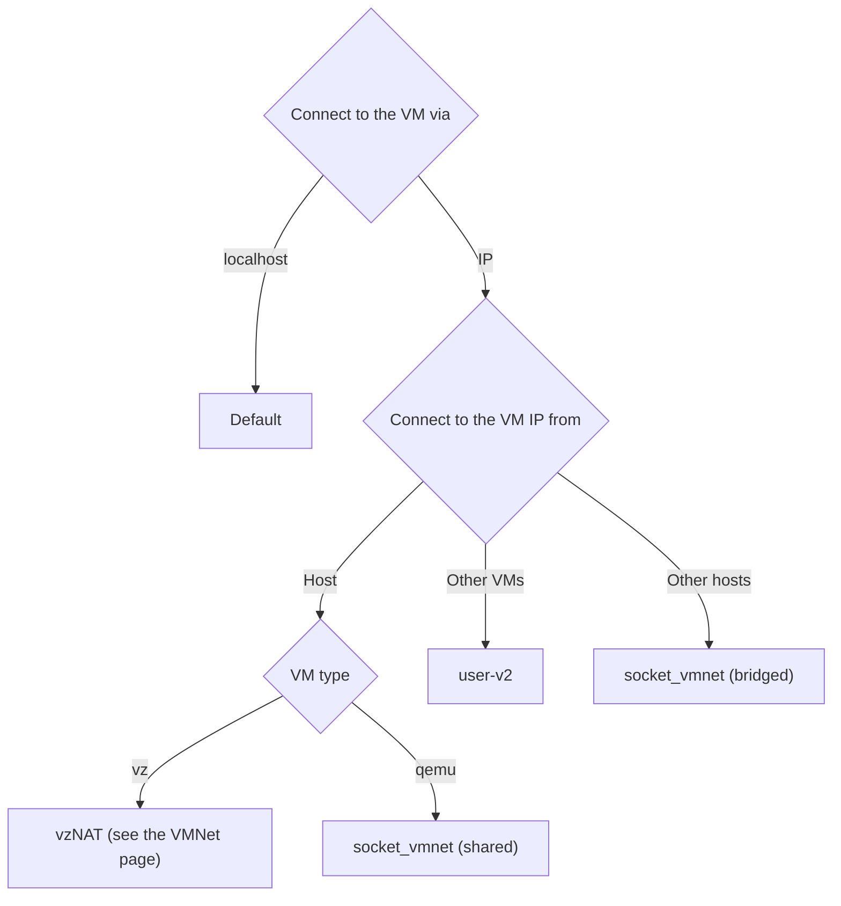
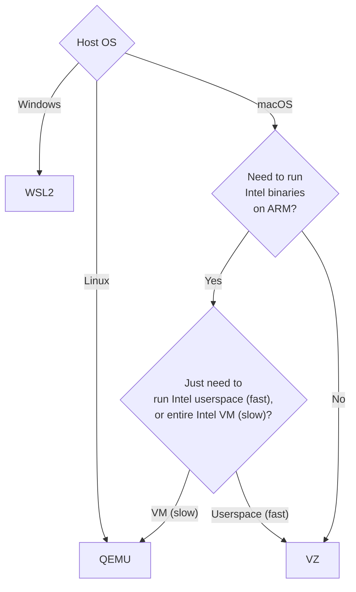

<a id="doc-12e0a48d6c5f2a58f4caa284"></a>

# lima-vm/lima / ADOPTERS.md

Upstream: https://github.com/lima-vm/lima/blob/13ae120988d99f6f24f7771f798b766cbebfe6ed/ADOPTERS.md

Commit: `13ae120988d99f6f24f7771f798b766cbebfe6ed`

Retrieved: 2026-10-01T15:22:49.876319+00:00

Kind: official-document

Raw SHA256: `b39b423cde5fb57ebcb45ff8461c7408275f6f6efb9a3fb7bdb889f50bbee5fa`

Source text below is untrusted reference content. Acquisition does not verify technical claims.

License status: UPSTREAM_NOTICES_CAPTURED_PER_FILE_REVIEW_REQUIRED. See this repository's captured license files.

---

# Adopters

- [Rancher Desktop](https://rancherdesktop.io/): Kubernetes and container management to the desktop
- [Colima](https://github.com/abiosoft/colima): Docker (and Kubernetes) on macOS with minimal setup
- [Finch](https://github.com/runfinch/finch): Finch is a command line client for local container development
- [Podman Desktop](https://podman-desktop.io/): Podman Desktop GUI has a plug-in for Lima virtual machines

For a full list, check out: <https://github.com/lima-vm/lima/discussions/2390>


<a id="doc-a54ff182c7e8acf56acfd6e4"></a>

# lima-vm/lima / AGENTS.md

Upstream: https://github.com/lima-vm/lima/blob/13ae120988d99f6f24f7771f798b766cbebfe6ed/AGENTS.md

Commit: `13ae120988d99f6f24f7771f798b766cbebfe6ed`

Retrieved: 2026-10-01T15:22:49.876319+00:00

Kind: official-document

Raw SHA256: `8eacebf95c6a0bea024077264d5b52230b60886742d886e0b2e98dd067f5ccdd`

Source text below is untrusted reference content. Acquisition does not verify technical claims.

License status: UPSTREAM_NOTICES_CAPTURED_PER_FILE_REVIEW_REQUIRED. See this repository's captured license files.

---

# AGENTS.md

Guidance for AI coding agents working in the Lima repository. It points to the authoritative docs
instead of duplicating them, so it stays in sync with the code.

## AI contribution rules

Read @website/content/en/docs/community/contributing.md and follow its "AI Contribution Rules"
section.

## Build, test, lint

Lima is `github.com/lima-vm/lima/v2` (imports use the `/v2` suffix). The build
uses a GNU Makefile; output goes to `_output/`.

```bash
make native        # build limactl + native guestagent + templates (fastest full dev build)
make minimal       # build just limactl + native guestagent + default template
go test ./...      # unit tests - never boot VMs
make bats          # integration tests (BATS); boot real VMs (needs git submodules)
make lint          # editorconfig, golangci-lint, yamllint, ls-lint, shellcheck, ltag, ...
make generate      # regenerate protobuf after editing a .proto file
```

Unit tests never execute VMs; anything that boots a VM is a BATS or template test under `hack/`
(for example `./hack/test-templates.sh ./templates/default.yaml`). Every commit must be signed off
with `git commit -s`, or CI fails.

## Where things are

Pointers to the authoritative sources - read these rather than a duplicated copy here.

- Architecture, the three processes (`limactl` / hostagent / guestagent), the on-disk `${LIMA_HOME}`
  layout, and every `LIMA_CIDATA_*` variable:
  [`website/content/en/docs/dev/internals.md`](website/content/en/docs/dev/internals.md).
- Config / data model: `pkg/limatype` (core `LimaYAML` / `Instance` types), `pkg/limayaml`
  (load / default / validate), `pkg/limatmpl` and `pkg/templatestore` (templates).
- Drivers (virtualization backends): `pkg/driver/`
- Guest provisioning: `pkg/cidata/` builds `cidata.iso` (guestagent binary, boot scripts, and the
  `user-data` file). `user-data` uses the cloud-config YAML format defined by cloud-init, which a
  guest may consume with an implementation other than Python cloud-init.
- Instance lifecycle: `pkg/instance/`.

## Conventions

- New Go, shell, Dockerfile, and Makefile files need an SPDX header (`ltag` enforces this in CI;
  other file types, including markdown, are exempt).
- Keep the `gomodjail` / `gosocialcheck` annotations in `go.mod`. `make gomodjail` statically
  verifies that the modules annotated `gomodjail:confined` cannot reach a denied capability
  (filesystem, network, process execution, raw syscalls, ...); when a dependency bump makes one
  of them reach a capability, `make gomodjail-fix` downgrades that annotation to
  `gomodjail:unconfined` instead of confining it by hand.


<a id="doc-6ebdb617a8104a7756d0cf36"></a>

# lima-vm/lima / CLAUDE.md

Upstream: https://github.com/lima-vm/lima/blob/13ae120988d99f6f24f7771f798b766cbebfe6ed/CLAUDE.md

Commit: `13ae120988d99f6f24f7771f798b766cbebfe6ed`

Retrieved: 2026-10-01T15:22:49.876319+00:00

Kind: official-document

Raw SHA256: `7ef3db86b0ef991077e0fb94c12b536da2890f8f632468136d73762d4490f0ba`

Source text below is untrusted reference content. Acquisition does not verify technical claims.

License status: UPSTREAM_NOTICES_CAPTURED_PER_FILE_REVIEW_REQUIRED. See this repository's captured license files.

---

# CLAUDE.md

@AGENTS.md

`AGENTS.md` is the shared guidance for AI coding agents in this repository; the `@` line above makes
the harness load it. Personal, machine-local overrides may live in `CLAUDE.local.md` (gitignored).


<a id="doc-c693279643b8cd5d248172d9"></a>

# lima-vm/lima / LICENSE

Upstream: https://github.com/lima-vm/lima/blob/13ae120988d99f6f24f7771f798b766cbebfe6ed/LICENSE

Commit: `13ae120988d99f6f24f7771f798b766cbebfe6ed`

Retrieved: 2026-10-01T15:22:49.876319+00:00

Kind: license

Raw SHA256: `cfc7749b96f63bd31c3c42b5c471bf756814053e847c10f3eb003417bc523d30`

Source text below is untrusted reference content. Acquisition does not verify technical claims.

License status: UPSTREAM_NOTICES_CAPTURED_PER_FILE_REVIEW_REQUIRED. See this repository's captured license files.

---

````text

                                 Apache License
                           Version 2.0, January 2004
                        http://www.apache.org/licenses/

   TERMS AND CONDITIONS FOR USE, REPRODUCTION, AND DISTRIBUTION

   1. Definitions.

      "License" shall mean the terms and conditions for use, reproduction,
      and distribution as defined by Sections 1 through 9 of this document.

      "Licensor" shall mean the copyright owner or entity authorized by
      the copyright owner that is granting the License.

      "Legal Entity" shall mean the union of the acting entity and all
      other entities that control, are controlled by, or are under common
      control with that entity. For the purposes of this definition,
      "control" means (i) the power, direct or indirect, to cause the
      direction or management of such entity, whether by contract or
      otherwise, or (ii) ownership of fifty percent (50%) or more of the
      outstanding shares, or (iii) beneficial ownership of such entity.

      "You" (or "Your") shall mean an individual or Legal Entity
      exercising permissions granted by this License.

      "Source" form shall mean the preferred form for making modifications,
      including but not limited to software source code, documentation
      source, and configuration files.

      "Object" form shall mean any form resulting from mechanical
      transformation or translation of a Source form, including but
      not limited to compiled object code, generated documentation,
      and conversions to other media types.

      "Work" shall mean the work of authorship, whether in Source or
      Object form, made available under the License, as indicated by a
      copyright notice that is included in or attached to the work
      (an example is provided in the Appendix below).

      "Derivative Works" shall mean any work, whether in Source or Object
      form, that is based on (or derived from) the Work and for which the
      editorial revisions, annotations, elaborations, or other modifications
      represent, as a whole, an original work of authorship. For the purposes
      of this License, Derivative Works shall not include works that remain
      separable from, or merely link (or bind by name) to the interfaces of,
      the Work and Derivative Works thereof.

      "Contribution" shall mean any work of authorship, including
      the original version of the Work and any modifications or additions
      to that Work or Derivative Works thereof, that is intentionally
      submitted to Licensor for inclusion in the Work by the copyright owner
      or by an individual or Legal Entity authorized to submit on behalf of
      the copyright owner. For the purposes of this definition, "submitted"
      means any form of electronic, verbal, or written communication sent
      to the Licensor or its representatives, including but not limited to
      communication on electronic mailing lists, source code control systems,
      and issue tracking systems that are managed by, or on behalf of, the
      Licensor for the purpose of discussing and improving the Work, but
      excluding communication that is conspicuously marked or otherwise
      designated in writing by the copyright owner as "Not a Contribution."

      "Contributor" shall mean Licensor and any individual or Legal Entity
      on behalf of whom a Contribution has been received by Licensor and
      subsequently incorporated within the Work.

   2. Grant of Copyright License. Subject to the terms and conditions of
      this License, each Contributor hereby grants to You a perpetual,
      worldwide, non-exclusive, no-charge, royalty-free, irrevocable
      copyright license to reproduce, prepare Derivative Works of,
      publicly display, publicly perform, sublicense, and distribute the
      Work and such Derivative Works in Source or Object form.

   3. Grant of Patent License. Subject to the terms and conditions of
      this License, each Contributor hereby grants to You a perpetual,
      worldwide, non-exclusive, no-charge, royalty-free, irrevocable
      (except as stated in this section) patent license to make, have made,
      use, offer to sell, sell, import, and otherwise transfer the Work,
      where such license applies only to those patent claims licensable
      by such Contributor that are necessarily infringed by their
      Contribution(s) alone or by combination of their Contribution(s)
      with the Work to which such Contribution(s) was submitted. If You
      institute patent litigation against any entity (including a
      cross-claim or counterclaim in a lawsuit) alleging that the Work
      or a Contribution incorporated within the Work constitutes direct
      or contributory patent infringement, then any patent licenses
      granted to You under this License for that Work shall terminate
      as of the date such litigation is filed.

   4. Redistribution. You may reproduce and distribute copies of the
      Work or Derivative Works thereof in any medium, with or without
      modifications, and in Source or Object form, provided that You
      meet the following conditions:

      (a) You must give any other recipients of the Work or
          Derivative Works a copy of this License; and

      (b) You must cause any modified files to carry prominent notices
          stating that You changed the files; and

      (c) You must retain, in the Source form of any Derivative Works
          that You distribute, all copyright, patent, trademark, and
          attribution notices from the Source form of the Work,
          excluding those notices that do not pertain to any part of
          the Derivative Works; and

      (d) If the Work includes a "NOTICE" text file as part of its
          distribution, then any Derivative Works that You distribute must
          include a readable copy of the attribution notices contained
          within such NOTICE file, excluding those notices that do not
          pertain to any part of the Derivative Works, in at least one
          of the following places: within a NOTICE text file distributed
          as part of the Derivative Works; within the Source form or
          documentation, if provided along with the Derivative Works; or,
          within a display generated by the Derivative Works, if and
          wherever such third-party notices normally appear. The contents
          of the NOTICE file are for informational purposes only and
          do not modify the License. You may add Your own attribution
          notices within Derivative Works that You distribute, alongside
          or as an addendum to the NOTICE text from the Work, provided
          that such additional attribution notices cannot be construed
          as modifying the License.

      You may add Your own copyright statement to Your modifications and
      may provide additional or different license terms and conditions
      for use, reproduction, or distribution of Your modifications, or
      for any such Derivative Works as a whole, provided Your use,
      reproduction, and distribution of the Work otherwise complies with
      the conditions stated in this License.

   5. Submission of Contributions. Unless You explicitly state otherwise,
      any Contribution intentionally submitted for inclusion in the Work
      by You to the Licensor shall be under the terms and conditions of
      this License, without any additional terms or conditions.
      Notwithstanding the above, nothing herein shall supersede or modify
      the terms of any separate license agreement you may have executed
      with Licensor regarding such Contributions.

   6. Trademarks. This License does not grant permission to use the trade
      names, trademarks, service marks, or product names of the Licensor,
      except as required for reasonable and customary use in describing the
      origin of the Work and reproducing the content of the NOTICE file.

   7. Disclaimer of Warranty. Unless required by applicable law or
      agreed to in writing, Licensor provides the Work (and each
      Contributor provides its Contributions) on an "AS IS" BASIS,
      WITHOUT WARRANTIES OR CONDITIONS OF ANY KIND, either express or
      implied, including, without limitation, any warranties or conditions
      of TITLE, NON-INFRINGEMENT, MERCHANTABILITY, or FITNESS FOR A
      PARTICULAR PURPOSE. You are solely responsible for determining the
      appropriateness of using or redistributing the Work and assume any
      risks associated with Your exercise of permissions under this License.

   8. Limitation of Liability. In no event and under no legal theory,
      whether in tort (including negligence), contract, or otherwise,
      unless required by applicable law (such as deliberate and grossly
      negligent acts) or agreed to in writing, shall any Contributor be
      liable to You for damages, including any direct, indirect, special,
      incidental, or consequential damages of any character arising as a
      result of this License or out of the use or inability to use the
      Work (including but not limited to damages for loss of goodwill,
      work stoppage, computer failure or malfunction, or any and all
      other commercial damages or losses), even if such Contributor
      has been advised of the possibility of such damages.

   9. Accepting Warranty or Additional Liability. While redistributing
      the Work or Derivative Works thereof, You may choose to offer,
      and charge a fee for, acceptance of support, warranty, indemnity,
      or other liability obligations and/or rights consistent with this
      License. However, in accepting such obligations, You may act only
      on Your own behalf and on Your sole responsibility, not on behalf
      of any other Contributor, and only if You agree to indemnify,
      defend, and hold each Contributor harmless for any liability
      incurred by, or claims asserted against, such Contributor by reason
      of your accepting any such warranty or additional liability.

   END OF TERMS AND CONDITIONS

   APPENDIX: How to apply the Apache License to your work.

      To apply the Apache License to your work, attach the following
      boilerplate notice, with the fields enclosed by brackets "[]"
      replaced with your own identifying information. (Don't include
      the brackets!)  The text should be enclosed in the appropriate
      comment syntax for the file format. We also recommend that a
      file or class name and description of purpose be included on the
      same "printed page" as the copyright notice for easier
      identification within third-party archives.

   Copyright [yyyy] [name of copyright owner]

   Licensed under the Apache License, Version 2.0 (the "License");
   you may not use this file except in compliance with the License.
   You may obtain a copy of the License at

       http://www.apache.org/licenses/LICENSE-2.0

   Unless required by applicable law or agreed to in writing, software
   distributed under the License is distributed on an "AS IS" BASIS,
   WITHOUT WARRANTIES OR CONDITIONS OF ANY KIND, either express or implied.
   See the License for the specific language governing permissions and
   limitations under the License.

````


<a id="doc-39da3bd6270d44ea37b6ed50"></a>

# lima-vm/lima / MAINTAINERS.md

Upstream: https://github.com/lima-vm/lima/blob/13ae120988d99f6f24f7771f798b766cbebfe6ed/MAINTAINERS.md

Commit: `13ae120988d99f6f24f7771f798b766cbebfe6ed`

Retrieved: 2026-10-01T15:22:49.876319+00:00

Kind: official-document

Raw SHA256: `74fe542c14c6c39492586a9c823131dfdb04cb8acb2e790762ec62e4ac1c280c`

Source text below is untrusted reference content. Acquisition does not verify technical claims.

License status: UPSTREAM_NOTICES_CAPTURED_PER_FILE_REVIEW_REQUIRED. See this repository's captured license files.

---

Moved to <https://lima-vm.io/docs/community/governance/>.


<a id="doc-dfb14fbb9e7d095209ec4cfd"></a>

# lima-vm/lima / NOTICE

Upstream: https://github.com/lima-vm/lima/blob/13ae120988d99f6f24f7771f798b766cbebfe6ed/NOTICE

Commit: `13ae120988d99f6f24f7771f798b766cbebfe6ed`

Retrieved: 2026-10-01T15:22:49.876319+00:00

Kind: license

Raw SHA256: `a7e0caed1395c49dfa6ce7dc8aa6362e4daa8369917f56fbe80084c1ae8c765c`

Source text below is untrusted reference content. Acquisition does not verify technical claims.

License status: UPSTREAM_NOTICES_CAPTURED_PER_FILE_REVIEW_REQUIRED. See this repository's captured license files.

---

````text
Lima
Copyright The Lima Authors.

This project contains portions of other projects that are licensed under the terms of Apache License 2.0.
The NOTICE files of those projects are replicated here for compliance of the section 4(d) of the license.

=== https://github.com/containerd/containerd ===
https://github.com/containerd/containerd/blob/v2.1.1/LICENSE
https://github.com/containerd/containerd/blob/v2.1.1/NOTICE

> Docker
> Copyright 2012-2015 Docker, Inc.
>
> This product includes software developed at Docker, Inc. (https://www.docker.com).
>
> The following is courtesy of our legal counsel:
>
>
> Use and transfer of Docker may be subject to certain restrictions by the
> United States and other governments.
> It is your responsibility to ensure that your use and/or transfer does not
> violate applicable laws.
>
> For more information, please see https://www.bis.doc.gov
>
> See also https://www.apache.org/dev/crypto.html and/or seek legal counsel.

````


<a id="doc-b335630551682c19a781afeb"></a>

# lima-vm/lima / README.md

Upstream: https://github.com/lima-vm/lima/blob/13ae120988d99f6f24f7771f798b766cbebfe6ed/README.md

Commit: `13ae120988d99f6f24f7771f798b766cbebfe6ed`

Retrieved: 2026-10-01T15:22:49.876319+00:00

Kind: official-document

Raw SHA256: `6fe739cb9e00ef211a1014a3b4f8b522d8a7a44551bf0da67caee32b774cc83d`

Source text below is untrusted reference content. Acquisition does not verify technical claims.

License status: UPSTREAM_NOTICES_CAPTURED_PER_FILE_REVIEW_REQUIRED. See this repository's captured license files.

---

[[🌎**Web site**]](https://lima-vm.io/)
[[📖**Documentation**]](https://lima-vm.io/docs/)
[[👤**Slack (`#lima`)**]](https://slack.cncf.io)

<picture>
  <source media="(prefers-color-scheme: dark)" srcset="website/static/images/logo-dark.svg">
  
</picture>

# Lima: Linux Machines

[](https://deepwiki.com/lima-vm/lima)
[](https://www.bestpractices.dev/projects/6505)
[](https://scorecard.dev/viewer/?uri=github.com/lima-vm/lima)

[Lima](https://lima-vm.io/) launches Linux virtual machines with automatic file sharing and port forwarding (similar to WSL2).

The original goal of Lima was to promote [containerd](https://containerd.io) including [nerdctl (contaiNERD ctl)](https://github.com/containerd/nerdctl)
to Mac users, but Lima can be used for non-container applications as well.

Lima also supports other container engines (Docker, Podman, Kubernetes, etc.) and non-macOS hosts (Linux, NetBSD, etc.).

## Getting started
Set up (Homebrew):
```bash
brew install lima
limactl start
```

To run Linux commands:
```bash
lima uname -a
```

To run containers with containerd:
```bash
lima nerdctl run --rm hello-world
```

To run containers with Docker:
```bash
limactl start template:docker
export DOCKER_HOST=$(limactl list docker --format 'unix://{{.Dir}}/sock/docker.sock')
docker run --rm hello-world
```

To run containers with Kubernetes:
```bash
limactl start template:k8s
export KUBECONFIG=$(limactl list k8s --format 'unix://{{.Dir}}/copied-from-guest/kubeconfig.yaml')
kubectl apply -f ...
```

See <https://lima-vm.io/docs/> for the further information.

## Software Bill of Materials (SBOM)

The "sbom" download contains SBOM in the CycloneDX format since v2.3.

There are both "app" \*.bom.json and "mod" bom.json files:

- SBOMs generated with "app" include only those modules that the target application
  actually depends on. Modules required by tests or packages that are not imported
  by the application are not included. Build constraints are evaluated, which enables
  a very detailed view of what's really compiled into an application's binary.

- SBOMs generated with "mod" include the aggregate of modules required by all
  packages in the target module. This optionally includes modules required by
  tests and test packages. Build constraints are NOT evaluated, allowing for
  a "whole picture" view on the target module's dependencies.

## Contributing

We welcome contributions! Please see our [Contributing Guide](https://lima-vm.io/docs/community/contributing/) for details on:

- **Developer Certificate of Origin (DCO)**: All commits must be signed off with `git commit -s`
- Code licensing and pull request guidelines
- Testing requirements

## Community
### Adopters

Container environments:
- [Rancher Desktop](https://rancherdesktop.io/): Kubernetes and container management to the desktop
- [Colima](https://github.com/abiosoft/colima): Docker (and Kubernetes) on macOS with minimal setup
- [Finch](https://github.com/runfinch/finch): Finch is a command line client for local container development
- [Podman Desktop](https://podman-desktop.io/): Podman Desktop GUI has a plug-in for Lima virtual machines

GUI:
- [Lima xbar plugin](https://github.com/unixorn/lima-xbar-plugin): [xbar](https://xbarapp.com/) plugin to start/stop VMs from the menu bar and see their running status.
- [lima-gui](https://github.com/afbjorklund/lima-gui): Qt GUI for Lima

### Communication channels
<!-- Duplicated from https://lima-vm.io/docs/community/ -->
- [GitHub Discussions](https://github.com/lima-vm/lima/discussions)
- `#lima` channel in the CNCF Slack
  - New account: <https://slack.cncf.io/>
  - Login: <https://cloud-native.slack.com/>
- Community meetings on Zoom (tentatively monthly)
  - Meeting notes & agenda proposals: https://github.com/lima-vm/lima/discussions/categories/meetings
  - Calendar: https://zoom-lfx.platform.linuxfoundation.org/meetings/lima

### Social media accounts

Follow us for project updates, release announcements, and community news:

- https://x.com/thelimaproject
- https://mastodon.social/@TheLimaProject

### Code of Conduct
Lima follows the [CNCF Code of Conduct](https://github.com/cncf/foundation/blob/main/code-of-conduct.md).

- - -
**We are a [Cloud Native Computing Foundation](https://cncf.io/) incubating project.**

<picture>
  <source media="(prefers-color-scheme: dark)" srcset="https://www.cncf.io/wp-content/uploads/2022/07/cncf-white-logo.svg">
  
</picture>

The Linux Foundation® (TLF) has registered trademarks and uses trademarks. For a list of TLF trademarks, see [Trademark Usage](https://www.linuxfoundation.org/legal/trademark-usage).


<a id="doc-683343bdf93f55ed3cada861"></a>

# lima-vm/lima / ROADMAP.md

Upstream: https://github.com/lima-vm/lima/blob/13ae120988d99f6f24f7771f798b766cbebfe6ed/ROADMAP.md

Commit: `13ae120988d99f6f24f7771f798b766cbebfe6ed`

Retrieved: 2026-10-01T15:22:49.876319+00:00

Kind: official-document

Raw SHA256: `11be97b9d348f88d2ece3b6394cafb9f51aebb5049b60066174cf9c6624cab7c`

Source text below is untrusted reference content. Acquisition does not verify technical claims.

License status: UPSTREAM_NOTICES_CAPTURED_PER_FILE_REVIEW_REQUIRED. See this repository's captured license files.

---

Moved to <https://lima-vm.io/docs/community/roadmap/>.


<a id="doc-0b5ca119d2be595aa307d345"></a>

# lima-vm/lima / docs/README.md

Upstream: https://github.com/lima-vm/lima/blob/13ae120988d99f6f24f7771f798b766cbebfe6ed/docs/README.md

Commit: `13ae120988d99f6f24f7771f798b766cbebfe6ed`

Retrieved: 2026-10-01T15:22:49.876319+00:00

Kind: official-document

Raw SHA256: `9c263f7a98210016b76c98f29bcb2ace3b949d53a054bda72d8be7a1758a15a3`

Source text below is untrusted reference content. Acquisition does not verify technical claims.

License status: UPSTREAM_NOTICES_CAPTURED_PER_FILE_REVIEW_REQUIRED. See this repository's captured license files.

---

Moved to <https://lima-vm.io/docs/>

> [!NOTE]
> The document source can be found in [`../website/content/en/docs/`](../website/content/en/docs/).


<a id="doc-70d309539cdd2cea6c2afa22"></a>

# lima-vm/lima / hack/bats/README.md

Upstream: https://github.com/lima-vm/lima/blob/13ae120988d99f6f24f7771f798b766cbebfe6ed/hack/bats/README.md

Commit: `13ae120988d99f6f24f7771f798b766cbebfe6ed`

Retrieved: 2026-10-01T15:22:49.876319+00:00

Kind: official-document

Raw SHA256: `16dffaa3f12ba930e9d219628d770bc54cf24afeb232c6742d1bac68ee06201d`

Source text below is untrusted reference content. Acquisition does not verify technical claims.

License status: UPSTREAM_NOTICES_CAPTURED_PER_FILE_REVIEW_REQUIRED. See this repository's captured license files.

---

# BATS Integration Tests

See the [Testing](https://lima-vm.io/docs/dev/testing/) page for how to run these tests
and the [BATS Style Guide](https://lima-vm.io/docs/dev/testing/bats-style/) for coding conventions.


<a id="doc-3d5036fcbee938d3d4cf66f9"></a>

# lima-vm/lima / hack/bats/extras/README.md

Upstream: https://github.com/lima-vm/lima/blob/13ae120988d99f6f24f7771f798b766cbebfe6ed/hack/bats/extras/README.md

Commit: `13ae120988d99f6f24f7771f798b766cbebfe6ed`

Retrieved: 2026-10-01T15:22:49.876319+00:00

Kind: official-document

Raw SHA256: `48ba28bea286ddf37e50e60ef5db2eef8f2b8de9cd95acdc25bc522c7a9353a9`

Source text below is untrusted reference content. Acquisition does not verify technical claims.

License status: UPSTREAM_NOTICES_CAPTURED_PER_FILE_REVIEW_REQUIRED. See this repository's captured license files.

---

# Extra tests

The extra tests located in this directory are not automatically executed via `make bats`.

Some tests are executed on the CI, some ones are not.
Refer to the configuration of the GitHub Actions to see what tests are executed.


<a id="doc-af03ff89b349afdbf776d0d5"></a>

# lima-vm/lima / templates/README.md

Upstream: https://github.com/lima-vm/lima/blob/13ae120988d99f6f24f7771f798b766cbebfe6ed/templates/README.md

Commit: `13ae120988d99f6f24f7771f798b766cbebfe6ed`

Retrieved: 2026-10-01T15:22:49.876319+00:00

Kind: official-document

Raw SHA256: `d1763f75a2020901b7ed4caadc0e1c7b4d39835a641b3b7798c191387f9bd47b`

Source text below is untrusted reference content. Acquisition does not verify technical claims.

License status: UPSTREAM_NOTICES_CAPTURED_PER_FILE_REVIEW_REQUIRED. See this repository's captured license files.

---

## Quick usage

To create and start a new instance from the template `fedora`:
```bash
# Note: In Lima 1.x, template URLs included leading slashes, e.g. `template://fedora`.
limactl create template:fedora
limactl start fedora
```
or
```bash
limactl start template:fedora
# For the second time onward, just run `limactl start fedora`
```

To open a shell:
```bash
limactl shell fedora
```
or
```bash
export LIMA_INSTANCE=fedora
lima
```

## Template list

⭐ = ["Tier 1"](#tier)

☆ = ["Tier 2"](#tier)

### Default

- [`default`](./default.yaml) (⭐Ubuntu, with containerd/nerdctl)

### Linux distributions

- [`almalinux-8`](./almalinux-8.yaml): AlmaLinux 8
- [`almalinux-9`](./almalinux-9.yaml): AlmaLinux 9
- [`almalinux-10`](./almalinux-10.yaml), `almalinux`: AlmaLinux 10
- [`experimental/almalinux-kitten-10`](./experimental/almalinux-kitten-10.yaml), `experimental/almalinux-kitten`: AlmaLinux Kitten 10
- [`alpine-3.21`](./alpine-3.21.yaml): Alpine Linux 3.21
- [`alpine-3.22`](./alpine-3.22.yaml): Alpine Linux 3.22
- [`alpine-3.23`](./alpine-3.23.yaml), `alpine`: ☆Alpine Linux 3.23
- [`alpine-iso`](./alpine-iso.yaml): ☆Alpine Linux (ISO9660 image). Compatible with the `alpine` template used in Lima prior to v1.0.
- [`archlinux`](./archlinux.yaml): ☆Arch Linux
- [`centos-stream-9`](./centos-stream-9.yaml), `centos-stream`: CentOS Stream 9
- [`centos-stream-10`](./centos-stream-10.yaml): CentOS Stream 10
- [`debian-11`](./debian-11.yaml): Debian GNU/Linux 11 (Bullseye)
- [`debian-12`](./debian-12.yaml): Debian GNU/Linux 12 (Bookworm)
- [`debian-13`](./debian-13.yaml), `debian`: ⭐Debian GNU/Linux 13 (Trixie)
- [`fedora-41`](./fedora-41.yaml): Fedora 41
- [`fedora-42`](./fedora-42.yaml): Fedora 42
- [`fedora-43`](./fedora-43.yaml), Fedora 43
- [`fedora-44`](./fedora-44.yaml), `fedora`: ⭐Fedora 44
- [`opensuse-leap-15`](./opensuse-leap-15.yaml): openSUSE Leap 15
- [`opensuse-leap-16`](./opensuse-leap-16.yaml), `opensuse-leap`, `opensuse`: ⭐openSUSE Leap 16
- [`oraclelinux-8`](./oraclelinux-8.yaml): Oracle Linux 8
- [`oraclelinux-9`](./oraclelinux-9.yaml): Oracle Linux 9
- [`oraclelinux-10`](./oraclelinux-10.yaml), `oraclelinux`: Oracle Linux 10
- [`rocky-8`](./rocky-8.yaml): Rocky Linux 8
- [`rocky-9`](./rocky-9.yaml): Rocky Linux 9
- [`rocky-10`](./rocky-10.yaml), `rocky`: Rocky Linux 10
- [`ubuntu-20.04`](./ubuntu-20.04.yaml): Ubuntu 20.04 LTS (Focal Fossa)
- [`ubuntu-22.04`](./ubuntu-22.04.yaml): Ubuntu 22.04 LTS (Jammy Jellyfish)
- [`ubuntu-24.04`](./ubuntu-24.04.yaml): Ubuntu 24.04 LTS (Noble Numbat)
- [`ubuntu-24.10`](./ubuntu-24.10.yaml): Ubuntu 24.10 (Oracular Oriole)
- [`ubuntu-25.04`](./ubuntu-25.04.yaml): Ubuntu 25.04 (Plucky Puffin)
- [`ubuntu-25.10`](./ubuntu-25.10.yaml): Ubuntu 25.10 (Questing Quokka)
- [`ubuntu-26.04`](./ubuntu-26.04.yaml), `ubuntu`, `ubuntu-lts`: Ubuntu 26.04 (Resolute Raccoon)
  - Same as `default` but comment lines are omitted from the YAML
- [`experimental/ubuntu-next`](./experimental/ubuntu-next.yaml): Ubuntu vNext
- [`experimental/gentoo`](./experimental/gentoo.yaml): Gentoo
- [`experimental/opensuse-tumbleweed`](./experimental/opensuse-tumbleweed.yaml): openSUSE Tumbleweed
- [`experimental/debian-sid`](./experimental/debian-sid.yaml): Debian Sid
- [`experimental/fedora-rawhide`](./experimental/fedora-rawhide.yaml): Fedora Rawhide

### Non-Linux

NOTE: support for non-Linux OSes is [experimental](https://lima-vm.io/docs/releases/experimental/).
For running macOS guests, you need a macOS host that is same or newer than the guest OS.

- [`macos-15`](./macos-15.yaml): [macOS](https://lima-vm.io/docs/usage/guests/macos/) 15 (Sequoia)
- [`macos-26`](./macos-26.yaml): [macOS](https://lima-vm.io/docs/usage/guests/macos/) 26 (Tahoe)
- [`macos-27`](./macos-27.yaml), `macos`: [macOS](https://lima-vm.io/docs/usage/guests/macos/) 27 (Golden Gate)
- [`freebsd-15`](./freebsd-15.yaml), `freebsd`: [FreeBSD](https://lima-vm.io/docs/usage/guests/freebsd/) 15
- [`experimental/freebsd-current`](./experimental/freebsd-current.yaml): [FreeBSD](https://lima-vm.io/docs/usage/guests/freebsd/) CURRENT
- [`windows-2025`](./windows-2025.yaml): [Windows](https://lima-vm.io/docs/usage/guests/windows/) server 2025

### Alternative package managers

- [`linuxbrew`](./linuxbrew.yaml), `homebrew-linux`: [Homebrew](https://brew.sh) on Linux (Ubuntu)
- [`homebrew-macos`](./homebrew-macos.yaml): [Homebrew](https://brew.sh) on macOS

### Containers

#### Container engines

- [`apptainer`](./apptainer.yaml): [Apptainer](https://lima-vm.io/docs/examples/containers/apptainer/)
- [`apptainer-rootful`](./apptainer-rootful.yaml): [Apptainer](https://lima-vm.io/docs/examples/containers/apptainer/) (rootful)
- [`docker`](./docker.yaml): ⭐[Docker](https://lima-vm.io/docs/examples/containers/docker/)
- [`docker-rootful`](./docker-rootful.yaml): [Docker](https://lima-vm.io/docs/examples/containers/docker/) (rootful)
- [`podman`](./podman.yaml): [Podman](https://lima-vm.io/docs/examples/containers/podman/)
- [`podman-rootful`](./podman-rootful.yaml): [Podman](https://lima-vm.io/docs/examples/containers/podman/) (rootful)
- LXD is installed in the default Ubuntu template, so there is no `lxd`

#### Container image builders

- [`buildkit`](./buildkit.yaml): BuildKit

#### Container orchestration

- [`faasd`](./faasd.yaml): [Faasd](https://docs.openfaas.com/deployment/edge/)
- [`k0s`](./k0s.yaml): [k0s](https://k0sproject.io/) Zero Friction Kubernetes
- [`k3s`](./k3s.yaml): Kubernetes via k3s
- [`k8s`](./k8s.yaml): ⭐[Kubernetes](https://lima-vm.io/docs/examples/containers/kubernetes/) via kubeadm
- [`experimental/rke2`](./experimental/rke2.yaml): RKE2
- [`experimental/u7s`](./experimental/u7s.yaml): [Usernetes](https://github.com/rootless-containers/usernetes): Rootless Kubernetes

### AI agents

See <https://lima-vm.io/docs/examples/ai/>.

### Optional feature enablers

- [`experimental/vnc`](./experimental/vnc.yaml): use vnc display and xorg server
- [`experimental/alsa`](./experimental/alsa.yaml): use alsa and default audio device
- [`experimental/hcs`](./experimental/hcs.yaml): use [HCS driver](https://lima-vm.io/docs/config/vmtype/hcs/) on Windows hosts

### Lost+found

<details>
<summary>Details</summary>
<p>

- `centos`: Removed in Lima v0.8.0, as CentOS 8 reached [EOL](https://www.centos.org/centos-linux-eol/).
  Replaced by [`almalinux`](./almalinux.yaml), [`centos-stream`](./centos-stream.yaml), [`oraclelinux`](./oraclelinux.yaml),
  and [`rocky`](./rocky.yaml).
- `singularity`: Moved to [`apptainer-rootful`](./apptainer-rootful.yaml) in Lima v0.13.0, as Singularity was renamed to Apptainer.
- `experimental/apptainer`: Moved to [`apptainer`](./apptainer.yaml) in Lima v0.13.0.
- `experimental/{almalinux,centos-stream-9,oraclelinux,rocky}-9`: Moved to [`almalinux-9`](./almalinux-9.yaml), [`centos-stream-9`](./centos-stream-9.yaml),
  [`oraclelinux-9`](./oraclelinux-9.yaml), and [`rocky-9`](./rocky-9.yaml) in Lima v0.13.0.
- `nomad`: Removed in Lima v0.17.1, as Nomad is [no longer free software](https://github.com/hashicorp/nomad/commit/b3e30b1dfa185d9437a25830522da47b91f78816)
- `centos-stream-8`: Remove in Lima v0.23.0, as CentOS Stream 8 reached [EOL](https://blog.centos.org/2023/04/end-dates-are-coming-for-centos-stream-8-and-centos-linux-7/).
- `deprecated/centos-7`: Remove in Lima v0.23.0, as CentOS 7 reached [EOL](https://blog.centos.org/2023/04/end-dates-are-coming-for-centos-stream-8-and-centos-linux-7/).
- `experimental/vz`: Merged into the default template in Lima v1.0. See also <https://lima-vm.io/docs/config/vmtype/>.
- `experimental/armv7l`: Merged into the `default` template in Lima v1.0. Use `limactl create --arch=armv7l template:default`.
- `experimental/riscv64`: Merged into the `default` template in Lima v1.0. Use `limactl create --arch=riscv64 template:default`.
- `vmnet`: Removed in Lima v1.0. Use `limactl create --network=lima:shared template:default` instead. See also <https://lima-vm.io/docs/config/network/>.
- `experimental/net-user-v2`: Removed in Lima v1.0. Use `limactl create --network=lima:user-v2 template:default` instead. See also <https://lima-vm.io/docs/config/network/>.
- `experimental/9p`: Removed in Lima v1.0. Use `limactl create --vm-type=qemu --mount-type=9p template:default` instead. See also <https://lima-vm.io/docs/config/mount/>.
- `experimental/virtiofs-linux`: Removed in Lima v1.0. Use `limactl create --mount-type=virtiofs-linux template:default` instead. See also <https://lima-vm.io/docs/config/mount/>.

</p>
</details>

## Tier

- "Tier 1" (marked with ⭐): Good stability. Regularly tested on the CI.
- "Tier 2" (marked with ☆): Moderate stability. Regularly tested on the CI.

Other templates are tested only occasionally and manually.


<a id="doc-0eb684c3ea7be1b3de6b0b15"></a>

# lima-vm/lima / website/README.md

Upstream: https://github.com/lima-vm/lima/blob/13ae120988d99f6f24f7771f798b766cbebfe6ed/website/README.md

Commit: `13ae120988d99f6f24f7771f798b766cbebfe6ed`

Retrieved: 2026-10-01T15:22:49.876319+00:00

Kind: official-document

Raw SHA256: `2df1cdcc28f04d44105de01c7a8595fd72b78e7b40e95477cde414fb0137a6f3`

Source text below is untrusted reference content. Acquisition does not verify technical claims.

License status: UPSTREAM_NOTICES_CAPTURED_PER_FILE_REVIEW_REQUIRED. See this repository's captured license files.

---

# The source of the Lima website (https://lima-vm.io)

This directory is the [Netlify base directory](https://docs.netlify.com/configure-builds/overview/) of [https://lima-vm.io](https://lima-vm.io/) .


<a id="doc-d747bd8b6823ce4a9ca5dbc8"></a>

# lima-vm/lima / website/content/en/docs/_index.md

Upstream: https://github.com/lima-vm/lima/blob/13ae120988d99f6f24f7771f798b766cbebfe6ed/website/content/en/docs/_index.md

Commit: `13ae120988d99f6f24f7771f798b766cbebfe6ed`

Retrieved: 2026-10-01T15:22:49.876319+00:00

Kind: official-document

Raw SHA256: `fcd14f15370736ef23fb58be06ebe2f427c553adbf433fe90946d9613ae975a0`

Source text below is untrusted reference content. Acquisition does not verify technical claims.

License status: UPSTREAM_NOTICES_CAPTURED_PER_FILE_REVIEW_REQUIRED. See this repository's captured license files.

---

---
title: "Lima: Linux Machines"
linkTitle: Documentation
menu: {main: {weight: 20}}
weight: 20
---
{}
Lima launches Linux virtual machines with automatic file sharing and port forwarding (similar to WSL2).

✅ Automatic file sharing

✅ Automatic port forwarding

✅ Built-in support for [containerd](https://containerd.io) ([Other container engines can be used too]())

✅ Intel on Intel

✅ [ARM on Intel]()

✅ ARM on ARM

✅ [Intel on ARM]()

✅ Various guest Linux distributions: [AlmaLinux](./templates/almalinux.yaml), [Alpine](./templates/alpine.yaml), [Arch Linux](./templates/archlinux.yaml), [Debian](./templates/debian.yaml), [Fedora](./templates/fedora.yaml), [openSUSE](./templates/opensuse.yaml), [Oracle Linux](./templates/oraclelinux.yaml), [Rocky](./templates/rocky.yaml), [Ubuntu](./templates/ubuntu.yaml) (default), ...

✅ Experimental support for non-Linux guests: [macOS](), [FreeBSD](), and [Windows]()

Related project: [sshocker (ssh with file sharing and port forwarding)](https://github.com/lima-vm/sshocker)

This project is unrelated to [The Lima driver project (driver for ARM Mali GPUs)](https://gitlab.freedesktop.org/lima).

## Project history

Lima began in May 2021, aiming at promoting [containerd](https://containerd.io) including [nerdctl (contaiNERD ctl)](https://github.com/containerd/nerdctl)
to Mac users.
Later the project scope was expanded to support other containers
and non-container applications as well.
Lima also supports non-macOS hosts (Linux, NetBSD, etc.).

Lima joined the [Cloud Native Computing Foundation (CNCF)](https://cncf.io)
in September 2022 as a Sandbox project.
The project was promoted to the Incubating level in October 2025.

{}


<a id="doc-bca2836da779292847838efe"></a>

# lima-vm/lima / website/content/en/docs/blogs/_index.md

Upstream: https://github.com/lima-vm/lima/blob/13ae120988d99f6f24f7771f798b766cbebfe6ed/website/content/en/docs/blogs/_index.md

Commit: `13ae120988d99f6f24f7771f798b766cbebfe6ed`

Retrieved: 2026-10-01T15:22:49.876319+00:00

Kind: official-document

Raw SHA256: `c344fca6468343898dfb6ec3a1e36daace148b253938ed5ef10b5e65aff108f7`

Source text below is untrusted reference content. Acquisition does not verify technical claims.

License status: UPSTREAM_NOTICES_CAPTURED_PER_FILE_REVIEW_REQUIRED. See this repository's captured license files.

---

---
title: Blogs
weight: 451
---

Curated blog articles about Lima. Community-contributed additions are collected in the [Show and tell](https://github.com/lima-vm/lima/discussions/categories/show-and-tell) discussion category, in particular the [Community blogs and write-ups about Lima](https://github.com/lima-vm/lima/discussions/4864) thread -- please add new finds there and the best-known ones will be folded into this page over time.

## 2021

### containerd & Lima: Open source alternative to Docker for Mac

[Akihiro Suda](https://github.com/AkihiroSuda) on Lima as a free, libre, and open source alternative to Docker for Mac, paired with containerd and nerdctl.

Read the [post on nttlabs / Medium](https://medium.com/nttlabs/containerd-and-lima-39e0b64d2a59).

## 2022

### Lima is now a CNCF project

[Akihiro Suda](https://github.com/AkihiroSuda) on Lima's acceptance into CNCF at the Sandbox level.

Read the [post on nttlabs / Medium](https://medium.com/nttlabs/lima-is-now-a-cncf-project-a7affde4f03c).

## 2023

### Lima: a nice way to run Linux VMs on Mac

[Julia Evans](https://jvns.ca/) walks through using Lima day-to-day to run Linux VMs on macOS.

Read the [post on jvns.ca](https://jvns.ca/blog/2023/07/10/lima--a-nice-way-to-run-linux-vms-on-mac/).

## 2024

### Accelerating Llama on Lima, with WASI-NN RPC

[Akihiro Suda](https://github.com/AkihiroSuda) on exposing host GPUs to Lima VMs through WASI-NN over gRPC, taking Llama 2 on Apple M2 Pro from 0.66 to 14.73 tokens/s.

Read the [post on nttlabs / Medium](https://medium.com/nttlabs/accelerating-llama-on-lima-with-wasi-nn-rpc-06b84bcbbe5c).

### Lima completes fuzzing audit

CNCF blog post covering the third-party fuzzing audit of Lima and its findings.

Read the [post on the CNCF blog](https://www.cncf.io/blog/2024/10/10/lima-completes-fuzzing-audit/).

### containerd v2.0, nerdctl v2.0, Lima v1.0

[Akihiro Suda](https://github.com/AkihiroSuda) on the coordinated v2.0 / v2.0 / v1.0 releases of containerd, nerdctl, and Lima.

Read the [post on nttlabs / Medium](https://medium.com/nttlabs/containerd-v2-0-nerdctl-v2-0-lima-v1-0-93026b5839f8).

## 2025

### containerd v2.1, nerdctl v2.1, and Lima v1.1

[Akihiro Suda](https://github.com/AkihiroSuda) on the next coordinated release wave across containerd, nerdctl, and Lima.

Read the [post on nttlabs / Medium](https://medium.com/nttlabs/containerd-v2-1-nerdctl-v2-1-and-lima-v1-1-74400ee87c2c).

### Lima becomes a CNCF incubating project

Announcement covering Lima's promotion from Sandbox to Incubating.

Read the [post on the CNCF blog](https://www.cncf.io/blog/2025/11/11/lima-becomes-a-cncf-incubating-project/).

### Lima v2.0: New features for secure AI workflows

Highlights of the Lima 2.0 release, covering plugin infrastructure (VM driver, CLI, URL-scheme plugins), GPU acceleration via `krunkit`, Model Context Protocol tooling, and expanded networking.

Read the [post on the CNCF blog](https://www.cncf.io/blog/2025/12/11/lima-v2-0-new-features-for-secure-ai-workflows/).

## 2026

### Lima v2.1: macOS guests and enhanced AI agent safety

Highlights of the Lima 2.1 release, covering experimental macOS and FreeBSD guest support, `limactl shell --sync` for safer AI-agent sandboxing, a smaller guestagent footprint, and the new `limactl watch` command.

Read the [post on the CNCF blog](https://www.cncf.io/blog/2026/03/25/lima-v2-1-macos-guests-and-enhanced-ai-agent-safety/).

## More community posts

Additional community write-ups collected so far -- add to or comment on the [Show and tell discussion](https://github.com/lima-vm/lima/discussions/4864) to have yours folded in:

- [Exposing LoadBalancer services running on kind in Lima VMs](https://medium.com/@lizrice/exposing-loadbalancer-services-running-on-kind-in-lima-vms-4d58cd4b5e12) -- Liz Rice
- [Lima, Linux on macOS without the ceremony](https://cloudsecburrito.com/lima-linux-on-macos-without-the-ceremony)
- [Setup K3s single-node GitOps dengan Flux](https://blog.wayanjim.my.id/en/posts/setup-k3s-single-node-gitops-dengan-flux) -- Wayan Jimmy
- [Why I chose limactl](https://medium.com/@lysharing/why-i-chose-limactl-461840c476ad)
- [Lima on Tencent Cloud developer blog](https://cloud.tencent.com.cn/developer/article/2425111)


<a id="doc-679a4d1f5654d3b588931d89"></a>

# lima-vm/lima / website/content/en/docs/community/_index.md

Upstream: https://github.com/lima-vm/lima/blob/13ae120988d99f6f24f7771f798b766cbebfe6ed/website/content/en/docs/community/_index.md

Commit: `13ae120988d99f6f24f7771f798b766cbebfe6ed`

Retrieved: 2026-10-01T15:22:49.876319+00:00

Kind: official-document

Raw SHA256: `cf576637c5b079d3e6d8e6b40047ceb6484a7f7525d074b58f29956f0747db91`

Source text below is untrusted reference content. Acquisition does not verify technical claims.

License status: UPSTREAM_NOTICES_CAPTURED_PER_FILE_REVIEW_REQUIRED. See this repository's captured license files.

---

---
title: Community
weight: 400
---

The GitHub repo of Lima can be found at <https://github.com/lima-vm/lima>.

## Communication channels

- [GitHub Discussions](https://github.com/lima-vm/lima/discussions)

- `#lima` channel in the CNCF Slack
  - New account: <https://slack.cncf.io/>
  - Login: <https://cloud-native.slack.com/>

- Community meetings on Zoom (tentatively monthly)
  - Meeting notes & agenda proposals: https://github.com/lima-vm/lima/discussions/categories/meetings
  - Calendar: https://zoom-lfx.platform.linuxfoundation.org/meetings/lima

- See <https://github.com/lima-vm/.github/blob/main/SECURITY.md> for how to report security issues.

## Social media accounts

Follow us for project updates, release announcements, and community news:

- https://x.com/thelimaproject
- https://mastodon.social/@TheLimaProject

## Projects using Lima

### Container environments
- [Rancher Desktop](https://rancherdesktop.io/): Kubernetes and container management to the desktop
- [Colima](https://github.com/abiosoft/colima): Docker (and Kubernetes) on macOS with minimal setup
- [Finch](https://github.com/runfinch/finch): Finch is a command line client for local container development
- [Podman Desktop](https://podman-desktop.io/): Podman Desktop GUI has a plug-in for Lima virtual machines

### GUI
- [Lima xbar plugin](https://github.com/unixorn/lima-xbar-plugin): [xbar](https://xbarapp.com/) plugin to start/stop VMs from the menu bar and see their running status.
- [lima-gui](https://github.com/afbjorklund/lima-gui): Qt GUI for Lima


<a id="doc-ce91ae6644225609d7d01e35"></a>

# lima-vm/lima / website/content/en/docs/community/contributing.md

Upstream: https://github.com/lima-vm/lima/blob/13ae120988d99f6f24f7771f798b766cbebfe6ed/website/content/en/docs/community/contributing.md

Commit: `13ae120988d99f6f24f7771f798b766cbebfe6ed`

Retrieved: 2026-10-01T15:22:49.876319+00:00

Kind: official-document

Raw SHA256: `97c5256b3aac508778d87557e3a03ec075c85113f9770642282b55039d8f9b06`

Source text below is untrusted reference content. Acquisition does not verify technical claims.

License status: UPSTREAM_NOTICES_CAPTURED_PER_FILE_REVIEW_REQUIRED. See this repository's captured license files.

---

---
title: Contributing
weight: 20
---

## Reporting issues

Bugs and feature requests can be submitted via <https://github.com/lima-vm/lima/issues>.

For asking questions, use [GitHub Discussions](https://github.com/lima-vm/lima/discussions) or [Slack (`#lima`)](https://slack.cncf.io).

For reporting vulnerabilities, see <https://github.com/lima-vm/.github/blob/main/SECURITY.md>.

## Contributing code

### Getting Involved

We welcome new contributors! Here are some ways to get started and engage with the Lima community:

#### Introduce Yourself

- Join our [community communication channels](https://lima-vm.io/docs/community/#communication-channels) (Slack, GitHub Discussions, Zoom meetings) and say hello! Let us know your interests and how you’d like to help. Also share how your [organization](https://github.com/lima-vm/lima/discussions/2390) is involved with Lima.

#### Learn Where Work Is Needed

- Check the [Lima Roadmap](https://lima-vm.io/docs/community/roadmap/), related [issues](https://github.com/lima-vm/lima/issues), and [discussions](https://github.com/lima-vm/lima/discussions) to see ongoing and planned work.
- Read through the [documentation](https://lima-vm.io/docs/) to understand the project’s goals and architecture.

#### Find Open Issues

- Browse [GitHub Issues](https://github.com/lima-vm/lima/issues) labeled as [`good first issue`](https://github.com/lima-vm/lima/issues?q=is%3Aissue+is%3Aopen+label%3A%22good+first+issue%22) for tasks that are great for new contributors.
- If you’re unsure where to start, ask in the community channels or open a new discussion.

We’re glad to have you here, your contributions make Lima better!

### Sending pull requests

Pull requests can be submitted to <https://github.com/lima-vm/lima/pulls>. Please ensure that you are familiar with the below policies before submitting pull requests.

#### Talk first, code later
Before opening a pull request, open an issue first and explain your idea. Approval can be given as an approved comment, or by adding the `ready-to-work` label. It is okay to submit a pull request before the issue is approved, but keep in mind that unapproved work may not be merged and you risk wasting your effort.

**Exceptions (issue is not required first):**
- Pull requests from maintainers.
- Very small fixes _(for example typos, or a pull request touching fewer than 2 files with about 10 lines of change.)_
- Simple tool or dependency updates.

#### One fix per pull request
Each pull request should fix one specific thing. Do not mix unrelated changes in one pull request. For large, ground-breaking work that needs many changes to test CI or integration, a draft pull request is okay first. After that, split the work into smaller pull requests that depend on each other.

It is highly suggested to add [tests](../../dev/testing/) for every non-trivial pull requests.
A test can be implemented as a unit test rather than an integration test when it is possible,
to avoid slowing the integration test CI.

Usually, all commits in a PR need to be squashed to a single commit before it can be merged. Rebase on the latest `master` branch in case GitHub shows that there are merge conflicts! For tips on squashing commits and rebasing before submitting your pull request, see [Git Tips](../dev/git.md).

### AI Contribution Rules

Lima welcomes help from AI tools, but we only accept high-quality pull requests. These rules help keep review time useful and fair for maintainers.

#### Humans are responsible for all content

All content in your pull request whether written directly by you or generated with AI tools must be reviewed and edited by you. You are responsible for ensuring the description is clear, accurate, and free of errors. It is often discouraged to have long AI-generated text blocks for pull request description, as reviewers need clear explanations directly from the contributor. When reviewers leave review comments, reply yourself without relying on AI tools.

#### Legal sign-off (DCO)

AI tools cannot legally sign off code. Only the human submitting the code can add a `Signed-off-by` line. See [Developer Certificate of Origin](#developer-certificate-of-origin-dco) below.
If you use AI-generated code, you must:

- Read and check all generated code before submitting.
- Add your own `Signed-off-by` tag.
- Take full responsibility for the submitted code.

#### Mention AI usage

If you used AI tools while preparing your pull request, disclose that in the pull request description using an `Assisted-by: AI_TOOL_NAME` trailer (see [Linux kernel coding assistants policy](https://docs.kernel.org/process/coding-assistants.html)). `Co-Authored-By` trailers added by AI tools are also acceptable and will not block a pull request from being merged.

#### Enforcement

Maintainers may close pull requests that do not follow these rules.
You can leave a comment in the pull request when you think it was closed inappropriately.

### Licensing

Lima is licensed under the terms of [Apache License, Version 2.0](https://github.com/lima-vm/lima/blob/master/LICENSE).

See also <https://github.com/cncf/foundation/blob/main/policies-guidance/allowed-third-party-license-policy.md> for third-party dependencies.

### Developer Certificate of Origin (DCO)

> Version 1.1
>
> Copyright (C) 2004, 2006 The Linux Foundation and its contributors.
>
> Everyone is permitted to copy and distribute verbatim copies of this
> license document, but changing it is not allowed.
>
>
> Developer's Certificate of Origin 1.1
>
> By making a contribution to this project, I certify that:
>
> (a) The contribution was created in whole or in part by me and I
>     have the right to submit it under the open source license
>     indicated in the file; or
>
> (b) The contribution is based upon previous work that, to the best
>     of my knowledge, is covered under an appropriate open source
>     license and I have the right under that license to submit that
>     work with modifications, whether created in whole or in part
>     by me, under the same open source license (unless I am
>     permitted to submit under a different license), as indicated
>     in the file; or
>
> (c) The contribution was provided directly to me by some other
>     person who certified (a), (b) or (c) and I have not modified
>     it.
>
> (d) I understand and agree that this project and the contribution
>     are public and that a record of the contribution (including all
>     personal information I submit with it, including my sign-off) is
>     maintained indefinitely and may be redistributed consistent with
>     this project or the open source license(s) involved.

Every commit must be signed off with the `Signed-off-by: REAL NAME <email@example.com>` line.

Use the `git commit -s` command to add the Signed-off-by line.

See also <https://github.com/cncf/foundation/blob/main/policies-guidance/dco-guidelines.md>.

### Merging pull requests

[Committers](../governance) can merge pull requests.
[Reviewers](../governance) can approve, but cannot merge, pull requests.

A Committer shouldn't merge their own pull requests without approval by at least one other Maintainer (Committer or Reviewer).

This rule does not apply to trivial pull requests such as fixing typos, CI failures,
and updating image references in templates (e.g., <https://github.com/lima-vm/lima/pull/2318>).


<a id="doc-fdb2f29b9ccd7c6da0fa74ef"></a>

# lima-vm/lima / website/content/en/docs/community/governance.md

Upstream: https://github.com/lima-vm/lima/blob/13ae120988d99f6f24f7771f798b766cbebfe6ed/website/content/en/docs/community/governance.md

Commit: `13ae120988d99f6f24f7771f798b766cbebfe6ed`

Retrieved: 2026-10-01T15:22:49.876319+00:00

Kind: official-document

Raw SHA256: `9bc93d2cda00cd025165c82886790781c9e183de9f98c74e6ff6ef4a61b301d8`

Source text below is untrusted reference content. Acquisition does not verify technical claims.

License status: UPSTREAM_NOTICES_CAPTURED_PER_FILE_REVIEW_REQUIRED. See this repository's captured license files.

---

---
title: Governance
weight: 10
---

<!-- The governance model is similar to https://github.com/containerd/project/blob/main/GOVERNANCE.md but simplified -->

## Code of Conduct
Lima follows the [CNCF Code of Conduct](https://github.com/cncf/foundation/blob/main/code-of-conduct.md).

## Maintainership
Lima is governed by Maintainers who are elected from active contributors.

As a [Cloud Native Computing Foundation](https://cncf.io/) project, Lima will keep its [vendor-neutrality](https://contribute.cncf.io/maintainers/community/vendor-neutrality/).

### Roles
Maintainers consist of two roles:

- **Committer** (Full maintainership): Committers have full write accesses to repos under <https://github.com/lima-vm>.
  Committers' commits should still be made via GitHub pull requests (except for urgent security fixes), and should not be pushed directly.
  Committers must enable 2FA for their GitHub accounts.
  Committers are also recognized as Maintainers in <https://github.com/cncf/foundation/blob/main/project-maintainers.csv>.

- **Reviewer** (Limited maintainership): Reviewers may moderate GitHub issues and pull requests (such as adding labels and cleaning up spams), and make posts on [social accounts](./_index.md#social-accounts),
  but they do not have any access to merge pull requests nor push commits.
  A Reviewer is considered as a candidate to become a Committer.
  Reviewers are not recognized as Maintainers in <https://github.com/cncf/foundation/blob/main/project-maintainers.csv>.

Access control is enforced via GitHub team membership:
* All committers are members of the `@lima-vm/committers` team and have the `Maintain` role on all repos.
* All reviewers are members of the `@lima-vm/reviewers` team and have the `Triage` role on all repos.
* The `@lima-vm/maintainers` team includes both committers and reviewers, but doesn't grant any extra access.

See also the [Contributing](../contributing) page.

### Current maintainers

<!-- When updating the affiliation, update https://github.com/cncf/foundation/blob/main/project-maintainers.csv too -->

| Name               | Affiliation  | Role      | GitHub ID (not X ID)                             | GPG fingerprint                                                                           |
|--------------------|--------------|-----------|--------------------------------------------------|-------------------------------------------------------------------------------------------|
| Akihiro Suda       | NTT          | Committer | [@AkihiroSuda](https://github.com/AkihiroSuda)   | [C020 EA87 6CE4 E06C 7AB9  5AEF 4952 4C6F 9F63 8F1A](https://github.com/AkihiroSuda.gpg)  |
| Jan Dubois         | SUSE         | Committer | [@jandubois](https://github.com/jandubois)       | [DBF6 DA01 BD81 2D63 3B77  300F A2CA E583 3B6A D416](https://github.com/jandubois.gpg)    |
| Anders F Björklund | Individual   | Committer | [@afbjorklund](https://github.com/afbjorklund)   | [5981 D2E8 4E4B 9197 95B3  2174 DC05 CAD2 E73B 0C92](https://github.com/afbjorklund.gpg)  |
| Balaji Vijayakumar | Thoughtworks | Committer | [@balajiv113](https://github.com/balajiv113)     | [80E1 01FE 5C89 FCF6 6171  72C8 377C 6A63 934B 8E6E](https://github.com/balajiv113.gpg)   |
| Norio Nomura       | Individual   | Committer | [@norio-nomura](https://github.com/norio-nomura) | [0010 36FA 2504 DBFF 37BA  2EF8 D4A7 318E B7F7 138D](https://github.com/norio-nomura.gpg) |
| Ansuman Sahoo      | Individual   | Committer | [@unsuman](https://github.com/unsuman)           | [0AA6 D4D0 E084 D8B9 36B7  68D8 FF58 56B9 C216 D800](https://github.com/unsuman.gpg)      |
| Nir Soffer         | IBM          | Reviewer  | [@nirs](https://github.com/nirs)                 | [6F81 B717 51A1 4171 4C09  AF19 4C67 29D7 B2DD 8AFF](https://github.com/nirs.gpg)         |

### Emeritus maintainers

| Name               | Affiliation  | Role      | GitHub ID (not X ID)                             |
|--------------------|--------------|-----------|--------------------------------------------------|
| Oleksandr Redko    | Individual   | Reviewer  | [@alexandear](https://github.com/alexandear)     |

### Addition and promotion of Maintainers
An active contributor to the project can be invited as a Reviewer,
and can be eventually promoted to a Committer after 2 months at least.

A contributor who have made significant contributions in quality and in quantity
can be also directly invited as a Committer.

A proposal to add or promote a Maintainer must be approved by 2/3 of the Committers who vote within 7 days.
Voting needs 2 approvals at least. The proposer can vote too.

A proposal should happen as a GitHub pull request to the Maintainer list above.
It is highly suggested to reach out to the Committers before submitting a pull request to check the will of the Committers.

### Removal and demotion of Maintainers
A Maintainer who do not show significant activities for 6 months, or, who have been violating the Code of Conduct,
may be demoted or removed from the project.

A proposal to demote or remove a Maintainer must be approved by 2/3 of the Committers (excluding the person in question) who vote within 14 days.
Voting needs 2 approvals at least. The proposer can vote too.

A proposal may happen as a GitHub pull request, or, as a private discussion in the case of removal of a harmful Maintainer.
It is highly suggested to reach out to the Committers before submitting a pull request to check the will of the Committers.

### Other decisions
Any decision that is not documented here can be made by the Committers.
When a dispute happens across the Committers, it will be resolved through a majority vote within the Committers.
A tie should be considered as a failed vote.

## Release process

Eligibility to be a release manager:
- MUST be an active Committer
- MUST have the GPG fingerprint listed in the maintainer list above
- MUST upload the GPG public key to `https://github.com/USERNAME.gpg`
- MUST protect the GPG key with a passphrase or a hardware token.

Release steps:
- Open an issue to propose making a new release, e.g. <https://github.com/lima-vm/lima/issues/2296>.
  The proposal should be public, with an exception for vulnerability fixes.
  If this is the first time for you to take a role of release management,
  you SHOULD make a beta (or alpha, RC) release as an exercise before releasing GA.
- Make sure that all the merged PRs are associated with the correct [Milestone](https://github.com/lima-vm/lima/milestones).
- Run `git tag --sign vX.Y.Z-beta.W` .
- Run `git push UPSTREAM vX.Y.Z-beta.W` .
- Wait for the `Release` action on GitHub Actions to complete. A draft release will appear in https://github.com/lima-vm/lima/releases .
- Download `SHA256SUMS` from the draft release, and confirm that it corresponds to the hashes printed in the build logs on the `Release` action.
- Sign `SHA256SUMS` with `gpg --detach-sign -a SHA256SUMS` to produce `SHA256SUMS.asc`, and upload it to the draft release.
- Add release notes in the draft release, to explain the changes and show appreciation to the contributors.
  Make sure to fulfill the `Release manager: [ADD YOUR NAME HERE] (@[ADD YOUR GITHUB ID HERE])` line with your name.
  e.g., `Release manager: Akihiro Suda (@AkihiroSuda)` .
- Click the `Set as a pre-release` checkbox if this release is a beta (or alpha, RC).
- Click the `Publish release` button.
- Close the [Milestone](https://github.com/lima-vm/lima/milestones).


<a id="doc-65c0f595a6f63856d5b16f5a"></a>

# lima-vm/lima / website/content/en/docs/community/roadmap.md

Upstream: https://github.com/lima-vm/lima/blob/13ae120988d99f6f24f7771f798b766cbebfe6ed/website/content/en/docs/community/roadmap.md

Commit: `13ae120988d99f6f24f7771f798b766cbebfe6ed`

Retrieved: 2026-10-01T15:22:49.876319+00:00

Kind: official-document

Raw SHA256: `c7aa4e4d2c6aebe37152e6a59fa54c5f24d59b213080bf6463d49c0c8e14f7ff`

Source text below is untrusted reference content. Acquisition does not verify technical claims.

License status: UPSTREAM_NOTICES_CAPTURED_PER_FILE_REVIEW_REQUIRED. See this repository's captured license files.

---

---
title: Roadmap
weight: 50
---

Instead of using a static text file, Lima uses the `roadmap` label on GitHub issues to designate features or bug fixes that we plan to implement.

Issues are tagged with the `roadmap` label when at least one maintainer or contributor has declared intent to work on or help with the implementation.

There are no commitments or timelines attached to the label, and the label may be removed again from an abandoned issue at any time.

Non-roadmap issues are kept open (as long as they fit the scope of the project) in case a volunteer one day appears and offers to work on them.

To find the items currently planned for Lima you can filter on [open issues with the `roadmap` label]( https://github.com/lima-vm/lima/issues?q=is%3Aissue+is%3Aopen+label%3Aroadmap).


<a id="doc-892de451612c4850e70133e6"></a>

# lima-vm/lima / website/content/en/docs/community/subprojects.md

Upstream: https://github.com/lima-vm/lima/blob/13ae120988d99f6f24f7771f798b766cbebfe6ed/website/content/en/docs/community/subprojects.md

Commit: `13ae120988d99f6f24f7771f798b766cbebfe6ed`

Retrieved: 2026-10-01T15:22:49.876319+00:00

Kind: official-document

Raw SHA256: `a97127f73198560b3f02c5e8e2eb633496b2020065bf12f0b8f92f4d36db5df9`

Source text below is untrusted reference content. Acquisition does not verify technical claims.

License status: UPSTREAM_NOTICES_CAPTURED_PER_FILE_REVIEW_REQUIRED. See this repository's captured license files.

---

---
title: Subprojects
weight: 90
---

Some portions of Lima are useful for other projects too and split out to separate repos:

<!-- sorted by importance to end users -->
- <https://github.com/lima-vm/socket_vmnet>: vmnet.framework support for unmodified rootless QEMU
- <https://github.com/lima-vm/lima-actions>: run Lima on GitHub Actions
- <https://github.com/lima-vm/go-qcow2reader>: qcow2 reader for Go
- <https://github.com/lima-vm/sshocker>: ssh + reverse sshfs + port forwarder, in Docker-like CLI (predecessor of Lima)
- <https://github.com/lima-vm/alpine-lima>: Create an alpine based image for lima

See also <https://github.com/lima-vm> for other subprojects.

The maintainership of the subprojects corresponds to the [maintainership](../governance) of Lima itself.


<a id="doc-423fd0a2d6146f9b3ba3ac51"></a>

# lima-vm/lima / website/content/en/docs/config/_index.md

Upstream: https://github.com/lima-vm/lima/blob/13ae120988d99f6f24f7771f798b766cbebfe6ed/website/content/en/docs/config/_index.md

Commit: `13ae120988d99f6f24f7771f798b766cbebfe6ed`

Retrieved: 2026-10-01T15:22:49.876319+00:00

Kind: official-document

Raw SHA256: `42cd23c965e15acb61a89f87b7f49ced16fdeaf4268d7110d597e19f7af1533f`

Source text below is untrusted reference content. Acquisition does not verify technical claims.

License status: UPSTREAM_NOTICES_CAPTURED_PER_FILE_REVIEW_REQUIRED. See this repository's captured license files.

---

---
title: Configuration guide
weight: 5
---

For all the configuration items, see <https://github.com/lima-vm/lima/blob/master/templates/default.yaml>.

The current default spec:
- OS: Ubuntu
- CPU: 4 cores
- Memory: 4 GiB
- Disk: 100 GiB
- Mounts: `~` (read-only), `/tmp/lima` (writable; removed in Lima v2.0)
- SSH: 127.0.0.1:<Random port>


<a id="doc-a9fe5944b5e753f7617ffd51"></a>

# lima-vm/lima / website/content/en/docs/config/ai/_index.md

Upstream: https://github.com/lima-vm/lima/blob/13ae120988d99f6f24f7771f798b766cbebfe6ed/website/content/en/docs/config/ai/_index.md

Commit: `13ae120988d99f6f24f7771f798b766cbebfe6ed`

Retrieved: 2026-10-01T15:22:49.876319+00:00

Kind: official-document

Raw SHA256: `a2b204e5ba58b591bfa7ff250b3be6c980a5bdc83d46eb6d8e1ffb774717ac4a`

Source text below is untrusted reference content. Acquisition does not verify technical claims.

License status: UPSTREAM_NOTICES_CAPTURED_PER_FILE_REVIEW_REQUIRED. See this repository's captured license files.

---

---
title: AI
weight: 90
---

There are two kinds of scenario to use Lima with AI:

- [AI agents inside Lima](./inside): running an AI agent **inside** a VM
- [AI agents outside Lima](./outside): calling Lima's MCP tools from an AI agent running **outside** a VM

<!-- TODO: add a comparison table -->


<a id="doc-3f4fede1c04f9a1ee1394b56"></a>

# lima-vm/lima / website/content/en/docs/config/ai/inside/_index.md

Upstream: https://github.com/lima-vm/lima/blob/13ae120988d99f6f24f7771f798b766cbebfe6ed/website/content/en/docs/config/ai/inside/_index.md

Commit: `13ae120988d99f6f24f7771f798b766cbebfe6ed`

Retrieved: 2026-10-01T15:22:49.876319+00:00

Kind: official-document

Raw SHA256: `52e7bdf0060bac1c03ee7363de14a8a5ff1450c3fa06164f7aa917d78f58288c`

Source text below is untrusted reference content. Acquisition does not verify technical claims.

License status: UPSTREAM_NOTICES_CAPTURED_PER_FILE_REVIEW_REQUIRED. See this repository's captured license files.

---

---
title: AI agents inside Lima
weight: 10
---

Lima is useful for running AI agents (e.g., Claude Code, Codex, Gemini)
inside a VM, so as to prevent agents from directly reading, writing, or executing the host files.

See also:
- [Examples » AI](../../../examples/ai.md).
- [Config » GPU](../../gpu.md)


<a id="doc-b4239eab6307324f4fe21fe7"></a>

# lima-vm/lima / website/content/en/docs/config/ai/outside/_index.md

Upstream: https://github.com/lima-vm/lima/blob/13ae120988d99f6f24f7771f798b766cbebfe6ed/website/content/en/docs/config/ai/outside/_index.md

Commit: `13ae120988d99f6f24f7771f798b766cbebfe6ed`

Retrieved: 2026-10-01T15:22:49.876319+00:00

Kind: official-document

Raw SHA256: `c7179c53f48716aced7a1026a92bc710b80cbdb5ea9fb7c9b1beb962af63d8b6`

Source text below is untrusted reference content. Acquisition does not verify technical claims.

License status: UPSTREAM_NOTICES_CAPTURED_PER_FILE_REVIEW_REQUIRED. See this repository's captured license files.

---

---
title: AI agents outside Lima (MCP)
weight: 10
---

Starting with Lima v2.0, Lima provides Model Context Protocol (MCP) tools
for reading, writing, and executing local files using a VM sandbox.


<a id="doc-e33113e574dbe6a574f8ffed"></a>

# lima-vm/lima / website/content/en/docs/config/ai/outside/gemini.md

Upstream: https://github.com/lima-vm/lima/blob/13ae120988d99f6f24f7771f798b766cbebfe6ed/website/content/en/docs/config/ai/outside/gemini.md

Commit: `13ae120988d99f6f24f7771f798b766cbebfe6ed`

Retrieved: 2026-10-01T15:22:49.876319+00:00

Kind: official-document

Raw SHA256: `dc303ae74d4f4392920bc259fe8b8f19f67a2e31984c14795dbcc3e692982193`

Source text below is untrusted reference content. Acquisition does not verify technical claims.

License status: UPSTREAM_NOTICES_CAPTURED_PER_FILE_REVIEW_REQUIRED. See this repository's captured license files.

---

---
title: Gemini
weight: 20

---

| ⚡ Requirement | Lima >= 2.0 |
|---------------|-------------|

This page describes how to use Lima as an sandbox for [Google Gemini CLI](https://github.com/google-gemini/gemini-cli).

## Prerequisite
In addition to Gemini and Lima, make sure that `limactl mcp` plugin is installed:

```console
$ limactl mcp -v
limactl-mcp version 2.0.0-alpha.1
```

The `limactl mcp` plugin is bundled in Lima since v2.0, however, it may not be installed
depending on the method of the [installation](../../../installation/).

## Configuration
1. Run the default Lima instance, with a mount of your project directory:
```bash
limactl start --mount-only "$(pwd):w" default
```

Drop the `:w` suffix if you do not want to allow writing to the mounted directory.

2. Create `.gemini/extensions/lima/gemini-extension.json` as follows:
```json
{
  "name": "lima",
  "version": "2.0.0",
  "mcpServers": {
    "lima": {
      "command": "limactl",
      "args": [
        "mcp",
        "serve",
        "default"
      ]
    }
  }
}
```

3. Modify `.gemini/settings.json` so as to disable Gemini CLI's [built-in tools](https://github.com/google-gemini/gemini-cli/tree/main/docs/tools)
except ones that do not relate to local command execution and file I/O:
```json
{
  "coreTools": ["WebFetchTool", "WebSearchTool", "MemoryTool"]
}
```

## Usage
Just run `gemini` in your project directory.

Gemini automatically recognizes the MCP tools provided by Lima.


<a id="doc-2182abf0e9db59c32bb12e7a"></a>

# lima-vm/lima / website/content/en/docs/config/disk.md

Upstream: https://github.com/lima-vm/lima/blob/13ae120988d99f6f24f7771f798b766cbebfe6ed/website/content/en/docs/config/disk.md

Commit: `13ae120988d99f6f24f7771f798b766cbebfe6ed`

Retrieved: 2026-10-01T15:22:49.876319+00:00

Kind: official-document

Raw SHA256: `f1e89d512704ab3d13f638bcec5093f0be907cbbb1df8fe0cb9bb4cf9100b5a0`

Source text below is untrusted reference content. Acquisition does not verify technical claims.

License status: UPSTREAM_NOTICES_CAPTURED_PER_FILE_REVIEW_REQUIRED. See this repository's captured license files.

---

---
title: Disks
---

This guide explains how to manage Lima disks: standalone raw/qcow2 block devices that persist independently of any instance.

## Additional Disks (limactl disk)

Lima disks can be shared across instances and survive instance deletion.

### Listing disks

```sh
limactl disk list
# or the short alias:
limactl disk ls
```

### Creating a disk

```sh
limactl disk create NAME --size SIZE [--format qcow2|raw]
```

The supported formats are `qcow2` (default) and `raw`.

Example – create a 20 GiB disk named `data`:

```sh
limactl disk create data --size 20GiB
```

### Attaching a disk to an instance


{}
Add the disk name under `additionalDisks` before starting the instance:

```yaml
additionalDisks:
- name: data
  format: true     # format the disk on first use
  fsType: ext4     # filesystem to create when format is true
```
{}
{}
Use `limactl edit` to attach while the instance is stopped:

```sh
limactl edit <instance> --set '.additionalDisks += [{"name":"data"}]'
```
{}


### Resizing an additional disk

```sh
limactl disk resize NAME --size NEW-SIZE
```

### Deleting a disk

```sh
limactl disk delete NAME [NAME...]
```

> **Note:** A disk cannot be deleted while attached to a running instance. Stop the instance first or use `--force`.

---

## Resizing the VM's primary disk

Starting with v1.1, Lima supports editing the disk size of an existing instance using the `--disk` flag with the `limactl edit` command.
This is the recommended and simplest way to resize your VM disk.

```sh
limactl edit <vm-name> --disk <new-size>
```

Example for 20GB:

```sh
limactl edit default --disk 20
```

> **Note:**
> - Increasing disk size is supported, but shrinking disks is not recommended.
> - The instance may need to be stopped before editing disk size.

## Attach host block devices

| ⚡ Requirement | Lima >= 2.3, macOS >= 14.0, vmType: vz |
| ------------- | -------------------------------------- |

Lima can attach a host block device directly to the guest.

### Sudoers setup

Opening a host block device requires a privileged helper on macOS.
There are two setup steps: a protected helper installation, then authorization for
the specific devices. `start --block-device` does not grant root access automatically.

The helper and every ancestor directory must be root-owned and not writable by regular
users. If your installation already meets this requirement, skip to the sudoers commands below.
For a user-writable installation (including typical Homebrew installs), download the
macOS binary archive for your architecture from the [Lima releases](https://github.com/lima-vm/lima/releases)
and extract it into a protected prefix. A source build is not required:

```sh
# Replace VERSION and ARCH with the filename of the downloaded release archive.
sudo install -d -o root -g wheel -m 0755 /opt/lima
sudo tar --no-same-owner -xzf lima-VERSION-Darwin-ARCH.tar.gz -C /opt/lima
```

Use `/opt/lima/bin/limactl` directly for the commands below and for starting the VM
if you installed this copy. The helper is found relative to the invoked executable;
a symlink in another prefix does not select the protected installation.

Generate the grant as your regular user, inspect it, check its syntax, then install it.
Replace `/dev/disk4` with the intended device and include every grant for your user
that you want to retain:

```sh
limactl sudoers --block-device=/dev/disk4 >etc_sudoers.d_lima
less etc_sudoers.d_lima
visudo -cf etc_sudoers.d_lima
sudo install -o root -g wheel -m 0444 etc_sudoers.d_lima /etc/sudoers.d/lima
rm etc_sudoers.d_lima
```

The generated block-device entries are scoped to the current user. Regeneration cannot
reproduce another user's entries; preserve those lines manually in the temporary file and
validate the combined file with `visudo -cf` before installing it. Do not run `limactl sudoers`
as root.
The helper only accepts real macOS disk device nodes such as `/dev/disk4` and `/dev/rdisk4s1`.
Use builtin VZ through the installed `limactl` executable; external VZ drivers and
renamed executables are not supported for block-device attachment.

Include every current-user `--block-device` grant you want to keep when regenerating this file.
If network validation fails, the generated file omits network grants; installing it over
an existing file removes those grants. Review the output before replacing it.
With `--block-device`, `sudoers --check` compares the entire file with output generated for
the current user, so it reports a combined multi-user or manually preserved file as out of
sync. Without `--block-device`, it checks that the active network fragment is present and
allows additional entries. `visudo -cf` validates syntax, not whether grants are intended.
Device grants persist until removed from sudoers and allow root read-write access to the
device slot, not a particular physical disk. macOS may reuse `/dev/diskN` for another disk.
Never grant your boot/system disk; raw write access can compromise the host.
To revoke one of your device grants, stop the VM and regenerate the temporary file with all
of your remaining grants. Preserve any network grants and other users' entries manually,
validate the combined file with `visudo -cf`, then install it as above. When revoking your
last device grant without a valid network configuration, generation without `--block-device`
fails; instead, use `sudo visudo -f /etc/sudoers.d/lima` to remove only your block-device
rule and preserve the rest of the file. A manual edit may be syntactically valid but still
reported out of sync because `--check --block-device` compares the whole generated file
byte-for-byte, including formatting.
Do not remove the whole file because it may also authorize Lima networking or other users.

Example configuration:

{}
```bash
# hdiutil attach -nomount ram://65536   # create a ramdisk to test without a USB key or real drive
limactl start --vm-type=vz --block-device=/dev/disk4 template:default
```

`/dev/rdiskN` also works:

```bash
# hdiutil attach -nomount ram://65536   # create a ramdisk to test without a USB key or real drive
limactl start --vm-type=vz --block-device=/dev/rdisk4 template:default
```
{}
{}
```yaml
vmType: "vz"
blockDevices:
- /dev/disk4
- /dev/rdisk5
```
{}


The `--block-device` flag can be specified multiple times to attach multiple host block devices.

### Notes

- The configured path must be a macOS disk device path under `/dev`, e.g. `/dev/disk4` or `/dev/rdisk4s1`.
- The guest sees `/dev/disk/by-id/virtio-<device basename>`, with the basename capped at 20 ASCII bytes (e.g. `virtio-disk4` or `virtio-rdisk5`). You are responsible for partitioning, formatting, and mounting filesystems on the block devices.
- Never mount the same filesystem on the host and a guest, or in two guests, at the same time: this can corrupt data. Instances sharing a `LIMA_HOME` lock the whole disk, including its raw/block aliases and partitions, until the VM stops. This lock does not coordinate other users, other `LIMA_HOME` directories, or host mounts.


<a id="doc-63640c3f8c9e8828458b98f6"></a>

# lima-vm/lima / website/content/en/docs/config/environment-variables.md

Upstream: https://github.com/lima-vm/lima/blob/13ae120988d99f6f24f7771f798b766cbebfe6ed/website/content/en/docs/config/environment-variables.md

Commit: `13ae120988d99f6f24f7771f798b766cbebfe6ed`

Retrieved: 2026-10-01T15:22:49.876319+00:00

Kind: official-document

Raw SHA256: `f2c444f3e219f37a6b053834359f55f01c5c299f14eaba6939380371b8d97d28`

Source text below is untrusted reference content. Acquisition does not verify technical claims.

License status: UPSTREAM_NOTICES_CAPTURED_PER_FILE_REVIEW_REQUIRED. See this repository's captured license files.

---

---
title: Environment Variables
weight: 80
---

## Environment Variables

This page documents the environment variables used in Lima.

### `LIMA_HOME`

- **Description**: Specifies the Lima home directory.
- **Default**: `~/.lima`
- **Usage**:
  ```sh
  export LIMA_HOME=~/.lima-custom
  lima
  ```

### `LIMA_INSTANCE`

- **Description**: Specifies the name of the Lima instance to use.
- **Default**: `default`
- **Usage**:
  ```sh
  export LIMA_INSTANCE=my-instance
  lima uname -a
  ```

### `LIMA_SHELL`

- **Description**: Specifies the shell interpreter to use inside the Lima instance.
- **Default**: User's shell configured inside the instance
- **Usage**:
  ```sh
  export LIMA_SHELL=/bin/bash
  lima
  ```

### `LIMA_TEMPLATES_PATH`

- **Description**: Specifies the directories used to resolve `template:` URLs.
- **Default**: `$LIMA_HOME/_templates:/usr/local/share/lima/templates`
- **Usage**:
  ```sh
  export LIMA_TEMPLATES_PATH="$HOME/.config/lima/templates:/usr/local/share/lima/templates"
  limactl create --name my-vm template:my-distro
  ```

### `LIMA_WORKDIR`

- **Description**: Specifies the initial working directory inside the Lima instance.
- **Default**: Current directory from the host
- **Usage**:
  ```sh
  export LIMA_WORKDIR=/home/user/project
  lima
  ```

### `LIMA_SHELLENV_ALLOW`

- **Description**: Specifies a comma-separated list of environment variable patterns to exempt from the block list when propagating environment variables to the Lima instance with `--preserve-env`. Variables matching the allow list pass through even if they also match the block list. Variables that match neither list pass through as well. This feature only applies to Lima v2.0.0 or later.
- **Default**: unset (when using `--preserve-env`, all variables are propagated except those matching the block list patterns)
- **Usage**:
  ```sh
  # Pass FPATH and XAUTHORITY even though they are on the default block list
  export LIMA_SHELLENV_ALLOW="FPATH,XAUTHORITY,CUSTOM_*"
  limactl shell --preserve-env default

  # To propagate ONLY specific variables, block everything else first
  export LIMA_SHELLENV_BLOCK="*"
  export LIMA_SHELLENV_ALLOW="GITHUB_TOKEN,MY_*"
  limactl shell --preserve-env default
  ```
- **Behavior**:
  - **Without `--preserve-env`**: No environment variables are propagated (regardless of this setting)
  - **With `--preserve-env` and `LIMA_SHELLENV_ALLOW` unset**: All variables are propagated except those in the block list
  - **With `--preserve-env` and `LIMA_SHELLENV_ALLOW` set**: Variables matching the allow list are propagated even if they also match the block list. Variables matching neither list are still propagated. Only variables that match the block list without a corresponding allow list match are blocked.
- **Note**: Patterns support `*` wildcards anywhere in the pattern (e.g., `CUSTOM_*` matches `CUSTOM_VAR`; `*TOKEN*` matches `GITHUB_TOKEN`).

### `LIMA_SHELLENV_BLOCK`

- **Description**: Specifies a comma-separated list of environment variable patterns to block when propagating environment variables to the Lima instance with `--preserve-env`. Can either replace the default block list or extend it by prefixing with `+`. This feature only applies to Lima v2.0.0 or later.
- **Default**: A predefined list of system and shell-specific variables that should not be propagated:
  - Shell variables: `BASH*`, `SHELL`, `SHLVL`, `ZSH*`, `ZDOTDIR`, `FPATH`
  - System paths: `PATH`, `PWD`, `OLDPWD`, `TMPDIR`
  - User/system info: `HOME`, `USER`, `LOGNAME`, `UID`, `GID`, `EUID`, `GROUP`, `HOSTNAME`
  - Display/terminal: `DISPLAY`, `TERM`, `TERMINFO`, `XAUTHORITY`, `XDG_*`
  - SSH/security: `SSH_*`
  - Dynamic linker: `DYLD_*`, `LD_*`
  - Internal variables: `_*` (variables starting with underscore)

  See [`GetDefaultBlockList()`](https://github.com/lima-vm/lima/blob/master/pkg/envutil/envutil.go) for the complete list.
- **Usage**:
  ```sh
  # Replace default block list entirely (not recommended)
  export LIMA_SHELLENV_BLOCK="SECRET_*,PRIVATE_*"

  # Extend default block list (recommended)
  export LIMA_SHELLENV_BLOCK="+SECRET_*,PRIVATE_*"
  limactl shell --preserve-env default
  ```
- **Note**: Patterns support `*` wildcards anywhere in the pattern (e.g., `SSH_*` matches `SSH_AUTH_SOCK`; `*TOKEN*` matches `GITHUB_TOKEN`). Use the `+` prefix to add to the default block list rather than replacing it entirely. This variable only affects the `--preserve-env` flag behavior.

### `LIMACTL`

- **Description**: Specifies the path to the `limactl` binary.
- **Default**: `limactl` in `$PATH`
- **Usage**:
  ```sh
  export LIMACTL=/usr/local/bin/limactl
  lima
  ```

### `LIMA_SSH_OVER_VSOCK`
- **Description**: Specifies to use vsock for SSH connection instead of port forwarding.
- **Default**: `true` (since v2.0.0)
- **Usage**:
  ```sh
  export LIMA_SSH_OVER_VSOCK=true
  ```
- **Note**: This variable is effective only if the VM is VZ based and systemd is v256 or later (e.g. Ubuntu 24.10+).
- **Deprecated**: This variable is deprecated in favor of the YAML field `.ssh.overVsock` (since v2.0.2).

### `LIMA_SSH_PORT_FORWARDER`

- **Description**: Specifies to use the SSH port forwarder (slow) instead of gRPC (fast, previously unstable)
- **Default**: `false` (since v1.1.0)
- **Usage**:
  ```sh
  export LIMA_SSH_PORT_FORWARDER=false
  ```
- **The history of the default value**:
  | Version | Default value       |
  |---------|---------------------|
  | v0.1.0  | `true`, effectively |
  | v1.0.0  | `false`             |
  | v1.0.1  | `true`              |
  | v1.1.0  | `false`             |

### `LIMA_USERNET_RESOLVE_IP_ADDRESS_TIMEOUT`

- **Description**: Specifies the timeout duration for resolving the IP address in usernet.
- **Default**: 2 minutes
- **Usage**:
  ```sh
  export LIMA_USERNET_RESOLVE_IP_ADDRESS_TIMEOUT=5
  ```

### `_LIMA_WINDOWS_EXTRA_PATH`

- **Description**: Additional directories which will be added to PATH by `limactl.exe` process to search for tools.
  It is useful, when there is a need to prevent collisions between binaries available in active shell and ones
  used by `limactl.exe` - injecting them only for the running process w/o altering PATH observed by user shell.
  Is is Windows specific and does nothing for other platforms.
- **Default**: unset
- **Usage**:
  ```bat
  set _LIMA_WINDOWS_EXTRA_PATH=C:\Program Files\Git\usr\bin
  ```
- **Note**: It is an experimental setting and has no guarantees being ever promoted to stable. It may be removed
  or changed at any stage of project development.

### `QEMU_SYSTEM_AARCH64`

- **Description**: Path to the `qemu-system-aarch64` binary.
- **Default**: `qemu-system-aarch64` found in `$PATH`
- **Usage**:
  ```sh
  export QEMU_SYSTEM_AARCH64=/usr/local/bin/qemu-system-aarch64
  ```

### `QEMU_SYSTEM_ARM`

- **Description**: Path to the `qemu-system-arm` binary.
- **Default**: `qemu-system-arm` found in `$PATH`
- **Usage**:
  ```sh
  export QEMU_SYSTEM_ARM=/usr/local/bin/qemu-system-arm
  ```

### `QEMU_SYSTEM_PPC64`

- **Description**: Path to the `qemu-system-ppc64` binary.
- **Default**: `qemu-system-ppc64` found in `$PATH`
- **Usage**:
  ```sh
  export QEMU_SYSTEM_PPC64=/usr/local/bin/qemu-system-ppc64
  ```

### `QEMU_SYSTEM_RISCV64`

- **Description**: Path to the `qemu-system-riscv64` binary.
- **Default**: `qemu-system-riscv64` found in `$PATH`
- **Usage**:
  ```sh
  export QEMU_SYSTEM_RISCV64=/usr/local/bin/qemu-system-riscv64
  ```

### `QEMU_SYSTEM_S390X`

- **Description**: Path to the `qemu-system-s390x` binary.
- **Default**: `qemu-system-s390x` found in `$PATH`
- **Usage**:
  ```sh
  export QEMU_SYSTEM_S390X=/usr/local/bin/qemu-system-s390x
  ```

### `QEMU_SYSTEM_X86_64`

- **Description**: Path to the `qemu-system-x86_64` binary.
- **Default**: `qemu-system-x86_64` found in `$PATH`
- **Usage**:
  ```sh
  export QEMU_SYSTEM_X86_64=/usr/local/bin/qemu-system-x86_64
  ```

### `SSH`

- **Description**: Command to run in place of the `ssh` executable. The value is
  split into shell tokens, so it can include arguments as well as a path.
  `limactl copy` passes none of the `SSH` arguments to `scp`. It finds `scp`
  on `$PATH`, except on Windows, where it takes the `scp.exe` next to the
  selected `ssh.exe`. Tokenization reads `\` as an escape and splits on
  spaces, so a Windows path works only inside single quotes; unquoted,
  `C:\Program Files\Git\usr\bin\ssh.exe` arrives as `C:Program`.
- **Default**: unset. Lima then searches `$PATH`; on Windows it takes the first
  directory holding `ssh.exe`, `scp.exe`, and `ssh-keygen.exe` together, and
  falls back to `%SystemRoot%\System32\OpenSSH`.
- **Usage**:
  ```sh
  export SSH=/opt/homebrew/bin/ssh
  ```
  ```powershell
  $env:SSH = "'C:\Program Files\Git\usr\bin\ssh.exe'"
  ```
- **Note**: On Windows some paths still follow `PATH`, among them the guest
  mount point and `limactl shell`'s working directory, so point `SSH` at the
  install that comes first on `PATH`. `limactl guest-install` ignores this
  variable altogether.


<a id="doc-0a736389eeeadc0cca25be0e"></a>

# lima-vm/lima / website/content/en/docs/config/gpu.md

Upstream: https://github.com/lima-vm/lima/blob/13ae120988d99f6f24f7771f798b766cbebfe6ed/website/content/en/docs/config/gpu.md

Commit: `13ae120988d99f6f24f7771f798b766cbebfe6ed`

Retrieved: 2026-10-01T15:22:49.876319+00:00

Kind: official-document

Raw SHA256: `f9cd4a7325583a422f1b23d86ab8404fc948044087975d77def860535d3ef906`

Source text below is untrusted reference content. Acquisition does not verify technical claims.

License status: UPSTREAM_NOTICES_CAPTURED_PER_FILE_REVIEW_REQUIRED. See this repository's captured license files.

---

---
title: GPU acceleration
weight: 90
---

Lima VM supports GPU acceleration for the following VM types:
- [krunkit](./vmtype/krunkit.md).

{}
"Lima" in this web site refers to [the Lima VM project](https://lima-vm.io).

The Lima VM project is unrelated to [the Lima driver project (driver for ARM Mali GPUs)](https://gitlab.freedesktop.org/lima),
which appears as "Lima" in the documentations of [Mesa 3D](https://docs.mesa3d.org/drivers/lima.html), etc.
{}


<a id="doc-5e8f5dd2fdb91b26a70e9fd9"></a>

# lima-vm/lima / website/content/en/docs/config/mount.md

Upstream: https://github.com/lima-vm/lima/blob/13ae120988d99f6f24f7771f798b766cbebfe6ed/website/content/en/docs/config/mount.md

Commit: `13ae120988d99f6f24f7771f798b766cbebfe6ed`

Retrieved: 2026-10-01T15:22:49.876319+00:00

Kind: official-document

Raw SHA256: `c76028cbb5ac625cc320e5659d43f62b7801875419fbd4a9e1665bba3acaeedc`

Source text below is untrusted reference content. Acquisition does not verify technical claims.

License status: UPSTREAM_NOTICES_CAPTURED_PER_FILE_REVIEW_REQUIRED. See this repository's captured license files.

---

---
title: Filesystem mounts
weight: 50
---

Lima supports several methods for mounting the host filesystem into the guest.

> **See also:** In [plain mode](./plain.md), all filesystem mounts are disabled.

The default mount type is shown in the following table:

| Lima Version | Default                                                       |
| ------------ | ------------------------------------------------------------- |
| < 0.10       | reverse-sshfs + Builtin SFTP server                           |
| >= 0.10      | reverse-sshfs + OpenSSH SFTP server                           |
| >= 0.17      | reverse-sshfs + OpenSSH SFTP server for QEMU, virtiofs for VZ |
| >= 1.0       | 9p for QEMU (on non-Windows), virtiofs for VZ                 |

## Mount types

### reverse-sshfs
The "reverse-sshfs" mount type exposes the host filesystem by running an SFTP server on the host.
While the host works as an SFTP server, the host does not open any TCP port,
as the host initiates an SSH connection into the guest and let the guest connect to the SFTP server via the stdin.

An example configuration:

{}
```bash
limactl start --mount-type=reverse-sshfs
```
{}
{}
```yaml
mountType: "reverse-sshfs"
mounts:
- location: "~"
  sshfs:
    # Enabling the SSHFS cache will increase performance of the mounted filesystem, at
    # the cost of potentially not reflecting changes made on the host in a timely manner.
    # Warning: It looks like PHP filesystem access does not work correctly when
    # the cache is disabled.
    # 🟢 Builtin default: true
    cache: null
    # SSHFS has an optional flag called 'follow_symlinks'. This allows mounts
    # to be properly resolved in the guest os and allow for access to the
    # contents of the symlink. As a result, symlinked files & folders on the Host
    # system will look and feel like regular files directories in the Guest OS.
    # 🟢 Builtin default: false
    followSymlinks: null
    # SFTP driver, "builtin" or "openssh-sftp-server". "openssh-sftp-server" is recommended.
    # 🟢 Builtin default: "openssh-sftp-server" if OpenSSH SFTP Server binary is found, otherwise "builtin"
    sftpDriver: null
```
{}


The default value of `sftpDriver` has been set to "openssh-sftp-server" since Lima v0.10, when an OpenSSH SFTP Server binary
such as `/usr/libexec/sftp-server` is detected on the host.
Lima prior to v0.10 had used "builtin" as the SFTP driver.

On Windows, unless `sftpDriver` is "builtin", Lima first looks for an sftp-server in the toolchain of the
`ssh.exe` it selected, either `sftp-server.exe` beside a native OpenSSH or `/usr/lib/ssh/sftp-server` for a
Cygwin-based one. Only if that finds nothing does the generic search apply.
This matters when a Cygwin-based OpenSSH (Git for Windows, MSYS2) and the native Windows OpenSSH are both
installed. The host path handed to the server is always the native `C:/Users/USER` form, which both kinds resolve.

#### Caveats
- A mount is disabled when the SSH connection was shut down.
- A compromised `sshfs` process in the guest may have access to unexposed host directories.

### 9p

The "9p" mount type is implemented by using QEMU's virtio-9p-pci devices.
virtio-9p-pci is also known as "virtfs", but note that this is unrelated to [virtio-fs](https://virtio-fs.gitlab.io/).

An example configuration:

{}
```bash
limactl start --vm-type=qemu --mount-type=9p
```
{}
{}
```yaml
vmType: "qemu"
mountType: "9p"
mounts:
- location: "~"
  9p:
    # Supported security models are "passthrough", "mapped-xattr", "mapped-file" and "none".
    # "mapped-xattr" and "mapped-file" are useful for persistent chown but incompatible with symlinks.
    # 🟢 Builtin default: "none" (since Lima v0.13)
    securityModel: null
    # Select 9P protocol version. Valid options are: "9p2000" (legacy), "9p2000.u", "9p2000.L".
    # 🟢 Builtin default: "9p2000.L"
    protocolVersion: null
    # The number of bytes to use for 9p packet payload, where 4KiB is the absolute minimum.
    # 🟢 Builtin default: "128KiB"
    msize: null
    # Specifies a caching policy. Valid options are: "none", "loose", "fscache" and "mmap".
    # Try choosing "mmap" or "none" if you see a stability issue with the default "fscache".
    # See https://www.kernel.org/doc/Documentation/filesystems/9p.txt
    # 🟢 Builtin default: "fscache" for non-writable mounts, "mmap" for writable mounts
    cache: null
```
{}


The "9p" mount type requires Lima v0.10.0 or later.

#### Caveats
- The "9p" mount type is known to be incompatible with CentOS, Rocky Linux, and AlmaLinux as their kernel do not support `CONFIG_NET_9P_VIRTIO`.

### virtiofs
> **Warning**
> "virtiofs" mode is experimental on Linux hosts

| ⚡ Requirement | Lima >= 0.14, macOS >= 13.0 | Lima >= 0.17.0, Linux, QEMU 4.2.0+, virtiofsd (Rust version) |
|-------------------|-----------------------------| ------------------------------------------------------------ |

The "virtiofs" mount type is implemented via the virtio-fs device by using apple Virtualization.Framework shared directory on macOS and virtiofsd on Linux.
Linux guest kernel must enable the CONFIG_VIRTIO_FS support for this support.

An example configuration:

{}
```bash
limactl start --vm-type=vz --mount-type=virtiofs
```
{}
{}
```yaml
vmType: "vz"  # only for macOS; Linux uses 'qemu'
mountType: "virtiofs"
mounts:
- location: "~"
```
{}


#### Caveats
- For macOS, the "virtiofs" mount type is supported only on macOS 13 or above with `vmType: vz` config. See also [`vmtype`](../vmtype/).
- For Linux, the "virtiofs" mount type requires the [Rust version of virtiofsd](https://gitlab.com/virtio-fs/virtiofsd).
  Using the version from QEMU (usually packaged as `qemu-virtiofsd`) will *not* work, as it requires root access to run.

### wsl2
> **Warning**
> "wsl2" mode is experimental

| ⚡ Requirement | Lima >= 0.18 + (Windows >= 10 Build 19041 OR Windows 11) |
| ----------------- | -------------------------------------------------------- |

The "wsl2" mount type relies on using WSL2's native disk sharing, where the root disk is available by default at `/mnt/$DISK_LETTER` (e.g. `/mnt/c/`).

An example configuration:

{}
```bash
limactl start --vm-type=wsl2 --mount-type=wsl2
```
{}
{}
```yaml
vmType: "wsl2"
mountType: "wsl2"
```
{}


#### Caveats
- WSL2 file permissions may not work exactly as expected when accessing files that are natively on the Windows disk ([more info](https://github.com/MicrosoftDocs/WSL/blob/mattw-wsl2-explainer/WSL/file-permissions.md))
- WSL2's disk sharing system uses a 9P protocol server, making the performance similar to [Lima's 9p](#9p) mode ([more info](https://github.com/MicrosoftDocs/WSL/blob/mattw-wsl2-explainer/WSL/wsl2-architecture.md#wsl-2-architectural-flow))

## Mount Inotify
> **Warning**
> "mountInotify" is experimental

| ⚡ Requirement | Lima >= 0.21.0 |
| ----------------- |----------------|

The `mountInotify` support enables inotify support for all different mountTypes like 9p, virtiofs etc.

When mountInotify is enabled,
- hostagent will listen and send inotify events from host machine to guest.
- Guest will modify the file to trigger inotify on guest side

This support will be enabled only for writable mounts because only for writable mount guest will be able to trigger inotify

An example configuration:

{}
```bash
limactl start --mount-inotify
```
{}
{}
```yaml
mountInotify: true
mounts:
  - location: "~"
    writable: true
```
{}


#### Caveats
- For `mountType: 9p`, Inotify events are not triggered for nested files from the listening directory.
- Inotify events are not triggered when files are removed from host


<a id="doc-ebf45db2b93c6411d794493e"></a>

# lima-vm/lima / website/content/en/docs/config/multi-arch.md

Upstream: https://github.com/lima-vm/lima/blob/13ae120988d99f6f24f7771f798b766cbebfe6ed/website/content/en/docs/config/multi-arch.md

Commit: `13ae120988d99f6f24f7771f798b766cbebfe6ed`

Retrieved: 2026-10-01T15:22:49.876319+00:00

Kind: official-document

Raw SHA256: `99b5ef51498d97022d8791625c6fb2796f7418cc5c7c0e5d21d85cd713af8451`

Source text below is untrusted reference content. Acquisition does not verify technical claims.

License status: UPSTREAM_NOTICES_CAPTURED_PER_FILE_REVIEW_REQUIRED. See this repository's captured license files.

---

---
title: Intel-on-ARM and ARM-on-Intel
weight: 20
---

Lima supports several modes for running Intel-on-ARM and ARM-on-Intel:
- [Slow mode](#slow-mode)
- [Fast mode](#fast-mode)
- [Fast mode 2](#fast-mode-2)

## [Slow mode: Intel VM on ARM Host / ARM VM on Intel Host](#slow-mode)

| ⚡ Requirement | QEMU, lima-additional-guestagents |
|---------------|-----------------------------------|

Lima can run a VM with a foreign architecture, using [QEMU](./vmtype/qemu.md).

For [port forwarding](./port.md), the [`lima-additional-guestagents`](../installation/) package has to be installed on the host.

An example configuration:

{}
```bash
limactl start --vm-type=qemu --arch=x86_64 --plain
```

See the YAML tab for the explanation of the corresponding CLI flags.
{}
{}
```yaml
# Starting with Lima v2.0, `vmType` has to be expclitly set to "qemu" on non-Linux hosts.
vmType: "qemu"

# Supported architectures:
#   Non-experimental: aarch64, x86_64
#   Experimental:     armv7l, ppc64le, riscv64, s390x
#
# containerd is not automatically installed for the experimental architectures.
arch: "x86_64"

# A slow host may need `plain` to disable mounts, port forwards, and containerd, so as to avoid timeout.
plain: true

base:
- template:_images/ubuntu
```
{}


Running a VM with a foreign architecture is extremely slow.
Consider using [Fast mode](#fast-mode) or [Fast mode 2](#fast-mode-2) whenever possible.

## [Fast mode: Intel containers on ARM VM on ARM Host / ARM containers on Intel VM on Intel Host](#fast-mode)

This mode uses QEMU User Mode Emulation.
QEMU User Mode Emulation is significantly faster than QEMU System Mode Emulation, but it often sacrifices compatibility.

Set up:
```bash
lima sudo systemctl start containerd
lima sudo nerdctl run --privileged --rm tonistiigi/binfmt:qemu-v10.0.4-56@sha256:30cc9a4d03765acac9be2ed0afc23af1ad018aed2c28ea4be8c2eb9afe03fbd1 --install all
```

Run containers:
```console
$ lima nerdctl run --platform=amd64 --rm alpine uname -m
x86_64

$ lima nerdctl run --platform=arm64 --rm alpine uname -m
aarch64
```

Build and push container images:
```console
$ lima nerdctl build --platform=amd64,arm64 -t example.com/foo:latest .
$ lima nerdctl push --all-platforms example.com/foo:latest
```

See also https://github.com/containerd/nerdctl/blob/main/docs/multi-platform.md

## [Fast mode 2 (Rosetta): Intel containers on ARM VM on ARM Host](#fast-mode-2)

| ⚡ Requirement | Lima >= 0.14, macOS >= 13.0, ARM |
|-------------------|----------------------------------|

[Rosetta](https://developer.apple.com/documentation/virtualization/running_intel_binaries_in_linux_vms_with_rosetta) is known to be much faster than QEMU User Mode Emulation.
Rosetta is available for [VZ](../vmtype/#vz) instances on ARM hosts.


{}
```bash
limactl start --vm-type=vz --rosetta
```
{}
{}
```yaml
vmType: "vz"
rosetta:
  # Enable Rosetta for Linux.
  # Hint: try `softwareupdate --install-rosetta` if Lima gets stuck at `Installing rosetta...`
  enabled: true
  # Register rosetta to /proc/sys/fs/binfmt_misc
  binfmt: true
```
{}


### [Enable Rosetta AOT Caching with CDI spec](#rosetta-aot-caching)
| ⚡ Requirement | Lima >= 2.0, macOS >= 14.0, ARM |
|-------------------|----------------------------------|

Rosetta AOT Caching speeds up containers by saving translated binaries, so they don't need to be translated again.
Learn more: [WWDC2023 video](https://developer.apple.com/videos/play/wwdc2023/10007/?time=721)

**How to use Rosetta AOT Caching:**

- **Run a container:**
  Add `--device=lima-vm.io/rosetta=cached` to your `docker run` command:
  ```bash
  docker run --platform=linux/amd64 --device=lima-vm.io/rosetta=cached ...
  ```

- **Build an image:**
  Add `# syntax=docker/dockerfile:1-labs` at the top of your Dockerfile to enable the `--device` option.
  Use `--device=lima-vm.io/rosetta=cached` in your `RUN` command:
  ```Dockerfile
  # syntax=docker/dockerfile:1-labs
  FROM ...
  ...
  RUN --device=lima-vm.io/rosetta=cached <your amd64 command>
  ```

- **Check if caching works:**
  Look for cache files in the VM:
  ```bash
  limactl shell {{.Name}} ls -la /var/cache/rosettad
  docker run --platform linux/amd64 --device=lima-vm.io/rosetta=cached ubuntu echo hello
  limactl shell {{.Name}} ls -la /var/cache/rosettad
  # You should see *.aotcache files here
  ```

- **Check if Docker recognizes the CDI device:**
  Look for CDI info in the output of `docker info`:
  ```console
  docker info
  ...
  CDI spec directories:
    /etc/cdi
    /var/run/cdi
  Discovered Devices:
    cdi: lima-vm.io/rosetta=cached
  ```

- **Learn more about CDI:**
  [CDI spec documentation](https://github.com/cncf-tags/container-device-interface/blob/main/SPEC.md)


<a id="doc-357444ea5be50fba0e1bdf7d"></a>

# lima-vm/lima / website/content/en/docs/config/network/_index.md

Upstream: https://github.com/lima-vm/lima/blob/13ae120988d99f6f24f7771f798b766cbebfe6ed/website/content/en/docs/config/network/_index.md

Commit: `13ae120988d99f6f24f7771f798b766cbebfe6ed`

Retrieved: 2026-10-01T15:22:49.876319+00:00

Kind: official-document

Raw SHA256: `ee2862c6659ad5db8129cb6b75defbe5ff9c962e8085ae1321bf0bae860dd6de`

Source text below is untrusted reference content. Acquisition does not verify technical claims.

License status: UPSTREAM_NOTICES_CAPTURED_PER_FILE_REVIEW_REQUIRED. See this repository's captured license files.

---

---
title: Network
weight: 30
---

See the following flowchart to choose the best network for you:


## Managing named networks (limactl network)

Lima networks defined in `~/.lima/_config/networks.yaml` provide named
interfaces that can be shared across instances.

### Listing networks

```sh
limactl network list
# or the short alias:
limactl network ls
# machine-readable output:
limactl network list --json
```

### Creating a network

```sh
limactl network create NAME --gateway CIDR
```

Example:

```sh
limactl network create mynet --gateway 192.168.42.1/24
```

### Attaching a network to an instance

Add the network name under the `networks` key before starting the instance:

```yaml
networks:
- lima: mynet
```

### Deleting a network

```sh
limactl network delete --force NAME [NAME...]
```

> **Note:** `--force` is currently required.


<a id="doc-3061060e42e73fd07ce66bad"></a>

# lima-vm/lima / website/content/en/docs/config/network/user-v2.md

Upstream: https://github.com/lima-vm/lima/blob/13ae120988d99f6f24f7771f798b766cbebfe6ed/website/content/en/docs/config/network/user-v2.md

Commit: `13ae120988d99f6f24f7771f798b766cbebfe6ed`

Retrieved: 2026-10-01T15:22:49.876319+00:00

Kind: official-document

Raw SHA256: `d21b6ee1ab3d843e35946a9c6d2a365bfed84526f32f5b0f64a7b952aaf1ab5f`

Source text below is untrusted reference content. Acquisition does not verify technical claims.

License status: UPSTREAM_NOTICES_CAPTURED_PER_FILE_REVIEW_REQUIRED. See this repository's captured license files.

---

---
title: user-v2 network
weight: 32
---

| ⚡ Requirement | Lima >= 0.16.0 |
|-------------------|----------------|

user-v2 network provides a user-mode networking similar to the [default user-mode network](#user-mode-network--1921685024-) and also provides support for `vm -> vm` communication.

To enable this network mode, define a network with `mode: user-v2` in networks.yaml

By default, the below network configuration is already applied (Since v0.18).

```yaml
...
networks:
  user-v2:
    mode: user-v2
    gateway: 192.168.104.1
    netmask: 255.255.255.0
...
```

Instances can then reference these networks from their `lima.yaml` file:


{}
```bash
limactl start --network=lima:user-v2
```
{}
{}
```yaml
networks:
   - lima: user-v2
```
{}


An instance's IP address is resolvable from another instance as `lima-<NAME>.internal.` (e.g., `lima-default.internal.`).

> **Note**
>
> Enabling user-v2 network will disable the [default user-mode network]().

## Accessing VMs from the host

By default, the `lima-<NAME>.internal` hostnames are only resolvable from within the guest VMs.
To access the guest network from the host, use `limactl tunnel` to create a SOCKS proxy:

```bash
limactl tunnel <INSTANCE>
```

The command will output the proxy address (the port is randomly assigned):
```console
$ limactl tunnel default
Set `ALL_PROXY=socks5h://127.0.0.1:<PORT>`, etc.
The instance can be connected from the host as <http://lima-default.internal> via a web browser.
```

You can then access any VM on the user-v2 network from the host using the SOCKS proxy:


{}
```bash
curl --proxy socks5h://127.0.0.1:<PORT> http://lima-default.internal
```
{}
{}
```bash
export ALL_PROXY=socks5h://127.0.0.1:<PORT>
curl http://lima-default.internal
```
{}
{}
Configure your browser to use the SOCKS5 proxy at `127.0.0.1:<PORT>`,
then navigate to `http://lima-default.internal`.
{}


> **Note**
>
> `limactl tunnel` is experimental.


<a id="doc-a0ce21d33e25f8f58fd63c3c"></a>

# lima-vm/lima / website/content/en/docs/config/network/user.md

Upstream: https://github.com/lima-vm/lima/blob/13ae120988d99f6f24f7771f798b766cbebfe6ed/website/content/en/docs/config/network/user.md

Commit: `13ae120988d99f6f24f7771f798b766cbebfe6ed`

Retrieved: 2026-10-01T15:22:49.876319+00:00

Kind: official-document

Raw SHA256: `43391605ab6fffe2767326b01934c910fc47ddf04f6dd95b3869bd3cedc61354`

Source text below is untrusted reference content. Acquisition does not verify technical claims.

License status: UPSTREAM_NOTICES_CAPTURED_PER_FILE_REVIEW_REQUIRED. See this repository's captured license files.

---

---
title: Default user-mode network
weight: 30

---

By default Lima only enables the user-mode networking aka "slirp".

The subnet is hard-coded to `192.168.5.0/24`.
Use [`user-v2`]() network to customize the subnet.

## Guest IP (192.168.5.15)

The guest IP address is set to `192.168.5.15`.

This IP address is not accessible from the host by design.

Use [VMNet]() to allow accessing the guest IP from the host and other guests.

## Host IP (192.168.5.2)

The loopback addresses of the host is `192.168.5.2` and is accessible from the guest as `host.lima.internal`.

## DNS (192.168.5.3)

If `hostResolver.enabled` in `lima.yaml` is true, then the hostagent is going to run a DNS server over tcp and udp - each on a separate randomly selected free port. This server does a local lookup using the native host resolver, so it will deal correctly with VPN configurations and split-DNS setups, as well as mDNS, local `/etc/hosts` etc. For this the hostagent has to be compiled with `CGO_ENABLED=1` as default Go resolver is [broken](https://github.com/golang/go/issues/12524).

These tcp and udp ports are then forwarded via iptables rules to `192.168.5.3:53`, overriding the DNS provided by QEMU via slirp.

Currently following request types are supported:

- A
- AAAA
- CNAME
- TXT
- NS
- MX
- SRV

For all other queries hostagent will redirect the query to the nameservers specified in `/etc/resolv.conf` (or, if that fails - to `8.8.8.8` and `1.1.1.1`).

DNS over tcp is rarely used. It is usually only used either when user explicitly requires it, or when request+response can't fit into a single UDP packet (most likely in case of DNSSEC), or in the case of certain management operations such as domain transfers. Neither DNSSEC nor management operations are currently supported by a hostagent, but on the off chance that the response may contain an unusually long list of records - hostagent will also listen for the tcp traffic.

During initial cloud-init bootstrap, `iptables` may not yet be installed. In that case the repo server is determined using the slirp DNS. After `iptables` has been installed, the forwarding rule is applied, switching over to the hostagent DNS.

If `hostResolver.enabled` is false, then DNS servers can be configured manually in `lima.yaml` via the `dns` setting. If that list is empty, then Lima will either use the slirp DNS (on Linux), or the nameservers from the first host interface in service order that has an assigned IPv4 address (on macOS).


<a id="doc-7771f0d864cd79ee154d742b"></a>

# lima-vm/lima / website/content/en/docs/config/network/vmnet.md

Upstream: https://github.com/lima-vm/lima/blob/13ae120988d99f6f24f7771f798b766cbebfe6ed/website/content/en/docs/config/network/vmnet.md

Commit: `13ae120988d99f6f24f7771f798b766cbebfe6ed`

Retrieved: 2026-10-01T15:22:49.876319+00:00

Kind: official-document

Raw SHA256: `54f89629539dc20b44c306b43889b0ae2e8094029eb1d59c9acf2cb444095c52`

Source text below is untrusted reference content. Acquisition does not verify technical claims.

License status: UPSTREAM_NOTICES_CAPTURED_PER_FILE_REVIEW_REQUIRED. See this repository's captured license files.

---

---
title: VMNet networks
weight: 33

---

| ⚡ Requirement    | macOS |
|-------------------|-------|

VMNet assigns a "real" IP address that is reachable from the host.

The configuration steps are different for each network type:
- [vzNAT](#vzNAT)
- [socket_vmnet](#socket_vmnet)

## vzNAT

| ⚡ Requirement | Lima >= 0.14, macOS >= 13.0 |
|-------------------|-----------------------------|

For [VZ]() instances, the "vzNAT" network can be configured as follows:

{}
```bash
limactl start --vm-type=vz --network=vzNAT
```
{}
{}
```yaml
networks:
- vzNAT: true
```
{}


The range of the IP address is not specifiable.

The "vzNAT" network does not need the `socket_vmnet` binary and the `sudoers` file.

The "vzNAT" network also has a significant advantage in the throughput. See the [benchmark result](../port.md#benchmarks).

## socket_vmnet
### Managed (192.168.105.0/24)

[`socket_vmnet`](https://github.com/lima-vm/socket_vmnet) can be used for adding another guest IP that is accessible from the host and other guests,
without depending on vz.
It must be installed according to the instruction provided on https://github.com/lima-vm/socket_vmnet.

Note that installation using Homebrew is not secure and not recommended by the Lima project.
Homebrew installation will only work with Lima if password-less `sudo` is enabled for the current user.
The `limactl sudoers` command requires that `socket_vmnet` is installed into a secure path only
writable by `root` and will reject `socket_vmnet` installed by Homebrew into a user-writable location.

```bash
# Install socket_vmnet as root from source to /opt/socket_vmnet
# using instructions on https://github.com/lima-vm/socket_vmnet
# This assumes that Xcode Command Line Tools are already installed
git clone https://github.com/lima-vm/socket_vmnet
cd socket_vmnet
# Change "v1.2.2" to the actual latest release in https://github.com/lima-vm/socket_vmnet/releases
git checkout v1.2.2
make
sudo make PREFIX=/opt/socket_vmnet install.bin

# Set up the sudoers file for launching socket_vmnet from Lima
limactl sudoers >etc_sudoers.d_lima
less etc_sudoers.d_lima  # verify that the file looks correct
sudo install -o root etc_sudoers.d_lima /etc/sudoers.d/lima
rm etc_sudoers.d_lima
```

> **Note**
>
> Lima before v0.12 used `vde_vmnet` for managing the networks.
> `vde_vmnet` is no longer supported.
>
> Lima v0.14.0 and later used to also accept `socket_vmnet` installations if they were
> owned by the `admin` user. Starting with v1.0.0 only `root` ownership is acceptable.

The networks are defined in `$LIMA_HOME/_config/networks.yaml`. If this file doesn't already exist, it will be created with these default
settings:

<details>
<summary>Default</summary>

<p>

```yaml
# Path to socket_vmnet executable. Because socket_vmnet is invoked via sudo it should be
# installed where only root can modify/replace it. This means also none of the
# parent directories should be writable by the user.
#
# The varRun directory also must not be writable by the user because it will
# include the socket_vmnet pid file. Those will be terminated via sudo, so replacing
# the pid file would allow killing of arbitrary privileged processes. varRun
# however MUST be writable by the daemon user.
#
# None of the paths segments may be symlinks, why it has to be /private/var
# instead of /var etc.
paths:
# socketVMNet requires Lima >= 0.12 .
  socketVMNet: /opt/socket_vmnet/bin/socket_vmnet
  varRun: /private/var/run/lima
  sudoers: /private/etc/sudoers.d/lima

# The group that is allowed to run socket_vmnet via sudo and to access the
# socket_vmnet socket (macOS only; ignored on other platforms). Non-admin users
# must set this to a group they belong to (e.g. "staff").
group: admin

networks:
  shared:
    mode: shared
    gateway: 192.168.105.1
    dhcpEnd: 192.168.105.254
    netmask: 255.255.255.0
  bridged:
    mode: bridged
    interface: en0
    # bridged mode doesn't have a gateway; dhcp is managed by outside network
  host:
    mode: host
    gateway: 192.168.106.1
    dhcpEnd: 192.168.106.254
    netmask: 255.255.255.0
```

</p>

</details>

Instances can then reference these networks:


{}
```bash
limactl start --network=lima:shared
```
{}
{}
```yaml
networks:
  # Lima can manage the socket_vmnet daemon for networks defined in $LIMA_HOME/_config/networks.yaml automatically.
  # The socket_vmnet binary must be installed into a secure location only alterable by the "root" user.
  # - lima: shared
  #   # MAC address of the instance; lima will pick one based on the instance name,
  #   # so DHCP assigned ip addresses should remain constant over instance restarts.
  #   macAddress: ""
  #   # Interface name, defaults to "lima0", "lima1", etc.
  #   interface: ""
```
{}


The network daemon is started automatically when the first instance referencing them is started,
and will stop automatically once the last instance has stopped. Daemon logs will be stored in the
`$LIMA_HOME/_networks` directory.

Since the commands to start and stop the `socket_vmnet` daemon requires root, the user either must
have password-less `sudo` enabled, or add the required commands to a `sudoers` file. This can
be done via:

```shell
limactl sudoers >etc_sudoers.d_lima
less etc_sudoers.d_lima  # verify that the file looks correct
sudo install -o root etc_sudoers.d_lima /etc/sudoers.d/lima
rm etc_sudoers.d_lima
```

The `sudoers` file grants the members of the `group` configured in `networks.yaml`
permission to run `socket_vmnet` as root. Since Lima v2.2, `group` defaults to
`admin` instead of `everyone`, so the permission is no longer granted to non-admin
and non-local accounts. A non-admin user must set `group` to a group they belong
to (e.g. `staff`).

{}
Existing installations keep whatever `group` is already written in
`$LIMA_HOME/_config/networks.yaml` (the file is never rewritten once it exists).
To narrow an existing `group: everyone`, edit the field, make sure every user of
the networks is a member of the new group, and regenerate the `sudoers` file with
the command above.
{}

The IP address is automatically assigned by macOS's bootpd.
If the IP address is not assigned, try the following commands:
```bash
sudo /usr/libexec/ApplicationFirewall/socketfilterfw --add /usr/libexec/bootpd
sudo /usr/libexec/ApplicationFirewall/socketfilterfw --unblock /usr/libexec/bootpd
```

### Unmanaged
Lima can also connect to "unmanaged" networks addressed by "socket". This
means that the daemons will not be controlled by Lima, but must be started
before the instance.  The interface type (host, shared, or bridged) is
configured in `socket_vmnet` and not in lima.

```yaml
networks:
  - socket: "/var/run/socket_vmnet"
```


<a id="doc-d72c6948e07a377977851076"></a>

# lima-vm/lima / website/content/en/docs/config/plain.md

Upstream: https://github.com/lima-vm/lima/blob/13ae120988d99f6f24f7771f798b766cbebfe6ed/website/content/en/docs/config/plain.md

Commit: `13ae120988d99f6f24f7771f798b766cbebfe6ed`

Retrieved: 2026-10-01T15:22:49.876319+00:00

Kind: official-document

Raw SHA256: `52e7df2502f77fe4485188ca90d916e3dfc666472f8fc4498ac3155bcd44128f`

Source text below is untrusted reference content. Acquisition does not verify technical claims.

License status: UPSTREAM_NOTICES_CAPTURED_PER_FILE_REVIEW_REQUIRED. See this repository's captured license files.

---

---
title: Plain mode
weight: 60
---

Plain mode makes the VM instance as close as possible to a physical host by
disabling Lima's convenience features such as filesystem mounts, dynamic port
forwarding, and the built-in containerd.

It is useful when you want to provision the guest with plain old `ssh` and `rsync`,
without relying on Lima-specific integrations. See the
[GitHub Actions example](../examples/gha.md#plain-mode) for a typical use case.

## Enabling plain mode


{}
```yaml
plain: true
```
{}
{}
```bash
limactl start --plain
```
{}
{}
```bash
limactl edit <instance> --plain
```
{}


Plain mode is disabled (`false`) by default.

## What is disabled

When plain mode is enabled, the following features are turned off, and the
corresponding YAML properties are ignored:

- **Filesystem mounts** (`mounts`)
- **Dynamic port forwarding** (`portForwards` rules that are not `static: true`)
- **Built-in containerd** (`containerd.system` and `containerd.user`)
- **The guest agent daemon**
- **Rosetta** (`rosetta`)
- **SSH agent forwarding** (`ssh.forwardAgent`)
- **Host clock synchronization**

Dependency packages such as `sshfs` are not installed into the VM either.

## What still works

- **Static port forwarding**: `portForwards` rules with `static: true` are still
  established.
- **Provisioning scripts**: user, system, and data provisioning scripts are still
  executed.
- **Base guest setup**: the base user and SSH keys are still configured.

## Accessing the instance

`limactl shell <instance>` and `ssh` both work, as in a non-plain instance.
In plain mode, plain `ssh` is often preferred to keep the guest free of
Lima-specific conventions. See [SSH](../usage/ssh.md) for details.

## See also

This page assumes Linux as the guest OS.

For OS-specific differences, see the [Guest OS](../usage/guests/_index.md) pages:

- [FreeBSD](../usage/guests/freebsd.md#plain-mode)
- [macOS](../usage/guests/macos.md#plain-mode)

For the underlying mechanics (boot scripts, `LIMA_CIDATA_PLAIN`, guest agent
injection), see the [internals reference](../dev/internals.md).


<a id="doc-008ee2c94d21882b6c2f5a44"></a>

# lima-vm/lima / website/content/en/docs/config/plugin/_index.md

Upstream: https://github.com/lima-vm/lima/blob/13ae120988d99f6f24f7771f798b766cbebfe6ed/website/content/en/docs/config/plugin/_index.md

Commit: `13ae120988d99f6f24f7771f798b766cbebfe6ed`

Retrieved: 2026-10-01T15:22:49.876319+00:00

Kind: official-document

Raw SHA256: `79d1a389f9e27d9cba0de43a5fe306114572416e6f96e8885cae2922753debcd`

Source text below is untrusted reference content. Acquisition does not verify technical claims.

License status: UPSTREAM_NOTICES_CAPTURED_PER_FILE_REVIEW_REQUIRED. See this repository's captured license files.

---

---
title: Plug-in
weight: 90
---


<a id="doc-7bfd7f0b7078153ac06a2de4"></a>

# lima-vm/lima / website/content/en/docs/config/plugin/cli.md

Upstream: https://github.com/lima-vm/lima/blob/13ae120988d99f6f24f7771f798b766cbebfe6ed/website/content/en/docs/config/plugin/cli.md

Commit: `13ae120988d99f6f24f7771f798b766cbebfe6ed`

Retrieved: 2026-10-01T15:22:49.876319+00:00

Kind: official-document

Raw SHA256: `c98473d6f8d1d4df664d0806deb199112b33e9461fe21b1effb684976a2c7851`

Source text below is untrusted reference content. Acquisition does not verify technical claims.

License status: UPSTREAM_NOTICES_CAPTURED_PER_FILE_REVIEW_REQUIRED. See this repository's captured license files.

---

---
title: CLI plugins
weight: 2
---

> **Warning**
> Support for CLI plugins is experimental

 | ⚡ Requirement | Lima >= 2.0 |
 |----------------|-------------|

Lima supports a plugin-like command aliasing system similar to `git`, `kubectl`, and `docker`. When you run a `limactl` command that doesn't exist, Lima will automatically look for an external program named `limactl-<command>` in your system's PATH and additional directories.

## Plugin Discovery

Lima discovers plugins by scanning for executables named `limactl-<plugin-name>` in the following locations:

1. **Directory containing the `limactl` binary** (including symlink support)
2. **All directories in your `$PATH` environment variable**
3. **`<PREFIX>/libexec/lima`** - For plugins installed by package managers or distribution packages

Plugin discovery respects symlinks, ensuring that even if `limactl` is installed via Homebrew and points to a symlink, all plugins are correctly discovered.

## Plugin Information

Available plugins are automatically displayed in:

- **`limactl --help`** - Shows all discovered plugins with descriptions in an "Available Plugins (Experimental)" section
```bash
Available Plugins (Experimental):
  ps                  Sample limactl-ps alias that shows running instances
  sh
```


- **`limactl info`** - Includes plugin information in the JSON output
```json
{
   "plugins": [
      {
         "name": "ps",
         "path": "/opt/homebrew/bin/limactl-ps"
      },
      {
         "name": "sh",
         "path": "/opt/homebrew/bin/limactl-sh"
      }
   ]
}

```

### Plugin Descriptions

Lima extracts plugin descriptions from script comments using the `<limactl-desc>` format. Include a description comment in your plugin script:

```bash
#!/bin/sh
# <limactl-desc>Docker wrapper that connects to Docker daemon running in Lima instance</limactl-desc>
set -eu

# Rest of your script...
```

**Format Requirements:**
- Only files beginning with a shebang (`#!`) are treated as scripts, and their `<limactl-desc>` lines will be extracted as the plugin description i.e Must contain exactly `<limactl-desc>Description text</limactl-desc>`
- The description text should be concise and descriptive

**Limitations:**
- Binary executables cannot have descriptions extracted and will appear in the help output without a description
- If no `<limactl-desc>` comment is found in a script, the plugin will appear in the help output without a description

## Creating Custom Aliases

To create a custom alias, create an executable script with the name `limactl-<alias>` and place it somewhere in your PATH.

**Example: Creating a `ps` alias for listing instances**

1. Create a script called `limactl-ps`:
   ```bash
   #!/bin/sh
   # Show instances in a compact format
   limactl list --format table "$@"
   ```

2. Make it executable and place it in your PATH:
   ```bash
   chmod +x limactl-ps
   sudo mv limactl-ps /usr/local/bin/
   ```

3. Now you can use it:
   ```bash
   limactl ps                    # Shows instances in table format
   limactl ps --quiet            # Shows only instance names
   ```

**Example: Creating an `sh` alias**

```bash
#!/bin/sh
# limactl-sh - Connect to an instance shell
limactl shell "$@"
```

After creating this alias:
```bash
limactl sh default           # Equivalent to: limactl shell default
limactl sh myinstance bash   # Equivalent to: limactl shell myinstance bash
```

## How It Works

1. When you run `limactl <unknown-command>`, Lima first tries to find a built-in command
3. If found, Lima executes the external program and passes all remaining arguments to it
4. If not found, Lima shows the standard "unknown command" error

This system allows you to:
- Create personal shortcuts and aliases
- Extend Lima's functionality without modifying the core application
- Share custom commands with your team by distributing scripts
- Package plugins with Lima distributions in the `libexec/lima` directory

## Package Installation

Distribution packages and package managers can install plugins in `<PREFIX>/libexec/lima/` where `<PREFIX>` is typically `/usr/local` or `/opt/homebrew`. This allows plugins to be:
- Managed by the package manager
- Isolated from user's `$PATH`
- Automatically discovered by Lima

## Experimental Status

**Experimental Feature**: The CLI plugin system is currently experimental and may change in future versions. Breaking changes to the plugin API or discovery mechanism may occur without notice.


<a id="doc-af98ced05200e9b4d8ac808d"></a>

# lima-vm/lima / website/content/en/docs/config/plugin/url.md

Upstream: https://github.com/lima-vm/lima/blob/13ae120988d99f6f24f7771f798b766cbebfe6ed/website/content/en/docs/config/plugin/url.md

Commit: `13ae120988d99f6f24f7771f798b766cbebfe6ed`

Retrieved: 2026-10-01T15:22:49.876319+00:00

Kind: official-document

Raw SHA256: `bf8c5b07e5ed3a70f29f2d4e505b441157f9e5b5a7cdc961101c59eb8f8907fd`

Source text below is untrusted reference content. Acquisition does not verify technical claims.

License status: UPSTREAM_NOTICES_CAPTURED_PER_FILE_REVIEW_REQUIRED. See this repository's captured license files.

---

---
title: URL handler plugins
weight: 3
---

> **Warning**
> Support for URL handler plugins is experimental

| ⚡ Requirement | Lima >= 2.0 |
|----------------|-------------|

Lima's template locator supports custom URL schemes through plugins. A plugin named `limactl-url-<scheme>` handles URLs that begin with `<scheme>:`. This lets you create short, memorable template locators for your own workflows.

## How it works

When Lima encounters a URL with an unrecognized scheme (e.g. `dev:webapp`), it:

1. Searches for an executable named `limactl-url-dev` using the standard [plugin discovery](../cli/#plugin-discovery) mechanism
2. Calls the plugin with the part after the colon as its sole argument (in this case, `webapp`)
3. Reads the plugin's stdout, which must be either a URL (with any supported scheme) or a local file path

The plugin's output can itself use a custom scheme. Lima resolves the chain until it reaches a final `https:` URL or local file path. It detects and rejects redirect loops.

If the plugin exits with a non-zero status, Lima reports the error. Any stderr output from the plugin is included in the error message.

You can use `limactl template url` to see what a custom URL resolves to without fetching the template:

```console
$ limactl template url dev:webapp
https://github.example.com/raw/infra/lima-templates/master/webapp.yaml
```

## Creating a URL handler

Create an executable script named `limactl-url-<scheme>` and place it in your `PATH`.

### Returning a URL

The simplest handler maps a short name to a full URL. Here two schemes point at the same repository but select different branches:

**`limactl-url-dev`:**
```bash
#!/bin/sh
echo "https://github.example.com/raw/infra/lima-templates/master/$1.yaml"
```

**`limactl-url-prod`:**
```bash
#!/bin/sh
echo "https://github.example.com/raw/infra/lima-templates/v1.8.3/$1.yaml"
```

```console
$ limactl start dev:webapp    # uses master branch
$ limactl start prod:webapp   # uses pinned release
```

A handler can also generate a pre-signed URL. This `s3:` handler serves templates from a private S3 bucket:

**`limactl-url-s3`:**
```bash
#!/bin/sh
aws s3 presign "s3://my-lima-templates/$1.yaml"
```

```console
$ limactl start s3:webapp
```

### Returning a file path

A handler can return a local file path instead of a URL. This `instance:` handler retrieves the saved configuration of an existing instance:

**`limactl-url-instance`:**
```bash
#!/bin/sh
echo "${LIMA_HOME:-$HOME/.lima}/$1/lima.yaml"
```

This lets you create a new instance using the same template as an existing one:

```console
$ limactl create --name another instance:default
```

### Generating YAML on the fly

A handler can generate a template file at runtime and return its path. This is useful when image URLs contain dynamic components like dates or version numbers that cannot be expressed in static YAML.

**`limactl-url-nightly`:**
```bash
#!/bin/sh
set -eu
CACHE_DIR="${XDG_CACHE_HOME:-$HOME/.cache}/lima/limactl-url-nightly"
mkdir -p "${CACHE_DIR}"

BUILD=$(curl -fsSL "https://builds.example.com/latest-id")
FILE="${CACHE_DIR}/nightly.yaml"
cat <<EOF >"${FILE}"
images:
- location: "https://builds.example.com/${BUILD}/image-amd64.qcow2"
  arch: "x86_64"
- location: "https://builds.example.com/${BUILD}/image-arm64.qcow2"
  arch: "aarch64"
EOF
echo "$FILE"
```

The generated file stays in the cache directory. It will be overwritten on the next invocation or cleaned up with the rest of the cache.

A template can reference this handler via the `base:` field:

```yaml
base:
- nightly:images
- template:_default/mounts
```

## Composing schemes

Handlers can call `limactl template url` to resolve other schemes, including [`github:`](../../templates/github/). This lets a handler build on existing schemes rather than constructing raw URLs itself.

### Track the latest release

This handler resolves a `github:` URL and then replaces the branch with the latest semver tag:

**`limactl-url-latest`:**
```bash
#!/bin/sh
# Resolve the github: scheme to an https://raw.githubusercontent.com URL
url=$(limactl template url "github:$1")
# Extract "org/repo" from the URL (fields 4-5 of the path)
repo=$(echo "$url" | cut -d'/' -f4-5)
# Find the latest semver release tag (e.g. "v2.1.0"), ignoring pre-releases
tag=$(gh release list --repo "$repo" --json tagName \
         --jq 'map(select(.tagName | test("^v[0-9]+\\.[0-9]+\\.[0-9]+$"))) | .[0].tagName')
# Replace the branch/tag segment in the URL with the release tag
echo "$url" | sed -E "s|(https://raw\.githubusercontent\.com/[^/]+/[^/]+/)[^/]+/|\1$tag/|"
```

```console
$ limactl template url latest:lima-vm/lima/templates/default
https://raw.githubusercontent.com/lima-vm/lima/v2.1.0/templates/default.yaml
```

### Search multiple repos

This handler tries several repositories in order and returns the first match:

**`limactl-url-my`:**
```bash
#!/bin/sh
template=$1
for repo in \
    "github:my-org/templates/%s@main" \
    "github:lima-vm/lima/templates/%s@master"; do
    url=$(limactl template url "$(printf "$repo" "$template")")
    if curl --head --silent --fail "$url" >/dev/null; then
        echo "$url"
        exit
    fi
done
echo "Template $template not found" >&2
exit 1
```

```console
$ limactl start my:custom-distro   # checks my-org/templates first, then lima-vm/lima
```


<a id="doc-349fae3ceee14bad956af87c"></a>

# lima-vm/lima / website/content/en/docs/config/plugin/vm.md

Upstream: https://github.com/lima-vm/lima/blob/13ae120988d99f6f24f7771f798b766cbebfe6ed/website/content/en/docs/config/plugin/vm.md

Commit: `13ae120988d99f6f24f7771f798b766cbebfe6ed`

Retrieved: 2026-10-01T15:22:49.876319+00:00

Kind: official-document

Raw SHA256: `b4168b1ce028b08385feb7e132be46285a008fcd113e7fa68bf8b2a1b8bbb25e`

Source text below is untrusted reference content. Acquisition does not verify technical claims.

License status: UPSTREAM_NOTICES_CAPTURED_PER_FILE_REVIEW_REQUIRED. See this repository's captured license files.

---

---
title: VM driver plugins
weight: 1
---

See [Virtual Machine Drivers](../../dev/drivers.md).
<!-- TODO: migrate the most of the content from ../../dev/drivers.md to here -->


<a id="doc-f935a0ca88b5784a436daa59"></a>

# lima-vm/lima / website/content/en/docs/config/port.md

Upstream: https://github.com/lima-vm/lima/blob/13ae120988d99f6f24f7771f798b766cbebfe6ed/website/content/en/docs/config/port.md

Commit: `13ae120988d99f6f24f7771f798b766cbebfe6ed`

Retrieved: 2026-10-01T15:22:49.876319+00:00

Kind: official-document

Raw SHA256: `70c86746e9e614e437450dd0dadb10eaf52020a68e935539465e8540a99afb30`

Source text below is untrusted reference content. Acquisition does not verify technical claims.

License status: UPSTREAM_NOTICES_CAPTURED_PER_FILE_REVIEW_REQUIRED. See this repository's captured license files.

---

---
title: Port Forwarding
weight: 31
---

Lima supports automatic port-forwarding of localhost ports from guest to host.

> **See also:** In [plain mode](./plain.md), dynamic port forwarding is disabled and only rules with `static: true` are forwarded.

## Port forwarding types

Lima supports two port forwarders: SSH and GRPC.

The default port forwarder is shown in the following table.

| Version | Default |
| --------| ------- |
| v0.1.0  | SSH     |
| v1.0.0  | GRPC    |
| v1.0.1  | SSH     |
| v1.1.0  | GRPC    |

The default was once changed to GRPC in Lima v1.0, but it was reverted to SSH in v1.0.1 due to stability reasons.
The default was further reverted to GRPC in Lima v1.1, as the stability issues were resolved.

### Using SSH

SSH based port forwarding was previously the default mode.

To explicitly use SSH forwarding use the below command

```bash
LIMA_SSH_PORT_FORWARDER=true limactl start
```

#### Advantages

- Outperforms GRPC when VSOCK is available

#### Caveats

- Doesn't support UDP based port forwarding
- Spawns child process on host for running SSH master.

#### SSH over AF_VSOCK

| ⚡ Requirement | Lima >= 2.0 |
|---------------|-------------|

If VM is VZ based and systemd is v256 or later (e.g. Ubuntu 24.10+), Lima uses AF_VSOCK for communication between host and guest.
SSH based port forwarding is much faster when using AF_VSOCK compared to traditional virtual network based port forwarding.

To disable this feature, set `.ssh.overVsock` to `false`:

```bash
limactl start --set '.ssh.overVsock=false'
```

### Using GRPC

| ⚡ Requirement | Lima >= 1.0 |
|---------------|-------------|

In this model, lima uses existing GRPC communication (Host <-> Guest) to tunnel port forwarding requests.
For each port forwarding request, a GRPC tunnel is created and this will be used for transmitting data

To enable this feature, set `LIMA_SSH_PORT_FORWARDER` to `false`:

```bash
LIMA_SSH_PORT_FORWARDER=false limactl start
```

#### Advantages

- Supports both TCP and UDP based port forwarding
- Performs faster compared to SSH based forwarding, when VSOCK is not available
- No additional child process for port forwarding


## Accessing ports by IP address

To access a guest's ports by its IP address, connect the guest to the `vzNAT` or the `lima:shared` network.

The `vzNAT` network is extremely faster and easier to use, however, `vzNAT` is only available for [VZ](./vmtype/vz.md) guests.

```bash
limactl start --network vzNAT
lima ip addr show lima0
```

See [Config » Network » VMNet networks](./network/vmnet.md) for the further information.

## Benchmarks

<!-- When updating the benchmark result, make sure to update the benchmarking environment too -->

| By localhost | SSH (w/o VSOCK) | GRPC           | SSH (w/ VSOCK)  |
|--------------|-----------------|----------------|-----------------|
| TCP          | 4.06 Gbits/sec  | 5.37 Gbits/sec | 6.32 Gbits/sec  |
| TCP Reverse  | 3.84 Gbits/sec  | 7.11 Gbits/sec | 7.47 Gbits/sec  |

| By IP address | lima:shared    | vzNAT          |
|---------------|----------------|----------------|
| TCP           | 3.46 Gbits/sec | 59.2 Gbits/sec |
| TCP Reverse   | 2.35 Gbits/sec | 130  Gbits/sec |

The benchmarks detail above are obtained using the following commands

```
Host -> limactl start vz

VZ Guest -> iperf3 -s

Host -> iperf3 -c 127.0.0.1 //Benchmark for TCP (average of "sender" and "receiver")
Host -> iperf3 -c 127.0.0.1 -R //Benchmark for TCP Reverse (same as above)
```

The benchmark result, especially the throughput of vzNAT, highly depends on the performance of the hardware.

<details>
<summary>Benchmarking environment</summary>
<p>

- Lima version: 2.0.0-alpha.2
- Guest: Ubuntu 25.04
  - OpenSSH 9.9p1
  - iperf 3.18
- Host: macOS 26.0.1
  - OpenSSH 10.0p2
  - iperf 3.19.1 (Homebrew)
- Hardware: MacBook Pro 2024 (M4 Max, 128 GiB)

</p>
</details>


<a id="doc-0b8a04ab472d1bae5a2c7edf"></a>

# lima-vm/lima / website/content/en/docs/config/sudo.md

Upstream: https://github.com/lima-vm/lima/blob/13ae120988d99f6f24f7771f798b766cbebfe6ed/website/content/en/docs/config/sudo.md

Commit: `13ae120988d99f6f24f7771f798b766cbebfe6ed`

Retrieved: 2026-10-01T15:22:49.876319+00:00

Kind: official-document

Raw SHA256: `3ef174d7cdcec52fdec3320b0569848916a2f13550b21b5f44d289927a073955`

Source text below is untrusted reference content. Acquisition does not verify technical claims.

License status: UPSTREAM_NOTICES_CAPTURED_PER_FILE_REVIEW_REQUIRED. See this repository's captured license files.

---

---
title: Sudo
weight: 40
---

| ⚡ Requirement | Lima >= 2.2 |
|---------------|-------------|

By default, the guest user has passwordless sudo (`NOPASSWD:ALL`).

The password is only generated once, on first boot. If you manually change the
password and remove `~/password`, it will **not** be regenerated on subsequent
boots, the file is purely informational for the initial login.

```yaml
user:
  passwordlessSudo: false
```

## Caveats

- Requires `plain: true` on non-macOS guests ([GHSA-2j9v-p4xj-cjw2](https://github.com/lima-vm/lima/security/advisories/GHSA-2j9v-p4xj-cjw2)): the guest agent's Unix socket tunneling is disabled until it can safely refuse privileged socket tunneling with passwordless sudo off.
- Only applies to cloud-init provisioned guests (QEMU/vz). Setting `user.passwordlessSudo: false` on WSL2 (Windows) guests returns a validation error, as WSL2 does not support this configuration as of now.
- The guest user is already a member of the `adm` and `systemd-journal` groups, which grants passive read access to `/var/log/*` and the full system journal independent of sudo.
- `param` still relies on sudo internally (`param.env` is read via `sudo cat` inside the guest), so it may not work as expected when `user.passwordlessSudo: false` is set. A warning is printed in this case.
- **macOS**: not configurable. Password-required sudo is always on (except `/sbin/shutdown -h now`), matching the built-in [macOS guest](/docs/usage/guests/macos/) behavior. Setting `user.passwordlessSudo: true` on a macOS guest returns a validation error.


<a id="doc-4e8cfb7604339a9eb1368e4a"></a>

# lima-vm/lima / website/content/en/docs/config/vmtype/_index.md

Upstream: https://github.com/lima-vm/lima/blob/13ae120988d99f6f24f7771f798b766cbebfe6ed/website/content/en/docs/config/vmtype/_index.md

Commit: `13ae120988d99f6f24f7771f798b766cbebfe6ed`

Retrieved: 2026-10-01T15:22:49.876319+00:00

Kind: official-document

Raw SHA256: `6995eb89de3ec3af0e6630c4782a80c38bbaf096ba7fa79d93770b5493329e0b`

Source text below is untrusted reference content. Acquisition does not verify technical claims.

License status: UPSTREAM_NOTICES_CAPTURED_PER_FILE_REVIEW_REQUIRED. See this repository's captured license files.

---

---
title: VM types
weight: 10
---

Lima supports several VM drivers for running guest machines:

The vmType can be specified only on creating the instance.
The vmType of existing instances cannot be changed.

> **💡 For developers**: See [Virtual Machine Drivers](../../dev/drivers) for technical details about driver architecture and creating custom drivers.


See the following flowchart to choose the best vmType for you:


The default vmType is QEMU in Lima prior to v1.0.
Starting with Lima v1.0, Lima will use VZ by default on macOS (>= 13.5) for new instances,
unless the config is incompatible with VZ. (e.g., non-native arch is specified)


<a id="doc-63f614e0e56c1b2a618c6aae"></a>

# lima-vm/lima / website/content/en/docs/config/vmtype/hcs.md

Upstream: https://github.com/lima-vm/lima/blob/13ae120988d99f6f24f7771f798b766cbebfe6ed/website/content/en/docs/config/vmtype/hcs.md

Commit: `13ae120988d99f6f24f7771f798b766cbebfe6ed`

Retrieved: 2026-10-01T15:22:49.876319+00:00

Kind: official-document

Raw SHA256: `5a78bfc05cb7ddcb80ef06bd700e8126b48f8c50ee257cd926698a68837f1026`

Source text below is untrusted reference content. Acquisition does not verify technical claims.

License status: UPSTREAM_NOTICES_CAPTURED_PER_FILE_REVIEW_REQUIRED. See this repository's captured license files.

---

---
title: HCS
weight: 5
---

> **Warning**
> "hcs" mode is experimental

| ⚡ Requirement | Lima >= 2.3 + (Windows >= Windows 11) |
| ----------------- | -------------------------------------------------------- |

"hcs" option makes use of native virtualization support provided by Windows' Host Compute System (HCS) API ([more info](https://learn.microsoft.com/en-us/virtualization/api/hcs/overview)).

An example configuration:

{}
```bash
limactl start --vm-type=hcs --plain --dns 8.8.8.8
```
{}
{}
```yaml
# Example to run Ubuntu using vmType: hcs
vmType: hcs
images:
- location: "https://cloud-images.ubuntu.com/releases/resolute/release-20260720/ubuntu-26.04-server-cloudimg-amd64.img"
  arch: "x86_64"
  digest: "sha256:117816726abbdefc5ef3e38902e81a76f1c76c3610e709999d0885f9d5d9b477"
plain: true
dns:
- 8.8.8.8
```
{}


### Caveats
- We tested it works only on Windows 11 (x86_64).
- Only plain mode is supported (no file mount, no dynamic port-forwarding).
- `qemu-img` is required for the image conversion; see [Disk images](#disk-images).
- The user must be a member of the Hyper-V Administrators group; see [Setup for HCS driver](#setup-for-hcs-driver)
- `limactl` should be run from a shell opened with Administrator privileges.
- Currently, only one instance can run using hcs at a time, beucause the HCN network subnet is fixed and cannot be shared by multiple instances.
- A DNS server has to be specified explicitly.


### Disk images
- The `hcs` driver can only boot from a `.vhdx` disk image.
- If the image is not a `.vhdx` (for example `.qcow2`), Lima automatically converts it to `.vhdx` by running `qemu-img convert -O vhdx`.
- Therefore, if you would like to download the image or to pass a disk image which is not `.vhdx`, `qemu-img` is required.

### Setup for HCS driver
1. **Enable virtualization on Windows:**
   Follow the instrunctions in [Microsoft guide](https://support.microsoft.com/en-us/windows/experience/enable-virtualization-on-windows) to enable virtualization on your Windows host.

2. **Add yourself to `Hyper-V Administrators` group:**
   Run the following command on powershell or cmd.exe with Run as administrator:
   ```bash
   net localgroup "Hyper-V Administrators" <user name> /add
   ```

   Then, restart the terminal or reboot the computer for the changes to take effect.

   To verify that your user account has been added to `Hyper-V Administrators` group, run:
   ```bash
   net localgroup "Hyper-V Administrators"
   ```


<a id="doc-96ffddcfdb57c61039a447bb"></a>

# lima-vm/lima / website/content/en/docs/config/vmtype/krunkit.md

Upstream: https://github.com/lima-vm/lima/blob/13ae120988d99f6f24f7771f798b766cbebfe6ed/website/content/en/docs/config/vmtype/krunkit.md

Commit: `13ae120988d99f6f24f7771f798b766cbebfe6ed`

Retrieved: 2026-10-01T15:22:49.876319+00:00

Kind: official-document

Raw SHA256: `072aacd286a830b667c043ac7f3c373d406efece1e7359333d6bddab7e591643`

Source text below is untrusted reference content. Acquisition does not verify technical claims.

License status: UPSTREAM_NOTICES_CAPTURED_PER_FILE_REVIEW_REQUIRED. See this repository's captured license files.

---

---
title: Krunkit
weight: 4
---

> **Warning**
> "krunkit" is experimental

| ⚡ Requirement | Lima >= 2.0, macOS >= 14 (Sonoma+), Apple Silicon (arm64) |
| ------------- | ----------------------------------------------------------- |

Krunkit runs super‑light VMs on macOS/ARM64 with a focus on GPU access. It builds on [libkrun](https://github.com/containers/libkrun), a library that embeds a VMM so apps can launch processes in a hardware‑isolated VM (HVF on macOS, KVM on Linux). The standout feature is GPU support in the guest via Mesa’s Venus Vulkan driver ([venus](https://docs.mesa3d.org/drivers/venus.html)), enabling Vulkan workloads inside the VM. See the project: [containers/krunkit](https://github.com/containers/krunkit).

## Install krunkit (host)
```bash
brew tap slp/krun
brew install krunkit
```
For reference: https://github.com/slp/homebrew-krun/blob/master/Formula/krunkit.rb


## Using the driver with Lima

The `krunkit` driver is usually bundled with Lima as an external driver:

```console
$ limactl info | jq .vmTypesEx
{
  "krunkit": {
    "location": "/opt/homebrew/Cellar/lima/2.0.1/libexec/lima/lima-driver-krunkit"
  },
  "qemu": {
    "location": "internal"
  },
  "vz": {
    "location": "internal"
  }
}
```

If the driver is not installed, build and install the driver as follows:

```bash
git clone https://github.com/lima-vm/lima
cd lima
# Replace vX.Y.Z with the actual version
git checkout vX.Y.Z
make ADDITIONAL_DRIVERS=krunkit additional-drivers
# Replace /usr/local with the actual installation prefix
cp -a _output/libexec/lima/lima-driver-krunkit /usr/local/libexec/lima/
```

See also [Developers' guide » Virtual Machine Drivers](../../dev/drivers.md).

## Quick start

You can run AI models either:
- With containers (fast to get started; any distro works), or
- Without containers (choose Fedora; build `llama.cpp` from source).

Before running, install a small model on the host so examples can run quickly. We’ll use `Qwen3.5-2B-Q8_0`:

```bash
mkdir -p models
curl -LO --output-dir models 'https://huggingface.co/unsloth/Qwen3.5-2B-GGUF/resolve/main/Qwen3.5-2B-Q8_0.gguf'
```

### 1) Run models using containers (easiest)

Start a krunkit VM with the default Lima template:


{}
```bash
limactl start --vm-type=krunkit
limactl shell default
```
{}


Then inside the VM:

```bash
nerdctl run --rm -ti \
  --device /dev/dri \
  -v $(pwd)/models:/models \
  ghcr.io/unsuman/fedora-vgpu-llama
```

Image source: https://github.com/unsuman/fedora-vgpu-llama
For reference: https://sinrega.org/2024-03-06-enabling-containers-gpu-macos/

Once inside the container:

```bash
llama-cli -m /models/Qwen3.5-2B-Q8_0.gguf -b 512 -ngl 99 -p "Introduce yourself"
```

You can now chat with the model.

### 2) Run models without containers (hard way)

This path builds and installs dependencies (which can take some time. For faster builds, allocate more CPUs and memory to the VM. See [`options`](../../reference/limactl_start/#options)). Use Fedora as the image.


{}
```bash
limactl start --vm-type=krunkit template:fedora
limactl shell fedora
```
{}
{}
```yaml
vmType: krunkit

base:
- template:_images/fedora
- template:_default/mounts

mountType: virtiofs
```
{}


Once inside the VM, install GPU/Vulkan support:

<p>
<details>
<summary>Click to expand script</summary>

```bash
#!/bin/bash
# SPDX-FileCopyrightText: Copyright The Lima Authors
# SPDX-License-Identifier: Apache-2.0

set -eu -o pipefail

# Install required packages
dnf install -y dnf-plugins-core dnf-plugin-versionlock llvm18-libs

# Install Vulkan and Mesa base packages
dnf install -y \
  mesa-vulkan-drivers \
  vulkan-loader-devel \
  vulkan-headers \
  vulkan-tools \
  vulkan-loader \
  glslc

# Enable COPR repo with patched Mesa for Venus support
dnf copr enable -y slp/mesa-libkrun-vulkan

# Downgrade to patched Mesa version from COPR
REPOID="copr:copr.fedorainfracloud.org:slp:mesa-libkrun-vulkan"
MESA_VERSION=$(dnf repoquery -q --available --repoid="$REPOID" --latest-limit=1 --qf '%{evr}' mesa-vulkan-drivers 2>/dev/null)
dnf downgrade -y "mesa-vulkan-drivers-${MESA_VERSION}"

# Lock Mesa version to prevent automatic upgrades
dnf versionlock add "mesa-vulkan-drivers-${MESA_VERSION}"

# Clean up
dnf clean all

echo "Installing llama.cpp with Vulkan support..."
# Build and install llama.cpp with Vulkan support.
dnf install -y \
  git \
  cmake \
  clang \
  curl-devel \
  spirv-headers-devel \
  spirv-tools-devel \
  vulkan-devel \
  virglrenderer

# Build out of tree so a failed or interrupted run never leaves a stale
# checkout behind that would break the next attempt.
SRC_DIR=$(mktemp -d)
trap 'rm -rf "$SRC_DIR"' EXIT

git clone --depth 1 https://github.com/ggml-org/llama.cpp "$SRC_DIR"
cmake -S "$SRC_DIR" -B "$SRC_DIR/build" \
  -DCMAKE_BUILD_TYPE=Release \
  -DCMAKE_INSTALL_PREFIX=/usr \
  -DGGML_VULKAN=ON \
  -DGGML_CCACHE=OFF \
  -DGGML_NATIVE=OFF
cmake --build "$SRC_DIR/build" --config Release -j"$(nproc)"
cmake --install "$SRC_DIR/build"

echo "Successfully installed llama.cpp with Vulkan support. Use 'llama-cli' app with .gguf models."
```

</details>
</p>

The script will prompt to build and install `llama.cpp` with Venus support from source.

After installation, run:

```bash
llama-cli -m models/Qwen3.5-2B-Q8_0.gguf -b 512 -ngl 99 -p "Introduce yourself"
```

and enjoy chatting with the AI model.

💡 **Tip:** If the model takes too long to load or experiences performance issues, try reducing the `-ngl` (number of GPU layers) value.

## Notes and caveats
- macOS Ventura or later on Apple Silicon is required.
- To verify GPU/Vulkan in the guest container or VM, use tools like `vulkaninfo --summary`.
- AI models on containers can run on any Linux distribution but without containers Fedora is required.
- For more information about usage of `llama-cli`. See [llama.cpp](https://github.com/ggml-org/llama.cpp) `README.md`.
- Driver architecture details: see [Virtual Machine Drivers](../../dev/drivers).


<a id="doc-41500f96230bacfea2832ad8"></a>

# lima-vm/lima / website/content/en/docs/config/vmtype/qemu.md

Upstream: https://github.com/lima-vm/lima/blob/13ae120988d99f6f24f7771f798b766cbebfe6ed/website/content/en/docs/config/vmtype/qemu.md

Commit: `13ae120988d99f6f24f7771f798b766cbebfe6ed`

Retrieved: 2026-10-01T15:22:49.876319+00:00

Kind: official-document

Raw SHA256: `a304127f94859e56d4712b895a1c9ff2c6903ab433bdd24bcc44edcd363dee19`

Source text below is untrusted reference content. Acquisition does not verify technical claims.

License status: UPSTREAM_NOTICES_CAPTURED_PER_FILE_REVIEW_REQUIRED. See this repository's captured license files.

---

---
title: QEMU
weight: 1
---

"qemu" option makes use of QEMU to run guest operating system.

"qemu" is the default driver for Linux hosts.

Recommended QEMU version:
- v8.2.1 or later (macOS)
- v6.2.0 or later (Linux)

On a Windows host, "qemu" needs `ssh`, `scp`, and `ssh-keygen`; the
[OpenSSH client](https://learn.microsoft.com/en-us/windows-server/administration/openssh/openssh_install_firstuse)
that Windows installs by default provides all three. Mounts must use
reverse-sshfs, because QEMU for Windows has no 9p support. Pinning
[`sftpDriver: openssh-sftp-server`]()
also requires `sftp-server.exe`, which comes from the optional OpenSSH Server
feature.

An example configuration:

{}
```bash
limactl start --vm-type=qemu
```
{}
{}
```yaml
vmType: "qemu"

base:
- template:_images/ubuntu
- template:_default/mounts
```
{}



<a id="doc-c2d43a633c6ab6d164aa2ee1"></a>

# lima-vm/lima / website/content/en/docs/config/vmtype/vz.md

Upstream: https://github.com/lima-vm/lima/blob/13ae120988d99f6f24f7771f798b766cbebfe6ed/website/content/en/docs/config/vmtype/vz.md

Commit: `13ae120988d99f6f24f7771f798b766cbebfe6ed`

Retrieved: 2026-10-01T15:22:49.876319+00:00

Kind: official-document

Raw SHA256: `8b9692965d47c3bf6caaace5628ef7ab8e9cb0a22211f756d198e7c35b4fda3e`

Source text below is untrusted reference content. Acquisition does not verify technical claims.

License status: UPSTREAM_NOTICES_CAPTURED_PER_FILE_REVIEW_REQUIRED. See this repository's captured license files.

---

---
title: VZ
weight: 2
---

| ⚡ Requirement | Lima >= 0.14, macOS >= 13.0 |
|-------------------|-----------------------------|

"vz" option makes use of native virtualization support provided by macOS Virtualization.Framework.

"vz" has been the default driver for macOS hosts since Lima v1.0.

An example configuration (no need to be specified manually):

{}
```bash
limactl start --vm-type=vz
```
{}
{}
```yaml
vmType: "vz"

base:
- template:_images/ubuntu
- template:_default/mounts
```
{}

### Caveats
- "vz" option is only supported on macOS 13 or above
- Virtualization.framework doesn't support running "intel guest on arm" and vice versa

### Known Issues
- "vz" doesn't support `legacyBIOS: true` option, so guest machine like `centos-stream` and `oraclelinux-8` will not work on Intel Mac.
- When running lima using "vz", `${LIMA_HOME}/<INSTANCE>/serial.log` will not contain kernel boot logs
- On Intel Mac with macOS prior to 13.5, Linux kernel v6.2 (used by Ubuntu 23.04, Fedora 38, etc.) is known to be unbootable on vz.
  kernel v6.3 and later should boot, as long as it is booted via GRUB.
  https://github.com/lima-vm/lima/issues/1577#issuecomment-1565625668
  The issue is fixed in macOS 13.5.


<a id="doc-5d8a7c953614dcbb15c33842"></a>

# lima-vm/lima / website/content/en/docs/config/vmtype/wsl2.md

Upstream: https://github.com/lima-vm/lima/blob/13ae120988d99f6f24f7771f798b766cbebfe6ed/website/content/en/docs/config/vmtype/wsl2.md

Commit: `13ae120988d99f6f24f7771f798b766cbebfe6ed`

Retrieved: 2026-10-01T15:22:49.876319+00:00

Kind: official-document

Raw SHA256: `8e8b5dcb857f6aa3cc472753059fc30096f17a4d5b2101fea88896bd2791653c`

Source text below is untrusted reference content. Acquisition does not verify technical claims.

License status: UPSTREAM_NOTICES_CAPTURED_PER_FILE_REVIEW_REQUIRED. See this repository's captured license files.

---

---
title: WSL2
weight: 3
---

> **Warning**
> "wsl2" mode is experimental

| ⚡ Requirement | Lima >= 0.18 + (Windows >= 10 Build 19041 OR Windows 11) |
| ----------------- | -------------------------------------------------------- |

"wsl2" option makes use of native virtualization support provided by Windows' `wsl.exe` ([more info](https://learn.microsoft.com/en-us/windows/wsl/about)).

An example configuration:

{}
```bash
limactl start --vm-type=wsl2 --mount-type=wsl2 --containerd=system
```
{}
{}
```yaml
# Example to run Fedora using vmType: wsl2
vmType: wsl2
images:
# Source: https://github.com/runfinch/finch-core/blob/main/rootfs/Dockerfile
- location: "https://deps.runfinch.com/common/x86-64/finch-rootfs-production-amd64-1771357941.tar.gz"
  arch: "x86_64"
  digest: "sha256:423d1a0f1cabeaea6801995c90ed896dccc091180068626430f19fd87853fdf3"
mountType: wsl2
containerd:
  system: true
  user: false
```
{}


### Caveats
- "wsl2" option is only supported on newer versions of Windows (roughly anything since 2019)
- Windows installs an OpenSSH client in `C:\Windows\System32\OpenSSH\`, and the WSL2 driver needs no other SSH binaries

### Known Issues
- "wsl2" currently doesn't support many of Lima's options. See [this file](https://github.com/lima-vm/lima/blob/master/pkg/wsl2/wsl_driver_windows.go#L19) for the latest supported options.
- When running lima using "wsl2", `${LIMA_HOME}/<INSTANCE>/serial.log` will not contain kernel boot logs
- WSL2 requires a `tar` formatted rootfs archive instead of a VM image. Standard VM disk images (like `.qcow2`, `.raw`, etc.) or `.squashfs` images cannot be natively imported by WSL2.
- Lima unpacks a `.tar.gz` rootfs on its own, but a `.tar.xz`, `.tar.bz2`, or `.tar.zst` one needs the matching `xz`, `bzip2`, or `zstd` binary on your `PATH`, and Windows ships none of them.

### Rootfs Image Requirements & Building Custom Images

WSL2 does not run a standard virtual machine disk image directly. Instead, `wsl.exe` imports a guest root filesystem from a `.tar` or `.tar.gz` archive.

If you want to build and use your own custom rootfs, you can build it from a standard Linux container image using a Dockerfile:

1. **Create a Dockerfile:**
   Your custom rootfs must preinstall essential packages like `openssh-server`, `sudo`, `iptables`, and `sshfs`, and enable `user_allow_other` in `/etc/fuse.conf`. Here is an example using `ubuntu`:

   ```dockerfile
   FROM ubuntu:24.04

   # Install required dependencies
   RUN apt-get update && apt-get install -y --no-install-recommends \
       bash \
       openssh-server \
       sudo \
       iptables \
       sshfs \
       ca-certificates \
       && rm -rf /var/lib/apt/lists/*

   # Enable user_allow_other in fuse configuration
   RUN echo "user_allow_other" >> /etc/fuse.conf
   ```

2. **Build & Export the Rootfs Archive:**
   You can build the image and export its root filesystem directly as a `.tar` archive using Docker BuildKit's output option:
   ```bash
   docker build -o type=tar,dest=custom-rootfs.tar .
   ```


<a id="doc-28538c7dbb97e11fee23f175"></a>

# lima-vm/lima / website/content/en/docs/dev/_index.md

Upstream: https://github.com/lima-vm/lima/blob/13ae120988d99f6f24f7771f798b766cbebfe6ed/website/content/en/docs/dev/_index.md

Commit: `13ae120988d99f6f24f7771f798b766cbebfe6ed`

Retrieved: 2026-10-01T15:22:49.876319+00:00

Kind: official-document

Raw SHA256: `f024b89b918399c83a4c34e258432740154804d93b17ad7ec0ba3f1ebf3e4fcf`

Source text below is untrusted reference content. Acquisition does not verify technical claims.

License status: UPSTREAM_NOTICES_CAPTURED_PER_FILE_REVIEW_REQUIRED. See this repository's captured license files.

---

---
title: Developers' guide
weight: 500
---

This section provides technological resources for developers of Lima.

See also [`Community`](../community) » [`Contributing`](../community/contributing)
for how to contribute to the project.


<a id="doc-77003a8112e757eceb306095"></a>

# lima-vm/lima / website/content/en/docs/dev/drivers.md

Upstream: https://github.com/lima-vm/lima/blob/13ae120988d99f6f24f7771f798b766cbebfe6ed/website/content/en/docs/dev/drivers.md

Commit: `13ae120988d99f6f24f7771f798b766cbebfe6ed`

Retrieved: 2026-10-01T15:22:49.876319+00:00

Kind: official-document

Raw SHA256: `e4be4b17108de2237f9a7fed8b67a0cad86ae3d8b43b69ee587e4fb6c2640ffe`

Source text below is untrusted reference content. Acquisition does not verify technical claims.

License status: UPSTREAM_NOTICES_CAPTURED_PER_FILE_REVIEW_REQUIRED. See this repository's captured license files.

---

---
title: Virtual Machine Drivers
weight: 15
---

 | ⚡ Requirement | Lima >= 2.0 |
 |----------------|-------------|

Lima supports two types of drivers: **internal** and **external**. This architecture allows for extensibility and platform-specific implementations. Drivers are unware whether they are internal or external.

> **💡 See also**: [VM Types](../../config/vmtype) for user configuration of different virtualization backends.


## Internal vs External Drivers

**Internal Drivers** are compiled directly into the `limactl` binary and are registered automatically at startup by passing the driver object into `registry.Register()` function and importing the package in the main limactl code using Go's blank import `_`. For example:
- **qemu:** [registration file](https://github.com/lima-vm/lima/blob/master/pkg/driver/qemu/register.go) & [import file](https://github.com/lima-vm/lima/blob/master/cmd/limactl/main_qemu.go)

Build tags control which drivers are compiled as internal vs external (e.g., `external_qemu`, `external_vz`, `external_wsl2`).

**External Drivers** are separate executables that communicate with Lima via gRPC. They are discovered at runtime from configured directories.

> **⚠️ Note**: External drivers are experimental and the API may change in future releases.

## Building Drivers as External

You can build existing internal drivers as external drivers using the `ADDITIONAL_DRIVERS` Makefile variable:

```bash
# Build QEMU as external driver
make ADDITIONAL_DRIVERS=qemu limactl additional-drivers

# Build multiple drivers as external
make ADDITIONAL_DRIVERS="qemu vz wsl2" limactl additional-drivers
```

This creates external driver binaries in `_output/libexec/lima/` with the naming pattern `lima-driver-<name>` (or `lima-driver-<name>.exe` on Windows).

## Driver Discovery

Lima discovers external drivers from these locations:

1. **Custom directories**: Set path to the external driver's directory via `LIMA_DRIVERS_PATH` environment variable
2. **Standard directory**: `<LIMA-PREFIX>/libexec/lima/`, where `<LIMA_PREFIX>` is the location path where the Lima binary is present

The discovery process is handled by [`pkg/registry/registry.go`.](https://github.com/lima-vm/lima/blob/master/pkg/registry/registry.go)

## Creating Custom External Drivers

To create a new external driver:

1. **Implement the interface**: Your driver must implement the [`driver.Driver`](https://pkg.go.dev/github.com/lima-vm/lima/v2/pkg/driver#Driver) interface:

```go
type Driver interface {
	Lifecycle
	GUI
	SnapshotManager
	GuestAgent

	Info(ctx context.Context) Info
	Configure(ctx context.Context, inst *limatype.Instance) (*ConfiguredDriver, error)
	SSHAddress(ctx context.Context) (string, error)
	AdditionalSetupForSSH(ctx context.Context) error
}
```

   The gRPC transport that carries these methods to an external driver is defined
   in [`driver.proto`](https://github.com/lima-vm/lima/blob/master/pkg/driver/external/driver.proto),
   whose per-RPC doc comments are the authoritative contract (call ordering,
   idempotency and per-RPC semantics) for driver authors. The Go side is
   documented as godoc on the [`driver.Driver`](https://pkg.go.dev/github.com/lima-vm/lima/v2/pkg/driver#Driver)
   interface.

2. **Create main.go**: Use [`server.Serve()`](https://pkg.go.dev/github.com/lima-vm/lima/v2/pkg/driver/external/server#Serve) to expose your driver:

```go
package main

import (
    "context"
    "github.com/lima-vm/lima/v2/pkg/driver/external/server"
)

func main() {
    driver := &MyDriver{}
    server.Serve(context.Background(), driver)
}
```

3. **Build and deploy**:
   - Build your driver: `go build -o lima-driver-mydriver main.go`
   - Place the binary in a directory accessible via `LIMA_DRIVERS_PATH`
   - Ensure the binary is executable

4. **Use the driver**: Explicitly specify the driver when creating instances:

```bash
limactl create myinstance --vm-type=mydriver template:default
```

## Driver lifecycle & call ordering

Drivers are unaware whether they are internal or external, but external driver
authors need to know when each method is invoked. The sequence below is the
instance *start* path: `instance.Prepare` (in `pkg/instance`) runs steps 1-4,
then the hostagent (`pkg/hostagent`) boots the VM and runs steps 5-7:

1. **`Configure`** - sets the instance configuration on the driver. It must run
   before any method that depends on the config.
2. **`Validate`** - rejects a config the driver cannot support. Returning an
   error aborts the start.
3. **`Create`** - first-time provisioning (e.g. writing a driver identifier
   file). It **must** be a no-op (succeed) when the instance already exists, and
   it must **not** create the disks.
4. **`CreateDisk`** - creates the instance disk(s).
5. **`Start`** - begins booting the VM. It is streaming and returns as soon as
   boot has been *initiated* (the initial "started" message), **not** once the
   guest has finished booting; it then streams any runtime errors, then a final
   "done" (see the `StartResponse` message in `driver.proto`).
6. **`AdditionalSetupForSSH`** - runs right after `Start` returns (boot
   initiated, the guest is not necessarily up yet), before the first SSH
   connection.
7. **`SSHAddress`** - re-queried after `Start` only when `Info` reports
   `Features.dynamicSSHAddress` (e.g. WSL2, whose address is not known until the
   VM is up).

The guest agent is reached in one of two ways, chosen by what
**`ForwardGuestAgent`** returns. When it returns `true`, the host agent forwards
the guest-agent socket over SSH and **`GuestAgentConn`** returns `nil`. When it
returns `false`, the driver provides a direct guest-agent connection (e.g.
vsock/virtio) through **`GuestAgentConn`**.

These start-path methods are invoked sequentially in the order above. Creating an
instance without starting it (`limactl create`) only runs `Configure` and
`Create`. Once the VM is running, the host agent polls read-only methods (notably
**`Info`** and **`ForwardGuestAgent`**) from background goroutines, so a driver's
gRPC server must be safe to handle concurrent calls.

For the full per-method contract, see the doc comments in
[`driver.proto`](https://github.com/lima-vm/lima/blob/master/pkg/driver/external/driver.proto)
and the [`driver.Driver`](https://pkg.go.dev/github.com/lima-vm/lima/v2/pkg/driver#Driver) godoc.

## Examples

See existing external driver implementations:
- [`cmd/lima-driver-qemu/main.go`](https://github.com/lima-vm/lima/blob/master/cmd/lima-driver-qemu/main.go)
- [`cmd/lima-driver-vz/main_darwin.go`](https://github.com/lima-vm/lima/blob/master/cmd/lima-driver-vz/main_darwin.go)
- [`cmd/lima-driver-wsl2/main_windows.go`](https://github.com/lima-vm/lima/blob/master/cmd/lima-driver-wsl2/main_windows.go)


<a id="doc-791feb3a77ad117218a7525f"></a>

# lima-vm/lima / website/content/en/docs/dev/git.md

Upstream: https://github.com/lima-vm/lima/blob/13ae120988d99f6f24f7771f798b766cbebfe6ed/website/content/en/docs/dev/git.md

Commit: `13ae120988d99f6f24f7771f798b766cbebfe6ed`

Retrieved: 2026-10-01T15:22:49.876319+00:00

Kind: official-document

Raw SHA256: `d53cbf2dcb62667b7c3d1135fdc31df8a19564d89550e46fcbbd454dc28b0036`

Source text below is untrusted reference content. Acquisition does not verify technical claims.

License status: UPSTREAM_NOTICES_CAPTURED_PER_FILE_REVIEW_REQUIRED. See this repository's captured license files.

---

---
title: Git tips
weight: 30
---

## Squashing Commits

To combine multiple commits into one (recommended unless your PR covers multiple topics):

```bash
# Adjust the number based on how many commits you want to squash
git rebase -i HEAD~3
```

In the interactive editor that appears:
1. Keep the first commit as `pick`
2. Change subsequent commits from `pick` to `fixup` (short form`f`). You may also choose `squash` (`s`), however, `fixup` is recommended to keep the commit message clean.
3. Save and close the editor to proceed

Example:
```
pick aaaaaaa First commit message
pick bbbbbbb Second commit message
pick ccccccc Fix typo
```

To:
```
pick aaaaaaa First commit message
f bbbbbbb Second commit message
f ccccccc Fix typo
```

## Rebasing onto Upstream Master

To update your branch with the latest changes from upstream:

```bash
git remote add upstream https://github.com/lima-vm/lima.git  # Only needed once
git fetch upstream
git rebase upstream/master
```

## Troubleshooting

If you encounter issues during rebase:

```bash
git rebase --abort  # Cancel the rebase and return to original state
git status          # Check current state
```

For merge conflicts during rebase:
1. Resolve the conflicts in the files
2. `git add` the resolved files
3. `git rebase --continue`


<a id="doc-bb8098212d22cd21d983e3b4"></a>

# lima-vm/lima / website/content/en/docs/dev/internals.md

Upstream: https://github.com/lima-vm/lima/blob/13ae120988d99f6f24f7771f798b766cbebfe6ed/website/content/en/docs/dev/internals.md

Commit: `13ae120988d99f6f24f7771f798b766cbebfe6ed`

Retrieved: 2026-10-01T15:22:49.876319+00:00

Kind: official-document

Raw SHA256: `47366f073262b75041d9d7bdc3548f93ecaa2e7745a56c7fb90000ce6c93656b`

Source text below is untrusted reference content. Acquisition does not verify technical claims.

License status: UPSTREAM_NOTICES_CAPTURED_PER_FILE_REVIEW_REQUIRED. See this repository's captured license files.

---

---
title: Internal data structure
weight: 10
---

## Lima home directory (`${LIMA_HOME}`)

Defaults to `~/.lima`.

Note that we intentionally avoid using `~/Library/Application Support/Lima` on macOS.

We use `~/.lima` so that we can have enough space for the length of the socket path,
which must be less than 104 characters on macOS.

Unix: The directory can not be located on an NFS file system, it needs to be local.

`_block-device-<disk>.lock` files coordinate host block-device use across VZ instances.
Raw/block aliases and partitions share the whole-disk lock. The files remain after
the VM stops so another VM cannot lock a different inode for the same disk.

### Config directory (`${LIMA_HOME}/_config`)

The config directory contains global lima settings that apply to all instances.

User identity:

Lima creates a default identity and uses its public key as the authorized key
to access all lima instances. In addition, lima will also configure all public
keys from `~/.ssh/*.pub` as well, so the user can use the ssh endpoint without
having to specify an identity explicitly.
- `user`: private key
- `user.pub`: public key

### Instance directory (`${LIMA_HOME}/<INSTANCE>`)

An instance directory contains the following files:

Metadata:
- `lima-version`: the Lima version used to create this instance
- `lima.yaml`: the YAML
- `protected`: empty file, used by `limactl protect`

cloud-init:
- `cloud-config.yaml`: cloud-init configuration, for reference only.
- `cidata.iso`: cloud-init ISO9660 image. See [`cidata.iso`](#cidataiso).

Ansible:
- `ansible-inventory.yaml`: the Ansible node inventory. See [ansible](#ansible).

disk:
- `image`: the downloaded VM image; renamed to `disk` or `iso` during setup
- `image.ipsw`: hardlink to `image`, created for running `VZMacOSInstaller` that requires the image file to have the `.ipsw` suffix
- `disk`: the VM disk (can be a symlink to legacy `diffdisk`)
- `disk.vhdx`: hardlink to `disk` to pass a `.vhdx` path to HCS driver
- `iso`: optional CDROM image for ISO-based installations (can be a symlink to legacy `basedisk`)
- `basedisk`: legacy name for the downloaded image (pre-v2.1 instances; may remain as a qcow2 backing file)
- `diffdisk`: legacy name for `disk` (pre-v2.1 instances)

disk mount:
- `mnt`: the mount point directory for the `disk`, used for macOS guests

kernel:
- `kernel`: the kernel
- `kernel.cmdline`: the kernel cmdline
- `initrd`: the initrd

QEMU:
- `qemu.pid`: QEMU PID
- `qmp.sock`: QMP socket
- `qemu-efi-code.fd`: QEMU UEFI code (not always present)

VZ:
- `vz.pid`: VZ PID
- `vz-identifier`: Unique machine identifier file for a VM
- `vz-hwmodel`: Hardware model information for a Mac VM
- `vz-aux`: Auxiliary storage for a Mac VM
- `vz-efi`: EFIVariable store file for a VM

Serial:
- `serial.log`: default serial log (QEMU and HCS), for debugging
- `serial.sock`: default serial socket (QEMU only), for debugging (Usage: `socat -,echo=0,icanon=0 unix-connect:serial.sock`)
- `serialp.log`: PCI serial log (QEMU (ARM) only), for debugging
- `serialp.sock`: PCI serial socket (QEMU (ARM) only), for debugging (Usage: `socat -,echo=0,icanon=0 unix-connect:serialp.sock`)
- `serialv.log`: virtio serial log, for debugging
- `serialv.sock`: virtio serial socket (QEMU only), for debugging (Usage: `socat -,echo=0,icanon=0 unix-connect:serialv.sock`)

SSH:
- `ssh.sock`: SSH control master socket
- `ssh.config`: SSH config file for `ssh -F`. Not consumed by Lima itself.

VNC:
- `vncdisplay`: VNC display host/port
- `vncpassword`: VNC display password

TPM:
- `swtpm.sock`: SWTPM (Software TPM Emulator) socket.
- `swtpm`: A directory where TPM's state will be written.

Installation Marker for Windows:
- `win-done-installation`: An indicator showing whether Windows OS installation has completed.

Guest agent:

Each drivers use their own mode of communication
- `qemu`: uses virtio-port `io.lima-vm.guest_agent.0`
- `vz`: uses vsock port 2222
- `wsl2`: uses free random vsock port
The fallback is to use port forward over ssh port
- `ga.sock`: Forwarded to `/run/lima-guestagent.sock` in the guest, via SSH

Host agent:
- `ha.pid`: hostagent PID
- `ha.sock`: hostagent REST API
- `ha.stdout.log`: hostagent stdout (JSON lines, see `pkg/hostagent/events.Event`)
- `ha.stderr.log`: hostagent stderr (human-readable messages)

External drivers:
- `<driver-name>.drv.pid`: external driver gRPC server process PID. A single server instance runs per Lima instance and is shared by all callers (CLI, hostagent, inspect). The server is started on first use and stopped only when the instance shuts down.
- `<driver-name>.drv.sock`: Unix socket for gRPC communication with the external driver server.

## Disk directory (`${LIMA_HOME}/_disk/<DISK>`)

A disk directory contains the following files:

data disk:
- `datadisk`: the qcow2 or raw disk that is attached to an instance

lock:
- `in_use_by`: symlink to the instance directory that is using the disk

When using `vmType: vz` (Virtualization.framework), on boot, any qcow2 (default) formatted disks that are specified in `additionalDisks` will be converted to RAW since [Virtualization.framework only supports mounting RAW disks](https://developer.apple.com/documentation/virtualization/vzdiskimagestoragedeviceattachment). This conversion enables additional disks to work with both Virtualization.framework and QEMU, but it has some consequences when it comes to interacting with the disks. Most importantly, a regular macOS default `cp` command will copy the _entire_ virtual disk size, instead of just the _used/allocated_ portion. The easiest way to copy only the used data is by adding the `-c` option to cp: `cp -c old_path new_path`. `cp -c` uses clonefile(2) to create a copy-on-write clone of the disk, and should return instantly.

`ls` will also only show the full/virtual size of the disks. To see the allocated space, `du -h disk_path` or `qemu-img info disk_path` can be used instead. See [#1405](https://github.com/lima-vm/lima/pull/1405) for more details.

## Templates directory (`${LIMA_HOME}/_templates`)

The templates directory can store additional template files that can be referenced with the `template:` schema.

If the template directory exists (and `$LIMA_TEMPLATES_PATH` is not set), then this directory will be searched before the `/usr/local/share/lima/templates` default directory that contains all the templates bundled with Lima itself.

## Lima cache directory (`~/Library/Caches/lima`)

Currently hard-coded to `~/Library/Caches/lima` on macOS.

Uses `$XDG_CACHE_HOME/lima`, normally `$HOME/.cache/lima`, on Linux.

Uses `%LocalAppData%\lima`, `C:\Users\<USERNAME>\AppData\Local\lima`, on Windows.

### Download cache (`~/Library/Caches/lima/download/by-url-sha256/<SHA256_OF_URL>`)

The directory contains the following files:

- `url`: raw url text, without "\n"
- `data`: data
- `<ALGO>.digest`: digest of the data, in OCI format.
   e.g., file name `sha256.digest`, with content `sha256:5ba3d476707d510fe3ca3928e9cda5d0b4ce527d42b343404c92d563f82ba967`
- `imgconv/`: (Optional) a converted copy of the image, in a format the current driver can use. The downloader creates this on demand when the driver reports its `SupportedImageFormats` and the cached `data` is not one of them (for example, a `qcow2` image requested by the `vz` driver, which only boots raw). The original `data` and its digest file are left as-is, so another driver can still use them.
  - `raw`: the converted raw image. If `data` is newer than `raw`, the raw copy is treated as stale and rebuilt.
  - `raw.digest`: digest of the raw image. Uses the same algorithm as the digest the caller passed in, and is only read back when the caller passes an expected digest.


## Ansible
The instance directory contains an inventory file, that might be used with Ansible playbooks and commands.
See [Building Ansible inventories](https://docs.ansible.com/ansible/latest/inventory_guide/) about dynamic inventories.

## `cidata.iso`
`cidata.iso` contains the following files:

- `user-data`: [Cloud-init user-data](https://docs.cloud-init.io/en/latest/explanation/format.html)
- `meta-data`: [Cloud-init meta-data](https://docs.cloud-init.io/en/latest/explanation/instancedata.html)
- `network-config`: [Cloud-init Networking Config Version 2](https://docs.cloud-init.io/en/latest/reference/network-config-format-v2.html)
- `lima.env`: The `LIMA_CIDATA_*` environment variables (see below) available during `boot.sh` processing
- `param.env`: The `PARAM_*` environment variables corresponding to the `param` settings from `lima.yaml`
- `lima-guestagent`: Lima guest agent binary. On Linux, omitted in [plain mode](../config/plain.md) (the guest agent daemon does not run). On macOS, always injected, as it is required for fake-cloud-init.
- `nerdctl-full.tgz`: [`nerdctl-full-<VERSION>-<OS>-<ARCH>.tar.gz`](https://github.com/containerd/nerdctl/releases)
- `boot.sh`: Boot script
- `boot.<OS>/*`: Boot script modules
- `boot.essential.<OS>/*`: Essential boot script modules, executed in [plain mode](../config/plain.md) too (unlike `boot.<OS>/*`, which is skipped in plain mode).
- `util/*`: Utility command scripts, executed in the boot script modules
- `provision.data/*`: Custom provision files (data)
- `provision.dependency/*`: Custom provision scripts (dependency)
- `provision.system/*`: Custom provision scripts (system)
- `provision.user/*`: Custom provision scripts (user)
- `provision.yq/*`: Custom provision scripts (yq)
- `etc_environment`: Environment variables to be added to `/etc/environment` (also loaded during `boot.sh`)

Max file name length = 30

### Volume label
The volume label is "cidata", as defined by [cloud-init NoCloud](https://docs.cloud-init.io/en/latest/reference/datasources/nocloud.html).

### Environment variables
- `LIMA_CIDATA_DEBUG`: the value of the `--debug` flag of the `limactl start` command.
- `LIMA_CIDATA_IID`: the instance ID, regenerated on every boot.
- `LIMA_CIDATA_NAME`: the lima instance name.
- `LIMA_CIDATA_MNT`: the mount point of the disk. `/mnt/lima-cidata`.
- `LIMA_CIDATA_USER`: the username string.
- `LIMA_CIDATA_UID`: the numeric UID.
- `LIMA_CIDATA_COMMENT`: the full name or comment string.
- `LIMA_CIDATA_HOME`: the guest home directory.
- `LIMA_CIDATA_SHELL`: the guest login shell.
- `LIMA_CIDATA_HOSTHOME_MOUNTPOINT`: the mount point of the host home directory, or empty if not mounted.
- `LIMA_CIDATA_MOUNTS`: the number of the Lima mounts.
- `LIMA_CIDATA_MOUNTS_%d_MOUNTPOINT`: the N-th mount point of Lima mounts (N=0, 1, ...).
- `LIMA_CIDATA_MOUNTTYPE`: the type of the Lima mounts ("reverse-sshfs", "9p", ...).
- `LIMA_CIDATA_DISKS`: the number of additional disks attached to the instance.
- `LIMA_CIDATA_DISK_%d_NAME`: the name of the N-th additional disk (N=0, 1, ...).
- `LIMA_CIDATA_DISK_%d_DEVICE`: the guest block device path of the N-th additional disk.
- `LIMA_CIDATA_DISK_%d_FORMAT`: set to "true" when the N-th additional disk should be formatted on first boot.
- `LIMA_CIDATA_DISK_%d_FSTYPE`: the filesystem type to format the N-th additional disk with (e.g. `ext4`).
- `LIMA_CIDATA_DISK_%d_FSARGS`: extra arguments passed to mkfs for the N-th additional disk (space-separated).
- `LIMA_CIDATA_DATAFILE_%08d_OVERWRITE`: set to "true" if the datafile should be overwritten if it already exists.
- `LIMA_CIDATA_DATAFILE_%08d_OWNER`: set to the owner of the datafile.
- `LIMA_CIDATA_DATAFILE_%08d_PATH`: set to the path the datafile should be copied to.
- `LIMA_CIDATA_DATAFILE_%08d_PERMISSIONS`: set to the file permissions (in octal) for the datafile.
- `LIMA_CIDATA_YQ_PROVISION_%08d_FORMAT`: the input format ("yaml" or "json") for the N-th yq provision step.
- `LIMA_CIDATA_YQ_PROVISION_%08d_OWNER`: the owner (user[:group]) for the file produced by the N-th yq provision step.
- `LIMA_CIDATA_YQ_PROVISION_%08d_PATH`: the destination path for the N-th yq provision step.
- `LIMA_CIDATA_YQ_PROVISION_%08d_PERMISSIONS`: the file permissions (in octal) for the N-th yq provision step.
- `LIMA_CIDATA_GUEST_INSTALL_PREFIX`: the install prefix used for guest tools (e.g. `/usr/local`).
- `LIMA_CIDATA_UPGRADE_PACKAGES`: set to "1" if `upgradePackages` is enabled in `lima.yaml`, empty otherwise.
- `LIMA_CIDATA_CONTAINERD_USER`: set to "1" if rootless containerd to be set up.
- `LIMA_CIDATA_CONTAINERD_SYSTEM`: set to "1" if system-wide containerd to be set up.
- `LIMA_CIDATA_CONTAINERD_ARCHIVE`: the name of the containerd archive. `nerdctl-full.tgz`.
- `LIMA_CIDATA_SLIRP_GATEWAY`: set to the IP address of the host on the SLIRP network. `192.168.5.2`.
- `LIMA_CIDATA_SLIRP_DNS`: set to the IP address of the DNS on the SLIRP network. `192.168.5.3`.
- `LIMA_CIDATA_SLIRP_IP_ADDRESS`: set to the IP address of the guest on the SLIRP network. `192.168.5.15`.
- `LIMA_CIDATA_UDP_DNS_LOCAL_PORT`: set to the udp port number of the hostagent dns server (or 0 when not enabled).
- `LIMA_CIDATA_TCP_DNS_LOCAL_PORT`: set to the tcp port number of the hostagent dns server (or 0 when not enabled).
- `LIMA_CIDATA_ROSETTA_ENABLED`: set to "true" if Rosetta x86_64 emulation is enabled in the guest (Apple Silicon, `vz` driver).
- `LIMA_CIDATA_ROSETTA_BINFMT`: set to "true" if the guest should register the Rosetta binfmt_misc handler at boot.
- `LIMA_CIDATA_SKIP_DEFAULT_DEPENDENCY_RESOLUTION`: set to "1" to skip Lima's built-in package dependency resolution during provisioning, empty otherwise.
- `LIMA_CIDATA_VMTYPE`: the VM driver type ("qemu", "vz", "wsl2", ...), used to conditionally enable VM-specific behavior (e.g. virtiofs mounts on `vz`).
- `LIMA_CIDATA_VSOCK_PORT`: the vsock port used by the guest agent (0 when vsock is not used).
- `LIMA_CIDATA_VIRTIO_PORT`: the virtio-serial port name used by the guest agent (empty when virtio-serial is not used).
- `LIMA_CIDATA_PLAIN`: set to "1" when the instance is in [plain mode](../config/plain.md) (no mounts, port forwarding, or containerd), empty otherwise.
- `LIMA_CIDATA_NO_CLOUD_INIT`: set to "1" if cloud-init should be skipped on this boot, empty otherwise.


## Guest runtime files

Boot scripts create the following marker files inside the guest at `/run/`:

- `/run/lima-boot-done`: Written by `boot.sh` when provisioning is complete. Contains `LIMA_CIDATA_IID`. Not created when `/run/lima-reboot-required` exists.
- `/run/lima-reboot-required`: Created by any boot script that is about to reboot the guest, with `touch "$LIMA_REBOOT_REQUIRED"` (`boot.sh` exports the variable). Empty. `boot.sh` then skips `/run/lima-boot-done`, so the host agent keeps waiting instead of calling the guest ready while sshd shuts down.
- `/run/lima-ssh-ready`: Written by `boot.Linux/07-etc-environment.sh` when SSH is ready. Contains `LIMA_CIDATA_IID`.
- `/run/lima-fuse-ready`: Written by `boot.Linux/35-setup-packages.sh` after fuse.conf is configured for `allow_other`. Contains `LIMA_CIDATA_IID`. Only created when `LIMA_CIDATA_MOUNTTYPE=reverse-sshfs`.

# VM lifecycle


(based on Lima 0.8.3)


<a id="doc-75c88c1972c392129bf99a14"></a>

# lima-vm/lima / website/content/en/docs/dev/testing/_index.md

Upstream: https://github.com/lima-vm/lima/blob/13ae120988d99f6f24f7771f798b766cbebfe6ed/website/content/en/docs/dev/testing/_index.md

Commit: `13ae120988d99f6f24f7771f798b766cbebfe6ed`

Retrieved: 2026-10-01T15:22:49.876319+00:00

Kind: official-document

Raw SHA256: `24f3a0229c2e3670d1cdbe9d6baecc4bf7a517bdd1c1d400937ab49d20fc343e`

Source text below is untrusted reference content. Acquisition does not verify technical claims.

License status: UPSTREAM_NOTICES_CAPTURED_PER_FILE_REVIEW_REQUIRED. See this repository's captured license files.

---

---
title: Testing
weight: 20
---

## Unit tests

The unit tests are written in Go and can be executed with the following commands:

```bash
go test -v ./...
```

The unit tests do not execute actual virtual machines.

## Integration tests

The integration tests incurs actual execution of virtual machines.

The integration tests are written in [BATS (Bash Automated Testing System)](https://github.com/bats-core/bats-core).

Run the following commands to run the BATS tests:

```bash
git submodule update --init --recursive
make bats
```

Some tests require additional tools on the host, e.g. `socat` and `jq` for the
port-forwarding tests. A missing tool fails the test file rather than skipping it.

The BATS tests are located under [`hack/bats/tests`](https://github.com/lima-vm/lima/tree/master/hack/bats/tests).

### Extra tests
There are also extra tests ([`hack/bats/extras`](https://github.com/lima-vm/lima/tree/master/hack/bats/extras)) that are not automatically
invoked from `make bats`.

Run the following command to run the extra BATS tests:

```bash
./hack/bats/lib/bats-core/bin/bats ./hack/bats/extras
```

## Template-specific tests

Tests that are specific to template files are written in bash.

Use [`hack/test-templates.sh`](https://github.com/lima-vm/lima/blob/master/hack/test-templates.sh)
to execute tests, with a virtual machine template file, e.g.,:

```bash
./hack/test-templates.sh ./templates/default.yaml
./hack/test-templates.sh ./templates/fedora.yaml
./hack/test-templates.sh ./hack/test-templates/test-misc.yaml
```

## CI

[`.github/workflows/test.yml`](https://github.com/lima-vm/lima/blob/master/.github/workflows/test.yml)
executes the tests on the GitHub Actions with the ["Tier 1"](../../templates/) templates.

Most tests are executed on Linux runners, as macOS runners are slow and flaky.

The tests about macOS-specific features (e.g., vz and vmnet) are still executed on macOS runners.

Currently, the Intel version of macOS is used, as the ARM version of macOS on GitHub Actions still
do not support nested virtualization.


<a id="doc-3cf04b01979115c2e4260b2c"></a>

# lima-vm/lima / website/content/en/docs/dev/testing/bats-style.md

Upstream: https://github.com/lima-vm/lima/blob/13ae120988d99f6f24f7771f798b766cbebfe6ed/website/content/en/docs/dev/testing/bats-style.md

Commit: `13ae120988d99f6f24f7771f798b766cbebfe6ed`

Retrieved: 2026-10-01T15:22:49.876319+00:00

Kind: official-document

Raw SHA256: `9566b9bf51f2d1368d8d8506664dcea9b7a4be916ea72862772c210cb2f23ca8`

Source text below is untrusted reference content. Acquisition does not verify technical claims.

License status: UPSTREAM_NOTICES_CAPTURED_PER_FILE_REVIEW_REQUIRED. See this repository's captured license files.

---

---
title: BATS Style Guide
weight: 25
---

Lima uses [BATS](https://bats-core.readthedocs.io/) with the
[bats-support](https://github.com/bats-core/bats-support),
[bats-assert](https://github.com/bats-core/bats-assert), and
[bats-file](https://github.com/bats-core/bats-file) helper libraries.

All tests run with `errexit` enabled (via `BATS_RUN_ERREXIT=1` in
`helpers/load.bash`), so any failing command aborts the test immediately.

## When to use `run`

Use `run` only when you need to capture output or assert a non-zero exit code.
Do not use it just to check that a command succeeds.

### Command should succeed, output does not matter

Call the command directly. `errexit` handles the failure case.

```bash
# Good
limactl shell "$INSTANCE" -- mkdir -p /tmp/foo

# Bad — unnecessary run and status check
run limactl shell "$INSTANCE" -- mkdir -p /tmp/foo
[[ $status == 0 ]]

# Bad — unnecessary run and assert_success
run limactl shell "$INSTANCE" -- mkdir -p /tmp/foo
assert_success
```

### Command should succeed, and you need its output

Use `run -0` to assert success and capture `$output`/`$lines`, then use
`assert_output` or `assert_line` to verify the output.

```bash
# Good
run -0 limactl shell "$INSTANCE" -- cat /tmp/hello.txt
assert_output "hello"

# Bad — manual status and output checks
run limactl shell "$INSTANCE" -- cat /tmp/hello.txt
[[ $status == 0 ]]
[[ $output == "hello" ]]
```

### Command should fail with a specific exit code

Use `run -N` where `N` is the expected exit code.

```bash
run -1 limactl yq -n foo
assert_output --partial "invalid input"
```

## Checking stderr (log messages)

Use `run_e` (a wrapper for `run --separate-stderr`) when you need to check
both stdout and stderr. The helpers `assert_fatal`, `assert_warning`,
`assert_info`, `assert_error`, and `assert_debug` match Lima's structured
log output in stderr.

```bash
run_e -1 limactl ls foo foobar bar
assert_warning 'No instance matching foobar found.'
assert_fatal 'unmatched instances'
```

## Checking files and directories

Use bats-file assertions instead of test expressions.

```bash
# Good
assert_file_exists "$LIMA_HOME/$INSTANCE/protected"
assert_dir_exists "$BATS_TEST_TMPDIR/foo/bar"

# Bad — raw test expressions give poor failure messages
[[ -f "$LIMA_HOME/$INSTANCE/protected" ]]
[[ -d "$BATS_TEST_TMPDIR/foo/bar" ]]
```

## Test lifecycle

Define `local_setup_file`, `local_teardown_file`, `local_setup`, and
`local_teardown` instead of overriding `setup_file`, `setup`, etc. directly.
The base implementations in `helpers/load.bash` call these `local_` variants
automatically.

Set `INSTANCE` at file scope to have `setup_file` create (or reuse) a Lima
instance and `teardown_file` delete it.

## Summary

| Goal | Pattern |
|---|---|
| Command must succeed, ignore output | `limactl ...` (bare command) |
| Command must succeed, check output | `run -0 cmd; assert_output ...` |
| Command must fail | `run -N cmd; assert_output ...` |
| Command must fail, check stderr | `run_e -N cmd; assert_fatal ...` |
| Command must succeed, check stderr | `run_e -0 cmd; assert_info ...` |
| File or directory exists | `assert_file_exists` / `assert_dir_exists` |


<a id="doc-9486911f6a56a0fe45946366"></a>

# lima-vm/lima / website/content/en/docs/examples/_index.md

Upstream: https://github.com/lima-vm/lima/blob/13ae120988d99f6f24f7771f798b766cbebfe6ed/website/content/en/docs/examples/_index.md

Commit: `13ae120988d99f6f24f7771f798b766cbebfe6ed`

Retrieved: 2026-10-01T15:22:49.876319+00:00

Kind: official-document

Raw SHA256: `74652cb6757fdfeab650b89f43697ef64a789619a3c370510acc4f766b10aa45`

Source text below is untrusted reference content. Acquisition does not verify technical claims.

License status: UPSTREAM_NOTICES_CAPTURED_PER_FILE_REVIEW_REQUIRED. See this repository's captured license files.

---

---
title: Examples
weight: 3
---

## Running Linux commands
```bash
lima uname -a
```

## Accessing host files

By default, the VM has read-only accesses to `/Users/<USERNAME>`.

To allow writing to `/Users/<USERNAME>`:
```bash
limactl edit --mount-writable
```

{}
Lima prior to v2.0 mounts `/tmp/lima` too in read-write mode.

This directory is no longer mounted by default since Lima v2.0.
To mount `/tmp/lima` in Lima v2.0 and later, set `--mount /tmp/lima:w`.
The `:w` suffix indicates read-write mode.
{}

## Running containers


{}
```bash
nerdctl.lima run -d --name nginx -p 127.0.0.1:8080:80 nginx:alpine
```
{}

{}
```bash
limactl start template:docker
export DOCKER_HOST=$(limactl list docker --format 'unix://{{.Dir}}/sock/docker.sock')
docker run -d --name nginx -p 127.0.0.1:8080:80 nginx:alpine
```
{}

{}
```bash
limactl start template:podman
export DOCKER_HOST=$(limactl list podman --format 'unix://{{.Dir}}/sock/podman.sock')
docker run -d --name nginx -p 127.0.0.1:8080:80 nginx:alpine
```
{}

{}
```bash
limactl start template:k8s
export KUBECONFIG=$(limactl list k8s --format 'unix://{{.Dir}}/copied-from-guest/kubeconfig.yaml')
kubectl create deployment nginx --image nginx:alpine
kubectl create service nodeport nginx --node-port=31080 --tcp=80:80
```
{}



- <http://127.0.0.1:8080> is accessible from the host, as well as from the VM.

- See more [examples](./containers/).

## Advanced configuration

```bash
limactl start \
  --name=default \
  --cpus=4 \
  --memory=8 \
  --vm-type=vz \
  --rosetta \
  --mount-writable \
  --network=vzNAT \
  template:fedora
```

- `--name=default`: Set the instance name to "default"
- `--cpus=4`: Set the number of the CPUs to 4
- `--memory=8`: Set the amount of the memory to 8 GiB
- `--vm-type=vz`: Use Apple's Virtualization.framework (vz) to enable Rosetta, virtiofs, and vzNAT
- `--rosetta`: Allow running Intel (AMD) binaries on ARM
- `--mount-writable`: Make the home mount (`/Users/<USERNAME>`) writable
- `--network=vzNAT`: Make the VM reachable from the host by its IP address
- `template:fedora`: Use Fedora


<a id="doc-01c69c3c566f914accc639b7"></a>

# lima-vm/lima / website/content/en/docs/examples/ai.md

Upstream: https://github.com/lima-vm/lima/blob/13ae120988d99f6f24f7771f798b766cbebfe6ed/website/content/en/docs/examples/ai.md

Commit: `13ae120988d99f6f24f7771f798b766cbebfe6ed`

Retrieved: 2026-10-01T15:22:49.876319+00:00

Kind: official-document

Raw SHA256: `4e09e366378d0d070003fcfb250d8d3abb4135f2941ec375e1012cb1d391a028`

Source text below is untrusted reference content. Acquisition does not verify technical claims.

License status: UPSTREAM_NOTICES_CAPTURED_PER_FILE_REVIEW_REQUIRED. See this repository's captured license files.

---

---
title: AI agents
weight: 5
---

Lima is useful for running AI agents inside a VM, so as to prevent agents
from directly reading, writing, or executing the host files.

For running AI agents, it is highly recommended to only mount your project directory (current directory)
into the VM:


{}
```bash
limactl start --mount-only .:w
```

Drop `:w` for read-only mode.
{}
{}
```bash
limactl start --set ".mounts=[{\"location\":\"$(pwd)\", \"writable\":true}]"
```

Set `writable` to `false` for read-only mode.
{}


<!--
AI agents are sorted alphabetically.

Node.js is installed via snap, not apt, as AI agents often require a very recent release of Node.js.
-->

{}
```
lima sudo apt install -y pipx
lima pipx install aider-install
lima sh -c 'echo "export PATH=$PATH:$HOME/.local/bin" >>~/.bash_profile'
lima aider-install
lima aider
```

Follow the guide shown in the first session for authentication.

Alternatively, you can set environmental variables via:
<!-- TODO: change ${USER}.linux to ${USER}.guest after releasing v2.1 GA -->
```
lima vi "/home/${USER}.linux/.bash_profile"
```

See also <https://github.com/Aider-AI/aider>.
{}
{}
```
lima sudo snap install node --classic
lima sudo npm install -g @anthropic-ai/claude-code
lima claude
```

Follow the guide shown in the first session for authentication.

Alternatively, you can set `export ANTHROPIC_API_KEY...` via:
```
lima vi "/home/${USER}.linux/.bash_profile"
```

See also <https://github.com/anthropics/claude-code>.
{}
{}
```
lima sudo snap install node --classic
lima sudo npm install -g @openai/codex
lima codex
```

Follow the guide shown in the first session for authentication.

Alternatively, you can set `export OPENAI_API_KEY...` via:
```
lima vi "/home/${USER}.linux/.bash_profile"
```

See also <https://github.com/openai/codex>.
{}
{}
```
lima sudo snap install node --classic
lima sudo npm install -g @google/gemini-cli
lima gemini
```

Follow the guide shown in the first session for authentication.

Alternatively, you can set `export GEMINI_API_KEY...` via:
```
lima vi "/home/${USER}.linux/.bash_profile"
```

See also <https://github.com/google-gemini/gemini-cli>.
{}
{}
```
lima sudo snap install node --classic
lima sudo npm install -g @github/copilot
lima copilot
```

Type `/login` in the first session for authentication.

Alternatively, you can set `export GH_TOKEN=...` via:
```
lima vi "/home/${USER}.linux/.bash_profile"
```

See also <https://github.com/github/copilot-cli>.
{}
{}
```
lima sudo snap install node --classic
lima sudo npm install -g opencode-ai
lima opencode
```

Type `/connect` in the first session for authentication.
Unlike other agents, this step is not necessary for OpenCode.

See also <https://github.com/anomalyco/opencode>.
{}




# Syncing Working Directory

 | ⚡ Requirement | Lima >= 2.1 |
 |----------------|-------------|

The `--sync` flag for [`limactl shell`](../reference/limactl_shell) enables bidirectional synchronization of your host working directory with the guest VM. This is particularly useful when running AI agents (like Claude, Copilot, or Gemini) inside VMs to prevent them from accidentally modifying or breaking files on your host system.

### Comparison with `mount`

| Feature | Mounts (`--mount`/`--mount-only`) | Sync (`--sync`) |
|---|---|---|
| Purpose | Make host directories visible inside guest (bidirectional if write mode is enabled) | Temporary bidirectional sync of a working directory (guest changes merged back on accept) |
| Live updates | Yes | No |
| Safety | Lower (AI agents can access host files directly) | Higher (changes are reviewed before being applied to host) |
| Requires rsync | No | Yes |

### Usecase - Running AI Code Assistants Safely

1. Create an isolated instance for AI agents which must be started without host mounts for `--sync` to work:

```bash
limactl start --mount-none template:default
```

2. Navigate to your project

```bash
cd ~/my-project
```

3. Run an AI agent that modifies code:

```bash
limactl shell --sync . default claude "Add error handling to all functions"
```

Or simply shell into the instance and make changes:
```bash
limactl shell --sync . default
```

4. After running commands, you'll see an interactive prompt:

```
⚠️ Accept the changes?
→ Yes
  No
  View the changed contents
```

- **Yes**: Syncs changes back to your host and cleans up guest directory
- **No**: Discards changes and cleans up guest directory
- **View the changed contents**: Shows a diff of changes made by the agent

### Requirements

- **rsync** must be installed on both host and guest
- The host working directory must be at least 4 levels deep (e.g., `/Users/username/projects/myproject`)
- The instance must not have any host mounts configured (use `--mount-none` when creating)
- The instance must not use the `wsl2` VM type

## See also

- [Config » AI](../config/ai/)
- [Config » GPU](../config/gpu.md)


<a id="doc-3522170508959384cea2a170"></a>

# lima-vm/lima / website/content/en/docs/examples/containers/_index.md

Upstream: https://github.com/lima-vm/lima/blob/13ae120988d99f6f24f7771f798b766cbebfe6ed/website/content/en/docs/examples/containers/_index.md

Commit: `13ae120988d99f6f24f7771f798b766cbebfe6ed`

Retrieved: 2026-10-01T15:22:49.876319+00:00

Kind: official-document

Raw SHA256: `2ce55ef4ebb77f6ce80bf3846be90874f3aa28808cfcf837ee9d1d409f48f0cb`

Source text below is untrusted reference content. Acquisition does not verify technical claims.

License status: UPSTREAM_NOTICES_CAPTURED_PER_FILE_REVIEW_REQUIRED. See this repository's captured license files.

---

---
title: Containers
weight: 3
---

Lima was designed to facilitate running containers inside a virtual machine, with automatic
[filesystem sharing](../../config/mount.md) and  [port forwarding](../../config/port.md).

The original motivation of Lima was to promote [containerd](./containerd) for macOS users, however,
the current version of Lima supports other container engines too, and does not depend on macOS hosts.


<a id="doc-6ddc386aacbd7fb5b30b21e6"></a>

# lima-vm/lima / website/content/en/docs/examples/containers/apptainer/_index.md

Upstream: https://github.com/lima-vm/lima/blob/13ae120988d99f6f24f7771f798b766cbebfe6ed/website/content/en/docs/examples/containers/apptainer/_index.md

Commit: `13ae120988d99f6f24f7771f798b766cbebfe6ed`

Retrieved: 2026-10-01T15:22:49.876319+00:00

Kind: official-document

Raw SHA256: `fb58ff7c1422df4f04e56657c278bdf2428f7a2062ad06a7b850c0584c619cd6`

Source text below is untrusted reference content. Acquisition does not verify technical claims.

License status: UPSTREAM_NOTICES_CAPTURED_PER_FILE_REVIEW_REQUIRED. See this repository's captured license files.

---

---
title: Apptainer
weight: 90
---


{}
```bash
limactl start template:apptainer
limactl shell apptainer apptainer run -u -B $HOME:$HOME docker://alpine
```
{}
{}
```bash
limactl start template:apptainer-rootful
limactl shell apptainer-rootful apptainer run -u -B $HOME:$HOME docker://alpine
```
{}


See also <https://apptainer.org/docs/user/latest/>.


<a id="doc-763d57c4e3c508e9c086d788"></a>

# lima-vm/lima / website/content/en/docs/examples/containers/containerd/_index.md

Upstream: https://github.com/lima-vm/lima/blob/13ae120988d99f6f24f7771f798b766cbebfe6ed/website/content/en/docs/examples/containers/containerd/_index.md

Commit: `13ae120988d99f6f24f7771f798b766cbebfe6ed`

Retrieved: 2026-10-01T15:22:49.876319+00:00

Kind: official-document

Raw SHA256: `0fcc73975d206c8c25a6d190f8888b9300bbeac4f026330082df18baa7807f06`

Source text below is untrusted reference content. Acquisition does not verify technical claims.

License status: UPSTREAM_NOTICES_CAPTURED_PER_FILE_REVIEW_REQUIRED. See this repository's captured license files.

---

---
title: containerd (Default)
weight: 1
---

Lima comes with the built-in integration for [containerd](https://containerd.io) and
[nerdctl](https://github.com/containerd/nerdctl) (contaiNERD CTL):


{}
```bash
lima nerdctl run -d --name nginx -p 127.0.0.1:8080:80 nginx:alpine
```

or

```bash
nerdctl.lima run -d --name nginx -p 127.0.0.1:8080:80 nginx:alpine
```

- If you have installed Lima by [`make install`](../../../installation/source.md), the `nerdctl.lima` command is also available as `nerdctl`.
- If you have installed Lima by [`brew install lima`](../../../installation/_index.md), you may make an alias (or a symlink) by yourself:
  `alias nerdctl=nerdctl.lima`
{}
{}
```bash
limactl start --containerd=system
lima sudo nerdctl run -d --name nginx -p 127.0.0.1:8080:80 nginx:alpine
```
{}


The usage of the `nerdctl` command is similar to the `docker` command. See the [Command Reference](https://github.com/containerd/nerdctl/blob/main/docs/command-reference.md).

## Disabling containerd

To disable containerd, start an instance with `--containerd=none`:

```bash
limactl start --containerd=none
```


<a id="doc-f0ae499690070b90bb7e8908"></a>

# lima-vm/lima / website/content/en/docs/examples/containers/containerd/advanced/_index.md

Upstream: https://github.com/lima-vm/lima/blob/13ae120988d99f6f24f7771f798b766cbebfe6ed/website/content/en/docs/examples/containers/containerd/advanced/_index.md

Commit: `13ae120988d99f6f24f7771f798b766cbebfe6ed`

Retrieved: 2026-10-01T15:22:49.876319+00:00

Kind: official-document

Raw SHA256: `18aa3ba9d170d169777dbe4af4271cc2eb9859aa356c63ad5cac3a29a35984f8`

Source text below is untrusted reference content. Acquisition does not verify technical claims.

License status: UPSTREAM_NOTICES_CAPTURED_PER_FILE_REVIEW_REQUIRED. See this repository's captured license files.

---

---
title: Advanced
weight: 1
---


<a id="doc-172190fc37701a825f6683fc"></a>

# lima-vm/lima / website/content/en/docs/examples/containers/containerd/advanced/bypass4netns.md

Upstream: https://github.com/lima-vm/lima/blob/13ae120988d99f6f24f7771f798b766cbebfe6ed/website/content/en/docs/examples/containers/containerd/advanced/bypass4netns.md

Commit: `13ae120988d99f6f24f7771f798b766cbebfe6ed`

Retrieved: 2026-10-01T15:22:49.876319+00:00

Kind: official-document

Raw SHA256: `3c8f4908b2979e2be9956cf6ebce2877b5e5139a301f4041b43c97be46bd7139`

Source text below is untrusted reference content. Acquisition does not verify technical claims.

License status: UPSTREAM_NOTICES_CAPTURED_PER_FILE_REVIEW_REQUIRED. See this repository's captured license files.

---

---
title: Accelerating rootless networking with bypass4netns
linkTitle: bypass4netns
weight: 2
---

[bypass4netns](https://github.com/rootless-containers/bypass4netns) is an experimental accelerator for rootless networking.

On macOS hosts, it is highly recommended to use the [vzNAT](../../../../config/network/vmnet.md#vznat) networking in conjunction
to reduce the overhead of Lima's user-mode networking:

```bash
limactl start --network vzNAT
```

To enable bypass4netns, the daemon process (`bypass4netnsd`) has to be installed in the VM as follows:
<!-- TODO: install by default -->
```bash
lima containerd-rootless-setuptool.sh install-bypass4netnsd
```

Then run a container with an annotation `nerdctl/bypass4netns=true`:

```bash
# 192.168.64.1 is the IP address of the "bridge100" interface on the macOS host
lima nerdctl run --annotation nerdctl/bypass4netns=true alpine \
  sh -euc 'apk add iperf3 && iperf3 -c 192.168.64.1'
```

Benchmark result:

| Mode                          | Throughput     |
|-------------------------------|----------------|
| Rootless without bypass4netns | 2.30 Gbits/sec |
| Rootless with bypass4netns    | 86.0 Gbits/sec |
| Rootful                       | 90.3 Gbits/sec |

<details>
<summary>Benchmarking environment</summary>
<p>

- Lima version: 2.0.0-alpha.2
  - nerdctl 2.1.6
  - containerd 2.1.4
  - bypass4netns 0.4.2
- Container: Alpine Linux 3.22.2
  - iperf 3.19.1-r0 (apk)
- Guest: Ubuntu 25.04
- Host: macOS 26.0.1
  - iperf 3.19.1 (Homebrew)
- Hardware: MacBook Pro 2024 (M4 Max, 128 GiB)

</p>
</details>


<a id="doc-786c669c241a1c4b37566a3c"></a>

# lima-vm/lima / website/content/en/docs/examples/containers/containerd/advanced/gomodjail.md

Upstream: https://github.com/lima-vm/lima/blob/13ae120988d99f6f24f7771f798b766cbebfe6ed/website/content/en/docs/examples/containers/containerd/advanced/gomodjail.md

Commit: `13ae120988d99f6f24f7771f798b766cbebfe6ed`

Retrieved: 2026-10-01T15:22:49.876319+00:00

Kind: official-document

Raw SHA256: `699b36fe76430bdab4069b14d757a605a653cce54e72d0d9d264e0912ec14ddd`

Source text below is untrusted reference content. Acquisition does not verify technical claims.

License status: UPSTREAM_NOTICES_CAPTURED_PER_FILE_REVIEW_REQUIRED. See this repository's captured license files.

---

---
title: Enhanced supply chain security with gomodjail
linkTitle: gomodjail
weight: 1
---

[gomodjail](https://github.com/AkihiroSuda/gomodjail) is an experimental library sandbox for Go modules.

gomodjail imposes syscall restrictions on a specific set of Go modules, so as to mitigate their potential vulnerabilities and supply chain attack vectors.
A restricted module is hindered to access files and execute commands.

gomodjail can be enabled for nerdctl by using the `nerdctl.gomodjail` binary.

```bash
lima nerdctl.gomodjail ...
```

For the gomodjail policy applied to `nerdctl.gomodjail`, see <https://github.com/containerd/nerdctl/blob/main/go.mod>.


<a id="doc-cef1555cf453896a3424df7a"></a>

# lima-vm/lima / website/content/en/docs/examples/containers/containerd/advanced/stargz.md

Upstream: https://github.com/lima-vm/lima/blob/13ae120988d99f6f24f7771f798b766cbebfe6ed/website/content/en/docs/examples/containers/containerd/advanced/stargz.md

Commit: `13ae120988d99f6f24f7771f798b766cbebfe6ed`

Retrieved: 2026-10-01T15:22:49.876319+00:00

Kind: official-document

Raw SHA256: `78f5aa61d5c9cd964319ff970a76b642fc31d83f6efb86e417dbc5dd22b1f0c3`

Source text below is untrusted reference content. Acquisition does not verify technical claims.

License status: UPSTREAM_NOTICES_CAPTURED_PER_FILE_REVIEW_REQUIRED. See this repository's captured license files.

---

---
title: Accelerating start-up time with eStargz
linkTitle: eStargz
weight: 3
---

[eStargz](https://github.com/containerd/stargz-snapshotter) is an OCI-compatible container image format
that reduces start-up latency using lazy-pulling technique.

The support for eStargz is available by default in Lima.

The timings below were measured on an Apple M5 Max (macOS, VZ-backend Lima, default template) pulling the native arm64 images. Numbers are a median of three cold runs (image removed with `nerdctl rmi` between each run).

Without eStargz:

```console
$ time lima nerdctl run ghcr.io/stargz-containers/python:3.13-org python3 -c 'print("hi")'
hi

real	0m14.031s
user	0m0.017s
sys	0m0.018s
```

With eStargz:

```console
$ time lima nerdctl --snapshotter=stargz run ghcr.io/stargz-containers/python:3.13-esgz python3 -c 'print("hi")'
hi

real	0m3.275s
user	0m0.017s
sys	0m0.016s
```

Examples of eStargz images can be found at
<https://github.com/containerd/stargz-snapshotter/blob/main/docs/pre-converted-images.md>.

See also:
- https://github.com/containerd/stargz-snapshotter
- https://github.com/containerd/nerdctl/blob/main/docs/stargz.md


<a id="doc-d2216553afd486dc98cc1fb0"></a>

# lima-vm/lima / website/content/en/docs/examples/containers/docker/_index.md

Upstream: https://github.com/lima-vm/lima/blob/13ae120988d99f6f24f7771f798b766cbebfe6ed/website/content/en/docs/examples/containers/docker/_index.md

Commit: `13ae120988d99f6f24f7771f798b766cbebfe6ed`

Retrieved: 2026-10-01T15:22:49.876319+00:00

Kind: official-document

Raw SHA256: `cca4190fa0678ec9180f47c41350e23a9828d03580e82610a7d83eed61557b2a`

Source text below is untrusted reference content. Acquisition does not verify technical claims.

License status: UPSTREAM_NOTICES_CAPTURED_PER_FILE_REVIEW_REQUIRED. See this repository's captured license files.

---

---
title: Docker
weight: 2
---


{}
```bash
limactl start template:docker
export DOCKER_HOST=$(limactl list docker --format 'unix://{{.Dir}}/sock/docker.sock')
docker run -d --name nginx -p 127.0.0.1:8080:80 nginx:alpine
```
{}
{}
```bash
limactl start template:docker-rootful
export DOCKER_HOST=$(limactl list docker-rootful --format 'unix://{{.Dir}}/sock/docker.sock')
docker run -d --name nginx -p 127.0.0.1:8080:80 nginx:alpine
```
{}



<a id="doc-db947a45a332b7f9748c5d90"></a>

# lima-vm/lima / website/content/en/docs/examples/containers/kubernetes/_index.md

Upstream: https://github.com/lima-vm/lima/blob/13ae120988d99f6f24f7771f798b766cbebfe6ed/website/content/en/docs/examples/containers/kubernetes/_index.md

Commit: `13ae120988d99f6f24f7771f798b766cbebfe6ed`

Retrieved: 2026-10-01T15:22:49.876319+00:00

Kind: official-document

Raw SHA256: `11e4321fc6da38c2568387e0e6753567f0a5d51962ebf8975bda3a71c56d79ce`

Source text below is untrusted reference content. Acquisition does not verify technical claims.

License status: UPSTREAM_NOTICES_CAPTURED_PER_FILE_REVIEW_REQUIRED. See this repository's captured license files.

---

---
title: Kubernetes
weight: 4
---

## Single-node


{}
```bash
limactl start template:k8s
export KUBECONFIG=$(limactl list k8s --format 'unix://{{.Dir}}/copied-from-guest/kubeconfig.yaml')
kubectl create deployment nginx --image nginx:alpine
kubectl create service nodeport nginx --node-port=31080 --tcp=80:80
```

Modify [`templates/k8s.yaml`](https://github.com/lima-vm/lima/blob/master/templates/k8s.yaml) to change
the kubeadm configuration.

See also <https://kubernetes.io/docs/reference/setup-tools/kubeadm/>.
{}
{}
```bash
limactl start template:k3s
export KUBECONFIG=$(limactl list k3s --format 'unix://{{.Dir}}/copied-from-guest/kubeconfig.yaml')
kubectl create deployment nginx --image nginx:alpine
kubectl create service nodeport nginx --node-port=31080 --tcp=80:80
```

See also <https://docs.k3s.io>.
{}
{}
```bash
limactl start template:k0s
export KUBECONFIG=$(limactl list k0s --format 'unix://{{.Dir}}/copied-from-guest/kubeconfig.yaml')
kubectl create deployment nginx --image nginx:alpine
kubectl create service nodeport nginx --node-port=31080 --tcp=80:80
```

See also <https://docs.k0sproject.io/>.
{}
{}
```bash
limactl start template:experimental/rke2
export KUBECONFIG=$(limactl list rke2 --format 'unix://{{.Dir}}/copied-from-guest/kubeconfig.yaml')
kubectl create deployment nginx --image nginx:alpine
kubectl create service nodeport nginx --node-port=31080 --tcp=80:80
```

See also <https://docs.rke2.io/>.
{}
{}
```bash
limactl start template:experimental/u7s
export KUBECONFIG=$(limactl list u7s --format 'unix://{{.Dir}}/copied-from-guest/kubeconfig.yaml')
kubectl create deployment nginx --image nginx:alpine
# NodePorts are not available by default in the case of Usernetes
kubectl port-forward deployments/nginx 8080:80
```

See also <https://github.com/rootless-containers/usernetes>.
{}


## Multi-node

A multi-node cluster can be created by creating multiple VMs connected via the [`lima:user-v2`](../../../config/network/user-v2.md) network.

The following templates are designed to support multi-node mode:
- `k8s` (since Lima v2.0)
- `k3s` (since Lima v2.1)


{}
```bash
limactl start --name k8s --network lima:user-v2 template:k8s
limactl shell k8s sudo kubeadm token create --print-join-command
# (The join command printed here)
```

```bash
limactl start --name k8s-1 --network lima:user-v2 template:k8s
limactl shell k8s-1 sudo bash -euxc "kubeadm reset --force ; ip link delete cni0 ; ip link delete flannel.1 ; rm -rf /var/lib/cni /etc/cni"
limactl shell k8s-1 sudo <JOIN_COMMAND_FROM_ABOVE>
```
{}
{}
```bash
limactl start --name k8s --network lima:user-v2 template:k8s
limactl shell k8s sudo kubeadm token create --print-join-command
# (The parameters for the start command printed here)
```

```bash
limactl start --name k8s-1 --network lima:user-v2 template:k8s \
              --param url="https://<ADDRESS_FROM_ABOVE>" --param token="<TOKEN_FROM_ABOVE>" \
              --param discoveryTokenCaCertHash="<DISCOVERY_TOKEN_CA_CERT_HASH_FROM_ABOVE>"
```
{}
{}
```bash
limactl start --name k3s --network lima:user-v2 template:k3s
printf "https://lima-%s.internal:6443\n" k3s
# (The url for the start command printed here)
limactl shell k3s sudo cat /var/lib/rancher/k3s/server/node-token
# (The token for the start command printed here)
```

```bash
limactl start --name k3s-1 --network lima:user-v2 template:k3s \
              --param url="<URL_FROM_ABOVE>" --param token="<TOKEN_FROM_ABOVE>"
```
{}



<a id="doc-73b924bdb41c5a95c1a7e6fb"></a>

# lima-vm/lima / website/content/en/docs/examples/containers/podman/_index.md

Upstream: https://github.com/lima-vm/lima/blob/13ae120988d99f6f24f7771f798b766cbebfe6ed/website/content/en/docs/examples/containers/podman/_index.md

Commit: `13ae120988d99f6f24f7771f798b766cbebfe6ed`

Retrieved: 2026-10-01T15:22:49.876319+00:00

Kind: official-document

Raw SHA256: `1f62c803153201b81daf1d074c6cec71405dae805b25a71ee89400d3c1b1dbcf`

Source text below is untrusted reference content. Acquisition does not verify technical claims.

License status: UPSTREAM_NOTICES_CAPTURED_PER_FILE_REVIEW_REQUIRED. See this repository's captured license files.

---

---
title: Podman
weight: 3
---


{}
To use `podman` command in the VM:
```bash
limactl start template:podman
limactl shell podman podman run -d --name nginx -p 127.0.0.1:8080:80 docker.io/library/nginx:alpine
```

To use `podman` command on the host:
```bash
export CONTAINER_HOST=$(limactl list podman --format 'unix://{{.Dir}}/sock/podman.sock')
podman --remote run -d --name nginx -p 127.0.0.1:8080:80 docker.io/library/nginx:alpine
```

To use `docker` command on the host:
```bash
export DOCKER_HOST=$(limactl list podman --format 'unix://{{.Dir}}/sock/podman.sock')
docker run -d --name nginx -p 127.0.0.1:8080:80 docker.io/library/nginx:alpine
```
{}
{}
To use `podman` command in the VM:
```bash
limactl start template:podman-rootful
limactl shell podman-rootful sudo podman run -d --name nginx -p 127.0.0.1:8080:80 docker.io/library/nginx:alpine
```

To use `podman` command on the host:
```bash
export CONTAINER_HOST=$(limactl list podman-rootful --format 'unix://{{.Dir}}/sock/podman.sock')
podman --remote run -d --name nginx -p 127.0.0.1:8080:80 docker.io/library/nginx:alpine
```

To use `docker` command on the host:
```bash
export DOCKER_HOST=$(limactl list podman-rootful --format 'unix://{{.Dir}}/sock/podman.sock')
docker run -d --name nginx -p 127.0.0.1:8080:80 docker.io/library/nginx:alpine
```
{}



<a id="doc-4a848a628a60d42a4e48b99e"></a>

# lima-vm/lima / website/content/en/docs/examples/gha.md

Upstream: https://github.com/lima-vm/lima/blob/13ae120988d99f6f24f7771f798b766cbebfe6ed/website/content/en/docs/examples/gha.md

Commit: `13ae120988d99f6f24f7771f798b766cbebfe6ed`

Retrieved: 2026-10-01T15:22:49.876319+00:00

Kind: official-document

Raw SHA256: `be4ba66bf2d7ab5235fee6c94ae1e27d58d5367f35a44149b5f815513562cf7f`

Source text below is untrusted reference content. Acquisition does not verify technical claims.

License status: UPSTREAM_NOTICES_CAPTURED_PER_FILE_REVIEW_REQUIRED. See this repository's captured license files.

---

---
title: GitHub Actions
weight: 10
---

## Running Lima on GitHub Actions

On GitHub Actions, Lima is useful for:
- Running commands on non-Ubuntu operating systems (e.g., Fedora for testing SELinux)
- Emulating multiple hosts

While these tasks can be partially accomplished with containers like Docker, those containers still rely on the Ubuntu host's kernel and cannot utilize features missing in Ubuntu, such as SELinux.

In contrast, Lima runs virtual machines that do not depend on the Ubuntu host's kernel.

The following GitHub Actions workflow illustrates how to run multiple instances of Fedora using Lima.
The instances are connected by the `user-v2` network.

```yaml
name: Fedora

on:
  workflow_dispatch:
  pull_request:

jobs:
  fedora:
    runs-on: ubuntu-24.04
    steps:
    - name: Check out code
      uses: actions/checkout@v4

    - name: "Set up Lima"
      uses: lima-vm/lima-actions/setup@v1
      id: lima-actions-setup

    - name: "Cache ~/.cache/lima"
      uses: actions/cache@v4
      with:
        path: ~/.cache/lima
        key: lima-${{ steps.lima-actions-setup.outputs.version }}

    - name: "Start an instance of Fedora"
      run: |
        set -eux
        limactl start --name=default --cpus=1 --memory=1 --network=lima:user-v2 template:fedora
        lima sudo dnf install -y httpd
        lima sudo systemctl enable --now httpd

    - name: "Start another instance of Fedora"
      run: |
        set -eux
        limactl start --name=another --cpus=1 --memory=1 --network=lima:user-v2 template:fedora
        limactl shell another curl http://lima-default.internal
```

See also <https://github.com/lima-vm/lima-actions>.

### Plain mode

The `--plain` mode is useful when you want the VM instance to be as close as possible to a physical host.
See [Config » Plain mode](../config/plain.md) for the full behavior:

```yaml
    - name: "Start Fedora"
      # --plain is set to disable file sharing, port forwarding, built-in containerd, etc.
      run: limactl start --plain --name=default --cpus=1 --memory=1 --network=lima:user-v2 template:fedora

    - name: "Initialize Fedora"
      # plain old rsync and ssh are used for the initialization of the guest,
      # so that people who are not familiar with Lima can understand the initialization steps.
      run: |
        set -eux -o pipefail
        # Sync the current directory to /tmp/repo in the guest
        rsync -a -e ssh . lima-default:/tmp/repo
        # Install packages
        ssh lima-default sudo dnf install -y httpd
```

### Full examples
Kubernetes:
- [kind, for running tests with SELinux using Fedora](https://github.com/kubernetes-sigs/kind/blob/v0.30.0/.github/workflows/vm.yaml#L46-L71)
- [Usernetes, for running tests with multiple nodes](https://github.com/rootless-containers/usernetes/blob/gen2-v20250828.0/.github/workflows/reusable-multi-node.yaml#L52-L61)

Container engines:
- [Docker (Moby), for running tests with cgroup v1 using Oracle Linux 8 ](https://github.com/moby/moby/blob/master/.github/workflows/.vm.yml)
- [nerdctl, for running tests with cgroup v1 using AlmaLinux 8](https://github.com/containerd/nerdctl/blob/v2.1.6/.github/workflows/job-test-in-lima.yml)

Container runtimes:
- [runc, for running tests with SELinux using Fedora](https://github.com/opencontainers/runc/blob/v1.3.2/.github/workflows/test.yml#L182-L202)
- [opencontainers/selinux, for running tests with SELinux using AlmaLinux, CentOS Stream, Fedora, and openSUSE](https://github.com/opencontainers/selinux/blob/v1.12.0/.github/workflows/validate.yml#L106-L133)
- [youki, for running tests with cgroup v1 using AlmaLinux 8](https://github.com/youki-dev/youki/blob/v0.5.5/.github/workflows/e2e.yaml#L206-L227)

Others:
- [uutils coreutils, for running tests with SELinux using Fedora](https://github.com/uutils/coreutils/blob/0.2.2/.github/workflows/GnuTests.yml#L190-L225)


<a id="doc-15c49355f686254628a001b7"></a>

# lima-vm/lima / website/content/en/docs/examples/vscode.md

Upstream: https://github.com/lima-vm/lima/blob/13ae120988d99f6f24f7771f798b766cbebfe6ed/website/content/en/docs/examples/vscode.md

Commit: `13ae120988d99f6f24f7771f798b766cbebfe6ed`

Retrieved: 2026-10-01T15:22:49.876319+00:00

Kind: official-document

Raw SHA256: `4f7c5e71d4817a89920f05a3a8ecfa22b80b596d2c5564eb33b80ae635ec7374`

Source text below is untrusted reference content. Acquisition does not verify technical claims.

License status: UPSTREAM_NOTICES_CAPTURED_PER_FILE_REVIEW_REQUIRED. See this repository's captured license files.

---

---
title: Visual Studio Code
weight: 9
---

## Securing Visual Studio Code with Lima

Lima helps securing the development environment by running it inside a VM.
Notably, this prevents AI agents, such as [GitHub Copilot in VS Code](https://code.visualstudio.com/docs/copilot/overview), from directly executing untrusted commands on the host.

1. Start a Lima instance. If you use GitHub Copilot, consider disabling mounts by passing the `--mount-none` flag to prevent Copilot from accessing host files:

```bash
limactl start --mount-none
```

2. Add the following line to `~/.ssh/config`:

```
Include ~/.lima/*/ssh.config
```

3. Open the Remote Explorer in the Visual Studio Code sidebar and select `lima-<INSTANCE>` from the SSH remote list.


{}
If the Remote Explorer is missing in the sidebar, install the following extensions:
- [Remote Explorer](https://marketplace.visualstudio.com/items?itemName=ms-vscode.remote-explorer)
- [Remote - SSH](https://marketplace.visualstudio.com/items?itemName=ms-vscode-remote.remote-ssh)

See also the [documentation](https://code.visualstudio.com/docs/remote/ssh) of Visual Studio Code for further troubleshooting.
{}

4. Set up the workspace by clicking `Clone Git Repository...` on the `Welcome` screen, or copy the project directory with `limactl cp`:

```bash
limactl cp -r DIR default:~/
```


<a id="doc-ad6149ea7a4fca674a964581"></a>

# lima-vm/lima / website/content/en/docs/faq/_index.md

Upstream: https://github.com/lima-vm/lima/blob/13ae120988d99f6f24f7771f798b766cbebfe6ed/website/content/en/docs/faq/_index.md

Commit: `13ae120988d99f6f24f7771f798b766cbebfe6ed`

Retrieved: 2026-10-01T15:22:49.876319+00:00

Kind: official-document

Raw SHA256: `2af554ee0f4e29bad25bbe155ca346fb4f229332376f5bf2de6f07594ae3b646`

Source text below is untrusted reference content. Acquisition does not verify technical claims.

License status: UPSTREAM_NOTICES_CAPTURED_PER_FILE_REVIEW_REQUIRED. See this repository's captured license files.

---

---
title: FAQs
weight: 6
---
<!-- doctoc: https://github.com/thlorenz/doctoc -->

<!-- START doctoc generated TOC please keep comment here to allow auto update -->
<!-- DON'T EDIT THIS SECTION, INSTEAD RE-RUN doctoc TO UPDATE -->


- [Generic](#generic)
  - ["How does Lima work?"](#how-does-lima-work)
  - ["What's my login password?"](#whats-my-login-password)
  - ["Does Lima work on ARM Mac?"](#does-lima-work-on-arm-mac)
  - ["Can I run non-Ubuntu guests?"](#can-i-run-non-ubuntu-guests)
  - ["Can I run other container engines such as Docker and Podman? What about Kubernetes?"](#can-i-run-other-container-engines-such-as-docker-and-podman-what-about-kubernetes)
  - ["Can I run Lima with a remote Linux machine?"](#can-i-run-lima-with-a-remote-linux-machine)
  - ["Advantages compared to Docker for Mac?"](#advantages-compared-to-docker-for-mac)
- [Configuration](#configuration)
  - ["Is it possible to disable mounts, port forwarding, containerd, etc. ?"](#is-it-possible-to-disable-mounts-port-forwarding-containerd-etc-)
- [QEMU](#qemu)
  - ["QEMU crashes with `HV_ERROR`"](#qemu-crashes-with-hv_error)
  - ["QEMU is slow"](#qemu-is-slow)
  - [error "killed -9"](#error-killed--9)
  - ["QEMU crashes with `vmx_write_mem: mmu_gva_to_gpa XXXXXXXXXXXXXXXX failed`"](#qemu-crashes-with-vmx_write_mem-mmu_gva_to_gpa-xxxxxxxxxxxxxxxx-failed)
- [VZ](#vz)
  - ["Lima gets stuck at `Installing rosetta...`"](#lima-gets-stuck-at-installing-rosetta)
- [Networking](#networking)
  - ["Cannot access the guest IP 192.168.5.15 from the host"](#cannot-access-the-guest-ip-192168515-from-the-host)
  - ["Ping shows duplicate packets and massive response times"](#ping-shows-duplicate-packets-and-massive-response-times)
  - ["IP address is not assigned for vmnet networks"](#ip-address-is-not-assigned-for-vmnet-networks)
- [Filesystem sharing](#filesystem-sharing)
  - ["Filesystem is slow"](#filesystem-is-slow)
  - ["Filesystem is not writable"](#filesystem-is-not-writable)
  - ["Filesystem is unmounted after upgrading Lima to v1.0"](#filesystem-is-unmounted-after-upgrading-lima-to-v10)
- [External projects](#external-projects)
  - ["I am using Rancher Desktop. How to deal with the underlying Lima?"](#i-am-using-rancher-desktop-how-to-deal-with-the-underlying-lima)
- ["Hints for debugging other problems?"](#hints-for-debugging-other-problems)

<!-- END doctoc generated TOC please keep comment here to allow auto update -->

### Generic
#### "How does Lima work?"

- Hypervisor: [QEMU (default on Linux), or Virtualization.framework (default on macOS)](../config/vmtype/)
- Filesystem sharing: [Reverse SSHFS, virtio-9p-pci aka virtfs (default for QEMU), or virtiofs (default for Virtualization.framework)](../config/mount/)
- Port forwarding: [`ssh -L`](../config/port), automated by watching `/proc/net/tcp` and `iptables` events in the guest

#### "What's my login password?"
For Linux and FreeBSD guests, the password is disabled and locked by default.
You have to use `limactl shell <INSTANCE>` (or `lima`) instead of the video console to open a shell.

{}
See also [`Usage » SSH`]() for SSH with publickey authentication.
{}

For macOS guests, the password is randomly generated and stored as `~/password` in the guest.

#### "Does Lima work on ARM Mac?"
Yes

#### "Can I run non-Ubuntu guests?"
AlmaLinux, Alpine, Arch Linux, Debian, Fedora, openSUSE, Oracle Linux, and Rocky are also known to work.
{}
See [`./templates/`](./templates/).
{}

Starting with Lima v2.1, non-Linux guests such as [macOS guests](../usage/guests/macos.md) are experimentally supported too.

An image for Linux guests has to satisfy the following requirements:
- systemd or OpenRC
- cloud-init
- The following binaries to be preinstalled:
    - `sudo`
- The following binaries to be preinstalled, or installable via the package manager:
    - `sshfs`
    - `newuidmap` and `newgidmap`
- `apt-get`, `dnf`, `apk`, `pacman`, or `zypper` (if you want to contribute support for another package manager, run `git grep apt-get` to find out where to modify)

#### "Can I run other container engines such as Docker and Podman? What about Kubernetes?"
{}
Yes, any container engine should work with Lima.

Container runtime templates:
- [`./templates/docker.yaml`](./templates/docker.yaml): Docker
- [`./templates/podman.yaml`](./templates/podman.yaml): Podman
- [`./templates/apptainer.yaml`](./templates/apptainer.yaml): Apptainer

Container image builder templates:
- [`./templates/buildkit.yaml`](./templates/buildkit.yaml): BuildKit

Container orchestrator templates:
- [`./templates/k3s.yaml`](./templates/k3s.yaml): Kubernetes (k3s)
- [`./templates/k8s.yaml`](./templates/k8s.yaml): Kubernetes (kubeadm)

The default Ubuntu image also contains LXD. Run `lima sudo lxc init` to set up LXD.

See also third party containerd projects based on Lima:
- [Rancher Desktop](https://rancherdesktop.io/): Kubernetes and container management to the desktop
- [Colima](https://github.com/abiosoft/colima): Docker (and Kubernetes) on macOS with minimal setup

Or third party "[containers](https://github.com/containers)" projects compatible with Lima:
- [Podman Desktop](https://podman-desktop.io/): Containers and Kubernetes for application developers

{}

#### "Can I run Lima with a remote Linux machine?"
Lima itself does not support connecting to a remote Linux machine, but [sshocker](https://github.com/lima-vm/sshocker),
the predecessor or Lima, provides similar features for remote Linux machines.

e.g., run `sshocker -v /Users/foo:/home/foo/mnt -p 8080:80 <USER>@<HOST>` to expose `/Users/foo` to the remote machine as `/home/foo/mnt`,
and forward `localhost:8080` to the port 80 of the remote machine.

#### "Advantages compared to Docker for Mac?"
Lima is free software (Apache License 2.0), while Docker for Mac is not.

### Configuration
#### "Is it possible to disable mounts, port forwarding, containerd, etc. ?"

Yes, since Lima v0.18:


{}
```bash
limactl start --plain
```
{}
{}
```yaml
plain: true
```
{}



When the "plain" mode is enabled:
- the YAML properties for mounts, port forwarding, containerd, etc. will be ignored
- guest agent will not be running
- dependency packages like sshfs will not be installed into the VM

User-specified provisioning scripts will be still executed.

### QEMU
#### "QEMU crashes with `HV_ERROR`"
If you have installed QEMU v6.0.0 or later on macOS 11 via homebrew, your QEMU binary should have been already automatically signed to enable HVF acceleration.

However, if you see `HV_ERROR`, you might need to sign the binary manually.

```bash
cat >entitlements.xml <<EOF
<?xml version="1.0" encoding="UTF-8"?>
<!DOCTYPE plist PUBLIC "-//Apple//DTD PLIST 1.0//EN" "http://www.apple.com/DTDs/PropertyList-1.0.dtd">
<plist version="1.0">
<dict>
    <key>com.apple.security.hypervisor</key>
    <true/>
</dict>
</plist>
EOF

codesign -s - --entitlements entitlements.xml --force /usr/local/bin/qemu-system-x86_64
```

Note: **Only** on macOS versions **before** 10.15.7 you might need to add this entitlement in addition:

```xml
    <key>com.apple.vm.hypervisor</key>
    <true/>
```

#### "QEMU is slow"
{}
- Make sure that HVF is enabled with `com.apple.security.hypervisor` entitlement. See ["QEMU crashes with `HV_ERROR`"](#qemu-crashes-with-hv_error).
- Emulating non-native machines is slow by design. See [`Configuration guide » Intel-on-ARM and ARM-on-Intel`]() for a workaround.
{}

#### error "killed -9"
- make sure qemu is codesigned, See ["QEMU crashes with `HV_ERROR`"](#qemu-crashes-with-hv_error).
- if you are on macOS 10.15.7 or 11.0 or later make sure the entitlement `com.apple.vm.hypervisor` is **not** added. It only works on older macOS versions. You can clear the codesigning with `codesign --remove-signature /usr/local/bin/qemu-system-x86_64` and [start over](../installation/).

#### "QEMU crashes with `vmx_write_mem: mmu_gva_to_gpa XXXXXXXXXXXXXXXX failed`"
This error is known to happen when running an image of RHEL8-compatible distribution such as Rocky Linux 8.x on Intel Mac.
A workaround is to set environment variable `QEMU_SYSTEM_X86_64="qemu-system-x86_64 -cpu Haswell-v4"`.

<https://bugs.launchpad.net/qemu/+bug/1838390>

### VZ
#### "Lima gets stuck at `Installing rosetta...`"

Try `softwareupdate --install-rosetta` from a terminal.

### Networking
#### "Cannot access the guest IP 192.168.5.15 from the host"
{}
The default guest IP 192.168.5.15 is not accessible from the host and other guests.

To add another IP address that is accessible from the host and other virtual machines, enable [`socket_vmnet`](https://github.com/lima-vm/socket_vmnet) (since Lima v0.12).

See [`Configuration guide » Network`]().
{}

#### "Ping shows duplicate packets and massive response times"

Lima uses QEMU's SLIRP networking which does not support `ping` out of the box:

```console
$ ping google.com
PING google.com (172.217.165.14): 56 data bytes
64 bytes from 172.217.165.14: seq=0 ttl=42 time=2395159.646 ms
64 bytes from 172.217.165.14: seq=0 ttl=42 time=2396160.798 ms (DUP!)
```

For more details, see [Documentation/Networking](https://wiki.qemu.org/Documentation/Networking#User_Networking_.28SLIRP.29).

#### "IP address is not assigned for vmnet networks"
Try the following commands:
```bash
sudo /usr/libexec/ApplicationFirewall/socketfilterfw --add /usr/libexec/bootpd
sudo /usr/libexec/ApplicationFirewall/socketfilterfw --unblock /usr/libexec/bootpd
```

### Filesystem sharing
#### "Filesystem is slow"
{}
Try virtiofs. See [`Configuration guide » Filesystem mounts`]()
{}

#### "Filesystem is not writable"
The home directory is mounted as read-only by default.
To enable writing, specify `writable: true` in the YAML:

```yaml
mounts:
- location: "~"
  writable: true
```

Run `limactl edit <INSTANCE>` to open the YAML editor for an existing instance.

#### "Filesystem is unmounted after upgrading Lima to v1.0"

Lima v1.0 changed the default mount type for QEMU from `reverse-sshfs` to `9p`.

The `9p` mount type is known to be incompatible with the following guest operating systems:
- AlmaLinux, CentOS Stream, Oracle Linux, and RockyLinux
- Debian GNU/Linux
- openSUSE

A new instance of these OS still use `reverse-sshfs` by default.
However, an existing instance created with a previous version of Lima may potentially need
running the following command (usually not needed):

```
limactl edit --mount-type=reverse-sshfs <NAME>
```

Ubuntu users are not affected by this issue.

### External projects
#### "I am using Rancher Desktop. How to deal with the underlying Lima?"

Rancher Desktop includes the `rdctl` tool (installed in `~/.rd/bin/rdctl`) that provides shell access via `rdctl shell`.

It is not recommended to directly interact with the Rancher Desktop VM via `limactl`.

If you need to create an `override.yaml` file, its location should be:

* macOS: `$HOME/Library/Application Support/rancher-desktop/lima/_config/override.yaml`
* Linux: `$HOME/.local/share/rancher-desktop/lima/_config/override.yaml`

### "Hints for debugging other problems?"
- Inspect logs:
    - `limactl --debug start`
    - `$HOME/.lima/<INSTANCE>/serial.log`
    - `/var/log/cloud-init-output.log` (inside the guest)
    - `/var/log/cloud-init.log` (inside the guest)
- Make sure that you aren't mixing up tabs and spaces in the YAML.


<a id="doc-274e36234c7aecafe98d2b79"></a>

# lima-vm/lima / website/content/en/docs/faq/colima.md

Upstream: https://github.com/lima-vm/lima/blob/13ae120988d99f6f24f7771f798b766cbebfe6ed/website/content/en/docs/faq/colima.md

Commit: `13ae120988d99f6f24f7771f798b766cbebfe6ed`

Retrieved: 2026-10-01T15:22:49.876319+00:00

Kind: official-document

Raw SHA256: `afa5c23706fbdc0687312b95732df1bac32c32afcdb81fe9b4d729b9ec841514`

Source text below is untrusted reference content. Acquisition does not verify technical claims.

License status: UPSTREAM_NOTICES_CAPTURED_PER_FILE_REVIEW_REQUIRED. See this repository's captured license files.

---

---
title: Colima (third-party project)
weight: 0
---

## "How does Lima relate to Colima?"

[Colima](https://github.com/abiosoft/colima) is a third-party project
that wraps Lima to provide an alternative user experience for launching containers.

The key difference is that Colima launches Docker by default,
while Lima launches containerd by default.

| Container            | Lima                            | Colima                              |
|----------------------|---------------------------------|-------------------------------------|
| containerd           | `limactl start`                 | `colima start --runtime=containerd` |
| Docker               | `limactl start template:docker` | `colima start`                      |
| Podman               | `limactl start template:podman` | -                                   |
| Kubernetes (k3s)     | `limactl start template:k3s`    | `colima start --kubernetes`         |
| Kubernetes (kubeadm) | `limactl start template:k8s`    | -                                   |

The `colima` CLI is similar to the `limactl` CLI, but there are subtle differences:

| Configuration      | Lima                                       | Colima                            |
|--------------------|--------------------------------------------|-----------------------------------|
| CPUs               | `limactl start --cpus=4`                   | `colima start --cpu=4`            |
| Reverse SSHFS      | `limactl start --mount-type=reverse-sshfs` | `colima start --mount-type=sshfs` |
| Rosetta            | `limactl start --rosetta`                  | `colima start --vz-rosetta`       |
| Access to VM by IP | `limactl start --network=lima:shared`      | `colima start --network-address`  |


<a id="doc-67f7d617c6c3b9946e5191cd"></a>

# lima-vm/lima / website/content/en/docs/installation/_index.md

Upstream: https://github.com/lima-vm/lima/blob/13ae120988d99f6f24f7771f798b766cbebfe6ed/website/content/en/docs/installation/_index.md

Commit: `13ae120988d99f6f24f7771f798b766cbebfe6ed`

Retrieved: 2026-10-01T15:22:49.876319+00:00

Kind: official-document

Raw SHA256: `acb2472e6fef514563697b2ecd0f7815dfc7dc26a5ebc4aa9b838cef29d91d10`

Source text below is untrusted reference content. Acquisition does not verify technical claims.

License status: UPSTREAM_NOTICES_CAPTURED_PER_FILE_REVIEW_REQUIRED. See this repository's captured license files.

---

---
title: Installation
weight: 1
---
Supported host OS:
- macOS (the latest version is recommended)
- Linux
- NetBSD (untested)
- DragonFlyBSD (untested)
- Windows (untested)

Prerequisite:
- QEMU (Required, only if [QEMU]() driver is used)



{}
```bash
brew install lima
```

Hint: specify `--HEAD` to install the HEAD (master) version.
The HEAD version provides early access to the latest features and improvements before they are officially released.

Homebrew formula is available [here](https://github.com/Homebrew/homebrew-core/blob/master/Formula/l/lima.rb).
Supports macOS and Linux.
{}

{}
```bash
sudo port install lima
```

Port: <https://ports.macports.org/port/lima/>
{}

{}
```bash
nix-env -i lima
```

Nix file: <https://github.com/NixOS/nixpkgs/blob/master/pkgs/by-name/li/lima/package.nix>
{}

{}
Download the binary archive of Lima from <https://github.com/lima-vm/lima/releases>,
and extract it under `/usr/local` (or somewhere else).

```bash
VERSION=$(curl -fsSL https://api.github.com/repos/lima-vm/lima/releases/latest | jq -r .tag_name)
curl -fsSL "https://github.com/lima-vm/lima/releases/download/${VERSION}/lima-${VERSION:1}-$(uname -s)-$(uname -m).tar.gz" | tar Cxzvm /usr/local

# For Lima v1.1 onward
curl -fsSL "https://github.com/lima-vm/lima/releases/download/${VERSION}/lima-additional-guestagents-${VERSION:1}-$(uname -s)-$(uname -m).tar.gz" | tar Cxzvm /usr/local
```
{}



<a id="doc-ec4c0df5b97c3cd9374ce38d"></a>

# lima-vm/lima / website/content/en/docs/installation/source.md

Upstream: https://github.com/lima-vm/lima/blob/13ae120988d99f6f24f7771f798b766cbebfe6ed/website/content/en/docs/installation/source.md

Commit: `13ae120988d99f6f24f7771f798b766cbebfe6ed`

Retrieved: 2026-10-01T15:22:49.876319+00:00

Kind: official-document

Raw SHA256: `2a3c21c8c17f9a3ca3ab811dbc9ffbbf9b44699483c438c747e8679b3bea4d19`

Source text below is untrusted reference content. Acquisition does not verify technical claims.

License status: UPSTREAM_NOTICES_CAPTURED_PER_FILE_REVIEW_REQUIRED. See this repository's captured license files.

---

---
title: Source Installation
weight: 30
---

## Installing from Source

If you prefer to build Lima from source, follow these steps:

### Prerequisites
Ensure you have the following dependencies installed:
- `git`
- `go`
- `make`

### Build and Install
Run the following commands:

```bash
git clone https://github.com/lima-vm/lima
cd lima
make
sudo make install
```

> **Note:** `sudo make install` is required unless you have write permissions for `/usr/local`. Otherwise, installation may fail.

### Alternative Installation (Without Sudo)
If you prefer installing Lima in your home directory, configure the `PREFIX` and `PATH` as follows:

```bash
make PREFIX=$HOME/.local install
export PATH=$HOME/.local/bin:$PATH
```

### Building External Drivers

> **⚠️ Building drivers as external mode is experimental**

Lima supports building drivers as external executables. For detailed information on creating and building external drivers, see the [Virtual Machine Drivers](../../dev/drivers) guide.

## Packaging Lima for Distribution
After building Lima from source, you may want to package it for installation on other machines:

1. The package for the core component and the native guest agent:
```bash
make clean native
cd _output
tar czf lima-package.tar.gz *
```

2. The package for the additional guest agents:
```
make clean additional-guestagents
cd _output
tar czf lima-additional-guestagents-package.tar.gz *
```

These packages can then be transferred and installed on the target system.


<a id="doc-2cde57b59c0bdd3ff2475490"></a>

# lima-vm/lima / website/content/en/docs/reference/_index.md

Upstream: https://github.com/lima-vm/lima/blob/13ae120988d99f6f24f7771f798b766cbebfe6ed/website/content/en/docs/reference/_index.md

Commit: `13ae120988d99f6f24f7771f798b766cbebfe6ed`

Retrieved: 2026-10-01T15:22:49.876319+00:00

Kind: official-document

Raw SHA256: `30fb610274dd2c8e9a393c62b48bc3d58b489f5b5b8046ac02a23769a35a3823`

Source text below is untrusted reference content. Acquisition does not verify technical claims.

License status: UPSTREAM_NOTICES_CAPTURED_PER_FILE_REVIEW_REQUIRED. See this repository's captured license files.

---

---
title: Command Reference
weight: 999
---


<a id="doc-3b781b4189b32c4a8b47f370"></a>

# lima-vm/lima / website/content/en/docs/releases/_index.md

Upstream: https://github.com/lima-vm/lima/blob/13ae120988d99f6f24f7771f798b766cbebfe6ed/website/content/en/docs/releases/_index.md

Commit: `13ae120988d99f6f24f7771f798b766cbebfe6ed`

Retrieved: 2026-10-01T15:22:49.876319+00:00

Kind: official-document

Raw SHA256: `18c78bc15fb65ac4d80bfc60729042ed9c763a8cc375785177568d9f9eb9346a`

Source text below is untrusted reference content. Acquisition does not verify technical claims.

License status: UPSTREAM_NOTICES_CAPTURED_PER_FILE_REVIEW_REQUIRED. See this repository's captured license files.

---

---
title: Releases
weight: 300
---

See <https://github.com/lima-vm/lima/releases> for the latest release.

## Lifecycle

| Release | Begin      | End                              |
|---------|------------|----------------------------------|
| v2.x    | 2025-11-06 | Undecided  (v3 Begin + 3 months) |
| v1.x    | 2024-11-06 | 2026-02-06 (v2 Begin + 3 months) |
| v0.x    | 2021-05-14 | 2024-11-06 (v1 Begin + 0 days)   |

Since Lima v1.x, each major release receives security updates and critical bug fixes until three months after the next major release.

## Bill of Materials

Since Lima v2.3, each major and minor release contains a Software Bill of Materials (SBOM) together with the other release artifacts.


<a id="doc-fd047bfdedf144e9ea32c96d"></a>

# lima-vm/lima / website/content/en/docs/releases/breaking.md

Upstream: https://github.com/lima-vm/lima/blob/13ae120988d99f6f24f7771f798b766cbebfe6ed/website/content/en/docs/releases/breaking.md

Commit: `13ae120988d99f6f24f7771f798b766cbebfe6ed`

Retrieved: 2026-10-01T15:22:49.876319+00:00

Kind: official-document

Raw SHA256: `167ce1a779e0d6f3d42808067dda00c788f74b9051bebb195f79fd209bd9623f`

Source text below is untrusted reference content. Acquisition does not verify technical claims.

License status: UPSTREAM_NOTICES_CAPTURED_PER_FILE_REVIEW_REQUIRED. See this repository's captured license files.

---

---
title: Breaking changes
weight: 20
---

## v2.2.0
- The default [`socket_vmnet` group](../config/network/vmnet.md) in `networks.yaml` was changed from `everyone` to
  `admin`. A non-admin user must set `group` to a group they belong to (e.g. `staff`).
- The default VM driver on Windows hosts was changed from `wsl2` to `qemu`,
  as `wsl2` is not compatible with most templates.
- External driver transport was reworked:
  - The `Driver.FillConfig()` method was removed; its logic was merged into `Driver.Configure()`,
    which now returns `(*ConfiguredDriver, error)`.
  - The external driver gRPC server socket moved from the OS temp directory (`/tmp/lima-driver-<name>-<pid>.sock`)
    to the instance directory (`~/.lima/<instance>/lima-driver-<name>.sock`).
  - External driver authors must update their drivers to match the new `driver.Driver` interface.

## [v2.0.0](https://github.com/lima-vm/lima/releases/tag/v2.0.0)
- `/tmp/lima` is no longer mounted by default.
- SSH port is no longer hard-coded to 60022 for the "default" instance.
- Port forwarding with `sudo nerdctl run -p` no longer works with nerdctl prior to v2.1.6.
- The default of `guestIPMustBeZero` was changed from `false` to `true` when `guestIP` is `0.0.0.0`.

## [v1.1.0](https://github.com/lima-vm/lima/releases/tag/v1.1.0)
- The `lima-additional-guestagent` package was split from the main `lima` package.

## [v1.0.0](https://github.com/lima-vm/lima/releases/tag/v1.0.0)
- The default [VM type](../config/vmtype/_index.md) was changed from `qemu` to `vz` on macOS hosts with the support for `vz`.
- The default [mount type](../config/mount.md) was changed from `reverse-sshfs` to `virtiofs` for `vz`, `9p` for `qemu`.
- `socket_vmnet` binary has to be strictly owned by root.
- The default value of `ssh.loadDotSSHPubKeys` was changed from `true` to `false`.
- Several templates were removed or renamed.

## [v0.22.0](https://github.com/lima-vm/lima/releases/tag/v0.22.0)
- Support for `vde_vmnet` was dropped in favor of `socket_vmnet`.

## [v0.3.0](https://github.com/lima-vm/lima/releases/tag/v0.3.0)
- `limactl start` no longer starts a VM in the foreground.

See also <https://github.com/lima-vm/lima/releases>.


<a id="doc-c644bf22023cf0ab0bf73d94"></a>

# lima-vm/lima / website/content/en/docs/releases/deprecated.md

Upstream: https://github.com/lima-vm/lima/blob/13ae120988d99f6f24f7771f798b766cbebfe6ed/website/content/en/docs/releases/deprecated.md

Commit: `13ae120988d99f6f24f7771f798b766cbebfe6ed`

Retrieved: 2026-10-01T15:22:49.876319+00:00

Kind: official-document

Raw SHA256: `f03e9be98861bd3e7d5882723d37b2a4a653ff88ef8f18efa8fab510c1efa08c`

Source text below is untrusted reference content. Acquisition does not verify technical claims.

License status: UPSTREAM_NOTICES_CAPTURED_PER_FILE_REVIEW_REQUIRED. See this repository's captured license files.

---

---
title: Deprecated features
weight: 10
---

The following features are deprecated:

- `limactl show-ssh` command: deprecated in v0.18.0 (Use `ssh -F ~/.lima/default/ssh.config lima-default` instead)
- Ansible provisioning mode: deprecated in Lima v1.1.0 (Use `ansible-playbook playbook.yaml` after the start instead)
- `limactl --yes` flag: deprecated in Lima v2.0.0 (Use `limactl (clone|rename|edit|shell) --start` instead)
- Environment variable `LIMA_SSH_OVER_VSOCK`: deprecated in Lima v2.0.2 (Use the YAML property `.ssh.overVsock`)
- YAML property `cpuType`: deprecated in Lima v2.0.0 (Use `vmOpts.qemu.cpuType` instead)
- YAML property `rosetta`: deprecated in Lima v2.0.0 (Use `vmOpts.vz.rosetta` instead)
- `limactl start-at-login` command: deprecated in Lima v2.2.0 (Use `limactl autostart` instead, which also adds support for starting instances at system boot via `--condition=boot`)

## Removed features
- YAML property `network`: deprecated in [Lima v0.7.0](https://github.com/lima-vm/lima/commit/07e68230e70b21108d2db3ca5e0efd0e43842fbd)
  and removed in Lima v0.14.0, in favor of `networks`
- YAML property `useHostResolver`: deprecated in [Lima v0.8.1](https://github.com/lima-vm/lima/commit/eaeee31b0496174363c55da732c855ae21e9ad97)
  and removed in Lima v0.14.0,in favor of `hostResolver.enabled`
- VDE support, including VNL and `vde_vmnet`: deprecated in [Lima v0.12.0](https://github.com/lima-vm/lima/pull/851/commits/b5e0d5abd0fb2f74b7ddf8faea7a855b5a14ceda)
  and removed in Lima v0.22.0, in favor of `socket_vmnet`
- CentOS 7 guest support: deprecated in Lima v0.9.2 and removed in Lima v0.23.0, in favor of CentOS Stream, AlmaLinux, and Rocky Linux.

## Undeprecated features
- Loading non-strict YAMLs (i.e., YAMLs with unknown properties): once deprecated in Lima v0.12.0, but undeprecated in Lima v1.0.4


<a id="doc-7222261564e5b9432f6b7dcd"></a>

# lima-vm/lima / website/content/en/docs/releases/experimental.md

Upstream: https://github.com/lima-vm/lima/blob/13ae120988d99f6f24f7771f798b766cbebfe6ed/website/content/en/docs/releases/experimental.md

Commit: `13ae120988d99f6f24f7771f798b766cbebfe6ed`

Retrieved: 2026-10-01T15:22:49.876319+00:00

Kind: official-document

Raw SHA256: `ea4025723e3dd836924e4247368c5efdd2f50a434d08590489213d4a38dc6564`

Source text below is untrusted reference content. Acquisition does not verify technical claims.

License status: UPSTREAM_NOTICES_CAPTURED_PER_FILE_REVIEW_REQUIRED. See this repository's captured license files.

---

---
title: Experimental features
weight: 10
---


The following features are experimental and subject to change:

- `mountType: virtiofs` on Linux
- `vmType: wsl2` and relevant configurations (`mountType: wsl2`)
- `arch`: `riscv64`, `armv7l`, `s390x`, and `ppc64le`
- `video.display: vnc` and relevant configuration (`video.vnc.display`)
- `audio.device`, `audio.interface`, and `audio.microphone`
- `mountInotify: true`
- `tpm: true`
- `user.passwordlessSudo` (See [Sudo](../config/sudo))
- `External drivers`: building and using drivers as separate executables (see [Virtual Machine Drivers](../dev/drivers))
- [`vmType: krunkit`](../config/vmtype/krunkit.md)
- [`vmType:hcs`]((../config/vmtype/hcs.md))
- [`github` URL scheme](../templates/github.md): referencing templates on GitHub with `github:` URLs
- [macOS guests](../usage/guests/macos.md)
- [FreeBSD guests](../usage/guests/freebsd.md)
- [Windows guests](../usage/guests/windows.md)

The following commands are experimental and subject to change:

- `limactl snapshot *`
- `limactl tunnel`
- `limactl template *`
- `limactl mcp *`

## Graduated

The following features were experimental in the past:

### Until v1.0

- `mountType: 9p`
- `vmType: vz` and relevant configurations (`mountType: virtiofs`, `rosetta`, `[]networks.vzNAT`)
- `mode: user-v2` in `networks.yml` and relevant configuration in `lima.yaml`


<a id="doc-25fe1e3e3851412b7c3a9bf5"></a>

# lima-vm/lima / website/content/en/docs/security/_index.md

Upstream: https://github.com/lima-vm/lima/blob/13ae120988d99f6f24f7771f798b766cbebfe6ed/website/content/en/docs/security/_index.md

Commit: `13ae120988d99f6f24f7771f798b766cbebfe6ed`

Retrieved: 2026-10-01T15:22:49.876319+00:00

Kind: official-document

Raw SHA256: `eceac08ed20075a05e4bf459d4d327ef39fc637d7afd2d7d9b126c5dd28cf5c5`

Source text below is untrusted reference content. Acquisition does not verify technical claims.

License status: UPSTREAM_NOTICES_CAPTURED_PER_FILE_REVIEW_REQUIRED. See this repository's captured license files.

---

---
title: Security
weight: 350
---

## Base Image Updates & Supply Chain Security

Upstream image links for templates are updated periodically. These images might not include the very latest security patches right away. If you need updates sooner, apply updates by yourself, e.g.,


{}
```bash
sudo apt-get update
sudo apt-get dist-upgrade
```
{}
{}
```bash
sudo softwareupdate --install --all

# For a specific update
softwareupdate --list
sudo softwareupdate --install "Name of the Update"
```
{}


Alternatively , you can set the [`upgradePackages`](https://github.com/lima-vm/lima/blob/a28905cb1bd332cc7178c30f4e42d4c6bf1b2a34/templates/default.yaml#L181) in your template to `true` for most Linux distributions (except `alpine-iso`, for example).


> ⚠️ Rapidly updating can reduce exposure to known CVEs, but it can also increase exposure to upstream supply chain compromises (for example, [the XZ backdoor](https://en.wikipedia.org/wiki/XZ_Utils_backdoor)).


## Security model

See <https://github.com/cncf/tag-security/blob/main/community/assessments/projects/lima/self-assessment.md>.

## Reporting vulnerabilities

See <https://github.com/lima-vm/.github/blob/main/SECURITY.md>.

## Past vulnerabilities

See <https://github.com/lima-vm/lima/security>.


<a id="doc-6dec0e9f5f4a4dc4983a9c72"></a>

# lima-vm/lima / website/content/en/docs/talks/_index.md

Upstream: https://github.com/lima-vm/lima/blob/13ae120988d99f6f24f7771f798b766cbebfe6ed/website/content/en/docs/talks/_index.md

Commit: `13ae120988d99f6f24f7771f798b766cbebfe6ed`

Retrieved: 2026-10-01T15:22:49.876319+00:00

Kind: official-document

Raw SHA256: `3c9f472a9d59a57ded8542cc5b3b80038c5473d6123642becf9ae5abf3f6ad0b`

Source text below is untrusted reference content. Acquisition does not verify technical claims.

License status: UPSTREAM_NOTICES_CAPTURED_PER_FILE_REVIEW_REQUIRED. See this repository's captured license files.

---

---
title: Talks
weight: 450
---

## 2022
### KubeCon + CloudNativeCon Europe 2022

[Akihiro Suda](https://github.com/AkihiroSuda) and [Jan Dubois](https://github.com/jandubois) presented "Running containerd and k3s on macOS" about Lima.

> It has been very hard to use Mac for developing containerized apps. A typical way is to use Docker for Mac, but it is not FLOSS. Another option is to install Docker and/or Kubernetes into VirtualBox, often via minikube, but it doesn't propagate localhost ports, and VirtualBox also doesn't support the ARM architecture. This session will show how to run containerd and k3s on macOS, using Lima and Rancher Desktop. Lima wraps QEMU in a simple CLI, with neat features for container users, such as filesystem sharing and automatic localhost port forwarding, as well as DNS and proxy propagation for enterprise networks. Rancher Desktop wraps Lima with k3s integration and GUI.

Read the [slides](https://static.sched.com/hosted_files/kccnceu2022/5f/lima.pdf) or watch the [video](https://www.youtube.com/watch?v=g5GCsbjkzRM).

### CNCF TAG-Runtime Meeting 2022-10-06

[Akihiro Suda](https://github.com/AkihiroSuda) presented Lima in [the CNCF TAG-Runtime Meeting](https://github.com/cncf/tag-runtime).

Read the [slides](https://www.slideshare.net/AkihiroSuda/cncf-tagruntime-20221006-limapdf).

## 2023
### DevOps Toolkit 2023-02-09

[Anders Björklund](https://github.com/afbjorklund) presented Lima in The DevOps Toolkit Series.

Watch the [video](https://www.youtube.com/watch?v=GDInFocQJTU).

### KubeCon + CloudNativeCon Europe 2023

[Akihiro Suda](https://github.com/AkihiroSuda) presented Lima in the CNCF project pavilion.

Read the [slides](https://www.slideshare.net/AkihiroSuda/kubeconeu2023-lima-pavilion).

### KubeCon + CloudNativeCon North America 2023

[Akihiro Suda](https://github.com/AkihiroSuda) presented Lima in the CNCF project pavilion.

Read the [slides](https://github.com/AkihiroSuda/AkihiroSuda/blob/master/slides/2023/20231107%20%5BKubeCon%20NA%20Pavilion%5D%20Lima.pdf).

## 2024
### KubeCon + CloudNativeCon Europe 2024

[Akihiro Suda](https://github.com/AkihiroSuda) presented Lima in the CNCF project pavilion.

Read the [slides](https://github.com/AkihiroSuda/AkihiroSuda/blob/master/slides/2024/20240321%20%5BKubeCon%20EU%20Pavilion%5D%20Lima.pdf).

### Open Source Summit Europe 2024

[Harsh Thakur](https://github.com/RealHarshThakur) and [Kunal Verma](https://github.com/verma-kunal) presented
a talk ["Container Development Client for Reproducible Artifacts"](https://osseu2024.sched.com/event/1ej5z/container-development-client-for-reproducible-artifacts-harsh-thakur-civo-kunal-verma-kubesimplify).

> The container landscape is undergoing a transformation with innovative snapshotters and image formats. But how do we leverage these advancements to empower developers with more cost-effective solutions? Open source projects like Colima and Finch are paving the way for this new wave of container tooling. While they didn't fully meet our specific needs, they provided valuable building blocks for our solution. In our pursuit of achieving truly reproducible builds, we explored Nix and Nix-snapshotter. Combining the power of Nix, a robust package manager, with Nix-snapshotter's efficient caching capabilities within containerd, and the cross-platform functionality of Lima for managing Linux VMs, we've unlocked a new level of consistency and reproducibility for developers' software builds. This project empowers developers with unprecedented flexibility and control over their containerized environments. By embracing these innovations, we can expect reduced CI resource consumption, faster build times, and simplified security and compliance.

Watch the [video (13:40-)](https://www.youtube.com/watch?v=O4qIoMSv674&t=820s).

### KubeCon + CloudNativeCon North America 2024

[Akihiro Suda](https://github.com/AkihiroSuda) presented Lima in the CNCF project pavilion.

Read the [slides](https://github.com/AkihiroSuda/AkihiroSuda/blob/master/slides/2024/20241115%20%5BKubeCon%20NA%20Pavilion%5D%20Lima.pdf).

He also mentioned Lima in the presentation "What’s Going on in the Containerd Neighborhood?" in the context of case study of nerdctl.

Read the [slides](https://static.sched.com/hosted_files/kccncna2024/74/KCCNC-SLC-24-Containerd-session.pdf) or watch the [video](https://www.youtube.com/watch?v=kCNhgNXVdxw).

## 2025
### KubeCon + CloudNativeCon Europe 2025

[Akihiro Suda](https://github.com/AkihiroSuda) presented Lima in the CNCF project pavilion.

Read the [slides](https://github.com/AkihiroSuda/AkihiroSuda/blob/master/slides/2025/20250402%20%5BKubeCon%20EU%20Pavilion%5D%20Lima.pdf).

### EuroBSDCon 2025

[Leonardo Taccari](https://github.com/iamleot) presented Lima in the NetBSD devsummit at EuroBSDCon 2025.

Read the [slides](https://www.NetBSD.org/gallery/presentations/leot/eurobsdcon2025-devsummit-lima/lima.pdf).

### KubeCon + CloudNativeCon North America 2025

[Akihiro Suda](https://github.com/AkihiroSuda) presented Lima in the CNCF project pavilion.

Read the [slides](https://github.com/AkihiroSuda/AkihiroSuda/blob/master/slides/2025/20251113%20%5BKubeCon%20NA%20Pavilion%5D%20Lima.pdf).

## 2026
### KubeCon + CloudNativeCon Europe 2026

[Akihiro Suda](https://github.com/AkihiroSuda) and [Ansuman Sahoo](https://github.com/unsuman) presented "Lima Project Updates: Expanding the Focus To Hardening AI".

Read the [slides](https://github.com/AkihiroSuda/AkihiroSuda/blob/master/slides/2026/20260325%20%5BKubeCon%20EU%5D%20Lima%20Project%20Updates.pdf) or watch the [video](https://www.youtube.com/watch?v=Cb5gGTFS5M0).

They also presented Lima in the CNCF project pavilion.

Read the [slides](https://github.com/AkihiroSuda/AkihiroSuda/blob/master/slides/2026/20260325%20%5BKubeCon%20EU%20Pavilion%5D%20Lima.pdf).

### KubeCon + CloudNativeCon Japan 2026

[Ansuman Sahoo](https://github.com/unsuman) presented "Project Lightning Talk: Lima in 5 Minutes: From Containers to AI Sandboxing".

Read the [slides](https://github.com/unsuman/unsuman/blob/main/slides/20260729%20%5BKubeCon%20Japan%20Talk%5D%20Project%20Lightning%20Talk%20-%20Lima%20in%205%20Minutes-%20From%20Containers%20to%20AI%20Sandboxing.pdf) or watch the [video](https://youtu.be/3--dwy9q5rA?si=1NflWSt2WWZdrDq3).

[Akihiro Suda](https://github.com/AkihiroSuda) and [Ansuman Sahoo](https://github.com/unsuman) also presented Lima in the CNCF project pavilion.

Read the [slides](https://github.com/AkihiroSuda/AkihiroSuda/blob/master/slides/2026/20260730%20%5BKubeCon%20JP%20Pavilion%5D%20Lima.pdf).


<a id="doc-30bb3ec9b7c1f90d6b3a6b31"></a>

# lima-vm/lima / website/content/en/docs/templates/_index.md

Upstream: https://github.com/lima-vm/lima/blob/13ae120988d99f6f24f7771f798b766cbebfe6ed/website/content/en/docs/templates/_index.md

Commit: `13ae120988d99f6f24f7771f798b766cbebfe6ed`

Retrieved: 2026-10-01T15:22:49.876319+00:00

Kind: official-document

Raw SHA256: `9035d07a9c130d790ffea4ca3fbb253ccc874ace2647f14b81e4f9abdbaee6c7`

Source text below is untrusted reference content. Acquisition does not verify technical claims.

License status: UPSTREAM_NOTICES_CAPTURED_PER_FILE_REVIEW_REQUIRED. See this repository's captured license files.

---

---
title: Templates
weight: 4
---

{}


<a id="doc-b8267ae61c78ad8b5064db98"></a>

# lima-vm/lima / website/content/en/docs/templates/github.md

Upstream: https://github.com/lima-vm/lima/blob/13ae120988d99f6f24f7771f798b766cbebfe6ed/website/content/en/docs/templates/github.md

Commit: `13ae120988d99f6f24f7771f798b766cbebfe6ed`

Retrieved: 2026-10-01T15:22:49.876319+00:00

Kind: official-document

Raw SHA256: `fc00524f8d1b9c867b91dc0769306ce8cea3b36b66e3fa8e4a8eb5f46cd70db1`

Source text below is untrusted reference content. Acquisition does not verify technical claims.

License status: UPSTREAM_NOTICES_CAPTURED_PER_FILE_REVIEW_REQUIRED. See this repository's captured license files.

---

---
title: GitHub template URLs
weight: 20
---

| ⚡ Requirement | Lima >= 2.0 |
|----------------|-------------|

Lima provides a special `github:` URL scheme to reference templates from a GitHub repo, as an alternative to using the `https:` scheme with a "raw" URL.

For example the `templates/fedora.yaml` template in the `lima-vm/lima` repo could be referenced as

```
https://raw.githubusercontent.com/lima-vm/lima/refs/heads/master/templates/fedora.yaml
```

Using the `github:` scheme this becomes:

```
github:lima-vm/lima/templates/fedora
```

**⚠️ Note**: `github:` URLs are experimental and the exact semantics may change in future releases.

## General rules

**File extension:**

A `github:` URL without file extension will automatically get a `.yaml` suffix. So the Fedora URL above is the same as

```
github:lima-vm/lima/templates/fedora.yaml
```

**File name:**

The default filename for `github:` URLs is `.lima.yaml`. These URLs all reference the same file:

```
github:lima-vm/lima/.lima.yaml
github:lima-vm/lima/.lima
github:lima-vm/lima/
github:lima-vm/lima
```

**Branch/tag/commit:**

You can append `@TAG` to a `github:` URL to specify a branch, a tag, or a commit id. For example:

```
github:lima-vm/lima/templates/fedora@v2.0.0
```

Lima looks up the default branch of the repo when no `@TAG` is specified. This uses a GitHub API call.

**Note:** Frequent use of `github:` URLs may require setting `GITHUB_TOKEN` or `GH_TOKEN` to a personal access token to avoid GitHub rate limits.

## Testing URL resolution

You can use the `limactl template url` command to see which `https:` URL is generated from a `github:` URL. For example:

```console
❯ limactl template url github:lima-vm/lima/templates/docker
WARN[0000] The github: scheme is still EXPERIMENTAL
https://raw.githubusercontent.com/lima-vm/lima/master/templates/docker.yaml
```

You'll get an error if the template does not exist:

```console
❯ limactl template url github:lima-vm/lima
FATA[0000] file "https://raw.githubusercontent.com/lima-vm/lima/master/.lima.yaml" not found or inaccessible: status 404
```

## Symbolic links

Lima will check if the template file referenced by the `github:` URL is a symlink (or a text file whose content has no spaces, newlines, or colons). In that case it will treat the content as a relative path and return the address of that target file. The target must stay within the repository; Lima rejects one that climbs above the repo root via `../`.

For example the `fedora` template is a symlink to `fedora-43.yaml`:

```console
❯ limactl tmpl url github:lima-vm/lima/templates/fedora
https://raw.githubusercontent.com/lima-vm/lima/master/templates/fedora-43.yaml
```

## Org repositories

An "org repo" has identical org and repo names (e.g. `lima-vm/lima-vm`). For these repos, the repo name can be omitted:

```
github:lima-vm/lima-vm/.lima.yaml
github:lima-vm//.lima.yaml
github:lima-vm
```

Org repos support two additional features that enable shorter URLs, even when the main project lives in a different repo (like `lima-vm/lima` instead of `lima-vm/lima-vm`).

**Redirects:**

In an org repo a template file can not only be a symlink, but also a text file containing a `github:` URL. The URL must point to the same GitHub org and must NOT include a `@TAG`. It will be used to replace the original URL. Lima rejects a URL that uses `../` to climb out of the org.

For example assume the `lima-vm` projects wants to support this URL:

```
github:lima-vm//fedora
```

Then it would have to create a `lima-vm/lima-vm` repo with a `fedora.yaml` file (in the default branch) that contains:

```
github:lima-vm/lima/templates/fedora
```

**Tag propagation:**

Org repo redirects work with tags. For example:

```
github:lima-vm//fedora@v1.2.1
```

Lima resolves this through the following steps:

1. Tries to load `fedora.yaml` from tag `v1.2.1` in the `lima-vm/lima-vm` repo
2. Tag doesn't exist, so falls back to the default branch (`master`)
3. Loads `fedora.yaml@master`, which contains the redirect: `github:lima-vm/lima/templates/fedora`
4. Applies the original tag to the redirect URL

Final resolved URL:

```
github:lima-vm/lima/templates/fedora.yaml@v1.2.1
```

Lima will error if the fallback file doesn't exist or isn't a valid `github:` redirect.


<a id="doc-87939154c01376f01dccf4d5"></a>

# lima-vm/lima / website/content/en/docs/usage/_index.md

Upstream: https://github.com/lima-vm/lima/blob/13ae120988d99f6f24f7771f798b766cbebfe6ed/website/content/en/docs/usage/_index.md

Commit: `13ae120988d99f6f24f7771f798b766cbebfe6ed`

Retrieved: 2026-10-01T15:22:49.876319+00:00

Kind: official-document

Raw SHA256: `298ae2bf90e44d2aa7cec0d9094f3745ece9acb461f76bb21bcd3b6d32959b2b`

Source text below is untrusted reference content. Acquisition does not verify technical claims.

License status: UPSTREAM_NOTICES_CAPTURED_PER_FILE_REVIEW_REQUIRED. See this repository's captured license files.

---

---
title: Usage
weight: 2
---

## Starting a Linux instance

Run `limactl start <INSTANCE>` to create and start the first instance.
The `<INSTANCE>` name defaults to "default".

```console
$ limactl start
? Creating an instance "default"  [Use arrows to move, type to filter]
> Proceed with the current configuration
  Open an editor to review or modify the current configuration
  Choose another template (docker, podman, archlinux, fedora, ...)
  Exit
...
INFO[0029] READY. Run `lima` to open the shell.
```

Choose `Proceed with the current configuration`, and wait until "READY" to be printed on the host terminal.

For automation,  `--tty=false` flag can be used for disabling the interactive user interface.

### Customization
To create an instance "default" from a template "docker":
```bash
limactl create --name=default template:docker
limactl start default
```

See also the command reference:
- [`limactl create`](../reference/limactl_create/)
- [`limactl start`](../reference/limactl_start/)
- [`limactl edit`](../reference/limactl_edit/)

### Executing Linux commands
Run `limactl shell <INSTANCE> <COMMAND>` to launch `<COMMAND>` on the VM:
```bash
limactl shell default uname -a
```

See also the command reference:
- [`limactl shell`](../reference/limactl_shell/)

For the "default" instance, this command can be shortened as `lima <COMMAND>`.
```bash
lima uname -a
```
The `lima` command also accepts the instance name as the environment variable `$LIMA_INSTANCE`.

### Home directory

The host home directory is mounted as read-only on the following path by default:
- `/Users/${USER}` (on macOS hosts)
- `/home/${USER}`  (on other hosts)

To make the host mount writable, run `limactl start` with `--mount-writable`.
To disable the mount, `limactl start` with `--mount-none` or `--plain`.

The guest home directory exists independently on the following path:
- `/Users/${USER}.guest` (on macOS guests)
- `/home/${USER}.guest`  (on other guests, since Lima v2.1)
- `/home/${USER}.linux`  (prior to Lima v2.1)

### Shell completion
- To enable bash completion, add `source <(limactl completion bash)` to `~/.bash_profile`.
- To enable zsh completion, see `limactl completion zsh --help`

### User shell

The default login shell inside the guest can be overridden via the `user.shell`
field in the instance YAML, or with `--shell` on `limactl create` / `limactl edit`.
The shell must already exist in the guest image.

On an existing instance, `chsh` inside the guest can be used to change the login shell.

To launch a different shell for a single session, use `limactl shell --shell=SHELL`.


<a id="doc-f6e4729552a5f3d9d1e45a72"></a>

# lima-vm/lima / website/content/en/docs/usage/autostart.md

Upstream: https://github.com/lima-vm/lima/blob/13ae120988d99f6f24f7771f798b766cbebfe6ed/website/content/en/docs/usage/autostart.md

Commit: `13ae120988d99f6f24f7771f798b766cbebfe6ed`

Retrieved: 2026-10-01T15:22:49.876319+00:00

Kind: official-document

Raw SHA256: `5607f70367d97f42f8fc5155cb31b254ab22b8ce4fc0a480c4ad349b27efcda1`

Source text below is untrusted reference content. Acquisition does not verify technical claims.

License status: UPSTREAM_NOTICES_CAPTURED_PER_FILE_REVIEW_REQUIRED. See this repository's captured license files.

---

---
title: Automatic Startup
weight: 4
---

| ⚡ Requirement | Lima >= 2.2 |
|----------------|-------------|

Lima instances can be registered to start automatically using `limactl autostart`.
Two conditions are supported: `login` (start when the user logs in) and `boot`
(start at system boot, before any user session). This replaces the older
`limactl start-at-login` command, which is deprecated as of Lima v2.2.

## Starting instances automatically

Use `limactl autostart enable` to register a Lima instance to start automatically.
Use `limactl autostart disable` to remove the registration.

### At user login (macOS and Linux)

```bash
# Register
limactl autostart enable default

# Unregister
limactl autostart disable default
```

On macOS this installs a LaunchAgent in `~/Library/LaunchAgents/`. On Linux it
installs a systemd user service. The instance starts in the background on the
next login and on subsequent logins.

### At system boot, without a user session (macOS only)

For headless macOS servers where no user session is expected, use
`--condition=boot`. This installs a system LaunchDaemon that starts the instance
at boot, before any user logs in.

```bash
# Register (prompts for sudo once)
limactl autostart enable --condition=boot k3s

# Unregister
limactl autostart disable k3s
```

The `--user` flag specifies which macOS user the instance runs as (default:
`$USER`). The plist is installed to
`/Library/LaunchDaemons/io.lima-vm.daemon.<instance>.plist`.

## Keep-alive behavior

By default (`--keep-alive=true`), launchd will automatically restart the Lima
host agent if it exits unexpectedly. To disable this:

```bash
limactl autostart enable --keep-alive=false default
```

This applies to both `--condition=login` (macOS LaunchAgent) and
`--condition=boot` (macOS LaunchDaemon). On Linux, the flag sets the systemd unit's
`Restart=` directive: `on-failure` when enabled (the default), or `no` when disabled.

## Unclean shutdown recovery

A host agent that dies without stopping the VM — because launchd's shutdown timeout expired,
or after a crash, a `kill -9`, or a power loss — can leave an instance in one of two broken
states, in which `limactl start` refuses to start it. Neither is a sign of misconfiguration.

- **Orphaned VM driver** — a driver that runs as its own process, such as `qemu`, is still
  running with no host agent attached. The same state is reported when a PID file left on
  disk names a PID that an unrelated process has since been given.
- **Stale host agent socket** — `ha.pid` names a live PID, but nothing is listening on
  `ha.sock`, because that PID now belongs to an unrelated process.

Lima detects and recovers from both states automatically on the next `limactl start`:

- For an orphaned driver, `limactl start` force-stops the driver process and starts cleanly.
- For a stale socket, `limactl start` removes the stale `ha.pid` and `ha.sock` files (without
  signaling the unrelated process) and starts cleanly. A driver that runs the VM inside the
  host agent process, such as `vz`, records the same PID, so its PID file is removed as well;
  a driver running as its own process is left untouched and handled as an orphaned driver.

No manual intervention is required. To clear either state by hand — for example on an
instance left behind by an older version of Lima — use:

```bash
limactl stop --force <instance>
limactl start <instance>
```

## Lima < 2.2

Use `limactl start-at-login` (equivalent to `limactl autostart enable --condition=login`):

```bash
# Register
limactl start-at-login default

# Unregister
limactl start-at-login --enabled=false default
```


<a id="doc-e004c0bb183adcb96f28c474"></a>

# lima-vm/lima / website/content/en/docs/usage/guests/_index.md

Upstream: https://github.com/lima-vm/lima/blob/13ae120988d99f6f24f7771f798b766cbebfe6ed/website/content/en/docs/usage/guests/_index.md

Commit: `13ae120988d99f6f24f7771f798b766cbebfe6ed`

Retrieved: 2026-10-01T15:22:49.876319+00:00

Kind: official-document

Raw SHA256: `e28a2ed321a2f43a6c181607716495a1ba1a494567a379ce4053753dbc3959a2`

Source text below is untrusted reference content. Acquisition does not verify technical claims.

License status: UPSTREAM_NOTICES_CAPTURED_PER_FILE_REVIEW_REQUIRED. See this repository's captured license files.

---

---
title: Guest OS
weight: 10
---


<a id="doc-9b52f3dc9ba8cefe4dbaff62"></a>

# lima-vm/lima / website/content/en/docs/usage/guests/freebsd.md

Upstream: https://github.com/lima-vm/lima/blob/13ae120988d99f6f24f7771f798b766cbebfe6ed/website/content/en/docs/usage/guests/freebsd.md

Commit: `13ae120988d99f6f24f7771f798b766cbebfe6ed`

Retrieved: 2026-10-01T15:22:49.876319+00:00

Kind: official-document

Raw SHA256: `e7e77048348cee83ef2e9e36aeec9c5b11fcf5288b527d426de33a0bf0fa1cc0`

Source text below is untrusted reference content. Acquisition does not verify technical claims.

License status: UPSTREAM_NOTICES_CAPTURED_PER_FILE_REVIEW_REQUIRED. See this repository's captured license files.

---

---
title: FreeBSD
weight: 3
---

| ⚡ Requirement | Lima >= 2.1 |
|-------------------|---------|

Running FreeBSD guests is experimentally supported since Lima v2.1.


{}
```
limactl start template:freebsd-15
```
{}
{}
```
limactl start template:experimental/freebsd-16
```
{}


Prerequisites:
- QEMU
- xorriso (on non-macOS hosts)

## Difference from Linux guests
- Several features are not implemented yet. See [Caveats](#caveats) below.

## Caveats
- No support for automatic port forwarding.  Use `ssh -L` to manually set up port forwarding.
- No support for installing custom `caCerts`
- And more

### FreeBSD prior to 15.1
- No support for mounting host directories.
  Use `limactl cp` or `limactl shell --sync` to share files with the host.

## Plain mode
The guest agent, containerd, and automatic port forwarding are not available on
FreeBSD guests regardless of the mode, so [plain mode](../../config/plain.md)
additionally disables only the host directory mounts (on FreeBSD 15.1 and later).


<a id="doc-c12bf019b87baed98daea541"></a>

# lima-vm/lima / website/content/en/docs/usage/guests/linux.md

Upstream: https://github.com/lima-vm/lima/blob/13ae120988d99f6f24f7771f798b766cbebfe6ed/website/content/en/docs/usage/guests/linux.md

Commit: `13ae120988d99f6f24f7771f798b766cbebfe6ed`

Retrieved: 2026-10-01T15:22:49.876319+00:00

Kind: official-document

Raw SHA256: `8c9de726a8d1afe7cc1a1f792f41a7cb727bc8b3dd9b7cc0c3d934b0be6eeb88`

Source text below is untrusted reference content. Acquisition does not verify technical claims.

License status: UPSTREAM_NOTICES_CAPTURED_PER_FILE_REVIEW_REQUIRED. See this repository's captured license files.

---

---
title: Linux
weight: 1
---

Linux is the default guest operating system.

## See also
- [Templates](../../templates/_index.md)


<a id="doc-86ab405b8c8c00d3f02855b2"></a>

# lima-vm/lima / website/content/en/docs/usage/guests/macos.md

Upstream: https://github.com/lima-vm/lima/blob/13ae120988d99f6f24f7771f798b766cbebfe6ed/website/content/en/docs/usage/guests/macos.md

Commit: `13ae120988d99f6f24f7771f798b766cbebfe6ed`

Retrieved: 2026-10-01T15:22:49.876319+00:00

Kind: official-document

Raw SHA256: `ca06fe92a9f288d0b1e04079f9eee87ae8b6f453588c9581e21187933b63e2b2`

Source text below is untrusted reference content. Acquisition does not verify technical claims.

License status: UPSTREAM_NOTICES_CAPTURED_PER_FILE_REVIEW_REQUIRED. See this repository's captured license files.

---

---
title: macOS
weight: 2
---

| ⚡ Requirement | Lima >= 2.1, macOS (same or newer than the guest OS), ARM  |
|-------------------|-----------------------------|

Running macOS guests is experimentally supported since Lima v2.1.


{}
```bash
limactl start template:macos
```

To specify the macOS version explicitly:
```bash
limactl start template:macos-27
```
{}
{}
```bash
limactl start template:homebrew-macos
```
{}


The user password is randomly generated and stored in the `~/password` file in the VM.
Consider changing it after the first login.

```bash
limactl shell macos cat /Users/${USER}.guest/password
```

## Difference from Linux guests
- Password login is enabled
- Password-less sudo is disabled, except for `/sbin/shutdown -h now` (see [Sudo](/docs/config/sudo/) — this is not currently configurable on macOS)
- Several features are not implemented yet. See [Caveats](#caveats) below.

## Advanced topics
### Suppressing first-login setup screens
| ⚡ Requirement | Lima >= 2.3, macOS >= 13.0  |
|-------------------|-----------------------------|

By default, macOS shows a series of setup wizard screens (Setup Assistant /
mini-buddy) on the first GUI login. For automated or headless-style macOS VMs
this is inconvenient. Set `osOpts.Darwin.suppressFirstLoginSetup` to have Lima
pre-populate the relevant preference plists during provisioning, before any GUI
session starts, so the setup screens are skipped automatically:

```yaml
osOpts:
  Darwin:
    suppressFirstLoginSetup: true
```

This writes `com.apple.SetupAssistant.plist` into the guest user's home
directory and pre-configures `com.apple.SoftwareUpdate` system preferences so
that the "Update Mac Automatically" dialog is also suppressed. The preferences
are written as root (via the Lima guest agent) before first login, so macOS
reads them as the authoritative initial state and does not reset them.

**Default:** unset — setup screens are shown as normal.

### Custom plist

The built-in `com.apple.SetupAssistant.plist` template is shown below. At VM
creation time, `<build>` is replaced with the output of `sw_vers -buildVersion`
and `<version>` with `sw_vers -productVersion` from inside the guest. The
version stamps are what macOS checks to decide whether setup is already
complete — without them macOS resets `MiniBuddyLaunchReason` to 13 on first
GUI login.

```yaml
osOpts:
  Darwin:
    suppressFirstLoginSetup: true
    suppressFirstLoginSetupPlist: |
      <?xml version="1.0" encoding="UTF-8"?>
      <!DOCTYPE plist PUBLIC "-//Apple//DTD PLIST 1.0//EN" "http://www.apple.com/DTDs/PropertyList-1.0.dtd">
      <plist version="1.0">
      <dict>
      	<key>DidSeeAccessibility</key><true/>
      	<key>DidSeeActivationLock</key><true/>
      	<key>DidSeeAppStore</key><true/>
      	<key>DidSeeAppearanceSetup</key><true/>
      	<key>DidSeeApplePaySetup</key><true/>
      	<key>DidSeeCloudSetup</key><true/>
      	<key>DidSeeLockdownMode</key><true/>
      	<key>DidSeePrivacy</key><true/>
      	<key>DidSeeScreenTime</key><true/>
      	<key>DidSeeSetupSequence</key><true/>
      	<key>DidSeeSiriSetup</key><true/>
      	<key>DidSeeSyncSetup</key><true/>
      	<key>DidSeeSyncSetup2</key><true/>
      	<key>DidSeeTermsOfAddress</key><true/>
      	<key>DidSeeTouchIDSetup</key><true/>
      	<key>DidSeeiCloudLoginForStorageServices</key><true/>
      	<key>LastPreLoginTasksPerformedBuild</key><string><build></string>
      	<key>LastPreLoginTasksPerformedVersion</key><string><version></string>
      	<key>LastSeenAgeRangeSelectionProductVersion</key><string><version></string>
      	<key>LastSeenBuddyBuildVersion</key><string><build></string>
      	<key>LastSeenCloudProductVersion</key><string><version></string>
      	<key>LastSeenDiagnosticsProductVersion</key><string><version></string>
      	<key>MiniBuddyLaunchReason</key><integer>0</integer>
      	<key>MiniBuddyShouldLaunchToResumeSetup</key><false/>
      	<key>SkipExpressSettingsUpdating</key><true/>
      	<key>SkipFirstLoginOptimization</key><true/>
      </dict>
      </plist>
```

When `suppressFirstLoginSetupPlist` is supplied, it is used verbatim — no
`<build>`/`<version>` substitution is performed. Copy and adapt the built-in
template above, then supply the actual build and version strings for your
target OS release if needed.

## Caveats
- No support for turning off the video display.
- No support for automatic port forwarding.
  Use `ssh -L` to manually set up port forwarding, or,
  use the [`vzNAT`](../../config/network/vmnet.md#vznat) network to access the guest by its IP.
- No support for installing custom `caCerts`

## Plain mode
containerd and automatic port forwarding are not available on macOS guests regardless
of the mode, so [plain mode](../../config/plain.md) additionally disables only the
host directory mounts.


<a id="doc-a5573d7c3e9019dc489f10fe"></a>

# lima-vm/lima / website/content/en/docs/usage/guests/windows.md

Upstream: https://github.com/lima-vm/lima/blob/13ae120988d99f6f24f7771f798b766cbebfe6ed/website/content/en/docs/usage/guests/windows.md

Commit: `13ae120988d99f6f24f7771f798b766cbebfe6ed`

Retrieved: 2026-10-01T15:22:49.876319+00:00

Kind: official-document

Raw SHA256: `e504ddff765041ba057addc6f4995ffceea4023913c9c4b5f951d847a3e3cf27`

Source text below is untrusted reference content. Acquisition does not verify technical claims.

License status: UPSTREAM_NOTICES_CAPTURED_PER_FILE_REVIEW_REQUIRED. See this repository's captured license files.

---

---
title: Windows
weight: 2
---

| ⚡ Requirement | Lima >= 2.2, QEMU, swtpm |
|-------------------|-----------------------------|

Running Windows guests is experimentally supported since Lima v2.2.


{}
```
limactl start template:windows
```
{}
{}
```
limactl start template:windows-2025
```
{}


The user password is randomly generated and stored in the `%USERPROFILE%\password.txt` file in the VM.
Consider changing it after the first login.

By default, Windows 11 enables Trusted Platform Module (TPM) emulation because of the hardware requirement. However, you can turn it off (in that case, lima bypasses the hardware check). In order to use TPM emulation, you need to install `swtpm` on your host computer.

For Windows server 2025, TPM emulation is disabled by default. However, there are some benefits if you enable TPM emulation. For example, you can install [BitLocker disk encryption](https://learn.microsoft.com/en-us/windows/security/operating-system-security/data-protection/bitlocker/install-server) on your VM.

## Difference from Linux guests
- Several features are not implemented yet. See [Caveats](#caveats) below.

## Caveats
- For Windows 11 guest, you need to download the installer ISO manually from [here](https://www.microsoft.com/en-us/software-download/windows11)
- QEMU is the only VM driver that supports Windows guests
- provision feature is limited support (no `boot`, `yq` modes, and `data` and `dependency` modes have limitations)
- Only plain mode is supported (no file mount, no dynamic port-forwarding)
- Booting Windows 11 may occasionally fail. If it fails, please delete the instance and try it again from scratch.


<a id="doc-06e6a7d085aa8397d7aae1f2"></a>

# lima-vm/lima / website/content/en/docs/usage/ssh.md

Upstream: https://github.com/lima-vm/lima/blob/13ae120988d99f6f24f7771f798b766cbebfe6ed/website/content/en/docs/usage/ssh.md

Commit: `13ae120988d99f6f24f7771f798b766cbebfe6ed`

Retrieved: 2026-10-01T15:22:49.876319+00:00

Kind: official-document

Raw SHA256: `7841028a7c5ec59f32f897bbbfb9b799b3341c35a83ecda0e2ed78c29940f008`

Source text below is untrusted reference content. Acquisition does not verify technical claims.

License status: UPSTREAM_NOTICES_CAPTURED_PER_FILE_REVIEW_REQUIRED. See this repository's captured license files.

---

---
title: SSH
weight: 3
---

Instead of the `limactl shell` command, SSH can be used too:

```console
$ limactl ls --format='{{.SSHConfigFile}}' default
/Users/example/.lima/default/ssh.config

$ ssh -F /Users/example/.lima/default/ssh.config lima-default
```

This is useful for interoperability with other software that expects the SSH connectivity.

## Using SSH without additional options

Add the following line to your `~/.ssh/config`:

```
Include ~/.lima/*/ssh.config
```

Then you can connect directly without specifying `-F`:
```bash
ssh lima-default
```

This configuration is notably useful for the Remote Development mode of [Visual Studio Code](../examples/vscode.md).

## Using SSH without a config file

If your SSH client does not support a config file, try specifying an equivalent of the following command:

```bash
ssh -p <PORT> -i ~/.lima/_config/user -o NoHostAuthenticationForLocalhost=yes 127.0.0.1
```

The port number can be inspected as follows:
```bash
limactl list --format '{{ .SSHLocalPort }}' default
```

See also `.lima/default/ssh.config`.
